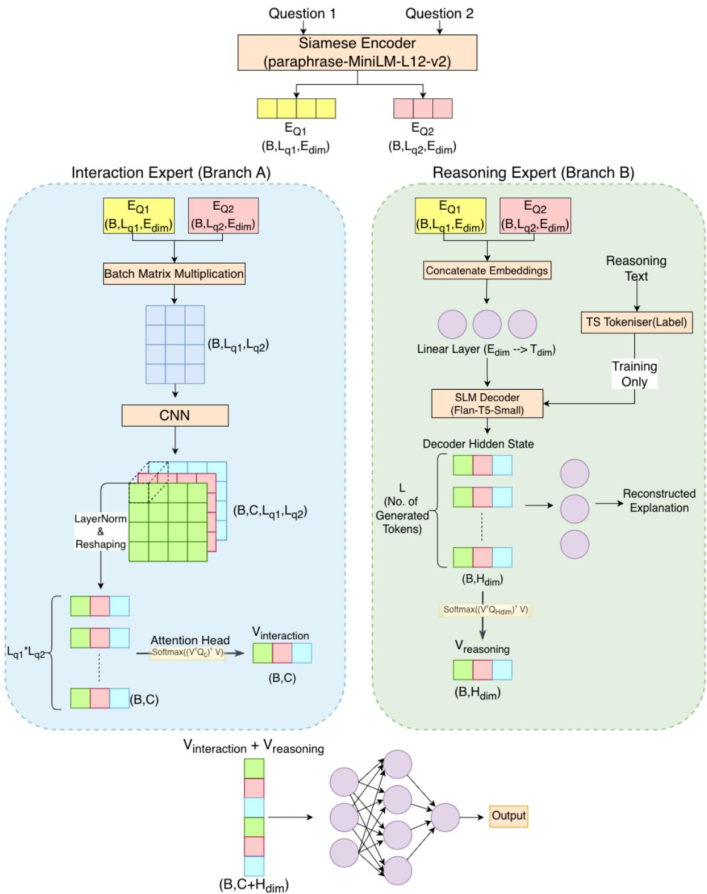
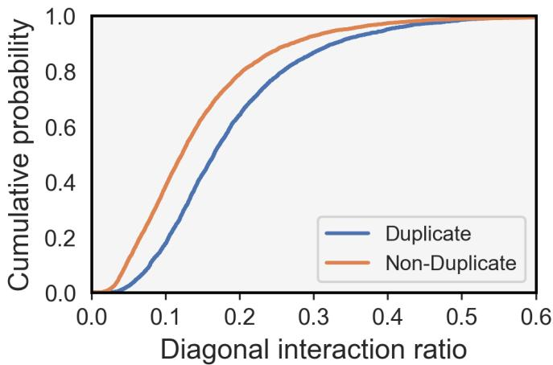
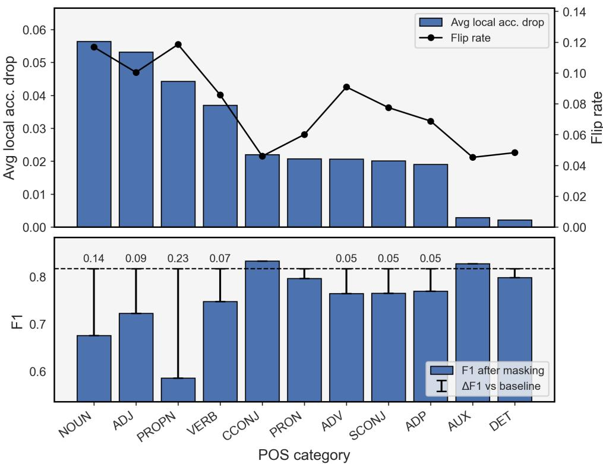
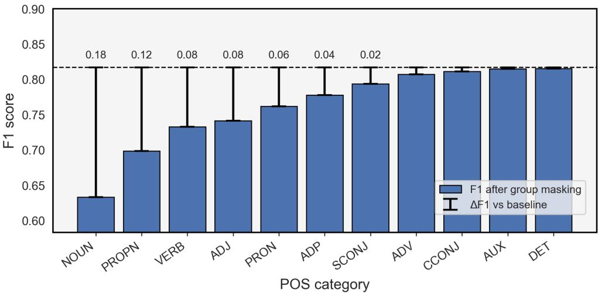

# R-DEIM Net: An Eficient Rationale-Augmented Dual-Expert Interaction Model for Paraphrase Detection

Pushp

Indian Institute of Information Technology (IIIT), Sri City, India

pushp.g23@iiits.in

Vaibhav Prajapati

University of Technology Nuremberg (UTN), Germany

vaibhav.prajapati@utn.de

Himangshu Sarma

Indian Institute of Information Technology (IIIT), Sri City, India

himangshu.sarma@iiits.in

## Abstract

Recent advances in paraphrase detection reveal a fundamental trade-of: large language mod els achieve high accuracy but require high computation, while eficient Siamese-BERT variants ofer practical scalability with reduced transparency in rationale generation. We present R-DEIM Net, a 76M-parameter dual-expert architecture exploring whether moderate-scale models can achieve competitive accuracy on paraphrase detection while enabling humanreadable rationale generation. The architecture combines two specialized components: an Interaction Expert that captures token-level similarity patterns through multi-scale 2D convolutions and attention head allowing variable input length, and a Reasoning Expert that uses a Flan-T5-small decoder to generate rationales as auxiliary supervision. Rather than re-encoding generated text, we extract and pool decoder hidden states as complementary features for classification. On the Quora Question Pairs dataset, R-DEIM Net achieves 90.07% accuracy and 90.16% F1-score via 10-fold cross-validation. This represents competitive performance with strong transformer-based baselines (e.g., MFAE BERT: 90.54% accuracy) and recent large language model based approaches (LLaMA-70B) while using a substantially smaller parameter budget. The model generates rationales alongside predictions, providing potential for auxiliary human-readable descriptions.

## 1 Introduction

Accurately discerning semantic equivalence between text segments for paraphrase detection is a cornerstone of modern Natural Language Understanding (NLU) (Gali et al., 2016; Srivastava & Govilkar, 2017). This capability is critical for applications ranging from intelligent search and conversational AI to content deduplication (Hammer et al., 2023) and plagiarism detection (Kauchak & Barzilay, 2006; Callison-Burch et al., 2006; Iordanskaja et al., 1991; Duboue & Chu-Carroll, 2006; Riezler et al., 2007; Zhou et al., 2025). Following the 2017 Kaggle competition (DataCanary et al., 2017), the Quora Question Pairs (QQP) dataset has become the standard benchmark for this task, requiring models to capture semantic identity across diverse surface-level wordings (Bernardi et al., 2013; Vahtola et al., 2022).

Recent progress in paraphrase detection reveals distinct trade-ofs between competing objectives. High performance is achieved by Large Language Models (LLMs) (Han et al., 2025) and ensemble BERT (Zhang et al., 2020), but these models result in high computational costs limiting real-world deployment. Conversely, eficient Siamese-BERT architectures (Mahmoud & Zrigui, 2022; Cheng & Gangaraju, 2023) achieve practical scalability but provide only binary predictions with limited transparent rationale generation. While attention mechanisms can partially address this gap in mathematical aspect, most eficient paraphrase detection systems still lack explicit, rationales explaining their decisions in human-readable format.

To explore whether moderate-scale models can achieve competitive accuracy while providing synthetic rationale generation, this paper introduces R-DEIM Net (Rationale-Augmented Dual-Expert Interaction Model). R-DEIM Net takes a sentence pair as input and outputs a binary classification alongside generated text rationales. The architecture combines two complementary experts: (1) an Interaction Expert that captures token-level similarity patterns through multi-scale 2D convolutions and attention-based pooling to handle variable-length inputs, and (2) a Reasoning Expert that uses Flan-T5-small decoder to generate rationales as auxiliary training supervision. The Reasoning Expert’s hidden states during rationale generation act as a feature vector complementing the interaction patterns for final classification.

The primary contributions are as follows:

• We propose R-DEIM Net, a dual-expert framework that jointly models token-to-token interactions and generative reasoning signals for paraphrase detection.

• We design an interaction expert that uses 2D convolutions and an attention-based pooling strategy to eficiently capture token alignment patterns from variable length sentence pairs.

• By using decoder hidden states from a generative model as latent reasoning features, we adopt a mechanism that grounds classification decisions in natural language features without re-encoding generated rationales, which avoids unnecessary computational overhead and additional encoding layers.

• We present a thorough empirical analysis to show how interaction and reasoning components contribute to semantic decision-making, including structural alignment, kernel activation behavior, and POS-based perturbation.

## 2 Related Work

Paraphrase detection on the Quora Question Pairs (QQP) dataset has evolved from traditional lexical features to deep sequential architectures and, recently, to massive LLMs. This progression reflects a shift from manual feature engineering toward automated semantic representation, which requires trade-ofs in eficiency and transparent rationale generation.

Traditional and Lexical Approaches: Early methodologies relied on manual feature engineering and basic vectorization, with accuracies typically ranging from 63% to 85%. Sharma et al. (2019) demonstrated that a simple Continuous Bag of Words (CBOW) model achieved 83.4% accuracy, while Ansari & Sharma (2020) reached 82.44% using 28 hand-crafted features with an XGBoost classifier. Similar lexical strategies were explored in ABCNN (Yin et al., 2016), PWIM (He & Lin, 2016), and the “cascadedCN” model (Korade et al., 2024). Techniques like Lexical Decomposition and Composition (LDC) (Wang et al., 2016) and Syntree (Chen et al., 2017) attempted to capture alignment by breaking sentences into primitive components. While computationally light, these methods are limited by the inability to capture deep semantic context or complex word-order dependencies.

Sequential and Convolutional Architectures: The shift toward neural sequence modeling introduced RNN and CNN-based frameworks, yielding accuracies between 79% and 89%. Convolutional approaches, such as Siamese-CNN and MP-CNN (Wang et al., 2017), utilized spatial filters to identify local n-gram similarities. Concurrently, recurrent models like Siamese-LSTM, MP-LSTM (Wang et al., 2017), and ESIM (Chen et al., 2017) focused on long-range dependencies. Universal encoders like InferSent (Conneau et al., 2017) and GenSen (Subramanian et al., 2018) sought general representations, while SSE (Nie & Bansal, 2017), CAS-LSTM, and Bi-CAS-LSTM (Choi et al., 2019) introduced stacked architectures to refine context. Performance boundaries were further pushed using Bi-LSTM and attention framework by Faseeh et al. (2026). This model leveraged SMOTE (Chawla et al., 2002) for augmentation, despite prevailing concerns that oversampling in the feature space may fail to preserve semantic validity in textual representations (Blagus & Lusa, 2013; Taskiran et al., 2025). Concurrent systems like pt-DecAtt (Tomar et al., 2017) and LSTM+ElBiS (Choi et al., 2018) demonstrated similar gains in predictive power. However, these models often struggle with variable-length inputs and lack transparency in decision-making logic.

Table 1: Encoder benchmarking on $\mathrm { Q Q P . }$
<table><tr><td>Model</td><td>Size</td><td>Train Acc.</td><td>Train  $F _ { 1 }$ </td><td>Test Acc.</td><td>Test  $F _ { 1 }$ </td></tr><tr><td>bert-base-uncased</td><td></td><td></td><td></td><td></td><td></td></tr><tr><td>(Devlin et al., 2018)</td><td>110M</td><td> $9 0 . 9 5 \pm 1 0 . 0 4$ </td><td> $8 9 . 5 4 \pm 1 4 . 4 9$ </td><td> $8 5 . 9 9 \pm 8 . 1 1$ </td><td> $8 4 . 6 3 \pm 1 2 . 6 4$ </td></tr><tr><td>paraphrase-albert-base-v2</td><td>12M</td><td> $8 8 . 2 9 \pm 6 . 2 6$ </td><td> $8 7 . 8 7 \pm 6 . 7 4$ </td><td> $8 5 . 0 0 \pm 3 . 9 9$ </td><td> $8 4 . 4 9 \pm 4 . 4 3$ </td></tr><tr><td> $\mathrm { p a r a p h r a s e { \mathrm { - M i n i L M { \mathrm { - } } L 3 - v 2 } } }$ </td><td>17M</td><td> $9 0 . 5 5 \pm 1 . 5 3$ </td><td> $9 0 . 6 1 \pm 1 . 5 3 $ </td><td> $8 6 . 5 2 \pm 0 . 5 7$ </td><td> $8 6 . 6 2 \pm 0 . 5 8$ </td></tr><tr><td> $\mathrm { p a r a p h r a s e { \mathrm { - M i n i L M { \mathrm { - } } L 6 { \mathrm { - } } v 2 } } }$ </td><td>22M</td><td> $9 1 . 1 6 \pm 1 . 6 9$ </td><td> $9 1 . 2 5 \pm 1 . 6 7$ </td><td> $8 7 . 0 5 \pm 0 . 7 1$ </td><td> $8 7 . 2 0 \pm 0 . 6 6$ </td></tr><tr><td> $\mathbf { p a r a p h r a s e - M i n i L M - L 1 2 - v 2 }$ </td><td>33M</td><td> ${ \bf 9 2 . 9 7 \pm 1 . 3 0 }$ </td><td> ${ \bf 9 3 . 0 5 \pm 1 . 2 7 }$ </td><td> ${ \bf 8 8 . 4 2 \pm 0 . 3 7 }$ </td><td> ${ \bf 8 8 . 5 6 \pm 0 . 3 5 }$ </td></tr><tr><td>paraphrase-mpnet-base-v2</td><td>110M</td><td> $8 8 . 1 8 \pm 1 3 . 3 5$ </td><td> $8 5 . 3 6 \pm 1 9 . 3 6$ </td><td> $8 4 . 0 8 \pm 1 1 . 0 9$ </td><td> $8 1 . 3 1 \pm 1 7 . 1 5$ </td></tr><tr><td> $\mathrm { p a r a p h r a s e { - } T i n y B E R T { - } L 6 { - } v 2 }$ </td><td>67M</td><td> $9 2 . 9 5 \pm 1 . 6 7$ </td><td> $9 3 . 0 1 \pm 1 . 6 5$ </td><td> $8 8 . 5 9 \pm 0 . 6 4$ </td><td> $8 8 . 7 0 \pm 0 . 6 1$ </td></tr></table>

High-Interaction and Transformer-based Systems: To capture complex semantic interactions, models operating over dense interaction spaces were developed, with accuracies now reaching the 88% to 90% range. DIIN (Gong et al., 2017) and Multiway Attention Networks (MwAN) (Tan et al., 2018) utilize sophisticated attention to align sentence pairs. The integration of ensemble BERT led to MFAE (Zhang et al., 2020; Brahma, 2018) and CDTFME-Aver (Xie et al., 2019), which leverage BERT and ELMo embeddings. At the extreme scale, the most recent model, LLaMA-70B, is applied by Han et al. (2025).

Technical Gaps: A critical analysis of existing literature reveals three primary deficiencies. First, a significant portion of prior work focuses almost exclusively on raw accuracy, frequently failing to report $F _ { 1 ^ { - } }$ score, which leaves performance on imbalanced data unverified. Second, nearly all existing architectures rely on a fixed max\_tokens limit. This forces a compromise between truncating semantically rich sentences or introducing excessive padding, both of which create sparse, ineficient matrices and noisy attention weights. Finally, despite their predictive power, these models provide binary labels.

## 3 Method

Question matching can be viewed as a classification task that seeks a label y ∈ {Duplicate, Non-Duplicate} for a given question pair. Figure 1 illustrates our approach for this task to classify and provide rationale. In the following, we describe the individual component of this approach.

## 3.1 Branch A: Interaction Expert

This branch is designed to move beyond simple vector similarity and analyze token-to-token semantic relationships between the two questions. Both input questions are first processed by the shared encoder. To select the optimal encoder, several pre-trained encoders were evaluated (Table 1), and paraphrase-MiniLM-L12-v2 (Reimers & Gurevych, 2019; Korga et al., 2025) was selected. While models like TinyBERT achieved marginally higher raw metrics, MiniLM-L12 ofers a superior trade-of, delivering competitive accuracy (88.42%) and F1-scores (88.56%) with a significantly lesser parameter (≈ 33M).

Next, a 2D interaction matrix M is computed to capture the token-by-token similarity (Bahdanau et al., 2014; Luong et al., 2015) between every token in $Q _ { 1 }$ and $Q _ { 2 } ;$ :

$$
M = E _ { Q 1 } \cdot E _ { Q 2 } ^ { T } \quad \mathrm { w h e r e \ } M \in \mathbb { R } ^ { B \times L _ { q 1 } \times L _ { q 2 } }\tag{1}
$$

Several parallel 2D convolution layers with varying kernel sizes are applied on M to discover local interaction patterns. $\mathrm { ~ A ~ } n \times n$ kernel can identify patterns of similarity across n-token phrases (semantic n-grams) (Zhu et al., 2018), capturing features that a simple 1-to-1 dot product would miss. The resultant feature map has shape $( B , C , L _ { q 1 } , L _ { q 2 } )$

To create a fixed-size vector out of variable input, the feature map is flattened into a sequence X and processed with a custom Attention Head. A trainable query vector $v _ { q } \in \mathbb { R } ^ { C }$ scores the importance of each

  
Figure 1: R-DEIM Net Architecture. A dual-expert multi-task framework. Branch A (Interaction) captures token-to-token patterns via multi-scale 2D-CNNs, while Branch B (Reasoning) distills latent decoder trajectories into a “reasoning vector” to ground classification in natural language rationales.

feature $X _ { i }$ by computing alignment scores s:

$$
s _ { i } = ( X _ { i } \cdot v _ { q } ) + b _ { i m p }\tag{2}
$$

Here, $b _ { i m p }$ is a small, scalar bias (the importance\_factor) providing a baseline relevance score. These scores are normalized into attention weights using a Softmax function. Finally, the fixed-size output vector $v _ { i n t e r a c t i o n }$ is computed as the weighted sum of all feature vectors:

$$
v _ { i n t e r a c t i o n } = \left( \sum _ { i = 1 } ^ { L _ { f l a t } } \frac { \exp ( s _ { i } ) } { \sum _ { j = 1 } ^ { L _ { f l a t } } \exp ( s _ { j } ) } \right) \cdot X _ { i }\tag{3}
$$

This attention-pooling mechanism efectively distills variable-length interaction patterns into a single, fixedsize vector for the classifier.

## 3.2 Branch B: Diferentiable Reasoning Expert

This branch serves a dual purpose: it generates an explicit rationale for the model’s decision and converts the latent logic itself into a feature vector. Flan-T5-small decoder (Rafel et al., 2020) is employed, where the token embeddings $E _ { Q 1 }$ and $E _ { Q 2 }$ from the shared encoder are provided as ‘encoder hidden states‘, giving the decoder full context. To bridge the dimension gap between the siamese encoder (384) and the T5 decoder (512), a simple linear projection layer is used.

During training, while generating a rationale the decoder is tasked with auto-regressive decoding with teacher forcing (Vaswani et al., 2017). Rather than re-encoding the generated surface text which would require passing the text through another encoder, adding unnecessary computational overhead and training complexity the sequence of decoder hidden states, $H _ { d i m }$ , is directly extracted as each token is generated.This results in a variable-length tensor $\left( \boldsymbol { L } \times \boldsymbol { H _ { d i m } } \right)$ representing the reasoning. Similar to Branch A, a separate ‘Attention Head’ is applied to pool this sequence into a single, fixed-size reasoning vector, v<sub>reasoning</sub>.

## 3.3 Fusion and Multi-Task Training Objective

The final classification combines insights from both experts. The two feature vectors are concatenated to form a final representation $( v _ { f i n a l } )$ containing both interaction patterns and generative logic which is passed through an MLP.

The model is optimized on a weighted multi-task loss combining classification $\left( L _ { c l a s s i f y } \right)$ and generation $( L _ { g e n e r a t e } ) . \quad L _ { g e n e r a t e }$ is the standard CrossEntropyLoss from the T5 decoder. For classification, false positives are costly, as in duplicate detection incorrectly merging distinct questions is more detrimental to user experience than missing a duplicate. A per-sample weight $W _ { i }$ is defined based on the false positive penalty $w _ { f p } \mathrm { : }$

$$
W _ { i } = \left\{ { \begin{array} { l l } { w _ { f p } } & { { \mathrm { i f ~ } } y _ { i } = 0 } \\ { 1 } & { { \mathrm { i f ~ } } y _ { i } = 1 } \end{array} } \right.\tag{4}
$$

The classification loss is the weighted mean of the per-sample BCE losses:

$$
L _ { c l a s s i f y } = \frac { 1 } { N } \sum _ { i = 1 } ^ { N } W _ { i } \cdot \Big ( - \left[ y _ { i } \log ( \sigma ( \hat { y } _ { l o g i t s \_ i } ) ) + ( 1 - y _ { i } ) \log ( 1 - \sigma ( \hat { y } _ { l o g i t s \_ i } ) ) \right] \Big )\tag{5}
$$

The final multi-task loss trained by the optimizer is:

$$
L _ { t o t a l } = \alpha \cdot L _ { c l a s s i f y } + ( 1 - \alpha ) \cdot L _ { g e n e r a t e }\tag{6}
$$

## 4 Experiments

This section presents the empirical evaluation of R-DEIM Net, including the experimental setup, comparative performance on the Quora Question Pairs (QQP) benchmark, and a multi-level analysis of model behavior. All experiments were conducted on a system equipped with an NVIDIA Quadro RTX 6000 GPU, 64 GB RAM, and an Intel Xeon CPU.

Algorithm 1 R-DEIM Net Multi-Task Training with Decoupled Weight Decay   
1: Input: Training set $\{ ( Q _ { 1 , i } , Q _ { 2 , i } , y _ { i } , R _ { i } ) \} _ { i = 1 } ^ { N }$   
2: Parameters: Encoder $\theta _ { e n c } ,$ Experts $\theta _ { A } , \theta _ { B } .$ , Classifier $\theta _ { c }$   
3: Hyper-parameters: Multi-task weight α, Learning rates η, weight decay λ   
4: repeat   
5: Sample mini-batch of size m   
6: $E _ { Q 1 } , E _ { Q 2 }  \mathrm { M i n i L M - L 1 2 } ( Q _ { 1 } , Q _ { 2 } ; \theta _ { e n c } )$   
7: $v _ { i } \gets \mathrm { A t t n } ( \mathrm { C N N } ( E _ { Q 1 } \cdot E _ { Q 2 } ^ { \top } ; \theta _ { A } ) )$   
8: $H _ { d e c } , \mathcal { L } _ { g e n } \gets \mathrm { T } 5 ( R | E _ { Q 1 } , \dot { E } _ { Q 2 } ; \theta _ { B } )$   
9: $v _ { r } \gets \mathrm { A t t n } ( H _ { d e c } )$   
10: $\hat { y } \gets \mathrm { M L P } ( [ v _ { i } ; v _ { r } ] ; \theta _ { c } )$   
11: $\mathcal { L } _ { t o t a l } = \alpha \mathcal { L } _ { B C E } ( \hat { y } , y ) + ( 1 - \alpha ) \mathcal { L } _ { g e n }$   
12: $g _ { t } \gets \nabla _ { \theta } \mathcal { L } _ { t o t a l }$   
13: $m _ { t } , v _ { t } \gets \mathrm { U p d a t e }$ moments $( g _ { t } )$   
14: $\begin{array} { r } { \theta _ { t + 1 }  \theta _ { t } - \eta ( \frac { m _ { t } } { \sqrt { v _ { t } } + \epsilon } + \lambda \theta _ { t } ) } \end{array}$   
15: until θ converges

## 4.1 Experimental Setup

Dataset Curation and Preprocessing Evaluation was performed on the QQP dataset (DataCanary et al., 2017), consisting of 404,290 pairs. To train the Reasoning Expert, the dataset was augmented with synthetic rationales generated by an LLM using a few-shot Chain of Thought (CoT) prompt (Wei et al., 2022) to ensure high-quality reasoning (Appendix A and D). Following preprocessing, the final dataset comprised 400,520 annotated pairs.

Training Details and Parameters R-DEIM Net employs a paraphrase-MiniLM-L12-v2 encoder (384- dim) and a Flan-T5-small decoder (512-dim), connected via a linear projection layer. The base Flan-T5-small model contains 77M parameters, split between a 35.3M parameter encoder and a 41.6M parameter decoder. Although these components are typically integrated, our architecture utilizes only the decoder for rationale generation, leaving the T5 encoder unused and excluded from the training process. Lightweight task-specific heads introduce fewer than 1M additional parameters. Specifically, the total parameter count includes the T5 decoder (41.6M), the MiniLM encoder (33M), and custom projection/attention heads (≈ 1M), totaling roughly 76M parameters.

Training was performed (Algorithm 1) for a fixed number of epochs using AdamW optimizer (Loshchilov & Hutter, 2019) with diferent learning rates Ilharco et al. (2023) for pre-trained and task-specific components. All architectural choices are summarized in Appendix C. The classification objective uses a weighted binary cross-entropy loss that explicitly penalizes false positives by assigning a higher weight to the majority nonduplicate class. This design encourages conservative duplicate predictions, ensuring that a sentence pair is labeled as Duplicate only when strong semantic evidence is present. Reproducibility is ensured through the use of standardized, publicly available pre-trained models and the explicit reporting of all training hyperparameters in Appendix C.

## 4.2 Experimental Results

Table 2 presents the 10-fold cross-validation results. R-DEIM Net achieved an average F -Score of 90.16% and accuracy of 90.07%. This performance improves on the eficient baselines listed (e.g., Bi-LSTM (Faseeh et al., 2026)) and is within reported ranges for large LLMs in prior work (Han et al., 2025) while being ≈ 900x smaller. To ensure the integrity of the evaluation, primary sources of data leakage were investigated by performing the 10-fold cross-validation split prior to any preprocessing. This ensured that lexical statistics and rationale patterns from validation sets were never visible during training.

Crucially, the full R-DEIM Net outperformed the strong “Interaction-Only” baseline (Branch A only), which achieved 88.63% $F _ { 1 }$ and 88.51% accuracy. The addition of the Reasoning Expert (Branch B) provided a substantial +1.53% boost in $F _ { 1 }$ -Score. This confirmed that the generative “reasoning vector” captures semantic nuances that the interaction matrix alone misses, efectively replacing the need for manual feature engineering.

Table 2: Comparative Performance. R-DEIM Net obtains strong accuracy and $F _ { 1 }$ on $\mathrm { Q Q P }$ using a compact architecture (76M params).
<table><tr><td>Model</td><td>Acc.</td><td>F1-Score</td></tr><tr><td>ABCNN (Yin et al., 2016)</td><td>63.59%</td><td></td></tr><tr><td>Syn-tree (Chen et al., 2017)</td><td>75.50%</td><td></td></tr><tr><td>Siamese-ČNN (Wang et al., 2017)</td><td>79.60%</td><td></td></tr><tr><td>MP-CNN (Wang et al., 2017)</td><td>81.38%</td><td></td></tr><tr><td>XGBoost (Ansari &amp; Sharma, 2020)</td><td>82.44%</td><td>80.44%</td></tr><tr><td>Siamese-LSTM (Wang et al., 2017)</td><td>82.58%</td><td></td></tr><tr><td>MP-LSTM (Wang et al., 2017)</td><td>83.21%</td><td></td></tr><tr><td>Bi-LSTM (Faseeh et al., 2026)</td><td>83.30%</td><td>87.00%</td></tr><tr><td>CBOW (Sharma et al., 2019)</td><td>83.40%</td><td>77.80%</td></tr><tr><td>PWIM (He &amp; Lin, 2016)</td><td>83.40%</td><td></td></tr><tr><td> $E S I M _ { S y n + t r e e }$  (Chen et al., 2017)</td><td>85.40%</td><td></td></tr><tr><td>LDC (Wang et al., 2016; 2017)</td><td>85.55%</td><td></td></tr><tr><td>ESIM (Chen et al., 2017)</td><td>85.00%</td><td></td></tr><tr><td>InferSent (Conneau et al., 2017)</td><td>86.60%</td><td></td></tr><tr><td>GenSen (Subramanian et al., 2018)</td><td>87.01%</td><td></td></tr><tr><td>LSTM+ElBiS (Choi et al., 2018)</td><td>87.30%</td><td></td></tr><tr><td>pt-DecAttword (Tomar et al., 2017)</td><td>87.54%</td><td></td></tr><tr><td>SSE (Nie &amp; Bansal, 2017)</td><td>87.80%</td><td></td></tr><tr><td>CDTFME-Aver (Xie et al., 2019)</td><td>88.00%</td><td></td></tr><tr><td> $\mathrm { p t - } D e c A t t _ { c h a r }$  (Tomar et al., 2017)</td><td>88.40%</td><td></td></tr><tr><td>CAS-LSTM (Choi et al., 2019)</td><td>88.40%</td><td></td></tr><tr><td>Bi-CAS-LSTM (Choi et al., 2019)</td><td>88.60%</td><td></td></tr><tr><td>REGMAPR (Brahma, 2018)</td><td>88.64%</td><td></td></tr><tr><td>BiMPM (Wang et al., 2017)</td><td>88.17%</td><td></td></tr><tr><td>DIIN (Gong et al., 2017)</td><td>89.06%</td><td></td></tr><tr><td>MwAN (Tan et al., 2018)</td><td>89.12%</td><td></td></tr><tr><td>LLaMA-7B (Han et al., 2025)</td><td>89.10%</td><td>71.90%</td></tr><tr><td>MFAE (ELMo) (Zhang et al., 2020)</td><td>89.61%</td><td></td></tr><tr><td>MFAE (BERT) (Zhang et al., 2020)</td><td>89.79%</td><td></td></tr><tr><td>DIIN (Ensemble) (Gong et al., 2017)</td><td>89.84%</td><td></td></tr><tr><td>LLaMA-70B (Han et al., 2025)</td><td>90.30%</td><td>74.40%</td></tr><tr><td>MFAE (BERT Ens.) (Zhang et al., 2020)</td><td>90.54%</td><td></td></tr><tr><td>R-DEIM Net (Interaction-only)</td><td>88.42%</td><td>88.56%</td></tr><tr><td>R-DEIM Net (Proposed)</td><td>90.07%</td><td>90.16%</td></tr></table>

## 4.3 Transfer Learning Analysis

To evaluate the generalization capabilities of R-DEIM Net, a transfer learning experiment was conducted on seven diverse datasets (Appendix B) spanning community QA, paraphrase identification, and scientific entailment. First, the zero-shot performance of the QQP-trained model directly on these unseen datasets was evaluated, followed by task-specific fine-tuning.

Table 3 summarizes these results. In the zero-shot setting, R-DEIM Net demonstrated strong generalization on datasets semantically similar to QQP, such as SprintFAQ (98.15% $F _ { 1 } )$ and SoDD (63.01% $F _ { 1 } )$

Table 3: Transfer learning results of R-DEIM Net.
<table><tr><td rowspan="2">Dataset</td><td colspan="2">Zero-shot</td><td colspan="4">Fine-tuning</td></tr><tr><td>Acc.</td><td> $F _ { 1 }$ </td><td>Epochs</td><td></td><td>Acc.</td><td> $F _ { 1 }$ </td></tr><tr><td>SoDD (Pašek et al., 2022)</td><td>73.50</td><td>63.01</td><td>3</td><td></td><td>88.60</td><td>88.40</td></tr><tr><td>PIT (Xu et al., 2015)</td><td>68.97</td><td>70.17</td><td></td><td>3</td><td>81.26</td><td>81.04</td></tr><tr><td>PAWS (Zhang et al., 2019)</td><td>53.45</td><td>53.54</td><td></td><td>2</td><td>68.80</td><td>67.97</td></tr><tr><td>MRPC (Dolan &amp; Brockett, 2005)</td><td>50.92</td><td>50.29</td><td></td><td>3</td><td>69.51</td><td>65.85</td></tr><tr><td>SciTail (Khot et al., 2018)</td><td>66.60</td><td>60.60</td><td></td><td>2</td><td>81.47</td><td>81.59</td></tr><tr><td>SprintFAQ (Shah et al., 2018) (Enevoldsen et al., 2025; Muennighoff et al., 2022)</td><td>97.90</td><td>98.15</td><td>2</td><td></td><td>99.38</td><td>99.41</td></tr><tr><td>CQADupStack (Hoogeveen et al., 2015)</td><td>52.34</td><td>39.24</td><td>4</td><td></td><td>80.34</td><td>80.32</td></tr></table>

This indicated that the interaction and reasoning patterns learned from general-domain questions transfer efectively to specific domains without weight updates.

However, we acknowledge a performance gap on adversarial datasets like PAWS and MRPC in the zeroshot setting. These datasets are specifically designed with high lexical overlap but distinct semantics. We hypothesize that this performance degradation may stem from the Interaction Expert’s reliance on localized spatial alignments (e.g., diagonal interaction), which might be bypassed by such adversarial word-scrambling. While further empirical analysis is required to fully confirm this sensitivity to linguistic perturbation, it highlights a potential limitation of eficient spatial models compared to massive cross-attention LLMs.

Fine-tuning further unlocked the potential of the model. Across all datasets, significant performance gains with minimal training (2-4 epochs) were observed. For instance, performance on the challenging PAWS dataset, known for high lexical overlap but distinct semantics, improved from 53.54% to 67.97% $F _ { 1 }$ . Similarly, CQADupStack saw a jump from 39.24% to 80.32% $F _ { 1 }$ . These results confirm that while R-DEIM Net learns a robust general representation from QQP and remains highly adaptable to specialized nuances.

## 4.4 Architectural Analysis

To validate architectural choices, a multi-level analysis was conducted using 10,000 question pairs.

Structural Interaction It was hypothesized that duplicate sentence pairs show stronger semantic interaction than non-duplicate sentence pairs, which is reflected by a higher concentration of mass along the leading diagonal of the interaction matrix. Let M be the interaction matrix, $M \in \mathbb { R } ^ { n \times m }$ , where $M _ { i j }$ denotes the interaction strength between the i-th token of the first sentence and the j-th token of the second. Structural interaction was quantified using Eq. equation 7.

$$
r _ { \mathrm { d i a g } } = \frac { \sum _ { k = 1 } ^ { \operatorname* { m i n } ( n , m ) } M _ { k k } } { \sum _ { i = 1 } ^ { n } \sum _ { j = 1 } ^ { m } M _ { i j } }\tag{7}
$$

The $r _ { \mathrm { d i a g } }$ for all sentence pairs was computed and compared with empirical cumulative distribution functions (ECDFs) between duplicate and non-duplicate examples, as shown in Figure 2. Duplicate sentence pairs exhibited a rightward shift in the ECDF, indicating higher diagonal interaction ratios. To quantify this diference, a two-sample Kolmogorov-Smirnov (KS) test (Smirnov, 1939) was applied without assuming a specific parametric form. The test revealed a statistically significant distributional diference $\mathrm { ( K S = 0 . 2 2 4 }$ $p < 1 0 ^ { - 4 } )$ .

Moreover, to assess whether this interaction provides a useful signal, Spearman’s rank correlation was calculated between $r _ { \mathrm { d i a g } }$ and the predicted duplicate probability. A weak positive correlation $( \rho = 0 . 3 3 5 )$ was observed, indicating that higher interaction is generally associated with higher predicted probability. However, the modest strength of this correlation suggests that interaction alone is insuficient for reliable semantic matching. This observation supports the inclusion of complementary architectural components, such as convolutional and reasoning branches, to handle semantically equivalent but non-aligned sentence pairs.

  
Figure 2: Structural Interaction Distribution. ECDFs of diagonal interaction ratios. The significant rightward shift for duplicates validates that semantic identity is strongly correlated with positional interaction mass.

Table 4: Relative activation of larger CNN kernels normalized by the $3 \times 3$ kernel.
<table><tr><td>Interaction Regime</td><td>k5/k3</td><td>k7/k3</td></tr><tr><td>Low</td><td>1.14</td><td>1.15</td></tr><tr><td>Mid</td><td>1.11</td><td>1.09</td></tr><tr><td>High</td><td>1.09</td><td>1.04</td></tr></table>

Multi-Scale Interaction Sensitivity Activation magnitudes of the CNN kernels $( 3 \times 3 , 5 \times 5 , 7 \times 7 )$ were examined in Branch A to understand receptive field usage.

As shown in Table 4, the model exhibited a monotonic trend: when diagonal interaction was weak (Low Regime), larger kernels $( 5 \times 5 , 7 \times 7 )$ exhibited higher relative activation compared to the base $3 \times 3$ kernel. This indicated that the interaction expert adaptively leverages broader spatial contexts to find semantic matches when they are not diagonally aligned.

Perturbation and Robustness To identify linguistic components driving decisions, systematic masking was performed at both token and group levels for 1,000 question pairs.

Token-Level Sensitivity: Impact of masking individual tokens is shown in Figure 3. Content-bearing parts of speech, specifically Noun, Verb, and Adjective, induced the highest drops in local accuracy and the highest “flip rates.” In contrast, function words like Determiners and Auxiliaries showed minimal impact.

Global Robustness: Figure 4 confirms this trend at the global level. Masking categories of content words led to significant degradation in $F _ { \mathrm { 1 } } { \mathrm { - s c o r e } }$ , whereas removing function words caused only marginal performance loss. This alignment between local sensitivity and global degradation provides evidence that R-DEIM Net’s predictions are grounded in deep semantic content rather than superficial syntactic artifacts.



Figure 3: Token-level perturbation analysis. Content words (Nouns, Verbs) exert the strongest influence on model decisions.  
  
Figure 4: Group-level POS perturbation. The model is highly robust to the removal of syntactic function words but sensitive to the loss of semantic content.

## 5 Conclusion

R-DEIM Net, a 76M parameter architecture, is presented to resolve the trade-of between massive “black box” models and eficient but less accurate alternatives. While recent work achieved high accuracy but poor $F _ { 1 }$ , R-DEIM Net achieved the best of both: 90.07% accuracy and 90.16% $F _ { 1 }$ -Score. Ablation results show that incorporating generative reasoning features (Appendix E) yields a consistent improvement over a strong interaction-only baseline, indicating that latent decoder dynamics capture semantic distinctions beyond token interaction alone. We further validated architectural choices through a multi-level architectural analysis, including structural interaction, CNN kernel activation patterns, and systematic token and POSlevel perturbations. These analysis demonstrate that model decisions are driven by semantic content rather than superficial lexical overlap, providing empirical support for the proposed design.

Future Work: We will focus on three key areas. First, applying the R-DEIM architecture to other sentence-pair tasks like Natural Language Inference (NLI). Second, investigating transfer learning by testing zero-shot performance on other paraphrase datasets and exploring parameter-eficient fine-tuning. Finally, further miniaturizing the model by exploring distilled decoders to optimize the eficiency-to-performance ratio.

## Limitations

A primary limitation is the use of synthetically generated rationales for the QQP dataset via a large language model. While necessary due to the infeasibility of manually annotating > 400k pairs, this is not ideal compared to human-written ground truth (although our validation study in Appendix D indicates strong alignment with human reasoning). However, the strong performance suggests the reasoning vector remains a robust feature, opening avenues for research into whether smaller, human-annotated datasets could yield better results.

Furthermore, while the reasoning vector functionally contributes to classification accuracy, we do not claim strict faithfulness. The generated surface text mimics the structure of LLM-generated rationales (via our training data) but does not definitively prove the model’s internal cognitive logic. The text serves as an auxiliary descriptive rationale rather than a guaranteed causal post-hoc explanation. Stronger validation of faithfulness remains an important direction for future work.

In alignment with established SOTA benchmarks on the QQP dataset (Han et al., 2025; Wang et al., 2017), the evaluation focuses on Pair-Level Generalization. While the QQP dataset contains recurring questions across unique pairs, this experimental design reflects real-world retrieval-based settings where a model must discern semantic identity within unique pair combinations. This approach ensures a direct and fair comparison with existing literature while maintaining high-precision requirements essential for practical duplicate detection.

In this study, computational eficiency and accessibility were prioritized. Experiments were conducted using base-models. While larger models (e.g., RoBERTa-large) might yield incremental performance gains, they require significantly higher VRAM and training time, which were outside the scope of the current hardware infrastructure.

## References

Navedanjum Ansari and Rajesh Sharma. Identifying semantically duplicate questions using data science approach: A quora case study. arXiv preprint arXiv:2004.11694, 2020.

Dzmitry Bahdanau, Kyunghyun Cho, and Yoshua Bengio. Neural machine translation by jointly learning to align and translate. arXiv preprint arXiv:1409.0473, 2014.

Rafaella Bernardi, Yao-Zhong Zhang, Marco Baroni, et al. Sentence paraphrase detection: When determiners and word order make the diference. In Proceedings of the IWCS 2013 Workshop Towards a Formal Distributional Semantics, pp. 21–29, 2013.

Rok Blagus and Lara Lusa. Smote for high-dimensional class-imbalanced data. BMC Bioinformatics, 14 (106), 2013. doi: 10.1186/1471-2105-14-106. URL https://doi.org/10.1186/1471-2105-14-106.

Siddhartha Brahma. Regmapr - text matching made easy. Computing Research Repository, 2018.

Chris Callison-Burch, Philipp Koehn, and Miles Osborne. Improved statistical machine translation using paraphrases. In Proceedings ofthe Human Language Technology Conference ofthe North American Chapter of the Association for Computational Linguistics (HLT-NAACL), pp. 17–24, 2006.

Nitesh V Chawla, Kevin W Bowyer, Lawrence O Hall, and W Philip Kegelmeyer. Smote: synthetic minority over-sampling technique. Journal of artificial intelligence research, 16:321–357, 2002.

Qian Chen, Xiaodan Zhu, Zhen-Hua Ling, Si Wei, Hui Jiang, and Diana Inkpen. Enhanced lstm for natura language inference. In Proceedings of the 55th Annual Meeting of the Association for Computational Linguistics (Volume 1: Long Papers), pp. 1657–1668, 2017.

Andrew Cheng and Swathi Gangaraju. Fine-tuning bert for sentiment analysis, paraphrase detection and semantic text similarity. Stanford University, CS224N Final Project Report, 2023. Course project report, not peer-reviewed.

Jihun Choi, Taeuk Kim, and Sang-goo Lee. Element-wise bilinear interaction for sentence matching. In Proceedings of the seventh joint conference on lexical and computational semantics, pp. 107–112, 2018.

Jihun Choi, Taeuk Kim, and Sang-goo Lee. Cell-aware stacked lstms for modeling sentences. In Asian conference on machine learning, pp. 1172–1187. PMLR, 2019.

Alexis Conneau, Douwe Kiela, Holger Schwenk, Loïc Barrault, and Antoine Bordes. Supervised learning of universal sentence representations from natural language inference data. arXiv preprint arXiv:1705.02364, 2017.

DataCanary, hilfialkaf, Lili Jiang, Meg Risdal, Nikhil Dandekar, and tomtung. Quora question pairs. https://kaggle.com/competitions/quora-question-pairs, 2017. Kaggle.

Jacob Devlin, Ming-Wei Chang, Kenton Lee, and Kristina Toutanova. BERT: pre-training of deep bidirectional transformers for language understanding. CoRR, abs/1810.04805, 2018. URL http://arxiv.org/ abs/1810.04805.

William B. Dolan and Chris Brockett. Automatically constructing a corpus of sentential paraphrases. In Proceedings of the Third International Workshop on Paraphrasing (IWP2005), Jeju Island, Korea, 2005. Asia Federation of Natural Language Processing. URL https://aclanthology.org/I05-5002.

Pablo Ariel Duboue and Jennifer Chu-Carroll. Answering the question you wish they had asked: The impact of paraphrasing for question answering. In Proceedings of the Human Language Technology Conference of the North American Chapter of the Association for Computational Linguistics (HLT-NAACL), pp. 33–36, 2006.

Kenneth Enevoldsen, Isaac Chung, Imene Kerboua, Márton Kardos, Ashwin Mathur, David Stap, et al. MMTEB: Massive multilingual text embedding benchmark. arXiv preprint arXiv:2502.13595, 2025. doi: 10.48550/arXiv.2502.13595. URL https://arxiv.org/abs/2502.13595.

Muhammad Faseeh, Tahira Amin, Naeem Iqbal, Hamad Shahid Hussain, Salman Ahmad, and Muhammad Afzaal. A robust approach to text similarity detection with lstm networks based on embedding and attention synergy. Expert Systems with Applications, 296:128904, 2026. ISSN 0957-4174. doi: https: //doi.org/10.1016/j.eswa.2025.128904. URL https://www.sciencedirect.com/science/article/pii/ S0957417425025217.

Najlah Gali, Radu Mariescu-Istodor, and Pasi Fränti. Similarity measures for title matching. In 2016 23rd International Conference on Pattern Recognition (ICPR), pp. 1548–1553. IEEE, 2016.

Yichen Gong, Heng Luo, and Jian Zhang. Natural language inference over interaction space. arXiv preprint arXiv:1709.04348, 2017.

Barbara Hammer et al. Evidence-based literature review: De-duplication a cornerstone for quality. World Journal of Methodology, 13(5):390–398, December 2023. doi: 10.5662/wjm.v13.i5.390.

Sifei Han et al. Enhancing semantical text understanding with fine-tuned large language models: A case study on quora question pair duplicate identification. PLOS ONE, 20(1):e0317042, 2025. doi: 10.1371/ journal.pone.0317042.

Hua He and Jimmy Lin. Pairwise word interaction modeling with deep neural networks for semantic similarity measurement. In Proceedings of the 2016 conference of the north American chapter of the Association for Computational Linguistics: human language technologies, pp. 937–948, 2016.

Doris Hoogeveen, Karin M. Verspoor, and Timothy Baldwin. CQADupStack: A benchmark data set for Community Question-Answering research. In Proceedings of the 20th Australasian Document Computing Symposium (ADCS), pp. 3:1–3:8, Parramatta, NSW, Australia, 2015. ACM. doi: 10.1145/2838931.2838934. URL http://doi.acm.org/10.1145/2838931.2838934.

Gabriel Ilharco, Marco Tulio Ribeiro, Mitchell Wortsman, Suchin Gururangan, Ludwig Schmidt, Hannaneh Hajishirzi, and Ali Farhadi. Editing models with task arithmetic, 2023. URL https://arxiv.org/abs/ 2212.04089.

Lidija Iordanskaja, Richard Kittredge, and Alain Polguere. Lexical selection and paraphrase in a meaningtext generation model. In Cecile L. Paris, William R. Swartout, and William C. Mann (eds.), Natural Language Generation in Artificial Intelligence and Computational Linguistics, pp. 293–312. Springer, 1991.

David Kauchak and Regina Barzilay. Paraphrasing for automatic evaluation. In Proceedings of the Human Language Technology Conference of the North American Chapter of the Association for Computational Linguistics (HLT-NAACL), pp. 455–462, 2006.

Tushar Khot, Ashish Sabharwal, and Peter Clark. SciTail: A textual entailment dataset from science question answering. In Proceedings of the Thirty-Second AAAI Conference on Artificial Intelligence, pp. 5189–5197, New Orleans, Louisiana, USA, 2018. AAAI Press. URL https://www.aaai.org/ocs/index.php/AAAI/ AAAI18/paper/view/17077.

NB Korade, MB Salunke, GG Asalkar, RG Khedkar, AU Bhosale, DM Joshi, and AC Jadhav. Exploring nlp techniques for duplicate question detection to maximizing responses on q&a websites. International Journal of Intelligent Systems and Applications in Engineering, 12(3):11–20, 2024.

Alex Maximilian Korga, Sebastian Wefers, Keno Hanken, Raad Bin Tareaf, Ben Steemers, and Hunaida Avvad. Does size matter? examining sentence similarity performance in large language models. In 2025 International Conference on Information Networking (ICOIN), pp. 595–600. IEEE, 2025.

Ilya Loshchilov and Frank Hutter. Decoupled weight decay regularization. In 7th International Conference on Learning Representations, ICLR 2019, 2019.

Minh-Thang Luong, Hieu Pham, and Christopher D Manning. Efective approaches to attention-based neural machine translation. arXiv preprint arXiv:1508.04025, 2015.

Adnen Mahmoud and Mounir Zrigui. Siamese arabert-lstm model based approach for arabic paraphrase detection. In proceedings of the 36th pacific asia conference on language, information and computation, pp. 545–553, 2022.

Niklas Muennighof, Nouamane Tazi, Loïc Magne, and Nils Reimers. MTEB: Massive text embedding benchmark. arXiv preprint arXiv:2210.07316, 2022. doi: 10.48550/arXiv.2210.07316. URL https:// arxiv.org/abs/2210.07316.

Yixin Nie and Mohit Bansal. Shortcut-stacked sentence encoders for multi-domain inference. arXiv preprint arXiv:1708.02312, 2017.

Jan Pašek, Jakub Sido, Miloslav Konopík, and Ondřej Pražák. Mqdd – pre-training of multimodal question duplicity detection for software engineering domain, 2022. URL https://arxiv.org/abs/2203.14093.

Colin Rafel, Noam Shazeer, Adam Roberts, Katherine Lee, Sharan Narang, Michael Matena, Yanqi Zhou, Wei Li, and Peter J Liu. Exploring the limits of transfer learning with a unified text-to-text transformer. Journal of machine learning research, 21(140):1–67, 2020.

Nils Reimers and Iryna Gurevych. Sentence-bert: Sentence embeddings using siamese bert-networks. arXiv preprint arXiv:1908.10084, 2019.

Stefan Riezler, Alexander Vasserman, Ioannis Tsochantaridis, Vibhu Mittal, and Yi Liu. Statistical machine translation for query expansion in answer retrieval. In Proceedings of the 45th Annual Meeting of the Association for Computational Linguistics (ACL), pp. 464–471, 2007.

Darsh Shah, Tao Lei, Alessandro Moschitti, Salvatore Romeo, and Preslav Nakov. Adversarial domain adaptation for duplicate question detection. In Proceedings of the 2018 Conference on Empirical Methods in Natural Language Processing, pp. 1056–1063, Brussels, Belgium, October-November 2018. Association for Computational Linguistics. doi: 10.18653/v1/D18-1131. URL https://aclanthology.org/D18-1131.

Lakshay Sharma, Laura Graesser, Nikita Nangia, and Utku Evci. Natural language understanding with the quora question pairs dataset. arXiv preprint arXiv:1907.01041, 2019.

Nikolai V Smirnov. Estimate of deviation between empirical distribution functions in two independent samples. Bulletin Moscow University, 2(2):3–16, 1939.

Shruti Srivastava and Sharvari Govilkar. A survey on paraphrase detection techniques for indian regional languages. International Journal of Computer Applications, 163:42–47, 04 2017. doi: 10.5120/ijca2017913757.

Sandeep Subramanian, Adam Trischler, Yoshua Bengio, and Christopher J Pal. Learning general purpose distributed sentence representations via large scale multi-task learning. arXiv preprint arXiv:1804.00079, 2018.

Chuanqi Tan, Furu Wei, Wenhui Wang, Weifeng Lv, and Ming Zhou. Multiway attention networks for modeling sentence pairs. In IJCAI, pp. 4411–4417, 2018.

S. F. Taskiran, B. Turkoglu, E. Kaya, et al. A comprehensive evaluation of oversampling techniques for enhancing text classification performance. Scientific Reports, 15(21631), 2025. doi: 10.1038/ s41598-025-05791-7. URL https://doi.org/10.1038/s41598-025-05791-7.

Gaurav Singh Tomar, Thyago Duque, Oscar Täckström, Jakob Uszkoreit, and Dipanjan Das. Neural paraphrase identification of questions with noisy pretraining. arXiv preprint arXiv:1704.04565, 2017.

Teemu Vahtola, Mathias Creutz, and Jörg Tiedemann. It is not easy to detect paraphrases: Analysing semantic similarity with antonyms and negation using the new SemAntoNeg benchmark. In Proceedings of the Fifth BlackboxNLP Workshop on Analyzing and Interpreting Neural Networks for NLP, pp. 249–262, Abu Dhabi, United Arab Emirates (Hybrid), December 2022. Association for Computational Linguistics. doi: 10.18653/v1/2022.blackboxnlp-1.20. URL https://aclanthology.org/2022.blackboxnlp-1.20/.

Ashish Vaswani, Noam Shazeer, Niki Parmar, Jakob Uszkoreit, Llion Jones, Aidan N Gomez, Łukasz Kaiser, and Illia Polosukhin. Attention is all you need. Advances in neural information processing systems, 30, 2017.

Zhiguo Wang, Haitao Mi, and Abraham Ittycheriah. Sentence similarity learning by lexical decomposition and composition. arXiv preprint arXiv:1602.07019, 2016.

Zhiguo Wang, Wael Hamza, and Radu Florian. Bilateral multi-perspective matching for natural language sentences. arXiv preprint arXiv:1702.03814, 2017.

Jason Wei, Xuezhi Wang, Dale Schuurmans, Maarten Bosma, Fei Xia, Ed Chi, Quoc V Le, Denny Zhou, et al. Chain-of-thought prompting elicits reasoning in large language models. Advances in neural information processing systems, 35:24824–24837, 2022.

Yuqiang Xie, Yue Hu, Luxi Xing, and Xiangpeng Wei. Dynamic task-specific factors for meta-embedding. In International Conference on Knowledge Science, Engineering and Management, pp. 63–74. Springer, 2019.

Wei Xu, Chris Callison-Burch, and Bill Dolan. SemEval-2015 task 1: Paraphrase and semantic similarity in Twitter (PIT). In Proceedings of the 9th International Workshop on Semantic Evaluation (SemEval 2015), pp. 1–11, Denver, Colorado, June 2015. Association for Computational Linguistics. doi: 10.18653/ v1/S15-2001. URL https://aclanthology.org/S15-2001.

Wenpeng Yin, Hinrich Schütze, Bing Xiang, and Bowen Zhou. Abcnn: Attention-based convolutional neural network for modeling sentence pairs. Transactions of the Association for computational linguistics, 4: 259–272, 2016.

Rong Zhang, Qifei Zhou, Bo Wu, Weiping Li, and Tong Mo. What do questions exactly ask? mfae: Duplicate question identification with multi-fusion asking emphasis. In Proceedings of the 2020 SIAM International Conference on Data Mining, pp. 226–234. SIAM, 2020.

Yuan Zhang, Jason Baldridge, and Luheng He. PAWS: Paraphrase adversaries from word scrambling. In Proceedings of the 2019 Conference of the North American Chapter of the Association for Computational Linguistics: Human Language Technologies, Volume 1 (Long and Short Papers), pp. 1298–1308, Minneapolis, Minnesota, June 2019. Association for Computational Linguistics. doi: 10.18653/v1/N19-1131. URL https://aclanthology.org/N19-1131.

Chao Zhou, Cheng Qiu, Lizhen Liang, and Daniel E. Acuna. Paraphrase identification with deep learning: A review of datasets and methods. IEEE Access, 13:65797–65822, 2025. doi: 10.1109/ACCESS.2025.3556899.

Qile Zhu, Xiaolin Li, Ana Conesa, and Cécile Pereira. Gram-cnn: a deep learning approach with local context for named entity recognition in biomedical text. Bioinformatics, 34(9):1547–1554, 2018.

## Appendix

## A Rationale Generation Details

To facilitate the training of the Reasoning Expert (Branch B), the Quora Question Pairs (QQP) dataset was augmented with synthetic rationales. These rationales were generated using the gemini-2.5-flash-lite model.

The following system prompt was employed to ensure the generated reasoning was structured and consistent across the dataset, focusing on core intent, entities, and scope while avoiding biased terminology.

## Listing 1: Prompt used for Synthetic Rationale Generation

```csv
∗∗ Role ∗ ∗ : You are a l i n g u i s t i c a n a l y s t who p r o v i d e s s t r u c t u r e d JSON output .
∗∗Task ∗ ∗ :
For each q u e s t i o n p a i r provided , analyze i t and ret urn a s i n g l e , v a l i d JSON
o bj e c t .
Your a n a l y s i s must fo l l o w t h e s e s t e p s :
1 . I d e n t i f y t h e Core I n t e n t o f e a c h q u e s t i o n .
2 . I d e n t i fy the Key E n t i t i e s i n each q u e s t i o n .
3 . Analyze the Scope o f each q u e s t i o n .
4 . S y n t h e s i z e t h e s e fi n d i n g s i n t o a Final Comment o f 30−40 words .
5 . Do NOT u s e t h e words " d u p l i c a t e , " " same , " " d i f f e r e n t , " o r " s i m i l a r " i n t h e
final_comment f i e l d .
∗∗JSON Output Format ∗ ∗ :
{
" i d " : <The o r i g i n a l ID o f t h e q u e s t i o n p a i r > ,
" c o r e _ i n t e n t " : " Your a n a l y s i s o f the c o r e i n t e n t . " ,
" k e y _ e n t i t i e s " : " Your a n a l y s i s o f t h e key e n t i t i e s . " ,
" s c o p e " : " Your a n a l y s i s o f t h e s c o p e . " ,
" final_comment " : " Your f i n a l s y n t h e s i z e d comment . "
}
∗∗Example ∗ ∗ :
Input :
ID : 123
Question A: "How do I g e t to the a i r p o r t ? "
Question B : "What ’ s the f a s t e s t r o u t e to the a i r p o r t ? "
Your Output :
{
" i d " : 1 2 3 ,
" c o r e _ i n t e n t " : " Both q u e s t i o n s s e e k d i r e c t i o n s to the a i r p o r t . " ,
" k e y _ e n t i t i e s " : " The k e y e n t i t y f o r b o t h i s t h e ’ a i r p o r t ’ . " ,
" s c o p e " : " Q u e s t i o n B adds a c o n s t r a i n t o f ’ f a s t e s t ’ , making i t a more
s p e c i f i c q u e r y than t h e g e n e r a l r e q u e s t i n Q u e s t i o n A . " ,
" fi n a l _ c o m m e n t " : " Both i n q u i r i e s a r e a b o u t f i n d i n g d i r e c t i o n s t o t h e a i r p o r t
. One q u e s t i o n i s a g e n e r a l r e q u e s t fo r a path , w h i l e the o t h e r
s p e c i f i c a l l y a s k s fo r the most time−e f f i c i e n t r o u t e a v a i l a b l e . "
}
∗∗Your Turn : ∗ ∗
```

## B Dataset Composition

The datasets used in this study vary significantly in scale and label balance. As shown in Table 5, we evaluated R-DEIM Net on both balanced and highly skewed distributions. Class 0 denotes Non-Duplicates and Class 1 denotes Duplicates.

Table 5: Dataset statistics and class ratios (0:1).
<table><tr><td>Dataset</td><td>Train (N)</td><td>Test (N)</td><td>Ratio (0:1)</td></tr><tr><td>SODD</td><td>804,576</td><td>94,514</td><td>14:5</td></tr><tr><td>SprintFAQ</td><td>80,800</td><td>20,200</td><td>100:1</td></tr><tr><td>PAWS</td><td>49,175</td><td>2,000</td><td>63:50</td></tr><tr><td>CQADupStack</td><td>37,924</td><td>9,482</td><td>1:1</td></tr><tr><td>SciTail</td><td>23,088</td><td>2,126</td><td>17:10</td></tr><tr><td>PIT (Twitter)</td><td>11,530</td><td>838</td><td>15:8</td></tr><tr><td>MRPC</td><td>3,917</td><td>1,630</td><td>12:25</td></tr></table>

## C Hyperparameters

Table 6 outlines the exact hyperparameter configurations used to train the components of R-DEIM Net, ensuring reproducibility across all experimental setups documented in Section 4.

Table 6: Hyperparameters and configuration of R-DEIM Net.
<table><tr><td>Parameter</td><td>Value</td></tr><tr><td>Shared Encoder</td><td>MiniLM-L12-v2 (384-dim)</td></tr><tr><td>SLM Decoder</td><td>Flan-T5-smal1 (512-dim)</td></tr><tr><td>CNN Out Channels (per kernel)</td><td>128</td></tr><tr><td>CNN Kernel Sizes</td><td>[3, 5, 7]</td></tr><tr><td>ANN Hidden Size</td><td>512</td></tr><tr><td>ANN Dropout</td><td>0.3</td></tr><tr><td>Batch Size</td><td>32</td></tr><tr><td>Epochs</td><td>5</td></tr><tr><td>Max Length (T5)</td><td>32 tokens</td></tr><tr><td>BERT Learning Rate</td><td> $2 \times 1 0 ^ { - 5 }$ </td></tr><tr><td>SLM Learning Rate</td><td> $5 \times 1 0 ^ { - 5 }$ </td></tr><tr><td>Custom Heads Learning Rate</td><td> $1 \times 1 0 ^ { - 4 }$ </td></tr><tr><td>Multi-Task Loss Alpha (α)</td><td>0.7</td></tr><tr><td>BCE False Positive Penalty</td><td>2.0</td></tr><tr><td>Importance Factor  $( b _ { i m p } )$ </td><td>0.01</td></tr><tr><td>Cross-Validation</td><td>10-fold</td></tr><tr><td>Random State (Global)</td><td>42</td></tr></table>

## D Semantic Consistency and Human Evaluation

To validate the semantic consistency of the synthetically generated rationales, an embedding-based alignment experiment was conducted. Question pairs were concatenated using a separator token (i.e., Q1 + [SEP] + Q2) and processed through a pre-trained encoder (paraphrase-MiniLM-L12-v2) to obtain unified pair embeddings. An identical encoding operation was performed on the LLM-generated “Final Comment” rationales. We then computed the cosine similarity between the question pair embeddings and their corresponding rationale embeddings. For correctly matched pairs, the mean cosine similarity was 0.5670. To establish a baseline, rationales were also paired with randomly selected question pairs, which caused the mean similarity to drop sharply to 0.0662. This distinct margin confirms that the generated rationales are highly specific and semantically grounded in their respective input pairs and not relying on generic formulations.

Additionally, a human evaluation study was conducted with 12 annotators on a subset of over 170 randomly selected pairs to verify the quality of the generated text. Annotators were tasked with providing “groundtruth” reasoning for the semantic relationship between the questions. These human-written rationales were then compared against the model-generated rationales using embedding similarity. The results demonstrated strong alignment, yielding a Spearman Correlation of 0.814 and a Cosine Similarity of 0.763. The descriptive depth was also comparable, with an average token length of 24.50 for human-written rationales and 28.02 for the Gemini-generated rationales. To further illustrate this alignment, the top examples identified by the correlation metric $\left( \rho \approx 0 . 8 8 - 0 . 8 9 \right)$ highlight how closely the synthetic rationales mimic human analysis:

• Example A (Correlation: 0.891):

Human-Written: “The first question is asking about what defines secondary education in India while the second question is asking about whether Archie Comics should advertise more.”

– Generated: “These questions address disparate topics. One seeks a definition of secondary education in India, while the other inquires about promotional eforts for Archie Comics.”

• Example B (Correlation: 0.883):

– Human-Written: “Both questions show the intent of the person asking this question about the famous movie series Harry Potter and the reasoning behind it. They are asking for subjective opinions.”

Generated: “Both questions seek a personal favorite from the Harry Potter film series and the underlying reasons for that selection. They are asking for a subjective opinion with supporting rationale.”

## E Qualitative Analysis

As shown in Figure 5, for true duplicates (Example 1), the model successfully articulates the shared intent. Conversely, in Example 2, the Reasoning Expert explicitly contrasts the difering constraints (salary vs. skills), ofering a natural language description of the semantic relationship alongside the prediction. For true duplicates, R-DEIM Net confidently predicts the class and articulates the shared intent. For non-duplicates, it correctly identifies the distinction, proving it relies on semantic understanding rather than simple keyword overlap.

<table><tr><td>Example 1 (True Duplicate):</td></tr><tr><td>Q1: How I can improve my English communication?</td></tr><tr><td>Q2: How can I improve English speaking skill?</td></tr><tr><td>Prediction: Duplicate (0.9620)</td></tr><tr><td>Generated rationale: Both questions are seeking advice on enhancing English language skills. One is</td></tr><tr><td>a request for improvement in English communication, while the other targets the improvement of spoken</td></tr><tr><td>English.</td></tr><tr><td>Example 2 (Non-Duplicate):</td></tr><tr><td>Q1: What is the average salary of a data scientist in London?</td></tr><tr><td>Q2: What skills do I need to become a data scientist?</td></tr><tr><td>Prediction: non-duplicate (0.0965)</td></tr><tr><td>Generated rationale: Both questions are seeking information regarding data scientist domain. One is asking about the salary of data scientist in London, while the other is asking about the skills.</td></tr></table>

Figure 5: Qualitative Analysis. Sample outputs showing calibrated duplicate probabilities alongside human-readable rationales that justify semantic identity or distinction.