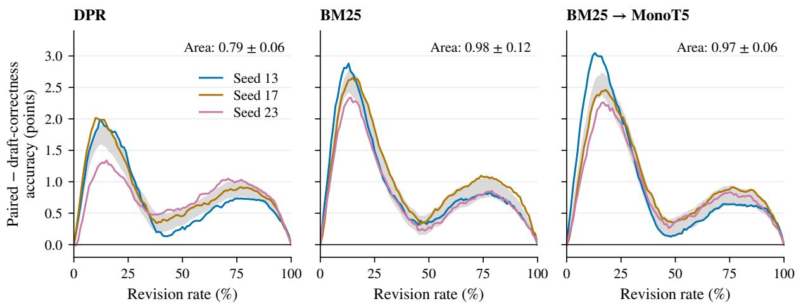
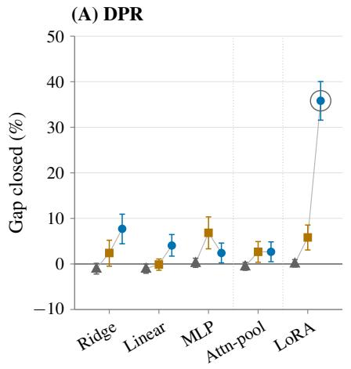
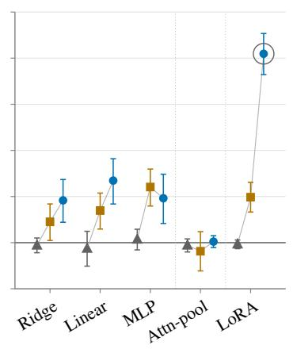
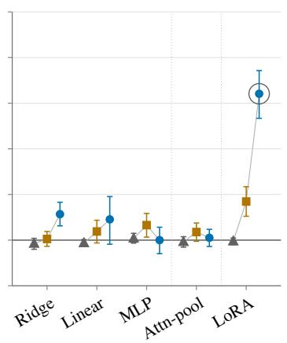

# Return or Revise? Learning When Revision Helps Retrieval-Augmented QA

Nicholas Kashani Motlagh DCS Corp nicholas.kashani\_motlagh.ctr@us.af.mil

Jeremy Gwinnup Air Force Research Laboratory jeremy.gwinnup.1@us.af.mil

Tim Anderson Air Force Research Laboratory timothy.anderson.20@us.af.mil

Grant Erdmann Air Force Research Laboratory grant.erdmann@us.af.mil

## Abstract

We consider the decision of whether to return an existing draft answer or revise it using re trieved evidence, as in answer-revision systems. Draft confidence estimates whether the current answer is correct, but the decision requires estimating the effect of a specified revision. For offline training and evaluation, we grade both the returned draft and its candidate revision under the same correctness judge, which makes repair, harm, and the gap to an oracle observable. We call this paired effect its recoverability, and we train policies to predict it before revision. On 25,870 held-out open-domain questions across three revision setups, a scorer trained on the paired outcome has greater area under the accuracy–revision-rate curve than a matched draft-correctness scorer in all nine Llama setup– seed fits, and gains 0.23–0.68 accuracy points on average at development-selected thresholds, a difference significant across training runs only for dense retrieval. The resulting policy improves on always revising and on average closes more than a third of the oracle gap, although it still applies 38–46% of the harmful revisions. When a draft-free standard-RAG answer is also available, however, choosing between the draft and that answer is stronger by about two points for Llama and four for OLMo, and adding candidate revision as a third option yields no significant gain. Recoverability de scribes one revision; its value as an available action also depends on the alternatives.

## 1 Introduction

Standard retrieval-augmented generation (RAG) answers a question from retrieved evidence (Lewis et al., 2020). A different decision arises once an answer already exists and retrieval is used to reconsider it, as in answer-revision systems (Gao et al., 2023; Madaan et al., 2023): should the system return the draft it has, or revise it in light of the evidence? Revision can repair an incorrect answer, but it can also overwrite a correct one.

Draft confidence alone does not settle this choice. It estimates whether the draft is correct. A correct draft can be preserved or harmed, and an incorrect draft can be repaired or left wrong. Draft confidence indicates which of these changes is possible, and predicting which one occurs requires modeling the revision.

At the decision point studied here, the system has already produced a draft and retrieved evidence but has not yet decoded a revision. The remaining question is whether applying the refiner to this draft and this evidence is more likely to repair the answer than to harm it. A policy that answers that question can return some drafts without invoking the revision and reserve revision for cases where it is predicted to help. The relevant signal may lie in the relationship among the question, draft, evidence, and refiner.

For offline training and evaluation, we observe the outcome of both choices. A generator first answers without retrieved context. A retriever then supplies evidence to a fixed refiner, which produces a candidate revision from the same question and draft. We grade both returning and revising for every example. Figure 1 separates the resulting preserved, repair, harm, and unrecovered cases. Figure 2 shows one example from each shaded cell under the same retriever and refiner. We call the retriever, evidence prompt, and refiner together a revision setup, and the paired effect of that revision setup its recoverability.1

We organize the study around four questions.

<table><tr><td colspan="2">Revision incorrect</td><td>Revision correct</td></tr><tr><td rowspan="2">Draft incorrect Draft correct</td><td>UNRECOVERED tie 0</td><td>REPAIR +1</td></tr><tr><td>HARM -1</td><td>PRESERVED tie 0</td></tr></table>

Conditional recoverability ∆ = Pr(repair) − Pr(harm)

Figure 1: The revision decision is defined by paired outcomes. Evaluating both the draft and its candidate revision places an example in one of four cells. The diagonal cells are ties. Only the shaded off-diagonal cells distinguish returning from revising. Draft correctness alone identifies only a row.
<table><tr><td>REPAIR NQ-Open, DPR Who wrote the song Going to Kansas City? Charlie Christian → Jerry Leiber and Mike Stoller [1] Kansas City (Leiber and Stoller song) ... &quot;Kansas City&quot; is a rhythm and blues song written by Jerry Leiber and Mike Stoller in 1952.</td></tr><tr><td>HARM TriviaQA, DPR Who was the second wife of Henry VIII? Anne Boleyn → Anne of Cleves</td></tr><tr><td>[1] The Private Life of Henry VIII ... execution of his second wife,</td></tr><tr><td>Anne Boleyn ... marries Jane Seymour ... He then weds a German princess, Anne of Cleves.</td></tr></table>

Figure 2: Revision repairs one draft and corrupts another. Two held-out cases, each giving the question, draft → revision, and excerpts of the top retrieved passage. In the repair case, the passage states the correct answer and the refiner adopts it. In the harm case, the passage confirms the draft, but the refiner switches to another name from the same passage.

First, how much repair and harm does retrievalconditioned revision create under different revision setups? Second, does predicting the paired revision effect improve the return-or-revise decision over predicting draft correctness? Third, what prerevision information and model capacity make that effect predictable? Finally, how does the conclusion change when the policy may choose a draftfree standard-RAG answer as well as the draft and its candidate revision? The first three questions study the choice between two answers; the last tests whether the conclusions hold when a third answer is available.

On 25,870 held-out NQ-Open (Kwiatkowski et al., 2019; Lee et al., 2019), TriviaQA (Joshi et al., 2017), and PopQA (Mallen et al., 2023) examples, revision repairs 9.32–13.42% of drafts and corrupts 3.05–3.33%. A policy trained on the paired outcome improves on always revising by 1.10–1.33 points (mean over three training seeds) and closes 35.9–41.4% of the gap to an oracle that sees both outcomes, while still applying 38–46% of the harmful revisions. In a matched comparison, the scorer trained on the revision effect has greater area under the accuracy–revision-rate curve, which traces accuracy as the policy revises a growing share of drafts, in all nine Llama setup–seed fits, and at the selected thresholds it has higher mean accuracy in all three setups, with significance across training runs for DPR. A diagnostic across inputs and model classes finds the largest gain when a finetuned model reads the complete question, draft, and evidence prompt.

However, the value of revision depends on which answers are available. A policy choosing between the draft and a draft-free standard-RAG answer has higher mean accuracy than one choosing between the draft and its candidate revision, and adding candidate revision as a third option does not significantly raise accuracy. For Llama, the standard-RAG answer is less accurate alone but more useful as an alternative to the draft. This comparison limits the value of candidate revision in the answer sets tested here: the paired revision effect and the value of offering revision alongside other answers are different quantities.

Contributions. This paper is an empirical study of this revision decision. Deciding on the expected difference in correctness, rather than on first-stage confidence, is established for model cascades and routing (Jitkrittum et al., 2023; Ding et al., 2024; Ong et al., 2025; Luo et al., 2026), and paired outcomes with and without retrieval are used to decide when to retrieve and which evidence to use (Wang et al., 2023; Tian et al., 2026; Qu et al., 2025). We ask what this target adds when the second answer is a revision of the first, conditioned on the retrieved evidence. We make three contributions:

1. Repair and harm rates are standard in selfcorrection studies (Huang et al., 2024; Kumar et al., 2025). We report them for retrievalconditioned revision under three revision setups and one correctness judge, together with the headroom for choosing between returning and revising: the gap between the better fixed action and an oracle.

2. We compare revision-effect prediction with draft-correctness prediction under matched training across three revision setups, showing a replicated advantage in area under the accuracy–revision-rate curve, and characterize how the available input and model class change policy performance.

3. Choosing between a closed-book and a retrieval answer is an established form of adaptive retrieval (Mallen et al., 2023; Wang et al., 2023). We test that choice alongside revision: when a draft-free standard-RAG answer is also available, choosing between the draft and that answer (return-or-RAG) is stronger than return-or-revise, and adding candidate revision does not provide a significant thirdaction gain.

## 2 Paired Outcomes for the Revision Decision

Limits of aggregate accuracy. Consider two revision setups that both raise accuracy by 3 points. The first repairs 3% of drafts and corrupts none. Nothing is at risk, and the right policy is to revise everything. The second repairs 13% and corrupts 10%. The average is identical, but in the second setup one draft in ten is correct before the system runs and wrong after it, and there is clear value in a policy that can recognize those cases. An aggregate compares two means and cannot tell the two setups apart. We therefore observe, and then predict, the per-draft outcome.

Paired outcome. For a question q, a generator produces an observed draft $a _ { d } .$ . A fixed revision setup $I { \mathrm { - } } { \bf a }$ retriever, retrieval query, evidence prompt, and refiner—produces a candidate revision $a _ { I }$ from that same draft. A shared semanticequivalence judge grades both actions against the same accepted answers, giving binary correctness labels $z _ { d }$ and $z _ { I }$ . For information x available before revision, we define the example-level outcome and conditional recoverability as

$$
\begin{array} { r } { r _ { I } = z _ { I } - z _ { d } \in \{ - 1 , 0 , + 1 \} , } \\ { \Delta _ { I } ( x ) = \mathrm { E } [ r _ { I } \mid x ] . \quad } \end{array}
$$

Positive outcomes are repairs and negative outcomes are harms. Equivalently, conditional recoverability is repair probability minus harm probability.

Unlike treatment-effect estimation from logged actions, and as in routing work that scores both models on every training query (Ding et al., 2024; Luo et al., 2026), this offline measurement observes both outcomes for every example. The draft is already available, and the refiner can be run once to construct the candidate revision; the same judge then grades both answers against the same accepted answers. The paired label is measured directly under that judge. Prediction is still required at the operational decision point because the policy must act before revision decoding. This design removes treatment-assignment ambiguity from evaluation, but the label still depends on the chosen refiner, evidence, and correctness judge.

Decision rule and oracle gap. A policy revises when its predicted recoverability exceeds a threshold chosen on development data. Draft confidence instead estimates $\operatorname* { P r } ( z _ { d } = 1 \mid x )$ . That identifies the row of Figure 1 an example falls in. The column, whether the revision repairs or harms that draft, requires the paired outcome. Jitkrittum et al. (2023) draw the same distinction for cascade deferral and find that confidence is often close to sufficient. Our matched comparison measures how close it is for retrieval-conditioned revision. An oracle that sees both labels takes the correct action whenever either succeeds. In every setup we evaluate, always revising is the better fixed action, so the remaining oracle gap is exactly the harm rate. We report a policy’s accuracy gain over always revising and the fraction of this gap it closes.

Revision setups. Because I enters the definition, we always report recoverability for a stated revision setup. Section 4 describes the three we evaluate.

Neighboring decisions. The decision point distinguishes this setting from several related uses of outcome prediction. Selective prediction asks whether to trust the current answer; adaptive RAG asks whether or how to retrieve; retrievalutility prediction asks whether context improves a fresh answer. Here we ask whether an evidenceconditioned revision improves an observed draft, with the retrieved evidence held fixed. Paired grading preserves the draft-specific transition that aggregate accuracy and one-sided confidence discard. Section 6 places the setting in prior work.

## 3 Predicting Revision Effect

Information inputs. We compare three inputs available before revision: the question alone; the question and observed draft; and the complete revision prompt containing the question, draft, instructions, and five retrieved passages. Every input ends before revision decoding, and no decision input contains the candidate revision, gold answer, judge verdict, or outcome label.

Model classes. Five model classes score return versus revise for every input. Four are frozenfeature models: ridge regression on a frozen final state (Ridge); linear and multilayer-perceptron classifiers on that state (Linear, MLP); and learned attention pooling over all frozen token states (Attnpool). The fifth is a low-rank adapted (LoRA) model (Hu et al., 2022) that reads the available input. Classifiers predict repair, harm, or tie (no change in correctness) and use the softmax probability assigned to repair minus that assigned to harm as their decision score. These probabilities are not calibrated. A model paired with a threshold is a policy: it selects an action but does not generate the revision, and every policy chooses between the same two answers. Appendix Table 6 gives the exact recipes.

Baselines. We compare against learned draftcorrectness prediction and a Tian-style baseline, an engineered-feature regression adapted from retrieval-utility prediction (Tian et al., 2026). We also report a verbalized P(true) baseline (Kadavath et al., 2022) (Appendix A.2). Our Tianstyle baseline keeps the regression family and the utility-difference structure of the original, but retargets the decision from retrieve-versus-not to revise-versus-return and adapts the feature categories to our return-or-revise, pre-revision setting. We do not reimplement Tian et al.’s learned query-performance-prediction (QPP) and QualT5 document-quality components. Verbalized P(true) reads only the question and the draft, so it does not depend on the revision setup; only its threshold is chosen per setup. The draft-correctness target also does not depend on the setup, although that model reads the retrieved passages.

Matched training targets. We also train two LoRA models that read the complete prompt: one predicts draft correctness, the other the paired outcome. They share the backbone, adapter settings, optimizer, training budget, and seeds. Output heads and checkpoint selection follow their targets.

## 4 Experimental Setup

Revision setups. We evaluate Dense Passage Retrieval (DPR) (Karpukhin et al., 2020), BM25 (Robertson and Zaragoza, 2009; Yang et al.,

2017), and BM25 followed by MonoT5 reranking (Nogueira et al., 2020; Bajaj et al., 2016). Each returns five full title–passage pairs from the same Wikipedia passage collection. The three setups share the evidence prompt and refiner and differ only in retrieval. These setups compare dense and sparse retrieval and the effect of reranking.

Data and evaluation. Training and development use 134,847 and 14,966 examples drawn from NQ-Open and TriviaQA. Test contains 25,870 examples, of which 14,267 come from PopQA; PopQA has no training split, so we use it only for evalua tion (Appendix B gives every per-dataset split size). Llama 3.1 8B Instruct (Grattafiori et al., 2024) is the primary generator and refiner. A deterministic Llama 3.3 70B semantic-equivalence judge (Meta Llama, 2024; Zheng et al., 2023) grades both actions. A second judge, GPT-OSS-120B (OpenAI, 2025), rescores the same answers, and two addi tional generator/refiner families, GPT-OSS-20B and OLMo 3 7B, test sensitivity (Section 5.5). Each LoRA decision model is fine-tuned from its family’s generator/refiner (Llama 3.1 8B Instruct for the main results). Models are fit on train. Check points and thresholds are selected on development and fixed before test. We train each learned approach with three training seeds, holding the examples, drafts, candidate revisions, judge labels, splits, prompts, and hyperparameters fixed, and report the mean ± sample standard deviation (SD) over the three runs. A dagger (†) marks a difference that passes the run-level test: its mean over the three runs is positive, and a two-sided paired ttest across the three run-matched differences gives p < 0.05. These tests are not corrected for multiple comparisons. Deterministic baselines are fit once. The 45-cell input–model grid and the per-dataset results in Appendix Table 12 use a single training run, without run-level tests. All intervals are paired 95% percentile bootstrap intervals over test examples, with 10,000 resamples drawn within each dataset. They describe uncertainty over test examples, whereas the SD describes variation across training seeds.

Offline supervision and online decisions. Candidate revisions are generated for every split so that paired labels can be constructed and policies can be evaluated against the same answers. They are supervision and evaluation artifacts, never policy inputs. At decision time, the policy sees only the pre-revision inputs of Section 3 and either returns the observed draft or invokes the revision setup.

## 5 Results

## 5.1 Measured Repair and Harm

Table 1 shows that revision both repairs and harms drafts. With DPR it repairs 9.32% of drafts and corrupts 3.05%. The other setups repair up to 13.42% and corrupt a similar share. The net effect is positive. Always revising gains 6.27–10.37 accuracy points over returning. Harm, however, is present in every setup, and the harm rate (3.05–3.33%) is therefore the oracle gap (Section 2). Reranking yields more repairs and a larger average revision effect, yet still corrupts about as many drafts as DPR does. The harm case in Figure 2 shows that revision can overwrite a correct draft even when the top passage states the draft’s answer. The share of correct drafts harmed when no retrieved passage contains a gold alias is highest after reranking, 21.1% against 16.5% for DPR (Appendix Table 7). Reranking increases repairs but does not reduce harms. Most remaining examples are ties because the refiner often returns the draft unchanged.

## 5.2 The Learned Policy

The full-prompt LoRA policy is fit once per revision setup and training seed, with its checkpoint and threshold selected on development. In Table 1, it improves on always revising by 1.10–1.33 points and closes 35.9–41.4% of the oracle gap while revising 35.5–59.5% of examples. It revises 94.0– 96.0% of the repairs but also 38.0–46.4% of the harms, so harmful revision is the main remaining error. Appendix A.3 examines these cases and their retrieved passages.

The accuracy gain is significant across seeds in every setup and spans only 0.98–1.53 points over the nine setup–seed fits, whereas the developmentselected revision rate is far less stable, spanning 29.9–74.4%. Accuracy can stay stable while the action rate varies because the accuracy curves are relatively flat over a wide band of thresholds and because changing the action on an unchanged answer does not change the returned text. For example, the BM25 seed that revises 74% of drafts changes the returned answer, after normalization, on 29% of its revisions, whereas the two seeds that revise 49–55% change it on 37–44%, so the additional revisions fall almost entirely on drafts the refiner returns unchanged.

Across the same three training runs, the policy also significantly outperforms the Tian-style baseline in every setup (Appendix Table 8). That baseline revises 93.8–94.4% of drafts and scores within 0.1 points of always revising, so it is a weak comparison; the matched draft-correctness method of Section 5.3 is the stronger one.

## 5.3 Paired Outcome versus Draft Correctness

For Llama, Table 2 and Figure 3 compare the two matched LoRA methods of Section 3. The figure compares their rankings at equal revision rates for all three training seeds.

The paired-outcome target has greater area under the accuracy–revision-rate curve in all nine setup– seed fits, with maximum separation of 1.37–3.06 points, usually at low revision rates. The advantage holds at nearly every revision rate; one DPR seed and one MonoT5 seed have small crossings near zero revision rate, with deficits below 0.04 points.

At each policy’s own development-selected threshold, the paired-outcome policy exceeds the draft-correctness policy by 0.68 points on average for DPR, 0.23 for BM25, and 0.33 after MonoT5 reranking. The DPR difference is significant across seeds; the BM25 difference is negative at one seed, and the MonoT5 difference is positive at every seed but narrowly misses the threshold (p=0.058). Both targets beat always revising. Of the 1.10–1.33- point gain in Table 1, draft correctness alone recovers 0.58–1.11 points and the paired target adds the remaining 0.23–0.68, so the paired target refines a decision that draft confidence can already make in part. The smaller selected-threshold differences reflect the operating points chosen on development, which lie in relatively flat regions of the curves.

Verbalized P(true) confidence shows the same pattern more strongly. It revises 85–93% of drafts and gains only 0.03–0.09 points over always revising (the DPR interval includes zero; Appendix A.2). Confidence ranks drafts by their own correctness, which is a different question from whether revision will help them.

A separate matched experiment changes only the output head and loss, with its own three-way fits so that all four targets share one training and selection protocol (Appendix A.5). Two correctness heads, one each for the draft and the revision, exceed the three-way repair/harm/tie head by 0.13 points on average, and both have higher mean accuracy than a scalar-utility target and a tie-aware preference target.

Panel B: Policy behavior
<table><tr><td colspan="9">Panel A: Outcomes and decision performance</td></tr><tr><td></td><td colspan="2">Outcome (%)</td><td colspan="4">Accuracy (%) ↑</td><td colspan="2">Policy vs. revise Gain</td></tr><tr><td>Revision setup</td><td>Repair↑</td><td>Harm↓</td><td>Return</td><td>Revise</td><td>Policy</td><td>Oracle</td><td>(points)↑</td><td>Gap closed (%)↑</td></tr><tr><td>DPR</td><td>9.32</td><td>3.05</td><td>47.38</td><td>53.65</td><td> $5 4 . 9 1 \pm 0 . 1 8$ </td><td>56.70</td><td> $+ 1 . 2 6 \pm 0 . 1 8 ^ { \dagger }$ </td><td> $4 1 . 4 \pm 5 . 9$ </td></tr><tr><td>BM25</td><td>10.58</td><td>3.33</td><td>47.38</td><td>54.63</td><td> $5 5 . 9 6 \pm 0 . 2 2$ </td><td>57.96</td><td> $+ 1 . 3 3 \pm 0 . 2 2 ^ { \dagger }$ </td><td> $4 0 . 0 \pm 6 . 5$ </td></tr><tr><td>BM25 → MonoT5</td><td>13.42</td><td>3.06</td><td>47.38</td><td>57.75</td><td> $5 8 . 8 4 \pm 0 . 1 0$ </td><td>60.81</td><td> $+ 1 . 1 0 \pm 0 . 1 0 ^ { \dagger }$ </td><td> $3 5 . 9 \pm 3 . 3$ </td></tr></table>

<table><tr><td>Revision setup</td><td>Revision rate (% of examples)</td><td>Repairs revised (%)↑</td><td>Harms revised (%)↓</td><td>Macro-averaged gain (points) ↑</td></tr><tr><td>DPR</td><td> $3 8 . 8 \pm 5 . 1$ </td><td> $9 6 . 0 \pm 1 . 1$ </td><td> $4 6 . 4 \pm 8 . 9$ </td><td> $+ 1 . 1 6 \pm 0 . 1 6 ^ { \dagger }$ </td></tr><tr><td>BM25</td><td> $5 9 . 5 \pm 1 3 . 3$ </td><td> $9 4 . 6 \pm 0 . 4$ </td><td> $4 3 . 0 \pm 5 . 3$ </td><td> $+ 1 . 3 4 \pm 0 . 2 1 ^ { \dagger }$ </td></tr><tr><td>BM25 → MonoT5</td><td> $3 5 . 5 \pm 7 . 7$ </td><td> $9 4 . 0 \pm 0 . 6$ </td><td> $3 8 . 0 \pm 4 . 2$ </td><td> $+ 1 . 1 0 \pm 0 . 1 1 ^ { \dagger }$ </td></tr></table>

Table 1: Measured recoverability and learned-policy results. Panel A: repair and harm are the examples that revision changes from incorrect to correct and from correct to incorrect. Accuracy is reported for always returning the draft, always revising, the development-selected full-prompt LoRA policy, and the return-or-revise oracle. Gain is the policy’s accuracy minus always revising. Gap closed divides this gain by the oracle gap. Panel B: the fractions of all examples, of repairs, and of harms that the policy revises, and the macro-averaged gain, which is the gain over always revising when NQ-Open, TriviaQA, and PopQA are weighted equally rather than by example count. Policy cells are the mean ± SD over three training seeds. † marks the run-level test of Section 4.

  
Figure 3: Paired-outcome minus draft-correctness accuracy at matched revision rates for the three revision setups. Lines are training seeds, and the gray band is a 95% bootstrap interval for the seed mean. Each area label gives the mean ± SD of the integrated difference, in accuracy points.

## 5.4 Inputs and Model Classes

Figure 4 compares every input within each model class and revision setup in a single training run. The question alone sits near the always-revise reference for every model class and revision setup, and carries almost no usable signal. Adding the observed draft helps modestly. For each revision setup, the best model class then closes between 6.8% and 12.1% of the oracle gap. Large gains appear only when the fine-tuned LoRA policy reads the complete question, draft, and evidence prompt, which closes 32.1–41.0% in this run (all 45 cells in Appendix Table 10; Table 1 reports the three-seed mean of the same policy, 35.9–41.4%). With the full prompt, the best frozen-feature model closes at most 13.5% of the gap, and the MLP does worse than with the question and draft alone in every setup. Only the fine-tuned model gains substantially from the full prompt. Because the model class changes together with the input, this comparison does not separate what the policy reads from how it is trained. We therefore retrain the full-prompt LoRA policy at the same three training seeds with only its input changed (Appendix A.7). When the evidence is masked, or replaced by the evidence retrieved for a different example, the gain over always revising falls from 1.10–1.33 to 0.18– 0.25 points in every revision setup. Without the draft, it falls to 0.56–0.69 points.

(B) BM25
<table><tr><td></td><td colspan="2">Policy accuracy (%) ↑</td><td>Paired — draft ↑</td><td colspan="2">Draft-correctness policy</td></tr><tr><td>Revision setup</td><td>Draft-correctness Paired-outcome</td><td></td><td>(points)</td><td></td><td>Revision rate (%) Harms revised (%) ↓</td></tr><tr><td>DPR</td><td> $5 4 . 2 3 \pm 0 . 0 6$ </td><td> $5 4 . 9 1 \pm 0 . 1 8$ </td><td> $+ 0 . 6 8 \pm 0 . 1 8 ^ { \dagger }$ </td><td> $5 7 . 8 \pm 2 . 0$ </td><td> $7 4 . 1 \pm 3 . 6$ </td></tr><tr><td>BM25</td><td> $5 5 . 7 4 \pm 0 . 0 3$ </td><td> $5 5 . 9 6 \pm 0 . 2 2$ </td><td> $+ 0 . 2 3 \pm 0 . 2 4$ </td><td> $4 8 . 5 \pm 1 . 9$ </td><td> $4 5 . 3 \pm 3 . 9$ </td></tr><tr><td>BM25 → MonoT5</td><td> $5 8 . 5 1 \pm 0 . 0 5$ </td><td> $5 8 . 8 4 \pm 0 . 1 0$ </td><td> $+ 0 . 3 3 \pm 0 . 1 4$ </td><td> $5 2 . 0 \pm 2 . 9$ </td><td> $5 8 . 0 \pm 7 . 3$ </td></tr></table>

Table 2: Matched paired-outcome and draft-correctness methods. Cells are the mean ± SD over three training seeds. † marks the run-level test of Section 4. The paired-outcome column reuses the Table 1 policies.

(C) BM25 → MonoT5  
  
Figure 4: Which information supports prediction. Gap closed for three inputs within each model class and revision setup (one training run). Whiskers are 95% bootstrap intervals. The ring marks the full-prompt LoRA policy of Table 1 in this run. Dotted lines separate final-state models, the token-state model, and the fine-tuned model. The paired oracle, at 100%, is off scale.

Remaining errors. Row-level cases show why access to the complete prompt is useful but insufficient. A retrieved passage can be topically close, fluent, and easy for the refiner to follow while answering a different entity or time period. In the examples in Figure 2, revision succeeds when the passage supports the requested fact and fails when nearby evidence leads the refiner to replace a correct draft with a plausible wrong answer. The aggregate lexical associations in Appendix Table 7 support this diagnosis. These results are consistent with a remaining problem that draft confidence alone cannot resolve: whether the evidence answers the question actually asked.

## 5.5 Robustness

PopQA is absent from train and development yet supplies 55.1% of test examples. In a single training run, the same policy and threshold improve accuracy in all nine dataset–setup slices, with no per-dataset tuning. Because PopQA dominates the pooled count, Table 1 also reports the gain with the three datasets weighted equally: 1.10–1.34 points over three seeds, against 1.10–1.33 pooled, so the pooled gain does not depend on the evaluation-only dataset. In the single run, the weakest slice is DPR on NQ-Open, at 14.6% of the gap, even though NQ-Open supplies the largest share of training data. It is also the DPR slice with the largest harm rate (4.18%), whereas evaluation-only PopQA closes 40.1% under the same threshold. Appendix Table 12 gives the complete results for that run.

We also repeat the measurement and the policy comparison with the GPT-OSS-20B (OpenAI, 2025) and OLMo 3 7B (Team Olmo et al., 2025) generator/refiner families and a second automated judge. Our policy improves on always revising in all nine generator/refiner and retrieval combinations, by 0.12–2.74 points under the primary judge and 0.05–2.56 points when the same fixed decisions are rescored by the second judge. The GPT-OSS-20B gains are roughly six to ten times smaller than Llama’s, partly because its oracle gap is smaller. Its refiner harms fewer drafts, so the oracle gap is 1.24–1.64 points against 3.05–3.33 for Llama and 3.07–4.46 for OLMo (Appendix Table 13).

<table><tr><td>Generator/refiner</td><td>Revision setup</td><td>gain↑</td><td>Primary judge: Second judge: gain↑</td></tr><tr><td>Llama 3.1 8B Instruct</td><td>DPR</td><td> $+ 1 . 2 6 \pm 0 . 1 8 ^ { \dagger }$ </td><td> $+ 1 . 3 7 \pm 0 . 1 9 ^ { \dagger }$ </td></tr><tr><td></td><td>BM25</td><td> $+ 1 . 3 3 \pm 0 . 2 2 ^ { \dagger }$ </td><td> $+ 1 . 3 4 \pm 0 . 2 1 ^ { \dagger }$ </td></tr><tr><td></td><td>BM25 → MonoT5</td><td> $+ 1 . 1 0 \pm 0 . 1 0 ^ { \dagger }$ </td><td> $+ 1 . 0 5 \pm 0 . 1 0 ^ { \dagger }$ </td></tr><tr><td>GPT-OSS-20B</td><td>DPR</td><td> $+ 0 . 1 2 \pm 0 . 0 3 ^ { \dagger }$ </td><td> $+ 0 . 0 5 \pm 0 . 0 3$ </td></tr><tr><td></td><td>BM25</td><td> $+ 0 . 1 7 \pm 0 . 0 3 ^ { \dagger }$ </td><td> $+ 0 . 0 6 \pm 0 . 0 3$ </td></tr><tr><td></td><td>BM25 → MonoT5</td><td> $+ 0 . 1 9 \pm 0 . 0 2 ^ { \dagger }$ </td><td> $+ 0 . 1 2 \pm 0 . 0 4 ^ { \dagger }$ </td></tr><tr><td>OLMo 3 7B</td><td>DPR</td><td> $+ 2 . 7 4 \pm 0 . 1 1 ^ { \dagger }$ </td><td> $+ 2 . 5 6 \pm 0 . 1 4 ^ { \dagger }$ </td></tr><tr><td></td><td>BM25</td><td> $+ 2 . 0 7 \pm 0 . 0 2 ^ { \dagger }$ </td><td> $+ 1 . 9 1 \pm 0 . 0 2 ^ { \dagger }$ </td></tr><tr><td></td><td>BM25 → MonoT5</td><td> $+ 1 . 2 4 \pm 0 . 0 5 ^ { \dagger }$ </td><td> $+ 1 . 1 7 \pm 0 . 0 4 ^ { \dagger }$ </td></tr></table>

Table 3: Policy gains across generator/refiner families and judges. Each entry is the mean gain in points over always revising ± SD across three training seeds. † marks the run-level test of Section 4. Appendix Table 13 gives the oracle gaps and gap closed.

In relative terms it closes 9.9–11.6% of its gap, still below Llama’s 35.9–41.4%. For GPT-OSS-20B, all three primary-judge gains reach run-level significance, but under the second judge only the MonoT5-reranked setup does. Every Llama and OLMo gain is significant under both judges. Table 3 gives the comparison, and Appendix Table 13 gives the complete operating points.

As a check on the automated judge, one blind annotator who is not an author independently labeled 480 draft–revision pairs and marked 14 of the 960 answers unsure. The annotator agrees with the primary judge on 93.2% of drafts $( \kappa = 0 . 8 6 )$ and 91.6% of revisions (κ = 0.83), and their three-way outcome agreement (harm, tie, or repair) is 94.5% $( \kappa = 0 . 7 8 )$ . Under the human labels, revision repairs 8.5% of the 470 pairs with two decisive labels and harms 5.7%. The pooled net effect is +2.8 points [−0.6, +6.1], and the TriviaQA estimate is negative. On the same pairs, the primary judge gives 37 repairs and 26 harms (7.9% and 5.5%), so the human labels are slightly more favorable to revision than the judge. Both labelings give a higher harm rate than Table 1, so the higher rate is a property of the audit sample, on which the annotator and the judge agree. Appendix Table 15 gives the full results.

## 5.6 Sensitivity to the Available Answers

The results so far concern two answers: the returned draft and its candidate revision. To test how much they depend on that pair, we train a LoRA model at each of the same three training seeds to predict correctness for the returned draft, a draft-free standard-RAG answer, and the candidate revision (Table 4). This per-action model reads the same pre-revision prompt as the paired policy and fits one correctness head per action; an action set restricts which heads compete. Standard RAG generates a fresh answer from the question and retrieved evidence without conditioning on the draft. It is a separate generation action, and the comparisons here do not account for its generation cost. A policy choosing between return and standard RAG exceeds the separately trained paired policy by 2.17–2.37 points on average, although that comparison changes the prediction target as well as the available answers. Holding each trained per-action model fixed, replacing candidate revision with standard RAG still raises mean accuracy by 1.95–2.10 points across the three revision setups. Fixed standard RAG is weaker than fixed revision in every setup but succeeds on more of the draft’s failures, so its value comes from failing on different examples. The contrast also holds within each of the nine dataset–setup slices, where replacing candidate revision with standard RAG gains 1.75– 3.83 points and passes the run-level test (Appendix Table 16).

The same per-action model restricted to returnor-revise reaches 55.03, 56.39, and 59.04%, on average 0.12–0.43 points above the paired policy of Table 1. Section 5.3 compares one correctness head per action with the three-way target under matched training.

For Llama, adding candidate revision as a third option produces no significant improvement. The mean differences are −0.15 points with DPR, +0.00 with BM25, and −0.12 after reranking. Under the second judge, the DPR and reranked losses have bootstrap intervals below zero (Appendix Table 17), but neither is significant across the three training runs. No Llama dataset–setup slice moves by more than 0.24 points in either direction. Candidate revision is the only correct answer on 181, 222, and 323 of the 25,870 examples, raising the returnor-RAG oracle by 0.70, 0.86, and 1.25 points. The learned three-action policies select only 7–24% of those unique revision wins across the nine fits. Table 5 separates successful switches to revision from switches that replace a correct return-or-RAG choice with an incorrect revision. The lack of learned gain reflects the balance of these switches.

<table><tr><td colspan="8">Panel A: Fixed actions and learned policies: accuracy (%) ↑</td></tr><tr><td>Revision setup</td><td>Revise</td><td>RAG</td><td></td><td></td><td></td><td>Paired policy {Return,Revise} {Return,RAG} {Return,Revise,RAG}</td></tr><tr><td>DPR</td><td>53.65</td><td>49.12</td><td> $5 4 . 9 1 \pm 0 . 1 8$ </td><td> $5 5 . 0 3 \pm 0 . 1 8$ </td><td> $5 7 . 0 8 \pm 0 . 1 0$ </td><td> $5 6 . 9 3 \pm 0 . 2 5$ </td></tr><tr><td>BM25</td><td>54.63</td><td>50.51</td><td> $5 5 . 9 6 \pm 0 . 2 2$ </td><td> $5 6 . 3 9 \pm 0 . 0 8$ </td><td> $5 8 . 3 3 \pm 0 . 0 7$ </td><td> $5 8 . 3 3 \pm 0 . 1 1$ </td></tr><tr><td>BM25 → MonoT5</td><td>57.75</td><td>55.85</td><td> $5 8 . 8 4 \pm 0 . 1 0$ </td><td> $5 9 . 0 4 \pm 0 . 0 3$ </td><td> $6 1 . 1 4 \pm 0 . 0 8$ </td><td> $6 1 . 0 2 \pm 0 . 0 4$ </td></tr><tr><td colspan="7">Panel B: Seed-matched accuracy contrasts (points) {Return,RAG}</td></tr><tr><td>Revision setup</td><td></td><td colspan="2">— paired policy</td><td colspan="2">{Return,RAG} — {Return,Revise}</td><td> $\{ \mathrm { R e t u r n } , \mathrm { R e v i s e } , \mathrm { R A G } \}$  − {Return,RAG}</td></tr><tr><td>DPR</td><td></td><td colspan="2"> $+ 2 . 1 7 \pm 0 . 0 8 ^ { \dagger }$ </td><td colspan="2"> $+ 2 . 0 5 \pm 0 . 0 9 ^ { \dagger }$ </td><td> $- 0 . 1 5 \pm 0 . 1 6$ </td></tr><tr><td>BM25</td><td></td><td colspan="2"> $+ 2 . 3 7 \pm 0 . 1 6 ^ { \dagger }$ </td><td colspan="2"> $+ 1 . 9 5 \pm 0 . 0 6 ^ { \dagger }$ </td><td> $+ 0 . 0 0 \pm 0 . 0 8$ </td></tr><tr><td> $\mathbf { B M } 2 5  \mathbf { M o n o T } 5$ </td><td></td><td colspan="2"> $+ 2 . 3 0 \pm 0 . 0 4 ^ { \dagger }$ </td><td colspan="2"> $+ 2 . 1 0 \pm 0 . 0 6 ^ { \dagger }$ </td><td> $- 0 . 1 2 \pm 0 . 1 1$ </td></tr></table>

Table 4: The available answers determine value. Test accuracy $( n { = } 2 5 , 8 7 0$ per setup). Return is returning the draft, Revise the candidate revision, and RAG a draft-free standard-RAG answer. Paired policy is the Table 1 policy. Fixed actions are deterministic. Learned cells are the mean ± SD over three training seeds. Panel B uses seed-matched differences. † marks the run-level test of Section 4.

We run the standard-RAG comparison for Llama and OLMo; we did not generate standard-RAG answers for GPT-OSS-20B. The same pattern holds, more sharply, for the OLMo 3 7B family. For OLMo, we also generate and judge standard-RAG answers in every setup and train the per-action model at the same three seeds. For OLMo, fixed standard RAG beats fixed revision in every setup (41.57% vs. 40.64% with DPR, 42.65% vs. 41.77% with BM25, 49.59% vs. 47.39% after reranking), the reverse of Llama. Choosing between return and standard RAG reaches $4 7 . 5 2 \pm 0 . 1 2 , 4 8 . 0 9 \pm$ 0.08, and $5 3 . 4 1 \pm 0 . 0 2 \%$ , against $4 3 . 5 4 \pm 0 . 0 7 $ $4 3 . 9 4 \pm 0 . 0 6 .$ , and 48.82 ± 0.03 for return and revision from the same heads, a 4.0–4.6-point gap that is at least 3.4 points in every dataset–setup slice. After reranking, the learned return-or-revise policy trails simply always using standard RAG. Adding revision as a third action changes mean accuracy b $\mathrm { y } - 0 . 0 1 \pm 0 . 0 6 , - 0 . 2 0 \pm 0 . 1 2 , \mathrm { a n d } - 0 . 1 6 \pm 0 . 0 6$ points over the three seeds. Paired recoverability measures the value of a given revision setup. For OLMo, standard RAG uses the retrieved evidence better than revision does.

Sensitivity of the action comparison. Our revision prompt tells the refiner to keep the draft unless the evidence clearly supports a different answer. Replacing it with a neutral keep-or-replace prompt lowers standalone Llama revision accuracy by 0.30–0.91 points but raises the return-or-revise oracle (Appendix A.13).

The policy contrasts also persist under a second judge: return-or-RAG leads return-or-revise by 2.04–2.23 points for Llama, and paired prediction leads draft-correctness prediction by 0.38–0.75 points. All six bootstrap intervals for the three-seed means are positive (Appendix Table 17). Adding revision changes mean accuracy by −0.12 to +0.01 points.

## 6 Related Work

Confidence and adaptive RAG. Selective prediction uses confidence to trade current-answer coverage for risk (Chow, 1970; Geifman and El-Yaniv, 2017; Kamath et al., 2020). Adaptive RAG decides whether, when, or how to retrieve using difficulty, uncertainty, reflection tokens, or decoding state (Mallen et al., 2023; Wang et al., 2023; Jiang et al., 2023; Asai et al., 2024; Jeong et al., 2024; Baek et al., 2025; Moskvoretskii et al., 2025). These methods act before or during retrieval; our decision occurs after it. The draft and evidence are fixed, and the choice is whether to apply the revision. We do not rerun Self-RAG or Adaptive-RAG as baselines, because they change the generator or the retrieval pipeline that our comparison holds fixed. The return-or-RAG action set in Section 5.6 makes the same answer-with-or-without-retrieval choice, but its model first reads the draft and the retrieved passages. Rowen also acts after an initial answer, retrieving to correct it when responses across languages or models disagree (Ding et al., 2025). Li et al. (2026) train RASER on the improvement from escalating a one-shot RAG answer, and their multi-action variant predicts route scores. They change the retrieval route; we hold the retrieved evidence fixed and compare returning the observed draft with a revision conditioned on it.

<table><tr><td>Revision setup</td><td>Unique revision wins</td><td>Captured unique wins</td><td>Fixes to the binary choice</td><td>Damaging switches</td><td>Net change in correct answers</td></tr><tr><td>Llama 3.1 8B</td><td></td><td></td><td></td><td></td><td></td></tr><tr><td>DPR</td><td>181</td><td>22.7</td><td>57.3</td><td>117.7</td><td>-37.7</td></tr><tr><td>BM25</td><td>222</td><td>34.3</td><td>44.0</td><td>77.7</td><td>0.7</td></tr><tr><td>BM25 → MonoT5</td><td>323</td><td>53.0</td><td>77.0</td><td>161.7</td><td>-31.7</td></tr><tr><td>OLMo 3 7B</td><td></td><td></td><td></td><td></td><td></td></tr><tr><td>DPR</td><td>318</td><td>32.3</td><td>50.0</td><td>85.0</td><td>-2.7</td></tr><tr><td>BM25</td><td>360</td><td>38.7</td><td>71.0</td><td>162.3</td><td>-52.7</td></tr><tr><td>BM25 → MonoT5</td><td>479</td><td>82.7</td><td>69.3</td><td>192.7</td><td>-40.7</td></tr></table>

Table 5: What changes when revision becomes a third action. Unique wins count examples where only revision is correct. Captured unique wins and fixes to the binary choice are successful switches from the same per-action model’s return-or-RAG choice; fixes to the binary choice occur when an existing action was correct but the binary selector chose the wrong one. Their sum minus damaging switches equals the net change in correct answers. Switch counts are means over three fits; unique wins are fixed. Each setup contains 25,870 examples.

Retrieval utility. Prior work predicts the gain from retrieval or the utility of retrieved documents (Dado et al., 2026; Tian et al., 2026; Dai et al., 2025; Qu et al., 2025; Jiang et al., 2025). These methods include observed answer-quality differences with and without context, as in Tian et al. (2026); Qu et al. (2025). Our two choices begin from the same observed draft, and the evidenceconditioned answer is a revision of that draft. Our Tian-style baseline (Section 3) adapts this utilityprediction structure to the pre-revision decision point. Choosing among answerers is also studied through learning to defer, model cascades, and LLM routing (Madras et al., 2018; Mozannar and Sontag, 2020; Chen et al., 2024; Jitkrittum et al., 2023; Bouchard, 2026; Ding et al., 2024; Ong et al., 2025). RouteLLM, for example, learns from paired responses and win/tie/loss judgments, including comparisons against gold answers. RouteLMT trains a router on the gain of a larger translation model over a smaller one (Luo et al., 2026), and concurrent work predicts rescue and harm separately to rank cascade escalations (Wang et al., 2026). Paired supervision before action selection is shared with prior routing work. In these cascades the larger model answers the input itself; here the second answer revises the first. Our comparison supplies the observed draft and retrieved evidence to the policy and measures absolute repair and harm under a fixed refiner.

Revision and conflicting evidence. Revision systems edit drafts from feedback (Gao et al., 2023; Zhao et al., 2023; Madaan et al., 2023; Wan et al., 2024). Huang and Deng (2026) similarly retrieve answer-conditioned support and counterevidence in CounterRefine before a restricted keep-or-revise step. Wu et al. (2024) quantify conflict between internal priors and external evidence in ClashEval, while situated-faithfulness and source-arbitration methods decide how to use the two (Huang et al., 2025; Kim et al., 2025; Zhu et al., 2026; Wang et al., 2025). Other work documents harmful selfcorrection and cases where retrieved evidence overwrites parametric knowledge (Huang et al., 2024; Maekawa et al., 2024; Li et al., 2024; Ning et al., 2026; Liu and Meng, 2026; Yoran et al., 2024). Our study brings matched prediction targets and fixed-scorer action comparisons to this revision setting. Like utility and heterogeneous-effect prediction (Qu et al., 2025; Athey and Imbens, 2016; Künzel et al., 2019), it models an outcome difference. Here both answers can be generated offline and graded, making the difference observable under the judge. The empirical question is how predictable that difference is and how the result changes when a standard-RAG answer is an alternative to revision.

## 7 Discussion

What the paired target adds. Paired evaluation changes the prediction target and gives an explicit return-or-revise ceiling. The selected policy recovers 35.9–41.4% of it, and the matched comparison shows that paired prediction refines draftconfidence reasoning. A learned draft-correctness model already recovers part of the gain over always revising, and predicting repair and harm adds 0.23– 0.68 points on average at the selected thresholds, with run-level significance for DPR (Section 5.3). This small gain is consistent with the finding of Jitkrittum et al. (2023) that confidence-based deferral often suffices in model cascades. Draft correctness identifies which answers are at risk, whereas the paired target also asks what the refiner will do to them. In the separate target comparison, one correctness head per action does at least as well as the three-class paired head, so predicting the revision’s outcome is useful under more than one formulation.

Where the useful signal comes from. In the input comparison, the question alone is weak, adding the draft helps somewhat, and the largest gain comes from adapting the model on the complete question, draft, and evidence prompt. With the model and training fixed, most of that gain depends on the evidence retrieved for the question itself, and part of it on the draft. This pattern is consistent with recoverability being a relation among the question, draft, evidence, and refiner. In the matched target comparison, the method trained for revision effect has higher mean accuracy. Together, the two analyses indicate that the decision benefits from a paired-outcome target and a model capable of interpreting the complete pre-revision state.

Better retrieval does not remove the decision. More repair opportunities do not necessarily make individual revisions easier to route. MonoT5 reranking produces the most repairs and the largest average revision effect, yet the learned policy’s gain over always revising is no larger there, and harmful revisions remain. Better retrieval can enlarge the opportunity without making the effect of a revision easier to predict.

The action set determines the value of revision. The defined recoverability $\Delta _ { I } ( x )$ compares the draft with its revision. Adding another answer leaves that paired difference unchanged, but changes the value of revision relative to the best available alternative. Candidate revision is valuable when the only alternative is returning the draft. It adds no significant accuracy gain, however, to a learned policy that can already choose between the draft and a draft-free standard-RAG answer. For Llama, standard RAG is weaker as a fixed action but fails on different examples, so its complementarity matters more than its mean accuracy; for

OLMo it is the stronger fixed action and the gap between the two action sets widens to four points. This result argues for evaluating the full action set at the decision point: return, revise, standard RAG, and any other available action. Revision does supply unique correct answers that raise the oracle, but learned gains also depend on correcting return-or-RAG errors and avoiding damaging switches.

From accuracy to decision utility. Our development thresholds optimize final-answer accuracy. Under that objective, a repair contributes one correct answer and a harm removes one, so the two transitions enter symmetrically. A deployed system may instead assign greater cost to corrupting a correct answer, charge for revision latency or compute, or allow abstention and human escalation. Extending recoverability to those settings requires specifying the utility of every available action, selecting the operating point on development data, and testing whether that utility transfers across revision setups and domains.

## 8 Conclusion

Deciding whether to revise requires estimating the effect of the revision. Offline paired grading makes repair, harm, and the remaining oracle gap observable under one correctness judge. A scorer trained on that paired outcome has greater area under the accuracy–revision-rate curve than a matched draftcorrectness scorer in all nine Llama setup–seed fits, and the resulting policy has higher mean return-orrevise accuracy in all three setups, with run-level significance for DPR. The largest gain in the input diagnostic comes from an adapted model that reads the full evidence prompt. The value of revision is tied to the available answers. Once standard RAG is also available, candidate revision provides no significant additional accuracy in the tested policies. The decision to revise is worth learning only relative to the available alternatives, and grading every available answer offline makes that comparison measurable for training and evaluation.

## Limitations

Our study covers short-form open-domain question answering with three revision setups and three generator/refiner families; we do not test long-form, multi-hop, domain-specific, or high-stakes settings. In every family the same checkpoint drafts and revises, and the models are open and no larger than GPT-OSS-20B. Every setup retrieves five passages from one Wikipedia collection. We do not test a refiner that differs from the drafter, larger models, other corpora, deployed RAG pipelines, or a person revising the draft. PopQA is evaluation-only and is 55% of test; the per-dataset and macro-averaged results reduce, but do not remove, this distributionshift concern.

The input comparison and the matched target comparison both test complete methods. The LoRA models differ from the frozen-feature models in adaptation, parameter count, and optimization, and each matched target uses its own prediction head and selection rule. The input ablations hold the LoRA model fixed, but each ablation is trained separately, so they show which inputs the policy needs to reach its accuracy rather than which inputs a trained policy uses. Beyond the verbalized P(true) baseline in Appendix A.2, we do not survey calibrated confidence, semantic uncertainty, or other ways of modeling the two outcomes (Guo et al., 2017; Kadavath et al., 2022; Farquhar et al., 2024). The 45-cell input–model grid, the per-dataset diagnostic, and the passage-title and passage-order ablations use a single training run, and three training runs give the run-level tests little power. Training seeds vary only policy training (Section 4), so they do not measure generation or judge-sampling variance. The neutral prompt and second judge are each a single sensitivity check, and both reuse the same test decisions without selecting new policies.

The refiner determines the oracle gap. Because the oracle gap equals the refiner’s harm rate in our setups (Section 2), a refiner that rarely overwrites a correct draft leaves a small gap for any policy to close, as GPT-OSS-20B already shows (Section 5.5). For such a refiner, paired measurement shows how little accuracy remains to gain, which is worth knowing before training a policy.

Correctness labels come from automated semantic-equivalence judges. Rescoring the same decisions with a second judge measures sensitivity to the judge, and harm is the least stable of the paired outcomes. The accuracy gains keep their sign under rescoring, although two GPT-OSS-20B gains lose run-level significance, and the estimated fraction of the oracle gap closed changes with the judge (Appendix Table 13). The human diagnostic uses one blind annotator (Appendix A.10), so it cannot separate annotator idiosyncrasy from judge error or estimate inter-annotator reliability, and it does not independently validate sub-point policy

gains.

The standard-RAG comparison shows that candidate revision did not significantly improve accuracy for the learned policies over the answer sets tested here, and a nonsignificant gain is not an equivalence result. The shared per-action model controls the action-set comparison, but its checkpointselection objective may differ from that of a scorer optimized separately for each two-action set.

## Ethical Considerations

This is an accuracy study. The results do not establish deployment readiness. Both failure modes, a missed repair and an applied harm, are consequential. Deployment would require domain-specific correctness standards, evidence-coverage checks, human escalation, and validation of every available action. Wikipedia-derived evidence can be stale or unevenly distributed, so a policy that is accurate on average may still deny repair systematically where coverage is weak. All datasets, passages, and models used here are public.

## Acknowledgments

We thank Dr. Jim Davis for helpful feedback and discussion, and Lt Angie Maravi Campos for data labeling. This work was supported in part by a grant of computer time from the Department of Defense High Performance Computing Modernization Program (HPCMP).

## References

Akari Asai, Zeqiu Wu, Yizhong Wang, Avirup Sil, and Hannaneh Hajishirzi. 2024. Self-RAG: Learning to retrieve, generate, and critique through self-reflection. In International Conference on Learning Representations.

Susan Athey and Guido Imbens. 2016. Recursive partitioning for heterogeneous causal effects. Proceedings of the National Academy of Sciences, 113(27):7353–7360.

Ingeol Baek, Hwan Chang, ByeongJeong Kim, Jimin Lee, and Hwanhee Lee. 2025. Probing-RAG: Selfprobing to guide language models in selective document retrieval. In Findings of the Association for Computational Linguistics: NAACL 2025, pages 3287–3304. Association for Computational Linguistics.

Payal Bajaj, Daniel Campos, Nick Craswell, Li Deng, Jianfeng Gao, Xiaodong Liu, Rangan Majumder, Andrew McNamara, Bhaskar Mitra, Tri Nguyen, Mir Rosenberg, Xia Song, Alina Stoica, Saurabh Tiwary,

and Tong Wang. 2016. MS MARCO: A human generated MAchine reading COmprehension dataset. Preprint, arXiv:1611.09268.

Dylan Bouchard. 2026. Is escalation worth it? A decision-theoretic characterization of LLM cascades. Preprint, arXiv:2605.06350.

Lingjiao Chen, Matei Zaharia, and James Zou. 2024. FrugalGPT: How to use large language models while reducing cost and improving performance. Transactions on Machine Learning Research.

C. K. Chow. 1970. On optimum recognition error and reject tradeoff. IEEE Transactions on Information Theory, 16(1):41–46.

Or Dado, David Carmel, and Oren Kurland. 2026. Predicting the benefit of retrieval augmentation in opendomain question answering. In Proceedings of the 35th ACM International Conference on Information and Knowledge Management (CIKM ’26).

Lu Dai, Yijie Xu, Jinhui Ye, Hao Liu, and Hui Xiong. 2025. SePer: Measure retrieval utility through the lens of semantic perplexity reduction. In International Conference on Learning Representations.

Dujian Ding, Ankur Mallick, Chi Wang, Robert Sim, Subhabrata Mukherjee, Victor Rühle, Laks V. S. Lakshmanan, and Ahmed Hassan Awadallah. 2024. Hybrid LLM: Cost-efficient and quality-aware query routing. In International Conference on Learning Representations.

Hanxing Ding, Liang Pang, Zihao Wei, Huawei Shen, and Xueqi Cheng. 2025. Rowen: Adaptive retrievalaugmented generation for hallucination mitigation in LLMs. In Proceedings ofthe 2025 Annual International ACM SIGIR Conference on Research and Development in Information Retrieval in the Asia Pacific Region, pages 12–21.

Sebastian Farquhar, Jannik Kossen, Lorenz Kuhn, and Yarin Gal. 2024. Detecting hallucinations in large language models using semantic entropy. Nature, 630:625–630.

Luyu Gao, Zhuyun Dai, Panupong Pasupat, Anthony Chen, Arun Tejasvi Chaganty, Yicheng Fan, Vincent Zhao, Ni Lao, Hongrae Lee, Da-Cheng Juan, and Kelvin Guu. 2023. RARR: Researching and revising what language models say, using language models. In Proceedings of the 61st Annual Meeting of the Association for Computational Linguistics (Volume 1: Long Papers), pages 16477–16508.

Yonatan Geifman and Ran El-Yaniv. 2017. Selective classification for deep neural networks. In Advances in Neural Information Processing Systems, volume 30.

Aaron Grattafiori, Abhimanyu Dubey, Abhinav Jauhri, Abhinav Pandey, Abhishek Kadian, Ahmad Al-Dahle, Aiesha Letman, Akhil Mathur, Alan Schelten, Alex Vaughan, Amy Yang, Angela Fan, Anirudh

Goyal, Anthony Hartshorn, Aobo Yang, Archi Mitra, Archie Sravankumar, Artem Korenev, Arthur Hinsvark, and 538 others. 2024. The Llama 3 herd of models. Preprint, arXiv:2407.21783.

Chuan Guo, Geoff Pleiss, Yu Sun, and Kilian Q. Weinberger. 2017. On calibration of modern neural networks. In Proceedings ofthe 34th International Conference on Machine Learning, pages 1321–1330.

Edward J. Hu, Yelong Shen, Phillip Wallis, Zeyuan Allen-Zhu, Yuanzhi Li, Shean Wang, Lu Wang, and Weizhu Chen. 2022. LoRA: Low-rank adaptation of large language models. In International Conference on Learning Representations.

Jie Huang, Xinyun Chen, Swaroop Mishra, Huaixiu Steven Zheng, Adams Wei Yu, Xinying Song, and Denny Zhou. 2024. Large language models cannot self-correct reasoning yet. In International Conference on Learning Representations.

Tianyi Huang and Ying Kai Deng. 2026. CounterRefine: Answer-conditioned counterevidence retrieval for inference-time knowledge repair in factual question answering. Preprint, arXiv:2603.16091.

Yukun Huang, Sanxing Chen, Hongyi Cai, and Bhuwan Dhingra. 2025. To trust or not to trust? Enhancing large language models’ situated faithfulness to external contexts. In International Conference on Learning Representations.

Soyeong Jeong, Jinheon Baek, Sukmin Cho, Sung Ju Hwang, and Jong Park. 2024. Adaptive-RAG: Learning to adapt retrieval-augmented large language models through question complexity. In Proceedings of the 2024 Conference of the North American Chapter ofthe Associationfor Computational Linguistics: Human Language Technologies (Volume 1: Long Papers), pages 7036–7050.

Yi Jiang, Sendong Zhao, Jianbo Li, Haochun Wang, and Bing Qin. 2025. GainRAG: Preference alignment in retrieval-augmented generation through gain signal synthesis. In Proceedings ofthe 63rd Annual Meeting of the Association for Computational Linguistics (Volume 1: Long Papers), pages 10746–10757. Association for Computational Linguistics.

Zhengbao Jiang, Frank Xu, Luyu Gao, Zhiqing Sun, Qian Liu, Jane Dwivedi-Yu, Yiming Yang, Jamie Callan, and Graham Neubig. 2023. Active retrieval augmented generation. In Proceedings ofthe 2023 Conference on Empirical Methods in Natural Language Processing, pages 7969–7992.

Wittawat Jitkrittum, Neha Gupta, Aditya Krishna Menon, Harikrishna Narasimhan, Ankit Singh Rawat, and Sanjiv Kumar. 2023. When does confidencebased cascade deferral suffice? In Advances in Neural Information Processing Systems, volume 36.

Jeff Johnson, Matthijs Douze, and Hervé Jégou. 2021. Billion-scale similarity search with GPUs. IEEE Transactions on Big Data, 7(3):535–547.

Mandar Joshi, Eunsol Choi, Daniel S. Weld, and Luke Zettlemoyer. 2017. TriviaQA: A large scale distantly supervised challenge dataset for reading comprehension. In Proceedings of the 55th Annual Meeting of the Associationfor Computational Linguistics (Volume 1: Long Papers), pages 1601–1611.

Saurav Kadavath, Tom Conerly, Amanda Askell, Tom Henighan, Dawn Drain, Ethan Perez, Nicholas Schiefer, Zac Hatfield-Dodds, Nova DasSarma, Eli Tran-Johnson, Scott Johnston, Sheer El-Showk, Andy Jones, Nelson Elhage, Tristan Hume, Anna Chen, Yuntao Bai, Sam Bowman, Stanislav Fort, and 17 others. 2022. Language models (mostly) know what they know. Preprint, arXiv:2207.05221.

Amita Kamath, Robin Jia, and Percy Liang. 2020. Selective question answering under domain shift. In Proceedings ofthe 58th Annual Meeting ofthe Associationfor Computational Linguistics, pages 5684– 5696.

Vladimir Karpukhin, Barlas Oguz, Sewon Min, Patrick Lewis, Ledell Wu, Sergey Edunov, Danqi Chen, and Wen-tau Yih. 2020. Dense passage retrieval for opendomain question answering. In Proceedings of the 2020 Conference on Empirical Methods in Natural Language Processing (EMNLP), pages 6769–6781.

Hyuhng Joon Kim, Youna Kim, Sang-goo Lee, and Taeuk Kim. 2025. When to speak, when to abstain: Contrastive decoding with abstention. In Proceed ings of the 63rd Annual Meeting of the Association for Computational Linguistics (Volume 1: Long Papers), pages 9710–9730.

Aviral Kumar, Vincent Zhuang, Rishabh Agarwal, Yi Su, John D Co-Reyes, Avi Singh, Kate Baumli, Shariq Iqbal, Colton Bishop, Rebecca Roelofs, Lei M Zhang, Kay McKinney, Disha Shrivastava, Cosmin Paduraru, George Tucker, Doina Precup, Feryal Behbahani, and Aleksandra Faust. 2025. Training language models to self-correct via reinforcement learning. In International Conference on Learning Representations.

Sören R. Künzel, Jasjeet S. Sekhon, Peter J. Bickel, and Bin Yu. 2019. Metalearners for estimating heterogeneous treatment effects using machine learning. Proceedings of the National Academy of Sciences, 116(10):4156–4165.

Tom Kwiatkowski, Jennimaria Palomaki, Olivia Redfield, Michael Collins, Ankur Parikh, Chris Alberti, Danielle Epstein, Illia Polosukhin, Jacob Devlin, Kenton Lee, Kristina Toutanova, Llion Jones, Matthew Kelcey, Ming-Wei Chang, Andrew M. Dai, Jakob Uszkoreit, Quoc Le, and Slav Petrov. 2019. Natural Questions: A benchmark for question answering research. Transactions ofthe Associationfor Computational Linguistics, 7:452–466.

Woosuk Kwon, Zhuohan Li, Siyuan Zhuang, Ying Sheng, Lianmin Zheng, Cody Hao Yu, Joseph E. Gonzalez, Hao Zhang, and Ion Stoica. 2023. Efficient memory management for large language model serving with PagedAttention. In Proceedings of the 29th

Symposium on Operating Systems Principles, pages 611–626.

Kenton Lee, Ming-Wei Chang, and Kristina Toutanova. 2019. Latent retrieval for weakly supervised open domain question answering. In Proceedings ofthe 57th Annual Meeting ofthe Associationfor Computational Linguistics, pages 6086–6096.

Patrick Lewis, Ethan Perez, Aleksandra Piktus, Fabio Petroni, Vladimir Karpukhin, Naman Goyal, Heinrich Küttler, Mike Lewis, Wen-tau Yih, Tim Rocktäschel, Sebastian Riedel, and Douwe Kiela. 2020. Retrieval-augmented generation for knowledgeintensive NLP tasks. In Advances in Neural Information Processing Systems, volume 33.

Mingda Li, Xinyu Li, Yifan Chen, Wenfeng Xuan, and Weinan Zhang. 2024. Unraveling and mitigating retriever inconsistencies in retrieval-augmented large language models. In Findings ofthe Associationfor Computational Linguistics: ACL 2024, pages 4833– 4850.

Yuyang Li, Zihe Yan, and Tobias Käfer. 2026. RASER: Recoverability-aware selective escalation router for multi-hop question answering. Preprint, arXiv:2606.02488.

Aofan Liu and Jingxiang Meng. 2026. Self-correction as feedback control: Error dynamics, stability thresholds, and prompt interventions in LLMs. Preprint, arXiv:2604.22273.

Yingfeng Luo, Hongyu Liu, DingYang Lin, Kaiyan Chang, Chenglong Wang, Bei Li, Quan Du, Tong Xiao, and JingBo Zhu. 2026. RouteLMT: Learned sample routing for hybrid LLM translation deployment. In Proceedings of the 64th Annual Meeting of the Association for Computational Linguistics (Volume 6: Industry Track), pages 1886–1897, San Diego, California, USA. Association for Computational Linguistics.

Aman Madaan, Niket Tandon, Prakhar Gupta, Skyler Hallinan, Luyu Gao, Sarah Wiegreffe, Uri Alon, Nouha Dziri, Shrimai Prabhumoye, Yiming Yang, Shashank Gupta, Bodhisattwa Prasad Majumder, Katherine Hermann, Sean Welleck, Amir Yazdanbakhsh, and Peter Clark. 2023. Self-Refine: Iterative refinement with self-feedback. In Advances in Neural Information Processing Systems, volume 36.

David Madras, Toniann Pitassi, and Richard Zemel. 2018. Predict responsibly: Improving fairness and accuracy by learning to defer. In Advances in Neural Information Processing Systems, volume 31.

Seiji Maekawa, Hayate Iso, Sairam Gurajada, and Nikita Bhutani. 2024. Retrieval helps or hurts? A deeper dive into the efficacy of retrieval augmentation to language models. In Proceedings ofthe 2024 Conference of the North American Chapter of the Associationfor Computational Linguistics: Human Language Technologies (Volume 1: Long Papers), pages 5506–5521.

Alex Mallen, Akari Asai, Victor Zhong, Rajarshi Das, Daniel Khashabi, and Hannaneh Hajishirzi. 2023. When not to trust language models: Investigating effectiveness of parametric and non-parametric memories. In Proceedings ofthe 61st Annual Meeting of the Associationfor Computational Linguistics (Volume 1: Long Papers), pages 9802–9822.

Meta Llama. 2024. Llama 3.3 70B Instruct. Hugging Face model repository. Accessed 2026-05-21.

Viktor Moskvoretskii, Maria Marina, Mikhail Salnikov, Nikolay Ivanov, Sergey Pletenev, Daria Galimzianova, Nikita Krayko, Vasily Konovalov, Irina Nikishina, and Alexander Panchenko. 2025. Adaptive retrieval without self-knowledge? Bringing uncertainty back home. In Proceedings ofthe 63rd Annual Meeting ofthe Associationfor Computational Linguistics (Volume 1: Long Papers), pages 6355– 6384, Vienna, Austria. Association for Computational Linguistics.

Hussein Mozannar and David Sontag. 2020. Consistent estimators for learning to defer to an expert. In Proceedings ofthe 37th International Conference on Machine Learning, pages 7076–7087.

Jingjie Ning, Xueqi Li, and Chengyu Yu. 2026. Revision or re-solving? Decomposing second-pass gains in multi-LLM pipelines. In Conference on Language Modeling (COLM).

Rodrigo Nogueira, Zhiying Jiang, Ronak Pradeep, and Jimmy Lin. 2020. Document ranking with a pretrained sequence-to-sequence model. In Findings of the Association for Computational Linguistics: EMNLP 2020, pages 708–718.

Isaac Ong, Amjad Almahairi, Vincent Wu, Wei-Lin Chiang, Tianhao Wu, Joseph E. Gonzalez, M. Waleed Kadous, and Ion Stoica. 2025. RouteLLM: Learning to route LLMs from preference data. In International Conference on Learning Representations.

OpenAI. 2025. gpt-oss-120b & gpt-oss-20b model card. Preprint, arXiv:2508.10925.

Changle Qu, Sunhao Dai, Hengyi Cai, Yiyang Cheng, Jun Xu, Shuaiqiang Wang, and Dawei Yin. 2025. Uplift-RAG: Uplift-driven knowledge preference alignment for retrieval-augmented generation. In Findings of the Association for Computational Linguistics: EMNLP 2025, pages 9632–9644. Association for Computational Linguistics.

Stephen Robertson and Hugo Zaragoza. 2009. The probabilistic relevance framework: BM25 and beyond. Foundations and Trends in Information Retrieval, 3(4):333–389.

Team Olmo, Allyson Ettinger, Amanda Bertsch, Bailey Kuehl, David Graham, David Heineman, Dirk Groeneveld, Faeze Brahman, Finbarr Timbers, Hamish Ivison, Jacob Morrison, Jake Poznanski, Kyle Lo, Luca Soldaini, Matt Jordan, Mayee Chen, Michael Noukhovitch, Nathan Lambert, Pete Walsh, and 49 others. 2025. Olmo 3. Preprint, arXiv:2512.13961.

Fangzheng Tian, Debasis Ganguly, and Craig Macdonald. 2026. Predicting retrieval utility and answer quality in retrieval-augmented generation. In Advances in Information Retrieval (ECIR 2026), volume 16483 of Lecture Notes in Computer Science, pages 368–385. Springer.

Zhen Wan, Yating Zhang, Yexiang Wang, Fei Cheng, and Sadao Kurohashi. 2024. Reformulating domain adaptation of large language models as Adapt-Retrieve-Revise: A case study on Chinese legal domain. In Findings of the Association for Computational Linguistics: ACL 2024, pages 5030–5041.

Fei Wang, Xingchen Wan, Ruoxi Sun, Jiefeng Chen, and Sercan O. Arik. 2025. Astute RAG: Overcoming imperfect retrieval augmentation and knowledge conflicts for large language models. In Proceedings of the 63rd Annual Meeting of the Association for Computational Linguistics (Volume 1: Long Papers), pages 30553–30571, Vienna, Austria. Association for Computational Linguistics.

Yile Wang, Peng Li, Maosong Sun, and Yang Liu. 2023. Self-knowledge guided retrieval augmentation for large language models. In Findings of the Associationfor Computational Linguistics: EMNLP 2023, pages 10303–10315, Singapore. Association for Computational Linguistics.

Zheyuan Wang, Siyu Li, Peiqiao Song, Sijia Chen, Qianqian Song, and Qian Liu. 2026. Signed rescue routing: Harm-aware cascades for efficient LLM inference. Preprint, arXiv:2609.07786.

Thomas Wolf, Lysandre Debut, Victor Sanh, Julien Chaumond, Clement Delangue, Anthony Moi, Pierric Cistac, Tim Rault, Rémi Louf, Morgan Funtowicz, Joe Davison, Sam Shleifer, Patrick von Platen, Clara Ma, Yacine Jernite, Julien Plu, Canwen Xu, Teven Le Scao, Sylvain Gugger, and 3 others. 2020. Transformers: State-of-the-art natural language processing. In Proceedings ofthe 2020 Conference on Empirical Methods in Natural Language Processing: System Demonstrations, pages 38–45.

Kevin Wu, Eric Wu, and James Zou. 2024. ClashEval: Quantifying the tug-of-war between an LLM’s internal prior and external evidence. In Advances in Neural Information Processing Systems, volume 37.

Peilin Yang, Hui Fang, and Jimmy Lin. 2017. Anserini: Enabling the use of Lucene for information retrieval research. In Proceedings of the 40th International ACM SIGIR Conference on Research and Development in Information Retrieval, pages 1253–1256.

Ori Yoran, Tomer Wolfson, Ori Ram, and Jonathan Berant. 2024. Making retrieval-augmented language models robust to irrelevant context. In International Conference on Learning Representations.

Ruochen Zhao, Xingxuan Li, Shafiq Joty, Chengwei Qin, and Lidong Bing. 2023. Verify-and-Edit: A knowledge-enhanced chain-of-thought framework. In Proceedings of the 61st Annual Meeting of the

Associationfor Computational Linguistics (Volume 1: Long Papers), pages 5823–5840. Association for Computational Linguistics.

Lianmin Zheng, Wei-Lin Chiang, Ying Sheng, Siyuan Zhuang, Zhanghao Wu, Yonghao Zhuang, Zi Lin, Zhuohan Li, Dacheng Li, Eric P. Xing, Hao Zhang, Joseph E. Gonzalez, and Ion Stoica. 2023. Judging LLM-as-a-judge with MT-Bench and Chatbot Arena. In Advances in Neural Information Processing Systems, volume 36.

Xi Zhu, Ziqi Wang, Kai Mei, Wujiang Xu, Minghao Guo, Bangji Yang, Jiajun Fan, and Dimitris N. Metaxas. 2026. Trust or abstain? A self-aware RAG approach. Preprint, arXiv:2605.18792.

## A Supporting Analyses

## A.1 Decision-Model Recipes

Table 6 lists the recipes. The main experiment fits the first five model classes independently for each of three pre-revision inputs and three revision setups in a single training run, 45 fits in total. Neural optimizers use AdamW. Linear uses a $1 0 ^ { - 2 }$ learning rate for 25 epochs, MLP 10−3 for 10 epochs, and LoRA 10−4 for one epoch. The LoRA models fine-tune Llama 3.1 8B Instruct, the generator itself; in the OLMo 3 7B and GPT-OSS-20B runs they fine-tune that family’s generator. The Tian-style baseline is a separate complete-prompt comparison.

Matched comparator and per-action model. The matched draft-correctness comparator uses two softmax logits and unweighted cross-entropy. It selects the checkpoint minimizing development Brier score for draft correctness, then selects a threshold maximizing development final-answer accuracy. It revises when draft-correctness probability is strictly below that threshold. The paired predictor instead selects its checkpoint by development mean squared error (MSE) on the signed revision effect. The shared training budget controls capacity and optimization, while these distinct selection objectives remain part of the compared methods.

The per-action model uses independent correctness logits with unweighted binary cross-entropy and sigmoid links, one each for return, standard RAG, and revision. Checkpoint selection maximizes development accuracy of the three-action argmax policy, retaining the earliest evaluated checkpoint on a tie. Every restricted action set uses the same selected checkpoint. Actions are chosen by the largest eligible logit; there is no set-specific threshold or refit. Thus the two-action restrictions are controlled comparisons within that model.

Every Llama LoRA model, including the comparator and the per-action model, uses one epoch, effective batch 64 (four workers, two examples per device, eight accumulation steps), fused AdamW, learning rate $1 0 ^ { - 4 }$ , weight decay 0.01, cosine decay, warmup fraction 0.03, BF16, and gradient clipping at 1.0. LoRA uses rank 16, scale 32, dropout 0.05, all seven attention/MLP projections, and a trainable classification head; the GPT-OSS-20B models adapt the four attention projections. We evaluate and save checkpoints every 250 updates. Llama inputs are limited to 4,096 tokens and OLMo inputs to 8,192; overlength inputs are rejected rather than truncated, and no test input exceeds its cap.

## A.2 Verbalized Confidence Baseline

The Llama 3.1 8B Instruct generator, with no adapter, is shown the question and its own draft and asked to reply with one word, true or false, to whether the draft is correct (Appendix C.1 gives the prompt). P(true) is the probability of true relative to false in that reply, from a single greedy generation. We convert P(true) to a return-orrevise policy using only the 14,966-example development split, then evaluate it once on all 25,870 test examples. It revises 85.3–93.1% of drafts and gains +0.027 points [−0.015, +0.070] over always revising with DPR, +0.089 [+0.031, +0.147] with BM25, and +0.035 [+0.008, +0.066] after MonoT5 reranking.

## A.3 Analysis of Harmful Revisions

The two cases in Figure 2 are both handled correctly. The policy revises in the repair case and returns the draft in the harm case.

The row-level failures often look like faithful reading of the wrong passage. One NQ-Open question asks when the Golden State Warriors won their first NBA championship. The draft, 1947, is correct, but the retrieved titles concern the 2015–2018 teams and the refiner returns 2015. A PopQA question asks for the screenwriter of The Terminal. Passages about The Terminator lead the refiner from the correct Sacha Gervasi to William Wisher Jr. In both cases the refiner follows the evidence it is given. Table 7 gives the full-population rates behind these patterns. Gold-alias matching and the check for the revision string in the evidence are normalized lexical matches. The PopQA lexicalmismatch pattern requires the revision in evidence, no passage title equal to the asked subject, and no known gold alias in any passage. These test-set associations diagnose the existing revision setups. They were not used to choose a method or threshold. Apart from the PopQA lexical-mismatch pattern, the table reports the harm side only; we do not give repair rates for the same evidence features.

<table><tr><td>Model class</td><td>Information read</td><td>Fit and score</td><td>Development selection</td><td>Trainable params.</td></tr><tr><td>Ridge</td><td>Final frozen state after the available input</td><td>Standardized ridge regression on y = z1 — zd; score is predicted change</td><td>Fixed convex fit; accuracy-maximizing threshold</td><td>4,097</td></tr><tr><td>Linear</td><td>Same final frozen state</td><td>4096→3 head; unweighted CE; score is P(repair) − P(harm)</td><td>Lowest ∆1 MSE checkpoint; accuracy-maximizing threshold</td><td>12,291</td></tr><tr><td>MLP</td><td>Same final frozen state</td><td>LayerNorm-4096→256-GELU- dropout-256→3; unweighted CE</td><td>Same</td><td>1,057,795</td></tr><tr><td>Attn-pool</td><td>All frozen final-layer token states in the available prefix</td><td>Learned single-query attention pooling and the same MLP head; unweighted CE</td><td>Same</td><td>1,061,891</td></tr><tr><td>LoRA model</td><td>Exact available pre-revision input, at most 4,096 tokens</td><td>Rank-16 LoRA on all attention and MLP projections plus a three-way head; unweighted CE</td><td>Lowest ∆7 MSE checkpoint; accuracy-maximizing threshold</td><td>≈41.96M</td></tr><tr><td>Matched draft correctness</td><td>Complete pre-revision prompt</td><td>Same LoRA recipe; two softmax logits; unweighted CE</td><td>Lowest draft Brier score; revise below accuracy-selected threshold</td><td>≈41.96M</td></tr><tr><td>Per-action model</td><td>Complete prompt; Llama 4,096 / OLMo 8,192-token cap</td><td>Three correctness logits; independent sigmoid/BCE; eligible-action argmax</td><td>Highest three-action accuracy; earliest checkpoint on ties; no per-set refit</td><td>≈41.96M</td></tr><tr><td>Tian-style baseline</td><td>21 complete-prompt retrieval, context, and draft features</td><td>OLS on y; score is predicted change</td><td>Fixed convex fit; accuracy-maximizing threshold</td><td>22</td></tr></table>

Table 6: Decision-model recipes. Checkpoints and any policy thresholds are selected on development. Thresholdselection ties favor fewer revisions; three-action logit ties prefer return, standard RAG, then revision.
<table><tr><td>Retrieved-evidence feature</td><td>DPR</td><td>BM25</td><td>BM25 → MonoT5</td></tr><tr><td>No passage carries a known gold alias: harm given correct draft</td><td>439/2,666 (16.5)</td><td>548/3,309 (16.6)</td><td>421/1,992 (21.1)</td></tr><tr><td>≥ 3 passages carry a known gold alias: harm given correct draft Revision string occurs in evidence: share of harms</td><td>149/5,532 (2.7)</td><td>109/4,921 (2.2) 675/862 (78.3)</td><td>162/6,775 (2.4) 681/792 (86.0)</td></tr><tr><td>Revision in evidence and no known gold alias: share of harms,</td><td>676/790 (85.6)</td><td>1,138/2,439 (46.7)</td><td></td></tr><tr><td>pooled</td><td></td><td></td><td></td></tr><tr><td>PopQA lexical-mismatch pattern: harm given correct draft</td><td>221/256 (86.3)</td><td>227/276 (82.2)</td><td>223/255 (87.5)</td></tr><tr><td>PopQA lexical-mismatch pattern: coverage of harms</td><td>221/411 (53.8)</td><td>227/444 (51.1)</td><td>223/422 (52.8)</td></tr><tr><td>PopQA lexical-mismatch pattern: repair given incorrect draft</td><td>9/3,194 (0.3)</td><td>17/2,770 (0.6)</td><td>25/3,016 (0.8)</td></tr></table>

Table 7: Retrieved-passage features associated with harmful revision. Entries are count/denominator (percent). The pooled row counts harms whose accepted answers have normalized aliases to check. It sums the three setups, which share the same test questions, so we give no interval for it.

## A.4 Retrieval-Utility Baseline

Table 8 aligns the Tian-style baseline, our adaptation of the retrieval-utility regression (Section 3), with the Table 1 policy. The baseline’s 22 coefficients stand against about 42M trainable LoRA parameters. All thresholds maximize development accuracy. The LoRA policy leads by 1.04–1.25 points in every setup. Because the baseline’s development threshold sends nearly every draft to revision (Section 5.2), this margin is close to the margin over always revising in Table 1.

## A.5 Additional Matched Training Targets

Table 9 reports a separate comparison with the backbone, adapter, optimizer, epoch budget, and split protocol held fixed within that experiment. The output head, link, and loss change with the target: three-way repair/harm/tie classification; two binary correctness heads; scalar regression on zI − zd; or a tie-aware preference target of 0, 1 , and 1. Every checkpoint and threshold was chosen on development. The three-way target is refit inside this experiment so that all four targets share one training and selection protocol; these fits differ from those in Table 1.

Two-head prediction exceeds three-way prediction by 0.13 points on average over the nine setup– seed cells. Five of nine paired example-bootstrap intervals exclude zero. Three-way and two-head prediction exceed scalar regression by 0.34 and 0.47 points, and the preference target by 0.33 and 0.47 points, respectively. These mean contrasts describe nine cells that share the same test data.

<table><tr><td>Revision setup</td><td></td><td>Tian-style accuracy (%) Tian-style revision rate (%)</td><td>LoRA – Tian-style (points)↑</td></tr><tr><td>DPR</td><td>53.70</td><td>93.8</td><td> $+ 1 . 2 2 \pm 0 . 1 8 ^ { \dagger }$ </td></tr><tr><td>BM25</td><td>54.72</td><td>94.1</td><td> $+ 1 . 2 5 \pm 0 . 2 2 ^ { \dagger }$ </td></tr><tr><td>BM25 → MonoT5</td><td>57.80</td><td>94.4</td><td> $+ 1 . 0 4 \pm 0 . 1 0 ^ { \dagger }$ </td></tr></table>

Table 8: Tian-style baseline against the Table 1 policy. The Tian-style baseline is deterministic. The difference is the mean ± SD over three LoRA training seeds, and † marks the run-level test of Section 4.
<table><tr><td>Target</td><td>DPR</td><td>BM25</td><td>BM25 → MonoT5</td></tr><tr><td>Repair/harm/tie</td><td> $5 4 . 9 3 \pm 0 . 1 4$ </td><td> $5 6 . 1 3 \pm 0 . 0 6$ </td><td> $5 8 . 9 2 \pm 0 . 0 8$ </td></tr><tr><td>Two correctness heads</td><td> $5 4 . 9 9 \pm 0 . 1 7$ </td><td> $5 6 . 2 9 \pm 0 . 0 3$ </td><td> $5 9 . 1 1 \pm 0 . 0 6$ </td></tr><tr><td>Scalar utility regression</td><td> $5 4 . 7 4 \pm 0 . 1 3$ </td><td> $5 5 . 7 7 \pm 0 . 1 4$ </td><td> $5 8 . 4 6 \pm 0 . 1 3$ </td></tr><tr><td>Tie-aware preference</td><td> $5 4 . 7 9 \pm 0 . 1 9$ </td><td> $5 5 . 5 5 \pm 0 . 7 9$ </td><td> $5 8 . 6 4 \pm 0 . 1 3$ </td></tr></table>

Table 9: Separate matched target-formulation experiment. Accuracy (%), mean ± sample SD across three training seeds on the same 25,870 test questions. All methods include the revision outcome in supervision. These fits are separate from the Table 1 policies, so rows compare within this table.

A correct estimate of the scalar difference $\mathrm { E } [ z _ { I }$ $x ] - \operatorname { E } [ z _ { d } \mid x ]$ would suffice for the return-or-revise decision, so this ordering reflects the fitted recipes; it does not show that scalar targets lose information the decision needs.

## A.6 Complete Input and Model Comparison

Table 10 lists every cell of Figure 4: the percentage of the oracle gap closed for all 45 combinations of revision setup, model class, and pre-revision input on the same 25,870 held-out examples. Each cell is trained independently on train from the same training seed, with its checkpoint and threshold selected on development. Figure 4 gives the bootstrap intervals.

## A.7 Controlled Input Ablations

Each ablation retrains the full-prompt LoRA policy of Table 1 with the same recipe, training seeds, and development selection of checkpoint and threshold, and changes only the prompt it reads, in train, development, and test alike. Evidence masked replaces every evidence token with one neutral token, so the prompt keeps its length. Evidence shuffled gives each example the evidence retrieved for another example from the same dataset, split, and revision setup, and no example keeps its own. Draft removed deletes the draft and keeps the rest of the prompt. The candidate revision and the paired label are unchanged, so every policy chooses between the same two answers. Table 11 reports the gain over always revising. In single runs, keeping only the five passage titles lowers accuracy by 0.41–0.89 points, and reversing or shuffling the passage order changes it by at most 0.18 points. Two training seeds of the unchanged policy differ by up to 0.43 points.

## A.8 Results by Dataset

Table 12 gives results from one training run for every dataset–setup slice under its developmentselected policy and threshold (Section 5.5). Gap closed is computed within each slice, as defined in Section 2. Always revising is the better fixed action in all nine slices, exceeding both returning the draft and standard RAG. Standard RAG is less accurate than revision in every slice, but can exceed returning the draft. Its smallest deficit relative to revision is 1.60 points on DPR/NQ-Open.

## A.9 Additional Robustness Checks

Operating points. Table 13 gives the oracle gap, gain, and gap closed behind every entry of Table 3.

Judge agreement. Table 14 compares the primary and second judge on the same test examples. Agreement on individual draft and revision verdicts (per-answer agreement) is 96.46–96.74% $( \kappa = 0 . 9 3 )$ . Four-outcome agreement, over preserved, repair, harm, and unrecovered, is 94.87– 95.25% (κ = 0.92). Harm is the least stable of the four outcomes. Only 85.7–86.7% of primary-judge harms remain harms, against 98.6–98.9% of unrecovered cases, and most escaping harms become unrecovered, meaning the second judge disputes that the draft was ever correct. The second judge is uniformly stricter, scoring 2.4–2.6 points fewer answers correct on every branch, but it nevertheless finds more harms overall (882, 922, and 889 against 790, 862, and 792), so the harms persist under the stricter judge.

<table><tr><td>Revision setup</td><td>Model class</td><td>Question only</td><td>Question + draft</td><td>Question + draft + evidence</td></tr><tr><td>DPR</td><td>Ridge</td><td>-1.0</td><td>2.4</td><td>7.7</td></tr><tr><td rowspan="5"></td><td>Linear</td><td>-1.0</td><td>-0.1</td><td>4.1</td></tr><tr><td>MLP</td><td>0.3</td><td>6.8</td><td>2.4</td></tr><tr><td>Attn-pool</td><td>-0.5</td><td>2.7</td><td>2.7</td></tr><tr><td>LoRA</td><td>0.1</td><td>5.8</td><td>35.8</td></tr><tr><td>Ridge</td><td>-0.6</td><td>4.5</td><td>9.2</td></tr><tr><td rowspan="5"></td><td>Linear</td><td>-1.3</td><td>7.0</td><td>13.5</td></tr><tr><td>MLP</td><td>0.7</td><td>12.1</td><td>9.6</td></tr><tr><td>Attn-pool</td><td>-0.6</td><td>-1.9</td><td>0.2</td></tr><tr><td>LoRA</td><td>-0.3</td><td>9.9</td><td>41.0</td></tr><tr><td>Ridge</td><td>-0.8</td><td>0.3</td><td>5.7</td></tr><tr><td rowspan="4">BM25 → MonoT5</td><td>Linear</td><td>-0.6</td><td>1.9</td><td>4.5</td></tr><tr><td>MLP</td><td>0.4</td><td>3.3</td><td>0.0</td></tr><tr><td>Attn-pool</td><td>-0.4</td><td>1.8</td><td>0.5</td></tr><tr><td>LoRA</td><td>-0.3</td><td>8.5</td><td>32.1</td></tr></table>

Table 10: Every cell of Figure 4. Percentage of the return-or-revise oracle gap closed over always revising for each revision setup, model class, and pre-revision input (one training run).
<table><tr><td>Input</td><td>DPR</td><td>BM25</td><td>BM25 → MonoT5</td></tr><tr><td>Full prompt</td><td> $1 . 2 6 \pm 0 . 1 8$ </td><td> $1 . 3 3 \pm 0 . 2 2$ </td><td> $1 . 1 0 \pm 0 . 1 0$ </td></tr><tr><td>Draft removed</td><td> $0 . 6 4 \pm 0 . 1 9 ^ { \dagger }$ </td><td> $0 . 6 9 \pm 0 . 4 9$ </td><td> $0 . 5 6 \pm 0 . 1 7 ^ { \dagger }$ </td></tr><tr><td>Evidence shuffled</td><td> $0 . 1 8 \pm 0 . 0 4 ^ { \dagger }$ </td><td> $0 . 2 5 \pm 0 . 0 7 ^ { \dagger }$ </td><td> $0 . 2 3 \pm 0 . 0 5 ^ { \dagger }$ </td></tr><tr><td>Evidence masked</td><td> $0 . 1 8 \pm 0 . 0 2 ^ { \dagger }$ </td><td> $0 . 2 1 \pm 0 . 2 0 ^ { \dagger }$ </td><td> $0 . 2 3 \pm 0 . 0 1 ^ { \dagger }$ </td></tr></table>

Table 11: Gain over always revising, in accuracy points on all test examples, when the full-prompt LoRA policy is retrained with part of its input removed or replaced. Mean ± SD over three training seeds. † marks a drop from the full prompt that passes the run-level test of Section 4.
<table><tr><td>Revision</td><td></td><td>Repair</td><td>Harm</td><td colspan="5">Standard</td></tr><tr><td>setup</td><td>Dataset</td><td>(%)↑</td><td>(%)↓</td><td>Return ↑</td><td>Revise ↑</td><td>RAG↑</td><td>Policy ↑</td><td>Oracle ↑</td></tr><tr><td>DPR</td><td>NQ-Open</td><td>15.04</td><td>4.18</td><td>47.40</td><td>58.25</td><td>56.65</td><td>58.86</td><td>62.44</td></tr><tr><td></td><td>TriviaQA</td><td>7.32</td><td>2.85</td><td>78.22</td><td>82.68</td><td>77.24</td><td>83.89</td><td>85.54</td></tr><tr><td></td><td>PopQA</td><td>8.99</td><td>2.88</td><td>30.10</td><td>36.22</td><td>31.46</td><td>37.37</td><td>39.10</td></tr><tr><td>BM25</td><td>NQ-Open</td><td>12.16</td><td>5.07</td><td>47.40</td><td>54.49</td><td>48.53</td><td>56.04</td><td>59.56</td></tr><tr><td></td><td>TriviaQA</td><td>8.82</td><td>2.94</td><td>78.22</td><td>84.10</td><td>80.33</td><td>85.46</td><td>87.04</td></tr><tr><td></td><td>PopQA</td><td>11.17</td><td>3.11</td><td>30.10</td><td>38.16</td><td>34.30</td><td>39.48</td><td>41.27</td></tr><tr><td>BM25 → MonoT5</td><td>NQ-Open</td><td>16.32</td><td>4.63</td><td>47.40</td><td>59.09</td><td>56.68</td><td>60.11</td><td>63.71</td></tr><tr><td></td><td>TriviaQA</td><td>10.53</td><td>2.54</td><td>78.22</td><td>86.21</td><td>84.04</td><td>87.21</td><td>88.75</td></tr><tr><td></td><td>PopQA</td><td>14.31</td><td>2.96</td><td>30.10</td><td>41.46</td><td>39.85</td><td>42.42</td><td>44.42</td></tr></table>

Table 12: Results by dataset and revision setup (one training run). Repair and harm rates, accuracy of the three fixed actions and the policy, and the return-or-revise oracle, all in percent.

## A.10 Single-Annotator Human Diagnostic

One annotator who is not an author, blind to whether each answer was a draft or a revision, to the pairing, to the judges, and to metadata, labeled 960 candidates from 480 test pairs: 160 each from NQ-Open, TriviaQA, and PopQA. The audit covers the DPR and BM25 setups. Each dataset–setup cell contributes 80 pairs, and no test example appears twice. Its estimates describe this dataset-balanced audit sample, rather than the population-weighted test set. Table 15 reports per-answer agreement and three-way outcome agreement, over harm, tie, and repair, between the annotator and each judge. These comparisons leave out unsure labels and invalid second-judge verdicts, so n varies; invalid primary-judge verdicts count as incorrect, as everywhere else (Appendix B). The annotator marked 14 of the 960 answers unsure. Panel B covers pairs with two decisive labels. Among the 470 decisive pairs, the primary judge scores 37 repairs and 26 harms. The annotator agrees with 29 of those repairs and 23 of those harms, and labels 8 and 3 of them ties. The annotator also labels 11 repairs

<table><tr><td></td><td></td><td colspan="3">Llama 3.3 70B judge</td><td colspan="3">GPT-OSS-120B judge</td></tr><tr><td>Generator/refiner</td><td>Revision setup</td><td>Oracle gap (points) ↓</td><td>Gain (points) ↑</td><td>Gap closed (%)↑</td><td>Oracle gap (points) ↓</td><td>Gain (points) ↑</td><td>Gap closed (%)↑</td></tr><tr><td>Llama 3.1 8B Instruct</td><td>DPR</td><td>3.05</td><td> $+ 1 . 2 6 \pm 0 . 1 8 ^ { \dagger }$ </td><td> $4 1 . 4 \pm 5 . 9$ </td><td>3.41</td><td> $+ 1 . 3 7 \pm 0 . 1 9 ^ { \dagger }$ </td><td> $4 0 . 2 \pm 5 . 6$ </td></tr><tr><td></td><td>BM25</td><td>3.33</td><td> $+ 1 . 3 3 \pm 0 . 2 2 ^ { \dagger }$ </td><td> $4 0 . 0 \pm 6 . 5$ </td><td>3.56</td><td> $+ 1 . 3 4 \pm 0 . 2 1 ^ { \dag }$ </td><td> $3 7 . 6 \pm 6 . 0$ </td></tr><tr><td></td><td>BM25 → MonoT5</td><td>3.06</td><td> $+ 1 . 1 0 \pm 0 . 1 0 ^ { \dagger }$ </td><td> $3 5 . 9 \pm 3 . 3$ </td><td>3.44</td><td> $+ 1 . 0 5 \pm 0 . 1 0 ^ { \dagger }$ </td><td> $3 0 . 7 \pm 2 . 8$ </td></tr><tr><td>GPT-OSS-20B</td><td>DPR</td><td>1.24</td><td> $+ 0 . 1 2 \pm 0 . 0 3 ^ { \dagger }$ </td><td> $9 . 9 \pm 2 . 3$ </td><td>1.67</td><td> $+ 0 . 0 5 \pm 0 . 0 3$ </td><td> $2 . 9 \pm 1 . 6$ </td></tr><tr><td></td><td>BM25</td><td>1.51</td><td> $+ 0 . 1 7 \pm 0 . 0 3 ^ { \dagger }$ </td><td> $1 1 . 3 \pm 2 . 3$ </td><td>1.83</td><td> $+ 0 . 0 6 \pm 0 . 0 3$ </td><td> $3 . 1 \pm 1 . 6$ </td></tr><tr><td></td><td>BM25 → MonoT5</td><td>1.64</td><td> $+ 0 . 1 9 \pm 0 . 0 2 ^ { \dagger }$ </td><td> $1 1 . 6 \pm 1 . 0$ </td><td>1.98</td><td> $+ 0 . 1 2 \pm 0 . 0 4 ^ { \dagger }$ </td><td> $5 . 9 \pm 1 . 9$ </td></tr><tr><td>OLMo 3 7B</td><td>DPR</td><td>4.46</td><td> $+ 2 . 7 4 \pm 0 . 1 1 ^ { \dagger }$ </td><td> $6 1 . 5 \pm 2 . 4$ </td><td>4.43</td><td> $+ 2 . 5 6 \pm 0 . 1 4 ^ { \dagger }$ </td><td> $5 7 . 7 \pm 3 . 1$ </td></tr><tr><td></td><td>BM25</td><td>3.76</td><td> $+ 2 . 0 7 \pm 0 . 0 2 ^ { \dagger }$ </td><td> $5 5 . 1 \pm 0 . 5$ </td><td>3.75</td><td> $+ 1 . 9 1 \pm 0 . 0 2 ^ { \dagger }$ </td><td> $5 1 . 1 \pm 0 . 5$ </td></tr><tr><td></td><td>BM25 → MonoT5</td><td>3.07</td><td> $+ 1 . 2 4 \pm 0 . 0 5 ^ { \dagger }$ </td><td> $4 0 . 3 \pm { 1 . 5 }$ </td><td>3.10</td><td> $+ 1 . 1 7 \pm 0 . 0 4 ^ { \dagger }$ </td><td> $3 7 . 6 \pm 1 . 2$ </td></tr></table>

Table 13: Complete operating points behind Table 3. Gain and gap closed are the mean ± SD over three training seeds. † marks the run-level test of Section 4.
<table><tr><td></td><td>Primary</td><td colspan="2">Per-answer labels</td><td colspan="4">Second-judge label for each primary outcome (n)</td><td></td><td>Retained</td></tr><tr><td>Revision setup</td><td>outcome</td><td>Agree (%)</td><td>κ</td><td>Preserved</td><td>Repair</td><td>Harm</td><td>Unrecovered</td><td>Total</td><td>(%)</td></tr><tr><td>DPR</td><td>Preserved</td><td>96.46</td><td>0.929</td><td>10,602</td><td>227</td><td>160</td><td>479</td><td>11,468</td><td>92.4</td></tr><tr><td></td><td>Repair</td><td>96.59</td><td>0.932</td><td>20</td><td>2,257</td><td>5</td><td>129</td><td>2,411</td><td>93.6</td></tr><tr><td></td><td>Harm</td><td></td><td></td><td>13</td><td>8</td><td>684</td><td>85</td><td>790</td><td>86.6</td></tr><tr><td></td><td>Unrecovered</td><td></td><td></td><td>58</td><td>29</td><td>33</td><td>11,081</td><td>11,201</td><td>98.9</td></tr><tr><td>BM25</td><td>Preserved</td><td>96.46</td><td>0.929</td><td>10,562</td><td>238</td><td>133</td><td>463</td><td>11,396</td><td>92.7</td></tr><tr><td></td><td>Repair</td><td>96.74</td><td>0.935</td><td>18</td><td>2,578</td><td>5</td><td>136</td><td>2,737</td><td>94.2</td></tr><tr><td></td><td>Harm</td><td></td><td></td><td>17</td><td>4</td><td>747</td><td>94</td><td>862</td><td>86.7</td></tr><tr><td></td><td>Unrecovered</td><td></td><td></td><td>56</td><td>29</td><td>37</td><td>10,753</td><td>10,875</td><td>98.9</td></tr><tr><td>BM25 → MonoT5</td><td>Preserved</td><td>96.46</td><td>0.929</td><td>10,590</td><td>276</td><td>169</td><td>431</td><td>11,466</td><td>92.4</td></tr><tr><td></td><td>Repair</td><td>96.50</td><td>0.929</td><td>18</td><td>3,275</td><td>2</td><td>178</td><td>3,473</td><td>94.3</td></tr><tr><td></td><td>Harm</td><td></td><td></td><td>21</td><td>3</td><td>679</td><td>89</td><td>792</td><td>85.7</td></tr><tr><td></td><td>Unrecovered</td><td></td><td></td><td>57</td><td>45</td><td>39</td><td>9,998</td><td>10,139</td><td>98.6</td></tr></table>

Table 14: Primary and second judge on the same test examples. The per-answer label columns give binary correctness agreement and Cohen’s κ for the draft (Preserved line) and the revision (Repair line). Drafts are shared across setups.
<table><tr><td colspan="10">Panel A: Single-annotator vs. judge agreement  $\operatorname { R e v . } \operatorname { a g r . }$ </td></tr><tr><td colspan="3" rowspan="2">Comparison</td><td colspan="9">Draft agr. Ndraft</td></tr><tr><td colspan="3">(%) / κ</td><td> $n _ { \mathrm { r e v } }$ </td><td>(%) / κ</td><td>Npairs</td><td>Outcome agr. (%) / κ</td></tr><tr><td colspan="3">Annotator vs. primary judge</td><td>472</td><td>93.2/0.86</td><td></td><td>474</td><td>91.6/0.83</td><td>470</td><td>94.5/0.78</td></tr><tr><td colspan="3">Annotator vs. second judge</td><td>471</td><td>93.8/0.88</td><td></td><td>471</td><td>91.7/0.83</td><td>467</td><td>95.1/0.80</td></tr><tr><td colspan="10">Panel B: Human-labeled paired outcomes (decisive pairs)</td></tr><tr><td>Stratum</td><td colspan="2"></td><td>Return</td><td>Revise</td><td></td><td></td><td></td><td></td><td>∆ [95% CI]</td></tr><tr><td></td><td colspan="2">n</td><td>acc. (%)</td><td>acc. (%)</td><td>Harm (%)</td><td></td><td>Repair (%)</td><td></td><td>(points)</td></tr><tr><td>Pooled NQ-Open</td><td colspan="2">470 157</td><td>47.9 34.4</td><td>50.6 42.0</td><td></td><td>5.7 3.8</td><td>8.5 11.5</td><td></td><td> $+ 2 . 8 \ [ - 0 . 6 , + 6 . 1 ]$   $+ 7 . 6 \left[ + 1 . 9 , + 1 3 . 8 \right]$ </td></tr><tr><td>TriviaQA</td><td colspan="2">156</td><td>80.1</td><td>77.6</td><td></td><td>9.0</td><td>6.4</td><td></td><td> $- 2 . 6 \left[ - 8 . 9 , + 3 . 8 \right]$ </td></tr><tr><td>PopQA</td><td colspan="2">157</td><td>29.3</td><td>32.5</td><td></td><td>4.5</td><td>7.6</td><td></td><td> $+ 3 . 2 \ [ - 1 . 9 , + 8 . 4 ]$ </td></tr><tr><td></td><td colspan="2"></td><td></td><td></td><td></td><td></td><td></td><td></td><td></td></tr></table>

Table 15: Single-annotator human diagnostic of paired outcomes. Outcome agreement is computed on the three-way paired outcome (Harm, Tie, Repair). ∆ is Repair − Harm in points with pair-level bootstrap 95% intervals.  
and 4 harms that the judge scores as ties. No pair moves between repair and harm.

<table><tr><td rowspan=1 colspan=8>Setup / dataset            Fixed R Fixed G     $D / R$        $D / G$       $D / G / R$    $D / G - D / R$   $D / G / R - D / G$ </td></tr><tr><td rowspan=1 colspan=8>Llama 3.1 8B; always return: 47.38%</td></tr><tr><td rowspan=1 colspan=1>DPR / pooled              53.65   49.12</td><td rowspan=1 colspan=1> $5 5 . 0 3 \pm 0 . 1 8$ </td><td rowspan=1 colspan=1> $5 7 . 0 8 \pm 0 . 1 0$ </td><td rowspan=1 colspan=1> $5 6 . 9 3 \pm 0 . 2 5$ </td><td rowspan=1 colspan=4> $2 . 0 5 \pm 0 . 0 9$      $- 0 . 1 5 \pm 0 . 1 6$ </td></tr><tr><td rowspan=1 colspan=1>NQ-Open</td><td rowspan=1 colspan=1> $5 9 . 2 1 \pm 0 . 0 8$ </td><td rowspan=1 colspan=1> $6 3 . 0 4 \pm 0 . 2 1$ </td><td rowspan=1 colspan=1> $6 2 . 9 3 \pm 0 . 2 8$ </td><td rowspan=1 colspan=4> $3 . 8 3 \pm 0 . 2 8 { } ^ { \dagger }$     $- 0 . 1 1 \pm 0 . 1 1$ </td></tr><tr><td rowspan=1 colspan=1>TriviaQA</td><td rowspan=1 colspan=1> $8 4 . 3 1 \pm 0 . 0 5$ </td><td rowspan=1 colspan=1> $8 6 . 1 0 \pm 0 . 1 1$ </td><td rowspan=1 colspan=1> $8 6 . 0 8 \pm 0 . 0 5$ </td><td rowspan=1 colspan=4> $1 . 7 9 \pm 0 . 1 6 ^ { \dagger }$     $- 0 . 0 2 \pm 0 . 0 8$ </td></tr><tr><td rowspan=1 colspan=1>PopQA</td><td rowspan=1 colspan=1> $3 7 . 5 7 \pm 0 . 3 3$ </td><td rowspan=1 colspan=1> $3 9 . 3 1 \pm 0 . 1 9$ </td><td rowspan=1 colspan=1> $3 9 . 0 9 \pm 0 . 4 1$ </td><td rowspan=1 colspan=4> $1 . 7 5 \pm 0 . 1 7 ^ { \dagger }$     $- 0 . 2 3 \pm 0 . 2 4$ </td></tr><tr><td rowspan=1 colspan=1>BM25 / pooled             54.63   50.51</td><td rowspan=1 colspan=1> $5 6 . 3 9 \pm 0 . 0 8$ </td><td rowspan=1 colspan=1> $5 8 . 3 3 \pm 0 . 0 7$ </td><td rowspan=1 colspan=1> $5 8 . 3 3 \pm 0 . 1 1$ </td><td rowspan=1 colspan=4> $1 . 9 5 \pm 0 . 0 6$       $0 . 0 0 \pm 0 . 0 8$ </td></tr><tr><td rowspan=1 colspan=1>NQ-Open</td><td rowspan=1 colspan=1> $5 6 . 3 5 \pm 0 . 1 6$ </td><td rowspan=1 colspan=1> $5 8 . 5 1 \pm 0 . 3 8 $ </td><td rowspan=1 colspan=1> $5 8 . 5 5 \pm 0 . 2 4$ </td><td rowspan=1 colspan=3> $2 . 1 6 \pm 0 . 3 6 ^ { \dagger }$      $0 . 0 4 \pm 0 . 2 5$ </td><td rowspan=1 colspan=1></td></tr><tr><td rowspan=1 colspan=1>TriviaQA</td><td rowspan=1 colspan=1> $8 5 . 9 5 \pm 0 . 0 3$ </td><td rowspan=1 colspan=1> $8 7 . 9 6 \pm 0 . 0 5$ </td><td rowspan=1 colspan=1> $8 8 . 0 1 \pm 0 . 1 2$ </td><td rowspan=1 colspan=3> $2 . 0 2 \pm 0 . 0 5 ^ { \dagger }$      $0 . 0 4 \pm 0 . 0 8$ </td><td rowspan=1 colspan=1></td></tr><tr><td rowspan=1 colspan=1>PopQA</td><td rowspan=1 colspan=1> $3 9 . 8 3 \pm 0 . 1 0$ </td><td rowspan=1 colspan=1> $4 1 . 6 8 \pm 0 . 0 5$ </td><td rowspan=1 colspan=1> $4 1 . 6 6 \pm 0 . 0 9$ </td><td rowspan=1 colspan=3> $1 . 8 5 \pm 0 . 1 2 ^ { \dagger }$     $- 0 . 0 3 \pm 0 . 0 9$ </td><td rowspan=1 colspan=1></td></tr><tr><td rowspan=1 colspan=1>BM25 → MonoT5 / pooled   57.75   55.85</td><td rowspan=1 colspan=1> $5 9 . 0 4 \pm 0 . 0 3$ </td><td rowspan=1 colspan=1> $6 1 . 1 4 \pm 0 . 0 8$ </td><td rowspan=1 colspan=1> $6 1 . 0 2 \pm 0 . 0 4$ </td><td rowspan=1 colspan=3> $2 . 1 0 \pm 0 . 0 6$     $- 0 . 1 2 \pm 0 . 1 1$ </td><td rowspan=1 colspan=1></td></tr><tr><td rowspan=1 colspan=1>NQ-Open</td><td rowspan=1 colspan=1> $6 0 . 3 5 \pm 0 . 0 3$ </td><td rowspan=1 colspan=1> $6 2 . 8 2 \pm 0 . 2 9$ </td><td rowspan=1 colspan=1> $6 2 . 9 5 \pm 0 . 3 6$ </td><td rowspan=1 colspan=3> $2 . 4 7 \pm 0 . 2 7 ^ { \dagger }$      $0 . 1 4 \pm 0 . 1 3$ </td><td rowspan=1 colspan=1></td></tr><tr><td rowspan=1 colspan=1>TriviaQA</td><td rowspan=1 colspan=1> $8 7 . 5 3 \pm 0 . 0 8$ </td><td rowspan=1 colspan=1> $8 9 . 3 2 \pm 0 . 1 7$ </td><td rowspan=1 colspan=1> $8 9 . 2 8 \pm 0 . 1 2$ </td><td rowspan=1 colspan=3> $1 . 7 8 \pm 0 . 1 7 ^ { \dagger }$     $- 0 . 0 4 \pm 0 . 0 5$ </td><td rowspan=1 colspan=1></td></tr><tr><td rowspan=1 colspan=1>PopQA</td><td rowspan=1 colspan=1> $4 2 . 7 5 \pm 0 . 0 4$ </td><td rowspan=1 colspan=1> $4 4 . 9 3 \pm 0 . 0 9$ </td><td rowspan=1 colspan=1> $4 4 . 6 9 \pm 0 . 0 5$ </td><td rowspan=1 colspan=3> $2 . 1 8 \pm 0 . 0 5 ^ { \dagger }$     $- 0 . 2 4 \pm 0 . 1 4$ </td><td rowspan=1 colspan=1></td></tr><tr><td rowspan=1 colspan=1>OLMo 3 7B; always return: 29.17%</td><td rowspan=1 colspan=1></td><td rowspan=1 colspan=1></td><td rowspan=1 colspan=1></td><td rowspan=1 colspan=3></td><td rowspan=2 colspan=1></td></tr><tr><td rowspan=1 colspan=1>DPR / pooled               40.64   41.57</td><td rowspan=1 colspan=1> $4 3 . 5 4 \pm 0 . 0 7$ </td><td rowspan=1 colspan=1> $4 7 . 5 2 \pm 0 . 1 2$ </td><td rowspan=1 colspan=1> $4 7 . 5 1 \pm 0 . 0 9$ </td><td rowspan=1 colspan=3> $3 . 9 8 \pm 0 . 1 3$      $- 0 . 0 1 \pm 0 . 0 6$ </td></tr><tr><td rowspan=1 colspan=1>NQ-Open</td><td rowspan=1 colspan=1> $4 6 . 0 5 \pm 0 . 1 5$ </td><td rowspan=1 colspan=1> $5 2 . 5 0 \pm 0 . 1 7$ </td><td rowspan=1 colspan=1> $5 2 . 6 2 \pm 0 . 1 8$ </td><td rowspan=1 colspan=1> $6 . 4 5 \pm 0 . 3 1 ^ { \dagger }$ </td><td rowspan=1 colspan=1></td><td rowspan=1 colspan=1> $0 . 1 2 \pm 0 . 1 1$ </td><td rowspan=1 colspan=1></td></tr><tr><td rowspan=1 colspan=1>TriviaQA</td><td rowspan=1 colspan=1> $6 9 . 9 5 \pm 0 . 0 3$ </td><td rowspan=1 colspan=1> $7 3 . 8 6 \pm 0 . 0 9$ </td><td rowspan=1 colspan=1> $7 3 . 7 2 \pm 0 . 0 7$ </td><td rowspan=1 colspan=1> $3 . 9 1 \pm 0 . 1 2 ^ { \dagger }$ </td><td rowspan=1 colspan=1></td><td rowspan=1 colspan=1> $- 0 . 1 3 \pm 0 . 1 1$ </td><td rowspan=1 colspan=1></td></tr><tr><td rowspan=1 colspan=1>PopQA</td><td rowspan=1 colspan=1> $2 8 . 1 1 \pm 0 . 1 1$ </td><td rowspan=1 colspan=1> $3 1 . 5 0 \pm 0 . 1 6$ </td><td rowspan=1 colspan=1> $3 1 . 5 2 \pm 0 . 1 5$ </td><td rowspan=1 colspan=1> $3 . 3 9 \pm 0 . 0 9 ^ { \dagger }$ </td><td rowspan=1 colspan=2> $0 . 0 3 \pm 0 . 0 4$ </td><td rowspan=1 colspan=1></td></tr><tr><td rowspan=1 colspan=1>BM25 / pooled             41.77   42.65</td><td rowspan=1 colspan=1> $4 3 . 9 4 \pm 0 . 0 6$ </td><td rowspan=1 colspan=1> $4 8 . 0 9 \pm 0 . 0 8$ </td><td rowspan=1 colspan=1> $4 7 . 8 9 \pm 0 . 1 8$ </td><td rowspan=1 colspan=1> $4 . 1 5 \pm 0 . 0 5$ </td><td rowspan=1 colspan=2> $- 0 . 2 0 \pm 0 . 1 2$ </td><td rowspan=1 colspan=1></td></tr><tr><td rowspan=1 colspan=1>NQ-Open</td><td rowspan=1 colspan=1> $4 0 . 9 4 \pm 0 . 1 3$ </td><td rowspan=1 colspan=1> $4 5 . 1 1 \pm 0 . 2 2$ </td><td rowspan=1 colspan=1> $4 5 . 0 3 \pm 0 . 3 5$ </td><td rowspan=1 colspan=1> $4 . 1 6 \pm 0 . 1 0 ^ { \dagger }$ </td><td rowspan=1 colspan=2> $- 0 . 0 7 \pm 0 . 1 2$ </td><td rowspan=1 colspan=1></td></tr><tr><td rowspan=1 colspan=1>TriviaQA</td><td rowspan=1 colspan=1> $7 1 . 8 1 \pm 0 . 0 6$ </td><td rowspan=1 colspan=1> $7 6 . 1 7 \pm 0 . 1 4$ </td><td rowspan=1 colspan=1> $7 5 . 9 8 \pm 0 . 0 8$ </td><td rowspan=1 colspan=1> $4 . 3 5 \pm 0 . 1 0 ^ { \dagger }$ </td><td rowspan=1 colspan=2> $- 0 . 1 9 \pm 0 . 1 5$ </td><td rowspan=1 colspan=1></td></tr><tr><td rowspan=1 colspan=1>PopQA</td><td rowspan=1 colspan=1> $2 9 . 0 8 \pm 0 . 0 5$ </td><td rowspan=1 colspan=1> $3 3 . 1 2 \pm 0 . 1 0$ </td><td rowspan=1 colspan=1> $3 2 . 8 8 \pm 0 . 2 0$ </td><td rowspan=1 colspan=1> $4 . 0 4 \pm 0 . 1 1 ^ { \dagger }$ </td><td rowspan=1 colspan=2> $- 0 . 2 5 \pm 0 . 1 0$ </td><td rowspan=1 colspan=1></td></tr><tr><td rowspan=1 colspan=1>BM25 → MonoT5 / pooled   47.39   49.59</td><td rowspan=1 colspan=1> $4 8 . 8 2 \pm 0 . 0 3$ </td><td rowspan=1 colspan=1> $5 3 . 4 1 \pm 0 . 0 2$ </td><td rowspan=1 colspan=1> $5 3 . 2 5 \pm 0 . 0 5$ </td><td rowspan=1 colspan=1> $4 . 5 9 \pm 0 . 0 5$ </td><td rowspan=1 colspan=2> $- 0 . 1 6 \pm 0 . 0 6$ </td><td rowspan=1 colspan=1></td></tr><tr><td rowspan=1 colspan=1>NQ-Open</td><td rowspan=1 colspan=1> $4 7 . 8 4 \pm 0 . 1 0$ </td><td rowspan=1 colspan=1> $5 3 . 1 4 \pm 0 . 2 4$ </td><td rowspan=1 colspan=1> $5 2 . 8 3 \pm 0 . 1 3$ </td><td rowspan=1 colspan=1> $5 . 3 0 \pm 0 . 1 4 ^ { \dagger }$ </td><td rowspan=1 colspan=2> $- 0 . 3 1 \pm 0 . 1 1$ </td><td rowspan=1 colspan=1></td></tr><tr><td rowspan=1 colspan=1>TriviaQA</td><td rowspan=1 colspan=1> $7 6 . 5 4 \pm 0 . 0 7$ </td><td rowspan=1 colspan=1> $8 1 . 0 3 \pm 0 . 0 4$ </td><td rowspan=1 colspan=1> $8 0 . 9 5 \pm 0 . 0 3$ </td><td rowspan=1 colspan=1> $4 . 4 8 \pm 0 . 0 3 ^ { \dagger }$ </td><td rowspan=1 colspan=2> $- 0 . 0 8 \pm 0 . 0 6$ </td><td rowspan=1 colspan=1></td></tr><tr><td rowspan=1 colspan=1>PopQA</td><td rowspan=1 colspan=1> $3 3 . 5 4 \pm 0 . 0 8$ </td><td rowspan=1 colspan=1> $3 8 . 0 1 \pm 0 . 0 4$ </td><td rowspan=1 colspan=1> $3 7 . 8 5 \pm 0 . 1 0$ </td><td rowspan=1 colspan=4> $4 . 4 6 \pm 0 . 0 6 ^ { \dagger }$      $- 0 . 1 6 \pm 0 . 0 7$ </td></tr></table>

Table 16: Action-set comparison by family, revision setup, and dataset. Accuracies are percentages; differences are points. D returns the draft, R revises it, and G returns the draft-free standard-RAG answer. $D / R , D / G ,$ and $D / G / R$ are learned policies; each learned cell is $\mathrm { m e a n } \pm \mathrm { s a m p l e }$ SD over three training seeds. Within each family, setup, and seed, all three action sets restrict the same per-action model; answers and labels are fixed. Differences report the mean and SD of the within-seed difference, not a difference of independent estimates. Each setup uses 3,610 NQ-Open, 7,993 TriviaQA, and 14,267 PopQA examples. No policy is retuned by dataset. † marks the run-level test of Section 4 for the dataset rows.

## A.11 Action Sets by Dataset

## A.13 Neutral Revision Prompt

Table 16 compares the action sets for Llama and OLMo in every revision setup, pooled and by dataset. In this and the following action tables, D returns the draft, R applies the candidate revision, and G returns the draft-free standard-RAG answer; $D / R$ is the return-or-revise action set, $D / G$ the return-or-RAG set, and $D / G / R$ the three-action set. The dataset rows apply each per-action model to every dataset separately, with no per-dataset fit, checkpoint, threshold, or action-set selection. Differences are paired within model and example.

The primary revision prompt keeps the draft unless the evidence clearly supports a different answer. The neutral prompt instead keeps the draft if it is the answer best supported by the evidence and replaces it if a different answer is better supported (Appendix C.1 gives both prompts). We generate neutral revisions with Llama and grade them with the primary judge. No selector is retrained: the drafts, the standard-RAG answers, and the learned return-or-RAG policy’s decisions are unchanged. Table 18 compares neutral revision’s standalone accuracy, complementarity, and oracle with that learned return-or-RAG policy.

## A.12 Policy Contrasts Under a Second Judge

We rescore the same test decisions with the second judge, GPT-OSS-120B at low reasoning effort (Appendix C). The matched paired-target and draft-correctness policies keep their developmentselected thresholds, and all action-set policies keep their argmax choices.

## B Reproducibility Details

Splits. Train contains 79,029 NQ-Open and 55,818 TriviaQA examples. Development contains 8,896 and 6,070. Test contains 3,610 NQ-Open, 7,993 TriviaQA, and 14,267 PopQA examples.

Training seeds. The three training seeds are 13, 17, and 23. Analyses that use a single training run use the seed-13 fit: the 45-cell input–model grid, the and the per-dataset results.

<table><tr><td>Revision setup</td><td></td><td></td><td>Primary judge Second judge Second-judge 95% CI</td></tr><tr><td colspan="4">Paired outcome minus draft correctness</td></tr><tr><td>DPR</td><td> $+ 0 . 6 8 \pm 0 . 1 8$ </td><td> $+ 0 . 7 5 \pm 0 . 2 0$ </td><td> $[ + 0 . 6 1 2 , + 0 . 8 8 0 ]$ </td></tr><tr><td>BM25</td><td> $+ 0 . 2 3 \pm 0 . 2 4$ </td><td> $+ 0 . 3 8 \pm 0 . 1 8$ </td><td> $[ + 0 . 2 1 5 , + 0 . 5 5 5 ]$ </td></tr><tr><td>BM25 → MonoT5</td><td> $+ 0 . 3 3 \pm 0 . 1 4$ </td><td> $+ 0 . 3 9 \pm 0 . 1 3$ </td><td> $[ + 0 . 2 4 0 , + 0 . 5 3 7 ]$ </td></tr><tr><td colspan="4">Return-or-RAG minus return-or-revise</td></tr><tr><td>DPR</td><td> $+ 2 . 0 5 \pm 0 . 0 9$ </td><td> $+ 2 . 0 9 \pm 0 . 0 8$ </td><td> $[ + 1 . 8 2 3 , + 2 . 3 5 9 ]$ </td></tr><tr><td>BM25</td><td> $+ 1 . 9 5 \pm 0 . 0 6$ </td><td> $+ 2 . 0 4 \pm 0 . 0 1$ </td><td> $[ + 1 . 7 6 7 , + 2 . 3 1 2 ]$ </td></tr><tr><td> $\mathbf { B M } 2 5  \mathbf { M o n o T } 5$ </td><td> $+ 2 . 1 0 \pm 0 . 0 6$ </td><td> $+ 2 . 2 3 \pm 0 . 0 9$ </td><td> $[ + 1 . 9 2 2 , + 2 . 5 3 3 ]$ </td></tr><tr><td colspan="4">Three actions minus  $r e t u r n - o r { - } R A G$ </td></tr><tr><td>DPR</td><td> $- 0 . 1 5 \pm 0 . 1 6$ </td><td> $- 0 . 1 2 \pm 0 . 1 6$ </td><td> $\left[ - 0 . 1 9 8 , - 0 . 0 4 4 \right]$ </td></tr><tr><td>BM25</td><td> $+ 0 . 0 0 \pm 0 . 0 8$ </td><td> $+ 0 . 0 1 \pm 0 . 1 2$ </td><td> $[ - 0 . 0 6 7 , + 0 . 0 8 1 ]$ </td></tr><tr><td>BM25 → MonoT5</td><td> $- 0 . 1 2 \pm 0 . 1 1$ </td><td> $- 0 . 1 0 \pm 0 . 1 0$ </td><td> $[ - 0 . 2 0 2 , - 0 . 0 0 4 ]$ </td></tr><tr><td colspan="4">Learned return-or-RAG policy minus return-or-revise oracle</td></tr><tr><td>DPR</td><td> $+ 0 . 3 8 \pm 0 . 1 0$ </td><td> $+ 0 . 1 2 \pm 0 . 1 0$ </td><td> $[ - 0 . 1 8 7 , + 0 . 4 2 4 ]$ </td></tr><tr><td>BM25</td><td> $+ 0 . 3 7 \pm 0 . 0 7$ </td><td> $+ 0 . 1 7 \pm 0 . 0 7$ </td><td> $[ - 0 . 1 2 5 , + 0 . 4 8 2 ]$ </td></tr><tr><td>BM25 → MonoT5</td><td> $+ 0 . 3 3 \pm 0 . 0 8$ </td><td> $+ 0 . 0 6 \pm 0 . 0 6$ </td><td> $[ - 0 . 2 7 7 , + 0 . 3 9 4 ]$ </td></tr></table>

Table 17: Policy contrasts under both judges, in accuracy points. Mean ± SD describes three policy-training seeds. The final column is a paired example-bootstrap interval for the mean of those fixed fits. Every decision, checkpoint, and threshold is unchanged. Both judges retain all 25,870 examples per setup, counting invalid and ambiguous verdicts as incorrect. The matched binary targets and the action-set comparisons are separate experiments.
<table><tr><td>Revision setup</td><td>Neutral R</td><td>Original oracle</td><td>Neutral oracle</td><td>Unique wins</td><td></td><td>Oracle – learned D/G</td></tr><tr><td>DPR</td><td>52.74</td><td>56.70</td><td>57.22</td><td>198</td><td></td><td> $+ 0 . 1 4 \ [ - 0 . 1 4 , + 0 . 4 2 ]$ </td></tr><tr><td>BM25</td><td>54.06</td><td>57.96</td><td>58.38</td><td>221</td><td></td><td> $+ 0 . 0 5 \ [ - 0 . 2 3 , + 0 . 3 4 ]$ </td></tr><tr><td> $\mathbf { B M } 2 5  \mathbf { M o n o T } 5$ </td><td>57.45</td><td>60.81</td><td>61.21</td><td>334</td><td></td><td> $+ 0 . 0 7 \ [ - 0 . 2 4 , + 0 . 3 8 ]$ </td></tr></table>

Table 18: Prompt sensitivity on the same Llama test examples. Accuracy and oracle cells are percentages. The last column is an accuracy difference in points with a paired 95% example-bootstrap interval for the mean of three fixed policies. Neutral revision has lower standalone accuracy but a higher oracle; the neutral oracle is above the learned seed mean in every setup. No neutral-revision selector was fit.

Retrieval and prompts. Appendix C gives the public resources, pinned model revisions, determinism settings, and verbatim generation and judge prompts.

States. The final frozen state for the question alone is taken at the end of the exact question-only input, before any draft or evidence token. For the question and draft, it is taken in the candidate revision prompt at the last token before the evidence. For the complete candidate revision prompt, which includes the evidence and the generation prefix, it is taken at the last prompt token, before the first revision token is decoded. All three states use Llama’s final RMS normalization.

Probability features. Answer probability is $\textstyle \exp ( { \frac { 1 } { m } } \sum _ { t = 1 } ^ { m }$ log p(at | $a _ { < t } , x ) )$ over the exact parsed answer span. Context probability uses the analogous mean over the exact evidence-token span in the prompt. Context features are computed by teacher-forcing the exact tokenized prompts through the same Llama model in vLLM. No answer is regenerated.

Invalid generations and judge parses. All 25,870 test examples remain in every reported accuracy calculation. Invalid generations and judge parses are scored as explicit failures. Under the primary judge, the drafts contain eight invalid and no ambiguous verdicts. The DPR, BM25, and BM25 → MonoT5 revision branches contain, respectively, six/one, five/zero, and three/one invalid/ambiguous verdicts. Seven drafts lacking a parsed answer span across train/dev/test receive answer probability zero in the Tian-style baseline’s features and stay in the data.

## C Artifacts, Prompts, and Determinism

Artifacts and availability. The upstream datasets, passage collection, and model families are public research resources. No

institution-internal data or closed commercial API model is used. The experimental code, generated-answer corpus, trained policies, and row-level evaluation outputs are not publicly released; the details below describe the experiment for independent implementation. Questions and gold aliases come from three public open-domain QA datasets: NQ-Open (Hugging Face nq\_open), TriviaQA (mandarjoshi/ trivia\_qa, configuration rc.wikipedia. nocontext), and PopQA (akariasai/ PopQA), which is evaluation-only and contributes test rows exclusively. All three datasets, the passage collection, and every model checkpoint are used as distributed by their original providers, under their original licenses and stated terms of use, and are used here only for the research purpose for which they were released. Splits are assigned deterministically from the example identifier, with no private split file. The identifier combines the dataset name with the source split and row index for NQ-Open, the question ID for TriviaQA, and the ID field for PopQA. The source datasets’ own validation and test examples become our test split, and each source training example is assigned to dev when the first eight hexadecimal digits of the SHA-1 digest of its example identifier, read as an integer, are congruent to 0 modulo 10, and to train otherwise. Both retrievers operate over the public WikiDPR psgs\_w100.multiset passage collection of 100-word Wikipedia passages with titles. DPR uses facebook/ dpr-question\_encodermultiset-base, revision 5325e4ee 906435291d63046f535476cb3fc60d43, through Transformers (Wolf et al., 2020) DPRQuestionEncoder and its fast tokenizer, with questions truncated at 256 tokens. It searches the WikiDPR index psgs\_w100.multiset. HNSW128\_SQ8-IP-train.faiss (Johnson et al., 2021). The index corresponds to WikiDPR revision 0ae2454140a2d6864475c83f 26e6dc9cd4ab9ce4, and every split uses this encoder snapshot and index file. BM25 uses Anserini’s SearchCollection (Yang et al., 2017) over a Lucene index built from the same title-plus-text passages, invoked with the -bm25 ranker at its default parameterization. Tokenization, lowercasing, and stopword handling are inherited from that Lucene index’s analyzer and were not modified. The reranked setup retrieves 100 BM25 candidates and retains the top five under castorini/monot5-basemsmarco-10k, revision f15657ab 3d2a5dd0b9a30c8c0b6a0a73c9cb5884. Generation uses public model checkpoints pinned by commit revision: meta-llama/ Llama-3.1-8B-Instruct (revision 0e9e39f249a16976918f6564b8830bc8 94c89659) as both generator and refiner; openai/gpt-oss-20b (revision 6cee5e81 ee83917806bbde320786a8fb61efebee) and allenai/Olmo-3-7B-Instruct (revision 6e5971d9eba42665f5bd5a0f cf047f299ce1dccc) as additional generator/refiner families; meta-llama/ Llama-3.3-70B-Instruct (revision 6f6073b423013f6a7d4d9f39144961bf bfbc386b) as the primary semantic-equivalence judge; openai/gpt-oss-120b (revision b5c939de8f754692c1647ca79fbf85e8 c1e70f8a, reasoning effort low) as the second judge. All models are served with vLLM 0.25.1 (Kwon et al., 2023) on top of Transformers 5.5.4 and PyTorch 2.11.0. The frozen-feature models are fit with scikit-learn 1.8.0, NumPy 2.3.5, and SciPy 1.17.1. The 70B and 120B judges run with tensor parallelism over eight GPUs. The 8B generator runs on a single GPU.

Compute budget. All GPU experiments ran on NVIDIA H200 GPUs of a Department of Defense HPC Modernization Program cluster. Reproducing the reported experiments once is estimated to require approximately 900 H200 GPU-hours. This estimate counts each generation, judging, and policy-training stage once, with all three training seeds sharing the same generations and verdicts.

Determinism. Answer generation for Llama and OLMo uses a single greedy sample with temperature=0.0, top\_p=1.0, top\_k=0, and seed=13. GPT-OSS answer generation uses Harmony, the GPT-OSS chat format, and samples with seed 13 at temperature=1.0 and top\_p=1.0, the sampling settings OpenAI recommends for GPT-OSS.2 The primary Llama judge is greedy. The GPT-OSS second judge uses the same Harmony sampling settings. Both judges are served locally, and no external or commercial API is called.

## C.1 Prompt Templates

Each block below is the exact user-message content produced by our generation code, with substituted fields shown in braces. The strings are Python format templates: {question}, {candidate\_answer}, {evidence}, {gold\_aliases}, and {draft} are the only substituted fields; the braces in the judge prompt’s JSON example are literal. On the non-Harmony Llama and OLMo paths, the string is placed as a single user turn with no system message and wrapped by the served model’s own chat template with a generation prompt appended. GPT-OSS uses the same displayed user content inside its Harmony conversation. Our code adds Harmony’s system message to set reasoning effort. In the blocks, a flush-left line is a newline in the template and an indented continuation is only column wrapping.

## Draft prompt.

Question: {question}

## Standard RAG prompt. This branch conditions on the question and evidence but not on the draft.

Answer the question using the provided   
evidence.   
Return a short answer string, not a   
sentence. Use the minimal unambiguous   
answer that directly satisfies the   
question.   
Use the evidence as authoritative when it   
clearly answers the question.   
If the evidence contains several aliases or   
descriptions for the same answer, return   
the most canonical short form.   
If the evidence is incomplete or   
irrelevant, still return your best   
concise answer; do not output "unknown".   
Do not explain, cite sources, quote   
evidence, or give multiple alternatives.   
Return exactly one line in this format:   
Final answer: <answer>   
Question: {question}   
Evidence:   
{evidence}

## Candidate revision prompt.

You are revising a candidate answer to an   
open-domain question.   
Use the retrieved evidence only to decide   
whether to KEEP or REPLACE the candidate   
answer.   
Rules:   
- KEEP the candidate answer exactly as   
written if the evidence supports it.   
- KEEP the candidate answer exactly as   
written if the evidence is insufficient,   
irrelevant, ambiguous, conflicting, or   
does not answer the question.   
- REPLACE the candidate answer only when   
the evidence clearly supports a different   
answer.   
- When replacing, return only the minimal   
unambiguous short answer supported by the   
evidence.   
- Do not abstain, refuse, discuss the   
evidence, cite sources, hedge, output   
"unknown", or provide multiple   
alternatives.   
- Return a short answer string, not a   
sentence.   
Return exactly one line in this format:   
Final answer: <answer>   
Question: {question}   
Candidate answer: {candidate\_answer}   
Evidence:   
{evidence}

Neutral revision prompt. Used only for the prompt comparison in Appendix A.13. It differs from the candidate revision prompt only in its

KEEP and REPLACE rules.   
You are revising a candidate answer to an   
open-domain question.   
Use the retrieved evidence only to decide   
whether to KEEP or REPLACE the candidate   
answer.   
Rules:   
- KEEP the candidate answer exactly as   
written if it is the answer best   
supported by the evidence.   
- REPLACE the candidate answer if a   
different answer is better supported by   
the evidence.   
- When replacing, return only the minimal   
unambiguous short answer supported by the   
evidence.   
- Do not abstain, refuse, discuss the   
evidence, cite sources, hedge, output   
"unknown", or provide multiple   
alternatives.   
- Return a short answer string, not a   
sentence.   
Return exactly one line in this format:   
Final answer: <answer>   
Question: {question}   
Candidate answer: {candidate\_answer}   
Evidence:   
{evidence}

Evidence block. The {evidence} field of the standard-RAG and candidate-revision prompts is assembled from the retrieved passages before formatting. Passages are numbered from one in rank order. Each passage contributes its title and full text, right-stripped, and consecutive passages are separated by a blank line. A passage with an empty title contributes only the bracketed index and its text. We pack the complete top-five title-plus-text passages, with no character cap.

[1] <title of passage 1>   
<full text of passage 1>   
[2] <title of passage 2>   
<full text of passage 2>

Semantic-equivalence judge prompt. Both judges receive the identical prompt. {gold\_aliases} and {candidate\_answer} are inserted as JSON values, so a candidate answer appears quoted and

the alias set appears as a JSON array.   
You are judging short-answer QA   
correctness.   
Given a question, accepted gold aliases,   
and a candidate answer, decide whether   
the candidate is semantically equivalent to   
one accepted answer.   
Allow aliases, abbreviations, date formats,   
equivalent named entities, minor   
formatting differences, and answer-bearing   
phrases.   
Do not give credit for merely related   
entities, partial overlaps, broader or   
narrower answers, or unsupported   
elaborations.   
Return one JSON object and no other text.   
Use exactly these keys:   
{"verdict":"equivalent"|"not\_equivalent"|   
"ambiguous"|"invalid","confidence":0.0,   
"matched\_alias":null,"notes":""}   
Question: {question}   
Gold aliases: {gold\_aliases}   
Candidate answer: {candidate\_answer}

P(true) prompt. Used only for the confidence baseline in Appendix A.2. {draft} is the Llama draft answer.

You are checking whether a proposed answer   
to a question is correct.   
Question: {question}   
Proposed answer: {draft}   
Is the proposed answer correct?   
Reply with exactly one word, either true or   
false. Do not explain.

Validity handling. The locally served judge uses grammar-constrained JSON with one verdict in {equivalent, not\_equivalent, ambiguous, invalid}. A deterministic parser extracts the required one-line Final answer: field from every generation. Malformed, truncated, ambiguous, and invalid outputs are scored incorrect.