# Rufus-Air: An Open LLM Post-Training Recipe

Chia-Yuan Chang, Renyuan Cheng, Rui Feng, Xiaotian Han, Yuan He, Hongye Jin, Linwei Li, Shiyang Li, Fenglin Liu, Xin Liu, Priyanka Nigam, Haoyang Wen, Zhenghao Xu, Zhuocheng Xu, Bing Yin, Qingyu Yin, Chao Zhang, Rongzhi Zhang, Zhihan Zhang, Zixuan Zhanga, Zixuan Zhangb, Tuo Zhao

## Amazon

Rufus-Air is an open and reproducible post-training recipe on GLM-4.5-Air-Base (106B-A12B), organized as a serial pipeline: SFT → Reasoning RL → Coding RL → Instruction-Following RL → General Agent → Coding Agent → Search Agent → RLHF. We document the data, reward design, infrastructure, stage order, and stagewise results needed to reproduce the recipe. Stages progress from basic to advanced capabilities and from hard, verifiable rewards to softer judge-based signals. Training builds on open-source components and public data, much of it used as released, without new human annotation or an in-house distillation teacher. Our main findings are that (i) diverse, high-quality SFT establishes a strong capability floor; (ii) difficulty filtering keeps RL prompts within a productive learning range; (iii) reward reliability provides a practical principle for ordering stages; and (iv) infrastructure and engineering choices are part of the recipe, not just an implementation detail. Rufus-Air improves over the official GLM-4.5-Air post-trained release and is competitive with similarly sized open models.

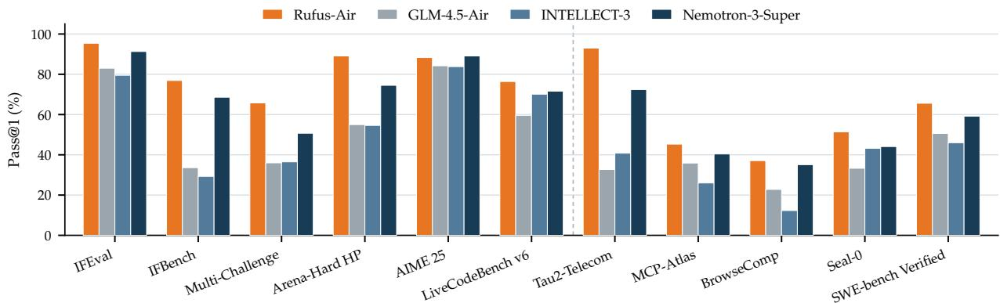

1 Introduction 3   
2 Recipe Overview 3   
2.1 Pipeline Stages and Order . . . 4   
2.2 Recipe Outcome . 5   
3 Post-Training Stages 6   
3.1 Supervised Fine-Tuning 6   
3.2 Reasoning RL 10   
3.3 Coding RL 12   
3.4 Instruction-Following RL . . . . . 14   
3.5 General Agent . 17   
3.6 Coding Agent 18   
3.7 Search Agent 20   
3.8 RLHF 23   
4 Training Infrastructure 25   
4.1 SFT and General RL 25   
4.2 Agentic RL and Its Environment . 26   
5 Evaluation 28   
5.1 Benchmarks 28   
5.2 Main Results . 29   
6 Discussion 30   
Conclusion 31   
A Contributions 41   
B Training Configurations 42   
C Data Tables and Example Transformations 43   
D How to Read the Public Baseline Numbers 44   
E Search Agent Evaluation and Trajectory Analysis 46   
F Tau2-Bench with Different User Simulators 47

## 1 Introduction

Open-weight base checkpoints have lowered the barrier to post-training research: many teams can now start from a public model instead of training from scratch. The recipes themselves, however, are still reported thinly, with a few exceptions such as Tülu 3 [49]. Post-training sections often read more like a system card than like a reproducible recipe, and the details a team would actually need are the least disclosed.

This report reduces that gap with an open, reusable account of one full recipe, Rufus-Air, built on GLM-4.5-Air-Base [33]. The recipe is reproducible for two reasons: it builds entirely on open-source components, and its compute footprint is small enough for teams outside frontier labs (Table 16). The report sits between a research paper and an engineering experience report. Some of its conclusions come from training experience rather than from full ablations, and we mark them as such (§6).

At a high level, the recipe is organized around four conclusions, each developed in a later section:

1. SFT is a capability-building stage, not a warm-up: a strong SFT checkpoint establishes broad capabilities that subsequent RL stages refine rather than build from scratch (§3.1).

2. Difficulty filtering keeps prompts in a productive band: we drop prompts the policy already solves and, in most stages, prompts it never solves. Training then focuses on learnable examples [28], and the filter acts as an automatic curriculum (§3.2–§3.7).

3. Reward reliability sets the stage order: stages with hard, verifiable rewards run first and stages with softer judge- or model-based rewards run later, which limits how long training is exposed to reward hacking. The order follows how easily a reward can be gamed, not its format: IF RL uses a rubric judge yet runs early, because instruction following is close to what the model already does, so the judge has little room to be gamed (§2.1).

4. Infrastructure is part of the recipe: the details that made the stages work are rarely reported, among them token-in/token-out rollouts for on-policy multi-turn RL; consistent chat template handling from SFT through the agentic stages; a sandbox service reliable for long agentic runs; and large batches with Rollout Routing Replay [59] for stable RL (§4).

We use benchmarks only to place the recipe among public open models: Rufus-Air leads the official GLM-4.5-Air release on every reported benchmark except Arena-Hard v2 Creative Writing, and is competitive with open models of similar size such as INTELLECT-3 [78] and Nemotron-3-Super [69] (Table 1, §5.2). The contribution we care about is the recipe itself: a documented, reusable account that other teams can build on (§7).

## 2 Recipe Overview

This section gives the shape of the whole pipeline before the per-stage detail: how the stages are arranged and why. Figure 1 summarizes every stage with its targeted capability and reward type.

Starting checkpoint. We start from GLM-4.5-Air-Base [33], a Mixture-of-Experts (MoE) model with 106B total and 12B active parameters, for practical reasons. Its base weights are public. It fits the open-source stack we use: Slime [99] comes from the group that released GLM-4.5, and SGLang [121] supports the GLM family natively. It is large enough that MoE-specific post-training problems show up in realistic form. And with 12B active parameters, the RL stages ran on 8–32 nodes (Table 16). We use the base model unchanged—architecture, tokenizer, and native <think> chat format—and treat it as fixed. Rufus-Air names the checkpoint at the end of the pipeline; an intermediate checkpoint is named after the stage that produced it (e.g., Rufus-Air SFT, or Rufus-Air RL after instruction-following RL). GLM-4.5-Air, the baseline we compare against, is the vendor’s own post-trained release, not one of ours.

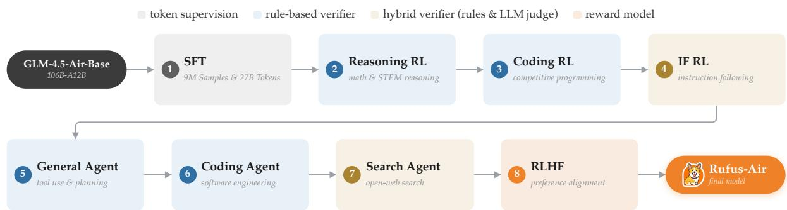  
Figure 1: Recipe overview. The post-training pipeline runs from the GLM-4.5-Air-Base checkpoint through eight stages to the final Rufus-Air model, each stage trained on the checkpoint the previous one produced.

## 2.1 Pipeline Stages and Order

Pipeline stages. The recipe is one serial pipeline: SFT → Reasoning RL → Coding RL → Instruction-Following RL → General Agent → Coding Agent → Search Agent → RLHF, each stage trained on the checkpoint the previous one produced. SFT builds the base capability and normalizes the output format. Reasoning RL and Coding RL apply reinforcement learning with verifiable rewards (RLVR; [49]) to improve reasoning and coding under low-noise verifiers. IF RL improves exact constraint following and the retention of instructions across turns. The three agentic stages add tool use in their own environments (General Agent, Coding Agent, Search Agent). RLHF [72] shapes open-ended quality where no hard verifier exists. Figure 1 shows the stage order and each stage’s targeted capability; each stage’s data and reward are described in its own subsection.

Why this order. Two axes set it. On capability, stages go from basic to advanced, so each builds on what the previous one seeded. On reward type, stages go from hard, verifiable rewards toward softer score-based, judge-based, or environment-mediated signals. Reasoning RL and Coding RL, whose rewards are least vulnerable to hacking, run first; the harder-to-verify stages run later, which shortens the time a gameable reward is under optimization pressure. This order does not protect earlier gains, because every later stage updates the same parameters. We therefore measure each stage against the checkpoint it starts from (Table 2); the one exception is SFT, which starts from a base model and is measured against the public GLM-4.5-Air release. The order is not strictly by reward hardness: IF RL uses a rubric-based LLM judge [120] yet runs before the General Agent and Coding Agent stages, whose rewards are rule-based assertions and execution tests (Figure 1). What the order tracks is exposure to reward hacking. Instruction following is close to what the policy already does, so its judge has little room to be gamed, and we saw no serious hacking in this stage; the preference reward of RLHF, a judge on an open-ended objective, is where the risk is real, and that stage runs last. One local ordering choice, reasoning before instruction following, was inherited from earlier experiments; on GLM-4.5-Air, IF RL gains more

Table 1: Performance comparison. All values are pass@1 [18] except the two Arena-Hard v2 rows, which are win rates; §5.1 describes and cites every benchmark. The four leftmost models we evaluated ourselves under the same harness, and we bold the best of those four in each row; the other six models are from other public sources, listed in Appendix D. A dash marks a benchmark we did not run (first four columns) or that the source did not report (other six).
<table><tr><td colspan="10">Rufus-Air GLM-4.5-Air INTELLECT-3 Nemotron-3 Qwen3.5 GPT-OSS Ring-flash Solar-Open Sarvam Mistral</td></tr><tr><td>Total params</td><td>106B</td><td>106B</td><td>106B</td><td>120B</td><td>122B</td><td>117B</td><td>100B</td><td>102B</td><td>105B</td><td>119B</td></tr><tr><td>Active params</td><td>12B</td><td>12B</td><td>12B</td><td>12B</td><td>10B</td><td>5B</td><td>6B</td><td>12B</td><td>10B</td><td>7B</td></tr><tr><td colspan="9">Instruction following &amp; alignment</td><td></td></tr><tr><td>IFBench(prompt strict)</td><td>76.9</td><td>33.6</td><td>29.3</td><td>68.6</td><td>76.1</td><td>69.0</td><td></td><td>57.7</td><td></td><td>48.0</td></tr><tr><td>IFEval(prompt strict)</td><td>95.4</td><td>83.0</td><td>79.5</td><td>91.3</td><td>93.4</td><td>88.9</td><td>一</td><td>88.0</td><td>84.8</td><td>84.0</td></tr><tr><td>Multi-challenge</td><td>65.8</td><td>36.0</td><td>36.5</td><td>50.7</td><td>61.5</td><td>45.3</td><td></td><td>40.5</td><td></td><td>I</td></tr><tr><td>Arena-Hard v2 (HP)</td><td>89.1</td><td>55.0</td><td>54.6</td><td>74.5</td><td>75.2</td><td>90.3</td><td></td><td></td><td>一</td><td>一</td></tr><tr><td>Arena-Hard v2 (CW)</td><td>53.0</td><td>60.3</td><td>45.4</td><td>61.5</td><td>一</td><td>一</td><td>一</td><td>一</td><td></td><td>一</td></tr><tr><td colspan="9">Reasoning &amp; knowledge</td><td></td></tr><tr><td>AIME 25</td><td>88.3</td><td>84.2</td><td>83.8</td><td>89.1</td><td>90.4</td><td>92.5</td><td>87.0</td><td>84.3</td><td>88.3</td><td>83.8</td></tr><tr><td>AIME 26</td><td>86.7</td><td>86.5</td><td>82.6</td><td>86.0</td><td>91.7</td><td>一</td><td>1</td><td>87.7</td><td></td><td>86.4</td></tr><tr><td>LiveCodeBench v6</td><td>76.4</td><td>59.6</td><td>70.1</td><td>71.6</td><td>78.9</td><td>82.7</td><td>70.8</td><td>56.5</td><td>71.7</td><td>57.9</td></tr><tr><td>GPQA</td><td>75.6</td><td>73.9</td><td>72.4</td><td>75.9</td><td>86.6</td><td>80.1</td><td>75.3</td><td>66.2</td><td>78.7</td><td>71.2</td></tr><tr><td>Frontier Sci.(Olympiad)</td><td>54.6</td><td>48.1</td><td>54.3</td><td>56.4</td><td>一</td><td>一</td><td>一</td><td></td><td></td><td>一</td></tr><tr><td>Frontier Sci.(Research)</td><td>35.1</td><td>28.2</td><td>28.9</td><td>35.6</td><td>一</td><td>一</td><td>一</td><td>一</td><td>一</td><td>一</td></tr><tr><td colspan="9">General Agent</td><td></td></tr><tr><td>Tau2-Retail</td><td>85.3</td><td>80.7</td><td>75.7</td><td>86.4</td><td>62.6</td><td>76.5</td><td></td><td>59.3</td><td></td><td>一</td></tr><tr><td>Tau2-Airline</td><td>84.0</td><td>77.0</td><td>76.0</td><td>86.0</td><td>66.0</td><td>56.0</td><td></td><td>52.4</td><td>一</td><td>一</td></tr><tr><td>Tau2-Telecom</td><td>93.0</td><td>32.7</td><td>40.8</td><td>72.4</td><td>95.0</td><td>57.7</td><td>一</td><td>55.6</td><td>一</td><td>41.2</td></tr><tr><td>MCP-Atlas</td><td>45.3</td><td>35.9</td><td>26.0</td><td>40.4</td><td>1</td><td>一</td><td>一</td><td>34.4</td><td>一</td><td>1</td></tr><tr><td colspan="9">Search Agent</td><td></td></tr><tr><td>BrowseComp</td><td>37.1</td><td>22.7</td><td>12.3</td><td>35.2</td><td>63.8</td><td>41.1</td><td></td><td></td><td>49.5</td><td></td></tr><tr><td>Seal-0</td><td>51.4</td><td>33.3</td><td>43.2</td><td>44.1</td><td>44.1</td><td>45.1</td><td>一</td><td>一</td><td>一</td><td>1</td></tr><tr><td>HLE-Verified Gold</td><td>51.1</td><td>20.2</td><td>27.2</td><td>46.9</td><td>一</td><td>一</td><td></td><td></td><td>一</td><td>一</td></tr><tr><td colspan="9">Coding Agent</td><td></td></tr><tr><td>Terminal-Bench 2.1</td><td>42.7</td><td>24.7</td><td>25.8</td><td>42.7</td><td>47.6</td><td>26.2</td><td></td><td></td><td></td><td>21.0</td></tr><tr><td>SWE-bench Verified</td><td>65.6</td><td>50.6</td><td>46.0</td><td>59.2</td><td>72.0</td><td>62.4</td><td>1</td><td>15.4</td><td>45.0</td><td>一</td></tr></table>

from the Reasoning RL checkpoint than from the SFT checkpoint (§3.4).

## 2.2 Recipe Outcome

Before the stage-by-stage recipe, Table 1 shows where the finished checkpoint lands. We measured three baselines under our own protocol: GLM-4.5-Air and INTELLECT-3 [78], which share our base checkpoint, and Nemotron-3-Super [69], which does not. Against them, Rufus-Air leads on the instruction-following rows and on most of the alignment and agentic rows; the exceptions are Tau2-Airline and, by about a point, Tau2-Retail, where Nemotron-3-Super is ahead, and

Table 2: Stagewise progression of Rufus-Air, assembled from the per-stage result tables. One row per checkpoint, in pipeline order: each row carries the benchmarks targeted by the stage that produced it (with the change against the row above) and, in the next stage’s target columns, the starting values that stage’s table reports for the same checkpoint. Blue cells mark the pairs of numbers each stage’s change is read from; §5.2 explains how to read the table.
<table><tr><td>Checkpoint</td><td>GPQA</td><td>AIME25</td><td>AIME26</td><td>LCBv6</td><td>IFEval</td><td>IFBench</td><td>Multi-ch.</td><td>MCP-A</td><td>Tau2-Re</td><td>TB2.1</td><td>SWE-V</td><td>BrowseC</td><td>Seal-0</td><td>HLE-V</td><td>AH(HP)</td><td>AH(CW)</td></tr><tr><td>GLM-4.5-Air</td><td>73.9</td><td>84.2</td><td>86.5</td><td>59.6</td><td>83.0</td><td>33.6</td><td>36.0</td><td>35.9</td><td>80.7</td><td>24.7</td><td>50.6</td><td>22.7</td><td>33.3</td><td>20.2</td><td>55.0</td><td>60.3</td></tr><tr><td>SFT (3799)</td><td>68.2-5.7</td><td>90.8+6.6</td><td>90.0 +3.5</td><td>一</td><td>一</td><td>一</td><td>一</td><td>一</td><td>一</td><td>I</td><td>一</td><td>一</td><td>一</td><td></td><td>一</td><td>一</td></tr><tr><td>+ Reasoning RL</td><td>73.5 +5.3</td><td>88.0-2.8</td><td>87.4-26</td><td>68.6</td><td>一</td><td>一</td><td>一</td><td>一</td><td>1</td><td></td><td>一</td><td>一</td><td></td><td>一</td><td>一</td><td></td></tr><tr><td>+ Coding RL</td><td></td><td>一</td><td>一</td><td>75.9 +73</td><td>90.5</td><td>63.8</td><td>31.1</td><td></td><td></td><td></td><td>一</td><td>一</td><td>一</td><td>一</td><td>一</td><td></td></tr><tr><td>+ IF RL</td><td></td><td>1</td><td>一</td><td>1</td><td>94.5 +4.0</td><td>77.8 +14.0</td><td>55.8 +24.7</td><td>35.0</td><td>74.0</td><td></td><td></td><td>一</td><td>1</td><td>1</td><td>一</td><td>1</td></tr><tr><td>+ General Agent</td><td></td><td>1</td><td>1</td><td>一</td><td>一</td><td>一</td><td>一</td><td>42.8 +7.8</td><td>83.8 +9.8</td><td>38.8</td><td>65.6</td><td>1</td><td>一</td><td>V</td><td>一</td><td>一</td></tr><tr><td>+ Coding Agent</td><td></td><td>一</td><td>1</td><td>一</td><td>一</td><td>一</td><td>一</td><td>一</td><td>一</td><td>40.2 +1.4</td><td>67.8 +22</td><td>34.2</td><td>48.6</td><td>47.7</td><td>1</td><td></td></tr><tr><td>+ Search Agent</td><td></td><td>一</td><td>1</td><td>一</td><td>一</td><td>一</td><td>一</td><td>一</td><td>一</td><td>一</td><td>1</td><td>37.2 +3.0</td><td>54.0 +5.4</td><td>51.1 +3.4</td><td>83.1</td><td>38.6</td></tr><tr><td>+ RLHF</td><td>一</td><td>一</td><td>一</td><td>一</td><td>一</td><td>一</td><td>一</td><td>一</td><td>一</td><td>一</td><td>一</td><td>一</td><td>1</td><td>一</td><td>89.1 +6.0</td><td>53.0 +14.4</td></tr><tr><td>Rufus-Air</td><td>75.6</td><td>88.3</td><td>86.7</td><td>76.4</td><td>95.4</td><td>76.9</td><td>65.8</td><td>45.3</td><td>85.3</td><td>42.7</td><td>65.6</td><td>37.1</td><td>51.4</td><td>51.1</td><td>89.1</td><td>53.0</td></tr></table>

Arena-Hard v2 Creative Writing, where both Nemotron-3-Super and GLM-4.5-Air are ahead; on Terminal-Bench 2.1 it ties Nemotron-3-Super (§5.2). On competition mathematics and knowledge, where a single stage, Reasoning RL, does the work, Rufus-Air sits close to the others. In other words, the recipe moves most where it spends the most training signal. The reading caveats behind the table are in §5.1 and §5.2; the provenance of the six developer-reported columns is in Appendix D.

## 3 Post-Training Stages

This section covers the eight pipeline stages in order (§2.1 and Figure 1 give their roles at a glance). The first four—SFT, Reasoning RL, Coding RL, and Instruction-Following RL—build general capability; the next three—General Agent, Coding Agent, and Search Agent—add tool use in specialized environments; RLHF closes the pipeline by shaping open-ended quality where no hard verifier exists. Each stage is written to stand on its own—what data entered it, how it was trained, and what came out—and we deliberately keep data and method together rather than splitting them. Throughout, we report the few choices that actually mattered in practice instead of cataloging every training knob. Table 2 summarizes the outcome: one row per checkpoint, with each stage’s change on the benchmarks it targets; the subsections below give the data, training setup, and evaluation behind each row.

## 3.1 Supervised Fine-Tuning

A strong, diverse SFT stage elicits much of the model’s capability and sets the floor RL builds on. SFT is not merely a warm-up. RL works best when the model already has three things: stable reasoning and response formats that verifiers can parse; broad coverage across chat, mathematics, STEM, coding, and tool use; and enough multi-turn and long-context ability that later rewards refine behavior rather than teach it from scratch. We therefore optimize SFT for breadth, format consistency, and long-horizon behavior, aiming for a checkpoint that is already competitive with the public GLM-4.5-Air release. RL can then spend its budget on further improvement rather than on basic formatting and coverage.

<table><tr><td>Category</td><td>Samples</td><td>%Sample</td><td>Train tokens</td><td>%Token</td></tr><tr><td>General Agent</td><td>3,568,388</td><td>39.6%</td><td>3.84B</td><td>14.2%</td></tr><tr><td>General Chat</td><td>1,599,070</td><td>17.7%</td><td>3.30B</td><td>12.2%</td></tr><tr><td>STEM</td><td>1,359,334</td><td>15.1%</td><td>2.37B</td><td>8.8%</td></tr><tr><td>Math</td><td>1,146,108</td><td>12.7%</td><td>7.96B</td><td>29.4%</td></tr><tr><td>Code</td><td>792,807</td><td>8.8%</td><td>4.25B</td><td>15.7%</td></tr><tr><td>Coding Agent</td><td>549,222</td><td>6.1%</td><td>5.32B</td><td>19.7%</td></tr><tr><td>Total</td><td>9,014,929</td><td>100%</td><td>27.04B</td><td>100%</td></tr></table>

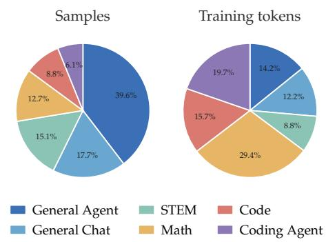  
Table 3: SFT mixture by capability category. Training Figure 2: SFT composition by sample tokens count only assistant tokens after masking system, share (left) and training-token share user, and tool-observation turns. (right).

Data. Our SFT data pipeline has three parts: composition, which fixes what goes into the mix; preprocessing, which converts every source into one supervision format; and decontamination, which screens the mix against the benchmarks we report.

• Data composition. The final SFT mix contains 9.01M samples and 44.5B raw tokens, distributed across 66.7M conversational turns (23.5M supervised). After masking system messages, user turns, and tool observations, 27.0B tokens (60.8%) contribute to the training loss. We group the data into six capability categories—General Agent, General Chat, STEM, Math, Code, and Coding Agent—and report both sample and training-token shares in Table 3 and Figure 2. The two distributions differ substantially. General Agent is the largest category by sample count but contributes far fewer training tokens. In contrast, Math and Coding Agent together account for 18.8% of samples but 49.1% of training tokens, reflecting the greater length of reasoning traces and multi-turn coding trajectories. Reporting both views is therefore important: sample counts describe source coverage, whereas loss-contributing tokens more closely describe the supervision volume seen during optimization. Every prompt and response in the mix comes from one of the 17 public datasets listed in Appendix C; we use the released records as distributed and do not run a separate Rufus-Air response-regeneration pass or commission new human annotation. Thus, the fraction of the mix regenerated by Rufus-Air is zero. Several source datasets already contain model-generated responses or trajectories: Tool-Mind [111] uses DeepSeek-V2-Chat [22], Mixtral-8x22B-Instruct [62], and DeepSeek-V3 [23]; tool-use-multiturn-reasoning [39] uses DeepSeek-R1 [24] and QwQ-32B [80]; ToolMind-Web-QA uses MiroThinker [96] with Qwen3-235B-A22B-Thinking-2507 [110]; Toucan-1.5M [108] uses Qwen3-32B, Kimi-K2 [47], and GPT-OSS [71]; AM-Thinking-v1-Distilled [100] uses AM-Thinking-v1 [42]; AReaL-tau2-data [31] uses Qwen3-30B-A3B; Superior-Reasoning-SFT-gpt-oss-120b [109] and OpenResearcher-Dataset [52] use GPT-OSS-120B; OpenSeeker-v1-30B-SFT [26] uses Qwen3-30B-A3B-Thinking-2507; and several aggregated sources include traces from DeepSeek-R1 or QwQ-32B. These are upstream generation dependencies of the public releases, not in-house distillation teachers.

• Data preprocessing. Heterogeneous source shards are converted to one supervision format in three steps. (i) format normalization: every source is mapped to a role-aware multi-turn schema with a per-message loss mask; source-specific passes repair system prompts, answer suffixes, malformed reasoning tags, and incomplete final turns, and records with no supervised assistant response are dropped. (ii) interleaved thinking supervision: agent trajectories alternate between <think> reasoning, tool calls, and observations. We keep each complete thought– action–observation chain as one training target: an assistant turn counts as intermediate only if it issues a tool call that a tool result immediately follows; otherwise it ends the response, and we split there, so each completed response becomes one example. Earlier dialogue stays as context with its assistant rationales stripped and masked; from the last real user request onward, reasoning-bearing assistant steps are supervised and system, user, and toolobservation messages receive zero loss. (iii) validation and length filtering: rule-based validators check balanced <think> tags, valid role transitions, and consistent masking around tool interactions. Sequence length is measured after applying the production GLM chat template, so it includes role delimiters, reasoning wrappers, tool schemas, calls, and observations, and is capped at 120K tokens.

• Data decontamination. To prevent evaluation data leakage, we screen the SFT mix against reported benchmarks with a word-level 8-gram overlap test: for every benchmark item we sample ∼20 evenly spaced 8-word phrases and substring-match them against the lowercased concatenation of all conversation turns (system, user, assistant, and tool messages), then drop a sample once ≥ 50% of any single item’s phrases hit. We chain the ten passes sequentially — Terminal-Bench 2.0, HLE [76], HLE-Verified [114], Tau2-Bench, SealQA, SWE-bench Verified, Multi-challenge, IFEval, IFBench, and MCP-Atlas — and remove 3,529 samples in total: 3,321 for Terminal-Bench 2.0 (all from a single synthetic text-to-terminal corpus), 57 for HLE-Verified, 21 for IFEval, and 130 for IFBench; the remaining six benchmarks have zero matches. We inspected abnormally high match counts manually and kept the false positives: e.g., 11,874 SWE-bench candidates trace to generic pytest scaffolding of a single task, which we judged benign. Math and knowledge benchmarks (AIME 24 / 25 / 26 [60]; HMMT February 2025, November 2025, and February 2026; and GPQA-Diamond) are the ones most prone to leakage, so we screen them with two further detectors: (i) an exhaustive 8-gram variant that checks all 8-word phrases of every problem (no sampling), and (ii) dense retrieval with Llama-NV-Embed-Reasoning-3B [68] embeddings, after which we manually check every training sample with high cosine similarity to any benchmark problem. The exhaustive n-gram screen finds 26 contaminated pairs (25 AIME 24, 1 AIME 26); manual review of the dense candidates confirms a further 42, for 68 confirmed contaminated pairs (58 unique samples), dominated by verbatim or lightly reformatted AIME 24 problems. Together with all borderline cases, this conservative removal drops 658 unique samples, bringing the total number of instances removed from the SFT mix to 4,187. Together these checks make large-scale contamination very unlikely, though, as with any n-gram and embedding filter, they cannot rule out all leakage. The same residual risk applies to every stage’s prompt set, not only the SFT mix, because we run this same pipeline over each RL prompt set as we assemble it (§3.2, §3.3).

Training setup. We start from GLM-4.5-Air-Base and train for three epochs over the full 9.01Mexample mixture for SFT. Training uses Slime with the Megatron [91] backend on 64 8×H200 nodes (512 GPUs total), with a batch size of 4096 sequences. We use AdamW [58] $( \beta _ { 1 } = 0 . 9 $ $\beta _ { 2 } = 0 . 9 5 , \epsilon = 1 0 ^ { - 8 } )$ , weight decay 0.1, and gradient clipping at 1.0. The learning rate warms up linearly for 100 steps to ${ \check { 5 } } \times 1 0 ^ { - 5 }$ and then follows a cosine schedule toward $5 \times 1 0 ^ { - 6 }$ . The peak was set by a preliminary sweep at smaller batch sizes: peaks of 3e−4 and 5e−4 were consistently unstable, while runs at ≤ 1e−4 produced monotone loss decreases. The model context length is 128K tokens after packing. Only assistant tokens contribute to the token-level loss. As shown in Figure 3, the loss falls from 0.84 at the first step to a 50-step moving average of 0.42 at the end of the first epoch (step 2370), then steps down at each epoch boundary to 0.38 and finally 0.34 at step 7112, the signature of a model re-seeing repeated data. The held-out scores in panel (b) do not follow the loss: they flatten within the first epoch, and the remaining epochs move them only within evaluation noise. We therefore carry checkpoint 3799, taken inside that plateau rather than at the final step, into the RL stages.

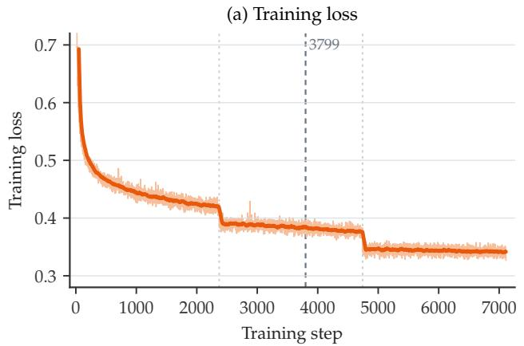

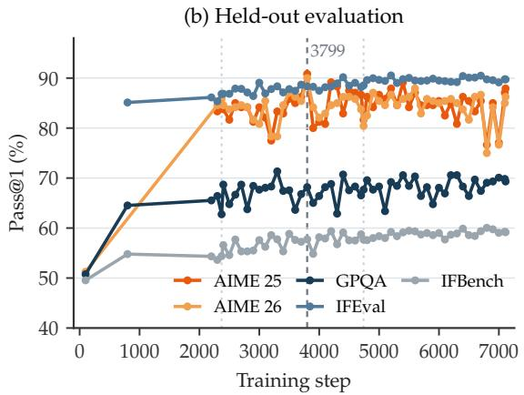  
Figure 3: SFT training dynamics of the shipped SFT run. (a) Token-level training loss per step (light) and its 50-step moving average (dark). (b) Pass@1 of the checkpoint saved every 100 steps on AIME 25 and AIME 26 (n=8, Math-Verify [38] scoring), GPQA Diamond, and IFEval and IFBench (prompt-level strict). The dashed line marks checkpoint 3799, the one the RL pipeline starts from. The loss steps down at each epoch boundary as the data repeats, but the held-out scores flatten within the first epoch, so later checkpoints buy lower loss without better evaluation.

Table 4: SFT-only checkpoint vs. the public GLM-4.5-Air release. All values are pass@1. We compare SFT checkpoint 3799, the checkpoint the RL pipeline starts from (Table 6), before any RL, against the public release (RL-included); ∆ is the SFT checkpoint minus the public release. The SFT checkpoint already leads on single-turn instruction following and on both AIME years; it trails only on GPQA, one of the gaps the RL stages then target.
<table><tr><td></td><td>IFEval</td><td>IFBench</td><td>GPQA</td><td>AIME 25</td><td>AIME 26</td></tr><tr><td>GLM-4.5-Air</td><td>83.00</td><td>33.60</td><td>73.90</td><td>84.20</td><td>86.50</td></tr><tr><td>Rufus-Air SFT (3799)</td><td>88.33</td><td>57.75</td><td>68.18</td><td>90.83</td><td>90.00</td></tr><tr><td>Δ</td><td>+5.33</td><td>+24.15</td><td>-5.72</td><td>+6.63</td><td>+3.50</td></tr></table>

What SFT gives the rest of the recipe. Checkpoint 3799 is the starting policy of the RL sequence: Reasoning RL initializes from it, and every later stage inherits the result through the intervening checkpoints (§2.1). It also fixes the message schema and the reasoning and tool-call formats that downstream verifiers and judges parse, and it gives sparse verifier rewards enough initial successes to reinforce (Table 4).

Result anchor. The SFT-only checkpoint is already a useful standalone model, but its strengths are uneven (Table 4). It beats the public GLM-4.5-Air post-trained reference on single-turn instruction following by wide margins, is ahead on both AIME years, and trails on GPQA. Multiturn instruction following was not measured on this checkpoint, but the checkpoint the IF RL stage starts from sits at 31.1 on Multi-challenge (Table 9), so that deficit is real too. That pattern is the point: SFT alone buys strong single-turn instruction following and a viable reasoning initialization, and the deficits it leaves—GPQA and multi-turn following—are exactly what the RL stages target. Across the RL pipeline, GPQA pass@1 rises from 68.18 to 75.6 and IFEval from 88.33 to 95.4 (Table 4 to Table 1).

## 3.2 Reasoning RL

Reasoning RL applies reinforcement learning with verifiable rewards to the SFT-initialized policy across math reasoning, algorithmic puzzle-solving, and scientific QA, and it runs first among the RL stages (§2.1). The main lesson is that, once the SFT model is strong enough, progress depends more on data curation than on a novel RL objective: the choices that mattered most were keeping the prompt set in the productive learning band, verifying that each prompt admits at least one valid solution path, and not letting rollout budget go to needless verbosity.

Data. We assemble the reasoning prompt set from three streams: public reasoning problems with reference solutions (primarily crawled from open repositories); synthesized and augmented data, including synthesized math and logic puzzles generated through Enigmata [17] and ReasoningGym [94] with task-specific verification functions; and hard third-party math sets with reference answers. Every problem is auto-tagged into fine-grained domains, deduplicated, and screened for contamination and policy issues. The contamination screen is the same one applied to the SFT mix (§3.1): the chained n-gram passes over the reported benchmarks, plus the exhaustive n-gram and dense-retrieval detectors for the math and knowledge benchmarks that are most prone to leakage. The assembled prompt set spans three task families of verifiable single-turn prompts, summarized in Table 5. The mix is deliberately skewed: Math dominates prompt counts, while Puzzles dominate prompt tokens (∼688 tokens/prompt), reflecting long serialized boards, grids, and rule specifications from 134 task generators in 15 reasoning categories. Two filters then gate entry into RL, and together they are the most important choice in this stage. A correctness filter removes prompts for which a strong teacher (GPT-OSS-120B) obtains no positive reward. This removes mis-specified or effectively unsolved tasks and provides evidence that each retained prompt admits at least one valid solution path. A learnability filter [28] then keeps prompts in the productive learning band for the current policy: prompts solved at a rate above 0.8 are dropped as too easy, and prompts with zero observed success are dropped as currently unlearnable. What remains gives useful gradient and, as the policy improves, forms an automatic curriculum (the online form is described below). Rewards remain cheap to verify throughout: 83.5% of prompts request a \boxed{} answer matched against a short gold label (median 5 tokens).

Reward design. Deterministic verifiers deliver the rewards: Math-Verify [38] on canonicalized final answers for math, generated Python checkers executed against the model output for logic puzzles, and fuzzy string matching against reference answers for science QA. In every case the reward is binary, low-noise, and programmatically auditable, which is why this stage runs early in the sequence.

Training setup. We use Group Sequence Policy Optimization (GSPO; [118]) as the policy-gradient backbone, a practical rather than algorithmic choice: GSPO defines the importance ratio and clipping at the sequence level, which is more stable on long MoE rollouts and, together with Rollout Routing Replay, absorbs the mismatch between the FP8 rollout and BF16 training. We refer the reader to the original paper for the objective. Off-policy correction across the two optimizer steps per rollout uses truncated importance sampling. The clip range is tight, $\varepsilon = \bar { 1 0 } ^ { - 3 }$ and $\varepsilon _ { \mathrm { h i g h } } \stackrel { \cdot } { = } 2 \times 1 0 ^ { - 3 }$ ; KL and entropy coefficients are zero. The optimizer is AdamW with $\mathrm { l r } = 1 0 ^ { - 6 }$ constant, weight decay 0.1, $( \beta _ { 1 } , \beta _ { 2 } ) = ( 0 . 9 , 0 . 9 8 )$ , and gradient clipping at 1.0. Each rollout samples 256 prompts with n=16 samples per prompt at temperature 1.0 under a 30,000-token response budget, and feeds two optimizer steps (global batch 2,048 sequences). We mask the loss on truncated samples, whose rate grows from ∼3% early in training to 15–20% after ∼40 rollouts as responses lengthen. Training runs synchronously on 8 nodes (64×H200), with rollouts served by colocated FP8-quantized SGLang engines (8 GPUs per engine) on the same GPUs that run BF16 training, alternating via engine offload.

Table 5: RLVR prompt set. Sources, verifiers, and composition per task family. Math leads on prompt count, Puzzles on token volume—puzzle statements are roughly six times longer. Families are assigned by a keyword heuristic because the crawled problems carry no subject labels. We apply difficulty and correctness filtering (see text) uniformly across families.
<table><tr><td colspan="3"></td><td colspan="2">Prompts</td><td colspan="2">Prompt tokens</td></tr><tr><td>Task</td><td>Data source</td><td>Verifier</td><td>#</td><td>%</td><td>#</td><td>%</td></tr><tr><td>Math</td><td>HF crawl; synthesized</td><td>Math-Verify (canonical match)</td><td>57,736</td><td>47.7</td><td>6.34M</td><td>25.3</td></tr><tr><td>Science</td><td>HF multi-science crawl</td><td>Fuzzy string matching</td><td>43,199</td><td>35.7</td><td>4.81M</td><td>19.2</td></tr><tr><td>Puzzles</td><td>Enigmata; ReasoningGym</td><td>Generated Python checkers</td><td>20,226</td><td>16.7</td><td>13.91M</td><td>55.5</td></tr><tr><td>Total</td><td></td><td></td><td>121,161</td><td>100</td><td>25.07M</td><td>100</td></tr></table>

Two practical controls mattered in this stage. First, we penalize length relative to the shortest correct rollout in each group—a linear penalty that is zero at or below that baseline and grows to a cap at the maximum allowed length, related to but not the same as the group-relative shaping in Kimi k1.5 [46]. This is partly a behavioral preference (RL-trained reasoning models tend to inflate length without commensurate accuracy gains [19]) and partly training economics: under a fixed RL budget, unchecked verbosity cuts rollout throughput and raises truncation. Second, we filter prompts online by group-average reward r¯, following the dynamic-sampling idea in DAPO [113]: the selector over-samples 4× (1,024 prompts) and keeps only groups with $\bar { r } \in \left( 0 , 0 . 8 \right]$ , dropping all-fail groups (no signal) and near-all-pass groups (negligible gradient). Because the window is fixed but the policy improves, previously dead prompts keep crossing into the productive band, so the difficulty frontier advances on its own without manual staging.

Result anchor. Relative to the SFT checkpoint it trains from, the Reasoning RL checkpoint raises GPQA by +5.3 points, from 68.2 to 73.5, and leaves both AIME years 2.6–2.8 points lower (Table 6). We tuned the stage against GPQA, which starts at 68, and treated AIME as a guardrail on which a drop within evaluation noise was acceptable: the SFT base already sits at 90–91 pass@1, and with 30 problems per year a change of under three points is less than one problem’s worth (same-condition re-runs of AIME 25 on the SFT checkpoint differ by 4.6 points at n=8). The takeaway we would carry forward is that, on a strong SFT base, verifier-based Reasoning RL is reliable and largely curation-bound: the gains track the quality of learnability and correctness filtering more than the details of the policy-gradient objective.

Table 6: Reasoning RL results, measured against the SFT checkpoint the stage trains from (SFT step 3799). ∆ is the change contributed by this stage. All values are pass@1 percentages under the same evaluation protocol. GPQA is the stage’s primary reference metric; AIME 25 and AIME 26 are guardrails.
<table><tr><td>Checkpoint</td><td>GPQA</td><td>AIME 25</td><td>AIME 26</td></tr><tr><td>Rufus-Air SFT</td><td>68.18</td><td>90.83</td><td>90.00</td></tr><tr><td>+ Reasoning RL</td><td>73.50</td><td>88.02</td><td>87.40</td></tr><tr><td>Δ</td><td>+5.32</td><td>-2.81</td><td>-2.60</td></tr></table>

## 3.3 Coding RL

Coding RL builds on the Reasoning RL checkpoint and improves competitive-programming performance with execution-based rewards.

Data composition. The Coding RL problem set aggregates four sources (Table 7) and mixes two verification modalities: functional problems carry assert unit tests that exercise a named function, and stdin/stdout problems carry input/output string pairs. A modality-specific system prompt fixes the answer format: Python inside a fenced \`\`\`python ... \`\`\` block.

The sources differ in kind, not only in size. EvolveCoder [85] supplies rewritten problems with adversarially evolved test cases, derived from TACO [50], APPS [37], Codeforces, and other open collections, and accounts for nearly all functional problems in our set; Nemotron [2] is real contest material, Codeforces-dominant with AtCoder, Aizu Online Judge, HackerEarth, CodeChef, Kattis, and HackerRank in the tail; Dolci [97] is the only mixed source; and ADR [119] contributes technique-tagged algorithmic problems (greedy, dynamic programming, sorting). Aggregated across sources, Codeforces is the largest single platform (∼8,700 problems, ∼30%), so the set stays contest-heavy while spanning both answer formats.

Table 7: Coding RL data composition after the drop-all-pass screen. All problems are Python. †Dolci splits into 911 functional and 2,198 stdin/stdout problems.
<table><tr><td>Source</td><td>Modality</td><td>Problems</td><td>% of set</td></tr><tr><td>EvolveCoder (synthetic)</td><td>functional</td><td>14,743</td><td>50.1%</td></tr><tr><td>Nemotron (competitive)</td><td>stdin/stdout</td><td>9,393</td><td>31.9%</td></tr><tr><td>Dolci</td><td>mixed†</td><td>3,109</td><td>10.6%</td></tr><tr><td>ADR (algorithmic)</td><td>stdin/stdout</td><td>2,160</td><td>7.3%</td></tr><tr><td>Total</td><td>53.2% fn / 46.8% i/o</td><td>29,405</td><td>100%</td></tr></table>

Data preprocessing. We apply three filters at assembly time and two sampling-based screens before training begins. Schema validation drops records without a non-empty test payload — an assert list for functional problems, inputs/outputs pairs for stdin/stdout ones — since problems without tests provide no RLVR signal. Deduplication keys on the SHA-256 of the whitespacenormalized, lowercased problem statement. We check eval leakage against LiveCodeBench v6 (release\_v6, 1,055 problems, 2023-05 to 2025-04) using exact matching of 400-character prefix hashes and character-level 60-gram overlap. Among the 1,055 evaluation problems, none has a matching prefix hash or shares at least five character-level 60-grams with any training problem. Our provenance checks identify no LeetCode-sourced training problems and place the identified AtCoder problems before the LCB v6 AtCoder evaluation window. These checks complement the text-overlap screening but do not exclude rewritten or semantically equivalent problems. A teacher-based solvability screen mirrors the reasoning stage (§3.2): we retain only problems for which at least one sampled completion from GPT-OSS-120B passes the verifier, providing an empirical check of problem solvability and test consistency before policy sampling. The difficulty filter is the “drop-all-pass” screen that produces the final problem set of Table 7: before RL begins, we draw four warm-up samples per problem from the base policy and remove every problem solved by all four (pass rate $> 0 . 8 \mathrm { \ a t \ } n { = } 4 )$ . This heuristic reduces the prevalence of easy problems, since rollout groups with identical rewards provide no reward-driven policy-gradient signal under the group-mean baseline. Passing all four screening samples, however, does not imply that a problem will remain saturated in subsequent rollouts. We retain problems with no passing warm-up sample, as they may yield successful completions and informative reward variation in subsequent rollouts. We do not repeat the difficulty filter during training.

Reward design. We parse each rollout response for the last fenced \`\`\`python code block and execute it in a sandboxed Python runtime against the problem’s tests, dispatching on the label modality: assert-based unit tests for functional problems, stdin/stdout comparison for the rest.

Per-problem tests are sub-sampled to at most 50 with a deterministic, SHA-256-seeded random choice, so the sub-sample is identical across rollouts of the same problem and the reward does not drift with sampler randomness.

The reward is binary: 1 if all selected tests pass for a given completion, 0 otherwise. We apply no additional format penalty, as fenced-block compliance is already 98–100% at iteration 0.

Training setup. We optimize the policy with GSPO and apply truncated importance sampling to mitigate the mismatch between FP8 rollout inference and BF16 training. The clip range is tight, $\overline { { \varepsilon } } = 2 \times 1 0 ^ { - 3 }$ and $\varepsilon _ { \mathrm { h i g h } } = 3 \times 1 0 ^ { - 3 }$ , matching the sequence-level GSPO loss. KL and entropy coefficients are zero for most of training; we enable a nominal KL term $( 1 0 ^ { - 6 } )$ in the 128K continuation as a stability guard. The optimizer is AdamW with $\mathrm { l r } = 1 0 ^ { - 6 }$ constant, weight decay 0.1, $( \beta _ { 1 } , \beta _ { 2 } ) = ( 0 . 9 , 0 . 9 8 )$ , and gradient clipping at 1.0. Each rollout consists of 128 prompts with n=64 samples per prompt (8,192 sequences; 64 prompts after the 128K extension), followed by eight optimizer steps. We mask the loss on responses truncated at the generation limit; these account for less than 0.1% of samples after the extension to 128K tokens. As shown in Figure 4, the raw training reward climbs from 0.26 to 0.34 over the first 23 rollout steps under a 64K-token response budget. Response lengths grow throughout this phase, and 11–28% of samples per rollout hit the 64K cap and are loss-masked, so at step 23 we extend the maximum response length to 128K and resume from that checkpoint. The extension effectively eliminates truncation (<0.1% of samples thereafter) and reward resumes its climb, reaching 0.42 by step 34. Figure 4 shows the corresponding LiveCodeBench v6 pass@1, which rises from 67.9 at step 1 to 74.5 across the 64K phase and peaks at 75.9 at step 33 under the extended budget, the checkpoint we carry forward. Training runs on 32 eight-GPU nodes (256 GPUs total) in a colocated configuration: FP8-quantized SGLang engines serve rollouts on the same GPUs that run BF16 training, alternating via engine offload.

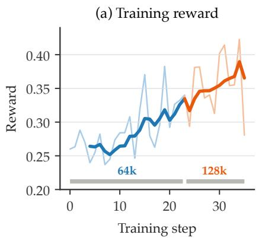

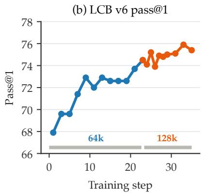  
Figure 4: Coding RL training dynamics. (a) Raw training reward. (b) LiveCodeBench v6 pass@1. The maximum rollout response length is 64K tokens for the first 23 rollout steps and 128K thereafter. Following the extension, the truncation rate falls from 11–28% to below 0.1%. During continued training, reward reaches 0.42 and LiveCodeBench v6 pass@1 peaks at 75.9 at step 33, the checkpoint we carry forward.

Table 8: Coding RL results on LiveCodeBench v6, measured against the Reasoning RL checkpoint the stage trains from. ∆ is the change contributed by this stage. All values are percentages from one single-stage evaluation at n=8; this protocol differs from the one behind Table 1, so the LiveCodeBench values here are not directly comparable with the headline table.
<table><tr><td>Checkpoint</td><td>Pass@1</td><td>Pass@8</td></tr><tr><td>Reasoning RL</td><td>68.6</td><td>85.1</td></tr><tr><td>+ Coding RL</td><td>75.9</td><td>87.4</td></tr><tr><td>Δ</td><td>+7.3</td><td>+2.3</td></tr></table>

Result anchor. Relative to the Reasoning RL checkpoint, Coding RL lifts LiveCodeBench v6 pass@1 by +7.3 points (Table 8), with the full trajectory in Figure 4: most of the gain accrues in the 64K phase, and pass@1 peaks at step 33 after the response-budget extension. Pass@8 improves by 2.3 points, compared with 7.3 points for pass@1 (Table 8). The practical finding from this run is that extending the response budget removed truncation masking, after which both reward and LiveCodeBench kept rising.

## 3.4 Instruction-Following RL

Instruction-following (IF) RL targets the capability of following complex user instructions precisely. We decompose “complex” along two axes and build training data for each. The first is multiconstraint instructions, where a single request carries several constraints that must all be satisfied at once; we concentrate on rule-verifiable hard constraints such as length limits, structural templates, and keyword requirements. The second is multi-turn instruction following, which requires retaining layered instructions across conversation turns, adhering to the system prompt for the whole dialogue, and staying self-coherent over extended exchanges. We synthesize one dataset per axis and train them jointly in a single stage.

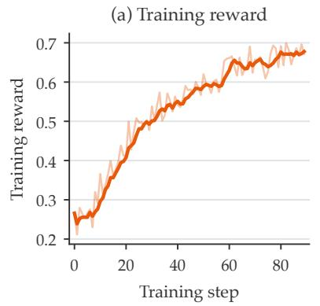

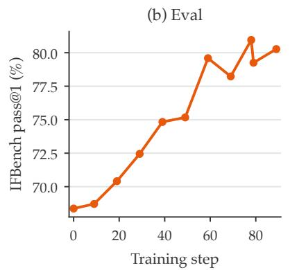

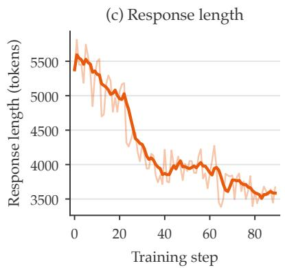  
Figure 5: IF RL training dynamics. In (a) and (c) the light curve is the per-step value and the dark curve a 5-step moving average. Reward rises throughout without flattening, so the run ends on its step budget rather than on convergence. Response length falls from ∼5.4K tokens to ∼3.6K and stays there. The IFBench eval in panel (b) is scored by the in-loop training-time harness, so its values differ slightly from the reported protocol of Table 9.

Verifiable multi-constraint IF data. We synthesize 14K single-turn prompts whose constraints can all be checked by Python. We start from a manually written pool of single-constraint instructions, then have a teacher LLM (Qwen3-235B-A22B) automatically augment it into diverse multi-constraint instructions carrying 2–6 atomic constraints each. An example could be “answer in exactly three paragraphs, keep every paragraph under 40 words, and include the word ‘therefore’ exactly once”. The teacher model also generates a Python verification function per constraint. We combine these instructions with an existing set of user queries to form training prompts, then apply two filters: difficulty filtering removes prompts that are too easy for the policy model (>80% pass rate across 8 sampled responses), and quality filtering removes prompts where the teacher model itself cannot produce a passing response in 4 attempts. Each atomic constraint becomes one rubric, and its Python function decides whether that rubric is satisfied.

Multi-turn conversational IF. We synthesize multi-turn conversations and train the model to produce the response to the final user turn, conditioned on the preceding dialogue. The conversations are generated adversarially: a teacher LLM plays the user, while several openweight models take the assistant role in rotation across data points, so that the training data are not biased toward a single model’s style. The user-side model also plans how the conversation unfolds and actively tries to make the assistant fail, such as layering instructions, revising earlier requirements, and introducing distractors. These yield hard instruction-following instances that current mainstream models do not handle reliably. A portion of the data carries a system prompt and serves as instruction-hierarchy training [102, 116]: the model must keep honoring the system prompt’s requirements throughout the dialogue, including when the user turns challenge the system prompt. Each conversation is paired with a list of rubrics that evaluate the response to the final turn. Rubrics that can be verified programmatically are checked by Python functions; the rest are left to the LLM judge (e.g., “Does the response avoid recommending dishes containing shellfish, given the user’s allergy stated in turn 1?”).

We apply three filtering stages: (i) sanity filtering removes overlong conversations caused by verbose assistant responses and downsamples cases where the expected behavior is to decline the user’s request, to prevent over-refusal; (ii) quality filtering uses the teacher model to attempt each conversation—if it cannot pass the rubrics at least once in 4 attempts, we drop the sample as likely unanswerable; (iii) difficultyfiltering removes cases that are too easy for the policy model (>80% pass rate across 8 sampled responses). The final dataset contains 13K conversations averaging 6.1 turns and 2.7 rubrics each.

Table 9: Instruction-following RL results, measured against the Coding RL checkpoint the stage trains from. ∆ is the change contributed by this stage. IFEval, IFBench and AdvancedIF report prompt-level accuracy.
<table><tr><td>Checkpoint</td><td>IFEval</td><td>IFBench</td><td>Multi-challenge</td><td>AdvancedIF</td><td>GPQA</td><td>AIME 25</td></tr><tr><td rowspan="2">Coding RL + IF RL</td><td>90.5</td><td>63.8</td><td>31.1</td><td>45.5</td><td>67.9</td><td>87.6</td></tr><tr><td>94.5</td><td>77.8</td><td>55.8</td><td>62.9</td><td>71.1</td><td>86.4</td></tr><tr><td>Δ</td><td>+4.0</td><td>+14.0</td><td>+24.7</td><td>+17.4</td><td>+3.2</td><td>-1.2</td></tr></table>

Reward design. Both datasets share one reward formulation: a rubric-based binary reward. For each training instance we express the conditions the response must meet as a list of rubrics, score every rubric independently, and grant positive reward only when all of them are satisfied. Rubrics come in two forms. Code-verifiable rubrics are checked by a Python function that returns true or false—the natural choice for mechanical conditions such as paragraph counts, casing, or forbidden words. LLM judge rubrics are scored by a teacher LLM and cover the conditions no program can check, such as whether the response respects a preference the user stated several turns earlier. Crucially, the rubrics of an instance describe only what the response must satisfy. We deliberately exclude “optional” rubrics—desirable but not required properties—because they inject noise into the reward signal and push the policy toward a length bias.

Training setup. We mix the two datasets and train them jointly in a single stage on top of the Coding RL checkpoint. We train with Group Relative Policy Optimization (GRPO; [89]): each rollout consists of 256 prompts with n=16 samples per prompt, the response budget is 16K tokens, and the learning rate is $1 . 5 \times 1 0 ^ { - 6 }$ . We train for 90 steps and carry the final checkpoint forward.

Result anchor. Table 9 measures the stage against the Coding RL checkpoint it trains from, and the gains land on the capabilities the data targets. On hard formatting constraints, IFEval rises +4.0 points to 94.5 and IFBench +14.0 points to 77.8. On multi-turn instruction following, Multichallenge rises +24.7 points to 55.8. AdvancedIF [35], which covers multi-constraint instructions, multi-turn instructions, and system-prompt following, rises +17.4 points to 62.9.

Three observations from this stage are worth recording. (i) IF RL does not cost reasoning ability. GPQA (+3.2) and AIME 25 (−1.2) stay level or better; neither move reads as a regression. (ii) Reasoning first is a natural curriculum for IF. Our initial checkpoint has already been through Reasoning RL, and training on it yields larger IF gains than running the same stage directly on the SFT checkpoint, especially on AdvancedIF whose instructions are the most complex in our evaluation set. Satisfying complex instructions requires the model to reason about the constraints before answering, so the reasoning stage supplies a prerequisite. (iii) Rubrics scoped to necessary conditions shorten the final response. Under our setup, the model’s final response (after </think>)

becomes shorter over training (Figure 5), a direct consequence of applying rubrics only to what the response must contain: the policy converges on precise instruction following as its objective and learns that padding beyond it sometimes actively breaks a constraint. Breaking that principle reverses the effect. When we attached rubrics to optional content as well—on the order of ten rubrics per instance—the policy acquired a pronounced length bias, emitting long, redundant responses that try to cover as many possible rubrics as it can.

## 3.5 General Agent

General Agent training runs first among the agent stages because it teaches the skill the others assume: general tool use. It builds a broad, transferable habit—sequence a multi-step plan, emit well-formed tool calls, read the results, recover from errors—that the more specialized coding and search stages then sharpen for their own domains.

Data. AgentWorldModel (AWM) [104] provides 10K single-server Model Context Protocol (MCP) [3] tasks distributed across 1K synthetic environments. We apply two filters before training. (i) correctness: we discard tasks on which neither a strong teacher policy (Qwen3-235B-A22B) nor the initial policy ever passes the binary rule-based reward across sampled rollouts. This provides evidence that every retained task admits a solution path. (ii) difficulty: tasks that the current policy already solves reliably or never solves (no gradient signal) are filtered out for training efficiency. The two filters together leave ∼2K tasks for RL training.

Environment and tools. We adopt AWM as our foundation and extend it with in-house modifications to the task set, server backends, and verifier robustness needed for stable large-scale RL training. Each task is bound to one environment: a scenario-specific database whose schema is derived from that environment’s tasks, and an MCP server whose tools read and write that database, about 35 per environment in AWM. A tool call therefore changes the environment state, and the task’s verifier checks that state once the episode ends. In one AWM environment about music streaming, for example, a task asks the agent to create a playlist of an artist’s most popular tracks, and the environment exposes a synthesized MCP tool create\_playlist that creates a playlist owned by the current user.

Reward design. We use AWM’s code-based verification functions as the reward signal, reduced to a binary outcome at termination: 1.0 if the post-rollout server state satisfies the task’s success criteria and 0.0 otherwise. We use no step-level or LLM judge reward; the per-task verification function is the only signal the policy is trained against. This drops two of AWM’s rewards. AWM uses an LLM judge to absorb environment imperfections that can confound a pure rule-based check; our correctness filter handles this instead. Its format reward targets the protocol through which AWM exposes tools, two meta-tools list\_tools and call\_tool that the agent uses to discover a tool and then invoke it; we instead register every tool schema directly in the system prompt, so the agent calls tools by name, with no discovery step to enforce.

Training setup. This stage trains with GRPO and DAPO-style dynamic sampling, which drops prompt groups where all rollouts pass or all fail, and uses Rollout Routing Replay to stabilize MoE

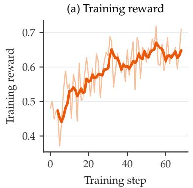

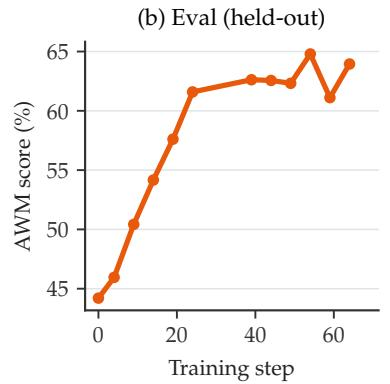

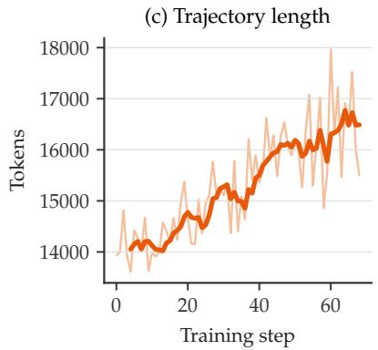  
Figure 6: General Agent training dynamics, shown up to step 68, the checkpoint the pipeline carries forward. (a) Training reward; (b) held-out AWM score, scored by the in-loop training-time harness; (c) trajectory length in tokens. Light curves are per-step values and dark curves a 5-step moving average.

Table 10: General Agent results, measured against the IF RL checkpoint the stage trains from. ∆ is the change contributed by this stage. Tau2-Retail here is pass@1 under the Claude Sonnet 4.5 [5] user simulator (n=4), so it is comparable within this table but not to the Sonnet 5 [6] row of Table 1.
<table><tr><td>Checkpoint</td><td>MCP-Atlas</td><td>Tau2-Retail</td><td>AIME 26</td><td>IFEval</td><td>GPQA</td><td>LiveCodeBench</td></tr><tr><td>IF RL</td><td>34.95</td><td>74.00</td><td>87.08</td><td>94.73</td><td>73.36</td><td>71.21</td></tr><tr><td>+ General Agent</td><td>42.75</td><td>83.80</td><td>87.60</td><td>96.16</td><td>76.39</td><td>73.36</td></tr><tr><td>∆</td><td>+7.80</td><td>+9.80</td><td>+0.52</td><td>+1.43</td><td>+3.03</td><td>+2.15</td></tr></table>

training. Rollouts against stateful MCP servers are CPU-heavy (server I/O, database mutation, MCP transport) and run 3,072 per training step, so this stage relies on distributed rollout (§4.2).

Result anchor. The claim we emphasize is agentic transfer: relative to the checkpoint after IF RL (Rufus-Air RL), General Agent training raises MCP-Atlas pass@1 by +7.80 points and Tau2-Retail by +9.80 points (Table 10). We read these gains as evidence that synthetic MCP environments provide a useful general prior for tool orchestration. The non-agentic benchmarks we monitor for regression (AIME 26, IFEval, GPQA, LiveCodeBench) hold or rise modestly. Figure 6 shows the run behind these numbers: training reward and the held-out AWM score rise together, and the policy reaches them with longer trajectories—from about 14K to about 16.5K tokens over the run.

## 3.6 Coding Agent

Coding Agent training targets terminal and software engineering tasks. The agent works in a sandbox with a single action, executing a shell command, on a task specified in natural language. Solving a task requires exploring the filesystem, composing shell commands into a multi-step plan, interpreting program and test output, and correcting errors, over episodes of tens to hundreds of tool calls.

Table 11: Coding Agent results, measured against the General Agent checkpoint the stage trains from. ∆ is the change contributed by this stage. The stage was trained on the compute available rather than to convergence, so these are the values a short run produced.
<table><tr><td>Checkpoint</td><td></td><td>Terminal-Bench 2.1 SWE-bench Verified</td><td>AIME 26</td><td>IFEval</td><td>LiveCodeBench</td></tr><tr><td rowspan="2">General Agent + Coding Agent</td><td>38.76</td><td>65.60</td><td>87.60</td><td>96.16</td><td>73.36</td></tr><tr><td>40.17</td><td>67.80</td><td>87.40</td><td>95.68</td><td>75.64</td></tr><tr><td>Δ</td><td>+1.41</td><td>+2.20</td><td>-0.20</td><td>-0.48</td><td>+2.28</td></tr></table>

Data. Training tasks are drawn from three public sources spanning terminal and softwareengineering work. Endless-Terminal [30] procedurally generates containerized terminal tasks (file operations, log management, data processing, scripting) with completion tests and no human annotation (MIT). SETA-Env [90] provides 4,500+ verified Harbor-format [34] terminal environments, synthesized from web sources such as Ask Ubuntu and Stack Overflow and expanded by difficulty-controlled evolution (CC BY 4.0). Scale-SWE [117] supplies executable software-engineering tasks—pre-built Docker images with fail-to-pass unit tests—built from pull requests to public GitHub repositories. This is its executable-task release (CC BY 4.0); the Scale-SWE-Distilled trajectory corpus of Table 17 comes from the same collection and shares its GitHub-PR provenance but is a different artifact, distilled SFT trajectories rather than executable tasks. Preprocessing applies structural filters that remove tasks unsuitable for scaled execution, such as missing required files and multi-container compositions. A learnability filter then removes tasks the current policy solves reliably or never solves, leaving ∼4K training tasks; a further ∼10K from Scale-SWE remain available but are not used in this run.

Environment and tools. We adopt the Harbor task format as a unified interface for terminal tasks. Each task is a directory containing an instruction.md, an environment Dockerfile, and a tests/test.sh verifier, so heterogeneous tasks from different sources share one interface. The tool surface is a single execute\_command tool that runs an arbitrary shell command in the sandbox and returns stdout, stderr, and the exit code. File reads, edits, builds, and test runs are all expressed as shell commands. We bake each task’s container image ahead of time into a dedicated sandbox template with fixed CPU, memory, and storage, so at rollout time the sandbox backend of §4.2 boots the pinned template directly without an online image build, which keeps provisioning fast enough for RL-scale concurrency.

Reward design. The reward is the task’s own verifier, reduced to a binary outcome at termination: the environment uploads tests/ into the sandbox, runs tests against the final state, and returns 1.0 if the tests all pass and 0.0 otherwise. No step-level shaping or LLM judge reward is used.

Training setup. As in the General Agent stage, we train with GRPO and DAPO-style dynamic sampling, over-sampling to refill the batch after dropping all-pass or all-fail prompt groups, and use Rollout Routing Replay. At this stage’s concurrency, some rollouts fail for reasons unrelated to the policy (sandbox boot failure, verifier timeout, dropped connection). We isolate such infrastructure noise: we tag the samples as aborted, distinct from reward-0 test failure, and remove them from their sampling group before computing advantages, so they do not bias the group baseline.

Result anchor. Relative to the General Agent checkpoint, the stage moves SWE-bench Verified pass@1 from 65.60 to 67.80 and Terminal-Bench 2.1 from 38.76 to 40.17 (Table 11). The non-agentic guardrail benchmarks move by less than half a point (IFEval −0.48, AIME 26 −0.20) or rise (LiveCodeBench +2.28), so the gain does not come at their expense.

Caveat. This stage was trained on the compute available rather than to convergence. Each reward requires booting a sandbox and running a test suite after an episode of tens to hundreds of tool calls, so a gradient signal costs far more than in Reasoning RL and Coding RL, and the run used only the ∼4K tasks described above. The numbers show that the environment, reward, and rollout path work end to end and move the targeted benchmarks, not what the stage converges to. The SWE-bench gain does not survive to the shipped checkpoint, which reads 65.6, this stage’s starting value, while Terminal-Bench 2.1 rises further to 42.7 (Table 1). Neither benchmark was measured after Search Agent, so we cannot say which of the two later stages moved them.

## 3.7 Search Agent

The Search Agent works against the open web rather than a bounded, structured tool set: it answers multi-hop factual questions by decomposing them into sub-queries, iterating web search and page extraction, and synthesizing the evidence into a final answer, deciding for itself when it has gathered enough. Unlike the other agent stages, its reward is an LLM judge and therefore noisy; and, as in Coding Agent, a single rollout can run to 100 tool calls, so each unit of gradient signal is expensive. The three choices that mattered most in our runs follow from that: data filtering, reward design, and the optimization algorithm.

Data. We extract verifiable question–answer pairs from MiroVerse [96], dropping questions whose reference solutions require vision and excluding source subsets that a proxy policy almost never solves, which yields 36,614 candidates with 4,069 more held out for validation. Because rollouts are expensive, we narrow the candidate set aggressively in two passes. The first pass removes questions the policy answers correctly in any of 8 rollouts with tools disabled: such questions are answerable from parametric knowledge alone, and training on them rewards toolfree shortcuts rather than research behavior; this pass removes roughly a quarter of the set. The second pass rolls out the initial policy 8 times per question in the full tool environment, grades each rollout with the same Qwen3-32B judge used as the RL reward (see reward design below), and keeps questions by the raw correct count c out of 8. The two extremes dominate: 15.5% of questions are never solved and 31.4% are always solved, and at either extreme all 8 rollouts receive the same reward, so the group-relative advantage is zero and the question contributes no gradient. Keeping 0 < c < 4 retains questions that are hard but demonstrably solvable, and yields a final RL training set of ∼2.2k questions.

Environment and tools. The agent operates in a three-tool environment:

• Web Search: queries a search backend and returns ranked URLs with snippet text. During RL training we use a lower-cost internal search backend to keep rollout throughput manageable; evaluation uses a separate, standardized tool setup.

• Web Scrape: fetches a URL and extracts the main content from the raw HTML. For pages whose extracted content exceeds the model’s effective context budget, a summarizer condenses the material into structured evidence and a summary, preserving critical facts (names, dates,

numbers) verbatim.

• Python: a sandboxed interpreter (no network or filesystem access) for arithmetic, date, and string manipulation.

The agent iterates up to 100 tool calls during training and 200 during evaluation, within a 128K-token budget for the whole trajectory (Table 16). The final answer must be enclosed in \boxed{}.

Reward design and prompts. The reward is outcome-based: an LLM judge scores the final answer against the ground truth on a continuous [0, 1] scale, with partial credit for partially correct list- and description-type answers. To reward research behavior rather than parametric recall, we guard the reward against tool-free shortcuts: the judge sees a trajectory only when it commits to an explicit final answer, and positive reward requires at least 2 successful tool calls. The reward is further scaled down in proportion to the fraction of malformed tool calls in the trajectory, down to a factor of 0.5 in the worst case, and a trajectory that exhausts its budget without producing a final answer receives a penalty of −0.1. The reward has no unconditional positive term: an earlier format bonus for producing a boxed answer was removed after the policy learned to collect it with tool-free guesses. The tool call gate verifies that calls executed, not that the answer depends on what they returned, so a memorized answer with incidental tool use remains a residual path that we audit in trajectories rather than close in the reward. Unlike the deterministic verifiers of Reasoning RL and Coding RL, this channel is noisy: the judge awards partial credit, and repeated grading of the same answer does not always agree; this motivates the advantage estimator below. We use Qwen3-32B as the training judge because it must score 512 trajectories per rollout step; evaluation uses a stronger, independent judge (Appendix E). The system prompt encodes multi-hop reasoning strategies: question decomposition into independent sub-problems, search reformulation on failure, liberal use of scraping (since snippets alone are insufficient for precision fact-finding), and explicit progress tracking after each research round.

Training setup. Like the other agent stages, this stage uses GRPO, here with mean-only group advantages, $\hat { A } _ { i } = r _ { i } - \mathrm { m e a n } ( \{ r _ { j } \} _ { j = 1 } ^ { \tilde { G } } )$ with $G = 1 6 ,$ , as in Dr. GRPO [56]. We keep GRPO’s persequence length normalization, which Dr. GRPO also removes: on 30–100K-token trajectories a constant normalizer would let the longest trajectories dominate the batch gradient. The reason for dropping the standard deviation normalization is the noisy reward channel. Dividing by the group standard deviation erases the size of the reward gap: for k successes among G rollouts separated from the failures by a gap ∆, the normalized advantage of a success is ${ \sqrt { ( G - k ) ( G - 1 ) / ( k G ) } } .$ independent of ∆, so at $G = 1 6$ a lone success at gap 1.0 and a lone success at a 0.1 partialcredit gap both receive +3.75, about 3.9× the advantage of a success in a balanced group. The learnability band keeps prompts solved as rarely as one time in eight, so such groups are common, and normalization amplifies grading noise to the scale of a genuine solve. In a paired ablation that differed only in this flag, the mean-only run led on the held-out set at every matched evaluation (55.8 to 64.8 against 49.7 to 58.7), while the normalized run’s policy entropy rose faster with no corresponding validation gain. Each rollout of 32 prompts feeds two optimizer steps (global batch 256 sequences), keeping the update nearly on-policy, and Rollout Routing Replay aligns the trainer’s expert routing with the rollout engine’s. We retain a small KL anchor to the stage’s initialization (coefficient $\bar { 1 0 } ^ { - 3 } )$ : without it policy entropy drifted from 0.72 to 1.12, and with it entropy rose gradually to 0.94, alongside validation. We use no entropy bonus; the optimizer is AdamW with $\mathrm { l r } = 3 \times \mathrm { 1 0 ^ { - 6 } }$ constant.

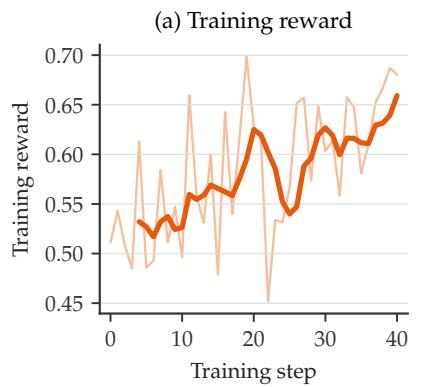

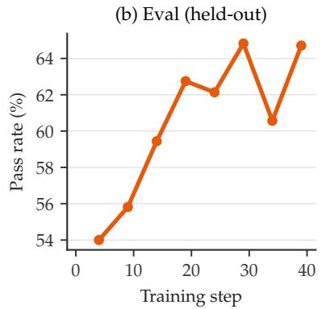

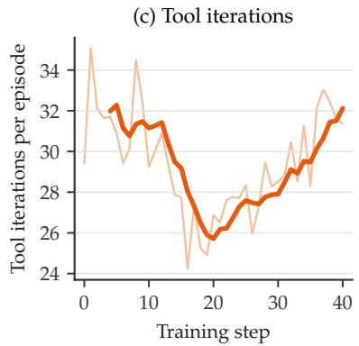  
Figure 7: Search Agent training dynamics. (a) Training reward, the judge-scored mean over each rollout batch; (b) pass rate on the held-out 200-prompt validation set, evaluated every five steps (the step-4 point is taken from a reference run, because the logged run crashed before its first evaluation finished); (c) tool iterations per episode. Light curves are per-step values and dark curves a 5-step moving average.

Table 12: Search Agent results on the three search benchmarks (pass@1 under the standardized evaluation harness: Serper + Jina, scratchpad context management on BrowseComp), measured against the checkpoint the stage trains from. ∆ is the change contributed by this stage. Pertrajectory tool statistics for the same runs are in Table 19.
<table><tr><td>Checkpoint</td><td>BrowseComp</td><td>Seal-0</td><td>HLE-Verified</td></tr><tr><td>Coding Agent</td><td>34.2</td><td>48.6</td><td>47.7</td></tr><tr><td>+ Search Agent</td><td>37.2</td><td>54.0</td><td>51.1</td></tr><tr><td>Δ</td><td>+3.0</td><td>+5.4</td><td>+3.4</td></tr></table>

Training dynamics. Figure 7 shows the run: training reward and the held-out pass rate rise together over the 40 steps, while tool iterations per episode first fall and then climb back. Persample dumps from the run explain the two phases. The fall is compression across the board rather than tool avoidance: winning trajectories (reward $\geq 0 . 9 )$ shorten by about 4 calls and 7K tokens at the median and losing ones (reward $\leq 0 . 0 5 )$ by about 7 calls and 16K tokens, and the held-out pass rate keeps rising. The climb is a new tail of productive long searches rather than a return to the earlier behavior: the median winner still makes about 25 calls, but the winners’ 90th percentile rises from 40 to 54.5 calls, the number of trajectories with more than 45 calls nearly triples (49 to 133) and their winner share rises from 24% to 43%, while winners’ text keeps shrinking (42K to 33K tokens at the median). Long searches change from a failure signature into a viable strategy, and the added depth late in the run is spent on searches that succeed rather than on longer trajectories for their own sake.

Result anchor. Table 12 reports the stage’s before/after on the three search benchmarks: Search Agent adds +3.0 on BrowseComp, +5.4 on Seal-0, and +3.4 on HLE-Verified over the Coding Agent checkpoint it starts from, with the comparison against other models in Table 1. The search benchmarks are evaluated under a standardized harness whose tools, judge, and scratchpad context management differ from the training setup (Appendix E); because its search backend is one the policy never used in training, the gains suggest that RL improved general search behavior rather than exploiting the training backend.

## 3.8 RLHF

Here RLHF means RL against a learned reward model, rather than RL directly from human labels— consistent with the no-new-annotation stance of the rest of the recipe. It serves open-ended quality, where no deterministic verifier exists. Because a learned reward is especially vulnerable to reward hacking and drift [32], this stage runs last, which shortens the time a gameable reward is under optimization pressure (§2.1). Two observations motivate this stage. First, despite the shortening during IF RL (§3.4), responses, excluding the thinking portion, grow longer over SFT and outcome-reward RL without a commensurate increase in usefulness. Second, none of the earlier stages explicitly evaluates the final response for harmful or incoherent content. RLHF therefore targets concise, helpful, and harmless final responses. We use on-policy RL against the reward model rather than an offline preference method such as DPO [82], so the reward signa acts on the policy’s own rollouts rather than on a fixed preference dataset.

Reward model and data. Skywork-Reward-V2-Qwen3-8B provides the reward [93], an open reward model, rather than an in-house or newly human-labeled model. This keeps the stage reproducible and consistent with the recipe’s open-data stance. We considered three public preference datasets as candidate prompt sources: Arena Human Preference [20], HelpSteer3 [105], and HH-RLHF [12]. Before running the training ablations, we filtered out examples with missing, empty, or otherwise degenerate responses and scored the remaining chosen and rejected responses with the Skywork reward model. Table 13 reports each dataset’s original size, the number of valid examples remaining after filtering, and the average reward-model scores and response lengths of its chosen and rejected responses.

Table 13: RLHF prompt datasets. We score each dataset’s chosen and rejected responses with the Skywork reward model; Valid counts the pairs left after we drop missing, empty, and otherwise degenerate responses. Bradley–Terry [16] scores carry no shared zero across datasets, so read the score columns within a row rather than as grounds for ranking the three.
<table><tr><td colspan="4"></td><td rowspan="2">Score</td><td rowspan="2">Tokens</td><td rowspan="2">Avg. Chosen Avg. Rejected Avg. Chosen Avg. Rejected Tokens</td></tr><tr><td>Dataset</td><td>Original # Valid #</td><td></td><td>Score</td></tr><tr><td>Arena Human Preference</td><td>84,402</td><td>53,502</td><td>17.06</td><td>12.08</td><td>1055.1</td><td>623.7</td></tr><tr><td>HelpSteer3</td><td>38,459</td><td>29,506</td><td>9.60</td><td>2.95</td><td>439.1</td><td>373.2</td></tr><tr><td>HH-RLHF</td><td>112,052</td><td>75,815</td><td>-4.23</td><td>-8.41</td><td>78.8</td><td>72.9</td></tr></table>

The table shows substantial differences among the candidate datasets. Arena Human Preference contains by far the longest responses and receives high positive scores from the reward model for both sides of each pair. HelpSteer3 contains shorter responses and exhibits the largest average score separation between chosen and rejected responses, but its broader and more complex instructions proved difficult for the reward model to evaluate consistently during on-policy training. HH-RLHF contains much shorter responses, and both sides receive negative absolute scores, although the chosen responses still score higher on average than the rejected responses.

The corresponding training ablations produced three negative findings. First, training on the unfiltered HH-RLHF prompt set noticeably degraded other capabilities, most visibly coding and instruction following, motivating the validity filter described above. Second, although HelpSteer3 provides more diverse tasks, its prompts were difficult for the reward model to score reliably: reward increased slowly while scientific reasoning and instruction following regressed. Third, instruction-following and agentic prompts were unsuitable for this stage because the reward model could not reliably assess complex constraint satisfaction. We therefore train the final stage on the 75,815 HH-RLHF prompts that remain after the validity filter of Table 13. HH-RLHF’s chosen and rejected responses and preference labels serve only the offline dataset analysis summarized in Table 13; RLHF training uses only the prompts, and the open reward model generates all rewards for the policy’s on-policy rollouts. During training, we additionally monitor reward on Arena-Hard v2 [51] as an external diagnostic.

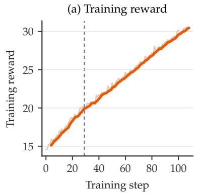

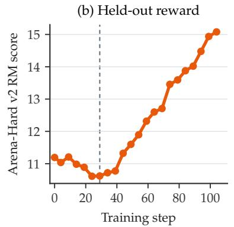

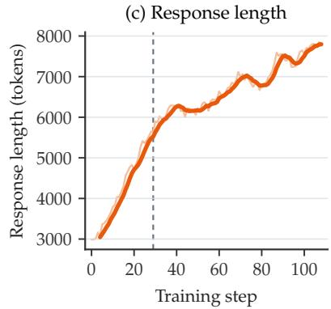  
Figure 8: RLHF training dynamics of the shipped run, trained on HH-RLHF prompts against the Skywork-Reward-V2-Qwen3-8B reward model with a linear length penalty. (a) Training reward; (b) held-out reward-model score on Arena-Hard v2 prompts, evaluated every five steps; (c) mean response length. Light curves are per-step values and dark curves a 5-step moving average; the dashed line marks iteration 29, the checkpoint shipped as Rufus-Air.

Table 14: RLHF results. Vanilla RLHF optimizes the raw reward-model score under a linear length penalty (§3.8); the resulting checkpoint (iteration 29 of the run in Figure 8) is the shipped model, Rufus-Air. The reference row is the Search Agent checkpoint the stage starts from, so $\Delta$ is the change over the RLHF stage. Both columns are Arena-Hard v2 win rates.
<table><tr><td colspan="2"></td><td>Arena-Hard v2 (HP) Arena-Hard v2 (CW)</td></tr><tr><td>Search Agent</td><td>83.06</td><td>38.56</td></tr><tr><td>+ RLHF</td><td>89.05</td><td>52.97</td></tr><tr><td>Δ</td><td>+5.99</td><td>+14.41</td></tr></table>

Reward design. This stage differs structurally from Reasoning RL and Coding RL because Bradley–Terry reward scores are unbounded and noisy: a higher pointwise score does not always correspond to a better response. The shipped run (Figure 8) optimizes the raw reward-model score under a linear length penalty, which reduces the score of over-length responses when their raw reward is positive while leaving negative rewards unchanged. Optimization uses GRPO.

Training dynamics. Figure 8 shows the shipped run: training reward (a), the held-out rewardmodel score on Arena-Hard v2 prompts (b), and mean response length (c), with iteration 29 marked. Both reward panels report the Skywork reward optimized during training rather than the downstream evaluation scores in Table 14.

Result anchor. Table 14 reports the shipped run against the Search Agent checkpoint it starts from: Arena-Hard v2 Hard Prompt rises from 83.06 to 89.05 (+5.99) and Creative Writing from 38.56 to 52.97 (+14.41), and the two Rufus-Air cells are the Arena-Hard values of Table 1. On the monitored benchmarks the run’s own evaluations move by at most 1.3 points over the stage: IFBench 80.0 to 80.7, AIME 24 85.0 to 83.75, AIME 25 unchanged at 90.0 (these are the run’s evaluations at their own sample count; the AIME 25 cell of Table 1 for the same checkpoint, 88.3, comes from a different evaluation run).

## 4 Training Infrastructure

Our training stack has two in-house components built on open-source software. Rufus-Slime, our adaptation of Slime [99], runs SFT and every RL stage, with Megatron-LM [91] as the training backend and SGLang [121] as the rollout engine (§4.1). Rufus-Gym, our agent environment and orchestration layer, extends the stack with multi-turn rollout for the agent stages (§4.2).

## 4.1 SFT and General RL

SFT. SFT uses Slime’s SFT path with packed-sequence attention for sequences up to 128K tokens, accommodating approximately 98% of the original SFT sample mix without modification. The 1.8% of samples in the 32K–120K range are bucket-sampled with fewer other samples per batch to bound per-step compute. The production run uses an effective batch size of 4096 and takes approximately 2380 steps and 105 wall-clock hours per epoch. The three-epoch schedule runs for about 13 days on 64 nodes, or roughly 832 node-days, making SFT the largest single expense among the stages we can account for. Training uses BF16 throughout, AdamW [58], and standard gradient clipping. Loss is computed only on assistant turns; system prompts, user turns, and tool observations remain in context but are masked from the loss. Per-dataset chat templates allow heterogeneous sources, including thinking SFT data and agentic trajectories, to be mixed within the same batch.

General RL. General RL runs on the same stack, adding a rollout loop, a reward path, and a set of stability-critical configuration choices. The choices that mattered:

• Large rollout batches. Group-relative methods such as GRPO and GSPO estimate each response’s advantage against the other responses sampled for the same prompt, so the estimate is less noisy with more samples per prompt and more prompts per step. Each rollout step therefore samples 4,096–8,192 responses: 256 prompts × 16 samples in Reasoning RL and IF RL, and 128 prompts × 64 samples in Coding RL before its budget extension (Table 16).

• Rollout Routing Replay (R3) On MoE policies, rollout and training can route the same token to different experts even at identical precision, adding a rollout–training log-probability gap on top of any precision mismatch. R3, available in upstream Slime, caches the routing decisions made during rollout and replays them in the training forward pass, removing this component of the gap.

• Mixed-precision (FP8) rollout with BF16 training. Reasoning RL and Coding RL run rollouts in mixed precision—the first three transformer layers in BF16 and all remaining layers in FP8—while keeping the parameter update fully in BF16.

• Truncation-ratio monitoring. Across all RL runs we monitor the fraction of rollouts truncated at the stage’s response budget. In Reasoning RL and Coding RL, truncated samples are masked from the loss, so a rising ratio shrinks the share of each batch that contributes gradient; Coding RL responded by extending its response budget from 64K to 128K mid-run (§3.3).

## 4.2 Agentic RL and Its Environment

Agentic RL runs on the same stack and adds Rufus-Gym, which drives multi-turn rollout by alternating model generation and tool execution. Figure 9 gives an overview.

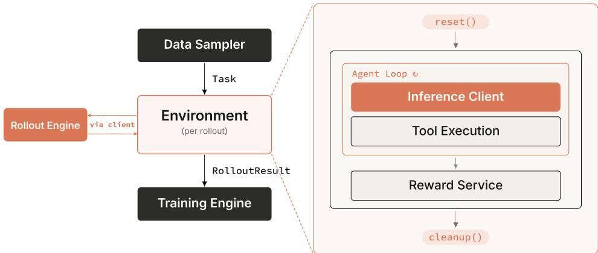  
Figure 9: Agentic rollout stack overview.

Environment interface. The environment is the central abstraction. It consumes a Task from the data sampler—an initial prompt with its context (e.g., conversation history and ground truth)—and returns a RolloutResult to the trainer: the token trajectory, the reward, and a typed termination signal. The same gym-like contract holds regardless of the underlying tool surface, whether code execution, web search, MCP servers, or others. Three components cooperate behind this interface: an inference client that queries an SGLang rollout engine for generations and their token-level metadata; a tool-execution layer that parses model-generated tool calls and dispatches them to local/sandboxed coding runtimes or hosted tool services; and a reward service (a rule-based verifier or an LLM judge) that scores the trajectory once the interaction terminates.

Agent loop. The Agent Loop in Figure 9 is a ReAct-style loop [112] that alternates model inference and tool execution until a stop condition fires. A rollout terminates when the model emits a final response with no further tool calls, when a tool-call or iteration budget is exhausted, when a model-side limit such as the maximum generation or context length is reached, or when a runtime error occurs. Every outcome maps to a typed termination reason, so the trainer can tell task completion apart from budget exhaustion, context overflow, and execution failure. We build this layer on Strands Agents [9], reusing its agent loop, hook system, and observability, and extending it with SGLang as the model backend. Its hooks keep the loop environment-agnostic: an environment subscribes to lifecycle events (e.g., BeforeModelCallEvent and OnMessageAddedEvent) that mark transition points, rather than forking the entire loop. The budget limits above are one such hook, terminating an interaction as soon as it exceeds its budget. Another is invocation continuation, which resumes a finished invocation with a simulated user’s reply so that a full multi-turn dialogue lands in the trajectory as a single episode.

Token fidelity. On-policy RL requires the exact tokens that were sampled, so the environment appends each turn’s tokens to the trajectory as that turn is produced, rather than re-rendering the conversation to text and re-tokenizing it at every turn. For every model invocation, the SGLang backend takes prompt token IDs directly and returns the generated token IDs (token-in/tokenout), together with per-token log probabilities, loss masks, and routed-expert assignments; the environment propagates these unchanged to the trainer. This rules out three failure modes: (i) retokenization drift [98]; (ii) repeated application of the chat template to a growing history, which can silently rewrite earlier turns; and (iii) training on tool calls that were repaired outside the sampled trajectory. The textual transcript is kept for inspection and evaluation, but the token trajectory is the authoritative training artifact.

Sandbox backend. Coding trajectories need a working tree, installed packages, and running processes across turns, so each active trajectory owns a sandbox for its full lifetime. Each sandbox is one Firecracker microVM [1], not a container. Its guest kernel and process state live inside the VM. That lets us snapshot a fully initialized environment once and restore it per trajectory, and it keeps policy-written code behind hardware virtualization rather than behind a kernel shared with the host and every co-located trajectory. We self-host the open-source E2B runtime [27, 10], which exposes both capabilities behind a sandbox API. It runs on bare-metal EC2 instances, which expose the KVM that Firecracker requires, with the control plane on separate machines from the untrusted workloads. We bake every task ahead of training into a snapshotted template, so sandbox creation is a resume in seconds rather than a cold boot. An in-guest daemon serves the run-command and file APIs that the tool-execution layer calls over HTTP, task tests run in the same sandbox for reward computation, and we destroy the sandbox at termination. Two further choices sit in the tool-execution layer: (i) agent commands are not idempotent, so retries fire only on failures that prove execution never started; once it may have begun, the loop surfaces a recoverable error instead of re-dispatching; (ii) we truncate tool results to a fixed token budget before they re-enter the conversation, so that verbose build and test logs, and the profile-script noise this runtime’s login-shell dispatch adds to every result, do not exhaust the policy model’s context window.

Distributed rollout. We distribute environment actors across nodes with Ray [64], trading cross-node communication for true parallelism: CPU-heavy tool execution, payload transfer, and reward computation run in dedicated processes spread over the cluster, reducing CPU contention.

## 5 Evaluation

This section compares Rufus-Air with open-weight models of similar active-parameter scale (Table 1) and traces how capability accumulates across the eight stages (Table 2). We first list the benchmarks (§5.1), then read the two tables (§5.2).

## 5.1 Benchmarks

We evaluate on the following benchmarks, grouped as in Table 1.

• Instruction following and alignment. IFEval [122] is about 500 prompts carrying 25 types of automatically checkable instructions (length, format, keywords); IFBench [79] adds 58 new out-of-domain verifiable constraints, testing whether instruction following generalizes beyond the constraint types seen in training; Multi-challenge [92] is multi-turn conversations in four challenge categories that require instruction following, context allocation, and in-context reasoning at the same time; Arena-Hard v2 [51] is hard, open-ended prompts drawn from Chatbot Arena, scored as a win rate against GPT-4-0314 by an LLM judge (Claude Sonnet 4 [4]), on its Hard Prompt (HP) and Creative Writing (CW) splits.

• Reasoning and knowledge. AIME 2025 and 2026 are the two most recent editions of the American Invitational Mathematics Examination [60], 30 short-answer competition problems each; GPQA-Diamond [84] is the 198-question Diamond subset of GPQA, expert-written multiple-choice questions in biology, physics, and chemistry (on the full GPQA set, skilled non-experts with unrestricted web access reach 34%); LiveCodeBench v6 [41] is competitiveprogramming problems collected from LeetCode, AtCoder, and Codeforces after their contest dates, v6 being the release window used here; FrontierScience [103] is expert-written physics, chemistry, and biology problems on two tracks: Olympiad, problems at IPhO/IChO/IBO level written by medalists and national coaches, and Research, PhD-level open-ended sub-tasks graded by rubric.

• General Agent. Tau2-Bench [14] is customer-service conversations in retail, airline, and telecom domains in which both the agent and a tool-using simulated user act on a shared environment, so the simulated user is part of the measurement (Appendix F); MCP-Atlas [13] is 1,000 expert-written multi-step tasks spanning 36 real MCP servers and 220 tools, scored against atomic factual claims in the final answer.

• Search Agent. BrowseComp [106] is 1,266 questions with short verifiable answers that require persistent browsing for hard-to-find, entangled information; Seal-0 [75] is the hardest subset of SealQA, fact-seeking questions on which web search returns conflicting, noisy, or unhelpful results and chat models score near zero; HLE-Verified [114] is the verified subset of Humanity’s Last Exam [76], the 668 of its 2,500 expert questions confirmed correct as written, of which we use the text-only Gold questions.

• Coding Agent. Terminal-Bench 2.1 [61] is end-to-end tasks in a terminal, a revision of Terminal-Bench 2.0 that repairs 28 of its 89 tasks (drifted dependencies, over-tight resource budgets, instruction–test mismatches); SWE-bench Verified [70] is the 500-issue subset of SWE-bench [43] whose GitHub issues human annotators confirmed to be well-specified and fairly tested.

Agentic benchmarks are evaluated with the harness the corresponding stage trains in (§3.5, §3.6); the Search Agent is the exception, whose evaluation-time tool setup and context management are described in Appendix E. For Tau2-Bench and MCP-Atlas we keep the original task definitions and scoring but re-implement the harness on our own agent environment stack (§4.2). Every Tau2- Bench and MCP-Atlas number we report ourselves—for our checkpoints and for the GLM-4.5-Air, INTELLECT-3, and Nemotron-3-Super releases—therefore matches the original benchmark in task content but was not produced by the reference implementation. For MCP-Atlas the official benchmark container serves the tools, so tool behavior is identical to the reference setup; scoring uses the benchmark’s claim-grading prompt verbatim, and samples that fail on tool errors are retried rather than counted as failures. The non-agentic benchmarks run through NeoEvaluation, an internal orchestration layer around lm-evaluation-harness [95] that adds per-benchmark task definitions, pass@k aggregation, and thinking-tag stripping but delegates scoring to the harness or to benchmark-native code, with SGLang serving inference.

Reported pass@k metrics follow each benchmark’s standard k; averaged metrics use avg@4 for most benchmarks and avg@32 for AIME. LLM-judged evaluations use a single judge per benchmark, and we do not re-score with multiple judges.

## 5.2 Main Results

Comparison with open-weight models. Table 1 compares Rufus-Air with three models measured under our harness. GLM-4.5-Air and INTELLECT-3 are two other post-trainings of the same base checkpoint, so differences against them isolate the recipe; Nemotron-3-Super is a different base at similar active-parameter scale and the strongest of the three baselines we measure. The six developer-reported columns are reference points only (Appendix D). The Tau2-Bench rows are measured under the Claude Sonnet 5 user simulator; Appendix F shows how much the simulator alone moves them.

Against the two same-base models, Rufus-Air leads on every row except Arena-Hard v2 Creative Writing, where GLM-4.5-Air is ahead. The lead is within two points on AIME 26 and GPQA against GLM-4.5-Air and on FrontierScience Olympiad against INTELLECT-3, and widest on instruction following, Tau2-Telecom, the Search Agent rows, and both Coding Agent rows.

Against Nemotron-3-Super, Rufus-Air is ahead on IFBench, IFEval, Multi-challenge, and Arena-Hard v2 Hard Prompt, on LiveCodeBench, Tau2-Telecom, MCP-Atlas, all three Search Agent rows, and SWE-bench Verified; within two points on AIME 25, AIME 26, GPQA, both FrontierScience tracks, Tau2-Retail, and Terminal-Bench 2.1; and behind on Creative Writing and, by two points, on Tau2-Airline. The separation is in instruction following and agentic behavior, where the recipe spends most of its stages (§2.1), rather than in mathematics or science.

Creative Writing is the one row on which Rufus-Air trails both GLM-4.5-Air and Nemotron-3- Super. RLHF raised both Arena-Hard v2 splits (Table 14; Hard Prompt by +6.0, Creative Writing by +14.4), and we have not tried a reward model tuned for style.

Progression across stages. Table 2 (§3) reads the same recipe from the inside: one row per checkpoint in pipeline order, each carrying the benchmarks its stage targets and the change against the row above. Because each stage’s change is read from a pair of adjacent rows taken from that stage’s own result table, a value should be compared with the row directly above it rather than with the same column several stages away. Four details matter for that reading. The LiveCodeBench v6 and Tau2-Retail cells in the stage rows keep the protocol of their source tables and are not directly comparable with the GLM-4.5-Air and Rufus-Air rows, which use the protocol of Table 1 (Tables 8 and 10). The SFT row is measured against the public GLM-4.5-Air release, not the base model it starts from (Table 4). The final row is the RLHF checkpoint; Terminal-Bench 2.1, SWE-bench Verified, and Seal-0 were measured only at their own stage and at that checkpoint, so their stage-to-final differences (40.2 vs. 42.7, 67.8 vs. 65.6, 54.0 vs. 51.4) span every stage in between and are not attributed to any one of them. The IF RL checkpoint appears in Tables 9 and 10 with different measurements (GPQA 71.1 and 73.36, IFEval 94.5 and 94.73); the text cites the later one.

Every stage moves its own target. The largest single-stage moves are Multi-challenge under IF RL (+24.7), Arena-Hard v2 Creative Writing under RLHF (+14.4), and Tau2-Retail under General Agent (+9.8); the Coding Agent run, which ended at its compute budget (§3.6), moves least (+1.4 and +2.2). The one Reasoning RL benchmark that does not rise is AIME, which that stage treated as a guardrail rather than a target: each year has 30 problems, so the 2.6–2.8-point change is less than one problem’s worth and not meaningful (§3.2). The non-target benchmarks each stage monitors are in the per-stage tables, where they hold within about a point or rise; the largest drop is AIME 25, −1.2 across IF RL (Table 9).

## 6 Discussion

The stage sections report what each stage did. This section collects the overall findings that span stages and the limits of what the recipe shows.

On SFT. SFT does more than set the output format. Before any RL, SFT checkpoint 3799 already leads the public GLM-4.5-Air release, which includes RL, on IFEval (+5.3), IFBench (+24.2), and both AIME years (+6.6 and +3.5), trailing only on GPQA (−5.7; Table 4). This is the floor the RL stages start from (§3.1).

On learnability filtering. Every outcome-reward RL stage keeps only prompts the current policy can learn from, in one of two forms. Before training, the stages drop prompts that are too easy: Reasoning RL and IF RL drop those solved more than 80% of the time, Coding RL those solved by all four warm-up samples, and General Agent those solved reliably; Reasoning RL and General Agent also drop prompts never solved, while Coding RL keeps them (§3.2, §3.3, §3.4, §3.5). During training, Reasoning RL keeps filtering online, admitting only groups whose mean reward lies in (0.0, 0.8], and General Agent and Coding Agent drop all-pass and all-fail groups by DAPO-style dynamic sampling; Coding RL does not re-filter.

On stage order. The pipeline orders stages by how exposed their reward is to hacking: Reasoning RL and Coding RL run first and the preference reward of RLHF runs last, with IF RL placed early because its target is close to what the policy already does (§2.1). In this order, the stages that follow Reasoning RL keep its reasoning gains: the next two leave GPQA and AIME 26 within a point of where they found them (73.5 → 73.36 and 87.4 → 87.08; Tables 6 and 10) while adding the targeted skills. Two readings qualify this: the intermediate Coding RL checkpoint reads 67.9 on GPQA (Table 9), and the IF RL checkpoint carries different GPQA values in two stage tables (71.1 and 73.36; §5.2).

On infrastructure. We build on public, established components rather than a new framework: training runs on Rufus-Slime, our adaptation of Slime (from the group that released GLM-4.5), with Megatron-LM and SGLang underneath (§4.1). Even on this stack, details that reports rarely give still matter, such as large rollout batches for group-relative advantages and Rollout Routing Replay for the MoE policy. The agent stages needed more on top of it, which Rufus-Gym supplies (§4.2): token-in/token-out rollouts that keep multi-turn trajectories exactly on-policy, chat template handling kept consistent from SFT through the agent stages, sandboxes that hold state for the full length of a coding trajectory, and environment actors distributed across nodes so that CPU-heavy tool execution and reward computation do not contend.

On the cost of agentic RL. The agent stages add costs outside the GPU cluster. Coding Agent holds a sandbox for the full length of each trajectory and runs a test suite inside it for the reward (§3.6, §4.2); the sandbox service behind it is sized for on the order of ten thousand concurrent sandboxes, and maintaining it costs on the order of \$10K per month. Search Agent pays per external call: at about 100 tool calls per question, a single pass over BrowseComp’s 1,266 questions makes on the order of $1 0 ^ { 5 }$ search and page-extraction calls and costs a few hundred dollars at list prices (\$2 per 1K Serper searches [88], \$0.05 per 1M Jina Reader tokens [44]). Training instead uses a lower-cost internal search backend, and every training rollout is also scored by an LLM judge (§3.7). A team planning the RL stages on 8–32 nodes should budget these stages separately rather than by a per-stage average.

On what the recipe does not establish. Several limits bound these conclusions. The sequential stage order was shaped by earlier experiments and the compute budget; it is one that worked, not one shown to be optimal (§2.1), and we did not explore the alternative of training domain-specific experts and merging them by multi-teacher on-policy distillation [25]. Coding Agent was trained on the compute available rather than to convergence (§3.6). No single benchmark suite was tracked across every stage, so a benchmark’s movement between the stages that report it is not attributed to any one stage (§5.2).

## 7 Conclusion

Rufus-Air is a documented post-training recipe on the public GLM-4.5-Air-Base checkpoint: eight stages in one serial pipeline; a training stack built on open-source components; public SFT datasets, much of them used as released; RL prompt sets built from public sources and synthetic generation; and no newly commissioned human annotation. The resulting model leads the public GLM-4.5-Air release on every reported benchmark except Arena-Hard v2 Creative Writing and is competitive with open models of similar size (Table 1, §5.2).

The contribution we care about is the recipe itself. Post-training is often reported at the level of a system card. This recipe is written down specifically enough for a team with tens of nodes to follow it stage by stage, or to take a single stage or infrastructure component without the rest. Because the stack builds on open-source components and the data are public, others can check the recipe and build on it. We hope they do, and report what they change.

## References

[1] Alexandru Agache, Marc Brooker, Alexandra Iordache, Anthony Liguori, Rolf Neugebauer, Phil Piwonka, and Diana-Maria Popa. Firecracker: Lightweight virtualization for serverless applications. In 17th USENIX symposium on networked systems design and implementation (NSDI 20), pages 419–434, 2020.

[2] Wasi Uddin Ahmad, Sean Narenthiran, Somshubra Majumdar, Aleksander Ficek, Siddhartha Jain, Jocelyn Huang, Vahid Noroozi, and Boris Ginsburg. OpenCodeReasoning: Advancing data distillation for competitive coding. arXiv preprint arXiv:2504.01943, 2025.

[3] Anthropic. Introducing the Model Context Protocol. Announcement, 25 November 2024. https://www.anthropic.com/news/model-context-protocol; specification at https: //modelcontextprotocol.io, 2024. Accessed 2026-09-20.

[4] Anthropic. Introducing Claude 4. Announcement, 22 May 2025. https://www.anthropic. com/news/claude-4, 2025. Accessed 2026-09-20.

[5] Anthropic. Introducing Claude Sonnet 4.5. Announcement, 29 September 2025. https: //www.anthropic.com/news/claude-sonnet-4-5, 2025. Accessed 2026-09-20.

[6] Anthropic. Introducing Claude Sonnet 5. Announcement, 30 June 2026. https://www. anthropic.com/news/claude-sonnet-5, 2026. Accessed 2026-09-20.

[7] Artificial Analysis. τ2-bench telecom benchmark leaderboard. https://artificialanalysis. ai/evaluations/tau2-bench. Accessed 2026-09-20.

[8] Artificial Analysis. Terminal-bench 2.1 leaderboard. https://artificialanalysis.ai/ evaluations/terminalbench-2-1. Accessed 2026-09-20.

[9] AWS. Strands Agents. https://strandsagents.com/, 2025.

[10] AWS Samples. E2B on AWS: Deploying e2b sandboxes in your own aws account. https: //github.com/aws-samples/sample-e2b-on-aws, 2025.

[11] Yan Bai. MBridge: Bridge Megatron-Core to Hugging Face/reinforcement learning. https: //github.com/ISEEKYAN/mbridge. Accessed 2026-09-20.

[12] Yuntao Bai, Andy Jones, Kamal Ndousse, Amanda Askell, Anna Chen, Nova DasSarma, Dawn Drain, Stanislav Fort, Deep Ganguli, Tom Henighan, et al. Training a helpful and harmless assistant with reinforcement learning from human feedback. arXiv preprint arXiv:2204.05862, 2022.

[13] Chaithanya Bandi, Razvan-Gabriel Dumitru, Ben Hertzberg, Divyansh Agarwal, Geobio Boo, Tejas Polakam, Sami Hassaan, Jeff Da, HiJae Kim, Vipul Gupta, et al. MCP-Atlas: A large-scale benchmark for tool-use competency with real MCP servers. arXiv preprint arXiv:2602.00933, 2026.

[14] Victor Barres, Honghua Dong, Soham Ray, Xujie Si, and Karthik Narasimhan. τ2-Bench: Evaluating conversational agents in a dual-control environment. arXiv preprint arXiv:2506.07982, 2025.

[15] Akhiad Bercovich et al. Llama-Nemotron: Efficient reasoning models. arXiv preprint arXiv:2505.00949, 2025.

[16] Ralph Allan Bradley and Milton E. Terry. Rank analysis of incomplete block designs: I. the method of paired comparisons. Biometrika, 39(3/4):324–345, 1952.

[17] ByteDance Seed. Enigmata: Scaling logical reasoning in large language models with synthetic verifiable puzzles. arXiv preprint arXiv:2505.19914, 2025.

[18] Mark Chen, Jerry Tworek, Heewoo Jun, Qiming Yuan, Henrique Ponde de Oliveira Pinto, et al. Evaluating large language models trained on code. arXiv preprint arXiv:2107.03374, 2021.

[19] Xingyu Chen, Jiahao Xu, Tian Liang, Zhiwei He, Jianhui Pang, Dian Yu, Linfeng Song, Qiuzhi Liu, Mengfei Zhou, Zhuosheng Zhang, Rui Wang, Zhaopeng Tu, Haitao Mi, and Dong Yu. Do NOT think that much for 2+3=? on the overthinking of long reasoning models. In Proceedings of the 42nd International Conference on Machine Learning (ICML 2025), PMLR 267, pages 9487–9499, 2025. arXiv:2412.21187.

[20] Wei-Lin Chiang, Lianmin Zheng, Ying Sheng, Anastasios Nikolas Angelopoulos, Tianle Li, Dacheng Li, Banghua Zhu, Hao Zhang, Michael Jordan, Joseph E. Gonzalez, and Ion Stoica. Chatbot Arena: An open platform for evaluating LLMs by human preference. In Proceedings of the 41st International Conference on Machine Learning (ICML 2024), PMLR 235, pages 8359–8388, 2024. arXiv:2403.04132.

[21] Tri Dao. FlashAttention-2: Faster attention with better parallelism and work partitioning. In International Conference on Learning Representations (ICLR 2024), 2024. arXiv:2307.08691.

[22] DeepSeek-AI. DeepSeek-V2: A strong, economical, and efficient mixture-of-experts language model. arXiv preprint arXiv:2405.04434, 2024.

[23] DeepSeek-AI. DeepSeek-V3 technical report. arXiv preprint arXiv:2412.19437, 2024.

[24] DeepSeek-AI. DeepSeek-R1: Incentivizing reasoning capability in LLMs via reinforcement learning. arXiv preprint arXiv:2501.12948, 2025.

[25] DeepSeek-AI. DeepSeek-V4: Towards highly efficient million-token context intelligence. arXiv preprint arXiv:2606.19348, 2026.

[26] Yuwen Du, Rui Ye, Shuo Tang, Xinyu Zhu, Yijun Lu, Yuzhu Cai, and Siheng Chen. Openseeker: Democratizing frontier search agents by fully open-sourcing training data. arXiv preprint arXiv:2603.15594, 2026.

[27] E2B. E2B: Open-source runtime for executing ai-generated code in secure sandboxes. https://e2b.dev, https://github.com/e2b-dev/infra, 2025.

[28] Thomas Foster, Anya Sims, Johannes Forkel, and Jakob Foerster. LILO: Learning to reason at the frontier of learnability. In Advances in Neural Information Processing Systems 38 (NeurIPS 2025), 2025. Preprint: arXiv:2502.12272.

[29] Foundation Model Team, Li Auto Inc. Mach-Mind-4-Flash technical report. arXiv preprint arXiv:2607.09375, 2026.

[30] Kanishk Gandhi, Shivam Garg, Noah D. Goodman, and Dimitris Papailiopoulos. Endless terminals: Scaling RL environments for terminal agents. arXiv preprint arXiv:2601.16443, 2026.

[31] Jiaxuan Gao, Jiaao Chen, Chuyi He, Shusheng Xu, Di Jin, and Yi Wu. From self-evolving synthetic data to verifiable-reward RL: Post-training multi-turn interactive tool-using agents. arXiv preprint arXiv:2601.22607, 2026.

[32] Leo Gao, John Schulman, and Jacob Hilton. Scaling laws for reward model overoptimization. In Proceedings of the 40th International Conference on Machine Learning (ICML 2023), PMLR 202, pages 10835–10866, 2023. arXiv:2210.10760.

[33] GLM-4.5 Team. GLM-4.5: Agentic, reasoning, and coding (ARC) foundation models. arXiv preprint arXiv:2508.06471, 2025.

[34] Harbor Framework Team. Harbor: A framework for evaluating and optimizing agents and models in container environments. Software. https://github.com/harbor-framework/ harbor, 2026. Concept DOI (latest release); the release used for this report is not recorded.

[35] Yun He, Wenzhe Li, Hejia Zhang, Songlin Li, Karishma Mandyam, Sopan Khosla, et al. AdvancedIF: Rubric-based benchmarking and reinforcement learning for advancing LLM instruction following. arXiv preprint arXiv:2511.10507, 2025.

[36] Zhenyu He, Qingping Yang, Wei Shen, Xiaojian Zhong, Kechi Zhang, Chenxin An, Wenlei Shi, Tianle Cai, Di He, Jiaze Chen, and Jingjing Xu. SWE-Swiss: A multi-task fine-tuning and RL recipe for high-performance issue resolution. In Findings of the Association for Computational Linguistics: ACL 2026, pages 16102–16114, 2026.

[37] Dan Hendrycks, Steven Basart, Saurav Kadavath, Mantas Mazeika, Akul Arora, Ethan Guo, Collin Burns, Samir Puranik, Horace He, Dawn Song, and Jacob Steinhardt. Measuring coding challenge competence with APPS. In Proceedings of the Neural Information Processing Systems Track on Datasets and Benchmarks (NeurIPS), 2021.

[38] Hugging Face. Math-Verify: A robust mathematical expression evaluation library. https: //github.com/huggingface/math-verify, 2024.

[39] interstellarninja. tool-use-multiturn-reasoning (Hugging Face dataset). https:// huggingface.co/datasets/interstellarninja/tool-use-multiturn-reasoning. Accessed 2026-09-20.

[40] interstellarninja. Hermes tool use reasoning (Hugging Face dataset hermes\_reasoning\_tool\_use). https://huggingface.co/datasets/interstellarninja/ hermes\_reasoning\_tool\_use, 2025. Accessed 2026-09-20.

[41] Naman Jain, King Han, Alex Gu, Wen-Ding Li, Fanjia Yan, Tianjun Zhang, Sida Wang, Armando Solar-Lezama, Koushik Sen, and Ion Stoica. LiveCodeBench: Holistic and contamination free evaluation of large language models for code. In The Thirteenth International Conference on Learning Representations, 2025.

[42] Yunjie Ji, Xiaoyu Tian, Sitong Zhao, Haotian Wang, Shuaiting Chen, Yiping Peng, Han Zhao, and Xiangang Li. AM-Thinking-v1: Advancing the frontier of reasoning at 32b scale. arXiv preprint arXiv:2505.08311, 2025.

[43] Carlos E Jimenez, John Yang, Alexander Wettig, Shunyu Yao, Kexin Pei, Ofir Press, and Karthik Narasimhan. SWE-bench: Can language models resolve real-world GitHub issues? In The Twelfth International Conference on Learning Representations, 2024.

[44] Jina AI. Jina reader API. https://jina.ai/reader/; source at https://github.com/jina-ai/ reader. Accessed 2026-09-20.

[45] K2 Team. K2-V2: A 360-open, reasoning-enhanced LLM. arXiv preprint arXiv:2512.06201, 2025.

[46] Kimi Team. Kimi k1.5: Scaling reinforcement learning with LLMs. arXiv preprint arXiv:2501.12599, 2025.

[47] Kimi Team. Kimi K2: Open agentic intelligence. arXiv preprint arXiv:2507.20534, 2025.

[48] Kimi Team, Tongtong Bai, Yifan Bai, Yiping Bao, SH Cai, Yuan Cao, Y Charles, HS Che, Cheng Chen, Guanduo Chen, et al. Kimi K2.5: Visual agentic intelligence. arXiv preprint arXiv:2602.02276, 2026.

[49] Nathan Lambert, Jacob Morrison, Valentina Pyatkin, Shengyi Huang, Hamish Ivison, Faeze Brahman, Lester James V. Miranda, Alisa Liu, Nouha Dziri, Shane Lyu, Yuling Gu, Saumya Malik, Victoria Graf, Jena D. Hwang, Jiangjiang Yang, Ronan Le Bras, Oyvind Tafjord, Chris Wilhelm, Luca Soldaini, Noah A. Smith, Yizhong Wang, Pradeep Dasigi, and Hannaneh Hajishirzi. Tülu 3: Pushing frontiers in open language model post-training. arXiv preprint arXiv:2411.15124, 2024.

[50] Rongao Li, Jie Fu, Bo-Wen Zhang, Tao Huang, Zhihong Sun, Chen Lyu, Guang Liu, Zhi Jin, and Ge Li. TACO: Topics in algorithmic COde generation dataset. arXiv preprint arXiv:2312.14852, 2023.

[51] Tianle Li, Wei-Lin Chiang, Evan Frick, Lisa Dunlap, Tianhao Wu, Banghua Zhu, Joseph E Gonzalez, and Ion Stoica. From crowdsourced data to high-quality benchmarks: Arena-Hard and BenchBuilder pipeline. In Forty-second International Conference on Machine Learning, 2025.

[52] Zhuofeng Li, Dongfu Jiang, Xueguang Ma, Haoxiang Zhang, Ping Nie, Yuyu Zhang, Kai Zou, Jianwen Xie, Yu Zhang, and Wenhu Chen. Openresearcher: A fully open pipeline for long-horizon deep research trajectory synthesis. arXiv preprint arXiv:2603.20278, 2026.

[53] Ling Team. Ring-lite: Scalable reasoning via C3PO-stabilized reinforcement learning for LLMs. arXiv preprint arXiv:2506.14731, 2025.

[54] Ling Team, inclusionAI. Ring-flash-2.0 model card. https://huggingface.co/inclusionAI/ Ring-flash-2.0, 2025. Accessed 2026-09-19.

[55] Aixin Liu, Aoxue Mei, Bangcai Lin, Bing Xue, Bingxuan Wang, Bingzheng Xu, Bochao Wu, Bowei Zhang, Chaofan Lin, Chen Dong, et al. DeepSeek-V3.2: Pushing the frontier of open large language models. arXiv preprint arXiv:2512.02556, 2025.

[56] Zichen Liu, Changyu Chen, Wenjun Li, Penghui Qi, Tianyu Pang, Chao Du, Wee Sun Lee, and Min Lin. Understanding R1-Zero-like training: A critical perspective. arXiv preprint arXiv:2503.20783, 2025.

[57] LLM360. TxT360-3efforts (Hugging Face dataset, version 1.0, 5 december 2025). https: //huggingface.co/datasets/LLM360/TxT360-3efforts, 2025. Accessed 2026-09-20.

[58] Ilya Loshchilov and Frank Hutter. Decoupled weight decay regularization. In International Conference on Learning Representations (ICLR 2019), 2019. arXiv:1711.05101.

[59] Wenhan Ma, Hailin Zhang, Liang Zhao, Yifan Song, Yudong Wang, Zhifang Sui, and Fuli Luo. Stabilizing MoE reinforcement learning by aligning training and inference routers. arXiv preprint arXiv:2510.11370, 2025.

[60] Mathematical Association of America. MAA invitational competitions: the american invitational mathematics examination (AIME). https://maa.org/ maa-invitational-competitions/. Accessed 2026-09-20.

[61] Mike A Merrill, Alexander G Shaw, Nicholas Carlini, Boxuan Li, Harsh Raj, Ivan Bercovich, Lin Shi, Jeong Yeon Shin, Thomas Walshe, E Kelly Buchanan, et al. Terminal-Bench: Benchmarking agents on hard, realistic tasks in command line interfaces. arXiv preprint arXiv:2601.11868, 2026.

[62] Mistral AI. Cheaper, better, faster, stronger (Mixtral 8x22B release). Release article, 17 April 2024. https://mistral.ai/news/mixtral-8x22b, 2024. Accessed 2026-09-19.

[63] Mistral AI. Introducing mistral small 4. https://mistral.ai/news/mistral-small-4; model card at https://huggingface.co/mistralai/Mistral-Small-4-119B-2603, March 2026. Accessed 2026-09-19.

[64] Philipp Moritz, Robert Nishihara, Stephanie Wang, Alexey Tumanov, Richard Liaw, Eric Liang, Melih Elibol, Zongheng Yang, William Paul, Michael I. Jordan, and Ion Stoica. Ray: A distributed framework for emerging AI applications. In 13th USENIX Symposium on Operating Systems Design and Implementation (OSDI 18), pages 561–577, 2018.

[65] Dhruv Nathawani, Igor Gitman, Somshubra Majumdar, Evelina Bakhturina, Ameya Sunil Mahabaleshwarkar, Jian Zhang, and Jane Polak Scowcroft. Nemotron-Post-Training-Dataset-v1. Version 1.0, NVIDIA, July 2025. https://huggingface.co/datasets/nvidia/ Nemotron-Post-Training-Dataset-v1, 2025.

[66] NVIDIA. Apex: A PyTorch extension. https://github.com/NVIDIA/apex. Accessed 2026-09- 20.

[67] NVIDIA. Transformer engine. https://github.com/NVIDIA/TransformerEngine. Accessed 2026-09-20.

[68] NVIDIA. Llama-NV-Embed-Reasoning-3B model card. https://huggingface.co/nvidia/ llama-nv-embed-reasoning-3b, 2026. Accessed 2026-09-20.

[69] NVIDIA. Nemotron 3 super: Open, efficient mixture-of-experts hybrid Mamba-transformer model for agentic reasoning. arXiv preprint arXiv:2604.12374, 2026.

[70] OpenAI. Introducing SWE-bench Verified. https://openai.com/index/ introducing-swe-bench-verified/, 2024.

[71] OpenAI. gpt-oss-120b & gpt-oss-20b model card. arXiv preprint arXiv:2508.10925; model card at https://huggingface.co/openai/gpt-oss-120b, 2025.

[72] Long Ouyang, Jeff Wu, Xu Jiang, Diogo Almeida, Carroll L. Wainwright, Pamela Mishkin, Chong Zhang, Sandhini Agarwal, Katarina Slama, Alex Ray, John Schulman, Jacob Hilton, Fraser Kelton, Luke Miller, Maddie Simens, Amanda Askell, Peter Welinder, Paul Christiano, Jan Leike, and Ryan Lowe. Training language models to follow instructions with human feedback. arXiv preprint arXiv:2203.02155, 2022.

[73] Sungrae Park et al. Solar open technical report. arXiv preprint arXiv:2601.07022; model card at https://huggingface.co/upstage/Solar-Open-100B, 2026.

[74] Adam Paszke, Sam Gross, Francisco Massa, Adam Lerer, James Bradbury, Gregory Chanan, et al. PyTorch: An imperative style, high-performance deep learning library. In Advances in Neural Information Processing Systems 32 (NeurIPS 2019), 2019. arXiv:1912.01703.

[75] Thinh Pham, Nguyen Nguyen, Pratibha Zunjare, Weiyuan Chen, Yu-Min Tseng, and Tu Vu. SealQA: Raising the bar for reasoning in search-augmented language models. In The Fourteenth International Conference on Learning Representations, 2026.

[76] Long Phan, Alice Gatti, Nathaniel Li, Adam Khoja, Ryan Kim, Richard Ren, Jason Hausenloy, Oliver Zhang, Mantas Mazeika, Dan Hendrycks, et al. A benchmark of expert-level academic questions to assess AI capabilities. Nature, 649(8099):1139–1146, 2026.

[77] Renjie Pi, Grace Lam, Mohammad Shoeybi, Pooya Jannaty, Bryan Catanzaro, and Wei Ping. On data engineering for scaling LLM terminal capabilities. arXiv preprint arXiv:2602.21193, 2026.

[78] Prime Intellect. INTELLECT-3 technical report. arXiv preprint arXiv:2512.16144, 2025.

[79] Valentina Pyatkin, Saumya Malik, Victoria Graf, Hamish Ivison, Shengyi Huang, Pradeep Dasigi, Nathan Lambert, and Hannaneh Hajishirzi. Generalizing verifiable instruction following. In The Thirty-ninth Annual Conference on Neural Information Processing Systems Datasets and Benchmarks Track, 2025.

[80] Qwen Team. QwQ-32B: Embracing the power of reinforcement learning. Blog post, 6 March 2025. https://qwenlm.github.io/blog/qwq-32b/, 2025. Accessed 2026-09-20.

[81] Qwen Team. Qwen3.5: Towards native multimodal agents (Qwen3.5-122B-A10B model card). https://huggingface.co/Qwen/Qwen3.5-122B-A10B, February 2026. Accessed 2026-09-19.

[82] Rafael Rafailov, Archit Sharma, Eric Mitchell, Christopher D Manning, Stefano Ermon, and Chelsea Finn. Direct preference optimization: Your language model is secretly a reward model. arXiv preprint arXiv:2305.18290, 2023.

[83] Red Hat AI. RedHatAI/Qwen3.5-122B-A10B-NVFP4 model card. https://huggingface.co/ RedHatAI/Qwen3.5-122B-A10B-NVFP4, 2026. Accessed 2026-09-19.

[84] David Rein, Betty Li Hou, Asa Cooper Stickland, Jackson Petty, Richard Yuanzhe Pang, Julien Dirani, Julian Michael, and Samuel R Bowman. GPQA: A graduate-level Google-proof Q&A benchmark. In First Conference on Language Modeling, 2024.

[85] Chi Ruan, Dongfu Jiang, Huaye Zeng, Ping Nie, and Wenhu Chen. EvolveCoder: Evolving test cases via adversarial verification for code reinforcement learning. arXiv preprint arXiv:2603.12698, 2026.

[86] Sarvam AI. Sarvam-105b model card. https://huggingface.co/sarvamai/sarvam-105b; release post https://www.sarvam.ai/blogs/sarvam-30b-105b, March 2026. Accessed 2026- 09-19.

[87] Scale AI. Scale labs leaderboard: MultiChallenge. https://labs.scale.com/leaderboard/ multichallenge. Accessed 2026-09-20; the leaderboard’s questions and judge were revised on 3 February 2026.

[88] Serper. Serper: Google search API. https://serper.dev/. Accessed 2026-09-20.

[89] Zhihong Shao, Peiyi Wang, Qihao Zhu, Runxin Xu, Junxiao Song, Xiao Bi, Haowei Zhang, Mingchuan Zhang, Y. K. Li, Y. Wu, and Daya Guo. DeepSeekMath: Pushing the limits of mathematical reasoning in open language models. arXiv preprint arXiv:2402.03300, 2024.

[90] Qijia Shen, Zhiqi Huang, Vamsidhar Kamanuru, Aznaur Aliev, Jay Rainton, Ahmed Awelkair, Zhichen Zeng, Jiajun Li, Shi Dong, Yueming Yuan, Boyuan Ma, Qizheng Zhang, Jiwei Fu, Yuzhen Mao, Wendong Fan, Ping Nie, Philip Torr, Bernard Ghanem, Changran Hu, Jonathan Lingjie Li, Urmish Thakker, and Guohao Li. SETA: Scaling environments for terminal agents. arXiv preprint arXiv:2607.10891, 2026.

[91] Mohammad Shoeybi, Mostofa Patwary, Raul Puri, Patrick LeGresley, Jared Casper, and Bryan Catanzaro. Megatron-LM: Training multi-billion parameter language models using model parallelism. arXiv preprint arXiv:1909.08053, 2019.

[92] Ved Sirdeshmukh, Kaustubh Deshpande, Johannes Mols, Lifeng Jin, Ed-Yeremai Cardona, Dean Lee, Jeremy Kritz, Willow Primack, Summer Yue, and Chen Xing. MultiChallenge: A realistic multi-turn conversation evaluation benchmark challenging to frontier LLMs. In Findings of the Associationfor Computational Linguistics: ACL 2025, pages 18632–18702, 2025.

[93] Skywork. Skywork-Reward-V2: Scaling preference data curation via human-ai synergy. arXiv preprint arXiv:2507.01352, 2025.

[94] Zafir Stojanovski, Oliver Stanley, Joe Sharratt, Richard Jones, Abdulhakeem Adefioye, Jean Kaddour, and Andreas Köpf. Reasoning gym: Reasoning environments for reinforcement learning with verifiable rewards. arXiv preprint arXiv:2505.24760, 2025.

[95] Lintang Sutawika, Leo Gao, Hailey Schoelkopf, Stella Biderman, Jonathan Tow, Baber Abbasi, ben fattori, Charles Lovering, farzanehnakhaee70, Jason Phang, Anish Thite, Fazz, Aflah, Niklas Muennighoff, Thomas Wang, sdtblck, nopperl, gakada, tttyuntian, researcher2, Chris, Julen Etxaniz, Zdenˇek Kasner, Khalid, Jeffrey Hsu, AndyZwei, Pawan Sasanka Ammanamanchi, Dirk Groeneveld, Ethan Smith, and Eric Tang. EleutherAI/lm-evaluationharness: Major refactor. Zenodo, December 2023.

[96] MiroMind Team, Song Bai, Lidong Bing, Carson Chen, Guanzheng Chen, Yuntao Chen, Zhe Chen, Ziyi Chen, Xuan Dong, et al. Mirothinker: Pushing the performance boundaries of open-source research agents via model, context, and interactive scaling. arXiv preprint arXiv:2511.11793, 2025.

[97] Team OLMo, Allyson Ettinger, et al. Olmo 3. arXiv preprint arXiv:2512.13961, 2025.

[98] The Agent Lightning Team. No More Retokenization Drift: Returning Token IDs via the OpenAI Compatible API Matters in Agent RL. https://vllm.ai/blog/ 2025-10-22-agent-lightning, 2025.

[99] THUDM. Slime: An LLM post-training framework for RL scaling. https://github.com/ THUDM/slime, 2025.

[100] Xiaoyu Tian, Yunjie Ji, Haotian Wang, Shuaiting Chen, Sitong Zhao, Yiping Peng, Han Zhao, and Xiangang Li. Not all correct answers are equal: Why your distillation source matters. arXiv preprint arXiv:2505.14464, 2025.

[101] Upstage. Solar open 2 technical report. arXiv preprint arXiv:2607.20062; model card at https://huggingface.co/upstage/Solar-Open2-250B, 2026.

[102] Eric Wallace, Kai Xiao, Reimar Leike, Lilian Weng, Johannes Heidecke, and Alex Beutel. The instruction hierarchy: Training LLMs to prioritize privileged instructions. arXiv preprint arXiv:2404.13208, 2024.

[103] Miles Wang, Robi Lin, Kat Hu, Joy Jiao, Neil Chowdhury, Ethan Chang, and Tejal Patwardhan. Frontierscience: Evaluating ai’s ability to perform expert-level scientific tasks. arXiv preprint arXiv:2601.21165, 2026.

[104] Zhaoyang Wang, Canwen Xu, Boyi Liu, Yite Wang, Siwei Han, Zhewei Yao, Huaxiu Yao, and Yuxiong He. Agent world model: Infinity synthetic environments for agentic reinforcement learning. arXiv preprint arXiv:2602.10090, 2026.

[105] Zhilin Wang, Jiaqi Zeng, Olivier Delalleau, Hoo-Chang Shin, Felipe Soares, Alexander Bukharin, Ellie Evans, Yi Dong, and Oleksii Kuchaiev. HelpSteer3-Preference: Open human-annotated preference data across diverse tasks and languages. In Advances in Neural Information Processing Systems 38 (NeurIPS 2025), Datasets and Benchmarks Track, 2025. arXiv:2505.11475.

[106] Jason Wei, Zhiqing Sun, Spencer Papay, Scott McKinney, Jeffrey Han, Isa Fulford, Hyung Won Chung, Alex Tachard Passos, William Fedus, and Amelia Glaese. BrowseComp: A simple yet challenging benchmark for browsing agents. arXiv preprint arXiv:2504.12516, 2025.

[107] Mingyu Xu, Cheng Fang, Keyue Jiang, Yuqian Zheng, Yanghua Xiao, Baojian Zhou, et al. Logics-STEM: Empowering LLM reasoning via failure-driven post-training and document knowledge enhancement. arXiv preprint arXiv:2601.01562, 2026.

[108] Zhangchen Xu, Adriana Meza Soria, Shawn Tan, Anurag Roy, Ashish Sunil Agrawal, Radha Poovendran, and Rameswar Panda. TOUCAN: Synthesizing 1.5m tool-agentic data from real-world MCP environments. arXiv preprint arXiv:2510.01179, 2025.

[109] Shaotian Yan, Kaiyuan Liu, Chen Shen, Bing Wang, Sinan Fan, Jun Zhang, Yue Wu, Zheng Wang, and Jieping Ye. Distribution-aligned sequence distillation for superior long-CoT reasoning. arXiv preprint arXiv:2601.09088, 2026.

[110] An Yang, Anfeng Li, Baosong Yang, et al. Qwen3 technical report. arXiv preprint arXiv:2505.09388, 2025.

[111] Chen Yang, Ran Le, Yun Xing, Zhenwei An, Zongchao Chen, Wayne Xin Zhao, Yang Song, and Tao Zhang. Toolmind technical report: A large-scale, reasoning-enhanced tool-use dataset. arXiv preprint arXiv:2511.15718, 2025.

[112] Shunyu Yao, Jeffrey Zhao, Dian Yu, Nan Du, Izhak Shafran, Karthik R Narasimhan, and Yuan Cao. ReAct: Synergizing reasoning and acting in language models. In The Eleventh International Conference on Learning Representations (ICLR 2023), 2023. arXiv:2210.03629.

[113] Qiying Yu, Zheng Zhang, Ruofei Zhu, Yufeng Yuan, Xiaochen Zuo, Yu Yue, Tiantian Fan, Gaohong Liu, Lingjun Liu, Xin Liu, et al. DAPO: An open-source LLM reinforcement learning system at scale. arXiv preprint arXiv:2503.14476, 2025.

[114] Weiqi Zhai, Zhihai Wang, Jinghang Wang, Boyu Yang, Xiaogang Li, Xander Xu, Bohan Wang, Peng Wang, Xingzhe Wu, Anfeng Li, et al. HLE-Verified: A systematic verification and structured revision of Humanity’s Last Exam. arXiv preprint arXiv:2602.13964, 2026.

[115] Rongzhi Zhang, Rui Feng, Zhihan Zhang, Jingfeng Yang, Qingyu Yin, Xin Liu, Zixuan Zhang, Priyanka Nigam, Bing Yin, Tuo Zhao, et al. Qubric: Co-designing queries and rubrics for rl beyond verifiable rewards. arXiv preprint arXiv:2606.03968, 2026.

[116] Zhihan Zhang, Shiyang Li, Zixuan Zhang, Xin Liu, Haoming Jiang, Xianfeng Tang, Yifan Gao, Zheng Li, Haodong Wang, Zhaoxuan Tan, et al. Iheval: Evaluating language models on following the instruction hierarchy. In Proceedings of the 2025 Conference of the Nations of the Americas Chapter of the Association for Computational Linguistics: Human Language Technologies (Volume 1: Long Papers), pages 8374–8398, 2025.

[117] Jiale Zhao, Guoxin Chen, Fanzhe Meng, Minghao Li, Jie Chen, Hui Xu, Yongshuai Sun, Wayne Xin Zhao, Ruihua Song, Yuan Zhang, Peng Wang, Cheng Chen, Jirong Wen, and Kai Jia. Immersion in the GitHub universe: Scaling coding agents to mastery. arXiv preprint arXiv:2602.09892, 2026.

[118] Chujie Zheng, Shixuan Liu, Mingze Li, Xiong-Hui Chen, Bowen Yu, Chang Gao, Kai Dang, Yuqiong Liu, Rui Men, An Yang, Jingren Zhou, and Junyang Lin. Group sequence policy optimization. arXiv preprint arXiv:2507.18071, 2025.

[119] Jiasheng Zheng, Boxi Cao, Boxi Yu, Yuzhong Zhang, Jialun Cao, Yaojie Lu, Hongyu Lin, Xianpei Han, and Le Sun. Combinatorial synthesis: Scaling code rlvr via atomic decomposition and recombination. arXiv preprint arXiv:2605.31058, 2026.

[120] Lianmin Zheng, Wei-Lin Chiang, Ying Sheng, Siyuan Zhuang, Zhanghao Wu, Yonghao Zhuang, Zi Lin, Zhuohan Li, Dacheng Li, Eric P. Xing, Hao Zhang, Joseph E. Gonzalez, and Ion Stoica. Judging LLM-as-a-judge with MT-Bench and Chatbot Arena. In Advances in Neural Information Processing Systems 36 (NeurIPS 2023), Datasets and Benchmarks Track, 2023. arXiv:2306.05685.

[121] Lianmin Zheng, Liangsheng Yin, Zhiqiang Xie, Chuyue Sun, Jeff Huang, et al. SGLang: Efficient execution of structured language model programs. arXiv preprint arXiv:2312.07104, 2024.

[122] Jeffrey Zhou, Tianjian Lu, Swaroop Mishra, Siddhartha Brahma, Sujoy Basu, Yi Luan, Denny Zhou, and Le Hou. Instruction-following evaluation for large language models. arXiv preprint arXiv:2311.07911, 2023.

[123] Zyphra. ZAYA1-8B technical report. arXiv preprint arXiv:2605.05365, 2026.

## A Contributions

Authors are listed alphabetically on the title page. Contributions are grouped by pipeline stage in recipe order, then by cross-cutting work; each entry names the stage leads first. Zixuan Zhanga and Zixuan Zhangb are two different authors, marked as on the title page.1

SFT (§3.1). Led by Xiaotian Han. Shiyang Li, Xin Liu, Zixuan Zhanga, and Chia-Yuan Chang contributed to data curation; Hongye Jin ran the decontamination analysis.

Reasoning RL (§3.2). Led by Zixuan Zhanga and Xin Liu. Rui Feng contributed the puzzle data recipe; Xiaotian Han, Shiyang Li, Zhenghao Xu, and Haoyang Wen contributed to improving the RL algorithm.

Coding RL (§3.3). Led by Chia-Yuan Chang. Zixuan Zhanga contributed to the stage design.

Instruction-Following RL (§3.4). Led by Zhihan Zhang. Rongzhi Zhang and Rui Feng contributed to LLM judge rubrics.

General Agent (§3.5). Led by Zixuan Zhangb. Yuan He contributed to the stage design and the harness throughout.

Coding Agent (§3.6). Led by Zixuan Zhangb and Chia-Yuan Chang. Yuan He contributed to the stage design and the harness throughout. Renyuan Cheng and Zhuocheng Xu built the code sandbox.

Search Agent (§3.7). Led by Rongzhi Zhang. Haoyang Wen contributed to the stage design;   
Fenglin Liu, Linwei Li, and Rui Feng contributed to the evaluation harness.

RLHF (§3.8). Led by Xin Liu. Xiaotian Han contributed to running experiments. Shiyang Li contributed to data curation.

Training infrastructure (§4.1). Led by Xiaotian Han, who built Rufus-Slime, our adaptation of Slime. Yuan He built the stack’s agentic RL extension; Hongye Jin contributed to the Megatron-LM training modules; Rui Feng contributed to experiment tracking.

Agent environment (§4.2). Led by Yuan He, who built Rufus-Gym, our adaptation of Strands Agents. Zixuan Zhangb and Rongzhi Zhang contributed to the harness implementation; Haoyang Wen and Rongzhi Zhang contributed to rollout stability and efficiency for long-running jobs.

Evaluation (§5.1). Each stage’s leads evaluated their own stage. Yuan He integrated the agentic evaluation into Rufus-Gym; Xiaotian Han, Zhihan Zhang, and Shiyang Li contributed to the non-agentic evaluation integration.

Project direction. Tuo Zhao was the technical lead: he led the overall pipeline design and stage order, worked through design and experiment choices with each stage lead, and prioritized what to ablate and what to carry forward under the fixed compute budget. Chao Zhang was technical co-lead: he led the puzzle data recipe in Reasoning RL, shaped the design of Instruction-Following RL and Search Agent with their owners, and joined technical reviews across the project. Qingyu Yin managed the project: he tracked technical progress across all stages, reallocated people and compute as bottlenecks shifted, and coordinated the sequential checkpoint handoffs.

Priyanka Nigam reviewed results across all stages and made cross-stage decisions on design, evaluation, and resource tradeoffs. Bing Yin shaped the project scope and secured its compute and staffing. The major technical decisions were taken by Tuo Zhao, Chao Zhang, Qingyu Yin, and Priyanka Nigam together.

This report. Each stage’s leads drafted the section describing their own work. Tuo Zhao edited the report as a whole and wrote the cross-cutting material: the conclusions the recipe supports, the argument for the stage order, and the reporting protocol under which public baseline numbers are cited.

## B Training Configurations

Infrastructure stack. The components in §4 move quickly, so the stack is pinned by a container image (Table 15) rather than by version ranges. Megatron-LM and SGLang are consumed at a pinned commit plus a small build-time patch set, so upstream-compatible fixes are carried without forking either project. All stages run on 8×NVIDIA-H200 nodes managed and scheduled by Kubernetes; per-stage node counts are in Table 16.

Table 15: Pinned training and rollout stack. Short hashes are upstream commits.
<table><tr><td>Component</td><td>Version</td></tr><tr><td>Megatron-LM</td><td>3714d81</td></tr><tr><td>SGLang</td><td>24c9100</td></tr><tr><td>Strands Agents</td><td>1.50.2</td></tr><tr><td>PyTorch [74]</td><td>2.9.1 (cu129)</td></tr><tr><td>TransformerEngine [67]</td><td>2.10.0</td></tr><tr><td>FlashAttention [21]</td><td>2.7.4.post1</td></tr><tr><td>Apex [66]</td><td>10417ac</td></tr><tr><td>mbridge [11]</td><td>89eb108</td></tr></table>

Per-stage settings. Table 16 collects the per-stage training configurations; the General Agent and Coding Agent rows carry settings that the main text does not state.

Table 16: Per-stage training configuration summary, covering all eight stages of the pipeline.
<table><tr><td>Stage</td><td>Optimizer</td><td>LR</td><td>Batch</td><td>Samples/prompt Opt. steps/rollout</td><td></td><td>Response budget</td><td>Nodes</td></tr><tr><td>SFT</td><td>AdamW</td><td>5e-5→5e-6</td><td>4096 seq</td><td>n/a</td><td>n/a</td><td>128K ctx</td><td>64</td></tr><tr><td>Reasoning RL</td><td>AdamW</td><td>1e-6</td><td>256 prompts</td><td>16</td><td>2</td><td>30K tok</td><td>8</td></tr><tr><td>Coding RL</td><td>AdamW</td><td>1e-6</td><td>128→64 prompts</td><td>64</td><td>8</td><td>64K→128K</td><td>32</td></tr><tr><td>IF RL</td><td>AdamW</td><td>1.5e-6</td><td>256 prompts</td><td>16</td><td>1</td><td>16K tok</td><td>8</td></tr><tr><td>General Agent</td><td>AdamW</td><td>1e-6</td><td>48 prompts</td><td>64</td><td>1</td><td>32K tok</td><td>16</td></tr><tr><td>Coding Agent</td><td>AdamW</td><td>1e-6</td><td>32 prompts</td><td>32</td><td>1</td><td>60K tok</td><td>16</td></tr><tr><td>Search Agent</td><td>AdamW</td><td>3e-6</td><td>32 prompts</td><td>16</td><td>2</td><td>32K/turn, 128K/traj.</td><td>16</td></tr><tr><td>RLHF</td><td>AdamW</td><td>1e-6</td><td>768 prompts</td><td>5</td><td>2</td><td>30K tok</td><td>8 (+1 RM)</td></tr></table>

## C Data Tables and Example Transformations

Table 17 lists the public datasets used in the SFT mixture, their direct download locations, the usage terms stated on their dataset pages, and the upstream provenance currently recorded for their released responses. “Upstream generator” records how each release’s authors created it; it does not imply that Rufus-Air used that model to regenerate the response.

Table 17: Public datasets used in the SFT mixture. We transcribe licenses and usage restrictions from the corresponding dataset pages; upstream generators and source corpora describe the released datasets rather than Rufus-Air-side response regeneration.
<table><tr><td>Dataset</td><td>Terms</td><td>Released-data provenance</td></tr><tr><td>Ring-lite-sft-data [53]</td><td>Apache-2.0</td><td>Aggregates open datasets including BigMath, DeepScaleR, and DAPO, whose problems originate from public competition and textbook sources.</td></tr><tr><td>hermes_reasoning tool_use [40]</td><td>Apache-2.0</td><td>Derived from ShareGPT conversations originally collected from sharegpt.com.</td></tr><tr><td>ToolMind [111]</td><td>Apache-2.0</td><td>Draws on xLAM, When2Call, glaive-function- calling-v2, ToolACE, and BUTTONInstruct; re- leased responses were generated with DeepSeek- V2-Chat, Mixtral-8x22B-Instruct, and DeepSeek- V3.</td></tr><tr><td>tool-use-multiturn- reasoning [39]</td><td>Apache-2.0</td><td>DeepSeek-R1 and QwQ-32B generated the released data.</td></tr><tr><td>ToolMind-Web-QA</td><td>Apache-2.0</td><td>QA pairs follow rules derived from Wikipedia entity-relation graphs; search trajectories were gen- erated by MiroThinker using Qwen3-235B-A22B- Thinking-2507.</td></tr><tr><td>Toucan-1.5M [108]</td><td>Apache-2.0</td><td>Qwen3-32B, Kimi-K2, and GPT-OSS generated the released data.</td></tr><tr><td>Scale-SWE-Distilled [117]</td><td>CC BY 4.0</td><td>Based on pull requests collected from public GitHub repositories.</td></tr><tr><td>Nemotron-Terminal- Corpus [77]</td><td>CC BY 4.0</td><td>Combines Terminal-Task-Gen, OpenCodeReason- ing, SWE-bench, and SWE-Smith, spanning compe- tition problems, coding problems, GitHub issues, and GitHub codebases.</td></tr></table>

Table 17 continued.
<table><tr><td>Dataset</td><td>Terms</td><td>Released-data provenance</td></tr><tr><td>Nemotron-Post-Training- Dataset-v1 [65, 15]</td><td>CC BY 4.0</td><td>Prompts include LMSYS-Chat-1M human conver- sations and OpenCodeReasoning-2 problems from Codeforces, CodeChef, AtCoder, and LeetCode, with DeepSeek-R1 solutions and QwQ-32B cri-</td></tr><tr><td>AM-Thinking-v1- Distilled [100]</td><td>Research use only; com- mercial and harmful uses</td><td>tiques. AM-Thinking-v1 generated the released data; its authors release the model under Apache-2.0, while the dataset page states the additional use restric- tion shown here.</td></tr><tr><td>AReaL-tau2-data [31]</td><td>prohibited Apache-2.0</td><td>Created in a multi-agent environment using Qwen3-30B-A3B.</td></tr><tr><td>LLM360/TxT360-3efforts [57, CC BY 4.0 45]</td><td></td><td>Aggregates NuminaMath and OpenMathReason- ing: human-authored exam, olympiad, and AoPS problems with DeepSeek-R1 and QwQ-32B solu-</td></tr><tr><td>Superior-Reasoning-SFT-gpt- oss-120b [109]</td><td>CC BY 4.0</td><td>tions. GPT-OSS-120B generated the released data.</td></tr><tr><td>Logics-STEM-SFT-Dataset- Open-1.6M [107]</td><td>CC BY 4.0</td><td>Aggregates NuminaMath-1.5, OpenThoughts3, Mixture-of-Thoughts, and AceReason; released rea- soning traces include outputs from QwQ-32B and</td></tr><tr><td>OpenSeeker-v1-30B-SFT [26]</td><td>MIT</td><td>DeepSeek-R1. Qwen3-30B-A3B-Thinking-2507 generated the re-</td></tr><tr><td>OpenResearcher-Dataset [52]</td><td>MIT</td><td>leased data. GPT-OSS-120B generated the released data.</td></tr><tr><td>SWESwiss-SFT-Merged- 10K [36]</td><td>MIT</td><td>Draws on real GitHub issues, pull requests, and codebases from SWE-Gym, SWE-Smith, and the</td></tr></table>

Because Rufus-Air does not regenerate responses for these sources, there is no additional Rufusside generator checkpoint or generated-output license to record. We keep the upstream-generator column to expose dependencies already present in the public releases; it does not supersede the dataset-page terms in the middle column.

## D How to Read the Public Baseline Numbers

The six grey columns of Table 1 are not our measurements. This appendix records where each number comes from. The model’s own card or technical report comes first. Where it does not report a cell, we use a baseline from another model’s technical report or from a benchmark owner’s or third-party leaderboard, preferring the source that covers several models under one harness; the benchmark owner’s leaderboard overrides other reports of the same cell. A number is used only if its benchmark version matches ours, and a number that names no version is left out even when it is the developer’s own. Because these columns come from different configurations (e.g., harnesses for agentic evaluation), the table is a comparison with publicly reported results, not a comparison under a common setup. Table 18 gives the source of every cell.

Beyond the numbers themselves, the following bears on how the grey columns should be read.

• Agentic benchmarks are run under each source’s own harness. Qwen3.5’s BrowseComp and

Table 18: Source of every publicly reported cell in Table 1. Each entry is the reference the value was taken from, coloured by the kind of source: orange, the model’s own card or technical report; blue, a baseline reported in another model’s technical report; navy, the benchmark owner’s or a third-party leaderboard. A dash marks a cell that Table 1 leaves empty.
<table><tr><td></td><td>Qwen3.5 122B-A10B</td><td>GPT-OSS 120B</td><td>Ring-flash-2.0 100B-A6B</td><td>Solar-Open 102B-A12B</td><td>Sarvam 105B-A10B</td><td>Mistral-Small-4 119B-A7B</td></tr><tr><td>IFBench</td><td>[81]</td><td>[81]</td><td>一</td><td>[101]</td><td>一</td><td>[63]</td></tr><tr><td>IFEval</td><td>[81]</td><td>[81]</td><td>一</td><td>[73]</td><td>[86]</td><td>[123]</td></tr><tr><td>Multi-challenge</td><td>[81]</td><td>[87]</td><td>一</td><td>[101]</td><td>一</td><td>一</td></tr><tr><td>Arena-Hard v2 (HP)</td><td>[69]</td><td>[69]</td><td>一</td><td></td><td>一</td><td>一</td></tr><tr><td>AIME 25</td><td>[69]</td><td>[71]</td><td>[54]</td><td>[73]</td><td>[86]</td><td>[63]</td></tr><tr><td>AIME 26</td><td>[29]</td><td>一</td><td></td><td>[101]</td><td></td><td>[123]</td></tr><tr><td>LiveCodeBench v6</td><td>[81]</td><td>[81]</td><td>[54]</td><td>[101]</td><td>[86]</td><td>[123]</td></tr><tr><td>GPQA</td><td>[81]</td><td>[71]</td><td>[54]</td><td>[101]</td><td>[86]</td><td>[63]</td></tr><tr><td>Tau2-Retail</td><td>[69]</td><td>[73]</td><td>一</td><td>[73]</td><td>一</td><td>一</td></tr><tr><td>Tau2-Airline</td><td>[69]</td><td>[73]</td><td>一</td><td>[73]</td><td>一</td><td>一</td></tr><tr><td>Tau2-Telecom</td><td>[69]</td><td>[73]</td><td>一</td><td>[73]</td><td>一</td><td>[7]</td></tr><tr><td>MCP-Atlas</td><td>一</td><td>一</td><td>一</td><td>[101]</td><td>一</td><td>一</td></tr><tr><td>BrowseComp</td><td>[81]</td><td>[81]</td><td>一</td><td>一</td><td>[86]</td><td>一</td></tr><tr><td>Seal-0</td><td>[81]</td><td>[81]</td><td>一</td><td>一</td><td>一</td><td>一</td></tr><tr><td>Terminal-Bench 2.1</td><td>[8]</td><td>[8]</td><td>一</td><td></td><td>一</td><td>[8]</td></tr><tr><td>SWE-bench Verified</td><td>[81]</td><td>[71]</td><td></td><td>[101]</td><td>[86]</td><td>一</td></tr></table>

Seal-0 use context folding, which prunes earlier tool responses past a length threshold [81], where ours uses a scratchpad (§3.7). The Tau2-Bench user is simulated by Qwen3-235B-A22B-2507 at Artificial Analysis [7], by an unstated model in the NVIDIA and Solar Open reports, and by Claude Sonnet 5 in ours; that choice alone moves a cell by up to 23.7 points (Appendix F).

• NVIDIA’s Arena-Hard v2 win rates for Qwen3.5 and GPT-OSS-120B name neither the judge nor the baseline model, so they are not on the same scale as our Hard Prompt configuration (§5.1).

• The Artificial Analysis figures are for the reasoning variants of Qwen3.5 and Mistral-Small-4 and the high-effort variant of GPT-OSS-120B; the non-reasoning variants score far lower.

• Two benchmarks changed version under the sources. LiveCodeBench cells enter the v6 row only when the source gives a matching window: Ring-flash-2.0’s 2408–2505 is the v6 window, and Mistral-Small-4’s own 63.6 names none, so Zyphra’s 57.9 (2025-02 to 2025-05) is used. Multi-challenge’s owner changed the judge and 54 of the questions on 3 February 2026; GPT-OSS-120B’s cell is from the revised leaderboard.

• The same checkpoint can score very differently across sources: Qwen3.5-122B’s AIME 25 is 92.92 at Red Hat AI [83], 90.36 in NVIDIA’s report [69], and 89.48 in Li Auto’s [29]; GPT-OSS-120B’s Multi-challenge is 58.29 in NVIDIA’s report [69] against 45.34 on the owner’s leaderboard [87].

• Sarvam’s model card prints its AIME 25 cell as “88.3 (96.7)” in a row labelled “AIME 25 (w/ Tools)” and does not say which value is tool-free; Table 1 carries 88.3, reading the parenthesized value as the tool-enabled score.

## E Search Agent Evaluation and Trajectory Analysis

Evaluation harness. All search benchmarks run under one harness, standardized across models and separate from the lower-cost services used in RL training. Web search uses the Google Serper API [88] (up to 10 organic results per query), page extraction uses Jina Reader [44] (pages returned as Markdown, truncated to 95K tokens), a sandboxed Python interpreter (no network or filesystem access) handles arithmetic and string manipulation, and a unified context management strategy (described below) keeps long trajectories within the context window. Models are served with a 128K context window and up to 200 tool calls per episode, and Claude Sonnet 4.5 grades final answers against the benchmark reference. Four settings pin the environment against open-web drift: searches use US-English locale settings (gl=us, hl=en); pages are fetched live with no caching or sharing across models, so numbers are comparable only within one evaluation window (April 2026 for the ablation below); domains that can leak benchmark answer keys are filtered from search results and refused by the scrape tool; and unreachable or timed-out pages return an error observation that the agent must recover from, with such trajectories scored normally.

Context management. Long research tasks can span hundreds of tool calls and outgrow the context window. We compared 12 strategies across 4 families (truncation, conversation-level summarization, selective clearing, and external memory) and their combinations; external memory with a scratchpad works best: after each research round the agent records key findings, hypotheses, and open questions in a scratchpad and keeps only the current step in the active context. It is enabled on all benchmarks but only BrowseComp trajectories grow long enough to trigger it. Disabling it drops BrowseComp accuracy by 10.7 points on the same checkpoint, a larger effect than any other single choice we varied in this stage. Recent frontier releases (e.g., DeepSeek-V3.2 [55], Kimi K2.5 [48]) instead report BrowseComp with a discard-all strategy, which clears the history and restarts from the original query whenever the context fills, turning the token budget into repeated independent attempts; we treat that as inference-time compute scaling and evaluate a single fixed-budget trajectory to isolate trained search competence.

Table 19: Mean tool usage per trajectory under the evaluation harness, for the public GLM-4.5-Air release and the Search Agent stage’s starting and final checkpoints (Table 12). Iters counts assistant turns with at least one tool call; the last column splits it by the judge’s verdict. The GLM-4.5-Air BrowseComp row covers 950 of the 1,266 tasks; the other rows pool 2–5 evaluation rounds per benchmark.
<table><tr><td>Dataset</td><td>Checkpoint</td><td>Iters</td><td>Search</td><td>Scrape</td><td>Python</td><td>Iters corr./wrong</td></tr><tr><td rowspan="3">BrowseComp</td><td>GLM-4.5-Air</td><td>54.0</td><td>46.6</td><td>7.3</td><td>0.0</td><td>32.9 / 61.6</td></tr><tr><td>Coding Agent</td><td>70.6</td><td>47.6</td><td>22.1</td><td>0.9</td><td>42.8 / 85.1</td></tr><tr><td>+ Search Agent</td><td>75.3</td><td>51.9</td><td>22.2</td><td>1.0</td><td>42.5 / 92.0</td></tr><tr><td rowspan="3">Seal-0</td><td>GLM-4.5-Air</td><td>18.0</td><td>11.3</td><td>6.4</td><td>0.3</td><td>17.9 / 18.0</td></tr><tr><td>Coding Agent</td><td>31.6</td><td>15.3</td><td>15.5</td><td>0.8</td><td>26.9 / 36.3</td></tr><tr><td>+ Search Agent</td><td>29.8</td><td>13.8</td><td>14.9</td><td>1.0</td><td>25.0 / 34.4</td></tr><tr><td rowspan="3">HLE-Verified</td><td>GLM-4.5-Air</td><td>20.9</td><td>13.5</td><td>5.3</td><td>2.1</td><td>18.1 / 22.0</td></tr><tr><td>Coding Agent</td><td>33.6</td><td>18.1</td><td>12.5</td><td>3.0</td><td>30.4 / 37.0</td></tr><tr><td>+ Search Agent</td><td>28.8</td><td>14.4</td><td>11.0</td><td>3.3</td><td>25.6 / 32.0</td></tr></table>

Tool-call pattern analysis. Table 19 reports tool usage from every evaluation trajectory. The public GLM-4.5-Air release is search-dominated and rarely reads a page (BrowseComp search:scrape = 6.4:1): it skims snippets. By the Coding Agent checkpoint, the policy scrapes two to three times as many pages on every benchmark, shifting from skimming snippets to reading sources. Search Agent then adjusts the mix per benchmark rather than scaling everything up: on BrowseComp it adds searches at unchanged scraping, whereas on Seal-0 and HLE-Verified it searches less than its starting checkpoint and uses Python slightly more. The resulting search:scrape ratio is about 2.3:1 on BrowseComp, 1.3:1 on HLE-Verified, and 0.9:1 on Seal-0.

Depth grows along the pipeline on BrowseComp (54.0 → 70.6 → 75.3 iterations), the one benchmark whose tasks reward long multi-hop chains; on Seal-0 and HLE-Verified the Search Agent checkpoint is shallower than its init (29.8 vs. 31.6 and 28.8 vs. 33.6), so its gains there come from a different call mix at lower cost rather than from more calls. On BrowseComp, depth beyond a point stops paying: accuracy is 88% for trajectories that finish within 25 iterations, 64% for 25–50, and below 30% beyond 50; wrong answers come from trajectories more than twice as deep as correct ones (92 vs. 43 iterations); and about 10% of trajectories per run end by exhausting the token budget or overflowing the context window, essentially none of them correct. Past roughly 50 iterations, additional depth signals a stuck search rather than progress.

## F Tau2-Bench with Different User Simulators

Every Tau2-Bench episode involves a simulated customer, making the user simulator part of the evaluation protocol. Table 20 evaluates four models across three domains under three user simulators. The Rufus-Air column is an earlier checkpoint, not the final one in Table 1; the final checkpoint was evaluated under Sonnet 5 only (85.3 / 84.0 / 93.0), so this column shows how the scores move with the simulator rather than the final model’s numbers. Changing the simulator shifts scores by up to 23.7 points (GLM-4.5-Air on retail: 57.0 under Sonnet 4 versus 80.7 under Sonnet 5), with Sonnet 5 yielding the highest scores in all twelve model–domain pairs. These differences highlight the need to match simulator settings when comparing results across papers. Rankings are more stable: the full ordering is unchanged in telecom, and Rufus-Air ranks first in retail under all three simulators, albeit by only 0.2 points under Sonnet 5. The airline leader varies: Nemotron-3-Super leads under Sonnet 4 and Sonnet 5, while Rufus-Air leads under Sonnet 4.5.

Table 20: Tau2-Bench pass@1 under three user simulators; Sonnet 5 is the setting used in Table 1. Only the customer simulator model changes down a block. †An earlier checkpoint than the final Rufus-Air in Table 1.
<table><tr><td>Domain</td><td>User simulator</td><td>Rufus-Air†</td><td>GLM-4.5-Air</td><td>INTELLECT-3</td><td>Nemotron-3</td></tr><tr><td rowspan="3">Airline</td><td>Sonnet 4</td><td>74.0</td><td>69.5</td><td>65.0</td><td>78.5</td></tr><tr><td>Sonnet 4.5</td><td>76.0</td><td>74.0</td><td>70.5</td><td>75.5</td></tr><tr><td>Sonnet 5</td><td>80.5</td><td>77.0</td><td>76.0</td><td>86.0</td></tr><tr><td rowspan="3">Retail</td><td>Sonnet 4</td><td>69.1</td><td>57.0</td><td>68.4</td><td>68.2</td></tr><tr><td>Sonnet 4.5</td><td>84.6</td><td>74.8</td><td>73.7</td><td>82.2</td></tr><tr><td>Sonnet 5</td><td>86.6</td><td>80.7</td><td>75.7</td><td>86.4</td></tr><tr><td rowspan="3">Telecom</td><td>Sonnet 4</td><td>84.4</td><td>31.8</td><td>33.3</td><td>62.1</td></tr><tr><td>Sonnet 4.5</td><td>75.4</td><td>25.7</td><td>28.9</td><td>57.5</td></tr><tr><td>Sonnet 5</td><td>95.4</td><td>32.7</td><td>40.8</td><td>72.4</td></tr></table>