# Screen Before You Serve: Simulation for Production Customer Experience AI Agents at 140M Scale

Edesio Alcobaça \* 1 Kevin Rossell \* 1 Aman Gupta 1 Shao Tang 1 Jiwoo Hong 1 Pabel Carrillo-Mendoza 1 Wanderson Conceição Ferreira 1 Alvaro Tedeschi 1 Zayd Simjee 2 Shreya Rajpal 2 Bruno Finardi Hime 1 Christian Sousa 1 Luis Moneda 1 Herbert Fei 1 Daniel Silva 1 Rohan Ramanath 1

## Abstract

Customer experience (CX) agents use tools and large language models to address customer requests and guide conversational interactions with an organization’s products. Improving these agents, especially in regulated industries, is difficult: they must detect intent, follow complex operational policies and use tools reliably. Manual end-to-end testing offers limited coverage, while live experiments expose customers to failures that can erode trust.

We present a hypothesis-driven simulation workflow for screening candidate CX agents before deployment. Synthetic customers react to agent responses and simulated tool outputs enable multi-step agentic workflows without invoking production backends. We use the Snowglobe simulator on Nubank’s Card Delivery agent and its expanded successor, Card Management - Nubank’s highest-volume chat-support agent in Brazil. Across 4 deployed versions, simulated and production version-level binary evaluator scores show high correlation. Simulation-guided iteration increased transactional net promoter score (tNPS) by 36.69 points in a live A/B test. We also screened open-weight configurations in over 16,000 simulated conversations. In a subsequent live A/B test, the selected model increased selfservice rate (SSR) by 8.82 percentage points to the highest level observed at Nubank, with no statistically significant change in tNPS. Simulation made broad exploration of models, reasoning settings, and prompts feasible without customer exposure, enabling production improvements that would have been impractical to pursue through live experimentation alone.

## 1. Introduction

Recent advancements in large language models (LLMs), including complex reasoning (Guo et al., 2025; OpenAI, 2025), multi-step tool use (Qin et al., 2024; Schick et al., 2023), and long-context understanding (Gemini Team et al., 2024), have improved the real-world applicability of LLMs. By perceiving their environment and using tools to address users’ queries, LLM-based agents are being deployed for both personal and business applications (Luo et al., 2025; Gupta et al., 2026; Steinberger & Contributors, 2026; Research et al., 2026). While AI-assisted workflows have become easier to adopt in the era of agents, building reliable benchmarks for domain-specific, open-ended tasks remains challenging (Lynch et al., 2025; Zhu et al., 2026b).

This challenge is especially pronounced for customer experience (CX) agents, which are among the most widely adopted agentic applications across businesses, with deployments at companies such as Airbnb (Zhao et al., 2025), Amazon (Luo et al., 2025), and Nubank (Gupta et al., 2026). We define CX agents to include both reactive agents that address customer questions, complaints, and support needs, and proactive agents that anticipate customer needs and guide customers through conversational workflows to accomplish tasks using a company’s products and services. Although CX agents may not require the same depth of reasoning as coding or mathematical agents, they must meet complex, multidimensional requirements across diverse user groups. More specifically, CX agents should support personalization and localization (Kirk et al., 2024), respond appropriately to user intent across multi-turn conversations (Tack et al., 2026), and handle sensitive data (Vijayvargiya et al., 2026; Tien et al., 2026), among other requirements. Thus, the bars for safety and qualitative performance are higher than those for general agentic applications. Such unique expectations for CX agents raise a central question: how can we establish that an agent is operational, handles edge cases, and is readyfor safe online deployment?

Figure 1 contrasts three approaches: (1) authoring test cases by hand, (2) exposing real customers in a live A/B test, and (3) simulating customers on-policy at the tool boundary. Although the first two options incorporate human feedback, they are slow and can provide inconsistent signals with small sample sizes. User simulation with synthetic personas has therefore been studied as an alternative for approximating the human preference distributions with LLMs (Ge et al., 2025; Naous et al., 2026; Li et al., 2026). However, limited controllability and the risk of score inflation raise concerns about discrepancies between simulated and real-world scenarios (Zhu et al., 2024; Mehri et al., 2026).

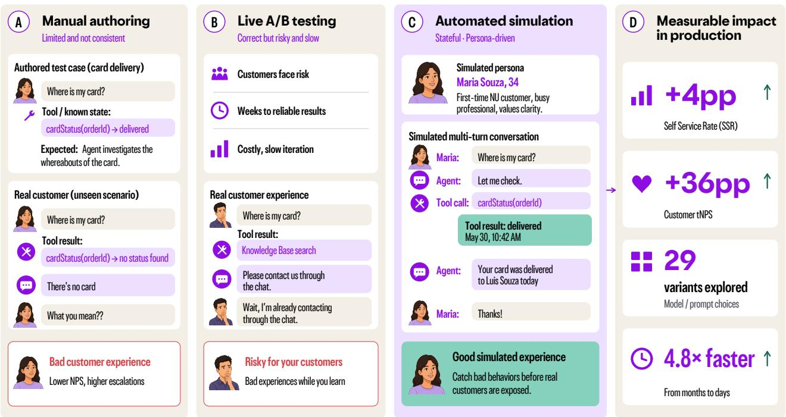  
Figure 1. Three ways to decide whether an agent revision is safe to ship. Manual authoring (A) exercises the scenarios someone thought to write down; some tool states that real customers encounter may be missing. A live A/B test (B) measures outcomes directly in production but exposes customers to the agent changes being tested. On-policy, tool-boundary simulation (C) answers the tool call synthetically and lets the agent act on its own policy, so multi-turn failures can surface before customers are exposed. In production (D) the screened agent moved self-service rate and transactional NPS against a matched comparison.

In this paper, we explore user simulation as an intermediate evaluation layer in which candidate agents are exercised through synthetic customer interactions before live deployment. Through case studies of the Card Delivery and Card Management agents at Nubank, we propose a hypothesisdriven, tool-boundary simulation recipe for screening candidate agents and demonstrate its real-world business impact. Simulation has become an essential part of our CX agent development lifecycle, enabling broad exploration of models, prompts, and reasoning settings that would be impractical to pursue through live experimentation alone. Our contributions are as follows:

1. User simulation as screening-before-deployment: We propose a simulation-aided agent deployment recipe with a hierarchical workflow connecting offline evaluation to online deployment.

2. Similarity analysis against real-world conversations: We demonstrate moderate conversation-level similarity between real-world and simulated conversations, with the lowest cosine distance of 0.035. Across four deployed versions, simulated and production versionlevel evaluator scores show high correlation.

3. Efficient development-to-production lifecycle: The user simulation layer allows 4.8 times faster iteration of the development, screening, and deployment cycle compared with a workflow without a user simulation layer.

4. Production impact across agent and model changes: The Card Management agent developed through simulation-guided iteration improved self-service rate (SSR) by 4.9 percentage points and transactional net promoter score (tNPS) by 36.69 points relative to Card Delivery in a live A/B test.

5. Generalizability across models: We use the proposed simulation recipe to select Qwen3.5-122B-A10B as a replacement for the incumbent Card Management model. In a subsequent live A/B test, the replacement improved SSR by 8.82 percentage points and reduced p95 latency by 25%, with no statistically significant change in tNPS.

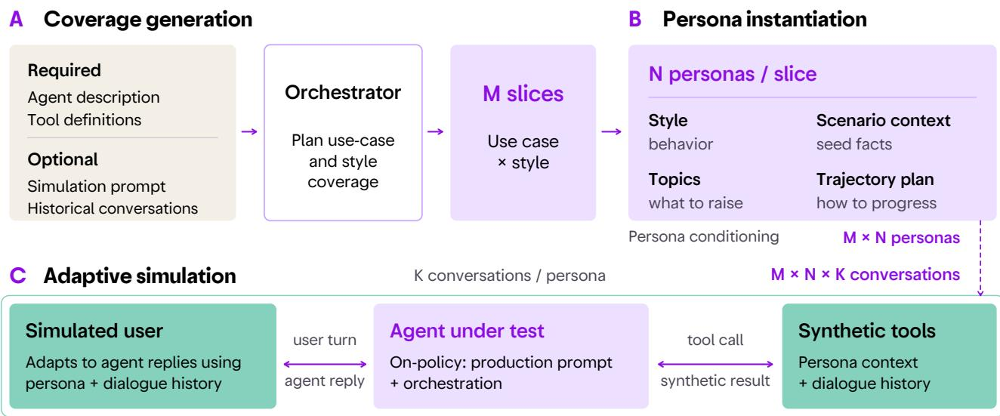  
Figure 2. End-to-end trajectory generation with SNOWGLOBE: an orchestrator reads the inputs and plans coverage over use-case and style slices; each slice generates personas carrying style, state, topics, and trajectory; each persona holds one or more multi-turn conversations with the agent under test, whose tool calls are answered by a mock tool layer.

## 2. Related Work

Customer experience agents in production. An increasing number of companies across different business categories are adopting agentic workflows for customer support, including Amazon (Luo et al., 2025), Airbnb (Zhao et al., 2025; Su et al., 2025), Kakao (Park et al., 2025), Alibaba Group (Jiang et al., 2025), Thomson Reuters (Juclà et al., 2026), and Nubank (Gupta et al., 2026). Zhao et al. (2025) and Su et al. (2025) propose human-in-the-loop feedback collection strategies and synthetic data generation pipelines for sustainably aligning customer experience agents with human preferences at Airbnb. Gupta et al. (2026) present a hierarchical pipeline spanning offline validation and online deployment for customer experience agents at Nubank, improving agent self-service rate (SSR) and transactional net promoter score (tNPS) (Reichheld, 2003).

User simulation in benchmarking agents. To benchmark agents across a wide range of domains, synthetic personas have been studied as a method for simulating diverse human demands, either at scale through verbalized prompts (Ge et al., 2025; Li et al., 2026) or by fine-tuning the language model used for simulation (Naous et al., 2026). Recent agent benchmarks, in particular, leverage prompt-guided user personas to simulate real-world scenarios (Yao et al., 2025; Tan et al., 2025; Qian et al., 2025; Barres et al., 2025; Huang et al., 2026). Specifically, τ-Bench defines multiturn scenarios in which agents interact with prompt-driven user simulators in retail and airline customer experience (CX) domains (Yao et al., 2025), while τ2-Bench extends this setting so that both agents and users can invoke tools, enabling more human-like actions by simulated users (Barres et al., 2025). Building on increasing efforts to expose CX agents to more realistic environments, we address the complementary question of how to characterize and use a simulator as a restricted screening layer in agent development for real-world deployment.

Reliability in user simulation. Despite the increasing use of user simulation in agent benchmarking, a simulator of unknown fidelity can actively mislead (Zhu et al., 2024; Mehri et al., 2026). Prompt-driven user simulators are often prone to score inflation through data leakage (Zhu et al., 2024) or may fail to adhere to their assigned goals in multi-turn scenarios (Mehri et al., 2026). Accordingly, rigorously validating the robustness of user simulation pipelines and their alignment with real human behavior remains challenging (Dou et al., 2025; Zhu et al., 2026a). SimulatorArena explicitly measures agreement between human judgments and assistant ratings on public tasks such as math tutoring (Dou et al., 2025), while RealUserSim grounds simulator personas in behavioral profiles extracted from real conversations and tests fidelity using an LLM-judged paired-trajectory Turing test (Zhu et al., 2026a). We characterize the reliability and robustness of a user simulation recipe by comparing simulated and real-world conversations, and demonstrate how simulation-based findings can inform changes that are subsequently evaluated through real-world business outcomes at Nubank. Most importantly, our results demonstrate that imperfect simulation can still guide directionally correct improvements to production agents, with benefits confirmed with live A/B evaluation.

Table 1. Card Delivery (CD) versions used to characterize the simulator and Card Management (CM) configurations evaluated through the simulation workflow.
<table><tr><td colspan="2">Card Delivery (CD)</td><td colspan="2">Card Management (CM)</td></tr><tr><td>Version</td><td>Configuration</td><td>Version</td><td>Configuration</td></tr><tr><td>V1cD</td><td>GPT-4.1; tools for customer-specific logistics queries.</td><td>V1cM</td><td>GPT-5.2; CD prompts and tools with ReAct-style tool definitions (Yao et al., 2023); baseline.</td></tr><tr><td>V2cD</td><td>GPT-4.1; card selection and prevention of recent duplicate reissues.</td><td>V2cM</td><td>GPT-5.2; Manual revision of V1CM&#x27;s prompt and tool-use policy.</td></tr><tr><td>V3cD</td><td>GPT-5.1; prompt rules for routing, personalization, and concise responses.</td><td>V3CM</td><td>GPT-5.2; V1Cm&#x27;s prompt and tools with a different architecture.</td></tr><tr><td>V4CD</td><td>GPT-5.2; tools to retrieve and update the registered</td><td>V4CM</td><td>GPT-5.2; Manual revision of V3Cm&#x27;s prompt and tool-use policy.</td></tr><tr><td>delivery address.</td><td></td><td>V5cM</td><td>GPT-5.2; Return to ReAct; prompt revised using simulated examples.</td></tr></table>

## 3. Simulation Setup

This section consolidates the experimental setup for multiturn agent trajectory generation and evaluation (Figure 2). Our pipeline selects a target agentic task, simulates onpolicy conversations with synthetic personas and tool responses, and evaluates the resulting trajectories offline.

Target agents. We study Nubank’s Card Delivery (CD) agent and its expanded successor, Card Management (CM), which replaced CD and supports a broader range of cardlifecycle requests. We characterize the simulation pipeline using CD traces and apply the resulting workflow to CM.

## 3.1. Simulation pipelines

Proposed simulation pipeline. Our proposed trajectorygeneration pipeline uses SNOWGLOBE as its primary simulator (Guardrails AI, 2025). SNOWGLOBE instantiates the persona-driven simulation pattern of Park et al. (2023) and takes an agent description and tool definitions, optionally augmented with a simulation prompt and historical conversations. From these inputs, it constructs use cases, user profiles, tool relationships, and trajectory plans (Appendix A). An orchestration agent allocates conversations across use-case and interaction-style conditions, after which the generated personas interact with the target agent over multiple turns. Each synthetic user turn is conditioned on the agent’s preceding response, while tool calls are intercepted and answered with scenario-conditioned synthetic results rather than invoking production backends. A conversation ends when the persona’s objective is achieved, judged unreachable, or subject to a turn or tool-specification limit. We adopt SNOWGLOBE for its structured orchestration, controllable scenario coverage, and cross-call tool-state consistency support for on-policy, hypothesis-driven agent screening.

Naive LLM baseline. To assess what can be achieved through direct prompting without SNOWGLOBE’s structured orchestration, we implement a naive LLM-based simulator. A persona language model generates informal Brazilian Portuguese customer turns, while a second language model produces synthetic results for the agent’s tool calls. Both roles use gpt-5.6-sol with high reasoning effort and receive the same categories of non-test-set context as SNOWGLOBE: the agent description, tool schemas, product-requirements meta-knowledge, and tool-call examples. Both simulators also use the same seeded scenario distribution. A baseline conversation ends when the persona signals completion, the agent transfers the conversation to a human, or the customer has sent ten messages. Unlike SNOWGLOBE, the baseline does not orchestrate use-case and interaction-style coverage, generate structured trajectory plans, or use an agent-profile model to maintain cross-call consistency. Appendix G provides the baseline prompts.

## 3.2. Card Delivery Agent

Agent versions and data. 8,000 real-world conversations between the users and the CD agent were evenly split into two sets: a development set to configure the simulators (i.e., simulation characterization) and a test set to validate the agent with the characterized simulation profiles. The four deployed CD versions are summarized in Table 1 (left).

The test set contains 1,000 conversations from each agent version. We generated 250 synthetic trajectories via the simulator for each version.

Offline evaluation. We use five semantic categories to evaluate agent trajectories offline. They are evaluated via

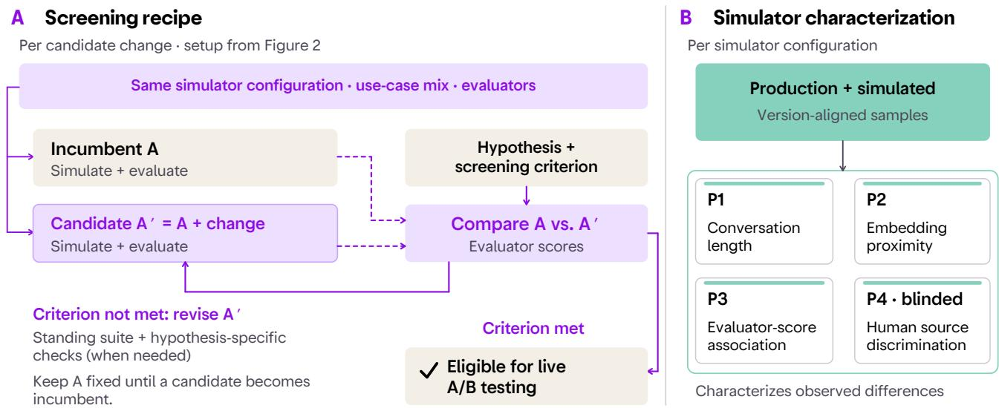  
Figure 3. Simulation recipe and characterization: (a) candidate agent changes are simulated and compared with an incumbent baseline using standing and hypothesis-specific criteria to screen candidates, (b) four diagnostics compare variant-aligned production and simulated Card Delivery samples, characterizing observed differences without establishing backend fidelity.

LLM-as-a-Judge, using GPT-4.1-Mini1: (E1) Card reissue failure; (E2) Customer input verification; (E3) Card delivery data check; (E4) Response conciseness; (E5) Resolution conciseness following Gupta et al. (2026). We evaluate each category with separate system prompts optimized via GEPA (Agrawal et al., 2026), which return binary pass/fail scores.

## 3.3. Card Management Agent

Agent versions and data. We apply the simulation workflow shown in Figure 3(a) to guide iterative improvements to the CM agent, which uses GPT-5.2 as its backbone model. Table 1 (right) summarizes the baseline and four additional versions developed through the proposed simulation workflow.

Offline evaluation. We used a single binary judgment from LLM-as-a-Judge to test the explicit hypothesis in each version as described above. Given the CM agent’s execution traces and available tools, LLM-as-a-Judge provides binary feedback on whether a transfer to human support was unnecessary. We compare each candidate’s failure rate with that of $V 1 _ { \mathrm { C M } }$ to decide whether to accept the change.

Online evaluation. We assess production performance using two online metrics: transactional net promoter score (tNPS) and self-service rate (SSR). tNPS is the percentage of promoters minus the percentage of detractors in a post-interaction recommendation survey (Reichheld, 2003). tNPS is thus a measure of customer satisfaction and happiness. Self-service rate (SSR) is the proportion of sessions in which users completed the case with the agent without asking for human support.

Algorithm 1 Hypothesis-driven candidate screening   
Require: Incumbent A; simulator configuration S; evaluation   
suite E; prespecified screening criterion C   
1: TA ← Simulate(A; S)   
2: for each candidate revision ∆ do   
3: A′ ← A + ∆   
4: TA′ ← Simulate(A′; S)   
5: Evaluate every trajectory in TA and TA′ with E   
6: if the candidate–incumbent comparison meets C then   
7: Mark A′ eligible for live A/B testing   
8: else   
9: Reassess or revise ∆   
10: end if   
11: end for

## 4. User Simulation Recipe for CX Agents

Algorithm 1 uses tool-boundary trajectory simulation for hypothesis-driven screening (Balog & Zhai, 2024). Its purpose is to expose beneficial or harmful candidate–incumbent differences large enough to affect a deployment decision. Therefore, exact replication of production metrics is unnecessary.

The algorithm first generates on-policy incumbent trajectories using simulator configuration S, which specifies the target use-case mix. These trajectories remain the shared baseline throughout the screening round. Configuration uses the agent description and tool definitions, optionally supplemented by a simulation prompt and historical data. Record scenario composition and keep distribution runs separate from targeted probes. Scenario-conditioned tool outputs must match declared schemas and remain consistent across calls within a conversation. For example, a record queried twice should not change state without an intervening action. Simulation exercises dialogue–tool interactions without testing backend implementations (Appendix B).

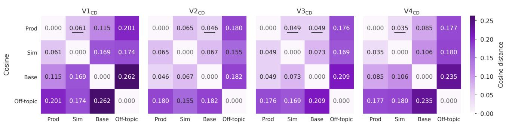  
Figure 4. P2 – In all versions, both simulated groups are closer to production than the off-topic control; SNOWGLOBE is no farther from production than the baseline in three versions. Cosine distances between whole-conversation embedding centroids. Underlined values mark the nearest non-production centroid.

Each screening round is guided by a falsifiable hypothesis and a prespecified screening criterion C. The hypothesis determines the behavioral effect of interest, while C defines how evaluator results support eligibility for live testing. The evaluation suite E comprises evaluators relevant to the task and the hypothesis, including LLM-as-a-judge evaluators when appropriate. It covers selected standing criteria and the proposed behavioral effect. The same suite is applied to incumbent and candidate trajectories; any newly introduced evaluator must also score the baseline trajectories. The standing CD suite was calibrated against human annotations (Gupta et al., 2026); calibration of each new hypothesis-specific judge must be reported separately.

Candidate simulations hold S fixed. Candidates meeting C become eligible for live A/B testing; others are reassessed or revised against the same incumbent. The baseline is updated only after a candidate becomes the incumbent. For candidates meeting C, smaller or ambiguous differences are left for live experiments to resolve. This loop complements item-level evaluation and live A/B tests; Figure 3 summarizes it alongside the separate simulator-characterization diagnostics.

## 4.1. Simulator characterization

We introduce four different diagnostics for the characterized simulators, including three automated evaluations and one human annotation session, namely P1 to P4. For three synthetic evaluations, we use the data and offline evaluation pipeline introduced in Section 3.2, i.e., each uses 1,000 held-out production conversations with real-world users and

250 SNOWGLOBE traces per CD version. The diagnostics address complementary properties (Figure 3b), none as a standalone criterion.

P1: Conversation-length statistics. We compare the number of words in user messages and the number of user turns per conversation. We report cumulative threshold percentages with full distributions in Appendix C.

P2: Embedding diagnostics. We embed each conversation using text-embedding-3-large2. Then, we measure cosine and Euclidean distances between the group centroids, and plot the two-dimensional Uniform Manifold Approximation and Projection (McInnes et al., 2018, UMAP) visualization.

P3: Evaluator-score association. We apply five canonical evaluation categories, E1 to E5, in Section 3.2 to the production, SNOWGLOBE, and baseline pools. For each agent version, we report the average scores per category and their 95% confidence intervals. Across the versions, we report average rank, Pearson r, and Kendall τ relative to the production ordering.

P4: Blinded human source discrimination. We sampled N=100 V4CD conversations, comprising 50 production and 50 SNOWGLOBE trajectories. V4CD was selected because it was the most recent version and the version most familiar to the annotators. Seven domain experts contributed labels. After the same source-blind normalization was applied to both groups, annotators saw dialogue text without tool-call sequences, classified each item as production or simulated, and reported confidence on a 1–5 scale.

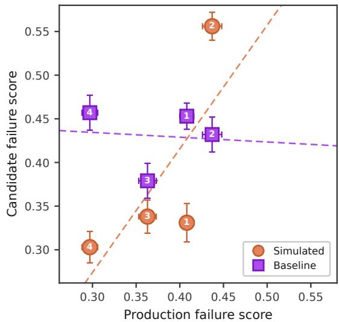  
Figure 5. P3 – SNOWGLOBE better preserves the production ordering than the baseline. Aggregate E1–E5 failure scores for simulated and baseline conversations versus production (lower is better). Labels 1–4 identify CD versions. Error bars show 95% conversation-clustered bootstrap confidence intervals.

## 4.2. Open-weight model screening

Models. We test 29 configurations of the card management agent with over $^ { 1 6 , 0 0 0 }$ simulated conversations, across model family, reasoning effort, and numerical format, including GPT-OSS-120B (OpenAI et al., 2025), Nemotron-3- Super-120B-A12B (NVIDIA et al., 2026), Qwen3.5-122B-A10B (Qwen Team, 2026a), and Qwen3.6-35B-A3B (Qwen Team, 2026b).

Evaluation. Building on the offline evaluation approach in Section 3.2, we use LLM-as-a-Judge to evaluate the following categories: (1) gathering proper inputs, (2) validity of card reissue, (3) information retrieval status, and (4) completeness of conversation, which are noted as “Input”, “Reissue”, “Status”, and “Complete” in Table 3.

## 5. Results

We characterize the simulator on CD versions, then report the offline CM analysis and the live A/B comparison, followed by a predeployment screen of open-weight models.

## 5.1. Simulator characterization

P1: Conversation length. Appendix C reports both selected cumulative thresholds for the four CD versions (Table 4) and the complete distributions (Figure 9). In the pooled samples, 22.4% of simulated conversations contain at most 50 user-message words, compared with 89.0% in production; 14.9% contain at least 200 words, compared with 0.1% in production. Similarly, 16.4% of simulated conversations have at most two user turns, compared with 36.8% in production. The shares with at least six and eight turns are 55.0% and 25.2% in simulation, versus 24.0% and 10.6% in production.

P2: Transcript-embedding proximity. For each CD version, the cosine distance between the production and simulated transcript centroids is smaller than the distance from either centroid to the off-topic control centroid (Figure 4). The same ordering holds for Euclidean distance (Appendix D, Figure 10). Compared with the baseline, SNOWGLOBE is closer to production in two versions, tied in one at the reported precision, and farther in one by cosine distance; by Euclidean distance, it is closer in three versions and farther in one. Both simulated groups remain closer to production than to the off-topic control. Figure 6 provides the two-dimensional UMAP projections.

P3: Evaluator-score association. Figure 5 shows that SNOWGLOBE preserves the production extremes, $V 4 _ { \mathrm { C D } }$ best and $V 2 _ { \mathrm { C D } }$ worst, although $V 1 _ { \mathrm { C D } }$ and $V 3 _ { \mathrm { C D } }$ exchange positions. The baseline instead ranks $V 3 _ { \mathrm { C D } }$ best and $V 4 _ { \mathrm { C D } }$ worst. $V 4 _ { \mathrm { C D } }$ is best in 96.69% of SNOWGLOBE resamples and 0% of baseline resamples; $V 2 _ { \mathrm { C D } }$ is worst in 100% and 1.56%, respectively. Table 5 in Appendix E reports the aggregate scores and ranking-agreement metrics. The average-rank statistic is 1.38 for SNOWGLOBE and 1.62 for the baseline. The SNOWGLOBE and production scores have Pearson $\mathbf { \Delta } r = 0 . 7 4$ and Kendall ${ \boldsymbol { \tau } } = \mathbf { 0 . 6 7 }$ ; their largest absolute difference is for $V 2 _ { \mathrm { C D } }$ (0.556 versus 0.437).

P4: Blinded human source discrimination. Annotators correctly identified 42 of 50 production conversations (84.0%) and 35 of 50 simulated conversations (70.0%). Thus, 15 simulations were classified as production. Reported confidence was approximately 3 on the 1–5 scale, including for correctly classified items.

## 5.2. Card Management: offline and live results

Applying the simulation recipe, $V 5 _ { \mathrm { C M } }$ had the lowest unnecessary-transfer failure rate (16.0%), compared with 22.4% for $V 1 _ { \mathrm { { C M } } }$ , 28.8% for $V 3 _ { \mathrm { { C M } } } ,$ , and 34.0% for $V 2 _ { \mathrm { { C M } } }$ and $V 4 _ { \mathrm { C M } }$ . This represents a 6.4-percentage-point reduction relative to $V 1 _ { \mathrm { C M } }$ . In the subsequent A/B test, the CM arm had SSR 4.90 percentage points above CD (95% CI [4.08, 5.71]) and tNPS 36.69 points above CD (95% CI [32.81, 40.57]) (Table 2). Following the test, the agent became available to Nubank’s customer base in Brazil. A later test replaced the incumbent model in CM with the openweight candidate screened in Section 5.3, Qwen3.5-122B-A10B with reasoning enabled. SSR rose by +8.82 percentage points (95% CI [7.95, 9.69], $n = 8 . 4 \mathrm { K } )$ while tNPS was statistically unchanged (−1.21 points, 95% CI [−3.97, 1.55], n = 2.3K), and p95 latency fell by 25%. The screened open-weight configuration therefore matched the incumbent on satisfaction while improving SSR and latency.

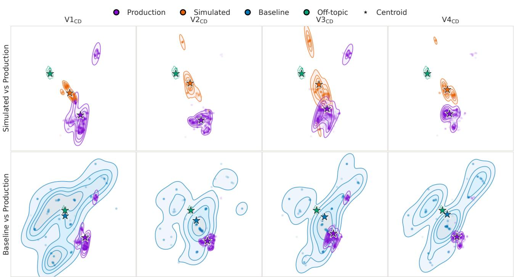  
Figure 6. P2 – SNOWGLOBE samples are concentrated near production, while the baseline spans a broader region extending toward the off-topic control. Joint UMAP projections compare SNOWGLOBE with production (top) and the baseline with production (bottom); the off-topic control is overlaid in both rows. Haloed stars mark projected group means.

Table 2. Live A/B outcomes for the two screened changes. Each panel reports differences against its own control. The p95 latency change is a point estimate from the serving stack.
<table><tr><td>Outcome</td><td>Difference</td><td>95% CI</td><td>n</td></tr><tr><td colspan="4">Card Management vs. Card Delivery</td></tr><tr><td>SSR (pp)</td><td>+4.90</td><td>[4.08, 5.71]</td><td>27.8K</td></tr><tr><td>tNPS (pp)</td><td>+36.69</td><td>[32.81, 40.57]</td><td>2.0K</td></tr><tr><td colspan="4">Qwen3.5-122B-A10B (reasoning on) vs. incumbent</td></tr><tr><td>SSR (pp)</td><td>+8.82</td><td>[7.95, 9.69]</td><td>8.4K</td></tr><tr><td>tNPS (points)</td><td>-1.21</td><td>[-3.97, 1.55]</td><td>2.3K</td></tr><tr><td>p95 latency (%)</td><td>-25</td><td></td><td></td></tr></table>

A batch of 100 simulated trajectories completed in under 10 minutes on average; this measures generation runtime rather than end-to-end iteration time. The ten-version CD development cycle, including the four versions studied here, spanned 212 calendar days. The five CM versions spanned 22 days. This corresponds to 21.2 and 4.4 days per version, respectively, a ratio of 4.8.

## 5.3. Open-weight model screening

Table 3 reports four evaluator failure rates for the openweight configurations. Performance by criterion, with no configuration uniformly outperforming the others. Qwen3.5 achieves the lowest input gathering (“Input”) failure rate with reasoning enabled (0.4%) and the lowest conversation completeness (“Complete”) failure rate with reasoning disabled (16.%). Qwen3.6 with reasoning enabled leads on card reissue validity (“Reissue”) (14.0%), while GPT-OSS with medium reasoning has the lowest information retrieval status (“Status”) failure rate among open-weight configurations (17.6%). The incumbent retains a substantial advantage on Status (2.4%).

The effect of reasoning also varies by model and criterion. For Qwen3.6, enabling reasoning lowers all four reported mean failure rates. For Nemotron, moving from no to low reasoning reduces Complete failures from 60.8% to 18.0%, but increases Status failures from 21.2% to 36.4%. For Qwen3.5, reasoning reduces Input and Status failures while increasing Reissue and Complete failures. These results imply model-specific benefits from additional reasoning.

We selected Qwen3.5-122B-A10B with reasoning enabled as a starting point for prompt optimization based on its low Input failure rate and competitive Reissue and Complete results. Relative to the incumbent, its Input and Complete failure rates are lower by 3.2 and 15.0 percentage points, respectively, while Reissue is similar (25.4% versus 25.2%). The higher Status failure rate (35.2% versus 2.4%) identified a weakness for further refinement. Subsequent prompt optimization reduced failures on this criterion. The offline results therefore supported Qwen3.5-122B-A10B as a candidate for live evaluation, without establishing it as the strongest configuration across all criteria. Table 2 reports the subsequent live A/B outcomes.

Table 3. Canonical evaluation failure rates (%) on simulated card management conversations $( \downarrow )$ . Bold and underlined values indicate the lowest and second-lowest means among open-weight configurations, respectively.
<table><tr><td rowspan="2">Configuration</td><td rowspan="2">Reasoning</td><td colspan="4">Canonical Evaluations (↓)</td></tr><tr><td></td><td>Input Reissue Status Complete</td><td></td><td></td></tr><tr><td>GPT-5.2 (Incumbent)</td><td></td><td> $3 . 6 _ { 3 . 0 }$ </td><td> $2 5 . 2 _ { 7 . 9 }$ </td><td> $2 . 4 3 . 3$ </td><td> $3 7 . 6 _ { 1 0 . 1 }$ </td></tr><tr><td rowspan="2">Qwen3.6-35B-A3B</td><td>Off</td><td> $1 . 6 _ { 1 . 7 }$ </td><td> $2 4 . 0 _ { 3 . 7 }$ </td><td> $2 9 . 2 _ { 9 . 0 }$ </td><td> $2 5 . 2 _ { 4 . 1 }$ </td></tr><tr><td>On</td><td> $1 . 2 _ { 1 . 8 }$ </td><td> $\mathbf { 1 4 . 0 _ { 3 . 7 } }$ </td><td> $2 5 . 6 _ { 3 . 3 }$ </td><td> $\underline { { 1 7 . 6 } } _ { 7 . 4 }$ </td></tr><tr><td rowspan="2">Qwen3.5-122B-A10B</td><td>Off</td><td> $\underline { { 0 . 8 } } _ { 1 . 1 }$ </td><td> $2 4 . 8 \mathrm { _ { 7 . 7 } }$ </td><td> $3 8 . 8 _ { 6 . 9 }$ </td><td> $\mathbf { 1 6 . 0 3 . 7 }$ </td></tr><tr><td>On</td><td> $\mathbf { 0 . 4 } _ { 0 . 9 }$ </td><td> $2 5 . 4 _ { 7 . 7 }$ </td><td> $3 5 . 2 { 1 0 . 1 }$ </td><td> $2 2 . 6 _ { 1 2 . 2 }$ </td></tr><tr><td rowspan="4">Nemotron-3-Super- 120B-A12B</td><td>Off</td><td> $6 . 4 2 . 2$ </td><td> $3 2 . 0 \mathrm { { 7 . 6 } }$ </td><td> $2 1 . 2 _ { 5 . 0 }$ </td><td> $6 0 . 8 \mathrm { { 1 2 . 5 } }$ </td></tr><tr><td>Low</td><td> $3 . 2 _ { 2 . 3 }$ </td><td> $2 0 . 0 _ { 6 . 3 }$ </td><td> $3 6 . 4 2 . 6 $ </td><td> $1 8 . 0 _ { 4 . 2 }$ </td></tr><tr><td>High</td><td> $1 . 2 _ { 2 . 7 }$ </td><td> $2 4 . 0 _ { 4 . 9 }$ </td><td> $3 0 . 0 _ { 6 . 3 }$ </td><td> $1 9 . 2 5 . 4 $ </td></tr><tr><td>Low</td><td> $2 . 0 _ { 2 . 4 }$ </td><td> $\underline { { 1 8 . 4 } } _ { 3 . 6 }$ </td><td> $2 8 . 4 6 . 2$ </td><td> $\underline { { 1 7 . 6 _ { 4 . 3 } } }$ </td></tr><tr><td rowspan="2">GPT-OSS-120B</td><td>Medium</td><td> $3 . 2 _ { 2 . 3 }$ </td><td> $2 6 . 0 _ { 7 . 7 }$ </td><td> $\mathbf { 1 7 . 6 } _ { 7 . 9 }$ </td><td> $2 0 . 8 _ { 4 . 6 }$ </td></tr><tr><td>High</td><td> $2 . 4 _ { 0 . 9 }$ </td><td> $2 8 . 0 _ { 7 . 7 }$ </td><td> $\underline { { 1 9 . 6 } } _ { 3 . 0 }$ </td><td> $1 8 . 8 _ { 6 . 1 }$ </td></tr></table>

## 5.4. Deployment lessons and limitations

Simulation supported safer, faster iteration: batches of 100 trajectories ran in under ten minutes, evaluators surfaced behavioral regressions, and the screen caught tool-call failures and a serving configuration without a tool-call parser. Most engineering effort went into integration: the staging agent reused live MCP schemas while stateful tools returned schema-compatible synthetic responses. The agent retained tool control and sequencing, but schemas, examples, authentication, and simulator profiles required ongoing alignment.

The approach deliberately stops at the tool boundary. Stateful or side-effecting tools are mocked, while read-only dependencies such as knowledge-base retrieval may remain live; backend behavior, latency, persistent state, and side effects thus remain untested. Simulation traces must also match production schemas, identifiers, and telemetry, or export and reconciliation work can erase the iteration gains.

## 6. Conclusion

In this paper, we present a hypothesis-driven approach to using simulation as a pre-deployment screening layer for CX agents. At Nubank, simulation has become an integral part of our development life cycle, enabling teams to explore changes, identify behavioral failures, and refine candidates before customer exposure. Its value lies in supporting development decisions, not in perfectly reproducing production. By combining simulation with live evaluation, this workflow supports broader experimentation while keeping deployment decisions grounded in observed customer outcomes.

## References

Agrawal, L. A., Tan, S., Soylu, D., Ziems, N., Khare, R., Opsahl-Ong, K., Singhvi, A., Shandilya, H., Ryan, M. J., Jiang, M., Potts, C., Sen, K., Dimakis, A. G., Stoica, I., Klein, D., Zaharia, M., and Khattab, O. GEPA: Reflective prompt evolution can outperform reinforcement learning. In International Conference on Learning Representations (ICLR), 2026. URL https://arxiv.org/ abs/2507.19457. Oral.

Balog, K. and Zhai, C. User simulation for evaluating information access systems. Foundations and Trends in Information Retrieval, 18(1–2):1–261, 2024. doi: 10.1561/1500000098. URL https://arxiv.org/ abs/2306.08550.

Barres, V., Dong, H., Ray, S., Si, X., and Narasimhan, $\mathrm { K } . \tau ^ { 2 } .$ Bench: Evaluating conversational agents in a dual-control environment. arXiv preprint arXiv:2506.07982, 2025. URL https://arxiv.org/abs/2506.07982.

Dou, Y., Galley, M., Peng, B., Kedzie, C., Cai, W., Ritter, A., Quirk, C., Xu, W., and Gao, J. SimulatorArena: Are user simulators reliable proxies for multi-turn evaluation of AI assistants? In Proceedings of the 2025 Conference on Empirical Methods in Natural Language Processing (EMNLP), pp. 35212– 35290, 2025. doi: 10.18653/v1/2025.emnlp-main. 1786. URL https://aclanthology.org/2025. emnlp-main.1786/.

Ge, T., Chan, X., Wang, X., Yu, D., Mi, H., and Yu, D. Scaling synthetic data creation with 1,000,000,000 personas, 2025. URL https://arxiv.org/abs/ 2406.20094.

Gemini Team et al. Gemini 1.5: Unlocking multimodal understanding across millions of tokens of context, 2024. URL https://arxiv.org/abs/2403.05530.

Guardrails AI. SnowGlobe: The simulation engine for AI agents and chatbots. Product whitepaper, 2025. URL https://guardrailsai.com/snowglobe. Accessed 2026-05-21.

Guo, D., Yang, D., Zhang, H., Song, J., Wang, P., Zhu, Q., Xu, R., Zhang, R., Ma, S., Bi, X., et al. Deepseekr1 incentivizes reasoning in llms through reinforcement learning. Nature, 645(8081):633–638, 2025.

Gupta, A., Rossell, K., Alcobaça, E., Pacheco, J. C. L., de Lima, C. B., Tang, S., Rabachini, L. P., Moneda, L., Fei, H., Silva, D., and Ramanath, R. Building customer support agents at 100M-user scale: An evaluation-driven framework. In Proceedings of the 32nd ACM SIGKDD Conference on Knowledge Discovery and Data Mining (Industrial Track). ACM, 2026. To appear.

Huang, K.-H., Prabhakar, A., Thorat, O., Agarwal, D., Choubey, P. K., Mao, Y., Savarese, S., Xiong, C., and Wu, C.-S. CRMArena-pro: Holistic assessment of LLM agents across diverse business scenarios and interactions. Transactions on Machine Learning Research, 2026. ISSN 2835-8856. URL https:// openreview.net/forum?id=EPlpe3Fx1x.

Jiang, X., Hu, T., Qin, Y., Wang, G., Huan, Z., Chen, K., Huang, G., Lu, R., and Tang, S. ChatMap: Mining human thought processes for customer service chatbots via multi-agent collaboration. In Che, W., Nabende, J., Shutova, E., and Pilehvar, M. T. (eds.), Findings of the Association for Computational Linguistics: ACL 2025, pp. 11927–11947, Vienna, Austria, July 2025. Association for Computational Linguistics. ISBN 979- 8-89176-256-5. doi: 10.18653/v1/2025.findings-acl. 617. URL https://aclanthology.org/2025. findings-acl.617/.

Juclà, D. G., Tuteja, M., Casademunt, M. E., Unnikrishnan, K., Usmani, Y., and Roshaan, A. Retrieval enhancements for RAG: Insights from a deployed customer support chatbot. In Matusevych, Y., Eryigit,˘ G., and Aletras, N. (eds.), Proceedings of the 19th Conference of the European Chapter of the Association for Computational Linguistics (Volume 5: Industry Track), pp. 169–180, Rabat, Morocco, March 2026. Association for Computational Linguistics. ISBN 979- 8-89176-384-5. doi: 10.18653/v1/2026.eacl-industry. 13. URL https://aclanthology.org/2026. eacl-industry.13/.

Kirk, H. R., Whitefield, A., Röttger, P., Bean, A. M., Margatina, K., Mosquera, R., Ciro, J. M., Bartolo, M., Williams, A., He, H., Vidgen, B., and Hale, S. A. The PRISM alignment dataset: What participatory, representative and individualised human feedback reveals about the subjective and multicultural alignment of large language models. In The Thirty-eight Conference on Neural Information Processing Systems Datasets and Benchmarks Track, 2024. URL https://openreview. net/forum?id=DFr5hteojx.

Li, X. et al. Matraix: Simulating the world with 8.3 billion persona agents, 2026. URL https://arxiv.org/ abs/2608.04205.

Luo, C., Papadimitriou, D., Muralidharan, H., Ramasubbu, D., Kolekar, A., Xu, W., Xu, C., Srinivasan, A., Jain, M., and He, Q. Language model alignment for conversational shopping at amazon. In Proceedings of the 48th International ACM SIGIR Conference on Research and Development in Information Retrieval, SIGIR ’25, pp. 4314–4318, New York, NY, USA, 2025. Association for Computing Machinery. ISBN 9798400715921. doi: 10.1145/3726302.3731955. URL https://doi. org/10.1145/3726302.3731955.

Lynch, A., Wright, B., Larson, C., Troy, K. K., Ritchie, S. J., Mindermann, S., Perez, E., and Hubinger, E. Agentic misalignment: How llms could be an insider threat. Anthropic Research, 2025. https://www.anthropic.com/research/agenticmisalignment.

McInnes, L., Healy, J., and Melville, J. UMAP: Uniform manifold approximation and projection for dimension reduction. arXiv preprint arXiv:1802.03426, 2018.

Mehri, S., Yang, X., Kim, T., Tur, G., Mehri, S., and Hakkani-Tür, D. Goal alignment in LLM-based user simulators for conversational AI. Transactions ofthe Associationfor Computational Linguistics, 2026. doi: 10. 1162/tacl.a.687. URL https://arxiv.org/abs/ 2507.20152.

Naous, T., Laban, P., Xu, W., and Neville, J. Flipping the dialogue: Training and evaluating user language models. In The Fourteenth International Conference on Learning Representations, 2026. URL https://openreview. net/forum?id=ykSmkVqzn4.

NVIDIA et al. Nemotron 3 super: Open, efficient mixtureof-experts hybrid mamba-transformer model for agentic reasoning, 2026. URL https://arxiv.org/abs/ 2604.12374.

OpenAI. Openai o3 and o4-mini system card. Technical report, OpenAI, 2025. URL https://openai.com/ index/o3-o4-mini-system-card/.

OpenAI et al. gpt-oss-120b & gpt-oss-20b model card, 2025. URL https://arxiv.org/abs/2508.10925.

Park, C., Jang, W., Kim, D., Ahn, A., Yang, K., Hwang, W., Roh, J., Park, H., Wang, H., Kim, M. S., and Kang, J. A practical approach for building production-grade conversational agents with workflow graphs. In Rehm, G. and Li, Y. (eds.), Proceedings ofthe 63rd Annual Meeting of the Association for Computational Linguistics (Volume 6: Industry Track), pp. 1508–1519, Vienna, Austria, July 2025. Association for Computational Linguistics. ISBN 979-8-89176-288-6. doi: 10.18653/v1/2025.acl-industry. 107. URL https://aclanthology.org/2025. acl-industry.107/.

Park, J. S., O’Brien, J. C., Cai, C. J., Morris, M. R., Liang, P., and Bernstein, M. S. Generative agents: Interactive simulacra of human behavior. In Proceedings of the 36th Annual ACM Symposium on User Interface Software and Technology (UIST), 2023. doi: 10.1145/3586183. 3606763. URL https://arxiv.org/abs/2304. 03442. Best Paper Award.

Qian, C., Liu, Z., Prabhakar, A., Liu, Z., Zhang, J., Chen, H., Ji, H., Yao, W., Heinecke, S., Savarese, S., and Wang, H. Userbench: An interactive gym environment for usercentric agents. In Workshop on Scaling Environmentsfor Agents, 2025. URL https://openreview.net/ forum?id=iJS7nvlGPd.

Qin, Y., Liang, S., Ye, Y., Zhu, K., Yan, L., Lu, Y., Lin, Y., Cong, X., Tang, X., Qian, B., Zhao, S., Hong, L., Tian, R., Xie, R., Zhou, J., Gerstein, M., dahai li, Liu, Z., and Sun, M. ToolLLM: Facilitating large language models to master 16000+ real-world APIs. In The Twelfth International Conference on Learning Representations, 2024. URL https://openreview.net/forum? id=dHng2O0Jjr.

Qwen Team. Qwen3.5: Towards native multimodal agents, February 2026a. URL https://qwen.ai/blog? id=qwen3.5.

Qwen Team. Qwen3.6-35B-A3B: Agentic coding power, now open to all, April 2026b. URL https://qwen. ai/blog?id=qwen3.6-35b-a3b.

Reichheld, F. F. The one number you need to grow. Harvard Business Review, 81(12):46–54, 2003.

Research, C., :, Chan, A., Shalaby, A., Wettig, A., Sanger, A., Zhai, A., Ajay, A., Nair, A., Snell, C., Lu, C., Shen, C., Jia, E., Cassano, F., Liu, H., Chen, H., Wildermuth, H., Jackson, J., Li, J., Katz, J., Yao, J., Hejna, J., Warner, J., Vering, J., Frans, K., Danilek, L., Wright, L., Cen, L., Melas-Kyriazi, L., Truell, M., de Jong, M., Jain, N., Schmidt, N., Wang, N., Muennighoff, N., Rybkin, O., Loh, P., Kravtsov, P., Yadav, R., Shah, S., Kottler, S., Rush, A. M., Zhang, S., Jain, S., Sankar, S., Heule, S., Sul, S. H., Asif, S., Rong, V., Zhu, W., Lin, W., Wu, Y., Volkov, Y., Zemlyanskiy, Y., Holbrook, Z., and Zhang, Z. Composer 2 technical report, 2026. URL https: //arxiv.org/abs/2603.24477.

Schick, T., Dwivedi-Yu, J., Dessi, R., Raileanu, R., Lomeli, M., Hambro, E., Zettlemoyer, L., Cancedda, N., and Scialom, T. Toolformer: Language models can teach themselves to use tools. In Thirty-seventh Conference on Neural Information Processing Systems, 2023. URL https://openreview.net/forum? id=Yacmpz84TH.

Steinberger, P. and Contributors, O. F. OpenClaw: Your own personal ai assistant. https://github.com/ openclaw/openclaw, 2026. Accessed: 2026-09-03.

Su, H., Luo, W., Mehdad, Y., Han, W., Liu, E., Zhang, W., Zhao, M., and Zhang, J. LLM-friendly knowledge representation for customer support. In Rambow, O., Wanner, L., Apidianaki, M., Al-Khalifa, H., Eugenio, B. D., Schockaert, S., Darwish, K., and Agarwal, A. (eds.), Proceedings ofthe 31st International Conference on Computational Linguistics: Industry Track, pp. 496–504, Abu Dhabi, UAE, January 2025. Association for Computational Linguistics. URL https://aclanthology. org/2025.coling-industry.42/.

Tack, J., Laban, P., and Neville, J. Llms get lost in evolving user intent, 2026. URL https://arxiv.org/abs/ 2607.20734.

Tan, J., Yang, L., Liu, Z., Liu, Z., R N, R., Awalgaonkar, T. M., Zhang, J., Yao, W., Zhu, M., Kokane, S., Savarese, S., Wang, H., Xiong, C., and Heinecke, S. PersonaBench: Evaluating AI models on understanding personal information through accessing (synthetic) private user data. In Che, W., Nabende, J., Shutova, E., and Pilehvar, M. T. (eds.), Findings of the Association for Computational Linguistics: ACL 2025, pp. 878–893, Vienna, Austria, July 2025. Association for Computational Linguistics. ISBN 979-8-89176-256-5. doi: 10.18653/v1/2025.findings-acl. 49. URL https://aclanthology.org/2025. findings-acl.49/.

Tien, J., Anand, A., Tuan, Y.-R., Shen, Y., Kolter, J. Z., and Nayebi, A. Rogue: Misaligned agent behavior arising from ordinary computer use, 2026. URL https:// arxiv.org/abs/2606.00341.

Vijayvargiya, S., Soni, A. B., Zhou, X., Wang, Z. Z., Dziri, N., Neubig, G., and Sap, M. Openagentsafety: A comprehensive framework for evaluating real-world AI agent safety. In The Fourteenth International Conference on Learning Representations, 2026. URL https: //openreview.net/forum?id=xggSxCFQbA.

Yao, S., Zhao, J., Yu, D., Du, N., Shafran, I., Narasimhan, K., and Cao, Y. ReAct: Synergizing reasoning and acting in language models. In International Conference on Learning Representations (ICLR), 2023.

Yao, S., Shinn, N., Razavi, P., and Narasimhan, K. τ-bench: A benchmark for tool-agent-user interaction in real-world domains. In The Thirteenth International Conference on Learning Representations (ICLR), 2025. URL https: //arxiv.org/abs/2406.12045.

Zhao, C., Zhang, T., Su, H., Zhang, Y., Su, S., Xu, M., Liu, Y., Han, W., Werner, J., Cheng, C. N., and Mehdad,

Y. Agent-in-the-loop: A data flywheel for continuous improvement in LLM-based customer support. In Potdar, S., Rojas-Barahona, L., and Montella, S. (eds.), Proceedings of the 2025 Conference on Empirical Methods in Natural Language Processing: Industry Track, pp. 1919–1930, Suzhou (China), November 2025. Association for Computational Linguistics. ISBN 979-8- 89176-333-3. doi: 10.18653/v1/2025.emnlp-industry. 135. URL https://aclanthology.org/2025. emnlp-industry.135/.

Zhu, L., Huang, X., and Sang, J. How reliable is your simulator? analysis on the limitations of current LLMbased user simulators for conversational recommendation. In Companion Proceedings of the ACM Web Conference 2024 (WWW ’24), pp. 1726–1732, 2024. doi: 10.1145/3589335.3651955. URL https://arxiv. org/abs/2403.16416.

Zhu, M., Tan, J., Murthy, R., Qiu, J., Yang, L., Zhao, W., Savarese, S., Heinecke, S., and Wang, H. RealUserSim: Bridging the reality gap in agent benchmarking via grounded user simulation. arXiv preprint arXiv:2605.20204, 2026a. URL https://arxiv. org/abs/2605.20204.

Zhu, Y., Jin, T., Pruksachatkun, Y., Zhang, A. K., Liu, S., Cui, S., Kapoor, S., Longpre, S., Meng, K., Weiss, R., Barez, F., Gupta, R., Dhamala, J., Merizian, J., Giulianelli, M., Coppock, H., Ududec, C., Kellermann, A., Sekhon, J. S., Steinhardt, J., Schwettmann, S., Narayanan, A., Zaharia, M., Stoica, I., Liang, P., and Kang, D. Establishing best practices in building rigorous agentic benchmarks. In The Thirty-ninth Annual Conference on Neural Information Processing Systems Datasets and Benchmarks Track, 2026b. URL https://openreview. net/forum?id=E58HNCqoaA.

## A. How SNOWGLOBE infers simulation properties

Before it can interact with an agent in a meaningful way, SNOWGLOBE needs an approximation of that agent’s objectives, its users, and its behavior. The minimal input is a description of the agent together with the definitions of its tools. From these, a set of agents infers the properties a simulation depends on (Figure 7): the use cases the agent serves, profiles of synthetic users along with the data those users would carry, how the tools relate to one another and to the surrounding system, and the user trajectories that would call on each tool. Some of these properties are resolved once during agent onboarding and others are resolved when a simulation begins.

Two optional inputs reorient these properties. A simulation prompt narrows a run to a chosen set of use cases or behaviors while leaving the rest of the inferred picture intact. Real historical conversations, when supplied, are processed offline to extract use cases, linguistic styles, and their distributions, which are stored and used to condition later runs.

## B. Tool boundary mocking

Exercising the agent’s tools inside a simulation raises a problem of its own. The simulated environment must not access production data through stateful tools, yet it has to return data through those tools so the agent can run end to end, and that data must stay consistent with the state of the conversation and with the results of earlier tool calls. Testing the tools themselves is a separate concern, better served by other methods, and is not an aim here.

SNOWGLOBE meets these constraints without ever maintaining a database of state (Figure 8). During onboarding, it absorbs the tool definitions and builds a functional model of how the tools relate and how data must be shaped to satisfy each request. This model is called an agent profile. Using an agent profile, an orchestrator produces persona seeds. These are partial seed states paired with a trajectory for how that data should evolve over a conversation. Pesrona seeds are projected onto personas at runtime to ground their objectives.

At simulation time, a call to one of the agent’s tools is routed to the persona agent handling that conversation rather than to the real implementation. Using its partial state and the consistency rules in the agent profile, the persona agent returns a response that fits the tool’s output shape, and that response is passed back to the agent under test. Because no shared world state is instantiated, each conversation runs in its own sandbox. SNOWGLOBE refers to this as toolboundary mocking: only the individual tool calls at the boundary are answered, never an entire backend or database.

## C. Conversation length distributions

Figure 9 shows the full P1 distributions of user-message words and user turns, complementing the thresholds in Table 4. Length is user-side only. Groups are production traffic pooled over $V 1 _ { \mathrm { C D } ^ { - } } V 4 _ { \mathrm { C D } } \ : ( n = 4 0 0 0 )$ , SNOWGLOBE simulations of the same variants $\mathbf { \mu } ( n = \mathbf { 1 0 0 0 } )$ ), and an off-topic control $\mathbf { \mathit { \Omega } } ( n = 2 2 \mathbf { 6 } )$ . The retained 226-item control is encoded in the plotted artefact and historical experiment code, but the filtering from a documented upstream 1,000-item random control sample is not recorded. Table 4 shows summarized results in bins for easy comparison of extreme values.

Production user text is short (median 19 words; mean 25.8). The control matches that scale (median 20; mean 27.5); simulated users do not (median 111; mean 119). Control shares at the Table 4 word cuts are 85.8% (≤ 50) and 0% (≥ 200). Because the control is production traffic rather than LLM-generated user text, it cannot determine whether the heavy simulated tail is specific to this configuration or common to LLM user simulators.

In production, 24.3% of conversations have a single user turn, and the median is three turns. Control never has a one-turn chat and peaks at three turns (33.2%). Simulated conversations last longer (median 6) and hit a hard cap: 25.2% have exactly eight user turns, and none have more— which is why every simulated conversation has fewer than 10 user turns, the 95th-percentile value in production, despite the higher simulated median. Control shares at the table cuts are 18.6% (≤ 2), 17.7% (≥ 6), and 4.0% (≥ 8).

## D. Euclidean transcript-centroid distances

Figure 10 reports the Euclidean-distance counterpart to the cosine-distance result in Figure 4.

## E. Evaluator-score association details

Table 5 reports the P3 aggregate scores and rankingassociation statistics. Each conversation contributes five binary failure outcomes, one per evaluator. Within each source–version pool, we first average each evaluator across conversations and then average the five evaluator means; lower aggregate scores indicate fewer failures.

The 95% intervals use 10,000 conversation-clustered bootstrap replicates. Each replicate resamples conversation rows with replacement, preserving the five outcomes for each sampled conversation, and recomputes the aggregate score. Production defines the reference ordering. Average rank summarizes closeness to that order (lower is better), Pearson r measures linear association between version-level scores, and Kendall τ measures rank agreement.

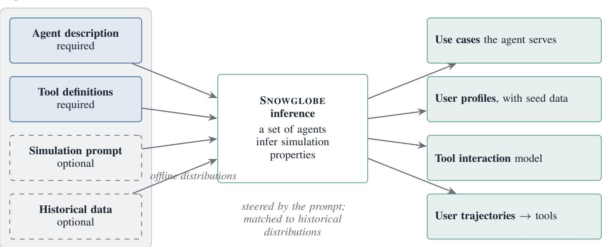  
Figure 7. Property inference in SNOWGLOBE. From a required agent description and tool definitions, optionally augmented with a simulation prompt and historical data, a set of agents infers the use cases, user profiles and their seed data, the tool interaction model, and the user trajectories over the tools. Historical data is processed offline into features that can condition later runs.

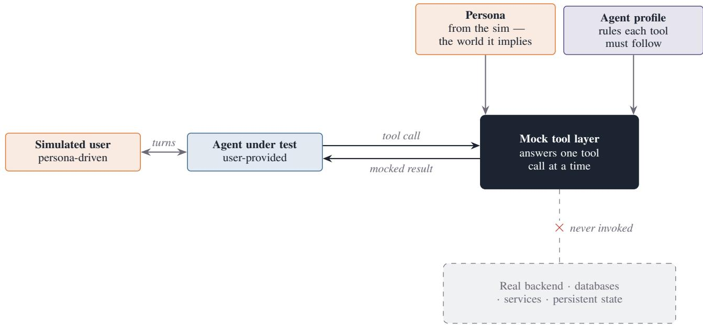  
Figure 8. Tool-boundary mocking. As the simulated user and the agent under test exchange turns, each tool call the agent makes is answered by a mock tool layer parameterised by the persona and the agent profile. Only the tool boundary is mocked.

Table 4. P1 – Selected cumulative conversation-length thresholds for $V 1 _ { \mathrm { C D } ^ { - } } V 4 _ { \mathrm { C D } }$ . Values are percentages of conversations meeting each criterion; rows may overlap. Word counts include user messages only.
<table><tr><td colspan="3">User-message words per conversation</td><td colspan="3">User turns per conversation</td></tr><tr><td>Criterion</td><td>Production</td><td>Simulated</td><td>Criterion</td><td>Production</td><td>Simulated</td></tr><tr><td>≤ 50</td><td>89.0</td><td>22.4</td><td>≤2</td><td>36.8</td><td>16.4</td></tr><tr><td>≥ 200 words</td><td>0.1</td><td>14.9</td><td>≥6</td><td>24.0</td><td>55.0</td></tr><tr><td></td><td></td><td></td><td>≥8</td><td>10.6</td><td>25.2</td></tr></table>

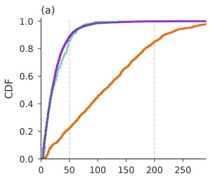

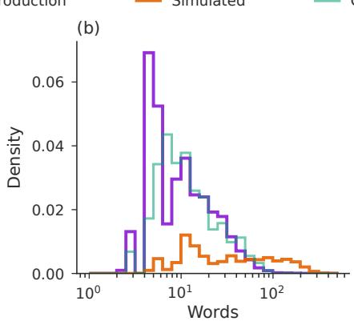

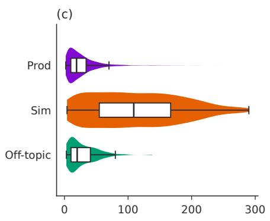

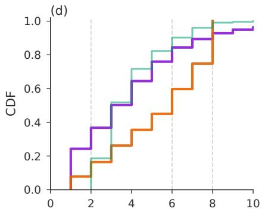

(e)  
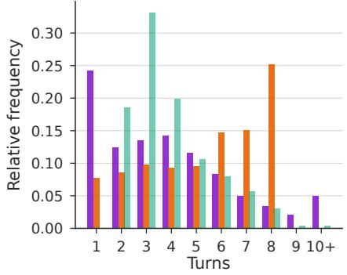

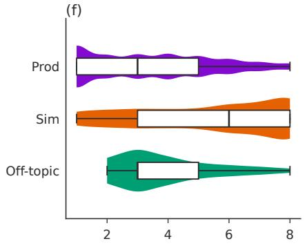

Figure 9. P1 – SNOWGLOBE simulated conversations are substantially longer than production and off-topic conversations in both user-message words and user turns. The top row shows word count and the bottom row user turns: ECDFs (a,d), density or frequency (b,e), and violins with nested boxplots (c,f). Panel (e) pools values ≥ 10 into the 10+ bin.  
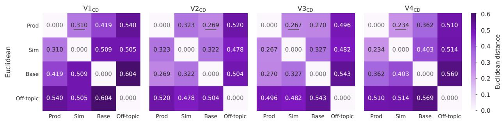  
Figure 10. P2 – In all versions, both simulated groups are closer to production than the off-topic control; SNOWGLOBE is no farther from production than the baseline in three versions. Euclidean distances between whole-conversation embedding centroids. Underlined values mark the nearest non-production centroid.

The extreme-rank analysis uses the same resampling procedure. Each replicate ranks the four versions by aggregate score, with ties sharing credit equally. The reported frequencies estimate only how often $V 4 _ { \mathrm { C D } }$ is best and $V 2 _ { \mathrm { C D } }$ is worst.

## F. Open-weight screening: reasoning and quantization

Because a simulated arm costs no customer exposure, the screen can afford to sweep configuration settings that would otherwise be argued from intuition. This appendix reports the sweep summarised in Section 5.3, run on Nemotron-3-Super-120B-A12B across three quantizations and three reasoning settings. The figure omits the incumbent: the composite is a mean over evaluators built for this agent, and is used to compare a model against itself under different settings rather than to rank candidates against production.

Figure 11 shows the result. Reasoning effort moves the composite monotonically and by a large margin, from 42.9 with reasoning off to 31.3 with it on at nvfp4, and the mechanism is retrieval: the rate at which the model fetches the company record the task requires rises from 16% to

Table 5. P3 – Aggregate E1–E5 failure scores by version (lower is better), reported as means $\pm 9 5 \%$ conversation-clustered bootstrap half-widths. Production defines the reference ranking; average rank, Pearson r, and Kendall τ measure agreement with it.
<table><tr><td>Source</td><td> $V \mathbf { 1 } _ { \mathbf { C D } }$ </td><td> $V 2 _ { \mathbf { C D } }$ </td><td> $V 3 _ { \mathbf { C D } }$ </td><td> $V 4 _ { \mathbf { C D } }$ </td><td>Avg. rank</td><td>Pearson r</td><td>Kendall τ</td></tr><tr><td>Baseline</td><td> $0 . 4 5 3 { \scriptstyle \pm 0 . 0 1 5 }$ </td><td> $0 . 4 3 2 { \scriptstyle \pm 0 . 0 2 0 }$ </td><td> $0 . 3 7 9 { \scriptstyle \pm 0 . 0 2 0 }$ </td><td> $0 . 4 5 7 { \scriptstyle \pm 0 . 0 2 0 }$ </td><td>1.62</td><td>-0.09</td><td>-0.33</td></tr><tr><td>Simulated</td><td> $0 . 3 3 1 { \scriptstyle \pm 0 . 0 2 2 }$ </td><td> $0 . 5 5 6 { \scriptstyle \pm 0 . 0 1 6 }$ </td><td> $0 . 3 3 8 { \scriptstyle \pm 0 . 0 1 9 }$ </td><td> $0 . 3 0 3 { \scriptstyle \pm 0 . 0 1 8 }$ </td><td>1.38</td><td>0.74</td><td>0.67</td></tr><tr><td>Production</td><td> $0 . 4 0 8 { \scriptstyle \pm 0 . 0 0 8 }$ </td><td> $0 . 4 3 7 { \scriptstyle \pm 0 . 0 1 1 }$ </td><td> $0 . 3 6 3 _ { \pm 0 . 0 1 0 }$ </td><td> $0 . 2 9 7 _ { \pm 0 . 0 0 9 }$ </td><td>1.00</td><td>1.00</td><td>1.00</td></tr></table>

94% over the same range. Quantization does not move it. Across nvfp4, fp8, and bf16 the spread is 2.2, 0.8, and 4.1 points at reasoning off, low, and on, against a 2.2-point standard deviation measured over six replicate runs of a fixed configuration. At this sample size the three quantizations are indistinguishable, while the reasoning setting moves the composite by roughly 11 points.

## G. Baseline simulator prompts

Both simulator models (user and tools) are gpt-5.6-sol with reasoning\_effort=high. Brace placeholders mark run-specific context concatenated at inference time: agent description, tool JSON schemas, productrequirements text, and tool-call examples.

## G.1. Persona model

The persona is given one function tool, end\_conversation, so it can trigger the end of the simulation. The first user message is shown below. Later turns reuse the same system prompt and append the dialogue (user and assistant text only).

Persona system prompt   
You are a Brazilian Nubank customer chatting   
in the Nubank app.   
Stay in character. Write in informal Brazilian   
Portuguese, like a real customer on a phone   
keyboard: short messages, occasional typos,   
no markdown.   
You are talking to a support chatbot. You do   
not work at Nubank. You do not know internal   
tool names, IDs, or policies beyond what is   
listed below.   
Your persona:   
{persona\_card}   
Rules:   
- Send one customer message at a time.   
- If the bot resolved your issue, or you are   
done, call end\_conversation.   
- If the bot transfers you to a human, call   
end\_conversation.   
- Do not invent that a human already joined.   
- Maximum 10 of your messages in the whole   
conversation.   
## Agent description   
{description}

## Tools the agent can use (description + schema)   
{tools\_schema}   
## Product requirements (meta-knowledge)   
{prd}   
## Tool examples   
{tool\_examples}

Persona user message   
Write your first message to the Nubank chatbot now.

Customer cards are sampled from a seeded generator.

Persona card   
Nome: {name}. Cidade: {city}. Problema:   
{issue}.   
Tom: {tone}. Você é cliente Nubank no Brasil e   
está no chat do app.

## G.2. Tool-result model

The mock backend is a second completion (no tools). The user message is the pending tool call.

Tool-result system prompt   
You are an LLM tool-result simulator for a   
Nubank card-delivery conversation.   
Generate a realistic JSON result for the   
given tool call.   
Return ONLY the tool output (JSON if   
possible). No preamble.   
Stay consistent with earlier results in this   
conversation when the same IDs appear.   
## Agent description   
{description}   
## Tool description + schema   
{tools\_schema}   
## Product requirements (meta-knowledge)   
{prd}   
## Tool examples   
{tool\_examples}

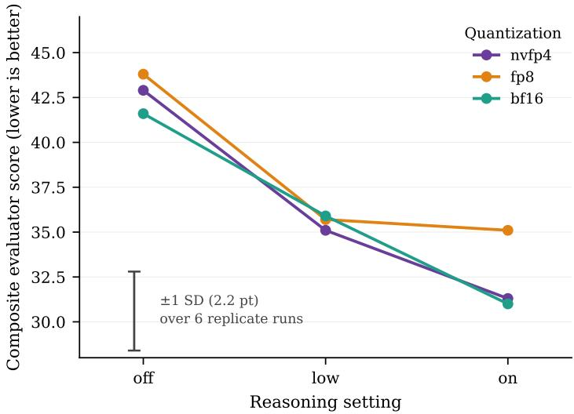  
Figure 11. Reasoning and quantization sweep for Nemotron-3-Super-120B-A12B: composite evaluator score (lower is better) against reasoning setting, one series per quantization. The bar is ±1 standard deviation of the composite measured over six replicate runs of a fixed configuration, and is a scale reference rather than a comparison against any arm.