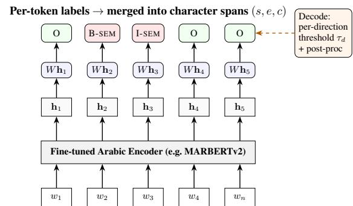

# TTLab at AlexandriaX-2026: A Fine-Tuned Surface Tagger for Arabic Machine-Translation Error-Span Detection and Classification

Ali Abusaleh, Bhuvanesh Verma, Alexander Mehler

Text Technology Lab (TTLab),

Goethe University Frankfurt

{a.abusaleh,verma,mehler}@em.uni-frankfurt.de

## Abstract

We present TTLab’s submission to the AlexandriaX-2026 Subtask 3 on Arabic MT error span detection and classification. Our system frames the task as token-level classification over surface forms, preserving character offsets to ensure exact alignment with the evaluation metric. To handle severe label imbalance, we employ a focal loss with class weighting and dialect-specific decoding thresholds. Among six Arabic pre-trained encoders, MARBERTv2 achieves the best overall performance of 40.8 and 40.91 on the development and test set, respectively, ranking 3rd out of all participating teams. While our system localizes error spans effectively, classification of rare error types remains challenging, highlighting the need for data augmentation for tail categories. The code is available at ‡ TTLab at AlexandriaX-2026.

## 1 Introduction

Machine translation (MT) into dialectal Arabic remains substantially harder than into Modern Standard Arabic (MSA) (Alabdullah et al., 2025), and sentence-level quality estimation is often too coarse for downstream applications like post-editing. Dialectal Arabic poses unique challenges: nonstandard orthography, dialect-specific morphosyntactic patterns, and scarce parallel corpora. Finegrained error span detection (locating exact erroneous substrings and labeling their category) provides the granularity these workflows require (Jung et al., 2023), but remains under-explored for Arabic dialects. AlexandriaX-2026 Subtask 3 (El Mekki et al., 2026) addresses this gap: given an English source and its Arabic dialect MT output, systems must return every inaccurate character span with a category from a six-type linguistically motivated inventory (Magdy et al., 2026). The task spans five English-to-dialect directions and is evaluated at the exact character-offset level. The official baseline fine-tunes a 3B-parameter generative LLM (NileChat) to produce JSON-encoded spans. However, this generative paradigm introduces three inefficiencies: (i) brittle JSON parsing (malformed output yields empty predictions), (ii) unreliable offset prediction (models must learn to generate character indices as text), and (iii) poor sample efficiency (completion-only loss ignores the discriminative signal from 80% non-error tokens). Our surfacetagging formulation directly addresses these by reframing the task as discriminative token classification. We present TTLab’s submission: a surface-tagging approach that (i) preserves character offsets via sub-word tokenization, (ii) uses focal loss with down-weighted no-error labels to handle severe imbalance, and (iii) employs dialectspecific confidence thresholds. Among six Arabic pre-trained encoders, MARBERTv2 achieves the best performance (40.8 on dev, 40.9 on test), substantially outperforming its peers.

The remainder of this paper is organized as follows. Section 2 reviews relevant work on MT quality estimation and Arabic dialectal NLP. Section 3 describes the task and dataset. Section 4 presents our system architecture and training methodology. Section 5 details our experimental setup, and Section 6 reports and analyzes the results. Finally, Section 7 concludes and discusses future directions.

## 2 Related Work

MT error annotation with MQM/LQM. The Multidimensional Quality Metrics (MQM) framework defines an open, extensible vocabulary of translation error types applicable to human and machine translation alike (Lommel et al., 2014). Freitag et al. (2021) established MQM-grounded expert error annotation as the reference methodology for MT evaluation, re-scoring top WMT systems with professional annotators. The LQMstyle category scheme of AlexandriaX-2026 Subtask 3 (El Mekki et al., 2026) follows this tradition:

errors are annotated as text spans, each carrying a category label.

Fine-grained quality estimation and error-span detection. Predicting such annotations automatically has moved from sentence-level scores to finegrained outputs. The WMT 2022 QE shared task adopted MQM annotations for sentence- and wordlevel quality prediction (Zerva et al., 2022), and WMT 2023 introduced a dedicated fine-grained error span detection task, asking systems to predict error spans rather than binary OK/BAD tags (WMT QE Shared Task Organizers, 2023). Learned metrics have followed: xCOMET couples sentencelevel evaluation with the detection and categorisation of error spans (Guerreiro et al., 2024), while GEMBA-MQM prompts GPT-4 to mark MQM error spans without references (Kocmi and Federmann, 2023). Our task shares this span-pluscategory formulation, but targets dialectal Arabic as an under-resourced target language with only ∼1.1k training sentences.

Sequence tagging with Arabic encoders. Casting error identification as token-level tagging rather than generation has strong precedent: MaTESe reframes MT evaluation as a sequencetagging problem over error spans (Perrella et al., 2022), and GECToR showed that a tag-based encoder outperforms rewriting for error-focused tasks (Omelianchuk et al., 2020). Our surface tagger follows this line, a token classifier over the raw MT output whose offsets recover exact character spans, with a focal loss (Lin et al., 2018) against the extreme O-class imbalance, built on Arabic pre-trained encoders: MARBERT/MARBERTv2, pre-trained on diverse Arabic varieties including dialectal text (Abdul-Mageed et al., 2021); CAMeL-BERT, with variant-specific models for MSA, dialectal, and classical Arabic (Inoue et al., 2021); and AraBERT, which established the value of Arabic-specific pre-training over multilingual models (Antoun et al., 2020). Consistent with its dialectal pre-training, we find the MARBERTv2 family strongest for tagging dialectal MT output (Section 6).

## 3 Task and Data

We use the official dataset (El Mekki et al., 2026). Each instance consists of an English source sentence, a machine-generated Arabic dialect translation (the model\_prediction), and a list of gold error annotations. Every error is specified by its verbatim text span, character-level start and end offsets into the translation, and a category from the set {graphetics, morphosyntax, orthography, pragmatics, semantics, sociolinguistics} based on Magdy et al. 2026. The data are organized by dialect direction: ENG\_EGY, ENG\_MAU, ENG\_MOR, ENG\_PAL, and ENG\_UAE.

<table><tr><td colspan="2">Split / property</td><td>Value</td></tr><tr><td rowspan="2">Sizes</td><td>Train sentences Dev sentences</td><td>1,125 138</td></tr><tr><td>Train error spans Errors / sentence (mean)</td><td>1,997</td></tr><tr><td rowspan="6">Directions</td><td>ENG_EGY</td><td>1.78 263</td></tr><tr><td>ENG_MAU</td><td>244</td></tr><tr><td>ENG_PAL</td><td>218</td></tr><tr><td>ENG_UAE</td><td>231</td></tr><tr><td>ENG_MOR</td><td>169</td></tr><tr><td rowspan="5">Categories</td><td>sociolinguistics</td><td>57.9%</td></tr><tr><td>semantics</td><td>24.3%</td></tr><tr><td>morphosyntax</td><td>8.2%</td></tr><tr><td>orthography</td><td>5.3%</td></tr><tr><td>pragmatics graphetics</td><td>4.2% 0.1%</td></tr></table>

Table 1: AlexandriaX Subtask 3 training set statistics. Percentages are computed over all error spans.

Table 1 summarizes the training set statistics. Two properties dominate every design decision. First, the data are small: 1,125 training sentences contain only 1,997 error spans (mean 1.78 per sentence). Second, the label distribution is heavily imbalanced: roughly 80% of all tokens carry no error, and the category distribution ranges from sociolinguistics (57.9%) down to graphetics (only 2 spans in the entire training set). We therefore collapse the three rarest categories {orthography, pragmatics, and graphetics} into a single other class during training, while retaining morphosyntax, semantics, and sociolinguistics as explicit categories. The collapsed other class is expanded back to the most frequent original category at post-processing for scoring.

## 4 System Overview

## Tokenization and Surface Representation

The core design choice of our system is to tag the surface form of the MT output exactly as produced by the encoder’s sub-word tokenizer, preserving the character offsets that map each token back to the original string. We deliberately do not apply any normalization, stemming, or diacritic removal, because the evaluation compares predicted and gold

  
Raw Arabic MT output m (sub-word tokens, with char offsets)

Figure 1: Architecture of the error span detection and classification system. The raw Arabic MT output is tokenized with character offsets (bottom row) and encoded by a fine-tuned Arabic encoder. A linear head classifies each sub-word token; contiguous non-O tokens of the same category are merged and mapped to character spans via the stored offsets. The decoding block applies dialect-specific confidence thresholds and light post-processing.

spans by their character offsets in the original translation. Any transformation that shifts character positions would break the alignment between a predicted token and the exact span expected by the metric. Tagging the raw surface thus keeps the offset bridge exact.

Figure 1 illustrates the full pipeline. The raw Arabic MT output $m$ is tokenized into sub-word units $w _ { 1 } , \ldots , w _ { n }$ together with their character offsets $( s _ { i } , e _ { i } )$ . These tokens are fed to a fine-tuned Arabic encoder, which produces contextual hidden states $\mathbf { h } _ { i } = f ( m ) _ { i } \in \mathbb { R } ^ { d }$ . A linear classification head is applied independently to each token, yielding label scores $\mathbf { z } _ { i } = W \mathbf { h } _ { i }$ with $W \in \mathbb { R } ^ { | \mathcal { L } | \times d }$ . The label set is ${ \mathcal { L } } = \{ 0 \} \cup { \mathcal { C } }$ , where C is the collapsed set of error categories.

## Joint Error Detection and Classification

We formulate the task as per-token classification. Each gold error span induces the corresponding label for every token it overlaps; all other tokens receive the O (no error) label. During inference, contiguous non-O tokens of the same category are merged into a single error span, and the stored character offsets are used to map it back to the exact character positions $( s , e , c )$ required by the scorer.

## Imbalance-Aware Objective

Because the O label dominates, a standard crossentropy loss would cause the model to over-predict "no error." We therefore minimize a focal loss (Lin

et al., 2018) with down-weighted O:

$$
\mathcal { L } = - \frac { 1 } { N } \sum _ { i } \alpha _ { y _ { i } } ( 1 - p _ { i , y _ { i } } ) ^ { \gamma } \log p _ { i , y _ { i } } ,
$$

where $p _ { i } = \mathrm { s o f t m a x } ( \mathbf { z } _ { i } )$ and $y _ { i }$ is the gold label. We set the focusing parameter $\gamma = 2$ and use class weights $\alpha _ { 0 } = 0 . 3 , \alpha _ { c } = 1$ for $c \in { \mathcal { C } } ;$ padding and special tokens are excluded from the loss computation. The down-weighting of O prevents the 80% non-error majority from dominating the gradient, while the focal term sharpens the focus on hard, rare error tokens.

## Decoding and Dialect-Specific Thresholds

At inference time we compute the per-token error probability $1 - p _ { i , 0 }$ . A token is flagged as an error when this probability exceeds a dialectspecific threshold $\tau _ { d } .$ , and its category is determined by arg $\operatorname* { m a x } _ { c \in \mathcal { C } } p _ { i , c }$ . Contiguous tokens with the same category are merged, and their offsets define the character span. The thresholds $\{ \tau _ { d } \}$ are tuned on out-of-fold (OOF) cross-validation predictions to maximize each dialect’s overall score. Using a separate $\tau _ { d }$ per direction is critical because the dialects exhibit substantially different error densities (see Table 1); a single global threshold would systematically over- or under-predict in different dialects. A light post-processing step trims leading/trailing whitespace and punctuation from the predicted spans and discards spans shorter than two characters. For final scoring, the collapsed other class is mapped to the most frequent original category among the merged tokens.

## 5 Experiments

Setup. We fine-tune each encoder end-to-end using AdamW with a learning rate of $2 \times 1 0 ^ { - 5 }$ , batch size 16, and maximum sequence length 192. Gradient clipping is set to 1.0, and all models are trained with the focal loss defined in Section 4. Results are reported as five-fold cross-validation on the training set (out-of-fold, OOF). The official development set (138 sentences) is used only as a secondary reference for backbone selection and diagnostics because single-split scores at this size are noisy; the one system decision made on dev is the character-level ensemble’s vote threshold v (see the “Character-Level Voting Ensemble” paragraph below), which has no OOF analogue in our pipeline.

Backbone Comparison. We compare six Arabic pre-trained encoders within the identical surface-tagging pipeline: MARBERTV2 (Abdul-Mageed et al., 2021), a MARBERTV2 crossencoder checkpoint fine-tuned on QuranQA1, CAMELBERT-DA (Inoue et al., 2021), SAUDIB-ERT (Qarah, 2024), ARABERTV2 (Antoun et al., 2020), and NILECHAT-3B (El Mekki et al., 2025) used as a token tagger. This sweep selects the final backbone; Table 2 reports the results.

Per-Dialect Thresholds and Post-Processing. Tuning a separate confidence threshold for each dialect, rather than a single global threshold, yields consistent gains of up to 0.8 points in overall OOF score. The light post-processing (span trimming and minimum length filtering) adds a further 0.3- 0.5 points. Both components are retained in the final system.

Character-Level Voting Ensemble. As an extension, we build a character-level voting ensemble on top of the six per-backbone taggers. Each model independently decodes its spans; a character position is considered part of an error if at least v models agree, and the category is decided by a weighted majority vote. Sweeping the vote threshold v interpolates between the union (higher recall) and intersection (higher precision) of the individual taggers. The best operating point on the dev set is reported in Table 2.

## 6 Results

Backbone Comparison. Table 2 shows that MARBERTV2 is the strongest backbone, achieving 39.4 OOF and 40.8 Dev. It is followed by the MARBERTV2 cross-encoder checkpoint (38.9/38.5), and then by the dialectal CAMELBERT-DA and SAUDIBERT (both 36.7 OOF). ARABERTV2 and the generative NILECHAT-3B perform considerably worse. The MARBERTV2 family clearly dominates, and we select it as the final backbone.

Localization Outperforms Categorization. Decomposing the metric reveals a consistent pattern: at the best operating points of both single models and the ensemble, the overlap-span $F _ { 1 }$ reaches 46- 48, while the error-category micro- $F _ { 1 }$ is only 31-33. A matched-span analysis indicates that when the model correctly localizes an error, it usually assigns the correct category. The residual category loss is driven primarily by undetected spans (which are category false negatives) and by the extremely rare classes (2-83 training examples each), not by misclassification of detected spans.

<table><tr><td>System</td><td>Backbone</td><td>OOF</td><td>Dev</td></tr><tr><td colspan="2">Fine-tuned surface tagger</td><td></td><td></td></tr><tr><td>Surface tagger</td><td>NileChat-3B</td><td>28.2</td><td>29.2</td></tr><tr><td>Surface tagger</td><td>AraBERTv2</td><td>34.8</td><td>34.4</td></tr><tr><td>Surface tagger</td><td>SaudiBERT</td><td>36.7</td><td>35.1</td></tr><tr><td>Surface tagger</td><td>CAMeLBERT-DA</td><td>36.7</td><td>35.8</td></tr><tr><td>Surface tagger</td><td>MARBERTv2 (QuranQA c.e.)</td><td>38.9</td><td>38.5</td></tr><tr><td>Surface tagger (final)</td><td>MARBERTv2</td><td>39.4</td><td>40.8</td></tr><tr><td colspan="2">Extension built on top</td><td></td><td></td></tr><tr><td>Char-vote ensemble</td><td>six backbones</td><td></td><td>39.9</td></tr></table>

Table 2: Results on AlexandriaX Subtask 3. We report (Overlap-span F + Error-Category micro- $F _ { 1 } ) / 2$ (in percent); the official leaderboard instead combines overlap-span $F _ { 1 }$ and error-class $F _ { 1 }$ as (Overlap + Class)/2, each macro-averaged across the five dialect directions (Exact-Match $F _ { 1 }$ is reported by the leaderboard separately as a diagnostic and does not enter the ranking score), so our development scores here are a pooled/micro proxy and are not directly comparable. OOF is five-fold cross-validation on the training set; Dev is the official 138-sentence development set. MAR-BERTV2 achieves the best performance on both splits and is our submitted system.

Threshold-Tuning Validity: Nested vs. Pooled OOF. Because $\{ \tau _ { d } \}$ in Section 4 is tuned and evaluated on the same pooled OOF predictions, we additionally run a nested (leave-one-fold-out) variant: for each fold, thresholds are tuned only on the other four folds’ OOF predictions before scoring the held-out fold. For the submitted MAR-BERTV2 configuration this lowers the OOF overall score from 39.4 (pooled, as in Table 2) to 35.4 (nested), a ∼4-point gap that we attribute to the pooled procedure’s mild overfitting to the OOF set it is also scored on. We take 35.4 to be the more honest OOF estimate and report it alongside the original in Table 4.

Loss and Category-Granularity Ablations. Table 4 isolates two design choices. Replacing focal loss with weighted cross-entropy loses 0.8 nested-OOF and 1.9 dev-macro- $F _ { 1 }$ points, confirming focal weighting is a modest but consistent contributor. More notably, training on all six categories directly (no collapse) matches or exceeds the submitted configuration on every metric, including dev macro- ${ \bf \nabla } \cdot { \cal F } _ { 1 }$ (18.2 vs. 16.3), because orthography recovers a category-specific signal (OOF $F _ { 1 }$ 9.6 vs. 4.9 from the fixed fallback) and pragmatics moves off zero; graphetics stays at 0 (2 training examples). We confirmed this on the official leaderboard by retraining and resubmitting: the no-collapse system raises the test Overall Score from 40.91 (submitted) to 42.00 (Table 3)

<table><tr><td>Direction</td><td>Exact</td><td>Overlap</td><td>Class</td></tr><tr><td>ENG_EGY</td><td>14</td><td>50</td><td>47</td></tr><tr><td>ENG_MOR</td><td>17</td><td>47</td><td>32</td></tr><tr><td>ENG_MAU</td><td>7</td><td>39</td><td>44</td></tr><tr><td>ENG_PAL</td><td>16</td><td>47</td><td>28</td></tr><tr><td>ENG_UAE</td><td>10</td><td>49</td><td>42</td></tr><tr><td>Macro</td><td>13</td><td>46</td><td>38</td></tr></table>

Table 3: Official Codabench test-set scores (%) per dialect direction for the revised focal, no-collapse MARBERTV2 system. Overall Score $( \mathrm { O v e r l a p } _ { \mathrm { m a c r o } } +$ $\mathrm { C l a s s } _ { \mathrm { m a c r o } } ) / 2 = 4 2 . 0 0$ . Exact-Match is a diagnostic and does not enter the ranking score.

<table><tr><td>Config</td><td> $\mathbf { O O F _ { p o o l e d } }$ </td><td> $\mathbf { O O F } _ { \mathrm { n e s t e d } }$ </td><td>Dev</td><td>Dev macro-F¿at</td></tr><tr><td>Focal + collapse (submitted)</td><td>39.4</td><td>35.4</td><td>38.9</td><td>16.3</td></tr><tr><td>Cross-entropy + collapse</td><td>39.1</td><td>34.6</td><td>38.8</td><td>14.5</td></tr><tr><td>Focal + no collapse</td><td>39.3</td><td>35.9</td><td>40.1</td><td>18.2</td></tr></table>

Table 4: Ablations on the final MARBERTV2 tagger (5-fold OOF, retrained per configuration). $\mathrm { O O F } _ { \mathrm { p o o l e d } }$ matches the procedure in Table $2 ; \mathrm { O O F _ { n e s t e d } }$ tunes perdialect thresholds on the other four folds only. Dev macro- $F _ { 1 } ^ { \mathrm { c a t } }$ is the true per-category macro- $F _ { 1 }$ (over all six original categories) on the official dev set, using overlap-based span matching.

Per-Category Breakdown. Table 5 reports precision, recall, and $F _ { 1 }$ for each of the six original categories, computed on the 5-fold OOF predictions of the submitted (focal, collapsed) configuration over the training set. We use the training set rather than dev for this analysis because the 138-sentence dev set happens to contain zero gold spans of orthography, pragmatics, or graphetics, making it unusable for assessing exactly the rare categories this analysis is meant to cover. Sociolinguistics and semantics, the two head categories, reach $F _ { 1 }$ 39.2 and 23.6 respectively. Morphosyntax is modeled explicitly (it is not collapsed) yet still only reaches $F _ { 1 } 5 . 3 \AA$ , a genuine weak point we attribute to its smaller size (164 spans) and higher surface-form variability rather than to the collapse strategy. $O r _ { - }$ thography, which is collapsed into other at train time, inherits $F _ { 1 }$ 4.9 purely via the fixed fallback label; pragmatics and graphetics are never recovered $( F _ { 1 } { = } 0 )$ .

<table><tr><td>Category</td><td>Supp.</td><td>P</td><td>R</td><td> $F _ { 1 }$ </td></tr><tr><td>sociolinguistics</td><td>1157</td><td>31.7</td><td>51.3</td><td>39.2</td></tr><tr><td>semantics</td><td>485</td><td>21.0</td><td>27.0</td><td>23.6</td></tr><tr><td>morphosyntax</td><td>164</td><td>5.8</td><td>4.9</td><td>5.3</td></tr><tr><td>orthography</td><td>106</td><td>5.2</td><td>4.7</td><td>4.9</td></tr><tr><td>pragmatics</td><td>83</td><td>0.0</td><td>0.0</td><td>0.0</td></tr><tr><td>graphetics</td><td>2</td><td>0.0</td><td>0.0</td><td>0.0</td></tr></table>

Table 5: Per-category precision/recall/F1 (%) of the submitted (focal, collapsed) MARBERTV2 tagger, on 5-fold OOF predictions over the training set. Support is the number of gold spans of that category. Orthography is collapsed into other at train time, so its score here reflects the fixed other→orthography fallback rather than category-specific discrimination; morphosyntax is modeled explicitly and its low score is a genuine gap (see Table 4 for the un-collapsed alternative).

The Ensemble Does Not Improve Over the Single Best Model. The character-level voting ensemble attains a dev score of 39.9 at its optimal vote threshold, improving recall and category $F _ { 1 }$ slightly but failing to exceed the single MAR-BERTV2 tagger (40.8). Because MARBERTV2 dominates its peers, blending in weaker, correlated encoders only dilutes its predictions. We therefore submit the single MARBERTV2 surface tagger as our final system.

## 7 Conclusion

We presented a surface-tagging approach for dialectal Arabic MT error span detection and classification that operates directly on raw, unnormalized text. By preserving character offsets through the tokenization and modeling pipeline, we ensure exact alignment with the gold spans required by the evaluation metric. A focal loss with class weighting effectively handles the severe label imbalance, and dialect-specific confidence thresholds adapt to varying error densities. Among six pre-trained Arabic encoders, MARBERTV2 yields the best results, and a character-level ensemble offers no further gain. Detailed analysis reveals that the system localizes errors well but struggles with the rarest categories due to extreme data scarcity. Future work could explore data augmentation for tail categories, cross-lingual transfer from higher-resource languages, and exact-match-span optimization to better align with the official scoring regime.

## Limitations

Several limitations of this work should be noted. First, the training set is extremely small (1,125 sentences) and contains only two examples of the graphetics category, making it nearly impossible to learn that class reliably. Our collapse strategy mitigates this but does not fully solve the data sparsity problem. Second, the system relies on a single, relatively large encoder (MARBERTV2) and may not scale gracefully to resource-constrained environments. Third, although we deliberately avoid normalization to preserve character offsets, this choice ties the system to the exact tokenization of the chosen encoder; a change of tokenizer would require re-mapping the offset annotations. Finally, our development metric pools overlap-span $F _ { 1 }$ and micro-averaged category $F _ { 1 }$ across the whole split, whereas the confirmed official metric computes overlap-span $F _ { 1 }$ and error-class $F _ { 1 }$ per dialect direction and macro-averages each across the five directions before combining them; exact-match $F _ { 1 }$ (literal character-offset equality) is reported by the leaderboard separately as a diagnostic that does not enter the ranking score. Our development-set numbers are therefore a pooled/micro proxy and are not directly comparable to the official leaderboard; we did not optimize for the official aggregation directly.

## Acknowledgments

This research is partially funded by the German Research Foundation within the Infrastructure Priority Programme New Data Spacesfor the Social Sciences (SPP 2431), Research-driven Infrastructure for Advanced Survey-related Data (CIRCLET) measure project number 539634240 and (Semi-)Automated thematic text classification as a basis for corpus-linguistic value-added services (Project number: 531750631).

## References

Muhammad Abdul-Mageed, AbdelRahim Elmadany, and El Moatez Billah Nagoudi. 2021. ARBERT & MARBERT: Deep bidirectional transformers for Arabic. In Proceedings ofthe 59th Annual Meeting ofthe Association for Computational Linguistics and the 11th International Joint Conference on Natural Language Processing (Volume 1: Long Papers), pages 7088–7105, Online. Association for Computational Linguistics.

Abdullah Alabdullah, Lifeng Han, and Chenghua

Lin. 2025. Advancing dialectal arabic to modern standard arabic machine translation. Preprint, arXiv:2507.20301.

Wissam Antoun, Fady Baly, and Hazem Hajj. 2020. AraBERT: Transformer-based model for Arabic language understanding. In Proceedings of the 4th Workshop on Open-Source Arabic Corpora and Processing Tools, with a Shared Task on Offensive Language Detection, pages 9–15, Marseille, France. European Language Resources Association.

Abdellah El Mekki, Houdaifa Atou, Omer Nacar, Shady Shehata, and Muhammad Abdul-Mageed. 2025. NileChat: Towards linguistically diverse and culturally aware LLMs for local communities. In Proceedings of the 2025 Conference on Empirical Methods in Natural Language Processing, pages 10978–11002, Suzhou, China. Association for Computational Linguistics.

Abdellah El Mekki, AbdelRahim A. Elmadany, Samar M. Magdy, Saad Ezzini, Mo El-Haj, Mustafa Jarrar, Zaid Alyafeai, Bernard Ghanem, and Muhammad Abdul-Mageed. 2026. AlexandriaX 2026: The First Shared Task on Dialectal Arabic Machine Translation. In Proceedings of The Fourth Arabic Natural Language Processing Conference: Shared Tasks, Budapest, Hungary. Association for Computational Linguistics.

Markus Freitag, George Foster, David Grangier, Viresh Ratnakar, Qijun Tan, and Wolfgang Macherey. 2021. Experts, errors, and context: A large-scale study of human evaluation for machine translation. Transactions of the Association for Computational Linguistics, 9:1460–1474.

Nuno M. Guerreiro, Ricardo Rei, Daan van Stigt, Luisa Coheur, Pierre Colombo, and André F. T. Martins. 2024. xCOMET: Transparent machine translation evaluation through fine-grained error detection. Transactions of the Association for Computational Linguistics, 12:979–995.

Go Inoue, Bashar Alhafni, Nurpeiis Baimukan, Houda Bouamor, and Nizar Habash. 2021. The interplay of variant, size, and task type in Arabic pre-trained language models. In Proceedings ofthe Sixth Arabic Natural Language Processing Workshop, pages 92– 104, Kyiv, Ukraine (Virtual). Association for Computational Linguistics.

Dahyun Jung, Chanjun Park, Sugyeong Eo, and Heuiseok Lim. 2023. Enhancing machine translation quality estimation via fine-grained error analysis and large language model. Mathematics, 11(19).

Tom Kocmi and Christian Federmann. 2023. GEMBA-MQM: Detecting translation quality error spans with GPT-4. In Proceedings of the Eighth Conference on Machine Translation, pages 768–775, Singapore. Association for Computational Linguistics.

Tsung-Yi Lin, Priya Goyal, Ross Girshick, Kaiming He, and Piotr Dollár. 2018. Focal loss for dense object detection. Preprint, arXiv:1708.02002.

Arle Lommel, Hans Uszkoreit, and Aljoscha Burchardt. 2014. Multidimensional quality metrics (mqm): A framework for declaring and describing translation quality metrics. Tradumàtica tecnologies de la traducció, pages 455–463.

Samar M. Magdy, Fakhraddin Alwajih, Abdellah El Mekki, Wesam El Sayed, and Muhammad Abdul-Mageed. 2026. LQM: Linguistically motivated multidimensional quality metrics for machine translation. In Findings ofthe Associationfor Computational Linguistics: ACL 2026, pages 40470–40493, San Diego, California, United States. Association for Computational Linguistics.

Kostiantyn Omelianchuk, Vitaliy Atrasevych, Artem Chernodub, and Oleksandr Skurzhanskyi. 2020. GECToR – grammatical error correction: Tag, not rewrite. In Proceedings of the Fifteenth Workshop on Innovative Use of NLP for Building Educational Applications, pages 163–170, Seattle, WA, USA → Online. Association for Computational Linguistics.

Stefano Perrella, Lorenzo Proietti, Alessandro Scirè, Niccolò Campolungo, and Roberto Navigli. 2022. MaTESe: Machine translation evaluation as a sequence tagging problem. In Proceedings ofthe Seventh Conference on Machine Translation (WMT), pages 569–577, Abu Dhabi, United Arab Emirates (Hybrid). Association for Computational Linguistics.

Faisal Qarah. 2024. Saudibert: A large language model pretrained on saudi dialect corpora. arXiv preprint arXiv:2405.06239.

WMT QE Shared Task Organizers. 2023. WMT 2023 shared task on quality estimation — task 2: Fine-grained error span detection. https://wmt-qe-task.github.io/ wmt-qe-2023/subtasks/task2/. Accessed 9th, July 2026.

Chrysoula Zerva, Frédéric Blain, Ricardo Rei, Piyawat Lertvittayakumjorn, José G. C. de Souza, Steffen Eger, Diptesh Kanojia, Duarte Alves, Constantin Orasan, Marina Fomicheva, André F. T. Martins, and˘ Lucia Specia. 2022. Findings of the WMT 2022 shared task on quality estimation. In Proceedings of the Seventh Conference on Machine Translation (WMT), pages 69–99, Abu Dhabi, United Arab Emirates (Hybrid). Association for Computational Linguistics.