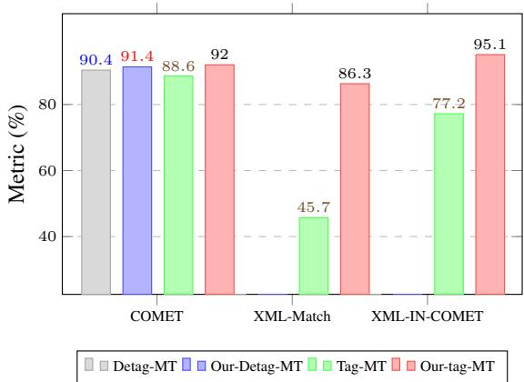
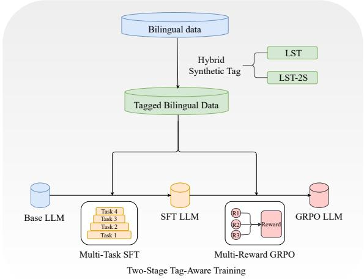
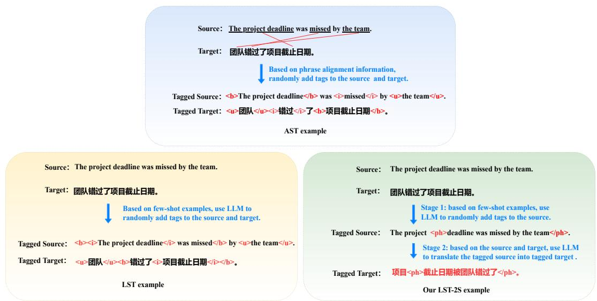
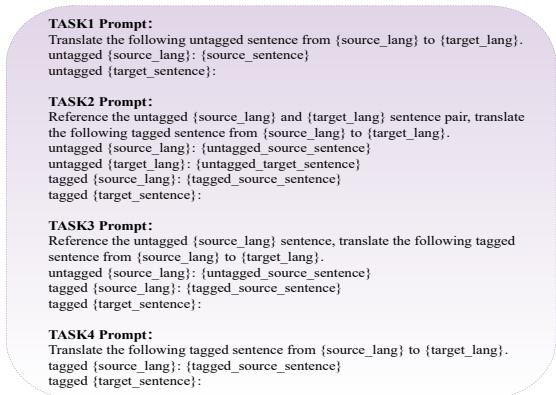

# Tag-Aware Structured Text Translation: Towards a Systematic Understanding

Zhanglin Wu, Hengchao Shang, Daimeng Wei, Jiaxin Guo, Zongyao Li, Tengfei Song, Ning Xie, Weidong Zhang Huawei Translation Service Center, Beijing, China {wuzhanglin2,shanghengchao,weidaimeng,guojiaxin1, lizongyao,songtengfei2,zhangweidong17,nicolas.xie}@huawei.com

## Abstract

Internet texts are replete with format tags that carry structural, semantic, and functional meaning. Current large language model (LLM)- based translation systems struggle to balance translation fluency with tag fidelity when pro cessing tagged text. We argue that resolving this tension requires a systematic approach at three interconnected levels: data synthesis, capability building, and multi-objective alignment. At the data level, we identify and formal ize a fundamental trade-off between structural tag diversity and translation naturalness in syn thetic data generation; existing methods opti mize for one at the expense of the other. We pro pose a hybrid synthesis strategy (Hy-LST) combining LLM-based synthesis tag method and Two-Stage LLM-based synthesis tag method to produce both diverse and natural tagged data. At the capability level, we decompose tag-aware translation into four sub-tasks of increasing difficulty in a multi-task supervised fine-tuning framework, enabling targeted capability acquisition and knowledge transfer. At the alignment level, we design three complementary reward functions under a group relative policy optimization framework, each targeting a distinct objective (fluency, tag fidelity, and tag-scoped translation quality), and show that joint optimization consistently outperforms single-reward alternatives. Experiments on six language directions (en2zh, en2ja, en2de, en2fr, en2ru, de2fr) demonstrate that each level contributes measurable improvements, and the complete system significantly outperforms ex isting methods. Qualitative analysis reveals specific error patterns and their mitigation after training with our method.

## 1 Introduction

In the context of deep integration between globalization and the internet, cross-lingual information exchange is becoming increasingly frequent. Web pages, documents, and various other forms of online content widely adopt structured tags such as HTML. These tags not only control the presentation format of text but also carry rich semantic connotations and functional value. During machine translation (Vaswani et al., 2017; Sutskever et al., 2014), if such tags are not properly handled, it can easily lead to formatting chaos and may further cause semantic distortion and functional failure.

  
Figure 1: Our tag-aware system vs. plain SFT: a comparison of detag and tag-aware translation modes in en2zh machine translation.

Although large language models (LLMs) (Touvron et al., 2023; Bai et al., 2023; DeepSeek-AI, 2024) have made significant progress in translating untagged text, they still face considerable challenges when handling tagged text. As shown in Figure 1, after supervised fine-tuning (SFT) (Dong et al., 2024) on untagged data (Plain SFT), LLMs exhibit both low tag fidelity and degraded translation quality when translating tagged text. This reveals that vanilla LLMs lack the inherent ability to comprehend tag structures during translation.

Existing approaches fall into two eras. Before the rise of LLMs, two paradigms dominated. The detag-and-project method (Joanis et al., 2013; Müller, 2017; Zenkel et al., 2021) removes tags from the source for translation and then projects them back based on alignment, separating translation from tag handling and causing error propagation. The masked tag training method (Hanneman and Dinu, 2020; Elshin et al., 2024) normalizes tags into the translation process, but the sparsity of tag data disrupts attention distributions. Both treat tags as peripheral artifacts rather than integral structures. With LLMs, studies (Dabre et al., 2023) introduce tagged examples as fewshot demonstrations, while others leverage phrase alignment-based synthesis tag method (AST) (Ryu et al., 2022) or LLM-based synthesis tag method (LST) (Dabre et al., 2024) to synthesize tagged bilingual data for training.

Despite these advances, existing approaches share a critical limitation: they lack a systematic understanding of what tag-aware translation requires. We identify three gaps that must be addressed jointly:

Gap 1: Data-level diversity-naturalness tradeoff. The first gap arises at the lowest level of the pipeline: the data itself. Tagged bilingual data is scarce, so synthesis is required. The two dominant methods, AST and LST, both couple tag insertion with target-side alignment, producing natural but structurally rigid training data. Decoupling insertion from translation, as in our Two-Stage LST (LST-2S), increases diversity but degrades translation naturalness. Resolving this trade-off requires a principled hybrid strategy.

Gap 2: Capability-level task decomposition. Tag-aware translation is not a monolithic task. It requires (a) fluent semantic mapping, (b) tag structure recognition and fidelity, (c) understanding tag semantic scope, and (d) flexible sentence restructuring to accommodate tags. Training all these capabilities under a single objective forces the model to learn competing skills simultaneously, leading to suboptimal performance on each.

Gap 3: Alignment-level multi-objective optimization. Translation fluency and tag fidelity are inherently competing objectives: preserving tag structure may require rigid sentence alignment, while maximizing fluency may break it. A single reward cannot capture this tension. Multiple reinforcement signals are needed to find the optimal trade-off.

Our contributions. To address these gaps, we propose a systematic framework:

• Data level: We formalize the diversitynaturalness trade-off and propose Hy-LST, a hybrid strategy combining LST (high naturalness) with LST-2S (high diversity). To our knowledge, this is the first work to explicitly characterize and address this trade-off.

• Capability level: We design a multi-task (Luong et al., 2015) SFT framework with four tasks of increasing difficulty, enabling knowledge transfer across skills.

• Alignment level: We introduce three complementary reward functions under Group Relative Policy Optimization (GRPO) (Shao et al., 2024), targeting fluency, tag fidelity, and tag-scoped translation quality, and demonstrate that joint optimization outperforms both single-reward and no-RL baselines.

## 2 Method

As shown in Figure 2, our method addresses the three gaps identified in Section 1 through a systematic multi-level framework.

  
Figure 2: Our Proposed systematic multi-level framework.

## 2.1 Hybrid Synthetic Tag

As identified in Gap 1 (Section 1), tagged bilingual data is scarce, and synthesis is required. The design of a synthesis strategy involves a fundamental trade-off: structural diversity (how varied the tag placements are) versus translation naturalness (how fluent the resulting tagged target text is).

Phrase Alignment-Based Synthesis Tag (AST) (Ryu et al., 2022) obtains bilingual word alignment, expands it to phrase alignment, and wraps tags around aligned phrase pairs. AST achieves high naturalness (tags align with linguistically meaningful units) but low diversity (constrained to alignment boundaries).

  
Figure 3: Our method (LST-2S) vs. existing methods (AST and LST) for synthesizing en2zh tag examples.

LLM-based Synthesis Tag (LST) (Dabre et al., 2024) uses few-shot prompting to generate tagged bilingual pairs directly. LST produces more natural insertion positions than AST, but still couples source and target tag placement through the generation process, limiting structural variety.

Both methods couple tag insertion with target-side alignment, restricting diversity. To overcome this, we propose a two-stage decoupled strategy:

Two-Stage LLM-based Synthesis Tag (LST-2S): In stage one, an LLM inserts tags randomly into the source text without target constraints, maximizing structural diversity. In stage two, the LLM translates the tagged source into tagged target text, using the original untagged bilingual pair as context. Decoupling allows arbitrary tag placements while enabling the LLM to adapt sentence structures flexibly. Figure 3 shows examples.

Hybrid LLM-based Synthesis Tag (Hy-LST): LST-2S achieves higher diversity, but the secondstage translation of arbitrarily tagged sources can degrade fluency. We propose a hybrid strategy combining LST and LST-2S data in equal proportion, balancing LST’s naturalness with LST-2S’s diversity. The model is thus exposed to both naturally aligned and structurally diverse tag patterns. A detailed experimental comparison of the two methods in terms of tag diversity and translation fluency is presented in Appendix A.

## 2.2 Two-Stage Tag-Aware Training

The training process is divided into two stages with complementary objectives: SFT builds fundamental tag comprehension, while GRPO fine-tunes the balance between competing objectives.

## 2.2.1 Stage 1: Multi-Task SFT

As identified in Gap 2 (Section 1), tag-aware translation bundles together multiple competing capabilities. Our solution is to decompose this complex competency into four tasks with increasing difficulty.

Formally, each sentence has two representations: untagged text and tagged text. Let X and Y denote the untagged source and target sentences. Let $T _ { X }$ denote the tagged source (source text with tags inserted), and $T _ { Y }$ the tagged target (target text with tags inserted). The four tasks are ordered by the amount of auxiliary information available.

$$
\mathbf { T a s k 1 } \colon \ { \mathcal { T } } _ { 1 } = X , \qquad { \mathcal { O } } _ { 1 } = Y\tag{1}
$$

$$
\mathbf { T a s k 2 } \colon \ \mathcal { T } _ { 2 } = ( X , Y , T _ { X } ) , \quad \mathcal { O } _ { 2 } = T _ { Y }\tag{2}
$$

$$
\mathbf { T a s k 3 } \colon \ T _ { 3 } = ( X , T _ { X } ) , \qquad { \mathcal { O } } _ { 3 } = T _ { Y }\tag{3}
$$

$$
\mathbf { T a s k 4 } \mathbf { : } \quad { \mathcal { T } } _ { 4 } = T _ { X } , { \mathcal { O } } _ { 4 } = T _ { Y }\tag{4}
$$

The difficulty progression is governed by how much information the model can leverage beyond the tagged source $T _ { X }$ . In Task1, the model learns basic translation from X to $Y ,$ , establishing fluency without tag interference. In Task2, the model receives both the untagged bilingual pair (X, Y) and the tagged source $T _ { X }$ , providing direct supervision for mapping tagged inputs to tagged outputs. In Task3, the target reference $Y$ is removed, so the model must independently determine sentence restructuring while only having the untagged source X as a guide. In Task4, only the tagged source $T _ { X }$ is given, and the model must simultaneously recognize tag structures, understand their semantic scope, and produce a fluent tagged translation with no external guidance.

By training these tasks jointly, the multi-task framework enables natural knowledge transfer: fluency from Task1 benefits all higher tasks, contextual reasoning from Task2 and Task3 equips the model for the fully independent Task4, and tag awareness acquired across $T _ { X }  T _ { Y }$ mappings reinforces understanding throughout the multi-level framework.

  
Figure 4: Prompt Design for Multi-task SFT.

## 2.2.2 Stage 2: Multi-Reward GRPO

As identified in Gap 3 (Section 1), translation fluency and tag fidelity are inherently competing objectives, making a single reinforcement learning reward insufficient. To address this, we design three reward functions (Eqs. 5–7) under GRPO and combine them via weighted summation (Eq. 8).

Translation Quality Reward $( R _ { 1 } )$ : COMET (Rei et al., 2020, 2022a) is used to evaluate overall fluency on untagged text. To avoid overfitting, COMET-20 is employed during training and COMET-22 during testing.

$$
R _ { 1 } = \mathrm { c o m e t } _ { 2 0 } ( X , Y _ { m t } , Y _ { r e f } )\tag{5}
$$

Tag Fidelity Reward $\left( R _ { 2 } \right)$ : Exact set matching between the tag set extracted from the modelgenerated tagged translation $T _ { Y } ^ { m t }$ and the gold

tagged target $T _ { Y } ^ { r e f }$ . Let $\tau ( \cdot )$ denote the set of tags present in a tagged sequence. Then:

$$
R _ { 2 } = \frac { | \mathcal { T } ( T _ { Y } ^ { m t } ) \cap \mathcal { T } ( T _ { Y } ^ { r e f } ) | } { \operatorname* { m a x } ( | \mathcal { T } ( T _ { Y } ^ { m t } ) | , | \mathcal { T } ( T _ { Y } ^ { r e f } ) | ) }\tag{6}
$$

Tag-Scoped Translation Quality Reward $( R _ { 3 } ) \mathrm { : }$ Average COMET score across all tag-scoped segments, computed as:

$$
R _ { 3 } = \frac { 1 } { N } \sum _ { i = 1 } ^ { N } \mathrm { c o m e t } _ { 2 0 } \big ( X _ { i } , Y _ { \mathrm { m t } , i } , Y _ { \mathrm { r e f } , i } \big )\tag{7}
$$

$R _ { 1 }$ targets fluency, $R _ { 2 }$ enforces structural fidelity, and $R _ { 3 }$ ensures tag-scoped translation quality. The combined reward is defined as follows:

$$
R _ { t o t a l } = \frac { \alpha \cdot R _ { 1 } + \beta \cdot R _ { 2 } + \gamma \cdot R _ { 3 } } { \alpha + \beta + \gamma }\tag{8}
$$

where $\alpha , \beta , \gamma$ control the relative importance of each objective (default $\alpha = \beta = \gamma = 1 )$ . This multi-reward formulation jointly optimizes the balance between translation fluency and tag fidelity.

## 3 Experiment

## 3.1 Dataset

## 3.1.1 Open-source Dataset

Our experiments use the multilingual structured document translation dataset (Hashimoto et al., 2019)<sup>1</sup>, which is multi-way parallel with each English source sentence aligned to translations in Chinese, Japanese, German, French, and Russian; from this dataset we select six translation directions: en2zh, en2ja, en2de, en2fr, en2ru, and de2fr.

For the five English-centric directions, each provides about 100K training instances, 2K development instances, and 2K test instances. Since the test set references are not publicly available, we use the development set for testing instead. To prevent data leakage, we remove any training sample whose source text appears in the test set. For the de2fr direction, we construct bilingual pairs by matching German and French sentences that share the same English source, resulting in approximately 90K training pairs, from which we reserve 2K as the test set. Table 1 summarizes the data statistics.

<table><tr><td>Dataset</td><td>en2zh</td><td>en2ja</td><td>en2de</td><td>en2fr</td><td>en2ru</td><td>de2fr</td></tr><tr><td>Train</td><td>88611</td><td>90761</td><td>91333</td><td>91419</td><td>88983</td><td>88514</td></tr><tr><td>Test</td><td>2000</td><td>2000</td><td>2000</td><td>2000</td><td>2000</td><td>2000</td></tr></table>

Table 1: Our extended localization-xml-mt dataset.

## 3.1.2 Extended Testset

The original test set has a low ceiling: only 27% of samples contain tags, and 82% of those have just 1-2 tag pairs. To enable meaningful comparison, we augment tags using LST with three different LLMs (Qwen-max (Bai et al., 2023), GPT-4o (Hurst et al., 2024), and GLM-4.7). Samples are filtered by XML-MATCH and XML-IN-COMET22-KIWI (thresholds 100 and 80). After expansion, 97% of samples contain tags and only 44% have 1-2 pairs. To avoid distributional overlap, we use DeepSeek-v3 (DeepSeek-AI, 2024) for training data synthesis, ensuring training and test sets are generated by different LLM families.

## 3.1.3 Real-World Testset

To assess generalization beyond synthetic tags, we create a real-world test set from naturally tagged HTML web pages. The English set includes 2,000 samples crawled from English web pages and is used to evaluate the en2zh direction. By keeping real-world tag structures, each sample offers a complementary evaluation to our extended test set.

## 3.2 Evaluation Metrics

We evaluate three aspects: translation quality (using BLEU (Papineni et al., 2002) and COMET on untagged text), tag fidelity (via XML-ACC and XML-MATCH (Hashimoto et al., 2019)), and tagscoped translation quality (via our proposed XML-IN-\* metrics). Specifically, XML-IN-BLEU extracts text between each tag pair before computing BLEU, avoiding alignment issues in XML-BLEU, while XML-IN-COMET replaces BLEU with COMET for more flexible evaluation (see Appendix B for a concrete comparison). For the real-world validation subset without references, we employ COMET22-KIWI (Rei et al., 2022b) to evaluate translation quality.

## 3.3 Baselines

We choose Qwen2.5-7B as the base LLM. Baselines are organized by research question:

How well does a vanilla LLM perform? Prompt (direct translation) and Few-shot Prompt (three similar examples retrieved by LABSE (Feng et al.,

2022)). Detag-and-project removes tags, translates with Plain SFT (i.e., SFT trained on untagged data), and projects back via awesome-align (Dou and Neubig, 2021) and Min-Max Tag Pair Projection (Zenkel et al., 2021).

How effective are existing SFT-based methods? Masked SFT (numbered mask tokens), AST SFT (phrase alignment synthesis (Och et al., 1999; Bird and Loper, 2004)), and LST SFT (LLM-guided synthesis using DeepSeek-V3 with three few-shot examples per direction).

Do our proposed methods provide additional gains? We construct a progressive ablation: Hy-LST SFT, Multi-Task Hy-LST SFT, and +Multi-Reward GRPO, to quantify the contribution of each component.

How do closed-source LLMs compare? We compare against Qwen-max, GPT-4o (Hurst et al., 2024), GLM-4.7, and DeepSeek-V3 (DeepSeek-AI, 2024), evaluated on a real-world testset under zeroshot prompting with tagged input.

## 3.4 Training Details

SFT: We use Qwen2.5-7B as the base model and apply LoRA (Gao et al., 2024) fine-tuning (r = 8, α = 16, all target modules, dropout 0.0 (Srivastava et al., 2014)) via LlamaFactory (Zheng et al., 2024). The warmup ratio is set to 0.1 (Fradkin et al., 2010), a cosine annealing learning rate scheduler (Liu, 2022) is adopted, the learning rate is 1e-4, and gradient accumulation is used to achieve an effective batch size of 32. Training runs up to 3 epochs on 8 GPUs, and the checkpoint with the lowest validation loss is selected.

GRPO: We use Open-R1 (Hugging Face, 2025) with Task4 as the training objective (fastest speed, marginal performance gap compared to other inference modes). Data amount is 1/10 of SFT. 8 GPUs: one runs vLLM (Kwon et al., 2023) (7 candidates per source, temperature 1.0), seven handle training (batch size 7 per card, 4-step accumulation). DeepSpeed ZeRO3-offload, bfloat16, learning rate 1e-6, cosine annealing with 5% warmup, max length 4096. Early stopping after 5 consecutive non-improving evaluations on validation reward; checkpoints are saved every 100 steps.

<table><tr><td>en2zh</td><td>BLEU</td><td>COMET</td><td>XML-ACC</td><td>XML-MATCH</td><td>XML-IN-BLEU</td><td>XML-IN-COMET</td><td>Avg.</td></tr><tr><td>Prompt</td><td>32.99</td><td>84.93</td><td>94.25</td><td>38.15</td><td>33.79</td><td>76.83</td><td>60.16</td></tr><tr><td>Few-shot Prompt</td><td>34.07</td><td>85.55</td><td>97.05</td><td>60.15</td><td>49.59</td><td>84.32</td><td>68.46</td></tr><tr><td>Detag-and-project</td><td>55.49</td><td>90.36</td><td>95.25</td><td>73.65</td><td>56.53</td><td>90.03</td><td>76.89</td></tr><tr><td>Masked SFT</td><td>55.84</td><td>90.99</td><td>99.85</td><td>79.30</td><td>77.01</td><td>94.02</td><td>82.84</td></tr><tr><td>AST SFT</td><td>55.70</td><td>90.75</td><td>99.15</td><td>80.70</td><td>75.44</td><td>93.94</td><td>82.61</td></tr><tr><td>LST SFT</td><td>57.16</td><td>91.33</td><td>99.95</td><td>85.10</td><td>78.22</td><td>94.48</td><td>84.37</td></tr><tr><td>Hy-LST SFT</td><td>57.40</td><td>91.41</td><td>99.95</td><td>85.21</td><td>78.70</td><td>94.64</td><td>84.55</td></tr><tr><td>Multi-Task Hy-LST SFT</td><td>59.66</td><td>91.76</td><td>99.95</td><td>85.00</td><td>79.93</td><td>94.94</td><td>85.21</td></tr><tr><td>+Multi-Reward GRPO</td><td>60.22</td><td>91.98</td><td>100.00</td><td>86.25</td><td>80.16</td><td>95.10</td><td>85.62</td></tr></table>

Table 2: Evaluation results on the en2zh extended testset.

## 4 Results

We organize our results around the research questions outlined in Section 3.3 with Qwen2.5-7B on the en2zh extended testset (Table 2).

## 4.1 Vanilla LLM Performance

Without specialized training, vanilla LLMs perform poorly on tag-aware translation. Prompt achieves only 60.16 avg. score, with particularly low XML-Match (38.15) and XML-IN-COMET (76.83). Fewshot Prompt improves to 68.46 avg., but still lags far behind SFT-based methods. Detag-and-project reaches 76.89 avg. by separately handling translation and tag projection, but error propagation limits its XML-Match to 73.65. These results confirm that vanilla LLMs fundamentally lack the ability to comprehend tag structures during translation, and simple prompting or separate-then-project strategies are insufficient.

## 4.2 Existing SFT-Based Methods

All existing SFT-based methods substantially outperform prompting baselines. Masked SFT achieves 82.84 avg. (XML-Match 79.30), AST SFT reaches 82.61 avg. (XML-Match 80.70), and LST SFT leads at 84.37 avg. (XML-Match 85.10). The progression from Masked to AST to LST confirms that synthesis quality matters: LLM-generated tag patterns (LST) produce better tag fidelity than alignment-based (AST) or mask-based approaches. However, even the best existing method, LST SFT, leaves room for improvement across all metrics.

## 4.3 Proposed Method Gains

Our progressive ablation confirms independent contributions from each component:

Hy-LST SFT (84.55 avg.) improves over LST SFT by +0.18 avg. score, primarily through better XML-Match (85.21 vs. 85.10) and XML-IN-COMET (94.64 vs. 94.48), validating that the hybrid synthesis strategy balances structural diversity with translation naturalness.

Multi-Task Hy-LST SFT (85.21 avg.) adds +0.66 over Hy-LST SFT. The largest gains are in BLEU (+2.26) and COMET (+0.35), indicating that knowledge transfer from simpler sub-tasks significantly improves overall translation fluency without sacrificing tag fidelity.

+Multi-Reward GRPO (85.62 avg.) adds another +0.41, concentrated in XML-Match (+1.25), the most challenging tag fidelity metric. Multiobjective alignment through complementary rewards successfully optimizes the fluency-fidelity trade-off that single-reward or no-RL approaches cannot resolve.

## 4.4 Comparison with Closed-Source LLMs

On a real-world test set (Table 3), our method outperforms all four closed-source LLMs despite using a smaller base model. Qwen-max ranks first among closed-source models (75.36), while DeepSeek-V3 achieves the best translation quality (KIWI 80.45) but poor tag fidelity (55.10), confirming that even advanced LLMs struggle with tag structure without dedicated training.

<table><tr><td>en2zh</td><td>KIWI XML-MATCH XML-IN-KIWI</td><td></td><td>Avg.</td></tr><tr><td>Qwen-max</td><td>80.13 78.15</td><td>67.81</td><td>75.36</td></tr><tr><td>GPT-40</td><td>78.57 52.45</td><td>60.53</td><td>63.85</td></tr><tr><td>GLM-4.7</td><td>80.07 67.35</td><td>63.95</td><td>70.46</td></tr><tr><td>DeepSeek-V3</td><td>80.45 55.10</td><td>60.86</td><td>65.47</td></tr><tr><td>Prompt</td><td>78.73 26.25</td><td>54.31</td><td>53.10</td></tr><tr><td>LST ŠFT</td><td>79.04 89.30</td><td>71.04</td><td>79.79</td></tr><tr><td>Hy-LST SFT</td><td>79.15 90.10</td><td>71.35</td><td>80.20</td></tr><tr><td>Multi-Task Hy-LST SFT</td><td>79.20 91.25</td><td>71.95</td><td>80.80</td></tr><tr><td>+Multi-Reward GRPO</td><td>79.47 92.10</td><td>72.43</td><td>81.33</td></tr></table>

Table 3: Results on the en2zh real-world testset.

## 5 Analysis

## 5.1 Hy-LST vs. Other Synthesis Methods

Plain SFT (avg. 65.86) confirms tag exposure is essential. Clean SFT (original tags) reaches 82.09. Among single methods, LST (84.37) outperforms

<table><tr><td>en2zh</td><td>BLEU</td><td>COMET</td><td>XML-ACC</td><td>XML-MATCH</td><td>XML-IN-BLEU</td><td>XML-IN-COMET</td><td>Avg.</td></tr><tr><td>Plain SFT</td><td>51.54</td><td>88.57</td><td>98.45</td><td>45.70</td><td>33.66</td><td>77.23</td><td>65.86</td></tr><tr><td>Clean SFT</td><td>55.29</td><td>90.60</td><td>99.90</td><td>77.20</td><td>76.18</td><td>93.34</td><td>82.09</td></tr><tr><td>Masked SFT</td><td>55.84</td><td>90.99</td><td>99.85</td><td>79.30</td><td>77.01</td><td>94.02</td><td>82.84</td></tr><tr><td>AST SFT</td><td>55.70</td><td>90.75</td><td>99.15</td><td>80.70</td><td>75.44</td><td>93.94</td><td>82.61</td></tr><tr><td>LST SFT</td><td>57.16</td><td>91.33</td><td>99.95</td><td>85.10</td><td>78.22</td><td>94.48</td><td>84.37</td></tr><tr><td>LST-2S SFT</td><td>56.06</td><td>91.13</td><td>99.90</td><td>82.90</td><td>77.66</td><td>94.14</td><td>83.63</td></tr><tr><td>LST+LST-2S SFT</td><td>57.40</td><td>91.41</td><td>99.95</td><td>85.21</td><td>78.70</td><td>94.64</td><td>84.55</td></tr><tr><td>AST+LST-2S SFT</td><td>56.45</td><td>91.15</td><td>99.90</td><td>82.60</td><td>77.73</td><td>94.20</td><td>83.67</td></tr><tr><td>AST+LST+LST-2S SFT</td><td>57.30</td><td>91.42</td><td>100.00</td><td>84.40</td><td>78.56</td><td>94.72</td><td>84.40</td></tr></table>

Table 4: Comparison of tag synthesis methods on en2zh extended testset.
<table><tr><td>en2zh</td><td>BLEU</td><td>COMET</td><td>XML-ACC</td><td>XML-MATCH</td><td>XML-IN-BLEU</td><td>XML-IN-COMET</td><td>Avg.</td></tr><tr><td>Task1 SFT</td><td>51.54</td><td>88.57</td><td>98.45</td><td>45.70</td><td>33.66</td><td>77.23</td><td>65.86</td></tr><tr><td>Task1+Task2 SFT</td><td>59.39</td><td>91.79</td><td>99.90</td><td>85.40</td><td>80.13</td><td>94.78</td><td>85.23</td></tr><tr><td>Task3 SFT</td><td>58.02</td><td>91.58</td><td>100.00</td><td>85.10</td><td>79.19</td><td>94.70</td><td>84.77</td></tr><tr><td>Task4 SFT</td><td>57.40</td><td>91.41</td><td>99.95</td><td>85.21</td><td>78.70</td><td>94.64</td><td>84.55</td></tr><tr><td>Multi-Task SFT (Task1 MT)</td><td>57.63</td><td>91.40</td><td></td><td></td><td></td><td></td><td></td></tr><tr><td>Multi-Task SFT (Task1+Task2 MT)</td><td>60.18</td><td>91.90</td><td>99.95</td><td>85.85</td><td>80.22</td><td>95.04</td><td>85.52</td></tr><tr><td>Multi-Task SFT (Task3 MT)</td><td>60.16</td><td>91.92</td><td>100.00</td><td>85.65</td><td>79.95</td><td>94.96</td><td>85.44</td></tr><tr><td>Multi-Task SFT (Task4 MT)</td><td>59.66</td><td>91.76</td><td>99.95</td><td>85.00</td><td>79.93</td><td>94.94</td><td>85.21</td></tr></table>

Table 5: Comparison of SFT training tasks on en2zh extended testset.

AST (82.61) and LST-2S (83.63). Critically, LST-2S underperforms LST, confirming our motivation: the two-stage decoupling increases diversity but introduces translation quality degradation in secondstage re-translation.

The hybrid LST+LST-2S achieves 84.55, surpassing both individual methods and validating the diversity-naturalness trade-off hypothesis. Adding AST data provides no further gains, suggesting LLM-based synthesis already covers sufficient tag patterns. These results confirm that Hy-LST is better than each individual synthetic method.

## 5.2 Multi-Task vs. Single-Task Training

Task1 (untagged only) performs worst (65.86). Task4 achieves a large jump to 84.55. Task3 (untagged source context) improves to 84.77, and Task2 (bilingual context) reaches 85.23.

Multi-task training brings additional gains across all inference modes. The most notable is Task4 mode: 85.21 vs. 84.55 independently, a +0.66 gain from knowledge transfer. The gap between inference modes narrows from 0.68 to 0.31, indicating that shared representations make the model more robust. These results confirm that multi-task training outperforms single-task training.

## 5.3 GRPO Analysis

## 5.3.1 SFT Necessity for GRPO

To determine whether SFT is essential or GRPO alone can learn tag-aware translation from scratch, we compare three en2zh setups: (1) Multi-Task

SFT + Multi-Reward GRPO (our full method), (2) Direct Multi-Reward GRPO without SFT (base model only), and (3) Single-Task SFT (Task4) + Multi-Reward GRPO.

Results in Table 6 show that Direct GRPO (no SFT) scores only 62.18, far below any SFT-based method, confirming that GRPO alone cannot acquire tag-structured translation from scratch—SFT is necessary for basic tag understanding. Moreover, Multi-Task SFT yields better GRPO initialization than Task4-only SFT (85.62 vs. 84.80), showing the multi-task benefits downstream reinforcement learning.

## 5.3.2 Reward Configuration

Reward specialization. As Table 7 shows, each single-reward configuration improves only its targeted metric: $R _ { 1 }$ raises BLEU/COMET but lowers XML-Match; $R _ { 2 }$ does the opposite; $R _ { 3 }$ improves XML-IN-\* metrics. None achieves a meaningful average gain over the SFT baseline.

Joint optimization. Combining all three rewards (1:1:1) achieves the highest average score (85.62), surpassing both the SFT baseline (+0.41) and every single-reward configuration. The gain concentrates in XML-Match (+1.25), confirming that multireward optimization is essential for the fluencyfidelity trade-off.

Weight sensitivity. All three skewed configurations (2:1:1, 1:2:1, 1:1:2) outperform single-reward and SFT baselines. Skewing toward $R _ { 1 }$ improves BLEU (+0.33) at the cost of XML-Match (-0.60);

<table><tr><td>en2zh</td><td>BLEU</td><td>COMET</td><td>XML-ACC</td><td>XML-MATCH</td><td>XML-IN-BLEU</td><td>XML-IN-COMET</td><td>Avg.</td></tr><tr><td>Direct Multi-Reward GRPO (no SFT)</td><td>35.42</td><td>85.67</td><td>95.10</td><td>42.30</td><td>36.15</td><td>78.42</td><td>62.18</td></tr><tr><td>Task4 SFT + Multi-Reward GRPO</td><td>58.21</td><td>91.62</td><td>100.00</td><td>85.75</td><td>79.32</td><td>94.92</td><td>84.97</td></tr><tr><td>Multi-Task SFT + Multi-Reward GRPO</td><td>60.22</td><td>91.98</td><td>100.00</td><td>86.25</td><td>80.16</td><td>95.10</td><td>85.62</td></tr></table>

Table 6: Comparison of SFT initialization for GRPO on en2zh extended testset.
<table><tr><td>en2zh</td><td>BLEU</td><td>COMET</td><td>XML-ACC</td><td>XML-MATCH</td><td>XML-IN-BLEU</td><td>XML-IN-COMET</td><td>Avg.</td><td>Train Cost(h)</td></tr><tr><td>Multi-Task Hy-LST SFT</td><td>59.66</td><td>91.76</td><td>99.95</td><td>85.00</td><td>79.93</td><td>94.94</td><td>85.21</td><td>38</td></tr><tr><td>+R1 GRPO</td><td>60.32</td><td>92.10</td><td>100.00</td><td>84.52</td><td>79.82</td><td>94.51</td><td>85.21</td><td>44</td></tr><tr><td>+R2GRPO</td><td>59.32</td><td>91.41</td><td>100.00</td><td>86.34</td><td>79.63</td><td>94.76</td><td>85.24</td><td>44</td></tr><tr><td>+R3 GRPO</td><td>59.46</td><td>91.45</td><td>99.95</td><td>85.36</td><td>80.29</td><td>95.24</td><td>85.29</td><td>44</td></tr><tr><td>+Multi-Reward GRPO (1:1:1)</td><td>60.22</td><td>91.98</td><td>100.00</td><td>86.25</td><td>80.16</td><td>95.10</td><td>85.62</td><td>44</td></tr><tr><td>+Multi-Reward GRPO (2:1:1)</td><td>60.55</td><td>92.15</td><td>100.00</td><td>85.65</td><td>80.02</td><td>94.98</td><td>85.56</td><td>44</td></tr><tr><td>+Multi-Reward GRPO (1:2:1)</td><td>60.01</td><td>91.58</td><td>100.00</td><td>86.78</td><td>80.01</td><td>95.02</td><td>85.57</td><td>44</td></tr><tr><td>+Multi-Reward GRPO (1:1:2)</td><td>60.08</td><td>91.54</td><td>100.00</td><td>86.24</td><td>80.22</td><td>95.16</td><td>85.54</td><td>44</td></tr></table>

Table 7: Comparison of GRPO reward configurations on en2zh extended testset.

skewing toward $R _ { 2 }$ shows the reverse. The equalweight (1:1:1) setting achieves the best average (85.62), though differences among multi-reward variants are marginal (85.54–85.62).

## 5.3.3 Cost-Benefit of GRPO

Multi-Reward GRPO uses only 6% of the SFT data but incurs 1.2× training overhead (44 vs. 38 GPU hours). The overall gain is +0.41 avg. (85.21→85.62), concentrated in XML-Match (+1.25), the hardest tag fidelity metric. For tasks where precise tag preservation is critical, this targeted improvement justifies the added cost.

## 5.4 Generalization

To assess generalizability, we evaluate across different base models and translation directions.

Cross-model generalization. On LLaMA-3.1- 8B (Table 10), our full method outperforms LST SFT (84.03 vs. 82.24 avg. on en2zh), with each component’s gains replicating those on Qwen2.5- 7B, confirming our framework is model-agnostic.

Cross-direction generalization. Across all five translation directions (Tables 11–15), our method achieves the highest average score with consistent gains over LST SFT, demonstrating effectiveness across diverse language pairs.

## 5.5 Error Analysis

We categorize tag-related errors into four types: omission (dropping a tag), over-translation (inserting a spurious tag), mistranslation (incorrect tag translation), and scope misplacement (incorrect tag span). Table 8 reports error rates across our multilevel framework on the en2zh extended testset. A detailed case study is provided in Appendix C.

Without tag training, omission is the dominant error at 48.00%, followed by scope misplacement at 25.49%. LST SFT drastically reduces both to 0.25% and 1.61%, respectively, making scope misplacement the most frequent remaining error. Our multi-level framework addresses this progressively: Hy-LST SFT lowers scope misplacement to 1.34%, Multi-Task SFT to 0.89%, and Multi-Reward GRPO to 0.45%, while omission drops further to 0.10%. Overall, our multi-level framework progressively mitigates all four error types, with the most significant gains achieved on omission and scope misplacement.

<table><tr><td>en2zh</td><td>Omission.↓, (%) Over-translation.↓ (%) Mistranslation.↓ (%) Scope Misplacement.↓ (%)</td><td></td><td></td><td></td></tr><tr><td>Prompt</td><td>48.00</td><td>0.30</td><td>4.50</td><td>25.49</td></tr><tr><td>Few-shot Prompt</td><td>21.25</td><td>1.30</td><td>3.55</td><td>11.97</td></tr><tr><td>Detag-and-project</td><td>4.00</td><td>0.55</td><td>0.40</td><td>4.62</td></tr><tr><td>Masked SFT</td><td>3.75</td><td>0.45</td><td>0.10</td><td>4.21</td></tr><tr><td>AST SFT</td><td>5.35</td><td>0.25</td><td>0.20</td><td>4.31</td></tr><tr><td>LST SFT</td><td>0.25</td><td>0.10</td><td>0.05</td><td>1.61</td></tr><tr><td>Hy-LST SFT</td><td>0.25</td><td>0.15</td><td>0.10</td><td>1.34</td></tr><tr><td>Multi-Task Hy-LST SFT</td><td>0.25</td><td>0.10</td><td>0.05</td><td>0.89</td></tr><tr><td>+Multi-Reward GRPO</td><td>0.10</td><td>0.10</td><td>0.05</td><td>0.45</td></tr></table>

Table 8: Aggregate error rates across our multi-level framework on en2zh extended testset.

## 6 Conclusion

Tag-aware translation faces a fundamental tension between tag fidelity and translation fluency. We address three root causes through a multi-level framework. At the data level, Hy-LST balances structural diversity with translation naturalness. At the capability level, multi-task SFT enables knowledge transfer across sub-tasks of increasing difficulty. At the alignment level, multi-reward GRPO jointly optimizes fluency, tag fidelity, and tag-scoped translation quality. Experiments across six language directions, two base models, and real-world data validate our approach. Each level progressively reduces distinct error patterns: tag omission, tag misplacement, and tag-scoped translation quality degradation. Our method achieves consistent gains over strong baselines.

## Limitations

Despite these notable advances, several important limitations nonetheless merit careful discussion:

Tag type scope. Our experiments focus exclusively on paired HTML/XML tags. Extending the framework to handle hierarchical formats such as La-TeX, particularly with cross-document references, remains an open direction for future work.

Dependence on synthesis LLM quality. Hy-LST relies on DeepSeek-V3 for data synthesis. The quality and diversity of the generated tagged data are therefore bounded by the capability of this synthesis LLM. If the synthesis LLM produces unnatural tag placements or translation errors during the second stage (LST-2S), these artifacts may propagate to downstream training. Moreover, replacing DeepSeek-V3 with a weaker model could yield substantially lower gains, highlighting the framework’s sensitivity to the synthesis LLM’s performance.

Computational overhead. Multi-task SFT introduces increased data management complexity by requiring four distinct task formats to be prepared and trained jointly. GRPO adds extra training time—44 vs. 38 hours, a 1.2× overhead. While this overhead remains modest relative to typical LLM training budgets, it may pose practical concerns in resource-constrained settings.

## References

Jinze Bai, Shuai Bai, Yunfei Chu, Zeyu Cui, Kai Dang, Xiaodong Deng, Yang Fan, Wenbin Ge, Yu Han, Fei Huang, Binyuan Hui, Luo Ji, Mei Li, Junyang Lin, Runji Lin, Dayiheng Liu, Gao Liu, Chengqiang Lu, Keming Lu, and 29 others. 2023. Qwen technical report. arXiv preprint arXiv:2309.16609.

Steven Bird and Edward Loper. 2004. NLTK: The natural language toolkit. In Proceedings ofthe ACL Interactive Poster and Demonstration Sessions, pages 214–217, Barcelona, Spain. Association for Computational Linguistics.

Raj Dabre, Bianka Buschbeck, Miriam Exel, and Hideki Tanaka. 2023. A study on the effectiveness of large language models for translation with markup. In Proceedings of Machine Translation Summit XIX, Vol. 1: Research Track, pages 148–159.

Raj Dabre, Haiyue Song, Miriam Exel, Bianka Buschbeck, Johannes Eschbach-Dymanus, and Hideki Tanaka. 2024. How effective is synthetic data and instruction fine-tuning for translation with markup using llms? In Proceedings of the 16th Conference of the

Association for Machine Translation in the Americas (Volume 1: Research Track), pages 73–87.

DeepSeek-AI. 2024. Deepseek-v3 technical report. Preprint, arXiv:2412.19437.

Guanting Dong, Hongyi Yuan, Keming Lu, Chengpeng Li, Mingfeng Xue, Dayiheng Liu, Wei Wang, Zheng Yuan, Chang Zhou, and Jingren Zhou. 2024. How abilities in large language models are affected by supervised fine-tuning data composition. In Proceedings of the 62nd Annual Meeting of the Association for Computational Linguistics (Volume 1: Long Papers), pages 177–198.

Zi-Yi Dou and Graham Neubig. 2021. Word alignment by fine-tuning embeddings on parallel corpora. In Conference of the European Chapter of the Association for Computational Linguistics (EACL).

Denis Elshin, Nikolay Karpachev, Boris Gruzdev, Ilya Golovanov, Georgy Ivanov, Alexander Antonov, Nickolay Skachkov, Ekaterina Latypova, Vladimir Layner, Ekaterina Enikeeva, and 1 others. 2024. From general llm to translation: How we dramatically improve translation quality using human evaluation data for llm finetuning. In Proceedings of the Ninth Conference on Machine Translation, pages 247–252.

Fangxiaoyu Feng, Yinfei Yang, Daniel Cer, Naveen Arivazhagan, and Wei Wang. 2022. Language-agnostic bert sentence embedding. In Proceedings of the 60th Annual Meeting of the Association for Computational Linguistics (Volume 1: Long Papers), pages 878–891.

Andrea J Fradkin, Tsharni R Zazryn, and James M Smoliga. 2010. Effects of warming-up on physical performance: a systematic review with meta-analysis. The Journal of Strength & Conditioning Research, 24(1):140–148.

Dehong Gao, Yufei Ma, Sen Liu, Mengfei Song, Linbo Jin, Wen Jiang, Xin Wang, Wei Ning, Shanqing Yu, Qi Xuan, and 1 others. 2024. Fashiongpt: Llm instruction fine-tuning with multiple lora-adapter fusion. Knowledge-Based Systems, 299:112043.

Greg Hanneman and Georgiana Dinu. 2020. How should markup tags be translated? In Proceedings ofthe Fifth Conference on Machine Translation, pages 1160–1173.

Kazuma Hashimoto, Raffaella Buschiazzo, James Bradbury, Teresa Marshall, Richard Socher, and Caiming Xiong. 2019. A high-quality multilingual dataset for structured documentation translation. In Proceedings of the Fourth Conference on Machine Translation (Volume 1: Research Papers), pages 116–127, Florence, Italy. Association for Computational Linguistics.

Hugging Face. 2025. Open r1: A fully open reproduction of deepseek-r1.

Aaron Hurst, Adam Lerer, Adam P Goucher, Adam Perelman, Aditya Ramesh, Aidan Clark, AJ Ostrow, Akila Welihinda, Alan Hayes, Alec Radford, and 1 others. 2024. Gpt-4o system card. arXiv preprint arXiv:2410.21276.

Eric Joanis, Darlene Stewart, Samuel Larkin, and Roland Kuhn. 2013. Transferring markup tags in statistical machine translation: A two-stream approach. In Proceedings of the 2nd Workshop on Post-editing Technology and Practice.

Woosuk Kwon, Zhuohan Li, Siyuan Zhuang, Ying Sheng, Lianmin Zheng, Cody Hao Yu, Joseph E. Gonzalez, Hao Zhang, and Ion Stoica. 2023. Efficient memory management for large language model serving with pagedattention. In Proceedings of the ACM SIGOPS 29th Symposium on Operating Systems Principles.

Zhao Liu. 2022. Super convergence cosine annealing with warm-up learning rate. In CAIBDA 2022; 2nd International Conference on Artificial Intelligence, Big Data and Algorithms, pages 1–7. VDE.

Minh-Thang Luong, Quoc V Le, Ilya Sutskever, Oriol Vinyals, and Lukasz Kaiser. 2015. Multi-task sequence to sequence learning. arXiv preprint arXiv:1511.06114.

Mathias Müller. 2017. Treatment of markup in statistical machine translation. In Proceedings ofthe Third Workshop on Discourse in Machine Translation, pages 36–46.

Franz Josef Och, Christoph Tillmann, and Hermann Ney. 1999. Improved alignment models for statistical machine translation. In 1999 Joint SIGDAT Conference on Empirical Methods in Natural Language Processing and Very Large Corpora.

Kishore Papineni, Salim Roukos, Todd Ward, and Wei-Jing Zhu. 2002. Bleu: a method for automatic evaluation of machine translation. In Proceedings ofthe 40th annual meeting of the Association for Computational Linguistics, pages 311–318.

Ricardo Rei, José GC De Souza, Duarte Alves, Chrysoula Zerva, Ana C Farinha, Taisiya Glushkova, Alon Lavie, Luisa Coheur, and André FT Martins. 2022a. Comet-22: Unbabel-ist 2022 submission for the metrics shared task. In Proceedings ofthe Seventh Conference on Machine Translation (WMT), pages 578– 585.

Ricardo Rei, Craig Stewart, Ana C Farinha, and Alon Lavie. 2020. Comet: A neural framework for mt evaluation. arXiv preprint arXiv:2009.09025.

Ricardo Rei, Marcos Treviso, Nuno M. Guerreiro, Chrysoula Zerva, Ana C Farinha, Christine Maroti, José G. C. de Souza, Taisiya Glushkova, Duarte Alves, Luisa Coheur, Alon Lavie, and André F. T. Martins. 2022b. CometKiwi: IST-unbabel 2022 submission for the quality estimation shared task. In Proceedings of the Seventh Conference on Machine Translation (WMT), pages 634–645, Abu Dhabi, United Arab Emirates (Hybrid). Association for Computational Linguistics.

Yonghyun Ryu, Yoonjung Choi, and Sangha Kim. 2022. Data augmentation for inline tag-aware neural machine translation. In Proceedings ofthe Seventh Conference on Machine Translation (WMT), pages 886–894.

Zhihong Shao, Peiyi Wang, Qihao Zhu, Runxin Xu, Junxiao Song, Xiao Bi, Haowei Zhang, Mingchuan

Zhang, YK Li, and 1 others. 2024. Deepseekmath: Pushing the limits of mathematical reasoning in open language models. arXiv preprint arXiv:2402.03300.

Nitish Srivastava, Geoffrey Hinton, Alex Krizhevsky, Ilya Sutskever, and Ruslan Salakhutdinov. 2014. Dropout: a simple way to prevent neural networks from overfitting. The journal ofmachine learning research, 15(1):1929–1958.

Ilya Sutskever, Oriol Vinyals, and Quoc V. Le. 2014. Sequence to sequence learning with neural networks. NIPS.

Hugo Touvron, Thibaut Lavril, Gautier Izacard, Xavier Martinet, Marie-Anne Lachaux, Timothée Lacroix, Baptiste Rozière, Naman Goyal, Eric Hambro, Faisal Azhar, Aurelien Rodriguez, Armand Joulin, Edouard Grave, and Guillaume Lample. 2023. Llama: Open and efficient foundation language models. Preprint, arXiv:2302.13971.

Ashish Vaswani, Noam Shazeer, Niki Parmar, Jakob Uszkoreit, Llion Jones, Aidan N. Gomez, Lukasz Kaiser, and Illia Polosukhin. 2017. Attention is all you need. NIPS.

Thomas Zenkel, Joern Wuebker, and John DeNero. 2021. Automatic bilingual markup transfer. In Findings ofthe Associationfor Computational Linguistics: EMNLP 2021, pages 3524–3533.

Yaowei Zheng, Richong Zhang, Junhao Zhang, Yanhan Ye, Zheyan Luo, Zhangchi Feng, and Yongqiang Ma. 2024. Llamafactory: Unified efficient fine-tuning of 100+ language models. In Proceedings ofthe 62nd Annual Meeting of the Association for Computational Linguistics (Volume 3: System Demonstrations), Bangkok, Thailand. Association for Computational Linguistics.

## A Detailed Comparison of LST and LST-2S

We conducted a controlled experiment on the en2zh extended testset using DeepSeek-V3 to compare two methods for tagged data generation: LST and LST-2S. For each sentence in the testset, we generated ten tagged pairs using each method. To evaluate tag diversity, we employed an LLM as a judge approach with Qwen-max, which rated diversity on a scale from 0 to 5. Meanwhile, we measured translation quality on the untagged text using COMET22-KIWI.

The results (Table 9) show that LST-2S achieves higher tag diversity, with a score of 4.5 compared to 3.7 for LST. However, it yields lower translation quality, scoring 77.17 versus 78.89 for LST. This inverse relationship confirms a clear trade-off between tag diversity and naturalness in translation. These findings are consistent with the discussion in Section 5.1 and motivate the development of the

Hy-LST hybrid strategy, which aims to balance both aspects.
<table><tr><td>en2zh</td><td>Tag Diversity (LLM-as-a-Judge)</td><td>Translation Quality (COMET22-KIWI)</td></tr><tr><td>LST</td><td>3.7</td><td>78.89</td></tr><tr><td>LST-2S</td><td>4.5</td><td>77.17</td></tr></table>

Table 9: Comparison between LST and LST-2S on the en2zh extended testset.

## B XML-IN-BLEU vs. XML-BLEU

This section provides a concrete comparison between XML-IN-BLEU and XML-BLEU metrics described in Section 3.2.

Source:  
<uicontrol>Search</uicontrol> for a <varname>list view  
</varname> on the <term>fly</term>.  
Reference:  
<term>动态</term><uicontrol>搜索</uicontrol>一个  
<sub><varname></sub>列表视图 <sub></varname></sub>。  
Translation:  
<uicontrol>搜索</uicontrol>一个<varname>列表视图  
<sub></varname><term></sub>在动态中<sub></term></sub>。

Using the example above, XML-BLEU first splits both the reference and translation into a list of substrings at each tag boundary. For the reference, the resulting list is: [“动态”, “搜索”, “一个“, “列表视图”, “。”]<sub>.</sub> <sub>Similarly,</sub> <sub>the</sub> <sub>translation</sub> becomes: [“搜索”, “一个“, “列表视图”, “在 动态中”, “。”]. XML-BLEU then computes standard BLEU for each corresponding pair of substrings (by position) and averages the scores. Because the order of tag blocks is different (e.g., <sub>“</sub>动态<sub>” appears first in the reference but fourth in</sub> the translation list), the per-substring BLEU scores may be very low, leading to a poor overall average. Thus, XML-BLEU is sensitive to the sequence of XML elements; reordering of tags can substantially degrade the metric even if the content within each tag is correct.

In contrast, XML-IN-BLEU ignores the order of tags and instead extracts only the text content inside each pair of matching tags, regardless of where they appear. For the same reference, the extracted <sub>contents are:</sub> [“动态” (from <term>), “搜 索” (from <uicontrol>), “列表视图” (from <varname>)]. For the translation, the extracted <sub>contents</sub> <sub>are:</sub> [“搜索” (from <uicontrol>), “列表视图” (from <varname>), “在动态中” (from <term>)]. XML-IN-BLEU then computes standard BLEU for each corresponding tag type (matching by tag name, not by position) and averages the scores. Because tag order does not aff<sub>ect t</sub>h<sub>e extract</sub>i<sub>on, "</sub>动态<sub>" an</sub>d <sub>"</sub>在动态中<sub>" are</sub> still compared under <term>, yielding a reasonable BLEU for that tag. As a result, XML-IN-BLEU is robust to word order changes that arise from different tag sequences, focusing instead on the quality of translation within each structural element.

To summarize, XML-BLEU penalizes any mismatch in the order of XML blocks, while XML-IN-BLEU evaluates each tag’s content independently. The latter is therefore more suitable for scenarios where structural reordering is allowed or common, such as in flexible document layouts or when translating between languages with different rhetorical structures.

## C Error Case Study

Section 5.5 presents Table 8, which identifies four types of errors: omission, over-translation, mistranslation, and scope misplacement. The table also quantifies how our multi-level framework progressively reduces each error type. To illustrate this progression, we provide four representative examples from the en2zh real-world testset. Each erroneous translation is produced by an intermediate baseline that exhibits a specific failure mode, while the correct translation is generated by our full system, Multi-Task Hy-LST SFT with Multi-Reward GRPO.

These examples reflect the error distribution shown in Table 8. In the first case, Prompt (with a 48.00% omission rate) completely drops the <b> tag from the output while retaining its content. This confirms that the model can translate the text but fails to reason about tag structure. In the second case, Masked SFT (0.45% over-translation) unnecessarily adds an extra <b> tag around <varname>, indicating that mask-based training encourages the model to extend tags beyond their intended boundaries. The third case reveals a more subtle failure: AST SFT (0.20% mistranslation) renders <varname> as <warname>, a tag name hallucination caused by alignment-based synthesis producing noisy tag label patterns. In the fourth case, LST SFT (1.61% scope misplacement) preserves the correct set of tags but swaps the content between <ph> and <varname>, which is the most persistent error type. Our full system successfully resolves all four cases.

Scope Misplacement (1.61% → 0.45%)   
Source:   
To <ph>add filters</ph> to <varname>dashboards</var   
name> <p>you created</p>:   
Erroneous (LST SFT):   
要为<p>你创建的</p><ph>仪表板</ph><varname>   
添加过滤器</varname>：

<table><tr><td>en2zh</td><td>BLEU</td><td>COMET</td><td>XML-ACC</td><td>XML-MATCH</td><td>XML-IN-BLEU</td><td>XML-IN-COMET</td><td>Avg.</td></tr><tr><td>Prompt</td><td>33.52</td><td>82.56</td><td>92.05</td><td>59.95</td><td>51.09</td><td>84.19</td><td>67.23</td></tr><tr><td>Few-shot Prompt</td><td>50.93</td><td>86.45</td><td>93.50</td><td>68.40</td><td>55.21</td><td>88.57</td><td>73.84</td></tr><tr><td>Detag-and-project</td><td>55.66</td><td>90.18</td><td>94.80</td><td>72.75</td><td>57.02</td><td>89.91</td><td>76.72</td></tr><tr><td>Masked SFT</td><td>56.93</td><td>90.43</td><td>99.80</td><td>78.75</td><td>77.42</td><td>93.63</td><td>82.83</td></tr><tr><td>AST SFT</td><td>56.65</td><td>90.36</td><td>99.10</td><td>80.15</td><td>76.64</td><td>93.35</td><td>82.71</td></tr><tr><td>LST SFT</td><td>58.88</td><td>90.93</td><td>99.85</td><td>84.70</td><td>79.46</td><td>94.36</td><td>84.70</td></tr><tr><td>Hy-LST SFT</td><td>59.13</td><td>91.21</td><td>99.90</td><td>84.95</td><td>79.81</td><td>94.62</td><td>84.94</td></tr><tr><td>Multi-Task Hy-LST SFT</td><td>60.87</td><td>91.80</td><td>100.00</td><td>86.25</td><td>81.22</td><td>94.97</td><td>85.85</td></tr><tr><td>+Multi-Reward GRPO</td><td>61.33</td><td>92.12</td><td>100.00</td><td>87.40</td><td>81.54</td><td>95.22</td><td>86.27</td></tr></table>

Table 10: Evaluation results of LLaMA-3.1-8B on the en2zh extended testset.

Over-translation (0.45% → 0.10%)   
Source:   
<b><title>Scheduling horizon limit</title></b>: Set   
the number of days to show before the selected   
<varname>scheduling horizon</varname>.   
Erroneous (Masked SFT):   
<sub><b><title></sub>调度视野限制<sub></title></b>:</sub> 设置显示在所   
选<b><varname>调度视野</varname></b>之前的天   
数。   
(Masked SFT over-translates the <b> tag)   
Correct Translation (Full System):   
<b><title>计划水平限制</title></b>: 设置在选定   
的<varname>计划水平</varname>之前显示的天数。

## Mistranslation (0.20% → 0.05%)

<sub><varname></sub>欢 迎 电 子 邮 件<sub></varname></sub>已<sub><ph></sub>启用</ph>

```html
(LST SFT swaps the tag positions of <varname> and
<ph>)
Correct Translation (Full System):
要<ph>添 加 筛 选 器</ph>到<p>您 创 建 的</p><var
<sub>name></sub>仪表板<sub></varname></sub>：
```

## D Per-Direction Evaluation Results

We report extended results for the remaining five translation directions (en2ja, en2de, en2fr, en2ru, de2fr) in Tables 11–15. Across all directions, our full method consistently outperforms all baselines, with multi-task SFT and multi-reward GRPO providing complementary gains.

<table><tr><td>en2ja</td><td>BLEU</td><td>COMET</td><td>XML-ACC</td><td>XML-MATCH</td><td>XML-IN-BLEU</td><td>XML-IN-COMET</td><td>Avg.</td></tr><tr><td>Prompt</td><td>30.97</td><td>82.04</td><td>93.30</td><td>30.90</td><td>22.62</td><td>73.86</td><td>55.62</td></tr><tr><td>Few-shot Prompt</td><td>37.20</td><td>84.82</td><td>98.00</td><td>64.15</td><td>39.14</td><td>84.28</td><td>67.93</td></tr><tr><td>Detag-and-project</td><td>60.18</td><td>92.38</td><td>93.95</td><td>65.60</td><td>41.02</td><td>88.21</td><td>73.56</td></tr><tr><td>Masked SFT</td><td>60.22</td><td>92.79</td><td>99.80</td><td>73.85</td><td>68.81</td><td>93.84</td><td>81.55</td></tr><tr><td>AST SFT</td><td>59.97</td><td>92.27</td><td>99.15</td><td>73.45</td><td>67.82</td><td>93.67</td><td>81.06</td></tr><tr><td>LST SFT</td><td>62.24</td><td>93.06</td><td>100.00</td><td>81.45</td><td>71.58</td><td>94.79</td><td>83.85</td></tr><tr><td>Hy-LST SFT</td><td>62.24</td><td>93.20</td><td>99.95</td><td>81.45</td><td>72.24</td><td>94.83</td><td>83.99</td></tr><tr><td>Multi-Task Hy-LST SFT</td><td>65.23</td><td>93.61</td><td>100.00</td><td>83.50</td><td>75.01</td><td>95.20</td><td>85.43</td></tr><tr><td>+Multi-Reward GRPO</td><td>65.62</td><td>93.76</td><td>99.95</td><td>83.75</td><td>75.88</td><td>95.47</td><td>85.74</td></tr></table>

Table 11: Evaluation results on the en2ja extended testset.

<table><tr><td>en2de</td><td>BLEU</td><td>COMET</td><td>XML-ACC</td><td>XML-MATCH</td><td>XML-IN-BLEU</td><td>XML-IN-COMET</td><td>Avg.</td></tr><tr><td>Prompt</td><td>25.84</td><td>76.35</td><td>92.90</td><td>43.80</td><td>28.74</td><td>74.91</td><td>57.09</td></tr><tr><td>Few-shot Prompt</td><td>30.32</td><td>81.18</td><td>94.60</td><td>75.20</td><td>42.04</td><td>82.75</td><td>67.68</td></tr><tr><td>Detag-and-project</td><td>51.14</td><td>89.53</td><td>97.40</td><td>81.70</td><td>50.50</td><td>89.34</td><td>76.60</td></tr><tr><td>Masked SFT</td><td>48.46</td><td>88.73</td><td>99.40</td><td>87.00</td><td>63.65</td><td>90.75</td><td>79.67</td></tr><tr><td>AST SFT</td><td>48.45</td><td>88.62</td><td>99.25</td><td>86.85</td><td>62.92</td><td>90.41</td><td>79.42</td></tr><tr><td>LST SFT</td><td>52.73</td><td>89.53</td><td>100.00</td><td>91.55</td><td>67.87</td><td>92.74</td><td>82.40</td></tr><tr><td>Hy-LST SFT</td><td>52.91</td><td>89.65</td><td>100.00</td><td>92.00</td><td>68.17</td><td>92.74</td><td>82.58</td></tr><tr><td>Multi-Task Hy-LST SFT</td><td>56.72</td><td>90.34</td><td>100.00</td><td>91.35</td><td>71.15</td><td>93.41</td><td>83.83</td></tr><tr><td>+Multi-Reward GRPO</td><td>57.35</td><td>90.64</td><td>100.00</td><td>92.25</td><td>71.98</td><td>93.68</td><td>84.32</td></tr></table>

Table 12: Evaluation results on the en2de extended testset.

<table><tr><td>en2fr</td><td>BLEU</td><td>COMET</td><td>XML-ACC</td><td>XML-MATCH</td><td>XML-IN-BLEU</td><td>XML-IN-COMET</td><td>Avg.</td></tr><tr><td>Prompt</td><td>36.89</td><td>80.81</td><td>92.05</td><td>46.05</td><td>33.32</td><td>74.06</td><td>60.53</td></tr><tr><td>Few-shot Prompt</td><td>43.73</td><td>81.41</td><td>96.40</td><td>71.65</td><td>47.31</td><td>82.15</td><td>70.44</td></tr><tr><td>Detag-and-project</td><td>65.05</td><td>89.98</td><td>97.90</td><td>86.20</td><td>61.37</td><td>88.84</td><td>81.56</td></tr><tr><td>Masked SFT</td><td>63.84</td><td>89.29</td><td>99.55</td><td>91.50</td><td>73.24</td><td>91.44</td><td>84.81</td></tr><tr><td>AST SFT</td><td>63.01</td><td>88.98</td><td>98.45</td><td>90.35</td><td>72.66</td><td>90.98</td><td>84.07</td></tr><tr><td>LST SFT</td><td>65.95</td><td>89.79</td><td>99.95</td><td>96.25</td><td>77.00</td><td>93.18</td><td>87.02</td></tr><tr><td>Hy-LST SFT</td><td>66.43</td><td>90.04</td><td>99.95</td><td>95.90</td><td>77.21</td><td>93.29</td><td>87.14</td></tr><tr><td>Multi-Task Hy-LST SFT</td><td>68.87</td><td>90.57</td><td>100.00</td><td>96.00</td><td>79.25</td><td>93.73</td><td>88.07</td></tr><tr><td>+Multi-Reward GRPO</td><td>69.91</td><td>90.93</td><td>99.95</td><td>96.52</td><td>79.99</td><td>93.92</td><td>88.54</td></tr></table>

Table 13: Evaluation results on the en2fr extended testset.

<table><tr><td>en2ru</td><td>BLEU</td><td>COMET</td><td>XML-ACC</td><td>XML-MATCH</td><td>XML-IN-BLEU</td><td>XML-IN-COMET</td><td>Avg.</td></tr><tr><td>Prompt</td><td>24.32</td><td>80.99</td><td>93.30</td><td>54.25</td><td>23.55</td><td>71.66</td><td>58.01</td></tr><tr><td>Few-shot Prompt</td><td>27.58</td><td>82.43</td><td>96.60</td><td>66.05</td><td>33.41</td><td>77.55</td><td>63.94</td></tr><tr><td>Detag-and-project</td><td>44.45</td><td>90.02</td><td>96.05</td><td>80.10</td><td>44.83</td><td>86.60</td><td>73.68</td></tr><tr><td>Masked SFT</td><td>42.45</td><td>89.57</td><td>99.90</td><td>86.95</td><td>62.03</td><td>89.80</td><td>78.45</td></tr><tr><td>AST SFT</td><td>41.72</td><td>89.45</td><td>99.75</td><td>86.55</td><td>61.59</td><td>89.56</td><td>78.10</td></tr><tr><td>LST SFT</td><td>49.48</td><td>90.66</td><td>99.95</td><td>92.5</td><td>67.24</td><td>91.89</td><td>81.95</td></tr><tr><td>Hy-LST SFT</td><td>49.82</td><td>90.81</td><td>99.95</td><td>92.55</td><td>68.04</td><td>91.85</td><td>82.17</td></tr><tr><td>Multi-Task Hy-LST SFT</td><td>52.17</td><td>91.24</td><td>100.00</td><td>93.65</td><td>69.81</td><td>92.42</td><td>83.22</td></tr><tr><td>+Multi-Reward GRPO</td><td>53.27</td><td>91.60</td><td>100.00</td><td>94.15</td><td>71.03</td><td>92.68</td><td>83.79</td></tr></table>

Table 14: Evaluation results on the en2ru extended testset.

<table><tr><td>de2fr</td><td>BLEU</td><td>COMET</td><td>XML-ACC</td><td>XML-MATCH</td><td>XML-IN-BLEU</td><td>XML-IN-COMET</td><td>Avg.</td></tr><tr><td>Prompt</td><td>27.73</td><td>77.22</td><td>95.70</td><td>47.45</td><td>23.85</td><td>67.78</td><td>56.62</td></tr><tr><td>Few-shot Prompt</td><td>33.01</td><td>78.93</td><td>96.40</td><td>73.95</td><td>38.89</td><td>78.92</td><td>66.68</td></tr><tr><td>Detag-and-project</td><td>54.33</td><td>87.5</td><td>97.90</td><td>88.50</td><td>52.95</td><td>85.61</td><td>77.80</td></tr><tr><td>Masked SFT</td><td>53.12</td><td>86.81</td><td>99.55</td><td>93.60</td><td>64.82</td><td>88.21</td><td>81.02</td></tr><tr><td>AST SFT</td><td>52.69</td><td>86.52</td><td>99.25</td><td>93.35</td><td>64.25</td><td>87.75</td><td>80.64</td></tr><tr><td>LST SFT</td><td>56.23</td><td>87.31</td><td>99.95</td><td>97.35</td><td>68.60</td><td>89.62</td><td>83.18</td></tr><tr><td>Hy-LST SFT</td><td>56.71</td><td>87.56</td><td>99.95</td><td>98.05</td><td>69.19</td><td>90.06</td><td>83.59</td></tr><tr><td>Multi-Task Hy-LST SFT</td><td>58.15</td><td>88.09</td><td>100.00</td><td>98.30</td><td>70.85</td><td>90.5</td><td>84.32</td></tr><tr><td>+Multi-Reward GRPO</td><td>59.19</td><td>88.45</td><td>99.95</td><td>98.80</td><td>71.57</td><td>90.69</td><td>84.78</td></tr></table>

Table 15: Evaluation results on the de2fr extended testset.