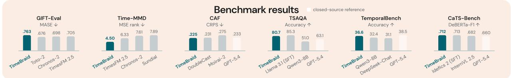

# TimeBraid: Unifying Time Series and Language for Understanding and Forecasting

Xin<sub>y</sub>ue Wan<sub>g</sub><sup>1,3,†</sup><sub>,</sub> Jiachen<sub>g</sub> Pan<sub>g</sub><sup>2</sup><sub>,</sub> Kun Zhou<sup>3</sup><sub>,</sub> Kexin Zhan<sub>g</sub><sup>2</sup><sub>,</sub> Defu Cao<sup>2</sup><sub>,</sub> Fan Fen<sub>g</sub><sup>1</sup><sub>,</sub> Faisal<sup>2</sup><sub>,</sub> Son<sub>gy</sub>ao Jin<sup>1,3,†</sup><sub>,</sub> Yan Liu<sup>2</sup><sub>,</sub> Biwei Huan<sub>g</sub><sup>1,3</sup>

<sup>1</sup> Un<sup>i</sup>vers<sup>i</sup>ty o<sup>f</sup> Ca<sup>lif</sup>orn<sup>i</sup>a San D<sup>i</sup>ego, <sup>2</sup> Un<sup>i</sup>vers<sup>i</sup>ty o<sup>f</sup> Sout<sup>h</sup>ern Ca<sup>lif</sup>orn<sup>i</sup>a, <sup>3</sup> <sup>A</sup>et<sup>h</sup>er <sup>A</sup>I

<sup>†</sup>Part of the work was completed during an internship at Aether AI

W<sub>e presen</sub>t Ti<sub>me</sub>B<sub>ra</sub>id<sub>, a ser</sub>i<sub>es o</sub>f <sub>un</sub>ifi<sub>e</sub>d ti<sub>me-ser</sub>i<sub>es an</sub>d l<sub>anguage mo</sub>d<sub>e</sub>l<sub>s</sub> th<sub>a</sub>t <sub>a</sub>li<sub>gn pre</sub>t<sub>ra</sub>i<sub>ne</sub>d l<sub>anguage</sub> <sub>mo</sub>d<sub>e</sub>l<sub>s</sub> <sub>an</sub>d <sub>pre</sub>t<sub>ra</sub>i<sub>ne</sub>d ti<sub>me-ser</sub>i<sub>es</sub> f<sub>oun</sub>d<sub>a</sub>ti<sub>on</sub> <sub>mo</sub>d<sub>e</sub>l<sub>s</sub> th<sub>roug</sub>h i<sub>n</sub>t<sub>er</sub>l<sub>eave</sub>d <sub>g</sub>l<sub>o</sub>b<sub>a</sub>l <sub>res</sub>id<sub>ua</sub>l <sub>a</sub>tt<sub>en</sub>ti<sub>on</sub> l<sub>ayers.</sub> E<sub>ac</sub>h <sub>mo</sub>d<sub>e</sub>l i<sub>n</sub>h<sub>er</sub>it<sub>s</sub> k<sub>now</sub>l<sub>e</sub>d<sub>ge,</sub> i<sub>ns</sub>t<sub>ruc</sub>ti<sub>on</sub> f<sub>o</sub>ll<sub>ow</sub>i<sub>ng, an</sub>d <sub>reason</sub>i<sub>ng</sub> f<sub>rom one s</sub>id<sub>e,</sub> <sub>con</sub>ti<sub>nuous-s</sub>i<sub>gna</sub>l <sub>percep</sub>ti<sub>on an</sub>d <sub>zero-s</sub>h<sub>o</sub>t f<sub>orecas</sub>ti<sub>ng</sub> f<sub>rom</sub> th<sub>e o</sub>th<sub>er, an</sub>d f<sub>uses</sub> th<sub>e</sub> t<sub>wo</sub> i<sub>n a s</sub>h<sub>are</sub>d <sub>represen</sub>t<sub>a</sub>ti<sub>on space w</sub>h<sub>ere</sub> b<sub>o</sub>th <sub>mo</sub>d<sub>a</sub>liti<sub>es are un</sub>d<sub>ers</sub>t<sub>oo</sub>d <sub>an</sub>d <sub>genera</sub>t<sub>e</sub>d<sub>.</sub> W<sub>e s</sub>t<sub>u</sub>d<sub>y</sub> th<sub>e</sub> d<sub>es</sub>i<sub>gn</sub> <sub>c</sub>h<sub>o</sub>i<sub>ces</sub> th<sub>a</sub>t <sub>ma</sub>k<sub>e</sub> <sub>suc</sub>h <sub>un</sub>ifi<sub>e</sub>d <sub>mo</sub>d<sub>e</sub>li<sub>ng</sub> <sub>wor</sub>k<sub>:</sub> <sub>w</sub>h<sub>ere</sub> t<sub>o</sub> <sub>a</sub>li<sub>gn</sub> th<sub>e</sub> t<sub>wo</sub> <sub>represen</sub>t<sub>a</sub>ti<sub>on</sub> <sub>spaces,</sub> h<sub>ow</sub> t<sub>o</sub> <sub>groun</sub>d l<sub>anguage</sub> i<sub>n</sub> t<sub>empora</sub>l <sub>s</sub>t<sub>ruc</sub>t<sub>ure,</sub> h<sub>ow</sub> t<sub>o</sub> b<sub>a</sub>l<sub>ance</sub> <sub>un</sub>d<sub>ers</sub>t<sub>an</sub>di<sub>ng</sub> <sub>w</sub>ith <sub>genera</sub>ti<sub>on,</sub> <sub>an</sub>d h<sub>ow</sub> t<sub>o</sub> keep joint optimization stable. The resulting recipe combines a unified prompting scheme for diverse time-series and text tasks, stabilized joint training, and supervision from 2.2M curated series–text <sub>pa</sub>i<sub>rs an</sub>d 4<sub>.</sub>9M i<sub>ns</sub>t<sub>ruc</sub>ti<sub>on-</sub>t<sub>un</sub>i<sub>ng samp</sub>l<sub>es.</sub> A<sub>cross</sub> b<sub>enc</sub>h<sub>mar</sub>k<sub>s spann</sub>i<sub>ng</sub> ti<sub>me-ser</sub>i<sub>es percep</sub>ti<sub>on,</sub> <sub>un</sub>d<sub>ers</sub>t<sub>an</sub>di<sub>ng,</sub> <sub>reason</sub>i<sub>ng,</sub> <sub>an</sub>d b<sub>o</sub>th <sub>con</sub>t<sub>ex</sub>t<sub>-a</sub>id<sub>e</sub>d <sub>an</sub>d <sub>un</sub>i<sub>mo</sub>d<sub>a</sub>l f<sub>orecas</sub>ti<sub>ng,</sub> Ti<sub>me</sub>B<sub>ra</sub>id <sub>rema</sub>i<sub>ns</sub> <sub>compe</sub>titi<sub>ve w</sub>ith f<sub>ar</sub> l<sub>arger genera</sub>l<sub>-purpose mo</sub>d<sub>e</sub>l<sub>s an</sub>d t<sub>as</sub>k<sub>-spec</sub>ifi<sub>c coun</sub>t<sub>erpar</sub>t<sub>s.</sub>

Keywords: Unified Time-Series and Language Models, Time-Series Analysis, Multi-Modal Forecasting

\# Correspondence: Xinyue Wang (xiw159@ucsd.edu)


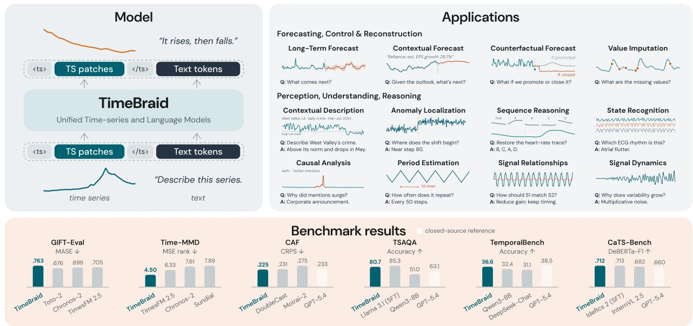  
Figure 1. Overview of TimeBraid. The unified time-series and language interface, application examples, and results on time-series understandin<sub>g</sub> (TSAQA, Tem<sub>p</sub>oralBench, CaTS-Bench) and forecastin<sub>g</sub> (GIFT-Eval, Time-MMD, CAF) benchmarks.

## 1 Introduction

F<sub>rom ear</sub>l d<sub>eve</sub>l<sub>o men</sub>t<sub>,</sub> h<sub>uman</sub> i<sub>n</sub>t<sub>e</sub>lli <sub>ence</sub> i<sub>s s</sub>h<sub>a e</sub>d b <sub>con</sub>ti<sub>nuous</sub> i<sub>n</sub>t<sub>erac</sub>ti<sub>on w</sub>ith <sub>a r</sub>i<sub>c</sub>h <sub>s</sub>t<sub>ream</sub> <sub>o</sub>f h<sub>e</sub>t<sub>erogeneous s</sub>i<sub>gna</sub>l<sub>s.</sub> Vi<sub>s</sub>i<sub>on, au</sub>diti<sub>on,</sub> l<sub>anguage, an</sub>d t<sub>ac</sub>til<sub>e sensa</sub>ti<sub>on arr</sub>i<sub>ve as sync</sub>h<sub>ron</sub>i<sub>ze</sub>d ti<sub>me ser</sub>i<sub>es, a</sub>ll<sub>ow</sub>i<sub>ng</sub> i<sub>n</sub>f<sub>orma</sub>ti<sub>on</sub> f<sub>rom one mo</sub>d<sub>a</sub>lit<sub>y</sub> t<sub>o con</sub>t<sub>ex</sub>t<sub>ua</sub>li<sub>ze an</sub>d <sub>comp</sub>l<sub>emen</sub>t i<sub>n</sub>f<sub>orma</sub>ti<sub>on</sub> from others (Smith & Gasser, 2005; Smith et al., 2018; Orhan et al., 2020). Existin<sub>g</sub> eforts to build <sub>mu</sub>lti<sub>mo</sub>d<sub>a</sub>l <sub>sys</sub>t<sub>ems</sub> h<sub>ave</sub> l<sub>arge</sub>l<sub>y</sub> <sub>re</sub>li<sub>e</sub>d <sub>on</sub> <sub>compose</sub>d <sub>wor</sub>kfl<sub>ows</sub> <sub>or</sub> <sub>arc</sub>hit<sub>ec</sub>t<sub>ures</sub> th<sub>a</sub>t <sub>merge</sub> <sub>separa</sub>t<sub>e</sub>l<sub>y</sub> d<sub>eve</sub>l<sub>ope</sub>d<sub>, mo</sub>d<sub>a</sub>lit<sub>y-spec</sub>ifi<sub>c mo</sub>d<sub>u</sub>l<sub>es.</sub> U<sub>n</sub>ifi<sub>e</sub>d <sub>mu</sub>lti<sub>mo</sub>d<sub>a</sub>l <sub>mo</sub>d<sub>e</sub>l<sub>s exp</sub>l<sub>ore a comp</sub>l<sub>emen</sub>t<sub>ary</sub> di<sub>rec</sub>ti<sub>on:</sub> l<sub>earn</sub>i<sub>ng</sub> <sub>s</sub>h<sub>are</sub>d <sub>represen</sub>t<sub>a</sub>ti<sub>ons</sub> f<sub>or</sub> <sub>un</sub>d<sub>ers</sub>t<sub>an</sub>di<sub>ng</sub> <sub>an</sub>d <sub>genera</sub>ti<sub>ng</sub> h<sub>e</sub>t<sub>erogeneous</sub> <sub>s</sub>i<sub>gna</sub>l<sub>s</sub> <sub>w</sub>ithi<sub>n</sub> <sub>a</sub> sin<sub>g</sub>le set of model wei<sub>g</sub>hts (Team, 2024; Zhou et al., 2025a; Xie et al., 2025a; Wan<sub>g</sub> et al., 2024; Chen et al., 2025b; Den<sub>g</sub> et al., 2025; Xu et al., 2025a; An et al., 2026). Emer<sub>g</sub>in<sub>g</sub> evidence su<sub>gg</sub>ests that joint pretraining across modalities may foster capabilities that are dificult to acquire from any individual modalit<sub>y</sub> in isolation (Ton<sub>g</sub> et al., 2026).

H<sub>owever,</sub> ti<sub>me-ser</sub>i<sub>es</sub> d<sub>a</sub>t<sub>a rema</sub>i<sub>ns</sub> l<sub>arge</sub>l<sub>y ou</sub>t<sub>s</sub>id<sub>e</sub> thi<sub>s un</sub>ifi<sub>ca</sub>ti<sub>on.</sub> N<sub>umer</sub>i<sub>ca</sub>l <sub>recor</sub>d<sub>s o</sub>f d<sub>ynam</sub>i<sub>ca</sub>l s<sub>y</sub>stems (e.<sub>g</sub>., <sub>p</sub>h<sub>y</sub>siolo<sub>gy</sub>, <sub>p</sub>ower <sub>g</sub>rids, markets, and climate) lack the semantic context for identification and inter<sub>p</sub>retation (Goldber<sub>g</sub>er et al., 2000; Hon<sub>g</sub> & Fan, 2016; Tsa<sub>y</sub>, 2010; Lam et al., 2023; Shallue & Vanderbur<sub>g</sub>, 2018). Lan<sub>g</sub>ua<sub>g</sub>e <sub>g</sub>roundin<sub>g</sub> can su<sub>pp</sub>l<sub>y</sub> this context and connect time series <sub>w</sub>ith b<sub>roa</sub>d<sub>er wor</sub>ld k<sub>now</sub>l<sub>e</sub>d<sub>ge, mo</sub>ti<sub>va</sub>ti<sub>ng</sub> th<sub>e</sub>i<sub>r</sub> i<sub>nc</sub>l<sub>us</sub>i<sub>on as an essen</sub>ti<sub>a</sub>l <sub>mo</sub>d<sub>a</sub>lit<sub>y</sub> i<sub>n un</sub>ifi<sub>e</sub>d <sub>mo</sub>d<sub>e</sub>l<sub>s.</sub>

E<sub>x</sub>i<sub>s</sub>ti<sub>ng approac</sub>h<sub>es</sub> t<sub>yp</sub>i<sub>ca</sub>ll<sub>y connec</sub>t ti<sub>me ser</sub>i<sub>es an</sub>d l<sub>anguage</sub> b<sub>y a</sub>ddi<sub>ng spec</sub>i<sub>a</sub>li<sub>ze</sub>d <sub>componen</sub>t<sub>s,</sub> ranging from projection layers to signal tokenizers, to pretrained language or time-series models (Xie et al., 2024; Guan et al., 2026a; Jin et al., 2024; Wan<sub>g</sub> et al., 2025a). However, such com<sub>p</sub>onents i<sub>n</sub>t<sub>ro</sub>d<sub>uce represen</sub>t<sub>a</sub>ti<sub>ona</sub>l <sub>gaps, caus</sub>i<sub>ng seman</sub>ti<sub>c m</sub>i<sub>sa</sub>li<sub>gnmen</sub>t <sub>an</sub>d d<sub>egra</sub>di<sub>ng pre</sub>t<sub>ra</sub>i<sub>ne</sub>d <sub>capa</sub>biliti<sub>es,</sub> and each resultin<sub>g</sub> s<sub>y</sub>stem covers onl<sub>y</sub> a fra<sub>g</sub>ment of the full bidirectional interface (Section 5). Ali<sub>g</sub>nin<sub>g</sub> th<sub>e</sub> <sub>na</sub>ti<sub>ve</sub> <sub>represen</sub>t<sub>a</sub>ti<sub>ons</sub> <sub>o</sub>f b<sub>o</sub>th <sub>pre</sub>t<sub>ra</sub>i<sub>ne</sub>d h<sub>os</sub>t<sub>s</sub> <sub>w</sub>hil<sub>e</sub> l<sub>arge</sub>l<sub>y</sub> <sub>preserv</sub>i<sub>ng</sub> th<sub>e</sub>i<sub>r</sub> <sub>capa</sub>biliti<sub>es</sub> <sub>rema</sub>i<sub>ns</sub> <sub>un</sub>d<sub>erexp</sub>l<sub>ore</sub>d<sub>.</sub>

S<sub>uc</sub>h <sub>a</sub>li<sub>gnmen</sub>t <sub>requ</sub>i<sub>res</sub> l<sub>arge-sca</sub>l<sub>e pa</sub>i<sub>re</sub>d <sub>pre</sub>t<sub>ra</sub>i<sub>n</sub>i<sub>ng, ye</sub>t th<sub>e</sub> i<sub>n</sub>h<sub>eren</sub>t <sub>seman</sub>ti<sub>c gap</sub> b<sub>e</sub>t<sub>ween</sub> <sub>con</sub>ti<sub>nuous</sub> <sub>s</sub>i<sub>gna</sub>l<sub>s</sub> <sub>an</sub>d di<sub>scre</sub>t<sub>e</sub> l<sub>anguage</sub> <sub>ma</sub>k<sub>es</sub> it <sub>c</sub>h<sub>a</sub>ll<sub>eng</sub>i<sub>ng.</sub> T<sub>o</sub> b<sub>r</sub>id<sub>ge</sub> thi<sub>s</sub> <sub>gap,</sub> <sub>we</sub> <sub>presen</sub>t TimeBraid, a mixture-of-Transformers architecture that combines modality-specific processing with <sub>cross-mo</sub>d<sub>a</sub>l <sub>con</sub>t<sub>ex</sub>t <sub>s</sub>h<sub>ar</sub>i<sub>ng.</sub> I<sub>nsp</sub>i<sub>re</sub>d b<sub>y</sub> h<sub>ow spec</sub>i<sub>a</sub>li<sub>ze</sub>d <sub>sensory organs perce</sub>i<sub>ve</sub> dif<sub>eren</sub>t <sub>s</sub>i<sub>gna</sub>l<sub>s</sub> <sub>w</sub>hil<sub>e</sub> th<sub>e</sub> b<sub>ra</sub>i<sub>n</sub> i<sub>n</sub>t<sub>egra</sub>t<sub>es</sub> th<sub>em</sub> f<sub>or</sub> d<sub>ec</sub>i<sub>s</sub>i<sub>on-ma</sub>ki<sub>ng,</sub> Ti<sub>me</sub>B<sub>ra</sub>id <sub>emp</sub>l<sub>oys separa</sub>t<sub>e pre</sub>t<sub>ra</sub>i<sub>ne</sub>d <sub>exper</sub>t<sub>s</sub> f<sub>or</sub> l<sub>anguage</sub> <sub>reason</sub>i<sub>ng,</sub> ti<sub>me-ser</sub>i<sub>es</sub> <sub>percep</sub>ti<sub>on,</sub> <sub>an</sub>d f<sub>orecas</sub>ti<sub>ng,</sub> <sub>w</sub>hil<sub>e</sub> <sub>connec</sub>ti<sub>ng</sub> th<sub>em</sub> th<sub>roug</sub>h global residual attention. This mechanism organizes their representations into a shared chronological <sub>con</sub>t<sub>ex</sub>t<sub>, ena</sub>bli<sub>ng cross-mo</sub>d<sub>a</sub>l i<sub>n</sub>t<sub>erac</sub>ti<sub>on w</sub>hil<sub>e su</sub>b<sub>s</sub>t<sub>an</sub>ti<sub>a</sub>ll<sub>y preserv</sub>i<sub>ng pre</sub>t<sub>ra</sub>i<sub>ne</sub>d l<sub>anguage an</sub>d f<sub>orecas</sub>ti<sub>ng</sub> <sub>capa</sub>biliti<sub>es.</sub> B<sub>u</sub>ildi<sub>ng</sub> <sub>on</sub> thi<sub>s</sub> <sub>arc</sub>hit<sub>ec</sub>t<sub>ure,</sub> <sub>we</sub> i<sub>n</sub>t<sub>ro</sub>d<sub>uce</sub> <sub>a</sub> t<sub>wo-s</sub>t<sub>age</sub> t<sub>ra</sub>i<sub>n</sub>i<sub>ng</sub> <sub>rec</sub>i<sub>pe</sub> th<sub>a</sub>t fi<sub>rs</sub>t <sub>a</sub>li<sub>gns</sub> ti<sub>me ser</sub>i<sub>es an</sub>d l<sub>anguage on</sub> l<sub>arge-sca</sub>l<sub>e pa</sub>i<sub>re</sub>d d<sub>a</sub>t<sub>a an</sub>d th<sub>en a</sub>d<sub>ap</sub>t<sub>s</sub> th<sub>e un</sub>ifi<sub>e</sub>d <sub>mo</sub>d<sub>e</sub>l t<sub>o</sub> di<sub>verse</sub> d<sub>owns</sub>t<sub>ream</sub> t<sub>as</sub>k<sub>s.</sub>

Across twelve understandin<sub>g</sub> and forecastin<sub>g</sub> benchmarks (Jin<sub>g</sub> et al., 2026; Cai et al., 2024; Wen<sub>g</sub> et al.<sub>,</sub> 2026<sub>;</sub> Zhou et al.<sub>,</sub> 2026<sub>;</sub> Liu et al.<sub>,</sub> 2024a<sub>;</sub> Wan<sub>g</sub> et al.<sub>,</sub> 2025a<sub>;</sub> Zhen<sub>g</sub> et al.<sub>,</sub> 2026<sub>;</sub> Williams et al., 2024; Aksu et al., 2024), TimeBraid at 1.2B–6.7B <sub>p</sub>arameters serves both directions of the <sub>ser</sub>i<sub>es–</sub>t<sub>ex</sub>t i<sub>n</sub>t<sub>er</sub>f<sub>ace</sub> i<sub>n one mo</sub>d<sub>e</sub>l<sub>, as summar</sub>i<sub>ze</sub>d i<sub>n</sub> Fi<sub>gure</sub> 1<sub>.</sub> F<sub>or un</sub>d<sub>ers</sub>t<sub>an</sub>di<sub>ng,</sub> Ti<sub>me</sub>B<sub>ra</sub>id<sub>-</sub>6<sub>.</sub>7B reaches 80.65% on TSAQA, compared with 85.26% for TSAQA-specific LLaMA3.1-8B SFT and 63.10% for GPT-5.4. On the held-out TB-MCQ suite it <sub>p</sub>erforms on <sub>p</sub>ar with GPT-5.4 (36.58% vs. 38.50%). Its C<sub>a</sub>TS<sub>-</sub>B<sub>enc</sub>h <sub>cap</sub>ti<sub>ons ma</sub>t<sub>c</sub>h th<sub>e s</sub>t<sub>ronges</sub>t f<sub>ron</sub>ti<sub>er</sub> VLM<sub>s an</sub>d th<sub>e mo</sub>d<sub>e</sub>l<sub>s</sub> fi<sub>ne</sub>t<sub>une</sub>d <sub>on</sub> th<sub>e</sub> b<sub>enc</sub>h<sub>mar</sub>k<sub>.</sub> F<sub>or</sub> f<sub>orecas</sub>ti<sub>ng,</sub> Ti<sub>me</sub>B<sub>ra</sub>id <sub>a</sub>tt<sub>a</sub>i<sub>ns</sub> th<sub>e</sub> b<sub>es</sub>t <sub>average</sub> MSE <sub>ran</sub>k <sub>on</sub> th<sub>e n</sub>i<sub>ne</sub> Ti<sub>me-</sub>MMD d<sub>oma</sub>i<sub>ns an</sub>d the best CRPS on CAF. On GIFT-Eval it lar<sub>g</sub>el<sub>y</sub> maintains com<sub>p</sub>arable zero-shot forecastin<sub>g</sub> to state-<sub>o</sub>f<sub>-</sub>th<sub>e-ar</sub>t ti<sub>me-ser</sub>i<sub>es</sub> f<sub>oun</sub>d<sub>a</sub>ti<sub>on mo</sub>d<sub>e</sub>l<sub>s.</sub> It i<sub>s a</sub>l<sub>so</sub> th<sub>e on</sub>l<sub>y non-</sub>LLM <sub>mo</sub>d<sub>e</sub>l <sub>w</sub>h<sub>ose</sub> Ct<sub>r</sub>l<sub>-</sub>F f<sub>orecas</sub>t<sub>s</sub> follow the stated condition<sub>,</sub> and attains the best Macro MSE and Macro MAE on CGTSF. Further <sub>ana</sub>l<sub>ys</sub>i<sub>s sys</sub>t<sub>ema</sub>ti<sub>ca</sub>ll<sub>y a</sub>bl<sub>a</sub>t<sub>es</sub> th<sub>e</sub> d<sub>es</sub>i<sub>gn space o</sub>f thi<sub>s new mo</sub>d<sub>e</sub>l <sub>c</sub>l<sub>ass an</sub>d <sub>s</sub>i<sub>ng</sub>l<sub>es ou</sub>t th<sub>e s</sub>h<sub>are</sub>d attention space, stabilized joint optimization, and the alignment stage as the choices that matter <sub>mos</sub>t<sub>.</sub> T<sub>oge</sub>th<sub>er,</sub> th<sub>ese resu</sub>lt<sub>s es</sub>t<sub>a</sub>bli<sub>s</sub>h Ti<sub>me</sub>B<sub>ra</sub>id <sub>as a ser</sub>i<sub>es o</sub>f <sub>power</sub>f<sub>u</sub>l <sub>an</sub>d <sub>versa</sub>til<sub>e un</sub>ifi<sub>e</sub>d <sub>mo</sub>d<sub>e</sub>l<sub>s</sub> <sub>o</sub>f ti<sub>me</sub> <sub>an</sub>d l<sub>anguage.</sub>

## 2 Preliminaries

E<sub>very</sub> ti<sub>me-ser</sub>i<sub>es an</sub>d l<sub>anguage</sub> t<sub>as</sub>k <sub>can</sub> b<sub>e</sub> d<sub>escr</sub>ib<sub>e</sub>d <sub>as an</sub> i<sub>n</sub>t<sub>er</sub>l<sub>eav</sub>i<sub>ng o</sub>f th<sub>e</sub> t<sub>wo mo</sub>d<sub>a</sub>liti<sub>es.</sub> Formall<sub>y,</sub> an exam<sub>p</sub>le is a se<sub>g</sub>ment se<sub>q</sub>uence ${ \cal S } = \left( s _ { 1 } , \ldots , s _ { M } \right)$ , where each segment is either a text segment (a token sequence) or a time-series segment (a univariate value sequence $( x _ { 1 } , \ldots , x _ { n } ) \in \mathbb { R } ^ { n } ;$ a multivariate series enters as one segment per variable), and each segment is designated as context or target; the number and ordering of segments are unconstrained. Context segments are fully observed: context text $s _ { \mathrm { t e x t } }$ <sub>carr</sub>i<sub>es</sub> i<sub>ns</sub>t<sub>ruc</sub>ti<sub>ons,</sub> <sub>ques</sub>ti<sub>ons,</sub> <sub>an</sub>d b<sub>ac</sub>k<sub>groun</sub>d<sub>,</sub> <sub>an</sub>d <sub>a</sub> <sub>con</sub>t<sub>ex</sub>t ti<sub>me-ser</sub>i<sub>es</sub> <sub>segmen</sub>t $s _ { \mathrm { t } s , C }$ <sub>carr</sub>i<sub>es</sub> <sub>o</sub>b<sub>serve</sub>d <sub>measuremen</sub>t<sub>s.</sub> T<sub>arge</sub>t <sub>segmen</sub>t<sub>s</sub> <sub>are</sub> th<sub>e</sub> <sub>mo</sub>d<sub>e</sub>l’<sub>s</sub> <sub>ou</sub>t<sub>pu</sub>t<sub>s:</sub> <sub>a</sub> t<sub>arge</sub>t t<sub>ex</sub>t <sub>segmen</sub>t i<sub>s</sub> <sub>a</sub> <sup>l</sup>an<sub>g</sub>ua<sub>g</sub>e res<sub>p</sub>onse to <sup>b</sup>e <sub>g</sub>enerate<sup>d</sup>, an<sup>d</sup> a tar<sub>g</sub>et t<sup>i</sup>me-ser<sup>i</sup>es se<sub>g</sub>ment $s _ { \mathrm { t s } , T } = ( x _ { 1 } , \ldots , x _ { h } , x _ { h + 1 } , \ldots , x _ { h + f } )$ <sub>res</sub>t<sub>a</sub>t<sub>es</sub> th<sub>e</sub> <sub>o</sub>b<sub>serve</sub>d hi<sub>s</sub>t<sub>ory</sub> $( x _ { 1 } , \ldots , x _ { h } )$ o<sup>f</sup> its context segment and continues it with � <sup>f</sup>uture values t<sub>o</sub> b<sub>e</sub> <sub>genera</sub>t<sub>e</sub>d<sub>.</sub>

## 3 Method

Ti<sub>me</sub>B<sub>ra</sub>id i<sub>s a un</sub>ifi<sub>e</sub>d ti<sub>me-ser</sub>i<sub>es an</sub>d l<sub>anguage mo</sub>d<sub>e</sub>l b<sub>u</sub>ilt <sub>on</sub> t<sub>op o</sub>f <sub>na</sub>ti<sub>ve</sub> l<sub>anguage an</sub>d ti<sub>me-</sub> <sub>ser</sub>i<sub>es represen</sub>t<sub>a</sub>ti<sub>ons: a pre</sub>t<sub>ra</sub>i<sub>ne</sub>d l<sub>anguage mo</sub>d<sub>e</sub>l <sub>an</sub>d <sub>a pre</sub>t<sub>ra</sub>i<sub>ne</sub>d ti<sub>me-ser</sub>i<sub>es</sub> f<sub>oun</sub>d<sub>a</sub>ti<sub>on mo</sub>d<sub>e</sub>l<sub>.</sub> Its desi<sub>g</sub>n <sub>p</sub>ursues two <sub>p</sub>ro<sub>p</sub>erties: (i) the framework should be an omni learner and <sub>p</sub>ractitioner, not b<sub>oun</sub>d b<sub>y a spec</sub>ifi<sub>c</sub> t<sub>as</sub>k f<sub>orma</sub>t<sub>, accep</sub>ti<sub>ng any</sub> ti<sub>me-ser</sub>i<sub>es an</sub>d t<sub>ex</sub>t <sub>segmen</sub>t <sub>compos</sub>iti<sub>on</sub> i<sub>n</sub> i<sub>npu</sub>t <sub>an</sub>d out<sub>p</sub>ut; and (ii) it should levera<sub>g</sub>e the <sub>p</sub>retrained re<sub>p</sub>resentations in existin<sub>g</sub> lan<sub>g</sub>ua<sub>g</sub>e models and ti<sub>me-ser</sub>i<sub>es</sub> f<sub>oun</sub>d<sub>a</sub>ti<sub>on mo</sub>d<sub>e</sub>l<sub>s ra</sub>th<sub>er</sub> th<sub>an re</sub>l<sub>earn</sub>i<sub>ng</sub> th<sub>em</sub> f<sub>rom scra</sub>t<sub>c</sub>h<sub>.</sub> W<sub>e</sub> fi<sub>rs</sub>t d<sub>escr</sub>ib<sub>e</sub> th<sub>e</sub> d<sub>a</sub>t<sub>a</sub> reci<sub>p</sub>e that develo<sub>p</sub>s these ca<sub>p</sub>abilities, then the unified <sub>p</sub>rom<sub>p</sub>tin<sub>g</sub> and model desi<sub>g</sub>n that realize (i) and (ii), and finall<sub>y</sub> the trainin<sub>g</sub> objectives, o<sub>p</sub>timization setu<sub>p</sub>, and inference <sub>p</sub>rocedure.

## 3.1 Data Recipe

Our data is arran<sub>g</sub>ed as a two-sta<sub>g</sub>e curriculum (Fi<sub>g</sub>ure 2). The first sta<sub>g</sub>e teaches basic time-series <sub>un</sub>d<sub>ers</sub>t<sub>an</sub>di<sub>ng an</sub>d <sub>con</sub>t<sub>ro</sub>ll<sub>a</sub>bl<sub>e</sub> f<sub>orecas</sub>ti<sub>ng on cons</sub>t<sub>ruc</sub>t<sub>e</sub>d <sub>pa</sub>i<sub>re</sub>d d<sub>a</sub>t<sub>a.</sub> Th<sub>e secon</sub>d <sub>s</sub>t<sub>age</sub> b<sub>u</sub>ild<sub>s</sub> <sub>on</sub> th<sub>ese</sub> b<sub>as</sub>i<sub>cs</sub> <sub>an</sub>d t<sub>arge</sub>t<sub>s</sub> i<sub>ns</sub>t<sub>ruc</sub>ti<sub>on</sub> f<sub>o</sub>ll<sub>ow</sub>i<sub>ng,</sub> t<sub>as</sub>k<sub>-spec</sub>ifi<sub>c</sub> <sub>per</sub>f<sub>ormance,</sub> <sub>an</sub>d <sub>rea</sub>l<sub>-wor</sub>ld d<sub>oma</sub>i<sub>n</sub> k<sub>now</sub>l<sub>e</sub>d<sub>ge w</sub>ith <sub>a</sub> h<sub>e</sub>t<sub>erogeneous</sub> i<sub>ns</sub>t<sub>ruc</sub>ti<sub>on m</sub>i<sub>x</sub>t<sub>ure.</sub>

Stage 1: Alignment. The alignment stage uses 2.23M paired examples, split 3:7 between under <sub>s</sub>t<sub>an</sub>di<sub>ng an</sub>d f<sub>orecas</sub>ti<sub>ng.</sub> Th<sub>e un</sub>d<sub>ers</sub>t<sub>an</sub>di<sub>ng</sub> d<sub>a</sub>t<sub>a covers</sub> b<sub>o</sub>th <sub>un</sub>i<sub>var</sub>i<sub>a</sub>t<sub>e an</sub>d <sub>mu</sub>lti<sub>var</sub>i<sub>a</sub>t<sub>e cases:</sub> mor<sub>p</sub>holo<sub>gy</sub> ca<sub>p</sub>tions describe the basic structures of a sin<sub>g</sub>le series (trends, seasonalit<sub>y</sub>, re<sub>g</sub>imes, salient features, inter-series relationshi<sub>p</sub>s); context-rich ca<sub>p</sub>tions describe real series to<sub>g</sub>ether with their real-world context; <sub>p</sub>ro<sub>g</sub>rammable ca<sub>p</sub>tions in the st<sub>y</sub>le of ChatTS (Xie et al., 2024) are <sub>g</sub>enerated <sub>a</sub>tt<sub>r</sub>ib<sub>u</sub>t<sub>e-</sub>fi<sub>rs</sub>t<sub>, so eac</sub>h d<sub>escr</sub>i<sub>p</sub>ti<sub>on ma</sub>t<sub>c</sub>h<sub>es</sub> it<sub>s ser</sub>i<sub>es prec</sub>i<sub>se</sub>l<sub>y</sub> b<sub>y cons</sub>t<sub>ruc</sub>ti<sub>on; mu</sub>lti<sub>var</sub>i<sub>a</sub>t<sub>e exam-</sub> <sub>p</sub>l<sub>es are genera</sub>t<sub>e</sub>d f<sub>rom s</sub>t<sub>ruc</sub>t<sub>ura</sub>l <sub>causa</sub>l <sub>mo</sub>d<sub>e</sub>l<sub>s w</sub>ith k<sub>nown</sub> i<sub>n</sub>t<sub>erac</sub>ti<sub>on s</sub>t<sub>ruc</sub>t<sub>ure; an</sub>d t<sub>emp</sub>l<sub>a</sub>t<sub>e</sub>d <sub>p</sub>ro<sub>g</sub>rammable tasks (Cai et al., 2024) cover the same content from diverse task <sub>p</sub>ers<sub>p</sub>ectives. The f<sub>orecas</sub>ti<sub>ng</sub> d<sub>a</sub>t<sub>a</sub> f<sub>ocuses on con</sub>t<sub>ro</sub>ll<sub>a</sub>bilit<sub>y an</sub>d i<sub>s</sub> b<sub>u</sub>ilt <sub>w</sub>ith f<sub>u</sub>t<sub>ure-aware anno</sub>t<sub>a</sub>ti<sub>on: anno</sub>t<sub>a</sub>ti<sub>ons</sub> <sub>are</sub> <sub>pro</sub>d<sub>uce</sub>d <sub>w</sub>ith <sub>access</sub> t<sub>o</sub> th<sub>e</sub> f<sub>u</sub>t<sub>ure,</sub> <sub>w</sub>hi<sub>c</sub>h i<sub>s</sub> <sub>never</sub> i<sub>nc</sub>l<sub>u</sub>d<sub>e</sub>d i<sub>n</sub> th<sub>e</sub> <sub>mo</sub>d<sub>e</sub>l i<sub>npu</sub>t<sub>.</sub> Th<sub>e</sub> f<sub>orecas</sub>ti<sub>ng</sub> <sub>con</sub>t<sub>ro</sub>l <sub>se</sub>t <sub>syn</sub>th<sub>es</sub>i<sub>zes</sub> <sub>severa</sub>l di<sub>s</sub>ti<sub>nc</sub>t f<sub>u</sub>t<sub>ures</sub> f<sub>rom</sub> <sub>one</sub> <sub>s</sub>h<sub>are</sub>d hi<sub>s</sub>t<sub>ory</sub> <sub>us</sub>i<sub>ng</sub> <sub>programma</sub>bl<sub>e</sub> <sub>opera</sub>t<sub>ors</sub> <sub>an</sub>d <sub>cap</sub>ti<sub>ons</sub> th<sub>e con</sub>diti<sub>on</sub> th<sub>a</sub>t l<sub>ea</sub>d<sub>s</sub> t<sub>o eac</sub>h f<sub>u</sub>t<sub>ure, so</sub> th<sub>e mo</sub>d<sub>e</sub>l l<sub>earns</sub> t<sub>o</sub> f<sub>o</sub>ll<sub>ow s</sub>t<sub>a</sub>t<sub>e</sub>d <sub>con</sub>diti<sub>ons</sub> <sub>w</sub>h<sub>en</sub> f<sub>orecas</sub>ti<sub>ng.</sub> Th<sub>e</sub> <sub>genera</sub>l f<sub>orecas</sub>ti<sub>ng</sub> <sub>se</sub>t <sub>anno</sub>t<sub>a</sub>t<sub>es</sub> <sub>rea</sub>li<sub>ze</sub>d f<sub>u</sub>t<sub>ures</sub> <sub>o</sub>f <sub>rea</sub>l <sub>ser</sub>i<sub>es,</sub> <sub>a</sub>li<sub>gn</sub>i<sub>ng</sub> <sub>con</sub>t<sub>ex</sub>t<sub>-con</sub>diti<sub>one</sub>d f<sub>orecas</sub>t<sub>s</sub> <sub>w</sub>ith <sub>na</sub>t<sub>ura</sub>l <sub>rea</sub>l<sub>-wor</sub>ld <sub>evo</sub>l<sub>u</sub>ti<sub>on.</sub> W<sub>e</sub> <sub>rewr</sub>it<sub>e</sub> <sub>some</sub> f<sub>orecas</sub>ti<sub>ng</sub> <sub>exam-</sub> <sub>p</sub>l<sub>es</sub> i<sub>n</sub> dif<sub>eren</sub>t t<sub>ones an</sub>d <sub>genres</sub> t<sub>o ma</sub>k<sub>e</sub> th<sub>e</sub>i<sub>r presen</sub>t<sub>a</sub>ti<sub>on more</sub> di<sub>verse an</sub>d <sub>rea</sub>li<sub>s</sub>ti<sub>c.</sub> A<sub>ppen</sub>di<sub>x</sub> A d<sub>e</sub>t<sub>a</sub>il<sub>s</sub> th<sub>e cons</sub>t<sub>ruc</sub>ti<sub>on o</sub>f <sub>eac</sub>h f<sub>am</sub>il<sub>y.</sub>

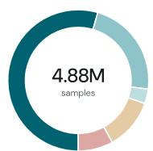

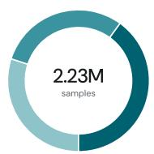

<table><tr><td>• Forecasting 70.0%</td></tr><tr><td>Controlled Forecasting 668K</td></tr><tr><td>General Forecasting 892K</td></tr><tr><td>Subtotal 1.56M</td></tr><tr><td>Time-Series Understanding 30.0%</td></tr><tr><td>Morphology Description 50K</td></tr><tr><td>Contextual Description 50K ChatTS Univariate Analysis 260K</td></tr><tr><td>ChatTS Multivariate Analysis 109K</td></tr><tr><td>Causal Modeling 100K</td></tr><tr><td>TimeSeriesExam Description 100K</td></tr><tr><td>Subtotal 669K</td></tr></table>

<table><tr><td>• Forecasting</td><td>54.49%</td></tr><tr><td>CGTSF</td><td>53.9K</td></tr><tr><td>FinMultiTime S&amp;P 500</td><td>144K</td></tr><tr><td>MoTime</td><td>32.6K</td></tr><tr><td>CAF-7M</td><td>2.31M</td></tr><tr><td>TimeMMD</td><td>20.8K</td></tr><tr><td>TimeMQA</td><td>74.7K</td></tr><tr><td>Subtotal</td><td>2.64M</td></tr><tr><td>Unimodal Corpora</td><td>11.69%</td></tr><tr><td>GIFT-Eval Pretrain</td><td>200K</td></tr><tr><td>Dolci-Instruct</td><td>200K</td></tr><tr><td>Subtotal</td><td>400K</td></tr><tr><td>Captioning &amp; Description</td><td>3.34%</td></tr><tr><td>OpenTSLM M4 Captioning</td><td>80K</td></tr><tr><td>SensorCaps</td><td>36K</td></tr><tr><td>TimeMMD Open-Ended</td><td>1.9K</td></tr><tr><td>TRACE Captioning</td><td>44K</td></tr><tr><td>Subtotal</td><td>162K</td></tr></table>

<table><tr><td>Time-Series QA &amp; Reasoning</td><td>22.49%</td></tr><tr><td>CaTSBench</td><td>16K</td></tr><tr><td>ChatTS</td><td>50.4K</td></tr><tr><td>HITS-R</td><td>157K</td></tr><tr><td>OpenSQA</td><td>139K</td></tr><tr><td>OpenTSLM ECG</td><td>159K</td></tr><tr><td>OpenTSLM HAR</td><td>68.5K</td></tr><tr><td>OpenTSLM Sleep</td><td>7.4K</td></tr><tr><td>OpenTSLM TSQA</td><td>38.4K</td></tr><tr><td>TimeMQA Reasoning</td><td>110K</td></tr><tr><td>TSAQA Reasoning</td><td>126K</td></tr><tr><td>EngineMTQA</td><td>100K</td></tr><tr><td>RATs</td><td>33K</td></tr><tr><td>TimeMQA Imputation</td><td>38.6K</td></tr><tr><td>TSAQA Anomaly Detection</td><td>21K</td></tr><tr><td>Subtotal</td><td>1.07M</td></tr><tr><td>Alignment Retention</td><td>8.00%</td></tr><tr><td>Understanding Retention</td><td>116K</td></tr><tr><td>Forecasting Retention</td><td>498K</td></tr><tr><td>Subtotal</td><td>614K</td></tr></table>

Figure 2. Two-stage training recipe. Stage 2 counts show the final one-pass sample inventory, while percentages <sub>s</sub>h<sub>ow</sub> t<sub>ra</sub>i<sub>n</sub>i<sub>ng-</sub>ti<sub>me samp</sub>li<sub>ng s</sub>h<sub>ares.</sub>

Stage 2: Supervised Fine-Tuning. The second stage uses a heterogeneous mixture spanning ti<sub>me-ser</sub>i<sub>es ques</sub>ti<sub>on answer</sub>i<sub>ng an</sub>d <sub>reason</sub>i<sub>ng, cap</sub>ti<sub>on</sub>i<sub>ng an</sub>d d<sub>escr</sub>i<sub>p</sub>ti<sub>on, con</sub>t<sub>ex</sub>t<sub>ua</sub>l <sub>an</sub>d <sub>un</sub>i<sub>mo</sub>d<sub>a</sub>l l<sub>ong-</sub>h<sub>or</sub>i<sub>zon</sub> f<sub>orecas</sub>ti<sub>ng, an</sub>d d<sub>oma</sub>i<sub>n-spec</sub>ifi<sub>c app</sub>li<sub>ca</sub>ti<sub>ons</sub> i<sub>n energy, c</sub>li<sub>ma</sub>t<sub>e,</sub> h<sub>ea</sub>lth<sub>care,</sub> fi<sub>nance,</sub> <sub>sens</sub>i<sub>ng, an</sub>d i<sub>n</sub>d<sub>us</sub>t<sub>r</sub>i<sub>a</sub>l <sub>mon</sub>it<sub>or</sub>i<sub>ng.</sub> It<sub>s</sub> fi<sub>na</sub>l <sub>one-pass</sub> i<sub>nven</sub>t<sub>ory con</sub>t<sub>a</sub>i<sub>ns</sub> 4<sub>,</sub>881<sub>,</sub>583 <sub>samp</sub>l<sub>es.</sub> Th<sub>e</sub> training-time sampling shares allocate 54.49% to forecasting, 22.49% to time-series QA and reasoning, 3.34% to ca<sub>p</sub>tionin<sub>g</sub> and descri<sub>p</sub>tion<sub>,</sub> 11.69% to unimodal data<sub>,</sub> and 8.00% to ali<sub>g</sub>nment retention. The retained ali<sub>g</sub>nment <sub>q</sub>uota contains 614<sub>,</sub>113 sam<sub>p</sub>les: 116<sub>,</sub>294 from understandin<sub>g</sub> and 497<sub>,</sub>819 f<sub>rom</sub> f<sub>orecas</sub>ti<sub>ng.</sub>

## 3.2 Unified Time-Series and Language Modeling

Unified Time-Series and Language Prompting. The prompting scheme defines the serialization $S \mapsto u _ { 1 : T }$ , ma<sub>pp</sub>in<sub>g</sub> a se<sub>g</sub>ment se<sub>q</sub>uence (Section 2) to the mixed se<sub>q</sub>uence of � text tokens and ti<sub>me-ser</sub>i<sub>es</sub> <sub>pa</sub>t<sub>c</sub>h<sub>es</sub> th<sub>a</sub>t th<sub>e</sub> <sub>mo</sub>d<sub>e</sub>l <sub>consumes.</sub> E<sub>ac</sub>h <sub>examp</sub>l<sub>e</sub> i<sub>s</sub> <sub>ren</sub>d<sub>ere</sub>d <sub>as</sub> <sub>a</sub> <sub>c</sub>h<sub>a</sub>t t<sub>ranscr</sub>i<sub>p</sub>t i<sub>n</sub> th<sub>e</sub> <sub>na</sub>ti<sub>ve c</sub>h<sub>a</sub>t t<sub>emp</sub>l<sub>a</sub>t<sub>e, an</sub>d ti<sub>me-ser</sub>i<sub>es segmen</sub>t<sub>s are wrappe</sub>d <sub>w</sub>ith <sub>spec</sub>i<sub>a</sub>l t<sub>o</sub>k<sub>ens</sub> $< \tt t s > < / t s >$ (as illustrated in the exam<sub>p</sub>les below). Each context time-series se<sub>g</sub>ment is <sub>p</sub>re<sub>p</sub>ended with a statistics bl<sub>oc</sub>k i<sub>n</sub>di<sub>ca</sub>ti<sub>ng</sub> th<sub>e</sub> l<sub>eng</sub>th<sub>, mean an</sub>d <sub>s</sub>t<sub>an</sub>d<sub>ar</sub>d d<sub>ev</sub>i<sub>a</sub>ti<sub>on o</sub>f th<sub>e segmen</sub>t<sub>, an</sub>d <sub>eac</sub>h t<sub>arge</sub>t <sub>segmen</sub>t i<sub>s</sub> <sub>a</sub> b<sub>are</sub> $< \tt t s > < / t s >$ <sub>.</sub> Th<sub>e</sub> t<sub>ex</sub>t <sub>segmen</sub>t<sub>s are</sub> t<sub>o</sub>k<sub>en</sub>i<sub>ze</sub>d i<sub>n</sub>t<sub>o</sub> t<sub>ex</sub>t t<sub>o</sub>k<sub>ens an</sub>d th<sub>e</sub> ti<sub>me-ser</sub>i<sub>es segmen</sub>t<sub>s</sub> <sub>are norma</sub>li<sub>ze</sub>d <sub>an</sub>d t<sub>o</sub>k<sub>en</sub>i<sub>ze</sub>d i<sub>n</sub>t<sub>o pa</sub>t<sub>c</sub>h<sub>es o</sub>f fi<sub>xe</sub>d l<sub>eng</sub>th $P ,$ <sub>accor</sub>di<sub>ng</sub> t<sub>o</sub> th<sub>e pre</sub>t<sub>ra</sub>i<sub>ne</sub>d l<sub>anguage</sub> <sub>mo</sub>d<sub>e</sub>l <sub>an</sub>d ti<sub>me-ser</sub>i<sub>es</sub> f<sub>oun</sub>d<sub>a</sub>ti<sub>on</sub> <sub>mo</sub>d<sub>e</sub>l <sub>respec</sub>ti<sub>ve</sub>l<sub>y.</sub> F<sub>or</sub> th<sub>e</sub> <sub>con</sub>t<sub>ex</sub>t ti<sub>me-ser</sub>i<sub>es</sub> <sub>segmen</sub>t<sub>s,</sub> <sub>we</sub> <sub>use</sub> f<sub>u</sub>ll<sub>-segmen</sub>t <sub>norma</sub>li<sub>za</sub>ti<sub>on.</sub> F<sub>or a</sub> t<sub>arge</sub>t ti<sub>me-ser</sub>i<sub>es segmen</sub>t<sub>, we norma</sub>li<sub>ze</sub> th<sub>e</sub> f<sub>u</sub>ll <sub>segmen</sub>t <sub>w</sub>ith th<sub>e</sub> statistics of its histor<sub>y p</sub>refix and then a<sub>pp</sub>l<sub>y</sub> a rollin<sub>g</sub> RevIN normalization (Kim et al., 2022) to better h<sub>an</sub>dl<sub>e nons</sub>t<sub>a</sub>ti<sub>onar</sub>it<sub>y an</sub>d <sub>respec</sub>t th<sub>e causa</sub>l <sub>or</sub>d<sub>er</sub> i<sub>n</sub> th<sub>e pre</sub>di<sub>c</sub>ti<sub>on process.</sub> Th<sub>e g</sub>l<sub>o</sub>b<sub>a</sub>l <sub>sequence</sub> <sub>or</sub>d<sub>er</sub>i<sub>ng</sub> i<sub>s</sub> d<sub>e</sub>t<sub>erm</sub>i<sub>ne</sub>d b<sub>y</sub> th<sub>e</sub> <sub>c</sub>h<sub>rono</sub>l<sub>og</sub>i<sub>ca</sub>l <sub>or</sub>d<sub>er</sub> <sub>o</sub>f th<sub>e</sub> <sub>or</sub>i<sub>g</sub>i<sub>na</sub>l <sub>segmen</sub>t <sub>sequence.</sub> Th<sub>e</sub> <sub>examp</sub>l<sub>es</sub> b<sub>e</sub>l<sub>ow s</sub>h<sub>ow one mu</sub>lti<sub>var</sub>i<sub>a</sub>t<sub>e un</sub>d<sub>ers</sub>t<sub>an</sub>di<sub>ng an</sub>d <sub>one un</sub>i<sub>var</sub>i<sub>a</sub>t<sub>e</sub> f<sub>orecas</sub>ti<sub>ng</sub> t<sub>ranscr</sub>i<sub>p</sub>t<sub>.</sub>

Example: multivariate understanding Example: univariate forecasting   
User: Equ<sup>i</sup>ty: <stats>len=94, mean=103, User: Here is the last 96 hours of server CPU load:   
std=4</stats><ts> </ts>. Stress: <stats>len=96, mean=42.1,   
<stats>len=90, mean=19, std=8.3</stats><ts> </ts>. A   
std=7</stats><ts> </ts>. How do they deployment just shipped, forecast the next 96   
r<sub>e</sub>l<sub>a</sub>t<sub>e</sub>? h<sub>ours.</sub>   
Assistant: Stress leads each equity drawdown. Assistant: <ts> </ts>

Tri-Expert Architecture. The core art of TimeBraid is a Mixture-of-Transformers (MoT) architec t<sub>ure</sub> th<sub>a</sub>t <sub>un</sub>ifi<sub>es</sub> ti<sub>me-ser</sub>i<sub>es</sub> <sub>percep</sub>ti<sub>on,</sub> <sub>reason</sub>i<sub>ng</sub> <sub>an</sub>d f<sub>orecas</sub>ti<sub>ng</sub> <sub>w</sub>ithi<sub>n</sub> <sub>a</sub> <sub>s</sub>i<sub>ng</sub>l<sub>e</sub> f<sub>ramewor</sub>k<sub>.</sub> Th<sub>e</sub> <sub>percep</sub>ti<sub>on</sub> <sub>exper</sub>t <sub>enco</sub>d<sub>es</sub> <sub>con</sub>t<sub>ex</sub>t ti<sub>me-ser</sub>i<sub>es</sub> <sub>segmen</sub>t<sub>s,</sub> th<sub>e</sub> <sub>reason</sub>i<sub>ng</sub> <sub>exper</sub>t h<sub>an</sub>dl<sub>es</sub> t<sub>ex</sub>t i<sub>npu</sub>t <sub>an</sub>d <sub>ou</sub>t<sub>pu</sub>t <sub>suc</sub>h <sub>as</sub> i<sub>ns</sub>t<sub>ruc</sub>ti<sub>ons an</sub>d l<sub>anguage responses, an</sub>d th<sub>e</sub> f<sub>orecas</sub>ti<sub>ng exper</sub>t <sub>genera</sub>t<sub>es</sub> t<sub>arge</sub>t ti<sub>me-ser</sub>i<sub>es</sub> <sub>segmen</sub>t<sub>s</sub> b<sub>ase</sub>d <sub>on</sub> th<sub>e</sub> ti<sub>me-ser</sub>i<sub>es</sub> <sub>an</sub>d t<sub>ex</sub>t <sub>con</sub>t<sub>ex</sub>t<sub>s.</sub> W<sub>e</sub> i<sub>n</sub>iti<sub>a</sub>li<sub>ze</sub> th<sub>e</sub> <sub>exper</sub>t<sub>s</sub> <sub>w</sub>ith th<sub>e</sub>i<sub>r</sub> <sub>correspon</sub>di<sub>ng</sub> <sub>pre</sub>t<sub>ra</sub>i<sub>ne</sub>d <sub>mo</sub>d<sub>e</sub>l<sub>s,</sub> <sub>e.g.,</sub> l<sub>arge</sub> l<sub>anguage</sub> <sub>mo</sub>d<sub>e</sub>l<sub>s</sub> <sub>an</sub>d ti<sub>me-ser</sub>i<sub>es</sub> f<sub>oun</sub>d<sub>a</sub>ti<sub>on</sub> <sub>mo</sub>d<sub>e</sub>l<sub>s.</sub> N<sub>o</sub>t<sub>e</sub> th<sub>a</sub>t <sub>w</sub>hil<sub>e</sub> th<sub>e</sub> <sub>percep</sub>ti<sub>on</sub> <sub>an</sub>d f<sub>orecas</sub>ti<sub>ng</sub> <sub>exper</sub>t<sub>s</sub> <sub>rece</sub>i<sub>ve</sub> dif<sub>eren</sub>t i<sub>npu</sub>t <sub>w</sub>ith dif<sub>eren</sub>t <sub>norma</sub>l<sub>-</sub> ization, the<sub>y</sub> can share the same underl<sub>y</sub>in<sub>g</sub> model (dual-tower architecture). One ma<sub>y</sub> also consider usin<sub>g</sub> diferent backbones (tri-tower architecture) to further disentan<sub>g</sub>le the re<sub>p</sub>resentations used for <sub>un</sub>d<sub>ers</sub>t<sub>an</sub>di<sub>ng</sub> <sub>an</sub>d f<sub>orecas</sub>ti<sub>ng,</sub> <sub>ana</sub>l<sub>ogous</sub> t<sub>o</sub> <sub>un</sub>ifi<sub>e</sub>d <sub>v</sub>i<sub>s</sub>i<sub>on</sub> <sub>mo</sub>d<sub>e</sub>l<sub>s</sub> th<sub>a</sub>t d<sub>ecoup</sub>l<sub>e</sub> <sub>un</sub>d<sub>ers</sub>t<sub>an</sub>di<sub>ng</sub> f<sub>rom</sub> <sub>g</sub>eneration re<sub>p</sub>resentations (Chen et al., 2025b). However, we do not observe si<sub>g</sub>nificant <sub>p</sub>erformance im<sub>p</sub>rovement b<sub>y</sub> usin<sub>g</sub> extra backbones in ablation studies (Fi<sub>g</sub>ure 4E). The choice of backbone for <sub>eac</sub>h <sub>exper</sub>t t<sub>ower</sub> i<sub>s no</sub>t li<sub>m</sub>it<sub>e</sub>d <sub>un</sub>d<sub>er</sub> thi<sub>s</sub> f<sub>ramewor</sub>k<sub>, an</sub>d <sub>we</sub> l<sub>eave</sub> th<sub>e s</sub>t<sub>u</sub>d<sub>y o</sub>f <sub>mo</sub>d<sub>e</sub>l <sub>compos</sub>iti<sub>on</sub> <sub>as</sub> f<sub>u</sub>t<sub>ure wor</sub>k<sub>.</sub>

Global Residual Attention. The time-series tower has fewer layers than the language tower, so <sub>eac</sub>h <sub>o</sub>f it<sub>s</sub> l<sub>ayers</sub> i<sub>s pa</sub>i<sub>re</sub>d <sub>w</sub>ith <sub>one</sub> l<sub>anguage</sub> l<sub>ayer, even</sub>l<sub>y</sub> i<sub>n</sub>t<sub>er</sub>l<sub>eave</sub>d <sub>across</sub> d<sub>ep</sub>th<sub>;</sub> th<sub>e rema</sub>i<sub>n</sub>i<sub>ng</sub> l<sub>anguage</sub> l<sub>ayers are unpa</sub>i<sub>re</sub>d <sub>an</sub>d <sub>process on</sub>l<sub>y</sub> th<sub>e</sub>i<sub>r own</sub> t<sub>o</sub>k<sub>ens.</sub> Th<sub>e</sub> t<sub>owers</sub> i<sub>n</sub>t<sub>erac</sub>t th<sub>roug</sub>h <sub>g</sub>l<sub>o</sub>b<sub>a</sub>l <sub>res</sub>id<sub>ua</sub>l <sub>a</sub>tt<sub>en</sub>ti<sub>on</sub> l<sub>ayers a</sub>t th<sub>e pa</sub>i<sub>re</sub>d <sub>pos</sub>iti<sub>ons.</sub> At <sub>every pa</sub>i<sub>re</sub>d l<sub>ayer, eac</sub>h t<sub>ower</sub> $r \in \{ \mathrm { L } , \mathrm { T } \}$ fi<sub>rs</sub>t <sub>app</sub>li<sub>es</sub> it<sub>s na</sub>ti<sub>ve</sub> bl<sub>oc</sub>k t<sub>o</sub> it<sub>s own</sub> t<sub>o</sub>k<sub>ens, pro</sub>d<sub>uc</sub>i<sub>ng</sub> hidd<sub>en s</sub>t<sub>a</sub>t<sub>es</sub> $H _ { r } \in \mathbb { R } ^ { n _ { r } \times d _ { r } }$ <sub>,</sub> <sub>w</sub>h<sub>ere</sub> $n _ { r }$ i<sub>s</sub> th<sub>e</sub> <sub>num</sub>b<sub>er</sub> <sub>o</sub>f t<sub>o</sub>k<sub>ens</sub> i<sub>n</sub> <sub>s</sub>t<sub>ream</sub> <sub>�</sub> <sub>an</sub>d $d _ { r }$ the native width of tower �. The global residual attention layers project th<sub>em</sub> i<sub>n</sub>t<sub>o</sub> <sub>a</sub> <sub>s</sub>h<sub>are</sub>d <sub>a</sub>tt<sub>en</sub>ti<sub>on</sub> <sub>space</sub> <sub>o</sub>f <sub>w</sub>idth $d$ f<sub>or</sub> <sub>se</sub>lf<sub>-a</sub>tt<sub>en</sub>ti<sub>on</sub> <sub>on</sub> th<sub>e</sub> <sub>g</sub>l<sub>o</sub>b<sub>a</sub>l <sub>m</sub>i<sub>xe</sub>d <sub>sequence,</sub>

$$
Q _ { r } = \psi _ { r } ^ { Q } \big ( \phi _ { r } ( H _ { r } ) W _ { r } ^ { Q } \big ) , \qquad K _ { r } = \psi _ { r } ^ { K } \big ( \phi _ { r } ( H _ { r } ) W _ { r } ^ { K } \big ) , \qquad V _ { r } = \phi _ { r } ( H _ { r } ) W _ { r } ^ { V } ,\tag{1}
$$

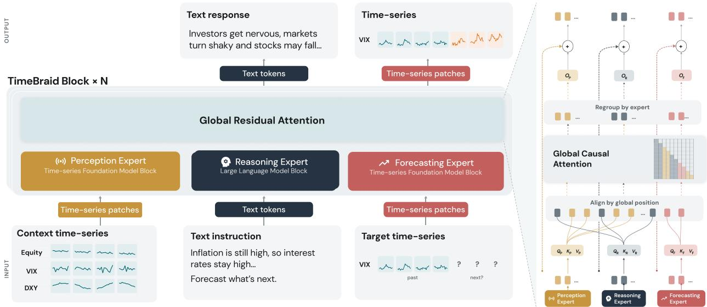  
Figure 3. TimeBraid architecture: the model components and the flow of information between the time-series <sub>an</sub>d l<sub>anguage</sub> <sub>mo</sub>d<sub>a</sub>liti<sub>es.</sub>

<sub>w</sub>h<sub>ere</sub> $W _ { r } ^ { Q } , W _ { r } ^ { K } , W _ { r } ^ { V } \in \mathbb { R } ^ { d _ { r } \times d }$ <sub>map</sub> <sub>eac</sub>h <sub>s</sub>t<sub>ream</sub> t<sub>o</sub> th<sub>e</sub> <sub>s</sub>h<sub>are</sub>d <sub>w</sub>idth<sub>,</sub> $\phi _ { r }$ is a stream-s<sub>p</sub>ecific RMSNorm <sub>on</sub> hidd<sub>en s</sub>t<sub>a</sub>t<sub>es, an</sub>d $\psi _ { r } ^ { Q } , \psi _ { r } ^ { K }$ are per-head RMSNorms on queries and keys. The projected tokens <sub>o</sub>f b<sub>o</sub>th <sub>s</sub>t<sub>reams</sub> <sub>are</sub> <sub>reor</sub>d<sub>ere</sub>d i<sub>n</sub>t<sub>o</sub> <sub>s</sub>i<sub>ng</sub>l<sub>e</sub> <sub>g</sub>l<sub>o</sub>b<sub>a</sub>l <sub>sequences</sub> $\tilde { Q } , \tilde { K } , \tilde { V }$ b<sub>y</sub> th<sub>e</sub>i<sub>r</sub> ti<sub>me</sub>li<sub>ne</sub> <sub>pos</sub>iti<sub>ons</sub> <sub>�</sub> <sub>an</sub>d attended jointly under a causal mask,

$$
O = \mathrm { A t t e n t i o n } \big ( \mathrm { R o P E } _ { \tau } ( \tilde { Q } ) , \mathrm { R o P E } _ { \tau } ( \tilde { K } ) , \tilde { V } \big ) , \qquad H _ { r } \gets H _ { r } + O _ { r } W _ { r } ^ { O } ,\tag{2}
$$

<sub>w</sub>h<sub>ere</sub> $O _ { r }$ d<sub>eno</sub>t<sub>es</sub> th<sub>e rows o</sub>f � b<sub>e</sub>l<sub>ong</sub>i<sub>ng</sub> t<sub>o s</sub>t<sub>ream �, rou</sub>t<sub>e</sub>d b<sub>ac</sub>k t<sub>o</sub> th<sub>e</sub>i<sub>r or</sub>i<sub>g</sub>i<sub>na</sub>l <sub>pos</sub>iti<sub>ons, an</sub>d th<sub>e</sub> output projections $W _ { r } ^ { O } \in \mathbb { R } ^ { d \times d _ { r } }$ <sub>are</sub> <sub>zero-</sub>i<sub>n</sub>iti<sub>a</sub>li<sub>ze</sub>d <sub>so</sub> th<sub>a</sub>t <sub>eac</sub>h <sub>g</sub>l<sub>o</sub>b<sub>a</sub>l l<sub>ayer</sub> <sub>s</sub>t<sub>ar</sub>t<sub>s</sub> <sub>as</sub> <sub>an</sub> id<sub>en</sub>tit<sub>y</sub> <sub>map.</sub> A t<sub>ex</sub>t t<sub>o</sub>k<sub>en</sub> th<sub>us a</sub>tt<sub>en</sub>d<sub>s</sub> t<sub>o a</sub>ll <sub>ear</sub>li<sub>er</sub> t<sub>o</sub>k<sub>ens o</sub>f b<sub>o</sub>th <sub>mo</sub>d<sub>a</sub>liti<sub>es, an</sub>d <sub>a pa</sub>t<sub>c</sub>h t<sub>o</sub>k<sub>en</sub> d<sub>oes</sub> th<sub>e same.</sub> Th<sub>e cross-mo</sub>d<sub>a</sub>l i<sub>n</sub>f<sub>orma</sub>ti<sub>on</sub> i<sub>s exc</sub>h<sub>ange</sub>d t<sub>o</sub>k<sub>en-</sub>t<sub>o-</sub>t<sub>o</sub>k<sub>en</sub> i<sub>n</sub> b<sub>o</sub>th di<sub>rec</sub>ti<sub>ons, ena</sub>bli<sub>ng</sub> fl<sub>ex</sub>ibl<sub>e an</sub>d <sub>r</sub>i<sub>c</sub>h i<sub>n</sub>t<sub>erac</sub>ti<sub>ons</sub> b<sub>e</sub>t<sub>ween</sub> ti<sub>me-ser</sub>i<sub>es an</sub>d t<sub>ex</sub>t<sub>.</sub>

Disentangled Positional Embeddings. We use three kinds of positional embeddings: (1) the lan<sub>g</sub>ua<sub>g</sub>e tower a<sub>pp</sub>lies rotar<sub>y</sub> embeddin<sub>g</sub>s (RoPE) inside its native blocks, on the <sub>p</sub>atch-ex<sub>p</sub>anded <sub>p</sub>ositions, (2) the time-series tower a<sub>pp</sub>lies its native <sub>p</sub>ositions locall<sub>y</sub> within each se<sub>g</sub>ment, restartin<sub>g</sub> at ever<sub>y</sub> se<sub>g</sub>ment, (3) the residual attention a<sub>pp</sub>lies RoPE on the shared <sub>g</sub>lobal ordered <sub>p</sub>ositions � (E<sub>q</sub>. 2), where both modalities are <sub>p</sub>laced on one se<sub>q</sub>uential axis. Al<sub>g</sub>orithm 1 in A<sub>pp</sub>endix C <sub>g</sub>ives <sub>pseu</sub>d<sub>oco</sub>d<sub>e</sub> f<sub>or</sub> th<sub>e</sub> f<sub>u</sub>ll f<sub>orwar</sub>d <sub>pass.</sub>

## 3.3 Training and Inference

Joint Training Loss. Time-series and language modeling are jointly optimized with separate losses. T<sub>ex</sub>t t<sub>arge</sub>t<sub>s</sub> <sub>are</sub> t<sub>ra</sub>i<sub>ne</sub>d <sub>w</sub>ith th<sub>e</sub> <sub>s</sub>t<sub>an</sub>d<sub>ar</sub>d <sub>nex</sub>t<sub>-</sub>t<sub>o</sub>k<sub>en</sub> <sub>cross-en</sub>t<sub>ropy</sub> l<sub>oss</sub> $\mathcal { L } _ { \mathrm { C E } }$ . Time-series tar<sub>g</sub>ets are su<sub>p</sub>ervised autore<sub>g</sub>ressivel<sub>y</sub> via Multi-Patch Prediction (MPP): ever<sub>y</sub> <sub>p</sub>atch of a tar<sub>g</sub>et se<sub>g</sub>ment is <sub>pre</sub>di<sub>c</sub>t<sub>e</sub>d f<sub>rom</sub> it<sub>s</sub> <sub>prece</sub>di<sub>ng</sub> <sub>con</sub>t<sub>ex</sub>t<sub>,</sub> <sub>an</sub>d <sub>eac</sub>h <sub>pre</sub>di<sub>c</sub>t<sub>e</sub>d <sub>pa</sub>t<sub>c</sub>h i<sub>ncurs</sub> <sub>a</sub> <sub>po</sub>i<sub>n</sub>t t<sub>erm</sub> <sub>an</sub>d <sub>a</sub> <sub>quan</sub>til<sub>e</sub>

<sup>t</sup>erm,

$$
\mathcal { L } _ { \mathrm { T S } } = \frac { 1 } { \lvert \mathcal { T } \rvert } \sum _ { t \in \mathcal { T } } \left[ \left. \hat { y } _ { t } - y _ { t } \right. _ { 2 } ^ { 2 } + \frac { 1 } { \lvert Q \rvert } \sum _ { q \in \mathcal { Q } } \operatorname* { m a x } \big ( q \left( y _ { t } - \hat { y } _ { t } ^ { ( q ) } \right) , \ ( q - 1 ) \left( y _ { t } - \hat { y } _ { t } ^ { ( q ) } \right) \big ) \right] ,\tag{3}
$$

<sub>w</sub>h<sub>ere</sub> $\mathcal { T }$ i<sub>n</sub>d<sub>exes</sub> th<sub>e</sub> t<sub>arge</sub>t <sub>pa</sub>t<sub>c</sub>h<sub>es o</sub>f th<sub>e examp</sub>l<sub>e,</sub> $y _ { t }$ i<sub>s</sub> th<sub>e</sub> �<sub>-</sub>th <sub>s</sub>t<sub>an</sub>d<sub>ar</sub>di<sub>ze</sub>d t<sub>arge</sub>t <sub>pa</sub>t<sub>c</sub>h<sub>,</sub> $\hat { y } _ { t }$ it<sub>s</sub> <sub>po</sub>i<sub>n</sub>t <sub>pre</sub>di<sub>c</sub>ti<sub>on, an</sub>d $\hat { y } _ { t } ^ { ( q ) }$ it<sub>s pre</sub>di<sub>c</sub>ti<sub>on a</sub>t <sub>quan</sub>til<sub>e</sub> $q \in Q = \{ 0 . 1 , 0 . 2 , \ldots , 0 . 9 \}$ <sub>;</sub> th<sub>e secon</sub>d t<sub>erm</sub> i<sub>s</sub> th<sub>e</sub> pinball loss. We use the point regression to describe the central trajectory and the quantile term to capture the predictive distribution and uncertainty. The total objective is $\mathcal { L } = \mathcal { L } _ { \mathrm { C E } } + \alpha \mathcal { L } _ { \mathrm { T S } }$

Stabilizing the Joint Optimization. The language and time-series losses have diferent optimization characteristics, and naive joint training leads to inefective learning. We observe that on strongly <sub>non-s</sub>t<sub>a</sub>ti<sub>onary segmen</sub>t<sub>s, w</sub>h<sub>ere</sub> th<sub>e</sub> f<sub>u</sub>t<sub>ure</sub> d<sub>epar</sub>t<sub>s</sub> f<sub>rom</sub> th<sub>e</sub> hi<sub>s</sub>t<sub>ory s</sub>t<sub>a</sub>ti<sub>s</sub>ti<sub>cs,</sub> th<sub>e regress</sub>i<sub>on</sub> l<sub>oss</sub> $\mathcal { L } _ { \mathrm { T S } }$ <sub>can sp</sub>ik<sub>e</sub> b<sub>y or</sub>d<sub>ers o</sub>f <sub>magn</sub>it<sub>u</sub>d<sub>e, an</sub>d th<sub>e sp</sub>ik<sub>es</sub> di<sub>srup</sub>t l<sub>anguage-s</sub>id<sub>e</sub> l<sub>earn</sub>i<sub>ng</sub> th<sub>roug</sub>h th<sub>e s</sub>h<sub>are</sub>d backbone updates. We address this with two techniques. First, robust normalization: during the <sub>causa</sub>l R<sub>ev</sub>IN <sub>norma</sub>li<sub>za</sub>ti<sub>on,</sub> <sub>eac</sub>h <sub>raw</sub> t<sub>arge</sub>t <sub>va</sub>l<sub>ue</sub> <sub>�</sub> i<sub>s</sub> t<sub>rans</sub>f<sub>orme</sub>d <sub>as</sub> $y = \mathrm { a s i n h } \big ( ( x - \mu ) / \sigma \big )$ <sub>,</sub> <sub>w</sub>h<sub>ere</sub> $\mu$ <sub>an</sub>d <sub>�</sub> <sub>are</sub> th<sub>e</sub> <sub>ro</sub>lli<sub>ng</sub> hi<sub>s</sub>t<sub>ory</sub> <sub>s</sub>t<sub>a</sub>ti<sub>s</sub>ti<sub>cs</sub> <sub>o</sub>f th<sub>e</sub> R<sub>ev</sub>IN <sub>s</sub>t<sub>ep,</sub> <sub>pro</sub>d<sub>uc</sub>i<sub>ng</sub> th<sub>e</sub> <sub>s</sub>t<sub>an</sub>d<sub>ar</sub>di<sub>ze</sub>d t<sub>arge</sub>t<sub>s</sub> i<sub>n</sub> E<sub>q.</sub> 3<sub>.</sub> Th<sub>e</sub> <sub>map</sub> i<sub>s</sub> li<sub>near</sub> <sub>near</sub> <sub>zero</sub> <sub>an</sub>d l<sub>ogar</sub>ith<sub>m</sub>i<sub>c</sub> i<sub>n</sub> th<sub>e</sub> t<sub>a</sub>il<sub>s,</sub> <sub>so</sub> <sub>ex</sub>t<sub>reme</sub> t<sub>arge</sub>t<sub>s</sub> <sub>are</sub> <sub>compresse</sub>d i<sub>n</sub>t<sub>o</sub> <sub>a</sub> bounded range. Second, loss capping: the time-series loss of each response is rescaled by the detached factor � = min1, �/stop\_gradient(ℓ), where ℓ is the response’s time-series loss value and � is a fixed ca<sub>p</sub> threshold (A<sub>pp</sub>endix C). This ca<sub>p</sub>s the value and <sub>g</sub>radient contribution of outlier res<sub>p</sub>onses and l<sub>eaves</sub> i<sub>n-range</sub> <sub>responses</sub> <sub>unc</sub>h<sub>ange</sub>d<sub>.</sub>

Training Setup. The alignment and supervised fine-tuning stages train all parameters (the language tower, the time-series tower, and the residual attention la<sub>y</sub>ers) with AdamW, usin<sub>g</sub> a 500-ste<sub>p</sub> warmu<sub>p</sub> <sub>an</sub>d <sub>a cons</sub>i<sub>s</sub>t<sub>en</sub>t l<sub>earn</sub>i<sub>ng ra</sub>t<sub>e o</sub>f $2 \times 1 0 ^ { - 5 }$ f<sub>or</sub> b<sub>o</sub>th <sub>mo</sub>d<sub>a</sub>liti<sub>es,</sub> <sub>a</sub> l<sub>oss</sub> <sub>we</sub>i<sub>g</sub>ht <sub>o</sub>f $\alpha = 0 . 5$ f<sub>or</sub> th<sub>e</sub> time-series loss to reflect the o<sub>p</sub>timal learnin<sub>g</sub> rate ratio (Section 4.3), a <sub>g</sub>lobal batch size of 128, and BF16 <sub>prec</sub>i<sub>s</sub>i<sub>on</sub> f<sub>or</sub> t<sub>ra</sub>i<sub>n</sub>i<sub>ng e</sub>fi<sub>c</sub>i<sub>ency.</sub> Th<sub>e a</sub>li<sub>gnmen</sub>t <sub>s</sub>t<sub>age uses con</sub>t<sub>ex</sub>t l<sub>eng</sub>th 2<sub>,</sub>560 <sub>an</sub>d i<sub>s</sub> t<sub>ra</sub>i<sub>ne</sub>d f<sub>o</sub>r <sub>o</sub>n<sub>e</sub> <sub>epoc</sub>h<sub>;</sub> th<sub>e</sub> <sub>supe</sub>rvi<sub>se</sub>d fin<sub>e</sub>-t<sub>u</sub>nin<sub>g</sub> <sub>s</sub>t<sub>age</sub> <sub>uses</sub> <sub>co</sub>nt<sub>e</sub>xt l<sub>e</sub>n<sub>g</sub>th 4<sub>,</sub>096 <sub>a</sub>nd tr<sub>a</sub>in<sub>s</sub> f<sub>o</sub>r 30k <sub>s</sub>t<sub>eps.</sub>

Text Strength Modulation at Inference Time. Text ranges from decisive (a verified maintenance schedule for server load) to barel<sub>y</sub> informative (nois<sub>y</sub> commentar<sub>y</sub> on a financial series), and the hi<sub>s</sub>t<sub>ory</sub> it<sub>se</sub>lf <sub>ranges</sub> f<sub>rom</sub> <sub>regu</sub>l<sub>ar</sub> <sub>ser</sub>i<sub>es</sub> th<sub>a</sub>t l<sub>arge</sub>l<sub>y</sub> <sub>pre</sub>di<sub>c</sub>t th<sub>emse</sub>l<sub>ves</sub> t<sub>o</sub> <sub>vo</sub>l<sub>a</sub>til<sub>e</sub> <sub>ones</sub> <sub>w</sub>h<sub>ose</sub> <sub>nex</sub>t <sub>w</sub>i<sub>n</sub>d<sub>ow</sub> hi<sub>nges</sub> <sub>on</sub> <sub>s</sub>t<sub>a</sub>t<sub>e</sub>d <sub>even</sub>t<sub>s.</sub> F<sub>or</sub> <sub>a</sub> <sub>mo</sub>d<sub>a</sub>lit<sub>y</sub> thi<sub>s</sub> h<sub>e</sub>t<sub>erogeneous,</sub> <sub>we</sub> <sub>expose</sub> th<sub>e</sub> <sub>con</sub>diti<sub>on</sub>i<sub>ng</sub> <sub>s</sub>t<sub>reng</sub>th <sub>as</sub> <sub>an</sub> i<sub>n</sub>f<sub>erence-</sub>ti<sub>me</sub> <sub>mo</sub>d<sub>u</sub>l<sub>a</sub>ti<sub>on.</sub> Si<sub>nce</sub> $s _ { \mathrm { t } s , T }$ <sub>can</sub> b<sub>e pre</sub>di<sub>c</sub>t<sub>e</sub>d <sub>e</sub>ith<sub>er</sub> f<sub>rom</sub> $s _ { \mathrm { t } s , C }$ alone or jointly f<sub>rom</sub> $s _ { \mathrm { t } s , C }$ <sub>an</sub>d $s _ { \mathrm { t e x t } } .$ <sub>,</sub> <sub>query</sub>i<sub>ng</sub> th<sub>e</sub> <sub>mo</sub>d<sub>e</sub>l <sub>un</sub>d<sub>er</sub> th<sub>e</sub> t<sub>wo</sub> <sub>con</sub>diti<sub>on</sub>i<sub>ng</sub> <sub>mo</sub>d<sub>es</sub> <sub>y</sub>i<sub>e</sub>ld<sub>s</sub> t<sub>wo</sub> <sub>po</sub>i<sub>n</sub>t <sub>pre</sub>di<sub>c</sub>ti<sub>ons,</sub> $\hat { y } _ { \mathrm { t s } }$ (time-series context onl<sub>y</sub>) and $\hat { y } _ { \mathrm { t e x t + t s } }$ (time-series and text contexts), which we inter<sub>p</sub>olate with a <sub>gu</sub>id<sub>ance</sub> <sub>we</sub>i<sub>g</sub>ht $\lambda \in [ 0 , 1 ]$ ,

$$
\hat { y } _ { \lambda } = \left( 1 - \lambda \right) \hat { y } _ { \mathrm { t s } } + \lambda \hat { y } _ { \mathrm { t e x t + t s } } .\tag{4}
$$

A <sub>sma</sub>ll � l<sub>eans</sub> <sub>on</sub> th<sub>e</sub> <sub>g</sub>l<sub>o</sub>b<sub>a</sub>l t<sub>empora</sub>l <sub>regu</sub>l<sub>ar</sub>iti<sub>es</sub> <sub>o</sub>f th<sub>e</sub> <sub>ser</sub>i<sub>es,</sub> <sub>w</sub>hil<sub>e</sub> <sub>a</sub> l<sub>arge</sub> � k<sub>eeps</sub> th<sub>e</sub> f<sub>orecas</sub>t <sub>sens</sub>iti<sub>ve</sub> t<sub>o</sub> th<sub>e</sub> t<sub>ex</sub>t <sub>w</sub>ithi<sub>n</sub> th<sub>e</sub> h<sub>or</sub>i<sub>zon</sub> it d<sub>escr</sub>ib<sub>es.</sub> It <sub>prov</sub>id<sub>es</sub> <sub>more</sub> fl<sub>ex</sub>ibilit<sub>y</sub> f<sub>or</sub> th<sub>e</sub> <sub>mo</sub>d<sub>e</sub>l t<sub>o</sub> <sub>a</sub>d<sub>ap</sub>t <sub>across</sub> d<sub>oma</sub>i<sub>ns an</sub>d i<sub>npu</sub>t<sub>s o</sub>f <sub>cer</sub>t<sub>a</sub>i<sub>n</sub>t<sub>y.</sub>

## 4 Experiments

W<sub>e eva</sub>l<sub>ua</sub>t<sub>e</sub> Ti<sub>me</sub>B<sub>ra</sub>id <sub>on</sub> ti<sub>me-ser</sub>i<sub>es un</sub>d<sub>ers</sub>t<sub>an</sub>di<sub>ng an</sub>d f<sub>orecas</sub>ti<sub>ng, cover</sub>i<sub>ng percep</sub>ti<sub>on, ques</sub>ti<sub>on</sub> <sub>answer</sub>i<sub>ng an</sub>d <sub>reason</sub>i<sub>ng, con</sub>t<sub>ex</sub>t<sub>ua</sub>l d<sub>escr</sub>i<sub>p</sub>ti<sub>on, an</sub>d <sub>con</sub>t<sub>ex</sub>t<sub>ua</sub>l<sub>, con</sub>t<sub>ro</sub>ll<sub>e</sub>d<sub>, an</sub>d <sub>un</sub>i<sub>mo</sub>d<sub>a</sub>l f<sub>orecas</sub>ti<sub>ng.</sub>

C<sub>ompar</sub>i<sub>sons</sub> i<sub>nc</sub>l<sub>u</sub>d<sub>e genera</sub>l<sub>-purpose</sub> l<sub>anguage an</sub>d <sub>v</sub>i<sub>s</sub>i<sub>on–</sub>l<sub>anguage mo</sub>d<sub>e</sub>l<sub>s, spec</sub>i<sub>a</sub>li<sub>ze</sub>d ti<sub>me-ser</sub>i<sub>es</sub> <sub>mo</sub>d<sub>e</sub>l<sub>s,</sub> <sub>an</sub>d <sub>un</sub>ifi<sub>e</sub>d <sub>mo</sub>d<sub>e</sub>l<sub>s.</sub> E<sub>va</sub>l<sub>ua</sub>ti<sub>on</sub> <sub>pro</sub>t<sub>oco</sub>l<sub>s,</sub> d<sub>a</sub>t<sub>a</sub> <sub>sources,</sub> <sub>re</sub>l<sub>a</sub>ti<sub>ons</sub>hi<sub>ps</sub> t<sub>o</sub> th<sub>e</sub> t<sub>ra</sub>i<sub>n</sub>i<sub>ng</sub> <sub>m</sub>i<sub>x</sub>t<sub>ure,</sub> <sub>an</sub>d <sub>comp</sub>l<sub>e</sub>t<sub>e resu</sub>lt<sub>s are</sub> d<sub>e</sub>t<sub>a</sub>il<sub>e</sub>d i<sub>n</sub> A<sub>ppen</sub>di<sub>ces</sub> B<sub>.</sub>3<sub>,</sub> E<sub>, an</sub>d F<sub>.</sub> I<sub>n ma</sub>i<sub>n-</sub>t<sub>ex</sub>t t<sub>a</sub>bl<sub>es,</sub> b<sub>o</sub>ld <sub>an</sub>d <sub>un</sub>d<sub>er</sub>li<sub>n</sub>i<sub>ng</sub> <sub>mar</sub>k th<sub>e</sub> b<sub>es</sub>t <sub>an</sub>d <sub>secon</sub>d<sub>-</sub>b<sub>es</sub>t <sub>va</sub>l<sub>ues</sub> i<sub>n</sub> th<sub>e</sub> <sub>pr</sub>i<sub>mary</sub> <sub>compar</sub>i<sub>son.</sub> D<sub>e</sub>t<sub>a</sub>il<sub>e</sub>d <sub>appen</sub>di<sub>x</sub> t<sub>a</sub>bl<sub>es</sub> <sub>a</sub>l<sub>so</sub> <sub>mar</sub>k thi<sub>r</sub>d<sub>-</sub>b<sub>es</sub>t <sub>va</sub>l<sub>ues w</sub>ith d<sub>aggers.</sub> D<sub>as</sub>h<sub>es</sub> i<sub>n</sub>di<sub>ca</sub>t<sub>e unava</sub>il<sub>a</sub>bl<sub>e or non-compara</sub>bl<sub>e resu</sub>lt<sub>s.</sub>

## 4.1 Time-Series Understanding

Table 1. Time-series understanding accuracy (%) on TSAQA (per-category and overall), TimeSeriesExam (TSExam), and the 16 Tem<sub>p</sub>oralBench multi<sub>p</sub>le-choice tasks (TB-MCQ, unwei<sub>g</sub>hted macro-avera<sub>g</sub>e). The Cl<sub>ose</sub>d<sub>-source</sub> R<sub>e</sub>f<sub>erence</sub> M<sub>o</sub>d<sub>e</sub>l<sub>s group prov</sub>id<sub>es re</sub>f<sub>erences exc</sub>l<sub>u</sub>d<sub>e</sub>d f<sub>rom ran</sub>ki<sub>ng.</sub> A<sub>.</sub>D<sub>.: anoma</sub>l<sub>y</sub> d<sub>e</sub>t<sub>ec</sub>ti<sub>on;</sub> CLS<sub>: c</sub>l<sub>ass</sub>ifi<sub>ca</sub>ti<sub>on;</sub> Ch<sub>ar.: c</sub>h<sub>arac</sub>t<sub>er</sub>i<sub>za</sub>ti<sub>on;</sub> C<sub>omp.: compar</sub>i<sub>son;</sub> D<sub>.</sub>T<sub>.:</sub> d<sub>a</sub>t<sub>a</sub> t<sub>rans</sub>f<sub>orma</sub>ti<sub>on;</sub> T<sub>.</sub>R<sub>.:</sub> t<sub>empora</sub>l r<sub>e</sub>lati<sub>o</sub>n<sub>;</sub> PZ<sub>:</sub> <sub>pu</sub>zzlin<sub>g</sub>/<sub>o</sub>rd<sub>e</sub>rin<sub>g</sub> f<sub>o</sub>rmat<sub>.</sub> Char<sub>.</sub>/C<sub>o</sub>m<sub>p.</sub>/D<sub>.</sub>T<sub>.</sub>/T<sub>.</sub>R<sub>.</sub> r<sub>epo</sub>rt th<sub>e</sub> m<sub>u</sub>lti<sub>p</sub>l<sub>e</sub>-ch<sub>o</sub>ic<sub>e</sub> f<sub>o</sub>rmat<sub>.</sub> SFT d<sub>e</sub>n<sub>o</sub>t<sub>es</sub> TSAQA-s<sub>p</sub>ecific LoRA fine-tunin<sub>g</sub> (Jin<sub>g</sub> et al., 2026). Per-format and <sub>p</sub>er-cate<sub>g</sub>or<sub>y</sub> results are in Tables 13, 12, and 16.
<table><tr><td rowspan="2">Model</td><td colspan="8">TSAQA</td><td rowspan="2">TSExam</td><td>TB-MCQ</td></tr><tr><td>A.D.↑</td><td>CLS↑</td><td>Char.↑</td><td>Comp.↑</td><td>D.T.↑</td><td>T.R.↑</td><td>PZ↑</td><td>Overall↑</td><td>Overall ↑ Avg. ↑</td></tr><tr><td>Closed-source Reference Models</td><td></td><td></td><td></td><td></td><td></td><td></td><td></td><td></td><td></td><td></td></tr><tr><td>GPT-5.4</td><td>53.32</td><td>49.57</td><td>81.98</td><td>74.47</td><td>54.94</td><td>82.96</td><td>51.02</td><td>63.10</td><td>67.83</td><td>38.50</td></tr><tr><td>GPT-4.1</td><td>55.85</td><td>50.38</td><td>89.36</td><td>76.99</td><td>51.13</td><td>79.09</td><td>45.77</td><td>62.82</td><td>67.89</td><td>36.91</td></tr><tr><td>GPT-40</td><td>54.32</td><td>47.20</td><td>84.15</td><td>69.07</td><td>53.24</td><td>75.58</td><td>45.61</td><td>60.73</td><td>55.96</td><td>32.30</td></tr><tr><td>Gemini-2.5-Flash</td><td>52.08</td><td>49.07</td><td>81.08</td><td>72.21</td><td>60.17</td><td>84.49</td><td>60.84</td><td>65.08</td><td>53.89</td><td>34.61</td></tr><tr><td colspan="3">Open-source Large Language Models</td><td></td><td></td><td></td><td></td><td></td><td></td><td></td><td></td></tr><tr><td>Qwen3-8B</td><td></td><td>50.6050.52</td><td>66.87</td><td>63.21</td><td>34.46</td><td>67.14</td><td>21.93</td><td>51.04</td><td>46.66</td><td>32.43</td></tr><tr><td>LLaMA3.1-8B</td><td>54.92</td><td>50.20</td><td>62.26</td><td>49.98</td><td>36.56</td><td>40.95</td><td>6.80</td><td>44.93</td><td>35.52</td><td>25.88</td></tr><tr><td colspan="3">Time-Series Language Models</td><td></td><td></td><td></td><td></td><td></td><td></td><td></td><td></td></tr><tr><td>ChatTS</td><td>49.42</td><td>52.08</td><td>60.43</td><td>58.27</td><td>30.29</td><td>50.61</td><td>33.59</td><td>49.83</td><td>50.72</td><td>24.90</td></tr><tr><td>TimeOmni-1-7B</td><td>50.98</td><td>56.47</td><td>59.06</td><td>44.55</td><td>28.39</td><td>40.79</td><td>30.93</td><td>44.40</td><td>35.25</td><td>25.67</td></tr><tr><td colspan="3">Unified Models</td><td></td><td></td><td></td><td></td><td></td><td></td><td></td><td></td></tr><tr><td>ChatTime-7B</td><td>50.20</td><td>43.47</td><td>27.29</td><td>25.14</td><td>25.15</td><td>23.80</td><td>27.87</td><td>38.38</td><td>41.94</td><td>28.45</td></tr><tr><td>TimeOmni-VL</td><td>50.82</td><td>51.15</td><td>44.18</td><td>28.87</td><td>23.55</td><td>23.63</td><td>15.52</td><td>39.27</td><td>49.06</td><td>32.32</td></tr><tr><td>TimeBraid-1.2B (Ours)</td><td>82.58</td><td>80.78</td><td>77.68</td><td>69.20</td><td>77.92</td><td>89.43</td><td>45.04</td><td>76.61</td><td>50.13</td><td>34.17</td></tr><tr><td>TimeBraid-2.5B (Ours)</td><td>83.23</td><td>79.25</td><td>80.05</td><td>72.86</td><td>82.92</td><td>91.71</td><td>48.36</td><td>78.31</td><td>60.05</td><td>35.74</td></tr><tr><td>TimeBraid-6.7B (Ours)</td><td>83.43</td><td>85.78</td><td>81.78</td><td>75.12</td><td>86.39</td><td>92.04</td><td>49.39</td><td>80.65</td><td>63.14</td><td>36.58</td></tr></table>

Perception, Question Answering, and Reasoning. The time-series understanding results are summarized in Table 1. TSAQA poses multi-format questions about a presented series, from perception <sub>su</sub>bt<sub>as</sub>k<sub>s</sub> <sub>suc</sub>h <sub>as</sub> <sub>anoma</sub>l<sub>y</sub> d<sub>e</sub>t<sub>ec</sub>ti<sub>on</sub> <sub>an</sub>d <sub>c</sub>l<sub>ass</sub>ifi<sub>ca</sub>ti<sub>on</sub> t<sub>o</sub> <sub>reason</sub>i<sub>ng</sub> <sub>su</sub>bt<sub>as</sub>k<sub>s</sub> <sub>suc</sub>h <sub>as</sub> t<sub>empora</sub>l <sub>re</sub>l<sub>a</sub>ti<sub>ons</sub> and orderin<sub>g</sub>. TimeSeriesExam and the Tem<sub>p</sub>oralBench multi<sub>p</sub>le-choice suite (TB-MCQ) are exams of time-series concepts and temporal reasoning. TimeBraid-6.7B achieves 80.65% overall TSAQA accurac<sub>y,</sub> com<sub>p</sub>ared with 85.26% and 84.29% for the benchmark-s<sub>p</sub>ecific fine-tuned LLaMA3.1-8B and Qwen3-8B (Jin<sub>g</sub> et al., 2026), and 63.10% for GPT-5.4. TimeBraid-2.5B and TimeBraid-1.2B achieve 78.31% and 76.61%. All three variants remain competitive on TB-MCQ, with TimeBraid-6.7B landing within two points of GPT-5.4. TimeOmni-VL obtains 39.27% on TSAQA and 49.06% on

Tim<sub>e</sub>S<sub>e</sub>ri<sub>es</sub>Ex<sub>a</sub>m<sub>,</sub> wh<sub>e</sub>r<sub>e</sub> Tim<sub>e</sub>Br<sub>a</sub>id-6<sub>.</sub>7B r<sub>eac</sub>h<sub>es</sub> 63<sub>.</sub>14%<sub>.</sub> P<sub>e</sub>r-<sub>ca</sub>t<sub>ego</sub>r<sub>y</sub> br<sub>ea</sub>kd<sub>o</sub>wn<sub>s a</sub>r<sub>e p</sub>r<sub>o</sub>vid<sub>e</sub>d in Tables 12<sub>,</sub> 13<sub>,</sub> and 16.

Table 2. Contextual description on the CaTS-Bench human-rewritten split: five metrics of alignment with reference captions and the released Numeric Fidelity score, all in [0, 1]. The Closed-source Reference Models <sub>group prov</sub>id<sub>es re</sub>f<sub>erences exc</sub>l<sub>u</sub>d<sub>e</sub>d f<sub>rom ran</sub>ki<sub>ng.</sub> R<sub>ows mar</sub>k<sub>e</sub>d fi<sub>ne</sub>t<sub>une</sub>d <sub>are</sub> t<sub>ra</sub>i<sub>ne</sub>d <sub>on</sub> th<sub>e</sub> C<sub>a</sub>TS<sub>-</sub>B<sub>enc</sub>h t<sub>ra</sub>i<sub>n</sub>i<sub>ng sp</sub>lit<sub>;</sub> th<sub>e</sub> f<sub>u</sub>ll <sub>compar</sub>i<sub>son</sub> i<sub>s</sub> i<sub>n</sub> T<sub>a</sub>bl<sub>e</sub> 14<sub>.</sub>
<table><tr><td rowspan="2">Model</td><td colspan="5">Lexical and Semantic Alignment</td><td rowspan="2">Numeric ↑</td></tr><tr><td>DeBERTa-F1↑</td><td>SimCSE↑</td><td>BLEU↑</td><td>ROUGE-L ↑</td><td>METEOR ↑</td></tr><tr><td>Closed-source Reference Models</td><td></td><td></td><td></td><td></td><td></td><td></td></tr><tr><td>GPT-5.4</td><td>0.660</td><td>0.843</td><td>0.064</td><td>0.239</td><td>0.264</td><td>0.778</td></tr><tr><td>Gemini 2.0 Flash</td><td>0.694</td><td>0.884</td><td>0.113</td><td>0.283</td><td>0.304</td><td>0.757</td></tr><tr><td>GPT-40</td><td>0.685</td><td>0.886</td><td>0.090</td><td>0.259</td><td>0.314</td><td>0.739</td></tr><tr><td>Open-source Large Language Models</td><td></td><td></td><td></td><td></td><td></td><td></td></tr><tr><td>InternVL 2.5 38B</td><td>0.682</td><td>0.867</td><td>0.085</td><td>0.262</td><td>0.294</td><td>0.740</td></tr><tr><td>Gemma 3 27B</td><td>0.680</td><td>0.883</td><td>0.089</td><td>0.255</td><td>0.307</td><td>0.745</td></tr><tr><td>Idefics 2 (finetuned)</td><td>0.713</td><td>0.885</td><td>0.131</td><td>0.325</td><td>0.303</td><td>0.748</td></tr><tr><td>Llama 3.2 Vision (finetuned)</td><td>0.672</td><td>0.851</td><td>0.087</td><td>0.266</td><td>0.295</td><td>0.740</td></tr><tr><td>Phi-4 Multimodal (finetuned)</td><td>0.664</td><td>0.862</td><td>0.078</td><td>0.243</td><td>0.290</td><td>0.703</td></tr><tr><td>Time-Series Language Models</td><td></td><td></td><td></td><td></td><td></td><td></td></tr><tr><td>ChatTS</td><td>0.614</td><td>0.665</td><td>0.040</td><td>0.191</td><td>0.198</td><td>0.648</td></tr><tr><td>TimeOmni-1-7B</td><td>0.634</td><td>0.796</td><td>0.046</td><td>0.205</td><td>0.231</td><td>0.769</td></tr><tr><td>Unified Models</td><td></td><td></td><td></td><td></td><td></td><td></td></tr><tr><td>ChatTime-7B</td><td>0.371</td><td>0.234</td><td>0.004</td><td>0.032</td><td>0.030</td><td>0.077</td></tr><tr><td>TimeOmni-VL</td><td>0.598</td><td>0.568</td><td>0.027</td><td>0.179</td><td>0.165</td><td>0.370</td></tr><tr><td>TimeBraid-1.2B (Ours)</td><td>0.706</td><td>0.880</td><td>0.120</td><td>0.305</td><td>0.288</td><td>0.666</td></tr><tr><td>TimeBraid-2.5B (Ours)</td><td>0.708</td><td>0.885</td><td>0.121</td><td>0.307</td><td>0.289</td><td>0.670</td></tr><tr><td>TimeBraid-6.7B (Ours)</td><td>0.712</td><td>0.886</td><td>0.123</td><td>0.313</td><td>0.292</td><td>0.684</td></tr><tr><td></td><td></td><td></td><td></td><td></td><td></td><td></td></tr></table>

Contextual Description. Table 2 reports contextual description results on the CaTS-Bench human-<sub>rewr</sub>itt<sub>en sp</sub>lit<sub>, w</sub>h<sub>ere</sub> th<sub>e mo</sub>d<sub>e</sub>l <sub>wr</sub>it<sub>es a cap</sub>ti<sub>on</sub> f<sub>or a ser</sub>i<sub>es g</sub>i<sub>ven</sub> it<sub>s</sub> b<sub>ac</sub>k<sub>groun</sub>d <sub>con</sub>t<sub>ex</sub>t<sub>, score</sub>d f<sub>or a</sub>li<sub>gnmen</sub>t <sub>w</sub>ith h<sub>uman re</sub>f<sub>erences an</sub>d f<sub>or</sub> th<sub>e</sub> fid<sub>e</sub>lit<sub>y o</sub>f th<sub>e num</sub>b<sub>ers</sub> it <sub>c</sub>it<sub>es.</sub> I<sub>n</sub> th<sub>e pr</sub>i<sub>mary</sub> com<sub>p</sub>arison<sub>,</sub> TimeBraid-6.7B ranks second on DeBERTa-F1<sub>,</sub> BLEU<sub>,</sub> and ROUGE-L and achieves the b<sub>es</sub>t Si<sub>m</sub>CSE<sub>, w</sub>hil<sub>e</sub> Ti<sub>me</sub>B<sub>ra</sub>id<sub>-</sub>2<sub>.</sub>5B <sub>rema</sub>i<sub>ns secon</sub>d <sub>or</sub> thi<sub>r</sub>d <sub>on</sub> th<sub>e same a</sub>li<sub>gnmen</sub>t <sub>me</sub>t<sub>r</sub>i<sub>cs.</sub> All th<sub>ree</sub> <sub>var</sub>i<sub>an</sub>t<sub>s</sub> l<sub>ea</sub>d <sub>every o</sub>th<sub>er ser</sub>i<sub>es–</sub>t<sub>ex</sub>t <sub>mo</sub>d<sub>e</sub>l b<sub>y a w</sub>id<sub>e marg</sub>i<sub>n on every a</sub>li<sub>gnmen</sub>t <sub>me</sub>t<sub>r</sub>i<sub>c.</sub> N<sub>umer</sub>i<sub>c</sub> fid<sub>e</sub>lit<sub>y</sub> i<sub>s</sub> th<sub>e</sub>i<sub>r wea</sub>k<sub>es</sub>t <sub>ax</sub>i<sub>s,</sub> b<sub>e</sub>l<sub>ow</sub> th<sub>e genera</sub>l<sub>-purpose mo</sub>d<sub>e</sub>l<sub>s.</sub> Th<sub>e gap</sub> i<sub>s expec</sub>t<sub>e</sub>d<sub>:</sub> th<sub>e</sub> ti<sub>me-ser</sub>i<sub>es</sub> b<sub>ac</sub>kb<sub>one compresses eac</sub>h <sub>pa</sub>t<sub>c</sub>h <sub>o</sub>f 32 <sub>raw va</sub>l<sub>ues</sub> i<sub>n</sub>t<sub>o a s</sub>i<sub>ng</sub>l<sub>e em</sub>b<sub>e</sub>ddi<sub>ng, an</sub>d thi<sub>s re</sub>d<sub>uc</sub>ti<sub>on</sub> <sub>preserves s</sub>h<sub>ape an</sub>d d<sub>ynam</sub>i<sub>cs</sub> b<sub>u</sub>t l<sub>oses</sub> fi<sub>ne-gra</sub>i<sub>ne</sub>d l<sub>oca</sub>l <sub>va</sub>l<sub>ues.</sub> R<sub>esu</sub>lt<sub>s</sub> f<sub>or a</sub>ll <sub>eva</sub>l<sub>ua</sub>t<sub>e</sub>d <sub>mo</sub>d<sub>e</sub>l<sub>s are</sub> re<sub>p</sub>orted in Table 14.

## 4.2 Time-Series Forecasting

Contextual Forecasting. Table 3 reports contextual forecasting on real-world benchmarks, where Ti<sub>me</sub>MMD <sub>an</sub>d CGTSF <sub>pa</sub>i<sub>r ser</sub>i<sub>es</sub> f<sub>rom</sub> d<sub>oma</sub>i<sub>ns suc</sub>h <sub>as</sub> h<sub>ea</sub>lth<sub>, energy, an</sub>d t<sub>ra</sub>fi<sub>c w</sub>ith <sub>a</sub>li<sub>gne</sub>d t<sub>ex</sub>t<sub>.</sub> A<sub>mong</sub> th<sub>e</sub> <sub>mo</sub>d<sub>e</sub>l<sub>s</sub> <sub>s</sub>h<sub>own</sub> i<sub>n</sub> thi<sub>s</sub> <sub>summary</sub> t<sub>a</sub>bl<sub>e,</sub> <sub>a</sub> Ti<sub>me</sub>B<sub>ra</sub>id <sub>var</sub>i<sub>an</sub>t <sub>ran</sub>k<sub>s</sub> <sub>among</sub> th<sub>e</sub> t<sub>op</sub> th<sub>ree</sub> <sub>on</sub> ei<sub>g</sub>ht of the nine TimeMMD domains. TimeBraid attains the best Macro MSE and Macro MAE on CGTSF. Detailed results are <sub>p</sub>rovided in Tables 17 and 18.

Table 3. Real-world contextual forecasting. Every text-conditioned model receives the paired text of each window, and a starred name (PatchTST<sup>∗</sup>) marks a time-series backbone extended with a text branch. TimeMMD <sub>repor</sub>t<sub>s</sub> <sub>per-</sub>d<sub>oma</sub>i<sub>n</sub> MSE <sub>average</sub>d <sub>over</sub> f<sub>our</sub> h<sub>or</sub>i<sub>zons;</sub> Ti<sub>me</sub>B<sub>ra</sub>id<sub>,</sub> th<sub>e</sub> f<sub>oun</sub>d<sub>a</sub>ti<sub>on</sub> <sub>mo</sub>d<sub>e</sub>l<sub>s,</sub> <sub>an</sub>d MIGAS<sub>-</sub>1<sub>.</sub>5 <sub>use</sub> <sub>a</sub> fi<sub>xe</sub>d 128<sub>-s</sub>t<sub>ep</sub> hi<sub>s</sub>t<sub>ory, w</sub>hil<sub>e</sub> Ch<sub>a</sub>tTi<sub>me,</sub> A<sub>urora, an</sub>d th<sub>e</sub> t<sub>ex</sub>t<sub>-con</sub>diti<sub>one</sub>d <sub>superv</sub>i<sub>se</sub>d b<sub>ase</sub>li<sub>nes use</sub> th<sub>e o</sub>fi<sub>c</sub>i<sub>a</sub>l 8/36/96 l<sub>oo</sub>kb<sub>ac</sub>k<sub>s.</sub> CGTSF r<sub>epo</sub>rt<sub>s</sub> tr<sub>a</sub>inin<sub>g</sub>-<sub>sp</sub>lit-<sub>s</sub>t<sub>a</sub>nd<sub>a</sub>rdiz<sub>e</sub>d MSE <sub>o</sub>n MSPG<sub>,</sub> LEU<sub>, a</sub>nd PTF<sub>, a</sub>v<sub>e</sub>r<sub>age</sub>d <sub>o</sub>v<sub>e</sub>r f<sub>our</sub> hi<sub>s</sub>t<sub>ory-</sub>l<sub>eng</sub>th <sub>se</sub>tti<sub>ngs.</sub> Th<sub>e rema</sub>i<sub>n</sub>i<sub>ng</sub> b<sub>ase</sub>li<sub>nes,</sub> d<sub>e</sub>t<sub>a</sub>il<sub>e</sub>d <sub>resu</sub>lt<sub>s, an</sub>d f<sub>u</sub>ll <sub>mo</sub>d<sub>e</sub>l <sub>names are</sub> i<sub>n</sub> T<sub>a</sub>bl<sub>es</sub> 17 and 18.
<table><tr><td rowspan="2">Model</td><td colspan="9">TimeMMD (MSE ↓)</td><td rowspan="2">CGTSF (MSE↓)</td><td colspan="3"></td></tr><tr><td>Agri.</td><td>Clim.</td><td>Econ.</td><td>Ener.</td><td>Env.</td><td>Health</td><td>Sec.</td><td>Soc.</td><td>Traf.</td><td>MSPG</td><td>LEU</td><td>PTF</td></tr><tr><td colspan="9">Time-Series Foundation Models</td><td></td><td></td><td></td><td></td><td></td></tr><tr><td>TimesFM2.5</td><td>0.127</td><td>0.859</td><td>0.017</td><td>0.239</td><td>0.569</td><td></td><td>0.665</td><td>114.8</td><td>0.845</td><td>0.152</td><td>0.585</td><td>0.777</td><td>0.243</td></tr><tr><td>Chronos-2</td><td>0.085</td><td>0.988</td><td>0.015</td><td>0.262</td><td>0.566</td><td></td><td>1.217</td><td>110.3</td><td>1.110</td><td>0.201</td><td>0.649</td><td>0.715</td><td>0.230</td></tr><tr><td>Moirai</td><td>0.102</td><td>0.949</td><td>0.020</td><td>0.277</td><td>0.581</td><td></td><td>1.280</td><td>109.8</td><td>0.859</td><td>0.163</td><td>1.000</td><td>0.681</td><td>0.284</td></tr><tr><td>Sundial</td><td>0.102</td><td>0.865</td><td>0.022</td><td>0.266</td><td>0.561</td><td></td><td>1.240</td><td>111.7</td><td>0.856</td><td>0.160</td><td>0.763</td><td>0.683</td><td>0.242</td></tr><tr><td>TimeMoE</td><td>0.107</td><td>0.935</td><td>0.021</td><td>0.277</td><td>0.579</td><td></td><td>1.229</td><td>110.4</td><td>0.801</td><td>0.167</td><td>1.138</td><td>0.698</td><td>0.239</td></tr><tr><td colspan="2">Multimodal Forecasting Models</td><td></td><td></td><td></td><td></td><td></td><td></td><td></td><td></td><td></td><td></td><td></td><td></td></tr><tr><td>Aurora</td><td>0.109</td><td>1.428</td><td>0.040</td><td>0.367</td><td>0.597</td><td></td><td>2.000</td><td>120.7</td><td>1.155</td><td>0.322</td><td>0.789</td><td>0.757</td><td>0.336</td></tr><tr><td>MIGAS-1.5</td><td>0.086</td><td>0.983</td><td>0.015</td><td>0.242</td><td>0.671</td><td></td><td>1.302</td><td>109.9</td><td>1.110</td><td>0.200</td><td>0.757</td><td>0.887</td><td>0.386</td></tr><tr><td>Time-LLM</td><td>0.098</td><td>1.320</td><td>0.031</td><td>0.279</td><td>0.519</td><td></td><td>1.488</td><td>114.9</td><td>1.023</td><td>0.223</td><td>0.583</td><td>0.699</td><td>0.163</td></tr><tr><td>GPT4MTS</td><td>0.093</td><td>1.262</td><td>0.027</td><td>0.266</td><td>0.518</td><td></td><td>1.519</td><td>111.2</td><td>1.014</td><td>0.249</td><td>0.567</td><td>0.694</td><td>0.180</td></tr><tr><td>Time-VLM</td><td>0.093</td><td>1.282</td><td>0.020</td><td>0.253</td><td>0.494</td><td></td><td>1.482</td><td>113.0</td><td>1.068</td><td>0.229</td><td>0.818</td><td>0.725</td><td>0.175</td></tr><tr><td>PatchTST*</td><td>0.093</td><td>1.267</td><td>0.019</td><td>0.269</td><td>0.492</td><td></td><td>1.556</td><td>111.7</td><td>1.110</td><td>0.216</td><td>0.602</td><td>0.706</td><td>0.179</td></tr><tr><td colspan="2">Unified Models</td><td></td><td></td><td></td><td></td><td></td><td></td><td></td><td></td><td></td><td></td><td></td><td></td></tr><tr><td>ChatTime</td><td>0.130</td><td>2.279</td><td>0.071</td><td>0.365</td><td></td><td>1.099</td><td>2.516</td><td>144.3</td><td>1.227</td><td>0.505</td><td>2.727</td><td>1.015</td><td>0.359</td></tr><tr><td>TimeBraid-1.2B (Ours)</td><td>0.116</td><td>0.899</td><td>0.025</td><td>0.256</td><td>0.516</td><td></td><td>1.002</td><td>109.0</td><td>0.808</td><td>0.148</td><td>0.472</td><td>0.642</td><td>0.136</td></tr><tr><td>TimeBraid-2.5B (Ours)</td><td>0.137</td><td>0.871</td><td>0.025</td><td>0.235</td><td>0.507</td><td></td><td>0.956</td><td>108.9 108.6</td><td>0.839</td><td>0.145</td><td>0.467</td><td>0.644</td><td>0.133</td></tr><tr><td>TimeBraid-6.7B (Ours)</td><td>0.144</td><td>0.938</td><td>0.018</td><td>0.231</td><td>0.507</td><td></td><td>0.925</td><td></td><td>0.799</td><td>0.153</td><td>0.459</td><td>0.641</td><td>0.138</td></tr></table>

Controlled Forecasting. Controlled forecasting examines whether language can direct a model’s numerical <sub>p</sub>redictions (Table 4). We introduce Ctrl-F, a controlled-forecastin<sub>g</sub> evaluation set built from histories in the GIFT-Eval test set (Aksu et al., 2024), with multi<sub>p</sub>le deterministic, text-conditioned s<sub>y</sub>nthetic continuations for each histor<sub>y</sub>. TimeBraid-6.7B achieves 43.33% To<sub>p</sub>-1 accurac<sub>y</sub> a<sub>g</sub>ainst a 33<sub>.</sub>33% <sub>c</sub>h<sub>ance</sub> l<sub>eve</sub>l<sub>, s</sub>h<sub>ow</sub>i<sub>ng</sub> th<sub>a</sub>t t<sub>ex</sub>t<sub>ua</sub>l <sub>con</sub>diti<sub>ons can gu</sub>id<sub>e</sub> it<sub>s numer</sub>i<sub>ca</sub>l f<sub>orecas</sub>t<sub>s.</sub> CAF <sub>an</sub>d CiK <sub>ex</sub>t<sub>en</sub>d th<sub>e eva</sub>l<sub>ua</sub>ti<sub>on</sub> t<sub>o</sub> f<sub>orecas</sub>ti<sub>ng w</sub>ith i<sub>n</sub>f<sub>orma</sub>ti<sub>ve scenar</sub>i<sub>os an</sub>d <sub>con</sub>t<sub>ex</sub>t<sub>ua</sub>l k<sub>now</sub>l<sub>e</sub>d<sub>ge.</sub> Ti<sub>me</sub>B<sub>ra</sub>id<sub>-</sub> 6.7B achieves the lowest <sub>p</sub>ooled CRPS on CAF<sub>,</sub> while TimeBraid-2.5B <sub>p</sub>erforms com<sub>p</sub>arabl<sub>y</sub> to the <sub>s</sub>t<sub>ronges</sub>t li<sub>s</sub>t<sub>e</sub>d ti<sub>me-ser</sub>i<sub>es</sub> f<sub>oun</sub>d<sub>a</sub>ti<sub>on</sub> <sub>mo</sub>d<sub>e</sub>l <sub>on</sub> CiK<sub>.</sub> W<sub>e</sub> <sub>see</sub> th<sub>a</sub>t th<sub>e</sub> <sub>s</sub>t<sub>ronges</sub>t LLM<sub>s</sub> <sub>rema</sub>i<sub>n</sub> <sub>a</sub>h<sub>ea</sub>d <sub>on</sub> Ct<sub>r</sub>l<sub>-</sub>F <sub>an</sub>d CiK b<sub>ecause</sub> th<sub>ey</sub> <sub>can</sub> <sub>eas</sub>il<sub>y</sub> <sub>conver</sub>t th<sub>e</sub> <sub>con</sub>t<sub>ro</sub>l <sub>s</sub>i<sub>gna</sub>l t<sub>o</sub> <sub>ou</sub>t<sub>pu</sub>t <sub>an</sub>d h<sub>ave</sub> th<sub>e</sub> <sub>a</sub>d<sub>van</sub>t<sub>ages</sub> <sub>o</sub>f d<sub>eep</sub> <sub>reason</sub>i<sub>ng.</sub>

Table 4. Controlled forecasting with verifiable targets. The Closed-source Reference Models group provides <sub>re</sub>f<sub>erences</sub> <sub>exc</sub>l<sub>u</sub>d<sub>e</sub>d f<sub>rom</sub> <sub>ran</sub>ki<sub>ng.</sub> Ct<sub>r</sub>l<sub>-</sub>F<sub>:</sub> hi<sub>s</sub>t<sub>ory-�-norma</sub>li<sub>ze</sub>d MSE <sub>an</sub>d T<sub>op-</sub>1 <sub>correc</sub>t<sub>-s</sub>ibli<sub>ng</sub> <sub>re</sub>t<sub>r</sub>i<sub>eva</sub>l <sub>accuracy.</sub> CAF: normalized CRPS on all 904 correct-context test cases. CiK: RCRPS under oficial task wei<sub>g</sub>hts. Details in Tables 20<sub>,</sub> 19<sub>,</sub> and 15.
<table><tr><td rowspan="2">Model</td><td colspan="2">Ctrl-F</td><td>CAF</td><td>CiK</td></tr><tr><td>MSE↓</td><td>Top-1 (%) ↑</td><td>CRPS↓</td><td>RCRPS↓</td></tr><tr><td colspan="5">Closed-source Reference Models</td></tr><tr><td>GPT-5.4</td><td>5.188</td><td>51.33</td><td>0.233</td><td>0.145</td></tr><tr><td>GPT-40</td><td>5.447</td><td>60.00</td><td>0.234</td><td>0.257</td></tr><tr><td>Gemini-2.5-Flash</td><td>6.624</td><td>56.00</td><td>0.247</td><td>0.110</td></tr><tr><td colspan="5">Open-source Large Language Models DeepSeek-Chat</td></tr><tr><td>Time-Series Foundation Models</td><td>6.405</td><td>59.33</td><td>0.267</td><td>0.225</td></tr><tr><td colspan="5">Moirai</td></tr><tr><td>Chronos-2</td><td>8.425</td><td>33.33 33.33</td><td>0.275</td><td>0.288</td></tr><tr><td></td><td>8.597</td><td></td><td>0.277</td><td>0.295</td></tr><tr><td>TimesFM2.5</td><td>8.784</td><td>33.33 33.33</td><td>0.281</td><td>0.295</td></tr><tr><td>Sundial TimeMoE</td><td>8.829</td><td></td><td>0.331</td><td>0.314</td></tr><tr><td></td><td>9.077</td><td>33.33</td><td>0.414</td><td>0.327</td></tr><tr><td colspan="5">Multimodal Forecasting Models</td></tr><tr><td>Aurora</td><td>9.091</td><td>33.33</td><td>0.460</td><td>0.313</td></tr><tr><td>MIGAS-1.5</td><td>8.604</td><td>33.33</td><td>0.346</td><td>0.351</td></tr><tr><td colspan="5">Unified Models</td></tr><tr><td>ChatTime</td><td>9.165</td><td>33.33</td><td>0.345</td><td>0.344</td></tr><tr><td>TimeOmni-VL</td><td>10.387</td><td>32.00</td><td>0.489</td><td>0.655</td></tr><tr><td>TimeBraid-1.2B (Ours)</td><td>6.826</td><td>40.67</td><td>0.235</td><td>0.301</td></tr><tr><td>TimeBraid-2.5B (Ours)</td><td>6.972</td><td>40.67</td><td>0.235</td><td>0.289</td></tr><tr><td>TimeBraid-6.7B (Ours)</td><td>6.232</td><td>43.33</td><td>0.225</td><td>0.294</td></tr></table>

Unimodal Forecasting. TimeBraid also supports competitive short-term and long-term forecasting from numerical histories alone (Tables 5 and 6). On GIFT-Eval (Aksu et al., 2024), which s<sub>p</sub>ans diverse <sub>ser</sub>i<sub>es an</sub>d f<sub>orecas</sub>t l<sub>eng</sub>th<sub>s,</sub> it <sub>ou</sub>t<sub>per</sub>f<sub>orms</sub> th<sub>e</sub> li<sub>s</sub>t<sub>e</sub>d <sub>s</sub>t<sub>a</sub>ti<sub>s</sub>ti<sub>ca</sub>l <sub>an</sub>d t<sub>as</sub>k<sub>-spec</sub>ifi<sub>c superv</sub>i<sub>se</sub>d b<sub>ase</sub>li<sub>nes,</sub> <sub>w</sub>hil<sub>e</sub> th<sub>e s</sub>t<sub>ronges</sub>t <sub>spec</sub>i<sub>a</sub>li<sub>ze</sub>d f<sub>orecas</sub>ti<sub>ng</sub> f<sub>oun</sub>d<sub>a</sub>ti<sub>on mo</sub>d<sub>e</sub>l<sub>s rema</sub>i<sub>n a</sub>h<sub>ea</sub>d<sub>.</sub> O<sub>n</sub> th<sub>e</sub> l<sub>ong-</sub>h<sub>or</sub>i<sub>zon</sub> ETT <sub>an</sub>d W<sub>ea</sub>th<sub>er</sub> b<sub>enc</sub>h<sub>mar</sub>k<sub>s,</sub> Ti<sub>me</sub>B<sub>ra</sub>id<sub>-</sub>2<sub>.</sub>5B <sub>ac</sub>hi<sub>eves</sub> th<sub>e secon</sub>d<sub>-</sub>b<sub>es</sub>t <sub>average</sub> MSE <sub>ran</sub>k <sub>an</sub>d thi<sub>r</sub>d<sub>-</sub>b<sub>es</sub>t <sub>average</sub> MAE <sub>ran</sub>k<sub>.</sub> W<sub>e see</sub> th<sub>a</sub>t it l<sub>arge</sub>l<sub>y preserves</sub> th<sub>e un</sub>i<sub>mo</sub>d<sub>a</sub>l f<sub>orecas</sub>ti<sub>ng capa</sub>bilit<sub>y</sub> f<sub>rom</sub> Ti<sub>mes</sub>FM2<sub>.</sub>5<sub>, an</sub>d th<sub>e gap</sub> i<sub>s expec</sub>t<sub>e</sub>d t<sub>o</sub> b<sub>e re</sub>d<sub>uce</sub>d b<sub>y a more</sub> b<sub>a</sub>l<sub>ance</sub>d d<sub>a</sub>t<sub>a rec</sub>i<sub>pe.</sub>

Table 5. Aggregate GIFT-Eval forecasting performance. Lower is better.
<table><tr><td rowspan="2">Metric</td><td rowspan="2">TimeBraid (Ours)</td><td colspan="3">Statistical Methods</td><td colspan="4">Task-Specific Models (Supervised)</td><td colspan="8">Time Series Foundation Models</td></tr><tr><td>Naive</td><td>Seasonal Naive</td><td>Auto ARIMA</td><td>DeepAR</td><td>TiDE</td><td>N-BEATS</td><td>PatchTST</td><td>TimesFM 2.5</td><td>TabPFN-TS</td><td>Chronos 2</td><td>Moirai2</td><td>Sundial Base</td><td>TiRex</td><td>Toto-2.0 FnF</td><td>Chronicle</td></tr><tr><td>MASE</td><td>0.763</td><td>1.270</td><td>1.000</td><td>1.074</td><td>1.343</td><td>1.091</td><td>0.938</td><td>0.849</td><td>0.705</td><td>0.771</td><td>0.698</td><td>0.728</td><td>0.750</td><td>0.716</td><td>0.676</td><td>1.053</td></tr><tr><td>CRPS</td><td>0.546</td><td>1.591</td><td>1.000</td><td>0.912</td><td>0.853</td><td>0.772</td><td>0.816</td><td>0.587</td><td>0.490</td><td>0.544</td><td>0.485</td><td>0.516</td><td>0.559</td><td>0.488</td><td>0.463</td><td>0.754</td></tr></table>

Table 6. Unimodal forecasting on ETT and Weather. Each dataset entry averages MSE or MAE over horizons {96, 192, 336, 720}. Avg. rank aggregates the 20 dataset–horizon settings; lower is better. Per-horizon results ar<sub>e</sub> in Tabl<sub>e</sub> 21<sub>.</sub>
<table><tr><td rowspan="2">Dataset</td><td colspan="10">Zero-shot</td><td colspan="7">Full-shot</td></tr><tr><td>TimeBraid-2.5B MSE</td><td>MAE</td><td>SundialL MSE MAE</td><td>MSE</td><td>TimeMoEU MAE</td><td>MoiraiL MSE MAE</td><td>TimesFM2.5 MSE</td><td>MAE</td><td>Chronos-2 MSE MAE</td><td>MSE</td><td>iTransformer MAE</td><td>MSE</td><td>TimeMixer MAE</td><td>MSE</td><td>PatchTST MAE</td><td>MSE</td><td>DLinear MAE</td></tr><tr><td>ETTm1</td><td>0.373</td><td>0.375</td><td>0.331 0.369</td><td>0.356</td><td>0.391</td><td>0.422 0.391</td><td>0.375</td><td>0.370</td><td>0.373</td><td>0.356 0.407</td><td>0.409</td><td></td><td>0.381</td><td>0.395</td><td>0.387 0.400</td><td>0.403</td><td>0.406</td></tr><tr><td>ETTm2</td><td>0.256</td><td>0.311</td><td>0.254 0.315</td><td>0.288</td><td>0.344</td><td>0.329 0.343</td><td>0.271</td><td>0.305</td><td>0.254</td><td>0.291</td><td>0.288</td><td>0.332</td><td>0.275</td><td>0.323</td><td>0.280</td><td>0.326</td><td>0.3500.400</td></tr><tr><td>ETTh1</td><td>0.393</td><td>0.407</td><td>0.395 0.420</td><td>0.412</td><td>0.426</td><td>0.480 0.439</td><td>0.396</td><td>0.405</td><td>0.420 0.405</td><td>0.454</td><td>0.447</td><td>0.448</td><td></td><td>0.442</td><td>0.468 0.454</td><td>0.455</td><td>0.451</td></tr><tr><td>ETTh2</td><td>0.338</td><td>0.377</td><td>0.334 0.387</td><td>0.371</td><td>0.399</td><td>0.367 0.377</td><td>0.343</td><td>0.369</td><td>0.342 0.366</td><td>0.383</td><td>0.406</td><td></td><td>0.364</td><td>0.395</td><td>0.386 0.406</td><td>0.558</td><td>0.515</td></tr><tr><td>Weather</td><td>0.228</td><td>0.260</td><td>0.238 0.275</td><td>0.256</td><td>0.288</td><td>0.264 0.273</td><td>0.240</td><td>0.255</td><td>0.219</td><td>0.241 0.257</td><td></td><td>0.278</td><td>0.240</td><td>0.271</td><td>0.258</td><td>0.280 0.265</td><td>0.316</td></tr><tr><td>Avg. rank</td><td>2.48</td><td>3.45</td><td>2.23 4.15</td><td>5.20</td><td>6.72</td><td>8.05</td><td>6.00 3.83</td><td>2.25</td><td>2.80</td><td>1.20</td><td>8.10</td><td>8.07</td><td>5.67</td><td>5.80</td><td>7.72</td><td>7.88 8.93</td><td>9.47</td></tr></table>

## 4.3 Ablation Studies

W<sub>e</sub> <sub>organ</sub>i<sub>ze</sub> th<sub>e</sub> <sub>a</sub>bl<sub>a</sub>ti<sub>ons</sub> <sub>aroun</sub>d <sub>s</sub>i<sub>x</sub> <sub>researc</sub>h <sub>ques</sub>ti<sub>ons</sub> th<sub>a</sub>t <sub>ar</sub>i<sub>se</sub> <sub>w</sub>h<sub>en</sub> t<sub>ransp</sub>l<sub>an</sub>ti<sub>ng</sub> th<sub>e</sub> <sub>un</sub>ifi<sub>e</sub>d<sub>-</sub> multimodal reci e to time series: where the cross-modal interaction should live (RQ1), whether perception and forecasting need separate towers (RQ2), whether the two training objectives can coexist stably (RQ3), how learning rate and data should be split between them (RQ4), whether the alignment stage is necessary at all (RQ5), and how strongly the forecast should draw on text at inference (RQ6). For RQ1–RQ4, each panel of Figure 4 compares runs that are trained for 10k steps on th<sub>e</sub> <sub>a</sub>li<sub>gnmen</sub>t d<sub>a</sub>t<sub>ase</sub>t <sub>an</sub>d dif<sub>er</sub> <sub>on</sub>l<sub>y</sub> i<sub>n</sub> th<sub>e</sub> <sub>a</sub>bl<sub>a</sub>t<sub>e</sub>d f<sub>ac</sub>t<sub>or,</sub> <sub>an</sub>d <sub>we</sub> <sub>ana</sub>l<sub>yze</sub> th<sub>e</sub> l<sub>oss</sub> <sub>curves</sub> <sub>o</sub>f l<sub>anguage</sub> modeling loss and time-series loss. For RQ5, we compare full recipes on downstream benchmarks (Fi<sub>g</sub>ure 5); for RQ6, we swee<sub>p</sub> the inference-time text wei<sub>g</sub>ht of the final model (Fi<sub>g</sub>ure 6).

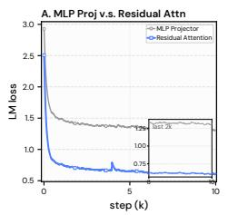

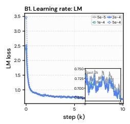

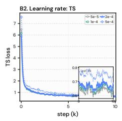

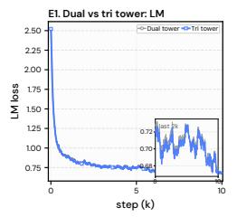

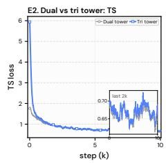

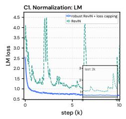

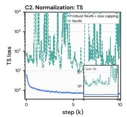

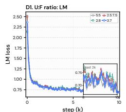

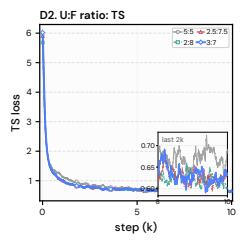  
Figure 4. Training-loss trajectories for the design ablations; each panel compares 10k-step runs that difer only in the ablated factor: (A) cross-modal interface, (B) shared learning rate, (C) plain vs. robust RevIN, (D) understanding-to-forecasting data ratio, (E) dual- vs. tri-tower. Insets zoom into the last 2k steps; lower is b<sub>e</sub>tt<sub>er.</sub>

RQ1: Interaction Space. We pivot the investigation of the proper interaction space on understanding t<sub>as</sub>k<sub>s.</sub> Th<sub>e ma</sub>i<sub>ns</sub>t<sub>ream mu</sub>lti<sub>mo</sub>d<sub>a</sub>l i<sub>n</sub>f<sub>orma</sub>ti<sub>on</sub> f<sub>us</sub>i<sub>on</sub> f<sub>or un</sub>d<sub>ers</sub>t<sub>an</sub>di<sub>ng</sub> i<sub>n v</sub>i<sub>s</sub>i<sub>on–</sub>l<sub>anguage mo</sub>d<sub>e</sub>l<sub>s</sub> is an MLP connector that projects the visual modality into the language representation space (Liu et al., 2023), and some time-series lan<sub>g</sub>ua<sub>g</sub>e models inherit this reci<sub>p</sub>e (Xie et al., 2024). Whether th<sub>e</sub> l<sub>anguage space</sub> i<sub>s an equa</sub>ll<sub>y goo</sub>d h<sub>os</sub>t f<sub>or</sub> t<sub>empora</sub>l <sub>represen</sub>t<sub>a</sub>ti<sub>ons</sub> h<sub>as no</sub>t b<sub>een</sub> f<sub>u</sub>ll<sub>y exam</sub>i<sub>ne</sub>d<sub>.</sub> Panel A compares the VLM-like MLP projector with the global residual attention we used in the final architecture. With the projector, the language loss plateaus early at roughly twice the level that <sub>res</sub>id<sub>ua</sub>l <sub>a</sub>tt<sub>en</sub>ti<sub>on reac</sub>h<sub>es, an</sub>d th<sub>e gap never c</sub>l<sub>oses.</sub> W<sub>e o</sub>b<sub>serve</sub> th<sub>a</sub>t th<sub>e</sub> l<sub>anguage space</sub> i<sub>s a poor</sub> projection target for temporal representations, and the time-series patches are often projected to b<sub>e g</sub>l<sub>o</sub>b<sub>a</sub>l <sub>s</sub>t<sub>a</sub>ti<sub>s</sub>ti<sub>cs suc</sub>h <sub>as mean an</sub>d <sub>s</sub>t<sub>an</sub>d<sub>ar</sub>d d<sub>ev</sub>i<sub>a</sub>ti<sub>on.</sub> Th<sub>e</sub> t<sub>wo pre</sub>t<sub>ra</sub>i<sub>ne</sub>d <sub>mo</sub>d<sub>e</sub>l<sub>s a</sub>li<sub>gn muc</sub>h <sub>more</sub> <sub>eas</sub>il<sub>y</sub> i<sub>n</sub> <sub>a</sub> <sub>new</sub> <sub>s</sub>h<sub>are</sub>d <sub>space</sub> th<sub>a</sub>t f<sub>avors</sub> <sub>ne</sub>ith<sub>er</sub> <sub>geome</sub>t<sub>ry,</sub> <sub>w</sub>hi<sub>c</sub>h <sub>a</sub>l<sub>so</sub> <sub>a</sub>li<sub>gns</sub> <sub>w</sub>ith th<sub>e</sub> <sub>prev</sub>i<sub>ous</sub> findin<sub>g</sub>s in the limits of ali<sub>g</sub>nment in vision, lan<sub>g</sub>ua<sub>g</sub>e, and time-series re<sub>p</sub>resentations (Yashwante & Yu, 2026).

RQ2: Expert Separation. Unified vision models find that understanding and generation favor diferent re<sub>p</sub>resentations and decou<sub>p</sub>le them accordin<sub>g</sub>l<sub>y</sub> (Den<sub>g</sub> et al., 2025; Chen et al., 2025b), <sub>w</sub>hi<sub>c</sub>h <sub>sugges</sub>t<sub>s g</sub>i<sub>v</sub>i<sub>ng percep</sub>ti<sub>on an</sub>d f<sub>orecas</sub>ti<sub>ng separa</sub>t<sub>e</sub> ti<sub>me-ser</sub>i<sub>es</sub> t<sub>owers.</sub> P<sub>ane</sub>l E t<sub>es</sub>t<sub>s</sub> thi<sub>s</sub> h<sub>ypo</sub>th<sub>es</sub>i<sub>s:</sub> th<sub>e</sub> t<sub>r</sub>i<sub>-</sub>t<sub>ower var</sub>i<sub>an</sub>t i<sub>n</sub>iti<sub>a</sub>li<sub>zes an</sub> i<sub>n</sub>d<sub>epen</sub>d<sub>en</sub>t <sub>percep</sub>ti<sub>on exper</sub>t <sub>an</sub>d f<sub>orecas</sub>ti<sub>ng exper</sub>t f<sub>rom</sub> th<sub>e pre</sub>t<sub>ra</sub>i<sub>ne</sub>d ti<sub>me-ser</sub>i<sub>es mo</sub>d<sub>e</sub>l<sub>s, w</sub>hil<sub>e</sub> th<sub>e</sub> d<sub>ua</sub>l<sub>-</sub>t<sub>ower mo</sub>d<sub>e</sub>l <sub>uses</sub> th<sub>e same</sub> ti<sub>me-ser</sub>i<sub>es mo</sub>d<sub>e</sub>l to process both perception and forecasting streams. The two trajectories are nearly identical on b<sub>o</sub>th l<sub>osses</sub> th<sub>roug</sub>h<sub>ou</sub>t t<sub>ra</sub>i<sub>n</sub>i<sub>ng.</sub> U<sub>n</sub>lik<sub>e v</sub>i<sub>s</sub>i<sub>on un</sub>d<sub>ers</sub>t<sub>an</sub>di<sub>ng an</sub>d <sub>genera</sub>ti<sub>on, a s</sub>h<sub>are</sub>d t<sub>empora</sub>l <sub>represen</sub>t<sub>a</sub>ti<sub>on space</sub> i<sub>s capa</sub>bl<sub>e o</sub>f <sub>process</sub>i<sub>ng</sub> i<sub>n</sub>f<sub>orma</sub>ti<sub>on</sub> f<sub>or percep</sub>ti<sub>on an</sub>d f<sub>orecas</sub>ti<sub>ng.</sub> W<sub>e</sub> l<sub>eave</sub> th<sub>e s</sub>t<sub>u</sub>d<sub>y o</sub>f <sub>us</sub>i<sub>ng</sub> dif<sub>eren</sub>t ti<sub>me-ser</sub>i<sub>es</sub> f<sub>oun</sub>d<sub>a</sub>ti<sub>on mo</sub>d<sub>e</sub>l<sub>s</sub> f<sub>or</sub> dif<sub>eren</sub>t <sub>exper</sub>t<sub>s</sub> f<sub>or</sub> f<sub>u</sub>t<sub>ure wor</sub>k<sub>.</sub>

RQ3: Optimization Stability. The regression loss sufers from its scale-sensitive property. On <sub>s</sub>t<sub>rong</sub>l<sub>y non-s</sub>t<sub>a</sub>ti<sub>onary segmen</sub>t<sub>s, w</sub>h<sub>ere</sub> f<sub>u</sub>t<sub>ure va</sub>l<sub>ues</sub> d<sub>epar</sub>t f<sub>rom</sub> th<sub>e</sub> hi<sub>s</sub>t<sub>ory s</sub>t<sub>a</sub>ti<sub>s</sub>ti<sub>cs,</sub> th<sub>e</sub> ti<sub>me-</sub> <sub>ser</sub>i<sub>es</sub> l<sub>oss can grow ar</sub>bit<sub>rar</sub>il<sub>y</sub> l<sub>arge.</sub> P<sub>ane</sub>l C <sub>s</sub>h<sub>ows</sub> th<sub>a</sub>t thi<sub>s</sub> f<sub>a</sub>il<sub>ure mo</sub>d<sub>e</sub> i<sub>s rea</sub>l<sub>.</sub> With <sub>p</sub>l<sub>a</sub>i<sub>n causa</sub>l RevIN (Kim et al., 2022), the time-series loss s<sub>p</sub>ikes recurrentl<sub>y</sub> over several orders of ma<sub>g</sub>nitude (C2), and ever<sub>y</sub> s<sub>p</sub>ike disru<sub>p</sub>ts the lan<sub>g</sub>ua<sub>g</sub>e loss throu<sub>g</sub>h the shared u<sub>p</sub>dates (C1). We find that these lar<sub>g</sub>e <sub>sp</sub>ik<sub>es</sub> <sub>o</sub>ft<sub>en</sub> <sub>cause</sub> th<sub>e</sub> <sub>pre</sub>t<sub>ra</sub>i<sub>ne</sub>d l<sub>anguage</sub> <sub>represen</sub>t<sub>a</sub>ti<sub>on</sub> t<sub>o</sub> b<sub>e</sub> <sub>corrup</sub>t<sub>e</sub>d<sub>.</sub> R<sub>o</sub>b<sub>us</sub>t <sub>norma</sub>li<sub>za</sub>ti<sub>on</sub> t<sub>oge</sub>th<sub>er</sub> <sub>w</sub>ith l<sub>oss</sub> <sub>capp</sub>i<sub>ng</sub> <sub>removes</sub> b<sub>o</sub>th <sub>symp</sub>t<sub>oms</sub> <sub>an</sub>d k<sub>eeps</sub> th<sub>e</sub> ti<sub>me-ser</sub>i<sub>es</sub> l<sub>oss</sub> <sub>s</sub>t<sub>a</sub>bl<sub>y</sub> <sub>an</sub>d <sub>qu</sub>i<sub>e</sub>tl<sub>y</sub> <sub>op</sub>ti<sub>m</sub>i<sub>ze</sub>d<sub>.</sub>

RQ4: Balancing the Two Modalities. Time-series and language have diferent internal properties and learning dynamics. It is critical to harmonize their joint training to prevent malignant competition. Panel B sweeps a learning rate shared by both towers during joint training. The language loss is stable across the whole <sub>g</sub>rid (B1), whereas the time-series loss clearl<sub>y</sub> de<sub>g</sub>rades at the lar<sub>g</sub>est rate (B2); the joint training therefore receives an � = 0.5 time-series loss weight in the final recipe. Panel D varies the understandin<sub>g</sub>-to-forecastin<sub>g</sub> data ratio. Ever<sub>y</sub> forecastin<sub>g</sub>-heav<sub>y</sub> mixture (3:7 to 2:8) reaches the same lower time-series loss, while the balanced 5:5 mixture is clearl<sub>y</sub> worse (D2), and the lan<sub>g</sub>ua<sub>g</sub>e loss is unchan<sub>g</sub>ed across all ratios (D1). We therefore ado<sub>p</sub>t 3:7, which kee<sub>p</sub>s the lar<sub>g</sub>est <sub>un</sub>d<sub>ers</sub>t<sub>an</sub>di<sub>ng</sub> <sub>s</sub>h<sub>are</sub> <sub>w</sub>ith<sub>ou</sub>t <sub>g</sub>i<sub>v</sub>i<sub>ng</sub> <sub>up</sub> <sub>any</sub> f<sub>orecas</sub>ti<sub>ng</sub> <sub>op</sub>ti<sub>m</sub>i<sub>za</sub>ti<sub>on,</sub> i<sub>n</sub> <sub>e</sub>f<sub>ec</sub>t th<sub>e</sub> P<sub>are</sub>t<sub>o</sub> <sub>po</sub>i<sub>n</sub>t <sub>o</sub>f th<sub>e</sub> tested range. All three optimization ablations lead to the same conclusion: the time-series objective is far more sensitive than the language objective, and protecting it with bounded targets, a smaller l<sub>earn</sub>i<sub>ng</sub> <sub>ra</sub>t<sub>e,</sub> <sub>an</sub>d <sub>a</sub> l<sub>arger</sub> d<sub>a</sub>t<sub>a</sub> <sub>s</sub>h<sub>are</sub> d<sub>oes</sub> <sub>no</sub>t <sub>ma</sub>k<sub>e</sub> l<sub>anguage</sub> l<sub>earn</sub>i<sub>ng</sub> b<sub>e</sub>tt<sub>er.</sub>

RQ5: Necessity of the Alignment Stage. Unified multimodal models conventionally align the modalities on <sub>p</sub>aired data before instruction tunin<sub>g</sub> (Liu et al., 2023; Den<sub>g</sub> et al., 2025), but the <sub>a</sub>li<sub>gnmen</sub>t <sub>s</sub>t<sub>age</sub> i<sub>s</sub> <sub>cos</sub>tl<sub>y,</sub> <sub>an</sub>d it<sub>s</sub> <sub>necess</sub>it<sub>y</sub> i<sub>s</sub> <sub>rare</sub>l<sub>y</sub> t<sub>es</sub>t<sub>e</sub>d<sub>.</sub> Fi<sub>gure</sub> 5 <sub>compares</sub> <sub>runs</sub> th<sub>a</sub>t <sub>s</sub>h<sub>are</sub> th<sub>e</sub> <sub>same</sub> SFT <sub>rec</sub>i<sub>pe an</sub>d dif<sub>er</sub> i<sub>n</sub> i<sub>n</sub>iti<sub>a</sub>li<sub>za</sub>ti<sub>on, us</sub>i<sub>ng e</sub>ith<sub>er</sub> th<sub>e a</sub>li<sub>gne</sub>d <sub>mo</sub>d<sub>e</sub>l <sub>or</sub> th<sub>e pre</sub>t<sub>ra</sub>i<sub>ne</sub>d t<sub>owers</sub> directl<sub>y</sub>. On understandin<sub>g</sub> (a), the ali<sub>g</sub>ned initialization sta<sub>y</sub>s ahead at ever<sub>y</sub> check<sub>p</sub>oint, with the lar<sub>g</sub>est mar<sub>g</sub>ins in earl<sub>y</sub> trainin<sub>g</sub>. On TimeMMD (b), the two runs are hard to se<sub>p</sub>arate: the curves <sub>cross repea</sub>t<sub>e</sub>dl<sub>y an</sub>d <sub>en</sub>d <sub>a</sub>t <sub>near</sub>l<sub>y</sub> th<sub>e same</sub> MSE<sub>.</sub> M<sub>uc</sub>h <sub>o</sub>f Ti<sub>me</sub>MMD’<sub>s</sub> t<sub>ex</sub>t <sub>on</sub>l<sub>y wea</sub>kl<sub>y cons</sub>t<sub>ra</sub>i<sub>ns</sub> the future (RQ6), so the numeric-histor<sub>y</sub> skills that SFT alone teaches alread<sub>y</sub> cover this benchmark settin<sub>g</sub>. On CAF (c), where the text verifiabl<sub>y</sub> s<sub>p</sub>ecifies the future, the benefit is <sub>p</sub>ersistent: the ali<sub>g</sub>ned run kee<sub>p</sub>s a lower <sub>q</sub>CRPS at ever<sub>y</sub> check<sub>p</sub>oint<sub>,</sub> and SFT alone never closes the <sub>g</sub>a<sub>p</sub>. We kee<sub>p</sub> the sta<sub>g</sub>e i<sub>n</sub> th<sub>e</sub> fi<sub>na</sub>l <sub>rec</sub>i<sub>pe</sub> b<sub>ecause</sub> <sub>a</sub>li<sub>gnmen</sub>t th<sub>ere</sub>f<sub>ore</sub> <sub>pays</sub> <sub>w</sub>h<sub>ere</sub> th<sub>e</sub> f<sub>orecas</sub>t <sub>mus</sub>t d<sub>raw</sub> <sub>on</sub> l<sub>anguage</sub> <sub>an</sub>d <sub>a</sub>dd<sub>s</sub> <sub>a</sub> l<sub>as</sub>ti<sub>ng</sub> h<sub>ea</sub>d <sub>s</sub>t<sub>ar</sub>t <sub>on</sub> <sub>un</sub>d<sub>ers</sub>t<sub>an</sub>di<sub>ng.</sub>

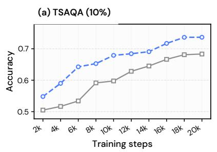

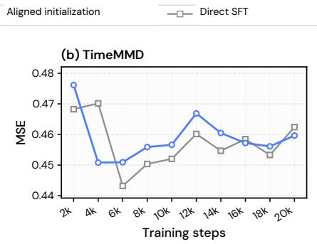

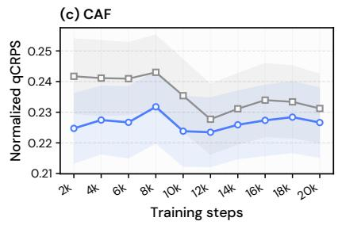  
Figure 5. Efect of the alignment stage over the course of SFT. We compare aligned initialization with direct SFT from the pretrained towers on (a) TSAQA accuracy (10% test subset, higher is better), (b) TimeMMD MSE (lower is better), and (c) CAF normalized CRPS (lower is better).

RQ6: Text Efects on Forecasting across Domains and History Lengths. Figure 6 shows that <sub>no s</sub>i<sub>ng</sub>l<sub>e</sub> t<sub>ex</sub>t <sub>we</sub>i<sub>g</sub>ht <sub>wor</sub>k<sub>s across a</sub>ll d<sub>oma</sub>i<sub>ns.</sub> L<sub>arger</sub> � <sub>usua</sub>ll<sub>y</sub> h<sub>e</sub>l<sub>ps</sub> E<sub>conomy,</sub> P<sub>u</sub>bli<sub>c</sub> H<sub>ea</sub>lth<sub>,</sub> A<sub>gr</sub>i<sub>cu</sub>lt<sub>ure, an</sub>d E<sub>nergy;</sub> T<sub>ra</sub>fi<sub>c ga</sub>i<sub>ns</sub> littl<sub>e a</sub>t <sub>sma</sub>ll<sub>er we</sub>i<sub>g</sub>ht<sub>s,</sub> S<sub>ecur</sub>it<sub>y</sub> d<sub>oes no</sub>t i<sub>mprove, an</sub>d Cli<sub>ma</sub>t<sub>e</sub> <sub>an</sub>d S<sub>oc</sub>i<sub>a</sub>l G<sub>oo</sub>d <sub>c</sub>h<sub>ange w</sub>ith hi<sub>s</sub>t<sub>ory</sub> l<sub>eng</sub>th<sub>.</sub> Th<sub>e</sub> fi<sub>rs</sub>t <sub>group rece</sub>i<sub>ves repor</sub>t<sub>s on</sub> t<sub>ra</sub>d<sub>e, pe</sub>t<sub>ro</sub>l<sub>eum,</sub> b<sub>ro</sub>il<sub>er mar</sub>k<sub>e</sub>t<sub>s, or</sub> i<sub>n</sub>fl<sub>uenza</sub> th<sub>a</sub>t <sub>a</sub>dd<sub>ress</sub> th<sub>e</sub> f<sub>orecas</sub>t t<sub>arge</sub>t <sub>or a</sub> di<sub>rec</sub>t d<sub>r</sub>i<sub>ver.</sub> Th<sub>e wea</sub>k<sub>er pa</sub>i<sub>rs are</sub> l<sub>ess</sub> di<sub>rec</sub>t<sub>.</sub> T<sub>ra</sub>fi<sub>c pa</sub>i<sub>rs na</sub>ti<sub>ona</sub>l <sub>mon</sub>thl<sub>y ve</sub>hi<sub>c</sub>l<sub>e m</sub>il<sub>es</sub> t<sub>rave</sub>l<sub>e</sub>d <sub>w</sub>ith l<sub>oca</sub>l <sub>roa</sub>d <sub>coun</sub>t<sub>s, a</sub>i<sub>r</sub> t<sub>rave</sub>l<sub>, an</sub>d l<sub>ong-</sub>t<sub>erm p</sub>l<sub>ans.</sub> S<sub>ecur</sub>it<sub>y pa</sub>i<sub>rs mon</sub>thl<sub>y</sub> FEMA <sub>gran</sub>t <sub>amoun</sub>t<sub>s, w</sub>hi<sub>c</sub>h <sub>con</sub>t<sub>a</sub>i<sub>n rare even</sub>t<sub>-</sub>d<sub>r</sub>i<sub>ven sp</sub>ik<sub>es,</sub> <sub>w</sub>ith <sub>pas</sub>t di<sub>sas</sub>t<sub>ers an</sub>d <sub>gran</sub>t <sub>ru</sub>l<sub>es</sub> th<sub>a</sub>t d<sub>o no</sub>t <sub>spec</sub>if<sub>y</sub> th<sub>e nex</sub>t <sub>sp</sub>ik<sub>e</sub>’<sub>s</sub> ti<sub>m</sub>i<sub>ng or s</sub>i<sub>ze.</sub> E<sub>nv</sub>i<sub>ronmen</sub>t <sub>pa</sub>i<sub>rs</sub> volatile daily New York AQI with broad or out-of-state reports; Climate and Social Good sometimes use re<sub>p</sub>orts from another <sub>p</sub>eriod or re<sub>g</sub>ion (Liu et al., 2024a). Text can therefore add little because it d<sub>oes</sub> <sub>no</sub>t <sub>ma</sub>t<sub>c</sub>h th<sub>e</sub> t<sub>arge</sub>t<sub>,</sub> <sub>or</sub> b<sub>ecause</sub> it d<sub>oes</sub> <sub>no</sub>t <sub>spec</sub>if<sub>y</sub> <sub>an</sub> <sub>a</sub>b<sub>rup</sub>t f<sub>u</sub>t<sub>ure</sub> <sub>c</sub>h<sub>ange.</sub> I<sub>n</sub> d<sub>oma</sub>i<sub>ns</sub> <sub>w</sub>ith <sub>wea</sub>k <sub>or no</sub>i<sub>sy con</sub>t<sub>ex</sub>t<sub>, a</sub> l<sub>onger</sub> hi<sub>s</sub>t<sub>ory can</sub> b<sub>e more re</sub>li<sub>a</sub>bl<sub>e</sub> th<sub>an</sub> t<sub>ex</sub>t<sub>-</sub>h<sub>eavy m</sub>i<sub>x</sub>i<sub>ng:</sub> S<sub>ecur</sub>it<sub>y</sub> i<sub>s</sub> b<sub>es</sub>t without text, while Trafic and Public Health retain only small text weights at � = 128. In contrast, E<sub>conomy,</sub> A<sub>gr</sub>i<sub>cu</sub>lt<sub>ure, an</sub>d E<sub>nv</sub>i<sub>ronmen</sub>t <sub>con</sub>ti<sub>nue</sub> t<sub>o</sub> b<sub>ene</sub>fit f<sub>rom</sub> l<sub>arger</sub> t<sub>ex</sub>t <sub>we</sub>i<sub>g</sub>ht<sub>s.</sub>

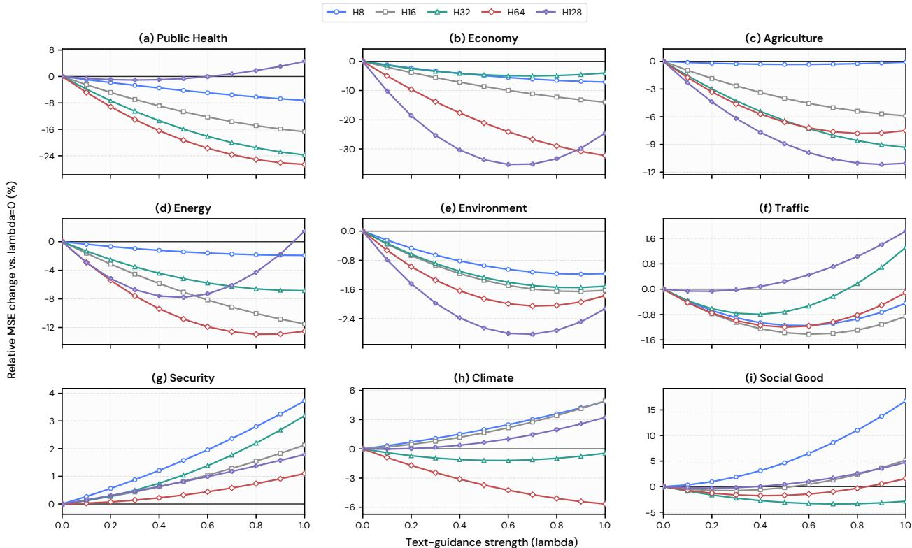  
Figure 6. Efect of text guidance across domains and history lengths. Each panel sweeps the text-mixing <sub>we</sub>i<sub>g</sub>ht � <sub>on</sub> <sub>one</sub> Ti<sub>me</sub>MMD d<sub>oma</sub>i<sub>n,</sub> <sub>repor</sub>ti<sub>ng</sub> th<sub>e</sub> <sub>re</sub>l<sub>a</sub>ti<sub>ve</sub> MSE <sub>c</sub>h<sub>ange</sub> <sub>aga</sub>i<sub>ns</sub>t th<sub>e</sub> t<sub>ex</sub>t<sub>-</sub>f<sub>ree</sub> f<sub>orecas</sub>t $\left( \lambda = 0 \right)$ <sub>a</sub>t i<sub>npu</sub>t hi<sub>s</sub>t<sub>or</sub>i<sub>es</sub> 8<sub>–</sub>128<sub>;</sub> l<sub>ower</sub> i<sub>s</sub> b<sub>e</sub>tt<sub>er.</sub> At l<sub>eas</sub>t <sub>one</sub> <sub>nonzero</sub> <sub>we</sub>i<sub>g</sub>ht h<sub>e</sub>l<sub>ps</sub> <sub>a</sub>t <sub>every</sub> hi<sub>s</sub>t<sub>ory</sub> l<sub>eng</sub>th i<sub>n</sub> P<sub>u</sub>bli<sub>c</sub> Health<sub>,</sub> Econom<sub>y,</sub> A<sub>g</sub>riculture<sub>,</sub> Ener<sub>gy,</sub> Environment<sub>,</sub> and Trafic<sub>;</sub> Securit<sub>y p</sub>refers $\lambda = 0 ;$ Cli<sub>ma</sub>t<sub>e an</sub>d S<sub>oc</sub>i<sub>a</sub>l G<sub>oo</sub>d <sub>c</sub>h<sub>ange s</sub>i<sub>gn w</sub>ith hi<sub>s</sub>t<sub>ory.</sub> W<sub>e repor</sub>t thi<sub>s sweep as a sens</sub>iti<sub>v</sub>it<sub>y ana</sub>l<sub>ys</sub>i<sub>s</sub> b<sub>ecause</sub> th<sub>e re</sub>l<sub>ease</sub>d t<sub>ex</sub>t i<sub>s no</sub>t <sub>po</sub>i<sub>n</sub>t<sub>-</sub>i<sub>n-</sub>ti<sub>me cer</sub>tifi<sub>e</sub>d<sub>;</sub> it i<sub>s separa</sub>t<sub>e</sub> f<sub>rom mo</sub>d<sub>e</sub>l <sub>se</sub>l<sub>ec</sub>ti<sub>on,</sub> f<sub>or w</sub>hi<sub>c</sub>h <sub>a s</sub>i<sub>ng</sub>l<sub>e</sub> $\lambda = 0 . 3$ i<sub>s se</sub>l<sub>ec</sub>t<sub>e</sub>d <sub>on va</sub>lid<sub>a</sub>ti<sub>on</sub> d<sub>a</sub>t<sub>a an</sub>d fi<sub>xe</sub>d <sub>across a</sub>ll d<sub>oma</sub>i<sub>ns.</sub>

## 5 Related Work

Unified Multimodal Models. Unified multimodal models difer chiefly in how a discrete language backbone hosts a continuous modalit<sub>y</sub> (An et al., 2026; Ton<sub>g</sub> et al., 2026). One line <sub>q</sub>uantizes ever<sub>y</sub> in<sub>p</sub>ut into a shared token vocabular<sub>y</sub> and trains a sin<sub>g</sub>le next-token <sub>p</sub>redictor (Team, 2024; Zhan et al., 2024; Wan<sub>g</sub> et al., 2024); a second mixes autore<sub>g</sub>ressive text <sub>p</sub>rediction with difusion-st<sub>y</sub>le <sub>g</sub>eneration inside one transformer, increasin<sub>g</sub>l<sub>y</sub> over continuous latents (Zhou et al., 2025a; Xie et al., 2025a; Den<sub>g</sub> et al., 2025; Xie et al., 2025b); a third decou<sub>p</sub>les the re<sub>p</sub>resentations servin<sub>g</sub> understandin<sub>g</sub> from those servin<sub>g g</sub>eneration (Chen et al., 2025b). Omni-modal s<sub>y</sub>stems extend these reci<sub>p</sub>es to s<sub>p</sub>eech, audio, and video (Xu et al., 2025a; Cui et al., 2026; Kim et al., 2026). Two lessons recur <sub>across</sub> thi<sub>s progress</sub>i<sub>on: con</sub>ti<sub>nuous s</sub>i<sub>gna</sub>l<sub>s</sub> l<sub>ose</sub> fid<sub>e</sub>lit<sub>y w</sub>h<sub>en</sub> f<sub>orce</sub>d th<sub>roug</sub>h <sub>a</sub> di<sub>scre</sub>t<sub>e voca</sub>b<sub>u</sub>l<sub>ary</sub> (Fan et al., 2025), and understandin<sub>g</sub> and <sub>g</sub>eneration favor diferent treatments of the same modalit<sub>y</sub>. Y<sub>e</sub>t ti<sub>me</sub> <sub>ser</sub>i<sub>es,</sub> f<sub>or</sub> <sub>a</sub>ll th<sub>e</sub>i<sub>r</sub> <sub>u</sub>bi<sub>qu</sub>it<sub>y,</sub> <sub>rema</sub>i<sub>n</sub> l<sub>arge</sub>l<sub>y</sub> <sub>a</sub>b<sub>sen</sub>t f<sub>rom</sub> th<sub>ese</sub> <sub>sys</sub>t<sub>ems.</sub> Ti<sub>me</sub>B<sub>ra</sub>id <sub>carr</sub>i<sub>es</sub> b<sub>o</sub>th l<sub>essons</sub> t<sub>o</sub> thi<sub>s m</sub>i<sub>ss</sub>i<sub>ng mo</sub>d<sub>a</sub>lit<sub>y:</sub> it <sub>a</sub>li<sub>gns</sub> ti<sub>me ser</sub>i<sub>es w</sub>ith l<sub>anguage</sub> i<sub>n con</sub>ti<sub>nuous space, avo</sub>idi<sub>ng</sub> <sub>quan</sub>ti<sub>za</sub>ti<sub>on</sub> <sub>a</sub>t b<sub>o</sub>th i<sub>npu</sub>t <sub>an</sub>d <sub>ou</sub>t<sub>pu</sub>t<sub>,</sub> <sub>an</sub>d <sub>g</sub>i<sub>ves</sub> <sub>percep</sub>ti<sub>on</sub> <sub>an</sub>d f<sub>orecas</sub>ti<sub>ng</sub> dif<sub>eren</sub>t i<sub>npu</sub>t <sub>process</sub>i<sub>ng</sub> <sub>w</sub>hil<sub>e</sub> <sub>s</sub>h<sub>ar</sub>i<sub>ng</sub> <sub>one</sub> ti<sub>me-ser</sub>i<sub>es</sub> b<sub>ac</sub>kb<sub>one.</sub>

Time-Series Foundation Models. Pretraining on large signal corpora yields foundation models that forecast zero-shot across domains (Garza et al., 2023; Rasul et al., 2023; Das et al., 2023; Ansari et al., 2024; Woo et al., 2024). The famil<sub>y</sub> has since diversified alon<sub>g</sub> axes familiar from lan<sub>g</sub>ua<sub>g</sub>e modelin<sub>g</sub>: s<sub>p</sub>arse ex<sub>p</sub>erts (Shi et al., 2025), lon<sub>g</sub>-context and serial scalin<sub>g</sub> (Liu et al., 2025a; 2026), <sub>g</sub>enerative decodin<sub>g</sub> (Liu et al., 2025b), com<sub>p</sub>act multi-task backbones (Goswami et al., 2024; Ekambaram et al., 2024; Gao et al., 2024; Xiao et al., 2025), and domain s<sub>p</sub>ecialization (Cohen et al., 2025). Yet th<sub>e</sub> i<sub>n</sub>t<sub>er</sub>f<sub>ace s</sub>t<sub>ays numer</sub>i<sub>c:</sub> d<sub>oma</sub>i<sub>n</sub> k<sub>now</sub>l<sub>e</sub>d<sub>ge an</sub>d i<sub>ns</sub>t<sub>ruc</sub>ti<sub>ons</sub> h<sub>ave no way</sub> i<sub>n an</sub>d <sub>exp</sub>l<sub>ana</sub>ti<sub>ons</sub> no wa<sub>y</sub> out, even thou<sub>g</sub>h textual context can materiall<sub>y</sub> im<sub>p</sub>rove forecasts (Williams et al., 2024; Liu et al., 2024a). TimeBraid builds on this line, initializin<sub>g</sub> its <sub>p</sub>erce<sub>p</sub>tion and forecastin<sub>g</sub> ex<sub>p</sub>erts f<sub>rom pre</sub>t<sub>ra</sub>i<sub>ne</sub>d ti<sub>me-ser</sub>i<sub>es</sub> bl<sub>oc</sub>k<sub>s</sub> t<sub>o</sub> i<sub>n</sub>h<sub>er</sub>it th<sub>e</sub>i<sub>r</sub> t<sub>empora</sub>l <sub>compe</sub>t<sub>ence, w</sub>hil<sub>e a</sub>ddi<sub>ng</sub> th<sub>e</sub> l<sub>anguage</sub> i<sub>n</sub>t<sub>er</sub>f<sub>ace an</sub>d <sub>wor</sub>ld k<sub>now</sub>l<sub>e</sub>d<sub>ge</sub> th<sub>ese mo</sub>d<sub>e</sub>l<sub>s</sub> l<sub>ac</sub>k<sub>.</sub>

Coupling Time Series with Language. Work coupling time series with language typically picks <sub>one pre</sub>t<sub>ra</sub>i<sub>ne</sub>d h<sub>os</sub>t <sub>an</sub>d <sub>moves</sub> th<sub>e o</sub>th<sub>er mo</sub>d<sub>a</sub>lit<sub>y</sub> i<sub>n</sub>t<sub>o</sub> it<sub>.</sub> U<sub>n</sub>d<sub>ers</sub>t<sub>an</sub>di<sub>ng mo</sub>d<sub>e</sub>l<sub>s</sub> h<sub>os</sub>t <sub>ser</sub>i<sub>es</sub> i<sub>n an</sub> LLM through an attached encoder or projector (Xie et al., 2024; Guan et al., 2026a; Wang et al., 2025b; Lan<sub>g</sub>er et al., 2025), even when that encoder is itself a <sub>p</sub>retrained time-series foundation model (Yu et al., 2025). Forecastin<sub>g</sub> models host series in a lan<sub>g</sub>ua<sub>g</sub>e or vision–lan<sub>g</sub>ua<sub>g</sub>e model via di<sub>g</sub>it serialization (Gruver et al., 2023), in<sub>p</sub>ut re<sub>p</sub>ro<sub>g</sub>rammin<sub>g</sub> or ada<sub>p</sub>tation (Jin et al., 2024; Chan<sub>g</sub> et al., 2025; Liu et al., 2024b), or rendered ima<sub>g</sub>es (Zhon<sub>g</sub> et al., 2025); conversel<sub>y</sub>, context-aided forecasters host text in a numeric model throu<sub>g</sub>h an added text branch (Liu et al., 2024a). All of these <sub>cover on</sub>l<sub>y one</sub> di<sub>rec</sub>ti<sub>on o</sub>f th<sub>e</sub> i<sub>n</sub>t<sub>er</sub>f<sub>ace, an</sub>d th<sub>e move</sub> it<sub>se</sub>lf i<sub>s</sub> l<sub>ossy: a</sub>li<sub>gnmen</sub>t b<sub>e</sub>t<sub>ween</sub> ti<sub>me-ser</sub>i<sub>es,</sub> vision, and lan<sub>g</sub>ua<sub>g</sub>e re<sub>p</sub>resentations has clear limits (Yashwante & Yu, 2026), and on <sub>p</sub>urel<sub>y</sub> numeric benchmarks the lan<sub>g</sub>ua<sub>g</sub>e host adds little (Tan et al., 2024). The few models coverin<sub>g</sub> both directions <sub>p</sub>a<sub>y</sub> a diferent <sub>p</sub>rice: ChatTime hosts values in an LLM vocabular<sub>y</sub> as discrete tokens (Wan<sub>g</sub> et al., 2025a), TimeOmni-VL hosts them in <sub>p</sub>ixel s<sub>p</sub>ace as rendered <sub>p</sub>lots (Guan et al., 2026b), and the concurrent Chronicle learns a joint space from scratch with 324M parameters, forgoing pretrained com<sub>p</sub>etence on both sides (Quinlan et al., 2026). TimeBraid instead kee<sub>p</sub>s each modalit<sub>y</sub> in its own <sub>pre</sub>t<sub>ra</sub>i<sub>ne</sub>d h<sub>os</sub>t <sub>an</sub>d f<sub>uses</sub> th<sub>e</sub> t<sub>wo</sub> i<sub>n a s</sub>h<sub>are</sub>d <sub>represen</sub>t<sub>a</sub>ti<sub>on space, cover</sub>i<sub>ng</sub> b<sub>o</sub>th di<sub>rec</sub>ti<sub>ons w</sub>ith<sub>ou</sub>t f<sub>orc</sub>i<sub>ng</sub> <sub>e</sub>ith<sub>er</sub> <sub>mo</sub>d<sub>a</sub>lit<sub>y</sub> i<sub>n</sub>t<sub>o</sub> th<sub>e</sub> <sub>o</sub>th<sub>er</sub>’<sub>s</sub> <sub>geome</sub>t<sub>ry.</sub>

## 6 Limitations

Ti<sub>me</sub>B<sub>ra</sub>id i<sub>s our ear</sub>l<sub>y a</sub>tt<sub>emp</sub>t t<sub>owar</sub>d <sub>un</sub>ifi<sub>e</sub>d ti<sub>me-ser</sub>i<sub>es an</sub>d l<sub>anguage mo</sub>d<sub>e</sub>l<sub>s.</sub> It i<sub>s</sub> t<sub>ra</sub>i<sub>ne</sub>d <sub>w</sub>ith<sub>ou</sub>t <sub>a con</sub>ti<sub>nue</sub>d <sub>pre</sub>t<sub>ra</sub>i<sub>n</sub>i<sub>ng s</sub>t<sub>age.</sub> P<sub>u</sub>bli<sub>c</sub> i<sub>n</sub>t<sub>er</sub>l<sub>eave</sub>d <sub>ser</sub>i<sub>es–</sub>t<sub>ex</sub>t <sub>corpora a</sub>t <sub>pre</sub>t<sub>ra</sub>i<sub>n</sub>i<sub>ng sca</sub>l<sub>e are</sub> <sub>no</sub>t <sub>ye</sub>t <sub>ma</sub>t<sub>ure,</sub> <sub>so</sub> <sub>our</sub> <sub>rec</sub>i<sub>pe</sub> <sub>moves</sub> di<sub>rec</sub>tl<sub>y</sub> f<sub>rom</sub> <sub>a</sub>li<sub>gnmen</sub>t t<sub>o</sub> <sub>superv</sub>i<sub>se</sub>d fi<sub>ne-</sub>t<sub>un</sub>i<sub>ng.</sub> A<sub>rgua</sub>bl<sub>y,</sub> l<sub>arge-sca</sub>l<sub>e con</sub>ti<sub>nue</sub>d <sub>pre</sub>t<sub>ra</sub>i<sub>n</sub>i<sub>ng wou</sub>ld i<sub>ns</sub>till b<sub>roa</sub>d<sub>er an</sub>d <sub>r</sub>i<sub>c</sub>h<sub>er wor</sub>ld k<sub>now</sub>l<sub>e</sub>d<sub>ge an</sub>d i<sub>mprove</sub> th<sub>e</sub> <sub>mo</sub>d<sub>e</sub>l <sub>across</sub> th<sub>e</sub> b<sub>oar</sub>d<sub>.</sub>

P<sub>ercep</sub>ti<sub>on carr</sub>i<sub>es</sub> b<sub>oun</sub>d<sub>e</sub>d <sub>numer</sub>i<sub>c prec</sub>i<sub>s</sub>i<sub>on.</sub> Th<sub>e mo</sub>d<sub>e</sub>l <sub>some</sub>ti<sub>mes</sub> h<sub>a</sub>ll<sub>uc</sub>i<sub>na</sub>t<sub>es</sub> th<sub>e va</sub>l<sub>ue a</sub>t a s<sub>p</sub>ecific <sub>p</sub>oint and misreads com<sub>p</sub>lex waveforms (lon<sub>g</sub>, hi<sub>g</sub>h-fre<sub>q</sub>uenc<sub>y</sub>, or low si<sub>g</sub>nal-to-noise). T<sub>ra</sub>i<sub>n</sub>i<sub>ng</sub> <sub>coverage</sub> <sub>con</sub>t<sub>r</sub>ib<sub>u</sub>t<sub>es,</sub> b<sub>u</sub>t th<sub>e</sub> <sub>ma</sub>i<sub>n</sub> <sub>reason</sub> i<sub>s</sub> th<sub>e</sub> <sub>pa</sub>t<sub>c</sub>h t<sub>o</sub>k<sub>en</sub>i<sub>za</sub>ti<sub>on</sub> i<sub>n</sub>h<sub>er</sub>it<sub>e</sub>d f<sub>rom</sub> th<sub>e</sub> ti<sub>me-ser</sub>i<sub>es</sub> b<sub>ac</sub>kb<sub>one,</sub> <sub>w</sub>hi<sub>c</sub>h <sub>compresses</sub> <sub>many</sub> <sub>raw</sub> <sub>va</sub>l<sub>ues</sub> i<sub>n</sub>t<sub>o</sub> <sub>eac</sub>h <sub>em</sub>b<sub>e</sub>ddi<sub>ng</sub> <sub>an</sub>d d<sub>oes</sub> <sub>no</sub>t f<sub>u</sub>ll<sub>y</sub> <sub>preserve</sub> <sub>groun</sub>d<sub>e</sub>d l<sub>oca</sub>l d<sub>e</sub>t<sub>a</sub>il<sub>.</sub>

F<sub>orecas</sub>t <sub>con</sub>t<sub>ro</sub>l <sub>wea</sub>k<sub>ens</sub> <sub>w</sub>h<sub>en</sub> t<sub>ex</sub>t <sub>con</sub>t<sub>ra</sub>di<sub>c</sub>t<sub>s</sub> hi<sub>s</sub>t<sub>ory.</sub> Th<sub>e</sub> f<sub>orecas</sub>ti<sub>ng</sub> <sub>exper</sub>t i<sub>n</sub>h<sub>er</sub>it<sub>s</sub> th<sub>e</sub> t<sub>rans</sub>i<sub>-</sub> ti<sub>on</sub> d<sub>ynam</sub>i<sub>cs o</sub>f it<sub>s pre</sub>t<sub>ra</sub>i<sub>ne</sub>d b<sub>ac</sub>kb<sub>one, w</sub>hi<sub>c</sub>h bi<sub>as</sub> it t<sub>owar</sub>d hi<sub>s</sub>t<sub>or</sub>i<sub>ca</sub>ll<sub>y cons</sub>i<sub>s</sub>t<sub>en</sub>t <sub>con</sub>ti<sub>nua</sub>ti<sub>ons.</sub>

Direct control si<sub>g</sub>nals that demand behavior at odds with the histor<sub>y</sub> (an abru<sub>p</sub>t level shift, a sudden re<sub>g</sub>ime break) are followed loosel<sub>y</sub>. Furthermore, lar<sub>g</sub>e-scale hi<sub>g</sub>h-<sub>q</sub>ualit<sub>y</sub> real-world text-conditioned f<sub>orecas</sub>ti<sub>ng</sub> d<sub>a</sub>t<sub>a an</sub>d <sub>mu</sub>lti<sub>-mo</sub>d<sub>a</sub>l <sub>mu</sub>lti<sub>-var</sub>i<sub>a</sub>t<sub>e</sub> d<sub>a</sub>t<sub>a are no</sub>t <sub>rea</sub>dil<sub>y ava</sub>il<sub>a</sub>bl<sub>e</sub> i<sub>n pu</sub>bli<sub>c access.</sub> Wh<sub>en</sub> th<sub>e</sub> i<sub>npu</sub>t t<sub>ex</sub>t <sub>gu</sub>id<sub>ance an</sub>d <sub>con</sub>t<sub>en</sub>t <sub>are</sub> hi<sub>g</sub>hl<sub>y comp</sub>l<sub>ex an</sub>d <sub>no</sub>i<sub>sy,</sub> Ti<sub>me</sub>B<sub>ra</sub>id <sub>canno</sub>t <sub>comp</sub>l<sub>e</sub>t<sub>e</sub>l<sub>y</sub> t<sub>rans</sub>l<sub>a</sub>t<sub>e</sub> it t<sub>o e</sub>f<sub>ec</sub>ti<sub>ve</sub> f<sub>orecas</sub>ti<sub>ng s</sub>i<sub>gna</sub>l<sub>s.</sub> H<sub>owever, we see</sub> th<sub>a</sub>t <sub>us</sub>i<sub>ng a</sub> f<sub>ron</sub>ti<sub>er</sub> l<sub>anguage mo</sub>d<sub>e</sub>l f<sub>or</sub> <sub>reason</sub>i<sub>ng</sub> <sub>an</sub>d i<sub>ns</sub>t<sub>ruc</sub>ti<sub>on</sub> <sub>convers</sub>i<sub>on</sub> h<sub>e</sub>l<sub>ps</sub> <sub>m</sub>iti<sub>ga</sub>t<sub>e</sub> th<sub>ese</sub> i<sub>ssues,</sub> <sub>an</sub>d it i<sub>mp</sub>li<sub>es</sub> th<sub>e</sub> <sub>nee</sub>d f<sub>or</sub> <sub>com</sub>bi<sub>na</sub>ti<sub>on</sub> <sub>w</sub>ith <sub>agen</sub>t<sub>s</sub> f<sub>or</sub> <sub>a</sub> b<sub>e</sub>tt<sub>er</sub> f<sub>orecas</sub>ti<sub>ng</sub> <sub>sys</sub>t<sub>em.</sub>

## 7 Conclusion

W<sub>e presen</sub>t<sub>e</sub>d Ti<sub>me</sub>B<sub>ra</sub>id<sub>, a un</sub>ifi<sub>e</sub>d ti<sub>me-ser</sub>i<sub>es an</sub>d l<sub>anguage mo</sub>d<sub>e</sub>l th<sub>a</sub>t <sub>a</sub>li<sub>gns</sub> th<sub>e na</sub>ti<sub>ve repre-</sub> <sub>sen</sub>t<sub>a</sub>ti<sub>ons o</sub>f <sub>a pre</sub>t<sub>ra</sub>i<sub>ne</sub>d l<sub>anguage mo</sub>d<sub>e</sub>l <sub>an</sub>d <sub>pre</sub>t<sub>ra</sub>i<sub>ne</sub>d ti<sub>me-ser</sub>i<sub>es</sub> f<sub>oun</sub>d<sub>a</sub>ti<sub>on mo</sub>d<sub>e</sub>l<sub>s</sub> th<sub>roug</sub>h t<sub>r</sub>i<sub>-exper</sub>t <sub>g</sub>l<sub>o</sub>b<sub>a</sub>l <sub>res</sub>id<sub>ua</sub>l <sub>a</sub>tt<sub>en</sub>ti<sub>on.</sub> T<sub>ra</sub>i<sub>ne</sub>d <sub>w</sub>ith <sub>a</sub> d<sub>ua</sub>l<sub>-s</sub>t<sub>age rec</sub>i<sub>pe on cura</sub>t<sub>e</sub>d <sub>a</sub>li<sub>gnmen</sub>t <sub>pa</sub>i<sub>rs</sub> <sub>an</sub>d <sub>a</sub> b<sub>roa</sub>d i<sub>ns</sub>t<sub>ruc</sub>ti<sub>on m</sub>i<sub>x</sub>t<sub>ure, one se</sub>t <sub>o</sub>f <sub>we</sub>i<sub>g</sub>ht<sub>s un</sub>d<sub>ers</sub>t<sub>an</sub>d<sub>s an</sub>d <sub>genera</sub>t<sub>es</sub> b<sub>o</sub>th <sub>mo</sub>d<sub>a</sub>liti<sub>es,</sub> f<sub>orecas</sub>ti<sub>ng a</sub>t th<sub>e</sub> l<sub>eve</sub>l <sub>o</sub>f d<sub>e</sub>di<sub>ca</sub>t<sub>e</sub>d ti<sub>me-ser</sub>i<sub>es</sub> f<sub>oun</sub>d<sub>a</sub>ti<sub>on mo</sub>d<sub>e</sub>l<sub>s w</sub>hil<sub>e rema</sub>i<sub>n</sub>i<sub>ng compe</sub>titi<sub>ve w</sub>ith f<sub>ar</sub> l<sub>arger genera</sub>l<sub>-purpose mo</sub>d<sub>e</sub>l<sub>s on un</sub>d<sub>ers</sub>t<sub>an</sub>di<sub>ng an</sub>d <sub>con</sub>t<sub>ex</sub>t<sub>-a</sub>id<sub>e</sub>d f<sub>orecas</sub>ti<sub>ng.</sub> O<sub>ur a</sub>bl<sub>a</sub>ti<sub>ons</sub> di<sub>s</sub>till th<sub>e</sub> d<sub>es</sub>i<sub>gn c</sub>h<sub>o</sub>i<sub>ces</sub> th<sub>a</sub>t <sub>ma</sub>k<sub>e</sub> thi<sub>s mo</sub>d<sub>e</sub>l <sub>c</sub>l<sub>ass wor</sub>k<sub>: w</sub>h<sub>ere</sub> th<sub>e cross-mo</sub>d<sub>a</sub>l i<sub>n</sub>t<sub>erac</sub>ti<sub>on s</sub>h<sub>ou</sub>ld li<sub>ve, w</sub>h<sub>e</sub>th<sub>er percep</sub>ti<sub>on an</sub>d f<sub>orecas</sub>ti<sub>ng nee</sub>d <sub>separa</sub>t<sub>e exper</sub>t<sub>s, an</sub>d h<sub>ow s</sub>t<sub>rong</sub>l<sub>y</sub> th<sub>e</sub> f<sub>orecas</sub>t <sub>s</sub>h<sub>ou</sub>ld d<sub>raw on</sub> t<sub>ex</sub>t <sub>a</sub>t i<sub>n</sub>f<sub>erence.</sub> W<sub>e</sub> h<sub>ope</sub> Ti<sub>me</sub>B<sub>ra</sub>id i<sub>s a s</sub>t<sub>ep</sub> t<sub>owar</sub>d <sub>un</sub>ifi<sub>e</sub>d <sub>mo</sub>d<sub>e</sub>l<sub>s</sub> th<sub>a</sub>t t<sub>rea</sub>t ti<sub>me-ser</sub>i<sub>es</sub> <sub>as an essen</sub>ti<sub>a</sub>l <sub>mo</sub>d<sub>a</sub>lit<sub>y, un</sub>d<sub>ers</sub>t<sub>oo</sub>d <sub>an</sub>d <sub>genera</sub>t<sub>e</sub>d i<sub>n</sub> it<sub>s na</sub>ti<sub>ve represen</sub>t<sub>a</sub>ti<sub>on.</sub>

## References

Taha Aksu<sub>,</sub> Gerald Woo<sub>,</sub> Junchen<sub>g</sub> Liu<sub>,</sub> Xu Liu<sub>,</sub> Chen<sub>g</sub>hao Liu<sub>,</sub> Silvio Savarese<sub>,</sub> Caimin<sub>g</sub> Xion<sub>g,</sub> and Doyen Sahoo. GIFT-Eval: A benchmark for general time series forecasting model evaluation. arXiv preprint arXiv:2410.10393, 2024.

Siyu An, Junru Lu, Junnan Dong, Qiufeng Wang, Yinghui Li, Weizhi Fei, Zichao Yu, Zheng Yuan, Biao Liu, Haopeng Wang, et al. Toward native multimodal modeling: A roadmap. arXiv preprint arXiv:2605.25343, 2026.

Abd<sub>u</sub>l F<sub>a</sub>ti<sub>r</sub> A<sub>nsar</sub>i<sub>,</sub> L<sub>orenzo</sub> St<sub>e</sub>ll<sub>a,</sub> C<sub>aner</sub> T<sub>ur</sub>k<sub>men,</sub> Xi<sub>yuan</sub> Zh<sub>ang,</sub> P<sub>e</sub>d<sub>ro</sub> M<sub>erca</sub>d<sub>o,</sub> H<sub>u</sub>ibi<sub>n</sub> Sh<sub>en,</sub> Oleksandr Shchur<sub>,</sub> S<sub>y</sub>ama Sundar Ran<sub>g</sub>a<sub>p</sub>uram<sub>,</sub> Sebastian Pineda Aran<sub>g</sub>o<sub>,</sub> Shubham Ka<sub>p</sub>oor<sub>,</sub> et al. Chronos: Learning the language of time series. arXiv preprint arXiv:2403.07815, 2024.

Yifu Cai, Arjun Choudhry, Mononito Goswami, and Artur Dubrawski. TimeSeriesExam: A time series understanding exam. arXiv preprint arXiv:2410.14752, 2024.

Chin<sub>g</sub> Chan<sub>g,</sub> Wei-Yao Wan<sub>g,</sub> Wen-Chih Pen<sub>g,</sub> and Tien-Fu Chen. LLM4TS: Ali<sub>g</sub>nin<sub>g</sub> <sub>p</sub>re-trained LLMs as data-eficient time-series forecasters. ACM Transactions on Intelligent Systems and Technology, 16 (3):1–20, 2025.

Jialin Chen<sub>,</sub> Zi<sub>y</sub>u Zhao<sub>,</sub> Gaukhar Nurbek<sub>,</sub> Aoson<sub>g</sub> Fen<sub>g,</sub> Ali Maatouk<sub>,</sub> Leandros Tassiulas<sub>,</sub> Yifen<sub>g</sub> Gao<sub>,</sub> <sub>an</sub>d R<sub>ex</sub> Yi<sub>ng.</sub> TRACE<sub>:</sub> G<sub>roun</sub>di<sub>ng</sub> ti<sub>me ser</sub>i<sub>es</sub> i<sub>n con</sub>t<sub>ex</sub>t f<sub>or mu</sub>lti<sub>mo</sub>d<sub>a</sub>l <sub>em</sub>b<sub>e</sub>ddi<sub>ng an</sub>d <sub>re</sub>t<sub>r</sub>i<sub>eva</sub>l<sub>.</sub> I<sub>n</sub> Advances in Neural Information Processing Systems, volume 38, . 2440–2472. Curran Associates, Inc.<sub>,</sub> 2025a. doi: 10.52202/085713-0087. URL htt<sub>p</sub>s://<sub>p</sub>roceedin<sub>g</sub>s.neuri<sub>p</sub>s.cc/<sub>p</sub>a<sub>p</sub>er<sub>\_</sub>files/<sub>p</sub>a<sub>p</sub>er/ 2025/file/03adea6231459e2aab0a68d0aa19793a-Pa<sub>p</sub>er-Conference.<sub>p</sub>df.

Xiaokan<sub>g</sub> Chen<sub>,</sub> Zhi<sub>y</sub>u Wu<sub>,</sub> Xin<sub>g</sub>chao Liu<sub>,</sub> Zizhen<sub>g</sub> Pan<sub>,</sub> Wen Liu<sub>,</sub> Zhenda Xie<sub>,</sub> Xin<sub>g</sub>kai Yu<sub>,</sub> and Chon<sub>g</sub> R<sub>uan.</sub> J<sub>anus-</sub>P<sub>ro:</sub> U<sub>n</sub>ifi<sub>e</sub>d <sub>mu</sub>lti<sub>mo</sub>d<sub>a</sub>l <sub>un</sub>d<sub>ers</sub>t<sub>an</sub>di<sub>ng an</sub>d <sub>genera</sub>ti<sub>on w</sub>ith d<sub>a</sub>t<sub>a an</sub>d <sub>mo</sub>d<sub>e</sub>l <sub>sca</sub>li<sub>ng.</sub> arXiv preprint arXiv:2501.17811, 2025b.

Ben Cohen, Emaad Khwaja, Youssef Doubli, Salahidine Lemaachi, Chris Lettieri, Charles Masson, Hugo Miccinilli, Elise Ramé, Qiqi Ren, Afshin Rostamizadeh, et al. This time is diferent: An observability perspective on time series foundation models. Advances in Neural Information Processing Systems, 38:50907–50951<sub>,</sub> 2025.

Junbo Cui, Bokai Xu, Chongyi Wang, Tianyu Yu, Weiyue Sun, Yingjing Xu, Tianran Wang, Zhihui H<sub>e,</sub> W<sub>ens</sub>h<sub>uo</sub> M<sub>a,</sub> Ti<sub>anc</sub>hi C<sub>a</sub>i<sub>, e</sub>t <sub>a</sub>l<sub>.</sub> Mi<sub>n</sub>iCPM<sub>-o</sub> 4<sub>.</sub>5<sub>:</sub> T<sub>owar</sub>d<sub>s rea</sub>l<sub>-</sub>ti<sub>me</sub> f<sub>u</sub>ll<sub>-</sub>d<sub>up</sub>l<sub>ex omn</sub>i<sub>-mo</sub>d<sub>a</sub>l interaction. arXiv preprint arXiv:2604.27393, 2026.

Abhimanyu Das, Weihao Kong, Rajat Sen, and Yichen Zhou. A decoder-only foundation model for time-series forecasting. arXiv preprint arXiv:2310.10688, 2023.

Chaorui Den<sub>g,</sub> De<sub>y</sub>ao Zhu<sub>,</sub> Kunchan<sub>g</sub> Li<sub>,</sub> Chenhui Gou<sub>,</sub> Fen<sub>g</sub> Li<sub>,</sub> Ze<sub>y</sub>u Wan<sub>g,</sub> Shu Zhon<sub>g,</sub> Weihao Yu, Xiaonan Nie, Ziang Song, et al. Emerging properties in unified multimodal pretraining. arXiv preprint arXiv:2505.14683, 2025.

Yue<sub>y</sub>an<sub>g</sub> Din<sub>g,</sub> Hao<sub>p</sub>en<sub>g</sub> Zhan<sub>g,</sub> Rui Dai<sub>,</sub> Yi Wan<sub>g,</sub> Tian<sub>y</sub>u Zon<sub>g,</sub> Kaikui Liu<sub>,</sub> and Xian<sub>g</sub>xian<sub>g</sub> Chu. LL<sub>a</sub>TiSA<sub>:</sub> T<sub>owar</sub>d<sub>s</sub> difi<sub>cu</sub>lt<sub>y-s</sub>t<sub>ra</sub>tifi<sub>e</sub>d ti<sub>me ser</sub>i<sub>es reason</sub>i<sub>ng</sub> f<sub>rom v</sub>i<sub>sua</sub>l <sub>percep</sub>ti<sub>on</sub> t<sub>o seman</sub>ti<sub>cs.</sub> I<sub>n</sub> Findings of the Associationfor Computational Linguistics: ACL 2026, pp. 32677–32717. Association f<sub>o</sub>r C<sub>o</sub>m<sub>pu</sub>t<sub>a</sub>ti<sub>o</sub>n<sub>a</sub>l Lin<sub>gu</sub>i<sub>s</sub>ti<sub>cs,</sub> 2026<sub>.</sub> d<sub>o</sub>i<sub>:</sub> 10<sub>.</sub>18653/v1/2026<sub>.</sub>findin<sub>gs</sub>-<sub>ac</sub>l<sub>.</sub>1636<sub>.</sub> URL htt<sub>ps:</sub> //aclantholo<sub>gy</sub>.or<sub>g</sub>/2026.findin<sub>g</sub>s-acl.1636/.

Vijay Ekambaram, Arindam Jati, Pankaj Dayama, Sumanta Mukherjee, Nam H Nguyen, Wesley M Giford, Chandra Redd<sub>y</sub>, and Ja<sub>y</sub>ant Kala<sub>g</sub>nanam. Tin<sub>y</sub> time mixers (TTMs): Fast <sub>p</sub>re-trained models for enhanced zero/few-shot forecasting of multivariate time series. Advances in Neural Information Processing Systems, 37:74147–74181, 2024.

Lijie Fan, Tianhong Li, Siyang Qin, Yuanzhen Li, Chen Sun, Michael Rubinstein, Deqing Sun, Kaiming H<sub>e,</sub> <sub>an</sub>d Y<sub>ong</sub>l<sub>ong</sub> Ti<sub>an.</sub> Fl<sub>u</sub>id<sub>:</sub> S<sub>ca</sub>li<sub>ng</sub> <sub>au</sub>t<sub>oregress</sub>i<sub>ve</sub> t<sub>ex</sub>t<sub>-</sub>t<sub>o-</sub>i<sub>mage</sub> <sub>genera</sub>ti<sub>ve</sub> <sub>mo</sub>d<sub>e</sub>l<sub>s</sub> <sub>w</sub>ith continuous tokens. In International Conference on Learning Representations, volume 2025, pp. 100218–100231<sub>,</sub> 2025.

Shanghua Gao, Teddy Koker, Owen Queen, Thomas Hartvigsen, Theodoros Tsiligkaridis, and Marinka Zitnik. UniTS: A unified multi-task time series model. Advances in Neural Information Processing Systems, 37:140589–140631, 2024.

Azul Garza, Cristian Challu, and Max Mergenthaler-Canseco. TimeGPT-1. arXiv preprint arXiv:2310.03589, 2023.

Ar<sub>y</sub> L Goldber<sub>g</sub>er<sub>,</sub> Luis AN Amaral<sub>,</sub> Leon Glass<sub>,</sub> Jefre<sub>y</sub> M Hausdorf<sub>,</sub> Plamen Ch Ivanov<sub>,</sub> Ro<sub>g</sub>er G Mark<sub>,</sub> Jose<sub>p</sub>h E Mietus<sub>,</sub> Geor<sub>g</sub>e B Mood<sub>y,</sub> Chun<sub>g</sub>-Kan<sub>g</sub> Pen<sub>g,</sub> and H Eu<sub>g</sub>ene Stanle<sub>y</sub>. Ph<sub>y</sub>sioBank<sub>,</sub> Ph<sub>ys</sub>i<sub>o</sub>T<sub>oo</sub>lkit<sub>, an</sub>d Ph<sub>ys</sub>i<sub>o</sub>N<sub>e</sub>t<sub>: componen</sub>t<sub>s o</sub>f <sub>a new researc</sub>h <sub>resource</sub> f<sub>or comp</sub>l<sub>ex p</sub>h<sub>ys</sub>i<sub>o</sub>l<sub>og</sub>i<sub>c</sub> signals. Circulation, 101(23):e215–e220, 2000.

Mononito Goswami, Konrad Szafer, Arjun Choudhry, Yifu Cai, Shuo Li, and Artur Dubrawski. MO-MENT: A family of open time-series foundation models. arXiv preprint arXiv:2402.03885, 2024.

Nate Gruver, Marc Finzi, Shikai Qiu, and Andrew G Wilson. Large language models are zero-shot time series forecasters. Advances in Neural Information Processing Systems, 36:19622–19635, 2023.

Tong Guan, Zijie Meng, Dianqi Li, Shiyu Wang, Chao-Han Huck Yang, Qingsong Wen, Zuozhu Liu, S<sub>a</sub>b<sub>a</sub>t<sub>o</sub> Si<sub>n</sub>i<sub>sca</sub>l<sub>c</sub>hi<sub>,</sub> Mi<sub>ng</sub> Ji<sub>n,</sub> <sub>an</sub>d Shi<sub>ru</sub>i P<sub>an.</sub> Ti<sub>me</sub>O<sub>mn</sub>i<sub>-</sub>1<sub>:</sub> I<sub>ncen</sub>ti<sub>v</sub>i<sub>z</sub>i<sub>ng</sub> <sub>comp</sub>l<sub>ex</sub> <sub>reason</sub>i<sub>ng</sub> <sub>w</sub>ith time series in large language models. In International Conference on Learning Representations, volume 2026<sub>,</sub> <sub>pp</sub>. 152139–152170<sub>,</sub> 2026a.

Tong Guan, Sheng Pan, Johan Barthelemy, Zhao Li, Yujun Cai, Cesare Alippi, Ming Jin, and Shirui Pan. TimeOmni-VL: Unified models for time series understanding and generation. arXiv preprint arXiv:2602.17149, 2026b.

Dan Hendr<sub>y</sub>cks<sub>,</sub> Collin Burns<sub>,</sub> Steven Basart<sub>,</sub> And<sub>y</sub> Zou<sub>,</sub> Mantas Mazeika<sub>,</sub> Dawn Son<sub>g,</sub> and Jacob Steinhardt. Measuring massive multitask language understanding. arXiv preprint arXiv:2009.03300, 2020.

Tao Hong and Shu Fan. Probabilistic electric load forecasting: A tutorial review. International Journal of Forecasting, 32(3):914–938, 2016.

Sheikh Asif Imran<sub>,</sub> Mohammad Nur Hossain Khan<sub>,</sub> Subrata Biswas<sub>,</sub> and Bashima Islam. LLaSA: A multimodal LLM for human activity analysis through wearable and smartphone sensors. arXiv preprint arXiv:2406.14498, 2024.

Min<sub>g</sub> Jin<sub>,</sub> Shi<sub>y</sub>u Wan<sub>g,</sub> Lintao Ma<sub>,</sub> Zhixuan Chu<sub>,</sub> James Zhan<sub>g,</sub> Xiaomin<sub>g</sub> Shi<sub>,</sub> Pin-Yu Chen<sub>,</sub> Yuxuan Lian<sub>g,</sub> Yuan-Fan<sub>g</sub> Li<sub>,</sub> Shirui Pan<sub>,</sub> et al. Time-LLM: Time series forecastin<sub>g</sub> b<sub>y</sub> re<sub>p</sub>ro<sub>g</sub>rammin<sub>g</sub> large language models. In International Conference on Learning Representations, volume 2024, pp. 23857–23880<sub>,</sub> 2024.

Bao<sub>y</sub>u Jin<sub>g,</sub> Sanhorn Chen<sub>,</sub> Lechen<sub>g</sub> Zhen<sub>g,</sub> Bo<sub>y</sub>u Liu<sub>,</sub> Zihao Li<sub>,</sub> Jiaru Zou<sub>,</sub> Tianxin Wei<sub>,</sub> Zhinin<sub>g</sub> Liu, Zhichen Zeng, Ruizhong Qiu, et al. TSAQA: Time series analysis question and answering benchmark. In Proceedings of the Fifth Workshop on Generation, Evaluation and Metrics (GEM), pp. 944–979<sub>,</sub> 2026.

Jaeik Kim, Woojin Kim, Jihwan Hong, Yejoon Lee, Sieun Hyeon, Mintaek Lim, Yunseok Han, Dogeun Ki<sub>m,</sub> H<sub>oeun</sub> L<sub>ee,</sub> H<sub>yunggeun</sub> Ki<sub>m,</sub> <sub>e</sub>t <sub>a</sub>l<sub>.</sub> D<sub>yn</sub>i<sub>n-</sub>O<sub>mn</sub>i<sub>:</sub> O<sub>mn</sub>i<sub>mo</sub>d<sub>a</sub>l <sub>un</sub>ifi<sub>e</sub>d l<sub>arge</sub> dif<sub>us</sub>i<sub>on</sub> l<sub>anguage</sub> model. arXiv preprint arXiv:2604.00007, 2026.

Taesun<sub>g</sub> Kim<sub>,</sub> Jinhee Kim<sub>,</sub> Yunwon Tae<sub>,</sub> Cheonbok Park<sub>,</sub> Jan<sub>g</sub>-Ho Choi<sub>,</sub> and Jae<sub>g</sub>ul Choo. Reversible instance normalization for accurate time-series forecasting against distribution shift. In International Conference on Learning Representations, 2022.

Yaxuan Kong, Yiyuan Yang, Yoontae Hwang, Wenjie Du, Stefan Zohren, Zhangyang Wang, Ming Jin, and Qingsong Wen. Time-MQA: Time series multi-task question answering with context enhancement. In Proceedings of the 63rd Annual Meeting of the Association for Computational Linguistics (Volume 1: Long Papers), pp. 29736–29753. Association for Computational Linguistics, 2025. doi: 10.18653/v1/2025.acl-lon<sub>g</sub>.1437. URL htt<sub>p</sub>s://aclantholo<sub>gy</sub>.or<sub>g</sub>/2025.acl-lon<sub>g</sub>.1437/.

Remi Lam<sub>,</sub> Alvaro Sanchez-Gonzalez<sub>,</sub> Matthew Willson<sub>,</sub> Peter Wirnsber<sub>g</sub>er<sub>,</sub> Meire Fortunato<sub>,</sub> Ferran Al<sub>e</sub>t<sub>,</sub> S<sub>uman</sub> R<sub>avur</sub>i<sub>,</sub> Ti<sub>mo</sub> E<sub>wa</sub>ld<sub>s,</sub> Z<sub>ac</sub>h E<sub>a</sub>t<sub>on-</sub>R<sub>osen,</sub> W<sub>e</sub>ih<sub>ua</sub> H<sub>u, e</sub>t <sub>a</sub>l<sub>.</sub> L<sub>earn</sub>i<sub>ng s</sub>killf<sub>u</sub>l <sub>me</sub>di<sub>um</sub> range global weather forecasting. Science, 382(6677):1416–1421, 2023.

P<sub>a</sub>t<sub>r</sub>i<sub>c</sub>k L<sub>an er,</sub> Th<sub>omas</sub> K<sub>aar,</sub> M<sub>ax</sub> R<sub>osen</sub>bl<sub>a</sub>ttl<sub>,</sub> M<sub>axwe</sub>ll A<sub>.</sub> X<sub>u,</sub> Wi<sub>nn</sub>i<sub>e</sub> Ch<sub>ow,</sub> M<sub>ar</sub>ti<sub>n</sub> M<sub>ar</sub>it<sub>sc</sub>h<sub>,</sub> R<sub>o</sub>b<sub>er</sub>t Jakob<sub>,</sub> Nin Wan <sub>,</sub> Junchen Liu<sub>,</sub> Aradhana Verma<sub>,</sub> Brian Han<sub>,</sub> Daniel Seun Kim<sub>,</sub> Henr Chubb<sub>,</sub> S<sub>co</sub>tt C<sub>eresna</sub>k<sub>,</sub> A<sub>y</sub>di<sub>n</sub> Z<sub>a</sub>h<sub>e</sub>di<sub>vas</sub>h<sub>,</sub> Al<sub>exan</sub>d<sub>er</sub> T<sub>ar</sub>l<sub>oc</sub>h<sub>an</sub> Si<sub>ng</sub>h S<sub>an</sub>dh<sub>u,</sub> F<sub>a</sub>ti<sub>ma</sub> R<sub>o</sub>d<sub>r</sub>i<sub>guez,</sub> D<sub>an</sub>i<sub>e</sub>l McDuf<sub>,</sub> El<sub>g</sub>ar Fleisch<sub>,</sub> Oliver Aalami<sub>,</sub> Fili<sub>p</sub>e Barata<sub>,</sub> and Paul Schmiedma<sub>y</sub>er. O<sub>p</sub>enTSLM: Time-<sub>ser</sub>i<sub>es</sub> l<sub>anguage</sub> <sub>mo</sub>d<sub>e</sub>l<sub>s</sub> f<sub>or</sub> <sub>reason</sub>i<sub>ng</sub> <sub>over</sub> <sub>mu</sub>lti<sub>var</sub>i<sub>a</sub>t<sub>e</sub> <sub>me</sub>di<sub>ca</sub>l t<sub>ex</sub>t<sub>-</sub> <sub>an</sub>d ti<sub>me-ser</sub>i<sub>es</sub> d<sub>a</sub>t<sub>a,</sub> 2025<sub>.</sub> URL htt<sub>p</sub>s://arxiv.or<sub>g</sub>/abs/2510.02410.

Haotian Liu, Chunyuan Li, Qingyang Wu, and Yong Jae Lee. Visual instruction tuning. Advances in Neural Information Processing Systems, 36:34892–34916, 2023.

Haoxin Liu<sub>,</sub> Shan<sub>gq</sub>in<sub>g</sub> Xu<sub>,</sub> Zhi<sub>y</sub>uan Zhao<sub>,</sub> Lin<sub>g</sub>kai Kon<sub>g,</sub> Harshavardhan Kamarthi<sub>,</sub> Adit<sub>y</sub>a B Sasanur<sub>,</sub> Megha Sharma, Jiaming Cui, Qingsong Wen, Chao Zhang, et al. Time-MMD: Multi-domain multimodal dataset for time series analysis. Advances in Neural Information Processing Systems, 37: 77888–77933<sub>,</sub> 2024a.

Xu Liu<sub>,</sub> Junfen<sub>g</sub> Hu<sub>,</sub> Yuan Li<sub>,</sub> Shizhe Diao<sub>,</sub> Yuxuan Lian<sub>g,</sub> Br<sub>y</sub>an Hooi<sub>,</sub> and Ro<sub>g</sub>er Zimmermann. U<sub>n</sub>iTi<sub>me:</sub> A l<sub>anguage-empowere</sub>d <sub>un</sub>ifi<sub>e</sub>d <sub>mo</sub>d<sub>e</sub>l f<sub>or</sub> <sub>cross-</sub>d<sub>oma</sub>i<sub>n</sub> ti<sub>me</sub> <sub>ser</sub>i<sub>es</sub> f<sub>orecas</sub>ti<sub>ng.</sub> I<sub>n</sub> Proceedings of the ACM Web Conference 2024, pp. 4095–4106, 2024b.

Yong Liu, Guo Qin, Xiangdong Huang, Jianmin Wang, and Mingsheng Long. Timer-XL: Longcontext transformers for unified time series forecasting. In International Conference on Learning Representations, volume 2025, pp. 83982–84006, 2025a.

Yong Liu, Guo Qin, Zhiyuan Shi, Zhi Chen, Caiyin Yang, Xiangdong Huang, Jianmin Wang, and Mingsheng Long. Sundial: A family of highly capable time series foundation models. arXiv preprint arXiv:2502.00816, 2025b.

Yong Liu, Xingjian Su, Shiyu Wang, Haoran Zhang, Haixuan Liu, Yuxuan Wang, Zhou Ye, Yang Xiang, Ji<sub>anm</sub>i<sub>n</sub> W<sub>ang,</sub> <sub>an</sub>d Mi<sub>ngs</sub>h<sub>eng</sub> L<sub>ong.</sub> Ti<sub>mer-</sub>S1<sub>:</sub> A billi<sub>on-sca</sub>l<sub>e</sub> ti<sub>me</sub> <sub>ser</sub>i<sub>es</sub> f<sub>oun</sub>d<sub>a</sub>ti<sub>on</sub> <sub>mo</sub>d<sub>e</sub>l <sub>w</sub>ith serial scaling. arXiv preprint arXiv:2603.04791, 2026.

E<sub>m</sub>i<sub>n</sub> O<sub>r</sub>h<sub>an,</sub> V<sub>a</sub>ibh<sub>av</sub> G<sub>up</sub>t<sub>a,</sub> <sub>an</sub>d B<sub>ren</sub>d<sub>en</sub> M L<sub>a</sub>k<sub>e.</sub> S<sub>e</sub>lf<sub>-superv</sub>i<sub>se</sub>d l<sub>earn</sub>i<sub>ng</sub> th<sub>roug</sub>h th<sub>e</sub> <sub>eyes</sub> <sub>o</sub>f <sub>a</sub> child. Advances in Neural Information Processing Systems, 33:9960–9971, 2020.

Paul Quinlan, Jeremy Levasseur, Qingguo Li, and Xiaodan Zhu. Chronicle: A multimodal foundation model for joint language and time series understanding. arXiv preprint arXiv:2605.20268, 2026.

Kashif Rasul, Arjun Ashok, Andrew Robert Williams, Hena Ghonia, Rishika Bhagwatkar, Arian Kh<sub>orasan</sub>i<sub>,</sub> M<sub>o</sub>h<sub>amma</sub>d J<sub>ava</sub>d D<sub>arv</sub>i<sub>s</sub>hi B<sub>ayaz</sub>i<sub>,</sub> G<sub>eorge</sub> Ad<sub>amopou</sub>l<sub>os,</sub> R<sub>o</sub>l<sub>an</sub>d Ri<sub>ac</sub>hi<sub>,</sub> N<sub>a</sub>dhi<sub>r</sub> H<sub>assen,</sub> et al. Lag-Llama: Towards foundation models for probabilistic time series forecasting. arXiv preprint arXiv:2310.08278, 2023.

Ch<sub>r</sub>i<sub>s</sub>t<sub>op</sub>h<sub>er</sub> J Sh<sub>a</sub>ll<sub>ue</sub> <sub>an</sub>d A<sub>n</sub>d<sub>rew</sub> V<sub>an</sub>d<sub>er</sub>b<sub>urg.</sub> Id<sub>en</sub>tif<sub>y</sub>i<sub>ng</sub> <sub>exop</sub>l<sub>ane</sub>t<sub>s</sub> <sub>w</sub>ith d<sub>eep</sub> l<sub>earn</sub>i<sub>ng:</sub> A fi<sub>ve-</sub> planet resonant chain around Kepler-80 and an eighth planet around Kepler-90. The Astronomical Journal, 155(2):94, 2018.

Xiaoming Shi, Shiyu Wang, Yuqi Nie, Dianqi Li, Zhou Ye, Qingsong Wen, and Ming Jin. Time-MoE: Billion-scale time series foundation models with mixture of experts. In International Conference on Learning Representations, volume 2025, pp. 34635–34667, 2025.

Li<sub>n</sub>d<sub>a</sub> S<sub>m</sub>ith <sub>an</sub>d Mi<sub>c</sub>h<sub>ae</sub>l G<sub>asser.</sub> Th<sub>e</sub> d<sub>eve</sub>l<sub>opmen</sub>t <sub>o</sub>f <sub>em</sub>b<sub>o</sub>di<sub>e</sub>d <sub>cogn</sub>iti<sub>on:</sub> Si<sub>x</sub> l<sub>essons</sub> f<sub>rom</sub> b<sub>a</sub>bi<sub>es.</sub> Artificial Life, 11(1-2):13–29, 2005.

Li<sub>n</sub>d<sub>a</sub> B S<sub>m</sub>ith<sub>,</sub> S<sub>wapnaa</sub> J<sub>ayaraman,</sub> Eli<sub>za</sub>b<sub>e</sub>th Cl<sub>er</sub>ki<sub>n,</sub> <sub>an</sub>d Ch<sub>en</sub> Y<sub>u.</sub> Th<sub>e</sub> d<sub>eve</sub>l<sub>op</sub>i<sub>ng</sub> i<sub>n</sub>f<sub>an</sub>t <sub>crea</sub>t<sub>es</sub> a curriculum for statistical learning. Trends in Cognitive Sciences, 22(4):325–336, 2018.

Min<sub>g</sub>tian Tan<sub>,</sub> Mike A Merrill<sub>,</sub> Vina<sub>y</sub>ak Gu<sub>p</sub>ta<sub>,</sub> Tim Althof<sub>,</sub> and Thomas Hartvi<sub>g</sub>sen. Are lan<sub>g</sub>ua<sub>g</sub>e models actually useful for time series forecasting? Advances in Neural Information Processing Systems, 37:60162–60191, 2024.

Chameleon Team. Chameleon: Mixed-modal early-fusion foundation models. arXiv preprint arXiv:2405.09818, 2024.

T<sub>eam</sub> Ol<sub>mo,</sub> All<sub>yson</sub> Etti<sub>nger,</sub> A<sub>man</sub>d<sub>a</sub> B<sub>er</sub>t<sub>sc</sub>h<sub>,</sub> B<sub>a</sub>il<sub>ey</sub> K<sub>ue</sub>hl<sub>,</sub> D<sub>av</sub>id G<sub>ra</sub>h<sub>am,</sub> D<sub>av</sub>id H<sub>e</sub>i<sub>neman,</sub> Dirk Groeneveld<sub>,</sub> Faeze Brahman<sub>,</sub> Finbarr Timbers<sub>,</sub> Hamish Ivison<sub>,</sub> et al. Olmo 3<sub>,</sub> 2025. URL htt<sub>p</sub>s://arxiv.or<sub>g</sub>/abs/2512.13961.

Shengbang Tong, David Fan, John Nguyen, Ellis Brown, Gaoyue Zhou, Shengyi Qian, Boyang Zheng, Thé<sub>op</sub>h<sub>ane</sub> V<sub>a</sub>ll<sub>aeys,</sub> J<sub>un</sub>li<sub>n</sub> H<sub>an,</sub> R<sub>o</sub>b F<sub>ergus, e</sub>t <sub>a</sub>l<sub>.</sub> B<sub>eyon</sub>d l<sub>anguage mo</sub>d<sub>e</sub>li<sub>ng:</sub> A<sub>n exp</sub>l<sub>ora</sub>ti<sub>on o</sub>f multimodal pretraining. arXiv preprint arXiv:2603.03276, 2026.

Ruey S Tsay. Analysis of financial time series. Wiley New York, 3 edition, 2010.

Chengsen Wang, Qi Qi, Jingyu Wang, Haifeng Sun, Zirui Zhuang, Jinming Wu, Lei Zhang, and Jianxin Li<sub>ao.</sub> Ch<sub>a</sub>tTi<sub>me:</sub> A <sub>un</sub>ifi<sub>e</sub>d <sub>mu</sub>lti<sub>mo</sub>d<sub>a</sub>l ti<sub>me</sub> <sub>ser</sub>i<sub>es</sub> f<sub>oun</sub>d<sub>a</sub>ti<sub>on</sub> <sub>mo</sub>d<sub>e</sub>l b<sub>r</sub>id<sub>g</sub>i<sub>ng</sub> <sub>numer</sub>i<sub>ca</sub>l <sub>an</sub>d t<sub>ex</sub>t<sub>ua</sub>l data. In Proceedings of the AAAI Conference on Artificial Intelligence, volume 39, pp. 12694–12702, 2025a.

Siyuan Wang, Peng Chen, Yihang Wang, Wanghui Qiu, Chenjuan Guo, Bin Yang, and Yang Shu. U<sub>n</sub>l<sub>oc</sub>ki<sub>ng</sub> th<sub>e</sub> <sub>va</sub>l<sub>ue</sub> <sub>o</sub>f t<sub>ex</sub>t<sub>:</sub> E<sub>ven</sub>t<sub>-</sub>d<sub>r</sub>i<sub>ven</sub> <sub>reason</sub>i<sub>ng</sub> <sub>an</sub>d <sub>mu</sub>lti<sub>-</sub>l<sub>eve</sub>l <sub>a</sub>li<sub>gnmen</sub>t f<sub>or</sub> ti<sub>me</sub> <sub>ser</sub>i<sub>es</sub> forecasting. In International Conference on Learning Representations, volume 2026, pp. 31182– 31210<sub>,</sub> 2026.

Xinlong Wang, Xiaosong Zhang, Zhengxiong Luo, Quan Sun, Yufeng Cui, Jinsheng Wang, Fan Zhang, Yueze Wang, Zhen Li, Qiying Yu, et al. Emu3: Next-token prediction is all you need. arXiv preprint arXiv:2409.18869, 2024.

Yilin Wan<sub>g,</sub> Peixuan Lei<sub>,</sub> Jie Son<sub>g,</sub> Yuzhe Hao<sub>,</sub> Tao Chen<sub>,</sub> Yuxuan Zhan<sub>g,</sub> Lei Jia<sub>,</sub> Yuanxian<sub>g</sub> Li<sub>,</sub> and Zhongyu Wei. ITFormer: Bridging time series and natural language for multi-modal QA with largescale multitask dataset. In Proceedings of the 42nd International Conference on Machine Learning, volume 267 of Proceedings of Machine Learning Research, pp. 63324–63344. PMLR, 2025b. URL htt<sub>p</sub>s://<sub>p</sub>roceedin<sub>g</sub>s.mlr.<sub>p</sub>ress/v267/wan<sub>g</sub>25av.html.

Mu<sub>y</sub>an Wen<sub>g,</sub> Defu Cao<sub>,</sub> Wei Yan<sub>g,</sub> Yashaswi Sharma<sub>,</sub> and Yan Liu. Tem<sub>p</sub>oralBench: A benchmark for evaluating LLM-based agents on contextual and event-informed time series tasks. In Proceedings of

the 32nd ACM SIGKDD Conference on Knowledge Discovery and Data Mining V. 2, pp. 9997–10008, 2026.

Andrew Robert Williams<sub>,</sub> Arjun Ashok<sub>,</sub> Étienne Marcotte<sub>,</sub> Valentina Zantedeschi<sub>,</sub> Jithendaraa Subra-<sub>man</sub>i<sub>an,</sub> R<sub>o</sub>l<sub>an</sub>d Ri<sub>ac</sub>hi<sub>,</sub> J<sub>ames</sub> R<sub>eque</sub>i<sub>ma,</sub> Al<sub>exan</sub>d<sub>re</sub> L<sub>acos</sub>t<sub>e,</sub> I<sub>r</sub>i<sub>na</sub> Ri<sub>s</sub>h<sub>,</sub> Ni<sub>co</sub>l<sub>as</sub> Ch<sub>apa</sub>d<sub>os,</sub> <sub>e</sub>t <sub>a</sub>l<sub>.</sub> Context is key: A benchmark for forecasting with essential textual information. arXiv preprint arXiv:2410.18959, 2024.

G<sub>era</sub>ld W<sub>oo,</sub> Ch<sub>eng</sub>h<sub>ao</sub> Li<sub>u,</sub> Ak<sub>s</sub>h<sub>a</sub>t K<sub>umar,</sub> C<sub>a</sub>i<sub>m</sub>i<sub>ng</sub> Xi<sub>ong,</sub> Sil<sub>v</sub>i<sub>o</sub> S<sub>avarese,</sub> <sub>an</sub>d D<sub>oyen</sub> S<sub>a</sub>h<sub>oo.</sub> U<sub>n</sub>ifi<sub>e</sub>d training of universal time series forecasting transformers. arXiv preprint arXiv:2402.02592, 2024.

Haixu Wu<sub>,</sub> Jiehui Xu<sub>,</sub> Jianmin Wan<sub>g,</sub> and Min<sub>g</sub>shen<sub>g</sub> Lon<sub>g</sub>. Autoformer: Decom<sub>p</sub>osition transformers with auto-correlation for long-term series forecasting. Advances in Neural Information Processing Systems, 34:22419–22430, 2021.

Congxi Xiao, Jingbo Zhou, Yixiong Xiao, Xinjiang Lu, Le Zhang, and Hui Xiong. TimeFound: a foundation model for time series forecasting. arXiv preprint arXiv:2503.04118, 2025.

Jinheng Xie, Weijia Mao, Zechen Bai, David Junhao Zhang, Weihao Wang, Kevin Qinghong Lin, Yuchao Gu, Zhijie Chen, Zhenheng Yang, and Mike Zheng Shou. Show-o: One single transformer to unify multimodal understanding and generation. In International Conference on Learning Representations, volume 2025<sub>,</sub> <sub>pp</sub>. 28240–28264<sub>,</sub> 2025a.

Ji<sub>n</sub>h<sub>eng</sub> Xi<sub>e,</sub> Zh<sub>en</sub>h<sub>eng</sub> Y<sub>ang,</sub> <sub>an</sub>d Mik<sub>e</sub> Zh<sub>eng</sub> Sh<sub>ou.</sub> Sh<sub>ow-o</sub>2<sub>:</sub> I<sub>mprove</sub>d <sub>na</sub>ti<sub>ve</sub> <sub>un</sub>ifi<sub>e</sub>d <sub>mu</sub>lti<sub>mo</sub>d<sub>a</sub>l models. Advances in Neural Information Processing Systems, 38:47490–47518, 2025b.

Zhe Xie, Zeyan Li, Xiao He, Longlong Xu, Xidao Wen, Tieying Zhang, Jianjun Chen, Rui Shi, and Dan P<sub>e</sub>i<sub>.</sub> Ch<sub>a</sub>tTS<sub>:</sub> Ali<sub>gn</sub>i<sub>ng</sub> ti<sub>me ser</sub>i<sub>es w</sub>ith LLM<sub>s v</sub>i<sub>a syn</sub>th<sub>e</sub>ti<sub>c</sub> d<sub>a</sub>t<sub>a</sub> f<sub>or en</sub>h<sub>ance</sub>d <sub>un</sub>d<sub>ers</sub>t<sub>an</sub>di<sub>ng an</sub>d reasoning. arXiv preprint arXiv:2412.03104, 2024.

Jin Xu<sub>,</sub> Zhifan<sub>g</sub> Guo<sub>,</sub> Han<sub>g</sub>rui Hu<sub>,</sub> Yunfei Chu<sub>,</sub> Xion<sub>g</sub> Wan<sub>g,</sub> Jinzhen<sub>g</sub> He<sub>,</sub> Yuxuan Wan<sub>g,</sub> Xian Shi<sub>,</sub> Ting He, Xinfa Zhu, et al. Qwen3-Omni technical report. arXiv preprint arXiv:2509.17765, 2025a.

Wen<sub>y</sub>an Xu<sub>,</sub> Dawei Xian<sub>g,</sub> Yue Liu<sub>,</sub> Xi<sub>y</sub>u Wan<sub>g,</sub> Yanxian<sub>g</sub> Ma<sub>,</sub> Lian<sub>g</sub> Zhan<sub>g,</sub> Shu Hu<sub>,</sub> Chan<sub>g</sub> Xu<sub>,</sub> and Ji<sub>a</sub>h<sub>eng</sub> Zh<sub>ang.</sub> Fi<sub>n</sub>M<sub>u</sub>ltiTi<sub>me:</sub> A f<sub>our-mo</sub>d<sub>a</sub>l bili<sub>ngua</sub>l d<sub>a</sub>t<sub>ase</sub>t f<sub>or</sub> fi<sub>nanc</sub>i<sub>a</sub>l ti<sub>me-ser</sub>i<sub>es ana</sub>l<sub>ys</sub>i<sub>s,</sub> 2025b. URL htt<sub>p</sub>s://arxiv.or<sub>g</sub>/abs/2506.05019.

An Yan<sub>g,</sub> Anfen<sub>g</sub> Li<sub>,</sub> Baoson<sub>g</sub> Yan<sub>g,</sub> Beichen Zhan<sub>g,</sub> Bin<sub>y</sub>uan Hui<sub>,</sub> Bo Zhen<sub>g,</sub> Bowen Yu<sub>,</sub> Chan<sub>g</sub> Gao<sub>,</sub> Chengen Huang, Chenxu Lv, et al. Qwen3 technical report. arXiv preprint arXiv:2505.09388, 2025.

Yi<sub>y</sub>uan Yan<sub>g,</sub> Zichuan Liu<sub>,</sub> Lei Son<sub>g,</sub> Kai Yin<sub>g,</sub> Ste<sub>p</sub>hen Wan<sub>g,</sub> Joshua Thomas Bamford<sub>,</sub> Svitlana Vyetrenko, Jiang Bian, and Qingsong Wen. Time-RA: Towards time series reasoning for anomaly diagnosis with LLM feedback. In Findings of the Association for Computational Linguistics: ACL 2026, pp. 11591–11616. Association for Computational Linguistics, 2026. doi: 10.18653/v1/2026. findin<sub>g</sub>s-acl.562. URL htt<sub>p</sub>s://aclantholo<sub>gy</sub>.or<sub>g</sub>/2026.findin<sub>g</sub>s-acl.562/.

P<sub>ra</sub>th<sub>am</sub> Y<sub>as</sub>h<sub>wan</sub>t<sub>e</sub> <sub>an</sub>d R<sub>ose</sub> Y<sub>u.</sub> Ti<sub>me</sub> <sub>ser</sub>i<sub>es,</sub> <sub>v</sub>i<sub>s</sub>i<sub>on,</sub> <sub>an</sub>d l<sub>anguage:</sub> E<sub>xp</sub>l<sub>or</sub>i<sub>ng</sub> th<sub>e</sub> li<sub>m</sub>it<sub>s</sub> <sub>o</sub>f <sub>a</sub>li<sub>gnmen</sub>t in contrastive representation spaces. arXiv preprint arXiv:2602.19367, 2026.

Fan<sub>g</sub>xu Yu<sub>,</sub> Hon<sub>gy</sub>u Zhao<sub>,</sub> and Tian<sub>y</sub>i Zhou. TS-Reasoner: Ali<sub>g</sub>nin<sub>g</sub> time series foundation models with LLM reasoning. arXiv preprint arXiv:2510.03519, 2025.

Jun Zhan<sub>,</sub> Jun<sub>q</sub>i Dai<sub>,</sub> Jiashen<sub>g</sub> Ye<sub>,</sub> Yunhua Zhou<sub>,</sub> Don<sub>g</sub> Zhan<sub>g,</sub> Zhi<sub>g</sub>en<sub>g</sub> Liu<sub>,</sub> Xin Zhan<sub>g,</sub> Ruibin Yuan<sub>,</sub> Ge Zhan<sub>g,</sub> Lin<sub>y</sub>an<sub>g</sub> Li<sub>,</sub> et al. An<sub>y</sub>GPT: Unified multimodal LLM with discrete se<sub>q</sub>uence modelin<sub>g</sub>. In Proceedings of the 62nd Annual Meeting of the Association for Computational Linguistics (Volume 1: Long Papers), pp. 9637–9662, 2024.

Vincent Zhihao Zheng, <sup>É</sup>tienne Marcotte, Arjun Ashok, Andrew Robert Williams, Lijun Sun, Alexandre D<sub>rou</sub>i<sub>n,</sub> <sub>an</sub>d V<sub>a</sub>l<sub>en</sub>ti<sub>na</sub> Z<sub>an</sub>t<sub>e</sub>d<sub>esc</sub>hi<sub>.</sub> O<sub>vercom</sub>i<sub>ng</sub> th<sub>e</sub> <sub>mo</sub>d<sub>a</sub>lit<sub>y</sub> <sub>gap</sub> i<sub>n</sub> <sub>con</sub>t<sub>ex</sub>t<sub>-a</sub>id<sub>e</sub>d f<sub>orecas</sub>ti<sub>ng.</sub> arXiv preprint arXiv:2603.12451, 2026.

Siru Zhong, Weilin Ruan, Ming Jin, Huan Li, Qingsong Wen, and Yuxuan Liang. Time-VLM: Exploring multimodal vision-language models for augmented time series forecasting. arXiv preprint arXiv:2502.04395, 2025.

Ch<sub>un</sub>ti<sub>ng</sub> Zh<sub>ou,</sub> Lili Y<sub>u,</sub> A<sub>run</sub> B<sub>a</sub>b<sub>u,</sub> K<sub>us</sub>h<sub>a</sub>l Ti<sub>ruma</sub>l<sub>a,</sub> Mi<sub>c</sub>hihi<sub>ro</sub> Y<sub>asunaga,</sub> L<sub>eon</sub>id Sh<sub>am</sub>i<sub>s,</sub> J<sub>aco</sub>b K<sub>a</sub>h<sub>n,</sub> X<sub>uez</sub>h<sub>e</sub> M<sub>a,</sub> L<sub>u</sub>k<sub>e</sub> Z<sub>e</sub>ttl<sub>emoyer,</sub> <sub>an</sub>d O<sub>mer</sub> L<sub>evy.</sub> T<sub>rans</sub>f<sub>us</sub>i<sub>on:</sub> P<sub>re</sub>di<sub>c</sub>t th<sub>e</sub> <sub>nex</sub>t t<sub>o</sub>k<sub>en</sub> <sub>an</sub>d difuse images with one multi-modal model. In International Conference on Learning Representations, volume 2025<sub>,</sub> <sub>pp</sub>. 6446–6469<sub>,</sub> 2025a.

Hao<sub>y</sub>i Zhou<sub>,</sub> Shan<sub>g</sub>han<sub>g</sub> Zhan<sub>g,</sub> Jie<sub>q</sub>i Pen<sub>g,</sub> Shuai Zhan<sub>g,</sub> Jianxin Li<sub>,</sub> Hui Xion<sub>g,</sub> and Wancai Zhan<sub>g</sub>. Informer: Beyond eficient transformer for long sequence time-series forecasting. In Proceedings of the AAAI Conference on Artificial Intelligence, volume 35, pp. 11106–11115, 2021.

L<sub>uca</sub> Zh<sub>ou,</sub> P<sub>ra</sub>th<sub>am</sub> Y<sub>as</sub>h<sub>wan</sub>t<sub>e,</sub> M<sub>ars</sub>h<sub>a</sub>ll Fi<sub>s</sub>h<sub>er,</sub> Al<sub>ess</sub>i<sub>o</sub> S<sub>amp</sub>i<sub>er</sub>i<sub>,</sub> Zih<sub>ao</sub> Zh<sub>ou,</sub> F<sub>a</sub>bi<sub>o</sub> G<sub>a</sub>l<sub>asso, an</sub>d Rose Yu. CaTS-Bench: Can language models describe time series? In Findings of the Association for Computational Linguistics: ACL 2026, pp. 34479–34519, 2026.

Xin Zhou<sub>,</sub> Wei<sub>q</sub>in<sub>g</sub> Wan<sub>g,</sub> Francisco J. Baldán<sub>,</sub> Wra<sub>y</sub> Buntine<sub>,</sub> and Christo<sub>p</sub>h Ber<sub>g</sub>meir. MoTime: A d<sub>a</sub>t<sub>ase</sub>t <sub>su</sub>it<sub>e</sub> f<sub>o</sub>r m<sub>u</sub>ltim<sub>o</sub>d<sub>a</sub>l tim<sub>e se</sub>ri<sub>es</sub> f<sub>o</sub>r<sub>ecas</sub>tin<sub>g,</sub> 2025b<sub>.</sub> URL htt<sub>ps:</sub>//<sub>a</sub>rxiv<sub>.o</sub>r<sub>g</sub>/<sub>a</sub>b<sub>s</sub>/2505<sub>.</sub>15072<sub>.</sub>

## Appendix Contents

A Data Curation Pipeline . 25   
A.1 Univariate Understandin<sub>g</sub> . 25   
A<sub>.</sub>2 M<sub>u</sub>lti<sub>var</sub>i<sub>a</sub>t<sub>e</sub> U<sub>n</sub>d<sub>ers</sub>t<sub>an</sub>di<sub>ng.</sub> 25   
A.3 Univariate Forecastin<sub>g</sub> 26   
B Training Data . 26   
B.1 Ali<sub>g</sub>nment Cor<sub>p</sub>us Com<sub>p</sub>osition 26   
B.2 Su<sub>p</sub>ervised Fine-Tunin<sub>g</sub> Sources 27   
B<sub>.</sub>3 O<sub>ver</sub>l<sub>ap w</sub>ith E<sub>va</sub>l<sub>ua</sub>ti<sub>on</sub> B<sub>enc</sub>h<sub>mar</sub>k<sub>s .</sub> 28   
C Implementation Details . 28   
C.1 Model Confi<sub>g</sub>uration. 28   
C.2 Trainin<sub>g</sub> H<sub>yp</sub>er<sub>p</sub>arameters. 29   
D Prompt Template Examples 30   
E Evaluation Protocols. 33   
F Detailed Experimental Results 36   
F.1 Time-Series Understandin<sub>g</sub> . 36   
F.2 Time-Series Forecastin<sub>g</sub> 39   
F.3 Lan<sub>g</sub>ua<sub>g</sub>e Abilit<sub>y</sub> Retention . 45   
G Success and Failure Cases. 46

## A Data Curation Pipeline

Fi<sub>gure</sub> 7 <sub>presen</sub>t<sub>s our</sub> d<sub>a</sub>t<sub>a cura</sub>ti<sub>on p</sub>i<sub>pe</sub>li<sub>nes</sub> f<sub>or un</sub>i<sub>var</sub>i<sub>a</sub>t<sub>e un</sub>d<sub>ers</sub>t<sub>an</sub>di<sub>ng, mu</sub>lti<sub>var</sub>i<sub>a</sub>t<sub>e un-</sub> d<sub>ers</sub>t<sub>an</sub>di<sub>ng, an</sub>d <sub>un</sub>i<sub>var</sub>i<sub>a</sub>t<sub>e</sub> f<sub>orecas</sub>ti<sub>ng.</sub> E<sub>ac</sub>h <sub>p</sub>i<sub>pe</sub>li<sub>ne pa</sub>i<sub>rs</sub> ti<sub>me ser</sub>i<sub>es w</sub>ith l<sub>anguage</sub> th<sub>roug</sub>h <sub>a</sub> <sub>capa</sub>bilit<sub>y-spec</sub>ifi<sub>c anno</sub>t<sub>a</sub>ti<sub>on process,</sub> f<sub>o</sub>ll<sub>owe</sub>d b<sub>y s</sub>h<sub>are</sub>d filt<sub>er</sub>i<sub>ng</sub> f<sub>or</sub> f<sub>ac</sub>t<sub>ua</sub>l <sub>cons</sub>i<sub>s</sub>t<sub>ency, s</sub>t<sub>y</sub>l<sub>e, an</sub>d f<sub>orma</sub>t<sub>.</sub>

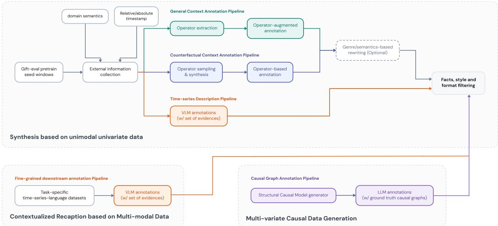  
Figure 7. Alignment data curation for univariate understanding, multivariate understanding, and univariate f<sub>orecas</sub>ti<sub>ng.</sub>

## A.1 Univariate Understanding

U<sub>n</sub>i<sub>var</sub>i<sub>a</sub>t<sub>e un</sub>d<sub>ers</sub>t<sub>an</sub>di<sub>ng</sub> d<sub>a</sub>t<sub>a</sub> t<sub>eac</sub>h<sub>es</sub> th<sub>e mo</sub>d<sub>e</sub>l t<sub>o recogn</sub>i<sub>ze</sub> t<sub>empora</sub>l <sub>pa</sub>tt<sub>erns an</sub>d <sub>express</sub> th<sub>em</sub> i<sub>n</sub> l<sub>anguage.</sub> W<sub>e use v</sub>i<sub>s</sub>i<sub>on-</sub>l<sub>anguage mo</sub>d<sub>e</sub>l<sub>s as</sub> th<sub>e pr</sub>i<sub>mary anno</sub>t<sub>a</sub>t<sub>ors</sub> b<sub>ecause</sub> th<sub>e</sub>i<sub>r exposure</sub> t<sub>o c</sub>h<sub>ar</sub>t<sub>s</sub> <sub>an</sub>d <sub>v</sub>i<sub>sua</sub>l d<sub>a</sub>t<sub>a equ</sub>i<sub>ps</sub> th<sub>em</sub> t<sub>o perce</sub>i<sub>ve g</sub>l<sub>o</sub>b<sub>a</sub>l <sub>morp</sub>h<sub>o</sub>l<sub>ogy, suc</sub>h <sub>as</sub> t<sub>ren</sub>d<sub>s, seasona</sub>lit<sub>y, an</sub>d <sub>reg</sub>i<sub>me</sub> <sub>c</sub>h<sub>anges,</sub> t<sub>oge</sub>th<sub>er w</sub>ith l<sub>oca</sub>l <sub>even</sub>t<sub>s suc</sub>h <sub>as pea</sub>k<sub>s,</sub> t<sub>roug</sub>h<sub>s, an</sub>d <sub>anoma</sub>li<sub>es.</sub> Th<sub>e</sub>i<sub>r anno</sub>t<sub>a</sub>ti<sub>ons</sub> di<sub>s</sub>till thi<sub>s</sub> t<sub>empora</sub>l k<sub>now</sub>l<sub>e</sub>d<sub>ge</sub> i<sub>n</sub>t<sub>o</sub> t<sub>ex</sub>t<sub>ua</sub>l <sub>superv</sub>i<sub>s</sub>i<sub>on.</sub> F<sub>or rea</sub>l <sub>ser</sub>i<sub>es, eac</sub>h <sub>ev</sub>id<sub>ence pac</sub>k <sub>com</sub>bi<sub>nes</sub> th<sub>e</sub> <sub>o</sub>b<sub>serve</sub>d t<sub>race w</sub>ith d<sub>e</sub>t<sub>erm</sub>i<sub>n</sub>i<sub>s</sub>ti<sub>c s</sub>t<sub>a</sub>ti<sub>s</sub>ti<sub>cs, ex</sub>t<sub>rema,</sub> t<sub>ren</sub>d <sub>segmen</sub>t<sub>s, c</sub>h<sub>ange po</sub>i<sub>n</sub>t<sub>s, per</sub>i<sub>o</sub>di<sub>c pa</sub>tt<sub>erns,</sub> <sub>an</sub>d t<sub>empora</sub>l l<sub>an</sub>d<sub>mar</sub>k<sub>s;</sub> th<sub>e con</sub>t<sub>ex</sub>t<sub>-r</sub>i<sub>c</sub>h <sub>rou</sub>t<sub>e a</sub>dditi<sub>ona</sub>ll<sub>y supp</sub>li<sub>es</sub> d<sub>oma</sub>i<sub>n seman</sub>ti<sub>cs an</sub>d <sub>ca</sub>l<sub>en</sub>d<sub>ar</sub> information. Se<sub>p</sub>aratel<sub>y</sub>, we ado<sub>p</sub>t the attribute-first s<sub>y</sub>nthesis scheme of ChatTS (Xie et al., 2024), i<sub>n w</sub>hi<sub>c</sub>h <sub>samp</sub>l<sub>e</sub>d t<sub>empora</sub>l <sub>a</sub>tt<sub>r</sub>ib<sub>u</sub>t<sub>es</sub> d<sub>e</sub>t<sub>erm</sub>i<sub>ne</sub> b<sub>o</sub>th th<sub>e genera</sub>t<sub>e</sub>d <sub>ser</sub>i<sub>es an</sub>d it<sub>s programma</sub>bl<sub>e</sub> d<sub>escr</sub>i<sub>p</sub>ti<sub>on.</sub> W<sub>e a</sub>l<sub>so rewr</sub>it<sub>e proce</sub>d<sub>ura</sub>ll<sub>y genera</sub>t<sub>e</sub>d <sub>exam promp</sub>t<sub>s on pa</sub>tt<sub>ern recogn</sub>iti<sub>on, no</sub>i<sub>se,</sub> <sub>s</sub>i<sub>m</sub>il<sub>ar</sub>it<sub>y,</sub> <sub>anoma</sub>li<sub>es,</sub> <sub>an</sub>d G<sub>ranger-causa</sub>l <sub>s</sub>t<sub>ruc</sub>t<sub>ure</sub> i<sub>n</sub>t<sub>o</sub> <sub>conc</sub>i<sub>se</sub> d<sub>escr</sub>i<sub>p</sub>ti<sub>ve-answer</sub> <sub>superv</sub>i<sub>s</sub>i<sub>on.</sub> All <sub>ou</sub>t<sub>pu</sub>t<sub>s pass</sub> f<sub>ac</sub>t<sub>ua</sub>l<sub>, s</sub>t<sub>y</sub>li<sub>s</sub>ti<sub>c, an</sub>d f<sub>orma</sub>tti<sub>ng</sub> filt<sub>ers.</sub>

## A.2 Multivariate Understanding

R<sub>ea</sub>l <sub>mu</sub>lti<sub>var</sub>i<sub>a</sub>t<sub>e</sub> ti<sub>me ser</sub>i<sub>es rare</sub>l<sub>y carry</sub> d<sub>e</sub>t<sub>a</sub>il<sub>e</sub>d<sub>, ver</sub>ifi<sub>a</sub>bl<sub>e anno</sub>t<sub>a</sub>ti<sub>ons o</sub>f i<sub>n</sub>t<sub>erac</sub>ti<sub>ons across</sub> variables. We retain the cleaned multivariate descri<sub>p</sub>tions from ChatTS (Xie et al., 2024) for broad d<sub>escr</sub>i<sub>p</sub>ti<sub>ve coverage an</sub>d <sub>cons</sub>t<sub>ruc</sub>t <sub>grap</sub>h<sub>-groun</sub>d<sub>e</sub>d <sub>re</sub>l<sub>a</sub>ti<sub>ona</sub>l <sub>superv</sub>i<sub>s</sub>i<sub>on w</sub>ith t<sub>empora</sub>l <sub>s</sub>t<sub>ruc</sub>t<sub>ura</sub>l e<sub>q</sub>uation models. The source <sub>g</sub>enerator sam<sub>p</sub>les s<sub>p</sub>arse or random la<sub>gg</sub>ed <sub>g</sub>ra<sub>p</sub>hs over 3 to 50 observed variables with maximum la s from 2 to 50 ste s then simulates their multivariate trajectories. Each <sub>ev</sub>id<sub>ence pac</sub>k <sub>recor</sub>d<sub>s</sub> th<sub>e grap</sub>h<sub>-au</sub>th<sub>or</sub>i<sub>ze</sub>d <sub>var</sub>i<sub>a</sub>bl<sub>e ro</sub>l<sub>es,</sub> l<sub>ag o</sub>f<sub>se</sub>t<sub>s,</sub> i<sub>n</sub>t<sub>erven</sub>ti<sub>on me</sub>t<sub>a</sub>d<sub>a</sub>t<sub>a w</sub>h<sub>en</sub> <sub>presen</sub>t<sub>,</sub> t<sub>empora</sub>l <sub>anc</sub>h<sub>ors, an</sub>d <sub>canon</sub>i<sub>ca</sub>l <sub>ev</sub>id<sub>ence</sub> f<sub>or</sub> di<sub>rec</sub>t <sub>paren</sub>t<sub>-</sub>t<sub>o-</sub>t<sub>arge</sub>t <sub>re</sub>l<sub>a</sub>ti<sub>ons, s</sub>h<sub>or</sub>t di<sub>rec</sub>t<sub>e</sub>d <sub>c</sub>h<sub>a</sub>i<sub>ns,</sub> l<sub>oca</sub>li<sub>ze</sub>d <sub>s</sub>h<sub>oc</sub>k f<sub>o</sub>ll<sub>ow-ons,</sub> hi<sub>s</sub>t<sub>or</sub>i<sub>ca</sub>l <sub>re</sub>f<sub>erence w</sub>i<sub>n</sub>d<sub>ows</sub> f<sub>rom</sub> th<sub>e same</sub> SCM<sub>, an</sub>d l<sub>oca</sub>l <sub>pa</sub>r<sub>e</sub>nt/<sub>c</sub>hild m<sub>o</sub>tif<sub>s.</sub> A t<sub>e</sub>xt-<sub>o</sub>nl<sub>y</sub> LLM <sub>co</sub>nv<sub>e</sub>rt<sub>s</sub> thi<sub>s e</sub>vid<sub>e</sub>n<sub>ce</sub> int<sub>o</sub> n<sub>a</sub>t<sub>u</sub>r<sub>a</sub>l d<sub>esc</sub>ri<sub>p</sub>ti<sub>o</sub>n<sub>s u</sub>nd<sub>e</sub>r <sub>au</sub>t<sub>o</sub>m<sub>a</sub>ti<sub>c</sub> <sub>g</sub>roundin<sub>g</sub> checks. The active mixture contains 100<sub>,</sub>000 SCM descri<sub>p</sub>tions<sub>,</sub> includin<sub>g</sub> 74<sub>,</sub>210 <sub>p</sub>ositive relation examples and 25,790 comparison controls whose channels are not directly adjacent to the <sup>t</sup>a<sup>r</sup>ge<sup>t</sup>.

## A.3 Univariate Forecasting

P<sub>a</sub>i<sub>re</sub>d d<sub>a</sub>t<sub>a</sub> th<sub>a</sub>t <sub>connec</sub>t<sub>s an o</sub>b<sub>serve</sub>d hi<sub>s</sub>t<sub>ory, a</sub> t<sub>ex</sub>t<sub>ua</sub>l <sub>con</sub>diti<sub>on, an</sub>d it<sub>s correspon</sub>di<sub>ng</sub> f<sub>u-</sub> t<sub>ure</sub> i<sub>s scarce</sub> i<sub>n na</sub>t<sub>ura</sub>l <sub>corpora.</sub> W<sub>e cons</sub>t<sub>ruc</sub>t thi<sub>s superv</sub>i<sub>s</sub>i<sub>on</sub> th<sub>roug</sub>h th<sub>e genera</sub>l<sub>-con</sub>t<sub>ex</sub>t <sub>an</sub>d <sub>coun</sub>t<sub>er</sub>f<sub>ac</sub>t<sub>ua</sub>l<sub>-con</sub>t<sub>ex</sub>t <sub>p</sub>i<sub>pe</sub>li<sub>nes</sub> i<sub>n</sub> Fi<sub>gure</sub> 7<sub>.</sub> Th<sub>e genera</sub>l b<sub>ranc</sub>h <sub>anno</sub>t<sub>a</sub>t<sub>es</sub> th<sub>e rea</sub>li<sub>ze</sub>d <sub>su</sub>fi<sub>x o</sub>f <sub>a</sub> <sub>rea</sub>l <sub>w</sub>i<sub>n</sub>d<sub>ow w</sub>ith it<sub>s</sub> d<sub>oma</sub>i<sub>n seman</sub>ti<sub>cs an</sub>d t<sub>empora</sub>l i<sub>n</sub>f<sub>orma</sub>ti<sub>on.</sub> Th<sub>e con</sub>t<sub>ro</sub>l b<sub>ranc</sub>h <sub>pro</sub>d<sub>uces</sub> th<sub>ree</sub> <sub>s</sub>ibli<sub>ng</sub> <sub>con</sub>ti<sub>nua</sub>ti<sub>ons</sub> f<sub>rom</sub> <sub>one</sub> hi<sub>s</sub>t<sub>ory:</sub> <sub>a</sub> b<sub>ase</sub>li<sub>ne</sub> <sub>an</sub>d t<sub>wo</sub> <sub>con</sub>t<sub>ro</sub>ll<sub>e</sub>d <sub>var</sub>i<sub>an</sub>t<sub>s,</sub> <sub>eac</sub>h <sub>compos</sub>i<sub>ng</sub> <sub>up</sub> t<sub>o</sub> th<sub>ree</sub> t<sub>rans</sub>f<sub>orma</sub>ti<sub>ons</sub> d<sub>rawn</sub> f<sub>rom</sub> l<sub>eve</sub>l <sub>s</sub>hift<sub>s,</sub> <sub>ramps,</sub> <sub>s</sub>l<sub>ope</sub> <sub>c</sub>h<sub>anges,</sub> <sub>pu</sub>l<sub>ses,</sub> <sub>seasona</sub>l<sub>-amp</sub>lit<sub>u</sub>d<sub>e</sub> <sub>c</sub>h<sub>anges,</sub> <sub>sa</sub>t<sub>ura</sub>ti<sub>ons,</sub> <sub>s</sub>h<sub>oc</sub>k d<sub>ecays,</sub> <sub>an</sub>d <sub>ana</sub>l<sub>og</sub> <sub>rep</sub>l<sub>ays.</sub> It <sub>ren</sub>d<sub>ers</sub> th<sub>e</sub> <sub>app</sub>li<sub>e</sub>d t<sub>rans</sub>f<sub>orma</sub>ti<sub>ons</sub> <sub>as</sub> <sub>na</sub>t<sub>ura</sub>l<sub>-</sub>l<sub>anguage con</sub>diti<sub>ons, so</sub> th<sub>e s</sub>h<sub>are</sub>d hi<sub>s</sub>t<sub>ory can</sub> l<sub>ea</sub>d t<sub>o</sub> di<sub>s</sub>ti<sub>nc</sub>t t<sub>ex</sub>t<sub>-spec</sub>ifi<sub>e</sub>d f<sub>u</sub>t<sub>ures.</sub> Th<sub>e</sub> <sub>mo</sub>d<sub>e</sub>l i<sub>npu</sub>t <sub>con</sub>t<sub>a</sub>i<sub>ns</sub> th<sub>e o</sub>b<sub>serve</sub>d hi<sub>s</sub>t<sub>ory an</sub>d th<sub>e na</sub>t<sub>ura</sub>l<sub>-</sub>l<sub>anguage con</sub>ti<sub>nua</sub>ti<sub>on con</sub>diti<sub>on, w</sub>hil<sub>e</sub> ti<sub>me-ser</sub>i<sub>es</sub> l<sub>oss app</sub>li<sub>es on</sub>l<sub>y</sub> t<sub>o</sub> th<sub>e</sub> h<sub>e</sub>ld<sub>-ou</sub>t <sub>su</sub>fi<sub>x.</sub> O<sub>p</sub>ti<sub>ona</sub>l <sub>genre an</sub>d <sub>seman</sub>ti<sub>c rewr</sub>it<sub>es</sub> di<sub>vers</sub>if<sub>y</sub> th<sub>e</sub> <sub>con</sub>diti<sub>ons w</sub>hil<sub>e preserv</sub>i<sub>ng</sub> th<sub>e</sub>i<sub>r connec</sub>ti<sub>on</sub> t<sub>o</sub> th<sub>e</sub> t<sub>arge</sub>t f<sub>u</sub>t<sub>ure.</sub> B<sub>o</sub>th <sub>p</sub>i<sub>pe</sub>li<sub>nes app</sub>l<sub>y</sub> th<sub>e s</sub>h<sub>are</sub>d f<sub>ac</sub>t<sub>ua</sub>l<sub>, s</sub>t<sub>y</sub>li<sub>s</sub>ti<sub>c, an</sub>d f<sub>orma</sub>tti<sub>ng</sub> filt<sub>ers.</sub>

## B Training Data

Sta<sub>g</sub>e 1 contains 2<sub>,</sub>229<sub>,</sub>500 ali<sub>g</sub>nment exam<sub>p</sub>les<sub>,</sub> <sub>g</sub>rou<sub>p</sub>ed into 12 families alon<sub>g</sub> the three curation routes of A<sub>pp</sub>endix A. Sta<sub>g</sub>e 2 uses a final inventor<sub>y</sub> of 4<sub>,</sub>881<sub>,</sub>583 sam<sub>p</sub>les across five com<sub>p</sub>osition <sub>ca</sub>t<sub>egor</sub>i<sub>es,</sub> <sub>w</sub>ith <sub>a</sub>li<sub>gnmen</sub>t <sub>re</sub>t<sub>en</sub>ti<sub>on</sub> <sub>res</sub>t<sub>r</sub>i<sub>c</sub>t<sub>e</sub>d t<sub>o</sub> it<sub>s</sub> <sub>rec</sub>i<sub>pe-</sub>d<sub>e</sub>fi<sub>ne</sub>d <sub>quo</sub>t<sub>a.</sub>

## B.1 Alignment Corpus Composition

T<sub>a</sub>bl<sub>e</sub> 7 li<sub>s</sub>t<sub>s</sub> th<sub>e</sub> 12 <sub>a</sub>li<sub>gnmen</sub>t f<sub>am</sub>ili<sub>es.</sub> Th<sub>e</sub> <sub>un</sub>d<sub>ers</sub>t<sub>an</sub>di<sub>ng</sub> <sub>an</sub>d f<sub>orecas</sub>ti<sub>ng</sub> h<sub>a</sub>l<sub>ves</sub> <sub>are</sub> fi<sub>xe</sub>d <sub>a</sub>t 3<sub>:</sub>7 b<sub>y</sub> construction (668,850 and 1,560,650 rows). Each forecastin<sub>g</sub> branch a<sub>pp</sub>ears in three variants: a b<sub>ase</sub> <sub>var</sub>i<sub>an</sub>t <sub>w</sub>ith h<sub>or</sub>i<sub>zon</sub> <sub>a</sub>t <sub>mos</sub>t 512<sub>,</sub> <sub>a</sub> <sub>rewr</sub>it<sub>e</sub> <sub>o</sub>f th<sub>e</sub> <sub>same</sub> <sub>rows</sub> i<sub>n</sub>t<sub>o</sub> d<sub>oma</sub>i<sub>n-groun</sub>d<sub>e</sub>d <sub>rea</sub>l<sub>-wor</sub>ld <sub>con</sub>t<sub>ex</sub>t <sub>w</sub>ith h<sub>or</sub>i<sub>zon a</sub>t <sub>mos</sub>t 32<sub>, an</sub>d <sub>a par</sub>ti<sub>a</sub>l <sub>genre rewr</sub>it<sub>e un</sub>d<sub>er</sub> th<sub>e same</sub> h<sub>or</sub>i<sub>zon</sub> li<sub>m</sub>it<sub>.</sub> C<sub>on</sub>t<sub>ro</sub>l <sub>rows</sub> <sub>are</sub> <sub>organ</sub>i<sub>ze</sub>d i<sub>n</sub>t<sub>o</sub> th<sub>ree-s</sub>ibli<sub>ng</sub> <sub>groups</sub> th<sub>a</sub>t <sub>s</sub>h<sub>are</sub> <sub>one</sub> hi<sub>s</sub>t<sub>ory:</sub> <sub>one</sub> <sub>neu</sub>t<sub>ra</sub>l <sub>con</sub>ti<sub>nua</sub>ti<sub>on</sub> <sub>an</sub>d t<sub>wo opera</sub>t<sub>or-con</sub>diti<sub>one</sub>d f<sub>u</sub>t<sub>ures.</sub>

Table 7. Alignment corpus: 12 families, 2,229,500 examples. � is the forecast horizon. Rewrite variants reuse th<sub>e</sub> b<sub>ase rows an</sub>d <sub>c</sub>h<sub>ange on</sub>l<sub>y</sub> th<sub>e user-v</sub>i<sub>s</sub>ibl<sub>e</sub> t<sub>ex</sub>t<sub>.</sub>
<table><tr><td>Family</td><td>Curation route</td><td>n</td><td>Share</td></tr><tr><td colspan="4">Understanding 668,850 rows, 30.0%</td></tr><tr><td>Morphology captions</td><td>morphology-grounded VLM annotation</td><td>50,000</td><td>2.2%</td></tr><tr><td>Context-rich captions</td><td>context-grounded VLM annotation</td><td>50,000</td><td>2.2%</td></tr><tr><td>ChatTS (Xie et al., 2024) univariate</td><td>attribute-programmed synthesis</td><td>260,000</td><td>11.7%</td></tr><tr><td>ChatTS (Xie et al., 2024) multivariate</td><td>attribute-programmed synthesis</td><td>108,850</td><td>4.9%</td></tr><tr><td>Multivariate SCM</td><td>SCM-grounded relation synthesis</td><td>100,000</td><td>4.5%</td></tr><tr><td>TimeSeriesExam descriptions</td><td>procedural task synthesis</td><td>100,000</td><td>4.5%</td></tr><tr><td colspan="4">Forecasting, control branch 668,291 rows, 30.0%</td></tr><tr><td>Control,  $H \leq 5 1 2$ </td><td>operator-controlled future synthesis</td><td>338,953</td><td>15.2%</td></tr><tr><td>Control,  $H \leq 3 2$ </td><td>domain-grounded rewriting</td><td>164,918</td><td>7.4%</td></tr><tr><td>Control,  $H \leq 3 2$ </td><td>genre-conditioned rewriting</td><td>164,420</td><td>7.4%</td></tr><tr><td colspan="4">Forecasting, general branch 892,359 rows, 40.0%</td></tr><tr><td>General,  $H { \le } 5 1 2$ </td><td>realized-future annotation</td><td>528,507</td><td>23.7%</td></tr><tr><td>General,  $H \leq 3 2$ </td><td>domain-grounded rewriting</td><td>255,291</td><td>11.5%</td></tr><tr><td>General,  $H \leq 3 2$ </td><td>genre-conditioned rewriting</td><td>108,561</td><td>4.9%</td></tr></table>

## B.2 Supervised Fine-Tuning Sources

T<sub>a</sub>bl<sub>e</sub> 8 <sub>repor</sub>t<sub>s</sub> th<sub>e</sub> St<sub>age-</sub>2 d<sub>a</sub>t<sub>a</sub> di<sub>s</sub>t<sub>r</sub>ib<sub>u</sub>ti<sub>on.</sub>

Table 8. Final one-pass Stage-2 sample inventory and training-time sampling shares. References identify the <sub>source</sub> d<sub>a</sub>t<sub>ase</sub>t<sub>s; coun</sub>t<sub>s re</sub>f<sub>er</sub> t<sub>o our se</sub>l<sub>ec</sub>t<sub>e</sub>d <sub>an</sub>d <sub>re</sub>f<sub>orma</sub>tt<sub>e</sub>d <sub>examp</sub>l<sub>es.</sub>

<table><tr><td>Source</td><td>Final samples</td><td>Training Share</td></tr><tr><td colspan="3">Forecasting 2,640,566 samples, 54.49%</td></tr><tr><td>CGTSF (Wang et al., 2025a)</td><td>53,926</td><td>2.04%</td></tr><tr><td>FinMultiTime S&amp;P 500 (Xu et al., 2025b)</td><td>144,387</td><td>5.46%</td></tr><tr><td>MoTime (News/Wiki) (Zhou et al., 2025b)</td><td>32,589</td><td>1.23%</td></tr><tr><td>CAF-7M (Zheng et al., 2026)</td><td>2,314,216</td><td>42.15%</td></tr><tr><td>Time-MMD (Liu et al., 2024a)</td><td>20,768</td><td>0.79%</td></tr><tr><td>Time-MQA Forecasting (Kong et al., 2025)</td><td>74,680</td><td>2.82%</td></tr><tr><td colspan="3">Time-Series QA &amp; Reasoning 1,065,021 samples, 22.49%</td></tr><tr><td>CaTS-Bench (Zhou et al., 2026)</td><td>15,995</td><td>0.33%</td></tr><tr><td>ChatTS (Xie et al., 2024)</td><td>50,377</td><td>1.05%</td></tr><tr><td>HiTSR (Ding et al., 2026)</td><td>157,147</td><td>3.24%</td></tr><tr><td>OpenSQA (Imran et al., 2024)</td><td>138,754</td><td>2.72%</td></tr><tr><td>OpenTSLM ECG (Langer et al., 2025)</td><td>159,313</td><td>3.28%</td></tr><tr><td>OpenTSLM HAR (Langer et al., 2025)</td><td>68,542</td><td>1.41%</td></tr><tr><td>OpenTSLM Sleep (Langer et al., 2025)</td><td>7,434</td><td>0.15%</td></tr><tr><td>OpenTSLM TSQA (Langer et al., 2025)</td><td>38,400</td><td>0.79%</td></tr><tr><td>Time-MQA Reasoning (Kong et al., 2025)</td><td>110,212</td><td>2.27%</td></tr><tr><td>TSAQA Reasoning (Jing et al., 2026)</td><td>125,957</td><td>2.60%</td></tr><tr><td>EngineMT-QA (Wang et al., 2025b)</td><td>100,296</td><td>2.07%</td></tr><tr><td>RATs40K (Yang et al., 2026)</td><td>32,994</td><td>0.68%</td></tr><tr><td>Time-MQA Imputation (Kong et al., 2025)</td><td>38,607</td><td>1.46%</td></tr><tr><td>TSAQA Anomaly Detection (Jing et al., 2026)</td><td>20,993</td><td>0.43%</td></tr><tr><td colspan="3">Captioning &amp; Description 161,883 samples, 3.34%</td></tr><tr><td>OpenTSLM M4 Captioning (Langer et al., 2025)</td><td>80,000</td><td>1.65%</td></tr></table>

Continued on the next <sub>p</sub>a<sub>g</sub>e.

T<sub>a</sub>bl<sub>e</sub> 8 <sub>con</sub>ti<sub>nue</sub>d f<sub>rom</sub> th<sub>e prev</sub>i<sub>ous page.</sub>
<table><tr><td>Source</td><td>Final samples</td><td>Training Share</td></tr><tr><td>SensorCaps (Imran et al., 2024)</td><td>35,960</td><td>0.74%</td></tr><tr><td>Time-MMD Open-Ended (Liu et al., 2024a)</td><td>1,925</td><td>0.04%</td></tr><tr><td>TRACE Captioning (Chen et al., 2025a)</td><td>43,998</td><td>0.91%</td></tr><tr><td>Unimodal Corpora 400,000 samples, 11.69%</td><td></td><td></td></tr><tr><td>GIFT-Eval Pretrain (Aksu et al., 2024)</td><td>200,000</td><td>7.56%</td></tr><tr><td>Dolci-Instruct (No-Tools) (Team Olmo et al., 2025)</td><td>200,000</td><td>4.12%</td></tr><tr><td>Alignment Retention 614,113 samples, 8.00%</td><td></td><td></td></tr><tr><td>Understanding Retention</td><td>116,294</td><td>1.51%</td></tr><tr><td>Forecasting Retention</td><td>497,819</td><td>6.48%</td></tr><tr><td>Final inventory</td><td>4,881,583</td><td>100.00%</td></tr></table>

## B.3 Overlap with Evaluation Benchmarks

T<sub>o ensure a va</sub>lid <sub>eva</sub>l<sub>ua</sub>ti<sub>on, we s</sub>t<sub>r</sub>i<sub>c</sub>tl<sub>y en</sub>f<sub>orce no over</sub>l<sub>ap w</sub>ith th<sub>e</sub> t<sub>ra</sub>i<sub>n</sub>i<sub>ng m</sub>i<sub>x</sub>t<sub>ure a</sub>t th<sub>e sp</sub>lit l<sub>eve</sub>l<sub>,</sub> k<sub>eep</sub>i<sub>ng eva</sub>l<sub>ua</sub>ti<sub>on examp</sub>l<sub>es</sub> h<sub>e</sub>ld <sub>ou</sub>t <sub>even w</sub>h<sub>en re</sub>l<sub>a</sub>t<sub>e</sub>d t<sub>ra</sub>i<sub>n</sub>i<sub>ng</sub> d<sub>a</sub>t<sub>a or</sub>i<sub>g</sub>i<sub>na</sub>t<sub>e</sub> f<sub>rom</sub> th<sub>e same</sub> b<sub>e</sub>n<sub>c</sub>hm<sub>a</sub>rk f<sub>a</sub>mil<sub>y</sub> <sub>o</sub>r <sub>u</sub>nd<sub>e</sub>rl<sub>y</sub>in<sub>g</sub> d<sub>a</sub>t<sub>a</sub>-<sub>ge</sub>n<sub>e</sub>r<sub>a</sub>tin<sub>g</sub> <sub>p</sub>r<sub>ocess.</sub> T<sub>a</sub>bl<sub>e</sub> 9 <sub>su</sub>mm<sub>a</sub>riz<sub>es</sub> thi<sub>s</sub> r<sub>e</sub>l<sub>a</sub>ti<sub>o</sub>n<sub>s</sub>hi<sub>p</sub> f<sub>o</sub>r <sub>eac</sub>h b<sub>enc</sub>h<sub>mar</sub>k<sub>.</sub>

Table 9. Training status of the evaluation suites. Status is determined by split membership in the mixture.
<table><tr><td>Benchmark</td><td>Status</td></tr><tr><td>Understanding</td><td></td></tr><tr><td>TemporalBench MCQ)</td><td>(TB- Out-of-domain.</td></tr><tr><td>TSExam</td><td>Independently generated and rewritten samples from the same data-generating process are included in the alignment</td></tr><tr><td>TSAQA</td><td>mixture. Training split is included in the SFT mixture.</td></tr><tr><td>CaTS-Bench</td><td>Training split is included in the SFT mixture.</td></tr><tr><td>Forecasting</td><td></td></tr><tr><td>ETT and Weather</td><td>Out-of-domain.</td></tr><tr><td>CiK</td><td>Out-of-domain.</td></tr><tr><td>Time-MMD</td><td>Training split is included in the SFT mixture.</td></tr><tr><td>CGTSF</td><td>Training split is included in the SFT mixture.</td></tr><tr><td>CAF</td><td>Part of the training split is included in the SFT mixture.</td></tr><tr><td>Ctrl-F</td><td>Independently generated samples from the same data- generating process are included in the alignment mixture.</td></tr><tr><td>GIFT-Eval</td><td>Part of the training split is used as seed data for data gen- eration.</td></tr></table>

## C Implementation Details

## C.1 Model Configuration

Table 10 <sub>g</sub>ives the <sub>p</sub>arameter allocation across Qwen3 lan<sub>g</sub>ua<sub>g</sub>e towers (Yan<sub>g</sub> et al., 2025), TimesFM-derived time-series towers (Das et al., 2023), and fusion stacks. Variant names round the t<sub>o</sub>t<sub>a</sub>l <sub>parame</sub>t<sub>er coun</sub>t<sub>,</sub> i<sub>nc</sub>l<sub>u</sub>di<sub>ng</sub> f<sub>rozen we</sub>i<sub>g</sub>ht<sub>s an</sub>d <sub>exc</sub>l<sub>u</sub>di<sub>ng</sub> b<sub>u</sub>f<sub>ers; s</sub>h<sub>are</sub>d <sub>we</sub>i<sub>g</sub>ht<sub>s are coun</sub>t<sub>e</sub>d once.

Table 10. Parameter inventory across TimeBraid scales, in billions of parameters.
<table><tr><td>Variant</td><td>Language tower</td><td>Fusion</td><td>Time-series tower</td><td>Total</td></tr><tr><td>TimeBraid-1.2B</td><td>0.596</td><td>0.378</td><td>0.231</td><td>1.205</td></tr><tr><td>TimeBraid-2.5B</td><td>1.721</td><td>0.545</td><td>0.231</td><td>2.497</td></tr><tr><td>TimeBraid-6.7B</td><td>4.022</td><td>2.265</td><td>0.389</td><td>6.676</td></tr></table>

Geometry and Layer Pairing. TimeBraid-1.2B and TimeBraid-2.5B interleave 20 time-series and f<sub>us</sub>i<sub>on</sub> bl<sub>oc</sub>k<sub>s across</sub> 28 l<sub>anguage</sub> l<sub>ayers, w</sub>hil<sub>e</sub> Ti<sub>me</sub>B<sub>ra</sub>id<sub>-</sub>6<sub>.</sub>7B <sub>pa</sub>i<sub>rs</sub> 36 ti<sub>me-ser</sub>i<sub>es an</sub>d f<sub>us</sub>i<sub>on</sub> bl<sub>oc</sub>k<sub>s</sub> with its 36 language layers. Time-series segments use patches of � = 32 values, and each paired layer <sub>exc</sub>h<sub>anges</sub> i<sub>n</sub>f<sub>orma</sub>ti<sub>on</sub> th<sub>roug</sub>h <sub>g</sub>l<sub>o</sub>b<sub>a</sub>l <sub>res</sub>id<sub>ua</sub>l <sub>a</sub>tt<sub>en</sub>ti<sub>on.</sub>

## C.2 Training Hyperparameters

Both sta<sub>g</sub>es u<sub>p</sub>date ever<sub>y</sub> <sub>p</sub>arameter of the model (lan<sub>g</sub>ua<sub>g</sub>e tower, time-series tower, and the <sub>g</sub>lobal residual attention blocks) under the settin<sub>g</sub>s in Table 11. The two sta<sub>g</sub>es share the o<sub>p</sub>timizer, schedule, batch size, and objective constants; they difer in context length, step budget, and data <sub>m</sub>i<sub>x</sub>t<sub>ure.</sub>

Table 11. Training hyperparameters for both stages. Rows spanning both columns are identical across stages.
<table><tr><td>Stage 1 (alignment)</td><td>Stage 2 (supervised fine-tuning)</td></tr><tr><td>Optimizer</td><td>AdamW, 8-bit states</td></tr><tr><td>Learning rate</td><td> $2 \times 1 0 ^ { - 5 }$  , all parameters</td></tr><tr><td>Schedule</td><td>constant with warmup</td></tr><tr><td>Warmup steps</td><td>500</td></tr><tr><td>Weight decay</td><td>0</td></tr><tr><td>Gradient clipping</td><td>1.0</td></tr><tr><td>Precision</td><td>BF16 mixed precision</td></tr><tr><td>Random seed</td><td>3407</td></tr><tr><td>Global batch size</td><td>128</td></tr><tr><td>Sequence packing</td><td>disabled</td></tr><tr><td>Patch length P</td><td>32</td></tr><tr><td>Time-series loss weight α</td><td>0.5</td></tr><tr><td>Point loss</td><td>squared error</td></tr><tr><td>Quantile set Q</td><td>{0.1, 0.2, . . . , 0.9}</td></tr><tr><td>Loss cap threshold c</td><td>2.0</td></tr><tr><td>Target transform</td><td>asinh on causal RevIN residuals</td></tr><tr><td>Context length</td><td>2,560 4,096</td></tr><tr><td>Training data</td><td>2.23M alignment pairs 4.88M final samples</td></tr><tr><td>Training steps</td><td>17k steps 30k steps</td></tr></table>

```julia
# H_l: (n_l, d_l) language hidden states; H_t: (n_t, d_t) time-series hidden states
# tau_l, tau_t: timeline positions of each stream (global chronological order)
# pair_of[i]: time-series layer paired with language layer i, or None;
# smaller variants have unpaired language layers, while 6.7B pairs all 36 layers
# Wq_r, Wk_r, Wv_r: (d_r, d) projections to the shared width; Wo_r: (d, d_r), zero-init
# phi_r: hidden-state RMSNorm; psi_r: per-head QK RMSNorm (r in {l, t})
def forward(H_l, H_t, tau_l, tau_t):
for i in range(num_lm_layers):
H_l = lm_block[i](H_l) # every language layer runs its native block (RoPE
inside)
if pair_of[i] is None:
continue # unpaired layer: the language stream continues
alone
j = pair_of[i]
H_t = ts_block[j](H_t) # paired time-series layer (segment-local
positions)
H_l, H_t = fuse[j](H_l, H_t, tau_l, tau_t) # global residual attention
return H_l, H_t
def fuse(H_l, H_t, tau_l, tau_t):
# project both streams into the shared attention width d (values: no head norm)
q_l, k_l, v_l = psi_l(phi_l(H_l) @ Wq_l), psi_l(phi_l(H_l) @ Wk_l), phi_l(H_l) @ Wv_l
q_t, k_t, v_t = psi_t(phi_t(H_t) @ Wq_t), psi_t(phi_t(H_t) @ Wk_t), phi_t(H_t) @ Wv_t
# reorder into one global sequence by timeline position tau
q, k, v, tau = merge_by_position([q_l, q_t], [k_l, k_t], [v_l, v_t], [tau_l, tau_t])
# joint causal attention with RoPE on the shared global axis
o = attention(rope(q, tau), rope(k, tau), v, mask="causal")
# route rows back to their streams; zero-init Wo_r makes fusion start as identity
o_l, o_t = split_by_stream(o)
return H_l + o_l @ Wo_l, H_t + o_t @ Wo_t
```

Algorithm 1. Pseudocode of TimeBraid’s forward pass. Every language layer runs its native block. At paired <sub>pos</sub>iti<sub>ons,</sub> th<sub>e correspon</sub>di<sub>ng</sub> ti<sub>me-ser</sub>i<sub>es</sub> bl<sub>oc</sub>k <sub>runs an</sub>d b<sub>o</sub>th <sub>s</sub>t<sub>reams exc</sub>h<sub>ange</sub> i<sub>n</sub>f<sub>orma</sub>ti<sub>on</sub> th<sub>roug</sub>h <sub>g</sub>l<sub>o</sub>b<sub>a</sub>l residual attention (E<sub>q</sub>s. 1 and 2); at an<sub>y</sub> un<sub>p</sub>aired <sub>p</sub>osition, the lan<sub>g</sub>ua<sub>g</sub>e stream <sub>p</sub>roceeds alone.

## D Prompt Template Examples

Examples are wrapped in Qwen3 chat templates and a series of time-series payloads. The transcript itself contains no time-series numbers: each segment appears in the text as the empty pair <ts></ts>, and the �-th occurrence binds to the �-th payload. <ts> and </ts> are added to the vocabulary as ordinary tokens, <stats> and </stats> stay plain text, and only assistant content receives c<sup>r</sup>oss<sup>-</sup>e<sup>ntr</sup>opy.

A context segment <sup>i</sup>s prece<sup>d</sup>e<sup>d b</sup>y <stats>len=�, mean=�, std=�</stats>, compute<sup>d</sup> on th<sub>e raw va</sub>l<sub>ues</sub> b<sub>e</sub>f<sub>ore norma</sub>li<sub>za</sub>ti<sub>on, so</sub> th<sub>e</sub> t<sub>ex</sub>t <sub>s</sub>t<sub>ream carr</sub>i<sub>es</sub> th<sub>e p</sub>h<sub>ys</sub>i<sub>ca</sub>l <sub>sca</sub>l<sub>e w</sub>hil<sub>e</sub> th<sub>e pa</sub>t<sub>c</sub>h stream carries only normalized shape. A target segment emits a bare <ts></ts> and never receives <sub>a s</sub>t<sub>a</sub>ti<sub>s</sub>ti<sub>cs</sub> bl<sub>oc</sub>k<sub>, so</sub> th<sub>e mo</sub>d<sub>e</sub>l i<sub>s no</sub>t t<sub>o</sub>ld th<sub>e sca</sub>l<sub>e o</sub>f th<sub>e sequence</sub> it <sub>mus</sub>t <sub>pro</sub>d<sub>uce.</sub> T<sub>arge</sub>t <sub>segmen</sub>t<sub>s</sub> span the full window [history | future] and reuse the mean and standard deviation of their context <sub>segmen</sub>t<sub>, w</sub>hi<sub>c</sub>h k<sub>eeps every</sub> f<sub>u</sub>t<sub>ure-aware s</sub>t<sub>a</sub>ti<sub>s</sub>ti<sub>c ou</sub>t <sub>o</sub>f th<sub>e</sub> i<sub>npu</sub>t<sub>, an</sub>d <sub>on</sub>l<sub>y</sub> th<sub>e</sub> f<sub>u</sub>t<sub>ure su</sub>fi<sub>x</sub> i<sub>s score</sub>d<sub>.</sub> E<sub>xam-s</sub>t<sub>y</sub>l<sub>e ques</sub>ti<sub>ons are</sub> th<sub>e one</sub> f<sub>am</sub>il<sub>y w</sub>h<sub>ose pay</sub>l<sub>oa</sub>d k<sub>eeps raw va</sub>l<sub>ues,</sub> b<sub>ecause</sub> th<sub>e</sub>i<sub>r op</sub>ti<sub>ons re</sub>f<sub>er</sub> t<sub>o a</sub>b<sub>so</sub>l<sub>u</sub>t<sub>e magn</sub>it<sub>u</sub>d<sub>es.</sub>

Each card below is one real alignment row, one per task family. Inside every <ts></ts> we plot the payload it binds to: teal for observed and context spans, orange for the future the assistant must ge<sup>n</sup>e<sup>r</sup>a<sup>t</sup>e.

## Univariate description

User: Treat this cloud operations series from Borg Cluster Data 2011 as sampled every 5 minutes. <stats>len=79, mean=0.0671359, std=0.0062208</stats> <ts> </ts> Provi<sup>d</sup>e a b<sub>r</sub>i<sub>e</sub>f <sub>wr</sub>itt<sub>en summary o</sub>f th<sub>e ser</sub>i<sub>es.</sub>

Assistant: A sharp, isolated excursion dominates the middle of the window, contrasting with the <sub>o</sub>th<sub>erw</sub>i<sub>se</sub> <sub>s</sub>t<sub>a</sub>bl<sub>e</sub> b<sub>ase</sub>li<sub>ne.</sub> Th<sub>e</sub> <sub>ser</sub>i<sub>es</sub> h<sub>o</sub>ld<sub>s</sub> <sub>a</sub> <sub>s</sub>t<sub>ea</sub>d<sub>y</sub> l<sub>eve</sub>l <sub>near</sub> 0<sub>.</sub>065 <sub>un</sub>til <sub>s</sub>t<sub>ep</sub> 39<sub>,</sub> <sub>w</sub>h<sub>ere</sub> it d<sub>rops</sub> <sub>a</sub>b<sub>rup</sub>tl<sub>y</sub> t<sub>o a</sub> l<sub>oca</sub>l <sub>m</sub>i<sub>n</sub>i<sub>mum o</sub>f 0<sub>.</sub>052<sub>.</sub> Thi<sub>s</sub> i<sub>s</sub> i<sub>mme</sub>di<sub>a</sub>t<sub>e</sub>l<sub>y</sub> f<sub>o</sub>ll<sub>owe</sub>d b<sub>y a s</sub>t<sub>eep recovery</sub> t<sub>o</sub> 0<sub>.</sub>076 <sub>a</sub>t <sub>s</sub>t<sub>ep</sub> 40<sub>,</sub> <sub>crea</sub>ti<sub>ng a narrow</sub> V<sub>-s</sub>h<sub>ape.</sub> Th<sub>e s</sub>i<sub>gna</sub>l th<sub>en</sub> d<sub>r</sub>ift<sub>s upwar</sub>d<sub>, reac</sub>hi<sub>ng</sub> th<sub>e w</sub>i<sub>n</sub>d<sub>ow</sub>’<sub>s g</sub>l<sub>o</sub>b<sub>a</sub>l <sub>max</sub>i<sub>mum o</sub>f 0<sub>.</sub>083 <sub>a</sub>t <sub>s</sub>t<sub>ep</sub> 55<sub>,</sub> b<sub>e</sub>f<sub>ore se</sub>ttli<sub>ng</sub> i<sub>n</sub>t<sub>o a gra</sub>d<sub>ua</sub>l d<sub>ec</sub>li<sub>ne</sub> t<sub>owar</sub>d th<sub>e en</sub>d<sub>.</sub> Th<sub>e amp</sub>lit<sub>u</sub>d<sub>e o</sub>f thi<sub>s cen</sub>t<sub>ra</sub>l <sub>even</sub>t i<sub>s s</sub>i<sub>gn</sub>ifi<sub>can</sub>tl<sub>y</sub> l<sub>arger</sub> th<sub>an</sub> th<sub>e am</sub>bi<sub>en</sub>t <sub>no</sub>i<sub>se o</sub>b<sub>serve</sub>d i<sub>n</sub> th<sub>e</sub> fi<sub>rs</sub>t <sub>an</sub>d l<sub>as</sub>t thi<sub>r</sub>d<sub>s o</sub>f th<sub>e</sub> t<sub>race.</sub>

## Context-rich description

User: Describe the time series of fatalities due to a specific severity level in Porterville city. The data spans <sup>f</sup>rom 2003 to 2008 w<sup>i</sup>t<sup>h</sup> a year<sup>l</sup>y <sup>f</sup>requency, cover<sup>i</sup>ng a tota<sup>l</sup> popu<sup>l</sup>at<sup>i</sup>on o<sup>f</sup> 41,774. <stats>len=6, mean=3.167, std=1.067</stats> <ts> </ts>

Relevant context: Time series of fatalities (severity: Killed) in Porterville city, CA. Data range: 2003-2008.   
Fre<sub>q</sub>uenc<sub>y</sub>: Yearl<sub>y</sub>. Total <sub>p</sub>o<sub>p</sub>ulation: 41<sub>,</sub>774.

Assistant: Porterville city recorded annual fatalities (severity: Killed) between 2003 and 2008 among a <sub>p</sub>o<sub>p</sub>ulation of 41<sub>,</sub>774. The series be<sub>g</sub>an at 3.0 in 2003 and reached its minimum of 2.0 in 2004. The data th<sub>en ex</sub>hibit<sub>e</sub>d hi<sub>g</sub>h <sub>vo</sub>l<sub>a</sub>tilit<sub>y, sp</sub>iki<sub>ng</sub> t<sub>o</sub> 4<sub>.</sub>0 i<sub>n</sub> 2005 b<sub>e</sub>f<sub>ore</sub> d<sub>ropp</sub>i<sub>ng</sub> b<sub>ac</sub>k t<sub>o</sub> 2<sub>.</sub>0 i<sub>n</sub> 2006<sub>.</sub> F<sub>o</sub>ll<sub>ow</sub>i<sub>ng</sub> thi<sub>s</sub> t<sub>roug</sub>h<sub>,</sub> th<sub>e</sub> <sub>ser</sub>i<sub>es</sub> t<sub>ren</sub>d<sub>e</sub>d <sub>upwar</sub>d<sub>,</sub> <sub>reac</sub>hi<sub>ng</sub> <sub>a</sub> <sub>ne</sub>t i<sub>ncrease</sub> <sub>o</sub>f 2<sub>.</sub>0 <sub>over</sub> th<sub>e</sub> <sub>per</sub>i<sub>o</sub>d <sub>an</sub>d <sub>c</sub>l<sub>os</sub>i<sub>ng</sub> <sub>a</sub>t it<sub>s</sub> maximum value of 5.0 in 2008.

## Time-series question answering

User: You are given a pair of synthetic time series generated by procedural time-series templates.

Time series 2: <stats>len=236, mean=2.34241, std=1.70843</stats> <ts> </ts> I<sub>ns</sub>t<sub>ruc</sub>ti<sub>on:</sub> Id<sub>en</sub>tif<sub>y</sub> <sub>w</sub>hi<sub>c</sub>h ti<sub>me</sub> <sub>ser</sub>i<sub>es</sub> <sub>con</sub>t<sub>a</sub>i<sub>ns</sub> th<sub>e</sub> <sub>anoma</sub>l<sub>y</sub> <sub>an</sub>d d<sub>escr</sub>ib<sub>e</sub> th<sub>e</sub> <sub>anoma</sub>l<sub>y</sub> t<sub>ype</sub> b<sub>ase</sub>d <sub>on</sub> th<sub>e</sub> <sub>v</sub>i<sub>s</sub>ibl<sub>e</sub> <sub>s</sub>t<sub>a</sub>ti<sub>s</sub>ti<sub>cs</sub> <sub>an</sub>d <sub>ser</sub>i<sub>es</sub> <sub>pa</sub>tt<sub>erns.</sub> R<sub>espon</sub>d <sub>w</sub>ith <sub>one</sub> <sub>conc</sub>i<sub>se</sub> d<sub>ec</sub>l<sub>ara</sub>ti<sub>ve</sub> <sub>sen</sub>t<sub>ence.</sub>

Assistant: Time series 1 has a speed up/down anomaly, meaning the period of its cyclic components dif<sub>ers</sub> f<sub>rom</sub> th<sub>e</sub> <sub>res</sub>t <sub>o</sub>f th<sub>e</sub> <sub>ser</sub>i<sub>es.</sub>

## Multivariate relational understanding

User: In a Web Servers system, there are 13 metrics:   
Request Rates is o<sup>f l</sup>engt<sup>h</sup> 256: <stats>len=256, mean=-0.4419, std=0.420386</stats> <ts> </ts>;   
Bac<sup>k</sup>en<sup>d</sup> Server Latency is o<sup>f</sup> <sup>l</sup>engt<sup>h</sup> 256: <stats>len=256, mean=5.0224, std=1.20905</stats> <ts> </ts>;   
[6 metrics elided, same form]   
Security Event Logs is o<sup>f l</sup>engt<sup>h</sup> 256: <stats>len=256, mean=-119.453, std=155.282</stats> <ts> </ts>;   
[4 metrics elided]. Analyze the trend of Security Event Logs in detail.

Assistant: From point 11 to point 55, there is an increasing trend. From point 55 to point 126, there is a decreasin<sub>g</sub> trend. From <sub>p</sub>oint 126 to <sub>p</sub>oint 188<sub>,</sub> there is an increasin<sub>g</sub> trend. From <sub>p</sub>oint 188 to <sub>p</sub>oint 245<sub>,</sub> th<sub>ere</sub> i<sub>s a</sub> d<sub>ecreas</sub>i<sub>ng</sub> t<sub>ren</sub>d<sub>.</sub>

## Contextual forecasting

User: We <sup>h</sup>ave <sup>b</sup>een trac<sup>ki</sup>ng our annua<sup>l</sup> vo<sup>l</sup>ume <sup>f</sup>or t<sup>h</sup>e <sup>l</sup>ast <sup>fi</sup>ve years: <stats>len=5, mean=4165.4, std=175.205</stats> <ts> </ts>. Historically, we’ve seen similar growth patterns d<sub>ur</sub>i<sub>ng prev</sub>i<sub>ous expans</sub>i<sub>on p</sub>h<sub>ases w</sub>h<sub>ere a s</sub>l<sub>ow s</sub>t<sub>ar</sub>t <sub>was</sub> f<sub>o</sub>ll<sub>owe</sub>d b<sub>y a rap</sub>id <sub>surge</sub> i<sub>n</sub> d<sub>eman</sub>d<sub>.</sub> B<sub>ase</sub>d <sub>on</sub> current market projections and our scaling strategy, we expect a similar acceleration over the next five <sub>years, s</sub>t<sub>ar</sub>ti<sub>ng w</sub>ith <sub>a mo</sub>d<sub>es</sub>t i<sub>ncrease</sub> t<sub>o aroun</sub>d 4<sub>,</sub>701 i<sub>n year</sub> 6 <sub>an</sub>d <sub>c</sub>li<sub>m</sub>bi<sub>ng s</sub>t<sub>eep</sub>l<sub>y</sub> t<sub>o reac</sub>h <sub>app</sub>r<sub>o</sub>xim<sub>a</sub>t<sub>e</sub>l<sub>y</sub> 5<sub>,</sub>622 b<sub>y yea</sub>r 10<sub>.</sub> Pl<sub>ease p</sub>r<sub>o</sub>vid<sub>e</sub> th<sub>e</sub> f<sub>u</sub>ll 10-<sub>yea</sub>r <sub>seque</sub>n<sub>ce,</sub> in<sub>c</sub>l<sub>u</sub>din<sub>g</sub> th<sub>e o</sub>b<sub>se</sub>rv<sub>e</sub>d hi<sub>s</sub>t<sub>o</sub>r<sub>y</sub> <sub>an</sub>d th<sub>e</sub> f<sub>orecas</sub>t<sub>e</sub>d <sub>va</sub>l<sub>ues.</sub>

Assistant: <ts> </ts>

## Controllable forecasting, three sibling rows

User: Local tech monitors are tracking weekly visitor trafic for the site, with current data showing <stats>len=6, mean=525.667, std=302.232</stats> <ts> </ts>. With a major <sub>mar</sub>k<sub>e</sub>ti<sub>ng pus</sub>h <sub>an</sub>d <sub>s</sub>it<sub>e re</sub>l<sub>aunc</sub>h <sub>pea</sub>ki<sub>ng</sub> i<sub>n a</sub>b<sub>ou</sub>t f<sub>our wee</sub>k<sub>s, o</sub>fi<sub>c</sub>i<sub>a</sub>l<sub>s expec</sub>t <sub>a s</sub>i<sub>gn</sub>ifi<sub>can</sub>t <sub>surge</sub> i<sub>n</sub> t<sub>ra</sub>fi<sub>c,</sub> <sub>po</sub>t<sub>en</sub>ti<sub>a</sub>ll<sub>y</sub> <sub>reac</sub>hi<sub>ng</sub> <sub>aroun</sub>d 869 <sub>v</sub>i<sub>s</sub>it<sub>ors.</sub> T<sub>o</sub> <sub>ass</sub>i<sub>s</sub>t <sub>w</sub>ith <sub>server</sub> <sub>capac</sub>it<sub>y</sub> <sub>p</sub>l<sub>ann</sub>i<sub>ng,</sub> <sub>p</sub>l<sub>ease</sub> <sub>prov</sub>id<sub>e</sub> th<sub>e</sub> f<sub>u</sub>ll <sub>sequence</sub> <sub>o</sub>f <sub>wee</sub>kl<sub>y</sub> t<sub>ra</sub>fi<sub>c,</sub> i<sub>nc</sub>l<sub>u</sub>di<sub>ng</sub> th<sub>e</sub> <sub>o</sub>b<sub>serve</sub>d d<sub>a</sub>t<sub>a</sub> <sub>an</sub>d th<sub>e</sub> f<sub>orecas</sub>t f<sub>or</sub> th<sub>e</sub> <sub>nex</sub>t 5 <sub>wee</sub>k<sub>s.</sub>

Assistant: <ts> </ts>

User: Team,

I’<sub>m rev</sub>i<sub>ew</sub>i<sub>ng our wee</sub>kl<sub>y page v</sub>i<sub>ews</sub> f<sub>or</sub> th<sub>e curren</sub>t <sub>seasona</sub>l <sub>cyc</sub>l<sub>e</sub> t<sub>o coor</sub>di<sub>na</sub>t<sub>e our upcom</sub>i<sub>ng resource</sub> <sub>a</sub>ll<sub>oca</sub>ti<sub>on.</sub> W<sub>e</sub>’<sub>ve seen some vo</sub>l<sub>a</sub>tilit<sub>y</sub> l<sub>a</sub>t<sub>e</sub>l<sub>y,</sub> b<sub>u</sub>t t<sub>yp</sub>i<sub>ca</sub>ll<sub>y</sub> thi<sub>s per</sub>i<sub>o</sub>d i<sub>nvo</sub>l<sub>ves a</sub> di<sub>p</sub> f<sub>o</sub>ll<sub>owe</sub>d b<sub>y a recovery</sub> <sub>as</sub> <sub>our</sub> <sub>annua</sub>l <sub>even</sub>t <sub>nears.</sub>

Base<sup>d</sup> on t<sup>h</sup>e <sup>l</sup>ast six wee<sup>k</sup>s <stats>len=6, mean=525.667, std=302.232</stats>

<ts> </ts>, we expect a similar pattern. We anticipate trafic hitting a low of around 348 n<sub>e</sub>xt w<sub>ee</sub>k<sub>, c</sub>limbin<sub>g</sub> t<sub>o a pea</sub>k <sub>o</sub>f <sub>a</sub>b<sub>ou</sub>t 661 b<sub>y</sub> w<sub>ee</sub>k f<sub>ou</sub>r<sub>, a</sub>nd th<sub>e</sub>n dr<sub>opp</sub>in<sub>g</sub> b<sub>ac</sub>k t<sub>o</sub> r<sub>oug</sub>hl<sub>y</sub> 339 in w<sub>ee</sub>k fi<sub>ve.</sub>

Pl<sub>ease prov</sub>id<sub>e</sub> th<sub>e</sub> f<sub>u</sub>ll <sub>sequence o</sub>f 11 <sub>wee</sub>kl<sub>y va</sub>l<sub>ues,</sub> i<sub>nc</sub>l<sub>u</sub>di<sub>ng</sub> th<sub>e o</sub>b<sub>serve</sub>d d<sub>a</sub>t<sub>a an</sub>d th<sub>e</sub> fi<sub>ve-wee</sub>k f<sub>orecas</sub>t<sub>,</sub> <sub>so</sub> <sub>we</sub> <sub>can</sub> fi<sub>na</sub>li<sub>ze</sub> th<sub>e</sub> <sub>sc</sub>h<sub>e</sub>d<sub>u</sub>l<sub>e.</sub>

Assistant: <ts> </ts>

User: Weekly Page View Log – Landing Page   
C<sub>urren</sub>t St<sub>a</sub>t<sub>us:</sub> T<sub>rac</sub>ki<sub>ng</sub> t<sub>ra</sub>fi<sub>c</sub> t<sub>ren</sub>d<sub>s</sub> f<sub>or</sub> th<sub>e</sub> l<sub>an</sub>di<sub>ng</sub> <sub>page</sub> <sub>pr</sub>i<sub>or</sub> t<sub>o</sub> d<sub>ecomm</sub>i<sub>ss</sub>i<sub>on</sub>i<sub>ng.</sub>   
Recent Activity: <stats>len=6, mean=525.667, std=302.232</stats> <ts> </ts>   
N<sub>o</sub>t<sub>e:</sub> Thi<sub>s</sub> <sub>page</sub> i<sub>s</sub> <sub>sc</sub>h<sub>e</sub>d<sub>u</sub>l<sub>e</sub>d f<sub>or</sub> d<sub>ecomm</sub>i<sub>ss</sub>i<sub>on</sub>i<sub>ng</sub> <sub>s</sub>t<sub>ar</sub>ti<sub>ng</sub> <sub>nex</sub>t <sub>wee</sub>k<sub>.</sub> T<sub>ra</sub>fi<sub>c</sub> i<sub>s</sub> <sub>expec</sub>t<sub>e</sub>d t<sub>o</sub> d<sub>rop</sub>   
i<sub>mme</sub>di<sub>a</sub>t<sub>e</sub>l<sub>y</sub> t<sub>o near</sub>l<sub>y zero an</sub>d <sub>rema</sub>i<sub>n</sub> fl<sub>a</sub>t <sub>once</sub> th<sub>e</sub> URL <sub>re</sub>di<sub>rec</sub>t i<sub>s ac</sub>ti<sub>ve.</sub>   
Please provide the completed 11-week sequence, including the observed data and the projected values for   
th<sub>e</sub> fi<sub>na</sub>l 5 <sub>wee</sub>k<sub>s.</sub>   
Assistant: <ts> </ts>

## E Evaluation Protocols

F<sub>or</sub> <sub>every</sub> <sub>pu</sub>bli<sub>c</sub> b<sub>enc</sub>h<sub>mar</sub>k<sub>,</sub> <sub>we</sub> <sub>use</sub> it<sub>s</sub> <sub>o</sub>fi<sub>c</sub>i<sub>a</sub>l <sub>sp</sub>lit <sub>or</sub> <sub>re</sub>l<sub>ease</sub>d <sub>eva</sub>l<sub>ua</sub>ti<sub>on</sub> <sub>se</sub>t <sub>an</sub>d f<sub>o</sub>ll<sub>ow</sub> it<sub>s</sub> <sub>o</sub>fi<sub>c</sub>i<sub>a</sub>l <sub>eva</sub>l<sub>ua</sub>ti<sub>on</sub> <sub>pro</sub>t<sub>oco</sub>l <sub>an</sub>d i<sub>npu</sub>t<sub>-</sub>l<sub>eng</sub>th <sub>se</sub>tti<sub>ng</sub> <sub>un</sub>l<sub>ess</sub> <sub>s</sub>t<sub>a</sub>t<sub>e</sub>d <sub>o</sub>th<sub>erw</sub>i<sub>se.</sub> Ct<sub>r</sub>l<sub>-</sub>F <sub>uses</sub> <sub>our</sub> f<sub>rozen</sub> <sub>eva</sub>l<sub>ua</sub>ti<sub>on se</sub>t<sub>.</sub> E<sub>ac</sub>h <sub>paragrap</sub>h b<sub>e</sub>l<sub>ow s</sub>t<sub>a</sub>t<sub>es w</sub>h<sub>e</sub>th<sub>er</sub> b<sub>ase</sub>li<sub>ne resu</sub>lt<sub>s are</sub> t<sub>a</sub>k<sub>en</sub> f<sub>rom an ex</sub>i<sub>s</sub>ti<sub>ng s</sub>t<sub>u</sub>d<sub>y</sub> <sub>or eva</sub>l<sub>ua</sub>t<sub>e</sub>d b<sub>y us.</sub>

TemporalBench. TemporalBench is a multi-domain benchmark over real numerical series that se<sub>p</sub>arates historical-structure inter<sub>p</sub>retation (T1), context-free <sub>p</sub>rediction (T2), context-<sub>g</sub>rounded reasonin<sub>g</sub> (T3), and event-conditioned forecastin<sub>g</sub> (T4), testin<sub>g</sub> whether a<sub>g</sub>ents can ali<sub>g</sub>n tem<sub>p</sub>oral <sub>pa</sub>tt<sub>erns</sub> <sub>w</sub>ith <sub>ex</sub>t<sub>erna</sub>l <sub>con</sub>t<sub>ex</sub>t <sub>an</sub>d <sub>a</sub>d<sub>ap</sub>t <sub>w</sub>h<sub>en</sub> <sub>con</sub>diti<sub>ons</sub> <sub>c</sub>h<sub>ange.</sub> M<sub>u</sub>lti<sub>p</sub>l<sub>e-c</sub>h<sub>o</sub>i<sub>ce</sub> t<sub>as</sub>k<sub>s</sub> <sub>use</sub> <sub>accuracy;</sub> forecastin<sub>g</sub> uses domain-s<sub>p</sub>ecific MAE or sMAPE variants<sub>,</sub> where sMAPE normalizes absolute error b<sub>y</sub> th<sub>e magn</sub>it<sub>u</sub>d<sub>es o</sub>f th<sub>e</sub> t<sub>arge</sub>t <sub>an</sub>d <sub>pre</sub>di<sub>c</sub>ti<sub>on an</sub>d MIMIC <sub>uses</sub> th<sub>e</sub> b<sub>enc</sub>h<sub>mar</sub>k’<sub>s o</sub>b<sub>serva</sub>ti<sub>on-we</sub>i<sub>g</sub>ht<sub>e</sub>d a<sub>gg</sub>re<sub>g</sub>ation. We evaluate ever<sub>y</sub> model ourselves on the oficial Tem<sub>p</sub>oralBench evaluation set (Wen<sub>g</sub> et al., 2026) (Table 16).

TimeSeriesExam. TimeSeriesExam is a configurable, procedurally generated multiple-choice exam i<sub>n</sub> <sub>w</sub>hi<sub>c</sub>h <sub>one</sub> <sub>or</sub> t<sub>wo</sub> <sub>con</sub>t<sub>ro</sub>ll<sub>e</sub>d <sub>syn</sub>th<sub>e</sub>ti<sub>c</sub> <sub>ser</sub>i<sub>es,</sub> <sub>represen</sub>t<sub>e</sub>d <sub>as</sub> <sub>p</sub>l<sub>o</sub>t<sub>s</sub> <sub>or</sub> <sub>ser</sub>i<sub>a</sub>li<sub>ze</sub>d <sub>va</sub>l<sub>ues,</sub> <sub>are</sub> <sub>pa</sub>i<sub>re</sub>d <sub>w</sub>ith <sub>answer op</sub>ti<sub>ons an</sub>d <sub>an</sub> i<sub>n-con</sub>t<sub>ex</sub>t <sub>examp</sub>l<sub>e</sub> t<sub>o</sub> t<sub>es</sub>t <sub>pa</sub>tt<sub>ern an</sub>d <sub>no</sub>i<sub>se un</sub>d<sub>ers</sub>t<sub>an</sub>di<sub>ng, anoma</sub>l<sub>y</sub> d<sub>e</sub>t<sub>ec</sub>ti<sub>on, compara</sub>ti<sub>ve reason</sub>i<sub>ng, an</sub>d G<sub>ranger-causa</sub>lit<sub>y reason</sub>i<sub>ng.</sub> W<sub>e use</sub> th<sub>e o</sub>fi<sub>c</sub>i<sub>a</sub>l <sub>eva</sub>l<sub>ua</sub>ti<sub>on se</sub>t (Cai et al., 2024) and take the shared baseline results from the TS-Reasoner <sub>p</sub>a<sub>p</sub>er (Yu et al., 2025). GPT-5.4<sub>,</sub> Gemini-2.5-Flash<sub>,</sub> TimeOmni-1-7B<sub>,</sub> TimeOmni-VL<sub>,</sub> and TimeBraid are additional evaluations <sub>p</sub>erformed b<sub>y</sub> us on the same released set with its scorer (Table 12).

TSAQA. TSAQA formulates each instance as a numerical series, natural-language context, and a t<sub>rue-or-</sub>f<sub>a</sub>l<sub>se, mu</sub>lti<sub>p</sub>l<sub>e-c</sub>h<sub>o</sub>i<sub>ce, or puzz</sub>li<sub>ng ques</sub>ti<sub>on, spann</sub>i<sub>ng anoma</sub>l<sub>y</sub> d<sub>e</sub>t<sub>ec</sub>ti<sub>on an</sub>d <sub>c</sub>l<sub>ass</sub>ifi<sub>ca</sub>ti<sub>on</sub> t<sub>oge</sub>th<sub>er w</sub>ith <sub>c</sub>h<sub>arac</sub>t<sub>er</sub>i<sub>za</sub>ti<sub>on, compar</sub>i<sub>son,</sub> d<sub>a</sub>t<sub>a</sub> t<sub>rans</sub>f<sub>orma</sub>ti<sub>on, an</sub>d t<sub>empora</sub>l<sub>-re</sub>l<sub>a</sub>ti<sub>on reason</sub>i<sub>ng.</sub> P<sub>uzz</sub>li<sub>ng ques</sub>ti<sub>ons as</sub>k th<sub>e mo</sub>d<sub>e</sub>l t<sub>o reor</sub>d<sub>er</sub> f<sub>our s</sub>h<sub>u</sub>fl<sub>e</sub>d <sub>successor pa</sub>t<sub>c</sub>h<sub>es an</sub>d <sub>are score</sub>d b<sub>y</sub> th<sub>e</sub> fraction <sub>p</sub>laced in the correct <sub>p</sub>osition. We use the oficial test set (Jin<sub>g</sub> et al., 2026); exce<sub>p</sub>t for GPT-5.4, the LLM and finetuned baseline results are taken from the TSAQA paper, while GPT-5.4, the ti<sub>me-ser</sub>i<sub>es</sub> l<sub>anguage mo</sub>d<sub>e</sub>l<sub>s, an</sub>d th<sub>e un</sub>ifi<sub>e</sub>d <sub>mo</sub>d<sub>e</sub>l<sub>s are eva</sub>l<sub>ua</sub>t<sub>e</sub>d b<sub>y us on</sub> th<sub>e same</sub> 42<sub>,</sub>000 <sub>cases</sub> with the <sub>p</sub>a<sub>p</sub>er-defined scorin<sub>g</sub> rule (Table 13).

CaTS-Bench. In its primary captioning task, CaTS-Bench pairs raw time-indexed values with cont<sub>ex</sub>t<sub>ua</sub>l <sub>me</sub>t<sub>a</sub>d<sub>a</sub>t<sub>a, a</sub> li<sub>ne p</sub>l<sub>o</sub>t<sub>, an</sub>d <sub>a s</sub>t<sub>an</sub>d<sub>ar</sub>di<sub>ze</sub>d i<sub>ns</sub>t<sub>ruc</sub>ti<sub>on, as</sub>ki<sub>ng mo</sub>d<sub>e</sub>l<sub>s</sub> t<sub>o syn</sub>th<sub>es</sub>i<sub>ze numer</sub>i<sub>ca</sub>l<sub>,</sub> <sub>v</sub>i<sub>sua</sub>l<sub>, an</sub>d <sub>seman</sub>ti<sub>c ev</sub>id<sub>ence</sub> i<sub>n</sub>t<sub>o a groun</sub>d<sub>e</sub>d d<sub>escr</sub>i<sub>p</sub>ti<sub>on eva</sub>l<sub>ua</sub>t<sub>e</sub>d <sub>aga</sub>i<sub>ns</sub>t h<sub>uman-rewr</sub>itt<sub>en re</sub>f<sub>er-</sub> <sub>ences.</sub> E<sub>m</sub>b<sub>e</sub>ddi<sub>ng an</sub>d l<sub>ex</sub>i<sub>ca</sub>l <sub>me</sub>t<sub>r</sub>i<sub>cs measure seman</sub>ti<sub>c an</sub>d <sub>wor</sub>di<sub>ng cons</sub>i<sub>s</sub>t<sub>ency w</sub>ith th<sub>e re</sub>f<sub>erence;</sub> N<sub>umer</sub>i<sub>c</sub> Fid<sub>e</sub>lit<sub>y ex</sub>t<sub>rac</sub>t<sub>s num</sub>b<sub>ers</sub> f<sub>rom</sub> th<sub>e re</sub>f<sub>erence an</sub>d <sub>ou</sub>t<sub>pu</sub>t <sub>an</sub>d <sub>com</sub>bi<sub>nes</sub> th<sub>e</sub>i<sub>r ma</sub>t<sub>c</sub>hi<sub>ng</sub> <sub>p</sub>recision and recall. We use the oficial human-rewritten evaluation set (Zhou et al., 2026), take the <sub>ava</sub>il<sub>a</sub>bl<sub>e</sub> b<sub>ase</sub>li<sub>ne resu</sub>lt<sub>s</sub> f<sub>rom</sub> th<sub>e</sub> C<sub>a</sub>TS<sub>-</sub>B<sub>enc</sub>h <sub>paper, an</sub>d <sub>eva</sub>l<sub>ua</sub>t<sub>e</sub> GPT<sub>-</sub>5<sub>.</sub>4<sub>,</sub> th<sub>e</sub> ti<sub>me-ser</sub>i<sub>es</sub> l<sub>anguage</sub> <sub>mo</sub>d<sub>e</sub>l<sub>s, an</sub>d th<sub>e un</sub>ifi<sub>e</sub>d <sub>mo</sub>d<sub>e</sub>l<sub>s ourse</sub>l<sub>ves on</sub> th<sub>e same se</sub>t <sub>w</sub>ith th<sub>e s</sub>i<sub>x re</sub>l<sub>ease</sub>d<sub>-</sub>f<sub>ormu</sub>l<sub>a</sub> l<sub>oca</sub>l <sub>me</sub>t<sub>r</sub>i<sub>cs</sub> (Table 14); the se<sub>p</sub>arate Gemini-de<sub>p</sub>endent Numeric Score 2.0 is not a column in that table.

CiK. CiK comprises 71 probabilistic forecasting tasks across seven domains, each paired with hi<sub>s</sub>t<sub>or</sub>i<sub>ca</sub>l<sub>,</sub> f<sub>u</sub>t<sub>ure, covar</sub>i<sub>a</sub>t<sub>e, causa</sub>l<sub>, or</sub> i<sub>n</sub>t<sub>empora</sub>l <sub>na</sub>t<sub>ura</sub>l<sub>-</sub>l<sub>anguage con</sub>t<sub>ex</sub>t th<sub>a</sub>t i<sub>s essen</sub>ti<sub>a</sub>l b<sub>eyon</sub>d th<sub>e</sub> <sub>o</sub>b<sub>serve</sub>d <sub>numer</sub>i<sub>ca</sub>l hi<sub>s</sub>t<sub>ory, an</sub>d t<sub>es</sub>t<sub>s w</sub>h<sub>e</sub>th<sub>er mo</sub>d<sub>e</sub>l<sub>s</sub> i<sub>n</sub>t<sub>egra</sub>t<sub>e</sub> b<sub>o</sub>th <sub>mo</sub>d<sub>a</sub>liti<sub>es.</sub> RCRPS <sub>emp</sub>h<sub>as</sub>i<sub>zes</sub> <sub>con</sub>t<sub>ex</sub>t<sub>-re</sub>l<sub>evan</sub>t f<sub>u</sub>t<sub>ure reg</sub>i<sub>ons, pena</sub>li<sub>zes v</sub>i<sub>o</sub>l<sub>a</sub>ti<sub>ons o</sub>f t<sub>ex</sub>t<sub>ua</sub>l <sub>cons</sub>t<sub>ra</sub>i<sub>n</sub>t<sub>s, an</sub>d <sub>norma</sub>li<sub>zes scores</sub> b<sub>y</sub> t<sub>as</sub>k <sub>sca</sub>l<sub>e; we aggrega</sub>t<sub>e</sub> it <sub>us</sub>i<sub>ng</sub> th<sub>e o</sub>fi<sub>c</sub>i<sub>a</sub>l t<sub>as</sub>k <sub>we</sub>i<sub>g</sub>ht<sub>s.</sub> W<sub>e eva</sub>l<sub>ua</sub>t<sub>e every mo</sub>d<sub>e</sub>l <sub>ourse</sub>l<sub>ves on</sub> th<sub>e</sub> oficial 355-instance CiK evaluation set (Williams et al., 2024) (Table 15).

TimeMMD. Time-MMD evaluates multimodal forecasting across nine real-world domains by pairing <sub>numer</sub>i<sub>ca</sub>l hi<sub>s</sub>t<sub>or</sub>i<sub>es w</sub>ith t<sub>empora</sub>ll<sub>y a</sub>li<sub>gne</sub>d hi<sub>s</sub>t<sub>or</sub>i<sub>ca</sub>l t<sub>ex</sub>t <sub>a</sub>t f<sub>our</sub> f<sub>requency-</sub>d<sub>epen</sub>d<sub>en</sub>t h<sub>or</sub>i<sub>zons,</sub> t<sub>es</sub>ti<sub>ng w</sub>h<sub>e</sub>th<sub>er ex</sub>t<sub>ra-numer</sub>i<sub>ca</sub>l d<sub>oma</sub>i<sub>n</sub> k<sub>now</sub>l<sub>e</sub>d<sub>ge</sub> i<sub>mproves pre</sub>di<sub>c</sub>ti<sub>on.</sub> W<sub>e repor</sub>t <sub>eac</sub>h d<sub>oma</sub>i<sub>n</sub>’<sub>s</sub> MSE and MAE macro-avera<sub>g</sub>ed over its four horizons. We use the oficial evaluation s<sub>p</sub>lit (Liu et al., 2024a). Ever<sub>y</sub> row of Table 17 is evaluated b<sub>y</sub> us, with each multimodal forecastin<sub>g</sub> model receivin<sub>g</sub> the window’s <sub>p</sub>aired text: GPT4MTS, TaTS, Time-VLM (Zhon<sub>g</sub> et al., 2025), the text-enhanced PatchTST<sup>∗</sup> (VoT st<sub>y</sub>le (Wan<sub>g</sub> et al., 2026)), iTransformer<sup>∗</sup>, and RaFT<sup>∗</sup>, and the additional DLinear, Reformer (MMTSFlib st<sub>y</sub>le (Liu et al., 2024a)), and Time-LLM runs. TimeBraid, all time-series foundation <sub>mo</sub>d<sub>e</sub>l<sub>s, an</sub>d MIGAS<sub>-</sub>1<sub>.</sub>5 <sub>use a</sub> fi<sub>xe</sub>d 128<sub>-s</sub>t<sub>ep</sub> l<sub>oo</sub>kb<sub>ac</sub>k<sub>;</sub> th<sub>e</sub> t<sub>ex</sub>t<sub>-con</sub>diti<sub>one</sub>d b<sub>ase</sub>li<sub>nes,</sub> Ch<sub>a</sub>tTi<sub>me, an</sub>d Aurora use the oficial lookbacks of 8, 36, and 96. We select a single text-mixing weight of � = 0.3 on th<sub>e va</sub>lid<sub>a</sub>ti<sub>on sp</sub>lit <sub>an</sub>d th<sub>en</sub> h<sub>o</sub>ld it fi<sub>xe</sub>d <sub>across a</sub>ll <sub>n</sub>i<sub>ne</sub> d<sub>oma</sub>i<sub>ns an</sub>d hi<sub>s</sub>t<sub>ory</sub> l<sub>eng</sub>th<sub>s, ra</sub>th<sub>er</sub> th<sub>an</sub> t<sub>un</sub>i<sub>ng</sub> it <sub>separa</sub>t<sub>e</sub>l<sub>y</sub> f<sub>or</sub> <sub>eac</sub>h d<sub>a</sub>t<sub>ase</sub>t<sub>;</sub> thi<sub>s</sub> <sub>un</sub>if<sub>orm</sub> <sub>se</sub>tti<sub>ng</sub> <sub>s</sub>i<sub>mp</sub>lifi<sub>es</sub> <sub>eva</sub>l<sub>ua</sub>ti<sub>on</sub> <sub>an</sub>d t<sub>es</sub>t<sub>s</sub> <sub>genera</sub>lit<sub>y</sub> <sub>across</sub> d<sub>oma</sub>i<sub>ns.</sub>

CGTSF. CGTSF uses the chronological 6:2:2 splits of MSPG, LEU, and PTF, pairing histories with l<sub>ea</sub>k<sub>age-con</sub>t<sub>ro</sub>ll<sub>e</sub>d b<sub>ac</sub>k<sub>groun</sub>d<sub>, wea</sub>th<sub>er-</sub>f<sub>orecas</sub>t<sub>, an</sub>d <sub>ca</sub>l<sub>en</sub>d<sub>ar</sub> i<sub>n</sub>f<sub>orma</sub>ti<sub>on</sub> t<sub>o</sub> t<sub>es</sub>t th<sub>e aux</sub>ili<sub>ary</sub> <sub>ro</sub>l<sub>e o</sub>f t<sub>ex</sub>t i<sub>n</sub> f<sub>orecas</sub>ti<sub>ng a</sub>t f<sub>our</sub> hi<sub>s</sub>t<sub>ory</sub> l<sub>eng</sub>th<sub>s per</sub> d<sub>a</sub>t<sub>ase</sub>t<sub>.</sub> W<sub>e s</sub>t<sub>an</sub>d<sub>ar</sub>di<sub>ze errors us</sub>i<sub>ng</sub> t<sub>ra</sub>i<sub>n</sub>i<sub>ng-</sub> s<sub>p</sub>lit statistics and re<sub>p</sub>ort Macro MSE and Macro MAE as the e<sub>q</sub>ual avera<sub>g</sub>es across the twelve dataset×histor<sub>y</sub>-len<sub>g</sub>th settin<sub>g</sub>s. We evaluate ever<sub>y</sub> model ourselves on the released CGTSF datasets usin<sub>g</sub> the <sub>p</sub>a<sub>p</sub>er-defined s<sub>p</sub>lits (Wan<sub>g</sub> et al., 2025a) (Table 18). We ado<sub>p</sub>t the same im<sub>p</sub>lementation of th<sub>e</sub> d<sub>a</sub>t<sub>ase</sub>t<sub>-spec</sub>ifi<sub>c</sub> b<sub>ase</sub>li<sub>nes as</sub> i<sub>n</sub> th<sub>e</sub> Ti<sub>me-</sub>MMD <sub>eva</sub>l<sub>ua</sub>ti<sub>on.</sub>

CAF. CAF-7M evaluates context-aided probabilistic forecasting on verified history–scenario–future <sub>w</sub>i<sub>n</sub>d<sub>ows</sub> f<sub>rom</sub> d<sub>a</sub>t<sub>ase</sub>t<sub>s reserve</sub>d f<sub>or</sub> t<sub>es</sub>ti<sub>ng, w</sub>ith <sub>con</sub>t<sub>ex</sub>t<sub>s</sub> d<sub>es</sub>i<sub>gne</sub>d t<sub>o prov</sub>id<sub>e</sub> i<sub>n</sub>f<sub>orma</sub>ti<sub>on comp</sub>l<sub>e-</sub> <sub>men</sub>t<sub>ary</sub> t<sub>o</sub> th<sub>e numer</sub>i<sub>ca</sub>l hi<sub>s</sub>t<sub>ory.</sub> N<sub>orma</sub>li<sub>ze</sub>d CRPS <sub>eva</sub>l<sub>ua</sub>t<sub>es</sub> th<sub>e</sub> f<sub>u</sub>ll <sub>pre</sub>di<sub>c</sub>ti<sub>ve</sub> di<sub>s</sub>t<sub>r</sub>ib<sub>u</sub>ti<sub>on a</sub>ft<sub>er</sub> adjustin<sub>g</sub> for tar<sub>g</sub>et scale. We use the oficial evaluation s<sub>p</sub>lit (Zhen<sub>g</sub> et al., 2026); DoubleCast and Ti<sub>me</sub>LLM <sub>are</sub> t<sub>a</sub>k<sub>en</sub> f<sub>rom</sub> th<sub>e</sub> CAF<sub>-</sub>7M <sub>paper, an</sub>d <sub>a</sub>ll <sub>rema</sub>i<sub>n</sub>i<sub>ng rows are eva</sub>l<sub>ua</sub>t<sub>e</sub>d b<sub>y us un</sub>d<sub>er</sub> th<sub>e</sub> same oficial <sub>p</sub>rotocol (Table 19).

Ctrl-F. Ctrl-F is our controlled-future test set, built on numerical histories replayed from held-out GIFT<sub>-</sub>E<sub>va</sub>l t<sub>es</sub>t <sub>anc</sub>h<sub>ors.</sub> E<sub>ac</sub>h hi<sub>s</sub>t<sub>ory</sub> i<sub>s</sub> <sub>pa</sub>i<sub>re</sub>d <sub>w</sub>ith th<sub>ree</sub> d<sub>e</sub>lib<sub>era</sub>t<sub>e</sub>l<sub>y</sub> <sub>separa</sub>t<sub>e</sub>d <sub>syn</sub>th<sub>e</sub>ti<sub>c</sub> f<sub>u</sub>t<sub>ure</sub> <sub>s</sub>ibli<sub>ngs an</sub>d <sub>a con</sub>diti<sub>on</sub> id<sub>en</sub>tif<sub>y</sub>i<sub>ng</sub> th<sub>e</sub> i<sub>n</sub>t<sub>en</sub>d<sub>e</sub>d <sub>con</sub>ti<sub>nua</sub>ti<sub>on,</sub> t<sub>es</sub>ti<sub>ng w</sub>h<sub>e</sub>th<sub>er</sub> f<sub>orecas</sub>t<sub>s</sub> f<sub>o</sub>ll<sub>ow</sub> th<sub>e</sub> <sub>con</sub>diti<sub>on ra</sub>th<sub>er</sub> th<sub>an</sub> th<sub>e s</sub>h<sub>are</sub>d hi<sub>s</sub>t<sub>ory a</sub>l<sub>one.</sub> Th<sub>e s</sub>ibli<sub>ng</sub> f<sub>u</sub>t<sub>ures are cons</sub>t<sub>ruc</sub>t<sub>e</sub>d <sub>coun</sub>t<sub>er</sub>f<sub>ac</sub>t<sub>ua</sub>l t<sub>arge</sub>t<sub>s ra</sub>th<sub>er</sub> th<sub>an o</sub>fi<sub>c</sub>i<sub>a</sub>l GIFT t<sub>arge</sub>t<sub>s, genera</sub>t<sub>e</sub>d <sub>w</sub>ith th<sub>e same proce</sub>d<sub>ure use</sub>d f<sub>or</sub> th<sub>e con</sub>t<sub>ro</sub>l <sub>rows</sub> <sub>o</sub>f th<sub>e a</sub>li<sub>gnmen</sub>t <sub>corpus.</sub> T<sub>op-</sub>1 i<sub>s correc</sub>t <sub>w</sub>h<sub>en a pre</sub>di<sub>c</sub>ti<sub>on</sub> h<sub>as</sub> l<sub>ower</sub> MAE t<sub>o</sub> it<sub>s</sub> i<sub>n</sub>t<sub>en</sub>d<sub>e</sub>d <sub>s</sub>ibli<sub>ng</sub> th<sub>an</sub> t<sub>o e</sub>ith<sub>er a</sub>lt<sub>erna</sub>ti<sub>ve, w</sub>ith <sub>a c</sub>h<sub>ance</sub> l<sub>eve</sub>l <sub>o</sub>f 33<sub>.</sub>33%<sub>.</sub> W<sub>e eva</sub>l<sub>ua</sub>t<sub>e ever mo</sub>d<sub>e</sub>l <sub>ourse</sub>l<sub>ves on</sub> th<sub>e</sub> fixed Ctrl-F evaluation set usin<sub>g</sub> the same evaluation <sub>p</sub>rotocol (Table 20).

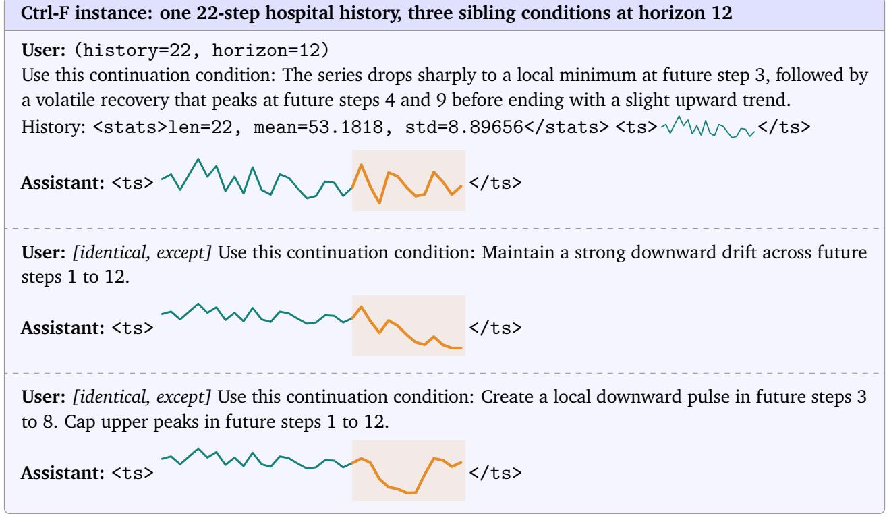

GIFT-Eval. GIFT-Eval evaluates general zero-shot point and probabilistic forecasting across 97 d<sub>a</sub>t<sub>ase</sub>t<sub>–</sub>f<sub>requency–</sub>h<sub>or</sub>i<sub>zon con</sub>fi<sub>gura</sub>ti<sub>ons spann</sub>i<sub>ng un</sub>i<sub>var</sub>i<sub>a</sub>t<sub>e an</sub>d <sub>mu</sub>lti<sub>var</sub>i<sub>a</sub>t<sub>e ser</sub>i<sub>es, seven</sub> d<sub>oma</sub>i<sub>ns,</sub> t<sub>en samp</sub>li<sub>ng</sub> f<sub>requenc</sub>i<sub>es, an</sub>d <sub>s</sub>h<sub>or</sub>t<sub>-</sub>t<sub>o-</sub>l<sub>ong</sub> h<sub>or</sub>i<sub>zons,</sub> t<sub>arge</sub>ti<sub>ng genera</sub>li<sub>za</sub>ti<sub>on across</sub> h<sub>e</sub>t<sub>erogeneous</sub> f<sub>orecas</sub>ti<sub>ng se</sub>tti<sub>ngs.</sub> Th<sub>e o</sub>fi<sub>c</sub>i<sub>a</sub>l l<sub>ea</sub>d<sub>er</sub>b<sub>oar</sub>d’<sub>s</sub> MASE <sub>sca</sub>l<sub>es a</sub>b<sub>so</sub>l<sub>u</sub>t<sub>e po</sub>i<sub>n</sub>t <sub>error</sub> b<sub>y seasona</sub>l<sub>-na</sub>i<sub>ve</sub> <sub>error, w</sub>hil<sub>e</sub> CRPS <sub>eva</sub>l<sub>ua</sub>t<sub>es</sub> th<sub>e pre</sub>di<sub>c</sub>ti<sub>ve</sub> di<sub>s</sub>t<sub>r</sub>ib<sub>u</sub>ti<sub>on;</sub> b<sub>o</sub>th <sub>are norma</sub>li<sub>ze</sub>d <sub>aga</sub>i<sub>ns</sub>t S<sub>easona</sub>l N<sub>a</sub>i<sub>ve per</sub> <sub>con</sub>fi<sub>gura</sub>ti<sub>on an</sub>d <sub>aggrega</sub>t<sub>e</sub>d b<sub>y geome</sub>t<sub>r</sub>i<sub>c mean, so</sub> l<sub>ower</sub> i<sub>s</sub> b<sub>e</sub>tt<sub>er an</sub>d 1<sub>.</sub>0 <sub>ma</sub>t<sub>c</sub>h<sub>es</sub> S<sub>easona</sub>l N<sub>a</sub>i<sub>ve.</sub> We take baseline results from the oficial leaderboard (Aksu et al., 2024) and evaluate TimeBraid usin<sub>g</sub> the last 2,880 histor<sub>y</sub> <sub>p</sub>oints (Table 5).

Long-Term Forecasting. Long-term forecasting follows the standard multivariate setting on ETTm1, ETTm2, ETTh1, ETTh2, and the 21-variable Jena Weather dataset at horizons {96, 192, 336, 720}, t<sub>es</sub>ti<sub>ng numer</sub>i<sub>ca</sub>l<sub>-</sub>hi<sub>s</sub>t<sub>ory-on</sub>l<sub>y ex</sub>t<sub>rapo</sub>l<sub>a</sub>ti<sub>on o</sub>f t<sub>ren</sub>d<sub>s, per</sub>i<sub>o</sub>di<sub>c s</sub>t<sub>ruc</sub>t<sub>ure, an</sub>d l<sub>ong-range</sub> d<sub>epen</sub>d<sub>en-</sub> cies (Zhou et al., 2021; Wu et al., 2021). TimeBraid-2.5B and the time-series foundation models are <sub>eva</sub>l<sub>ua</sub>t<sub>e</sub>d <sub>zero-s</sub>h<sub>o</sub>t<sub>, w</sub>hil<sub>e</sub> th<sub>e</sub> t<sub>as</sub>k<sub>-spec</sub>ifi<sub>c superv</sub>i<sub>se</sub>d b<sub>ase</sub>li<sub>nes are</sub> t<sub>ra</sub>i<sub>ne</sub>d <sub>on eac</sub>h d<sub>a</sub>t<sub>ase</sub>t<sub>.</sub> M<sub>os</sub>t baseline results are taken from the Sundial and Time-MoE <sub>p</sub>a<sub>p</sub>ers (Liu et al., 2025b; Shi et al., 2025). W<sub>e a</sub>dditi<sub>ona</sub>ll<sub>y eva</sub>l<sub>ua</sub>t<sub>e</sub> Ti<sub>mes</sub>FM 2<sub>.</sub>5 <sub>an</sub>d Ch<sub>ronos-</sub>2 <sub>ourse</sub>l<sub>ves, us</sub>i<sub>ng</sub> th<sub>e same</sub> 2<sub>,</sub>880<sub>-s</sub>t<sub>ep</sub> l<sub>oo</sub>kb<sub>ac</sub>k windows as TimeBraid (Table 21).

## F Detailed Experimental Results

Thi<sub>s appen</sub>di<sub>x repor</sub>t<sub>s</sub> th<sub>e</sub> b<sub>enc</sub>h<sub>mar</sub>k<sub>-</sub>l<sub>eve</sub>l <sub>resu</sub>lt<sub>s summar</sub>i<sub>ze</sub>d i<sub>n</sub> th<sub>e ma</sub>i<sub>n</sub> t<sub>ex</sub>t<sub>.</sub> U<sub>n</sub>l<sub>ess s</sub>t<sub>a</sub>t<sub>e</sub>d <sub>o</sub>th<sub>erw</sub>i<sub>se,</sub> hi<sub>g</sub>h<sub>er</sub> i<sub>s</sub> b<sub>e</sub>tt<sub>er</sub> f<sub>or accuracy an</sub>d <sub>s</sub>i<sub>m</sub>il<sub>ar</sub>it<sub>y me</sub>t<sub>r</sub>i<sub>cs, w</sub>h<sub>ereas</sub> l<sub>ower</sub> i<sub>s</sub> b<sub>e</sub>tt<sub>er</sub> f<sub>or</sub> f<sub>orecas</sub>ti<sub>ng</sub> <sub>errors an</sub>d <sub>ran</sub>k<sub>s.</sub> A<sub>cross</sub> t<sub>a</sub>bl<sub>es,</sub> b<sub>o</sub>ld<sub>, un</sub>d<sub>er</sub>li<sub>ne, an</sub>d <sub>a</sub> d<sub>agger mar</sub>k th<sub>e</sub> b<sub>es</sub>t<sub>, secon</sub>d<sub>-</sub>b<sub>es</sub>t<sub>, an</sub>d thi<sub>r</sub>d<sub>-</sub> b<sub>es</sub>t di<sub>s</sub>ti<sub>nc</sub>t <sub>va</sub>l<sub>ues w</sub>ithi<sub>n</sub> th<sub>e pr</sub>i<sub>mary compar</sub>i<sub>son, exc</sub>l<sub>u</sub>di<sub>ng</sub> th<sub>e separa</sub>t<sub>e</sub>l<sub>y</sub> li<sub>s</sub>t<sub>e</sub>d Cl<sub>ose</sub>d<sub>-source</sub> R<sub>e</sub>f<sub>erence</sub> M<sub>o</sub>d<sub>e</sub>l<sub>s;</sub> ti<sub>es s</sub>h<sub>are a ran</sub>k<sub>.</sub> D<sub>as</sub>h<sub>es mar</sub>k <sub>unava</sub>il<sub>a</sub>bl<sub>e resu</sub>lt<sub>s.</sub> Sh<sub>a</sub>di<sub>ng</sub> id<sub>en</sub>tifi<sub>es</sub> Ti<sub>me</sub>B<sub>ra</sub>id<sub>.</sub>

## F.1 Time-Series Understanding

Table 12. TimeSeriesExam accuracy (%) by category: pattern recognition (PR), noise understanding (NU), anomal<sub>y</sub> detection (AD), similarit<sub>y</sub> anal<sub>y</sub>sis (SA), causalit<sub>y</sub> anal<sub>y</sub>sis (CA), and overall (OA).
<table><tr><td>Model</td><td>PR</td><td>NU</td><td>AD</td><td>SA</td><td>CA</td><td>OA</td></tr><tr><td colspan="7">Closed-source Reference Models</td></tr><tr><td>GPT-5.4</td><td>69.34</td><td>64.29</td><td>70.37</td><td>74.17</td><td>50.00</td><td>67.83</td></tr><tr><td>GPT-40</td><td>59.03</td><td>55.17</td><td>53.49</td><td>62.83</td><td>31.75</td><td>55.96</td></tr><tr><td>Gemini-2.5-Flash</td><td>54.97</td><td>54.76</td><td>47.22</td><td>63.33</td><td>41.67</td><td>53.89</td></tr><tr><td>GPT-4o (vision)</td><td>67.12</td><td>62.07</td><td>62.79</td><td>64.60</td><td>26.98</td><td>62.12</td></tr><tr><td>GPT-4.1 (vision)</td><td>69.81</td><td>68.97</td><td>68.22</td><td>75.22</td><td>41.27</td><td>67.89</td></tr><tr><td colspan="7">Open-source Large Language Models</td></tr><tr><td>DeepSeek-Chat</td><td>65.23†</td><td>55.17</td><td>52.71</td><td>63.71†</td><td>42.86†</td><td>59.89†</td></tr><tr><td>Llama-3.1-8B-Instruct</td><td>37.73</td><td>37.93</td><td>30.23</td><td>36.28</td><td>28.57</td><td>35.52</td></tr><tr><td>Qwen2.5-7B-Instruct</td><td>47.17</td><td>47.13</td><td>41.86</td><td>53.10</td><td>41.27</td><td>46.66</td></tr><tr><td colspan="7">Open-source Vision-Language Models</td></tr><tr><td>Qwen2.5-VL-7B-Instruct</td><td>25.34</td><td>32.18</td><td>19.38</td><td>42.48</td><td>12.70</td><td>26.61</td></tr><tr><td>InternVL3-8B</td><td>50.13</td><td>52.87</td><td>43.41</td><td>54.87</td><td>38.09</td><td>49.01</td></tr><tr><td colspan="7">Time-Series Language Models</td></tr><tr><td>ChatTS</td><td>50.13</td><td>50.57</td><td>50.38</td><td>61.95</td><td>34.92</td><td>50.72</td></tr><tr><td>TS-Reasoner-7B</td><td>52.29</td><td>60.92</td><td>52.71</td><td>64.60</td><td>41.27</td><td>54.26</td></tr><tr><td>TimeOmni-1-7B</td><td>42.82</td><td>48.81</td><td>22.22</td><td>24.17</td><td>19.44</td><td>35.25</td></tr><tr><td colspan="7">Unified Models</td></tr><tr><td>ChatTime-7B</td><td>42.85</td><td>49.42</td><td>35.65</td><td>44.24</td><td>34.92</td><td>41.94</td></tr><tr><td>TimeOmni-VL</td><td>50.83</td><td>57.14</td><td>36.11</td><td>54.17</td><td>41.67</td><td>49.06</td></tr><tr><td>TimeBraid-1.2B (Ours)</td><td>55.25</td><td>48.81</td><td>37.04</td><td>54.17</td><td>38.89</td><td>50.13</td></tr><tr><td>TimeBraid-2.5B (Ours)</td><td>67.13</td><td>59.52†</td><td>46.30†</td><td>58.33</td><td>48.61</td><td>60.05</td></tr><tr><td>TimeBraid-6.7B (Ours)</td><td>69.89</td><td>65.48</td><td>42.59</td><td>69.17</td><td>47.22</td><td>63.14</td></tr></table>

Table 13. TSAQA test-set accuracy (%). A.D.: anomaly detection; CLS: classification; TF/MC/PZ: true-or-false, multi<sub>p</sub>le-choice, and <sub>p</sub>uzzlin<sub>g</sub>/orderin<sub>g</sub> formats. SFT denotes TSAQA-s<sub>p</sub>ecific LoRA fine-tunin<sub>g</sub> (Jin<sub>g</sub> et al., 2026). Closed-source Reference Models use zero-shot evaluation. Best, second, and third results are marked within the primary comparison, including the TSAQA-specific SFT rows and excluding Closed-source Reference M<sub>o</sub>d<sub>e</sub>l<sub>s;</sub> ti<sub>es s</sub>h<sub>are a ran</sub>k<sub>.</sub>
<table><tr><td rowspan="2">Model</td><td>A.D.</td><td>CLS</td><td colspan="2">Characterization</td><td colspan="2">Comparison</td><td colspan="2">Data Transform</td><td colspan="3">Temporal Relation</td><td rowspan="2">Overall</td></tr><tr><td>TF</td><td>MC</td><td>TF</td><td>MC</td><td>TF</td><td>MC</td><td>TF</td><td>MC</td><td>TF</td><td>MC</td><td>PZ</td></tr><tr><td>Closed-source Reference Models</td><td></td><td></td><td></td><td></td><td></td><td></td><td></td><td></td><td></td><td></td><td></td><td></td></tr><tr><td>GPT-5.4</td><td>53.32</td><td>49.57</td><td>82.08</td><td>81.98</td><td>77.59</td><td>74.47</td><td>65.79</td><td>54.94</td><td>74.12</td><td>82.96</td><td>51.02</td><td>63.10</td></tr><tr><td>GPT-4.1</td><td>55.85</td><td>50.38</td><td>92.97</td><td>89.36</td><td>83.57</td><td>76.99</td><td>54.36</td><td>51.13</td><td>65.90</td><td>79.09</td><td>45.77</td><td>62.82</td></tr><tr><td>GPT-40</td><td>54.32</td><td>47.20</td><td>88.15</td><td>84.15</td><td>78.61</td><td>69.07</td><td>60.66</td><td>53.24</td><td>62.25</td><td>75.58</td><td>45.61</td><td>60.73</td></tr><tr><td>Claude-3.5-Sonnet</td><td>51.27</td><td>41.23</td><td>74.39</td><td>78.45</td><td>66.59</td><td>74.14</td><td>65.79</td><td>57.07</td><td>82.05</td><td>82.15</td><td>54.56</td><td>61.19</td></tr><tr><td>Gemini-2.5-Flash</td><td>52.08</td><td>49.07</td><td>85.48</td><td>81.08</td><td>77.79</td><td>72.21</td><td>63.62</td><td>60.17</td><td>75.05</td><td>84.49</td><td>60.84</td><td>65.08</td></tr><tr><td colspan="9">Open-source Large Language Models</td><td></td><td></td><td></td></tr><tr><td>Qwen3-8B</td><td>50.60</td><td>50.52</td><td>77.35</td><td>66.87</td><td>71.04</td><td>63.21</td><td>52.43</td><td>34.46</td><td>65.22</td><td>67.14</td><td>21.93</td><td>51.04</td></tr><tr><td>LLaMA3.1-8B</td><td>54.92</td><td>50.20</td><td>68.10</td><td>62.26</td><td>67.84</td><td>49.98</td><td>51.90</td><td>36.56</td><td>54.82</td><td>40.95</td><td>6.80</td><td>44.93</td></tr><tr><td>Ministral-8B</td><td>53.35</td><td>34.08</td><td>71.06</td><td>63.93</td><td>47.54</td><td>52.90</td><td>50.70</td><td>25.28</td><td>50.58</td><td>33.88</td><td>30.77</td><td>44.65</td></tr><tr><td>Qwen3-0.6B</td><td>50.40</td><td>35.83</td><td>62.00</td><td>48.78</td><td>58.03</td><td>37.51</td><td>49.03</td><td>23.62</td><td>51.99</td><td>37.33</td><td>13.38</td><td>39.06</td></tr><tr><td>LLaMA3.2-1B</td><td>49.47</td><td>39.48</td><td>63.74</td><td>52.55</td><td>61.02</td><td>36.82</td><td>48.87</td><td>4.20</td><td>48.97</td><td>5.44</td><td>6.76</td><td>35.70</td></tr><tr><td>Gemma3-1B</td><td>49.15</td><td>49.83</td><td>63.74</td><td>47.71</td><td>61.19</td><td>43.37</td><td>49.37</td><td>24.88</td><td>49.42</td><td>25.84</td><td>23.97</td><td>43.03</td></tr><tr><td>LLaMA3.1-8B (SFT)</td><td>91.02</td><td>91.27</td><td>92.44</td><td>83.68</td><td>86.72</td><td>79.31</td><td>90.17</td><td>86.62</td><td>96.94</td><td>97.41</td><td>67.68</td><td>85.26</td></tr><tr><td>Qwen3-8B (SFT)</td><td>87.70</td><td>90.05</td><td>92.37</td><td>85.42</td><td>86.55</td><td>79.08</td><td>89.84</td><td>84.99†</td><td>96.84</td><td>97.56</td><td>66.21</td><td>84.29</td></tr><tr><td>Ministral-8B (SFT)</td><td>71.56</td><td>74.28</td><td>91.31</td><td>80.78</td><td>84.14</td><td>74.63</td><td>75.15</td><td>71.61</td><td>94.07</td><td>94.15†</td><td>56.82</td><td>74.74</td></tr><tr><td>Qwen3-0.6B (SFT)</td><td>83.68</td><td>85.78†</td><td>89.38</td><td>74.87</td><td>80.65</td><td>64.84</td><td>80.51</td><td>73.28</td><td>93.92</td><td>93.79</td><td>63.34†</td><td>78.32</td></tr><tr><td>LLaMA3.2-1B (SFT)</td><td>83.08</td><td>83.83</td><td>87.71 87.88</td><td>74.37 72.54</td><td>78.61</td><td>60.88</td><td>68.09 64.06</td><td>51.67</td><td>91.39</td><td>88.81</td><td>57.53</td><td>73.48</td></tr><tr><td>Gemma3-1B (SFT)</td><td>83.10</td><td>84.05</td><td></td><td></td><td>78.61</td><td>59.31</td><td></td><td>45.23</td><td>91.00</td><td>88.05</td><td>42.92</td><td>69.70</td></tr><tr><td colspan="2">Time-Series Language Models</td><td></td><td></td><td></td><td></td><td></td><td></td><td></td><td></td><td></td><td></td><td></td></tr><tr><td>ChatTS TimeOmni-1-7B</td><td>49.42</td><td>52.08</td><td>69.20</td><td>60.43</td><td>67.13</td><td>58.27</td><td>49.97</td><td>30.29</td><td>54.04</td><td>50.61</td><td>33.59</td><td>49.83</td></tr><tr><td></td><td>50.98</td><td>56.47</td><td>39.93</td><td>59.06</td><td>40.34</td><td>44.55</td><td>50.70</td><td>28.39</td><td>50.58</td><td>40.79</td><td>30.93</td><td>44.40</td></tr><tr><td>Unified Models</td><td></td><td></td><td></td><td></td><td></td><td></td><td></td><td></td><td></td><td></td><td></td><td></td></tr><tr><td>ChatTime-7B</td><td>50.20</td><td>43.47</td><td>48.92</td><td>27.29</td><td>50.49</td><td>25.14</td><td>49.53</td><td>25.15</td><td>49.81</td><td>23.80</td><td>27.87</td><td>38.38</td></tr><tr><td>TimeOmni-VL</td><td>50.82</td><td>51.15</td><td>41.92</td><td>44.18</td><td>40.71</td><td>28.87</td><td>53.23</td><td>23.55</td><td>58.33 89.62</td><td>23.63 89.43</td><td>15.52</td><td>39.27</td></tr><tr><td>TimeBraid-1.2B (Ours) TimeBraid-2.5B (Ours)</td><td>82.58 83.23</td><td>80.78 79.25</td><td>89.71 90.64</td><td>77.68 80.05</td><td>81.80 83.23</td><td>69.20 72.86</td><td>80.28 83.41</td><td>77.92 82.92</td><td>89.71</td><td>91.71</td><td>45.04 48.36</td><td>76.61 78.31</td></tr><tr><td></td><td>83.43</td><td>85.78†</td><td>91.41†</td><td>81.78†</td><td>85.94†</td><td>75.12†</td><td>86.98†</td><td>86.39</td><td>92.05</td><td>92.04</td><td>49.39</td><td>80.65†</td></tr><tr><td>TimeBraid-6.7B (Ours)</td><td></td><td></td><td></td><td></td><td></td><td></td><td></td><td></td><td></td><td></td><td></td><td></td></tr></table>

Table 14. Full results on the CaTS-Bench human-rewritten split.
<table><tr><td rowspan="3">Model</td><td colspan="5">Lexical and Semantic Metrics</td><td rowspan="3">Numeric</td></tr><tr><td>DeBERTa F1</td><td>SimCSE</td><td>BLEU</td><td></td><td>ROUGE-L METEOR</td></tr><tr><td></td><td></td><td></td><td></td><td></td></tr><tr><td>Closed-source Reference Models</td><td></td><td></td><td></td><td></td><td></td><td></td></tr><tr><td>GPT-5.4</td><td>0.660</td><td>0.843</td><td>0.064</td><td>0.239</td><td>0.264</td><td>0.778</td></tr><tr><td>Gemini 2.0 Flash</td><td>0.694</td><td>0.884</td><td>0.113</td><td>0.283</td><td>0.304</td><td>0.757</td></tr><tr><td>GPT-40</td><td>0.685</td><td>0.886</td><td>0.090</td><td>0.259</td><td>0.314</td><td>0.739</td></tr><tr><td>Open-source Vision-Language Models</td><td></td><td></td><td></td><td></td><td></td><td></td></tr><tr><td>InternVL 2.5 38B</td><td>0.682</td><td>0.867</td><td>0.085</td><td>0.262</td><td>0.294</td><td>0.740</td></tr><tr><td>Gemma 3 27B</td><td>0.680</td><td>0.883†</td><td>0.089</td><td>0.255</td><td>0.307</td><td>0.745†</td></tr><tr><td>LLaVA v1.6 (finetuned)</td><td>0.644</td><td>0.802</td><td>0.064</td><td>0.234</td><td>0.250</td><td>0.589</td></tr><tr><td>Idefics 2 (finetuned)</td><td>0.713</td><td>0.885</td><td>0.131</td><td>0.325</td><td>0.303</td><td>0.748</td></tr><tr><td>QwenVL (finetuned)</td><td>0.678</td><td>0.863</td><td>0.090</td><td>0.257</td><td>0.272</td><td>0.669</td></tr><tr><td>Llama 3.2 Vision (finetuned)</td><td>0.672</td><td>0.851</td><td>0.087</td><td>0.266</td><td>0.295†</td><td>0.740</td></tr><tr><td>Phi-4 Multimodal Instruct (finetuned)</td><td>0.664</td><td>0.862</td><td>0.078</td><td>0.243</td><td>0.290</td><td>0.703</td></tr><tr><td>Time-Series Language Models</td><td></td><td></td><td></td><td></td><td></td><td></td></tr><tr><td>ChatTS</td><td>0.614</td><td>0.665</td><td>0.040</td><td>0.191</td><td>0.198</td><td>0.648</td></tr><tr><td>TimeOmni-1-7B</td><td>0.634</td><td>0.796</td><td>0.046</td><td>0.205</td><td>0.231</td><td>0.769</td></tr><tr><td>Unified Models</td><td></td><td></td><td></td><td></td><td></td><td></td></tr><tr><td>ChatTime-7B</td><td>0.371</td><td>0.234</td><td>0.004</td><td>0.032</td><td>0.030</td><td>0.077</td></tr><tr><td>TimeOmni-VL</td><td>0.598</td><td>0.568</td><td>0.027</td><td>0.179</td><td>0.165</td><td>0.370</td></tr><tr><td>TimeBraid-1.2B (Ours)</td><td>0.706</td><td>0.880</td><td>0.120</td><td>0.305</td><td>0.288</td><td>0.666</td></tr><tr><td>TimeBraid-2.5B (Ours)</td><td>0.708†</td><td>0.885</td><td>0.121†</td><td>0.307†</td><td>0.289</td><td>0.670</td></tr><tr><td>TimeBraid-6.7B (Ours)</td><td>0.712</td><td>0.886</td><td>0.123</td><td>0.313</td><td>0.292</td><td>0.684</td></tr><tr><td></td><td></td><td></td><td></td><td></td><td></td><td></td></tr></table>

## F.2 Time-Series Forecasting

## F.2.1 Contextual Reasoning Forecasting

Table 15. Results on CiK: RCRPS weighted by the oficial task weights, reported with standard errors and <sub>s</sub>t<sub>ra</sub>tifi<sub>e</sub>d b<sub>y con</sub>t<sub>ex</sub>t t<sub>ype.</sub> A<sub>s</sub>t<sub>er</sub>i<sub>s</sub>k<sub>s mar</sub>k <sub>mo</sub>d<sub>e</sub>l<sub>s</sub> th<sub>a</sub>t d<sub>o no</sub>t <sub>use na</sub>t<sub>ura</sub>l<sub>-</sub>l<sub>anguage con</sub>t<sub>ex</sub>t<sub>.</sub>
<table><tr><td>MODEL</td><td>AVERAGE RCRPS</td><td>INTEMPORAL INFORMATION</td><td>HISTORICAL INFORMATION</td><td>FUTURE INFORMATION</td><td>COVARIATE INFORMATION</td><td>CAUSAL INFORMATION</td></tr><tr><td colspan="7">Closed-source Reference Models</td></tr><tr><td>Gemini-2.5-Flash</td><td> $0 . 1 1 0 \pm 0 . 0 0 2$ </td><td> $0 . 1 3 4 \pm 0 . 0 0 3$ </td><td> $0 . 1 4 2 \pm 0 . 0 0 1$ </td><td> $0 . 0 3 6 \pm 0 . 0 0 1$ </td><td> $0 . 1 1 6 \pm 0 . 0 0 3$ </td><td> $0 . 2 5 2 \pm 0 . 0 1 2$ </td></tr><tr><td>GPT-5.4</td><td> $0 . 1 4 5 \pm 0 . 0 0 0$ </td><td> $0 . 1 8 2 \pm 0 . 0 0 1$ </td><td> $0 . 1 1 6 \pm 0 . 0 0 1$ </td><td> $0 . 0 4 9 \pm 0 . 0 0 0$ </td><td> $0 . 1 6 0 \pm 0 . 0 0 1$ </td><td> $0 . 4 1 4 \pm 0 . 0 0 1$ </td></tr><tr><td>GPT-40</td><td> $0 . 2 5 7 \pm 0 . 0 0 1$ </td><td> $0 . 3 0 5 \pm 0 . 0 0 2$ </td><td> $0 . 1 3 5 \pm 0 . 0 0 1$ </td><td> $0 . 1 5 9 \pm 0 . 0 0 0$ </td><td> $0 . 2 3 8 \pm 0 . 0 0 1$ </td><td> $0 . 6 1 3 \pm 0 . 0 0 6$ </td></tr><tr><td>GPT-5.4-mini</td><td>0.277 ± 0.000</td><td>0.302 ± 0.001</td><td> $0 . 1 7 3 \pm 0 . 0 0 1$ </td><td> $0 . 2 1 2 \pm 0 . 0 0 0$ </td><td> $0 . 2 6 1 \pm 0 . 0 0 1$ </td><td> $0 . 5 5 3 \pm 0 . 0 0 0$ </td></tr><tr><td colspan="7">Open-source Large Language Models</td></tr><tr><td>DeepSeek-Chat</td><td>0.225 ± 0.004</td><td>0.286 ± 0.006</td><td>0.141 ± 0.001</td><td>0.089 ± 0.008</td><td>0.166 ± 0.001</td><td>0.431 ± 0.005</td></tr><tr><td>Qwen-2.5-7B-Inst</td><td>0.344 ± 0.001</td><td>0.368 ± 0.002</td><td>0.195 ± 0.001</td><td> $0 . 2 8 3 \pm 0 . 0 0 2 ^ { \dagger }$ </td><td>0.333 ± 0.001</td><td> $0 . 5 6 2 \pm 0 . 0 0 1$ </td></tr><tr><td>Llama-3-8B-Inst</td><td>0.476 ± 0.003</td><td>0.573 ± 0.005</td><td>0.245 ± 0.001</td><td>0.301 ± 0.000</td><td>0.486 ± 0.004</td><td> $0 . 5 2 6 \pm 0 . 0 0 1$ </td></tr><tr><td colspan="7">Time-Series Foundation Models</td></tr><tr><td>Moirai-2*</td><td>0.288 ± 0.002</td><td>0.252 ± 0.003</td><td>0.119 ± 0.002</td><td> $0 . 3 6 6 \pm 0 . 0 0 4$ </td><td> $0 . 2 4 4 \pm 0 . 0 0 3$ </td><td> $0 . 4 3 5 \pm 0 . 0 0 8 ^ { \dagger }$ </td></tr><tr><td>TimesFM*</td><td>0.295 ± 0.002</td><td> $\underline { { 0 . 2 6 5 \pm 0 . 0 0 3 } }$ </td><td> $\mathbf { 0 . 1 1 4 \pm 0 . 0 0 1 }$ </td><td> $0 . 3 7 3 \pm 0 . 0 0 2$ </td><td> $0 . 2 5 1 \pm 0 . 0 0 2$ </td><td> $0 . 4 7 4 \pm 0 . 0 0 6$ </td></tr><tr><td>Sundial*</td><td> $0 . 3 1 4 \pm 0 . 0 0 1$ </td><td> $0 . 2 8 5 \pm 0 . 0 0 2$ </td><td> $\underline { { 0 . 1 1 9 \pm 0 . 0 0 1 } }$ </td><td> $0 . 3 8 1 \pm 0 . 0 0 1$ </td><td> $0 . 2 6 3 \pm 0 . 0 0 1$ </td><td> $0 . 4 8 6 \pm 0 . 0 0 4$ </td></tr><tr><td>TimeMoE*</td><td> $0 . 3 2 7 \pm 0 . 0 0 1$ </td><td> $0 . 3 0 3 \pm 0 . 0 0 1$ </td><td> $0 . 1 5 0 \pm 0 . 0 0 0$ </td><td> $0 . 3 8 7 \pm 0 . 0 0 2$ </td><td> $0 . 2 7 1 \pm 0 . 0 0 1$ </td><td> $0 . 4 8 8 \pm 0 . 0 0 0$ </td></tr><tr><td>Chronos-2*</td><td> $0 . 2 9 5 \pm 0 . 0 0 3$ </td><td>0.271 ± 0.005</td><td> $0 . 1 8 3 \pm 0 . 0 0 7$ </td><td> $0 . 3 5 4 \pm 0 . 0 0 4$ </td><td> $0 . 2 4 3 \pm 0 . 0 0 3 ^ { \dagger }$ </td><td> $0 . 4 4 5 \pm 0 . 0 1 2$ </td></tr><tr><td colspan="7">Traditional Time-Series Models</td></tr><tr><td>DLinear*</td><td>0.337 ± 0.001</td><td> $0 . 3 3 7 \pm 0 . 0 0 1$ </td><td> $0 . 2 3 0 \pm 0 . 0 0 0$ </td><td> $0 . 3 4 5 \pm 0 . 0 0 3$ </td><td> $0 . 2 8 4 \pm 0 . 0 0 1$ </td><td> $0 . 5 4 8 \pm 0 . 0 0 0$ </td></tr><tr><td>iTransformer*</td><td> $0 . 3 5 9 \pm 0 . 0 0 1$ </td><td> $0 . 3 4 7 \pm 0 . 0 0 1$ </td><td> $0 . 2 3 0 \pm 0 . 0 0 0$ </td><td> $0 . 3 9 4 \pm 0 . 0 0 3$ </td><td> $0 . 3 0 5 \pm 0 . 0 0 1$ </td><td> $0 . 5 6 5 \pm 0 . 0 0 0$ </td></tr><tr><td>ARIMA*</td><td>0.501 ± 0.003</td><td>0.620 ± 0.003</td><td> $0 . 1 8 9 \pm 0 . 0 0 4$ </td><td>0.319 ± 0.006</td><td>0.275 ± 0.002</td><td> $0 . 4 5 5 \pm 0 . 0 0 5$ </td></tr><tr><td colspan="7">Multimodal Forecasting Models</td></tr><tr><td>UniTime</td><td>0.368 ± 0.002</td><td>0.453 ± 0.002</td><td>0.156 ± 0.000</td><td>0.197 ± 0.004</td><td>0.392 ± 0.002</td><td>0.433 ± 0.001</td></tr><tr><td colspan="7">Unified Models</td></tr><tr><td>ChatTime</td><td>0.344 ± 0.000</td><td>0.332 ± 0.000</td><td>0.191 ± 0.000</td><td>0.334 ± 0.000</td><td>0.315 ± 0.000</td><td>0.436 ± 0.000</td></tr><tr><td>TimeOmni-VL</td><td>0.655 ± 0.028</td><td>0.678 ± 0.043</td><td>0.260 ± 0.008</td><td>0.648 ± 0.023</td><td>0.586 ± 0.035</td><td> $0 . 8 1 8 \pm 0 . 1 3 2$ </td></tr><tr><td>TimeBraid-1.2B (Ours)</td><td>0.301 ± 0.002</td><td>0.278 ± 0.003</td><td>0.138 ± 0.002</td><td>0.359 ± 0.004</td><td>0.250 ± 0.002</td><td> $0 . 4 7 2 \pm 0 . 0 0 6$ </td></tr><tr><td>TimeBraid-2.5B (Ours)</td><td>0.289 ± 0.002† 0.294 ± 0.002</td><td>0.270 ± 0.002 0.267 ± 0.003†</td><td> $0 . 1 4 2 \pm 0 . 0 0 2$ </td><td> $0 . 3 3 7 \pm 0 . 0 0 3$  0.359 ± 0.004</td><td> $\underline { { 0 . 2 3 9 \pm 0 . 0 0 2 } }$  0.243 ± 0.003†</td><td> $0 . 4 6 8 \pm 0 . 0 0 5$ </td></tr><tr><td>TimeBraid-6.7B (Ours)</td><td></td><td></td><td> $0 . 1 3 4 \pm 0 . 0 0 3 ^ { \dagger }$ </td><td></td><td></td><td> $0 . 4 3 7 \pm 0 . 0 0 9$ </td></tr></table>

## F.2.2 TemporalBench

Table 16. TemporalBench results under the oficial evaluation setup: (a) accuracy on the 16 multiple-choice tasks, with Avera<sub>g</sub>e the unwei<sub>g</sub>hted macro-avera<sub>g</sub>e, and (b) forecastin<sub>g</sub> error, not avera<sub>g</sub>ed across datasets b<sub>ecause</sub> th<sub>e me</sub>t<sub>r</sub>i<sub>cs</sub> dif<sub>er.</sub>

## (a) Multiple-choice accuracy.

<table><tr><td rowspan="2">Model</td><td colspan="4">FreshRetailNet</td><td colspan="4">PSML</td><td colspan="4">Causal Chambers</td><td colspan="4">MIMIC</td><td rowspan="2">Average</td></tr><tr><td>T1</td><td>T2</td><td>T3</td><td>T4</td><td>T1</td><td>T2</td><td>T3</td><td>T4</td><td>T1</td><td>T2</td><td>T3</td><td>T4</td><td>T1 T2</td><td>T3</td><td>T4</td><td></td></tr><tr><td colspan="10">Closed-source Reference Models</td><td></td><td></td><td></td><td></td><td></td><td></td><td></td><td></td></tr><tr><td>GPT-5.4</td><td>45.45%</td><td>28.03%</td><td>41.48%</td><td>42.42%</td><td>50.50%</td><td>31.33%</td><td>33.20%</td><td>57.33%</td><td>18.67%</td><td>53.33%</td><td>37.20%</td><td>45.33%</td><td>35.11%</td><td>29.08%</td><td>35.56%</td><td>31.91%</td><td>38.50%</td></tr><tr><td>GPT-4.1</td><td>38.64%</td><td>31.82%</td><td>45.45%</td><td>38.64%</td><td>48.50%</td><td>27.33%</td><td>40.00%</td><td>53.33%</td><td>12.00%</td><td>46.00%</td><td>48.80%</td><td>41.33%</td><td>18.62%</td><td>29.08%</td><td>42.68%</td><td>28.37%</td><td>36.91%</td></tr><tr><td>GPT-40</td><td>63.07%</td><td>16.67%</td><td>28.98%</td><td>39.39%</td><td>69.00%</td><td>23.33%</td><td>35.20%</td><td>36.67%</td><td>10.00%</td><td>22.67%</td><td>34.00%</td><td>42.00%</td><td>46.81%</td><td>19.86%</td><td>0.00%</td><td>29.08%</td><td>32.30%</td></tr><tr><td>Gemini-2.5-Flash</td><td>59.66%</td><td>22.73% 29.55%</td><td>29.55% 34.66%</td><td>38.64%</td><td>72.50%</td><td>23.33%</td><td>22.00%</td><td>46.67%</td><td>10.67%</td><td>45.33%</td><td>37.20%</td><td>44.00%</td><td>42.55%</td><td>29.08%</td><td>0.00%</td><td>29.79%</td><td>34.61%</td></tr><tr><td>Claude-Sonnet-4</td><td>55.11%</td><td></td><td></td><td>43.94%</td><td>50.00%</td><td>28.67%</td><td>33.20%</td><td>40.00%</td><td>15.33%</td><td>60.67%</td><td>37.60%</td><td>58.67%</td><td>35.11%</td><td>21.99%</td><td>0.00%</td><td>32.62%</td><td>36.07%</td></tr><tr><td colspan="10">Open-source Large Language Models</td><td colspan="3"></td><td colspan="3"></td><td colspan="3"></td></tr><tr><td>DeepSeek-Chat</td><td>63.64%</td><td>15.91%</td><td>28.98%</td><td>34.09%</td><td>57.00%</td><td>25.33%</td><td>32.00%</td><td>56.67%</td><td>14.67%</td><td>28.00%</td><td>33.60%</td><td>32.00%</td><td>28.19%</td><td>24.11%</td><td>0.00%</td><td>23.40%</td><td>31.10%</td></tr><tr><td>Qwen3-8B</td><td>36.36%</td><td>30.30%† 25.76%</td><td>51.70% 46.59%</td><td>40.15%† 22.73%</td><td>38.50% 30.00%</td><td>29.33%</td><td>48.80% 38.00%↑</td><td>54.67%†</td><td>17.33%</td><td>15.33%</td><td>42.80%</td><td>15.33%</td><td>16.49%</td><td>21.28%</td><td>38.49% 30.54%</td><td>21.99% 17.73%</td><td>32.43% 25.88%</td></tr><tr><td colspan="10">Llama-3.1-8B 29.55%</td><td colspan="7">13.30%</td></tr><tr><td colspan="10">Time-Series Language Models</td><td colspan="7">27.60% 13.33%</td></tr><tr><td>ChatTS</td><td>15.91%</td><td>18.18%</td><td>31.82%</td><td>34.09%</td><td>46.00%†</td><td>19.33% 38.40%</td><td>54.00%</td><td>22.67%†</td><td>7.33%</td><td>35.20%</td><td></td><td>11.33%</td><td>30.85%</td><td>11.35%</td><td>0.00% 21.99%</td><td></td><td>24.90%</td></tr><tr><td>TimeOmni-1-7B</td><td>26.70%</td><td>21.97%</td><td>29.55%</td><td>26.52%</td><td>33.50%</td><td>24.00%</td><td>26.00% 40.00%</td><td>21.33%</td><td>23.33%</td><td>30.40%</td><td></td><td>19.33% 35.64%</td><td></td><td>27.66%</td><td>0.00% 24.82%</td><td></td><td>25.67%</td></tr><tr><td colspan="10">Unified Models</td><td colspan="7"></td></tr><tr><td>ChatTime-7B</td><td>31.25%</td><td>27.27%</td><td>31.82%</td><td>23.48%</td><td>37.50%</td><td>27.33%</td><td>30.00%</td><td>19.33%</td><td>23.33%</td><td>20.67%</td><td>32.80%</td><td>26.00%</td><td>40.43%</td><td>26.24%</td><td>27.20%</td><td>30.50%</td><td>28.45%</td></tr><tr><td>TimeOmni-VL</td><td>19.89%</td><td>39.39%</td><td>43.75%</td><td>43.18%</td><td>52.00%</td><td>29.33%</td><td>11.20%</td><td>44.67%</td><td>18.00% 28.67%</td><td>45.20%†</td><td></td><td>31.33%</td><td>18.09%</td><td>33.33%</td><td>33.47%</td><td>29.79%</td><td>32.32%</td></tr><tr><td>TimeBraid-1.2B (Ours)</td><td>17.61%</td><td>42.42% 25.76%</td><td>41.48% 52.27%</td><td>50.00%</td><td>14.50%</td><td>32.67%†</td><td>19.20%</td><td>18.67%</td><td>21.33%</td><td>61.33% 36.00%</td><td></td><td>61.33%</td><td>34.57%</td><td>29.08%†</td><td>35.98%†</td><td>30.50%</td><td>34.17%†</td></tr><tr><td>TimeBraid-2.5B (Ours)</td><td>34.66%†</td><td></td><td></td><td>39.39%</td><td>14.50%</td><td>36.00%</td><td>16.80%</td><td>52.00%</td><td>16.00%</td><td>50.67%</td><td>47.20% 54.00%†</td><td></td><td>35.11%†</td><td>32.62%</td><td>35.15%</td><td>29.79%</td><td>35.74%</td></tr><tr><td>TimeBraid-6.7B (Ours)</td><td>30.68%</td><td>27.27%</td><td>44.32%</td><td>37.88%</td><td>18.00%</td><td>41.33%</td><td>23.60%</td><td>58.00%</td><td>24.00%</td><td>49.33%†</td><td>46.40%</td><td>59.33%</td><td>33.51%</td><td>17.73%</td><td>46.86%</td><td>26.95%†</td><td>36.58%</td></tr></table>

Table 16. TemporalBench results (continued): forecasting error on 852 current-leaderboard-dev cases. (b) Forecasting error (FreshRetailNet and Causal Chambers: MAE; PSML: sMAPE; MIMIC: OW-sMAPE).
<table><tr><td rowspan="2">Model</td><td colspan="2">FreshRetailNet</td><td colspan="2">PSML</td><td colspan="2">Causal Chambers</td><td colspan="2">MIMIC</td></tr><tr><td>T2</td><td>T4</td><td>T2</td><td>T4</td><td>T2</td><td>T4</td><td>T2</td><td>T4</td></tr><tr><td colspan="9">Closed-source Reference Models</td></tr><tr><td>GPT-5.4</td><td>0.132</td><td>0.129</td><td>0.236</td><td>0.243</td><td>3.287</td><td>4.279</td><td>9.853</td><td>10.005</td></tr><tr><td>GPT-40</td><td>0.127</td><td>0.234</td><td>0.333</td><td>0.435</td><td>1.988</td><td>2.755</td><td>15.913</td><td>16.860</td></tr><tr><td>Gemini-2.5-Flash</td><td>0.106</td><td>0.118</td><td>0.304</td><td>0.332</td><td>2.244</td><td>2.370</td><td>9.902</td><td>12.557</td></tr><tr><td>Claude-Sonnet-4</td><td>0.116</td><td>0.182</td><td>0.253</td><td>0.318</td><td>2.561</td><td>2.725</td><td>9.098</td><td>13.545</td></tr><tr><td colspan="9">Open-source Large Language Models</td></tr><tr><td>DeepSeek-Chat</td><td>0.113</td><td>0.135</td><td>0.333</td><td>0.374</td><td>2.532</td><td>2.126</td><td>14.981</td><td>14.789</td></tr><tr><td colspan="9">Time-Series Foundation Models</td></tr><tr><td>TimesFM2.5</td><td>0.113</td><td>0.115</td><td>0.229</td><td>0.231</td><td>4.850</td><td>4.846</td><td>9.215</td><td>9.223</td></tr><tr><td>Chronos-2</td><td>0.116†</td><td>0.119</td><td>0.207</td><td>0.209</td><td>4.812</td><td>4.811</td><td>9.643</td><td>9.647</td></tr><tr><td>Moirai-2</td><td>0.115</td><td>0.116</td><td>0.213</td><td>0.210</td><td>4.766†</td><td>4.767†</td><td>9.051</td><td>9.045</td></tr><tr><td>Sundial TimeMoE</td><td>0.122</td><td>0.121</td><td>0.205</td><td>0.203†</td><td>5.309</td><td>5.332</td><td>9.973</td><td>9.982</td></tr><tr><td></td><td>0.119</td><td>0.121</td><td>0.198</td><td>0.198</td><td>5.331</td><td>5.347</td><td>9.600</td><td>9.632</td></tr><tr><td colspan="9">Multimodal Forecasting Models</td></tr><tr><td>MIGAS-1.5</td><td>0.115</td><td>0.115</td><td>0.222</td><td>0.221</td><td>4.717</td><td>4.753</td><td>9.553</td><td>9.602</td></tr><tr><td>Aurora</td><td>0.126</td><td>0.125</td><td>0.204†</td><td>0.204</td><td>6.918</td><td>6.917</td><td>10.469</td><td>10.475</td></tr><tr><td colspan="9">Unified Models</td></tr><tr><td>ChatTime-7B</td><td>0.118</td><td>0.143</td><td>0.225</td><td>0.223</td><td>5.397</td><td>5.220</td><td>10.256</td><td>10.379</td></tr><tr><td>TimeOmni-VL</td><td>1.537</td><td>1.587</td><td>0.726</td><td>0.787</td><td>41.261</td><td>54.678</td><td>77.746</td><td>85.100</td></tr><tr><td>TimeBraid-1.2B (Ours)</td><td>0.117</td><td>0.118†</td><td>0.205</td><td>0.204</td><td>5.317</td><td>5.316</td><td>8.946†</td><td>8.996</td></tr><tr><td>TimeBraid-2.5B (Ours)</td><td>0.120</td><td>0.119</td><td>0.201</td><td>0.203†</td><td>5.288</td><td>5.307</td><td>8.945</td><td>9.002†</td></tr><tr><td>TimeBraid-6.7B (Ours)</td><td>0.116†</td><td>0.116</td><td>0.198</td><td>0.197</td><td>5.304</td><td>5.316</td><td>8.931</td><td>8.972</td></tr></table>

## F.2.3 TimeMMD

Table 17. TimeMMD forecasting with paired text, reporting per-domain MSE and MAE macro-averaged over f<sub>our</sub> h<sub>or</sub>i<sub>zons.</sub> E<sub>very mu</sub>lti<sub>mo</sub>d<sub>a</sub>l f<sub>orecas</sub>ti<sub>ng mo</sub>d<sub>e</sub>l <sub>rece</sub>i<sub>ves eac</sub>h <sub>w</sub>i<sub>n</sub>d<sub>ow</sub>’<sub>s pa</sub>i<sub>re</sub>d t<sub>ex</sub>t <sub>an</sub>d <sub>runs a</sub>t th<sub>e o</sub>fi<sub>c</sub>i<sub>a</sub>l 8/36/96 l<sub>oo</sub>kback<sub>s,</sub> a<sub>s</sub> d<sub>o</sub> ChatTim<sub>e</sub> and A<sub>u</sub>r<sub>o</sub>ra<sub>;</sub> Tim<sub>e</sub>Braid<sub>,</sub> th<sub>e</sub> tim<sub>e</sub>-<sub>se</sub>ri<sub>es</sub> f<sub>ou</sub>ndati<sub>o</sub>n m<sub>o</sub>d<sub>e</sub>l<sub>s,</sub> and MIGAS-1<sub>.</sub>5 <sub>use a</sub> fi<sub>xe</sub>d 128<sub>-s</sub>t<sub>ep</sub> hi<sub>s</sub>t<sub>ory.</sub> A<sub>vg</sub> R<sub>an</sub>k <sub>averages eac</sub>h <sub>mo</sub>d<sub>e</sub>l’<sub>s ran</sub>k <sub>across</sub> th<sub>e n</sub>i<sub>ne</sub> d<sub>oma</sub>i<sub>ns;</sub> l<sub>ower</sub> i<sub>s</sub> b<sub>e</sub>tt<sub>er.</sub>
<table><tr><td>Models</td><td>Unified Models TimeBraid-1.2B |Tir imeBraid-2.5B|TimeBr</td><td>raid-6.7B| ChatTime-7B Time-LLM</td><td>GPT4MTS</td><td>TaTS Tir me-VLM</td><td>Multimodal Forecasting Models PatchTST iTransformer&quot;</td><td>RaFT DLinear</td><td>Reformer MIGAS-1.5</td><td>TimesFM2.5</td><td>Chronos-2 Moirai</td><td>Time-Series Foundation Models SundialBase</td><td>Tir</td><td>-MoE-200M</td></tr><tr><td>Metric</td><td>MSE MAE MSE</td><td>MAE MSE MAE| MSE</td><td>MSE MAE|</td><td>MSE MAE</td><td>MAE MSE</td><td>MAE| MSE MAE|</td><td>MAE MSE MAE</td><td>Aurora MAE MSE MAE</td><td>MAE MSE</td><td>MAE| MSE MAE|</td><td>MSE MAE</td><td>MSE</td></tr><tr><td></td><td>MAE</td><td></td><td>MAE| 0.204</td><td>0.091</td><td>0.193</td><td>MSE 0.287 0.190 0.322</td><td>MSE 0.497 0.556 0.086</td><td>MSE 0.109 0.208</td><td>0.223 0.085</td><td>0.102 0.197</td><td>0.102</td><td>MAE</td></tr><tr><td>Agriculture Climate</td><td>0.209 0.137 0.232 0.144 0.938 0.746 0.871 0.729</td><td>0.235 0.130 0.240 0.098 0.760 2.279 1.222</td><td>0.093 0.189 0.938 1.262 0.919</td><td>0.196 1.307 0.938</td><td>0.093 0.930 1.267</td><td>0.249 0.910 1.848 1.092 1.244</td><td>0.185 1.131 0.850 0.983 0.791</td><td>0.127 1.428 0.972 0.859</td><td>0.185 0.729 0.988 0.794</td><td>0.770 0.949 0.865</td><td>0.195 0.107 0.714 0.935</td><td>0.200 0.748</td></tr><tr><td>Economy</td><td>0.125 0.025 0.125 0.018</td><td>1.320 0.104 0.071 0.219</td><td>0.031 0.143 0.027 0.134</td><td>1.282 0.016 0.100 0.020</td><td>0.113 0.019 0.109</td><td>0.108 0.297 0.177 0.351 0.192</td><td>1.118 0.977 0.015 0.098 0.040</td><td>0.166 0.017 0.104</td><td>0.015 0.096</td><td>0.020 0.109 0.022</td><td>0.119 0.021</td><td>0.117</td></tr><tr><td>Energy</td><td>0.348 0.235 0.335 0.231</td><td>0.332 0.365 0.460</td><td>0.279 0.384 0.266 0.385</td><td>0.277 0.387 0.253</td><td>0.367 0.269</td><td>0.294 0.407 0.245 0.350 0.341</td><td>0.347 0.555 0.571 0.242</td><td>0.367 0.448 0.239</td><td>0.338 0.262 0.357</td><td>0.368 0.277 0.266</td><td>0.353 0.277</td><td>0.357</td></tr><tr><td>Environment</td><td>0.509 0.507 0.498 0.507 0.513</td><td>1.099 0.757 0.519 0.516</td><td>0.518 0.517</td><td>0.431 0.489 0.494 1.665</td><td>0.521 0.820</td><td>0.548 0.553 0.519 0.521 0.579 0.625 1.726 0.808 1.534 0.873</td><td>0.523 0.575 0.671 0.591 1.567 0.824</td><td>0.597 0.575 0.569</td><td>0.521 0.566 0.527</td><td>0.581 0.543 0.561</td><td>0.550 0.579</td><td>0.562</td></tr><tr><td>Health(US) Security</td><td>0.640 0.956 0.619 0.925 0.608</td><td>2.516 1.037 1.488 0.827 144.3365.700114.8845.486</td><td>1.519 0.826 111.2105.288</td><td>0.810 1.482 120.945 5.656</td><td>5 6 00.50 112.981 5.320 111.6675.265119.2815.588</td><td>1.714 0.870 160.9346.405</td><td>1.302 0.728 109.8605.264119.2675.682109.9114.784</td><td>2.000 1.022 0.665 0.484 120.7376.028114.802 5.150</td><td>1.217 0.698 110.309 4.819</td><td>1.280 0.763 1.240 109.8294.811111.686 5.010</td><td>0.749 1.229 110.392</td><td>0.731 4.927</td></tr><tr><td>SocialGood</td><td>4.695 108.864 4.691 108.552 4.715 0.839 0.368 0.799 0.352</td><td>1.227 0.576 1.023 0.468</td><td>1.014 0.451</td><td>0.464 1.068 0.229</td><td>0.498 1.110 0.484</td><td>0.994 0.477 0.979 0.500</td><td>1.008 0.638 1.110 0.396</td><td>1.155 0.576 0.845 0.365</td><td>1.110 0.396</td><td>0.859 0.364</td><td>0.856 0.361 0.801</td><td>0.364</td></tr><tr><td>Traffic Avg Rank</td><td>0.351 0.213 0.145 0.206 0.153</td><td>0.223 0.299 0.211 0.505 0.555</td><td>0.249 0.321 12.28 12.78 10.50 11.33</td><td>1.148 0.227 0.278 11.11 10.17|</td><td>0.305 0.216 0.267 11.33</td><td>0.216 0.286 0.460 0.523 0.316 0.451 13.50 14.67 16.22 14.17</td><td>0.319 0.471 0.200 0.216</td><td>0.322 0.426 0.152</td><td>0.179 0.201 0.217</td><td>0.163 0.191 0.160</td><td>0.211 0.167</td><td>0.225</td></tr></table>

## F.2.4 CGTSF

CGTSF is the context-<sub>g</sub>uided forecastin<sub>g</sub> benchmark of ChatTime (Wan<sub>g</sub> et al., 2025a), with three real-world datasets <sub>p</sub>aired with ali<sub>g</sub>ned text: MSPG (Melbourne solar <sub>p</sub>ower <sub>g</sub>eneration), LEU (London electricit<sub>y</sub> usa<sub>g</sub>e), and PTF (Paris trafic flow).

Table 18. CGTSF context-guided forecasting (Wang et al., 2025a) on MSPG (Melbourne solar power generation), LEU (London electricit<sub>y</sub> usa<sub>g</sub>e), and PTF (Paris trafic flow). Errors are standardized usin<sub>g</sub> trainin<sub>g</sub>-s<sub>p</sub>lit <sub>s</sub>t<sub>a</sub>ti<sub>s</sub>ti<sub>cs; per-</sub>d<sub>a</sub>t<sub>ase</sub>t <sub>en</sub>t<sub>r</sub>i<sub>es average</sub> f<sub>our</sub> hi<sub>s</sub>t<sub>ory-</sub>l<sub>eng</sub>th <sub>se</sub>tti<sub>ngs, an</sub>d M<sub>acro</sub> MSE <sub>an</sub>d M<sub>acro</sub> MAE <sub>we</sub>i<sub>g</sub>ht th<sub>e</sub> t<sub>we</sub>l<sub>ve se</sub>tti<sub>ngs equa</sub>ll<sub>y.</sub> W<sub>e rep</sub>li<sub>ca</sub>t<sub>e</sub> th<sub>e o</sub>fi<sub>c</sub>i<sub>a</sub>l <sub>eva</sub>l<sub>ua</sub>ti<sub>on se</sub>tti<sub>ng an</sub>d <sub>eva</sub>l<sub>ua</sub>t<sub>e every</sub> b<sub>ase</sub>li<sub>ne ourse</sub>l<sub>ves.</sub>
<table><tr><td rowspan="3">Model</td><td colspan="3">Per-dataset (MSE/MAE↓)</td><td colspan="2">Macro</td></tr><tr><td>MSPG</td><td>LEU</td><td>PTF</td><td>MSE↓</td><td>MAE↓</td></tr><tr><td>Time-Series Foundation Models</td><td></td><td></td><td></td><td></td></tr><tr><td>Chronos-2</td><td>0.649/0.388</td><td>0.715/0.414</td><td>0.230/0.285</td><td>0.531</td><td>0.363†</td></tr><tr><td>TimesFM-2.5</td><td>0.585/0.384</td><td>0.777/0.442</td><td>0.243/0.306</td><td>0.535</td><td>0.377</td></tr><tr><td>Sundial</td><td>0.763/0.507</td><td>0.683/0.453</td><td>0.242/0.306</td><td>0.563</td><td>0.422</td></tr><tr><td>Moirai-2</td><td>1.000/0.590</td><td>0.681/0.422</td><td>0.284/0.332</td><td>0.655</td><td>0.448</td></tr><tr><td>Time-MoE-200M</td><td>1.138/0.713</td><td>0.698/0.450</td><td>0.239/0.302</td><td>0.692</td><td>0.488</td></tr><tr><td>Multimodal Forecasting Models</td><td></td><td></td><td></td><td></td><td></td></tr><tr><td>MIGAS-1.5</td><td>0.757/0.476</td><td>0.887/0.550</td><td>0.386/0.444</td><td>0.677</td><td>0.490</td></tr><tr><td>Aurora</td><td>0.789/0.562</td><td>0.757/0.503</td><td>0.336/0.394</td><td>0.627</td><td>0.486</td></tr><tr><td>Time-LLM</td><td>0.583/0.476</td><td>0.699/0.480</td><td>0.163/0.273†</td><td>0.482</td><td>0.409</td></tr><tr><td>GPT4MTS</td><td>0.567/0.438</td><td>0.694/0.481</td><td>0.180/0.273†</td><td>0.481</td><td>0.397</td></tr><tr><td>Time-VLM</td><td>0.818/0.644</td><td>0.725/0.498</td><td>0.175/0.278</td><td>0.573</td><td>0.473</td></tr><tr><td>PatchTST*</td><td>0.602/0.479</td><td>0.706/0.489</td><td>0.179/0.277</td><td>0.496</td><td></td></tr><tr><td>iTransformer*</td><td>0.737/0.507</td><td>0.698/0.490</td><td>0.193/0.285</td><td>0.543</td><td>0.415</td></tr><tr><td>RaFT*</td><td></td><td>0.701/0.503</td><td>0.238/0.322</td><td></td><td>0.428</td></tr><tr><td></td><td>1.398/0.608</td><td></td><td></td><td>0.779</td><td>0.478</td></tr><tr><td>DLinear Reformer</td><td>0.619/0.470</td><td>0.687/0.487 0.736/0.514</td><td>0.197/0.300 0.269/0.355</td><td>0.501</td><td>0.419</td></tr><tr><td></td><td>0.859/0.584</td><td></td><td></td><td>0.621</td><td>0.484</td></tr><tr><td>Unified Models</td><td></td><td></td><td></td><td></td><td></td></tr><tr><td>ChatTime</td><td>2.727/0.945</td><td>1.015/0.507</td><td>0.359/0.373</td><td>1.367</td><td>0.609</td></tr><tr><td>TimeBraid-1.2B (Ours)</td><td>0.472†/0.371†</td><td>0.642/0.425</td><td>0.136/0.229</td><td>0.417†</td><td>0.342</td></tr><tr><td>TimeBraid-2.5B (Ours)</td><td>0.467/0.368</td><td>0.644†/0.423†</td><td>0.133/0.225</td><td>0.415</td><td>0.338</td></tr><tr><td>TimeBraid-6.7B (Ours)</td><td>0.459/0.362</td><td>0.641/0.424</td><td>0.138†/0.229</td><td>0.413</td><td>0.338</td></tr></table>

W<sub>e</sub> <sub>repor</sub>t hi<sub>s</sub>t<sub>ory-�-norma</sub>li<sub>ze</sub>d <sub>errors:</sub> <sub>per-</sub>d<sub>a</sub>t<sub>ase</sub>t MSE/MAE <sub>average</sub> <sub>eac</sub>h d<sub>a</sub>t<sub>ase</sub>t’<sub>s</sub> f<sub>our</sub> hi<sub>s</sub>t<sub>ory-</sub> len<sub>g</sub>th settin<sub>g</sub>s, and Macro MSE and Macro MAE e<sub>q</sub>uall<sub>y</sub> avera<sub>g</sub>e the twelve dataset×histor<sub>y</sub>-len<sub>g</sub>th sett<sup>i</sup>n<sub>g</sub>s.

## F.2.5 CAF (Context-Aided Forecasting)

CAF <sub>eva</sub>l<sub>ua</sub>t<sub>es w</sub>h<sub>e</sub>th<sub>er mo</sub>d<sub>e</sub>l<sub>s use scenar</sub>i<sub>o</sub> i<sub>n</sub>f<sub>orma</sub>ti<sub>on</sub> th<sub>a</sub>t <sub>comp</sub>l<sub>emen</sub>t<sub>s</sub> th<sub>e o</sub>b<sub>serve</sub>d hi<sub>s</sub>t<sub>ory</sub> <sub>w</sub>hil<sub>e</sub> f<sub>orecas</sub>ti<sub>ng a pre</sub>di<sub>c</sub>ti<sub>ve</sub> di<sub>s</sub>t<sub>r</sub>ib<sub>u</sub>ti<sub>on.</sub> W<sub>e repor</sub>t <sub>norma</sub>li<sub>ze</sub>d CRPS <sub>w</sub>ith <sub>s</sub>t<sub>an</sub>d<sub>ar</sub>d <sub>errors on a</sub>ll 904 <sub>correc</sub>t<sub>-con</sub>t<sub>ex</sub>t t<sub>es</sub>t <sub>cases an</sub>d th<sub>e</sub>i<sub>r</sub> HARD <sub>an</sub>d EASY <sub>s</sub>t<sub>ra</sub>t<sub>a;</sub> th<sub>e eva</sub>l<sub>ua</sub>ti<sub>on se</sub>t i<sub>s</sub> h<sub>e</sub>ld <sub>ou</sub>t f<sub>rom</sub> <sub>our</sub> <sub>m</sub>i<sub>x</sub>t<sub>ure</sub> <sub>as</sub> <sub>summar</sub>i<sub>ze</sub>d i<sub>n</sub> A<sub>ppen</sub>di<sub>x</sub> B<sub>.</sub>3<sub>.</sub>

## F.2.6 Ctrl-F

Ct<sub>r</sub>l<sub>-</sub>F t<sub>es</sub>t<sub>s w</sub>h<sub>e</sub>th<sub>er a</sub> f<sub>orecas</sub>t f<sub>o</sub>ll<sub>ows a na</sub>t<sub>ura</sub>l<sub>-</sub>l<sub>anguage</sub> f<sub>u</sub>t<sub>ure con</sub>diti<sub>on w</sub>h<sub>en</sub> th<sub>ree</sub> di<sub>s</sub>ti<sub>nc</sub>t <sub>con</sub>ti<sub>nua</sub>ti<sub>ons s</sub>h<sub>are</sub> th<sub>e same o</sub>b<sub>serve</sub>d hi<sub>s</sub>t<sub>ory.</sub> Th<sub>e se</sub>t <sub>con</sub>t<sub>a</sub>i<sub>ns</sub> 50 d<sub>oma</sub>i<sub>n-</sub>b<sub>a</sub>l<sub>ance</sub>d <sub>groups across</sub> <sub>commerce,</sub> <sub>compu</sub>t<sub>e,</sub> <sub>ep</sub>id<sub>em</sub>i<sub>c,</sub> h<sub>ea</sub>lth<sub>,</sub> <sub>an</sub>d t<sub>ra</sub>fi<sub>c,</sub> <sub>w</sub>h<sub>ose</sub> hi<sub>s</sub>t<sub>or</sub>i<sub>es</sub> <sub>are</sub> <sub>rep</sub>l<sub>aye</sub>d f<sub>rom</sub> h<sub>e</sub>ld<sub>-ou</sub>t GIFT<sub>-</sub>E<sub>va</sub>l t<sub>es</sub>t <sub>anc</sub>h<sub>ors.</sub> E<sub>ac</sub>h <sub>group</sub> <sub>con</sub>t<sub>r</sub>ib<sub>u</sub>t<sub>es</sub> th<sub>ree</sub> <sub>or</sub>i<sub>g</sub>i<sub>na</sub>l<sub>-con</sub>diti<sub>on</sub> <sub>w</sub>i<sub>n</sub>d<sub>ows,</sub> th<sub>ree</sub> <sub>parap</sub>h<sub>rase</sub>d<sub>-</sub> <sub>con</sub>diti<sub>on</sub> <sub>w</sub>i<sub>n</sub>d<sub>ows,</sub> <sub>an</sub>d <sub>one</sub> <sub>s</sub>h<sub>are</sub>d bl<sub>an</sub>k<sub>-</sub>t<sub>ex</sub>t <sub>con</sub>t<sub>ro</sub>l<sub>,</sub> <sub>y</sub>i<sub>e</sub>ldi<sub>ng</sub> 350 i<sub>ns</sub>t<sub>ances</sub> i<sub>n</sub> t<sub>o</sub>t<sub>a</sub>l<sub>.</sub> W<sub>e</sub> <sub>repor</sub>t hi<sub>s</sub>t<sub>ory-norma</sub>li<sub>ze</sub>d f<sub>orecas</sub>ti<sub>ng error on</sub> th<sub>e</sub> 150 <sub>or</sub>i<sub>g</sub>i<sub>na</sub>l<sub>-con</sub>diti<sub>on w</sub>i<sub>n</sub>d<sub>ows an</sub>d T<sub>op-</sub>1 <sub>s</sub>ibli<sub>ng re</sub>t<sub>r</sub>i<sub>eva</sub>l a<sub>g</sub>ainst the three candidate futures (chance = 33.33%).

Table 19. CAF normalized CRPS on all 904 correctcontext exam<sub>p</sub>les and the hard/eas<sub>y</sub> strata (lower is better; mean ± s.e.).
<table><tr><td rowspan="2">Model</td><td colspan="3">Normalized CRPS↓</td></tr><tr><td>ALL</td><td>HARD</td><td>EASY</td></tr><tr><td colspan="4">Closed-source Reference Models</td></tr><tr><td>GPT-5.4</td><td>0.233 ±0.011</td><td>0.225±0.012</td><td>0.243 ±0.019</td></tr><tr><td>GPT-40</td><td>0.234±0.011</td><td>0.228 ±0.012</td><td>0.241 ±0.018</td></tr><tr><td>Gemini-2.5-Flash</td><td>0.247 ±0.012</td><td>0.247 ±0.016</td><td>0.246±0.018</td></tr><tr><td colspan="4">Open-source Large Language Models</td></tr><tr><td>DeepSeek-Chat</td><td>0.267 ±0.013</td><td>0.254±0.015</td><td>0.283 ±0.021</td></tr><tr><td colspan="4">Time-Series Foundation Models</td></tr><tr><td>Moirai-2</td><td>0.275±0.014</td><td>0.299±0.019</td><td>0.248±0.020</td></tr><tr><td>Chronos-2</td><td>0.277 ±0.015</td><td>0.298±0.019</td><td>0.252 ±0.022</td></tr><tr><td>TimesFM2.5</td><td>0.281 ±0.016</td><td>0.293±0.020</td><td>0.267±0.025</td></tr><tr><td>Sundial</td><td>0.331 ±0.017</td><td>0.340±0.021</td><td>0.321 ±0.028</td></tr><tr><td>Time-MoE-200M</td><td>0.414±0.023</td><td>0.388±0.023</td><td>0.445 ±0.042</td></tr><tr><td colspan="4">Multimodal Forecasting Models</td></tr><tr><td>MIGAS-1.5</td><td>0.346±0.017</td><td>0.379±0.023</td><td>0.307 ±0.025</td></tr><tr><td>Aurora</td><td>0.460±0.021</td><td>0.428±0.021</td><td>0.497 ±0.039</td></tr><tr><td>DoubleCast</td><td>0.231±0.001</td><td>0.251 ±0.001†</td><td>0.204±0.002</td></tr><tr><td>TimeLLM</td><td>0.501 ±0.001</td><td>0.428±0.001</td><td>0.587 ±0.001</td></tr><tr><td colspan="4">Unified Models</td></tr><tr><td>ChatTime-7B</td><td>0.345±0.015</td><td>0.375±0.020</td><td>0.310±0.022</td></tr><tr><td>TimeOmni-VL</td><td>0.489±0.025</td><td>0.425 ±0.027</td><td>0.565 ±0.043</td></tr><tr><td>TimeBraid-1.2B (Ours) 0.235 ±0.012†</td><td></td><td>0.243 ±0.016</td><td>0.225 ±0.018†</td></tr><tr><td>TimeBraid-2.5B (Ours) 0.235 ±0.012†</td><td></td><td>0.243 ±0.014</td><td>0.226±0.019</td></tr><tr><td>TimeBraid-6.7B (Ours) 0.225 ±0.012</td><td></td><td>0.231±0.015</td><td>0.219±0.018</td></tr></table>

Table 20. Ctrl-F on 150 correct-arm windows, reporti<sub>ng</sub> hi<sub>s</sub>t<sub>ory-norma</sub>li<sub>ze</sub>d MSE <sub>an</sub>d MAE <sub>w</sub>ith <sub>correc</sub>t<sub>-</sub> siblin<sub>g</sub> To<sub>p</sub>-1 accurac<sub>y</sub> (chance = 33.33%).
<table><tr><td>Model</td><td>MSE↓</td><td>MAE↓</td><td>Top-1 (%) ↑</td></tr><tr><td colspan="4">Closed-source Reference Models</td></tr><tr><td>GPT-5.4</td><td>5.188</td><td>1.563</td><td>51.33</td></tr><tr><td>GPT-40</td><td>5.447</td><td>1.591</td><td>60.00</td></tr><tr><td>Gemini-2.5-Flash</td><td>6.624</td><td>1.771</td><td>56.00</td></tr><tr><td colspan="4">Open-source Large Language Models</td></tr><tr><td>DeepSeek-Chat Time-Series Foundation Models</td><td>6.405</td><td>1.692</td><td>59.33</td></tr><tr><td colspan="4"></td></tr><tr><td>Moirai-2</td><td>8.425</td><td>1.987</td><td>33.33</td></tr><tr><td>Chronos-2</td><td>8.597</td><td>2.004</td><td>33.33</td></tr><tr><td>TimesFM-2.5</td><td>8.784</td><td>2.025</td><td>33.33</td></tr><tr><td>Sundial</td><td>8.829</td><td>2.074</td><td>33.33</td></tr><tr><td>Time-MoE-200M</td><td>9.077</td><td>2.114</td><td>33.33</td></tr><tr><td colspan="4">Multimodal Forecasting Models</td></tr><tr><td>MIGAS-1.5</td><td>8.604</td><td>2.009</td><td>33.33</td></tr><tr><td>Aurora</td><td>9.091</td><td>2.141</td><td>33.33</td></tr><tr><td colspan="4">Unified Models</td></tr><tr><td>ChatTime</td><td>9.165</td><td>2.140</td><td>33.33</td></tr><tr><td>TimeOmni-VL</td><td>10.387</td><td>2.367</td><td>32.00</td></tr><tr><td>TimeBraid-1.2B (Ours)</td><td>6.826†</td><td>1.768†</td><td>40.67†</td></tr><tr><td>TimeBraid-2.5B (Ours)</td><td>6.972</td><td>1.781</td><td>40.67†</td></tr><tr><td>TimeBraid-6.7B (Ours)</td><td>6.232</td><td>1.689</td><td>43.33</td></tr></table>

## F.2.7 Unimodal Forecasting

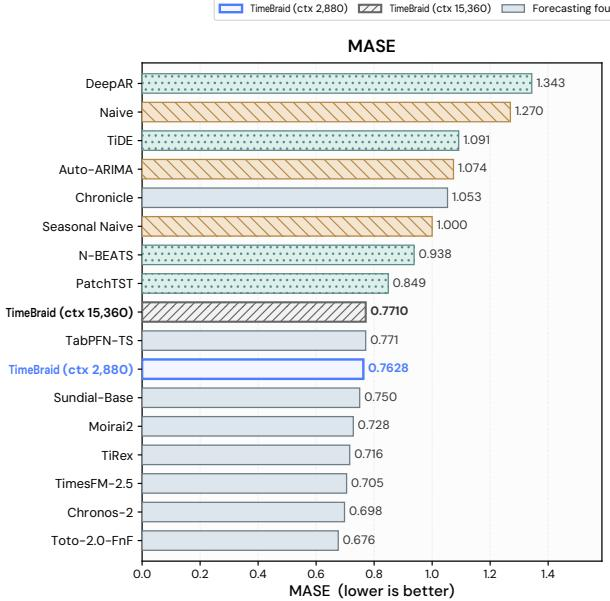

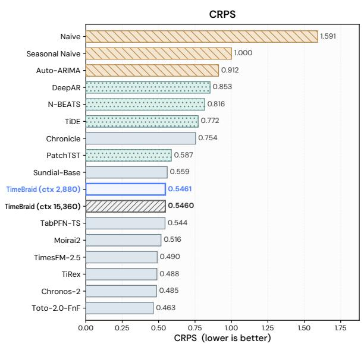  
Figure 8. Aggregate GIFT-Eval forecasting performance across models and context lengths. Lower is better.

Table 21. Per-horizon long-term forecasting on ETT and Weather, reporting MSE and MAE at horizons {96, 192, 336, 720} and their average. TimeBraid-2.5B uses a 2,880-step lookback; the baselines retain their <sub>o</sub>fi<sub>c</sub>i<sub>a</sub>l i<sub>npu</sub>t l<sub>eng</sub>th<sub>s.</sub> A<sub>vg</sub> R<sub>an</sub>k <sub>averages eac</sub>h <sub>mo</sub>d<sub>e</sub>l’<sub>s ran</sub>k <sub>across</sub> th<sub>e</sub> t<sub>wen</sub>t<sub>y</sub> d<sub>a</sub>t<sub>ase</sub>t<sub>–</sub>h<sub>or</sub>i<sub>zon se</sub>tti<sub>ngs.</sub>
<table><tr><td colspan="2" rowspan="2">Models</td><td colspan="2" rowspan="2">TimeBraid TimeBraid-2.5B (Ours)</td><td colspan="8">Time-Series Foundation Models</td><td colspan="4">Traditional Time-Series Models</td></tr><tr><td>SundialLarge (Zero-shot)</td><td></td><td>|Time-MoEUltra (Zero-shot)</td><td></td><td>MoiraiLarge (Zero-shot)</td><td>TimesFM2.5 (Zero-shot)</td><td></td><td>Chronos-2 (Zero-shot)</td><td>iTransformer (Full-shot)</td><td>TimeMixer (Full-shot)</td><td>PatchTST (Full-shot)</td><td>DLinear (Full-shot)</td></tr><tr><td colspan="2">Metric</td><td>MSE</td><td>MAE</td><td>MSE</td><td>MAE</td><td>MSE MAE</td><td>MSE</td><td>MAE</td><td>MSE</td><td>MAE</td><td>MSE MAE</td><td>MSE MAE</td><td>MSE</td><td>MAE MSE</td><td>MAE MSE MAE</td></tr><tr><td rowspan="4">ETTm1</td><td>96 192</td><td>0.310 0.356</td><td>0.336 0.364</td><td>0.273 0.312</td><td>0.329† 0.357</td><td>0.281 0.341 0.305 0.358†</td><td>|0.380 0.412</td><td>0.361 0.383</td><td>0.307 0.326 0.358 0.358†</td><td>|0.301† 0.352†</td><td>0.312 0.343</td><td>|0.334 0.368 0.377 0.391</td><td>0.320 0.357 0.3610.381</td><td>|0.329 0.367| 0.367 0.385</td><td>|0.3450.372 0.3800.389</td></tr><tr><td>336</td><td>0.388†</td><td>0.385</td><td>0.343</td><td>0.378</td><td>0.369 0.395</td><td>0.436</td><td>0.400</td><td>0.389</td><td>0.381† 0.388†</td><td>0.367</td><td>0.4260.420</td><td>0.3900.404</td><td>0.399 0.410</td><td>0.4130.413</td></tr><tr><td>720</td><td>0.439</td><td>0.415</td><td>0.397</td><td>0.413</td><td>0.469</td><td>0.472 0.462</td><td>0.420</td><td>0.444</td><td>0.414</td><td>0.451 0.403</td><td>0.4910.459</td><td>0.4540.441</td><td>0.4540.439</td><td>0.4740.453</td></tr><tr><td>|Avg |0.373†</td><td></td><td>0.375 0.331</td><td>0.369</td><td>0.356</td><td></td><td>0.391 |0.422 0.391</td><td></td><td>0.3750.370†</td><td>0.373†</td><td>0.356</td><td>0.4070.409</td><td>0.381</td><td>0.395|0.387 0.400|0.403 0.406</td><td></td></tr><tr><td rowspan="4">ETTm2</td><td></td><td>0.171†</td><td>0.250†</td><td>0.172</td><td>0.255</td><td>0.198 0.288</td><td>|0.211</td><td>0.274</td><td>0.170 0.239</td><td>0.161</td><td>0.225</td><td>|0.1800.264</td><td>0.258|</td><td></td><td></td></tr><tr><td>96 192</td><td>0.225 0.290†</td><td>0.227†</td><td></td><td></td><td>0.235 0.312</td><td>0.281</td><td>0.318</td><td>0.234 0.283</td><td></td><td>0.271</td><td>0.2500.309</td><td>0.175</td><td>|0.175 0.259|</td><td>|0.1930.292</td></tr><tr><td>336</td><td>0.273 0.324†</td><td>0.275</td><td>0.296 0.331</td><td></td><td>0.293 0.348</td><td>0.341</td><td>0.355</td><td>0.293 0.321</td><td></td><td>0.226 0.278 0.307</td><td>0.311 0.348</td><td>0.237</td><td>0.299 0.241 0.302</td><td>0.2840.362</td></tr><tr><td>720</td><td>0.356† 0.378</td><td>0.343</td><td>0.378</td><td>0.427</td><td>0.428</td><td>0.485</td><td>0.428</td><td>0.389 0.379†</td><td></td><td>0.352 0.359</td><td>0.4120.407</td><td>0.298 0.391 0.396</td><td>0.340 0.305 0.343 0.4020.400</td><td>0.3690.427 0.5540.522</td></tr><tr><td></td><td>|Avg| 0.256</td><td>0.311†</td><td>0.254</td><td>0.315</td><td>0.288</td><td></td><td>0.344 |0.329</td><td>0.343 |0.271†</td><td>0.305</td><td>|0.254</td><td>0.291</td><td>|0.2880.332</td><td>0.275</td><td>0.323|0.280 0.326|0.350 0.400</td><td></td></tr><tr><td rowspan="3">ETTh1</td><td>96 192</td><td>0.364† 0.396†</td><td>0.384 0.404†</td><td>0.346 0.386</td><td>0.383 0.410</td><td>0.349 0.395</td><td>0.379 |0.381 0.413 0.434</td><td>0.388 0.415</td><td>0.3660.381† 0.401</td><td>0.402</td><td>0.369 0.417</td><td>0.372 |0.3860.405</td><td>0.3750.400</td><td>|0.414 0.419|</td><td></td><td>|0.3860.400</td></tr><tr><td>336</td><td>0.407</td><td>0.413</td><td>0.410</td><td>0.426</td><td>0.447</td><td>0.453</td><td>0.485 0.445</td><td>0.415†</td><td>0.412</td><td>0.447</td><td>0.400 0.417</td><td>0.4410.436 0.487 0.458</td><td>0.4360.429 0.4840.458</td><td>0.4600.445 0.501 0.466</td><td>0.4370.432 0.4810.459</td></tr><tr><td>720| |Avg| 0.393</td><td>0.404</td><td>0.430</td><td>0.438</td><td>0.459</td><td>0.457</td><td>0.462</td><td>0.611 0.510</td><td>0.404</td><td>0.423</td><td>0.445†</td><td>0.431†</td><td>0.5030.491</td><td>0.4980.482</td><td>0.5000.488</td><td>0.519 0.516</td></tr><tr><td rowspan="4">ETTh2</td><td>96</td><td>0.284</td><td>0.407 0.334</td><td>0.395</td><td>0.420^</td><td>|0.412</td><td></td><td>0.426 |0.480 0.439</td><td>|0.396†</td><td>0.405</td><td>|0.420</td><td>0.405</td><td>0.4540.447</td><td>0.448</td><td>0.442|0.4680.454|0.4550.451</td><td></td></tr><tr><td>192</td><td>0.341</td><td>0.373</td><td>0.269</td><td>0.330†</td><td>0.292</td><td>0.352</td><td>0.296 0.330† 0.361 0.371†</td><td>0.275 0.344</td><td>0.318 0.365</td><td>|0.280^†</td><td>0.316</td><td>|0.297 0.349</td><td>0.289 0.341</td><td>|0.302 0.348|</td><td>|0.333 0.387</td></tr><tr><td>336</td><td>0.360</td><td>0.391†</td><td>0.325 0.354</td><td>0.373 0.400</td><td>0.347 0.406</td><td>0.379 0.419</td><td>0.390 0.390</td><td>0.374</td><td>0.390</td><td>0.346 0.370†</td><td>0.361 0.386</td><td>0.3800.400 0.4280.432</td><td>0.372 0.392</td><td>0.3880.400</td><td>0.4770.476</td></tr><tr><td>720</td><td>0.368</td><td>0.410†</td><td>0.389</td><td>0.443</td><td>0.439</td><td>0.447</td><td>0.423 0.418</td><td>0.377</td><td>0.402</td><td>0.370</td><td>0.400</td><td>0.427 70.445</td><td>0.386 0.414 0.4120.434</td><td>0.4260.433 0.4310.446</td><td>0.5940.541 0.8310.657</td></tr><tr><td rowspan="4">Weather</td><td>|Avg| 0.338</td><td>0.377†</td><td></td><td></td><td></td><td></td><td></td><td>0.399 |0.367 0.377†|</td><td>0.343</td><td>0.369</td><td></td><td>0.366</td><td>|0.383 0.406</td><td></td><td></td><td></td></tr><tr><td></td><td></td><td></td><td>0.334</td><td>0.387</td><td>|0.371</td><td></td><td></td><td></td><td></td><td>|0.342†</td><td></td><td></td><td>0.364</td><td>0.395|0.3860.406|0.5580.515</td><td></td></tr><tr><td>96</td><td>0.145 0.189†</td><td>|0.157†</td><td></td><td>0.208</td><td>|0.157†</td><td>0.211</td><td>|0.199 0.211</td><td>0.145</td><td>0.179</td><td>0.139</td><td>0.172</td><td>|0.174 0.214</td><td>0.163 0.209</td><td>|0.177 0.218|</td><td>0.196 0.255</td></tr><tr><td>192</td><td>0.193</td><td>0.236†</td><td>0.207</td><td>0.256</td><td>0.208</td><td>0.256</td><td>0.246 0.251</td><td>0.195†</td><td>0.228</td><td>0.186</td><td>0.219</td><td>0.221 0.254</td><td>0.208</td><td>0.250 0.225 0.259</td><td>0.2370.296</td></tr><tr><td rowspan="4"></td><td>336 0.329†</td><td>0.245 0.278† 0.337†</td><td></td><td>0.259</td><td>0.295</td><td>0.255</td><td>0.290 0.397</td><td>0.274 0.291 0.337 0.340</td><td>0.260 0.359</td><td>0.275 0.336</td><td>0.240 0.311</td><td>0.260 0.311</td><td>0.2780.296 0.3580.349</td><td>0.251† 0.287</td><td>0.2780.297</td><td>0.283 0.335</td></tr><tr><td>720</td><td></td><td></td><td>0.327</td><td>0.342</td><td>0.405</td><td></td><td></td><td></td><td></td><td></td><td></td><td></td><td>0.339 0.341</td><td>0.354 0.348</td><td>0.3450.381</td></tr><tr><td>|Avg| 0.228</td><td>0.260†</td><td></td><td>|0.238†</td><td>0.275</td><td>0.256</td><td>0.288 |0.264</td><td>0.273</td><td>0.240</td><td>0.255</td><td>0.219</td><td>0.241</td><td>|0.257 0.278</td><td>0.240</td><td>0.271|0.258 0.280|0.265 0.316</td><td></td></tr><tr><td>Avg Rank</td><td>2.48</td><td>3.45†</td><td>2.23</td><td>4.15</td><td>5.20</td><td>6.72</td><td>8.05</td><td>6.00 3.83</td><td>2.25</td><td>2.80†</td><td>1.20</td><td>8.10</td><td>8.07 5.67</td><td>5.80 7.72 7.88 8.93</td></table>

## F.3 Language Ability Retention

To examine whether joint training pre-<sub>serves</sub> th<sub>e</sub> l<sub>anguage</sub> <sub>a</sub>bilit<sub>y</sub> <sub>o</sub>f th<sub>e</sub> <sub>pre</sub>t<sub>ra</sub>i<sub>ne</sub>d l<sub>anguage</sub> t<sub>ower, we eva</sub>l<sub>ua</sub>t<sub>e</sub> Ti<sub>me</sub>B<sub>ra</sub>id <sub>on</sub> MMLU at the end of each trainin<sub>g</sub> sta<sub>g</sub>e. We <sub>a</sub>l<sub>so</sub> t<sub>ra</sub>i<sub>n a var</sub>i<sub>an</sub>t th<sub>a</sub>t <sub>m</sub>i<sub>xes un</sub>i<sub>mo</sub>d<sub>a</sub>l d<sub>a</sub>t<sub>a</sub> into the ali<sub>g</sub>nment sta<sub>g</sub>e<sub>,</sub> re<sub>p</sub>la<sub>y</sub>in<sub>g</sub> the Sta<sub>g</sub>e-2 unimodal cor<sub>p</sub>ora (Table 8) alon<sub>g</sub>side the <sub>p</sub>aired exam<sub>p</sub>les. In Table 22<sub>,</sub> we re<sub>p</sub>ort the MMLU accurac<sub>y</sub> of these check<sub>p</sub>oints.

Table 22. Five-shot MMLU accuracy (%) of TimeBraid-2.5B across training stages (Hendrycks et al., 2020). Base is the pretrained Qwen3-1.7B language tower evaluated stand<sub>a</sub>l<sub>one</sub> <sub>on</sub> t<sub>ex</sub>t<sub>-on</sub>l<sub>y</sub> <sub>promp</sub>t<sub>s;</sub> hi<sub>g</sub>h<sub>er</sub> i<sub>s</sub> b<sub>e</sub>tt<sub>er.</sub>
<table><tr><td>Stage</td><td>MMLU (%)</td></tr><tr><td>Base (Qwen3-1.7B language tower)</td><td>60.30</td></tr><tr><td>Align</td><td>40.88</td></tr><tr><td>Align, w/ unimodal replay</td><td>53.38</td></tr><tr><td>SFT</td><td>50.68</td></tr><tr><td>SFT, w/ unimodal replay during alignment</td><td>50.09</td></tr></table>

F<sub>rom</sub> th<sub>e</sub> t<sub>a</sub>bl<sub>e,</sub> th<sub>e</sub> <sub>a</sub>li<sub>gnmen</sub>t <sub>s</sub>t<sub>age</sub> <sub>cos</sub>t<sub>s</sub> the lan<sub>g</sub>ua<sub>g</sub>e tower 19.4 <sub>p</sub>oints<sub>,</sub> and mixin<sub>g</sub> <sub>un</sub>i<sub>mo</sub>d<sub>a</sub>l d<sub>a</sub>t<sub>a</sub> i<sub>n</sub>t<sub>o</sub> thi<sub>s</sub> <sub>s</sub>t<sub>age</sub> <sub>recovers</sub> MMLU t<sub>o</sub> 53<sub>.</sub>4<sub>.</sub> Aft<sub>er</sub> <sub>superv</sub>i<sub>se</sub>d fi<sub>ne-</sub>t<sub>un</sub>i<sub>ng,</sub> th<sub>e</sub> t<sub>wo</sub> <sub>var</sub>i<sub>an</sub>t<sub>s</sub> <sub>en</sub>d <sub>w</sub>ithi<sub>n</sub> 0<sub>.</sub>6 <sub>po</sub>i<sub>n</sub>t<sub>s</sub> <sub>o</sub>f <sub>eac</sub>h <sub>o</sub>th<sub>er, s</sub>i<sub>nce</sub> th<sub>e</sub> fi<sub>ne-</sub>t<sub>un</sub>i<sub>ng m</sub>i<sub>x</sub>t<sub>ure a</sub>l<sub>rea</sub>d<sub>y</sub>

<sub>con</sub>t<sub>a</sub>i<sub>ns</sub> <sub>an</sub> 11<sub>.</sub>69% <sub>un</sub>i<sub>mo</sub>d<sub>a</sub>l <sub>s</sub>h<sub>are.</sub> W<sub>e</sub> th<sub>ere</sub>f<sub>ore</sub> k<sub>eep</sub> th<sub>e</sub> <sub>a</sub>li<sub>gnmen</sub>t <sub>s</sub>t<sub>age</sub> <sub>pure</sub>l<sub>y</sub> <sub>pa</sub>i<sub>re</sub>d<sub>.</sub> O<sub>vera</sub>ll<sub>,</sub> <sub>m</sub>i<sub>x</sub>i<sub>ng un</sub>i<sub>mo</sub>d<sub>a</sub>l d<sub>a</sub>t<sub>a preserves</sub> th<sub>e</sub> l<sub>anguage a</sub>bilit<sub>y o</sub>f th<sub>e un</sub>ifi<sub>e</sub>d <sub>mo</sub>d<sub>e</sub>l<sub>, a</sub>lth<sub>oug</sub>h th<sub>e s</sub>h<sub>ares we</sub> <sub>use</sub> d<sub>o</sub> <sub>no</sub>t <sub>preserve</sub> it f<sub>u</sub>ll<sub>y</sub> <sub>an</sub>d l<sub>eave</sub> th<sub>e</sub> <sub>re</sub>l<sub>ease</sub>d <sub>mo</sub>d<sub>e</sub>l 9<sub>.</sub>6 <sub>po</sub>i<sub>n</sub>t<sub>s</sub> b<sub>e</sub>l<sub>ow</sub> it<sub>s</sub> b<sub>ac</sub>kb<sub>one.</sub> W<sub>e</sub> l<sub>eave</sub> th<sub>e</sub> <sub>searc</sub>h f<sub>or a un</sub>i<sub>mo</sub>d<sub>a</sub>l <sub>ra</sub>ti<sub>o</sub> th<sub>a</sub>t <sub>removes</sub> thi<sub>s gap</sub> t<sub>o</sub> f<sub>u</sub>t<sub>ure wor</sub>k<sub>.</sub>

## G Success and Failure Cases

Th<sub>e</sub> f<sub>o</sub>ll<sub>ow</sub>i<sub>ng se</sub>l<sub>ec</sub>t<sub>e</sub>d <sub>qua</sub>lit<sub>a</sub>ti<sub>ve examp</sub>l<sub>es</sub> ill<sub>us</sub>t<sub>ra</sub>t<sub>e</sub> f<sub>orecas</sub>ti<sub>ng an</sub>d <sub>un</sub>d<sub>ers</sub>t<sub>an</sub>di<sub>ng capa</sub>biliti<sub>es.</sub> F<sub>or con</sub>t<sub>ex</sub>t<sub>-con</sub>diti<sub>one</sub>d f<sub>orecas</sub>t<sub>s, we s</sub>h<sub>ow</sub> th<sub>e supp</sub>li<sub>e</sub>d <sub>con</sub>t<sub>ex</sub>t<sub>ua</sub>l t<sub>ex</sub>t <sub>or a ver</sub>b<sub>a</sub>ti<sub>m excerp</sub>t<sub>.</sub> M<sub>a</sub>t<sub>c</sub>h<sub>e</sub>d <sub>compar</sub>i<sub>sons</sub> k<sub>eep</sub> th<sub>e</sub> <sub>c</sub>h<sub>ec</sub>k<sub>po</sub>i<sub>n</sub>t<sub>,</sub> <sub>numer</sub>i<sub>ca</sub>l hi<sub>s</sub>t<sub>ory,</sub> <sub>pre</sub>di<sub>c</sub>ti<sub>on</sub> h<sub>or</sub>i<sub>zon,</sub> <sub>an</sub>d i<sub>n</sub>f<sub>erence</sub> <sub>se</sub>tti<sub>ngs</sub> fi<sub>xe</sub>d<sub>, remov</sub>i<sub>ng on</sub>l<sub>y</sub> th<sub>e con</sub>t<sub>ex</sub>t<sub>ua</sub>l i<sub>n</sub>f<sub>orma</sub>ti<sub>on;</sub> th<sub>e</sub> f<sub>orecas</sub>t i<sub>ns</sub>t<sub>ruc</sub>ti<sub>on rema</sub>i<sub>ns.</sub> R<sub>epor</sub>t<sub>e</sub>d <sub>error re</sub>d<sub>uc</sub>ti<sub>ons re</sub>f<sub>er</sub> t<sub>o</sub> th<sub>e</sub> i<sub>n</sub>di<sub>v</sub>id<sub>ua</sub>l <sub>examp</sub>l<sub>es s</sub>h<sub>own.</sub>

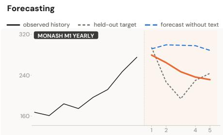  
User Background: This dataset represents the annual production of a specific industry, measured in units. The historical trend shows a steady increase from 1983 to 1987, with an average annual growth rate of 10%. Scenario: Suppose a major economic downturn occurs from 1989-01-01 00:00:00 to 1990-12-31 00:00:00, resulting in a significant decline in production, with values 20% lower than the previous year. This downturn is expected to last for two years, after which the production is likely to recover and continue its upward trend. The impact of the economic downturn is evident in the forecast values, with a notable decrease in 1989 and 1990, followed by a gradual increase in the subsequent years.

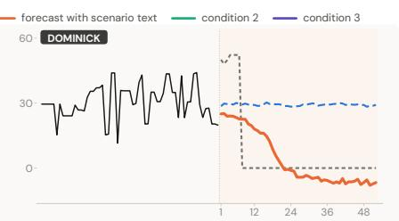  
User Background: The historical time series data shows fluctuating profit values with occasional spikes and dips. However, starting from 1993-06-24 00:00:00, the values suddenly drop to 0 and remain at this level for an extended period. Scenario: A plausible cause for this drastic change is a store closure or a significant disruption in the supply chain, resulting in a complete halt of sales. This event is likely to have occurred around 1993-06-24 00:00:00 and persisted indefinitely. As a result, the profit values are expected to remain 100% lower than the previous levels. The impact of this event is sustained, with no signs of recovery or resurgence in sales.

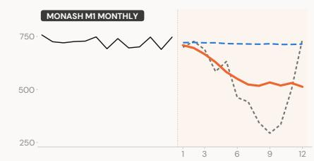

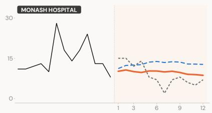  
User Background: This time series represents a monthly economic indicator. Scenario: Suppose a major economic downturn occurs from 1982-05-31 00:00:00 to 1982-12-31 00:00:00, resulting in a significant decline in economic activity and a corresponding drop in the time series values to about 50% lower than the usual level. This downturn is likely due to a combination of factors, including reduced consumer spending and investments. The impact on future values will be a sustained decline, with values 30% lower than the preceding year, starting from 1982-05-31 00:00:00 and lasting until the end of 1982.  
User Background: The historical time series data reflects the number of patients or usage of medical services and products in a healthcare setting over time, showing fluctuations with peaks and troughs. Scenario: Suppose a new community health program is launched from 2005-01-01 00:00:00, aiming to provide preventive care and reduce hospital admissions, resulting in a sustained decline in patient counts by about 40% compared to the previous year's average. This initiative is expected to continue influencing patient numbers throughout the forecast period.

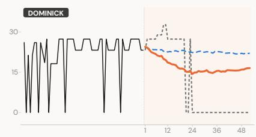

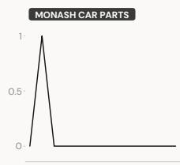  
User Background: The historical time series exhibits a recurring pattern of fluctuating profit values, with alternating periods of higher and lower profits. This pattern is expected to persist in the forecast horizon. Scenario: A major change is observed in the forecast, starting from 1991-09-12 00:00:00, where the profit values initially remain steady and then surge to higher levels, followed by a prolonged period of zero profits. A plausible cause for this change is a significant shift in consumer demand, potentially due to a change in season or a major promotional event. This shift leads to an initial increase in sales, followed by a period of stock depletion and subsequent replenishment issues, resulting in zero profits for an extended period.

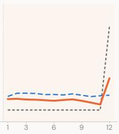  
User Background: The provided time series represents monthly car parts sales from January 1998 to March 2002. Historically, the sales have shown a pattern of minimal to no sales from 1999-10-01 00:00:00 onwards, with an isolated sale in 1999-10-01 00:00:00. This trend of low sales continues into the forecast horizon starting at 2000-10-01 00:00:00. Scenario: Suppose a major automotive manufacturing plant in the region undergoes a significant restructuring and modernization effort from 2001-01-01 00:00:00 to 2001-09-01 00:00:00. This could lead to an increased demand for specific car parts, potentially resulting in higher sales. The impact of this event on future values could be an increase in sales by about 20% during the restructuring period, culminating in a notable sale in 2001-09-01 00:00:00.

Figure 9. Context-conditioned forecasting with and without scenario text.

Forecasting  
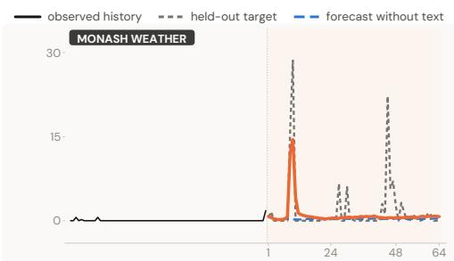

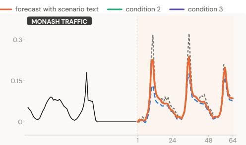  
User Background: The historical time series shows a prolonged period of minimal rainfall from 1972-04-21 to 1972-06-23, with only two instances of non-zero values. Scenario: A significant low-pressure system is expected to develop over the region from 1972-07-02 00:00:00 to 1972-07-04 00:00:00, resulting in substantially higher rainfall, approximately 10-20 times the usual level, due to the system's intense precipitation. This event is likely to cause a brief but pronounced surge in rainfall values. Constraint: The forecast values are expected to remain below 30.  
User Background: This time series represents hourly road occupancy readings from highway sensors in the San Francisco Bay Area. Historically, the data shows a daily pattern with higher occupancy during the day and lower occupancy at night. Scenario: Starting from 2015-06-29 20:00:00, a major sporting event is scheduled to take place in the area, resulting in increased traffic congestion. The event is expected to cause a surge in road occupancy, with values potentially being 2-3 times higher than usual during the evening and nighttime hours. This increased traffic is anticipated to last until the end of the event on 2015-06-30. After the event, traffic patterns are expected to return to normal, with some potential residual effects on the following day. Constraint: The road occupancy values are expected to be bounded above by 1, reflecting the maximum possible occupancy of the road.

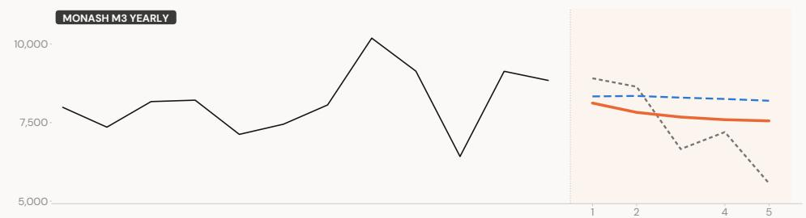  
User Background: This dataset represents the yearly sales of a manufacturing company. The historical trend shows fluctuations with an overall decline from 1973 to 1975, followed by a recovery in 1976 and a slight decrease in 1977. Scenario: Suppose a major competitor entered the market in 1978, leading to increased competition and a subsequent decline in sales. This new competitor's aggressive marketing and pricing strategies likely caused the company's sales to drop by approximately 20% in the following years. The impact of this event is expected to last from 1978-12-31 00:00:00 to 1982-12-31 00:00:00, resulting in lower sales figures compared to the pre-1978 period. Constraint: The sales values are assumed to be bounded above by the highest historical value, which is 10188.

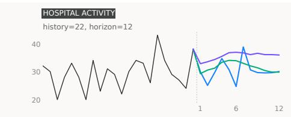  
User The trajectory begins with a dip at future step 2, followed by a recovery to a local peak at future step 4. It then drops to a local minimum at future step 6 before surging to the highest future point at future step 7. The sequence concludes with a decline followed by a recovery at the end.

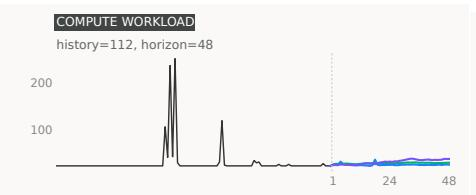  
User A sharp spike occurs at future step 4, followed by a return to a low level with a minor secondary peak at future step 18.  
User Maintain a persistently higher level for future steps 1 to 48.  
User Maintain a sustained upward drift across future steps 1 to 48. Introduce a pronounced downward drop that gradually recovers during future steps 5 to 18. Create a strong local upward pulse within future steps 20 to 33.

Figure 10. Context-conditioned and text-controlled forecasting on test examples. In the lower panels, solid bl<sub>ue, green, an</sub>d <sub>purp</sub>l<sub>e</sub> d<sub>eno</sub>t<sub>e con</sub>diti<sub>ons</sub> 1<sub>–</sub>3 <sub>over</sub> th<sub>e same</sub> h<sub>e</sub>ld<sub>-ou</sub>t hi<sub>s</sub>t<sub>ory;</sub> d<sub>as</sub>h<sub>e</sub>d bl<sub>ue</sub> i<sub>n</sub> th<sub>e upper pane</sub>l<sub>s</sub> d<sub>eno</sub>t<sub>es</sub> f<sub>orecas</sub>ti<sub>ng</sub> <sub>w</sub>ith<sub>ou</sub>t t<sub>ex</sub>t<sub>.</sub> O<sub>n</sub>l<sub>y</sub> th<sub>e</sub> dif<sub>er</sub>i<sub>ng</sub> <sub>con</sub>diti<sub>on</sub> t<sub>ex</sub>t i<sub>s</sub> di<sub>sp</sub>l<sub>aye</sub>d<sub>.</sub>

Condition 3 - Excerpt: Set a persistently lower level for future steps 1 to 30.

Text-controlled forecasting

History Condition 1 Condition 2 Condition 3

## EPIDEMIC SERIES

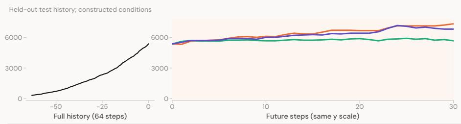  
User / Context  
Condition 1 - Excerpt: The future trajectory exhibits a steady linear increase, rising from approximately 5500 at future step 1 to approximately 9500 at future step 30.  
Condition 2 - Excerpt: Maintain a persistently higher level for future steps 1 to 30.  
Condition 3 - Excerpt: Create a sustained upward drift across future steps 1 to 30. Introduce a strong local upward pulse during future steps 22 to 24.

## RESTAURANT DEMAND

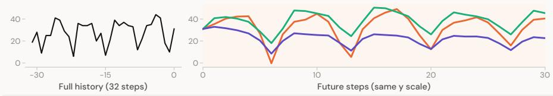  
User / Context  
Condition 1 - Excerpt: The trajectory begins with a rise to a local peak around future step 4, followed by a sharp decline to a future minimum at future step 6. It then recovers to a peak near future step 10 before dropping to a second, lower future minimum at future step 12. From there, the series rises steadily to a future maximum at future step 17, followed by a decline to a trough at future step 20 and a final rise to the end of the horizon.  
Condition 2 - Excerpt: Maintain a persistently higher level for future steps 1 to 30. Introduce an upward surge that gradually decays for future steps 8 to 15.

## COMMERCE / ALTERNATIVE CONDITIONS

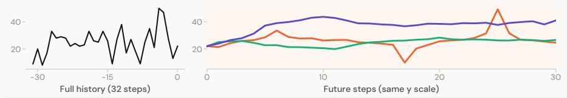

## User / Context

Condition 1 - Excerpt: The sequence begins with an upward trend from future step 1, reaching a local peak at future step 6. It then fluctuates with high volatility, dropping to a future minimum at future step 17. Following this trough, the series rises sharply to a future maximum at future step 25, before declining and recovering slightly at the end.

Condition 2 - Excerpt: Maintain a persistently higher level for future steps 1 to 30. Introduce a downward drop that gradually recovers for future steps 4 to 11. Create a local upward pulse for future steps 13 to 20. Condition 3 - Excerpt: Maintain a persistently higher level in future steps 1 to 30. Introduce a pronounced upward pulse in future steps 4 to 11.

Figure 11. Text-controlled forecasting on held-out test histories. Each group uses three textual conditions <sub>w</sub>ith th<sub>e same numer</sub>i<sub>ca</sub>l i<sub>npu</sub>t<sub>.</sub> C<sub>o</sub>l<sub>ore</sub>d <sub>curves are recor</sub>d<sub>e</sub>d <sub>mo</sub>d<sub>e</sub>l <sub>ou</sub>t<sub>pu</sub>t<sub>s;</sub> th<sub>e</sub> t<sub>ex</sub>t b<sub>e</sub>l<sub>ow eac</sub>h <sub>pane</sub>l <sub>quo</sub>t<sub>es</sub> th<sub>e</sub> dif<sub>er</sub>i<sub>ng con</sub>diti<sub>on.</sub> Th<sub>ese are cons</sub>t<sub>ruc</sub>t<sub>e</sub>d <sub>scenar</sub>i<sub>os, no</sub>t <sub>o</sub>b<sub>serve</sub>d <sub>a</sub>lt<sub>erna</sub>ti<sub>ve</sub> f<sub>u</sub>t<sub>ures.</sub> F<sub>u</sub>ll hi<sub>s</sub>t<sub>or</sub>i<sub>es an</sub>d <sub>comp</sub>l<sub>e</sub>t<sub>e</sub> f<sub>orecas</sub>t h<sub>or</sub>i<sub>zons are s</sub>h<sub>own on separa</sub>t<sub>e</sub> h<sub>or</sub>i<sub>zon</sub>t<sub>a</sub>l <sub>axes w</sub>ith th<sub>e same ver</sub>ti<sub>ca</sub>l <sub>sca</sub>l<sub>e.</sub>

Text-controlled forecasting  
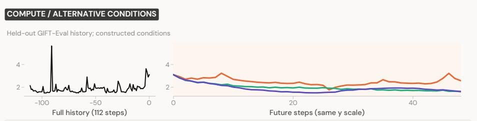  
User / Context  
Condition 1 - Excerpt: The series exhibits a fluctuating pattern with a local peak around future step 8, followed by a dip to a local minimum around future step 26. It then rises to a secondary peak around future step 35 before climbing to the future maximum at future step 46  
Condition 2 - Excerpt: Create a marked downward trend in future steps 1 to 48. Introduce a local dip in future steps 28 to 41.  
Condition 3 - Excerpt: Maintain a persistently lower level across future steps 1 to 48. Introduce a local downward pulse during future steps 12 to 25. Create an upward surge that gradually decays within future steps 28 to 41.

## HEALTH / ALTERNATIVE CONDITIONS

Held-out GIFT-Eval history; constructed conditions

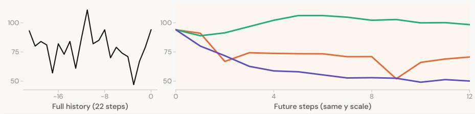  
User / Context  
Condition 1 - Excerpt: The series drops sharply from future step 1 to 2, then fluctuates with a notable low at future step 9 before recovering toward the end.  
Condition 2 - Excerpt: Maintain a persistently higher level during future steps 1 to 12. Introduce a pronounced upward surge that gradually decays across future steps 3 to 8.  
Condition 3 - Excerpt: Shift to a persistently lower level for future steps 1 to 12.

## TRAFFIC / ALTERNATIVE CONDITIONS

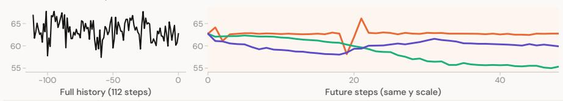  
User / Context  
Condition 1 - Excerpt: The future trajectory exhibits high volatility with sharp fluctuations. It begins with a sharp drop at future step 1, followed by a recovery. A significant local minimum occurs at future step 19, immediately followed by a sharp spike to a local maximum at future step 21  
Condition 2 - Excerpt: Maintain a sustained downward drift in future steps 1 to 48. Introduce a pronounced local downward pulse in future steps 20 to 33.  
Condition 3 - Excerpt: Maintain a persistently lower level across future steps 1 to 48. Introduce a loca downward pulse during future steps 5 to 18. Create an upward surge that gradually decays within future steps 20 to 33.

Figure 12. Additional text-controlled forecasts on held-out histories. All three predictions use the displayed t<sub>ex</sub>t<sub>ua</sub>l <sub>con</sub>diti<sub>ons, quo</sub>t<sub>e</sub>d f<sub>rom</sub> th<sub>e</sub> f<sub>u</sub>ll i<sub>npu</sub>t<sub>s.</sub> Th<sub>e cons</sub>t<sub>ruc</sub>t<sub>e</sub>d <sub>scenar</sub>i<sub>os vary</sub> t<sub>ren</sub>d<sub>s,</sub> l<sub>eve</sub>l<sub>s, an</sub>d l<sub>oca</sub>l <sub>c</sub>h<sub>anges;</sub> th<sub>ey</sub> ill<sub>us</sub>t<sub>ra</sub>t<sub>e</sub> th<sub>e mo</sub>d<sub>e</sub>l’<sub>s responses</sub> t<sub>o</sub> di<sub>s</sub>ti<sub>nc</sub>t i<sub>ns</sub>t<sub>ruc</sub>ti<sub>ons.</sub> B<sub>o</sub>th <sub>axes use</sub> th<sub>e same ver</sub>ti<sub>ca</sub>l <sub>sca</sub>l<sub>e an</sub>d di<sub>sp</sub>l<sub>ay</sub> t<sup>h</sup>e com<sub>p</sub><sup>l</sup>ete <sup>i</sup>n<sub>p</sub>ut an<sup>d</sup> out<sub>p</sub>ut se<sub>q</sub>uences.

WINTER INFLUENZA SEASON

## Forecasting with contextual text

Selected test examples | Actual context excerpts and complete forecast horizons

History Observed future With text No context

## INFLUENZA ACTIVITY

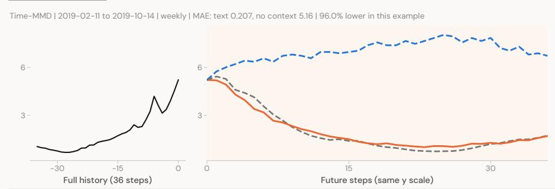  
User / Context

With contextual text - Excerpt: The CDC shows increasing flu activity for the United States, and vaccination is recommended to prevent influenza virus infection.  
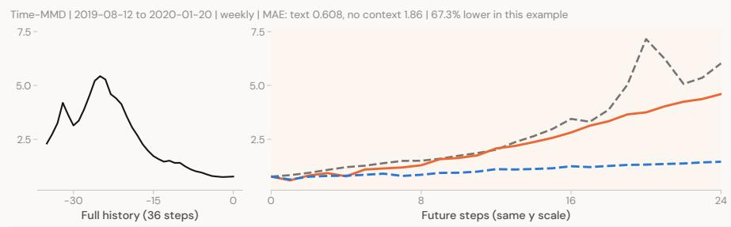  
User / Context  
With contextual text - Excerpt: Influenza virus infection is a common viral infection that occurs largely in the winter months, and pneumonia is a common complication among adults hospitalized with laboratory-confirmed seasonal influenza virus infection.  
ENERGY MARKET RECOVERY

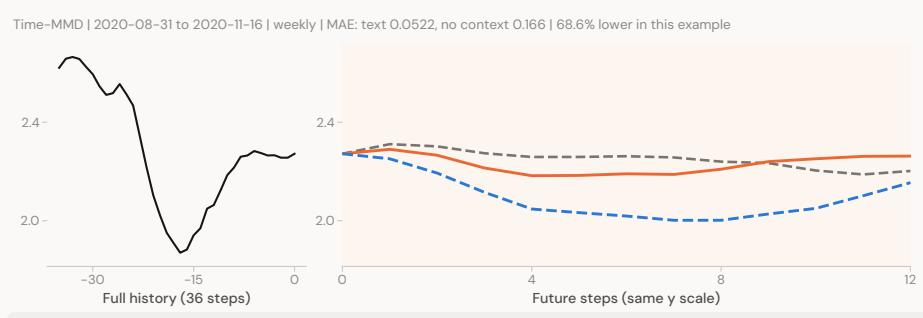  
User / Context

With contextual text - Excerpt: Oil prices have hit a 5-month high as the economy appears to recover and COVID cases fall in key U.S. states.

Figure 13. Selected Time-MMD test forecasts with matched contextual-text ablations. Orange uses the full d<sub>a</sub>t<sub>ase</sub>t<sub>-prov</sub>id<sub>e</sub>d t<sub>ex</sub>t<sub>ua</sub>l <sub>con</sub>t<sub>ex</sub>t<sub>;</sub> d<sub>as</sub>h<sub>e</sub>d bl<sub>ue removes</sub> th<sub>a</sub>t <sub>con</sub>t<sub>ex</sub>t <sub>w</sub>hil<sub>e re</sub>t<sub>a</sub>i<sub>n</sub>i<sub>ng</sub> th<sub>e same</sub> f<sub>orecas</sub>t i<sub>ns</sub>t<sub>ruc</sub>ti<sub>on,</sub> <sub>numer</sub>i<sub>ca</sub>l hi<sub>s</sub>t<sub>ory, an</sub>d h<sub>or</sub>i<sub>zon.</sub> D<sub>as</sub>h<sub>e</sub>d <sub>gray</sub> i<sub>s</sub> th<sub>e o</sub>b<sub>serve</sub>d f<sub>u</sub>t<sub>ure.</sub> T<sub>ex</sub>t b<sub>e</sub>l<sub>ow eac</sub>h <sub>pane</sub>l i<sub>s a ver</sub>b<sub>a</sub>ti<sub>m excerp</sub>t <sub>o</sub>f th<sub>e</sub> f<sub>u</sub>ll <sub>con</sub>t<sub>ex</sub>t <sub>use</sub>d f<sub>or pre</sub>di<sub>c</sub>ti<sub>on.</sub> MAE i<sub>s measure</sub>d <sub>over</sub> th<sub>e comp</sub>l<sub>e</sub>t<sub>e</sub> f<sub>u</sub>t<sub>ure</sub> h<sub>or</sub>i<sub>zon</sub> i<sub>n source un</sub>it<sub>s;</sub> <sub>re</sub>d<sub>uc</sub>ti<sub>ons</sub> d<sub>escr</sub>ib<sub>e</sub> th<sub>ese se</sub>l<sub>ec</sub>t<sub>e</sub>d <sub>examp</sub>l<sub>es.</sub>

User / Context

User / Context

Forecasting with contextual text  
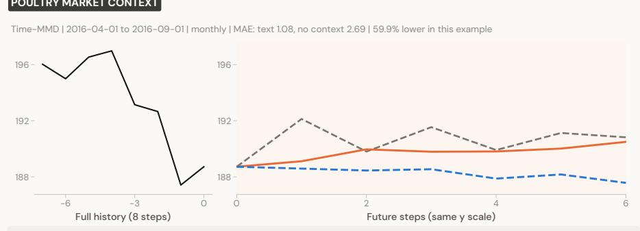  
With contextual text - Excerpt: The United States is a major exporter of food products, including poultry, and the implementation of the TPP will further boost demand for U.S. food exports.  
HOLIDAY POULTRY DEMAND

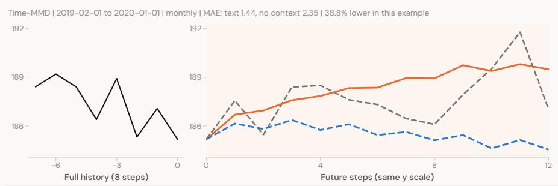  
With contextual text - Excerpt: The demand for chicken wings is expected to spike on Super Bowl Sunday, stressing the poultry market.

FUEL PRICES AND SUPPLY  
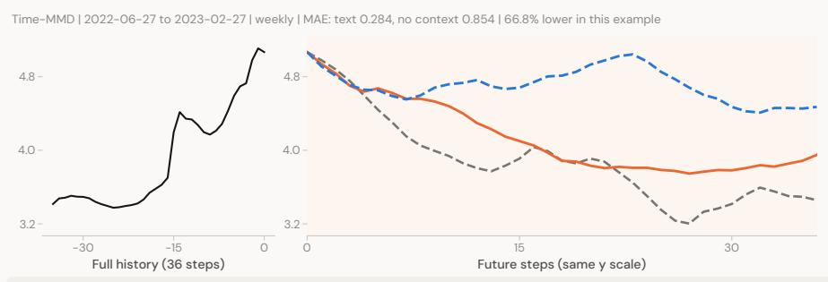  
With contextual text - Excerpt: The price of crude oil has reached \$120 per barrel, and global refining capacity has shrunk since COVID.  
Figure 14. Additional matched Time-MMD test forecasts with market context. Orange forecasts use textual <sub>con</sub>t<sub>ex</sub>t<sub>;</sub> d<sub>as</sub>h<sub>e</sub>d bl<sub>ue</sub> f<sub>orecas</sub>t<sub>s remove on</sub>l<sub>y</sub> th<sub>a</sub>t <sub>con</sub>t<sub>ex</sub>t<sub>.</sub> Di<sub>sp</sub>l<sub>aye</sub>d <sub>excerp</sub>t<sub>s are</sub> t<sub>a</sub>k<sub>en</sub> f<sub>rom</sub> th<sub>e</sub> f<sub>u</sub>ll i<sub>npu</sub>t<sub>s.</sub> Th<sub>e</sub> <sub>same c</sub>h<sub>ec</sub>k<sub>po</sub>i<sub>n</sub>t <sub>an</sub>d i<sub>n</sub>f<sub>erence se</sub>tti<sub>ngs are use</sub>d f<sub>or</sub> b<sub>o</sub>th <sub>arms.</sub> C<sub>omp</sub>l<sub>e</sub>t<sub>e</sub> hi<sub>s</sub>t<sub>or</sub>i<sub>es an</sub>d f<sub>u</sub>t<sub>ure</sub> h<sub>or</sub>i<sub>zons are</sub> <sub>s</sub>h<sub>own, an</sub>d th<sub>e</sub> t<sub>wo axes</sub> i<sub>n eac</sub>h <sub>examp</sub>l<sub>e s</sub>h<sub>are</sub> th<sub>e</sub>i<sub>r ver</sub>ti<sub>ca</sub>l <sub>sca</sub>l<sub>e.</sub>

User / Context

User / Context

Forecasting with contextual text  
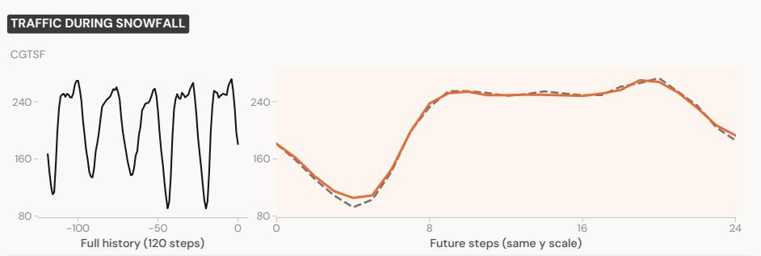  
With contextual text - Excerpt: This sequence records traffic flow at a highway in Paris, France, with a collection granularity of 1 hour. The target date for prediction is Wednesday, December 14, 2022. It is a weekday with moderate snow fall and light breeze. The minimum temperature is -3 degrees, and the maximum temperature is 0 degrees. The sun will rise at 9:36 and set at 17:54.

PARIS HIGHWAY TRAFFIC  
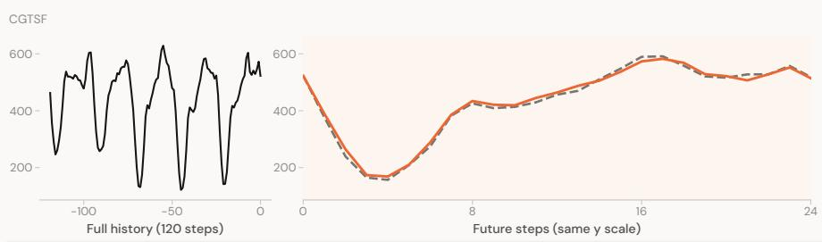  
With contextual text - Excerpt: This sequence records traffic flow at a highway in Paris, France, with a collection granularity of 1 hour. The target date for prediction is Thursday, October 27, 2022. It is a weekday with overcast and gentle breeze. The minimum temperature is 13 degrees, and the maximum temperature is 22 degrees. The sun will rise at 8:29 and set at 18:39.

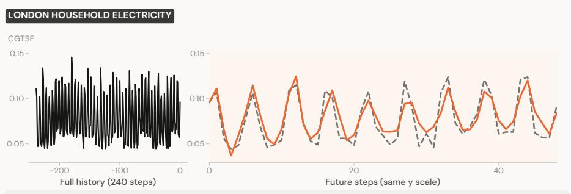  
With contextual text - Excerpt: This sequence records electricity usage at a household in London, United Kingdom, with a collection granularity of 30 minutes. The target date for prediction is Sunday, August 11, 2013. It is a weekend with light drizzle and gentle breeze. The minimum temperature is 15 degrees, and the maximum temperature is 21 degrees. The sun will rise at 5:40 and set at 20:31.  
Figure 15. Selected CGTSF test forecasts usin weather calendar and location text to ether with the numerical hi<sub>s</sub>t<sub>ory.</sub> Th<sub>e con</sub>t<sub>ex</sub>t<sub>ua</sub>l <sub>passages supp</sub>li<sub>e</sub>d t<sub>o</sub> th<sub>e mo</sub>d<sub>e</sub>l <sub>are</sub> di<sub>sp</sub>l<sub>aye</sub>d b<sub>e</sub>l<sub>ow</sub> th<sub>e curves.</sub> O<sub>range</sub> i<sub>s</sub> th<sub>e recor</sub>d<sub>e</sub>d t<sub>ex</sub>t<sub>-con</sub>diti<sub>one</sub>d <sub>pre</sub>di<sub>c</sub>ti<sub>on an</sub>d d<sub>as</sub>h<sub>e</sub>d <sub>gray</sub> i<sub>s</sub> th<sub>e o</sub>b<sub>serve</sub>d f<sub>u</sub>t<sub>ure.</sub> Th<sub>ese examp</sub>l<sub>es s</sub>h<sub>ow con</sub>diti<sub>ona</sub>l f<sub>orecas</sub>t <sub>qua</sub>lit<sub>y; a ma</sub>t<sub>c</sub>h<sub>e</sub>d <sub>con</sub>t<sub>ex</sub>t<sub>-remova</sub>l <sub>compar</sub>i<sub>son</sub> i<sub>s no</sub>t i<sub>nc</sub>l<sub>u</sub>d<sub>e</sub>d f<sub>or</sub> thi<sub>s page.</sub>

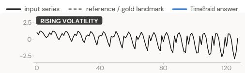


  
Figure 16. Series-property QA, sleep-stage classification, and multivariate relation analysis.


  
Figure 17. Scenario-based reasoning and time-series captioning.

Domain Tasks and Detection

  
index the answer names  
User The following data represents ECG (Electrocardiogram) signals, which record the electrical activity of the heart during each heartbeat and serve as an important tool for diagnosing heart diseases. Using a signal sampled at a frequency of 500 Hz, we can determine whether abnormalities are present in the human body.

  
Based on the given information, this time seriesTimeBraid includes Anomaly Point  
User The following data is derived from an environmental monitoring wireless sensor network system designed to collect environmental data with high spatial and temporal resolution. It has been deployed in mountainous and urban areas. Specifically, it includes environmental parameters such as temperature, humidity, wind speed, and soil moisture. Using this data, it is possible to determine whether abnormal events are present in the environment.

  
Based on the given information, this time seriesTimeBraid includes Normal Point.  
User This data originates from machine system, and it is used to evaluate system condition. Using this data, we can determine whether anomalies have occurred within the system.

  
User You are given accelerometer data in all three dimensions. Your task is to classify the activity based on analysis of the data.  
Based on the given information, this time seriesTimeBraid includes Anomaly Point.

  
Answer: standing.TimeBraid  
User This data originates from monitoring systems and devices, and it is used to evaluate system performance or detect anomalies in time series. It also assesses the health and operational performance of devices or services. The dataset includes IOPS metrics recorded during the operation of storage systems or servers. Using this data, we can determine whether anomalies have occurred within the system.

  
Based on the given information, this time seriesTimeBraid includes Normal Point


  
User Does this series contain an anomaly? Answer yes or no, and if yes give the index where it starts.

  
User Does this series contain an anomaly? Answer yes or no, and if yes give the index where it starts.  
No, the series does not contain an anomaly. The dataTimeBraid shows a consistent upward trend with no significant deviations or outliers.  
Yes, it contains an anomaly. The series starts withTimeBraid negative values and then suddenly shifts to positive values around index 80, indicating a significant change in the data pattern.

  
User Does this series contain an anomaly? Answer yes or no, and if yes give the index where it starts.

  
Yes, the series contains an anomaly. An upward spikeTimeBraid with an amplitude of 2.00 occurred between point 94 and point 96, where the value rapidly rose from around -0.50 to around 1.50 and then quickly fell back to around -0.40.  
User Does this series contain an anomaly? Answer yes or no, and if yes give the index where it starts.  
Yes, the series contains an anomaly. The anomaly startsTimeBraid around index 85, where there is a sudden and significant deviation from the surrounding values, with extreme positive and negative spikes.

Figure 18. Sensor anomalies, human activity, bone age, and anomaly localization.

The overall trend is decreasing. The series starts atTimeBraid 1081.18 and ends at 1071.18, showing a general downward trend over the period.

Where It Fails: Consistency and Trivial Baselines  


<table><tr><td rowspan="2">User</td><td>Does the maximum occur before the minimum? Answer yes or no.</td></tr><tr><td>TimeBraid No, the maximum does not occur before the minimum. The maximum value of 36.0 is at index 1, while the minimum value of 7.0 is at index 10.</td></tr><tr><td>User</td><td>Does the minimum occur before the maximum? Answer yes or no.</td></tr><tr><td></td><td>TimeBraid No, the minimum does not occur before the maximum. The maximum is 36.0, and the minimum is 7.0, which occurs before the maximum.</td></tr></table>

  
User Is this series more volatile in its first half than its second half? Answer yes or no.  
No, the series is not more volatile in its first half than inTimeBraid its second half. The first half shows a gradual increase from 0.27 to 0.41, while the second half shows a more stable increase from 0.41 to 0.64.  
No, the series is not more volatile in its second halfTimeBraid than in its first half. The changes in the second half are gradual and consistent, similar to the first half.


## TREND WORDING

  
User Would you describe the general direction of this series as up, down, or level?  
The series is not level. It contains a few high values likeTimeBraid 87.0 and 67.0, which disrupt the level of the series.

  
User Summarise the long-run direction of this series in one  
The series shows an overall decreasing trend withTimeBraid some fluctuations.  
User Over the whole window, does this series mostly rise, mostly fall, or stay put?  
The series mostly stays put. There are periods of slightTimeBraid increases and decreases, but no consistent upward or downward trend.

  
User Is the overall trend of this series increasing, decreasing, or flat?  
The series shows a general upward trend initially,TimeBraid peaking around the middle, followed by a decline towards the end.

  
TIMEMQA CLASSIFICATION TEST  
Based on the given information, the answer is NoTimeBraid freeze.

  
Figure 19. Question answering, paraphrase consistency, and time-series classification.

Imputation

  
Figure 20. Imputation examples.