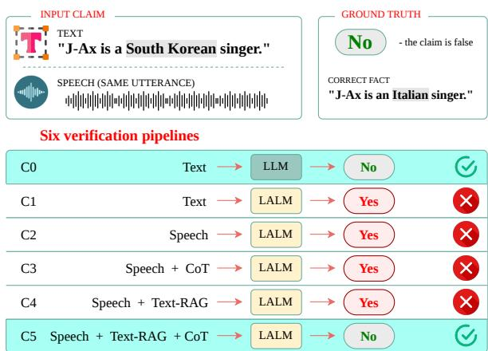
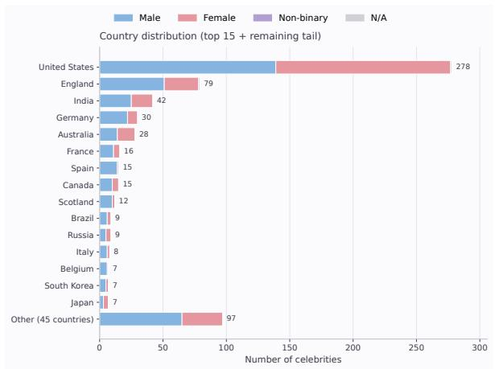
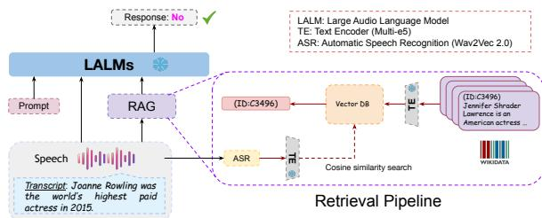

# To Trust or Not to Trust: Retrieval-Augmented Fact Checking in Speech

Debajyoti Mazumder<sup>1</sup>, Mamta<sup>2</sup>, Abhirama Subramanyam Penamakuri<sup>3</sup>

<sup>1</sup>IISER Bhopal, <sup>2</sup>King’s College London, <sup>3</sup>MBZUAI

debajyoti22@iiserb.ac.in, mamta20118@gmail.com, venkata.penamakuri@mbzuai.ac.ae

## Abstract

Online misinformation increasingly appears in spoken formats such as news clips, pod casts, interviews, political speeches, and so cial media videos, creating a need for fact checking systems that can verify claims directly from speech. We introduce VERISPEAK, a probe benchmark for studying speech-based fact verification in Large Audio Language Models (LALMs). VERISPEAK contains 3,879 spoken claims spanning temporal, geographical, and relational facts, with balanced true and false labels. The benchmark is designed to examine whether factual verification abil ity transfers from text to speech, and whether retrieval-augmented LALMs can use textual evidence to correctly support or refute spoken claims. Our experiments reveal a consistent text-speech modality gap: LALMs that verify written claims reliably often fail on the same claims when spoken. Moreover, retrieval alone provides limited gains because models frequently conflate retrieved evidence with the spoken claim. In contrast, retrieval combined with explicit reasoning improves claimevidence comparison, with a thinking-tuned LALM reaching 86.1% accuracy. VERISPEAK highlights that effective speech misinformation detection requires not only speech understand ing, but also grounded reasoning over retrieved evidence. The dataset is publicly available via Hugging Face at https://huggingface.co/ datasets/abhiram4572/VeriSpeak.

## 1 Introduction

Spoken media, from news and podcasts to speeches and social videos, often conveys factual claims that may be true, false, outdated, or misleading<sup>1</sup>. As Large Audio Language Models (LALMs) become increasingly capable of following instructions over speech and audio, they create new opportunities for spoken fact-checking, misinformation detection, and voice-based content moderation (Chu et al., 2023, 2024; Kong et al., 2024; Ghosh et al., 2025; Abouelenin et al., 2025). These applications require more than speech recognition: models must identify the spoken claim and judge its factuality.

  
Figure 1: VERISPEAK probe pipelines for spoken fact verification. Given the same false claim in text and speech, we compare six controlled settings that vary input modality, model interface, transcript-based Text-RAG, and chain-of-thought (CoT) reasoning. The example highlights three findings: speech input exposes a text-speech verification gap; retrieval alone can still conflate the spoken claim with retrieved evidence; and, among speech-input settings, Text-RAG with CoT preserves the claim-evidence distinction and recovers the correct verdict. Results shown use Audio-Flamingonext-think (Ghosh et al., 2026).

Fact verification is commonly formulated as evidence-based claim verification where a system retrieves evidence and predicts whether a claim is supported or refuted (Thorne et al., 2018; Jiang et al., 2020; Wadden et al., 2020; Aly et al., 2021; Mamta and Cocarascu, 2025). This retrieve-and-verify paradigm also underlies retrieval-augmented Large Language Models (LLM) methods for knowledge-intensive generation and verification (Lewis et al., 2020; Asai et al.,

2024). Multimodal fact-checking further studies cases where information is distributed across modalities, especially in image-text misinformation settings (Mishra et al., 2022; Yao et al., 2023; Akhtar et al., 2023; Khaliq et al., 2024). In contrast, speech fact verification poses a distinct cross-modal setting: the claim is acoustic, while the supporting evidence is textual. The model must therefore preserve the spoken claim as the verification target while reasoning over retrieved text.

This raises a broader question: Can LALMs perform evidence-groundedfact verification when the claim is spoken? Although many LALMs are built on pretrained LLM backbones, speech-based verification requires more than accessing factual knowledge from text-trained parameters: the model must identify the spoken claim, use retrieved textual evidence, and compare the two to classify the claim. Prior work on modality gaps shows that models can behave differently across modalities even when the semantic content is similar (Yi et al., 2024; Kwon et al., 2025; Deng et al., 2025; Xiang et al., 2025); here, such gaps may affect both spoken-claim understanding and evidence use.

To investigate this systematically, we introduce VERISPEAK, a benchmark of 3,879 spoken claims spanning temporal, geographical, and relational facts, with balanced correct and incorrect labels. Its design enables controlled comparisons across text-only verification, text-input LALMs, speechinput LALMs, retrieval-augmented verification, and reasoning-augmented verification.

Using VERISPEAK, we systematically evaluate five LALMs (Chu et al., 2023, 2024; Ghosh et al., 2025, 2026; Abouelenin et al., 2025) across three model families under text, speech, retrieval, and reasoning settings. Specifically, we investigate: (i) whether text-basedfactual verification ability transfers to spoken claims, (ii) where the text–speech modality gap arises and whether retrieval can compensate for it, (iii) how transcript-based retrieval compares with direct audio-query retrieval, and (iv) when explicit reasoning helps LALMs use retrieved evidence.

Our findings include: (i) LALMs exhibit a large and consistent text-speech modality gap: factual verification ability observed on textual claims does not reliably transfer to spoken claims, even when the same LALM remains strong on text inputs. (ii) Retrieval alone only partially improves speech fact verification. Transcript-based RAG is generally more reliable than audio-query RAG, but standard LALMs often conflate the spoken claim with retrieved evidence, treating the evidence itself as the statement to verify. (iii) Reasoning helps mainly when evidence is available. Chain-ofthought prompting alone does not reliably improve standard speech-only verification, but RAG with explicit reasoning improves claim-evidence comparison. A thinking-tuned LALM benefits most strongly, reaching 86.1% accuracy with retrieval and reasoning. Figure 1 summarizes these settings and illustrates the main claim-evidence conflation failure mode.

Overall, VERISPEAK provides a controlled testbed for analyzing LALM fact verification across text, speech, retrieval, and reasoning settings. Our results show that spoken fact verification requires not only speech recognition and evidence retrieval, but also robust claim-evidence separation.

## 2 Related Work

Fact Verification. Fact verification has long relied on retrieval-augmented verification: a system first retrieves relevant evidence and then uses it to verify a claim. Benchmarks such as FEVER (Thorne et al., 2018), HoVer (Jiang et al., 2020), Sci-Fact (Wadden et al., 2020), and FEVEROUS (Aly et al., 2021) instantiate this broad retrieve-andverify paradigm across diverse inputs. While retrieval modules vary from sparse retrieval to dense neural retrieval, performance depends on two factors: whether the system retrieves useful evidence, and whether the verifier can correctly leverage the retrieved evidence for verification. Modern RAGstyle systems generalize this retrieve-and-condition paradigm to LLM-based generation, verification, revision, and critique (Lewis et al., 2020; Asai et al., 2024; Gao et al., 2023).

Recent multimodal fact verification extends evidence-based verification beyond text, mainly to visual–text misinformation (Yao et al., 2023; Mishra et al., 2022; Chakraborty et al., 2023; Akhtar et al., 2023; Khaliq et al., 2024; Kangur et al., 2025). These works show that verification becomes harder when claims and evidence span modalities. Speech fact verification poses a distinct challenge: the claim is spoken, while the retrieved evidence is typically textual. We study this setting through a controlled benchmark, asking whether Large Audio Language Models (LALMs) can leverage retrieved textual evidence for spoken claims as reliably as text-only LLMs do for written claims.

Large Audio Language Models. LALMs couple pretrained language models with speech or audio encoders, enabling models to follow instructions over spoken and non-speech audio inputs. Early systems such as Pengi (Deshmukh et al., 2023), LTU-AS (Gong et al., 2023), and SpeechGPT (Zhang et al., 2023) showed that LLMs can be adapted to audio-conditioned interaction. Recent models, including AudioPaLM (Rubenstein et al., 2023), SALMONN (Tang et al., 2024), WavLLM (Hu et al., 2024), GAMA (Ghosh et al., 2024), MERaLiON-AudioLLM (He et al., 2024), Qwen-Audio (Chu et al., 2023), Qwen2- Audio (Chu et al., 2024), Audio-Flamingo (Kong et al., 2024), Audio-Flamingo-3 (Ghosh et al., 2025), and Phi-4-Multimodal (Abouelenin et al., 2025), further improve speech understanding, audio reasoning, and instruction following. However, these capabilities do not directly imply reliable factual verification. Speech fact verification requires a model to recover the claim from audio, preserve it as the target of verification, and reason over external textual evidence without conflating the two sources. Our work evaluates whether current LALMs can meet this requirement.

Multimodal Modality Gap. Prior work has shown that multimodal models can suffer from modality gaps and modality imbalance, where one modality is not used as reliably as another (Yi et al., 2024; Kwon et al., 2025; Liu et al., 2025). Similar issues arise in Large Audio/Speech Language Models: the same linguistic content can lead to different behavior depending on whether it is presented as text or speech (Xiang et al., 2025). Existing work mainly studies this problem through representation alignment, token-level matching, or cross-modal calibration (Issam et al., 2025; Cuervo et al., 2025).

We study a complementary question: whether speech-capable models can perform evidencegrounded verification when the claim is spoken and the evidence is textual. In this setting, the model must maintain a clear separation between the spoken claim and retrieved evidence, then reason over both sources to decide veracity.

## 3 VeriSpeak: A Probe-Benchmark for Speech Fact Verification

To probe factual reasoning capabilities of LALMs in a controlled setting, we construct VERISPEAK through a systematic multi-stage pipeline that maintains strict control over data quality, label distribution, and category balance.

Knowledge Base and Enrichment. We build on the knowledge base of (Shah et al., 2019), which provides short free-text celebrity biographies keyed by entity IDs, with the entity name appearing at the start of each record. Using this name, we scrape Wikipedia<sup>2</sup> to enrich each biography with structured metadata, resolving birth country and gender and disambiguating umbrella entries such as the United Kingdom into their constituent nations (England, Scotland, Wales, Northern Ireland). Targeted audit passes then repair null or misresolved fields, including disambiguation over multiple query variants and normalization of historical country labels (e.g., “Kingdom of Great Britain” → “United Kingdom”).

Fact Category Flagging. We define three categories that require qualitatively different knowledge types, letting us diagnose whether the textspeech gap is uniform or category-specific: temporal facts (years and dates), geographical facts (locations, nationalities), and relational facts (employment, kinship, organizational affiliations). Year mentions are detected by regular expressions over four-digit patterns; location mentions via spaCy named-entity recognition (Honnibal et al., 2020) over geographic spans; and relation mentions by matching marital, parental, and sibling keywords (married, spouse, wife/husband, son/daughter of, father/mother of, brother/sister of) at the sentence level.

Atomic Fact Extraction. To ensure model errors reflect reasoning failures rather than claim ambiguity, each probe item must be a single, unambiguous claim. For each flagged celebrity, we prompt Llama-3.2-3B-Instruct (Grattafiori et al., 2024) to produce atomic, pronoun-free sentences grounded in the bio, anchored on the relevant temporal, geographical, or relational signal. Outputs containing fewer than four words or unresolved pronouns are discarded during post-processing; full filtering criteria are provided in Appendix D.

Controlled Negative Generation. A balanced binary probe requires plausible incorrect counterparts; implausible negatives would let models exploit surface cues rather than genuine reasoning. We generate negatives automatically using deterministic, category-specific perturbations. For temporal facts, the year is shifted by a non-zero offset in [−10, +10], clamped to a plausible four-digit range. For geographical facts, named-entity recognition identifies country, city, and nationality spans, each swapped with a same-type candidate drawn from typed pools over the full knowledge base, excluding the celebrity’s own country. For relational facts, we apply two strategies with equal probability: (1) a relation-word swap using a hand-built map (married to → divorcedfrom, son of →father of, etc.); and (2) an entity swap, replacing person or organization spans with a random same-type knowledge-base entity, never the celebrity themselves. Celebrities with no valid negative are discarded, keeping balanced labels.

Speech Synthesis. To isolate the effect of the audio modality from confounds such as speaker variation, all claims are synthesized using the Coqui TTS engine with the tacotron2-DDC vocoder (Shen et al., 2018), producing natural-sounding audio with consistent pronunciation and intonation. A single-speaker model is used deliberately to prevent models from exploiting speaker identity as a spurious verification cue.

Probe Composition. The resulting VERISPEAK probe set comprises 3,879 items spanning three fact categories (year: 1,451; location: 2,226; relation: 202), each with a balanced split of correct and incorrect claims. Each item includes: (1) the audio file, (2) an automatic transcript generated by Wav2Vec 2.0 (Baevski et al., 2020), and (3) the ground-truth veracity label. To reflect realistic deployment conditions, we use automatic transcripts despite the resulting transcription errors. Although this increases probe difficulty, it ensures observed failures genuinely reflect multimodal reasoning limitations rather than artifacts of perfect input.

Dataset Demographics. Figure 2 presents the country distribution of the 659 subject entities (celebrities) whose facts comprise VERISPEAK. The subjects span 60 countries, with the largest representation from the United States (278) and England (79), followed by a diverse set of countries across multiple regions. This distribution reflects the composition of the underlying knowledge base. Gender representation comprises 59.5% male (392), 40.2% female (265), 0.2% non-binary (1), and 0.2% N/A (1).

## 4 Experimental Setup

Models. As shown in Table 1, we evaluate speech-capable Large Audio Language Models (LALMs) from three model families: Qwen-



Figure 2: Demographic breakdown of VERISPEAK’s 659 subject entities.
<table><tr><td>Family</td><td>LLM-backbone</td><td>Speech Model</td></tr><tr><td>Qwen</td><td>Qwen-7B</td><td>Qwen-Audio-Chat Qwen2-Audio-7B-Instruct</td></tr><tr><td>Qwen2.5</td><td>Qwen2.5-7B-Instruct</td><td>Audio-Flamingo-3 Audio-Flamingo-next-think</td></tr><tr><td>Phi</td><td>Phi-4-mini-instruct</td><td>Phi-4-multimodal-instruct</td></tr></table>

Table 1: Model families evaluated in our experiments.

7B (Bai et al., 2023), Qwen2.5-7B (Yang et al., 2024), and Phi-4-mini-instruct (Abouelenin et al., 2025). The Qwen family includes Qwen-Audio-Chat (Chu et al., 2023) and Qwen2-Audio-7B (Chu et al., 2024); Qwen2.5 includes Audio-Flamingo-3 (Ghosh et al., 2025); and Phi includes Phi-4- multimodal (Abouelenin et al., 2025). For each LALM, we use its associated text-only LLM backbone as a reference. This pairing lets us test whether factual verification ability observed in the text backbone remains accessible when the same claims are given as speech. We evaluate each LALM with both text and speech inputs to separate text-mode performance from speech-input degradation. We also evaluate Audio-Flamingonext-think (Ghosh et al., 2026) to examine whether explicit reasoning improves speech-based fact verification.

Evaluation conditions. We evaluate each model under controlled conditions that vary the input modality, the model interface, the availability of retrieved evidence, and the use of explicit reasoning.

TEXT-LLM $( { \bf T } _ { \mathrm { L L M } } ; { \bf C } 0 )$ evaluates the text-only LLM on the written claim. This is the reference condition for factual verification in the backbone’s native text modality.

TEXT-LALM $( { \bf T } _ { \mathrm { L A L M } } ;$ C1) evaluates the

LALM on the same written claim. This condition tests whether the LALM preserves the text-side verification ability of its associated LLM backbone.

SPEECH-LALM $( \mathbf { S } _ { \mathrm { { L A L M } } } ;$ C2) evaluates the LALM on the spoken claim without retrieved evidence. This is the main speech fact verification.

SPEECH-LALM-COT $( \mathbf { S } _ { \mathrm { L A L M } } [ \mathbf { C o T } ] ; \mathbf { C } 3 )$ evaluates the LALM on the spoken claim with chainof-thought prompting, but without retrieved evidence. This condition tests whether explicit reasoning helps the model verify the spoken claim before adding external context.

Retrieval variants. TRANSCRIPT-RAG $( { \bf S } _ { \mathrm { L A L M } } ^ { \bf r _ { \mathrm { t e x t } } } ; { \bf C } 4 )$ evaluates the LALM on the spoken claim together with textual evidence retrieved using the claim transcript. Prior work has shown the benefit of external knowledge for multimodal reasoning across visual (Gatti et al., 2022; Penamakuri and Mishra, 2024) and audio (Penamakuri et al., 2025) settings; here, we study its role in spoken fact verification. Figure 3 illustrates this pipeline: retrieval is performed using the ASR (Automatic Speech Recognition) transcript, while the spoken claim remains the input to be verified. Specifically, the audio claim is first transcribed using wav2vec 2.0 (Baevski et al., 2020), and the resulting transcript is used to retrieve textual evidence from the knowledge base. We use multi-e5 (Wang et al., 2024) as the default retriever. To test sensitivity to retriever choice, we additionally evaluate e5-large-v2 (Wang et al., 2022) and msmarco-MiniLM-L12-v3 (Reimers and Gurevych, 2019).

TRANSCRIPT-RAG-COT $( \mathbf { S } _ { \mathrm { L A L M } } ^ { \mathbf { r } _ { \mathrm { t e x t } } } [ \mathbf { C } \mathrm { o T } ]$ ; C5) evaluates the same transcript-based RAG condition with chain-of-thought prompting. This condition tests whether explicit reasoning helps the model leverage retrieved evidence while keeping the spoken claim as the object of verification.

We also evaluate an audio-query retrieval variant, AUDIOQUERY-RAG $( \mathbf { S } _ { \mathrm { L A L M } } ^ { \mathbf { r } _ { \mathrm { a u d i o } } } )$ , where the audio claim itself is used as the retrieval query. We use a CLAP audio-text retriever (Elizalde et al., 2023) that maps audio queries and textual evidence into a shared embedding space.

For RQ6, we additionally evaluate TEXT-RAG-LLM $( \bf T _ { \mathrm { L L M } } ^ { r _ { \mathrm { t e x t } } } )$ , where the text-only LLM receives the written claim together with multi-e5 retrieved evidence. This serves as an upper bound. Prompts for all these evaluation conditions are included in Appendix (Table 13).

  
Figure 3: TRANSCRIPT-RAG pipeline. ASR transcribed spoken claim is used to retrieve textual evidence, which is leveraged by LALM to verify the spoken claim.

Metrics and comparisons. We report accuracy for each factual category and average accuracy across Year, Location, and Relation. Let $A ( \cdot )$ denote average accuracy. For each model pair, we report two comparison metrics:

$$
\Delta = A ( \mathbf { T } _ { \mathrm { L L M } } ) - A ( \mathrm { s e t t i n g } ) .\tag{1}
$$

$$
L i f t = A ( \mathrm { s e t t i n g } ) - A ( \mathbf { S } _ { \mathrm { L A L M } } ) .\tag{2}
$$

Here, ${ \bf T } _ { \mathrm { L L M } }$ is the paired text-only LLM baseline and $\mathbf { S } _ { \mathrm { L A L M } }$ is the paired speech-only LALM. Positive $\Delta$ indicates degradation relative to the textonly baseline, while negative $\Delta$ indicates improvement over it. Positive $L i f t$ indicates improvement over the speech-only LALM baseline. In CoT settings, outputs that omit a parseable verdict in the required <answer> field are scored as incorrect.

## 5 Research Questions

Using the setup described previously, we now study the following research questions.

## RQ1. Does factual verification transfer reliably from text to speech?

Test. We compare the text-only reference setting ${ \bf T } _ { \mathrm { L L M } }$ with the speech-only LALM setting $\mathbf { S } _ { \mathrm { { L } } }$ ALM across model families and factual categories. In Table 2, this corresponds to comparing the rows without retrieval and without CoT prompting.

Finding. No. LALMs show a large and consistent modality gap. Qwen-7B achieves 75.3% accuracy in the text-only setting, while Qwen-Audio-Chat and Qwen2-Audio-7B reach only 50.4% and 49.2% in the speech-only setting, corresponding to $\Delta$ values of 24.9 and 26.1 points. Audio-Flamingo-3 drops from 71.8% to 58.5%, yielding a 13.3 point gap, and Phi-4-multimodal drops from 68.0% to 49.2%, yielding an 18.8 point gap.

The gap appears across all model families, indicating that factual verification behavior available in text does not reliably transfer when the same claims are presented as speech. This suggests a speech-side knowledge accessibility problem: the relevant factual knowledge may be available to the model family, but it is not consistently activated through the speech interface.

## RQ2. Where does the text-speech modality gap arise?

Test. We decompose the drop from the textonly reference condition C0 to the speech-only condition C2 into two local components. The first captures the text-mode difference between the LLM backbone (C0) and the LALM (C1): $\Delta _ { \mathrm { t e x t } } = A ( \mathbf { T } _ { \mathrm { L L M } } ) - A ( \mathbf { T } _ { \mathrm { L A L M } } )$ . The second captures the additional drop caused by replacing text input with speech input within the same LALM (C2): $\Delta _ { \mathrm { s p e e c h } } = A ( \mathbf { T } _ { \mathrm { L A L M } } ) - A ( \mathbf { S } _ { \mathrm { L A L M } } )$ . Thus, the table’s $\Delta$ value for $\mathbf { S } _ { \mathrm { L A L M } }$ is the sum of these two components: $\Delta = \Delta _ { \mathrm { t e x t } } + \Delta _ { \mathrm { s p e e c h } }$

Finding. Text-mode differences vary across models, but speech-input degradation is consistent. In Table 2, Qwen-Audio-Chat and Audio-Flamingo-3 have positive $\Delta _ { \mathrm { t e x t } }$ values of 9.7 and 6.8 points, respectively, indicating lower text-mode performance than their reference LLMs. This suggests that multimodal adaptation may degrade text-side factual verification ability. In contrast, Qwen2-Audio-7B and Phi-4-multimodal have negative $\Delta _ { \mathrm { t e x t } }$ values of −1.1 and −4.4 points, meaning that they match or slightly outperform their text-only backbones when evaluated on text. Thus, text-side degradation is not universal across LALMs.

However, all models drop when the same LALM receives speech instead of text. The $\Delta _ { \mathrm { s p e e c h } }$ values are 15.2 points for Qwen-Audio-Chat, 27.2 points for Qwen2-Audio-7B, 6.5 points for Audio-Flamingo-3, and 23.2 points for Phi-4-multimodal. This shows that the modality gap is not simply a uniform loss of text-mode factual ability after multimodal adaptation. A major source of degradation is the speech interface itself: the LALM often fails to elicit the same factual verification behavior from spoken claims that it can produce from written claims.

This motivates retrieval as a natural intervention. If parametric factual knowledge is not reliably accessed from speech, then retrieved textual evidence may help compensate it.

## RQ3. Can retrieval compensate for the textspeech modality gap?

Test. Motivated by the speech-input degradation observed in RQ2, we compare the speech-only condition $\mathbf { S } _ { \mathrm { L A L M } }$ with two retrieval-augmented conditions: TRANSCRIPT-RAG $\mathbf { S } _ { \mathrm { L A L M } } ^ { \mathbf { r } _ { \mathrm { t e x t } } }$ and AUDIOQUERY-RAG $\mathbf { S } _ { \mathrm { L A L M } } ^ { \mathbf { r } _ { \mathrm { a u d i o } } }$ Table 3 reports category-level accuracy, average accuracy, $L i f t .$ and $\Delta$ for these settings. If retrieval compensates for the text-speech modality gap, we expect high positive $L i f t$ and a substantially reduced ∆.

<table><tr><td>LALM Cond. Setting</td><td></td><td></td><td>Retr. CoT Year Loc. Rel. Avg. ∆ (↓) Li f t (↑)</td><td></td><td></td><td></td><td></td><td></td><td></td></tr><tr><td colspan="10">Qwen-7B as LLM backbone</td></tr><tr><td></td><td>C0</td><td> $ { \mathbf { T } } _ { \mathrm { L L M } }$ </td><td>X</td><td>X</td><td>60.4</td><td>87.5 78.2</td><td></td><td>75.3</td><td>=</td><td></td></tr><tr><td></td><td>Cl</td><td> $\mathbf { T _ { L A L M } }$ </td><td>X</td><td>X</td><td>53.4</td><td>73.1</td><td>70.3</td><td>65.6</td><td>9.7</td><td>=</td></tr><tr><td></td><td>C2</td><td> $\mathbf { S _ { L A L M } }$ </td><td>X</td><td>×</td><td>51.5</td><td>50.1</td><td>49.5</td><td>50.4</td><td>24.9</td><td></td></tr><tr><td>Pwe--hat</td><td>C3</td><td>SLALM[COT]</td><td>×</td><td>√</td><td>40.4</td><td></td><td>46.6 47.5</td><td>44.9</td><td>30.4</td><td>-5.5</td></tr><tr><td></td><td>C4</td><td> $\mathbf { S } _ { \mathrm { L A L M } } ^ { \mathbf { r } _ { \mathrm { t e x t } } }$ </td><td>√</td><td>X</td><td>50.8</td><td></td><td>54.2 50.5</td><td>51.8</td><td>23.5</td><td>1.4</td></tr><tr><td></td><td>C5</td><td> $\mathbf { S } _ { \mathrm { L A L M } } ^ { \mathbf { r } _ { \mathrm { t e x t } } } [ \mathbf { C o T } ]$ </td><td>√</td><td>√</td><td>54.9</td><td></td><td>52.8 50.5</td><td>52.8</td><td>22.5</td><td>2.4</td></tr><tr><td></td><td>C0</td><td> $ { \mathbf { T } } _ { \mathrm { L L M } }$ </td><td>X</td><td>X</td><td>60.4</td><td></td><td>87.5 78.2</td><td>75.3</td><td></td><td></td></tr><tr><td>we-o-B</td><td>Cl</td><td> $\mathbf { T } _ { \mathrm { L A L M } }$ </td><td>X</td><td>X</td><td>59.3</td><td></td><td>88.3 81.7</td><td>76.4</td><td>-1.1</td><td>=</td></tr><tr><td></td><td>C2</td><td> $\mathbf { S _ { L A L M } }$ </td><td>X</td><td></td><td>47.7</td><td></td><td>50.0 50.0</td><td>49.2</td><td>26.1</td><td>=</td></tr><tr><td></td><td>C3</td><td> $\mathbf { S _ { L A L M } [ C o T ] }$ </td><td>X</td><td></td><td>√ 43.5</td><td></td><td>44.7 45.1</td><td>44.4</td><td>30.9</td><td>-4.8</td></tr><tr><td></td><td>C4</td><td> $\mathbf { S } _ { \mathrm { L A L M } } ^ { \mathbf { r } _ { \mathrm { t e x t } } }$ </td><td>√</td><td></td><td>X 52.2</td><td>50.0</td><td>50.5</td><td>50.9</td><td>24.4</td><td>1.7</td></tr><tr><td></td><td>C5</td><td> $\mathbf { S } _ { \mathrm { L A L M } } ^ { \mathbf { r } _ { \mathrm { t e x t } } } [ \mathbf { C o T } ]$ </td><td>√</td><td>√</td><td>58.4</td><td></td><td>58.6 54.0</td><td>57.0</td><td>18.3</td><td>7.8</td></tr><tr><td colspan="10">Qwen2.5-7B as LLM backbone</td></tr><tr><td></td><td>C0</td><td> $ { \mathbf { T } } _ { \mathrm { L L M } }$ </td><td>X</td><td>X</td><td>63.3</td><td></td><td>78.473.8</td><td>71.8</td><td>=</td><td></td></tr><tr><td></td><td>Cl</td><td> $\mathbf { T _ { L A L M } }$ </td><td>X</td><td></td><td>X</td><td>57.9 73.4</td><td>63.9</td><td>65.0</td><td>6.8</td><td>=</td></tr><tr><td></td><td>C2</td><td> $\mathbf { S _ { L A L M } }$ </td><td>X</td><td></td><td>X 54.2</td><td>61.5</td><td>59.9</td><td>58.5</td><td>13.3</td><td></td></tr><tr><td></td><td>C3</td><td> $\mathbf { S _ { L A L M } [ C o T ] }$ </td><td>X</td><td></td><td>√ 52.6</td><td>62.9</td><td>55.5</td><td>57.0</td><td>14.8</td><td>-1.5</td></tr><tr><td>Aunii-o-3</td><td>C4</td><td> $\mathbf { S } _ { \mathrm { L A L M } } ^ { \mathbf { r } _ { \mathrm { t e x t } } }$ </td><td>√</td><td></td><td>X 60.0</td><td></td><td>63.0 56.9</td><td>60.0</td><td>11.8</td><td>1.5</td></tr><tr><td></td><td>C5</td><td> $\mathbf { S } _ { \mathrm { L A L M } } ^ { \mathbf { r } _ { \mathrm { t e x t } } } [ \mathbf { C o T } ]$ </td><td>√</td><td>√</td><td>60.4</td><td></td><td>71.3 64.9</td><td>65.5</td><td>6.3</td><td>7.0</td></tr><tr><td colspan="10">Phi-4-mini-instruct as LLM backbone</td></tr><tr><td></td><td>C0</td><td> $ { \mathbf { T } } _ { \mathrm { L L M } }$ </td><td>×</td><td>X</td><td>56.3</td><td></td><td>74.872.8</td><td>68.0</td><td>1</td><td></td></tr><tr><td>Phi-oda</td><td>Cl</td><td> $\mathbf { T _ { L A L M } }$ </td><td>X</td><td>X</td><td>60.5</td><td></td><td>81.375.3</td><td>72.4</td><td>-4.4</td><td></td></tr><tr><td></td><td>C2</td><td> $\mathbf { S _ { L A L M } }$ </td><td>X</td><td>X</td><td>51.2</td><td></td><td>55.3 53.5</td><td>53.3</td><td>14.7</td><td></td></tr><tr><td></td><td>C3</td><td> $\mathbf { S _ { L A L M } [ C o T ] }$ </td><td>X</td><td>√</td><td>16.3</td><td></td><td>20.4 13.4</td><td>16.7</td><td>51.3</td><td>-36.6</td></tr><tr><td></td><td>C4</td><td> $\mathbf { S } _ { \mathrm { L A L M } } ^ { \mathbf { r } _ { \mathrm { t e x t } } }$ </td><td>√</td><td>X</td><td>55.1</td><td>54.5</td><td>52.0</td><td>53.9</td><td>14.1</td><td>0.6</td></tr><tr><td></td><td>C5</td><td> $\mathbf { S } _ { \mathrm { L A L M } } ^ { \mathbf { r } _ { \mathrm { t e x t } } } [ \mathbf { C o T } ]$ </td><td>√</td><td>√</td><td>65.9</td><td>61.7</td><td>54.5</td><td>60.7</td><td>7.3</td><td>7.4</td></tr></table>

Table 2: Main results on VERISPEAK. ∆ is the drop from ${ \bf T } _ { \mathrm { L L M } } ;$ lower is better. Lift is the gain over the paired speech-only baseline $\mathbf { S } _ { \mathrm { L A L M } } ;$ higher is better. Cell colors reflect $\Delta ,$ , green for gains and red for drops. Bold/underline denote the best/second-best speech-input scores for each LALM.

Finding. Retrieval helps, but only partially. As shown in Table 3, TRANSCRIPT-RAG with multie5 improves all standard LALMs over their speechonly baselines: Qwen-Audio-Chat improves from 50.4% to 51.8%, Qwen2-Audio-7B from 49.2% to 50.9%, Audio-Flamingo-3 from 58.5% to 60.0%, and Phi-4-multimodal from 49.2% to 53.9%. However, these gains are modest: Lif t ranges from 1.4 to 4.7 points and averages only 2.3 points across standard LALMs.

The remaining gaps to the text-only baseline are still large. After TRANSCRIPT-RAG, $\Delta$ remains 23.5 points for Qwen-Audio-Chat, 24.4 for Qwen2- Audio-7B, 11.8 for Audio-Flamingo-3, and 14.1 for Phi-4-multimodal. Thus, transcript-based retrieval improves speech fact verification, but does not close the text-speech modality gap.

<table><tr><td>LALM</td><td>Setting</td><td colspan="4">Year Location Relation Avg. ∆ (↓) Li f t (↑)</td></tr><tr><td colspan="6">Qwen-7B as LLM backbone</td></tr><tr><td rowspan="3">Qwen- Audio-Chat</td><td> $\mathbf { S _ { L A L M } }$ </td><td>51.5</td><td>50.1</td><td>49.5 50.4</td><td>24.9</td><td></td></tr><tr><td> $\mathbf { S } _ { \tau } ^ { \mathbf { r } _ { \mathrm { t e x t } } }$  LALM</td><td>50.8</td><td>54.2</td><td>50.5 51.8</td><td>23.5</td><td>+1.4</td></tr><tr><td> $\mathbf { S } _ { \mathrm { L A L M } } ^ { \mathbf { r } _ { \mathrm { a u d i o } } }$ </td><td>48.5</td><td>50.0</td><td>50.049.5</td><td>25.8</td><td>-0.9</td></tr><tr><td rowspan="4">Qwen2- Audio-7B</td><td> $\mathbf { S _ { L A L M } }$ </td><td>47.7</td><td>50.0</td><td>50.049.2</td><td>26.1</td><td>一</td></tr><tr><td> $\mathbf { S } _ { \mathrm { L A L M } } ^ { \mathbf { r } _ { \mathrm { t e x t } } }$ </td><td>52.2</td><td>50.0</td><td>50.5 50.9</td><td>24.4</td><td>+1.7</td></tr><tr><td> $\mathbf { S } _ { \mathrm { L A L M } } ^ { \mathbf { r } _ { \mathrm { a u d i o } } }$ </td><td>52.3</td><td>50.0</td><td>50.0 50.8</td><td>24.5</td><td>+1.6</td></tr><tr><td></td><td>Qwen2.5-7B as LLM backbone</td><td></td><td></td><td></td><td></td></tr><tr><td colspan="7"></td></tr><tr><td rowspan="3">Audio- Flamingo-3</td><td> $\mathbf { S _ { L A L M } }$ </td><td>54.2</td><td>61.5</td><td>59.9 58.5</td><td>13.3</td><td></td></tr><tr><td> $\mathbf { S } _ { \mathrm { L A L M } } ^ { \mathbf { r } _ { \mathrm { t e x t } } }$ </td><td>60.0</td><td>63.0</td><td>56.9 60.0</td><td>11.8</td><td>+1.5</td></tr><tr><td> $\mathbf { S } _ { \mathrm { L A L M } } ^ { \mathbf { r } _ { \mathrm { a u d i o } } }$ </td><td>52.0</td><td>56.3</td><td>52.5 53.6</td><td>18.2</td><td>-4.9</td></tr><tr><td colspan="7">Phi-4-mini-instruct as LLM backbone</td></tr><tr><td rowspan="3">Phi-4- multimodal</td><td> $\mathbf { S _ { L A L M } }$ </td><td>51.2</td><td>55.3</td><td>53.5 53.3</td><td>14.7</td><td></td></tr><tr><td> $\mathbf { S } _ { \mathrm { ~ r ~ a ~ r ~ n ~ } } ^ { \mathbf { r } _ { \mathrm { t e x t } } }$  LALM</td><td>55.1</td><td>54.5</td><td>52.0 53.9</td><td>14.1</td><td>+0.6</td></tr><tr><td> $\mathbf { S } _ { \mathrm { L A L M } } ^ { \mathbf { r } _ { \mathrm { a u d i o } } }$ </td><td>52.8</td><td>52.3</td><td>51.5 52.2</td><td>15.8</td><td>-1.1</td></tr></table>

Table 3: TRANSCRIPT-RAG vs. AUDIOQUERY-RAG

Retriever analysis. Table 4 further compares retrieval choices. Among transcript-based retrievers, multi-e5 is the most reliable overall, although msmarco performs best for Qwen-Audio-Chat. In contrast, AUDIOQUERY-RAG with CLAP is weaker for standard LALMs: its average Lif t is −0.3 points, compared with +2.3 for TRANSCRIPT-RAG with multi-e5 in Table 3. This is consistent with CLAP’s low Recall@1 of approximately 0.3%, meaning that the top-ranked passage often fails to provide the relevant evidence.

Overall, retrieval alone is insufficient for standard LALMs. The bottleneck is not only evidence availability or retrieval quality, but also the model’s ability to reason over the spoken claim and the retrieved context. We therefore next ask whether explicit reasoning improves speech fact verification before studying reasoning in the retrievalaugmented setting.

Diagnostic Analysis. To understand why standard RAG yields only limited gains, we test whether retrieved evidence changes the model’s perceived object of verification. We sample 50 Qwen2-Audio-7B-Instruct TRANSCRIPT-RAG examples (from the factually incorrect sample pool) and ask the model, given the spoken claim and retrieved evidence, to extract the claim to be fact-checked. These extracted claims are manually labeled as matching the spoken claim, the retrieved evidence, or other/ambiguous.

Finding. RAG often shifts verification away from the spoken claim. Only 31% of extracted claims match the original claim, while 65% match the retrieved evidence, with the remaining 4% under other/ambiguous. Thus, the model more often treats the retrieved passage as the claim rather than as evidence and returns ‘Yes’. This explains the limited RAG gains in RQ3: even when relevant evidence is retrieved, the LALM fails to preserve the spoken claim as the verification target and compare it against the evidence. When it instead verifies the retrieved text itself, retrieval cannot help.

<table><tr><td rowspan="2">LALM</td><td rowspan="2"> $\mathbf { S _ { \mathrm { L A L M } } }$ </td><td colspan="3"> $\mathbf { S } _ { \mathrm { L A L M } } ^ { \mathbf { r } _ { \mathrm { t e x t } } }$ </td><td> $\mathbf { S } _ { \mathrm { L A L M } } ^ { \mathbf { r } _ { \mathrm { a u d i o } } }$ </td></tr><tr><td>multi-e5</td><td>e5-v2</td><td>msmarco</td><td>CLAP</td></tr><tr><td>Recall@1 (%)</td><td>一</td><td>85.6</td><td>78.2</td><td>49.8</td><td>0.3</td></tr><tr><td>Qwen-Audio-Chat</td><td>50.4</td><td>51.8</td><td>53.0</td><td>53.8</td><td>49.5</td></tr><tr><td>Qwen2-Audio-7B</td><td>49.2</td><td>50.9</td><td>50.7</td><td>50.6</td><td>50.8</td></tr><tr><td>Phi-4-multimodal</td><td>49.2</td><td>53.9</td><td>53.4</td><td>53.8</td><td>52.2</td></tr><tr><td>Audio-Flamingo-3</td><td>58.5</td><td>60.0</td><td>59.6</td><td>57.6</td><td>53.6</td></tr><tr><td>AF-next-think</td><td>66.4</td><td>81.4</td><td>80.5</td><td>74.1</td><td>60.2</td></tr></table>

Table 4: Retriever ablation results on VERISPEAK.

## RQ4. Does chain-of-thought prompting improve speech-only fact verification?

Test. We compare C2, the speech-only condition $\mathbf { S } _ { \mathrm { L A L M } }$ , with C3, its chain-of-thought variant $\mathbf { S _ { \mathrm { L A L M } } [ C o T ] }$ . This tests whether explicit reasoning helps the LALM verify the spoken claim without any retrieved evidence.

Finding. No. CoT alone does not improve speechonly verification for standard LALMs. As shown in Table 2, C3 performs worse than C2 for all models: Qwen-Audio-Chat drops from 50.4% to 44.9%, Qwen2-Audio-7B from 49.2% to 44.4%, Audio-Flamingo-3 from 58.5% to 57.0%, and Phi-4-multimodal from 49.2% to 16.7% (Phi-4- multimodal’s low C3 result is caused by format failure: only 29.8% of outputs contain a parseable verdict. Full diagnostics are in Appendix B). Correspondingly, the average ∆ increases from 20.8 to 31.9 points across models, indicating that CoT moves the models farther from their text-only baselines.

Thus, simply asking a standard LALM to reason step by step is not enough to recover factual verification ability from speech. Without external evidence, CoT can even destabilize the verification decision. This motivates the next question: whether reasoning becomes useful when the model is given retrieved evidence to reason over.

RQ5. Does explicit reasoning help LALMs leverage retrieved evidence for verification?

<table><tr><td>LALM</td><td>C2</td><td>C3</td><td>C4</td><td>C5</td><td>Lift (↑)</td><td></td><td>∆(↓) ∆UB (↓)</td></tr><tr><td>AF-3</td><td></td><td>58.5 57.0 60.0 65.5</td><td></td><td></td><td>+7.0</td><td>6.3</td><td>26.9</td></tr><tr><td>AF-next-think</td><td>66.4</td><td>71.8</td><td>81.4 86.1</td><td></td><td>+19.7</td><td>-14.3</td><td>6.3</td></tr><tr><td></td><td> $\mathbf { T } _ { \mathrm { L L M } } = 7 1 . 8 ,$ </td><td></td><td></td><td></td><td> $\mathbf { T } _ { \mathrm { L L M } } ^ { \mathbf { r } _ { \mathrm { t e x t } } } = 9 2 . 4$ </td><td></td><td></td></tr></table>

Table 5: Comparison between a standard LALM (AF-3) and a thinking-tuned LALM (AF-next-think).

with C5, TRANSCRIPT-RAG-COT $\mathbf { S } _ { \mathrm { L A L M } } ^ { \mathbf { r } _ { \mathrm { t e x t } } } [ \mathbf { C } \mathrm { o T } ]$ This tests whether CoT helps the model use retrieved textual evidence to verify the spoken claim. Finding. Yes. Unlike CoT alone, CoT with retrieval consistently improves performance. In Table 2, C5 improves over C4 for every standard LALM: Qwen-Audio-Chat improves from 51.8% to 52.8%, Qwen2-Audio-7B from 50.9% to 57.0%, Audio-Flamingo-3 from 60.0% to 65.5%, and Phi-4-multimodal from 53.9% to 60.7%. On average, adding CoT to TRANSCRIPT-RAG improves accuracy by 4.9 points.

The same trend appears in the main $\Delta$ metric. C5 reduces the remaining gap to the text-only baseline from 23.5 to 22.5 points for Qwen-Audio-Chat, from 24.4 to 18.3 points for Qwen2-Audio-7B, from 11.8 to 6.3 points for Audio-Flamingo-3, and from 14.1 to 7.3 points for Phi-4-multimodal. Averaged across models, CoT reduces $\Delta$ by 4.9 points when retrieval is present.

This contrast between RQ4 and RQ5 is central: CoT alone does not help speech-only verification, but CoT helps once retrieved evidence is available. This suggests that explicit reasoning is most useful for claim–evidence comparison, not for recovering factual knowledge from speech alone. In other words, reasoning helps the LALM leverage retrieved evidence for the correct purpose: verifying the spoken claim rather than treating the retrieved text as the claim itself.

## RQ6. Do thinking-tuned LALMs make retrieval more effective for speech fact verification?

Test. We compare a standard LALM, Audio-Flamingo-3, with a thinking-tuned LALM, Audio-Flamingo-next-think, under the same four speech settings: C2 $( \mathbf { S } _ { \mathrm { L A L M } } )$ , C3 $( \mathbf { S } _ { \mathrm { L A L M } } [ \mathbf { C o T } ] )$ , C4 $( \mathbf { S } _ { \mathrm { L A L M } } ^ { \mathbf { r } _ { \mathrm { t e x t } } } )$ , and C5 $( \mathbf { S } _ { \mathrm { L A L M } } ^ { \mathbf { r } _ { \mathrm { t e x t } } } [ \mathrm { C o T } ] )$ ). This comparison separates inference-time CoT prompting from model-level thinking ability. We report Lif t from C2 to C5, the remaining gap $\Delta$ to the Qwen2.5- 7B text-only baseline, and the upper-bound gap: $\Delta _ { \mathrm { U B } } = A ( \mathbf { T } _ { \mathrm { L L M } } ^ { \mathbf { r } _ { \mathrm { t e x t } } } ) - A ( \mathrm { C 5 } )$

Finding. Yes. Table 5 shows that the thinkingtuned model benefits from reasoning and retrieval much more strongly than the standard model. For standard Audio-Flamingo-3, vanilla CoT does not help: C3 drops slightly below C2, from 58.5% to 57.0%. Retrieval alone improves performance to 60.0%, and RAG+CoT reaches 65.5%, giving a Lift of 7.0 points from C2 to C5.

<table><tr><td>LALM</td><td>Year</td><td>Location</td><td>Relation</td><td>Overall</td></tr><tr><td>Qwen-Audio-Chat</td><td>0.25</td><td>0.24</td><td>0.21</td><td>0.23</td></tr><tr><td>Qwen2-Audio-7B-Instruct</td><td>0.16</td><td>0.19</td><td>0.21</td><td>0.18</td></tr><tr><td>Phi-4-multimodal</td><td>0.16</td><td>0.20</td><td>0.27</td><td>0.21</td></tr><tr><td>Audio-Flamingo-3</td><td>0.11</td><td>0.13</td><td>0.14</td><td>0.13</td></tr><tr><td>Audio-Flamingo-next-think</td><td>0.11</td><td>0.16</td><td>0.15</td><td>0.14</td></tr></table>

Table 6: Word error rate (WER; lower is better) of LALM-generated transcriptions across claim categories.

In contrast, Audio-Flamingo-next-think shows gains at every step. Vanilla CoT already improves speech-only verification from 66.4% to 71.8%, unlike the pattern observed for standard LALMs in RQ4. TRANSCRIPT-RAG further improves performance to 81.4%, and RAG+CoT reaches 86.1%, giving a much larger Lif t of 19.7 points from C2 to C5. Further, on ∆, Audio-Flamingo-next-think with C5 exceeds the text-only baseline by 14.3 points, giving a negative $\Delta .$ . This means that, once retrieval and CoT are combined with a thinkingtuned LALM, speech-based verification can outperform the non-retrieval text-only baseline. However, the model remains 6.3 points below the text-only RAG upper bound $\mathbf { T } _ { \mathrm { L L M } } ^ { \mathbf { r } _ { \mathrm { t e x t } } }$ , showing that there is still a measurable gap between speech-based RAG and fully text-based RAG.

Overall, thinking-specific instruction tuning changes how the model benefits from both CoT and retrieval. For standard LALMs, CoT alone is unreliable and retrieval gives modest gains. For the thinking-tuned LALM, CoT improves speech-only verification, RAG provides a large additional gain, and RAG+CoT gives the strongest result. This suggests that reasoning-trained LALMs are better able to preserve the spoken claim, compare it against retrieved textual evidence, and produce a reliable verification decision.

## 6 Additional Analysis

WER Analysis. To distinguish speechperception errors from downstream verification errors, we compute the word error rate (WER) between each LALM’s generated transcription and the original claim text. For year claims, we normalize equivalent numerical expressions (e.g., “2008” and “two thousand eight”) before scoring.

<table><tr><td>LALM transcript source</td><td>CO</td><td>C0&#x27;</td><td>∆recognition</td></tr><tr><td>Qwen-Audio-Chat</td><td>75.4</td><td>63.8</td><td>11.6</td></tr><tr><td>Qwen2-Audio-7B</td><td>75.4</td><td>65.2</td><td>10.2</td></tr><tr><td>Phi-4-multimodal</td><td>68.0</td><td>60.0</td><td>8.0</td></tr><tr><td>Audio-Flamingo-3</td><td>71.8</td><td>63.4</td><td>8.4</td></tr><tr><td>Audio-Flamingo-next-think</td><td>71.8</td><td>66.2</td><td>5.6</td></tr></table>

Table 7: Accuracy (%) under the original-text condition (C0) and the LALM-transcription contrast (C0<sup>′</sup>).

As shown in Table 6, overall WER ranges from 0.13 to 0.23, indicating model-specific variation in recovering the spoken content.

As a human intelligibility reference, we recruited two native English speakers to transcribe 50 randomly sampled clips. Their transcriptions yielded an avg. WER of 0.105, with annotatorlevel WERs of 0.15 and 0.06, suggesting that the synthesized speech is generally intelligible to human listeners. To characterize the remaining model errors, we further analyze the outputs of AF-3. Approximately 74% of its WER edit operations involve subject names or other proper nouns, often reflecting spelling or phonetic variants such as “Richie/Ritchie,” “Kris/Chris,” and “Bachelet/Bachellet.” In contrast, non-name tokens have an error rate of approximately 3%. Thus, the main challenge is entity recognition rather than general audio intelligibility. This distinction is particularly important for fact verification, where names and locations are often label-critical.

Transcription-based verification contrast. To estimate the downstream effect of LALMs speechrecognition errors, we add an auxiliary diagnostic condition, C0<sup>′</sup>. In C0<sup>′</sup>, each LALM-generated transcription is provided as text input to the same paired text LLM evaluated in C0. Thus, C0 and C0<sup>′</sup> differ only in whether the LLM receives the original claim or the model-generated transcription. We define $\Delta _ { \mathrm { r e c o g n i t i o n } } = A ( { \bf C } 0 ) - A ( { \bf C } 0 ^ { \prime } )$ as an approximate estimate of the verification degradation attributable to speech misrecognition.

The results show a measurable degradation, with ∆<sub>recognition</sub> ranging from 5.6 to 11.6 points across models. This trend is broadly consistent with the WER analysis, where transcription quality varies across LALMs. However, WER alone does not fully determine verification performance, as errors affecting fact-critical information (e.g., entities, years, locations, or relations) can have a disproportionate impact on the final prediction.

## 7 Conclusion and Future Work

We introduced VERISPEAK, a controlled benchmark for evidence-grounded fact verification in speech, containing 3,879 spoken claims across temporal, geographical, and relational facts. Our experiments show that factual verification ability in text does not reliably transfer to speech: LALMs exhibit a consistent text–speech modality gap, even when their text-side performance remains strong. We further find that retrieval alone only partially addresses this gap, since standard LALMs often conflate retrieved textual evidence with the spoken claim itself. In contrast, retrieval combined with explicit reasoning improves claim–evidence comparison, with a thinking-tuned LALM reaching 86.1% accuracy under transcript-based RAG with CoT. These results suggest that robust speech fact-checking requires not only speech recognition and evidence retrieval, but also mechanisms for preserving the spoken claim, grounding it in external evidence, and reasoning across modalities.

Future Work. Looking ahead, a broader goal for speech fact-checking is to build LALMs with little or no degradation relative to strong text-only LLM baselines. Ideally, LALMs should not rely on retrieval merely to compensate for weak speechside factual access; when the required knowledge is available, spoken claims should be verified as reliably as written ones. For open-world or timesensitive claims, retrieval will remain necessary, but models must better preserve the spoken claim as the verification target, treat retrieved text only as evidence, and explicitly compare the two. Although the thinking-tuned model narrows the gap, reaching 86.1% with transcript-based RAG and CoT, it still trails the fully text-based RAG upper bound, leaving speech–text verification parity as an important research direction. In our future work, we aim to extend VERISPEAK to multilingual claims, diverse accents and dialects, natural speech, broader fact domains, and richer evidence sources.

## Limitations

VERISPEAK is designed as a controlled probe benchmark, and its limitations largely follow from this design choice. The benchmark focuses on temporal, geographical, and relational facts from celebrity biographies, enabling controlled analysis across fact types but leaving broader claim types such as scientific, medical, numerical, causal, and multi-hop claims for future work. The spoken claims are synthesized with a single-speaker TTS system to isolate the effect of input modality, which means the benchmark does not capture spontaneous speech, background noise, diverse accents, dialects, or multilingual speech. Retrieval is also performed over a fixed evidence collection to support controlled claim–evidence comparisons, rather than over noisy, conflicting, or time-sensitive open-world sources. More broadly, speech-based fact verification remains a largely open direction in speech NLP, and these limitations point to several important avenues for future research.

## Ethical Considerations

VERISPEAK is derived from the publicly available KVQA knowledge base, which contains publicfigure information sourced from Wikidata, and does not include private or user-provided personal data. The benchmark contains synthetic false claims solely for controlled evaluation; each claim is paired with a veracity label and clearly identified as benchmark-generated in the dataset documentation and metadata. VERISPEAK is intended for evaluating speech-based fact-verification systems and should not be treated as a source of factual claims about individuals.

## Acknowledgments

Abhirama thanks his postdoc advisors, Yova Kementchedjhieva and Thamar Solorio at MBZUAI for supporting this work.

## References

Abdelrahman Abouelenin, Atabak Ashfaq, Adam Atkinson, Hany Awadalla, Nguyen Bach, Jianmin Bao, Alon Benhaim, Martin Cai, Vishrav Chaudhary, Congcong Chen, Dong Chen, Dongdong Chen, Jun-Kun Chen, Weizhu Chen, Yen-Chun Chen, Yi-ling Chen, Qi Dai, Xiyang Dai, Ruchao Fan, and 55 others. 2025. Phi-4-mini technical report: Compact yet powerful multimodal language models via mixture-of-loras. CoRR, abs/2503.01743.

Mubashara Akhtar, Michael Schlichtkrull, Zhijiang Guo, Oana Cocarascu, Elena Simperl, and Andreas Vlachos. 2023. Multimodal automated fact-checking: A survey. In Findings of the Association for Computational Linguistics: EMNLP 2023, pages 5430–5448, Singapore. Association for Computational Linguistics.

Rami Aly, Zhijiang Guo, Michael Sejr Schlichtkrull, James Thorne, Andreas Vlachos, Christos Christodoulopoulos, Oana Cocarascu, and Arpit

Mittal. 2021. The fact extraction and VERification over unstructured and structured information (FEVEROUS) shared task. In Proceedings of the Fourth Workshop on Fact Extraction and VERification (FEVER), pages 1–13. Association for Computational Linguistics.

Akari Asai, Zeqiu Wu, Yizhong Wang, Avirup Sil, and Hannaneh Hajishirzi. 2024. Self-rag: Learning to retrieve, generate, and critique through self-reflection. In The Twelfth International Conference on Learning Representations, ICLR 2024, Vienna, Austria, May 7-11, 2024. OpenReview.net.

Alexei Baevski, Yuhao Zhou, Abdelrahman Mohamed, and Michael Auli. 2020. wav2vec 2.0: A framework for self-supervised learning of speech representations. In Advances in Neural Information Processing Systems 33: Annual Conference on Neural Information Processing Systems 2020, NeurIPS 2020, December 6-12, 2020, virtual.

Jinze Bai, Shuai Bai, Yunfei Chu, Zeyu Cui, Kai Dang, Xiaodong Deng, Yang Fan, Wenbin Ge, Yu Han, Fei Huang, Binyuan Hui, Luo Ji, Mei Li, Junyang Lin, Runji Lin, Dayiheng Liu, Gao Liu, Chengqiang Lu, Keming Lu, and 29 others. 2023. Qwen technical report. CoRR, abs/2309.16609.

Megha Chakraborty, Khushbu Pahwa, Anku Rani, Shreyas Chatterjee, Dwip Dalal, Harshit Dave, Ritvik G, Preethi Gurumurthy, Adarsh Mahor, Samahriti Mukherjee, Aditya Pakala, Ishan Paul, Janvita Reddy, Arghya Sarkar, Kinjal Sensharma, Aman Chadha, Amit Sheth, and Amitava Das. 2023. FACTIFY3M: A benchmark for multimodal fact verification with explainability through 5W question-answering. In Proceedings ofthe 2023 Conference on Empirical Methods in Natural Language Processing, pages 15282– 15322, Singapore. Association for Computational Linguistics.

Yunfei Chu, Jin Xu, Qian Yang, Haojie Wei, Xipin Wei, Zhifang Guo, Yichong Leng, Yuanjun Lv, Jinzheng He, Junyang Lin, Chang Zhou, and Jingren Zhou. 2024. Qwen2-audio technical report. CoRR, abs/2407.10759.

Yunfei Chu, Jin Xu, Xiaohuan Zhou, Qian Yang, Shiliang Zhang, Zhijie Yan, Chang Zhou, and Jingren Zhou. 2023. Qwen-audio: Advancing universal audio understanding via unified large-scale audiolanguage models. CoRR, abs/2311.07919.

Santiago Cuervo, Skyler Seto, Maureen de Seyssel, Richard He Bai, Zijin Gu, Tatiana Likhomanenko, Navdeep Jaitly, and Zakaria Aldeneh. 2025. Closing the gap between text and speech understanding in llms. CoRR, abs/2510.13632.

Ailin Deng, Tri Cao, Zhirui Chen, and Bryan Hooi. 2025. Words or vision: Do vision-language models have blind faith in text? In IEEE/CVF Conference on Computer Vision and Pattern Recognition, CVPR 2025, Nashville, TN, USA, June 11-15, 2025, pages 3867–3876. Computer Vision Foundation / IEEE.

Soham Deshmukh, Benjamin Elizalde, Rita Singh, and Huaming Wang. 2023. Pengi: An audio language model for audio tasks. In Advances in Neural Information Processing Systems 36: Annual Conference on Neural Information Processing Systems 2023, NeurIPS 2023, New Orleans, LA, USA, December 10 - 16, 2023.

Benjamin Elizalde, Soham Deshmukh, Mahmoud Al Ismail, and Huaming Wang. 2023. CLAP learning audio concepts from natural language supervision. In IEEE International Conference on Acoustics, Speech and Signal Processing ICASSP 2023, Rhodes Island, Greece, June 4-10, 2023, pages 1–5. IEEE.

Luyu Gao, Zhuyun Dai, Panupong Pasupat, Anthony Chen, Arun Tejasvi Chaganty, Yicheng Fan, Vincent Zhao, Ni Lao, Hongrae Lee, Da-Cheng Juan, and Kelvin Guu. 2023. RARR: Researching and revising what language models say, using language models. In Proceedings of the 61st Annual Meeting of the Association for Computational Linguistics (Volume 1: Long Papers), pages 16477–16508. Association for Computational Linguistics.

Prajwal Gatti, Abhirama Subramanyam Penamakuri, Revant Teotia, Anand Mishra, Shubhashis Sengupta, and Roshni Ramnani. 2022. COFAR: Commonsense and factual reasoning in image search. In Proceedings of the 2nd Conference of the Asia-Pacific Chapter ofthe Associationfor Computational Linguistics and the 12th International Joint Conference on Natural Language Processing (Volume 1: Long Papers), pages 1185–1199. Association for Computational Linguistics.

Sreyan Ghosh, Arushi Goel, Kaousheik Jayakumar, Lasha Koroshinadze, Nishit Anand, Zhifeng Kong, Siddharth Gururani, Sang-gil Lee, Jaehyeon Kim, Aya Aljafari, Chao-Han Huck Yang, Sungwon Kim, Ramani Duraiswami, Dinesh Manocha, Mohammad Shoeybi, Bryan Catanzaro, Ming-Yu Liu, and Wei Ping. 2026. Audio flamingo next: Next-generation open audio-language models for speech, sound, and music. CoRR, abs/2604.10905.

Sreyan Ghosh, Arushi Goel, Jaehyeon Kim, Sonal Kumar, Zhifeng Kong, Sang-gil Lee, Chao-Han Yang, Ramani Duraiswami, Dinesh Manocha, Rafael Valle, and Bryan Catanzaro. 2025. Audio flamingo 3: Advancing audio intelligence with fully open large audio language models. In Advances in Neural Information Processing Systems, volume 38, Main Conference, pages 41819–41886. Curran Associates, Inc.

Sreyan Ghosh, Sonal Kumar, Ashish Seth, Chandra Kiran Reddy Evuru, Utkarsh Tyagi, S Sakshi, Oriol Nieto, Ramani Duraiswami, and Dinesh Manocha. 2024. GAMA: A large audio-language model with advanced audio understanding and complex reasoning abilities. In Proceedings ofthe 2024 Conference on Empirical Methods in Natural Language Processing, pages 6288–6313, Miami, Florida, USA. Association for Computational Linguistics.

Yuan Gong, Alexander H Liu, Hongyin Luo, Leonid Karlinsky, and James Glass. 2023. Joint audio and speech understanding. In 2023 IEEE Automatic Speech Recognition and Understanding Workshop (ASRU), pages 1–8. IEEE.

Aaron Grattafiori, Abhimanyu Dubey, Abhinav Jauhri, Abhinav Pandey, Abhishek Kadian, Ahmad Al-Dahle, Aiesha Letman, Akhil Mathur, Alan Schelten, Alex Vaughan, et al. 2024. The llama 3 herd of models. arXiv preprint arXiv:2407.21783.

Yingxu He, Zhuohan Liu, Shuo Sun, Bin Wang, Wenyu Zhang, Xunlong Zou, Nancy F. Chen, and Ai Ti Aw. 2024. Meralion-audiollm: Bridging audio and language with large language models. CoRR, abs/2412.09818.

Matthew Honnibal, Ines Montani, Sofie Van Landeghem, and Adriane Boyd. 2020. spacy: Industrialstrength natural language processing in python.

Shujie Hu, Long Zhou, Shujie Liu, Sanyuan Chen, Lingwei Meng, Hongkun Hao, Jing Pan, Xunying Liu, Jinyu Li, Sunit Sivasankaran, Linquan Liu, and Furu Wei. 2024. WavLLM: Towards robust and adaptive speech large language model. In Findings ofthe Associationfor Computational Linguistics: EMNLP 2024, pages 4552–4572, Miami, Florida, USA. Association for Computational Linguistics.

Abderrahmane Issam, Yusuf Can Semerci, Jan Scholtes, and Gerasimos Spanakis. 2025. DTW-align: Bridging the modality gap in end-to-end speech translation with dynamic time warping alignment. In Proceedings ofthe Tenth Conference on Machine Translation, pages 191–199, Suzhou, China. Association for Computational Linguistics.

Yichen Jiang, Shikha Bordia, Zheng Zhong, Charles Dognin, Maneesh Singh, and Mohit Bansal. 2020. HoVer: A dataset for many-hop fact extraction and claim verification. In Findings of the Association for Computational Linguistics: EMNLP 2020, pages 3441–3460. Association for Computational Linguistics.

Uku Kangur, Krish Agrawal, Yashashvi Singh, Ahmed Sabir, and Rajesh Sharma. 2025. MultiReflect: Multimodal self-reflective RAG-based automated factchecking. In Proceedings of the 1st Workshop on Multimodal Augmented Generation via Multimodal Retrieval (MAGMaR 2025), pages 1–17, Vienna, Austria. Association for Computational Linguistics.

Mohammed Abdul Khaliq, Paul Yu-Chun Chang, Mingyang Ma, Bernhard Pflugfelder, and Filip Miletic. 2024.´ RAGAR, your falsehood radar: RAGaugmented reasoning for political fact-checking using multimodal large language models. In Proceedings ofthe Seventh Fact Extraction and VERification Workshop (FEVER), pages 280–296, Miami, Florida, USA. Association for Computational Linguistics.

Zhifeng Kong, Arushi Goel, Rohan Badlani, Wei Ping, Rafael Valle, and Bryan Catanzaro. 2024. Audio

flamingo: A novel audio language model with fewshot learning and dialogue abilities. In Forty-first International Conference on Machine Learning, ICML 2024, Vienna, Austria, July 21-27, 2024, Proceedings of Machine Learning Research, pages 25125–25148.

Junehyoung Kwon, MiHyeon Kim, Eunju Lee, Juhwan Choi, and YoungBin Kim. 2025. See-saw modality balance: See gradient, and sew impaired visionlanguage balance to mitigate dominant modality bias. In Proceedings of the 2025 Conference of the Nations ofthe Americas Chapter ofthe Associationfor Computational Linguistics: Human Language Technologies (Volume 1: Long Papers), pages 4364–4378, Albuquerque, New Mexico. Association for Computational Linguistics.

Patrick Lewis, Ethan Perez, Aleksandra Piktus, Fabio Petroni, Vladimir Karpukhin, Naman Goyal, Heinrich Küttler, Mike Lewis, Wen-tau Yih, Tim Rocktäschel, Sebastian Riedel, and Douwe Kiela. 2020. Retrieval-augmented generation for knowledgeintensive NLP tasks. In Advances in Neural Information Processing Systems 33: Annual Conference on Neural Information Processing Systems 2020, NeurIPS 2020, December 6-12, 2020, virtual.

Chenxi Liu, Tianyi Xiong, Ruibo Chen, Yihan Wu, Junfeng Guo, Tianyi Zhou, and Heng Huang. 2025. Modality-balancing preference optimization of large multimodal models by adversarial negative mining. CoRR, abs/2506.08022.

Mamta and Oana Cocarascu. 2025. FactEval: Evaluating the robustness of fact verification systems in the era of large language models. In Proceedings ofthe 2025 Conference ofthe Nations ofthe Americas Chapter of the Association for Computational Linguistics: Human Language Technologies (Volume 1: Long Papers), pages 10647–10660, Albuquerque, New Mexico. Association for Computational Linguistics.

Shreyash Mishra, Suryavardan S, Amrit Bhaskar, Parul Chopra, Aishwarya N. Reganti, Parth Patwa, Amitava Das, Tanmoy Chakraborty, Amit P. Sheth, Asif Ekbal, and Chaitanya Ahuja. 2022. FACTIFY: A multimodal fact verification dataset. In Proceedings of the Workshop on Multi-Modal Fake News and Hate-Speech Detection (DE-FACTIFY 2022) co-located with the Thirty-Sixth AAAI Conference on Artificial Intelligence ( AAAI 2022), Virtual Event, Vancouver, Canada, February 27, 2022, CEUR Workshop Proceedings. CEUR-WS.org.

Abhirama Subramanyam Penamakuri, Kiran Chhatre, and Akshat Jain. 2025. Audiopedia: Audio qa with knowledge. In ICASSP 2025 - 2025 IEEE International Conference on Acoustics, Speech and Signal Processing (ICASSP), pages 1–5.

Abhirama Subramanyam Penamakuri and Anand Mishra. 2024. Visual text matters: Improving text-KVQA with visual text entity knowledge-aware large multimodal assistant. In Proceedings of the 2024

Conference on Empirical Methods in Natural Language Processing, pages 20675–20688. Association for Computational Linguistics.

Nils Reimers and Iryna Gurevych. 2019. Sentence-BERT: Sentence embeddings using Siamese BERTnetworks. In Proceedings ofthe 2019 Conference on Empirical Methods in Natural Language Processing and the 9th International Joint Conference on Natural Language Processing (EMNLP-IJCNLP), pages 3982–3992, Hong Kong, China. Association for Computational Linguistics.

Paul K. Rubenstein, Chulayuth Asawaroengchai, Duc Dung Nguyen, Ankur Bapna, Zalán Borsos, Félix de Chaumont Quitry, Peter Chen, Dalia El Badawy, Wei Han, Eugene Kharitonov, Hannah Muckenhirn, Dirk Padfield, James Qin, Danny Rozenberg, Tara N. Sainath, Johan Schalkwyk, Matthew Sharifi, Michelle Tadmor Ramanovich, Marco Tagliasacchi, and 11 others. 2023. Audiopalm: A large language model that can speak and listen. CoRR, abs/2306.12925.

Sanket Shah, Anand Mishra, Naganand Yadati, and Partha Pratim Talukdar. 2019. KVQA: knowledgeaware visual question answering. In The Thirty-Third AAAI Conference on Artificial Intelligence, AAAI 2019, The Thirty-First Innovative Applications of Artificial Intelligence Conference, IAAI 2019, The Ninth AAAI Symposium on Educational Advances in Artificial Intelligence, EAAI 2019, Honolulu, Hawaii, USA, January 27 - February 1, 2019, pages 8876– 8884. AAAI Press.

Jonathan Shen, Ruoming Pang, Ron J. Weiss, Mike Schuster, Navdeep Jaitly, Zongheng Yang, Zhifeng Chen, Yu Zhang, Yuxuan Wang, R. J. Skerry-Ryan, Rif A. Saurous, Yannis Agiomyrgiannakis, and Yonghui Wu. 2018. Natural TTS synthesis by conditioning wavenet on MEL spectrogram predictions. In 2018 IEEE International Conference on Acoustics, Speech and Signal Processing, ICASSP 2018, Calgary, AB, Canada, April 15-20, 2018, pages 4779– 4783. IEEE.

Changli Tang, Wenyi Yu, Guangzhi Sun, Xianzhao Chen, Tian Tan, Wei Li, Lu Lu, Zejun Ma, and Chao Zhang. 2024. SALMONN: towards generic hearing abilities for large language models. In The Twelfth International Conference on Learning Representations, ICLR 2024, Vienna, Austria, May 7-11, 2024. OpenReview.net.

James Thorne, Andreas Vlachos, Christos Christodoulopoulos, and Arpit Mittal. 2018. FEVER: a large-scale dataset for fact extraction and verification. In Proceedings of the 2018 Conference of the North American Chapter of the Associationfor Computational Linguistics: Human Language Technologies, NAACL-HLT 2018, New Orleans, Louisiana, USA, June 1-6, 2018, Volume 1 (Long Papers), pages 809–819. Association for Computational Linguistics.

David Wadden, Shanchuan Lin, Kyle Lo, Lucy Lu Wang, Madeleine van Zuylen, Arman Cohan, and Hannaneh Hajishirzi. 2020. Fact or fiction: Verifying scientific claims. In Proceedings of the 2020 Conference on Empirical Methods in Natural Language Processing, EMNLP 2020, Online, November 16-20, 2020, pages 7534–7550. Association for Computational Linguistics.

Liang Wang, Nan Yang, Xiaolong Huang, Binxing Jiao, Linjun Yang, Daxin Jiang, Rangan Majumder, and Furu Wei. 2022. Text embeddings by weakly-supervised contrastive pre-training. CoRR, abs/2212.03533.

Liang Wang, Nan Yang, Xiaolong Huang, Linjun Yang, Rangan Majumder, and Furu Wei. 2024. Multilingual E5 text embeddings: A technical report. CoRR, abs/2402.05672.

Bajian Xiang, Shuaijiang Zhao, Tingwei Guo, and Wei Zou. 2025. Understanding the modality gap: An empirical study on the speech-text alignment mechanism of large speech language models. In Proceedings of the 2025 Conference on Empirical Methods in Natural Language Processing, pages 5187–5202, Suzhou, China. Association for Computational Linguistics.

An Yang, Baosong Yang, Beichen Zhang, Binyuan Hui, Bo Zheng, Bowen Yu, Chengyuan Li, Dayiheng Liu, Fei Huang, Haoran Wei, Huan Lin, Jian Yang, Jianhong Tu, Jianwei Zhang, Jianxin Yang, Jiaxi Yang, Jingren Zhou, Junyang Lin, Kai Dang, and 22 others. 2024. Qwen2.5 technical report. CoRR, abs/2412.15115.

Barry Menglong Yao, Aditya Shah, Lichao Sun, Jin-Hee Cho, and Lifu Huang. 2023. End-to-end multimodal fact-checking and explanation generation: A challenging dataset and models. In Proceedings of the 46th International ACM SIGIR Conference on Research and Development in Information Retrieval, SIGIR ’23, page 2733–2743, New York, NY, USA. Association for Computing Machinery.

Chao Yi, Yu-Hang He, De-Chuan Zhan, and Han-Jia Ye. 2024. Bridge the modality and capability gaps in vision-language model selection. In Advances in Neural Information Processing Systems, volume 37, pages 34429–34452. Curran Associates, Inc.

Dong Zhang, Shimin Li, Xin Zhang, Jun Zhan, Pengyu Wang, Yaqian Zhou, and Xipeng Qiu. 2023. SpeechGPT: Empowering large language models with intrinsic cross-modal conversational abilities. In Findings of the Association for Computational Linguistics: EMNLP 2023, pages 15757–15773, Singapore. Association for Computational Linguistics.

## A Additional Analysis

Tables 8 and 9 provide a more fine-grained view of how retrieval and reasoning affect different factual and demographic slices. The $L i f t$ table (Table. 8) measures how much TRANSCRIPT-RAG+COT improves over the corresponding speech-only LALM, while the $\Delta$ table (Table 9) measures the remaining gap to the paired text-only LLM baseline.

Fact type. The benefit of retrieval and reasoning is consistent across all fact categories, but not uniform. The largest average Lif t appears for temporal facts, with a gain of +11.44 points, followed by location facts at +9.51 points and relation facts at +6.68 points. This suggests that year-based claims benefit most from retrieved evidence, likely because the evidence often contains an explicit temporal anchor that can be directly compared against the spoken claim. Relation facts remain the most difficult: they receive the smallest average lift and also have the lowest final accuracy for the strongest model, AF-Next-Think, at 83.17% compared with 88.56% on Year and 86.66% on Location. This indicates that relation verification requires more than retrieving a relevant entity; the model must correctly preserve role direction and compare subject– relation–object structure.

The ∆ table adds an important nuance. Year facts have the smallest remaining gap on average, even becoming negative overall (−2.96), because AF-Next-Think strongly surpasses its text-only baseline on this category. In contrast, Location and Relation still show positive average gaps of +13.32 and +11.76, respectively. Thus, retrieval and reasoning substantially help all fact types, but the text-speech modality gap remains more persistent for semantic categories whose text-only baselines are already high.

Gender. TRANSCRIPT-RAG+COT yields slightly larger gains on male-subject claims than on femalesubject claims. The average Lif t over the speechonly baseline is +10.57 points for male subjects and +9.25 points for female subjects, suggesting that retrieval and reasoning help both groups but improve the male-subject slice somewhat more. The final accuracy is also slightly higher for male subjects, averaging approximately 67.1% compared with 65.4% for female subjects across the four LALMs.

However, this higher absolute performance does not imply that the text-speech modality gap is smaller for male-subject claims. The remaining ∆ to the text-only baseline is actually larger for male subjects (+7.74) than for female subjects (+6.25). This is because the paired text-only LLM baselines are also stronger on male-subject claims, creating a higher reference point for the speech models to match. Thus, RAG+CoT improves male-subject claims slightly more in absolute terms, but it does not fully close the modality gap for them. Overall, gender-based variation is modest compared with the much larger effects of input modality, retrieval, and reasoning.

Country. The country-level results show that TRANSCRIPT-RAG+COT improves speech fact verification across all four major country slices, but the degree of gap closure differs. The clearest improvement appears for the USA: it has the largest average Lif t over the speech-only baseline (+9.92 points) and the smallest remaining gap to the textonly baseline $( \Delta = + 5 . 1 1 )$ . This indicates that, for US-subject claims, retrieval and reasoning not only improve absolute accuracy but also close the text-speech modality gap most effectively.

England and India show a different pattern. Their final accuracies are high, especially for AF-Next-Think (89.57% on England and 89.24% on India), but their remaining gaps are larger (+11.41 and +12.78). This means that the models improve substantially on these slices, but the text-only baselines are also strong, so the speech models still have more ground to recover. In other words, high final accuracy does not necessarily imply that the modality gap is fully closed.

Germany is the weakest slice in absolute terms: it has the lowest average final accuracy and the smallest average Lif t (+8.07). Its remaining gap (+7.16) is smaller than England and India, but this should not be read as better speech verification. Rather, the text-only reference is lower on Germany, making the residual gap smaller. Overall, the country analysis suggests that RAG+CoT is most effective for closing the gap on US-subject claims, while England and India remain challenging relative to their strong text baselines, and Germany receives the least absolute benefit. The dominant trend is still model-driven: standard LALMs remain weak across countries, whereas the thinkingtuned model generalizes much more reliably.

Takeaway. The stratified results show that TRANSCRIPT-RAG+COT improves speech fact verification broadly, but the gains are not uniform. Fact type is the strongest source of variation: temporal facts benefit most from retrieval and reason-

<table><tr><td></td><td></td><td colspan="3">Category</td><td colspan="2">Gender</td><td colspan="4">Country</td></tr><tr><td>Family</td><td>Model</td><td>Year</td><td>Loc.</td><td>Rel.</td><td>Male</td><td>Female</td><td>USA</td><td>England</td><td>India</td><td>Germany</td></tr><tr><td>TLLM</td><td>Qwen-7B</td><td>60.37</td><td>87.47</td><td>78.22</td><td>78.33</td><td>74.52</td><td>74.07</td><td>79.14</td><td>82.96</td><td>72.73</td></tr><tr><td></td><td>Qwen2.5-7B-Instruct</td><td>63.34</td><td>78.39</td><td>73.76</td><td>73.64</td><td>70.74</td><td>70.03</td><td>77.51</td><td>78.03</td><td>68.18</td></tr><tr><td></td><td>Phi-4-mini-instruct</td><td>56.31</td><td>74.80</td><td>72.77</td><td>69.83</td><td>64.42</td><td>67.01</td><td>73.21</td><td>77.58</td><td>62.27</td></tr><tr><td>SLALM</td><td>Qwen-Audio-Chat</td><td>51.48</td><td>50.13</td><td>49.50</td><td>50.39</td><td>50.96</td><td>51.28</td><td>49.90</td><td>50.67</td><td>47.27</td></tr><tr><td></td><td>Qwen2-Audio-7B-Instruct</td><td>47.69</td><td>50.00</td><td>50.00</td><td>49.23</td><td>48.97</td><td>48.65</td><td>49.69</td><td>49.78</td><td>50.00</td></tr><tr><td></td><td>Audio-Flamingo-3</td><td>54.24</td><td>61.46</td><td>59.90</td><td>59.18</td><td>57.90</td><td>59.18</td><td>58.08</td><td>58.74</td><td>54.09</td></tr><tr><td></td><td>AF-Next-Think</td><td>63.06</td><td>69.72</td><td>66.34</td><td>67.22</td><td>66.90</td><td>64.96</td><td>72.60</td><td>68.16</td><td>65.00</td></tr><tr><td></td><td></td><td></td><td></td><td></td><td></td><td></td><td></td><td></td><td></td><td></td></tr><tr><td> $\mathbf { S } _ { \mathrm { L A L M } } ^ { \mathbf { r } _ { \mathrm { t e x t } } } [ \mathbf { C o T } ]$ </td><td>Qwen-Audio-Chat Qwen2-Audio-7B-Instruct</td><td> $5 4 . 9 3 _ { + 3 . 4 5 }$  58.37+10.68</td><td> $5 2 . 8 3 _ { + 2 . 7 0 }$   $5 8 . 6 3 \dot { } _ { + 8 . 6 3 }$ </td><td> $5 0 . 5 0 _ { + 1 . 0 0 }$  53.96+3.96</td><td>54.16+3.77  $5 9 . 3 0 _ { + 1 0 . 0 7 }$ </td><td> $5 2 . 4 0 _ { + 1 . 4 4 }$  56.66+7.69</td><td>53.59+2.31  $6 0 . 4 6 _ { + 1 1 . 8 1 }$ </td><td> $5 1 . 9 4 _ { + 2 . 0 4 }$   $5 6 . 2 4 \dot { _ { + 6 . 5 5 } }$ </td><td>53.81+3.14</td><td> $5 1 . 8 2 _ { + 4 . 5 5 }$   $5 2 . 2 7 _ { + 2 . 2 7 }$ </td></tr><tr><td></td><td>Audio-Flamingo-3</td><td> $6 0 . 3 7 \substack { + 6 . 1 3 }$ </td><td> $7 1 . 2 5 \substack { + 9 . 7 9 }$ </td><td> $6 4 . 8 5 \substack { + 4 . 9 5 }$ </td><td></td><td> $6 6 . 0 0 \dot { _ { + 8 . 1 0 } }$ </td><td> $6 3 . 8 6 _ { + 4 . 6 8 }$ </td><td> $6 8 . 3 0 \substack { + 1 0 . 2 2 }$ </td><td>52.02+2.24</td><td> $5 9 . 5 5 \substack { + 5 . 4 6 }$ </td></tr><tr><td></td><td>AF-Next-Think</td><td>88.56+25.50</td><td>86.66+16.94</td><td> $8 3 . 1 7 _ { + 1 6 . 8 3 }$ </td><td> $\begin{array} { c } { 6 7 . 3 4 + 8 . 1 6 } \\ { . . . } \end{array}$  87.48+20.26</td><td> $8 6 . 6 8 _ { + 1 9 . 7 8 }$ </td><td> $8 5 . 8 2 _ { + 2 0 . 8 6 }$ </td><td>89.57+16.97</td><td> $7 0 . 8 5 \substack { + 1 2 . 1 1 }$   $8 9 . 2 4 _ { + 2 1 . 0 8 }$ </td><td>85.00+20.00</td></tr><tr><td></td><td></td><td></td><td></td><td></td><td></td><td></td><td></td><td></td><td></td><td></td></tr><tr><td></td><td>Avg. Li f t (↑)</td><td>+11.44</td><td>+9.51</td><td>+6.68</td><td>+10.57</td><td>+9.25</td><td>+9.92</td><td>+8.95</td><td>+9.64</td><td>+8.07</td></tr></table>

Table 8: Verification accuracy (%) across categories, gender, and country. For each COT result, the subscript reports the absolute Lift over the corresponding speech-only LALM baseline. Top-4 countries are shown
<table><tr><td></td><td></td><td colspan="3">Category</td><td colspan="2">Gender</td><td colspan="4">Country</td></tr><tr><td>Family</td><td>Model</td><td>Year</td><td>Loc.</td><td>Rel.</td><td>Male</td><td>Female</td><td>USA</td><td>England</td><td>India</td><td>Germany</td></tr><tr><td>TLLM</td><td>Qwen-7B</td><td>60.37</td><td>87.47</td><td>78.22</td><td>78.33</td><td>74.52</td><td>74.07</td><td>79.14</td><td>82.96</td><td>72.73</td></tr><tr><td></td><td>Qwen2.5-7B-Instruct</td><td>63.34</td><td>78.39</td><td>73.76</td><td>73.64</td><td>70.74</td><td>70.03</td><td>77.51</td><td>78.03</td><td>68.18</td></tr><tr><td></td><td>Phi-4-mini-instruct</td><td>56.31</td><td>74.80</td><td>72.77</td><td>69.83</td><td>64.42</td><td>67.01</td><td>73.21</td><td>77.58</td><td>62.27</td></tr><tr><td>SLALM</td><td>Qwen-Audio-Chat</td><td>51.48</td><td>50.13</td><td>49.50</td><td>50.39</td><td>50.96</td><td>51.28</td><td>49.90</td><td>50.67</td><td>47.27</td></tr><tr><td></td><td>Qwen2-Audio-7B-Instruct</td><td>47.69</td><td>50.00</td><td>50.00</td><td>49.23</td><td>48.97</td><td>48.65</td><td>49.69</td><td>49.78</td><td>50.00</td></tr><tr><td></td><td>Audio-Flamingo-3</td><td>54.24</td><td>61.46</td><td>59.90</td><td>59.18</td><td>57.90</td><td>59.18</td><td>58.08</td><td>58.74</td><td>54.09</td></tr><tr><td></td><td>AF-Next-Think</td><td>63.06</td><td>69.72</td><td>66.34</td><td>67.22</td><td>66.90</td><td>64.96</td><td>72.60</td><td>68.16</td><td>65.00</td></tr><tr><td></td><td></td><td></td><td></td><td></td><td></td><td></td><td></td><td></td><td></td><td></td></tr><tr><td>SLALM [COT]</td><td>Qwen-Audio-Chat Qwen2-Audio-7B-Instruct</td><td> $5 4 . 9 3 \substack { + 5 . 4 4 }$ </td><td> $5 2 . 8 3 _ { + 3 4 . 6 4 }$ </td><td> $5 0 . 5 0 _ { + 2 7 . 7 2 }$ </td><td> $5 4 . 1 6 _ { + 2 4 . 1 7 }$ </td><td> $5 2 . 4 0 _ { + 2 2 . 1 2 }$ </td><td> $5 3 . 5 9 _ { + 2 0 . 4 8 }$ </td><td> $5 1 . 9 4 _ { + 2 7 . 2 0 }$ </td><td> $5 3 . 8 1 _ { + 2 9 . 1 5 }$ </td><td> $5 1 . 8 2 _ { + 2 0 . 9 1 }$ </td></tr><tr><td></td><td>Audio-Flamingo-3</td><td> $5 8 . 3 7 _ { + 4 . 9 7 }$   $6 0 . 3 7 _ { + 2 . 9 7 }$ </td><td> $5 8 . 6 3 _ { + 1 9 . 7 6 }$  71.25+7.14</td><td> $5 3 . 9 6 _ { + 1 9 . 8 0 }$   $6 4 . 8 5 _ { + 8 . 9 1 }$ </td><td> $5 9 . 3 0 _ { + 1 4 . 3 4 }$ </td><td>56.66+14.08</td><td> $6 0 . 4 6 _ { + 9 . 5 7 }$ </td><td> $5 6 . 2 4 _ { + 2 1 . 2 7 }$  68.30+9.21</td><td> $5 2 . 0 2 _ { + 2 6 . 0 1 }$ </td><td> $5 2 . 2 7 _ { + 1 5 . 9 1 }$ </td></tr><tr><td></td><td>AF-Next-Think</td><td> $8 8 . 5 6 _ { - 2 5 . 2 2 }$ </td><td> $8 6 . 6 6 _ { - 8 . 2 7 }$ </td><td> $8 3 . 1 7 _ { - 9 . 4 1 }$ </td><td> $6 7 . 3 4 _ { + 6 . 3 0 }$  87.48-13.84</td><td>66.00+4.74  $8 6 . 6 8 _ { - 1 5 . 9 4 }$ </td><td> $6 3 . 8 6 _ { + 6 . 1 7 } ^ { \cdot }$  85.82-15.79</td><td> $8 9 . 5 7 _ { - 1 2 . 0 6 }$ </td><td> $7 0 . 8 5 _ { + 7 . 1 8 }$  89.24-11.21</td><td> $5 9 . 5 5 _ { + 8 . 6 3 }$ </td></tr><tr><td></td><td></td><td></td><td></td><td></td><td></td><td></td><td></td><td></td><td></td><td> $8 5 . 0 0 _ { - 1 6 . 8 2 }$ </td></tr><tr><td></td><td>Avg. ∆ (↓)</td><td>-2.96</td><td>+13.32</td><td>+11.76</td><td>+7.74</td><td>+6.25</td><td>+5.11</td><td>+11.41</td><td>+12.78</td><td>+7.16</td></tr></table>

Table 9: Verification accuracy (%) across categories, gender, and country. For each COT result, the subscript reports ∆. Top-4 countries are shown.

<table><tr><td>LALM</td><td>C3 Parseable (%)</td><td>C5 Parseable (%)</td></tr><tr><td>Qwen-Audio-Chat</td><td>98.8</td><td>98.8</td></tr><tr><td>Qwen2-Audio-7B</td><td>99.5</td><td>99.5</td></tr><tr><td>Audio-Flamingo-3</td><td>91.9</td><td>91.9</td></tr><tr><td>Phi-4-multimodal</td><td>29.8</td><td>82.4</td></tr><tr><td>Audio-Flamingo-next-think</td><td>100.0</td><td>100.0</td></tr></table>

<table><tr><td>Cond.</td><td>Setting</td><td>Year</td><td>Loc.</td><td>Rel.</td><td>Avg.</td><td>∆ (↓)</td><td>Lift (↑)</td><td>∆UB (↓)</td></tr><tr><td>C0</td><td>TLLM</td><td>63.34</td><td>78.39</td><td>73.76</td><td>71.8</td><td>一</td><td>一</td><td>一</td></tr><tr><td>UB</td><td>TLLM x</td><td>92.63</td><td>93.62</td><td>91.09</td><td>92.4</td><td>一</td><td>一</td><td>一</td></tr><tr><td>Cl</td><td> $\mathbf { T } _ { \mathrm { L A L M } }$ </td><td>60.79</td><td>73.18</td><td>65.35</td><td>66.4</td><td>5.4</td><td>一</td><td>26.0</td></tr><tr><td>C2</td><td> $\mathbf { S _ { L A L M } }$ </td><td>63.06</td><td>69.72</td><td>66.34</td><td>66.4</td><td>5.4</td><td>1</td><td>26.0</td></tr><tr><td>C3</td><td> $\mathbf { S _ { \mathrm { L A L M } } } [ \mathrm { C o T } ]$ </td><td>68.44</td><td>74.62</td><td>72.28</td><td>71.8</td><td>0.0</td><td>5.4</td><td>20.6</td></tr><tr><td>C4</td><td>SLALM</td><td>82.43</td><td>81.63</td><td>80.20</td><td>81.4</td><td>-9.6</td><td>15.0</td><td>11.0</td></tr><tr><td>C5</td><td> $\mathbf { S } _ { \mathrm { L A L M } } ^ { r _ { \mathrm { t e x t } } } [ \mathrm { C o T } ]$ </td><td>88.56</td><td>86.66</td><td>83.17</td><td>86.1</td><td>-14.3</td><td>19.7</td><td>6.3</td></tr></table>

Table 10: Percentage of outputs containing a parseable verdict in the required <answer> field under the CoT conditions C3 and C5. Unparseable outputs are scored as incorrect.  
Table 11: Category-wise accuracy (%) of Audio-Flamingo-next-think across all settings.

## B Additional Failure Modes

ing, while relational facts remain the hardest, likely because they require preserving entity roles and relation direction. Gender effects are comparatively small. Male-subject claims receive slightly larger absolute gains, but this does not translate into a smaller modality gap because text-only baselines are also stronger on this slice. Country-level results show clearer differences in gap closure: USsubject claims benefit most, with both the largest Lif t and the smallest remaining ∆, whereas England and India retain larger gaps despite high final accuracy, and Germany receives the least absolute improvement. Overall, the dominant pattern remains model-driven: standard LALMs improve only partially, while the thinking-tuned model generalizes more reliably across factual, gender, and country slices.

We conduct output-level diagnostics to better understand the near- and below-random performance observed in several model–setting pairs.

Constant-answer behavior. We inspect the predicted verdicts for every model–setting pair. We observe one complete collapse: Qwen2-Audio-7B under the speech-only condition C2 predicts No for every sample, resulting in 49.2% accuracy. Other model–setting pairs with accuracy near 50% produce both verdict classes and therefore cannot be explained by constant-answer behavior alone.

Output parseability. Our CoT prompts require the final verdict to appear as Yes or No inside an <answer> field. We apply strict parsing: if this field is missing or does not contain a parseable verdict, the output is marked incorrect. Table 10 reports the percentage of outputs satisfying this requirement under the speech-only CoT condition C3 and the TRANSCRIPT-RAG+COT condition C5.

<table><tr><td></td><td>Model Category Subject</td><td></td><td>Claim</td><td>GT</td><td> $\mathbf { S _ { \mathrm { L A L M } } }$ </td><td>SLALM</td></tr><tr><td colspan="7">RAG helps: retrieval flips a wrong no-RAG answer to correct.</td></tr><tr><td>AF-3</td><td>Year</td><td></td><td>Magdalena Neuner Magdalena Neuner married in 2014.</td><td>Yes</td><td>No</td><td>Yes</td></tr><tr><td>AF-3</td><td>Location</td><td>Mauricio Isla</td><td>Mauricio Isla is from Chile.</td><td>Yes</td><td>No</td><td>Yes</td></tr><tr><td>AF-3</td><td>Relation</td><td>Jeb Bush</td><td>Barbara is Jeb Bush&#x27;s mother.</td><td>Yes</td><td>No</td><td>Yes</td></tr><tr><td colspan="7">RAG hurts: retrieval flips a correct no-RAG answer to wrong.</td></tr><tr><td>AF-3</td><td>Year</td><td>Kesha</td><td>Kesha was 18 years old in 2005.</td><td>Yes</td><td>Yes</td><td>No</td></tr><tr><td>AF-3</td><td>Location</td><td>Lionel Messi</td><td>Lionel Messi is from Argentina.</td><td>Yes</td><td>Yes</td><td>No</td></tr><tr><td>AF-3</td><td>Relation</td><td>Derek Trucks</td><td>Derek Trucks is married to Susan Tedeschi.</td><td>Yes</td><td>Yes</td><td>No</td></tr></table>

Table 12: A selection of specific failure cases where retrieval flips prediction.

Most model–setting pairs have parseability rates above 90%. The main exception is Phi-4-multimodal under C3, for which only 29.8% of outputs are parseable. Inspection shows that the model frequently terminates after generating the <claim> field without producing the required <answer> field. Its below-random C3 accuracy therefore partly reflects format non-compliance and should not be interpreted solely as factualverification performance. Providing retrieved evidence in C5 raises its parseability to 82.4%.

For the Qwen models, parseability remains approximately 99%, yet C3 does not improve over the corresponding non-CoT speech-only condition C2. Audio-Flamingo-3 exhibits a similar pattern despite a parseability rate above 90%. Thus, the weak C3 results cannot generally be attributed to formatting failures: vanilla CoT remains unreliable for recovering factual-verification ability from speech, while Phi-4-multimodal additionally exhibits a model-specific format-following failure.

## C Detailed Results for AF-next-think

For completeness, we report category-wise results for Audio-Flamingo-next-think across all evaluation settings in Table 11.

## D Atomic Fact Extraction Prompts

Section 3 extracts one atomic, pronoun-free factual sentence per claim from each flagged bio using Llama-3.2-3B-Instruct<sup>3</sup>( max\_new\_tokens=512, do\_sample=True, temperature=0.1). All three categories share a common system message and differ only in the user prompt. Substitution variables are pulled per row from the enriched knowledge base: {name} is the celebrity name, {text} is the bio, and {evidence} is the matched signal from the upstream flagging stage (regex year matches, spaCy GPE/LOC spans, or regex relation keywords). Outputs are post-filtered to remove facts containing fewer than four words and facts containing unresolved pronouns from {he, she, his, her, him, they, it, their}, which are not self-contained. We retain locally coreferential possessives when the antecedent is explicitly named in the same sentence (e.g., “Nelly embarked on his music career with Midwest hip hop group St. Lunatics in 1993.”).

## Shared system message.

You are a professional fact extraction   
bot that only outputs atomic,   
pronoun-free sentences based on   
the provided text.

## Year prompt.

You are a fact extraction assistant.   
Given the text below about {name},   
extract only the atomic factual   
sentences that describe a specific event   
involving a year or time period (like   
{evidence}).

Text: “{text}”

Rules:

1. Each sentence must be atomic (containing exactly one fact).

2. Each sentence MUST contain at least one year or time period mentioned in the text.

3. Replace all pronouns (he, she, they, his, her, their, him) with ‘{name}’.

4. Do not use any knowledge outside of the provided text.

5. Do not number the sentences or add headings.

6. If no year-based facts are found, return an empty list.

## Example:

Text: “Herman Van Rompuy served as Prime

Minister of Belgium from 2008 to 2009. He   
later became President of the European   
Council in 2009.”   
Output:   
Herman Van Rompuy served as Prime   
Minister of Belgium from 2008 to 2009.   
Herman Van Rompuy became President of   
the European Council in 2009.   
Output for {name}:

Text: “{text}”

```latex
Setting Prompt template
Audio LALM input (speech is the claim)
S<sub>LALM</sub> (C2) Is the content in the speech factually correct? Respond with only Yes or No.
S<sup>rtext</sup><sub>LALM</sub> (C4) Given the additional context: {knowledge}. Is the content in the speech factually
correct? Respond with only Yes or No.
S [COT] (C3) Listen to the audio carefully. First, transcribe the spoken claim verbatim inside
<claim>...</claim> tags. Then reason step by step about whether the claim is factually
correct. Finally, write only the word "Yes" or "No" inside <answer>...</answer> tags.
to the audio carefully. First, transcribe the spoken claim verbatim inside
<claim>...</claim> tags. Then reason step by step about whether the claim is factually
correct, using both the audio and the background information above. Finally, write
only the word "Yes" or "No" inside <answer>...</answer> tags.
Text LLM input (claim is the transcript)
T<sub>LLM</sub> (C0) Is the following text factually correct? Respond with only ’Yes’ or ’No’.\nText:
{transcript}
T<sup>rtext</sup><sub>LLM</sub> Given the additional context: {knowledge}. Is the following text factually correct?
Respond with only ’Yes’ or ’No’.\nText: {transcript}
Audio LALM run in text-only mode (claimfed as text, audio dropped)
T<sub>LALM</sub> (C1) Is the following text factually correct? Respond with only Yes or No.\nText:
{transcript}
```

Table 13: Prompt templates used across the experimental settings in VeriSpeak. {knowledge} is the top-k retrieved evidence concatenated from the retriever output. {transcript} is either the oracle written claim or its ASR output, depending on the evaluation condition. The CoT prompts elicit a <claim>/<answer>-tagged reasoning trace, while the non-CoT prompts elicit a direct binary verdict.
<table><tr><td>Cat.</td><td>Subject</td><td>Claim</td><td>GT</td><td>SLALM</td><td>SLALM[CoT]</td><td>SLALM</td><td>SLALM[COT]</td></tr><tr><td>Year</td><td>Jordin Sparks</td><td>Jordin Sparks rose to fame in 2011.(Original fact: Jordin Sparks rose to fame in 2007.)</td><td>No</td><td>X</td><td>X</td><td>X</td><td>√</td></tr><tr><td>Loc.</td><td>John Lydon</td><td>John Lydon is from Belfast.(Original fact: John Lydon is from the United Kingdom.)</td><td>No</td><td>X</td><td>X</td><td>X</td><td>√</td></tr><tr><td>Rel.</td><td>Susan Downey</td><td>Susan Downey is co-president of Belfast.(Original fact: Susan Downey is co-president of Dark Castle Entertainment.)</td><td>No</td><td>×</td><td>×</td><td>X</td><td>√</td></tr></table>

Table 14: Qualitative cases where retrieval combined with CoT is the only configuration that fixes Audio-Flamingo-3. Each row shows a claim where the speech-only setting is wrong, CoT alone is wrong, transcript-based RAG alone is wrong, but retrieval with CoT recovers the correct verdict. GT: No = factually incorrect.

## Location prompt.

You are a fact extraction assistant. Given the text below about {name}, extract only the atomic factual sentences that describe a specific location (city, country, school, landmark, etc. like {evidence}) where {name} lived, worked, studied, or achieved something.

1. Each sentence must be atomic (containing exactly one fact).

2. Each sentence MUST contain a specific

location mentioned in the text.   
3. Replace all pronouns (he, she, they,   
his, her, their, him) with ‘{name}’.   
4. Do not use any knowledge outside of   
the provided text.   
5. Do not number the sentences or add   
headings.   
6. If no location facts are found, return   
an empty list.   
Example:   
Text: “Sundar Pichai was born in Madras,   
India. He later moved to the United   
States for studies at Stanford.”   
Output:   
Sundar Pichai was born in Madras, India.   
Sundar Pichai moved to the United   
States.   
Sundar Pichai studied at Stanford.   
Output for {name}:

## Relation prompt.

<table><tr><td></td><td></td><td></td><td></td><td></td><td></td><td>You are a fact extraction assistant.</td></tr><tr><td></td><td></td><td></td><td></td><td></td><td></td><td>Given the text below about {name},</td></tr><tr><td></td><td></td><td></td><td></td><td></td><td></td><td>extract only the atomic factual</td></tr></table>

<table><tr><td>Cat.</td><td>Subject</td><td>Claim</td><td>GT</td><td>SLALM</td><td>SLALM[CoT]</td><td>SLALM</td><td>SLALM[COT]</td></tr><tr><td>Year</td><td>Jillian Michaels</td><td>Jillian Michaels hosted in fall 2015.</td><td>Yes</td><td>X</td><td>×</td><td>×</td><td>√</td></tr><tr><td>Year</td><td>Audrina Patridge</td><td>Audrina Patridge rose to prominence in 2013. (Original fact: Audrina Patridge rose to prominence in 2006.)</td><td>No</td><td>X</td><td>X</td><td>X</td><td>√</td></tr><tr><td>Loc.</td><td>Ciara</td><td>Ciara is of Irish origin.</td><td>Yes</td><td>X</td><td>X</td><td>X</td><td>√</td></tr><tr><td>Loc.</td><td>J-Ax</td><td>J-Ax is a South Korean singer. (Original fact: J-Ax is an Italian singer.)</td><td>No</td><td>×</td><td>×</td><td>X</td><td>√</td></tr><tr><td>Rel.</td><td>Kelly Ripa</td><td>Kelly Ripa is married to Mark Consuelos.</td><td>Yes</td><td>×</td><td>×</td><td>×</td><td>√</td></tr><tr><td>Rel.</td><td>Camila Alves</td><td>Camila Alves is married to Wynton Marsalis. (Original fact: Camila Alves is married to Matthew McConaughey.)</td><td>No</td><td>×</td><td>×</td><td>×</td><td>√</td></tr></table>

Table 15: Qualitative cases where only retrieval combined with CoT predicts the label correctly on AF-next-think. Original fact is given wherever GT is No.
<table><tr><td>Category</td><td>Subject</td><td>Claim</td><td>GT</td><td>SAF-3</td><td>SAf-</td><td>SAF-NT</td></tr><tr><td>Year</td><td>Sarah Palin</td><td>Sarah Palin was born in 1974. (Original fact: Sarah Palin was born in 1964.)</td><td>No</td><td>Yes</td><td>Yes</td><td>No</td></tr><tr><td>Year</td><td>Bar Refaeli</td><td>Bar Refaeli was born in 1988. (Original fact: Bar Refaeli was born in 1985.)</td><td>No</td><td>Yes</td><td>Yes</td><td>No</td></tr><tr><td>Loc.</td><td>Yuto Nagatomo</td><td>FC Tokyo is a Japanese club.</td><td>Yes</td><td>No</td><td>No</td><td>Yes</td></tr><tr><td>Loc.</td><td>Edinson Cavani</td><td>Edinson Cavani is from Oman. (Original fact: Edinson Cavani is from Uruguay.)</td><td>No</td><td>Yes</td><td>Yes</td><td>No</td></tr><tr><td>Rel.</td><td>Sofia Coppola</td><td>Sofia Coppola is the sister of Francis Ford Coppola. (Original fact: Sofia Coppola is the daughter of Francis Ford Coppola.)</td><td>No</td><td>Yes</td><td>Yes</td><td>No</td></tr><tr><td>Rel.</td><td>Lily Allen</td><td>Lily Allen is the daughter of Namitha. (Original fact: Lily Allen is the daughter of Keith Allen.)</td><td>No</td><td>Yes</td><td>Yes</td><td>No</td></tr></table>

Table 16: Qualitative examples where AF-3 and AF-3 with TRANSCRIPT-RAG fail, while AF-Next-Think succeeds without RAG. Original fact is given wherever GT is No.

sentences that describe a specific relation (family member, spouse, partner, child, parent, sibling, colleague, or professional associate like {evidence}) between {name} and another person or entity.

Text: “{text}”

Rules:

1. Each sentence must be atomic (containing exactly one fact about a relation).

2. Each sentence MUST contain a specific person or entity that {name} has a relation with.

3. Replace all pronouns (he, she, they, his, her, their, him) with ‘{name}’.

4. Do not use any knowledge outside of the provided text.

5. Do not number the sentences or add headings.

6. If no relation facts are found, return an empty list.

## Example:

Text: “Barack Obama is married to Michelle Obama. They have two daughters, Malia and Sasha. He worked closely with Joe Biden during his presidency.”

## Output:

Barack Obama is married to Michelle Obama.

Barack Obama has a daughter named Malia.

Barack Obama has a daughter named Sasha.

Barack Obama worked closely with Joe

Biden.

Output for {name}:

Negative-fact generation. The “incorrect” counterparts are produced by deterministic perturbation rather than prompting, ensuring tight contrast with each correct sentence:

• Year. Each 4-digit year matched by the regex \b(1\d{3}|20[0-2]\d)\b is shifted by a non-zero offset drawn uniformly from [−10, +10], clamped to remain a plausible 4- digit year.

• Location. spaCy en\_core\_web\_sm extracts GPE/LOC/NORP spans and swaps each one with a same-category candidate drawn from a typed pool built from the KB (countries from the enriched country field; cities from location evidence; a fixed nationality list for NORP). Spans overlapping the celebrity’s name are skipped.

• Relation. A coin flip selects between (i) replacing a relation keyword via a hand-written map (e.g. married to → divorced from, son of → father of, attended → dropped out of, born in → died in), and (ii) swapping a spaCy PERSON/ORG span with a sametype candidate from KB-derived pools, never the celebrity themselves.

<table><tr><td>Family</td><td>Model</td><td>#Params</td></tr><tr><td rowspan="3">Qwen</td><td>Qwen-7B (LLM backbone)</td><td>7B</td></tr><tr><td>Qwen-Audio-Chat</td><td>7-8B</td></tr><tr><td>Qwen2-Audio-7B-Instruct</td><td>8.2B</td></tr><tr><td rowspan="3"></td><td>Qwen2.5-7B-Instruct (LLM backbone)</td><td>7.6B</td></tr><tr><td>Qwen2.5 Audio-Flamingo-3</td><td>7-8B</td></tr><tr><td>Audio-Flamingo-next-think</td><td>8B</td></tr><tr><td rowspan="2">Phi</td><td>Phi-4-mini-instruct (LLM backbone)</td><td>3.8B</td></tr><tr><td>Phi-4-multimodal-instruct</td><td>5.6B</td></tr></table>

Table 17: Models evaluated in our experiments with approximate parameter counts.

Sentences for which no negative could be produced are dropped so that the per-celebrity correct/incorrect counts stay balanced.

## E Additional Qualitative Samples (Visual)

Tables 14, 15, 16 present visual qualitative examples illustrating model behavior across the evaluated settings.

## F Implementation Details

We ran all experiments using PyTorch and the Hugging Face Transformers library. For most LLMs and LALMs considered in this work, we used either the authors’ original code repositories or their Hugging Face implementations, depending on availability and ease of reproducibility. The models and their parameter sizes are summarized in Table 17. All experiments were conducted on a machine equipped with three NVIDIA A6000 GPUs, each with 48 GB of memory. The reported results are averaged over three runs.

## G AI Use Statement

We used AI assistance only for polishing the manuscript writing and improving the visual presentation of Figure 1. All ideas, experiments, analyses, and conclusions are our own.