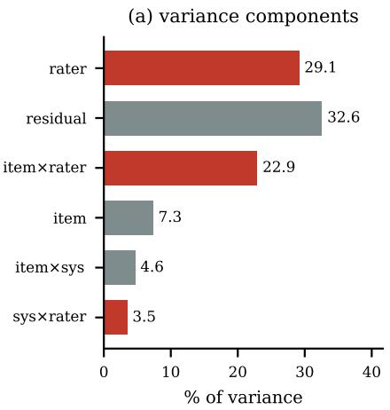
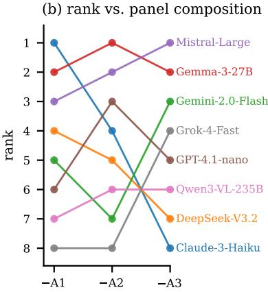
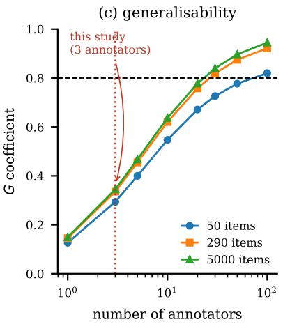
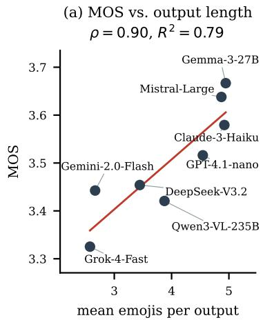
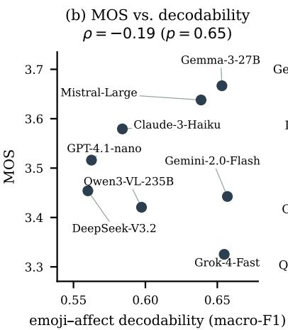
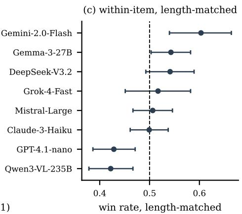
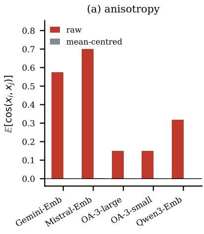
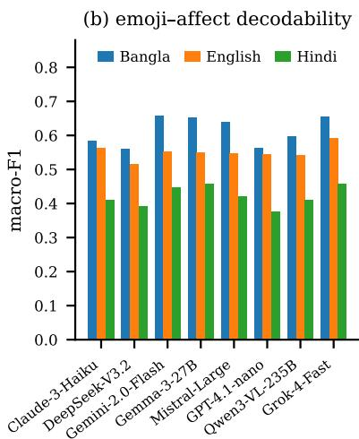
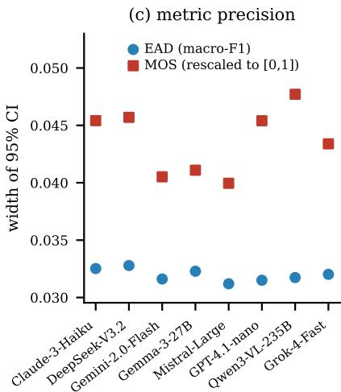

# Two Emojis of Difference: What Multilingual Affective Generation Benchmarks Actually Measure

Fardeen Sadab\*, Adib Sakhawat\* Department of Computer Science and Engineering Islamic University of Technology, Dhaka, Bangladesh {sakhadib, fardeensadab}@gmail.com

## Abstract

We audit a multilingual affective generation benchmark—eight instruction-tuned LLMs producing emoji summaries for 17,100 Bangla, English and Hindi sentences, with 6,960 human judgements—and find its headline conclusions to be artefacts of the measurement instrument rather than properties of the systems. Treating annotators as a random rather than a fixed factor, no system differs significantly from any other (F(7, 14) = 0.59, p = 0.76), although the conventional analysis declares 19 of 28 pairwise differences significant. Annotator identity explains far more rating variance than system identity, and the winning system changes whenever any single annotator is removed. The ordering that does emerge tracks output length: mean emoji count explains 78.7% of betweensystem variance, and a within-item lengthmatched comparison over 2,599 pairs reverses the leaderboard. We further show that crossprovider anisotropy differences vanish under mean-centring, that per-language token costs change sign with the normalising unit, and that multi-view row-wise splits inflate macro-F1 by 3.1 points and change the top-ranked system. In place of preference scoring we propose emoji– affect decodability, a reference-based probe whose rankings are stable to ±0.003 macro-F1 across seeds.

## 1 Introduction

Affective computing for low-resource languages is increasingly evaluated by asking large language models to generate something—a label, a rationale, an emoji—and then asking a small panel of native speakers which output they prefer. The pattern is attractive: it needs no gold annotation in the target language, it produces a clean leaderboard, and it appears to centre the judgements of the speech community rather than those of a distant annotation vendor.

This paper reports what happened when we subjected one such benchmark to a full measurement audit. The benchmark is our own: eight instructiontuned LLMs generate one to five emojis for each of 17,100 sentences in Bangla, English and Hindi, and three fluent Bangla speakers rate 290 sentences × 8 systems on a five-point scale, yielding a completely crossed design with 6,960 judgements and no missing cells. Our initial analysis of this benchmark reported a leaderboard, a “consistency paradox” between human preference and emoji– label agreement, provider differences in embedding anisotropy, a per-language token premium, and near-certain data leakage under naive splits.

Every one of those findings survives reexamination only in a substantially weakened form, and several reverse. The failures are not exotic. They are the standard failure modes of small-panel preference evaluation, applied to a setting—emoji generation in a low-resource language—where the effect being measured is small, the annotator population is heterogeneous, and there is no external anchor. We think the resulting picture is more useful than the leaderboard we set out to produce, because the same design is now common across low-resource affective NLP.

## Contributions.

1. A generalisability-theory analysis of a fully crossed 290 × 8 × 3 preference study (§4). Treating annotators as a random factor, no system differs significantly from any other; the conventional analysis finds 19 of 28 pairwise differences significant. We give the decision study: no number of items yields a reliable ranking with three annotators.

2. An explanation, not merely an observation (§5). Output length accounts for 78.7% of the between-system preference variance; a withinitem length-matched comparison over 2,599 pairs reverses the ordering. The “smallermodel-wins” effect reported previously is a verbosity effect.

3. Emoji–affect decodability (EAD), a referencebased, annotator-free metric (§6), with crosslingual transfer results showing that the emoji code models emit is language-specific: transferring a decoder across languages costs 0.252 macro-F1 despite > 99.7% vocabulary overlap.

4. Corrections to three widely reported geometric and economic claims (§7,§8): provider anisotropy gaps are a mean-offset artefact; language separability is not alignment when corpora are not parallel; and per-language token premia change sign with the choice of normalising unit.

5. An empirical, rather than asserted, quantification of multi-view leakage (§9): +3.1 macro-F1 points of optimism and a change in the top-ranked system.

## 2 Related Work

Human evaluation and its reliability. Concerns about the statistical treatment of human judgements in NLP are long-standing (Clark et al., 2021; Card et al., 2020), and the specific error we document— treating annotators as a fixed rather than a random factor—has been raised for machine translation and summarisation (Graham et al., 2015; Mathur et al., 2020). Generalisability theory (Cronbach et al., 1972; Brennan, 2001) provides the standard apparatus and has been applied only sporadically in NLP. Product-moment correlation is still frequently reported as an agreement statistic despite being insensitive to systematic rater bias; Krippendorff (2018) and Shrout and Fleiss (1979) give the appropriate coefficients.

Length and verbosity bias. Human and modelbased preference judgements are known to favour longer outputs (Zheng et al., 2023; Dubois et al., 2024; Singhal et al., 2024). Length-controlled variants of preference metrics have accordingly been proposed for open-ended text. We show the same bias operating over a radically shorter output space—one to five emojis—where it accounts for almost all apparent system quality.

Emoji, affect and low-resource languages. Emoji carry affective content that is partly conventional and partly culturally specific (Kralj Novak et al., 2015; Barbieri et al., 2018; Shoeb and de Melo, 2020). Bangla affective NLP has grown rapidly (Islam et al., 2022; Das et al., 2021), and code-mixed South Asian resources such as EmoMix-3L (Raihan et al., 2024) highlight transliteration and script noise as failure sources. Our contribution is not a new emoji resource but a measurement protocol.

Embedding geometry. Ethayarajh (2019) introduced the expected-cosine measure of anisotropy; Gao et al. (2021); Li et al. (2020) link it to representation quality, and Rudman et al. (2022) show that several popular anisotropy statistics are confounded with the embedding mean. Cross-lingual alignment is conventionally evaluated by parallel-sentence retrieval (Artetxe and Schwenk, 2019; Feng et al., 2022); we argue that alignment claims made without parallel data measure something else entirely.

Contamination and leakage. Multi-view leakage is a special case of the contamination problem (Sainz et al., 2023; Golchin and Surdeanu, 2024). Grouped splitting is standard practice in clinical and speech corpora but is frequently omitted in multi-model NLP benchmarks.

## 3 Benchmark and Study Design

Corpora. We use 17,100 sentences: 5,813 Bangla, 6,547 English and 4,740 Hindi, each carrying an emotion label from its source corpus. A design constraint that we make explicit, and that our initial analysis did not, is that the three corpora do not share a label scheme. Bangla and English use {Anger, Fear, Joy, Love, Sadness, Surprise}; Hindi adds Neutral and Disgust and omits Love. Bangla is multi-label (17.7% of items carry more than one label) while English and Hindi are singlelabel by construction. Any cross-lingual comparison of label statistics therefore measures the annotation guidelines of three different corpora, not the behaviour of a model. All cross-lingual analyses below are restricted to the five emotions common to all three corpora and to single-label items, giving 4,206 Bangla, 5,380 English and 3,518 Hindi sentences.

Generation. Eight systems—Claude-3-Haiku, DeepSeek-V3.2, Gemini-2.0-Flash, Gemma-3- 27B, Mistral-Large-2512, GPT-4.1-nano, Qwen3- VL-235B and Grok-4-Fast—were queried through a single API gateway with an identical Englishlanguage prompt for all languages, temperature= 0.7, max\_tokens= 50, no system prompt, and up to three retries when the response contained no non-ASCII character. The prompt requests one to five emojis and nothing else; the models are never shown the emotion label and are never asked to predict one. We restate this because it delimits what the benchmark can support: it is a study of affective expression through a constrained symbolic channel, not of emotion classification. The full prompt is in Appendix A.

Human study. Three independent fluent Bangla speakers rated a stratified 5% sample of the Bangla data (290 sentences) for all eight systems on a 1– 5 scale of how well the emojis captured the sentence’s emotion. The design is completely crossed: every annotator rated every (sentence, system) pair, giving $2 9 0 \times 8 \times 3 = 6 { , } 9 6 0$ judgements with no missing cells. This is the strongest possible design for the analyses in §4, and it is what allows us to separate the annotator×system interaction from residual noise at all.

Embeddings. Each sentence was embedded with five commercial encoders: Gemini-Embedding-001 (3072d), Mistral-Embed-2312 (1024d), OpenAI text-embedding-3-large (3072d) and -small (1536d), and Qwen3-Embedding-8B (4096d). Geometry analyses use a label-stratified sample of 1,202 sentences (400/401 per language); we report the sample size wherever it constrains a conclusion.

## 4 Preference Scores Do Not Identify a Winner

## 4.1 Agreement

Pairwise Pearson correlations between annotators are 0.17, 0.18 and 0.17, values which we initially reported as evidence of “low but positive agreement”. Pearson correlation is not an agreement coefficient: it is invariant to additive and multiplicative rater bias, and here the raters differ enormously in location, with mean ratings of 2.86, 4.35 and 3.31. Recomputing with coefficients that penalise systematic bias gives Krippendorff’s $\alpha _ { \mathrm { o r d i n a l } } = 0 . 0 1 4 ( 9 5 \% \mathrm { C I } [ - 0 . 0 1 1 , 0 . 0 3 9 ] , 2 , 0 0 0$ unit-bootstrap replicates) and $\operatorname { I C C } ( 2 , 1 ) = 0 . 1 1 6$ $\mathrm { I C C } ( 2 , k ) = 0 . 2 8 2$ . For the annotator pair whose Pearson correlation is $0 . 1 6 6 , \alpha _ { \mathrm { o r d i n a l } } = - 0 . 1 0 9 \colon$ they are, after accounting for their different scale usage, in slightly worse than chance agreement. Individual judgements in this task carry almost no shared signal.

<table><tr><td>Source</td><td>MS</td><td>F</td><td>p</td></tr><tr><td>System s (vs. residual)</td><td>11.85</td><td>18.62</td><td> $< 1 0 ^ { - 1 6 }$ </td></tr><tr><td>System  $\boldsymbol { s } \left( \nu \boldsymbol { s } . \boldsymbol { s } \times \boldsymbol { r } \right)$ </td><td>11.85</td><td>0.59</td><td>0.76</td></tr><tr><td>Rater r</td><td>1345.16</td><td>319.03</td><td> $< 1 0 ^ { - 1 6 }$ </td></tr><tr><td>System × rater</td><td>20.25</td><td>31.82</td><td> $< 1 0 ^ { - 1 6 }$ </td></tr><tr><td>Residual  $p \times s \times r$ </td><td>0.64</td><td></td><td>一</td></tr></table>

Table 1: Three-way ANOVA on the crossed $2 9 0 \times 8 \times 3$ design. The system effect is significant against the residual and non-significant against the system×rater interaction, which is the correct error term when annotators are a sample from a population. The interaction mean square exceeds the system mean square.

## 4.2 The system effect disappears under the correct error term

Table 1 gives the three-way ANOVA. The choice of error term decides the result. Testing the system effect against the residual—which is what one does implicitly by running a paired test over items on the panel-averaged score, the near-universal practice in NLP—gives $F ( 7 , 4 0 4 6 ) = 1 8 . 6 2 , p < 1 0 ^ { - 1 6 }$ Testing it against the system×rater interaction, which is the correct error term if the three annotators are a sample from a population of possible annotators rather than the objects of study, gives $F ( 7 , 1 4 ) = 0 . 5 9 , p = 0 . 7 6$ . The interaction mean square (20.25) is larger than the system main effect (11.85): annotators disagree about systems more than systems differ.

The same contrast appears in the pairwise comparisons. Over the 28 system pairs, a paired test over items finds 19 significant at $p < . 0 5$ and 13 after Holm correction; a test that treats the annotator as the unit of replication finds zero significant at either level. Only 5 of 28 pairs have a difference of consistent sign across all three annotators.

## 4.3 Variance components and the decision study

Figure 1(a) decomposes the variance attributable to the random factors. Annotator identity accounts for 29.1%, the item×annotator interaction for 22.9%, residual noise for 32.6% and item difficulty for 7.3%. The system is a fixed factor and so does not appear in that decomposition; placing it on a common scale via the sums of squares in Table 1, the annotator main effect accounts for 22.1% of the total and the system—the quantity the benchmark exists to measure—for 0.7%. Which sentence is being rated (18.8% of the total sum of squares) matters more than twenty times as much as which frontier LLM produced the emojis.

<table><tr><td>Panel</td><td>Top system</td><td> $\rho$  w/ full</td><td>Claude rank</td></tr><tr><td>All three</td><td>Gemma-3-27B</td><td></td><td>3</td></tr><tr><td>-A1</td><td>Claude-3-Haiku</td><td>0.55</td><td>1</td></tr><tr><td>-A2</td><td>Gemma-3-27B</td><td>0.90</td><td>4</td></tr><tr><td> ${ \bf A } 3$ </td><td>Mistral-Large</td><td>0.62</td><td>8</td></tr></table>

Table 2: Leave-one-annotator-out leaderboards. Removing any single annotator from a three-person panel can change the winner. Claude-3-Haiku ranges from first to last.

Because the design is fully crossed we can run a decision study (Brennan, 2001). The generalisability coefficient for the system mean is

$$
G ( n _ { p } , n _ { r } ) = \frac { \sigma _ { s } ^ { 2 } } { \sigma _ { s } ^ { 2 } + \frac { \sigma _ { s r } ^ { 2 } } { n _ { r } } + \frac { \sigma _ { p s } ^ { 2 } } { n _ { p } } + \frac { \sigma _ { p s r } ^ { 2 } } { n _ { p } n _ { r } } } ,
$$

where $n _ { p }$ is the number of items and $n _ { r }$ the number of annotators. The current design attains $G = 0 . 3 3 6$ . Reaching the conventional threshold $G \ge 0 . 8$ requires 27 annotators at the present 290 items, and $^ { 7 0 }$ annotators for $G \geq 0 . 9 .$ . Figure 1(c) makes the important point: because $\sigma _ { s r } ^ { 2 }$ is divided by $n _ { r }$ alone, the curves saturate in $n _ { p }$ . With three annotators, no number of sentences—not 5,000, not 500,000—reaches $G = 0 . 8$ . Reliability in this design cannot be bought with more data; it can only be bought with more annotators.

## 4.4 The winner depends on who is on the panel

Table 2 and Figure 1(b) show the practical consequence. Dropping one annotator changes the top-ranked system in two of three cases. Claude-3-Haiku is ranked first by one panel and last by another. Between-annotator Kendall correlations over the eight system means are −0.36, 0.07 and 0.00: at the level of the leaderboard, the three annotators are not measuring the same thing.

## 5 What the Ratings Actually Track

The obvious next question is why the smaller open models outperformed the larger proprietary ones. The answer is that they emit more emojis.

Table 3 and Figure 2(a) show that the mean number of emojis a system emits predicts its MOS with $\rho = 0 . 9 0 \ ( p = 0 . 0 0 2 )$ , accounting for 78.7% of the between-system variance. A judgement-level mixed model with item and annotator random effects estimates $\beta = 0 . 1 5 9$ MOS points per additional emoji $( \mathrm { S E } = 0 . 0 1 5 , p = 1 . 6 \times 1 0 ^ { - 2 5 } )$ . The entire spread between the best and worst of eight frontier systems is 0.341 MOS points—slightly more than two emojis’ worth of output length.

<table><tr><td>System</td><td>MOS</td><td>emojis</td><td>EAD</td><td>winLM</td></tr><tr><td>Gemma-3-27B</td><td>3.667</td><td>4.95</td><td>0.653</td><td>0.543</td></tr><tr><td>Mistral-Large</td><td>3.638</td><td>4.87</td><td>0.639</td><td>0.506</td></tr><tr><td>Claude-3-Haiku GPT-4.1-nano</td><td>3.579</td><td>4.92</td><td>0.584</td><td>0.499</td></tr><tr><td>DeepSeek-V3.2</td><td>3.516 3.454</td><td>4.55 3.45</td><td>0.562 0.560</td><td>0.428 0.541</td></tr><tr><td>Gemini-2.0-Flash</td><td>3.443</td><td>2.67</td><td>0.657</td><td>0.603</td></tr><tr><td>Qwen3-VL-235B</td><td>3.421</td><td>3.88</td><td>0.597</td><td>0.422</td></tr><tr><td>Grok-4-Fast</td><td>3.325</td><td>2.58</td><td>0.655</td><td>0.517</td></tr><tr><td>ρ with MOS</td><td></td><td>0.90**</td><td>-0.19</td><td>0.12</td></tr></table>

Table 3: Systems ordered by raw MOS. Mean emoji count tracks MOS almost perfectly; decodability does not. $\mathrm { w i n } _ { \mathrm { L M } }$ is the within-item length-matched win rate, which reorders the table. $^ { * * } p < . 0 1$

Length-matched comparison. Adjusting for length statistically is not sufficient, because the number of emojis a system emits is a system-level property. We therefore run a comparison that conditions on nothing at the system level: for every sentence and every pair of systems that happened to emit the same number ofemojis on that sentence, we record which was rated higher. This yields 2,599 matched comparisons. The resulting ordering (Table 3, Figure 2(c)) correlates with the raw MOS ordering at $\rho = 0 . 1 2 \ ( p = 0 . 7 8 )$ . Gemini-2.0- Flash moves from sixth to first (win rate 0.603, 95% CI [0.540, 0.664]); Grok-4-Fast moves from last to fourth. The reported “efficiency–performance” effect, in which smaller models were preferred, does not survive.

Who is length-biased? The per-annotator slope on emoji count is 0.085 $( p ~ < ~ 1 0 ^ { - 5 } )$ , −0.024 $( p = 0 . 1 4 )$ and 0.329 $( p < 1 0 ^ { - 4 8 } )$ . One annotator’s system-level ranking correlates with output length at $\rho = 0 . 9 5 ;$ another’s at $\rho = - 0 . 2 6$ . The length bias, like everything else in this study, is an annotator property that the panel average silently aggregates.

## 6 Emoji–Affect Decodability

If preference scores cannot rank systems, something else must. We propose a reference-based metric that uses the emotion labels the source corpora already carry, requires no annotators, and is defined without reference to any emoji–affect lexicon, thereby avoiding the unvalidated emoji-tolabel mapping our initial analysis relied on.

  
Figure 1: (a) Random-effect variance components; annotator-related terms (red) dominate. The system is a fixed factor and accounts for 0.7% of the total sum of squares against 22.1% for the annotator main effect. (b) System rank as a function of which annotator is excluded. (c) Decision study: G saturates in the number of items, so three annotators cannot reach $G = 0 . 8$ at any corpus size.

  
Figure 2: (a) Mean output length explains 78.7% of between-system MOS variance. (b) Emoji–affect decodability does not correlate with MOS. (c) Within-item length-matched win rates reorder the leaderboard; error bars are 95% binomial CIs.

Definition. Let g be a generator and $\begin{array} { r l } { \mathcal { D } _ { L } } & { { } = } \end{array}$ $\{ ( x _ { i } , y _ { i } ) \}$ the single-label items of language L over the shared five-emotion set. Let $E _ { g } ( x )$ be the multiset of emoji graphemes g emits for x (ZWJ sequences and skin-tone modifiers kept intact). $\operatorname { E A D } ( g , L )$ is the 5-fold cross-validated macro-F1 of an ℓ2-regularised multinomial logistic regression over sublinear TF-IDF features of ${ E } _ { g } ( x )$ , predicting y. It measures how much of the corpus’s affective distinction survives compression into g’s emoji channel. A generator that emits the same three emojis for everything scores at the floor regardless of how pleasant those emojis are.

Properties. EAD is stable: across ten random seeds the largest per-system standard deviation is 0.0033 macro-F1, and 2,000-replicate item bootstraps give CIs of width ≈ 0.032 that separate the systems into three distinct tiers (Figure 3(c)). It is cheap: no annotators, and deterministic given a fixed set of model outputs. And it disagrees with human preference: $\rho = - 0 . 1 9 \left( p = 0 . 6 5 \right)$ with MOS. Per annotator the correlation is $+ 0 . 0 7 , + 0 . 7 6$ and −0.40. Given §4, we do not read this as evidence against EAD; a metric cannot be validated against a criterion that does not reliably order the systems.

Results. Bangla EAD ranges from 0.560 (DeepSeek) to 0.657 (Gemini), against a majorityclass floor of 0.087; English from 0.515 to 0.593; Hindi from 0.376 to 0.458 (Figure 3(b)). The union of all eight systems’ emojis reaches 0.686 in Bangla, above any single system, indicating that the generators encode partly complementary information.

The emoji code is language-specific. Training the decoder on one language’s emoji outputs and testing on another costs 0.252 macro-F1 on average, even though target-language vocabulary coverage exceeds 99.7% in every direction: the models emit the same emojis across languages but use them to mean different things. Emoji are frequently described as a language-neutral affective interface; under a controlled test, at least as produced by these systems, they are not.

Matched comparison with sentence embeddings. On identical items (n ≈ 400 per language), the best emoji channel reaches 0.673 macro-F1 in Bangla against 0.595 for the best sentence embedding, 0.613 against 0.736 in English, and 0.430 against 0.387 in Hindi. It is tempting to conclude that for Bangla a five-emoji summary carries as much affective information as a 4096-dimensional commercial encoder. We report a control that tempers this: the embedding learning curve is still rising steeply at $n = 4 0 0 ( 0 . 4 2 8  0 . 4 8 0  0 . 5 9 4$ for n = 100, 200, 400) whereas the emoji curve is nearly flat (0.614 at n = 400, 0.657 at $n = 4 { , } 2 0 6 )$ . The embedding numbers are therefore lower bounds and we claim only that the emoji channel is competitive at matched sample size, not that it is superior.

## 7 Geometry: Two Corrections

Anisotropy differences are a mean offset. Following Ethayarajh (2019) we compute $A ( X ) = \mathbb { E } _ { i \neq j } [ \cos ( x _ { i } , x _ { j } ) ]$ , evaluated exactly as $\begin{array} { r } { ( \| \sum _ { i } u _ { i } \| ^ { 2 } - n ) / ( n ( n - 1 ) ) } \end{array}$ for unit-normalised $u _ { i }$ Raw values differ sharply across providers: 0.149 (OpenAI-3-small), 0.150 (OpenAI-3-large), 0.319 (Qwen3), 0.574 (Gemini) and 0.700 (Mistral)—a range we initially interpreted as a meaningful quality difference. After subtracting the global mean, every model lies in [−0.0008, 0.0013] (Figure 3(a)). The differences are entirely attributable to a common displacement vector, removable by one centring operation, as Rudman et al. (2022) predict. Moreover, raw anisotropy does not predict downstream utility: its correlation with the pooled emotion-probe macro-F1 across the five encoders is $r = - 0 . 4 8 ( p = 0 . 4 1 , n = 5 )$ . We can find no sense in which the anisotropy gap matters.

Language separability is not cross-lingual alignment. Our initial analysis reported a “crosslingual divergence” of 0.09 for one provider against 0.72 for another and read the lower value as better alignment. That inference is not available here, because the three corpora are not parallel: no Bangla sentence is a translation of any English sentence. Any statistic comparing language-conditional distributions is therefore confounded with topic, register and domain. What can be measured is separability. A linear language classifier reaches $\ge ~ 0 . 9 9 3$ accuracy on four of five encoders and 0.597 on Gemini-Embedding-001, whose Fisher separation ratio is correspondingly low (0.009 vs. 0.105–0.280). But low separability is not a virtue: Gemini also has the weakest emotion probe of the five (0.290 pooled macro-F1 vs. 0.593 for Qwen3). Its space does not so much align languages as fail to represent the distinctions we tested. Establishing alignment would require parallel data and a retrieval evaluation (Artetxe and Schwenk, 2019), neither of which this corpus supports.

## 8 Cost Accounting Changes Sign with the Unit

Raw token counts are not comparable across providers with different tokenizers, and the choice of normalising unit determines the direction of any per-language conclusion. Measured in prompt tokens per source byte, Bangla is the cheapest of the three languages (1.108 vs. 1.450 for English and 1.557 for Hindi). Measured in prompt tokens per source character, Bangla costs 2.93 against English’s 1.45—a 2.0× premium—because Bangla text averages 2.64 UTF-8 bytes per character. Both statements are true; the “token premium” reported previously is a statement about Unicode encoding, not about tokenizer fairness, and should be reported per character with the byte ratio disclosed.

A second confound: raw completion-token counts conflate emitted output with internal reasoning traces. Grok-4-Fast averages 294.7 completion tokens per Bangla item while emitting 2.60 emojis (124 tokens per emoji); the other seven systems average 1.4–4.4. Comparing systems on billed completion tokens compares reasoning configurations, not task efficiency.

Finally, no cost measure predicts quality. Spearman correlations with EAD are −0.14 (total tokens), −0.12 (completion tokens) and −0.14 (tokens per emoji), none significant. The only cost-like quantity that predicts MOS is the number of emojis emitted $( \rho = 0 . 9 0 )$ , which §5 shows to be a bias rather than a quality signal.

  
Figure 3: (a) Provider anisotropy differences vanish under mean-centring. (b) Emoji–affect decodability by system and language. (c) Width of the 95% CI for EAD and for MOS rescaled to a common range; EAD is the more precise instrument.

## 9 Multi-View Leakage, Measured

A benchmark that stores V views of each of N source items (here $V = 8$ generators, or $V = 5$ encoders) and is then split row-wise places the same source sentence on both sides of the partition. The probability that no item is split is $( \rho ^ { V } + ( 1 - \rho ) ^ { V } ) ^ { N }$ which for $V \geq 2$ and $N \geq 1 0 0$ is numerically zero at any usual $\rho ;$ reporting it as a percentage close to 100, as we initially did, is uninformative. The decision-relevant quantity is the expected fraction of test rows whose source item also appears in training, $1 - ( 1 - \rho ) ^ { V - 1 }$ : 99.998% at $V = 8 , \rho = 0 . 8$ and 99.84% at $V = 5$

We measure the resulting optimism. On the Bangla multi-view table (4,206 items × 8 views = 33,648 rows), a naive row-wise 80/20 split gives $0 . 6 3 0 \pm 0 . 0 0 3$ macro-F1 against $0 . 5 9 8 \pm 0 . 0 1 4$ for a split grouped by source item: +3.1 points absolute, +5.3% relative $( t = 4 . 9 7 , p = 0 . 0 0 0 6$ , 6 replicates). The inflation is stable at 1.7–2.3 points across split ratios from 0.5 to 0.9. More importantly it perturbs the leaderboard: system rankings under leaky and clean protocols correlate at $\rho = 0 . 7 6$ and the top-ranked system changes from Mistral-Large to Gemma-3-27B. Grouped splitting is not a hygiene footnote; it changes which system a benchmark declares best.

## 10 Recommendations

1. Report agreement with a bias-sensitive coefficient. Pearson correlation between annotators is not agreement. Report Krippendorff’s α or an ICC with a bootstrap CI, and report annotator mean and SD separately.

2. Treat annotators as a random factor. If the claim is about systems in general rather than about three specific people, the error term must include the system×annotator interaction. Reporting a paired test over items on panel-averaged scores is not sufficient.

3. Run a decision study before scaling up collection. A small fully crossed pilot is enough to estimate $\sigma _ { s r } ^ { 2 }$ and hence the panel size the intended claim requires. If more items cannot fix the design, that is worth knowing before 6,960 judgements are collected.

4. Length-match, do not length-adjust. Report a within-item comparison restricted to outputs of equal length alongside the raw score.

5. Report a reference-based metric next to preference. EAD or an analogue gives a reproducible number that does not move when the panel changes.

6. Centre embeddings before reporting anisotropy; do not describe non-parallel corpora as evidence of cross-lingual alignment; normalise token counts by characters and disclose the bytes-per-character ratio; split multi-view tables by source item.

## Limitations

The human study has three annotators, all of them university-educated Bangla speakers from a similar age band; the variance components we report are estimates from $n _ { r } = 3$ and are correspondingly imprecise, and the population of annotators they generalise to is narrow. A larger and demographically broader panel could plausibly show smaller annotator variance, though our decision study indicates the panel would need to be an order of magnitude larger before the current design became reliable. We report per-annotator results throughout rather than only the panel average, since the panel average is precisely the quantity our analysis shows to be unstable.

The human study covers Bangla only, so the reliability findings are demonstrated rather than shown to be universal; we expect them to be worse, not better, for languages with fewer available annotators. Our three languages are all South Asian or English, and we avoid claims about “multilingual affective AI” in general.

EAD inherits whatever biases the source corpora’s emotion labels carry, and the three corpora differ in label scheme, granularity and provenance; we therefore compare systems only within a language, never across. The metric also rewards systems whose emoji usage is consistent with the corpus, which is not the same as being good, useful or culturally appropriate—a system that consistently uses a culturally inappropriate emoji for an emotion would score well. EAD replaces the lexicon-based consistency metric it supersedes, not human judgement properly powered.

The geometry analyses use 1,202 sentences and five commercial encoders accessed through an API; we do not have access to their training data, and API models can change without notice, so the geometric measurements are properties of the endpoints as we queried them. The embedding-versusemoji comparison is sample-limited as described in §6.

Finally, this is an audit of a single benchmark that we built ourselves. We believe the failure modes generalise because the design is conventional, but we have not demonstrated that they do.

## Ethics Statement

The three annotators are fluent Bangla speakers who worked independently of the research team, participated voluntarily, and were informed of the purpose of the study before beginning. The sentences derive from publicly available Bangla, English and Hindi corpora and were not filtered for personally identifying content beyond what the source corpora applied, and we work from sentence identifiers and model outputs under the source corpora’s licences. Emotion attribution to text written by identifiable individuals carries a risk of misrepresentation, and we caution against deploying emoji-based affect systems in consequential settings, particularly given that our best system recovers only 66% of a five-way emotion distinction in Bangla. Model outputs were not filtered for offensive emoji use; we observed no such cases but did not audit exhaustively.

## References

Mikel Artetxe and Holger Schwenk. 2019. Massively multilingual sentence embeddings for zeroshot cross-lingual transfer and beyond. Transactions of the Association for Computational Linguistics, 7:597–610.

Francesco Barbieri, Jose Camacho-Collados, Francesco Ronzano, Luis Espinosa-Anke, Miguel Ballesteros, Valerio Basile, Viviana Patti, and Horacio Saggion. 2018. SemEval-2018 task 2: Multilingual emoji prediction. In Proceedings ofthe 12th International Workshop on Semantic Evaluation, pages 24–33.

Robert L. Brennan. 2001. Generalizability Theory. Springer, New York.

Dallas Card, Peter Henderson, Urvashi Khandelwal, Robin Jia, Kyle Mahowald, and Dan Jurafsky. 2020. With little power comes great responsibility. In Proceedings of the 2020 Conference on Empirical Methods in Natural Language Processing (EMNLP), pages 9263–9274.

Elizabeth Clark, Tal August, Sofia Serrano, Nikita Haduong, Suchin Gururangan, and Noah A. Smith. 2021. All that’s ‘human’ is not gold: Evaluating human evaluation of generated text. In Proceedings of the 59th Annual Meeting of the Association for Computational Linguistics and the 11th International Joint Conference on Natural Language Processing (Volume 1: Long Papers), pages 7282–7296.

Lee J. Cronbach, Goldine C. Gleser, Harinder Nanda, and Nageswari Rajaratnam. 1972. The Dependability of Behavioral Measurements: Theory of Generalizability for Scores and Profiles. John Wiley, New York.

Avishek Das, Omar Sharif, Mohammed Moshiul Hoque, and Iqbal H. Sarker. 2021. Emotion classification in a resource constrained language using transformerbased approach. In Proceedings of the 2021 Conference ofthe North American Chapter ofthe Associa-

tionfor Computational Linguistics: Student Research Workshop, pages 150–158.

Yann Dubois, Balázs Galambosi, Percy Liang, and Tatsunori B. Hashimoto. 2024. Length-controlled AlpacaEval: A simple way to debias automatic evaluators. arXiv preprint arXiv:2404.04475.

Kawin Ethayarajh. 2019. How contextual are contextualized word representations? comparing the geometry of BERT, ELMo, and GPT-2 embeddings. In Proceedings of the 2019 Conference on Empirical Methods in Natural Language Processing and the 9th International Joint Conference on Natural Language Processing (EMNLP-IJCNLP), pages 55–65.

Fangxiaoyu Feng, Yinfei Yang, Daniel Cer, Naveen Arivazhagan, and Wei Wang. 2022. Language-agnostic BERT sentence embedding. In Proceedings of the 60th Annual Meeting ofthe Associationfor Computational Linguistics (Volume 1: Long Papers), pages 878–891.

Tianyu Gao, Xingcheng Yao, and Danqi Chen. 2021. SimCSE: Simple contrastive learning of sentence embeddings. In Proceedings ofthe 2021 Conference on Empirical Methods in Natural Language Processing (EMNLP), pages 6894–6910.

Shahriar Golchin and Mihai Surdeanu. 2024. Time travel in LLMs: Tracing data contamination in large language models. In The Twelfth International Conference on Learning Representations (ICLR).

Yvette Graham, Timothy Baldwin, and Nitika Mathur. 2015. Accurate evaluation of segment-level machine translation metrics. In Proceedings ofthe 2015 Conference ofthe North American Chapter ofthe Associationfor Computational Linguistics: Human Language Technologies, pages 1183–1191.

Khondoker Ittehadul Islam, Tanvir Yuvraz, Sudipta Kar, and Md Saiful Hasan. 2022. EmoNoBa: A dataset for analyzing fine-grained emotions on noisy Bangla texts. In Proceedings of the 2nd Conference of the Asia-Pacific Chapter ofthe Associationfor Compu tational Linguistics and the 12th International Joint Conference on Natural Language Processing (Volume 2: Short Papers), pages 128–134.

Petra Kralj Novak, Jasmina Smailovic, Borut Sluban,´ and Igor Mozetic. 2015. Sentiment of emojis.ˇ PLOS ONE, 10(12):e0144296.

Klaus Krippendorff. 2018. Content Analysis: An Introduction to Its Methodology, 4th edition. SAGE Publications, Thousand Oaks, CA.

Bohan Li, Hao Zhou, Junxian He, Mingxuan Wang, Yiming Yang, and Lei Li. 2020. On the sentence embeddings from pre-trained language models. In Proceedings of the 2020 Conference on Empirical Methods in Natural Language Processing (EMNLP), pages 9119–9130.

Nitika Mathur, Timothy Baldwin, and Trevor Cohn. 2020. Tangled up in BLEU: Reevaluating the evaluation of automatic machine translation evaluation metrics. In Proceedings of the 58th Annual Meeting of the Association for Computational Linguistics, pages 4984–4997.

Nishat Raihan, Dhiman Goswami, Antara Mahmud, Antonios Anastasopoulos, and Marcos Zampieri. 2024. EmoMix-3L: A code-mixed dataset for Bangla-English-Hindi emotion detection. In Proceedings of the 7th Workshop on Indian Language Data: Resources and Evaluation (WILDRE-7) at LREC-COLING 2024.

William Rudman, Nate Gillman, Taylor Rayne, and Carsten Eickhoff. 2022. IsoScore: Measuring the uniformity of embedding space utilization. In Findings of the Association for Computational Linguistics: ACL 2022, pages 3325–3339.

Oscar Sainz, Jon Ander Campos, Iker García-Ferrero, Julen Etxaniz, Oier Lopez de Lacalle, and Eneko Agirre. 2023. NLP evaluation in trouble: On the need to measure LLM data contamination for each benchmark. In Findings ofthe Associationfor Computational Linguistics: EMNLP 2023, pages 10776– 10787.

Abu Awal Md Shoeb and Gerard de Melo. 2020. Emo-Tag1200: Understanding the association between emojis and emotions. In Proceedings of the 2020 Conference on Empirical Methods in Natural Language Processing (EMNLP), pages 8957–8967.

Patrick E. Shrout and Joseph L. Fleiss. 1979. Intraclass correlations: Uses in assessing rater reliability. Psychological Bulletin, 86(2):420–428.

Prasann Singhal, Tanya Goyal, Jiacheng Xu, and Greg Durrett. 2024. A long way to go: Investigating length correlations in RLHF. arXiv preprint arXiv:2310.03716.

Lianmin Zheng, Wei-Lin Chiang, Ying Sheng, Siyuan Zhuang, Zhanghao Wu, Yonghao Zhuang, Zi Lin, Zhuohan Li, Dacheng Li, Eric P. Xing, Hao Zhang, Joseph E. Gonzalez, and Ion Stoica. 2023. Judging LLM-as-a-judge with MT-bench and chatbot arena. In Advances in Neural Information Processing Systems 36 (NeurIPS 2023), Datasets and Benchmarks Track.

## A Prompt

Identical for all systems and all three languages, sent as a single user turn with no system prompt:

You MUST respond with 1-5 emojis representing the emotion in this sentence. CRITICAL: Your response MUST contain emojis. Empty responses are NOT allowed. Do NOT include any text, words, or explanations - ONLY emojis. Sentence: {sentence} Emojis (REQUIRED):

Decoding: temperature= 0.7, max\_tokens= 50, provider defaults for top\_p and stop sequences, no seed (the provider gateway does not expose one). A response containing no character above U+007F triggered a retry, up to three attempts; observed retry rates were 0.001–0.064 per system.

## B Analysis Settings

Every analysis in this paper runs on CPU from the stored model outputs; no further API access is needed once generation and embedding are complete. Random seeds are fixed throughout. Bootstrap replicate counts are 2,000 for agreement coefficients and EAD rank distributions and 5,000 for MOS confidence intervals. Probes are $\ell _ { 2 } -$ regularised multinomial logistic regressions (C = 4 on sublinear TF-IDF emoji features, C = 1 on $\ell _ { 2 }$ -normalised embeddings) under 5-fold stratified cross-validation, with class-balanced weights throughout.

Emoji are segmented into graphemes, keeping zero-width-joiner sequences and skin-tone modifiers attached to their base character and discarding the occasional stray ASCII a model emits despite the prompt. This matters for §5: naive percodepoint segmentation inflates the mean emoji count by 15.0% overall, but unevenly across systems (from +5.4% for Claude-3-Haiku to +31.5% for DeepSeek-V3.2), so it distorts the betweensystem length ordering rather than merely rescaling it.