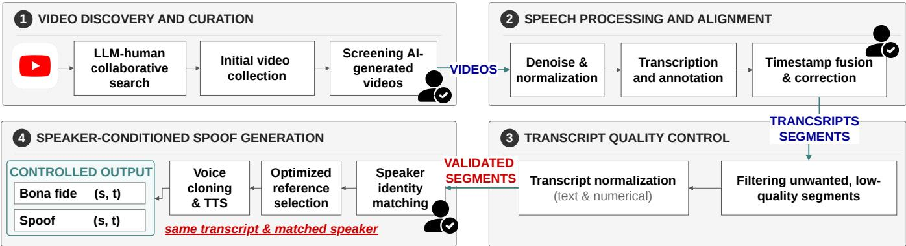
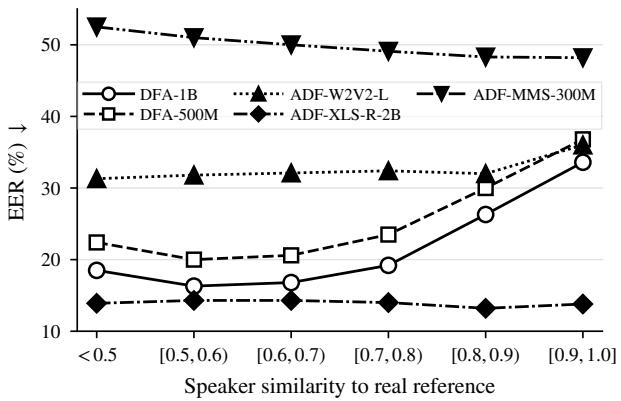
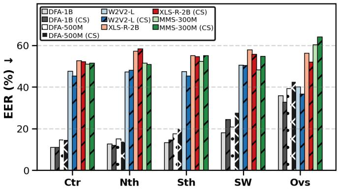

# VIETPRISM: A LARGE-SCALE VIETNAMESE SPEECH AND DEEPFAKE CORPUS WITH DIVERSE DIALECTS AND CODE-SWITCHING

Minh Hoang†, Thai Le‡

Independent Researcher† Indiana University, Bloomington, USA‡

## ABSTRACT

Vietnamese speech research is constrained by resources that isolate automatic speech recognition from speaker, dialect, code-switching, and deepfake analysis. We introduce VIET-PRISM, an open, multi-domain corpus that brings these dimensions together at scale: 993.4 hours and 403,941 bona fide utterances from 1,262 verified speakers across 8,388 realworld videos. To our knowledge, it is the first large-scale Vietnamese corpus to jointly provide transcripts, consistent speaker identities, five dialect groups, and naturally occurring Vietnamese–English code-switching, which constitutes nearly half of the corpus by duration. We further create over 3.1K hours of spoof speech with four open-source and commercial synthesis systems. Every spoof is conditioned on a verified speaker reference and paired with a transcript- and speaker-matched bona fide utterance, enabling unique controlled evaluation with reduced lexical and identity confounds. Zero-shot evaluation of five pretrained multilingual detectors reveals striking brittleness: EER greatly varies across detector– generator pairings, while recent multilingual detector DFA-1B degrades from 16.3% to 33.6% as speaker similarity increases. Dialect-stratified results expose further model-dependent disparities. By unifying natural linguistic diversity with controlled spoof generation, VIETPRISM provides a challenging foundation for Vietnamese speech modeling and trustworthy audio-deepfake detection.

Index Terms— Vietnamese speech dataset, anti-spoofing analysis

## 1. INTRODUCTION

Vietnamese speech technology has advanced rapidly, supported by corpora such as VIVOS [1], FPT Open Speech, Common Voice [2], Bud500 [3], VietSpeech [4], and GigaSpeech 2 [5]. However, most existing resources were developed primarily for automatic speech recognition (ASR). Their design consequently emphasizes audio–transcript pairs while omitting metadata needed beyond ASR. For example, FPT Open Speech, VinBigData, Bud500, VietSpeech, and GigaSpeech-2 do not provide consistent speaker identifiers [6, 3, 4, 5]. Conversely, speaker-oriented resources such as Vietnam-Celeb and VoxVietnam do not provide transcripts, and their released identity labels require additional care [7, 8]. This gap makes it difficult to connect utterances from the same person to support tasks such as speaker-aware training, voice cloning, speaker verification, and the emerging spoof-detection research within a common resource.

<table><tr><td>Dataset</td><td>CS</td><td>Dial.</td><td>Spk. B/S</td><td>Hrs. B/S Avg. B/S Tr</td><td></td><td></td><td>Utt. B/S</td></tr><tr><td colspan="8">Speech corpora</td></tr><tr><td>VNSC</td><td></td><td>3</td><td>50</td><td>100</td><td></td><td></td><td></td></tr><tr><td>VN-LVCSR</td><td></td><td></td><td>=</td><td>25</td><td></td><td></td><td></td></tr><tr><td>VIVOS</td><td></td><td></td><td>65</td><td>15</td><td>4.5</td><td>√</td><td>12K</td></tr><tr><td>VDSPEC</td><td></td><td>3</td><td>150</td><td>45.12</td><td>10</td><td></td><td></td></tr><tr><td>Viettel-CC</td><td></td><td></td><td></td><td>85.8</td><td></td><td></td><td></td></tr><tr><td>Do-S1</td><td></td><td></td><td></td><td>6</td><td></td><td></td><td></td></tr><tr><td>Do-S2</td><td></td><td></td><td></td><td>6.5</td><td></td><td></td><td></td></tr><tr><td>Do-L</td><td></td><td></td><td></td><td>900</td><td></td><td></td><td></td></tr><tr><td>FOSD</td><td></td><td></td><td></td><td>30</td><td>4.2</td><td>√</td><td>26K</td></tr><tr><td>CV</td><td></td><td></td><td>417</td><td>23</td><td>4.0</td><td>√</td><td>21K</td></tr><tr><td>CanVEC</td><td></td><td></td><td>45</td><td>10</td><td></td><td></td><td></td></tr><tr><td>VinBD</td><td></td><td></td><td></td><td>101</td><td>6.5</td><td>√</td><td>56K</td></tr><tr><td>VLSP21</td><td></td><td></td><td></td><td>280</td><td></td><td></td><td></td></tr><tr><td>FLEURS</td><td></td><td></td><td></td><td>13</td><td>11.4</td><td>√</td><td>4.2K</td></tr><tr><td>VN-Celeb</td><td></td><td>3</td><td>1K</td><td>187</td><td>7.7</td><td></td><td>87K</td></tr><tr><td>ViASR</td><td></td><td>3</td><td></td><td>32</td><td>25.5</td><td></td><td>4.3K</td></tr><tr><td>VLSP23</td><td></td><td></td><td></td><td></td><td></td><td></td><td></td></tr><tr><td>Bud500</td><td></td><td>3</td><td></td><td>511</td><td>2.8</td><td>√</td><td>649K</td></tr><tr><td>LSVSC</td><td></td><td>2+H+M</td><td></td><td>100</td><td>6.4</td><td>√</td><td>57K</td></tr><tr><td>VietMed_L</td><td></td><td>3+H</td><td>61</td><td>2K</td><td>6.2</td><td>√</td><td>9.2K</td></tr><tr><td>VietSpeech</td><td></td><td>3</td><td></td><td>1K</td><td>4.0</td><td>√</td><td>1.03M</td></tr><tr><td>ViMD</td><td></td><td>3</td><td>13K</td><td>103</td><td>19.5</td><td>√</td><td>19K</td></tr><tr><td>viVoice</td><td></td><td></td><td></td><td>1K</td><td>4.1</td><td>√</td><td>888K</td></tr><tr><td>VoxVN</td><td></td><td></td><td>1,4K</td><td>261</td><td>5.0</td><td>=</td><td>188K</td></tr><tr><td>GS2</td><td></td><td></td><td></td><td>6K</td><td>4.4</td><td>√</td><td>5.01M</td></tr><tr><td>PhoAudio</td><td></td><td></td><td>735</td><td>941</td><td>11.7</td><td>√</td><td>291K</td></tr><tr><td>OpenBible</td><td></td><td></td><td></td><td>72</td><td>8.5</td><td>√</td><td>30K</td></tr><tr><td>ViMedCSS</td><td>√</td><td></td><td></td><td>33</td><td>7.4</td><td>√</td><td>16K</td></tr><tr><td>VietSuper</td><td></td><td></td><td></td><td>267</td><td>12.0</td><td>√</td><td>52K</td></tr><tr><td colspan="8">Deepfake datasets</td></tr><tr><td>MLAAD</td><td></td><td></td><td>-1-</td><td>-/10.1</td><td>-/7.2</td><td>MT</td><td>-/5K</td></tr><tr><td>VSASV</td><td></td><td></td><td>1,141/163</td><td>199/153</td><td>7.3/4.5</td><td></td><td>98K/123K</td></tr><tr><td>JMAD</td><td></td><td></td><td>-/-</td><td>-1-</td><td>-1-</td><td></td><td>5K/0.96K</td></tr><tr><td>SF-MD</td><td></td><td></td><td>-/2</td><td>-/15.22</td><td>-12.9</td><td></td><td>-/19K</td></tr><tr><td>SEA-Spoof</td><td></td><td></td><td>-1-</td><td>30.5/49.1</td><td>4.3/3.2</td><td>√</td><td>26K/55K</td></tr><tr><td>VIETPRISM √</td><td></td><td>3+0</td><td>1,262 /1262</td><td>993 /3,190</td><td>8.9/8.9</td><td>√</td><td>404K /1.29M</td></tr></table>

B/S denotes bona fide/spoof; speech corpora contain bona fide audio only. H/M/O: highland/minority/overseas. –: no audio of that class; -: unavailable, unreported, or closed; 3: North, Central, South.  
Table 1. Comparison of VIETPRISM with existing Vietnamese speech and audio-deepfake datasets.

  
Fig. 1. Overview of the VIETPRISM data generation pipeline. Human icons depict steps where we involve human screening.

Moreover, there is a distinct limitation concerning linguistic and dialect coverage. Vietnamese usage in real-world settings is not confined to carefully read, monolingual sentences. Due to globalization, younger domestic speakers, especially those living overseas, frequently switch between Vietnamese and English within the same conversation. Such code-switching reflects identity, community, and communicative context across regional dialects, yet it remains poorly represented in general-purpose Vietnamese corpora. Existing efforts such as CanVEC [9] captures natural mixed speech, but contains only 10 hours from 45 bilingual speakers in Can berra and was developed primarily for sociolinguistic study. Similarly, ViMedCSS [10] dataset is also restricted to the med ical domain and does not provide speaker identities. These resources leave a broader gap: to our knowledge, no open, large-scale, multi-domain Vietnamese dataset jointly provides naturally occurring Vietnamese–English code-switching, transcripts, dialect information, and consistent speaker identities across diverse real-world recordings.

Furthermore, existing dataset quality presents another gap. Lau et al. [11] show substantial speaker imbalance, uneven topic-domain coverage, and limited quality-control documentation in the English Common Voice corpus. Although their quantitative analysis should not be transferred directly to Vietnamese, the same quality dimensions expose important gaps in the Vietnamese Common Voice release [2]. The publicly available statistics describe only 22.96 hours and 417 reported contributors, without dialect annotations, topic distribution, or an end-to-end quality audit. Its effective speaker and domain diversity therefore cannot be inferred from duration alone.

To overcome these gaps, we introduce VIETPRISM, a dataset designed to bridge these gaps and support multiple speech tasks rather than a single benchmark. Our contributions are threefold. First, we release an open corpus of 993.4 hours and 403,941 utterances from 1,262 speakers, collected from 8,388 real-world videos, making it one of the largest richly annotated Vietnamese speech corpora (Table 1). Second, to our knowledge, VIETPRISM is the first large-scale, open, multidomain Vietnamese–English code-switching speech corpus that captures natural usage across diverse real-world topics while jointly providing transcripts, dialect annotations, and consistent speaker identities. Third, its speaker-linked annotations and natural 8.9 s utterances enable the same resource to support ASR, speaker verification, dialect and code-switching modeling, voice cloning, and controlled audio-deepfake detec tion tasks.

## 2. VIETPRISM DATASET

## 2.1. Dataset Curation Pipeline

Figure 1 summarizes our proposed data pipeline.

Step 1. Video Discovery and Curation. We first collect publicly accessible YouTube videos in available highest-quality formats. We manually seed dialectal and Vietnamese–English code-switching videos and expand collection by channel, then utilize an LLM to iteratively generates bilingual queries from seed and retrieved videos of similar titles. We cap each channel at three hours to balance between quantity and diversity, and reject suspected AI-generated videos.

Step 2. Speech Processing and Alignment. Extracted audio is then decoded to WAV, resampled to 16 kHz mono, peaknormalized to 0 dBFS, loudness-normalized to −14 LUFS, and denoised with ClearerVoice-Studio, which shows competi tive performance over other methods such as DeepFilterNet2 in our manual examination [12, 13]. We then adopt LLM Gemini 2.5 Pro to process the enhanced audio for initial transcription, segmentation, diarization, and metadata extraction, retaining attributes, and at the same time maintaining natural fillers. Resulting transcripts’ timestamps are then fused with traditional Montreal Forced Aligner (MFA) [14] method, and disagreements exceeding 2 seconds (around 2.4% of total segments) are manually corrected.

Step 3. Transcript Quality Control. Resulting validated timestamps then help define utterance-level segments. Since we only focus on extracting spoken transcript of one speaker per segment, we then utilize a state-of-the-art LLM Qwen3- Omni-30B-A3B [15] with thinking mode to filters unusable, multi-speaker, singing, and mixed samples.

Step 4. Speaker-Conditioned Spoof Generation. To ensure our datasets are also applicable to emerging deepfake research in Vietnamese language, it is important to identify unique speakers appearing across different videos. Thus, all of the collected speaker identifications are manually clustered and verified before extracting 9–9.5-second references for deepfake synthesis using recent open-source and popular commercial deepfake and voice-cloning models including OmniVoice, Higgs Audio v3, VoxCPM2, and MiniMax. Commercial MiniMax uses primarily Speech 2.8 HD and a smaller Speech 2.6 HD subset, with volume, pitch, and speed are varied for diversity. Each system synthesizes a bona-fide transcript from a verified speaker reference, and the output is paired with its speaker-matched bona-fide segment to control lexical and identity confounds.

<table><tr><td>Sub-category</td><td>Percentage</td><td># Utt. # Hours</td><td></td></tr><tr><td>South</td><td></td><td>46.7%175,187</td><td>463.6</td></tr><tr><td>North</td><td></td><td>50.0% 215,266</td><td>496.7</td></tr><tr><td>Diect Central</td><td>2.0%</td><td>8,877</td><td>19.8</td></tr><tr><td>Southwest</td><td>0.7%</td><td>4,431</td><td>7.2</td></tr><tr><td>Overseas Vietnamese</td><td>0.6%</td><td>2,172</td><td>5.9</td></tr><tr><td>Real-estate</td><td>19.8%</td><td>65,093</td><td>196.3</td></tr><tr><td>Beauty, fitness, fashion, and sports</td><td>2.4%</td><td>10,049</td><td>23.9</td></tr><tr><td>Daily life</td><td>13.2%</td><td>62,163</td><td>131.1</td></tr><tr><td>Entertainment</td><td>10.8%</td><td>54,424</td><td>107.7</td></tr><tr><td>Topice Knowledge</td><td>38%</td><td>151,144</td><td>377.4</td></tr><tr><td>Mixed topics</td><td>5.6%</td><td>24,309</td><td>56.1</td></tr><tr><td>Podcast</td><td>2.7%</td><td>9,790</td><td>27</td></tr><tr><td>Review</td><td>5.7%</td><td>26,917</td><td>56.9</td></tr><tr><td>TV show</td><td>1.7%</td><td>5,877</td><td>16.9</td></tr><tr><td>ang. Vietnamese</td><td></td><td>52.9%239,476</td><td>530.9</td></tr><tr><td>Code-switching</td><td>47.1%</td><td>170,290</td><td>472.7</td></tr><tr><td>Gender Male</td><td></td><td>58.4%246,066</td><td>576.9</td></tr><tr><td>Female</td><td></td><td>41.6%157,875</td><td>416.5</td></tr></table>

Table 2. VIETPRISM distribution by dialect, topic, language, and gender. Percentages are duration-based except gender, which is speaker-based. Code-switched segments average 2.83 English words (8.12% of words).

Human Annotators: We recruit a total of 9 adult, native, local Vietnamese speakers of diverse education background from social media, and provide them with a brief instruction on the annotation and screening tasks with averaged payment meeting the local standard for per-hour minimal wage.

## 2.2. Statistical Summary and Uniqueness

Table 2 summarizes VIETPRISM’s statistics. Among our 1,262 verified speakers, 568 have North dialect, 547 have South dialect, 78 have Central dialect, 30 have Southwest dialect, and 39 have Overseas dialect. The North and South groups provide broad coverage of the two largest varieties, while other identified groups enable evaluation beyond the dominant dialects. Noticeably, to the best of our knowledge, VIETPRISM is the only listed resource combining released transcripts, natural code-switching, and explicit dialect coverage. Its spoof subset is approximately nine times larger by utterances and eighteen times larger by duration than the next-largest released Vietnamese subset, while uniquely providing speaker-matched and transcript-match bona fide–spoof pairs from four synthesizers (Table 1). We further report the spoof synthesis quality in Table 3, demonstrating both scale and diversity of VIETPRISM in enabling practical deepfake benchmark for Vietnamese.

<table><tr><td>Synthesizer</td><td>MOS ↑ Spk. Sim. ↑ Videos</td><td></td><td></td><td>Hours #Spk.</td><td>#Seg.</td></tr><tr><td>Bona fide</td><td>2.88</td><td></td><td>8,388</td><td>993.41,262</td><td>403,941</td></tr><tr><td>MiniMax</td><td>2.93</td><td>0.55</td><td>8,3881,032.9</td><td>1,262</td><td>403,941</td></tr><tr><td>OmniVoice</td><td>2.54</td><td>0.74</td><td>4,610</td><td>718.7 810</td><td>293,358</td></tr><tr><td>Higgs Audio v3</td><td>2.85</td><td>0.72</td><td>4,610</td><td>719.26</td><td>810 293,881</td></tr><tr><td>VoxCPM2</td><td>2.42</td><td>0.76</td><td>4,609</td><td>719.26</td><td>810 293,878</td></tr><tr><td>Overall (spoof)</td><td>2.71</td><td>0.68</td><td>8,388</td><td>3,190</td><td>1,262 1,290,883</td></tr></table>

Table 3. Naturalness (via MOS), speaker similarity (Spk. Sim.), and scale before similarity filtering. MOS uses a five-point scale for naturalness. Overall scores are segmentweighted, with deduplicated video, speaker counts (#Spk) and segment counts (#Seg.).
<table><tr><td rowspan="2">Generator</td><td colspan="2">DFA</td><td colspan="3">ADF</td><td rowspan="2">Mean</td></tr><tr><td>1B</td><td>500M</td><td>W2V2-L</td><td>XLS-R-2B</td><td>MMS-300M</td></tr><tr><td>MiniMax</td><td>13.14</td><td>16.60</td><td>47.12</td><td>56.30</td><td>52.13</td><td>37.06</td></tr><tr><td>OmniVoice</td><td>10.95</td><td>15.10</td><td>0.01</td><td>0.00</td><td>50.84</td><td>15.38</td></tr><tr><td>HIGGS</td><td>12.74</td><td>16.48</td><td>79.97</td><td>0.02</td><td>1.35</td><td>22.11</td></tr><tr><td>VoxCPM2</td><td>34.33</td><td>38.52</td><td>0.00</td><td>0.00</td><td>99.99</td><td>34.57</td></tr><tr><td>Mean</td><td>17.79</td><td>21.67</td><td>31.77</td><td>14.08</td><td>51.08</td><td>27.28</td></tr></table>

Table 4. Zero-shot detector performance in % EER ↓.

Compared with existing datasets, VIETPRISM provides substantially greater coverage of the three major dialects.

For instance, VIETPRISM provides 502.5, 467.3, and 20.0 hours, respectively, or about 5.0, 5.9, and 3.0 times as much compared to Vietnam-Celeb’s [7]. Although these categories are not directly comparable, VIETPRISM additionally provides 7.3 hours of Southwest and 6.5 hours of Overseas Vietnamese speech, with the latter explicitly annotated as a separate group, enhancing the diversity of the dataset.

## 3. EXPERIMENTS

Evaluation of Multilingual Deepfake Detectors. We benchmark five pretrained multilingual detectors in zero-shot setting without fine-tuning, all of which was trained with Vietnamese: DF-Arena (DFA) 1B and 500M [16], and three AntiDeepfake (ADF) checkpoints [17]. Each detector is evaluated against our synthesizers using matched bona fide–spoof pairs. Table 4 summarizes the results. Overall, DFA-1B is the most balanced across generators, with 10.95–13.14% EER on three synthesizers but 34.33% on VoxCPM2. Similarly, ADF-XLS-R-2B has the best mean EER and accuracy, yet ranges from chance performance against MiniMax to perfect accuracy on OmniVoice and VoxCPM2, indicating generator-specific rather than uniform generalization.

  
Fig. 2. Zero-shot EER by speaker similarity between synthe sized speech and real reference, averaged across synthesizers.

Similarity-Stratified Evaluation. Spoofs with similarity scores are divided into six disjoint ranges. Fig 2 shows that higher similarity degrades several detectors: from [0.5, 0.6) to [0.9, 1.0], DFA-1B EER rises from 16.3% to 33.6% with DFA-500M showing similar trend. However, ADF-family detectors show to be much more stable. Regardless, compared with state-of-the-art deepfake detection results in languages such as English, our reported EERs are much inferior, revealing the practical utility of our collected dataset in benchmarking and advancing spoof speech detection for Vietnamese.

Dialect-Stratified Evaluation. Table 5 We observe that, overall, the patterns differ across dialects with several detectors weaker on Southwest and Overseas Vietnamese: DFA-1B EER rises to 28.7% and 26.9%, versus 16.6% on South and 18.3% on North, with similar trends for DFA-500M. However, Central, which is less popular than South and North dialect, performs comparably to larger dialect subsets for several models, while some ADF models remain stable or improve on rarer dialects. Thus, dialect effects are model-dependent and may reflect recording conditions, speaker composition, synthesis coverage, and acoustics rather than corpus frequency alone.

Performance with Code-Switching. We observe that Mini-Max, the only commercial synthesizer that we test, exhibits a unique resistance to detection under code-switching conditions compared against open-source models. Across dominant regional dialects like South and Southwest Vietnamese, code-switching consistently increases MiniMax’s EER (e.g., up to +7.1% points on DFA-500M) (Fig. 3). This suggests that proprietary commercial architectures likely achieve better phoneme blending and acoustic smoothing during language switches, successfully hiding synthetic cues that open-source models inadvertently reveal.

<table><tr><td>Detector</td><td></td><td>South Southwest North</td><td></td><td>Central</td><td>Overseas Vietnamese</td><td>Macro</td></tr><tr><td># Bona fide</td><td>173,195</td><td>4,431</td><td>215,266</td><td>8,877</td><td>2,172</td><td>一</td></tr><tr><td>ADF-XLS-R-2B</td><td>13.7</td><td>14.4</td><td>14.4</td><td>13.1</td><td>13.4</td><td>13.8</td></tr><tr><td>DFA-1B</td><td>16.6</td><td>28.7</td><td>18.3</td><td>17.5</td><td>26.9</td><td>21.6</td></tr><tr><td>DFA-500M</td><td>21.0</td><td>33.2</td><td>21.7</td><td>22.3</td><td>28.3</td><td>25.3</td></tr><tr><td>ADF-W2V2-L</td><td>31.2</td><td>35.5</td><td>32.0</td><td>33.3</td><td>14.2</td><td>29.2</td></tr><tr><td>ADF-MMS-300M</td><td>52.3</td><td>50.5</td><td>50.4</td><td>49.7</td><td>48.8</td><td>50.3</td></tr><tr><td>Average</td><td>26.96</td><td>32.46</td><td>27.36</td><td>27.18</td><td>26.32</td><td>28.04</td></tr></table>

Table 5. Zero-shot EER (%, ↓) by dialect, averaged equally across generators. Macro is the unweighted dialect average. Detectors are sorted by Macro EER. Red and blue denotes the lowest and highest EER in respective column and row.

  
Fig. 3. DFA’s EER (%) in zero-shot detection of MiniMax deepfake on code-switching (CS) utterances across dialects.

## 4. OTHER POTENTIAL USE CASES

Beyond deepfake detection, VIETPRISM supports ASR, language modeling, speaker verification, diarization, and speakerdisjoint deepfake evaluation or speaker verification for Vietnamese. Its dialect, code-switching also enable accent modeling, voice-cloning evaluation, synthesis attribution, and fairness studies. Our unique speaker-matched bona fide–spoof annotations can potentially help isolate and reduce linguistic sensitivity of deepfake detectors trained with no difference in utterances, rather than those that often trained with real and spoof utterances of very different distributions.

## 5. CONCLUSION

We presented VIETPRISM, a multi-domain Vietnamese corpus containing 993.4 hours and 403,941 bona fide segments from 1,262 speakers, with transcripts, dialect and speaker metadata, and natural code-switching. It also provides 2,765.74 hours of speaker-matched spoof speech from four synthesis systems. Results show that detector performance depends on the generator, dialect, and speaker similarity, motivating evaluation across diverse conditions.

## 6. REFERENCES

[1] Hieu-Thi Luong and Hai-Quan Vu, “A non-expert kaldi recipe for vietnamese speech recognition system,” in Proceedings of the Third International Workshop on Worldwide Language Service Infrastructure and Second Workshop on Open Infrastructures and Analysis Frameworks for Human Language Technologies (WLSI/OIAF4HLT2016), 2016, pp. 51–55.

[2] Rosana Ardila, Megan Branson, Kelly Davis, Michael Kohler, Josh Meyer, Michael Henretty, Reuben Morais, Lindsay Saunders, Francis Tyers, and Gregor Weber, “Common voice: A massively-multilingual speech corpus,” in Proceedings ofthe twelfth language resources and evaluation conference, 2020, pp. 4218–4222.

[3] Anh Pham, Khanh Linh Tran, Linh Nguyen, Thanh Duy Cao, Phuc Phan, and Duong A Nguyen, “Bud500: A comprehensive vietnamese asr dataset,” GitHub repository, 2024.

[4] Pham Quang Nhut, Duong Pham Hoang Anh, and Nguyen Vinh Tiep, “VietSpeech: Vietnamese social voice dataset,” 2024.

[5] Yifan Yang, Zheshu Song, Jianheng Zhuo, Mingyu Cui, Jinpeng Li, Bo Yang, Yexing Du, Ziyang Ma, Xunying Liu, Ziyuan Wang, et al., “Gigaspeech 2: An evolving, large-scale and multidomain asr corpus for low-resource languages with automated crawling, transcription and refinement,” in Proceedings of the 63rd Annual Meeting of the Association for Computational Linguistics (Volume 1: Long Papers), 2025, pp. 2673–2686.

[6] David Guzman, Luel Hagos Beyene, Jesujoba Oluwadara Al-´ abi, Yejin Jeon, Dietrich Klakow, and David Ifeoluwa Adelani, “Openbibletts: Large-scale speech resources and tts models for low-resource languages,” arXiv preprint arXiv:2606.09553, 2026.

[7] Viet Thanh Pham, Xuan Thai Hoa Nguyen, Vu Hoang, and Thi Thu Trang Nguyen, “Vietnam-celeb: a large-scale dataset for vietnamese speaker recognition,” in Proc. Interspeech 2023, 2023, pp. 1918–1922.

[8] Hoang Long Vu, Phuong Tuan Dat, Pham Thao Nhi, Nguyen Song Hao, and Nguyen Thi Thu Trang, “Voxvietnam: a large-scale multi-genre dataset for vietnamese speaker recognition,” in ICASSP 2025-2025 IEEE International Conference on Acoustics, Speech and Signal Processing (ICASSP). IEEE, 2025, pp. 1–5.

[9] Li Nguyen and Christopher Bryant, “Canvec–the canberra vietnamese-english code-switching natural speech corpus,” in Proceedings of the twelfth language resources and evaluation conference, 2020, pp. 4121–4129.

[10] Tung X Nguyen, Nhu Vo, Giang-Son Nguyen, Duy Mai Hoang, Chien Dinh Huynh, Inigo Jauregi Unanue, Massimo Piccardi, Wray Buntine, and Dung D Le, “Vimedcss: A vietnamese medical code-switching speech dataset & benchmark,” arXiv preprint arXiv:2602.12911, 2026.

[11] Mingfei Lau, Qian Chen, Yeming Fang, Tingting Xu, Tongzhou Chen, and Pavel Golik, “Data quality issues in multilingual

speech datasets: The need for sociolinguistic awareness and proactive language planning,” in Proceedings of the 63rd Annual Meeting ofthe Associationfor Computational Linguistics (Volume 1: Long Papers), 2025, pp. 7466–7492.

[12] Shengkui Zhao, Zexu Pan, and Bin Ma, “Clearervoice-studio: Bridging advanced speech processing research and practical deployment,” arXiv preprint arXiv:2506.19398, 2025.

[13] Hendrik Schroter, A Maier, Alberto N Escalante-B, and To-¨ bias Rosenkranz, “Deepfilternet2: Towards real-time speech enhancement on embedded devices for full-band audio,” in 2022 international workshop on acoustic signal enhancement (IWAENC). IEEE, 2022, pp. 1–5.

[14] Michael McAuliffe, Michaela Socolof, Sarah Mihuc, Michael Wagner, and Morgan Sonderegger, “Montreal forced aligner: Trainable text-speech alignment using kaldi,” in Proc. Interspeech 2017, 2017, pp. 498–502.

[15] Jin Xu, Zhifang Guo, Hangrui Hu, Yunfei Chu, Xiong Wang, Jinzheng He, Yuxuan Wang, Xian Shi, Ting He, Xinfa Zhu, et al., “Qwen3-omni technical report,” arXiv preprint arXiv:2509.17765, 2025.

[16] Ajinkya Kulkarni, Sandipana Dowerah, Atharva Kulkarni, Tanel Alumae, and Mathew Magimai Doss, “Do compact ssl¨ backbones matter for audio deepfake detection? a controlled study with raptor,” 2026.

[17] Wanying Ge, Xin Wang, Xuechen Liu, and Junichi Yamagishi, “Post-training for deepfake speech detection,” in 2025 IEEE Automatic Speech Recognition and Understanding Workshop (ASRU). IEEE, 2025, pp. 1–8.