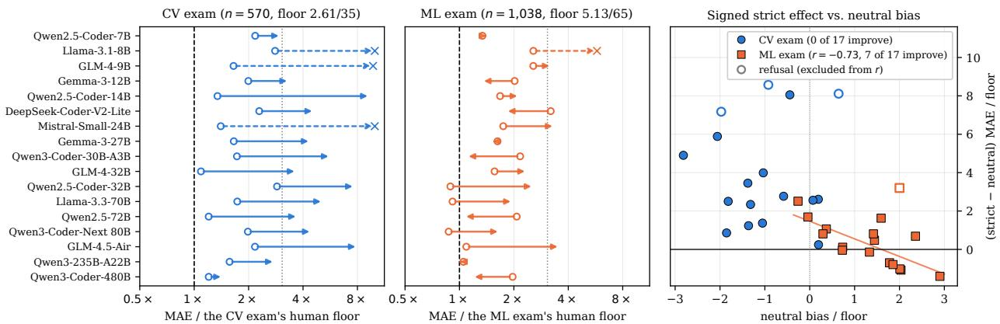
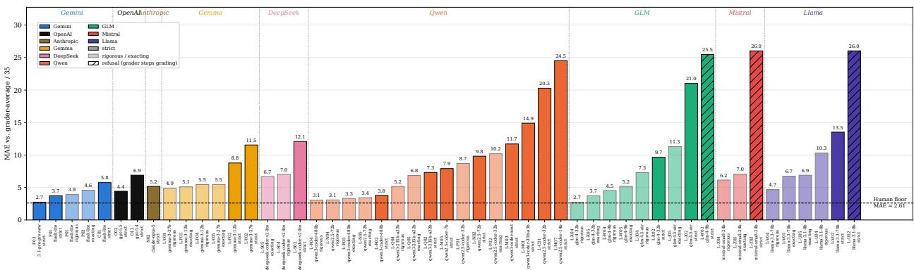
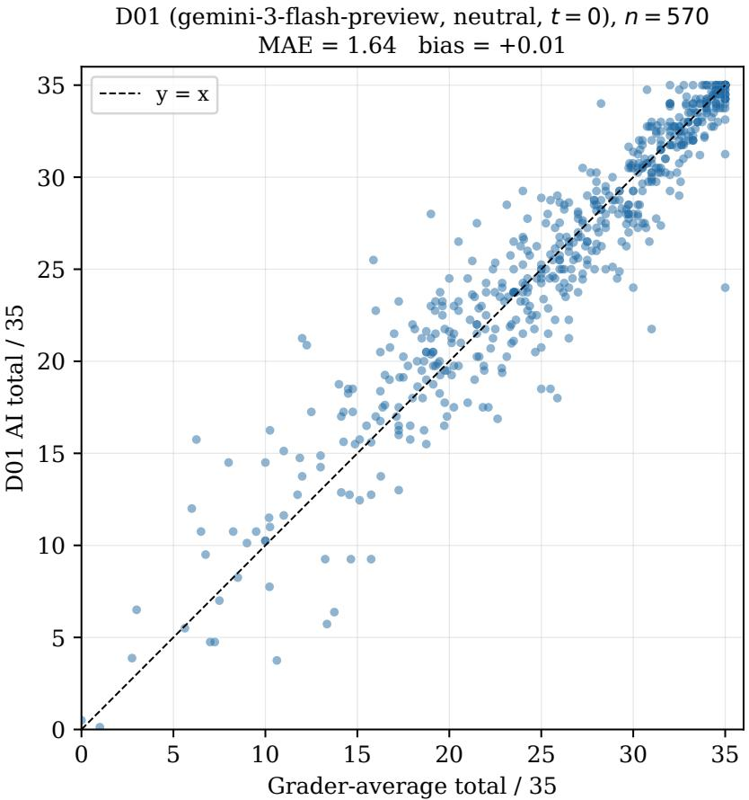
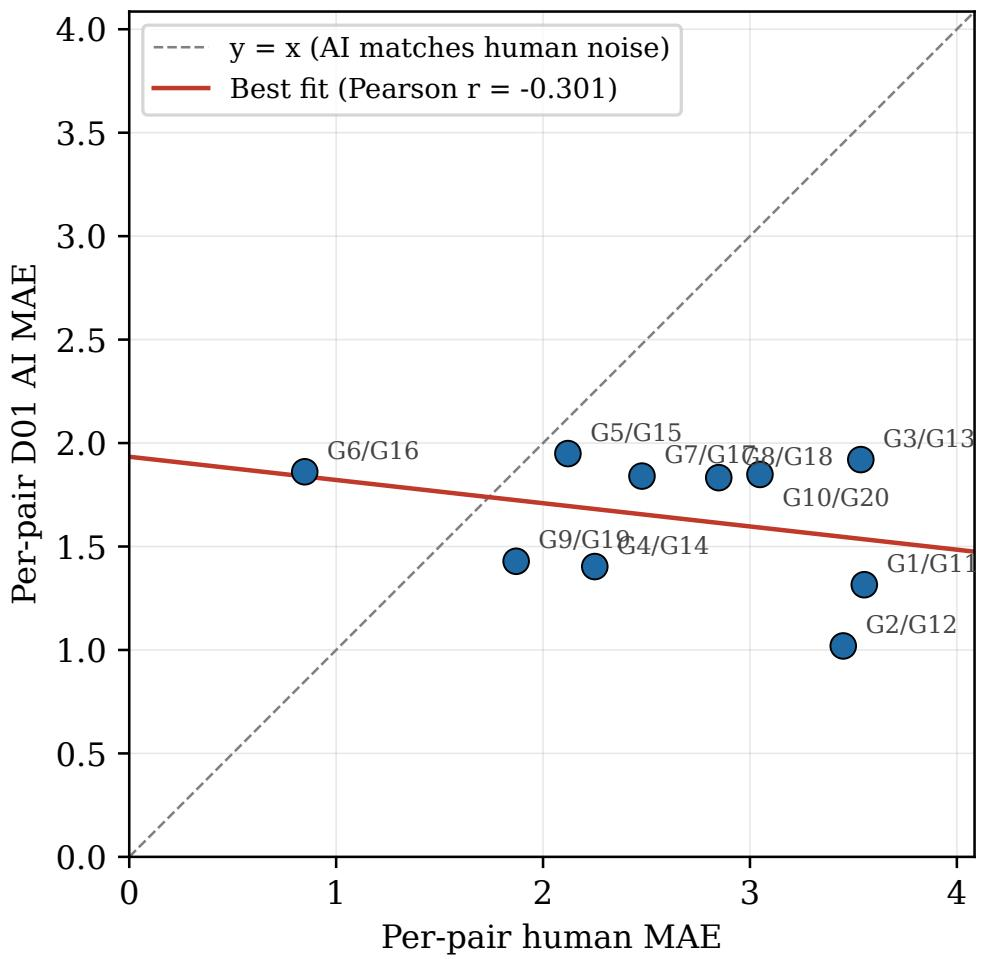
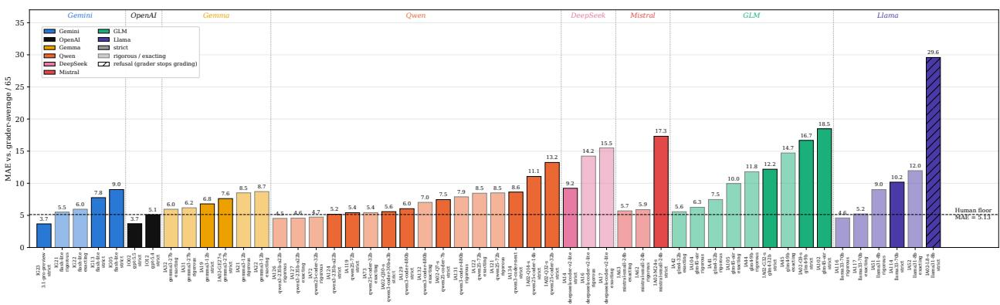
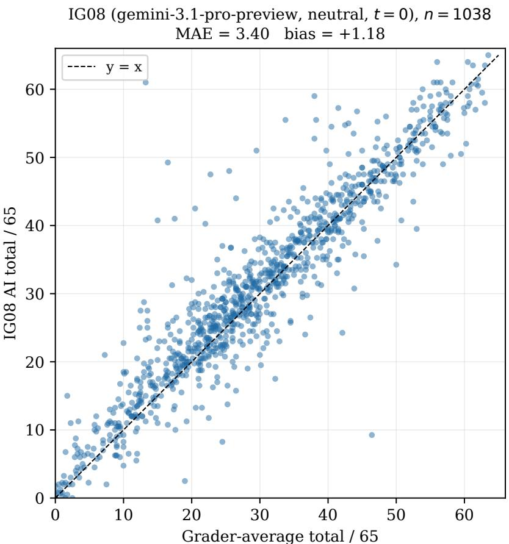
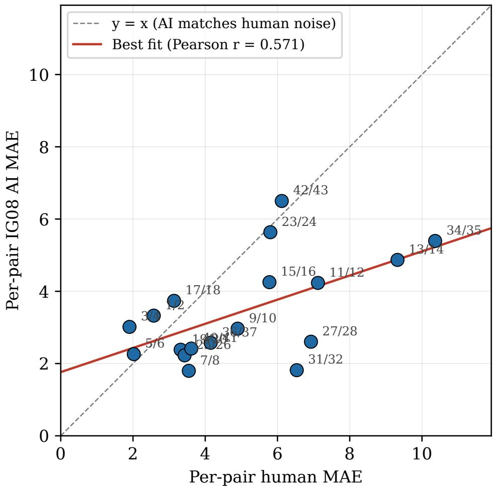

# WHERE LLM GRADERS SUCCEED AND BREAK: EVIDENCE FROM TWO COMPUTER-SCIENCE EXAMS

Ali Habibullah∗,† , Yazan Alshoibi∗& Mohammad Alshiekh∗

KAUST Academy

Computer, Electrical & Mathematical Sciences & Engineering (CEMSE) King Abdullah University of Science and Technology (KAUST) Thuwal, Saudi Arabia {ali.habibullah, yazen.shaebi, mohammad.shiekh}@kaust.edu.sa

Salman Khan Visual Artificial Intelligence Laboratory Oxford Brookes University salmankhan@brookes.ac.uk

Naeemullah Khan KAUST Academy & CEMSE, KAUST Lady Margaret Hall, University of Oxford naeemullah.khan@kaust.edu.sa

## ABSTRACT

One long-form exam in a large course costs hundreds of grader-hours, and qualified graders are scarce; LLM graders are a tempting alternative. To show its pitfalls we grade a practical Computer Vision exam (570 dual-graded students) under 171 configurations spanning closed and open-weights models; the best reaches mean absolute error 1.64/35, below the 2.61/35 two human graders achieve against each other. The catch is the prompt: a short “strict grader” preamble drives 14 of 17 open-weights models out of the graded band (MAE ≥ 8), three stopping grading altogether. The damage traces to the preamble’s two credit-withholding sentences, not to tone or model scale; one of them, “never give partial credit”, alone makes two of three probed models stop grading. The closed flagships of three vendors shift calibration under it but stay in the band. In 162 further configurations on a second, independent Machine Learning exam from another course (1,038 dual-graded students), the preamble worsens ten models, moving three out of the band into collapse and one into refusal, yet improves seven whose neutral prompts over-mark: the vulnerability replicates, but its direction is exam-specific. Light LoRA fine-tuning repairs it: one adapter on the two exams’ pooled ∼ 3,900 graded examples brings five small open models to parity or better with a human grader in agreement with the grader pair, and sensitivity to the three harsh personas nearly vanishes (≤ 0.32 MAE). We release the anonymised dataset, full ablation grid, and grading, fine-tuning and analysis pipelines3.

Keywords LLM auto-grading · prompt brittleness · instruction-following · persona effects · open-weights evaluation · LoRA fine-tuning · educational assessment

## 1 Introduction

Large language models (LLMs) are being used in computer-science education [1], grading included [2]: hundreds of grader-hours per cycle and scarce qualified graders make the economic case. The methodological case is murkier: the usual metrics hide which configuration of model, prompt and persona grades usably, and how it survives an instructor’s small prompt edits. On a practical Computer Vision (CV) exam, dual-graded by fixed grader pairs, we run 171 configurations with bootstrap CIs: closed and open-weight models (7B–480B), prompt components, personas, few-shot demonstrations, temperatures. Six full-cohort configurations, four Gemini and two GPT-5.5, match or beat the exam’s inter-grader floor of 2.61/35.

The central finding is an asymmetry: for closed models the logical prompt (reference solution, grading guidelines, rubric breakdown, neutral persona) is already at a joint optimum (Section 6), while open models are one sentence away from failure. A “strict grader” preamble knocks 14 of 17 models out of the graded band in all six tested open-weight families, three stopping grading entirely, the damage is unordered by scale and attributed to its two policy sentences, not its tone; across three closed vendors only Gemini’s cheapest tier leaves the band, and only on the second exam (Sections 5 and 6.1). Failure takes three forms MAE alone cannot separate (zeroed submissions, blanket mark-downs, one structured field dismantled while the rest grades on); a conflicting-instruction account fits only the last, and only as a hypothesis (Section 5.3).

The collapse is not an artifact of one exam: under the same preamble, a 162-configuration replication on another Machine Learning (ML) exam from a different course worsens 10 of 17 models, three leaving the graded band and one refusing outright, while the best closed and open configurations again land below its floor. The direction does not carry over: seven models improve, the ML exam’s over-marking cancelling against the persona, calibration masquerading as robustness (Section 5.4).

The collapse trains away. One LoRA adapter on the two exams’ pooled ∼ 3,900 examples, supervised by per-question grader marks, takes five open models (4B–30B; Qwen, Llama, Gemma) from significantly worse than one human grader to parity or better under a paired third-grader test on both exams; an adapter trained on one exam already improves the unseen other. The persona sweep costing base models up to 20 MAE points moves the pooled adapters by at most 0.32 under the three harsh personas, and by at most 0.39 under lenient bar Qwen3-Coder-30B-A3B (up to 1.81; Section 8).

## 2 Related Work

LLMs as judges and graders. LLM judging is standard since Zheng et al. [3] showed GPT-4 matches expert labellers on MT-Bench and Liu et al. [4] formalised prompt-plus-chain-of-thought scoring. Programming auto-grading mostly unit-tests functional correctness [5], without rubric-aligned partial credit, or correlates LLM with human raters on ∼ 100-submission datasets; the nearest benchmark, Phung et al. [2], compares ChatGPT and GPT-4 with human tutors. We apply the same scaffolding to student code grading on two real, released exams (n = 570 and 1,038) whose ground truth is two independent human graders, not a curated gold reference. Our few-shot arm supplies two worked examples per question labelled with D01’s scores and rationales, not the graders’ marks — in-context distillation of the best closed grader in the format of Brown et al. [6] (Appendix D).

Prompt brittleness and personas. Sclar et al. [7] show that semantically meaningless formatting changes shift benchmark performance by tens of percentage points and, with Mizrahi et al. [8], urge reporting distributions over prompt variants; Deshpande et al. [9] report persona-dependent toxicity rises up to 6× in ChatGPT. Our perturbation instead carries meaning, and we replay it on a second exam, where the vulnerability replicates but its direction and failure mode do not (Section 5.4).

Instruction hierarchies and conflicts. Section 5.3’s failure mode — abandoning one of two incompatible instructions rather than negotiating them — connects to instruction arbitration. Models treat instructions as equally privileged unless trained on an explicit hierarchy [10], fail a non-trivial fraction of simple verifiable instructions [11], break stated rules even on straightforward tests [12], degrade sharply when instructions conflict [13], and rarely flag the conflict [14]. Here the conflict arises from an ordinary instructor edit, not an attack, with a clean behavioural signature: the structured score channel surrenders while the prose channel keeps following the rubric.

## 3 Experimental Setup

Exams, graders and grid. 570 students took the CV exam’s four code questions (Q1 transfer learning, Q2 CNNfrom-scratch classification, Q3 semantic segmentation, Q4 bonus colorization); Q1–Q3 form the 35-point base scale (weights 12/11/12) used throughout; bonuses graded but excluded. Two of 20 graders in 10 fixed pairs (≈ 57 students each) grade every submission independently; the grader-average total is the ground truth (Section 4). The ML exam — another course, 1,038 students, three questions, ≈ 65-point scale, dual-graded by 49 graders in non-fixed pairs — carries a 162-configuration replication (Section 5.4, Appendix H). We evaluate 4 Gemini models [15, 16] via the Vertex API, GPT-5.5, GPT-5.4 and Claude Opus 5 via their batch APIs (Section 6.1), and 17 open-weights variants from six vendors, from 7B to 480B, dense and mixture-of-experts, served locally with vLLM [17] on A100 nodes. The 171 CV configurations (33 closed, 138 open-weights) span per-model baselines, prompt-component removals, thinking, five-persona sweeps, few-shot prompting, temperature and mechanism probes (Section 5.2); Appendix A documents roster, serving stack, reproducibility, thinking configuration and exclusions; Appendices I and K tabulate every run.

The prompt. The default prompt supplies the question, its rubric, the reference solution, the student notebook, grading guidelines and a breakdown of each scorable item; the model returns a score, any bonus and a rationale. Each question is graded in its own call (three or four per student) with only its own notebook, serialised cell by cell; prompts run to ≈ 22k characters on the CV exam, ≈ 16k on the ML exam, half to two thirds shared reference material. Personas are short preambles; strict reads “You are a HARSH teaching assistant. Award the MINIMUM defensible scorefor any task that is incomplete, buggy, or deviatesfrom the rubric. Never give partial credit ifthe task does not run correctly.”, the neutral default “You are a strict but fair teaching assistant.”, with lenient, rigorous and exacting analogous.

Metrics. The headline metric is MAE of the AI total against the grader-average total, with 95% percentile bootstrap Confidence Intervals (CIs) (2,000 resamples) [18, 19], alongside the mean signed error (bias); the human floor is computed identically, $\mathbf { M A E } = \mathbb { E } [ \left| \mathbf { G } _ { 1 } - \mathbf { \bar { G } } _ { 2 } \right| ]$ over the grader pair, and both are recomputed unchanged on the ML exam’s own scale. Because a total can hide per-question errors of opposite sign, Appendix F decomposes the bias per question for the headline runs and Table 2 (Appendix A) gives the item-level Spearman ρ per question alongside the total. Students whose grading call permanently failed are excluded from that run’s metrics — none in most runs, at most 3 elsewhere, exceptions in Appendix A.

## 4 The Human-Grader Floor

Across all 570 dual-graded submissions of the CV exam the two graders’ totals agree to MAE = 2.61/35 (95% bootstrap CI [2.37, 2.85]; Pearson $r = 0 . 8 6 8 )$ . We treat 2.61 as the human-grader floor: an AI configuration whose MAE sits at or below it makes, in aggregate, no more error against the grader average than the two graders make against each other. The floor is comparative only, and leans in the AI’s favour because averaging two graders cancels part of their noise. Beating it yields a parity claim of the kind Section 8.2 retests with a paired third-grader test. The floor pools across pairs whose internal disagreement varies by 4.2×: per-pair MAE runs 0.85 to 3.55 over the 10 fixed pairs, so which pair a student draws is a source of variability (Appendix G).

## 5 The Strict-Persona Collapse

## 5.1 The collapse, quantified

Table 3 (Appendix B) pairs each model’s strict and neutral runs, identical bar the persona sentence; Figure 2 renders all 51 strict-flavoured runs. MAE alone cannot separate the failures (zeroing every student scores $\mathrm { { M A E } \approx 2 6 }$ , the distance from the grader mean), so we add a behaviour class: a refusal zeroes at least 90% of students with awarded-total standard deviation below 0.5, a near-refusal keeps some variation at that zero-rate, a collapse reaches 3.07× its own exam’s inter-grader floor while still discriminating between students, and anything else is graded. The CV exam’s $\mathrm { M A E } \ge 8$ fixes that multiple $( 3 . 0 7 \times 2 . 6 1 )$ ) and gives $\mathrm { M A E } \geq 1 5 . 7$ on the ML exam $( 3 . 0 7 \times 5 . 1 3 )$ , the same severity on both scales.

Every open-weight family breaks. Prepending a short “strict grader” preamble to the otherwise-best prompt takes 14 of the 17 config-matched pairs out of the graded band, all six families represented, MAE rising ×1.69 to ×7.11. Three models stop grading outright: Llama-3.1-8B and Mistral-Small-24B award 0.00/35 on average, GLM-4-9B 0.56; Qwen2.5-Coder-32B still marks students $( \mathrm { M A E } = 2 0 . 2 9 $ , bias −20.28, mean awarded $5 . 7 5 / 3 \bar { 5 } )$ . No Gemini configuration collapses under any wording here (Appendix B): gemini-3.1-pro-preview moves $1 . 8 6  2 . 7 5$ under strict (F03, still at the floor), Flash-Lite’s strict-flavoured runs sit at 3.73–5.75 — an imperfect calibration knob, not a failure mode — and GPT-5.5, GPT-5.4 and Claude Opus 5 stay in band (Section 6.1).

Scale does not order the damage. Parameter count and the strict/neutral MAE ratio correlate at $\rho = - 0 . 2 1 \ : ( p = 0 . 4 2 )$ across the 17 sized models. The two largest ratios belong to a 24B model that stops grading and a 14B that zeroes 88% of submissions, while 106B GLM-4.5-Air collapses to 21.02; GLM improves from 9B to 32B before worsening at 106B while Gemma worsens from 12B to 27B — opposite directions over matched rungs. Robustness does appear at the top, Qwen3-235B-A22B and Qwen3-Coder-480B staying in band, but both are Qwen, the only family with rungs above 106B, confounding family with scale exactly where it matters; the third in-band model, Qwen2.5-Coder-7B, clears the threshold by 0.08 from an already-weak baseline.

The damage is specific to one preset. Two of 13 models leave the band under rigorous and two under exacting, against 14 of 17 under strict (Table 4, Appendix B); only strict carries the two policy sentences, so the gap is about policy content, not vocabulary.

## 5.2 Attribution: the policy sentences, not the adjective

The strict preset is three sentences: a frame (“You are a HARSH teaching assistant.”) and two policy sentences — S1, “Award the MINIMUM defensible score for any task that is incomplete, buggy, or deviates from the rubric.”, and S2, “Never give partial credit if the task does not run correctly.” Varying the adjective alone — STRICT, RIGOROUS, FAIR — over verbatim S1 and S2 moves MAE by 0.94 to 2.15 across five models, in no consistent direction (Table 5, Appendix B); FAIR with the harsh policy leaves Mistral-Small-24B at 25.05, still not grading.

$\mathrm { ~ A ~ 2 ~ } \times \mathrm { ~ 2 ~ }$ crosses S1 with S2 on three models, frame fixed: the frame alone moves each less than two points off neutral, both sentences take them to 20.26–26.04, S2 alone to outright refusal on Llama-3.1-8B and Mistral-Small-24B. S1 is not benign — alone it takes Llama-3.1-8B to 23.45 and outdoes S2 on Qwen2.5-Coder-32B (15.55 against 12.92) — so dominance varies by family: S1 for the 32B, S2 for the other two, on both exams, where S2 again alone stops graders grading (Appendix H). S2 contradicts the partial-credit scale the rubric scaffold mandates — hence the safer wordings, and advice about one instruction, not a tone.

## 5.3 Mechanism: three failure modes, one MAE range

Three explanations fit the headline numbers: refusal, calibration drift, conflicting instructions (“be strict” vs. “award partial credit per rubric”). All three occur, on different models, indistinguishably by MAE: Gemma-3-27B reaches MAE = 11.55 having zeroed Q1 on zero of 570 students, GLM-4-32B a lower 9.66 by zeroing 273. One question separates them — of students scored 0 on Q1, what fraction received a non-zero Q2? — and it splits the 19 matched strict runs into blanket zeroing (five), selective field collapse (five) and uniform severity (nine), both thresholds in empty bands (Table 6, Appendix B).

In the selective group the prompt’s two output channels disagree: on the two hand-annotated runs, 20% and 43% of zeroed submissions carry a rationale itemising partial credit while the score field reads 0 (Appendix B) — one channel obeys S2, the other the rubric breakdown. But this covers neither other group, and its clearest prediction fails: withdrawing the breakdown worsens the collapse in five of five families against a clean neutral control (Appendix B). An alternative fits that failure — the breakdown may anchor the score field to non-zero sub-totals, so withdrawing it lets the credit-withholding sentence run unopposed — and our grid cannot separate the two; we treat the mechanism as classified rather than explained (Section 10).

## 5.4 The collapse replicates on the ML exam; its direction does not

We replicate it on the ML exam (Section 3; floor 5.13 computed identically) over 162 configurations: neutral and strict runs for all 17 open-weights models, five-persona sweeps, attribution probes, a closed-model arm (Appendix H). Under strict four models cross from the graded band to above that exam’s $( \mathrm { M A E } \ge 1 5 . 7 ) $ ; Llama-3.1-8B again refuses. A fixed $\mathrm { M A E } \geq 8 ,$ only 1.56× this floor, would instead put ten strict runs out of band and eleven neutral baselines with them, against one here (DeepSeek-Coder-V2-Lite, 16.41). The collapse is thus no artifact of one rubric, cohort or scale — nor of open weights alone: Flash-Lite worsens under strict $( 7 . 5 3 \overset { \cdot } {  } 9 . 0 2 )$ and leaves the band under lenient (17.86), while gemini-3.1-pro-preview stays below the floor (3.40 → 3.67, IG23).

The direction does not transfer (Figure 1): seven of 17 improve under the same sentence — calibration, not robustness The ML exam’s neutral prompt over-marks for 15 models, and across the 16 non-refusal pairs neutral bias predicts the strict effect at $r = - 0 . 7 3$ (permutation $p = 0 . 0 0 2 )$ ; on the CV exam, whose neutral biases straddle zero (none above +1.68), zero of 17 improve. The decomposition also splits the two big Qwens’ apparent robustness: the 480B over-mark by 9.52 points at neutral $( \mathbf { M A E } = 1 0 . 1 0$ , twice its floor) and is pulled back by the sentence; the 235B is the one model above 106B in band under both personas on both exams. Parity replicates on both sides (gemini-3.1-pro-preview at 0.66× the ML exam’s floor, Qwen3-Coder-Next at 4.47), and the failure mode wanders: Qwen2.5-Coder-32B, selective here, zeroes whole submissions there.

One preamble, two remedies. One preamble separates competitive open-weights graders (Section 7) from 14 out of band, a gap single-prompt evaluation cannot see [7, 8], with two remedies: never forbid partial credit, or fine-tune lightly on in-house labels (Section 8).

  
Figure 1: The strict persona on the 17 models run on both exams, floor-relative. Left, centre: neutral (circle) → strict MAE; dashed = floor, dotted = each exam’s band (3.07× floor: $\mathrm { M A E } \ge 8$ on the CV exam, ≥ 15.7 on the ML exam), dashed arrows = refusals (ceiling MAE). Right: the signed strict effect $( \mathbf { M A E _ { s t r i c t } - M A E _ { n e u t r a l } } ) /$ /floor against neutral bias, negative exactly where the persona cancels over-marking.

## 6 Closed-Model Configurations

On the closed side the baseline recipe sits at the joint optimum: no prompt-component removal reliably improves on it.

Six full-cohort configurations at or below the floor. Six full-cohort configurations meet or undercut the human floor of 2.61 with CI upper bounds below it (Table 10, Appendix C): D01 (gemini-3-flash-preview, neutral, t = 0) at MAE = 1.64 (bound 1.79); F02 and D02 (the 3.1-pro under lenient and neutral); B03 (Flash-Lite with thinking), an order of magnitude cheaper; and gpt-5.5 under lenient and neutral (O03 2.25, O01 2.43; Section 6.1). The floor comparison is not like-for-like (Section 4), so we retest all six with the paired third-grader statistic of Eq. (1) (Table 11): three are better than a human grader — D01 $\overline { { d } } = - 0 . 5 4 \ [ - 0 . 7 1 , - 0 . 3 6 ] , \mathrm { F } 0 2 \ - 0 . 3 7 \ [ - 0 . 5 6 , - 0 . 1 8 ]$ D02 −0.37 [−0.55, −0.18] — while B03 (−0.19 [−0.39, +0.01]) and both gpt-5.5 runs $( - 0 . 0 1 \ \bar { [ - 0 . 2 2 , + 0 . 2 1 ] }$ lenient, +0.19 [−0.02, +0.41] neutral) are at parity. The Flash-Lite baseline A01 is significantly worse (+1.03), as are claude-opus-5 (+1.13) and all 17 open-weights baselines’ closest analogues (Section 7). Within Gemini the newer Flash beats the older Pro (D03, 4.10); D01’s scatter (Figure 3) is essentially unbiased, its residual error concentrated in the low-score band where the graders also disagree more.

On Flash-Lite, thinking helps and dropping the solution hurts. The B-series varies one prompt component at a time on Flash-Lite (Table 12). Dropping the reference solution flips a small under-grading bias (−1.78) into over-grading (+3.30) costing ≈ 0.8 MAE; dropping the guidelines or breakdown moves MAE by at most 0.12; thinking (B03) is the one large move, closing about three-quarters of the gap to D01 on a far cheaper model. Two combination runs cross a persona with another component: F01 (Flash-Lite, strict + thinking) at 3.73 recovers most of the strict penalty (5.75); F02 (3.1 Pro + lenient) reaches 1.79 against 1.86 neutral (Table 24). The G-series ablations (gemini-3-flash-preview, first 100 students; Appendix C) beat D01 only as a sample-size artifact; the t = 0 variance probes are in Appendix C.

## 6.1 The asymmetry holds across vendors

Gemini is one vendor, so we replayed the persona sweep on two more via batch APIs — same prompt bytes, thinking off, temperature 0 where exposed (Appendix C, Table 9): OpenAI’s gpt-5.5 and gpt-5.4 under neutral, strict and lenient on both exams, Anthropic’s claude-opus-5 under neutral on both and strict on the CV exam. None leaves the graded band under strict — gpt-5.5 2.43 → 4.43 (CV exam) and 3.54 → 3.70 (ML exam), claude-opus-5 3.54 → 5.17, gpt-5.4 4.69 → 6.90 and 4.30 → 5.11, zero-total rates at most 0.7%, no refusal — the calibration shift the Gemini models show $( 1 . 8 6  2 . 7 5 , 3 . 3 4  5 . 7 5 )$ , against 14 of 17 open-weights models leaving it under the identical sentence. The cheaper tiers are the fragile ones: gpt-5.4 is worst under lenient on the ML exam (4.30 → 8.30, bias +7.94) but stays in band, where Flash-Lite reaches 17.86 and leaves it; on the CV exam lenient nearly halves its error (4.69 → 2.69) by cancelling a −4.45 under-marking — calibration masquerading as robustness (Section 5.4), now on a closed model. At neutral gpt-5.5 is below the floor on both exams, claude-opus-5 on the ML exam only (4.37).

## 7 Open-Weights Configurations Under Neutral Prompts

Under neutral prompts nothing stands out: the 17 baselines span 2.85 to 7.49 MAE, no family dominating or collapsing (Table 14, Appendix D); none of it predicts which stop grading under a persona sentence. Scaling is not monotone: Qwen2.5-Coder improves from 7B to 14B (5.68 → 3.51) then regresses at 32B (7.49, bias −7.35); dropping the reference solution recovers 3.12, consistent with over-anchoring on it, though exam-locally: the same removal moves it +0.16 on the ML exam. Within Qwen3-Coder the 30B-A3B MoE beats the 80B Coder-Next (4.50 vs. 5.17), reversing at 480B (3.14).

GLM-4-32B takes four of the five best open-weights slots. Its best (rubric breakdown removed, neutral; L-BD07), 2.68, is the grid’s strongest open-weights grader (Table 24); L-X04 (rigorous) reaches 2.74, essentially unbiased; the fifth slot, Qwen3-Coder-Next + lenient (2.81) is a bias-correction artifact, not capability. Two gaps to D01 (1.64): just over one point on best achievable, 1.42 on best surviving a persona sentence (Qwen3-Coder-480B under rigorous, 3.06; L-R04), since GLM-4-32B collapses to 9.66 under strict.

Model choice beats size. The 30B-A3B beats the 80B, the 14B the 32B, the 72B dense the 235B MoE; the 480B’s edge is persona robustness: at neutral it only ties the 72B. Which model is a property of the exam, not the model: across the 17 run on both, neutral MAE is uncorrelated $( \rho = - 0 . 0 7 )$ and Qwen2.5-Coder-32B, weakest here, ties statistically for best there. Open-weights graders are practically viable, but only zero-shot on a prompt guaranteed never to carry a strict-flavoured persona (Section 5), which Section 8 removes with in-house labels.

## 8 Fine-Tuning Repairs the Strict-Persona Collapse

So far we have changed only the prompt. We have better material than prompts: two humans graded every submission in both exams. In this section we use their grades to fine-tune the models with LoRA [20]. We fine-tune five small open models (4B to 30B). Each model gets three adapters: one per exam, and one trained on both exams pooled (about 3,900 examples). Three things happen. With the pooled adapter, every model grades as well as a human or better, on both exams. The skill transfers: an adapter trained on one exam also gets better at the other, without ever seeing it. And the persona problem is gone. The prompt that adds as much as 20 MAE points to a base model barely moves the fine-tuned one.

## 8.1 Setup

We fine-tune five open models across three families and sizes from 4B to 30B parameters with LoRA: Qwen2.5-Coder 7B and 14B [21], Qwen3-Coder-30B-A3B [22], Llama-3.1-8B [23], and Gemma-4-E4B [24]. Training hyperparameters are in Appendix E. Each exam uses a seed-fixed 80/20 student split: 456/114 on the CV exam, giving 1,494 training examples, and 830/208 on the ML exam, giving 2,413. The ML exam records one grade per question with the bonus folded in, so we split each grade into a score up to the base cap and the remainder as bonus. We train three adapters per model: one per exam and one pooled. The pooled training set is the union of the two train splits, so no adapter ever sees a held-out student. We evaluate all three, plus the untuned base, on both held-out sets. On the held-out students, the two human graders disagree with each other by 2.83 marks on average on the CV exam and 5.19 on the ML exam. These are the floors: a grader that disagrees with the humans by less than this agrees with them better than they agree with each other. We use two training recipes with identical prompts. The marks recipe averages the two graders’ scores into a single target, one example per student and question, with a {score, bonus} output format. The bd (breakdown) recipe additionally distils a per-task breakdown from Gemini 3 Flash Preview (run D01), without its reasoning text.

## 8.2 One adapter reaches human parity or better on both exams

Every untuned base grades worse than a human on both exams and mis-calibrates in opposite directions: Llama-3.1-8B reads 19.8 on the CV exam where the grader average is 25.3, yet 40.5 on the ML exam where it is 30.9. With a score standard deviation of 2.1, it barely distinguishes the CV exam’s students at all. The pooled fine-tune produces better results on both exams: it lands at 1.75–2.01 MAE on the CV exam and 3.29–3.53 on the ML exam (marks recipe; Table 1), revives the collapsed score spread on the CV exam (σ from 2.1 → 7.3–7.5, against 8.0 for the grader average), and replaces the bases’ bias of −5.9 to +9.5 marks with under one mark of generosity (+0.2 to +0.9) on both exams.

Because MAE against a two-grader average is easier than any single grader faces (Section 4), the verdicts come from a paired third-grader test:

$$
\begin{array} { r } { d _ { i } \ = \ \frac { 1 } { 2 } \big ( | \mathrm { A I } _ { i } - \mathrm { G } _ { 1 , i } | + | \mathrm { A I } _ { i } - \mathrm { G } _ { 2 , i } | \big ) \ - \ | \mathrm { G } _ { 1 , i } - \mathrm { G } _ { 2 , i } | . } \end{array}\tag{1}
$$

Table 1: Held-out MAE vs. the grader average by training set (marks recipe; bd in Table 17, Appendix E). The cross columns are transfer; pooled matches or beats each specialist on its own exam. ‡: the one negative transfer cell (Section 8.5).
<table><tr><td></td><td colspan="4">CV exam (n=114)</td><td colspan="4">ML exam (n=208)</td></tr><tr><td>Model</td><td>base</td><td>CV</td><td>ML</td><td>pooled</td><td>base</td><td>CV</td><td>ML</td><td>pooled</td></tr><tr><td>Qwen2.5-Coder-7B</td><td>6.60</td><td>1.93</td><td>3.22</td><td>1.84</td><td>6.48</td><td>6.37</td><td>3.67</td><td>3.40</td></tr><tr><td>Qwen2.5-Coder-14B</td><td>4.06</td><td>1.89</td><td>3.29</td><td>1.89</td><td>7.70</td><td>5.41</td><td>3.35</td><td>3.29</td></tr><tr><td>Qwen3-Coder-30B-A3B</td><td>4.76</td><td>1.80</td><td>2.59</td><td>1.75</td><td>8.60</td><td>5.22</td><td>3.67</td><td>3.45</td></tr><tr><td>Gemma-4-E4B</td><td>4.29</td><td>1.88</td><td>3.79</td><td>1.88</td><td>4.66</td><td>4.79</td><td>3.51</td><td>3.53</td></tr><tr><td>Llama-3.1-8B</td><td>7.99</td><td>1.99</td><td>4.95</td><td>2.01</td><td>12.30</td><td>5.02</td><td>3.48</td><td>3.37</td></tr><tr><td>mean</td><td>5.54</td><td>1.90</td><td>3.57</td><td>1.87</td><td>7.95</td><td>5.36</td><td>3.54</td><td>3.41</td></tr></table>

Pairing removes per-student exam difficulty; averaging d over the held-out students with a 95% CI, an interval containing 0 means the AI is statistically indistinguishable from a human grader, entirely below 0 that it disagrees with the humans less than they disagree with each other, entirely above, worse. Below zero is possible because $| \mathrm { \bar { G } _ { 1 } - G _ { 2 } } |$ carries two graders’ idiosyncratic noise while $| \mathrm { A I } - \mathrm { G } _ { i } |$ carries one human’s plus the model’s; the AI beats the floor exactly when its own noise is smaller than a single human’s. With no ground truth beyond the graders, better here means more reliable, not more correct: added to the grading pool, the model would introduce less disagreement than another human.

All base configurations are significantly worse than a human grader on both exams. The pooled marks adapter is significantly better in 9 of 10 (model × exam) cells: all five models on the ML exam (d from −0.94 to −1.13, every CI below zero) and four of five on the CV. The pooled bd adapter reaches at least parity in all 10 cells and is better in two. No cell on either exam reads worse (Table 19, Appendix E). The ML exam sets a lower bar because its two graders disagree more (floor 5.19 vs. 2.83), but every point estimate there is negative regardless.

## 8.3 Grading skill transfers across exams

An adapter fine-tuned on one exam improves grading on the other, which it never saw: mean MAE on the ML exam falls from 7.95 (base) to 5.36 under the CV-exam adapter, and on the CV exam from 5.54 to 3.57 under the ML-exam adapter. Every model improves in both directions, with one exception discussed in Section 8.5. Transfer stops short of in-domain performance (3.54 and 1.90), but pooling closes the gap for free: the pooled adapter matches or beats each specialist on the specialist’s own exam in all eight (exam × recipe) columns (Table 1).

## 8.4 Fine-tuning immunises against the strict-persona collapse

We re-run the persona sweep for base and pooled models on both exams (Tables 16 and 18, Appendix E). The bases reproduce the collapse on both exams: under strict, Qwen2.5-Coder-14B goes 4.06 → 23.81 on the CV exam, and Llama-3.1-8B reaches MAE 30.9 on the ML with bias −30.9: it scores nearly every student zero. The pooled adapters are flat everywhere: at most +0.32 (marks) and +0.62 (bd) across three personas, two exams and five models, and the catastrophic tail the collapse creates is gone: under a neutral prompt the worst base mis-grades 43 of 114 CV-exam students by more than 10 marks, while every pooled model is at 0–1. On the CV exam the strict preset is the most destructive on every base, as Section 5.2 predicts: it alone carries the two policy sentences. The per-exam adapters had one immunity failure, and pooling fixes it: Llama-bd under strict sat at 4.08 when tuned on the CV exam alone and drops to 2.67 with pooled training.

On the ML exam strict sometimes improves a base model (Qwen3-Coder-30B: 8.60 → 6.34). This is not the persona working. The bases over-grade the ML exam, and the induced harshness happens to cancel part of the bias, the accidental calibration of Section 5.4 again. So the same wording that destroys a model on one exam helps it on the other. An effect that flips sign between exams is not a calibration knob.

## 8.5 What matters, what does not

Size and family remain nearly irrelevant. The five pooled marks fine-tunes converge to 1.75–2.01 MAE on the CV exam and 3.29–3.53 on the ML, and starting quality does not predict the tuned result: Llama-3.1-8B starts worst on both exams (7.99, 12.30) and finishes with everyone else (2.01, 3.37). Human labels alone suffice: pooled marks matches or beats pooled bd on every (model, exam) cell, decisively on the ML exam (3.41 vs. 4.15 mean). Nine of the eleven better verdicts in the paired test are marks verdicts, and marks needs no closed-model teacher. Which exam the labels come from matters less than having labels at all, with one exception. Gemma-4-E4B is the strongest base on the ML exam (4.66) and the only model that cross-exam transfer fails to help there (4.79‡), and in-domain labels move it only to 3.51: fine-tuning buys the most where the base grades worst, and Gemma had the least room to improve. The residual errors concentrate on the students the two human graders also disagree on (correlation +0.35 to +0.48 for every pooled model, against no consistent relationship for the bases; Appendix E): the tuned models are unsure exactly where the rubric is ambiguous.

## 9 Discussion

What the collapse is, and is not. Of the three failure modes only selective field collapse looks like a failure to negotiate conflicting instructions, and only as a hypothesis (Section 5.3); the others are calibration drift and refusal, which never appears on a Qwen model, so a single-family roster misses that mode. Spanning all six families unordered by scale, the failure belongs to open-weights instruction following: no closed model of the three vendors leaves the band on either exam, and robustness above 106B is half illusory once the ML exam decomposes it. Fine-tuning shows the failure is zero-shot, not small-model.

Why single-prompt evaluation misses it. One well-behaved prompt leaves the best open-weights configuration just over one MAE point behind Gemini’s best (2.68 vs. 1.64), one instructor-style persona preamble nearly fourteen behind (15.58): single-prompt evaluation would have told a sunnier story [7, 8].

Implications for deployment. (1) Never instruct a grader to withhold credit: both policy sentences collapse graders on their own (Section 5.2), unordered by parameter count, and under-grading harms students who attempted the work in good faith. Verify the model against the prompt and the exam: on the ML exam the same preamble helps seven of 17 models purely by cancelling their over-marking, yet nearly doubles the error of the ML exam’s best. (2) With in-house dual-graded examples, fine-tune rather than prompt-engineer — and pool the courses. One adapter on the two exams’ pooled ∼ 3,900 examples brings every 4B–30B model to parity or better with a human grader on both exams and removes the collapse on both (persona drift ≤ 0.32 MAE), with no closed-model teacher and no cost to either course. (3) Evaluate several prompt variants, including instructor-written ones. (4) Report bias alongside MAE: Flash-Lite’s lenient and strict have comparable MAE with opposite-signed bias (+4.01 vs. −5.44): MAE alone does not show which way the harm runs.

## 10 Limitations

Coverage. Both exams are from one university: replication spans courses, cohorts, rubrics and scales, not institutions. Fine-tuning’s two transfer directions are not size-matched (456 vs. 830 training students), confounding their comparison; Gemma-4’s ML-exam baseline, unlike the other four, lacks independent corroboration. We varied three strict-flavoured wordings and two preset policy sentences, not every credit-withholding instruction. Both models above 106B are Qwen, entangling scale with family where it matters (Section 5.4 separates their robustness, not that confound). The gemini-3-flash-preview ablations used the first 100 students (matched-subset baselines, wider CIs). Closed coverage: four Gemini models; three personas on two OpenAI tiers and one Anthropic model (Section 6.1; Anthropic strict on the CV exam only), no rigorous or exacting outside Gemini. Grading is static: nothing is executed (Appendix A; no test suites, minutes-to-hours GPU cost, no stored outputs), so “does not run” verdicts are unaudited and their error rate on valid but unconventional code unmeasured. We know of no public corpus of long-form notebooks with dual human rubric grades for external benchmarking; automated-grading corpora are unit-test based [5] or score short per-task programs [2].

ML-exam ground truth. Nine of the ML exam’s 1,038 rows record 0.0 for one grader against real marks from the partner; they are retained in the headline floor but excluded from the maximum-disagreement figure; excluding them everywhere moves no behaviour class, no table ordering and no held-out verdict (Appendix H). Its pairing is hybrid rather than fixed, so per-pair statistics are scoped to the 18-pair backbone covering 79% of the cohort.

Few-shot demonstrations. The K-series demonstrations carry D01’s labels, and their five students remain in the evaluated cohort (5/570), graded with their own worked answer in the prompt. The ML exam’s demonstrations likewise carry IG08’s labels, with three students remaining; its Flash-Lite arm suffers biased dropout from prompt-length failures, so only its matched subsample is comparable (Appendix H).

Claims. Section 5.3’s three-way split classifies rather than explains: withdrawing the rubric breakdown contradicts the conflicting-instruction reading, leaving the causal story open. The few-shot uplift is capability, not held-out generalisation: the demonstrations carry D01’s own labels. One seed-fixed split and one run per configuration make the paired third-grader test load-bearing; its normal-approximation CIs leave three CV-exam better-than-grader verdicts marginal: upper bounds −0.044 (14B marks), −0.020 (Gemma marks) and −0.001 (7B bd), all strictly below zero under a 2000-resample percentile bootstrap, though the weakest would contain zero under a t-interval (p = 0.052 paired, 0.069 Wilcoxon); the ML exam’s are not (upper CIs ≤ −0.30). Appendix J details the remaining caveats.

## 11 Conclusion

For a dual-graded exam the recipe is short. The stronger closed models (Gemini 3 Flash and 3.1 Pro, GPT-5.5) grade at or below the human floor untuned, from a neutral prompt; an open model gets there only with light fine-tuning on the exam’s own grades, and only then survives the instructor edits that break it zero-shot. Between exams the vulnerability and its repair transfer; the model ranking, the persona’s direction and t = 0 determinism do not. So verify a grader on the exam it will grade, under an instructor’s own prompts.

## Acknowledgments

We thank Prof. Sultan Albarakati (KAUST) for his support, which made this paper possible. We thank all graders whose grading produced the human ground truth, and the course instructors for permission to use the anonymised exam data. For computer time, this research used Ibex managed by the Supercomputing Core Laboratory at King Abdullah University of Science & Technology (KAUST) in Thuwal, Saudi Arabia.

## AI Use Statement

We used generative AI tools (Opus 4.8, Opus 5.0 and Fable 5) as coding and writing assistants throughout this work. Specifically: for implementing and refactoring the data pipeline, the grading harness, the fine-tuning scripts, and the analysis code; for drafting and editing prose in this paper; and for exploratory literature search. We did not use generative AI to generate research ideas, to produce experimental results, or to write any of the analysis numbers reported here — every number in this paper is computed by the released scripts from the released data, and the ledgers those scripts emit are the authority for the manuscript. All AI-assisted code was reviewed and executed by the authors, and the statistical results were independently re-derived before being reported. We take responsibility for the fina content of this work, including all text, claims, and artifacts.

Note that generative models are also the object of study here rather than a tool: the LLM graders evaluated in Sections 6–8 produced the scores we analyse, and those outputs are released in full.

## Reproducibility Statement

Every number in the paper is regenerated from released artifacts by released code. The two anonymised exam datasets, the rubrics and reference solutions, one result workbook per configuration, and the analysis, grading, and fine-tuning pipelines are released at https://github.com/KAUST-Academy/where-llm-graders-succeed-and-break. Section 3 and Appendix A specify the prompt, the serving stack, the decoding parameters, and the exclusion rules; Appendix I tabulates all 171 CV-exam configurations with their bootstrap confidence intervals; Appendix E gives the fine-tuning hyperparameters and the seed-fixed split. Training uses HuggingFace with PEFT and every evaluated number is served by vLLM, Gemma-4’s adapter included. One caveat is stated where it arises: evaluation is not bitwise reproducible because vLLM batching reorders reductions (∼ 0.01 MAE); Gemma-4’s vLLM serving path was cross-validated against HuggingFace generation to within ∼ 0.1 MAE (Appendix E).

## Ethics Statement

The data are student exam submissions and grader marks from two university courses, released with the course instructors’ permission. Both datasets are anonymised before release: student identifiers, names, and email addresses are removed from notebook code, markdown, outputs, and file metadata, and graders appear only as opaque identifiers. No demographic attributes are collected or released, and no student is identifiable from the released artifacts.

The application this paper studies carries real risk to the people being graded, which is why we report the failure mode rather than only the headline accuracy. An under-grading collapse of the kind documented in Section 5 harms students who attempted the work in good faith, and it is invisible to single-prompt evaluation. We therefore recommend against deploying an LLM grader on the basis of one prompt’s measured accuracy, and we report bias alongside MAE throughout so that the direction of harm is visible. We regard human oversight of consequential grading decisions as a requirement, not an option, and none of the results here should be read as licensing unsupervised automated assessment.

## References

[1] James Prather, Paul Denny, Juho Leinonen, Brett A. Becker, Ibrahim Albluwi, Michelle Craig, Hieke Keuning, Natalie Kiesler, Tobias Kohn, Andrew Luxton-Reilly, Stephen MacNeil, Andrew Petersen, Raymond Pettit, Brent N. Reeves, and Jaromir Savelka. The robots are here: Navigating the generative AI revolution in computing education. In Proceedings of the 2023 Working Group Reports on Innovation and Technology in Computer Science Education, ITiCSE 2023, pages 108–159. ACM, December 2023. doi: 10.1145/3623762.3633499. URL https://doi.org/10.1145/3623762.3633499.

[2] Tung Phung, Victor-Alexandru Padurean, José Cambronero, Sumit Gulwani, Tobias Kohn, Rupak Majumdar,˘ Adish Singla, and Gustavo Soares. Generative AI for programming education: Benchmarking ChatGPT, GPT-4, and human tutors. In Proceedings of the 2023 ACM Conference on International Computing Education Research - Volume 2, ICER 2023, pages 41–42. ACM, 2023. doi: 10.1145/3568812.3603476. URL https: //doi.org/10.1145/3568812.3603476.

[3] Lianmin Zheng, Wei-Lin Chiang, Ying Sheng, Siyuan Zhuang, Zhanghao Wu, Yonghao Zhuang, Zi Lin, Zhuohan Li, Dacheng Li, Eric Xing, Hao Zhang, Joseph Gonzalez, and Ion Stoica. Judging LLM-as-a-Judge with MT-Bench and Chatbot Arena. In A. Oh, T. Naumann, A. Globerson, K. Saenko, M. Hardt, and S. Levine, editors, Advances in Neural Information Processing Systems, volume 36, pages 46595–46623. Curran Associates, Inc., 2023. doi: 10.52202/075280-2020. URL https://proceedings.neurips.cc/paper\_files/paper/2023/ file/91f18a1287b398d378ef22505bf41832-Paper-Datasets\_and\_Benchmarks.pdf.

[4] Yang Liu, Dan Iter, Yichong Xu, Shuohang Wang, Ruochen Xu, and Chenguang Zhu. G-Eval: NLG evaluation using GPT-4 with better human alignment. In Houda Bouamor, Juan Pino, and Kalika Bali, editors, Proceedings ofthe 2023 Conference on Empirical Methods in Natural Language Processing, pages 2511–2522, Singapore, December 2023. Association for Computational Linguistics. doi: 10.18653/v1/2023.emnlp-main.153. URL https://aclanthology.org/2023.emnlp-main.153/.

[5] Marcus Messer, Neil C. C. Brown, Michael Kölling, and Miaojing Shi. Automated grading and feedback tools for programming education: A systematic review. ACM Transactions on Computing Education, 24(1):1–43, February 2024. doi: 10.1145/3636515. URL https://doi.org/10.1145/3636515.

[6] Tom Brown, Benjamin Mann, Nick Ryder, Melanie Subbiah, Jared D Kaplan, Prafulla Dhariwal, Arvind Neelakan tan, Pranav Shyam, Girish Sastry, Amanda Askell, Sandhini Agarwal, Ariel Herbert-Voss, Gretchen Krueger, Tom Henighan, Rewon Child, Aditya Ramesh, Daniel Ziegler, Jeffrey Wu, Clemens Winter, Chris Hesse, Mark Chen, Eric Sigler, Mateusz Litwin, Scott Gray, Benjamin Chess, Jack Clark, Christopher Berner, Sam McCandlish, Alec Radford, Ilya Sutskever, and Dario Amodei. Language models are few-shot learners. In H. Larochelle, M. Ranzato, R. Hadsell, M.F. Balcan, and H. Lin, editors, Advances in Neural Information Processing Systems, volume 33, pages 1877–1901. Curran Associates, Inc., 2020. URL https://proceedings.neurips.cc/paper\_files/ paper/2020/file/1457c0d6bfcb4967418bfb8ac142f64a-Paper.pdf.

[7] Melanie Sclar, Yejin Choi, Yulia Tsvetkov, and Alane Suhr. Quantifying language models’ sensitivity to spurious features in prompt design or: How I learned to start worrying about prompt formatting. In B. Kim, Y. Yue, S. Chaudhuri, K. Fragkiadaki, M. Khan, and Y. Sun, editors, International Conference on Learning Representations, volume 2024, pages 25055–25083, 2024.

[8] Moran Mizrahi, Guy Kaplan, Dan Malkin, Rotem Dror, Dafna Shahaf, and Gabriel Stanovsky. State of what art? A call for multi-prompt LLM evaluation. Transactions ofthe Associationfor Computational Linguistics, 12: 933–949, 2024. doi: 10.1162/tacl\_a\_00681. URL https://aclanthology.org/2024.tacl-1.52/.

[9] Ameet Deshpande, Vishvak Murahari, Tanmay Rajpurohit, Ashwin Kalyan, and Karthik Narasimhan. Toxicity in ChatGPT: Analyzing persona-assigned language models. In Houda Bouamor, Juan Pino, and Kalika Bali, editors, Findings ofthe Associationfor Computational Linguistics: EMNLP 2023, pages 1236–1270, Singapore, December 2023. Association for Computational Linguistics. doi: 10.18653/v1/2023.findings-emnlp.88. URL https://aclanthology.org/2023.findings-emnlp.88/.

[10] Eric Wallace, Kai Xiao, Reimar Leike, Lilian Weng, Johannes Heidecke, and Alex Beutel. The instruction hierarchy: Training LLMs to prioritize privileged instructions, 2024. URL https://arxiv.org/abs/2404. 13208.

[11] Jeffrey Zhou, Tianjian Lu, Swaroop Mishra, Siddhartha Brahma, Sujoy Basu, Yi Luan, Denny Zhou, and Le Hou. Instruction-following evaluation for large language models, 2023. URL https://arxiv.org/abs/ 2311.07911.

[12] Norman Mu, Sarah Chen, Zifan Wang, Sizhe Chen, David Karamardian, Lulwa Aljeraisy, Basel Alomair, Dan Hendrycks, and David Wagner. Can LLMs follow simple rules?, 2023. URL https://arxiv.org/abs/2311. 04235.

[13] Zhihan Zhang, Shiyang Li, Zixuan Zhang, Xin Liu, Haoming Jiang, Xianfeng Tang, Yifan Gao, Zheng Li, Haodong Wang, Zhaoxuan Tan, Yichuan Li, Qingyu Yin, Bing Yin, and Meng Jiang. IHEval: Evaluating language models on following the instruction hierarchy. In Luis Chiruzzo, Alan Ritter, and Lu Wang, editors, Proceedings of the 2025 Conference of the Nations of the Americas Chapter of the Association for Computational Linguistics: Human Language Technologies (Volume 1: Long Papers), pages 8374–8398, Albuquerque, New Mexico, April 2025. Association for Computational Linguistics. doi: 10.18653/v1/2025.naacl-long.425. URL https://aclanthology.org/2025.naacl-long.425/.

[14] Xingwei He, Qianru Zhang, Pengfei Chen, Guanhua Chen, Linlin Yu, Yuan Yuan, and Siu-Ming Yiu. ConInstruct: Evaluating large language models on conflict detection and resolution in instructions. Proceedings ofthe AAAI Conference on Artificial Intelligence, 40(37):30969–30977, March 2026. doi: 10.1609/aaai.v40i37.40356. URL https://doi.org/10.1609/aaai.v40i37.40356.

[15] Gemini Team et al. Gemini: A family of highly capable multimodal models, 2023. URL https://arxiv.org/ abs/2312.11805.

[16] Gheorghe Comanici et al. Gemini 2.5: Pushing the frontier with advanced reasoning, multimodality, long context, and next generation agentic capabilities, 2025. URL https://arxiv.org/abs/2507.06261.

[17] Woosuk Kwon, Zhuohan Li, Siyuan Zhuang, Ying Sheng, Lianmin Zheng, Cody Hao Yu, Joseph Gonzalez, Hao Zhang, and Ion Stoica. Efficient memory management for large language model serving with PagedAttention. In Proceedings ofthe 29th Symposium on Operating Systems Principles, SOSP ’23, pages 611–626. ACM, October 2023. doi: 10.1145/3600006.3613165. URL https://doi.org/10.1145/3600006.3613165.

[18] B. Efron. Bootstrap Methods: Another Look at the Jackknife. The Annals of Statistics, 7(1):1–26, 1979. doi: 10.1214/aos/1176344552. URL https://doi.org/10.1214/aos/1176344552.

[19] Bradley Efron and R.J. Tibshirani. An Introduction to the Bootstrap. Chapman and Hall/CRC, May 1994. ISBN 9780429246593. doi: 10.1201/9780429246593. URL https://doi.org/10.1201/9780429246593.

[20] Edward J Hu, Yelong Shen, Phillip Wallis, Zeyuan Allen-Zhu, Yuanzhi Li, Shean Wang, Lu Wang, and Weizhu Chen. LoRA: Low-rank adaptation of large language models. In International Conference on Learning Representations, 2022. URL https://openreview.net/forum?id=nZeVKeeFYf9.

[21] Binyuan Hui et al. Qwen2.5-Coder technical report, 2024. URL https://arxiv.org/abs/2409.12186.

[22] An Yang et al. Qwen3 technical report, 2025. URL https://arxiv.org/abs/2505.09388.

[23] Aaron Grattafiori, Abhimanyu Dubey, Abhinav Jauhri, Abhinav Pandey, Abhishek Kadian, et al. The Llama 3 herd of models, 2024. URL https://arxiv.org/abs/2407.21783.

[24] Gemma Team et al. Gemma 4 technical report, 2026. URL https://arxiv.org/abs/2607.02770.

[25] An Yang et al. Qwen2.5 technical report, 2025. URL https://arxiv.org/abs/2412.15115.

[26] Qwen Team. Qwen3-Coder-Next technical report. Technical report, Alibaba Cloud, 2026. URL https: //github.com/QwenLM/Qwen3-Coder/blob/main/qwen3\_coder\_next\_tech\_report.pdf. Model card: https://huggingface.co/Qwen/Qwen3-Coder-Next.

[27] Meta. Llama 3.3 model card. https://github.com/meta-llama/llama-models/blob/main/models/ llama3\_3/MODEL\_CARD.md, December 2024. 70B Instruct released 6 December 2024.

[28] Team GLM et al. ChatGLM: A family of large language models from GLM-130B to GLM-4 all tools, 2024. URL https://arxiv.org/abs/2406.12793.

[29] Z.ai. GLM-4-9B-0414. Hugging Face model card, https://huggingface.co/zai-org/GLM-4-9B-0414, April 2025.

[30] Z.ai. GLM-4-32B-0414. Hugging Face model card, https://huggingface.co/zai-org/GLM-4-32B-0414, April 2025.

[31] GLM-4.5 Team et al. GLM-4.5: Agentic, reasoning, and coding (ARC) foundation models, 2025. URL https://arxiv.org/abs/2508.06471.

[32] Gemma Team et al. Gemma 3 technical report, 2025. URL https://arxiv.org/abs/2503.19786.

[33] Mistral AI. Mistral-Small-24B-Instruct-2501. Hugging Face model card, https://huggingface.co/ mistralai/Mistral-Small-24B-Instruct-2501, January 2025.

[34] DeepSeek-AI et al. DeepSeek-Coder-V2: Breaking the barrier of closed-source models in code intelligence, 2024. URL https://arxiv.org/abs/2406.11931.

[35] Aditya Pathak, Rachit Gandhi, Vaibhav Uttam, Arnav Ramamoorthy, Pratyush Ghosh, Aaryan Raj Jindal, Shreyash Verma, Aditya Mittal, Aashna Ased, Chirag Khatri, Yashwanth Nakka, Devansh, Jagat Sesh Challa, and Dhruv Kumar. Rubric is all you need: Improving LLM-based code evaluation with question-specific rubrics. In Proceedings of the 2025 ACM Conference on International Computing Education Research V.1, ICER ’25, pages 181–195. ACM, 2025. doi: 10.1145/3702652.3744220. URL https://doi.org/10.1145/3702652.3744220.

[36] Chi-Min Chan, Weize Chen, Yusheng Su, Jianxuan Yu, Wei Xue, Shanghang Zhang, Jie Fu, and Zhiyuan Liu. ChatEval: Towards better LLM-based evaluators through multi-agent debate. In B. Kim, Y. Yue, S. Chaudhuri, K. Fragkiadaki, M. Khan, and Y. Sun, editors, International Conference on Learning Representations, volume 2024, pages 9079–9093, 2024.

## A Experimental Details

The CV exam in full. The CV exam’s 570 submissions answer four code questions: Q1 transfer learning with EfficientNetV2, Q2 a CNN from scratch, Q3 semantic segmentation with a pretrained encoder, Q4 a colorization-dataset bonus. Beyond the 35 base points (weights 12 / 11 / 12) sit up to 13 bonus points (Q1, Q2 and an all-or-nothing 5-point Q4), graded but excluded from every reported metric.

Model roster and serving. On the closed-model side we use Google’s gemini-2.5-pro [16] and gemini-flash-lite, gemini-3-flash-preview, and gemini-3.1-pro-preview, for which no technical report was available at the time of writing, via the Vertex API [15]. Two further vendors enter only in the cross-vendor replication of Section 6.1: OpenAI’s gpt-5.5 and gpt-5.4 and Anthropic’s claude-opus-5 (Appendix C, Table 9). On the open-weights side we use 17 variants from six vendors. From Qwen: Qwen2.5-Coder at 7B / 14B / 32B [21] and the Qwen2.5 72B dense model [25], and from the Qwen3 family the Qwen3-Coder 30B-A3B MoE, the 235B-A22B MoE, and the 480B Qwen3-Coder MoE in FP8 [22], and the 80B Qwen3-Coder-Next MoE [26]. From Meta: Llama-3.1-8B [23] and Llama-3.3-70B [27]. Z.ai: GLM-4-9B and GLM-4-32B, the 0414 releases [28–30], and the 106B GLM-4.5-Air MoE [31]. Google: Gemma-3-12B and Gemma-3-27B [32]. Mistral: Mistral-Small-24B [33]. DeepSeek: the 16B DeepSeek-Coder-V2-Lite MoE (2.4B active) [34]. Serving is vLLM [17] on one 4× A100 node, or 8× for Qwen2.5-72B, 235B-A22B and the 480B FP8 model.

Open-weights generation is unconstrained: the grader requests JSON in the prompt and parses the reply, with no grammar or schema enforcement at decode time (Vertex calls do pass a JSON response schema). A controlled A/B confirms that grammar-constrained decoding changes no score and costs 6.9× in latency. Every open-weights grid run uses vLLM 0.19.1 or later, greedy decoding at temperature 0 — the t = 0.5 probes L-E01/L-E02 (Appendix C) excepted — and one request in flight.

Notebook serialisation, parsing and retries. Every call receives one question’s notebook as plain text — a –- Cell k [code|markdown] –- header then the cell’s source — with every output dropped: training logs, printed metrics and rendered plots or masks (base64 media) never reach the model. Nothing is truncated in the grid; the fine-tuning harness alone head-and-tail-truncates to 24,000 characters. Replies are parsed as JSON; the open-weights path falls back from strict parsing to a lenient parse and then to json\_repair, the Vertex path parses strictly against its response schema. A Vertex call is retried up to three times with a 2s× attempt back-off, except that a MAX\_TOKENS finish is not retried because it is deterministic at t = 0; the open-weights path does not retry a truncated or unparseable reply at t = 0 for the same reason. A question with no score after the run’s retries and resumes is a permanent failure, and the student is excluded from that run’s metrics as described under Exclusions.

Ablation-grid legend. Appendix I tabulates the grid’s 33 closed-model (25 Gemini, 6 OpenAI, 2 Anthropic) and 138 open-weights runs; the machine-readable master comparison ships in the accompanying repository. Gemini series: A = baseline (n=1); B = prompt-component ablations on Flash-Lite (n=4: B01 drop solution, B02 drop guidelines, B03 thinking on, B04 drop breakdown); C = strictness persona on Flash-Lite (n=2); D = model swap (n=3); E = temperature variance (n=3); F = combos and the 3.1 Pro strict run (n=3); G, M = prompt ablations and persona on gemini-3-flash-preview (n=4, n=2); K = few-shot (n=1); P = alternate-wording personas on Flash-Lite (n=2). Cross-vendor closed series (batch APIs; Section 6.1): O = OpenAI, gpt-5.5 (O01–O03) and gpt-5.4 (O11–O13) under neutral, strict and lenient (n=6); N = Anthropic claude-opus-5 under neutral and strict (n=2).

Open-weights series (prefixed L-) fall in three groups. Qwen ablations: L-A/L-AN = per-model baselines (n=5); on Qwen2.5-Coder-32B, L-B = prompt-component ablations (n=4), L-C = persona (n=2) and L-P = alternate wordings (n=2); L-D/L-DN = +thinking on Qwen3 MoE (n=2); L-E = temperature variance (n=2); L-G, L-H = prompt ablations replayed on the 30B and 7B (n=6); L-K = few-shot (n=1); L-M = persona on additional Qwen models (n=7); L-N, L-Q, L-R = full five-persona sweeps on Qwen2.5-72B, Qwen3-235B-A22B and Qwen3-Coder-480B FP8 (n=15). Cross-family sweeps, each five personas on all 570 students: L-S = DeepSeek-Coder-V2-Lite; L-U = Llama-3.1-8B; L-V = Llama-3.3-70B; L-W = GLM-4-9B; L-X = GLM-4-32B; L-J = GLM-4.5-Air; L-F = Gemma-3-12B; L-Y = Gemma-3-27B; L-Z = Mistral-Small-24B (n=45). Mechanism probes: L-MP = minimal pairs isolating the persona’s headword from its policy sentences, on five models (n=25); L-PS = the 2 × 2 over the two policy sentences, on three models (n=12); L-BD = rubric-breakdown removal crossed with persona, on five models (n=10).

G- and M-series Gemini configurations run on the first 100 students, gemini-3-flash-preview throughput being the binding constraint; comparisons against full-n baselines restrict the baseline to the matching subset.

Gemini thinking configuration. The Vertex API exposes an internal reasoning budget, thinking\_budget. We run 21 of the 25 Gemini ablations with thinking disabled (thinking\_budget = 0) and three (B03, F01, G03) enabled at the dynamic budget (−1; the model picks the per-call budget). The exception is D03: gemini-2.5-pro rejects thinking\_budget = 0, so it ran under that model’s default dynamic policy and reads as thinking-enabled (Section 10).

Table 2: Item-level agreement for both exams’ headline configurations: Spearman $\rho$ between the AI mark and the grader-average mark, per question and at total level, over the same students each run’s MAE uses. The total is the optimistic number: across the 40 CV and 38 ML runs measured here (the rows below plus each exam’s 17 matched neutral/strict pairs; Table 3, Section 5.4), it exceeds the weakest question’s $\rho$ in all 37 CV and 37 ML runs where every correlation is defined — median gap 0.20 (CV), 0.12 (ML), and at least 0.15 in 30 CV and 12 ML runs. The other three CV and one ML runs give every student the same mark, leaving their correlations undefined rather than zero. The weak item is the same within an exam: Q2 on CV (30 of 37), Q1 on ML (27 of 37). Pearson r differs from $\rho$ by a median of 0.02 on both exams. Generated by analysis/checks/per\_question\_rank\_correlation.py.
<table><tr><td>Run Model</td><td></td><td>Persona</td><td>n</td><td>Q1ρ</td><td>Q2ρ</td><td>Q3ρ</td><td>Total ρ</td></tr><tr><td colspan="6">CV exam</td><td></td><td></td></tr><tr><td>D01</td><td>gemini-3-flash-preview</td><td>neutral</td><td>570</td><td>0.92</td><td>0.90</td><td>0.91</td><td>0.95</td></tr><tr><td>D02</td><td>gemini-3.1-pro-preview</td><td>neutral</td><td>570</td><td>0.92</td><td>0.90</td><td>0.90</td><td>0.94</td></tr><tr><td>F02</td><td>gemini-3.1-pro-preview</td><td>lenient</td><td>570</td><td>0.92</td><td>0.90</td><td>0.91</td><td>0.94</td></tr><tr><td>B03</td><td>gemini-flash-lite + thinking</td><td>neutral</td><td>570</td><td>0.89</td><td>0.88</td><td>0.87</td><td>0.92</td></tr><tr><td>A01</td><td>gemini-flash-lite</td><td>neutral</td><td>570</td><td>0.77</td><td>0.65</td><td>0.83</td><td>0.84</td></tr><tr><td>C01</td><td>gemini-flash-lite</td><td>strict</td><td>570</td><td>0.78</td><td>0.59</td><td>0.81</td><td>0.83</td></tr><tr><td colspan="8">ML exam</td></tr><tr><td>IG08</td><td>gemini-3.1-pro-preview</td><td>neutral</td><td>1038</td><td>0.88</td><td>0.91</td><td>0.93</td><td>0.93</td></tr><tr><td>IG07</td><td>gemini-3-flash-preview</td><td>neutral</td><td>1038</td><td>0.86</td><td>0.91</td><td>0.94</td><td>0.93</td></tr><tr><td>IG01</td><td>gemini-flash-lite</td><td>neutral</td><td>1013</td><td>0.77</td><td>0.85</td><td>0.85</td><td>0.88</td></tr><tr><td>IG05</td><td>gemini-flash-lite</td><td>strict</td><td>1008</td><td>0.78</td><td>0.81</td><td>0.86</td><td>0.88</td></tr></table>

Exclusions. A student with any of Q1–Q3 ungraded after retries is excluded from that run’s metrics rather than scored with a partial total: no students in most runs, at most 3 elsewhere, the exceptions being P02 (13) and the temperature-variance E-series, where a student is kept only if all of Q1–Q3 were graded in at least one rerun (21 in E01, 7 each in E02/E03); per-run n accompanies the affected tables. P02’s 13 are genuine permanent failures, one question each (6 on Q1, 7 on Q2); E01’s 21 are 14 such failures plus the 7 students who submitted no notebook for at least one of Q1–Q3, and E02/E03’s 7 are those non-submitters alone — neither run suffered a grading failure. Only the E-series rerun rule drops a non-submitter: every single-call run keeps them and scores the missing question 0, and restoring them that way moves the E-series MAE by −0.03 (3.38 → 3.36, 3.51 → 3.48, 3.60 → 3.57). No log survives for these four runs, so we cannot quote a finish\_reason; where logs do survive (the ML exam’s Gemini grid and F03), 705 of 709 permanently failed cells are MAX\_TOKENS truncations and the other 4 JSON parse errors, with 429, 503 and dropped connections retryable and no safety block at all. The artifacts agree: a failure burns 149–316 s (P02, one call) or 2,095–2,529 s (E01, five reruns) against a 5–6 s normal call; E01’s 14 cells fail $5 / 5$ at t = 0 yet grade $5 / 5$ at t = 0.5 and 0.7; and the longest prompt, 39,418 characters (≈ 10,000 tokens) against a million-token window, leaves only the 65,535-token output cap to bind. Unlike the ML exam’s few-shot Flash-Lite run (Appendix H), the dropout is neither length- nor ability-biased: excluded notebooks are no longer than survivors’ (P02 29,433 vs. 31,625 characters, Welch p = 0.35; E01’s 14, 31,657 vs. 31,772, p = 0.90) and their grader-average totals match (26.9 vs. 26.0 out of 35, p = 0.69; 26.0 vs. 26.2, p = 0.91). E-series per-question scores are the mean over all recorded reruns (five per cell by design; some Gemini cells logged more) and the total is the Q1–Q3 base sum as elsewhere.

Item-level agreement. Table 2 gives per-question and total-level Spearman $\rho$ between the AI mark and the graderaverage mark for the headline configurations of both exams.

Table 3: The strict persona against each model’s own neutral baseline at an identical prompt configuration. MAE in points out of 35; ratio is strict ÷ neutral; behaviour classes as in Section 5.1; a refusal’s MAE is a ceiling artifact and must not be read as severity. Every row is $\begin{array} { r l r } { n } & { { } = } & { 5 7 0 . } \end{array}$ Generated by analysis/computer\_vision\_make\_paper\_tables.py.
<table><tr><td>Run</td><td>Model</td><td>Family</td><td>Params</td><td>Neutral</td><td>Strict</td><td>Ratio</td><td>Behaviour</td></tr><tr><td colspan="8">Open weights — ordered by total parameters</td></tr><tr><td>L-M05</td><td>Qwen2.5-Coder-7B</td><td>Qwen</td><td>7B</td><td>5.68</td><td>7.92</td><td>×1.39</td><td>graded</td></tr><tr><td>L-U02</td><td>Llama-3.1-8B</td><td>Llama</td><td>8B</td><td>7.31</td><td>26.04</td><td>×3.56</td><td>refusal</td></tr><tr><td>L-W02</td><td>GLM-4-9B</td><td>GLM</td><td>9B</td><td>4.31</td><td>25.48</td><td>×5.91</td><td>near-refusal</td></tr><tr><td>L-F02</td><td>Gemma-3-12B</td><td>Gemma</td><td>12B</td><td>5.20</td><td>8.77</td><td>×1.69</td><td>collapse</td></tr><tr><td>L-M07</td><td>Qwen2.5-Coder-14B</td><td>Qwen</td><td>14B</td><td>3.51</td><td>24.52</td><td>×6.99</td><td>collapse</td></tr><tr><td>L-S02</td><td>DeepSeek-Coder-V2-Lite</td><td>DeepSeek</td><td>16B</td><td>5.98</td><td>12.09</td><td>×2.02</td><td>collapse</td></tr><tr><td>L-Z02</td><td>Mistral-Small-24B</td><td>Mistral</td><td>24B</td><td>3.66</td><td>26.03</td><td>×7.11</td><td>refusal</td></tr><tr><td>L-Y02</td><td>Gemma-3-27B</td><td>Gemma</td><td>27B</td><td>4.32</td><td>11.55</td><td>×2.67</td><td>collapse</td></tr><tr><td>L-M01</td><td>Qwen3-Coder-30B-A3B</td><td>Qwen</td><td>30B</td><td>4.50</td><td>14.91</td><td>×3.31</td><td>collapse</td></tr><tr><td>L-X02</td><td>GLM-4-32B</td><td>GLM</td><td>32B</td><td>2.85</td><td>9.66</td><td>×3.39</td><td>collapse</td></tr><tr><td>L-C01</td><td>Qwen2.5-Coder-32B</td><td>Qwen</td><td>32B</td><td>7.49</td><td>20.29</td><td>×2.71</td><td>collapse</td></tr><tr><td>L-V02</td><td>Llama-3.3-70B</td><td>Llama</td><td>70B</td><td>4.52</td><td>13.52</td><td>×2.99</td><td>collapse</td></tr><tr><td>L-N02</td><td>Qwen2.5-72B</td><td>Qwen</td><td>72B</td><td>3.14</td><td>9.82</td><td>×3.13</td><td>collapse</td></tr><tr><td>L-M03</td><td>Qwen3-Coder-Next 80B</td><td>Qwen</td><td>80B</td><td>5.17</td><td>11.70</td><td>×2.26</td><td>collapse</td></tr><tr><td>L-J02</td><td>GLM-4.5-Air</td><td>GLM</td><td>106B</td><td>5.66</td><td>21.02</td><td>×3.71</td><td>collapse</td></tr><tr><td>L-Q02</td><td>Qwen3-235B-A22B</td><td>Qwen</td><td>235B</td><td>4.09</td><td>7.32</td><td>×1.79</td><td>graded</td></tr><tr><td>L-R02</td><td>Qwen3-Coder-480B</td><td>Qwen</td><td>480B</td><td>3.14</td><td>3.78</td><td>×1.20</td><td>graded</td></tr><tr><td>Closed — reference</td><td></td><td></td><td></td><td></td><td></td><td></td><td></td></tr><tr><td>C01</td><td>Flash-Lite</td><td>Gemini</td><td></td><td>3.34</td><td>5.75</td><td>×1.72</td><td>graded</td></tr><tr><td>F03</td><td>3.1 Pro Preview</td><td>Gemini</td><td></td><td>1.86</td><td>2.75</td><td>×1.48</td><td>graded</td></tr></table>

  
Figure 2: Every strict-flavoured persona run on the full cohort (51 runs; 50 at the default prompt configuration, plus F01, which additionally enables thinking), coloured by family and by wording (strict darker; rigorous/exacting lighter). The dashed line is the human inter-grader floor (MAE = 2.61). Runs classified as refusals are marked: their bar height is the distance to the grader mean and is not a severity measurement (Section 5.1). The two default-configuration strict runs not shown are M01 (n = 99, below the full-cohort cutoff) and F03 (gemini-3.1-pro-preview, 2.75; Table 3).

## B Strict-Persona Collapse: Additional Tables

This appendix carries the full exhibits behind Section 5.

M01 (n = 99, the only strict run on gemini-3-flash-preview) has a CI of [3.60, 4.88] spanning most of the Gemini cluster of Section 5.1, so we do not rank it within that cluster.

The three near-total zeroers have awarded-total standard deviations of 0.00, 0.09 and 2.42 and AI–grader correlations undefined, −0.01 and 0.19. GLM-4.5-Air blanket-zeroes 63% of students and still grades the rest $( r = 0 . 5 3 )$ , which is why Table 3 classes it a collapse rather than a refusal. Qwen2.5-Coder-14B (L-M07) is the second intermediate case: it zeroes 88% of whole submissions (mean awarded total 1.52, r = 0.25), just under the 90% refusal cut. Q1-zero rates fall at 0–5% or 24–100% with nothing between, and among the latter the selective fraction is 0–15% or 51–77%.

Table 4: The three strict-flavoured presets on the models that received all of them. Bold marks a run outside the graded band. These presets are not minimal pairs: only strict carries the two policy sentences (Section 5.2); rigorous and exacting ask for rubric precision with neither. Qwen2.5-Coder-7B, Qwen3-Coder-30B-A3B and Qwen3-Coder-Next received only strict in the full-cohort grid; Section 8.4 covers the first two.
<table><tr><td>Model</td><td>Family</td><td>Params</td><td>Neutral</td><td>strict</td><td>rigorous</td><td>exacting</td></tr><tr><td>Flash-Lite</td><td>Gemini</td><td></td><td>3.34</td><td>5.75</td><td>3.92</td><td>4.58</td></tr><tr><td>Llama-3.1-8B</td><td>Llama</td><td>8B</td><td>7.31</td><td>26.04</td><td>10.31</td><td>6.89</td></tr><tr><td>GLM-4-9B</td><td>GLM</td><td>9B</td><td>4.31</td><td>25.48</td><td>4.53</td><td>5.18</td></tr><tr><td>Gemma-3-12B</td><td>Gemma</td><td>12B</td><td>5.20</td><td>8.77</td><td>5.45</td><td>5.10</td></tr><tr><td>DeepSeek-Coder-V2-Lite</td><td>DeepSeek</td><td>16B</td><td>5.98</td><td>12.09</td><td>7.01</td><td>6.69</td></tr><tr><td>Mistral-Small-24B</td><td>Mistral</td><td>24B</td><td>3.66</td><td>26.03</td><td>6.15</td><td>7.04</td></tr><tr><td>Gemma-3-27B</td><td>Gemma</td><td>27B</td><td>4.32</td><td>11.55</td><td>4.88</td><td>5.47</td></tr><tr><td>GLM-4-32B</td><td>GLM</td><td>32B</td><td>2.85</td><td>9.66</td><td>2.74</td><td>3.72</td></tr><tr><td>Qwen2.5-Coder-32B</td><td>Qwen</td><td>32B</td><td>7.49</td><td>20.29</td><td>8.70</td><td>10.23</td></tr><tr><td>Llama-3.3-70B</td><td>Llama</td><td>70B</td><td>4.52</td><td>13.52</td><td>4.69</td><td>6.74</td></tr><tr><td>Qwen2.5-72B</td><td>Qwen</td><td>72B</td><td>3.14</td><td>9.82</td><td>3.09</td><td>3.43</td></tr><tr><td>GLM-4.5-Air</td><td>GLM</td><td>106B</td><td>5.66</td><td>21.02</td><td>7.29</td><td>11.29</td></tr><tr><td>Qwen3-235B-A22B</td><td>Qwen</td><td>235B</td><td>4.09</td><td>7.32</td><td>5.18</td><td>6.85</td></tr><tr><td>Qwen3-Coder-480B</td><td>Qwen</td><td>480B</td><td>3.14</td><td>3.78</td><td>3.06</td><td>3.33</td></tr></table>

Table 5: Attribution of the collapse to the policy sentences rather than the headword. Left: S1 and S2 held verbatim, only the adjective varies; the nharsh control is the neutral frame with its one adjective swapped to “harsh”. Right: the HARSH frame held fixed, crossing S1 with S2 (both quoted in Section 5.2). All rows $n \stackrel { - } { \geq } 5 6 9 .$ , default prompt configuration, t = 0. Spreads are max − min of the unrounded MAEs, so they can differ from the difference of the printed cells by 0.01. Bold marks cells whose damage matches the full preset’s.
<table><tr><td rowspan="2">Model</td><td colspan="5">headword varied, policy fixed</td><td colspan="4">policy varied, frame fixed</td></tr><tr><td>STRICT</td><td>RIGOROUS</td><td>FAIR</td><td>spread</td><td>nharsh</td><td>frame</td><td>+S1</td><td>+S2</td><td>both</td></tr><tr><td>Qwen2.5-Coder-32B</td><td>16.41</td><td>17.74</td><td>18.55</td><td>2.15</td><td>8.25</td><td>9.37</td><td>15.55</td><td>12.92</td><td>20.26</td></tr><tr><td>Llama-3.3-70B</td><td>12.67</td><td>11.37</td><td>11.41</td><td>1.30</td><td>4.60</td><td></td><td></td><td></td><td></td></tr><tr><td>Gemma-3-27B</td><td>10.49</td><td>9.23</td><td>8.60</td><td>1.89</td><td>4.56</td><td></td><td></td><td></td><td></td></tr><tr><td> $\mathbf { G L M } – 4 – 3 2 \mathbf { B }$ </td><td>7.02</td><td>7.43</td><td>6.41</td><td>1.02</td><td>2.88</td><td></td><td></td><td></td><td></td></tr><tr><td>Mistral-Small-24B</td><td>25.99</td><td>25.87</td><td>25.05</td><td>0.94</td><td>4.23</td><td>5.62</td><td>10.33</td><td>26.04</td><td>26.03</td></tr><tr><td>Llama-3.1-8B</td><td></td><td></td><td></td><td></td><td></td><td>8.46</td><td>23.45</td><td>26.04</td><td>26.04</td></tr></table>

Representative example. The clearest case in our sample is L-C01 student $\# 2 ,$ where both graders gave $\mathbf { Q } 1 =$ 12.0/12 and the model emitted ${ \bf Q } 1 = 0 .$ . The reasoning blob begins:

The student completed most tasks correctly, including defining the transforms, creating DataLoaders, . . . However, the backbone was not properly frozen, and the bonus task for Test Time Augmentation was not implemented.

The same blob then itemises a breakdown (“Complete transforms: 1.5”, “Create DataLoaders: $0 . 5 " , \ldots )$ summing to 10.0 points awarded in prose — the largest contradicted total in Table 7.

A prediction of the conflict account that fails. If the collapse is driven by a conflict between S2 and the rubric breakdown, withdrawing the breakdown should remove one side of the conflict and relieve the collapse. Removing the breakdown under strict worsens MAE by +6.42 on Llama-3.3-70B (13.52 → 19.94), +5.92 on GLM-4-32B (9.66 → 15.58), +3.93 on DeepSeek-Coder-V2-Lite (12.09 → 16.02), +1.40 on Qwen2.5-Coder-32B (20.29 → 21.69) and +0.15 on Gemma-3-27B (11.55 → 11.69) — five of five in the wrong direction. The same manipulation under neutral is a clean control, with a largest shift of +0.85 and four of five models within ±0.25, so this is specific to the persona rather than an artifact of a shorter prompt.

The fairest reading is that this weakens the causal story without settling on an alternative; the structural-scaffolding reading of Section 5.3 fits the L-BD result but is itself untested. Withdrawing the breakdown leaves the rubric table in the prompt, so the conflict is attenuated rather than eliminated; a fully clean test would strip the rubric too, which we have not run. We flag this as open rather than resolved (Section 10).

Table 6: How each matched strict run fails. Q1 = 0 is the count of students awarded zero on Q1; the next column is how many of those still received a non-zero Q2. Generated by analysis/computer\_vision\_make\_paper\_tables.py.
<table><tr><td>Run</td><td>Model</td><td>Family</td><td>MAE</td><td>Q1 = 0</td><td>. . . of which Q2 &gt; 0</td></tr><tr><td colspan="6">blanket zeroing — consistent with refusal</td></tr><tr><td>L-U02</td><td>Llama-3.1-8B</td><td>Llama</td><td>26.04</td><td>570 / 570 (100%)</td><td>0 (0%)</td></tr><tr><td>L-Z02</td><td>Mistral-Small-24B</td><td>Mistral</td><td>26.03</td><td>570 / 570 (100%)</td><td>0 (0%)</td></tr><tr><td>L-W02</td><td>GLM-4-9B</td><td>GLM</td><td>25.48</td><td>570 / 570 (100%)</td><td>29 (5%)</td></tr><tr><td>L-M07</td><td>Qwen2.5-Coder-14B</td><td>Qwen</td><td>24.52</td><td>533 / 570 (94%)</td><td>31 (6%)</td></tr><tr><td>L-J02</td><td>GLM-4.5-Air</td><td>GLM</td><td>21.02</td><td>361 / 570 (63%)</td><td>55 (15%)</td></tr><tr><td colspan="6">selective field collapse — consistent with conflicting instructions (a hypothesis; Section 5.3)</td></tr><tr><td>L-C01</td><td>Qwen2.5-Coder-32B</td><td>Qwen</td><td>20.29</td><td>437 / 570 (77%)</td><td>284 (65%)</td></tr><tr><td>L-M01</td><td>Qwen3-Coder-30B-A3B</td><td>Qwen</td><td>14.91</td><td>357 / 570 (63%)</td><td>274 (77%)</td></tr><tr><td>L-V02</td><td>Llama-3.3-70B</td><td>Llama</td><td>13.52</td><td>291 / 570 (51%)</td><td>183 (63%)</td></tr><tr><td>L-N02</td><td>Qwen2.5-72B</td><td>Qwen</td><td>9.82</td><td>136 / 570 (24%)</td><td>97 (71%)</td></tr><tr><td>L-X02</td><td>GLM-4-32B</td><td>GLM</td><td>9.66</td><td>273 / 570 (48%)</td><td>139 (51%)</td></tr><tr><td colspan="6">uniform severity — consistent with calibration drift</td></tr><tr><td>L-S02</td><td>DeepSeek-Coder-V2-Lite</td><td>DeepSeek</td><td>12.09</td><td>1 / 570 (0%)</td><td>1 (100%)</td></tr><tr><td>L-M03</td><td>Qwen3-Coder-Next 80B</td><td>Qwen</td><td>11.70</td><td>19 / 570 (3%)</td><td>8 (42%)</td></tr><tr><td>L-Y02</td><td>Gemma-3-27B</td><td>Gemma</td><td>11.55</td><td>0 / 570 (0%)</td><td>n/a</td></tr><tr><td>L-F02</td><td>Gemma-3-12B</td><td>Gemma</td><td>8.77</td><td>1 / 570 (0%)</td><td>0 (0%)</td></tr><tr><td>L-M05</td><td>Qwen2.5-Coder-7B</td><td>Qwen</td><td>7.92</td><td>8 / 570 (1%)</td><td>6 (75%)</td></tr><tr><td>L-Q02</td><td>Qwen3-235B-A22B</td><td>Qwen</td><td>7.32</td><td>5 / 570 (1%)</td><td>1 (20%)</td></tr><tr><td>C01</td><td>Flash-Lite</td><td>Gemini</td><td>5.75</td><td>31 / 570 (5%)</td><td>21 (68%)</td></tr><tr><td>L-R02</td><td>Qwen3-Coder-480B</td><td>Qwen</td><td>3.78</td><td>1 / 570 (0%)</td><td>1 (100%)</td></tr><tr><td>F03</td><td>3.1 Pro Preview</td><td>Gemini</td><td>2.75</td><td>8 / 570 (1%)</td><td>5 (62%)</td></tr></table>

Table 7: Self-contradiction between the structured Q1 score and the prose breakdown, on the two strict-persona runs whose rationales we annotated by hand. A row is self-contradicting when the structured score is 0 but the rationale itemises positive partial credit. Both runs sit in the selective-field-collapse group of Table 6 and match its Q1 = 0 counts; the second column differs because this one requires reading the prose, which we did not do at scale.
<table><tr><td>Run</td><td>Q1 score = 0</td><td>...with prose &gt; 0</td><td>mean contradicted prose-credit</td></tr><tr><td>L-C01 (Qwen2.5-Coder-32B + strict)</td><td>437 / 570 (77%)</td><td>86 (20%)</td><td>2.60 pts (max 10.0)</td></tr><tr><td>L-M01 (Qwen3-Coder-30B-A3B + strict)</td><td>357 / 570 (63%)</td><td>152 (43%)</td><td>2.75 pts (max 8.5)</td></tr></table>

Prompt-only baselines. Before fine-tuning, we asked whether the strict-persona collapse can be undone by prompting alone. We tried the two repairs the literature suggests on the four CV-exam models whose strict runs collapse or refuse (Qwen2.5-Coder-32B, GLM-4-32B, Mistral-Small-24B, Llama-3.1-8B), over the first 100 students (the G-series subset), Q1–Q3, with the paper’s vLLM stack, and compared each repair against the same model’s own strict and neutral runs restricted to the same students (Table 8).

The first repair is decomposition [35]: instead of grading a whole question in one call, the grader makes one call per rubric task row (16/13/11 rows for Q1/Q2/Q3; penalty and bonus rows handled) and awards only that row’s marks; the row awards are summed and clamped to the question maxima. The persona, guidelines, reference solution and submission are exactly those of the paper’s prompt. The hope is that a small, concrete criterion leaves the model les room to zero a whole question. It does not. Qwen2.5-Coder-32B moves from 21.24 to 20.00 MAE, Mistral-Small-24B from 27.25 to 26.27, and Llama-3.1-8B refuses on every row exactly as it refused on every question (27.26). Only GLM 4-32B re-enters the graded band (8.90 → 5.01), and even then it sits at 2.2× its neutral error. The credit-withholding sentences bind on each criterion just as they bind on the question as a whole.

The second repair is grade-then-arbitrate [36]: the paper’s strict prompt and the paper’s neutral prompt each grade the question, and a third call under the neutral persona receives both JSON grades together with the rubric and must resolve every disagreement on the rubric’s partial-credit scale. The arbiter’s grade is the run’s grade, at three calls per question instead of one. This does bring every model back into the graded band, but only to where its own neutral prompt already was: GLM-4-32B 2.64 against 2.24 neutral, Mistral 3.13 against 3.59, Llama 7.46 against 7.73 (on 99 students: one arbiter reply, student 87, Q2, was truncated at 4,096 tokens), Qwen 9.29 against 8.02. The arbiter defers to the neutral grade, so arbitration repairs the persona by removing it, at three times the cost, and gains nothing beyond the neutral prompt.

Neither repair therefore reaches what fine-tuning reaches. The neutral level the repairs recover is 2.2– 8.0 MAE on these four models; the pooled adapters of Section 8 start from that level and end at 1.75–2.01 on the held-out CV students, below the human floor. Scripts: prompt\_baselines\_grade.py, analysis/checks/prompt\_baselines\_vs\_paper.py.

Table 8: Prompt-only repairs under the strict persona, CV exam, first 100 students, 35-point base scale; the paper’s strict and neutral runs are restricted to the same students. MAE with 95% bootstrap CI (2000 resamples); zero = share of students awarded a total of 0; behaviour classes as in Section 5.1. Human floor on these students: 3.43.
<table><tr><td>Model</td><td>Run</td><td>MAE [CI]</td><td>Bias</td><td>Zero</td><td>Behaviour</td></tr><tr><td rowspan="4">Qwen2.5-Coder-32B</td><td>paper neutral (L-A32)</td><td>8.02 [7.38, 8.68]</td><td>-7.96</td><td>0%</td><td>collapse</td></tr><tr><td>paper strict (L-C01)</td><td>21.24 [20.31, 22.14]</td><td>-21.24</td><td>18%</td><td>collapse</td></tr><tr><td>decomposed, strict</td><td>20.00 [19.10, 20.93]</td><td>-20.00</td><td>3%</td><td>collapse</td></tr><tr><td>arbitrated, strict</td><td>9.29 [8.58, 9.98]</td><td>-9.27</td><td>0%</td><td>collapse</td></tr><tr><td rowspan="4">GLM-4-32B</td><td>paper neutral (L-X01)</td><td>2.24 [1.91, 2.59]</td><td>-0.17</td><td>0%</td><td>graded</td></tr><tr><td>paper strict (L-X02)</td><td>8.90 [7.81, 10.03]</td><td>-8.81</td><td>5%</td><td>collapse</td></tr><tr><td>decomposed, strict</td><td>5.01 [4.50, 5.51]</td><td>-4.95</td><td>0%</td><td>graded</td></tr><tr><td>arbitrated, strict</td><td>2.64 [2.23, 3.10]</td><td>-1.53</td><td>0%</td><td>graded</td></tr><tr><td rowspan="4">Mistral-Small-24B</td><td>paper neutral (L-Z01)</td><td>3.59 [3.13, 4.08]</td><td>-2.81</td><td>0%</td><td>graded</td></tr><tr><td>paper strict (L-Z02)</td><td>27.25 [25.88, 28.64]</td><td>-27.25</td><td>99%</td><td>refusal</td></tr><tr><td>decomposed, strict</td><td>26.27 [24.98, 27.55]</td><td>-26.27</td><td>56%</td><td>collapse</td></tr><tr><td>arbitrated, strict</td><td>3.13 [2.74, 3.53]</td><td>-2.31</td><td>0%</td><td>graded</td></tr><tr><td rowspan="4">Llama-3.1-8B</td><td>paper neutral (L-U01)</td><td>7.77 [6.88, 8.61]</td><td>-6.24</td><td>0%</td><td>graded</td></tr><tr><td>paper strict (L-U02)</td><td>27.26 [25.89, 28.65]</td><td>-27.26</td><td>100%</td><td>refusal</td></tr><tr><td>decomposed, strict</td><td>27.26 [25.89, 28.65]</td><td>-27.26</td><td>100%</td><td>refusal</td></tr><tr><td>arbitrated, strict (n = 99)</td><td>7.46 [6.60, 8.28]</td><td>-5.77</td><td>0%</td><td>graded</td></tr></table>

Table 9: Closed models from three vendors under neutral, strict and lenient on both exams (Section 6.1): MAE against the grader average with 95% bootstrap CI, and bias. Gemini rows are grid runs (D02/F03/F02 and A01/C01/C02 on the CV exam; IG08/IG23/IG14 and IG01/IG05/IG06 on the ML exam, with their n as in Tables 24 and 25). OpenAI and Anthropic rows were graded on the full cohorts through the vendors’ batch APIs with the identical prompt, reasoning off and temperature 0 (OpenAI) or thinking disabled (Anthropic, whose API exposes no temperature); every reply parsed. Bold marks a run outside the graded band; no zero-total rate exceeds 1.1%. Generated by analysis/closed\_vendor\_table.py.
<table><tr><td rowspan="2">Model</td><td rowspan="2">Persona</td><td colspan="3">CV exam (floor 2.61)</td><td colspan="2">ML exam (floor 5.13)</td></tr><tr><td></td><td>MAE [95% CI]</td><td>bias</td><td>MAE [95% CI]</td><td>bias</td></tr><tr><td rowspan="2">claude-opus-5</td><td>neutral</td><td></td><td>3.54 [3.31, 3.77]</td><td>-3.24</td><td>4.37 [4.13, 4.63]</td><td>-2.64</td></tr><tr><td>strict</td><td></td><td>5.17 [4.90, 5.45]</td><td>-5.02</td><td></td><td></td></tr><tr><td rowspan="2">gemini-3.1-pro-preview</td><td>neutral</td><td></td><td>1.86 [1.70, 2.02]</td><td>-0.82</td><td>3.40 [3.16, 3.65]</td><td>+1.18</td></tr><tr><td>strict</td><td></td><td>2.75 [2.51, 2.99]</td><td>-2.09</td><td>3.67 [3.43, 3.94]</td><td>-1.00</td></tr><tr><td rowspan="3">gemini-flash-lite</td><td>lenient</td><td></td><td>1.79 [1.62, 1.95]</td><td>+0.82</td><td>4.48 [4.22, 4.75]</td><td>+3.46</td></tr><tr><td>neutral</td><td></td><td>3.34 [3.15, 3.53]</td><td>-1.78</td><td>7.53 [7.20, 7.87]</td><td>+5.98</td></tr><tr><td>strict lenient</td><td></td><td>5.75 [5.46, 6.04] 4.49 [4.18, 4.82]</td><td>-5.44</td><td>9.02 [8.61, 9.43]</td><td>-7.83</td></tr><tr><td rowspan="3">gpt-5.4</td><td></td><td></td><td></td><td>+4.01</td><td>17.86 [17.30, 18.42]</td><td>+17.80</td></tr><tr><td>neutral</td><td></td><td>4.69 [4.46, 4.92]</td><td>-4.45</td><td>4.30 [4.07, 4.55]</td><td>-1.95</td></tr><tr><td>strict lenient</td><td></td><td>6.90 [6.63, 7.15] 2.69 [2.51, 2.89]</td><td>-6.81 +1.00</td><td>5.11 [4.85, 5.37] 8.30 [7.96, 8.64]</td><td>-3.61 +7.94</td></tr><tr><td rowspan="3">gpt-5.5</td><td></td><td></td><td>2.43 [2.28, 2.59]</td><td></td><td></td><td></td></tr><tr><td>neutral strict</td><td></td><td>4.43 [4.19, 4.68]</td><td>-1.65 -4.25</td><td>3.54 [3.33, 3.77] 3.70 [3.48, 3.93]</td><td>+1.23 -1.38</td></tr><tr><td>lenient</td><td></td><td>2.25 [2.08, 2.44]</td><td>+1.13</td><td>6.29 [6.02, 6.57]</td><td>+5.83</td></tr></table>

## C Closed-Model Details

The apparent G-series wins are a sample-size artifact (n = 100). The G-series replays the ablations on gemini-3-flash-preview, whose throughput limited these runs to the first 100 students. Against D01’s full-cohort 1.64, G04 (no rubric breakdown, 1.25) appears to win; restricting D01 to the same students gives 1.23, so the baseline ties G04 within noise and leads the other three (Table 13). Dropping the reference solution or the guidelines costs about 0.4 MAE, with CIs still grazing the baseline’s.

Flash-Lite at t = 0 is deterministic here; sampling adds variance without gain. We measured sampling variance on gemini-flash-lite (E01/E02/E03 at t = 0.0/0.5/0.7, five reruns per cell). As everywhere in this paper the statistics cover the three graded questions only (Q4 is bonus-only), leaving 1,687/1,701/1,701 (student, question) cells per configuration. At t = 0 the model is fully deterministic: 100% of cells have zero standard deviation across reruns. At t = 0.5 the median per-cell standard deviation is 0.65 points and 22.3% of cells have a standard deviation above one point; at t = 0.7 those figures rise to 0.76 and 31.8%. Qwen2.5-Coder-32B and Qwen3-Coder-Next at t = 0.5 (∼ 50-student subset) show 0.76 and 0.82, comparable to Gemini at t = 0.7. Averaging the reruns does not beat a single t = 0 call: mean-of-reruns MAE is 3.38 at t = 0, 3.51 at t = 0.5, and 3.60 at t = 0.7, versus 3.34 for the single-call A01 baseline (the 0.04 gap at t = 0 comes from E01’s smaller cohort, not from nondeterminism). We therefore recommend a single call at t = 0 as the production default.

Table 10: The six full-cohort configurations, and five first-100 runs, whose point-estimate MAE meets or undercuts the human inter-grader floor, with 95% bootstrap CIs (2000 resamples), plus reference rows. The G-series and M02 rows cover only the first ∼ 100 students, an easier subset (the unmodified D01 recipe scores 1.23 there vs. 1.64 on the full cohort; Appendix C); they are not comparable to the full-cohort rows, and M02’s CI upper bound crosses the floor.
<table><tr><td>Run</td><td>Model</td><td>n</td><td>MAE</td><td>95% CI</td><td>Bias</td></tr><tr><td colspan="2">Human inter-grader floor (Section 4)</td><td></td><td></td><td></td><td></td></tr><tr><td></td><td> $\mathrm { G _ { 1 } \ v s . \ G _ { 2 } }$ </td><td>570</td><td>2.61</td><td>[2.37, 2.85]</td><td></td></tr><tr><td colspan="2">Full-cohort configurations</td><td></td><td></td><td></td><td></td></tr><tr><td>D01</td><td>gemini-3-flash-preview, neutral</td><td>570</td><td>1.64</td><td>[1.51, 1.79]</td><td>+0.01</td></tr><tr><td>F02</td><td>gemini-3.1-pro-preview + lenient</td><td>570</td><td>1.79</td><td>[1.62, 1.95]</td><td>+0.82</td></tr><tr><td>D02</td><td>gemini-3.1-pro-preview, neutral</td><td>570</td><td>1.86</td><td>[1.70, 2.02]</td><td>-0.82</td></tr><tr><td>B03</td><td>gemini-flash-lite + thinking</td><td>570</td><td>2.05</td><td>[1.89, 2.21]</td><td>-0.15</td></tr><tr><td>003</td><td>gpt-5.5 + lenient (batch API)</td><td>570</td><td>2.25</td><td>[2.08, 2.44]</td><td>+1.13</td></tr><tr><td>001</td><td>gpt-5.5, neutral (batch API)</td><td>570</td><td>2.43</td><td>[2.28, 2.59]</td><td>-1.65</td></tr><tr><td colspan="2">First-100-students subset (easier subset; see caption)</td><td></td><td></td><td></td><td></td></tr><tr><td>D01 (restricted)</td><td>gemini-3-flash-preview, baseline recipe on the same 100 students</td><td>100</td><td>1.23</td><td>[1.02, 1.49]</td><td>-0.18</td></tr><tr><td>G04</td><td>3-flash-preview, no rubric breakdown</td><td>100</td><td>1.25</td><td>[1.01, 1.51]</td><td>-0.07</td></tr><tr><td>G03</td><td>3-flash-preview + thinking</td><td>100</td><td>1.39</td><td>[1.18, 1.61]</td><td>-0.12</td></tr><tr><td>G02</td><td>3-flash-preview, no guidelines</td><td>99</td><td>1.60</td><td>[1.30, 1.93]</td><td>+0.79</td></tr><tr><td>G01</td><td>3-flash-preview, no reference solution</td><td>98</td><td>1.63</td><td>[1.32, 2.02]</td><td>+0.71</td></tr><tr><td>M02</td><td>3-flash-preview + lenient</td><td>100</td><td>2.18</td><td>[1.75, 2.65]</td><td>+1.90</td></tr><tr><td colspan="2">Reference rows</td><td></td><td></td><td></td><td></td></tr><tr><td>A01</td><td>gemini-flash-lite (baseline recipe)</td><td>570</td><td>3.34</td><td>[3.15, 3.53]</td><td>-1.78</td></tr><tr><td>L-R04</td><td>Qwen3-Coder-480B + rigorous (best robust open)</td><td>570</td><td>3.06</td><td>[2.88, 3.26]</td><td>-0.23</td></tr></table>

Table 11: The paired third-grader test (Eq. (1)) applied to the zero-shot configurations, on the full 570-student CV cohort: the same statistic and decision rule as Table 19, the standard the fine-tuned models face. better means the whole 95% CI of d sits below $\mathrm { z e r o } , \mathrm { \ddot { \infty } = g r a d e r \mathrm { ? } }$ that it contains zero, worse that it lies above. CIs are the normal approximation used in Table 19; a 2000-resample percentile bootstrap gives the same verdict in every row. With the floor at 2.61, $\begin{array} { r } { \overline { { d } } = \frac { 1 } { 2 } ( \vert \mathrm { A I } - \mathrm { G } _ { 1 } \vert + \vert \mathrm { A I } - \mathrm { G } _ { 2 } \vert ) - 2 . 6 1 } \end{array}$ exactly. The two single-grader distances differ by up to 0.63 here, so both are shown. Generated by analysis/checks/paired\_test\_zero\_shot\_cv.py.
<table><tr><td>Run</td><td>Configuration</td><td> $| \mathrm { A I - G _ { a v g } } |$ </td><td> $| \mathrm { A I { - } G _ { 1 } } |$ </td><td> $| \mathrm { A I } { - } \mathrm { G } _ { 2 } |$ </td><td></td><td>ā [95% CI]</td><td>Verdict</td></tr><tr><td>D01</td><td>3-flash-preview, neutral</td><td>1.64</td><td>2.23</td><td>1.92</td><td>-0.54</td><td> $[ - 0 . 7 1 , - 0 . 3 6 ]$ </td><td>better</td></tr><tr><td>F02</td><td>3.1-pro-preview + lenient</td><td>1.79</td><td>2.32</td><td>2.15</td><td>-0.37</td><td> $[ - 0 . 5 6 , - 0 . 1 8 ]$ </td><td>better</td></tr><tr><td>D02</td><td>3.1-pro-preview, neutral</td><td>1.86</td><td>2.53</td><td>1.96</td><td></td><td>−0.37 [−0.55, −0.18]</td><td>better</td></tr><tr><td>B03</td><td> $\mathrm { f l a s h - l i t e } + \mathrm { t h i n k i n g }$ </td><td>2.05</td><td>2.55</td><td>2.29</td><td></td><td> $- 0 . 1 9 \left[ - 0 . 3 9 , + 0 . 0 1 \right]$ </td><td>= grader</td></tr><tr><td>003</td><td>gpt-5.5 + lenient (Section 6.1)</td><td>2.25</td><td>2.59</td><td>2.62</td><td></td><td> $- 0 . 0 1 \left[ - 0 . 2 2 , + 0 . 2 1 \right]$ </td><td>= grader</td></tr><tr><td>001</td><td>gpt-5.5, neutral (Section 6.1)</td><td>2.43</td><td>3.10</td><td>2.51</td><td></td><td> $+ 0 . 1 9 \left[ - 0 . 0 2 , + 0 . 4 1 \right]$ </td><td>= grader</td></tr><tr><td colspan="2">Reference rows (do not clear the floor)</td><td></td><td></td><td></td><td></td><td></td><td></td></tr><tr><td>A01</td><td>flash-lite, baseline recipe</td><td>3.34</td><td>3.83</td><td>3.46</td><td></td><td> $+ 1 . 0 3 \ [ + 0 . 7 7 , + 1 . 2 9 ]$ </td><td>worse</td></tr><tr><td>N01</td><td>claude-opus-5, neutral (Section 6.1)</td><td>3.54</td><td>4.05</td><td>3.42</td><td></td><td>+1.13 [+0.88, +1.37]</td><td>worse</td></tr></table>

Table 12: Prompt-component ablations on gemini-flash-lite. B03 vs. A01 measures dynamic-budget thinking against the baseline’s disabled thinking (thinking\_budget = 0; Appendix A). $n = 5 7 0$ except B01 (567) and B02/B04 (569 each), which exclude students with a permanently failed grading call.
<table><tr><td>Run</td><td>Change vs. A01</td><td>MAE</td><td>Bias</td></tr><tr><td>A01</td><td>— (baseline)</td><td>3.34</td><td>-1.78</td></tr><tr><td>B01</td><td>drop reference solution</td><td>4.13</td><td>+3.30</td></tr><tr><td>B02</td><td>drop guidelines</td><td>3.34</td><td>-1.42</td></tr><tr><td>B03</td><td>thinking on (dynamic)</td><td>2.05</td><td>-0.15</td></tr><tr><td>B04</td><td>drop rubric breakdown</td><td>3.22</td><td>-1.45</td></tr></table>

  
Figure 3: D01 (gemini-3-flash-preview, neutral, $t = 0 ) \colon$ AI total vs. grader-average total over the full $n = 5 7 0$ submissions, with $y = x$ as the perfect-agreement reference. Bias is +0.01, and residual error concentrates in the under-15 band, where graders also disagree more.

Table 13: G-series on emini-3-flash-preview, all on the first-100 subse $( n = 1 0 0$ , except G01/G02 at 98/99 after excluding permanently failed grading calls). D01-restricted is the baseline recipe on the same students. Bootstrap CI on 2000 resamples.
<table><tr><td>Run</td><td>Change vs. baseline</td><td>MAE</td><td>95% CI</td></tr><tr><td>D01 (restricted)</td><td>— (baseline)</td><td>1.23</td><td>[1.02, 1.49]</td></tr><tr><td>G04</td><td>drop rubric breakdown</td><td>1.25</td><td>[1.01, 1.51]</td></tr><tr><td>G03</td><td>thinking on (dynamic)</td><td>1.39</td><td>[1.18, 1.61]</td></tr><tr><td>G02</td><td>drop guidelines</td><td>1.60</td><td>[1.30, 1.93]</td></tr><tr><td>G01</td><td>drop reference solution</td><td>1.63</td><td>[1.32, 2.02]</td></tr></table>

## D Open-Weights Details

This appendix carries the exhibits behind Section 7: neutral-prompt baselines for all 17 variants and the few-shot comparison. L-A32 rationales often penalise valid stylistic divergence from the reference solution — different variable names or layer orderings — supporting the over-anchoring account of the 32B regression informally

Few-shot prompting moves the open model substantially. Two worked examples per question (Table 15) improve Flash-Lite by 0.31 MAE and Qwen3-Coder-30B-A3B by ≈ 1.16; on the ML exam it nearly halves the same model’s error (11.12 → 5.84; Appendix H). Excluding the five demonstration students changes nothing measurable: on the 562 (Flash-Lite) and 565 (Qwen3-Coder-30B-A3B) students left, the uplift is +0.30 [0.05, 0.54] and +1.16 [1.04, 1.30] against +0.31 and +1.16 on the full cohort, and the ML exam’s arms match (+5.28 against +5.28 for the 30B, +3.56 against +3.55 for Flash-Lite, less its three demonstration students).

Table 14: Open-weights baselines on the default prompt (neutral persona, t = 0), ordered by family then total parameters. MAE in points out of 35 with 95% bootstrap CI; bias is mean signed error (AI − grader-avg). Six vendors and both dense and mixture-of-experts architectures. All rows n = 570.
<table><tr><td>Run</td><td>Model</td><td>Params</td><td>MAE</td><td>95% CI</td><td>Bias</td></tr><tr><td>L-S01</td><td>DeepSeek-Coder-V2-Lite (MoE)</td><td>16B</td><td>5.98</td><td>[5.69, 6.29]</td><td>-3.44</td></tr><tr><td>L-W01</td><td>GLM-4-9B</td><td>9B</td><td>4.31</td><td>[4.02, 4.63]</td><td>+1.68</td></tr><tr><td>L-X01</td><td>GLM-4-32B</td><td>32B</td><td>2.85</td><td>[2.66, 3.05]</td><td>+0.50</td></tr><tr><td>L-J01</td><td>GLM-4.5-Air (MoE)</td><td>106B</td><td>5.66</td><td>[5.38, 5.95]</td><td>-5.37</td></tr><tr><td>L-F01</td><td>Gemma-3-12B</td><td>12B</td><td>5.20</td><td>[4.94, 5.48]</td><td>-2.75</td></tr><tr><td>L-Y01</td><td>Gemma-3-27B</td><td>27B</td><td>4.32</td><td>[4.12, 4.55]</td><td>-1.52</td></tr><tr><td>L-U01</td><td>Llama-3.1-8B</td><td>8B</td><td>7.31</td><td>[6.97, 7.68]</td><td>-5.15</td></tr><tr><td>L-V01</td><td>Llama-3.3-70B</td><td>70B</td><td>4.52</td><td>[4.31, 4.73]</td><td>-3.60</td></tr><tr><td>L-Z01</td><td>Mistral-Small-24B</td><td>24B</td><td>3.66</td><td>[3.46, 3.87]</td><td>-2.41</td></tr><tr><td>L-A07</td><td>Qwen2.5-Coder-7B</td><td>7B</td><td>5.68</td><td>[5.39, 5.98]</td><td>-4.84</td></tr><tr><td>L-A14</td><td>Qwen2.5-Coder-14B</td><td>14B</td><td>3.51</td><td>[3.30, 3.74]</td><td>-1.16</td></tr><tr><td>L-A30M</td><td>Qwen3-Coder-30B-A3B (MoE)</td><td>30B</td><td>4.50</td><td>[4.29, 4.72]</td><td>-2.70</td></tr><tr><td>L-A32</td><td>Qwen2.5-Coder-32B</td><td>32B</td><td>7.49</td><td>[7.19, 7.78]</td><td>-7.35</td></tr><tr><td>L-N01</td><td>Qwen2.5-72B (dense)</td><td>72B</td><td>3.14</td><td>[2.95, 3.35]</td><td>+0.19</td></tr><tr><td>L-ANxt</td><td>Qwen3-Coder-Next 80B (MoE)</td><td>80B</td><td>5.17</td><td>[4.92, 5.42]</td><td>-4.74</td></tr><tr><td>L-Q01</td><td>Qwen3-235B-A22B (MoE)</td><td>235B</td><td>4.09</td><td>[3.87, 4.32]</td><td>-3.56</td></tr><tr><td>L-R01</td><td>Qwen3-Coder-480B FP8 (MoE)</td><td>480B</td><td>3.14</td><td>[2.95, 3.35]</td><td>+0.51</td></tr></table>

Table 15: Two worked examples per question, drawn from the highest-agreement grader pair and labelled with D01’s scores and rationales (in-context distillation, not human exemplars); the five demonstration students remain in the evaluated cohort (Appendix J), though excluding them moves the uplift by at most 0.01 (analysis/checks/fewshot\_demo\_leakage.py). Few-shot moves Gemini Flash-Lite by ≈ 0.3 MAE and Qwen3- Coder-30B-A3B by ≈ 1.2 MAE points.
<table><tr><td>Run</td><td>Model</td><td>MAE</td><td>Bias</td></tr><tr><td>A01</td><td>gemini-flash-lite (no few-shot)</td><td>3.34</td><td>-1.78</td></tr><tr><td>K01</td><td>gemini-flash-lite + few-shot</td><td>3.03</td><td>+1.09</td></tr><tr><td>L-A30M</td><td>Qwen3-Coder-30B-A3B (no few-shot)</td><td>4.50</td><td>-2.70</td></tr><tr><td>L-K01</td><td>Qwen3-Coder-30B-A3B + few-shot</td><td>3.34</td><td>-1.77</td></tr></table>

Table 16: Worst MAE drift over the three harsh personas (strict, rigorous, exacting): the largest signed difference persona − neutral; when all three are negative it is the least negative, which is why Qwen3-Coder-30B-A3B’s ML entry of −1.26 is its rigorous drift while strict sits at −2.26 (marks recipe; full grid in Table 18). †: negative drift: the persona accidentally improved the over-grading base (Section 8.4). lenient, swept after tuning, is in Table 18: the pooled marks adapters drift +0.05 to +0.39 except Qwen3-Coder-30B-A3B (+1.02 CV, +1.81 ML); bd +0.20 to +1.64.
<table><tr><td rowspan="2">Model</td><td colspan="2">CV exam</td><td colspan="2">ML exam</td></tr><tr><td>base</td><td>pooled</td><td>base</td><td>pooled</td></tr><tr><td>Qwen2.5-Coder-7B</td><td>+5.40</td><td>+0.02</td><td> $+ 0 . 2 2$ </td><td>-0.04</td></tr><tr><td>Qwen2.5-Coder-14B</td><td> $+ 1 9 . 7 5$ </td><td>-0.02</td><td> $+ 1 . 1 3$ </td><td> $+ 0 . 3 2$ </td></tr><tr><td>Qwen3-Coder-30B-A3B</td><td> $+ 1 2 . 5 1$ </td><td>+0.07</td><td> $- 1 . 2 6 ^ { \dagger }$ </td><td> $+ 0 . 2 9$ </td></tr><tr><td>Gemma-4-E4B</td><td> $+ 5 . 8 1$ </td><td>+0.05</td><td> $+ 6 . 5 3$ </td><td> $+ 0 . 3 0$ </td></tr><tr><td>Llama-3.1-8B</td><td> $+ 1 7 . 2 8$ </td><td>-0.05</td><td> $+ 1 8 . 6 2$ </td><td>+0.03</td></tr></table>

Table 17: Held-out MAE vs. the grader average, mean over the five models, both recipes (the per-model marks grid is Table 1). The pooled adapter is best or tied in all eight columns.
<table><tr><td>Graded on</td><td>base</td><td>CV-trained</td><td>ML-trained</td><td>pooled</td></tr><tr><td>CV exam, marks</td><td>5.54</td><td>1.90</td><td>3.57</td><td>1.87</td></tr><tr><td>CV exam, bd</td><td>4.73</td><td>2.13</td><td>3.52</td><td>2.01</td></tr><tr><td>ML exam, marks</td><td>7.95</td><td>5.36</td><td>3.54</td><td>3.41</td></tr><tr><td>ML exam, bd</td><td>8.76</td><td>6.16</td><td>4.24</td><td>4.15</td></tr></table>

## E Fine-Tuning Details

All cells use the pinned held-out students (114 CV / 208 ML exam). Evaluation follows each exam’s ground truth: the CV exam records score and bonus separately, so agreement is score-only on both sides; the ML exam folds bonus into the grade, so agreement compares AI score + bonus to the grader total.

Hyperparameters and evaluation. We use LoRA with rank 16, $\alpha = 3 2 .$ , dropout 0.05, and all-linear targets (attention-only for the 30B MoE), in bf16 for two epochs at learning rate $2 \times 1 0 ^ { - 4 }$ with cosine decay and effective batch size 16, held fixed across four data-parallel A100s; Gemma-4 trains on a single A100, as its unused parameters per step trip DDP’s reduction check. All evaluation is served by vLLM, including Gemma-4’s adapter, which reproduces the HuggingFace-generation numbers to within 0.1 MAE across its four re-run cells.

Q3 of the CV exam retains a residual ceiling. Fine-tuning lowers MAE on every graded CV-exam question, but a residual ceiling remains on Q3, semantic segmentation, the most open-ended: post-tuning MAE 1.1–1.3 across models under the marks recipe, against 0.6–1.0 on Q1/Q2.

The catastrophic tail disappears, on both exams. Under a neutral prompt the base models mis-grade up to 43 of 114 CV-exam students (Llama) and 66 of 208 ML-exam students by more than 10 marks (>16 on the ML exam’s larger scale); pooled, every model is at 0–1 (CV) and 2–4 (ML) under marks (0–1 and 4–6 under bd).

Errors become human-like, on both exams. We correlate each grader’s per-student absolute error with the exam’s intrinsic ambiguity, $| \mathrm { G } _ { 1 } - \mathrm { G } _ { 2 } |$ . On the CV exam the bases show no consistent relationship (−0.31 to +0.37) and four of five blunder on submissions the two graders agreed on; after pooled fine-tuning the correlation is positive for every model on both exams $( + 0 . 3 5 { \mathrm { t o } } + 0 . 4 8 )$ , the residual errors concentrating on the genuinely ambiguous submissions. Part of that correlation is arithmetic: the grader-average target carries the graders’ own noise, so any low-bias grader’s residual co-varies with $| \mathrm { G } _ { 1 } - \mathrm { G } _ { 2 } |$ (the coupling Appendix G notes for pairs) and we do not subtract it; the base-to-tuned change establishes the loss of blunders on submissions the graders agreed on, not human-like judgement.

Table 18: The full persona grid (MAE, marks recipe; per-persona bias and the bd grid are in the released workbooks). †: the sign-inconsistency cell of Section 8.4 — strict improves the over-grading base. len. is the inflating direction, swept after tuning: the pooled marks adapters drift +0.05 to +0.39 except Qwen3-30B (+1.02 CV, +1.81 ML, the latter above the 5.19 floor); every pooled lenient drift is positive (bias +1.0 to +4.4). bd worst drifts: base up $\mathrm { t o + 1 8 . 5 }$ on either exam; pooled $\leq + 0 . { \bar { 6 2 } }$ under the three harsh wordings, with Llama-bd-strict at 2.67 (down from 4.08 under the CV-exam-only adapter); under lenient the bd adapters drift +0.20 to +1.64 (Qwen3-30B ML $4 . 0 7  5 . 7 1$ , Gemma-4 ML 4.22 → 5.51).
<table><tr><td rowspan="2"></td><td rowspan="2">Arm</td><td colspan="5">CV exam</td><td colspan="5">ML exam</td></tr><tr><td>neut.</td><td>strict</td><td>rigor.</td><td>exact.</td><td>len.</td><td>neut.</td><td>strict rigor.</td><td></td><td>exact.</td><td>len.</td></tr><tr><td>Model Qwen2.5-7B</td><td>base</td><td>6.60</td><td>12.00</td><td>9.07</td><td>6.07</td><td>4.81</td><td>6.48</td><td>6.70</td><td>6.04</td><td>6.15</td><td>7.50</td></tr><tr><td rowspan="2">Qwen2.5-14B</td><td>pooled</td><td>1.84</td><td>1.84</td><td>1.85</td><td>1.81</td><td>2.00</td><td>3.40</td><td>3.36</td><td>3.30</td><td>3.31</td><td>3.52</td></tr><tr><td>base</td><td>4.06</td><td>23.81</td><td>3.65</td><td>7.31</td><td>3.79</td><td>7.70</td><td>8.83</td><td>7.71</td><td>6.33</td><td>11.18</td></tr><tr><td rowspan="2">Qwen3-30B</td><td>pooled</td><td>1.89</td><td>1.85</td><td>1.87</td><td>1.81</td><td>2.00</td><td>3.29</td><td>3.61</td><td>3.23</td><td>3.28</td><td>3.50</td></tr><tr><td>base</td><td>4.76</td><td>17.28</td><td>4.96</td><td>5.76</td><td>4.49</td><td>8.60</td><td>6.34†</td><td>7.34</td><td>6.30</td><td>13.00</td></tr><tr><td rowspan="2">Gemma-4</td><td>pooled</td><td>1.75</td><td>1.80</td><td>1.79</td><td>1.82</td><td>2.78</td><td>3.45</td><td>3.73</td><td>3.58</td><td>3.72</td><td>5.26</td></tr><tr><td>base</td><td>4.29</td><td>10.10</td><td>4.69</td><td>6.03</td><td>3.89</td><td>4.66</td><td>11.19</td><td>5.11</td><td>6.22</td><td>7.39</td></tr><tr><td rowspan="2">Llama-8B</td><td>pooled</td><td>1.88</td><td>1.93</td><td>1.89</td><td>1.82</td><td>2.26</td><td>3.53</td><td>3.83</td><td>3.54</td><td>3.57</td><td>3.87</td></tr><tr><td>base</td><td>7.99</td><td>25.28</td><td>12.35</td><td>11.95</td><td>6.86</td><td>12.30</td><td>30.92</td><td>7.16</td><td>7.97</td><td>29.23</td></tr><tr><td></td><td>pooled</td><td>2.01</td><td>1.96</td><td>1.93</td><td>1.91</td><td>2.05</td><td>3.37</td><td>3.39</td><td>3.26</td><td>3.26</td><td>3.46</td></tr></table>

Table 19: Paired third-grader test (Eq. (1)) for the pooled adapters. Floors: 2.83 (CV), 5.19 (ML). better: the whole 95% CI of d below zero; $\mathbf { \tilde { \Sigma } } = \mathbf { g r a d e r } ^ { \prime \prime }$ : it contains zero. Both single-grader distances are shown: $| \mathrm { A I } - \mathrm { G } _ { 1 } |$ is the larger in all ten ML rows and nine of ten CV rows, by up to 0.22 (CV) and 0.57 (ML). No paired-bootstrap difference excludes zero, and one ML student whose $\mathrm { G _ { 1 } }$ slot reads 0.0 against a real $\mathrm { { G _ { 2 } } }$ mark (Appendix H) alone accounts for 0.21–0.25 of that gap, so we read the asymmetry as the grader-slot artifact, not a systematic preference. Three CV upper bounds fall inside ±0.05 and are printed to three decimals; all stay below zero under both the normal CI used here and a 2000-resample percentile bootstrap, though 7B bd, CV is marginal (Section 10). Recomputed by analysis/checks/ftpaired\_marginal\_verdicts.py and ftpaired\_symmetry\_guard.py.
<table><tr><td>Cell</td><td>n</td><td> $| \mathrm { A I - G _ { a v g } } |$ </td><td> $| \mathrm { A I { - } G _ { 1 } } |$ </td><td> $| \mathrm { A I { - } G _ { 2 } } |$ </td><td></td><td>ā [95% CI]</td><td>Verdict</td></tr><tr><td>7B marks, CV</td><td>114</td><td>1.84</td><td>2.35</td><td>2.35</td><td></td><td>-0.48 [−0.90, -0.05]</td><td>better</td></tr><tr><td>14B marks, CV</td><td>114</td><td>1.89</td><td>2.38</td><td>2.35</td><td></td><td>−0.46 [−0.89, −0.044]</td><td>better</td></tr><tr><td>30B marks, CV</td><td>114</td><td>1.75</td><td>2.38</td><td>2.17</td><td></td><td>-0.56 [−0.98, −0.13]</td><td>better</td></tr><tr><td>Gemma marks, CV</td><td>114</td><td>1.88</td><td>2.41</td><td>2.34</td><td></td><td>-0.45 [−0.89, −0.020]</td><td>better</td></tr><tr><td>Llama marks, CV</td><td>114</td><td>2.01</td><td>2.54</td><td>2.34</td><td></td><td>-0.39 [−0.85, +0.07]</td><td>= grader</td></tr><tr><td>7B marks, ML</td><td>208</td><td>3.40</td><td>4.19</td><td>3.96</td><td>-1.11</td><td>[−1.73, −0.49]</td><td>better</td></tr><tr><td>14B marks, ML</td><td>208</td><td>3.29</td><td>4.11</td><td>4.02</td><td>-1.13</td><td>[-1.75, -0.50]</td><td>better</td></tr><tr><td>30B marks, ML</td><td>208</td><td>3.45</td><td>4.34</td><td>3.95</td><td>-1.04</td><td>[−1.65, −0.43]</td><td>better</td></tr><tr><td>Gemma marks, ML</td><td>208</td><td>3.53</td><td>4.45</td><td>4.05</td><td></td><td>−0.94 [−1.57, −0.30]</td><td>better</td></tr><tr><td>Llama marks, ML</td><td>208</td><td>3.37</td><td>4.33</td><td>4.03</td><td></td><td>-1.01 [−1.65, −0.36]</td><td>better</td></tr><tr><td>7B bd, CV</td><td>114</td><td>1.94</td><td>2.41</td><td>2.35</td><td></td><td>-0.45 [−0.90, -0.001]</td><td>better</td></tr><tr><td>14B bd, CV</td><td>114</td><td>1.84</td><td>2.34</td><td>2.29</td><td></td><td>−0.51 [−0.93, −0.10]</td><td>better</td></tr><tr><td>30B bd, CV</td><td>114</td><td>1.99</td><td>2.57</td><td>2.35</td><td>-0.37</td><td>[−0.81, +0.08]</td><td>= grader</td></tr><tr><td>Gemma bd, CV</td><td>114</td><td>2.22</td><td>2.53</td><td>2.58</td><td>-0.27</td><td>[−0.71, +0.17]</td><td>= grader</td></tr><tr><td>Llama bd, CV</td><td>114</td><td>2.04</td><td>2.54</td><td>2.38</td><td>-0.37</td><td>[−0.80, +0.06]</td><td>= grader</td></tr><tr><td>7B bd, ML</td><td>208</td><td>4.19</td><td>5.09</td><td>4.54</td><td>-0.37</td><td>[−1.06, +0.31]</td><td>= grader</td></tr><tr><td>14B bd, ML</td><td>208</td><td>4.02</td><td>4.87</td><td>4.49</td><td>-0.51</td><td>[−1.16, +0.14]</td><td>= grader</td></tr><tr><td>30B bd, ML</td><td>208</td><td>4.07</td><td>5.07</td><td>4.50</td><td>-0.40</td><td>[−1.08, +0.28]</td><td>= grader</td></tr><tr><td>Gemma bd, ML</td><td>208</td><td>4.22</td><td>5.09</td><td>4.54</td><td></td><td>-0.37 [−1.05, +0.31]</td><td>= grader</td></tr><tr><td>Llama bd, ML</td><td>208</td><td>4.25</td><td>5.05</td><td>4.71</td><td></td><td>−0.31 [−0.98, +0.37]</td><td>= grader</td></tr></table>

Table 20: Per-question mean signed error for the headline runs of both exams, over exactly the students each run’s published metric uses. $b _ { q }$ is the mean of $\mathrm { A I } _ { q } - \bar { \mathrm { G } } _ { q }$ on question q (CV exam: 35-point base scale, Q4 bonus excluded; ML exam: score plus bonus, ≈ 65-point scale). Total is the run’s published bias. $\begin{array} { r } { C = \sum _ { q } | b _ { q } | - | \sum _ { q } b _ { q } | } \end{array}$ is the cancellation the total hides, zero exactly when every question is pushed the same way. At two decimals a row can miss $\sum _ { q } b _ { q } = T o t a l$ by 0.01 through rounding. Generated by analysis/checks/per\_question\_signed\_error.py.
<table><tr><td>Run</td><td>Configuration</td><td>n</td><td> $b _ { 1 }$ </td><td> $b _ { 2 }$ </td><td> $b _ { 3 }$ </td><td>Total</td><td> $\sum _ { q } \left. b _ { q } \right.$ </td><td>C</td></tr><tr><td colspan="9">CV exam — 35-point base scale (Q1 12, Q2 11, Q3 12)</td></tr><tr><td>D01</td><td>3-flash-preview, neutral</td><td>570</td><td>-0.15</td><td>+0.08</td><td>+0.08</td><td>+0.01</td><td>0.30</td><td>0.29</td></tr><tr><td>D02</td><td>3.1-pro-preview, neutral</td><td>570</td><td>-0.44</td><td>-0.07</td><td>-0.31</td><td>-0.82</td><td>0.82</td><td>0.00</td></tr><tr><td>F02</td><td>3.1-pro-preview + lenient</td><td>570</td><td>-0.01</td><td>+0.28</td><td>+0.55</td><td>+0.82</td><td>0.84</td><td>0.02</td></tr><tr><td>B03</td><td>flash-lite + thinking</td><td>570</td><td>-0.50</td><td>+0.04</td><td>+0.30</td><td>-0.15</td><td>0.85</td><td>0.69</td></tr><tr><td>A01</td><td>flash-lite, neutral (baseline)</td><td>570</td><td>-0.28</td><td>-2.12</td><td>+0.63</td><td>-1.78</td><td>3.03</td><td>1.25</td></tr><tr><td>C01</td><td>flash-lite + strict</td><td>570</td><td>-1.80</td><td>-3.08</td><td>-0.55</td><td>-5.44</td><td>5.44</td><td>0.00</td></tr><tr><td colspan="9">ML exam — ≈ 65-point scale (Q1 26, Q2 17, Q3 22)</td></tr><tr><td>IG08</td><td>3.1-pro-preview, neutral</td><td>1038</td><td>+0.43</td><td>+0.20</td><td>+0.55</td><td>+1.18</td><td>1.18</td><td>0.00</td></tr><tr><td>IG07</td><td>3-flash-preview, neutral</td><td>1038</td><td>+1.55</td><td>+0.10</td><td>+0.59</td><td>+2.24</td><td>2.24</td><td>0.00</td></tr><tr><td>IG01</td><td>flash-lite, neutral</td><td>1013</td><td>+4.00</td><td>+0.79</td><td>+1.19</td><td>+5.98</td><td>5.98</td><td>0.00</td></tr><tr><td>IG05</td><td>flash-lite + strict</td><td>1008</td><td>-1.97</td><td>-2.82</td><td>-3.04</td><td>-7.83</td><td>7.83</td><td>0.00</td></tr></table>

## F Per-Question Error Decomposition

Table 20 decomposes the mean signed error per question for the headline runs of both exams; both sides are sums of per-question marks, so the decomposition is exact, reproducing each run’s published bias (Tables 10, 24 and 25) to within $4 \times 1 0 ^ { - 1 5 }$

Across the 44 runs decomposed — the ten in the table plus the 17 matched neutral/strict open-weights pairs of Table 3 — the largest cancellation is L-A14 (Qwen2.5-Coder-14B, neutral): per-question biases of +0.89, −1.30 and −0.75 sum to −1.16, hiding 1.78 of 2.94 points of directional error (61%); the largest in the table is A01, at 1.25 of 3.03. Cancellation is confined to the near-unbiased runs: all 17 matched strict runs and all four ML-exam Gemini runs have C = 0, so no persona-collapse claim rests on a cancelled total.

## G Ground-Truth Structure

Two checks probe the grader-average target, with D01 as the AI side and, on the ML exam, its best full-cohort run (IG08, gemini-3.1-pro-preview).

Whether the AI inherits per-pair human noise is exam-specific. If the AI inherited its target’s noise structure, its per-pair error should track the human MAE, which spans 0.85 to 3.55. It does not $( r = - 0 . 3 0 1 , p = 0 . 4 0 ;$ Table 21, Figure 4). Agreement with any one grader’s judgements is a different metric, not measurable here.

And it does not generalise. On the ML exam’s 18 stable pairs the test inverts $- r = + 0 . 5 7 1$ (permutation $p = 0 . 0 1 4 )$ a difference itself significant (Fisher $z = 2 . 1 0 , p = 0 . 0 3 6 )$ , and the sign holds for every AI side we tried $( + 0 . 5 7$ to +0.72). Some coupling must be arithmetic, since a noisier pair injects its variance into the target, but the correction is not clean enough to rest on; we report the divergence, not a mechanism; the ML exam’s contiguous-block grading assignment is one candidate (Appendix H).

Per-grader harshness is real, modest, and best measured within pairs. The 20 graders span a 6.55-point range in mean awarded total. A one-way ANOVA over the 1,140 grades puts that at $\eta ^ { 2 } = \bar { 0 . } 0 5 1 ( p \bar { = } 5 \times 1 0 ^ { - 6 } )$ , but those grades are not independent: each submission is marked by both members of one fixed pair, and each pair marks its own batch of 55–60 students, confounding between-pair harshness with batch ability (Appendix H). The $\eta ^ { 2 }$ splits orthogonally into 0.034 between pairs and 0.017 within pairs, the only part identified from the same papers. A linear mixed model total ∼ grader with a random intercept per student (student variance 48.69, residual $5 . 7 3 , \mathrm { I C C } = 0 . 8 9 )$ gives the ten within-pair contrasts standard errors of 0.44–0.46 against 1.36–1.40 for the between-pair ones, and the likelihood-ratio tests separate them: collapsing graders to pair means costs little $( \chi ^ { 2 } ( 9 ) = 2 1 . 1 , p = \stackrel { . } { 0 . 0 1 2 } )$ , dropping the within-pair contrasts costs a great dea $( \chi ^ { 2 } ( 1 0 ) = 1 6 8 . { \dot { 9 } } , p = 5 \times 1 0 ^ { - 3 1 }$ ; blocked-ANOVA partial $\eta ^ { 2 } = 0 . 2 6$ of the paired-difference variance). Within pairs the mean signed difference runs $- 2 . 7 5 \mathrm { t o } + 3 . 1 1$ points, six of ten pairs are non-zero after Holm correction, and a sign-flip omnibus over the 570 paired differences gives $p < 1 0 ^ { - 4 }$ . A student’s expected score does depend on which pair graded them, and the AI’s MAE incorporates that noise in its target; but only the within-pair third of the 5% is measurable as harshness rather than as batch ability. That $\eta ^ { 2 }$ is design-dependent and does not transfer; the quantity that does — signed bias between two graders on the same papers — agrees across exams at 0.61× the floor (Appendix H).

Together the two results say the best closed-model grader acts as a MAE ≈ 1.6 stabiliser around a noisy human consensus on the CV exam, sitting below all but the tightest pair’s disagreement bar.

The largest single-paper disagreement is 24.1 points. The one-way tests use all 1,140 grades (570 students × two graders), and the non-parametric Kruskal–Wallis test agrees with the ANOVA $( H = 5 \bar { 3 } . 8 0 , p = 3 . 5 \times 1 0 ^ { - 5 } ) \colon$ both share the independence assumption that the paired analysis above replaces. Neither that analysis nor the one-way tests turn on the one negative total (a $\mathrm { T A } _ { 1 }$ total of −1.8): removing it gives $H = 5 4 . 3 4$ , a within-pair $\eta ^ { 2 }$ share of 0.017, and $\chi ^ { 2 } ( 1 0 ) = 1 7 1 . 6$

Table 21: Per-pair human disagreement vs. D01’s per-pair AI MAE, sorted by human MAE.
<table><tr><td>Pair</td><td>n</td><td>Human MAE</td><td>D01 AI MAE</td><td>D01 AI bias</td></tr><tr><td> $\mathrm { G } _ { 6 } / \mathrm { G } _ { 1 6 }$ </td><td>56</td><td>0.85</td><td>1.86</td><td>+1.18</td></tr><tr><td> $\mathrm { G _ { 9 } / G _ { 1 9 } }$ </td><td>55</td><td>1.87</td><td>1.43</td><td>-0.46</td></tr><tr><td> $\mathrm { G } _ { 5 } / \mathrm { G } _ { 1 5 }$ </td><td>57</td><td>2.12</td><td>1.95</td><td>-0.90</td></tr><tr><td> $\mathrm { G } _ { 4 } / \mathrm { G } _ { 1 4 }$ </td><td>56</td><td>2.25</td><td>1.40</td><td>-0.88</td></tr><tr><td> $\mathrm { G } _ { 7 } / \mathrm { G } _ { 1 7 }$ </td><td>57</td><td>2.48</td><td>1.84</td><td>+1.11</td></tr><tr><td> $\mathrm { G } _ { 8 } / \mathrm { G } _ { 1 8 }$ </td><td>58</td><td>2.85</td><td>1.83</td><td>-0.34</td></tr><tr><td> $\mathrm { G } _ { 1 0 } / \mathrm { G } _ { 2 0 }$ </td><td>60</td><td>3.05</td><td>1.85</td><td>-0.91</td></tr><tr><td> $\mathrm { G _ { 2 } / G _ { 1 2 } }$ </td><td>58</td><td>3.45</td><td>1.02</td><td>+0.12</td></tr><tr><td> $\mathrm { G _ { 3 } / G _ { 1 3 } }$ </td><td>56</td><td>3.54</td><td>1.92</td><td>+1.63</td></tr><tr><td> $\mathrm { G } _ { 1 } / \mathrm { G } _ { 1 1 }$ </td><td>57</td><td>3.55</td><td>1.32</td><td>-0.36</td></tr></table>

  
Figure 4: Per-pair human disagreement (x-axis) against D01’s per-pair MAE (y-axis), one point per grader pair. The two are uncorrelated (Pearson $r = - 0 . 3 0 , p = 0 . 4 0 )$ : the AI grader sits roughly equidistant from all pairs rather than inheriting pair-level noise.

## H ML-Exam Replication Details

The ML exam of Section 5.4 is an introductory AI practical from another course at the same institution: 1,038 students after excluding 24 whose uploads contained no gradable notebook, dual-graded by 49 graders, three questions (regression, PyTorch, classification) worth 23+3, 14+3 and 19+3 marks including bonuses (56 base points plus up to 9 bonus points, 65 in all). Question maxima come from the marking scheme’s task tables, not its header totals, which contradict them in all three questions; two instructor corrections issued by email mid-grading are folded in, both affecting Q3. Per-question grader marks fold bonus into the score, so the comparable AI total is score plus bonus. A student who did not submit a question is scored 0 by graders and models alike.

The grading instrument is identical to Section 3 (same persona strings, JSON schema, output rules and grading scale, reference solution, rubric breakdown, no chain-of-thought, temperature 0, one sample per question), except that this exam has no student-facing guidelines document, so the gd component is fixed at 0 throughout.

The grid. The replication comprises 162 configurations — 30 closed-model (23 Gemini IG-, 6 OpenAI IO-, 1 Anthropic IN-) and 132 open-weights (IA-) — replaying the CV exam’s programme: neutral and matched strict runs for all 17 open-weights models, five-persona sweeps on 13, the mechanism probes of Section 5.2, component removals, few-shot demonstrations on one closed and one open model, temperature-variance probes, and a closed arm covering all four Gemini models, gpt-5.5, gpt-5.4 and claude-opus-5. Table 25 (Appendix K) lists every run.

Table 22: ML exam, 1,038 dual-graded students: matched neutral/strict pairs for all 17 open-weights models, sorted by damage ratio. MAE against the grader average on a ≈ 65-point scale, 95% bootstrap CI on the strict run, strict MAE as a multiple of the ML exam’s human floor (5.13, defined as in Section 4). Behaviour classes are those of Section 5.1 and describe the strict run, at this exam’s floor-matched band MAE ≥ 15.7 (3.07× its 5.13 floor, the multiple the CV exam’s 8 fixes); four strict runs and one neutral baseline cross it. A fixed MAE ≥ 8 would be only 1.56× this floor and would label ten strict runs and eleven neutral baselines collapse. A refusal’s MAE is a ceiling artifact, not a severity measurement. Ratios below 1 are real improvements, examined below. Generated by analysis/introduction\_to\_ai\_make\_paper\_tables.py.
<table><tr><td>model</td><td>neutral</td><td>strict</td><td>strict CI</td><td>ratio</td><td>×floor</td><td>zero-rate</td><td>bias</td><td>behaviour</td></tr><tr><td>GLM-4.5-Air</td><td>5.60</td><td>18.49</td><td>[17.96, 19.02]</td><td>×3.30</td><td>3.6</td><td>37.8%</td><td>-18.31</td><td>collapse</td></tr><tr><td>Qwen2.5-Coder-32B</td><td>4.57</td><td>13.24</td><td>[12.79, 13.69]</td><td>×2.90</td><td>2.6</td><td>10.5%</td><td>-13.07</td><td>graded</td></tr><tr><td>Llama-3.1-8B</td><td>13.16</td><td>29.58</td><td>[28.70, 30.45]</td><td>×2.25</td><td>5.8</td><td>100.0%</td><td>-29.58</td><td>refusal</td></tr><tr><td>Llama-3.3-70B</td><td>4.70</td><td>10.17</td><td>[9.77, 10.58]</td><td>×2.16</td><td>2.0</td><td>9.0%</td><td>-9.63</td><td>graded</td></tr><tr><td>Mistral-Small-24B</td><td>8.96</td><td>17.32</td><td>[16.77, 17.87]</td><td>×1.93</td><td>3.4</td><td>32.2%</td><td>-17.20</td><td>collapse</td></tr><tr><td>Qwen3-Coder-Next 80B</td><td>4.47</td><td>8.63</td><td>[8.26, 9.00]</td><td>×1.93</td><td>1.7</td><td>2.3%</td><td>-8.12</td><td>graded</td></tr><tr><td>GLM-4-32B</td><td>8.03</td><td>12.18</td><td>[11.68, 12.69]</td><td>×1.52</td><td>2.4</td><td>14.1%</td><td>-10.68</td><td>graded</td></tr><tr><td>Qwen2.5-Coder-14B</td><td>8.61</td><td>11.06</td><td>[10.61, 11.50]</td><td>×1.28</td><td>2.2</td><td>16.6%</td><td>-10.46</td><td>graded</td></tr><tr><td>GLM-4-9B</td><td>13.15</td><td>16.68</td><td>[16.15, 17.20]</td><td>×1.27</td><td>3.2</td><td>35.7%</td><td>-16.52</td><td>collapse</td></tr><tr><td>Qwen2.5-Coder-7B</td><td>6.88</td><td>7.45</td><td>[7.11, 7.80]</td><td>×1.08</td><td>1.5</td><td>7.4%</td><td>-5.67</td><td>graded</td></tr><tr><td>Qwen3-235B-A22B</td><td>5.40</td><td>5.18</td><td>[4.89, 5.47]</td><td>×0.96</td><td>1.0</td><td>1.7%</td><td>-3.39</td><td>graded</td></tr><tr><td>Gemma-3-27B</td><td>8.33</td><td>7.61</td><td>[7.23, 7.99]</td><td>×0.91</td><td>1.5</td><td>0.6%</td><td>-6.25</td><td>graded</td></tr><tr><td>Gemma-3-12B</td><td>10.36</td><td>6.79</td><td>[6.49, 7.10]</td><td>×0.66</td><td>1.3</td><td>0.5%</td><td>+0.09</td><td>graded</td></tr><tr><td>Qwen3-Coder-480B</td><td>10.10</td><td>6.04</td><td>[5.75, 6.34]</td><td>×0.60</td><td>1.2</td><td>1.0%</td><td>+3.25</td><td>graded</td></tr><tr><td>DeepSeek-Coder-V2-Lite</td><td>16.41</td><td>9.22</td><td>[8.83, 9.62]</td><td>×0.56</td><td>1.8</td><td>0.0%</td><td>+2.42</td><td>graded</td></tr><tr><td>Qwen2.5-72B</td><td>10.64</td><td>5.42</td><td>[5.15, 5.70]</td><td>×0.51</td><td>1.1</td><td>2.3%</td><td>-1.67</td><td>graded</td></tr><tr><td>Qwen3-Coder-30B-A3B</td><td>11.12</td><td>5.58</td><td>[5.31, 5.87]</td><td>×0.50</td><td>1.1</td><td>2.2%</td><td>-1.55</td><td>graded</td></tr></table>

When severity helps, it is calibration, not robustness. Fifteen of the 17 neutral baselines over-mark, with biases from +1.51 to +14.89 (the exceptions are Qwen2.5-Coder-32B at −0.21 and GLM-4.5-Air at −1.34), and across the 16 non-refusal pairs a model’s neutral bias predicts the strict effect at r = −0.73 (Spearman −0.73, permutation p = 0.002; r = −0.50 with the refusal’s ceiling-artifact MAE included), whereas the CV exam’s neutral biases sit at or below zero for all but two models and zero of 17 improve. The seven improvements in Table 22 are heavy over-markers pushed down — Qwen3-Coder-30B-A3B (bias +10.44), Qwen2.5-72B (+10.31), Qwen3-Coder-480B (+9.52) — two miscalibrations cancelling: the 480B is one such case (MAE = 10.10 at neutral, twice its floor), whereas Qwen3-235B-A22B is genuinely indifferent to the sentence on both exams (here bias +3.73, strict effect −0.22).

  
Figure 5: Every strict-flavoured persona run on the ML exam’s full cohort (50 runs: strict/rigorous/exacting at the default prompt configuration, including IG13, which additionally enables thinking), coloured by family and by wording (strict darker; rigorous/exacting lighter). The dashed line is the ML exam’s human inter-grader floor (MAE = 5.13). The refusal (Llama-3.1-8B + strict) is hatched: its bar height is the distance to the grader mean, not a severity measurement. The ML exam’s counterpart to Figure 2.

Mechanism. The probe of Section 5.3 separates the same two shapes on the ML exam (Table 23). It is read only for runs that left the graded band and zeroed at least 5% of Q1, the volume gate the CV exam’s classifier applies at 10%; two runs fall below it, DeepSeek-Coder-V2-Lite (6 of 1038, 0.6%) and Qwen3-Coder-Next 80B (39 of 1001, 3.9%).

Table 23: ML exam, strict runs: blanket versus selective zeroing, all 17 models. Q1 = 0 is the count of students awarded zero on Q1 out of those the run graded; the next column is how many of those still received a non-zero Q2. A run is read only if it left the graded band and zeroed Q1 on at least 5% of the students it graded (the CV exam applies the same volume gate at 10%, MECH\_ZERO\_RATE; on these runs any cut between 4.8% and 13.3% gives the same partition): below that, the zeros are ordinary non-attempts and the share is noise on a handful of students. Generated by analysis/introduction\_to\_ai\_make\_paper\_tables.py.
<table><tr><td>model (strict)</td><td>Q1 = 0</td><td>of those, Q2 &gt; 0</td><td>share</td><td>reading</td></tr><tr><td>Llama-3.1-8B</td><td>1038 / 1038 (100%)</td><td>0</td><td>0%</td><td>blanket</td></tr><tr><td>GLM-4-9B</td><td>669 / 1038 (64%)</td><td>255</td><td>38%</td><td>selective</td></tr><tr><td>GLM-4.5-Air</td><td>521 / 1038 (50%)</td><td>110</td><td>21%</td><td>blanket</td></tr><tr><td>GLM-4-32B</td><td>477 / 1038 (46%)</td><td>295</td><td>62%</td><td>n/a (in band)</td></tr><tr><td>Mistral-Small-24B</td><td>375 / 1038 (36%)</td><td>21</td><td>6%</td><td>blanket</td></tr><tr><td>Qwen2.5-Coder-14B</td><td>196 / 1038 (19%)</td><td>13</td><td>7%</td><td>n/a (in band)</td></tr><tr><td>Llama-3.3-70B</td><td>152 / 1038 (15%)</td><td>40</td><td>26%</td><td>n/a (in band)</td></tr><tr><td>Qwen2.5-Coder-32B</td><td>144 / 1038 (14%)</td><td>19</td><td>13%</td><td>n/a (in band)</td></tr><tr><td>Qwen2.5-Coder-7B</td><td>138 / 1038 (13%)</td><td>59</td><td>43%</td><td>n/a (in band)</td></tr><tr><td>Qwen3-Coder-30B-A3B</td><td>50 / 1038 (5%)</td><td>24</td><td>48%</td><td>n/a (in band)</td></tr><tr><td>Qwen2.5-72B</td><td>48 / 1038 (5%)</td><td>21</td><td>44%</td><td>n/a (in band)</td></tr><tr><td>Qwen3-Coder-Next 80B</td><td>39 / 1001 (4%)</td><td>13</td><td>33%</td><td>n/a (in band)</td></tr><tr><td>Qwen3-235B-A22B</td><td>30 / 1038 (3%)</td><td>10</td><td>33%</td><td>n/a (in band)</td></tr><tr><td>Gemma-3-12B</td><td>21 / 1038 (2%)</td><td>14</td><td>67%</td><td>n/a (in band)</td></tr><tr><td>Qwen3-Coder-480B</td><td>19 / 1038 (2%)</td><td>7</td><td>37%</td><td>n/a (in band)</td></tr><tr><td>Gemma-3-27B</td><td>15 / 1038 (1%)</td><td>7</td><td>47%</td><td>n/a (in band)</td></tr><tr><td>DeepSeek-Coder-V2-Lite</td><td>6 / 1038 (1%)</td><td>4</td><td>67%</td><td>n/a (in band)</td></tr></table>

The attribution series replicates. The minimal pairs of Section 5.2 reproduce both findings. S2 remains the only single component that stops graders grading: alone it takes Llama-3.1-8B to 29.39 (98% of students zeroed) and Mistral-Small-24B to 26.03 (76% zeroed), while the HARSH frame alone moves each of the three models probed by at most 2.4 points from neutral, twice in the improving direction. Nor does the adjective carry the damage: with both policy sentences held verbatim, swapping STRICT for RIGOROUS or FAIR moves MAE by 0.55–3.86 across the five models with no consistent direction — a FAIR teaching assistant carrying the harsh policy still more than doubles Qwen2.5-Coder-32B’s error (10.40 against 4.57) — while the nharsh control (a harsh adjective with no policy) land within 1.2 points of neutral on all five. Absolute damage is exam-dependent — S2 alone leaves Qwen2.5-Coder-32B in the graded band here (6.68, against 12.92 on the CV exam) — but which sentence dominates a model is not: S1 outweighs S2 for the 32B and S2 for the other two, on both exams.

  
Figure 6: IG08 (gemini-3.1-pro-preview, neutral, t = 0): AI total vs. grader-average total over the ML exam’s full n = 1,038 cohort, with y = x as the perfect-agreement reference. The best full-cohort configuration on the ML exam (0.66× its human floor), the counterpart to Figure 3.

The closed-model arm. The ML exam also carries all four Gemini models under the same instrument. The parity result replicates on the closed side — all three full-cohort neutral configurations sit wholly below the floor’s CI: gemini-3.1-pro-preview at 3.40 [3.16, 3.65] (IG08; Figure 6), gemini-2.5-pro at 3.47, and gemini-3-flash-preview at 3.92, against a floor of 5.13 [4.80, 5.48]; the 3.1-pro under lenient (4.48 [4.22, 4.75]) and under strict (3.67 [3.43, 3.94], bias −1.00 against +1.18 at neutral; IG23) join them. The cross-vendor runs of Section 6.1 agree: no other closed run leaves this exam’s band (Table 9). What does not replicate is Gemini’s persona immunity at the cheaper tier. Flash-Lite, at 7.53 under neutral (bias +5.98), moves in both directions: strict takes it to 9.02 (bias −7.83) and lenient to 17.86 (bias +17.80), the one closed run past this exam’s band, which only four open-weights strict runs cross — while rigorous and exacting improve it (5.52, 5.96), the same calibration correction the open side shows. The stronger gemini-3-flash-preview follows the same law on its first-100 subset: against a matched-subset baseline of 3.87 (bias +3.04), strict lands at 2.87 (bias +0.09) and lenient at 6.99 (bias +6.60). Component ablations echo the CV exam with larger magnitudes: dropping the reference solution costs Flash-Lite 4.93 points (7.53 → 12.46) against 0.79 there, and thinking helps by 2.16 (7.53 → 5.37) against 1.29.

Few-shot demonstrations transfer, with one measurement caveat. Two worked examples per question (from the two highest-agreement grader pairs, labelled by IG08; the three students remain in the evaluated cohort, 3/1,038) nearly halve the open model’s error: Qwen3-Coder-30B-A3B goes from 11.12 to 5.84, bias +10.44 to +4.56, on the full cohort (IA201). On Flash-Lite (IG18) they lengthen the prompt enough that 334 students’ calls fail permanently, with biased dropout: the dropped students average 32.78 points against the survivors’ 28.02 (Welch $p = \overset { \cdot } { 3 } \times 1 0 ^ { - 7 } )$ . On the matched 679-student subsample the effect holds (7.87 → 4.32 MAE, bias $+ 6 . 5 2  + 0 . 3 7 )$ , but its headline numbers are not comparable to full-cohort rows and Table 25 flags its n.

Determinism at t = 0 does not transfer. On the CV exam Flash-Lite reproduced 100% of (student, question) cells exactly across five t = 0 reruns (Appendix C). Here the same probe (IG10) reproduces only 59.3%; the median per-cell standard deviation is still 0.00 but a 40.7% tail varies, and at $t = 0 . 5 / 0 . 7$ the medians rise to 0.98/1.14 (IG11/IG12) against 0.65/0.76 there. Two open-weights probes on 41 students at t = 0.5 (IA92, Qwen2.5-Coder-32B; IA136, Qwen3-Coder-Next) show medians of 0.65 and 0.84.

Component removals do not transfer either. The CV exam’s over-anchoring result $( 7 . 4 9  3 . 1 2$ on Qwen2.5- Coder-32B with the reference solution removed) does not reproduce: the same removal moves it $4 . 5 7  4 . 7 3$ here. The rubric-breakdown test of Appendix B softens: under strict, removing the breakdown worsens the collapse on GLM-4-32B (+6.26) and Llama-3.3-70B (+3.96) but is flat on Qwen2.5-Coder-32B (+0.19), Gemma-3-27B (−0.26) and DeepSeek-Coder-V2-Lite (−0.10), neutral controls within ±0.52 — against five-of-five worsening there.

Ground-truth structure of the ML exam. Its floor is 5.13/65 (95% bootstrap CI [4.80, 5.48] at 50,000 resamples — the lower bound is not stable to two decimals at 2,000; Pearson $r = 0 . 8 7 1 )$ . Nine of the 1,038 rows record 0.0 for exactly one grader while the partner awarded real marks: ungraded slots stored as zeros. They move the floor by 0.05 (inside the CI, so the headline retains them) but dominate the extremes, the maximum single-paper disagreement being 41.0 without them and 51.0 with. Excluding them everywhere changes no conclusion: the floor falls to 5.09 $[ 4 . 7 6 , 5 . 4 2 ] ,$ , the best full-cohort configurations move by at most 0.06 MAE (IG08 3.40 → 3.35, IG09 $3 . 4 7  3 . 4 2 .$ IG07 3.92 → 3.86, Qwen3-Coder-Next neutral $4 . 4 7  \mathrm { \bar { 4 } . 4 4 } )$ , no run of Table 22 or Table 25 changes behaviour class or damage-ratio order (largest move 0.21 MAE, the Llama-3.1-8B refusal), and on the 208 held-out students (three of the nine; the other six sit in the 830-student fine-tuning split) the pooled adapters grade 0.08–0.11 MAE better, every Table 19 verdict intact (analysis/checks/ml\_unrecorded\_grader\_rows.py). A further nine rows carry 0.0 from both graders and are genuine non-submissions, retained.

The pairing is hybrid, unlike the CV exam’s 10 fixed pairs: 49 assistants work in 48 grading slots (one slot is a pair who marked jointly) forming 51 pairings, of which 18 are stable pairs of 38–51 students covering 816 of 1,038 (79%); the rest are ad hoc combinations around floating graders, and two of the 51 on the roster returned no marks. Every per-pair figure is scoped to that backbone, across which human MAE runs 1.90 to 10.36 — a 5.4× spread, against 4.2× on the CV exam — with eight of 18 pairs above the pooled floor, against five of ten. Mean within-pair bias magnitude is 3.14 (0.61× floor) against 1.58 (0.61× floor): systematic harshness is the same fraction of the noise floor on both exams, whereas a one-way $\eta ^ { 2 }$ over grader identity is not comparable here, because each pair marks a contiguous block of students of widely varying ability.

The per-pair test of Appendix G inverts here: per-pair human MAE against IG08’s per-pair MAE gives Pearson $r = + 0 . 5 7 1$ (permutation p = 0.014, 20,000 shuffles; Spearman +0.447; Figure 7) against −0.301 on the CV exam, a difference significant at Fisher $z = 2 . 1 0 , p = 0 . 0 3 6$ , and the sign survives changing the AI side (Qwen3-Coder-Next neutral +0.565, Qwen2.5-Coder-32B +0.723). Some of the coupling is arithmetic, a noisier pair injecting its variance into the target. One candidate for the rest is the assignment itself: ML pairs mark contiguous blocks of students whose ability varies widely, so block difficulty raises both human disagreement and model error within a pair, whereas the CV exam’s fixed pairs each drew a comparable slice. The AI is still the more uniform grader, its per-pair MAE spanning 3.6×.

What the replication does and does not establish. Strict worsens ten of 17 models and takes four above this exam’s floor-matched band $( \mathrm { M A E } \ge 1 5 . 7 )$ , none of them there at neutral. What transfers is the floor-relative attainability of parity (IG08 at 0.66× this exam’s floor; the best open-weights baseline, Qwen3-Coder-Next, 4.47 [4.24, 4.72], also wholly below its CI), the S2 mechanism, the blanket/selective split and the danger of an untested persona sentence; model choice, persona direction, component effects, failure shape (Qwen2.5-Coder-32B inverts from selective field collapse to blanket zeroing) and t = 0 determinism are exam-level properties.

## I All Grader Configurations

Table 24 lists every one of the 171 grader configurations with its headline metrics, one row per run. The machine-readable version, with per-question breakdowns and the full column set, ships as analysis/computer\_vision\_master\_comparison.csv in the accompanying repository.

  
Figure 7: ML exam: per-pair human disagreement (x-axis) against IG08’s per-pair MAE (y-axis) over the 18-pair stable backbone. Unlike the CV exam (Figure 4), the two correlate (r = +0.571): here the AI’s error is largest exactly where the humans disagree most.

Table 24: Every grader configuration in the study, one row per run: the 33 closed-model configurations (25 Gemini via Vertex, 6 OpenAI and 2 Anthropic via their batch APIs; Section 6.1) followed by the 138 open-weights (L-) configurations, each sorted by run id. Prompt lists the components present (S reference solution, G grading guidelines, B rubric breakdown, R thinking enabled, F few-shot demonstrations); personas prefixed mp are the mechanism probes of Section 5.2: mpstrict, mprigorous and mpfair keep the strict preset’s two policy sentences and swap only its headword; mpframe is the HARSH frame alone, mpnoclause the frame with S1, mps2only the frame with S2, mpharsh the frame with both (the strict text, rerun on the current stack); mpnharsh is the neutral frame with “harsh” in place of “strict”. L-MP04 and L-PS03 are one physical run (qwen2.5-coder-32b, mpnoclause), listed under both the headword series and the policy 2 × 2. n is the number of students scored against the grader average; MAE and bias are on the 35-point base scale, the 95% bootstrap CI on MAE; behaviour classes are defined in Section 5.1. A refusal’s MAE is a ceiling artifact, not a severity measurement. D03 ran with thinking active regardless of its flag (gemini-2.5-pro cannot disable it; Appendix A). claude-opus-5 exposes no sampling temperature (thinking disabled; shown as —). The final block lists the 8 prompt-only baselines of Appendix B (first 100 students; the persona column names the strategy), which are not configurations of the paper’s grader and are excluded from every count; their CIs use 2000 resamples. Model keys match the released spreadsheets. Generated by analysis/computer\_vision\_make\_appendix\_table.py.
<table><tr><td>Run</td><td>Model</td><td>Persona</td><td>Prompt</td><td>t</td><td>n</td><td>MAE</td><td>95%CI</td><td></td><td>Bias Behaviour</td></tr><tr><td colspan="10">Closed-model configurations (Gemini: A-P series; OpenAI: O; Anthropic: N)</td></tr><tr><td>A01</td><td>flash-lite</td><td>neutral</td><td>SGB</td><td>0</td><td>570</td><td>3.34</td><td>[3.15, 3.53]</td><td>-1.78</td><td>graded</td></tr><tr><td>B01</td><td>flash-lite</td><td>neutral</td><td>GB</td><td>0</td><td>567</td><td>4.13</td><td>[3.83, 4.42]</td><td>+3.30</td><td>graded</td></tr><tr><td>B02</td><td>flash-lite</td><td>neutral</td><td>SB</td><td>0</td><td>569</td><td>3.34</td><td>[3.16, 3.52]</td><td>-1.42</td><td>graded</td></tr><tr><td>B03</td><td>flash-lite</td><td>neutral</td><td>SGBR</td><td>0</td><td>570</td><td>2.05</td><td>[1.89, 2.21]</td><td>-0.15</td><td>graded</td></tr><tr><td>B04</td><td>flash-lite</td><td>neutral</td><td>SG</td><td>0</td><td>569</td><td>3.22</td><td>[3.03, 3.43]</td><td>-1.45</td><td>graded</td></tr><tr><td>C01</td><td>flash-lite</td><td>strict</td><td>SGB</td><td>0</td><td>570</td><td>5.75</td><td>[5.46, 6.04]</td><td>-5.44</td><td>graded</td></tr><tr><td>C02</td><td>flash-lite</td><td>lenient</td><td>SGB</td><td>0</td><td>569</td><td>4.49</td><td>[4.18, 4.82]</td><td>+4.01</td><td>graded</td></tr><tr><td>D01</td><td>3-flash-preview</td><td>neutral</td><td>SGB</td><td>0</td><td>570</td><td>1.64</td><td>[1.51, 1.79]</td><td>+0.01</td><td>graded</td></tr><tr><td>D02</td><td>3.1-pro-preview</td><td>neutral</td><td>SGB</td><td>0</td><td>570</td><td>1.86</td><td>[1.70, 2.02]</td><td>-0.82</td><td>graded</td></tr><tr><td>D03</td><td>2.5-pro</td><td>neutral</td><td>SGB</td><td>0</td><td>570</td><td>4.10</td><td>[3.83, 4.38]</td><td>-3.85</td><td>graded</td></tr><tr><td>E01</td><td>flash-lite</td><td>neutral</td><td>SGB</td><td>0</td><td>549</td><td>3.38</td><td>[3.19, 3.59]</td><td>-1.85</td><td>graded</td></tr><tr><td>E02</td><td>flash-lite</td><td>neutral</td><td>SGB</td><td>0.5</td><td>563</td><td>3.51</td><td>[3.31, 3.71]</td><td>-2.20</td><td>graded</td></tr></table>

Table 24 continued
<table><tr><td rowspan=1 colspan=13>Run   Model                 Persona         Prompt t   nMAE   95% CI      Bias Behaviour</td></tr><tr><td rowspan=1 colspan=5>E03    flash-lite            neutral</td><td rowspan=1 colspan=4>SGB 0.7563 3.60</td><td rowspan=1 colspan=1>[3.40, 3.79</td><td rowspan=1 colspan=3>]    -2.32graded</td></tr><tr><td rowspan=1 colspan=1>F01</td><td rowspan=1 colspan=4>flash-lite            strict</td><td rowspan=1 colspan=2>SGBR 0</td><td rowspan=1 colspan=1>570</td><td rowspan=1 colspan=1>3.73</td><td rowspan=1 colspan=1>[3.50, 3.98</td><td rowspan=1 colspan=3>]    -3.28graded</td></tr><tr><td rowspan=1 colspan=1>F02</td><td rowspan=1 colspan=4>3.1-pro-preview       lenient</td><td rowspan=1 colspan=2>SGB  0</td><td rowspan=1 colspan=1>570</td><td rowspan=1 colspan=1>1.79</td><td rowspan=1 colspan=1>[1.62, 1.95]</td><td rowspan=1 colspan=3>+0.82graded</td></tr><tr><td rowspan=1 colspan=1>F03</td><td rowspan=1 colspan=4>3.1-pro-preview       strict</td><td rowspan=1 colspan=2>SGB  0</td><td rowspan=1 colspan=1>570</td><td rowspan=1 colspan=1>2.75</td><td rowspan=1 colspan=1>[2.51, 2.99</td><td rowspan=1 colspan=2>]   -2.09</td><td rowspan=1 colspan=1>graded</td></tr><tr><td rowspan=1 colspan=1>G01</td><td rowspan=1 colspan=4>3-flash-preview       neutral</td><td rowspan=1 colspan=2>GB   0</td><td rowspan=1 colspan=1>98</td><td rowspan=1 colspan=1>1.63</td><td rowspan=1 colspan=1>[1.32, 2.02</td><td rowspan=1 colspan=2>]   +0.71</td><td rowspan=1 colspan=1>graded</td></tr><tr><td rowspan=1 colspan=1>G02</td><td rowspan=1 colspan=4>3-flash-preview       neutral</td><td rowspan=1 colspan=2>SB    0</td><td rowspan=1 colspan=1>99</td><td rowspan=1 colspan=1>1.60</td><td rowspan=1 colspan=1>[1.30, 1.93</td><td rowspan=1 colspan=2>]   +0.79</td><td rowspan=1 colspan=1>graded</td></tr><tr><td rowspan=1 colspan=1>G03</td><td rowspan=1 colspan=4>3-flash-preview       neutral</td><td rowspan=1 colspan=2>SGBR 0</td><td rowspan=1 colspan=1>100</td><td rowspan=1 colspan=1>1.39</td><td rowspan=1 colspan=1>[1.18, 1.61]</td><td rowspan=1 colspan=2>-0.12</td><td rowspan=1 colspan=1>graded</td></tr><tr><td rowspan=1 colspan=1>G04</td><td rowspan=1 colspan=4>3-flash-preview       neutral</td><td rowspan=1 colspan=2>SG    0</td><td rowspan=1 colspan=1>100</td><td rowspan=1 colspan=1>1.25</td><td rowspan=1 colspan=1>[1.01, 1.51</td><td rowspan=1 colspan=3>]   -0.07graded</td></tr><tr><td rowspan=1 colspan=5>K01    flash-lite            neutral</td><td rowspan=1 colspan=2>SGBF 0</td><td rowspan=1 colspan=1>567</td><td rowspan=1 colspan=1>3.03</td><td rowspan=1 colspan=1>[2.83, 3.24</td><td rowspan=1 colspan=3>]   +1.09graded</td></tr><tr><td rowspan=1 colspan=1>M01</td><td rowspan=1 colspan=4>3-flash-preview       strict</td><td rowspan=1 colspan=3>SGB  0 99</td><td rowspan=1 colspan=1>4.23</td><td rowspan=1 colspan=1>[3.60, 4.88</td><td rowspan=1 colspan=3>]   -4.16graded</td></tr><tr><td rowspan=1 colspan=1>M02</td><td rowspan=1 colspan=4>3-flash-preview       lenient</td><td rowspan=1 colspan=2>SGB  0</td><td rowspan=1 colspan=1>100</td><td rowspan=1 colspan=1>2.18</td><td rowspan=1 colspan=1>[1.75, 2.65]</td><td rowspan=1 colspan=1></td><td rowspan=1 colspan=2>+1.90graded</td></tr><tr><td rowspan=1 colspan=1>N01</td><td rowspan=1 colspan=4>claude-opus-5         neutral</td><td rowspan=1 colspan=2>SGB</td><td rowspan=1 colspan=1>570</td><td rowspan=1 colspan=1>3.54</td><td rowspan=1 colspan=1>[3.31, 3.77]</td><td rowspan=1 colspan=1></td><td rowspan=1 colspan=1>-3.24</td><td rowspan=1 colspan=1>graded</td></tr><tr><td rowspan=1 colspan=1>N02</td><td rowspan=1 colspan=2>claude-opus-5</td><td rowspan=1 colspan=2>strict</td><td rowspan=1 colspan=2>SGB</td><td rowspan=1 colspan=1>570</td><td rowspan=1 colspan=1>5.17</td><td rowspan=1 colspan=1>[4.90, 5.45</td><td rowspan=1 colspan=1>]</td><td rowspan=1 colspan=1>-5.02</td><td rowspan=1 colspan=1>graded</td></tr><tr><td rowspan=1 colspan=1>001</td><td rowspan=1 colspan=2>gpt-5.5</td><td rowspan=1 colspan=2>neutral</td><td rowspan=1 colspan=2>SGB  0</td><td rowspan=1 colspan=1>570</td><td rowspan=1 colspan=1>2.43</td><td rowspan=1 colspan=1>[2.28, 2.59]</td><td rowspan=1 colspan=1></td><td rowspan=1 colspan=1>-1.65</td><td rowspan=1 colspan=1>graded</td></tr><tr><td rowspan=1 colspan=1>002</td><td rowspan=1 colspan=2>gpt-5.5</td><td rowspan=1 colspan=2>strict</td><td rowspan=1 colspan=2>SGB  0</td><td rowspan=1 colspan=1>570</td><td rowspan=1 colspan=1>4.43</td><td rowspan=1 colspan=1>[4.19, 4.68</td><td rowspan=1 colspan=1>]</td><td rowspan=1 colspan=1>-4.25</td><td rowspan=1 colspan=1>graded</td></tr><tr><td rowspan=1 colspan=1>003</td><td rowspan=1 colspan=2>gpt-5.5</td><td rowspan=1 colspan=2>lenient</td><td rowspan=1 colspan=2>SGB  0</td><td rowspan=1 colspan=1>570</td><td rowspan=1 colspan=1>2.25</td><td rowspan=1 colspan=1>[2.08, 2.44</td><td rowspan=1 colspan=1>]</td><td rowspan=1 colspan=1>+1.13</td><td rowspan=1 colspan=1>graded</td></tr><tr><td rowspan=1 colspan=1>011</td><td rowspan=1 colspan=2>gpt-5.4</td><td rowspan=1 colspan=2>neutral</td><td rowspan=1 colspan=2>SGB  0</td><td rowspan=1 colspan=1>570</td><td rowspan=1 colspan=1>4.69</td><td rowspan=1 colspan=1>[4.46, 4.92</td><td rowspan=1 colspan=1>]</td><td rowspan=1 colspan=1>-4.45</td><td rowspan=1 colspan=1>graded</td></tr><tr><td rowspan=1 colspan=1>012</td><td rowspan=1 colspan=2>gpt-5.4</td><td rowspan=1 colspan=2>strict</td><td rowspan=1 colspan=2>SGB  0</td><td rowspan=1 colspan=1>570</td><td rowspan=1 colspan=1>6.90</td><td rowspan=1 colspan=1>[6.63, 7.15]</td><td rowspan=1 colspan=1></td><td rowspan=1 colspan=1>-6.81</td><td rowspan=1 colspan=1>graded</td></tr><tr><td rowspan=1 colspan=1>013</td><td rowspan=1 colspan=2>gpt-5.4</td><td rowspan=1 colspan=2>lenient</td><td rowspan=1 colspan=2>SGB  0</td><td rowspan=1 colspan=1>570</td><td rowspan=1 colspan=1>2.69</td><td rowspan=1 colspan=1>[2.51, 2.89</td><td rowspan=1 colspan=1>]</td><td rowspan=1 colspan=1>+1.00</td><td rowspan=1 colspan=1>graded</td></tr><tr><td rowspan=1 colspan=1>P01</td><td rowspan=1 colspan=2>flash-lite</td><td rowspan=1 colspan=2>rigorous</td><td rowspan=1 colspan=2>SGB  0</td><td rowspan=1 colspan=1>570</td><td rowspan=1 colspan=1>3.92</td><td rowspan=1 colspan=1>[3.70, 4.16</td><td rowspan=1 colspan=1>]</td><td rowspan=1 colspan=1>-3.01</td><td rowspan=1 colspan=1>graded</td></tr><tr><td rowspan=1 colspan=1>P02</td><td rowspan=1 colspan=2>flash-lite</td><td rowspan=1 colspan=2>exacting</td><td rowspan=1 colspan=2>SGB  0</td><td rowspan=1 colspan=1>557</td><td rowspan=1 colspan=1>4.58</td><td rowspan=1 colspan=1>[4.35, 4.85</td><td rowspan=1 colspan=2>]    -4.05</td><td rowspan=1 colspan=1>graded</td></tr><tr><td rowspan=1 colspan=1>Open-weigh</td><td rowspan=1 colspan=2>ts (L-) configurations</td><td rowspan=1 colspan=2></td><td rowspan=1 colspan=2></td><td rowspan=1 colspan=1></td><td rowspan=1 colspan=1></td><td rowspan=1 colspan=1></td><td rowspan=1 colspan=2></td><td rowspan=1 colspan=1></td></tr><tr><td rowspan=1 colspan=1>L-A07</td><td rowspan=1 colspan=2>qwen2.5-coder-7b</td><td rowspan=1 colspan=2>neutral</td><td rowspan=1 colspan=2>SGB  0</td><td rowspan=1 colspan=1>570</td><td rowspan=1 colspan=1>5.68</td><td rowspan=1 colspan=1>[5.39, 5.98</td><td rowspan=1 colspan=2>]    -4.84</td><td rowspan=1 colspan=1>graded</td></tr><tr><td rowspan=1 colspan=1>L-A14</td><td rowspan=1 colspan=2>qwen2.5-coder-14b</td><td rowspan=1 colspan=2>neutral</td><td rowspan=1 colspan=2>SGB  0</td><td rowspan=1 colspan=1>570</td><td rowspan=1 colspan=1>3.51</td><td rowspan=1 colspan=1>[3.30, 3.74</td><td rowspan=1 colspan=2>]    -1.16</td><td rowspan=1 colspan=1>graded</td></tr><tr><td rowspan=1 colspan=1>L-A30M</td><td rowspan=1 colspan=2>qwen3-coder-30b-a3b</td><td rowspan=1 colspan=2>neutral</td><td rowspan=1 colspan=2>SGB  0</td><td rowspan=1 colspan=1>570</td><td rowspan=1 colspan=1>4.50</td><td rowspan=1 colspan=1>[4.29, 4.72</td><td rowspan=1 colspan=2>]    -2.70</td><td rowspan=1 colspan=1>graded</td></tr><tr><td rowspan=1 colspan=1>L-A32</td><td rowspan=1 colspan=2>qwen2.5-coder-32b</td><td rowspan=1 colspan=2>neutral</td><td rowspan=1 colspan=2>SGB  0</td><td rowspan=1 colspan=1>570</td><td rowspan=1 colspan=1>7.49</td><td rowspan=1 colspan=1>[7.19, 7.78</td><td rowspan=1 colspan=2>]    -7.35</td><td rowspan=1 colspan=1>graded</td></tr><tr><td rowspan=1 colspan=1>L-ANxt</td><td rowspan=1 colspan=2>qwen3-coder-next</td><td rowspan=1 colspan=2>neutral</td><td rowspan=1 colspan=2>SGB  0</td><td rowspan=1 colspan=1>570</td><td rowspan=1 colspan=1>5.17</td><td rowspan=1 colspan=1>[4.92, 5.42</td><td rowspan=1 colspan=2>]    -4.74</td><td rowspan=1 colspan=1>graded</td></tr><tr><td rowspan=1 colspan=1>L-B01</td><td rowspan=1 colspan=2>qwen2.5-coder-32b</td><td rowspan=1 colspan=2>neutral</td><td rowspan=1 colspan=2>GB   0</td><td rowspan=1 colspan=1>570</td><td rowspan=1 colspan=1>3.12</td><td rowspan=1 colspan=1>[2.92, 3.31</td><td rowspan=1 colspan=2>]    -1.56</td><td rowspan=1 colspan=1>graded</td></tr><tr><td rowspan=1 colspan=1>L-B02</td><td rowspan=1 colspan=2>qwen2.5-coder-32b</td><td rowspan=1 colspan=2>neutral</td><td rowspan=1 colspan=2>SB    0</td><td rowspan=1 colspan=1>570</td><td rowspan=1 colspan=1>5.86</td><td rowspan=1 colspan=1>[5.60, 6.11</td><td rowspan=1 colspan=2>]    -5.46</td><td rowspan=1 colspan=1>graded</td></tr><tr><td rowspan=1 colspan=1>L-B03</td><td rowspan=1 colspan=2>qwen2.5-coder-32b</td><td rowspan=1 colspan=2>neutral</td><td rowspan=1 colspan=2>SGBR  0</td><td rowspan=1 colspan=1>570</td><td rowspan=1 colspan=1>7.51</td><td rowspan=1 colspan=1>[7.22,7.80</td><td rowspan=1 colspan=2>]    -7.36</td><td rowspan=1 colspan=1>graded</td></tr><tr><td rowspan=1 colspan=1>L-B04</td><td rowspan=1 colspan=2>qwen2.5-coder-32b</td><td rowspan=1 colspan=2>neutral</td><td rowspan=1 colspan=2>SG    0</td><td rowspan=1 colspan=1>570</td><td rowspan=1 colspan=1>7.27</td><td rowspan=1 colspan=1>[6.98,7.55</td><td rowspan=1 colspan=2>]    -7.11</td><td rowspan=1 colspan=1>graded</td></tr><tr><td rowspan=1 colspan=1>L-BD01</td><td rowspan=1 colspan=2>qwen2.5-coder-32b</td><td rowspan=1 colspan=2>neutral</td><td rowspan=1 colspan=2>SG    0</td><td rowspan=1 colspan=1>570</td><td rowspan=1 colspan=1>7.36</td><td rowspan=1 colspan=1>[7.06,7.64</td><td rowspan=1 colspan=2>]   -7.23</td><td rowspan=1 colspan=1>graded</td></tr><tr><td rowspan=1 colspan=1>L-BD02</td><td rowspan=1 colspan=2>qwen2.5-coder-32b</td><td rowspan=1 colspan=1>strict</td><td rowspan=1 colspan=1></td><td rowspan=1 colspan=1>SG</td><td rowspan=1 colspan=1>0</td><td rowspan=1 colspan=1>570</td><td rowspan=1 colspan=1>21.69[</td><td rowspan=1 colspan=1>21.16,22.23]</td><td rowspan=1 colspan=1>3]</td><td rowspan=1 colspan=1>-21.68</td><td rowspan=1 colspan=1>collapse</td></tr><tr><td rowspan=1 colspan=1>L-BD03</td><td rowspan=1 colspan=2>1lama-3.3-70b</td><td rowspan=1 colspan=1>neutral</td><td rowspan=1 colspan=1></td><td rowspan=1 colspan=1>SG</td><td rowspan=1 colspan=1>0</td><td rowspan=1 colspan=1>570</td><td rowspan=1 colspan=1>4.69</td><td rowspan=1 colspan=1>[4.46, 4.92</td><td rowspan=1 colspan=1>]</td><td rowspan=1 colspan=1>-3.96</td><td rowspan=1 colspan=1>graded</td></tr><tr><td rowspan=1 colspan=1>L-BD04</td><td rowspan=1 colspan=2>1lama-3.3-70b</td><td rowspan=1 colspan=1>strict</td><td rowspan=1 colspan=1></td><td rowspan=1 colspan=1>SG</td><td rowspan=1 colspan=1>0</td><td rowspan=1 colspan=1>570</td><td rowspan=1 colspan=1>19.94[</td><td rowspan=1 colspan=1>19.43,20.51</td><td rowspan=1 colspan=1>]</td><td rowspan=1 colspan=1>-19.94</td><td rowspan=1 colspan=1>collapse</td></tr><tr><td rowspan=1 colspan=1>L-BD05</td><td rowspan=1 colspan=2>deepseek-coder-v2-lite</td><td rowspan=1 colspan=1>neutral</td><td rowspan=1 colspan=1></td><td rowspan=1 colspan=1>SG</td><td rowspan=1 colspan=1>0</td><td rowspan=1 colspan=1>570</td><td rowspan=1 colspan=1>6.83</td><td rowspan=1 colspan=1>[6.51,7.17</td><td rowspan=1 colspan=1>]</td><td rowspan=1 colspan=1>-5.03</td><td rowspan=1 colspan=1>graded</td></tr><tr><td rowspan=1 colspan=1>L-BD06</td><td rowspan=1 colspan=2>deepseek-coder-v2-lite</td><td rowspan=1 colspan=1>strict</td><td rowspan=1 colspan=1></td><td rowspan=1 colspan=1>SG</td><td rowspan=1 colspan=1>0</td><td rowspan=1 colspan=1>570</td><td rowspan=1 colspan=1>16.02[</td><td rowspan=1 colspan=1>15.55,16.49</td><td rowspan=1 colspan=1>]</td><td rowspan=1 colspan=1>-15.99</td><td rowspan=1 colspan=1>collapse</td></tr><tr><td rowspan=1 colspan=1>L-BD07</td><td rowspan=1 colspan=2>glm-4-32b</td><td rowspan=1 colspan=1>neutral</td><td rowspan=1 colspan=1></td><td rowspan=1 colspan=1>SG</td><td rowspan=1 colspan=1>0</td><td rowspan=1 colspan=1>570</td><td rowspan=1 colspan=1>2.68</td><td rowspan=1 colspan=1>[2.49,2.88</td><td rowspan=1 colspan=1>]</td><td rowspan=1 colspan=1>+0.70</td><td rowspan=1 colspan=1>graded</td></tr><tr><td rowspan=1 colspan=1>L-BD08</td><td rowspan=1 colspan=2>glm-4-32b</td><td rowspan=1 colspan=1>strict</td><td rowspan=1 colspan=1></td><td rowspan=1 colspan=1>SG</td><td rowspan=1 colspan=1>0</td><td rowspan=1 colspan=1>570</td><td rowspan=1 colspan=1>15.58[</td><td rowspan=1 colspan=1>14.99,16.20</td><td rowspan=1 colspan=1>]</td><td rowspan=1 colspan=1>-15.46</td><td rowspan=1 colspan=1>collapse</td></tr><tr><td rowspan=1 colspan=1>L-BD09</td><td rowspan=1 colspan=2>gemma-3-27b</td><td rowspan=1 colspan=1>neutral</td><td rowspan=1 colspan=1></td><td rowspan=1 colspan=1>SG</td><td rowspan=1 colspan=1>0</td><td rowspan=1 colspan=1>570</td><td rowspan=1 colspan=1>4.32</td><td rowspan=1 colspan=1>[4.11, 4.56</td><td rowspan=1 colspan=1>]</td><td rowspan=1 colspan=1>-1.64</td><td rowspan=1 colspan=1>graded</td></tr><tr><td rowspan=1 colspan=1>L-BD10</td><td rowspan=1 colspan=2>gemma-3-27b</td><td rowspan=1 colspan=1>strict</td><td rowspan=1 colspan=1></td><td rowspan=1 colspan=1>SG</td><td rowspan=1 colspan=1>0</td><td rowspan=1 colspan=1>569</td><td rowspan=1 colspan=1>11.69</td><td rowspan=1 colspan=1>[11.31,12.11]</td><td rowspan=1 colspan=1></td><td rowspan=1 colspan=1>-11.64</td><td rowspan=1 colspan=1>collapse</td></tr><tr><td rowspan=1 colspan=1>L-C01</td><td rowspan=1 colspan=2>qwen2.5-coder-32b</td><td rowspan=1 colspan=1>strict</td><td rowspan=1 colspan=1></td><td rowspan=1 colspan=1>SGB</td><td rowspan=1 colspan=1>0</td><td rowspan=1 colspan=1>570</td><td rowspan=1 colspan=1>20.29</td><td rowspan=1 colspan=1>[19.83,20.74</td><td rowspan=1 colspan=1>]</td><td rowspan=1 colspan=1>-20.28</td><td rowspan=1 colspan=1>collapse</td></tr><tr><td rowspan=1 colspan=1>L-C02</td><td rowspan=1 colspan=2>qwen2.5-coder-32b</td><td rowspan=1 colspan=1>lenient</td><td rowspan=1 colspan=1></td><td rowspan=1 colspan=1>SGB</td><td rowspan=1 colspan=1>0</td><td rowspan=1 colspan=1>570</td><td rowspan=1 colspan=1>3.95</td><td rowspan=1 colspan=1>[3.75, 4.17</td><td rowspan=1 colspan=1>]</td><td rowspan=1 colspan=1>-2.15</td><td rowspan=1 colspan=1>graded</td></tr><tr><td rowspan=1 colspan=1>L-D30M</td><td rowspan=1 colspan=2>qwen3-coder-30b-a3b</td><td rowspan=1 colspan=1>neutral</td><td rowspan=1 colspan=1></td><td rowspan=1 colspan=1>SGBR</td><td rowspan=1 colspan=1>0</td><td rowspan=1 colspan=1>570</td><td rowspan=1 colspan=1>4.49</td><td rowspan=1 colspan=1>[4.28, 4.71]</td><td rowspan=1 colspan=1></td><td rowspan=1 colspan=1>-2.70</td><td rowspan=1 colspan=1>graded</td></tr><tr><td rowspan=1 colspan=1>L-DNxt</td><td rowspan=1 colspan=2>qwen3-coder-next</td><td rowspan=1 colspan=1>neutral</td><td rowspan=1 colspan=1></td><td rowspan=1 colspan=1>SGBR</td><td rowspan=1 colspan=1>0</td><td rowspan=1 colspan=1>570</td><td rowspan=1 colspan=1>5.18</td><td rowspan=1 colspan=1>[4.93, 5.43]</td><td rowspan=1 colspan=1></td><td rowspan=1 colspan=1>-4.75</td><td rowspan=1 colspan=1>graded</td></tr><tr><td rowspan=1 colspan=1>L-E01</td><td rowspan=1 colspan=2>qwen2.5-coder-32b</td><td rowspan=1 colspan=1>neutral</td><td rowspan=1 colspan=1></td><td rowspan=1 colspan=1>SGB</td><td rowspan=1 colspan=1>0.5</td><td rowspan=1 colspan=1>50</td><td rowspan=1 colspan=1>7.15</td><td rowspan=1 colspan=1>[6.26, 8.04]</td><td rowspan=1 colspan=2>-7.02</td><td rowspan=1 colspan=1>graded</td></tr><tr><td rowspan=1 colspan=1>L-E02</td><td rowspan=1 colspan=2>qwen3-coder-next</td><td rowspan=1 colspan=1>neutral</td><td rowspan=1 colspan=1></td><td rowspan=1 colspan=1>SGB</td><td rowspan=1 colspan=1>0.5</td><td rowspan=1 colspan=1>48</td><td rowspan=1 colspan=1>5.38</td><td rowspan=1 colspan=1>[4.64, 6.16]</td><td rowspan=1 colspan=1></td><td rowspan=1 colspan=1>-5.20</td><td rowspan=1 colspan=1>graded</td></tr><tr><td rowspan=1 colspan=1>L-F01</td><td rowspan=1 colspan=2>gemma-3-12b</td><td rowspan=1 colspan=1>neutral</td><td rowspan=1 colspan=1></td><td rowspan=1 colspan=1>SGB</td><td rowspan=1 colspan=1>0</td><td rowspan=1 colspan=1>570</td><td rowspan=1 colspan=1>5.20</td><td rowspan=1 colspan=1>[4.94, 5.48</td><td rowspan=1 colspan=1>]</td><td rowspan=1 colspan=1>-2.75</td><td rowspan=1 colspan=1>graded</td></tr><tr><td rowspan=1 colspan=1>L-F02</td><td rowspan=1 colspan=1>gemma-3-12b</td><td rowspan=1 colspan=1></td><td rowspan=1 colspan=1>strict</td><td rowspan=1 colspan=1></td><td rowspan=1 colspan=1>SGB</td><td rowspan=1 colspan=1>0</td><td rowspan=1 colspan=1>570</td><td rowspan=1 colspan=1>8.77</td><td rowspan=1 colspan=1>[8.42, 9.15]</td><td rowspan=1 colspan=1></td><td rowspan=1 colspan=1>-8.43</td><td rowspan=1 colspan=1>collapse</td></tr><tr><td rowspan=1 colspan=1>L-F03</td><td rowspan=1 colspan=1>gemma-3-12b</td><td rowspan=1 colspan=1></td><td rowspan=1 colspan=1>lenient</td><td rowspan=1 colspan=1></td><td rowspan=1 colspan=1>SGB</td><td rowspan=1 colspan=1>0</td><td rowspan=1 colspan=1>570</td><td rowspan=1 colspan=1>4.79</td><td rowspan=1 colspan=1>[4.54, 5.06</td><td rowspan=1 colspan=1>]</td><td rowspan=1 colspan=1>-0.82</td><td rowspan=1 colspan=1>graded</td></tr><tr><td rowspan=1 colspan=1>L-F04</td><td rowspan=1 colspan=1>gemma-3-12b</td><td rowspan=1 colspan=1></td><td rowspan=1 colspan=1>rigorou</td><td rowspan=1 colspan=1>s</td><td rowspan=1 colspan=1>SGB</td><td rowspan=1 colspan=1>0</td><td rowspan=1 colspan=1>570</td><td rowspan=1 colspan=1>5.45</td><td rowspan=1 colspan=1>[5.19, 5.73]</td><td rowspan=1 colspan=1></td><td rowspan=1 colspan=1>-3.19</td><td rowspan=1 colspan=1>graded</td></tr><tr><td rowspan=1 colspan=1>L-F05</td><td rowspan=1 colspan=2>gemma-3-12b</td><td rowspan=1 colspan=1>exacting</td><td rowspan=1 colspan=1></td><td rowspan=1 colspan=1>SGB</td><td rowspan=1 colspan=1>0</td><td rowspan=1 colspan=1>570</td><td rowspan=1 colspan=1>5.10</td><td rowspan=1 colspan=1>[4.85, 5.38]</td><td rowspan=1 colspan=1></td><td rowspan=1 colspan=1>-2.76</td><td rowspan=1 colspan=1>graded</td></tr><tr><td rowspan=1 colspan=1>L-G01</td><td rowspan=1 colspan=2>qwen3-coder-30b-a3b</td><td rowspan=1 colspan=1>neutral</td><td rowspan=1 colspan=1></td><td rowspan=1 colspan=1>GB</td><td rowspan=1 colspan=1>0</td><td rowspan=1 colspan=1>570</td><td rowspan=1 colspan=1>3.60</td><td rowspan=1 colspan=1>[3.37, 3.86</td><td rowspan=1 colspan=1>]</td><td rowspan=1 colspan=1>+1.29</td><td rowspan=1 colspan=1>graded</td></tr><tr><td rowspan=1 colspan=1>L-G02</td><td rowspan=1 colspan=2>qwen3-coder-30b-a3b</td><td rowspan=1 colspan=1>neutral</td><td rowspan=1 colspan=1></td><td rowspan=1 colspan=1>SB</td><td rowspan=1 colspan=1>0</td><td rowspan=1 colspan=1>570</td><td rowspan=1 colspan=1>3.63</td><td rowspan=1 colspan=1>[3.42, 3.85]</td><td rowspan=1 colspan=1></td><td rowspan=1 colspan=1>-0.18</td><td rowspan=1 colspan=1>graded</td></tr><tr><td rowspan=1 colspan=1>L-G04</td><td rowspan=1 colspan=2>qwen3-coder-30b-a3b</td><td rowspan=1 colspan=1>neutral</td><td rowspan=1 colspan=1></td><td rowspan=1 colspan=1>SG</td><td rowspan=1 colspan=1>0</td><td rowspan=1 colspan=1>570</td><td rowspan=1 colspan=1>4.80</td><td rowspan=1 colspan=1>[4.59, 5.03</td><td rowspan=1 colspan=1>]</td><td rowspan=1 colspan=1>-3.49</td><td rowspan=1 colspan=1>graded</td></tr><tr><td rowspan=1 colspan=1>L-H01</td><td rowspan=1 colspan=2>qwen2.5-coder-7b</td><td rowspan=1 colspan=1>neutral</td><td rowspan=1 colspan=1></td><td rowspan=1 colspan=1>GB</td><td rowspan=1 colspan=1>0</td><td rowspan=1 colspan=1>570</td><td rowspan=1 colspan=1>4.29</td><td rowspan=1 colspan=2>[4.00, 4.62]</td><td rowspan=1 colspan=1>+2.16</td><td rowspan=1 colspan=1>graded</td></tr><tr><td rowspan=1 colspan=1>L-H02</td><td rowspan=1 colspan=2>qwen2.5-coder-7b</td><td rowspan=1 colspan=1>neutral</td><td rowspan=1 colspan=1></td><td rowspan=1 colspan=2>SB    0</td><td rowspan=1 colspan=1>570</td><td rowspan=1 colspan=1>5.25</td><td rowspan=1 colspan=2>[4.99, 5.53]</td><td rowspan=1 colspan=1>-4.02</td><td rowspan=1 colspan=1>graded</td></tr><tr><td rowspan=1 colspan=1>L-H04</td><td rowspan=1 colspan=2>qwen2.5-coder-7b</td><td rowspan=1 colspan=1>neutral</td><td rowspan=1 colspan=1></td><td rowspan=1 colspan=1>SG</td><td rowspan=1 colspan=1>0</td><td rowspan=1 colspan=1>570</td><td rowspan=1 colspan=1>5.83</td><td rowspan=1 colspan=2>[5.56, 6.14]</td><td rowspan=1 colspan=1>-4.92</td><td rowspan=1 colspan=1>graded</td></tr><tr><td rowspan=1 colspan=1>L-J01</td><td rowspan=1 colspan=2>glm-4.5-air</td><td rowspan=1 colspan=1>neutral</td><td rowspan=1 colspan=1></td><td rowspan=1 colspan=1>SGB</td><td rowspan=1 colspan=1>0</td><td rowspan=1 colspan=1>570</td><td rowspan=1 colspan=1>5.66</td><td rowspan=1 colspan=2>[5.38,5.95]</td><td rowspan=1 colspan=1>-5.37</td><td rowspan=1 colspan=1>graded</td></tr><tr><td rowspan=1 colspan=1>L-J02</td><td rowspan=1 colspan=2>glm-4.5-air</td><td rowspan=1 colspan=1>strict</td><td rowspan=1 colspan=1></td><td rowspan=1 colspan=1>SGB</td><td rowspan=1 colspan=1>0</td><td rowspan=1 colspan=1>570</td><td rowspan=1 colspan=1>21.02[</td><td rowspan=1 colspan=2>20.49, 21.55]</td><td rowspan=1 colspan=1>-21.02</td><td rowspan=1 colspan=1>collapse</td></tr><tr><td rowspan=1 colspan=1>L-J03</td><td rowspan=1 colspan=2>glm-4.5-air</td><td rowspan=1 colspan=1>lenient</td><td rowspan=1 colspan=1></td><td rowspan=1 colspan=1>SGB</td><td rowspan=1 colspan=1>0</td><td rowspan=1 colspan=1>570</td><td rowspan=1 colspan=1>4.68</td><td rowspan=1 colspan=2>[4.39,4.99]</td><td rowspan=1 colspan=1>+4.51</td><td rowspan=1 colspan=1>graded</td></tr><tr><td rowspan=1 colspan=1>L-J04</td><td rowspan=1 colspan=2>glm-4.5-air</td><td rowspan=1 colspan=1>rigorou</td><td rowspan=1 colspan=1>s</td><td rowspan=1 colspan=1>SGB</td><td rowspan=1 colspan=1>0</td><td rowspan=1 colspan=1>568</td><td rowspan=1 colspan=1>7.29</td><td rowspan=1 colspan=2>[6.99, 7.64]</td><td rowspan=1 colspan=1>-7.21</td><td rowspan=1 colspan=1>graded</td></tr><tr><td rowspan=1 colspan=1>L-J05</td><td rowspan=1 colspan=2>glm-4.5-air</td><td rowspan=1 colspan=1>exactin</td><td rowspan=1 colspan=1>g</td><td rowspan=1 colspan=2>SGB  0</td><td rowspan=1 colspan=1>570</td><td rowspan=1 colspan=1>11.29</td><td rowspan=1 colspan=1>[10.92,11.65</td><td rowspan=1 colspan=1>]</td><td rowspan=1 colspan=1>-11.27</td><td rowspan=1 colspan=1>collapse</td></tr><tr><td rowspan=1 colspan=1>L-K01</td><td rowspan=1 colspan=2>qwen3-coder-30b-a3b</td><td rowspan=1 colspan=1>neutral</td><td rowspan=1 colspan=1></td><td rowspan=1 colspan=2>SGBF 0</td><td rowspan=1 colspan=1>570</td><td rowspan=1 colspan=1>3.34</td><td rowspan=1 colspan=1>[3.16, 3.53]</td><td rowspan=1 colspan=1></td><td rowspan=1 colspan=1>-1.77</td><td rowspan=1 colspan=1>graded</td></tr><tr><td rowspan=1 colspan=1>L-M01</td><td rowspan=1 colspan=2>qwen3-coder-30b-a3b</td><td rowspan=1 colspan=1>strict</td><td rowspan=1 colspan=1></td><td rowspan=1 colspan=2>SGB  0</td><td rowspan=1 colspan=1>570</td><td rowspan=1 colspan=1>14.91</td><td rowspan=1 colspan=1>[14.52,15.30</td><td rowspan=1 colspan=1>]</td><td rowspan=1 colspan=1>-14.91</td><td rowspan=1 colspan=1>collapse</td></tr><tr><td rowspan=1 colspan=1>L-M02</td><td rowspan=1 colspan=2>qwen3-coder-30b-a3b</td><td rowspan=1 colspan=1>lenient</td><td rowspan=1 colspan=1></td><td rowspan=1 colspan=2>SGB  0</td><td rowspan=1 colspan=1>570</td><td rowspan=1 colspan=1>4.84</td><td rowspan=1 colspan=1>[4.50, 5.17]</td><td></td><td rowspan=1 colspan=1>+2.66</td><td rowspan=1 colspan=1>graded</td></tr><tr><td rowspan=1 colspan=1>L-M03</td><td rowspan=1 colspan=2>qwen3-coder-next</td><td rowspan=1 colspan=1>strict</td><td rowspan=1 colspan=1></td><td rowspan=1 colspan=2>SGB  0</td><td rowspan=1 colspan=1>570</td><td rowspan=1 colspan=1>11.70</td><td rowspan=1 colspan=1>[11.35,12.04</td><td rowspan=1 colspan=1>]</td><td rowspan=1 colspan=1>-11.70</td><td rowspan=1 colspan=1>collapse</td></tr><tr><td rowspan=1 colspan=1>L-M04</td><td rowspan=1 colspan=2>qwen3-coder-next</td><td rowspan=1 colspan=1>lenient</td><td rowspan=1 colspan=1></td><td rowspan=1 colspan=2>SGB  0</td><td rowspan=1 colspan=1>570</td><td rowspan=1 colspan=1>2.81</td><td rowspan=1 colspan=1>[2.64, 2.98]</td><td></td><td rowspan=1 colspan=1>-0.41</td><td rowspan=2 colspan=1>gradedgraded</td></tr><tr><td rowspan=1 colspan=1>L-M05</td><td rowspan=1 colspan=2>qwen2.5-coder-7b</td><td rowspan=1 colspan=1>strict</td><td rowspan=1 colspan=1></td><td rowspan=1 colspan=2>SGB  0</td><td rowspan=1 colspan=1>570</td><td rowspan=1 colspan=1>7.92</td><td rowspan=1 colspan=1>[7.54, 8.30]</td><td></td><td rowspan=1 colspan=1>-7.41</td></tr><tr><td rowspan=1 colspan=1>L-M06</td><td rowspan=1 colspan=2>qwen2.5-coder-7b</td><td rowspan=1 colspan=1>lenient</td><td rowspan=1 colspan=1></td><td rowspan=1 colspan=2>SGB  0</td><td rowspan=1 colspan=1>570</td><td rowspan=1 colspan=1>3.88</td><td rowspan=1 colspan=1>[3.65, 4.11]</td><td></td><td rowspan=1 colspan=1>-0.86</td><td rowspan=1 colspan=1>graded</td></tr><tr><td rowspan=1 colspan=1>L-M07</td><td rowspan=1 colspan=2>qwen2.5-coder-14b</td><td rowspan=1 colspan=1>strict</td><td rowspan=1 colspan=1></td><td rowspan=1 colspan=2>SGB  0</td><td rowspan=1 colspan=1>570</td><td rowspan=1 colspan=1>24.52</td><td rowspan=1 colspan=1>[23.94,25.13]</td><td></td><td rowspan=1 colspan=1>-24.52</td><td rowspan=1 colspan=1>collapse</td></tr><tr><td rowspan=1 colspan=1>L-MP01</td><td rowspan=1 colspan=2>qwen2.5-coder-32b</td><td rowspan=1 colspan=1>mpstric</td><td rowspan=1 colspan=1>t</td><td rowspan=1 colspan=2>SGB  0</td><td rowspan=1 colspan=1>570</td><td rowspan=1 colspan=1>16.41</td><td rowspan=1 colspan=2>[16.01,16.80]</td><td rowspan=1 colspan=1>-16.40</td><td rowspan=1 colspan=1>collapse</td></tr><tr><td rowspan=1 colspan=1>L-MP02</td><td rowspan=1 colspan=2>qwen2.5-coder-32b</td><td rowspan=1 colspan=1>mprigor</td><td rowspan=1 colspan=1>ous</td><td rowspan=1 colspan=2>SGB   0</td><td rowspan=1 colspan=1>570</td><td rowspan=1 colspan=1>17.74</td><td rowspan=1 colspan=2>[17.29,18.16]</td><td rowspan=1 colspan=1>-17.73</td><td rowspan=2 colspan=1>collapsecollapse</td></tr><tr><td rowspan=1 colspan=1>L-MP03</td><td rowspan=1 colspan=2>qwen2.5-coder-32b</td><td rowspan=1 colspan=1>mpfair</td><td rowspan=1 colspan=1></td><td rowspan=1 colspan=2>SGB  0</td><td rowspan=1 colspan=1>570</td><td rowspan=1 colspan=1>18.55</td><td rowspan=1 colspan=2>[18.11,19.00]</td><td rowspan=1 colspan=1>-18.54</td></tr><tr><td rowspan=1 colspan=1>L-MP04</td><td rowspan=1 colspan=2>qwen2.5-coder-32b</td><td rowspan=1 colspan=1>mpnocla</td><td rowspan=1 colspan=1>use</td><td rowspan=1 colspan=2>SGB  0</td><td rowspan=1 colspan=1>570</td><td rowspan=1 colspan=1>15.55</td><td rowspan=1 colspan=2>[15.16, 15.95]</td><td rowspan=1 colspan=1>-15.55</td><td rowspan=2 colspan=1>collapsecollapse</td></tr><tr><td rowspan=1 colspan=1>L-MP05</td><td rowspan=1 colspan=2>qwen2.5-coder-32b</td><td rowspan=1 colspan=2>mpnharsh</td><td rowspan=1 colspan=2>SGB  0</td><td rowspan=1 colspan=1>570</td><td rowspan=1 colspan=1>8.25</td><td rowspan=1 colspan=2>[7.93, 8.55]</td><td rowspan=1 colspan=1>-8.13</td></tr><tr><td rowspan=1 colspan=1>L-MP06</td><td rowspan=1 colspan=4>mistral-small-24b     mpstrict</td><td rowspan=1 colspan=2>SGB  0</td><td rowspan=1 colspan=1>570</td><td rowspan=1 colspan=1>25.99[</td><td rowspan=1 colspan=2>25.42,26.57]</td><td rowspan=1 colspan=2>-25.99near-refusal</td></tr></table>

Table 24 continued
<table><tr><td rowspan=1 colspan=1>Run</td><td rowspan=1 colspan=15>Model                  Persona         Prompt t  nMAE   95%CI      BiasBehaviour</td></tr><tr><td rowspan=1 colspan=1>L-MP07</td><td rowspan=1 colspan=9>mistral-small-24b     mprigorous      SGB  057025.87</td><td rowspan=1 colspan=4>[25.29, 26.45] -25.87</td><td rowspan=1 colspan=2>near-refusal</td></tr><tr><td rowspan=1 colspan=1>L-MP08</td><td rowspan=1 colspan=5>mistral-small-24b      mpfair</td><td rowspan=1 colspan=3>SGB  0570</td><td rowspan=1 colspan=1>25.05</td><td rowspan=1 colspan=1>[24.48,</td><td rowspan=1 colspan=3>25.64]  -25.05</td><td rowspan=1 colspan=2>near-refusal</td></tr><tr><td rowspan=1 colspan=1>L-MP09</td><td rowspan=1 colspan=1>mistral-small-24b</td><td rowspan=1 colspan=4>mpnoclause</td><td rowspan=1 colspan=1>SGB</td><td rowspan=1 colspan=2>0570</td><td rowspan=1 colspan=1>10.40</td><td rowspan=1 colspan=1>[10.06,</td><td rowspan=1 colspan=3>10.73] -10.34</td><td rowspan=1 colspan=2>collapse</td></tr><tr><td rowspan=1 colspan=1>L-MP10</td><td rowspan=1 colspan=1>mistral-small-24b</td><td rowspan=1 colspan=4>mpnharsh</td><td rowspan=1 colspan=1>SGB</td><td rowspan=1 colspan=2>0570</td><td rowspan=1 colspan=1>4.23</td><td rowspan=1 colspan=1>[4.02,</td><td rowspan=1 colspan=3>4.46]   -3.31</td><td rowspan=1 colspan=2>graded</td></tr><tr><td rowspan=1 colspan=1>L-MP11</td><td rowspan=1 colspan=1>1lama-3.3-70b</td><td rowspan=1 colspan=4>mpstrict</td><td rowspan=1 colspan=1>SGB</td><td rowspan=1 colspan=2>0570</td><td rowspan=1 colspan=1>12.67</td><td rowspan=1 colspan=1>[12.28,</td><td rowspan=1 colspan=3>13.07] -12.66</td><td rowspan=1 colspan=2>collapse</td></tr><tr><td rowspan=1 colspan=1>L-MP12</td><td rowspan=1 colspan=1>1lama-3.3-70b</td><td rowspan=1 colspan=4>mprigorous</td><td rowspan=1 colspan=1>SGB</td><td rowspan=1 colspan=2>0570</td><td rowspan=1 colspan=1>11.37</td><td rowspan=1 colspan=1>[11.00,</td><td rowspan=1 colspan=3>11.74] -11.35</td><td rowspan=1 colspan=2>collapse</td></tr><tr><td rowspan=1 colspan=1>L-MP13</td><td rowspan=1 colspan=1>1lama-3.3-70b</td><td rowspan=1 colspan=4>mpfair</td><td rowspan=1 colspan=1>SGB</td><td rowspan=1 colspan=2>0570</td><td rowspan=1 colspan=1>11.41</td><td rowspan=1 colspan=1>[11.04,</td><td rowspan=1 colspan=3>11.78] -11.39</td><td rowspan=1 colspan=2>collapse</td></tr><tr><td rowspan=1 colspan=1>L-MP14</td><td rowspan=1 colspan=1>1lama-3.3-70b</td><td rowspan=1 colspan=4>mpnoclause</td><td rowspan=1 colspan=1>SGB</td><td rowspan=1 colspan=2>0570</td><td rowspan=1 colspan=1>8.14</td><td rowspan=1 colspan=1>[7.83,</td><td rowspan=1 colspan=3>8.43]    -8.03</td><td rowspan=1 colspan=2>collapse</td></tr><tr><td rowspan=1 colspan=1>L-MP15</td><td rowspan=1 colspan=1>1lama-3.3-70b</td><td rowspan=1 colspan=4>mpnharsh</td><td rowspan=1 colspan=1>SGB</td><td rowspan=1 colspan=2>0570</td><td rowspan=1 colspan=1>4.60</td><td rowspan=1 colspan=1>[4.38,</td><td rowspan=1 colspan=2>4.81]</td><td rowspan=1 colspan=1>-3.71</td><td rowspan=1 colspan=2>graded</td></tr><tr><td rowspan=1 colspan=1>L-MP16</td><td rowspan=1 colspan=1>glm-4-32b</td><td rowspan=1 colspan=4>mpstrict</td><td rowspan=1 colspan=1>SGB</td><td rowspan=1 colspan=2>0570</td><td rowspan=1 colspan=1>7.02</td><td rowspan=1 colspan=1>[6.58.</td><td rowspan=1 colspan=2>7.49</td><td rowspan=1 colspan=1>-6.61</td><td rowspan=1 colspan=2>graded</td></tr><tr><td rowspan=1 colspan=1>L-MP17</td><td rowspan=1 colspan=1>glm-4-32b</td><td rowspan=1 colspan=4>mprigorous</td><td rowspan=1 colspan=1>SGB</td><td rowspan=1 colspan=1>0</td><td rowspan=1 colspan=1>570</td><td rowspan=1 colspan=1>7.43</td><td rowspan=1 colspan=1>[7.00,</td><td rowspan=1 colspan=2>7.86]</td><td rowspan=1 colspan=1>-7.12</td><td rowspan=1 colspan=2>graded</td></tr><tr><td rowspan=1 colspan=1>L-MP18</td><td rowspan=1 colspan=1>glm-4-32b</td><td rowspan=1 colspan=4>mpfair</td><td rowspan=1 colspan=1>SGB</td><td rowspan=1 colspan=1>0</td><td rowspan=1 colspan=1>570</td><td rowspan=1 colspan=1>6.41</td><td rowspan=1 colspan=1>[6.00,</td><td rowspan=1 colspan=2>6.82]</td><td rowspan=1 colspan=1>-5.85</td><td rowspan=1 colspan=2>graded</td></tr><tr><td rowspan=1 colspan=1>L-MP19</td><td rowspan=1 colspan=1>glm-4-32b</td><td rowspan=1 colspan=1></td><td rowspan=1 colspan=3>mpnoclause</td><td rowspan=1 colspan=1>SGB</td><td rowspan=1 colspan=1>0</td><td rowspan=1 colspan=1>570</td><td rowspan=1 colspan=1>5.51</td><td rowspan=1 colspan=1>[5.22,</td><td rowspan=1 colspan=2>5.83]</td><td rowspan=1 colspan=1>-5.10</td><td rowspan=1 colspan=2>graded</td></tr><tr><td rowspan=1 colspan=1>L-MP20</td><td rowspan=1 colspan=2>glm-4-32b</td><td rowspan=1 colspan=3>mpnharsh</td><td rowspan=1 colspan=1>SGB</td><td rowspan=1 colspan=1>0</td><td rowspan=1 colspan=1>570</td><td rowspan=1 colspan=1>2.88</td><td rowspan=1 colspan=1>[2.71,</td><td rowspan=1 colspan=2>3.08]</td><td rowspan=1 colspan=1>-0.49</td><td rowspan=1 colspan=2>graded</td></tr><tr><td rowspan=1 colspan=1>L-MP21</td><td rowspan=1 colspan=1>gemma-3-27b</td><td rowspan=1 colspan=1></td><td rowspan=1 colspan=3>mpstrict</td><td rowspan=1 colspan=1>SGB</td><td rowspan=1 colspan=1>0</td><td rowspan=1 colspan=1>570</td><td rowspan=1 colspan=1>10.49</td><td rowspan=1 colspan=1>[10.12,</td><td rowspan=1 colspan=2>10.85]</td><td rowspan=1 colspan=1>-10.42</td><td rowspan=1 colspan=1>collapse</td><td rowspan=1 colspan=1></td></tr><tr><td rowspan=1 colspan=1>L-MP22</td><td rowspan=1 colspan=1>gemma-3-27b</td><td rowspan=1 colspan=1></td><td rowspan=1 colspan=3>mprigorous</td><td rowspan=1 colspan=1>SGB</td><td rowspan=1 colspan=1>0</td><td rowspan=1 colspan=1>570</td><td rowspan=1 colspan=1>9.23</td><td rowspan=1 colspan=1>[8.87,</td><td rowspan=1 colspan=2>9.57]</td><td rowspan=1 colspan=1>-9.09</td><td rowspan=1 colspan=1>collapse</td><td rowspan=1 colspan=1></td></tr><tr><td rowspan=1 colspan=1>L-MP23</td><td rowspan=1 colspan=1>gemma-3-27b</td><td rowspan=1 colspan=1></td><td rowspan=1 colspan=3>mpfair</td><td rowspan=1 colspan=1>SGB</td><td rowspan=1 colspan=1>0</td><td rowspan=1 colspan=1>570</td><td rowspan=1 colspan=1>8.60</td><td rowspan=1 colspan=1>[8.27,</td><td rowspan=1 colspan=2>8.93]</td><td rowspan=1 colspan=1>-8.42</td><td rowspan=1 colspan=1>collapse</td><td rowspan=1 colspan=1></td></tr><tr><td rowspan=1 colspan=1>L-MP24</td><td rowspan=1 colspan=1>gemma-3-27b</td><td rowspan=1 colspan=1></td><td rowspan=1 colspan=3>mpnoclause</td><td rowspan=1 colspan=1>SGB</td><td rowspan=1 colspan=1>0</td><td rowspan=1 colspan=1>570</td><td rowspan=1 colspan=1>9.90</td><td rowspan=1 colspan=1>[9.52, 1</td><td rowspan=1 colspan=2>0.26]</td><td rowspan=1 colspan=1>-9.73</td><td rowspan=1 colspan=2>collapse</td></tr><tr><td rowspan=1 colspan=1>L-MP25</td><td rowspan=1 colspan=1>gemma-3-27b</td><td rowspan=1 colspan=1></td><td rowspan=1 colspan=3>mpnharsh</td><td rowspan=1 colspan=1>SGB</td><td rowspan=1 colspan=1>0</td><td rowspan=1 colspan=1>570</td><td rowspan=1 colspan=1>4.56</td><td rowspan=1 colspan=1>[4.34,</td><td rowspan=1 colspan=3>4.79]   -2.36</td><td rowspan=1 colspan=2>graded</td></tr><tr><td rowspan=1 colspan=1>L-N01</td><td rowspan=1 colspan=1>qwen2.5-72b</td><td rowspan=1 colspan=1></td><td rowspan=1 colspan=3>neutral</td><td rowspan=1 colspan=1>SGB</td><td rowspan=1 colspan=1>0</td><td rowspan=1 colspan=1>570</td><td rowspan=1 colspan=1>3.14</td><td rowspan=1 colspan=1>[2.95,</td><td rowspan=1 colspan=3>3.35]   +0.19</td><td rowspan=1 colspan=2>graded</td></tr><tr><td rowspan=1 colspan=1>L-N02</td><td rowspan=1 colspan=1>qwen2.5-72b</td><td rowspan=1 colspan=1></td><td rowspan=1 colspan=3>strict</td><td rowspan=1 colspan=1>SGB</td><td rowspan=1 colspan=2>0570</td><td rowspan=1 colspan=1>9.82</td><td rowspan=1 colspan=1>[9.46, 1</td><td rowspan=1 colspan=3>0.18]   -9.78</td><td rowspan=1 colspan=2>collapse</td></tr><tr><td rowspan=1 colspan=1>L-N03</td><td rowspan=1 colspan=1>qwen2.5-72b</td><td rowspan=1 colspan=1></td><td rowspan=1 colspan=3>lenient</td><td rowspan=1 colspan=1>SGB</td><td rowspan=1 colspan=2>0570</td><td rowspan=1 colspan=1>4.47</td><td rowspan=1 colspan=1>[4.17,</td><td rowspan=1 colspan=3>4.81]   +3.69</td><td rowspan=1 colspan=2>graded</td></tr><tr><td rowspan=1 colspan=1>L-N04</td><td rowspan=1 colspan=1>qwen2.5-72b</td><td rowspan=1 colspan=1></td><td rowspan=1 colspan=3>rigorous</td><td rowspan=1 colspan=1>SGB</td><td rowspan=1 colspan=1>0</td><td rowspan=1 colspan=1>570</td><td rowspan=1 colspan=1>3.09</td><td rowspan=1 colspan=1>[2.91,</td><td rowspan=1 colspan=3>-0.29</td><td rowspan=1 colspan=2>graded</td></tr><tr><td rowspan=1 colspan=1>L-N05</td><td rowspan=1 colspan=1>qwen2.5-72b</td><td rowspan=1 colspan=1></td><td rowspan=1 colspan=3>exacting</td><td rowspan=1 colspan=1>SGB</td><td rowspan=1 colspan=1>0</td><td rowspan=1 colspan=1>570</td><td rowspan=1 colspan=1>3.43</td><td rowspan=1 colspan=1>[3.25,</td><td rowspan=1 colspan=3>3.62]   -1.57</td><td rowspan=1 colspan=2>graded</td></tr><tr><td rowspan=1 colspan=1>L-P01</td><td rowspan=1 colspan=1>qwen2.5-coder-32b</td><td rowspan=1 colspan=4>rigorous</td><td rowspan=1 colspan=1>SGB</td><td rowspan=1 colspan=1>0</td><td rowspan=1 colspan=1>570</td><td rowspan=1 colspan=1>8.70</td><td rowspan=1 colspan=1>[8.38,</td><td rowspan=1 colspan=3>9.01]    -8.61</td><td rowspan=1 colspan=1>collapse</td><td rowspan=1 colspan=1></td></tr><tr><td rowspan=1 colspan=1>L-P02</td><td rowspan=1 colspan=1>qwen2.5-coder-32b</td><td rowspan=1 colspan=4>exacting</td><td rowspan=1 colspan=1>SGB</td><td rowspan=1 colspan=2>0570</td><td rowspan=1 colspan=1>10.23</td><td rowspan=1 colspan=1>[9.91,</td><td rowspan=1 colspan=3>10.56]  -10.20</td><td rowspan=1 colspan=1>collapse</td><td rowspan=1 colspan=1></td></tr><tr><td rowspan=1 colspan=1>L-PS01</td><td rowspan=1 colspan=1>qwen2.5-coder-32b</td><td rowspan=1 colspan=4>mpframe</td><td rowspan=1 colspan=1>SGB</td><td rowspan=1 colspan=2>0570</td><td rowspan=1 colspan=1>9.37</td><td rowspan=1 colspan=1>[9.04,</td><td rowspan=1 colspan=3>9.68]   -9.31</td><td rowspan=1 colspan=1>collapse</td><td rowspan=1 colspan=1></td></tr><tr><td rowspan=1 colspan=1>L-PS02</td><td rowspan=1 colspan=1>qwen2.5-coder-32b</td><td rowspan=1 colspan=4>mps2only</td><td rowspan=1 colspan=1>SGB</td><td rowspan=1 colspan=2>0570</td><td rowspan=1 colspan=1>12.92</td><td rowspan=1 colspan=1>[12.56,</td><td rowspan=1 colspan=2>13.27]</td><td rowspan=1 colspan=1>-12.91</td><td rowspan=1 colspan=1>collapse</td><td rowspan=1 colspan=1></td></tr><tr><td rowspan=1 colspan=1>L-PS03</td><td rowspan=1 colspan=1>qwen2.5-coder-32b</td><td rowspan=1 colspan=4>mpnoclause</td><td rowspan=1 colspan=1>SGB</td><td rowspan=1 colspan=2>0570</td><td rowspan=1 colspan=1>15.55</td><td rowspan=1 colspan=1>[15.16,</td><td rowspan=1 colspan=2>15.95]</td><td rowspan=1 colspan=1>-15.55</td><td rowspan=1 colspan=1>collapse</td><td rowspan=1 colspan=1></td></tr><tr><td rowspan=1 colspan=1>L-PS04</td><td rowspan=1 colspan=1>qwen2.5-coder-32b</td><td rowspan=1 colspan=4>mpharsh</td><td rowspan=1 colspan=1>SGB</td><td rowspan=1 colspan=1>0</td><td rowspan=1 colspan=1>570</td><td rowspan=1 colspan=1>20.26</td><td rowspan=1 colspan=1>[19.79,</td><td rowspan=1 colspan=2>20.73]</td><td rowspan=1 colspan=1>-20.26</td><td rowspan=1 colspan=1>collapse</td><td rowspan=1 colspan=1></td></tr><tr><td rowspan=1 colspan=1>L-PS05</td><td rowspan=1 colspan=1>mistral-small-24b</td><td rowspan=1 colspan=4>mpframe</td><td rowspan=1 colspan=1>SGB</td><td rowspan=1 colspan=1>0</td><td rowspan=1 colspan=1>570</td><td rowspan=1 colspan=1>5.62</td><td rowspan=1 colspan=1>[5.36,</td><td rowspan=1 colspan=2>5.89]</td><td rowspan=1 colspan=1>-5.33</td><td rowspan=1 colspan=1>graded</td><td rowspan=1 colspan=1></td></tr><tr><td rowspan=1 colspan=1>L-PS06</td><td rowspan=1 colspan=1>mistral-small-24b</td><td rowspan=1 colspan=1></td><td rowspan=1 colspan=3>mps2only</td><td rowspan=1 colspan=1>SGB</td><td rowspan=1 colspan=1>0</td><td rowspan=1 colspan=1>570</td><td rowspan=1 colspan=1>26.04[</td><td rowspan=1 colspan=1>25.45,</td><td rowspan=1 colspan=2>26.61]</td><td rowspan=1 colspan=1>-26.04</td><td rowspan=1 colspan=1>refusal</td><td rowspan=1 colspan=1></td></tr><tr><td rowspan=1 colspan=1>L-PS07</td><td rowspan=1 colspan=1>mistral-small-24b</td><td rowspan=1 colspan=1></td><td rowspan=1 colspan=3>mpnoclause</td><td rowspan=1 colspan=1>SGB</td><td rowspan=1 colspan=1>0</td><td rowspan=1 colspan=1>570</td><td rowspan=1 colspan=1>10.33</td><td rowspan=1 colspan=1>[9.99,</td><td rowspan=1 colspan=2>10.66]</td><td rowspan=1 colspan=1>-10.28</td><td rowspan=1 colspan=1>collapse</td><td rowspan=1 colspan=1></td></tr><tr><td rowspan=1 colspan=1>L-PS08</td><td rowspan=1 colspan=1>mistral-small-24b</td><td rowspan=1 colspan=1></td><td rowspan=1 colspan=2>mpharsh</td><td rowspan=1 colspan=1></td><td rowspan=1 colspan=1>SGB</td><td rowspan=1 colspan=1>0</td><td rowspan=1 colspan=1>570</td><td rowspan=1 colspan=1>26.03[</td><td rowspan=1 colspan=1>25.44,</td><td rowspan=1 colspan=2>26.61]</td><td rowspan=1 colspan=1>-26.03</td><td rowspan=1 colspan=1>refusal</td><td rowspan=1 colspan=1></td></tr><tr><td rowspan=1 colspan=1>L-PS09</td><td rowspan=1 colspan=1>1lama-3.1-8b</td><td rowspan=1 colspan=1></td><td rowspan=1 colspan=2>mpframe</td><td rowspan=1 colspan=1></td><td rowspan=1 colspan=1>SGB</td><td rowspan=1 colspan=1>0</td><td rowspan=1 colspan=1>570</td><td rowspan=1 colspan=1>8.46</td><td rowspan=1 colspan=1>[8.10,</td><td rowspan=1 colspan=2>8.86]</td><td rowspan=1 colspan=1>-6.94</td><td rowspan=1 colspan=1>collapse</td><td rowspan=1 colspan=1></td></tr><tr><td rowspan=1 colspan=1>L-PS10</td><td rowspan=1 colspan=1>11ama-3.1-8b</td><td rowspan=1 colspan=1></td><td rowspan=1 colspan=3>mps2only</td><td rowspan=1 colspan=1>SGB</td><td rowspan=1 colspan=1>0</td><td rowspan=1 colspan=1>570</td><td rowspan=1 colspan=1>26.04[</td><td rowspan=1 colspan=1>25.45,</td><td rowspan=1 colspan=2>26.61]</td><td rowspan=1 colspan=1>-26.04</td><td rowspan=1 colspan=1>refusal</td><td rowspan=1 colspan=1></td></tr><tr><td rowspan=1 colspan=1>L-PS11</td><td rowspan=1 colspan=1>1lama-3.1-8b</td><td rowspan=1 colspan=1></td><td rowspan=1 colspan=3>mpnoclause</td><td rowspan=1 colspan=1>SGB</td><td rowspan=1 colspan=1>0</td><td rowspan=1 colspan=1>570</td><td rowspan=1 colspan=1>23.45</td><td rowspan=1 colspan=1>[22.89,</td><td rowspan=1 colspan=2>23.99]</td><td rowspan=1 colspan=1>-23.45</td><td rowspan=1 colspan=1>collapse</td><td rowspan=1 colspan=1></td></tr><tr><td rowspan=1 colspan=1>L-PS12</td><td rowspan=1 colspan=1>1lama-3.1-8b</td><td rowspan=1 colspan=1></td><td rowspan=1 colspan=3>mpharsh</td><td rowspan=1 colspan=1>SGB</td><td rowspan=1 colspan=1>0</td><td rowspan=1 colspan=1>570</td><td rowspan=1 colspan=1>26.04</td><td rowspan=1 colspan=1>[25.45,</td><td rowspan=1 colspan=2>26.61]</td><td rowspan=1 colspan=1>-26.04</td><td rowspan=1 colspan=1>refusal</td><td rowspan=1 colspan=1></td></tr><tr><td rowspan=1 colspan=1>L-Q01</td><td rowspan=1 colspan=1>qwen3-235b-a22b</td><td rowspan=1 colspan=1></td><td rowspan=1 colspan=3>neutral</td><td rowspan=1 colspan=1>SGB</td><td rowspan=1 colspan=1>0</td><td rowspan=1 colspan=1>570</td><td rowspan=1 colspan=1>4.09</td><td rowspan=1 colspan=1>[3.87,</td><td rowspan=1 colspan=2>4.32]</td><td rowspan=1 colspan=1>-3.56</td><td rowspan=1 colspan=1>graded</td><td rowspan=1 colspan=1></td></tr><tr><td rowspan=1 colspan=1>L-Q02</td><td rowspan=1 colspan=1>qwen3-235b-a22b</td><td rowspan=1 colspan=1></td><td rowspan=1 colspan=3>strict</td><td rowspan=1 colspan=1>SGB</td><td rowspan=1 colspan=1>0</td><td rowspan=1 colspan=1>570</td><td rowspan=1 colspan=1>7.32</td><td rowspan=1 colspan=1>[7.01,</td><td rowspan=1 colspan=2>7.61]</td><td rowspan=1 colspan=1>-7.24</td><td rowspan=1 colspan=1>graded</td><td rowspan=1 colspan=1></td></tr><tr><td rowspan=1 colspan=1>L-Q03</td><td rowspan=1 colspan=1>qwen3-235b-a22b</td><td rowspan=1 colspan=1></td><td rowspan=1 colspan=3>lenient</td><td rowspan=1 colspan=1>SGB</td><td rowspan=1 colspan=1>0</td><td rowspan=1 colspan=1>570</td><td rowspan=1 colspan=1>6.01</td><td rowspan=1 colspan=1>[5.65,</td><td rowspan=1 colspan=2>6.37]</td><td rowspan=1 colspan=1>+5.94</td><td rowspan=1 colspan=1>graded</td><td rowspan=1 colspan=1></td></tr><tr><td rowspan=1 colspan=1>L-Q04</td><td rowspan=1 colspan=2>qwen3-235b-a22b</td><td rowspan=1 colspan=3>rigorous</td><td rowspan=1 colspan=1>SGB</td><td rowspan=1 colspan=1>0</td><td rowspan=1 colspan=1>570</td><td rowspan=1 colspan=1>5.18</td><td rowspan=1 colspan=1>[4.92,</td><td rowspan=1 colspan=2>5.45]</td><td rowspan=1 colspan=1>-4.90</td><td rowspan=1 colspan=1>graded</td><td rowspan=1 colspan=1></td></tr><tr><td rowspan=1 colspan=1>L-Q05</td><td rowspan=1 colspan=1>qwen3-235b-a22b</td><td rowspan=1 colspan=1></td><td rowspan=1 colspan=3>exacting</td><td rowspan=1 colspan=1>SGB</td><td rowspan=1 colspan=1>0</td><td rowspan=1 colspan=1>570</td><td rowspan=1 colspan=1>6.85</td><td rowspan=1 colspan=1>[6.56,</td><td rowspan=1 colspan=2>7.13]</td><td rowspan=1 colspan=1>-6.75</td><td rowspan=1 colspan=1>graded</td><td rowspan=1 colspan=1></td></tr><tr><td rowspan=1 colspan=1>L-R01</td><td rowspan=1 colspan=1>qwen3-coder-480b</td><td rowspan=1 colspan=1></td><td rowspan=1 colspan=3>neutral</td><td rowspan=1 colspan=1>SGB</td><td rowspan=1 colspan=1>0</td><td rowspan=1 colspan=1>570</td><td rowspan=1 colspan=1>3.14</td><td rowspan=1 colspan=1>[2.95,</td><td rowspan=1 colspan=2>3.35]</td><td rowspan=1 colspan=1>+0.51</td><td rowspan=1 colspan=1>graded</td><td rowspan=1 colspan=1></td></tr><tr><td rowspan=1 colspan=1>L-R02</td><td rowspan=1 colspan=1>qwen3-coder-480b</td><td rowspan=1 colspan=1></td><td rowspan=1 colspan=3>strict</td><td rowspan=1 colspan=1>SGB</td><td rowspan=1 colspan=1>0</td><td rowspan=1 colspan=1>570</td><td rowspan=1 colspan=1>3.78</td><td rowspan=1 colspan=1>[3.58,</td><td rowspan=1 colspan=2>3.98]</td><td rowspan=1 colspan=1>-2.52</td><td rowspan=1 colspan=1>graded</td><td rowspan=1 colspan=1></td></tr><tr><td rowspan=1 colspan=1>L-R03</td><td rowspan=1 colspan=1>qwen3-coder-480b</td><td rowspan=1 colspan=1></td><td rowspan=1 colspan=3>lenient</td><td rowspan=1 colspan=1>SGB</td><td rowspan=1 colspan=1>0</td><td rowspan=1 colspan=1>570</td><td rowspan=1 colspan=1>4.13</td><td rowspan=1 colspan=1>[3.83,</td><td rowspan=1 colspan=2>4.44]</td><td rowspan=1 colspan=1>+3.38</td><td rowspan=1 colspan=1>graded</td><td rowspan=1 colspan=1></td></tr><tr><td rowspan=1 colspan=1>L-R04</td><td rowspan=1 colspan=1>qwen3-coder-480b</td><td rowspan=1 colspan=1></td><td rowspan=1 colspan=3>rigorous</td><td rowspan=1 colspan=1>SGB</td><td rowspan=1 colspan=1>0</td><td rowspan=1 colspan=1>570</td><td rowspan=1 colspan=1>3.06</td><td rowspan=1 colspan=1>[2.88.</td><td rowspan=1 colspan=2>3.26]</td><td rowspan=1 colspan=1>-0.23</td><td rowspan=1 colspan=1>graded</td><td rowspan=1 colspan=1></td></tr><tr><td rowspan=1 colspan=1>L-R05</td><td rowspan=1 colspan=1>qwen3-coder-480b</td><td rowspan=1 colspan=1></td><td rowspan=1 colspan=3>exacting</td><td rowspan=1 colspan=1>SGB</td><td rowspan=1 colspan=1>0</td><td rowspan=1 colspan=1>570</td><td rowspan=1 colspan=1>3.33</td><td rowspan=1 colspan=1>[3.14,</td><td rowspan=1 colspan=2>3.52]</td><td rowspan=1 colspan=1>-1.56</td><td rowspan=1 colspan=1>graded</td><td rowspan=1 colspan=1></td></tr><tr><td rowspan=1 colspan=1>L-S01</td><td rowspan=1 colspan=1>deepseek-coder-v2-</td><td rowspan=1 colspan=1>lite</td><td rowspan=1 colspan=3>neutral</td><td rowspan=1 colspan=1>SGB</td><td rowspan=1 colspan=1>0</td><td rowspan=1 colspan=1>570</td><td rowspan=1 colspan=1>5.98</td><td rowspan=1 colspan=1>[5.69,</td><td rowspan=1 colspan=2>6.29]</td><td rowspan=1 colspan=1>-3.44</td><td rowspan=1 colspan=1>graded</td><td rowspan=1 colspan=1></td></tr><tr><td rowspan=1 colspan=1>L-S02</td><td rowspan=1 colspan=1>deepseek-coder-v2-</td><td rowspan=1 colspan=1>lite</td><td rowspan=1 colspan=3>strict</td><td rowspan=1 colspan=1>SGB</td><td rowspan=1 colspan=1>0</td><td rowspan=1 colspan=1>570</td><td rowspan=1 colspan=1>12.09[</td><td rowspan=1 colspan=1>11.66,</td><td rowspan=1 colspan=2>12.52]</td><td rowspan=1 colspan=1>-11.87</td><td rowspan=1 colspan=1>collapse</td><td rowspan=1 colspan=1></td></tr><tr><td rowspan=1 colspan=1>L-S03</td><td rowspan=1 colspan=1>deepseek-coder-v2-</td><td rowspan=1 colspan=1>lite</td><td rowspan=1 colspan=3>lenient</td><td rowspan=1 colspan=1>SGB</td><td rowspan=1 colspan=1>0</td><td rowspan=1 colspan=1>570</td><td rowspan=1 colspan=1>5.92</td><td rowspan=1 colspan=1>[5.62,</td><td rowspan=1 colspan=2>6.22]</td><td rowspan=1 colspan=1>-3.31</td><td rowspan=1 colspan=1>graded</td><td rowspan=1 colspan=1></td></tr><tr><td rowspan=1 colspan=1>L-S04</td><td rowspan=1 colspan=1>deepseek-coder-v2-</td><td rowspan=1 colspan=1>lite</td><td rowspan=1 colspan=3>rigorous</td><td rowspan=1 colspan=1>SGB</td><td rowspan=1 colspan=1>0</td><td rowspan=1 colspan=1>570</td><td rowspan=1 colspan=1>7.01</td><td rowspan=1 colspan=1>[6.70,</td><td rowspan=1 colspan=2>7.34]</td><td rowspan=1 colspan=1>-5.31</td><td rowspan=1 colspan=1>graded</td><td rowspan=1 colspan=1></td></tr><tr><td rowspan=1 colspan=1>L-S05</td><td rowspan=1 colspan=1>deepseek-coder-v2-</td><td rowspan=1 colspan=1>lite</td><td rowspan=1 colspan=3>exacting</td><td rowspan=1 colspan=1>SGB</td><td rowspan=1 colspan=1>0</td><td rowspan=1 colspan=1>570</td><td rowspan=1 colspan=1>6.69</td><td rowspan=1 colspan=1>[6.39,</td><td rowspan=1 colspan=2>7.01]</td><td rowspan=1 colspan=1>-4.83</td><td rowspan=1 colspan=1>graded</td><td rowspan=1 colspan=1></td></tr><tr><td rowspan=1 colspan=1>L-U01</td><td rowspan=1 colspan=1>1lama-3.1-8b</td><td rowspan=1 colspan=1></td><td rowspan=1 colspan=3>neutral</td><td rowspan=1 colspan=1>SGB</td><td rowspan=1 colspan=1>0</td><td rowspan=1 colspan=1>570</td><td rowspan=1 colspan=1>7.31</td><td rowspan=1 colspan=1>[6.97,</td><td rowspan=1 colspan=2>7.68]</td><td rowspan=1 colspan=1>-5.15</td><td rowspan=1 colspan=1>graded</td><td rowspan=1 colspan=1></td></tr><tr><td rowspan=1 colspan=1>L-U02</td><td rowspan=1 colspan=1>1lama-3.1-8b</td><td rowspan=1 colspan=1></td><td rowspan=1 colspan=3>strict</td><td rowspan=1 colspan=1>SGB</td><td rowspan=1 colspan=1>0</td><td rowspan=1 colspan=1>570</td><td rowspan=1 colspan=1>26.04[</td><td rowspan=1 colspan=1>25.45,</td><td rowspan=1 colspan=2>26.61]</td><td rowspan=1 colspan=1>-26.04</td><td rowspan=1 colspan=1>refusal</td><td rowspan=1 colspan=1></td></tr><tr><td rowspan=1 colspan=1>L-U03</td><td rowspan=1 colspan=1>1lama-3.1-8b</td><td rowspan=1 colspan=1></td><td rowspan=1 colspan=3>lenient</td><td rowspan=1 colspan=1>SGB</td><td rowspan=1 colspan=1>0</td><td rowspan=1 colspan=1>570</td><td rowspan=1 colspan=1>6.49</td><td rowspan=1 colspan=1>[6.06,</td><td rowspan=1 colspan=3>6.96]   +5.36</td><td rowspan=1 colspan=1>graded</td><td rowspan=1 colspan=1></td></tr><tr><td rowspan=1 colspan=1>L-U04</td><td rowspan=1 colspan=1>1lama-3.1-8b</td><td rowspan=1 colspan=1></td><td rowspan=1 colspan=3>rigorous</td><td rowspan=1 colspan=1>SGB</td><td rowspan=1 colspan=1>0</td><td rowspan=1 colspan=1>570</td><td rowspan=1 colspan=1>10.31</td><td rowspan=1 colspan=3>[9.88, 10.74]</td><td rowspan=1 colspan=1>-9.43</td><td rowspan=1 colspan=1>collapse</td><td rowspan=1 colspan=1></td></tr><tr><td rowspan=1 colspan=1>L-U05</td><td rowspan=1 colspan=1>1lama-3.1-8b</td><td rowspan=1 colspan=1></td><td rowspan=1 colspan=3>exacting</td><td rowspan=1 colspan=1>SGB</td><td rowspan=1 colspan=1>0</td><td rowspan=1 colspan=1>570</td><td rowspan=1 colspan=1>6.89</td><td rowspan=1 colspan=3>[6.57, 7.23]</td><td rowspan=1 colspan=1>-4.50</td><td rowspan=1 colspan=1>graded</td><td rowspan=1 colspan=1></td></tr><tr><td rowspan=1 colspan=1>L-V01</td><td rowspan=1 colspan=1>11ama-3.3-70b</td><td rowspan=1 colspan=1></td><td rowspan=1 colspan=3>neutral</td><td rowspan=1 colspan=1>SGB</td><td rowspan=1 colspan=1>0</td><td rowspan=1 colspan=1>570</td><td rowspan=1 colspan=1>4.52</td><td rowspan=1 colspan=1>[4.31.</td><td rowspan=1 colspan=2>4.73</td><td rowspan=1 colspan=1>-3.60</td><td rowspan=1 colspan=1>graded</td><td rowspan=1 colspan=1></td></tr><tr><td rowspan=1 colspan=1>L-V02</td><td rowspan=1 colspan=2>1lama-3.3-70b</td><td rowspan=1 colspan=3>strict</td><td rowspan=1 colspan=1>SGB</td><td rowspan=1 colspan=1>0</td><td rowspan=1 colspan=1>570</td><td rowspan=1 colspan=1>13.52</td><td rowspan=1 colspan=1>13.11.</td><td rowspan=1 colspan=3>-13.52</td><td rowspan=1 colspan=1>collapse</td><td rowspan=1 colspan=1></td></tr><tr><td rowspan=1 colspan=1>L-V03</td><td rowspan=1 colspan=2>1lama-3.3-70b</td><td rowspan=1 colspan=3>lenient</td><td rowspan=1 colspan=1>SGB</td><td rowspan=1 colspan=1>0</td><td rowspan=1 colspan=1>570</td><td rowspan=1 colspan=1>3.99</td><td rowspan=1 colspan=1>[3.72,</td><td rowspan=1 colspan=3>4.28]   +1.82</td><td rowspan=1 colspan=1>graded</td><td rowspan=1 colspan=1></td></tr><tr><td rowspan=1 colspan=1>L-V04</td><td rowspan=1 colspan=2>11ama-3.3-70b</td><td rowspan=1 colspan=3>rigorous</td><td rowspan=1 colspan=1>SGB</td><td rowspan=1 colspan=2>0570</td><td rowspan=1 colspan=1>4.69</td><td rowspan=1 colspan=1>[4.47,</td><td rowspan=1 colspan=3>4.91]    -3.89</td><td rowspan=1 colspan=2>graded</td></tr><tr><td rowspan=1 colspan=1>L-V05</td><td rowspan=1 colspan=2>1lama-3.3-70b</td><td rowspan=1 colspan=3>exacting</td><td rowspan=1 colspan=1>SGB</td><td rowspan=1 colspan=1>0</td><td rowspan=1 colspan=1>570</td><td rowspan=1 colspan=1>6.74</td><td rowspan=1 colspan=1>[6.46,</td><td rowspan=1 colspan=3>7.01]   -6.56</td><td rowspan=1 colspan=2>graded</td></tr><tr><td rowspan=1 colspan=1>L-W01</td><td rowspan=1 colspan=2>glm-4-9b</td><td rowspan=1 colspan=3>neutral</td><td rowspan=1 colspan=1>SGB</td><td rowspan=1 colspan=1>0</td><td rowspan=1 colspan=1>570</td><td rowspan=1 colspan=1>4.31</td><td rowspan=1 colspan=1>[4.02,</td><td rowspan=1 colspan=3>4.63]   +1.68</td><td rowspan=1 colspan=2>graded</td></tr><tr><td rowspan=1 colspan=1>L-W02</td><td rowspan=1 colspan=2>glm-4-9b</td><td rowspan=1 colspan=3>strict</td><td rowspan=1 colspan=1>SGB</td><td rowspan=1 colspan=1>0</td><td rowspan=1 colspan=1>570</td><td rowspan=1 colspan=1>25.48</td><td rowspan=1 colspan=1>24.88.</td><td rowspan=1 colspan=3>-25.48</td><td rowspan=1 colspan=2>near-refusal</td></tr><tr><td rowspan=1 colspan=1>L-W03</td><td rowspan=1 colspan=2>glm-4-9b</td><td rowspan=1 colspan=3>lenient</td><td rowspan=1 colspan=1>SGB</td><td rowspan=1 colspan=1>0</td><td rowspan=1 colspan=1>570</td><td rowspan=1 colspan=1>6.94</td><td rowspan=1 colspan=1>[6.43,</td><td rowspan=1 colspan=3>7.46]   +6.40</td><td rowspan=1 colspan=2>graded</td></tr><tr><td rowspan=1 colspan=1>L-W04</td><td rowspan=1 colspan=2>glm-4-9b</td><td rowspan=1 colspan=3>rigorous</td><td rowspan=1 colspan=1>SGB</td><td rowspan=1 colspan=2>0 570</td><td rowspan=1 colspan=1>4.53</td><td rowspan=1 colspan=1>[4.21,</td><td rowspan=1 colspan=3>4.87]   +1.70</td><td rowspan=1 colspan=2>graded</td></tr><tr><td rowspan=1 colspan=1>L-W05</td><td rowspan=1 colspan=2>glm-4-9b</td><td rowspan=1 colspan=3>exacting</td><td rowspan=1 colspan=1>SGB</td><td rowspan=1 colspan=2>0570</td><td rowspan=1 colspan=1>5.18</td><td rowspan=1 colspan=1>[4.80,</td><td rowspan=1 colspan=3>5.57]   +3.80</td><td rowspan=1 colspan=2>graded</td></tr><tr><td rowspan=1 colspan=1>L-X01</td><td rowspan=1 colspan=2>glm-4-32b</td><td rowspan=1 colspan=3>neutral</td><td rowspan=1 colspan=1>SGB</td><td rowspan=1 colspan=1>0</td><td rowspan=1 colspan=1>570</td><td rowspan=1 colspan=1>2.85</td><td rowspan=1 colspan=1>[2.66,</td><td rowspan=1 colspan=3>3.05]   +0.50</td><td rowspan=2 colspan=2>gradedcollapse</td></tr><tr><td rowspan=1 colspan=1>L-X02</td><td rowspan=1 colspan=2>glm-4-32b</td><td rowspan=1 colspan=3>strict</td><td rowspan=1 colspan=1>SGB</td><td rowspan=1 colspan=1>0</td><td rowspan=1 colspan=1>570</td><td rowspan=1 colspan=1>9.66</td><td rowspan=1 colspan=1>[9.15,</td><td rowspan=1 colspan=3>10.19]   -9.43</td></tr><tr><td rowspan=1 colspan=1>L-X03</td><td rowspan=1 colspan=2>glm-4-32b</td><td rowspan=1 colspan=3>lenient</td><td rowspan=1 colspan=1>SGB</td><td rowspan=1 colspan=1>0</td><td rowspan=1 colspan=1>570</td><td rowspan=1 colspan=1>5.33</td><td rowspan=1 colspan=1>[4.99,</td><td rowspan=1 colspan=3>5.69]   +5.00</td><td rowspan=1 colspan=2>graded</td></tr><tr><td rowspan=1 colspan=1>L-X04</td><td rowspan=1 colspan=2>glm-4-32b</td><td rowspan=1 colspan=1>rigorous</td><td rowspan=1 colspan=2></td><td rowspan=1 colspan=1>SGB</td><td rowspan=1 colspan=1>0</td><td rowspan=1 colspan=1>570</td><td rowspan=1 colspan=1>2.74</td><td rowspan=1 colspan=1>[2.56,</td><td rowspan=1 colspan=1>2.93</td><td rowspan=1 colspan=2>]   +0.03</td><td rowspan=1 colspan=2>graded</td></tr><tr><td rowspan=1 colspan=1>L-X05</td><td rowspan=1 colspan=2>glm-4-32b</td><td rowspan=1 colspan=1>exacting</td><td rowspan=1 colspan=2></td><td rowspan=1 colspan=1>SGB</td><td rowspan=1 colspan=1>0</td><td rowspan=1 colspan=1>570</td><td rowspan=1 colspan=1>3.72</td><td rowspan=1 colspan=1>[3.49,</td><td rowspan=1 colspan=1>3.96</td><td rowspan=1 colspan=2>-2.34</td><td rowspan=1 colspan=2>graded</td></tr><tr><td rowspan=1 colspan=1>L-Y01</td><td rowspan=1 colspan=2>gemma-3-27b</td><td rowspan=1 colspan=1>neutral</td><td rowspan=1 colspan=2></td><td rowspan=1 colspan=1>SGB</td><td rowspan=1 colspan=1>0</td><td rowspan=1 colspan=1>570</td><td rowspan=1 colspan=1>4.32</td><td rowspan=1 colspan=1>[4.12,</td><td rowspan=1 colspan=3>4.55]    -1.52</td><td rowspan=4 colspan=2>gradedcollapsegradedgraded</td></tr><tr><td rowspan=1 colspan=1>L-Y02</td><td rowspan=1 colspan=2>gemma-3-27b</td><td rowspan=1 colspan=3>strict</td><td rowspan=1 colspan=1>SGB</td><td rowspan=1 colspan=1>0</td><td rowspan=1 colspan=1>570</td><td rowspan=1 colspan=1>11.55</td><td rowspan=1 colspan=1>[11.16,</td><td rowspan=1 colspan=3>11.92] -11.50</td></tr><tr><td rowspan=1 colspan=1>L-Y03</td><td rowspan=1 colspan=2>gemma-3-27b</td><td rowspan=1 colspan=3>lenient</td><td rowspan=1 colspan=1>SGB</td><td rowspan=1 colspan=1>0</td><td rowspan=1 colspan=1>570</td><td rowspan=1 colspan=1>4.55</td><td rowspan=1 colspan=1>[4.25,</td><td rowspan=1 colspan=3>4.86]   +2.29</td></tr><tr><td rowspan=1 colspan=1>L-Y04</td><td rowspan=1 colspan=2>gemma-3-27b</td><td rowspan=1 colspan=3>rigorous</td><td rowspan=1 colspan=1>SGB</td><td rowspan=1 colspan=2>0570</td><td rowspan=1 colspan=1>4.88</td><td rowspan=1 colspan=1>[4.65,</td><td rowspan=1 colspan=3>-3.49</td></tr><tr><td rowspan=1 colspan=1>L-Y05</td><td rowspan=1 colspan=5>gemma-3-27b           exacting</td><td rowspan=1 colspan=1>SGB</td><td rowspan=1 colspan=2>0570</td><td rowspan=1 colspan=1>5.47</td><td rowspan=1 colspan=4>[5.21, 5.73]   -4.63</td><td rowspan=1 colspan=2>graded</td></tr></table>

Table 24 continued
<table><tr><td>Run</td><td>Model</td><td>Persona</td><td>Prompt</td><td>t</td><td>n</td><td>MAE</td><td>95%CI</td><td></td><td>Bias Behaviour</td></tr><tr><td>L-Z01</td><td>mistral-small-24b</td><td>neutral</td><td>SGB</td><td>0</td><td>570</td><td>3.66</td><td>[3.46, 3.87]</td><td>-2.41</td><td>graded</td></tr><tr><td>L-Z02</td><td>mistral-small-24b</td><td>strict</td><td>SGB</td><td>0</td><td>570</td><td>26.03</td><td>[25.44, 26.61]</td><td>-26.03</td><td>refusal</td></tr><tr><td>L-Z03</td><td>mistral-small-24b</td><td>lenient</td><td>SGB</td><td>0</td><td>570</td><td>4.76</td><td>[4.44, 5.12]</td><td>+3.57</td><td>graded</td></tr><tr><td>L-Z04</td><td>mistral-small-24b</td><td>rigorous</td><td>SGB</td><td>0</td><td>570</td><td>6.15</td><td>[5.87, 6.41]</td><td>-5.89</td><td>graded</td></tr><tr><td>L-Z05</td><td>mistral-small-24b</td><td>exacting</td><td>SGB</td><td>0</td><td>569</td><td>7.04</td><td>[6.75, 7.33]</td><td>-6.93</td><td>graded</td></tr><tr><td colspan="8">Prompt-only baselines (Appendix B; not grader configurations)</td><td></td><td></td></tr><tr><td>PB-A01</td><td>qwen2.5-coder-32b</td><td>strict (arbitrated)</td><td>SGB</td><td>0</td><td>100</td><td>9.29</td><td>[8.58, 9.98]</td><td>-9.27</td><td>collapse</td></tr><tr><td>PB-A02</td><td>glm-4-32b</td><td>strict (arbitrated)</td><td>SGB</td><td>0</td><td>100</td><td>2.64</td><td>[2.23, 3.10]</td><td>-1.53</td><td>graded</td></tr><tr><td>PB-A03</td><td>mistral-small-24b</td><td>strict (arbitrated)</td><td>SGB</td><td>0</td><td>100</td><td>3.13</td><td>[2.74, 3.53]</td><td>-2.31</td><td>graded</td></tr><tr><td>PB-A04</td><td>11ama-3.1-8b</td><td>strict (arbitrated)</td><td>SGB</td><td>0</td><td>99</td><td>7.46</td><td>[6.60, 8.28]</td><td>-5.77</td><td>graded</td></tr><tr><td>PB-D01</td><td>qwen2.5-coder-32b</td><td>strict (decomposed)</td><td>SGB</td><td>0</td><td>100</td><td>20.00</td><td>[19.10, 20.93]</td><td>-20.00</td><td>collapse</td></tr><tr><td>PB-D02</td><td>glm-4-32b</td><td>strict (decomposed)</td><td>SGB</td><td>0</td><td>100</td><td>5.01</td><td>[4.50, 5.51]</td><td>-4.95</td><td>graded</td></tr><tr><td>PB-D03</td><td>mistral-small-24b</td><td>strict (decomposed)</td><td>SGB</td><td>0</td><td>100</td><td>26.27</td><td>[24.98, 27.55]</td><td>-26.27</td><td>collapse</td></tr><tr><td>PB-D04</td><td>11ama-3.1-8b</td><td>strict (decomposed)</td><td>SGB</td><td>0</td><td>100</td><td>27.26</td><td>[25.89, 28.65]</td><td></td><td>-27.26 refusal</td></tr></table>

## J Full Limitations Inventory

Persona coverage. Qwen2.5-Coder-14B received no persona in the full-cohort grid and Qwen3-Coder-Next only strict; the held-out sweep adds all three harsh wordings and lenient on the 7B, 14B and 30B (base and pooled), leaving the 80B evaluated on only one wording. On the ML exam the 14B received neutral and strict only, and Qwen3-Coder-Next no rigorous or exacting. The headword series covers five models and the policy 2 × 2 three, with only Qwen2.5-Coder-32B and Mistral-Small-24B in both, and we did not cross them, so an adjective-only interaction is untested. On the closed side only Gemini received all five wordings; Section 10 itemises the cross-vendor coverage, whose decoding differs where the APIs force it (Anthropic’s current models expose no temperature; gpt-5.5 is not bit-reproducible at temperature 0).

Model and serving confounds. gemini-2.5-pro rejects a zero thinking budget, so D03 against D01/D02 compares an older thinking-on model with newer thinking-off ones, if anything understating the newer models’ advantage. The Qwen3-Coder Instruct variants implement no thinking mode, so their thinking-on configurations are inert replicates.

Fine-tuning. Held-out MAE CIs are roughly ±0.45, so the paired test carries the verdicts. The bd arm trains on targets produced by D01 (CV exam) and IG07 (ML exam), so it measures closed-model distillation; only the marks recipe trains on human labels alone. The 30B is not a clean size point (MoE, attention-only LoRA); base rows use the fine-tuning harness, not identical reruns of Section 5. vLLM batching reorders reductions (∼ 0.01 MAE); all evaluation, Gemma-4’s adapter included, is vLLM-served, with Gemma-4’s path cross-validated against HuggingFace generation to within ∼ 0.1 MAE (Appendix E).

## K ML-Exam Run Table

Table 25 lists every one of the 162 ML-exam configurations individually — 30 closed-model and 132 openweights runs — with each run’s own confidence interval, bias, and behaviour class. Table 22 pairs the matched neutral/strict runs for the headline comparison; this one is the flat record, and is the ML exam’s counterpart to Table 24. The machine-readable version, with per-question breakdowns and the full column set, ships as analysis/introduction\_to\_ai\_master\_comparison.csv in the accompanying repository.

Table 25: Every second-exam grader configuration, one row per run: the 30 closed-model configurations (23 Gemini IG-, 6 OpenAI IO- and 1 Anthropic IN-; Section 6.1) followed by the 132 open-weights (IA-) configurations, each in run-id order. Prompt lists the components present (S reference solution, B rubric breakdown, R thinking enabled, F few-shot demonstrations); this exam has no student-facing guidelines document, so the G component of Table 24 never appears. Personas prefixed mp are th mechanism probes of Section 5.2, replayed on this exam (keys decoded in Table 24’s caption). n is the number of students scored against the grader average (∗: IG18’s 693 are the survivors of prompt-length failures, an easier subsample whose MAE is not comparable to full-cohort rows; Appendix H); MAE and bias are on the ≈ 65-point scale (score plus bonus, matching how its graders record marks), the 95% bootstrap CI (50,000 resamples) on MAE. Behaviour classes are those of Section 5.1, at this exam’s floor-matched collapse band (MAE ≥ 15.7), and describe a run’s error level rather than persona damage: DeepSeek-Coder-V2-Lite over-marks badly enough to leave it unprompted (IA11, IA13). A refusal’s MAE is a ceiling artifact, not a severity measurement. IG15–IG20 ran on the first 100 students; IG10–IG12, IA92 and IA136 are repeated-sampling probes whose scores are the per-student mean across five reruns (Appendix H). claude-opus-5 exposes no sampling temperature (thinking disabled; shown as —). Run ids match the released tracker and spreadsheets. Generated by analysis/introduction\_to\_ai\_make\_appendix\_table.py.
<table><tr><td>Run</td><td>Model</td><td>Persona</td><td>Prompt</td><td>t</td><td>n</td><td>MAE</td><td>95%CI</td><td></td><td></td><td>Bias Behaviour</td></tr><tr><td colspan="9">Closed-model configurations (Gemini IG-, OpenAI IO-, Anthropic IN-)</td><td></td></tr><tr><td>IG01</td><td>flash-lite</td><td>neutral</td><td>SB</td><td>0</td><td>1013</td><td>7.53</td><td>[7.20, 7.87]</td><td></td><td>+5.98</td><td>graded</td></tr><tr><td>IG02</td><td>flash-lite</td><td>neutral</td><td>B</td><td>0</td><td>1032</td><td>12.46</td><td>[12.03, 12.89]</td><td></td><td>+12.16</td><td>graded</td></tr><tr><td>IG03</td><td>flash-lite</td><td>neutral</td><td>SBR</td><td>0</td><td>1037</td><td>5.37</td><td>[5.09, 5.66]</td><td></td><td>-4.04</td><td>graded</td></tr></table>

Table 25 continued
<table><tr><td rowspan=1 colspan=13>Run       Model                 Persona   Prompt t    nMAE   95% CI      Bias Behaviour</td></tr><tr><td rowspan=1 colspan=7>IG04       flash-lite            neutral    S     0 1016</td><td rowspan=1 colspan=1>6.88</td><td rowspan=1 colspan=2>[6.57, 7.20]</td><td rowspan=1 colspan=1>+5.27</td><td rowspan=1 colspan=2>graded</td></tr><tr><td rowspan=1 colspan=2>IG05       flash-lite</td><td rowspan=1 colspan=2>strict</td><td rowspan=1 colspan=2>SB    0</td><td rowspan=1 colspan=1>1008</td><td rowspan=1 colspan=1>9.02</td><td rowspan=1 colspan=1>[8.61,</td><td rowspan=1 colspan=1>9.43]</td><td rowspan=1 colspan=1>-7.83</td><td rowspan=1 colspan=2>graded</td></tr><tr><td rowspan=1 colspan=2>IG06       flash-lite</td><td rowspan=1 colspan=2>lenient</td><td rowspan=1 colspan=2>SB    0</td><td rowspan=1 colspan=1>1020</td><td rowspan=1 colspan=1>17.86</td><td rowspan=1 colspan=1>17.30,</td><td rowspan=1 colspan=1>18.42</td><td rowspan=1 colspan=1>+17.80</td><td rowspan=1 colspan=2>collapse</td></tr><tr><td rowspan=1 colspan=4>IG07       3-flash-preview       neutral</td><td rowspan=1 colspan=2>SB    0</td><td rowspan=1 colspan=1>1038</td><td rowspan=1 colspan=1>3.92</td><td rowspan=1 colspan=1>[3.68,</td><td rowspan=1 colspan=1>4.16]</td><td rowspan=1 colspan=1>+2.24</td><td rowspan=1 colspan=2>graded</td></tr><tr><td rowspan=1 colspan=4>IG08       3.1-pro-preview       neutral</td><td rowspan=1 colspan=2>SB    0</td><td rowspan=1 colspan=1>1038</td><td rowspan=1 colspan=1>3.40</td><td rowspan=1 colspan=2>[3.16, 3.65]</td><td rowspan=1 colspan=1>+1.18</td><td rowspan=1 colspan=2>graded</td></tr><tr><td rowspan=1 colspan=3>IG09       2.5-pro               neutral</td><td rowspan=1 colspan=1></td><td rowspan=1 colspan=2>SB    0</td><td rowspan=1 colspan=1>1035</td><td rowspan=1 colspan=1>3.47</td><td rowspan=1 colspan=1>[3.24,</td><td rowspan=1 colspan=1>3.72]</td><td rowspan=1 colspan=1>-0.83</td><td rowspan=1 colspan=2>graded</td></tr><tr><td rowspan=1 colspan=2>IG10       flash-lite</td><td rowspan=1 colspan=1>neutral</td><td rowspan=1 colspan=1></td><td rowspan=1 colspan=2>SB    0</td><td rowspan=1 colspan=1>955</td><td rowspan=1 colspan=1>7.78</td><td rowspan=1 colspan=1>[7.44,</td><td rowspan=1 colspan=1>8.13]</td><td rowspan=1 colspan=1>+6.14</td><td rowspan=1 colspan=2>graded</td></tr><tr><td rowspan=1 colspan=2>IG11       flash-lite</td><td rowspan=1 colspan=1>neutral</td><td rowspan=1 colspan=1></td><td rowspan=1 colspan=2>SB   0.5</td><td rowspan=1 colspan=1>963</td><td rowspan=1 colspan=1>7.65</td><td rowspan=1 colspan=1>[7.32,</td><td rowspan=1 colspan=1>8.00]</td><td rowspan=1 colspan=1>+5.95</td><td rowspan=1 colspan=2>graded</td></tr><tr><td rowspan=1 colspan=2>IG12       flash-lite</td><td rowspan=1 colspan=1>neutral</td><td rowspan=1 colspan=1></td><td rowspan=1 colspan=2>SB  0.7</td><td rowspan=1 colspan=1>963</td><td rowspan=1 colspan=1>7.63</td><td rowspan=1 colspan=1>[7.29,</td><td rowspan=1 colspan=1>7.98]</td><td rowspan=1 colspan=1>+5.85</td><td rowspan=1 colspan=2>graded</td></tr><tr><td rowspan=1 colspan=2>IG13       flash-lite</td><td rowspan=1 colspan=1>strict</td><td rowspan=1 colspan=1></td><td rowspan=1 colspan=2>SBR  0</td><td rowspan=1 colspan=1>1038</td><td rowspan=1 colspan=1>7.76</td><td rowspan=1 colspan=1>[7.43,</td><td rowspan=1 colspan=1>8.09]</td><td rowspan=1 colspan=1>-7.06</td><td rowspan=1 colspan=2>graded</td></tr><tr><td rowspan=1 colspan=2>IG14       3.1-pro-preview</td><td rowspan=1 colspan=1>lenient</td><td rowspan=1 colspan=1></td><td rowspan=1 colspan=2>SB    0</td><td rowspan=1 colspan=1>1033</td><td rowspan=1 colspan=1>4.48</td><td rowspan=1 colspan=1>[4.22,</td><td rowspan=1 colspan=1>4.75]</td><td rowspan=1 colspan=1>+3.46</td><td rowspan=1 colspan=2>graded</td></tr><tr><td rowspan=1 colspan=2>IG15       3-flash-preview</td><td rowspan=1 colspan=1>neutral</td><td rowspan=1 colspan=1></td><td rowspan=1 colspan=2>B     0</td><td rowspan=1 colspan=1>100</td><td rowspan=1 colspan=1>4.35</td><td rowspan=1 colspan=1>[3.32,</td><td rowspan=1 colspan=1>5.64]</td><td rowspan=1 colspan=1>+3.51</td><td rowspan=1 colspan=2>graded</td></tr><tr><td rowspan=1 colspan=2>IG16       3-flash-preview</td><td rowspan=1 colspan=1>neutral</td><td rowspan=1 colspan=1></td><td rowspan=1 colspan=2>SBR  0</td><td rowspan=1 colspan=1>100</td><td rowspan=1 colspan=1>3.76</td><td rowspan=1 colspan=1>[2.78,</td><td rowspan=1 colspan=1>5.01]</td><td rowspan=1 colspan=1>+2.78</td><td rowspan=1 colspan=2>graded</td></tr><tr><td rowspan=1 colspan=2>IG17       3-flash-preview</td><td rowspan=1 colspan=1>neutral</td><td rowspan=1 colspan=1></td><td rowspan=1 colspan=2>S     0</td><td rowspan=1 colspan=1>96</td><td rowspan=1 colspan=1>3.37</td><td rowspan=1 colspan=1>[2.42,</td><td rowspan=1 colspan=1>4.70]</td><td rowspan=1 colspan=1>+2.38</td><td rowspan=1 colspan=2>graded</td></tr><tr><td rowspan=1 colspan=2>IG18       flash-lite</td><td rowspan=1 colspan=1>neutral</td><td rowspan=1 colspan=1></td><td rowspan=1 colspan=2>SBF   0</td><td rowspan=1 colspan=1>693*</td><td rowspan=1 colspan=1>4.30</td><td rowspan=1 colspan=1>[4.01,</td><td rowspan=1 colspan=1>4.60]</td><td rowspan=1 colspan=1>+0.36</td><td rowspan=1 colspan=2>graded</td></tr><tr><td rowspan=1 colspan=2>IG19       3-flash-preview</td><td rowspan=1 colspan=1>strict</td><td rowspan=1 colspan=1></td><td rowspan=1 colspan=2>SB    0</td><td rowspan=1 colspan=1>100</td><td rowspan=1 colspan=1>2.87</td><td rowspan=1 colspan=1>[1.95,</td><td rowspan=1 colspan=1>4.10]</td><td rowspan=1 colspan=1>+0.09</td><td rowspan=1 colspan=2>graded</td></tr><tr><td rowspan=1 colspan=2>IG20       3-flash-preview</td><td rowspan=1 colspan=1>lenient</td><td rowspan=1 colspan=1></td><td rowspan=1 colspan=2>SB    0</td><td rowspan=1 colspan=1>100</td><td rowspan=1 colspan=1>6.99</td><td rowspan=1 colspan=1>[5.76,</td><td rowspan=1 colspan=1>8.43]</td><td rowspan=1 colspan=1>+6.60</td><td rowspan=1 colspan=2>graded</td></tr><tr><td rowspan=1 colspan=2>IG21       flash-lite</td><td rowspan=1 colspan=1>rigorou</td><td rowspan=1 colspan=1>s</td><td rowspan=1 colspan=2>SB    0</td><td rowspan=1 colspan=1>1012</td><td rowspan=1 colspan=1>5.52</td><td rowspan=1 colspan=1>[5.25,</td><td rowspan=1 colspan=1>5.79]</td><td rowspan=1 colspan=1>+2.79</td><td rowspan=1 colspan=2>graded</td></tr><tr><td rowspan=1 colspan=2>IG22       flash-lite</td><td rowspan=1 colspan=1>exactin</td><td rowspan=1 colspan=1>g</td><td rowspan=1 colspan=2>SB    0</td><td rowspan=1 colspan=1>1021</td><td rowspan=1 colspan=1>5.96</td><td rowspan=1 colspan=1>[5.68,</td><td rowspan=1 colspan=1>6.25]</td><td rowspan=1 colspan=1>+3.18</td><td rowspan=1 colspan=2>graded</td></tr><tr><td rowspan=1 colspan=2>IG23       3.1-pro-preview</td><td rowspan=1 colspan=1>strict</td><td rowspan=1 colspan=1></td><td rowspan=1 colspan=2>SB    0</td><td rowspan=1 colspan=1>1038</td><td rowspan=1 colspan=1>3.67</td><td rowspan=1 colspan=1>[3.43,</td><td rowspan=1 colspan=1>3.94]</td><td rowspan=1 colspan=1>-1.00</td><td rowspan=1 colspan=2>graded</td></tr><tr><td rowspan=1 colspan=2>IN01       claude-opus-5</td><td rowspan=1 colspan=1>neutral</td><td rowspan=1 colspan=1></td><td rowspan=1 colspan=2>SB</td><td rowspan=1 colspan=1>1038</td><td rowspan=1 colspan=1>4.37</td><td rowspan=1 colspan=1>[4.13,</td><td rowspan=1 colspan=1>4.63]</td><td rowspan=1 colspan=1>-2.64</td><td rowspan=1 colspan=2>graded</td></tr><tr><td rowspan=1 colspan=2>I001      gpt-5.5</td><td rowspan=1 colspan=1>neutral</td><td rowspan=1 colspan=1></td><td rowspan=1 colspan=2>SB    0</td><td rowspan=1 colspan=1>1038</td><td rowspan=1 colspan=1>3.54</td><td rowspan=1 colspan=1>[3.33,</td><td rowspan=1 colspan=1>3.77]</td><td rowspan=1 colspan=1>+1.23</td><td rowspan=1 colspan=2>graded</td></tr><tr><td rowspan=1 colspan=2>I002       gpt-5.5</td><td rowspan=1 colspan=1>strict</td><td rowspan=1 colspan=1></td><td rowspan=1 colspan=2>SB    0</td><td rowspan=1 colspan=1>1038</td><td rowspan=1 colspan=1>3.70</td><td rowspan=1 colspan=1>[3.48,</td><td rowspan=1 colspan=1>3.93]</td><td rowspan=1 colspan=1>-1.38</td><td rowspan=1 colspan=2>graded</td></tr><tr><td rowspan=1 colspan=2>I003      gpt-5.5</td><td rowspan=1 colspan=1>lenient</td><td rowspan=1 colspan=1></td><td rowspan=1 colspan=2>SB    0</td><td rowspan=1 colspan=1>1038</td><td rowspan=1 colspan=1>6.29</td><td rowspan=1 colspan=1>[6.02,</td><td rowspan=1 colspan=1>6.57]</td><td rowspan=1 colspan=1>+5.83</td><td rowspan=1 colspan=2>graded</td></tr><tr><td rowspan=1 colspan=2>I011      gpt-5.4</td><td rowspan=1 colspan=1>neutral</td><td rowspan=1 colspan=1></td><td rowspan=1 colspan=2>SB    0</td><td rowspan=1 colspan=1>1038</td><td rowspan=1 colspan=1>4.30</td><td rowspan=1 colspan=1>[4.07,</td><td rowspan=1 colspan=1>4.55]</td><td rowspan=1 colspan=1>-1.95</td><td rowspan=1 colspan=2>graded</td></tr><tr><td rowspan=1 colspan=2>I012      gpt-5.4</td><td rowspan=1 colspan=1>strict</td><td rowspan=1 colspan=1></td><td rowspan=1 colspan=2>SB    0</td><td rowspan=1 colspan=1>1038</td><td rowspan=1 colspan=1>5.11</td><td rowspan=1 colspan=1>[4.85,</td><td rowspan=1 colspan=1>5.37]</td><td rowspan=1 colspan=1>-3.61</td><td rowspan=1 colspan=2>graded</td></tr><tr><td rowspan=1 colspan=2>1013       gpt-5.4</td><td rowspan=1 colspan=1>lenient</td><td rowspan=1 colspan=1></td><td rowspan=1 colspan=2>SB    0</td><td rowspan=1 colspan=1>1038</td><td rowspan=1 colspan=1>8.30</td><td rowspan=1 colspan=1>[7.96,</td><td rowspan=1 colspan=1>8.64]</td><td rowspan=1 colspan=1>+7.94</td><td rowspan=1 colspan=2>graded</td></tr><tr><td rowspan=1 colspan=2>Open-weights (IA-) configurations</td><td rowspan=1 colspan=1></td><td rowspan=1 colspan=1></td><td rowspan=1 colspan=2></td><td rowspan=1 colspan=1></td><td rowspan=1 colspan=1></td><td rowspan=1 colspan=1></td><td rowspan=1 colspan=1></td><td rowspan=1 colspan=1></td><td rowspan=1 colspan=2></td></tr><tr><td rowspan=1 colspan=1>IA01-G32-n</td><td rowspan=1 colspan=1>glm4-32b</td><td rowspan=1 colspan=1>neutral</td><td rowspan=1 colspan=1></td><td rowspan=1 colspan=2>SB    0</td><td rowspan=1 colspan=1>1038</td><td rowspan=1 colspan=1>8.03</td><td rowspan=1 colspan=1>[7.69,</td><td rowspan=1 colspan=1>8.37]</td><td rowspan=1 colspan=1>+7.29</td><td rowspan=1 colspan=2>graded</td></tr><tr><td rowspan=1 colspan=1>IA01-G9-n</td><td rowspan=1 colspan=1>glm4-9b</td><td rowspan=1 colspan=1>neutral</td><td rowspan=1 colspan=1></td><td rowspan=1 colspan=2>SB    0</td><td rowspan=1 colspan=1>1038</td><td rowspan=1 colspan=1>13.15[</td><td rowspan=1 colspan=1>12.60,</td><td rowspan=1 colspan=1>13.71</td><td rowspan=1 colspan=1>]+12.10</td><td rowspan=1 colspan=2>graded</td></tr><tr><td rowspan=1 colspan=1>IA01-GE27-n</td><td rowspan=1 colspan=1>gemma3-27b</td><td rowspan=1 colspan=1>neutral</td><td rowspan=1 colspan=1></td><td rowspan=1 colspan=2>SB    0</td><td rowspan=1 colspan=1>1038</td><td rowspan=1 colspan=1>8.33</td><td rowspan=1 colspan=1>[8.00,</td><td rowspan=1 colspan=1>8.67]</td><td rowspan=1 colspan=1>+6.83</td><td rowspan=1 colspan=2>graded</td></tr><tr><td rowspan=1 colspan=1>IA01-L8-n</td><td rowspan=1 colspan=1>1lama31-8b</td><td rowspan=1 colspan=1>neutral</td><td rowspan=1 colspan=1></td><td rowspan=1 colspan=2>SB    0</td><td rowspan=1 colspan=1>1037</td><td rowspan=1 colspan=1>13.16[</td><td rowspan=1 colspan=1>12.61,</td><td rowspan=1 colspan=1>13.71</td><td rowspan=1 colspan=1>]+10.27</td><td rowspan=1 colspan=2>graded</td></tr><tr><td rowspan=1 colspan=1>IA01-M24-n</td><td rowspan=1 colspan=1>mistral-small-24b</td><td rowspan=1 colspan=1>neutral</td><td rowspan=1 colspan=1></td><td rowspan=1 colspan=2>SB    0</td><td rowspan=1 colspan=1>1038</td><td rowspan=1 colspan=1>8.96</td><td rowspan=1 colspan=1>[8.59,</td><td rowspan=1 colspan=1>9.34]</td><td rowspan=1 colspan=1>+8.16</td><td rowspan=1 colspan=2>graded</td></tr><tr><td rowspan=1 colspan=1>IA01-Q14-n</td><td rowspan=1 colspan=1>qwen25-coder-14b</td><td rowspan=1 colspan=1>neutral</td><td rowspan=1 colspan=1></td><td rowspan=1 colspan=2>SB    0</td><td rowspan=1 colspan=1>1038</td><td rowspan=1 colspan=1>8.61</td><td rowspan=1 colspan=1>[8.25,</td><td rowspan=1 colspan=1>8.98]</td><td rowspan=1 colspan=1>+7.40</td><td rowspan=1 colspan=2>graded</td></tr><tr><td rowspan=1 colspan=1>IA01-Q30-n</td><td rowspan=1 colspan=1>qwen3-coder-30b-a3b</td><td rowspan=1 colspan=1>neutral</td><td rowspan=1 colspan=1></td><td rowspan=1 colspan=2>SB    0</td><td rowspan=1 colspan=1>1038</td><td rowspan=1 colspan=1>11.12[</td><td rowspan=1 colspan=1>10.64,</td><td rowspan=1 colspan=1>11.59</td><td rowspan=1 colspan=1>]+10.44</td><td rowspan=1 colspan=2>graded</td></tr><tr><td rowspan=1 colspan=1>IA01-Q32-n</td><td rowspan=1 colspan=1>qwen25-coder-32b</td><td rowspan=1 colspan=1>neutral</td><td rowspan=1 colspan=1></td><td rowspan=1 colspan=2>SB    0</td><td rowspan=1 colspan=1>1038</td><td rowspan=1 colspan=1>4.57</td><td rowspan=1 colspan=1>[4.33,</td><td rowspan=1 colspan=1>4.83]</td><td rowspan=1 colspan=1>-0.21</td><td rowspan=1 colspan=2>graded</td></tr><tr><td rowspan=1 colspan=1>IA01-Q7-n</td><td rowspan=1 colspan=1>qwen25-coder-7b</td><td rowspan=1 colspan=1>neutral</td><td rowspan=1 colspan=1></td><td rowspan=1 colspan=2>SB    0</td><td rowspan=1 colspan=1>1038</td><td rowspan=1 colspan=1>6.88</td><td rowspan=1 colspan=1>[6.56,</td><td rowspan=1 colspan=1>7.20]</td><td rowspan=1 colspan=1>+3.77</td><td rowspan=1 colspan=2>graded</td></tr><tr><td rowspan=1 colspan=1>IA02-G32-s</td><td rowspan=1 colspan=1>glm4-32b</td><td rowspan=1 colspan=1>strict</td><td rowspan=1 colspan=1></td><td rowspan=1 colspan=2>SB    0</td><td rowspan=1 colspan=1>1038</td><td rowspan=1 colspan=1>12.18</td><td rowspan=1 colspan=1>[11.68,</td><td rowspan=1 colspan=1>12.69</td><td rowspan=1 colspan=1>]  -10.68</td><td rowspan=1 colspan=2>graded</td></tr><tr><td rowspan=1 colspan=1>IA02-G9-s</td><td rowspan=1 colspan=1>glm4-9b</td><td rowspan=1 colspan=1>strict</td><td rowspan=1 colspan=1></td><td rowspan=1 colspan=2>SB    0</td><td rowspan=1 colspan=1>1038</td><td rowspan=1 colspan=1>16.68[</td><td rowspan=1 colspan=1>16.15,</td><td rowspan=1 colspan=1>17.20</td><td rowspan=1 colspan=1>] -16.52</td><td rowspan=1 colspan=2>collapse</td></tr><tr><td rowspan=1 colspan=1>IA02-GE27-s</td><td rowspan=1 colspan=1>gemma3-27b</td><td rowspan=1 colspan=1>strict</td><td rowspan=1 colspan=1></td><td rowspan=1 colspan=2>SB    0</td><td rowspan=1 colspan=1>1038</td><td rowspan=1 colspan=1>7.61</td><td rowspan=1 colspan=1>[7.23,</td><td rowspan=1 colspan=1>7.99]</td><td rowspan=1 colspan=1>-6.25</td><td rowspan=1 colspan=2>graded</td></tr><tr><td rowspan=1 colspan=1>IA02-L8-s</td><td rowspan=1 colspan=1>11ama31-8b</td><td rowspan=1 colspan=1>strict</td><td rowspan=1 colspan=1></td><td rowspan=1 colspan=1>SB</td><td rowspan=1 colspan=1>0</td><td rowspan=1 colspan=1>1038</td><td rowspan=1 colspan=1>29.58[</td><td rowspan=1 colspan=1>28.70,</td><td rowspan=1 colspan=1>30.45</td><td rowspan=1 colspan=1>]  -29.58</td><td rowspan=1 colspan=2>refusal</td></tr><tr><td rowspan=1 colspan=1>IA02-M24-s</td><td rowspan=1 colspan=1>mistral-small-24b</td><td rowspan=1 colspan=1>strict</td><td rowspan=1 colspan=1></td><td rowspan=1 colspan=1>SB</td><td rowspan=1 colspan=1>0</td><td rowspan=1 colspan=1>1038</td><td rowspan=1 colspan=1>17.32</td><td rowspan=1 colspan=1>[16.77,</td><td rowspan=1 colspan=1>17.87</td><td rowspan=1 colspan=1>] -17.20</td><td rowspan=1 colspan=2>collapse</td></tr><tr><td rowspan=1 colspan=1>IA02-Q14-s</td><td rowspan=1 colspan=1>qwen25-coder-14b</td><td rowspan=1 colspan=2>strict</td><td rowspan=1 colspan=1>SB</td><td rowspan=1 colspan=1>0</td><td rowspan=1 colspan=1>1038</td><td rowspan=1 colspan=1>11.06</td><td rowspan=1 colspan=1>10.61,</td><td rowspan=1 colspan=1>11.50</td><td rowspan=1 colspan=1>] -10.46</td><td rowspan=1 colspan=1>graded</td><td rowspan=1 colspan=1></td></tr><tr><td rowspan=1 colspan=1>IA02-Q30-s</td><td rowspan=1 colspan=1>qwen3-coder-30b-a3b</td><td rowspan=1 colspan=1>strict</td><td rowspan=1 colspan=1></td><td rowspan=1 colspan=1>SB</td><td rowspan=1 colspan=1>0</td><td rowspan=1 colspan=1>1038</td><td rowspan=1 colspan=1>5.58</td><td rowspan=1 colspan=1>[5.31,</td><td rowspan=1 colspan=1>5.87]</td><td rowspan=1 colspan=1>-1.55</td><td rowspan=1 colspan=1>graded</td><td rowspan=1 colspan=1></td></tr><tr><td rowspan=1 colspan=1>IA02-Q32-s</td><td rowspan=1 colspan=1>qwen25-coder-32b</td><td rowspan=1 colspan=1>strict</td><td rowspan=1 colspan=1></td><td rowspan=1 colspan=1>SB</td><td rowspan=1 colspan=1>0</td><td rowspan=1 colspan=1>1038</td><td rowspan=1 colspan=1>13.24</td><td rowspan=1 colspan=1>[12.79,</td><td rowspan=1 colspan=1>13.69</td><td rowspan=1 colspan=1>]  -13.07</td><td rowspan=1 colspan=1>graded</td><td rowspan=1 colspan=1></td></tr><tr><td rowspan=1 colspan=1>IA02-Q7-s</td><td rowspan=1 colspan=1>qwen25-coder-7b</td><td rowspan=1 colspan=1>strict</td><td rowspan=1 colspan=1></td><td rowspan=1 colspan=1>SB</td><td rowspan=1 colspan=1>0</td><td rowspan=1 colspan=1>1038</td><td rowspan=1 colspan=1>7.45</td><td rowspan=1 colspan=1>[7.11,</td><td rowspan=1 colspan=1>7.80]</td><td rowspan=1 colspan=1>-5.67</td><td rowspan=1 colspan=2>graded</td></tr><tr><td rowspan=1 colspan=1>IA11</td><td rowspan=1 colspan=1>deepseek-coder-v2-lite</td><td rowspan=1 colspan=1>neutral</td><td rowspan=1 colspan=1></td><td rowspan=1 colspan=1>S</td><td rowspan=1 colspan=1>0</td><td rowspan=1 colspan=1>1038</td><td rowspan=1 colspan=1>16.48[</td><td rowspan=1 colspan=1>15.82,</td><td rowspan=1 colspan=1>17.15]</td><td rowspan=1 colspan=1>+14.96</td><td rowspan=1 colspan=2>collapse</td></tr><tr><td rowspan=1 colspan=1>IA12</td><td rowspan=1 colspan=1>deepseek-coder-v2-lite</td><td rowspan=1 colspan=1>strict</td><td rowspan=1 colspan=1></td><td rowspan=1 colspan=1>S</td><td rowspan=1 colspan=1>0</td><td rowspan=1 colspan=1>1038</td><td rowspan=1 colspan=1>9.12</td><td rowspan=1 colspan=1>[8.70,</td><td rowspan=1 colspan=1>9.54]</td><td rowspan=1 colspan=1>-5.19</td><td rowspan=1 colspan=2>graded</td></tr><tr><td rowspan=1 colspan=1>IA13</td><td rowspan=1 colspan=1>deepseek-coder-v2-lite</td><td rowspan=1 colspan=1>neutral</td><td rowspan=1 colspan=1></td><td rowspan=1 colspan=2>SB    0</td><td rowspan=1 colspan=1>1038</td><td rowspan=1 colspan=1>16.41[</td><td rowspan=1 colspan=1>15.76,</td><td rowspan=1 colspan=1>17.07</td><td rowspan=1 colspan=1>] +14.89</td><td rowspan=1 colspan=2>collapse</td></tr><tr><td rowspan=1 colspan=1>IA14</td><td rowspan=1 colspan=1>deepseek-coder-v2-lite</td><td rowspan=1 colspan=1>strict</td><td rowspan=1 colspan=1></td><td rowspan=1 colspan=2>SB    0</td><td rowspan=1 colspan=1>1038</td><td rowspan=1 colspan=1>9.22</td><td rowspan=1 colspan=1>[8.83,,</td><td rowspan=1 colspan=1>9.62]</td><td rowspan=1 colspan=1>+2.42</td><td rowspan=1 colspan=2>graded</td></tr><tr><td rowspan=1 colspan=1>IA15</td><td rowspan=1 colspan=1>deepseek-coder-v2-lite</td><td rowspan=1 colspan=1>lenient</td><td rowspan=1 colspan=1></td><td rowspan=1 colspan=2>SB    0</td><td rowspan=1 colspan=1>1038</td><td rowspan=1 colspan=1>16.29[</td><td rowspan=1 colspan=1>15.64,</td><td rowspan=1 colspan=1>16.95]</td><td rowspan=1 colspan=1>+14.96</td><td rowspan=1 colspan=2>collapse</td></tr><tr><td rowspan=1 colspan=1>IA16</td><td rowspan=1 colspan=1>deepseek-coder-v2-lite</td><td rowspan=1 colspan=2>rigorous</td><td rowspan=1 colspan=2>SB    0</td><td rowspan=1 colspan=1>1038</td><td rowspan=1 colspan=1>14.23</td><td rowspan=1 colspan=1>[13.64,</td><td rowspan=1 colspan=1>14.83]</td><td rowspan=1 colspan=1>+12.29</td><td rowspan=1 colspan=2>graded</td></tr><tr><td rowspan=1 colspan=1>IA17</td><td rowspan=1 colspan=1>deepseek-coder-v2-lite</td><td rowspan=1 colspan=2>exacting</td><td rowspan=1 colspan=2>SB    0</td><td rowspan=1 colspan=1>1038</td><td rowspan=1 colspan=1>15.50</td><td rowspan=1 colspan=1>[14.87,</td><td rowspan=1 colspan=1>, 16.13]</td><td rowspan=1 colspan=1>+13.90</td><td rowspan=1 colspan=2>graded</td></tr><tr><td rowspan=1 colspan=1>IA18</td><td rowspan=1 colspan=1>gemma3-12b</td><td rowspan=1 colspan=2>neutral</td><td rowspan=1 colspan=2>SB    0</td><td rowspan=1 colspan=1>1038</td><td rowspan=1 colspan=1>10.36</td><td rowspan=1 colspan=1>[9.96, 1</td><td rowspan=1 colspan=1>0.76]</td><td rowspan=1 colspan=1>+9.13</td><td rowspan=1 colspan=2>graded</td></tr><tr><td rowspan=1 colspan=1>IA19</td><td rowspan=1 colspan=1>gemma3-12b</td><td rowspan=1 colspan=2>strict</td><td rowspan=1 colspan=2>SB    0</td><td rowspan=1 colspan=1>1038</td><td rowspan=1 colspan=1>6.79</td><td rowspan=1 colspan=1>[6.49,</td><td rowspan=1 colspan=1>7.10]</td><td rowspan=1 colspan=1>+0.09</td><td rowspan=1 colspan=2>graded</td></tr><tr><td rowspan=1 colspan=1>IA20</td><td rowspan=1 colspan=1>gemma3-12b</td><td rowspan=1 colspan=2>lenient</td><td rowspan=1 colspan=2>SB    0</td><td rowspan=1 colspan=1>1038</td><td rowspan=1 colspan=1>13.70</td><td rowspan=1 colspan=1>13.22,</td><td rowspan=1 colspan=1>14.18</td><td rowspan=1 colspan=1>+13.17</td><td rowspan=1 colspan=2>graded</td></tr><tr><td rowspan=1 colspan=1>IA21</td><td rowspan=1 colspan=1>gemma3-12b</td><td rowspan=1 colspan=2>rigorous</td><td rowspan=1 colspan=2>SB    0</td><td rowspan=1 colspan=1>1038</td><td rowspan=1 colspan=1>8.51</td><td rowspan=1 colspan=1>[8.16,</td><td rowspan=1 colspan=1>8.86]</td><td rowspan=1 colspan=1>+6.02</td><td rowspan=1 colspan=2>graded</td></tr><tr><td rowspan=1 colspan=1>IA22</td><td rowspan=1 colspan=1>gemma3-12b</td><td rowspan=1 colspan=2>exacting</td><td rowspan=1 colspan=2>SB    0</td><td rowspan=1 colspan=1>1038</td><td rowspan=1 colspan=1>8.71</td><td rowspan=1 colspan=1>[8.36,</td><td rowspan=1 colspan=1>9.06]</td><td rowspan=1 colspan=1>+6.48</td><td rowspan=1 colspan=2>graded</td></tr><tr><td rowspan=1 colspan=1>IA23</td><td rowspan=1 colspan=1>gemma3-27b</td><td rowspan=1 colspan=2>neutral</td><td rowspan=1 colspan=2>S     0</td><td rowspan=1 colspan=1>1038</td><td rowspan=1 colspan=1>8.09</td><td rowspan=1 colspan=1>[7.77,</td><td rowspan=1 colspan=1>8.42]</td><td rowspan=1 colspan=1>+6.55</td><td rowspan=1 colspan=2>graded</td></tr><tr><td rowspan=1 colspan=1>IA24</td><td rowspan=1 colspan=1>gemma3-27b</td><td rowspan=1 colspan=2>strict</td><td rowspan=1 colspan=2>S     0</td><td rowspan=1 colspan=1>1038</td><td rowspan=1 colspan=1>7.35</td><td rowspan=1 colspan=1>[6.98,</td><td rowspan=1 colspan=1>7.72]</td><td rowspan=1 colspan=1>-5.88</td><td rowspan=1 colspan=2>graded</td></tr><tr><td rowspan=1 colspan=1>IA25</td><td rowspan=1 colspan=1>gemma3-27b</td><td rowspan=1 colspan=2>mpstrict</td><td rowspan=1 colspan=2>SB    0</td><td rowspan=1 colspan=1>1038</td><td rowspan=1 colspan=1>6.77</td><td rowspan=1 colspan=1>[6.43,</td><td rowspan=1 colspan=1>7.12]</td><td rowspan=1 colspan=1>-4.90</td><td rowspan=1 colspan=2>graded</td></tr><tr><td rowspan=1 colspan=1>IA26</td><td rowspan=1 colspan=1>gemma3-27b</td><td rowspan=1 colspan=2>mprigorous</td><td rowspan=1 colspan=2>SB    0</td><td rowspan=1 colspan=1>1038</td><td rowspan=1 colspan=1>6.31</td><td rowspan=1 colspan=1>[5.98,</td><td rowspan=1 colspan=1>6.64]</td><td rowspan=1 colspan=1>-4.05</td><td rowspan=1 colspan=2>graded</td></tr><tr><td rowspan=1 colspan=1>IA27</td><td rowspan=1 colspan=1>gemma3-27b</td><td rowspan=1 colspan=2>mpfair</td><td rowspan=1 colspan=2>SB    0</td><td rowspan=1 colspan=1>1038</td><td rowspan=1 colspan=1>5.93</td><td rowspan=1 colspan=1>[5.62,</td><td rowspan=1 colspan=1>6.25]</td><td rowspan=1 colspan=1>-3.35</td><td rowspan=1 colspan=2>graded</td></tr><tr><td rowspan=1 colspan=1>IA28</td><td rowspan=1 colspan=1>gemma3-27b</td><td rowspan=1 colspan=2>mpnoclause</td><td rowspan=1 colspan=2>SB    0</td><td rowspan=1 colspan=1>1038</td><td rowspan=1 colspan=1>6.48</td><td rowspan=1 colspan=1>[6.16,</td><td rowspan=1 colspan=1>6.79]</td><td rowspan=1 colspan=1>-2.35</td><td rowspan=1 colspan=2>graded</td></tr><tr><td rowspan=1 colspan=1>IA29</td><td rowspan=1 colspan=1>gemma3-27b</td><td rowspan=1 colspan=2>mpnharsh</td><td rowspan=1 colspan=2>SB    0</td><td rowspan=1 colspan=1>1038</td><td rowspan=1 colspan=1>7.78</td><td rowspan=1 colspan=1>[7.47,</td><td rowspan=1 colspan=1>8.10]</td><td rowspan=1 colspan=1>+5.74</td><td rowspan=1 colspan=2>graded</td></tr><tr><td rowspan=1 colspan=1>IA30</td><td rowspan=1 colspan=1>gemma3-27b</td><td rowspan=1 colspan=2>lenient</td><td rowspan=1 colspan=2>SB    0</td><td rowspan=1 colspan=1>1038</td><td rowspan=1 colspan=1>18.54</td><td rowspan=1 colspan=1>18.02.</td><td rowspan=1 colspan=1>19.06</td><td rowspan=1 colspan=1>+18.47</td><td rowspan=1 colspan=2>collapse</td></tr><tr><td rowspan=1 colspan=1>IA31</td><td rowspan=1 colspan=1>gemma3-27b</td><td rowspan=1 colspan=2>rigorous</td><td rowspan=1 colspan=2>SB    0</td><td rowspan=1 colspan=1>1038</td><td rowspan=1 colspan=1>6.18</td><td rowspan=1 colspan=1>[5.91,</td><td rowspan=1 colspan=1>6.46]</td><td rowspan=1 colspan=1>+3.18</td><td rowspan=1 colspan=2>graded</td></tr><tr><td rowspan=1 colspan=1>IA32</td><td rowspan=1 colspan=1>gemma3-27b</td><td rowspan=1 colspan=2>exacting</td><td rowspan=1 colspan=2>SB    0</td><td rowspan=1 colspan=1>1038</td><td rowspan=1 colspan=1>5.95</td><td rowspan=1 colspan=1>[5.69,</td><td rowspan=1 colspan=1>6.23]</td><td rowspan=1 colspan=1>+1.83</td><td rowspan=1 colspan=2>graded</td></tr><tr><td rowspan=1 colspan=1>IA33</td><td rowspan=1 colspan=1>glm4-32b</td><td rowspan=1 colspan=2>neutral</td><td rowspan=1 colspan=2>S     0</td><td rowspan=1 colspan=1>1038</td><td rowspan=1 colspan=1>7.51</td><td rowspan=1 colspan=1>[7.19,</td><td rowspan=1 colspan=1>7.84]</td><td rowspan=1 colspan=1>+6.75</td><td rowspan=1 colspan=2>graded</td></tr><tr><td rowspan=1 colspan=1>IA34</td><td rowspan=1 colspan=1>glm4-32b</td><td rowspan=1 colspan=2>strict</td><td rowspan=1 colspan=2>S     0</td><td rowspan=1 colspan=1>1038</td><td rowspan=1 colspan=1>18.44</td><td rowspan=1 colspan=1>17.86,</td><td rowspan=1 colspan=1>19.03</td><td rowspan=1 colspan=1>-17.63</td><td rowspan=1 colspan=2>collapse</td></tr><tr><td rowspan=1 colspan=1>IA35</td><td rowspan=1 colspan=1>glm4-32b</td><td rowspan=1 colspan=2>mpstrict</td><td rowspan=1 colspan=2>SB    0</td><td rowspan=1 colspan=1>1038</td><td rowspan=1 colspan=1>7.29</td><td rowspan=1 colspan=1>[6.92,</td><td rowspan=1 colspan=1>7.67]</td><td rowspan=1 colspan=1>-4.76</td><td rowspan=1 colspan=2>graded</td></tr><tr><td rowspan=1 colspan=1>IA36</td><td rowspan=1 colspan=1>glm4-32b</td><td rowspan=1 colspan=2>mprigorous</td><td rowspan=1 colspan=2>SB    0</td><td rowspan=1 colspan=1>1038</td><td rowspan=1 colspan=1>7.11</td><td rowspan=1 colspan=1>[6.74,</td><td rowspan=1 colspan=1>7.50]</td><td rowspan=1 colspan=1>-4.74</td><td rowspan=1 colspan=2>graded</td></tr><tr><td rowspan=1 colspan=1>IA37</td><td rowspan=1 colspan=1>glm4-32b</td><td rowspan=1 colspan=2>mpfair</td><td rowspan=1 colspan=2>SB    0</td><td rowspan=1 colspan=1>1038</td><td rowspan=1 colspan=1>6.74</td><td rowspan=1 colspan=1>[6.38,</td><td rowspan=1 colspan=1>7.11]</td><td rowspan=1 colspan=1>-3.85</td><td rowspan=1 colspan=2>graded</td></tr><tr><td rowspan=1 colspan=1>IA38</td><td rowspan=1 colspan=1>glm4-32b</td><td rowspan=1 colspan=2>mpnoclause</td><td rowspan=1 colspan=2>SB    0</td><td rowspan=1 colspan=1>1038</td><td rowspan=1 colspan=1>5.60</td><td rowspan=1 colspan=1>[5.29,</td><td rowspan=1 colspan=1>5.92]</td><td rowspan=1 colspan=1>-3.40</td><td rowspan=1 colspan=2>graded</td></tr><tr><td rowspan=1 colspan=2>IA39      glm4-32b</td><td rowspan=1 colspan=2>mpnharsh</td><td rowspan=1 colspan=2>SB    0</td><td rowspan=1 colspan=1>1038</td><td rowspan=1 colspan=1>6.83</td><td rowspan=1 colspan=1>[6.52,</td><td rowspan=1 colspan=1>7.15]</td><td rowspan=1 colspan=1>+5.82</td><td rowspan=1 colspan=2>graded</td></tr><tr><td rowspan=1 colspan=2>IA40      glm4-32b</td><td rowspan=1 colspan=2>lenient</td><td rowspan=1 colspan=2>SB    0</td><td rowspan=1 colspan=1>1038</td><td rowspan=1 colspan=1>15.35</td><td rowspan=1 colspan=1>14.90,</td><td rowspan=1 colspan=1>15.80</td><td rowspan=1 colspan=1>+15.23</td><td rowspan=1 colspan=2>graded</td></tr><tr><td rowspan=1 colspan=2>IA41       glm4-32b</td><td rowspan=1 colspan=2>rigorous</td><td rowspan=1 colspan=3>SB    01038</td><td rowspan=1 colspan=1>7.47</td><td rowspan=1 colspan=1>[7.15,</td><td rowspan=1 colspan=1>7.80]</td><td rowspan=1 colspan=1>+6.64</td><td rowspan=1 colspan=2>graded</td></tr></table>

Table 25 continued
<table><tr><td rowspan=1 colspan=5>Run       Model                  Persona</td><td rowspan=1 colspan=4>Promptt    nMAE</td><td rowspan=1 colspan=2>95% CI</td><td rowspan=1 colspan=1>Bias</td><td rowspan=1 colspan=2>Behaviour</td></tr><tr><td rowspan=1 colspan=5>IA42       glm4-32b              exacting</td><td rowspan=1 colspan=3>SB    0 1038</td><td rowspan=1 colspan=1>5.57</td><td rowspan=1 colspan=2>[5.28, 5.86]</td><td rowspan=1 colspan=1>+2.97</td><td rowspan=1 colspan=2>graded</td></tr><tr><td rowspan=1 colspan=5>IA43      glm4-9b               lenient</td><td rowspan=1 colspan=3>SB    01038</td><td rowspan=1 colspan=1>25.98</td><td rowspan=1 colspan=1>[25.22,</td><td rowspan=1 colspan=1>26.74</td><td rowspan=1 colspan=1>] +25.96</td><td rowspan=2 colspan=2>collapsegraded</td></tr><tr><td rowspan=1 colspan=5>IA44      glm4-9b               rigorous</td><td rowspan=1 colspan=3>SB    0 1038</td><td rowspan=1 colspan=1>11.80</td><td rowspan=1 colspan=1>[11.29,</td><td rowspan=1 colspan=1>12.31]</td><td rowspan=1 colspan=1>+10.49</td></tr><tr><td rowspan=1 colspan=5>IA45       glm4-9b               exacting</td><td rowspan=1 colspan=3>SB    01038</td><td rowspan=1 colspan=1>14.71</td><td rowspan=1 colspan=1>14.11,</td><td rowspan=1 colspan=1>15.33</td><td rowspan=1 colspan=1>] +14.05</td><td rowspan=1 colspan=2>graded</td></tr><tr><td rowspan=1 colspan=5>IA46       11ama31-8b            mpframe</td><td rowspan=1 colspan=3>SB    0 1038</td><td rowspan=1 colspan=1>11.54</td><td rowspan=1 colspan=2>[11.07,12.02</td><td rowspan=1 colspan=1>] +7.78</td><td rowspan=1 colspan=2>graded</td></tr><tr><td rowspan=1 colspan=5>IA47       1lama31-8b            mps2only</td><td rowspan=1 colspan=3>SB    0 1038</td><td rowspan=1 colspan=1>29.39</td><td rowspan=1 colspan=2>[28.52,30.25</td><td rowspan=1 colspan=1>]  -29.37</td><td rowspan=1 colspan=2>near-refusal</td></tr><tr><td rowspan=1 colspan=5>IA48      11ama31-8b            mpnoclause</td><td rowspan=1 colspan=3>SB    0 1038</td><td rowspan=1 colspan=1>25.87</td><td rowspan=1 colspan=2>[25.08, 26.65]</td><td rowspan=1 colspan=1>-25.84</td><td rowspan=1 colspan=2>collapse</td></tr><tr><td rowspan=1 colspan=5>IA49       11ama31-8b            mpharsh</td><td rowspan=1 colspan=3>SB    0 1038</td><td rowspan=1 colspan=1>29.58</td><td rowspan=1 colspan=2>[28.70,30.45</td><td rowspan=1 colspan=1>]  -29.58</td><td rowspan=1 colspan=2>refusal</td></tr><tr><td rowspan=1 colspan=5>IA50       11ama31-8b            lenient</td><td rowspan=1 colspan=3>SB    0 1037</td><td rowspan=1 colspan=1>27.73</td><td rowspan=1 colspan=2>[26.92,28.54</td><td rowspan=1 colspan=1>]+27.69</td><td rowspan=1 colspan=2>collapse</td></tr><tr><td rowspan=1 colspan=5>IA51       11ama31-8b            rigorous</td><td rowspan=1 colspan=3>SB    0 1038</td><td rowspan=1 colspan=1>9.01</td><td rowspan=1 colspan=2>[8.61,9.42]</td><td rowspan=1 colspan=1>+3.07</td><td rowspan=1 colspan=2>graded</td></tr><tr><td rowspan=1 colspan=5>IA52       11ama31-8b            exacting</td><td rowspan=1 colspan=1>SB</td><td rowspan=1 colspan=1>0</td><td rowspan=1 colspan=1>1038</td><td rowspan=1 colspan=1>11.96</td><td rowspan=1 colspan=2>[11.45, 12.48]</td><td rowspan=1 colspan=1>+9.15</td><td rowspan=1 colspan=2>graded</td></tr><tr><td rowspan=1 colspan=5>IA53       mistral-small-24b     mpstrict</td><td rowspan=1 colspan=1>SB</td><td rowspan=1 colspan=1>0</td><td rowspan=1 colspan=1>1038</td><td rowspan=1 colspan=1>12.49</td><td rowspan=1 colspan=1>[12.03,</td><td rowspan=1 colspan=1>12.96]</td><td rowspan=1 colspan=1>-12.14</td><td rowspan=1 colspan=2>graded</td></tr><tr><td rowspan=1 colspan=1>IA54</td><td rowspan=1 colspan=1></td><td rowspan=1 colspan=3>mistral-small-24b     mprigorous</td><td rowspan=1 colspan=1>SB</td><td rowspan=1 colspan=1>0</td><td rowspan=1 colspan=1>1038</td><td rowspan=1 colspan=1>8.81</td><td rowspan=1 colspan=1>[8.43, 9</td><td rowspan=1 colspan=1>.21]</td><td rowspan=1 colspan=1>-7.67</td><td rowspan=1 colspan=2>graded</td></tr><tr><td rowspan=1 colspan=1>IA55</td><td rowspan=1 colspan=1></td><td rowspan=1 colspan=1>mistral-small-24b</td><td rowspan=1 colspan=2>mpfair</td><td rowspan=1 colspan=2>SB    0</td><td rowspan=1 colspan=1>1038</td><td rowspan=1 colspan=1>8.63</td><td rowspan=1 colspan=1>[8.24,</td><td rowspan=1 colspan=1>9.02|</td><td rowspan=1 colspan=1>-7.41</td><td rowspan=1 colspan=2>graded</td></tr><tr><td rowspan=1 colspan=1>IA56</td><td rowspan=1 colspan=1></td><td rowspan=1 colspan=1>mistral-small-24b</td><td rowspan=1 colspan=2>mpnoclause</td><td rowspan=1 colspan=1>SB</td><td rowspan=1 colspan=1>0</td><td rowspan=1 colspan=1>1038</td><td rowspan=1 colspan=1>6.37</td><td rowspan=1 colspan=1>[6.08, 6</td><td rowspan=1 colspan=1>.67]</td><td rowspan=1 colspan=1>-0.67</td><td rowspan=1 colspan=2>graded</td></tr><tr><td rowspan=1 colspan=1>IA57</td><td rowspan=1 colspan=1></td><td rowspan=1 colspan=1>mistral-small-24b</td><td rowspan=1 colspan=2>mpnharsh</td><td rowspan=1 colspan=1>SB</td><td rowspan=1 colspan=1>0</td><td rowspan=1 colspan=1>1038</td><td rowspan=1 colspan=1>8.09</td><td rowspan=1 colspan=1>[7.74,</td><td rowspan=1 colspan=1>8.45]</td><td rowspan=1 colspan=1>+6.94</td><td rowspan=1 colspan=2>graded</td></tr><tr><td rowspan=1 colspan=2>IA58</td><td rowspan=1 colspan=1>mistral-small-24b</td><td rowspan=1 colspan=2>mpframe</td><td rowspan=1 colspan=1>SB</td><td rowspan=1 colspan=1>0</td><td rowspan=1 colspan=1>1038</td><td rowspan=1 colspan=1>6.58</td><td rowspan=1 colspan=1>[6.27, 6</td><td rowspan=1 colspan=1>.90]</td><td rowspan=1 colspan=1>+4.10</td><td rowspan=1 colspan=2>graded</td></tr><tr><td rowspan=1 colspan=2>IA59</td><td rowspan=1 colspan=3>mistral-small-24b     mps2only</td><td rowspan=1 colspan=1>SB</td><td rowspan=1 colspan=1>0</td><td rowspan=1 colspan=1>1038</td><td rowspan=1 colspan=1>26.03</td><td rowspan=1 colspan=2>[25.29, 26.77</td><td rowspan=1 colspan=1>-26.02</td><td rowspan=1 colspan=2>collapse</td></tr><tr><td rowspan=1 colspan=5>IA60       mistral-small-24b     mpharsh</td><td rowspan=1 colspan=3>SB    0 1037</td><td rowspan=1 colspan=1>17.29</td><td rowspan=1 colspan=2>[16.73, 17.84</td><td rowspan=1 colspan=1>]  -17.17</td><td rowspan=1 colspan=2>collapse</td></tr><tr><td rowspan=1 colspan=5>IA61       mistral-small-24b     lenient</td><td rowspan=1 colspan=3>SB    0 1038</td><td rowspan=1 colspan=1>15.56</td><td rowspan=1 colspan=2>[15.08, 16.05</td><td rowspan=1 colspan=1>] +15.44</td><td rowspan=1 colspan=2>graded</td></tr><tr><td rowspan=1 colspan=5>IA62      mistral-small-24b     rigorous</td><td rowspan=1 colspan=2>SB    0</td><td rowspan=1 colspan=1>1038</td><td rowspan=1 colspan=1>5.89</td><td rowspan=1 colspan=1>[5.61,</td><td rowspan=1 colspan=1>6.19]</td><td rowspan=1 colspan=1>+2.96</td><td rowspan=1 colspan=2>graded</td></tr><tr><td rowspan=1 colspan=5>IA63      mistral-small-24b     exacting</td><td rowspan=1 colspan=2>SB    0</td><td rowspan=1 colspan=1>1038</td><td rowspan=1 colspan=1>5.70</td><td rowspan=1 colspan=1>[5.43,</td><td rowspan=1 colspan=1>5.98]</td><td rowspan=1 colspan=1>+2.41</td><td rowspan=1 colspan=2>graded</td></tr><tr><td rowspan=1 colspan=5>IA64       qwen25-coder-32b      neutral</td><td rowspan=1 colspan=2>S     0</td><td rowspan=1 colspan=1>1038</td><td rowspan=1 colspan=1>4.45</td><td rowspan=1 colspan=1>[4.21,</td><td rowspan=1 colspan=1>4.71]</td><td rowspan=1 colspan=1>+0.13</td><td rowspan=1 colspan=2>graded</td></tr><tr><td rowspan=1 colspan=5>IA65       qwen25-coder-32b      strict</td><td rowspan=1 colspan=2>S     0</td><td rowspan=1 colspan=1>1038</td><td rowspan=1 colspan=1>13.43</td><td rowspan=1 colspan=1>[12.97,</td><td rowspan=1 colspan=1>13.89</td><td rowspan=1 colspan=1>] -13.25</td><td rowspan=1 colspan=2>graded</td></tr><tr><td rowspan=1 colspan=5>IA66      qwen25-coder-32b      lenient</td><td rowspan=1 colspan=2>SB    0</td><td rowspan=1 colspan=1>1038</td><td rowspan=1 colspan=1>6.96</td><td rowspan=1 colspan=1>[6.66,</td><td rowspan=1 colspan=1>7.26]</td><td rowspan=1 colspan=1>+5.56</td><td rowspan=1 colspan=2>graded</td></tr><tr><td rowspan=1 colspan=5>IA67       qwen25-coder-32b      mpstrict</td><td rowspan=1 colspan=2>SB    0</td><td rowspan=1 colspan=1>1038</td><td rowspan=1 colspan=1>9.65</td><td rowspan=1 colspan=1>[9.26,</td><td rowspan=1 colspan=1>10.04</td><td rowspan=1 colspan=1>-9.30</td><td rowspan=1 colspan=2>graded</td></tr><tr><td rowspan=1 colspan=5>IA68      qwen25-coder-32b      mprigorous</td><td rowspan=1 colspan=2>SB    0</td><td rowspan=1 colspan=1>1038</td><td rowspan=1 colspan=1>10.19</td><td rowspan=1 colspan=2>[9.80,10.59]</td><td rowspan=1 colspan=1>-9.87</td><td rowspan=1 colspan=2>graded</td></tr><tr><td rowspan=1 colspan=4>IA69       qwen25-coder-32b</td><td rowspan=1 colspan=1>mpfair</td><td rowspan=1 colspan=2>SB    0</td><td rowspan=1 colspan=1>1038</td><td rowspan=1 colspan=1>10.40</td><td rowspan=1 colspan=2>[10.00,10.81</td><td rowspan=1 colspan=1>]  -10.09</td><td rowspan=1 colspan=2>graded</td></tr><tr><td rowspan=1 colspan=4>IA70      qwen25-coder-32b</td><td rowspan=1 colspan=1>mpnoclause</td><td rowspan=1 colspan=2>SB    0</td><td rowspan=1 colspan=1>1038</td><td rowspan=1 colspan=1>9.45</td><td rowspan=1 colspan=2>[9.05, 9.85]</td><td rowspan=1 colspan=1>-9.09</td><td rowspan=1 colspan=2>graded</td></tr><tr><td rowspan=1 colspan=4>IA71       qwen25-coder-32b</td><td rowspan=1 colspan=1>mpnharsh</td><td rowspan=1 colspan=2>SB    0</td><td rowspan=1 colspan=1>1038</td><td rowspan=1 colspan=1>4.67</td><td rowspan=1 colspan=2>[4.42, 4.93]</td><td rowspan=1 colspan=1>-0.64</td><td rowspan=1 colspan=2>graded</td></tr><tr><td rowspan=1 colspan=2>IA72</td><td rowspan=1 colspan=2>qwen25-coder-32b</td><td rowspan=1 colspan=1>rigorous</td><td rowspan=1 colspan=2>SB    0</td><td rowspan=1 colspan=1>1038</td><td rowspan=1 colspan=1>4.73</td><td rowspan=1 colspan=1>4.47,</td><td rowspan=1 colspan=1>5.00]</td><td rowspan=1 colspan=1>-1.47</td><td rowspan=1 colspan=1>graded</td><td rowspan=1 colspan=1></td></tr><tr><td rowspan=1 colspan=2>IA73</td><td rowspan=1 colspan=2>qwen25-coder-32b</td><td rowspan=1 colspan=1>exacting</td><td rowspan=1 colspan=1>SB</td><td rowspan=1 colspan=1>0</td><td rowspan=1 colspan=1>1038</td><td rowspan=1 colspan=1>5.43</td><td rowspan=1 colspan=1>[5.14,</td><td rowspan=1 colspan=1>5.73]</td><td rowspan=1 colspan=1>-3.73</td><td rowspan=1 colspan=1>graded</td><td rowspan=1 colspan=1></td></tr><tr><td rowspan=1 colspan=1>IA74</td><td rowspan=1 colspan=1></td><td rowspan=1 colspan=2>qwen25-coder-32b</td><td rowspan=1 colspan=1>mpframe</td><td rowspan=1 colspan=1>SB</td><td rowspan=1 colspan=1>0</td><td rowspan=1 colspan=1>1038</td><td rowspan=1 colspan=1>4.78</td><td rowspan=1 colspan=1>[4.52,</td><td rowspan=1 colspan=1>5.05]</td><td rowspan=1 colspan=1>-1.71</td><td rowspan=1 colspan=1>graded</td><td rowspan=1 colspan=1></td></tr><tr><td rowspan=1 colspan=1>IA75</td><td rowspan=1 colspan=1></td><td rowspan=1 colspan=2>qwen25-coder-32b</td><td rowspan=1 colspan=1>mps2only</td><td rowspan=1 colspan=1>SB</td><td rowspan=1 colspan=1>0</td><td rowspan=1 colspan=1>1038</td><td rowspan=1 colspan=1>6.68</td><td rowspan=1 colspan=1>[6.35,</td><td rowspan=1 colspan=1>7.02]</td><td rowspan=1 colspan=1>-5.67</td><td rowspan=1 colspan=1>graded</td><td rowspan=1 colspan=1></td></tr><tr><td rowspan=1 colspan=1>IA76</td><td rowspan=1 colspan=1></td><td rowspan=1 colspan=2>qwen25-coder-32b</td><td rowspan=1 colspan=1>mpharsh</td><td rowspan=1 colspan=1>SB</td><td rowspan=1 colspan=1>0</td><td rowspan=1 colspan=1>1038</td><td rowspan=1 colspan=1>13.24</td><td rowspan=1 colspan=1>[12.80,</td><td rowspan=1 colspan=1>13.70</td><td rowspan=1 colspan=1>] -13.07</td><td rowspan=1 colspan=1>graded</td><td rowspan=1 colspan=1></td></tr><tr><td rowspan=1 colspan=2>IA77</td><td rowspan=1 colspan=2>qwen25-coder-7b</td><td rowspan=1 colspan=1>neutral</td><td rowspan=1 colspan=1>S</td><td rowspan=1 colspan=1>0</td><td rowspan=1 colspan=1>1038</td><td rowspan=1 colspan=1>7.55</td><td rowspan=1 colspan=1>[7.20,</td><td rowspan=1 colspan=1>7.89]</td><td rowspan=1 colspan=1>+4.92</td><td rowspan=1 colspan=1>graded</td><td rowspan=1 colspan=1></td></tr><tr><td rowspan=1 colspan=1>IA78</td><td rowspan=1 colspan=1></td><td rowspan=1 colspan=2>qwen25-coder-7b</td><td rowspan=1 colspan=1>lenient</td><td rowspan=1 colspan=1>SB</td><td rowspan=1 colspan=1>0</td><td rowspan=1 colspan=1>1038</td><td rowspan=1 colspan=1>8.14</td><td rowspan=1 colspan=1>[7.79,</td><td rowspan=1 colspan=1>8.50]</td><td rowspan=1 colspan=1>+6.50</td><td rowspan=1 colspan=1>graded</td><td rowspan=2 colspan=1></td></tr><tr><td rowspan=1 colspan=1>IA79</td><td rowspan=1 colspan=1></td><td rowspan=1 colspan=2>qwen3-coder-30b-a3b</td><td rowspan=1 colspan=1>neutral</td><td rowspan=1 colspan=2>S     0</td><td rowspan=1 colspan=1>1038</td><td rowspan=1 colspan=1>9.13</td><td rowspan=1 colspan=1>8.73,</td><td rowspan=1 colspan=1>9.54|</td><td rowspan=1 colspan=1>+7.80</td><td rowspan=1 colspan=1>graded</td></tr><tr><td rowspan=1 colspan=1>IA80</td><td rowspan=1 colspan=1></td><td rowspan=1 colspan=2>qwen3-coder-30b-a3b</td><td rowspan=1 colspan=1>lenient</td><td rowspan=1 colspan=2>SB    0</td><td rowspan=1 colspan=1>1038</td><td rowspan=1 colspan=1>17.16</td><td rowspan=1 colspan=1>[16.58,</td><td rowspan=1 colspan=1>17.74</td><td rowspan=1 colspan=1>]+17.02</td><td rowspan=1 colspan=1>collapse</td><td rowspan=1 colspan=1></td></tr><tr><td rowspan=1 colspan=1>IA91</td><td rowspan=1 colspan=1></td><td rowspan=1 colspan=2>qwen25-coder-32b</td><td rowspan=1 colspan=1>neutral</td><td rowspan=1 colspan=2>B     0</td><td rowspan=1 colspan=1>1033</td><td rowspan=1 colspan=1>4.73</td><td rowspan=1 colspan=1>[4.49,</td><td rowspan=1 colspan=1>4.98]</td><td rowspan=1 colspan=1>+1.20</td><td rowspan=1 colspan=1>graded</td><td rowspan=1 colspan=1></td></tr><tr><td rowspan=1 colspan=1>IA92</td><td rowspan=1 colspan=1></td><td rowspan=1 colspan=2>qwen25-coder-32b</td><td rowspan=1 colspan=1>neutral</td><td rowspan=1 colspan=2>SB   0.</td><td rowspan=1 colspan=1>5 41</td><td rowspan=1 colspan=1>4.65</td><td rowspan=1 colspan=1>[2.78,</td><td rowspan=1 colspan=1>, 7.37]</td><td rowspan=1 colspan=1>+4.51</td><td rowspan=1 colspan=1>graded</td><td rowspan=1 colspan=1></td></tr><tr><td rowspan=1 colspan=1>IA93</td><td rowspan=1 colspan=1></td><td rowspan=1 colspan=2>qwen25-coder-32b</td><td rowspan=1 colspan=1>neutral</td><td rowspan=1 colspan=2>SBR  0</td><td rowspan=1 colspan=1>1033</td><td rowspan=1 colspan=1>4.59</td><td rowspan=1 colspan=1>[4.34,</td><td rowspan=1 colspan=1>4.85]</td><td rowspan=1 colspan=1>-0.24</td><td rowspan=1 colspan=1>graded</td><td rowspan=1 colspan=1></td></tr><tr><td rowspan=1 colspan=1>IA94</td><td rowspan=1 colspan=1></td><td rowspan=1 colspan=2>qwen25-coder-7b</td><td rowspan=1 colspan=1>neutral</td><td rowspan=1 colspan=2>B     0</td><td rowspan=1 colspan=1>1038</td><td rowspan=1 colspan=1>7.51</td><td rowspan=1 colspan=1>[7.16,</td><td rowspan=1 colspan=1>7.88]</td><td rowspan=1 colspan=1>+5.57</td><td rowspan=1 colspan=1>graded</td><td rowspan=1 colspan=1></td></tr><tr><td rowspan=1 colspan=1>IA95</td><td rowspan=1 colspan=3>qwen3-coder-30b-a3b</td><td rowspan=1 colspan=1>neutral</td><td rowspan=1 colspan=2>B     0</td><td rowspan=1 colspan=1>1013</td><td rowspan=1 colspan=1>11.96</td><td rowspan=1 colspan=1>[11.50,</td><td rowspan=1 colspan=1>12.40</td><td rowspan=1 colspan=1>]+11.53</td><td rowspan=1 colspan=1>graded</td><td rowspan=1 colspan=1></td></tr><tr><td rowspan=1 colspan=4>IA96      qwen3-coder-30b-a3b</td><td rowspan=1 colspan=1>neutral</td><td rowspan=1 colspan=2>SBR   0</td><td rowspan=1 colspan=1>1017</td><td rowspan=1 colspan=1>11.09</td><td rowspan=1 colspan=1>[10.61,,</td><td rowspan=1 colspan=1>11.57</td><td rowspan=1 colspan=1>] +10.40</td><td rowspan=1 colspan=1>graded</td><td rowspan=1 colspan=1></td></tr><tr><td rowspan=1 colspan=4>IA101      glm45-air</td><td rowspan=1 colspan=1>neutral</td><td rowspan=1 colspan=2>SB   0</td><td rowspan=1 colspan=1>1037</td><td rowspan=1 colspan=1>5.60</td><td rowspan=1 colspan=1>[5.31,</td><td rowspan=1 colspan=1>5.89]</td><td rowspan=1 colspan=1>-1.34</td><td rowspan=1 colspan=1>graded</td><td rowspan=1 colspan=1></td></tr><tr><td rowspan=1 colspan=4>IA102      glm45-air</td><td rowspan=1 colspan=1>strict</td><td rowspan=1 colspan=2>SB    0</td><td rowspan=1 colspan=1>1038</td><td rowspan=1 colspan=1>18.49</td><td rowspan=1 colspan=1>[17.96,</td><td rowspan=1 colspan=1>19.02</td><td rowspan=1 colspan=1>] -18.31</td><td rowspan=1 colspan=1>collaps</td><td rowspan=2 colspan=1>e</td></tr><tr><td rowspan=1 colspan=4>IA103      glm45-air</td><td rowspan=1 colspan=1>lenient</td><td rowspan=1 colspan=2>SB    0</td><td rowspan=1 colspan=1>1038</td><td rowspan=1 colspan=1>15.30</td><td rowspan=1 colspan=1>[14.74,</td><td rowspan=1 colspan=1>15.87</td><td rowspan=1 colspan=1>] +15.17</td><td rowspan=1 colspan=1>graded</td></tr><tr><td rowspan=1 colspan=4>IA104      glm45-air</td><td rowspan=1 colspan=1>rigorous</td><td rowspan=1 colspan=2>SB    0</td><td rowspan=1 colspan=1>1037</td><td rowspan=1 colspan=1>6.26</td><td rowspan=1 colspan=1>[5.95,</td><td rowspan=1 colspan=1>6.58]</td><td rowspan=1 colspan=1>-3.97</td><td rowspan=1 colspan=1>graded</td><td rowspan=1 colspan=1></td></tr><tr><td rowspan=1 colspan=4>IA105     glm45-air</td><td rowspan=1 colspan=1>exacting</td><td rowspan=1 colspan=2>SB    0</td><td rowspan=1 colspan=1>1022</td><td rowspan=1 colspan=1>9.95</td><td rowspan=1 colspan=1>[9.55, 1</td><td rowspan=1 colspan=1>0.36]</td><td rowspan=1 colspan=1>-9.15</td><td rowspan=1 colspan=1>graded</td><td rowspan=1 colspan=1></td></tr><tr><td rowspan=1 colspan=4>IA106      1lama33-70b</td><td rowspan=1 colspan=1>neutral</td><td rowspan=1 colspan=2>0</td><td rowspan=1 colspan=1>1016</td><td rowspan=1 colspan=1>4.29</td><td rowspan=1 colspan=1>[4.05,</td><td rowspan=1 colspan=1>4.55]</td><td rowspan=1 colspan=1>+0.01</td><td rowspan=1 colspan=1>graded</td><td rowspan=1 colspan=1></td></tr><tr><td rowspan=1 colspan=4>IA107      11ama33-70b</td><td rowspan=1 colspan=1>strict</td><td rowspan=1 colspan=2>0</td><td rowspan=1 colspan=1>1013</td><td rowspan=1 colspan=1>14.13</td><td rowspan=1 colspan=1>[13.62,</td><td rowspan=1 colspan=1>14.64</td><td rowspan=1 colspan=1>]  -13.64</td><td rowspan=1 colspan=1>graded</td><td rowspan=1 colspan=1></td></tr><tr><td rowspan=1 colspan=4>IA108      11ama33-70b</td><td rowspan=1 colspan=1>mpstrict</td><td rowspan=1 colspan=2>SB    0</td><td rowspan=1 colspan=1>1038</td><td rowspan=1 colspan=1>9.56</td><td rowspan=1 colspan=1>[9.16,</td><td rowspan=1 colspan=1>9.96]</td><td rowspan=1 colspan=1>-9.05</td><td rowspan=1 colspan=1>graded</td><td rowspan=1 colspan=1></td></tr><tr><td rowspan=1 colspan=4>IA109     11ama33-70b</td><td rowspan=1 colspan=1>mprigorous</td><td rowspan=1 colspan=2>SB    0</td><td rowspan=1 colspan=1>1038</td><td rowspan=1 colspan=1>8.55</td><td rowspan=1 colspan=1>[8.18,</td><td rowspan=1 colspan=1>8.94]</td><td rowspan=1 colspan=1>-7.86</td><td rowspan=1 colspan=1>graded</td><td rowspan=1 colspan=1></td></tr><tr><td rowspan=1 colspan=4>IA110      11ama33-70b</td><td rowspan=1 colspan=1>mpfair</td><td rowspan=1 colspan=2>SB    0</td><td rowspan=1 colspan=1>1038</td><td rowspan=1 colspan=1>8.13</td><td rowspan=1 colspan=1>7.76,</td><td rowspan=1 colspan=1>8.50</td><td rowspan=1 colspan=1>-7.36</td><td rowspan=1 colspan=1>graded</td><td rowspan=1 colspan=1></td></tr><tr><td rowspan=1 colspan=4>IA111      11ama33-70b</td><td rowspan=1 colspan=1>mpnoclause</td><td rowspan=1 colspan=2>SB    0</td><td rowspan=1 colspan=1>1038</td><td rowspan=1 colspan=1>6.12</td><td rowspan=1 colspan=1>[5.82,</td><td rowspan=1 colspan=1>6.43]</td><td rowspan=1 colspan=1>-4.87</td><td rowspan=1 colspan=1>graded</td><td rowspan=1 colspan=1></td></tr><tr><td rowspan=1 colspan=4>IA112      11ama33-70b</td><td rowspan=1 colspan=1>mpnharsh</td><td rowspan=1 colspan=2>SB    0</td><td rowspan=1 colspan=1>1038</td><td rowspan=1 colspan=1>4.60</td><td rowspan=1 colspan=1>[4.36,</td><td rowspan=1 colspan=1>4.85]</td><td rowspan=1 colspan=1>+1.61</td><td rowspan=1 colspan=1>graded</td><td rowspan=1 colspan=1></td></tr><tr><td rowspan=1 colspan=4>IA113      11ama33-70b</td><td rowspan=1 colspan=1>neutral</td><td rowspan=1 colspan=2>SB    0</td><td rowspan=1 colspan=1>1038</td><td rowspan=1 colspan=1>4.70</td><td rowspan=1 colspan=1>[4.45,</td><td rowspan=1 colspan=1>4.96</td><td rowspan=1 colspan=1>+1.90</td><td rowspan=1 colspan=1>graded</td><td rowspan=1 colspan=1></td></tr><tr><td rowspan=1 colspan=4>IA114      11ama33-70b</td><td rowspan=1 colspan=1>strict</td><td rowspan=1 colspan=1>SB</td><td rowspan=1 colspan=1>0</td><td rowspan=1 colspan=1>1038</td><td rowspan=1 colspan=1>10.17</td><td rowspan=1 colspan=1>[9.77, 1</td><td rowspan=1 colspan=1>0.58]</td><td rowspan=1 colspan=1>-9.63</td><td rowspan=1 colspan=1>graded</td><td rowspan=1 colspan=1></td></tr><tr><td rowspan=1 colspan=4>IA115     11ama33-70b</td><td rowspan=1 colspan=1>lenient</td><td rowspan=1 colspan=1>SB</td><td rowspan=1 colspan=1>0</td><td rowspan=1 colspan=1>1038</td><td rowspan=1 colspan=1>11.74</td><td rowspan=1 colspan=1>[11.34,</td><td rowspan=1 colspan=1>12.15</td><td rowspan=1 colspan=1>] +11.55</td><td rowspan=1 colspan=1>graded</td><td rowspan=1 colspan=1></td></tr><tr><td rowspan=1 colspan=4>IA116      11ama33-70b</td><td rowspan=1 colspan=1>rigorous</td><td rowspan=1 colspan=1>SB</td><td rowspan=1 colspan=1>0</td><td rowspan=1 colspan=1>1038</td><td rowspan=1 colspan=1>4.60</td><td rowspan=1 colspan=1>[4.36,</td><td rowspan=1 colspan=1>4.85]</td><td rowspan=1 colspan=1>+1.71</td><td rowspan=1 colspan=1>graded</td><td rowspan=1 colspan=1></td></tr><tr><td rowspan=1 colspan=4>IA117      11ama33-70b</td><td rowspan=1 colspan=1>exacting</td><td rowspan=1 colspan=2>SB    0</td><td rowspan=1 colspan=1>1038</td><td rowspan=1 colspan=1>5.23</td><td rowspan=1 colspan=1>[4.95,</td><td rowspan=1 colspan=1>5.51]</td><td rowspan=1 colspan=1>-3.31</td><td rowspan=1 colspan=1>graded</td><td rowspan=1 colspan=1></td></tr><tr><td rowspan=1 colspan=4>IA118      qwen25-72b</td><td rowspan=1 colspan=1>neutral</td><td rowspan=1 colspan=2>SB    0</td><td rowspan=1 colspan=1>1038</td><td rowspan=1 colspan=1>10.64</td><td rowspan=1 colspan=1>[10.25,</td><td rowspan=1 colspan=1>11.03</td><td rowspan=1 colspan=1>] +10.31</td><td rowspan=1 colspan=1>graded</td><td rowspan=1 colspan=1></td></tr><tr><td rowspan=1 colspan=4>IA119     qwen25-72b</td><td rowspan=1 colspan=1>strict</td><td rowspan=1 colspan=2>SB    0</td><td rowspan=1 colspan=1>1038</td><td rowspan=1 colspan=1>5.42</td><td rowspan=1 colspan=1>[5.15,</td><td rowspan=1 colspan=1>5.70]</td><td rowspan=1 colspan=1>-1.67</td><td rowspan=1 colspan=1>graded</td><td rowspan=1 colspan=1></td></tr><tr><td rowspan=1 colspan=4>IA120      qwen25-72b</td><td rowspan=1 colspan=1>lenient</td><td rowspan=1 colspan=2>SB    0</td><td rowspan=1 colspan=1>1038</td><td rowspan=1 colspan=1>16.93</td><td rowspan=1 colspan=1>[16.44,</td><td rowspan=1 colspan=1>17.42</td><td rowspan=1 colspan=1>] +16.89</td><td rowspan=1 colspan=1>collaps</td><td rowspan=1 colspan=1>e</td></tr><tr><td rowspan=1 colspan=4>IA121      qwen25-72b</td><td rowspan=1 colspan=1>rigorous</td><td rowspan=1 colspan=2>SB    0</td><td rowspan=1 colspan=1>1038</td><td rowspan=1 colspan=1>8.50</td><td rowspan=1 colspan=1>[8.16,</td><td rowspan=1 colspan=1>8.85]</td><td rowspan=1 colspan=1>+7.94</td><td rowspan=1 colspan=1>graded</td><td rowspan=1 colspan=1></td></tr><tr><td rowspan=1 colspan=4>IA122      qwen25-72b</td><td rowspan=1 colspan=1>exacting</td><td rowspan=1 colspan=2>SB    0</td><td rowspan=1 colspan=1>1038</td><td rowspan=1 colspan=1>8.45</td><td rowspan=1 colspan=1>[8.09,</td><td rowspan=1 colspan=1>8.81]</td><td rowspan=1 colspan=1>+7.80</td><td rowspan=1 colspan=1>graded</td><td rowspan=1 colspan=1></td></tr><tr><td rowspan=1 colspan=4>IA123     qwen3-235b-a22b</td><td rowspan=1 colspan=1>neutral</td><td rowspan=1 colspan=1>SB</td><td rowspan=1 colspan=1>0</td><td rowspan=1 colspan=1>1037</td><td rowspan=1 colspan=1>5.40</td><td rowspan=1 colspan=1>[5.13,</td><td rowspan=1 colspan=1>5.67]</td><td rowspan=1 colspan=1>+3.73</td><td rowspan=1 colspan=1>graded</td><td rowspan=3 colspan=1></td></tr><tr><td rowspan=1 colspan=4>IA124      qwen3-235b-a22b</td><td rowspan=1 colspan=1>strict</td><td rowspan=1 colspan=1>SB</td><td rowspan=1 colspan=1>0</td><td rowspan=1 colspan=1>1038</td><td rowspan=1 colspan=1>5.18</td><td rowspan=1 colspan=1>[4.89,</td><td rowspan=1 colspan=1>5.47]</td><td rowspan=1 colspan=1>-3.39</td><td rowspan=1 colspan=1>graded</td></tr><tr><td rowspan=1 colspan=4>IA125      qwen3-235b-a22b</td><td rowspan=1 colspan=1>lenient</td><td rowspan=1 colspan=1>SB</td><td rowspan=1 colspan=1>0</td><td rowspan=1 colspan=1>1038</td><td rowspan=1 colspan=1>17.46</td><td rowspan=1 colspan=1>[16.99,</td><td rowspan=1 colspan=1>17.93</td><td rowspan=1 colspan=1>]+17.41</td><td rowspan=1 colspan=1>collapse</td></tr><tr><td rowspan=1 colspan=4>IA126     qwen3-235b-a22b</td><td rowspan=1 colspan=1>rigorous</td><td rowspan=1 colspan=1>SB</td><td rowspan=1 colspan=1>0</td><td rowspan=1 colspan=1>1038</td><td rowspan=1 colspan=1>4.53</td><td rowspan=1 colspan=1>[4.29,</td><td rowspan=1 colspan=1>4.78]</td><td rowspan=1 colspan=1>+2.11</td><td rowspan=1 colspan=1>graded</td><td rowspan=1 colspan=1></td></tr><tr><td rowspan=1 colspan=4>IA127      qwen3-235b-a22b</td><td rowspan=1 colspan=1>exacting</td><td rowspan=1 colspan=1>SB</td><td rowspan=1 colspan=1>0</td><td rowspan=1 colspan=1>1038</td><td rowspan=1 colspan=1>4.58</td><td rowspan=1 colspan=1>[4.32,</td><td rowspan=1 colspan=1>4.84]</td><td rowspan=1 colspan=1>-1.58</td><td rowspan=1 colspan=1>graded</td><td rowspan=1 colspan=1></td></tr><tr><td rowspan=1 colspan=4>IA128      qwen3-coder-480b</td><td rowspan=1 colspan=1>neutral</td><td rowspan=1 colspan=1>SB</td><td rowspan=1 colspan=1>0</td><td rowspan=1 colspan=1>1038</td><td rowspan=1 colspan=1>10.10</td><td rowspan=1 colspan=1>[9.66, 1</td><td rowspan=1 colspan=1>0.54</td><td rowspan=1 colspan=1>]  +9.52</td><td rowspan=1 colspan=1>graded</td><td rowspan=1 colspan=1></td></tr><tr><td rowspan=1 colspan=4>IA129      qwen3-coder-480b</td><td rowspan=1 colspan=1>strict</td><td rowspan=1 colspan=1>SB</td><td rowspan=1 colspan=1>0</td><td rowspan=1 colspan=1>1038</td><td rowspan=1 colspan=1>6.04</td><td rowspan=1 colspan=1>[5.75.</td><td rowspan=1 colspan=1>6.34</td><td rowspan=1 colspan=1>+3.25</td><td rowspan=1 colspan=1>graded</td><td rowspan=2 colspan=1></td></tr><tr><td rowspan=1 colspan=4>IA130      qwen3-coder-480b</td><td rowspan=1 colspan=1>lenient</td><td rowspan=1 colspan=1>SB</td><td rowspan=1 colspan=1>0</td><td rowspan=1 colspan=1>1038</td><td rowspan=1 colspan=1>15.37</td><td rowspan=1 colspan=1>[14.87</td><td rowspan=1 colspan=1>,15.88</td><td rowspan=1 colspan=1>]+15.29</td><td rowspan=1 colspan=1>graded</td></tr><tr><td rowspan=1 colspan=4>IA131      qwen3-coder-480b</td><td rowspan=1 colspan=1>rigorous</td><td rowspan=1 colspan=1>SB</td><td rowspan=1 colspan=1>0</td><td rowspan=1 colspan=1>1038</td><td rowspan=1 colspan=1>7.89</td><td rowspan=1 colspan=1>[7.54,</td><td rowspan=1 colspan=1>8.25]</td><td rowspan=1 colspan=1>+6.99</td><td rowspan=1 colspan=1>graded</td><td rowspan=2 colspan=1>graded</td></tr><tr><td rowspan=1 colspan=4>IA132     qwen3-coder-480b</td><td rowspan=1 colspan=1>exacting</td><td rowspan=1 colspan=2>SB    0</td><td rowspan=1 colspan=1>1038</td><td rowspan=1 colspan=1>7.03</td><td rowspan=1 colspan=1>[6.69</td><td rowspan=1 colspan=1>7.37</td><td rowspan=1 colspan=1>+5.04</td><td></td></tr><tr><td rowspan=1 colspan=5>IA133      qwen3-coder-next      neutral</td><td rowspan=1 colspan=3>SB    0 1021</td><td rowspan=1 colspan=1>4.47</td><td rowspan=1 colspan=2>[4.24, 4.72]</td><td rowspan=1 colspan=1>+1.51</td><td rowspan=1 colspan=2>graded</td></tr></table>

Table 25 continued
<table><tr><td>Run</td><td>Model</td><td>Persona</td><td>Prompt</td><td>t</td><td>n</td><td>MAE</td><td>95% CI</td><td></td><td>Bias Behaviour</td></tr><tr><td>IA134</td><td>qwen3-coder-next</td><td>strict</td><td>SB</td><td>0</td><td>1001</td><td>8.63</td><td>[8.26, 9.00]</td><td>-8.12</td><td>graded</td></tr><tr><td>IA135</td><td>qwen3-coder-next</td><td>lenient</td><td>SB</td><td>0</td><td>1021</td><td>7.64</td><td>[7.32, 7.96]</td><td>+7.10</td><td>graded</td></tr><tr><td>IA136</td><td>qwen3-coder-next</td><td>neutral</td><td>SB</td><td>0.5</td><td>41</td><td>5.04</td><td>[3.26, 7.76]</td><td>+5.04</td><td>graded</td></tr><tr><td>IA137</td><td>qwen3-coder-next</td><td>neutral</td><td>SBR</td><td>0</td><td>1021</td><td>4.47</td><td>[4.24, 4.72]</td><td>+1.51</td><td>graded</td></tr><tr><td>IA201</td><td>qwen3-coder-30b-a3b</td><td>neutral</td><td>SBF</td><td>0</td><td>1038</td><td>5.84</td><td>[5.56, 6.13]</td><td>+4.56</td><td>graded</td></tr></table>