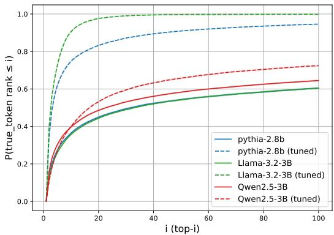
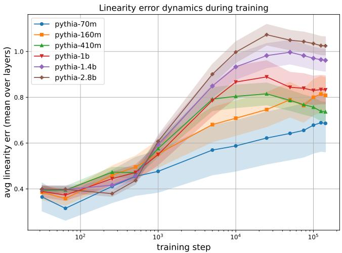
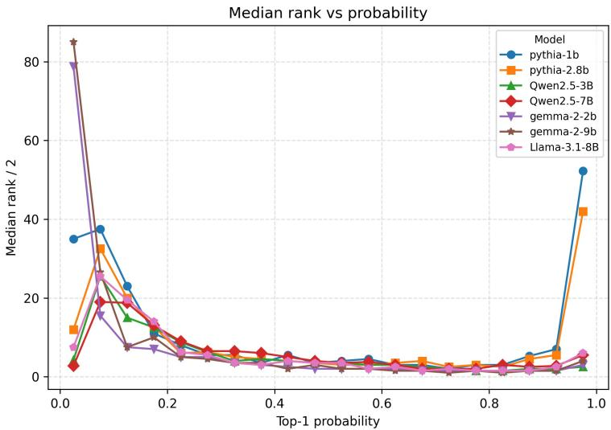
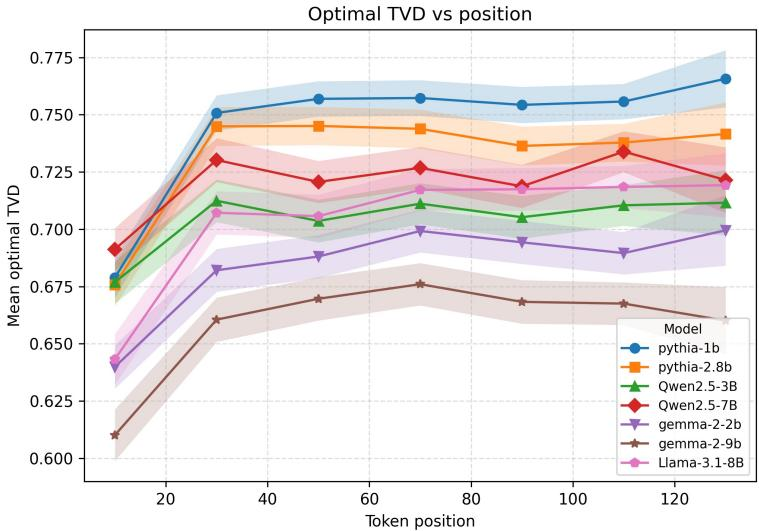
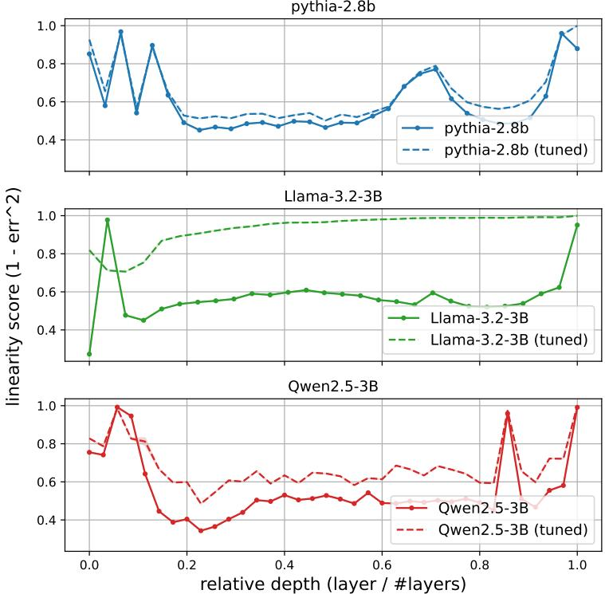
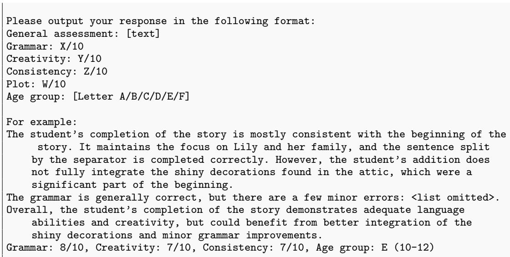

# Your Transformer Can Hold Two Thoughts at Once: Evidence of Linear Superposition in LLMs

Pavel Tikhonov

Anton Korznikov

Matvey Mikhalchuk

Nikita Dragunov

Temurbek Rahmatullaev

Polina Druzhinina

Anton Razzhigaev

Ivan Oseledets

Elena Tutubalina

## Abstract

While Large Language Models (LLMs) rely on highly non-linear components, in this work we demonstrate that they exhibit fundamental linearity: when inputs from distinct text streams are linearly combined, the model outputs a superposition of the individual next-token distributions. We term this the Superposition Linearity Hypothesis. We provide evidence that superposition is an intrinsic property of the Transformer architecture rather than an emergent consequence of training; in fact, we observe that it tends to diminish as pretraining progresses. However, we demonstrate that linearity can be substantially restored through lightweight fine-tuning, significantly reducing the divergence between the predicted next-token distribution and the average of the individual next-token distributions. Finally, we introduce a guided decoding procedure that disentangles superposed outputs, enabling the simultaneous generation of two coherent continuations from a single forward pass.

## 1 Introduction

The Transformer architecture Vaswani et al. [2017] underlies modern Large Language Models (LLMs) and is built from highly non-linear components, including self-attention and MLP blocks with nonlinear activations. The prevailing paradigm therefore treats inference as a single coherent semantic stream: to process multiple independent streams one typically runs separate forward passes, performs sequential processing, or modifies the architecture to avoid destructive interference between inputs.

At the same time, recent work shows that, despite these non-linearities, decoder-only Transformers exhibit strong linear structure in the residual stream: transitions between consecutive layers can often be well-approximated by affine maps Razzhigaev et al. [2024]. This motivates a natural question: does such linearity extend beyond layer-to-layer geometry to the model’s end-to-end input–output behavior? Specifically, are the computations sufficiently linear that the response to a linear combination of inputs approximates a corresponding combination of their independent outputs?

We formalize this as the Superposition Linearity Hypothesis: when two token streams with embeddings $\mathbf { x } _ { A }$ and $\mathbf { x } _ { B }$ are linearly combined (here, via element-wise averaging), the model processes the mixture as a superposition of the two pathways. Empirically, when embeddings from two distinct documents are averaged token-wise and passed through standard pre-trained LLMs, the next-token predictions associated with both streams consistently retain substantial mass in the mixed distribution; in particular, the ground-truth next tokens for both streams frequently appear within the top-10 ranks of the combined output distribution (Fig. 1).

To distinguish architectural bias from learned capability, we track this phenomenon across the pretraining trajectory. We find that superposition fidelity is maximized at initialization and gradually diminishes as the model optimizes the language modeling objective, indicating that linear superposition is intrinsic to the architecture rather than a capability acquired through learning. We further observe a strong correlation between geometric linearity in hidden states (measured via feature additivity) and rank preservation under superposition.

  
Figure 1: Intrinsic superposition in next-token ranks. We mix two prefixes A and B by token-wise averaging embeddings, and obtain mixed logits $\ell _ { \mathrm { m i x } } .$ We then take the single-stream next-token prediction $\hat { t } = \mathrm { a r g }$ max $\ell _ { A }$ (and symmetrically for B) and measure its rank under $\ell _ { \mathrm { m i x } }$ . The plot shows $P ( \mathrm { r a n k } _ { \ell _ { \mathrm { m i x } } } ( \hat { t } ) \leq i )$ : the chance that a single-stream predicted token remains in the top-i of the mixed distribution. This probability is already high for top-10 without finetuning and increases markedly after lightweight finetuning.

Although pre-training degrades this property, we show it can be substantially restored via a lightweight fine-tuning phase using less than 0.025% of the original pre-training dataset size. Leveraging the amplified linearity, we then propose a decoding procedure that disentangles the mixed hidden state, enabling recovery of the distinct continuations corresponding to the original input texts from a single mixed forward pass.

Our contributions are summarized as follows:

• We demonstrate that standard pre-trained LLMs retain high probability mass on the same tokens favored by the respective independent distributions.

• We show that superposition linearity is an intrinsic architectural property and tends to degrade during pre-training, rather than a capability acquired through the learning process.

• We show that the degraded linearity can be substantially recovered using minimal fine-tuning.

• We develop a decoding mechanism to disentangle the mixed output distribution back into its constituent text streams.

## 2 Intrinsic Linearity in Large Language Models

In this section, we investigate the extent to which standard Transformers process superposed inputs without architectural modifications.

## 2.1 Problem Formulation

We consider a decoder-only Transformer language model M, mapping a sequence of tokens from vocabulary V to a sequence of probability distributions over V. Let $\mathbf { \bar { \textit { E } } } : \bar { \mathcal { V } } \to \mathbb { R } ^ { d }$ be the token embedding function. For a given input sequence $s = ( s _ { 1 } , \ldots , s _ { T } )$ , the input representation at position t is typically $h _ { t } ^ { ( 0 ) } = E ( s _ { t } )$

We investigate the model’s behavior when processing a superposition of two distinct input sequences, x and y, of length T. We define the mixed input embedding z at position t as the element-wise average of the constituent embeddings:

$$
e _ { t } ( z ) = \frac { 1 } { 2 } \left( E ( x _ { t } ) + E ( y _ { t } ) \right) .\tag{1}
$$

This mixed representation z is passed through the frozen pre-trained backbone M. The model processes this mixture using standard causal self-attention, where the attention mask allows attending to all prior mixed positions $z _ { < t }$ . We denote the output logits of the model given the mixed input as $\ell ( z ) \in \mathbb { R } ^ { | \nu | }$ and the resulting probability distribution as $P _ { m i x } ( z ) = \operatorname { s o f t m a x } ( \ell ( z ) )$

We hypothesize that previously shown approximate linearity in layer-to-layer transitions extends to the global input-output mapping: specifically, that M acts approximately linearly with respect to input superposition. Formally, we test whether $P _ { m i x }$ approximates $P _ { a v g } = 0 . 5 ( P ( { \bar { x } } | A ) + { \bar { P ( x | B ) } } )$ , and whether the ground-truth next tokens for both streams retain high probability mass in $P _ { m i x }$

To test this hypothesis, we first conducted an evaluation on unmodified pre-trained models. We evaluated models from the Pythia Biderman et al. [2023], Qwen Yang et al. [2025], Llama Grattafiori et al. [2024], and OLMo Groeneveld et al. [2024], Gemma Team et al. [2024], families. For data, we used TinyStories Eldan and Li [2023] (simplified grammar) and FineWeb Penedo et al. [2024] (real-world naturalistic web text). From each dataset, we sampled random text pairs $( x ^ { ( A ) } , x ^ { ( B ) } )$ tokenized them, and truncated to fixed context lengths.

## 2.2 Rank Analysis

To quantify the preservation of information under superposition, we analyze the rank of the groundtruth next token within the output distribution of the mixed state. Let $t _ { A }$ be the token predicted by the model for input sequence A (i.e., arg max $P ( x | A ) ,$ . We compute the rank of $t _ { A }$ within the mixed distribution $P _ { m i x } =$ softmax $( M ( \textstyle { \frac { 1 } { 2 } } ( { \bar { E } } _ { A } + E _ { B } ) ) ) $ . Ideally, if the superposition were perfectly linear, the output distribution would approximate $0 . 5 ( \overset { \cdot } { P } _ { A } + \overset { \cdot } { P } _ { B } )$ , placing $t _ { A }$ and $t _ { B }$ at the very top of the ranking (ranks 1 and 2). In a standard non-linear neural network, one might expect the sum of embeddings to result in a representation orthogonal to both original semantics, pushing $t _ { A }$ and $t _ { B }$ into the tail of the distribution (rank $\sim | \nu | / 2 )$

Cumulative Rank Distribution We computed the cumulative distribution function (CDF) of the ranks, $P ( { \mathrm { r a n k } } \leq k )$ , for unmodified pre-trained models. Fig. 1 illustrates these curves for the Pythia-2.8B, Llama-3.2-3B, and Qwen2.5-3B models.

Our results reveal that the Transformer architecture possesses a surprising degree of intrinsic linearity. Despite the destructive interference inherent in averaging high-dimensional feature vectors, the ground-truth tokens survive the mixing process with high frequency. Specifically, across these architectures (represented by solid lines in the figure):

• In approximately 30–40% of cases, the true token appears within the top-10 ranks.

• In 50–60% of cases, the true token is found within the top-50 ranks.

• By the top-100 ranks, the recovery rate reaches upwards of 60–65%.

Considering the large vocabulary sizes $( | \mathcal { V } | \ge 5 0 , 0 0 0 )$ , these results indicate that the “signal” from the original inputs is preserved well above the noise floor. The mixed state does not collapse into gibberish; rather, it effectively narrows down the search space to a small neighborhood containing the valid continuations for both constituent contexts.

## 2.3 Distributional Shape Preservation

Rank-based metrics show that the correct tokens often remain salient under embedding mixing, but they do not capture whether the full next-token distribution behaves like a linear mixture. Under the Superposition Linearity Hypothesis, we expect the mixed-input output $P _ { \mathrm { m i x } }$ to approximate the arithmetic mean of the two independent distributions:

$$
P _ { \mathrm { t a r g e t } } ( x | A , B ) = \frac { 1 } { 2 } \left( P ( x | A ) + P ( x | B ) \right)\tag{2}
$$

Table 1: Distributional Approximation Metrics. Comparison of distances between the model output on mixed inputs vs. the target mixture distribution at context lengths $L = 3 2$ and $L = 5 1 2$ The Ratio indicates the improvement over a random baseline. Lower is better.
<table><tr><td>Model</td><td>KL Divergence Value</td><td>Ratio</td><td>JS Divergence Value</td><td>Ratio</td><td>Wasserstein Value</td><td>Ratio</td></tr><tr><td colspan="7">Context length</td></tr><tr><td>Pythia-160M Pythia-410M</td><td> $L = 3 2$  0.91 1.54</td><td>0.35 0.39</td><td>0.23 0.36</td><td>0.40 0.50</td><td>0.27 0.30</td><td>0.63 0.69</td></tr><tr><td>Pythia-2.8B Llama-3.1-8B</td><td>1.86 2.16</td><td>0.42 0.37</td><td>0.40 0.48</td><td>0.54 0.57</td><td>0.31 0.32</td><td>0.71 0.69</td></tr><tr><td>Context length</td><td> $L = 5 1 2$ </td><td></td><td></td><td></td><td></td><td></td></tr><tr><td>Pythia-160M</td><td>0.92</td><td>0.31</td><td>0.24</td><td>0.39</td><td>0.25</td><td></td></tr><tr><td></td><td></td><td></td><td></td><td></td><td></td><td>0.61</td></tr><tr><td>Pythia-410M</td><td>1.49</td><td>0.35</td><td>0.37</td><td>0.49</td><td>0.27</td><td>0.65</td></tr><tr><td></td><td>1.69</td><td>0.37</td><td></td><td></td><td></td><td></td></tr><tr><td>Pythia-2.8B</td><td></td><td></td><td>0.37</td><td>0.51</td><td>0.30</td><td>0.69</td></tr><tr><td>Llama-3.1-8B</td><td>1.98</td><td>0.34</td><td>0.45</td><td>0.54</td><td>0.31</td><td></td></tr><tr><td></td><td></td><td></td><td></td><td></td><td></td><td>0.67</td></tr></table>

We quantify the mismatch $\mathcal { D } ( P _ { \mathrm { t a r g e t } } , P _ { \mathrm { m i x } } )$ using KL and Jensen–Shannon (JS) divergences, and a Wasserstein distance computed on the top-256 tokens with cosine distance between token embeddings as the ground metric.1

To make distances comparable across model families and contexts, we report a normalized Superposition Approximation Ratio:

$$
\mathcal { R } _ { \mathcal { D } } = \frac { \mathbb { E } _ { ( A , B ) } [ \mathcal { D } ( P _ { \mathrm { t a r g e t } } \| P _ { \mathrm { m i x } } ) ] } { \mathbb { E } _ { ( A , B ) } [ \mathcal { D } ( P ( \cdot \mid A ) \| P ( \cdot \mid B ) ) ] } .\tag{3}
$$

Values $\mathcal { R } _ { \mathcal { D } } < 1$ indicate that the mixed-state output is closer to the ideal linear mixture than two unrelated contexts are to each other.

Across standard pre-trained models on FineWeb, Table 1 shows $\mathcal { R } _ { \mathcal { D } } < 1$ consistently for KL, JS, and Wasserstein distances, indicating that $P _ { \mathrm { m i x } }$ preserves substantial distributional structure of the target mixture rather than collapsing to an unrelated distribution.

Contextual stability. We further verify that this property is not localized to specific positions: the Total Variation Distance between $P ( z )$ and $P _ { \mathrm { t a r g e t } }$ is slightly higher for the first ∼20 tokens and then stabilizes at a constant level across the context window, indicating that the geometric properties required for linear superposition persist as the context becomes increasingly complex (Appendix E).

## 2.4 Linearity Dynamics During Training

To distinguish architectural bias from learned capability, we track hidden-state additivity across the pre-training trajectory of the Pythia family. For each pair $( A , B )$ we run three forward passes (stream $A ,$ stream $B ,$ and mixed input as in Eq. (1)), mean-center each hidden state by per-layer means, and compute the $\ell _ { 2 }$ distance between the $\ell _ { 2 } \cdot$ -normalized mixed hidden state and the $\ell _ { 2 } \cdot$ -normalized sum of the two single-stream hidden states (full definition in Appendix $\mathrm { C ) ; }$ we report the resulting layer-averaged error $\bar { \mathcal { E } }$ (lower is more linear).

Fig. 2 shows that $\bar { \mathcal { E } }$ is smallest at the earliest checkpoints and grows monotonically as training proceeds, consistent with pre-training amplifying non-linear interactions in the residual stream. $\mathbf { A }$ complementary layer-wise linearity analysis Razzhigaev et al. [2024] (Appendix F) reveals a Ushaped depth profile in which the deep layers $( \ell \gtrsim 2 L ^ { \mathbf { \bar { \mathbf { \alpha } } } } / 3 )$ remain near-linear, providing a geometric explanation for why the superposed signal survives through to the output logits.

Scaling beyond two streams. To verify that the phenomenon is not specific to the binary case, we extend the rank and distributional analyses of Sec. 2.2–2.3 to $N = 3$ by mixing $E ( A _ { t } ) , E ( B _ { t } ) , E ( C _ { t } )$ in equal proportions and measuring the ranks of all three ground-truth next tokens. We observe a moderate increase in the approximation ratios $( { \mathrm { e . g . , \mathcal { R } _ { \mathrm { K L } } } }$ increases by $+ 0 . 0 4$ to $+ 0 . 0 9$ across models; see Appendix I for full tables). Superposition linearity persists at $N = 3$ with quantitative degradation but no qualitative change, indicating the same interference mechanisms operate across stream counts.

  
Figure 2: Superposition linearity degrades during pre-training. Mean hidden-state superposition error $\bar { \mathcal { E } }$ (lower is better) across intermediate checkpoints for Pythia models of different sizes; shaded bands show $\pm \ : \mathrm { s . e }$ . across hidden-state indices.

## 3 An attention-patching analysis

The linear superposition demonstrated in Section 2 is counter-intuitive. Key components of the Transformer, particularly self-attention with its softmax non-linearity, are designed to integrate context selectively. One would expect the attention patterns from two unrelated streams (A and B) to interfere destructively, causing the mixed representation to collapse into a state unrelated to either input. Yet, empirically, the signal survives. This raises the question: does attention play a role in enabling this linearity, or is it a barrier that the residual stream somehow bypasses? To investigate, we design an experiment that disentangles the influence of attention’s structural shape from its content-specific computations. We compare our standard embedding mixing setup against two single-stream perturbations: donor patching, which preserves a natural attention structure but decouples it from the text’s content, and permutation patching, which destroys the structure while preserving per-token weight distributions.

Setup. For every text A (FineWeb-Edu, T=128) we sample an unrelated donor C of the same length and run three forward passes on A: (i) a vanilla forward $A _ { \mathrm { 1 } } ; ( \mathrm { i i } )$ a donor-patched forward $A _ { d }$ in which, at every layer and head, the post-softmax attention weights produced by C are substituted in place of those A would have produced — the Q/K/V projections, RoPE, and value paths of A are unchanged, only the mixing weights come from C; (iii) a permutation-patched forward $A _ { p }$ in which, instead of donor weights, we take A’s own attention and randomly permute each row within its causal prefix, preserving causality, row-sums, and per-row multisets of weights but destroying positional and content structure. We additionally include a vanilla forward $A ^ { \prime }$ on a third unrelated text as the denominator of the Superposition Approximation Ratio. The same FineWeb-Edu pairs and the same content/predictable stratification (detailed in Appendix H) are used throughout. To compare with embedding mixing, we measure the rank of $A _ { 1 } \mathrm { { ' } s }$ vanilla top-1 token in the perturbed distribution; this is the analogue, for these one-stream perturbations, of the rank metric we used for the two-stream embedding-mixing setup.

Predictable positions are robust if attention shape is preserved; content positions are not. Table 2 compares the Qwen2.5-3B forward pass under embedding mixing and the two attention perturbations, broken down by token type. Across predictable positions, the vanilla top-1 token survives with a median rank of 3–6 under embedding mixing and donor patching, and exact agreement remains near 25–33%. On content positions, however, these two setups diverge: embedding mixing yields a median rank of 284, while donor patching drops to 111. Permutation patching, by contrast, collapses entirely across both token types (median rank 3,079 on predictable, 19,246 on content), as it destroys the structural shape of attention. Two implications follow. First, the aggregate recovery numbers we reported in Sec. 2.2 are heavily weighted by the predictable majority of positions, where any perturbation that preserves the attention structure (and hence lets the LM-head frequency prior dominate) performs reasonably well. Second, the rank-survival on content positions specifically is what distinguishes the perturbations from each other.

Table 2: Perturbations and fine-tuning on Qwen2.5-3B, stratified by token type. Median rank of stream A’s vanilla top-1 token in the perturbed distribution, and exact-agreement (top-1) percentage. Predictable positions (∼ 65% of positions) keep the vanilla top-1 near the top under mixing and donor patching (which preserve attention shape); content positions degrade under base-model mixing and donor patching. Permutation destroys attention shape and collapses across both token types. However, fine-tuning explicitly restores parallel processing on hard content tokens.
<table><tr><td rowspan="2">Setup</td><td colspan="2">Predictable (~65%)</td><td colspan="2">Content (~35%)</td></tr><tr><td>med. rank</td><td>top-1 %</td><td>med. rank</td><td>top-1 %</td></tr><tr><td>Embedding mixing (Base)</td><td>6</td><td>24.8</td><td>284</td><td>4.2</td></tr><tr><td>Donor attention patch (Base)</td><td>3</td><td>33.0</td><td>111</td><td>5.4</td></tr><tr><td>Permutation patch (Base)</td><td>3,079</td><td>1.3</td><td>19,246</td><td>0.0</td></tr><tr><td>Embedding mixing (Fine-tuned)</td><td>8</td><td>21.6</td><td>5</td><td>22.8</td></tr></table>

Table 3: Metrics for single-stream perturbations on Qwen2.5-3B. Permutation destroys attention shape, showing the frequency prior alone is insufficient.  
Table 4: Embedding mixing vs. donor patching. Mixing retains more signal on hard content prediction.
<table><tr><td>Metric</td><td>Donor patch</td><td>Permutation</td></tr><tr><td>median rank A1 top-1</td><td>8</td><td>8,148</td></tr><tr><td>top-10 rank CDF</td><td>53%</td><td>10.1%</td></tr><tr><td>E KL to vanilla</td><td>3.54</td><td>9.13</td></tr><tr><td>RKL (vs random)</td><td>0.27</td><td>0.68</td></tr></table>

<table><tr><td>Metric</td><td>Mixing</td><td>Donor patch</td></tr><tr><td>median rank A1 top-1</td><td>19</td><td>8</td></tr><tr><td>LAMBADA acc. (argmax)</td><td>2.25%</td><td>0.5%</td></tr><tr><td>LAMBADA target med. rank</td><td>339</td><td>2,350</td></tr><tr><td colspan="3">LAMBADA baselines Paperno et al. [2016] LSTM: 0.0%, N-Gram: 0.1%</td></tr></table>

The two attention perturbations dissociate frequency prior from attention shape. Read as a self-agreement metric, donor patching looks remarkably benign: median rank 8 under wholesale substitution of every layer’s attention weights, $R _ { \mathrm { K L } } = 0 . 2 7$ against the unrelated-text baseline. Read as a task-level metric, the same setup is catastrophic: on 200 LAMBADA prompts (left-truncated to 128 tokens, target rank measured at the final position), donor patching drives accuracy from the vanilla 73% to 0.5%, with the true target at median rank 2,350. The two read-outs disagree because predictable and content positions disagree — LAMBADA targets are content words at the final position of long-narrative passages, exactly the regime where the predictable majority does not save us. The permutation control then dissociates two ingredients within donor patching itself. Permutation keeps the LM-head frequency prior intact (it does not touch Q/K/V or the LM head) but destroys the structural shape of attention; this raises $R _ { \mathrm { K I } }$ from 0.27 to 0.68, drops top-10 agreement from 53% to 10%, and pushes median rank from 8 to 8,148. The frequency prior alone is therefore not sufficient to keep aggregate metrics high. What survives donor patching is the joint contribution of two things: the frequency prior (dominating predictable positions) and the structural shape of natural attention — diagonal/locality bands, attention sinks, head specialization — properties that natural donor texts share with A even when their content is unrelated. Neither alone is enough.

Embedding mixing carries something beyond “frequency prior + attention shape”. On the same FineWeb-Edu pairs, embedding mixing has a worse aggregate self-agreement metric than donor patching (median 19 vs. 8). This is consistent with the model carrying two streams’ worth of information through the same residual stream rather than one rerouted stream: the natural baseline rank under perfect mixing is ∼ 1.5 rather than 1, and every layer’s Q/K/V is contaminated with both inputs from layer 0, not only the attention weights. Yet on LAMBADA, where the predictable majority does not help, the order is reversed: embedding mixing reaches 2.25% raw argmax accuracy with target median rank 339, while donor patching reaches 0.5% at median rank $2 , \bar { 3 } 5 0 - \mathrm { { a } } 4 . 5 \times$ accuracy gap and a 7× rank gap. Whatever the mixing setup carries on hard content positions, it is more than what survives donor patching, which is the LM-head prior plus structural attention. This places a non-trivial lower bound on what additive embedding composition has to preserve: it is enough to retain meaningfully more case-specific signal on hard content prediction than a wholesale donor-attention swap, while doing so simultaneously for two unrelated streams.

Fine-tuning restores content-position survival. As we will show in Section 4, the model can be fine-tuned to better support superposition. The dichotomy between predictable and content tokens clarifies exactly what this fine-tuning achieves. As seen in Table 2, the base model’s aggregate median rank of 19 under embedding mixing is heavily buoyed by the predictable positions (median rank 6)—its survival on actual content positions is very poor (median rank 284). However, after fine-tuning, the aggregate median rank improves to 6. What is surprising here is how this happens: while predictable positions remain largely unchanged (median rank 8), the content positions see a massive restoration. Their median rank drops all the way to 5, and exact top-1 agreement jumps to 22.8%. The fine-tuned model is therefore no longer just leaning on the frequency prior; it is genuinely processing the semantic content of both streams in parallel.

## 4 Improving Linearity with Finetuning

As demonstrated in Sec. 2, pre-trained Transformer models exhibit an intrinsic, albeit approximate, ability to process superposed inputs linearly. This property is present despite the standard pre-training objective not explicitly incentivizing such behavior. Here, we investigate whether this architectural capability can be enhanced through targeted optimization. We explore if a lightweight fine-tuning phase can align the model’s weights to explicitly support superposition.

We employ a self-distillation framework designed to minimize the discrepancy between the model’s output on a mixed input and the mixture of its independent outputs. We initialize a student model $M _ { s t u d e n t }$ with pre-trained weights and use a frozen copy of the same model as the teacher $M _ { t e a c h e r } .$ For a pair of distinct text sequences $x ^ { ( A ) }$ and $x ^ { ( B ) }$ ), we define the target probability distribution as the arithmetic mean of the teacher’s independent predictions:

$$
P _ { t a r g e t } = \frac { 1 } { 2 } \left( M _ { t e a c h e r } ( x ^ { ( A ) } ) + M _ { t e a c h e r } ( x ^ { ( B ) } ) \right) .\tag{4}
$$

The student model processes the element-wise average of the input embeddings $\begin{array} { r } { z = \frac { 1 } { 2 } ( E ( x ^ { ( A ) } ) + } \end{array}$ $E ( x ^ { ( B ) } ) )$ . The objective is to minimize the Kullback-Leibler (KL) divergence between the student’s output and the target mixture:

$$
\mathcal { L } = D _ { K L } \left( P _ { t a r g e t } \parallel M _ { s t u d e n t } ( z ) \right) .\tag{5}
$$

We applied this procedure to the Pythia, Qwen and Llama models using a subset of the FineWeb dataset (approximately 200k steps).

Revisiting the metrics of Sec. 2, fine-tuning substantially reduces the divergence between the predicted and target distributions: on Pythia-2.8B, the mean KL divergence drops from 1.86 to 0.27, and the Superposition Approximation Ratio $\mathcal { R } _ { \mathrm { K L } }$ drops from 0.42 to 0.06 (Table 1, last row). At the rank level (Fig. 1), the probability of the true next token appearing in the top-5 rises from ≈ 30% to > 60%. The interference observed in the base model is therefore largely reversible, with both ground-truth streams preserved with high fidelity at the output layer.

As we noted in Table 2, what makes this rank restoration interesting is that it doesn’t just boost high-frequency predictable tokens. On the hard content tokens—where the base model effectively collapsed (median rank 284)—the fine-tuned model manages to recover the signal entirely, bringing the median rank down to 5 and pushing exact top-1 agreement to 22.8%. This confirms that our lightweight optimization isn’t taking a shortcut; it explicitly rehabilitates the parallel processing of complex, case-specific semantic content.

We note up front that this restoration is not free: the same objective measurably reduces singlestream next-token-prediction quality (e.g. Pythia-2.8B LAMBADA 0.544 → 0.357; Qwen2.5-3B

Table 5: Joint Contrastive decoding as a proof of concept. LAMBADA mean accuracy across both streams on a superposed forward pass; Jaccard token-overlap on FineWeb generations as a separation metric (lower is better). Joint Contrastive substantially raises accuracy over raw pretrained mixing, but does not close the gap to the small-model single-stream baseline. Two-Head, Mixed Distillation, gradient-optimized inference, and TinyStories LLM-as-judge are in Appendix G.
<table><tr><td>Backbone</td><td>Guide</td><td>Method</td><td>(large / small)</td><td>LAMBADA single LAMBADA mixed (mean acc.)</td><td>Jaccard (FineWeb)</td></tr><tr><td>Qwen2.5-3B</td><td>Qwen2.5-0.5B</td><td>Pretrained</td><td>0.592 / 0.437</td><td>0.168</td><td>0.126</td></tr><tr><td rowspan="3">Qwen2.5-3B Llama-3.2-3B</td><td>Qwen2.5-0.5B</td><td>Joint Contrastive</td><td>0.592 / 0.437</td><td>0.345</td><td>0.061</td></tr><tr><td>Llama-3.2-1B</td><td>Pretrained</td><td>0.643 / 0.540</td><td>0.182</td><td>0.094</td></tr><tr><td>Llama-3.2-1B</td><td>Joint Contrastive</td><td>0.643 / 0.540</td><td>0.430</td><td>0.067</td></tr><tr><td rowspan="2">Pythia-2.8B Pythia-1.4B</td><td>Pythia-160m</td><td>Pretrained</td><td>0.544 /0.225</td><td>0.065</td><td>0.109</td></tr><tr><td>Pythia-160m</td><td>Joint Contrastive</td><td>0.499 / 0.225</td><td>0.110</td><td>0.080</td></tr></table>

$0 . 6 0 2  0 . 4 6 0 )$ , and the layer-wise mechanism behind the improvement, together with full PPL/NLL trade-offs on FineWeb, is reported in Appendix G.4. We return to the gap between distributional fidelity and decoding quality in Sec. 5.

## 5 Decoding Two Streams Out of a Mixed Forward Pass

Sec. 4 showed that the mixed-input distribution can be brought close to its analytical target. A natural last question is whether one can then decode the two streams separately — which is what would turn the phenomenon into a parallel-inference primitive. We show that this is strictly harder than fitting the mixed distribution, and explain why.

The geometric-mean obstruction. While the probability mass of the target tokens is largely restored by fine-tuning, sampling directly from the mixed distribution creates semantically inconsistent sequences, as the model alternates between the tokens of context A and context B. In a linear superposition where the logits are approximately averaged, the resulting probabilities scale with the geometric mean of the independent distributions:

$$
\begin{array} { r } { P _ { \mathrm { t a r g e t } } ^ { \prime } ( t ) \propto \mathrm { e x p } \big ( \frac { 1 } { 2 } ( \ell _ { A } ( t ) + \ell _ { B } ( t ) ) \big ) \propto \sqrt { P _ { A } ( t ) P _ { B } ( t ) } . } \end{array}\tag{6}
$$

This creates an intrinsic decoding challenge: any token that is highly probable in stream A but highly unlikely in stream B is heavily penalized by the geometric mean, pushing its mixed probability down. Thus, achieving rank 1 for both streams simultaneously using standard decoding is exceptionally difficult, even when both ground-truth tokens reliably appear in the top-5 (as achieved by finetuning). Consequently, to make superposition practically useful for parallel processing, we require a mechanism capable of disentangling the mixed hidden state back into its constituent streams. Overcoming this obstruction fully remains an open problem for future research; however, below we propose a proof-of-concept decoding method as a suggestion for the community (with additional decoding variants, including a parameter-free two-head approach and inference-time logit arithmetic, deferred to Appendix G).

Joint Contrastive decoding. To exhibit a concrete decoder in this regime, we use the Joint Contrastive variant in which a small auxiliary model $M _ { \mathrm { s m a l l } }$ provides per-stream guidance during fine-tuning. The disentangled logits are

$$
\begin{array} { r } { \tilde { \ell } ^ { ( A ) } = \ell _ { \mathrm { l a r g e } } ( z ) + \alpha \ell _ { \mathrm { s m a l l } } ( A ) - \beta \ell _ { \mathrm { s m a l l } } ( B ) , \quad \tilde { \ell } ^ { ( B ) } = \ell _ { \mathrm { l a r g e } } ( z ) + \alpha \ell _ { \mathrm { s m a l l } } ( B ) - \beta \ell _ { \mathrm { s m a l l } } ( A ) , } \end{array}\tag{7}
$$

with $\begin{array} { r } { z = \frac { 1 } { 2 } ( E ( A ) + E ( B ) ) } \end{array}$ . The scalars $\alpha , \beta$ are initialized to 1 and trained jointly with the backbone on the symmetric per-stream cross-entropy loss (hyperparameters: Appendix J).

Table 5 reports LAMBADA mean accuracy on the superposed forward pass. Joint Contrastive lifts mean accuracy from the raw-pretrained 0.06–0.18 into the 0.11–0.43 range while keeping interstream Jaccard overlap low, and on Llama-3.2-3B reaches 0.43 vs. a single-stream small-model baseline of 0.54. We treat this as a proof of concept that the superposed signal is exploitable, with the residual gap to single-stream consistent with the obstruction in Eq. (6) rather than with a deficiency of fine-tuning.

## 6 Conclusion

In this work, we demonstrated that Transformers can process linearly combined text streams as a superposition of independent pathways. We showed that while this intrinsic architectural property degrades during standard pre-training, it can be robustly restored via lightweight fine-tuning, allowing the model to maintain distinct semantic signals within a mixed hidden state.

These findings have profound implications for efficient deployment. By successfully disentangling superposed outputs, our approach enables the generation of two coherent continuations from a single forward pass, theoretically offering a 2× increase in inference throughput. Furthermore, since multiple streams are compressed into a single vector representation, this paradigm drastically reduces memory consumption, effectively halving the KV-cache footprint per active stream.

## 7 Related Work

Decoder-only Transformers exhibit surprisingly linear behavior in the residual stream: consecutivelayer mappings are often well-approximated by affine transforms [Razzhigaev et al., 2024]. Closely related are methods that explicitly multiplex multiple inputs into a single representation and then demultiplex predictions, e.g., DataMUX [Murahari et al., 2022], binding/unbinding-based MIMONets [Menet et al., 2023], and RevMUX for efficient LLM batch inference via reversible adapters [Xu et al., 2024]. At inference time, superposition is also exploited for parallel generation or context processing: Superposed Decoding mixes draft token embeddings to produce multiple continuations in one autoregressive pass [Shen et al., 2024], while superposition prompting accelerates RAG by processing multiple document paths within a single forward pass [Merth et al., 2024]. Complementary perspectives include task superposition in in-context learning [Xiong et al., 2024] and feature superposition as a representational bottleneck [Elhage et al., 2022]. In contrast to approaches that add mux/demux structure, we isolate an intrinsic input–output superposition effect in standard pretrained LLMs under linear embedding mixing, track its degradation during pretraining, and show it can be restored by lightweight finetuning and partially disentangled at decoding time. Concretely, prior multiplexing methods (DataMUX, MIMONets, RevMUX) treat superposition as an engineered capability that must be externally imposed via dedicated layers, VSA-style binding/unbinding keys, or isometry regularization. Our claim is qualitatively different: superposition is intrinsic to standard pretrained Transformers, simple embedding averaging in off-the-shelf LLMs already preserves substantial signal, and our lightweight fine-tuning restores a property that pretraining has degraded rather than creating a new one.

## 8 Limitations

Our study establishes the existence and recoverability of linear superposition in Transformer language models, but several boundaries of this phenomenon remain to be explored:

• Context length and language: Our evaluations utilized relatively short-context $( L \leq 1 2 8$ for analytical experiments, with extensions to L = 512 in Sec. 2.3) and predominantly monolingual text corpora. Generalizing this approach to substantially longer contexts or multilingual settings involves more complex embedding geometries, presenting an important avenue for future work.

• Multimodal models: Our investigation focuses exclusively on text-based language models. We have not tested whether these linear superposition properties extend to multimodal architectures. Mixing embeddings from intrinsically different modalities (e.g., combining text tokens with image patches) poses distinct structural and geometric challenges for the residual stream that remain completely unexplored.

## References

Stella Biderman et al. Pythia: A suite for analyzing large language models across training and scaling. CoRR, abs/2304.01373, 2023. URL https://arxiv.org/abs/2304.01373.

Ronen Eldan and Yuanzhi Li. TinyStories: How small can language models be and still speak coherent english? CoRR, abs/2305.07759, 2023. doi: 10.48550/ARXIV.2305.07759. URL https://doi.org/10.48550/arXiv.2305.07759.

Nelson Elhage et al. Toy models of superposition, 2022. Technical report.

Aaron Grattafiori et al. The Llama 3 herd of models. CoRR, abs/2407.21783, 2024. doi: 10.48550/ ARXIV.2407.21783. URL https://doi.org/10.48550/arXiv.2407.21783.

Dirk Groeneveld et al. OLMo: Accelerating the science of language models. CoRR, abs/2402.00838, 2024. doi: 10.48550/ARXIV.2402.00838. URL https://doi.org/10.48550/arXiv.2402. 00838.

Pat Langley. Crafting papers on machine learning. In Proceedings of the 17th International Conference on Machine Learning, 2000.

Nicolas Menet, Michael Hersche, Geethan Karunaratne, Luca Benini, Abu Sebastian, and Abbas Rahimi. MIMONets: Multiple-input-multiple-output neural networks exploiting computation in superposition. CoRR, abs/2312.02829, 2023. doi: 10.48550/ARXIV.2312.02829. URL https://doi.org/10.48550/arXiv.2312.02829.

Thomas Merth, Qichen Fu, Mohammad Rastegari, and Mahyar Najibi. Superposition prompting: Improving and accelerating retrieval-augmented generation. In Proceedings of the 41st International Conference on Machine Learning, volume 235 of Proceedings of Machine Learning Research, pages 35507–35527. PMLR, 2024. URL https://proceedings.mlr.press/v235/ merth24a.html.

Vishvak Murahari, Carlos E. Jimenez, Runzhe Yang, and Karthik Narasimhan. DataMUX: Data multiplexing for neural networks. CoRR, abs/2202.09318, 2022. URL https://arxiv.org/ abs/2202.09318.

Denis Paperno et al. The LAMBADA dataset: Word prediction requiring a broad discourse context. CoRR, abs/1606.06031, 2016. URL https://arxiv.org/abs/1606.06031.

Guilherme Penedo et al. Decanting the web for the finest text data at scale. CoRR, abs/2406.17557, 2024. doi: 10.48550/ARXIV.2406.17557. URL https://doi.org/10.48550/arXiv.2406. 17557.

Anton Razzhigaev, Matvey Mikhalchuk, Elizaveta Goncharova, Nikolai Gerasimenko, Ivan V. Oseledets, Denis Dimitrov, and Andrey Kuznetsov. Your transformer is secretly linear. In Proceedings ofthe 62nd Annual Meeting ofthe Associationfor Computational Linguistics (Volume 1: Long Papers), pages 5376–5384. Association for Computational Linguistics, 2024. doi: 10.18653/v1/ 2024.acl-long.293. URL https://doi.org/10.18653/v1/2024.acl-long.293.

Ethan Shen, Alan Fan, Sarah M. Pratt, Jae Sung Park, Matthew Wallingford, Sham M. Kakade, Ari Holtzman, Ranjay Krishna, Ali Farhadi, and Aditya Kusupati. Superposed decoding: Multiple generations from a single autoregressive inference pass. CoRR, abs/2405.18400, 2024. doi: 10.48550/ARXIV.2405.18400. URL https://doi.org/10.48550/arXiv.2405.18400.

Gemma Team, Morgane Riviere, Shreya Pathak, Pier Giuseppe Sessa, Cassidy Hardin, Surya Bhupatiraju, Leonard Hussenot, Thomas Mesnard, Bobak Shahriari, Alexandre Ram´ e, et al.´ Gemma 2: Improving open language models at a practical size. arXiv preprint arXiv:2408.00118, 2024.

Ashish Vaswani, Noam Shazeer, Niki Parmar, Jakob Uszkoreit, Llion Jones, Aidan N. Gomez, Lukasz Kaiser, and Illia Polosukhin. Attention is all you need. In Advances in Neural Information Processing Systems, volume 30, 2017.

Zheyang Xiong, Ziyang Cai, John Cooper, Albert Ge, Vasilis Papageorgiou, Zack Sifakis, Angeliki Giannou, Ziqian Lin, Liu Yang, Saurabh Agarwal, Grigorios G. Chrysos, Samet Oymak, Kangwook Lee, and Dimitris Papailiopoulos. Everything everywhere all at once: LLMs can in-context learn multiple tasks in superposition. CoRR, abs/2410.05603, 2024. doi: 10.48550/ARXIV.2410.05603. URL https://doi.org/10.48550/arXiv.2410.05603.

Yige Xu, Xu Guo, Zhiwei Zeng, and Chunyan Miao. RevMUX: Data multiplexing with reversible adapters for efficient LLM batch inference. In Proceedings ofthe 2024 Conference on Empirical Methods in Natural Language Processing, pages 22072–22087. Association for Computational Linguistics, 2024. doi: 10.18653/v1/2024.emnlp-main.1232. URL https://aclanthology. org/2024.emnlp-main.1232/.

An Yang et al. Qwen3 technical report. CoRR, abs/2505.09388, 2025. doi: 10.48550/ARXIV.2505. 09388. URL https://doi.org/10.48550/arXiv.2505.09388.

## A Compute Resources

Training cost. While our distillation objective is lightweight compared to full pre-training, finetuning large language models remains computationally intensive. A single fine-tuning run of Pythia-2.8B for 150,000 steps required approximately 114 hours on 2×A100 80GB GPUs. The Qwen2.5-3B distillation run took 132 hours on the same hardware setup, while Llama-3.2-3B completed in 128 hours. The Joint Contrastive guided decoding fine-tuning for Pythia-1.4B (with a 160M guide model) required 68 hours on a single A100 80GB GPU.

## B Frequency-Baseline Control

Using single-stream Pythia-2.8B on unrelated FineWeb pairs $( A , B )$ , we compute the logits of stream A alone and measure the rank of stream $B ^ { \prime } { \bf s }$ ground-truth next token at the same position. This preserves the natural token-frequency distribution while breaking the contextual link between the two streams. Under this control, the rank of the cross-stream ground-truth token is in the top-3 in only 1.12% of cases, in the top-10 in 2.63%, and in the top-100 in 10.41%. Same-position token overlap between unrelated streams is 0.2%. Under the actual superposition forward pass, top-10 recovery is 30–40% and top-100 recovery is 60–65%, exceeding the frequency-only baseline by an order of magnitude. The effect is therefore not attributable to vocabulary under-utilization or Zipf-like priors.

## C Hidden-state additivity error

Let $h _ { l , t } ^ { ( A ) } , h _ { l , t } ^ { ( B ) }$ , and $h _ { l , t } ^ { ( \operatorname* { m i x } ) }$ denote the hidden states at index l and position t under the three forward passes (stream $A ,$ stream $B ,$ mixed input as in Eq. (1)). Mean-centering by per-layer means $\mu _ { l } ^ { ( \cdot ) }$ over the evaluation set yields $\tilde { h } _ { l , t } ^ { ( \cdot ) } = h _ { l , t } ^ { ( \cdot ) } - \mu _ { l } ^ { ( \cdot ) }$ . The hidden-state superposition error is

$$
\epsilon _ { l , t } ( A , B ) = \left\| \frac { \tilde { h } _ { l , t } ^ { ( \operatorname* { m i x } ) } } { \| \tilde { h } _ { l , t } ^ { ( \operatorname* { m i x } ) } \| _ { 2 } } - \frac { \tilde { h } _ { l , t } ^ { ( A ) } + \tilde { h } _ { l , t } ^ { ( B ) } } { \| \tilde { h } _ { l , t } ^ { ( A ) } + \tilde { h } _ { l , t } ^ { ( B ) } \| _ { 2 } } \right\| _ { 2 } ,\tag{8}
$$

and we report $\mathcal { E } _ { l } ~ = ~ \mathbb { E } _ { ( A , B ) , t } [ \epsilon _ { l , t } ]$ together with its layer-averaged summary $\bar { \mathcal { E } }$ (lower indicates stronger superposition linearity).

## D Confidence-vs-Rank Curve

## E Contextual Stability of Superposition

## F Layer-wise Linearization Dynamics

To investigate the internal mechanism supporting superposition, we analyze the geometric linearity of transformations layer by layer. Specifically, we measure the extent to which the mapping from the hidden states of layer ℓ, denoted $\mathbf { H } ^ { ( \bar { \ell } ) }$ , to the hidden states of layer $\ell { + } 1 , { \bf H } ^ { ( \ell { + } 1 ) }$ , can be approximated by a linear transformation. We use the linearity score of Razzhigaev et al. [2024]: given matrices $\dot { \mathbf { X } } , \mathbf { Y } \in \mathbb { R } ^ { n \times d }$ obtained by stacking n token feature vectors at layers ℓ and $_ { \ell + 1 }$ , mean-centering, and Frobenius-normalizing them to $\tilde { \mathbf { X } } , \tilde { \mathbf { Y } }$ , we set

$$
\mathrm { l i n } ( \mathbf { X } , \mathbf { Y } ) = 1 - \operatorname* { m i n } _ { \mathbf { A } \in \mathbb { R } ^ { d \times d } } \left\| \tilde { \mathbf { X } } \mathbf { A } - \tilde { \mathbf { Y } } \right\| _ { F } ^ { 2 } ,
$$

where the minimizer is the least-squares solution. A score close to 1 indicates that $\mathbf { H } ^ { ( \ell + 1 ) }$ lies close to an affine reparameterization of $\bar { \mathbf { H } } ^ { ( \ell ) }$

The depth profile is U-shaped: layers 0–5 are high-linearity (initial embedding integration), the middle layers (6–20) drop to roughly $0 . 6 5 ,$ , and the final third recovers above 0.95. This “terminal linearity” aligns the high-level features with the unembedding matrix and provides a geometric explanation for the rank preservation results in Sec. 2.2: the quasi-linear final stage prevents the collapse of the superposed signal $z \approx x + y$ before it reaches the output logits. After fine-tuning, the locally modest improvement in linearity scores at each layer is consistent with the substantial reduction in global divergence we observe (Fig. 1, Table 1), since per-layer non-linear errors compound across depth.

  
Figure 3: Robustness of confident predictions. Median rank of the true token in the mixed distribution as a function of its probability in the original independent forward pass. Tokens predicted with high confidence $( P > 0 . 5 )$ almost always survive the superposition process (median rank ≈ 3), whereas low-confidence predictions are more susceptible to interference.

  
Figure 4: Contextual stability of superposition. Mean Total Variation Distance between the mixed output distribution and the target mixture across token positions. The divergence is slightly lower for the initial tokens $( t < 2 0 )$ and then stabilizes for the rest of the context window.

## G Additional Decoding Variants and Throughput

## G.1 Gradient-Optimized Inference (Logit Arithmetic)

As a lighter-weight alternative to the joint fine-tuning of Sec. 5, we can attempt inference-time separation without altering the large model’s weights. We posit that the logits of the target stream A can be recovered via a linear combination of the mixed logits from the large model and the

  
Figure 5: Layer-wise linearization dynamics. Linearity score $\mathrm { 1 - e r r ^ { 2 } }$ between consecutive layers for the base and fine-tuned models. The fine-tuned model exhibits consistently higher scores in deep layers.

independent logits from a small auxiliary model:

$$
\tilde { \ell } ^ { ( A ) } = \ell _ { \mathrm { l a r g e } } ( z ) + \alpha \cdot \ell _ { \mathrm { s m a l l } } ( A ) - \beta \cdot \ell _ { \mathrm { s m a l l } } ( B ) ,\tag{9}
$$

$$
\tilde { \ell } ^ { ( B ) } = \ell _ { \mathrm { l a r g e } } ( z ) + \alpha \cdot \ell _ { \mathrm { s m a l l } } ( B ) - \beta \cdot \ell _ { \mathrm { s m a l l } } ( A ) .\tag{10}
$$

Keeping the weights of both $M _ { \mathrm { l a r g e } }$ and $M _ { \mathrm { s m a l l } }$ frozen, we optimize the scalar coefficients $\alpha , \beta$ using gradient descent to minimize the cross-entropy loss between the reconstructed logits and the ground-truth next tokens on a small calibration dataset. This dynamically balances the large model’s expressivity against the small model’s directional guidance. However, as shown in Table $^ { 6 , }$ this purely post-hoc approach achieves lower accuracy than Joint Contrastive decoding.

## G.2 Two-Head Separation via Symmetry Breaking

To eliminate the dependency on auxiliary models, we introduce learnable projections $W _ { A } , W _ { B } \in$ $\mathbb { R } ^ { d \times d }$ and two output heads. The mixed representation becomes $z = \mathrm { N o r m } ( W _ { A } E ( A ) + W _ { B } E ( B ) )$ with the projections initialized as $W _ { k } \stackrel { . } { = } I + \mathcal { N } ( 0 , \sigma ^ { 2 } ) , \sigma = 1 0 ^ { - 3 } , k \stackrel { . } { \in } \{ A , B \}$ , breaking the permutation symmetry of averaging. We train end-to-end with a joint cross-entropy loss over the two heads; naively, this often collapses onto a single stream, so we apply dynamic loss balancing

$$
\begin{array} { r } { \mathcal { L } = \alpha _ { t } \mathcal { L } _ { A } + \beta _ { t } \mathcal { L } _ { B } , \qquad \alpha _ { t } \propto \Big ( \frac { \bar { \mathcal { L } } _ { A , t } } { \bar { \mathcal { L } } _ { A , t } + \bar { \mathcal { L } } _ { B , t } } \Big ) ^ { \gamma } , } \end{array}
$$

with $\bar { \mathcal { L } }$ an exponential moving average and $\gamma \textbf { a }$ strength hyperparameter. Two-Head and Mixed Distillation results, omitted from the main-paper Table 5, are reported in Table 6 below.

## G.3 TinyStories LLM-as-Judge

Following the TinyStories protocol Eldan and Li [2023] we use an instruction-tuned grader (OpenAI/GPT-5.2) to score completions on Grammar, Creativity, Consistency, and Plot Coherence (1–10), plus an estimated writer “age group”. Independent, raw-superposed, and distilled-withguided-decoding versions of Pythia-2.8B are compared in Table 7.

Table 6: Full quantitative recovery and separation metrics (extension of Table 5).
<table><tr><td>Backbone</td><td>Guide</td><td>Method</td><td>LAMBADA single</td><td>LAMBADA superposed</td><td>Jaccard</td></tr><tr><td>Qwen2.5-3B</td><td>Qwen2.5-0.5B</td><td>Pretrained</td><td>0.592 / 0.437</td><td>0.168</td><td>0.126</td></tr><tr><td>Qwen2.5-3B</td><td>Qwen2.5-0.5B</td><td>Mixed Distillation</td><td>0.592 / 0.437</td><td>0.207</td><td>0.133</td></tr><tr><td>Qwen2.5-3B</td><td>Qwen2.5-0.5B</td><td>Joint Contrastive</td><td>0.592 / 0.437</td><td>0.345</td><td>0.061</td></tr><tr><td>Llama-3.2-3B</td><td>Llama-3.2-1B</td><td>Pretrained</td><td>0.643 / 0.540</td><td>0.182</td><td>0.094</td></tr><tr><td>Llama-3.2-3B</td><td>Llama-3.2-1B</td><td>Two Heads</td><td>0.643 / 0.540</td><td>0.105</td><td>0.235</td></tr><tr><td>Llama-3.2-3B</td><td>Llama-3.2-1B</td><td>Mixed Distillation</td><td>0.643 / 0.540</td><td>0.174</td><td>0.090</td></tr><tr><td>Llama-3.2-3B</td><td>Llama-3.2-1B</td><td>Joint Contrastive</td><td>0.643 / 0.540</td><td>0.430</td><td>0.067</td></tr><tr><td>Pythia-6.9B</td><td>Pythia-160m</td><td>Two Heads</td><td>0.560 / 0.225</td><td>0.080</td><td>0.080</td></tr><tr><td>Pythia-2.8B</td><td>Pythia-160m</td><td>Pretrained</td><td>0.544 /0.225</td><td>0.065</td><td>0.109</td></tr><tr><td>Pythia-2.8B</td><td>Pythia-160m</td><td>Mixed Distillation</td><td>0.544 /0.225</td><td>0.088</td><td>0.112</td></tr><tr><td>Pythia-2.8B</td><td>Pythia-160m</td><td>Two Heads</td><td>0.544 /0.225</td><td>0.164</td><td>0.117</td></tr><tr><td>Pythia-1.4B</td><td>Pythia-160m</td><td>Joint Contrastive</td><td>0.499 / 0.225</td><td>0.110</td><td>0.080</td></tr></table>

Table 7: TinyStories LLM-as-judge ratings on Pythia-2.8B, mean across streams (1–10).
<table><tr><td>Metric</td><td>Independent baseline</td><td>Superposed (pretrained)</td><td>Superposed (fine-tuned)</td></tr><tr><td>Grammar</td><td>4.52</td><td>2.59</td><td>3.69</td></tr><tr><td>Consistency</td><td>3.57</td><td>2.70</td><td>3.53</td></tr><tr><td>Creativity</td><td>5.72</td><td>2.08</td><td>2.13</td></tr></table>

## G.4 Single-stream Language Modeling Quality on FineWeb

Table 8: Single-stream LM quality on FineWeb after the superposition objectives. Joint Contrastive guidance preserves single-stream fluency close to the small-model baseline; Tuned distillation incurs a substantially larger penalty.
<table><tr><td>Family</td><td>Method</td><td>NLL↓</td><td>PPL↓</td></tr><tr><td rowspan="4">Qwen2.5</td><td>Independent big (3B)</td><td>2.521</td><td>12.44</td></tr><tr><td>Independent small (0.5B)</td><td>2.942</td><td>18.96</td></tr><tr><td>Joint Contrastive (Guided)</td><td>2.961</td><td>19.31</td></tr><tr><td>Tuned distillation</td><td>4.182</td><td>65.52</td></tr><tr><td rowspan="4">Llama-3.2</td><td>Independent big (3B)</td><td>2.416</td><td>11.20</td></tr><tr><td>Independent small (1B)</td><td>2.605</td><td>13.53</td></tr><tr><td>Joint Contrastive (Guided)</td><td>2.691</td><td>14.75</td></tr><tr><td>Tuned distillation</td><td>4.269</td><td>71.44</td></tr><tr><td rowspan="4">Pythia</td><td>Independent big (2.8B)</td><td>2.645</td><td>14.09</td></tr><tr><td>Independent small (160M)</td><td>3.385</td><td>29.53</td></tr><tr><td>Joint Contrastive (Guided)</td><td>3.392</td><td>29.72</td></tr><tr><td>Tuned distillation</td><td>3.783</td><td>43.95</td></tr></table>

## G.5 Throughput and Memory

We benchmark four decoding modes that all consume the same number of input tokens but differ in how they process them: (1) Separate — fused embeddings $\begin{array} { r } { z = \frac { 1 } { 2 } ( E ( A ) + \mathbf { \bar { \mathcal { E } } } ( B ) ) } \end{array}$ pass through a single backbone with two output heads; (2) Guided — fused embeddings through the large backbone plus a small auxiliary model providing per-stream contrastive guidance; (3) Big(b=2) — vanilla independent inference with batch size 2; (4) 2×Big(seq) — vanilla, the two streams run sequentially. Modes (1)–(2) jointly produce two continuations from a fused hidden state; (3)–(4) process them fully independently and serve as upper- and lower-bound throughput baselines.

Separate matches Big(b=2) within 3% across all pairs while producing two coherent continuations from a fused embedding — a fundamentally different task from independent batch decoding — and delivers roughly 2× throughput over sequential vanilla decoding. Guided is slower because of the auxiliary forward pass through $M _ { \mathrm { s m a l l } }$ on each stream but still substantially faster than the sequential baseline. Memory follows the same pattern: Separate adds modest cost over a single vanilla forward pass (e.g., Pythia-2.8B 7.15 vs. 6.34 GB; Llama-3B 9.26 vs. 6.72 GB), while Guided incurs higher cost because both models must be resident (e.g., 12.93 GB peak for Llama-3B+1B).

Table 9: Generation throughput (tokens/s, mean $\pm 9 5 \%$ CI over n=100 runs, prompt length 128, generation length 128).
<table><tr><td>Pair</td><td>Separate</td><td>Guided</td><td> $\mathbf { B i g } ( b { = } 2 )$ </td><td> $\pmb { 2 } \times \mathbf { B i g } ( \mathbf { s e q } )$ </td></tr><tr><td> $\mathrm { P y t h i a - } 2 . 8 \mathrm { B } + 1 6 0 \mathrm { M }$ </td><td> $1 0 9 . 6 \pm 0 . 8$ </td><td> $7 9 . 4 \pm 0 . 5$ </td><td> $1 1 3 . 1 \pm 0 . 6$ </td><td> $5 6 . 0 \pm 0 . 3$ </td></tr><tr><td> $\mathrm { P y t h i a - 1 . 4 B + 1 6 0 M }$ </td><td> $1 4 4 . 7 \pm 1 . 0$ </td><td> $9 3 . 9 \pm 0 . 6$ </td><td> $1 4 5 . 4 \pm 1 . 0$ </td><td> $7 1 . 7 \pm 0 . 5$ </td></tr><tr><td>Llama  $- 3 \mathbf { B } + 1 \mathbf { B }$ </td><td> $8 1 . 5 \pm 0 . 6$ </td><td> $5 2 . 4 \pm 0 . 3$ </td><td> $8 1 . 4 \pm 0 . 5$ </td><td> $4 1 . 3 \pm 0 . 2$ </td></tr><tr><td> $\mathrm { Q w e n } { - 3 \mathbf { B } } + 0 . 5 \mathbf { B }$ </td><td> $6 4 . 9 \pm 0 . 5$ </td><td> $3 9 . 4 \pm 0 . 2$ </td><td> $6 3 . 6 \pm 0 . 3$ </td><td> $3 2 . 4 \pm 0 . 2$ </td></tr></table>

## H Attention-Patching: Stratified Examples

We complement Sec. 3 with qualitative examples from three rank buckets, sampled uniformly (we write the leading word-boundary marker as “ ”). LOW (rank ∈ [2, 10]): predominantly punctuation and short function words $( . , , , . . \mathrm { a n d } ,$ in, to, not, are, it, a, digits, singleletter BPE fragments; 3/25 content words). MID (rank ∈ [50, 500]): mostly content ( help, fresh, belief, idea, installation, communities, professor; ∼ 16/25 content). HIGH (rank ∈ [2000, 20000]): almost entirely content / rare BPE fragments ( recruits, bottled, Meditation, emblem, charity, widow, Immigration). The function/content split underlying Sec. 3 is therefore not an artefact of an ad-hoc heuristic but a systematic property of the rank distribution.

## I Distributional Metrics for N = 3 Superposition

To evaluate whether the superposition linearity hypothesis holds for more than two streams, we extend our analysis to $N = 3$ by mixing the embeddings of three unrelated contexts at context lengths $L = 3 2$ and $L = 5 1 2$ . Table 10 reports the distributional approximation metrics for $N = 3 .$ analogously to the $N = 2$ case in Table 1. Table 11 summarizes the degradation in the approximation ratios when transitioning from N = 2 to $N = 3$ . While the metrics quantitatively degrade, the approximation ratios remain substantially below 1.0 at both context lengths, confirming that the mixed distribution still approximates the linear mixture of the three independent distributions. The degradation is generally larger at L = 512 than at $L = 3 2$ , indicating the increased difficulty of processing long contexts when more than two streams are mixed.

Table 10: Distributional Approximation Metrics for N = 3. Comparison of distances between the model output on mixed inputs vs. the target mixture distribution for three streams $( N = 3 )$ at context lengths L = 32 and $L = { \bar { 5 } } 1 2 .$ Lower is better.
<table><tr><td>Model</td><td>KL Divergence Value</td><td>Ratio</td><td>JS Divergence Value</td><td>Ratio</td><td>Wasserstein Value</td><td>Ratio</td></tr><tr><td colspan="7">Context length L = 32</td></tr><tr><td>Pythia-160M</td><td>1.04</td><td>0.39</td><td>0.25</td><td>0.44</td><td>0.28</td><td>0.64</td></tr><tr><td>Pythia-410M</td><td>1.73</td><td>0.44</td><td>0.39</td><td>0.54</td><td>0.31</td><td>0.71</td></tr><tr><td>Pythia-2.8B</td><td>2.05</td><td>0.47</td><td>0.43</td><td>0.57</td><td>0.32</td><td>0.73</td></tr><tr><td>Llama-3.1-8B</td><td>2.69</td><td>0.46</td><td>0.53</td><td>0.62</td><td>0.34</td><td>0.76</td></tr><tr><td>Context length L = 512</td><td></td><td></td><td></td><td></td><td></td><td></td></tr><tr><td colspan="7"></td></tr><tr><td>Pythia-160M</td><td>1.08</td><td>0.36</td><td>0.27</td><td>0.44</td><td>0.27</td><td>0.64</td></tr><tr><td>Pythia-410M</td><td>1.82</td><td>0.42</td><td>0.42</td><td>0.56</td><td>0.31</td><td>0.73</td></tr><tr><td>Pythia-2.8B</td><td>2.17</td><td>0.47</td><td>0.47</td><td>0.60</td><td>0.33</td><td>0.76</td></tr><tr><td></td><td>2.62</td><td>0.43</td><td>0.53</td><td>0.60</td><td>0.35</td><td></td></tr><tr><td>Llama-3.1-8B</td><td></td><td></td><td></td><td></td><td></td><td>0.75</td></tr></table>

Table 11: Degradation from $N = 2$ to $N = 3 .$ Change in approximation ratios (∆) across distances when increasing the number of mixed streams from two to three, at context lengths L = 32 and $L = 5 1 2 .$
<table><tr><td>Model</td><td>KL Ratio (∆)</td><td>JS Ratio (∆)</td><td>WS Ratio (∆)</td></tr><tr><td colspan="4">Context length L = 32</td></tr><tr><td>Pythia-160M</td><td> $0 . 3 5  0 . 3 9 ( + 0 . 0 4 )$ </td><td> $0 . 4 0  0 . 4 4 ( + 0 . 0 4 )$ </td><td> $0 . 6 3  0 . 6 4 ( + 0 . 0 1 )$ </td></tr><tr><td>Pythia-410M</td><td> $0 . 3 9  0 . 4 4 ( + 0 . 0 5 )$ </td><td> $0 . 5 0  0 . 5 4 ( + 0 . 0 4 )$ </td><td> $0 . 6 9  0 . 7 1 ( + 0 . 0 2 )$ </td></tr><tr><td>Pythia-2.8B</td><td>0.42 → 0.47 (+0.05)</td><td> $0 . 5 4  0 . 5 7 ( + 0 . 0 3 )$ </td><td> $0 . 7 1  0 . 7 3 ( + 0 . 0 2 )$ </td></tr><tr><td>Llama-3.1-8B</td><td>0.37 → 0.46 (+0.09)</td><td>0.57 → 0.62 (+0.05)</td><td>0.69 → 0.76 (+0.07)</td></tr><tr><td colspan="4">Context length L = 512</td></tr><tr><td>Pythia-160M</td><td>0.31 → 0.36 (+0.05)</td><td>0.39 → 0.44 (+0.05)</td><td>0.61 → 0.64 (+0.03)</td></tr><tr><td>Pythia-410M</td><td>0.35 → 0.42 (+0.07)</td><td> $0 . 4 9  0 . 5 6 ( + 0 . 0 7 )$ </td><td>0.65 → 0.73 (+0.08)</td></tr><tr><td>Pythia-2.8B</td><td> $0 . 3 7  0 . 4 7 ( + 0 . 1 0 )$ </td><td> $0 . 5 1  0 . 6 0 ( + 0 . 0 9 )$ </td><td>0.69 → 0.76 (+0.07)</td></tr><tr><td>Llama-3.1-8B</td><td>0.34 → 0.43 (+0.09)</td><td> $0 . 5 4  0 . 6 0 ( + 0 . 0 6 )$ </td><td>0.67 → 0.75 (+0.08)</td></tr></table>

## J Hyperparameters and Implementation Details

All distillation runs used AdamW with learning rate $1 0 ^ { - 3 }$ for the heads and $1 0 ^ { - 4 }$ for the backbone, with a ReduceLROnPlateau scheduler (patience 10, factor 0.5). Distillation temperature was 2.0. Batch sizes and gradient accumulation varied with model size: Pythia-2.8B used batch size 8 with grad accumulation 2 (effective 16); Llama-3.2-3B and Qwen2.5-3B used batch size 32 without accumulation; Pythia-6.9B used batch size 2 with grad accumulation 4. All runs used FineWeb or FineWeb-Edu at maximum sequence length 128.

The guided decoding (Joint Contrastive) models used AdamW, learning rate $5 \times 1 0 ^ { - 5 }$ , effective batch size 16 (4 × 4 GPUs) for Qwen and Llama, and learning rate 10−4 with batch size 8 for Pythia. All runs used FineWeb at maximum sequence length 512, gradient clipping at 1.0, 1,000-step linear warmup (Qwen and Llama), and bf16 precision with SDPA attention. The coefficients α and $\beta$ were initialized to 1.0 and optimized jointly with the backbone. Qwen and Llama checkpoints were taken at step 30,000; the Pythia checkpoint at step 700,000.

For Two-Head separation: dynamic loss-balancing strength $\gamma = 5 . 0 \AA$ , EMA momentum 0.99, warmup 100 steps, $\alpha _ { t } / \beta _ { t }$ clipped to [0.1, 10.0]. “Norm” refers to dynamic rescaling that preserves average input norm rather than layer normalization.

## K LLM as a Judge Prompt

The following exercise, the student is given a beginning of a story. The student   
needs to complete it into a full story. The exercise tests the student’s   
language abilities and creativity. The symbol \*\*\* marks the separator between   
the prescribed beginning and the student’s completion:   
{} \*\*\* {}   
Please provide your general assessment about the part written by the student (the   
one after the \*\*\* symbol). Is it grammatically correct? Is it consistent with   
the beginning of the story? Pay special attention to whether the student   
manages to complete the sentence which is split in the middle by the separator   
\*\*\*.   
Then, grade the student’s completion in terms of:   
1. Grammar: /10   
2. Creativity: /10   
3. Consistency: /10   
4. Plot coherence: /10   
Finally, provide your best guess of what the age of the student might be, as   
reflected from the completion. Choose from possible age groups: A: 3 or under.   
B: 4-5. C: 6-7. D: 8-9. E: 10-12. F: 13-16.

  
Listing 1: The prompt used for evaluating student completions.

## L Impact Statement

Our findings can directly improve the scalability and accessibility of large language models by increasing throughput and lowering infrastructure costs. This may benefit applications requiring high-volume or real-time language generation, such as chatbots and large-scale retrieval-augmented systems.

We recognize that parallel processing techniques could also introduce new risks if misapplied, for example by inadvertently mixing unrelated or sensitive streams. Careful validation and monitoring will be important in downstream systems. Overall, this work contributes to the responsible advance ment of efficient language modeling and opens new directions for model design that exploit intrinsic architectural properties.