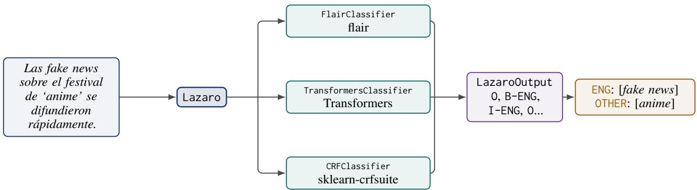
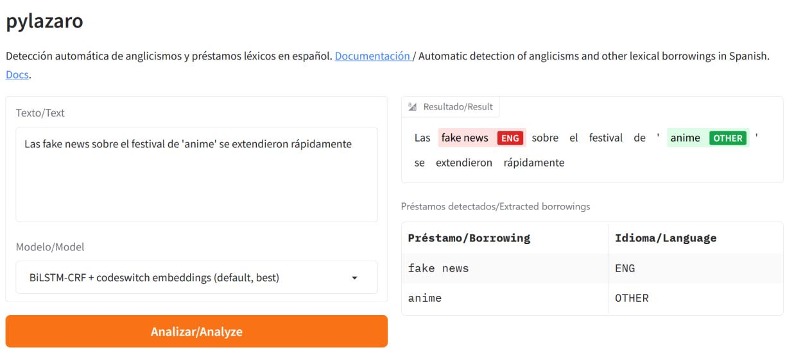

# pylazaro: a Python package for anglicism extraction in Spanish

Elena Álvarez-Mellado

Department of Linguistics Universidad Autónoma de Madrid elena.alvarezm@uam.es

## Abstract

Lexical borrowings are words from one language that are introduced into another language. Identifying lexical borrowings in text is a relevant task for data-centric fields in Linguistics such as lexicography or corpus linguistics, but none of the standard libraries for text processing offers such a functionality. In this paper we present pylazaro, an open-source Python package for the automatic extraction of unassimilated lexical borrowings (mostly anglicisms) from Spanish text. pylazaro offers a single interface to five sequence labeling models that were trained using different libraries, so that users can run and switch between them without having to deal with the idiosyncrasies of each library. We describe the design and usage of the package, contrast the performance of its models with that of generalpurpose LLMs (which perform poorly at this task: F1 below 0.40, compared to 0.86 for the best model in pylazaro) and report on its adoption: pylazaro has been downloaded more than 58,000 times and is the library behind Observatorio Lázaro, a resource that monitors anglicism usage in the Spanish press. pylazaro can be installed via PyPI, is documented in readthedocs and can be tried through a live demo hosted on HuggingFace Spaces.

## 1 Introduction

Lexical borrowings are words from one language that are introduced in another language. The process of borrowing is a manifestation of contact between linguistic communities and a prolific source of new words and meanings in a language (Haugen, 1950; Weinreich, 1963; Poplack and Dion, 2012). For instance, the French word weekend was originally borrowed from English; the word berde in Euskara (“green”) was borrowed from Spanish verde.

Identifying lexical borrowings in a text is an important task in data-centric fields in Linguistics, such as lexicography, corpus linguistics or historical linguistics. Traditionally, this work has been done by hand, with experts manually annotating corpora and looking up words. Providing experts with a tool that can assist them at identifying lexical borrowings in text would automatize a task that is otherwise time-consuming. However, none of the standard libraries for text processing and annotation (such as spaCy, stanza, etc.) offers such a functionality, nor does there exist (to the best of our knowledge) a publicly-available library specifically devoted to identifying borrowings in running text.

In this paper we introduce such a tool, pylazaro, a Python package for the task of extracting unassimilated (that is, not yet integrated into the recipient language) lexical borrowings from Spanish text. pylazaro is available via PyPI<sup>1</sup>, its code is released under the MIT license on GitHub<sup>2</sup>, it is documented in readthedocs<sup>3</sup>, and a live demo of the library can be freely accessed via HuggingFace Spaces<sup>4</sup> with no installation required.

The contributions of this paper are the following: (1) we describe the design of pylazaro, a package that offers a unified interface to five models for borrowing detection in Spanish that rely on different libraries (Section 3); (2) we present a live web demo that allows users with no programming background to run and compare the models (Section 4); (3) we contrast the performance of the models behind pylazaro with that of general-purpose LLMs on the same task (Section 5); and (4) we report on the adoption of the library and discuss its use cases (Section 6).

## 2 Previous work

Anglicism extraction is the task of retrieving English lexical borrowings (or anglicisms) from non-English texts. Anglicisms can be single-item (app) or multiword (machine learning,fake news). The task of automatically retrieving lexical borrowings from text has proven useful for the preprocessing of linguistic corpora in various languages (Furiassi and Hofland, 2007; Andersen, 2012; Losnegaard and Lyse, 2012; Serigos, 2017) and has previously been framed as a sequence labeling task (Alvarez-Mellado et al., 2021), in which relevant in-context spans of text are retrieved from sentences.

In the case of Spanish, the automatic detection of anglicisms has been approached through dictionary lookup and rule-based methods (Serigos, 2017), as well as through machine learning models trained on annotated corpora of Spanish newspaper text (Álvarez-Mellado, 2020; Alvarez-Mellado and Lignos, 2022). The ADoBo shared task (Alvarez-Mellado et al., 2021) framed the detection of unassimilated borrowings in the Spanish press as a sequence labeling task and attracted systems based on CRFs, BiLSTMs and Transformers (De la Rosa, 2021; Jiang et al., 2021). However, the models developed in this line of work were released as research code, and using them requires familiarity with the specific libraries in which they were implemented.

There are a few recent libraries aimed at quantitative tasks in historical linguistics that include identification of borrowings based on etymological data and through the identification of similar words that cannot be diachronically explained as cognates, such as LingPy<sup>5</sup> (List and Forkel, 2021), PyBor<sup>6</sup> (Miller et al., 2020) or LoanPy<sup>7</sup> (Martinovic´, 2023). These resources, however, serve a very different purpose from ours, as their aim is not to annotate novel lexical borrowings in a text, but to establish phylogenetic relations between the lexicon of two languages, attest language contact and reconstruct ancient protolanguages or proto-words through cognate identification.

## 3 pylazaro

## 3.1 Overview

pylazaro is a Python package that takes a text in Spanish as input and returns the lexical borrowings that are present in the text.

Under the hood, pylazaro is a Python wrapper over the Transformers library<sup>8</sup> and flair<sup>9</sup>. It also relies on spa $\mathsf { C y ^ { \prime } s ^ { 1 0 } }$ Token and Span utilities as building blocks.

pylazaro can be run with five different types of models:

• A BiLSTM-CRF model fed with subword embeddings and lexical embeddings pretrained on codeswitching data (this is the best performing model, and the default model used by pylazaro).

• A BiLSTM-CRF model fed with subword embeddings and bilingual Transformer-based Spanish-English lexical embeddings.

• A Transformer model based on multilingual BERT.

• A Transformer model based on Spanish model BETO.

• A Conditional Random Field model with handcrafted features.

These five models were introduced and published in prior work (Alvarez-Mellado and Lignos, 2022) and each of them exhibits different strengths and weaknesses, some being better at retrieving borrowings in certain sentence positions, with others excelling at different borrowing contexts or shapes (Álvarez-Mellado and Gonzalo, 2024). This means that a user may want to switch between models at some point or compare the output produced by two of them. However, these models were trained using different infrastructures and therefore use different libraries. The point of pylazaro is to offer a single interface that allows for running current (and future) models for anglicism identification using a single entry point and that facilitates switching between models smoothly without the hassle of having to deal with the idiosyncrasies of each of the libraries.

## 3.2 How to use pylazaro

pylazaro can be installed via PyPI and its documentation lives in readthedocs. The user creates a tagger (an object of type Lazaro), which ingests text in Spanish. The tagger will return the lexical borrowings found in the text, allowing for multiple output formats: tuples, dictionary, list of tagged tokens, etc. (see Listing 1).

The tagger frames the task of identifying borrowings as a sequence labeling task. Therefore, it assigns a label to each token in the sentence following BIO encoding (Ramshaw and Marcus, 1995). The output can then be displayed as a sequence of BIO-tagged tokens (with most of the tokens being labeled as O), or as a series of retrieved spans identified by start and end positions.

pylazaro retrieves lexical borrowings in general, in other words, it identifies words that come from a language other than Spanish and that have not yet been assimilated into Spanish. Although in theory pylazaro identifies borrowings from any language, in reality the models have been mostly optimized to identify borrowings of English origin. In consequence, the tagger assigns two possible labels: ENG for spans (or tokens) labeled as being of English origin, and OTHER for borrowings of any other language (such as Japanese, French, etc.).

Listing 1: Detecting borrowings with pylazaro.

```python
from pylazaro import Lazaro
tagger = Lazaro()
text = "Fue un look sencillo. Se celebra un
festival de 'anime'."
output = tagger.analyze(text)
output.borrowings_to_tuple()
[('look', 'en'), ('anime', 'other')]
output.anglicisms_to_tuple()
[('look', 'en')]
output.other_to_tuple()
[('anime', 'other')]
output.borrowings_to_dict()
[{'borrowing': 'look', 'language': 'en',
start_pos': 2, 'end_pos': 3}, {'borrowing':
'anime', 'language': 'other', 'start_pos':
11, 'end_pos': 12}]
output.anglicisms_to_dict()
[{'borrowing': 'look', 'language': 'en',
start_pos': 2, 'end_pos': 3}]
output.other_to_dict()
[{'borrowing': 'anime', 'language': 'other',
start_pos': 11, 'end_pos': 12}]
output.tag_per_token()
[('Fue', 'O'), ('un', 'O'), ('look', 'B-ENG'), (
'sencillo', 'O'), ('.', 'O'), ('Se', 'O'), (
'celebra', 'O'), ('un', 'O'), ('festival',
O'), ('de', 'O'), ("'", 'O'), ('anime', 'B-
OTHER'), ("'", 'O'), ('.', 'O')]
```

## 3.3 Selecting a model

By default, pylazaro loads the best performing model (the BiLSTM-CRF model with codeswitch embeddings). Users can select any of the other models when creating the tagger by specifying the type of model and the model file (see Listing 2).

Regardless of the model selected, the tagger is used in exactly the same way and returns the same output formats, which means that switching between models requires changing a single line of code. The models are hosted on the HuggingFace Hub and are downloaded automatically the first time they are used<sup>11</sup>.

Listing 2: Selecting different models in pylazaro.

```python
from pylazaro import Lazaro
# BiLSTM-CRF with BETO/BERT embeddings
tagger = Lazaro(model_type="bilstm",
model_file="lirondos/anglicisms-spanish-flair
-bert-beto")
# Transformer model based on mBERT
tagger = Lazaro(model_type="transformers",
model_file="lirondos/anglicisms-spanish-mbert
")
```

## 3.4 Architecture

Internally, pylazaro separates the user-facing interface from the models that perform the prediction (see Figure 1). The Lazaro class acts as the single entry point: it validates the parameters provided by the user and, depending on the type of model requested, instantiates the corresponding classifier (e.g. FlairClassifier for the BiLSTM-CRF models). Each classifier is in charge of loading its model using the library it was trained with, producing a sequence of BIO tags for the input text and fusing and aligning labeled subtokens. The predictions of all classifiers are then wrapped in a common result object that implements the different output formats shown in Listing 1. This design means that adding a new model to pylazaro only requires implementing a new classifier that loads the model and returns BIO tags, while the rest of the library (and the code of its users) remains unchanged.

## 4 Demo

In order to make pylazaro accessible to users without a programming background (such as lexicographers or linguists), we provide a live demo of the library hosted on HuggingFace Spaces<sup>12</sup> (see Figure 2). The demo was built with Gradio and runs pylazaro under the hood. The user can type or paste a text in Spanish and select one of the neural models available in the library. The demo then displays the input text with the retrieved borrowings highlighted according to their label, together with a table that lists every borrowing found in the text and its language. A set of example sentences is provided so that users can try the tool without having to come up with their own text.

  
Figure 1: Architecture of pylazaro. The Lazaro class receives the input text and dispatches it to the classifier that corresponds to the model selected by the user. Each classifier loads its model using the library it was trained with and returns a sequence of BIO tags, which are wrapped in a common output object that implements the different output formats. Adding a new model only requires implementing a new classifier.

  
Figure 2: Screenshot of the pylazaro demo hosted on HuggingFace Spaces. The borrowings detected in the input text are highlighted according to their label (ENG or OTHER) and listed in a table.

Because all models are exposed through the same interface, the demo also makes it easy to compare how different models behave on the same input, for instance when dealing with multiword borrowings or with borrowings that appear in different positions within the sentence (Álvarez-Mellado and Gonzalo, 2024).

## 5 Comparison against LLMs

All the models behind pylazaro are medium-sized models fine-tuned specifically for the task of retrieving anglicisms from Spanish. One could reasonably argue that the task of automatically extracting words of English origin from Spanish text can simply be achieved by using any available generalpurpose LLM.

Prior work, however, has shown that LLMs are not good at this task: a collection of 23 autoregressive LLMs (including models from the Qwen, Gemma and Llama3.1 families) were tested for the task of extracting anglicisms from Spanish text (González et al., 2026). The results ranged from 0.0 to 0.32 of F1 score, with Microsoft Phi-4, 40B-ALIA and the 9B-EuroLLM ranking in the first positions. The twenty remaining models all scored below 0.2 of F1 score. Similarly, Alvarez-Mellado (2025) reported that 8B-Llama3 obtained an F1 score of 0.39 on the same evaluation set (with a different prompting strategy).

These poor results contrast with the scores obtained by the finetuned models such as the ones behind pylazaro, whose scores ranged between 0.83 and 0.86 of F1 scores over the same evaluation set.

<table><tr><td>Model</td><td>Params</td><td>F1</td></tr><tr><td>BiLSTM-CRF (codeswitch)</td><td>182M</td><td>0.86</td></tr><tr><td>BiLSTM-CRF (BETO/BERT)</td><td>226M</td><td>0.84</td></tr><tr><td>mBERT BETO</td><td>177M</td><td>0.84</td></tr><tr><td></td><td>109M</td><td>0.83</td></tr><tr><td>Llama3</td><td>8B</td><td>0.39</td></tr><tr><td>Phi-4</td><td>14B</td><td>0.32</td></tr><tr><td>ALIA-instruct</td><td>40B</td><td>0.28</td></tr><tr><td>EuroLLM-instruct</td><td>9B</td><td>0.26</td></tr><tr><td>Remaining 20 LLMs</td><td></td><td>&lt;0.20</td></tr></table>

Table 1: F1 scores of the neural models behind pylazaro (Alvarez-Mellado and Lignos, 2022) and of the best performing general-purpose LLMs (Alvarez-Mellado, 2025; González et al., 2026) for the task of anglicism extraction in Spanish.

In addition to their better performance, the models behind pylazaro are considerably smaller than general-purpose LLMs: while the models in pylazaro have between 109 and 226 million parameters, the best performing LLMs have between 9 and 40 billion parameters. As a consequence, pylazaro can be run on a regular laptop without a GPU, which is a relevant factor for linguists who need to process large collections of text.

This justifies having a dedicated library for anglicism extraction in Spanish that can perform better and more efficiently than general purpose LLMs and that can easily be adopted by experts for their linguistic tasks.

## 6 Adoption and use cases

According to pepy.tech<sup>13</sup>, as of September 2026, pylazaro has been downloaded more than 58,000 times from PyPI, with over 800 downloads over the last 30 days. The models behind pylazaro have also been downloaded over 63,000 times from the HuggingFace Hub. pylazaro is also the library behind Observatorio Lázaro<sup>14</sup> (Alvarez-Mellado, 2026), a pipeline that monitors anglicism usage in the Spanish press. The site, which has collected over 2 million anglicisms since 2020, showcases the type of corpus linguistic analysis that pylazaro can facilitate. Other potential uses of this library include preprocessing of corpora to assist historical linguists track language change in text or help lexicographers identify words that are candidate to be registered in dictionaries.

## 7 Conclusions

In this paper we have introduced pylazaro, a Python package that identifies unassimilated lexical borrowings (mostly anglicisms) in Spanish text. pylazaro offers a single interface to five models that rely on different libraries, and it can be used either as a library or through a live demo that requires no installation. To the best of our knowledge, pylazaro is the first available library for the automatic identification of borrowings in running text. The poor performance of general-purpose LLMs at this task and the adoption of the library, which has been downloaded more than 58,000 times and powers Observatorio Lázaro, show the need for dedicated tools for borrowing detection.

## Limitations

The models behind pylazaro were trained on an annotated corpus of European Spanish newspaper text (Alvarez-Mellado and Lignos, 2022). Their performance on other domains (such as social media) or on other varieties of Spanish has not been systematically evaluated and is likely to be lower. Additionally, pylazaro only retrieves unassimilated borrowings: borrowings that have already been adapted to Spanish orthography or morphology are not detected. Although the tagger distinguishes between anglicisms and borrowings from other languages, the models have mostly been optimized for anglicisms, and borrowings from other languages are underrepresented in the training data. Finally, because pylazaro relies on external deep learning libraries, keeping the models compatible with new releases of those libraries requires ongoing maintenance.

## References

Elena Álvarez-Mellado. 2020. An annotated corpus of emerging anglicisms in Spanish newspaper headlines. In Proceedings ofthe 4th Workshop on Computational Approaches to Code Switching, Marseille, France. European Language Resources Association.

Elena Alvarez-Mellado. 2025. Lexical borrowing detection as a sequence labeling task. Data, modeling and evaluation methodsfor anglicism retrieval in Spanish. PhD thesis, Universidad Nacional de Educación a Distancia (UNED), Madrid, Spain.

Elena Alvarez-Mellado. 2026. Observatorio Lázaro: A self-populating database of anglicism usage in the Spanish press. Preprint, arXiv:2608.00713.

Elena Alvarez-Mellado, Luis Espinosa Anke, Julio Gonzalo Arroyo, Constantine Lignos, and Jordi Porta Zamorano. 2021. Overview of ADoBo 2021: Automatic Detection of Unassimilated Borrowings in the Spanish Press. Procesamiento del Lenguaje Natural, 67:277–285.

Elena Álvarez-Mellado and Julio Gonzalo. 2024. Characterizing spans for sequence labeling: A case on anglicism detection. Procesamiento del lenguaje natural, 73:235.

Elena Alvarez-Mellado and Constantine Lignos. 2022. Detecting Unassimilated Borrowings in Spanish: An Annotated Corpus and Approaches to Modeling. In Proceedings of the 60th Annual Meeting of the Association for Computational Linguistics (Volume 1: Long Papers), pages 3868–3888, Dublin, Ireland. Association for Computational Linguistics.

Gisle Andersen. 2012. Semi-automatic approaches to Anglicism detection in Norwegian corpus data. In Cristiano Furiassi, Virginia Pulcini, and Félix Rodríguez González, editors, The anglicization ofEuropean lexis, pages 111–130. John Benjamins.

Javier De la Rosa. 2021. ADoBo 2021: The futility of STILTs for the classification of lexical borrowings in Spanish. In Proceedings of the Iberian Languages Evaluation Forum (IberLEF 2021), volume 2943, pages 947–955, Málaga, Spain.

Cristiano Furiassi and Knut Hofland. 2007. The retrieval of false anglicisms in newspaper texts. In Corpus Linguistics 25 Years On, pages 347–363. Brill Rodopi.

José Ángel González, Ian Borrego Obrador, Álvaro Romo Herrero, Areg Mikael Sarvazyan, Mara Chinea-Ríos, Angelo Basile, and Marc Franco-Salvador. 2026. IberBench: LLM evaluation on Iberian languages. Computer Speech & Language, 96:101899.

Einar Haugen. 1950. The analysis of linguistic borrowing. Language, 26(2):210–231.

Shengyi Jiang, Tong Cui, Yingwen Fu, Nankai Lin, and Jieyi Xiang. 2021. BERT4EVER at ADoBo 2021: Detection of Borrowings in the Spanish Language Using Pseudo-label Technology. In Proceedings of the Iberian Languages Evaluation Forum (IberLEF 2021). CEUR Workshop Proceedings.

Johann-Mattis List and Robert Forkel. 2021. LingPy. A Python Library for Historical Linguistics.

Gyri Smordal Losnegaard and Gunn Inger Lyse. 2012. A data-driven approach to anglicism identification in Norwegian. In Gisle Andersen, editor, Exploring Newspaper Language: Using the web to create and investigate a large corpus of modern Norwegian, pages 131–154. John Benjamins Publishing.

Viktor Martinovic. 2023. ´ LoanpyDataHub/loanpy: Third stable release. Version Number: 3.0.0.

John Miller, Tiago Tresoldi, and Johann-Mattis List. 2020. PyBor, a Python library for borrowing detection based on lexical language models. Version 0.1. Place: Jena.

Shana Poplack and Nathalie Dion. 2012. Myths and facts about loanword development. Language Variation and Change, 24(3):279–315. Publisher: Cambridge University Press.

Lance Ramshaw and Mitch Marcus. 1995. Text chunking using transformation-based learning. In Third Workshop on Very Large Corpora.

Jacqueline Rae Larsen Serigos. 2017. Applying corpus and computational methods to loanword research : new approaches to Anglicisms in Spanish. Ph.D. thesis, The University of Texas at Austin.

Uriel Weinreich. 1963. Languages in Contact. The Hague: Mouton.