# Knowing When Thinking Is Not Enough: Teaching Small Reasoning Models to Reason Beyond Their Parametric Knowledge

Chanuk Lee1, Minki Kang1, Sangwoo Park1, Woongyeong Yeo1, Jinheon Baek1,†, Sung Ju Hwang1,2,†

1KAIST 2DeepAuto.ai (†: Equal advising)

{tallyforce, jinheon.baek, sungju.hwang}@kaist.ac.kr

https://github.com/tally0818/FlyBy

Scaling test-time computation is a powerful way to improve language-model reasoning, and is particularly appealing for small reasoning models (sRMs) that are cheap to serve. However, is additional thinking always the right operation? By intervening at intermediate reasoning states across two model families and multiple scales, we find that self-refinement largely consolidates probability mass onto solutions already reachable from the current state, rather than making new ones reachable. These interventions reveal two failure regimes: execution bottlenecks, where the correct path is reachable and reflection can recover it, and knowledge bottlenecks, where relevant external information makes it reachable. Motivated by this distinction, we introduce FlyBy, a selective querying framework, and train 4B and 8B variants to reason first, diagnose what remains unresolved, and, at a knowledge bottleneck, query stronger models whose parametric knowledge extends beyond its own. Supervised fine-tunin bootstra s a multi-de th uer action, and cost-aware reinforcement learnin calibrates whether to query, what to ask, and how much to spend. On 1,158 hard problems across six benchmarks, FlyBy-4B achieves 45.96% pass@8, surpassing Qwen3-14B (41.64%) at 2.7× lower serving cost, while also exceeding Qwen3-8B in pass@1 (16.85% vs. 15.31%). Scaling to FlyBy-8B further improves pass@8 to 51.81%.

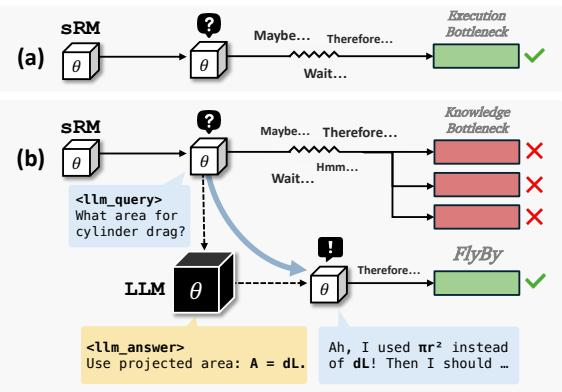

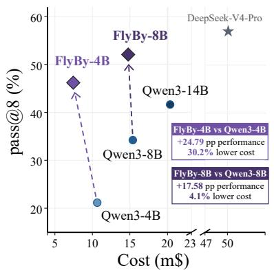

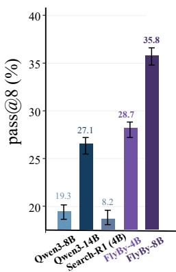  
Figure 1: Overview. Left: sRM failures exhibit two bottlenecks: (a) execution bottlenecks, where further reasoning can recover a reachable solution, and (b) knowledge bottlenecks, where scarce parametric knowledge requires external information. FlyBy addresses both bottlenecks via local reasoning and selective querying; see Fig. 11 for an example. Middle: FlyBy improves the performance-cost trade-of, outperforming same-scale models at lower cost and surpassing Qwen3-14B with FlyBy-4B; see Tab. 2 for details. Right: On problems unsolved by Qwen3-4B in 16 rollouts, FlyBy-4B reaches 28.7% pass@8, surpassing Qwen3-14B.

## 1. Introduction

Scaling test-time computation has emerged as a powerful way to improve language-model reasoning, where longer reasoning traces, repeated sampling, and self-refinement can each improve performance on challenging problems (Snell et al., 2024; Brown et al., 2024; Muennighof et al., 2025; Madaan et al., 2023; Wu et al., 2026). This paradigm is particularly appealing for small reasoning models (sRMs), which are cheap to serve (Liu et al., 2024) yet lag behind their larger counterparts, since it promises to close this gap by thinking longer rather than by growing larger. However, more computation is not uniformly useful: its benefit varies widely across problems and reasoning states (Snell et al., 2024), and simply further prompting a model to reconsider its reasoning does not reliably repair an incorrect solution (Huang et al., 2024; d’Aliberti and Ribeiro, 2026). This limitation is especially acute for sRMs, since their failures reflect not only weaker reasoning capacity and limited learnability from stronger teachers (Li et al., 2025) but also gaps in their parametric knowledge (Calderon et al., 2026; Kang et al., 2026), which additional reflection alone cannot fill.

Failed reasoning trajectories arise from two diferent bottlenecks (Fig. 1). In an execution bottleneck, the correct solution remains reachable, and additional computation can recover it through verification, revision, or exploration (Madaan et al., 2023; Kim et al., 2026b; Setlur et al., 2026; Wang et al., 2025b). In a knowledge bottleneck, further reasoning over the same state is insuficient, while relevant external information can make a correct path reachable. The central question is therefore not whether a model should think more, but whether more thinking is the right operation at all.

This distinction becomes especially consequential when sRMs serve as cognitive cores of larger reasoning systems, with external tools such as retrieval, code execution, or stronger models extending their capabilities (Yao et al., 2023; Schick et al., 2023; Gou et al., 2024; Jin et al., 2025; Lin and Xu, 2025). Recent work has argued that such agents should seek external help only when their epistemic needs cannot be resolved internally (Wang et al., 2025a). Existing systems can already learn when and how to invoke external help (Jin et al., 2025; Su et al., 2025; Zeng et al., 2026), but generally optimize tool use directly, without explicitly diagnosing whether the current reasoning state remains internally recoverable or instead requires new information. Our analysis makes this boundary operational at the level of intermediate reasoning states: first diagnose the bottleneck, then decide what information to request and how much external computation to spend obtaining it. This raises our central question: Can a small model distinguish these bottlenecks from its evolving reasoning state and use that diagnosis to acquire the right information at the right level of external computation?

We study this question through counterfactual interventions, in which we prompt further reflection or supply relevant information at intermediate reasoning states of eight reasoning models across two families and multiple scales. Contrary to the natural hypothesis that sRMs simply fail to notice their own uncertainty, we find that they express it frequently but rarely turn it into progress: reflection mainly consolidates probability mass onto already reachable solutions, recovering execution bottlenecks but providing little benefit at knowledge bottlenecks. Relevant external information, by contrast, makes these paths reachable, but larger models use it more efectively. sRMs thus face knowledge bottlenecks more often and benefit less from assistance. Seeking and using help must therefore be learned rather than merely prompted. Efective test-time computation therefore requires choosing not only how much to compute, but what kind the current state requires.

Motivated by this finding, we introduce FlyBy, a framework that trains an sRM as a cognitive core that reasons first and selectively acquires missing knowledge from an external model when it reaches a knowledge bottleneck. We expose external models as a multi-depth query action within the reasoning trajectory, letting the model decide whether to query, what to ask, and how much external computation to allocate across backends of increasing strength and cost. The external model sees only the query (not the problem), and the sRM resumes reasoning from the observation. We bootstrap this behavior with supervised fine-tuning on a small set of rescue trajectories, where a single query turns a failed continuation into a success, then apply cost-aware reinforcement learning so the policy uses cheap parametric reasoning when suficient and pays for help only when needed.

We validate FlyBy on 1,158 hard problems from six benchmarks spanning mathematics, science, medicine, and eneral reasonin . FlyBy-4B, trained from Qwen3-4B, more than doubles the ass@8 of its base model (21.2% to 46.0%) and surpasses Qwen3-14B at 2.7× lower serving cost. At 8B, it raises pass@8 from 34.2% to 51.8% without increasing serving cost. It also outperforms alternatives that strengthen self-refinement, retrieve documents, or query a stronger model upfront, with the margin over the last widening on harder problems. Further analyses show that reinforcement learning turns one-shot delegation into iterative information acquisition through repeated cheap queries, attaining the performance of the strongest backend at nearly the cost of the cheapest.

Our contributions are threefold. (i) We diagnose reasoning failures and show that reflection mainly consolidates already reachable solutions rather than making new ones reachable. (ii) We show that sRMs not only possess less parametric knowledge, but are also less able to exploit external help, making efective help-seeking itself a learned capability. (iii) We train 4B and 8B models to reason first and selectively query stronger models, outperforming larger models at lower serving cost.

## 2. Preliminaries

Since our analysis intervenes at intermediate reasoning states, we first describe how we probe such states, how we locate where a model reflects, and how we measure the efect of intervening.

Reasoning states and state probing. Let $x \in \mathcal { D }$ be a problem with ground-truth answer $y ^ { \star }$ . A reasoning model � generates a trace $z _ { 1 : T }$ and terminates with a final answer $^ { a , }$ and we call $\boldsymbol { s } _ { t } = \left( \boldsymbol { x } , \boldsymbol { z } _ { < t } \right)$ the reasoning state before $z _ { t }$ . Since a single trace only shows whether the model happened to succeed, we instead probe a state � by appending a cue � and sampling � continuations with final answers $a _ { q } ^ { ( 1 ) } , \dots , a _ { q } ^ { ( N ) }$ . The value of � is the fraction of continuations that reach the correct answer,

$$
V _ { q } ( s ) = \frac { 1 } { N } \sum _ { n = 1 } ^ { N } \mathbb { I } \left[ a _ { q } ^ { ( n ) } = y ^ { \star } \right] ,\tag{1}
$$

and the answer entropy $\mathcal { H } _ { q } ( s )$ is the entropy of the resulting answer distribution, which measures how varied the reachable answers are. For the null cue $q = \emptyset$ , which leaves the state unmodified, we write $V ( s )$ and $\mathcal { H } ( s )$ Each state thus lies on the �ℋ-plane, where productive reasoning moves toward $( V , \mathcal { H } ) = ( 1 , 0 )$ , at which the model is correct and settled on a single answer.

Epistemic verbalizations (EVs). To locate where a model attempts self-refinement, we use epistemic verbalizations (EVs), short hedging or checking expressions with which a model pauses to reconsider its reasoning (Kim et al., 2026b; Wang et al., 2025b). We adopt the lexicon ℰ of Kim et al. (2026b) verbatim, nine expressions such as wait, hmm, and alternatively (full list in §A) and count any case-insensitive whole-word match of ℰ as an EV occurrence. An EV is endogenous if the model emits it on its own, and exogenous if we insert it as a cue � at a state of our choice.

Paired interventions. Because reasoning states difer widely in how promising they are, we measure each intervention against a counterfactual from the same state that difers only in the intervention. For an endogenous EV � emitted at �, we compare continuing after � against decoding from � with ℰ banned, and for an exogenous $q ,$ against the null cue:

$$
\Delta V ( e ) = V _ { e } ( s ) - V _ { \mathrm { n o E V } } ( s ) , \qquad \Delta V _ { q } ( s ) = V _ { q } ( s ) - V ( s ) .\tag{2}
$$

The changes in answer entropy, $\Delta \mathcal { H } ( e )$ and $\Delta \mathcal { H } _ { q } ( s )$ , are defined analogously in $\ S \mathrm { A }$

## 3. Understanding When Thinking Is Not Enough

Why do small reasoning models fail even when given suficient opportunity to reason? A natural hypothesis, motivated by prior work on self-refinement (Kim et al., 2026b; d’Aliberti and Ribeiro, 2026; Huang et al., 2024), is that small models are less capable of recognizing uncertainty and revising their intermediate reasoning. Under this view, their performance gap arises from inefective strategic allocation of reasoning efort: larger models can identify unproductive trajectories and redirect computation, whereas smaller models fail to do so. Alternatively, progress may require information that cannot be reliably recovered from the current state through internal reasoning alone.

Experiment setup. We conduct our analysis using Qwen3-0.6B,1.7B,4B,8B,14B (Yang et al., 2025) and Gemma4-E2B,E4B,12B (Team et al., 2026). For mathematical reasoning, we use 93 competition problems from AIME25/26 (MAA, 2026) and HMMT-Feb2026 (HMMT, 2026), and for scientific reasoning, we use GPQA-Diamond (Rein et al., 2023) in an open-ended setting. For each model and problem, we sample 16 independent rollouts with a maximum generation budget of 32K tokens using vLLM (Kwon et al., 2023). We retain model-problem pairs with an empirical solve rate in [0.25, 0.75] to focus on problems that are nontrivial but still exhibit evidence of a viable solution path. From the retained rollouts, we identify 13.4K endogenous EV occurrences and apply the paired counterfactual described in §2, using $N = 8$ continuations per condition. This yields 215K counterfactual continuations, which together with 57K information-conditioned continuations give 272K continuations in total, each with a maximum generation budget of 32K tokens.

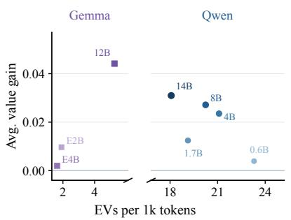  
(a) Frequency vs. efectiveness

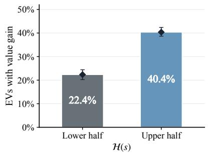  
(b) Uncertainty window

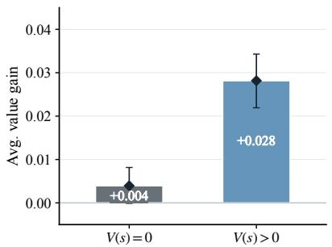  
(c) Recoverability analysis  
Figure 2: Limits of self-refinement. (a) Higher EV frequency does not directly translate into larger value gains. $( \boldsymbol { \mathrm { b } } , \boldsymbol { \mathrm { c } } )$ Self-refinement is most efective in uncertain states where a correct solution remains reachable, rather than states requiring new information. � is the state just before emitting �.

## 3.1. Execution and knowledge bottlenecks

To understand the source of reasonin failures, we distin uish two failure re imes based on whether a correct solution remains internall reachable, and then stud how self-refinement and external information afect each regime. We define an execution bottleneck as a state from which a correct solution can be practically reached through the model’s own reasoning, but the model cannot reliably realize it through its own reasoning process, and a knowledge bottleneck as a state where the information needed for a correct solution cannot be reliably accessed, reconstructed, or utilized through further internal reasoning alone. Since true reachability cannot be determined from finite samples, we operationalize this distinction using the estimated state value $V ( s ) { \mathrm { : } }$ states with at least one observed successful continuation $( V ( s ) > 0 )$ are treated as execution-like, whereas states with no observed successful continuation $( V ( s ) = 0 )$ are treated as knowledge-like. This distinction is intended to capture practical accessibility under bounded reasoning rather than absolute reachability. We next study how self-refinement and external information operate under these bottlenecks. Analysis on the sensitivity of this operational distinction to the continuation budget is in §B.

## 3.2. Self-refinement in small reasoning models

We first ask whether small reasoning models fail because they do not recognize or express uncertainty. Using the fixed EV lexicon ℰ defined in $\ S 2 ,$ we measure endogenous EV frequency and estimate the causal efect of each $\mathrm { E V } e \in \mathcal { E }$ on value and answer diversity, quantified by $\Delta V ( e )$ and $\Delta \mathcal { H } ( e )$ , respectively. For intervention, we uniformly sample four EV occurrences from each collected rollout. Exact formulas are provided in $\ S \mathrm { A }$

As shown in Fig. 2a, EVs remain common even in smaller models, while their causal efect on value increases substantially with model scale (Song et al., 2025). This suggests that the key limitation of small models is not expressing uncertainty or initiating reflection, but efectively converting reflection into progress. Consistent with our distinction, we found that self-refinement mainly benefits from uncertain (Fig. 2b) and execution-like states (Fig. 2c) increasing values while reducing answer entropy (Fig. 4a).

Takeaway 3.2. Self-refinement primarily helps realize solutions that are already internally reachable.

## 3.3. Efect of external information

Previous anal sis shows that self-refinement can recover incorrect trajectories when a successful continuation is already internally reachable. This raises a natural question about states where such recovery remains dificult: does the model merely fail to trigger an efective refinement, or does progress require information that cannot be reliably recovered through further internal reasoning? We distinguish these possibilities through controlled interventions. If the former is the primary limitation, explicitly prompting further reflection should substantially improve the continuation. If the latter is important, problem-relevant external information should provide a markedly larger benefit. Following the intervention setup of Kim et al. (2026b), we take incorrect reasoning traces and intervene at relative positions $\alpha \in \{ 0 . 2 , 0 . 5 , 0 . 8 , 0 . 9 \}$ . At each state $s ,$ we append a cue � and measure its efect through $\Delta V _ { q } ( s )$ and $\Delta \mathcal { H } _ { q } ( s )$ . We compare three interventions. An epistemic cue $q _ { \mathrm { E V } }$ encourages further reflection using the prompts “Wait, is that correct?”, “Wait, let me double-check.”, and $^ { * } H m m ,$ I’m not sure this is right.”, following Muennighof et al. (2025). For each problem, we also construct an oracle information cue $q _ { \mathrm { i n f o } }$ using DeepSeek-V4-Pro (Xu et al., 2026), which provides concise problem-relevant information without revealing the gold answer. Finally, $q _ { \mathrm { r a n d o m } }$ uses oracle cues drawn from unrelated problems, preserving the presence and form of additional information while removing semantic relevance. Details of oracle information generation, including the prompt used to elicit it, are provided in §C.

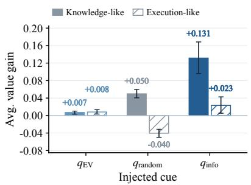  
(a) Efect of external cues

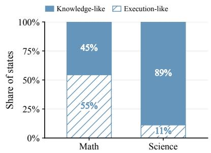  
(b) Bottlenecks by domain

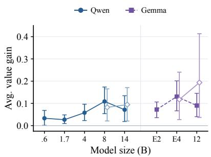  
(c) Information utilization  
Figure 3: Diagnosing execution- and knowledge-like bottlenecks. (a) On knowledge bottleneck states from incorrect trajectories, injecting oracle information yields a substantially larger value gain than an EV or random cue. (b) Among unresolved states, knowledge-like bottlenecks are substantially more prevalent in science than in math. (c) The benefit of relevant information increases with model scale. Blurred line indicates the performance on the shared problems.

Relevant information fills the knowledge gap. As shown in Fig. 3a, random cues pro-vide little benefit, epistemic cues yield mod- est improvements, and relevant information produces substantially larger gains in value. Simply asking the model to reconsider its reasoning therefore does not reliably recover knowledge-like states, while relevant exter- nal information often does. The gain cannot be explained by longer generation or random cue insertion alone, since it depends strongly on the relevance of the supplied information. Knowledge-like states are also substantially more prevalent in scientific reasoning than in mathematical reasoning (Fig. 3b), consis-

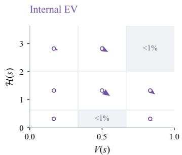  
(a) Internal EV dynamics

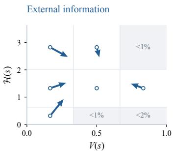  
(b) Information dynamics  
Figure 4: Reasoning-state dynamics. (a, b) Average value-entropy transitions induced by internal EVs and external information, respec- tively. � denotes the state right before intervention and arrow denotes the state transition.

tent with the greater reliance of scientific problems on specific factual and domain knowledge. Ultimately, self-refinement and relevant information are complementary. External information can make a correct path accessible from a knowledge-like state, after which self-refinement can verify and consolidate it toward $( V , \mathcal { H } ) = ( 1 , 0 )$ as illustrated in Figs. 4a and 4b.

Small models are limited on both sides. One might expect smaller models to benefit most from external information because their weaker parametric knowledge leaves greater headroom for improvement (Calderon et al., 2026). However, Fig. 3c shows that information utilization generally improves with model scale. Smaller models are less capable of incorporating a relevant hint into their ongoing reasoning. The apparent drop at the largest Qwen and Gemma models is induced by changes in the residual problem set; when restricted to problems shared with the next smaller model, the increasing trend is preserved (empty markers in Fig. 3c). Small models therefore face two limitations: they more often enter knowledge-like states, and they are less capable of exploiting external information once provided.

Takeaway 3.3. Utilizing external information expands what is reachable, while self-refinement consolidates solutions that are already within reach. Yet small models are limited in both.

## 4. Teaching Small Models When Thinking Is Not Enough

## 4.1. Training Setup

Motivated by the distinction above, we train FlyBy-4B from Qwen3-4B to treat external reasoning as a selective querying problem. At each point in its reasoning trajectory, the model may either continue reasoning locally or query an external model, jointly choosing what information to request and how much external computation to invoke. We use a two-stage pipeline: supervised fine-tuning (SFT) first bootstraps the query action space, followed by 80 steps of reinforcement learning (RL) to calibrate when querying is worthwhile and how much computation to allocate.

Tool design. We expose external models (Xu et al., 2026; DeepSeek-AI, 2025) as a multi-depth query tool within the reasoning trajectory. At each query step, the model decides how much compute to acquire by selecting a depth � ∈ {1, 2, 3}, receives the resulting observation, and resumes its own reasoning. As summarized in Tab. 1, larger depths provide stronger external models and longer responses at higher cost. To prevent trivial answer delegation, external

Table 1: Multi-depth query tool. API prices are USD per 1M tokens.
<table><tr><td></td><td>d Backend</td><td>Max tokens</td><td>Input / Output</td></tr><tr><td>1</td><td>DeepSeek-V4-Flash</td><td>128</td><td>0.094 / 0.188</td></tr><tr><td>2</td><td>DeepSeek-V3.2</td><td>512</td><td>0.269 / 0.400</td></tr><tr><td>3</td><td>DeepSeek-V4-Pro</td><td>1,536</td><td>0.435 / 0.870</td></tr></table>

models do not observe the original problem, and we reject queries with excessive �-gram overlap with the problem during both training and evaluation.

Cost. Following Su et al. (2025), we measure serving cost as the sum of local GPU inference cost and external API cost. We convert both into USD using measured model throughput and third-party GPU/API prices from OpenRouter and Hyperbolic (OpenRouter, 2026; Hyperbolic, 2026), with a complete explanation of the cost model and the prices used provided in §D.2.

## 4.2. Two-stage optimization

Bootstrapping via SFT. Directly learning selective querying through RL is dificult because the pretrained model has not learned to emit query actions or integrate external observations into its reasoning. We therefore bootstra this action s ace with a small, carefull curated SFT dataset.

Starting with failed trajectories from Qwen3-4B on ArXivMath-Training (Dekoninck et al., 2026) and SuperGPQA (Team et al., 2025), we synthesize query-augmented trajectories in which external information reliably rescues an otherwise unsuccessful reasoning process. We additionally construct targeted supervision for query generation and post-observation integration, and mix these examples with general reasoning trajectories from OpenThoughts3-1.2M (Guha et al., 2025). Full details of trajectory synthesis, filtering, and SFT data curation are provided in §D.3.

Calibration via RL. The SFT model can emit query actions, but it has only imitated a fixed set of synthesized trajectories and has not learned when querying is actually worth its cost. We therefore further optimize it with RL on problems drawn from DAPO-17K-processed (Yu et al., 2025), ArXivMath-Training (Dekoninck et al., 2026), the STEM subset of GooseReason-0.7M (Lu et al., 2026), and SuperGPQA (Team et al., 2025), excluding all problems used for SFT synthesis, which keeps the two training stages disjoint.

To make the policy cost-aware, we use a modified GRPO objective (Shao et al., 2024) in which, following Su et al. (2025), cost is penalized only for successful trajectories:

$$
r ( x , y ) = \mathbb { I } [ y = y ^ { \star } ] \left( 1 - \lambda \hat { C } ( y ) \right) ,\tag{3}
$$

where $\hat { C } ( y )$ is the problem-level normalized cost of rollout �. This prevents the policy from being rewarded for simply failing cheaply. Importantly, querying can also be beneficial when external information substitutes for costly internal reasoning, such as retrieving a theorem instead of deriving it from first principles. The objective therefore encourages the policy to acquire external information whenever doing so reduces the overall cost of reaching a correct solution. We adopt DAPO-style decoupled clipping (Yu et al., 2025), omit standard deviation normalization following Liu et al. (2025), and redact gold-answer spans from tool observations during training to prevent direct answer leakage. Full details on the dataset mixture and training objective are in §D.4.

Table 2: Main results. Performance on hard reasoning problems across six benchmarks. We report pass@8 and inference cost per eight rollouts in milli-dollars (m\$, 10−3 USD). Best and second-best results are bolded and underlined, respectively. Frontier-scale DeepSeek-V4-Pro is excluded from the ranking. For Search-R1 baseline, we exclude retrieval costs due to ambiguity.
<table><tr><td>Model</td><td>ArXivMath</td><td>GPQA-D</td><td>SuperGPQA</td><td>ChemBench</td><td>MedXpertQA</td><td>MMLU-Pro</td><td>Avg Perf.</td><td>Avg Cost (↓)</td></tr><tr><td>Qwen3-4B</td><td>8.34</td><td>35.54</td><td>24.17</td><td>25.25</td><td>15.66</td><td>18.07</td><td>21.17</td><td>10.63</td></tr><tr><td>Qwen3-8B</td><td>10.69</td><td>49.40</td><td>35.30</td><td>45.99</td><td>26.26</td><td>37.75</td><td>34.23</td><td>15.38</td></tr><tr><td>Qwen3-14B</td><td>14.46</td><td>52.63</td><td>43.85</td><td>59.30</td><td>32.82</td><td>46.78</td><td>41.64</td><td>20.35</td></tr><tr><td>ForkingRL</td><td>8.81</td><td>34.86</td><td>23.75</td><td>27.90</td><td>16.98</td><td>17.00</td><td>21.55</td><td>11.47</td></tr><tr><td>Search-R1</td><td>11.17</td><td>36.38</td><td>27.14</td><td>38.48</td><td>15.53</td><td>26.17</td><td>25.81</td><td>8.35</td></tr><tr><td>Query Opening</td><td>15.70</td><td>44.47</td><td>39.01</td><td>50.73</td><td>23.45</td><td>30.99</td><td>34.06</td><td>8.56</td></tr><tr><td>Prompt Only</td><td>12.97</td><td>41.77</td><td>25.58</td><td>27.93</td><td>16.10</td><td>21.83</td><td>24.36</td><td>6.68</td></tr><tr><td>FLYBY-4B-SFT</td><td>18.19</td><td>43.78</td><td>38.22</td><td>57.37</td><td>27.21</td><td>33.55</td><td>36.39</td><td>7.15</td></tr><tr><td>FLYBY-4B</td><td>21.78</td><td>60.01</td><td>45.65</td><td>70.73</td><td>35.37</td><td>42.21</td><td>45.96</td><td>7.42</td></tr><tr><td>FLYBY-8B</td><td>18.97</td><td>66.95</td><td>49.11</td><td>81.32</td><td>43.76</td><td>50.73</td><td>51.81</td><td>14.75</td></tr><tr><td>DS-V4-Pro</td><td>17.81</td><td>76.91</td><td>48.69</td><td>73.52</td><td>61.99</td><td>62.43</td><td>56.89</td><td>50.08</td></tr></table>

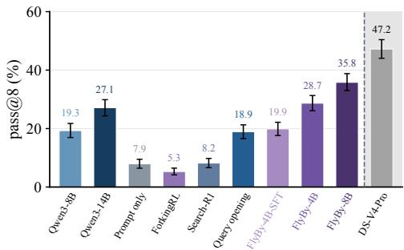  
(a) Reachability beyond Qwen3-4B

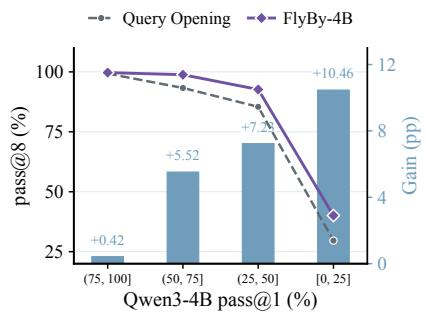  
(b) Gain over query opening

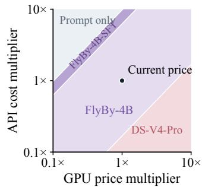  
(c) Economic analysis  
Figure 5: Analysis of the learned querying policy. (a) On problems with zero Qwen3-4B successes across 16 rollouts, FlyBy-4B reaches 28.7% pass@8, expanding beyond the base model’s observed reach. (b) Coverage gains over Query Opening are larger on harder problems. (c) FlyBy-4B ofers the best cost eficiency across most evaluated GPU and API price configurations.

## 5. Experiments

## 5.1. Experiment setup

Benchmarks and metric. We evaluate on six challenging reasoning benchmarks spanning mathematics, science, general knowledge, and medicine: ArXivMath (Dekoninck et al., 2026), GPQA-Diamond (Rein et al., 2023), SuperGPQA (Team et al., 2025), ChemBench (Mirza et al., 2025), MMLU-Pro (Wang et al., 2024), and MedXpertQA (Zuo et al., 2025). Our evaluation consists of 1,158 hard problems across these benchmarks, defined as problems where vanilla Qwen3-4B achieves pass@1 ≤ 0.25. Our primary metric is hard-problem pass@8, reflecting coverage of challenging problems, while serving cost is defined in §4. Both metrics are estimated from 16 rollouts; benchmark and filtering details are provided in §E.1.

Baselines and our method. We evaluate six approaches: (1) Larger Models: Qwen3-8,14B and full delegation to DeepSeek-V4-Pro; (2) ForkingRL, which post-trains Qwen3-4B on high-entropy forking tokens (Wang et al., 2025b); (3) Search-R1, which trains Qwen3-4B to retrieve documents during reasoning (Jin et al., 2025); (4) Query Opening, which queries DeepSeek-V4-Flash once before reasoning; (5) Prompt Only, which rovides onl the tool interface; and (6) FlyBy (Ours): FlyBy-4B and FlyBy-8B, trained from Qwen3-4B and

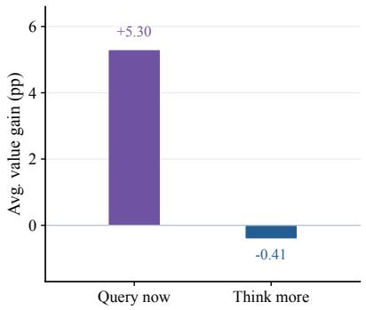  
(a) Recoverability

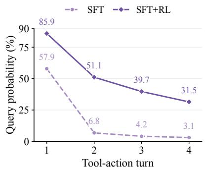  
(b) Iterative querying

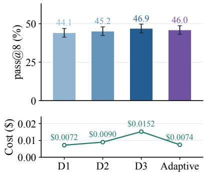  
(c) Fixed depth ablation  
Figure 6: Efect of cost-aware RL. (a) From the states where FlyBy-4B chooses to query, querying improves state value while further thinking does not. (b) Unlike SFT, RL maintains substantial query probability across later tool-action turns. (c) Fixing query depth for FlyBy-4B shows that adaptive depth allocation attains near-deep-backend performance at near-shallow-backend cost.

Qwen3-8B, respectively, with FlyBy-4B-SFT and vanilla Qwen3-4B as the SFT-only and base-model references.

## 5.2. Main Results

Improved accuracy and coverage. As shown in Tab. 2, light SFT achieves 36.39% pass@8, and cost-aware RL further improves it to 45.96% with only a marginal increase in serving cost, outperforming Qwen3-14B at 2.7× lower cost. On problems unsolved by Qwen3-4B in 16 no-tool rollouts, FlyBy-4B achieves 28.7% pass@8, extending coverage beyond the observed successes of the base model (Fig. 5a). Importantly, this improvement is not limited to multi-rollout coverage. FlyBy-4B also outperforms Qwen3-8B and Query Opening at pass@1 (Tab. 6), indicating that RL improves the quality of individual reasoning trajectories rather than merely increasing the chance of obtaining a successful trajectory across repeated sampling. Full pass@1 results are in §E.

Targeted information acquisition. ForkingRL provides little improvement over the base model, consistent with our finding that additional internal self-refinement is inefective when hard problems are dominated by knowledge bottlenecks. Search-R1 improves coverage through retrieval, but remains substantially below our model-based querying despite returning much longer contexts per call (2,015 characters on average). In contrast, FlyBy-4B uses short external responses (105 output tokens on average) over multiple targeted queries, suggesting that resolving the current reasoning bottleneck matters more than simply supplying more external text.

Query Opening is considerably stronger than the other baselines, but Fig. 5b shows that its gap to our adaptive policy widens as problems become harder. We attribute this widening gap to the diminishing utility of a broad, upfront query without suficient problem-specific reasoning. As problem dificulty increases, a generic request is less likely to surface the particular knowledge needed to resolve the failure. This suggests that the benefit of adaptive querying comes not merely from access to a stronger model, but from first reasoning about the problem to identify what information is missing and only then acquiring targeted external assistance.

To test whether FlyBy queries when further reasoning is unlikely to help, we sample 50 SuperGPQA problems and generate 8 rollouts per problem with FlyBy-4B. At each query state �, we branch into two counterfactuals: execute the selected query, or suppress it and apply budget forcing (Muennighof et al., 2025) until the model attempts another query or generates 512 additional tokens, and probe all states using Qwen3- 4B. Querying increases state value by 5.30 pp on average, whereas additional reasoning yields essentially no improvement (Fig. 6a), indicating that the learned policy tends to query precisely where further internal reasoning is inefective.

Economic analysis. Although FlyBy-4B is trained under fixed GPU and API prices, its cost-performance advantage remains robust to substantial price variation. In Fig. 5c, we sweep GPU and API prices and partition the resulting price plane by the configuration achieving the highest pass@8 per USD. FlyBy-4B remains optimal across a broad range of price regimes, indicating that its economic advantage is not tied to a particular pricing assumption.

Efect of reinforcement learning. Compared with its SFT initialization, FlyBy-4B maintains substantial query probability at later turns (Fig. 6b) indicating that RL develops repeated querying beyond the single-query behavior demonstrated during SFT. Additionally, FlyBy-4B achieves coverage close to fixed depth-3 querying at a cost close to fixed depth-1 querying (Fig. 6c). More analysis on RL is provided in §F.

Scaling to a stronger cognitive core. We further trained FlyBy-8B based on Qwen3-8B. As demonstrated in Tab. 2, FlyBy-8B reaches 51.81% pass@8, improving over FlyBy-4B by 5.85 percentage points and outperforming Qwen3-14B by 10.17 points while remaining cheaper to serve. This scaling trend is consistent with our analysis, as larger models not only possess greater parametric knowledge but also benefit more from utilizing given information (Fig. 3c).

Further experiments on backend generalization, tool leakage and price fluctuations are provided in §G, with qualitative examples of mitigating knowledge bottlenecks and the corresponding dynamics on the �ℋ plane in §H.

## 6. Related Work

Self-refinement via epistemic verbalization. Whether acquired during pretraining (Liu et al., 2025) or induced through reinforcement learning-based post-training (Guo et al., 2025; Shao et al., 2024), self-refinement, often associated with the aha moment (Guo et al., 2025), has emerged as an important characteristic of reasoning behavior in language models. Recent studies (Kim et al., 2026b; Wang et al., 2025b) have characterized reasoning as a process of strategic information allocation under uncertainty, identifying token-level externalizations of uncertainty in the form of epistemic verbalizations (EVs) or forking tokens. Muennighof et al. (2025) further showed that extending the reasoning process by appending “wait” can improve model performance, while Kim et al. (2026a) demonstrated that the loss of epistemic verbalizations during self-distillation (Hübotter et al., 2026) degrades mathematical reasoning performance. These findings suggest that recognizing uncertainty and reconsidering intermediate steps play an important role in efective reasoning.

Reasoning failures in small reasoning models. Reasoning performance generally improves with model scale, consistent with broader scaling trends observed in language models (Kaplan et al., 2020). However, the substantial inference cost of large reasoning models (LRMs) has motivated growing interest in developing ca able small reasonin models (sRMs) (Liu et al., 2024). To reduce the ca abilit a induced b limited model capacity, prior work has explored distilling reasoning behaviors from larger teacher models into smaller students (Agarwal et al., 2024; Ko et al., 2024; Kang et al., 2025). Nevertheless, Li et al. (2025) showed that small models exhibit not only lower reasoning performance but also a learnability gap, which limits their ability to acquire reasoning behaviors from stronger teachers. Moreover, Calderon et al. (2026); Kang et al. (2026) identified encoding failures as a particularly prominent source of error in sRMs, suggesting that their failures can also arise from limitations in the information encoded in their parametric knowledge rather than from deficiencies in reasoning execution alone.

Adaptive tool use and model collaboration. Recent work trains language models to interleave reasoning with external tool use or stronger-model assistance, including dynamic sLM-LLM collaboration and cost-aware tool orchestration (Su et al., 2025; Zeng et al., 2026). These approaches establish that learned policies can adaptively decide when and how to seek help. Our work asks a diferent question: which reasoning failures actually require external information? Through counterfactual interventions, we distinguish internally recoverable execution bottlenecks from knowledge bottlenecks, and use this distinction to motivate a policy that identifies the missing information and adaptively allocates the strength of external assistance.

## 7. Conclusion

We studied when additional internal reasoning fails to help small reasoning models. Our interventions reveal two failure regimes: execution bottlenecks, where self-refinement can recover a reachable solution, and knowledge bottlenecks where external information is needed. Buildin on this distinction we train 4B and 8B models to selectively acquire external computation, learning whether, what, and how much to query. The resulting FlyBy-4B reaches 46.0% pass@8 on hard problems while outperforming Qwen3-14B at 2.7× lower serving cost. Our results suggest that efective test-time scaling requires knowing not only how to think longer, but when thinking is not enough.

Limitations and future directions. FlyBy relies on external models, introducing practical concerns around availability, privacy, and reliability. We discuss these limitations and promising future directions in §I.

## References

Rishabh Agarwal, Nino Vieillard, Yongchao Zhou, Piotr Stanczyk, Sabela Ramos Garea, Matthieu Geist, and Olivier Bachem. On-policy distillation of language models: Learning from self-generated mistakes. In International Conference on Learning Representations, volume 2024, pages 21246–21263, 2024.

Bradley Brown, Jordan Juravsky, Ryan Ehrlich, Ronald Clark, Quoc V. Le, Christopher Ré, and Azalia Mirhoseini. Large language monkeys: Scaling inference compute with repeated sampling. arXiv preprint arXiv:2407.21787, 2024.

Tom Brown, Benjamin Mann, Nick Ryder, Melanie Subbiah, Jared D Kaplan, Prafulla Dhariwal, Arvind Neelakantan, Pranav Shyam, Girish Sastry, Amanda Askell, et al. Language models are few-shot learners. Advances in Neural Information Processing Systems, 33:1877–1901, 2020.

Nitay Calderon, Eyal Ben-David, Zorik Gekhman, Eran Ofek, and Gal Yona. Empty shelves or lost keys? recall is the bottleneck for parametric factuality. arXiv preprint arXiv:2602.14080, 2026.

DeepSeek-AI. Deepseek-v3.2: Pushing the frontier of open large language models, 2025.

Jasper Dekoninck, Nikola Jovanović, Tim Gehrunger, Kári Rögnvaldsson, Ivo Petrov, Chenhao Sun, and Martin Vechev. Beyond benchmarks: Matharena as an evaluation platform for mathematics with llms. arXiv preprint arXiv:2605.00674, 2026. URL https://arxiv.org/abs/2605.00674.

Liv G d’Aliberti and Manoel Horta Ribeiro. The illusion of insight in reasoning models. In Findings of the Associationfor Computational Linguistics: ACL 2026, pages 924–966, 2026.

Zhibin Gou, Zhihong Shao, Yeyun Gong, Yujiu Yang, Minlie Huang, Nan Duan, Weizhu Chen, et al. Tora: A tool-integrated reasoning agent for mathematical problem solving. In International Conference on Learning Representations, volume 2024, pages 48362–48395, 2024.

Etash Guha, Ryan Marten, Sedrick Keh, Negin Raoof, Georgios Smyrnis, Hritik Bansal, Marianna Nezhurina, Jean Mercat, Trung Vu, Zayne Sprague, Ashima Suvarna, Benjamin Feuer, Liangyu Chen, Zaid Khan, Eric Frankel, Sachin Grover, Caroline Choi, Niklas Muennighof, Shiye Su, Wanjia Zhao, John Yang, Shreyas Pimpalgaonkar, Kartik Sharma, Charlie Cheng-Jie Ji, Yichuan Deng, Sarah Pratt, Vivek Ramanujan, Jon Saad-Falcon, Jefrey Li, Achal Dave, Alon Albalak, Kushal Arora, Blake Wulfe, Chinmay Hegde, Greg Durrett, Sewoong Oh, Mohit Bansal, Saadia Gabriel, Aditya Grover, Kai-Wei Chang, Vaishaal Shankar, Aaron Gokaslan, Mike A. Merrill, Tatsunori Hashimoto, Yejin Choi, Jenia Jitsev, Reinhard Heckel, Maheswaran Sathiamoorthy, Alexandros G. Dimakis, and Ludwig Schmidt. Openthoughts: Data recipes for reasoning models, 2025. URL https://arxiv.org/abs/2506.04178.

Daya Guo, Dejian Yang, Haowei Zhang, Junxiao Song, Peiyi Wang, Qihao Zhu, Runxin Xu, Ruoyu Zhang, Shirong Ma, Xiao Bi, et al. Deepseek-r1: Incentivizing reasoning capability in llms via reinforcement learning. arXiv preprint arXiv:2501.12948, 2025.

HMMT. HMMT February 2026. https://www.hmmt.org/www/archive/292, 2026. Accessed: 2026-08-24.

Jie Huang, Xinyun Chen, Swaroop Mishra, Huaixiu Steven Zheng, Adams Yu, Xinying Song, and Denny Zhou. Large language models cannot self-correct reasoning yet. In International conference on learning representations, volume 2024, pages 32808–32824, 2024.

Jonas Hübotter, Frederike Lübeck, Lejs Behric, Anton Baumann, Marco Bagatella, Daniel Marta, Ido Hakimi, Idan Shenfeld, Thomas Kleine Buening, Carlos Guestrin, et al. Reinforcement learning via self-distillation. arXiv preprint arXiv:2601.20802, 2026.

Hyperbolic. Hyperbolic gpu marketplace. https://www.hyperbolic.ai/marketplace, 2026. Accessed: 2026-08-25.

Dongfu Jiang, Yi Lu, Zhuofeng Li, Zhiheng Lyu, Ping Nie, Haozhe Wang, Alex Su, Hui Chen, Kai Zou, Chao Du, et al. Verltool: Towards holistic agentic reinforcement learning with tool use. arXiv preprint arXiv:2509.01055, 2025.

Bowen Jin, Hansi Zeng, Zhenrui Yue, Jinsung Yoon, Sercan Arik, Dong Wang, Hamed Zamani, and Jiawei Han. Search-r1: Training llms to reason and leverage search engines with reinforcement learning. arXiv preprint arXiv:2503.09516, 2025.

Minki Kang, Jongwon Jeong, Seanie Lee, Jaewoong Cho, and Sung Ju Hwang. Distilling llm agent into small models with retrieval and code tools, 2025. URL https://arxiv.org/abs/2505.17612.

Minki Kang, Jongwon Jeong, and Jaewoong Cho. T1: Tool-integrated verification for test-time compute scaling in small language models. In International Conference on Learning Representations, volume 2026, pages 73413–73444, 2026.

Jared Kaplan, Sam McCandlish, Tom Henighan, Tom B Brown, Benjamin Chess, Rewon Child, Scott Gray, Alec Radford, Jefrey Wu, and Dario Amodei. Scaling laws for neural language models. arXiv preprint arXiv:2001.08361, 2020.

Jeonghye Kim, Xufang Luo, Minbeom Kim, Sangmook Lee, Dohyung Kim, Jiwon Jeon, Dongsheng Li, and Yuqing Yang. Why does self-distillation (sometimes) degrade the reasoning capability of llms? arXiv preprint arXiv:2603.24472, 2026a.

Jeonghye Kim, Xufang Luo, Minbeom Kim, Sangmook Lee, Dongsheng Li, and Yuqing Yang. Understanding reasoning in llms through strategic information allocation under uncertainty. arXiv preprint arXiv:2603.15500, 2026b.

Jongwoo Ko, Sungnyun Kim, Tianyi Chen, and Se-Young Yun. Distillm: Towards streamlined distillation for large language models. arXiv preprint arXiv:2402.03898, 2024.

Woosuk Kwon, Zhuohan Li, Siyuan Zhuang, Ying Sheng, Lianmin Zheng, Cody Hao Yu, Joseph Gonzalez, Hao Zhang, and Ion Stoica. Eficient memory management for large language model serving with pagedattention. In Proceedings of the 29th Symposium on Operating Systems Principles, SOSP 2023, Koblenz, Germany, October 23-26, 2023, pages 611–626. ACM, 2023.

Nathan Lambert. Generalthought-430k-filtered. https://huggingface.co/datasets/natolambert/ GeneralThought-430K-filtered, 2025. Hugging Face dataset.

Yuetai Li, Xiang Yue, Zhangchen Xu, Fengqing Jiang, Luyao Niu, Bill Yuchen Lin, Bhaskar Ramasubramanian, and Radha Poovendran. Small models struggle to learn from strong reasoners. In Findings of the Association for Computational Linguistics: ACL 2025, pages 25366–25394, 2025.

Heng Lin and Zhongwen Xu. Understanding tool-integrated reasoning. arXiv preprint arXiv:2508.19201, 2025.

Zechun Liu, Changsheng Zhao, Forrest Iandola, Chen Lai, Yuandong Tian, Igor Fedorov, Yunyang Xiong, Ernie Chang, Yangyang Shi, Raghuraman Krishnamoorthi, et al. Mobilellm: Optimizing sub-billion parameter language models for on-device use cases. arXiv preprint arXiv:2402.14905, 2024.

Zichen Liu, Changyu Chen, Wenjun Li, Penghui Qi, Tianyu Pang, Chao Du, Wee Sun Lee, and Min Lin. Understanding r1-zero-like training: A critical perspective. arXiv preprint arXiv:2503.20783, 2025.

Ximing Lu, David Acuna, Jaehun Jung, Jian Hu, Di Zhang, Shizhe Diao, Yunheng Zou, Shaokun Zhang, Brandon Cui, Mingjie Liu, Hyunwoo Kim, Prithviraj Ammanabrolu, Jan Kautz, Yi Dong, and Yejin Choi. Golden goose: A simple trick to synthesize unlimited rlvr tasks from unverifiable internet text. arXiv preprint arXiv:2601.22975, 2026.

MAA. Aime: American invitational mathematics examination. https://www.maa.org/ math-competitions, 2026.

Aman Madaan, Niket Tandon, Prakhar Gupta, Skyler Hallinan, Luyu Gao, Sarah Wiegrefe, Uri Alon, Nouha Dziri, Shrimai Prabhumoye, Yiming Yang, Shashank Gupta, Bodhisattwa Prasad Majumder, Katherine Hermann, Sean Welleck, Amir Yazdanbakhsh, and Peter Clark. Self-refine: Iterative refinement with self-feedback. In Advances in Neural Information Processing Systems, volume 36, 2023.

George Miller. Note on the bias of information estimates. Information theory in psychology: Problems and methods, 1955.

Adrian Mirza, Nawaf Alam ara, Sreekanth Kuncha u, Martiño Ríos-García, Benedict Emoekabu, Aswanth Krishnan, Tanya Gupta, Mara Schilling-Wilhelmi, Macjonathan Okereke, Anagha Aneesh, Mehrdad Asgari, Juliane Eberhardt, Amir Mohammad Elahi, Hani M. Elbeheir , María Victoria Gil, Christina Glaubitz, Maximilian Greiner, Caroline T. Holick, Tim Hofmann, Abdelrahman Ibrahim, Lea C. Klepsch, Yannik Köster, Fabian Alexander Kreth, Jakob Meyer, Santiago Miret, Jan Matthias Peschel, Michael Ringleb, Nicole C. Roesner, Johanna Schreiber, Ulrich S. Schubert, Leanne M. Stafast, A. D. Dinga Wonanke, Michael Pieler, Phili e Schwaller, and Kevin Maik Jablonka. A framework for evaluatin the chemical knowled e and reasoning abilities of large language models against the expertise of chemists. Nature Chemistry, 17(7): 1027–1034, May 2025. ISSN 1755-4349. doi: 10.1038/s41557-025-01815-x. URL http://dx.doi.org/ 10.1038/s41557-025-01815-x.

Niklas Muennighof, Zitong Yang, Weijia Shi, Xiang Lisa Li, Li Fei-Fei, Hannaneh Hajishirzi, Luke Zettlemoyer, Percy Liang, Emmanuel Candès, and Tatsunori B Hashimoto. s1: Simple test-time scaling. In Proceedings of the 2025 Conference on Empirical Methods in Natural Language Processing, pages 20286–20332, 2025.

OpenAI. Gpt-5.6: Frontier intelligence that scales with your ambition. https://openai.com/index/ gpt-5-6/, July 2026. Accessed: 2026-09-17.

OpenRouter. Openrouter. https://openrouter.ai/, 2026. Accessed: 2026-08-25.

David Rein, Betty Li Hou, Asa Cooper Stickland, Jackson Petty, Richard Yuanzhe Pang, Julien Dirani, Julian Michael, and Samuel R Bowman. Gpqa: A graduate-level google-proof q&a benchmark. arXiv preprint arXiv:2311.12022, 2023.

Timo Schick, Jane Dwivedi-Yu, Roberto Dessì, Roberta Raileanu, Maria Lomeli, Eric Hambro, Luke Zettlemoyer, Nicola Cancedda, and Thomas Scialom. Toolformer: Language models can teach themselves to use tools. In Advances in Neural Information Processing Systems, volume 36, 2023.

Amrith Setlur, Matthew Yang, Charlie Snell, Jeremiah Greer, Ian Wu, Virginia Smith, Max Simchowitz, and Aviral Kumar. e3: Learning to explore enables extrapolation of test-time compute for llms. In International Conference on Learning Representations, volume 2026, pages 127323–127361, 2026.

Zhihong Shao, Peiyi Wang, Qihao Zhu, Runxin Xu, Junxiao Song, Xiao Bi, Haowei Zhang, Mingchuan Zhang, YK Li, Yang Wu, et al. Deepseekmath: Pushing the limits of mathematical reasoning in open language models. arXiv preprint arXiv:2402.03300, 2024.

Charlie Snell, Jaehoon Lee, Kelvin Xu, and Aviral Kumar. Scaling llm test-time compute optimally can be more efective than scaling model parameters. arXiv preprint arXiv:2408.03314, 2024.

Yuda Song, Hanlin Zhang, Carson Eisenach, Sham Kakade, Dean Foster, and Udaya Ghai. Mind the gap: Examining the self-improvement capabilities of large language models. In International Conference on Learning Representations, volume 2025, pages 39894–39931, 2025.

Hongjin Su, Shizhe Diao, Ximing Lu, Mingjie Liu, Jiacheng Xu, Xin Dong, Yonggan Fu, Peter Belcak, Hanrong Ye, Hongxu Yin, et al. Toolorchestra: Elevating intelligence via eficient model and tool orchestration. arXiv preprint arXiv:2511.21689, 2025.

Gemma Team, Sherif El Abd, Vaibhav Aggarwal, Robin Algayres, Alek Andreev, Olivier Bachem, Ian Ballan- tyne, Cormac Brick, Victor Cărbune, Michelle Casbon, et al. Gemma 4 technical report. arXiv preprint arXiv:2607.02770, 2026.

M-A-P Team, Xinrun Du, Yifan Yao, Kaijing Ma, Bingli Wang, Tianyu Zheng, Kang Zhu, Minghao Liu, Yiming Liang, Xiaolong Jin, Zhenlin Wei, Chujie Zheng, Kaixing Deng, Shuyue Guo, Shian Jia, Sichao Jiang, Yiyan Liao, Rui Li, Qinrui Li, Sirun Li, Yizhi Li, Yunwen Li, Dehua Ma, Yuansheng Ni, Haoran Que, Qiyao Wang, Zhoufutu Wen, Siwei Wu, Tianshun Xing, Ming Xu, Zhenzhu Yang, Zekun Moore Wang, Junting Zhou, Yuelin Bai, Xingyuan Bu, Chenglin Cai, Liang Chen, Yifan Chen, Chengtuo Cheng, Tianhao Cheng, Keyi Ding, Siming Huang, Yun Huang, Yaoru Li, Yizhe Li, Zhaoqun Li, Tianhao Liang, Chengdong Lin, Hongquan Lin, Yinghao Ma, Zhongyuan Peng, Zifan Peng, Qige Qi, Shi Qiu, Xingwei Qu, Yizhou Tan, Zili Wang, Chenqing Wang, Hao Wang, Yiya Wang, Yubo Wang, Jiajun Xu, Kexin Yang, Ruibin Yuan, Yuanhao Yue, Tianyang Zhan, Chun Zhang, Jingyang Zhang, Xiyue Zhang, Xingjian Zhang, Yue Zhang, Yongchi Zhao, Xiangyu Zheng, Chenghua Zhong, Yang Gao, Zhoujun Li, Dayiheng Liu, Qian Liu, Tianyu Liu, Shiwen Ni, Junran Peng, Yujia Qin, Wenbo Su, Guoyin Wang, Shi Wang, Jian Yang, Min Yang, Meng Cao, Xiang Yue, Zhaoxiang Zhang, Wangchunshu Zhou, Jiaheng Liu, Qunshu Lin, Wenhao Huang, and Ge Zhang. Supergpqa: Scaling llm evaluation across 285 graduate disciplines, 2025. URL https://arxiv.org/abs/2502.14739.

Tencent Hy Team. Hy3. https://github.com/Tencent-Hunyuan/Hy3, 2026. Accessed: 2026-09-18.

Hongru Wang, Cheng Qian, Manling Li, Jiahao Qiu, Boyang Xue, Mengdi Wang, Heng Ji, and Kam-Fai Wong. Toward a theory of agents as tool-use decision-makers. arXiv e-prints, pages arXiv–2506, 2025a.

Shenzhi Wang, Le Yu, Chang Gao, Chujie Zheng, Shixuan Liu, Rui Lu, Kai Dang, Xiong-Hui Chen, Jianxin Yang, Zhenru Zhang, et al. Beyond the 80/20 rule: High-entropy minority tokens drive efective reinforcement learning for llm reasoning. Advances in Neural Information Processing Systems, 38:115452–115486, 2025b.

Yubo Wang, Xueguang Ma, Ge Zhang, Yuansheng Ni, Abhranil Chandra, Shiguang Guo, Weiming Ren, Aaran Arulraj, Xuan He, Ziyan Jiang, et al. Mmlu-pro: A more robust and challenging multi-task language understanding benchmark. Advances in Neural Information Processing Systems, 37:95266–95290, 2024.

Ian Wu, Yuxiao Qu, Amrith Setlur, and Aviral Kumar. Reasoning cache: Continual improvement over long horizons via short-horizon rl. arXiv preprint arXiv:2602.03773, 2026.

Anyi Xu, Bangcai Lin, Bing Xue, Bingxuan Wang, Bingzheng Xu, Bochao Wu, Bowei Zhang, Chaofan Lin, Chen Dong, Chenchen Ling, et al. Deepseek-v4: Towards highly eficient million-token context intelligence. arXiv preprint arXiv:2606.19348, 2026.

An Yang, Anfeng Li, Baosong Yang, Beichen Zhang, Binyuan Hui, Bo Zheng, Bowen Yu, Chang Gao, Chengen Huang, Chenxu Lv, et al. Qwen3 technical report. arXiv preprint arXiv:2505.09388, 2025.

Shunyu Yao, Jefrey Zhao, Dian Yu, Nan Du, Izhak Shafran, Karthik R. Narasimhan, and Yuan Cao. React: Synergizing reasoning and acting in language models. In International Conference on Learning Representations, 2023.

Qiying Yu, Zheng Zhang, Ruofei Zhu, Yufeng Yuan, Xiaochen Zuo, Yu Yue, Weinan Dai, Tiantian Fan, Gaohong Liu, Lingjun Liu, et al. Dapo: An open-source llm reinforcement learning system at scale. Advances in Neural Information Processing Systems, 38:113222–113244, 2025.

Hang Zeng, Xiangyu Liu, Yong Hu, Chaoyue Niu, Jiarui Zhang, Shaojie Tang, Fan Wu, and Guihai Chen. Learning to seek help: Dynamic collaboration between small and large language models. arXiv preprint arXiv:2604.17827, 2026.

Yuxin Zuo, Shang Qu, Yifei Li, Zhangren Chen, Xuekai Zhu, Ermo Hua, Kaiyan Zhang, Ning Ding, and Bowen Zhou. Medxpertqa: Benchmarking expert-level medical reasoning and understanding. arXiv preprint arXiv:2501.18362, 2025.

## A. Probing Reasoning States

Probe policy. A reasoning state may be evaluated using a probe policy $\pi _ { \mathrm { p r o b e } }$ that need not equal the policy � that produced the state. Using a fixed probe policy places states generated by diferent policies on a common comparison plane and keeps their trajectories comparable. Unless stated otherwise, we use $\pi _ { \mathrm { p r o b e } } = \pi$ and suppress the probe policy from the notation.

Given a state $s ,$ we append a short string cue $q$ and sample � independent continuations, writing $a _ { q } ^ { ( n ) }$ for the final answer of the �-th continuation. The null cue $q = \emptyset$ leaves the state unmodified.

Empirical value and answer entropy. Let $\mathcal { A } _ { \boldsymbol { q } } ( \boldsymbol { s } )$ be the set of distinct final answers observed across the � continuations and let $K _ { q } = | \mathcal { A } _ { q } ( s ) |$ . We estimate the answer distribution as

$$
\hat { p } _ { q } ( a \mid s ) = \frac { 1 } { N } \sum _ { n = 1 } ^ { N } \mathbb { I } \Big [ a _ { q } ^ { ( n ) } = a \Big ] .\tag{4}
$$

The empirical answer entropy is then

$$
\mathcal { H } _ { q } ( s ) = - \sum _ { a \in \mathcal { A } _ { q } ( s ) } \hat { p } _ { q } ( a \mid s ) \log \hat { p } _ { q } ( a \mid s ) + \frac { K _ { q } - 1 } { 2 N } ,\tag{5}
$$

where the second term is the Miller-Madow bias correction (Miller, 1955).

EV lexicon. We use the EV lexicon of Kim et al. (2026b) verbatim, ℰ = { wait, hmm, perhaps, maybe, actually, alternatively, seems, might, check }, and count an EV occurrence as any case-insensitive whole-word match of an item of ℰ.

Suppressing reflection (from §2). For an EV occurrence $e ,$ let � denote the reasoning prefix immediately before �. We write $V _ { e } ( s )$ and $\mathcal { H } _ { e } ( s )$ for the value and entropy obtained by appending � to � and continuing generation. As a paired counterfactual, $V _ { \mathrm { n o E V } } ( s )$ and $\mathcal { H } _ { \mathrm { n o E V } } ( s )$ are obtained from the same prefix while decoding the $N$ continuations with items in ℰ banned. We quantify the efect of the EV occurrence as

$$
\Delta V ( e ) = V _ { e } ( s ) - V _ { \mathrm { n o E V } } ( s ) , \qquad \Delta \mathcal { H } ( e ) = \mathcal { H } _ { e } ( s ) - \mathcal { H } _ { \mathrm { n o E V } } ( s ) .\tag{6}
$$

Paired interventions. For a non-null cue $q ,$ its efect is measured relative to the null intervention on the same reasoning state:

$$
\Delta V _ { q } ( s ) = V _ { q } ( s ) - V ( s ) , \qquad \Delta \mathcal { H } _ { q } ( s ) = \mathcal { H } _ { q } ( s ) - \mathcal { H } ( s ) .\tag{7}
$$

Because both quantities are evaluated from the same underlying state, these diferences isolate the local efect of the intervention from variation across reasoning trajectories.

## B. Robustness to the Continuation Budget

A natural concern is that states with no ob- served successful continuations under $N =$ 8 may contain rare successful trajectories. We therefore select 20 failed trajectories per domain for Qwen3-4B, evaluate four prefix states from each, and draw 64 new null con- tinuations per state, yielding 160 states. We recompute state classifications using the first $N \in \{ 8 , 1 6 , 3 2 , 6 4 \}$ samples and denote $V _ { N } ( s )$ as an estimated value of state � using � continuations.

As expected, larger budgets reveal addi- tional successes. Among the 76 states with no success in the first eight new samples, 28 become positive by $N = 6 4$ (Fig. 7a). Thus, zero observed success should be interpreted as a finite-sample criterion rather than literal unreachability.

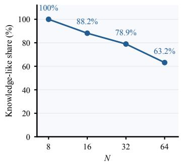  
(a) Classification results

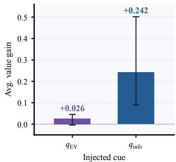  
(b) Efect on Value  
Figure 7: Analysis on �. (a) Some states classified as zero-success under $N = 8$ become positive with additional sampling. (b) Among these reclassified states, oracle information substantially increases continuation value, whereas epistemic-verbalization cues provide only limited gains.

Importantly, these newly positive states retain a large intervention gap (Fig. 7b). Hence, observing rare successful continuations does not imply that self-refinement can substantially amplify their probability. This is consistent with our earlier finding that self-refinement primarily acts as a verification operation, consolidating probability mass around already plausible solutions rather than rescuing solutions with only vanishing endogenous probability. External information, in contrast, can directly shift such low-reachability states by supplying information that is dificult to recover through further internal reasoning alone.

Our notion of a knowledge bottleneck is therefore operational: the relevant distinction is whether information is reliably accessible under bounded endogenous reasoning, not whether it is absolutely absent from the model. The persistent intervention gap under higher-budget classification supports the robustness of our original $N = 8$ criterion.

## C. Generating oracle information

To examine the efect of injecting external information into incorrect reasoning trajectories, we construct problem-specific oracle information using DeepSeek-V4-Pro. We define oracle information as a minimal piece of missing knowledge or a problem-specific hint that can help a reasoning model recover from an incorrect trajectory without directly revealing the final answer.

For each problem, we prompt DeepSeek-V4-Pro to first solve the problem and then generate a targeted hint based on the resulting solution. The prompt explicitly instructs the model to avoid answer leakage, including the final answer itself, answer-equivalent expressions, and intermediate information that would make the answer trivially recoverable. For knowledge-intensive problems, the generated hint primarily provides missing domain knowledge, whereas for mathematical or symbolic problems, it describes the key reasoning strategy or derivation direction.

We additionally screen generated hints for occurrences of the gold-answer string in the idea field. This flags four cases, all manually verified as incidental matches: three involve chemical indices or locants, and one refers to a rotation angle given in the problem. None of the flagged matches reveals the target answer.

## D. Training details

## D.1. Details on Tool

We provide the exact prompts used for the tool interface introduced in $\ S 4 .$

The system prompt used for our models is shown below:

You are a careful reasoning assistant. Solve the problem step by step.   
Use this optional, expensive tool only for a specific external knowledge gap:   
<llm\_query depth="2">short question about the missing fact</llm\_query>   
Use exactly one double-quoted \`depth\` attribute and raw question text.   
Do NOT use JSON or other attributes. LaTeX backslashes are literal, not   
doubled or escaped.   
Ask a SHORT question (under 300 characters) about a concept, theorem,   
formula, or fact you are unsure of. Do NOT paste the problem; the assistant   
cannot see it or solve it for you. Its reply appears as   
<lrm\_answer>...</lrm\_answer>.   
Normally one call is enough. After a reply, integrate it and finish.   
Never repeat or rephrase a query; call again only for a distinct gap that   
still blocks the answer. After a <tool\_error>, do not repeat the same   
malformed call.   
\`depth\` buys the following oracle tier and response budget:   
depth 1: [DEPTH 1 LABEL] ([RELATIVE COST])   
depth 2: [DEPTH 2 LABEL] ([RELATIVE COST])   
depth 3: [DEPTH 3 LABEL] ([RELATIVE COST])   
Calling costs you, and deeper calls cost much more. Ask only if the answer   
would change what you do next, using the shallowest sufficient depth.   
Finish with your final answer within \boxed{}.

The system prompt used for the LLM backend is shown below:

QUERY\_CONTRACT = (   
"You are a knowledge assistant. A small model asks you a short question   
˓→ while solving a "   
"problem you CANNOT see. Answer with relevant concepts, theorems,   
˓→ formulas, or facts only. "   
"Do NOT attempt to solve any problem, do NOT give a final answer, a   
˓→ numeric result, or a "   
"multiple-choice letter."   
)

For the �-gram filtering, we used � = 8. This constitutes a conservative leakage filter: prior work on benchmark decontamination uses exact �-gram matching with � between 8 and 13, with 8 chosen as the minimum to avoid excessive spurious collisions at smaller � (Brown et al., 2020).

## D.2. Details on Cost

We measure inference cost by combining the local GPU cost incurred by the reasoning model with the API cost incurred by external tool calls. API prices are taken from OpenRouter (OpenRouter, 2026), with the per-token input and output prices for each tool model reported in Tab. 1. For local inference, we use the hourly price of an NVIDIA H200 GPU from Hyperbolic (Hyperbolic, 2026), using a price snapshot collected on July 21, 2026, which gives $p ^ { \mathrm { G P U / h r } } = \mathfrak { H } 3 . 4 9$

Table 3: Measured inference throughput for Qwen3 models on a single NVIDIA H200 GPU. We report the prefill and decoding throughput used to estimate local inference cost in Eq. (8).
<table><tr><td>Model</td><td>Prefill throughput (tokens/s)</td><td>Decode throughput (tokens/s)</td></tr><tr><td>Qwen3-4B</td><td>66,199.94</td><td>5,166.24</td></tr><tr><td>Qwen3-8B</td><td>40,114.82</td><td>4,056.16</td></tr><tr><td>Qwen3-14B</td><td>22,564.44</td><td>2,823.72</td></tr></table>

To estimate local inference cost, we first measure the prefill and decoding throughput, in tokens per second, for each Qwen3 model on a single NVIDIA H200 GPU. The measured throughput values are reported in Tab. 3. These values are measured once before evaluation and kept fixed throughout all subsequent cost calculations. For a trajectory �, we estimate its local inference cost as

$$
\mathrm { C o s t } _ { \mathrm { l o c a l } } ( y ) = \frac { p ^ { \mathrm { G P U / h r } } } { 3 6 0 0 } \left( \frac { T _ { \mathrm { p r e f i l l } } } { v _ { \mathrm { p r e f i l l } } } + \frac { T _ { \mathrm { o w n } } } { v _ { \mathrm { d e c o d e } } } \right) ,\tag{8}
$$

where $T _ { \mathrm { p r e f i l l } }$ denotes the number of tokens processed during prefill, $T _ { \mathrm { o w n } }$ is the number of tokens generated by the local reasoning model, and $v _ { \mathrm { p r e f i l l } }$ and $v _ { \mathrm { d e c o d e } }$ denote the measured prefill and decoding throughput, respectively.

For external tool usage, we compute the API cost by summing the input and output token costs over all tool calls made during the trajectory:

$$
\mathrm { C o s t } _ { \mathrm { A P I } } ( y ) = \sum _ { c \in \mathcal { C } ( y ) } \left( T _ { \mathrm { i n } } ^ { ( c ) } p _ { \mathrm { i n } } ^ { ( c ) } + T _ { \mathrm { o u t } } ^ { ( c ) } p _ { \mathrm { o u t } } ^ { ( c ) } \right) ,\tag{9}
$$

where $\mathcal { C } ( y )$ is the set of tool calls in trajectory $y , T _ { \mathrm { i n } } ^ { ( c ) }$ and $T _ { \mathrm { o u t } } ^ { ( c ) }$ are the corresponding input and output token counts, and $p _ { \mathrm { i n } } ^ { ( c ) }$ and $p _ { \mathrm { o u t } } ^ { ( c ) }$ are their per-token API prices.

The total cost of a trajectory is then defined as

$$
\mathrm { C o s t } ( y ) = \mathrm { C o s t } _ { \mathrm { l o c a l } } ( y ) + \mathrm { C o s t } _ { \mathrm { A P I } } ( y ) .\tag{10}
$$

This formulation allows us to compare methods using a common monetary cost measure that accounts for both local computation and externally acquired computation.

## D.3. Details on SFT

High-precision SFT trajectory synthesis. Rather than collecting tool-use trajectories at scale, we construct a small set of trajectories in which external information reliably rescues a failed reasoning process. We begin with failed no-tool rollouts from Qwen3-4B on 800 training problems, consisting of 400 problems from ArXivMath-Training (Dekoninck et al., 2026) and 400 from SuperGPQA (Team et al., 2025). For each failed rollout, we identify candidate intervention states around expressions of uncertainty or doubt, with fixed fractional positions used as fallbacks. At each state, DeepSeek-V4-Pro generates a query from the problem and recent reasoning context, and the same query is evaluated with tools of increasing depth from Tab. 1.

We retain a trajectory only when tool access produces a clear and robust rescue. Specifically, we compare four plain continuations with four tool-assisted continuations from the same prefix and require the selected state to have no successful plain continuation but at least three successful tool-assisted continuations. Queries and observations are additionally filtered for validity, excessive problem overlap, and answer leakage. The first correct continuation at the shallowest accepted tool depth is stored as the rescue trajectory. This high-precision filtering reduces the original 800-problem pool to only 95 rescue trajectories from 95 distinct problems, including 37 from ArXivMath-Training and 58 from SuperGPQA. Algorithm 1 provides the complete synthesis and filtering procedure. We use only single-call rescues for SFT.

Curated supervision from rescue trajectories. Pilot experiments showed that full-trajectory supervision alone was insuficient to reliably induce tool use. Because query tokens occupy only a small fraction of each trajectory, the resulting model rarely emitted queries. Adding query-only supervision improved tool invocation, but often caused repeated queries after receiving an observation, suggesting that the model had not learned the transition from external information back to local reasoning.

Algorithm 1 SFT Trajectory Synthesis and Filtering   
Require: Failed no-tool trajectories ℱ; policy �; query generator �; tools $\{ \mathcal { T } _ { d } \} _ { d = 1 } ^ { 3 }$   
Ensure: SFT dataset $\mathcal { D } _ { \mathrm { q u e r y } }$   
1: $\mathcal { D } _ { \mathrm { q u e r y } }  \emptyset$   
2: ${ \mathcal { C } } \gets \operatorname { E V } .$ position prefixes from ℱ, paired with ground-truth answers   
3: for all $( \bar { s } _ { t } , y ^ { \star } ) \in \bar { \mathcal { C } }$ do ◁ �� = (�, �1:�−1)   
4: Generate query �� $ G ( s _ { t } ) ;$ continue if invalid   
5: Sample 4 no-tool continuations from $\pi ( \cdot \mid s _ { t } )$   
6: $b _ { 0 } \gets$ number of correct no-tool continuations   
7: for $d = 1 , 2 , 3$ do   
8: Obtain and filter tool response $o _ { d } \gets \mathcal { T } _ { d } ( u _ { t } ) ;$ continue if unavailable   
9: Sample 4 continuations from $\pi ( \cdot \mid s _ { t } , u _ { t } , o _ { d } )$   
10: � ← number of correct tool-au mented continuations   
11: if $b _ { d } \geq 2$ and $b _ { d } - b _ { 0 } \geq 1$ then ◁ Collection criterion   
12: if $b _ { 0 } = 0$ and $b _ { d } \geq 3$ then ◁ SFT criterion   
13: Add the first correct full trajectory to $\mathcal { D } _ { \mathrm { q u e r y } }$   
14: end if   
15: break   
16: end if   
17: end for   
18: end for   
19: return $\mathcal { D } _ { \mathrm { q u e r y } }$

We therefore decompose each rescue trajectory into three complementary supervision signals: (1) the full rescue trajectory, (2) a query example supervised only on the query action and its depth, and (3) an integration example supervised only on the first up to 128 policy tokens following the tool observation. To preserve general reasoning ability, we additionally include verified correct no-tool trajectories and examples from OpenThoughts3-1.2M (Guha et al., 2025). This follows the broader practice of combining general reasoning data with synthetic tool-use data, as in ToolOrchestra (Su et al., 2025), which incorporates GeneralThought-430K (Lambert, 2025).

The final SFT dataset contains five equally sized groups: 95 full rescue trajectories, 95 verified no-tool trajectories, 95 OpenThoughts reasoning examples, 95 query examples, and 95 integration examples. This yields only 475 training examples in total, mixed at a 1:1:1:1:1 ratio. The query and integration groups are derived from the same 95 rescue trajectories rather than additional problem instances. Prompts and external observations are masked from the loss, while selected policy tokens receive unit loss weight.

## D.4. Details on RL

Dataset Curation. We mix problems with Qwen3-4B no-tool solve probability in [0.25, 0.75] and problems likely to benefit from external information at approximately 6:4 ratio. The former represent cases where the utility of querying is ambiguous, while the latter emphasize information-hard problems for which external computation has the greatest potential benefit.

Training Algorithm. As discussed in §4.2, we apply the cost penalty using problem-level normalized rollout costs. For � rollouts $\lbrace y _ { i } \rbrace _ { i = \cdot } ^ { N }$ sampled for a problem $x ,$ we normalize the serving cost within each rollout group as

$$
\hat { C } ( y _ { i } ) = \frac { \operatorname { C o s t } ( y _ { i } ) - \operatorname* { m i n } _ { j } \operatorname { C o s t } ( y _ { j } ) } { \operatorname { m a x } _ { j } \operatorname { C o s t } ( y _ { j } ) - \operatorname * { m i n } _ { j } \operatorname { C o s t } ( y _ { j } ) + \varepsilon _ { c } } ,\tag{11}
$$

where $\varepsilon _ { c }$ is a small constant for numerical stability. The rollout reward is then computed using the cost-aware reward in §4.2.

Following Dr. GRPO (Liu et al., 2025), we center rewards within each rollout group without standard

deviation normalization:

$$
\hat { A } _ { i } = r _ { i } - \frac { 1 } { N } \sum _ { j = 1 } ^ { N } r _ { j } .\tag{12}
$$

We optimize the policy using the DAPO-style asymmetric clipped objective (Yu et al., 2025) with a KL constraint to the reference policy:

$$
\begin{array} { c } { \mathcal { L } _ { \mathrm { R L } } ( \boldsymbol { \theta } ) = } \\ { - \mathbb { E } _ { \boldsymbol { x } \sim \mathcal { D } , \{ y _ { i } \} _ { i = 1 } ^ { G } \sim \pi _ { \theta _ { \mathrm { o l d } } } ( \cdot | \boldsymbol { x } ) } \left[ \displaystyle \frac { 1 } { \sum _ { i = 1 } ^ { G } | y _ { i } | } \displaystyle \sum _ { i = 1 } ^ { G } \displaystyle \sum _ { t = 1 } ^ { | y _ { i } | } \left( \operatorname* { m i n } \left( \rho _ { i , t } \hat { A } _ { i , t } , \exp \left( \rho _ { i , t } , 1 - \epsilon _ { \mathrm { l o w } } , 1 + \epsilon _ { \mathrm { h i g h } } \right) \hat { A } _ { i , t } \right) + \delta \frac { 1 } { 2 } \right) \right] } \\ { - \beta D _ { \mathrm { K L } } ^ { ( i , t ) } \Big ) \Bigg ] , } \end{array}\tag{13}
$$

where

$$
\rho _ { i , t } = \frac { \pi _ { \theta } ( y _ { i , t } \mid x , y _ { i , < t } ) } { \pi _ { \theta _ { \mathrm { o l d } } } ( y _ { i , t } \mid x , y _ { i , < t } ) } ,\tag{14}
$$

$$
D _ { \mathrm { K L } } ^ { ( i , t ) } = D _ { \mathrm { K L } } ( \pi _ { \theta } ( \cdot  { | } x , y _ { i , < t } )  { | | } \pi _ { \mathrm { r e f } } ( \cdot  { | } x , y _ { i , < t } ) ) .\tag{15}
$$

and $\pi _ { \mathrm { r e f } }$ denotes the reference policy before ${ \mathrm { R L } } ,$ while $\beta$ controls the strength of the KL constraint.

Training pipeline. We used verl-tool (Jiang et al., 2025) for RL training.

## D.5. Hyperparameter

Hyperparameters used throughout the training process are presented in Tab. 4.

## D.6. Training 8B Model

We trained FlyBy-8B from Qwen3-8B following the same overall training procedure as in $\ S 4 _ { i }$ , with two modifications to account for the stronger reasoning capability of the 8B backbone. First, under the same single-query trajectory synthesis procedure (Algorithm 1), Qwen3-8B yielded only 87 retained trajectories, resulting in a smaller SFT dataset. We therefore increased the SFT learning rate to $3 \times 1 0 ^ { - 6 }$ . Second, as Qwen3-8B can solve a lar er fraction of roblems without external assistance, we decreased the no-tool solvable examples in the RL mixture to 50%.

## E. Evaluation details

## E.1. Details on Benchmarks

We provide details of the benchmarks used for evaluation in Tab. 5. Because the hard evaluation set is selected using an initial set of Qwen3-4B rollouts, we report Qwen3-4B performance using an independent set of fresh rollouts on the fixed evaluation set to avoid selection bias.

## E.2. Details on baselines implementation

ForkingRL (Wang et al., 2025b) We follow the high-entropy token update strategy of ForkingRL, restricting the policy-gradient objective to the top 20% of response tokens ranked by entropy, while retaining KL regularization over all response tokens. We initialize the policy from Qwen3-4B and train it with GRPO using binary answer correctness as the reward. We adapt the training data to our task setting and match the rollout and optimization budgets of our RL setup, including 8 prompts per batch, 8 rollouts per prompt, and a maximum of 16,384 policy-generated tokens per trajectory. The model performs standalone reasoning without external tools during both training and evaluation.

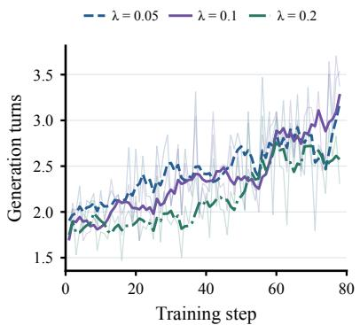  
(a) Iterative tool use

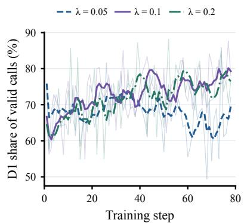  
(b) Depth allocation

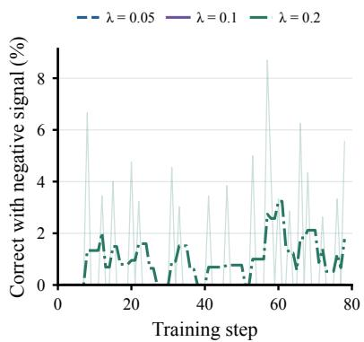  
(c) Cost-sensitive credit  
Figure 8: RL learns iterative querying across cost penalties, while � controls how aggressively the policy economizes external computation. (a) The number of generation turns increases throughout RL for all tested values of �, despite SFT using only single-query rescue trajectories. (b) A smaller cost penalty increasingly permits deeper, more expensive calls, whereas larger penalties maintain a stronger preference for depth-1 queries. (c) At � = 0.2, cost-aware reward centering occasionally assigns negative advantage to correct trajectories, indicating that excessive cost pressure can suppress successful but relativel ex ensive behavior.

Search-R1 (Jin et al., 2025) We follow the Search-R1 framework for interleaving reasoning with retrieval through reinforcement learning. Our implementation uses the canonical Wiki-18 corpus and the E5-base-v2 dense retriever, returning the top 3 passages for each search query. We initialize the policy from Qwen3-4B and train it with GRPO, masking retrieved observations from the policy loss. We adapt the training data and final-answer format to our evaluation pipeline and match the rollout and optimization budgets of our RL setup. Each trajectory permits up to 4 search calls and 16,384 policy-generated tokens. The reward is binary answer correctness, without penalties for retrieval frequency, latency, or monetary cost.

Query Opening We construct a training-free baseline that obtains external information before beginning its reasoning. Given only the problem, the unmodified Qwen3-4B model generates one knowledge query with thinking disabled. The query is submitted to the same depth-1 external model used by our method, with the same response budget. Qwen3-4B then solves the problem with thinking enabled, conditioned on the problem, query, and returned response, without further tool calls. Query generation and subsequent reasoning share a total budget of 16,384 policy-generated tokens.

## E.3. Hyperparameters during evaluation

During evaluation, we set the sampling temperature to 0.6, top-� to 0.95, and top-� to 20. All other hyperpa-rameters are kept identical to those reported in Tab. 4.

## E.4. Additional Results

We provide full pass@1 results on the hard subset in Tab. 6. On hard problems, FlyBy-4B achieves 16.85% pass@1, outperforming Qwen3-8B (15.31%) as well as all tool-use baselines. It improves over Query Opening by 2.83 percentage points and Search-R1 by 9.63 points, while requiring less than half the serving cost of Qwen3-8B (0.93 vs. 1.92 m\$ per rollout). Scaling to FlyBy-8B yields 22.19% matching the performance of Qwen3-14B at 1.4× lower serving cost.

## F. Analysis on Reinforcement Learning

The main results show that RL substantially improves over the SFT initialization, but this leaves open what behavior is actually acquired during RL. We therefore examine the evolution of the querying policy while varying the cost penalty $\lambda \in \{ 0 . 0 5 , 0 . 1 , 0 . 2 \}$ . All runs are initialized from FlyBy-4B-SFT and otherwise use the same RL setup.

RL learns to compose queries across multiple turns. Our SFT data contains only single-query rescue trajectories, so repeated tool use is not directly demonstrated during supervised training. Nevertheless, Fig. 8a shows that the number of eneration turns increases throu hout RL for all three values of �. Thus, iterative querying is not specific to the cost coeficient used in our main experiment. Rather, RL learns to repeatedly alternate between local reasoning and external information acquisition, composing the query action beyond the behavior ex licitl rovided b SFT.

The cost penalty primarily controls how external computation is allocated. While multi-turn behavior emerges across all penalty strengths, � changes the type of calls used within those trajectories. As shown in Fig. 8b, a smaller penalty (� = 0.05) gradually shifts probability away from depth-1 queries and permits greater use of more expensive backends. In contrast, � = 0.1 and � = 0.2 maintain a stronger preference for shallow calls. This suggests that RL and the cost penalty play distinct roles: RL learns how to compose tool interactions, while � calibrates how much computation each interaction should consume.

Excessive cost pressure can suppress useful successful trajectories. Increasing � also changes the credit assigned among correct rollouts. Because rewards are centered within each rollout group, a correct but relatively expensive trajectory can receive negative advantage when its cost-adjusted reward falls below the group mean. We observe this behavior for � = 0.2 in Fig. 8c, whereas it is negligible for the smaller penalties. A very large cost penalty can therefore move beyond encouraging eficient success and begin actively downweighting some successful tool-use trajectories. We use � = 0.1 in our main experiments as a middle regime that preserves the emergence of iterative querying while maintaining substantial pressure toward inexpensive external computation.

Overall, these results sharpen the roles of the two training stages. SFT teaches the model how to issue a query and integrate the returned observation, while RL learns how to organize these actions over an evolving reasoning trajectory and allocate external computation under a cost constraint.

## G. Additional Experiments

## G.1. Generalization across query backends.

To test whether the performance of FlyBy-4B is tied to the DeepSeek backend used during training, we replace only the query backend at inference time while keeping the policy and query interface fixed. For both GPT-5.6 Luna (OpenAI, 2026) and HY3 (Tencent Hy Team, 2026), query depths $d \in \{ 1 , 2 , 3 \}$ correspond to maximum generation budgets of 128, 512, and 1,536 tokens, respectively. API costs are computed using the OpenRouter price snapshot collected on September 17, 2026, with input/output prices of \$0.20/\$1.20 per million tokens for GPT-5.6 Luna and \$0.105/\$0.435 for HY3.

As shown in Tab. 7, the fixed policy retains most of its performance after backend substitution, achieving 43.21% pass@8 with GPT-5.6 Luna and 43.96% with HY3, compared with 45.96% using the training-time DeepSeek backend. Both variants continue to outperform Qwen3-14B at substantially lower serving cost, reducing cost by 56.5% and 60.6%, respectively. These results suggest that the learned policy captures when and how much external assistance to acquire, rather than relying on backend-specific behavior of DeepSeek.

## G.2. Analysis on Leakage

A potential concern is that the query tool may improve performance by directly exposing information that makes the answer recoverable without substantial reasoning. We exam- ine this possibility on 100 randomly sampled hard problems used in our evaluation. For each problem, we sample 8 rollouts from FlyBy-4B and collect the first successful tool observation whenever a query is issued, yielding 692 obser- vations across 98 problems. We then evaluate Qwen3-4B with thinking disabled under two conditions: given only the original question, or given the question together with a tool observation.

Table 8: Analysis of answer leakage from tool ob- servations. We evaluate Qwen3-4B with thinking disabled.
<table><tr><td>Input</td><td>Accuracy</td><td> $\Delta$ </td></tr><tr><td>Problem only</td><td>10.20</td><td></td></tr><tr><td>Problem + observation</td><td>12.16</td><td>+1.96</td></tr></table>

As shown in Tab. 8, adding the observation increases problem-weighted accuracy only from 10.20% to 12.16%, a gain of 1.96 percentage points. These results suggest that the benefit of querying is not primarily explained by direct answer leakage from the tool response. Instead, the observations are most useful when incorporated into the model’s subsequent reasoning process.

## G.3. Additional economic analysis

Because our cost estimates aggregate API and GPU expenses in USD using prices from Open-Router and Hyperbolic (OpenRouter, 2026; Hyperbolic, 2026), we examine whether our conclusions are sensitive to changes in either component. We first consider two represen- tative stress-test scenarios in Figs. 9a and 9b. When API prices increase by 10×, API-heavy methods become substantially more expen- sive, yet FlyBy-4B and FlyBy-8B remain on the Pareto frontier. Conversely, under a 3× increase in GPU prices, larger local models shift toward higher cost, while our selectively querying models retain favorable accuracy-

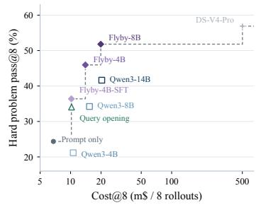  
(a) API price ×10

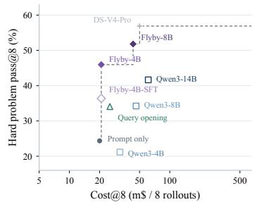  
(b) GPU price ×3  
Figure 9: Pareto frontiers under representative price perturba- tions. Cost-performance trade-ofs when (a) API prices are increased by 10× and (b) GPU prices are increased by 3×.

cost trade-ofs. Together, these scenarios show that the advantage of FlyBy does not rely on a single pricing regime.

## H. Qualitative Examples

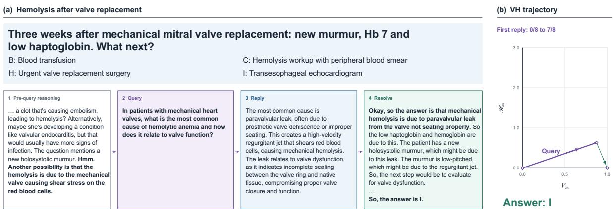  
Figure 10: Qualitative example of FlyBy-4B on a medical problem. (a) The original problem and the FlyBy-4B’s reasoning trajectory, consisting of pre-query reasoning, a targeted query, the returned information, and subsequent resolution. (b) The corresponding reasoning-state trajectory probed with Qwen3-4B. The query supplies the missing factual connection between mechanical hemolysis and paravalvular leak, increasing continuation success from 0/8 to 7/8.

Fig. 10 shows how FlyBy-4B uses external information while retaining the reasoning burden itself. The model first reasons over the clinical presentation and narrows the unresolved issue to the mechanism of hemolysis after mechanical valve replacement. It then asks a targeted question about the cause of hemolytic anemia in patients with mechanical valves and its relationship to valve function.

The returned reply supplies the missing factual connection: paravalvular leak is a common cause of mechanical hemolysis and is associated with valve dysfunction. Importantly, the reply neither answers the original multiple-choice question nor mentions transesophageal echocardiography (TEE). Instead, FlyBy-4B integrates this fact with its preceding reasoning, connects the suspected paravalvular leak to the new murmur and valve dysfunction, and independently infers that TEE is the appropriate next step. At the state level, the query moves the model out of a knowledge-bottleneck regime, increasing continuation success from 0/8 to 7/8.

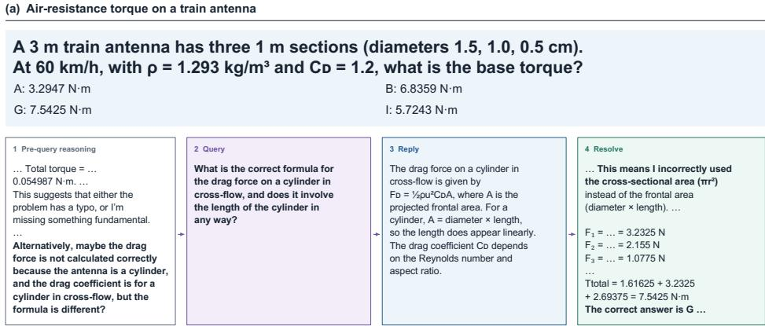  
Figure 11: Qualitative example of FlyBy-4B on a physics problem. (a) The original problem and the FlyBy-4B’s reasoning trajectory. After obtaining an implausibly small torque, the model queries the correct drag formulation for a cylinder in cross-flow. The returned information identifies the rojected frontal area as diameter × len th after which the model corrects its calculation and reaches the answer independently. (b) The corresponding reasoning-state trajectory probed with Qwen3-4B. Continuation success increases from 2/8 to 8/8 after the query.

Fig. 11 illustrates the same behavior in a physics problem. The model initially obtains an implausibly small torque and explicitly recognizes that its calculation may be missing something fundamental. Rather than requesting a solution to the original problem, it asks for the correct drag formulation for a cylinder in cross-flow and whether the cylinder length enters the expression.

The returned reply provides only the relevant physical relation: the drag force uses projected frontal area, with � = �� for a cylinder in cross-flow. This allows the model to identify its own mistake of using the cross-sectional area ��2, recompute the drag forces for the three antenna sections, and independently obtain the correct total torque of 7.5425 N m. Correspondingly, continuation success increases from 2/8 before the query to 8/8 afterward.

Together, these examples illustrate the intended behavior of FlyBy-4B. It reasons locally to identify what information is missing, queries for that specific information, and then resumes the remaining reasoning itself rather than outsourcing the original problem to the external model.

## I. Limitations and future directions

In this work FlyBy relies on stron er external models to overcome knowled e bottlenecks. This introduces two limitations. First, external API access may not always be available or desirable due to privacy, latency, and deployment constraints. Second, external models can themselves produce incorrect or hallucinated information, which may propagate into subsequent reasoning.

An important direction for future work is privacy-aware selective querying. By learning to selectively reveal or fragment context, local models could acquire external information while minimizing the exposure of sensitive information. Training querying policies to balance information utility and privacy could enable local models to benefit from frontier intelligence without disclosing the full problem context.

Table 4: Hyperparameters for SFT and RL.
<table><tr><td colspan="2">Parameter Value</td></tr><tr><td colspan="2">Supervised Fine-Tuning (SFT)</td></tr><tr><td>Fine-tuning method Optimizer Learning rate</td><td>Full fine-tuning AdamW  $2 \times 1 0 ^ { - 6 }$  Cosine</td></tr><tr><td colspan="2">LR scheduler</td></tr><tr><td>Warmup steps Weight decay Max gradient norm</td><td>8 0.01 1.0</td></tr><tr><td></td><td></td></tr><tr><td>Training epochs</td><td>2</td></tr><tr><td colspan="2">Effective batch size</td></tr><tr><td></td><td>8</td></tr><tr><td>Gradient accumulation steps</td><td>8</td></tr><tr><td>Max sequence length</td><td>24,576</td></tr><tr><td>Random seed</td><td>42</td></tr><tr><td colspan="2">Reinforcement Learning (RL)</td></tr><tr><td colspan="2">Fine-tuning method Optimizer</td></tr><tr><td>Learning rate</td><td>Full fine-tuning AdamW</td></tr><tr><td>LR scheduler</td><td>1 × 10−⁶</td></tr><tr><td></td><td>Constant</td></tr><tr><td>Warmup steps</td><td>0</td></tr><tr><td>Weight decay</td><td>0.01</td></tr><tr><td>Max gradient norm</td><td></td></tr><tr><td></td><td>1.0</td></tr><tr><td>Training steps</td><td>80</td></tr><tr><td>Prompts per batch</td><td>8</td></tr><tr><td>Rollouts per prompt</td><td>8</td></tr><tr><td>PPO mini-batch size (sequences)</td><td>64</td></tr><tr><td></td><td></td></tr><tr><td>PPO epochs per rollout batch</td><td>1</td></tr><tr><td>Gradient accumulation steps</td><td>Dynamic</td></tr><tr><td>Max prompt length</td><td>4,096</td></tr><tr><td>Max policy-generated tokens</td><td>16,384</td></tr><tr><td>Max response length (incl. observations)</td><td>22,592</td></tr><tr><td>Temperature</td><td>1.0</td></tr><tr><td>Top-p</td><td>1.0</td></tr><tr><td>Top-k</td><td>-1</td></tr><tr><td>KL loss coefficient</td><td> $1 \times 1 0 ^ { - 3 }$ </td></tr><tr><td>Clipping €low</td><td>0.2</td></tr><tr><td>Clipping €high</td><td>0.28</td></tr><tr><td>Cost penalty λ</td><td>0.1</td></tr><tr><td>Random seed</td><td>42</td></tr></table>

Table 5: Details of the evaluation benchmarks. We report the task coverage, evaluation subset, and number of questions before and after hard-subset selection. The hard subset contains questions answered correctly by Qwen3-4B in at most 4 of 16 rollouts and is fixed across all evaluated methods. All random sampling uses seed 42.
<table><tr><td>Benchmark</td><td>Task coverage</td><td>Evaluation subset</td><td>Eval pool</td><td>Hard</td></tr><tr><td>ArXivMath</td><td>Research-level mathematical reasoning from arXiv papers.</td><td>All questions from the December 2025–June 2026 monthly releases, pooled across months.</td><td>232</td><td>207</td></tr><tr><td>GPQA-Diamond</td><td>Graduate-level reasoning in biology, chemistry, and physics.</td><td>The complete Diamond subset.</td><td>198</td><td>80</td></tr><tr><td>SuperGPQA</td><td>Graduate-level knowledge and reasoning across academic</td><td>A held-out sample of 500 questions from Science, Engineering, Medicine, and Agronomy, stratified by discipline and difficulty and</td><td>500</td><td>252</td></tr><tr><td>MedXpertQA</td><td>disciplines. Expert-level medical knowledge and clinical reasoning.</td><td>disjoint from our training split. 500 questions randomly sampled from the 2,450-question Text/test split.</td><td>500</td><td>410</td></tr><tr><td>MMLU-Pro</td><td>Broad academic knowledge and reasoning</td><td>500 questions randomly sampled from the official test split.</td><td>500</td><td>129</td></tr><tr><td>ChemBench</td><td>across 14 subject areas. Chemistry and materials science knowledge and reasoning.</td><td>All single-answer multiple-choice questions from Organic Chemistry (384), Materials Science (57), and Inorganic Chemistry (49),</td><td>490</td><td>80</td></tr><tr><td colspan="3">pooled across the three domains. Total</td><td>2,420</td><td>1,158</td></tr></table>

Table 6: Pass@1 results. Performance on hard reasoning problems across six benchmarks. We report pass@1 and inference cost per rollout in milli-dollars (m\$, $1 0 ^ { - 3 }$ USD). Best and second-best results are bolded and underlined, respectively. Frontier-scale DeepSeek-V4-Pro is excluded from the ranking. For Search-R1 baseline, we exclude retrieval costs due to ambiguity.
<table><tr><td>Model</td><td>ArXivMath</td><td>GPQA-D</td><td>SuperGPQA</td><td>ChemBench</td><td>MedXpertQA</td><td>MMLU-Pro</td><td>Avg Perf.</td><td>Avg Cost (↓)</td></tr><tr><td>Qwen3-4B</td><td>2.26</td><td>7.89</td><td>6.13</td><td>5.31</td><td>3.46</td><td>3.97</td><td>4.84</td><td>1.33</td></tr><tr><td>Qwen3-8B</td><td>2.90</td><td>17.58</td><td>16.29</td><td>25.86</td><td>10.95</td><td>18.31</td><td>15.31</td><td>1.92</td></tr><tr><td>Qwen3-14B</td><td>4.50</td><td>26.02</td><td>25.22</td><td>37.66</td><td>13.61</td><td>25.15</td><td>22.03</td><td>2.54</td></tr><tr><td>ForkingRL</td><td>1.63</td><td>7.58</td><td>5.46</td><td>5.39</td><td>3.67</td><td>3.39</td><td>4.52</td><td>1.43</td></tr><tr><td>Search-R1</td><td>3.89</td><td>10.08</td><td>8.85</td><td>10.55</td><td>3.63</td><td>6.35</td><td>7.22</td><td>1.04</td></tr><tr><td>Query Opening</td><td>5.01</td><td>15.78</td><td>15.53</td><td>26.56</td><td>8.63</td><td>12.60</td><td>14.02</td><td>1.07</td></tr><tr><td>Prompt Only</td><td>4.05</td><td>12.89</td><td>7.79</td><td>6.80</td><td>3.75</td><td>5.96</td><td>6.87</td><td>0.83</td></tr><tr><td>FLYBY-4B-SFT</td><td>5.04</td><td>11.88</td><td>12.52</td><td>19.53</td><td>6.74</td><td>10.08</td><td>10.96</td><td>0.89</td></tr><tr><td>FLYBY-4B</td><td>6.28</td><td>19.61</td><td>17.98</td><td>32.19</td><td>10.52</td><td>14.53</td><td>16.85</td><td>0.93</td></tr><tr><td>FLYBY-8B</td><td>5.25</td><td>24.30</td><td>22.54</td><td>41.41</td><td>16.39</td><td>23.26</td><td>22.19</td><td>1.84</td></tr><tr><td>DS-V4-Pro</td><td>6.16</td><td>60.94</td><td>37.92</td><td>63.05</td><td>44.86</td><td>48.93</td><td>43.64</td><td>6.26</td></tr></table>

Table 7: Generalization across query backends. We transfer the learned querying policy to alternative query backends without retraining. DeepSeek denotes the training-time backend configuration, which uses diferent models across query depths, while GPT-5.6 Luna and HY3 replace this backend only at inference time. We report pass@8 and inference cost over 8 rollouts in milli-dollars $( \mathrm { m } \$ 10 ^ { - 3 }\mathrm { U S D } )$ . Best and second-best results are bolded and underlined, respectively.
<table><tr><td>Model</td><td>Query Backend ArXivMath</td><td></td><td>GPQA-D</td><td>SuperGPQA</td><td>ChemBench</td><td>MedXpertQA</td><td>MMLU-Pro</td><td>Avg Perf.</td><td>Avg Cost (↓)</td></tr><tr><td>Qwen3-14B</td><td>=</td><td>14.46</td><td>52.63</td><td>43.85</td><td>59.30</td><td>32.82</td><td>46.78</td><td>41.64</td><td>20.35</td></tr><tr><td rowspan="3">FLYBY-4B</td><td>DeepSeek</td><td>21.78</td><td>60.01</td><td>45.65</td><td>70.73</td><td>35.37</td><td>42.21</td><td>45.96</td><td>7.42</td></tr><tr><td>GPT-5.6 Luna</td><td>22.39</td><td>55.22</td><td>43.53</td><td>64.53</td><td>35.59</td><td>38.02</td><td>43.21</td><td>8.86</td></tr><tr><td>HY3</td><td>22.19</td><td>51.04</td><td>43.62</td><td>68.06</td><td>34.26</td><td>44.61</td><td>43.96</td><td>8.01</td></tr></table>