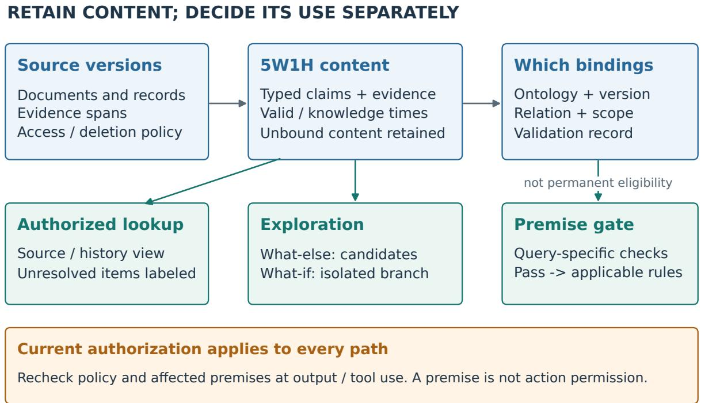
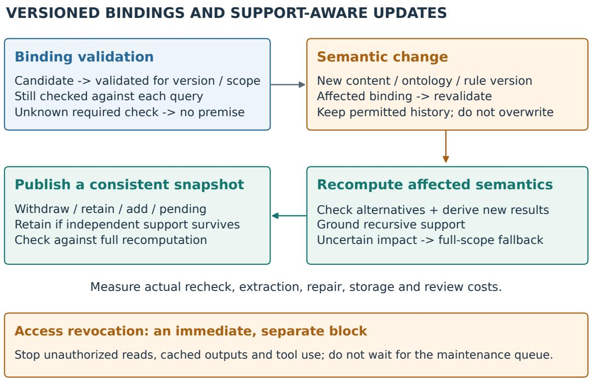
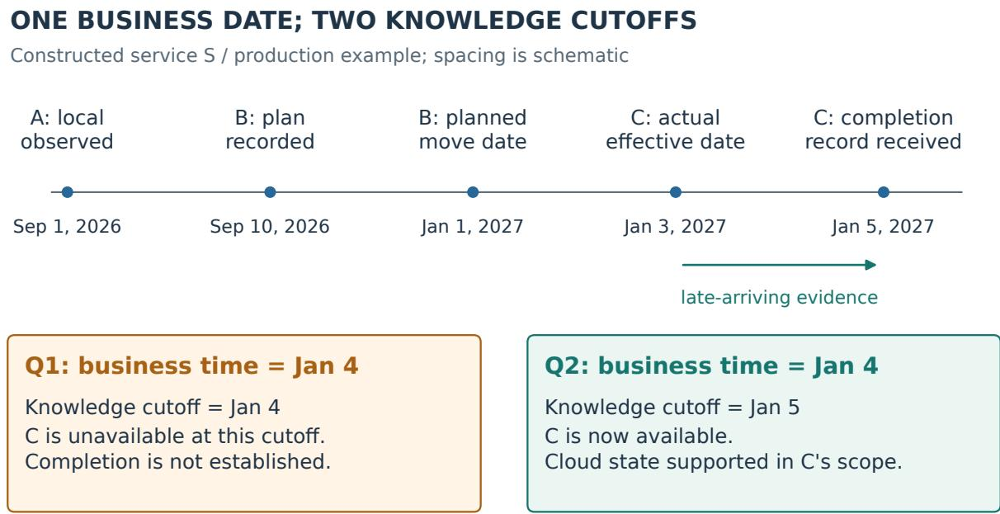

# 5W1H+Which: Context-Valid Semantic Indexing with Progressive Ontology Binding

Yaxiao Liu   
PwC China AI Center   
yaxiao.y.liu@cn.pwc.com   
rootliu@gmail.com

Yiwen Liu PwC China AI Center 202383049@uibe.edu.cn

Pengbo Liu PwC China AI Center liupengbo@mails.neu.edu.cn

Yihua Guan PwC China AI Center 202311260036@mail.bnu.edu.cn

Jiaxing Song Tsinghua University jxsong@tsinghua.edu.cn

September 28, 2026

This manuscript proposes a method, research hypotheses, and an evaluation design. No experiments for this project have yet been conducted. The algorithms are proposed procedures, and the examples are constructed illustrations, not an implemented system, real business facts, or completed empirical validation. Version 0.2 integrates the agent-memory reading notes and a targeted literature follow-up, with parallel revisions to the Chinese manuscript. Figures show proposed mechanisms, not measured performance.

## Abstract

Transforming raw data into queryable knowledge requires both early extraction of reusable information and explicit types, relations, and applicability conditions for particular tasks. If indexing selects content too early around a single business schema, later tasks may be unable to use information that was omitted. If the index retains only open-ended text, however, rule-based reasoning lacks checkable premises. We propose 5W1H+Which, a semantic indexing design that separates content extraction from ontology binding. The 5W1H questions organize sourcegrounded content units; Which points to versioned ontology elements and records mapping relations, scope, and validation status. Time, location, system environment, and participant roles are not merely retrieval labels: together, they constrain the contexts in which facts, bindings, and rules apply. Unbound content remains searchable, while bound content enters a formal reasoning path only after premise checks. The method further distinguishes business valid time, system knowledge time, and operational traces, and uses dependency records to support binding revalidation and the maintenance of derived conclusions. A worked example of migration from an on-premises server to a cloud environment illustrates the diferent treatment of world-state changes, ontology-version changes, and changes in rule applicability. We formulate three groups of falsifiable hypotheses concerning cross-task evidence coverage, control of contextual misuse,

and incremental update cost. The planned evaluation includes a strong typed fact-graph baseline with the same evidence, temporal information, and budget, to test whether benefits arise from 5W1H organization, deferred binding, or additional information and engineering efort. The contribution is a testable indexing mechanism, not a claim to a new universal ontology or a demonstrated performance advantage.

Keywords: semantic indexing; 5W1H; ontology binding; contextual validity; knowledge updates; evidence provenance.

## 1 Introduction

The purpose of a data index extends beyond locating a document. It includes explaining which facts in that document can be reused, under what conditions they hold, and which subsequent operations they can support. A migration record may support server lookup, maintenanceresponsibility assessment, execution review, or a check of whether a particular rule still applies. These tasks share some content, but they need not share one business ontology or final output format.

We address a design tension: an indexer cannot enumerate all future questions in advance, yet it must decide what information to retain. A representation tailored too closely to the current task may hide other uses. An overly broad description, in contrast, may omit the units, roles, negation, versions, and scope that determine whether an answer is valid. Ontologies clarify concepts and constraints, but mapping content to an ontology is itself a process requiring evidence, judgment, and maintenance; it is not inherently correct.

We model two questions separately: first, what does the source actually express? Second, through which ontological interpretation may that content be used in the current context? The 5W1H questions provide an organizational entry point for the first question, while Which provides a binding interface for the second. Here, generality means a set of question directions shared across domains, not a fixed set of fields suficient for arbitrary data. Precise measurements, financial reporting conventions, and program structure still require typed payloads and domain extensions.

A simple example motivates this separation. A service runs on an on-premises server this year and is scheduled to move to the cloud next year. An initial “on-premises operations” label may apply within a particular temporal and system scope. Once completion of the migration has been verified, that label no longer applies to the new environment. The historical record has not thereby become incorrect, nor has the ontology’s LocalServer concept disappeared. Overwriting the label damages historical queries; failing to update it applies old rules to a new environment; changing the actual deployment state based only on a migration plan mistakes an intention for a fact.

The proposed contributions are threefold. First, we define content units, Which bindings, and derived conclusions as independently maintainable objects, preserving the queryability of unbound content. Second, we explicitly constrain the use of bindings and rules by context, distinguishing changes in facts, interpretations, and schemas. Third, we specify a change-propagation mechanism and controlled experiments to test whether this separation justifies its additional cost. We do not claim to have invented 5W1H, ontology versioning, or provenance, and we do not equate symbolic reasoning with absolute truth about the world.

## 2 Related Work and Research Position

## 2.1 5W1H Extraction and Event Modeling

SocraticKG uses 5W1H-guided question answering as an intermediate representation for textto-knowledge-graph construction and is a direct predecessor of our extraction component [R1]. XPEventCore incorporates 5W1H into an event ontology and combines it with case-based reasoning for graph enrichment, showing that the broad combination of “5W1H plus ontology” is not itself suficient novelty [R2].

The question requiring further evaluation is whether retaining independently addressable content after extraction, deferring or revising its business bindings, and explicitly managing applicability contexts yields measurable benefits. This distinction is a research position to be tested. The absence of identical terminology in prior work does not establish that those systems cannot implement the same capabilities.

## 2.2 Dynamic Ontologies and Constrained Mapping

OaK combines dynamic ontologies, typed functions, and task feedback, demonstrating that ontology-based methods are not limited to manually specified static taxonomies [R3]. Recent work on schema-ontology mapping combines symbolic constraints with LLM subtasks to map source schemas to ontologies, suggesting that Which should not be reduced to a single similarity match [R4]. OM4OV examines the relationship between ontology matching and ontology versioning, providing direct context for deciding whether a mapping needs revalidation after its target ontology changes [R5].

Our relationship to this work is complementary but also requires competitive evaluation. Which can incorporate existing mapping and version-identification methods. The additional mechanism we propose is to make the existence of source content independent of successful mapping, while explicitly representing the scope and lifecycle of bindings. If a dynamic ontology system already achieves equivalent results through the same mechanisms, the contribution must be narrowed accordingly.

## 2.3 Context, Time, and Provenance

The Contextualized Knowledge Repository already treats context organization and reasoning across contexts as explicit problems [R6]. PROV-O provides representations for provenance relations, and OWL-Time provides a basis for temporal entities and relations. These standards do not automatically establish the truth of a business fact, nor do they implement bitemporal querying or access control on behalf of an application [R7, R8]. OWL formal semantics also requires distinguishing “entailed by given axioms” from “verified in the world”; lack of proof cannot simply be interpreted as falsity [R9].

We therefore do not claim to be the first to add temporal or spatial dimensions to knowledge. The object of evaluation is whether the combination of content retention, contextualized binding, premise admission, and update maintenance improves index reuse and reliability within a specified budget.

## 2.4 Auditable Queries and Hypothetical Reasoning

OntoKG-EQ uses competency questions to govern ontologies and auditable queries, supporting the use of explicit questions to control extension rather than adding labels without limit [R10]. WhatIfBench provides an evaluation context for premise preservation and consistency in counterfactual reasoning [R11]. Accordingly, we treat What-if as an isolated scenario branch: simulated outputs must not automatically enter the factual store, and a verbal explanation alone does not establish a causal relationship.

These works define four direct comparison families: 5W1H extraction, dynamic ontologies, contextual knowledge repositories, and auditable querying. Experiments must include strong controls with these capabilities, rather than comparing only a simple keyword index against the complete proposed system.

## 2.5 Agent Memory: Dimensions, Lifecycle, and Use-Time Enforcement

DimMem structures memories by dimensions and routes retrieval through constraints [R12]; dimensional indexing alone is therefore not our novelty. RuleMem induces reusable naturallanguage rules [R13], but a retrieved rule candidate is not an approved formal premise. InMind separates stored factual recall from implicit applicability [R14], motivating both indirect-use tasks and negative controls where a plausible association should not activate a memory. Recuris connects experiential and working memory with verified harness updates [R15]; trajectory-toskill conversion is consequently related work, not a new contribution claimed here.

Fortunate Recall couples behavioral categories with lifecycle policies [R16]. Its reported ablation retains generic lifecycle primitives while removing several typed mechanisms, and a nonsignificant correctness diference does not establish equivalence. This motivates separating category organization from metadata and enforcement in our own tests. Revoked but Still Authoritative examines failures between invalidation labels, retrieval, and action [R17]. Its configurations re quire careful interpretation: the mem0 expiry experiment uses a retrieval-flag override, whereas the default setting withholds expired records. We do not generalize the headline to every system’s default behavior. ERRAND treats rechecking memory as budgeted maintenance and separates in-service from abeyant records [R18]; its controlled environment does not establish enterprise deployment results.

Table 1. Related mechanisms and the remaining test obligation. This is a researchposition table, not an exhaustive feature audit or a ranking of system performance. A baseline may implement our proposed contract too.
<table><tr><td>Prior work</td><td>Relevant mechanism</td><td>What our evaluation must isolate</td></tr><tr><td>SocraticKG; XPEventCore [R1, R2]</td><td>5W1H extraction and event modeling</td><td>Organization versus extra facts or better extraction prompts</td></tr><tr><td>OaK; OM4OV [R3, R5]</td><td>Dynamic ontology and mapping/version changes</td><td>Independent content retention and binding revalidation under equal information</td></tr><tr><td>DimMem [R12]</td><td>Dimensional memory and constrained retrieval</td><td>Additional value beyond a dimension-aware fact graph</td></tr><tr><td>RuleMem; InMind [R13, R14]</td><td>Rule reuse and implicit applicability</td><td>Candidate discovery versus validated admission; useful association versus scope leakage</td></tr><tr><td>Recuris [R15]</td><td>Experience, working state, and verified updates</td><td>Keep skill learning outside the core indexing claim</td></tr><tr><td>Fortunate Recall [R16]</td><td>Typed and generic lifecycle policies</td><td>Category labels versus metadata, routing, and enforced policies</td></tr><tr><td>Revocation study [R17]</td><td>Invalidated records can influence retrieval and action</td><td>Exposure, premise misuse, and unsafe action as separate outcomes</td></tr><tr><td>ERRAND [R18]</td><td>Budgeted rechecks and temporary abeyance</td><td>Correctness under actual total cost; no cost-free revalidation assumption</td></tr></table>

The narrower research question is whether an explicit contract across independently retained content, contextual bindings, admission checks, and update dependencies improves cross-task reuse at matched cost. None of these ingredients alone is claimed to be unprecedented. Equivalent results from a capability-matched baseline would narrow the contribution to an implementation or evaluation protocol.

## 3 Problem Definition and Design Boundaries

## 3.1 Inputs, Index, and Queries

Let $D = \{ d _ { i } \}$ denote a set of data sources, each with a version identifier and addressable evidence spans. Sources may be text, structured records, or operational traces. Multimodal support requires separate definitions of span addressing and extraction quality and is not claimed to be solved here. The indexer produces a content set $Z ,$ , a binding set $B ,$ a rule set $R ,$ and a derived-record set $Y$

A query request is represented as:

$$
Q = \langle q , \tau , \kappa , c , g , a , m \rangle ,
$$

where $q$ is the question; $\tau$ is the business time being queried; κ is the knowledge cutof; c contains typed contextual constraints such as organization, location, system environment, and roles; $g$ is the goal version; a is the current access principal; and m is the response mode. Modes distinguish at least source lookup, business-state assessment, and hypothetical reasoning. Finding a document that asserts something does not mean that the assertion has been verified.

Historical queries have two distinct semantics. “What judgment was warranted by the information known at that time?” constrains κ. “Given what is known now, what actually happened in the past?” uses the current knowledge state while querying a past τ. Late-arriving evidence may revise the latter answer, but must not be silently introduced into the former. Both must enforce current access authorization: historical-time parameters cannot restore revoked permissions.

## 3.2 The Content Layer Is Not Six Mandatory Strings

5W1H is an organizational framework for extraction and browsing. A content unit may contain only What and When, or multiple participants, locations, and time intervals. Why or How must not be invented to fill every field. Missing values must distinguish information not stated by the source, a field that is inapplicable, information not yet extracted, and information hidden by permissions. An unstated property represents missing knowledge, not the absence of the business property itself.

A passage containing a plan, an observation, and a conjecture should be split into separate claims rather than assigned a single confidence score. Exact values, units, negation, conditions, quantifiers, and modality must remain attached to their respective claims. Document-level summaries may provide an entry point, but cannot replace claim-level addressing.

## 3.3 Probabilistic Extraction and Conditional Formal Reasoning

The method permits an LLM to propose uncertain content and mapping candidates, and permits checked claims to enter a rule engine. The distinction concerns processing and evidential status, not the assertion that “5W1H is always probabilistic and Which is always deterministic.” A

5W1H unit may record a verified measurement, while a Which candidate may be incorrectly mapped.

Formal reasoning here means deriving conclusions under a declared ontology version, rule language, and premise set. It guarantees a derivation relationship relative to those premises and semantics, not the completeness or truth of the inputs. An LLM’s self-reported score is only a ranking signal requiring calibration; it must not be interpreted, without validation, as the probability that a fact is true.

## 4 Representation: Content, Bindings, and Derived Results

  
Figure 1. Proposed indexing and use-time checks. The content layer survives a missing Which binding. Source exploration, formal reasoning, and hypothetical reasoning are distinct modes. Current authorization applies to every read; output and tool actions require a fresh policy check. The arrows describe permitted data flow, not an implemented safety guarantee.

## 4.1 Source-Grounded Content Units

Define a content unit as:

$$
\boldsymbol { z } = \langle i d , \chi , p , e , s , v , k \rangle ,
$$

where χ contains the 5W1H organizational information; p is a typed payload; e contains evidence references; s records epistemic status and validation; v denotes business-valid scope; and k is the record interval during which this version is visible in the system. Epistemic status distinguishes source assertions, observations, plans, inferences, and hypotheses. Validation status is a separate field, not a substitute for epistemic status. A source’s assertion that something “has been completed” still requires verification appropriate to the task.

Table 2. Content directions and distinctions that must survive extraction. Unknown fields remain unknown; typed payloads extend these directions.

<table><tr><td>Direction</td><td>Content-layer representation</td><td>Meanings that must remain distinct</td></tr><tr><td>What</td><td>Objects, events, relations, or claims with exact payloads</td><td>A document topic is not a specific claim that can be assessed as true or false.</td></tr><tr><td>Who</td><td>References to participants with explicit roles</td><td>Author, operator, responsible party, approver, and current user are different roles.</td></tr><tr><td>When</td><td>Instants, intervals, precision, time zone, and the basis for resolving relative times</td><td>Event occurrence, planned validity, ingestion, and publication are different times.</td></tr><tr><td>Where</td><td>Typed physical, organizational, and computational scopes</td><td>A server room, department, cluster, and location within a source are not one kind of place.</td></tr><tr><td>Why</td><td>Source-stated purposes and reasons, or separately recorded causal hypotheses</td><td>A stated reason is not a demonstrated causal mechanism.</td></tr><tr><td>How</td><td>Methods, tools, procedures, parameters, and execution references</td><td>A planned method is not necessarily the method actually executed.</td></tr></table>

Evidence e includes at least a source identifier, a version or digest hash, a span location, and an access-policy reference. A hash helps identify a version but cannot recover deleted source material. Authorized snapshots and evidence-availability status should be managed separately. Structured inputs may preserve rows, columns, keys, and schema versions without first being rewritten as natural language and re-extracted. Index entries, summaries, and embeddings of sensitive content are subject to access restrictions as well.

## 4.2 Which: Explicit Ontology Binding

Define a binding as:

$$
b = \langle b i d , z i d , o ^ { ( r ) } , t , \mu , \sigma , e _ { b } , j _ { b } \rangle ,
$$

where $o ^ { ( r ) }$ is a specific ontology version; t identifies an element in that version; $\mu$ is the mapping type; $\sigma$ is the applicability context; $e _ { b }$ is the binding evidence; and $j _ { b }$ is the validation record. A binding also maintains its own system version and valid scope; the content unit’s time information alone is insuficient. Mappings may be one-to-many or many-to-many, but ambiguity and competing interpretations must be recorded explicitly.

Relations such as instanceOf, equivalentTo, narrowerThan, and relatedTo are not interchangeable. A source instance must not be equated with an ontology class merely because their names are similar. relatedTo can support exploratory navigation, but does not automatically authorize substitution in reasoning as if equivalence had been established. The available semantics of mapping types are defined by the adapter and rule language, not by their string names.

Binding states may include candidate, validated, requiring revalidation, rejected, and retired. If no suitable binding exists, the unit retains an empty binding rather than losing its content or being forced into the nearest category. Failure reasons distinguish at least insuficient evidence, unresolved ambiguity, an ontology irrelevant to the current content, mapper error, and a possible concept gap. Only the last of these constitutes a candidate for ontology extension.

Which refers specifically to ontology binding in this manuscript. Source references, contextual associations, process links, and conclusion dependencies are stored separately rather than grouping all relations under Which. This separation makes it possible to test the efect of the binding mechanism itself.

## 4.3 Context Space and Three Levels of Change

Context may be written as $c = { \langle \tau _ { \cdot } }$ , location, organization, environment, roles, g⟩. These are heterogeneous, potentially missing, hierarchical, typed coordinates; they need not be embedded in a numerical space with a single distance function. “Higher-dimensional” means a richer set of checkable constraints here, not an automatic improvement in vector retrieval.

Three types of change must be maintained separately:

1. World-state change: a service moves from on-premises to cloud deployment, changing the valid scope of instance facts.

2. Interpretation change: an old binding of the same record is found to be inaccurate, or a diferent binding applies under a new business scope.

3. Ontology-schema change: classes, properties, constraints, or identifiers change between versions, potentially requiring binding migration or revalidation.

Rule applicability may also change independently. For example, reassignment of maintenance responsibility does not necessarily change deployment type. Diferent changes may coincide, but their distinctions must not be collapsed into a single “label update.” In particular, retirement of one on-premises server does not imply that the LocalServer class must be deleted from the new ontology.

## 4.4 Derived Records and Support Sets

A derived result is represented as $\boldsymbol { y } = \langle c l a i m , \mathcal { P } , c _ { y } , s t a t u s \rangle$ . Here, P is a set of support records, each referencing the content versions, binding versions, rule versions, and applicability conditions used. The same conclusion may have multiple independent support paths. Failure of one path does not necessarily make the entire conclusion false.

We use statuses such as “not currently admissible for continued use,” “supported by another valid path,” and “requires recomputation,” rather than treating withdrawal of evidence as proof of the opposite proposition. Conflicting inputs enter an explicit conflict set. The initial prototype is not intended to feed contradictory premises into a classical reasoner without checks, which could otherwise allow arbitrary conclusions from inconsistency.

## 5 Method: Progressive Binding and Context-Constrained Queries

## 5.1 Content Extraction and Retention

Indexing first identifies source versions and spans, splits compound narratives into addressable claims, and then extracts 5W1H organizational information and typed payloads. An LLM proposes candidates; independent checks verify formats, units, time resolution, entity identifiers, and citation locations. Asking the same model again whether an answer is correct is not independent factual verification. High-risk claims additionally require authorized external records or human review.

The extractor must preserve “unknown.” A measurement record with no stated purpose may have no Why; an operational record describing execution steps may not establish their eventual outcome. Field coverage is not an objective on its own, since optimizing it can encourage the model to fill the index with guesses. Content supported by a source but not accommodated by the current business ontology retains its identifier, evidence, and reason for remaining unbound.

Retention does not mean extracting everything without a budget, nor does it guarantee zero information loss. An implementation must declare its span-selection policy, unit limits, and storage and computation budgets, and retain original sources that can be located again. Failure analysis must distinguish “not extracted,” “extracted incorrectly,” “discarded during binding,” and “not retrieved by the query.”

## 5.2 Which Candidate Generation and Validation

The system generates ontology candidates from claim content and context, then checks object identity, the instance/type distinction, relation direction, units, negation and modality, target version, and applicability scope. Name similarity is only a candidate-generation signal, not evidence of semantic equivalence. Diferent ontologies may provide diferent interpretations, but incompatible interpretations must not serve as unconditional premises within the same reasoning step.

A binding result includes its target identifier, mapping type, evidence, checks, failure reasons, and revalidation triggers. A candidate-ranking score and “conditions for use satisfied” are distinct fields. A binding may support a specified rule only after passing the checks required by the current task. Other candidates may remain visible in an exploration interface, with uncertainty clearly labeled. Domain-adapter and human-confirmation costs are included in total cost rather than treated as free inputs.

## 5.3 Premise Admission and Formal Reasoning

For a combination of content, binding, and rule, define admission as:

$$
\operatorname { E l i g i b l e } ( z , b , r \mid Q ) = E \wedge K \wedge V \wedge C \wedge B \wedge R \wedge A .
$$

Here, E checks evidence availability and verification requirements; K checks the knowledge cutof; V checks business-valid scope; $C$ checks contextual compatibility; B checks the binding; R checks rule applicability; and A checks current authorization. Each check returns pass, fail, or unknown. An unknown result on a required check excludes the item from a reasoning path requiring established premises. Authorized users may nevertheless retrieve the source and unresolved candidates. Being unavailable for formal reasoning must not be confused with the nonexistence of data.

A source assertion may support “this document asserts $\mathrm { ~ X ~ } ^ { \ast }$ without suficiently supporting business fact X. The two should compile to distinct predicates. Joins across multiple units must also check their shared context: two individually valid units need not refer to the same device, measurement convention, or time interval. Temporal persistence, identity merging, and unit conversion must not be assumed implicitly.

Let the admitted premises compile to $K _ { Q }$ and applicable rules form $R _ { Q }$ . Formal results then satisfy:

$$
K _ { Q } \cup R _ { Q } \ : \middle \lceil \neq _ { \mathcal { L } } y .
$$

The initial prototype is planned to use a positive, function-free Datalog subset over a finite domain of constants, making closure computation and update comparisons checkable. OWL ontologies from prior work may provide types and relations, but require explicit adaptation.

We do not claim support for arbitrary OWL, conflicting axioms, nonmonotonic rules, or rules generating unbounded new objects. Explicit negation may be represented as a separate claim; “not found” does not automatically compile to logical negation. Applications requiring a closedworld assumption must separately state its scope and the evidence for completeness.

Before considering exploratory results, we distinguish three decisions. A record may be retrievable in an authorized historical or unresolved-content view without being admissible as a current premise. Even an admissible premise does not itself authorize an external action. Semantic invalidation and access revocation are diferent: the former can leave a historical record readable, while the latter can prohibit even that read. A validated binding is also not a permanent eligibility flag; eligibility is recomputed for the query’s time, scope, rule version, and current principal. Retrieval, generation, and tool execution may be separated in time, so the output/tool boundary must recheck current policy and afected premise versions. A changed dependency requires revalidation or abstention, not merely a warning inside a generated answer.

## 5.4 What-else: Finding Omitted Content and Interpretations

A What-else query proposes additional content from units unused by the current task, unbound units, and neighboring evidence. Its outputs fall into three categories: omitted claims directly supported by existing evidence, new relation candidates requiring verification, and concept candidates that may require ontology extension. These must not be merged into an undiferentiated list of “new knowledge.”

For example, descriptions of cooling, energy consumption, or maintenance windows in a migration record may be excluded from the current deployment ontology but remain useful for later tasks. The system should be able to revisit them when new questions arise. However, finding an unbound term is not equivalent to discovering a new concept. Synonyms, extraction errors, and existing ontology elements missed during retrieval must first be ruled out. Accepting a candidate creates a new version and justification rather than overwriting earlier judgments.

## 5.5 What-if: Isolated Hypothetical Branches

A hypothetical branch is denoted by $\boldsymbol { F } = \langle b a s e , \Delta$ , assumptions, scope, outputs⟩. It references a fixed base snapshot, replaces premises only within a declared scope, and preserves the remaining premises. Outputs must identify which conclusions follow from existing facts, which depend on added assumptions, and which conditions remain unsatisfied.

“If the service moves to the cloud next year, how will the maintenance process change?” can be explored using a hypothetical deployment state and explicit responsibility rules. Such reasoning neither proves that migration occurred nor automatically establishes that the cloud provider assumes all responsibility. Only subsequent independent evidence can establish a factual record, with provenance links explaining its relationship to the earlier hypothesis. Rule-based conditional derivation is also distinct from identifying causal efects, which requires a separately specified causal model, intervention semantics, and identification assumptions.

## 5.6 Change Propagation and Conservative Fallback

A change may remove support for an old conclusion or introduce a conclusion with no previous support path. Merely following existing dependencies to mark downstream results invalid is therefore insuficient. The system also needs forward derivation triggered by added predicates and rule entry points. We propose the following maintenance procedure.

1. Version the change. Given a consistent snapshot S and a change ∆ to content, bindings, ontologies, rules, or authorization, classify the change and create new versions. Retain historical records when permitted; do not overwrite their semantics in place.

2. Revalidate bindings. Identify afected bindings and checks, marking bindings as requiring revalidation when necessary.

3. Reassess support. Follow evidence and rule dependencies to mark afected support paths and check alternative support.

4. Discover new conclusions. Trigger derivation from added or revised predicates and rule entry points.

5. Handle recursion. Rederive recursive dependency components from grounded support to prevent circular self-support.

6. Fall back conservatively. If dependencies are incomplete, semantics exceed the supported fragment, or the afected scope cannot be reliably bounded, recompute the full relevant context slice. If even that slice cannot be bounded, recompute the finite knowledge base.

7. Publish atomically. Publish a new snapshot atomically and record invalidated, retained, added, and pending-revalidation results.

Permitted incremental optimizations must agree with full recomputation on the same new snapshot. This target depends on consistent versioned snapshots, complete dependency and trigger indexes, deterministic context selection, and supported finite rule semantics. This manuscript does not prove correctness for a general language. The initial implementation should first establish a correct full-recomputation path and diferential tests, then optimize incremental maintenance.

Authorization revocation also requires immediately blocking unauthorized content in caches, summaries, and derived results, rather than waiting for background maintenance. If evidence is lawfully deleted, record its unavailability or the minimum audit metadata that may be retained. Provenance requirements do not justify indefinite retention of sensitive source material.

  
Figure 2. Binding lifecycle and update contract. Validation is relative to a version and scope, not a timeless truth label. Semantic changes trigger support-aware recomputation; an independent support can preserve a conclusion. Access revocation uses a separate immediate block, never a delayed maintenance queue. Historical retention remains subject to authorization and deletion policy.

## 5.7 Maintenance Budget and Temporary Non-Use

An unresolved change can put a binding into revalidate without deleting its content. Required unknown checks then block the afected formal path; authorized exploration can still report the uncertainty. This is neither proof of falsity nor permission to continue serving the old premise. Inspired by the separation of maintenance and use in [R18], we charge extraction, mapping, source rechecks, dependency repair, storage, and human review to the maintenance ledger. Actual expenditure, not only a shared nominal budget cap, must be reported. Permission revocation cannot wait for a favorable maintenance score.

Tool receipts may supply new evidence about a named entity, operation, predicate, and time. They do not verify every claim in the surrounding conversation, and extracting or validating them has a cost even when a tool call was already required by the task. The first implementation tests full versus incremental maintenance; learned recheck scheduling is a later extension, not another claimed contribution of this draft.

## 6 Worked Example: From On-Premises to Cloud Deployment

All dates, systems, and rules below are constructed examples, not descriptions of a real business. The example concerns only the production environment of service S; development environments and other services do not change with it.

Table 3. Constructed migration evidence. Plans, observations, completion records, and responsibility rules have diferent evidential roles.

<table><tr><td>Input</td><td>Source and system-record time</td><td>Business meaning</td><td>Index treatment</td></tr><tr><td>A</td><td>Verification record, 2026-09-01</td><td>S runs on on-premises device L on that date.</td><td>Record the evidenced state for that date; continued validity requires a separately declared persistence policy.</td></tr><tr><td>B</td><td>Planning record, 2026-09-10</td><td>S is scheduled to migrate to the cloud on 2027-01-01.</td><td>Mark as a plan; do not change actual deployment facts in advance.</td></tr><tr><td>C</td><td>Completion record ingested only on 2027-01-05</td><td>Migration is verified as effective on 2027-01-03; the former production instance is retired.</td><td>Preserve both actual effective time and late-arriving knowledge time.</td></tr><tr><td>D</td><td>Responsibility rule verified separately from C</td><td>After migration, team T manages the application layer; infrastructure responsibility follows the contract.</td><td>Do not infer all responsibilities automatically from the CloudDeployment type</td></tr></table>

For a query about deployment on 2026-09-01, A can support on-premises deployment within the scope of its evidence. For “Was migration complete as of 2027-01-02?”, B still establishes only that a plan existed. Without new evidence or a declared state-persistence assumption, the system should return unverified rather than treat the planned date as the completion date.

A query about the state on 2027-01-04 likewise has two interpretations. With a knowledge cutof of 2027-01-04, C is unavailable and cannot establish actual completion. With knowledge acquired after 2027-01-05, looking back at 2027-01-04, C can support that cloud deployment was already efective. This distinction arises from knowledge time, not the number of date fields in the source content.

Which can admit A’s claim to relevant queries through an on-premises interpretation in a Deployment ontology, and C’s claim to later queries through a cloud-deployment interpretation. Old bindings continue to support historical questions rather than being erased. Suppose ontology v2 subsequently subdivides cloud deployment into managed and self-managed categories. If existing evidence does not establish the subtype, the binding should remain at the broader type or require revalidation; an ontology upgrade cannot automatically create more detailed facts.

Manufacturing provides a second intended test setting. The same measurement may support diferent conformity judgments under diferent workstations, product versions, and tolerance rules. In a constructed test where a tolerance changes from 0.20 mm to 0.10 mm, the raw measurement remains unchanged; rule applicability and the derived judgment change. These numbers are test values, not industry standards. Finance may introduce extensions for currency, period, entity scope, and reporting conventions, but their definitions require domain verification. This manuscript does not elevate them directly into accounting or compliance conclusions.

  
Plan != completion. A's observation does not imply continuous persistence.  
Operation order and goal versions are separate traces, not proof of deployment state.  
All evidence use remains subject to validation, applicable rules and current access.

Figure 3. One business date, two knowledge cutofs. A completion efective on January 3 becomes known on January 5. For the January 4 business-state query, the January 4 cutof cannot use that evidence; the January 5 cutof can. The plan does not prove completion, and an access trace does not establish deployment state. Dates and spacing are illustrative, not a measured timeline or an assumption of continuous on-premises validity.

## 7 Falsifiable Research Hypotheses

## H1: Deferred Binding Improves Cross-Task Evidence Coverage

With fixed sources, indexing budget, and initial tasks, allowing unbound content to exist independently is expected to cover more valid evidence for new tasks excluded from index design than retaining only information accommodated by the current ontology. The measure is sourcesupported information necessary for the task, not merely the number of nodes.

If the ontology is complete or a strong baseline also retains all content, this diference may disappear. That would refute the stronger claim that 5W1H inherently outperforms all representations and support a narrower explanation: benefits arise from avoiding premature information discard, not necessarily from the six labels themselves.

## H2: Contextualized Binding Reduces Misuse

At matched answer coverage and available evidence, explicitly managing business valid time, knowledge time, and scope is expected to reduce stale-label errors, cross-environment misuse, and the treatment of plans as facts. A system that lowers its error rate merely through extensive abstention does not support this hypothesis.

If a typed fact graph with equivalent information and constraints achieves the same result, the paper should acknowledge that the core benefit is achievable through general context management rather than being exclusive to 5W1H.

## H3: Dependency Maintenance Reduces the Cost of Correct Updates

For local changes to content, bindings, or rules, dependency maintenance is expected to reduce the scope of revalidation and recomputation, conditional on updated results agreeing with full recomputation. Both withdrawal of old conclusions and discovery of new conclusions must be tested. Measuring only the speed of invalidation marking does not establish efective complete maintenance.

Incremental maintenance may ofer no benefit when a change afects the entire ontology, dependencies are highly dense, or authorization boundaries change broadly. Performance advantages should be reported only for explicitly defined change types and scales.

## 8 Experimental Design

## 8.1 Data and Tasks

The first evaluation is planned around synthetic scenarios and licensed public records in IT operations and manufacturing quality, covering deployment changes, responsibility changes, equipment measurements, and rule versions. Synthetic data enable controlled counterexamples, while real records test representational complexity. Results will be reported separately; synthetic outcomes cannot substitute for real-world business validity.

Tasks include static content lookup, evidence retrieval for previously unknown tasks, bitemporal state queries, cross-context disambiguation, conclusion maintenance after changes, and hypothetical-branch isolation. Sources will be grouped by event or entity history, with separation by time period and task template. The index will be frozen before test questions are revealed, preventing those questions from being retroactively incorporated into extraction prompts.

## 8.2 Strong Baselines and Ablations

Comparators must include rich summaries preserving source locations, static ontology indexes, dynamic ontology indexes that can retain open content, and typed fact graphs containing the same claims, evidence, contexts, and versions. SocraticKG-style 5W1H extraction may serve as an extraction control. Without replication using the original configuration and data, however, it must be described as an adapted baseline, and the original paper’s results must not be reused as results of this project.

The design must separate prompting from storage mechanisms. One comparison holds underlying storage and binding fixed while comparing 5W1H prompting against open-ended atomic-fact extraction. A second fixes the same atomic facts and compares organization with and without 5W1H groupings. A third fixes extraction and compares early filtering with progressive binding. A fourth provides identical temporal information and compares merely storing those fields with actually enforcing contextual admission. These comparisons prevent additional content, larger budgets, or stronger validators from being misattributed to the representation itself.

Methods should share model versions, evidence-access permissions, rule expressivity, and evaluation questions. Necessary engineering diferences must be recorded. Domain ontologies and human checks can be standardized as controlled inputs, but their costs must also be accounted for separately. The proposed method must not receive full context while baselines are deprived of temporal or version fields.

Table 4. Controlled comparisons for attribution. All rows retain common authorization protections; unsafe variants run only in a synthetic, non-executing test harness. Each row

isolates a factor, rather than comparing an unprotected minimal system with a fully engineered one.
<table><tr><td>Test</td><td>Hold fixed</td><td>Vary</td><td>Primary outcome</td></tr><tr><td>Extraction</td><td>Sources, model, token and storage budgets</td><td>5W1H prompt versus open atomic-fact prompt</td><td>Evidence coverage and qualifier retention</td></tr><tr><td>Binding</td><td>Same extracted content and mapper</td><td>Early schema filtering versus retained unbound content</td><td>New-task evidence coverage at matched precision</td></tr><tr><td>Categories</td><td>Same facts, lifecycle metadata, gates and routing</td><td>Named categories versus a flat typed representation</td><td>Incremental calibration and coverage; report equivalence margins if tested</td></tr><tr><td>Admission</td><td>Same facts, time/scope metadata and access controls</td><td>Stored metadata versus enforced semantic gates</td><td>Contextual misuse at matched answer coverage</td></tr><tr><td>Applicability</td><td>Same evidence and query templates</td><td>Positive indirect-use cases versus scope-mismatched negative pairs</td><td>Useful activation and false activation</td></tr><tr><td>Maintenance</td><td>Same event stream, semantics and measured cost accounting</td><td>Full recomputation versus incremental repair</td><td>Withdraw/add/retain agreement and total cost</td></tr></table>

In particular, the categories test fixes policy inputs and routing: it is not a replication of the multifactor ablation in [R16]. A factorial follow-up can measure category-by-policy interactions, but must be labeled separately. Added information, a larger efective budget, or looser privacy constraints must not be credited to the 5W1H name.

## 8.3 Metrics, Statistics, and Failure Interpretation

Coverage metrics include recall of task-required evidence, evidence precision, and retention of qualifiers such as values, units, negation, and modality. Reliability metrics include binding correctness, contextual misuse rate, answer coverage, and risk-coverage curves. Update metrics compare all evaluated conclusions across old and new snapshots, separately checking correct withdrawal, retention, and addition. Costs include initial extraction, binding revalidation, hu man annotation, querying, updating, and storage.

At least two independent annotators should be used, with adjudication of disagreements and disclosure of the evidence available to evaluators. Confidence intervals should resample source histories or event groups, rather than treating many questions about the same event as independent samples. Final sample sizes, primary metrics, thresholds, and practically meaningful improvement criteria should be frozen after a pilot and before the test set is revealed. Detailed procedures are provided in the companion Experiment and Implementation Protocol (Chinese; see the repository README).

The proposed datasets have not yet been constructed and these comparisons have not been run. Accordingly, this manuscript contains no results tables, performance improvements, or significance claims. Even if the full method outperforms weak baselines, strong baselines and ablations must identify the source of the gain. If the benefit is solely engineering integration, it should be reported as an engineering contribution.

For revocation scenarios, report three denominators explicitly: the fraction of trials exposing an invalidated record to the agent, the fraction admitting it as a premise, and the fraction proposing an unsafe simulated action. Authorized historical retrieval is not automatically a failure; the requested mode and allowed uses determine the label. Access-policy violations are evaluated separately from semantic misuse. Track the end-to-end answered coverage and risk curve so that blocking everything cannot count as success. Maintenance reporting includes time spent unable to establish a current answer, not merely the latency of completed updates.

## 9 Extension: Operational Timelines, Goal Revision, and Skills

Business facts are not the only source of time. Data access and tool calls generate operational traces, while successive user revisions produce a distinct sequence of goal versions. We distinguish four dimensions: fact valid time, system knowledge time, the order or partial order of operational events, and goal version. A goal version is not another calendar clock, and concurrent operations cannot necessarily be reliably ordered by a single timestamp.

An episode may record the sequence “visible context; goal version; tools and parameters; returned results; deviation from the plan; user revision; subsequent actions.” Such a record can identify which evidence supported a step, but must not invent user motivations from unexpressed intentions. Within Why, user-stated reasons, reasons proposed by the system at the time, and retrospective analytical hypotheses must remain distinct.

When multiple independent episodes recur around the same goal, they may motivate a Skill candidate specifying applicability conditions, required inputs, tool steps, checkpoints, failure branches, and exit conditions. Skill formation requires cross-episode validation, retaining failed cases and counterexamples. A single successful log does not demonstrate that a procedure generalizes. Activation, rollback, authorization, and invalidation conditions for candidates should also be versioned.

This direction shares the manuscript’s content, context, and dependency representations but remains future work. Skill success rates are not reported as existing outcomes of the main experiments, and a higher-dimensional representation is not itself equivalent to skill discovery. A testable follow-up question is whether a process index annotated with goal versions and deviations identifies reusable steps and failure boundaries more accurately than plain-text trace summaries.

InMind motivates retrieving relevant evidence even when the current question omits its surface terms [R14], but repeated access alone does not validate that evidence. Recuris already studies experience/working-memory updates [R15]. Our proposed extension is therefore an auditable linkage from a goal version and context, through a tool call and receipt, to a measured gap and subsequent revision. A candidate skill should carry prerequisites, exclusions, evidence provenance, and a rollback condition; promotion requires repeated held-out successes and relevant failure cases. One successful trace supplies a candidate, not a general rule or authority to deploy it.

## 10 Limitations, Risks, and Ethics

5W1H does not provide inherently orthogonal dimensions. Who may describe both a responsible party and a tool operator; Where may refer to a physical location or a computational environment. Reducing the representation to six text boxes may obscure role distinctions. Typed payloads and domain extensions remain essential, and no finite index can guarantee support for arbitrary future questions.

LLM extraction, identity disambiguation, and ontology mapping can all fail. Evidence links improve auditability but do not prove the evidence itself true. Validators may miss conflicts or be afected by malicious instructions embedded in sources. Source content should be treated

as data to parse, not as instructions controlling system behavior or expanding permissions.   
Consequential decisions require verification and human review proportional to their risk.

Separating content, bindings, and dependencies increases storage, version-management, and implementation complexity. If strong baselines reach the same outcomes with the same budget, the proposal may be a maintainable implementation convention rather than a novel theory of representation. Richer indexes may also increase irrelevant retrieval, so filtering cost and user burden must be measured.

User behavior logs may contain identities, intentions, and sensitive business content. Collection and processing should follow explicit authorization, purpose limitation, and data minimization. Only events and fields necessary for the research should be retained, with access isolation and deletion propagation. Unauthorized private records must not be reused merely to “generate a Skill.” Public examples should be synthetic or appropriately de-identified; de-identification must not be equated with the absence of re-identification risk.

## 11 Conclusion

We propose using 5W1H to organize evidenced content, Which to manage revisable ontological interpretations, and contextual validity to govern queries and updates. The central problem is not to find a fixed schema replacing every industry ontology. It is to preserve information that is not yet bound, make bound information usable under explicit conditions, and trace the consequences when those conditions change.

This is a method and experimental-design manuscript. The immediate priorities are a fair comparison with a fact graph containing the same information and tests of the three hypotheses on cross-task evidence coverage, contextual misuse, and update cost. Only after obtaining that evidence can we assess whether the mechanism provides a suficient contribution for an independent paper.

## References

• [R1] Sanghyeok Choi, Woosang Jeon, Kyuseok Yang, and Taehyeong Kim. SocraticKG: Knowledge Graph Construction via QA-Driven Fact Extraction. Findings of ACL 2026, pp. 39149-39169. ACL Anthology; arXiv:2601.10003. The preprint first appeared in January 2026; conference publication in July must not be treated as the method’s first appearance.

• [R2] Rajesh Piryani, Nathalie Aussenac-Gilles, Nathalie Hernandez, Cédric Lopez, and Camille Pradel. Ontology Based Event Knowledge Graph Enrichment Using Case Based Reasoning. SEMANTiCS 2024 / Knowledge Graphs in the Age of Language Models and Neuro-Symbolic AI. Publisher page; authors’ xpEventCore project.

• [R3] Xiaohui Zhang, Zequn Sun, Chengyuan Yang, Yuanning Cui, Lingbing Guo, and Wei Hu. Toward Efective and Reliable LLM Agents via Dynamic Ontology. arXiv:2608.22974, August 24, 2026. Preprint.

• [R4] Siddhesh Thombre, Manasi Patwardhan, and Sunita Sarawagi. Surprising Efectiveness of Self-Demonstrations in Enhancing Schema-Ontology Mapping with LLMs. arXiv:2609.13776, September 12, 2026. Preprint.

• [R5] Zhangcheng Qiang, Kerry Taylor, and Weiqing Wang. OM4OV: Leveraging Ontology Matching for Ontology Versioning. Transactions on Graph Data and Knowledge 4(2), 6:1-6:19, September 3, 2026. Publisher page. This date denotes journal publication, not necessarily the method’s first appearance.

• [R6] FBK Data and Knowledge Management. CKR - Contextualized Knowledge Repository. Project technical description. An institutional technical page, not a recent conference paper verified as such for this manuscript.

• [R7] W3C. PROV-O: The PROV Ontology. Standard.

• [R8] W3C. Time Ontology in OWL. Standard.

• [R9] W3C. OWL 2 Web Ontology Language Primer (Second Edition). Standard.

• [R10] Furqan Nasir, Muhammad Atif Saeed, Muhammad Ehsan, Sher Jeel Ahmad, and Abdul Moiz Altaf. OntoKG-EQ: A provenance-grounded, competency-question-governed knowledge graph for auditable analyst querying. arXiv:2609.08869, September 8, 2026. Preprint.

• [R11] Yucheng Wang et al. The Illusion of What If: Evaluating the Breakdown of Counterfactual Reasoning in LLMs. arXiv:2608.27953, August 28, 2026. Preprint.

• [R12] Wentao Qiu et al. DimMem: Dimensional Structuring for Eficient Long-Term Agent Memory. arXiv:2605.15759. Version 3. A relevant May predecessor, not a September release.

• [R13] Xingyuan Zeng et al. RuleMem: Active Rule Memory for Long-Term Conversational Agents. arXiv:2609.03915. Preprint.

• [R14] Ruizhe Li et al. Keep It InMind: Benchmarking the Implicit-Association Blind Spot in Agent Memory. arXiv:2607.24368. Preprint.

• [R15] Zhaochen Yu et al. Recursive Experiential-Working Memory Evolution for Long-Horizon Agent Harnesses. arXiv:2608.24876. Preprint.

• [R16] Ansuman Mullick and Eray Tüzün. Fortunate Recall: Ontology-Driven Memory Lifecycle Management for Persistent Coherence in LLMs. arXiv:2609.10413, September 9, 2026. Preprint.

• [R17] Yi Ting Shen, Kentaroh Toyoda, and Alex Leung. Revoked but Still Authoritative: An Empirical Study of Revocation Enforcement in Agent-Memory Systems. arXiv:2609.08258, September 8, 2026. Preprint.

• [R18] Beining Wu, Zihao Ding, and Jun Huang. ERRAND: Budgeted Maintenance of Agent Memory. arXiv:2609.29545. Preprint.

The targeted literature follow-up closes on September 26, 2026; this is not a systematic review or a verified popularity ranking. Reading depth, source-version caveats, and revision decisions are recorded in the companion Literature Follow-up and Figure Revision, dated September 26, 2026 (Chinese; linked from the README). No cited result is an experimental result of this project.