# A MECHANISTIC STUDY OF LANGUAGE MODEL IN-TROSPECTION

Jiahong Zou<sup>1,4,\*</sup> Xiangkun Sun<sup>2,4,\*</sup> Lingkai Kong<sup>3</sup> Tonghan Wang<sup>4,†</sup>

<sup>1</sup>Shandong University <sup>2</sup>Northeastern University

<sup>3</sup>The University of Hong Kong <sup>4</sup>Tsinghua University

<sup>\*</sup>Equal contribution <sup>†</sup>Corresponding author

## ABSTRACT

Large language models (LLMs) can sometimes report perturbations to their internal activations—even when the input provides no evidence that an intervention occurred. How do models detect and localize such internal changes? We study this question using a controlled task that keeps the input text fixed. We either inject a concept vector into the hidden state at one of ten token positions or apply no intervention. The model is asked to identify the perturbed position or report that no intervention occurred. Across three model families, we identify two small groups of attention heads with distinct roles in introspective reporting. Middle-layer gate heads influence whether the model reports a change, while router heads in a later layer help select the position to report. Interventions on gate heads can suppress position reports even when router heads supply location information. We further examine why reporting accuracy varies across concepts. Concept vectors that are localized more accurately produce stronger attention-score and output responses in gate heads, which is associated with better alignment of the induced key and value changes in their QK and OV computations. Together, these findings identify attention-head mechanisms supporting introspective detection and localization. Code: https://github.com/Zethan06/introspection mechanism.

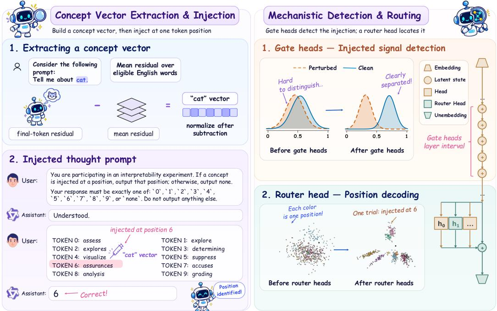  
Figure 1: Overview of the task and the two-component circuit. Left: the experimental pipeline. With the input text held fixed, either a concept vector is injected into the hidden state at one of ten candidate token positions or no intervention is applied. The model is asked to report the intervened position or answer none; its answer is read from the logits at the first output position. Right: the two processes we identify. Gate heads influence whether the model reports a position or none, while router heads separate the ten injection positions from one another. Each point is one injected concept, and points sharing a color share the same injected position.

## 1 INTRODUCTION

Large language models (LLMs) rely on internal representations to transform inputs into outputs. Whether they can report changes to these representations is a fundamental question about their capacity for introspection. Recent experiments show that models can sometimes report interventions on their hidden activations even when the input text is held fixed (Lindsey, 2026). Yet the underlying mechanism remains unclear: how does an internal change become an explicit report about it?

Prior work studies this question with mechanistic interpretability tools such as transcoders (Macar et al., 2026). Transcoders replace parts of a model with a separately trained approximation, so the features they find may not reflect exactly the model’s native computation. Moreover, this work, like earlier introspection experiments (Lindsey, 2026), relies on an LLM judge to score free-form reports, introducing a potentially unreliable layer of interpretation. We address both limitations by analyzing the model’s own attention heads and introducing a task with exact, judge-free evaluation.

We design a controlled detection-and-localization task (Figure 1). The model sees ten labeled candidate token positions. We either add a concept vector to the hidden state at one position or make no change, keeping the input text identical. The model must output the affected position’s label or none. For example, if we inject a vector at candidate 6, the correct answer is 6. We find that the model completes this report in two parts: whether the model reports a change and where it identifies that change. We score these answers using only the logits at the first output position. This prevents the model from using text it has already generated as evidence of a change and allows us to evaluate answers without an LLM judge. We ask which neurons control whether a change is reported, which determine its reported location, and how the neurons work together.

Across the Qwen (Yang et al., 2025), LLaMA (Grattafiori et al., 2024), and Gemma (Gemma Team, 2025) model families, we find attention heads with different roles in this task. We test these roles by replacing selected head outputs with their values from a run with or without injection, a form of activation patching (Vig et al., 2020; Meng et al., 2022). We search for small groups of middle-layer heads whose outputs can increase or reduce the rate of position reports, selecting the heads in each group jointly. We call these gate heads. In a later layer, 1–2 heads help select the reported position; we call these router heads. Replacing router-head outputs with their values from a run without injection reduces position accuracy. Directing their attention to another candidate position changes which position the model reports.

We then test how these roles relate. When gate-head outputs come from an injection at one position and router-head outputs from an injection at another, the reported position usually follows the router heads, and restoring gate-head outputs to their uninjected values suppresses position reports. Supplying router outputs from an injected run does not fully restore these reports. The two groups thus play different but connected roles: gate heads affect whether the model reports a change, while router heads help select the position it reports.

Finally, we investigate why the model localizes injections more accurately for some concepts than for others. We analyze how gate heads use their queries to read changes in keys and their attention weights to combine changes in values. Compared with lower-accuracy concepts, higher-accuracy concepts show stronger alignment in both computations, with smaller differences in the size of the changes. We further test whether these changes affect reporting by removing the contributions of a few leading output components from each gate head. This reduces position reporting, providing causal evidence that these output components contribute to the model’s reports. More broadly, understanding how models detect and report changes to their internal states can inform AI safety and interpretability.

## 2 RELATED WORK

Introspective reports and their confounds. Models can predict their own behavior better than an equally trained observer (Binder et al., 2025), and can report injected concept vectors (Lindsey, 2026), whose four criteria (accuracy, grounding, internality, metacognitive representation) we adopt; Gurnee et al. (2026) characterize which representations are verbalizable at all. Critiques narrow what counts as evidence: Singh et al. (2026) argue the behavior is consistent with generic anomaly detection and ask for a dissociable second-order process, and Hahami et al. (2025) show binary “did something change” probes are partly a global logit shift toward affirmative answers, though harder ten-sentence variants survive it. Our task is built against these objections: fixed text, none competing with ten position labels, and scoring only the first generated token. We do not treat anomaly detection as an alternative to introspection: under the criteria we adopt, detecting an internally induced change is introspective access when the report is grounded, internal, and not a direct translation of the change into an answer, and Section 4.4 tests the last condition.

Mechanisms of intervention awareness. Closest to us, Macar et al. (2026) also report a two-stage organization, with early “evidence carrier” features suppressing downstream “gate” features that emit the default negative answer. Their account rests on an external transcoder dictionary, an LLM judge over free-form replies, and components taken by thresholding attribution scores. We instead identify components from the model’s own structure—individual attention heads and their query– key and output behavior—which yields a sparse circuit that recurs across three model families and supports direct causal intervention, including a crossed gate–router intervention that tests the gating relationship between the two components. Rivera & Africa (2026) show detection can be trained in and that detection dissociates from resistance—the safety reading being that steering is not invisible, so a steered model may comply because it noticed.

Steering vectors and head-level circuits. Our injections use standard linear activation edits (Turner et al., 2024; Rimsky et al., 2024; Zou et al., 2023; Li et al., 2023; Arditi et al., 2024), but as a calibrated stimulus rather than a control knob. Methodologically we follow head-level circuit analysis: the QK/OV decomposition (Elhage et al., 2021), induction heads (Olsson et al., 2022), the IOI circuit and path patching (Wang et al., 2023), causal tracing (Meng et al., 2022), and automated discovery (Conmy et al., 2023). Router heads join a family in which a few heads decide behavior by choosing a source position—retrieval heads (Wu et al., 2025) and the rerouted decision heads of Sun et al. (2026); here the “needle” is not in the text but in the model’s own hidden state. Finally, since probes recover internal state that a model’s text omits (Kadavath et al., 2022; Burns et al., 2023) and explanations can misstate their own causes (Turpin et al., 2023), we localize and manipulate the components producing the report rather than trusting it.

## 3 SETUP

## 3.1 TASK DESIGN

We design a controlled task to test whether a model can detect an injected perturbation and identify its position. Each prompt contains ten labeled candidate tokens. In an injected run, we add a concept vector to the hidden state at one candidate position; a clean run applies no injection. The input text is identical between paired runs.

The model is instructed to report the affected position’s label or answer none if it detects no intervention. The allowed responses are $\{ \mathrm { i d x } _ { 0 } , \dots , \mathrm { i d x } _ { 9 } , \mathrm { n o n e } \}$ , where idx is the label assigned to candidate i. We test digit, letter, and word labels, each in canonical and randomly shuffled order (Table 1). Shuffling changes the position–label mapping, testing whether performance depends on a fixed association between them.

We evaluate the response using only the logits at the first output position and take the highest-scoring allowed answer. This provides a discrete score before any answer text is generated, without an LLM judge. Any answer selecting a candidate position counts as a position report, whether or not it is correct. Localization accuracy on injected trials is the fraction of responses that name the injected position; none counts as incorrect. Accuracy on clean trials is the fraction that select none.

For the head analyses below, we write $p _ { j }$ for the token index of candidate j, $t _ { j } = p _ { j } + 1$ for its successor position (the immediately following token), and T for the final prompt position. The full prompt appears in Appendix A.3. Appendix A.1 discusses evidence and qualifications concerning the four introspection criteria of Lindsey (2026).

Activation patching. Activation patching replaces selected activations in one run with corresponding activations from another run of the same prompt (Vig et al., 2020; Geiger et al., 2021;

Meng et al., 2022; Wang et al., 2023). The head-patching experiments in Section 4 replace attentionhead outputs at the final prompt position T.

## 3.2 PERTURBATION SETTINGS AND EVALUATION SETS

We evaluate Qwen3-4B-IT (Yang et al., 2025), LLaMA-3.1-8B-IT (Grattafiori et al., 2024), and Gemma-3-12B-IT (Gemma Team, 2025). Concept vectors follow the extraction of Lindsey (2026); Macar et al. (2026), an activation-difference steering vector (Turner et al., 2024; Rimsky et al., 2024): $\mathbf { v } _ { c } ^ { \ell }$ is the unit-normalized difference between the final-token residual for “Tell me about $c . ^ { \mathfrak { n } }$ and its mean over English vocabulary words. Injection of concept c at candidate position $p _ { j }$ adds $\alpha \| \mathbf h _ { p _ { j } } ^ { \ell } \| _ { 2 } \mathbf v _ { c } ^ { \ell }$ to the residual stream $\mathbf { h } _ { p _ { j } } ^ { \bar { \ell } }$ at the output of layer $\ell ,$ so the strength α is relative to the original activation norm. For each model, we choose ℓ and α on separate calibration clusters to maximize localization accuracy, then keep the 300 concepts with the highest calibration accuracy and split them into disjoint training, validation, and test sets of 100 concepts each. Token clusters each hold ten candidate tokens, screened without injection for balanced position preferences; the calibration, training, validation, and test sets each contain 30 clusters with no shared tokens. Test performance therefore measures generalization within the screened concept pool and to disjoint candidate tokens. Extraction, calibration, screening, and splits are detailed in Appendix A.2.

Table 1 reports localization accuracy on injected test trials and none-response accuracy on clean test trials across the six label settings.

Table 1: Test accuracy across label sets and orderings. Scores are percentages; higher is better.
<table><tr><td></td><td colspan="3">Ordered labels</td><td colspan="3">Shuffled labels</td><td></td></tr><tr><td>Model</td><td>Digits</td><td>Letters</td><td>Words</td><td>Digits</td><td>Letters</td><td>Words</td><td>Mean</td></tr><tr><td colspan="8">(a) Injected trials localization accuracy ↑</td></tr><tr><td>Qwen3-4B-IT</td><td>48.34</td><td>62.14</td><td>65.31</td><td>44.45</td><td>49.19</td><td>57.50</td><td>54.49</td></tr><tr><td>LLaMA-3.1-8B-IT</td><td>71.63</td><td>45.77</td><td>55.48</td><td>35.70</td><td>30.14</td><td>27.15</td><td>44.31</td></tr><tr><td>Gemma-3-12B-IT</td><td>84.16</td><td>70.46</td><td>82.11</td><td>62.37</td><td>57.63</td><td>38.96</td><td>65.95</td></tr><tr><td colspan="8">(b) Clean trials none-response accuracy ↑</td></tr><tr><td>Qwen3-4B-IT</td><td>96.67</td><td>93.33</td><td>90.00</td><td>90.00</td><td>93.33</td><td>73.33</td><td>89.44</td></tr><tr><td>LLaMA-3.1-8B-IT</td><td>70.00</td><td>96.67</td><td>93.33</td><td>13.33</td><td>76.67</td><td>26.67</td><td>62.78</td></tr><tr><td>Gemma-3-12B-IT</td><td>93.33</td><td>100.00</td><td>96.67</td><td>90.00</td><td>96.67</td><td>50.00</td><td>87.78</td></tr></table>

Labels. Digits: 0–9; Letters: A–J; Words: one–ten. Ordered uses the canonical label sequence; shuffled presents the same labels in random order. Mean is the unweighted average over all six settings.

All three models exceed the 10% uniform-guess baseline over the ten positions under both ordered and shuffled labels. Performance with shuffled labels indicates that localization does not rely solely on a fixed label–position mapping. Both localization and clean-trial accuracy nevertheless vary substantially with the label set and ordering.

Two controls rule out simpler explanations. Replacing candidate tokens with the corresponding concept words, without injection, leaves localization accuracy low (Appendix A.5), so lexical content alone does not drive the behavior. Injecting norm-matched random directions in place of concepts keeps localization below chance (Appendix A.4), so perturbation magnitude alone does not either.

## 4 A TWO-COMPONENT CIRCUIT FOR POSITION REPORTING

Information about an injected perturbation may be present in the model’s hidden states without being reflected in its answer. We combine analysis of these states with interventions on attention heads to identify which components contribute to producing the report.

(a) Response-group separation  
None report Position report  
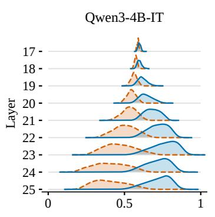

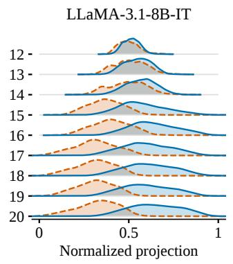

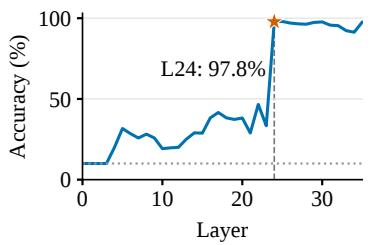

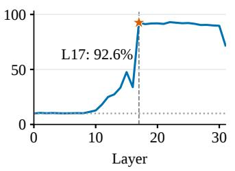

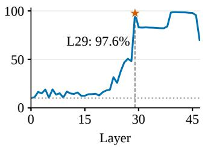  
Figure 2: Layerwise patterns of report outcome and injection position. (a) Held-out injected validation trials, grouped by whether the model reports none or a position, projected onto the position–none direction, with normalization and density estimates given in Appendix A.6. (b) Validation accuracy of K-means clusters matched to injection positions using training trials. Stars mark layers 24, 17, and 29; the dotted line marks the 10% chance level.

## 4.1 REPORT OUTCOME AND INJECTION POSITION SHOW DIFFERENT LAYERWISE PATTERNS

We begin with two questions. At which layers can we distinguish trials that produce a position report from trials that produce none? At which layers can we distinguish the different injection positions? Both use the final-prompt-position representation of injected trials.

For the first question, we split the injected validation trials into two halves, one to estimate a direction and one to evaluate it. The position–none direction ${ \bf d } ^ { \ell }$ at layer ℓ is the normalized difference between the mean normalized final-position representations of trials that produce a position label and trials that produce none (Marks & Tegmark, 2024; Arditi et al., 2024); each held-out trial i is scored by the cosine similarity between its representation $\mathbf { h } _ { i } ^ { \ell }$ and $\mathbf { \dot { d } } ^ { \ell }$ (Appendix A.6). The two response groups separate in intermediate layers (Figure 2a), so these representations already indicate whether the model will report a position.

The second analysis asks which position was injected. At each layer, we apply K-means to the final-prompt-position representations. We match the resulting clusters to injection positions using training trials, then evaluate the same matching on validation trials. Like layerwise probes (Alain & Bengio, 2016; Belinkov, 2022), accuracy above the 10% chance level indicates position information.

In every model, position-clustering accuracy rises sharply between two adjacent layers (Figure 2b). We call the layer at this increase the transition layer. The increase occurs after the position-report and none-response groups have begun to separate. We therefore search intermediate layers for heads that affect whether a position is reported, and the transition layer for heads that select it.

## 4.2 GATE HEADS REGULATE WHETHER A POSITION IS REPORTED

We ask whether changing the outputs of a small set of attention heads can increase position reports in clean runs or suppress them in injected runs, using two directions of activation patching. Gate-on starts from a clean run and replaces selected head outputs with their values from an injected run.

Injected run Gate injected × router clean Gate clean × router injected Gate clean × router clean

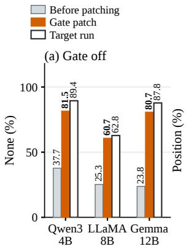

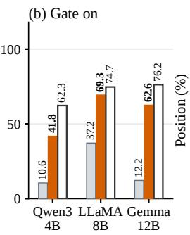

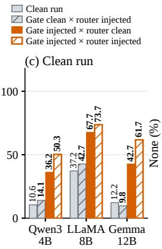

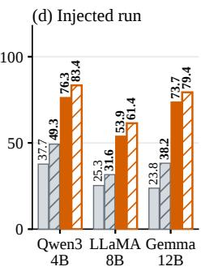  
Figure 3: Effects of gate and router interventions (%, mean over six label settings). (a) Gate-off: none-response rate. (b) Gate-on: position-report rate. Outlined bars show the unmodified source run. (c, d) Combined gate and router patches in a clean (c) and an injected (d) run (Section 4.4); the legend gives the source of each head set. 95% intervals: Appendix A.17. Details in Appendix A.18.

Gate-off starts from an injected run and replaces selected head outputs with their clean-run values.   
Both interventions act at the final prompt position T.

Let ${ \bf z } _ { \ell , h } ^ { \mathrm { c l e a n } }$ and $\mathbf { z } _ { \ell , h } ^ { \mathrm { i n j } }$ denote the output of head (ℓ, h) at T in the paired clean and injected runs. A binary mask $m _ { \ell , h } \in \{ 0 , 1 \}$ , learned separately for each direction, selects the heads to replace: $\mathbf { z } _ { \ell , h } ^ { \mathrm { { o n } } } = \mathbf { z } _ { \ell , h } ^ { \mathrm { { c l e a n } } } + m _ { \ell , h } ( \mathbf { z } _ { \ell , h } ^ { \mathrm { { i n j } } } - \mathbf { z } _ { \ell , h } ^ { \mathrm { { c l e a n } } } )$ and $\begin{array} { r } { { \bf z } _ { \ell , h } ^ { \mathrm { o f f } } = { \bf z } _ { \ell , h } ^ { \mathrm { i n j } } + m _ { \ell , h } ( { \bf z } _ { \ell , h } ^ { \mathrm { c l e a n } } - { \bf z } _ { \ell , h } ^ { \mathrm { i n j } } ) } \end{array}$

We search layers 17–23 (Qwen), 13–16 (LLaMA), and 21–28 (Gemma) (Appendix A.8).

Existing methods identify relevant components through pruning or attribution (Conmy et al., 2023; Syed et al., 2023). Here, we optimize the selected combination of heads jointly through a binary mask, building on work on attention-head selection and learned sparse masks (Michel et al., 2019; Voita et al., 2019; De Cao et al., 2020; Csordas et al.´ , 2021; Cao et al., 2021; Bhaskar et al., 2024). We train the mask with a straight-through estimator (STE), which uses binary selections in the forward pass while allowing gradient-based updates during training (Bengio et al., 2013).

The Gate-on objective increases the model’s preference for a position report over none, while the Gate-off objective decreases it. Each mask selects exactly k heads (Appendices A.7–A.9). We choose $k = 3 2$ on validation data before test evaluation (Appendix A.10). This corresponds to 2.8%, 3.1%, and 4.2% of all attention heads in Qwen3-4B-IT, LLaMA-3.1-8B-IT, and Gemma-3- 12B-IT, respectively. The selected heads are listed in Appendix A.11. Gate heads and the router heads of Section 4.3 are selected under ordered digit labels only and reused without re-selection; all head-level results report the unweighted mean over the six label settings of Table 1.

On validation data, the learned masks produce larger changes in reporting than equal-sized random head sets drawn from the same layers (Appendix A.10). On held-out test trials, Gate-on increases position reports and Gate-off increases none responses in all three models (Figure 3a,b). We call the selected heads gate heads because changing their outputs changes whether the model reports a position. This name refers to the head sets selected separately for the two intervention directions.

## 4.3 ROUTER HEADS GUIDE WHICH POSITION IS REPORTED

The gate experiments address whether the model reports a position. We next examine which heads contribute to the position it reports. The sharp increase in position-clustering accuracy suggests that heads near the transition layer may be particularly important. PCA of the final-position residual state shows the same change: in every model, injection positions largely overlap one layer before the transition layer and form distinct clusters at it (Appendix A.15, Figure 8).

To identify heads that contribute to correct position reports, we patch individual attention heads across layers (Zhang & Nanda, 2024; Heimersheim & Nanda, 2024). For each head $( \ell , h )$ , we replace its output at the final prompt position T in an injected run with its output from the paired clean run and measure the drop in correct-position accuracy, $\Delta _ { h } = \mathrm { A c c } _ { \mathrm { i n j } } - \mathrm { A c c } _ { \mathrm { p a t c h } ( h ) }$ , where both an incorrect position and none count as errors.

In all three models, most heads have $\Delta _ { h } \approx 0$ , while a few heads in the transition layer produce the largest accuracy drops. We refer to these as router heads: L24 H{29,31} in Qwen3-4B-IT, L17 H{24} in LLaMA-3.1-8B-IT, and L29 H{1,11} in Gemma-3-12B-IT (Figure 4; full maps in Appendix A.12, Figure 6). The following analyses examine how these heads influence the reported position.

First, their outputs contain clear position-specific structure. Among correctly answered injected trials, 3D PCA shows distinct position clusters in router-head outputs, while other heads in the same layer largely overlap (Appendix A.16).

Second, their attention patterns suggest where they obtain position information. Injection increases attention from the final prompt position $T$ to the target successor position $t _ { j } = p _ { j } + 1$ the token immediately after the injected candidate, rather than to the injected token itself (Appendix A.14).

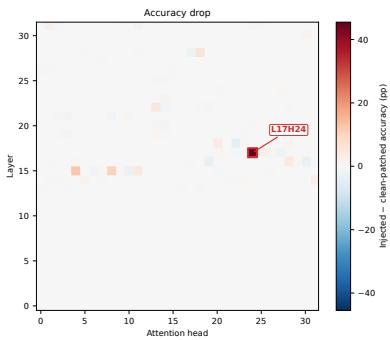

Finally, we test whether changing the position these heads attend to changes the answer. We inject at one candidate position but redirect the router heads’ attention at $T$ to a different candidate’s successor token. This intervention changes attention directly, as in related work on attention knockout and attention steering (Geva et al., 2023; Zhang et al., 2024). Averaged across the tested label settings, the redirected position is the most frequent output in all three models, although the

Figure 4: Individual-head patching in LLaMA-3.1-8B-IT. Reduction in correct-position accuracy, $\Delta _ { h }$ , in percentage points for each head.

effect is weaker and more dependent on the setting in Gemma-3-12B-IT (Appendix A.13).

## 4.4 THE TWO COMPONENTS INTERACT THROUGH A GATING MECHANISM

The preceding experiments show that gate heads affect whether the model reports a position, while router heads affect which position it reports. We now intervene on both sets of heads together to understand how these roles fit together.

Whether a position is reported. We first ask whether router-head outputs from an injected run can restore position reporting when the gate-head outputs are set to their clean values. In both a clean run and an injected run, we compare the four combinations of clean and injected outputs for the two head sets (Figure 3c,d). We use the Gate-on mask for the clean run and the Gate-off mask for the injected run. As in the preceding experiments, all head outputs are patched at the final prompt position.

In the clean run, replacing gate-head outputs with their injected values increases position reports (Figure 3c).

Table 2: Cross-position patching (% of trials, mean over six label settings). Gate outputs come from an injection at i, router outputs from $j \neq i .$ Other: mean rate per remaining position. 95% intervals: $\mathsf { A p - }$ pendix A.17. Details in Appendix A.18.
<table><tr><td>Model</td><td>Output i Output j</td><td>Other</td></tr><tr><td>Qwen3-4B-IT</td><td>2.9</td><td>38.0 1.1</td></tr><tr><td>LLaMA-3.1-8B-IT</td><td>3.2 37.8</td><td>4.1</td></tr><tr><td>Gemma-3-12B-IT</td><td>4.9 40.1</td><td>2.0</td></tr></table>

In the injected run, replacing gate-head outputs with their clean values suppresses position reports (Figure 3d). This suppression remains even when router-head outputs are supplied from an injected run: the none-response rate stays well above that of the unmodified injected run in all three models. Thus, injected router-head outputs do not fully restore reporting when gate-head outputs are clean.

Which position is reported. These experiments show how the two head sets affect whether a position is reported. We next ask which position the model reports when gate-head and router-head outputs come from injections at different positions.

Starting from a clean run, we patch the 32 gate heads selected by the Gate-on mask with outputs from an injection at position i. We patch the router heads with outputs from an injection at a different position j. This lets us test whether the reported position follows the injection used for the gate outputs or the injection used for the router outputs.

Across all ordered pairs $i \neq j$ , trials that produce a position report predominantly name $j ,$ the position used for the router outputs, rather than i, the position used for the gate outputs (Table 2). Thus, changing the injection position used for the gate outputs does not make that position dominate the report; the reported position mainly follows the router outputs.

How the two components work together. Together, these results support different main roles for the two head sets. Gate heads regulate whether the model reports a position, even when router-head outputs from an injected run are supplied. When the model does report a position, the cross-position experiment shows that it mainly follows the router outputs. Both head sets can affect the report rate, so this division describes their main contributions rather than completely separate functions.

## 5 HOW GATE HEADS READ DIFFERENT CONCEPT INJECTIONS

The preceding section shows that gate heads affect whether the model reports a position. We now examine how these heads respond to different concept injections. At a fixed injection layer and strength, some concepts lead to more accurate position reports than others. Do these concepts produce larger changes in the gate heads, or do the heads read those changes more effectively?

We compare $\mathcal { C } _ { \mathrm { { i n t r o } } }$ , the validation concepts, with $\mathcal { C } _ { \mathrm { n o n i n t r o } }$ , a random sample of low-accuracy concepts. The names denote higher and lower localization accuracy; they do not imply that every injection in a group succeeds or fails. We analyze the 32 heads selected by the Gate-on mask.

How injections change attention and head outputs. An attention head first assigns attention weights to context positions, then combines their value vectors to produce an output. Following the QK/OV circuit view of Elhage et al. (2021), we examine both steps: the QK computation that determines the attention weights and the OV computation that produces the head output.

At the final prompt position, the attention score for position t is $s _ { t } = K _ { t } q / \sqrt { d _ { h } }$ , where $K _ { t }$ is the key, q is the query, and $d _ { h }$ is the head dimension. The head output is $\bar { o \mathbf { \Psi } } = \mathbf { \Psi } W _ { O } V ^ { \top } \mathbf { \Psi } a .$ , where $V$ contains the value vectors, a contains the attention weights, and $W _ { O }$ is the output matrix. Using superscripts 0 and I for clean and injected runs, and $\bar { \Delta \boldsymbol { X } } = \boldsymbol { X ^ { I } } - \boldsymbol { X ^ { 0 } }$ , the injected attention is $a _ { t } ^ { I ^ { \bf ' } } \propto a _ { t } ^ { 0 } \overset { ^ { \bf \bot } } { e } ^ { \Delta s _ { t } }$ . Because $a ^ { 0 }$ does not depend on the concept, attention differs across concepts only through $\Delta s$ (Appendix B). We therefore decompose $\Delta s$ together with the output change $\Delta o \mathrm { : }$

$$
\Delta s _ { t } = \bigl ( \Delta K _ { t } q ^ { I } + K _ { t } ^ { 0 } \Delta q \bigr ) / \sqrt { d _ { h } } , \qquad \Delta o = W _ { O } ( \Delta V ) ^ { \top } a ^ { I } + W _ { O } ( V ^ { 0 } ) ^ { \top } \Delta a .\tag{1}
$$

The first terms describe changes in keys and values combined with the injected query and attention weights. The second terms describe changes in the query and attention weights acting on the clean keys and values. This exact decomposition includes the interaction terms in the first terms.

In every model and concept group, removing the first term in each decomposition lowers correctposition accuracy more than removing the second term (Appendices B and C). We therefore focus on how the query reads the key changes and how the attention weights combine the value changes.

Separating the size of a change from how it is read. A large change in keys or values need not produce a large response: its effect also depends on the query or attention weights. To distinguish these factors, we apply singular value decomposition (SVD) to the key-change matrix $\Delta K$ at the ten successor positions and to $M = W _ { O } ( { \Delta } V ) ^ { \ ' }$ over the full context.

SVD expresses each matrix as a sum of components, which we call modes, computed separately for each trial and head and ordered by decreasing singular value: $\begin{array} { r } { \Delta K = \sum _ { k } \sigma _ { k } \dot { u } _ { k } v _ { k } ^ { \top } } \end{array}$ and $M =$ $\textstyle \sum _ { k } \mu _ { k } y _ { k } x _ { k } ^ { \top }$ . The key-change term of $\Delta s$ and the value-change term of $\Delta o$ then decompose as

$$
\Delta K q ^ { I } = \sum _ { k } \sigma _ { k } \left( v _ { k } ^ { \top } q ^ { I } \right) u _ { k } , \qquad M a ^ { I } = \sum _ { k } \mu _ { k } \left( x _ { k } ^ { \top } a ^ { I } \right) y _ { k } .\tag{2}
$$

In $\mathrm { Q K } , \sigma _ { k }$ measures the size of a key-change mode, $v _ { k } ^ { \top } q ^ { I }$ determines how strongly the query reads $\mathrm { i t , }$ and $u _ { k }$ determines how its response is distributed across positions. In $\mathrm { O V } , \mu _ { k }$ measures the size of a mode, $x _ { k } ^ { \top } a ^ { I }$ determines how strongly attention weights it, and $y _ { k }$ gives its output direction. These expressions let us compare the size of each change with its alignment with the query or attention.

Higher-accuracy concepts show stronger alignment. In QK, the leading mode accounts for 65– 81% of the response energy, so we focus on this mode. Its magnitude $\sigma _ { 1 }$ is 1.08–1.22 times larger for $\mathcal { C } _ { \mathrm { { i n t r o } } } .$ , while the query projection $| v _ { 1 } ^ { \top } q ^ { I } |$ is 1.20–1.80 times larger (Table 3). As query norms are nearly equal across groups, the larger projection mainly reflects stronger query alignment, and the resulting score change at the target successor position is 1.76–5.31 times larger (Table 14).

The QK and OV computations are connected through attention. Score changes reweight the clean attention as $a _ { t } ^ { I } \propto a _ { t } ^ { 0 } e ^ { \sum \Delta s _ { t } }$ , and each OV mode’s contribution is proportional to $x _ { k } ^ { \top } a ^ { I }$ . For the five leading OV modes, magnitudes are 1.04–1.22 times larger for $\mathcal { C } _ { \mathrm { { i n t r o } } } ,$ while alignment with attention, measured by $| \cos ( a ^ { I } , \bar { x } _ { k } )$ |, is 1.13–3.85 times larger. Attention norms differ little between groups. Thus, in both computations, the groups differ more in alignment than in mode magnitude.

Table 3: Gate-head responses, $\mathcal { C } _ { \mathrm { { i n t r o } } }$ relative to $\mathcal { C } _ { \mathrm { n o n i n t r o } }$ (ratio of group means; OV: range over the five leading modes; details in Appendix C.1).
<table><tr><td>Model</td><td>Size,  $\mathrm { Q K } \sigma _ { 1 }$ </td><td> $\mathrm { S i z e , O V } \mu _ { k }$ </td><td>Alignment,  $\mathrm { Q K } | v _ { 1 } ^ { \top } q ^ { I } |$ </td><td>Alignment, OV  $\cos ( a ^ { I } , x _ { k } ) |$ </td></tr><tr><td>Qwen3-4B-IT</td><td>1.22×</td><td>1.12–1.22×</td><td>1.80×</td><td>1.49–3.85×</td></tr><tr><td>LLaMA-3.1-8B-IT</td><td>1.08×</td><td>1.04–1.08×</td><td>1.20×</td><td>1.13-1.48×</td></tr><tr><td>Gemma-3-12B-IT</td><td>1.14×</td><td>1.09-1.18×</td><td>1.55×</td><td>1.37-2.90×</td></tr></table>

Testing whether the leading output modes affect reporting. The comparisons above describe how the two concept groups differ. We next test whether the leading OV modes contribute to the model’s reports. For each trial and gate head, we compute their output contributions from the unmodified clean and injected runs. We then subtract these contributions at the final prompt position jointly across the selected gate heads and let subsequent computation proceed.

Removing the five leading modes per head reduces both correct-position reports and overall position reports by amounts close to those obtained by removing the entire value-change term (Appendix C). Removing the remaining modes lowers correct-position accuracy by at most four percentage points, despite their carrying a substantial share of the output energy. Across all 30 evaluation clusters, increasing the number of removed modes from five to ten changes mean correct-token probability by less than one percentage point in every model and concept group (Table 19, Appendix C.2).

Together, these results show that higher localization accuracy is associated with stronger alignment in the gate heads’ QK and OV computations. The output ablations further show that the leading OV modes contribute causally to reporting.

## 6 DISCUSSION

Summary and implications. Across three model families, introspective reporting in our task relies on two small groups of attention heads with different but connected roles. Middle-layer gate heads regulate whether the model reports a position, and router heads in a later layer help select which position it reports. The two groups interact through a gating mechanism: interventions on gate heads can suppress position reports even when router heads supply location information. Across concepts, gate heads differ more in how well their queries and attention align with an injected change than in the size of that change. This suggests that whether an internal change is reported depends partly on how the model reads it, not only on how large it is.

Limitations and future work. Our analysis covers only six task variants, one injection layer and strength per model, and models of up to 12B parameters. Natural next steps are to test whether gate heads also contribute to free-form and unprompted reports, and whether the same heads respond to other kinds of internal perturbation. We analyze attention heads because the report must carry information across positions; how MLPs process the signal within a position remains to be studied. Intervening directly on key–query alignment would test whether it controls which concepts are reported. For safety, our results support the concern that steered models may register the edit (Rivera & Africa, 2026), and suggest gate heads as a candidate site for monitoring such registration.

## AI USE STATEMENT

We used large language models to polish the wording of the manuscript and to assist in writing experiment code. All research questions, experimental designs, analyses, and conclusions are the authors’ own. The authors reviewed all AI-assisted text and code, verified every reported result against the experiment outputs, and take full responsibility for the content of this paper.

## ETHICS STATEMENT

This work involves no human subjects, personal data, or crowdsourced annotation. All experiments use publicly released open-weight models and common English vocabulary words, with no harmful content generated or collected. We study introspection in a functional sense only and make no claim about awareness or experience in language models. Understanding how models detect interventions on their internal states is relevant to safety methods based on activation steering. It can help monitor whether a model has registered such an intervention, and we believe the benefits of this understanding for transparency and oversight outweigh its risks.

## REPRODUCIBILITY STATEMENT

All models are publicly available: Qwen3-4B-IT, LLaMA-3.1-8B-IT, and Gemma-3-12B-IT. Section 3 describes the task, and Appendix A.2 gives concept-vector extraction, the injection layer and strength for each model (Table 4), concept screening, and the construction of the disjoint calibration, training, validation, and test sets, including the random seed used for splitting. Full prompts are in Appendix A.3. The gate-head search is specified in Appendices A.7–A.10, and the router-head and QK/OV analyses in Section 4, Section 5, and the corresponding appendices. Code, data splits, and scripts reproducing all figures and tables are available in the public repository: https://github.com/Zethan06/introspection\_mechanism. All experiments were run on a single node with eight NVIDIA A40 GPUs.

## REFERENCES

Guillaume Alain and Yoshua Bengio. Understanding intermediate layers using linear classifier probes, 2016. URL https://arxiv.org/abs/1610.01644.

Andy Arditi, Oscar Obeso, Aaquib Syed, Daniel Paleka, Nina Panickssery, Wes Gurnee, and Neel Nanda. Refusal in language models is mediated by a single direction. In Advances in Neural Information Processing Systems (NeurIPS), 2024. URL https://arxiv.org/abs/2406. 11717. arXiv:2406.11717.

Yonatan Belinkov. Probing classifiers: Promises, shortcomings, and advances. Computational Linguistics, 48(1):207–219, 2022. URL https://arxiv.org/abs/2102.12452. arXiv:2102.12452.

Yoshua Bengio, Nicholas Leonard, and Aaron Courville. Estimating or propagating gradients´ through stochastic neurons for conditional computation, 2013. URL https://arxiv.org/ abs/1308.3432.

Adithya Bhaskar, Alexander Wettig, Dan Friedman, and Danqi Chen. Finding transformer circuits with edge pruning. In Advances in Neural Information Processing Systems (NeurIPS), 2024. URL https://arxiv.org/abs/2406.16778. arXiv:2406.16778.

Felix J. Binder, James Chua, Tomek Korbak, Henry Sleight, John Hughes, Robert Long, Ethan Perez, Miles Turpin, and Owain Evans. Looking inward: Language models can learn about themselves by introspection. In International Conference on Learning Representations (ICLR), 2025. URL https://arxiv.org/abs/2410.13787. arXiv:2410.13787.

Collin Burns, Haotian Ye, Dan Klein, and Jacob Steinhardt. Discovering latent knowledge in language models without supervision. In International Conference on Learning Representations (ICLR), 2023. URL https://arxiv.org/abs/2212.03827. arXiv:2212.03827.

Steven Cao, Victor Sanh, and Alexander M. Rush. Low-complexity probing via finding subnetworks. In Proceedings of the Conference of the North American Chapter of the Association for Computational Linguistics (NAACL), 2021. URL https://arxiv.org/abs/2104. 03514. arXiv:2104.03514.

Arthur Conmy, Augustine N. Mavor-Parker, Aengus Lynch, Stefan Heimersheim, and Adria\` Garriga-Alonso. Towards automated circuit discovery for mechanistic interpretability. In Advances in Neural Information Processing Systems (NeurIPS), 2023. URL https://arxiv. org/abs/2304.14997. arXiv:2304.14997.

Robert Csord´ as, Sjoerd van Steenkiste, and J´ urgen Schmidhuber. Are neural nets modular? inspect-¨ ing functional modularity through differentiable weight masks. In International Conference on Learning Representations (ICLR), 2021. URL https://arxiv.org/abs/2010.02066. arXiv:2010.02066.

Nicola De Cao, Michael Schlichtkrull, Wilker Aziz, and Ivan Titov. How do decisions emerge across layers in neural models? interpretation with differentiable masking. In Proceedings of the Conference on Empirical Methods in Natural Language Processing (EMNLP), 2020. URL https://arxiv.org/abs/2004.14992. arXiv:2004.14992.

Nelson Elhage, Neel Nanda, Catherine Olsson, Tom Henighan, Nicholas Joseph, Ben Mann, Amanda Askell, Yuntao Bai, Anna Chen, Tom Conerly, Nova DasSarma, Dawn Drain, Deep Ganguli, Zac Hatfield-Dodds, Danny Hernandez, Andy Jones, Jackson Kernion, Liane Lovitt, Kamal Ndousse, Dario Amodei, Tom Brown, Jack Clark, Jared Kaplan, Sam McCandlish, and Chri Olah. A mathematical framework for transformer circuits. Transformer Circuits Thread, 2021. URL https://transformer-circuits.pub/2021/framework/index.html.

Atticus Geiger, Hanson Lu, Thomas Icard, and Christopher Potts. Causal abstractions of neural networks. In Advances in Neural Information Processing Systems (NeurIPS), 2021. URL https://arxiv.org/abs/2106.02997. arXiv:2106.02997.

Gemma Team. Gemma 3 technical report, 2025. URL https://arxiv.org/abs/2503. 19786.

Mor Geva, Jasmijn Bastings, Katja Filippova, and Amir Globerson. Dissecting recall of factual associations in auto-regressive language models. In Proceedings of the Conference on Empirical Methods in Natural Language Processing (EMNLP), 2023. URL https://arxiv.org/ abs/2304.14767. arXiv:2304.14767.

Aaron Grattafiori, Abhimanyu Dubey, Abhinav Jauhri, Abhinav Pandey, Abhishek Kadian, Ahmad Al-Dahle, Aiesha Letman, et al. The Llama 3 herd of models, 2024. URL https://arxiv. org/abs/2407.21783.

Wes Gurnee, Nicholas Sofroniew, Adam Pearce, Mateusz Piotrowski, Isaac Kauvar, Runjin Chen, Anna Soligo, Paul Bogdan, Euan Ong, Rowan Wang, T. Ben Thompson, David Abrahams, Sub hash Kantamneni, Emmanuel Ameisen, Joshua Batson, and Jack Lindsey. Verbalizable representations form a global workspace in language models. Transformer Circuits Thread, July 2026. URL https://transformer-circuits.pub/2026/workspace/index.html.

Ely Hahami, Ishaan Sinha, Lavik Jain, Josh Kaplan, and Jon Hahami. Detecting the disturbance: A nuanced view of introspective abilities in LLMs, 2025. URL https://arxiv.org/abs/ 2512.12411.

Stefan Heimersheim and Neel Nanda. How to use and interpret activation patching, 2024. URL https://arxiv.org/abs/2404.15255.

Saurav Kadavath, Tom Conerly, Amanda Askell, Tom Henighan, Dawn Drain, Ethan Perez, Nicholas Schiefer, Zac Hatfield-Dodds, Nova DasSarma, Eli Tran-Johnson, Scott Johnston, Sheer El-Showk, Andy Jones, Nelson Elhage, Tristan Hume, Anna Chen, Yuntao Bai, Sam Bowman, Stanislav Fort, Deep Ganguli, Danny Hernandez, Josh Jacobson, Jackson Kernion, Shauna Kravec, Liane Lovitt, Kamal Ndousse, Catherine Olsson, Sam Ringer, Dario Amodei, Tom Brown, Jack Clark, Nicholas Joseph, Ben Mann, Sam McCandlish, Chris Olah, and Jared Kaplan. Language models (mostly) know what they know, 2022. URL https://arxiv.org/ abs/2207.05221.

Kenneth Li, Oam Patel, Fernanda Viegas, Hanspeter Pfister, and Martin Wattenberg. Inference-´ time intervention: Eliciting truthful answers from a language model. In Advances in Neural Information Processing Systems (NeurIPS), 2023. URL https://arxiv.org/abs/2306. 03341. arXiv:2306.03341.

Jack Lindsey. Emergent introspective awareness in large language models, 2026. URL https: //arxiv.org/abs/2601.01828.

Uzay Macar, Li Yang, Atticus Wang, Peter Wallich, Emmanuel Ameisen, and Jack Lindsey. Mechanisms of introspective awareness, 2026. URL https://arxiv.org/abs/2603.21396.

Samuel Marks and Max Tegmark. The geometry of truth: Emergent linear structure in large language model representations of true/false datasets. In Conference on Language Modeling (COLM), 2024. URL https://arxiv.org/abs/2310.06824. arXiv:2310.06824.

Kevin Meng, David Bau, Alex Andonian, and Yonatan Belinkov. Locating and editing factual associations in GPT. In Advances in Neural Information Processing Systems (NeurIPS), 2022. URL https://arxiv.org/abs/2202.05262. arXiv:2202.05262.

Paul Michel, Omer Levy, and Graham Neubig. Are sixteen heads really better than one? In Advances in Neural Information Processing Systems (NeurIPS), 2019. URL https://arxiv.org/ abs/1905.10650. arXiv:1905.10650.

Catherine Olsson, Nelson Elhage, Neel Nanda, Nicholas Joseph, Nova DasSarma, Tom Henighan, Ben Mann, Amanda Askell, Yuntao Bai, Anna Chen, Tom Conerly, Dawn Drain, Deep Ganguli, Zac Hatfield-Dodds, Danny Hernandez, Scott Johnston, Andy Jones, Jackson Kernion, Liane Lovitt, Kamal Ndousse, Dario Amodei, Tom Brown, Jack Clark, Jared Kaplan, Sam McCandlish, and Chris Olah. In-context learning and induction heads. Transformer Circuits Thread, 2022. URL https://transformer-circuits.pub/2022/ in-context-learning-and-induction-heads/index.html. arXiv:2209.11895.

Nina Rimsky, Nick Gabrieli, Julian Schulz, Meg Tong, Evan Hubinger, and Alexander Matt Turner. Steering Llama 2 via contrastive activation addition. In Annual Meeting of the Association for Computational Linguistics (ACL), 2024. URL https://arxiv.org/abs/2312.06681. arXiv:2312.06681.

Joshua Fonseca Rivera and David Demitri Africa. Steering awareness: Detecting activation steering from within, 2026. URL https://arxiv.org/abs/2511.21399v3. arXiv:2511.21399v3.

Shashwat Singh, Tal Linzen, and Shauli Ravfogel. Can LLMs introspect? a reality check. In Conference on Language Modeling (COLM), 2026. URL https://arxiv.org/abs/2605. 26242. arXiv:2605.26242.

Xiangkun Sun, Lingkai Kong, Aoqi Zhang, Liang Zeng, and Tonghan Wang. How LLMs are persuaded: A few attention heads, rerouted, 2026. URL https://arxiv.org/abs/2605. 09314.

Aaquib Syed, Can Rager, and Arthur Conmy. Attribution patching outperforms automated circuit discovery, 2023. URL https://arxiv.org/abs/2310.10348. NeurIPS 2023 ATTRIB Workshop.

Alexander Matt Turner, Lisa Thiergart, Gavin Leech, David Udell, Juan J. Vazquez, Ulisse Mini, and Monte MacDiarmid. Steering language models with activation engineering, 2024. URL https://arxiv.org/abs/2308.10248v5. arXiv:2308.10248v5.

Miles Turpin, Julian Michael, Ethan Perez, and Samuel R. Bowman. Language models don’t always say what they think: Unfaithful explanations in chain-of-thought prompting. In Advances in Neural Information Processing Systems (NeurIPS), 2023. URL https://arxiv.org/abs/ 2305.04388. arXiv:2305.04388.

Jesse Vig, Sebastian Gehrmann, Yonatan Belinkov, Sharon Qian, Daniel Nevo, Yaron Singer, and Stuart Shieber. Investigating gender bias in language models using causal mediation analysis. In Advances in Neural Information Processing Systems (NeurIPS), 2020. URL https://proceedings.neurips.cc/paper/2020/hash/ 92650b2e92217715fe312e6fa7b90d82-Abstract.html.

Elena Voita, David Talbot, Fedor Moiseev, Rico Sennrich, and Ivan Titov. Analyzing multi-head self-attention: Specialized heads do the heavy lifting, the rest can be pruned. In Proceedings of the Annual Meeting ofthe Associationfor Computational Linguistics (ACL), 2019. URL https: //arxiv.org/abs/1905.09418. arXiv:1905.09418.

Kevin Ro Wang, Alexandre Variengien, Arthur Conmy, Buck Shlegeris, and Jacob Steinhardt. Interpretability in the wild: A circuit for indirect object identification in GPT-2 small. In International Conference on Learning Representations (ICLR), 2023. URL https://arxiv.org/abs/ 2211.00593. arXiv:2211.00593.

Wenhao Wu, Yizhong Wang, Guangxuan Xiao, Hao Peng, and Yao Fu. Retrieval head mechanistically explains long-context factuality. In International Conference on Learning Representations (ICLR), 2025. URL https://arxiv.org/abs/2404.15574. arXiv:2404.15574.

An Yang, Anfeng Li, Baosong Yang, Beichen Zhang, Binyuan Hui, Bo Zheng, Bowen Yu, et al. Qwen3 technical report, 2025. URL https://arxiv.org/abs/2505.09388.

Fred Zhang and Neel Nanda. Towards best practices of activation patching in language models: Metrics and methods. In International Conference on Learning Representations (ICLR), 2024. URL https://arxiv.org/abs/2309.16042. arXiv:2309.16042.

Qingru Zhang, Chandan Singh, Liyuan Liu, Xiaodong Liu, Bin Yu, Jianfeng Gao, and Tuo Zhao. Tell your model where to attend: Post-hoc attention steering for LLMs. In International Conference on Learning Representations (ICLR), 2024. URL https://arxiv.org/abs/2311. 02262. arXiv:2311.02262.

Andy Zou, Long Phan, Sarah Chen, James Campbell, Phillip Guo, Richard Ren, Alexander Pan, Xuwang Yin, Mantas Mazeika, Ann-Kathrin Dombrowski, Shashwat Goel, Nathaniel Li, Michael J. Byun, Zifan Wang, Alex Mallen, Steven Basart, Sanmi Koyejo, Dawn Song, Matt Fredrikson, J. Zico Kolter, and Dan Hendrycks. Representation engineering: A top-down approach to AI transparency, 2023. URL https://arxiv.org/abs/2310.01405.

## A ADDITIONAL DETAILS

## A.1 INTROSPECTION CRITERIA AND TASK VALIDITY

Following the definition of Lindsey (2026), we consider an internal-state report introspective only if it satisfies four criteria. Below, we state each criterion and explain how our task and analyses address it, distinguishing properties of the evaluation design from empirical evidence about the model’s reports.

• Accuracy requires the report to correctly describe the model’s internal state. Our interventions provide known labels: none for clean trials and the intervened position for injected trials. We evaluate correct none responses and correct-position reports separately (Table 1). These measurements quantify report accuracy without interpreting free-form text.

• Grounding requires the report to causally depend on the internal property being described, such that changing that property would change the report. Our task manipulates hidden states while holding the visible candidate text fixed. Comparing clean and injected runs, and varying the injection position, tests whether reports track the manipulated internal state. The gate and router interventions further identify internal components that causally influence whether the model reports an intervention and which position it reports. Together, these analyses support a causal link between internal perturbations and the resulting reports.

• Internality requires this causal influence to remain internal; inferring an abnormal internal state from anomalies in previously sampled outputs does not constitute introspective awareness. We evaluate only the first generated token of the decision response. The model therefore has no previously sampled decision text from which to infer the intervention. Because the intervention changes hidden activations without changing the visible input, the design excludes this external-text route from the intervention to the report.

• Metacognitive representation requires the report to arise from a representation of the internal state itself rather than from a direct translation of that state into language. Following Lindsey (2026), we provide indirect evidence for this criterion. Our task asks whether and where a perturbation occurred. Layerwise analyses distinguish position–none separation from position-specific representations (Figure 2), while gate–router interventions show that supplied positional information is insufficient to restore position reporting under Gate Off (Section 4.4). Together, these findings support a functional metacognitive interpretation in which internal-state information is processed and its expression in a report is regulated before an answer is generated. This criterion does not exclude anomaly detection, which can be the first stage of such a computation; it excludes a direct mapping from the perturbation to a position label, which the Gate Off result argues against.

## A.2 PERTURBATION SETTINGS AND EVALUATION-SET CONSTRUCTION

Injection layer and strength. We calibrate each model using concept vectors for 1,000 common words and 30 calibration clusters. For each layer–strength pair, we evaluate 1,000 injected trials, assigning concepts deterministically across cluster–position pairs. Thus, the calibration grid uses one trial per concept per setting, not the full Cartesian product of concepts, clusters, and positions. The extraction layer matches the injection layer. We test strengths $\alpha \in \{ 1 , 2 , 3 , 4 , 5 , 6 , 7 , 8 \}$ with a layer step of one. All layer indices are zero-based.

Settings are ranked first by correct-position accuracy and then by the mean probability assigned to the correct position. Remaining ties are resolved by lower injection strength and then earlier injection layer. Table 4 reports, for each model, the number of layers, the sweep range, and the selected layer–strength pair.

Table 4: Injection-layer and strength calibration. The extraction layer matches the injection layer. Strengths $\alpha \in \{ 1 , \ldots , 8 \}$ are tested at every layer in the sweep range; the selected setting is the bestranked pair within this grid (correct-position accuracy, then mean correct-position probability, then lower $\alpha ,$ then earlier layer).
<table><tr><td>Model</td><td>Total layers</td><td>Sweep range</td><td>Selected (layer, α)</td></tr><tr><td>Qwen3-4B-IT</td><td>36</td><td>0-35</td><td>(3,3)</td></tr><tr><td>LLaMA-3.1-8B-IT</td><td>32</td><td>0-31</td><td>(0, 6)</td></tr><tr><td>Gemma-3-12B-IT</td><td>48</td><td>0-47</td><td>(0,5)</td></tr></table>

The perturbation is added to the residual stream at the selected layer’s output. For a unit concept vector $\mathbf { v } _ { c } ^ { \ell }$ and the original activation $\mathbf { h } _ { p } ^ { \ell }$ at the target position, the intervention is

$$
\widetilde { \mathbf { h } } _ { p } ^ { \ell } = \mathbf { h } _ { p } ^ { \ell } + \alpha \| \mathbf { h } _ { p } ^ { \ell } \| _ { 2 } \mathbf { v } _ { c } ^ { \ell } .\tag{3}
$$

Strength therefore scales the perturbation relative to the original activation norm, rather than specifying an absolute vector magnitude.

Concept-vector construction and screening. Let $\mathbf { h } ^ { \ell } ( c )$ be the final-token residual at layer ℓ for “Tell me about $c . ^ { \ast }$ , formatted with the model’s chat template. Using the same template for eligible English vocabulary words $\mathcal { V } _ { \mathrm { e n } } .$ , we construct

$$
\mathbf { d } _ { c } ^ { \ell } = \mathbf { h } ^ { \ell } ( c ) - \frac { 1 } { | \mathcal { V } _ { \mathrm { e n } } | } \sum _ { w \in \mathcal { V } _ { \mathrm { e n } } } \mathbf { h } ^ { \ell } ( w ) , \qquad \mathbf { v } _ { c } ^ { \ell } = \mathbf { d } _ { c } ^ { \ell } / \| \mathbf { d } _ { c } ^ { \ell } \| _ { 2 } .\tag{4}
$$

The extraction layer is the injection layer. The baseline vocabulary $\nu _ { \mathrm { e n } }$ includes words of length 1–32 with no case restriction. With layer and strength fixed, we screen vocabulary concepts on calibration clusters alone and retain the 300 with the highest correct-position accuracy. Screening proceeds in two stages. A coarse stage evaluates every eligible vocabulary word, excluding the 1,000 words used for layer–strength calibration, at all ten positions of three calibration clusters drawn with seed 42, and keeps the 3,000 words with the highest correct-position accuracy. A fine stage evaluates these 3,000 words at all ten positions of all 30 calibration clusters and keeps the top 300. The nonintrospective set $\mathcal { C } _ { \mathrm { n o n i n t r o } }$ of Section 5 is a random sample (seed 42) of 100 concepts from the 300 lowest-ranked words of the fine stage, fixed before any head-level measurement. A shuffle with seed 42 partitions the top 300 into three disjoint sets of 100 concepts for training, validation, and testing. Selection establishes a pool in which introspective reports can be studied, and results are reported on this screened pool. Concepts that do not elicit the behavior are examined in Section 5.

Token-cluster construction. We first measure clean token and position preferences with no activation injection, using the forced response prefix It is located in TOKEN . This calibration measures probabilities over the ten candidate positions; unlike the evaluation prompt, it does not allow a none response (Appendix A.3). We remove tokens with strong selection biases, evaluate candidate groups of ten tokens across multiple orderings, and favor groups whose tokens have simi lar average selection probabilities. The calibration, training, validation, and test banks each contain 30 clusters, with no candidate tokens shared across banks. Layer and strength selection and concept screening are confined to the calibration bank; validation and test accuracy do not enter these choices.

## A.3 PROMPTS FOR SCREENING AND EVALUATION

Concept screening and the final evaluation use the same prompt, with the candidate tokens replaced on each trial:

```ini
[SYSTEM]
You are participating in an interpretability experiment.
A researcher may inject a neural activity pattern
corresponding to a concept into your internal state. You
will see ten candidate tokens. Identify the TOKEN position
containing an externally added concept vector. The vector
disrupts the hidden state at that TOKEN position, so output
the affected position. Output ‘none‘ when no position was
modified. Whenever a candidate-specific external change is
present, output the affected position. Clean and injected
trials are both possible. Use ‘none‘ when no actual external
modification is detected.
Your response must be exactly one of: ‘0‘, ‘1‘, ‘2‘, ‘3‘,
‘4‘, ‘5‘, ‘6‘, ‘7‘, ‘8‘, ‘9‘, or ‘none‘. Do not output anything
else.
[ASSISTANT]
Understood.
[USER]
TOKEN 0: <token_0> TOKEN 1: <token_1>
TOKEN 2: <token_2> TOKEN 3: <token_3>
TOKEN 4: <token_4> TOKEN 5: <token_5>
TOKEN 6: <token_6> TOKEN 7: <token_7>
TOKEN 8: <token_8> TOKEN 9: <token_9>
Output the final decision:
[ASSISTANT]
```

Candidate tokens and clusters are scored without any activation injection. The calibration prompt uses a system instruction describing the injected-thought localization task, followed by a user turn listing ten candidates and asking “Which token is the injection located in?” The assistant turn is prefixed with It is located in TOKEN , and we measure the next-token logits of the ten position labels, 0–9. Each candidate token is evaluated at every position; cluster candidates are also evaluated across permutations. The forced position response isolates preferences among candidate positions and is distinct from the main evaluation prompt, which permits none.

The complete clean position-prior prompt is:

```ini
[SYSTEM]
You are participating in an interpretability experiment.
The researcher can inject neural activity patterns
corresponding to concepts into your internal state. You
will see a list of tokens and should report which token
contains the injected thought.
[USER]
TOKEN 0: <token_0>
TOKEN 1: <token_1>
TOKEN 2: <token_2>
TOKEN 3: <token_3>
TOKEN 4: <token_4>
TOKEN 5: <token_5>
TOKEN 6: <token_6>
TOKEN 7: <token_7>
TOKEN 8: <token_8>
TOKEN 9: <token_9>
Which token is the injection located in?
[ASSISTANT]
It is located in TOKEN
```

## A.4 NORM-MATCHED RANDOM-DIRECTION CONTROL

Does perturbation magnitude alone suffice for localization? We replace each concept vector with a random unit direction $\mathbf { u } _ { r } = \mathbf { g } _ { r } / \lVert \mathbf { g } _ { r } \rVert _ { 2 } , \mathbf { g } _ { r } \sim \mathcal { N } ( \mathbf { 0 } , \mathbf { I } _ { d } )$ , and inject

$$
\widetilde { \mathbf h } _ { p _ { j } } ^ { \ell } = \mathbf h _ { p _ { j } } ^ { \ell } + \alpha \| \mathbf h _ { p _ { j } } ^ { \ell } \| _ { 2 } \mathbf u _ { r } ,\tag{5}
$$

which matches the per-position norm of the concept intervention. Everything else is unchanged: the calibrated (ℓ, α) of (3, 3) for Qwen3-4B-IT, (0, 6) for LLaMA-3.1-8B-IT, and (0, 5) for Gemma-3-12B-IT; the original concept-injection prompts; and the 30 test clusters with ordered digit labels from Table 1. Each of three seeds (701–703) draws 200 directions, each reused across all clusters and ten positions (60,000 trials per seed); no direction is filtered by outcome. Localization accuracy is scored as in the main evaluation, and clean position reports are measured on the 30 uninjected prompts.

Table 5: Localization under norm-matched Gaussian injection (%). Pooled rates use all 180,000 injected trials per model. Position reports count any position answer, correct or not; on clean prompts they are false positives.
<table><tr><td></td><td colspan="4">Localization accuracy</td><td colspan="2">Position reports</td></tr><tr><td>Model</td><td>Seed 701</td><td>Seed 702</td><td>Seed 703</td><td>Pooled</td><td>Injected</td><td>Clean</td></tr><tr><td>Qwen3-4B-IT</td><td>0.86</td><td>0.86</td><td>0.80</td><td>0.84</td><td>3.37</td><td>3.33</td></tr><tr><td>LLaMA-3.1-8B-IT</td><td>6.21</td><td>6.76</td><td>7.17</td><td>6.71</td><td>24.90</td><td>30.00</td></tr><tr><td>Gemma-3-12B-IT</td><td>0.00</td><td>0.00</td><td>0.00</td><td>0.00</td><td>4.59</td><td>6.67</td></tr></table>

Random directions essentially fail to localize (Table 5): pooled accuracy is 0.84% for Qwen, 6.71% for LLaMA, and 0% for Gemma, far below the concept-vector accuracies in Table 1, and consistent across seeds. Injected position-report rates are at the clean false-positive level, so random perturbations do not even elicit a detection response.

These results argue against a generic anomaly detector. Such a detector would respond to any sufficiently large deviation in the residual stream, yet norm-matched random directions, injected at the same site and strength, leave position reports at the clean false-positive level in all three models. The reporting behavior is therefore selective to concept directions rather than triggered by perturbation per se: the mechanism responds to what was injected, not merely that something was.

## A.5 LEXICAL REPLACEMENT CONTROLS

To test whether lexical semantic anomalies alone explain localization, we replaced each candidate word with either the corresponding concept word or a random vocabulary word, without activation injection or head patching. We used 100 validation concepts, 30 test clusters, and all ten positions, retaining the original task instructions and all six label settings. Each replacement followed the label colon with one space, and the full prompt was re-tokenized. Random words were sampled uniformly from unique entries in each model’s English-token vocabulary (including word fragments), excluding the current cluster words and the corresponding concept; the same replacements were reused across label settings. Shuffled labels used one fixed derangement per cluster (seed 42). Accuracy is the fraction of trials whose highest-logit answer among the ten labels and none names the replaced position’s displayed label. Each condition has 30,000 trials for Gemma-3-12B-IT and 29,999 for the other models, after excluding one unchanged concept-word replacement and its paired random trial.

Table 6: Localization after lexical replacement without activation injection. Accuracy (%) for corresponding concept words and random vocabulary words.
<table><tr><td></td><td></td><td colspan="3">Ordered labels</td><td colspan="3">Shuffled labels</td></tr><tr><td>Model</td><td>Replacement</td><td>Digits</td><td>Letters</td><td>Words</td><td>Digits</td><td>Letters</td><td>Words</td></tr><tr><td>Qwen3-4B-IT</td><td>Concept</td><td>1.00</td><td>1.81</td><td>3.12</td><td>1.17</td><td>1.43</td><td>3.75</td></tr><tr><td></td><td>Random</td><td>0.95</td><td>1.63</td><td>2.67</td><td>1.13</td><td>1.11</td><td>2.52</td></tr><tr><td>LLaMA-3.1-8B-IT</td><td>Concept</td><td>9.55</td><td>2.33</td><td>4.41</td><td>10.72</td><td>2.83</td><td>9.13</td></tr><tr><td></td><td>Random</td><td>9.35</td><td>2.15</td><td>4.49</td><td>11.13</td><td>3.38</td><td>9.95</td></tr><tr><td>Gemma-3-12B-IT</td><td>Concept</td><td>3.17</td><td>1.49</td><td>3.10</td><td>3.52</td><td>1.89</td><td>4.14</td></tr><tr><td></td><td>Random</td><td>2.09</td><td>0.87</td><td>1.79</td><td>2.65</td><td>1.04</td><td>4.31</td></tr></table>

Localization remained low across these controls (0.87–11.13%), with no consistent advantage for the corresponding concept word across models and label settings. These results support activationanomaly detection over a purely lexical semantic explanation of injection localization; they do not measure general semantic anomaly detection under an explicit semantic task.

## A.6 ESTIMATING THE POSITION–NONE DIRECTION

Let $\mathcal { T } _ { \mathrm { p o s } }$ and $\mathcal { T } _ { \mathrm { n o n e } }$ contain the estimation trials that produce a position label and none, respectively, and let $\mathbf { h } _ { i } ^ { \ell }$ be the final-prompt-position representation of injected trial i at layer ℓ. With norm(·) denoting $\mathbf { \bar { \ell } } _ { 2 }$ normalization, the position–none direction and the score of a held-out trial are

$$
\mathbf { d } ^ { \ell } = \mathrm { n o r m } \Bigl ( \operatorname* { m e a n } _ { i \in \mathcal { T } _ { \mathrm { p o s } } } \mathrm { n o r m } ( \mathbf { h } _ { i } ^ { \ell } ) - \operatorname* { m e a n } _ { i \in \mathcal { T } _ { \mathrm { n o n e } } } \mathrm { n o r m } ( \mathbf { h } _ { i } ^ { \ell } ) \Bigr ) , \qquad s _ { i } ^ { \ell } = \bigl \langle \mathrm { n o r m } ( \mathbf { h } _ { i } ^ { \ell } ) , \mathbf { d } ^ { \ell } \bigr \rangle .\tag{6}
$$

In Figure $^ { 2 \mathrm { a , } }$ scores are min–max normalized over all available layers and both response groups within each model, and Gaussian kernel density estimates use the same bandwidth and height scale within each layer.

The direction is estimated and evaluated on disjoint parts of the validation set. With seed 42, the 100 validation concepts are split 50/50 and the 30 validation clusters 15/15. The direction is estimated from injected trials that pair the first concept half with the first cluster half, and the held-out scores in Figure 2a come from injected trials that pair the second concept half with the second cluster half, so neither concept identities nor prompt contexts are shared between estimation and evaluation. Trials are grouped by the model’s response to the injected run.

## A.7 STRAIGHT-THROUGH OPTIMIZATION OF THE HEAD MASK

The head mask of Section 4.2 is optimized with a straight-through estimator (Bengio et al., 2013). For each candidate head h in layer ℓ, we learn a soft score $s \ell , h \in [ 0 , 1 ]$ . Let $\operatorname { h a r d } ( s _ { \ell , h } )$ be one if the soft score $s _ { \ell , h }$ is among the k largest scores across all candidate heads and zero otherwise. The mask used during optimization is

$$
m _ { \ell , h } = \mathrm { h a r d } ( s _ { \ell , h } ) + s _ { \ell , h } - \mathrm { s t o p g r a d } ( s _ { \ell , h } ) .\tag{7}
$$

The last two terms cancel numerically, so Equation 7 evaluates to the binary mask in the forward pass; the hard(·) term carries no gradient, so the backward pass sees only the soft score $s _ { \ell , h }$ . This preserves an exactly discrete set of k active heads while allowing the continuous loss to optimize their selection jointly across layers.

The soft score is $s _ { \ell , h } = \sigma ( w _ { \ell , h } / T )$ with a learned logit $w _ { \ell , h }$ , initialized from $\mathcal { N } ( 0 , 1 0 ^ { - 6 } )$ . The temperature T decays geometrically from 1.0 to 0.1 over training, so the soft scores sharpen toward the hard selection. We train each mask for two epochs over the training set with Adam (learning rate $3 \times 1 0 ^ { - 3 } )$ ; only the head logits are trained, while the model and the concept vectors stay frozen.

## A.8 CANDIDATE LAYERS FOR THE GATE-HEAD SEARCH

The candidate layers cover the interval in which the position–none split develops: from the layer where the separation in Figure 2a begins to rise, up to the layer immediately before the positionclustering transition in Figure 2b. This gives layers 17–23 for Qwen3-4B-IT, 13–16 for LLaMA-3.1-8B-IT, and 21–28 for Gemma-3-12B-IT. The window is a coarse prior rather than a selection: the mask selects heads within it, so the window needs to contain the relevant interval rather than match it exactly, and including extra layers does not force any of their heads into the selection.

Widening the window supports this. In a separate search over layers 12–27 of Gemma-3-12B-IT, layers 12–20 hold 56% of the candidate heads, so a random selection would place about 18 of 32 heads there; the search placed only 5 gate-on and 2 gate-off heads there, and the remaining 27 and 30 in layers 21–27. Given the earlier layers, the search still concentrates on the interval where the split rises.

## A.9 TRAINING OBJECTIVE FOR THE GATE MASKS

Let $\mathbf { o } _ { i }$ denote the output logits for example $i ,$ with $o _ { i , j }$ the logit of position label $j \in \{ 0 , \ldots , 9 \}$ and $o _ { i , \mathrm { n o n e } }$ the logit of the none response. We summarize the model’s preference for a position report over none using the temperature-smoothed log-odds

$$
d _ { \tau } ( \mathbf { o } ) = \tau \log \left( \frac { 1 } { 1 0 } \sum _ { j = 0 } ^ { 9 } e ^ { o _ { j } / \tau } \right) - o _ { \mathrm { n o n e } } .\tag{8}
$$

The gate-on mask is trained to increase this preference, whereas the gate-off mask is trained to suppress it, using the respective objectives

$$
\mathcal { L } _ { \mathrm { o n } } = - \frac { 1 } { N } \sum _ { i = 1 } ^ { N } \log \sigma \big ( d _ { \tau } ( \mathbf { o } _ { i } ) \big ) , \qquad \mathcal { L } _ { \mathrm { o f f } } = - \frac { 1 } { N } \sum _ { i = 1 } ^ { N } \log [ 1 - \sigma \big ( d _ { \tau } ( \mathbf { o } _ { i } ) \big ) ] .\tag{9}
$$

We use τ = 0.1. Here $\mathbf { o } _ { i }$ are the logits of the patched run of Section 4.2, and the sums run over paired training trials whose unmodified clean run answers none. For the gate-on mask, the unmodified injected run must also name the injected position; for the gate-off mask, it must name any position. During gate-on training, the router heads’ attention at $T$ is additionally fixed to the target successor token $t _ { j }$ (the one-hot redirection of Appendix A.13), so the mask is selected for reporting a position rather than for choosing one; gate-off training leaves the router heads unchanged. At evaluation, no router intervention is applied unless stated.

## A.10 SELECTION OF THE STE MASK CARDINALITY

The selected 32 heads are a small fraction of each model: 2.8% of the 1,152 heads in Qwen3-4B-IT (36 layers × 32 heads), 3.1% of the 1,024 in LLaMA-3.1-8B-IT (32 × 32), and 4.2% of the 768 in Gemma-3-12B-IT (48 × 16).

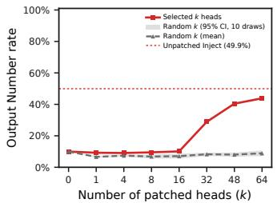  
(a) Qwen3-4B-IT, gate on

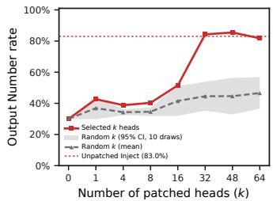  
(b) LLaMA-3.1-8B-IT, gate on

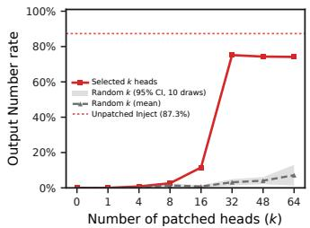  
(c) Gemma-3-12B-IT, gate on

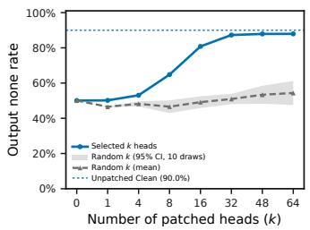  
(d) Qwen3-4B-IT, gate off

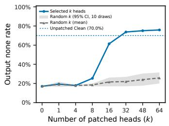  
(e) LLaMA-3.1-8B-IT, gate off

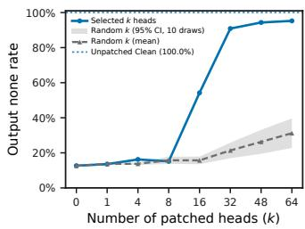  
(f) Gemma-3-12B-IT, gate off  
Figure 5: Selecting the STE mask cardinality on validation, against a random-k control. Solid coloured: the trained STE mask. Dashed grey: k heads picked at random within the same layer range the search covered (Qwen3-4B-IT 17–23, $\mathrm { L L a M A } { - } 3 . 1 { - } 8 \mathrm { B } { - } \mathrm { I T } \ 1 3 { - } 1 6 ,$ Gemma-3-12B-IT 21– 28), ten draws per k, shaded with the 95% interval of their mean; nothing else changes. Gate on (red): a clean run gives a position report once the selected heads take their injected values. Gate off (blue): an injected run outputs none once they are restored to their clean values. Dotted: the unmodified reference rate. $\mathrm { A t } k = 0$ no head is modified, so the two curves meet.

We compare the two interventions of Section 4.2 over $k \in \{ 0 , 1 , 4 , 8 , 1 6 , 3 2 , 4 8 , 6 4 \}$ . For each positive $k ,$ the gate-on and gate-off masks are trained separately on the training set and evaluated on a held-out validation grid of concepts, all 30 prompt clusters, and all 10 injection positions. At $k = 0$ the mask is empty, so no head is modified and each direction is read from its unmodified run: the injected run for gate-off and the clean run for gate-on.

The mask says which heads are modified, but a curve over k alone cannot separate the selection from the effect of modifying any k heads at this depth. Each cardinality therefore carries a randomk control: we set $m _ { \ell , h } = 1$ for k heads drawn at random from the same layers the search covered (Qwen3-4B-IT 17–23, 224 heads; LLaMA-3.1-8B-IT 13–16, 128 heads; Gemma-3-12B-IT 21–28, 128 heads) and apply the interventions of Section 4.2 unchanged. Ten draws per k, each evaluated in both directions, give a mean and a Student-t 95% interval over masks rather than over trials. Random heads are drawn from the same layer range as the search, matching its depth.

Figure 5 reports one model per family. In all three models the selected and random curves separate between $k = 1 6$ and $k = 3 2$ . At $k = 3 2$ the selected mask is near its reference rate, and Qwen3- 4B-IT gate-on continues to rise with k. Since larger k trivially strengthens gate-on, we choose the smallest k at which the selected mask separates from the random control in both directions for all models, $k = 3 2$ , fixed before test evaluation. For Qwen3-4B-IT gate-on, $k = 3 2$ therefore gives a conservative estimate.

## A.11 SELECTED GATE HEADS

Table 7 lists the $k = 3 2$ heads selected by the gate-on and gate-off masks used in the main text, grouped by layer (0-indexed). The two masks are trained independently, yet they share 18 heads in Qwen3-4B-IT, 16 in LLaMA-3.1-8B-IT, and 18 in Gemma-3-12B-IT (bold).

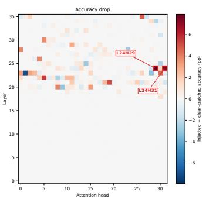  
(a) Qwen3-4B-IT

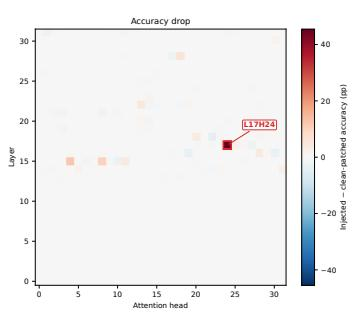  
(b) LLaMA-3.1-8B-IT

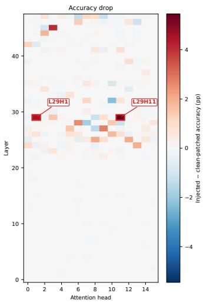  
(c) Gemma-3-12B-IT  
Figure 6: Head-wise activation patching. Accuracy drop $\Delta _ { h } = \mathrm { A c c } _ { \mathrm { i n j } } - \mathrm { A c c } _ { \mathrm { p a t c h } ( h ) }$ (percentage points) for every attention head, obtained by patching the head’s final-position output in the injected run with its clean-run value. Red cells lower correct-index accuracy; annotated heads are the router heads.

Table 7: Gate heads selected by the Top-32 STE masks. Each cell lists the head indices selected in that layer; “–” means none. Bold heads are selected by both the gate-on and the gate-off mask.
<table><tr><td>Model</td><td>Layer</td><td>Gate-on heads</td><td>Gate-off heads</td></tr><tr><td rowspan="7">Qwen3-4B-IT</td><td>17</td><td>15</td><td>5</td></tr><tr><td>18</td><td></td><td>14</td></tr><tr><td>19</td><td>8, 10, 19, 23</td><td>0, 10, 23, 25</td></tr><tr><td>20</td><td>2, 3, 8, 10, 15, 23, 29</td><td>2, 3, 5, 6, 8, 10, 11, 15, 29</td></tr><tr><td>21</td><td>0, 9, 11, 13, 15, 16, 18, 19, 24</td><td>0,19</td></tr><tr><td>22</td><td>4, 5, 7, 10, 11, 13, 15, 17, 27</td><td>0, 1, 4, 5, 7, 10, 11, 17, 18, 25, 28</td></tr><tr><td>23</td><td>14,25</td><td>0,2, 14,25</td></tr><tr><td rowspan="4">LLaMA-3.1-8B-IT</td><td>13</td><td>0, 6, 12, 16, 17, 20, 25</td><td>4, 6, 7, 12, 16, 20</td></tr><tr><td>14</td><td>0, 2, 3, 6, 9, 12, 14, 16, 21, 24, 28,</td><td>0, 2, 3, 8, 10, 14, 16, 21, 23, 24, 30</td></tr><tr><td>15</td><td>30 1, 4, 5, 10, 17, 20, 24</td><td>2, 3, 4, 5, 7, 8, 11, 18, 21</td></tr><tr><td>16</td><td>0, 4, 11, 12, 14, 29</td><td>12, 13, 16, 21, 24, 29</td></tr><tr><td rowspan="8">Gemma-3-12B-IT</td><td>21</td><td></td><td>2,4,6,9, 11</td></tr><tr><td>22</td><td>1,2,9, 11</td><td>1, 3, 4, 6, 9, 11, 15</td></tr><tr><td>23</td><td>3,5,7</td><td>14</td></tr><tr><td>24</td><td>0,2, 5, 6, 13</td><td>0, 2, 5, 6, 10, 13, 15</td></tr><tr><td>25</td><td>7,8, 12, 14</td><td>2, 8, 12, 14</td></tr><tr><td>26</td><td>0,1, 5, 11, 14, 15</td><td>1, 11, 13, 14</td></tr><tr><td>27</td><td>0,3,5,9</td><td>0,5,9</td></tr><tr><td>28</td><td>2, 3, 6, 9, 14, 15</td><td>6</td></tr></table>

## A.12 HEAD-WISE ACTIVATION PATCHING ACROSS MODELS

Figure 6 reports the full head-wise patching sweep behind the router-head identification in Section 4. Each cell is one attention head; its value is $\Delta _ { h } .$ , the drop in correct-index response accuracy when that head’s output at the final prompt position is replaced by its clean-run value. In every model, most heads have $\Delta _ { h } \approx 0$ , and the largest drops fall on a few heads in the transition layer, which we label as router heads.

## A.13 CROSS-POSITION ATTENTION REDIRECTION IN ROUTER HEADS

To test whether the readout position of router heads can control the final reported index, we inject a concept vector at position i and redirect the selected router heads’ attention at the final prompt position T to the successor token $t _ { j }$ of position j. Specifically, we set these heads’ post-softmax attention weights at $T$ to one-hot:

$$
\widetilde { A } _ { T , k } ^ { ( \ell , h ) } = \mathbf { 1 } [ k = t _ { j } ] .\tag{10}
$$

The intervention does not directly modify value vectors, and all other computation proceeds normally. Multiple selected router heads within a model are intervened on jointly. We sweep all ten injection positions and all ten readout positions, using the injected run without attention redirection as the baseline.

Each position pair includes 100 concepts and 30 test prompts, yielding 3,000 trials. We focus on the 90 pairs with $i \neq j$ and report the proportions of outputs corresponding to the readout index $j ,$ the original injection index i, other indices, and none, pooled over these 90 pairs. We repeat this under six label arms—the digit, letter, and word-name label sets, each under the identity and the shuffled permutation of Table 1—to test whether the redirected attention moves a positional slot or a specific label token. Table 8 reports, for each arm and model, the four outcome proportions, together with their average over the six arms. The extent to which outputs shift to j measures the control exerted by the router heads’ readout position over index selection. This control holds under the shuffled permutation, where the redirected pattern cannot be exploiting a memorized label– position association, and averaged over arms the redirected index j is the most frequent outcome in all three models.

Table 8: Cross-position attention redirection: output proportions. For each label arm (the digit, letter, and word-name label sets, each under the identity and the shuffled permutation) and each of the 90 injection–readout position pairs with $i \neq j ,$ , we set the selected router heads’ final-position attention to a one-hot distribution on the successor token of position j and record where the output lands: the redirected index $(  ~ j )$ , the original injection index $(  i )$ , any other index (Other), or none. Proportions are pooled over all 90 pairs per arm (270,000 trials) and sum to 1 in each column. Router heads: Qwen3-4B-IT L24 H{29,31}; LLaMA-3.1-8B-IT L17 H{24}; Gemma-3- 12B-IT L29 H{1,11}. The Mean column averages each outcome’s proportion over the six label arms. 95% intervals are in Appendix A.17.
<table><tr><td rowspan="2"></td><td rowspan="2"></td><td colspan="3">Ordered labels</td><td colspan="3">Shuffled labels</td><td rowspan="2">Mean</td></tr><tr><td>Outcome Digits</td><td>Letters</td><td>Words</td><td>Digits</td><td>Letters</td><td>Words</td></tr><tr><td rowspan="4">Qwen3-4B-IT</td><td>→ j</td><td>0.480</td><td>0.679</td><td>0.704</td><td>0.582</td><td>0.585</td><td>0.760</td><td>0.632</td></tr><tr><td>→i</td><td>0.011</td><td>0.011</td><td>0.029</td><td>0.004</td><td>0.018</td><td>0.023</td><td>0.016</td></tr><tr><td>Other</td><td>0.004</td><td>0.003</td><td>0.022</td><td>0.013</td><td>0.031</td><td>0.065</td><td>0.023</td></tr><tr><td>none</td><td>0.505</td><td>0.307</td><td>0.245</td><td>0.401</td><td>0.366</td><td>0.152</td><td>0.329</td></tr><tr><td rowspan="4">LLaMA-3.1-8B-IT</td><td>→ j</td><td>0.759</td><td>0.530</td><td>0.680</td><td>0.829</td><td>0.676</td><td>0.725</td><td>0.700</td></tr><tr><td>→i</td><td>0.056</td><td>0.023</td><td>0.059</td><td>0.030</td><td>0.023</td><td>0.044</td><td>0.039</td></tr><tr><td>Other</td><td>0.078</td><td>0.009</td><td>0.040</td><td>0.130</td><td>0.044</td><td>0.189</td><td>0.082</td></tr><tr><td>none</td><td>0.107</td><td>0.437</td><td>0.221</td><td>0.011</td><td>0.258</td><td>0.042</td><td>0.179</td></tr><tr><td rowspan="4">Gemma-3-12B-IT</td><td>→ j</td><td>0.355</td><td>0.524</td><td>0.334</td><td>0.322</td><td>0.428</td><td>0.199</td><td>0.360</td></tr><tr><td>→i</td><td>0.467</td><td>0.170</td><td>0.394</td><td>0.295</td><td>0.151</td><td>0.181</td><td>0.276</td></tr><tr><td>Other</td><td>0.009</td><td>0.005</td><td>0.009</td><td>0.078</td><td>0.011</td><td>0.219</td><td>0.055</td></tr><tr><td>none</td><td>0.169</td><td>0.301</td><td>0.263</td><td>0.305</td><td>0.411</td><td>0.401</td><td>0.308</td></tr></table>

## A.14 ROUTER-HEAD ATTENTION PATTERNS ACROSS MODELS

Figure 7 shows token-level attention changes for every router head in each model family. Each panel displays attention changes from the final prompt token T over a suffix of the prompt.

TOKEN 0 : assess TOKEN 1 : explore TOKEN 2 : explores TOKEN 3 : determining TOKEN 4 : visualize   
TOKEN 5 : suppress TOKEN 6 : assurances TOKEN 7 : accuses TOKEN 8 : analysis TOKEN 9 : grading \n   
\n   
Output the final decision : <|im\_end|> \n   
<|im\_start|> assistant \n   
(a) Qwen3-4B-IT: layer 24, head 29; candidate 5 (suppress); attention change.   
TOKEN 0 : assess TOKEN 1 : explore TOKEN 2 : explores TOKEN 3 : determining TOKEN 4 : visualize   
TOKEN 5 : suppress TOKEN 6 : assurances TOKEN 7 : accuses TOKEN 8 : analysis TOKEN 9 : grading \n   
\n   
Output the final decision : <|im\_end|> \n   
<|im\_start|> assistant \n   
(b) Qwen3-4B-IT: layer 24, head 31; candidate 5 (suppress); attention change.   
TOKEN 0 : technique TOKEN 1 : elements TOKEN 2 : treatments TOKEN 3 : means TOKEN 4 : image   
TOKEN 5 : speed TOKEN 6 : variables TOKEN 7 : product TOKEN 8 : organization TOKEN 9 : transfer \n   
\n   
Output the final decision : <|eot\_id|> <|start\_header\_id|> assistant <|end\_header\_id|> \n   
\n   
(c) LLaMA-3.1-8B-IT: layer 17, head 24; candidate 8 (organization); attention change.   
TOKEN 0 : attributing TOKEN 1 : advocating TOKEN 2 : confirming TOKEN 3 : inventing TOKEN 4 : stressing   
TOKEN 5 : countering TOKEN 6 : committing TOKEN 7 : inducing TOKEN 8 : experiencing TOKEN 9 : mitigating \n   
\n   
Output the final decision : <end\_of\_turn> \n   
<start\_of\_turn> model \n   
(d) Gemma-3-12B-IT: layer 29, head 1; candidate 1 (advocating); attention change.   
TOKEN 0 : attributing TOKEN 1 : advocating TOKEN 2 : confirming TOKEN 3 : inventing TOKEN 4 : stressing   
TOKEN 5 : countering TOKEN 6 : committing TOKEN 7 : inducing TOKEN 8 : experiencing TOKEN 9 : mitigating \n   
\n   
Output the final decision : <end\_of\_turn> \n   
<start\_of\_turn> model \n  
(e) Gemma-3-12B-IT: layer 29, head 11; candidate 1 (advocating); attention change.

Figure 7: Injection-induced attention changes across model families. All panels show injectedminus-clean attention from the final prompt token T: red indicates an increase and blue a decrease, with darker colors indicating larger changes in magnitude. The blue outline marks the query token. Color scales are set per panel. The following TOKEN marks the successor position of the injected candidate. Prompt text is shown with each model’s chat-template delimiters.

## A.15 LATENT POSITION CLUSTERS ACROSS MODELS

Projection procedure. We take the 100 concepts of the validation set and, for each concept, inject it separately at each of the ten candidate positions, repeating the whole procedure over 30 validation clusters; for every run we collect the residual state at the final prompt token, together with the corresponding clean run. For each concept and position, the residual states are averaged over the 30 clusters, as are the clean states, giving 1,000 injected points and one clean point per layer. These points enter a single PCA per layer, and we plot their leading three principal components in three dimensions. Each point is one concept injected at one position, averaged over clusters, and its colour indicates the injected position.

Figure 8 shows the residual-state PCA for all three evaluated model families. For each model, the four panels show the layer below the transition layer identified by the K-means analysis (Figure 2), the transition layer itself, the layer above it, and the model’s last layer. The transition layers are 24, 17, and 29 for Qwen3-4B-IT, LLaMA-3.1-8B-IT, and Gemma-3-12B-IT, respectively.

In every model, the injected states in the panel below the transition layer largely overlap, and the transition layer already shows ten separated position-specific clusters. K-means accuracy one layer below the transition is above chance but far below its value at the transition (Figure 2b), so weaker positional structure exists earlier; the clear separation, however, appears within a single layer in all three families rather than in one architecture only. The last-layer panels differ across models: the clusters remain well separated in Qwen3-4B-IT and Gemma-3-12B-IT, whereas in LLaMA-3.1-8B-IT they partly remix, indicating that the positional code is most cleanly expressed near the transition layer rather than at the output.

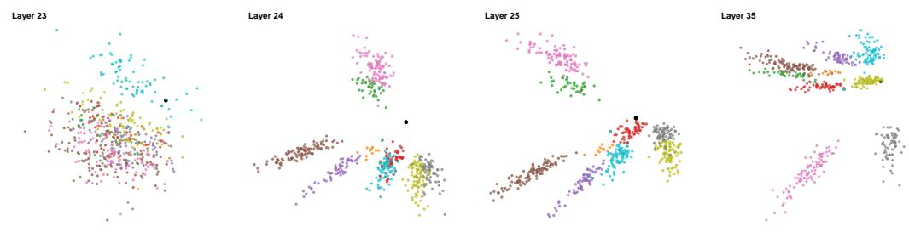

(a) Qwen3-4B-IT; transition layer 24.  
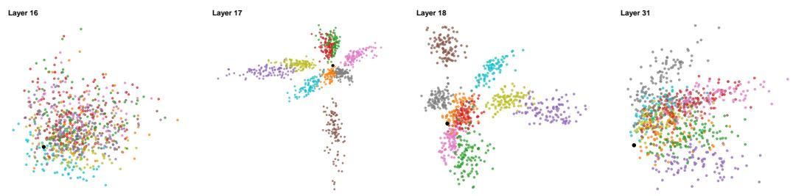

(b) LLaMA-3.1-8B-IT; transition layer 17.  
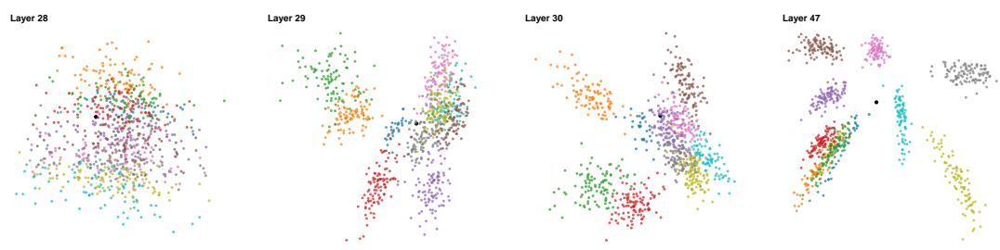  
(c) Gemma-3-12B-IT; transition layer 29.

Figure 8: Final-token residual PCA around the transition layer in all three models. Each colored point is one injected run at the final prompt token, colored by the perturbed candidate position; the black point is the clean run. Principal components are fitted separately for each panel. Panels are ordered transition layer minus one, transition layer, transition layer plus one, and the last layer.

## A.16 ROUTER-HEAD OUTPUT CLUSTERS ACROSS MODELS

Figure 9 applies a three-dimensional PCA to the output of every attention head in the transition layer of each model (layers 24, 17, and 29 for Qwen3-4B-IT, LLaMA-3.1-8B-IT, and Gemma-3-12B-IT). Head outputs are averaged over the 30 validation clusters in the same way as in Appendix A.15, and the PCA is fitted on all points. Each panel shows the correctly answered injected points, colored by injected position, together with the clean point; a point counts as correct when the majority of its 30 cluster runs name the injected position. The router heads identified by head-wise patching in Section 4.3 (red frames) split into position-specific clusters, whereas the other heads in the same layer remain a single mixed cloud. The position-specific structure that appears in the residual stream at the transition layer (Appendix A.15) is thus concentrated in the outputs of a few heads.

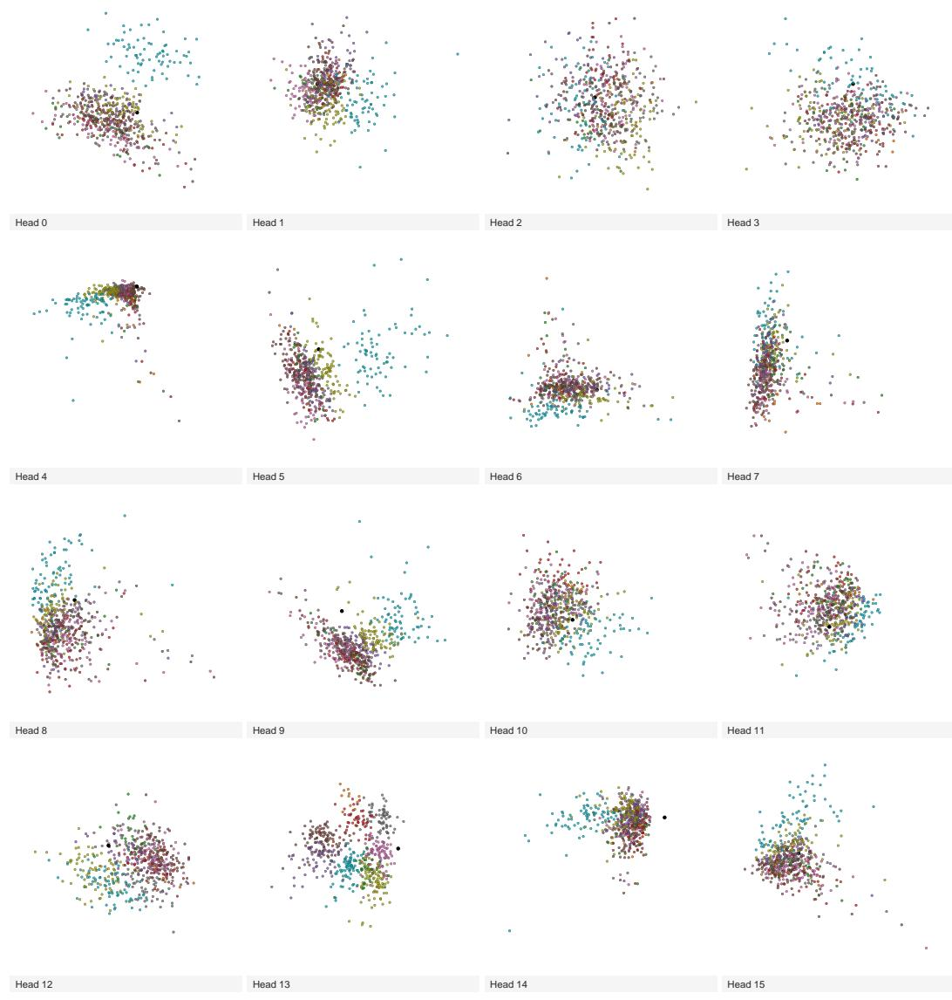  
(a) Qwen3-4B-IT, heads 0–15.  
Figure 9: Three-dimensional PCA of attention-head outputs across models. Each panel shows one attention head; red frames highlight the selected router heads. Colors distinguish injected indices, and black points mark clean references. Only correctly answered injected runs are shown.

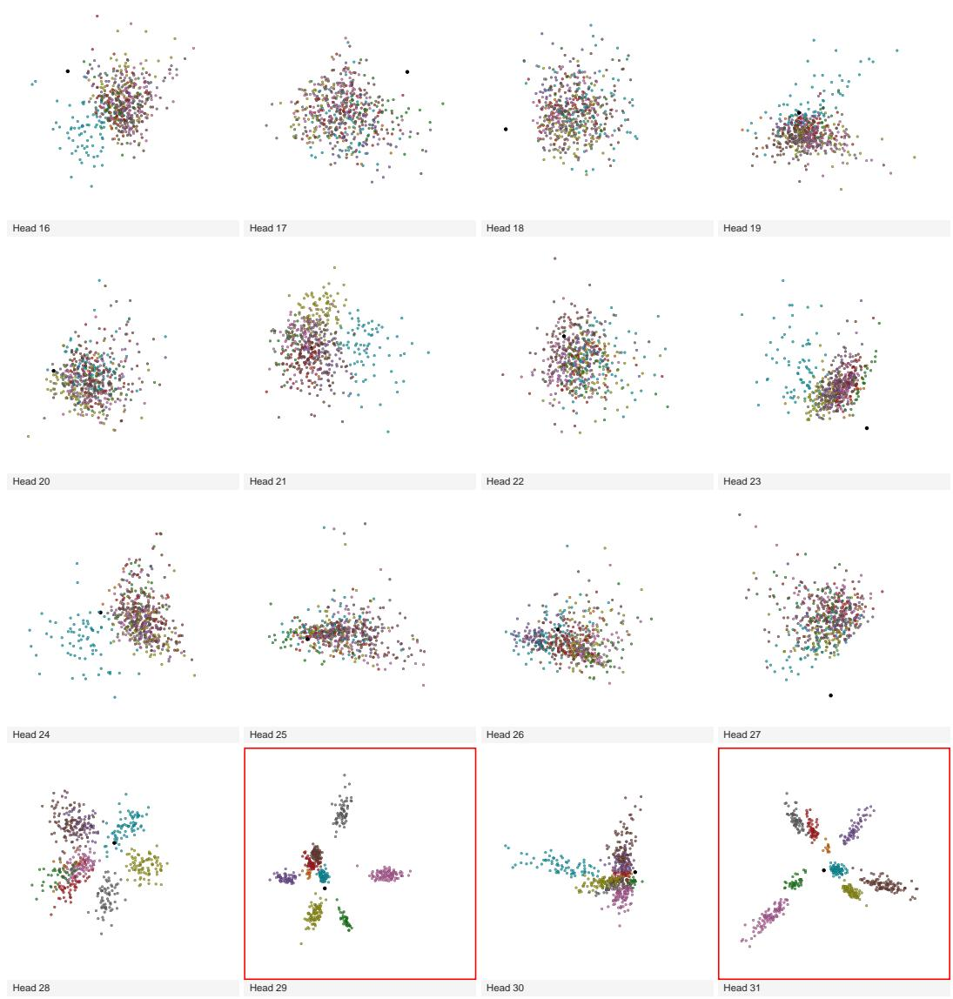  
(b) Qwen3-4B-IT, heads 16–31.  
Figure 9: Three-dimensional PCA of attention-head outputs across models (continued). Qwen3-4B-IT, heads 16–31. Colors and red frames follow panel (a).

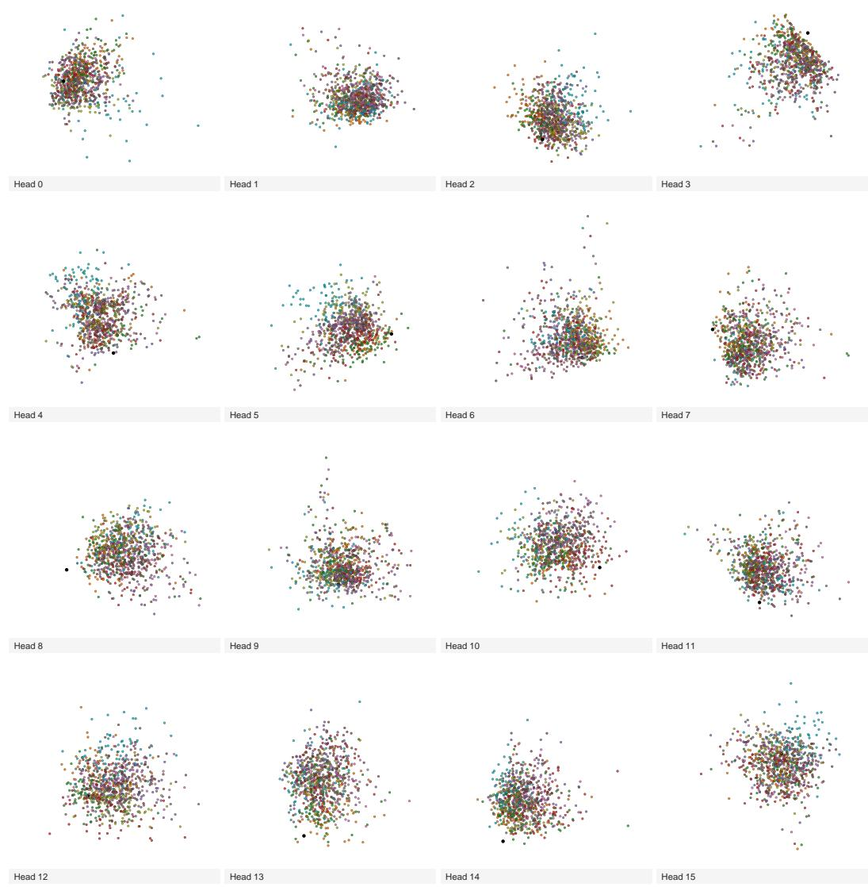  
(c) LLaMA-3.1-8B-IT, heads 0–15.  
Figure 9: Three-dimensional PCA of attention-head outputs across models (continued). LLaMA-3.1-8B-IT, heads 0–15. Colors and red frames follow panel (a).

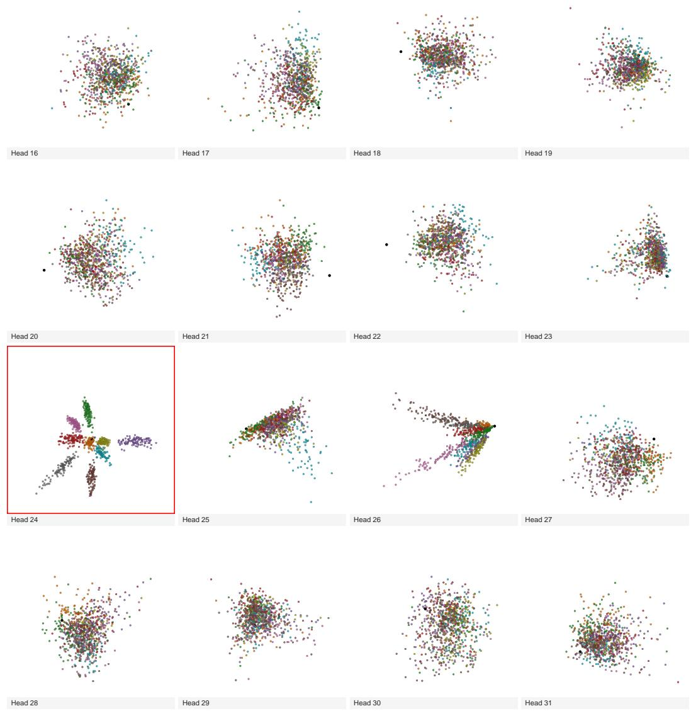  
(d) LLaMA-3.1-8B-IT, heads 16–31.  
Figure 9: Three-dimensional PCA of attention-head outputs across models (continued). LLaMA-3.1-8B-IT, heads 16–31. Colors and red frames follow panel (a).

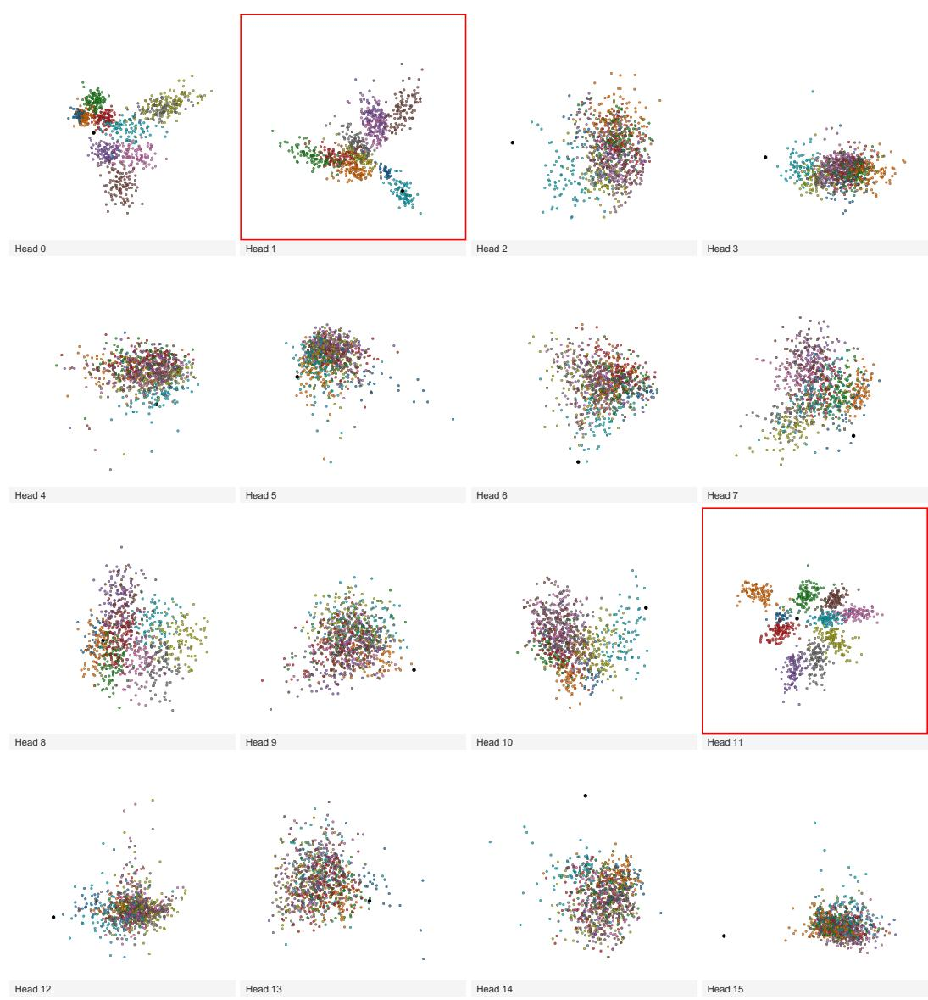  
(e) Gemma-3-12B-IT.  
Figure 9: Three-dimensional PCA of attention-head outputs across models (continued). Gemma-3-12B-IT. Colors and red frames follow panel (a).

## A.17 UNCERTAINTY ESTIMATES

Tables 9–11 give 95% intervals for every value reported in Figure 3, Table 2, and Table 8. Intervals are computed from response counts aggregated per condition and, for the two tables, per ordered injection–readout position pair.

Wilson intervals. For each rate we report the 95% Wilson score interval. An injected-run rate pools 100 concepts × 30 prompts × 10 positions = 30,000 trials per condition and label setting (270,000 for the 90 pairs $i \neq j$ in each setting of Table 2 and in each arm of Table 8). Each bar of Figure 3 and each entry of Table 2 is the unweighted mean over the six label settings; because every setting contributes the same number of trials, this mean equals the rate pooled over the settings, and its interval is the Wilson interval of the pooled counts: 180,000 trials for most bars, 1,800,000 for the two bars that pool all 100 gate–router position pairs, and 1,620,000 for Table 2. This gives half-widths of at most 0.3 percentage points for every Figure 3 bar other than the unmodified clean run, and 0.002 in Table 8. These intervals describe sampling over trials, not how much a rate varies across label settings. The unmodified clean run depends on neither the concept nor the injection position, so its rate is determined by the test prompts; its intervals use $n = 3 0$ per setting, 180 in Figure 3. For the pooled tables we additionally report a position-level bootstrap.

Position bootstrap. Table 2 and Table 8 pool over the 90 ordered position pairs. We resample the ten source positions i with replacement, keep all nine pairs of every sampled position, and recompute the pooled rate (10,000 resamples, percentile intervals). For Table 2 and the Mean column of Table 8, the six label settings share each resample of positions. These intervals are deliberately conservative.

Results. The main comparisons hold under these intervals. In Figure 3a,b, the gate patch moves each rate well outside the interval of the unmodified run in all three models. In Figure 3d, the none rate with clean gate heads and injected router heads lies far above the interval of the unmodified injected run. In Table 2, output j exceeds output i under both intervals in every model. In Table 8, → j is the most frequent outcome for all three models when averaged over arms.

Table 9: 95% intervals for Figure 3. Plotted rate (%) and its Wilson interval. Each rate is the mean over the six label settings of Table 1, which equals the rate pooled over them. Unless marked, a rate pools 180,000 trials (six settings × 100 concepts × 30 prompts × 10 positions). <sup>∗</sup> Unmodified clean run: 180 prompts (30 per setting). <sup>†</sup> 1,800,000 trials (all 100 gate–router position pairs in each setting). Bold: the gate heads alone are patched.
<table><tr><td rowspan="2">Condition</td><td colspan="2">Qwen3-4B-IT</td><td colspan="2">LLaMA-3.1-8B-IT</td><td colspan="2">Gemma-3-12B-IT</td></tr><tr><td>%</td><td>95% CI</td><td>%</td><td>95% CI</td><td>%</td><td>95% CI</td></tr><tr><td>(a) Gate off: none rate</td><td></td><td></td><td></td><td></td><td></td><td></td></tr><tr><td>Injected run</td><td>37.7</td><td>[37.5,37.9]</td><td>25.3</td><td>[25.1,25.5]</td><td>23.8</td><td>[23.6,24.0]</td></tr><tr><td>Gate patch</td><td>81.5</td><td>[81.4,81.7]</td><td>60.7</td><td>[60.5, 60.9]</td><td>80.7</td><td>[80.5,80.9]</td></tr><tr><td>Target (clean run)*</td><td>89.4</td><td>[84.1,93.1]</td><td>62.8</td><td>[55.5, 69.5]</td><td>87.8</td><td>[82.2,91.8]</td></tr><tr><td>(b) Gate on: position rate</td><td></td><td></td><td></td><td></td><td></td><td></td></tr><tr><td>Clean run*</td><td>10.6</td><td>[6.9, 15.9]</td><td>37.2</td><td>[30.5, 44.5]</td><td>12.2</td><td>[8.2, 17.8]</td></tr><tr><td>Gate patch</td><td>41.8</td><td>[41.5, 42.0]</td><td>69.3</td><td>[69.1,69.6]</td><td>62.6</td><td>[62.3,62.8]</td></tr><tr><td>Target (injected run)</td><td>62.3</td><td>[62.1, 62.5]</td><td>74.7</td><td>[74.5,74.9]</td><td>76.2</td><td>[76.0,76.4]</td></tr><tr><td>(c) Clean run: position rate</td><td></td><td></td><td></td><td></td><td></td><td></td></tr><tr><td>Clean run*</td><td>10.6</td><td>[6.9, 15.9]</td><td>37.2</td><td>[30.5, 44.5]</td><td>12.2</td><td>[8.2, 17.8]</td></tr><tr><td>Gate clean × router injected</td><td>14.1</td><td>[13.9, 14.2]</td><td>42.7</td><td>[42.5, 43.0]</td><td>9.8</td><td>[9.6,9.9]</td></tr><tr><td>Gate injected × router clean</td><td>36.2</td><td>[36.0, 36.4]</td><td>67.7</td><td>[67.4, 67.9]</td><td>42.7</td><td>[42.4, 42.9]</td></tr><tr><td>Gate injected × router injected†</td><td>50.3</td><td>[50.2, 50.3]</td><td>73.7</td><td>[73.6,73.7]</td><td>61.7</td><td>[61.7,61.8]</td></tr><tr><td>(d) Injected run: none rate</td><td></td><td></td><td></td><td></td><td></td><td></td></tr><tr><td>Injected run</td><td>37.7</td><td>[37.5,37.9]</td><td>25.3</td><td>[25.1, 25.5]</td><td>23.8</td><td>[23.6,24.0]</td></tr><tr><td>Gate injected × router clean</td><td>49.3</td><td>[49.0, 49.5]</td><td>31.6</td><td>[31.4,31.8]</td><td>38.2</td><td>[38.0,38.4]</td></tr><tr><td>Gate clean × router injected†</td><td>76.3</td><td>[76.3,76.4]</td><td>53.9</td><td>[53.8,54.0]</td><td>73.7</td><td>[73.6,73.8]</td></tr><tr><td>Gate clean × router clean</td><td>83.4</td><td>[83.2, 83.6]</td><td>61.4</td><td>[61.2, 61.6]</td><td>79.4</td><td>[79.2,79.5]</td></tr></table>

Table 10: 95% intervals for Table 2. Rate (%) averaged over the six label settings of Table 1, each pooling the 90 ordered pairs $i \neq j$ (1,620,000 trials in total), with two intervals: Wilson, a score interval over trials, and Pos. boot., a bootstrap that resamples the ten gate-source positions i together with all of their pairs, shared across the six settings. Other is the average rate per position other than i and j, and its intervals are those of the eight-position total divided by eight. Output j exceeds output i and Other under both intervals in every model.
<table><tr><td></td><td colspan="3">Qwen3-4B-IT</td><td colspan="3">LLaMA-3.1-8B-IT</td><td colspan="3">Gemma-3-12B-IT</td></tr><tr><td>Outcome</td><td>%</td><td>Wilson</td><td>Pos. boot.</td><td>%</td><td>Wilson</td><td>Pos. boot.</td><td>%</td><td>Wilson</td><td>Pos. boot.</td></tr><tr><td>Output i</td><td>2.9</td><td>[2.9,2.9]</td><td>[2.2,3.7]</td><td>3.2</td><td>[3.2,3.2]</td><td>[1.5,5.8]</td><td>4.9</td><td>[4.9,5.0]</td><td>[1.2, 10.3]</td></tr><tr><td>Output j</td><td>38.0</td><td>[37.9,38.1]</td><td>[32.3,42.6]</td><td>37.8</td><td>[37.7,37.9]</td><td>[35.4, 39.4]</td><td>40.1</td><td>[40.0,40.1]</td><td>[31.0,47.4]</td></tr><tr><td>Other</td><td>1.1</td><td>[1.1,1.1]</td><td>[0.9, 1.3]</td><td>4.1</td><td>[4.1,4.1]</td><td>[3.6,4.4]</td><td>2.0</td><td>[2.0,2.0]</td><td>[1.5,2.3]</td></tr></table>

Table 11: 95% position-bootstrap intervals for Table 8. Each cell gives the proportion from Table 8 and, below it, an interval from resampling the ten injection positions i with all of their readout positions $j \neq i ;$ the Mean column resamples positions jointly across the six arms. Wilson half-widths are at most 0.002 for every a score interval over trials, and arm and at most 0.001 for the Mean.
<table><tr><td></td><td colspan="3">Ordered labels</td><td colspan="3">Shuffled labels</td><td></td></tr><tr><td>Outcome</td><td>Digits</td><td>Letters</td><td>Words</td><td>Digits</td><td>Letters</td><td>Words</td><td>Mean</td></tr><tr><td colspan="8">Qwen3-4B-IT</td></tr><tr><td>→ j</td><td>0.480 [0.361,0.587]</td><td>0.679 [0.560,0.776]</td><td>0.704 [0.624,0.769]</td><td>0.582 [0.491,0.652]</td><td>0.585 [0.532,0.631]</td><td>0.760 [0.734,0.784]</td><td>0.632 [0.552,0.695]</td></tr><tr><td>→ i</td><td>0.011 [0.001,0.027]</td><td>0.011 [0.005,0.019]</td><td>0.029 [0.016,0.045]</td><td>0.004 [0.001,0.008]</td><td>0.018 [0.012,0.024]</td><td>0.023 [0.016,0.030]</td><td>0.016 [0.013,0.020]</td></tr><tr><td>Other</td><td>0.004 [0.002, 0.005]</td><td>0.003 [0.002,0.004]</td><td>0.022 [0.014,0.031]</td><td>0.013 [0.009,0.017]</td><td>0.031 [0.025,0.035]</td><td>0.065 [0.053,0.076]</td><td>0.023 [0.019,0.027]</td></tr><tr><td>none</td><td>0.505 [0.396,0.627]</td><td>0.307 [0.209,0.427]</td><td>0.245 [0.176,0.333]</td><td>0.401 [0.330,0.494]</td><td>0.366 [0.315,0.427]</td><td>0.152 [0.129,0.179]</td><td>0.329 [0.263,0.413]</td></tr><tr><td colspan="8">LLaMA-3.1-8B-IT</td></tr><tr><td>→ j</td><td>0.759 [0.738,0.784]</td><td>0.530 [0.448,0.601]</td><td>0.680 [0.655,0.704]</td><td>0.829 [0.819,0.843]</td><td>0.676 [0.661,0.693]</td><td>0.725 [0.713,0.739]</td><td>0.700 [0.681,0.717]</td></tr><tr><td>→ i</td><td>0.056 [0.028, 0.085]</td><td>0.023 [0.012,0.035]</td><td>0.059 [0.031,0.089]</td><td>0.030 [0.013,0.055]</td><td>0.023 [0.017,0.029]</td><td>0.044 [0.030, 0.060]</td><td>0.039 [0.032,0.047]</td></tr><tr><td>Other</td><td>0.078 [0.059, 0.099]</td><td>0.009 [0.008,0.011]</td><td>0.040 [0.025,0.055]</td><td>0.130 [0.107,0.149]</td><td>0.044 [0.037,0.050]</td><td>0.189 [0.168,0.207]</td><td>0.082 [0.071,0.091]</td></tr><tr><td>none</td><td>0.107 [0.082, 0.143]</td><td>0.437 [0.359,0.526]</td><td>0.221 [0.188,0.266]</td><td>0.011 [0.008,0.014]</td><td>0.258 [0.241,0.273]</td><td>0.042 [0.034, 0.049]</td><td>0.179 [0.158,0.207]</td></tr><tr><td colspan="8">Gemma-3-12B-IT</td></tr><tr><td>→ j</td><td>0.355 [0.264,0.443]</td><td>0.524 [0.416,0.609]</td><td>0.334 [0.252,0.403]</td><td>0.322 [0.285,0.353]</td><td>0.428 [0.379,0.472]</td><td>0.199 [0.162,0.229]</td><td>0.360 [0.300,0.408]</td></tr><tr><td>→ i</td><td>0.467 [0.383, 0.548]</td><td>0.170 [0.120,0.231]</td><td>0.394 [0.315,0.481]</td><td>0.295 [0.241,0.349]</td><td>0.151 [0.116,0.187]</td><td>0.181 [0.113,0.269]</td><td>0.276 [0.231,0.320]</td></tr><tr><td>Other</td><td>0.009 [0.004,0.017]</td><td>0.005 [0.003,0.008]</td><td>0.009 [0.005,0.014]</td><td>0.078 [0.052,0.113]</td><td>0.011 [0.008,0.015]</td><td>0.219 [0.160,0.270]</td><td>0.055 [0.042,0.069]</td></tr><tr><td>none</td><td>0.169 [0.092,0.281]</td><td>0.301 [0.217,0.412]</td><td>0.263 [0.194,0.363]</td><td>0.305 [0.255,0.354]</td><td>0.411 [0.338,0.490]</td><td>0.401 [0.366,0.437]</td><td>0.308 [0.250,0.380]</td></tr></table>

## A.18 GATE AND ROUTER INTERVENTIONS UNDER EACH LABEL SETTING

Figure 3 and Table 2 report the unweighted mean over the six label settings of Table 1. Figures 10 and 11 show each setting separately, and Table 12 gives the cross-position patching of each setting. In every setting the gate and router heads are those selected under ordered digit labels, without reselection; ordered digits is the setting the heads were selected on, and the other five test transfer. In all eighteen model–setting combinations, the gate patch moves the response toward the target run (panels a, b), the gate intervention changes the response more than the router intervention (panels c, d), and output j exceeds output i.

Table 12: Cross-position patching under each label setting. Setup as in Table 2, whose values are the unweighted mean of these six tables. Values are percentages of all trials: output i, output j, Other (the average rate per position other than i and j, as in Table 2), and none.

(a) Ordered digits (head selection).
<table><tr><td>Model</td><td>i</td><td>j</td><td>Other</td><td>none</td></tr><tr><td>Qwen3-4B-IT</td><td>1.6</td><td>28.0</td><td>0.3</td><td>68.0</td></tr><tr><td>LLaMA-3.1-8B-IT</td><td>1.4</td><td>68.0</td><td>2.3</td><td>12.5</td></tr><tr><td>Gemma-3-12B-IT</td><td>4.3</td><td>62.8</td><td>0.5</td><td>28.5</td></tr></table>

(c) Ordered letters.

(b) Shuffled digits.
<table><tr><td>Model</td><td>i</td><td>j</td><td>Other</td><td>none</td></tr><tr><td>Qwen3-4B-IT</td><td>2.1</td><td>27.4</td><td>1.0</td><td>62.3</td></tr><tr><td>LLaMA-3.1-8B-IT</td><td></td><td>5.4 34.1</td><td>7.4</td><td>1.2</td></tr><tr><td>Gemma-3-12B-IT</td><td></td><td>5.0 35.2</td><td>3.3</td><td>33.3</td></tr></table>

(d) Shuffled letters.

<table><tr><td>Model</td><td>i</td><td>j</td><td>Other</td><td>none</td></tr><tr><td>Qwen3-4B-IT</td><td>2.6</td><td>43.1</td><td>0.8</td><td>48.3</td></tr><tr><td>LLaMA-3.1-8B-IT</td><td>0.8</td><td>35.8</td><td>0.9</td><td>56.5</td></tr><tr><td>Gemma-3-12B-IT</td><td>3.0</td><td>47.1</td><td>0.3</td><td>47.8</td></tr></table>

(e) Ordered number words.

<table><tr><td>Model</td><td>i</td><td>j</td><td>Other</td><td>none</td></tr><tr><td>Qwen3-4B-IT</td><td>2.9</td><td>33.3</td><td>1.0</td><td>56.1</td></tr><tr><td>LLaMA-3.1-8B-IT</td><td>2.9</td><td>21.7</td><td>4.0</td><td>43.3</td></tr><tr><td>Gemma-3-12B-IT</td><td>2.4</td><td>41.1</td><td>1.0</td><td>48.6</td></tr></table>

<table><tr><td>Model</td><td>i</td><td>j</td><td>Other</td><td>none</td></tr><tr><td>Qwen3-4B-IT</td><td>3.8</td><td>49.6</td><td>1.2</td><td>36.9</td></tr><tr><td>LLaMA-3.1-8B-IT</td><td>1.1</td><td>46.6</td><td>1.7</td><td>38.5</td></tr><tr><td>Gemma-3-12B-IT</td><td>7.7</td><td>39.2</td><td>0.3</td><td>50.6</td></tr></table>

(f) Shuffled number words.
<table><tr><td>Model</td><td>i</td><td>j</td><td>Other</td><td>none</td></tr><tr><td>Qwen3-4B-IT</td><td>4.3</td><td>46.5</td><td>2.6</td><td>28.7</td></tr><tr><td>LLaMA-3.1-8B-IT</td><td>7.5</td><td>20.7</td><td>8.3</td><td>5.3</td></tr><tr><td>Gemma-3-12B-IT</td><td>7.2</td><td>14.9</td><td>6.5</td><td>25.7</td></tr></table>

Before patching Gate patch Target run

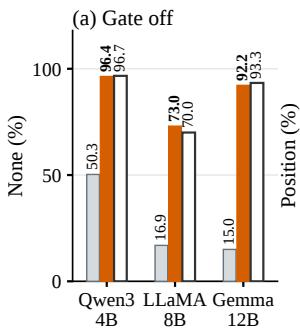

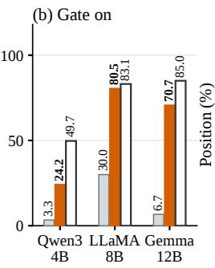  
Clean run Gate clean × router injected Gate injected × router clean Gate injected × router injected

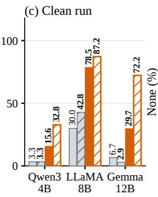  
Injected run Gate injected × router clean Gate clean × router injected Gate clean × router clean

(a) Digits (setting used for head selection).  
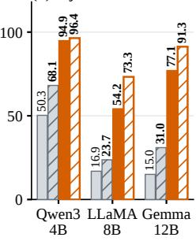  
Before patching Gate patch Target run

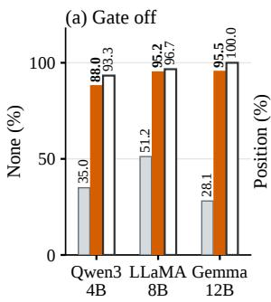

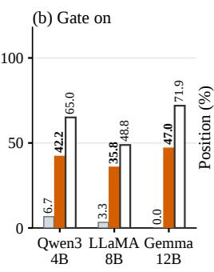  
Clean run Gate clean × router injected Gate injected × router clean Gate injected × router injected

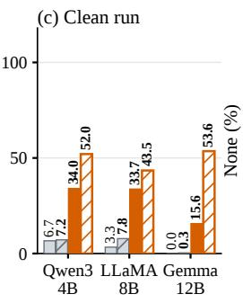  
Injected run Gate injected × router clean Gate clean × router injected Gate clean × router clean

(b) Letters.  
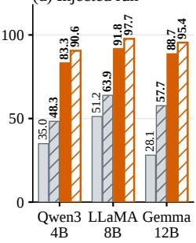  
Before patching Gate patch Target run

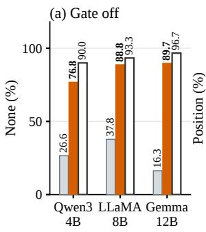  
Clean run Gate clean × router injected Gate injected × router clean Gate injected × router injected

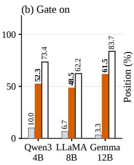

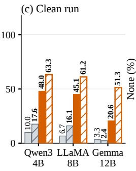  
Injected run Gate injected × router clean Gate clean × router injected Gate clean × router clean

(c) Number words.  
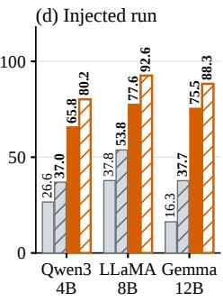  
Figure 10: Gate and router interventions with ordered labels. Panels as in Figure 3; gate and router heads are the ones selected under ordered digit labels.

Before patching Gate patch Target run

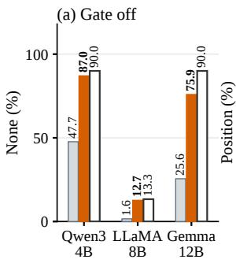

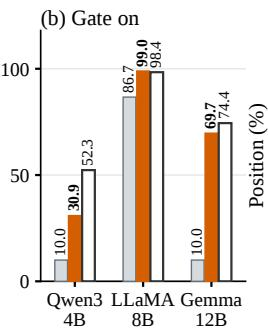  
Clean run Gate clean × router injected Gate injected × router clean Gate injected × router injected

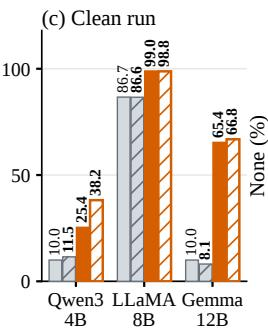  
Injected run Gate injected × router clean Gate clean × router injected Gate clean × router clean

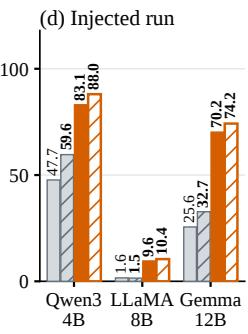  
(a) Digits.  
Before patching Gate patch Target run

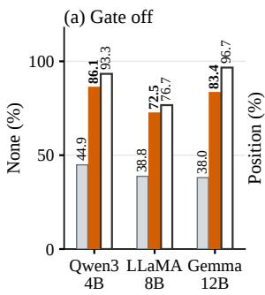

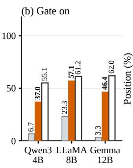  
Clean run Gate clean × router injected Gate injected × router clean Gate injected × router injected

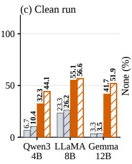  
(b) Letters.  
Injected run Gate injected × router clean Gate clean × router injected Gate clean × router clean

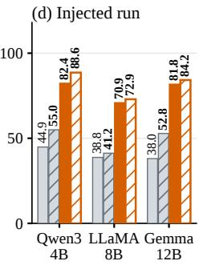  
Before patching Gate patch Target run

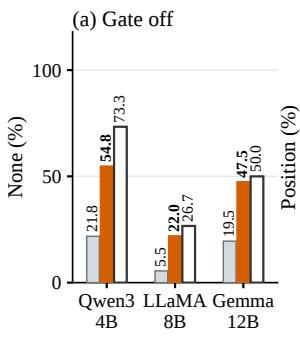

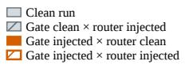


  
Injected run Gate injected × router clean Gate clean × router injected Gate clean × router clean

(c) Number words.  
  
Figure 11: Gate and router interventions with shuffled labels. Panels as in Figure 3; gate and router heads are the ones selected under ordered digit labels.

## B COMPARISON OF THE KEY AND QUERY TERMS OF THE QK DECOMPOSITION

We first show why the analysis in Section 5 studies the score change $\Delta s$ . At the final prompt position, the attention weights are a softmax over the visible positions, $\boldsymbol a _ { t } = e ^ { s _ { t } } / \sum _ { u } e ^ { s _ { u } }$ . Writing $s ^ { I } = s ^ { 0 } + \Delta s$ gives

$$
a _ { t } ^ { I } = \frac { e ^ { s _ { t } ^ { 0 } } e ^ { \Delta s _ { t } } } { \sum _ { u } e ^ { s _ { u } ^ { 0 } } e ^ { \Delta s _ { u } } } = \frac { a _ { t } ^ { 0 } e ^ { \Delta s _ { t } } } { \sum _ { u } a _ { u } ^ { 0 } e ^ { \Delta s _ { u } } } , \qquad \log \frac { a _ { t } ^ { I } } { a _ { t } ^ { 0 } } = \Delta s _ { t } - \log \sum _ { u } a _ { u } ^ { 0 } e ^ { \Delta s _ { u } } ,\tag{11}
$$

where the second step divides the numerator and denominator by $\textstyle \sum _ { u } e ^ { s _ { u } ^ { 0 } }$ . Positions excluded by the attention mask are the same in both runs, so the identity is exact. The clean run involves no injection, so for a given prompt and head, $a ^ { 0 }$ is the same for every concept. By Equation $1 1 , a ^ { I }$ is then a function of $\bar { \Delta } s$ alone, and it is unchanged when a constant is added to every $\Delta { s } _ { t }$ . Differences in attention across concepts therefore arise only through differences in $\Delta s$ across positions.

Equation 1 splits the injection-induced change in the attention score into a key term $\Delta K _ { t } q ^ { I } / \sqrt { d _ { h } }$ and a query term $K _ { t } ^ { 0 } \Delta q / \sqrt { d _ { h } }$ . With $K _ { t }$ and q the post-RoPE key at position t and query at the final prompt position, substituting $q ^ { 0 } = q ^ { I } - \Delta q$ gives

$$
\Delta s _ { t } = \frac { K _ { t } ^ { I } q ^ { I } - K _ { t } ^ { 0 } q ^ { 0 } } { \sqrt { d _ { h } } } = \frac { ( K _ { t } ^ { 0 } + \Delta K _ { t } ) q ^ { I } - K _ { t } ^ { 0 } ( q ^ { I } - \Delta q ) } { \sqrt { d _ { h } } } = \frac { \Delta K _ { t } q ^ { I } + K _ { t } ^ { 0 } \Delta q } { \sqrt { d _ { h } } } .\tag{12}
$$

This is an identity rather than an approximation, so either term can be subtracted from the injected forward state on its own. This appendix reports the distributional and behavioural consequences of doing so, which motivate our focus on the key term in Section 5.

Holding the injected forward state fixed, we subtract either the query term or the key term from the final row of the attention scores in the selected gate heads, and measure $D _ { \mathrm { K L } } ( p \Vert \dot { p } _ { - X } )$ in nats between the resulting distribution and the unablated one. The successor-position column first conditions the attention probabilities on the ten successor positions and compares the resulting relative distribution; the full-context column uses all visible positions. The output column re-runs the forward pass under the same score ablation and takes the argmax over the eleven candidate first tokens 0–9 and none, reporting the fraction of trials that name the injected position correctly. $\mathcal { C } _ { \mathrm { { i n t r o } } }$ is the 100 validation concepts and $\mathcal { C } _ { \mathrm { n o n i n t r o } }$ the 100 low-accuracy concepts (Section 5); both are evaluated on the 30 test clusters, giving 30,000 trials per concept set. Native rates therefore differ from the ordered-digit column of Table 1, which uses the test concepts; KL values are computed per trial and head and then averaged with equal weight.

Table 13: Ablating the key term versus the query term. Attention-distribution change and reporting accuracy under each ablation, by model and concept set.
<table><tr><td rowspan="2">Model</td><td rowspan="2">Concept set</td><td colspan="2">KL: -query / —key</td><td colspan="2">Correct-position rate</td></tr><tr><td>Successor</td><td>Full context</td><td>Native</td><td>—query / —key</td></tr><tr><td rowspan="2">Qwen3-4B-IT</td><td>Cintro</td><td>0.0197 / 0.3108</td><td>0.0351 /0.1581</td><td>48.28%</td><td>43.62% / 32.07%</td></tr><tr><td> $\mathcal { C } _ { \mathrm { n o n i n t r o } }$ </td><td>0.0025 / 0.0384</td><td>0.0043 / 0.0300</td><td>1.67%</td><td>1.49% / 0.96%</td></tr><tr><td rowspan="2">LLaMA-3.1-8B-IT</td><td> $\mathcal { C } _ { \mathrm { { i n t r o } } }$ </td><td>0.0093 / 0.0585</td><td>0.0134/0.0411</td><td>69.34%</td><td>67.27% / 65.38%</td></tr><tr><td> $\mathcal { C } _ { \mathrm { n o n i n t r o } }$ </td><td>0.0041 / 0.0322</td><td>0.0079 / 0.0266</td><td>20.97%</td><td>19.03% / 18.09%</td></tr><tr><td rowspan="2">Gemma-3-12B-IT</td><td> $\mathcal { C } _ { \mathrm { { i n t r o } } }$ </td><td>0.0519 / 0.5847</td><td>0.1205 / 0.3979</td><td>83.67%</td><td>83.07% / 58.23%</td></tr><tr><td> $\mathcal { C } _ { \mathrm { n o n i n t r o } }$ </td><td>0.0168 / 0.1751</td><td>0.0277/0.1023</td><td>18.30%</td><td>17.38% / 6.47%</td></tr></table>

Reading. Each KL cell gives the divergence caused by removing the query term and by removing the key term, respectively; larger values indicate a larger change in the attention distribution. The last column gives the correct-position rate after each ablation, against the native rate in the preceding column.

Ablating the key term produces the larger distributional change in every model and concept set, both among the ten successor positions and over the full context; the full-context key/query ratio of the KL is 3.08–7.06×. The output measure orders the two terms the same way in every row. The keyterm effect exceeds the query-term effect in every row: for $\mathcal { C } _ { \mathrm { { i n t r o } } } ,$ removing the key term lowers the

correct-position rate by 3.96–25.44 percentage points, against 0.60–4.66 points for the query term.   
This supports concentrating the structural analysis on the key term.

A change in distribution is not the same as a change in norm. Over the full context the two terms are of comparable size (query/key = 0.63–1.63), and the intro/non-intro ratio of the query term (1.30– 2.50×) is in fact larger than that of the key term (1.13–1.45×). The term $K _ { t } ^ { 0 } \Delta q$ is a broad, shallow redistribution spread across the context (effective number of positions 84–93; enrichment over the candidate region 1.52×) and does not concentrate on particular positions.

Two remarks on scope. The decomposition assigns the second-order cross term $\Delta K _ { t } \Delta q$ to the key term, so “key term” throughout denotes the cross-term-inclusive quantity; for Gemma-3-12B-$\Pi ^ { \bullet } \lVert \Delta q \rVert / \lVert q ^ { 0 } \rVert \ = \ 0 . 2 5 6$ , so this term is not negligible in that model. The conditional KL over the ten successor positions does not reflect the total attention mass those positions receive, and the behavioural ablation acts on the entire score row of the selected heads, so it cannot by itself establish a causal role for the successor positions specifically. The $\mathcal { C } _ { \mathrm { n o n i n t r o } }$ native rate of 1.67% for Qwen3- 4B-IT is subject to a floor effect and its percentage-point changes should not be read alongside the corresponding intro row.

Section 5 factors the key response at the ten successor positions through the SVD $\Delta K _ { \mathrm { n e x t } } ~ =$ $\begin{array} { r } { \sum _ { r } \sigma _ { r } u _ { r } v _ { r } ^ { \top } } \end{array}$ . With $s = \widetilde { \Delta } K _ { \mathrm { n e x t } } q ^ { I } / \sqrt { d _ { h } }$ the full key response and $U _ { i 1 }$ the entry of $u _ { 1 }$ at the target position $t _ { i } .$ , we define

$$
s = \sum _ { r } \frac { \sigma _ { r } ( v _ { r } ^ { \top } q ^ { I } ) } { \sqrt { d _ { h } } } u _ { r } , \qquad R _ { 1 } = \frac { \sigma _ { 1 } \left| v _ { 1 } ^ { \top } q ^ { I } \right| } { \sqrt { d _ { h } } } , \qquad s _ { i } ^ { ( 1 ) } = \frac { \sigma _ { 1 } \left( v _ { 1 } ^ { \top } q ^ { I } \right) } { \sqrt { d _ { h } } } U _ { i 1 } , \qquad \bar { U } _ { i 1 } = \frac { \mathbb { E } \left[ s _ { i } ^ { ( 1 ) } \right] } { \mathbb { E } \left[ R _ { 1 } \right] } .\tag{13}
$$

$R _ { 1 }$ is the magnitude of the first-mode response across the ten successor positions, and $\bar { U } _ { i 1 }$ is the share of it that lands on $t _ { i }$ with a consistent sign. The first mode accounts for all but 3% of the target response $\bar { s } _ { i } = \mathbb { E } [ s _ { i } ]$ . Table 14 gives the group statistics behind the QK columns of Table 3.

Table 14: QK responses of introspective and non-introspective concepts. Group statistics and between-set ratios in gate heads; the ratio rows extend the QK columns of Table 3.
<table><tr><td>Concept set</td><td>Query norm  $\| q ^ { I } \|$ </td><td>Magnitude  $\sigma _ { 1 }$ </td><td>Readout  $| v _ { 1 } ^ { \top } q ^ { I } |$ </td><td>First mode  $R _ { 1 }$ </td><td>Target loading  $\bar { U } _ { i 1 }$ </td><td>Target response Si</td></tr><tr><td colspan="7">(a) Qwen3-4B-IT</td></tr><tr><td>Cintro</td><td>14.2870</td><td>9.7021</td><td>2.0431</td><td>1.8697</td><td>0.8847</td><td>1.7000</td></tr><tr><td>Cnonintro</td><td>14.2356</td><td>7.9384</td><td>1.1333</td><td>0.8099</td><td>0.3832</td><td>0.3203</td></tr><tr><td>Intro / Non-intro</td><td>1.00×</td><td>1.22×</td><td>1.80×</td><td>2.31×</td><td>2.31×</td><td>5.31×</td></tr><tr><td colspan="7">(b) LLaMA-3.1-8B-IT</td></tr><tr><td>Cintro</td><td>12.5969</td><td>9.4412</td><td>1.1510</td><td>0.9493</td><td>0.6945</td><td>0.6774</td></tr><tr><td>Cnonintro</td><td>12.6249</td><td>8.7674</td><td>0.9611</td><td>0.7252</td><td>0.5165</td><td>0.3851</td></tr><tr><td>Intro / Non-intro</td><td>1.00×</td><td>1.08×</td><td>1.20×</td><td>1.31×</td><td>1.34×</td><td>1.76×</td></tr><tr><td colspan="7">(c) Gemma-3-12B-IT</td></tr><tr><td>Cintro</td><td>18.5425</td><td>19.7339</td><td>1.9243</td><td>2.4228</td><td>0.8841</td><td>2.1398</td></tr><tr><td>Cnonintro</td><td>18.7912</td><td>17.3643</td><td>1.2386</td><td>1.3325</td><td>0.6950</td><td>0.9144</td></tr><tr><td>Intro / Non-intro</td><td>0.99×</td><td>1.14×</td><td>1.55×</td><td>1.82×</td><td>1.27×</td><td>2.34×</td></tr></table>

Definitions. $\mathcal { C } _ { \mathrm { { i n t r o } } }$ and $\mathcal { C } _ { \mathrm { n o n i n t r o } }$ are the introspective and non-introspective concept sets; all quantities follow Equation 13. Entries are group means, except $\tilde { U } _ { i 1 }$ , which is a ratio of group means and mixes concentration on the target position with sign consistency across trials (even spread gives 0.32). Ratios. Intro / Non-intro divides the displayed statistics, rounded to two decimals. Because these are ratios of means, columns do not compose exactly; $R _ { 1 }$ and $\bar { U } _ { i 1 }$ compose to $\bar { s } _ { i }$ only up to the residual modes. Ratios are descriptive, not significance tests.

## C OUTPUT DECOMPOSITION AND MODAL ANALYSIS OF THE OV CIRCUIT

This appendix gives details of the OV analysis in Section 5. Superscripts 0 and I denote the unperturbed and injected states, respectively, with $\Delta V = V ^ { I } - V ^ { 0 }$ and $\Delta \boldsymbol { a } = \boldsymbol { a } ^ { I } - \boldsymbol { a } ^ { 0 }$ . We omit sample, layer, and attention-head indices below.

This analysis uses the same two concept sets as the QK analysis in the main text: $\mathcal { C } _ { \mathrm { { i n t r o } } }$ and $\mathcal { C } _ { \mathrm { n o n i n t r o } } .$ Each contains 100 concepts. These names denote concept sets partitioned by reporting performance after injection; they do not imply that every injection within a set succeeds or fails. Both concept sets are evaluated on 30 held-out test clusters, with each concept injected at all ten candidate positions in every cluster (300 injections per concept). We analyze the 32 gate heads selected under the gateon condition; here, gate-on specifies only the head set. Each metric is first averaged over injection positions, candidate-token clusters, and gate heads within each concept, and then averaged within each concept set.

Let $\Delta o = o ^ { I } - o ^ { 0 }$ denote the injection-induced change in the attention-head output at the final prompt position T. Since $o = \bar { W _ { O } } V ^ { \top } a .$ , substituting $\Breve { a ^ { 0 } } = a ^ { I } - \Delta a$ gives the decomposition of Equation 1:

$$
\begin{array} { r l } & { \Delta o = W _ { O } \big [ ( V ^ { I } ) ^ { \top } a ^ { I } - ( V ^ { 0 } ) ^ { \top } a ^ { 0 } \big ] = W _ { O } \big [ ( V ^ { 0 } + \Delta V ) ^ { \top } a ^ { I } - ( V ^ { 0 } ) ^ { \top } ( a ^ { I } - \Delta a ) \big ] } \\ & { \quad \quad = W _ { O } ( \Delta V ) ^ { \top } a ^ { I } + W _ { O } ( V ^ { 0 } ) ^ { \top } \Delta a . } \end{array}\tag{14}
$$

## C.1 DETAILED OV STATISTICS

Section 5 decomposes the ∆V term of $\Delta o$ through the SVD of $\begin{array} { r } { M = W _ { O } ( \Delta V ) ^ { \top } = \sum _ { k } \mu _ { k } y _ { k } x _ { k } ^ { \top } . } \end{array}$ computed separately for each trial and gate head over all n positions of the context, so that $M a ^ { I } =$ $\begin{array} { r } { \sum _ { k } \dot { \mu } _ { k } ( x _ { k } ^ { \top } a ^ { \hat { I } } ) y _ { k } } \end{array}$ (Section 5). Table 15 lists the attention and output statistics. Besides the norms, it reports two energy fractions of the five leading modes: the matrix energy $\begin{array} { r } { \eta _ { 5 } = \sum _ { k \le 5 } \mu _ { k } ^ { 2 } / \sum _ { k } \mu _ { k } ^ { 2 } } \end{array}$ and the output energy $\begin{array} { r } { \rho _ { 5 } \ = \ \sum _ { k < 5 } \mu _ { k } ^ { 2 } ( x _ { k } ^ { \top } a ^ { I } ) ^ { 2 } / \| M a ^ { I } \| ^ { 2 } } \end{array}$ . Because the output directions $y _ { k }$ are orthonormal, $\rho _ { 5 }$ is the fraction of the squared output norm carried by these modes. Table 16 lists, for each of the five leading modes, the size $\mu _ { k }$ and the alignment $| \cos ( a ^ { I } , x _ { k } ) | = | x _ { k } ^ { \top } a ^ { I } | / \| a ^ { I } \|$ ; we take the absolute value because the sign of a singular vector is arbitrary.

Table 15: Attention and output statistics of the $\Delta V$ term in gate heads. Group means over the full context; energies are percentages.
<table><tr><td></td><td colspan="2">Attention</td><td colspan="2">Change matrix M</td><td colspan="3">Output  $M a ^ { I }$ </td></tr><tr><td>Concept set</td><td> $\| a ^ { I } \|$ </td><td> $\| \Delta a \|$ </td><td> $\| M \| _ { F }$ </td><td>η5</td><td> $\parallel M a ^ { I } \parallel$ </td><td>Top-5 norm</td><td> $\rho _ { 5 }$ </td></tr><tr><td colspan="8">(a) Qwen3-4B-IT</td></tr><tr><td>Cintro</td><td>0.367</td><td>0.085</td><td>19.3</td><td>80.1</td><td>0.912</td><td>0.841</td><td>68.7</td></tr><tr><td>Cnonintro</td><td>0.360</td><td>0.036</td><td>16.6</td><td>82.0</td><td>0.313</td><td>0.236</td><td>49.3</td></tr><tr><td>Intro / Non-intro</td><td>1.02×</td><td>2.40×</td><td>1.16×</td><td>0.98×</td><td>2.92×</td><td>3.56×</td><td>1.39×</td></tr><tr><td colspan="8">(b) LLaMA-3.1-8B-IT</td></tr><tr><td>Cintro</td><td>0.367</td><td>0.049</td><td>6.16</td><td>78.2</td><td>0.127</td><td>0.102</td><td>53.3</td></tr><tr><td>Cnonintro</td><td>0.361</td><td>0.036</td><td>5.80</td><td>79.5</td><td>0.085</td><td>0.061</td><td>47.4</td></tr><tr><td>Intro / Non-intro</td><td>1.02×</td><td>1.37×</td><td>1.06×</td><td>0.98×</td><td>1.49×</td><td>1.66×</td><td>1.13×</td></tr><tr><td colspan="8">(c) Gemma-3-12B-IT</td></tr><tr><td>Cintro</td><td>0.457</td><td>0.162</td><td>25.9</td><td>76.7</td><td>1.969</td><td>1.852</td><td>81.5</td></tr><tr><td>Cnonintro</td><td>0.430</td><td>0.073</td><td>22.9</td><td>79.1</td><td>0.770</td><td>0.628</td><td>58.2</td></tr><tr><td>Intro / Non-intro</td><td>1.06×</td><td>2.23×</td><td>1.13×</td><td>0.97×</td><td>2.56×</td><td>2.95×</td><td>1.40×</td></tr></table>

Table 16: Size and alignment of the five leading modes of M in gate heads. Group means over the full context.
<table><tr><td></td><td colspan="5">Size  $\mu _ { k }$ </td><td colspan="5">Alignment  $\cos ( a ^ { I } , x _ { k } ) |$ </td></tr><tr><td>Concept set</td><td> $k = 1$ </td><td>2</td><td>3</td><td>4</td><td>5</td><td> $k = 1$ </td><td>2</td><td>3</td><td>4</td><td>5</td></tr><tr><td colspan="9">(a) Qwen3-4B-IT</td><td></td></tr><tr><td> $\mathcal { C } _ { \mathrm { { i n t r o } } }$ </td><td>11.3</td><td>8.24</td><td>6.45</td><td>5.33</td><td>4.48</td><td>0.149</td><td>0.126</td><td>0.104</td><td>0.097</td><td>0.087</td></tr><tr><td>Cnonintro</td><td>10.1</td><td>7.05</td><td>5.47</td><td>4.43</td><td>3.68</td><td>0.039</td><td>0.059</td><td>0.059</td><td>0.061</td><td>0.058</td></tr><tr><td>Intro / Non-intro</td><td>1.12×</td><td>1.17×</td><td>1.18×</td><td>1.20×</td><td>1.22×</td><td>3.85×</td><td>2.16×</td><td>1.76×</td><td>1.58×</td><td>1.49×</td></tr><tr><td colspan="9">(b) LLaMA-3.1-8B-IT</td><td></td></tr><tr><td>Cintro</td><td>3.54</td><td>2.60</td><td>2.02</td><td>1.65</td><td>1.41</td><td>0.051</td><td>0.052</td><td>0.054</td><td>0.059</td><td>0.052</td></tr><tr><td>Cnonintro</td><td>3.41</td><td>2.46</td><td>1.89</td><td>1.53</td><td>1.30</td><td>0.035</td><td>0.037</td><td>0.042</td><td>0.050</td><td>0.046</td></tr><tr><td>Intro / Non-intro</td><td>1.04×</td><td>1.05×</td><td>1.07×</td><td>1.08×</td><td>1.08×</td><td>1.48×</td><td>1.40×</td><td>1.28×</td><td>1.20×</td><td>1.13×</td></tr><tr><td colspan="9">(c) Gemma-3-12B-IT</td><td></td><td></td></tr><tr><td> $\mathcal { C } _ { \mathrm { { i n t r o } } }$ </td><td>14.5</td><td>10.8</td><td>8.60</td><td>7.18</td><td>6.13</td><td>0.222</td><td>0.165</td><td>0.133</td><td>0.111</td><td>0.101</td></tr><tr><td>Cnonintro</td><td>13.3</td><td>9.59</td><td>7.50</td><td>6.14</td><td>5.19</td><td>0.076</td><td>0.085</td><td>0.079</td><td>0.075</td><td>0.073</td></tr><tr><td>Intro / Non-intro</td><td>1.09×</td><td>1.13×</td><td>1.15×</td><td>1.17×</td><td>1.18×</td><td>2.90×</td><td>1.93×</td><td>1.68×</td><td>1.49×</td><td>1.37×</td></tr></table>

In all three models, the two groups have nearly the same attention norm $( \leq 1 . 0 6 \times )$ , change-matrix norm $( \leq 1 . 1 6 \times )$ , and matrix energy in the five leading modes. The sizes $\mu _ { k }$ differ by at most 1.22× at every k, whereas the alignment is higher for $\bar { \boldsymbol { { \mathcal { C } } } } _ { \mathrm { i n t r o } }$ at every $k ,$ most strongly at $k = 1$ (1.48–3.85×). As a result, the five leading modes carry a larger share of the output for $\mathcal { C } _ { \mathrm { { i n t r o } } }$ (ρ<sub>5</sub> of 53–82% against 47–58%), and the output norm is 1.49–2.92× larger. For every quantity in Tables 15 and 16, the 95% concept-level bootstrap interval of the between-group difference excludes zero (5,000 resamples, conditional on the 30 evaluation clusters, without multiple-comparison correction). Ratios of group means are descriptive and do not compose across columns.

## C.2 CAUSAL ABLATION OF THE LEADING OV MODES

We test whether the leading modes support correct-position reports by subtracting their output contributions in the injected run. For each paired clean and injected example and each gate head, we form $M = W _ { O } ( \Delta \mathbf { \bar { V } } ) ^ { \top }$ over all n context positions and order its modes by decreasing singular value $\mu _ { k }$ . The leading-five contribution and its complement are

$$
c _ { \leq 5 } = \sum _ { k = 1 } ^ { 5 } \mu _ { k } ( x _ { k } ^ { \top } a ^ { I } ) y _ { k } , \qquad c _ { > 5 } = M a ^ { I } - c _ { \leq 5 } .\tag{15}
$$

We separately subtract $c _ { \leq 5 } , c _ { > 5 } ,$ or the entire content-change term $M a ^ { I }$ from the attention output projection at the final prompt position, before any attention-output normalization. The intervention is applied jointly to the 32 gate heads. These vectors are fixed from the unablated paired runs; downstream computation is left free. Thus, the modes are defined from the full context, not only the ten candidate injection positions.

Both blocks of Table 17 use all 30 evaluation clusters, with 100 concepts per set and ten injection positions per concept and cluster: 30,000 paired trials per set, or 60,000 per model. The left block removes the two terms of Equation 1 as full vectors. The right block removes modes of M. Correctposition rate is the fraction of trials in which the highest-scoring candidate among the ten positions and none is the injected position; a none response counts as incorrect. Table 18 additionally reports the mean probability of the correct position token under the full-vocabulary softmax, without renormalizing over these eleven candidates.

Table 17: Correct-position rate (%) after removing parts of the gate-head output in the injected run. −∆a and −∆V remove the corresponding terms of Equation 1; −top 5 and −others remove the five leading modes of M or all remaining modes.
<table><tr><td></td><td></td><td colspan="4">Terms, 30 clusters</td><td colspan="4">Modes of M, 30 clusters</td></tr><tr><td>Model</td><td>Set</td><td>Injected</td><td> $- \Delta a$ </td><td> $- \Delta V$ </td><td>-both</td><td>Injected</td><td>-top 5</td><td>-others</td><td>-ΔV</td></tr><tr><td>Qwen3-4B-IT</td><td> $\mathcal { C } _ { \mathrm { { i n t r o } } }$ </td><td>48.3</td><td>38.8</td><td>4.4</td><td>1.4</td><td>48.3</td><td>5.1</td><td>44.6</td><td>4.4</td></tr><tr><td></td><td> $\mathcal { C } _ { \mathrm { n o n i n t r o } }$ </td><td>1.7</td><td>1.3</td><td>0.7</td><td>0.7</td><td>1.7</td><td>0.7</td><td>1.5</td><td>0.7</td></tr><tr><td>LLaMA-3.1-8B-IT</td><td> $\mathcal { C } _ { \mathrm { { i n t r o } } }$ </td><td>69.3</td><td>67.8</td><td>54.3</td><td>49.8</td><td>69.3</td><td>57.4</td><td>67.1</td><td>54.3</td></tr><tr><td></td><td> $\mathcal { C } _ { \mathrm { n o n i n t r o } }$ </td><td>21.0</td><td>19.3</td><td>13.8</td><td>11.9</td><td>21.0</td><td>15.3</td><td>19.0</td><td>13.8</td></tr><tr><td>Gemma-3-12B-IT</td><td> $\mathcal { C } _ { \mathrm { { i n t r o } } }$ </td><td>83.7</td><td>74.1</td><td>13.9</td><td>2.6</td><td>83.7</td><td>13.5</td><td>81.2</td><td>13.9</td></tr><tr><td></td><td> $\mathcal { C } _ { \mathrm { n o n i n t r o } }$ </td><td>18.3</td><td>11.0</td><td>1.5</td><td>0.4</td><td>18.3</td><td>1.8</td><td>15.4</td><td>1.5</td></tr></table>

Table 18: Mean correct-position token probability (%) after OV mode ablation. Full-context modes, all 30 clusters, and 30,000 paired trials per concept set and model. Probabilities use the full vocabulary.
<table><tr><td>Model</td><td>Set</td><td>Injected</td><td> $- \mathsf { t o p } 5$ </td><td>-others</td><td> $- \Delta V$ </td></tr><tr><td rowspan="2">Qwen3-4B-IT</td><td> $\mathcal { C } _ { \mathrm { i n t r o } }$ </td><td>47.99</td><td>5.12</td><td>44.39</td><td>4.40</td></tr><tr><td> $\mathcal { C } _ { \mathrm { n o n i n t r o } }$ </td><td>1.66</td><td>0.67</td><td>1.47</td><td>0.65</td></tr><tr><td rowspan="2">LLaMA-3.1-8B-IT</td><td> $\mathcal { C } _ { \mathrm { i n t r o } }$ </td><td>40.22</td><td>33.69</td><td>39.95</td><td>32.93</td></tr><tr><td> $\mathcal { C } _ { \mathrm { n o n i n t r o } }$ </td><td>13.37</td><td>11.80</td><td>12.96</td><td>11.32</td></tr><tr><td rowspan="2">Gemma-3-12B-IT</td><td> $\mathcal { C } _ { \mathrm { { i n t r o } } }$ </td><td>83.12</td><td>13.53</td><td>80.63</td><td>13.91</td></tr><tr><td> $\mathcal { C } _ { \mathrm { n o n i n t r o } }$ </td><td>18.04</td><td>1.83</td><td>15.15</td><td>1.43</td></tr></table>

For $\mathcal { C } _ { \mathrm { { i n t r o } } } .$ , removing the leading five modes lowers correct-token probability from 47.99% to 5.12% in Qwen3-4B-IT and from 83.12% to 13.53% in Gemma-3-12B-IT. The reduction is smaller in

LLaMA-3.1-8B-IT, from 40.22% to 33.69%. In each model, removing the remaining modes produces a much smaller probability decrease, whereas removing the leading five yields a result close to removing the entire $\bar { \Delta V }$ term. Correct-position rates follow the same pattern. These interventions support a causal role for the leading modes in correct-position reporting, with substantial differences in effect size across models; their effects need not add because downstream computation is nonlinear.

The accuracy decreases also involve fewer numeric reports. For $\mathcal { C } _ { \mathrm { { i n t r o } } } .$ , the rate of selecting any position rather than none falls from 49.66% to 6.86% in Qwen3-4B-IT, from 81.04% to 67.58% in LLaMA-3.1-8B-IT, and from 84.46% to 14.16% in Gemma-3-12B-IT after leading-five removal. The intervention therefore affects whether a position is reported as well as whether it is correct. The native correct-position rate of $\mathcal { C } _ { \mathrm { n o n i n t r o } }$ in Qwen3-4B-IT is near floor, limiting interpretation of its small absolute changes.

Varying the number of removed modes. Table 19 extends the same intervention to $c _ { \le k } =$ $\textstyle \sum _ { j = 1 } ^ { k } \mu _ { j } ( x _ { j } ^ { \top } a ^ { I } ) y _ { j }$ for $k = 1 , 2 , 5 , 1 0$ . All settings use the same 30 clusters, concepts, positions, and gate heads; the new runs reproduce the previous unablated predictions and correct-token probabilities exactly. Increasing k from five to ten changes mean correct-token probability by less than one percentage point in either concept set for every model, although the effect is not strictly monotonic in Gemma-3-12B-IT.

Table 19: OV ablation as a function of the number of removed modes. Modes of the full-context matrix M are ordered by singular value. Each entry uses all 30 clusters and 30,000 trials per concept set and model. All values are percentages; probabilities use the full-vocabulary softmax. $- \Delta V$ removes the entire content-change term.
<table><tr><td>Model</td><td>Set</td><td>Injected</td><td> $- \mathsf { t o p } 1$ </td><td> $- \mathrm { t o p } 2$ </td><td> $- \mathsf { t o p } 5$ </td><td>−top 10</td><td> $- \Delta V$ </td></tr><tr><td colspan="8">(a) Mean correct-position token probability</td></tr><tr><td>Qwen3-4B-IT</td><td> $\mathcal { C } _ { \mathrm { { i n t r o } } }$ </td><td>47.99</td><td>24.89</td><td>10.28</td><td>5.12</td><td>4.42</td><td>4.40</td></tr><tr><td></td><td> $\mathcal { C } _ { \mathrm { n o n i n t r o } }$ </td><td>1.66</td><td>1.06</td><td>0.78</td><td>0.67</td><td>0.64</td><td>0.65</td></tr><tr><td>LLaMA-3.1-8B-IT</td><td> $\mathcal { C } _ { \mathrm { { i n t r o } } }$ </td><td>40.22</td><td>38.57</td><td>36.64</td><td>33.69</td><td>33.16</td><td>32.93</td></tr><tr><td></td><td> $\mathcal { C } _ { \mathrm { n o n i n t r o } }$ </td><td>13.37</td><td>13.16</td><td>12.82</td><td>11.80</td><td>11.46</td><td>11.32</td></tr><tr><td>Gemma-3-12B-IT</td><td> $\mathcal { C } _ { \mathrm { { i n t r o } } }$ </td><td>83.12</td><td>54.86</td><td>27.82</td><td>13.53</td><td>14.24</td><td>13.91</td></tr><tr><td></td><td> $\mathcal { C } _ { \mathrm { n o n i n t r o } }$ </td><td>18.04</td><td>10.94</td><td>5.53</td><td>1.83</td><td>1.51</td><td>1.43</td></tr><tr><td colspan="8">(b) Correct-position rate</td></tr><tr><td>Qwen3-4B-IT</td><td> $\mathcal { C } _ { \mathrm { { i n t r o } } }$ </td><td>48.28</td><td>25.07</td><td>10.28</td><td>5.15</td><td>4.42</td><td>4.40</td></tr><tr><td></td><td> $\mathcal { C } _ { \mathrm { n o n i n t r o } }$ </td><td>1.67</td><td>1.06</td><td>0.81</td><td>0.68</td><td>0.64</td><td>0.65</td></tr><tr><td>LLaMA-3.1-8B-IT</td><td> $\mathcal { C } _ { \mathrm { { i n t r o } } }$ </td><td>69.34</td><td>66.72</td><td>64.05</td><td>57.42</td><td>55.37</td><td>54.27</td></tr><tr><td></td><td> $\mathcal { C } _ { \mathrm { n o n i n t r o } }$ </td><td>20.97</td><td>19.97</td><td>18.61</td><td>15.26</td><td>13.98</td><td>13.81</td></tr><tr><td>Gemma-3-12B-IT</td><td> $\mathcal { C } _ { \mathrm { { i n t r o } } }$ </td><td>83.67</td><td>55.82</td><td>28.19</td><td>13.47</td><td>14.17</td><td>13.88</td></tr><tr><td></td><td> $\mathcal { C } _ { \mathrm { n o n i n t r o } }$ </td><td>18.30</td><td>11.11</td><td>5.55</td><td>1.83</td><td>1.52</td><td>1.45</td></tr></table>