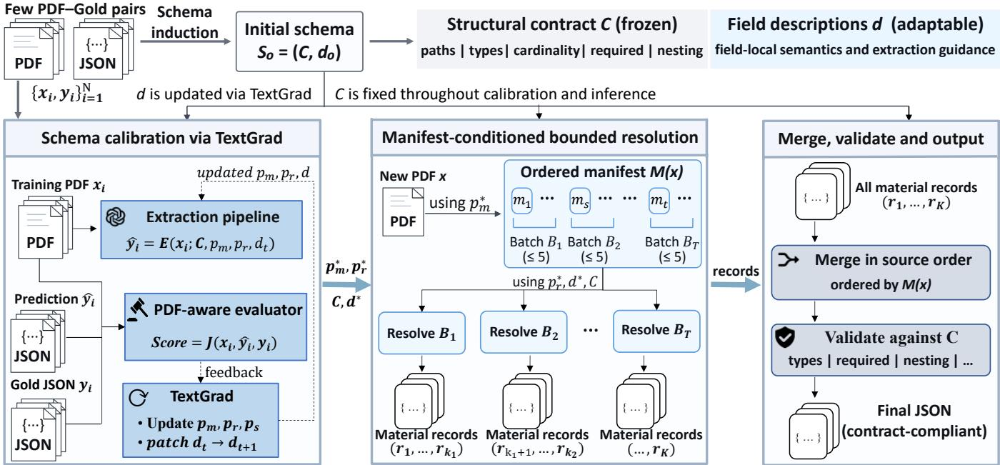

# ADAPT SEMANTICS, NOT STRUCTURE: FEW-INSTANCE SCHEMA CALIBRATIONFOR SCIENTIFIC PDF EXTRACTION

Zixiao Dong1,3, Wei Yang2,3, Zihao Liu1,3, Chenshu Li1,3, Longzhang Liu1,3, Tao Tan4, Hong Xie1,3∗

1School of Computer Science and Technology, University of Science and Technology of China 2University of Science and Technology of China, 3State Key Laboratory of Cognitive Intelligence 4CCCC Second Highway Consultants Co., Ltd.

## ABSTRACT

A well-designed extraction schema is not necessarily ready for reliable LLM execution. When only limited verified extractions are available, manually tuning hundreds of field definitions through trial and error is costly. We frame this problem as few-instance schema calibration: adapting the operational semantics of an existing schema from a few annotated documents while preserving its structural contract. We introduce CPSE, a contract-preserving semantic extraction framework that jointly calibrates extraction prompts and field-level semantic descriptions from a few gold annotations. CPSE decomposes the schema into an invariant structural contract and mutable field semantics, and further separates identity discovery from record completion using manifest-conditioned resolution. On expert-annotated polymer-science documents, CPSE improves extraction by 9.93 points over an executionmatched baseline, with consistent gains under an independent judge and in a blinded expert audit. These results show that CPSE enables low-resource schema execution while preserving the output structure required downstream.

Index Terms— scientific information extraction, schema calibration, automatic prompt optimization, contract preservation, low-resource adaptation

## 1. INTRODUCTION

Scientific information extraction (IE) poses a dual challenge: designing an adequate representational schema and reliably steering large language models (LLMs) to populate it from heterogeneous document evidence [1, 2]. This challenge intensifies in scientific PDFs, where information spans across text, tables, and figures, and field interpretation depends on experimental context [3, 4]. Even a well-specified schema often resists faithful LLM execution because field-level extraction semantics—including evidence assignment, value interpretation, and entity association—are rarely specified [5–7].

Reliable schema execution depends on adapting these operational semantics to target documents, yet sufficient verified annotations are costly, particularly for schemas with hundreds of fields. Existing approaches optimize task instructions [6, 8–11] or modify schema representations [7]. The former improves global guidance but leaves field-level interpretation unresolved, while the latter risks altering the downstream interface. This gap points to a distinct post-design problem: refining an established schema’s operational semantics under limited supervision, without altering its structure.

We refer to this problem as few-instance schema calibration. Unlike schema induction, which determines the representation space of a task, schema calibration starts from an established or induced structure and refines the operational semantics connecting document evidence to schema fields. We define the structural contract as the invariant schema components required downstream, including field paths, types, cardinalities, requiredness, and nesting. Field descriptions remain mutable; for example, calibration can distinguish a polymerization temperature from a later measurement temperature without changing field paths or types.

Two recurring failure modes in polymer-science PDF extraction motivate this formulation. Global task instructions cannot precisely specify field-level evidence requirements, particularly when similar quantities or experimental attributes depend on context. Separately, single-pass extraction requires the model to discover material identities and complete records simultaneously, making record boundaries difficult to maintain in entity-dense documents [12–14]. We therefore decouple semantic calibration from record control, jointly adapting field semantics and prompts while introducing manifest-conditioned resolution.

We introduce contract-preserving semantic extraction (CPSE) for few-instance schema calibration. Our main contributions are:

• We formulate few-instance schema calibration as adapting field-local operational semantics while preserving an explicit structural contract.

• Our method jointly calibrates extraction prompts and field-level semantic descriptions through PDF-aware textual feedback with the schema structure held fixed.

• We introduce a source-ordered material manifest to separate identity discovery from full-record generation, making record boundaries explicit during extraction.

• Experiments on expert-annotated polymer-science PDFs show consistent gains across internal ablations, external optimizers, independent evaluation, and a blinded expert audit.

## 2. RELATED WORK

Scientific IE spans domain-specific pipelines for extracting entities, measurements, and relations [1] and recent LLMbased structured extraction [2]. Materials-science studies report both the promise and domain-specific limitations of few-shot LLMs [15], while polymer-specific systems extract material–property records from abstracts or selected full-text content [16, 17]. Our formulation instead targets full-PDF extraction into a fixed nested JSON contract and adapts the extractor from only a few annotated documents.

Automatic prompt optimization includes instruction generation and selection, iterative textual editing, LLM-guided search, textual-feedback optimization, and program-level optimization [6, 8–11]. These methods optimize instructions, demonstrations, or other textual program components. Schema-oriented methods optimize mutable schema representations [7], whereas CPSE treats the output structure as an invariant contract and jointly calibrates extraction prompts and field-level operational semantics. Recent studies suggest that structured-output schema descriptions influence model behavior [5]; CPSE calibrates their field-level operational semantics while keeping the structure fixed.

Document-level IE must associate evidence distributed across a document with the correct entities. Prior work uses cross-sentence relation extraction [12], entity-centered template generation [13], and multi-stage structured extraction [14]. CPSE first constructs a source-ordered material manifest, then resolves small, non-overlapping identity subsets separately, making sample boundaries explicit and limiting cross-sample mixing.

Grammar-constrained decoding enforces structural validity [18]; CPSE instead calibrates field semantics and evidence assignment under a fixed structure.

## 3. METHOD

CPSE begins with schema induction and then performs fewinstance calibration under a fixed structural contract. As illustrated in Fig. 1, the pipeline consists of schema induction, constrained textual calibration, ordered identity discovery, and manifest-conditioned bounded resolution.

## 3.1. Problem formulation

Let $D _ { \mathrm { t r } } ~ = ~ \{ ( x _ { i } , y _ { i } ) \} _ { i = 1 } ^ { N }$ denote the training set, where $x _ { i }$ is a PDF and $y _ { i }$ its gold JSON. During schema induction, the gold JSONs establish the structural contract $C ,$ including field paths, types, cardinalities, requiredness, and nesting, while an LLM generates the initial field descriptions $d _ { 0 }$ . Together they form the initial schema $S _ { 0 } = ( C , d _ { 0 } )$

Calibration then freezes C and treats $d ,$ initialized as $d _ { 0 }$ as mutable. Let $\Theta = ( p _ { s } , p _ { m } , p _ { r } , d )$ be the calibration state: $p _ { s }$ updates d and $p _ { m } , p _ { r }$ construct the manifest and resolve records, respectively. With $S ( \Theta ) = \left( C , d \right)$ , we optimize

$$
\Theta ^ { * } = \arg \operatorname* { m a x } _ { \Theta } ~ \frac { 1 } { N } \sum _ { i = 1 } ^ { N } J ( x _ { i } , E ( x _ { i } ; C , p _ { m } , p _ { r } , d ) , y _ { i } )\tag{1}
$$

where $E$ is the extraction pipeline and J a scalar PDF-aware scoring function. Thus, prompts and descriptions may change without altering the downstream JSON interface.

## 3.2. Prompt roles and mutable schema semantics

CPSE maintains three prompts and one adaptable description state. The schema-patch prompt $p _ { s }$ converts aggregated fieldlevel feedback into sparse description-only patches to d.

Given an input $\mathrm { P D F } x ,$ the identity-discovery prompt $p _ { m }$ outputs document metadata and a source-ordered material manifest $M ( x ) = ( m _ { 1 } , . . . , m _ { K } )$ . Each entry $m _ { k }$ identifies one material or sample using its name, class, form, structural features, and source location. The record-resolution prompt $p _ { r }$ converts non-overlapping slices of up to five manifest entries into full records using the PDF and current schema.

The adaptable descriptions d specify field-local semantics, including evidence boundaries, units, missing-value conventions, and sample association, bridging the fixed schema structure and document evidence. Description updates may refine these semantics but cannot add, delete, rename, or relocate fields, ensuring every patch remains compliant with C.

The manifest establishes sample boundaries before full records are generated, while resolving at most five identities per call limits neighboring samples and per-call output complexity, reducing cross-sample mixing.

## 3.3. Textual calibration

We use TextGrad [6] for calibration. At round t, the extractor runs on the training PDFs, and a PDF-aware evaluator returns scores and root-cause feedback, with feedback aggregated into reusable rules rather than paper-specific facts.

TextGrad updates $p _ { m } , \ p _ { r }$ , and $p _ { s } ; ~ p _ { s }$ then proposes a sparse description-only patch to $d _ { t }$ . We retain the state with the highest mean training score across rounds.

At inference, $p _ { m } ^ { * }$ produces document metadata and $M ( x )$ and duplicate identities are merged. Disjoint manifest batches are resolved with $p _ { r } ^ { * } , d ^ { * } , C$ , merged in source order, and validated against $C .$

  
Fig. 1. Overview of CPSE for few-instance schema calibration. Schema induction produces $S _ { 0 } = ( C , d _ { 0 } )$ , after which the structural contract $C$ remains fixed while textual feedback calibrates prompts and field descriptions. At inference, an ordered material manifest is resolved in bounded batches before deterministic merging and validation.

## 4. EXPERIMENTS

## 4.1. Data and Calibration Setup

The dataset contains 20 polymer-science papers with expertcurated JSON annotations. We randomly select N = 3 papers to form $D _ { \mathrm { t r } }$ for schema induction and calibration, reserving 17 for held-out evaluation. The structural contract induced from the three training annotations contains 478 typed nodes, while individual papers contain 2–54 material records. Sec. 4.4 examines training-subset sensitivity within this threepaper pool.

We use GPT-5.6-Sol at temperature 0 for extraction, TextGrad optimization, and training-time evaluation. Optimization starts from a one-sentence instruction requiring contract-compliant JSON. Calibration runs for five rounds, after which the selected state is frozen for held-out evaluation. Code is available at https://github.com/ yyhlm/CPSE.

## 4.2. Evaluation and Comparison Setup

We score all held-out predictions with two PDF-aware LLM judges, GPT-5.6-Sol and GPT-5.6-Terra; because Sol also provides the calibration objective, Terra serves as a held-out check for judge-specific optimization. Both use the same 100-point rubric: identity (10), process (30), properties (50), and characterization (10). The gold annotation defines the target content, while the PDF provides evidence for values, conditions, and sample attribution. Equivalent units and semantically equivalent descriptions are accepted; unsupported values and incorrect attribution are penalized. We also audit learned prompts and descriptions for exact reuse of training-specific strings or structural changes, and measure the contract-validation pass rate.

For paired comparisons, we average three runs per document, compute 17 document-level score differences, and report a paired-bootstrap 95% CI and an exact sign-flip test. As an independent check, a blinded expert audit evaluates eight predefined category-balanced evidence items from each of ten randomly selected held-out papers, comparing the manifest baseline, GEPA+manifest, and CPSE against the PDF and gold annotation.

Internal ablations compare prompt-only, description-only, and joint prompt–description adaptation under single-pass extraction. The manifest-conditioned baseline isolates the effect of staged execution, while its gap to full CPSE reflects joint textual adaptation. OPRO [9], MIPROv2 [10], and GEPA [11] share the single-pass setup; as the best-performing external optimizer in this setting, GEPA is also evaluated with CPSE’s manifest-conditioned execution. Fixed three-shot incontext learning (ICL) and schema-free direct extraction serve as non-optimized references.

## 4.3. Main Results and Ablations

Table 1 summarizes the internal adaptation variants. Promptonly, description-only, and joint prompt–description adaptation improve the Sol score by +6.81, +5.64, and +10.29 over the shared single-pass baseline, respectively. The larger gain from joint adaptation indicates that task-level prompts and field descriptions provide complementary improvements.

For the end-to-end comparison, full CPSE reaches 90.95 versus 76.45 for the unadapted single-pass baseline, a gain of +14.50, with 16 wins and one tie across 17 papers. Against the execution-matched manifest-conditioned baseline of 81.02, CPSE gains +9.93, with 14 wins, two ties, and one regression; the paired-bootstrap 95% CI of [5.12, 16.11] remains entirely positive, with an exact sign-flip $p ~ = ~ 1 . 8 3 \times 1 0 ^ { - 4 }$ These comparisons separate the combined end-to-end benefit from the contribution of joint textual adaptation with the execution strategy held fixed. The broad pattern of wins and positive CI indicate that the improvement is not driven by only a few high-gain papers.

Against the execution-matched baseline, schema-valid outputs increase from 94.1% to 100%. The calibration audit finds no exact reuse of 581 training-specific strings, while the contract structure remains unchanged. Gains are concentrated in property and process extraction, consistent with the sample–value–condition and long-procedure errors targeted by the method.

Table 1. Internal-ablation scores on 17 held-out PDFs.
<table><tr><td>Method</td><td>Sol</td><td>Terra</td></tr><tr><td>Single-pass baseline</td><td>76.45</td><td>75.84</td></tr><tr><td>Prompt adaptation</td><td>83.26</td><td>82.44</td></tr><tr><td>Description adaptation</td><td>82.09</td><td>84.28</td></tr><tr><td>Prompt + description</td><td>86.74</td><td>86.64</td></tr><tr><td>Manifest-conditioned baseline</td><td>81.02</td><td>83.88</td></tr><tr><td>Full CPSE</td><td>90.95</td><td>91.09</td></tr></table>

The held-out Terra judge shows the same trend: against the execution-matched baseline, full CPSE gains +7.21, with a 95% CI of [4.35, 10.09], indicating that the improvement is not specific to the training-time judge. In the blinded expert audit, CPSE attains 78 fully correct facts versus 62 for the execution-matched manifest-conditioned baseline; eight of ten documents improve and two tie, with no regressions (two-sided exact sign test, $p = 0 . 0 0 7 8 )$ .

Table 2 compares external optimizers and non-optimized references under Sol and Terra evaluation.

Both judges rank the methods identically. Manifestconditioned execution raises GEPA from 82.12/83.03 to 85.52/85.50 under Sol/Terra. MIPROv2 full exceeds its instruction-only variant by 5.23/5.42 points, while fixed three-shot ICL lies between them and schema-free direct extraction ranks last. Among the evaluated external baselines, GEPA+manifest performs best but remains 5.43/5.59 points below CPSE under Sol/Terra, with paired-bootstrap 95% CIs of [1.16, 9.85]/[1.04, 10.22] and exact sign-flip $p =$ .0339/.0354. On the same 80 audited facts, GEPA+manifest attains 67 fully correct facts, between the manifest baseline (62) and CPSE (78), matching the automatic ranking and providing further expert support for CPSE’s advantage.

Table 2. Mean Sol and Terra scores for external optimizers and non-optimized references.
<table><tr><td>Method</td><td>Sol</td><td>Terra</td></tr><tr><td>GEPA prompt only [11]</td><td>82.12</td><td>83.03</td></tr><tr><td>GEPA [11] + manifest</td><td>85.52</td><td>85.50</td></tr><tr><td>MIPROv2 full [10]</td><td>79.44</td><td>77.86</td></tr><tr><td>MIPROv2 instruction only [10]</td><td>74.21</td><td>72.44</td></tr><tr><td>OPRO [9]</td><td>71.35</td><td>71.24</td></tr><tr><td>Fixed 3-shot ICL</td><td>76.50</td><td>74.37</td></tr><tr><td>Schema-free direct extraction</td><td>64.76</td><td>63.20</td></tr><tr><td>CPSE</td><td>90.95</td><td>91.09</td></tr></table>

## 4.4. Training-Subset Sensitivity and Mechanism Analysis

Against a matched manifest baseline for each subset, the three one-paper subsets average a held-out Sol gain of +3.48, the three two-paper subsets +2.23, and all three papers +9.93. The non-monotonic pattern indicates training-subset sensitivity, suggesting that factors beyond example count, potentially including subset composition and optimization variability, affect calibration performance in this low-resource regime.

Case analyses further align with the two failure modes motivating CPSE. In an entity-dense polyimide case, recovering record boundaries coincides with the largest gain (+49.2), while correcting sample–condition attribution in another case yields +20.0. These cases are consistent with improved separation and association of closely related records, while also highlighting identity recall as a key bottleneck: omissions in the manifest cannot be recovered downstream. Finally, in a near-tie case, both outputs are correct on all eight audited facts despite the evaluator difference, indicating residual judge sensitivity when predictions are otherwise comparable.

## 5. CONCLUSION

We introduced CPSE for few-instance schema calibration in scientific PDF extraction. CPSE decomposes the schema into a fixed structural contract and mutable field semantics, then jointly calibrates prompts and field descriptions while explicitly controlling record boundaries through manifestconditioned resolution. On expert-annotated polymer-science PDFs, CPSE improves extraction across automatic and expert evaluation without changing the JSON interface. These results show that a few verified examples can improve schema execution without altering the downstream output contract, positioning schema calibration as a distinct post-design stage for reliable LLM extraction.

Compliance with Ethical Standards. This study uses publicly available scientific literature for which no ethical approval was required.

Acknowledgments. This work was supported by the Strategic Priority ResearchProgram of the Chinese Academy of Sciences (Grant No. XDA0490000). The authors declare no conflicts of interest.

## 6. REFERENCES

[1] Matthew C. Swain and Jacqueline M. Cole, “Chem-DataExtractor: A toolkit for automated extraction of chemical information from the scientific literature,” J. Chem. Inf. Model., vol. 56, no. 10, pp. 1894–1904, 2016.

[2] John Dagdelen et al., “Structured information extraction from scientific text with large language models,” Nat. Commun., vol. 15, 2024, Art. no. 1418.

[3] Kausik Hira, Mohd Zaki, Dhruvil Sheth, Mausam, and N. M. Anoop Krishnan, “Reconstructing the materials tetrahedron: challenges in materials information extraction,” Digit. Discov., vol. 3, no. 5, pp. 1021–1037, 2024.

[4] Rui Zhang et al., “A literature-mining method of integrating text and table extraction for materials science publications,” Comput. Mater. Sci., vol. 230, 2023, Art. no. 112441.

[5] Sin-Ying Lin, “Your prompt is not the only prompt: How much do LLMs weight structured-output schema descriptions?,” arXiv preprint arXiv:2608.08254, 2026.

[6] Mert Yuksekgonul, Federico Bianchi, Joseph Boen, Sheng Liu, Pan Lu, Zhi Huang, Carlos Guestrin, and James Zou, “Optimizing generative AI by backpropagating language model feedback,” Nature, vol. 639, pp. 609–616, 2025.

[7] Anubhav Shrimal, Aryan Jain, Soumyajit Chowdhury, and Promod Yenigalla, “PARSE: LLM driven schema optimization for reliable entity extraction,” in Proceedings of the 2025 Conference on Empirical Methods in Natural Language Processing: Industry Track, 2025, pp. 2749–2763.

[8] Reid Pryzant, Dan Iter, Jerry Li, Yin Lee, Chenguang Zhu, and Michael Zeng, “Automatic prompt optimization with ‘gradient descent’ and beam search,” in Proceedings of the 2023 Conference on Empirical Methods in Natural Language Processing, 2023, pp. 7957–7968.

[9] Chengrun Yang, Xuezhi Wang, Yifeng Lu, Hanxiao Liu, Quoc V. Le, Denny Zhou, and Xinyun Chen, “Large language models as optimizers,” in The Twelfth International Conference on Learning Representations, 2024.

[10] Krista Opsahl-Ong, Michael J. Ryan, Josh Purtell, David Broman, Christopher Potts, Matei Zaharia, and Omar Khattab, “Optimizing instructions and demonstrations for multi-stage language model programs,” in Proceedings of the 2024 Conference on Empirical Methods in Natural Language Processing, 2024, pp. 9340– 9366.

[11] Lakshya A. Agrawal et al., “GEPA: Reflective prompt evolution can outperform reinforcement learning,” in International Conference on Learning Representations, 2026.

[12] Sarthak Jain, Madeleine van Zuylen, Hannaneh Hajishirzi, and Iz Beltagy, “SciREX: A challenge dataset for document-level information extraction,” in Proceedings of the 58th Annual Meeting of the Association for Computational Linguistics, 2020, pp. 7506–7516.

[13] Kung-Hsiang Huang, Sam Tang, and Nanyun Peng, “Document-level entity-based extraction as template generation,” in Proceedings of the 2021 Conference on Empirical Methods in Natural Language Processing, 2021, pp. 5257–5269.

[14] Haolun Wu, Ye Yuan, Liana Mikaelyan, Alexander Meulemans, Xue Liu, James Hensman, and Bhaskar Mitra, “Learning to extract structured entities using language models,” in Proceedings of the 2024 Conference on Empirical Methods in Natural Language Processing, 2024, pp. 6817–6834.

[15] Luca Foppiano, Guillaume Lambard, Toshiyuki Amagasa, and Masashi Ishii, “Mining experimental data from materials science literature with large language models: An evaluation study,” Science and Technology of Advanced Materials: Methods, vol. 4, no. 1, 2024, Art. no. 2356506.

[16] Pranav Shetty, Arunkumar Chitteth Rajan, Chris Kuenneth, Sonakshi Gupta, Lakshmi Prerana Panchumarti, Lauren Holm, Chao Zhang, and Rampi Ramprasad, “A general-purpose material property data extraction pipeline from large polymer corpora using natural language processing,” npj Comput. Mater., vol. 9, 2023, Art. no. 52.

[17] Sonakshi Gupta, Akhlak Mahmood, Pranav Shetty, Aishat Adeboye, et al., “Data extraction from polymer literature using large language models,” Commun. Mater., vol. 5, 2024, Art. no. 269.

[18] Saibo Geng, Martin Josifoski, Maxime Peyrard, and Robert West, “Grammar-constrained decoding for structured NLP tasks without finetuning,” in Proceedings of the 2023 Conference on Empirical Methods in Natural Language Processing, 2023, pp. 10932–10952.