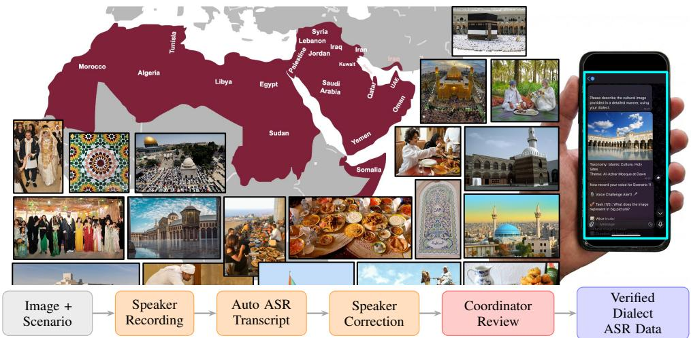

# ALMIEYAR: A CULTURALLY GROUNDED BENCHMARK FOR MULTI-DIALECT ARABIC SPEECH RECOGNITION

Omid Ghahroodi1, Anas Madkoor1, Dima Faris Al Saudi1, Fagr Tahir2, Malak Annan1, Talha shahidjavad allah rakha3, Omar Al-Busaidi4, Zineb El Kahla2, Iheb Zouari1, Essa Ahmed Abou Jabal2, Ahmed Ezzat2, Hind AL-Merekhi1, Aisha Hamad M A Al-Naimi2, Hadi Wazni5, Bushra Alnajjar2, Omar Amin2, Haya Al-Thani1, Houssam Eddine-Othman LACHEMAT1, Marwa Elwakedy6, Sundus Abdulmalik Al Nahari7, Elahe Zahiri1, Osamah Sarraj9, Raghad Mousa10, Mckeen Assi1, Ahd Al Jumah11, Heyam Salman1, Alhanouf Abdulraqib9, Sara Benoumhani12, Alia Hamwi13, Ayaat Al-Yasseri14, Rim Ibrahim Ghazal7, Lamia Ben hiba15, Mohamed Eltabakh1, Fatima Al-Raisi16, Yassine El Kheir17, Mohammed Abdulrahman18, Hamdy Mubarak1, Ayah Hashem3, Lefkir Meriem19, Ehsaneddin Asgari

1QCRI, HBKU; 2Qatar University; 3UDST; 4Algo AI; 5UCL; 6University of Tripoli; 7AUC; 9KAUST; 10CMU-Q; 11KFUPM; 12Alfaisal University; 13Damascus University; 14Princeton University; 15ENSIAS, Mohammed V University; 16Sultan Qaboos University; 17DFKI; 18University of Waterloo; 19USTHB

## ABSTRACT

Arabic speech technology has largely focused on Modern Standard Arabic, leaving the living dialects spoken by hundreds of millions under-served. We introduce ALMIEYAR, a culturally grounded ASR benchmark covering 17 Arabic dialects across six families, built entirely from newly recorded speech unseen by existing models. Dialect-community coordinators selected culturally relevant images across 10 topics, and native speakers described them through five structured scenarios, yielding ≈50 minutes per dialect (13.7 hours total). We benchmark 12 state-of-the-art ASR systems zero-shot, including GPT-4o-transcribe, Voxtral-Mini-4B, Fanar-STT-LF, Whisper, SeamlessM4T-v2, and wav2vec2-based models. GPT-4otranscribe achieves the lowest overall WER at 35.0%, followed by Voxtral-Mini-4B, Fanar-STT-LF, and Whisper-Large-v3 at 41.1%, 45.9%, and 49.5%, respectively, indicating substantial remaining errors across Arabic dialect communities. Per formance varies considerably across dialect groups, with no model performing uniformly best across all groups. WER alone also obscures dialectal ASR behaviour: wav2vec2-based models show large WER/CER gaps, where character-level agreement remains much higher than word-level accuracy, motivating joint WER/CER reporting. ALMIEYAR provides a unified benchmark for culturally grounded Arabic ASR evaluation, including the first published benchmark for Ahwazi Arabic.

Index Terms— Arabic dialects, automatic speech recognition, speech benchmarks, low-resource languages, culturally grounded evaluation, multilingual ASR

## 1. INTRODUCTION

Arabic is spoken by over 420 million people across 22 countries [1], yet its linguistic landscape is far from homogeneous. The gap between Modern Standard Arabic (MSA), used in formal writing and broadcast media, and the diverse spoken dialects is vast, with many varieties mutually unintelligible [2]. Critically, MSA is not a mother tongue. The Arabic that people actually live in, the Arabic of family gatherings, cultural celebrations, and daily life, is dialectal. Yet ASR research has been overwhelmingly dominated by MSA and a small number of high-resource dialects such as Egyptian [3, 4], leaving many spoken Arabic varieties under-represented in current speech technologies. This gap affects the accessibility of voice technologies for speakers of dialects such as Moroccan Darija, Sudanese Arabic, and Ahwazi Arabic (the latter with essentially no prior ASR research). Existing multi-dialect benchmarks, including MGB-2 [5], NADI 2025 [6], and Casablanca [7], remain limited both in dialectal coverage, where no prior benchmark distinguishes more than eight varieties (Table 1), and in data provenance, since their speech is sourced from broadcast or social media that models may have seen during training. We address both limitations with ALMIEYAR, a benchmark designed for contamination-free evaluation of Arabic dialect ASR across diverse dialect communities.

Contributions.

• Broad dialect coverage. 17 dialects across six families, including the first published ASR benchmark for Ahwazi Arabic, spoken by ≈3–5 million people in Khuzestan, Iran.

• Contamination-free speech. All recordings are new, elicited specifically for this work; none has appeared in any prior corpus, reducing the risk of evaluation leakage.

<table><tr><td>Benchmark</td><td>Dialects</td><td>Hours</td></tr><tr><td>MGB-2 [5]</td><td>MSA-dom.</td><td>1,200</td></tr><tr><td>MGB-3 [10]</td><td>1 (EGY)</td><td>16</td></tr><tr><td>MGB-5 [11]</td><td>1 (MOR)</td><td>13</td></tr><tr><td>Common Voice [12] Arabic varieties</td><td></td><td>varies</td></tr><tr><td>FLEURS [13]</td><td>Arabic varieties</td><td>varies</td></tr><tr><td>SADA [14]</td><td>4</td><td>668</td></tr><tr><td>NADI 2025 [6]</td><td>8</td><td>≈20</td></tr><tr><td>Casablanca [7]</td><td>8</td><td></td></tr><tr><td>ALMIEYAR (ours)</td><td>17</td><td>13.7</td></tr></table>

Table 1: Comparison of Arabic ASR benchmarks. “MSAdom.”: benchmark data are primarily MSA despite containing some dialectal speech.

• Cultural grounding. Each utterance describes a communitycurated image across 10 thematic topics, eliciting vocabulary and contexts that broadcast-derived corpora may systematically miss.

• Multi-system evaluation. 12 ASR systems, including openweight and closed-weight models, are evaluated zero-shot under WER, CER, and MER to analyse model behaviour across diverse Arabic dialects.

## 2. RELATED WORK

Large-scale models such as Whisper [8] and Conformer-based systems [9, 3] have pushed Arabic ASR WER below 10%, but primarily on MSA-focused evaluation settings. Standard benchmarks reinforce this imbalance: MGB-2 is drawn from Aljazeera broadcast media and is dialectally mixed but predominantly MSA, while MGB-3 and MGB-5 target Egyptian and Moroccan respectively [5, 10, 11]; Common Voice and FLEURS provide Arabic speech resources but have limited representation of Arabic dialect diversity [12, 13]; SADA covers four dialects [14]; NADI 2025 reaches eight [6]; Casablanca covers eight [7]. Entire families, including Ahwazi, much of the Gulf, and several Maghrebi varieties, remain absent. Most prior corpora are also drawn from broadcast or YouTube sources, which may overlap with large-scale training data. Where genuinely unseen dialectal speech is evaluated, performance can degrade substantially: [15] report 78.8% zero-shot WER on Sudanese Arabic. Culturally grounded benchmarking has gained traction in NLP [16, 17] but has not been widely applied to Arabic ASR; ALMIEYAR fills this gap. Table 1 positions it against prior Arabic ASR benchmarks: it combines broad dialectal coverage with newly generated, culturally grounded speech designed for contamination-free evaluation.

## 3. THE ALMIEYAR BENCHMARK

Dialect coverage. The 17 target dialects across six families are represented by dialect-community coordinators: native speakers with linguistic awareness who contributed cultural expertise and joined the project as co-authors. Most speakers were young adults (approximately 20–30 years), with gender distributions varying across communities due to contributor availability.

Cultural image selection. Coordinators selected culturally representative images across 10 topics: food, clothing, religious practices, historical architecture, festivals, crafts, nature, family gatherings, markets, and sports. Images were selected to reflect authentic community contexts.

Five-scenario elicitation and pipeline. Speakers described each image for ≈30–60 s using five structured scenarios covering cultural context, subjects, background, colours/mood, and interpretation. The collection yielded ≈50 minutes per dialect and 13.7 hours overall. A Telegram-based pipeline (Figure 1) uses automatic transcription only for speaker correction, followed by coordinator review to verify dialect authenticity and flag code-switching.

## 4. EVALUATION FRAMEWORK

Models. We benchmark 12 ASR systems zero-shot: GPT-4o-transcribe, Voxtral-Mini-4B [18], Fanar-STT-LF, Whisper-Large-v3, Whisper-Medium, Whisper-Small [8], SeamlessM4T-v2 [19], Moonshine-AR [20], Wav2Vec2- 53-AR, Wav2Vec2-XLSR-AR, Wav2Vec2-XLSR-v2 [21], and Sinai-STT1. Since all data are newly collected, results measure out-of-domain generalisation. Models were evaluated using standard inference settings: Whisper in Arabic transcription mode, wav2vec2 systems with greedy CTC decoding, and other systems with default generation procedures.

Metrics. We evaluate against manually reviewed references after identical Arabic normalization, including removal of diacritics and tatweel, unification of Alef/Hamza variants, normalization of Ta Marbuta and Alef Maqsura, and collapsing punctuation and whitespace variation. We report WER and CER for word- and character-level recognition. CER is particularly informative for Arabic due to morphological complexity and cliticisation. MER, which normalizes word errors by total word events, is additionally reported to capture cases where WER is affected by hypothesis length.

## 5. RESULTS AND DISCUSSION

Top tier and WER/CER dissociation. Table 2 reports WER and CER for all 12 systems across six dialect families. GPT-4O-TRANSCRIBE achieves the lowest overall error (34.9% WER, 16.5% CER), followed by VOXTRAL-MINI-4B (41.1%/20.6%), FANAR-STT-LF (45.9%/21.0%), and WHISPER-LARGE-V3 (49.5%/29.0%). Wav2Vec2-based systems and SINAI-STT remain substantially behind (79–86%

  
Eng/ MSA/ DialectFig. 1: ALMIEYAR benchmark construction pipeline. Dialect speakers describe culturally selected images across five structured scenarios using a Telegram-based collection interface. Automatic transcription is used only to assist speaker correction; final references are verified through speaker correction and coordinator review.

WER). Their large WER/CER gaps indicate partial characterlevel agreement despite incorrect word recognition, with errors mainly involving deletions and substitutions of weak letters and short function morphemes. Dialect-to-MSA substitutions occur but are not the dominant failure pattern, highlighting the importance of reporting both WER and CER.

Family-level variation. ALMIEYAR evaluates model behaviour across dialect communities rather than ranking dialect difficulty. Error rates vary across families and systems due to differences in model coverage, training exposure, and benchmark content. Substantial variation also exists within families: dialect-level gaps reach 16.8 points in Maghrebi and 12.8 points in Gulf, showing that family averages can hide dialect-specific behaviour.

Gulf (4.0 h). Gulf achieves relatively strong results, with VOXTRAL and GPT-4O-TRANSCRIBE reaching 35.7% and 36.4% WER, respectively. Performance varies across Bahraini, Omani, Qatari, Saudi, and Yemeni Arabic, motivating evaluation beyond family-level aggregation.

Levantine (3.0 h). GPT-4O-TRANSCRIBE achieves the lowest Levantine WER (33.6%), followed by FANAR-STT-LF (45.3%) and VOXTRAL (47.1%). SEAMLESSM4T-V2 shows a large WER/CER discrepancy (69.7% WER, 52.0% CER), indicating substantial character-level confusion.

Maghrebi (3.8 h). Maghrebi remains challenging for several systems, with notable variation among dialects. GPT-4O-TRANSCRIBE achieves 34.9% average WER, while weaker systems show substantially higher error rates. Wav2Vec2 models again exhibit large WER/CER gaps, reflecting partial character overlap despite word-level errors.

Iraqi and Ahwazi (1.6 h). This low-resource setting shows strong performance for leading models: GPT-4O-TRANSCRIBE achieves 28.3% WER, followed by VOXTRAL (44.4%) and FANAR-STT-LF (46.6%). The combined family contains variation between Iraqi and Ahwazi Arabic, with Ahwazi providing a previously uncovered evaluation setting.

Egyptian (0.7 h). Egyptian Arabic shows high error rates for several systems. GPT-4O-TRANSCRIBE, VOXTRAL, and MOONSHINE-AR achieve 49.7%, 59.9%, and 81.8% WER, respectively, while SEAMLESSM4T-V2 achieves 43.9%.

Sudanese (0.7 h). GPT-4O-TRANSCRIBE achieves 30.6% WER, followed by VOXTRAL at 35.8% WER and 15.0% CER. Lower-performing systems exceed 74% WER, showing continued challenges for under-represented dialects.

Model comparison across dialects. GPT-4O-TRANSCRIBE provides the strongest overall result, while other systems show relative strengths across specific dialect groups. These differences demonstrate that aggregate scores alone do not fully capture dialectal ASR behaviour and motivate evaluation across diverse communities.

## 6. MATCH ERROR RATE RESULTS

Table 3 reports MER across evaluated models and six dialect families. MER normalises word-level errors by total word events, making it more conservative than WER when hypotheses contain more words than the references. Results are broadly consistent with Table 2. The Wav2Vec2 family and SINAI-STT remain among the highest-error systems, with their large WER/CER differences indicating substantial character-level overlap despite incorrect word-level predictions.

<table><tr><td rowspan=1 colspan=16>WER (%)                                  CER (%)Model               Gulf Lev. Mag.IraqiEgy. Sud.Ovr.  Gulf Lev. Mag.Iraqi Egy. Sud.|Ovr.</td></tr><tr><td rowspan=1 colspan=1>GPT-4o-transcribe</td><td rowspan=1 colspan=1>36.4</td><td rowspan=1 colspan=1>33.6</td><td rowspan=1 colspan=1>34.9</td><td rowspan=1 colspan=1>28.3</td><td rowspan=1 colspan=1>49.7</td><td rowspan=1 colspan=1>30.6</td><td rowspan=1 colspan=1>34.9</td><td rowspan=1 colspan=1></td><td rowspan=1 colspan=2>19.314.5</td><td rowspan=1 colspan=1>15.7</td><td rowspan=1 colspan=1>9.4</td><td rowspan=1 colspan=1>33.9</td><td rowspan=1 colspan=1>10.2</td><td rowspan=1 colspan=1>16.5</td></tr><tr><td rowspan=1 colspan=1>Voxtral-Mini-4B</td><td rowspan=1 colspan=1>35.7</td><td rowspan=1 colspan=1>47.1</td><td rowspan=1 colspan=1>38.8</td><td rowspan=1 colspan=1>44.4</td><td rowspan=1 colspan=1>59.9</td><td rowspan=1 colspan=1>35.8</td><td rowspan=1 colspan=1>41.1</td><td rowspan=1 colspan=1></td><td rowspan=1 colspan=1>17.9</td><td rowspan=1 colspan=1>26.3</td><td rowspan=1 colspan=1>16.5</td><td rowspan=1 colspan=1>22.1</td><td rowspan=1 colspan=1>40.2</td><td rowspan=1 colspan=1>15.0</td><td rowspan=1 colspan=1>20.6</td></tr><tr><td rowspan=1 colspan=1>Fanar-STT-LF</td><td rowspan=1 colspan=1>42.2</td><td rowspan=1 colspan=1>45.3</td><td rowspan=1 colspan=1>50.4</td><td rowspan=1 colspan=1>46.6</td><td rowspan=1 colspan=1>48.4</td><td rowspan=1 colspan=1>41.8</td><td rowspan=1 colspan=1>45.9</td><td rowspan=1 colspan=1></td><td rowspan=1 colspan=1>20.2</td><td rowspan=1 colspan=1>20.1</td><td rowspan=1 colspan=1>23.0</td><td rowspan=1 colspan=1>20.1</td><td rowspan=1 colspan=1>27.4</td><td rowspan=1 colspan=1>16.1</td><td rowspan=1 colspan=1>21.0</td></tr><tr><td rowspan=1 colspan=1>Whisper-Large-v3</td><td rowspan=1 colspan=1>46.8</td><td rowspan=1 colspan=1>53.5</td><td rowspan=1 colspan=1>50.0</td><td rowspan=1 colspan=1>47.5</td><td rowspan=1 colspan=1>56.8</td><td rowspan=1 colspan=1>44.2</td><td rowspan=1 colspan=1>49.5</td><td rowspan=1 colspan=1></td><td rowspan=1 colspan=1>28.6</td><td rowspan=1 colspan=1>32.4</td><td rowspan=1 colspan=1>28.2</td><td rowspan=1 colspan=1>25.5</td><td rowspan=1 colspan=1>36.1</td><td rowspan=1 colspan=1>23.4</td><td rowspan=1 colspan=1>29.0</td></tr><tr><td rowspan=1 colspan=1>SeamlessM4T-v2</td><td rowspan=1 colspan=1>52.2</td><td rowspan=1 colspan=1>69.7</td><td rowspan=1 colspan=1>55.6</td><td rowspan=1 colspan=1>50.2</td><td rowspan=1 colspan=1>43.9</td><td rowspan=1 colspan=1>56.1</td><td rowspan=1 colspan=1>56.6</td><td rowspan=1 colspan=1></td><td rowspan=1 colspan=1>34.7</td><td rowspan=1 colspan=1>52.0</td><td rowspan=1 colspan=1>37.1</td><td rowspan=1 colspan=1>30.9</td><td rowspan=1 colspan=1>26.2</td><td rowspan=1 colspan=1>37.6</td><td rowspan=1 colspan=1>38.5</td></tr><tr><td rowspan=1 colspan=1>Whisper-Medium</td><td rowspan=1 colspan=1>56.8</td><td rowspan=1 colspan=1>60.2</td><td rowspan=1 colspan=1>58.6</td><td rowspan=1 colspan=1>57.5</td><td rowspan=1 colspan=1>65.1</td><td rowspan=1 colspan=1>57.6</td><td rowspan=1 colspan=1>58.5</td><td rowspan=1 colspan=1></td><td rowspan=1 colspan=1>34.1</td><td rowspan=1 colspan=1>33.9</td><td rowspan=1 colspan=1>32.2</td><td rowspan=1 colspan=1>33.1</td><td rowspan=1 colspan=1>41.6</td><td rowspan=1 colspan=1>31.2</td><td rowspan=1 colspan=1>33.6</td></tr><tr><td rowspan=1 colspan=1>Whisper-Small</td><td rowspan=1 colspan=1>64.2</td><td rowspan=1 colspan=1>76.4</td><td rowspan=1 colspan=1>71.4</td><td rowspan=1 colspan=1>68.7</td><td rowspan=1 colspan=1>75.2</td><td rowspan=1 colspan=1>60.9</td><td rowspan=1 colspan=1>69.7</td><td rowspan=1 colspan=1></td><td rowspan=1 colspan=1>39.8</td><td rowspan=1 colspan=1>49.9</td><td rowspan=1 colspan=1>41.2</td><td rowspan=1 colspan=1>42.2</td><td rowspan=1 colspan=1>50.2</td><td rowspan=1 colspan=1>34.2</td><td rowspan=1 colspan=1>42.8</td></tr><tr><td rowspan=1 colspan=1>Moonshine-AR</td><td rowspan=1 colspan=1>70.2</td><td rowspan=1 colspan=1>67.8</td><td rowspan=1 colspan=1>77.6</td><td rowspan=1 colspan=1>68.4</td><td rowspan=1 colspan=1>81.8</td><td rowspan=1 colspan=1>63.4</td><td rowspan=1 colspan=1>71.7</td><td rowspan=1 colspan=1></td><td rowspan=1 colspan=1>48.4</td><td rowspan=1 colspan=1>44.3</td><td rowspan=1 colspan=1>52.8</td><td rowspan=1 colspan=1>44.8</td><td rowspan=1 colspan=1>58.5</td><td rowspan=1 colspan=1>40.5</td><td rowspan=1 colspan=1>48.4</td></tr><tr><td rowspan=1 colspan=1>Wav2Vec2-53-AR</td><td rowspan=1 colspan=1>76.8</td><td rowspan=1 colspan=1>81.2</td><td rowspan=1 colspan=1>81.7</td><td rowspan=1 colspan=1>74.1</td><td rowspan=1 colspan=1>84.5</td><td rowspan=1 colspan=1>74.6</td><td rowspan=1 colspan=1>79.1</td><td rowspan=1 colspan=1></td><td rowspan=1 colspan=1>28.8</td><td rowspan=1 colspan=1>31.0</td><td rowspan=1 colspan=1>30.1</td><td rowspan=1 colspan=1>23.9</td><td rowspan=1 colspan=1>41.8</td><td rowspan=1 colspan=1>24.8</td><td rowspan=1 colspan=1>29.4</td></tr><tr><td rowspan=1 colspan=1>Wav2Vec2-XLSR-AR</td><td rowspan=1 colspan=1>79.4</td><td rowspan=1 colspan=1>83.4</td><td rowspan=1 colspan=1>84.5</td><td rowspan=1 colspan=1>78.6</td><td rowspan=1 colspan=1>88.0</td><td rowspan=1 colspan=1>77.7</td><td rowspan=1 colspan=1>81.9</td><td rowspan=1 colspan=1></td><td rowspan=1 colspan=1>31.8</td><td rowspan=1 colspan=1>33.6</td><td rowspan=1 colspan=1>32.7</td><td rowspan=1 colspan=1>26.9</td><td rowspan=1 colspan=1>43.6</td><td rowspan=1 colspan=1>27.3</td><td rowspan=1 colspan=1>32.1</td></tr><tr><td rowspan=1 colspan=1>Wav2Vec2-XLSR-v2</td><td rowspan=1 colspan=1>82.7</td><td rowspan=1 colspan=1>85.2</td><td rowspan=1 colspan=1>87.5</td><td rowspan=1 colspan=1>83.2</td><td rowspan=1 colspan=1>89.2</td><td rowspan=1 colspan=1>80.5</td><td rowspan=1 colspan=1>84.8</td><td rowspan=1 colspan=1></td><td rowspan=1 colspan=1>32.5</td><td rowspan=1 colspan=1>33.9</td><td rowspan=1 colspan=1>34.3</td><td rowspan=1 colspan=1>28.6</td><td rowspan=1 colspan=1>44.7</td><td rowspan=1 colspan=1>28.6</td><td rowspan=1 colspan=1>33.2</td></tr><tr><td rowspan=1 colspan=1>Sinai-STT</td><td rowspan=1 colspan=1>85.8</td><td rowspan=1 colspan=1>87.5</td><td rowspan=1 colspan=1>87.3</td><td rowspan=1 colspan=1>81.1</td><td rowspan=1 colspan=1>87.1</td><td rowspan=1 colspan=1>77.2</td><td rowspan=1 colspan=1>85.6</td><td rowspan=1 colspan=1></td><td rowspan=1 colspan=3>42.041.438.7</td><td rowspan=1 colspan=1>32.5</td><td rowspan=1 colspan=1>46.9</td><td rowspan=1 colspan=1>27.9</td><td rowspan=1 colspan=1>39.3</td></tr></table>

Table 2: Family-level WER (%) and CER (%) per model on ALMIEYAR. Cells are colour-coded green (low) to red (high). Best per column in bold. Gulf: Bahraini, Omani, Qatari, Saudi, Yemeni; Lev.: Levantine (Jordanian, Lebanese, Palestinian, Syrian); Mag.: Maghrebi (Algerian, Libyan, Moroccan, Tunisian); Iraqi: Iraqi & Ahwazi; Egy.: Egyptian; Sud.: Sudanese; Ovr.: Overall average.

<table><tr><td rowspan=1 colspan=8>Model            GulfLev.Mag.Irq.Egy.Sud.Ovr.</td></tr><tr><td rowspan=2 colspan=1>Voxtral-Mini-4BFanar-STT-LF</td><td rowspan=1 colspan=1>33.4</td><td rowspan=1 colspan=1>41.4</td><td rowspan=1 colspan=1>37.5</td><td rowspan=1 colspan=1>40.8</td><td rowspan=1 colspan=1>49.6</td><td rowspan=1 colspan=1>33.4</td><td rowspan=1 colspan=1>37.8</td></tr><tr><td rowspan=1 colspan=1>41.8</td><td rowspan=1 colspan=1>44.4</td><td rowspan=1 colspan=1>49.9</td><td rowspan=1 colspan=1>46.4</td><td rowspan=1 colspan=1>45.3</td><td rowspan=1 colspan=1>41.3</td><td rowspan=1 colspan=1>45.3</td></tr><tr><td rowspan=1 colspan=1>Whisper-Large-v3</td><td rowspan=1 colspan=1>43.4</td><td rowspan=1 colspan=1>49.7</td><td rowspan=1 colspan=1>46.6</td><td rowspan=1 colspan=1>44.3</td><td rowspan=1 colspan=1>48.9</td><td rowspan=1 colspan=1>40.8</td><td rowspan=1 colspan=1>45.9</td></tr><tr><td rowspan=1 colspan=1>SeamlessM4T-v2</td><td rowspan=1 colspan=1>51.2</td><td rowspan=1 colspan=1>69.4</td><td rowspan=1 colspan=1>55.4</td><td rowspan=1 colspan=1>49.7</td><td rowspan=1 colspan=1>40.5</td><td rowspan=1 colspan=1>55.1</td><td rowspan=1 colspan=1>55.9</td></tr><tr><td rowspan=1 colspan=1>Whisper-Medium</td><td rowspan=1 colspan=1>52.1</td><td rowspan=1 colspan=1>55.3</td><td rowspan=1 colspan=1>54.3</td><td rowspan=1 colspan=1>53.8</td><td rowspan=1 colspan=1>59.0</td><td rowspan=1 colspan=1>52.0</td><td rowspan=1 colspan=1>53.9</td></tr><tr><td rowspan=1 colspan=1>Whisper-Small</td><td rowspan=1 colspan=1>61.5</td><td rowspan=1 colspan=1>71.9</td><td rowspan=1 colspan=1>67.4</td><td rowspan=1 colspan=1>66.1</td><td rowspan=1 colspan=1>72.2</td><td rowspan=1 colspan=1>58.1</td><td rowspan=1 colspan=1>66.2</td></tr><tr><td rowspan=1 colspan=1>Moonshine-AR</td><td rowspan=1 colspan=1>67.7</td><td rowspan=1 colspan=1>67.1</td><td rowspan=1 colspan=1>76.3</td><td rowspan=1 colspan=1>68.3</td><td rowspan=1 colspan=1>79.5</td><td rowspan=1 colspan=1>61.7</td><td rowspan=1 colspan=1>70.3</td></tr><tr><td rowspan=1 colspan=1>Wav2Vec2-53-AR</td><td rowspan=1 colspan=1>76.7</td><td rowspan=1 colspan=1>81.0</td><td rowspan=1 colspan=1>81.7</td><td rowspan=1 colspan=1>74.1</td><td rowspan=1 colspan=1>84.3</td><td rowspan=1 colspan=1>73.8</td><td rowspan=1 colspan=1>78.9</td></tr><tr><td rowspan=1 colspan=1>Wav2Vec2-XLSR-AR</td><td rowspan=1 colspan=1>79.0</td><td rowspan=1 colspan=1>83.2</td><td rowspan=1 colspan=1>84.4</td><td rowspan=1 colspan=1>78.4</td><td rowspan=1 colspan=1>87.6</td><td rowspan=1 colspan=1>76.6</td><td rowspan=1 colspan=1>81.6</td></tr><tr><td rowspan=1 colspan=1>Wav2Vec2-XLSR-v2</td><td rowspan=1 colspan=1>82.1</td><td rowspan=1 colspan=1>84.8</td><td rowspan=1 colspan=1>87.5</td><td rowspan=1 colspan=1>82.9</td><td rowspan=1 colspan=1>89.2</td><td rowspan=1 colspan=1>79.9</td><td rowspan=1 colspan=1>84.5</td></tr><tr><td rowspan=1 colspan=1>Sinai-STT</td><td rowspan=1 colspan=1>85.8</td><td rowspan=1 colspan=1>87.4</td><td rowspan=1 colspan=1>87.2</td><td rowspan=1 colspan=1>81.1</td><td rowspan=1 colspan=1>87.1</td><td rowspan=1 colspan=1>77.2</td><td rowspan=1 colspan=1>85.6</td></tr></table>

Table 3: MER (%) per model and dialect family on ALMIEYAR. Cells are colour-coded green (low) to red (high). Best per column in bold. Family abbreviations match Table 2.

## 7. CONCLUSIONS

We introduced ALMIEYAR, a culturally grounded and contamination free Arabic ASR benchmark covering 17 dialects across six families, including the first published Ahwazi benchmark. The benchmark is constructed through community-guided image descriptions using entirely newly recorded speech. Across 12 zero-shot systems, including both open-weight and closedweight models, current ASR systems still exhibit substan tial errors on diverse Arabic dialect communities, with GPT-4o-transcribe achieving the strongest overall performance at 34.9% WER. The variation across systems and dialect groups highlights the importance of evaluating ASR models across diverse communities rather than relying on a single aggregate score. The WER/CER analysis further shows that different architectures exhibit different failure patterns, demonstrating the need for multi-metric evaluation of Arabic dialect ASR.

## 8. LIMITATIONS

ALMIEYAR represents a meaningful step toward equitable dialectal Arabic ASR evaluation, but several limitations remain. (i) Single elicitation modality. The benchmark is built entirely from image-description speech. While effective at surfacing culturally grounded vocabulary, it does not capture other registers such as conversational dialogue, read speech, broadcast monologue, or domain-specific discourse (medical, legal, technical). (ii) Scale per dialect. With ≈50 minutes per dialect, performance estimates carry non-trivial variance for the lower-resource families (e.g., Ahwazi, Sudanese, Iraqi); statistical comparisons between similarly performing models on a single dialect should be interpreted as indicative rather than definitive. (iii) Discrete dialect categories. Arabic dialects form a continuum rather than a partition; our 17-way labelling is a working approximation. Speaker-level metadata (age, gender, urban/rural background, education) is recorded but not used as a stratification variable in headline results. (iv) Zero-shot only. We evaluate models out-of-the-box; performance after dialect-specific fine-tuning is left to future work. (v) Reference quality. Coordinator review reduces but does not eliminate transcription ambiguity, especially around codeswitching boundaries and dialect-internal orthographic conventions where no single normative spelling exists.

## 9. ETHICAL CONSIDERATIONS

Contributor roles and authorship. We distinguish two roles in ALMIEYAR’s construction, with the ethical implications of each handled differently:

• Dialect-community coordinators carried out substantive intellectual work: curating culturally representative image sets for their dialect, recruiting and supervising speakers, calibrating elicitation prompts, performing final transcription review, and adjudicating dialect-internal orthographic conventions. Following the standard CRediT / ICMJE criteria for authorship (substantial contribution, drafting/review, and final approval), each coordinator is listed as a co-author of this paper.

• Native-speaker participants contributed bounded one-time recordings (≈50 minutes per speaker). Their contribution falls below the threshold for authorship under CRediT, so it is recognised through a fair monetary compensation paid for their time, plus a named acknowledgement (with explicit consent) in the released datasheet. We followed local minimum-wage benchmarks and approved IRB compensation rates in each contributor country.

Informed consent. All speakers gave written informed consent for use of their voice recordings and transcriptions in research and in the public release of ALMIEYAR. Consent forms were provided in the speaker’s dialect (oral readback where literacy was uneven) and explicitly enumerated the licence, the planned redistribution, and the right to withdraw before publication.

Personally identifying information (PII). We retain only the dialect label and a study-internal speaker ID with the released audio; speaker names, contact details, demographic metadata at individual granularity, and any incidental PII surfaced during recording (e.g., mentions of family members) were redacted or pseudonymised by the coordinators before release.

Cultural representation. Image selection and transcript review reflect community judgement about cultural authenticity rather than top-down decisions made by the core authors. Where dialects span national boundaries (e.g., Iraqi/Ahwazi, Levantine across four states), multiple coordinators were consulted; disagreements were resolved by majority vote of coordinators native to the disputed sub-region.

Intended use and misuse. ALMIEYAR is intended for the evaluation of Arabic ASR systems; it is not a training corpus, and we explicitly discourage its repackaging as one to avoid contaminating future benchmarks. Released ASR outputs reflect model behaviour as of evaluation time and should not be used to make individual-level claims about speakers.

Release and datasheet. The dataset, all evaluation scripts, model-output transcripts, and per-utterance metric reports will be released under a permissive licence, alongside a datasheet documenting collection methodology, processing pipeline, coordinator and speaker compensation rates, and known biases (e.g., within-dialect speaker-demographic skews).

## A. FIVE-SCENARIO ELICITATION INSTRUCTIONS

Instructions were provided to coordinators in both English and their dialect’s written Arabic.

Scenario 1, Cultural Context. Describe the cultural image in detail using your dialect. Focus on: (a) the big picture and what the image represents; (b) where the scene is set; (c) the specific tradition, festival, or activity depicted; (d) historical or cultural significance; (e) any clues about time of day or season. Scenario 2, Central Subjects. Describe the primary figures or objects in the image. Cover: (a) who or what dominates the image; (b) their placement and orientation; (c) specific colours, textures, or notable details; (d) how multiple subjects relate to each other.

Scenario 3, Background and Environment. Describe the setting and surroundings. Address: (a) what is visible in the background; (b) architecture, natural elements, or decorative features; (c) how the background complements or contrasts the central subjects; (d) patterns, textures, or recurring elements. Scenario 4, Colours, Textures, and Mood. Describe the sensory and emotional qualities. Include: (a) dominant colours and their locations; (b) textures of objects or surfaces; (c) cultural symbolism of specific colours; (d) how lighting and shadows create emotional tone.

Scenario 5, Interpretive Meaning. Describe the deeper significance of the image. Address: (a) the cultural narrative or message; (b) the emotional impact on you as a viewer; (c) connection to cultural, historical, or spiritual roots; (d) why this scene is meaningful in a modern context.

## B. TELEGRAM BOT COLLECTION INTERFACE

The Telegram bot (Figure 1) guided each participant through: (1) display image with scenario instructions in the speaker’s dialect; (2) record voice message (30–60 s); (3) auto-transcribe via Google Cloud ASR; (4) display transcription in editable field for in-line correction; (5) submit and repeat for remaining scenarios. Recordings were stored with metadata: speaker ID, dialect, image ID, scenario number, timestamp, and duration. Coordinator review used a separate web interface with line-byline comparison of original and corrected transcriptions.

<table><tr><td></td><td colspan="10">WER (%)</td><td colspan="10">CER (%)</td></tr><tr><td>Dialect</td><td>Vox</td><td>Fan</td><td>W-L</td><td>Sea</td><td>W-M</td><td>W-S Moo</td><td>W53</td><td>XLS</td><td>XLv2</td><td>Sin</td><td>Vox</td><td>Fan</td><td>W-L</td><td>Sea</td><td>W-M</td><td>W-S</td><td>Moo</td><td>W53 XLS</td><td>XLv2</td><td>Sin</td></tr><tr><td>Gulf</td><td></td><td></td><td></td><td></td><td></td><td></td><td></td><td></td><td></td><td></td><td></td><td></td><td></td><td></td><td></td><td></td><td></td><td></td><td></td><td></td></tr><tr><td>Bahraini</td><td>43</td><td>41</td><td>61</td><td>54</td><td>70</td><td>76 73</td><td>78</td><td>80</td><td>82</td><td>85</td><td>23</td><td>17</td><td>44 30</td><td>48</td><td>58</td><td>50</td><td>27</td><td>30</td><td>30</td><td>40</td></tr><tr><td>Omani</td><td>30</td><td>41</td><td>51</td><td>76</td><td>64</td><td>67 67</td><td>78</td><td>81</td><td>83</td><td>89</td><td>11</td><td>22</td><td>28 65</td><td>38</td><td>44</td><td>42</td><td>29</td><td>34</td><td>32</td><td>50</td></tr><tr><td>Qatari</td><td>35</td><td>42</td><td>41</td><td>38</td><td>53</td><td>58 77</td><td>76</td><td>79</td><td>82</td><td>83</td><td>17</td><td>18</td><td>23 17</td><td>29</td><td>31</td><td>55</td><td>27</td><td>29</td><td>30</td><td>37</td></tr><tr><td>Saudi</td><td>25</td><td>38</td><td>36</td><td>42</td><td>45</td><td>59 52</td><td>73</td><td>77</td><td>82</td><td>83</td><td>11</td><td>19</td><td>20 24</td><td>26</td><td>33</td><td>34</td><td>28</td><td>30</td><td>32</td><td>37</td></tr><tr><td>Yemeni</td><td>39</td><td>52</td><td>52</td><td>73</td><td>59</td><td>65 76</td><td>81</td><td>82</td><td>85</td><td>89</td><td>18</td><td>28</td><td>32 58</td><td>34</td><td>38</td><td>54</td><td>35</td><td>38</td><td>39</td><td>51</td></tr><tr><td>Levantine</td><td></td><td></td><td></td><td></td><td></td><td></td><td></td><td></td><td></td><td></td><td></td><td></td><td></td><td></td><td></td><td></td><td></td><td></td><td></td><td></td></tr><tr><td>Jordanian</td><td>35</td><td>39</td><td>46</td><td>74</td><td>54</td><td>72 57</td><td>80</td><td>80</td><td>85</td><td>88</td><td>18</td><td>16</td><td>27 57</td><td>32</td><td>48</td><td>35</td><td>28</td><td>29</td><td>31</td><td>44</td></tr><tr><td>Lebanese</td><td>49</td><td>59</td><td>50</td><td>45</td><td>62</td><td>70 63</td><td>90</td><td>94</td><td>92</td><td>88</td><td>20</td><td>26</td><td>20 16</td><td>29</td><td></td><td>28</td><td>28 38</td><td>40</td><td>42</td><td>37</td></tr><tr><td>Palestinian</td><td>53</td><td>49</td><td>58</td><td>77 64</td><td>80</td><td>80</td><td>81</td><td>83</td><td>85</td><td>87</td><td>29</td><td>23 36</td><td>60</td><td>36</td><td>56</td><td>57</td><td>33</td><td>36</td><td>36</td><td>41</td></tr><tr><td>Syrian</td><td>38</td><td>44</td><td>54</td><td>64</td><td>60 76</td><td>69</td><td>81</td><td>83</td><td>84</td><td>87</td><td>17</td><td>19 35</td><td>46</td><td>35</td><td>51</td><td>46</td><td>30</td><td>33</td><td>33</td><td>41</td></tr><tr><td>Maghrebi</td><td></td><td></td><td></td><td></td><td></td><td></td><td></td><td></td><td></td><td></td><td></td><td></td><td></td><td></td><td></td><td></td><td></td><td></td><td></td><td></td></tr><tr><td>Algerian</td><td>51</td><td>58</td><td>58</td><td>66</td><td>65</td><td>66</td><td>86</td><td>88</td><td>91</td><td>88</td><td>26</td><td>29</td><td>36 45</td><td>37</td><td>44</td><td>43</td><td>35</td><td>37</td><td>39</td><td>42</td></tr><tr><td>Libyan</td><td>27 40</td><td></td><td>41</td><td>45 49</td><td>77 61</td><td>57</td><td>78</td><td>80</td><td>84</td><td>84</td><td>9</td><td>16</td><td>22 27</td><td>27</td><td>36</td><td>30</td><td>29</td><td>32</td><td>33</td><td>40</td></tr><tr><td>Moroccan</td><td>48</td><td>53</td><td>71</td><td>73 69</td><td></td><td>82 84</td><td>84</td><td>86</td><td>89</td><td>92</td><td>22</td><td>26</td><td>42 53</td><td>43</td><td>50</td><td>56</td><td>33</td><td>35</td><td>37</td><td>42</td></tr><tr><td>Tunisian</td><td>36</td><td>52</td><td>45</td><td>49</td><td>57</td><td>70 91</td><td>81</td><td>85</td><td>88</td><td>87</td><td>13</td><td>23</td><td>23 31</td><td>28</td><td>40</td><td>67</td><td>28</td><td>30</td><td>32</td><td>36</td></tr><tr><td>Iraqi</td><td></td><td></td><td></td><td></td><td></td><td></td><td></td><td></td><td></td><td></td><td></td><td></td><td></td><td></td><td></td><td></td><td></td><td></td><td></td><td></td></tr><tr><td>Ahwazi</td><td>43</td><td>57</td><td>57</td><td>43</td><td>69</td><td>77 78</td><td>79</td><td>84</td><td>87</td><td>86</td><td>18</td><td>30</td><td>30 19</td><td>40</td><td>48</td><td>51</td><td>29</td><td>34</td><td>35</td><td>41</td></tr><tr><td>Iraqi Arabic</td><td>35</td><td>36</td><td>39</td><td>58</td><td>46</td><td>59 60</td><td>70</td><td>74</td><td>80</td><td>75</td><td>16</td><td>11</td><td>22 43</td><td>27</td><td>36</td><td>40</td><td>19</td><td>21</td><td>23</td><td>24</td></tr></table>

Table 4: Per-dialect WER (%) and CER (%) on ALMIEYAR for the four multi-dialect families, to the nearest whole percent. Model abbreviations, in the column order of Table 2: Vox = Voxtral-Mini-4B, Fan = Fanar-STT-LF, W-L = Whisper-Large-v3, Sea = SeamlessM4T-v2, W-M = Whisper-Medium, W-S = Whisper-Small, Moo = Moonshine-AR, W53 = Wav2Vec2-53-AR, XLS = Wav2Vec2-XLSR-AR, XLv2 = Wav2Vec2-XLSR-v2, Sin = Sinai-STT.

## C. REFERENCES

[1] Ammar Mohammed Ali Alqadasi, Akram M. Zeki, Mohd Shahrizal Sunar, Siti Zaiton Mohd Hashim, Md Sah hj Salam, and Rawad Abdulghafor, “Arabic dialects speech corpora: A systematic review,” Speech Communication, vol. 175, pp. 103322, 2025.

[2] Omar F Zaidan and Chris Callison-Burch, “Arabic dialect identification,” Computational Linguistics, vol. 40, no. 1, pp. 171–202, 2014.

[3] Lilit Grigoryan, Nikolay Karpov, Enas Albasiri, Vitaly Lavrukhin, and Boris Ginsburg, “Open automatic speech recognition models for classical and modern standard Arabic,” 2025.

[4] Qusai Abo Obaidah, Muhy Eddin Za’ter, Adnan Jaljuli, Ali Mahboub, Asma Hakouz, Bashar Al-Rfooh, and Yazan Estaitia, “A new benchmark for evaluating automatic speech recognition in the Arabic call domain,” 2024.

[5] Ahmed Ali, Peter Bell, James Glass, Yacine Messaoui, Hamdy Mubarak, Steve Renals, and Yifan Zhang, “The MGB-2 challenge: Arabic multi-dialect broadcast media recognition,” in 2016 IEEE Spoken Language Technology Workshop (SLT). 2016, pp. 279–284, IEEE.

[6] Bashar Talafha, Hawau Olamide Toyin, Peter Sullivan, AbdelRahim A. Elmadany, Abdurrahman Juma, Amirbek Djanibekov, Chiyu Zhang, Hamad Alshehhi, Hanan Aldarmaki, Mustafa Jarrar, Nizar Habash, and Muhammad Abdul-Mageed, “NADI 2025: The first multidialectal

Arabic speech processing shared task,” in Proceedings ofThe Third Arabic Natural Language Processing Conference: Shared Tasks, Suzhou, China, Nov. 2025, pp. 720–733, Association for Computational Linguistics.

[7] Bashar Talafha, Karima Kadaoui, Samar Mohamed Magdy, Mariem Habiboullah, Chafei Mohamed Chafei, Ahmed Oumar El-Shangiti, Hiba Zayed, Mohamedou cheikh tourad, Rahaf Alhamouri, Rwaa Assi, Aisha Alraeesi, Hour Mohamed, Fakhraddin Alwajih, Abdelrahman Mohamed, Abdellah El Mekki, El Moatez Billah Nagoudi, Benelhadj Djelloul Mama Saadia, Hamzah A. Alsayadi, Walid Al-Dhabyani, Sara Shatnawi, Yasir Ech-Chammakhy, Amal Makouar, Yousra Berrachedi, Mustafa Jarrar, Shady Shehata, Ismail Berrada, and Muhammad Abdul-Mageed, “Casablanca: Data and models for multidialectal Arabic speech recognition,” 2024.

[8] Alec Radford, Jong Wook Kim, Tao Xu, Greg Brockman, Christine Mcleavey, and Ilya Sutskever, “Robust speech recognition via large-scale weak supervision,” in Proceedings of the 40th International Conference on Machine Learning. 23–29 Jul 2023, vol. 202 of Proceedings of Machine Learning Research, pp. 28492–28518, PMLR.

[9] Mahmoud Salhab, Marwan Elghitany, Shameed Sait, Syed Sibghat Ullah, Mohammad Abusheikh, and Hasan Abusheikh, “Advancing arabic speech recognition through large-scale weakly supervised learning,” 2025.

[10] Ahmed Ali, Stephan Vogel, and Steve Renals, “Speech recognition challenge in the wild: Arabic mgb-3,” in

2017 IEEE Automatic Speech Recognition and Understanding Workshop (ASRU). IEEE, 2017, pp. 316–322.

[11] Ahmed Ali, Suwon Shon, Younes Samih, Hamdy Mubarak, Ahmed Abdelali, James Glass, Steve Renals, and Khalid Choukri, “The mgb-5 challenge: Recognition and dialect identification of dialectal arabic speech,” in 2019 IEEE Automatic Speech Recognition and Understanding Workshop (ASRU), 2019, pp. 1026–1033.

[12] Rosana Ardila, Megan Branson, Kelly Davis, Michael Kohler, Josh Meyer, Michael Henretty, Reuben Morais, Lindsay Saunders, Francis Tyers, and Gregor Weber, “Common voice: A massively-multilingual speech corpus,” in Proceedings of the Twelfth Language Resources and Evaluation Conference (LREC 2020), Marseille, France, 2020, pp. 4218–4222, European Language Resources Association.

[13] Alexis Conneau, Min Ma, Simran Khanuja, Yu Zhang, Vera Axelrod, Siddharth Dalmia, Jason Riesa, Clara Rivera, and Ankur Bapna, “FLEURS: Few-shot learning evaluation of universal representations of speech,” in 2022 IEEE Spoken Language Technology Workshop (SLT). 2022, pp. 798–805, IEEE.

[14] Sadeen Alharbi, Areeb Alowisheq, Zoltán Tüske, Kareem Darwish, Abdullah Alrajeh, Abdulmajeed Alrowithi, Aljawharah Bin Tamran, Asma Ibrahim, Raghad Aloraini, Raneem Alnajim, Ranya Alkahtani, Renad Almuasaad, Sara Alrasheed, Shaykhah Alsubaie, and Yaser Alonaizan, “SADA: Saudi audio dataset for Arabic,” in ICASSP 2024 – 2024 IEEE International Conference on Acoustics, Speech and Signal Processing (ICASSP). 2024, IEEE.

[15] Ayman Mansour, “Doing more with less: Data augmentation for sudanese dialect automatic speech recognition,” 2026.

[16] Pardis Sadat Zahraei and Ehsaneddin Asgari, “I am aligned, but with whom? MENA values benchmark for evaluating cultural alignment and multilingual bias in LLMs,” 2025.

[17] Mohammad Mahdi Abootorabi, Omid Ghahroodi, Anas Madkoor, Marzia Nouri, Doratossadat Dastgheib, and Ehsaneddin Asgari, “Almieyar-oryx-BloomBench: A bilingual multimodal benchmark for cognitively informed evaluation of vision-language models,” in Findings of the Association for Computational Linguistics: ACL 2026, Maria Liakata, Viviane P. Moreira, Jiajun Zhang, and David Jurgens, Eds., San Diego, California, United States, July 2026, pp. 28404–28436, Association for Computational Linguistics.

[18] Mistral AI, “Voxtral,” 2025.

[19] Seamless Communication, Loïc Barrault, Yu-An Chung, Mariano Coria Meglioli, David Dale, Ning Dong, Mark Duppenthaler, Paul-Ambroise Duquenne, Brian Ellis, Hady Elsahar, Justin Haaheim, John Hoffman, Min-Jae Hwang, Hirofumi Inaguma, Christopher Klaiber, Ilia Kulikov, Pengwei Li, Daniel Licht, Jean Maillard, Ruslan Mavlyutov, Alice Rakotoarison, Kaushik Ram Sadagopan, Abinesh Ramakrishnan, Tuan Tran, Guillaume Wenzek, Yilin Yang, Ethan Ye, Ivan Evtimov, Pierre Fernandez, Cynthia Gao, Prangthip Hansanti, Elahe Kalbassi, Amanda Kallet, Artyom Kozhevnikov, Gabriel Mejia, Robin San Roman, Christophe Touret, Corinne Wong, Carleigh Wood, Bokai Yu, Pierre Andrews, Can Balioglu, Peng-Jen Chen, Marta R. Costajussà, Maha Elbayad, Hongyu Gong, Francisco Guzmán, Kevin Heffernan, Somya Jain, Justine Kao, Ann Lee, Xutai Ma, Alex Mourachko, Benjamin Peloquin, Juan Pino, Sravya Popuri, Christophe Ropers, Safiyyah Saleem, Holger Schwenk, Anna Sun, Paden Tomasello, Changhan Wang, Jeff Wang, Skyler Wang, and Mary Williamson, “Seamless: Multilingual expressive and streaming speech translation,” arXiv preprint arXiv:2312.05187, 2023.

[20] Nat Jeffries, Evan King, Manjunath Kudlur, Guy Nicholson, James Wang, and Pete Warden, “Moonshine: Speech recognition for live transcription and voice commands,” 2024.

[21] Alexei Baevski, Yuhao Zhou, Abdelrahman Mohamed, and Michael Auli, “wav2vec 2.0: A framework for selfsupervised learning of speech representations,” Advances in neural information processing systems, vol. 33, pp. 12449–12460, 2020.