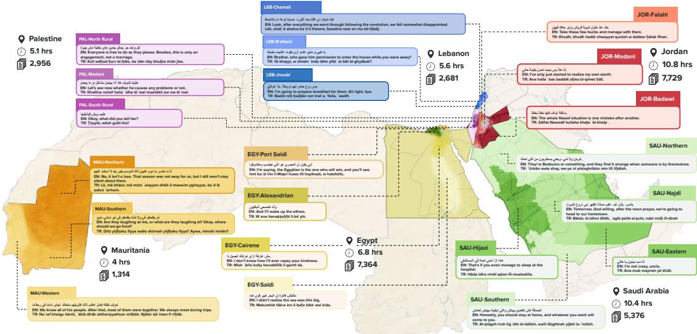
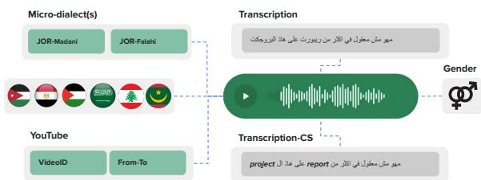
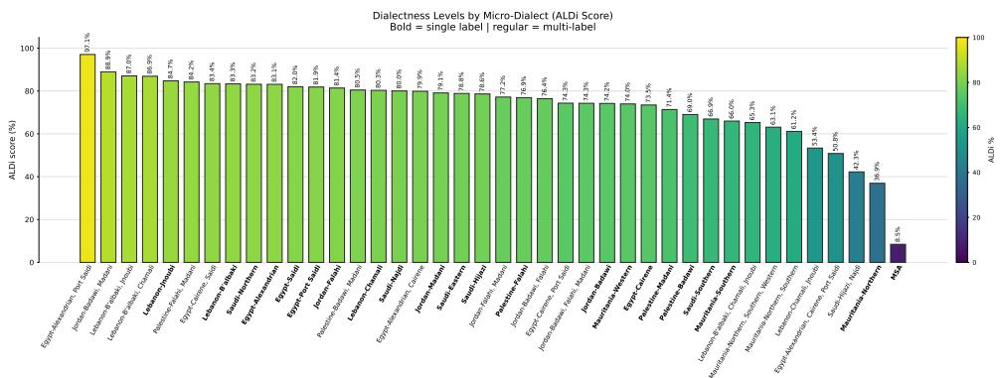

Bashar Talafha1, Samar M. Magdy1, Aisha Alansari6, Alaa Alkhawaldeh16, Abdurrahman Juma3, Sharaf Makahleh11, Nour Gamal12, Omar Attia12, Hanaa Kurdi7, Najwa Rizk12, Maysa Anaya, Hessah Altimyat10, Layal Alhazmi7, Shumukh Alotaibi7, Hajar Alhadaris11,   
Rayan Alomari11, Rahaf Almalaq7, Malak Alkhorasani9, Sara alghamdi7, Rahaf Alshamrani9, Nsrin Ashraf13, Ibrahim Jaradat11, Nada Qardahji11, Yasmin Zaraket14, Elmoukhtar Brahim8, Sidi Ebeidy8, Oumoulmouminin Mahmoud8, Yahjeb Bouha Khatraty8, Meya Haroune8, Mohammad Ghaddar15, Mohamad Eldirany15, Rashed Alamoush11, Tala Chhaytle4, Nuha Albadi6, Yahya El Hadj8, Hamzah Luqman6, Fadi A. Zaraket4,5, Mustafa Jarrar2,3, Muhammad Abdul-Mageed1

1The University of British Columbia, 2Hamad Bin Khalifa University, 3Birzeit University, 4American University of Beirut, 5Arab Center for Research and Policy Studies, 6King Fahd University of Petroleum and Minerals, 7Taibah University, 8Institut Supérieur du Numérique, 9Imam Abdulrahman Bin Faisal University, 10Northern Border University, 11Jordan University of Science and Technology, 12Badr University in Cairo, 13El Sewedy University of Technology 14Imperial College London, 15Lebanese University, 16Al al-Bayt University {btalafha@mail.ubc.ca, muhammad.mageed@ubc.ca}

  
Figure 1: Geographic coverage of CARDAMOM across six countries: Egypt, Jordan, Lebanon, Mauritania, Palestine, and Saudi Arabia. The corpus covers 21 micro-dialects spanning urban, rural, and regional varieties.

## Abstract

We present CARDAMOM, a micro-dialectal Arabic speech dataset designed to support fine-grained evaluation and adaptation of automatic speech recognition (ASR) systems. Community-curated by native speakers familiar with the represented varieties, CARDAMOM contains approximately 40 hours of transcribed YouTube speech spanning 21 micro-dialects across Egypt, Jordan, Lebanon, Mauritania, Palestine, and Saudi Arabia. Each segment is annotated with one or more operational microdialect labels, code-switching information, and utterance-level perceived gender, enabling analysis of sub-country variation that is obscured by conventional country-level labels. We describe the collection and annotation process, motivate the micro-dialect inventory linguistically, and benchmark four multilingual ASR

systems in zero-shot and adapted settings. The strongest zero-shot system obtains 43.47% aggregate WER, with particularly high error rates on Mauritanian and Lebanese varieties; adaptation on CARDAMOM reduces its WER to 35.21%. Audio-based identification experiments further show that the annotations provide a learnable prediction target, with a dedicated classifier reaching 85.57% accuracy on 21-way micro-dialect identification. CARDAMOM provides a resource for studying localized dialectal variation and developing Arabic speech systems with broader regional coverage.1

## 1 Introduction

Arabic speech technologies have advanced rapidly, yet performance remains uneven across Modern

Standard Arabic (MSA) and the regional dialects that dominate everyday communication (Sullivan et al., 2026; Alqadasi et al., 2025; Alsayadi et al., 2022). Although MSA is widely used in education, official communication, and formal media, spoken interaction across the Arab world is primarily dialectal. These dialects encode historical, cultural, social, lexical, phonetic, and prosodic patterns, creating substantial variability for automatic speech recognition (ASR) and related speech processing tasks (Talafha et al., 2025; Djanibekov et al., 2025).

Recent multidialectal corpora, such as Casablanca (Talafha et al., 2024) and SADA (Alharbi et al., 2024), have expanded coverage across major varieties. However, most existing resources still represent dialects at relatively coarse regional or national levels, leaving fine-grained sub-country variation under-represented. In this work, we employ the term micro-dialect to refer to a localized sub-country variety associated with specific speech communities and reflected in systematic phonetic, lexical, or prosodic patterns. This granularity is important since intra-country variation can be substantial and hence country-level labels may obscure speech continua shaped by geography, contact, migration, and local identity (Al-Wer, Enam, 2002). This gap motivates the development of Arabic speech resources that move beyond broad dialectal labels and make localized variation observable. Such resources are essential for testing whether speech models generalize across nearby but distinct communities, identifying varieties that remain underserved, and developing ASR systems that are robust to Arabic as it is actually spoken.

We address this need with CARDAMOM, a community-driven Arabic speech corpus designed for fine-grained analysis of micro-dialectal variation. The corpus spans localized varieties in Egypt, Jordan, Lebanon, Mauritania, Palestine, Saudi Arabia. Rather than relying only on broad countrylevel dialect labels, CARDAMOM is curated and annotated by native speakers familiar with the relevant local varieties. The data are drawn from publicly available YouTube videos and transcribed to support ASR evaluation in real-world speech conditions. Overall, CARDAMOM contains ∼40 hours of transcribed speech across 21 micro-dialects, together with speaker-level metadata such as gender. This design enables evaluation of ASR and dialect identification at both country and micro-dialect levels, making it possible to examine where (and, if so, to what extent) current speech models may still be struggling, and which localized Arabic varieties remain poorly served.

The contributions of this study are: (i) We introduce CARDAMOM, a micro-level multidialectal Arabic speech dataset containing 40 hours of transcribed speech from localized varieties across six countries. (ii) We provide high-granularity microdialect annotations covering 21 local varieties, enabling evaluation beyond coarse country-level dialect categories. (iii) We release speaker-level metadata, including gender, to support detailed analysis of Arabic speech technologies across sociolinguistically diverse conditions.

## 2 Related Work

Arabic Speech and ASR Resources. Arabic ASR has benefited from large broadcast and webderived corpora, including NIST EARS (Pallett, 2003), DARPA GALE (Soltau et al., 2009), and the MGB Challenge series (Ali et al., 2016, 2017, 2019), which supported multi-dialect broadcast ASR, Egyptian Arabic YouTube speech, and dialect identification across Arabic-speaking countries. Later resources such as QASR (Mubarak et al., 2021), MASC (Al-Fetyani et al., 2023), Aswat (Alkanhal et al., 2023), and SADA (Alharbi et al., 2024) further expanded Arabic speech data.

Dialectal, Multidialectal, and Fine-Grained Arabic ASR. Recent resources and shared tasks have expanded dialectal Arabic speech processing, including Casablanca (Talafha et al., 2024), NADI 2025 (Talafha et al., 2025), ADI-20 (Elleuch et al., 2025), and focused low-resource corpora such as TuniFra (Choux et al., 2025). At the same time, work on text-based Arabic dialect identification has shown that variation can be modeled below the country level (Abdul-Mageed et al., 2018, 2020). However, spoken resources remain mostly organized around countries or broad regional varieties (Ali et al., 2019; Talafha et al., 2024, 2025; Elleuch et al., 2025), leaving fine-grained micro-dialectal supervision underrepresented in Arabic ASR.

Code-Switching, Orthography, and Transcription Challenges. Arabic ASR technology also need to handle code-switching, mixed orthographies, and non-standardized dialectal spelling. Mixat (Al Ali and Aldarmaki, 2024) and ZAEBUC-Spoken (Hamed et al., 2024) address bilingual Arabic-English speech, Casablanca includes code-switching annotations in a multidialectal ASR setting (Talafha et al., 2024), and

CAFE targets spontaneous code-switching in North African Arabic (Lachemat et al., 2025). PolyWER (Kadaoui et al., 2024) and Arabic ASR diacritization work (Aldarmaki and Ghannam, 2023) further show that transcription and evaluation choices are critical under script, transliteration, and dialectal variation.

Modeling and Benchmarking. Large multilingual models such as Whisper (Radford et al., 2023), MMS (Pratap et al., 2024), and SeamlessM4T (SEAMLESS Communication Team, 2025) are common ASR baselines, but Arabic-specific work shows that dialectal variation, unseen dialects, code-switching, and data imbalance remain challenging (Talafha et al., 2023; Djanibekov et al., 2025). Recent work addresses these issues through Whisper adaptation for multidialectal Arabic ASR (Özyilmaz et al., 2025), Arabic-focused models such as VoxArabica (Waheed et al., 2023), Habibi (Chen et al., 2026), ArTST (Toyin et al., 2023), and shared evaluation through the Open Universal Arabic ASR Leaderboard (Wang et al., 2025).

Despite these advances, most Arabic speech resources still rely on broad regional or country-level dialect labels. CARDAMOM addresses this gap with ∼40 hours of transcribed speech labeled across 21 micro-dialects, enabling fine-grained evaluation of within-dialect variation and cross-micro-dialect generalization in Arabic ASR. A more detailed discussion of related work is provided in Appendix A.

## 3 Dataset Description

Data Source and Selection We collect naturally occurring speech from publicly available YouTube videos covering localized varieties in Egypt, Jordan, Lebanon, Mauritania, Palestine, and Saudi Arabia. We prioritize non-scripted, non-read speech, including interviews, vlogs, and informal discussions, to capture conversational dialect use across styles, speaker variation and recording conditions, including naturally occurring codeswitching. To construct the micro-dialect inventory for each country, we first elicited candidate local varieties from native speaker annotators based on their linguistic and geographic knowledge.2 Highly similar or hard-to-distinguish candidates were consolidated into a broader category to reduce label redundancy. Annotators then curated source metadata by assigning YouTube URLs to the corresponding micro-dialect categories, using the dominant variety (the one used for most of the speech content) when a video contained more than one. This source-level assignment organized collection, while final micro-dialect labels were assigned at the segment level and could include multiple labels when an utterance was compatible with more than one local variety. The resulting inventory broadly reflects within-country geographic variation: larger countries such as Saudi Arabia, Egypt, and Mauritania have more geographically dispersed microdialect regions, while the smaller, more contiguous Levantine countries (Jordan, Palestine, Lebanon) show comparatively fewer localized categories.

Release Format. We release CARDAMOM as standoff annotations rather than redistributed audio: for each utterance we release the source YouTube video ID together with our human-produced transcription, micro-dialect label(s), perceived gender, code-switching status, and start/end timestamps, along with code to reconstruct the corpus by fetching the corresponding audio from the original video IDs. We do not release nor redistribute audio. Further release and licensing details are provided in the Ethics and Data Statement.

Segmentation After collecting the audio, we segmented recordings into annotation units of at most 20 minutes, chosen to keep annotation tasks manageable, maintain interface stability during upload and playback, and facilitate navigation, while preserving the source-level micro-dialect label.

Team Members All annotations are carried out by team members who are also co-authors of the current work. All team members are native speakers from the Arab world, fluent in their countrylevel dialects and at least one corresponding microdialect each. In total, the team is comprised of 31 members: 5 for Egypt, 8 for Jordan, 2 for Lebanon, 4 for Mauritania, 3 for Palestine, and 9 for Saudi Arabia. Each members primarily annotated speech from their own micro-dialect, while also being able to annotate other micro-dialects from the same country when needed. Table 8 (Appendix E) breaks these totals down by micro-dialect. Counts are not mutually exclusive: some members were fluent in more than one micro-dialect and annotated material from multiple varieties, so summed coverage can exceed a country’s participant count. Likewise, an utterance can receive more than one micro-dialect label when it shares features across local varieties (Section 6.2).

## 4 Annotation Tasks and Guidelines

## 4.1 Overview

All annotation tasks were uploaded to Label Studio3 (Tkachenko et al., 2020) and organized by country. Annotators were provided with written guidelines4 describing the tasks, labeling criteria, and examples for each label type, refined iteratively through weekly online team meetings, with a dedicated Slack channel for coordination and discussions.

We annotate each speech segment using a unified segment-level schema designed to support ASR, Arabic dialect identification (ADI), micro-dialect analysis, code-switching analysis, and aggregate analysis by speaker-level metadata.

## 4.2 Annotation Protocol

As illustrated in Figure 2 (Appendix E), annotators provide, for each segment: (i) transcription reflecting the spoken form as it is typically written in everyday communication; (ii) country-level dialect label and one or more micro-dialect labels; (iii) perceived speaker gender; (iv) a code-switching indicator; (v) start and end timestamps. For codeswitched segments, annotators also provide two transcript variants, one with foreign words rendered in Arabic script and another in Latin script. The main annotation tasks are described below.

## 4.2.1 Task 1: Segment Selection

Annotators select candidate segments from longform videos using a pre-defined set of labels, including micro-dialect labels for dialect-specific content (e.g., in Egypt: Alexandrian, Cairene, Port Saidi, and Saidi) and MSA. Each selected segment must: (i) contain speech from a single speaker with no overlap; (ii) be audibly clear and transcribable, allowing for mild background noise; (iii) contain at least one word and preferably be no longer than 30 seconds; and (iv) capture a complete utterance with intact boundaries, including the full phonetic material of the first and last words.

Each segment is assigned at least one microdialect label when it contains dialectal speech, and more than one when it plausibly belongs to multiple micro-dialects. For example, the Jordanian utterance $\therefore x _ { 0 } = x _ { 9 } \Leftrightarrow c ^ { 2 } = 0$ (mashi wal ¯ a yihimmak ¯ , ‘okay, no worries’) can be realized in both Falahi and Madani varieties; in such cases, both labels are applied.

## 4.2.2 Task 2: Transcription

Arabic dialects lack a single standardized writing system, so annotators transcribe the audio using a natural written form reflecting how the relevant dialect is commonly written in everyday communication, prioritizing fidelity to the speech signal over normalization to MSA. Annotators are encouraged to use standard Arabic orthographic markers when appropriate (e.g., hamza and tanwin) and to write numbers alphabetically to preserve inflectional and contextual realizations.

For code-switching (CS), annotators provide two transcript variants: (i) a version in which foreign words are rendered in Arabic script, and (ii) a version in which foreign words are rendered in Latin script.

## 4.2.3 Task 3: Speaker Gender

Annotators label speaker gender using the available label set {male,female}. These labels are based on annotators’ perception from the speech signal and are intended only for aggregate analysis of model performance and dataset composition. They are not intended to identify speakers or make claims about speakers’ self-identified gender.

## 4.3 Quality Control

Annotators followed shared written guidelines and discussed ambiguous cases with the project team during regular coordination meetings. We also manually inspected completed annotations for transcription completeness, segment boundary quality, single-speaker constraints, and consistency between country-level and micro-dialect labels, resolving ambiguous cases through discussion with annotators familiar with the relevant local varieties. This was intended to ensure that the released labels reflect both the acoustic content of the segment and the sociolinguistic knowledge of native-speaker annotators.

## 5 Micro-Dialects Overview

Arabic dialects exhibit substantial regional and social variation, and broad national labels often obscure the localized varieties that speakers use in everyday communication (Jarrar et al., 2023; Holes, 2004; Procházka, 2021; Zaidan and Callison-Burch, 2014). For this reason, CARDAMOM is designed to represent fine-grained micro-dialectal variation across Egypt, Jordan, Lebanon, Mauritania, Palestine, and Saudi Arabia. We use micro-dialect as an operational label for localized sub-country varieties that are recognizable to speakers and reflected in systematic differences in pronunciation, morphology, lexical choice, prosody, and grammatical patterns (Holes, 2004; Procházka, 2021). Capturing this level of variation is important for evaluating Arabic speech technologies beyond coarse countrylevel labels, which can mask substantial variation within the same national dialect category (Salameh et al., 2018; Abdul-Mageed et al., 2020).

Our taxonomy is informed by prior dialectological literature but is not intended to mechanically reproduce any single linguistic classification. Instead, it adapts established descriptions into categories suitable for computational speech evaluation, acknowledging that dialect boundaries are often gradual and shaped by regional, social, and historical contact. The labels therefore serve as operational annotation categories rather than a definitive linguistic classification; Appendix B discusses this distinction further, including a case where our own cited sources support finer subdivisions than the granularity we annotate.

Accordingly, CARDAMOM represents Egyptian speech through Alexandrian, Cairene, Port Saidi, and Saidi groups; Jordanian speech through Madani, Falahi, and Badawi; Lebanese speech through Chamali, Jnoubi, and B’albaki; Mauritanian Hassaniyya¯ through Western, Northern, and Southern/Eastern groupings; Palestinian speech through Madani urban, Northern Fallahi, and Southern Badawi; and Saudi speech through broad regional categories including Najdi, Hijazi, Eastern, Northern, and Southern. These categories are not intended to exhaustively represent all local varieties within each country; rather, they define annotation units that are recognizable to native-speaker annotators, sufficiently frequent in publicly available speech, and useful for testing whether ASR systems generalize beyond broad country-level dialect labels. Appendix B provides a fuller discussion of the dialect classifications reported in the literature for the countries covered in CARDAMOM.

## 5.1 Phonological Motivation for Micro-Dialect Annotation

CARDAMOM captures several well-known axes of Arabic micro-dialectal variation, including reflexes of $/ { \mathsf { q } } / ,$ interdental preservation or merger, velar palatalization, and affrication of $/ \widehat { \mathrm { d } _ { 3 } } / ,$ each realized differently across the Egyptian, Jordanian, Palestinian, Saudi, Lebanese, and Mauritanian varieties in the corpus (e.g., MSA I. ʯ qalb “heart” surfaces as $\yen 123,456$ in Cairene, $\mu ^ { \ 5 }$ kalb in Palestinian North Rural, and $\yen 8$ in Hassaniya). These patterns motivate fine-grained annotation beyond country-level dialect labels; Table 3 (Appendix B) gives the full set of phoneme-by-phoneme correspondences with lexical examples and citations.

<table><tr><td>Country</td><td>Micro-dialect Segments</td><td></td><td>Total Hrs</td><td>Mean</td><td>CS Hrs</td><td>F/M</td></tr><tr><td rowspan="5">Egypt</td><td>Cairene</td><td>3,871</td><td>3.482</td><td>3.238</td><td>0.264</td><td>33.4/66.6</td></tr><tr><td>Saidi</td><td>1,735</td><td>1.771</td><td>3.675</td><td>0.008</td><td>37.9/62.1</td></tr><tr><td>Port Saidi</td><td>1,124</td><td>1.021</td><td>3.269</td><td>0.039</td><td>12.2/87.8</td></tr><tr><td>Alexandrian</td><td>848</td><td>0.769</td><td>3.265</td><td>0.020</td><td>40.7/59.3</td></tr><tr><td>TOTAL</td><td>7,364</td><td>6.889</td><td>3.368</td><td>0.327</td><td>32.1/67.9</td></tr><tr><td rowspan="4">Jordan</td><td>Falahi</td><td>3,276</td><td>4.540</td><td>4.989</td><td>0.119</td><td>18.6/81.4</td></tr><tr><td>Badawi</td><td>2,899</td><td>3.968</td><td>4.928</td><td>0.005</td><td>26.6/73.4</td></tr><tr><td>Madani</td><td>1,909</td><td>2.755</td><td>5.196</td><td>0.309</td><td>38.2/61.8</td></tr><tr><td>TOTAL</td><td>7,729</td><td>10.806</td><td>5.033</td><td>0.407</td><td>26.5/73.5</td></tr><tr><td rowspan="4">Lebanon</td><td>Chamali</td><td>1,105</td><td>2.071</td><td>6.746</td><td>0.560</td><td>13.6/86.4</td></tr><tr><td>Jnoubi</td><td>1,464</td><td>3.123</td><td>7.679</td><td>0.212</td><td>19.4/80.6</td></tr><tr><td>B&#x27;albaki</td><td>258</td><td>0.737</td><td>10.281</td><td>0.185</td><td>28.4/71.6</td></tr><tr><td>TOTAL</td><td>2,681</td><td>5.628</td><td>7.557</td><td>0.902</td><td>18.0/82.0</td></tr><tr><td rowspan="4">Mauritania</td><td>Western</td><td>1,210</td><td>3.780</td><td>11.247</td><td>0.464</td><td>8.3/91.7</td></tr><tr><td>Northern</td><td>1,205</td><td>3.809</td><td>11.380</td><td>0.470</td><td>8.1/91.9</td></tr><tr><td>Southern</td><td>1,126</td><td>3.666</td><td>11.720</td><td>0.467</td><td>8.7/91.3</td></tr><tr><td>TOTAL</td><td>1,314</td><td>3.998</td><td>10.953</td><td>0.473</td><td>7.7/92.3</td></tr><tr><td rowspan="4">Palestine</td><td>Falahi</td><td>1,564</td><td>2.720</td><td>6.260</td><td>0.028</td><td>9.0/91.0</td></tr><tr><td>Badawi</td><td>864</td><td>1.461</td><td>6.088</td><td>0.001</td><td>3.1/96.9</td></tr><tr><td>Madani</td><td>537</td><td>0.997</td><td>6.686</td><td>0.001</td><td></td></tr><tr><td>TOTAL</td><td>2,956</td><td>5.159</td><td>6.283</td><td>0.031</td><td>32.3/67.7 11.5/88.5</td></tr><tr><td rowspan="5">Saudi Arabia</td><td>Southern</td><td>1,423</td><td>2.550</td><td>6.452</td><td>0.088</td><td>40.5/59.5</td></tr><tr><td>Hijazi</td><td>1,413</td><td>2.661</td><td>6.779</td><td>0.250</td><td>95.0/5.0</td></tr><tr><td>Najdi</td><td>1,089</td><td>2.234</td><td>7.384</td><td>0.156</td><td>3.4/96.6</td></tr><tr><td>Eastern</td><td>956</td><td>2.023</td><td>7.618</td><td>0.044</td><td>17.9/82.1</td></tr><tr><td>Northern</td><td>514</td><td>1.009</td><td>7.064</td><td>0.003</td><td>0.4/99.6</td></tr><tr><td></td><td>TOTAL</td><td>5,376</td><td>10.425</td><td>6.981</td><td>0.538</td><td>39.6/60.4</td></tr></table>

Table 1: CARDAMOM statistics by country and microdialect. Total Hrs gives speech duration; Mean is average segment duration in seconds; CS Hrs gives codeswitched speech duration; F/M reports the perceived speaker-gender split (some micro-dialects show extreme splits tied to source scarcity, e.g., Saudi Hijazi 95/5 and Saudi Northern 0.4/99.6; see Gender distribution bias in Limitations). Country-level totals (bold) count each segment once; per-dialect rows count label memberships and can exceed the total when segments carry multiple micro-dialect labels, most visibly for Mauritania (Table 5). An extended version with segment-duration range, transcript length, vocabulary, and speaking-rate statistics is in Table 4 (Appendix C).

## 6 Corpus Statistics and Analysis

## 6.1 Micro-dialect and Transcript Statistics

Table 1 reports corpus statistics by country and micro-dialect, including the number of segment, total speech duration, mean segment duration, codeswitching (CS) hours, perceived gender distribution, average transcript length (AVT), vocabulary size, and speaking-rate estimates. The corpus comprises 27,420 segments totaling ∼40 hours. While some varieties, such as Egyptian Cairene and Jordanian dialects, are well represented, others, such as Lebanese B’albaki and Saudi Northern, are less represented but add unique linguistic diversity.

Average utterance duration varies notably across dialects, with Egyptian micro-dialects having shorter segments and Mauritanian the longest; Lebanese varieties fall in a mid-to-upper range (6.7–10.3 seconds). CS prevalence is unevenly distributed across micro-dialects, with Mauritanian, Jordanian Madani, Lebanese, and Egyptian varieties contributing the largest amounts, while Palestinian, Saudi, and Jordanian Bedouin subsets contain very little CS speech. Appendix G provides representative CS examples. Similarly, gender distributions are highly micro-dialect dependent, with some subsets being female-skewed and others maleskewed.

A similar pattern is observed in the transcript’s length and lexical diversity (Table 4, Appendix C). Lebanese and Mauritanian subsets exhibit the longest transcripts and some of the highest vocabulary rates. Using words-per-second (WPS) and characters-per-second (CPS) as coarse proxies for speaking rate, the Egyptian and some Saudi dialects exhibit the fastest speech, while Palestinian and Lebanese are comparatively slower, consistent with prior findings (Talafha et al., 2024). The above findings are influenced by the domain of the underlying YouTube sources (e.g., interviews vs. vlogs, topic, recording conditions, and conversational formality) and by the segmentation strategy.5

## 6.2 Quantitative Micro-dialectal Overlap

To complement the aggregate corpus statistics, we examine the frequency and composition of multilabel assignments. These assignments identify utterances that annotators judged compatible with more than one micro-dialect and therefore provide a corpus-level view of where the operational label boundaries overlap.

The extent of co-assignment varies substantially across the sampled regions. As shown in Table 5 (Appendix C), Mauritania has the largest pairwise overlap counts, with extensive co-assignment among the three Hassaniya-oriented regional labels. This pattern should be interpreted with caution. Because micro-dialect-specific Mauritanian material was difficult to obtain, much of the available data represents mainstream or broadly shared Hassaniya speech rather than clearly localized varieties. Annotators therefore judged many Mauritanian segments compatible with multiple regional labels.

Outside Mauritania, Jordan has the largest overlap counts: Badawi–Falahi and Falahi–Madani occur in 178 and 171 multi-label segments, respectively, compared with 23 for Badawi–Madani. Within this corpus, this pattern is consistent with Falahi sharing features with both the Badawi and Madani categories, although it does not by itself establish Falahi as an intermediate linguistic variety. In Egypt, co-assignment is concentrated around Cairene, which shares substantial overlap with the coastal varieties Alexandrian (130) and Port Saidi (67), whereas overlap involving Saidi and between other pairs of regional varieties is sparse (2–10). Saudi Arabia shows much less co-assignment, with most observed intersections containing only a few segments (e.g., one Eastern–Southern segment). These low counts indicate that the corresponding labels were rarely co-assigned in this corpus; they should not be taken as direct evidence of categorical linguistic separation.

Table 9 illustrates the kinds of utterances receiving multiple labels across countries with different overlap profiles. In Jordan, ¼Q£A	m'. CK (alright, see you!’) (Badawi, Falahi) and $b _ { 5 } . 5 0 w _ { 5 } o l ( y e s . $ , that is correct’) (Falahi, Madani) contain widely shared lexical items and discourse expressions that provide limited evidence for assignment to a single variety. Similarly, the Egyptian examples $\downarrow \downarrow \uparrow \uparrow$ (wait, Dad’) (Alexandrian, Port Saidi) and $1 0 0 0 0 0 5 6 4 0 0 0 0 0 0$ (‘we don’t need your father’s money’) (Alexandrian, Cairene) illustrate how common everyday expressions may be compatible with multiple neighboring varieties. In Saudi Arabia, where coassignment is less frequent, $u = 1 1 u = 3 0 0 u = 0 . 6 u$ AÓAÖ ß (‘exactly, the same thing applies to men’) (Hijazi, Najdi) illustrates how relatively formal or broadly shared phrasing may provide few variety-specific cues. Overall, the examples suggest that multi-label assignments can arise from shared lexical and discourse material, limited variety-specific evidence within short utterances, and genuine overlap among localized varieties. Their distribution should therefore be understood as a property of both the sampled speech and the annotation framework.

Finally, the observed co-assignment counts counts may be influenced by source domain, topic, and variation in annotation practices. Although multi-label annotation was permitted, annotators may have differed in how readily they applied multiple labels; this possibility is particularly relevant when interpreting the low co-assignment counts in the Palestinian subset. In addition, since the corpus is drawn from YouTube, the same speakers may occur across multiple segments. To assess whether the reported patterns are dominated by a small number of recurring speakers, Appendix D reports estimated speaker diversity based on automatic speaker-embedding clustering.

<table><tr><td colspan="2">Cnt. M-Dia</td><td>O-CTC</td><td></td><td>0-LLM</td><td>Sea-v2</td><td></td><td>W-v3</td><td></td></tr><tr><td colspan="2"></td><td>WER ↓ CER ↓ WER ↓ CER ↓</td><td></td><td></td><td></td><td></td><td>WER ↓ CER ↓ WER ↓ CER ↓</td><td></td></tr><tr><td rowspan="4">EGY</td><td>Alex.</td><td>49.0 20.6</td><td>41.4</td><td>20.3</td><td>46.7</td><td>21.0</td><td>61.9</td><td>33.5</td></tr><tr><td>Cairene</td><td>44.9</td><td>19.7 36.1</td><td>17.9</td><td>38.3</td><td>18.2</td><td>59.8</td><td>32.0</td></tr><tr><td>Port Said</td><td>56.4</td><td>25.6 46.1</td><td>25.2</td><td>50.5</td><td>24.1</td><td>71.5</td><td>36.6</td></tr><tr><td>Saidi</td><td>53.0 22.9</td><td>44.1</td><td>20.8</td><td>49.1</td><td>21.8</td><td>69.0</td><td>35.4</td></tr><tr><td rowspan="3">JOR</td><td>Badawi</td><td>44.1</td><td>16.6 33.6</td><td>12.2</td><td>46.0</td><td>20.2</td><td>45.8</td><td>25.1</td></tr><tr><td>Falahi</td><td>44.6</td><td>18.9 33.0</td><td>13.7</td><td>41.5</td><td>18.5</td><td>41.1</td><td>19.5</td></tr><tr><td>Madani</td><td>49.2</td><td>26.6 28.9</td><td>11.9</td><td>40.7</td><td>22.1</td><td>41.6</td><td>22.2</td></tr><tr><td rowspan="3">LEB</td><td>B&#x27;albaki</td><td>92.0</td><td>79.7 64.1</td><td>40.0</td><td>75.2</td><td>50.7</td><td>62.2</td><td>34.1</td></tr><tr><td>Chamali</td><td>91.5</td><td>79.8 38.9</td><td>21.6</td><td>75.3</td><td>53.0</td><td>77.6</td><td>45.3</td></tr><tr><td>Jnoubi</td><td>72.9</td><td>50.8 45.2</td><td>23.0</td><td>60.9</td><td>33.5</td><td>75.4</td><td>51.8</td></tr><tr><td rowspan="3">MAU</td><td>Northern</td><td>87.2</td><td>69.1</td><td>76.0 48.5</td><td>84.0</td><td>63.1</td><td>100.9</td><td>72.5</td></tr><tr><td>Southern</td><td>87.2</td><td>69.4 75.9</td><td>48.5</td><td>84.1</td><td>63.4</td><td>101.2</td><td>72.9</td></tr><tr><td>Western</td><td>87.2 69.4</td><td>76.2</td><td>49.2</td><td>84.4</td><td>63.4</td><td>99.5</td><td>72.1</td></tr><tr><td rowspan="3">PAL</td><td>Badawi</td><td>49.3</td><td>20.2</td><td>45.0</td><td>45.0</td><td>19.5</td><td>47.6</td><td>21.1</td></tr><tr><td>Falahi</td><td>51.9</td><td>23.4 46.4</td><td>21.1 22.9</td><td>51.5</td><td>23.9</td><td>62.1</td><td>34.9</td></tr><tr><td>Madani</td><td>49.5</td><td>24.1 44.5</td><td>26.6</td><td>56.9</td><td>44.1</td><td>47.9</td><td>28.6</td></tr><tr><td rowspan="5">KSA</td><td>Eastern</td><td>57.3</td><td>31.6</td><td>35.9 17.1</td><td>43.3</td><td>20.4</td><td>48.6</td><td>29.2</td></tr><tr><td>Hijazi</td><td>44.1</td><td>16.2</td><td>36.0</td><td>12.9 40.1</td><td>16.1</td><td>40.9</td><td>14.4</td></tr><tr><td>Najdi</td><td>61.7</td><td>39.6</td><td>39.4</td><td>21.1 52.5</td><td>31.6</td><td>49.7</td><td>30.9</td></tr><tr><td>Northern</td><td>80.3</td><td>54.8</td><td>67.5</td><td>44.9</td><td>87.5</td><td>52.8 107.2</td><td>64.3</td></tr><tr><td>Southern</td><td>56.3</td><td>35.5</td><td>36.5</td><td>15.6</td><td>57.9</td><td>39.6 59.3</td><td>41.5</td></tr></table>

Table 2: WER and CER, in %, per model across countries and micro-dialects (test set). Cnt: Country, M-Dia: Micro-dialect, O-: Omni, Sea-v2: Seamless-v2, and Wv3: Whisper-v3. Best result per dialect is in bold. Perdialect test-set sizes are listed in Table 11 (Appendix H); Table 14 (Appendix J) reports 95% bootstrap confidence intervals for WER per micro-dialect.

## 7 Zero-Shot Benchmarking

We evaluate CARDAMOM primarily in a zeroshot ASR setting, then show that its train/development split supports adaptation (Section 7.2) and that the micro-dialect labels support identification as a downstream task (Section 7.3), and analyze transcript-level dialectness to contextualize ASR performance. We split the corpus into train, development, and test sets in a micro-dialect-wise manner; details are in Appendix H.

## 7.1 Automatic Speech Recognition (ASR)

We evaluate zero-shot ASR on the test and validation splits using four recent multilingual speech recognition systems, without fine-tuning on CAR-DAMOM. Performance is reported with word error rate (WER) and character error rate (CER), after applying the same text-normalization pipeline to all systems (Appendix I); because dialectal Arabic lacks standardized orthography, these values reflect both acoustic recognition errors and residual orthographic mismatch after normalization. For each micro-dialect, we evaluate all test segments annotated with that label, including segments that overlap with other micro-dialects. MSA-only clips are excluded.

Models. WHISPER-V3, a large multilingual encoder–decoder model, is a strong Arabic ASR baseline (Radford et al., 2023). SEAMLESS-V2 is a multilingual speech model supporting transcription and translation (Barrault et al., 2023). OMNIASR-LLM-7B-V2 and OMNIASR-CTC-7B-V2 are omnilingual ASR models differing in decoding strategy, generative LLM-based versus CTC-based (Keren et al., 2025). Table 2 reports WER and CER by country and micro-dialect. Overall, OMNIASR-LLM-7B-V2 is the strongest system, obtaining the best WER for 20 of 21 microdialects and the best CER for 17 of 21, with especially clear gains for Jordanian dialects (WER 28.9– 33.6) and Saudi Eastern, Najdi, and Southern. The only WER exception is Lebanese B’albaki, where Whisper-v3 is best (62.2), though OmniASR-LLM remains competitive.

Results vary substantially across regions: Jordanian micro-dialects are easiest overall; Egyptian and Palestinian dialects fall in a middle range, with errors remaining high for Port Said, Saidi, and Palestinian varieties; and Lebanese and Mauritanian dialects are considerably more challenging. In Lebanon, all models struggle on B’albaki, while OmniASR-LLM is much stronger on Chamali and Jnoubi. Mauritanian varieties are hardest overall (best model still ∼76 WER, 48–49 CER), suggesting a major mismatch with the pretraining data distribution. Within most countries, the mainstream capital-associated variety yields the lowest WER (e.g., Cairene, Madani), suggesting that capital and media-centered dialects are better represented in web-scale pretraining data and ‘peripheral’ varieties are correspondingly under-represented. Saudi Arabia is the exception: despite Najdi being mainstream, Eastern yields the lowest WER, likely due to proximity to the broader Gulf variety.

## 7.2 Adaptation

The zero-shot results above use CARDAMOM purely as an evaluation resource. To demonstrate the intended use of its train/development/test partitions and give a more cautious, uncertaintyaware picture of the per-dialect comparisons in Table 2, we additionally fine-tune all four systems on the CARDAMOM training split (Appendix J reports checkpoints, hyperparameters, and compute). Whisper-v3 and Seamless-v2 are adapted with LoRA on the query/value projections; both OMNIASR variants are fully fine-tuned. Validation uses the development split; the test split is never used during adaptation. We report 95% confidence intervals from 2,000 bootstrap resamples over the test set, including for the smallest Lebanese subsets (B’albaki: 81, Chamali: 362, Jnoubi: 478 test utterances), capturing test-sample uncertainty rather than training-seed variance, since each adapted model was trained once.

Table 12 (Appendix J) compares aggregate WER/CER under the zero-shot and adapted settings. Adaptation reduces both error rates for Whisper-v3 and the two OMNIASR variants. The adapted OMNIASR-LLM model achieves the lowest overall WER and CER, reaching 35.21% WER and 16.04% CER, compared with 43.47% and 20.67%, respectively in the zero-shot setting. For Seamless-v2, adaptation yields only a small reduction in WER (53.13% to 52.48%), although its CER decreases more clearly (28.84% to 25.38%). Appendix J reports the full per-micro-dialect breakdown with confidence intervals for both settings. The overall pattern of relative difficulty across micro-dialects remains qualitatively similar after adaptation, but differences involving small test subsets, such as Lebanese B’albaki and Saudi Northern, should not be interpreted as conclusive.

## 7.3 Micro-Dialect Identification

The micro-dialect labels in CARDAMOM are not only used to stratify ASR error rates (Table 2); they also directly support micro-dialect identification (MDI) as a downstream task. We define three audiobased identification tasks over the same splits (Appendix H): (i) country identification (6-way), (ii) global micro-dialect identification (21-way), and (iii) country-conditioned micro-dialect identification (given the gold country). We benchmark zeroshot prompting of QWEN3-OMNI versus the same model after multitask LoRA fine-tuning, and a dedicated WHISPER-LARGE-V3-based classifier with a shared encoder and three jointly trained heads (task and training details in Appendix K).

Table 16 (Appendix K) reports the full results. Zero-shot QWEN3-OMNI performs far above chance but is insufficient for fine-grained identification (19.20% accuracy on the 21-way task). LoRA fine-tuning yields large, significant gains across all three tasks (e.g., +58.46 points on global microdialect identification, 95% CI [57.32, 59.59]), and hierarchical consistency between independently predicted country and micro-dialect labels rises from 33.67% to 95.48%. The dedicated Whisper classifier further outperforms fine-tuned Qwen3- Omni (e.g., by 7.91 points on global micro-dialect identification, 95% CI [7.07, 8.76]), reaching 95.67% country, 85.57% global micro-dialect, and 88.20% country-conditioned accuracy.

## 7.4 Dialectness Analysis

To assess how strongly the transcriptions exhibit dialectal characteristics rather than MSA, we score each segment with the ALDI model (Keleg et al., 2023) and treat dialectness (ALDi score) and recognition difficulty (ASR error rate) as separate axes. MSA-only segments score lowest (8.5%) and multilabel intersections highest (up to 97.1%), confirming a strong dialectal signal in the transcripts; critically, dialectness alone does not explain ASR difficulty, as capital-associated varieties such as Jordan-Madani and Egypt-Cairene remain comparatively easy to recognize despite scoring highly on dialectness. Appendix L reports the full per-micro-dialect breakdown and Figure 3.

## 8 Conclusion

We introduced CARDAMOM, a micro-dialectal Arabic speech corpus covering 21 localized varieties across Egypt, Jordan, Lebanon, Mauritania, Palestine, and Saudi Arabia. With ∼40 hours of community-curated, transcribed YouTube speech and rich speaker-level metadata, CARDAMOM enables fine-grained ASR evaluation beyond coarse country-level dialect labels. Zero-shot benchmarking of four SOTA multilingual ASR systems confirms that micro-dialectal variation poses uneven challenges, with Mauritanian and Lebanese varieties hardest and OMNIASR-LLM the strongest baseline overall; adapting these systems on CAR-DAMOM’s training split narrows, but does not close, these gaps. We further show that CARDAMOM’s micro-dialect labels are directly learnable as a downstream identification task, well above zeroshot and chance performance, supporting their use as a primary evaluation target rather than only as metadata for organizing ASR error breakdowns. In future work, we plan to expand CARDAMOM to additional Arabic countries and micro-dialects, and to enrich the annotation with phoneme transcriptions, emotion labels, and translation.

## Limitations

Incomplete micro-dialect coverage. Although CARDAMOM spans 21 micro-dialects across six countries, the coverage within each country is uneven. Several micro-dialects, such as Lebanese B’albaki and Saudi Northern, contain substantially fewer segments than their better-represented counterparts (Table 2). This imbalance reflects the limited availability of suitable public speech material for certain localized varieties rather than an editorial choice, and it constrains the conclusions that can be drawn about these subsets. We mitigate this limitation by reporting results at the micro-dialect level, documenting the size of each subset, and interpreting low-resource varieties as diagnostic evaluation cases rather than as balanced training partitions. More broadly, CARDAMOM does not cover all Arabic-speaking countries or all sub-national varieties within the six countries it includes; dialects from the Maghreb, Gulf, or Nile Valley periphery, for instance, are absent. Future extensions should expand coverage to additional countries and underrepresented local varieties, prioritizing microdialects for which current ASR systems show high error rates or limited robustness.

Domain and genre effects. The corpus is drawn entirely from YouTube, and the distribution of genres, including podcasts, vlogs, interviews, old television serials, and informal conversations, is uneven across micro-dialects. As noted in Section 6, aggregate statistics such as average segment duration, code-switching prevalence, speaking rate, and lexical diversity are influenced by the domain composition of the underlying sources, not only by linguistic properties of the variety. We do not have a reliable way to retroactively assign a genre label (interview, vlog, podcast, broadcast, etc.) to each of the 27,420 segments, since annotators were free to pull from any non-scripted, naturally occurring content they could find for their variety, and many of these are casual personal videos with no clean genre metadata attached at collection time; for several of our lowest-resource microdialects, suitable public speech was already scarce, so our priority during collection was finding any usable naturalistic speech for that variety at all, rather than sampling within specific genre categories. Our two content requirements were unscripted, non-read-out speech, to capture naturalistic dialectal usage, and segment-level audibility and transcribability, regardless of recording setting; we did not filter or track by recording environment (e.g., studio vs. phone-recorded), since intelligibility rather than production quality was our inclusion bar. CARDAMOM’s source material is naturalistic and unscripted by design, but genre and recording-condition distribution across the corpus is uncontrolled and unlabeled. We mitigate this limitation by reporting duration, code-switching, and speaking-rate statistics descriptively rather than treating them as definitive dialectal properties, and by interpreting cross-variety differences in light of possible source-domain effects. Future extensions should increase genre balance within each micro-dialect and include more controlled sampling across conversational settings, recording conditions, and registers.

Gender distribution bias. The perceived gender distribution in CARDAMOM varies substantially across micro-dialects and is highly skewed in some subsets (e.g., Saudi Hijazi is 95% female, while Saudi Northern is 99.6% male). These imbalances reflect the availability of suitable publicly accessible speech from each variety rather than a principled sampling strategy: for several of our lower-resource micro-dialects, publicly available YouTube content covering that specific variety was already scarce, which left little room to also balance for speaker gender within that subset, since annotators could only work with the videos that existed for a given variety rather than curate toward a target gender distribution. This is a known pattern in YouTube-sourced dialectal speech corpora more broadly; Casablanca (Talafha et al., 2024), for instance, reports similarly skewed gender distributions across some of its dialects for the same underlying reason. We mitigate this limitation by reporting gender distributions explicitly next to the corpus statistics (Table 1) and by treating gender metadata as suitable for aggregate descriptive analysis rather than balanced subgroup comparison within every micro-dialect. Model evaluations stratified by gender should therefore account for the underlying data skew, and future extensions should target more balanced speaker coverage where suitable public speech is available.

Linguistic proximity across borders. Some micro-dialects that straddle national boundaries share strong phonological and lexical features, making their boundaries difficult to distinguish computationally and even perceptually. For example, Jordanian Badawi and Saudi Northern both exhibit Bedouin-type features, including the realization of /q/ as [g] and conservative vowel systems, that are more similar to each other than to the urban varieties of their respective countries. We mitigate this issue by treating such cases as expected boundary phenomena rather than annotation failures, and by using multi-label annotation where an utterance plausibly belongs to more than one local variety.

Orthographic inconsistency. Arabic dialects lack a standardized writing system, and transcription conventions vary across annotators, regions, and even within the same speech community. A single spoken form may therefore have multiple valid written realizations; for example, ñJ 	® ƒ and éJ 	® ƒ (’I saw him’) are both attested across Egyptian varieties. We mitigate this limitation by providing annotators with shared transcription guidelines and by applying the same normalization pipeline across all ASR systems before computing WER and CER. Nevertheless, residual orthographic variation is unavoidable and may inflate error rates beyond purely acoustic recognition errors. This is a known challenge for dialectal Arabic ASR evaluation and further motivates future work with multi-reference evaluation metrics (Ali et al., 2015).

Annotation agreement. Because the corpus was collected through community-based annotation in which annotators primarily worked on varieties they know well, most segments were not independently labeled by multiple annotators. We therefore do not report inter-annotator agreement for the full corpus. Future extensions should include targeted double annotation for selected micro-dialect pairs, especially those with high linguistic proximity, to quantify boundary uncertainty more directly.

Source availability over time. As with any YouTube-sourced corpus, some source videos may become unavailable or be removed over time, whether by the uploader, by YouTube, or through our own takedown process. This is a known and unavoidable property of building speech resources from public video platforms, and it affects prior work in the same space, including the MGB Challenge series (Ali et al., 2017, 2019), GigaSpeech (Chen et al., 2021), VoxLingua107 (Valk and Alumäe, 2021), Casablanca (Talafha et al., 2024), and AV-Speech (Ephrat et al., 2018). Because we release CARDAMOM as standoff annotations tied to source video IDs (Ethics and Data Statement), a share of the corpus may become unreconstructable for later users as source videos disappear; we mitigate this by releasing the dataset as early as possible and by not depending on any single mirror of the source material.

Data scale. With approximately 40 hours of transcribed speech, CARDAMOM is designed as an evaluation and adaptation resource rather than a largescale training corpus. Training a full end-to-end ASR model from scratch on CARDAMOM alone would not usually be feasible, as modern largescale speech models require orders of magnitude more data. The intended use cases are zero-shot and few-shot evaluation, fine-tuning or adapterbased adaptation of existing multilingual models, and micro-dialect identification; Sections 7.2 and 7.3 report adaptation and micro-dialect identification results that make this intended use concrete. We therefore view CARDAMOM primarily as a lowresource diagnostic benchmark for micro-dialectal robustness rather than a training-scale ASR corpus.

## Ethics and Data Statement

CARDAMOM is constructed from publicly available YouTube videos containing public online speech and is intended for research on Arabic speech technology, especially ASR and micro-dialectal robustness. The dataset includes transcriptions, microdialect labels, code-switching labels, timestamps, source identifiers, and limited speaker-level metadata for aggregate analysis only. Gender labels are based on annotators’ perception from the speech signal and should not be interpreted as speakers’ self-identified gender or used for individual-level inference. Users should respect the terms of use of the original platforms and should not use the dataset for speaker identification, surveillance, biometric profiling, or inference of sensitive personal attributes.

Utterance-level, non-speaker-linked annotation. CARDAMOM does not contain any derived or aggregated speaker-level information, and we do not perform any speaker-level analysis, including gender-based analysis. Perceived gender is annotated per utterance, exactly like the micro-dialect label, and is never linked across utterances to a speaker identity. Our labels describe properties of an utterance (what dialect is spoken in it, what the perceived speaker sounds like in terms of gender), not properties of a person or their location: a micro-dialect label reflects the variety spoken in a given utterance, not where the speaker currently lives, was born, or can be found. A speaker of Jordanian Badawi, for instance, may live anywhere, and our annotation makes no claim otherwise. This distinction is intended to head off any reading of CARDAMOM as enabling speaker-level geographic inference.

Release format and license. We release CAR-DAMOM as standoff annotations rather than redistributed audio. For each utterance, we release the source YouTube video ID together with our own human-produced annotations, transcription, micro-dialect label(s), perceived gender, codeswitching status, and start/end timestamps, along with code to reconstruct the corpus by fetching the corresponding audio segments from the original YouTube IDs. We do not redistribute audio, source video content, or any automatically generated transcription; every transcript and label released is our own human annotation. This follows the standoff-release approach used by other YouTube-sourced speech corpora, including the MGB Challenge series (Ali et al., 2017, 2019), GigaSpeech (Chen et al., 2021), VoxLingua107 (Valk and Alumäe, 2021), and Casablanca (Talafha et al., 2024). Public availability of the source videos is the basis for access during annotation; it does not by itself govern what we redistribute, and removal rights for any source video remain with the original uploader and with YouTube at all times. Cardamom’s released artifacts (transcripts, labels, timestamps, and reconstruction code) are made available for non-commercial research use; the annotations and guidelines are already available at https://github.com/cardamom-paper/ Cardamom-data for review purposes.

## References

Hassan R. Abd-el Jawad. 1986. The emergence of an urban dialect in the Jordanian urban centers. International Journal of the Sociology of Language, 61(1):53–64.

Ernest T Abdel-Massih and 1 others. 1979. A comprehensive study of Egyptian Arabic. volume three: A reference grammar of Egyptian Arabic (a preliminary edition).

Muhammad Abdul-Mageed, Hassan Alhuzali, and Mohamed Elaraby. 2018. You tweet what you speak: A city-level dataset of Arabic dialects. In Proceedings of the Eleventh International Conference on Language Resources and Evaluation (LREC 2018), Miyazaki, Japan. European Language Resources Association (ELRA).

Muhammad Abdul-Mageed, Chiyu Zhang, AbdelRahim Elmadany, and Lyle Ungar. 2020. Toward microdialect identification in diaglossic and code-switched environments. In Proceedings of the 2020 Conference on Empirical Methods in Natural Language Processing (EMNLP), pages 5855–5876, Online. Association for Computational Linguistics.

Mahmut Agbaht. 2023.˘ The Arabic Dialect of Šext¯ oba/Shaykh Taba (northern Lebanon) in its Re-¯ gional Context. Ph.D. dissertation, Uppsala University,.

Maryam Khalifa Al Ali and Hanan Aldarmaki. 2024. Mixat: A data set of bilingual Emirati-English speech. In Proceedings of the 3rd Annual Meeting of the Special Interest Group on Under-resourced Languages @ LREC-COLING 2024, pages 222–226, Torino, Italia. ELRA and ICCL.

Aziza Al-Essa. 2022. Arabic interdentals: Variation and linguistic change. Semitic Dialects And Dialectology, page 45.

Mohammad Al-Fetyani, Muhammad Al-Barham, Gheith Abandah, Adham Alsharkawi, and Maha Dawas. 2023. MASC: Massive Arabic speech corpus. In 2022 IEEE Spoken Language Technology Workshop (SLT), pages 1006–1013.

Areej Al-Hawamdeh. 2015. A Sociolinguistic Investigation ofTwo Horani Features in Souf, Jordan. Ph.D. thesis, University of Essex, Colchester, UK. Doctoral dissertation.

Enam Al-Wer. 2003. New dialect formation: The focusing of -kum in Amman. In David Britain and Jenny Cheshire, editors, Social Dialectology: In Honour of Peter Trudgill, pages 59–67. John Benjamins, Amsterdam.

Enam Al-Wer. 2004. Variability reproduced: A variationist view of interdental outcomes in modern Arabic dialects. In Martine Haak, Rudolf de Jong, and Kees Versteegh, editors, Approaches to Arabic Dialects, pages 21–31. Brill, Leiden and Boston.

Enam Al-Wer. 2007. The formation of the dialect of Amman: From chaos to order. In Catherine Miller, Enam Al-Wer, Dominique Caubet, and Janet C. E. Watson, editors, Arabic in the City: Issues in Dialect Contact and Language Variation, pages 55–76. Routledge, London.

Enam Al-Wer and Bruno Herin. 2011. The lifecycle of Qaf in Jordan. Langage et Société, (138):59–76.

Enam Al-Wer, Uri Horesh, Bruno Herin, and Maria Fanis. 2015. How Arabic regional features become sectarian features: Jordan as a case study. Zeitschrift für Arabische Linguistik, 62:68–87.

Al-Wer, Enam. 2002. Jordanian and Palestinian dialects in contact: Vowel raising in Amman. In Mari Jones and Edith Esch, editors, Language Change: The Interplay of Internal, External and Extra-Linguistic Factors, pages 63–79. Mouton de Gruyter, Berlin.

Hanan Aldarmaki and Ahmad Ghannam. 2023. Diacritic recognition performance in Arabic ASR. arXiv preprint arXiv:2302.14022.

Sadeen Alharbi, Areeb Alowisheq, Zoltán Tüske, Kareem Darwish, Abdullah Alrajeh, Abdulmajeed Alrowithi, Aljawharah Bin Tamran, Asma Ibrahim, Raghad Aloraini, Raneem Alnajim, and 1 others. 2024. SADA: Saudi audio dataset for Arabic. In ICASSP 2024-2024 IEEE International Conference on Acoustics, Speech and Signal Processing (ICASSP), pages 10286–10290. IEEE.

Ahmed Ali, Peter Bell, James Glass, Yacine Messaoui, Hamdy Mubarak, Steve Renals, and Yifan Zhang. 2016. The MGB-2 challenge: Arabic multi-dialect broadcast media recognition. In 2016 IEEE Spoken Language Technology Workshop (SLT), pages 279– 284. IEEE.

Ahmed Ali, Walid Magdy, Peter Bell, and Steve Renais. 2015. Multi-reference WER for evaluating ASR for languages with no orthographic rules. In 2015 IEEE Workshop on Automatic Speech Recognition and Understanding (ASRU), pages 576–580. IEEE.

Ahmed Ali, Suwon Shon, Younes Samih, Hamdy Mubarak, Ahmed Abdelali, James Glass, Steve Renals, and Khalid Choukri. 2019. The MGB-5 challenge: Recognition and dialect identification of dialectal Arabic speech. In 2019 IEEE Automatic Speech Recognition and Understanding Workshop (ASRU), pages 1026–1033. IEEE.

Ahmed Ali, Stephan Vogel, and Steve Renals. 2017. Speech recognition challenge in the wild: Arabic MGB-3. In 2017 IEEE Automatic Speech Recognition and Understanding Workshop (ASRU), pages 316–322. IEEE.

Lamya Alkanhal, Abeer Alessa, Elaf Almahmoud, and Rana Alaqil. 2023. Aswat: Arabic audio dataset for automatic speech recognition using speechrepresentation learning. In Proceedings ofArabic-NLP 2023, pages 120–127, Singapore (Hybrid). Association for Computational Linguistics.

Ammar Mohammed Ali Alqadasi, Akram M Zeki, Mohd Shahrizal Sunar, Siti Zaiton Mohd Hashim, Md Sah hj Salam, and Rawad Abdulghafor. 2025. Arabic dialects speech corpora: A systematic review. Speech Communication, page 103322.

K. Alqahtani. 2015. A sociolinguistic study of the Tihami Qahtani dialect in Asir. University of Essex Repository.

Hamzah A Alsayadi, Abdelaziz A Abdelhamid, Islam Hegazy, Bandar Alotaibi, and Zaki T Fayed. 2022. Deep investigation of the recent advances in dialectal Arabic speech recognition. IEEE access, 10:57063– 57079.

Yahya M. Asiri. 2009. Aspects of the Phonology and Morphology ofthe Rijal Almaa Dialect (South-West Saudi Arabia). Ph.D. thesis, University of Salford.

Loïc Barrault, Yu-An Chung, Mariano Coria Meglioli, David Dale, Ning Dong, Mark Duppenthaler, Paul-Ambroise Duquenne, Brian Ellis, Hady Elsahar, Justin Haaheim, and 1 others. 2023. Seamless: Multilingual expressive and streaming speech translation. arXiv preprint arXiv:2312.05187.

Peter Behnstedt and Manfred Woidich. 2018. The formation of the Egyptian Arabic dialect area. Arabic historical dialectology: Linguistic and sociolinguistic approaches, pages 64–95.

Jean Cantineau. Course in Arabic phonetics: Followed by general notions of phonetics and phonology.

Guoguo Chen, Shuzhou Chai, Guanbo Wang, Jiayu Du, Wei-Qiang Zhang, Chao Weng, Dan Su, Daniel Povey, Jan Trmal, Junbo Zhang, and 1 others. 2021. GigaSpeech: An evolving, multi-domain ASR corpus with 10,000 hours of transcribed audio. In Proc. Interspeech 2021.

Yushen Chen, Junzhe Liu, Yujie Tu, Zhikang Niu, Yuzhe Liang, Kai Yu, Chunyu Qiang, Chen Zhang, and Xie Chen. 2026. Habibi: Laying the open-source foundation of unified-dialectal Arabic speech synthesis. arXiv preprint arXiv:2601.13802.

Alex Choux, Marko Avila, Josep Crego, Fethi Bougares, and Antoine Laurent. 2025. TuniFra: A Tunisian Arabic speech corpus with orthographic transcriptions and French translations. In Proceedings ofThe Third Arabic Natural Language Processing Conference, pages 64–68, Suzhou, China. Association for Computational Linguistics.

David Cohen and Mohammad el Chennafi. 1963. Le dialecte Arabe, H. assan¯ ¯ıya de mauritanie: parler de la g@bla. (No Title).

William M. Cotter. 2022. The Arabic dialect of Gaza city. Journal ofthe International Phonetic Association, 52(1):122–134.

William M. Cotter and Uri Horesh. 2015. Social integration and dialect divergence in coastal Palestine. Journal ofSociolinguistics, 19(4):460–483.

Stuart Davis. 1995. Emphasis spread in Arabic and grounded phonology. Linguistic Inquiry, 26(3):465– 498.

Destination KSA. 2023. Hejaz through history. Accessed: 2025-08-19.

James Dickins and Janet C. E. Watson. 2001. The representation of palatal vocoids, and palatalization of k in dialects of Arabic. Roehampton Institute London Working Papers in Linguistics, 1:97–124.

Amirbek Djanibekov, Hawau Olamide Toyin, Raghad Alshalan, Abdullah Alatir, and Hanan Aldarmaki. 2025. Dialectal coverage and generalization in Arabic speech recognition. In Proceedings of the 63rd Annual Meeting of the Association for Computational Linguistics (Volume 1: Long Papers), pages 29490– 29502, Vienna, Austria. Association for Computational Linguistics.

Abbas El-Tonsi. 1987. A Comprehensive Study of Egyptian Arabic. Volume Three: A Reference Grammar of Egyptian Arabic (a Preliminary Edition). American University in Cairo, Arabic Language Institute.

Haroun Elleuch, Salima Mdhaffar, Yannick Estève, and Fethi Bougares. 2025. ADI-20: Arabic dialect identification dataset and models. arXiv preprint arXiv:2511.10070.

Ariel Ephrat, Inbar Mosseri, Oran Lang, Tali Dekel, Kevin Wilson, Avinatan Hassidim, William T Freeman, and Michael Rubinstein. 2018. Looking to listen at the cocktail party: a speaker-independent audiovisual model for speech separation. ACM Transactions on Graphics (TOG), 37(4):1–11.

Louis Léon César Faidherbe. 1887. Langues séné- galaises: wolof, arabe-hassania, soninké, sérère: notions grammaticales, vocabulaires et phrases. E. Leroux.

Amany Fashwan and Sameh Alansary. 2025. Computational linguistic approach to orthographic representation of Egyptian Arabic: Challenges and implications. ACM Transactions on Asian and Low-Resource Language Information Processing, 24(9):1–14.

Timothy P Francis and Stephen Hanchey. 1979. Mauritanian Arabic. grammar handbook. peace corps language handbook series.

Hassan AH Gadalla. 2000. Comparative Morphology ofStandard and Egyptian Arabic, volume 5. Lincom Europa Munich.

Marie-Aimée Germanos. 2009. Représentations linguistiques et contact dialectal: remarques sur l’évolution de variantes régionales à Beyrouth. Ph.D. dissertation, Université de la Sorbonne Nouvelle – Paris III. Supervised by Jérôme Lentin.

Gulf Arabic Resources. 2023. What you need to know about switching dialects. Accessed: 2025-09-03.

Karim El Haff, Mustafa Jarrar, Tymaa Hammouda, and Fadi Zaraket. 2022. Curras + Baladi: Towards a Levantine Corpus. In Proceedings of the International Conference on Language Resources and

Evaluation(LREC 2022), pages 769–778, Marseille, France. European Language Resources Association.

Injy Hamed, Fadhl Eryani, David Palfreyman, and Nizar Habash. 2024. ZAEBUC-spoken: A multilingua multidialectal Arabic-English speech corpus. In Proceedings of the 2024 Joint International Conference on Computational Linguistics, Language Resources and Evaluation (LREC-COLING 2024), pages 17770– 17782, Torino, Italia. ELRA and ICCL.

Stephen Hanchey and Timothy P Francis. 1979. Mauritanian Arabic. communication and culture handbook. peace corps language handbook series.

Omar Sidi Mohamed Hayballah. 2024. Ama‘¯ ¯ıt: Madkhal ila Mu ¯ 'jam al-H. assaniyya ¯ . Diwan al-Shanaqitah; Darat Najibawayh al-'Urfiyya.

Jeffrey Heath. 2003. Hassaniya Arabic (Mali): Poetic and Ethnographic Texts, volume 31. Otto Harrassowitz Verlag.

Jeffrey Heath. 2004. Hassaniya Arabic (Mali)-English-French Dictionary, volume 33. Otto Harrassowitz Verlag.

Bruno Herin. 2010. Le parler arabe de Salt (Jordanie). Ph.D. thesis, Université Libre de Bruxelles, Brussels. Doctoral dissertation.

Bruno Herin. 2014. The dialect of Salt. Encyclopedia ofArabic Language and Linguistics (Online). Leiden, The Netherlands: Brill.

Bruno Herin and Enam Al-Wer. 2013. From phonological variation to grammatical change: Depalatalisation of /c/ in Saltiˇ . In Clive Holes and Rudolf De Jong, editors, Ingham ofArabia: A collection of articles presented as a tribute to the career of Bruce Ingham, pages 55–73. Brill, Leiden.

Bruno Herin, Igor Younes, Enam Al-Wer, and Youssef Al-Sirour. 2022. The classification of bedouin Arabic: Insights from northern Jordan. Languages, 7(1):1–10.

Clive Holes. 2004. Modern Arabic: Structures, Functions, and Varieties. Georgetown University Press.

Bruce Ingham. 1994. Najdi Arabic: Central Arabian, volume 1 of London Oriental and African Language Library. John Benjamins Publishing Company, Amsterdam and Philadelphia.

Mustafa Jarrar, Nizar Habash, Diyam Akra, and Nasser Zalmout. 2014. Building a Corpus for Palestinian Arabic: a Preliminary Study. In Proceedings ofthe EMNLP 2014, Workshop on Arabic Natural Language, pages 18–27. Association For Computational Linguistics.

Mustafa Jarrar, Nizar Habash, Faeq Alrimawi, Diyam Akra, and Nasser Zalmout. 2017. Curras: An Annotated Corpus for the Palestinian Arabic Dialect. Journal Language Resources and Evaluation, 51(3):2- s2.0-85001544989.

Mustafa Jarrar, Fadi Zaraket, Tymaa Hammouda, Daanish Masood Alavi, and Martin Waahlisch. 2023. Lisan: Yemeni, Irqi, Libyan, and Sudanese Arabic Dialect Copora with Morphological Annotations. In The 20th IEEE/ACS International Conference on Computer Systems and Applications (AICCSA), pages 1–7. IEEE.

Charles Joukhadar. 2023. The social distribution of nonverbal negation in the Lebanese Arabic of Zgharta. Journal ofArabic Sociolinguistics, 1(1):26–49.

Karima Kadaoui, Maryam Al Ali, Hawau Olamide Toyin, Ibrahim Mohammed, and Hanan Aldarmaki. 2024. PolyWER: A holistic evaluation framework for code-switched speech recognition. In Findings ofthe Associationfor Computational Linguistics: EMNLP 2024, pages 6144–6153, Miami, Florida, USA. Association for Computational Linguistics.

Amr Keleg, Sharon Goldwater, and Walid Magdy. 2023. ALDi: Quantifying the Arabic level of dialectness of text. In Proceedings of the 2023 Conference on Empirical Methods in Natural Language Processing, pages 10597–10611.

Gil Keren, Artyom Kozhevnikov, Yen Meng, Christophe Ropers, Matthew Setzler, Skyler Wang, Ife Adebara, Michael Auli, Can Balioglu, Kevin Chan, and 1 others. 2025. Omnilingual ASR: Open-source multilingual speech recognition for 1600+ languages. arXiv e-prints, pages arXiv–2511.

Geoffrey Khan, Michael P Streck, and Janet CE Watson. 2011. The Semitic languages: An international handbook, volume 36. Walter de Gruyter.

Houssam Eddine-Othman Lachemat, Abbas Akli, Nourredine Oukas, Yassine El Kheir, Samia Haboussi, and Shammur Absar Chowdhury. 2025. CAFE: Spontaneous code-switching speech dataset in Algerian dialect, French and English. Data in Brief, 63:112150.

Jérôme Lentin. 2018. The levant. In Clive Holes, editor, Arabic Historical Dialectology: Linguistic and Sociolinguistic Approaches, Oxford Studies in Diachronic and Historical Linguistics. Oxford University Press, Oxford.

Marie-Bernard. 1893. Méthode d’arabe parlé (idiome du Sénégal). Imprimerie nationale, Paris. 2 vols.

Catherine Miller. 2005. Between accomodation and resistance: Upper Egyptian migrants in Cairo. Linguistics, 399:903.

Amany Hamed Mohamed. 2024. Distinctive linguistic features of Egyptian-Arabic dialect of farafra oasis: The problem of local identity. Wadi El-Nile Journal for Humanitarian, Social and Educational Studies, 41(41):37–80.

Mai Mohamed Eida and Nizar Habash. 2025. Beyond Cairo: Sa’idi Egyptian Arabic literary corpus construction and analysis. In Proceedings of the 5th

International Conference on Natural Language Processingfor Digital Humanities, pages 292–304, Albuquerque, USA. Association for Computational Linguistics.

Hamdy Mubarak, Amir Hussein, Shammur Absar Chowdhury, and Ahmed Ali. 2021. QASR: QCRI aljazeera speech resource a large scale annotated Arabic speech corpus. In Proceedings ofthe 59th Annual Meeting of the Association for Computational Linguistics and the 11th International Joint Conference on Natural Language Processing (Volume 1: Long Papers), pages 2274–2285.

Amina Naciri-Azzouz. 2023. A brief overview of national languages in mauritania. Africana Studia, (40):93–102.

Amal Nayouf, Tymaa Hammouda, Mustafa Jarrar, Fadi Zaraket, and Mohamad-Bassam Kurdy. 2023. Nâbra: Syrian Arabic Dialects with Morphological Annotations. In Proceedings of the 1st Arabic Natural Language Processing Conference (ArabicNLP), Part ofthe EMNLP 2023, pages 12–23. ACL.

Sidi Ahmed Ould al Amir. Qira¯'a f¯ı kitab “¯ ama‘¯ ¯ıt: Madkhal ila mu¯ 'jam al-hassaniyya”. Scribd. Review of¯ the book Ama‘¯ ¯ıt: Madkhal ila Mu¯ 'jam al-H. assaniyya.¯ Accessed: 2026-05-21.

Ömer Tarik Özyilmaz, Matt Coler, and Matias Valdenegro-Toro. 2025. Overcoming data scarcity in multi-dialectal Arabic ASR via Whisper fine-tuning. arXiv preprint arXiv:2506.02627.

David S Pallett. 2003. A look at nist’s benchmark asr tests: past, present, and future. In 2003 IEEE Workshop on Automatic Speech Recognition and Understanding (IEEE Cat. No. 03EX721), pages 483–488. IEEE.

Heikki Palva. 1984. A general classification for the Arabic dialects spoken in Palestine and Transjordan. Studia Orientalia, 55:357–376.

Heikki Palva. 2008. Northwest Arabian Arabic. In Kees Versteegh, Mushira Eid, Alaa Elgibali, Manfred Woidich, and Andrzej Zaborski, editors, Encyclopedia ofArabic Language and Linguistics. Brill, Leiden.

Vineel Pratap, Andros Tjandra, Bowen Shi, Paden Tomasello, Arun Babu, Sayani Kundu, Ali Elkahky, Zhaoheng Ni, Apoorv Vyas, Maryam Fazel-Zarandi, and 1 others. 2024. Scaling speech technology to 1,000+ languages. Journal ofMachine Learning Research, 25(97):1–52.

Stephan Procházka. 2021. Arabic dialectology. In Karin Ryding and David Wilmsen, editors, The Cambridge Handbook of Arabic Linguistics, Cambridge Handbooks in Language and Linguistics, pages 214– 243. Cambridge University Press.

Theodore Jr. Prochazka. 1988. Saudi Arabian Dialects. Library of Arabic Linguistics, Monograph No. 8. Kegan Paul International / Routledge (Taylor & Francis Group), London and New York.

Alec Radford, Jong Wook Kim, Tao Xu, Greg Brockman, Christine McLeavey, and Ilya Sutskever. 2023. Robust speech recognition via large-scale weak supervision. In International conference on machine learning, pages 28492–28518. PMLR.

Albert Reynier. 1909. Méthode pour l’étude du dialecte maure. imp. lith. A. Beau fils & Cie.

Mohammad Salameh, Houda Bouamor, and Nizar Habash. 2018. Fine-grained Arabic dialect identification. In Proceedings ofthe 27th International Conference on Computational Linguistics, pages 1332– 1344, Santa Fe, New Mexico, USA. Association for Computational Linguistics.

Ameerah Zubair Sambas. 2016. The Hijazi dialect in the light of popular proverbs: A linguistic study. Philology, 33(65):71–102.

Soha B. Sandouka and Yousef A. Alotaibi. 2021. Extended rhythm-based investigation of Saudi dialects using the Saudi accented Arabic voice bank corpus. In 2020 International Conference on Communications, Signal Processing, and their Applications (ICC-SPA), pages 1–5.

SEAMLESS Communication Team. 2025. Joint speech and text machine translation for up to 100 languages. Nature, 637:587–593.

Valentina Serreli and 1 others. 2019. Perceptual dialectology of Egypt. a view from the Berber-speaking periphery. In Studies on Arabic Dialectology and Sociolinguistics Proceedings ofthe 12th International Conference ofAIDA held in Marseillefrom May 30th to June 2nd 2017. Institut de recherches et d’études sur les mondes arabes et musulmans.

Kimary N. Shahin. 2008. Palestinian Arabic. In Kees Versteegh, Mushira Eid, Alaa Elgibali, Manfred Woidich, and Andrzej Zaborski, editors, Encyclopedia of Arabic Language and Linguistics, pages 526–538. Brill, Leiden.

Hagen Soltau, George Saon, Brian Kingsbury, Hong-Kwang Jeff Kuo, Lidia Mangu, Daniel Povey, and Ahmad Emami. 2009. Advances in Arabic speech transcription at IBM under the DARPA GALE program. IEEE transactions on audio, speech, and language processing, 17(5):884–894.

Christopher Stone. 2008. Popular Culture and Nationalism in Lebanon: The Fairouz and Rahbani Nation. Routledge Studies in Middle Eastern Literatures. Routledge, London and New York.

Peter Sullivan, AbdelRahim Elmadany, Alcides Alcoba Inciarte, and Muhammad Abdul-Mageed. 2026. Arab voices: Mapping standard and dialectal Arabic speech technology. arXiv preprint arXiv:2601.13319.

Catherine Taine-Cheikh. 2007. Hassâniyya Arabic. In M. Eid, A. Elgibali, K. Versteegh (editor-in chief), and M. Woidich & A. Zaborski, editors, Encyclopedia ofArabic Language and Linguistics (EALL), vol. 2 II (Eg-Lan), pages 240–250. Brill.

Catherine Taine-Cheikh. 2018. Hassaniyya Arabic in¯ Contact with Berber: The Case of Quadriliteral Verbs. Arabic in Contact, 6:136–159.

Catherine Taine-Cheikh. 2020. Hassaniyya Arabic¯ . Arabic and Contact-Induced Change, 1:245.

Bashar Talafha, Amin Abu Alhassan, and Muhammad Abdul-Mageed. 2025. Context-aware Whisper for Arabic ASR under linguistic varieties. arXiv preprint arXiv:2511.18774.

Bashar Talafha, Karima Kadaoui, Samar Mohamed Magdy, Mariem Habiboullah, Chafei Mohamed Chafei, Ahmed Oumar El-Shangiti, Hiba Zayed, Mohamedou Cheikh Tourad, Rahaf Alhamouri, Rwaa Assi, and 1 others. 2024. Casablanca: Data and models for multidialectal Arabic speech recognition. In Proceedings of the 2024 Conference on Empirical Methods in Natural Language Processing, pages 21745–21758.

Bashar Talafha, Abdul Waheed, and Muhammad Abdul-Mageed. 2023. N-shot benchmarking of Whisper on diverse Arabic speech recognition. arXiv preprint arXiv:2306.02902.

Maxim Tkachenko, Mikhail Malyuk, Andrey Holmanyuk, and Nikolai Liubimov. 2020. Label studio: Data labeling software. Open source software availablefrom https://github. com/heartexlabs/labelstudio, 2022.

Hawau Toyin, Rufael Marew, Humaid Alblooshi, Samar M Magdy, and Hanan Aldarmaki. 2025. Ar-Voice: A multi-speaker dataset for Arabic speech synthesis. In Proc. Interspeech 2025, pages 4808– 4812.

Hawau Olamide Toyin, Amirbek Djanibekov, Ajinkya Kulkarni, and Hanan Aldarmaki. 2023. ArTST: Arabic text and speech transformer. In Proceedings of ArabicNLP 2023, pages 41–51, Singapore (Hybrid). Association for Computational Linguistics.

Abu Ulbah and Ateya Mohammed. 2024. The adverb of time (now) in the Palestinian dialect. a grammaticallexical study. Al-Majma: Studies in Arabic Language, Literature & Thought, (19).

Jörgen Valk and Tanel Alumäe. 2021. Voxlingua107: a dataset for spoken language recognition. In 2021 IEEE Spoken Language Technology Workshop (SLT), pages 652–658. IEEE.

Abdul Waheed, Bashar Talafha, Peter Sullivan, Abdel-Rahim Elmadany, and Muhammad Abdul-Mageed. 2023. VoxArabica: A robust dialect-aware Arabic speech recognition system. In Proceedings ofArabicNLP 2023, pages 441–449.

Yingzhi Wang, Anas Alhmoud, and Muhammad Alqurishi. 2025. Open universal Arabic ASR leaderboard. In Proceedings of Interspeech 2025, pages 1168– 1172.

Janet CE Watson. 2002. The Phonology and Morphology ofArabic. OUP Oxford.

Manfred Woidich. 1996. Rural dialect of Egyptian Arabic: An overview. Égypte/Monde arabe, (27- 28):325–354.

Islam Youssef. 2021. Contrastive feature typologies of Arabic consonant reflexes. Languages, 6(3):141.

Omar F Zaidan and Chris Callison-Burch. 2014. Arabic dialect identification. Computational Linguistics, 40(1):171–202.

## Appendix

• Related Work: §A

• Micro-Dialects Overview: §B

• Micro-Dialectal Overlap: §C

• Speaker-Controlled Overlap Analysis: §D

• Annotation Schema: §E

• Representative Multi-label Dialect Segments: §F

• Code-switching Examples: §G

• Train/Development/Test Splits: §H

• Text Preprocessing: §I

• ASR Adaptation Details: §J

• Micro-Dialect Identification Details: §K

• Dialectness Result: §L

## A Related Work

Arabic Speech and ASR Resources. Arabic ASR research has historically relied on large broadcast and web-derived corpora. Early programs such as NIST EARS (Pallett, 2003) and DARPA GALE (Soltau et al., 2009) provided large-scale Arabic speech data, but were not designed around systematic fine-grained dialectal annotation. The MGB Challenge series (Ali et al., 2016, 2017, 2019) played a central role in Arabic ASR benchmarking: MGB-2 introduced a 1,200-hour Arabic multi-dialect broadcast recognition benchmark, MGB-3 shifted attention toward Egyptian Arabic YouTube speech in more realistic “in-the-wild” conditions, and MGB-5 expanded dialect identification to 17 Arabic-speaking countries while also targeting Moroccan Arabic speech recognition. QASR (Mubarak et al., 2021) later provided a 2,000-hour multi-dialect Al Jazeera speech corpus with lightly supervised transcriptions, segmentation, punctuation, and speaker information. More recent largescale Arabic speech resources, such as MASC (Al-Fetyani et al., 2023), Aswat (Alkanhal et al., 2023), and SADA (Alharbi et al., 2024), further increased the amount and diversity of Arabic speech available for ASR training and evaluation. These resources substantially advanced Arabic ASR, but they were primarily designed for broadcast, web, or countrylevel dialect settings rather than fine-grained microdialectal modeling.

Dialectal and Multidialectal Arabic ASR. Recent work has increasingly emphasized dialectal coverage and multidialectal supervision. Casablanca (Talafha et al., 2024) is especially relevant, as it introduces a fully supervised multidialectal Arabic speech dataset covering eight Arabic dialects and provides annotations for transcription, dialect, gender, and code-switching. NADI 2025 (Talafha et al., 2025) further establishes spoken Arabic dialect processing as a shared-task setting, with subtasks for spoken dialect identification, multidialectal ASR, and diacritic restoration. ADI-20 (Elleuch et al., 2025) extends spoken Arabic dialect identification to 19 Arabic dialects in addition to MSA, providing large-scale supervision for dialect classification. Smaller but more focused resources, such as TuniFra (Choux et al., 2025), also highlight the growing need for carefully transcribed speech corpora targeting individual low-resource Arabic varieties. Together, these works show that the field is moving toward dialect-aware Arabic speech processing; however, most existing resources still operate at broad dialectal, regional, or country-level granularity.

Fine-Grained Dialect and Micro-Dialect Modeling. The motivation for micro-dialectal Arabic speech resources is further supported by prior work in Arabic dialect identification. Text-based studies have shown that Arabic dialect variation can be modeled at a much finer level than national dialect categories. (Abdul-Mageed et al., 2018) introduced a city-level dataset of Arabic dialects, demonstrating that locality-level variation is computationally meaningful. Later work proposed Micro-Dialect Identification (MDI) in diaglossic and code-switched environments (Abdul-Mageed et al., 2020), further showing that finegrained Arabic dialect modeling is an important problem in Arabic NLP. In speech, however, this level of granularity remains underrepresented. Existing spoken resources such as MGB-5 (Ali et al., 2019), Casablanca (Talafha et al., 2024), NADI 2025 (Talafha et al., 2025), and ADI-20 (Elleuch et al., 2025) substantially improve dialectal coverage, but their labels are still primarily organized around countries or broad regional varieties rather than micro-dialects. This creates a gap between fine-grained dialect modeling in Arabic NLP and available supervision for Arabic ASR.

Code-Switching, Orthography, and Transcription Challenges. Arabic speech recognition is also complicated by code-switching, mixed orthographies, and the lack of standardized spelling conventions for dialectal Arabic. Code-switching corpora such as Mixat (Al Ali and Aldarmaki, 2024) and ZAEBUC-Spoken (Hamed et al., 2024) address bilingual Arabic-English speech, while Casablanca (Talafha et al., 2024) includes codeswitching annotations within a multidialectal Arabic ASR resource. CAFE (Lachemat et al., 2025) further reflects the need to model spontaneous codeswitching in North African Arabic contexts. These resources are important because dialectal Arabic ASR systems must often handle not only dialectal phonology and lexicon, but also English or French insertions, MSA alternation, and inconsistent orthographic choices. Evaluation work such as PolyWER (Kadaoui et al., 2024) shows that standard WER can be overly strict for code-switched speech, since valid transcriptions may differ by script, transliteration, or language-mixing convention. Similarly, work on Arabic ASR diacritization (Aldarmaki and Ghannam, 2023) highlights the importance of explicit transcription and evaluation choices in Arabic speech processing. These challenges motivate transcription guidelines that preserve spoken dialectal forms while making evaluation consistent across dialectal and code-switched segments.

Modeling and Benchmarking. Recent modeling work has focused on building Arabic ASR systems that are more robust to dialectal diversity. Large multilingual models such as Whisper (Radford et al., 2023), MMS (Pratap et al., 2024), and SeamlessM4T (SEAMLESS Communication Team, 2025) have become common baselines for multilingual and low-resource ASR. However, Arabic-specific studies show that these models still struggle under dialectal variation. (Talafha et al., 2023) benchmarked Whisper on diverse Arabic speech under zero-shot, few-shot, and full-shot settings, showing that performance degrades for unseen dialects. More recent work on Whisper finetuning for multidialectal Arabic ASR (Özyilmaz et al., 2025) explores dialect-specific and dialectpooled adaptation strategies under data scarcity. Arabic-centered modeling efforts such as VoxArabica (Waheed et al., 2023) combine dialect identification with ASR, with Habibi introducing an opensource unified-dialectal Arabic TTS framework and benchmark built partly by repurposing ASR corpora (Chen et al., 2026), while ArTST (Toyin et al., 2023) introduces an Arabic text-and-speech transformer for Arabic speech technology and ArVoice (Toyin et al., 2025) further reflect growing interest in Arabic speech modeling, although ArVoice targets MSA speech synthesis rather than dialectal ASR. Work on dialectal coverage and generalization (Djanibekov et al., 2025) further shows that robust Arabic ASR requires explicit coverage of MSA, dialectal speech, and code-switching, and that systems continue to struggle with data imbalance and unseen dialects. Evaluation has also become more systematic through the Open Universal Arabic ASR Leaderboard (Wang et al., 2025), which provides a common benchmark for opensource multidialectal Arabic ASR models.

Despite these advances, most Arabic speech resources still treat dialects as broad regional or national categories. This overlooks micro-level variation within the same country or macro-dialect, including localized differences in pronunciation, lexical choice, morphology, prosody, and codeswitching behavior. CARDAMOM addresses this gap by introducing a micro-level multidialectal Arabic speech resource with 40 hours of transcribed speech and high-granularity labels for 21 microdialects. To the best of our knowledge, CAR-DAMOM is the first Arabic ASR resource designed explicitly around micro-dialect-level supervision across multiple localized Arabic varieties. By enabling evaluation of both within-dialect variation and cross-micro-dialect generalization, CAR-DAMOM complements existing broad-coverage resources by targeting a level of dialectal granularity that current Arabic ASR benchmarks do not capture.

## B Micro-dialects Overview

## B.1 Operational Status of the Taxonomy

The micro-dialect labels serve as operational annotation categories used to organize the dataset and structure evaluation, informed by prior dialectological literature and refined through the knowledge and judgments of native-speaker annotators. Our categorization is intended to reflect real-world linguistic communities as recognized by native speakers, so that the data represent the local varieties associated with these labels; although Table 3 and this appendix document clear linguistic differences among several of these micro-dialects, we do not claim that the proposed categories constitute a definitive linguistic classification, since we have not conducted the kind of comprehensive linguistic analysis required to establish theoretical boundaries among these varieties or to characterize their precise status within broader levels of language variation. Linguists themselves do not always agree on a single correct granularity, and varieties we treat as single categories can be further subdivided: Jordanian Falahi is a clear example, as our own cited sources on Jordanian dialectology (Herin, 2010; Al-Wer and Herin, 2011; Herin and Al-Wer, 2013; Al-Wer et al., 2015) study individual localities such as Salt at a finer level than our three-way Madani/- Falahi/Badawi split, and other regional surveys further divide rural Jordanian speech into named town- or tribe-specific varieties (e.g., Salti, Bani Hassan, Karaki, Tafilawi) rather than treating it as one category. We chose a level of granularity that is recognizable to annotators, sufficiently attested in the speech we collected, and useful for evaluating ASR systems beyond country-level labels, while acknowledging that finer subdivisions remain possible and are supported by prior work.

## B.2 Cross-Dialect Phonological Variation

Table 3 summarizes representative cross-variety phonological patterns referenced in §5.1 and throughout this appendix. Each row identifies an MSA phoneme by its IPA symbol and Arabic letter; the second column lists its attested realizations in specific Egyptian, Jordanian, Palestinian, Saudi, Lebanese, and Mauritanian varieties, with lexical examples illustrating the correspondence and arrows indicating the change from the MSA form to the variety-specific form.

## B.3 Country and Micro-dialect Coverage

Arabic dialects exhibit substantial regional and social variation, and broad national labels often obscure the localized varieties that speakers use in everyday communication (Jarrar et al., 2023; Holes, 2004; Procházka, 2021; Zaidan and Callison-Burch, 2014). For this reason, CARDAMOM is designed to represent fine-grained micro-dialectal variation across Egypt, Jordan, Lebanon, Mauritania, Palestine, and Saudi Arabia. We use micro-dialect as an operational label for localized sub-country varieties that are recognizable to speakers and reflected in systematic differences in pronunciation, morphology, lexical choice, prosody, and grammatical patterns (Holes, 2004; Procházka, 2021). Capturing this level of variation is important for evaluating

<table><tr><td>MSA Phoneme</td><td>Variety-specific realizations &amp; lexical example</td></tr><tr><td>Uvular Stop  $/ { \bf q } / ( \ddot { \boldsymbol { \mathfrak { g } } } )$ </td><td>EGYCairene: realized as a glottal stop [?]  $( { \mathrm { e . g . , } } { \sqrt { \circ } } $   $\therefore \sin .$  JOR PALMadani: commonly [?] as well. EGYSaidi: shifts to [g]. PALNorth Rural: shifts to [k]  $( \mathbf { e . g . } , \mathbf { \mathscr { s } } )$  PAL South Rural: shifts to the affricate [t]  $( { \bf e . g . , \omega . } | _ { \bf { \tilde { \mu } } } ) .$  (Holes, 2004; Watson, 2002; Al-Wer and Herin, 2011; Youssef, 2021)LEBChamali and Jnoubi (sedentary): collapse to [?]  $| \ ( \mathrm { e . g . } , \ldots \downarrow \ 5  \ldots ^ { 5 } \} ) .$  LEBB’albaki: retains [q] under a Bedouin substrate  $( { \bf e . g . } , \breve { { \bf \varphi } } , { \bf \breve { \varphi } } ) .$  with Zahle optionally align-</td></tr><tr><td>Interdental /0/ (心)</td><td>MAU Hassaniya: shifts to [q] represented by  $\mathcal { \bar { I } } ( \mathrm { e . g . , . . } \downarrow $   $\cdot { \sqrt { 5 } } .$  KSANajdi andJORFalahi: preserved as [0].KSAHijazi andJORPALMadani: often merge to the alveolar stop [t] (e.g.,  → ).EGYEgyptian varieties: may merge to the sibilant [s] (e  $\cdot \mathrm { g } . , \mathrm { ~ } \bar { \varsigma } ^ { \ast }  \mathrm { ~ } \varsigma ^ { \ast } \mathrm { ~ } ^ { \ast }$  (Holes, 2004; Al-Wer, 2004; Youssef, 2021)LEBChamali, Jnoubi, and Zahle B&#x27;albaki:</td></tr><tr><td>Interdental /ð/ (3)</td><td>LEBRural Akkari and Hermeli B’albaki: partial retention as [0]. KSANorthern and Southern KSA: preserved as [ð].KSA Hijazi,EGYCairene, andPALMadani: shift to [d] (e.g.,  $\yen 123,456,789$  . PALFalahi and Badawi: shifts to the em- phatic [ð] (e.g.,  → ). (Holes, 2004; Al-Wer, 2004; Youssef, 2021)LEBmerges to [d] (e.g., →, with</td></tr><tr><td>Velar Stop /k/ ()</td><td>as the dominant demonstrative). LEBHermeli B&#x27;albaki: optional retention as [ð]. JORFalahi andPALNorth Rural: undergo palatalization to [t] (e.g.,  $\sin S + \sin S$  [tʃi:f]). EGYEgyptian andJOR PAL Madani: typically retain [k]. (Dickins and Watson, 2001; Youssef, 2021) LEBAll Lebanese micro-dialects: retain [k] uniformly, with no kashkasha-style affrication anywhere in the country (e.g.,</td></tr><tr><td>Palato- alveolar  $/ \widehat { \mathrm { d } _ { 3 } } /$   $^ { ( \zeta ) }$ </td><td> $\mathord { \sim } 1 \dot { \boldsymbol { \mathscr { s } } }$  stays  $\it \Omega _ {  } 1 5 5 ) .$  EGY Cairene and Port-Saidi: de-affricate to a voiced velar stop [g]  $\begin{array} { r } { ( \mathrm { e } . \mathrm { g } . , \mathrm { } \mathcal { J } _ { \ast } \tilde { } . } \end{array}$  [gami:1]).EGYSaidi: can shift to an alveolar stop [d] in specific lexical environments (e.g.,  $\sin \alpha \sin \alpha \sin \alpha \sin \alpha \sin \alpha$  (Watson, 2002; Holes, 2004; Youssef, 2021) LEBChamali, Jnoubi, and Zahle B’albaki: de-affricate to [3] (e.g.,[zabal]).LEBRural Akkari and Hermeli B&#x27;albaki: variably retain  $[ \widehat { \mathrm { d } _ { 3 } } ] .$  (Lentin, 2018)MAuSharg: shifts to [ʃ]</td></tr></table>

Table 3: Key cross-variety phonological variation across Egyptian, Jordanian, Palestinian, Saudi, Lebanese, and Mauritanian varieties compared to MSA.

Arabic speech technologies beyond coarse countrylevel labels, which can mask substantial variation within the same national dialect category (Salameh et al., 2018; Abdul-Mageed et al., 2020).

Our micro-dialect inventory is grounded in prior dialectological work, but it is not intended to reproduce any single taxonomy mechanically. Instead, we use existing descriptions as a linguistic foundation and adapt them into annotation categories that are practical for speech data collection, recognizable to native-speaker annotators, and sufficiently consistent for computational modeling. This design choice reflects the fact that dialect boundaries are often gradual rather than discrete, and that speech communities may share features across regional, social, and national boundaries.

In Egypt, CARDAMOM represents three practical micro-dialect groups: Cairene, Coastal (Alexandrian and Port Saidi), and Saidi (Upper Egyptian). This grouping reflects Egypt’s regional diversity, where pronunciation, lexicon, rhythm, and expression vary across regions, even though Cairo Arabic is widely understood through media exposure (Fashwan and Alansary, 2025; Abdel-Massih et al., 1979; El-Tonsi, 1987; Gadalla, 2000). This grouping is also consistent with broader atlasbased descriptions of Egyptian dialect areas, including the Delta, Nile Valley, Upper Egypt, Western Oases, and Bedouin varieties (Woidich, 1996; Miller, 2005).

In Jordan, CARDAMOM follows the widely used distinction between Madani, Falahi, and Badawi varieties. These categories capture major points along Jordan’s urban, rural, and Bedouin dialect continuum, including the role of the Ammani urban koiné, sedentary rural dialects, and Bedouin speech varieties (Palva, 1984; Al-Wer et al., 2015; Al-Wer, 2007; Palva, 2008; Herin et al., 2022).

In Lebanon, CARDAMOM includes three practical micro-dialect groups: Chamali (Northern), Jnoubi (Southern), and B’albaki (Bekaa/Baalbek). These categories reflect localized variations relevant to the collected speech data while remaining practical for native-speaker annotation and downstream modeling. They are grounded in prior descriptions of Lebanese Arabic, where regional speech differs across northern, southern, Bekaa, Beiruti, and Mount Lebanon areas, alongside a media-driven dominant Lebanese variety associated with Beirut and central Mount Lebanon (Haff et al., 2022; Lentin, 2018; Germanos, 2009; Stone, 2008). Chamali captures northern varieties such as Tripoli, Zgharta, and Akkar speech (Joukhadar, 2023; Agbaht˘ , 2023), while Jnoubi reflects southern coastal and inland varieties, and B’albaki represents the Bekaa/Baalbek-Hermel area (Haff et al., 2022; Lentin, 2018; Germanos, 2009).

In Mauritania, CARDAMOM adopt three practical H. assaniyya ¯ micro-dialect groups: Western (G@bla), Northern (Sa¯hil), and Southern/Eastern (Sharg). This grouping reflects Mauritania’s regional and sociolinguistic diversity, where

H. assaniyya ¯ is the dominant spoken Arabic variety but coexists with Pulaar, Soninké, Wolof, Zenaga, French, and other languages across different regions and urban settings (Naciri-Azzouz, 2023; Taine-Cheikh, 2020, 2018). As with the other countries, the goal is not to impose a rigid taxonomy, but to define annotation categories that preserve salient localized variation in the available speech data, especially differences in pronunciation, lexicon, and usage patterns (Francis and Hanchey, 1979; Hanchey and Francis, 1979; Taine-Cheikh, 2007).

In Palestine, we adopt a three-way classification consisting of Madani urban, Northern Fallahi, and Southern Badawi speech. This structure avoids reducing Palestinian Arabic to a simple city–village contrast and instead captures broader bundles of phonological, lexical, and grammatical features associated with urban, northern rural, and southern rural or Bedouin-adjacent varieties (Haff et al., 2022; Ulbah and Mohammed, 2024; Al-Wer and Herin, 2011).

In Saudi Arabia, CARDAMOM covers major regional dialect groups, including Najdi, Hijazi, Eastern, Northern, and Southern varieties. These categories reflect broad divisions commonly used in sociolinguistic and phonetic research and capture variation across central, western, eastern, northern, and southern Saudi speech communities (Ingham, 1994; Prochazka, 1988; Sambas, 2016; Asiri, 2009; Alqahtani, 2015; Sandouka and Alotaibi, 2021). Given the size and internal diversity of Saudi Arabia, these labels should be understood as high-level micro-dialectal groupings rather than exhaustive representations of all local speech varieties.

Our final inventory is grounded in this prior work, but adapted to the practical requirements of dataset curation: the categories must be meaningful to native speaker annotators, applicable to naturally occurring speech, and useful for evaluating model behavior beyond country-level labels. This allows CARDAMOM to preserve fine-grained regional and social variation that would otherwise collapse under broad national dialect categories.

## B.4 Phonological Variation in Arabic: A Micro-Dialectal Analysis

Spoken Arabic is characterized by a high degree of phonological variation (Watson, 2002; Khan et al., 2011). An analysis of phonetic data across various micro-dialects reveals systematic axes of phonological divergence from MSA. The primary differences can be observed as follows:

The Reflexes of the Uvular Stop $/ { \bf q } / \left( \ddot { \bf g } \right)$ . The voiceless uvular stop /q/ is one of the most salient sociolinguistic variables in Arabic dialectology (Watson, 2002; Holes, 2004). The data show a shift from $/ \mathrm { q } /$ to a glottal stop [?] in Cairene and Port-Saidi, as well as in the Madani dialects of both Jordan and Palestine. In these micro-dialects, MSA /qalb/ $( \lrcorner \sqcup ^ { \cdot } ,$ ‘heart’) is realized as [?alb] $( \lrcorner 1 1 )$ Alexandrian shows a mixed pattern in the reported examples, retaining $/ \mathrm { q } /$ in $\underbrace { \mathcal { S } }$ while showing glottalization in $J . \tilde { \alpha }  J . \tilde { \cup } .$ Other micro-dialects exhibit different reflexes. Saidi realizes $\underbrace { \mathcal { S } }$ as [galb] $( . . . )$ while the Mauritanian Hassaniya varieties realize qaf with a voiced velar stop reflex, represented orthographically as $\hat { \cal J } ,$ as in In the Palestinian data, North Rural Falahi shifts $/ \mathrm { q } /$ to [k] (IÊ¿), while South Rural Badawi shifts it to the affricate [tS] $( . . . )$ (Al-Wer and Herin, 2011; Youssef, 2021). The Jordanian Falahi and Badawi micro-dialects retain qaf in the reported examples (Al-Wer, 2003). Lebanese Chamali and Jnoubi show glottalization, while B’albaki varies between retention and glottalization (Agbaht˘ , 2023; Lentin, 2018).

Interdental Fricatives /T/ (H ), /D/ (X), and $/ \eth ^ { \ S } /$ (  ). MSA maintains the interdental fricatives, a feature that is preserved in some micro-dialects but merged with stops, sibilants, or other reflexes in others (Watson, 2002; Al-Essa, 2022; Al-Wer, 2004). The interdental articulation is retained in the Southern, Northern, Najdi, and Eastern dialects of Saudi Arabia, as well as in the Falahi and Badawi dialects of Jordan and the North Rural Falahi and South Rural Badawi dialects of Palestine. For example, MSA /Tala:Ta/ ( éKCK, ‘three’) and /ha:Da/ (@ 	Yë, ‘this’) remain relatively unchanged in these varieties. Hassaniya also preserves interdental contrasts in many forms, although regional and lexical variation is attested (Taine-Cheikh, 2018, 2007).

In contrast, interdentals merge with alveolar stops or alveolar sibilants in Cairene, Port-Saidi, Alexandrian, Saidi, Hijazi, and the Madani dialects of Jordan and Palestine. For instance, /D/ merges with [d] in $H i j a z i ,$ Cairene, and Madani varieties, as in $\sin 3  \sin 3 ,$ while /T/ merges with the sibilant [s] in the Egyptian varieties, as in $\dot { \bar { \varsigma } }  \bar { \rho } \cdot$ In $H i j a z i$ and the Madani dialects of Jordan and Palestine, /T/ commonly shifts to [t], as in éKCK → éKCK. In Lebanese Chamali and Jnoubi, /T/ and /D/ also show stop or sibilant reflexes, while B’albaki shows more variable retention and merger (Lentin, 2018).

Velar Palatalization. Another distinguishing feature in Arabic dialectology is the conditional palatalization of the voiceless velar stop /k/ (¼) to the palato-alveolar affricate $[ \widehat { \mathrm { t J } } ] ,$ , a process often referred to in traditional Arabic philology as kashkasha (Cantineau; Holes, 2004; Dickins and Watson, 2001). This shift is active in the Jordanian Falahi and Badawi micro-dialects, as well as the Palestinian North Rural Falahi and South Rural Badawi micro-dialects. In these varieties, MSA /kajfa/ $( . \dot { \alpha } \xi , \ \mathbf { \hat { h o w } } ^ { \prime } )$ is realized as [tSi:f] ( 	 ­J‚ ). In the Palestinian data, H@ 	Y» becomes $\cot \tt i \dot { a } \ddot { a } \ddot { \theta }$ in North Rural Falahi, while South Rural Badawi retains This indicates that palatalization is micro-dialectspecific and may also be lexically conditioned. This contrasts with Cairene, Port-Saidi, Alexandrian, Saidi, Lebanese varieties, and the Madani dialects of Jordan and Palestine, which retain [k] in the corresponding examples.

The Mauritanian Hassaniya varieties add further patterns not captured in the earlier four-country comparison. Besides the realization of $/ \mathrm { q } /$ as [g], they show variation involving 	¨ /ghayn $/ \mathrm { { V h } } / ,$ as in $\mathfrak { s o } \to$ é®Ë in the Northern variety and $\sin \theta  \sin \theta$ in Northern and Southern/Eastern. The same examples show de-emphasis of $\mathrm { / s ^ { \ S } / }$ to $/ \mathrm { s } I ,$ as in $\sin \alpha $ $\sin 1 \sin$ . Additional examples include initial hamza reduction $( \cup _ { 9 } \forall 1  \cup _ { 9 } )$ and a Western/Gabla emphatic reflex in $\because \vert \overrightarrow { a } \vert  \vert \overrightarrow { b } \vert .$ These patterns are consistent with descriptions of Hassaniya as a regional continuum with both shared and localized phonological features (Taine-Cheikh, 2018, 2020; Francis and Hanchey, 1979). Mapping the specific micro-dialectal data against MSA highlights distinct, systematic phonological rules. Whether through the lenition of $/ { \mathsf { q } } / ,$ the treatment of interdentals, or the presence of velar palatalization, each micro-dialect demonstrates a unique phonological profile that diverges from standard phonetic boundaries.

## B.5 Egyptian Micro Dialects

Egyptian dialects are characterized by substantial regional diversity, reflecting geography as well as social, cultural, and historical factors (including internal and external migrations). Pronunciation, lexicon, rhythm, and styles of expression vary across regions. Modern media (cinema and television) have contributed to the spread of a widely understood variety, but it has not erased local distinctions (Fashwan and Alansary, 2025; Gadalla, 2000). Within

Egypt, fine-grained (“micro”) dialect work is facilitated by the fact that the country’s dialect map is described as “relatively well established” due to the Atlas of Egyptian Rural Arabic (Woidich, 1996), while earlier linguistic descriptions disproportionately focused on Cairo Arabic and provided comparatively scarcer coverage of regional varieties (Serreli et al., 2019). Accordingly, microdialectal analysis in Egypt is best framed as (i) adopting the atlas-based geographic skeleton and (ii) grounding micro-variation in diagnostic isoglosses at multiple linguistic levels.

Following the atlas-based perspective, Egyptian Arabic can be organized by first distinguishing the dialects of the “true Bedouins,” described as groups who arrived relatively recently and live on Egypt’s margins (e.g., Sinai and the Western/Eastern deserts) and are not fully sedentarized (Miller, 2005). The atlas then divides the “rural dialects” (sedentary rural population) into three main geographic areas—Nile Delta, Nile Valley, and Western Oases—each with subgroups. In the Nile Delta, the subgroups include Western Dialects (WD 1, 2, 3, 4), North-Eastern Dialects, Central Dialects, and North Eastern Dialects (NED 1 and 2. In the Nile Valley, the atlas distinguishes Middle Egypt dialects (NME 1–2, SME) and Upper Egypt dialects (UE 1, 2, 3, 4). Western Oases dialects include four oasis varieties: al-Bahariyya, al-Farafra, ad-Dakhla, al-Kharga.

Across these regions, reported diagnostic differences include phonological and morphological isoglosses (Miller, 2005; Woidich, 1996). A widely used macro-isogloss pair is: Cairo / central Delta: $/ \mathrm { j } /  / 9 /$ and $/ \mathbf { q } /  / ? /$ (e.g., gamal ‘camel’ $\mathcal { S }$ ?alb ‘heart’ $\ J { \boldsymbol { \cdot } } { \mathrm { ! } } ) ;$ versus Sinai Bedouin: $ { \left/ { \mathrm { j } } \right/ } \to  { \left/ { \mathrm { d } } _ { 3 } \right/ }$ or $/ 3 /$ and $/ \mathbf { q } /  / \mathbf { g } /$ (e.g., dZamal $\mathcal { S } _ { : } ,$ galb $\ J _ { \cdot } ( \cdot )$ Another diagnostic concerns the interdentals (T, D): Sinai Bedouin is described as retaining interdentals (e.g., Tala:Ta ‘three’ éKCK, De:l ‘tail’ $\mathcal { A } \sharp \partial ^ { \aa }$ , whereas Central Delta merges them to $/ \mathrm { t } /$ and $/ \mathrm { d } /$ (e.g., tala:ta éKCK, $d e : l \ \lrcorner \lrcorner )$ . Gender distinctions in plural verbal agreement are reported as retained in some areas but lost/neutralized in others (e.g., Sinai retains masc./fem. plural contrast, whereas central Delta patterns are described as neutralizing it). Morphologically, a diagnostic reported for Qena and farther south, and also in Bahariyya and Farafra (Mohamed, 2024), is the “Western imperfect paradigm.” The atlas also points to internal microvariation within Upper Egypt (e.g., UE1 vs. UE2).

In our CARDAMOM construction from YouTube speech, we operationalize a complementary, datadriven grouping that aligns with common highlevel regional labels while preserving microdialectal coverage in our sampling. For Egypt, we group the collected speech into three practical categories: Cairene (Cairo), Coastal/Delta urban varieties (including Alexandrian and Port Saidi speech), and Saidi (Upper Egyptian). This grouping is not intended to replace the more detailed atlas-based classifications of Egyptian Arabic, but rather to provide annotation categories that are recognizable to native speakers and suitable for computational modeling. Each category still exhibits internal variation shaped by city–village differences, regional history, and patterns of contact.

## B.5.1 Cairene Micro-dialect

The Cairo dialect is widely used and prominent, corresponding to Cairo’s political, cultural, and media importance; cinema and television have helped popularize and increase comprehension of this dialect (Abdel-Massih et al., 1979; El-Tonsi, 1987; Gadalla, 2000). It is described as flexible and easy to understand, with a strong ability to absorb new vocabulary from local dialects and other languages, making it a common variety for communication among speakers from different regions.

## B.5.2 Saidi Micro-dialect

Saidi Egyptian refers to dialects spoken in southern Egypt, particularly in Beni Suef and extending through Minya, Asyut, Sohag, Qena, to Aswan. A key characteristic is the realization of $/ _ { \bar { \circ } } / ,$ which is variable in Minya but is described as consistently realized as in more southern variants (Woidich, $\zeta$ 1996). Moving southward, vowel lengthening increases, the pronunciation of emphatic consonants strengthens, and speech patterns become slower and more stable (Mohamed Eida and Habash, 2025). Despite differences, these dialects share a common phonological framework and are described as showing internally structured regional variation rather than sharply bounded linguistic divisions: from Minya to Aswan, systematic phonological variation forms a geographic continuum.

## B.5.3 Coastal Micro-dialects

Coastal dialects include those spoken in seashore cities such as Alexandria, Port Said, Damietta, and Marsa Matrouh (Woidich, 1996). They are characterized by historical and cultural influences associated with coastal cities’ openness to trade and contact. The Alexandrian micro-dialect is described as differing from Cairene in rhythm and pronunciation and using local vocabulary related to sea life and trade; it is characterized by a fast rhythm and a relatively sharp tone with clear pronunciation (e.g., a tendency for $\mathcal { \dot { S } }$ and $\boldsymbol { \mathsf { \Omega } } ^ { p }$ to be pronounced clearly without softening) (Behnstedt and Woidich, 2018). The Port Saidi micro-dialect is described as softer in tone with a slightly slower rhythm, including slight elongation in some parts (especially in informal contexts), the use of specific local idioms, and effects from internal migrations reflecting the city’s commercial character and history as an important port.

## B.6 Jordanian Micro-dialects

Jordanian Arabic forms a continuum of mutually intelligible dialects across the Kingdom of Jordan, with an emerging common variety alongside significant regional and social sub-varieties that differ in phonological and morphological features (Palva, 1984; Al-Wer et al., 2015). Traditional accounts divide Jordan’s vernaculars into sedentary vs. Bedouin types (Palva, 1984): sedentary varieties further split into rural $( F a l \bar { a } h \bar { \iota } _ { \mathrm { \scriptsize ~ s } } \gg \gg ) \dot { \circ } )$ and urban (Madani $j _ { w } )$ dialects, while $( B a d a w i \ldots N )$ dialects are associated with nomadic or semi-nomadic tribal origins. In recent decades, strong dialect contact in urban centers, especially Amman, has also produced a mixed koiné that functions as a prestige urban variety (Al-Wer, 2007); below, we overview the three primary micro-dialect groups: Madani, Falahi, and Badawi.

## B.6.1 Madani – Urban Koiné Dialect

The urban dialect of Amman, the capital and largest city, is often described as a new koiné that emerged from dialect mixing (Al-Wer, 2007; Al-Wer, Enam, 2002). Amman was a small town in the early 20th century, but its designation as the capital brought major migration from northern Jordan (e.g., Salt and Irbid), southern Jordan (Karak, $\mathbf { M a } ^ { \prime } \mathbf { a n } )$ , Bedouin communities, and waves of Palestinian refugees after 1948 and 1967 (Al-Wer, 2007). As a result, Ammani speech formed as a hybrid combining features from these sources, with particularly strong influence from northern Jordan (Horani) input (Al-Wer, 2007; Palva, 2008). Over a few decades, these initially mixed inputs converged into a stable local variety by the third generation of native Ammani speakers (Al-Wer, 2007).

The modern urban Jordanian koiné (exemplified by Ammani speech) is characterized by reduction or leveling of some marked rural or Bedouin features. For example, northern Jordanian and rural dialects may affricate /k/ to [tS] before front vowels $( \mathrm { e . g . , / k e e f / \tilde { \ s o w } ^ { \prime \prime }  [ \hat { t } ] \hat { i } \cdot f ] ) }$ (Herin, 2010; Herin and Al-Wer, 2013; Al-Hawamdeh, 2015). Although this feature was brought to Amman by early migrants (e.g., from Salt), it rapidly receded in the capital: first-generation Ammanis already shifted to [k] in all contexts (Al-Wer, 2007). In Amman, affrication became stigmatized as a rural marker, though it continues in cities such as Irbid and Ramtha, especially in semi-urban and rural– urban transitional communities (Herin and Al-Wer, 2013).

Another case of leveling concerns the secondperson plural system. Traditional sedentary Jordanian $( F a l \bar { a } h \bar { \iota } _ { \mathrm { ~ s } } \gg \gg \cup \bar { \circ } )$ varieties distinguish masculine /-ku/ vs. feminine /-ken/ (e.g., laQindku $\mathcal { S } \dot { \cup }$ vs. laQindken $j \langle \dot { \exp } \rangle$ , and in the north /k/ may affricate, yielding forms such as laQindtSen $\sin ^ { j } \alpha = j$ (Herin and Al-Wer, 2013; Herin, 2014; Palva, 2008). In Amman, the urban koiné shows functional neutralization to a single plural form /-kum/ (e.g., laQindkum $\sum \limits _ { s } ^ { \prime } \ldots ( s )$ for both genders in most contexts (Al-Wer, 2007).

Phonologically, urban Jordanian shares traits with other Levantine city dialects, including variation in the reflex of $q \bar { a } f$ ( †) between [P] and [g]. Studies report that [P] is favored by women while men more often use [g], and both variants are socially meaningful in Amman (Al-Wer and Herin, 2011; Abd-el Jawad, 1986): [P] is associated with an urban or Palestinian-oriented identity, while [g] indexes a more “tribal” or East Bank identity, yielding stable sociolinguistic variation in (q).

Overall, the Madani koiné of Amman has become the prestigious urban variety of the capital and a key source of linguistic influence. At the same time, Fala¯h.¯ı and Badawi dialects remain widespread and locally dominant elsewhere, and media usage varies by genre (MSA in news, colloquial in entertainment).

## B.6.2 Falah¯ ¯ı – Sedentary Rural Dialects

The term Fala¯h. ¯ı (“peasant” or rural) refers to the sedentary dialects spoken in Jordan’s villages and smaller towns by non-nomadic communities. These rural dialects are part of the broader Southern Levantine Arabic continuum and share many features with Palestinian rural speech. In northern and central Jordan (historically Hawran¯ , from Amman up to southern Syria), the local rural vernacular is often called the Horani dialect (h. oran ¯ ¯ı $3 1 , 9 > 1$ (Palva, 1984). Horani varieties are characterized by classic Levantine rural features, including $/ \mathrm { q } /$ realized as [g] $( { \bf e } . { \bf g } . , q a l b  g a l b )$ and conditional palatalization (affrication) of /k/ to [tS] before front vowels $( \mathrm { e . g . , } k \bar { \imath } f  c h \bar { \imath } f )$ (Herin, 2010; Herin and Al-Wer, 2013; Al-Hawamdeh, 2015). These features are widespread in northwest Jordan (Irbid, Ajloun, Balqa) and are well documented, though they are often stigmatized, and younger rural speakers frequently adopt urbanized variants in casual speech (Al-Wer, 2007).

Beyond phonetics, Fala¯h¯ı dialects preserve older grammatical distinctions, including gender-specific forms in plural addresses and verb conjugations (Al-Wer, 2007), and they use the proclitic b- to mark present-tense verbs (e.g., b-niktub $\therefore \mu _ { \mathrm { : } } \kappa e$ are writing”), unlike some Bedouin dialects that lack b- (Al-Wer and Herin, 2011). Lexically, rural Jordanian Arabic overlaps substantially with neighboring Palestinian dialects, alongside localized vocabulary tied to agriculture and village life. Sedentary dialects are not monolithic: there is notable sub-regional variation (e.g., far north vs. the Karak plateau), including regional realizations of the feminine ending “-a” (ta¯’ marbu¯ta), raised to [e] in southern rural Jordan (maktabe $\sin ^ { \circ } ( s )$ and often realized as a more central [æ] in northern dialects (maktabeh $\omega$ , in contrast to Bedouin [a] (Palva, 2008). Nevertheless, Fala¯h¯ı varieties remain mutually intelligible within the broader sedentary Levantine type, and many rural speakers are bidialectal, using the local dialect at home but shifting towards urban speech in formal settings or when interacting with outsiders.

## B.6.3 Badawi – Bedouin Dialects

The Bedouin dialects of Jordan are associated with Bedouin tribes, traditionally pastoral nomads of the eastern deserts and southern steppe. Linguistically, they fall under Arabian Bedouin Arabic and are often classified as “Northwest Arabian” Arabic (Palva, 2008). In Palva’s classification, the Bedouin-type dialects spoken in Jordan (and neighboring desert regions of Syria and Arabia) form an eastern subgroup of Northwest Arabian dialects (Palva, 2008; Herin et al., 2022) and show strong affinities with the dialects of the Negev, Sinai, and the Najd rather than with sedentary Levantine city and village dialects (Palva, 2008; Herin et al., 2022). Within Jordan, Bedouin varieties further differ along tribal lines and historical origins: southern Jordan dialects (e.g., H. uwayt.at, Ban ¯ ¯ı ’Atiyyah, the Bdul of Petra, and the ’Nmat) share¯ features with Sinai and Negev Bedouin (Palva, 2008), while major tribes in central and northern Jordan (e.g., Ban¯ı Saxr, Ban¯ı H. asan, Sirh. an)¯ speak North Arabian (Najdi)–type dialects associated with the ’Anaza and Shammar confederations¯ (Herin et al., 2022). Some north-eastern Bedouin communities (e.g., Sirh. an of the¯ H. amad) speak¯ šaw¯ ¯ı Arabic, similar to Syrian–Iraqi Bedouin dialects and often distinguished by plural verb forms ending in -un¯ (e.g., y¯ıgul¯ un¯ $\therefore y \_ s$ “they say”) (Herin et al., 2022).

Despite local differences, Jordanian Bedouin dialects share defining features. Phonetically, $/ \mathrm { q } /$ is typically realized as [g À] (e.g., gab¯ıl for qab¯ıl “before”), and $/ \mathrm { k } I$ generally remains [k ¼] (with /k/-palatalization described as rare and largely limited to certain words or older speakers). They also tend to preserve classical vowel features reduced in sedentary speech; for instance, /aw/ and /ay/ may be retained as diphthongs or only partially monophthongized, whereas urban Jordanian often realizes them as [o:] and [e:] (Palva, 2008). Grammatically, Bedouin varieties often lack (or optionally use) the habitual $b \mathrm { - }$ prefix on present tense verbs, using forms such as aktub or an auxiliary (e.g., ga¯Pid aktub $\therefore \sin ^ { \circ } A$ am writing”) (Al-Wer and Herin, 2011), and they preserve lexical items and idioms tied to desert life. Although many Bedouin groups have become settled and dialect contact has led to gradual convergence in some communities (Herin et al., 2022), core Bedouin features remain salient identity markers (e.g., [g] vs. [P] for $/ { \mathsf { q } } / ) .$ , and many speakers are bidialectal, using Badawi at home and shifting to the urban koine in mixed settings.

## B.7 Lebanese Micro-dialects

Lebanese micro-dialects vary around five provincial clusters and one media-driven dominant dialect (Haff et al., 2022; Lentin, 2018; Germanos, 2009). The dominant Lebanese is anchored around Beirut in central Mount Lebanon and was projected nationally and pan-Arab by the Rahbani musical theater, the Fairuz repertoire and the folkloric serials broadcast on the major Lebanese media and TVs from the 1960s onward (Stone, 2008) reproduced in formal and mediated contexts. Beiruti clusters around the historical city neighborhoods (Achrafieh, Basta, Ras Beirut) and behave as an urban prestige form that absorbs migrant inputs and re-allocates them through contact-driven leveling (Germanos, 2009).

## B.7.1 Northern

The Northern (Chamali) cluster runs from a brisk, Syrian-leaning Tripoli speech through the Maronite-marked Zgharta variety with its nonverbal negation patterns (2023), into the rural Akkar varieties (Agbaht˘ , 2023).

## B.7.2 Southern

The Southern cluster splits between the coastal Sidon and Tyre varieties, which align with Palestinian coastal Arabic in vowel quality and selected morphology, and the inland Jizzine and Nabatieh villages, which retain more conservative traits (Haff et al., 2022). The Bekaa divides between the urban Zahle and the Baalbek-Hermel cluster of the northern valley, which carries a marked bedouin substrate. Eastern Bekaa shifts more southern dialects. The Jabal cluster covers the Mount Lebanon villages outside the Northern Matn belt, where conservative phonological reflexes (notably the realization of qaf¯ ) and Aramaic-substrate lexicon are best preserved (Lentin, 2018; Germanos, 2009).

Despite this microdialectal richness, computational coverage of Lebanese remains thin. The Lebanese-side portion of Curras+Baladi (Haff et al., 2022) is to date the only morphologically annotated Lebanese corpus, complemented on the Syrian side of the Levantine continuum by Nâbra (Nayouf et al., 2023). CARDAMOM’s explicit microdialectal split for Lebanese and coverage of its Southern, Chamali and Bikaa variants is meant to help close this gap.

## B.8 Mauritanian Micro-dialects

H. assaniyya ¯ Arabic, also known as Mauritanian Arabic or klam¯ Hassan¯ , is the dominant spoken Arabic variety in Mauritania and the mother tongue of the Bidan and¯ Hara¯t¯ın. It also extends beyond Mauritania into the wider western Sahara. Mauritania itself is a multilingual and multiethnic country, where H. assaniyya¯ coexists with Pulaar, Soninké, Wolof, Zenaga, French, and other languages, and where linguistic practices vary by region, neighborhood, social class, age, and urban setting (Naciri-Azzouz, 2023). Historically, H. assaniyya ¯ is associated with the Banu¯ H. assan Arab tribes and is gen-¯ erally classified as a Bedouin or Hilalian-type Ara- ¯ bic variety. Its development in the western Sahara has also been shaped by prolonged contact with

Zenaga Berber and, in southern areas, with West African languages such as Pulaar, Soninké, and Wolof, which helps explain why it differs substantially from both MSA and many mainstream North African Arabic varieties (Taine-Cheikh, 2020).

For Mauritania specifically, the literature supports treating H. assaniyya¯ as a regional and sociolinguistic continuum rather than a single homogeneous dialect (Francis and Hanchey, 1979; Cohen and Chennafi, 1963; Taine-Cheikh, 2020; Heath, 2004). This is consistent with descriptions of Mauritania as a highly diverse linguistic space: the north tends toward a Hassanophone ma-¯ jority, while multilingualism is more common in the south and the Senegal River Valley; large cities such as Nouakchott are especially heterogeneous, with Hassaniyya¯ , Pulaar, Wolof, French, and other languages functioning differently across contexts (Naciri-Azzouz, 2023). Pedagogical descriptions of Mauritanian H. assaniyya ¯ (Francis and Hanchey, 1979) recognize four broad sub-dialects — Northern, Southern, Western, and Eastern Hassaniya — and further note variation between urban, rural, and nomadic speakers, while characterizing these local differences as primarily lexical and phonological rather than deeply structural. In CARDAMOM, we therefore adopt three geo-social annotation categories that are practical for the collected speech data and recognizable to native-speaker annotators: Western, Northern, and Southern/Eastern.

## B.8.1 Western

The Western variety, éÊJ.ÂË@/G@bla, refers to the western and southwestern parts of Mauritania, including areas near the Senegal River. It is characterized by influence from Wolof and neighboring Sub-Saharan languages, along with local phonological and lexical features. Compared with the more desert-oriented eastern regions, this variety is also associated with a relatively more urban or commercial profile.

## B.8.2 Northern

The Northern variety, ÉgA‚Ë@/Sa¯h. il, covers northern and northwestern Mauritania, including the Atlantic coastal strip. It is associated with stronger Bedouin and maritime influences, relatively conservative Hassaniyya¯ features, and lexical items connected to nomadic and coastal life.

## B.8.3 Southern

The Southern/Eastern variety, ÀQå„Ë@/Sharg, covers eastern and southeastern Mauritania. It is characterized by a highly homogeneous Hassaniyya¯ profile, strong tribal and nomadic continuity, and comparatively conservative phonological and lexical features.

These categories should be understood as geosocial annotation categories rather than rigid dialect boundaries. As noted above, regional variation in Hassaniyya¯ is not deeply structural; it is more visible in pronunciation, lexicon, and certain pragmatic or usage-related features. Phonologically, however, Hassaniyya¯ differs from MSA in several important ways (Watson, 2002; Holes, 2004).

Phonologically, Hassaniyya¯ shows several features that are important for micro-dialectal speech modeling. One of its conservative traits is the preservation of many Classical Arabic consonantal contrasts that have merged in several urban Arabic dialects, especially the interdental fricatives $/ 6 / ~ \psi , ~ / 8 / ~ \mathfrak { s } ,$ and $/ \eth ^ { \mathnormal { \mathrm { { C } } } } / { \mathfrak { s } } .$ . This is important for ASR because these sounds may remain phonetically salient in Hassaniyya¯ , whereas other dialects often map them to $/ \mathrm { t } , \mathrm { d } , \mathrm { d } ^ { \mathrm { { f } } } /$ or $/ \mathrm { s } , \mathrm { z } , \mathrm { z } ^ { \mathrm { f } } /$ (Taine-Cheikh, 2007).

Another central variable is the reflex of Classical Arabic $/ \mathbf { q } /$ . As in many Bedouin-type dialects, $/ \mathrm { q } /$ is often realized as a voiced velar stop $/ { \mathfrak { g } } /$ in H. assaniyya¯ . However, some descriptions also report alternations involving $/ \mathrm { q } /$ and $/ \mathrm { { V } / \mathrm { { \Omega } } }$ , depending on the lexical item, register, and degree of classicization. The Peace Corps grammar notes that H. assaniyya ¯ pronunciation shows local peculiarities compared with Classical Arabic and explicitly highlights alternations involving qaf¯ , $/ \mathbf { q } / \mathbf { \sigma } _ { \bar { \circ } } ,$ and ghayn, $/ \gamma / \xi$ For computational transcription, this means that Arabic orthography may hide substantial phonetic divergence from MSA (Hanchey and Francis, 1979).

H. assaniyya¯ also includes phonemes or marginal phonemes associated with contact and borrowing, especially $/ \mathrm { v } / .$ This sound is absent from the traditional Classical Arabic phonemic inventory but is common in H. assaniyya ¯ , particularly in words of French, Berber, or other contact origin. The Peace Corps material identifies $/ \mathrm { v } /$ as a distinctive H. assaniyya ¯ feature not represented in the Classical Arabic alphabet (Hanchey and Francis, 1979). This also aligns with Taine-Cheikh’s broader account of contact-induced change in H. assaniyya ¯ , where contact with Berber and other languages has enriched both the phonological and morphological systems (Taine-Cheikh, 2018).

Beyond consonantal variation, H. assaniyya ¯ differs from MSA in syllable structure, vowel realization, stress, and reduction. The Am¯ Qayt book (Hayballah, 2024) and its review (Ould al Amir) note that Hassaniyya¯ tends to shorten syllables and introduce consonant clustering or sukun¯ -like effects relative to the Classical/Standard system. These patterns directly affect how dialectal words should be written and transcribed. For ASR, this is especially important because a transcription policy normalized toward MSA may erase the phonological features needed for micro-dialect modeling.

The scholarly tradition on H. assaniyya¯ is substantial but uneven. Early works were largely practical and administrative, providing grammatical sketches, vocabulary lists, dialogues, and common expressions for communication with local populations. Representative examples include (Faidherbe, 1887) Langues sénégalaises, (Marie-Bernard, 1893) Boisroux’s two-volume Méthode d’arabe parlé: idiome du Sénégal, and (Reynier, 1909)’s Méthode pour l’étude du dialecte maure. Later work became more systematic, especially (Cohen and Chennafi, 1963)’s study of the G@bla variety, which is described in the Am¯ Qayt book review (Ould al Amir) as a rigorous contribution to H. assaniyya ¯ phonetics and morphology. Catherine (Taine-Cheikh, 2007)’s work is particularly central because it covers H. assaniyya ¯ and Zenaga across phonetics, morphology, syntax, lexicon, prosody, and rhetoric. (Heath, 2004, 2003)’s work on H. assaniyya¯ Arabic in Mali is also relevant for comparison, as it documents closely related Saharan varieties outside Mauritania.

## B.9 Palestinian Micro-dialects

Palestinian Arabic forms a continuum of dialects across Palestine, with regional and social variations shaped by urbanization, village ties, and the dialect contact produced by forced displacement after the 1948 Nakba (Shahin, 2008; Cotter and Horesh, 2015). Traditional classifications often divide Palestinian colloquial speech into urban vs. rural types based on salient phonological features. However, this binary captures only part of the variation, as many speakers exhibit feature-mixing across local and social varieties, giving rise to several micro-dialects, including varieties associated with the Galilee, Carmel, the Nazareth region, the Jenin, Tulkarm and Nablus regions, Nablus city, the Ramallah and Jerusalem regions, the cities of Jerusalem and Jaffa, the Bethlehem and Hebron regions, Hebron city, the Gaza region, and the Negev region (Haff et al., 2022; Jarrar et al., 2017). For analytical clarity, and given the limited linguistic resources available for each individual variety, this paper adopts a three-part classification: urban dialect, northern rural dialect, and southern rural dialect. This classification is not intended as a rigid geographic taxonomy; rather, it reflects recurring patterns of linguistic co-occurrence across phonological, morphosyntactic, and lexical features.

## B.9.1 Madani – Urban Palestinian

The urban dialect encompasses the major Palestinian cities, particularly the coastal cities stretching from Akko to Gaza, as well as the inland centers of Hebron, Jerusalem, and Nablus. The speech of these cities reflects a linguistic ecology shaped by long-standing urbanization, social mobility, and trade networks (Shahin, 2008).

The main phonological feature of this variety is the realization of the letter $( q \bar { a } f \cup \dot { \circ } )$ , which is realized as ([P] @) instead of $\left( \left[ \mathbf { Q } \right] \ ; \right)$ . For example, the word $( q a l b \ldots$ heart) is pronounced $( 2 a l b \ldots 5 \dot { 1 } )$ (Jarrar et al., 2017; Nayouf et al., 2023). Other distinctive phonological features in the urban dialect include the pronunciation of $\therefore ( t h \bar { a } ) \mathrm { a s } \backsimeq ( t \bar { a } )$ and 	X (dha¯) as X (da¯). For example, the word (kth¯ır ${ \partial } 5 ,$ many) is realized as $( k t \bar { } r \xrightarrow { } \infty )$ , and the word (hatha ${ \mathrm { i } } \mathrm { s } ,$ this) is realized as (hada) (Haff et al., 2022).

The 1948 Nakba and the 1967 war triggered large-scale forced displacement that significantly altered the dialectal composition of Palestinian cities. For example, refugees from Jaffa and Lod settled in Ramallah and Jerusalem; Hebronite families relocated to Jerusalem; and refugees from Jaffa, Asdod, Asqalan, and Majdal were displaced into Gaza (Shahin, 2008). The Ramallah dialect currently represents the most salient outcome of this process — a leveled urban koine, sometimes referred to informally as the “white” dialect, that bears notable similarity to the Amman urban koine.

## B.9.2 Falah¯ ¯ı - Northern Rural Palestinian

The Northern Rural Palestinian dialect is distributed across the northern West Bank and Galilee, extending from the Ramallah region through Salfit, Qalqilya, Tulkarm, and Jenin, and further north into Nazareth and the Galilee. These varieties exhibit distinctive phonological patterns closely associated with village identity. The most salient phonological feature is a chain shift involving $( q \bar { a } f \cdot \dot { \circ } )$ and $( k \bar { a } f \ \underline { { { s } } } ) )$ The historical ([q] †) is frequently realized as ([k] ¼), while ([k] ¼) is in turn shifted to the affricate $( \sqrt { \mathrm { t f } } ) ^ { * } \mathrm { c h } ^ { * } \breve { \bar { \mathbf { \Gamma } } } \breve { \bar { \mathbf { \Gamma } } } \breve { \bar { \mathbf { \Gamma } } } \breve { \bar { \mathbf { \Gamma } } } )$ . This creates a systematic redistribution of phonological contrasts: the word (qalb ${ \underset { \mathbf { \theta } } { \underbrace { \mathbf { \mathcal { A } } } } } ,$ ‘heart’) surfaces as $( k a l b \ldots 5 )$ , while $( k a l b \gets 5 ,$ ‘dog’) surfaces as (chalb $\therefore ( \sin ^ { \circ } \frac { 2 } { 5 } )$ , with the original contrast preserved through affrication (Jarrar et al., 2014). The prominence of these features varies by subregion. In the Ramallah area, the affrication of (¼) into $( ^ { 6 6 } \mathrm { c h } ^ { , 9 } )$ is more prominent, while in the Qalqilya region the realization of ( †) as [k] is prevalent. In Jenin, Nazareth, and the Galilee, speakers more frequently retain the uvular [q] realization, often with a stronger and more emphatic articulation. In addition to phonological variation, these dialects employ distinctive lexical items. The temporal adverb ‘now’ illustrates clear regional stratification: hassa $\left( \mathsf { L } _ { \mathsf { A } } \mathsf { \Pi } _ { \mathsf { A } } \right)$ is prevalent in the northern West Bank, while issa (Aƒ@) is characteristic of Nazareth and Galilee speech. Both forms contrast with $h a l l a ^ { \prime }$ (Cë) in urban dialects and halh¯ın $( \ i \infty \infty )$ in Southern Rural Palestinian varieties.

## B.9.3 Falah¯ ¯ı - Southern Rural Palestinian

In southern Palestine, the phonological and lexical profile of Palestinian Arabic shifts markedly. The Southern Rural Palestinian dialect is distributed across villages extending south of Jerusalem, through al-Ta’am¯ ¯ırah and Ban¯ı ’Ubayd in the Bethlehem countryside, and further into the Hebron highlands. Its distribution extends southwest toward Beer al-Saba’, where Naqab Bedouin communities preserve strong tribal speech patterns, and westward into Gaza, where displaced southern families have contributed to the speech patterns of camps and coastal communities (Cotter, 2022; Shahin, 2008).

The most salient phonological characteristic of this variety is the realization of $( q \bar { a } f \cdot \dot { \circ } )$ Unlike Northern Rural Palestinian varieties, where [q] frequently shifts to [k], and urban varieties, where it commonly becomes a glottal stop [P], Southern Rural Palestinian speech often realizes /q/ as ([g] ${ \mathcal { O } } .$ . Thus, (qalb I. ʯ, ‘heart’) may surface as (galb $\mathbf { \sigma } _ { \cdot } \hat { \mathcal { S } } )$ (Jarrar et al., 2017). Like other Palestinian dialect varieties, Southern Rural Palestinian extends beyond village and tribal boundaries, having been shaped by sustained contact with neighboring Bedouin dialects across southern Jordan, northern Saudi Arabia, and the Sinai Peninsula (Palva, 2008). Such contact has contributed to the variety’s distinctive phonological profile and its continued role as a marker of rural and tribal identity across southern Palestine.

## B.10 Saudi Micro-dialects

The categorization of Saudi Arabian dialects into different regions is a conventional method used in modern sociolinguistic and phonetic research (Ingham, 1994; Prochazka, 1988). The dominant classification in current research encompasses the Najdi, Hijazi, Eastern, Northern, and Southern dialects. Each dialect reflects unique characteristics across the levels of linguistic analysis. The following is a summary of each dialect group.

## B.10.1 Najdi

The Najdi dialect is spoken across central Saudi Arabia and can be divided into four main regional varieties (Ingham, 1994): Central Najdi (spoken in the heart of Najd), Northern Najdi (linked to the Jabal Shammar and ha’il area), Mixed Northern-Central Najdi (common in the Qassim region), and Southern Najdi (extending to southern areas such as Najran).

Northern Najdi is primarily spoken in the ha’il region and surrounding northern areas (Ingham, 1994). It retains many conservative and Bedouin features, including traditional vocabulary and expressions passed down through generations. The Mixed Northern-Central Najdi dialect, centered in the Qassim region, is characterized by distinctive pronunciation patterns, such as the affrication of certain consonants, and a unique melodic intonation. This variety reflects a blend of both northern and central Najdi, shaped by internal migration and trade (Ingham, 1994). Central Najdi, dominant in the capital city Riyadh and its surrounding towns, is considered the standard variety of Najdi Arabic. Due to Riyadh’s political and economic prominence, this dialect has become associated with formal communication (Ingham, 1994; Prochazka, 1988). Finally, Southern Najdi, spoken along the southern edges of Najd and extending toward Najran, preserves older features that are less common in urban centers and shows some influence from southern Arabian dialects (Ingham, 1994).

In some Najdi dialects (more dominantly Qassimi dialect), the sound $/ \mathbf { k } /$ is often realized as [ts]; for example, a word pronounced as /kaD."Da:b/ $\mathord { \sim } 1 \dot { \boldsymbol { \mathscr { s } } }$ in MSA may be realized as [tsaD."Da:b] $\ J \mathbf { \bar { \ u } }$ in Najdi speech. Similarly, the greeting /ˇs.lo:.nak/ $\therefore \sin$ (when addressing a female) may be realized as [ˇs.lo:.nats] $u ^ {  } 9 ^ {  }$ in some Najdi dialects.

## B.10.2 Hijazi

Another major part of Saudi Arabia is the Hijaz region, which is a historically significant region in western Saudi Arabia that stretches along the Red Sea coast and encompasses the major cities of Mecca, Medina, Jeddah, Yanbu, and Taif, as well as the surrounding tribal areas (Destination KSA, 2023). Linguistically, the region is far from homogenous. The “Hijazi dialect” is not a single variety but rather a collection of dialects that can be grouped into two main categories (Sambas, 2016): 1) The Urban Hijazi which is spoken in the large cities of Mecca, Medina, Jeddah, Taif, and Yanbu. These cities have long attracted Arabs and Muslims, whether to live in proximity to the holy sanctuaries of Mecca and Medina or for economic and social opportunities, creating a speech variety shaped by both native residents and long-term settlers. This is the dialect that most people typically identify as “Hijazi Arabic.” 2) The tribal Hijazi which is Associated with the speech of Bedouin tribes inhabiting the broader Hijaz region. These dialects preserve Bedouin phonological and morphological features and are spoken by tribal groups whether in rural areas or, in some cases, within urban settlements.

In the Hijazi dialect, the sound $/ \eth /$ is often realized as [z]; for example, a word pronounced as $/ \mathrm { k a } \eth . \mathrm { \ ' { o a } . \ t b } / \ . . 1 \mathrm { \cdot }$ is frequently pronounced as [kaz."za:b] in Hijazi speech. Another characteristic feature is the substitution of $/ \theta /$ with [t]; for example, a word pronounced as /Ta.la:.Ta/ éKCK may be realized as [ta.la:.ta] in Hijazi speech.

## B.10.3 Eastern

The Eastern dialect of Saudi Arabia is primarily spoken in the Eastern Province, including key cities and regions such as Dammam, Al-Ahsa (Hofuf), Qatif, and Khobar. The Eastern dialect is very similar to other countries in the Gulf region, such as Bahrain and Qatar (Gulf Arabic Resources, 2023). This can be attributed to the boarder shared between Saudi and Bahrain and Saudi and Qatar.

Socially, the Eastern dialect is often described as slow in tempo, contrasting with the faster, more clipped rhythm of other dialects such as Najdi or Southern Arabic. Vowel quality in Eastern Arabic is notably distinct. The /a/ sound in medial syllables can be rounded, while in final position it may appear as a more open /a:/, imparting a unique musicality to the dialect. Additionally, the Eastern dialect is known for preserving some conservative phonetic and lexical features that have evolved or disappeared in other Saudi dialects. For instance, certain traditional vocabulary items such as the word “simat” (meaning ‘dining mat’), are still used in the Eastern region but are rarely heard in other parts of Saudi Arabia. Additionally, a word such as /kaDDab/ H. @ 	Y» may be realized as [tSaDDab] H. @ 	Y‚ .

## B.10.4 Southern

The Southern dialect of Saudi Arabia is spoken in the southern regions, notably in cities and areas such as Abha, Khamis Mushait, Jazan, Najran. This dialect is closest to the Yemeni dialect (Asiri, 2009). The southern dialect can be further divided into Asiri (spoken in the highlands near Abha), Tihami (along the Red Sea coastal plain), Najrani (in Najran), and Jizani (in Jazan) (Alqahtani, 2015). The Southern dialect is often recognized for its fast and clipped rhythm. Phonological studies have shown that southern dialects may retain or develop consonantal and vowel features that are rare in other parts of Saudi Arabia, such as unique realizations of $/ \mathrm { q } /$

The Asiri dialect is mostly spoken in cities such as Abha and Khamis Mushait. It maintains traditional Arabic features, including gender and plural distinctions in verbs and pronouns (Asiri, 2009). The Tihami dialect is spoken along the Red Sea coastal plain, spanning the lowlands of western Asir and part of Jazan. It is notable for its rapid, clipped rhythm and simplified syllable structure. The Najrani and Jizani dialects have a similar grammar and vocabulary to Yemeni Arabic, a result of longstanding cultural and geographic proximity to Yemen.

In some Southern dialects, the greeting /kay.fa ha:.lak/ ½ËAg 	 ­J» (when addressing a female) is often pronounced as [kayf ha:.laˇs] ËAg  	 ­J». This reflects a common shift where the final “k” sound changes into a “sh” sound. This feature, known as kashkasha, is a well-known characteristic of speech of the Southern dialect.

## B.10.5 Northern

The Northern dialect of Saudi Arabia is predominantly spoken in the northern regions, including cities and areas such as Tabuk, Arar, Al-Jawf, Rafha, and the surrounding rural communities. Al-Jawf dialect is influenced by its proximity to Jordan, Syria, and Iraq (Sandouka and Alotaibi, 2021). However, dialects spoken in Arar, Tabuk, and Rafha are very similar to Ha’il dialect.

Linguistically, the Northern dialect exhibits several salient features. There is often a rising intonation in speech, and certain words or pronunciations may be hard for speakers from other Saudi regions to fully grasp. The Northern dialect is often associated with Bedouin heritage and retains many traditional speech patterns reflective of the nomadic lifestyle prevalent in these regions.

In some Northern dialects, the sound $/ \mathrm { k } /$ is often realized as [ts]; for example, a word pronounced as /kaD."Da:b/ H. @ 	Y» may be realized as [tsaD."Da:b] H@ 	Y‚> in Northern speech, similar to some Najdi dialect. Similarly, the greeting /ˇsax.ba:.rak/ ¼PAJ.	m (when addressing a female) may be realized as [ˇsax.ba:.rats] $u ^ { \breve { \breve { \breve { \cup } } } , \breve { \breve { \bullet } } ^ { \bar { \breve { \cup } } } }$

## C Micro-Dialectal Overlap

## C.1 Extended Corpus Statistics

Table 4 extends Table 1 (Section 6) with segmentduration range (Min, Max), average transcript length (AVT), vocabulary size and density (U-Wds, Avg U-Wds/hr), and speaking-rate proxies (WPS, CPS).

To examine fluid boundaries between microdialect labels, we analyze segments assigned to more than one micro-dialect within the same country. Table 5 reports the main pairwise overlaps. The highest overlap appears in Mauritania, where many segments are shared across Northern, Southern, and Western labels, reflecting the difficulty of separating highly related Hassaniya varieties in available public speech. Jordan also shows strong overlap, especially between Badawi–Falahi and Falahi–Madani, suggesting that Falahi functions as a bridge between Bedouin and urban varieties. In contrast, Saudi and Palestinian micro-dialects show much lower overlap, indicating more separated label assignments in the corpus.

## D Speaker-Controlled Overlap Analysis

To check whether the multi-label overlap patterns discussed in Section 6.2 reflect genuine dialectal convergence rather than a small number of recurring speakers or channels, we cluster automatic speaker embeddings on the single-label segments of CARDAMOM (24,402 segments; multilabel segments are excluded to avoid conflating speaker overlap with label overlap). We extract embeddings with the off-the-shelf PYANNOTE We-Speaker ResNet34-LM speaker embedding model and group them with average-linkage clustering over cosine distance, yielding 19,770 estimated distinct speakers overall. Table 6 reports unique speaker counts per micro-dialect, and Table 7 reports unique speaker counts within the multilabel intersections analyzed in Section 6.2 and Appendix C; the intersection counts are drawn from multi-label utterances only and are not independent cross-dialect evidence on their own, but are informative alongside the single-label counts.

<table><tr><td>Country</td><td>Micro-dialect Segments Total Hours Mean</td><td></td><td></td><td>Min</td><td>Max</td><td>CS Hours</td><td>F/M</td><td>AVT U-Wds Avg U-Wds/hr WPS CPS</td><td></td><td></td><td></td></tr><tr><td rowspan="5">Egypt</td><td>Cairene</td><td>3,871</td><td>3.482</td><td>3.238</td><td>0.164 24.736</td><td>0.264</td><td>33.4/66.6 8.31</td><td>11,654</td><td>3,347.22</td><td></td><td>2.55 10.88</td></tr><tr><td>Saidi</td><td>1,735</td><td>1.771</td><td></td><td>3.6750.624 57.797</td><td>0.008</td><td>37.9/62.1 8.00</td><td>5,674</td><td>3,203.63</td><td>2.13 8.91</td><td></td></tr><tr><td>Port Saidi</td><td>1,124</td><td>1.021</td><td></td><td>3.2690.223 24.539</td><td>0.039</td><td>12.2/87.87.47</td><td>3,571</td><td>3,498.42</td><td></td><td>2.27 9.28</td></tr><tr><td>Alexandrian</td><td>848</td><td>0.769</td><td></td><td>3.2650.580 15.642</td><td>0.020</td><td>40.7/59.38.03</td><td>3,349</td><td>4354.29</td><td></td><td>2.44 10.31</td></tr><tr><td>TOTAL</td><td>7,364</td><td>6.889</td><td></td><td>3.3680.164 57.797</td><td>0.327</td><td></td><td>32.1/67.9 8.13 18,805</td><td>2,729.69</td><td></td><td>2.39 10.08</td></tr><tr><td rowspan="4">Jordan</td><td>Falahi</td><td>3,276</td><td>4.540</td><td></td><td>4.9890.523 33.065</td><td>0.119</td><td>18.6/81.4 10.82 10,743</td><td></td><td>2,366.27</td><td></td><td>2.15 8.52</td></tr><tr><td>Badawi</td><td>2,899</td><td>3.968</td><td></td><td>4.9280.249 30.946</td><td>0.005</td><td>26.6/73.48.97</td><td>8,057</td><td>2,030.37</td><td></td><td>1.807.02</td></tr><tr><td>Madani</td><td>1,909</td><td>2.755</td><td></td><td>5.1960.785 35.466</td><td>0.309</td><td></td><td>38.2/61.8 11.907,703</td><td>2,795.56</td><td></td><td>2.28 8.99</td></tr><tr><td>TOTAL</td><td>7,729</td><td>10.806</td><td></td><td>5.0330.249 35.466</td><td>0.407</td><td></td><td>26.5/73.5 10.43 20,504</td><td>1,897.42</td><td>2.06</td><td>8.09</td></tr><tr><td rowspan="4">Lebanon</td><td>Chamali</td><td>1,105</td><td>2.071</td><td></td><td>6.746 0.059 31.316</td><td>0.560</td><td>13.6/86.4 16.07</td><td>5,575</td><td>2,692.38</td><td>2.38 12.30</td><td></td></tr><tr><td>Jnoubi</td><td>1,464</td><td>3.123</td><td></td><td>7.6790.058 41.439</td><td>0.212</td><td>19.4/80.6 14.35</td><td>7,705</td><td>2,467.43</td><td></td><td>1.87 9.16</td></tr><tr><td>B&#x27;albaki</td><td>258</td><td>0.737</td><td></td><td>10.281 0.778 30.000</td><td>0.185</td><td>28.4/71.6 19.24</td><td>2,404</td><td>3,262.87</td><td></td><td>1.879.23</td></tr><tr><td>TOTAL</td><td>2,681</td><td>5.628</td><td></td><td>7.557 0.058 41.439</td><td>0.902</td><td></td><td>18.0/82.0 15.56 12,702</td><td>2,256.90</td><td></td><td>2.06 10.34</td></tr><tr><td rowspan="4">Mauritania</td><td>Western</td><td>1,210</td><td>3.780</td><td></td><td>11.247 0.013 76.181</td><td>0.464</td><td></td><td>8.3/91.7 25.78 9,256</td><td>2,448.60</td><td>2.21</td><td>9.16</td></tr><tr><td>Northern</td><td>1,205</td><td>3.809</td><td></td><td></td><td>0.470</td><td></td><td>8.1/91.9 25.76 9,293</td><td>2,439.56</td><td></td><td></td></tr><tr><td>Southern</td><td>1,126</td><td>3.666</td><td></td><td>11.380 0.013 76.181 11.720 0.013 76.181</td><td>0.467</td><td></td><td>8.7/91.3 26.809,087</td><td>2,478.92</td><td></td><td>2.169.02</td></tr><tr><td>TOTAL</td><td>1,314</td><td>3.998</td><td></td><td>10.953 0.013 76.181</td><td>0.473</td><td></td><td>7.7/92.3 24.73 9,563</td><td>2,392.07</td><td></td><td>2.209.18 2.16 8.96</td></tr><tr><td rowspan="4">Palestine</td><td>Falahi</td><td>1,564</td><td>2.720</td><td>6.2600.446 87.218</td><td></td><td>0.028</td><td>9.0/91.0</td><td>9.91 5,782</td><td>2,125.96</td><td></td><td>1.56 6.47</td></tr><tr><td>Badawi</td><td>864</td><td>1.461</td><td></td><td></td><td></td><td></td><td>8.31</td><td></td><td></td><td></td></tr><tr><td>Madani</td><td>537</td><td>0.997</td><td></td><td>6.0880.947 46.522 6.6860.079 92.441</td><td>0.001 0.001</td><td>3.1/96.9 32.3/67.7 8.35</td><td>3,166 2,223</td><td>2,166.83 2,229.12</td><td></td><td>1.365.81</td></tr><tr><td>TOTAL</td><td>2,956</td><td>5.159</td><td></td><td>6.283 0.079 92.441</td><td>0.031</td><td>11.5/88.5 9.14</td><td>9,018</td><td>1,748.10</td><td></td><td>1.245.23</td></tr><tr><td rowspan="6">Saudi Arabia</td><td>Southern</td><td>1,423</td><td>2.550</td><td>6.452 0.922 63.943</td><td></td><td>0.088</td><td>40.5/59.5 14.85</td><td>6,057</td><td>2,374.90</td><td>1.44 6.04 2.30 8.71</td><td></td></tr><tr><td>Hijazi</td><td>1,413</td><td>2.661</td><td></td><td>6.7790.946 27.251</td><td>0.250</td><td></td><td>95.0/5.0 15.65 5,937</td><td>2,231.39</td><td></td><td>2.31 9.17</td></tr><tr><td>Najdi</td><td>1,089</td><td>2.234</td><td>7.3840.982 29.618</td><td></td><td>0.156</td><td>3.4/96.6 14.88</td><td>5,196</td><td>2,326.32</td><td></td><td>2.01 7.87</td></tr><tr><td>Eastern</td><td>956</td><td>2.023</td><td></td><td>7.6180.918 51.223</td><td>0.044</td><td>17.9/82.1 13.26</td><td>4,183</td><td>2,067.83</td><td></td><td>1.706.67</td></tr><tr><td>Northern</td><td>514</td><td>1.009</td><td></td><td>7.0641.369 15.553</td><td>0.003</td><td>0.4/99.614.87</td><td>3,088</td><td>3,061.71</td><td></td><td>2.108.74</td></tr><tr><td>TOTAL</td><td>5,376</td><td>10.425</td><td></td><td>6.981 0.918 63.943</td><td>0.538</td><td>39.6/60.4 14.77 18,113</td><td></td><td>1,737.46</td><td></td><td>2.10 8.25</td></tr></table>

Table 4: Extended CARDAMOM statistics by country and micro-dialect. Segments gives the number of utterance segments, and Total Hours gives the corresponding speech duration. Mean, Min, and Max report segment duration statistics in seconds. CS Hours gives the total duration of code-switched speech. F/M reports the perceived speaker-gender distribution as female/male percentages. AVT is the average transcript length. U-Wds is the number of unique words, and Avg U-Wds/hr is the number of unique words per hour. WPS and CPS denote words per second and characters per second, respectively. Country-level totals (bold) count each segment once; per-dialect rows count label memberships and can exceed the total when segments carry multiple micro-dialect labels.

<table><tr><td>Country</td><td>Dialect A</td><td>Dialect B Overlap Count</td><td></td></tr><tr><td rowspan="5">Egypt</td><td>Alexandrian</td><td>Cairene</td><td>130</td></tr><tr><td>Alexandrian</td><td>Port Saidi</td><td>10</td></tr><tr><td>Alexandrian</td><td>Saidi</td><td>3</td></tr><tr><td>Cairene</td><td>Port Saidi</td><td>67</td></tr><tr><td>Cairene</td><td>Saidi</td><td>９２</td></tr><tr><td rowspan="3">Jordan</td><td>Port Saidi</td><td>Saidi</td><td></td></tr><tr><td>Badawi</td><td>Falahi</td><td>178</td></tr><tr><td>Badawi Falahi</td><td>Madani Madani</td><td>23 171</td></tr><tr><td rowspan="3">Lebanon</td><td></td><td></td><td></td></tr><tr><td>B’albaki B’albaki</td><td>Chamali Jnoubi</td><td>31 30</td></tr><tr><td>Chamali</td><td>Jnoubi</td><td>32</td></tr><tr><td rowspan="3">Mauritania Northern</td><td></td><td>Southern</td><td>1114</td></tr><tr><td>Northern</td><td>Western</td><td>1110</td></tr><tr><td>Southern</td><td>Western</td><td>1112</td></tr><tr><td rowspan="2">Palestine</td><td>Badawi</td><td>Madani</td><td>6</td></tr><tr><td>Falahi</td><td>Madani</td><td>3</td></tr><tr><td rowspan="4">Saudi</td><td>Eastern</td><td>Najdi</td><td>3</td></tr><tr><td>Eastern</td><td>Southern</td><td>1</td></tr><tr><td>Hijazi</td><td>Najdi</td><td>14</td></tr><tr><td></td><td></td><td></td></tr><tr><td></td><td>Northern</td><td>Southern</td><td>1</td></tr></table>

Table 5: Primary micro-dialectal intersections by region, reflecting the most fluid linguistic boundaries in the corpus.

## E Annotation Schema

The complete annotation schema for each speech segment, including transcription, code-switching status, dialect and micro-dialect labels, speaker metadata, source video ID, and timestamp information, is shown in Figure 2.

## E.1 Annotators per Micro-dialect

Table 8 reports the number of annotators covering each micro-dialect, together with the countrylevel totals reported in the main text. As noted in the Dataset Description, these per-micro-dialect counts are not mutually exclusive: several annotators were fluent in, and annotated, more than one micro-dialect within their country.

<table><tr><td>Country</td><td>Micro-dialect</td><td>Unique speakers</td></tr><tr><td rowspan="4">Egypt</td><td>Alexandrian</td><td>653</td></tr><tr><td>Cairene</td><td>2,938</td></tr><tr><td>Port Saidi</td><td>957</td></tr><tr><td>Saidi</td><td>1,566</td></tr><tr><td rowspan="4">Jordan</td><td>Badawi</td><td>2,271</td></tr><tr><td>Falahi</td><td>2,480</td></tr><tr><td>Madani</td><td>1,346</td></tr><tr><td>B&#x27;albaki</td><td>72</td></tr><tr><td rowspan="3">Lebanon</td><td></td><td>590</td></tr><tr><td>Chamali Jnoubi</td><td>825</td></tr><tr><td></td><td></td></tr><tr><td rowspan="3">Mauritania</td><td>Northern</td><td>61</td></tr><tr><td>Southern</td><td>7</td></tr><tr><td>Western</td><td>53</td></tr><tr><td rowspan="3">Palestine</td><td>Badawi</td><td>785</td></tr><tr><td>Falahi</td><td>1,383</td></tr><tr><td>Madani</td><td>471</td></tr><tr><td rowspan="4">Saudi Arabia</td><td>Eastern</td><td>717</td></tr><tr><td>Hijazi</td><td>408</td></tr><tr><td>Najdi</td><td>720</td></tr><tr><td>Northern</td><td>334</td></tr><tr><td></td><td>Southern</td><td>1,221</td></tr></table>

Table 6: Estimated unique speakers per micro-dialect (single-label segments only), from automatic speakerembedding clustering.  
  
Figure 2: Annotation schema for each speech segment. Each speech segment is associated with: (1) transcription, (2) code-switching status, (3) country-level dialect, (4) micro-dialect label(s), (5) perceived speaker gender, (6) YouTube video ID, and (7) start/end timestamps in the original source video.

## F Representative Multi-label Dialect Segments

Table 9 provides representative examples of utterances annotated with more than one microdialect label. These cases illustrate that multilabel segments often reflect dialectal convergence rather than annotation ambiguity: a single utterance may contain lexical, phonological, or pragmatic cues shared by neighboring or socially related varieties. The examples span several countries and show overlap both within closely related regional varieties, such as Alexandrian–Port Saidi and Chamali–Jnoubi, and across broader intracountry dialect groupings, such as Badawi–Madani or Hijazi–Najdi. This supports our treatment of multi-label annotations as valid label memberships rather than disjoint classes, since they preserve naturally shared dialectal features in spontaneous speech. We give an English translation and a Latin transliteration for each example.

<table><tr><td>Country</td><td>Intersection</td><td>Unique speakers</td></tr><tr><td rowspan="3">Mauritania</td><td>Northern-Southern</td><td>336</td></tr><tr><td>Northern-Western</td><td>334</td></tr><tr><td>Southern-Western</td><td>333</td></tr><tr><td>Jordan</td><td>Falahi-Madani Badawi-Falahi Badawi-Madani</td><td>160 157 22</td></tr><tr><td>Egypt</td><td>Alexandrian-Cairene Cairene-Port Saidi Alexandrian-Port Saidi Cairene-Saidi</td><td>127 58 10</td></tr><tr><td>Lebanon</td><td>Chamali-Jnoubi B&#x27;albaki-Chamali</td><td>9 55</td></tr><tr><td></td><td>B&#x27;albaki-Jnoubi</td><td>53 53</td></tr><tr><td>Palestine</td><td>Badawi-Madani</td><td>6</td></tr><tr><td>Saudi Arabia</td><td>Hijazi-Najdi</td><td>6</td></tr></table>

Table 7: Estimated unique speakers within multi-label intersections (multi-label utterances only). Intersections with fewer than two estimated distinct speakers are omitted.

## G Code-switching Examples

Table 10 illustrates several common types of Arabic–English/French code-switching observed in CARDAMOM across countries and microdialects. Some examples involve insertional or intra-sentential code-switching, where an English lexical item or phrase appears inside an otherwise Arabic utterance (e.g., queue, social media, and my life). Others are closer to inter-sentential codeswitching, where a larger English phrase or discourse unit is produced alongside Arabic material, as in it pays off. We give an English translation and a Latin transliteration for each example.

## H Train/Development/Test Splits

We divide the data of each country independently into train, development, and test sets. The three partitions are kept as close as possible in size, so that each contains approximately one third of the utterances from that country. An utterance is assigned to only one partition; it is never copied across train, development, and test. This country-wise design preserves the coverage of each country in all partitions while preventing larger countries from determining the split sizes of smaller ones.

<table><tr><td>Country</td><td>Micro-dialect</td><td>Annotators</td></tr><tr><td rowspan="4">Egypt (5)</td><td>Cairene</td><td>3</td></tr><tr><td>Saidi</td><td>1</td></tr><tr><td>Port Saidi</td><td>1</td></tr><tr><td>Alexandrian</td><td>2</td></tr><tr><td rowspan="3">Jordan (8)</td><td>Falahi</td><td>4</td></tr><tr><td>Madani</td><td>2</td></tr><tr><td>Badawi</td><td>2</td></tr><tr><td rowspan="3">Lebanon (2)</td><td>Chamali</td><td>1</td></tr><tr><td>Jnoubi</td><td>2</td></tr><tr><td>B&#x27;albaki</td><td>1</td></tr><tr><td rowspan="3">Mauritania (4)</td><td>Western</td><td>2</td></tr><tr><td>Northern</td><td>2</td></tr><tr><td>Southern</td><td>2</td></tr><tr><td rowspan="3">Palestine (3)</td><td>Falahi</td><td>2</td></tr><tr><td>Madani</td><td>2</td></tr><tr><td>Badawi</td><td>1</td></tr><tr><td rowspan="5">Saudi Arabia (9)</td><td>Southern</td><td>2</td></tr><tr><td>Hijazi</td><td>2</td></tr><tr><td>Najdi</td><td>3</td></tr><tr><td>Northern</td><td>2</td></tr><tr><td>Eastern</td><td>2</td></tr></table>

Table 8: Number of annotators covering each microdialect, grouped by country (country-level participant totals in parentheses). Counts are not mutually exclusive: annotators fluent in more than one micro-dialect are counted under each variety they annotated.

Micro-dialects are taken into account within each country. A split based only on the total number of utterances could leave a low-resource micro-dialect underrepresented in one partition, even when the country-level split sizes are balanced. We therefore balance the micro-dialect label memberships alongside the utterance counts. For each country, the target is to place approximately one third of the examples associated with each microdialect in train, one third in development, and one third in test. The resulting label counts are shown in Table 11.

This treatment also accounts for overlap between micro-dialects. Some utterances are annotated with more than one micro-dialect label, for example an utterance belonging to both Badawi and Falahi. Such an utterance remains a single example and is assigned to a single partition, but it contributes to the balance of both micro-dialect labels. We do not convert overlapping labels into a separate class, and we do not duplicate the utterance once per label. This preserves the original annotation structure while keeping the marginal distribution of each micro-dialect similar across the three parti-

tions.

## I Text Preprocessing

We apply the same text preprocessing to both reference transcripts and system predictions before computing WER and CER. Specifically, we: (a) remove all types of punctuations; (b) remove Arabic diacritics, hamzas, and maddas; and (c) convert Eastern Arabic numerals to Western Arabic numerals (e.g., 92 becomes 29). Unlike pipelines designed for monolingual Arabic, we preserve Latin characters because CARDAMOM contains code-switching, and deleting Latin text would remove valid lexical material from both references and hypotheses.

## J ASR Adaptation Details

Table 12 reports aggregate WER/CER for all four systems, zero-shot vs. adapted (summarized in Section 7.2).

## J.1 Checkpoints, Inference, and Fine-Tuning Setup

Table 13 reports checkpoint names, parameter counts, zero-shot inference settings, and adaptation hyperparameters for all four ASR systems (Section 7.1, 7.2). All zero-shot experiments use the original released checkpoints without additional training or in-context examples. Whisper-v3 and Seamless-v2 inference and adaptation use one NVIDIA A100 80GB GPU; OMNIASR adaptation uses four A100 80GB GPUs. Adaptation uses only the training split, with validation on the development split; the test split is untouched. No external language model, rescoring, metadata, or test-time adaptation is used.

## J.2 Per-Micro-Dialect Confidence Intervals

Table 14 reports zero-shot WER with 95% bootstrap confidence intervals (2,000 resamples) per micro-dialect, on the test split described in Section 7.2. Because Jordan and Palestine share the label names Badawi, Falahi, and Madani, and Mauritania and Saudi Arabia both use Northern and Southern, we mark each country explicitly (e.g., (JOR) vs. (PAL)) and distinguish the Mauritanian rows with the -Mau suffix; all rows report countryspecific micro-dialects. Confidence intervals reflect test-sample uncertainty, not training-seed variance, since each system is evaluated (or, for the adapted setting, fine-tuned) once. The broad ordering across dialects is stable, but narrow rankings on the smallest subsets (B’albaki, Saudi Northern) fall within overlapping intervals and should not be treated as conclusive.

<table><tr><td>Region</td><td>Arabic English</td><td>Latin transliteration</td><td>Multi-label</td></tr><tr><td>Jordan</td><td>lright, see you!</td><td>Balā b-khārak.</td><td>Badawi, Falahi</td></tr><tr><td>Jordan</td><td> $b _ { 9 } . _ { 0 } u _ { 1 } s$  ol Yes, that is correct.</td><td>Āh wallāh mazbū.</td><td>Falahi, Madani</td></tr><tr><td>Egypt</td><td> $\downarrow 4 \uparrow \uparrow$  Wait, Dad.</td><td>Istanni yā bāba.</td><td>Alex., Port Saidi</td></tr><tr><td>Egypt</td><td> $u ^ { s }$  Your father&#x27;s money does not concern us.</td><td>Fulūs bābāki ma tilzam-nāsh.</td><td>Alex., Cairene</td></tr><tr><td>Saudi Arabia  $u ^ { s } . 1 5 ^ { s } \leq u ^ { s + 1 } u ^ { s - 2 } \sin u . 4 5$ </td><td>Exactly, the same thing applies to men.</td><td>Tamāman yințabiq nafs il-shay &#x27;ala al-rijāl.</td><td>Hijazi, Najdi</td></tr><tr><td>Palestine  $\{ \tan \alpha \tan \alpha \cot \alpha , \infty \} \cup \{ \sin \alpha \} \cup$ </td><td>How much? As big as the sea. Why are you</td><td>Qaddesh ya&#x27;ni? Add il-bar. &#x27;Ad Badawi, lēsh khāyef?</td><td>Madani</td></tr><tr><td>Lebanon</td><td>afraid?  $\tan \alpha \cot \alpha \cot \alpha$  It decorates the table with these things.</td><td>Btzayyen is-sufra b-hal-ashya.</td><td>Chamali, Jnoubi</td></tr><tr><td>Mauritania</td><td> $v _ { i } \sin 3 , \mu _ { i } \sin 3 \leq v _ { i } \mu _ { i } \sin 3 \leq$  Look, I was born in Inchiri state; I am one of the people of</td><td>Shūf, ana wladt f wilāyat Inchiri; South., North. ana wāhed min ahl Inchiri.</td><td></td></tr></table>

Table 9: Examples of multi-label segments from the CARDAMOM corpus showing how dialects can overlap in real use, with English translation and Latin transliteration.
<table><tr><td>Dialect</td><td>Arabic</td><td>English translation</td><td>Latin transliteration</td></tr><tr><td>Egypt-Cairene</td><td> $\tau _ { \cup  , 5 } \cup \cup \mathrm { M o r n i n g }$ </td><td>Morning, are you okay?</td><td>Morning, inta kwayyis?</td></tr><tr><td>Jordan-Madani</td><td> $w \div 5 1 \cdots 0 0 0 0 0$   $\approx 3 6 . { \mathrm { i t } } { \mathrm { p a y s ~ o f f } }$ </td><td>Well, no, it definitely isn&#x27;t six years, but it pays off in the end.</td><td>Halla la, hiyye mish sitt snīn akīd, bas it pays off bil-ākhir.</td></tr><tr><td>Saudi-Najdi</td><td> $l : 9 4 \div 4 = 0 \cdots 5 = 5 \div 5 = 0 . 5$ </td><td>Yesterday, I was at a store that had a queue outside.</td><td>1 Ams kunt fī maall &#x27;indah queue barra.</td></tr><tr><td>Palestine-Falahi</td><td> $\because v ^ { n - 1 } = 1 6 2 . 4 1 3 4 . 0 0 1 \leq 0 . 4 1$  my life</td><td>I want to feel alive; I no longer feel connected to my life.</td><td>Ana biddi ahiss bi-hayātī, ana batallt aiss bi-my life.</td></tr><tr><td>Lebanon- B&#x27;albaki</td><td> $u _ { c } = v _ { a } : v ^ { c } v _ { b } = v _ { b } = 0 . 5$  social media</td><td>A lot, basically all the time, so I moved to social media.</td><td>Ktīr ya&#x27;ni&#x27;a-tūl, fa-ana na&#x27;alt &#x27;al-social media</td></tr><tr><td>Mauritania— Northern</td><td>Instagram  $u = 4 \pi a = 1 \pi b$   $\yen 123,456,56,78$ </td><td>I started editing it on Instagram; after that, some young men were with me.</td><td>W-ibdīt n&#x27;addilha &#x27;alā Insta- gram, ba&#x27;d dhāk kānū ma&#x27;īya shabāb.</td></tr></table>

Table 10: Representative Arabic–English code-switched utterances with English translation and Latin transliteration.

Table 15 reports the corresponding WER after adaptation (Section 7.2), using the same microdialect grouping and test sets as Table 14.

## K Micro-Dialect Identification Details

This section provides full task definitions, training details, and per-country breakdowns for the microdialect identification (MDI) experiments summarized in Section 7.3.

## K.1 Tasks

We define three audio-based identification tasks over the standard CARDAMOM train/development/test splits (Appendix H): (i) country-dialect identification, a 6-way classification over Egypt, Jordan, Lebanon, Mauritania, Palestine, and Saudi Arabia; (ii) global micro-dialect identification, a 21-way classification over all micro-dialect labels pooled across countries; and (iii) countryconditioned micro-dialect identification, which predicts the micro-dialect given the gold country label.

## K.2 Systems

Zero-shot Qwen3-Omni. We prompt Qwen3- Omni with the audio segment and a closed label set for each task, without any transcript or metadata, and parse the returned label. LoRA fine-tuned Qwen3-Omni. We fine-tune the same model with LoRA adapters (8.65M trainable parameters) jointly on all three tasks, using the same training split, test set, prompts, and decoding as the zero-shot setting. Whisper-large-v3 classifier. We train a dedicated classifier with a shared Whisper-large-v3 audio encoder and three jointly trained classification heads: country, global micro-dialect (multi-label), and countryconditioned micro-dialect (multi-label).

<table><tr><td>Country</td><td>Micro-dialect</td><td>All</td><td>Train</td><td>Dev.</td><td>Test</td></tr><tr><td>Egypt</td><td>Alexandrian</td><td>848</td><td>282</td><td>283</td><td>283</td></tr><tr><td></td><td>Cairene</td><td>3,871</td><td>1,290</td><td>1,291</td><td>1,290</td></tr><tr><td></td><td>Port Saidi</td><td>1,124</td><td>375</td><td>375</td><td>374</td></tr><tr><td></td><td>Saidi</td><td>1,735</td><td>578</td><td>578</td><td>579</td></tr><tr><td>Jordan</td><td>Badawi</td><td>2,899</td><td>967</td><td>966</td><td>966</td></tr><tr><td></td><td>Falahi</td><td>3,276</td><td>1,092</td><td>1,092</td><td>1,092</td></tr><tr><td></td><td>Madani</td><td>1,909</td><td>637</td><td>636</td><td>636</td></tr><tr><td>Lebanon</td><td>B&#x27;albaki</td><td>258</td><td>86</td><td>86</td><td>86</td></tr><tr><td></td><td>Chamali</td><td>1,105</td><td>368</td><td>369</td><td>368</td></tr><tr><td></td><td>Jnoubi</td><td>1,464</td><td>487</td><td>488</td><td>489</td></tr><tr><td>Mauritania</td><td>Northern</td><td>1,205</td><td>402</td><td>401</td><td>402</td></tr><tr><td></td><td>Southern</td><td>1,126</td><td>376</td><td>375</td><td>375</td></tr><tr><td></td><td>Western</td><td>1,210</td><td>402</td><td>404</td><td>404</td></tr><tr><td>Palestine</td><td>Badawi</td><td>864</td><td>288</td><td>288</td><td>288</td></tr><tr><td></td><td>Falahi</td><td>1,564</td><td>521</td><td>522</td><td>521</td></tr><tr><td></td><td>Madani</td><td>537</td><td>179</td><td>179</td><td>179</td></tr><tr><td>Saudi Arabia</td><td>Eastern</td><td>956</td><td>319</td><td>318</td><td>319</td></tr><tr><td></td><td>Hijazi</td><td>1,413</td><td>471</td><td>471</td><td>471</td></tr><tr><td></td><td>Najdi</td><td>1,089</td><td>363</td><td>363</td><td>363</td></tr><tr><td></td><td>Northern</td><td>514</td><td>172</td><td>171</td><td>171</td></tr><tr><td></td><td>Southern</td><td>1,423</td><td>473</td><td>475</td><td>475</td></tr></table>

Table 11: Micro-dialect label memberships in the country-wise splits. Counts are label memberships rather than disjoint utterance counts: an utterance with two micro-dialect labels contributes to both corresponding rows but remains a single utterance in one partition.

## K.3 Results

Table 16 reports accuracy and macro-F1 for all three systems and tasks, summarized in Section 7.3. Fine-tuning Qwen3-Omni improves accuracy by 47.72 points (95% CI [46.61, 48.85]) on country identification, 58.46 points (95% CI [57.32, 59.59]) on global micro-dialect identification, and 43.65 points (95% CI [42.43, 44.84]) on countryconditioned identification; all improvements are statistically significant. Hierarchical consistency, the rate at which independently predicted country and micro-dialect labels agree, rises from 33.67% (zero-shot) to 95.48% (LoRA fine-tuned). The Whisper-v3 classifier further outperforms finetuned Qwen3-Omni by 6.39 accuracy points (95% CI [5.73, 7.05]) on country identification, 7.91 points (95% CI [7.07, 8.76]) on global microdialect identification, and 3.83 points (95% CI [3.12, 4.54]) on country-conditioned identification.

<table><tr><td>Model</td><td>Setting</td><td>WER (95% CI)</td><td>CER (95% CI)</td></tr><tr><td>Whisper-v3</td><td>Zero-shot</td><td>55.38 [53.75, 57.07]</td><td>29.40 [28.07, 30.90]</td></tr><tr><td></td><td>Adapted</td><td>46.03 [44.70, 47.42]</td><td>21.53 [20.44, 22.78]</td></tr><tr><td>Seamless-v2</td><td>Zero-shot</td><td>53.13 [52.06, 54.26]</td><td>28.84 [27.78, 30.00]</td></tr><tr><td></td><td>Adapted</td><td>52.48 [50.57, 54.58]</td><td>25.38 [23.93, 26.90]</td></tr><tr><td>OmniASR-LLM</td><td>Zero-shot</td><td>43.47 [42.67, 44.29]</td><td>20.67 [19.88, 21.52]</td></tr><tr><td></td><td>Adapted</td><td>35.21 [34.40, 36.09]</td><td>16.04 [15.27, 16.90]</td></tr><tr><td>OmniASR-CTC</td><td>Zero-shot</td><td>58.17 [57.25, 59.12]</td><td>33.78 [32.56, 35.19]</td></tr><tr><td></td><td>Adapted</td><td>40.83 [40.08, 41.61]</td><td>16.08 [15.46, 16.77]</td></tr></table>

Table 12: Aggregate WER and CER (%; lower is better) over the 9,152 unique test utterances under zero-shot and adapted settings. Multi-label utterances are counted once. Bracketed values are 95% percentile bootstrap confidence intervals obtained from 2,000 utterance-level resamples of the test set. Adapted models were trained once; therefore, the intervals quantify test-sample uncertainty but not variation across training runs. The best adapted result in each column is shown in bold.

Table 17 breaks down country-conditioned micro-dialect identification accuracy by country for the LoRA fine-tuned Qwen3-Omni model and the Whisper-v3 classifier. The largest gain over zero-shot was observed for Saudi Arabia, where Qwen3-Omni accuracy rose from 20.31% (zeroshot) to 93.64% (LoRA fine-tuned), followed by Palestine, Jordan, and Lebanon; Mauritania was the only country without an improvement over its zeroshot performance, consistent with the very limited web-scale representation of Hassaniya speech noted throughout this paper.

## L Dialectness Result

Figure 3 shows ALDi dialectness scores (Keleg et al., 2023) per micro-dialect group; MSA segments score lowest (8.5%), multi-label intersections highest (up to 97.1%), and Mauritanian varieties occupy the lower end (36.9–53.4%), consistent with their MSA-proximate broadcast sources.

Many of the highest dialectness scores correspond to multi-label dialect–dialect intersections, such as Egypt-Alexandrian–Port Saidi (97.1%) and Jordan-Badawi–Madani (88.9%), suggesting that overlapping labels often capture strongly dialectal utterances shared across neighboring or socially related varieties rather than neutral or MSA-like speech. Dialectness and ASR difficulty largely agree for highly dialectal, high-WER varieties such as Egypt-Port Saidi, Egypt-Saidi, and Saudi-

<table><tr><td>System</td><td>Checkpoint / Parameters</td><td>Zero-shot Inference</td><td>Adaptation</td></tr><tr><td>Whisper-v3</td><td>openai/whisper-large-v3,1.55B</td><td>16</td><td>Greedy Arabic transcription; batch LoRA on Q/V projections: rank 16, α=32, dropout 0.05; 3 epochs; batch 8, 4-step accu- mulation; LR 1e-4</td></tr><tr><td>SeamlessM4T-v2</td><td>facebook/seamless-m4t-v2-large, 1.50B S2T parameters</td><td>target; batch 8</td><td>Greedy speech-to-text with Arabic LoRA on Q/V projections: rank 16, α=32, dropout 0.05; 3 epochs; batch 4, 4-step accu- mulation; LR 1e-4</td></tr><tr><td>OmniASR-LLM-v2</td><td>omniASR_LLM_7B_v2, ≈7.80B</td><td>Autoregressive one-best decoding, arb_Arab; batch 2</td><td>Full fine-tuning, 1,200 steps; LR 1e-5; BF16 FSDP on 4×A100; 8-step accumulation</td></tr><tr><td>OmniASR-CTC-v2</td><td> $\mathsf { o m n i A S R \_ C T C \_ 7 B \_ v 2 , }$  ≈6.50B</td><td>Greedy CTC decoding, arb_Arab; batch 2</td><td>Full fine-tuning, 1,200 steps; LR 1e-5; BF16 FSDP on 4× A100; 8-step accumulation</td></tr></table>

Table 13: Checkpoints, parameter counts, zero-shot inference settings, and adaptation hyperparameters for the four ASR systems evaluated in Sections 7.1 and 7.2.
<table><tr><td>Micro-dialect</td><td>N</td><td>Whisper-v3</td><td>Seamless-v2</td><td>OmniASR-LLM</td><td>OmniASR-CTC</td></tr><tr><td>Alexandrian (EGY)</td><td>281</td><td>53.43 [50.10, 56.93]</td><td>46.73 [42.37, 52.02]</td><td>41.33 [38.36, 44.43]</td><td>49.45 [46.34, 52.63]</td></tr><tr><td>Cairene (EGY)</td><td>1,277</td><td>50.79 [44.97, 58.72]</td><td>38.22 [36.35, 40.48]</td><td>36.17 [34.78, 37.57]</td><td>44.84 [43.35, 46.25]</td></tr><tr><td>Port Saidi (EGY)</td><td>374</td><td>60.70 [54.03, 71.02]</td><td>50.42 [47.14, 53.97]</td><td>45.99 [43.39, 48.85]</td><td>56.26 [53.41, 59.29]</td></tr><tr><td>Saidi (EGY)</td><td>562</td><td>58.47 [50.71, 68.09]</td><td>48.22 [44.34, 54.26]</td><td>42.60 [40.50, 44.74]</td><td>50.67 [48.38, 53.10]</td></tr><tr><td>Badawi (JOR)</td><td>950</td><td>43.27 [41.25, 45.43]</td><td>45.80 [42.16, 50.30]</td><td>33.69 [31.60, 36.11]</td><td>44.14 [42.38, 45.94]</td></tr><tr><td>Falahi (JOR)</td><td>1,080</td><td>40.13 [38.54, 41.75]</td><td>41.97 [40.08, 43.99]</td><td>33.24 [31.73, 34.78]</td><td>44.72 [42.81, 46.65]</td></tr><tr><td>Madani (JOR)</td><td></td><td>632 39.58 [34.40, 47.86]</td><td>40.98 [38.36, 43.82]</td><td>28.87 [27.19, 30.62]</td><td>49.38 [46.24, 52.93]</td></tr><tr><td>B&#x27;albaki (LEB)</td><td>81</td><td>70.32 [58.54, 85.04]</td><td>74.42 [67.67, 80.70]</td><td>58.08 [48.38, 71.99]</td><td>88.16 [82.45, 92.18]</td></tr><tr><td>Chamali (LEB)</td><td></td><td>362 60.28 [56.62, 64.72]</td><td>66.23 [62.37, 69.60]</td><td>42.30 [40.19, 44.56]</td><td>81.25 [77.67, 84.36]</td></tr><tr><td>Jnoubi (LEB)</td><td></td><td>478 55.28 [49.94, 61.64]</td><td>57.43 [52.24, 63.52]</td><td>45.30 [41.96, 49.33]</td><td>61.45 [57.60, 65.06]</td></tr><tr><td>Northern-Mau (MAU)</td><td></td><td>500 86.40 [81.02, 92.96]</td><td>80.82 [78.38, 83.32]</td><td>70.90 [68.90, 72.88]</td><td>85.44 [83.51, 87.19]</td></tr><tr><td>Southern-Mau (MAU)</td><td></td><td>475 86.68 [81.38, 93.07]</td><td>81.93 [79.11, 85.00]</td><td>71.14 [69.30, 73.27]</td><td>85.86 [84.08, 87.62]</td></tr><tr><td>Western-Mau (MAU)</td><td></td><td>514 86.34 [81.19, 92.47]</td><td>82.40 [79.29, 86.14]</td><td>71.06 [69.09, 72.93]</td><td>85.80 [84.09, 87.49]</td></tr><tr><td>Badawi (PAL)</td><td>287</td><td>46.88 [43.46, 50.80]</td><td>44.91 [41.53, 48.72]</td><td>45.94 [41.31, 51.32]</td><td>49.38 [46.21, 52.55]</td></tr><tr><td>Falahi (PAL)</td><td></td><td>51052.40 [48.27, 57.98]</td><td>48.01 [45.46, 50.62]</td><td>46.51 [43.24, 50.21]</td><td>51.99 [49.46, 54.67]</td></tr><tr><td>Madani (PAL)</td><td>179</td><td>48.43 [43.83, 53.38]</td><td>47.82 [41.07, 55.82]</td><td>51.51 [38.84, 68.95]</td><td>49.66 [44.78, 54.90]</td></tr><tr><td>Eastern (KSA)</td><td>312</td><td>48.39 [42.85, 56.23]</td><td>43.69 [40.82, 47.02]</td><td>35.48 [32.68, 38.59]</td><td>58.06 [54.03, 61.90]</td></tr><tr><td>Hijazi (KSA)</td><td></td><td>47141.72[40.10, 43.27]</td><td>40.12 [37.79, 42.69]</td><td>36.04 [34.45, 37.66]</td><td>43.87 [41.76, 46.09]</td></tr><tr><td>Najdi (KSA)</td><td>363</td><td>53.77 [47.95, 61.70]</td><td>52.29 [49.02, 55.88]</td><td>39.59 [37.30, 42.02]</td><td>61.79 [57.62, 65.67]</td></tr><tr><td>Northern (KSA)</td><td></td><td>170 105.73 [82.43, 135.58]</td><td>89.03 [80.28, 100.59]</td><td>68.06 [63.84, 72.52]</td><td>80.31 [76.95, 83.42]</td></tr><tr><td>Southern (KSA)</td><td></td><td>474 56.26 [50.76, 62.95]</td><td>58.35 [53.13, 63.11]</td><td>42.17 [38.52, 45.71]</td><td>70.10 [64.40, 74.68]</td></tr></table>

Table 14: Zero-shot WER (%) with 95% bootstrap confidence intervals per micro-dialect. N is the number of test utterances evaluated for that micro-dialect (single- and multi-label).

Northern (Table 2), but they diverge for capitalassociated varieties: Jordan-Madani and Egypt-Cairene score highly on dialectness yet remain comparatively easy to recognize, showing that a transcript can be strongly dialectal by ALDi’s measure while still being easy for current ASR systems, most likely because capital-city varieties are better represented in the web-scale speech and text data these models were pretrained on.

<table><tr><td>Micro-dialect</td><td>N</td><td>Whisper-v3</td><td>Seamless-v2</td><td>OmniASR-LLM</td><td>OmniASR-CTC</td><td></td></tr><tr><td>Alexandrian (EGY)</td><td>281</td><td>45.68 [42.61, 48.97]</td><td>47.02 [40.55, 57.34]</td><td>30.94 [28.11, 34.02]</td><td></td><td>41.58 [38.63, 44.74]</td></tr><tr><td>Cairene (EGY)</td><td>1,277</td><td>42.39 [38.35, 48.14]</td><td>43.97 [37.59, 52.22]</td><td>29.50 [28.24, 30.86]</td><td></td><td>37.49 [36.11, 38.83]</td></tr><tr><td>Port Saidi (EGY)</td><td>374</td><td>49.24 [45.85, 53.28]</td><td>48.07 [45.28, 50.94]</td><td>40.14 [36.49, 44.65]</td><td></td><td>47.77 [45.18, 50.45]</td></tr><tr><td>Saidi (EGY)</td><td>562</td><td>43.38 [41.27, 45.35]</td><td>48.90 [42.25, 60.92]</td><td>33.53 [31.30, 35.88]</td><td></td><td>41.19 [39.28, 43.24]</td></tr><tr><td>Badawi (JOR)</td><td>950</td><td>33.33 [31.75, 34.87]</td><td>42.24 [39.15, 46.15]</td><td>24.77 [23.51, 26.04]</td><td></td><td>31.45 [30.07, 32.87]</td></tr><tr><td>Falahi (JOR)</td><td>1,080</td><td>33.08 [31.32, 35.24]</td><td>40.21 [37.11, 43.94]</td><td>24.19 [22.99, 25.40]</td><td></td><td>30.61 [29.26, 31.92]</td></tr><tr><td>Madani (JOR)</td><td>632</td><td>28.65 [26.91, 30.51]</td><td>34.11 [31.98, 36.42]</td><td>23.33 [21.81, 25.01]</td><td></td><td>28.40 [26.69, 30.30]</td></tr><tr><td>B&#x27;albaki (LEB)</td><td>81</td><td>63.28 [52.45, 77.81]</td><td>78.81 [58.70, 106.86]</td><td>47.81 [43.49, 52.09]</td><td></td><td>56.29 [51.62, 60.96]</td></tr><tr><td>Chamali (LEB)</td><td>362</td><td>36.05 [33.98, 38.43]</td><td>46.88 [44.50, 49.32]</td><td>31.09 [28.72, 34.04]</td><td></td><td>35.00 [32.85, 37.53]</td></tr><tr><td>Jnoubi (LEB)</td><td>478</td><td>44.60 [41.81, 47.71]</td><td>63.19 [52.46, 76.32]</td><td>36.38 [34.01, 38.79]</td><td></td><td>43.13 [40.99, 45.33]</td></tr><tr><td>Northern-Mau (MAU)</td><td>500</td><td>74.64 [71.70, 77.68]</td><td>78.84 [73.93, 84.53]</td><td>59.03 [55.74, 62.11]</td><td></td><td>61.04 [58.28, 63.74]</td></tr><tr><td>Southern-Mau (MAU)</td><td>475</td><td>75.71 [72.47, 79.35]</td><td>79.09 [74.30, 85.37]</td><td>59.02 [55.76, 62.35]</td><td></td><td>61.17 [58.41, 63.80]</td></tr><tr><td>Western-Mau (MAU)</td><td>514</td><td>74.88 [72.05, 78.02]</td><td>78.76 [74.14, 84.20]</td><td>58.70 [55.64, 61.90]</td><td></td><td>61.17 [58.66, 63.78]</td></tr><tr><td>Badawi (PAL)</td><td>287</td><td>38.27 [35.51, 41.39]</td><td>61.16 [43.87, 83.10]</td><td>30.68 [28.10, 33.42]</td><td></td><td>36.63 [33.76, 39.69]</td></tr><tr><td>Falahi (PAL)</td><td>510</td><td>48.16 [43.54, 54.57]</td><td>50.47 [45.13, 57.85]</td><td>33.89 [31.62, 36.31]</td><td></td><td>40.52 [38.37, 42.73]</td></tr><tr><td>Madani (PAL)</td><td>179</td><td>39.09 [34.79, 43.79]</td><td>95.70 [51.12, 154.07]</td><td>33.25 [29.41, 37.35]</td><td></td><td>39.40 [35.44, 43.75]</td></tr><tr><td>Eastern (KSA)</td><td>312</td><td>41.76 [36.80, 49.47]</td><td>44.59 [38.90, 53.68]</td><td>33.64 [30.92, 36.68]</td><td></td><td>37.42 [34.55, 40.57]</td></tr><tr><td>Hijazi (KSA)</td><td>471</td><td>36.68 [35.11, 38.31]</td><td>36.52 [34.86, 38.05]</td><td>24.77 [23.40, 26.10]</td><td></td><td>27.23 [25.72, 28.79]</td></tr><tr><td>Najdi (KSA)</td><td>363</td><td>50.44 [42.26, 62.30]</td><td>56.26 [46.16, 70.22]</td><td>34.20 [32.04, 36.40]</td><td></td><td>41.01 [38.56, 43.43]</td></tr><tr><td>Northern (KSA)</td><td>170</td><td>88.26 [69.01, 116.40]</td><td>93.58 [74.18, 121.38]</td><td>56.32 [52.84, 59.84]</td><td></td><td>64.06 [60.93, 67.26]</td></tr><tr><td>Southern (KSA)</td><td></td><td>47449.36 [43.76, 55.66]</td><td>50.41 [45.67, 55.63]</td><td>49.03 [42.58, 54.39]</td><td></td><td>52.02 [46.80, 56.19]</td></tr></table>

Table 15: WER (%) after adaptation, with 95% bootstrap confidence intervals per micro-dialect, matching the test sets and grouping of Table 14.  
  
Figure 3: Dialectness scores across micro-dialects; higher indicates more dialectal language.

<table><tr><td rowspan="2">System</td><td colspan="2">Country</td><td colspan="2">Global M-D</td><td colspan="2">Cond. M-D</td></tr><tr><td>Acc.</td><td>F1</td><td>Acc.</td><td>F1</td><td>Acc.</td><td>F1</td></tr><tr><td>Qwen3-Omni (ZS)</td><td>41.55</td><td>28.60</td><td>19.20</td><td>6.97</td><td>40.72</td><td>23.05</td></tr><tr><td>Qwen3-Omni (LoRA)</td><td>89.27</td><td>89.21</td><td>77.65</td><td>70.14</td><td>84.3775.49</td><td></td></tr><tr><td>Whisper-v3 clf.</td><td>95.67</td><td>95.72</td><td>85.57</td><td></td><td>73.76 88.20 77.11</td><td></td></tr></table>

Table 16: Accuracy and macro-F1 (%) for country identification (6-way), global micro-dialect identification (21-way), and country-conditioned micro-dialect identification (Cond. M-D). ZS: zero-shot. Best result per column in bold.

<table><tr><td>Country</td><td>Qwen3-Omni (LoRA)</td><td>Whisper-v3 clf.</td></tr><tr><td>Egypt</td><td>77.52</td><td>82.16</td></tr><tr><td>Jordan</td><td>83.42</td><td>87.54</td></tr><tr><td>Lebanon</td><td>94.30</td><td>94.41</td></tr><tr><td>Mauritania</td><td>90.09</td><td>93.22</td></tr><tr><td>Palestine</td><td>74.72</td><td>79.09</td></tr><tr><td>Saudi Arabia</td><td>93.64</td><td>97.71</td></tr></table>

Table 17: Country-conditioned micro-dialect identification accuracy (%) by country.