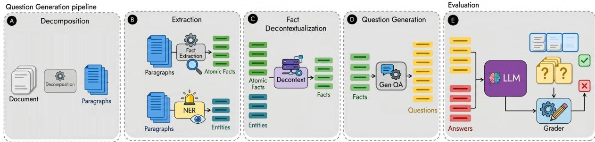
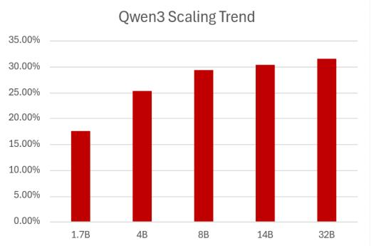
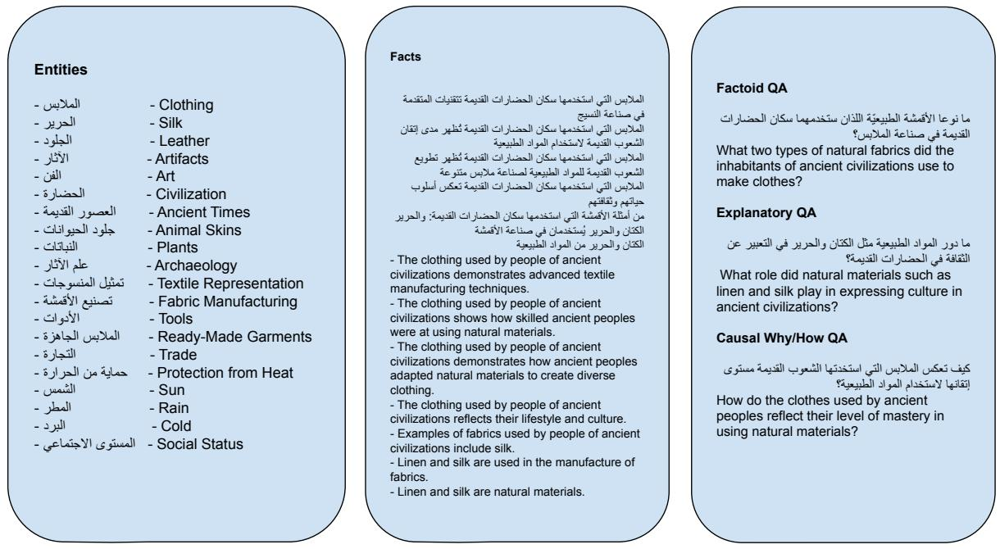

# AraDynFact: Dynamic Evaluation of Factual Knowledge in Arabic

Ignacio Iacobacci 米 Elm Company

Zhaozhi Qian Elm Company

Faroq Altam Elm Company

Muhammad Alqurishi Elm Company

## Abstract

As Large Language Models (LLMs) continue to scale both in size and capabilities, their proficiency in the Arabic Language has seen significant advancement. However, a critical gap remains: the extent of their factual knowledge and cultural sensitivity to the diverse Arabicspeaking world remains largely underexplored. Current evaluation metrics often focus on translation or generic reasoning, failing to capture the rich historical, social, and regional nuances inherent to Arabic culture. In addition, most benchmarks rely on heavy work, with human intervention in some steps, making the evaluation of knowledge coverage expensive and slow. To address this deficiency, we introduce AraDynFact, a novel dynamic evaluation framework designed to rigorously assess the factual Arabic knowledge embedded in LLMs. Unlike static benchmarks, AraDynFact employs a dynamic approach to extract factual information and generate rich and answerable questions in a fast and automatic way. We apply AraDynFact to Arabic Wikipedia and audit the performance of several state-of-the-art models, ranging from Arabic-centric specialized LLMs to high-resource general purpose LLMs. In addition we found a high degree of correlation with existing, hand-crafted Arabic-centric benchmarks, confirming the potential of our dynamic approach.

## 1 Introduction

Large language models (LLMs) have achieved remarkable performance in recent years, achieving unprecedented levels of understanding and reasoning in a variety of languages (Meta AI, 2026). Recent efforts in both general and Arabic-centric LLMs are serving the needs of the Arabic-speaking community. Numerous benchmarks have been introduced to assess the capabilities and coverage in general knowledge (Elfilali et al., 2024; Alwajih et al., 2025; Boussaha et al., 2025), Science (Boussaha et al., 2025, 3LM), Trustworthiness (Alghamdi et al., 2025, AraTrust), Legal (Abu Shairah et al., 2025, ALARB), etc.

These datasets are often static, manually annotated, or derived from existing knowledge in larger LLMs, resulting in the evaluation of effectively stale data (data that is outdated and no longer maintained due to the cessation of data collection or ingestion).

One potential mitigation for this issue is the emerging trend of dynamic benchmarking (Chen et al., 2025), which has shown promise as an alternative and has also been proposed to address data leakage.

Some approaches have proposed to construct datasets with a particular cutoff date, (Ying et al., 2024; White et al., 2025), indicating until when the data was effectively collected. Ying et al. (2024) proposed a dataset that generates an automatic dataset, while providing online analysis regarding its effectiveness. Others (Huang et al., 2025) propose to dynamically produce datasets for benchmarking. These approaches are generally linked to a particular knowledge resource, and most of them are designed to operate exclusively in English.

To address this gap, we propose AraDynFact, an Arabic-centric dynamic benchmark specifically designed to evaluate the factual knowledge of both general-purpose and Arabic-focused language models. We introduce a new pipeline for extracting atomic and relevant facts from a data source, as well as a novel method for formulating questions from one or more of these facts.

Our pipeline has been extensively tested on various Arabic sources, and the resulting benchmark is aligned with the most popular existing Arabic benchmarks. We present an evaluation of several general-purpose and Arabic-centric LLMs and compare their performance with existing Arabic (static) benchmarks.

To our knowledge, no dynamic benchmark has been specifically designed to assess the capabilities of Arabic-capable language models.

  
Figure 1: Pipeline of AraDynFact. A) Documents are decomposed into paragraphs. B) From these paragraphs, atomic facts are extracted, and Named Entity Recognition (NER) is performed to identify the most important concepts and entities in the documents. C) Next, fact decontextualization is performed to make the facts selfcontained. D) Using both the extracted facts and the original document, questions are then formulated. E) Finally, a grader evaluates the facts, questions, and answers to assess their correctness.

Our contributions are threefold:

• We introduce AraDynFact, a new benchmark that dynamically generates a set of questions to assess the knowledge coverage of a particular datasource.

• We introduce a new pipeline for extracting atomic and relevant facts from a datasource and a new way to formulate questions from one or many of them.

• We present an evaluation of several general and Arabic-centric LLMs and compare them with existing Arabic (static) benchmarks.

## 2 Related Work

## 2.1 Arabic-specific Evaluation

The evaluation of Arabic-capable LLMs is an active area of intense research. While many benchmarks are translations of existing ones, some are gathered and designed from scratch. Among the most known benchmarks we can cite Open Arabic LLMs Leaderboard (Elfilali et al., 2024, OALL) is the de-facto standard evaluation to evaluate the capabilities of LLMs in Arabic. It combines several existing Arabic benchmarks including AlGhafa, ACVA, Arabic MMLU, and Arabic EXAMS, covering tasks such as reading comprehension, sentiment analysis, question answering, and multiplechoice evaluation. Another recently introduced benchmark is Palm: A Culturally Inclusive and Linguistically Diverse Dataset for Arabic LLMs (Alwajih et al., 2025), to date the widest benchmark specifically designed for all varieties of the Arabic

Language, covering 20 topics, including culturally informed instructions from dialectal varieties of all 22 Arab countries and from Modern Standard Arabic (MSA). ArabCulture (Sadallah et al., 2025) is a culturally grounded commonsense reasoning dataset in Modern Standard Arabic (MSA), covering 13 Arab countries across the Gulf, Levant, North Africa, and the Nile Valley. The dataset contains 3,482 multiple-choice instances that test cultural commonsense reasoning in real-world daily life situations. AraTrust (Alghamdi et al., 2025) was designed to systematically evaluate how trustworthy large language models are when handling Arabic-language inputs. It focuses on measuring key dimensions of trustworthiness such as factual accuracy, bias, safety, and reliability across different types of Arabic prompts (including cultural and domain-specific questions). Finally, 3LM (Boussaha et al., 2025) has been introduced, 3LM (<sub>œ</sub>l<sub>ˆ</sub>, science or knowledge in Arabic) is the first Arabicnative benchmark dedicated to scientific reasoning from Arabic educational materials such as biology, physics, chemistry, math, geography and programming.

## 2.2 Dynamic Evaluation of LLMs

Ying et al. (2024) proposed a method that generates an automatic dataset, thus mitigating the issue of data leakage, while providing online analysis regarding its effectiveness. DataGen (Huang et al., 2025) on the other hand, proposes to dynamically produce datasets for benchmarking: a sophisticated framework is designed to produce high-quality synthetic datasets. This approach uses attribute-guided modules and retrieval-augmented techniques to ensure that the information remains factual and diverse. Our approach is similar in spirit to that proposed by Huang et al. (2025), but AraDynFact is specifically aimed at the evaluation of Arabic factual knowledge from potentially any data source.

## 2.3 Fact Extraction

Several approaches include fact extraction, a way to individualize pieces of information that can be verified independently, within their pipelines. FActScore (Min et al., 2023) decomposes longform generations into a series of atomic facts and computes the percentage of these facts supported by a reliable knowledge resource. The approach estimates factuality by combining retrieval with a strong language model to verify individual claims with high precision. Our Fact extraction process is inspired by their approach. Another approach that utilizes fact extraction is Factcheck-Bench (Wang et al., 2024). The work introduces a new document-level benchmark to evaluate automatic fact-checkers, focusing on the verifiability of claimbased segments using external evidence retrieved from search engines.

## 2.4 Decontextualization

Decontextualization is the process by which a piece of text can be properly interpreted without the lack of external information. Specifically, to make the piece of text self-contained. Some research pieces have been conducted on this issue from which we drew inspiration while developing AraDynFact.

In the seminal work introduced by (Choi et al., 2021), the authors developed an annotation method and trained automated models to translate regular sentences into a self-contained form. The work output includes a dataset containing triplets (sentence, context, decontextualized\_sentence) that were used to train two different models: i) a BERT-like model to approach the decontextualization as coreference resolution problem, and ii) a SeqToSeq model (Raffel et al., 2020, T5), approaching decontextualization as a translation task.

## 3 The AraDynFact Benchmark

Given a knowledge resource and a model, the objective is to assess how much information from the resource is contained in the model. The resource is dynamically analyzed to extract factual information. The facts are then used to generate queries that are fed to the model. Finally, the answers are compared with the original passages from the resource to check their validity. All the steps were carried out using Qwen3-235B-A22B (Qwen Team, 2025) with prompts specifically designed to the tasks. The prompts are present in the Appendix. Figure 1 presents an overview of the whole procedure. Below we will explain in depth each step:

## 3.1 Fact Extraction Process

The fact extraction is itself composed of several sub-tasks: decomposition, atomic fact extraction, named entity recognition, decontextualization and refinement.

Decomposition. The document is divided into paragraphs and later into individual sentences. Atomic fact extraction. From each isolated sentence, the system distills atomic facts—the smallest units of information that can be verified independently.

Named Entity Recognition. This process identifies and categorizes salient concepts, such as individuals, organizations, locations, and dates.

Decontextualization. From the original paragraph, entities and atomic facts, the latter are rewritten to make them self-contained.

Refinement. Decontextualized sentences are processed to prevent them from becoming too verbose.

## 3.2 Question Generation

Once the fact list is completely processed we conduct the dynamic generation of questions. The process receives a list of facts from a single document and it generates as many self-contained questions as possible. For each question, the process assigns (a) a task taxonomy and (b) a difficulty level. Four types were used as possible questions tasks:

Factoid QA. Questions that can be generally answered with an entity. They are generally made from just one fact.

Explanatory QA. Questions that require an explanation linking two or more facts.

Causal Why/How QA. The questions from this type are simply formatted as Why/How questions. The answer might not be an entity rather a longer piece of text.

Comparative QA. The answers of these questions need to address properties of one or more entities.

Each question is also classified in three levels of difficulty, low, medium and $h i g h ^ { 1 }$

low: Direct retrieval or light structuring from selected facts.

medium: This option aims to combine multiple facts or requires multi-step reasoning fully supported by the facts.

high: Most difficult questions, made with careful constraints, multi-part answer, or subtle synthesis fully determined by the facts.

Given the strong correlation between the number of facts involved and the reasoning steps required, Factoid questions, typically derived from a single fact, tend to be more straightforward. Although they may still require basic retrieval and understanding, they generally do not demand multi-step reasoning. For this reason, the majority of Factoid questions are classified as low difficulty rather than medium, as they involve limited compositional reasoning.

## 3.3 Answering and grading

We follow the standard response generation evaluation strategy. Questions are presented to the models under evaluation using a chat template. Since by construction the questions are self-contained, no further context is provided. The knowledge needed to answer the questions should be encoded already within model’s weights. In this way, given a data source, we can dynamically assess the knowledge coverage of any language model.

## LLM-as-a-Judge

Once all the questions have been answered by the models under evaluation, the grading process begins. Because the questions are dynamically generated, there is no single canonical “gold” answer for each one. Instead, the evaluation relies on the set of facts used to generate the question, which serves as the reference for assessing the correctness of the responses. We also rely on Qwen3-235B-A22B (Qwen Team, 2025) as our Judge model. For evaluation itself, we adopt the strategy, and used the prompt, introduced in Wei et al. (2024, SimpleQA), where each model-generated answer is assigned one of three labels: CORRECT, IN-CORRECT, or NOT\_ATTEMPTED. In the case of CORRECT responses, the answer must fully incorporate all the key information from the fact list used to create the question, while maintaining internal consistency. INCORRECT responses are those that either provide partial information, omit critical facts, or contain statements that directly contradict the reference facts. Finally, responses labeled NOT\_ATTEMPTED correspond to cases where the model explicitly indicates uncertainty (e.g., by stating “I don’t know”) or Produces a response that introduces no factual content beyond what is already contained in the question.

## 4 Experiments

We tested our pipeline on 2026 dump of Arabic Wikipedia. The Arabic $\mathrm { { W i k i p e d i a ^ { 2 } \ ( \not { \_ { - } \varepsilon } { \varepsilon } \not {  } \varepsilon , \vec { \varepsilon } { \varepsilon } ) } }$ $4 \div ( 5 1 \div 2 )$ , is the version of Wikipedia written in Modern Standard Arabic. As of March 2026, it contained more than 1.3 million articles, ranking 15th in terms of number of articles among Wikipedias. As versions from different languages, articles are generally attached with categories. We kept all articles linked at first or second level from the category Middle East (X<sub>F¤</sub>± ”<sub>r</sub>K˜A:<sub>y</sub>n<sub>O</sub>) resulting in almost 60k articles. These articles contained approximately 600k paragraphs, where 10 million atomic facts were extracted.

The question generation process produced approximately 340k different questions and we sampled uniformly 5% of the corpus and filtered trivial (extremely short) questions, resulting in 13064 questions, which we used in our experiments.

## 4.1 Results

Table 1 shows an analysis of the four types of questions run on 17 standard models, both Arabiccentric and general models. For Arabic models, we analyze Fanar (Team et al.), ALLaM (Bari et al., 2025), Yehia (Navid-AI, 2025), SILMA (silma-ai, 2024) and Command-R7B-Arabic (Alnumay et al., 2025). For the English models, we included different sizes of Qwen3 (Qwen Team, 2025), Llama (Grattafiori et al., 2024; Meta AI, 2026), two distilled versions of DeepSeek R1 (Guo et al., 2025), Gemma 3 (Gemma Team, 2025) and GPT-OSS (Agarwal et al., 2025)

Table 1 presents the performance of 17 large language models across the four question types defined in AraDynFact (Factoid QA, Explanatory QA, Causal Why/How QA, and Comparative QA), each broken down by three difficulty levels: low, medium and high. Below the difficulty, we include the number of questions generated for each type/difficulty. As it is easy to notice, Factoid questions tend to be easier than the other types, which is represented in the bias towards low-difficulty questions. The majority of the questions from other types fall into the medium difficultly. The rarity of high-difficulty Factoid QA questions makes the indicator for that category unreliable. The remaining categories show a more reasonable distribution.

<table><tr><td rowspan="2">Lang</td><td rowspan="2">Model</td><td colspan="3">Factoid QA</td><td colspan="3">Explanatory QA</td><td colspan="3">Causal Why/How QA</td><td colspan="3">Comparative QA</td></tr><tr><td>low 4263</td><td>medium 384</td><td>high 6</td><td>low 377</td><td>medium 1072</td><td>high 90</td><td>low 409</td><td>medium 4619</td><td>high 460</td><td>low 331</td><td>medium 986</td><td>high 67</td></tr><tr><td rowspan="5">Arabic</td><td>Fanar-1-9B</td><td>0.34</td><td>0.35</td><td>0.17</td><td>0.31</td><td>0.34</td><td>0.40</td><td>0.34</td><td>0.34</td><td>0.37</td><td>0.32</td><td>0.35</td><td>0.36</td></tr><tr><td>ALLaM-7B-Instruct-preview</td><td>0.31</td><td>0.33</td><td>0.67</td><td>0.33</td><td>0.34</td><td>0.34</td><td>0.31</td><td>0.33</td><td>0.31</td><td>0.26</td><td>0.35</td><td>0.34</td></tr><tr><td>Yehia-7B-preview</td><td>0.31</td><td>0.33</td><td>0.33</td><td>0.31</td><td>0.33</td><td>0.38</td><td>0.32</td><td>0.33</td><td>0.30</td><td>0.29</td><td>0.35</td><td>0.34</td></tr><tr><td>SILMA-9B-Instruct-v1.0</td><td>0.25</td><td>0.28</td><td>0.17</td><td>0.25</td><td>0.28</td><td>0.27</td><td>0.26</td><td>0.26</td><td>0.23</td><td>0.28</td><td>0.26</td><td>0.28</td></tr><tr><td>Command R7B Arabic</td><td>0.35</td><td>0.31</td><td>0.00</td><td>0.29</td><td>0.35</td><td>0.39</td><td>0.35</td><td>0.35</td><td>0.35</td><td>0.32</td><td>0.39</td><td>0.39</td></tr><tr><td rowspan="10">Genrral</td><td>Qwen3 8B</td><td>0.30</td><td>0.32</td><td>0.17</td><td>0.30</td><td>0.28</td><td>0.31</td><td>0.25</td><td>0.29</td><td>0.30</td><td>0.27</td><td>0.30</td><td>0.28</td></tr><tr><td>Qwen3 32B</td><td>0.31</td><td>0.30</td><td>0.33</td><td>0.29</td><td>0.32</td><td>0.22</td><td>0.30</td><td>0.32</td><td>0.35</td><td>0.32</td><td>0.30</td><td>0.33</td></tr><tr><td>Qwen3 30B A3B</td><td>0.31</td><td>0.32</td><td>0.17</td><td>0.31</td><td>0.31</td><td>0.36</td><td>0.30</td><td>0.31</td><td>0.31</td><td>0.29</td><td>0.31</td><td>0.33</td></tr><tr><td>Llama-3.1-8B-Instruct</td><td>0.20</td><td>0.19</td><td>0.50</td><td>0.19</td><td>0.20</td><td>0.16</td><td>0.19</td><td>0.21</td><td>0.20</td><td>0.16</td><td>0.20</td><td>0.19</td></tr><tr><td>Llama-3.3-70B-Instruct</td><td>0.39</td><td>0.37</td><td>0.33</td><td>0.36</td><td>0.41</td><td>0.43</td><td>0.40</td><td>0.40</td><td>0.42</td><td>0.43</td><td>0.39</td><td>0.42</td></tr><tr><td>Llama-4-Scout-17B-16E</td><td>0.36</td><td>0.38</td><td>0.00</td><td>0.38</td><td>0.37</td><td>0.40</td><td>0.35</td><td>0.36</td><td>0.32</td><td>0.37</td><td>0.36</td><td>0.39</td></tr><tr><td>DeepSeek-R1-Distill-Llama-8B</td><td>0.18</td><td>0.18</td><td>0.17</td><td>0.19</td><td>0.19</td><td>0.16</td><td>0.22</td><td>0.19</td><td>0.19</td><td>0.17</td><td>0.20</td><td>0.22</td></tr><tr><td>DeepSeek-R1-Distill-Llama-70B</td><td>0.40</td><td>0.39</td><td>0.17</td><td>0.38</td><td>0.41</td><td>0.40</td><td>0.39</td><td>0.41</td><td>0.43</td><td>0.42</td><td>0.38</td><td>0.48</td></tr><tr><td>gemma-3-12b-it</td><td>0.36</td><td>0.35</td><td>0.00</td><td>0.35</td><td>0.38</td><td>0.42</td><td>0.37</td><td>0.38</td><td>0.34</td><td>0.35</td><td>0.40</td><td>0.40</td></tr><tr><td>gemma-3-27b-it</td><td>0.40</td><td>0.36</td><td>0.33</td><td>0.37</td><td>0.41</td><td>0.40</td><td>0.40</td><td>0.41</td><td>0.42</td><td>0.41</td><td>0.41</td><td>0.37</td></tr><tr><td>gpt-oss-20b</td><td>0.36</td><td>0.37</td><td>0.00</td><td>0.31</td><td>0.33</td><td>0.36</td><td>0.35</td><td>0.36</td><td>0.36</td><td>0.38</td><td>0.35</td><td>0.36</td></tr><tr><td>gpt-oss-120b</td><td>0.42</td><td>0.44</td><td>0.17</td><td></td><td>0.37 0.41</td><td>0.41</td><td>0.45</td><td>0.42</td><td>0.44</td><td>0.42</td><td>0.42</td><td>0.30</td></tr></table>

Table 1: Accuracy of the experiments carried out on Arabic Wikipedia with thefour types of Questions varying question difficulty. High-difficulty Factoid questions are rare (only 6 occurrences).

Regarding the models, they are grouped into two categories: Arabic-centric (Fanar-1-9B, ALLaM-7B, Yehia-7B, SILMA-9B, and Command-R7B-Arabic) and general-purpose (various sizes of Qwen3, Llama, DeepSeek-R1 distillations, Gemma 3, and GPT-OSS). Overall scores remain modest in all models and question types, with most values falling in the 0.20 to 0.45 range, reflecting the inherent difficulty of the benchmark. Among the top performers, larger general models such as GPT-OSS-120B, DeepSeek-R1-Distill-Llama-70B, Llama-3.3-70B, and Gemma-3-27B consistently achieve the highest scores, suggesting that scale remains a dominant factor even for Arabic factual knowledge. In contrast, smaller models, both Arabic-centric and general, such as SILMA-9B, Llama-3.1-8B, and DeepSeek-R1-Distill-Llama-8B, tend to underperform across all question types. Arabic-centric models generally outperform general-purpose models of comparable size, with the exception of SILMA-9B. This indicates that, while specialized Arabic training may be beneficial, it does not necessarily guarantee superior factual coverage on this benchmark. Performance on high-difficulty questions is particularly volatile, with several models scoring near zero, likely due to the limited number of instances at that level. Scores are broadly consistent across question types within each model, though Comparative and Causal questions tend to surface slightly more variance, consistent with their higher compositional reasoning demands.

## 5 Analysis

## Does AraDynFact correlate with models’ strength?

To validate this premise, we conducted two complementary experiments designed to assess both the internal consistency of our benchmark and its external alignment with established evaluation frameworks. The first experiment focuses on scaling behavior. Specifically, we selected a model family released across multiple parameter sizes while sharing the same architecture, training data, and optimization regime. This setup allows us to control for confounding variables, since model size remains the primary factor that changes across variants. Under standard scaling laws, increasing the number of parameters should generally lead to improved performance, provided the evaluation benchmark is sufficiently sensitive to capture differences in reasoning capacity. Therefore, if AraDynFact is a reliable and well-calibrated benchmark, it should reflect a consistent and monotonic performance improvement as model size increases. In other words, larger models should systematically outperform their smaller counterparts. As illustrated in Figure 2, the results confirm this expectation: performance on AraDynFact improves steadily with model scale, demonstrating that the benchmark is sensitive to model scale and consistent with established scaling laws.

  
Figure 2: Visualization Qwen3 performance on increasingly model sizes.

## Does AraDynFact correlate with existing benchmarks?

Our second verification step evaluates external validity by examining how AraDynFact correlates with existing Arabic-focused benchmarks. To this end, we selected a representative subset of tasks from the Open Arabic LLM Leaderboard (Elfilali et al., 2024, OALL), including ArabicMMLU, Exams, MedinahQA, and Ara-Trust. These benchmarks collectively cover general knowledge, academic-style examinations, question answering, and trustworthiness evaluation. In addition, we incorporated two previously discussed benchmarks: 3LM (Boussaha et al., 2025), which emphasizes STEM-oriented reasoning, and Arab-Culture (Sadallah et al., 2025), which focuses on culturally grounded commonsense reasoning.

We computed the Spearman rank correlation coefficient across multiple large language models. As shown in Figure 3, the results indicate strong positive correlations, suggesting that AraDynFact is well aligned with recognized evaluation standards. Importantly, unlike many static benchmarks, AraDynFact offers the additional advantage of dynamic generation, enabling continuous expansion and reduced risk of data leakage while maintaining agreement with established evaluation signals.

## 6 Conclusion

In this work, we introduced AraDynFact, a dynamic evaluation framework for assessing the factual Arabic knowledge embedded within LLMs. By grounding evaluation in automatically extracted atomic facts from potentially any Arabic data source, and generating diverse questions across four types and three difficulty levels, AraDynFact offers a scalable and contamination-resistant alternative to static benchmarks. Our comprehensive evaluation using Arabic Wikipedia as knowledge resource, across 17 models reveals a consistent pattern: while general-purpose LLMs often achieve competitive scores on linguistic and reasoning tasks, they exhibit notable gaps in localized factual accuracy and culturally specific knowledge about the Arabic-speaking world. Arabic-centric models, despite being trained on domain-relevant data, do not uniformly outperform their general counterparts, highlighting that scale and general pretraining remain strong factors even in culturally specific evaluation settings.

<table><tr><td rowspan=1 colspan=1></td><td rowspan=1 colspan=1>Arayact</td><td rowspan=1 colspan=1>ArabbMLU</td><td rowspan=1 colspan=1>Exams</td><td rowspan=1 colspan=1>MàaA</td><td rowspan=1 colspan=1>Araarust</td><td rowspan=1 colspan=1>37LM</td><td rowspan=1 colspan=1>Araure</td></tr><tr><td rowspan=1 colspan=1>AraDynFact</td><td rowspan=1 colspan=1>1.00</td><td rowspan=1 colspan=1>0.63</td><td rowspan=1 colspan=1>0.71</td><td rowspan=1 colspan=1>0.52</td><td rowspan=1 colspan=1>0.84</td><td rowspan=1 colspan=1>0.46</td><td rowspan=1 colspan=1>0.34</td></tr><tr><td rowspan=1 colspan=1>ArabicMMLU</td><td rowspan=1 colspan=1>0.63</td><td rowspan=1 colspan=1>1.00</td><td rowspan=1 colspan=1>0.65</td><td rowspan=1 colspan=1>0.92</td><td rowspan=1 colspan=1>0.71</td><td rowspan=1 colspan=1>0.15</td><td rowspan=1 colspan=1>0.47</td></tr><tr><td rowspan=1 colspan=1>Exams</td><td rowspan=1 colspan=1>0.71</td><td rowspan=1 colspan=1>0.65</td><td rowspan=1 colspan=1>1.00</td><td rowspan=1 colspan=1>0.55</td><td rowspan=1 colspan=1>0.53</td><td rowspan=1 colspan=1>0.12</td><td rowspan=1 colspan=1>0.24</td></tr><tr><td rowspan=1 colspan=1>MadinahQA</td><td rowspan=1 colspan=1>0.52</td><td rowspan=1 colspan=1>0.92</td><td rowspan=1 colspan=1>0.55</td><td rowspan=1 colspan=1>1.00</td><td rowspan=1 colspan=1>0.67</td><td rowspan=1 colspan=1>0.18</td><td rowspan=1 colspan=1>0.40</td></tr><tr><td rowspan=1 colspan=1>AraTrust</td><td rowspan=1 colspan=1>0.84</td><td rowspan=1 colspan=1>0.71</td><td rowspan=1 colspan=1>0.53</td><td rowspan=1 colspan=1>0.67</td><td rowspan=1 colspan=1>1.00</td><td rowspan=1 colspan=1>0.52</td><td rowspan=1 colspan=1>0.48</td></tr><tr><td rowspan=1 colspan=1>3LM</td><td rowspan=1 colspan=1>0.46</td><td rowspan=1 colspan=1>0.15</td><td rowspan=1 colspan=1>0.12</td><td rowspan=1 colspan=1>0.18</td><td rowspan=1 colspan=1>0.52</td><td rowspan=1 colspan=1>1.00</td><td rowspan=1 colspan=1>0.50</td></tr><tr><td rowspan=1 colspan=1>ArabCulture</td><td rowspan=1 colspan=1>0.34</td><td rowspan=1 colspan=1>0.47</td><td rowspan=1 colspan=1>0.24</td><td rowspan=1 colspan=1>0.40</td><td rowspan=1 colspan=1>0.48</td><td rowspan=1 colspan=1>0.50</td><td rowspan=1 colspan=1>1.00</td></tr></table>

Figure 3: Spearman correlation between different benchmark suites

We demonstrated that AraDynFact performance scales monotonically with model size within the same model family, confirming the benchmark’s sensitivity and reliability. Second, strong Spearman rank correlations with established Arabic benchmarks such as ArabicMMLU, AraTrust, and Arab-Culture confirm that AraDynFact aligns well with recognized evaluation signals, while offering the added benefit of dynamic regeneration.

We hope AraDynFact serves as a foundation for building more culturally aware and factually reliable Arabic AI systems, and encourage the community to extend the framework to additional Arabic knowledge sources and dialects beyond Modern Standard Arabic.

## Limitations

While our method shows potential and does correlate with existing datasets, there are limitations that are intrinsic to the pipeline process. Questions are generated from facts, answered by evaluated models and graded by a larger LLM. There are some occasions where the question is not completely answerable, or the grader fails to correctly judge the validity of an answer or identify its errors. We consider that in the long run, those errors even out and a reasonable evaluation of the factual knowledge is performed.

## References

Harethah Abu Shairah, Somayah AlHarbi, Abdulaziz AlHussein, Sameer Alsabea, Omar Shaqaqi, Hebah AlShamlan, Omar Knio, and George Turkiyyah. 2025. ALARB: An Arabic legal argument reasoning benchmark. In Proceedings of The Third Arabic Natural Language Processing Conference, pages 389–406, Suzhou, China.

Sandhini Agarwal, Lama Ahmad, Jason Ai, Sam Altman, Andy Applebaum, Edwin Arbus, Rahul K Arora, Yu Bai, Bowen Baker, Haiming Bao, and 1 others. 2025. gpt-oss-120b & gpt-oss-20b model card. arXiv preprint arXiv:2508.10925.

Emad A Alghamdi, Reem Masoud, Deema Alnuhait, Afnan Y Alomairi, Ahmed Ashraf, and Mohamed Zaytoon. 2025. Aratrust: An evaluation of trustworthiness for llms in arabic. In Proceedings ofthe 31st International Conference on Computational Linguistics, pages 8664–8679.

Yazeed Alnumay, Alexandre Barbet, Anna Bialas, William Darling, Shaan Desai, Joan Devassy, Kyle Duffy, Stephanie Howe, Olivia Lasche, Justin Lee, Anirudh Shrinivason, and Jennifer Tracey. 2025. Command r7b arabic: A small, enterprise focused, multilingual, and culturally aware arabic llm. Preprint, arXiv:2503.14603.

Fakhraddin Alwajih, Abdellah El Mekki, Samar Mohamed Magdy, Abdelrahim A. Elmadany, Omer Nacar, El Moatez Billah Nagoudi, Reem Abdel-Salam, Hanin Atwany, Youssef Nafea, Abdulfattah Mohammed Yahya, Rahaf Alhamouri, Hamzah A. Alsayadi, Hiba Zayed, Sara Shatnawi, Serry Sibaee, Yasir Ech-Chammakhy, Walid Al-Dhabyani, Marwa Mohamed Ali, Imen Jarraya, and 25 others. 2025. Palm: A culturally inclusive and linguistically diverse dataset for arabic llms. Preprint, arXiv:2503.00151.

M Saiful Bari, Yazeed Alnumay, Norah A. Alzahrani, Nouf M. Alotaibi, Hisham Abdullah Alyahya, Sultan AlRashed, Faisal Abdulrahman Mirza, Shaykhah Z.

Alsubaie, Hassan A. Alahmed, Ghadah Alabduljabbar, Raghad Alkhathran, Yousef Almushayqih, Raneem Alnajim, Salman Alsubaihi, Maryam Al Mansour, Saad Amin Hassan, Dr. Majed Alrubaian, Ali Alammari, Zaki Alawami, and 7 others. 2025. AL-Lam: Large language models for arabic and english. In The Thirteenth International Conference on Learning Representations.

Basma El Amel Boussaha, Leen AlQadi, Mugariya Farooq, Shaikha Alsuwaidi, Giulia Campesan, Ahmed Alzubaidi, Mohammed Alyafeai, and Hakim Hacid. 2025. 3lm: Bridging arabic, stem, and code through benchmarking. arXiv preprint arXiv:2507.15850.

Simin Chen, Yiming Chen, Zexin Li, Yifan Jiang, Zhongwei Wan, Yixin He, Dezhi Ran, Tianle Gu, Haizhou Li, Tao Xie, and 1 others. 2025. Recent advances in large langauge model benchmarks against data contamination: From static to dynamic evaluation. In Proceedings of the 2025 Conference on Empirical Methods in Natural Language Processing. Association for Computational Linguistics.

Eunsol Choi, Jennimaria Palomaki, Matthew Lamm, Tom Kwiatkowski, Dipanjan Das, and Michael Collins. 2021. Decontextualization: Making sentences stand-alone. Transactions ofthe Association for Computational Linguistics, 9:447–461.

Ali Elfilali, Hamza Alobeidli, Clémentine Fourrier, Basma El Amel Boussaha, Ruxandra Cojocaru, Nathan Habib, and Hakim Hacid. 2024. Open arabic llm leaderboard. https://huggingface.co/ spaces/OALL/Open-Arabic-LLM-Leaderboard.

Gemma Team. 2025. Gemma 3.

Aaron Grattafiori, Abhimanyu Dubey, Abhinav Jauhri, Abhinav Pandey, Abhishek Kadian, Ahmad Al-Dahle, Aiesha Letman, Akhil Mathur, Alan Schelten, Alex Vaughan, Amy Yang, Angela Fan, Anirudh Goyal, Anthony Hartshorn, Aobo Yang, Archi Mitra, Archie Sravankumar, Artem Korenev, Arthur Hinsvark, and 542 others. 2024. The llama 3 herd of models. Preprint, arXiv:2407.21783.

Daya Guo, Dejian Yang, Haowei Zhang, Junxiao Song, Peiyi Wang, Qihao Zhu, Runxin Xu, Ruoyu Zhang, Shirong Ma, Xiao Bi, and 1 others. 2025. Deepseek-r1: Incentivizing reasoning capability in llms via reinforcement learning. arXiv preprint arXiv:2501.12948.

Yue Huang, Siyuan Wu, Chujie Gao, Dongping Chen, Qihui Zhang, Yao Wan, Tianyi Zhou, Chaowei Xiao, Jianfeng Gao, Lichao Sun, and Xiangliang Zhang. 2025. Datagen: Unified synthetic dataset generation via large language models. In The Thirteenth International Conference on Learning Representations.

Meta AI. 2026. The llama 4 herd: Architecture, training, evaluation, and deployment notes. ArXiv, abs/2601.11659.

Sewon Min, Kalpesh Krishna, Xinxi Lyu, Mike Lewis, Wen tau Yih, Pang Wei Koh, Mohit Iyyer, Luke Zettlemoyer, and Hannaneh Hajishirzi. 2023. Factscore: Fine-grained atomic evaluation of factual precision in long form text generation. Preprint, arXiv:2305.14251.

Navid-AI. 2025. Yehia 7b preview. https:// huggingface.co/Navid-AI/Yehia-7B-preview.

Qwen Team. 2025. Qwen3 technical report. Preprint, arXiv:2505.09388.

Colin Raffel, Noam Shazeer, Adam Roberts, Katherine Lee, Sharan Narang, Michael Matena, Yanqi Zhou, Wei Li, and Peter J. Liu. 2020. Exploring the limits of transfer learning with a unified text-to-text transformer. Journal ofMachine Learning Research, 21(140):1–67.

Abdelrahman Sadallah, Junior Cedric Tonga, Khalid Almubarak, Saeed Almheiri, Farah Atif, Cahtrine Qwaider, Karima Kadaoui, Sara Shatnawi, Yaser Alesh, and Fajri Koto. 2025. Commonsense reasoning in arab culture. Preprint, arXiv:2502.12788.

silma-ai. 2024. Silma 9b instruct v1.0. https://huggingface.co/silma-ai/ SILMA-9B-Instruct-v1.0.

Fanar Team, Ummar Abbas, Mohammad Shahmeer Ahmad, Firoj Alam, Enes Altinisik, Ehsannedin Asgari, Yazan Boshmaf, Sabri Boughorbel, Sanjay Chawla, Shammur Chowdhury, Fahim Dalvi, Kareem Darwish, Nadir Durrani, Mohamed Elfeky, Ahmed Elmagarmid, Mohamed Eltabakh, Masoomali Fatehkia, Anastasios Fragkopoulos, Maram Hasanain, and 23 others. Fanar: An arabic-centric multimodal generative ai platform.

Yuxia Wang, Revanth Gangi Reddy, Zain Muhammad Mujahid, Arnav Arora, Aleksandr Rubashevskii, Jiahui Geng, Osama Mohammed Afzal, Liangming Pan, Nadav Borenstein, Aditya Pillai, and 1 oth ers. 2024. Factcheck-bench: Fine-grained evaluation benchmark for automatic fact-checkers. In Findings ofthe Associationfor Computational Linguistics: EMNLP 2024, pages 14199–14230.

Jason Wei, Nguyen Karina, Hyung Won Chung, Yunxin Joy Jiao, Spencer Papay, Amelia Glaese, John Schulman, and William Fedus. 2024. Measuring short-form factuality in large language models. Preprint, arXiv:2411.04368.

Colin White, Samuel Dooley, Manley Roberts, Arka Pal, Benjamin Feuer, Siddhartha Jain, Ravid Shwartz-Ziv, Neel Jain, Khalid Saifullah, Sreemanti Dey, Shubh-Agrawal, Sandeep Singh Sandha, Siddartha Venkat Naidu, Chinmay Hegde, Yann LeCun, Tom Goldstein, Willie Neiswanger, and Micah Goldblum. 2025. Livebench: A challenging, contamination-limited LLM benchmark. In The Thirteenth International Conference on Learning Representations.

Jiahao Ying, Yixin Cao, Yushi Bai, Qianru Sun, Bo Wang, Wei Tang, Zhaojun Ding, Yizhe Yang, Xuanjing Huang, and Shuicheng YAN. 2024. Automating dataset updates towards reliable and timely evaluation of large language models. In The Thirtyeight Conference on Neural Information Processing Systems Datasets and Benchmarks Track.

A Example

B Prompts used


1ill9o3


(

  
Figure 4: Excerpt of how AraDynFact process an example document, the Arabic page of Clothing in the ancient world", to produce questions

## Named Entity Extraction

Please list the \*key\* entities are referred in this text.

List only up to 20 most important entities. Use the same language used in the text: [PARAGRAPH]

=== OUTPUT FORMAT===

\- A list starting with the ’-’ symbol.

\- Disregard any punctuation.

## Atomic Fact Extraction

Please breakdown the following sentence into independent facts in the same language of the original sentence: [EXAMPLE FACTS]

## === Question ===

Please breakdown the following sentence into independent facts same language of the original sentence: [SENTENCE]

## === Output Format ===

The list must follow the same style as the examples.

The facts should be written in Arabic.

You MUST use "-" to numerate each extracted fact.

Do not use numbers or any other symbols.

=== Final Answer ===

## Decontextualizer

Using this this context: [PARAGRAPH]

and this list of entities: [ENTITIES]

Please rewrite this text snippet \*as a single sentence\* by adding references to the entities the snippet might be referring to. Do not add extra facts to the snippet: [FACTS]

=== OUTPUT FORMAT===

\- Do NOT add extra facts to those contained in the snippet.

\- A \*\*single sentence\*\* without any missing references.

\- Any pronoun should have a reference within the sentence.

\- All entities should be named or clearly disambiguated.

\- Avoid any reference to the text. No sentences such as ’in this text’ or ’according to the text’.

=== Final Answer ===

You receive FACTS as a plain list of strings. Your job is to generate MANY self-contained questions that are answerable ONLY from the selected facts, and output ONE YAML document only.

```yaml
questions:
- id: 1
question_text: "..."
source_facts_ids: [1, 2]
task_taxonomy_id: "4"
task_taxonomy_name: "Causal Why/How QA"
difficulty: "high"
meta:
facts_count: 0
generated_questions_count: 0
task_taxonomy_ids_summary: ["1", "4"]
difficulty_summary: ["medium", "high", "very_high"]
checklist:
yaml_only: true
questions_have_no_input_references: true
each_question_self_contained: true
each_question_uses_at_least_one_fact: true
each_question_answerable_from_selected_facts_only: true
no_external_knowledge_required: true
no_duplicates: true
```

## Question Generation (cont..)

## DIFFICULTY (pick ONE per question)

## difficulty: "medium" | "high" | "very\_high"

\- medium: direct retrieval / light structuring from selected facts

\- high: combines multiple facts or requires multi-step reasoning fully supported by the facts

\- very\_high: careful constraints, multi-part answer, or subtle synthesis still fully determined by the facts

## OUTPUT YAML SCHEMA (simplified)

## Return exactly this YAML structure:

## INTERNAL PROCESS (do not print)

1) Index FACTS from 1..N.

2) Generate the maximum number of distinct questions that satisfy the hard requirements.

3) For each question, choose the minimal set of facts that fully determines the answer.

4) Write question\_text with ZERO references to any input/provided material (see R2 prohibited phrases).

5) Assign taxonomy and difficulty that match the question.

6) Populate meta fields and checklist booleans.

7) Final self-check:

\- YAML only

\- question\_text contains none of the prohibited reference phrases in ANY language

\- Each question uses >=1 fact

\- Each question answerable only from its selected facts

\- No duplicates

\- If any checklist item would be false, fix questions until all are true.

## NOW DO THE TASK

Use the provided FACTS list and output the final YAML document only.