# BIABench: Evaluating AI agents on real-world bioimage analysis tasks

Zixuan Pan<sup>1,∗</sup>, Davide Panzeri<sup>2,∗</sup>, Lukas Johanns<sup>2</sup>, Marilin Moor<sup>3</sup>, Yu Zhou<sup>2</sup>, Hedi Peterson<sup>3</sup>, Yiyu Shi<sup>1,†</sup>, Jianxu Chen<sup>2,†</sup>

<sup>1</sup>Department of Computer Science and Engineering, University of Notre Dame, Notre Dame, USA

<sup>2</sup>Leibniz-Institut für Analytische Wissenschaften – ISAS – e.V., Dortmund, Germany

<sup>3</sup>Institute of Computer Science, University of Tartu, Tartu, Estonia

<sup>∗</sup>These authors contributed equally. <sup>†</sup>Corresponding authors: yshi4@nd.edu, jianxu.chen@isas.de

## Abstract

Artificial-intelligence (AI) agents hold promise for automating bioimage analysis, yet no benchmark evaluates whether they can carry out real-world analyses end to end. Such analyses are hard for agents because 2D images, 3D volumes and time-lapse sequences are often too large to read as context, so an agent must choose and run an analysis through code, specialized software and rendered views. Published studies make this capability testable, because each pairs raw images with a peer-reviewed result. We introduce BIABench, a benchmark of 16 tasks reconstructed from published biological studies that retain their scientific questions, imaging data and ground truth. The tasks span eleven analysis subtasks and modalities from H&E histology to single-molecule localization microscopy. Each submission receives an outcome score, which compares the output files with the ground truth using field-standard metrics, and a process score, in which a vision–language model judges method choice and quality control against an expert-written rubric. We evaluated general-purpose and biology-specific agents across several language models, with repeated runs of every task. Routine two-dimensional tasks were solved well, but on some tasks that added a third dimension or a time axis no agent scored above 0.19. Neither biological specialization, stronger models nor detailed expert instructions closed this gap. The agents were also unreliable, with scores varying more between repeated runs of one agent than between diferent agents, and without ground truth a correct run could not be told from a wrong one by its process score or by the time spent. Released openly with its data and code, BIABench provides a verifiable framework for evaluating, and eventually training, agents for reliable long-horizon bioimage analysis.

€ Website: https://biabench.github.io

§ Code: https://github.com/BIABench/BIABench

Data: https://huggingface.co/datasets/BIABench/BIABench

## 1 Introduction

Bioimage analysis is central to how biologists turn imaging data into quantitative measurements and biologi cal insight. However, even routine analyses, from counting labeled cells to tracking them over time, require specialist software and programming expertise that is scarce in many biology laboratories [1, 2]. Recent advances in large language models (LLMs) have made artificial intelligence (AI) agents increasingly capable of planning and executing complex tasks, raising the possibility of automating such analyses [3]. In principle, an agent could take images and an instruction, plan the analysis, execute the necessary tools and report the result. Early examples are beginning to realize this vision by enabling agents to interact with established bioimage-analysis software [1, 4, 5]. Yet whether current agents can reliably perform real-world, end-to-end bioimage analyses from raw images to biological insights remains unclear, as no benchmark systematically evaluates this capability.

Benchmarks for bioimage analysis have so far focused on evaluating models on a specific step or a specific task of an analysis, such as nucleus segmentation [6], cell tracking [7], in-silico labeling [8] or image quality control [9], and are well suited to comparing the accuracy and generalization of specific models. In contrast, benchmarks for agents evaluate long-horizon tasks in question answering, coding and computer use [10–12], with recent ones extending to scientific and biological analysis [13–16]. Those that include biological images either only test visual reasoning by multimodal models [17] or ask an agent to train a model on an existing benchmark dataset and score on its held-out predictions [18, 19]. Both inherit the limitation of the single-step framing, whereas a real analysis rarely stops at one step. The images may first need denoising or stitching, the question may call for colocalization, tracking or detection, and even a segmentation is only the start of the feature extraction and statistics that yield the biological result. No benchmark evaluates whether an agent can carry out this entire cycle, from raw images to the study’s conclusion, and doing so poses two distinct challenges for current agents. First, bioimage data are often too large or structurally complex to be supplied directly to an agent as context, spanning high-resolution 2D images, 3D volumes and time-lapse sequences, even multichannel 3D time-lapse. An agent must instead inspect and manipulate the data through computation, specialized software and rendered views. Second, the task is end-to-end with open-ended solutions rather than a predefined prediction problem, requiring an agent to determine an analysis strategy from the biological question and data, execute it and produce the required scientific outputs. An agent may call established tools such as Cellpose [20] or StarDist [21], write custom code, or operate graphical user interface (GUI) software, such as Fiji [22] or napari [23].

Here we introduce BIABench, a benchmark for evaluating autonomous AI agents on real-world, end-to-end bioimage analysis (Fig. 1). Its 16 tasks are reconstructed from published biological studies, retaining their scientific questions, imaging data and reported outputs as ground truth. The agent receives the raw images and the biologist’s instruction, and its output is scored against the study’s original peer-reviewed result. The tasks cover eleven analysis subtasks, span high-resolution 2D images, 3D volumes and time-lapse sequences, and include modalities ranging from H&E histology to single-molecule localization microscopy (Fig. 1b). The samples span six source organisms, from bacteria to humans, the imaged structures range from single molecules to cell monolayers, and the input data total 13.9 GB (Fig. 1c). Because an analysis can run to completion and produce plausible figures yet reach the wrong result, each submission receives two scores (Fig. 1a). First, an outcome score compares required outputs, such as masks, tracks and tables, with the study’s ground truth using field-standard metrics. Second, a process score evaluates method choice, quality control, figures and documentation against expert-written rubrics using a vision–language model (VLM), with quality verified by human experts (Section 3.3).

Our contributions are as follows.

• A recipe for turning published studies into verifiable tasks. Each task reduces a published study to its raw images, the biologist’s request for the study’s key readout and the reported outputs as ground truth. The same recipe can extend the benchmark to new studies.

• A benchmark ofend-to-end bioimage analysis. 16 tasks spanning eleven analysis subtasks and 2D, 3D and time-lapse data, each specified by a brief and a detailed instruction and scored on both its outcome and its process. The agent chooses the method and tools, including GUI software, and an agent-agnostic interface provides wrappers for six agents of three kinds (an LLM tool-use agent, coding command-line agents and GUI agents that operate Fiji/ImageJ).

• A comprehensive empirical study ofcurrent agents. We evaluate both general-purpose and biologyspecific agents across several language models and instruction levels, and locate the remaining gap to expert-level bioimage analysis in data complexity, reliability and self-checking.

Process score


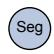

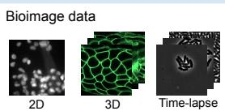  
Biologist task description

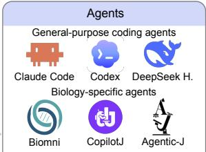  
Example: time-lapse tracking Segment and track every cell across the 800-frame movie, assigning new IDs when cells divide.

  
Tables

3D LSFM brain vessel seg.  
Required outputs  
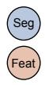

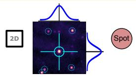

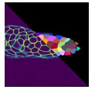


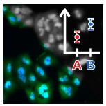  
DNA-PAINT SMLM

Supporting artifacts  
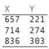  
3D zebrafish cell seg.  
Masks  
Tracks

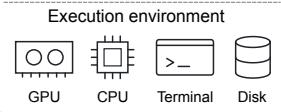

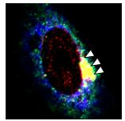

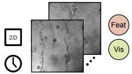  
SARS-CoV-2 & Golgi coloc.

HeLa nuc./cytopl. seg.  
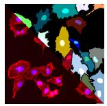


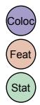  
DNA repair foci coloc.


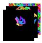  
Wound-healing kymograph  
Reports  
Code

## Output

  
H&E nuclear seg.

  
Figures

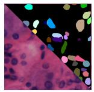

Microglia dynamics  
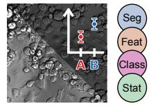

Ph-cont. bacteria tracking  
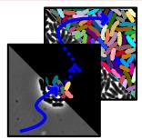

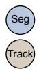

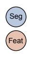

5D nuclear pore quant.  
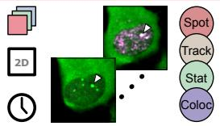  
Task difficulty: Subtask types: Class Classification

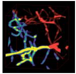

## Evaluation

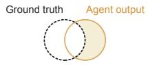  
Outcome score

## IF cell counting

Task-specific objective metrics

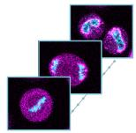

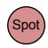  
Microtubule seg.

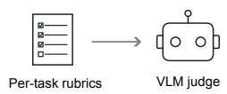

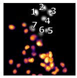

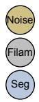

4D tile stitching  
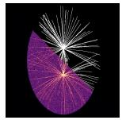


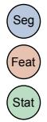


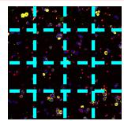  
3D oncogenic puncta quant.  
Time-lapse 2D 2D image Spot Spot detection Track Tracking


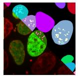

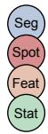  
3D volume Vis Visualization Stitch Stitching

Imaging modality  
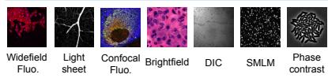

Source organism  
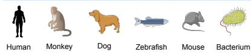  
Analysis stage

Biological structure  
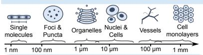

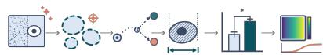  
Denoising Segmentation Tracking Measurement Statistics Visualization

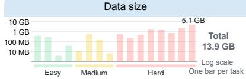

Figure 1 Design of BIABench. a) Benchmark workflow. Each task pairs a published study’s raw images with a biologist’s instruction (i.e., prompt) and asks for the study’s own readout, with the ground truth withheld from the agent. Agents run in a shared, controlled environment. An outcome score compares the required output files (e.g., tables, masks, tracks) with the ground truth using task-specific metrics (zero for missing files), and a process score uses a vision–language model to rate supporting artifacts (e.g., reports, code, figures) against a severity-weighted checklist of the task’s rubric items. b) The 16 tasks, each rebuilt from a published study, showing a representative input with its ground truth or output, analysis subtasks (circles) and image properties (badges). Appendix A gives provenance, and Tables A1 and A2 list subtasks, outputs and metrics. c) Diversity of the task suite by imaging modality, source organism, biological structure (ordered by approximate size), image dimensionality, analysis stage and input data size (log scale). ch., channel; Fluo., fluorescence.

## 2 Related work

General-purpose agent benchmarks. LLM agents are tracked by benchmarks that run the agent in an environment and score the state it leaves behind. SWE-bench runs a repository’s own test suite against an agent’s patch [11], GAIA poses assistant tasks with short, verifiable answers [10], and AgentBench probes tool use across many environments [24]. More recent suites extend this execution-grounded principle to new action spaces: τ -bench and its successor τ<sup>2</sup>-bench score policy-constrained tool–agent–user interaction [25, 26], OSWorld evaluates computer-use agents by their efect on a real operating system [12], Terminal-Bench measures long-horizon work in containerized terminals [27], BrowseComp measures persistent web brows ing [28], MLE-bench grades machine-learning engineering against human Kaggle leaderboards [29], and StartupBench scores the finished work products ofprofessional workflows drawn from commercially adopted AI services [30]. From this line of work we take two design choices. First, each task is defined by the files it must produce. Second, as the harness can move success rates as much as the model does [31, 32], we evaluate every agent through one shared interface, recover output files from the filesystem, and treat each vendor coding command-line tool as a model-confounded harness. We difer in the target and the task design. Every task is a real-world bioimage-analysis problem taken from a published biological study and posed as a biologist would pose it, and we score the objective quantity the study itself reports (Dice, Jaccard, the Cell Tracking Challenge TRA measure, the Kolmogorov–Smirnov statistic, and Pearson correlation) on real microscopy.

AI agents for biology. A growing number ofagents act as autonomous biological collaborators. For hypothesis generation and design, Google’s AI co-scientist proposes and refines biomedical hypotheses through a multi agent generate–debate–evolve process [33], and the Virtual Lab orchestrates a team of language-model “scientists” that designed experimentally validated SARS-CoV-2 nanobodies [34]. For the analysis loop, general biomedical agents retrieve tools, write code and run analyses. Biomni’s action-discovery agent mines tools, databases and protocols from the literature across 25 domains, its harness adds 6 to 12 points over the bare model on text-based biomedical questions, it has been exercised in wet-lab case studies, and its authors list image inputs as a future direction [35]; the self-evolving STELLA does the same [36]. A first wave of agents now targets bioimage analysis directly, across every major interface: in napari, Omega holds a conversation while it segments and quantifies [1]; for ImageJ/Fiji, Agentic-J [4] and CopilotJ [5] drive a live session from natural language; GenCellAgent routes between Cellpose, micro-SAM, and other tools for cellular segmentation [37]; the BioImage.IO Chatbot connects users to the model zoo and runs its tools [2]; and LSM-Copilot packages microscopy skills that run unchanged across several host agents [38]. BIABench draws its biology-specific agents-under-test from this landscape and adds general-purpose coding agents, spanning the three interface classes: the Python tool-use agent Biomni, three coding command-line agents (Claude Code, Codex and DeepSeek Harness), and two GUI agents that operate Fiji/ImageJ (CopilotJ and Agentic-J).

Task-specific bioimage benchmarks. The bioimage community has long benchmarked models on single analysis steps against ground truth. The 2018 Data Science Bowl scored nucleus segmentation across imaging experiments [6], the Cell Tracking Challenge has ranked segmentation and tracking methods for a decade [7], recent collections benchmark in-silico labeling, the prediction of fluorescence from transmittedlight images [8], and AutoQC-Bench benchmarks quality control of high-throughput microscopy [9]. These resources evaluate specific models on one step, and several BIABench tasks draw on datasets of this kind. Because a biologist’s analysis continues past that step (Section 1), BIABench scores an agent on the whole cycle, with the outcome taken at the study’s endpoint and the process rubric covering every stage from loading the raw data to reporting.

Benchmarks in biology. Existing biomedical agent benchmarks score quantities other than an end-toend physical measurement. A first group scores text answers, multiple-choice reasoning, or generated code: LAB-Bench and its successor grade biology-research questions [13, 39], BixBench poses open-ended computational-biology analyses judged against ground-truth answers [14], and, for microscopy specifically, MicroVQA probes expert visual reasoning and hypothesis generation [17]. A newer line grades the output files of end-to-end bioinformatics pipelines against expert references [40, 41], still without microscopy tasks.

BixBench3 carries this line to the scale of whole studies. Published omics studies are decomposed into intermediate data artifacts, an agent given the research objective, the study’s own method guidance and the raw data must regenerate them, and each artifact is graded programmatically (identifier F1 and Lin’s concordance) against the published one, with a pass threshold calibrated on expert ratings [15]. Frontier models under one harness reproduced fewer than half of the artifacts. Scores fell as the analysis chain lengthened and the data grew, the best models were among the cheapest, and the lowest-scoring attempts were marked by premature termination, retry loops and placeholder outputs. BIABench shares its principle ofgrading the delivered artifact against the study’s own result, and several ofits observations reappear here on microscopy in a diferent form, namely outcome unrelated to the efort spent, collapse with dimensionality, and runs that end with a claim of completion. It difers in what is left to the agent. BixBench3 prescribes the method so that its artifacts can be matched, and its authors note that it therefore does not test which analysis to run; our brief instruction is the biologist’s description, and the choice of tool, including GUI software, is part of what is scored. It also compares models under a single harness with one run per task, whereas we vary harness and model and repeat every configuration–task pair three times.

A second group does score imaging against ground-truth metrics but frames the task as model building. ReX-MLE [18], BioXArena [19] and BioML-bench [42] have agents train models on existing medical and biomedical imaging datasets and score their held-out predictions. Underlying both, the bioimage community maintains the mature, ground-truth-scored methods an agent is expected to orchestrate, including Cellpose [20] and StarDist [21] for segmentation and Fiji [22] with TrackMate [43] for tracking; each is evaluated as a single algorithm on a curated dataset, as in the task-specific benchmarks above.

The concurrent BiomniBench grades the full analytical trajectory of biomedical data-analysis agents against expert-authored ordinal rubrics applied by a validated LLM judge, and reports that the agent harness moves scores by more than a model generation [16]. It is a process-level complement to our design. Its score is entirely judge-derived, whereas BIABench ranks on deterministic metrics computed against ground truth and reports the judged process score separately, with its human agreement measured; and its tasks are tabular omics analyses under coding harnesses, whereas ours are executed microscopy measurements that additionally exercise GUI and domain-specialized agents. BiomniBench motivates process-level scoring with two failures of final-answer matching: a correct answer can arise from memorization or chance, and valid alternative analyses are marked wrong for difering from the reference. In imaging the second failure is weaker, as the artifacts an agent delivers describe the specimen rather than the implementation, and outputs from diferent valid pipelines can be scored against common ground-truth masks and tracks. The first is addressed by the separate process score and by an instruction that forbids retrieving the source publication. Within bioimage analysis itself, LLM code generation has been benchmarked at the function level with unit tests [44]. None of this prior work asks whether an agent that must choose its own tools and run a complete pipeline reports the right physical quantity on real microscopy. BIABench scores agents against ground truth across many subtasks, modalities and dimensionalities, with three runs per configuration and task.

## 3 The BIABench benchmark

## 3.1 Tasks

Sources and coverage. BIABench comprises 16 tasks, each curated from a published biological study and inheriting that study’s measurement goal and ground truth. To build a task we dissected the study into its raw data, the analysis pipeline its authors applied and the quantity on which its conclusion rests, and wrote the instruction as the biologist’s request for that quantity. All source data are openly licensed and are redistributed with the benchmark under their original terms. The suite spans eleven analysis subtasks (segmentation, feature extraction, statistical plotting, spot detection, colocalization, tracking, classification, filament extraction, denoising, multi-tile mosaic stitching and visualization) across 2D, 3D and time-lapse acquisitions and modalities including fluorescence widefield, confocal, spinning-disk, light-sheet, phase contrast, diferential interference contrast (DIC), single-molecule localization microscopy (SMLM), AiryScan and H&E histology. Each task is assigned a dificulty level. Easy tasks are single-subtask or a standard two-dimensional pipeline. Medium tasks stay two-dimensional but call for a specialized method, such as single-molecule localization, optical flow or filament extraction. Most Hard tasks combine several subtasks, and a few are hard for a single but demanding subtask such as bacterial tracking across an 800-frame time-lapse. Each task has a machine-readable specification $( \mathrm { i . e . } _ { \cdot }$ , a YAML file) which declares its modality, dimensionality, temporal mode, subtasks, the exact output format, the scoring metric, and the source accession. The suite is laid out as a task-by-subtask matrix in Table $\mathrm { A 1 }$ , the required output files and scoring metric of each task in Table A2, and the per-task provenance in Appendix $\operatorname { A } ;$ data-reconstruction tooling is released with the benchmark. The tasks can be solved with established tools such as Cellpose [20] and StarDist [21] for segmentation or Fiji [22] with TrackMate [43] for tracking; the choice of tools is left to the agent.

Instructions. Each task is specified at two levels of instruction detail. The brief instruction is written in the voice of a biologist describing the experiment and the desired measurement, with minimal computational guidance. The detailed instruction is a protocol written by an expert in bioimage analysis on the basis of the source study’s methods; it additionally sketches a recommended pipeline (preprocessing, suggested detectors and segmenters, and parameter hints) while leaving implementation to the agent. Both specify the exact output format. Every instruction forbids the agent from retrieving the source publication or its reported values and from identifying it through file names or metadata; general methods literature and software documentation are allowed. Both instructions are reproduced in full for one task, together with the shared footer, in Appendix B.

Required outputs. Each task declares its required output files with a filename pattern, a format and, for tables, required columns (for example, one CSV of centroids per image for counting, a Cell Tracking Challenge label stack plus lineage file for tracking, an instance-label TIFF for segmentation). Predictions are matched to ground truth by normalized filename stem or numeric index. The code, reports, figures and session transcript that the agent leaves alongside these files do not enter the outcome score and serve instead as the evidence for the process score.

## 3.2 Agent integration

Each agent is integrated through a wrapper that passes the rendered task instruction to the agent’s native invocation and collects a standardized submission directory. The agent receives a read-only input directory and a writable output directory, runs until it stops or the wall-clock budget elapses (4 h; most model-exchange sessions used 2 h, Appendix ${ \mathrm { C } } ) ,$ and leaves its output files in the output directory. The wall-clock budget is enforced externally by running each task in an isolated subprocess and terminating its process group when the budget elapses. Within this limit, each agent retains its native per-step and per-tool policies, which are treated as part of the agent under test. A run that reaches the wall-clock limit is scored on the files it has written before termination. Because agents difer in how they define turns and tool calls, these counts are logged for diagnostic purposes only. We provide wrappers for six agents across three classes: an LLM tool-use agent that writes and executes Python (Biomni [35]); three coding command-line agents (Claude Code, Codex and DeepSeek Harness), each pointed at the study’s models through OpenRouter’s Anthropicor OpenAI-compatible endpoints, which lets the model behind a harness be exchanged; and two GUI agents that operate Fiji/ImageJ (CopilotJ [5] and Agentic-J [4]). No agent receives a system prompt beyond the task instruction. Network access is not restricted, and every agent except Codex exposes a web-search tool. An audit of every archived trace found network access used only for package and model-weight downloads and, in two runs, for software documentation. Additional agents, such as napari- or model-zoo-based systems [1, 37], can be added through the same interface. Per-agent invocation, token parsing and declared inner limits are given in Appendix C.

## 3.3 Scoring

Outcome score. The outcome score is a task-specific metric computed against ground truth and mapped to [0, 1]: Dice for segmentation; the Cell Tracking Challenge segmentation (SEG) and tracking (TRA) measures; F1 and localization error for spot detection; the reproduced significance pattern and direction of condition diferences, or the distribution of colocalization onset times, for colocalization; and distributional or rank correctness metrics (the Kolmogorov–Smirnov statistic or the relative error of a derived quantity) for kinetics and feature extraction. The $\mathrm { N F - } \kappa \mathbf { B }$ translocation task, for which BBBC014 provides no per-well reference, is scored on the dose–response properties of the submitted table (Appendix D). Every run is assigned one of four end states, delivered, no deliverable, crashed, and refused by the provider’s safety filter (Table 1); runs that delivered but scored below 0.1 are further split by whether the closing message claimed completion (Table 2). A ground-truth replay reaches ≈ 1.0 on every task with a ground-truth file, and submissions without output files score 0 (Appendix D).

Process score. The process score is a severity-weighted rubric over structured pipeline sections (load → preprocess → segment/detect → measure → statistics → visualize → report), assessing how the analysis was carried out and reported at every stage from loading the raw data to the final report, independent of the final number. The judge rates each rubric item pass, fail or unknown from the artifacts the run saved (code, logs, figures, tables); the score is the severity-weighted fraction of passed items among the items the judge could decide. Items rated unknown are excluded from the denominator, as the evidence a run preserves depends on the harness $( \mathrm { e . g . } ,$ a GUI agent leaves no code). The fraction of undecidable items is reported separately as an auditability measure. A run without the required output files may still receive a process score if it leaves code, figures or reports from which the judge can assess its analysis, and a run in which no item is decidable receives none. The process score is reported alongside the outcome score; rankings use the outcome score alone.

Judge validation. To validate the VLM judge, twenty runs, drawn to cover all six agents and all 16 tasks, were reviewed item by item by an expert cell biologist on a blinded copy of each run folder in which every judge decision had been erased (1,273 rubric items; the expert decided 1,085 and skipped 188 as undecidable from the folder or not applicable). On the 922 items that both decided, the adopted judge agreed with the expert on 87% (Cohen’s $\kappa = 0 . 6 7$ , 95% CI 0.61–0.73), passing 27% of the items the expert marked as failed and failing 7% of those the expert marked as passed, a net leniency of two points in pass rate. Among the rubric subsections shown in Fig. 5b, agreement was highest for input understanding $( \kappa = 0 . 8 7 )$ and lowest for tool choice $( \kappa = 0 . 4 7 )$ . Two further candidate judges (Claude Opus 5, Gemini 3.1 Pro) scored the same runs and matched the expert moderately well $( \kappa = 0 . 6 6$ and 0.67). Because judge models carry model-specific biases [45], the benchmark fixes one judge, Claude Sonnet 5, and reports its agreement with the expert alongside every process score. At the run level, process scores computed from the expert’s labels correlated with the judge’s at $r = 0 . 5 4$ and with the outcome score at $r = - 0 . 0 3$ (Section 5.3). Together, the two scores provide complementary views of agent performance, with the process score reflecting interpretability and traceability and the outcome score measuring result correctness. The rubric, the judge prompt and the full agreement tables are given in Appendix E.

## 4 Experimental setup

## 4.1 Configurations

Across 16 tasks with three runs per configuration, the study separates the contribution of the harness from that of the model [31]. We first held the model constant and evaluated all six AI agents on GPT-5.6 Sol. We then held the harness constant and swapped between open- and closed-weight models on DeepSeek Harness (Opus 5, Kimi K2.6, GLM-5.1, V4-Pro and V4-Flash) and on Claude Code (Opus 5 and Kimi K2.6), so that DeepSeek Harness ran six models and Claude Code three. Lastly, we re-tested DeepSeek Harness on GPT-5.6 Sol and V4-Flash using expanded, detailed instructions. Certain pairings proved technically unviable. Specifically, two open-weight models, GLM-5.1 and V4-Flash, failed under the Claude Code harness because intermittent empty API responses were mistakenly logged as finished turns, and repeated testing confirmed this pattern. As a result, we omitted these incompatible setups from our scores. Similarly, nine runs of the wound-healing task by DeepSeek Harness on V4-Flash with the detailed instruction, which ended in a harness error because the request exceeded the provider’s image-size limit for multi-image calls, are excluded and the task was rerun until three scored runs existed.

All figures and tables are regenerated directly from the run records. For any agent with a reasoning or “thinking” control, we fixed the efort to a single declared level and logged the exact setting in the run’s manifest. If an agent lacked this setting, we noted that instead. Runs that failed due to infrastructure issues, like container startup errors or scheduler preemption, were retried once. If they failed a second time for the same reason, they were excluded from the agent’s overall statistics. However, agent-related failures such as crashes, timeouts, or empty submissions were never retried and were scored as observed. Every task ran on a single GPU with a read-only input mount. Each run’s metadata records the GPU model, software versions, and model and judge identifiers (which are also listed in Table F2). Finally, the code repository documents all job-generation commands and manifest fields.

## 4.2 Measurement and statistics

Efficiency and cost. Eficiency is reported as input and output token counts, wall-clock runtime, tool-call counts and monetary cost per run. Cost has two sources, stated per harness–model configuration: for the Claude Code configurations and the DeepSeek-V4-Pro configuration it is the provider’s own per-request billing, summed over every request of every run; for all other configurations it is the agent’s metered token usage priced at the provider’s published per-token rates at the time of the study. Cached input tokens are priced at the cache rate. Agents expose diferent usage signals. For each agent we state which signals are measured and mark the rest as unavailable, so a missing count is never read as zero. Wall-clock runtime is the one measure available for every agent. Agent token usage is accounted separately from the judge’s own token usage. Per-agent signal availability and the token-counting convention are given in Appendix F; the list prices behind every derived cost are given in Table F2.

Statistics. Outcome scores are summarized per agent–task pair as the mean of its three runs and per configuration as the mean over tasks, with the standard deviation (s.d.) across tasks and the fraction of runs that delivered a required output file (Tables 1 and 2). Outcome scores are also stratified by subtask, dimensionality and dificulty level. Run-to-run variability is reported as both the range of the outcome score across the three runs of each agent–task pair and as the relative variance contributed by each experimental factor (Section 5.3). Runtime, token, and tool-call figures are reported as medians over scored runs, which are robust to the heavy tail that budget-limited runs induce.

The relation between process and outcome scores is reported as a Pearson correlation over the scored runs. Expert–judge agreement is reported as raw accuracy and Cohen’s κ over the items both decided, overall and per rubric stratum, with 95% intervals from a cluster bootstrap that resamples whole runs (10<sup>4</sup> resamples); abstentions on either side are excluded from agreement and reported as rates. Runs blocked by the provider’s safety filter are excluded from outcome means; all other runs, including crashes and timeouts, are retained and scored as observed. For the SARS-CoV-2 task, provider safety filters blocked some models from running. Codex was halted directly by a content-policy refusal message. Meanwhile, Claude Code’s three runs ended abruptly with empty responses from the API gateway after a few turns. Since this failure mode was absent from Claude Code’s other 141 runs, we categorized it as an API-level safety refusal.

## 5 Results

## 5.1 Performance across tasks and agents

To isolate the efect of agent design, we first evaluated six agents using the same language model (i.e., GPT-5.6 Sol), with three independent runs per agent and task (Table 1). Three were general-purpose coding agents (Claude Code, Codex and DeepSeek Harness), whereas the other three were designed for biology (Biomni, CopilotJ and Agentic-J). Outcome scores varied substantially more across tasks than across agents (Fig. 2a; Fig. 3b). On NF-κB translocation quantification, HeLa nucleus and cytoplasm segmentation and cell counting, the best agents scored 0.85–0.96 and every agent reached at least 0.56. However, tasks that added a third dimension or a time axis included the hardest ones, on which scores dropped to 0.19 for nuclear-pore assembly kinetics and 0.05 for 3D puncta quantification (Table 2). Additionally, provider safety filters blocked Claude Code and Codex on the SARS-CoV-2 Golgi colocalization task (Fig. 2a, R; Table 1). Biological specialization conferred no overall advantage across these tasks. General-purpose agents achieved or tied the highest mean outcome on 14 of 16 tasks, outperforming biology-specific agents by up to 0.32 on bacterial tracking (Fig. 4), and biology-specific agents showed no advantage on the five three-dimensional tasks either (diferences of −0.13 to +0.02). Given that some bioimaging-specialized agents were designed primarily for human-in-the-loop use, this result is expected when they run autonomously.

Table 1 Per-configuration profile. Outcome is the mean over per-task means (three runs per task), ± the standard deviation (s.d.) across tasks and process is the mean process score. The D/N/C/R column reports respectively the number of runs which delivered a required output file, ended without one, crashed, or were refused by the provider’s safety filter. Time and tokens are medians over scored runs. Cost is reported in US Dollars (USD, \$) per run. Asterisks (<sup>\*</sup>) mark values measured from per-request billing records, while all others are calculated from native token usage at list price. Claude Code, Codex and DeepSeek H. are general-purpose coding agents, while Biomni, Agentic-J and CopilotJ are biology-specific.
<table><tr><td>Harness</td><td>Model</td><td>Outcome ± s.d.</td><td>Process</td><td>D/N/C/R</td><td>Time (min)</td><td>Tokens in/out  $( \times 1 0 ^ { 3 } )$ </td><td>$/run</td></tr><tr><td>Claude Code</td><td>GPT-5.6 Sol</td><td> $0 . 6 5 \pm 0 . 2 7$ </td><td>0.79</td><td>45/0/0/3</td><td>11.4</td><td>994/10.7</td><td>4.75*</td></tr><tr><td>Codex</td><td>GPT-5.6 Sol</td><td> $0 . 6 4 \pm 0 . 2 7$ </td><td>0.82</td><td>45/0/0/3</td><td>10.3</td><td>2156/19.6</td><td>0.87</td></tr><tr><td>DeepSeek H.</td><td>GPT-5.6 Sol</td><td> $0 . 5 8 \pm 0 . 2 5$ </td><td>0.77</td><td>47/1/0/0</td><td>10.4</td><td>1245/14.4</td><td>0.67</td></tr><tr><td>Biomni</td><td>GPT-5.6 Sol</td><td> $0 . 5 7 \pm 0 . 2 4$ </td><td>0.77</td><td>46/2/0/0</td><td>7.4</td><td>270/15.4</td><td>0.51</td></tr><tr><td>Agentic-J</td><td>GPT-5.6 Sol</td><td> $0 . 5 5 \pm 0 . 2 2$ </td><td>0.87</td><td>47/1/0/0</td><td>31.7</td><td>2946/88.2</td><td>3.01</td></tr><tr><td>CopilotJ</td><td>GPT-5.6 Sol</td><td> $0 . 5 0 \pm 0 . 2 8$ </td><td>0.74</td><td>48/0/0/0</td><td>7.3</td><td>245/18.1</td><td>0.38</td></tr><tr><td>Claude Code</td><td>Kimi K2.6</td><td> $0 . 5 2 \pm 0 . 3 1$ </td><td>0.70</td><td>41/7/0/0</td><td>42.1</td><td>3120/45.9</td><td>2.09*</td></tr><tr><td>Claude Code</td><td>Opus 5</td><td> $0 . 6 3 \pm 0 . 2 4$ </td><td>0.89</td><td>48/0/0/0</td><td>27.5</td><td>4152/51.6</td><td>6.52*</td></tr><tr><td>DeepSeek H.</td><td>GLM-5.1</td><td> $0 . 5 1 \pm 0 . 2 2$ </td><td>0.73</td><td>45/3/0/0</td><td>37.1</td><td>2041/46.2</td><td>0.74</td></tr><tr><td>DeepSeek H.</td><td>Kimi K2.6</td><td> $0 . 5 7 \pm 0 . 2 5$ </td><td>0.72</td><td>45/3/0/0</td><td>40.0</td><td>2866/49.2</td><td>1.85</td></tr><tr><td>DeepSeek H.</td><td>Opus 5</td><td> $0 . 6 5 \pm 0 . 2 6$ </td><td>0.85</td><td>46/1/0/0</td><td>22.0</td><td>2556/45.1</td><td>4.53</td></tr><tr><td>DeepSeek H.</td><td>V4-Flash</td><td> $0 . 5 2 \pm 0 . 2 5$ </td><td>0.72</td><td>44/4/0/0</td><td>32.0</td><td>2389/48.9</td><td>0.09</td></tr><tr><td>DeepSeek H.</td><td>V4-Pro</td><td> $0 . 5 3 \pm 0 . 2 7$ </td><td>0.71</td><td>48/0/0/0</td><td>38.4</td><td>2439/50.1</td><td>0.69*</td></tr></table>

## 5.2 Models, cost and instructions

Because the preceding evaluation held the language model constant, agent diferences reflected the harness alone. We then asked how much the model contributes compared to the harness. Six harnesses on GPT-5.6 Sol had mean outcomes from 0.50 to 0.65, and six models on DeepSeek Harness spanned almost the same range (Fig. 2b and Table 3). Opus 5 improved DeepSeek Harness by 0.07 but barely changed Claude Code, underscoring the importance of harness–model alignment, as a harness may be designed primarily for specific models. The most economical configuration, DeepSeek-V4-Flash, reached 80% of the strongest configuration’s score for 2% of its cost, while moving up the Pareto front from Codex cost five times as much for a gain of only 0.01. This shows that more expensive configurations were not necessarily more accurate.

We next investigated whether failure on complex tasks could be rescued by stronger models or more detailed instructions. On DeepSeek Harness, replacing V4-Flash with GPT-5.6 Sol increased the mean outcome from 0.52 to 0.58, and Opus 5 reached 0.65 (Fig. 2b). By contrast, replacing the brief instruction with a detailed protocol that a bioimage-analysis expert derived from the source study left the mean almost unchanged (+0.01 on V4-Flash and < 0.01 on GPT-5.6 Sol), despite mean absolute task-level changes of 0.21 and 0.11, respectively (Fig. 2c). On V4-Flash, the detailed instruction raised bacterial tracking from 0.32 to 0.94 but lowered cell counting from 0.83 to 0.42. No combination of model and instruction exceeded 0.25 on nuclear pore assembly kinetics or 3D puncta quantification. More detailed instructions therefore redistributed performance rather than improving it overall, and neither change rescued the tasks that every agent failed.

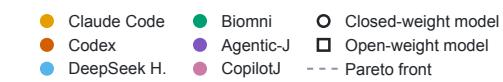

a
<table><tr><td></td><td></td><td></td><td></td><td></td><td></td><td></td><td>.96</td></tr><tr><td></td><td>NF-κB translocation quant.</td><td>.95</td><td>.96</td><td>.63</td><td>.86</td><td>.77</td><td>1.0</td><td rowspan="15">0.8 sScore 0.6 Outtccoms 0.4 0.2 - 0.0</td></tr><tr><td>Easy</td><td>HeLa nuc./cytopl. seg.</td><td>.86</td><td>.83</td><td>.87</td><td>.81</td><td>.84</td><td>.80</td></tr><tr><td></td><td>H&amp;E nuclear seg.</td><td>.77</td><td>.78</td><td>.78</td><td>.75</td><td>.76</td><td>.66</td></tr><tr><td></td><td>IF cell counting</td><td>.85</td><td>.84</td><td>.64</td><td>.69</td><td>.63</td><td>.56</td></tr><tr><td></td><td>DNA-PAINT SMLM</td><td></td><td></td><td></td><td></td><td></td><td></td></tr><tr><td></td><td></td><td>.76</td><td>.77</td><td>.74</td><td>.75</td><td>.65</td><td>.59</td></tr><tr><td>Meunm</td><td>Wound-healing kymograph Microglia dynamics</td><td>.69</td><td>.76</td><td>.71</td><td>.72</td><td>.59</td><td>.63</td></tr><tr><td></td><td>Microtubule seg.</td><td>.70 .54</td><td>.70 .56</td><td>.71</td><td>.59</td><td>.64</td><td>.33</td></tr><tr><td></td><td></td><td></td><td></td><td>.59</td><td>.43</td><td>.49</td><td>.51</td></tr><tr><td rowspan="11">Hard</td><td>3D zebrafish cell seg</td><td>.78</td><td>.77</td><td>.78</td><td>.75</td><td>.66</td><td>.80</td></tr><tr><td>SARS-CoV-2 / Golgi coloc.</td><td>R</td><td>R</td><td>.69</td><td>.69</td><td>.66</td><td>.61</td></tr><tr><td>Ph-cont. bacteria tracking</td><td>.92</td><td>.96</td><td>.78</td><td>.64</td><td>.61</td><td>.01</td></tr><tr><td>4D tile stitching</td><td>.75</td><td>.44</td><td>.55</td><td>.33</td><td>.44</td><td>.62</td></tr><tr><td>3D LSFM brain vessel seg.</td><td>.52</td><td>.50</td><td>.56</td><td>.47</td><td>.49</td><td>.41</td></tr><tr><td>DNA repair foci coloc.</td><td>.43</td><td>.51</td><td>.08</td><td>.52</td><td>.47</td><td>.46</td></tr><tr><td>5D nuclear pore quant.</td><td>.12</td><td>.18</td><td>.19</td><td>.13</td><td>.16</td><td>.09</td></tr><tr><td>3D oncogenic puncta quant.</td><td>.04</td><td>.05</td><td>.05</td><td>.00</td><td>.00</td><td>.00</td></tr><tr><td>Mean</td><td>.65</td><td>.64</td><td>.58</td><td>.57</td><td></td><td></td></tr><tr><td></td><td></td><td></td><td></td><td></td><td>.55</td><td>.50</td></tr><tr><td></td><td>Claude Code</td><td>Codex</td><td>DeepSeek H.</td><td>Biomni</td><td>Agentic-J</td><td>CopilotJ</td></tr></table>

b

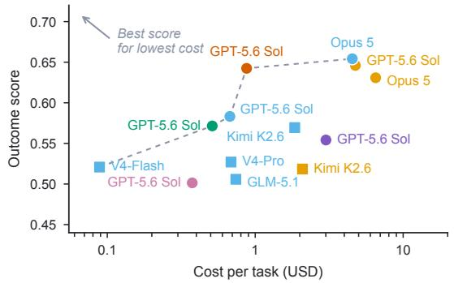

C Brief instruction Detailed instruction Brief mean Detailed mean  
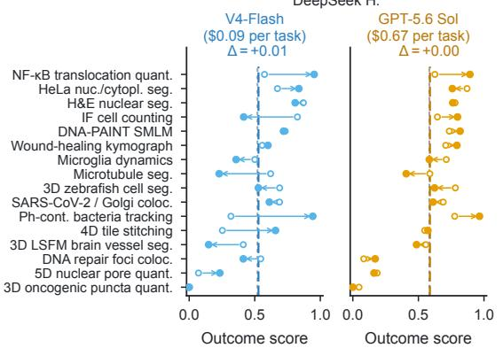

d Worst of three runs Mean of three runs Best of three runs  
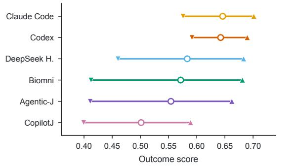

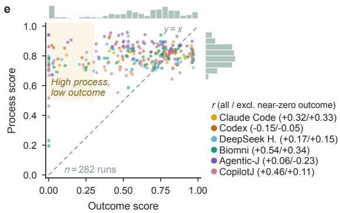  
Figure 2 Agent performance on BIABench. a) Outcome score of the six agents, all driven by GPT-5.6 Sol, on each of the 16 tasks. Each entry is the mean of $n = 3$ independent runs. Boxes mark the best agent per task (ties boxed jointly) while rows are grouped by dificulty level. In the bottom row we computed the mean over tasks per agent. Runs blocked by the model provider’s safety filter are marked with R and are excluded from the means. b) Mean outcome score against mean cost per task for 13 harness–model configurations, the six agents on GPT-5.6 Sol and further models on Claude Code and DeepSeek Harness (DeepSeek H.). The dashed line marks the Pareto front while circles and squares are the closed and open-weight models respectively. c) Efect of a detailed instruction. Mean outcome score per task $( n = 3$ runs) under the brief instruction (open circles) and the detailed instruction (filled circles) for DeepSeek Harness on V4-Flash (left) and GPT-5.6 Sol (right). Arrows mark changes of at least 0.05, the mean over tasks under each set of instructions is represented by a vertical line, and $\Delta$ is the diference between the two means. d) Run-to-run variability. The mean outcome score for each agent over all tasks $( n = 1 6 )$ is marked by open circles while the worst and best scores per task are represented by downward and upward triangles, respectively. e) Process score (y-axis) plotted against outcome score (x-axis) for all scored runs $( n = 2 8 2 ) ;$ , with colors corresponding to each agent. Pearson’s r per agent is provided across all runs as well as for runs with an outcome above 0.05. Marginal histograms display the distribution of each individual score. The shaded region highlights runs that demonstrated a sound process (process score $\geq 0 . 5 )$ yet resulted in a low outcome (≤ 0.3), while the dashed line represents $y = x .$

Table 2 Capability indicators per configuration. Metrics are grouped into five categories containing two indicators each. Deliver: percentage of runs that reached scoring with deliverables, and percentage stopped by the scheduler at the wall-clock limit. Understand: rubric pass rate for input understanding (Input) and tool choice and use (Tools). Quantify: rubric pass rate for the segmentation stage (Segm.) and, pooled, for the measurement stages (quantification, feature extraction, statistics and plotting, tracking, colocalization, spot detection; Quant.). Dimensionality: mean outcome on the eleven 2D and time-lapse tasks (2D) and on the five 3D and 5D tasks (3D/5D). Process vs outcome: Pearson r between process and outcome score over runs with outcome > 0.05, and, among runs that delivered but scored $< 0 . 1 \AA .$ , how many closed with a message claiming completion (Claims). A dash (–) denotes that no delivered run scored < 0.1. Rubric rates count decided items only. For Agentic-J and CopilotJ the closing message is the harness’s own summary, for the others the model’s final turn. Rows show the six agents on GPT-5.6 Sol, the model exchanges, and the detailed-instruction study.
<table><tr><td></td><td></td><td colspan="2">Deliver</td><td colspan="2">Understand</td><td colspan="2">Quantify</td><td colspan="4">Dimensionality Process vs outcome</td></tr><tr><td>Harness</td><td>Model</td><td>Delivered Timed out Input Tools Segm. Quant. 2D</td><td></td><td></td><td></td><td></td><td></td><td></td><td>3D/5D</td><td>r</td><td>Claims</td></tr><tr><td>Claude Code</td><td>GPT-5.6 Sol</td><td>100</td><td>0</td><td>0.89</td><td>0.76</td><td>0.85</td><td>0.67</td><td>0.75</td><td>0.44</td><td>0.33</td><td>4/4</td></tr><tr><td>Codex</td><td>GPT-5.6 Sol</td><td>100</td><td>0</td><td>0.96</td><td>0.94</td><td>0.85</td><td>0.69</td><td>0.77</td><td>0.39</td><td>-0.05</td><td>3/3</td></tr><tr><td>DeepSeek H.</td><td>GPT-5.6 Sol</td><td>98</td><td>0</td><td>0.89</td><td>0.63</td><td>0.83</td><td>0.68</td><td>0.66</td><td>0.42</td><td>0.15</td><td>一</td></tr><tr><td>Biomni</td><td>GPT-5.6 Sol</td><td>96</td><td>0</td><td>0.93</td><td>0.76</td><td>0.77</td><td>0.64</td><td>0.68</td><td>0.34</td><td>0.34</td><td>3/4</td></tr><tr><td>Agentic-J</td><td>GPT-5.6 Sol</td><td>98</td><td>4</td><td>0.94</td><td>0.74</td><td>0.83</td><td>0.83</td><td>0.65</td><td>0.35</td><td>-0.23</td><td>0/3</td></tr><tr><td>CopilotJ</td><td>GPT-5.6 Sol</td><td>100</td><td>2</td><td>0.93</td><td>0.67</td><td>0.73</td><td>0.64</td><td>0.56</td><td>0.38</td><td>0.11</td><td>0/8</td></tr><tr><td>Claude Code</td><td>Kimi K2.6</td><td>85</td><td>21</td><td>0.89</td><td>0.68</td><td>0.76</td><td>0.55</td><td>0.62</td><td>0.30</td><td>0.58</td><td>2/3</td></tr><tr><td>Claude Code</td><td>Opus 5</td><td>100</td><td>4</td><td>0.90</td><td>0.88</td><td>0.88</td><td>0.84</td><td>0.71</td><td>0.45</td><td>-0.12</td><td>3/3</td></tr><tr><td>DeepSeek H.</td><td>GLM-5.1</td><td>94</td><td>19</td><td>0.90</td><td>0.57</td><td>0.75</td><td>0.59</td><td>0.57</td><td>0.37</td><td>0.20</td><td>一</td></tr><tr><td>DeepSeek H.</td><td>Kimi K2.6</td><td>94</td><td>21</td><td>0.89</td><td>0.63</td><td>0.70</td><td>0.57</td><td>0.65</td><td>0.40</td><td>0.44</td><td>一</td></tr><tr><td>DeepSeek H.</td><td>Opus 5</td><td>98</td><td>6</td><td>0.90</td><td>0.79</td><td>0.86</td><td>0.80</td><td>0.75</td><td>0.44</td><td>0.13</td><td>一</td></tr><tr><td>DeepSeek H.</td><td>V4-Flash</td><td>92</td><td>2</td><td>0.89</td><td>0.58</td><td>0.73</td><td>0.56</td><td>0.63</td><td>0.28</td><td>0.04</td><td>一</td></tr><tr><td>DeepSeek H.</td><td>V4-Pro</td><td>100</td><td>0</td><td>0.88</td><td>0.55</td><td>0.72</td><td>0.56</td><td>0.62</td><td>0.32</td><td>0.27</td><td>9/9</td></tr><tr><td>DeepSeek H.</td><td>V4-Flash (detailed)</td><td>100</td><td>2</td><td>0.89</td><td>0.48</td><td>0.78</td><td>0.60</td><td>0.63</td><td>0.31</td><td>0.36</td><td>4/4</td></tr><tr><td>DeepSeek H.</td><td>GPT-5.6 Sol (detailed)</td><td>100</td><td>0</td><td>0.89</td><td>0.56</td><td>0.85</td><td>0.70</td><td>0.69</td><td>0.37</td><td>-0.19</td><td>4/6</td></tr></table>

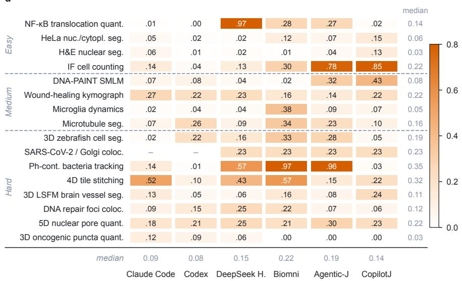

b  
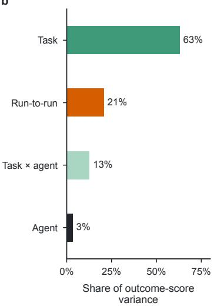  
Figure 3 Run-to-run variability ofthe outcome score. a) For every agent–task pair of the GPT-5.6 Sol study, the range of the outcome score across the pair’s three independent runs (rows and columns ordered as in Fig. 2a; gray margins, medians; dashes, pairs with fewer than two scored runs (safety-filter refusals)). Median range, 0.08 to 0.22 across agents and 0.03 to 0.35 across tasks. In 40% of pairs the same agent moved by more than 0.2 between identical runs. b) Breakdown of total outcome-score variance across all scored runs, showing the relative contributions of the task, task–agent interactions, run-to-run instability within a pair, and the choice of agent. Notably, run-to-run variability accounts for six times as much variance as the agent chosen.

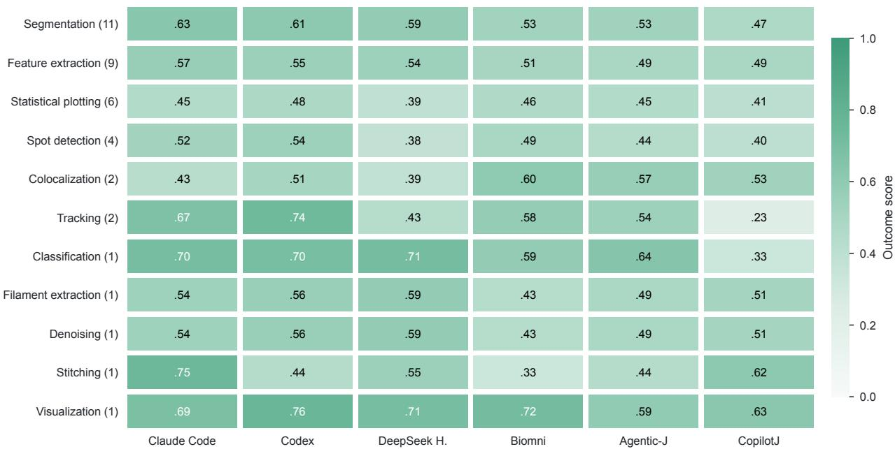  
Figure 4 Outcome score by analysis subtask. Mean outcome score for each agent (using GPT-5.6 Sol), calculated across all tasks involving a given subtask type. The number of relevant tasks appears in parentheses, with individual tasks contributing to all subtasks they include (rows are not mutually exclusive). Values represent averages of the per-task means across three independent runs, excluding any attempts blocked by provider safety filters.

Table 3 Outcome score per task for the model exchanges ofFig. 2b, averaged over three runs. Columns indicate the model behind Claude Code or DeepSeek Harness (DeepSeek H.), whereas the six agents on GPT-5.6 Sol are given in Fig. 2a. Rows are grouped by dificulty level and ordered within a level as in Fig. 2a. GLM-5.1 and V4-Flash could not run behind Claude Code (Section 4.1). The dagger symbol (†) denotes fewer than three scored runs. The bottom row displays the mean across all tasks. LSFM, light-sheet fluorescence microscopy; IF, immunofluorescence.
<table><tr><td colspan="2"></td><td colspan="2">Claude Code</td><td colspan="5">DeepSeek H.</td></tr><tr><td colspan="2">Task</td><td>Kimi K2.6</td><td>Opus 5</td><td>GLM-5.1</td><td>Kimi K2.6</td><td>Opus 5</td><td>V4-Flash</td><td>V4-Pro</td></tr><tr><td rowspan="4">Easy</td><td>NF-κB translocation quant.</td><td>0.85</td><td>0.97</td><td>0.87</td><td>0.94</td><td>0.98</td><td>0.57</td><td>0.72</td></tr><tr><td>HeLa nuc./cytopl. seg.</td><td>0.87</td><td>0.61</td><td>0.71</td><td>0.69</td><td>0.88</td><td>0.67</td><td>0.75</td></tr><tr><td>H&amp;E nuclear seg.</td><td>0.87</td><td>0.88</td><td>0.71</td><td>0.83</td><td>0.88</td><td>0.87</td><td>0.85</td></tr><tr><td>IF cell counting</td><td>0.40</td><td>0.59</td><td>0.43</td><td>0.48</td><td>0.75†</td><td>0.83</td><td>0.39</td></tr><tr><td rowspan="4">Meedum</td><td>DNA-PAINT SMLM</td><td>0.78</td><td>0.67</td><td>0.46</td><td>0.75</td><td>0.76</td><td>0.73</td><td>0.70</td></tr><tr><td>Wound-healing kymograph</td><td>0.69</td><td>0.63</td><td>0.47</td><td>0.79</td><td>0.75</td><td>0.56</td><td>0.78</td></tr><tr><td>Microglia dynamics</td><td>0.46</td><td>0.72</td><td>0.48</td><td>0.34</td><td>0.72</td><td>0.50</td><td>0.51</td></tr><tr><td>Microtubule seg.</td><td>0.60</td><td>0.59</td><td>0.33</td><td>0.60</td><td>0.64</td><td>0.62</td><td>0.29</td></tr><tr><td rowspan="8">Hard</td><td>3D zebrafish cell seg.</td><td>0.33</td><td>0.84</td><td>0.58</td><td>0.51</td><td>0.84</td><td>0.69</td><td>0.58</td></tr><tr><td>SARS-CoV-2 / Golgi coloc.</td><td>0.77</td><td>0.77</td><td>0.77</td><td>0.77</td><td>0.69</td><td>0.69</td><td>0.77</td></tr><tr><td>Ph-cont. bacteria tracking</td><td>0.00</td><td>0.97</td><td>0.60</td><td>0.64</td><td>0.97</td><td>0.32</td><td>0.65</td></tr><tr><td>4D tile stitching</td><td>0.84</td><td>0.48</td><td>0.61</td><td>0.70</td><td>0.49</td><td>0.25</td><td>0.75</td></tr><tr><td>3D LSFM brain vessel seg.</td><td>0.17</td><td>0.58</td><td>0.50</td><td>0.52</td><td>0.53</td><td>0.41</td><td>0.25</td></tr><tr><td>DNA repair foci coloc.</td><td>0.48</td><td>0.48</td><td>0.43</td><td>0.30</td><td>0.26</td><td>0.55</td><td>0.46</td></tr><tr><td>5D nuclear pore quant.</td><td>0.17</td><td>0.23</td><td>0.13</td><td>0.18</td><td>0.25</td><td>0.07</td><td>0.00</td></tr><tr><td>3D oncogenic puncta quant.</td><td>0.01</td><td>0.09</td><td>0.01</td><td>0.06</td><td>0.10</td><td>0.00</td><td>0.00</td></tr><tr><td colspan="2">Mean</td><td>0.52</td><td>0.63</td><td>0.51</td><td>0.57</td><td>0.65</td><td>0.52</td><td>0.53</td></tr></table>

## 5.3 Run-to-run variability and indicators of correctness

Scores also varied from run to run, due to the nature of randomness of the underlying models. Across three attempts on the same task, they difered by more than 0.2 in 40% of agent–task pairs, and taking the best of three brought five of the six agents within 0.04 of one another, whereas their worst attempts difered by 0.18 (Fig. 2d), indicating that diferences between agents primarily reflected reliability rather than best-case capability.

Since the same agent could succeed on one run and fail on the next, we finally asked whether a run’s success could be told, without ground truth, from its process score or wall-clock time. Across all scored runs, process and outcome scores correlated weakly (Pearson r = 0.29; Fig. 2e), and excluding runs with near-zero outcomes reduced r to 0.09. The judge also compressed its ratings into a narrow range, assigning almost no run a process score below 0.5 (Fig. 2e, right margin). Process scores assigned by a human expert to 20 runs were no more predictive of outcome (r = −0.03; Fig. 5). When three runs of an agent–task pair disagreed, the longest run was the best in only 20 of 70 pairs, and runs that scored below 0.1 took twice as long as those that succeeded (Fig. 6 and Table 4). Thus, neither the process nor the time spent on an analysis can be used to indicate whether its result is scientifically correct (Appendix G examines three such runs).

Table 4 Wall-clock minutes per task for the six agents on GPT-5.6 Sol, median over three runs. Rows are grouped and ordered as in Table 3, and the bottom row displays the median over all scored runs of the agent, as in Table 1. The double dagger symbol (‡) denotes that at least one of the three runs was stopped at the wall-clock limit (Section 4.2) and the median is right-censored.
<table><tr><td colspan="2">Task</td><td>Claude Code</td><td>Codex</td><td>DeepSeek H.</td><td>Biomni</td><td>Agentic-J</td><td>CopilotJ</td></tr><tr><td rowspan="5">Easy</td><td>NF-κB translocation quant.</td><td>12</td><td>10</td><td>17</td><td>7</td><td>27</td><td>10</td></tr><tr><td>HeLa nuc./cytopl. seg.</td><td>12</td><td>16</td><td>10</td><td>11</td><td>19</td><td>7</td></tr><tr><td>H&amp;E nuclear seg.</td><td>4</td><td>5</td><td>4</td><td>5</td><td>22</td><td>5</td></tr><tr><td>IF cell counting</td><td>11</td><td>9</td><td>10</td><td>9</td><td>33</td><td>5</td></tr><tr><td>DNA-PAINT SMLM</td><td>4</td><td>5</td><td>4</td><td>3</td><td>18</td><td>4</td></tr><tr><td rowspan="4">Meddum</td><td>Wound-healing kymograph</td><td>11</td><td>10</td><td>10</td><td>7</td><td>30</td><td>6</td></tr><tr><td>Microglia dynamics</td><td>10</td><td>9</td><td>9</td><td>7</td><td>32</td><td>10</td></tr><tr><td>Microtubule seg.</td><td>4</td><td>5</td><td>4</td><td>2</td><td>15</td><td>2</td></tr><tr><td>3D zebrafish cell seg.</td><td>23</td><td>17</td><td>24</td><td>31</td><td>34</td><td>14</td></tr><tr><td rowspan="8">Hard</td><td>SARS-CoV-2 / Golgi coloc.</td><td>3</td><td>6</td><td>6</td><td>4</td><td>18</td><td>4</td></tr><tr><td>Ph-cont. bacteria tracking</td><td>44</td><td>56</td><td>37</td><td>32</td><td>141</td><td>21</td></tr><tr><td>4D tile stitching</td><td>9</td><td>9</td><td>11</td><td>6</td><td>48</td><td>7</td></tr><tr><td>3D LSFM brain vessel seg.</td><td>14</td><td>10</td><td>11</td><td>9</td><td>45</td><td>7</td></tr><tr><td>DNA repair foci coloc.</td><td>18</td><td>16</td><td>14</td><td>10</td><td>42</td><td>9</td></tr><tr><td>5D nuclear pore quant.</td><td>11</td><td>15</td><td>12</td><td>16</td><td>49</td><td>12</td></tr><tr><td>3D oncogenic puncta quant.</td><td>82</td><td>21</td><td>47</td><td>19</td><td>120</td><td>22</td></tr><tr><td>All tasks</td><td>11</td><td>10</td><td>10</td><td>7</td><td>32</td><td>7</td></tr></table>

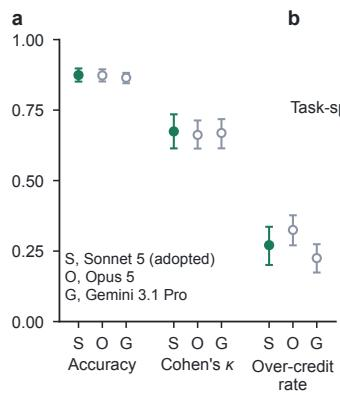

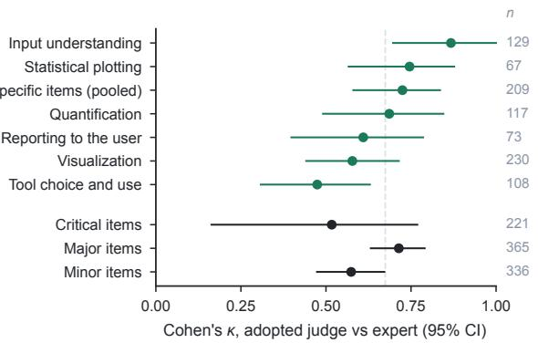

c  
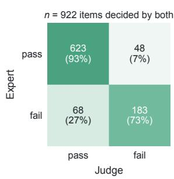

d  
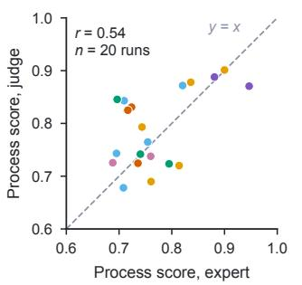

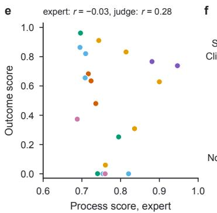

  
Claude Code Codex DeepSeek H. Biomni Agentic-J CopilotJ

Figure 5 Agreement between the vision–languagejudge and a human expert. Twenty runs (six agents on GPT-5.6 Sol, covering all 16 tasks) were reviewed item by item by an expert cell biologist blinded to the judge’s decisions (1,273 total rubric items, with 188 skipped as undecidable from the run folder or not applicable). a) Agreement with the expert across three candidate VLM judges on items decided by both, showing accuracy, Cohen’s $\kappa ,$ and the over-crediting rate (cases where the judge assigned a pass to an item marked as failed by the expert). Error bars denote 95% cluster-bootstrap intervals across runs. Finally, Sonnet 5 is the adopted judge in the rest of the reported findings. b) Agreement (κ) of the adopted judge stratified by rubric subsection (green) and item severity (black). The grayed n values represent the number of items evaluated by both the human expert and the VLM judge. The dashed vertical line marks the overall average κ. c) Confusion matrix of the adopted VLM judge evaluated against the human expert with each cell reporting raw item counts and percentages normalized across the expert’s true classes. d) Per-run process score under expert labels against under the judge, each computed using the rubric’s severity weights across decided items. The dashed line represents $y = x . \mathbf { e } )$ The expert’s process score plotted against the outcome score for the same runs $( r = - 0 . 0 3 )$ where the five runs with an outcome below 0.1 still received expert process scores of 0.74–0.82. f) The twelve rubric items failed most frequently under expert review (among items evaluated in at least eight runs), colored by severity, with fractions indicating failed over decided runs. In total, runs failed 4% of critical items, 31% of major items, and 44% of minor items under expert review. Marker colors in d) and e) identify agents as defined in the bottom legend.

c

a  


  
Figure 6 Wall-clock time and outcome. Data represent all scored runs from the GPT-5.6 Sol evaluation, where wall-clock time serves as the primary metric directly comparable across all agents (output tokens show the same pattern). a) Mean outcome score by wall-clock tercile. Within each task, its scored runs (up to 18, six agents with three runs each) were ranked by wall-clock time and divided into the shortest, middle and longest third, plotted both pooled across all agents (black) and individually by agent (colors). The pooled mean difers by 0.03 between the shortest and the longest third and by at most 0.06 between any two thirds, and within a task the rank correlation between wall-clock time and outcome is centered on zero (annotation). b) Wall-clock per run grouped by agent and by outcome tier $( < 0 . 1 , 0 . 1 – 0 . 5 , \ge 0 . 5 ,$ displayed left to right for each agent). Horizontal ticks indicate medians, and the rightmost column groups all agents. Runs with an outcome below 0.1 took twice as long as those with an outcome of at least 0.5 (median of 21 versus 10 minutes) and were slower for each of the six agents. c) Fraction of agent–task pairs in which the longest run achieved the highest score, evaluated across the 70 pairs whose runs difered by more than 0.05. The vertical dashed line indicates expected performance by chance (1/3).

## 6 Discussion

In summary, an analysis that appears plausible or methodologically sound may still produce wrong results. Current agents can complete routine bioimage analyses but remain unreliable as tasks become more complex, still far away from human-level performance (because every task is scored at the study’s own endpoint, BIABench assumes human experts could achieve nearly perfect scores on these tasks in theory). Neither biological specialization, stronger models nor detailed expert instructions can yet reliably close this gap. Our results locate this gap in data complexity, reliability and self-checking. Some tasks that added a third dimension or a time axis stayed out of reach for every agent. Taking the best of three runs brought five of the six agents close to one another, yet the failing runs rarely looked like failures, delivering tables that contradicted their own reports, applying detection thresholds never checked against the images or closing with a promise to finish, and their process score and runtime did not set them apart. This work not only provides an evaluation benchmark, publicly hosted on Hugging Face, but also ofers the AI community a general development strategy for building large-scale multistep image-to-insight datasets for bioimage analysis. We envision the long-term goal of expert-level autonomous bioimage analysis being achieved by the community in a few years.

## Acknowledgements

J.C., L.J. and Y.Z. were partially supported by Federal Ministry of Research, Technology and Space (Bundesministerium für Forschung, Technologie und Raumfahrt, BMFTR) under the funding reference 161L0272. D.P. was partially supported by NFDI4Bioimage, funded by the German Research Foundation (DFG) within the framework of the NFDI-project number 501864659. The work at ISAS was additionally supported by the “Ministerium für Kultur und Wissenschaft des Landes Nordrhein-Westfalen” and “Der Regierende Bürgermeister von Berlin, Senatskanzlei Wissenschaft und Forschung” in Germany. The work at Institute of Computer Science, University of Tartu, was conducted using the research infrastructure “ELIXIR Estonia” funded by the Estonian Research Council (TARISTU24-TK4).

## Author contributions

J.C. and Y.S. conceptualized the study. Z.P. and D.P. designed the method. D.P. collected and curated the data. D.P., Z.P., L.J., M.M. and Y.Z. contributed to the experimental design and evaluation. Z.P. implemented the experiments. Z.P. and D.P. drafted the paper. All authors reviewed, revised and approved the final version of the paper.

## Competing interests

The authors co-developed Agentic-J [4].

## Data and code availability

The task inputs and ground truth that support the findings of this study are available in the Hugging Face repository BIABench/BIABench at https://doi.org/10.57967/hf/10561 (revision v1.0). All 16 tasks are built from publicly available datasets, whose source repositories and references are listed in Appendix A. BIABench, including the task specifications, evaluation code, rubrics, judge prompt, agent wrappers and analysis scripts, is available at https://github.com/BIABench/BIABench under the BSD 3-Clause license.

## References

[1] Loïc A. Royer. Omega—harnessing the power of large language models for bioimage analysis. Nat. Methods, 21: 1371–1373, 2024.

[2] W. Lei, C. Fuster-Barceló, G. Reder, A. Muñoz-Barrutia, and W. Ouyang. BioImage.IO chatbot: a community-driven AI assistant for integrative computational bioimaging. Nat. Methods, 21:1368–1370, 2024.

[3] Shanghang Zhang, Gaole Dai, Tiejun Huang, and Jianxu Chen. Multimodal large language models for bioimage analysis. Nat. Methods, 21:1390–1393, 2024.

[4] Lukas Johanns, Marilin Moor, Davide Panzeri, Yu Zhou, Xinyi Chen, Nora F. K. Pauly, Zixuan Pan, Matthias Gunzer, Andreas Müller, Yiyu Shi, Hedi Peterson, and Jianxu Chen. Agentic-J: An AI agent for biological microscopy image analysis. Preprint at https://arxiv.org/abs/2606.02080, 2026.

[5] neurogeom. CopilotJ: A conversational multi-agent system for intelligent and eficient bioimage analysis. GitHub https://github.com/neurogeom/copilotj, 2025.

[6] Juan C. Caicedo, Allen Goodman, Kyle W. Karhohs, Beth A. Cimini, Jeanelle Ackerman, Marzieh Haghighi, CherKeng Heng, Tim Becker, Minh Doan, Claire McQuin, Mohammad Rohban, Shantanu Singh, and Anne E. Carpenter. Nucleus segmentation across imaging experiments: the 2018 Data Science Bowl. Nat. Methods, 16:1247–1253, 2019.

[7] Martin Maška, Vladimír Ulman, Pablo Delgado-Rodriguez, Estibaliz Gómez-de Mariscal, Tereza Nečasová, Fidel A. Guerrero Peña, Tsang Ing Ren, Elliot M. Meyerowitz, Tim Scherr, Katharina Löfler, Ralf Mikut, Tianqi Guo, Yin Wang, Jan P. Allebach, Rina Bao, Noor M. Al-Shakarji, Gani Rahmon, Imad Eddine Toubal, Kannappan Palaniappan, Filip Lux, Petr Matula, Ko Sugawara, Klas E. G. Magnusson, Layton Aho, Andrew R. Cohen, Assaf Arbelle, Tal Ben-Haim, Tammy Riklin Raviv, Fabian Isensee, Paul F. Jäger, Klaus H. Maier-Hein, Yanming Zhu, Cristina Ederra, Ainhoa Urbiola, Erik Meijering, Alexandre Cunha, Arrate Muñoz-Barrutia, Michal Kozubek, and Carlos Ortiz-de Solórzano. The Cell Tracking Challenge: 10 years of objective benchmarking. Nat. Methods, 20:1010–1020, 2023.

[8] Dorian Kaufmann, Guillaume Gay, Julio Mateos-Langerak, Oriane Pourcelot, Virginie Georget, Maëlle Carraz, Juliette Van Dijk, Stéphanie Bosch, Elsa Castellani, Qiyan Mao, Laura Ruiz, Valentin Asei-Ceschino, Tudor Manoliu, Louis Ruel, Julia Bonnet-Gelebart, Youssef Elhabouz, Marc Tramier, Jacques Pécréaux, Jean-Bernard Fiche, David Lleres, Christine Doucet, Erwan Gandon, Yves Lutz, Bertrand Vernay, Daniel Stockholm, Abbass Jaber, Aude Moret, Romain Morichon, Mónica Fernández-Monreal, Edouard Bertrand, and Emmanuel Faure. 2D multimodal image collection for fluorescence prediction from transmitted light microscopy. Sci. Data, 13:743, 2026.

[9] Zixuan Pan, Justin Sonneck, Dennis Nagel, Anja Hasenberg, Matthias Gunzer, Yiyu Shi, and Jianxu Chen. AutoQC Bench: a difusion model and benchmark for automatic quality control in high-throughput microscopy. npj Imaging, 3:57, 2025.

[10] Grégoire Mialon, Clémentine Fourrier, Craig Swift, Thomas Wolf, Yann LeCun, and Thomas Scialom. GAIA: A benchmark for general AI assistants. In Proc. International Conference on Learning Representations, 2024.

[11] Carlos E. Jimenez, John Yang, Alexander Wettig, Shunyu Yao, Kexin Pei, Ofir Press, and Karthik Narasimhan. SWE-bench: Can language models resolve real-world GitHub issues? In Proc. International Conference on Learning Representations, 2024.

[12] Tianbao Xie, Danyang Zhang, Jixuan Chen, Xiaochuan Li, Siheng Zhao, Ruisheng Cao, Toh Jing Hua, Zhoujun Cheng, Dongchan Shin, Fangyu Lei, Yitao Liu, Yiheng Xu, Shuyan Zhou, Silvio Savarese, Caiming Xiong, Victor Zhong, and Tao Yu. OSWorld: Benchmarking multimodal agents for open-ended tasks in real computer environments. In Advances in Neural Information Processing Systems (Datasets and Benchmarks Track), 2024.

[13] Jon M. Laurent, Joseph D. Janizek, Michael Ruzo, Michaela M. Hinks, Michael J. Hammerling, Siddharth Narayanan, Manvitha Ponnapati, Andrew D. White, and Samuel G. Rodriques. LAB-Bench: Measuring capabilities of language models for biology research. Preprint at https://arxiv.org/abs/2407.10362, 2024.

[14] Ludovico Mitchener, Jon M. Laurent, Alex Andonian, Benjamin Tenmann, Siddharth Narayanan, Geemi P. Wellawatte, Andrew D. White, Lorenzo Sani, and Samuel G. Rodriques. BixBench: A comprehensive benchmark for LLM-based agents in computational biology. Preprint at https://arxiv.org/abs/2503.00096, 2025.

[15] Zane Koch, Asmamaw T. Wassie, Javier Valdes-Aleman, Jason Lee, Michaela M. Hinks, Samuel G. Rodriques, Andrew D. White, and Jon M. Laurent. BixBench3: Benchmarking AI agents on research-study-scale computational biology tasks. Preprint at https://arxiv.org/abs/2608.25286, 2026.

[16] Yuanhao Qu, Yingzhou Lu, Xinming Tu, Serena Zhang, Tianwei She, Alexander Glenn Shaw, Jou-Ho Shih, Bingqing Zhao, Minjie Shen, Haochen Yang, Jielin Yan, Rongchuan Zhang, Xinze Wu, Tingting Li, Bin Zhou, Ning Wang, Adam Ma, Le Cong, Xiaobo Hu, Yuan Jiang, Jiayun Dong, Tao Peng, Jure Leskovec, and Kexin Huang. BiomniBench: Process-level evaluation of LLM agents for real-world biomedical research. Preprint at bioRxiv https://doi.org/

10.64898/2026.05.12.724604, 2026.

[17] J. Burgess, J. J. Nirschl, L. Bravo-Sánchez, A. Lozano, S. R. Gupte, J. G. Galaz-Montoya, Y. Zhang, Y. Su, D. Bhowmik, Z. Coman, S. M. Hasan, A. Johannesson, W. D. Leineweber, M. G. Nair, R. Yarlagadda, C. Zuraski, W. Chiu, S. Cohen, J. N. Hansen, M. D. Leonetti, C. Liu, E. Lundberg, and S. Yeung-Levy. MicroVQA: A multimodal reasoning benchmark for microscopy-based scientific research. In Proc. IEEE/CVF Conference on Computer Vision and Pattern Recognition, 2025.

[18] Roshan Kenia, Xiaoman Zhang, and Pranav Rajpurkar. ReX-MLE: The autonomous agent benchmark for medical imaging challenges. In Proc. Medical Imaging with Deep Learning, PMLR 315, 4288–4315, 2026.

[19] Loka Li, Duzhen Zhang, Xingbo Du, Leonard Song, Zixiao Wang, Assanali Aukenov, Noel Thomas, Shakhnazar Sailaukan, Yonghan Yang, Feilong Chen, Jiahua Dong, Kun Zhang, Bin Zhang, and Le Song. BioXArena: Benchmarking LLM agents on multi-modal biomedical machine learning tasks. Preprint at https://arxiv.org/abs/ 2605.15766, 2026.

[20] Carsen Stringer, Tim Wang, Michalis Michaelos, and Marius Pachitariu. Cellpose: a generalist algorithm for cellular segmentation. Nat. Methods, 18(1):100–106, 2021.

[21] Uwe Schmidt, Martin Weigert, Coleman Broaddus, and Gene Myers. Cell detection with star-convex polygons. In Proc. Medical Image Computing and Computer Assisted Intervention, LNCS 11071, 265–273, 2018.

[22] Johannes Schindelin, Ignacio Arganda-Carreras, Erwin Frise, Verena Kaynig, Mark Longair, Tobias Pietzsch, Stephan Preibisch, Curtis Rueden, Stephan Saalfeld, Benjamin Schmid, Jean-Yves Tinevez, Daniel James White, Volker Hartenstein, Kevin Eliceiri, Pavel Tomancak, and Albert Cardona. Fiji: an open-source platform for biological-image analysis. Nat. Methods, 9(7):676–682, 2012.

[23] napari contributors. napari: a multi-dimensional image viewer for Python. Zenodo, 2019.

[24] Xiao Liu, Hao Yu, Hanchen Zhang, Yifan Xu, Xuanyu Lei, Hanyu Lai, Yu Gu, Hangliang Ding, Kaiwen Men, Kejuan Yang, Shudan Zhang, Xiang Deng, Aohan Zeng, Zhengxiao Du, Chenhui Zhang, Sheng Shen, Tianjun Zhang, Yu Su, Huan Sun, Minlie Huang, Yuxiao Dong, and Jie Tang. AgentBench: Evaluating LLMs as agents. In Proc. International Conference on Learning Representations, 2024.

[25] Shunyu Yao, Noah Shinn, Pedram Razavi, and Karthik Narasimhan. τ-bench: A benchmark for tool-agent-user interaction in real-world domains. In Proc. International Conference on Learning Representations, 2025.

[26] Victor Barres, Honghua Dong, Soham Ray, Xujie Si, and Karthik Narasimhan. τ<sup>2</sup>-Bench: Evaluating conversational agents in a dual-control environment. Preprint at https://arxiv.org/abs/2506.07982, 2025.

[27] Mike A. Merrill, Alexander G. Shaw, Nicholas Carlini, Boxuan Li, Harsh Raj, Ivan Bercovich, Lin Shi, Jeong Yeon Shin, Thomas Walshe, E. Kelly Buchanan, Junhong Shen, Guanghao Ye, Haowei Lin, Jason Poulos, Maoyu Wang, Marianna Nezhurina, Jenia Jitsev, Di Lu, Orfeas Menis Mastromichalakis, Zhiwei Xu, Zizhao Chen, Yue Liu, Robert Zhang, Leon Liangyu Chen, Anurag Kashyap, Jan-Lucas Uslu, Jefrey Li, Jianbo Wu, Minghao Yan, Song Bian, Vedang Sharma, Ke Sun, Steven Dillmann, Akshay Anand, Andrew Lanpouthakoun, Bardia Koopah, Changran Hu, Etash Guha, Gabriel H. S. Dreiman, Jiacheng Zhu, Karl Krauth, Li Zhong, Niklas Muennighof, Robert Amanfu, Shangyin Tan, Shreyas Pimpalgaonkar, Tushar Aggarwal, Xiangning Lin, Xin Lan, Xuandong Zhao, Yiqing Liang, Yuanli Wang, Zilong Wang, Changzhi Zhou, David Heineman, Hange Liu, Harsh Trivedi, John Yang, Junhong Lin, Manish Shetty, Michael Yang, Nabil Omi, Negin Raoof, Shanda Li, Terry Yue Zhuo, Wuwei Lin, Yiwei Dai, Yuxin Wang, Wenhao Chai, Shang Zhou, Dariush Wahdany, Ziyu She, Jiaming Hu, Zhikang Dong, Yuxuan Zhu, Sasha Cui, Ahson Saiyed, Arinbjörn Kolbeinsson, Jesse Hu, Christopher Michael Rytting, Ryan Marten, Yixin Wang, Alex Dimakis, Andy Konwinski, and Ludwig Schmidt. Terminal-Bench: Benchmarking agents on hard, realistic tasks in command line interfaces. In Proc. International Conference on Learning Representations, 2026.

[28] Jason Wei, Zhiqing Sun, Spencer Papay, Scott McKinney, Jefrey Han, Isa Fulford, Hyung Won Chung, Alex Tachard Passos, William Fedus, and Amelia Glaese. BrowseComp: A simple yet challenging benchmark for browsing agents. Preprint at https://arxiv.org/abs/2504.12516, 2025.

[29] Jun Shern Chan, Neil Chowdhury, Oliver Jafe, James Aung, Dane Sherburn, Evan Mays, Giulio Starace, Kevin Liu, Leon Maksin, Tejal Patwardhan, Lilian Weng, and Aleksander Mądry. MLE-bench: Evaluating machine learning agents on machine learning engineering. In Proc. International Conference on Learning Representations, 2025.

[30] Liya Zhu, Xin Ma, Tao Liu, Haodong Wang, Ge Zhang, Jingzhe Ding, Qingshui Gu, Yongjie Zhong, Jinxiang Meng, Yuan Gao, Yunqiu Zhou, Hao Zhu, Jifeng He, Yongzhi Liao, Xinyi Zhang, Chaoxin Li, Yi Zhu, Xi Lin, Duju Zeng, Xiang Gao, Wen Zhang, Yunyang Wang, Duo Wang, Huan Zhou, Zuo Wang, Jin Chen, Kaiyuan Zhang, Chuqian Yu, Tianhao Yu, Longxiang Liu, Jianbo Xue, Huimin Che, Jiahao Wang, Yujia Qin, Jiaheng Liu, Shen Yan, Xiaolong Chang, and Wenhao Huang. StartupBench: Benchmarking general-purpose agents on market-validated end-to-end workflows. Preprint at https://arxiv.org/abs/2608.17800, 2026.

[31] Mengyu Zheng, Kai Han, Boxun Li, Haiyang Xu, Yuchuan Tian, Wei He, Hang Zhou, Jianyuan Guo, Hailin Hu, Lin Ma, Chao Xu, Guohao Dai, Lixue Xia, Yunchao Wei, Yunhe Wang, and Yu Wang. Claw-SWE-Bench: A benchmark for evaluating OpenClaw-style agent harnesses on coding tasks. Preprint at https://arxiv.org/abs/2606.12344, 2026.

[32] Yilun Yao, Xinyu Tan, Chao-Hsuan Liu, Yaoming Li, Zhengyang Wang, Wenhan Yu, Zhewen Tan, Yuxuan Tian, Guangxiang Zhao, Lin Sun, Xiangzheng Zhang, and Tong Yang. Harness-Bench: Measuring harness efects acros models in realistic agent workflows. Preprint at https://arxiv.org/abs/2605.27922, 2026.

[33] Juraj Gottweis, Wei-Hung Weng, Alexander Daryin, Tao Tu, Petar Sirkovic, Artiom Myaskovsky, Grzegorz Glowaty, Felix Weissenberger, Alessio Orlandi, Dan Popovici, Anil Palepu, Keran Rong, Ryutaro Tanno, Khaled Saab, Fan Zhang, Jacob Blum, Andrew Carroll, Kavita Kulkarni, Nenad Tomašev, Dina Zverinski, Ivor Rendulic, Elahe Vedadi, Florian Hasler, Luka Rimanic, Marina Boia, Ivan Budiselic, Ben Feinstein, Mathias Bellaiche, Tom Shefer, Jan Freyberg, Jeremy Ratclif, Ottavia Bertolli, Katherine Chou, Avinatan Hassidim, Burak Gokturk, Amin Vahdat, Yuan Guan, Vikram Dhillon, Eeshit Dhaval Vaishnav, Byron Lee, Tiago R. D. Costa, José R. Penadés, Gary Peltz, Yossi Matias, James Manyika, Demis Hassabis, Yunhan Xu, Pushmeet Kohli, Annalisa Pawlosky, Alan Karthikesalingam, and Vivek Natarajan. Accelerating scientific discovery with Co-Scientist. Nature, 655:487–496, 2026.

[34] Kyle Swanson, Wesley Wu, Nash L. Bulaong, John E. Pak, and James Zou. The Virtual Lab of AI agents designs new SARS-CoV-2 nanobodies. Nature, 646:716–723, 2025.

[35] Kexin Huang, Serena Zhang, Hanchen Wang, Yuanhao Qu, Yingzhou Lu, Ryan Li, Yusuf Roohani, Lin Qiu, Shiyi Cao, Gavin Li, Junze Zhang, Di Yin, Rick Wierenga, Deniz Kavi, Sherry Liu, Tianwei She, Shruti Marwaha, Jennefer N Carter, Xin Zhou, Matthew T Wheeler, Jonathan A Bernstein, Mengdi Wang, Peng He, Jingtian Zhou, Michael P Snyder, Le Cong, Aviv Regev, and Jure Leskovec. Autonomous biomedical research with an artificial intelligence agent. Science, 393(6813):eadz4351, 2026.

[36] Ruofan Jin, Zaixi Zhang, Mengdi Wang, and Le Cong. STELLA: Self-evolving LLM agent for biomedical research. Preprint at https://arxiv.org/abs/2507.02004, 2025.

[37] Xi Yu, Yang Yang, Qun Liu, Yonghua Du, Sean McSweeney, and Yuewei Lin. GenCellAgent: Generalizable, training free cellular image segmentation via large language model agents. Preprint at https://arxiv.org/abs/2510. 13896, 2025.

[38] Ruofan Liu, Pengcheng Chen, and Eric J. Seibel. LSM-Copilot: A skill-flow agent for fluorescence microscopy analysis. In Proc. ACM Conference on AI and Agentic Systems (CAIS) Workshop on Agent Skills, 2026.

[39] Jon M. Laurent, Albert Bou, Michael Pieler, Conor Igoe, Alex Andonian, Siddharth Narayanan, James Braza, Alexandros Sanchez Vassopoulos, Jacob L. Steenwyk, Blake Lash, Andrew D. White, and Samuel G. Rodriques. LABBench2: An improved benchmark for AI systems performing biology research. Preprint at https://arxiv. org/abs/2604.09554, 2026.

[40] Dionizije Fa, Marko Culjak, Bruno Pandza, and Mateo Cupic. BioAgent Bench: An AI agent evaluation suite for bioinformatics. In Proc. International Conference on Machine Learning, 2026.

[41] Wenbin Guo, Minzhe Zhang, Bowei Han, Youjia Ma, Yang Leng, Shishir Hebbar, Xiaoyuan Zhou, Wenhao Gu, Xiao Yang, and Shashi Dhar. PromptBio-Bench: Benchmarking LLM-based bioinformatics agents for end-to-end data analysis. Preprint at bioRxiv https://doi.org/10.64898/2026.05.05.723092, 2026.

[42] Henry E. Miller, Matthew Greenig, Benjamin Tenmann, and Bo Wang. BioML-bench: Evaluation of AI agents for end-to-end biomedical ML. Preprint at bioRxiv https://doi.org/10.1101/2025.09.01.673319, 2025.

[43] Jean-Yves Tinevez, Nick Perry, Johannes Schindelin, Genevieve M. Hoopes, Gregory D. Reynolds, Emmanuel Laplantine, Sebastian Y. Bednarek, Spencer L. Shorte, and Kevin W. Eliceiri. TrackMate: An open and extensible platform for single-particle tracking. Methods, 115:80–90, 2017.

[44] Robert Haase, Christian Tischer, Jean-Karim Hériché, and Nico Scherf. Benchmarking large language models for bio-image analysis code generation. Preprint at bioRxiv https://doi.org/10.1101/2024.04.19.590278, 2024.

[45] Lianmin Zheng, Wei-Lin Chiang, Ying Sheng, Siyuan Zhuang, Zhanghao Wu, Yonghao Zhuang, Zi Lin, Zhuohan Li, Dacheng Li, Eric P. Xing, Hao Zhang, Joseph E. Gonzalez, and Ion Stoica. Judging LLM-as-a-judge with MT-Bench and Chatbot Arena. In Advances in Neural Information Processing Systems (Datasets and Benchmarks Track), 2023.

[46] Vebjorn Ljosa, Katherine L. Sokolnicki, and Anne E. Carpenter. Annotated high-throughput microscopy image sets for validation. Nat. Methods, 9(7):637, 2012.

[47] Trina De, Adrian Urbanski, Subasini Thangamani, Maria Wyrzykowska, and Artur Yakimovich. HeLaCytoNuc: fluorescence microscopy dataset with segmentation masks for cell nuclei and cytoplasm. Rodare https://doi.

org/10.14278/rodare.3001, 2024.

[48] Pauli Rämö, Anna Drewek, Cécile Arrieumerlou, Niko Beerenwinkel, Houchaima Ben-Tekaya, Bettina Cardel, Alain Casanova, Raquel Conde-Alvarez, Pascale Cossart, Gábor Csúcs, Simone Eicher, Mario Emmenlauer, Urs Greber, Wolf-Dietrich Hardt, Ari Helenius, Christoph Kasper, Andreas Kaufmann, Saskia Kreibich, Andreas Kühbacher, Peter Kunszt, Shyan Huey Low, Jason Mercer, Daria Mudrak, Simone Muntwiler, Lucas Pelkmans, Javier Pizarro-Cerdá, Michael Podvinec, Eva Pujadas, Bernd Rinn, Vincent Rouilly, Fabian Schmich, Juliane Siebourg-Polster, Berend Snijder, Michael Stebler, Gabriel Studer, Ewa Szczurek, Matthias Truttmann, Christian von Mering, Andreas Vonderheit, Artur Yakimovich, Peter Bühlmann, and Christoph Dehio. Simultaneous analysis of large-scale RNAi screens for pathogen entry. BMC Genomics, 15(1):1162, 2014.

[49] Amirreza Mahbod, Christine Polak, Katharina Feldmann, Rumsha Khan, Katharina Gelles, Georg Dorfner, Ramona Woitek, Sepideh Hatamikia, and Isabella Ellinger. NuInsSeg: a fully annotated dataset for nuclei instance segmentation in H&E-stained histological images. Sci. Data, 11(1):295, 2024.

[50] Abdurahman Ali Mohammed, Catherine Fonder, Ying Wei, Wallapak Tavanapong, Donald S. Sakaguchi, Qi Li, and Surya K. Mallapragada. CellFMCount: A fluorescence microscopy dataset, benchmark, and methods for cell counting. In Proc. IEEE International Conference on Data Mining (ICDM), 613–622, 2025.

[51] Koen J. A. Martens, Bartosz Turkowyd, and Ulrike Endesfelder. Raw data to results: A hands-on introduction and overview of computational analysis for single-molecule localization microscopy. Front. Bioinform., 1:817254, 2022.

[52] Assaf Zaritsky, Sari Natan, Doron Kaplan, Eshel Ben-Jacob, and Ilan Tsarfaty. Live time-lapse dataset of in vitro wound healing experiments. GigaScience, 4:8, 2015.

[53] Assaf Zaritsky, Sari Natan, Eshel Ben-Jacob, and Ilan Tsarfaty. Emergence of HGF/SF-induced coordinated cellular motility. PLoS ONE, 7:e44671, 2012.

[54] Hélène Bouvrais and Mewen Crespo. MicSim\_FluoMT: two synthetic datasets ofimages offluorescent microtubules. Zenodo https://doi.org/10.5281/zenodo.14696280, 2025.

[55] Achraf Ait Laydi, Louis Cuef, Mewen Crespo, Yousef El Mourabit, and Hélène Bouvrais. A novel attention mechanism for noise-adaptive and robust segmentation of microtubules in microscopy images. BMC Bioinformatics, 27: 212, 2026.

[56] François Nédélec and Dietrich Foethke. Collective Langevin dynamics of flexible cytoskeletal fibers. New J. Phys., 9 (11):427, 2007.

[57] Serge Dmitrief and François Nédélec. ConfocalGN: A minimalistic confocal image generator. SoftwareX, 6:243–247, 2017.

[58] Jonas Hartmann, Mie Wong, Elisa Gallo, and Darren Gilmour. An image-based data-driven analysis of cellular architecture in a developing tissue. eLife, 9:e55913, 2020.

[59] Katharina M. Scherer, Luca Mascheroni, George W. Carnell, Lucia C. S. Wunderlich, Stanislaw Makarchuk, Marius Brockhof, Ioanna Mela, Ana Fernandez-Villegas, Max Barysevich, Hazel Stewart, Maria Suau Sans, Charlotte L. George, Jacob R. Lamb, Gabriele S. Kaminski-Schierle, Jonathan L. Heeney, and Clemens F. Kaminski. SARS-CoV-2 nucleocapsid protein adheres to replication organelles before viral assembly at the Golgi/ERGIC and lysosomemediated egress. Sci. Adv., 8(1):eabl4895, 2022.

[60] Johannes Seifarth, Luisa Blöbaum, Richard D. Paul, Nils Friederich, Angelo Jovin Yamachui Sitcheu, Ralf Mikut, Hanno Scharr, Alexander Grünberger, and Katharina Nöh. Tracking one-in-a-million: Large-scale benchmark for microbial single-cell tracking with experiment-aware robustness metrics. In Proc. European Conference on Computer Vision (ECCV) Workshops, 318–334, 2025.

[61] Gregory L. Futia, Lubna Qamar, Kian Behbakht, and Emily A. Gibson. Quantitative image cytometry measurements of lipids, DNA, CD45 and cytokeratin for circulating tumor cell identification in a model system. In Proc. SPIE 9711, Imaging, Manipulation, and Analysis of Biomolecules, Cells, and Tissues XIV, 97110U, 2016.

[62] Philippa Spangenberg, Nina Hagemann, Anthony Squire, Nils Förster, Sascha D. Krauß, Yachao Qi, Ayan Mohamud Yusuf, Jing Wang, Anika Grüneboom, Lennart Kowitz, Sebastian Korste, Matthias Totzeck, Zülal Cibir, Ali Ata Tuz, Vikramjeet Singh, Devon Siemes, Laura Struensee, Daniel R. Engel, Peter Ludewig, Luiza Martins Nascentes Melo, Iris Helfrich, Jianxu Chen, Matthias Gunzer, Dirk M. Hermann, and Axel Mosig. Rapid and fully automated blood vasculature analysis in 3D light-sheet image volumes of diferent organs. Cell Rep. Methods, 3(3): 100436, 2023.

[63] Julian Spies, Claudia Lukas, Kumar Somyajit, Maj-Britt Rask, Jiri Lukas, and Kai John Neelsen. 53BP1 nuclear bodies enforce replication timing at under-replicated DNA to limit heritable DNA damage. Nat. Cell Biol., 21(4):487–497, 2019.

[64] Shotaro Otsuka, Jeremy O. B. Tempkin, Wanlu Zhang, Antonio Z. Politi, Arina Rybina, M. Julius Hossain, Moritz Kueblbeck, Andrea Callegari, Birgit Koch, Natalia Rosalia Morero, Andrej Sali, and Jan Ellenberg. A quantitative map of nuclear pore assembly reveals two distinct mechanisms. Nature, 613(7944):575–581, 2023.

[65] A. Arabzade, H. K. Shirnekhi, S. Varadharajan, S. M. Ippagunta, A. H. Phillips, N. Laboe, D. W. Baggett, Wahiduzzaman, M. Jo, T. Zheng, R. Pathak, D. Gee, D. Bhimsaria, H. Wu, X. Gao, J. Liu, E. Emanus, A. Bland, A. Kardian, A. Hancock, B. Holcomb, T. Wright, T. Bugbee, H. Sun, M. Zhai, E. Caesar, M. Park, S. Tripathi, A. Shirinifard, K. Lowe, A. Khalighifar, R. A. Petersen, S. King, D. Stabley, A. Pitre, G. E. Campbell, C-G Park, W. T. Freyaldenhoven, B. Chandra, Y. Xia, E. Bonten, A. Achari, S. Kandikonda, A. Carisey, S. B. Pounds, J. Xu, D. W. Ellison, B. Deneen, K. C. Bertrand, R. W. Kriwacki, and S. C. Mack. Synthetic ZFTA fusions pinpoint disordered protein domain acquisition as a mechanism of brain tumorigenesis. Nat. Cell Biol., 27(9):1496–1509, 2025.

[66] David W. Baggett, Anna Medyukhina, Swarnendu Tripathi, Hazheen K. Shirnekhi, Huiyun Wu, Stanley B. Pounds, Khaled Khairy, and Richard W. Kriwacki. An image analysis pipeline for quantifying the features of fluorescently labeled biomolecular condensates in cells. Front. Bioinform., 2:897238, 2022.

## Appendix

## Contents

Appendix A Task specifications and provenance 23   
Appendix B Example task instructions . 28   
Appendix C Agent integration and run limits . 30   
Appendix D Baseline and reference submissions 31   
Appendix E Process rubric and judge validation . 31   
Appendix F Token, runtime and cost accounting 39   
Appendix G Failure case studies . . 40

## Appendix A Task specifications and provenance

Every task is rebuilt from a published biological study and inherits that study’s question and its ground truth. Table A1 lays the suite out as a task-by-subtask matrix, and Table A2 gives the required output files and the scoring metric of each task. The input data supplied to the agent range from 4 MB (H&E nuclear segmentation) to 5.1 GB (3D oncogenic puncta quantification), and the five largest inputs are all threedimensional or time-lapse data (Table A1). The descriptions that follow are grouped by dificulty level (easy, medium, hard); each opens with the shortened task label used in the figures and tables, then names the source study, the biological target and what the agent is asked to measure; the per-task source accessions and the scripts that reconstruct the data locally are included in the benchmark repository.

## A.1 Easy tasks

NF-κB translocation quantification (NF-κB translocation quant.). BBBC014 [46] is a two-channel widefield fluorescence dose–response screen acquired on a CellCard reader at 10× magnification (1360 × 1024 px, 8-bit). MCF7 and A549 cells were exposed to 12 concentrations ofTNFα with 4 replicate wells each, a stimulus that drives the transcription factor NF-κB (FITC, in practice a whole-cell stain) from the cytoplasm into the DAPI-counterstained nucleus. We use the plate in full: 96 wells × 2 channels = 192 static 2D images, together with the platemap that links each well to its dose and cell line. The agent is asked to segment nuclei in the DAPI channel and cell bodies in the FITC channel and to return one per-well table of the mean nucleus-to-cytoplasm NF-κB ratio, which we score for dose monotonicity, replicate consistency, and separation between untreated and maximally stimulated wells, separately for each cell line.

HeLa nucleus/cytoplasm segmentation (HeLa nuc./cytopl. seg.). HeLaCytoNuc [47] is a fluorescence dataset of HeLa cells (ATCC CCL-2) fixed and co-stained with DAPI for the nucleus and fluorescent phalloidin for F-actin, assembled as a technical calibration set for a large-scale high-content RNAi screen [48]. The images are static 2D 8-bit RGB TIFFs (520 × 696 px, 0.645 µm pixel size) in which the blue and red channels carry the nuclear and cytoplasmic stains and the green channel is empty. Of the 2,676 images in the collection we keep the 265 (≈10%) that make up the held-out test subset, the only ones whose nucleus and cytoplasm instance masks were delineated manually by a specialist instead of being generated with CellProfiler. The agent must instance-segment the two compartments separately and return, per image, a nuclear and a cytoplasmic label mask with corresponding instance identities; we score the mean Dice over the two compartments.

H&E nuclear segmentation (H&E nuclear seg.). NuInsSeg [49] is a fully annotated dataset for nucleus instance segmentation in brightfield histology, comprising 665 H&E-stained images from 31 human and mouse organs with manual annotations verified by expert pathologists. We sample 10 of them (≈1.5%), five from human kidney and five from human pancreas: static 2D RGB images of 512 × 512 px acquired at 20× (0.275 µm pixel size). The two organs were chosen for their histological contrast, since nuclear size, shape, chromatin staining and packing density range from isolated epithelial nuclei in tubules and acini to tightly packed lymphocyte infiltrates. For each image the agent must return a single-channel instance-label mask covering every nucleus, scored by pixel-wise Dice, with instance-level average precision and panoptic quality reported as diagnostics.

Neural progenitor cell IF counting (IF cell counting). CellFMCount [50] is a large-scale benchmark for automated cell counting: 3,023 single-channel immunocytochemistry fluorescence images of neural progenitor cells at various proliferation and diferentiation stages, with more than 430,000 manually placed centroid annotations and counts ranging from 0 to 2,126 cells per image. We use 21 static 2D images (1600 × 1200 px, 8-bit; ≈0.7% of the collection) whose reference counts span 0–141 cells, so that both dense colonies with touching and overlapping cells and genuinely empty fields are represented. The agent must report the pixel coordinates of every cell centroid in one CSV per image; predictions are matched to annotations within 10 px and scored on per-image count accuracy, which deliberately penalizes hallucinated detections in the empty fields.

<sub>sk</sub> <sub>suite</sub> <sub>as</sub> <sub>a</sub> <sub>subtask</sub> <sub>matrix.The16tasks</sub> <sub>derived</sub> <sub>from</sub> <sub>eachtaskspec.yaml)</sub> <sub>are</sub> <sub>grouped</sub> <sub>byDi</sub>fi<sup>culty</sup> <sup>(</sup> <sup>\_</sup>  <sub>fined</sub> <sub>in</sub> <sub>AppendixA,</sub>M<sup>odalitythe</sup> <sup>imaging</sup> <sup>modality,Dimension/Temporalreport</sup> <sup>spatial</sup> <sup>dimensionality</sup> <sup>2D/3</sup> <sup>(</sup> <sub>size</sub> <sub>of</sub> <sub>the</sub> <sub>input</sub> <sub>data</sub> <sub>supplied</sub> <sub>to</sub> <sub>the</sub> <sub>agent</sub> <sub>(images</sub> <sub>and</sub> <sub>metadata,</sub> <sub>in</sub> M<sup>B).</sup> <sup>The</sup> <sup>eleven</sup> <sup>rightmost</sup> <sup>columns</sup> <sup>ar</sup> <sub>traction;</sub> <sub>S3,</sub> <sub>statistical</sub> <sub>plotting;</sub> <sub>S4,</sub> <sub>spot</sub> <sub>detection;</sub> <sub>S5,</sub> <sub>colocalization;</sub> <sub>S6,</sub> <sub>tracking;</sub> <sub>S7,</sub> <sub>classification;</sub> <sub>S8,</sub> <sub>fila</sub>m<sup>e</sup> <sub>tion),</sub> <sub>and</sub> <sub>a</sub> <sub>bullet</sub> <sub>•)</sub> <sub>marks</sub> <sub>every</sub> <sub>subtask</sub> <sub>a</sub> <sub>task</sub> <sub>exercises.</sub> <sub>The</sub> <sub>di</sub>fi<sup>culty</sup> <sup>level</sup> <sup>is</sup> <sup>assigned</sup> <sup>by</sup> <sup>hand.</sup> <sup>Easy</sup> <sup>t</sup> <sub>( ipeline.</sub> <sub>Medium</sub> <sub>tasks</sub> <sub>stay</sub> <sub>two-di</sub>m<sup>ensional</sup> <sup>but</sup> <sup>call</sup> <sup>for</sup> <sup>a</sup> <sup>specialized</sup> <sup>method,</sup> <sup>such</sup> <sup>as</sup> <sup>single-molecule</sup> <sup>localizat</sup> <sub>s</sub> <sub>combine</sub> <sub>several</sub> <sub>subtasks,</sub> <sub>and</sub> <sub>a</sub> <sub>few</sub> <sub>re</sub>m<sup>ain</sup> <sup>hard</sup> <sup>for</sup> <sup>a</sup> <sup>single</sup> <sup>but</sup> <sup>demanding</sup> <sup>subtask</sup> <sup>(e.g.,</sup> <sup>single-cell</sup> <sup>tra</sup> <sub>erential</sub> <sub>interference</sub> <sub>contrast;</sub> <sub>TIRF,</sub> <sub>total</sub> <sub>internal</sub> <sub>reflection</sub> <sub>fluorescence;</sub> <sub>IF,</sub> <sub>i</sub>m
<table><tr><td>Difficulty Task</td><td></td><td>Modality</td><td>Dimension Temporal</td><td></td><td>Data (MB) S1 S2 S3 S4 S5 S6 S7 S8 S9 S10 S11</td><td></td><td></td><td></td><td></td></tr><tr><td rowspan="4">Easy</td><td>NF-κB translocation quant. Fluorescence widefield</td><td></td><td>2D</td><td>Static</td><td>395</td><td></td><td></td><td></td></tr><tr><td>HeLa nuc./cytopl. seg.</td><td>Fluorescence widefield</td><td>2D</td><td>Static</td><td>288</td><td></td><td></td><td></td></tr><tr><td>H&amp;E nuclear seg.</td><td>Brightfield</td><td>2D</td><td>Static</td><td>4</td><td></td><td></td><td></td></tr><tr><td>IF cell counting</td><td>Fluorescence widefield</td><td>2D</td><td>Static</td><td>40</td><td></td><td></td><td></td></tr><tr><td rowspan="4">Medium</td><td>DNA-PAINT SMLM</td><td>TIRF / SMLM</td><td>2D</td><td>Static</td><td>12</td><td></td><td></td><td></td></tr><tr><td>Wound-healing kymograph DIC</td><td></td><td>2D</td><td>Time-lapse</td><td>570</td><td></td><td></td><td></td></tr><tr><td>Microglia dynamics</td><td>Phase contrast</td><td>2D</td><td>Time-lapse</td><td>166</td><td></td><td></td><td></td></tr><tr><td>Microtubule seg.</td><td>Fluorescence</td><td>2D</td><td>Static</td><td>7</td><td></td><td></td><td></td></tr><tr><td rowspan="8">Hard</td><td>3D zebrafish cell seg.</td><td>Confocal AiryScan</td><td>3D</td><td>Static</td><td>588</td><td></td><td></td><td></td></tr><tr><td>SARS-CoV-2 / Golgi coloc.</td><td>Confocal</td><td>2D</td><td>Static</td><td>246</td><td></td><td></td><td></td></tr><tr><td>Ph-cont. bacteria tracking</td><td>Phase contrast</td><td>2D</td><td>Time-lapse</td><td>482</td><td></td><td></td><td></td></tr><tr><td>4D tile stitching</td><td>Confocal (8 × 8 tiles)</td><td>3D</td><td>Static</td><td>1620</td><td></td><td></td><td></td></tr><tr><td>3D LSFM brain vessel seg.</td><td>Light-sheet fluorescence</td><td>3D</td><td>Static</td><td>1504</td><td></td><td></td><td></td></tr><tr><td>DNA repair foci coloc.</td><td>Confocal spinning-disk</td><td>2D</td><td>Time-lapse</td><td>733</td><td></td><td></td><td></td></tr><tr><td>5D nuclear pore quant.</td><td>Confocal</td><td>3D</td><td>Time-lapse</td><td>2190</td><td></td><td></td><td></td></tr><tr><td>3D oncogenic puncta quant. Confocal spinning-disk</td><td></td><td>3D</td><td>Static</td><td>5089</td><td></td><td></td><td></td></tr></table>

<table><tr><td colspan="5">Table A2 Output specifications and scoring metrics per task. Tasks are grouped by difficulty level and labeled as in Table A1. Channels is the number of imagi channels. Output is the required filename pattern. A submission that writes no matching file receives an outcome score of zero (its process score stays visib Imaging modality, dimensionality, and the subtasks each task exercises are in Table A1. Composite metrics are written as the weighted sum the task&#x27;s rubric decla Metric acronyms: PQ (Panoptic Quality), IoU (Intersection over Union), MAE (Mean Absolute Error), KS (Kolmogorov-Smirnov statistic), and SEG / TRA (the C Tracking Challenge segmentation and tracking measures). For stitching, mosaic is the rubric&#x27;s stitching-quality composite (half canvas-shape match, half ba intensity-profile correlation against the reference stack) and feature alignment is the mean relative error over the six reference (feature, population) pairs.</td></tr><tr><td rowspan="5">Easy</td><td>Difficulty Task Channels Output</td><td></td><td></td><td>Metric</td></tr><tr><td>NF-κB translocation quant.</td><td>2</td><td>*per_well_summary*.csv</td><td>Dose-response error</td></tr><tr><td>HeLa nuc./cytopl. seg.</td><td>3</td><td>Instance TIFF / compartment</td><td>Dice</td></tr><tr><td>H&amp;E nuclear seg.</td><td>3</td><td>*.tif (uint16)</td><td>Dice</td></tr><tr><td>IF cell counting</td><td>1</td><td>Per-image CSV (x , Y)</td><td>Count accuracy</td></tr><tr><td rowspan="4">Medium</td><td>DNA-PAINT SMLM</td><td>1</td><td>*LocalizationList*.txt</td><td>0.7 Jaccard + 0.3 intensity r</td></tr><tr><td>Wound-healing kymograph</td><td>1</td><td>*_mf_dxs/dys.tif + *speedKymograph.tif Kymograph / velocity-field composite</td><td></td></tr><tr><td>Microglia dynamics</td><td>1</td><td>*cell_labels*.csv</td><td>Mean oflocalization F1, classification F1 and trend r</td></tr><tr><td>Microtubule seg.</td><td>1</td><td>*mask*.tif (2D binary)</td><td>Dice</td></tr><tr><td rowspan="8">Hard</td><td>3D zebrafish cell seg.</td><td>1 *_seg.tif (+ CSV)</td><td></td><td>3D Dice</td></tr><tr><td>SARS-CoV-2 / Golgi coloc.</td><td>3</td><td>*colocalization_results*.csv</td><td>0.7 significance + 0.3 direction</td></tr><tr><td>Ph-cont. bacteria tracking</td><td>1</td><td>*_RES.ome.tif + *track*.txt</td><td>0.5 SEG + 0.5 TRA (CTC)</td></tr><tr><td>4D tile stitching</td><td>4</td><td>*stitch*.tif + summary CSV</td><td>0.7 mosaic + 0.3 feature alignment</td></tr><tr><td>3D LSFM brain vessel seg.</td><td>1</td><td>*mask*.tif (3D binary)</td><td>Volumetric Dice</td></tr><tr><td>DNA repair foci coloc.</td><td>2</td><td>CSV (start_normalized)</td><td>KS</td></tr><tr><td>5D nuclear pore quant.</td><td>2</td><td>Per-cell .xlsx</td><td>0.5 onset MAE + 0.5Pearson</td></tr><tr><td>3D oncogenic puncta quant.</td><td>2</td><td>*cell_quants*.csv</td><td>Per-nucleus count MAE</td></tr></table>

## A.2 Medium tasks

DNA-PAINT super-resolution single-molecule localization (DNA-PAINT SMLM). A TIRF widefield DNA-PAINT acquisition of a GATTA-PAINT 80RG DNA-origami nanoruler, distributed with a hands-on tutorial on computational analysis for single-molecule localization microscopy [51], in which transient hybridization of imager strands to docking strands makes single fluorophores blink on and of. The input is one single-channel 16-bit substack of 300 consecutive 2D frames; although the data are a movie, the frames encode stochastic blinking rather than a biological time course and are pooled into a single localization list, so we treat the task as static. The agent must subtract the fluctuating background, detect the individual blinking events in every frame and fit their sub-pixel (x, y) positions, returning one table of frame index, coordinates and integrated intensity. Against a reference list of 1,723 localizations, predictions are matched frame by frame within 1 px and scored by a composite of the Jaccard index (0.7) and the intensity correlation (0.3).

Wound healing collective migration kymograph (Wound-healing kymograph). A live-cell DIC collection of 31 in vitro scratch-wound assays [52] probing the efect of hepatocyte growth factor/scatter factor (HGF/SF) on collective cell migration [53]. We retain one representative experiment per condition (6 of 31, ≈19%), covering MDCK epithelial cells (Control, +HGF/SF) and the DA3 mammary adenocarcinoma line (Control, +HGF/SF, +PHA, +PHA+HGF/SF). Each input is a single-channel 2D time-lapse of 60–200 frames (1024 × 1024 px, 0.879–1.24 µm/px) acquired every 14.5 min, together with a binary mask of the monolayer at t = 0 that delimits the wound gap. Following the authors’ reference pipeline, the agent must estimate dense velocity fields between consecutive frames and assemble, per experiment, a speed kymograph: time on the x-axis, distance from the wound leading edge on the y-axis, and mean cell speed (µm/h) as the value. Scoring is dominated by the correlation between the submitted and reference kymographs. This is the one task whose required output is itself a visualization, and the only one that exercises feature extraction without a segmentation or detection subtask.

Phase-contrast microglia activation dynamics (Microglia dynamics). BBBC054 [46] follows immortalized mouse microglia (IMG) undergoing LPS-induced activation by label-free 20× phase-contrast imaging, with expert annotations assigning each cell at each time point to one of three activation phenotypes: ‘round’, ‘amoeboid’ or ‘ramified’ (‘stratified’ in the original nomenclature). We use one full replicate series, a single-channel 2D time-lapse of 60 frames (1280 × 1080 px, 16-bit) acquired every 30 min over 30 h, against which the reference annotation provides ∼58,000 labeled cells. The agent must detect every cell body and assign its phenotype in each frame, returning one table of frame index, centroid coordinates and predicted class. Submissions are matched to the annotation within 15 px and scored on the mean of localization F1, classification macro-F1 and the correlation of the resulting population-shift curve with the reference time course, so that the score rewards recovering the activation trajectory as well as the cells.

Synthetic microtubule segmentation (Microtubule seg.). MicSim\_FluoMT [54] is a fully synthetic benchmark released in support of an attention-based microtubule-segmentation method [55]. Images are generated in silico, with Cytosim [56] providing filament mechanics and ConfocalGN [57] simulating confocal fluorescence optics, including Poisson and Gaussian noise, non-uniform illumination and a severe foreground/background imbalance (filaments occupy < 5% of the pixels). We draw 16 single-channel static 2D images (666 × 666 px, 8-bit) from the ‘hard’ variant, in which fluorescence decays toward the filament ends. The agent must return one binary mask per image covering the thin, curvilinear filaments, which may extend across the entire field of view as a single connected structure; scoring is by mean Dice with the topology-aware clDice as tiebreaker.

## A.3 Hard tasks

3D zebrafish lateral line cell segmentation (3D zebrafish cell seg.). Confocal fluorescence stacks ofthe zebrafish posterior lateral-line primordium, a migratory tissue that periodically assembles and deposits the rosetteshaped cell clusters that become mechanosensory organs [58]. Embryos (32–36 hpf) carry the cldnb:lyn-EGFP transgene, so the single fluorescent channel outlines plasma membranes while cell interiors stay dark; stacks were recorded on an LSM880 in AiryScan FAST mode at anisotropic voxel size $( 0 . 0 9 9 \times 0 . 0 9 9 \times 0 . 2 2 5 \mu \mathrm { m } )$ deconvolved and exported as 8-bit TIFFs. We use three primordia from the study’s IDR collection, each a static 3D volume of 127–157 z-slices, in which cell morphology ranges from flat leader cells at the migratory front to columnar rosette cells at the rear. The agent must return one 3D instance-label volume per stack, scored against the published reference segmentations by Dice, with instance-level average precision breaking ties; an accompanying per-cell morphometric table is requested but not scored.

SARS-CoV-2 & Golgi apparatus colocalization (SARS-CoV-2 / Golgi coloc.). Confocal immunofluorescence of fixed Vero cells infected with SARS-CoV-2, released with a study of viral assembly at the Golgi/ERGIC [59]. Cells were immunostained for the viral Spike protein, the viral Nucleocapsid protein and a Golgi marker, imaged at 70.6 nm pixel size and automatically cropped around each single cell. We use 214 of these static 2D three-channel crops, distributed over the four infection-stage conditions as 111 control, 20 stage 1, 24 stage 2 and 59 stage 3 cells; as infection progresses, newly synthesized Spike accumulates at the Golgi/ERGIC and its colocalization with the Golgi marker increases. The agent must compute a per-cell colocalization coeficient for the Spike–Golgi pair and report the three pairwise comparisons between consecutive conditions in a single table. Scoring combines whether each comparison reproduces the published significance pattern (control vs. stage 1 not significant, the later two significant) with whether the per-condition medians are ordered in the published direction, so that recovering a diference in the wrong direction does not earn credit.

Phase-contrast microbial single-cell tracking (Ph-cont. bacteria tracking). TOIAM (Tracking One-in-a-Million) [60] is a large-scale benchmark for microbial live-cell imaging: five 800-frame phase-contrast time-lapse sequences of Corynebacterium glutamicum growing in microfluidic monolayer cultivation chambers, densely annotated with more than 1.4 million segmentation masks, 29k tracks and 14k divisions. We use one of the five sequences (20%), a single-channel 2D time-lapse of 800 frames $( \mathrm { 1 0 9 4 } \times \mathrm { 9 3 8 } \mathrm { p x } ,$ 8-bit, $0 . 0 7 2 \mu \mathrm { m / p x } )$ acquired once per minute. The agent must segment every cell in every frame and link the instances into lineages, returning a label stack and a Cell Tracking Challenge lineage file whose track identities match the mask labels. The dificulty is specific to this organism and to the colony regime: C. glutamicum divides by “snapping”, the colony grows exponentially so that divisions become increasingly frequent relative to ordinary frame-to-frame links, and cells start leaving the field of view once the population exceeds the chamber capacity. We score the task in Cell Tracking Challenge format as $0 . 5 \mathrm { S E G } + 0 . 5 \mathrm { T R A }$

3D multichannel confocal tile stitching (4D tile stitching). A confocal laser-scanning dataset of a circulatingtumor-cell model system, in which white blood cells (WBCs) and the MCF7 breast-cancer line are imaged for image-cytometry discrimination [61]. Four fluorescence channels label DNA (DAPI), neutral lipids (Bodipy), the epithelial marker Pan-Cytokeratin (positive in the cancer cells) and the leukocyte antigen CD45 (positive in WBCs). Of the samples released with the study (WBC only, MCF7 only, and their mixture) we use the 1:1 WBC:MCF7 mixture, the only one in which both populations must be told apart within a single field: a static $8 \times 8$ mosaic of 64 unstitched tiles, each a 3-slice z-stack $( 5 1 3 \times 5 1 3$ px per tile, 0.415 µm/px in XY, 5 µm z-spacing, uint16), covering ${ \sim } 3 . 1$ mm × 3.1 mm and ∼1,000–2,000 cells. Tile overlap is only a few percent, so registration must be sub-pixel. The agent must stitch the tiles into a seamless four-channel composite without collapsing z, segment individual cells on the projection, and extract per-cell image-cytometry features (total signal, spatial second moment $\langle r \rangle$ , spatial-frequency second moment $\langle r _ { f } \rangle _ { - }$ , and their product ⟨M⟩) in each channel. Scoring combines the geometry of the stitched mosaic with whether the WBC-vs-MCF7 diferences follow the direction of the published reference values [61].

3D LSFM brain capillary segmentation (3D LSFM brain vessel seg.). Raw 3D light-sheet fluorescence volumes of cleared, immunolabeled mouse brain released with the VesselExpress pipeline for quantitative microvasculature analysis [62], where a single fluorescent channel marks the vascular lumen as bright tubular structures against dark tissue. From the multi-organ collection we take the striatum of the right hemisphere in the six control animals, $\mathrm { i . e . , }$ six static 3D stacks of $5 0 0 \times 5 0 0 \times 5 0 1$ voxels (16-bit), in which vessel diameters span from a few to tens of voxels. The agent must return one binary 3D vessel mask per volume and follow it with skeleton-based morphometry (length, branching, diameter, tortuosity, vessel volume fraction). Masks are compared voxel-wise with the pipeline’s reference segmentations, ranked by Dice with the topology-aware clDice as tiebreaker; the morphometric table is reported but not yet scored.

DNA repair foci colocalization (DNA repair foci coloc.). Live-cell spinning-disk confocal time-lapses of U2OS cells stably co-expressing TagRFP-PCNA, which marks active replication forks throughout S-phase, and GFP-RAD18, which is recruited to stalled forks, taken from the primary image data ofa study of53BP1 nuclear bodies [63]. We use the two movies underlying the published figure, one per condition: mock-depleted control (157 frames) and 53BP1-depleted cells (87 frames). Each is a 2D maximum-intensity projection time series at 60× with ∼10 min frame intervals, stored as 1000 × 1000 px 8-bit pseudocolor frames in which the two markers occupy the red and green channels; a burnt-in timestamp in the corner has to be masked before spot detection. The biological question is whether 53BP1 sets the timing of RAD18 recruitment, in which case the colocalization onset normalized by S-phase length should be later in control than in 53BP1-depleted cells. The agent must detect and track the foci, decide when the two markers first colocalize per cell, and return one table of normalized onset times; scoring compares the per-condition onset distributions with the reference measurements (56 events per condition) through a Kolmogorov–Smirnov statistic.

5D nuclear pore reassembly dynamics quantification (5D nuclear pore quant.). Live-cell confocal time-lapses from a quantitative map of nuclear pore assembly [64], in which cells stably expressing GFP-tagged Nup107, a Y-complex scafold nucleoporin, were imaged through mitotic exit on an LSM780 (40× 1.2 NA water objective), with SiR-Hoechst labeling DNA for nuclear segmentation and cell-cycle staging. We use five single-cell acquisitions from the study’s Nup107 series, each a 5D (TZCYX) uint16 stack of ∼244–293 time points, 21 z-slices and 2 channels, at 0.25 µm lateral and 1 µm axial sampling with 30 s between frames. The agent must segment the two reforming daughter nuclei in 3D at every time point, detect the frame of anaphase onset, and report per daughter nucleus the Nup107 recruitment kinetics in the inner-core and non-core regions of the nuclear envelope together with nuclear volume and surface area. Submissions are compared with the published per-cell reference tables through a composite of anaphase-onset error and the correlation of the kinetic curves.

3D oncogenic puncta quantification (3D oncogenic puncta quant.). Spinning-disk confocal z-stacks of HEK293T cells transiently transfected with GFP-tagged ZFTA::RELA constructs, the fusion oncoprotein of supratentorial ependymoma, which forms nuclear condensate-like puncta [65]. Two channels are acquired, Hoechst for the nuclear counterstain and mEGFP for the fusion protein, at 100× with 0.2 µm z-spacing over 12.2 µm of depth. We use 27 static 3D fields of view spanning the three constructs whose point mutations in intrinsically disordered region 3 modulate condensate formation: wild type (10 positions), the 3DBD mutant (8) and the C129A/H144A double mutant (9). The agent must correct the background, segment nuclei in 3D (a maximum-intensity projection is insuficient, since nuclear z centroids are required), and quantify the number and morphology of GFP puncta per nucleus in a single table. Predicted nuclei are paired with those of the PunctaTools [66] reference analysis within 5 µm and scored on the per-nucleus error in puncta count, normalized per condition; unmatched nuclei on either side are charged in full, so neither missing nor over-segmenting nuclei can improve the score.

## Appendix B Example task instructions

Every prompt an agent receives is assembled by one function, render\_instruction in task\_spec.py, from the task’s task\_spec.yaml: a level-specific body (the basic or expert text), followed by a footer that is identi cal across levels and is rendered from the same source for every task. The footer has four blocks: the requiredoutput contract (file names, formats and label conventions the evaluator looks for), the source-study policy, a one-line disclosure of the compute environment, and the absolute input and output paths of the run. No adapter adds text of its own; each archives the rendered prompt beside the run (<agent>\_instruction.txt). Across the 16 tasks the brief bodies are 127 to 398 words (median 191) and the detailed bodies 233 to 903 words (median 461); the footer adds 272 to 530 words depending on how many deliverables a task declares.

We reproduce both levels for the HeLa nucleus–cytoplasm segmentation task (Easy level), whose instruction pair is the shortest in the suite; the structure is the same for every task. The text is copied from the archived prompts of two DeepSeek Harness runs (brief, run\_20260827\_044030; detailed, run\_20260831\_212513) and is byte-identical to a fresh render, except that the cluster-specific path prefix is shown as <benchmark\_root> and the run’s own output directory as <run\_dir>; long lines are wrapped to the text width.

Brief instruction body. Written in the voice of a biologist describing the experiment and the measurement wanted, with no computational guidance.

I'm working with HeLa cells imaged by fluorescence microscopy. I've stained the nuclei with DAPI (blue) and the   
actin cytoskeleton with phalloidin (red) to visualize the cell body. The images have a pixel size of 0.645 µm.   
I need you to identify and outline each individual cell in every image — both the nucleus and the surrounding   
cytoplasm separately. HeLa cells are an immortalized cervical cancer line, so expect irregular, sometimes   
elongated morphologies, and cells at different cell cycle stages (which affects nuclear and cytoplasmic size).   
Cells in culture can be touching or partially overlapping, particularly in denser areas of the well. Please   
provide visualizations to help me understand and verify the results (e.g. representative examples of the input   
data and processed output; overlays or side-by-side comparisons; plots with legends; ...). Publication-ready   
visualizations are also highly appreciated.

Detailed instruction body. Adds a recommended pipeline, channel assignments, candidate tools and the annotation conventions the reference follows, while leaving every implementation choice to the agent.

Act as a Bioimage Analyst. Perform dual-compartment instance segmentation (nuclei + cytoplasm) on 8-bit RGB   
fluorescence images of HeLa cells.   
1. Channel Assignment: Images are 3-channel RGB TIFs (520x696 px, 8-bit) with a pixel size of 0.645 µm.   
- Red channel: phalloidin-stained F-actin — use for cytoplasm segmentation.   
- Blue channel: DAPI-stained nuclei — use for nuclear segmentation.   
- Green channel: unused — ignore.   
Extract individual channels before processing (do not operate on the merged RGB).   
2. Nuclear Segmentation:   
- Apply illumination correction (e.g., rolling-ball background subtraction)   
on the blue channel to compensate for field-of-view intensity gradients.   
- Threshold with Otsu or a local adaptive method; apply binary fill-holes and   
morphological opening to remove debris.   
- Separate touching nuclei via distance-transform watershed or a pretrained   
model (e.g., StarDist, Cellpose with nucleus weights).   
- Label each nucleus with a unique positive integer; background = 0.   
3. Cytoplasm Segmentation:   
- Use the nuclear instances as seeds for a marker-controlled watershed on the   
red (actin) channel. This enforces nucleus-cytoplasm correspondence and   
prevents label mismatch.   
- Alternatively, run Cellpose (cyto2/cyto3 model) on the red channel and   
match resulting instances to nuclear labels by maximum IoU overlap.   
- The cytoplasm region should represent the full cell body minus the nucleus   
(i.e., the annular cytoplasmic ring), or the full cell body depending on   
the downstream use — here, include the nucleus within the cytoplasm mask,   
following the CellProfiler convention of the source study.   
- Enforce that cytoplasm instance ID i corresponds to nucleus instance ID i   
for the same cell.   
4. Border Cells: Include cells touching image borders consistently; do not   
discard them — the source study's annotation convention retains   
border-touching instances.   
5. Output: produce the per-image nuclei and cytoplasm instance-label   
masks as specified in the \`deliverables\` section below (see there   
for filename patterns, formats, and label conventions). Cytoplasm   
instance id N must correspond to nucleus instance id N for the   
same cell.   
6. Quality Control and Visualization:   
- Save representative composite images showing: (a) merged RGB input,   
(b) nuclear segmentation masks with colored label boundaries overlaid on   
the blue (DAPI) channel, (c) cytoplasm segmentation masks with colored

```prolog
boundaries overlaid on the red (actin) channel.
- Generate a scatter plot showing nuclear area vs. cytoplasmic area for all
segmented cells to assess the nucleus-to-cytoplasm ratio distribution.
- Include scale bars and clear legends identifying segmentation classes.
```

Shared footer. Appended unchanged to both bodies. Its second block is the source-study policy: the agent may consult methods literature and software documentation but may not retrieve the source publication or its reported values, nor identify it from file names or metadata.

Required output files (write these inside the output directory; the evaluator will look for them by name):   
nuclei\_masks (required, multi-file (one per input sample / sequence))   
Filename pattern: \*nuclei\*.tif\*   
Format: uint8 TIF (instance labels)   
Per-image nuclear instance-label masks. Each filename must contain the substring 'nuclei' (e.g.   
'nuclei\_masks/N.tif' or 'N\_nuclei.tif') so the evaluator can disambiguate from cytoplasm masks. Stems must match   
the input image stems. uint8, integer labels, 0 = background.   
cytoplasm\_masks (required, multi-file (one per input sample / sequence))   
Filename pattern: \*cytoplasm\*.tif\*   
Format: uint8 TIF (instance labels)   
Per-image cytoplasm instance-label masks. Each filename must contain 'cytoplasm' (e.g. 'cytoplasm\_masks/N.tif'   
or 'N\_cytoplasm.tif'). uint8, integer labels, 0 = background. Cytoplasm instance id N must correspond to nucleus   
instance id N for the same cell.   
Source-study policy:   
- This task is derived from a published study. Do not search for, retrieve, or read that source publication, its   
figures, supplementary materials, or its reported values, and do not try to identify it from file names or   
metadata. Derive every reported number from the provided data itself; copying values from the source study   
invalidates the analysis. General background knowledge, methods literature, and software documentation (e.g.   
library or tool docs) may be used freely.   
Compute environment:   
- This machine has a CUDA-capable GPU available. Prefer GPU-accelerated execution for compute-heavy steps such as   
deep-learning model inference -- it is typically far faster than CPU. If a particular library or model does not   
support the GPU, fall back to CPU.   
I/O paths (set by the benchmark runner):   
- Input directory (read-only): <benchmark\_root>/benchmark\_tasks/fluo-helacytonuc-cell-segmentation/input   
All input data for this task lives under this directory. Discover the layout yourself (e.g. with \`Path.iterdir   
/ \`rglob\`); the benchmark intentionally does not enumerate files for you.   
Output directory (write here): <run\_dir>   
Save every final deliverable inside this directory. Files written anywhere else are invisible to the evaluator.   
Use absolute paths when reading inputs and writing outputs.

## Appendix C Agent integration and run limits

Biomni (LLM tool-use) writes and executes Python in a conda environment; provider token usage is captured at the model-invocation layer. Claude Code and Codex, both command-line interfaces (CLIs), are driven through their JSON event streams, from which native token usage is parsed (input, output and cache-read tokens kept separate so that cached reads are not double-counted); Claude Code reaches the study’s models through its base-URL setting, Codex through its provider configuration and DeepSeek Harness natively. CopilotJ drives Fiji/ImageJ through a GUI bridge under a virtual display. Agentic-J, a second Fiji/ImageJ GUI agent, runs inside a containerized desktop (Docker or Apptainer) with an in-session LLM through the same contract.

The only agent-specific inner limit is Biomni’s per-step execution timeout, set so that a heavy step such as a deep segmenter over a whole image set completes while a hung step cannot consume the whole wall-clock budget. The coding CLIs and the two GUI agents impose no uniform turn cap; turn and tool-call counts are logged as diagnostics.

The external wall-clock budget was 4 h. Most model-exchange sessions (Kimi K2.6, GLM-5.1 and Claude Opus 5) ran with 2 h, so their timed-out runs stop at 120 min.

## Appendix D Baseline and reference submissions

To confirm that a perfect submission scores 1.0, each task’s own ground truth is fed back through the evaluation as if it were the agent’s prediction. It reaches ≈ 1.0 on every task with a ground-truth file. No metric is therefore capped below 1, and the declared output format admits a perfect submission.

Most tasks are satisfied by the verbatim ground-truth files. Five tasks require an output derived from the ground truth (the brain-microvessel masks, the HeLa nucleus and cytoplasm compartments, and the microglia, DNA-repair-foci and SARS-CoV-2-Golgi tables), and a per-task builder emits the format-correct perfect submission for them. The NF-κB translocation task cannot be replayed because it has no groundtruth file. Instead, its outcome score is computed from the dose–response properties of the submitted table (a monotone rise of the nuclear-to-cytoplasmic ratio with dose, agreement between replicate wells and a significant diference from the untreated control), each normalized to [0, 1], so this metric can still reach 1.

Two synthetic submissions are scored per task with the same pipeline that scores agents, with no agent and no GPU involved. The first is an empty output directory. Its outcome score is zero on every task, and the judge decides no rubric item on twelve tasks and at most eight (all but one failed) on the other four, so it fixes the zero point. The second is a mock submission containing only a report that describes a complete pipeline, with no output file. On every task the judge finds no evidence for any rubric item and decides none, so the submission receives no process score, and its outcome score is zero. The pair bounds what a submission with no analysis earns on each score.

## Appendix E Process rubric and judge validation

The process score is a severity-weighted rubric over the pipeline sections (load, preprocess, segment or detect, measure, statistics, visualize, report), applied by a vision–language model to the rendered outputs of a submission. The judge was checked against a human expert on two questions: whether it agrees with the expert and whether it systematically over-credits.

The rubric. The rubric is a single file of 105 yes/no items, reproduced in full in Table E1. Fifty items are general. Forty-five apply to every run (input understanding 9, tool choice and use 9, reporting to the user 6, quantification 7, basic visualization 14), and five advanced-visualization items apply to the eight tasks whose deliverable is quantitative. The remaining 55 items sit in ten task-specific subsections (stitching, segmentation, feature extraction, classification, statistical plotting, filament extraction, denoising, spot detection, tracking, colocalization); each task’s own rubric file names the subsections it exercises, and every item in a named subsection is scored. A run is therefore judged on between 49 and 75 items. Each item carries a severity that sets its weight (critical 3, major 2, minor 1); the process score is the weighted fraction of passed items among those the judge decided (Section 3.3).

Judge prompt and evidence. The judge is called once per pair of rubric items, with a system prompt that is identical for every task and a user turn in two parts: a submission-wide context block, byte-identical across all calls for a submission and served from the provider’s prompt cache, and a short chunk listing the two items to decide. The system prompt is reproduced verbatim below; the user turn is shown as a skeleton with placeholders in angle brackets, filled here with the first two segmentation items of the HeLa task. The evidence the judge sees is assembled from the run folder by file type. The agent’s scripts (any of Python, Groovy, ImageJ macro, Java, R, MATLAB or shell), Markdown reports and the harness transcript are always attached, capped at 12,000, 8,000 and 12,000 characters per file within a 60,000-character total; other text files are searched by keyword and only the matching lines are attached to the item that matched. Files the harness writes about itself (run manifests, step logs, the completion sentinel) are excluded. Up to eight of the agent’s PNG or JPEG figures are attached, chosen after dropping the files that match the task’s deliverable pattern (those are scored deterministically) and collapsing per-image batches to two representatives. Reference images from the task’s evaluation folder are attached only when a directly viewable one exists (two tasks); the reference label stacks are never shown. One task (Golgi colocalization) appends four task-specific anchor rules to the system prompt, and one evaluator (3D puncta) exports its computed metrics into the context block; both are listed in the repository.

The judge returns one JSON decision per item with a status, a confidence, a rationale and the evidence files it relied on; a pass that cites no evidence file is kept but flagged, and a decision of unknown must name one of four reasons (no relevant evidence, ambiguous evidence, rubric unclear, image unreadable). The judge was run with a single sample per chunk at temperature 0.1; decisions are cached by a hash of the prompt and the attached images, and re-scoring a run reuses the cache.

# System prompt (verbatim; Checklist.yaml and the evaluator source are the reference)   
You are a bioimage analysis benchmark judge. For each checklist item you must decide pass / fail / unknown based   
on the evidence provided (agent-produced code/reports/CSVs and agent image outputs, optionally accompanied by   
ground-truth reference images).   
Decision rules:   
- 'pass': concrete evidence in the attached text snippets OR images shows the action was performed correctly.   
Strongly prefer to cite at least one evidence\_ref; missing refs do not invalidate a pass but will reduce its   
confidence weighting downstream.   
- 'fail': evidence clearly contradicts the action (e.g. wrong channels, wrong metric, missing step).   
- 'unknown': ONLY when the evidence genuinely does not support either a pass or a fail. Do NOT use 'unknown' as a   
'safer' default; if you can see the expected artifact in an image or snippet, pick pass/fail. Always supply   
unknown\_reason from the allowed enum.   
Allowed unknown\_reason values: ['no\_relevant\_evidence', 'ambiguous\_evidence', 'rubric\_unclear',   
'image\_unreadable']   
Return STRICT JSON only (no markdown, no prose outside JSON) with shape:   
{"results":[{"item\_id":..., "vlm\_status":..., "vlm\_confidence":..., "vlm\_rationale":...,   
"vlm\_evidence\_refs":[...], "unknown\_reason":...}]}   
# Appended only for tasks whose rubric file declares vlm\_anchors (one task in the suite)   
TASK-SPECIFIC ANCHOR RULES (override generic guidance above for this task):   
- <rule 1>   
- <rule 2>

# User turn, part 1: shared context (identical for every chunk of a submission,   
# served from the provider's prompt cache after the first chunk)   
TASK INSTRUCTION (for context only):   
<the rendered instruction the agent received>   
IMAGE ORDER (attached below, in order):   
[IMG 1] [GROUND TRUTH] <reference image, only if a directly viewable one exists>   
[IMG 2] [AGENT OUTPUT] <selected figure 1>   
[IMG 3] [AGENT OUTPUT] <selected figure 2>   
(at most 8 agent images and 4 reference images)   
AGENT ARTIFACTS (shared evidence for every checklist item below):   
--- result\_metrics/evaluator\_evidence.txt ---   
STRUCTURED RESULT METRICS (computed by the Python evaluator, use as ground   
truth for any item that depends on these values):   
- <key>: <value> (only for tasks whose evaluator exports them)   
--- agent\_report/<file>.md ---   
<report text, first 8,000 characters>   
--- agent\_code/<file>.py ---   
<script text, first 12,000 characters per file>   
--- agent\_log/<agent>\_log.txt ---

<transcript, de-noised, 12,000 characters (head and tail)>   
# User turn, part 2: the chunk (two items per request)   
CHECKLIST ITEMS TO JUDGE (one JSON decision per item\_id):   
- item\_id: chk\_0011\_did\_the\_agent\_choose\_an\_algorithm\_capable\_of\_separating\_touching\_objects\_e\_g\_wat   
text: Did the agent choose an algorithm capable of separating touching objects (e.g., Watershed, StarDist,   
Cellpose) rather than simple global thresholding?   
section: task\_specific   
subsection: segmentation   
evidence\_snippets:   
--- supporting/<file> ---   
<keyword-retrieved lines from supporting files not already shown above>   
- item\_id: chk\_0012\_did\_the\_agent\_filter\_out\_objects\_that\_are\_clearly\_noise\_based\_on\_size\_or\_shape   
text: Did the agent filter out objects that are clearly noise based on size or shape?   
section: task\_specific   
subsection: segmentation   
evidence\_snippets: (see shared agent artifacts above)   
Respond with ONLY the JSON object described in the system prompt. Each item\_id must appear exactly once in   
'results'.

Expert review design. Twenty runs from the GPT-5.6 Sol study were drawn to cover all six agents and all 16 tasks, with four tasks (3D puncta, 5D nuclear-pore kinetics, mosaic stitching, microglia progression) represented twice. For each run a blinded copy of the run folder was prepared in which every judge decision was erased back to undecided; the raw input images were omitted for size. An expert cell biologist among the authors, who had not seen any judge decision, answered every rubric item for each run in a review tool that shows the folder’s outputs, figures, code and logs beside the question, with three answers: yes (demonstrably satisfied by an artifact), no (demonstrably not, including “claimed but no artifact”) and skip (undecidable from the folder). The expert also applied skip to items that did not apply to the run, treating each question as carrying an implicit “when applicable”. Agreement is computed on the items both the expert and a judge decided; abstentions on either side are excluded from agreement and reported as rates. Three candidate judges were run on the same 20 submissions with identical prompts, image selection and settings: Claude Sonnet 5, Claude Opus 5 and Gemini 3.1 Pro. Intervals are 95% cluster-bootstrap intervals that resample whole runs, because items within a run are not independent.

Agreement with the expert. The expert decided 1,085 of 1,273 items (767 yes, 318 no) and skipped 188 (15%). On the 922 items that both decided, the adopted judge (Sonnet 5) agreed with the expert on 87% (Cohen’s κ = 0.67, 95% CI 0.61–0.73; Table E2). Its errors were asymmetric, as it passed 68 of the 251 items the expert marked as failed (27%) and failed 48 of the 671 items the expert marked as passed (7%). The two other candidates were statistically indistinguishable in accuracy and κ (0.87 and 0.66 for Opus 5; 0.86 and 0.67 for Gemini 3.1 Pro) but difered in bias direction, with Opus 5 the most lenient (over-credit 33%) and Gemini 3.1 Pro the most severe (under-credit 10%). Sonnet 5 was adopted on the combined basis ofagreement with the expert and cost. The judge abstained on 20% of items, the expert on 15%; the judge also abstained on half of the items the expert skipped, while the expert was able to decide 63% of the items on which the judge abstained (96 yes, 67 no), consistent with the reviewer opening files that the judge’s evidence selection did not include.

Agreement varied by rubric stratum. It was highest for input understanding (κ = 0.87), statistical plotting (0.75) and the task-specific items (0.72), and lowest for tool choice and use (0.47), where the judge passed half of the items the expert marked as failed; these are questions such as whether parameters were chosen by a quantitative criterion or read from the image instead of being hard-coded, which the judge tends to credit on the strength of the narration. By severity, agreement on critical items was 97% but κ was only 0.52 with a wide interval, because only 8 of 221 critical items were failed under expert review and the judge caught four of them.

Run-level process scores. Recomputing each run’s process score from the expert’s labels with the rubric’s own severity weights (decided items only, as in production) gave scores that correlated with the judge’s at r = 0.54 (Spearman ρ = 0.40; r = 0.66 when both are restricted to the items both decided), with the judge higher by 0.02 on average. The expert’s process score did not predict the outcome score (r = −0.03, 95% CI −0.48 to 0.31; $\rho = - 0 . 2 7 )$ , whereas the judge’s process score on the same 20 runs gave $r = 0 . 2 8$ The five runs with an outcome below 0.1 received expert process scores between 0.74 and 0.82. The weak process–outcome relation reported in Section 5.3 therefore persists when an expert applies the same rubric.

Rubric items with low discrimination. Runs failed 4% of critical items, 31% of major items and 44% of minor items under expert review (Table E3). Critical items carry 38% of the decided weight but accounted for 6% of the weighted failures; minor items carry 20% of the weight and accounted for 37% of the failures. The items failed most often were reporting conveniences (a gallery comparing parameter settings, 20/20; a draft figure legend, 17/20; a color bar, 15/18) and two measurement safeguards that almost no run applied: excluding saturated pixels from intensity measurements (8/8) and checking for clipped pixels before quantifying (16/17). Re-weighting did not recover outcome information. Promoting the four mostfailed major methodology items to critical gave r = −0.05 with the outcome, scoring critical items alone gave r = 0.08, and scoring the task-specific items alone gave $r = 0 . 0 2$ . The rubric measures whether an analysis was conducted and reported in a professional manner, which nearly every run was. Thirteen of the 105 distinct items were skipped by the expert in at least half of the runs they appeared in (for example “did the agent respect user-specified tool constraints” when no constraint was given), and these are candidates for per-task filtering in a future rubric revision.

Evidence preserved by each harness. The expert’s skip rate, a measure of how much of the run a reviewer can reconstruct from the folder, ranged from 8% for Agentic-J and 11–13% for Codex, Claude Code and Biomni to 19% for CopilotJ and 20% for the DeepSeek Harness; the judge’s abstention rate follows the same order (11% to 30%). Across all 282 GPT-5.6 Sol runs, an agent-written script was preserved in the run folder in 100% of Biomni runs, 96% of Agentic-J runs, 85% of DeepSeek Harness runs, 69% of Codex runs, 60% of Claude Code runs and 6% of CopilotJ runs, which drives Fiji through its GUI and leaves macros rather than scripts. The decided-only aggregation of the process score (Section 3.3) limits the efect of this variation on the process score. The archived expert labels, the three judges’ decisions and the scripts that produce every number in this appendix are included in the repository.

Table E1 The process rubric. All 105 yes/no items, grouped by rubric subsection, with the severity that sets each item’s weight (critical 3, major 2, minor 1). Input understanding, tool choice and use, reporting, quantification and basic visualization apply to every task; advanced visualization applies to tasks whose deliverable is quantitative; each task-specific subsection applies to the tasks named under its heading, selected by the task’s own rubric file. A run is scored on the items its task selects (between 49 and 75 items), as the severity-weighted fraction of passed items among those the judge decided.
<table><tr><td># Item</td><td></td><td>Severity</td></tr><tr><td>Input understanding applies to: all tasks</td><td></td><td></td></tr><tr><td></td><td>1 Did the agent correctly identify image metadata (2D vs 3D, channels, timepoints)?</td><td>critical</td></tr><tr><td></td><td>2 Did the agent select an appropriate strategy for the request?</td><td>critical</td></tr><tr><td></td><td>3 Did the agent ignore irrelevant image channels?</td><td>major</td></tr><tr><td></td><td>4 Did the agent separate channels correctly?</td><td>critical</td></tr><tr><td></td><td>5 Was the image read with full bit-depth available?</td><td>critical</td></tr><tr><td></td><td>6 Did the agent correctly assign biological meaning to channels?</td><td>critical</td></tr><tr><td></td><td>7 Did the agent quantify on raw data, not contrast-enhanced visualizations?</td><td>critical</td></tr><tr><td></td><td>8 Did the agent ensure raw data was never overwritten?</td><td>critical</td></tr><tr><td></td><td>9 Did the agent check for clipped/saturated pixels before quantification?</td><td>major</td></tr><tr><td colspan="2">Tool choice and use applies to: all tasks</td><td></td></tr><tr><td>10</td><td>Did the agent normalize intensity range when required by a specific tool?</td><td>major</td></tr><tr><td>11</td><td>Did the agent provide reasoning for each chosen tool?</td><td>minor</td></tr><tr><td>12</td><td>Did the agent estimate parameters from visual features rather than using hard-coded defaults?</td><td>major</td></tr><tr><td>13</td><td>Did the agent validate the strategy on a small crop or single slice first?</td><td>minor</td></tr><tr><td></td><td>14 Did the agent perform a parameter sweep before finalizing?</td><td>minor</td></tr><tr><td>15</td><td>Did the agent use a quantitative metric to pick the best parameters?</td><td>major</td></tr><tr><td>16</td><td>Did the agent handle per-image failures gracefully (continue batch, report failure)?</td><td>major</td></tr><tr><td></td><td>17 Did the agent prefer computationally cheap methods when sufficient?</td><td>minor</td></tr><tr><td></td><td>18 Did the agent maintain original bit-depth throughout the pipeline?</td><td>critical</td></tr><tr><td colspan="2">Reporting to the user applies to: all tasks</td><td></td></tr><tr><td>19</td><td>Did the agent provide a gallery/montage comparing different settings?</td><td>minor</td></tr><tr><td></td><td>20 Did the agent respect user-specified tool constraints?</td><td>major</td></tr><tr><td></td><td>21 Did the agent explain errors in plain English?</td><td>minor</td></tr><tr><td></td><td>22 Did the agent warn about potential biases in measurements?</td><td>minor</td></tr><tr><td>23</td><td>Is the generated code documented well enough to serve as a tutorial?</td><td>minor</td></tr><tr><td></td><td>24 Did the agent suggest better alternatives for future runs?</td><td>minor</td></tr><tr><td colspan="2">Quantification applies to: all tasks</td><td></td></tr><tr><td></td><td>25 Are measurement units correct (microns if metadata available)?</td><td>major</td></tr><tr><td></td><td>26 Is the data structure appropriate (DataFrame/CSV, not printed numbers)?</td><td>major</td></tr><tr><td>27</td><td>Do image labels match data table labels?</td><td>major</td></tr><tr><td>28</td><td>Did the agent calculate the specific metrics requested?</td><td>critical</td></tr><tr><td>29</td><td>Did the agent group results correctly (by filename/folder/condition)?</td><td>major</td></tr><tr><td>30</td><td>Did the agent suggest follow-up analyses based on findings?</td><td>minor</td></tr><tr><td></td><td>31 Did the agent justify outlier removal mathematically or biologically?</td><td>minor</td></tr><tr><td colspan="2">Visualization (all tasks) applies to: all tasks</td><td></td></tr><tr><td></td><td>32 Did the agent provide a visualization reference (e.g., RGB overlay of raw/processed data)?</td><td>major</td></tr><tr><td></td><td>33 Did the agent arrange results into a multi-panel figure suitable for a manuscript?</td><td>minor</td></tr><tr><td>34</td><td>Did the agent provide a draft figure legend for each visualizations?</td><td>minor</td></tr><tr><td>35</td><td>Do output filenames relate back to input filenames?</td><td>minor</td></tr><tr><td></td><td>36 Did the agent save images in a scientifically valid format (TIFF, not JPEG)?</td><td>major</td></tr><tr><td>37</td><td>Did the agent generate a Methods description?</td><td>minor</td></tr><tr><td>38</td><td>Did the agent disclose any non-linear adjustments during the figure making process (e.g., Gamma)?</td><td>major</td></tr><tr><td>39</td><td>Did the agent avoid cleaning that could hide artifacts or biological features?</td><td>critical</td></tr><tr><td>40</td><td>Are axis tick labels formatted correctly?</td><td>minor</td></tr><tr><td></td><td>41 Did the agent save figures in vector format (PDF/SVG) or high-DPI raster (300 DPI TIFF)?</td><td>minor</td></tr><tr><td>42</td><td>Is a scale bar present on the final visualization?</td><td>major</td></tr><tr><td>43</td><td>Is the scale bar correct?</td><td>major</td></tr><tr><td></td><td>44 Is the color map appropriate and contrast adjusted?</td><td>minor</td></tr><tr><td></td><td>45 Is the color map represented (color bar)?</td><td>minor</td></tr><tr><td></td><td>Visualization (quantitative tasks only) applies to: 3D oncogenic puncta quant., 3D zebrafish cell seg., 3D LSFM brain</td><td></td></tr><tr><td colspan="3">vessel seg., 5D nuclear pore quant., 4D tile stitching, SARS-CoV-2 / Golgi coloc., DNA repair foci coloc., Microglia</td></tr><tr><td>dynamics</td><td></td><td></td></tr><tr><td></td><td>46 Did the agent clearly report N (cells, images, experiments)? 47 Did the agent provide a quantitative plot (e.g., box-plot, histogram, scatterplot)?</td><td>major</td></tr><tr><td></td><td>48 Are axes labeled on plots/histograms?</td><td>major major</td></tr><tr><td></td><td>49 Is the data clearly marked with a legend?</td><td>major</td></tr><tr><td></td><td>50 Is the plot type correct for the data?</td><td>major</td></tr></table>

continued on next page

Table E1 (continued)

<table><tr><td># Item</td><td></td><td>Severity</td></tr><tr><td colspan="3">Stitching applies to: 4D tile stitching</td></tr><tr><td></td><td>51 Did the agent preserve the original bit-depth and pixel size metadata in the stitched output?</td><td>critical</td></tr><tr><td></td><td>52 Did the agent correctly handle z-stacks or multi-dimensional tiles (e.g., projecting or selecting a single critical z-plane before stitching)?</td><td></td></tr><tr><td></td><td>53 Did the agent save the stitched result in a lossless format (e.g., TIFF) rather than a lossy format (e.g., JPEG)?</td><td>critical</td></tr><tr><td></td><td>54 Did the agent correctly parse tile layout and positions from the file metadata rather than assuming a fixed grid?</td><td>minor</td></tr><tr><td></td><td>55 Did the agent use a registration-based method (phase correlation, feature matching) to compute sub-pixel tile offsets rather than relying solely on stage coordinates?</td><td>major</td></tr><tr><td></td><td>56 Did the agent apply global optimization (e.g., minimum spanning tree, least-squares) to distribute alignment errors rather than chaining pairwise registrations?</td><td>minor</td></tr><tr><td>57</td><td>Are bands or seams visually noticeable at the tile overlaps?</td><td>major</td></tr><tr><td></td><td>58 Did the agent blend overlapping tile regions (linear, multi-band, or feathering) to avoid visible seams?</td><td>major</td></tr><tr><td></td><td>59 Did the agent use a refence channel (e.g. DAPI) for registration and apply the same transforms to all</td><td>major</td></tr><tr><td></td><td>channels? 60 Did the agent handle edge tiles or incomplete grids gracefully (no crashes, clear warnings)?</td><td>minor</td></tr><tr><td colspan="3">Segmentation applies to: 3D oncogenic puncta quant., 3D zebrafish cell seg., 3D LSFM brain vessel seg., 5D nuclear</td></tr><tr><td></td><td>pore quant., 4D tile stitching, NF-κB translocation quant., HeLa nuc./cytopl. seg., H&amp;E nuclear seg., Microglia dynamics, Ph-cont. bacteria tracking, Microtubule seg.</td><td></td></tr><tr><td></td><td>61 Did the agent choose an algorithm capable of separating touching objects (e.g., Watershed, StarDist, Cellpose) rather than simple global thresholding?</td><td>critical</td></tr><tr><td></td><td>62 Did the agent filter out objects that are clearly noise based on size or shape?</td><td>major</td></tr><tr><td></td><td>63 Did the agent handle objects touching the image border correctly?</td><td>major</td></tr><tr><td></td><td>64 Did the agent fill holes inside objects if biologically appropriate?</td><td>minor</td></tr><tr><td></td><td>65 Did the agent use distinct integer labels for each object (1, 2, 3...) rather than a binary mask (0, 1)?</td><td>critical</td></tr><tr><td colspan="3">Feature extraction applies to: 3D oncogenic puncta quant., 3D zebrafish cell seg., 3D LSFM brain vessel seg., 5D nuclear pore quant., 4D tile stitching, NF-κB translocation quant., SARS-CoV-2 / Golgi coloc., Microglia dynamics, Wound-healing</td></tr><tr><td>kymograph</td><td></td><td></td></tr><tr><td></td><td>66 Did the agent perform background subtraction before measuring intensity?</td><td>major</td></tr><tr><td></td><td>67 Did the agent measure intensity on the raw data, not on a visualization/LUT-adjusted image? 68 Did the agent exclude saturated pixels from mean intensity calculations?</td><td>critical major</td></tr><tr><td></td><td>69 If measuring shape (e.g., Circularity), did the agent ensure pixels are square or correct for aspect ratio? major</td><td></td></tr><tr><td colspan="3">Classification applies to: Microglia dynamics</td></tr><tr><td></td><td>70 Did the agent define clear, biologically motivated class boundaries?</td><td>major</td></tr><tr><td></td><td>71 Did the agent report per-class metrics (precision, recall, F1) rather than only overall accuracy?</td><td>major</td></tr><tr><td></td><td>72 Did the agent use extracted features (not raw pixels) as input to the classifier?</td><td>major</td></tr><tr><td colspan="3">Statistical plotting applies to: 3D oncogenic puncta quant., 5D nuclear pore quant., NF-κB translocation quant.,</td></tr><tr><td></td><td>SARS-CoV-2 / Golgi coloc., DNA repair foci coloc., Microglia dynamics 73 Is a statistical test performed?</td><td>major</td></tr><tr><td></td><td>74 Is the statistical test appropriate?</td><td>critical</td></tr><tr><td></td><td>75 Did the agent apply identical processing settings to all compared conditions?</td><td>critical</td></tr><tr><td></td><td>76 Did the agent check for normality before using parametric tests?</td><td>major</td></tr><tr><td></td><td>77 Did the agent apply multiple-comparison corrections (e.g., Bonferroni, FDR) when testing multiple</td><td>major</td></tr><tr><td></td><td>hypotheses? 78 Did the agent compare control vs. treated groups when filenames/folders suggest a comparative study? major</td><td></td></tr><tr><td></td><td>79 Did the agent provide a p-value?</td><td>major</td></tr><tr><td></td><td>80 Did the agent provide a distribution plot rather than just an average?</td><td>major</td></tr></table>

continued on next page

Table E1 (continued)
<table><tr><td># Item</td></tr><tr><td>81 Did the agent report effect sizes?</td><td>minor</td></tr><tr><td>82 Is significance annotated in the plot?</td><td>minor</td></tr><tr><td>Filament extraction applies to: 3D LSFM brain vessel seg., Microtubule seg.</td><td></td></tr><tr><td>83 Did the agent perform skeletonization (reducing structures to 1-pixel-wide lines)?</td><td>critical</td></tr><tr><td>84 Did the agent analyze branching points (nodes) and endpoints?</td><td></td></tr><tr><td>85 Did the agent prune small branches that are likely noise?</td><td>major minor</td></tr><tr><td>86 Did the agent prioritize topological connectivity (avoiding fragmentation of single filaments)?</td><td>major</td></tr><tr><td></td><td></td></tr><tr><td>Denoising applies to: Microtubule seg. 87 Did the agent avoid hallucinating high-frequency details beyond the resolution limit?</td><td>critical</td></tr><tr><td>88 Did the agent preserve total intensity flux before and after denoising?</td><td></td></tr><tr><td>89 Does the image avoid looking waxy or over-smoothed?</td><td>major major</td></tr><tr><td>90 Are edges sharpened without introducing ringing artifacts?</td><td>minor</td></tr><tr><td></td><td></td></tr><tr><td>Spot detection applies to: 3D oncogenic puncta quant., IF cell counting, DNA repair foci coloc., DNA-PAINT SMLM 91 Did the agent apply a DoG or LoG filter to enhance spots before detection?</td><td></td></tr><tr><td>92 Did the agent perform a local maxima search rather than a global threshold?</td><td>major</td></tr><tr><td>93 Did the agent provide (X, Y, Z) coordinates for detected spots?</td><td>major major</td></tr><tr><td>94 Did the agent account for Z-spread to avoid double-counting spots across adjacent slices?</td><td></td></tr><tr><td>95 Are there obvious bright spots that were missed (False Negatives)?</td><td>major major</td></tr><tr><td>96 Are there background noise speckles marked as spots (False Positives)?</td><td>major</td></tr><tr><td>Tracking applies to: 5D nuclear pore quant., DNA repair foci coloc., Ph-cont. bacteria tracking</td><td></td></tr><tr><td colspan="2">97 Did the agent generate a track ID that persists across frames? critical</td></tr><tr><td>98 Did the agent account for cell/object division?</td><td></td></tr><tr><td>99 Did the agent account for cell/object fusion?</td><td>major major</td></tr><tr><td></td><td>100 Did the agent handle detection gaps (resuming tracks after missed frames)? major</td></tr><tr><td></td><td>101 Did the agent calculate velocity or displacement metrics from the tracks?</td></tr><tr><td>Colocalization applies to: SARS-CoV-2 / Golgi coloc., DNA repair foci coloc.</td><td>minor</td></tr><tr><td colspan="2">102 Did the agent analyze colocalization within a specific ROI (e.g., inside the cell) rather than the whole</td></tr><tr><td>image?</td><td>e major</td></tr><tr><td></td><td>103 Did the agent perform a statistical control (e.g., Costes&#x27; randomization)? major critical</td></tr><tr><td></td><td>104 Did the agent avoid using Pearson&#x27;s Correlation on thresholded (binary) data? 105 Did the agent output a scatterplot of Channel 1 vs. Channel 2 intensities?</td></tr><tr><td></td><td></td></tr><tr><td></td><td></td></tr></table>

Table E2 Agreement between candidatejudges and a human expert. Twenty runs (six harnesses, all 16 tasks) reviewed item by item by one expert blind to every judge’s decision (1,273 rubric items, of which the expert decided 1,085 and skipped 188 as undecidable from the run folder or not applicable). Agreement is computed on the items both the expert and the judge decided; n gives that count. Over-credit, judge pass on an item the expert marked as failed; under-credit, judgefail on an item the expert marked as passed. Abstention, fraction of all items the judge returned as undecidable. Intervals are 95% cluster-bootstrap intervals over runs (10<sup>4</sup> resamples). The lower block splits the adopted judge by rubric subsection (general items) and by item severity.
<table><tr><td>Judge</td><td>n</td><td>Accuracy</td><td>Cohen&#x27;s κ</td><td>Over-credit</td><td>Under-credit Abstention</td><td></td></tr><tr><td>Claude Sonnet 5 (adopted)</td><td>922</td><td>0.87 (0.85–0.90)</td><td>0.67 (0.61–0.73)</td><td>0.27 (0.20–0.34)</td><td>0.07</td><td>0.20</td></tr><tr><td>Claude Opus 5</td><td>1014</td><td>0.87 (0.85–0.89)</td><td>0.66 (0.61–0.71)</td><td>0.33 (0.27–0.38)</td><td>0.05</td><td>0.10</td></tr><tr><td>Gemini 3.1 Pro</td><td>960</td><td>0.86 (0.85–0.88)</td><td>0.67 (0.61–0.72)</td><td>0.23 (0.17–0.27)</td><td>0.10</td><td>0.17</td></tr><tr><td>Adopted judge by rubric stratum</td><td></td><td></td><td></td><td></td><td></td><td></td></tr><tr><td>Input understanding</td><td>129</td><td>0.98 (0.95–1.00)</td><td>0.87 (0.70–1.00)</td><td>0.21</td><td>0.00</td><td>0.16</td></tr><tr><td>Statistical plotting</td><td>67</td><td>0.88 (0.81–0.94)</td><td>0.75 (0.57–0.88)</td><td>0.09</td><td>0.14</td><td>0.16</td></tr><tr><td>Task-specific items (pooled)</td><td>209</td><td>0.89 (0.83–0.93)</td><td>0.72 (0.58–0.84)</td><td>0.13</td><td>0.10</td><td>0.27</td></tr><tr><td>Quantification</td><td>117</td><td>0.90 (0.84–0.95)</td><td>0.69 (0.49–0.85)</td><td>0.18</td><td>0.08</td><td>0.09</td></tr><tr><td>Reporting to the user</td><td>73</td><td>0.84 (0.76–0.91)</td><td>0.61 (0.40–0.79)</td><td>0.12</td><td>0.27</td><td>0.25</td></tr><tr><td>Visualization</td><td>230</td><td>0.83 (0.77–0.90)</td><td>0.58 (0.44–0.71)</td><td>0.37</td><td>0.08</td><td>0.12</td></tr><tr><td>Tool choice and use</td><td>108</td><td>0.77 (0.69–0.84)</td><td>0.47 (0.31–0.63)</td><td>0.50</td><td>0.06</td><td>0.35</td></tr><tr><td>Critical items</td><td>221</td><td>0.97 (0.95–0.99)</td><td>0.52 (0.16–0.77)</td><td>0.50</td><td>0.01</td><td>0.15</td></tr><tr><td>Major items</td><td>365</td><td>0.89 (0.86–0.92)</td><td>0.71 (0.63–0.79)</td><td>0.28</td><td>0.04</td><td>0.24</td></tr><tr><td>Minor items</td><td>336</td><td>0.79 (0.74–0.84)</td><td>0.57 (0.47–0.67)</td><td>0.26</td><td>0.17</td><td>0.19</td></tr></table>

Table E3 Rubric items that runs failed most often under expert review. The twelve items with the highest fail rate under expert review among items decided in at least eight of the 20 reviewed runs. Runsfailed, runs failed / runs decided by the expert; Judge agrees, fraction of the runs decided by both on which the adopted judge returned the expert’s verdict. Severity is the rubric’s own weight class (critical 3, major 2, minor 1).
<table><tr><td>Rubric item</td><td>Subsection</td><td>Severity</td><td></td><td>Runs failed Judge agrees</td></tr><tr><td>Did the agent provide a gallery/montage comparing different settings?</td><td>reporting</td><td>minor</td><td>20/20</td><td>0.80</td></tr><tr><td>Did the agent exclude saturated pixels from mean intensity calculations?</td><td>feature extraction</td><td>major</td><td>8/8</td><td>1.00</td></tr><tr><td>Did the agent check for clipped/saturated pixels before input understanding major quantification?</td><td></td><td></td><td>16/17</td><td>0.92</td></tr><tr><td>Did the agent provide a draft figure legend for each visualizations?</td><td>visualization</td><td>minor</td><td>17/20</td><td>0.63</td></tr><tr><td>Is the color map represented (color bar)?</td><td>visualization</td><td>minor</td><td>15/18</td><td>0.73</td></tr><tr><td>Did the agent suggest follow-up analyses based on findings?</td><td>quantification</td><td>minor</td><td>16/20</td><td>0.79</td></tr><tr><td>Did the agent suggest better alternatives for future runs?</td><td>reporting</td><td>minor</td><td>15/20</td><td>0.89</td></tr><tr><td>Is a scale bar present on the final visualization?</td><td>visualization</td><td>major</td><td>15/20</td><td>1.00</td></tr><tr><td>Did the agent use a quantitative metric to pick the best tool use parameters?</td><td></td><td>major</td><td>12/16</td><td>0.85</td></tr><tr><td>Is the generated code documented well enough to serve reporting as a tutorial?</td><td></td><td>minor</td><td>14/19</td><td>0.87</td></tr><tr><td>Did the agent disclose any non-linear adjustments during the figure making process (e.g., Gamma)?</td><td>visualization</td><td>major</td><td>13/18</td><td>0.50</td></tr><tr><td>Did the agent estimate parameters from visual features tool use rather than using hard-coded defaults?</td><td></td><td>major</td><td>13/19</td><td>0.25</td></tr></table>

Table F1 Usage signals ofthe six agents on GPT-5.6 Sol under the briefinstruction. n, runs per agent; Tokens, Tool calls, Exec., fraction of runs for which the harness exposes a token count, a tool-call count and a count of executed code blocks; wall-clock runtime is measured by the wrapper for every run and is the one measure available for every agent. Source, where the token count is read from. Medians are over runs that expose the signal; token medians are cache-inclusive input plus output. The reasoning-efort tier recorded in the run manifests is medium for every harness (how it reaches each model is described in the text). A signal a harness does not expose is recorded as missing and excluded from the medians. DeepSeek Harness reports no tool-call count; Agentic-J (two runs) and CopilotJ (one run) exposed no counts for runs that the wall-clock limit killed.
<table><tr><td>Harness</td><td>n</td><td>Tokens</td><td>Tool calls</td><td>Exec.</td><td>Token source</td><td>Med. tokens</td><td>Med. calls</td><td>Med. min</td></tr><tr><td>Claude Code</td><td>48</td><td>100%</td><td>100%</td><td>0%</td><td>CLI result event</td><td>982k</td><td>39</td><td>11</td></tr><tr><td>Codex</td><td>48</td><td>100%</td><td>100%</td><td>0%</td><td>CLI turn events (45); character estimate (3)</td><td>2,171k</td><td>15</td><td>10</td></tr><tr><td>DeepSeek H.</td><td>48</td><td>100%</td><td>0%</td><td>0%</td><td>session usage events</td><td>1,256k</td><td>一</td><td>10</td></tr><tr><td>Biomni</td><td>48</td><td>100%</td><td>100%</td><td>100%</td><td>provider usage metadata</td><td>293k</td><td>10</td><td>7</td></tr><tr><td>Agentic-J</td><td>48</td><td>96%</td><td>96%</td><td>0%</td><td>session totals</td><td>3,029k</td><td>108</td><td>32</td></tr><tr><td>CopilotJ</td><td>48</td><td>98%</td><td>98%</td><td>0%</td><td>driver log</td><td>271k</td><td>22</td><td>7</td></tr></table>

## Appendix F Token, runtime and cost accounting

Section 4.2 defines the eficiency measures and the two sources of cost. A monetary figure depends on which vendor, tier or routing layer serves the model, and prices change. The cost figures therefore state their source, and the underlying token counts are always reported, from which any harness–model configuration can be re-priced. Provider billing is used for the Claude Code configurations and the DeepSeek-V4-Pro configuration because the harness spreads a run over multiple sessions, which metered client-side counts undercount and the billing ledger does not. Metered token usage is priced at the rates in Table F2, with cached input tokens priced at the cache-read rate and cache writes at the full input rate. This under-prices only Opus 5 on DeepSeek Harness, the one configuration whose provider surcharges cache writes and whose cost is not taken from billing. Fresh and cache-write tokens are 5% of its input, which at Anthropic’s 1.25× cache-write rate caps the unpriced surcharge at \$0.25 per run on average and \$0.94 for the heaviest run.

Table F1 states, per agent, the fraction of runs exposing each signal. Input token counts include cached reads, which keeps totals comparable across agents whose providers bill cached reads diferently.

Every harness–model configuration was run at the reasoning-efort tier medium, and the tier actually requested is written into each run’s manifest. Four harnesses expose a control for it directly: Claude Code through its –effort flag, Codex through the model\_reasoning\_effort configuration key, DeepSeek Harness through a route-level reasoning setting in its provider patch, and Biomni through the OpenRouter reasoning.effort field sent with every call. Agentic-J takes it from the IMAGENTJ\_REASONING\_EFFORT environment variable, which a per-role block in its mounted configuration can override; the tier each role actually used is read back from its debug log. CopilotJ has no setting for it; our driver injects the field through the pass-through arguments of its OpenAI client and writes the applied value to the run log, which records whether the route accepted the field. Table F1 lists, per harness, the signals exposed, where each token count is read from and the medians.

Table F2 Models, API identifiers and list prices. Identifiers are the OpenRouter model slugs used in every run; the two DeepSeek models were served as the 20260423 preview snapshots. Prices are the providers’ list prices (USD per million tokens) applied to metered token usage for every harness–model configuration whose cost is not taken from provider billing, as verified at the time of the study. The DeepSeek-V4-Pro rates are those of the provider OpenRouter routed the model to; the V4-Pro and Claude Code costs reported in the paper are taken from provider billing. Cached input is billed at the cache-read rate; cache writes at the full input rate. The judge model’s usage is accounted and priced separately from the agents’.
<table><tr><td>Model</td><td>API identifier</td><td>Input</td><td>Cached input</td><td>Output</td></tr><tr><td>GPT-5.6 Sol</td><td>openai/gpt-5.6-sol</td><td>2.00</td><td>0.200</td><td>10.00</td></tr><tr><td>Claude Opus 5</td><td>anthropic/claude-opus-5</td><td>5.00</td><td>0.500</td><td>25.00</td></tr><tr><td>Claude Sonnet 5 (judge)</td><td>anthropic/claude-sonnet-5</td><td>2.00</td><td>0.200</td><td>10.00</td></tr><tr><td>Kimi K2.6</td><td>moonshotai/kimi-k2.6</td><td>0.95</td><td>0.160</td><td>4.00</td></tr><tr><td>GLM-5.1</td><td>z-ai/glm-5.1</td><td>0.97</td><td>0.179</td><td>3.04</td></tr><tr><td>DeepSeek-V4-Flash</td><td>deepseek/deepseek-v4-flash</td><td>0.09</td><td>0.018</td><td>0.18</td></tr><tr><td>DeepSeek-V4-Pro</td><td>deepseek/deepseek-v4-pro</td><td>1.03</td><td>0.086</td><td>2.06</td></tr></table>

## Appendix G Failure case studies

Three runs from the GPT-5.6 Sol study show how an analysis can look sound and still reach a wrong result. The judge rated all three procedurally sound (process scores 0.71 to 0.87), yet all three scored at or near zero on the outcome, and in each case the error is caught by comparing the delivered files with the reference, which a reading of the run would miss. The three cases are a report that contradicts the delivered table, a standard pipeline with an uncalibrated puncta definition, and a promise to finish that never produced the required file. Each case is taken from the archived trace, the executed code and the delivered files.

Case 1: mismatch between the delivered table and the report. CopilotJ on the 3D oncogenic puncta task (run run\_20260829\_062108; process 0.71, outcome 0.00). The agent drove Fiji through 14 macro calls and 7 Python executions, wrote a QC overlay for each of the 27 stacks and closed with “Completed the full 3D analysis of all 27 two-channel confocal stacks: 1,609 nuclei quantified, 27/27 images processed”. Its own final validation step had printed the same figure of 1,609. The per-nucleus table it delivered holds 266 nuclei, between 2 and 23 per stack (median 10), against 2,062 in the reference (median 85 per stack), and the per-condition puncta counts it reports run in the wrong order (3DBDmut 199, wild type 94, C129A/H144A 29, against 23, 36 and 12 in the reference), inverting the biological conclusion. The report and the file disagree because the validation counted a diferent intermediate than the one finally written, and nothing compared the two. A nucleus count one eighth of the reference with a median nuclear volume of 775 µm<sup>3</sup> indicates that neighboring nuclei were merged, more than a stricter segmentation criterion could account for, and the 27 overlays that would have shown it were written but never read.

Case 2: a sound pipeline with an uncalibrated puncta definition. Codex on the same task (run run\_20260829\_ 054044; process 0.87, outcome 0.02). The pipeline is a standard one, with Cellpose nuclei on the Hoechst channel, a per-nucleus 3D mask, smoothed GFP, local maxima above a shell-estimated background, and connected components accepted as puncta when they contain at least 12 voxels, occupy at most 14 µm<sup>3</sup> and stay within 1.5 µm of the peak. It delivers a per-nucleus table, a per-punctum table, condition summaries, overlays and a methods file. The report gives 1,572 nuclei, 34%, 21% and 5% puncta-positive nuclei for wild type, 3DBDmut and C129A/H144A, and “an approximately 91% reduction versus WT” for the double mutant. The ordering is right (rank metric 1.0; per-image counts correlate with the reference at r = 0.85) and the magnitude is wrong by a factor of thirty, a mean of 1.2 puncta per wild-type nucleus against 36 in the reference, whose distribution is heavy tailed (a quarter of wild-type nuclei carry more than 30). The detector accepted only isolated droplets and discarded the dense clusters that carry most of the reference count, and the thresholds that decide this (15 counts above background, 12 voxels) were set once and never checked against the images.

Case 3: a completion claim in the future tense. DeepSeek Harness on the NF-κB translocation task (run run\_20260828\_200015; process 0.80, outcome 0, no required output file). In 186 seconds the agent wrote a complete 211-line pipeline (plate-map parsing, nuclear and cytoplasmic segmentation, per-well nucleus-tocytoplasm ratio, dose–response fit, a Kruskal–Wallis test, QC overlays and summary tables) and a preview image, then ended its turn with: “Analysis is still running across all 96 wells. I’ll continue automatically and produce the required CSVs, QC overlays, dose-response plots, morphology analysis, and summary report in the specified output directory.” The harness exited normally at that point; no process continued, and the per-well summary that the task requires was never written. The judge, reading the script, rated the methodology sound. An agent cannot work after its final turn, and a closing message that promises continuation is indistinguishable from the outside from a claim of completion. The run counts as a failure only because a missing required output file scores zero.