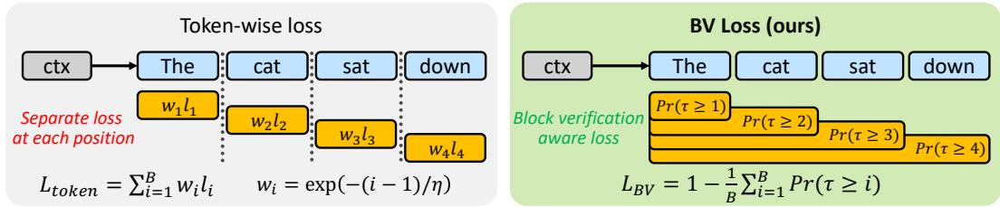
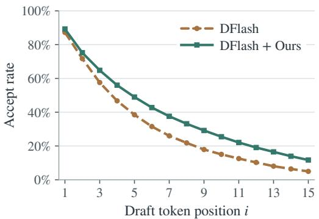
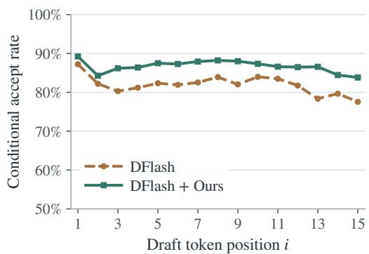
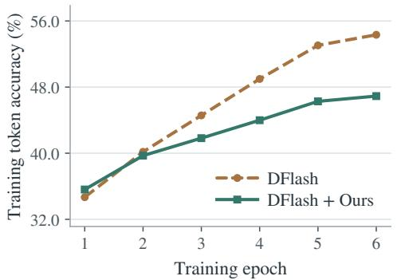
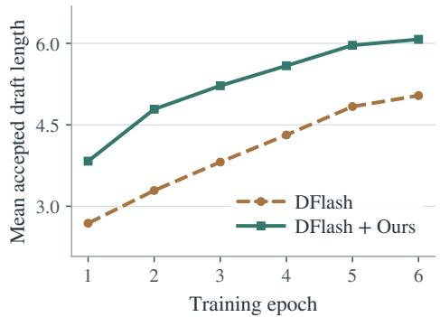

# BV LOSS: BLOCK VERIFICATION-AWARE LOSS FOR BLOCK DIFFUSION SPECULATIVE DECODING

Suyoung Kim1,2∗, Jahyun Koo1,2, Hyeonjin Kim1,2, Inhyeok Bang1, Seunghyun Lee1, Hyunjae Oh1,3, Baeseong park1, Dongsoo Lee1†

1a2sys (a2sys.ai)

2Seoul National University (snu.ac.kr)

3University of Wisconsin (wisc.edu)

## ABSTRACT

Diffusion drafters accelerate speculative decoding by proposing multiple tokens in parallel. Despite recent advances in speculative decoding through sequencelevel drafting and verification, existing training objectives remain largely designed around token-level verification. To address this mismatch, we introduce Block Verification-aware loss (BV loss), a training objective designed to maximize the expected acceptance length of a drafted sequence. BV loss is directly derived from the block verification acceptance rule, providing a principled connection between the drafter training objective and the inference-time verification mechanism at the sequence level. Across math, code, and chat benchmarks, BV loss increases the mean number of tokens accepted per verification call under block verification by 13.0–21.0% over cross-entropy loss training for DFlash and DSpark with Qwen3- 4B and Qwen3-8B without changing the inference procedure. BV loss also outperforms tokenwise acceptance objectives such as TV loss and LK loss, and its gains extend to token verification and greedy decoding. These results demonstrate the benefit of training block diffusion drafters with an objective aligned with sequence-level verification, rather than optimizing each token independently.

## 1 INTRODUCTION

Speculative decoding accelerates large language model (LLM) inference by drafting candidate tokens using a lightweight drafter model and verifying them in parallel with a larger target model (Leviathan et al., 2023). Its efficiency largely depends on how many drafted tokens are accepted per verification, making both drafting and verification critical to the overall speedup. While the majority of related research focuses on improving the drafter, another line of work seeks addi tional speedup through better verification algorithms. Block verification (Sun et al., 2025) is a key approach that targets the verification side of speculative decoding. It introduces a sequence-level acceptance criterion and performs rejection sampling over the joint probabilities of candidate sequences. The conventional verification scheme, which we call token verification, terminates when a proposed token is rejected, causing all subsequent draft tokens to be discarded. By contrast, block verification evaluates the drafted sequence jointly and can accept tokens that would otherwise be discarded under token verification. Importantly, replacing token verification with block verification incurs negligible additional inference overhead, while achieving an equal or higher acceptance rate.

Despite the emergence of sequence-level verification in speculative decoding, existing drafters are still trained with token-level objectives. A prominent example is total variation (TV) loss, which is derived from the single-token acceptance probability under token verification Minimizing TV loss therefore provides a principled way to train a drafter for tokenwise rejection sampling. However, under block verification, acceptance is determined by the probability of the block-sized sequence, raising the question of whether token-level losses remain the appropriate training objectives.

Table 1: Comparison of drafter training objectives. CE and KL / RKL optimize token likelihood or distribution matching, whereas TV and LK loss explicitly target token-level acceptance. BV loss is instead derived from block verification and directly optimizes the expected accepted draft length, making it both verification-aware and block-aware.
<table><tr><td>Drafter loss</td><td>Training objective</td><td>Uses teacher probabilities?</td><td>Verification- aware?</td><td>Block- aware?</td></tr><tr><td>CE</td><td>Maximize log-likelihood</td><td>X</td><td>X</td><td>X</td></tr><tr><td>KL /RKL</td><td>Minimize KL divergence</td><td>√</td><td>x</td><td>x</td></tr><tr><td>TV</td><td>Maximize token acceptance</td><td>√</td><td>√</td><td>x</td></tr><tr><td>LK</td><td>Maximize token acceptance</td><td>√</td><td>√</td><td>x</td></tr><tr><td>BV (Ours)</td><td>Maximize block acceptance length</td><td>L</td><td>√</td><td>J</td></tr></table>

To address this mismatch between the training objective and the verification criterion, we propose Block Verification-aware loss (BV loss), a drafter training objective designed to directly maximize the expected acceptance length of a drafted sequence under block verification. Our formulation is derived from the sequence-level acceptance criterion used in block verification rather than the tokenlevel rejection sampling. In this sense, BV loss serves as a sequence-level counterpart to TV loss: just as TV loss follows from the acceptance probability induced by token-level rejection sampling, BV loss is derived from the acceptance length induced by block verification (see Table 1).

We evaluate BV loss across multiple speculative-decoding configurations, drafter architectures, and target models. Drafters trained with BV loss consistently achieve longer accepted sequence lengths than those trained with conventional token-level objectives, demonstrating the benefit of aligning drafter training with sequence-level verification. Moreover, BV loss generalizes across different drafting and verification configurations. Drafters trained with BV loss outperform those trained with conventional objectives even under greedy decoding and token-level verification. These results show that BV loss is not only theoretically motivated by block verification, but also serves as an effective training objective across diverse speculative-decoding settings.

## Our contributions are summarized below:

• A sequence-level objective aligned with block verification. We introduce BV loss, a sequence-level training objective derived from the block verification acceptance rule. We prove that minimizing BV loss is equivalent to maximizing the expected accepted draft length. The objective accounts for both partial and full block acceptance and recovers TV loss as the single-token special case.

• Theoretical analysis and practical optimization. We show that the same tokenwise acceptance rate can yield different expected accepted lengths under block verification, exposing a limitation of tokenwise objectives. Our gradient analysis shows how low acceptance at earlier positions weakens learning signals at later positions, motivating a logarithmic objective that preserves the optimum while strengthening optimization in low-acceptance regimes. We further derive blockwise training surrogates from target-generated trajectories, enabling training from scratch without differentiating through draft sampling.

• Consistent gains across drafters and verification rules. Across seven math, code, and chat benchmarks, BV loss increases the mean number of tokens retained per verification call by 13.0–21.0% over CE training for DFlash and DSpark with Qwen3-4B and Qwen3- 8B under block verification. These gains extend to token verification and greedy decoding without changing the inference procedure.

## 2 RELATED WORK

Speculative Decoding. Speculative decoding accelerates LLM inference by using a lightweight drafter to propose candidate tokens, while verification and correction by the target model preserve the target distribution and ensure lossless generation (Leviathan et al., 2023; Chen et al., 2023). Early approaches primarily relied on autoregressive drafters that generated candidate tokens sequentially (Leviathan et al., 2023; Li et al., 2024a;b; 2025). More recent work has explored parallel drafting to reduce the sequential overhead of proposal generation. DFlash (Chen et al., 2026) employs a block diffusion model to generate draft tokens in parallel, while DSpark (Cheng et al., 2026) introduces causal correction to capture dependencies among draft tokens. Our work is complementary to these architectural advances: rather than modifying the drafter architecture, we study how diffusion drafters should be trained when their proposals are evaluated by block verification.

Two Verification Methods: Token Verification vs. Block Verification
<table><tr><td colspan="5">Token Verification</td><td colspan="5">Block Verification</td></tr><tr><td></td><td>accepted</td><td>rejected</td><td></td><td>not reached</td><td></td><td></td><td></td><td>accepted</td><td>down</td></tr><tr><td>ctx</td><td>The</td><td>cat</td><td>sat</td><td>down</td><td>ctx</td><td>The</td><td>cat</td><td>sat</td><td></td></tr><tr><td>pi/qi αi= min{1,</td><td>1.2 qij 1.0</td><td>0.6 0.6</td><td>1.5</td><td>1.2</td><td> $p _ { i } / q _ { i }$   $\scriptstyle \alpha _ { i } = { \mathrm { m i n } } \{ 1 , \alpha _ { i - 1 } { \frac { p _ { i } } { q _ { i } } } \} \ 1 . 0$ </td><td>1.2</td><td>0.6 0.6</td><td>1.5 0.9</td><td>1.2 1.0</td></tr></table>

Figure 1: Token Verification versus Block Verification. Given the same sequence of target-to-draft probability ratios $p _ { i } / q _ { i }$ , Token Verification accepts tokens sequentially and terminates at the first rejection; in this example, cat is rejected and the remaining tokens are never reached. Block Verification instead propagates the acceptance state across positions, $\alpha _ { i } = \operatorname* { m i n } \{ 1 , \alpha _ { i - 1 } p _ { i } / q _ { i } \}$ , allowing a low ratio at one position to be compensated by sufficiently large ratios at subsequent positions. As a result, the entire draft block can be retained even when Token Verification would stop early.

Verification for Speculative Decoding. Exact verification in speculative decoding adapts rejection sampling to correct drafter proposals while ensuring that the resulting output distribution is identical to that of the target model. Figure 1 illustrates how block verification differs from the token verification. In this illustration, $p _ { i } / q _ { i }$ is the ratio of target and draft probabilities, while $\alpha _ { i }$ denotes the acceptance probability. In the shown example, both methods verify the same draft: token verification could stop at the second token, where $p _ { i } / q _ { i } = 0 . 6 .$ , whereas block verification retains the full block, yielding a longer accepted draft length. Our work focuses on the corresponding training problem: existing drafter objectives optimize tokens independently, whereas block verification determines acceptance jointly at the sequence level.

Verification-aware Training Objectives. Total Variation loss (TV loss) serves as a direct objective for the per-token acceptance rate, with its formulation derived from the rejection-sampling criterion used in token verification. Consequently, minimizing TV loss optimizes the expected tokenlevel acceptance rate of the drafter under tokenwise verification. However, optimizing TV loss alone often leads to unstable or ineffective training. Building on this observation, LK losses (Samarin et al., 2026) propose a practical objective based on the negative logarithm of the token-level acceptance probability. While such objectives are well aligned with token verification, their advantage of optimizing the relevant acceptance rate does not naturally extend to block verification. This mismatch motivates a training objective derived from the sequence-level acceptance criterion used by block verification (see 2).

## 3 METHOD

## 3.1 PRELIMINARIES: TOKENWISE DRAFT TRAINING

Notations. A drafter proposes B tokens, which the target verifies in one call. For a target-generated training block $y _ { 1 } , \ldots , y _ { B }$ , let $p _ { i } ( v )$ and $q _ { i } ( v )$ denote the target and draft probabilities of token v at position i, evaluated on the same prefix. The target is frozen. We omit the shared context and model parameters from the notation.

Tokenwise Optimization. Common per-token loss functions include cross-entropy (CE), Kullback–Leibler divergence (KL), reverse KL divergence (RKL), and total variation (TV):

Drafter Training methods: Token-wise losses vs Block-wise loss  
  
Figure 2: Token-wise losses versus BV Loss. Token-wise objectives optimize each draft position separately, typically through weighted local losses $w _ { i } \ell _ { i }$ . BV Loss instead couples positions through the prefix-retention probabilities $\operatorname* { P r } ( \tau \geq i )$ under Block Verification. Since $\begin{array} { r } { \sum _ { i = 1 } ^ { B } \operatorname* { P r } ( \tau \geq i ) } \end{array}$ equals the expected number of accepted draft tokens, BV Loss directly optimizes the quantity of interest at verification time.

$$
\begin{array} { r l r l } & { \ell _ { i } ^ { \mathrm { C E } } = - \log q _ { i } ( y _ { i } ) , } & { \ell _ { i } ^ { \mathrm { K L } } = \sum _ { v } p _ { i } ( v ) \log \frac { p _ { i } ( v ) } { q _ { i } ( v ) } , } \\ & { \ell _ { i } ^ { \mathrm { R K L } } = \sum _ { v } q _ { i } ( v ) \log \frac { q _ { i } ( v ) } { p _ { i } ( v ) } , } & { \ell _ { i } ^ { \mathrm { T V } } = \frac { 1 } { 2 } \sum _ { v } | p _ { i } ( v ) - q _ { i } ( v ) | . } \end{array}\tag{1}
$$

For a drafter with block size $B ,$ per-position loss $\ell _ { i }$ is aggregated over $i = 1 , \ldots , B$ as a weighted sum. A common training heuristic gives earlier positions more weight because later tokens are useful only if the earlier prefix is retained. For example, DFlash (Chen et al., 2026) applies exponential position decay to its cross-entropy loss:

$$
\mathcal { L } _ { \mathrm { t o k e n } } \triangleq \sum _ { i = 1 } ^ { B } w _ { i } \ell _ { i } , \qquad w _ { i } = \exp \left( - \frac { i - 1 } \eta \right) , \qquad \eta > 0 .\tag{2}
$$

Smaller η concentrates training more on earlier positions and less on later positions. We refer to training with $\mathcal { L } _ { \mathrm { t o k e n } }$ as tokenwise optimization.

Token Verification Awareness. With tokenwise rejection sampling of token verification, a candidate token v at position i, drawn from $q _ { i }$ is accepted with probability $\alpha _ { i } = \mathrm { m i n } \{ 1 , p _ { i } ( v ) / q _ { i } ( v ) \}$ Averaging over the candidates at the same position gives the expected acceptance rate $\mathbb { E } _ { \mathrm { T V } } [ \alpha _ { i } ] \colon$

$$
\mathbb { E } _ { \mathrm { T V } } [ \alpha _ { i } ] = \sum _ { v } q _ { i } ( v ) \operatorname* { m i n } \left\{ 1 , \frac { p _ { i } ( v ) } { q _ { i } ( v ) } \right\} = \sum _ { v } \operatorname* { m i n } \{ p _ { i } ( v ) , q _ { i } ( v ) \} .\tag{3}
$$

From min $\{ p , q \} = ( p + q - | p - q | ) / 2$ , it follows that $\mathbb { E } _ { \mathrm { { T V } } } [ \alpha _ { i } ] = 1 - \ell _ { i } ^ { \mathrm { { T V } } }$ . Thus minimizing TV loss $\ell _ { i } ^ { \mathrm { { T V } } }$ directly maximizes single-token acceptance. However, its gradients can be very small at random initialization, making pure TV optimization impractical. LK losses (Samarin et al., 2026) address this difficulty using LK loss:

$$
\begin{array} { r } { \ell _ { i } ^ { \mathrm { L K } , \alpha } = - \log \mathbb { E } _ { \mathrm { T V } } [ \alpha _ { i } ] = - \log ( 1 - \ell _ { i } ^ { \mathrm { T V } } ) . } \end{array}\tag{4}
$$

$\ell _ { i } ^ { \mathrm { L K } , \alpha }$ minimizes the negative log value of the per-position expected acceptance rate $\mathbb { E } _ { \mathrm { T V } } [ \alpha _ { i } ]$ . While TV loss and its variant LK loss have their advantage of directly optimizing token verification, their effectiveness becomes questionable when used with other verification methods.

## 3.2 BLOCK VERIFICATION-AWARE LOSS

In this section, we present Block Verification-aware loss (BV loss), a drafter training objective that is designed to directly optimize the acceptance rate under block verification. The derivation of BV loss is introduced step-by-step in the following paragraphs.

Block Verification Awareness. As with token verification, we start from the expected acceptance rate at each prefix length of a drafted block $y _ { 1 : B } \sim q .$ . The conditional probability of retaining the first i drafted tokens is defined from the block-verification acceptance rule of Sun et al. (2025) as:

$$
\alpha _ { i } ( y _ { 1 : i } ) = \operatorname* { m i n } \left\{ 1 , \alpha _ { i - 1 } ( y _ { 1 : i - 1 } ) { \frac { p _ { i } ( y _ { i } ) } { q _ { i } ( y _ { i } ) } } \right\} , \qquad \alpha _ { 0 } = 1 .\tag{5}
$$

Here, $\alpha _ { i } ( y _ { 1 : i } )$ is the acceptance probability of the length-i drafted prefix, and $y _ { i }$ is the i-th token in the drafted sequence block $y _ { 1 : B } \sim q .$ . Let τ denote the number of accepted draft tokens. Averaging over drafted blocks gives the unconditional prefix acceptance rate: $\mathbb { E } _ { \mathrm { B V } } [ \alpha _ { i } ] \triangleq \mathbb { E } _ { y _ { 1 : B } \sim q } [ \alpha _ { i } ( y _ { 1 : i } ) ] =$ $\operatorname* { P r } _ { \mathrm { B V } } ( \tau \geq i )$ . Then the expected acceptance length is given by:

$$
\mathbb { E } _ { \mathrm { B V } } [ \tau ] = \sum _ { i = 1 } ^ { B } \mathrm { P r } _ { \mathrm { B V } } ( \tau \geq i ) = \sum _ { i = 1 } ^ { B } \mathbb { E } _ { \mathrm { B V } } [ \alpha _ { i } ] .\tag{6}
$$

Draft Acceptance Approximation. While directly evaluating $\mathbb { E } _ { \mathrm { B V } } [ \alpha _ { i } ]$ requires draft-generated prefixes $y _ { 1 : i } \sim q$ , the frozen-target training data provide prefixes $y _ { 1 : i } ^ { \prime } \sim p$ . We therefore derive a form of Eq. (5) which permits estimating Eq. (6) on target-generated prefixes for training. Define the cumulative ratio through position i:

$$
r _ { i } \triangleq \prod _ { j = 1 } ^ { i } \frac { q _ { j } ( y _ { j } ^ { \prime } ) } { p _ { j } ( y _ { j } ^ { \prime } ) } , \qquad r _ { 0 } = 1 ,\tag{7}
$$

with the assumption that training paths are sampled from the target conditionals $p _ { i }$ used in the ratios, $q _ { i }$ is the proposal conditional used at inference, and $p _ { i }$ has support wherever $q _ { i }$ is nonzero. Multiplying $\alpha _ { i } ( y _ { 1 : i } ^ { \prime } )$ by $r _ { i }$ yields the acceptance score $\widetilde { \alpha } _ { i }$

$$
\widetilde { \alpha } _ { i } ( \boldsymbol { y } _ { 1 : i } ^ { \prime } ) \triangleq r _ { i } \alpha _ { i } ( \boldsymbol { y } _ { 1 : i } ^ { \prime } ) = \operatorname* { m i n } \{ r _ { i } , \widetilde { \alpha } _ { i - 1 } ( \boldsymbol { y } _ { 1 : i - 1 } ^ { \prime } ) \} = \operatorname* { m i n } \{ 1 , \boldsymbol { r } _ { 1 } , \dots , \boldsymbol { r } _ { i } \} , \qquad \widetilde { \alpha } _ { 0 } = 1 .\tag{8}
$$

Assume that training paths are sampled from the target conditionals $p _ { i }$ used in the ratios and that $q _ { i }$ is the proposal conditional used at inference. Under these conditions, $\mathbb { E } _ { y _ { 1 : B } ^ { \prime } \sim p } [ \widetilde { \alpha } _ { i } ] = \mathbb { E } _ { \mathrm { B V } } [ \alpha _ { i } ]$ for every i, and summing over positions yields Eq. (9):

$$
\mathbb { E } _ { y _ { 1 : B } ^ { \prime } \sim p } \left[ \sum _ { i = 1 } ^ { B } \widetilde { \alpha } _ { i } ( y _ { 1 : i } ^ { \prime } ) \right] = \mathbb { E } _ { \mathrm { B V } } [ \tau ] .\tag{9}
$$

This identity also holds after averaging over any fixed distribution of training contexts.

Block Verification-aware Loss. To this end, we define Block Verification-aware loss (BV loss) as one minus the expected acceptance length normalized by the block size $B { : }$

$$
\mathcal { L } _ { \mathrm { B V } } \triangleq 1 - \frac { 1 } { B } \mathbb { E } _ { \mathrm { B V } } [ \tau ] .\tag{10}
$$

Using Eq. (9), it can be evaluated on target-generated training paths as

$$
\mathcal { L } _ { \mathrm { B V } } = 1 - \frac { 1 } { B } \mathbb { E } _ { y _ { 1 : B } ^ { \prime } \sim p } \left[ \sum _ { i = 1 } ^ { B } \widetilde { \alpha } _ { i } ( y _ { 1 : i } ^ { \prime } ) \right] .\tag{11}
$$

Minibatch training estimates the objective by averaging the per-block quantity across targetgenerated blocks. Minimizing the BV loss is exactly equivalent to maximizing expected $\mathbf { B V }$ acceptance length. For $B = 1$ , BV loss reduces to TV loss $\dot { \ell } ^ { \mathrm { T V } }$

The cumulative ratios make BV loss a block objective. For example, for draft-to-target ratios (1.25, 0.8), block verification gives $\widetilde { \alpha } _ { 2 } = \mathrm { m i n } ( 1 , 1 . 2 5 , 1 ) = 1$ , whereas independently clipping

the ratios gives min{1, 1.25} min $\{ 1 , 0 . 8 \} = 0 . 8 .$ A preceding likelihood surplus can therefore offset a later deficit. As a result, BV depends on how probability mass is arranged across prefixes, which the individual tokenwise overlaps do not capture.

## 3.3 GRADIENT ANALYSIS AND THE LOG BV LOSS

Gradients of the accepted-length objective. Let $n _ { i }$ be the earliest position attaining the minimum in $\widetilde { \alpha } _ { i }$ , including position zero. Away from ties,

$$
\nabla \widetilde { \alpha } _ { i } = \widetilde { \alpha } _ { i } \sum _ { j = 1 } ^ { n _ { i } } \nabla \log q _ { j } ( \boldsymbol { y } _ { j } ) , \qquad \nabla \mathbb { E } _ { \mathrm { B V } } [ \boldsymbol { \tau } ] = \mathbb { E } _ { \boldsymbol { y } \sim p } \left[ \sum _ { i } \nabla \widetilde { \alpha } _ { i } \right] .\tag{12}
$$

The derivative accounts for every prefix whose active minimum depends on the prediction. Its magnitude is scaled by the prefix scores $\widetilde { \alpha } _ { i }$ and can be small when acceptance is low. We therefore normalize by the total expected accepted length.

Log-scaled BV objective. We define the log BV objective as

$$
\mathcal { L } _ { \mathrm { B V } } ^ { \mathrm { l o g } } = \log B - \log \mathbb { E } _ { \mathrm { B V } } [ \tau ]\tag{13}
$$

The constant log $B$ has zero gradient and is included only to keep the loss nonnegative. Since − log is strictly decreasing, Eq. (13) preserves the minimizers of Eq. (10) in expectation.

Its gradient is

$$
\nabla \mathcal { L } _ { \mathrm { B V } } ^ { \mathrm { l o g } } = - \frac { \nabla \mathbb { E } _ { \mathrm { B V } } [ \tau ] } { \mathbb { E } _ { \mathrm { B V } } [ \tau ] } = - \mathbb { E } _ { y \sim p } \left[ \sum _ { i } \frac { \widetilde { \alpha } _ { i } } { \mathbb { E } _ { \mathrm { B V } } [ \tau ] } \sum _ { j = 1 } ^ { n _ { i } } \nabla \log q _ { j } ( y _ { j } ) \right] .\tag{14}
$$

The prefix weights sum to one in expectation. Log scaling removes the overall small-acceptance factor while preserving the direction of expected-length improvement and the prefix dependencies.

Practical training setup. We use an initial warm-up for stable training. Log normalization controls the overall gradient scale, but prefixes with small acceptance scores can still receive a negligible share of the update at initialization. To accelerate early learning of these prefixes, we anneal the aggregation of BV scores. For positive sampled-label scores, define the annealed BV objective as the negative log of their power mean:

$$
\mathcal { L } _ { \mathrm { B V } } ^ { \mathrm { a n n e a l } } ( \beta ) = - \log \left[ \left( \frac { 1 } { B } \sum _ { i = 1 } ^ { B } \widetilde { \alpha } _ { i } ^ { \beta } \right) ^ { 1 / \beta } \right] , \qquad 0 < \beta \leq 1 .\tag{15}
$$

This mean interpolates between the geometric mean as $\beta  0$ and the arithmetic mean at $\beta = 1$ Defining the loss at $\beta = 0$ by continuity gives the endpoints

$$
\mathcal { L } _ { \mathrm { B V } } ^ { \mathrm { a n n e a l } } ( 0 ) = \frac { 1 } { B } \sum _ { i = 1 } ^ { B } \bigl ( - \log \widetilde { \alpha } _ { i } \bigr ) , \qquad \mathcal { L } _ { \mathrm { B V } } ^ { \mathrm { a n n e a l } } ( 1 ) = - \log \left( \frac { 1 } { B } \sum _ { i = 1 } ^ { B } \widetilde { \alpha } _ { i } \right) .
$$

Thus, annealing moves from averaging per-prefix log losses to taking the log loss of the average prefix score. The latter is the blockwise log BV surrogate; averaging it over blocks differs from taking the logarithm of expected length in Eq. (13). Its gradient is a weighted average of per-prefix log-loss gradients:

$$
\nabla \mathcal { L } _ { \mathrm { B V } } ^ { \mathrm { a n n e a l } } ( \beta ) = \sum _ { i = 1 } ^ { B } \frac { \widetilde { \alpha } _ { i } ^ { \beta } } { \sum _ { j = 1 } ^ { B } \widetilde { \alpha } _ { j } ^ { \beta } } \nabla ( - \log \widetilde { \alpha } _ { i } ) .\tag{16}
$$

At $\beta = 0$ , every prefix contributes with coefficient $1 / B . \mathrm { A t } \ \beta = 1$ , its coefficient is proportional to its acceptance score. For a score below the block mean, the initial coefficient is therefore larger by a factor of $\textstyle \sum _ { j } \widetilde { \alpha } _ { j } / ( B \widetilde { \alpha } _ { i } )$ . This strengthens the relative learning signal for low-acceptance prefixes and can speed up their early improvement before returning to the block-log objective. In the main experiments, we increase $\bar { \beta }$ linearly from 0 to 1 over the first three epochs, then fix it at 1; implementation details are given in Appendix A.3.

Table 2: Average performance over seven benchmarks on Qwen3-4B and Qwen3-8B under greedy decoding $( T = 0 )$ and block verification (T = 1). Average acceptance length τ includes correction/bonus tokens. Speedup is relative to autoregressive decoding. Boldface indicates the best average in each column within each target.
<table><tr><td rowspan="2"></td><td rowspan="2"></td><td colspan="4">T = 0 (greedy)</td><td colspan="4">T = 1 (block verification)</td></tr><tr><td colspan="2">DFlash</td><td colspan="2">DSpark</td><td colspan="2">DFlash</td><td colspan="2">DSpark</td></tr><tr><td>Target</td><td>Loss</td><td>T</td><td>Speedup</td><td>T</td><td>Speedup</td><td>T</td><td>Speedup</td><td>T</td><td>Speedup</td></tr><tr><td rowspan="6">Qwen3-4B</td><td>CE</td><td>4.65</td><td>3.71×</td><td>5.21</td><td>3.97×</td><td>4.09</td><td>3.21×</td><td>4.77</td><td>3.47×</td></tr><tr><td>KL</td><td>4.80</td><td>3.76×</td><td>5.49</td><td>4.15×</td><td>4.17</td><td>3.23×</td><td>4.97</td><td>3.67×</td></tr><tr><td>RKL</td><td>4.05</td><td>3.24×</td><td>4.87</td><td>3.73×</td><td>3.87</td><td>3.09×</td><td>4.68</td><td>3.45×</td></tr><tr><td>TV</td><td>1.98</td><td>1.60×</td><td>2.23</td><td>1.74×</td><td>1.96</td><td>1.57×</td><td>2.21</td><td>1.66×</td></tr><tr><td>LK</td><td>4.79</td><td>3.75×</td><td>5.54</td><td>4.24×</td><td>4.25</td><td>3.34×</td><td>5.15</td><td>3.77×</td></tr><tr><td>BV (Ours)</td><td>5.22</td><td>4.01×</td><td>5.62</td><td>4.28×</td><td>4.95</td><td>3.84×</td><td>5.39</td><td>3.88×</td></tr><tr><td rowspan="6">Qwen3-8B</td><td>CE</td><td>4.64</td><td>3.60×</td><td>5.10</td><td>3.82×</td><td>4.15</td><td>3.29×</td><td>4.71</td><td>3.48×</td></tr><tr><td>KL</td><td>4.81</td><td>3.71×</td><td>5.58</td><td>4.09×</td><td>4.19</td><td>3.36×</td><td>5.07</td><td>3.76×</td></tr><tr><td>RKL</td><td>3.10</td><td>2.42×</td><td>3.50</td><td>2.69×</td><td>3.02</td><td>2.44×</td><td>3.40</td><td>2.52×</td></tr><tr><td>TV</td><td>1.01</td><td>0.81×</td><td>1.02</td><td>0.80×</td><td>1.01</td><td>0.81×</td><td>1.02</td><td>0.77×</td></tr><tr><td>LK</td><td>4.82</td><td>3.71×</td><td>5.57</td><td>4.18×</td><td>4.28</td><td>3.38×</td><td>5.20</td><td>3.82×</td></tr><tr><td>BV (Ours)</td><td>5.27</td><td>4.15×</td><td>5.67</td><td>4.38×</td><td>4.98</td><td>3.88×</td><td>5.43</td><td>4.00×</td></tr></table>

## 4 EXPERIMENTS

## 4.1 EXPERIMENTAL SETUP

Baselines and training setups. We train five-layer DFlash and DSpark drafters with block size B = 15 proposals from scratch using frozen Qwen3-4B and Qwen3-8B target models. All methods are trained for six epochs on the 100K target-generated responses generated from Open-PerfectBlend which is an open-sourced version of perfectBlend (Xu et al., 2024). Table 2 compares six training objectives introduced in Section 3.1: CE, KL, RKL, TV, LK, and BV. All experiments reported as BV use the log BV objective in Eq. (15). For brevity, we refer to this objective simply as BV throughout the experimental section. Appendix A provides further implementation details.

Benchmarks and evaluation. Following the evaluation protocol of previous work (Chen et al., 2026), we evaluate across three task categories: Math with GSM8K (Cobbe et al., 2021), MATH-500 (Lightman et al., 2024), and AIME25 (Zhang & Math-AI, 2025); Code with HumanEval (Chen et al., 2021), MBPP (Austin et al., 2021), and LiveCodeBench (Jain et al., 2025); and Chat with MT-Bench (Zheng et al., 2023). We evaluate both greedy decoding (T = 0) and sampling (T = 1) under block verification. For each benchmark, we compute the average acceptance length τ as the total number of accepted tokens divided by the number of verification calls, including correction or bonus tokens when applicable. Speedup is the ratio of speculative to target-only autoregressive generation throughput (tokens/s), measured by an NVIDIA B200 GPU using FlashAttention-2 (Dao, 2024). Table 2 reports the average performance across the seven benchmarks.

## 4.2 MAIN RESULTS

Consistent gains across target models and drafter methods. BV achieves the highest average acceptance length τ in every target–drafter configuration in Table 2. Under block verification at T = 1, it improves over CE on all seven benchmarks for both drafters and both targets. On Qwen3- 4B, DFlash improves from 4.09 to 4.95 (+21.0%), and DSpark from 4.77 to 5.39 (+13.0%). On Qwen3-8B, the corresponding gains are 4.15 to 4.98 (+20.0%) and 4.71 to 5.43 (+15.3%). These results support the motivation of Section 3.2: training for sequence-level acceptance improves the number of tokens retained by a block verifier. Appendix C.2 reports the benchmark-level results.

Beyond token acceptance optimization. LK already addresses weak TV gradients through log scaling, but still optimizes acceptance separately at each position. For DFlash on Qwen3-4B, BV increases mean τ under block verification from LK’s 4.25 to 4.95 (+16.5%) with the same training data and epoch budget. The same comparison on Qwen3-8B improves from 4.28 to 4.98 (+16.4%). DSpark also improves over LK on both targets (5.15 to 5.39 and 5.20 to 5.43). The gains over LK support extending acceptance-aware training from individual tokens to draft prefixes, beyond the benefit of log scaling alone.

  
Figure 3: Position-wise draft retention under block verification. We compare DFlash and DFlash + Ours on 512 GSM8K prompts using Qwen3-4B. Left: Unconditional prefix retention, $\mathrm { P r } _ { \mathrm { B V } } ( \tau \geq$ i), measuring the probability that the draft is retained through position i. Right: Conditional prefix retention, PrBV $( \tau \geq i \mid \tau \geq i - 1 )$ , measuring the probability of extending an already retained prefix by one additional token.

  
Figure 4: Token accuracy and block acceptance exhibit different training dynamics. We evaluate DFlash and DFlash + Ours on a fixed subset of 512 Qwen3-4B training examples. Left: Token accuracy measured by argmax agreement with stored target tokens. Right: Mean accepted draft length under block verification. While DFlash (CE) eventually achieves higher training token accuracy, BV consistently produces longer accepted drafts, highlighting the distinction between tokenlevel prediction quality and sequence-level acceptance. Accepted length excludes anchor and correction/bonus tokens.

Decoding speed and greedy evaluation. For DFlash, the block-verification gains translate into higher measured speedups: 3.21× to 3.84× on Qwen3-4B and 3.29× to 3.88× on Qwen3-8B. DSpark improves from 3.47× to 3.88× on Qwen3-4B and from 3.48× to 4.00× on Qwen3-8B. BV also improves τ over CE on every benchmark under greedy decoding, with mean gains of 12.3% and 7.9% for DFlash and DSpark on Qwen3-4B, and 13.6% and 11.2%, respectively, on Qwen3-8B.

## 4.3 ANALYSIS AND ABLATION

Acceptance across positions. Figure 3 compares the final DFlash CE and BV checkpoints on 512 GSM8K prompts with Qwen3-4B and block verification. The left panel measures unconditional prefix retention, $\bar { \mathrm { P r } } _ { \mathrm { B V } } ( \tau \geq i ) = \mathbb { E } _ { \mathrm { B V } } [ \alpha _ { i } ]$ . First-position retention is similar (87.2% for CE and 89.2% for BV), while retention at position 8 increases from 21.8% to 33.2%. By Eq. (6), the sum of these probabilities equals the mean accepted draft length, which rises from 4.56 to 5.86 (+28.4%). The right panel measures the probability of extending an already retained prefix. BV improves this rate at all 15 positions, including an increase from 77.6% to 83.8% at the final position. Completeblock retention more than doubles, from 4.97% to 11.69%. The improvement therefore extends beyond the first token to the longer prefixes credited by BV loss.

Table 3: Generalization to token verification at T = 1 with the same checkpoints as Table 2. Entries are seven-benchmark mean τ, using the same counting convention. Bold marks the best mean in each row, including ties.
<table><tr><td rowspan="2">Target</td><td rowspan="2">Drafter</td><td colspan="6">τ under token verification</td></tr><tr><td>CE</td><td>KL</td><td>RKL</td><td>TV</td><td>LK</td><td>BV (Ours)</td></tr><tr><td rowspan="2">Qwen3-4B</td><td>DFlash</td><td>4.01</td><td>4.11</td><td>3.86</td><td>1.96</td><td>4.17</td><td>4.85</td></tr><tr><td>DSpark</td><td>4.64</td><td>4.84</td><td>4.64</td><td>2.20</td><td>4.98</td><td>5.20</td></tr><tr><td rowspan="2">Qwen3-8B</td><td>DFlash</td><td>4.04</td><td>4.13</td><td>3.00</td><td>1.01</td><td>4.19</td><td>4.86</td></tr><tr><td>DSpark</td><td>4.63</td><td>4.90</td><td>3.38</td><td>1.02</td><td>5.05</td><td>5.26</td></tr></table>

Training dynamics. Figure 4 compares token accuracy and accepted draft length on a fixed subset of 512 training examples, using eight shared blocks per example across all six epochs. Here, accuracy measures argmax agreement with sampled target tokens. At epoch six, CE matches 54.33% of the stored target tokens, compared with 46.91% for BV, while BV retains 20.6% more draft tokens (6.07 versus 5.04). The reversed ranking shows that token accuracy is an incomplete proxy for block acceptance, motivating optimization with the block verification-aware training.

Gains extend to token verification. Table 3 evaluates the same checkpoints with token verification at T = 1. BV achieves the highest mean τ in all target–drafter configurations, improving over CE by 20.9% and 12.1% for DFlash and DSpark on Qwen3-4B, and by 20.3% and 13.6% on Qwen3-8B. Although BV is derived from block verification, these results show that the learned improvements also benefit token verification without retraining.

## 5 CONCLUSION

We introduced Block Verification-aware loss (BV loss), a sequence-level drafter training objective derived from the block verification acceptance rule. The objective directly targets expected accepted draft length and recovers TV loss in the single-token case. A reformulation on target-generated trajectories enables training without differentiating through draft sampling or verification, while a blockwise logarithmic surrogate and early-training annealing support training from scratch.

Across math, code, and chat benchmarks, BV loss improves the mean number of tokens retained per verification call by 13.0–21.0% over CE training for DFlash and DSpark with Qwen3-4B and Qwen3-8B under block verification, with corresponding gains in decoding throughput. It also outperforms tokenwise acceptance objectives such as TV and LK, and its gains extend to token verification and greedy decoding without changing the inference procedure. Our analyses show improved retention beyond the first token and demonstrate that training token accuracy alone is an incomplete proxy for accepted draft length. Together, these findings highlight the benefit of training parallel drafters for sequence-level acceptance rather than optimizing individual token predictions in isolation.

## 6 LIMITATIONS

Our study focuses on parallel block drafters, while the broader principle of verification-aligned training may apply beyond this setting. In particular, BV loss may also be applicable to autoregressive drafters such as EAGLE (Li et al., 2024a;b; 2025), although our empirical evaluation is limited to diffusion-based drafters. More broadly, this perspective could be adapted to tree-based proposal and verification schemes, including methods based on Traversal Verification (Weng et al., 2025). Exploring these extensions is beyond the scope of this work and is left for future research.

## AI USE STATEMENT

In this work, we used generative AI tools to assist with writing experimental code. The authors formulated the research ideas and hypotheses, designed the experiments, and interpreted the results without generative AI assistance. Additionally, we used generative AI tools to draft and revise the manuscript and to prepare its LAT X source. The authors verified the evaluation code and reviewed the final manuscript, including the AI-assisted text. We take responsibility for the final content of this work, including all text, claims, and artifacts produced with the aid of generative AI.

## REPRODUCIBILITY STATEMENT

Section 3 defines the BV objective and its training formulation, with the assumptions and supporting derivations detailed in Appendix B. Section 4.1 describes the models, benchmarks, and evaluation metrics. Appendix A documents the compared objectives, training data and preprocessing, optimization settings, annealing schedule, and numerical implementation. The diagnostic evaluation and speedup measurement protocols are detailed in Appendices A.5 and A.6, respectively, and Appendix C.2 provides the full per-benchmark results for the compared objectives.

## REFERENCES

Jacob Austin, Augustus Odena, Maxwell Nye, Maarten Bosma, Henryk Michalewski, David Dohan, Ellen Jiang, Carrie Cai, Michael Terry, Quoc Le, and Charles Sutton. Program synthesis with large language models, 2021. URL https://arxiv.org/abs/2108.07732.

Charlie Chen, Sebastian Borgeaud, Geoffrey Irving, Jean-Baptiste Lespiau, Laurent Sifre, and John Jumper. Accelerating large language model decoding with speculative sampling, 2023. URL https://arxiv.org/abs/2302.01318.

Jian Chen, Yesheng Liang, and Zhijian Liu. DFlash: Block diffusion for flash speculative decoding. In Forty-third International Conference on Machine Learning, 2026. URL https: //openreview.net/forum?id=Oz335dV48X.

Mark Chen, Jerry Tworek, Heewoo Jun, Qiming Yuan, Henrique Ponde de Oliveira Pinto, Jared Kaplan, Harri Edwards, Yuri Burda, Nicholas Joseph, Greg Brockman, Alex Ray, Raul Puri, Gretchen Krueger, Michael Petrov, Heidy Khlaaf, Girish Sastry, Pamela Mishkin, Brooke Chan, Scott Gray, Nick Ryder, Mikhail Pavlov, Alethea Power, Lukasz Kaiser, Mohammad Bavarian, Clemens Winter, Philippe Tillet, Felipe Petroski Such, Dave Cummings, Matthias Plappert, Fotios Chantzis, Elizabeth Barnes, Ariel Herbert-Voss, William Hebgen Guss, Alex Nichol, Alex Paino, Nikolas Tezak, Jie Tang, Igor Babuschkin, Suchir Balaji, Shantanu Jain, William Saunders, Christopher Hesse, Andrew N. Carr, Jan Leike, Josh Achiam, Vedant Misra, Evan Morikawa, Alec Radford, Matthew Knight, Miles Brundage, Mira Murati, Katie Mayer, Peter Welinder, Bob Mc-Grew, Dario Amodei, Sam McCandlish, Ilya Sutskever, and Wojciech Zaremba. Evaluating large language models trained on code, 2021. URL https://arxiv.org/abs/2107.03374.

Xin Cheng, Xingkai Yu, Chenze Shao, Jiashi Li, Yunfan Xiong, Yi Qian, Jiaqi Zhu, Shirong Ma, Xiaokang Zhang, Jiasheng Ye, Qinyu Chen, Chengqi Deng, Jiping Yu, Damai Dai, Zhengyan Zhang, Yixuan Wei, Yixuan Tan, Wenkai Yang, Runxin Xu, Yu Wu, Zhean Xu, Xuanyu Wang, Muyang Chen, Rui Tian, Xiao Bi, Zhewen Hao, Shaoyuan Chen, Huanqi Cao, Wentao Zhang, Anyi Xu, Huishuai Zhang, Dongyan Zhao, and Wenfeng Liang. DSpark: Confidence-scheduled speculative decoding with semi-autoregressive generation, 2026. URL https://arxiv.org/ abs/2607.05147.

Karl Cobbe, Vineet Kosaraju, Mohammad Bavarian, Mark Chen, Heewoo Jun, Lukasz Kaiser, Matthias Plappert, Jerry Tworek, Jacob Hilton, Reiichiro Nakano, Christopher Hesse, and John Schulman. Training verifiers to solve math word problems, 2021. URL https://arxiv. org/abs/2110.14168.

Tri Dao. Flashattention-2: Faster attention with better parallelism and work partitioning. In The Twelfth International Conference on Learning Representations, 2024. URL https:// openreview.net/forum?id=mZn2Xyh9Ec.

Naman Jain, King Han, Alex Gu, Wen-Ding Li, Fanjia Yan, Tianjun Zhang, Sida Wang, Armando Solar-Lezama, Koushik Sen, and Ion Stoica. Livecodebench: Holistic and contamination free evaluation of large language models for code. In The Thirteenth International Conference on Learning Representations, 2025. URL https://openreview.net/forum?id= chfJJYC3iL.

Yaniv Leviathan, Matan Kalman, and Yossi Matias. Fast inference from transformers via speculative decoding. In Proceedings ofthe 40th International Conference on Machine Learning, volume 202 of Proceedings ofMachine Learning Research, pp. 19274–19286. PMLR, 2023. URL https: //proceedings.mlr.press/v202/leviathan23a.html.

Yuhui Li, Fangyun Wei, Chao Zhang, and Hongyang Zhang. EAGLE: Speculative sampling requires rethinking feature uncertainty. In Ruslan Salakhutdinov, Zico Kolter, Katherine Heller, Adrian Weller, Nuria Oliver, Jonathan Scarlett, and Felix Berkenkamp (eds.), Proceedings of the 41st International Conference on Machine Learning, volume 235 of Proceedings of Machine Learning Research, pp. 28935–28948. PMLR, 21–27 Jul 2024a. URL https://proceedings.mlr. press/v235/li24bt.html.

Yuhui Li, Fangyun Wei, Chao Zhang, and Hongyang Zhang. Eagle-2: Faster inference of language models with dynamic draft trees. In Proceedings of the 2024 conference on empirical methods in natural language processing, pp. 7421–7432, 2024b.

Yuhui Li, Fangyun Wei, Chao Zhang, and Hongyang Zhang. EAGLE-3: Scaling up inference acceleration of large language models via training-time test. In Advances in Neural Information Processing Systems, volume 38, 2025. URL https://proceedings.neurips.cc/paper\_files/paper/2025/hash/ c7b5a35ea98b62512a869c19ea7b03cb-Abstract-Conference.html.

Hunter Lightman, Vineet Kosaraju, Yuri Burda, Harrison Edwards, Bowen Baker, Teddy Lee, Jan Leike, John Schulman, Ilya Sutskever, and Karl Cobbe. Let’s verify step by step. In The Twelfth International Conference on Learning Representations, 2024. URL https://proceedings.iclr.cc/paper\_files/paper/2024/hash/ aca97732e30bcf1303bc22ac3924fd16-Abstract-Conference.html.

Alexander Samarin, Sergei Krutikov, Anton Shevtsov, Sergei Skvortsov, Filipp Fisin, and Alexander Golubev. LK losses: Direct acceptance rate optimization for speculative decoding. In Forty-third International Conference on Machine Learning, 2026. URL https://openreview.net/ forum?id=ZqnVidXtxV.

Ziteng Sun, Uri Mendlovic, Yaniv Leviathan, Asaf Aharoni, Jae Hun Ro, Ahmad Beirami, and Ananda Theertha Suresh. Block verification accelerates speculative decoding. In The Thirteenth International Conference on Learning Representations, 2025. URL https://openreview. net/forum?id=frsg32u0rO.

Yepeng Weng, Qiao Hu, Xujie Chen, Li Liu, Dianwen Mei, Huishi Qiu, Jiang Tian, and zhongchao shi. Traversal verification for speculative tree decoding. In The Thirty-ninth Annual Conference on Neural Information Processing Systems, 2025. URL https://openreview.net/forum? id=8nOMhDFpkU.

Tengyu Xu, Eryk Helenowski, Karthik Abinav Sankararaman, Di Jin, Kaiyan Peng, Eric Han, Shaoliang Nie, Chen Zhu, Hejia Zhang, Wenxuan Zhou, et al. The perfect blend: Redefining rlhf with mixture of judges. arXiv preprint arXiv:2409.20370, 2024.

Yifan Zhang and Team Math-AI. American invitational mathematics examination (AIME) 2025. Hugging Face dataset, 2025. URL https://huggingface.co/datasets/math-ai/ aime25.

Lianmin Zheng, Wei-Lin Chiang, Ying Sheng, Siyuan Zhuang, Zhanghao Wu, Yonghao Zhuang, Zi Lin, Zhuohan Li, Dacheng Li, Eric P. Xing, Hao Zhang, Joseph E. Gonzalez, and Ion Stoica. Judging LLM-as-a-judge with MT-Bench and chatbot arena. In Advances in Neural Information Processing Systems, volume 36, 2023. URL https://proceedings.neurips.cc/paper\_files/paper/2023/ hash/91f18a1287b398d378ef22505bf41832-Abstract-Datasets\_and\_ Benchmarks.html.

## A ADDITIONAL IMPLEMENTATION DETAILS

## A.1 TRAINING OBJECTIVES

We compare CE, KL, RKL, TV, and LK as tokenwise alternatives to BV. The tokenwise losses follow Eqs. (1) and (4) and use the position weights in Eq. (2), with $\eta = 7$ for DFlash and $\eta = 4$ for DSpark. In training, the weighted losses are normalized by the total weight over valid prediction positions. The target model remains frozen for every objective.

$\mathbf { C E } , \mathbf { K L } ,$ and RKL. CE predicts the stored target-generated token at each supervised position. KL instead matches the full target distribution by minimizing $D _ { \mathrm { K L } } ( p _ { i } \| q _ { i } )$ ; with a frozen target, this is equivalent to soft-target cross-entropy up to a constant. RKL reverses the direction to $\bar { D _ { \mathrm { K L } } } ( q _ { i } \| p _ { i } )$ weighting the discrepancy by the draft distribution. Both divergences use target and draft probabilities aligned to the same prediction position and are evaluated over the full vocabulary.

TV and LK. TV minimizes the total variation distance between target and draft distributions, equivalently maximizing their tokenwise overlap $\begin{array} { r } { \sum _ { v } \operatorname* { m i n } \{ p _ { i } ( v ) , q _ { i } ( v ) \} } \end{array}$ . LK applies a negative logarithm to this overlap, increasing the gradient scale when acceptance is low. These objectives also use full-vocabulary distributions.

BV loss. BV loss aggregates prefix-retention scores into an estimate of accepted draft length, coupling predictions across positions. The main BV runs use the vocabulary-integrated estimate in Appendix B.4 within a blockwise log objective. The initial aggregation schedule is described in Appendix A.3.

## A.2 TRAINING AND EVALUATION PROTOCOL

Training data and optimization. We build the training corpora from the same 100K conversations selected from Open-PerfectBlend, an open-source reproduction of the instruction dataset described in PerfectBlend (Xu et al., 2024). For each target (Qwen3-4B or Qwen3-8B), we regenerate the assistant responses at $T = 1$ . The main-table runs for a given target share this corpus and train from scratch for six epochs. They use AdamW with peak learning rate $6 \times 1 0 ^ { - 4 }$ , global batch size 32, local batch size four, 4% learning-rate warmup followed by cosine decay, and seed 42. The maximum training sequence length is 3,072 tokens.

Drafter configurations. All compared models use five-layer drafters with $B = 1 5$ draft tokens, where the anchor token is not counted toward B. DSpark retains its causal Markov correction, and the losses are applied to the resulting corrected proposal distribution. The correction parameters are trained with the drafter, while the confidence head is disabled across the compared DSpark objectives.

Decoding and reporting. All objectives are evaluated with a 256-token generation limit and thinking disabled, under greedy decoding or full-vocabulary sampling at $T = \bar { 1 }$ . For generation call $j ,$ let $R _ { j }$ be the number of retained tokens, including correction/bonus tokens when present, and let $\overset { \cdot } { V _ { j } }$ be its number of verification calls. For benchmark d, the table metric is

$$
\tau _ { d } ^ { \mathrm { t a b l e } } = \frac { \sum _ { j \in d } R _ { j } } { \sum _ { j \in d } V _ { j } } , \qquad \mathrm { A v g . } = \frac { 1 } { 7 } \sum _ { d = 1 } ^ { 7 } \tau _ { d } ^ { \mathrm { t a b l e } } .
$$

We pool verification calls within each benchmark and give equal weight to the seven benchmarks in the final average. Tables abbreviate $\tau _ { d } ^ { \mathrm { t a b l e } }$ as τ. Counts exclude the initial prefill token and are recorded before the final generation is cropped to the output budget. The evaluation includes 512 GSM8K, 500 MATH-500, 30 AIME25, 164 HumanEval, 257 MBPP, 256 LiveCodeBench, and 80 two-turn MT-Bench examples, giving 1,879 generation calls per decoding condition. Appendix A.6 describes the throughput measurement.

## A.3 INITIAL ANNEALING SCHEDULE

The main BV runs linearly increase $\beta$ from zero to one over the first three epochs, then use the blockwise log loss for the remaining three epochs. This schedule applies Eqs. (15) and (16) to the vocabulary-integrated scores $\bar { \alpha } _ { i }$ in place of $\widetilde { \alpha } _ { i }$ for both drafters. It gradually shifts from equal weighting of prefix log-scores to weighting proportional to their acceptance scores. This aggregation schedule is separate from the learning-rate warmup; unannealed BV runs use $\beta = 1$ throughout.

During the ramp, the implementation differentiates a negative weighted mean of log-scores while holding the normalized power weights fixed in the backward pass. For positive scores with inactive numerical floors, this yields the gradient in Eq. (16), although the logged scalar need not equal Eq. (15). DFlash floors scores at $\bar { 1 } 0 ^ { - 6 }$ during the ramp; DSpark computes the annealed log-scores without this floor.

## A.4 NUMERICAL STABILITY

BV cumulative ratios and prefix minima are computed in FP32 log space, with gradients propagated through the prefix states. In the block-log phase, log summands are floored $\mathrm { a t } - 8 0$ and the summed length estimate at $1 0 ^ { - 6 }$ . The theoretical identities use the unclamped expressions.

## A.5 DIAGNOSTIC EVALUATIONS

The analyses in Figures 3 and 4 compare DFlash (CE) and DFlash + Ours (BV) to examine how the training objective affects retained prefixes and token predictions.

Prefix-retention analysis (Figure 3). The final six-epoch DFlash CE and annealed BV checkpoints are evaluated on 512 GSM8K prompts with Qwen3-4B, block verification, $T \ = \ 1$ , and $B \ = \ 1 5 .$ Accepted-draft counts exclude correction/bonus tokens and prefill, respect EOS, and precede final output-budget cropping. We pool verification calls across prompts to estimate unconditional prefix survival, $\operatorname* { P r } _ { \mathrm { B V } } ( \tau \geq i )$ , in the left panel. The right panel reports the ratio to $\operatorname* { P r } _ { \mathrm { B V } } ( \tau \geq i - 1 )$ , with denominator one at $i = 1$ , giving the probability of extending a retained prefix. These statistics average over each checkpoint’s decoding trajectories; unlike $\alpha _ { i } ( y _ { 1 : i } )$ in Eq. (5), they do not fix the proposed token values.

Training dynamics (Figure 4). Both models are evaluated at 4,096 fixed contexts across all six epochs. We construct these contexts by uniformly sampling 512 of the 98,499 retained Qwen3- 4B training examples (seed 0) and choosing eight full assistant blocks per example. Cached labels and the 3,072-token length limit are preserved. Blocks may overlap, but each prefix is evaluated independently and the same blocks are used for both models. Token accuracy pools 61,440 unweighted argmax predictions against the stored target tokens. Accepted draft length averages one block-verification draw per context using full-vocabulary target and draft distributions $( \bar { T } \ = \ 1$ $B = 1 5 )$ , respecting EOS and excluding anchors and correction/bonus tokens. The CE curve uses the original epoch checkpoints; the BV curve uses a same-seed repeat with checkpoints retained at every epoch. The repeat preserves global batch size 32 and the optimizer schedule across a change in GPU count. Both curves use a single training seed.

## A.6 SPEEDUP MEASUREMENT

Execution and timing. Each inference run uses a single NVIDIA B200 GPU at batch size one, with BF16 model weights and FlashAttention-2. Both speculative decoding (SD) and target-only autoregressive decoding (AR) run in inference mode with fresh KV caches, matching prompts, sampling and stopping rules, and a 256-token generation limit. We time the same decoding implementation used to measure τ, with CUDA synchronization at the boundaries of each timed region. Elapsed time includes prefill, draft generation, verification, sampling, and cache updates; model loading, prompt formatting, tokenization, and file I/O are excluded. After a warmup for each dataset, we make one measured pass over its evaluation examples.

Aggregation. For generation call i in benchmark $d ,$ let $n _ { i } ^ { m }$ and $t _ { i } ^ { m }$ denote the generated token count and total elapsed time for $m \in \{ \mathrm { S D } , \mathrm { A R } \}$ . We pool token counts and times within each

benchmark before taking the throughput ratio:

$$
\mathrm { S p e e d u p } _ { d } = \frac { \sum _ { i \in d } n _ { i } ^ { \mathrm { S D } } / \sum _ { i \in d } t _ { i } ^ { \mathrm { S D } } } { \sum _ { i \in d } n _ { i } ^ { \mathrm { A R } } / \sum _ { i \in d } t _ { i } ^ { \mathrm { A R } } } .
$$

## B ADDITIONAL DERIVATIONS

We first establish the target-path identity underlying BV and illustrate why tokenwise overlap does not determine block acceptance. The remaining derivations explain prefix credit, vocabulary integration, and the relationship between the population objective and its training surrogate.

## B.1 EXPECTED ACCEPTANCE LENGTH ON TARGET-GENERATED PATHS

We follow Section 3.2: y denotes a proposed draft and $y ^ { \prime }$ a target-generated training path. Fix a verification context $c ,$ a frozen target, and positive target and proposal probabilities. Let $q _ { i }$ be the conditionals of the actual proposal process and $p _ { i }$ the target conditionals used to generate the training paths. For any prefix $x _ { 1 : i }$ , write $\begin{array} { r } { p ( x _ { 1 : i } \mid c ) = \prod _ { j = 1 } ^ { i } p _ { j } ( x _ { j } ) } \end{array}$ and $\begin{array} { r } { q ( x _ { 1 : i } \mid c ) = \prod _ { j = 1 } ^ { i } q _ { j } ( x _ { j } ) } \end{array}$

The block-verification rule in Eq. (5) gives the retention probability conditional on the proposed prefix, averaging over proposal suffixes and verifier randomness (Sun et al., 2025). Here, conditioning fixes the proposed token values rather than an earlier acceptance event. Multiplying by the cumulative ratio in Eq. (7) gives $r _ { i } \alpha _ { i } = \operatorname* { m i n } \{ r _ { i } , r _ { i - 1 } \alpha _ { i - 1 } \} = \widetilde { \alpha } _ { i }$ . Consequently, the joint mass of proposing and retaining a prefix is

$$
\begin{array} { r } { \mathrm { P r } ( y _ { 1 : i } = x _ { 1 : i } , \tau \geq i \mid c ) = q ( x _ { 1 : i } \mid c ) \alpha _ { i } ( x _ { 1 : i } ) } \\ { \mathrm { B V } } \end{array}\tag{17}
$$

Summing over prefixes yields $\operatorname* { P r } _ { \mathrm { B V } } ( \tau \geq i \mid c ) = \mathbb { E } _ { y ^ { \prime } \sim p } [ \widetilde { \alpha } _ { i } \mid c ]$ . Applying the tail-sum identity establishes Eq. (9), and normalizing by $B$ gives the training form in Eq. (11). The same result holds after averaging over a fixed distribution of training contexts. Under these sampling conditions, a minibatch average of $1 - B ^ { - 1 } \textstyle \sum _ { i } \widetilde { \alpha } _ { i }$ is an unbiased estimate of the population BV loss.

For $B = 1$ , the expected score is $\textstyle \sum _ { v } p _ { 1 } ( v )$ min $\begin{array} { r } { \{ 1 , q _ { 1 } ( v ) / p _ { 1 } ( v ) \} = \sum _ { \ i } } \end{array}$ min $\{ p _ { 1 } ( v ) , q _ { 1 } ( v ) \}$ . Thus the linear BV loss recovers TV exactly, while the fully integrated block-log loss recovers LK.

## B.2 EQUAL TOKENWISE OVERLAP, DIFFERENT BLOCK ACCEPTANCE

Consider a two-token block with independent binary target distributions, $p _ { 1 } ( a ) = 0 . 2$ and $p _ { 2 } ( a ) =$ 0.1. The two proposals below have identical tokenwise overlaps; in each distribution, the other token receives the remaining probability. Enumerating the four possible blocks using Eq. (17) gives

<table><tr><td>Quantity</td><td>Draft A</td><td>Draft B</td></tr><tr><td> $( q _ { 1 } ( a ) , q _ { 2 } ( a ) )$ </td><td>(0.3,0.2)</td><td>(0.1,0.2)</td></tr><tr><td>Tokenwise overlaps</td><td>(0.9,0.9)</td><td>(0.9, 0.9)</td></tr><tr><td>BV prefix survival</td><td>(0.9, 0.83)</td><td>(0.9,0.89)</td></tr><tr><td>BV E[τ]</td><td>1.73</td><td>1.79</td></tr></table>

Both proposals have TV loss 0.1 and LK loss $- \log ( 0 . 9 )$ at each position, yet their expected block acceptance lengths differ. Under token verification, both have survival probabilities (0.9, 0.81) and expected accepted draft length 1.71. Tokenwise overlap therefore determines token-verification acceptance in this example, but not block acceptance. The latter depends on how likelihood ratios combine across prefixes, which a fixed weighted sum of these tokenwise losses cannot distinguish.

## B.3 PREFIX CREDIT AND CONDITIONAL-LOGIT GRADIENTS

For a fixed target-generated block, let $\begin{array} { r } { S = \sum _ { i } \widetilde { \alpha } _ { i } > 0 } \end{array}$ and let $n _ { i }$ be the active prefix minimum from Section 3.3. Away from ties, Eq. (12) gives

$$
\nabla ( \log B - \log S ) = - \sum _ { j = 1 } ^ { B } c _ { j } \nabla \log q _ { j } ( y _ { j } ^ { \prime } ) , \qquad c _ { j } = \frac { \sum _ { i : n _ { i } \geq j } \widetilde { \alpha } _ { i } } { S } \in [ 0 , 1 ] .\tag{18}
$$

The coefficient $c _ { j }$ collects the scores whose active prefix minimum depends on position $j .$ . For conditional softmax logits $z _ { j , \tau }$ , holding the path and other conditional logits fixed,

$$
\frac { \partial ( \log B - \log S ) } { \partial z _ { j , v } } = - c _ { j } \big ( { \bf 1 } \{ v = y _ { j } ^ { \prime } \} - q _ { j } ( v ) \big ) , \qquad \left| \frac { \partial ( \log B - \log S ) } { \partial z _ { j , v } } \right| \le 1 .\tag{19}
$$

For this sampled-label surrogate, log scaling removes the overall small-score factor while keeping the conditional-logit derivatives bounded. At ties, convex combinations of the active gradients satisfy the same bound. This statement concerns conditional logits; it does not bound gradients with respect to shared neural-network parameters.

## B.4 VOCABULARY-INTEGRATED LENGTH ESTIMATION

The sampled-label estimate is $\begin{array} { r } { \widehat { \tau } _ { \mathrm { s a m p l e } } = \sum _ { i } \widetilde { \alpha } _ { i } ( y _ { 1 : i } ^ { \prime } ) } \end{array}$ . To use the full target distribution at the current position, we can integrate out that token while keeping the sampled prefix fixed:

$$
\begin{array} { r l } & { \bar { \alpha } _ { i } : = \mathbb { E } _ { y _ { i } ^ { \prime } \sim p _ { i } } [ \widetilde { \alpha } _ { i } \mid y _ { < i } ^ { \prime } , c ] } \\ & { \quad = \displaystyle \sum _ { v } \operatorname* { m i n } \{ \widetilde { \alpha } _ { i - 1 } p _ { i } ( v ) , r _ { i - 1 } q _ { i } ( v ) \} , \qquad \widehat { \tau } _ { \mathrm { i n t } } = \sum _ { i } \bar { \alpha } _ { i } . } \end{array}\tag{20}
$$

The formula follows by substituting $r _ { i } = r _ { i - 1 } q _ { i } ( y _ { i } ^ { \prime } ) / p _ { i } ( y _ { i } ^ { \prime } )$ into Eq. (8). By total expectation, both length estimates are unbiased for $\mathbb { E } _ { \mathrm { B V } } [ \tau \mid c ]$ under the conditions of Appendix B.1. Only the current score is integrated: $r _ { i }$ and $\widetilde { \alpha } _ { i }$ continue to evolve along the sampled target path, preserving its prefix dependencies. The main BV runs use $\widehat { \tau } _ { \mathrm { i n t } }$ in both the blockwise log objective and its annealed form.

## B.5 POPULATION AND BLOCKWISE LOG OBJECTIVES

The population objective in Eq. (13) takes the negative logarithm after averaging accepted length. Practical training instead averages the normalized negative log of each block estimate, $\ell _ { \mathrm { B V } } ^ { \mathrm { l o g } } ~ =$ log $B - \log { \widehat { \tau } }$ . For a positive, unbiased length estimate without numerical floors, Jensen’s inequality gives

$$
\begin{array} { r } { \mathbb { E } [ \ell _ { \mathrm { B V } } ^ { \mathrm { l o g } } ] \geq \log B - \log \mathbb { E } [ \widehat { \tau } ] = \mathcal { L } _ { \mathrm { B V } } ^ { \mathrm { l o g } } . } \end{array}\tag{21}
$$

Thus, the expected blockwise log loss upper-bounds the population log objective. An unbiased length estimate need not yield an unbiased log loss or the same optimum within a restricted drafter family. Both objectives share the ideal solution $q = p ,$ , when it is representable: every prefix score is one and $\widehat { \tau } = B$ . The annealing schedule returns to the blockwise log surrogate at $\beta = 1$

## C ADDITIONAL EXPERIMENTAL RESULTS

## C.1 COMPARISON OF BV TRAINING RECIPES

Table 4 compares CE, BV without annealing, and the main annealed BV recipe. Importantly, BV already provides substantial acceptance gains without annealing, showing that the annealing schedule is not essential for successful optimization. Annealing provides an additional improvement, yielding the best results across the reported settings.

On Qwen3-4B at $T = 1$ , unannealed BV increases DFlash’s mean τ from 4.09 to 4.74 (+15.9%) and DSpark’s from 4.77 to 5.17 (+8.4%), both under block verification. Annealing further improves these values to 4.95 and 5.39, respectively. Qwen3-8B shows the same pattern: unannealed BV reaches 4.80 for DFlash and 5.13 for DSpark, while the annealed recipes reach 4.98 and 5.43. A similar trend is observed under greedy decoding. Overall, these results suggest that annealing is a useful optimization aid rather than a prerequisite for BV training, consistent with the discussion in Section 3.3 on increasing the relative training weight of low-scoring prefixes early in training.

Table 4: BV and annealing ablation. Entries are average τ over the seven benchmarks, with the counting convention of Table 2. At T = 1, both drafters use block verification.
<table><tr><td></td><td colspan="4">Qwen3-4B</td><td colspan="4">Qwen3-8B</td></tr><tr><td></td><td colspan="2">DFlash</td><td colspan="2">DSpark</td><td colspan="2">DFlash</td><td colspan="2">DSpark</td></tr><tr><td>Training loss</td><td>T = 0</td><td>T = 1</td><td>T = 0</td><td>T = 1</td><td>T = 0</td><td>T = 1</td><td>T = 0</td><td>T = 1</td></tr><tr><td>Baseline (CE)</td><td>4.65</td><td>4.09</td><td>5.21</td><td>4.77</td><td>4.64</td><td>4.15</td><td>5.10</td><td>4.71</td></tr><tr><td>BV w/o annealing</td><td>4.98</td><td>4.74</td><td>5.37</td><td>5.17</td><td>5.07</td><td>4.80</td><td>5.36</td><td>5.13</td></tr><tr><td>BV with annealing (Ours)</td><td>5.22</td><td>4.95</td><td>5.62</td><td>5.39</td><td>5.27</td><td>4.98</td><td>5.67</td><td>5.43</td></tr></table>

## C.2 FULL BENCHMARK RESULTS

Tables 5 and 6 provide the per-benchmark results for every training objective with Qwen3-4B and Qwen3-8B. They expand the averages in Tables 2 and 3 across greedy decoding, token verification at T = 1, and block verification at T = 1, using the same τ convention and autoregressive speedup reference as Section 4.1. BV improves over CE in all 84 benchmark-level acceptance-length com parisons across the two targets, two drafters, and three settings. BV also achieves the highest mean acceptance length among the compared objectives in each configuration. The gains over CE therefore extend across individual math, code, and chat benchmarks, as well as their aggregate results.

Table 5: Full benchmark results for DFlash and DSpark on Qwen3-4B. Here, τ is the reported verification-call length, including correction/bonus when present; the Method uses draft-only τ. Avg. retains the reported seven-benchmark mean. Speedup is relative to autoregressive decoding. Bold marks the best value for each metric within each drafter and setting..
<table><tr><td rowspan=1 colspan=16>Math                            Code                 ChatDrafter LossGSM8K MATH-500 AIME25 HumanEval  MBPP     LCB   MT-Bench   Avg.</td></tr><tr><td></td><td rowspan=1 colspan=15>T = 0           SpeedupTSpeedupT Speedup TSpeedupTSpeedup T Speedup T Speedup T SpeedupT</td></tr><tr><td></td><td rowspan=1 colspan=15>CE        4.99×6.324.46×5.643.63×4.503.53×4.453.41×4.273.59×4.442.34×2.943.71× 4.65KL        5.05× 6.514.54×5.833.68×4.673.60×4.613.46×4.403.61× 4.562.40×3.033.76× 4.80</td></tr><tr><td></td><td rowspan=3 colspan=15>RKL      4.52× 5.693.84×4.813.09× 3.85 3.05× 3.822.99× 3.71 3.22× 3.98 2.00×DFlashTV        1.95× 2.422.01×2.48 1.78× 2.19 1.39× 1.711.44× 1.77 1.34× 1.63 1.32× 1.64 1.60× 1.98LK        5.08× 6.554.52×5.813.64×4.63 3.59×4.613.45× 4.39 3.61 × 4.55 2.38× 2.99BV (Ours) 5.57×7.344.84×6.363.94×5.153.79×4.933.61×4.703.76× 4.872.54×3.204.01×5.22</td><td rowspan=1 colspan=1>3.22× 3.98 2.00× 2.51 3.24× 4.05</td></tr><tr><td></td><td rowspan=1 colspan=5>1.34× 1.63 1.32× 1.64 1.60× 1.98</td></tr><tr><td></td><td rowspan=1 colspan=5>3.61 × 4.55 2.38× 2.99 3.75× 4.79</td></tr><tr><td></td><td rowspan=2 colspan=15>CE        5.28× 7.03 4.84×6.38 3.87× 5.08 3.84× 5.073.66×4.79 3.78× 4.92 2.50× 3.233.97× 5.215.55× 7.42 5.07× 6.77 4.08× 5.41 4.00× 5.303.81× 5.03 3.88× 5.11 2.63× 3.39 4.15× 5.49</td></tr><tr><td></td><td rowspan=1 colspan=5></td><td rowspan=1 colspan=1>5.41</td><td rowspan=1 colspan=1>4.00×</td><td rowspan=1 colspan=1>5.30</td><td rowspan=1 colspan=1>3.81×</td><td rowspan=1 colspan=1>5.03</td></tr><tr><td></td><td rowspan=2 colspan=3>RKL      5.19× 6.84 4.50× 5DSparkTV        1.95× 2.522.16×</td><td rowspan=1 colspan=1>.90</td><td rowspan=1 colspan=1>3.66× 4</td><td rowspan=1 colspan=1>.79</td><td rowspan=1 colspan=1>3.51×</td><td rowspan=1 colspan=1>4.61</td><td rowspan=1 colspan=1>3.41× 4</td><td rowspan=1 colspan=1>.44 3</td><td rowspan=1 colspan=1>.53× 4</td><td rowspan=1 colspan=1>.56</td><td rowspan=1 colspan=3>2.27× 2.93 3.73× 4.87</td></tr><tr><td></td><td rowspan=1 colspan=1>2.78</td><td rowspan=1 colspan=1>1.93×</td><td rowspan=1 colspan=1>2.48</td><td rowspan=1 colspan=1>1.58×</td><td rowspan=1 colspan=1>2.03</td><td rowspan=1 colspan=1>1.58×</td><td rowspan=1 colspan=1>2.04</td><td rowspan=1 colspan=1>1.53×</td><td rowspan=1 colspan=1>1.95</td><td rowspan=1 colspan=3>1.43×1.821.74× 2.23</td></tr><tr><td></td><td rowspan=1 colspan=3>LK        5.71× 7.535.17×</td><td rowspan=1 colspan=1>6.79</td><td rowspan=1 colspan=1>4.21×</td><td rowspan=1 colspan=1>5.49</td><td rowspan=1 colspan=1>4.08×</td><td rowspan=1 colspan=1>5.35</td><td rowspan=1 colspan=1>3.90×</td><td rowspan=1 colspan=1>5.04</td><td rowspan=1 colspan=2>3.99×5.14</td><td rowspan=1 colspan=3>2.63×3.41 4.24× 5.54</td></tr><tr><td></td><td rowspan=1 colspan=4>BV (Ours) 5.71×7.755.25×6.91</td><td rowspan=1 colspan=2>4.33×5.64</td><td rowspan=1 colspan=1>4.08×</td><td rowspan=1 colspan=1>5.33</td><td rowspan=1 colspan=1>3.90×</td><td rowspan=1 colspan=1>5.07</td><td rowspan=1 colspan=5>4.03×5.202.64×3.414.28×5.62</td></tr><tr><td></td><td rowspan=1 colspan=6>T = 1, token verifySpeedup T SpeedupT Speedup T</td><td rowspan=1 colspan=1>Speedup</td><td rowspan=1 colspan=1>T</td><td rowspan=1 colspan=1>Speedup</td><td rowspan=1 colspan=1>λ</td><td rowspan=1 colspan=2>SpeedupT</td><td rowspan=1 colspan=3>Speedup T SpeedupT</td></tr><tr><td></td><td rowspan=1 colspan=1>CE        4.21×</td><td rowspan=1 colspan=2>5.403.70×</td><td rowspan=1 colspan=1>4.74</td><td rowspan=1 colspan=1>2.91×</td><td rowspan=1 colspan=1>3.70</td><td rowspan=1 colspan=1>3.09×</td><td rowspan=1 colspan=1>3.97</td><td rowspan=1 colspan=1>2.93×</td><td rowspan=1 colspan=1>3.71</td><td rowspan=1 colspan=1>3.15×</td><td rowspan=1 colspan=1>3.95</td><td rowspan=1 colspan=1>2.06×</td><td rowspan=1 colspan=1>2.59</td><td rowspan=1 colspan=1>3.15× 4.01</td></tr><tr><td></td><td rowspan=1 colspan=1>KL        4.29× 5</td><td rowspan=1 colspan=1>.53</td><td rowspan=1 colspan=1>3.79×</td><td rowspan=1 colspan=1>4.80</td><td rowspan=1 colspan=1>2.97×</td><td rowspan=1 colspan=1>3.75</td><td rowspan=1 colspan=1>3.27×</td><td rowspan=1 colspan=1>4.19</td><td rowspan=1 colspan=1>3.04×</td><td rowspan=1 colspan=1>3.84</td><td rowspan=1 colspan=1>3.23×</td><td rowspan=1 colspan=1>4.02</td><td rowspan=1 colspan=1>2.08×</td><td rowspan=1 colspan=1>2.62</td><td rowspan=1 colspan=1>3.24× 4.11</td></tr><tr><td rowspan=4 colspan=4>4.15× 5.311.86× 2.374.41× 5.61BV (Ours) 5.14×6.704.44×</td><td rowspan=2 colspan=4>DFlash RKL1.15×</td><td rowspan=1 colspan=1>5.31</td><td rowspan=1 colspan=1>3.53×</td><td rowspan=1 colspan=1>4.47</td><td rowspan=1 colspan=1>2.88×</td><td rowspan=1 colspan=1>3.60</td><td rowspan=1 colspan=1>2.96×</td><td rowspan=1 colspan=1>3.73</td><td rowspan=1 colspan=1>2.89×</td></tr><tr><td rowspan=1 colspan=2>2.371.92×</td><td rowspan=1 colspan=1>2.44</td><td rowspan=1 colspan=1>1.71×</td><td rowspan=1 colspan=1>2.17</td><td rowspan=1 colspan=1>1.35×</td><td rowspan=1 colspan=1>1.72</td><td rowspan=1 colspan=1>1.39×</td><td rowspan=1 colspan=1>1.76</td><td rowspan=1 colspan=1>1.30×1</td><td rowspan=1 colspan=1>.62</td><td rowspan=1 colspan=1>1.31×</td><td rowspan=1 colspan=1>1.63</td><td rowspan=1 colspan=1>1.55× 1.96</td></tr><tr><td rowspan=1 colspan=1>LK4.41×</td><td rowspan=1 colspan=2>5.61 3.82×</td><td rowspan=1 colspan=1>4.85</td><td rowspan=1 colspan=1>3.05×</td><td rowspan=1 colspan=1>3.84 3</td><td rowspan=1 colspan=1>.33×</td><td rowspan=1 colspan=1>4.24</td><td rowspan=1 colspan=1>3.07×</td><td rowspan=1 colspan=1>3.85</td><td rowspan=1 colspan=1>3.33×</td><td rowspan=1 colspan=1>4.15</td><td rowspan=1 colspan=1>2.14×</td><td rowspan=1 colspan=1>2.69</td><td rowspan=1 colspan=1>3.31× 4.17</td></tr><tr><td rowspan=1 colspan=1>5.74</td><td rowspan=1 colspan=1>3.59×</td><td rowspan=1 colspan=1>4.61</td><td rowspan=1 colspan=1>3.66×</td><td rowspan=1 colspan=1>4.69</td><td rowspan=1 colspan=1>3.47×</td><td rowspan=1 colspan=1>4.49</td><td rowspan=1 colspan=1>3.63×</td><td rowspan=1 colspan=1>4.67</td><td rowspan=1 colspan=1>2.45×</td><td rowspan=1 colspan=2>3.093.77×4.85</td></tr><tr><td rowspan=1 colspan=4>CE        4.49×6.254.06×</td><td rowspan=1 colspan=1>5.63</td><td rowspan=1 colspan=1>3.27×</td><td rowspan=1 colspan=2>4.493.30×</td><td rowspan=1 colspan=1>4.57</td><td rowspan=1 colspan=1>3.15×</td><td rowspan=1 colspan=1>4.31</td><td rowspan=1 colspan=2>3.20×4.31</td><td rowspan=1 colspan=1>2.18×</td><td rowspan=1 colspan=2>2.943.38× 4.64</td></tr><tr><td></td><td rowspan=1 colspan=1>KL        4.71× 6</td><td rowspan=1 colspan=2>.524.29×</td><td rowspan=1 colspan=1>5.91</td><td rowspan=1 colspan=1>3.45× 4</td><td rowspan=1 colspan=1>.71</td><td rowspan=1 colspan=1>3.49×</td><td rowspan=1 colspan=1>4.79</td><td rowspan=1 colspan=1>3.27×</td><td rowspan=1 colspan=1>4.45</td><td rowspan=1 colspan=1>3.36×</td><td rowspan=1 colspan=1>4.53</td><td rowspan=1 colspan=1>2.21×</td><td rowspan=1 colspan=1>3.0</td><td rowspan=1 colspan=1>3.54× 4.840</td></tr><tr><td></td><td rowspan=2 colspan=1>RKL      4.62×DSparkTV        1.81×</td><td rowspan=1 colspan=2>6.383.97×</td><td rowspan=1 colspan=1>5.48</td><td rowspan=1 colspan=1>3.24× 4</td><td rowspan=1 colspan=1>.48</td><td rowspan=1 colspan=1>3.26×</td><td rowspan=1 colspan=1>4.50</td><td rowspan=1 colspan=1>3.18×</td><td rowspan=1 colspan=1>4.33</td><td rowspan=1 colspan=1>3.32× 4</td><td rowspan=1 colspan=1>.48 2</td><td rowspan=1 colspan=1>.10× 2</td><td rowspan=1 colspan=1>.84</td><td rowspan=1 colspan=1>3.38× 4.64</td></tr><tr><td></td><td rowspan=1 colspan=2>2.501.99×</td><td rowspan=1 colspan=1>2.73</td><td rowspan=1 colspan=1>1.74× 2.39</td><td rowspan=1 colspan=1>2.39</td><td rowspan=1 colspan=1>1.48×</td><td rowspan=1 colspan=1>2.03</td><td rowspan=1 colspan=1>1.49×</td><td rowspan=1 colspan=1>2.02</td><td rowspan=1 colspan=1>1.45× 1</td><td rowspan=1 colspan=1>.94</td><td rowspan=1 colspan=1>1.34×</td><td rowspan=1 colspan=1>1.80</td><td rowspan=1 colspan=1>1.62× 2.20</td></tr><tr><td></td><td rowspan=1 colspan=1>LK       4.97× 6</td><td rowspan=1 colspan=2>.744.38×</td><td rowspan=1 colspan=1>5.99</td><td rowspan=1 colspan=1>3.57×</td><td rowspan=1 colspan=1>4.85</td><td rowspan=1 colspan=1>3.59×</td><td rowspan=1 colspan=1>4.88</td><td rowspan=1 colspan=1>3.41×</td><td rowspan=1 colspan=1>4.58</td><td rowspan=1 colspan=1>3.55×</td><td rowspan=1 colspan=1>4.70</td><td rowspan=1 colspan=1>2.30</td><td rowspan=1 colspan=1>3.11×</td><td rowspan=1 colspan=1>3.68× 4.98</td></tr><tr><td></td><td rowspan=1 colspan=1>BV (Ours) 5.14×</td><td rowspan=1 colspan=2>7.154.60×</td><td rowspan=1 colspan=1>6.33</td><td rowspan=1 colspan=1>3.53×</td><td rowspan=1 colspan=1>4.85</td><td rowspan=1 colspan=1>3.69×</td><td rowspan=1 colspan=1>5.08</td><td rowspan=1 colspan=1>3.54×</td><td rowspan=1 colspan=1>4.85</td><td rowspan=1 colspan=1>3.57×</td><td rowspan=1 colspan=1>4.88</td><td rowspan=1 colspan=1>2.38×</td><td rowspan=1 colspan=2>3.233.78×5.20</td></tr><tr><td></td><td rowspan=1 colspan=4>T = 1, block verifySpeedup T Speedup T</td><td rowspan=1 colspan=1>Speedup</td><td rowspan=1 colspan=1>T</td><td rowspan=1 colspan=1>Speedup</td><td rowspan=1 colspan=1>T</td><td rowspan=1 colspan=1>Speedup</td><td rowspan=1 colspan=1>T</td><td rowspan=1 colspan=2>Speedup T</td><td rowspan=1 colspan=3>Speedup T Speedup T</td></tr><tr><td></td><td rowspan=1 colspan=3>CE       4.32× 5.553.78×</td><td rowspan=1 colspan=1>4.82</td><td rowspan=1 colspan=1>3.05× 3</td><td rowspan=1 colspan=1>.88</td><td rowspan=1 colspan=1>3.14×</td><td rowspan=1 colspan=1>4.01</td><td rowspan=1 colspan=1>2.97×</td><td rowspan=1 colspan=1>3.76</td><td rowspan=1 colspan=1>3.15×</td><td rowspan=1 colspan=1>3.96</td><td rowspan=1 colspan=1>2.09×</td><td rowspan=1 colspan=1>2.65</td><td rowspan=1 colspan=1>3.21× 4.09</td></tr><tr><td></td><td rowspan=1 colspan=1>KL        4.32×</td><td rowspan=1 colspan=1>5.63</td><td rowspan=1 colspan=1>3.79× 4</td><td rowspan=1 colspan=1>.91</td><td rowspan=1 colspan=1>3.05×</td><td rowspan=1 colspan=1>3.92</td><td rowspan=1 colspan=1>3.22×</td><td rowspan=1 colspan=1>4.20</td><td rowspan=1 colspan=1>3.01×</td><td rowspan=1 colspan=1>3.87</td><td rowspan=1 colspan=1>3.15×</td><td rowspan=1 colspan=1>4.00</td><td rowspan=1 colspan=1>2.10×</td><td rowspan=1 colspan=1>2.67</td><td rowspan=1 colspan=1>3.23× 4.17</td></tr><tr><td></td><td rowspan=2 colspan=1>RKL      4.22× 5DFlashTV        1.91×</td><td rowspan=1 colspan=1>.35</td><td rowspan=1 colspan=1>3.57×</td><td rowspan=1 colspan=1>4.50</td><td rowspan=1 colspan=1>2.82×</td><td rowspan=1 colspan=1>3.49</td><td rowspan=1 colspan=1>2.99×</td><td rowspan=1 colspan=1>3.77</td><td rowspan=1 colspan=1>2.92×</td><td rowspan=1 colspan=1>3.64</td><td rowspan=1 colspan=1>3.16×</td><td rowspan=1 colspan=1>3.91</td><td rowspan=1 colspan=1>1.94×</td><td rowspan=1 colspan=1>2.46</td><td rowspan=1 colspan=1>3.09× 3.87</td></tr><tr><td></td><td rowspan=1 colspan=1>2.39</td><td rowspan=1 colspan=1>1.95×</td><td rowspan=1 colspan=1>2.43</td><td rowspan=1 colspan=1>1.74×</td><td rowspan=1 colspan=1>2.16</td><td rowspan=1 colspan=1>1.37×</td><td rowspan=1 colspan=1>1.71</td><td rowspan=1 colspan=1>1.42×</td><td rowspan=1 colspan=1>1.76</td><td rowspan=1 colspan=1>1.33×</td><td rowspan=1 colspan=1>1.62</td><td rowspan=1 colspan=1>1.30×</td><td rowspan=1 colspan=1>1.62</td><td rowspan=1 colspan=1>1.57× 1.96</td></tr><tr><td></td><td rowspan=1 colspan=1>LK       4.48× 5</td><td rowspan=1 colspan=1>.74</td><td rowspan=1 colspan=1>3.94×</td><td rowspan=1 colspan=1>5.04</td><td rowspan=1 colspan=1>3.08×</td><td rowspan=1 colspan=1>3.90</td><td rowspan=1 colspan=1>3.29×</td><td rowspan=1 colspan=1>4.24</td><td rowspan=1 colspan=1>3.12×</td><td rowspan=1 colspan=1>3.93</td><td rowspan=1 colspan=1>3.31×</td><td rowspan=1 colspan=1>4.14</td><td rowspan=1 colspan=1>2.16×</td><td rowspan=1 colspan=1>2.73</td><td rowspan=1 colspan=1>3.34× 4.25</td></tr><tr><td></td><td rowspan=1 colspan=5>BV (Ours) 5.27×6.854.56×5.923.78×</td><td rowspan=1 colspan=2>4.803.70×</td><td rowspan=1 colspan=1>4.79</td><td rowspan=1 colspan=1>3.52×</td><td rowspan=1 colspan=1>4.53</td><td rowspan=1 colspan=2>3.61× 4.68</td><td rowspan=1 colspan=1>2.42</td><td rowspan=1 colspan=1>3.09×</td><td rowspan=1 colspan=1>3.84× 4.95</td></tr><tr><td></td><td rowspan=1 colspan=3>CE        4.66× 6.474.20×</td><td rowspan=1 colspan=1>5.80</td><td rowspan=1 colspan=1>3.39× 4</td><td rowspan=1 colspan=1>.67</td><td rowspan=1 colspan=1>3.37×</td><td rowspan=1 colspan=1>4.65</td><td rowspan=1 colspan=1>3.21×</td><td rowspan=1 colspan=1>4.38</td><td rowspan=1 colspan=1>3.24× 4</td><td rowspan=1 colspan=1>.40</td><td rowspan=1 colspan=1>2.20×</td><td rowspan=1 colspan=1>3.01</td><td rowspan=1 colspan=1>3.47× 4.77</td></tr><tr><td></td><td rowspan=1 colspan=1>KL       4.99× 6</td><td rowspan=1 colspan=2>.80 4.49×</td><td rowspan=1 colspan=1>6.08</td><td rowspan=1 colspan=1>3.50×</td><td rowspan=1 colspan=1>4.77</td><td rowspan=1 colspan=1>3.62×</td><td rowspan=1 colspan=1>4.91</td><td rowspan=1 colspan=1>3.40× 4</td><td rowspan=1 colspan=1>.56</td><td rowspan=1 colspan=1>3.45×</td><td rowspan=1 colspan=1>4.57</td><td rowspan=1 colspan=1>2.26×</td><td rowspan=1 colspan=1>3.10</td><td rowspan=1 colspan=1>3.67× 4.97</td></tr><tr><td></td><td rowspan=1 colspan=1>RKL      4.76×</td><td rowspan=1 colspan=1>6.51</td><td rowspan=1 colspan=1>4.08×</td><td rowspan=1 colspan=1>5.57 3</td><td rowspan=1 colspan=1>.23× 4</td><td rowspan=1 colspan=1>.37</td><td rowspan=1 colspan=1>3.31×</td><td rowspan=1 colspan=1>4.53</td><td rowspan=1 colspan=1>3.27×</td><td rowspan=1 colspan=1>4.41</td><td rowspan=1 colspan=1>3.37×</td><td rowspan=1 colspan=1>4.51</td><td rowspan=1 colspan=1>2.13×</td><td rowspan=1 colspan=1>2.90</td><td rowspan=1 colspan=1>3.45× 4.68</td></tr><tr><td></td><td rowspan=1 colspan=1>TV        1.88×</td><td rowspan=1 colspan=1>2.50</td><td rowspan=1 colspan=1>2.05×</td><td rowspan=1 colspan=1>2.74</td><td rowspan=1 colspan=1>1.82×</td><td rowspan=1 colspan=1>2.42</td><td rowspan=1 colspan=1>1.54×</td><td rowspan=1 colspan=1>2.05</td><td rowspan=1 colspan=1>1.52× 2</td><td rowspan=1 colspan=1>.02 1</td><td rowspan=1 colspan=1>.48× 1</td><td rowspan=1 colspan=1>.95 1</td><td rowspan=1 colspan=1>.34× 1</td><td rowspan=1 colspan=1>.80 1</td><td rowspan=1 colspan=1>.66× 2.21</td></tr><tr><td rowspan=1 colspan=16>LK       5.10× 7.00 4.50× 6.19 3.78× 5.22 3.67× 5.02 3.50× 4.73 3.53× 4.71 2.31× 3.16 3.77× 5.15BV (Ours) 5.22× 7.28 4.74× 6.60 3.83× 5.39 3.73× 5.26 3.55× 4.91 3.66× 5.05 2.39× 3.26 3.88× 5.39</td></tr></table>

Table 6: Full benchmark results for DFlash and DSpark on Qwen3-8B. Here, τ is the reported verification-call length, including correction/bonus when present; the Method uses draft-only τ. Avg. retains the reported seven-benchmark mean. Speedup is relative to autoregressive decoding. Bold marks the best value for each metric within each drafter and setting.
<table><tr><td rowspan=1 colspan=15>Math                            Code                 ChatDrafter LossGSM8K MATH-500 AIME25 HumanEval  MBPP     LCB   MT-Bench   Avg.</td></tr><tr><td rowspan=1 colspan=15>T = 0           Speedup T SpeedupT SpeedupTSpeedupT Speedup T Speedup T Speedup T SpeedupT</td></tr><tr><td rowspan=1 colspan=15>CE        4.70×6.114.28×5.573.53×4.553.54×4.613.26×4.203.58×4.582.32×2.883.60×4.64KL        4.86×6.374.42×5.793.59×4.673.69×4.803.37×4.343.67×4.722.39×2.973.71× 4.81</td></tr><tr><td rowspan=2 colspan=10>RKL      2.95× 3.822.80×3.632.34× 3.012.33× 3.032.34× 3.01DFlashTV        0.81× 1.020.81×1.01 0.80× 1.01 0.80× 1.00</td><td rowspan=1 colspan=5>2.44× 3.111.71×2.122.42× 3.10</td></tr><tr><td rowspan=1 colspan=5>0.79× 1.01 0.82× 1.01 0.82× 1.010.81× 1.01</td></tr><tr><td rowspan=1 colspan=15>LK        4.90× 6.434.38×5.773.58× 4.66 3.64×4.803.37×BV (Ours) 5.67×7.184.98×6.364.12×5.274.07×5.173.71×4.713.96× 5.002.56×3.214.15×5.27</td></tr><tr><td rowspan=2 colspan=15>CE        4.97× 6.704.61×6.21 3.76× 5.02 3.80× 5.113.45× 4.60 3.75× 4.96 2.43× 3.10 3.82× 5.10KL        5.33× 7.32 4.90× 6.83 4.11× 5.58 4.10× 5.573.64× 5.08 3.90× 5.31 2.62× 3.34 4.09× 5.58</td></tr><tr><td rowspan=1 colspan=1>5.58</td><td rowspan=1 colspan=2>4.10×5.57</td><td rowspan=1 colspan=1>3.64×</td><td rowspan=1 colspan=1>5.08</td><td rowspan=1 colspan=5>3.90× 5.31 2.62× 3.34 4.09× 5.58</td></tr><tr><td rowspan=2 colspan=3>RKL      3.20× 4.22 3.14× 4DSparkTV        0.80× 1.020.80×</td><td rowspan=1 colspan=1>.13</td><td rowspan=1 colspan=1>2.75× 3</td><td rowspan=1 colspan=1>.59</td><td rowspan=1 colspan=1>2.62×</td><td rowspan=1 colspan=1>3.44</td><td rowspan=1 colspan=1>2.48× 3</td><td rowspan=1 colspan=1>.23</td><td rowspan=1 colspan=1>2.78×</td><td rowspan=1 colspan=1>3.60</td><td rowspan=1 colspan=3>1.82× 2.31 2.69× 3.50</td></tr><tr><td rowspan=1 colspan=1>1.02 0</td><td rowspan=1 colspan=1>.79× 1</td><td rowspan=1 colspan=1>.01</td><td rowspan=1 colspan=1>0.80×</td><td rowspan=1 colspan=1>1.02</td><td rowspan=1 colspan=1>0.80×</td><td rowspan=1 colspan=1>1.02</td><td rowspan=1 colspan=1>0.82× 1</td><td rowspan=1 colspan=1>.04</td><td rowspan=1 colspan=3>0.81×1.010.80× 1.02</td></tr><tr><td rowspan=1 colspan=3>LK       5.46× 7.445.02×</td><td rowspan=1 colspan=1>6.79</td><td rowspan=1 colspan=1>4.10×</td><td rowspan=1 colspan=1>5.47</td><td rowspan=1 colspan=1>4.15×</td><td rowspan=1 colspan=1>5.55</td><td rowspan=1 colspan=1>3.85×</td><td rowspan=1 colspan=1>5.06</td><td rowspan=1 colspan=1>4.07×5</td><td rowspan=1 colspan=1>.36</td><td rowspan=1 colspan=3>2.60×3.34 4.18× 5.57</td></tr><tr><td rowspan=1 colspan=5>BV (Ours) 5.78×7.645.29×6.954.41×</td><td rowspan=1 colspan=1>5.69</td><td rowspan=1 colspan=1>4.32×</td><td rowspan=1 colspan=1>5.56</td><td rowspan=1 colspan=1>3.99×</td><td rowspan=1 colspan=1>5.09</td><td rowspan=1 colspan=2>4.23×5.38</td><td rowspan=1 colspan=3>2.63×3.374.38×5.67</td></tr><tr><td rowspan=1 colspan=6>T = 1, token verifySpeedupT Speedup T SpeedupT</td><td rowspan=1 colspan=1>Speedup</td><td rowspan=1 colspan=1>入</td><td rowspan=1 colspan=1>Speedup</td><td rowspan=1 colspan=1>λ</td><td rowspan=1 colspan=2>Speedup T</td><td rowspan=1 colspan=3>Speedup T SpeedupT</td></tr><tr><td rowspan=1 colspan=3>CE        4.23×5.313.74×</td><td rowspan=1 colspan=1>4.66</td><td rowspan=1 colspan=1>2.95×</td><td rowspan=1 colspan=1>3.65</td><td rowspan=1 colspan=1>3.31×</td><td rowspan=1 colspan=1>4.12</td><td rowspan=1 colspan=1>3.03×</td><td rowspan=1 colspan=1>3.75</td><td rowspan=1 colspan=1>3.39×</td><td rowspan=1 colspan=1>4.16</td><td rowspan=1 colspan=1>2.11×</td><td rowspan=1 colspan=1>2.62</td><td rowspan=1 colspan=1>3.25× 4.04</td></tr><tr><td rowspan=1 colspan=1>KL        4.26×</td><td rowspan=1 colspan=1>5.44</td><td rowspan=1 colspan=1>3.75×</td><td rowspan=1 colspan=1>4.76</td><td rowspan=1 colspan=1>3.07×</td><td rowspan=1 colspan=1>3.89</td><td rowspan=1 colspan=1>3.30×</td><td rowspan=1 colspan=1>4.18</td><td rowspan=1 colspan=1>3.00×</td><td rowspan=1 colspan=1>3.78</td><td rowspan=1 colspan=1>3.36× 4</td><td rowspan=1 colspan=1>.20</td><td rowspan=1 colspan=1>2.12×</td><td rowspan=1 colspan=1>2.65</td><td rowspan=1 colspan=1>3.27× 4.13</td></tr><tr><td rowspan=2 colspan=1>RKL      2.98×DFlashTV        0.84×</td><td rowspan=1 colspan=1>3.69</td><td rowspan=1 colspan=1>2.80×</td><td rowspan=1 colspan=1>3.46</td><td rowspan=1 colspan=1>2.29×</td><td rowspan=1 colspan=1>2.82</td><td rowspan=1 colspan=1>2.34×</td><td rowspan=1 colspan=1>2.89</td><td rowspan=1 colspan=1>2.38×</td><td rowspan=1 colspan=1>2.92</td><td rowspan=1 colspan=1>2.58×</td><td rowspan=1 colspan=1>3.13</td><td rowspan=1 colspan=1>1.68×</td><td rowspan=1 colspan=1>2.08</td><td rowspan=1 colspan=1>2.44× 3.00</td></tr><tr><td rowspan=1 colspan=2>1.020.84×</td><td rowspan=1 colspan=1>1.01</td><td rowspan=1 colspan=1>0.84× 1.01</td><td rowspan=1 colspan=1>1.01</td><td rowspan=1 colspan=1>0.83×</td><td rowspan=1 colspan=1>1.00</td><td rowspan=1 colspan=1>0.84× 1</td><td rowspan=1 colspan=1>.01</td><td rowspan=1 colspan=1>0.84×</td><td rowspan=1 colspan=1>1.01</td><td rowspan=1 colspan=1>0.82×</td><td rowspan=1 colspan=1>1.01</td><td rowspan=1 colspan=1>0.83× 1.01</td></tr><tr><td rowspan=2 colspan=3>4.39× 5.56BV (Ours) 5.05×6.534.43×</td><td rowspan=1 colspan=4>LK4.39×</td><td rowspan=1 colspan=2>5.563.85×</td><td rowspan=1 colspan=1>4.85</td><td rowspan=1 colspan=1>3.12×</td><td rowspan=1 colspan=1>3.87</td><td rowspan=1 colspan=1>3.33×</td><td rowspan=1 colspan=1>4.20</td><td rowspan=1 colspan=1>3.11×</td></tr><tr><td rowspan=1 colspan=1>5.68</td><td rowspan=1 colspan=1>3.60×</td><td rowspan=1 colspan=1>4.60</td><td rowspan=1 colspan=1>3.76×</td><td rowspan=1 colspan=1>4.82</td><td rowspan=1 colspan=1>3.48×</td><td rowspan=1 colspan=1>4.43</td><td rowspan=1 colspan=2>3.83×4.90</td><td rowspan=1 colspan=1>2.43×</td><td rowspan=1 colspan=2>3.053.80×4.86</td></tr><tr><td rowspan=1 colspan=3>CE        4.63×6.144.18×</td><td rowspan=1 colspan=1>5.52</td><td rowspan=1 colspan=1>3.46×</td><td rowspan=1 colspan=1>4.55</td><td rowspan=1 colspan=1>3.48×</td><td rowspan=1 colspan=1>4.58</td><td rowspan=1 colspan=1>3.23×</td><td rowspan=1 colspan=1>4.24</td><td rowspan=1 colspan=2>3.43× 4.47</td><td rowspan=1 colspan=1>2.17×</td><td rowspan=1 colspan=2>2.903.51× 4.63</td></tr><tr><td rowspan=1 colspan=1>KL        4.74× 6</td><td rowspan=1 colspan=2>.534.32×</td><td rowspan=1 colspan=1>5.91</td><td rowspan=1 colspan=1>3.45× 4</td><td rowspan=1 colspan=1>.70</td><td rowspan=1 colspan=1>3.58×</td><td rowspan=1 colspan=1>4.92</td><td rowspan=1 colspan=1>3.32×</td><td rowspan=1 colspan=1>4.50 3</td><td rowspan=1 colspan=1>.51×</td><td rowspan=1 colspan=1>4.71</td><td rowspan=1 colspan=1>2.26×</td><td rowspan=1 colspan=1>3.03</td><td rowspan=1 colspan=1>3.60× 4.90</td></tr><tr><td rowspan=2 colspan=1>RKL      3.03× 4DSparkTV        0.76× 1</td><td rowspan=1 colspan=2>.092.89×</td><td rowspan=1 colspan=1>3.89</td><td rowspan=1 colspan=1>2.53×</td><td rowspan=1 colspan=1>3.39</td><td rowspan=1 colspan=1>2.44× 3.30</td><td rowspan=1 colspan=1>3.30</td><td rowspan=1 colspan=1>2.34× 3</td><td rowspan=1 colspan=1>.13</td><td rowspan=1 colspan=1>2.72×</td><td rowspan=1 colspan=1>3.59</td><td rowspan=1 colspan=1>1.68×</td><td rowspan=1 colspan=1>2.24</td><td rowspan=1 colspan=1>2.52× 3.38</td></tr><tr><td rowspan=1 colspan=1>.02</td><td rowspan=1 colspan=1>0.77×</td><td rowspan=1 colspan=1>1.02</td><td rowspan=1 colspan=1>0.76×</td><td rowspan=1 colspan=1>1.01</td><td rowspan=1 colspan=1>0.76×</td><td rowspan=1 colspan=1>1.02</td><td rowspan=1 colspan=1>0.76×</td><td rowspan=1 colspan=1>1.02</td><td rowspan=1 colspan=1>0.79× 1</td><td rowspan=1 colspan=1>.04</td><td rowspan=1 colspan=1>0.77×</td><td rowspan=1 colspan=1>1.01</td><td rowspan=1 colspan=1>0.77× 1.02</td></tr><tr><td rowspan=1 colspan=1>LK       4.97× 6</td><td rowspan=1 colspan=1>.79</td><td rowspan=1 colspan=1>4.47×</td><td rowspan=1 colspan=1>6.08</td><td rowspan=1 colspan=1>3.44×</td><td rowspan=1 colspan=1>4.66</td><td rowspan=1 colspan=1>3.77×</td><td rowspan=1 colspan=1>5.11</td><td rowspan=1 colspan=1>3.46×</td><td rowspan=1 colspan=1>4.65</td><td rowspan=1 colspan=1>3.72×</td><td rowspan=1 colspan=1>4.96</td><td rowspan=1 colspan=1>2.32×</td><td rowspan=1 colspan=1>3.11</td><td rowspan=1 colspan=1>3.74× 5.05</td></tr><tr><td rowspan=1 colspan=1>BV (Ours) 5.18×</td><td rowspan=1 colspan=2>7.134.57×</td><td rowspan=1 colspan=1>6.27</td><td rowspan=1 colspan=1>3.74×</td><td rowspan=1 colspan=1>5.14</td><td rowspan=1 colspan=1>3.83×</td><td rowspan=1 colspan=1>5.18</td><td rowspan=1 colspan=1>3.55×</td><td rowspan=1 colspan=1>4.77</td><td rowspan=1 colspan=2>3.80×5.13</td><td rowspan=1 colspan=1>2.38×</td><td rowspan=1 colspan=2>3.193.86×5.26</td></tr><tr><td rowspan=1 colspan=1>T = 1, block verifySpeedup</td><td rowspan=1 colspan=3>T Speedup T</td><td rowspan=1 colspan=1>Speedup</td><td rowspan=1 colspan=1>T</td><td rowspan=1 colspan=1>Speedup</td><td rowspan=1 colspan=1>T</td><td rowspan=1 colspan=1>Speedup</td><td rowspan=1 colspan=1>T</td><td rowspan=1 colspan=2>Speedup T</td><td rowspan=1 colspan=3>Speedup T Speedup T</td></tr><tr><td rowspan=1 colspan=3>CE        4.29×5.493.77×</td><td rowspan=1 colspan=1>4.80</td><td rowspan=1 colspan=1>3.10×</td><td rowspan=1 colspan=1>3.91</td><td rowspan=1 colspan=1>3.32×</td><td rowspan=1 colspan=1>4.21</td><td rowspan=1 colspan=1>3.03×</td><td rowspan=1 colspan=1>3.81</td><td rowspan=1 colspan=1>3.36×</td><td rowspan=1 colspan=1>4.18</td><td rowspan=1 colspan=1>2.13×</td><td rowspan=1 colspan=1>2.67</td><td rowspan=1 colspan=1>3.29× 4.15</td></tr><tr><td rowspan=1 colspan=1>KL        4.38×</td><td rowspan=1 colspan=1>5.52</td><td rowspan=1 colspan=1>3.90× 4</td><td rowspan=1 colspan=1>.899</td><td rowspan=1 colspan=1>3.29×</td><td rowspan=1 colspan=1>4.07</td><td rowspan=1 colspan=1>3.35×</td><td rowspan=1 colspan=1>4.20</td><td rowspan=1 colspan=1>3.08×</td><td rowspan=1 colspan=1>3.82</td><td rowspan=1 colspan=1>3.39×</td><td rowspan=1 colspan=1>4.17</td><td rowspan=1 colspan=1>2.13×</td><td rowspan=1 colspan=1>2.67</td><td rowspan=1 colspan=1>3.36× 4.19</td></tr><tr><td rowspan=2 colspan=1>RKL      2.95× 3DFlashTV        0.82× 1</td><td rowspan=1 colspan=1>.68</td><td rowspan=1 colspan=1>2.78×</td><td rowspan=1 colspan=1>3.46</td><td rowspan=1 colspan=1>2.36×</td><td rowspan=1 colspan=1>2.91</td><td rowspan=1 colspan=1>2.35×</td><td rowspan=1 colspan=1>2.95</td><td rowspan=1 colspan=1>2.40×</td><td rowspan=1 colspan=1>2.94</td><td rowspan=1 colspan=1>2.57×</td><td rowspan=1 colspan=1>3.11</td><td rowspan=1 colspan=1>1.66×</td><td rowspan=1 colspan=1>2.07</td><td rowspan=1 colspan=1>2.44× 3.02</td></tr><tr><td rowspan=1 colspan=1>.02</td><td rowspan=1 colspan=1>0.81×</td><td rowspan=1 colspan=1>1.01</td><td rowspan=1 colspan=1>0.82×</td><td rowspan=1 colspan=1>1.01</td><td rowspan=1 colspan=1>0.81×</td><td rowspan=1 colspan=1>1.00</td><td rowspan=1 colspan=1>0.81×</td><td rowspan=1 colspan=1>1.01</td><td rowspan=1 colspan=1>0.82×</td><td rowspan=1 colspan=1>1.01</td><td rowspan=1 colspan=1>0.81×</td><td rowspan=1 colspan=1>1.01</td><td rowspan=1 colspan=1>0.81× 1.01</td></tr><tr><td rowspan=1 colspan=1>LK        4.38× 5</td><td rowspan=1 colspan=1>.70</td><td rowspan=1 colspan=1>3.92×</td><td rowspan=1 colspan=1>4.98</td><td rowspan=1 colspan=1>3.14×</td><td rowspan=1 colspan=1>3.92</td><td rowspan=1 colspan=1>3.39×</td><td rowspan=1 colspan=1>4.27</td><td rowspan=1 colspan=1>3.14×</td><td rowspan=1 colspan=1>3.96</td><td rowspan=1 colspan=1>3.51×</td><td rowspan=1 colspan=1>4.36</td><td rowspan=1 colspan=1>2.21</td><td rowspan=1 colspan=1>2.79×</td><td rowspan=1 colspan=1>3.38× 4.28</td></tr><tr><td rowspan=1 colspan=3>BV (Ours) 5.28× 6.794.46×</td><td rowspan=1 colspan=1>5.82</td><td rowspan=1 colspan=1>3.82×</td><td rowspan=1 colspan=1>4.89</td><td rowspan=1 colspan=1>3.83×</td><td rowspan=1 colspan=1>4.91</td><td rowspan=1 colspan=1>3.49×</td><td rowspan=1 colspan=1>4.47</td><td rowspan=1 colspan=2>3.85×4.90</td><td rowspan=1 colspan=1>2.45</td><td rowspan=1 colspan=1>3.08×</td><td rowspan=1 colspan=1>3.88× 4.98</td></tr><tr><td rowspan=1 colspan=3>CE        4.66× 6.38 4.16×</td><td rowspan=1 colspan=1>5.653</td><td rowspan=1 colspan=1>.32× 4</td><td rowspan=1 colspan=1>.49</td><td rowspan=1 colspan=1>3.45× 4.70</td><td rowspan=1 colspan=1>4.70</td><td rowspan=1 colspan=1>3.23×</td><td rowspan=1 colspan=1>4.35</td><td rowspan=1 colspan=2>3.37× 4.50</td><td rowspan=1 colspan=1>2.18×</td><td rowspan=1 colspan=1>2.93</td><td rowspan=1 colspan=1>3.48× 4.71</td></tr><tr><td rowspan=1 colspan=1>KL       4.94×</td><td rowspan=1 colspan=1>6.75</td><td rowspan=1 colspan=1>4.50×</td><td rowspan=1 colspan=1>6.11</td><td rowspan=1 colspan=1>3.66× 4</td><td rowspan=1 colspan=1>.93</td><td rowspan=1 colspan=1>3.77×</td><td rowspan=1 colspan=1>5.13</td><td rowspan=1 colspan=1>3.47×</td><td rowspan=1 colspan=1>4.65</td><td rowspan=1 colspan=1>3.62× 4</td><td rowspan=1 colspan=1>.80 2</td><td rowspan=1 colspan=1>.34× 3</td><td rowspan=1 colspan=1>.14 3</td><td rowspan=1 colspan=1>.76× 5.07</td></tr><tr><td rowspan=1 colspan=1>RKL      3.03×</td><td rowspan=1 colspan=1>4.10</td><td rowspan=1 colspan=1>2.90×</td><td rowspan=1 colspan=1>3.93</td><td rowspan=1 colspan=1>2.51× 3</td><td rowspan=1 colspan=1>.40 2</td><td rowspan=1 colspan=1>.49×</td><td rowspan=1 colspan=1>3.38</td><td rowspan=1 colspan=1>2.35× 3</td><td rowspan=1 colspan=1>.16</td><td rowspan=1 colspan=1>2.67×</td><td rowspan=1 colspan=1>3.55</td><td rowspan=1 colspan=1>1.69× 2</td><td rowspan=1 colspan=1>.27</td><td rowspan=1 colspan=1>2.52× 3.40</td></tr><tr><td rowspan=1 colspan=1>TV       0.77× 1</td><td rowspan=1 colspan=1>.02</td><td rowspan=1 colspan=1>0.77× 1</td><td rowspan=1 colspan=1>.02</td><td rowspan=1 colspan=1>0.77× 1</td><td rowspan=1 colspan=1>.01</td><td rowspan=1 colspan=1>0.77×</td><td rowspan=1 colspan=1>1.02</td><td rowspan=1 colspan=1>0.77× 1</td><td rowspan=1 colspan=1>.02</td><td rowspan=1 colspan=1>0.80×</td><td rowspan=1 colspan=1>1.04</td><td rowspan=1 colspan=1>0.76×</td><td rowspan=1 colspan=1>1.01</td><td rowspan=1 colspan=1>0.77× 1.02</td></tr><tr><td rowspan=1 colspan=15>LK       5.12× 7.07 4.62× 6.35 3.68× 4.98 3.73× 5.11 3.48× 4.71 3.70× 4.98 2.38× 3.20 3.82× 5.20BV (Ours) 5.34× 7.33 4.72× 6.49 3.95× 5.33 4.04× 5.47 3.67× 4.92 3.87× 5.19 2.41× 3.25 4.00× 5.43</td></tr></table>