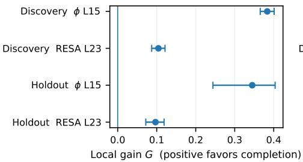
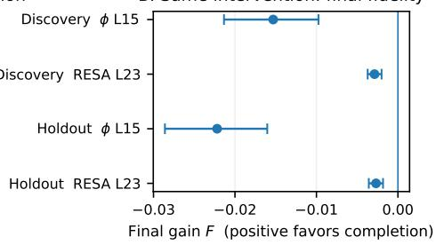
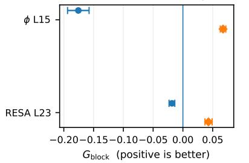
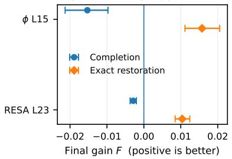
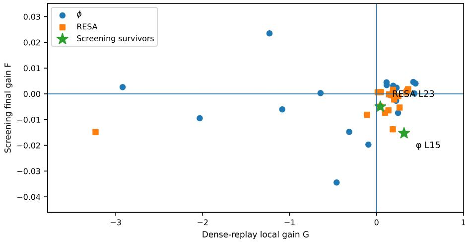

# COUNTEREXAMPLES TO LOCAL RECONSTRUCTION GAIN AS A PROXY FOR FINAL FIDELITY IN RESIDUAL COMPLETION

Yasuto Hoshi, Daisuke Miyashita & Jun Deguchi Kioxia Corporation

## ABSTRACT

Residual completion augments query-aware sparse attention by estimating the contribution of tokens omitted from the exact sparse computation. We ask whether improving a layer’s attention-output reconstruction on the same incoming Q/K/V and selected support necessarily improves the fidelity of the final model output. We study training-free RESA and learned Top-K+ϕ with frozen backbone language models. A prespecified single-layer screen yields two Qwen3-0.6B/Multi-LexSum interventions for which direct-runtime measurements show positive prespecified request-aggregate local reconstruction gain but worse final KL fidelity than the corresponding all-abstain EXACT TOP-K baseline on both discovery and prompttoken-disjoint holdout requests. Exact restoration at the same layer instead improves final fidelity, showing that the reversal is specific to approximate completion in these cases. In complementary multi-layer experiments, a task-independent local diagnostic often repairs the tested completion estimators, although the repaired models do not consistently outperform EXACT TOP-K. Together, these results show that better local reconstruction need not translate into better final-model fidelity.

## 1 INTRODUCTION

Query-aware sparse attention reduces attention cost by evaluating only a small, query-dependent subset of stored keys and values. Methods such as QUEST and SparQ retain the KV cache while selecting different tokens for each query (Tang et al., 2024; Ribar et al., 2024). Residual completion estimates the aggregate attention contribution of the tokens outside this exact sparse computation and adds that estimate to the sparse attention output (Yang et al., 2026; Hoshi et al., 2026; Zhan et al., 2026). Selection therefore determines which tokens are evaluated exactly, while completion approximates the contribution of the remaining tokens.

At a given layer and decode step, completion can be compared with abstention on the same incoming Q/K/V and the same selected support. Our baseline is the corresponding all-abstain EXACT TOP-K model, which uses the same sparse-selection mechanism but disables the completion branch at every layer. We ask first whether completion makes the attention output closer to dense attention at the selected layer on the measured decode steps; we call this local reconstruction. We separately ask whether the resulting model’s next-token distribution is closer to that of the dense FULL model; we call thisfinalfidelity and measure it using KL divergence to FULL. Later hidden states, queries, and selected supports are allowed to change after the intervention.

Local and final fidelity measure different quantities. After the selected layer, residual blocks and attention layers transform the intervention and may also change subsequent query-dependent token selections. A correction can therefore reduce same-input attention-output error while increasing divergence at the final model output. Prior work also motivates examining downstream consequences of sparse-attention perturbations. Delta Attention links sparse attention-output shift to later query–key misalignment, while RippleKV measures how layerwise KV perturbations affect the final predictive distribution (Willette et al., 2025; Xu et al., 2026). Complementary diagnostic and counterfactua studies examine how cache compression and sparse selection alter model behavior (Qiu et al., 2026; Ren et al., 2026). We test this local-to-final relationship directly for residual completion.

We study learned Top-K+ϕ (Hoshi et al., 2026) and training-free RESA (Yang et al., 2026) on long-context tasks, with additional experiments spanning Llama and Qwen backbones. Both operate on an unchanged, frozen backbone language model: Top-K+ϕ trains only the auxiliary completion estimator, while RESA requires no additional training. In a frozen screen of single-layer interventions, five actions show nominal local-positive/final-negative intervals and two survive the prespecified screening multiplicity correction. We fix those two actions and measure them directly at runtime. Completion and abstention runs have identical incoming hidden states, Q/K/V, and selected token IDs at the measured steps, and the attention outputs are those actually returned by the model. On both the discovery requests and a prompt-token-disjoint holdout, the selected interventions improve the prespecified local reconstruction metric while worsening final KL fidelity. These experiments provide concrete counterexamples to the implication that better local attention reconstruction necessarily yields better final-model fidelity.

A separate exact-restoration control replaces sparse attention with dense attention only at the same selected layer, while leaving the other layers sparse. Exact restoration improves final fidelity where approximate completion reduces it, so the observed reversal is not an inevitable consequence of moving the selected layer toward dense attention. The control does not localize the later network component that produces the divergence. A focused post-hoc Qwen3-8B/RESA study provides broader scale context: among 18 layer–task–context actions, one has CI-negative final fidelity despite positive local reconstruction.

Local reconstruction remains useful as a diagnostic in a separate multi-layer study. Using generic, task-independent calibration sequences, we disable completion at layers with negative mean local reconstruction gain. This improves the tested ϕ/RESA completion models in 11 of 12 fidelity comparisons relative to their unmodified versions, but the repaired models do not consistently outperform EXACT TOP-K. The same masking rule gives mixed results for PISA-0TH (Li et al., 2026), indicating that the diagnostic is estimator-dependent.

Taken together, the experiments show that local reconstruction quality and final-model fidelity are related but not interchangeable endpoints. A completion method can improve one without improving the other, and a layerwise diagnostic can repair an estimator without making the repaired model better than abstention.

## 2 COMPLETION AND ITS EVALUATION

Retained cache and selected support. We retain the full prefix KV cache. For each query, the exact branch contains four sink tokens, the most recent 64 prompt tokens, exact score-based Top-K tokens from the middle prompt region, and all generated tokens. EXACT TOP-K normalizes attention over this selected support with completion disabled. We use abstention for disabling the completion branch at a layer; the all-abstain EXACT TOP-K path disables it at every layer. Completion augments the selected-support computation with an estimate of the excluded contribution. In a single-layer intervention, every other layer uses EXACT TOP-K. The selection rule and budget are unchanged, although later queries and selected token identities may change after the intervention.

Local reconstruction gain. At a measured prediction step, let $O _ { \mathrm { d e n s e } } , O _ { \mathrm { T K } }$ , and $O _ { \mathrm { C } }$ denote the post- $. W _ { O }$ dense attention output, Exact Top-K attention output, and attention output with residual completion enabled, respectively, computed from the same incoming Q/K/V. Define

$$
g = 1 - \frac { \| O _ { \mathrm { d e n s e } } - O _ { \mathrm { C } } \| ^ { 2 } } { \| O _ { \mathrm { d e n s e } } - O _ { \mathrm { T K } } \| ^ { 2 } } .\tag{1}
$$

Thus $g > 0$ exactly when completion is closer to the dense attention output than EXACT TOP-K is under squared reconstruction error. When $| O _ { \mathrm { d e n s e } } - O _ { \mathrm { T K } } |$ is above the validity threshold, abstention has $g = 0$ by construction; when this residual is too small, normalized gain is left undefined rather than set to zero. We aggregate in two stages. For request $i ,$ we first compute $G _ { i } = { \mathrm { m e d i a n } } _ { t \in S _ { i } } g _ { i t }$ over predetermined measured steps $S _ { i }$ . The reported local reconstruction gain is then the request-level mean, $\begin{array} { r } { G = \frac { 1 } { N } \sum _ { i } G _ { i } } \end{array}$ . Absolute squared-error reduction and alternative local aggregates are reported separately. Appendix A.3 gives the validity rule and aggregation details.

Final-model fidelity. All compared models receive the same prompt and dense-model-generated continuation tokens. If $T _ { i }$ is the set of evaluated prediction steps, the request-level final-fidelity gain

is

$$
F _ { i } = \frac { 1 } { | T _ { i } | } \sum _ { t \in T _ { i } } \left[ D _ { \mathrm { K L } } ( p _ { i t } ^ { \mathrm { F u l l } } | | p _ { i t } ^ { \mathrm { T K } } ) - D _ { \mathrm { K L } } ( p _ { i t } ^ { \mathrm { F u l l } } | | p _ { i t } ^ { \mathrm { C } } ) \right] .\tag{2}
$$

Here $p ^ { \mathrm { T K } }$ denotes the corresponding all-abstain EXACT TOP-K path. Positive $\begin{array} { r } { F = \frac { 1 } { N } \sum _ { i } F _ { i } } \end{array}$ favors completion over abstention; negative F favors abstention. The primary F uses all evaluated decode predictions. A separate $F _ { S }$ restricts Eq. 2 to $S _ { i } ,$ aligning the final evaluation with the steps sampled for local measurement. Free-running task utility, U, is measured independently.

## 3 EXPERIMENTAL DESIGN

Models, estimators, and tasks. The main study includes Llama-3.2-1B/3B-Instruct and Qwen3- 0.6B/1.7B (Grattafiori et al., 2024; Yang et al., 2025) with a learned positive-feature estimator, ϕ, and the training-free RESA prior (Hoshi et al., 2026; Yang et al., 2026). All backbone language-model parameters are held fixed across FULL, EXACT TOP-K, and completion variants; Top-K+ϕ differs only by its auxiliary completion estimator, whereas RESA adds no training. We use frozen estimator configurations throughout. The stress tasks are RULER NIAH Multikey-2 and FWE, and HELMET Multi-LexSum (Hsieh et al., 2024; Yen et al., 2025; Shen et al., 2022). They were selected using only the FULL–EXACT TOP-K performance gap, without reference to completion outcomes. The main setting is a 65,536-token prompt and K = 16, giving 84 $( = 4 + 6 4 + 1 6 )$ prompt tokens in the exact branch before generated tokens are added. The $\bar { K \in \{ 8 , 1 6 , 3 2 \} }$ range is an aggressive fixed-read stress regime with a large omitted set. It still includes high-accuracy sparse cases: the no-headroom control matches FULL across all tested models and budgets, and other conditions retain substantial task accuracy (Appendix C.1). Appendix A gives the attention, estimator, and positional settings; Appendix A.2 documents the frozen ϕ checkpoint recipe. A focused post-hoc Qwen3-8B/RESA experiment is reported separately in Appendix G.2.

Screening and fixed interventions. For each Qwen model–estimator pair, we select three early/middle/late layers from layers with positive pre- and post-W local reconstruction gain on the task-independent generic calibration data described below. Crossing them with three tasks gives 36 single-layer actions, each evaluated on 50 requests. Screening local reconstruction gain is obtained from dense-model replay, while screening final-fidelity gain is obtained from the single-layer sparse intervention. The screening analysis uses a screening-specific EXACT TOP-K implementation as its baseline and yields two actions after the prespecified screening multiplicity correction: ϕ L15 and RESA L23, both Qwen3-0.6B/Multi-LexSum. These action identities are fixed before the direct-runtime follow-up. The direct-runtime stage uses the estimator-specific EXACT TOP-K implementation for both completion and abstention. For RESA, the screening-specific and estimatorspecific baselines give slightly different baseline KL values while the completion KL is unchanged; consequently, the reported effect size changes with the operational baseline. We therefore treat screening and direct-runtime as distinct analysis stages rather than repeated estimates of one numerically identical effect, and we do not use the screening estimate as runtime evidence (Appendix D.1). The holdout construction removes candidates with the same tokenized prompt as a discovery request, as well as duplicate candidates, and retains the first 50 eligible prompts in source order; holdout outcomes are not used to choose the fixed actions. The discovery and holdout request sets are then fixed for direct-runtime evaluation. Appendix C reports the complete screen and the fixed candidate layers, and Appendix C.3 details the holdout construction.

Direct-runtime measurement. For each fixed action and request set, we execute FULL, the single-layer completion intervention, and the all-abstain EXACT TOP-K baseline using the same estimator-specific sparse implementation. Prefill uses dense attention; the first, prefill-produced prediction is excluded from the decode comparison. The local measurement samples up to 32 prediction steps at predetermined, evenly spaced positions. At those steps, the EXACT TOP-K baseline and completion intervention have bitwise-equal incoming hidden states, post-rotary queries, full cached keys/values, and selected token IDs. We observe the outputs actually returned by the attention modules, rather than recomputing completion offline. The local dense reference uses FP32 softmax on the observed Q/K/V and the output projection in the model’s native dtype. For the first two requests of each direct-runtime evaluation, all evaluated full-vocabulary logits are also compared with measurement disabled to check non-interference. Appendix A.3 specifies the measurement and aggregation protocol; Appendix D.1 explains the baseline difference between the screening and estimator-specific direct-runtime comparisons.

Exact-restoration control. A separate control replaces the selected layer’s sparse attention by dense attention, leaving the other layers sparse. We compare approximate completion and exact restoration with the same estimator-specific all-abstain EXACT TOP-K baseline. The block-state metric $G _ { \mathrm { b l o c k } }$ measures relative squared error to the global FULL hidden state, while F remains the final-fidelity gain relative to EXACT TOP-K. Both differ from the same-input local reference in Eq. 1; in particular, $G _ { \mathrm { b l o c k } }$ is not the local reconstruction gain G defined above. This control tests the downstream effect of exact restoration at the selected layer. Appendix D gives the corresponding absolute and relative KL effect sizes.

Task-independent masking. For each model, 30 unlabeled 64K calibration sequences are drawn equally from FineWeb, arXiv Summarization, and BIGPATENT (Penedo et al., 2024; Cohan et al., 2018; Sharma et al., 2019). We freeze the set of layers satisfying

$$
\overline { { G } } _ { \mathrm { g e n e r i c , \ell } } < 0\tag{3}
$$

where ${ \overline { { G } } } _ { \mathrm { g e n e r i c } , \ell }$ is the mean post- $W _ { O }$ local reconstruction gain for layer ℓ over these calibration sequences. This defines the task-independent negative-G masking rule: completion is disabled at the selected layers. The repaired hybrid is compared with both unmodified completion and allabstain EXACT TOP-K. Same-count anti-ranked masks and ten depth-matched random masks provide alternative-mask controls. We also apply the rule to an adapted zeroth-order PISA estimator (Li et al., 2026) to test its dependence on the residual representation. Appendix E reports the conditionlevel masking, alternative-mask, and calibration-stability controls; Appendix F gives the PISA-0TH transfer results.

Statistical units and multiplicity. Uncertainty is computed by paired resampling of requests after within-request aggregation. The 36-action screen applies one-sided percentile bounds to 72 directional statements at $\alpha / 7 2 ,$ with $\alpha = 0 . 0 5$ . The direct-runtime follow-up is a separate four-direction family per split, using 100,000 bootstrap draws and cutoff $\alpha / 4$ . Tables otherwise report paired 95% intervals; sensitivity endpoints are analyzed separately.

## 4 RESULTS

## 4.1 DIRECT-RUNTIME LOCAL IMPROVEMENT AND FINAL DEGRADATION

The 36-action screen contains 26 actions with CI-positive local reconstruction gain. Of these, 5 also have CI-negative final-fidelity gain, and 2 survive the 72-direction screening multiplicity correction. Appendix Figure A1 reports the complete screen and documents selection rather than the directruntime premise. The two selected actions are then measured directly in Table 1 and summarized visually in Figure 1.

Under the prespecified median-based G, both interventions have positive local reconstruction gain while all-step final-fidelity gain is negative relative to the all-abstain EXACT TOP-K baseline on both request sets. All four action–split comparisons retain these directions under the four-direction sensitivity applied separately to each split. The joint counts show that the same ordering also occurs within individual request summaries, rather than only in the marginal means.

Alternative local-reconstruction summaries are less uniform. In particular, on the ϕ holdout, rowmean $G ,$ energy-pooled $G ,$ and absolute local error reduction all have intervals crossing zero. The holdout counterexample therefore applies to the prespecified within-request-median criterion rather than to every plausible local-error aggregation; Appendix B reports the full sensitivity results.

The three nominal-only FWE cases do not show CI-negative final-fidelity gain on their prompttoken-disjoint holdouts (Appendix C.3). Captured-state replay at K = 8, 16, 32 preserves the localpositive/final-negative ordering for the two core actions within the same stress regime (Appendix C.4).

Table 1: Local reconstruction gain and final-fidelity gain measured in the same execution. Both actions are Qwen3-0.6B/Multi-LexSum at $6 4 \mathrm { K } / K = 1 6 ,$ with 50 requests per split. Discovery denotes the 50-request screening pool used to identify the fixed interventions. Holdout denotes a 50-request pool constructed after removing candidates with the same tokenized prompt as a discovery request and duplicate candidates; its outcomes were not used for action selection (Appendix C.3). G averages within-request medians over sampled steps; F averages all evaluated prediction steps. Entries give request-level means and paired 95% intervals; for ${ \check { G } } ,$ each request-level value is the median over its sampled steps. The last column counts observed request summaries with $G _ { i } > 0 , F _ { i } < 0$ , not individually significant effects.
<table><tr><td>Split</td><td>Action</td><td>Local reconstruction G ↑</td><td>Final-fidelity  $F \uparrow$ </td><td>Requests  $G _ { i } > 0 , F _ { i } < 0$ </td></tr><tr><td>Discovery</td><td>φL15</td><td>0.383 [0.365, 0.401]</td><td>-0.0153 [-0.0213, -0.0098]</td><td>41/50</td></tr><tr><td>Discovery</td><td>RESA L23</td><td>0.104 [0.087, 0.121]</td><td>-0.0029 [-0.0037, -0.0020]</td><td>43/50</td></tr><tr><td>Holdout</td><td>φL15</td><td>0.345 [0.244, 0.404]</td><td>-0.0222 [-0.0286, -0.0160]</td><td>43/50</td></tr><tr><td>Holdout</td><td>RESA L23</td><td>0.097 [0.072, 0.119]</td><td>-0.0027 [-0.0036, -0.0018]</td><td>38/50</td></tr></table>

Table 2: Approximate completion versus exact restoration. Separate discovery-set controls use the same estimator-specific all-abstain EXACT TOP-K baseline. $G _ { \mathrm { b l o c k } }$ compares hidden-state error to the global FULL trajectory at the selected block and is not the same-input local G reported in Table 1; F is final-fidelity gain relative to the same EXACT TOP-K baseline. Values are means and paired 95% intervals.
<table><tr><td>Action</td><td>Intervention</td><td> $G _ { \mathrm { b l o c k } } \uparrow$ </td><td>Final-fidelity  $F \uparrow$ </td></tr><tr><td>φL15</td><td>Completion</td><td>-0.176</td><td>-0.0153 [−0.194, -0.158] [−0.0213, -0.0097]</td></tr><tr><td>φL15</td><td>Exact restoration</td><td>0.067 [0.063, 0.072]</td><td>0.0157 [0.0111, 0.0206]</td></tr><tr><td>RESA L23</td><td>Completion</td><td>-0.018</td><td>-0.0029 [−0.023, -0.014] [−0.0037, -0.0020]</td></tr><tr><td></td><td>RESA L23 Exact restoration</td><td>0.043 [0.037, 0.049]</td><td>0.0104 [0.0085, 0.0124]</td></tr></table>

## 4.2 EXACT RESTORATION AND APPROXIMATE COMPLETION HAVE OPPOSITE EFFECTS

Figure 1 and Table 2 compare approximate completion with exact restoration on the separate discovery control. This comparison asks a different question from the same-input local reconstruction in Table 1: $G _ { \mathrm { b l o c k } }$ follows the intervention trajectory and compares its selected-block hidden state with the global FULL trajectory, so its sign need not match the local G. At both the selected-block and final endpoints, approximate completion is worse than EXACT TOP-K and exact restoration is better. In this comparison, exact restoration reduces final KL by about 4.7% for ϕ L15 and 3.1% for RESA L23, whereas approximate completion increases it by about 4.6% and 0.9%, respectively. Absolute KL and paired relative changes are reported in Appendix D.

Exact restoration therefore has the opposite block- and final-level effect from approximate completion in these cases. Because the local and block metrics use different reference states, this control distinguishes the interventions but does not localize a unique downstream location where the mismatch arises.

## 4.3 REPAIRING COMPLETION DOES NOT ESTABLISH AN ADVANTAGE OVER EXACT TOP-K

The negative-G masking rule selects no layers in the four Llama model–estimator pairs (Appendix Table A10). It selects 9 and 12 layers for Qwen3-0.6B ϕ and RESA, and 5 and 12 for Qwen3-

Local reconstruction can favor completion even when the intervention worsens final fidelity

A. Executed correction: local reconstruction  
  
C. Selected block relative to global Ful

B. Same intervention: final fidelity  
  
D. Discovery final fidelity: approximate vs. exact

  
Figure 1: Direct-runtime mismatch and exact-restoration control. Panels A–B show the sameinput local reconstruction gain G and final-fidelity gain F for the two fixed actions on discovery and holdout requests. Positive G but negative F is the primary mismatch. Panels C–D show the separate discovery-set exact-restoration control at the FULL-relative block and final endpoints. The block metric $G _ { \mathrm { b l o c k } }$ in this control compares hidden-state error to the global FULL trajectory and is not the same-input local G in Panel A. Approximate completion is worse than EXACT TOP-K at the block and final endpoints, whereas exact restoration at the same selected layer is better. Error bars are paired 95% intervals. Because the local and block metrics use different reference states, the figure does not localize where the mismatch arises.

Table 3: Repair and comparison with EXACT TOP-K. Off is the number of layers with completion disabled. Counts are positive / unresolved / negative paired 95% intervals over three tasks. Llama rows are absent because the selector disables no layers in the four Llama model–estimator pairs. Repair compares the masked hybrid with unmodified completion; vs. TK compares it with the all-abstain EXACT TOP-K baseline. F: final-fidelity gain; U: task-utility gain relative to the stated reference.
<table><tr><td>Model / est.</td><td>Off</td><td>Repair F</td><td>Repair U</td><td>vs. TK F</td><td>vs. TK U</td></tr><tr><td>Qwen3-0.6B / φ</td><td>9</td><td>2/1/0</td><td>1/2/0</td><td>2/1/0</td><td>1/2/0</td></tr><tr><td>Qwen3-0.6B / RESA</td><td>12</td><td>3/0/0</td><td>2/1/0</td><td>0/1/2</td><td>0/2/1</td></tr><tr><td>Qwen3-1.7B / φ</td><td>5</td><td>3/0/0</td><td>2/1/0</td><td>1/1/1</td><td>0/2/1</td></tr><tr><td>Qwen3-1.7B / RESA</td><td>12</td><td>3/0/0</td><td>3/0/0</td><td>0/1/2</td><td>0/3/0</td></tr></table>

1.7B. Disabling these sets improves final fidelity relative to the unmodified completion model in 11/12 treated conditions and utility in 8/12. Against all-abstain EXACT TOP-K, however, the repaired hybrids give 3 positive, 4 unresolved, and 5 negative fidelity comparisons (Table 3). The corresponding utility counts are 1 positive, 9 unresolved, and 2 negative.

The selected sets outperform the same-count anti-ranked masks in all 12 fidelity comparisons, and their point-estimate repairs exceed every one of the ten fixed depth-matched masks in each condition (Appendix E). Yet repair and advantage over the all-abstain EXACT TOP-K baseline remain different questions. For example, Qwen3-0.6B/RESA on Multi-LexSum gains 0.733 in final fidelity relative to unmodified completion, but the repaired hybrid is still 0.076 worse than EXACT TOP-K. A large repair can therefore leave the model worse than the all-abstain EXACT TOP-K baseline.

The diagnostic is also estimator-dependent. Applying the same negative-G masking rule to PISA-0TH yields 2 positive, 5 unresolved, and 5 negative fidelity repairs (Appendix F). Local reconstruction gain can therefore be useful for locating estimator-specific failure, but its sign alone does not determine the final-model ordering.

For broader context, Appendix G reports observational all-layer completion endpoints across Llama and Qwen. All 12 Llama conditions have CI-positive local and final-fidelity gains, whereas eight Qwen conditions combine CI-positive post-WO local gain with CI-negative final fidelity. Appendix G.2 further reports a focused Qwen3-8B/RESA study: 7 of 18 actions are CI-positive in final fidelity, 10 are unresolved, and 1 is CI-negative. These broader results show that the mismatch is condition-dependent and are not additional replications of the prespecified direct-runtime core.

## 5 RELATED WORK

Query-aware selection and residual estimation. QUEST and SparQ reduce attention work by selecting query-dependent subsets of the retained KV cache, while MagicPIG estimates attention through sampling rather than deterministic Top-K (Tang et al., 2024; Ribar et al., 2024; Chen et al., 2025). Residual-estimation methods such as RESA, Top-K+ϕ, and ResKV instead approximate the contribution omitted by a sparse branch (Yang et al., 2026; Hoshi et al., 2026; Zhan et al., 2026). These works primarily evaluate the resulting sparse-attention method; our experiment isolates a single completion intervention and asks how its realized local reconstruction error relates to the final model output.

Cache compression, eviction, and reconstruction. Cache-compression methods alter a different part of the inference state: H2O and InfiniGen change which KV content is retained or fetched, while LESS adds an auxiliary recurrent representation (Zhang et al., 2023; Lee et al., 2024; Dong et al., 2024). ReST-KV is particularly close to our question because it uses layer-wise output-reconstruction discrepancy to guide KV eviction (An et al., 2026). Our setting keeps the full prefix cache and the exact selected support available, so the intervention is confined to the completion output rather than cache retention. This lets us examine whether improved local reconstruction preserves the ordering at the final model output.

Propagation and final-output sensitivity. Delta Attention studies downstream effects of sparse attention-output shift, while RippleKV measures the response of the final predictive distribution to layerwise KV perturbations (Willette et al., 2025; Xu et al., 2026). KVDiagnosis analyzes compression failures using cache-, attention-, likelihood-, and decoding-level diagnostics, while counterfactual sparse-attention evaluation measures how sparsification changes the influence of selected content on model outputs (Qiu et al., 2026; Ren et al., 2026). Our experiments connect these downstream and diagnostic perspectives to residual completion while holding the retained cache and exact-support rule fixed.

## 6 DISCUSSION

The direct-runtime experiments show a sign reversal between same-input local reconstruction and final KL fidelity for two fixed interventions, and the reversal is reproduced on prompt-token-disjoint holdout requests. The result is strongest for the prespecified within-request-median G; alternative local aggregations are less stable, especially for the ϕ holdout. The evidence therefore establishes concrete local-to-final counterexamples without estimating how often they occur.

The exact-restoration control distinguishes approximate completion from exact correction. At the same selected layer, dense restoration improves final fidelity while approximate completion reduces it. The divergence therefore cannot be explained simply by the model being harmed whenever that layer is moved toward its dense-attention output; the responsible downstream transformation remains unresolved.

The masking study gives a complementary view of the same issue. Negative-G masks improve final fidelity in 11 of 12 tested ϕ/RESA conditions relative to their unmodified versions, but some repaired models remain worse than the all-abstain EXACT TOP-K baseline, and the same rule does not transfer uniformly to PISA-0TH. Local reconstruction is therefore informative about estimator behavior, but it is not a substitute for measuring the resulting model-level fidelity and utility.

## 7 LIMITATIONS

Experimental coverage. The direct-runtime core contains two selected Qwen3-0.6B/Multi-LexSum interventions at 64K/K = 16. Its two 50-request pools are prompt-token-disjoint but not established to be source-document- or legal-case-disjoint. The K = 8, 16, 32 sensitivity covers nearby aggressive budgets, not substantially denser support. The 8B focused experiment is post-hoc, and Llama/Qwen comparisons also differ in long-context positional settings.

Metrics and interpretation. The primary local-reconstruction endpoint averages within-request medians over sampled decode steps, whereas final-fidelity gain F averages all evaluated steps. Alternative local weightings are less uniform: row-mean G is CI-positive in two of four direct comparisons, energy-pooled G in three of four, and absolute local error reduction in three of four; all three are unresolved in the ϕ holdout. The central result is therefore specific to the prespecified primary criterion. Final-fidelity gain F measures change in KL fidelity to FULL relative to EXACT TOP-K rather than task utility, and no targeted one-layer utility loss is statistically resolved. Later support can change after the intervention, and the experiments do not isolate a unique downstream mechanism.

Estimators and systems. The study evaluates the frozen estimator configurations documented in Appendix A. PISA-0TH is an adapted estimator-family control with a different auxiliary representation. Exact score-based Top-K isolates selection/completion behavior; end-to-end retrieval accuracy, latency, bandwidth, and serving-optimal budgets are outside the measured endpoints.

## 8 CONCLUSION

For two fixed residual-completion interventions, positive prespecified local reconstruction gain coexists with worse final dense-model fidelity on both discovery and holdout requests. Exact restoration at the same layer produces the opposite final effect, and negative-G masking often repairs broader completion models without guaranteeing an advantage over EXACT TOP-K. Local attention reconstruction is therefore useful evidence about an estimator, but it does not by itself predict the fidelity of the final model output.

## REPRODUCIBILITY STATEMENT

The supplement reports the full screening panel, estimator settings, task-selection criteria, fixed layer masks, paired request identities, and uncertainty calculations. Direct-runtime observations and budget-sensitivity replay measurements use their respective protocols and baseline implementations. Deterministic bootstrap streams and request-level outputs support reconstruction of the reported tables without additional model inference.

## AI USE STATEMENT

Generative AI tools assisted with translation, literature search and summarization, manuscript editing, and analysis-code development. The authors are responsible for the final content and validation of these materials.

## REFERENCES

Yongqi An, Chang Lu, Kuan Zhu, Tao Yu, Chaoyang Zhao, Hong Wu, Ming Tang, and Jinqiao Wang. ReST-KV: Robust KV cache eviction with layer-wise output reconstruction and spatial-temporal smoothing. In International Conference on Learning Representations,

2026. URL https://proceedings.iclr.cc/paper\_files/paper/2026/hash/ 8be9c134bb193d8bd3827d4df8488228-Abstract-Conference.html.

Zhuoming Chen, Ranajoy Sadhukhan, Zihao Ye, Yang Zhou, Jianyu Zhang, Niklas Nolte, Yuandong Tian, Matthijs Douze, Leon Bottou, Zhihao Jia, and Beidi Chen. MagicPIG: LSH sampling for efficient LLM generation. In International Conference on Learning Representations, 2025. URL https://proceedings.iclr.cc/paper\_files/paper/2025/hash/ 6d50d824ae819d5a961c1d8edc15e833-Abstract-Conference.html.

Arman Cohan, Franck Dernoncourt, Doo Soon Kim, Trung Bui, Seokhwan Kim, Walter Chang, and Nazli Goharian. A discourse-aware attention model for abstractive summarization of long documents. In Proceedings of the 2018 Conference of the North American Chapter of the Association for Computational Linguistics: Human Language Technologies, Volume 2 (Short Papers), pp. 615–621. Association for Computational Linguistics, 2018. doi: 10.18653/v1/N18-2097. URL https://aclanthology.org/N18-2097/.

Harry Dong, Xinyu Yang, Zhenyu Zhang, Zhangyang Wang, Yuejie Chi, and Beidi Chen. Get more with LESS: Synthesizing recurrence with KV cache compression for efficient LLM inference. In Proceedings of the 41st International Conference on Machine Learning, volume 235 of Proceedings of Machine Learning Research, pp. 11437–11452. PMLR, 2024. URL https://proceedings.mlr.press/v235/dong24f.html.

Aaron Grattafiori, Abhimanyu Dubey, Abhinav Jauhri, Abhinav Pandey, Abhishek Kadian, Ahmad Al-Dahle, et al. The Llama 3 herd of models, 2024. URL https://arxiv.org/abs/2407. 21783.

Yasuto Hoshi, Daisuke Miyashita, and Jun Deguchi. Residual-mass accounting for partial-kv decoding, 2026. URL https://arxiv.org/abs/2604.05438.

Cheng-Ping Hsieh, Simeng Sun, Samuel Kriman, Shantanu Acharya, Dima Rekesh, Fei Jia, Yang Zhang, and Boris Ginsburg. RULER: What’s the real context size of your long-context language models?, 2024. URL https://arxiv.org/abs/2404.06654.

Wonbeom Lee, Jungi Lee, Junghwan Seo, and Jaewoong Sim. InfiniGen: Efficient generative inference of large language models with dynamic KV cache management. In 18th USENIX Symposium on Operating Systems Design and Implementation (OSDI 24), pp. 155–172. USENIX Association, 2024. URL https://www.usenix.org/conference/osdi24/ presentation/lee.

Haopeng Li, Shitong Shao, Wenliang Zhong, Zikai Zhou, Lichen Bai, Hui Xiong, and Zeke Xie. PISA: Piecewise sparse attention is wiser for efficient diffusion transformers, 2026. URL https: //arxiv.org/abs/2602.01077.

Guilherme Penedo, Hynek Kydl´ıcek, Loubna Ben Allal, Anton Lozhkov, Margaret Mitchell,ˇ Colin Raffel, Leandro Von Werra, and Thomas Wolf. The FineWeb datasets: Decanting the web for the finest text data at scale. In Advances in Neural Information Processing Systems, volume 37, pp. 30811–30849, 2024. doi: 10.52202/079017-0970. URL https://proceedings.neurips.cc/paper\_files/paper/2024/ hash/370df50ccfdf8bde18f8f9c2d9151bda-Abstract-Datasets\_and\_ Benchmarks\_Track.html.

Bowen Peng, Jeffrey Quesnelle, Honglu Fan, and Enrico Shippole. YaRN: Efficient context window extension of large language models. In International Conference on Learning Representations, 2024. URL https://proceedings.iclr.cc/paper\_files/paper/2024/hash/ 874a4d89f2d04b4bcf9a2c19545cf040-Abstract-Conference.html.

Chen Qiu, Ziwu Liu, Chao Fei, Guozhong Li, and Panos Kalnis. KVDiagnosis: A diagnostic benchmark for KV-cache compression in long-context language models, 2026. URL https: //arxiv.org/abs/2608.09412.

Xingyu Ren, Youran Sun, Chugang Yi, and Haizhao Yang. Understanding sparse attention selectivity in long-context foundation models via counterfactual evaluation, 2026. URL https://arxiv. org/abs/2608.01676.

Luka Ribar, Ivan Chelombiev, Luke Hudlass-Galley, Charlie Blake, Carlo Luschi, and Douglas Orr. SparQ attention: Bandwidth-efficient LLM inference. In Proceedings of the 41st International Conference on Machine Learning, volume 235 of Proceedings of Machine Learning Research, pp. 42558–42583. PMLR, 2024. URL https://proceedings.mlr.press/ v235/ribar24a.html.

Eva Sharma, Chen Li, and Lu Wang. BIGPATENT: A large-scale dataset for abstractive and coherent summarization. In Proceedings of the 57th Annual Meeting of the Association for Computational Linguistics, pp. 2204–2213. Association for Computational Linguistics, 2019. doi: 10.18653/v1/P19-1212. URL https://aclanthology.org/P19-1212/.

Zejiang Shen, Kyle Lo, Lauren Yu, Nathan Dahlberg, Margo Schlanger, and Doug Downey. Multi-lexsum: Real-world summaries of civil rights lawsuits at multiple granularities. In Advances in Neural Information Processing Systems, volume 35, 2022. URL https://proceedings.neurips.cc/paper\_files/paper/2022/ hash/552ef803bef9368c29e53c167de34b55-Abstract-Datasets\_and\_ Benchmarks.html.

Jiaming Tang, Yilong Zhao, Kan Zhu, Guangxuan Xiao, Baris Kasikci, and Song Han. QUEST: Query-aware sparsity for efficient long-context LLM inference. In Proceedings of the 41st International Conference on Machine Learning, volume 235 of Proceedings of Machine Learning Research, pp. 47901–47911. PMLR, 2024. URL https://proceedings.mlr.press/ v235/tang24l.html.

Jeffrey Willette, Heejun Lee, and Sung Ju Hwang. Delta attention: Fast and accurate sparse attention inference by delta correction. In Advances in Neural Information Processing Systems, volume 38, 2025. doi: 10.52202/085713-0403. URL https://proceedings.neurips.cc/paper\_files/paper/2025/hash/ 11cc3abb01080339ceed66eff7c93920-Abstract-Conference.html.

Dongjie Xu, Kai Qian, Julius, Weijie Shi, Yuxuan Sun, Minghua Tang, Fenglei Jin, Hanchi Dong, and Jiajie Xu. RippleKV: Cross-layer KV cache allocation via perturbation propagation, 2026. URL https://arxiv.org/abs/2608.08684.

An Yang, Anfeng Li, Baosong Yang, Beichen Zhang, Binyuan Hui, Bo Zheng, Bowen Yu, Chang Gao, Chengen Huang, Chenxu Lv, et al. Qwen3 technical report, 2025. URL https://arxiv. org/abs/2505.09388.

Weihao Yang, Hao Huang, Ningke Li, Shihao Wang, Darong Yang, Yanqi Pan, Wen Xia, Shiyi Li, and Xiangyu Zou. RESA: Bringing back what sparse attention ignores with residual estimation. In International Conference on Learning Representations, 2026. URL https://proceedings.iclr.cc/paper\_files/paper/2026/hash/ 89bd6217280d1417370c89ee493ba3c7-Abstract-Conference.html.

Howard Yen, Tianyu Gao, Minmin Hou, Ke Ding, Daniel Fleischer, Peter Izsak, Moshe Wasserblat, and Danqi Chen. HELMET: How to evaluate long-context models effectively and thoroughly. In International Conference on Learning Representations, 2025. URL https://proceedings.iclr.cc/paper\_files/paper/2025/hash/ f5332c8273d02729730a9c24dec2135e-Abstract-Conference.html.

Yuhang Zhan, Lisi Chen, and Shuo Shang. ResKV: Reconstructing omitted attention contributions for fixed-budget KV cache compression, 2026. URL https://arxiv.org/abs/2607.29591.

Zhenyu Zhang, Ying Sheng, Tianyi Zhou, Tianlong Chen, Lianmin Zheng, Ruisi Cai, Zhao Song, Yuandong Tian, Christopher Re, Clark Barrett, Zhangyang Wang, and Beidi Chen. H ´ 2O: Heavy-hitter oracle for efficient generative inference of large language models. In Advances in Neural Information Processing Systems, volume 36, 2023. doi: 10.52202/075280-1506. URL https://proceedings.neurips.cc/paper\_files/paper/2023/hash/ 6ceefa7b15572587b78ecfcebb2827f8-Abstract-Conference.html.

## A CONFIGURATION AND MEASUREMENT PROTOCOL

## A.1 ATTENTION, POSITIONAL SETTINGS, AND ESTIMATORS

The full prompt KV cache is retained in all sparse variants. The exact support consists of four initial tokens, 64 recent prompt tokens, the Top-K middle prompt tokens by exact attention score, and all generated tokens. $\mathrm { A t ~ } K = 8 , 1 6 , 3 2$ , this gives 76, 84, and 100 exact prompt positions, respectively. These values intentionally vary the middle selection within an aggressive fixed-read stress regime, leaving a large omitted set rather than spanning deployment-optimal budgets. The regime does not imply task failure: NIAH Single-1 matches FULL for all four backbones at all three budgets, and several other conditions retain substantial task accuracy (Table A2). Llama uses its native positional configuration; Qwen3 uses YaRN factor 2 to extend the 32,768-token base context to 65,536 tokens (Peng et al., 2024). Within-model comparisons use the fixed evaluation configuration. Numerical differences between the screening-specific EXACT TOP-K baseline and the RESA-specific EXACT TOP-K baseline are described in Appendix D.1.

The two main residual estimators are Top-K+ϕ and RESA. Top-K+ϕ uses a positive-feature representation of omitted attention numerator and normalizer terms. RESA obtains a typical-query prior at the end of prefill and combines that prior with the selected sparse branch during decode (Hoshi et al., 2026; Yang et al., 2026). The experiments use these frozen configurations rather than training or tuning an estimator on downstream outcomes. PISA-0TH is an adapted zeroth-order residual estimator: the omitted middle region is partitioned into fixed blocks, each block is represented by one zeroth-order summary, and those summaries provide the completion branch alongside the exact selected-token branch. The PISA-0TH experiments use 64-token blocks.

## A.2 FROZEN ϕ CHECKPOINT RECIPE

Each backbone uses a frozen 200,000-step checkpoint trained with 65,536-token prefill packs and bfloat16 teachers. FineWeb, arXiv Summarization, and BIGPATENT are scheduled equally in round robin order (Penedo et al., 2024; Cohan et al., 2018; Sharma et al., 2019). The ReZero-ϕ map has 512-dimensional embeddings, 64-dimensional features, one MLP layer, and a positive exponential activation. There are 64 stratified query rows per pack, with weights 0.15, 0.25, and 0.60 assigned to positions 0–4095, 4096–16383, and the final 33K tokens. Loss weights are $\lambda _ { \mathrm { K L } } = 0 . 9 9$ and $\lambda _ { \mathrm { t o p } } = 0 . 1$ ; false-positive, log-normalizer, and attention-output loss weights are zero. This is a deliberate simplification of the training objective in Hoshi et al. (2026). Their residual-denominator diagnostics report underestimation as the dominant pattern in three of four corpus/length settings, while also showing that the sign is not universal; their formulation notes that underestimation is already constrained indirectly by the KL and top-band terms. Motivated by that observation, these checkpoints retain temperature-scaled KL and top-band Huber shaping while omitting the falsepositive and one-sided log-normalizer penalties; the separate attention-output auxiliary loss in our training implementation is also disabled. Residual-aware training is disabled and $K _ { \mathrm { t r a i n } } = 0$

Teacher-only calibration sets a model-global temperature τ by inverting the corpus-balanced normalized-attention-entropy curve at $\Breve { H ^ { * } } = 0 . 9 9 \dot { 9 } 5$ . For logit depth $d _ { q i } = \operatorname* { m a x } _ { j } s _ { q j } - s _ { q i } ,$ a head-specific band $\Delta _ { \ell h }$ targets corpus-balanced coverage $c ^ { * } = 0 . 9 5$ . These H9995g/c95h settings are included in the checkpoint metadata. Qwen uses YaRN factor 2 during this training recipe; Llama retains its native positional configuration.

## A.3 DIRECT OBSERVATIONS AND UNCERTAINTY

For each of the two fixed actions and each fixed request set, three models process the same prompt and teacher tokens: dense FULL, the estimator-specific all-abstain EXACT TOP-K path, and its single-layer completion path. We record the actual input to, and output from, the selected attention module. At up to 32 evenly spaced decode positions per request, incoming hidden states, post-RoPE Q, the full K/V tensors returned by cache update, and actual selected token IDs must match exactly between the two sparse paths. Dense reference attention is evaluated on those tensors with FP32 softmax, followed by the output projection in the model’s native dtype. The observed completion and abstention outputs are used directly rather than replaced by recomputed approximations.

For local residual energy below the validity floor,

$$
\begin{array} { r } { \left\| O _ { \mathrm { d e n s e } } - O _ { \mathrm { T K } } \right\| \le \operatorname* { m a x } \left( \epsilon , 1 0 ^ { - 6 } \| O _ { \mathrm { d e n s e } } \| \right) , } \end{array}
$$

normalized gain is undefined rather than set to zero. Absolute squared-error reduction, $\parallel O _ { \mathrm { d e n s e } } -$ $O _ { \mathrm { T K } } \Vert ^ { 2 } - \Vert \bar { O } _ { \mathrm { d e n s e } } - O _ { \mathrm { C } } \Vert ^ { 2 }$ , does not divide by residual energy. The primary local statistic takes a median within request; supplementary row-mean and energy-pooled statistics use different weightings. All uncertainty estimates resample requests, not heads or decode rows as independent samples.

For the first two requests of each direct-runtime evaluation, baseline and action are also executed with measurement disabled. Equality of all evaluated full-vocabulary logits checks that instrumentation does not change the forward output on these requests. This check is distinct from the input/support comparisons made at sampled local positions throughout the pool. The direct-runtime family has two actions and two directions per existing split. Ordinary intervals use the 2.5th and 97.5th percentiles; directional bounds use $\alpha / 4$ and $1 - \alpha / 4 \mathrm { f o r } \alpha = 0 . 0 5$ . The screening family contains 72 directional statements. Bootstrap streams are deterministic and keyed by the statistic identity.

Table A1: Direct-runtime sensitivity endpoints. Row-mean and energy-pooled G reweight the same local measurements relative to the primary within-request median. Absolute error reduction is $\lvert | O _ { \mathrm { d e n s e } } - O _ { \mathrm { T K } } \rvert | ^ { 2 } - \lvert | O _ { \mathrm { d e n s e } } - O _ { \mathrm { C } } \rvert | ^ { 2 }$ , averaged within and across requests. $F _ { S }$ uses exactly the prediction steps measured for local reconstruction gain. These are ordinary paired 95% intervals; the primary four-direction analysis uses median G and all-step F.
<table><tr><td>Split</td><td>Action</td><td></td><td>Row-mean G ↑ Energy-pooled G ↑</td><td>Absolute local error reduction ↑</td><td>Sampled-step Fs ↑</td></tr><tr><td>Discovery</td><td>φL15</td><td>0.194 [0.156, 0.229]</td><td>0.082 [0.038, 0.125]</td><td>1.076</td><td>-0.0121 [0.572, 1.572] [−0.0245, 4.264 × 10−5]</td></tr><tr><td>Discovery RESA L23</td><td></td><td>0.085 [0.059, 0.109]</td><td>0.100 [0.077, 0.121]</td><td>45.703 [34.832, 56.646]</td><td>-0.0035 [-0.0058, −0.0014]</td></tr><tr><td>Holdout</td><td>φL15</td><td>0.095 [-0.047, 0.183]</td><td>-0.003 [-0.126, 0.079]</td><td>0.237 [−0.952, 1.116]</td><td>-0.0229 [-0.0342, -0.0123]</td></tr><tr><td>Holdout</td><td>RESA L23</td><td>0.026 [−0.049, 0.086]</td><td>0.085 [0.051, 0.114]</td><td>41.583 [28.560, 53.845]</td><td>-0.0036 [-0.0062, -0.0010]</td></tr></table>

## B DIRECT-RUNTIME SENSITIVITIES

The primary local-reconstruction endpoint is $G ,$ a mean across requests of within-request median normalized gains. Table A1 additionally reports row-mean and energy-pooled normalized gains, absolute local squared-error reduction, and $F _ { S }$ , which evaluates final-fidelity gain only at the locally measured prediction steps. These estimates complement the principal all-step F comparison; their ordinary intervals are not additional multiplicity-corrected discoveries.

The four-direction bounds for the primary local-reconstruction/final-fidelity family are Discovery ϕ L15: $L _ { G } = 0 . 3 6 3 , U _ { F } = - 0 . 0 0 9 \bar { 0 }$ ; Discovery RESA L23: $L _ { G } = 0 . 0 8 5 , \dot { U } _ { F } = \dot { - } 0 . 0 0 1 9$ ; Holdout $\phi \mathrm { L } 1 5 ; L _ { G } = 0 . 2 1 4 , U _ { F } = - 0 . 0 1 5 2$ ; Holdout RESA L23: $L _ { G } = 0 . 0 6 8 , U _ { F } = - 0 . 0 0 1 7$

The same request weighting is used within each endpoint, but the endpoints differ in normalization and step coverage. Uncertainty in a sensitivity endpoint does not inherit the directional conclusion from the primary comparison.

Table A2: Task-selection ranking. Gaps are FULL minus EXACT TOP-K in percentage points, averaged or minimized across four models. The last columns count positive gaps out of four models and 12 model–budget points. Ranks 1–3 are the selected stress tasks; NIAH Single-1 is the noheadroom control.
<table><tr><td>Rank</td><td>Task</td><td>Mean gap</td><td>Min. gap</td><td> $K = 1 6 +$ </td><td> $\mathrm { A l l } { - } K +$ </td></tr><tr><td>1</td><td>NIAH Multikey-2</td><td>30.5</td><td>18.0</td><td>4/4</td><td>12/12</td></tr><tr><td>2</td><td>FWE</td><td>20.25</td><td>7.3</td><td>4/4</td><td>12/12</td></tr><tr><td>3</td><td>Multi-LexSum</td><td>6.36</td><td>4.92</td><td>4/4</td><td>12/12</td></tr><tr><td>4</td><td>NIAH Multiquery</td><td>6.33</td><td>3.2</td><td>4/4</td><td>12/12</td></tr><tr><td>5</td><td>HELMET RAG</td><td>2.58</td><td>1.59</td><td>4/4</td><td>12/12</td></tr><tr><td>6</td><td>NIAH Single-3</td><td>10.75</td><td>0.0</td><td>3/4</td><td>9/12</td></tr><tr><td>7</td><td>NIAH Multikey-3</td><td>8.0</td><td>0.0</td><td>3/4</td><td>9/12</td></tr><tr><td>8</td><td>NIAH Multivalue</td><td>5.47</td><td>-2.7</td><td>3/4</td><td>8/12</td></tr><tr><td>9</td><td>NarrativeQA</td><td>4.83</td><td>-0.34</td><td>3/4</td><td>11/12</td></tr><tr><td>10</td><td>QA SQuAD</td><td>3.5</td><td>-5.2</td><td>3/4</td><td>9/12</td></tr><tr><td>11</td><td>VT</td><td>3.25</td><td>-9.8</td><td>3/4</td><td>8/12</td></tr><tr><td>12</td><td>NIAH Multikey-1</td><td>2.25</td><td>0.0</td><td>3/4</td><td>8/12</td></tr><tr><td>13</td><td>QA Hotpot</td><td>1.5</td><td>-3.0</td><td>2/4</td><td>7/12</td></tr><tr><td>14</td><td>NIAH Single-2</td><td>0.25</td><td>-1.0</td><td>1/4</td><td>4/12</td></tr><tr><td>15</td><td>NIAH Single-1</td><td>0.0</td><td>0.0</td><td>0/4</td><td>0/12</td></tr><tr><td>16</td><td>CWE</td><td>-0.73</td><td>-2.5</td><td>2/4</td><td>6/12</td></tr></table>

## C SCREENING, TASK SELECTION, AND REPLAY COMPARISONS

## C.1 TASK SELECTION

Only FULL and EXACT TOP-K outcomes enter stress-task selection. Eligible tasks retain positive headroom for all four backbones at $6 4 \mathrm { K } / K ~ = ~ 1 6$ and all 12 model–budget points over $K \in$ {8, 16, 32}. The three eligible tasks with the largest mean gap are fixed. NIAH Single-1 serves as a no-headroom control. Table A2 includes the full ranking, including tasks that do not meet the criterion.

## C.2 ALL CANDIDATE LAYERS AND SCREENING ENDPOINTS

The screening panel crosses two Qwen backbones, two estimators, three candidate layers with positive generic-calibration local reconstruction gain, and three tasks. All candidates appear in Table A3. Screening local reconstruction gain uses dense-model replay, and screening final-fidelity gain uses the screening baseline. Five actions have nominal local-positive/final-negative intervals, and two survive the 72-direction screening multiplicity correction. Direct-runtime results for those two actions appear in the main text with estimator-specific EXACT TOP-K baselines.

## C.3 PROMPT-TOKEN-DISJOINT HOLDOUTS UNDER THE SCREENING PROTOCOL

The three remaining nominal cases are fixed before their FWE holdout outcomes are inspected. Discovery prompt-token identities and duplicate candidates are removed, and the first 50 eligible prompts are retained in source order. Table A4 reports all three cases. Captured-state local reconstruction gain remains CI-positive, but none has a CI-negative final-fidelity gain under the screening protocol. This provides a negative holdout result and is not used as evidence for the direct-runtime core.

## C.4 NEARBY K VALUES

Table A5 keeps the two core action identities fixed and varies $K \in \{ 8 , 1 6 , 3 2 \}$ . These results combine captured-state local reconstruction gain with screening-protocol final-fidelity gain. The $K = 1 6$ entries correspond to the screening-protocol measurements. All six ordinary local-reconstruction/finalfidelity intervals retain the stated ordering, with smaller RESA final-fidelity effects as K increases.

Table A3: All candidate layers in the 36-action screen, each tested on three tasks. A mismatch task has both a nominal CI-positive local reconstruction gain and a nominal CI-negative final-fidelity gain. An asterisk identifies an action that survives the 72-direction screening multiplicity correction. Local reconstruction gain uses dense-model replay; final-fidelity gain uses the screening baseline.
<table><tr><td>Model</td><td>Est.</td><td>Layer</td><td>Local G CI+</td><td>Final-fidelity F CI—</td><td>Mismatch task</td></tr><tr><td>Qwen3-0.6B</td><td>φ</td><td>6</td><td>3/3</td><td>1/3</td><td>FWE</td></tr><tr><td>Qwen3-0.6B</td><td>φ</td><td>15</td><td>1/3</td><td>1/3</td><td>Multi-LexSum *</td></tr><tr><td>Qwen3-0.6B</td><td>φ</td><td>23</td><td>2/3</td><td>1/3</td><td></td></tr><tr><td>Qwen3-0.6B</td><td>RESA</td><td>6</td><td>3/3</td><td>0/3</td><td></td></tr><tr><td>Qwen3-0.6B</td><td>RESA</td><td>12</td><td>3/3</td><td>1/3</td><td>FWE</td></tr><tr><td>Qwen3-0.6B</td><td>RESA</td><td>23</td><td>2/3</td><td>2/3</td><td>Multi-LexSum *</td></tr><tr><td>Qwen3-1.7B</td><td>φ</td><td>6</td><td>2/3</td><td>1/3</td><td></td></tr><tr><td>Qwen3-1.7B</td><td>φ</td><td>12</td><td>1/3</td><td>2/3</td><td></td></tr><tr><td>Qwen3-1.7B</td><td>φ</td><td>23</td><td>1/3</td><td>1/3</td><td></td></tr><tr><td>Qwen3-1.7B</td><td>RESA</td><td>6</td><td>3/3</td><td>0/3</td><td></td></tr><tr><td>Qwen3-1.7B</td><td>RESA</td><td>12</td><td>3/3</td><td>1/3</td><td>FWE</td></tr><tr><td>Qwen3-1.7B</td><td>RESA</td><td>22</td><td>2/3</td><td>1/3</td><td></td></tr></table>

  
Figure A1: Complete 36-action discovery screen. Each point is a model–estimator–layer–task action. Local reconstruction gain comes from dense-model replay; final-fidelity gain F uses the screening baseline. Stars mark the two actions surviving the 72-direction screening multiplicity correction. This figure documents the selection stage; the main direct-runtime evidence is Figure 1 and Table 1.

The experiment tests robustness within the deliberately aggressive fixed-read stress regime; it is not a sweep over deployment-optimal or substantially denser supports.

Table A4: Nominal-only FWE hypotheses on 50 prompt-token-disjoint holdout requests. Model sizes denote Qwen3. The six-direction family-wise bounds $L _ { G }$ and $U _ { F }$ are the lower bound for local reconstruction gain and the upper bound for final-fidelity gain. None has a CI-negative final-fidelity gain.
<table><tr><td>Action</td><td>Captured-state G</td><td>Screening F</td><td> $L _ { G }$ </td><td> $U _ { F }$ </td></tr><tr><td>0.6B / φ L6</td><td>0.222 [0.184, 0.262]</td><td>0.00257 [-0.00154, 0.00684]</td><td>0.177</td><td>0.00774</td></tr><tr><td>0.6B / RESA L12</td><td>0.255 [0.226, 0.286]</td><td>-0.00127 [-0.00849, 0.00582]</td><td>0.219</td><td>0.00726</td></tr><tr><td>1.7B / RESA L12</td><td>0.331 [0.309, 0.351]</td><td>-0.00733 [-0.02123, 0.00612]</td><td></td><td>0.304 0.00902</td></tr></table>

Table A5: Nearby-budget sensitivity for the two fixed Qwen3-0.6B/Multi-LexSum actions. Local reconstruction gain uses captured-state replay and final-fidelity gain uses the screening protocol. Each entry gives a mean and ordinary 95% interval; these six rows are not a new discovery family.
<table><tr><td>Action</td><td>K</td><td>Captured-state G</td><td>Screening F</td></tr><tr><td>RESA L23</td><td>8</td><td>0.1216</td><td>-0.0103 [0.1015, 0.1418] [-0.0154, -0.0051]</td></tr><tr><td>RESA L23</td><td>16</td><td>0.1079</td><td>-0.005 [0.0884, 0.1269] [-0.0068, -0.0032]</td></tr><tr><td>RESA L23</td><td>32</td><td>0.0852</td><td>-0.0019 [0.0628, 0.1049] [-0.0033, -0.0005]</td></tr><tr><td>φL15</td><td>8</td><td>0.4024</td><td>-0.0127 [0.3764, 0.4269] [-0.0218, -0.0047]</td></tr><tr><td>φL15</td><td>16</td><td>0.3852</td><td>-0.0153</td></tr><tr><td>φL15</td><td>32</td><td>0.3668 [0.3243, 0.4018]</td><td>[0.3556, 0.4118] [-0.0212, -0.0097] -0.011 [-0.015, -0.0072]</td></tr></table>

Table A6: KL effect sizes from the exact-restoration experiment, using the estimator-specific EXACT TOP-K baseline. Positive relative KL change means greater divergence from FULL; negative means smaller divergence. Means and ordinary paired 95% intervals are shown.
<table><tr><td>Action</td><td>Intervention</td><td>Baseline KL</td><td>Intervention KL</td><td> $R _ { \mathrm { K L } }$ </td></tr><tr><td>φL15</td><td>Completion</td><td>0.3329 [0.3083, 0.3595]</td><td>0.3482 [0.3236, 0.3751]</td><td>4.6% [2.9, 6.5]</td></tr><tr><td>φL15</td><td>Exact restoration</td><td>0.3329 [0.3083, 0.3595][</td><td>0.3172 [0.2937, 0.3436]</td><td>-4.7% [−6.1, -3.4]</td></tr><tr><td>RESA L23</td><td>Completion</td><td>0.3350</td><td>0.3379 [0.3104, 0.3621] [0.3130, 0.3650]</td><td>0.9% [0.6, 1.1]</td></tr><tr><td></td><td>RESA L23 Exact restoration</td><td>0.3350</td><td>0.3247 [0.3104, 0.3621] [0.3001, 0.3515] [-3.7, -2.5]</td><td>-3.1%</td></tr></table>

## D EXACT RESTORATION AND BASELINE-SPECIFIC EFFECT SIZES

The exact-restoration experiment uses three paths: the all-abstain EXACT TOP-K baseline, approximate completion at one selected layer, and exact restoration with dense attention at that layer. The other layers remain sparse. The estimator-specific EXACT TOP-K baseline uses the same sparse backend as each intervention. Block error is measured relative to the global FULL hidden state; it is not the same-input dense-attention reference used for local reconstruction gain. This control uses the same prefix-level consistency check as the corresponding intervention comparison; the main direct-runtime experiment additionally verifies input and support equality between completion and abstention.

The signed final-fidelity gain F measures an absolute KL difference. We also report

$$
R _ { \mathrm { K L } } = 1 0 0 \left( \frac { \overline { { D } } _ { \mathrm { K L } } ( p ^ { \mathrm { F u l l } } \Vert p ^ { \mathrm { C } } ) } { \overline { { D } } _ { \mathrm { K L } } ( p ^ { \mathrm { F u l l } } \Vert p ^ { \mathrm { T K } } ) } - 1 \right) \% ,\tag{4}
$$

recomputing both means over the same resampled requests in each bootstrap draw. Positive $R _ { \mathrm { K I } }$ means greater divergence from FULL. Table A6 gives these effect sizes for the exact-restoration experiment.

## D.1 SCREENING AND DIRECT-RUNTIME EXACT TOP-K BASELINES

For RESA L23, the screening and direct-runtime analyses use slightly different operational implementations of EXACT TOP-K. In the discovery comparison, the mean baseline KL is 0.332939 with the screening-specific implementation and 0.335045 with the estimator-specific implementation, while the completion KL is 0.337919 in both comparisons. Accordingly, the reported final-fidelity gain changes from approximately −0.004980 to −0.002874. Because the completion KL is identical in the two analyses, this numerical shift comes from the baseline path. The aggregate outputs alone do not identify a more specific implementation-level cause. We therefore keep screening and directruntime effect sizes stage-specific and use the estimator-specific EXACT TOP-K baseline for all primary direct-runtime comparisons on both request sets.

Table A7: Condition-level negative-G masking results. Repair compares with unmodified completion; the last column compares the selected mask with its same-count anti-ranked control. MLX: Multi-LexSum; MK2: NIAH Multikey-2.
<table><tr><td>Task</td><td>Fidelity repair</td><td>Utility repair</td><td>Fidelity vs. anti-ranked mask</td></tr><tr><td colspan="4">Qwen3-0.6B / φ; 9 layers disabled</td></tr><tr><td>FWE</td><td>0.034</td><td>-0.020 [−0.080, 0.040]</td><td>0.033 [0.022, 0.046]</td></tr><tr><td>MLX</td><td>[0.025, 0.043] 0.005</td><td>1.178</td><td>0.025 [0.013, 0.037]</td></tr><tr><td>MK2</td><td>[-0.009, 0.020] 0.144</td><td>[-2.737, 5.228] 0.120</td><td>0.163</td></tr><tr><td></td><td>[0.120, 0.170]</td><td>[0.020, 0.220]</td><td>[0.139, 0.188]</td></tr><tr><td colspan="4">Qwen3-0.6B / RESA; 12 layers disabled 0.176 0.047</td></tr><tr><td>FWE</td><td>[0.140, 0.213]</td><td>[−0.013, 0.113] 13.725</td><td>0.133 [0.099, 0.168]</td></tr><tr><td>MLX</td><td>0.733 [0.643, 0.831]</td><td>[7.801, 19.942]</td><td>0.590 [0.512, 0.672]</td></tr><tr><td>MK2</td><td>0.257 [0.208, 0.312]</td><td>0.120 [0.040, 0.220]</td><td>0.228 [0.178, 0.284]</td></tr><tr><td colspan="4">Qwen3-1.7B / φ; 5 layers disabled</td></tr><tr><td>FWE</td><td>0.362 [0.286, 0.436] 0.099</td><td>0.153 [0.073, 0.233] 4.516</td><td>0.327 [0.256, 0.398] 0.102</td></tr><tr><td>MLX</td><td>[0.081, 0.119] 0.083</td><td>[-1.302, 10.208] 0.220</td><td>[0.083, 0.122] 0.083</td></tr><tr><td>MK2</td><td>[0.059, 0.109]</td><td>[0.100, 0.340]</td><td>[0.060, 0.107]</td></tr><tr><td colspan="4">Qwen3-1.7B / RESA; 12 layers disabled 0.225</td></tr><tr><td>FWE MLX</td><td>[0.184, 0.269] 0.449</td><td>[0.047, 0.207] 9.832</td><td>[0.150, 0.229] 0.387</td></tr><tr><td></td><td>[0.398, 0.502] 0.256</td><td>[3.723, 16.027] 0.380</td><td>[0.341, 0.435] 0.203</td></tr><tr><td>MK2</td><td>[0.224, 0.290]</td><td>[0.240, 0.520]</td><td>[0.173, 0.233]</td></tr></table>

## E CALIBRATION AND MASKING CONTROLS

## E.1 CONDITION-LEVEL REPAIR AND COMPARISON WITH EXACT TOP-K

The task-independent negative-G masking rule disables the complete set of layers with negative generic mean $\mathsf { p o s t - } W _ { O }$ local reconstruction gain. It is a set-level intervention, not an assertion that each selected layer is individually harmful. Table A7 gives repair relative to unmodified completion and the same-count anti-ranked control. Table A8 gives the repaired hybrid’s direct comparison with EXACT TOP-K. This separates the reference models behind the two comparisons in the main table.

## E.2 SAME-COUNT, DEPTH-MATCHED ALTERNATIVES

Ten fixed depth-matched masks are evaluated per treated Qwen model–estimator pair. Table A9 reports the observed range of final-fidelity repairs and the number of masks with repair at least as large as the selected mask. These ranges are not confidence intervals, and the count is not a calibrated p-value.

## E.3 GENERIC-CALIBRATION STABILITY

Table A10 reports selected-set stability across balanced 3/5/10-sequence-per-corpus prefixes, corpusspecific estimates, and leave-one-corpus-out comparisons. Table A11 uses alternative summaries of

Table A8: Repaired hybrid versus the all-abstain EXACT TOP-K baseline. These paired comparisons have a different reference model from repair versus unmodified completion. MLX: Multi-LexSum; MK2: NIAH Multikey-2.
<table><tr><td colspan="3">Task Fidelity vs. EXACT TOP-K Utility vs. EXACT TOP-K</td></tr><tr><td colspan="3">Qwen3-0.6B / φ</td></tr><tr><td>FWE</td><td>-0.001 [-0.012, 0.010]</td><td>0.080 [0.007, 0.160]</td></tr><tr><td>MLX</td><td>0.107 [0.091, 0.125]</td><td>1.798 [-3.844, 7.530]</td></tr><tr><td>MK2</td><td>0.039 [0.026, 0.052]</td><td>-0.060 [−0.180, 0.060]</td></tr><tr><td colspan="3">Qwen3-0.6B / RESA</td></tr><tr><td>FWE MLX</td><td>-0.028 [-0.043, -0.014] -0.076</td><td>0.020 [-0.047, 0.087] -4.807</td></tr><tr><td>MK2</td><td>[-0.093, -0.059] -0.012</td><td>[-9.401, -0.216] -0.080</td></tr><tr><td>Qwen3-1.7B /φ</td><td>[−0.029, 0.005]</td><td>[-0.180, 0.000]</td></tr><tr><td colspan="3">0.009 0.020</td></tr><tr><td>FWE</td><td>[-0.017, 0.038] 0.106</td><td>[-0.040, 0.073] 1.966</td></tr><tr><td>MLX</td><td>[0.081, 0.133] -0.039</td><td>[-2.471, 6.332] -0.240</td></tr><tr><td>MK2</td><td>[-0.054, -0.025]</td><td>[-0.360, -0.120]</td></tr><tr><td colspan="3">Qwen3-1.7B / RESA -0.019</td></tr><tr><td>FWE</td><td>[-0.042, 0.003] -0.044</td><td>0.000 [-0.053, 0.053] -2.191</td></tr><tr><td>MLX</td><td>[-0.058, -0.029] -0.028</td><td>[-6.611, 1.962] -0.080</td></tr><tr><td>MK2</td><td>[−0.036, -0.021]</td><td>[-0.200, 0.040]</td></tr></table>

Table A9: Same-count, depth-matched mask controls. Ranges summarize ten fixed masks; the last column is an observed count, not a p-value. MLX: Multi-LexSum; MK2: NIAH Multikey-2.
<table><tr><td></td><td></td><td>Primary</td><td>Random repair</td><td>Random ≥</td></tr><tr><td>Model / est.</td><td>Task</td><td>repair</td><td>min-max</td><td>primary</td></tr><tr><td>Qwen3-0.6B / φ</td><td>MLX</td><td>0.005</td><td>-0.038 to −0.017</td><td>0/10</td></tr><tr><td>Qwen3-0.6B / φ</td><td>FWE</td><td>0.034</td><td>—0.007 to 0.021</td><td>0/10</td></tr><tr><td>Qwen3-0.6B / φ</td><td>MK2 MLX</td><td>0.144</td><td>—0.024 to 0.020 0.106 to 0.123</td><td>0/10</td></tr><tr><td>Qwen3-0.6B / RESA</td><td>FWE</td><td>0.733 0.176</td><td></td><td>0/10</td></tr><tr><td>Qwen3-0.6B / RESA Qwen3-0.6B / RESA</td><td>MK2</td><td>0.257</td><td>0.045 to 0.057 —0.021 to 0.016</td><td>0/10</td></tr><tr><td>Qwen3-1.7B / φ</td><td>MLX</td><td>0.099</td><td>−0.023 to −0.004</td><td>0/10</td></tr><tr><td>Qwen3-1.7B / φ</td><td>FWE</td><td>0.362</td><td>0.018 to 0.094</td><td>0/10</td></tr><tr><td>Qwen3-1.7B / φ</td><td>MK2</td><td>0.083</td><td>–0.016 to 0.019</td><td>0/10</td></tr><tr><td>Qwen3-1.7B / RESA</td><td>MLX</td><td>0.449</td><td>0.072 to 0.098</td><td>0/10 0/10</td></tr><tr><td>Qwen3-1.7B / RESA</td><td>FWE</td><td>0.225</td><td>0.040 to 0.057</td><td>0/10</td></tr><tr><td></td><td>MK2</td><td></td><td></td><td></td></tr><tr><td>Qwen3-1.7B / RESA</td><td></td><td>0.256</td><td>0.117 to 0.158</td><td>0/10</td></tr></table>

the same calibration rows. The frozen masking rule continues to use mean generic local reconstruction gain; alternative summaries do not redefine the mask. All generic-calibration observations satisfy the residual-energy validity floor.

Table A10: Generic-calibration stability. Robust counts refer to layers negative by confidence interval, on all three corpora, and in every leave-one-corpus-out analysis (LOCO). Prefix agreement compares the selected sign pattern with the full calibration.
<table><tr><td></td><td></td><td></td><td>Robust negative counts</td><td>Prefix agreement</td></tr><tr><td>Model</td><td>Est.</td><td>B</td><td>CI/corpus/LOCO</td><td>3/5/10 per corpus</td></tr><tr><td>Llama-3.2-1B</td><td>φ</td><td>0</td><td>0 /0 /0</td><td>1.000 / 1.000 / 1.000</td></tr><tr><td>Llama-3.2-1B</td><td>RESA</td><td>0</td><td>0/0/0</td><td>1.000 / 1.000 / 1.000</td></tr><tr><td>Llama-3.2-3B</td><td>φ</td><td>0</td><td>0/0/0</td><td>1.000 / 1.000 / 1.000</td></tr><tr><td>Llama-3.2-3B</td><td>RESA</td><td>0</td><td>0/0/0</td><td>1.000 / 1.000 / 1.000</td></tr><tr><td>Qwen3-0.6B</td><td>φ</td><td>9</td><td>8/8/9</td><td>1.000 / 1.000 / 1.000</td></tr><tr><td>Qwen3-0.6B</td><td>RESA</td><td>12</td><td>11 / 10 / 11 4/5/5</td><td>0.964 / 1.000 / 1.000</td></tr><tr><td>Qwen3-1.7B</td><td>φ</td><td>5</td><td></td><td>1.000 / 1.000 / 1.000</td></tr><tr><td>Qwen3-1.7B</td><td>RESA</td><td>12</td><td>8/7/9</td><td>0.893 / 0.964 / 1.000</td></tr></table>

Table A11: Sensitivity of the generic negative-G layer set. B is the selected count. Each pair gives layer-sign agreement and negative-set Jaccard similarity to the mean-G masking rule. Every calibration observation passes the validity floor.
<table><tr><td>Model / est.</td><td>B</td><td>Median agreement/Jaccard</td><td>Trimmed agreement/Jaccard</td><td>Energy-pooled agreement/Jaccard</td></tr><tr><td></td><td>0</td><td>1.0/1.0</td><td>1.0/1.0</td><td>1.0/1.0</td></tr><tr><td>Llama-3.2-1B / φ Llama-3.2-1B / RESA</td><td>0</td><td>1.0/1.0</td><td>1.0/1.0</td><td>1.0/1.0</td></tr><tr><td>Llama-3.2-3B / φ</td><td>0</td><td>1.0/1.0</td><td>1.0/1.0</td><td>1.0/1.0</td></tr><tr><td>Llama-3.2-3B / RESA</td><td>0</td><td>1.0/1.0</td><td>1.0/1.0</td><td>1.0/1.0</td></tr><tr><td>Qwen3-0.6B / φ</td><td>9</td><td>0.964/0.889</td><td>1.0/1.0</td><td>0.964/0.889</td></tr><tr><td>Qwen3-0.6B / RESA</td><td>12</td><td>0.929/0.833</td><td>0.964/0.917</td><td>0.964/0.917</td></tr><tr><td>Qwen3-1.7B / φ</td><td>5</td><td>1.0/1.0</td><td>1.0/1.0</td><td>0.964/0.8</td></tr><tr><td>Qwen3-1.7B / RESA</td><td>12</td><td>0.857/0.667</td><td>0.893/0.75</td><td>0.929/0.833</td></tr></table>

Table A12: PISA-0TH condition-level masking effects relative to unmodified PISA-0TH. MLX: Multi-LexSum; MK2: NIAH Multikey-2. The table reports all effects, including degradations.
<table><tr><td>Task</td><td>Fidelity repair</td><td>Utility repair</td></tr><tr><td colspan="3">Llama-3.2-1B</td></tr><tr><td>FWE</td><td>-0.005 [-0.016, 0.005]</td><td>-0.040 [-0.093, 0.007]</td></tr><tr><td>MLX</td><td>-0.065 [−0.077, -0.054] [-1.308, 9.062]</td><td>3.818</td></tr><tr><td>MK2</td><td>-0.033</td><td>-0.040</td></tr><tr><td>Llama-3.2-3B</td><td>[−0.068, -0.004] [−0.100, 0.000]</td><td></td></tr><tr><td colspan="3"></td></tr><tr><td>FWE</td><td>0.006 [0.001, 0.011]</td><td>0.027 [0.000, 0.060]</td></tr><tr><td>MLX</td><td>-0.001 [−0.002, 0.0004] [-2.750, 6.860]</td><td>2.228</td></tr><tr><td>MK2</td><td>0.007 [0.001, 0.013]</td><td>0.000 [-0.060, 0.060]</td></tr><tr><td>Qwen3-0.6B</td><td></td><td></td></tr><tr><td colspan="3"></td></tr><tr><td>FWE</td><td>-0.003 [−0.005, -0.001] [-0.033, 0.060]</td><td>0.013</td></tr><tr><td>MLX</td><td>-0.002 [−0.004, -0.001] [-5.567, 3.619]</td><td>-1.191</td></tr><tr><td>MK2</td><td>-0.002 [−0.005, 0.0001] [-0.100, 0.000]</td><td>-0.040</td></tr><tr><td>Qwen3-1.7B</td><td></td><td></td></tr><tr><td colspan="3">-0.003</td></tr><tr><td>FWE</td><td>[-0.008, 0.002]</td><td>0.000 [0.000, 0.000]</td></tr><tr><td>MLX</td><td>-0.004 [−0.007, -0.001] [-3.221, 6.067]</td><td>1.216</td></tr><tr><td></td><td>0.002</td><td>-0.020</td></tr><tr><td>MK2</td><td>[-0.001, 0.005]</td><td>[-0.060, 0.000]</td></tr></table>

## F ESTIMATOR DEPENDENCE AND AUXILIARY REPRESENTATIONS

## F.1 PISA-0TH MASKING

We apply the same negative-G masking rule to a zeroth-order estimator adapted from PISA, whose original formulation concerns diffusion transformers (Li et al., 2026). The omitted middle region is divided into 64-token blocks, with one zeroth-order summary per block alongside the exact selectedtoken branch. Across 12 model–task conditions, fidelity repair is positive in 2, unresolved in 5, and negative in 5; every utility interval is unresolved (Table A12). This experiment serves as an estimator-family transfer test.

Table A13: Llama all-layer completion endpoints. MLX denotes Multi-LexSum and MK2 denotes NIAH Multikey-2. Utility is the request-paired method-minus-EXACT TOP-K gain on the same N=50 mechanism request set. These are observational comparisons of all-layer completion, not the single-layer direct-runtime experiment. Values are means and paired 95% intervals.
<table><tr><td>Task</td><td>Est.</td><td>Local G</td><td>Final-fidelity F</td><td>Utility gain U vs. EXACT ToP-K</td></tr><tr><td colspan="3">Llama-3.2-1B</td><td></td></tr><tr><td>MLX</td><td>φ</td><td>0.473 [0.464, 0.482]</td><td>0.333 [0.294, 0.371]</td><td>9.174 [3.690, 14.497]</td></tr><tr><td>FWE</td><td>φ</td><td>0.438 [0.421, 0.454]</td><td>0.176 [0.138, 0.215]</td><td>0.307 [0.233, 0.380]</td></tr><tr><td>MK2</td><td>φ</td><td>0.457 [0.450, 0.463]</td><td>0.456 [0.333, 0.590]</td><td>0.360</td></tr><tr><td>MLX</td><td>RESA</td><td>0.300 [0.291, 0.310]</td><td>0.275 [0.242, 0.308]</td><td>[0.200, 0.520] 16.653</td></tr><tr><td>FWE</td><td>RESA</td><td>0.544 [0.530, 0.557]</td><td>0.148</td><td>[11.451, 22.198] 0.360</td></tr><tr><td>MK2</td><td>RESA</td><td>0.374</td><td>[0.114, 0.182] 0.366</td><td>[0.293, 0.427] 0.260</td></tr><tr><td></td><td></td><td>[0.368, 0.379]</td><td>[0.253, 0.492]</td><td>[0.100, 0.420]</td></tr><tr><td>Llama-3.2-3B</td><td></td><td>0.516</td><td>0.137</td><td>3.135</td></tr><tr><td>MLX</td><td>φ</td><td>[0.509, 0.523] 0.620</td><td>[0.121, 0.155]</td><td>[-2.251, 8.971]</td></tr><tr><td>FWE</td><td>φ</td><td>[0.606, 0.633]</td><td>0.082 [0.050, 0.116]</td><td>0.113 [0.013, 0.213]</td></tr><tr><td>MK2</td><td>φ</td><td>0.612 [0.599, 0.624]</td><td>0.105 [0.068, 0.142]</td><td>0.160 [0.020, 0.320]</td></tr><tr><td>MLX</td><td>RESA</td><td>0.374 [0.364, 0.385]</td><td>0.117 [0.099, 0.136]</td><td>8.128 [2.123, 14.702]</td></tr><tr><td>FWE</td><td>RESA</td><td>0.652 [0.641, 0.661]</td><td>0.037 [0.009, 0.064]</td><td>0.153 [0.073, 0.240]</td></tr><tr><td>MK2</td><td>RESA</td><td>0.604 [0.583, 0.622]</td><td>0.147 [0.103, 0.188]</td><td>0.140 [0.000, 0.280]</td></tr></table>

## G BROADER MODEL RESULTS

## G.1 ALL-LAYER COMPLETION ENDPOINTS

Here, all-layer completion denotes the unmodified completion configuration before negative-G masking. Tables A13 and A14 show local reconstruction gain, final-fidelity gain, and free-running task-utility gain for this configuration on the same N = 50 mechanism request sets. Utility is the request-paired method-minus-EXACT TOP-K gain. All 12 Llama conditions have CI-positive local reconstruction and final-fidelity gains; eight Qwen conditions combine CI-positive post-WO local reconstruction gain with CI-negative final-fidelity gain.

## G.2 FOCUSED QWEN3-8B RESULT

A focused RESA experiment uses Qwen3-8B layers L6, L17, and L29, selected from layers with positive generic-calibration local reconstruction gain G before downstream evaluation and crossed with three tasks at 32K native and 64K YaRN2 (18 actions). Final-fidelity gain is CI-positive in 7 actions, unresolved in 10, and CI-negative in 1. The sole CI-negative action, native-32K Multi-LexSum/RESA L6, is characterized post hoc: captured-state local reconstruction gain G = 0.393 [0.349, 0.422], selected-block $G _ { \mathrm { b l o c k } } \mathrm { { ' } } = 0 . 0 5 7 [ 0 . \bar { 0 } 4 3 , 0 . 0 6 7 ]$ , first CI-negative FULL-relative block at 29, and final-fidelity gain F = −0.0024 [−0.0040, −0.0008].

Table A14: Qwen all-layer completion endpoints. MLX denotes Multi-LexSum and MK2 denotes NIAH Multikey-2. Utility is the request-paired method-minus-EXACT TOP-K gain on the same N=50 mechanism request set. These are observational comparisons of all-layer completion, not the single-layer direct-runtime experiment. Values are means and paired 95% intervals.
<table><tr><td>Task</td><td>Est.</td><td>Local G</td><td>Final-fidelity F</td><td>Utility gain U vs. EXACT ToP-K</td></tr><tr><td colspan="3">Qwen3-0.6B</td><td colspan="2"></td></tr><tr><td>MLX</td><td>φ</td><td>0.322 [0.314, 0.331]</td><td>0.102 [0.076, 0.129]</td><td>0.620 [-5.626, 6.219]</td></tr><tr><td>FWE</td><td>φ</td><td>-0.157 [-0.401, 0.015]</td><td>-0.035 [−0.049, -0.022]</td><td>0.100 [0.020, 0.180]</td></tr><tr><td>MK2</td><td>φ</td><td>0.077</td><td>-0.105</td><td>-0.180</td></tr><tr><td>MLX</td><td>RESA</td><td>[0.054, 0.098] 0.037</td><td>[-0.133, -0.080] -0.809</td><td>[-0.300, -0.080] -18.532</td></tr><tr><td>FWE</td><td>RESA</td><td>[0.031, 0.044] 0.096</td><td>[-0.907, -0.718] -0.204</td><td>[-24.227, -12.824] -0.027</td></tr><tr><td>MK2</td><td></td><td>[0.067, 0.125] 0.050</td><td>[−0.242, -0.168] -0.269</td><td>[-0.100, 0.053] -0.200</td></tr><tr><td>Qwen3-1.7B</td><td>RESA</td><td>[0.047, 0.053]</td><td>[−0.321, −0.222]</td><td>[-0.320, -0.100]</td></tr><tr><td colspan="3">0.227</td><td>0.007</td><td>-2.550</td></tr><tr><td>MLX</td><td>φ</td><td>[0.210, 0.241] -0.250</td><td>[-0.026, 0.040]</td><td>[-7.428, 2.177]</td></tr><tr><td>FWE</td><td>φ</td><td>[−0.338, -0.165]</td><td>-0.353 ][-0.437, -0.272]</td><td>-0.133 [-0.213, -0.053]</td></tr><tr><td>MK2</td><td>φ</td><td>0.101 [0.085, 0.117]</td><td>-0.123 [-0.148, -0.099]</td><td>-0.460 [-0.600, -0.320]</td></tr><tr><td>MLX</td><td>RESA</td><td>0.042 [0.037, 0.046]</td><td>-0.492 [−0.548, -0.440]</td><td>-12.023 [−17.141, -6.779]</td></tr><tr><td>FWE</td><td>RESA</td><td>0.093 [0.083, 0.102]</td><td>-0.245 [-0.295, -0.197]</td><td>-0.127 [-0.207, -0.047]</td></tr><tr><td>MK2</td><td>RESA</td><td>0.125 [0.119, 0.130]</td><td>-0.285 [-0.319, -0.252]</td><td>-0.460 [-0.600, -0.320]</td></tr></table>