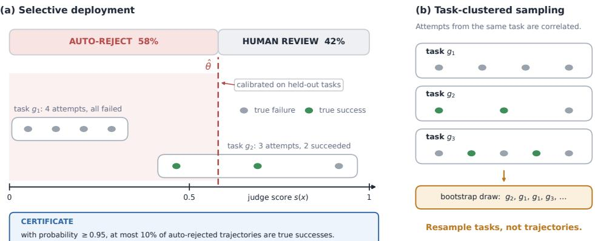
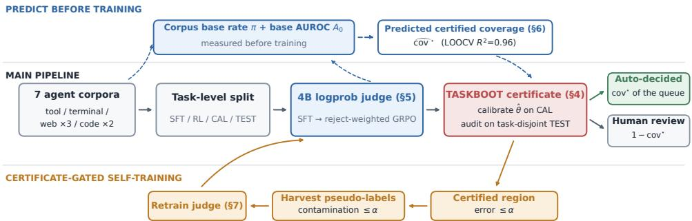
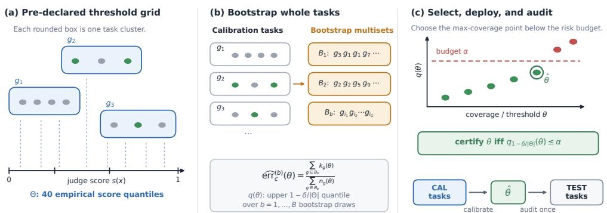
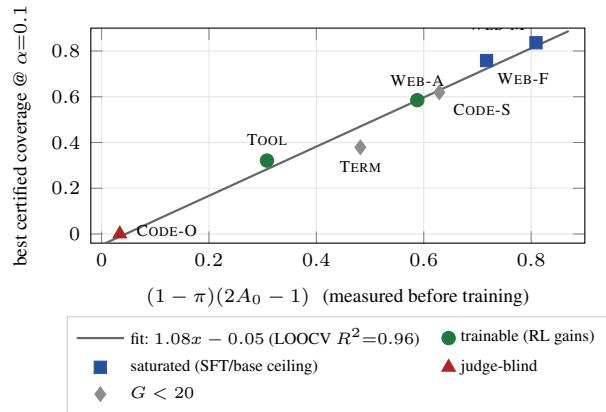

# Certified Selective Automation of LLM Agent Evaluation

Chengguang Gan<sup>1</sup>, Yunhao Liang<sup>2</sup>, Qinghao Zhang<sup>3</sup>, Shiwen Ni<sup>4</sup>

<sup>1</sup>Independent Researcher <sup>2</sup>University of Chinese Academy of Sciences <sup>3</sup>Pusan National University <sup>4</sup>Shenzhen University of Advanced Technology Correspondence: chengguangg1024@gmail.com

## Abstract

Evaluating LLM agents still ends with a human reading trajectories, because automatic judges carry no guarantee on how often they are wrong. We ask the operational question: whatfraction ofagent evaluation can a judge take over, with a certificate that the error rate among autodecided trajectories stays below a budget α? Agent corpora resist the standard answer: many agents attempt the same tasks, so trajectories arrive in correlated clusters, and the i.i.d. certificates of existing selective-judging methods can overstate what is safe: a naive certificate can claim 98% automation while its realized error exceeds the budget in 17.5% of task resamples. We introduce a task-level bootstrap certificate that is valid in every regime we test while matching the naive certificate’s coverage; finite-sample cluster-valid alternatives certify nothing at realistic task counts. Under this certificate, a 4B logprob judge trained with SFT and reject-weighted GRPO certifies 0.30–0.59 of evaluation on tool-use and web corpora at α=0.1, the only judge, among strongly elicited frontier models, certifying on both headline corpora. Certified coverage is predictable before training from base rate and discrimination alone (leave-one-corpus-out R<sup>2</sup>=0.96). Finally, the certificate doubles as a self-training filter: pseudo-labels harvested inside certified regions have contamination bounded by α by construction (realized 0.000–0.041 across six harvests), letting a judge enter an unseen domain at in-domain strength with zero target training labels.

## 1 Introduction

Whether an LLM agent actually completed its task is still, in practice, a question answered by a person: programmatic checkers mislabel outcomes on live websites (Lù et al., 2025; Xue et al., 2025), so benchmark authors fall back on expert annotation of full trajectories, at minutes per trajectory. LLM judges promise to absorb this work, and a growing line of research measures how well they agree with humans (Zhuge et al., 2024; Pan et al., 2024). Agreement, however, is not what a team deciding whether to turn thejudge on needs to know. They need to know how much of the queue the judge can take over before its mistakes exceed what they can tolerate, and that number has to hold on the next batch, not just the last.

We study this question as a certification problem: given a judge, an error budget α, and a confidence level 1 − δ, find the largest fraction of trajectories that can be auto-decided (rejected as failures or released as successes) such that with probability 1 − δ the error rate among auto-decided trajectories is at most α. This certified coverage is the fraction of human evaluation work provably removed (Figure 1). Certifying a fixed decision rule at a risk level is well-trodden ground (Bates et al., 2021; Angelopoulos et al., 2025), recently applied to LLM judges of chatbot responses (Jung et al., 2025; Badshah et al., 2026). Agent evaluation breaks the key assumption all of it rests on.

The break is structural. Agent corpora are built by running many agents, or many rollouts, against the same tasks: five attempts at the same booking flow succeed or fail together, because difficulty lives mostly in the task. Trajectories therefore arrive in correlated clusters, violating the exchangeability that i.i.d. certificates assume. The violation is not cosmetic. On our most heavily clustered corpus (intra-task correlation $\rho = 0 . 8 0 )$ , the standard i.i.d. certificate happily certifies 98% automation; a task-resampling audit shows its realized error exceeding the budget in 17.5% of resamples, against a promised 5% (Section 3). The textbook fixes fail in the opposite direction: a design-effect correction and the finite-sample cluster-valid constructions (one trajectory per task, task-level Learn-then-Test) certify essentially nothing at realistic task counts (Section 4). Between an invalid certificate and a vacuous one, neither is usable.

Our first contribution is a certificate that is both valid and usable: TASKBOOT, a task-level bootstrap test applied over a pre-declared threshold grid with Bonferroni accounting. In a synthetic study with known ground truth it violates its guarantee in at most 1% of trials, within budget, down to 20 task clusters, while matching the naive certificate’s coverage almost exactly; on real corpora it certifies 0.30–0.84 where every finite-sample cluster-valid alternative certifies 0. All certificates in this paper, including those of the frontier judges we compare against, are computed by this one procedure with thresholds calibrated on held-out tasks and audited out-of-sample.

With the certificate fixed, the judge becomes the object of study, and three findings emerge. First, a 4B logprob judge, fine-tuned then trained with a reject-weighted GRPO objective, certifies 0.297 on tool-use and 0.585 on web at α=0.1, and is the only judge among strongly elicited frontier models that certifies on both headline corpora; the one frontier configuration that beats it costs roughly 100× more per decision, and no monotone recalibration can rescue the others, because the certificate depends on scores only through their ranks (Section 5). Second, certified coverage is predictable before any training: a two-parameter relation on base rate and base discrimination explains held-out coverage with leave-one-corpus-out $R ^ { 2 } = 0 . 9 6$ and three gates predict when reinforcement learning adds coverage over supervised fine-tuning (Section 6). Third, the certificate does double duty as a self-training filter: pseudo-labels harvested inside certified regions have contamination bounded by α by construction (realized 0.000–0.041 across six harvests), letting a judge enter an unseen domain with zero target-domain training labels at indomain strength, and lifting our largest tool-use corpus beyond its best supervised judge (Section 7).

The empirical scope is seven corpora: tooluse, terminal, three web corpora (including 1,302 expert-annotated trajectories from five live benchmarks), and code repair. The protocol is preregistered: task-level splits fixed by one seed, hyperparameters selected on calibration data only, one test read per configuration. Corpora where certification fails stay in the main text: judges are blind where ground truth never appears in the trajectory, saturated corpora leave RL nothing to add, and thirteen test tasks cannot support a certificate at all.

## 2 Related work

Judging agent trajectories. That automatic evaluation of agents is unreliable is well documented: rule-based evaluators under-report success on live websites, LLM judges over-report it (Lù et al., 2025; Xue et al., 2025). Remedies train or prompt better evaluators (trajectory judges (Pan et al., 2024), agentic judges (Zhuge et al., 2024), process reward models (Chae et al., 2025)) and report agreement with human labels. We take the step none of these take: attaching a statistical guarantee to the judge’s deployment, so that “how good is the judge” becomes “how much work can it provably absorb.” Lù et al. (2025) supplies one of our corpora.

Selective prediction with guarantees. The machinery for risk-controlled selective decisions is mature: selective classification (Geifman and El-Yaniv, 2017), risk-controlling prediction sets (Bates et al., 2021), Learn-then-Test (Angelopoulos et al., 2025), conformal risk control (Angelopoulos et al., 2024). Two recent papers instantiate it for LLM judges: Jung et al. (2025) certify human-agreement of a selective judge of chatbot responses, and Badshah et al. (2026) wrap a pairwise judge in conformal risk control. Both assume exchangeable instances, and Section 4 shows that assumption is load-bearing: the i.i.d. certificate becomes anticonservative exactly in the multi-rollout regime modern agent evaluation uses. Cluster-aware conformal methods exist for hierarchical data (Dunn et al., 2023; Barber et al., 2023), but their finitesample constructions collapse to zero coverage at realistic task counts; the working point between invalid and vacuous is, to our knowledge, unoccupied. Prediction-powered evaluation (Boyeau et al., 2024) certifies aggregate metrics from judge labels plus few human labels; we certify per-trajectory decisions, a different estimand.

Training judges, and judges that train themselves. RL is now standard for improving judge accuracy (Whitehouse et al., 2026; Xu et al., 2026; Wang et al., 2024), with GRPO (Shao et al., 2024) the common optimizer; our GRPO stage differs in objective, not machinery: an asymmetric reward aimed at certified coverage, whose direction we ablate. Self-improving models (Yuan et al., 2024; Wu et al., 2025; Zhang et al., 2026; Zhao et al., 2026) gate their own training data with heuristics, and the failure mode is documented: pseudo-label accuracy in R-Zero decays from 79% to 63% over iterations (Huang et al., 2026). Conformal filters appear in classical semi-supervised learning (Lienen et al., 2023; Tanha et al., 2022) and in one-shot autolabeling with FDR control (Huang et al., 2025), but no prior system closes the loop in which a deployment certificate gates harvesting, training, and re-certification; Section 7 builds that loop and measures where its guarantee ends. Finally, fine-tuned small judges are known to match large ones indomain (Kim et al., 2024; Zhu et al., 2025) and frontier logprobs to be miscalibrated after RLHF (Tian et al., 2023; Kadavath et al., 2022); our frontier comparison sharpens both observations with the certificate as the yardstick, and Proposition 1 shows recalibration cannot change the verdict.

  
Figure 1: Certified selective automation, on one corpus. (a) A calibrated threshold auto-rejects low-scoring trajectories; the certificate bounds the error rate among auto-decided trajectories. (b) Attempts at one task are correlated: resample tasks, not trajectories.

## 3 Certified selective automation, and why clustering breaks it

Setup. A corpus is a set of trajectories $x _ { g j }$ where $g ~ \in ~ \{ 1 , \ldots , G \}$ indexes tasks and $j \in$ $\{ 1 , \ldots , m _ { g } \}$ indexes attempts at task g by different agents or rollouts. Each trajectory carries a binary outcome $y _ { g j } \in \{ 0 , 1 \}$ (1: the agent truly completed the task), obtained from expert annotation or a trusted oracle. A judge maps a trajectory to a score $s ( x ) \in [ 0 , 1 ]$ , its estimate of $\operatorname* { P r } ( y = 1 | x )$ A selective automation rule is a pair of thresholds $( \theta _ { \mathrm { r e j } } , \theta _ { \mathrm { r e l } } )$ : trajectories with $s ( x ) \leq \theta _ { \mathrm { r e j } }$ are autorejected, those with $s ( x ) \geq \theta _ { \mathrm { r e l } }$ are auto-released, and the rest go to a human. The two automated decisions carry different risks and are certified separately:

$$
\begin{array} { r } { \mathrm { e r r } _ { \mathrm { r e j } } ( \theta ) = \mathrm { P r } \big ( y { = } 1 \big | s ( x ) \le \theta \big ) , } \\ { \mathrm { e r r } _ { \mathrm { r e l } } ( \theta ) = \mathrm { P r } \big ( y { = } 0 \big | s ( x ) \ge \theta \big ) , } \end{array}\tag{1}
$$

i.e., the rate of discarded successes on the reject side and of failures shipped as successes on the release side. For a side with error functional err and coverage cov(θ) = Pr(auto-decided at θ), the object we report is

$$
\begin{array} { l } { \displaystyle \operatorname { c o v } ^ { \star } ( \alpha , \delta ) = \operatorname* { m a x } _ { \hat { \theta } } \operatorname { c o v } ( { \hat { \theta } } ) } \\ { \mathrm { s . t . } \operatorname* { P r } \big ( \operatorname { e r r } ( { \hat { \theta } } ) > \alpha \big ) \leq \delta , } \end{array}\tag{2}
$$

with the probability taken under the full selection procedure: the largest certifiable fraction of evaluation work removed at error budget α with confidence 1 − δ. Throughout, $\delta \ = \ 0 . 0 5$ and $\alpha \in \{ 0 . 1 , 0 . 2 \}$ ; the reject side is the main object because it is where our corpora admit non-trivial certificates, and the release side is reported where it is non-zero.

Corpora and protocol. We build seven corpora spanning the domains agents are actually evaluated on (Table 1; details in Appendix F): tool-use dialogues (TOOL, from $\tau ^ { 2 } .$ -bench), terminal sessions (TERM), three web corpora, WEB-A (1,302 expert-annotated trajectories over five live web benchmarks) and two MiniWoB++ corpora with weak and frontier agents, and two coderepair corpora. Every corpus is split by task into SFT/RL/CAL/TEST with one declared seed; every selected hyperparameter uses CAL only, and TEST is read once per configuration. Trajectories are rendered as text with no reward or oracle signal included: the judge must infer the outcome from what the agent saw and did.

Clustering is large, and it breaks the i.i.d. certificate. Outcomes within a task are strongly correlated: ρ ranges from 0.25 to 0.81 on our corpora, and design effects reach 17.6: each terminal task carries the information of roughly two independent trajectories, not forty. The standard certificate ignores this: the construction shared by Jung et al. (2025) and Badshah et al. (2026) instantiates here as certifying θ whenever the Clopper–Pearson upper bound at level $\delta / | \Theta |$ on the auto-decided error, computed as if trajectories were independent, is at most α. We audited it by resampling tasks and recomputing the realized error at its selected threshold. On WEB-M (ρ = 0.80, G = 32, eight rollouts per task; the pass@k evaluation pattern) it selects a threshold covering 98% of trajectories at $\alpha = 0 . 2 .$ , and its realized error exceeds the budget in 17.5% of task resamples, three and a half times the promised $\delta = 5 \% ( 6 . 9 \% \mathrm { a t } \alpha = 0 . 1 )$ . On mildly clustered corpora the audit passes (≤ 3.2%; Appendix D): the failure is precisely the high-ρ, few-task, many-rollout regime that modern agent evaluation produces, and a usable certificate has to survive it.

  
Figure 2: Overview. One certificate fixes the deployment operating point (§4), is predictable from corpus structure before training (§6), and gates a self-training loop whose contamination is bounded by the same α (§7).

Table 1: Corpora. n: test trajectories; $G \colon$ test tasks; π: success rate; $\rho \colon$ intra-task correlation of outcomes; $\mathrm { D E F F } = 1 + ( \tilde { m } - 1 ) \rho$ with m˜ the size-weighted mean cluster size; $n _ { \mathrm { e f f } } = n / \mathrm { D E F F }$
<table><tr><td>corpus</td><td>domain</td><td>n</td><td>G</td><td>π</td><td> $\rho$ </td><td>DEFF</td><td> $n _ { \mathrm { e f f } }$ </td></tr><tr><td>TOOL  $( \tau ^ { 2 } )$ </td><td>tool-use dialogues</td><td>1280</td><td>84</td><td>.48</td><td>.25</td><td>5.0</td><td>257</td></tr><tr><td>TERM</td><td>terminal sessions</td><td>520</td><td>13</td><td>.34</td><td>.43</td><td>17.6</td><td>30</td></tr><tr><td>WEB-A (ARB)</td><td>live web, expert labels</td><td>200</td><td>68</td><td>.26</td><td>.49</td><td>2.2</td><td>91</td></tr><tr><td>WEB-M</td><td>MiniWoB++, 4B agents</td><td>512</td><td>32</td><td>.16</td><td>.80</td><td>13.0</td><td>39</td></tr><tr><td>WEB-F</td><td>MiniWoB++, frontier agents</td><td>256</td><td>32</td><td>.26</td><td>.81</td><td>6.7</td><td>38</td></tr><tr><td>CODE-O</td><td>code repair (OpenHands)</td><td>899</td><td>382</td><td>.45</td><td>.64</td><td>2.0</td><td>459</td></tr><tr><td>CODE-S</td><td>code repair (multilingual)</td><td>21</td><td>7</td><td>.24</td><td>.00</td><td>1.0</td><td>21</td></tr></table>

## 4 TASKBOOT: a task-level bootstrap certificate

The certificate must respect two constraints that pull in opposite directions: validity under task clustering, and non-vacuity at $G \in [ 1 0 , 1 0 0 ]$ tasks, which is what real corpora provide. TASKBOOT resolves the tension by testing each candidate threshold against the task-resampling distribution of its own error.

Procedure. Fix a side (say reject), a pre-declared grid Θ of $| \Theta | = 4 0 $ score quantiles, and calibration data $\{ ( s _ { g j } , y _ { g j } ) \}$ grouped into G tasks. For a threshold θ, let

$$
{ \widehat { \mathrm { e r r } } } ^ { ( b ) } ( \theta ) \ = \ { \frac { \sum _ { g \in { \mathcal { B } } _ { b } } k _ { g } ( \theta ) } { \sum _ { g \in { \mathcal { B } } _ { b } } n _ { g } ( \theta ) } } , \qquad b = 1 , \ldots , B ,\tag{3}
$$

where $\boldsymbol { B } _ { b }$ is a multiset of G tasks drawn with replacement, $n _ { g } ( \theta ) ~ = ~ \# \{ j ~ : ~ s _ { g j } ~ \leq ~ \theta \}$ and $k _ { g } ( \theta ) = \# \{ j : s _ { g j } \leq \theta , y _ { g j } = 1 \}$ are the pertask covered and erroneous counts. Threshold θ is certified if the upper $\left( 1 - \delta / | \Theta | \right)$ empirical quantile of $\{ \widehat { \mathrm { e r r } } ^ { ( b ) } ( \theta ) \} _ { b = 1 } ^ { B }$ is at most α; the procedure returns the certified threshold of maximal coverage (Algorithm 1), with $\delta / | \Theta |$ a Bonferroni correction over the grid. This is an approximation, not a finitesample theorem: the bootstrap quantile consistently estimates the clustered error ratio’s sampling distribution as G grows (Field and Welsh, 2007), and the question that matters (does the approximation already hold at the G we have?) we answer by simulation with known ground truth and by out-ofsample audits on every real corpus.

Validity with known ground truth. We simulate clustered judge scores from a task-effect model:

```latex
Require: task-grouped calibration scores $\{ s _ { g j } , y _ { g j } \} ; \alpha , \delta , | \Theta | , B$
1: Θ ← empirical score quantiles at levels linspace(0.02, 0.98, |Θ|)
2: for θ ∈ Θ do
3: compute per-task counts $n _ { g } ( \theta ) , k _ { g } ( \theta )$
4: for b = 1, . . . , B do
5: draw G tasks with replacement; compute $\widehat { \mathrm { e r r } } ^ { ( b ) } ( \theta )$ by Eq. (3)
6: end for
7: q(θ) ← empirical 1 − δ/|Θ|-quantile of $\{ \widehat { \mathrm { e r r } } ^ { ( b ) } ( \theta ) \}$
8: end for
9: return <sup>ˆ</sup>θ = arg max{cov(θ) : θ ∈ Θ, q(θ) ≤ α}
```

  
Figure 3: TASKBOOT in one picture: a pre-declared quantile grid (a), a task-resampled test of each threshold’s selective error (b), max-coverage selection with calibrate-on-CAL / audit-on-TEST deployment (c).

task effects $u _ { g } \sim \mathcal { N } ( 0 , \tau ^ { 2 } )$ induce label correlation $\rho \in \{ 0 . 1 , 0 . 5 , 0 . 8 \}$ at $G \in \{ 2 0 , 5 0 , 1 0 0 , 5 0 0 \}$ tasks; each procedure selects a threshold on a simulated calibration draw, and we measure that threshold’s true selective error on a fresh population of $1 . 5 \times 1 0 ^ { 5 }$ trajectories, 300 trials per cell (full protocol and grid in Appendix B). TASKBOOT violates its guarantee in at most 1% of trials in every cell, including $G { = } 2 0 .$ , while matching naive Clopper– Pearson’s coverage to within a point. The finitesample cluster-valid alternatives are valid and useless: one trajectory per task, or a Hoeffding bound on task-mean losses, certifies zero coverage until G reaches the hundreds, and the design-effect correction $n \mapsto n / \mathrm { D E F F }$ (Kish, 1965) is similarly blunt at high $\rho .$ Three adversarial designs (matched to WEB-M’s parameters, size–outcome correlation, heavy-tailed cluster sizes) did not break the naive certificate at population level (its Bonferroni slack absorbs a lot), so the evidence is stated precisely: naive certification fails the task-resampling audit on real high-ρ data (17.5%, Section 3), and we could not construct any regime where TASKBOOT fails. Uniformly safe, at no cost in coverage.

On real corpora, the alternatives certify nothing. Running all five procedures on the real test scores (Appendix C): one-per-task CP and task-mean Hoeffding certify exactly 0 on all seven corpora (G from 7 to 382), and DEFF-corrected CP certifies 0 everywhere at $\alpha = 0 . 1$ , while TASKBOOT certifies 0.30–0.84 wherever a usable judge exists. Between a certificate that can overpromise (98% on WEB-M) and certificates that always promise nothing, TASKBOOT is the only occupant of the working regime.

Out-of-sample audits. Because the guarantee is asymptotic in G, every deployment in this paper is audited: <sup>ˆ</sup>θ is calibrated on CAL tasks, and the realized selective error is measured once on taskdisjoint TEST. All audits pass: e.g., realized reject error at α = 0.1 is 0.027–0.037 on WEB-A and 0.011–0.012 on TOOL (all listed in Appendix D). So every certificate below is backed twice: by simulation where truth is known, and by held-out audits where it is not.

## 5 Judges under the certificate

A small logprob judge. The judge is a 4Bparameter instruction model prompted as a skep-

  
Figure 4: Certifiability is measurable ex-ante. Best certified reject coverage against the pre-training index $( 1 - \pi ) ( 2 A _ { 0 } - 1 )$ ). The largest residual (TERM) is the smallest-n corpus, where finite-sample slack in the certificate binds before judge quality does.

tical auditor: it reads the rendered trajectory and must answer with a single verdict token. Its score is the renormalized next-token probability

$$
s ( x ) \ = \ { \frac { p _ { \mathrm { L M } } ( { \mathsf { S U C C E S S \mid } } x ) } { p _ { \mathrm { L M } } ( { \mathsf { S U C C E S S \mid } } x ) + p _ { \mathrm { L M } } ( { \mathsf { F A I L \mid } } x ) } } ,\tag{4}
$$

read in a single forward pass with reasoning disabled: every trajectory parses by construction and the score is continuous, both properties the certificate needs. Training has two stages. SFT finetunes on verdict-labeled trajectories from the taskdisjoint SFT split (Appendix H); GRPO (Shao et al., 2024) then optimizes an asymmetric reward on the RL split: for sampled verdict v against label y,

$$
\begin{array} { l } { { r ( v , y ) ~ = ~ { \bf 1 } [ v = y ] ~ - ~ \lambda { \bf 1 } [ v = 5 , y = 0 ] } } \\ { { ~ - ~ \mu { \bf 1 } [ v = 5 , y = 1 ] , } } \end{array}\tag{5}
$$

so $\mu > \lambda$ penalizes discarding successes (the rejectside error) more than shipping failures, pushing probability mass out of the reject tail exactly where the certificate reads it. The strength $\mu \in \{ 1 , 3 , 5 \}$ (at λ=1) is selected on CAL by certified coverage, never on TEST; the test-optimal arm is reported once, labeled as an oracle.

Main result. Table 2 is the paper’s central table. On the two trainable corpora the ordering $\mathrm { G R P O } > \mathrm { S F T } >$ base holds under the clean selection protocol: TOOL goes $0  . 2 9 3  . 2 9 7$ (the test-oracle arm reaches .321; every arm, including the worst, stays at or above SFT), and WEB-A goes $. 5 1 0 \to . 5 6 0 \to . 5 8 5$ , where CAL independently selects the arm the oracle would. The margins are modest; what makes them meaningful is that each is a certified, audited increment in evaluation work removed under a pre-registered protocol. The remaining corpora fail for three diagnosable reasons that Section 6 turns into a predictive model: on CODE-O the outcome is decided by a held-out test suite that never appears in the trajectory, so no judge, trained or frontier, gets traction; on WEB-M/WEB-F the base judge is already near-perfect and SFT saturates what the budget allows; TERM and CODE-S simply lack tasks.

Which reward direction matters, and where. Equation (5) has three natural arms: accuracy $\scriptstyle ( \lambda = \mu = 1 )$ , reject-weighted $( \mu { > } \lambda )$ , releaseweighted $( \lambda { > } \mu )$ . On TOOL the direction is the effect: the reject-weighted arm certifies .321 against .297 for accuracy and .293 (no gain over SFT) for release-weighted. Generic RL polish is not what moves reject coverage there. On WEB-A all three arms land on the same .585 plateau: from a strong SFT start, any GRPO polish purifies the tail, and the direction stops being separable. Both mechanisms are real; a practitioner should try the rejectweighted arm first and expect it to matter most when the SFT judge still has headroom (full table in Appendix E).

Frontier judges certify inconsistently, and recalibration cannot help. Table 3 runs the elicitations a skeptical reviewer would demand. The picture is not “small beats frontier” (the strongest reasoning model beats our judge on WEB-A, .704 vs .585, at roughly 100× the inference cost) but that frontier judging does not transfer: the same model certifies zero on TOOL at both budgets (AUROC .794, matching our untrained base), four of six frontier configurations certify nothing anywhere, and only the trained 4B certifies on both corpora. These are ranking failures, not score-scale failures, and not fixable downstream:

Proposition 1 (Rank invariance). TASKBOOT’s certified coverage is invariant to any strictly increasing transformation of the judge’s scores. In particular, Platt scaling, isotonic regression, and temperature scaling leave every certificate in Table 3 unchanged.

The proof is immediate: the grid is built from score quantiles and every count in Eq. (3) depends on scores only through comparisons (Appendix A). Still, the consequence is worth stating: a judge that certifies 0 cannot be rescued by recalibration, only by reordering, i.e. by a different judge.

Table 2: Main result: certified reject coverage at α=0.1, δ=0.05 (TASKBOOT, threshold calibrated on CAL), and test AUROC. GRPO arm selected on CAL. Grey: G below the simulation-validated regime $\left( G \ge 2 0 \right)$ , certificate reported for completeness only. Oracle-arm and α=0.2 results in Appendix E.
<table><tr><td></td><td colspan="3">AUROC</td><td colspan="3">certified coverage @ α=0.1</td><td></td><td></td></tr><tr><td>corpus</td><td>base</td><td>SFT</td><td>GRPO</td><td>base</td><td>SFT</td><td>GRPO</td><td> $\Delta _ { \mathrm { R L } }$ </td><td>regime</td></tr><tr><td>TOOL</td><td>.798</td><td>.899</td><td>.903</td><td>.000</td><td>.293</td><td>.297</td><td>+.004</td><td>trainable</td></tr><tr><td>WEB-A</td><td>.897</td><td>.925</td><td>.922</td><td>.510</td><td>.560</td><td>.585</td><td>+.025</td><td>trainable</td></tr><tr><td>WEB-M</td><td>.983</td><td>.976</td><td>.977</td><td>.832</td><td>.789</td><td>.836</td><td>+.047</td><td>saturated</td></tr><tr><td>WEB-F</td><td>.983</td><td>.991</td><td>.994</td><td>.707</td><td>.758</td><td>.758</td><td>±.000</td><td>saturated</td></tr><tr><td>CODE-O</td><td>.531</td><td>.645</td><td>.530</td><td>.000</td><td>.000</td><td>.000</td><td></td><td>judge-blind</td></tr><tr><td>TERM</td><td>.864</td><td>.871</td><td>.873</td><td>.290</td><td>.379</td><td>.369</td><td>-.010</td><td> $G { = } 1 3$ </td></tr><tr><td>CODE-S</td><td>.913</td><td>.800</td><td></td><td>.619</td><td>.619</td><td></td><td></td><td> $G { = } 7$ </td></tr></table>

Table 3: Strongly elicited frontier judges vs. the trained 4B judge, certified by the same procedure. CoT: chain-ofthought then a verbalized probability; SC-k: vote share over k samples at $T { = } 1 ;$ logprob: native token probability. Cost: relative inference cost per decision.
<table><tr><td>judge</td><td>elicitation</td><td colspan="2">WEB-A</td><td colspan="2">TOOL</td></tr><tr><td></td><td></td><td>AUROC</td><td>cert@.1</td><td>AUROC</td><td>cert@.1</td></tr><tr><td>gpt-5.6-sol</td><td> $\mathrm { C o T } + \mathrm { p r o b } .$ </td><td>.929</td><td>.704</td><td>.794</td><td>.000</td></tr><tr><td>claude-sonnet-5</td><td> $\mathbf { C o T } + \mathbf { \bar { p r o b . } }$ </td><td>.905</td><td>.497</td><td>.847</td><td>.000</td></tr><tr><td>gemini-2.5-pro</td><td>CoT + prob.</td><td>.753</td><td>.000</td><td></td><td></td></tr><tr><td>gemini-2.5-pro</td><td>SC-5</td><td>.680</td><td>.000</td><td></td><td></td></tr><tr><td>claude-sonnet-5</td><td>SC-10</td><td>.686</td><td>.000</td><td></td><td></td></tr><tr><td>gpt-4o</td><td>logprob</td><td>.753</td><td>.000</td><td></td><td></td></tr><tr><td>trained 4B (ours)</td><td>logprob</td><td>.922</td><td>.585</td><td>.903</td><td>.297</td></tr></table>

What the coverage buys. At six minutes of review per trajectory, Table 2’s operating points remove roughly 30 reviewer-hours per thousand trajectories on TOOL and 59 on WEB-A, with error $\leq ~ 0 . 1$ guaranteed on the removed portion (Appendix L); the judge runs on one local GPU, keeps trajectories on-premise, and can grow its own coverage (§7).

## 6 Certified coverage is predictable before training

Seven corpora, three failure regimes, two successes: the pattern is regular enough to model. Let π be the corpus success rate and $A _ { 0 }$ the AUROC of the untrained base judge, both measurable from a few hundred labeled trajectories before any training run. $( 1 - \pi )$ is the reject side’s raw material and $\left( 2 A _ { 0 } - 1 \right)$ rescales base discrimination; their product predicts certified coverage remarkably well:

$$
\widehat { \mathrm { c o v } } ^ { \star } \ : = \ : a ( 1 - \pi ) ( 2 A _ { 0 } - 1 ) + b ,\tag{6}
$$

with $a { = } 1 . 0 8 , b { = } { - } 0 . 0 5$ fit across the seven corpora against the best certified coverage each attains (Figure 4). Leave-one-corpus-out, the relation explains

$R ^ { 2 } = 0 . 9 6$ of held-out coverage with mean absolute error 0.039; in-sample $R ^ { 2 } = 0 . 9 8$ . Both factors earn their place: dropping $( 1 - \pi )$ collapses LOOCV $R ^ { 2 }$ to 0.38, and AUROC alone reaches only 0.47; an earlier version carried a sample-size saturation factor that cross-validation rejects as unnecessary (Appendix K). This is an empirical model, not a law (seven points, one seed), but its practical content survives the caveat: a team can score a few hundred trajectories with the base judge and read off, before spending a GPU-hour on training, roughly what fraction of its evaluation queue is certifiably automatable.

Three gates for when RL helps. Whether GRPO adds coverage on top of SFT follows from three conditions, each visible in Table 2:

$$
\underbrace { A _ { 0 } \gg 0 . 5 } _ { \mathrm { j u d g e ~ c a n ~ l e a r n } } \wedge \underbrace { A _ { \mathrm { S F T } } < A _ { \mathrm { s a t } } } _ { \mathrm { S F T ~ n o t ~ s a t u r a t e d } } \wedge \underbrace { n _ { \mathrm { e f f } } \gtrsim n _ { \mathrm { m i n } } ( \alpha , \delta ) } _ { \mathrm { e n o u g h ~ s a m p l e s } } ,\tag{7}
$$

where $n _ { \mathrm { m i n } }$ is the smallest effective sample a certificate can act on (≈29 at α=0.1, δ=0.05: the zeroerror Clopper–Pearson point). TOOL and WEB-A pass all three gates and show RL gains. CODE-O fails the first: the outcome lives in a held-out test suite, not in the trajectory, so the judge is blind and every training method inherits the same ≈ 0.53–0.65 ceiling, a property of the domain, not the dataset: a second ingested code corpus (6,306 tasks) lands AUROC in the same band. WEB-M and WEB-F fail the second: base AUROC 0.983 leaves SFT nothing to purify that the budget can see, and no agent mix we tried (4B, 8B, two frontier models generating fresh trajectories) changed the judgeability of the corpus. TERM $( n _ { \mathrm { e f f } } { = } 3 0 )$ and CODE-S (21) fail the third: whatever the judge does, the certificate cannot resolve improvements smaller than its own finite-sample slack. The same effect appears in selection: TOOL’s CAL certifies 0.150/0.149/0.145 across the three GRPO arms (too close to rank), so Table 2 reports the CAL choice bracketed by the best and worst arms. The gates are stated post-hoc; their value is that each is measurable before training, and Section 7 uses them prospectively.

Table 4: Certificate-gated self-training (certified reject coverage @ α=0.1); transfer judges never saw the target corpus.
<table><tr><td>target corpus</td><td>judge</td><td>cert@.1</td><td>harvest (contam.)</td><td>target labels</td></tr><tr><td rowspan="4">WEB-A</td><td>transfer (round 0)</td><td>.575</td><td></td><td>0</td></tr><tr><td>+ CERTHARVEST round 1</td><td>.585</td><td>262/914 (.008)</td><td>0</td></tr><tr><td>175 CAL labels spent on SFT instead</td><td>.540</td><td></td><td>175</td></tr><tr><td>in-domain ceiling (SFT→GRPO, §5)</td><td>.585</td><td></td><td>914</td></tr><tr><td rowspan="2">WEB-M</td><td>transfer (round 0)</td><td>.830</td><td></td><td>0</td></tr><tr><td>+ CERTHARVEST round 1</td><td>.820</td><td>837/1296(.002)</td><td>0</td></tr><tr><td rowspan="3">TOOL</td><td>in-domain SFT</td><td>.293</td><td></td><td>2600</td></tr><tr><td>+ CERTHARVEST round 1</td><td>.343</td><td>296/2200 (.000)</td><td>+0</td></tr><tr><td>+ CERTHARVEST round 2</td><td>.347</td><td>338/2200 (.003)</td><td>+0</td></tr></table>

## 7 The certificate as a self-training filter

Self-improving models share a weakness: the filter deciding which self-generated labels to trust is heuristic, and when it drifts, contamination compounds silently (Yuan et al., 2024; Huang et al., 2026). We already have a non-heuristic filter: pseudo-labels harvested from a region certified at budget α are, by definition of the certificate, wrong at rate at most α (with probability 1 − δ). CERTHARVEST makes this operational (Algorithm 2, Appendix J): calibrate a certified reject region on one half of CAL’s tasks, pseudo-label its contents as failures, retrain, re-certify: always on human-labeled CAL/TEST tasks that pseudolabels never touch, so the loop cannot erode its own guarantee.

The bound holds every time it is used. Across six harvests (three corpora, pools of 914–2,200 trajectories), realized contamination against withheld ground truth was .041/.008/.024/.000/.003/.002: never above the 0.10 budget. The filter is the deployment guarantee itself, not a proxy for it.

Entering a domain with zero training labels. Trained leave-one-corpus-out, with no web data at all, a judge already certifies 0.560 on WEB-A; one CERTHARVEST round closes the gap to the in-domain GRPO ceiling (.585) with zero WEB-A training labels, and the same judge certifies 0.830 on WEB-M, matching that ceiling outright (Table 4). Two controls: the same 175 CAL labels spent on supervision instead certify only 0.540; where transfer is weak (TOOL, AUROC .794), CERTHARVEST refuses to harvest: no certificate, no self-training.

In-domain growth, and where iteration ends. From the in-domain SFT judge on TOOL, certified harvesting from the unseen RL pool lifts coverage to .343 in one round and .347 in two, past the best supervised GRPO arm (.321), with no labels beyond SFT’s. Iteration is not free: on WEB-A a second round degrades coverage (.585 → .465) even though its harvest stayed within budget (.024). The α-bound controls how many pseudo-labels are wrong, not how skewed the harvested distribution is; a second pass over a small one-sided pool amplifies its selection bias, and CAL cannot rank rounds on 175 rows (Appendix J); so one round for transfer starts and small pools, iteration only in-domain on large pools. On saturated WEB-M the round is correctly useless (Table 4), as Eq. (7) predicts.

## 8 Conclusion

Agent-evaluation judges deserve a better answer than an agreement rate: a certificate, valid under task clustering, for the evaluation work a judge can provably take over.

## Limitations

Every number in this paper comes from a single preregistered run: task-level splits fixed by one seed, hyperparameters chosen on calibration data, one test read per configuration. The protocol prevents selection effects but does not quantify run-to-run variance; the cluster bootstrap quantifies sampling uncertainty over tasks, not over training randomness. TASKBOOT’s guarantee is asymptotic in the number of task clusters: we validate it down to 20 clusters by simulation and audit it out-of-sample on every corpus, but it is not a finite-sample theorem, and the anti-conservativeness of the naive i.i.d. certificate is demonstrated on one real corpus in the high-clustering multi-rollout regime rather than universally. The certifiability model is fit on seven corpora and should be read as an empirical trend. On our corpora the release side rarely certifies at practical budgets, so the deployed guarantee mostly removes review of failures; and certified self-training is a one-round recommendation. Iterating on small one-sided pools degraded coverage even with the contamination bound intact.

## References

Anastasios Angelopoulos, Stephen Bates, Adam Fisch, Lihua Lei, and Tal Schuster. 2024. Conformal risk control. In International conference on learning representations, volume 2024, pages 55198–55218.

Anastasios N Angelopoulos, Stephen Bates, Emmanuel J Candès, Michael I Jordan, and Lihua Lei. 2025. Learn then test: Calibrating predictive algorithms to achieve risk control. The Annals ofApplied Statistics, 19(2):1641–1662.

Ibragim Badertdinov, Alexander Golubev, Maksim Nekrashevich, Anton Shevtsov, Simon Karasik, Andrei Andriushchenko, Maria Trofimova, Daria Litvintseva, and Boris Yangel. 2025. Swe-rebench: An automated pipeline for task collection and decontaminated evaluation of software engineering agents. In Advances in Neural Information Processing Systems, volume 38, Main Conference. Curran Associates, Inc.

Sher Badshah, Ali Emami, and Hassan Sajjad. 2026. Scope: Selective conformal optimized pairwise llm judging. arXiv preprint arXiv:2602.13110.

Shuai Bai, Yuxuan Cai, Ruizhe Chen, Keqin Chen, Xionghui Chen, Zesen Cheng, Lianghao Deng, Wei Ding, Chang Gao, Chunjiang Ge, Wenbin Ge, Zhifang Guo, Qidong Huang, Jie Huang, Fei Huang, Binyuan Hui, Shutong Jiang, Zhaohai Li, Mingsheng Li, and 45 others. 2025. Qwen3-vl technical report. Preprint, arXiv:2511.21631.

Rina Foygel Barber, Emmanuel J Candes, Aaditya Ramdas, and Ryan J Tibshirani. 2023. Conformal prediction beyond exchangeability. The Annals ofStatistics, 51(2):816–845.

Victor Barres, Honghua Dong, Soham Ray, Xujie Si, and Karthik Narasimhan. 2025. τ<sup>2</sup>-bench: Evaluating conversational agents in a dual-control environment. Preprint, arXiv:2506.07982.

Stephen Bates, Anastasios Angelopoulos, Lihua Lei, Jitendra Malik, and Michael Jordan. 2021. Distribution-free, risk-controlling prediction sets. Journal ofthe ACM (JACM), 68(6):1–34.

Léo Boisvert, Megh Thakkar, Maxime Gasse, Massimo Caccia, Thibault Le Sellier De Chezelles, Quentin Cappart, Nicolas Chapados, Alexandre Lacoste, and Alexandre Drouin. 2024. Workarena++: Towards compositional planning and reasoning-based common knowledge work tasks, 2024. URL https://arxiv. org/abs/2407.05291.

Pierre Boyeau, Anastasios N Angelopoulos, Nir Yosef, Jitendra Malik, and Michael I Jordan. 2024. Autoeval done right: Using synthetic data for model evaluation. arXiv preprint arXiv:2403.07008.

Hyungjoo Chae, Seonghwan Kim, Junhee Cho, Seungone Kim, Seungjun Moon, Gyeom Hwangbo, Dongha Lim, Minjin Kim, Yeonjun Hwang, Minju Gwak, Dongwook Choi, Minseok Kang, Gwanhoon Im, ByeongUng Cho, Hyojun Kim, Jun Han, Taeyoon Kwon, Minju Kim, Beong-woo Kwak, and 2 others. 2025. Web-shepherd: Advancing prms for reinforcing web agents. In Advances in Neural Information Processing Systems, volume 38, Main Conference, pages 63314–63356. Curran Associates, Inc.

Thibault Le Sellier De Chezelles, Maxime Gasse, Alexandre Drouin, Massimo Caccia, Léo Boisvert, Megh Thakkar, Tom Marty, Rim Assouel, Sahar Omidi Shayegan, Lawrence Keunho Jang, Xing Han Lù, Ori Yoran, Dehan Kong, Frank F. Xu, Siva Reddy, Quentin Cappart, Graham Neubig, Ruslan Salakhutdinov, Nicolas Chapados, and Alexandre Lacoste. 2025. The browsergym ecosystem for web agent research. Preprint, arXiv:2412.05467.

C. J. Clopper and E. S. Pearson. 1934. The use of confidence or fiducial limits illustrated in the case of the binomial. Biometrika, 26(4):404–413.

Alexandre Drouin, Maxime Gasse, Massimo Caccia, Issam H Laradji, Manuel Del Verme, Tom Marty, Léo Boisvert, Megh Thakkar, Quentin Cappart, David Vazquez, et al. 2024. Workarena: How capable are web agents at solving common knowledge work tasks? arXiv preprint arXiv:2403.07718.

Robin Dunn, Larry Wasserman, and Aaditya Ramdas. 2023. Distribution-free prediction sets for two-layer hierarchical models. Journal ofthe American Statistical Association, 118(544):2491–2502.

B. Efron. 1979. Bootstrap Methods: Another Look at the Jackknife. The Annals ofStatistics, 7(1):1 – 26.

Christopher A Field and Alan H Welsh. 2007. Bootstrapping clustered data. Journal of the Royal Statistical Society Series B: Statistical Methodology, 69(3):369–390.

Yonatan Geifman and Ran El-Yaniv. 2017. Selective classification for deep neural networks. Advances in neural information processing systems, 30.

Edward J. Hu, Yelong Shen, Phillip Wallis, Zeyuan Allen-Zhu, Yuanzhi Li, Shean Wang, Lu Wang, and Weizhu Chen. 2021. Lora: Low-rank adaptation of large language models. Preprint, arXiv:2106.09685.

Chengsong Huang, Wenhao Yu, Xiaoyang Wang, Hongming Zhang, Zongxia Li, Ruosen Li, Jiaxin Huang, Haitao Mi, and Dong Yu. 2026. R-zero: Selfevolving reasoning llm from zero data. In International Conference on Learning Representations, volume 2026, pages 130770–130790.

Huipeng Huang, Wenbo Liao, Huajun Xi, Hao Zeng, Mengchen Zhao, and Hongxin Wei. 2025. Modelagnostic selective labeling with provable statistical guarantees. arXiv preprint arXiv:2510.14581.

Carlos E Jimenez, John Yang, Alexander Wettig, Shunyu Yao, Kexin Pei, Ofir Press, and Karthik Narasimhan. 2024. Swe-bench: Can language models resolve real-world github issues? In International Conference on Learning Representations, volume 2024, pages 54107–54157.

Jaehun Jung, Faeze Brahman, and Yejin Choi. 2025. Trust or escalate: Llm judges with provable guarantees for human agreement. In International Conference on Learning Representations, volume 2025, pages 3101–3125.

Saurav Kadavath, Tom Conerly, Amanda Askell, Tom Henighan, Dawn Drain, Ethan Perez, Nicholas Schiefer, Zac Hatfield-Dodds, Nova DasSarma, Eli Tran-Johnson, et al. 2022. Language models (mostly) know what they know. arXiv preprint arXiv:2207.05221.

Seungone Kim, Juyoung Suk, Shayne Longpre, Bill Yuchen Lin, Jamin Shin, Sean Welleck, Graham Neubig, Moontae Lee, Kyungjae Lee, and Minjoon Seo. 2024. Prometheus 2: An open source language model specialized in evaluating other language models. In Proceedings of the 2024 Conference on Empirical Methods in Natural Language Processing, pages 4334–4353.

L. Kish. 1965. Survey Sampling. Wiley.

Jing Yu Koh, Robert Lo, Lawrence Jang, Vikram Duvvur, Ming Lim, Po-Yu Huang, Graham Neubig, Shuyan Zhou, Russ Salakhutdinov, and Daniel Fried. 2024. Visualwebarena: Evaluating multimodal agents on realistic visual web tasks. In Proceedings of the 62nd Annual Meeting of the Association for

Computational Linguistics (Volume 1: Long Papers), pages 881–905.

Julian Lienen, Caglar Demir, and Eyke Hüllermeier. 2023. Conformal credal self-supervised learning. In Conformal and probabilistic prediction with applications, pages 214–233. PMLR.

Evan Zheran Liu, Kelvin Guu, Panupong Pasupat, Tianlin Shi, and Percy Liang. 2018. Reinforcement learning on web interfaces using workflow-guided exploration. Preprint, arXiv:1802.08802.

Xing Han Lù, Amirhossein Kazemnejad, Nicholas Meade, Arkil Patel, Dongchan Shin, Alejandra Zambrano, Karolina Stanczak, Peter Shaw, Christopher J´ Pal, and Siva Reddy. 2025. Agentrewardbench: Evaluating automatic evaluations of web agent trajectories. arXiv preprint arXiv:2504.08942.

Mike A. Merrill, Alexander G. Shaw, Nicholas Carlini, Boxuan Li, Harsh Raj, Ivan Bercovich, Lin Shi, Jeong Yeon Shin, Thomas Walshe, E. Kelly Buchanan, Junhong Shen, Guanghao Ye, Haowei Lin, Jason Poulos, Maoyu Wang, Marianna Nezhurina, Jenia Jitsev, Di Lu, Orfeas Menis Mastromichalakis, and 66 others. 2026. Terminal-bench: Benchmarking agents on hard, realistic tasks in command line interfaces. Preprint, arXiv:2601.11868.

Jiayi Pan, Yichi Zhang, Nicholas Tomlin, Yifei Zhou, Sergey Levine, and Alane Suhr. 2024. Autonomous evaluation and refinement of digital agents. arXiv preprint arXiv:2404.06474.

Zhihong Shao, Peiyi Wang, Qihao Zhu, Runxin Xu, Junxiao Song, Xiao Bi, Haowei Zhang, Mingchuan Zhang, Y. K. Li, Y. Wu, and Daya Guo. 2024. Deepseekmath: Pushing the limits of mathematical reasoning in open language models. Preprint, arXiv:2402.03300.

Jafar Tanha, Negin Samadi, Yousef Abdi, and Nazila Razzaghi-Asl. 2022. Cpssds: Conformal prediction for semi-supervised classification on data streams. Information Sciences, 584:212–234.

Katherine Tian, Eric Mitchell, Allan Zhou, Archit Sharma, Rafael Rafailov, Huaxiu Yao, Chelsea Finn, and Christopher D Manning. 2023. Just ask for calibration: Strategies for eliciting calibrated confidence scores from language models fine-tuned with human feedback. In Proceedings ofthe 2023 Conference on Empirical Methods in Natural Language Processing, pages 5433–5442.

Tianlu Wang, Ilia Kulikov, Olga Golovneva, Ping Yu, Weizhe Yuan, Jane Dwivedi-Yu, Richard Yuanzhe Pang, Maryam Fazel-Zarandi, Jason Weston, and Xian Li. 2024. Self-taught evaluators. arXiv preprint arXiv:2408.02666.

Xingyao Wang, Boxuan Li, Yufan Song, Frank F Xu, Xiangru Tang, Mingchen Zhuge, Jiayi Pan, Yueqi Song, Bowen Li, Jaskirat Singh, Hoang Tran, Fuqiang Li, Ren Ma, Mingzhang Zheng, Bill Qian, Daniel Shao,

Niklas Muennighoff, Yizhe Zhang, Binyuan Hui, and 5 others. 2025. Openhands: An open platform for ai software developers as generalist agents. In International Conference on Learning Representations, volume 2025, pages 65882–65919.

Chenxi Whitehouse, Tianlu Wang, Ping Yu, Xian Li, Jason E Weston, Ilia Kulikov, and Swarnadeep Saha. 2026. J1: Incentivizing thinking in llm-as-a-judge via reinforcement learning. In International Conference on Learning Representations, volume 2026, pages 10397–10420.

Tianhao Wu, Weizhe Yuan, Olga Golovneva, Jing Xu, Yuandong Tian, Jiantao Jiao, Jason E Weston, and Sainbayar Sukhbaatar. 2025. Meta-rewarding language models: Self-improving alignment with llmas-a-meta-judge. In Proceedings of the 2025 Conference on Empirical Methods in Natural Language Processing, pages 11548–11565.

Austin Xu, Yilun Zhou, Xuan-Phi Nguyen, Caiming Xiong, and Shafiq Joty. 2026. J4r: Learning to judge with equivalent initial state group relative policy optimization. In Proceedings of the 64th Annual Meeting ofthe Associationfor Computational Linguistics (Volume 1: Long Papers), pages 1492–1511.

Tianci Xue, Weijian Qi, Tianneng Shi, Chan Hee Song, Boyu Gou, Dawn Song, Huan Sun, and Yu Su. 2025. An illusion of progress? assessing the current state of web agents. arXiv preprint arXiv:2504.01382.

An Yang, Anfeng Li, Baosong Yang, Beichen Zhang, Binyuan Hui, Bo Zheng, Bowen Yu, Chang Gao, Chengen Huang, Chenxu Lv, Chujie Zheng, Dayiheng Liu, Fan Zhou, Fei Huang, Feng Hu, Hao Ge, Haoran Wei, Huan Lin, Jialong Tang, and 41 others. 2025. Qwen3 technical report. Preprint, arXiv:2505.09388.

Ori Yoran, Samuel Joseph Amouyal, Chaitanya Malaviya, Ben Bogin, Ofir Press, and Jonathan Berant. 2024. Assistantbench: Can web agents solve realistic and time-consuming tasks? In Proceedings of the 2024 Conference on Empirical Methods in Natural Language Processing, pages 8938–8968.

Weizhe Yuan, Richard Yuanzhe Pang, Kyunghyun Cho, Xian Li, Sainbayar Sukhbaatar, Jing Xu, and Jason Weston. 2024. Self-rewarding language models. arXiv preprint arXiv:2401.10020.

Daoguang Zan, Zhirong Huang, Wei Liu, Hanwu Chen, Shulin Xin, Linhao Zhang, Qi Liu, Li Aoyan, Lu Chen, Xiaojian Zhong, Siyao Liu, Yongsheng Xiao, Liangqiang Chen, Yuyu Zhang, Jing Su, Tianyu Liu, RUI LONG, Ming Ding, and liang xiang. 2025. Multi-swe-bench: A multilingual benchmark for issue resolving. In Advances in Neural Information Processing Systems, volume 38, Main Conference. Curran Associates, Inc.

Jenny Zhang, Shengran Hu, Cong Lu, Robert Lange, and Jeff Clune. 2026. Darwin gödel machine: openended evolution of self-improving agents. In Inter-

national Conference on Learning Representations, volume 2026, pages 104223–104294.

Andrew Zhao, Yiran Wu, Tong Wu, Quentin Xu, Yang Yue, Matthieu Lin, Shenzhi Wang, Qingyun Wu, Zilong Zheng, and Gao Huang. 2026. Absolute zero: Reinforced self-play reasoning with zero data. Advances in Neural Information Processing Systems, 38:105816–105879.

Shuyan Zhou, Frank F Xu, Hao Zhu, Xuhui Zhou, Robert Lo, Abishek Sridhar, Xianyi Cheng, Tianyue Ou, Yonatan Bisk, Daniel Fried, et al. 2024. Webarena: A realistic web environment for building autonomous agents. In International Conference on Learning Representations, volume 2024, pages 15585–15606.

Lianghui Zhu, Xinggang Wang, and Xinlong Wang. 2025. Judgelm: Fine-tuned large language models are scalable judges. In International Conference on Learning Representations, volume 2025, pages 51257–51296.

Mingchen Zhuge, Changsheng Zhao, Dylan Ashley, Wenyi Wang, Dmitrii Khizbullin, Yunyang Xiong, Zechun Liu, Ernie Chang, Raghuraman Krishnamoorthi, Yuandong Tian, et al. 2024. Agent-as-ajudge: Evaluate agents with agents. arXiv preprint arXiv:2410.10934.

## A Rank invariance of the certificate

ProofofProposition 1. Let $\phi : [ 0 , 1 ]  [ 0 , 1 ]$ be strictly increasing and ${ \tilde { s } } \ = \ \phi \circ s .$ The grid Θ consists of empirical quantiles of the scores, so $\tilde { \Theta } = \phi ( \Theta )$ elementwise, and for every $\theta \in \Theta$ and every trajectory, $\tilde { s } ( x ) \leq \phi ( \theta ) \iff s ( x ) \leq \theta$ All quantities in Algorithm 1 (the per-task counts $n _ { g } ( \theta ) , k _ { g } ( \theta )$ , every bootstrap ratio $\widehat { \mathrm { e r r } } ^ { ( b ) } ( \theta )$ , the quantile test, and the coverage of the selected threshold) depend on scores only through such comparisons, hence are identical under $\phi .$ The same argument applies to the naive and DEFF-corrected certificates, whose grids and counts are constructed the same way. Platt scaling, temperature scaling, and isotonic regression (with ties broken consistently) are monotone, which gives the statement in the main text. □

Two practical corollaries. First, the frontier failures in Table 3 cannot be repaired by post-hoc calibration on our 175 CAL labels or any amount of it; the orderings themselves are wrong. Second, the judge’s absolute probability calibration is irrelevant to certification; what Eq. (4) must get right is the ranking of failures below successes, which is what SFT and the GRPO arms improve. Throughout, the exact binomial bound is Clopper–Pearson (Clopper and Pearson, 1934) and the resampling principle is Efron’s (Efron, 1979), applied at the cluster level (Field and Welsh, 2007).

## B Synthetic validity study

Data-generating process. Task effects $u _ { g } \sim$ $\mathcal { N } ( 0 , \tau ^ { 2 } )$ ; cluster sizes $m _ { g } \sim 1 + \operatorname { P o i s s o n } ( 7 )$ ; labels $y _ { g j } \sim$ Bernoulli $\left( \sigma ( b _ { 0 } + u _ { g } ) \right)$ ; scores $s _ { g j } =$ $\sigma \big ( d ( 2 y _ { g j } - 1 ) + c u _ { g } + \varepsilon _ { g j } \big ) , \varepsilon _ { g j } \sim \mathcal { N } ( 0 , 1 )$ with $( b _ { 0 } , d , c ) \ = \ ( - 0 . 8 , 2 . 2 , 0 . 9 )$ and τ set to $\{ 0 . 9 , 2 . 6 , 5 . 0 \}$ to hit label ICC $\rho \approx \{ 0 . 1 , 0 . 5 , 0 . 8 \}$ Each of 300 trials draws a calibration set of G tasks, runs all five procedures $\scriptstyle ( B = 8 0 0 , \mid \Theta \mid = 4 0 , \alpha = 0 . 1$ $\delta { = } 0 . 0 5 )$ , and evaluates the selected threshold’s true selective error on a fresh draw of $1 . 5 \times 1 0 ^ { 5 }$ trajectories. Violation = fraction of trials with true error $> \alpha ,$ computed among trials where the procedure certified anything.

Adversarial designs. Three additional designs target the regimes where a reviewer would expect the naive certificate to break at population level: (i) parameters matched to WEB-M $\scriptstyle ( G = 3 2 , \ \rho { \approx } 0 . 8 .$ , near-perfect discrimination d=4.5, low base rate); (ii) size–outcome correlation, $u _ { g } ~  ~ u _ { g } \mathrm { ~ - ~ } 0 . 2 5 ( m _ { g } \mathrm { ~ - ~ } \bar { m } )$ , so large clusters fail more; (iii) heavy-tailed cluster sizes, $m _ { g } \sim 1 + \operatorname* { m i n } ( \vert 4 \operatorname { P a r e t o } ( 1 . 3 ) \vert + 1 , 6 0 )$ . Naive violation rates were .003, .000, .000 respectively (TASKBOOT: .000 in all three, equal coverage). We report this against ourselves: the Bonferronislack-protected naive certificate is population-valid in every synthetic regime we constructed honestly, and its demonstrated failure is the task-resampling audit on real high-ρ data (Appendix D). The two statements are compatible: the audit measures the dispersion of realized error on corpora like the observed one, which is the quantity a deployment re-run experiences. Together they motivate the uniform-safety framing of Section 4 rather than a blanket invalidity claim.

Monte-Carlo error. With 300 trials, a true violation rate of 0.05 has standard error $\approx 0 . 0 1 3 ;$ the TASKBOOT estimates of $\leq 0 . 0 1$ are consistent with a true rate at or below the budget in every cell.

## C Cluster-valid baselines on the real corpora

The two finite-sample-valid constructions certify zero on all fifteen rows, including CODE-O with 382 tasks (its judge is too weak) and TOOL with 84 (the $\delta / 4 0 \cdot$ -corrected exact bounds need more). The CODE-S row illustrates the $G < 2 0$ caveat from the main text: TASKBOOT nominally certifies .619 from seven clusters, outside the regime our simulation validates, and we do not use that number anywhere.

## D Certificate audits

Task-resampling audit of the naive certificate. For each corpus and judge, the naive i.i.d. certificate selects its maximal-coverage threshold; we then resample tasks with replacement (3,000 draws) and record how often the realized selective error at that threshold exceeds α. Values $\leq \delta \mathrm { = } . 0 5$ are consistent with the promised confidence: WEB-M SFT: .069 (α=.1), .175 (α=.2); WEB-M base: .017, .021; all other corpus–judge pairs ≤ .032 (TOOL SFT .004/.032, GRPO .001/.017; WEB-A all $\leq \ . 0 0 4 ;$ TERM SFT .000/.027; WEB-F $\le ~ . 0 1 6 )$ The naive certificate’s failure is confined to, and severe in, the high-ρ multi-rollout regime, where it also claims the most (.98 coverage at $\alpha { = } . 2 )$

Table 5: Full synthetic grid: violation / mean certified coverage.
<table><tr><td>G</td><td>ρ</td><td>naive CP</td><td>DEFF-CP</td><td>one-per-task</td><td>task-Hoeffding</td><td>TASKBOOT</td></tr><tr><td>20</td><td>.1</td><td>.00 / .65</td><td>.00 / .16</td><td>.00 / .00</td><td>.00 / .00</td><td>.00 / .68</td></tr><tr><td>20</td><td>.5</td><td>.00 / .53</td><td>.00 / .00</td><td>.00 / .00</td><td>.00 / .00</td><td>.01 / .61</td></tr><tr><td>20</td><td>.8</td><td>.00 / .47</td><td>.00 / .00</td><td>.00 / .00</td><td>.00 / .00</td><td>.01 / .56</td></tr><tr><td>50</td><td>.1</td><td>.00 / .69</td><td>.00 / .67</td><td>.00 / .00</td><td>.00 / .00</td><td>.00 / .69</td></tr><tr><td>50</td><td>.5</td><td>.00 / .61</td><td>.00 / .03</td><td>.00 / .00</td><td>.00 / .00</td><td>.00 / .62</td></tr><tr><td>50</td><td>.8</td><td>.00 / .57</td><td>.00 / .00</td><td>.00 / .00</td><td>.00 / .00</td><td>.00 / .57</td></tr><tr><td>100</td><td>.1</td><td>.00 / .70</td><td>.00 / .69</td><td>.00 / .29</td><td>.00 / .00</td><td>.00 / .70</td></tr><tr><td>100</td><td>.5</td><td>.00 / .62</td><td>.00 / .58</td><td>.03 / .06</td><td>.00 / .00</td><td>.00 / .63</td></tr><tr><td>100</td><td>.8</td><td>.00 / .58</td><td>.00 / .23</td><td>.00 / .00</td><td>.00 / .00</td><td>.00 / .58</td></tr><tr><td>500</td><td>.1</td><td>.00 / .71</td><td>.00 / .71</td><td>.00 / .69</td><td>.00 / .66</td><td>.00 / .71</td></tr><tr><td>500</td><td>.5</td><td>.00 / .64</td><td>.00 / .63</td><td>.00 / .62</td><td>.00 / .56</td><td>.00 / .64</td></tr><tr><td>500</td><td>.8</td><td>.00 / .60</td><td>.00 / .58</td><td>.00 / .58</td><td>.00 / .00</td><td>.00 / .59</td></tr></table>

Table 6: Certified reject coverage @ $\alpha { = } 0 . 1$ on real test scores, five procedures. One-per-task uses a single preregistered draw (seed 42); task-Hoeffding tests the mean of per-task error rates over covered tasks (estimand: task-weighted error), Bonferroni $\delta / 4 0$ throughout.
<table><tr><td>corpus</td><td>judge</td><td>G</td><td>ρ</td><td>naive</td><td>DEFF</td><td>one/task</td><td>Hoeffding</td><td>TASKBOOT</td></tr><tr><td>TOOL</td><td>base</td><td>84</td><td>.25</td><td>.000</td><td>.000</td><td>.000</td><td>.000</td><td>.000</td></tr><tr><td>TOOL</td><td>SFT</td><td>84</td><td>.25</td><td>.325</td><td>.000</td><td>.000</td><td>.000</td><td>.325</td></tr><tr><td>TOOL</td><td> ${ \mathrm { G R P O } } _ { \mu 3 }$ </td><td>84</td><td>.25</td><td>.321</td><td>.000</td><td>.000</td><td>.000</td><td>.321</td></tr><tr><td>TERM</td><td>base</td><td>13</td><td>.43</td><td>.340</td><td>.000</td><td>.000</td><td>.000</td><td>.315</td></tr><tr><td>TERM</td><td>SFT</td><td>13</td><td>.43</td><td>.379</td><td>.000</td><td>.000</td><td>.000</td><td>.379</td></tr><tr><td>TERM</td><td> ${ \mathrm { G R P O } } _ { \mu 5 }$ </td><td>13</td><td>.43</td><td>.369</td><td>.000</td><td>.000</td><td>.000</td><td>.369</td></tr><tr><td>WEB-A</td><td>base</td><td>68</td><td>.49</td><td>.465</td><td>.000</td><td>.000</td><td>.000</td><td>.510</td></tr><tr><td>WEB-A</td><td>SFT</td><td>68</td><td>.49</td><td>.465</td><td>.000</td><td>.000</td><td>.000</td><td>.560</td></tr><tr><td>WEB-A</td><td> ${ \mathrm { G R P O } } _ { \mu 3 }$ </td><td>68</td><td>.49</td><td>.430</td><td>.000</td><td>.000</td><td>.000</td><td>.585</td></tr><tr><td>WEB-M</td><td>base</td><td>32</td><td>.80</td><td>.857</td><td>.000</td><td>.000</td><td>.000</td><td>.832</td></tr><tr><td>WEB-M</td><td>SFT</td><td>32</td><td>.80</td><td>.859</td><td>.000</td><td>.000</td><td>.000</td><td>.789</td></tr><tr><td>WEB-F</td><td>base</td><td>32</td><td>.81</td><td>.707</td><td>.000</td><td>.000</td><td>.000</td><td>.707</td></tr><tr><td>WEB-F</td><td>SFT</td><td>32</td><td>.81</td><td>.758</td><td>.000</td><td>.000</td><td>.000</td><td>.758</td></tr><tr><td>CODE-O</td><td>base</td><td>382</td><td>.64</td><td>.000</td><td>.000</td><td>.000</td><td>.000</td><td>.000</td></tr><tr><td>CODE-S</td><td>base</td><td>7</td><td>.00</td><td>.000</td><td>.000</td><td>.000</td><td>.000</td><td>.619</td></tr></table>

CAL→TEST audits of TASKBOOT. Thresholds calibrated on CAL tasks, realized selective error measured once on task-disjoint TEST, $\alpha = 0 . 1 \colon$ WEB-A SFT .028, ${ \mathrm { G R P O } } _ { \mu 3 }$ .027, base .037; TOOL SFT .012, $\mathrm { G R P O } _ { \mu 1 }$ .012, ${ \mathrm { G R P O } } _ { \mu 3 }$ .011; WEB-M base .008, SFT .015, $\mathrm { G R P O } _ { \mu 5 }$ .008; WEB-F base .016, SFT .022, ${ \mathrm { G R P O } } _ { \mu 3 }$ .016. At $\alpha = 0 . 2$ all audits likewise pass (maximum realized error .116, on WEB-A $\mathrm { G R P O } _ { \mu 3 } )$ . Every deployed threshold in the paper comes from this protocol.

## E Full result tables

All GRPO arms, both headline corpora (certified reject coverage, $\alpha { = } 0 . 1 $ CAL-certified coverage used for selection in parentheses):

$\alpha \ = \ 0 . 2 .$ , reject side (TASKBOOT) : WEB-A: base .635, SFT .710, $\mathrm { G R P O } _ { \mu 1 }$ .735, ${ \mathrm { G R P O } } _ { \mu 3 }$ .710, ${ \mathrm { G R P O } } _ { \mu 5 }$ .715; TOOL: SFT .422, $\mathrm { G R P O } _ { \mu 1 }$ (CAL pick) .424, ${ \mathrm { G R P O } } _ { \mu 3 }$ .391, base .120; WEB-M: base .883, SFT .859, $\mathrm { G R P O } _ { \mu 5 }$ .885; WEB-F: base .707, SFT .758, ${ \mathrm { G R P O } } _ { \mu 3 }$ .758; TERM (grey regime): base .442, SFT .469, ${ \mathrm { G R P O } } _ { \mu 5 }$ .423. Frontier at α=0.2 on WEB-A: gpt-5.6-sol CoT .784, sonnet-5 CoT .675, all other configurations .000; on TOOL: sonnet-5 CoT .124, gpt-5.6-sol CoT

.000.

Release side. The release budget certifies far less everywhere: the only non-zero cells at $\alpha { = } 0 . 2$ are on TOOL (SFT .27) and nothing certifies at $\alpha { = } 0 . 1$ on any corpus. We therefore report the two-sided formulation as framework and validate the reject side; release-side validation at realistic budgets needs corpora with more certifiable success mass than ours have.

Frontier parse rates. CoT with verbalized probability parsed 199/200 (gpt-5.6-sol), 182/200 (gemini-2.5-pro), 191/200 (sonnet-5) on WEB-A; 1194/1280 and 741/1280 for gpt-5.6-sol and sonnet-5 on TOOL; SC-k parsed ≥ 199/200; gpt-5.2’s API returns no token logprobs, so the frontierlogprob row uses gpt-4o (200/200). Unparsed rows are excluded from that judge’s scores (not counted against it).

## F Corpora

All corpora share one schema (task id, rendered trajectory text, binary outcome) and one split procedure: tasks are shuffled with a fixed seed and assigned $4 0 / 3 0 / 1 5 / 1 5$ percent to

<table><tr><td>corpus</td><td>SFT</td><td> $\operatorname { a c c . } \left( \lambda { = } \mu { = } 1 \right)$ </td><td> $\operatorname { r e j e c t } \mu = 3$ </td><td> $\operatorname { r e j e c t } \mu = 5$ </td><td>release λ=5</td><td>CAL pick</td></tr><tr><td>TOOL</td><td>.293</td><td> $. 2 9 7 \ : ( . 1 5 0 )$ </td><td>.321 (.149)</td><td>.295 (.145)</td><td>.293</td><td>µ=1</td></tr><tr><td>WEB-A</td><td>.560</td><td>.585 (.514)</td><td>.585 (.537)</td><td>.585 (.514)</td><td>.585</td><td>µ=3</td></tr></table>

SFT/RL/CAL/TEST (test fraction raised to 25% on the MiniWoB corpora to clear $n _ { \mathrm { m i n } } ) ;$ trajectories follow their task, so all four splits are task-disjoint, verified programmatically. Rendered text contains the task instruction and per-step actions and observation excerpts, middle-truncated to a fixed character budget; no reward signal, evaluator output, or environment verdict is ever rendered.

TOOL (τ<sup>2</sup>-bench; Barres et al., 2025): tool-use dialogues across airline, retail, and telecom domains; outcomes from the benchmark’s databasestate checks. 6,400 trajectories over 421 tasks (1,280/84 in TEST). TERM (Merrill et al., 2026): terminal-session tasks with programmatic goal checks. WEB-A: the AgentRewardBench release (Lù et al., 2025), 1,302 trajectories of four agent models on five live web benchmarks (WebArena, VisualWebArena, AssistantBench, WorkArena, WorkArena++; Zhou et al., 2024; Koh et al., 2024; Yoran et al., 2024; Drouin et al., 2024; Boisvert et al., 2024), each expert-annotated; we use the 1,289 trajectories with a majority success label. Cluster = one web task, pooling the agents that attempted it. WEB-M: MiniWoB++ trajectories (Liu et al., 2018) we generate under BrowserGym (Chezelles et al., 2025) with two weak agents (a 4B vision–language model and its SFT variant) across all 125 registered tasks, eight seeds each, labels from the environment reward; the trajectory text excludes the reward. WEB-F: same environments, trajectories from two frontier agents (a reasoning model and a fast commercial model), six/two seeds. CODE-O: code-repair trajectories from SWE-rebench (Badertdinov et al., 2025) under the OpenHands scaffold (Wang et al., 2025), whose outcome is a held-out test suite in the SWEbench style (Jimenez et al., 2024); CODE-S: a small multilingual corpus from Multi-SWE-bench (Zan et al., 2025). Full provenance, counts, and rendering parameters: Table 1 and the released scripts.

## G Judge prompt

One prompt is shared verbatim by base scoring, SFT supervision, GRPO rollouts, and all trainedjudge scoring; training and evaluation cannot drift apart.

system: You are a skeptical auditor of an AI agent’s trajectory. Decide whether the agent truly completed its task. The agent’s own claims of success are not evidence; judge only from what the trajectory shows.

user: Task instruction:   
"""⟨task⟩"""   
Agent trajectory (actions and   
observation excerpts, possibly   
truncated):   
⟨rendered trajectory⟩   
Did the agent truly and completely   
succeed at the task? Answer with one   
word, SUCCESS or FAIL.   
VERDICT:

The score (Eq. 4) reads the next-token distribution after VERDICT:; both verdict words are single tokens for our base model. Frontier CoT elicitation replaces the one-word instruction with stepby-step reasoning ending in P\_SUCCESS=<integer 0-100>; SC-k keeps the one-word form at temperature 1.0.

## H Training details

Judge. Qwen3.5-4B base (Yang et al., 2025), LoRA (Hu et al., 2021) on all attention and MLP projections (32.5M trainable parameters, 0.77%), reasoning disabled at train and test time. The WEB-M generating agents are Qwen3-VL models (Bai et al., 2025). SFT: one epoch over the corpus’s SFT split, lr $2 \times 1 0 ^ { - 5 }$ cosine, batch 2 with gradient accumulation 4, max sequence 5,120 tokens, completion-loss only (the single verdict token). GRPO: initialized from the SFT adapter, reward per Eq. (5), 8 samples per prompt, lr $2 \times 1 0 ^ { - 6 } .$ , max completion 40 tokens, 150 optimizer steps (40 on TERM), batch 8 per device on 2–6 GPUs (DDP; identical results at different world sizes, as expected for a fixed global batch). RSI rounds: identical SFT recipe over source data plus harvested pseudo-labels. All runs use seed 42. Hardware: one node with 96 GB GPUs; a full SFT+GRPO+certification pass for one corpus takes 1–3 GPU-hours; every certificate and analysis in the paper runs on CPU in minutes.

## I Leave-one-corpus-out transfer

Transfer judges are SFT-trained on a balanced sample $( \leq 2 { , } 6 0 0$ rows, equal per source benchmark)

of the pooled SFT splits of all corpora except the held-out one, then certified on the held-out corpus’s untouched TEST via CAL-calibrated TASKBOOT. Two variants for WEB-A: excluding only WEB-A itself (other web corpora remain; certifies .575, AU-ROC .915) and the strict variant excluding all web corpora (certifies .560, AUROC .902), the number quoted as “zero web exposure.” The reverse direction is the honest negative: a judge trained on everything except $\tau ^ { 2 }$ transfers at AUROC .794 and certifies .045; tool-use dialogue formats are idiosyncratic in a way generic trajectory-reading does not cover, which is precisely the situation the CERTHARVEST gate then refuses to harvest in. The WEB-M transfer row in Table 4 uses the strict zero-web-exposure judge.

## J CERTHARVEST protocols and the stopping-rule negative

Protocols. Pool = the target corpus’s SFT+RL splits with labels withheld (transfer starts) or its unseen RL split (in-domain starts); harvest threshold from TASKBOOT on half of CAL’s tasks (seed-42 halves); round-k training set = source data + current harvest; certification of every round on the untouched other half and TEST. Ground-truth labels of harvested trajectories are used only to report contamination, never in training.

All harvests. Table 7 lists every harvest, including the full-CAL pilot run before the split-CAL hygiene fix.

Why not a stopping rule. A natural iteration rule (continue while CAL-certified coverage improves) fails empirically: on WEB-A, CAL certifies .514/.389/.486 for rounds $0 / 1 / 2$ while TEST moves .575/.585/.465; a 175-row CAL cannot rank models this close (the same resolution limit as arm selection on TOOL). We therefore recommend the fixed policy of Section 7 rather than an adaptive rule the calibration data cannot support.

## K Certifiability model: validation

Table 8 reports leave-one-corpus-out validation of Eq. (6) and ablated forms (target: best certified coverage per corpus).

The saturation factor adds nothing once K is tuned and hurts when fixed; the base-rate factor is load-bearing. Caveats stated in the main text apply: $n { = } 7$ corpora, and the zero-coverage corpus anchors the low end of the fit.

## L Cost accounting

Certified coverage converts to removed review time linearly: at t minutes of human review per trajectory, a corpus with certified coverage c saves $1 0 0 0 c t / 6 0$ reviewer-hours per thousand trajectories, with residual risk bounded by α on the removed portion. At t=6: TOOL 29.7 h, WEB-A 58.5 h, WEB-M 83.6 h, WEB-F 75.8 h per thousand. Judge-side marginal cost is one forward pass of a 4B model per trajectory (batched, a single GPU sustains ${ \sim } 1 0$ trajectories/second at our sequence lengths); the strongest frontier configuration spends ${ \sim } 1 0 ^ { 3 }$ reasoning tokens per trajectory at API prices, the basis for the ∼100× figure in Section 5. We keep all dollar figures in footnotes because they inherit local prices; the hour figures do not.

3: $s _ { 1 } $ fine-tune on source data $\cup \mathcal { H } ;$ return $s _ { 1 }$ , certified on $\mathcal { C } _ { B }$ , audited on $T E S T \triangleright$ pseudo-labels never enter CAL/TEST

Require: judge $s _ { 0 } ;$ unlabeled pool U; CAL split by task into halves $( { \mathcal { C } } _ { A } , { \mathcal { C } } _ { B } ) ; \alpha$

1: <sup>ˆ</sup>θ ← TASKBOOT $( s _ { 0 } , \mathcal { C } _ { A } , \alpha )$

2: $\mathcal { H }  \{ x \in \mathcal { U } : s _ { 0 } ( x ) \leq \hat { \theta } \}$ , pseudo-labeled $\tilde { y } = 0$

$$
\operatorname* { P r } ( y = 1 | x \in \mathcal { H } ) \leq \alpha \ : \mathrm { w . p . } \ : 1 - \delta
$$

<table><tr><td>target</td><td>start</td><td>harvest</td><td>contamination</td><td>TEST cert @ .1</td></tr><tr><td> ${ \bf W } { \bf E B - A }$ </td><td>transfer, round 1 (full-CAL pilot)</td><td>437/914</td><td>.041</td><td>.585</td></tr><tr><td> ${ \bf W } { \bf E B - A }$ </td><td>transfer, round 1  $\left( \operatorname { s p l i t - C A L } \right)$ </td><td>262/914</td><td>.008</td><td>.585</td></tr><tr><td> ${ \bf W } { \bf E B - A }$ </td><td>transfer, round 2</td><td>336/914</td><td>.024</td><td>.465</td></tr><tr><td>TOOL</td><td>in-domain, round 1</td><td>296/2200</td><td>.000</td><td>.343</td></tr><tr><td>TOOL</td><td>in-domain, round 2</td><td>338/2200</td><td>.003</td><td>.347</td></tr><tr><td>WEB-M</td><td>transfer, round 1</td><td>837/1296</td><td>.002</td><td>.820</td></tr><tr><td>TOOL</td><td>transfer</td><td colspan="3">gate closed: CAL certifies nothing</td></tr></table>

Table 7: All CERTHARVEST harvests. The full-CAL pilot row shows the protocol before the split-CAL fix; its result is unchanged by the fix, and all reported numbers use the split-CAL protocol.

<table><tr><td>form</td><td>in-sample  $R ^ { 2 }$ </td><td>LOOCV  $R ^ { 2 }$ </td><td>LOOCV MAE</td></tr><tr><td> $( 1 - \pi ) ( 2 A _ { 0 } - 1 )$ </td><td>.977</td><td>.964</td><td>.039</td></tr><tr><td> $( \mathrm { E q . } 6 )$   $( 1 - \pi ) ( 2 A _ { 0 } - 1 ) ( 1 - e ^ { - n _ { \mathrm { e f f } } / K } ) , K { \stackrel { - } { = } } 3 0$ </td><td>.835</td><td>.707</td><td>.124</td></tr><tr><td> $\mathrm { s a m e } , K \mathrm { t u n e d } \mathrm { b y } \mathrm { L O O C V } ( K { = } 1 0 )$ </td><td>.977</td><td>.967</td><td>.039</td></tr><tr><td> $( 2 A _ { 0 } - 1 ) \mathrm { o n l y }$ </td><td>.913</td><td>.471</td><td>.132</td></tr><tr><td> $( 2 A _ { 0 } - 1 ) ( 1 - e ^ { - n _ { \mathrm { e f f } } / 3 0 } ) ( \mathrm { n o } \pi )$ </td><td>.656</td><td>.382</td><td>.196</td></tr></table>

Table 8: Certifiability-model validation: in-sample and leave-one-corpus-out fit of Eq. (6) and ablated forms.