# DRAFT-KV: LEARNING USEFUL LATENT COMMUNI-CATION BETWEEN LANGUAGE MODELS

Linquan Wu<sup>1</sup>, Shichang Meng<sup>1</sup>, Tianxiang Jiang<sup>2</sup>, Haoyu Yang<sup>3</sup>, Peng Zhong<sup>4</sup>, Fengming Zhu<sup>4</sup>, Xi Peng<sup>5</sup>, Linqi Song<sup>1</sup>, Jacky Keung<sup>1</sup>, Jingyu Zhang<sup>6</sup>

<sup>1</sup>City University of Hong Kong

<sup>2</sup>University of Science and Technology of China

<sup>3</sup>University of Electronic Science and Technology of China

<sup>4</sup>AIPD, Tencent

<sup>5</sup>Theory Lab, Huawei

<sup>6</sup>Hong Kong Metropolitan University

github.com/Svardfox/Draft-KV

## ABSTRACT

Latent communication passes internal states between language models instead of decoded text, but higher receiver accuracy does not show that the receiver used the message content. Across five method–dataset pairs, replacing each message with one from an unrelated question changes accuracy by at most 0.60 points, even when communication adds 15.44 points over the receiver alone. Thus the interface can supply the gain while making the sharer dispensable. Draft-KV instead sends the key–value states formed while the sharer drafts an answer to the current question. Linear projections place these states in a side memory read through a gated attention branch, and progressive training moves from message reconstruction to answer supervision under a guard on harm from mismatched messages. Both models remain frozen and the interface trains 1.05M parameters, 348× fewer than C2C. With a Qwen3-8B sharer, a frozen Qwen2.5-0.5B-Instruct receiver reaches 78.04% on MMLU-Redux, versus 37.45% alone and 36.40% with reassigned messages. At fixed interface size, scaling the sharer from 0.6B to 8B raises accuracy from 46.11% to 78.04%; communication also transfers to held-out tasks and can exceed both models when each holds different evidence.

## 1 INTRODUCTION

Model collaboration matters when models can exchange what they know and have computed (Tran et al., 2025; Guo et al., 2024). Text requires one model to decode its computation and another to re-encode it (Wu et al., 2024; Hong et al., 2024; Zou et al., 2025); latent communication instead passes internal states directly, whether as embedding-level signals (Pham et al., 2024), hidden-state trajectories (Ramesh & Li, 2025; Du et al., 2025; Tang et al., 2025; Zheng et al., 2025), or key– value caches (Vaswani et al., 2017; Liu et al., 2024; Shi et al., 2025; Jin et al., 2026; Li et al., 2026). This is especially appealing between heterogeneous models with complementary capabilities or information (Fu et al., 2025; Chen et al., 2026; Fein-Ashley et al., 2025). The question is therefore not whether a model can describe its reasoning, but whether a lightweight interface can make its internal computation genuinely useful to another.

Existing latent interfaces report clear end-task gains for the receiver (Fu et al., 2025; Zou et al., 2025; Chen et al., 2026). Such gains establish that the trained system is useful, but not that the receiver benefits from the states it was given: the same improvement would arise if the receiver merely exploited the adaptation introduced by training the interface. Separating these explanations requires a contrast that changes the message while holding the interface fixed. Writing $A _ { M } , A _ { D }$ , and $A _ { R }$ for receiver accuracy under a Matched message produced for the current question, a Deranged message produced for a different question, and a Receiver-only condition without communication,

## we separate

$$
G = A _ { M } - A _ { R } , \qquad P = A _ { M } - A _ { D } ,\tag{1}
$$

where the system gain G values the complete system and the pairing gain P values correctly paired content. Section 3 shows double-digit system gains with pairing gains below one point. We call this the information-use gap: content-independent gains make the sharer dispensable and cannot convey the advantage of a stronger partner.

Can a lightweight latent interface make a receiver benefit specifically from what the current sharer computed?

Answering affirmatively requires two properties at once. The message must be informative: the transmitted states must contain task-relevant computation the sharer formed for the current input, not a generic summary of its parameters. And the receiver must make effective use of it: its answers have to change in a way that depends on receiving the correctly paired message, not merely on the presence of a trained interface. Meeting both removes the two failure modes above: a large pairing gain certifies that the sharer’s contribution cannot be absorbed into a receiver-conditioned component, and a channel that pays for content lets a stronger sharer deliver more.

Draft-KV supplies both. For an informative message, the sharer first drafts an answer and sends the key–value states formed during that computation, rather than a static prompt encoding (Hao et al., 2024; Zhu et al., 2025). A lightweight gated bridge maps these states into the frozen receiver’s attention while both models remain frozen (Hu et al., 2022; Chen et al., 2026). For effective use, progressive training (Bengio et al., 2009) first establishes cross-model readability, then supervises answers from the draft under a guard that limits harm from a mismatched message.

Contributions.

• Criterion. The pairing gain separates content-dependent communication from system improvement, and exposes an information-use gap in existing latent interfaces (Section 3).

• Method. Draft-KV sends draft-position key–value states through a progressively trained 1.05M-parameter gated interface, 348× smaller than C2C (Fu et al., 2025) and 36× smaller than DLC (Chen et al., 2026) (Section 4).

• Evidence. Gains depend on paired content in all 35 Public settings; with a Qwen3- 8B sharer, MMLU-Redux (Hendrycks et al., 2021; Gema et al., 2025) reaches 78.04% Matched, 36.40% Deranged, and 37.45% Receiver-only. Gains grow with sharer capability and transfer to held-out tasks (Section 5).

## 2 RELATED WORK

Language-model collaboration. Language-model collaboration combines complementary computations through structured interaction. AutoGen supports configurable agent conversations (Wu et al., 2024), and MetaGPT organizes specialized roles through standardized workflows (Hong et al., 2024). Multiagent debate improves answers through repeated exchanges of proposed solutions and reasoning (Du et al., 2023), while Mixture-of-Agents aggregates responses across successive layers of models (Wang et al., 2024). Optima trains communication policies to balance task performance, token efficiency, and readability (Chen et al., 2025). These methods establish the value of coordination and communication training, mostly through text, whereas we study the interface itself: what one model must send for another to benefit from the computation it just performed.

Embeddings and hidden states. CIPHER communicates soft embeddings derived from vocabulary distributions, retaining alternatives discarded by token sampling (Pham et al., 2024). Ramesh & Li (2025) combine intermediate activations across agents, while State Delta Encoding augments text with token-wise state-transition trajectories (Tang et al., 2025). Interlat transmits last-layer hidden states and learns to compress latent messages (Du et al., 2025). Thought Communication identifies shared and private latent factors underlying agent states and uses their sharing structure to organize communication (Zheng et al., 2025). Mixture of Thoughts routes queries among frozen heterogeneous experts and combines their hidden states through learned cross-attention (Fein-Ashley et al., 2025). These approaches make continuous representations an explicit communication medium; our message is the layerwise KV states produced during a sharer’s answer attempt.

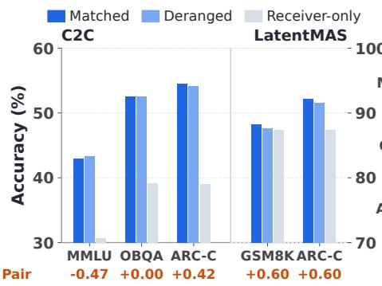  
(a)

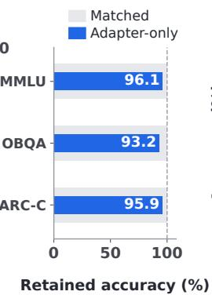  
(b)

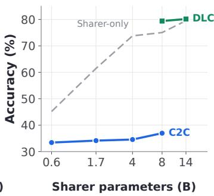  
(c)  
Figure 1: The information-use gap in latent communication. (a) Replacing the correctly paired message leaves accuracy essentially unchanged in both systems: pairing gain stays within 0.60 pp while system gain reaches 15.44 pp (C2C on the left scale, LatentMAS on the right). (b) A frozen interface fed mismatched messages still retains 93–96% of Matched accuracy. (c) A stronger sharer barely transfers: across C2C’s sharers, sharer-only accuracy rises by 29.85 pp while system accuracy rises by 3.54 pp. All values are aggregate point estimates.

KV-cache sharing and relay. DroidSpeak reuses caches across same-architecture models, recomputing selected layers to accelerate prefill (Liu et al., 2024). KVComm selects KV pairs by attentionbased importance (Shi et al., 2025). LatentMAS combines autoregressive latent-thought generation with shared KV memory for training-free collaboration (Zou et al., 2025), and Agent Primitives composes reusable reasoning components whose interactions use KV caches (Jin et al., 2026). Orthogonal BackFill compresses latent relay by returning a low-rank residual of discarded states to the retained ones (Li et al., 2026). These studies address the reuse, organization, and cost of cache transmission; we ask instead whether the receiver’s accuracy depends on which cache arrives.

Heterogeneous cache alignment. Cache-to-Cache (C2C) projects and fuses the sharer’s prompt cache into the receiver’s, with gates selecting communication layers (Fu et al., 2025). Chen et al. (2026) develop dense latent communication (DLC) through positional disentanglement, structured head transformations, receiver-cache reconstruction, and generation training. Draft-KV also establishes readability before task use, but reconstructs text from messages rather than matching receiver cache tensors. Both works transmit the sharer’s prompt cache, whereas our message is formed while the sharer answers and is read as separate memory rather than fused into the receiver’s own.

Latent reasoning and compressed memory. Continuous representations also support reasoning and context compression. Coconut feeds a model’s hidden states back as input embeddings for latent reasoning (Hao et al., 2024), and LaViT aligns latent thoughts for multimodal reasoning (Wu et al., 2026). Closest to our setting, SoftCoT learns a projection from a frozen assistant’s instance-specific soft thoughts into a frozen LLM’s embedding space (Xu et al., 2025), though it conditions through input embeddings rather than layerwise attention memory. Prompt- and context-compression methods learn readable continuous memory before downstream use (Mu et al., 2023; Chevalier et al., 2023; Ge et al., 2023), as our reconstruction stage does across two models rather than within one.

## 3 THE INFORMATION-USE GAP IN LATENT COMMUNICATION

Deployed latent interfaces raise three questions: do their gains depend on the correctly paired message, what sustains the gains that survive it, and does a stronger sharer produce better answers? Figure 1 answers them through message replacement, interface decomposition, and scaling.

We examine learned cache projection in C2C (Fu et al., 2025) and cache relay in LatentMAS (Zou et al., 2025), and add DLC (Chen et al., 2026) in the scaling analysis below. Within each method and dataset we compare the same questions under the Matched, Deranged, and Receiver-only condition of Section 1. Figure 2 shows the assignment: row i is the receiver’s question, the filled column the message it receives; Appendix B.1 gives the construction. We report the two contrasts of Equation 1 in percentage points (pp); Figure 1(a) prints P below each dataset as Pair.

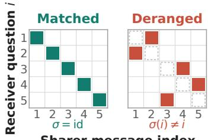  
Sharer message index  
Figure 2: Message assignment; dashed cells are excluded.

Substantial gains can survive message replacement. For C2C, replacing the correctly paired sharer message leaves accuracy almost unchanged across all three benchmarks in Figure 1(a), with Qwen2.5-0.5B-Instruct sharing to Qwen3-0.6B. On MMLU-Redux, a system gain of 12.29 pp accompanies a pairing gain of −0.47 pp. On OpenBookQA and ARC-Challenge, system gains reach 13.40 pp and 15.44 pp, while pairing gains are 0.00 pp and 0.42 pp, respectively. LatentMAS keeps a positive pairing gain on both of its benchmarks, but only 0.60 pp of its 4.86 pp system gain on ARC-Challenge depends on the pairing. Across the five method–dataset pairs we examine, pairing gain never exceeds 0.60 pp, whereas system gain reaches 15.44 pp. The C2C row behind Figure 1(a) is the authors’ released fuser and is a point estimate. To ask whether its near-zero pairing gain is specific to that one released checkpoint, we trained C2C fusers ourselves under the authors’ recipe—three training checkpoints of the Qwen2.5-0.5B-Instruct→Qwen3-0.6B direction and one Llama-3.2-3B-Instruct→Qwen2.5-0.5B-Instruct fuser—whose 95% per-question paired bootstrap intervals on the Matched–Deranged difference contain zero in 13 of 20 cases across the five Public benchmarks, the seven exceptions staying within a few points of zero (Table 13); implementation checks appear in Appendix G.

Sources of the gain. C2C’s adapter-only evaluation helps locate the retained improvement. Averaging fused-cache outputs produced under deranged sharer messages isolates a receiver-conditioned adapter component, preserving interface adaptation without the correctly paired message. We report the retained accuracy $\rho _ { \mathrm { a d a p t e r } } = A _ { \mathrm { a d a p t e r } } / A _ { M }$ , the share of Matched accuracy that survives.

For the Qwen2.5-0.5B-Instruct to Qwen3-0.6B pair used in panel (a), adapter-only retains 96.06% of Matched accuracy on MMLU-Redux, 95.93% on ARC-Challenge, and 93.16% on OpenBookQA in Figure 1(b). Matched exceeds adapter-only by 1.69, 2.22, and 3.60 pp respectively, so both interventions leave C2C close to its Matched accuracy. Communication training should make the supplied information useful beyond what the interface already provides.

Sharer scaling. The practical value of communication also depends on how well the receiver benefits from a more capable sharer. Figure 1(c) compares sharer-only and system accuracy on MMLU-Redux while fixing the receiver within each method. Across C2C’s 0.6B–8B sharers, standalone sharer accuracy rises by 29.85 pp, while system accuracy rises by 3.54 pp. With the Qwen3-4B receiver used by Chen et al. (2026), moving from an 8B to a 14B sharer raises standalone sharer accuracy by 4.48 pp but changes system accuracy by only 0.77 pp.

A channel whose contribution is largely fixed by the interface cannot carry much more when the sharer knows more, so most of the stronger partner’s advantage stays stranded on its own side of the interface.

TAKEAWAY. Existing latent interfaces can improve receiver accuracy with little benefit from correctly paired content, while stronger sharers do not consistently improve the system.

## 4 DRAFT-KV

Draft-KV builds the message from the sharer’s attempt at answering. Under causal attention, prompt-position key–value states are unchanged by the answer that follows, whereas draft-position states incorporate the question together with the preceding answer tokens (Figure 3).

(a) Draft-derived communication  
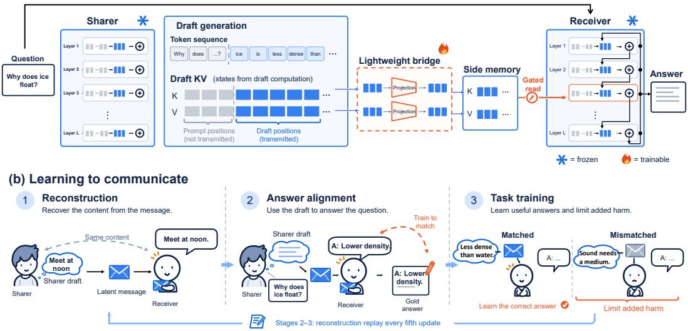  
Figure 3: Draft-KV. (a) The frozen sharer drafts an answer, and the key–value states formed over prompt and draft are projected into the receiver’s layout to form the packet ${ \cal E } _ { \theta } ( x , d )$ , which the frozen receiver reads through a gated branch that reuses its own projections. (b) The same parameters θ pass through three training stages.

A frozen sharer $S _ { \phi }$ assists a frozen receiver $\mathcal { R } _ { \psi }$ on an input x, which the receiver must answer with $y = ( y _ { 1 } , \dotsc , y _ { T } )$ in its own vocabulary. The trainable parameters are the communication weights $\theta = \{ W _ { K } ^ { \ell } , W _ { V } ^ { \ell } , a ^ { \ell } \} _ { \ell \in \mathcal { T } _ { R } }$ , where $\mathcal { T } _ { R }$ indexes the receiver layers that receive communication and $\pi ( \ell )$ assigns a sharer layer to each. Because the two models communicate through key–value features, their tokenizers, sequence lengths, hidden sizes, and KV-head counts may differ (Appendix A.1).

## 4.1 DRAFT-DERIVED KEY–VALUE MESSAGES

The sharer greedily decodes a draft $d = ( d _ { 1 } , \ldots , d _ { L } )$ from x until a stop token or length cap, without seeing the dataset answer. Fixing those tokens, we run the frozen sharer once over [x; d] and collect its key–value tensors $K _ { S } ^ { s } , V _ { S } ^ { s }$ at each layer $s = \pi ( \ell )$ ; a visibility mask b exposes only draft positions.

## 4.2 CROSS-MODEL PROJECTION AND GATED INJECTION

Sharer and receiver states live in different spaces, so each communication layer ℓ flattens the sharer’s KV heads at layer $s = \pi ( \ell )$ and applies two bias-free linear maps, one for keys and one for values,

$$
\widetilde { K } ^ { \ell } = K _ { S } ^ { s } W _ { K } ^ { \ell } , \qquad \widetilde { V } ^ { \ell } = V _ { S } ^ { s } W _ { V } ^ { \ell } ,\tag{2}
$$

where each row is a message token and the outputs are reshaped into the receiver’s KV-head layout. Together with the visibility mask, these form the packet $E _ { \theta } ( x , d ) = \{ ( \widetilde { K } ^ { \ell } , \widetilde { V } ^ { \ell } , b ) \} _ { \ell \in \mathcal { T } _ { R } }$

The receiver reads the packet through an attention branch that reuses its own frozen query and output projections, normalization, and head layout, as shown in Figure 3(a); the branch adds no parameters beyond one signed gate per KV head, $\begin{array} { r } { \dot { g _ { k } ^ { \ell } } = \dot { \operatorname { t a n h } } ( a _ { k } ^ { \ell } ) } \end{array}$ . Writing $\Delta \dot { H } ^ { \ell }$ for its gated output, the branch joins the native self-attention in the same residual stream,

$$
\overline { { { H } } } ^ { \ell } = H ^ { \ell } + \mathrm { S e l f A t t n } ^ { \ell } ( U ^ { \ell } ) + \Delta H ^ { \ell } ,\tag{3}
$$

where $U ^ { \ell }$ denotes the layer’s input-normalized states. The packet stays a separate memory rather than being concatenated into the receiver’s self-attention cache, and the gates are initialized to zero. Appendix A.2 gives the attention weights, masking convention, gate placement, and the gates’ gradient paths. Because the branch borrows every other weight from the receiver, the interface size follows the two models’ cache widths, not their depth or parameter count (Appendix A.3).

## 4.3 PROGRESSIVE TRAINING

Readability and use are different skills; training both at once gives the receiver a message it cannot yet read. We therefore train in three stages, each inheriting θ from the last (Figure 3(b)). All stages use the same teacher-forced loss, length-normalized per example,

$$
N _ { i } ( E ) = - \frac { 1 } { T _ { i } } \sum _ { t = 1 } ^ { T _ { i } } \log p _ { \theta } \big ( y _ { i , t } \mid x _ { i } , y _ { i , < t } , E \big ) ,\tag{4}
$$

normalized over the receiver’s full vocabulary, excluding prompts and padding and supervising terminal tokens. The stages differ in what the packet carries and what the receiver must produce, with per-stage loss reductions in Appendix A.4.

Stage 1: Message reconstruction. We take the last assistant turn of an OpenHermes conversation as a payload $m _ { i } .$ , append a per-sample transmission key so that the payload contains sample-specific content, and have the sharer encode $[ c _ { i } ; m _ { i } ]$ under teacher forcing. The receiver sees only a fixed decoding instruction $u _ { \mathrm { r e c } } .$ —not the conversation, the question, or the key—and is trained to reproduce $m _ { i }$ from the packet alone by minimizing ${ \mathcal { L } } _ { \mathrm { r e c } } ,$ the token-weighted batch reduction of Equation 4 with $x _ { i } = u _ { \mathrm { r e c } }$ and $y _ { i } = m _ { i }$

Stage 2: Answer alignment. The packet now comes from the sharer’s own draft, $E _ { i } = E _ { \theta } ( x _ { i } , d _ { i } )$ and the target is the dataset reference answer $y _ { i }$ for the same conversation, giving ${ \mathcal { L } } _ { \mathrm { a n s } } .$ . Because the draft may be wrong and the reference is not fed to the sharer, the receiver learns to answer with the draft states rather than copy them, while every fifth update replays $\mathcal { L } _ { \mathrm { r e c } }$ to keep the code decodable.

Stage 3: Answer-text training with a one-sided guard. On tasks with candidate options, the sharer receives the question and options and is asked to explain briefly and end with its chosen option in full; the gold index never enters its input. The receiver is asked for the answer content alone and is supervised on the full gold answer text, not on an option label. Within the training split we fix a derangement σ with $\sigma ( i ) \neq i ,$ , and compare three packets on identical receiver inputs and answer prefixes: Matched sends the sample’s own packet, Deranged sends $E _ { \theta } ( x _ { \sigma ( i ) } , d _ { \sigma ( i ) } )$ and Receiver-only sends nothing. Writing $N _ { i } ^ { M } , N _ { i } ^ { D }$ , and $N _ { i } ^ { R }$ for the resulting losses, the stage minimizes

$$
\mathcal { L } ^ { ( 3 ) } = \frac { 1 } { B } \sum _ { i = 1 } ^ { B } \Big ( N _ { i } ^ { M } + \lambda _ { p } \big [ N _ { i } ^ { D } - \mathrm { s g } ( N _ { i } ^ { R } ) - \tau \big ] _ { + } \Big ) , \qquad \lambda _ { p } = 0 . 1 , \tau = 0 . 1 ,\tag{5}
$$

where $[ \cdot ] _ { + } = \operatorname* { m a x } ( 0 , \cdot )$ and sg stops gradient. The first term raises the likelihood of the gold answer under the correctly paired message. The second is a one-sided guard: it activates only when a mismatched packet makes the gold answer more than τ nats per token costlier than sending nothing, then pushes that damage down, so the receiver does not learn to be misled by whatever arrives. Stage 3 keeps the one-in-five reconstruction replay (Appendix $\mathbf { A . 4 } )$ . At inference the sharer drafts, the interface projects those states, and the receiver decodes with the packet fixed and available throughout.

## 5 EXPERIMENTS

## 5.1 EXPERIMENTAL SETUP

Training dataset. Stages 1 and 2 use OpenHermes conversations for message reconstruction and answer alignment, respectively. Stage 3 uses ARC-Easy and ARC-Challenge training data (Clark et al., 2018); OpenHermes reconstruction examples are replayed every fifth update in Stages 2 and 3. ARC test and the other evaluation benchmarks are held out from Stage 3 training and checkpoint selection. Each model pair is trained separately, with both language models frozen (Appendix A).

Evaluation settings. We evaluate under two protocols. In the Public protocol, sharer and receiver see the same question. We use five multiple-choice benchmarks: MMLU-Redux for general knowledge (Gema et al., 2025), ARC-Easy and ARC-Challenge for science questions (Clark et al., 2018),

OpenBookQA for fact-based reasoning (Mihaylov et al., 2018), and C-EVAL for Chinese knowledge (Huang et al., 2023). In the Private protocol, we split the annotated gold evidence of HotpotQA and 2WikiMultihopQA at random between them, so each model holds information absent from the other’s input. We use Qwen3 models from 0.6B to 8B (Yang et al., 2025), Qwen2.5-0.5B-Instruct (Qwen et al., 2024), and Llama-3.2-3B-Instruct. Pairing these models tests scaling across parameter sizes, heterogeneous communication, and reversed sharer–receiver roles; the specific configurations appear with their results. We compare against Sharer-only (S-only), which scores the answer extracted from the sharer’s generated draft; Receiver-only (R-only), which disables communication; Text-to-Text (T2T), which supplies the same draft as text to the receiver; and Cache-to-Cache (C2C) (Fu et al., 2025), whose released fuser covers one of the seven model pairs of Table 1 and whose remaining six rows we retrained under the authors’ recipe (Appendix G). On multiple-choice benchmarks, receiver-based methods select the option with the highest first-token logit and we report accuracy; the Private benchmarks are scored by exact match. Matched and Deranged interventions follow Section 1, and Appendix C gives checkpoints, interface sizes, hyperparameters, prompts, and evaluation splits.

## 5.2 MAIN RESULTS

Public context. Table 1 shows that Draft-KV consistently improves the receiver under shared input: it beats the receiver alone in all 35 settings, is most accurate in 30, and exceeds T2T in 33, with an average gain of 5.85 points. The improvement holds across sharer scales, model families, and the reversed configuration. Draft-KV and T2T communicate the same generated draft through different representations, so their gap indicates that draft-derived states preserve information the decoded text does not fully retain. Draft-KV can also surpass the sharer: on ARC-Challenge it recovers 24.1% of the questions the sharer answers incorrectly while losing only 1.1% of those it answers correctly, so the receiver does more than relay the sharer’s answer (Appendix F.1).

Private context. Across HotpotQA and 2WikiMultihopQA, Draft-KV beats T2T in all 14 model– benchmark settings, by 6.41 points on average. It ranks first in seven settings and second in the other seven, and where it ranks first it also exceeds both models answering independently, so collaboration can improve on either model’s local prediction when sharer and receiver hold different evidence. Here the packet is the receiver’s only route to the sharer’s half of the evidence, so a deranged packet substitutes another question’s evidence and falls 10.98 pp below Receiver-only, against 1.41 pp under Public. Pairing gain is positive in 13 of the 14 settings.

## 5.3 MESSAGE INTERVENTION ANALYSIS

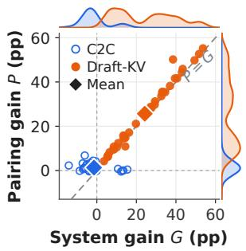  
(a)

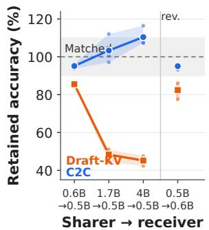  
(b)

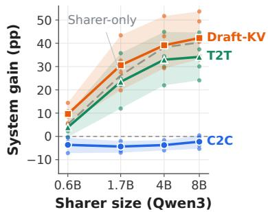  
Figure 4: Message interventions and adapter-only comparisons under the Public protocol. In (b), lines and bands give the mean and min–max of retained accuracy over the three benchmarks, dots the individual benchmarks, and the dashed line and shaded strip mark Matched accuracy and a ±10 pp margin.  
Figure 5: Sharer scaling with a fixed Qwen2.5-0.5B-Instruct receiver. Bands give the range across the five benchmarks.

Table 1: Main results across model pairs, benchmarks, and evaluation protocols. Public settings are scored by option accuracy, Private settings by exact match. Cache-to-Cache and Draft-KV entries show Matched/Deranged scores, where the Deranged message comes from a different question. Bold and underlined values denote the best and second-best score in each row. Model names omit the -Instruct suffix of Qwen2.5-0.5B-Instruct and Llama-3.2-3B-Instruct; Qwen3 names are as released (Appendix C.1).
<table><tr><td rowspan=1 colspan=7>Evaluation setting                                 Score (%)</td></tr><tr><td rowspan=1 colspan=7>Model Pair      Benchmark      ProtocolReceiverSharer Text-to-Text Cache-to-Cache Draft-KV</td></tr><tr><td rowspan=2 colspan=4>MMLU-ReduxARC-Easy</td><td rowspan=1 colspan=3>37.4545.19     42.56   33.43 /33.4046.11/36.59</td></tr><tr><td rowspan=1 colspan=1></td><td rowspan=1 colspan=2>63.4769.15     66.71    56.31 /53.11</td><td rowspan=1 colspan=1>74.28/61.91</td></tr><tr><td rowspan=5 colspan=3>Qwen3-0.6B    ARC-ChallengeOpenBookQA→ Qwen2.5-0.5BC-EVALHotpotQA2WikiMultihopQA</td><td rowspan=1 colspan=1>Public</td><td rowspan=1 colspan=2>40.1051.71     49.49   39.51 /35.32</td><td rowspan=1 colspan=1>54.52/39.76</td></tr><tr><td rowspan=2 colspan=1></td><td rowspan=1 colspan=2></td></tr><tr><td rowspan=1 colspan=1></td></tr><tr><td rowspan=2 colspan=1>Private</td><td rowspan=1 colspan=2>32.2811.93     13.20         N/A</td><td rowspan=2 colspan=1>21.91/14.4717.50/16.90</td></tr><tr><td rowspan=1 colspan=2>26.50 8.30      11.40         N/A</td></tr><tr><td rowspan=2 colspan=3>MMLU-ReduxARC-Easy</td><td rowspan=1 colspan=1></td><td rowspan=1 colspan=2>37.4561.47     60.19   34.16/32.69</td><td rowspan=2 colspan=1>65.07 /36.8492.89/61.66</td></tr><tr><td rowspan=1 colspan=1></td><td rowspan=1 colspan=1>63.47</td><td rowspan=1 colspan=1>89.52     88.26   57.37/50.59</td></tr><tr><td rowspan=5 colspan=3>Qwen3-1.7B    ARC-ChallengeOpenBookQA→ Qwen2.5-0.5BC-EVALHotpotQA2WikiMultihopQA</td><td rowspan=1 colspan=1>Public</td><td rowspan=1 colspan=1>40.10</td><td rowspan=1 colspan=1>79.44     75.85   36.77 /33.36</td><td rowspan=1 colspan=1>83.53/37.63</td></tr><tr><td rowspan=1 colspan=1></td><td rowspan=1 colspan=1>43.40</td><td rowspan=1 colspan=1>71.00     65.40   41.40/37.00</td><td rowspan=1 colspan=1>76.00/42.40</td></tr><tr><td rowspan=1 colspan=1></td><td rowspan=1 colspan=1>41.75</td><td rowspan=1 colspan=1>55.79     53.71   34.77 /34.18</td><td rowspan=1 colspan=1>61.52/40.42</td></tr><tr><td rowspan=1 colspan=1>Private</td><td rowspan=1 colspan=1>32.28</td><td rowspan=1 colspan=1>21.18     22.68         N/A</td><td rowspan=1 colspan=1>35.04/12.37</td></tr><tr><td rowspan=1 colspan=1>Tiivale</td><td rowspan=1 colspan=1>26.50</td><td rowspan=1 colspan=1>12.80     14.90         N/A</td><td rowspan=1 colspan=1>19.10/13.50</td></tr><tr><td rowspan=2 colspan=3>MMLU-ReduxARC-Easy</td><td rowspan=1 colspan=1></td><td rowspan=1 colspan=1>37.45</td><td rowspan=1 colspan=1>73.79     71.15   34.57 /34.34</td><td rowspan=1 colspan=1>75.98/25.80</td></tr><tr><td rowspan=1 colspan=1></td><td rowspan=1 colspan=1>63.47</td><td rowspan=1 colspan=1>96.42     93.31   57.45/56.31</td><td rowspan=1 colspan=1>96.63/61.03</td></tr><tr><td rowspan=3 colspan=3>Qwen3-4B      ARC-ChallengeOpenBookQA→ Qwen2.5-0.5BC-EVAL</td><td rowspan=1 colspan=1>Public</td><td rowspan=1 colspan=1>40.10</td><td rowspan=1 colspan=1>91.98     84.98   38.48/37.54</td><td rowspan=1 colspan=1>91.81 /39.16</td></tr><tr><td rowspan=1 colspan=1></td><td rowspan=1 colspan=1>43.40</td><td rowspan=1 colspan=1>85.40     77.80   39.60/40.00</td><td rowspan=1 colspan=1>86.40/42.00</td></tr><tr><td rowspan=1 colspan=1></td><td rowspan=1 colspan=1>41.75</td><td rowspan=1 colspan=1>69.99     63.67   37.44/36.40</td><td rowspan=1 colspan=1>71.03/41.31</td></tr><tr><td rowspan=2 colspan=3>HotpotQA2WikiMultihopQA</td><td rowspan=2 colspan=1>Private</td><td rowspan=1 colspan=1>32.28</td><td rowspan=1 colspan=1>29.04     28.57         N/A</td><td rowspan=1 colspan=1>40.34/14.76</td></tr><tr><td rowspan=1 colspan=1>26.50</td><td rowspan=1 colspan=1>29.00     29.50         N/A</td><td rowspan=1 colspan=1>37.20/17.70</td></tr><tr><td rowspan=1 colspan=2></td><td rowspan=1 colspan=1>MMLU-Redux</td><td rowspan=1 colspan=1></td><td rowspan=1 colspan=1>37.45</td><td rowspan=1 colspan=1>75.04     72.05   36.97/36.45</td><td rowspan=1 colspan=1>78.04/36.40</td></tr><tr><td rowspan=1 colspan=2></td><td rowspan=1 colspan=1>ARC-Easy</td><td rowspan=1 colspan=1></td><td rowspan=1 colspan=1>63.47</td><td rowspan=1 colspan=1>97.56     93.52   58.16/55.72</td><td rowspan=1 colspan=1>98.02/62.63</td></tr><tr><td rowspan=3 colspan=3>Qwen3-8BOpenBookQA→ Qwen2.5-0.5BC-EVAL</td><td rowspan=1 colspan=2>ARC-Challenge</td><td rowspan=1 colspan=1>Public</td><td rowspan=1 colspan=1>40.10</td></tr><tr><td rowspan=1 colspan=1></td><td rowspan=1 colspan=1>43.40</td><td rowspan=1 colspan=1>92.60     80.80   41.20/39.00</td><td rowspan=1 colspan=1>92.80/43.00</td></tr><tr><td rowspan=1 colspan=1></td><td rowspan=1 colspan=1>41.75</td><td rowspan=1 colspan=1>69.84     65.82   37.96/36.03</td><td rowspan=1 colspan=1>74.81/39.67</td></tr><tr><td rowspan=2 colspan=3>HotpotQA2WikiMultihopQA</td><td rowspan=2 colspan=1>Private</td><td rowspan=2 colspan=1>32.2826.50</td><td rowspan=2 colspan=1>35.21     34.59         N/A37.60     37.60         N/A</td><td rowspan=1 colspan=1>42.48/15.05</td></tr><tr><td rowspan=1 colspan=1>39.50/9.10</td></tr><tr><td rowspan=2 colspan=2></td><td rowspan=1 colspan=1>MMLU-Redux</td><td rowspan=1 colspan=1></td><td rowspan=1 colspan=1>37.45</td><td rowspan=1 colspan=1>64.44     62.96   31.18/30.11</td><td rowspan=1 colspan=1>64.67 /35.90</td></tr><tr><td rowspan=1 colspan=1></td><td rowspan=1 colspan=1>ARC-Easy</td><td rowspan=1 colspan=1></td><td rowspan=1 colspan=1>63.47</td><td rowspan=1 colspan=1>88.68     89.44   49.28/47.01</td><td rowspan=1 colspan=1>89.18/63.13</td></tr><tr><td rowspan=3 colspan=2>Llama-3.2-3B→ Qwen2.5-0.5B</td><td rowspan=1 colspan=1></td><td rowspan=1 colspan=2>ARC-Challenge</td><td rowspan=1 colspan=1>Public</td><td rowspan=1 colspan=1>40.10</td></tr><tr><td rowspan=2 colspan=1>OpenBookQAC-EVAL</td><td rowspan=1 colspan=1></td><td rowspan=1 colspan=1>43.40</td><td rowspan=1 colspan=1>79.40     73.60   38.40/35.60</td><td rowspan=1 colspan=1>80.40/42.20</td></tr><tr><td rowspan=1 colspan=1></td><td rowspan=1 colspan=1>41.75</td><td rowspan=1 colspan=1>43.24     42.79   33.06/33.21</td><td rowspan=1 colspan=1>47.33/41.16</td></tr><tr><td rowspan=1 colspan=3>HotpotQA2WikiMultihopQA</td><td rowspan=1 colspan=1>Private</td><td rowspan=1 colspan=1>32.2826.50</td><td rowspan=1 colspan=1>27.74     28.19         N/A22.20     22.00         N/A</td><td rowspan=1 colspan=1>28.54/14.2025.70/17.00</td></tr><tr><td rowspan=2 colspan=2></td><td rowspan=1 colspan=1>MMLU-Redux</td><td rowspan=1 colspan=1></td><td rowspan=1 colspan=1>30.63</td><td rowspan=1 colspan=1>36.36     39.99    42.92/43.39</td><td rowspan=1 colspan=1>45.01/34.11</td></tr><tr><td rowspan=1 colspan=1></td><td rowspan=1 colspan=1>ARC-Easy</td><td rowspan=1 colspan=1></td><td rowspan=1 colspan=1>59.51</td><td rowspan=1 colspan=1>54.42     56.94   72.47/72.56</td><td rowspan=1 colspan=1>73.02/58.46</td></tr><tr><td rowspan=3 colspan=3>Qwen2.5-0.5BOpenBookQA→ Qwen3-0.6BC-EVAL</td><td rowspan=1 colspan=1></td><td rowspan=1 colspan=1>ARC-Challenge</td><td rowspan=1 colspan=1>Public</td><td rowspan=1 colspan=1>39.08</td></tr><tr><td rowspan=1 colspan=1></td><td rowspan=1 colspan=1>39.20</td><td rowspan=1 colspan=1>40.20     46.00   52.60/52.60</td><td rowspan=1 colspan=1>53.20/37.60</td></tr><tr><td rowspan=1 colspan=1></td><td rowspan=1 colspan=1>31.05</td><td rowspan=1 colspan=1>33.21     33.06   41.75/41.01</td><td rowspan=1 colspan=1>41.16/30.68</td></tr><tr><td rowspan=2 colspan=3>HotpotQA2WikiMultihopQA</td><td rowspan=2 colspan=1>Private</td><td rowspan=1 colspan=1>11.93</td><td rowspan=1 colspan=1>32.28     19.84         N/A</td><td rowspan=1 colspan=1>31.65/17.44</td></tr><tr><td rowspan=1 colspan=2>28.0010.00     14.50         N/A</td><td rowspan=1 colspan=1>23.50/24.40</td></tr><tr><td rowspan=2 colspan=3>MMLU-ReduxARC-Easy</td><td rowspan=1 colspan=1></td><td rowspan=1 colspan=1>71.64</td><td rowspan=1 colspan=1>75.04     78.96   71.00/70.70</td><td rowspan=1 colspan=1>79.94/70.44</td></tr><tr><td rowspan=1 colspan=1>ARC-Easy</td><td rowspan=1 colspan=1></td><td rowspan=1 colspan=1>94.49</td><td rowspan=1 colspan=1>97.56     98.19   94.40/94.53</td><td rowspan=1 colspan=1>98.11/93.90</td></tr><tr><td rowspan=3 colspan=3>Qwen3-8BOpenBookQA→ Qwen3-4BC-EVAL</td><td rowspan=1 colspan=2>ARC-Challenge</td><td rowspan=1 colspan=1>Public</td><td rowspan=1 colspan=1>87.29</td></tr><tr><td rowspan=1 colspan=1></td><td rowspan=1 colspan=1>78.80</td><td rowspan=1 colspan=1>92.60     88.40   78.60/78.20</td><td rowspan=1 colspan=1>92.20/76.40</td></tr><tr><td rowspan=1 colspan=1></td><td rowspan=1 colspan=1>70.43</td><td rowspan=1 colspan=1>69.84     72.51   67.76/67.90</td><td rowspan=1 colspan=1>75.78/69.47</td></tr><tr><td rowspan=1 colspan=3>HotpotQA2WikiMultihopQA</td><td rowspan=1 colspan=1>Private</td><td rowspan=1 colspan=1>42.71</td><td rowspan=1 colspan=2>45.12/37.8840.9037.60     44.10         N/A 45.00 /39.00</td></tr></table>

Pairing gain and system gain. Draft-KV addresses the information-use gap of Section 3: its improvement over the receiver depends on the correctly paired message. Figure 4(a) shows positive system gain $G = A _ { M } - A _ { R }$ and pairing gain $P = A _ { M } - A _ { D }$ in all 35 Public settings, with diamonds marking the method means of 24.24 and 25.65 pp, respectively. The dashed diagonal marks $P = G$ , where $A _ { D } = A _ { R }$ and a deranged message costs exactly the gain. Draft-KV clusters there: the mismatch harm $A _ { R } - A _ { D }$ has a median of 1.19 pp and stays within 2.5 pp in 33 of the 35 settings, reaching 11.65 pp on MMLU-Redux with the Qwen3-4B sharer (Table 3). C2C instead collapses onto the origin: its pairing gain averages 1.31 pp and stays within ±7 pp everywhere, and its system gain is negative in 29 of the 35 settings. With $P = G + ( A _ { R } - A _ { D } )$ , a 1.41 pp mean harm against a 24.24 pp mean system gain makes the pairing gain matched-answer improvement rather than mismatch damage (Appendix D.2).

Adapter-only comparison. We extend the adapter-only analysis of Section 3 to both methods across four model pairs on MMLU-Redux, ARC-Challenge, and OpenBookQA, averaging each frozen interface’s output over five mismatched donors (Appendix B.3), and plot the retained accuracy $\rho _ { \mathrm { a d a p t e r } } = A _ { \mathrm { a d a p t e r } } / A _ { M }$ in Figure 4(b). C2C retains 93.16–116.42% of Matched accuracy across its 12 settings, whereas Draft-KV with the 1.7B and 4B sharers retains 42.28–51.05% and falls below Receiver-only in all six. Holding the query convention fixed and varying only the donor, restoring the correct one is worth 26.96 and 29.49 pp, so the drop follows the donor content: the Matched gains of the stronger sharers do not survive donor averaging through the trained interface.

## 5.4 SHARER SCALING

Draft-KV turns stronger sharers into larger receiver gains. With Qwen2.5-0.5B-Instruct fixed as the receiver, we scale Qwen3 sharers from 0.6B to 8B. In Figure 5, solid lines give the mean system gain $G = A _ { M } - A _ { R }$ over the five benchmarks and the dashed line the sharer-only reference, the gain the sharer’s accuracy represents over the receiver. Draft-KV’s system gain rises at every size step on all five benchmarks, addressing the scaling gap of Section 3, and beats that reference in 19 of 20 settings. Its mean system gain rises by 32.6 pp from 0.6B to 8B, against 30.2 pp for T2T and 1.4 pp for C2C, and it stays more accurate than T2T at every size. What grows is the capability behind the draft rather than its length, which does not order these gains (Appendix E).

## 5.5 ABLATION STUDY

Table 2: Message-source and training-stage ablations for Qwen3-1.7B → Qwen2.5-0.5B-Instruct under the Public protocol.
<table><tr><td rowspan="2">Variant</td><td colspan="2">ARC-Challenge</td><td colspan="2">MMLU-Redux</td></tr><tr><td>Matched</td><td>Pairing gain</td><td>Matched</td><td>Pairing gain</td></tr><tr><td>Full Draft-KV</td><td>83.53</td><td>45.90</td><td>65.07</td><td>28.23</td></tr><tr><td>Prompt KV</td><td>49.83</td><td>0.17</td><td>43.59</td><td>0.09</td></tr><tr><td>w/o reconstruction pretraining</td><td>76.71</td><td>38.74</td><td>52.40</td><td>16.58</td></tr><tr><td>w/o answer alignment</td><td>80.03</td><td>41.72</td><td>55.40</td><td>19.25</td></tr></table>

Matched is $A _ { M } ~ ( \% ) ;$ pairing gain is $P = A _ { M } - A _ { D }$ (pp). Receiver-only accuracy is 40.10% on ARC-C (test split) and 37.45% on MMLU-Redux. Stage deletions retain replay in the remaining stages (Appendix D.1).

With a fixed Qwen3-1.7B sharer and Qwen2.5-0.5B-Instruct receiver, we ablate message source and training stages on ARC-C and MMLU-Redux (Table 2). Replacing draft-position KV with prompt-position KV reduces Matched accuracy by 33.70 and 21.48 pp and nearly eliminates pairing gain, which falls to 0.17 and 0.09 pp—the level at which existing interfaces operate, C2C averaging 1.31 pp in Section 5.3. This reproduces the information-use gap inside our architecture, showing that draft-position states make the pairing matter. Deleting either stage lowers Matched accuracy and pairing gain on both benchmarks, and the losses are markedly larger on MMLU-Redux, which no stage trains on: Stage 3 updates partly compensate for a weaker cross-model mapping on the task they optimize, and the held-out benchmark is where that compensation runs out. Appendix D add per-benchmark metrics and the guard analysis.

## 6 CONCLUSION

Latent communication can raise accuracy without carrying content: in the interfaces we audit, swapping in another question’s message barely changes accuracy. Draft-KV instead sends the key–value states formed while the sharer drafts and trains the receiver to use them. Its gains grow with sharer capability and disappear under message reassignment, making pairing gain—not accuracy alone— the evidence that communication carries useful content.

## AI USE STATEMENT

We used a general-purpose large language model assistant in two roles, both under author review. For writing, it helped with copy-editing, LaTeX formatting, and tightening prose in the main text and the appendices. For code, it helped draft parts of the evaluation and plotting scripts, which we then reviewed and re-ran end to end. We did not use generative AI to propose the research question, to design the message-intervention protocol, or to produce any reported number; all accuracies, gains, and diagnostics come from our own runs on the checkpoints and evaluation splits documented in Appendix C. We take responsibility for the final content of this work.

## ETHICS STATEMENT

This study raises no ethical concerns: all experiments use publicly released models and public benchmarks, and involve no human subjects and no sensitive personal data.

## REPRODUCIBILITY STATEMENT

Appendix A specifies the interface computation, the three training objectives, and the reconstructionreplay schedule. Appendix B.1 defines the Matched, Deranged, and Receiver-only conditions, the donor-selection rules, and the adapter-only control for every audited method, including the numerical checks used to verify that the interventions enter each method through its original injection path. Appendix C documents model checkpoints, layer assignments, training data and per-stage hyperparameters, prompt templates and decoding settings, evaluation splits and scoring rules, and the evidence partition used in the Private protocol. Appendix D reports the ablation protocol together with the run metadata of each variant. An anonymized artifact containing the interface implementation, the trained interface weights, and the evaluation and intervention scripts is available at https://anonymous.4open.science/r/artifact-review-a8eddb5f-1DDB/, so that the reported conditions can be reproduced from the frozen public backbones.

## REFERENCES

Yoshua Bengio, Jerome Louradour, Ronan Collobert, and Jason Weston. Curriculum learning. In International Conference on Machine Learning, pp. 41–48, 2009.

Siyi Chen, Xiaoyan Zhang, Meng Wu, Jonathan Tremblay, Valts Blukis, Stan Birchfield, Rene Vidal, Alvaro Velasquez, Sijia Liu, and Qing Qu. See what i see, know what i think: Dense latent communication across heterogeneous agents. arXiv preprint arXiv:2606.13594, 2026. URL https://arxiv.org/abs/2606.13594.

Weize Chen, Jiarui Yuan, Chen Qian, Cheng Yang, Zhiyuan Liu, and Maosong Sun. Optima: Optimizing effectiveness and efficiency for llm-based multi-agent system. Findings of the Association for Computational Linguistics: ACL 2025, pp. 11534–11557, 2025. URL https: //aclanthology.org/2025.findings-acl.601/.

Alexis Chevalier, Alexander Wettig, Anirudh Ajith, and Danqi Chen. Adapting language models to compress contexts. arXiv preprint arXiv:2305.14788, 2023. URL https://arxiv.org/ abs/2305.14788.

Peter Clark, Isaac Cowhey, Oren Etzioni, Tushar Khot, Ashish Sabharwal, Carissa Schoenick, and Oyvind Tafjord. Think you have solved question answering? try arc, the ai2 reasoning challenge. arXiv preprint arXiv:1803.05457, 2018. URL https://arxiv.org/abs/1803.05457.

Yilun Du, Shuang Li, Antonio Torralba, Joshua B. Tenenbaum, and Igor Mordatch. Improving factuality and reasoning in language models through multiagent debate. arXiv preprint arXiv:2305.14325, 2023. URL https://arxiv.org/abs/2305.14325.

Zhuoyun Du, Runze Wang, Huiyu Bai, Zouying Cao, Xiaoyong Zhu, Yu Cheng, Bo Zheng, Wei Chen, and Haochao Ying. Enabling agents to communicate entirely in latent space. arXiv preprint arXiv:2511.09149, 2025. URL https://arxiv.org/abs/2511.09149.

Jacob Fein-Ashley, Dhruv Parikh, Rajgopal Kannan, and Viktor Prasanna. Mixture of thoughts: Learning to aggregate what experts think, not just what they say. arXiv preprint arXiv:2509.21164, 2025. URL https://arxiv.org/abs/2509.21164.

Tianyu Fu, Zihan Min, Hanling Zhang, Jichao Yan, Guohao Dai, Wanli Ouyang, and Yu Wang. Cache-to-cache: Direct semantic communication between large language models. arXiv preprint arXiv:2510.03215, 2025. URL https://arxiv.org/abs/2510.03215.

Tao Ge, Jing Hu, Lei Wang, Xun Wang, Si-Qing Chen, and Furu Wei. In-context autoencoder for context compression in a large language model. arXiv preprint arXiv:2307.06945, 2023. URL https://arxiv.org/abs/2307.06945.

Aryo Pradipta Gema, Joshua Ong Jun Leang, Giwon Hong, Alessio Devoto, Alberto Carlo Maria Mancino, Rohit Saxena, Xuanli He, Yu Zhao, Xiaotang Du, Mohammad Reza Ghasemi Madani, et al. Are we done with mmlu? In Proceedings ofthe 2025 Conference ofthe Nations ofthe Americas Chapter of the Association for Computational Linguistics: Human Language Technologies, pp. 5069–5096, 2025. URL https://aclanthology.org/2025.naacl-long.262/.

Taicheng Guo, Xiuying Chen, Yaqi Wang, Ruidi Chang, Shichao Pei, Nitesh V. Chawla, Olaf Wiest, and Xiangliang Zhang. Large language model based multi-agents: A survey of progress and challenges. arXiv preprint arXiv:2402.01680, 2024. URL https://arxiv.org/abs/2402. 01680.

Shibo Hao, Sainbayar Sukhbaatar, DiJia Su, Xian Li, Zhiting Hu, Jason Weston, and Yuandong Tian. Training large language models to reason in a continuous latent space. arXiv preprint arXiv:2412.06769, 2024. URL https://arxiv.org/abs/2412.06769.

Dan Hendrycks, Collin Burns, Steven Basart, Andy Zou, Mantas Mazeika, Dawn Song, and Jacob Steinhardt. Measuring massive multitask language understanding. In International Conference on Learning Representations, 2021. URL https://arxiv.org/abs/2009.03300.

Sirui Hong, Mingchen Zhuge, Jonathan Chen, Xiawu Zheng, Yuheng Cheng, Jinlin Wang, Ceyao Zhang, Zili Wang, Steven Ka Shing Yau, Zijuan Lin, Liyang Zhou, et al. Metagpt: Meta programming for a multi-agent collaborative framework. In International Conference on Learning Representations, 2024. URL https://openreview.net/forum?id=VtmBAGCN7o.

Edward J. Hu, Yelong Shen, Phillip Wallis, Zeyuan Allen-Zhu, Yuanzhi Li, Shean Wang, Lu Wang, and Weizhu Chen. Lora: Low-rank adaptation of large language models. In International Conference on Learning Representations, 2022. URL https://arxiv.org/abs/2106.09685.

Yuzhen Huang, Yuzhuo Bai, Zhihao Zhu, Junlei Zhang, Jinghan Zhang, Tangjun Su, Junteng Liu, Chuancheng Lv, Yikai Zhang, Jiayi Lei, et al. C-eval: A multi-level multi-discipline chinese evaluation suite for foundation models. Advances in Neural Information Processing Systems, 36: 62991–63010, 2023.

Haibo Jin, Peng Kuang, Ye Yu, Xiaopeng Yuan, and Haohan Wang. Agent primitives: Reusable latent building blocks for multi-agent systems. arXiv preprint arXiv:2602.03695, 2026. URL https://arxiv.org/abs/2602.03695.

Yiping Li, Zhiyu An, and Wan Du. When less latent leads to better relay: Information-preserving compression for latent multi-agent llm collaboration. arXiv preprint arXiv:2604.13349, 2026. URL https://arxiv.org/abs/2604.13349.

Yuhan Liu, Yuyang Huang, Jiayi Yao, Shaoting Feng, Zhuohan Gu, Kuntai Du, Hanchen Li, Yihua Cheng, Junchen Jiang, Shan Lu, et al. Droidspeak: Kv cache sharing for cross-llm communication and multi-llm serving. arXiv preprint arXiv:2411.02820, 2024. URL https://arxiv.org/ abs/2411.02820.

Todor Mihaylov, Peter Clark, Tushar Khot, and Ashish Sabharwal. Can a suit of armor conduct electricity? a new dataset for open book question answering. In Conference on Empirical Methods in Natural Language Processing, pp. 2381–2391, 2018.

Jesse Mu, Xiang Lisa Li, and Noah Goodman. Learning to compress prompts with gist tokens. arXiv preprint arXiv:2304.08467, 2023. URL https://arxiv.org/abs/2304.08467.

Chau Pham, Boyi Liu, Yingxiang Yang, Zhengyu Chen, Tianyi Liu, Jianbo Yuan, Bryan A. Plummer, Zhaoran Wang, and Hongxia Yang. Let models speak ciphers: Multiagent debate through embeddings. In International Conference on Learning Representations, 2024. URL https://arxiv.org/abs/2310.06272.

Qwen, An Yang, Baosong Yang, Beichen Zhang, Binyuan Hui, Bo Zheng, Bowen Yu, Chengyuan Li, Dayiheng Liu, Fei Huang, et al. Qwen2.5 technical report. arXiv preprint arXiv:2412.15115, 2024. URL https://arxiv.org/abs/2412.15115.

Vignav Ramesh and Kenneth Li. Communicating activations between language model agents. arXiv preprint arXiv:2501.14082, 2025. URL https://arxiv.org/abs/2501.14082.

Xiangyu Shi, Marco Chiesa, Gerald Q. Maguire Jr., and Dejan Kostic. Kvcomm: Enabling efficient llm communication through selective kv sharing. arXiv preprint arXiv:2510.03346, 2025. URL https://arxiv.org/abs/2510.03346.

Yichen Tang, Weihang Su, Yujia Zhou, Yiqun Liu, Min Zhang, Shaoping Ma, and Qingyao Ai. Augmenting multi-agent communication with state delta trajectory. In Proceedings of the 2025 Conference on Empirical Methods in Natural Language Processing, pp. 10219–10240, 2025. URL https://aclanthology.org/2025.emnlp-main.518/.

Khanh-Tung Tran, Dung Dao, Minh-Duong Nguyen, Quoc-Viet Pham, Barry O’Sullivan, and Hoang D. Nguyen. Multi-agent collaboration mechanisms: A survey of llms. arXiv preprint arXiv:2501.06322, 2025. URL https://arxiv.org/abs/2501.06322.

Ashish Vaswani, Noam Shazeer, Niki Parmar, Jakob Uszkoreit, Llion Jones, Aidan N. Gomez, Lukasz Kaiser, and Illia Polosukhin. Attention is all you need. In Advances in Neural Information Processing Systems, pp. 5998–6008, 2017.

Junlin Wang, Jue Wang, Ben Athiwaratkun, Ce Zhang, and James Zou. Mixture-of-agents enhances large language model capabilities. arXiv preprint arXiv:2406.04692, 2024. URL https:// arxiv.org/abs/2406.04692.

Linquan Wu, Tianxiang Jiang, Yifei Dong, Haoyu Yang, Fengji Zhang, Shichaang Meng, Ai Xuan, Linqi Song, and Jacky Keung. Lavit: Aligning latent visual thoughts for multi-modal reasoning. arXiv preprint arXiv:2601.10129, 2026. URL https://arxiv.org/abs/2601.10129.

Qingyun Wu, Gagan Bansal, Jieyu Zhang, Yiran Wu, Beibin Li, Erkang Zhu, Li Jiang, Xiaoyun Zhang, Shaokun Zhang, Jiale Liu, et al. Autogen: Enabling next-gen llm applications via multiagent conversation. First Conference on Language Modeling, 2024. URL https://arxiv. org/abs/2308.08155.

Yige Xu, Xu Guo, Zhiwei Zeng, and Chunyan Miao. SoftCoT: Soft chain-of-thought for efficient reasoning with LLMs. In Proceedings of the 63rd Annual Meeting of the Association for Computational Linguistics (Volume 1: Long Papers), pp. 23336–23351, 2025. URL https://aclanthology.org/2025.acl-long.1137/.

An Yang, Anfeng Li, Baosong Yang, Beichen Zhang, Binyuan Hui, Bo Zheng, Bowen Yu, Chang Gao, Chengen Huang, Chenxu Lv, et al. Qwen3 technical report. arXiv preprint arXiv:2505.09388, 2025. URL https://arxiv.org/abs/2505.09388.

Yujia Zheng, Zhuokai Zhao, Zijian Li, Yaqi Xie, Mingze Gao, Lizhu Zhang, and Kun Zhang. Thought communication in multiagent collaboration. arXiv preprint arXiv:2510.20733, 2025. URL https://arxiv.org/abs/2510.20733.

Rui-Jie Zhu, Tianhao Peng, Tianhao Cheng, Xingwei Qu, Jinfa Huang, Dawei Zhu, Hao Wang, Kaiwen Xue, Xuanliang Zhang, Yong Shan, et al. A survey on latent reasoning. arXiv preprint arXiv:2507.06203, 2025. URL https://arxiv.org/abs/2507.06203.

Jiaru Zou, Ruizhong Qiu, Gaotang Li, Xiyuan Yang, Katherine Tieu, Pan Lu, Ke Shen, Hanghang Tong, Yejin Choi, Jingrui He, James Zou, Mengdi Wang, and Ling Yang. Latent collaboration in multi-agent systems. arXiv preprint arXiv:2511.20639, 2025. URL https://arxiv.org/ abs/2511.20639.

## Appendix of Draft-KV

## CONTENTS

A Detailed Method and Training Procedure 14   
A.1 Shapes and Message Extraction 14   
A.2 External Attention and Gated Injection . 14   
A.3 Interface Size 15   
A.4 Stage Objectives and Replay . . 15   
B Intervention Protocol and Causal Metrics 16   
B.1 Audit Settings for Existing Latent Communication Methods . . 16   
B.2 Message Interventions in Our Experiments . . . 17   
B.3 Adapter-Only Evaluation . . . 17   
C Experimental Setup and Reproducibility 20   
C.1 Models and Interface Configurations . 20   
C.2 Training Data and Stage Configuration . . 20   
C.3 Prompts and Decoding . 22   
C.4 Evaluation Data and Scoring . . 24   
C.5 Compute and Software 24   
D Additional Ablations and Robustness 25   
D.1 Core Ablations: Results and Protocol 25   
D.2 Guard Ablation: Mismatch Harm versus Pairing Gain . . . 26   
E Sharer Scaling Analysis 27   
F Receiver Use of the Draft 29   
F.1 Disagreement with the Sharer 29   
G Baseline Reproduction and Implementation Checks 31   
H Case Study 33   
H.1 Corrected Cases 33   
H.2 Medium Cases 36   
H.3 Mismatch Cases 37   
H.4 Lost Cases 39   
H.5 Split-Evidence Generation Cases . 40

## A DETAILED METHOD AND TRAINING PROCEDURE

This appendix completes the interface computation and the training objectives of Section 4. Model checkpoints, layer assignments, and per-pair interface sizes are given in Appendix C.

## A.1 SHAPES AND MESSAGE EXTRACTION

We use row vectors for token features. Let $\ell \in \mathcal { T } _ { R }$ be a receiver communication layer and $s = \pi ( \ell )$ its assigned sharer layer under the fixed map π. Write $H _ { S } ^ { s } , D _ { S } ^ { s }$ and $H _ { R } ^ { \ell } , D _ { R } ^ { \ell }$ for the number of KV heads and the head width at those layers, $C _ { S } ^ { s } = H _ { S } ^ { s } D _ { S } ^ { s }$ and $C _ { R } ^ { \ell } = \dot { H } _ { R } ^ { \ell } D _ { R } ^ { \ell }$ for the flattened KV widths, and $d _ { \mathrm { m o d e l } , R } ^ { \ell }$ for the width of the receiver’s residual stream. With $n _ { S }$ sharer positions in the extracted sequence and $n _ { R }$ receiver positions in a forward pass,

$$
\begin{array} { r } { K _ { S } ^ { s } , V _ { S } ^ { s } \in \mathbb { R } ^ { n _ { S } \times H _ { S } ^ { s } \times D _ { S } ^ { s } } , \qquad \widetilde K ^ { \ell } , \widetilde V ^ { \ell } \in \mathbb { R } ^ { n _ { S } \times H _ { R } ^ { \ell } \times D _ { R } ^ { \ell } } , \qquad H ^ { \ell } , U ^ { \ell } \in \mathbb { R } ^ { n _ { R } \times d _ { \operatorname* { m o d e l } , R } ^ { \ell } } . } \end{array}\tag{6}
$$

The two lengths are independent and each model keeps its own tokenizer, so no alignment between their token positions is required. When the two models receive different instructions for the same task input x, we write $x ^ { S }$ and $x ^ { R }$

Extraction point. The sharer first decodes d from $x ^ { S }$ . Its tokens are then held fixed for one forward pass over $[ x ^ { S } ; d ]$ , and at each selected layer s we extract keys after the sharer’s native key normalization, where present, and before rotary position encoding; values come from the same layer and positions. The sharer’s own attention still uses its native rotary encoding and causal mask, so taking pre-rotary keys removes position information from the transmitted tensors, not from the computation that contextualized them. In Stage 1 the same interface processes a supplied assistant payload m after its conversation context instead of a generated draft.

Visibility. A single mask covers the transmitted payload in either case,

$$
b _ { j } = { \left\{ \begin{array} { l l } { 1 } & { { \mathrm { i f ~ } } j { \mathrm { ~ i s ~ a ~ t r a n s m i t t e d ~ d r a f t ~ o r ~ r e c o n s t r u c t i o n - p a y l o a d ~ p o s i t i o n , } } } \\ { 0 } & { { \mathrm { f o r ~ c o n t e x t ~ o r ~ p a d d i n g ~ p o s i t i o n s . } } } \end{array} \right. }\tag{7}
$$

The packet may retain tensors over the full sharer sequence while exposing only the positions with $b _ { j } = 1$ , and context information still reaches the receiver through the contextualized payload states. The mask is shared across communication layers for a given message.

Projection. For each position $j ,$ flattening runs over the two feature axes rather than the sequence axis, and the two bias-free maps $W _ { K } ^ { \ell } , W _ { V } ^ { \ell } \in \mathbb { R } ^ { C _ { S } ^ { \pi ( \ell ) } \times C _ { R } ^ { \ell } }$ give

$$
\widetilde { k } _ { j } ^ { \ell } = \mathrm { v e c } ( K _ { S , j } ^ { \pi ( \ell ) } ) W _ { K } ^ { \ell } , \qquad \widetilde { v } _ { j } ^ { \ell } = \mathrm { v e c } ( V _ { S , j } ^ { \pi ( \ell ) } ) W _ { V } ^ { \ell } ,\tag{8}
$$

whose outputs reshape into $H _ { R } ^ { \ell } \times D _ { R } ^ { \ell }$ . A layer’s matrices are shared across all message positions, while different communication layers have separate matrices; because the maps are dense over the flattened width, they can mix information across sharer KV heads before producing the receiver’s head layout.

## A.2 EXTERNAL ATTENTION AND GATED INJECTION

At receiver layer ℓ, both the native path and the external branch start from the normalized hidden states $U ^ { \ell } = \mathrm { N o r m } _ { \mathrm { i n } } ^ { \ell } ( H ^ { \ell } )$ . Reusing the receiver’s frozen query projection and its query and key normalization, the branch forms

$$
Q ^ { \ell } = \mathrm { N o r m } _ { Q } ^ { \ell } \left( \mathrm { r e s h a p e } ( \mathrm { P r o j } _ { Q } ^ { \ell } ( U ^ { \ell } ) ) \right) , \qquad \overline { { K } } ^ { \ell } = \mathrm { N o r m } _ { K } ^ { \ell } ( \widetilde { K } ^ { \ell } ) ,\tag{9}
$$

so sharer-side key normalization precedes cross-model projection while receiver-side key normalization acts on the projected keys in the receiver’s feature space. An absent normalization module is an identity map. No rotary phase is applied to $Q ^ { \ell }$ or $\overline { { K } } ^ { \ell }$ in the external branch; the receiver’s

native self-attention retains its own rotary encoding and causal mask. Under grouped-query attention, each external KV head is read by the query heads natively grouped with it, which introduces no parameters.

Writing $\kappa _ { \ell } ( h )$ for the KV head assigned to query head h, and masking invisible positions additively, the branch attends over message positions,

$$
A _ { t , \cdot , h } ^ { \ell } = \mathrm { s o f t m a x } _ { j } \left( \frac { \langle Q _ { t , h } ^ { \ell } , \overline { { K } } _ { j , \kappa _ { \ell } ( h ) } ^ { \ell } \rangle } { \sqrt { D _ { R } ^ { \ell } } } + B _ { j } \right) , \qquad Z _ { t , h } ^ { \ell } = \sum _ { j = 1 } ^ { n _ { S } } A _ { t , j , h } ^ { \ell } \widetilde { V } _ { j , \kappa _ { \ell } ( h ) } ^ { \ell } ,\tag{10}
$$

with $B _ { j } ~ = ~ 0$ when $b _ { j } = 1$ and $- \infty$ otherwise. Every receiver position may read every visible payload position, since the complete packet exists before receiver generation starts; no triangular mask relates receiver index t to message index $j .$ The summaries are receiver-conditioned even though the packet is fixed, because the queries follow the current receiver hidden states.

One scalar gate per receiver KV head, $g _ { k } ^ { \ell } = \operatorname { t a n h } ( a _ { k } ^ { \ell } )$ , scales each head’s summary before concatenation and the receiver’s frozen output projection $W _ { O } ^ { \ell }$

$$
\begin{array} { r } { \Delta H _ { t } ^ { \ell } = \mathrm { C o n c a t } _ { h } \left( g _ { \kappa _ { \ell } ( h ) } ^ { \ell } Z _ { t , h } ^ { \ell } \right) W _ { { O } } ^ { \ell } , \qquad \overline { { H } } ^ { \ell } = H ^ { \ell } + \mathrm { S e l f A t t n } ^ { \ell } ( U ^ { \ell } ) + \Delta H ^ { \ell } , } \end{array}\tag{11}
$$

after which the layer’s native MLP proceeds unchanged and layers outside $\mathcal { T } _ { R }$ use $\Delta H ^ { \ell } = 0$ . All query heads mapped to one KV head share its gate, which is more flexible than a single shared scalar gate on the whole projected output. The external packet stays separate from the native self-attention cache: during inference the former is fixed while the latter grows with decoding.

Initialization and gradient paths. The projection matrices use Xavier initialization and the gates start at zero, so $\Delta \bar { H } ^ { \ell } = 0$ at initialization and the model computes the native receiver function; later stages inherit both from the preceding stage. Both backbones stay frozen and the sharer’s draft generation and extraction receive no gradients, but the receiver computation after injection still carries the gradient path from the text loss to θ. At exactly zero gates the projections receive no gradient through the branch while the gates do, and once the gates move away from zero the same objective updates the projections.

## A.3 INTERFACE SIZE

Per communication layer, the two dense maps contribute $2 C _ { S } ^ { \pi ( \ell ) } C _ { R } ^ { \ell }$ parameters and the gate vector $H _ { R } ^ { \ell }$ ; reshaping, masking, the layer assignment, and the head mapping add none, and the reused receiver projections and normalization modules belong to the frozen backbone. Hence

$$
\vert \theta \vert = \sum _ { \ell \in \mathcal { T } _ { R } } \left( 2 C _ { S } ^ { \pi ( \ell ) } C _ { R } ^ { \ell } + H _ { R } ^ { \ell } \right) .\tag{12}
$$

The size is therefore set by the two models’ cache widths and the number of communication layers, not by their depth or parameter count, and message length does not enter it at all. Appendix C lists the resulting counts for every model pair we train.

## A.4 STAGE OBJECTIVES AND REPLAY

All stages supervise the receiver’s full-vocabulary token probabilities under teacher forcing. For a target of $T _ { i }$ supervised tokens, including its terminal token and excluding prompt and padding positions,

$$
N _ { i } ( E ) = - \frac { 1 } { T _ { i } } \sum _ { t = 1 } ^ { T _ { i } } \log p _ { \theta } ( y _ { i , t } \mid x _ { i } ^ { R } , y _ { i , < t } , E ) ,\tag{13}
$$

measured in nats per target token. The teacher-forced receiver prefix never enters the sharer’s draftgeneration input.

Stages 1 and 2. Both reduce this loss with token weighting over a microbatch B, so an example’s total weight is proportional to its supervised length. In Stage 1 the packet is extracted from $[ c _ { i } ; m _ { i } ]$ and exposes the payload positions, and the receiver reconstructs the payload $m _ { i }$ from the fixed instruction $u _ { \mathrm { r e c } } , \mathbf { g i v i n g } \mathcal { L } _ { \mathrm { r e c } }$ . In Stage 2 the packet comes from the sharer’s own draft and the target is the reference answer, giving ${ \mathcal { L } } _ { \mathrm { a n s } } .$

Stage 3. For each example we build three conditions on the same receiver input, target, and teacher-forced prefix,

$$
E _ { i } ^ { M } = E _ { \theta } ( x _ { i } ^ { S } , d _ { i } ) , \qquad E _ { i } ^ { D } = E _ { \theta } ( x _ { \sigma ( i ) } ^ { S } , d _ { \sigma ( i ) } ) , \qquad E _ { i } ^ { R } = \emptyset ,\tag{14}
$$

where the fixed derangement σ has no self-pairings and the donor contributes its complete packet, including its visibility mask. Writing $N _ { i } ^ { c } = N _ { i } ( \bar { E } _ { i } ^ { c } )$ ), the stage applies the guard per example and then averages over examples,

$$
\mathcal { L } _ { \mathrm { t a s k } } ^ { ( 3 ) } ( \mathcal { B } ) = \frac { 1 } { B } \sum _ { i \in \mathcal { B } } \Big ( N _ { i } ^ { M } + \lambda _ { p } \big [ N _ { i } ^ { D } - \mathrm { s g } ( N _ { i } ^ { R } ) - \tau \big ] _ { + } \Big ) , \qquad \lambda _ { p } = 0 . 1 , \quad \tau = 0 . 1 ,\tag{15}
$$

which is $\mathcal { L } ^ { ( 3 ) }$ in Equation 5. Two choices here are deliberate. The matched term gives every example weight $1 / B$ regardless of answer length, unlike the token weighting of the earlier stages. And the hinge is applied per example rather than to the batch’s average loss difference, so one example’s improvement cannot cancel another’s excess harm; since τ is compared against length-normalized losses, it is a threshold in nats per target token. The guard is one-sided in effect as well as in form: when active it lowers the gold-answer NLL under a mismatched packet, and it can never raise it.

Replay schedule. Stage 1 optimizes $\mathcal { L } _ { \mathrm { r e c } }$ on every update. Stages 2 and 3 alternate four task updates with one reconstruction update, which uses the Stage 1 payload construction, instruction, and token weighting throughout; the Stage 3 guard applies to task updates only. This is an alternating schedule rather than a weighted reconstruction term added to every task loss. Communication parameters carry over across all three stages, and neither frozen backbone is reinitialized or optimized.

## B INTERVENTION PROTOCOL AND CAUSAL METRICS

## B.1 AUDIT SETTINGS FOR EXISTING LATENT COMMUNICATION METHODS

Figure 1(a) evaluates each method under three paired conditions on the same benchmark examples. Matched injects the latent message generated by the sharer for the evaluated question. Deranged keeps the receiver input and communication interface fixed but replaces that message with one generated for a different question from the same benchmark. Receiver-only omits the transferred message. Consequently, $\bar { A } _ { M } - A _ { D }$ measures the value of the correct question–message pairing while the interface remains active, whereas $A _ { M } - A _ { R }$ measures the complete system’s improvement over the native receiver.

For C2C in panels (a) and (b), we use Qwen2.5-0.5B-Instruct as the sharer and Qwen3-0.6B as the receiver on MMLU-Redux, OpenBookQA, and ARC-Challenge. Panel (b) draws its Matched and adapter-only accuracies from the same reverse-pair measurements as Figure 4(b). The intervention replaces the projected sharer cache supplied to the receiver. The adapter-only condition averages fused-cache outputs produced from deranged sharer messages for each receiver input and evaluates the resulting receiver-conditioned cache; $A _ { \mathrm { a d a p t e r } }$ denotes its accuracy. For LatentMAS, we apply the same question-level reassignment to the transferred latent message in its Qwen3-4B configura tion on GSM8K and ARC-Challenge.

All values in Figure 1 are aggregate accuracy point estimates on the corresponding evaluation split. Multiple-choice benchmarks use option accuracy, while GSM8K uses final-answer accuracy. Panel (c) evaluates MMLU-Redux: the C2C series fixes Qwen2.5-0.5B-Instruct as the receiver and varies Qwen3 sharers from 0.6B to 8B; the See What I See series fixes Qwen3-4B as the receiver and compares 8B and 14B sharers. Sharer-only values follow the standalone MMLU-Redux proto col used in our main results table.

## B.2 MESSAGE INTERVENTIONS IN OUR EXPERIMENTS

The three conditions reported for Draft-KV throughout Section 5 share one interface checkpoint, one set of questions, and one set of cached sharer drafts per configuration. Within a configuration we change the packet and nothing else: the receiver’s prompt, the gold target, the teacher-forced prefix where applicable, the decoding settings, and the scoring rule are identical across Matched, Deranged, and Receiver-only. Matched injects the packet extracted from the evaluated question’s own draft, Deranged injects another question’s complete packet including its visibility mask, and Receiver-only disables the external branch and is verified to reproduce the native receiver’s logits exactly.

Donor pool. For each benchmark, the donor pool is exactly the set of examples selected for that evaluation, after applying the split, subject, and sample-count filters: 5,632 for MMLU-Redux, 2,376 for ARC-Easy, 1,172 for ARC-Challenge, 500 for OpenBookQA, and 1,346 for C-EVAL. Pools are per benchmark, so a donor never crosses datasets, but within a pool donors are unrestricted by subject or by evaluation batch. One exception is recorded: for the Qwen3-0.6B to Qwen2.5-0.5B-Instruct pair, the ARC-Easy and ARC-Challenge test sets are drawn from a merged pool of 3,548 examples, so donors may cross the two ARC splits.

Permutation. Donors are assigned by a single global derangement of the pool rather than by sampling with replacement: we shuffle the example identifiers under a fixed seed and accept the first shuffle without fixed points, so the assignment is a bijection in which every example donates exactly once and no example donates to itself. The mapping is fully determined by the identifier order and the seed. The main-table evaluations use seed 71031 and the merged-ARC exception uses seed 99173; each run’s manifest records full coverage and zero fixed points. Training uses the same construction inside its own split, so no training derangement can leak an example’s own draft back to it.

Message length and padding. Matched and Deranged packets in one target batch share a common tensor width, and the packet attention mask hides the padded positions, so a donor’s original message length is preserved as a mask rather than by resizing the target batch. Donor drafts are neither truncated to the target’s draft length nor re-decoded.

Distribution of the contrasts. Table 3 reports the system gain, the pairing gain, and the mismatch harm $A _ { R } - A _ { D }$ over the settings of Table 1, separated by protocol. Differences are computed from the reported two-decimal accuracies.

Table 3: Distribution of Draft-KV intervention contrasts across the settings of Table 1. All quantities are in percentage points.
<table><tr><td rowspan="2">Protocol</td><td rowspan="2">n</td><td colspan="2">Mean gain</td><td colspan="4">Mismatch harm  $A _ { R } - A _ { D }$ </td></tr><tr><td>G</td><td>P</td><td>Mean</td><td>Median</td><td>Min</td><td>Max</td></tr><tr><td>Public</td><td>35</td><td>24.24</td><td>25.65</td><td>1.41</td><td>1.19</td><td>-3.48</td><td>11.65</td></tr><tr><td>Private</td><td>14</td><td>2.51</td><td>13.49</td><td>10.98</td><td>11.30</td><td>-5.51</td><td>19.91</td></tr></table>

## B.3 ADAPTER-ONLY EVALUATION

Purpose and scope. Adapter-only tests how much accuracy a trained communication interface retains when its output is averaged over messages from other questions. No parameters are trained: the control reuses the existing checkpoint and averages its interface output over five donor messages before the receiver makes one prediction. What it isolates is a receiver-conditioned component of that interface, which still depends on the target’s receiver input and on which donors were drawn, rather than a source-free constant or a uniquely identified parameter contribution.

Data and measurement provenance. Table 4 and Figure 4(b) cover MMLU-Redux, ARC-Challenge, and OpenBookQA across four model pairs. Receiver-only and Matched accuracies follow Table 1; the C2C and Draft-KV adapter-only accuracies are supplied by the additional evaluations. All differences and retained accuracies use these main-table references.

MMLU-Redux evaluation details. The MMLU-Redux runs use the adapted MMLU-Redux 2.0 test set of Appendix C.4 $( n = 5 , 6 3 2 )$ . The predicted option maximizes the last-position logit of the first token of its space-prefixed option letter. C2C uses its option-logits prompt; Draft-KV uses the no-CoT prompt ending in The correct answer is. Draft-KV reuses saved sharer drafts with a 512-token cap.

MMLU-Redux donor selection. Donors come from the target’s subject and are grouped by receiver-prompt token length. For buckets of size at least two, seeds 17, 29, 41, 53, and 67 each produce a permutation without fixed points, providing five donors $d _ { 1 } ( i ) , \ldots , d _ { 5 } ( i )$ for target i. Donors can repeat across seeds, but $d _ { k } ( \bar { i } ) \neq i$ always holds. For singleton buckets, the other examples in the same subject are ordered by $( | L _ { j } - L _ { i } | , L _ { j }$ , sample $\underline { { \mathrm { i d } } } _ { i } \bar { ) }$ , where $L _ { i }$ is prompt length. The nearest five are selected, cycling through candidates if needed. The evaluator asserts non-self assignment and records exact-length or fallback selection. The run summary reports approximately 3,634 exact-length and 1,998 fallback targets, with the same donor protocol for both methods.

One-shot output averaging. Let $z _ { i } ^ { \ell , 0 }$ be a target-side state from a no-communication forward pass and $s _ { j }$ a source message. For the frozen interface output map $\mathcal { F } _ { \theta } ^ { \ell } .$ , the control injects

$$
B _ { i } ^ { \ell } = Q _ { \mathrm { b f 1 6 } } \left( \frac { 1 } { 5 } \sum _ { k = 1 } ^ { 5 } \mathrm { f l o a t } _ { 3 2 } [ \mathcal { F } _ { \theta } ^ { \ell } ( s _ { d _ { k } ( i ) } , z _ { i } ^ { \ell , 0 } ) ] \right) .\tag{16}
$$

The mean is accumulated in FP32 and cast back to BF16. Target states are collected once; adapter outputs are not recomputed on a trajectory altered by communication. Injection uses the method’s original insertion point.

C2C: fused-cache output. The frozen module is the checkpoint’s fuser, including its projection and gate. For receiver cache $T _ { i } ^ { \ell , 0 }$ and source cache $S _ { j } ^ { \ell }$ , define

$$
M _ { i } ^ { \ell } = \mathcal { A } _ { \theta } ^ { \ell } ( S _ { i } ^ { \ell } , T _ { i } ^ { \ell , 0 } ) ,\tag{17}
$$

$$
D _ { i , k } ^ { \ell } = \mathcal { A } _ { \theta } ^ { \ell } ( S _ { d _ { k } ( i ) } ^ { \ell } , T _ { i } ^ { \ell , 0 } ) ,\tag{18}
$$

$$
\overline { { C } } _ { i } ^ { \ell } = Q _ { \mathrm { b f 1 6 } } \left( \frac { 1 } { 5 } \sum _ { k } \mathrm { f l o a t } _ { 3 2 } ( D _ { i , k } ^ { \ell } ) \right) .\tag{19}
$$

Donor caches are truncated or padded to the target prefix length for batch alignment. Adapter-only injects $\overline { { C } } _ { i } ^ { \ell }$ through the same cache path as Matched. Two FP32 compensation terms, formed by compensated subtraction, verify reconstruction:

$$
\operatorname* { m a x } \left| Q _ { \mathrm { b f 1 6 } } \left( \overline { { C } } _ { i } ^ { \ell } + C _ { \mathrm { h i } , i } ^ { \ell } + C _ { \mathrm { l o } , i } ^ { \ell } \right) - M _ { i } ^ { \ell } \right| \leq 1 0 ^ { - 6 } .\tag{20}
$$

Adapter-only disables both compensation terms. This verifies numerical reconstruction through the common path; the algebraic residual is not itself a causal decomposition of source information.

Draft-KV: residual-update output. We load the checkpoint’s bias-free K/V projection stack and per-KV-head gate parameters and verify the loaded communication-state digest against the checkpoint. Receiver query, normalization, and output paths remain frozen; evaluation disables gradient recording. The checkpoint pairs receiver layers {14, 16, 18, 20} with sharer layers {18, 20, 22, 24} for Qwen3-{0.6,1.7,4}B to Qwen2.5-0.5B-Instruct. The reversed pair swaps these two layer lists.

Each donor packet is extracted from the frozen sharer’s prompt and saved draft, using unrotated ${ \mathrm { K } } / { \mathrm { V } } ,$ the trained projections, and a draft-position visibility mask. Let $\mathcal { X } _ { \theta } ^ { \ell } ( U , E )$ be the gated external attention of Equations 10–11. For one-shot normalized states $U _ { i } ^ { \ell , 0 } = \dot { \mathrm { N o r m } } _ { \mathrm { i n } } ^ { \ell } ( H _ { i } ^ { \ell , 0 } )$ ,

$$
\begin{array} { r } { \Delta H _ { i , k } ^ { \ell } = \mathcal { X } _ { \theta } ^ { \ell } ( U _ { i } ^ { \ell , 0 } , E _ { d _ { k } ( i ) } ) , } \end{array}\tag{21}
$$

$$
\overline { { \Delta H } } _ { i } ^ { \ell } = Q _ { \mathrm { b f l 6 } } \left( \frac { 1 } { 5 } \sum _ { k } \mathrm { f l o a t } _ { 3 2 } ( \Delta H _ { i , k } ^ { \ell } ) \right) .\tag{22}
$$

Table 4: Adapter-only comparison across three benchmarks and four model pairs. All accuracies and retained accuracies are percentages. Receiver-only and Matched follow Table 1; only adapteronly accuracies are added from the new evaluations. Q3 and Q2.5 denote Qwen3 and Qwen2.5- Instruct. Retained accuracy $\rho _ { \mathrm { a d a p t e r } } ~ = ~ A _ { \mathrm { a d a p t e r } } / A _ { M }$ . Values above 100% mean adapter-only exceeds Matched.
<table><tr><td></td><td></td><td colspan="3">C2C</td><td colspan="3">Draft-KV</td></tr><tr><td>Sharer → Receiver</td><td> $A _ { R }$ </td><td> $A _ { M }$ </td><td> $A _ { \mathrm { a d a p t e r } }$ </td><td>ρadapter</td><td> $A _ { M }$ </td><td> $A _ { \mathrm { a d a p t e r } }$ </td><td>ρadapter</td></tr><tr><td colspan="8">MMLU-Redux</td></tr><tr><td>Q3-0.6B → Q2.5-0.5B</td><td>37.45</td><td>33.43</td><td>31.92</td><td>95.48%</td><td>46.11</td><td>40.07</td><td>86.90%</td></tr><tr><td> $\mathrm { Q 3 - 1 . 7 B }  \mathrm { Q 2 . 5 - 0 . 5 B }$ </td><td>37.45</td><td>34.16</td><td>34.43</td><td>100.79%</td><td>65.07</td><td>33.22</td><td>51.05%</td></tr><tr><td> $\mathrm { Q 3 } \mathrm { - } 4 \mathrm { B }  \mathrm { Q 2 } . 5 \mathrm { - } 0 . 5 \mathrm { B }$ </td><td>37.45</td><td>34.57</td><td>37.07</td><td>107.23%</td><td>75.98</td><td>36.17</td><td>47.60%</td></tr><tr><td> $\mathrm { Q } 2 . 5 \mathrm { - } 0 . 5 \mathrm { B }  \mathrm { Q } 3 \mathrm { - } 0 . 6 \mathrm { B }$ </td><td>30.63</td><td>42.92</td><td>41.23</td><td>96.06%</td><td>45.01</td><td>37.64</td><td>83.63%</td></tr><tr><td colspan="8">ARC-Challenge</td></tr><tr><td>Q3-0.6B → Q2.5-0.5B</td><td></td><td>40.1039.51</td><td>38.05</td><td>96.30%</td><td>54.52</td><td>46.33</td><td>84.98%</td></tr><tr><td>Q3-1.7B → Q2.5-0.5B</td><td>40.10</td><td>36.77</td><td>41.21</td><td>112.08%</td><td>83.53</td><td>37.12</td><td>44.44%</td></tr><tr><td>Q3-4B → Q2.5-0.5B</td><td>40.10</td><td>38.48</td><td>44.80</td><td>116.42%</td><td>91.81</td><td>38.82</td><td>42.28%</td></tr><tr><td>Q2.5-0.5B → Q3-0.6B</td><td>39.08</td><td>54.52</td><td>52.30</td><td>95.93%</td><td>55.38</td><td>42.92</td><td>77.50%</td></tr><tr><td colspan="8">OpenBookQA</td></tr><tr><td>Q3-0.6B → Q2.5-0.5B</td><td>43.40</td><td>41.00</td><td>38.40</td><td>93.66%</td><td>52.00</td><td>44.00</td><td>84.62%</td></tr><tr><td>Q3-1.7B → Q2.5-0.5B</td><td>43.40</td><td>41.40</td><td>40.20</td><td>97.10%</td><td>76.00</td><td>37.60</td><td>49.47%</td></tr><tr><td>Q3-4B → Q2.5-0.5B</td><td>43.40</td><td>39.60</td><td>42.60</td><td>107.58%</td><td>86.40</td><td>39.40</td><td>45.60%</td></tr><tr><td>Q2.5-0.5B → Q3-0.6B</td><td>39.20</td><td>52.60</td><td>49.00</td><td>93.16%</td><td>53.20</td><td>45.80</td><td>86.09%</td></tr></table>

The frozen receiver query path and key normalization are reused. GQA repeats KV heads across their query-head groups, and tanh $\left( a _ { k } ^ { \ell } \right)$ gates each KV-head value summary before the output projection. The update enters the original parallel branch:

$$
\overline { { H } } _ { i } ^ { \ell } = H _ { i } ^ { \ell } + \mathrm { S e l f A t t n } ^ { \ell } \Big ( \mathrm { N o r m } _ { \mathrm { i n } } ^ { \ell } ( H _ { i } ^ { \ell } ) \Big ) + \overline { { \Delta H } } _ { i } ^ { \ell } .\tag{23}
$$

Native self-attention and the subsequent MLP proceed normally. Unlike source caches, donor attention outputs already share the target token dimensions, so no source-length alignment is needed. Neither the packets nor the receiver logits are averaged.

Retained accuracy. Table 4 gives every raw accuracy alongside its retained ratio $\rho _ { \mathrm { a d a p t e r } } ~ =$ $A _ { \mathrm { a d a p t e r } } / A _ { M }$ , defined in Section 3; these are aggregate point estimates and do not imply paired statistical significance. Beyond the ranges reported in Section 5.3, C2C exceeds 100% in five of its 12 settings, and the two weakest Draft-KV configurations—the 0.6B sharer and the reversed pair—retain 77.50–86.90%, so the separation between adapter-only and Matched grows with sharer capability.

Query convention and self-donor diagnostic. Two things change between Matched and adapteronly. Matched forms each query from the current receiver state, including preceding layers’ communication, whereas adapter-only fixes external queries to the no-communication trajectory; and the donor packet is no longer the target’s own. The C2C control is verified against the fused cache itself (Appendix G); for Draft-KV we separate these two factors with a self-donor diagnostic, which restores the target’s own draft as the sole donor while keeping the one-shot queries and the averaging path.

Table 5 reports the first 512 MMLU-Redux examples. Holding the query convention fixed, restoring the correct donor is worth 26.96 and 29.49 pp for the 1.7B and 4B sharers. The query convention itself is close to free: on the same subset the 1.7B sharer reaches 60.55% under self-donor against 60.35% for standard Matched, measured for that pair. The adapter-only drop therefore follows the donor content rather than the fixed queries, on a subset that establishes the direction of the effect and not its exact share of the full Matched–adapter-only gap.

Table 5: Draft-KV self-donor diagnostic on the first 512 MMLU-Redux examples. All entries are accuracy (%). Self-donor and adapter-only use the same one-shot queries. All comparisons use this subset.
<table><tr><td>Sharer → Receiver</td><td>Receiver-only</td><td>Adapter-only</td><td>Self-donor</td></tr><tr><td> $\mathrm { Q 3 } \mathrm { - } 0 . 6 \mathrm { B }  \mathrm { Q 2 } . 5 \mathrm { - } 0 . 5 \mathrm { B }$ </td><td>36.13</td><td>39.65</td><td>37.89</td></tr><tr><td> $\mathrm { Q 3 - 1 . 7 B }  \mathrm { Q 2 . 5 - 0 . 5 B }$ </td><td>36.13</td><td>33.59</td><td>60.55</td></tr><tr><td> $\mathrm { Q 3 - } 4 \mathrm { B }  \mathrm { Q 2 } . 5 \mathrm { - } 0 . 5 \mathrm { B }$ </td><td>36.13</td><td>34.96</td><td>64.45</td></tr><tr><td> $\mathrm { Q } 2 . 5 \mathrm { - } 0 . 5 \mathrm { B }  \mathrm { Q } 3 \mathrm { - } 0 . 6 \mathrm { B }$ </td><td>37.50</td><td>41.02</td><td>42.19</td></tr></table>

## C EXPERIMENTAL SETUP AND REPRODUCIBILITY

This appendix documents the configurations behind every reported number: the model pairs and interface sizes, the data and hyperparameters of the three training stages, the prompts and decoding settings, and the evaluation splits and scoring rules.

## C.1 MODELS AND INTERFACE CONFIGURATIONS

We use publicly released instruction-tuned and base checkpoints without further adaptation: Qwen/Qwen3-{0.6B,1.7B,4B,8B}, Qwen/Qwen2.5-0.5B-Instruct, and meta-llama/Llama-3.2-3B-Instruct. Both backbones are frozen in every run, and an interface is trained separately for each pair.

Table 6 lists the layer assignment and the trainable parameter count per pair. Every pair uses four communication layers. The five pairs with a Qwen2.5-0.5B-Instruct receiver share the assignment π: receiver layers {14, 16, 18, 20} read sharer layers {18, 20, 22, 24}; the reversed pair swaps the two lists, and the Qwen3-8B to Qwen3-4B pair uses receiver layers {21, 24, 27, 30} with sharer layers {23, 26, 29, 32}.

Because $\begin{array} { r } { | \theta | = \sum _ { \ell } ( 2 C _ { S } ^ { \pi ( \ell ) } C _ { R } ^ { \ell } + H _ { R } ^ { \ell } ) } \end{array}$ depends only on the two models’ flattened KV widths, an identical layer assignment does not imply an identical interface size. Qwen3 and Llama-3.2 sharers all have $C _ { S } = 8 \times 1 2 8 = 1 0 2 4 .$ , and Qwen2.5-0.5B-Instruct has $C _ { R } = 2 \times 6 4 = 1 2 8 .$ , so the four Qwen3 sharers and the Llama-3.2-3B sharer produce the same 1,048,584 parameters against that receiver. This is what the sharer-scaling analysis of Section 5.4 holds fixed. The two pairs with a larger receiver differ: Qwen3-0.6B as a receiver has eight KV heads, which raises the gate count from 8 to 32, and Qwen3-4B as a receiver has $C _ { R } = 1 0 \bar { 2 } 4 .$ , which raises the projection count eightfold.

Table 6: Interface configuration per model pair. Layer assignments are written receiver←sharer. $C _ { S }$ and $C _ { R }$ are flattened KV widths, $H _ { R }$ the number of receiver KV heads and hence of gates. Model names omit -Instruct suffixes as in Table 1.
<table><tr><td>Sharer → Receiver</td><td> $\operatorname { L a y e r s } \left( \ell \gets \pi ( \ell ) \right)$ </td><td> $C _ { S }$ </td><td> $C _ { R }$ </td><td> $H _ { R }$ </td><td>Projections</td></tr><tr><td>Qwen3-0.6B → Qwen2.5-0.5B</td><td>14,16,18,20 ←18,20,22,24</td><td>1024</td><td>128</td><td>2</td><td>1,048,576 1,048,584</td></tr><tr><td>Qwen3-1.7B → Qwen2.5-0.5B</td><td>14,16,18,20 ←18,20,22,24</td><td>1024</td><td>128</td><td>2</td><td>1,048,576 1,048,584</td></tr><tr><td>Qwen3-4B → Qwen2.5-0.5B</td><td>14,16,18,20 ←18,20,22,24</td><td>1024</td><td>128</td><td>2</td><td>1,048,576 1,048,584</td></tr><tr><td>Qwen3-8B → Qwen2.5-0.5B</td><td>14,16,18,20 ←18,20,22,24</td><td>1024</td><td>128</td><td>2</td><td>1,048,576 1,048,584</td></tr><tr><td>Llama-3.2-3B → Qwen2.5-0.5B</td><td>14,16,18,20 ←18,20,22,24</td><td>1024</td><td>128</td><td>2</td><td>1,048,576 1,048,584</td></tr><tr><td>Qwen2.5-0.5B → Qwen3-0.6B</td><td>18,20,22,24 ←14,16,18,20</td><td>128</td><td>1024</td><td>8</td><td>1,048,576 1,048,608</td></tr><tr><td>Qwen3-8B → Qwen3-4B</td><td> $2 1 , 2 4 , 2 7 , 3 0  2 3 , 2 6 , 2 9 , 3 2$ </td><td>1024</td><td>1024</td><td>8</td><td>8,388,608 8,388,640</td></tr></table>

## C.2 TRAINING DATA AND STAGE CONFIGURATION

Reconstruction and answer-alignment data. Stages 1 and 2 draw on the first 500,000 conversations of OpenHermes 2.5. A conversation is admitted to Stage 1 if it contains only system, user, and assistant turns, ends with a non-empty assistant message, and that message is an exact token suffix of the prompt under both tokenizers. We append a per-sample transmission key to the payload, deduplicate on the NFKC-normalized casefolded message, and take conversations in a seeded shuffle order until the target count is reached. Scanning 132,744 conversations yields the 36,864 used per configuration: 32,768 for training, 2,048 for gate validation, 2,048 held in reserve, and 32 for the overfit check below.

Stage 2 reuses the same OpenHermes split with all Stage 1 sample IDs removed. A record qualifies if its context ends with a user turn and its gold assistant message is non-empty, after deduplication on the SHA-256 of the {context, gold} pair; about 280,840 records qualify. The sharer then greedily drafts from the context alone, and we keep only drafts that terminate in EOS, which leaves roughly 9,220 usable rows out of a candidate pool of 9,728–11,776. The first 8,192 become the training set, followed by 512 for gate validation and 512 held in reserve. No filter in either stage inspects difficulty, gold correctness, or draft quality.

Stage 3 data. Stage 3 uses the ARC-Easy and ARC-Challenge train and validation splits, 4,239 examples in total, divided by a fixed stratified split into 3,602 training and 637 calibration examples. Sharer drafts are generated offline and cached before training, together with their prompt tokens, draft mask, decoded text, and sample identifiers. Reconstruction replay reuses the Stage 1 data: 32,768 training conversations and the 2,048-conversation gate-validation set. None of the evaluation benchmarks enters Stage 3 training or checkpoint selection.

Optimization. All stages use AdamW with zero weight decay and gradient clipping at 1.0, and separate learning rates for the projections and the gates. Stage 1 begins with a 300-update overfit check on 32 conversations, used only as a go/no-go signal on the data pipeline; the reported run restarts from a randomly initialized interface and does not inherit those weights. Stage 1 then trains for 16,000 updates at projection learning rate $1 0 ^ { - 3 }$ and gate learning rate $1 0 ^ { - 2 }$ with an effective batch of 64. Stage 2 trains for 4,000 optimizer updates at $\bar { 2 } \times 1 0 ^ { - 4 }$ and $1 0 ^ { - 3 }$ with an effective batch of 32, of which 3,200 are answer-alignment updates and 800 are reconstruction replay. Stage 3 trains for 5,000 optimizer updates at $1 0 ^ { - 4 } \mathrm { a n d } 5 \times \mathrm { \dot { 1 } 0 ^ { - 4 } }$ with an effective batch of 16, of which 4,000 are task updates and 1,000 are replay, and uses seed 31847 for every pair. Stages 2 and 3 realize the four-to-one replay ratio of Appendix A.4; Stage 1 reconstructs on every update. Update counts and learning rates are identical across pairs; only the microbatch and accumulation factors differ, to fit the sharer in memory at a constant effective batch (Table 7).

Table 7: Per-pair microbatch × gradient accumulation and data seeds for Stages 1 and 2. Effective batches are 64 and 32 respectively for every pair. Model names omit -Instruct suffixes as in Table 1.
<table><tr><td rowspan="2">Sharer → Receiver</td><td colspan="2">Stage 1</td><td colspan="2">Stage 2</td></tr><tr><td>micro × accum</td><td>seed</td><td>micro × accum</td><td>seed</td></tr><tr><td>Qwen3-0.6B → Qwen2.5-0.5B</td><td> $1 6 \times 4$ </td><td>20260826</td><td> $4 \times 8$ </td><td>20260828</td></tr><tr><td> $\mathrm { Q w e n 3 - 1 . 7 B }  \mathrm { Q w e n } 2 . 5 \mathrm { - } 0 . 5 \mathrm { B }$ </td><td> $8 \times 8$ </td><td>91827</td><td> $4 \times 8$ </td><td>91827</td></tr><tr><td> $\mathrm { Q w e n 3 - 4 B }  \mathrm { Q w e n 2 . 5 - 0 . 5 B }$ </td><td> $8 \times 8$ </td><td>91827</td><td> $4 \times 8$ </td><td>91827</td></tr><tr><td> $\mathrm { Q w e n } 3 { \cdot } 8 \mathrm { B }  \mathrm { Q w e n } 2 . 5 { \cdot } 0 . 5 \mathrm { B }$ </td><td> $4 \times 1 6$ </td><td>91827</td><td> $4 \times 8$ </td><td>91827</td></tr><tr><td> $\mathrm { L l a m a } { - } 3 . 2 { - } 3 \mathrm { B }  \mathrm { Q w e n } 2 . 5 { - } 0 . 5 \mathrm { B }$ </td><td> $8 \times 8$ </td><td>91827</td><td> $4 \times 8$ </td><td>91827</td></tr><tr><td> $\mathrm { Q w e n 2 . 5 { \cdot } 0 . 5 { B }  Q w e n 3 { \cdot } 0 . 6 { B } }$ </td><td> $1 6 \times 4$ </td><td>91827</td><td> $2 \times 1 6$ </td><td>91827</td></tr><tr><td> $\mathrm { Q w e n 3 - 8 B }  \mathrm { Q w e n 3 - 4 B }$ </td><td> $1 \times 6 4$ </td><td>91827</td><td> $1 \times 3 2$ </td><td>91827</td></tr></table>

Length limits. In Stage 1 the natural message must occupy at least 16 receiver tokens, the transmitted message including its key at most 128, the full receiver sequence at most 256, and the full sharer sequence at most 1,024. In Stage 2 the gold answer spans 16–256 receiver tokens, the receiver context plus gold is capped at 1,024, the sharer prompt at 1,536, and the sharer prompt plus draft at 3,072, with draft decoding capped at 1,024 new tokens; the text-to-text control allows 3,072 receiver tokens because it carries the draft as text. Stage 3 and all reported evaluations cap sharer drafts at 512 new tokens.

Checkpoint selection. Every 250 task updates in Stage 3 we evaluate the 637 calibration examples and the 2,048 gate-validation conversations. A snapshot is eligible only if it preserves the communication acquired earlier: its Matched reconstruction NLL must satisfy $\overline { { N } } _ { \mathrm { r e c } , M } ( \theta ) \leq 1 . 1 \overline { { N } } _ { \mathrm { r e c } , M } ( \theta _ { 2 } )$ and its reconstruction gap must satisfy $( \overline { { N } } _ { \mathrm { r e c } , R } - \overline { { N } } _ { \mathrm { r e c } , M } ) ( \theta ) \geq 0 . 9 ( \overline { { N } } _ { \mathrm { r e c } , R } - \overline { { N } } _ { \mathrm { r e c } , M } ) ( \theta _ { 2 } )$ , where $\theta _ { 2 }$ is the Stage 2 checkpoint. Among eligible snapshots we select the one with the lowest mean Matched answer NLL on the calibration set. Test data never participates in this selection.

Training dynamics. Figure 6 logs the three stages of this configuration on held-out splits. Two observations matter for the selection rule above. First, the replayed reconstruction NLL rises when task supervision starts and then recovers: to 2.14 nats by Stage-2 update 250 and back to 0.74 at its end, which is the ${ \overline { { N } } } _ { \mathrm { r e c } , M } ( \theta _ { 2 } )$ the rule refers to. Second, Stage 3 lowers the task loss without giving the code up: Matched task NLL falls from 0.90 to 0.46 while replay stays within 0.51–0.74, under $1 . 1 \overline { { N } } _ { \mathrm { r e c } , M } \overline { { \theta } } _ { 2 } ) = 0 . 8 1$ , and the reconstruction gap stays above 2.97 nats against the required 2.67, so every evaluated snapshot is eligible.

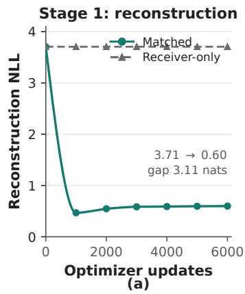

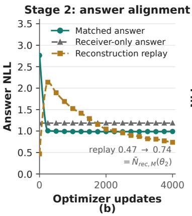

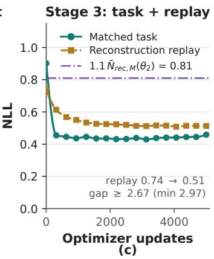  
Figure 6: Three-stage training dynamics, Qwen3-1.7B→Qwen2.5-0.5B-Instruct, measured on heldout splits. (a) Reconstruction NLL, Matched against the constant Receiver-only baseline. (b) Matched answer NLL against Receiver-only, with the replayed reconstruction NLL that defines ${ \overline { { N } } } _ { \mathrm { r e c } , M } ( \theta _ { 2 } )$ . (c) Matched task NLL with the replayed reconstruction NLL and the eligibility bound $1 . 1 { \overline { { N } } } _ { \mathrm { r e c } , M } ( \theta _ { 2 } )$ . The Stage 1 panel shows the first 6,000 of its 16,000 updates, over which reconstruction has converged $( 3 . 7 1  0 . 4 7$ nats by update 1,000 and 0.60 at update 6,000). Markers are measurements; curves are shape-preserving interpolation between them.

## C.3 PROMPTS AND DECODING

Every prompt below is rendered through the model’s own chat template. Qwen3 models run with thinking disabled throughout, which for the Qwen3 tokenizer inserts an empty <think></think> block after the assistant marker. Sharer drafts are decoded greedily.

Stage 1: reconstruction. The receiver sees one fixed instruction for every sample and never sees the conversation, the question, or the transmission key:

Stage 1 · Receiver   
[system] You are a lossless communication decoder. Recover the hidden   
message exactly and do not add, remove, explain, or rewrite   
anything.   
[user] Output the hidden message exactly.  
This renders to 45 tokens for the Qwen2.5 receiver and 49 for the Qwen3 receiver.  
Stage 2: answer alignment. The sharer receives the OpenHermes conversation with the final gold assistant turn removed, through the chat template with a generation prompt and no added instruction, and drafts the next assistant turn. The receiver sees the same conversation. The text-to-text control instead appends the draft to the receiver’s user turn:

Stage 2 · Text-to-text receiver   
{original user content}   
A collaborating model proposed the draft answer below. Treat it as   
fallible evidence, check it, and then answer the original request.   
<collaborator\_draft>   
{sharer draft}   
</collaborator\_draft>

Stage 3: multiple-choice training. The sharer receives the question and all options and is asked for the option text rather than its letter, so that the draft carries content rather than a label:

Stage 3 · Sharer, multiple choice   
Question:   
{question}   
Options:   
A. {choice A}   
B. {choice B}   
C. {choice C}   
D. {choice D}   
Explain your reasoning briefly using the provided information. End with   
a separate line: Answer: the full text of your chosen option, not its   
letter.

The receiver is supervised on the gold option text under

Stage 3 · Receiver, multiple choice   
Question:   
{question}   
Options:   
A. {choice A}   
B. {choice B}   
C. {choice C}   
D. {choice D}   
Give only the answer text. Do not give an option letter, explanation,   
or answer label.

Stage 3: private protocol. The sharer prompt inserts its assigned evidence and asks for a short answer; the receiver prompt drops the option block and keeps the final instruction:

Stage 3 · Sharer, private protocol   
Question:   
{question}   
Context:   
[{title}]   
{text}   
Explain your reasoning briefly using the provided information. End with   
a separate line: Answer: the short answer.

Evaluation. Multiple-choice evaluation scores options rather than sampling text, so the receiver is prompted in the option-selection format used by prior work and its turn is prefilled with The correct answer is:

Evaluation · Receiver, option selection   
Accurately answer the following question:   
{question}

Choices:   
A. {choice A}   
B. {choice B}   
C. {choice C}   
D. {choice D}   
Instructions:   
- Carefully read the question and all options.   
- Select the single most correct answer.   
- Respond ONLY in the format "The correct answer is A/B/C/D".   
- Do not include explanations or additional text.

Training therefore supervises answer text while multiple-choice evaluation reads option logits at a fixed position; the two use the prompts given above and the same interface checkpoint. Privateprotocol evaluation decodes greedily with at most 128 new tokens. Drafts that reach the 512-token cap without emitting EOS are truncated and used as they are.

## C.4 EVALUATION DATA AND SCORING

Benchmarks. The Public protocol uses MMLU-Redux 2.0 test (n = 5,632, dataset digest prefix ec464e71), ARC-Easy test (n = 2,376), ARC-Challenge test (n = 1,172), OpenBookQA test (n = 500), and C-EVAL validation (n = 1,346). The Private protocol uses HotpotQA (n = 7,404) and 2WikiMultihopQA (n = 1,000) following the split of HippoRAG 2.

Multiple-choice scoring. Receiver-based methods predict the option whose space-prefixed letter has the highest first-token logit at the last prompt position. Questions with fewer candidates mask the unused letters. Because scoring reads logits rather than sampling, there are no unparsed outputs. Sharer-only instead extracts the chosen option from the sharer’s decoded draft, which is generated from the same prompt and under the same 512-token cap as the drafts Draft-KV transmits.

Private protocol. We split each question’s annotated gold evidence at random between the sharer and the receiver, so that each model holds evidence the other cannot see, and we report exact match. Every method compares against the same partition, the same questions, and the same cached drafts.

Interventions. Matched, Deranged, and Receiver-only follow the definitions of Appendix B.1, and Appendix B.2 gives the donor pools, permutations, and seeds used for our own runs.

Aggregation. Every average over settings is unweighted: each model–benchmark cell counts once regardless of its sample size, so the method means over the 35 Public settings and the five-benchmark means in the scaling analysis are averages of per-setting values, not sample-weighted pools. Counts such as “30 of 35 settings” are over the same 35 cells.

## C.5 COMPUTE AND SOFTWARE

All our experiments were conducted on 96GB GPUs whose peak BF16 tensor-core rate is 148 TFLOP/s and which reach 139.43 TFLOP/s on BF16 matmul, running models up to 8B parameters under bfloat16 precision. Runs use PyTorch 2.6.0 with CUDA 12.4, Transformers 4.52.4, and driver 535.161.08. Sharer drafts are generated and cached once per configuration before training, so the same drafts serve the training stages, the reported evaluations, and the interventions.

Cost baselines. Inference cost for Draft-KV comprises the sharer’s prefill and draft decoding, the additional forward pass that extracts the draft states (Appendix A.1), the projections, and the receiver’s prefill and decoding. Sharer-only reads its answer off the same draft, generated from the same prompt under the same 512-token cap (Appendix C.4), so draft decoding is common to it and to Draft-KV rather than an increment of ours. Text-to-Text consumes the identical draft as text, which makes it the baseline that isolates the medium: it prefills the draft through every receiver layer, whereas Draft-KV reads the message positions at four communication layers through the projections of Equation 2. On the Public benchmarks the receiver is scored from logits at one position, so it performs a single prefill and no autoregressive decoding; the Private benchmarks add the decoding of a short answer.

Measured cost per question. Table 8 decomposes one question’s inference for the Qwen3-8B to Qwen2.5-0.5B-Instruct pair under both protocols. Drafts are generated online rather than read from the cache, so draft decoding enters every condition that consumes a draft. Draft-KV performs 2.02× the arithmetic of Sharer-only and takes 1.01× its latency; on HotpotQA the two ratios are 2.03× and 1.05×. The two ratios separate because the work the conditions share is sequential and the work Draft-KV adds is not. Both decode the same draft, 368 memory-bound single-token steps on the 8B sharer that occupy 11.87 of Draft-KV’s 12.02 s. What Draft-KV adds is one compute-bound prefill over prompt and draft: it doubles the sharer’s arithmetic and costs 83 ms. The same decomposition separates Draft-KV from Text-to-Text, which runs the identical sharer and leaves the receiver 1.2 m earlier; the 6.56 TFLOPs between the two conditions is the extraction pass.

The interface is 0.88 GFLOPs on MMLU-Redux and 0.32 on HotpotQA, four orders of magnitude below the total and 0.63 ms of wall-clock. C2C occupies the same position in the pipeline with 118.3 GFLOPs and 35.6 ms, so the 348× parameter ratio of Section 1 reappears as a 134× ratio in the arithmetic each interface performs per question. C2C also shows what the sharer’s draft costs and buys: without draft decoding its latency is 0.009× Sharer-only, and Table 1 places its accuracy below the receiver’s own.

Batch size one isolates per-question latency. At the batch sizes used for evaluation, the same pair sustains 0.776 questions per second under the Public protocol at batch 16 and 1.246 under the Private protocol at batch 8.

Table 8: Inference cost for one question with the Qwen3-8B sharer and the Qwen2.5-0.5B-Instruct receiver. Stage latencies are medians over 200 questions at batch size one after 20 warmup questions, timed with CUDA events. Floating-point counts are analytic; the interface column covers the projections of Equation 2 and the external attention of Equation 10, and is reported in GFLOPs. Columns marked × give the ratio to Sharer-only on the same benchmark. Dashes mark stages a condition does not run.
<table><tr><td></td><td colspan="6">Latency by stage (ms)</td><td colspan="2">Total latency</td><td colspan="3">Arithmetic</td></tr><tr><td>Condition</td><td>Sharer prefill</td><td>Draft decode</td><td>Extrac- tion</td><td>Projec- tion</td><td>Recv. prefill</td><td>Recv. decode</td><td>ms</td><td>×</td><td>TFLOPs</td><td>×</td><td>Interface GFLOPs</td></tr><tr><td colspan="10">Public protocol, MMLU-Redux</td><td></td><td></td></tr><tr><td>Receiver-only</td><td></td><td></td><td></td><td></td><td>16.7</td><td></td><td></td><td>16.7 0.001</td><td>0.108</td><td>0.016</td><td></td></tr><tr><td>Sharer-only</td><td>33.6</td><td>11,868.1</td><td></td><td></td><td></td><td></td><td>11,907.2 1.000</td><td></td><td></td><td>6.801 1.000</td><td></td></tr><tr><td>Text-to-Text</td><td>33.6</td><td>11,868.1</td><td></td><td></td><td>18.0</td><td></td><td>11,925.2 1.002</td><td></td><td>7.187</td><td>1.057</td><td></td></tr><tr><td>Cache-to-Cache</td><td>45.1</td><td></td><td></td><td>35.6</td><td>20.7</td><td></td><td></td><td>101.4 0.009</td><td>2.256</td><td>0.332</td><td>118.3</td></tr><tr><td>Draft-KV</td><td></td><td>33.6 11,868.1</td><td>83.3</td><td>0.6</td><td>19.2</td><td></td><td>12,019.5 1.009</td><td></td><td>13.745 2.021</td><td></td><td>0.885</td></tr><tr><td colspan="10">Private protocol, HotpotQA</td><td></td><td></td><td></td></tr><tr><td>Receiver-only</td><td></td><td></td><td></td><td></td><td>17.9</td><td>62.5</td><td></td><td>80.5 0.020</td><td></td><td>0.137 0.029</td><td></td></tr><tr><td>Sharer-only</td><td>46.4</td><td>3,935.7</td><td></td><td></td><td></td><td></td><td>3,981.7</td><td>1.000</td><td></td><td>4.687 1.000</td><td></td></tr><tr><td>Text-to-Text</td><td>46.4</td><td>3,935.7</td><td></td><td></td><td>18.4</td><td>61.9</td><td>4,150.8</td><td>1.042</td><td></td><td>4.924 1.050</td><td></td></tr><tr><td>Cache-to-Cache Draft-KV</td><td>46.4</td><td>3,935.7</td><td>71.2</td><td>0.7</td><td>20.7</td><td>N/A 57.9</td><td>4,165.91.046</td><td></td><td></td><td>9.520 2.031</td><td>0.323</td></tr></table>

## D ADDITIONAL ABLATIONS AND ROBUSTNESS

## D.1 CORE ABLATIONS: RESULTS AND PROTOCOL

Shared configuration. Every variant in this appendix is trained with the Qwen3-1.7B to Qwen2.5- 0.5B-Instruct configuration used for the main results: the same layer assignment and interface capacity, the same per-stage data, optimizer settings, and update budgets, the same four-to-one replay ratio in Stages 2 and 3, and the same checkpoint-selection rule (Appendix C). Each variant is a single training run and differs from Full Draft-KV only in the component its row names.

Evaluation and metrics. All results use the Public protocol and evaluate ARC-Challenge test (n = 1,172) and MMLU-Redux test (n = 5,632) with the option-scoring rule of Section 5.1. ARC test and MMLU-Redux are excluded from Stage 3 training and checkpoint selection. The three message conditions and the two gains are those of Section 3, with Deranged drawing its message from the same benchmark. Table 9 reports all three accuracies alongside G and $P .$ One question is worth 0.085 pp on ARC-Challenge and 0.018 pp on MMLU-Redux, which sets the resolution of every difference discussed below.

Table 9: Complete accuracy contrasts for the core ablations on the two reported benchmarks. Accuracies are percentages; G and P are percentage points. Differences are computed from the reported two-decimal accuracies.
<table><tr><td>Variant</td><td> $A _ { M }$ </td><td> $A _ { D }$ </td><td> $A _ { R }$ </td><td> $G$ </td><td> $P$ </td></tr><tr><td>ARC-Challenge test</td><td></td><td></td><td></td><td></td><td></td></tr><tr><td>Full Draft-KV</td><td>83.53</td><td>37.63</td><td>40.10</td><td>43.43</td><td>45.90</td></tr><tr><td>Prompt KV</td><td>49.83</td><td>49.66</td><td>40.10</td><td>9.73</td><td>0.17</td></tr><tr><td>w/o reconstruction pretraining</td><td>76.71</td><td>37.97</td><td>40.10</td><td>36.61</td><td>38.74</td></tr><tr><td>w/o answer alignment</td><td>80.03</td><td>38.31</td><td>40.10</td><td>39.93</td><td>41.72</td></tr><tr><td>MMLU-Redux test</td><td></td><td></td><td></td><td></td><td></td></tr><tr><td>Full Draft-KV</td><td>65.07</td><td>36.84</td><td>37.45</td><td>27.62</td><td>28.23</td></tr><tr><td>Prompt KV</td><td>43.59</td><td>43.50</td><td>37.45</td><td>6.14</td><td>0.09</td></tr><tr><td>w/o reconstruction pretraining</td><td>52.40</td><td>35.82</td><td>37.45</td><td>14.95</td><td>16.58</td></tr><tr><td>w/o answer alignment</td><td>55.40</td><td>36.15</td><td>37.45</td><td>17.95</td><td>19.25</td></tr></table>

Message-source control. Full Draft-KV exposes draft-position KV during task training and evaluation. Prompt KV instead exposes only prompt-position KV in Stages 2 and 3 and at evaluation. The receiver, communication architecture, Stage 1 reconstruction, and subsequent reconstruction replay remain unchanged. Starting from the same Stage 1 checkpoint, the Prompt KV interface is retrained for its task-message source; this is not an inference-only replacement in the Full in terface. Replay continues to expose reconstruction-payload positions rather than prompt positions. The two message sources also differ in how they are produced: prompt-position states are available from the sharer’s prefill, whereas draft-position states require the decoding and extraction pass of Appendix A.1. The comparison therefore tests message source together with learning to use that source, not two encodings of equal length or equal cost.

Stage-deletion controls. Without reconstruction pretraining, the interface enters Stage 2 without Stage 1 updates and then proceeds to Stage 3, using the standard Xavier initialization for projection matrices and zero initialization for gates (Appendix A.2). Without answer alignment, the Stage 1 interface enters Stage 3 directly. Both variants keep the replay schedule of Appendix A.4 in every stage they retain: Stage 1, where it is kept, reconstructs on every update, and Stages 2 and 3 alternate four task updates with one reconstruction update, so removing pretraining does not remove reconstruction supervision altogether.

Effects of stage deletion. Beyond the Matched losses reported in Section 5.5, the reduced pairing gains of both stage deletions do not translate into less mismatch harm: $A _ { R } - A _ { D }$ decreases from 2.47 to 2.13/1.79 pp on ARC-C but increases from 0.61 to 1.63/1.30 pp on MMLU-Redux.

## D.2 GUARD ABLATION: MISMATCH HARM VERSUS PAIRING GAIN

Control and diagnostic. The guard ablation branches from the Stage 2 checkpoint of Full Draft-KV and sets $\lambda _ { p } = 0$ for Stage 3, leaving every other training condition unchanged; Full uses $\lambda _ { p } =$ 0.1 and $\tau = 0 .$ 1 as in Equation 15. Besides accuracy, we report the mean per-example guard hinge on the test split under Deranged messages and the rate at which it is active:

$$
\bar { h } = \frac { 1 } { n } \sum _ { i = 1 } ^ { n } \left[ { \cal N } _ { i } ^ { D } - { \cal N } _ { i } ^ { R } - \tau \right] _ { + } , \qquad \nu = \frac { 1 0 0 } { n } \sum _ { i = 1 } ^ { n } { \bf 1 } \{ { \cal N } _ { i } ^ { D } - { \cal N } _ { i } ^ { R } > \tau \} .\tag{24}
$$

Here $N _ { i } ^ { D }$ and $N _ { i } ^ { R }$ are full-vocabulary teacher-forced NLLs averaged over supervised answer tokens, including the terminal token and excluding prompt and padding positions (Equation 13). We average the hinge over examples, not over all tokens. h<sup>¯</sup> is measured in nats per target token; ν is the percentage of examples exceeding the threshold. Stop-gradient on $N _ { i } ^ { R }$ affects training gradients but not these evaluation values.

Table 10: Guard ablation. Accuracies are percentages; G, P, and $A _ { R } - A _ { D }$ are in pp. $\bar { h }$ is the mean hinge and ν the threshold-exceedance rate, with the number of affected examples in parentheses. Receiver-only baselines are 40.10% (ARC-C) and 37.45% (MMLU-R).
<table><tr><td>Variant</td><td>Benchmark</td><td> $A _ { M }$ </td><td> $A _ { D }$ </td><td> $G$ </td><td> $P$ </td><td> $A _ { R } - A _ { D }$ </td><td> $\bar { h }$  ν</td></tr><tr><td>Full</td><td>ARC-C</td><td>83.53</td><td>37.63</td><td>43.43</td><td>45.90</td><td>2.47 0.038</td><td>19.7 (231)</td></tr><tr><td>w/o Guard</td><td>ARC-C</td><td>82.94</td><td>35.92</td><td>42.84</td><td>47.02</td><td>4.18 0.091</td><td>37.9 (444)</td></tr><tr><td>Full</td><td>MMLU-R</td><td>65.07</td><td>36.84</td><td>27.62</td><td>28.23</td><td>0.61 0.052</td><td>24.6 (1386)</td></tr><tr><td></td><td>w/o Guard MMLU-R</td><td>64.68</td><td>36.24</td><td>27.23</td><td>28.44</td><td>1.21</td><td>0.104 42.8 (2411)</td></tr></table>

Interpretation. Removing the guard lowers Matched accuracy by 0.59/0.39 pp on ARC-C/MMLU-Redux and increases mismatch harm by 1.71/0.60 pp. The mean hinge roughly doubles, from 0.038 to 0.091 and from 0.052 to 0.104, and the exceedance rate does the same. The guard therefore limits mismatch harm while retaining the Matched gains it was meant to preserve. The asymmetry between benchmarks follows the training data: the guard is applied on Stage 3 ARC updates, so its effect is strongest on ARC-C and carries over only partly to MMLU-Redux.

This also shows why the pairing gain cannot be read on its own. Since

$$
P = G + ( A _ { R } - A _ { D } ) ,\tag{25}
$$

removing the guard raises P to 47.02/28.44 pp even as G falls, because the Deranged condition deteriorates faster than Matched improves. A larger pairing gap obtained this way is damage under mismatch, not better communication. The intervention tests cross-question mismatches and does not speak to robustness against incorrect drafts for the same question.

Training dynamics with and without the guard. Figure 7 logs Stage-3 calibration NLL every 250 task updates in the run that keeps the one-sided guard $( \lambda _ { p } ^ { - } = \bar { 0 . 1 } , \tau = 0 . 1$ , the Full row above) and in the run without it; the two share the Qwen3-1.7B→Qwen2.5-0.5B-Instruct pair, the Stage-1/Stage-2 initialization, the ARC data, and the replay schedule, so their curves are directly comparable. Matched NLL is essentially identical in the two runs (panel a), but Deranged NLL diverges to 3.72 nats without the guard—nearly 2.5 nats above Receiver-only—whereas the guard holds it at 1.71, within 0.48 nats of Receiver-only (panel b). With no term bounding it, the gold answer NLL under a mismatched packet rises throughout training; the one-sided guard removes exactly that drift while leaving Matched training untouched.

Pairing-gap dynamics. Figure 8 follows the three Stage-3 conditions of Full Draft-KV on shared axes: Matched task NLL falls from 0.90 to 0.46 nats while Deranged rises from 1.37 to 1.71, so $N ^ { D } - N ^ { M }$ widens from 0.47 to 1.25 nats over training. The separation is acquired rather than optimized (Section 4.3): the guard bounds Deranged instead of rewarding the gap, which is what keeps it near Receiver-only in Figure 7.

## E SHARER SCALING ANALYSIS

Figure 5 varies the sharer while holding everything else fixed.

Fixed conditions. All four points share the frozen Qwen2.5-0.5B-Instruct receiver, the same layer assignment, and an interface of identical size: as Table 6 shows, every Qwen3 sharer has a flattened KV width of 1024, so all four interfaces contain exactly 1,048,584 trainable parameters. They also share the Stage 3 training data, the update budget and learning rates of Appendix C.2, the seed, the checkpoint-selection rule, the 512-token draft cap, and the five evaluation benchmarks. One interface is trained per sharer; the curve therefore measures system scaling at fixed interface capacity, not a single interface into which sharers are swapped without training. The band in Figure 5 is the range across the five benchmarks, not a confidence interval.

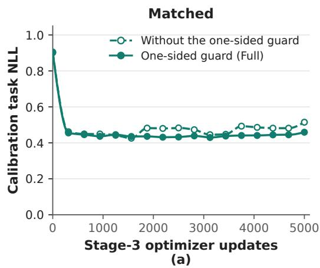

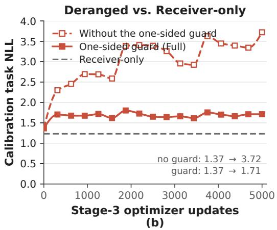  
Figure 7: Stage-3 training dynamics with and without the one-sided guard, Qwen3-1.7B→Qwen2.5- 0.5B-Instruct, evaluated every 250 task updates on the 637-example calibration split. (a) Matched task NLL is comparable in the two runs. (b) Deranged task NLL against the constant Receiver-only NLL (dashed grey): without the guard Deranged NLL rises far past Receiver-only, while the onesided guard keeps it close throughout training.

Stage 3 conditions  
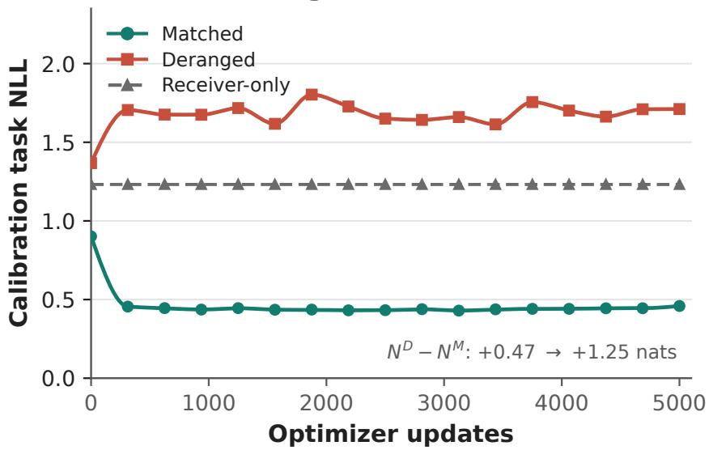  
Figure 8: Stage-3 conditions of the reported model at the same calibration snapshots as Figure 7. Markers are measurements; curves are shape-preserving interpolation between them.

Capability and draft length. A larger sharer could help simply by writing more, since a longer draft means more transmitted positions and more sharer computation at inference. The measured lengths do not order the gains. Table 11 reports the mean number of decoded draft tokens per question, excluding the sharer prompt and counting EOS where the draft terminates. Length is not monotone in sharer size: Qwen3-4B writes shorter drafts than Qwen3-1.7B on all five benchmarks, 223 tokens against 262 on average, yet its mean system gain is 8.57 pp higher. Across the extremes the two quantities are also out of proportion: from 0.6B to 8B the average draft grows 5.2× while the mean system gain grows from 9.63 to 42.25 pp. With the conditions above held fixed, what distinguishes the four points is the capability of the sharer writing the draft.

The 0.6B sharer is the one case where length and capability are hard to separate. Its drafts are short and highly variable, with a standard deviation exceeding the mean on MMLU-Redux and C-EVAL, which reflects drafts that stop early rather than a deliberately terse style. Its weak gains are consistent with both a weaker draft and a shorter one.

Table 11: Mean draft length in decoded tokens (mean ± SD) for the four scaling points, all decoded greedily under a 512-token cap. The last column is the unweighted mean over the five benchmarks, shown against the mean system gain of Figure 5.
<table><tr><td>Sharer</td><td>MMLU-R</td><td>ARC-E</td><td>ARC-C</td><td>OBQA</td><td>C-EVAL</td><td>Mean</td><td> $\overline { { G } } \left( \mathrm { p p } \right)$ </td></tr><tr><td>Qwen3-0.6B</td><td> $8 5 . 3 \pm 8 8 . 1$ </td><td> $4 9 . 5 \pm 3 3 . 8$ </td><td> $5 8 . 5 \pm 4 1 . 9$ </td><td> $2 4 . 4 \pm 2 7 . 0$ </td><td> $7 3 . 2 \pm 9 3 . 0$ </td><td>58.2</td><td>9.63</td></tr><tr><td>Qwen3-1.7B</td><td> $2 9 3 . 1 \pm 1 1 2 . 9$ </td><td> $2 1 9 . 9 \pm 7 3 . 0$ </td><td> $2 4 3 . 4 \pm 8 1 . 7$ </td><td> $2 2 0 . 7 \pm 6 6 . 3$ </td><td> $3 3 2 . 1 \pm 1 2 0 . 0$ </td><td>261.8</td><td>30.57</td></tr><tr><td>Qwen3-4B</td><td> $2 6 3 . 5 \pm 1 0 8 . 4$ </td><td> $1 9 8 . 2 \pm 5 9 . 5$ </td><td> $2 1 2 . 9 \pm 6 9 . 4$ </td><td> $1 9 9 . 8 \pm 5 8 . 7$ </td><td> $2 4 2 . 2 \pm 1 2 8 . 0$ </td><td>223.3</td><td>39.14</td></tr><tr><td>Qwen3-8B</td><td> $3 5 8 . 9 \pm 1 0 2 . 3$ </td><td> $2 6 3 . 6 \pm 6 7 . 0$ </td><td> $2 8 5 . 3 \pm 7 6 . 7$ </td><td> $2 5 1 . 5 \pm 6 0 . 4$ </td><td> $3 5 5 . 8 \pm 1 1 3 . 3$ </td><td>303.0</td><td>42.25</td></tr></table>

Other pairs. The remaining pairs in Table 1 produce drafts in the same range, averaging 233 tokens for the Llama-3.2-3B-Instruct sharer and 303 for Qwen2.5-0.5B-Instruct in the reversed direction, so no configuration owes its result to an unusually long message. The Qwen3-8B to Qwen3-4B pair reuses the Qwen3-8B drafts.

## F RECEIVER USE OF THE DRAFT

A receiver that relayed the sharer’s answer would reproduce Sharer-only accuracy exactly, so what separates communication from relay is how often the receiver departs from the sharer, and in which direction. We count those departures here; Appendix H then shows the individual questions behind those counts. All results use Qwen3-1.7B as the sharer and Qwen2.5-0.5B-Instruct as the receiver, on ARC-Challenge test and MMLU-Redux test under the Public protocol. Every condition sees the same questions and the same cached drafts, so the comparisons below are per-question rather than between aggregates.

## F.1 DISAGREEMENT WITH THE SHARER

For each question we record whether a method is correct and whether the answer extracted from the sharer’s own draft is correct, which partitions the evaluation set into four groups. Aggregating the partition recovers the columns of Table 1; what it adds is the joint outcome, which those columns cannot express. On ARC-Challenge, Draft-KV answers 979 questions correctly and Sharer-only 931, a net difference of 48 that is consistent with repairing 48 answers and breaking none, and equally with repairing several hundred while breaking almost as many. Only the joint counts separate these, and they also let us compare Draft-KV with Text-to-Text on the identical draft, where the transmitted content is fixed and only the medium differs.

Figure 9(a) gives the full partition for all three pairings, and Figure 9(b) rescales the two disagreement cells by the subsets in which they can occur, since a correction is only possible on a question the sharer got wrong and a loss only on one it got right. On ARC-Challenge, Draft-KV recovers 58 of the 241 questions the sharer answers incorrectly (24.1%) while losing 10 of the 931 it answers correctly (1.1%); on MMLU-Redux the figures are 299 of 2,170 (13.8%) and 96 of 3,462 (2.8%). Transcription would correct nothing, since it reproduces Sharer-only by construction. Recovering roughly a quarter of the sharer’s ARC-Challenge errors at a cost of about one percent of its successes is available only to a model that reads the draft without deferring to it.

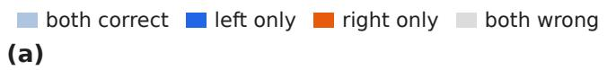

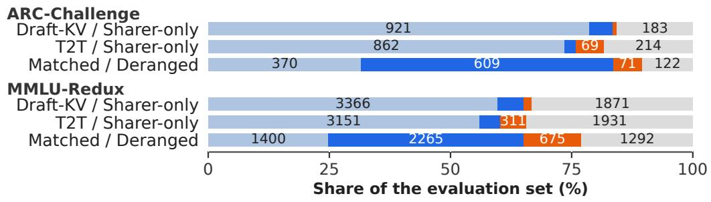

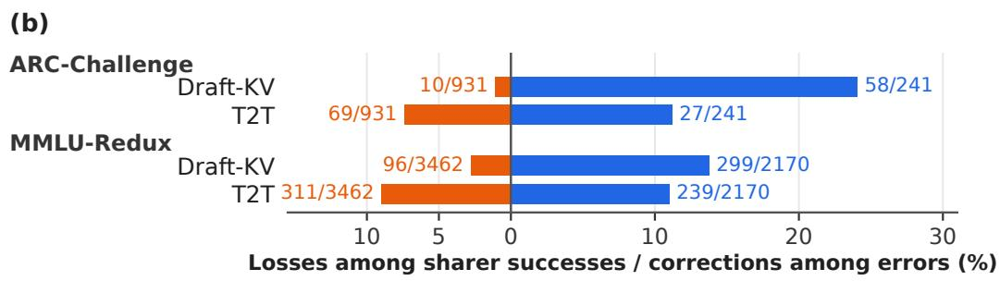  
Figure 9: Per-question outcomes for every pairing, with counts shown throughout. (a) The complete partition as a share of the evaluation set; “left” and “right” refer to the two conditions named in each row. (b) The two disagreement cells of the method–sharer pairings, rescaled by the subsets they can occur in: corrections are only possible where the sharer erred, losses only where it did not. Draft-KV and T2T receive the same drafts.

Comparing the two media is more informative than comparing either with the sharer, because the draft is identical and only its representation changes. Draft-KV and Text-to-Text correct a similar share of the sharer’s MMLU-Redux errors, 13.8% against 11.0%, but they differ sharply in what they cost: Text-to-Text loses 8.98% of the sharer’s correct answers against Draft-KV’s 2.77%, and on ARC-Challenge 7.41% against 1.07%. Reading the draft as text is thus roughly as good at supplying missing answers and three to seven times more likely to overwrite correct ones, which is why Text-to-Text ends up below Sharer-only overall (−3.58 and −1.28 pp) while Draft-KV ends up above it (+4.10 and +3.60 pp). The advantage of the latent channel here is less that it transmits more and more that the receiver is not talked out of answers it already had right.

The same partition applied to the intervention makes the pairing gain concrete at the level of individual questions, as the bottom row of each group in Figure 9(a) shows. Of the questions Draft-KV answers correctly under Matched, 609 of 979 on ARC-Challenge (62.2%) and 2,265 of 3,665 on MMLU-Redux (61.8%) become incorrect once the message is replaced by another question’s. Content dependence is therefore not confined to the aggregate: for most individual questions the correct answer requires the message computed for that question.

Finally, the two benchmarks differ in the direction the training setup predicts. Stage 3 trains on ARC, and it is on ARC-Challenge that the correction rate is highest and the loss rate lowest; on MMLU-Redux, which no stage trains on, corrections are less frequent and losses more than twice as likely. Using a draft selectively is thus partly task-specific, though it transfers well enough to leave a large net gain on the held-out benchmark.

Appendix H examines representative questions from each cell of this partition and from the splitevidence evaluation, tracing the mechanisms behind the correction, medium, mismatch, and loss rates reported above.

## G BASELINE REPRODUCTION AND IMPLEMENTATION CHECKS

This appendix records how the audited methods were reproduced and which implementation checks we ran.

C2C. We use the authors’ released implementation and their published fuser for the Qwen2.5- 0.5B-Instruct to Qwen3-0.6B direction, trained on OpenHermes 2.5 under the authors’ released recipe with both backbones frozen and only the 28 per-layer projectors updated. We run it evaluation-only, without CoT, decoding greedily with at most 64 new tokens and thinking disabled, and score multiple-choice options at the assistant prefix The correct answer is. Because no released fuser exists for the other six directions of Table 1, we trained those ourselves under the same recipe: one of the seven C2C rows rests on the authors’ own weights and the remaining six on our reproduction of their training. We also trained the Qwen2.5-0.5B-Instruct→Qwen3-0.6B direction ourselves under the same recipe; those checkpoints supply the interval evidence of Table 13, while Table 1 and Figure 1(a) report the released fuser.

C2C reproduction check. To verify that our retraining follows the released recipe, we retrained C2C fusers for the three sharer–receiver pairings evaluated in the original paper, all with Qwen3- 0.6B as the receiver. Table 12 compares the reported accuracies with ours: the two agree within 0.44 pp on every benchmark, so the C2C entries in Table 1 rest on a pipeline that reproduces their training.

Within the protocol of Appendix B.1, the substitution is applied after the sharer forward pass and after token and layer alignment, but immediately before C2CProjector runs. The receiver cache, the projector parameters, and the receiver’s attention path are untouched, so Matched and Deranged differ only in which question produced the source cache.

LatentMAS. LatentMAS is training-free, so we reproduce it from the authors’ repository with no adapter or projector to load. We evaluate the sequential Planner–Critic–Refiner–Judger topology with a Qwen3-4B agent on a fixed 200-question GSM8K sample, where the latent message is the key–value cache an agent accumulates over its K latent steps and passes into the next agent’s forward pass. We report two runs: $K = 2 0$ under greedy decoding with a 4096-token cap, and $K = 4 0$ under temperature 0.6 and top-p 0.95 with a 2048-token cap, each with its own seed. An earlier $K = 2 0$ run at a 2048-token cap was discarded because truncation affected its answers. The substitution is applied after an agent produces that cache and before the next agent or the Judger consumes it. Donor caches are length-matched to the target by truncating surplus tail positions or zero-padding when shorter, without shifting the positions that remain; the target prompt and decoding settings are unchanged.

Table 12: C2C accuracies reported in the original paper versus our retraining under their released recipe, with Qwen3-0.6B as the receiver.
<table><tr><td>Sharer</td><td>Benchmark</td><td>Reported</td><td>Retrained</td></tr><tr><td rowspan="4">Qwen2.5-0.5B-Instruct</td><td>MMLU-Redux</td><td>42.92</td><td>42.95</td></tr><tr><td>OpenBookQA</td><td>52.60</td><td>52.80</td></tr><tr><td>ARC-Challenge</td><td>54.52</td><td>54.18</td></tr><tr><td>C-EVAL</td><td>41.77</td><td>41.68</td></tr><tr><td rowspan="4">Llama-3.2-1B</td><td>MMLU-Redux</td><td>44.42</td><td>43.98</td></tr><tr><td>OpenBookQA</td><td>47.80</td><td>47.40</td></tr><tr><td>ARC-Challenge</td><td>53.39</td><td>53.41</td></tr><tr><td>C-EVAL</td><td>40.77</td><td>40.56</td></tr><tr><td rowspan="4">Qwen3-4B-Base</td><td>MMLU-Redux</td><td>43.95</td><td>43.98</td></tr><tr><td>OpenBookQA</td><td>53.20</td><td>53.60</td></tr><tr><td>ARC-Challenge</td><td>55.39</td><td>55.03</td></tr><tr><td>C-EVAL</td><td>42.79</td><td>43.02</td></tr></table>

Dense latent communication. No implementation of See What I See, Know What I Think (Chen et al., 2026) has been released, so we do not reproduce it. Every DLC number we report, including the 8B and 14B points in Figure 1(c) and the parameter count in Section 1, is taken from the published paper and is labelled as such wherever it appears. We therefore make no claim about DLC’s behaviour under message intervention.

Implementation checks. Three checks were run on every configuration reported in this paper. First, disabling communication reproduces the native receiver exactly: the maximum absolute logit difference between the Receiver-only condition and the receiver run alone is zero, so Receiveronly is the receiver’s own function rather than a near-miss approximation. Second, every donor assignment is verified to cover the pool exactly once and to contain no fixed point, so no example can receive its own message under Deranged. Third, for C2C we verify that the fused cache used by the adapter-only control reconstructs the Matched cache to within $1 0 ^ { - 6 }$ once its two compensation terms are restored, which confirms that the control enters the model through the same path as Matched.

Uncertainty on the C2C pairing gains. Intervals are reported for four configurations of fusers we trained ourselves under the authors’ recipe—the Qwen2.5-0.5B-Instruct→Qwen3-0.6B fuser at training steps 2054 and 4109 and at its final checkpoint, and a Llama-3.2-3B→Qwen2.5-0.5B-Instruct fuser—for which we computed per-question 95% paired bootstrap intervals on the Matched– Deranged difference over the five Public benchmarks (MMLU-Redux, ARC-Easy, ARC-Challenge, OpenBookQA, C-Eval). Table 13 lists all twenty intervals. Thirteen contain zero; the seven that do not are three positive intervals of the Llama fuser (the largest point estimate, +2.80 pp, on OpenBookQA), two slightly negative intervals of the step-2054 checkpoint, and one negative and one positive interval of the final checkpoint, so even the intervals that exclude zero remain within a few points of zero. The released C2C checkpoint and the LatentMAS runs are covered by point estimates only.

Table 13: Matched–Deranged differences (percentage points) with 95% per-question paired bootstrap intervals, for four configurations of C2C fusers we trained ourselves under the authors’ recipe. The first three columns are training checkpoints (step 2054, step 4109, final) of a Qwen2.5-0.5B-Instruct→Qwen3-0.6B fuser; the fourth is a Llama-3.2-3B-Instruct→Qwen2.5-0.5B-Instruct fuser. The Qwen2.5-0.5B-Instruct→Qwen3-0.6B row of Table 1 and Figure 1(a) instead report the authors’ released fuser. Intervals that exclude zero are bolded; thirteen of the twenty contain zero.
<table><tr><td>Benchmark</td><td></td><td>step 2054</td><td>step 4109</td><td>final</td><td>Llama→0.5B</td></tr><tr><td>MMLU-R</td><td>∆ CI</td><td>-0.43 [−.80, −.07]</td><td>+0.11 [−.34, +.55]</td><td>-0.47 [−.91, −.03]</td><td>+1.07 [+.50, +1.65]</td></tr><tr><td>ARC-E</td><td>∆ CI</td><td>-0.31 [−.88, +.26]</td><td>+0.35 [−.22, +.92]</td><td>-0.09 [−.70, +.52]</td><td>+2.28 [+1.19, +3.38]</td></tr><tr><td>ARC-C</td><td>∆</td><td>+0.26 CI [−.61, +1.13] [−1.22, +.52]</td><td>-0.35</td><td>+0.42 [−.53, +1.38]</td><td>+1.13 [−.17, +2.52]</td></tr><tr><td>OBQA</td><td>∆</td><td>+1.00</td><td>-0.40 CI [−.20, +2.40] [−1.80, +1.00] [−1.10, +1.10]</td><td>+0.00</td><td>+2.80 [+.60, +5.20]</td></tr><tr><td>C-Eval</td><td>∆</td><td>-0.32 CI [−.58, −.06]</td><td>+0.09 [−.22,+.40]</td><td>+0.74 [+.45, +1.03]</td><td>-0.19 [−.61, +.21]</td></tr></table>

## H CASE STUDY

This appendix steps from the aggregate partition of Appendix F.1 down to the individual questions behind it. All cases use the setting of Appendix F.1: Qwen3-1.7B as the sharer and Qwen2.5-0.5B-Instruct as the receiver (Stage-3 checkpoint), on ARC-Challenge and MMLU-Redux test under the Public protocol, plus four examples (Cases 16–19) from the split-evidence evaluation on HotpotQA and 2WikiMultihopQA. Within each group, cases are selected by a fixed rule (ascending sample identifier). Drafts are excerpted with elisions marked; the receiver always sees the full draft.

The four multiple-choice groups instantiate the cells of the partition: corrected (sharer wrong, Draft-KV right), medium (same draft, T2T wrong, Draft-KV right), mismatch (matched message right, deranged message wrong), and lost (sharer right, Draft-KV wrong). The split-evidence cases are the generation counterpart: each model sees only half of the evidence, so the two halves must be composed through the message.

## H.1 CORRECTED CASES

Corrected cases are questions the sharer answers wrongly and Draft-KV answers correctly. The seven examples below split into three mechanisms. In Cases 1–3 the receiver already knows the answer: the latent message leaves it intact while the text medium talks it out of it. In Cases 4–5 the receiver’s prior is strong enough that no condition moves it, which is the limiting case of the same protective behaviour. In Cases 6–7 every other condition fails—receiver alone, sharer, and the same draft read as text—so the answer enters only through the paired message: correction as instruction rather than preservation.

## Case 1 · corrected · ARC-Challenge

Question. A student pours salt water into a beaker and then pours some acid into another beaker. The student returns to the lab table and realizes that the samples are not marked. What should the student do? Choices. (A) smell each sample in order to identify it; (B) guess which beaker contains each substance; (C) mix the substances together to determine what they are; (D) safely discard the samples and get new ones.

Gold. (D) safely discard the samples and get new ones.

Sharer draft (excerpt).

When a student pours salt water into a beaker and then pours some acid into another beaker, and the samples are not marked, the best approach is to avoid mixing the substances together, as this could lead to unintended reactions or contamination. Option A (smell each sample) is not reliable, as many substances are odorless or have similar smells. [. . . ] The correct answer is LETTER C.

<table><tr><td>Sharer</td><td>Recv-only</td><td>T2T</td><td>Draft-KV</td><td>Deranged</td></tr><tr><td>C×</td><td>D✓(.559)</td><td>C×</td><td>D√(.440)</td><td>A× (.361)</td></tr></table>

Analysis. The draft reasons against mixing the substances, which is the option it then selects, and closes on the wrong letter; T2T reproduces that letter, while Draft-KV keeps the receiver’s own correct answer. The deranged message, by contrast, collapses the decision and pulls the receiver to a third option.

Case 2 · corrected · ARC-Challenge

Question. Wolves, which are top predators, were eliminated from Yellowstone National Park in the 1930s. In 1995, wolves were reintroduced into Yellowstone. During the period in which wolves were absent from Yellowstone, which most likely occurred?

Choices. (A) an increase in competition for food resources among small prey; (B) a greater opportunity for primary producers to flourish; (C) an increase in the population of tertiary consumers; (D) a greater balance of predator-prey relationships.

Gold. (A) an increase in competition for food resources among small prey.

Sharer draft (excerpt).

When wolves are removed from an ecosystem, they play a key role as top predators. They help control the populations of their prey, which in turn affects the availability of resources for other species. Without wolves, prey populations may increase, leading to overgrazing and a decrease in the growth ofprimary producers (like plants). [. . . ] The correct answer is LETTER B.

<table><tr><td>Sharer</td><td>Recv-only</td><td>T2T</td><td>Draft-KV</td><td>Deranged</td></tr><tr><td>B×</td><td>A√(.643)</td><td>B×</td><td>A√(.367)</td><td>D×(.981)</td></tr></table>

Analysis. The draft’s own opening reasoning—prey increase, then overgrazing—points away from its closing letter, and T2T copies the closing letter anyway; Draft-KV keeps the receiver’s correct answer at reduced confidence. The deranged message is worse than no message at all: the receiver commits to a wrong option with probability .981.

## Case 3 · corrected · ARC-Challenge

Question. A student walks to school one morning and notices the grass is wet but the streets are dry. Which of these processes most likely caused the grass to be wet?

Choices. (A) condensation; (B) erosion; (C) evaporation; (D) precipitation.

Gold. (A) condensation.

Sharer draft (excerpt).

To determine which process most likely caused the grass to be wet, let’s analyze the situation step by step: the grass is wet, and the streets are dry. [. . . ] The most likely process that caused the grass to be wet is precipitation, as it is the process that brings water from the sky to the grass, making it wet. The correct answer is LETTER D.

<table><tr><td>Sharer</td><td>Recv-only</td><td>T2T</td><td>Draft-KV</td><td>Deranged</td></tr><tr><td>D×</td><td>A√(.988)</td><td>D×</td><td>A√(.508)</td><td>B×(.722)</td></tr></table>

Analysis. The draft’s conclusion cannot explain the observation (rain wets the streets as well), and T2T adopts it verbatim. Draft-KV retains the receiver’s near-certain answer, though the matched probability falls from .988 to .508: the message transmits the sharer’s pull without the sharer’s conclusion winning.

<table><tr><td colspan="4">Case 4 · corrected · MMLU-Redux (anatomy) Question. A patient has a fracture in which the radius is bent but not displaced, and the skin is intact. This type of fracture is known as which of the following?</td></tr><tr><td colspan="4">Choices. (A) Closed, greenstick; (B) Complex, comminuted; (C) Compound, transverse; (D) Open, spiral. Gold. (A) Closed, greenstick. Sharer draft (excerpt).</td></tr><tr><td colspan="4">To determine the correct answer, let&#x27;s break down the key features of the fracture described: the ra- dius is bent but not displaced; the skin is intact, which means the fracture is closed, not open (com- pound). [... ] The correct answer is LETTER C.</td></tr><tr><td></td><td>Sharer Recv-only</td><td>T2T Draft-KV Deranged</td><td></td></tr><tr><td></td><td>C× A√(.968)</td><td>A√</td><td>A√(.545) A√(.671)</td></tr><tr><td colspan="4">Analysis. The draft states the decisive fact—skin intact means closed—and then closes on an option whose first word, compound, means open. Every receiver condition stays with (A). The message reshapes confidence (.968 → .545) but not the decision: when the receiver knows, the channel does not argue.</td></tr><tr><td colspan="2">Case 5 · corrected · MMLU-Redux (marketing)</td><td colspan="3">Question. Which type of retailer involves comparatively low prices as a major selling point combined</td></tr><tr><td colspan="5">with the reduced costs of doing business? Choices. (A) Discount retailers.; (B) Convenience stores.; (C) Category killer stores.; (D) Limited line retailers.</td></tr><tr><td colspan="5">Gold. (A) Discount retailers. Sharer draft (excerpt). To answer this question, let&#x27;s break down the key elements: &quot;low prices as a major selling point&quot; indicates a focus on affordability; “reduced costs of doing business&quot; suggests that the retailer operates</td></tr><tr><td colspan="5">with lower operational costs.  $\dot { l } \dot { \dots } \dot { l }$  The best fit is Č. Category killer stores, as they combine low prices with reduced business costs through their focus on a specific category. The correct answer is LETTER C.</td></tr><tr><td colspan="5">Sharer Recv-only T2T Draft-KV Deranged C× A√(.997) A√ A√(.507) A√(.669)</td></tr><tr><td colspan="5">Analysis. As in Case 4, the receiver answers correctly in every condition, and the matched message costs</td></tr><tr><td colspan="5">about half of the probability mass (.997 → .507) without changing the decision. The interface attends to the message, but a wrong conclusion inside it does not transfer.</td></tr><tr><td colspan="5">Case 6 · corrected · MMLU-Redux (abstract algebra) Question. Statement 1: 4x — 2 is irreducible over Z. Statement 2: 4x — 2 is irreducible over Q. Choices. (A) True, True; (B) False, False; (C) True, False; (D) False, True.</td></tr><tr><td colspan="5">Gold. (D) False, True Sharer draft (excerpt). To determine the truth of the statements, we need to analyze the irreducibility of the polynomial 4x — 2 over Z and Q. A polynomial is irreducible over Z if it cannot be factored into the product of two non-</td></tr><tr><td colspan="5">constant polynomials with integer coefficients. Let&#x27;s try to factor: 4x − 2 = 2(2x – 1). [.. . ] Since 2 is a constant polynomial (degree 0), it is not considered a non-constant polynomial. Therefore, 4x — 2 is reducible over Z. [... ] The correct answer is LETTER B.</td></tr><tr><td colspan="5"></td></tr><tr><td></td><td>Sharer B×</td><td>Recv-only A×(.488)</td><td>T2T B×</td><td>Draft-KV Deranged D√(.505) B×(.923)</td></tr><tr><td colspan="5"></td></tr></table>

Analysis. Both statements turn on the same factorization, 4x − 2 = 2(2x − 1): over Z the factor 2 is not invertible, so this is a genuine factorization (False); over Q it is invertible, so it is not (True). The draft writes the factorization down but never invokes invertibility, concludes “reducible” twice, and lands on (B); the receiver alone answers (A); T2T follows the draft. Under the matched message the receiver picks (D)—the pairing that the draft’s own factorization supports and its verdict contradicts. Content, again, travels; conclusions do not.

Case 7 · corrected · MMLU-Redux (high school US history)

Question. “Permit us, then, earnestly to recommend these articles to the immediate and dispassionate attention of the legislatures of the respective states. [. . . ] under a conviction of the absolute necessity of uniting all our councils and all our strength, to maintain and defend our common liberties. . . ” (Journals of the Continental Congress, 1777). The most notable achievement of the United States under the Articles of Confederation was. . .

Choices. (A) the creation of a strong executive office to lead the national government; (B) the empowerment of Congress to regulate commerce; (C) the empowerment of Congress to collect taxes; (D) the provision for land sales in the Northwest that would benefit the entire nation.

Gold. (D) the provision for land sales in the Northwest that would benefit the entire nation.

Sharer draft (excerpt).

The Articles created a weak central government with no strong executive, so this is incorrect. The Articles did not give Congress the power to collect taxes, which was a major weakness of the system. The Articles did not provide for land sales in the Northwest, and such provisions were not part of the original document. [. . . ] The correct answer is LETTER C.

<table><tr><td>Sharer</td><td>Recv-only</td><td>T2T</td><td>Draft-KV</td><td>Deranged</td></tr><tr><td>C×</td><td>A× (.719)</td><td>A×</td><td>D√(.350)</td><td>A×(.503)</td></tr></table>

Analysis. The draft correctly rules out (A)—no strong executive under the Articles—and (C)—no power to tax—then denies the one provision the Articles did make, the Northwest land ordinances, and, having rejected (A), (C), and the gold (D), closes on the very (C) it had just excluded. The receiver alone answers (A), and T2T follows. The matched message selects (D), at the lowest confidence in this group (.350): the receiver lands on the single option that the sharer’s draft dismissed without grounds.

The seven cases span the two ends of correction: in Cases 1–5 the receiver already holds the answer and the latent message declines to overrule it, where text transmitted the sharer’s error three times out of three; in Cases 6–7 no condition but the paired message produces the answer at all.

## H.2 MEDIUM CASES

Medium cases hold the draft fixed and vary only its representation: the same question, the same sharer draft, T2T wrong and Draft-KV right. They isolate what the latent medium does with content that the text medium demonstrably fails to deliver.

Case 8 · medium · ARC-Challenge

Question. How does the speed of radio waves compare with the speed of infrared waves?

Choices. (A) Radio waves travel faster.; (B) Infrared waves travel faster.; (C) They both travel at the same speed.; (D) The wave speed varies with their frequency.

Gold. (C) They both travel at the same speed.

Sharer draft (excerpt).

To answer this question, we need to understand the nature of radio waves and infrared waves. Radio waves are a type ofelectromagnetic wave, and all electromagnetic waves travel at the speed oflight in a vacuum. [. . . ] Therefore, both radio waves and infrared waves travel at the same speed in a vacuum. The correct answer is LETTER C.

<table><tr><td>Sharer</td><td>Recv-only</td><td>T2T</td><td>Draft-KV</td><td>Deranged</td></tr><tr><td>C√</td><td>A×(.758)</td><td>A X</td><td>C√(.925)</td><td>B×(.926)</td></tr></table>

Analysis. The receiver’s prior is confidently wrong (.758 on “radio waves travel faster”). Reading the same draft as text leaves the error untouched; reading it as key–value states reverses it into .925 confidence in the right answer. The deranged message is equally decisive in the wrong direction, which underlines that the matched gain is carried by content, not by the mere presence of the channel.

$$
n = 8 \colon 8 \times 5 / 2 = 4 0 / 2 = 2 0 .
$$

Analysis. The draft contains a complete derivation, yet its text version does not move the receiver off 8—the number of vertices, a natural confusion for a small model. The latent version moves it to .992 on the right value. Whatever the message encodes, it behaves more like the result of the sharer’s computation than like its prose.

To answer this question, let’s break it down: genotype refers to the genetic makeup of an organism, including all the genes it carries. Phenotype refers to the observable characteristics of an organism, which resultfrom the interaction between the genotype and the environment. [. . . ] The correct answer is LETTER B.

<table><tr><td>Sharer</td><td>Recv-only</td><td>T2T</td><td>Draft-KV</td><td>Deranged</td></tr><tr><td>B√</td><td>B√(.817)</td><td>AX</td><td>B√(.982)</td><td>A×(.879)</td></tr></table>

Analysis. The receiver starts out correct at .817. The text medium talks it out of the right answer—the draft discusses the genotype first, and T2T lands there—while the latent medium raises the same receiver to .982. This is the loss asymmetry of Appendix F.1 in miniature: text drafts overwrite correct receivers, latent drafts do not.

## H.3 MISMATCH CASES

Mismatch cases keep the interface and the question fixed and swap only the message: the matched message yields the right answer, the deranged message the wrong one. They are the per-question form of the content-dependence result in Appendix F.1.

Case 11 · mismatch · ARC-Challenge   
Question. An atom of beryllium has 4 protons, 4 electrons, and 5 neutrons. What is its mass number?   
Choices. (A) 4; (B) 5; (C) 8; (D) 9.   
Gold. (D) 9.   
Sharer draft (excerpt).   
To determine the mass number of an atom, we need to add the number ofprotons and neutrons in the   
nucleus: mass number = 4 + 5 = 9. The correct answer is LETTER D.   
Sharer Recv-only T2T Draft-KV Deranged   
D ✓ A × (.677) D ✓ D ✓ (.996) A × (.999)   
Deranged donor. “There are four seasons in a year. Which reason is most responsible for the changing   
seasons on Earth?” (gold A: the way Earth tilts on its axis).   
Analysis. Both receiver readings are nearly certain—.996 on the right answer with the matched message,   
.999 on the wrong one with the donor’s—and the only thing that changed is the message. Note also that   
the deranged prediction, (A), is the donor’s gold letter.

Case 13 · mismatch · MMLU-Redux (public relations)   
Question. In what year did the BBC start broadcasting radio?   
Choices. (A) 1917; (B) 1922; (C) 1925; (D) 1927.   
Gold. (B) 1922.   
Sharer draft (excerpt).   
The BBC started broadcasting radio in 1922. This is a well-documentedfact, as the BBC’sfirst radio   
broadcast was on 4 February 1922, marking the beginning of its radio broadcasting services. The   
correct answer is LETTER B.   
Sharer Recv-only T2T Draft-KV Deranged   
B ✓ A × (.526) B ✓ B ✓ (.910) D × (.512)   
Deranged donor. “A 2008 survey showed that what percentage of the world’s largest companies are   
reporting their corporate responsibility?” (gold D: 80%).   
Analysis. The receiver’s prior is barely above chance (.526); the matched message resolves it to .910   
on 1922. The deranged message resolves it to (D)—the donor’s gold letter, for the third time in three   
mismatch cases.

In all three cases the deranged prediction coincides with the gold letter of the donor question. Three cases cannot separate a message that carries answer identity from one that carries content, and the ascending-identifier selection rule was not designed to test that distinction. Appendix B.3 settles it at scale: averaging the interface output over five donors drops accuracy below Receiver-only, which a channel transporting letters alone would not do.

## H.4 LOST CASES

Lost cases are the cost side of the partition: the sharer is right and Draft-KV is wrong. We show one from each benchmark.

Case 14 · lost · ARC-Challenge   
Question. The morning temperature in a city is $4 1 ^ { \circ } \mathrm { F } .$ If a sunny, mild day is forecast, which temperature   
is most likely for 2:00 p.m.?   
Choices. (A) 32<sup>◦</sup>F; (B) 41<sup>◦</sup>F; (C) 78<sup>◦</sup>F; (D) 98<sup>◦</sup>F.   
Gold. (C) 78<sup>◦</sup>F.   
Sharer draft (excerpt).   
To determine the most likely temperature at $2 { : } O O p . m .$ , we need to consider typical temperature changes   
on a sunny, mild day: a typical increase can be around 10–20<sup>◦</sup>F, so the temperature is most likely in   
the range of51–61<sup>◦</sup>F. Among the choices, 78<sup>◦</sup>F is significantly higher than this range $I . . . J$ The most   
reasonable choice is C. 78<sup>◦</sup>F. The correct answer is LETTER C.   
Sharer Recv-only T2T Draft-KV Deranged   
C ✓ $\mathbf { B } \times ( . 7 0 2 )$ C ✓ $\mathbf { B } \times ( . 5 8 3 )$ $\mathbf { B } \times ( . 6 5 3 )$   
Analysis. The draft contradicts itself—it computes a 51–61<sup>◦</sup>F range, calls 78<sup>◦</sup>F significantly higher, and   
then selects 78<sup>◦</sup>F anyway—and the message evidently transmits the hesitation rather than the conclusion:   
the receiver stays on its own prior (B, the unchanged morning temperature), with the matched message   
shaving its confidence from .702 to .583 but not flipping it. Here the full text draft does what the message   
cannot, and T2T recovers the right answer.

```latex
Case 15 · lost · MMLU-Redux (high school mathematics)
Question. Suppose $f ( x )$ is an invertible function, and suppose that $f ( 2 ) = f ^ { - 1 } ( 2 ) = 4 .$ What is the
value of $f ( f ( { \hat { 2 } } ) ) \ Q$
Choices. $\left( \mathrm { A } \right) 1 ; \left( \mathrm { B } \right) 2 ; \left( \mathrm { C } \right) 4 ; \left( \mathrm { D } \right) 0 .$
Gold. (B) 2.
Sharer draft (excerpt).
We are given that $f ( x )$ is an invertible function with $f ( 2 ) = f ^ { - 1 } ( 2 ) = 4 .$ First, $f ( 2 ) = 4$ means
that when $x = 2 , { \overset { } { f } } ( { \overset { } { x } } ) = 4 ;$ and $f ^ { - 1 } ( 2 ) = 4$ implies $f ( 4 ) = \mathrm { 2 } . \ 1 \dots J$ We know ${ \dot { f } } ( 2 ) = 4 ,$ so
$f ( f ( 2 ) ) = f ( 4 ) = { \\overset { \cdot } { 2 } } .$ The correct answer is B.
Sharer $_ \mathrm { R e c v - o n l y }$ T2T Draft-KV Deranged
B ✓ $\mathbf { A } \times ( . 4 7 3 )$ B ✓ $\mathbf { A } \times ( . 2 9 0 )$ $\mathrm { C } \times ( . 4 6 3 )$
Analysis. The answer requires chaining two facts the receiver cannot check for itself. The receiver keeps
its prior (A) under the matched message: probability falls from .473 to .290, the lowest confidence in this
appendix, but the prediction does not change—as if the receiver sensed the message pointing somewhere it
cannot reconstruct. Text-to-Text succeeds because the draft’s derivation can be followed step by step; the
message, by contrast, is best at carrying answers, not the derivations behind them.
```

Both losses share a shape: the decisive content is a process—a self-correcting estimate in Case 14, a two-step derivation in Case 15—that the receiver has no way to verify against its own knowledge, and a fixed-size message does not carry process as well as a full text draft does. These are the roughly 1% of ARC-Challenge and $3 \%$ of MMLU-Redux sharer successes that Draft-KV gives back in Appendix F.1.

Case 17 · split-evidence · HotpotQA   
Question. The “Happy Fun Ball” was the subject of a series of parody advertisements on a show created   
by who?   
Gold. Lorne Michaels.   
Sharer evidence. “The ‘Happy Fun Ball’ was the subject of a series of parody advertisements on ‘Saturday   
Night Live’.”   
Receiver evidence. “Saturday Night Live (abbreviated as SNL) is an American late-night live television   
sketch comedy and variety show created by Lorne Michaels and developed by Dick Ebersol.”   
Sharer draft (full).   
The “Happy Fun Ball” was the subject ofa series ofparody advertisements on “Saturday Night Live.”   
Answer: Lorne Balfe   
Sharer-only Lorne Balfe ×   
Receiver-only Saturday Night Live ×   
Draft-KV (matched) Lorne Michaels   
Deranged 1908 ×   
Analysis. The answer sits in the receiver’s half; the link to it (Happy Fun Ball aired on Saturday Night   
Live) sits in the sharer’s. The sharer resolves the link correctly and then hallucinates the wrong creator   
(Lorne Balfe is a film composer); the receiver, holding the true creator, answers with the show’s name   
because nothing tells it that its show is the one being asked about. The matched message transmits the link

## H.5 SPLIT-EVIDENCE GENERATION CASES

The last four cases come from the split-evidence evaluation: the question is shown to both models, but the evidence is divided into two halves, one shown to the sharer and one to the receiver, and neither half alone suffices to answer. The sharer is asked to reason over its half and close with an answer line; the receiver keeps its half and is instructed to reply with a single short answer, so the entry listed for each receiver condition is its complete output; Text-to-Text is part of this protocol and its scores on the two benchmarks are reported in Table 1. Answers are scored by exact match, so a correct fact delivered as a full sentence counts as wrong. In all four examples the sharer answers wrongly and Draft-KV answers correctly.

Case 16 · split-evidence · HotpotQA   
Question. The rapper whose debut album was titled “Thug Misses” has sold over how many records   
worldwide?   
Gold. 2 million.   
Sharer evidence. “Thug Misses is the debut album by American rapper Khia.”   
Receiver evidence. “To date Khia has collectively sold over 2 million records worldwide.”   
Sharer draft (full).   
The rapper whose debut album was titled “Thug Misses” is Khia. According to sales data, Khia’s   
debut album “Thug Misses” has sold over 20 million records worldwide.   
Answer: 20 million   
Sharer-only 20 million ×   
Receiver-only 200,000 ×   
Draft-KV (matched) 2 million ✓   
Deranged Rapper Khia has sold over 2 million records worldwide. ×   
Analysis. The halves are complementary: the sharer holds the link (Thug Misses is Khia’s debut album),   
the receiver holds the count (Khia has sold 2 million records). Alone, the sharer inflates the count tenfold—   
its half contains no sales figure at all—and the receiver, holding the right figure but unable to attach it to   
the question, guesses 200,000. Paired, the answer is exact. The deranged message produces a third failure   
mode: the receiver abandons the short-answer format and emits a full sentence that merely restates its own   
evidence.

<table><tr><td>Sharer-only Receiver-only</td><td>Soviet Union Leningrad</td><td>× ×</td></tr><tr><td>Draft-KV (matched)</td><td>Moscow</td><td>」</td></tr><tr><td>Deranged</td><td>United States</td><td>X</td></tr></table>

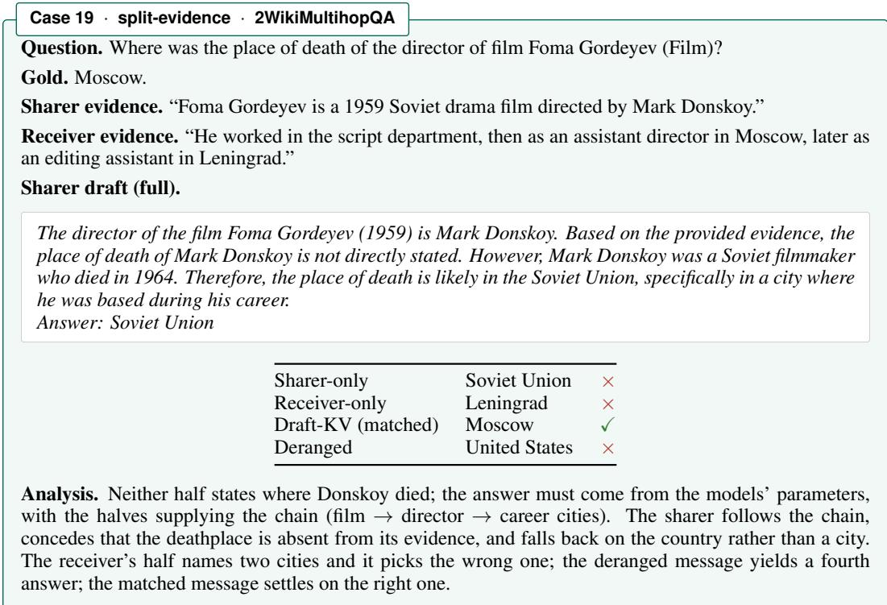

rather than the sharer’s wrong conclusion, and the receiver finishes the chain with its own half: the system is right where both halves, separately, are wrong.

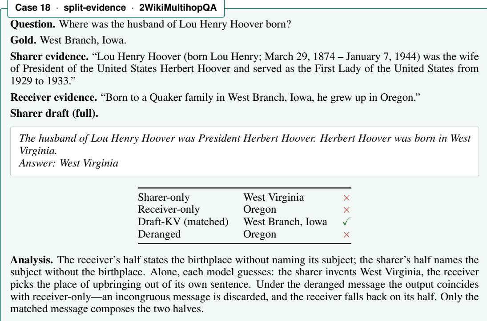