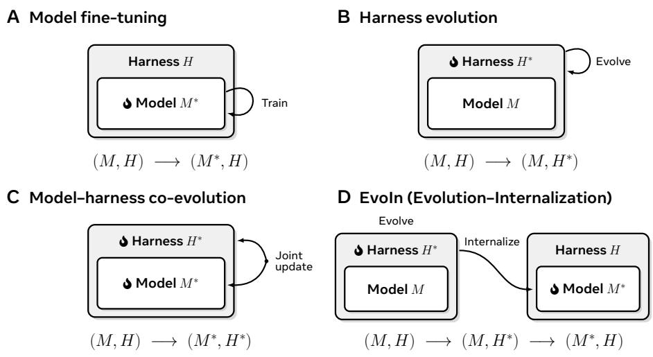
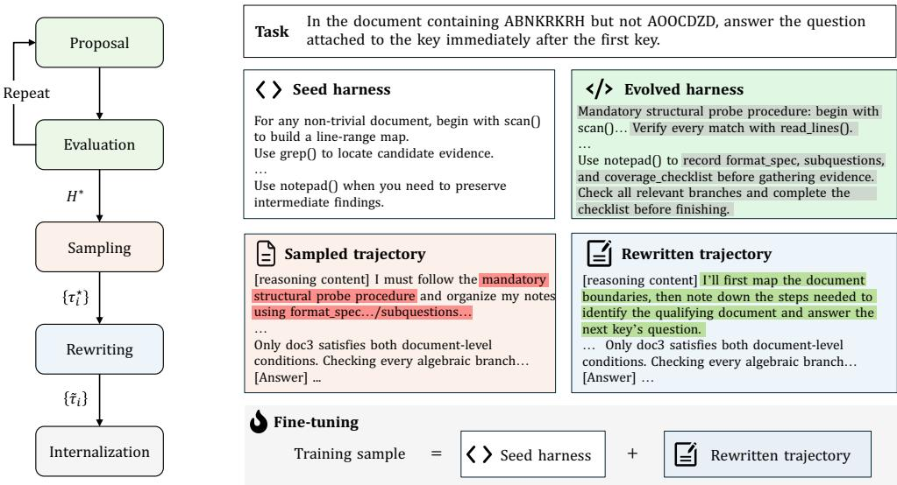
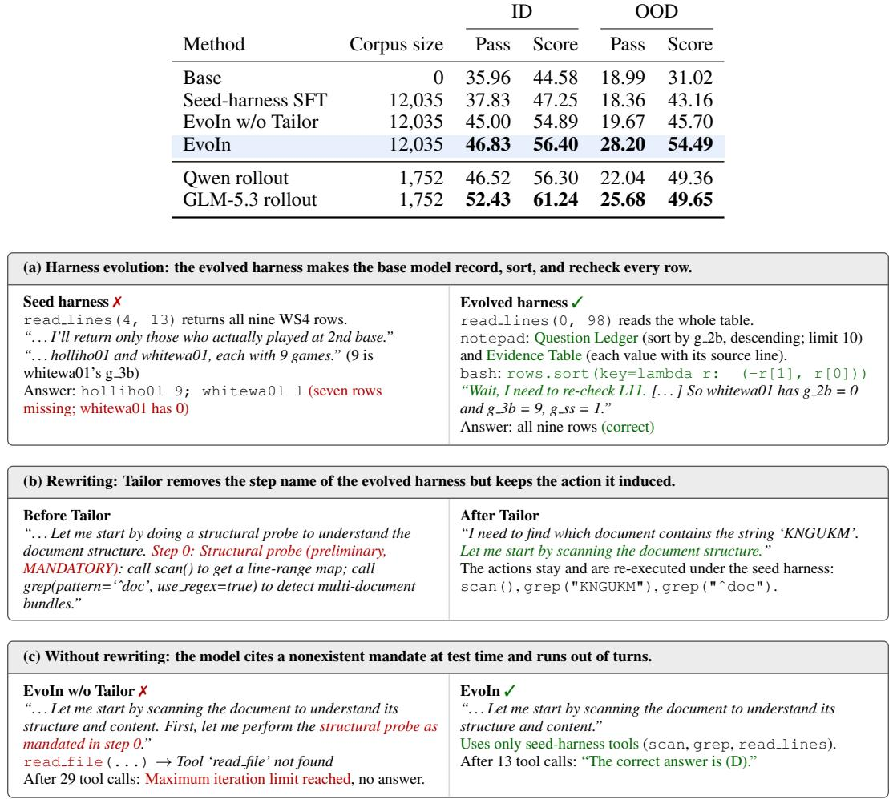
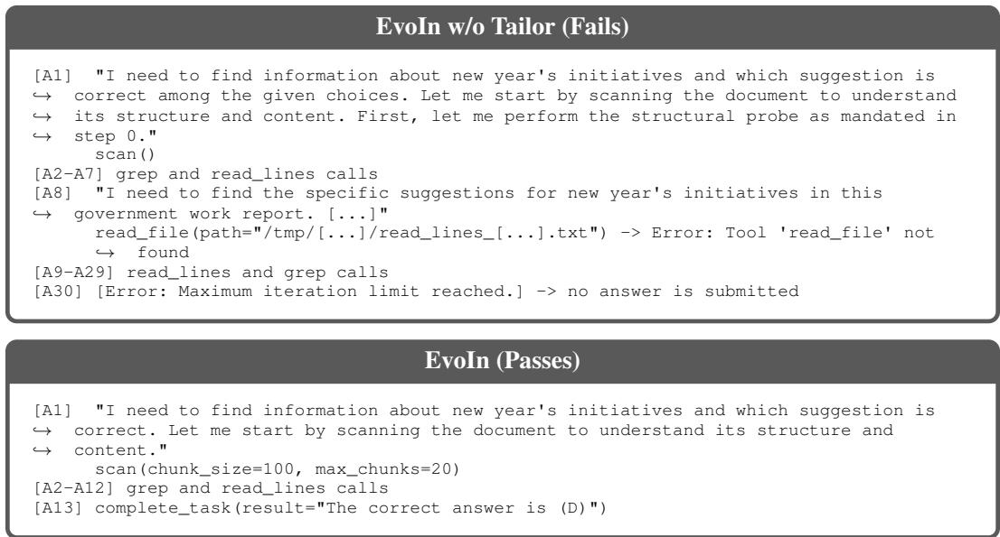

# EVOIN: BRIDGING EVOLUTION AND INTERNALIZA-TION FOR AGENT FINE-TUNING

Shihan Dou\* Shaofan Liu\* Zhonghang Lu<sup>∗</sup> Jiahang Lin Shichun Liu

Binghai Wang Jiajie Jin Guanting Dong Tao Gui Qi Zhang Xuanjing Huang

Fudan University Renmin University of China

shihandou@foxmail.com, sfliu24@m.fudan.edu.cn, tgui@fudan.edu.cn

## ABSTRACT

Recent work has explored improving agents by jointly evolving their harnesses and models, but often takes a “potpourri” approach that bundles together new tools, new decision-making procedures, and model adaptation to the evolved harness under a single notion of agent improvement. In this paper, we instead investigate how agents can improve their decision-making procedures. In particular, we propose EvoIn, an agent fine-tuning framework that bridges evolution and internalization. EvoIn first analyzes agent execution traces to evolve and validate new decision-making procedures by temporarily instantiating them in the harness. The validated procedures guide the agent to generate improved reasoning traces. These traces are then rewritten into self-contained reasoning traces, removing explicit references to harness instructions while expressing the induced decision logic as the model’s own reasoning. Finally, EvoIn fine-tunes the model on the rewritten traces, internalizing these procedures so that the improved decisionmaking persists without the evolved harness at inference time. We evaluate EvoIn on diverse benchmarks and find that it consistently enables agents to learn stronger decision-making procedures, raising the pass rate by 10.9 points in-domain and by 9.2 points out-of-domain. Results further show that the internalized decision procedures generalize to unseen tasks. Case studies show that agents can learn to decide how to solve a task before solving it, for example by checking a document’s length to choose between reading it in full and searching it. EvoIn is also broadly applicable, showing consistent improvements on another model family.

## 1 INTRODUCTION

Decision-making procedures are central to the reasoning ability of language agents (Balke & Gilbert, 2014; Rao & Georgeff, 1998; Sumers et al., 2023). They determine how an agent reasons and acts, shaping behaviors such as planning, tool use, and verification (Yao et al., 2022; Yang et al., 2024; Dou et al., 2026). Consider an agent asked to fix a software bug. Even with access to the same tools, one agent may patch the apparent failure immediately, whereas another may trace the relevant code, reproduce the failure, gather evidence, and check for regressions. A stronger agent may further adjust its planning and verification to the task, performing lightweight checks for a simple local change but broader verification for a risky cross-module modification. We view an agent as a model coupled with a harness, where the harness denotes the model-external system that mediates the model’s execution and interaction with the environment (Lin et al., 2026a; Ning et al., 2026). Decision-making procedures can be specified explicitly in the harness, through prompts, workflows, hooks, or other control logic (Lin et al., 2026a; Yao et al., 2023; Shinn et al., 2023), or carried implicitly by the model and instantiated through its own reasoning (Chen et al., 2023; Qiao et al., 2024). This raises natural questions: how can we improve agents’ decision-making procedures, and to what extent can agents themselves drive or even automate this improvement process?

  
Figure 1: Four paradigms for improving language agents. (A) Model fine-tuning updates the model while keeping the harness fixed. (B) Harness evolution updates the harness while keeping the model fixed. (C) Model–harness co-evolution updates both jointly. (D) EvoIn first evolves the harness to discover improved decision procedures, then internalizes the reusable procedures into the model and returns to the original harness. Flame icons and superscript indicate updated components.

We compare existing paradigms for improving agents’ decision-making procedures, as illustrated in Figure 1. Model fine-tuning approaches keep the harness fixed and improve the language model, typically through better tasks, environments, trajectories, or rewards (Chen et al., 2024; Zeng et al., 2024; Fu et al., 2025; Jimenez et al., 2024). In this paradigm, agents may help construct training data or collect experience, but there is no explicit space to propose, test, and validate candidate procedure changes before training. This also limits the exploration of decision procedures<sup>1</sup> that are easier to express and evaluate externally, especially those that may not be readily acquired through direct model updates. Harness evolution takes the opposite route, keeping the model fixed while explicitly modifying the harness to change the decision-making procedures that govern how the agent solves tasks (Lin et al., 2026a; Zhang et al., 2026a; Lee et al., 2026b). However, it alone leaves these improvements external to the underlying language model, without a chance to internalize reusable decision procedures as stronger model reasoning capabilities.

More recent work co-evolves models and harnesses, combining the two directions above (Chen et al., 2026c; Lee et al., 2026a; Chen et al., 2026a;b). While effective for optimizing the final agent system, this jointly rewards new tools, decision procedures, and model adaptation under the same end-to-end objective, making it difficult to tell whether the model has learned stronger decision-making procedures or simply become better matched to the evolved harness (Yu et al., 2026). More importantly, training the model with the evolved harness confounds stronger reasoning with harness-specific adaptation, making it unclear whether the decision logic learned by the model during training transfers and generalizes across different harnesses.

In this work, we propose EvoIn, an agent fine-tuning framework that bridges the explicit exploration enabled by harness evolution and the lasting capability gains enabled by model internalization, while allowing agents to drive much of the process. Starting from training data, the agent first analyzes the reasoning traces and answers produced under the current harness, proposes improvements to its decision-making procedures, and evaluates the resulting changes. This process can be repeated for multiple rounds to progressively refine the procedures based on evaluation feedback. The evolved harness then guides the generation of improved reasoning traces. Because these traces may explicitly refer to procedural instructions introduced by the evolved harness, they are rewritten into self-contained reasoning traces that preserve the induced decision logic while expressing it as the model’s own reasoning. Finally, the rewritten traces are used with the original harness to fine-tune the model. In this way, the harness provides a temporary space for agents to discover and validate better decision procedures, which are ultimately learned by the model.

Concretely, EvoIn raises accuracy by 10.9 points on the in-domain categories and by 9.2 points on the out-of-domain benchmarks, with gains of up to 19.7 points on a single benchmark. More specifically, rewriting is necessary for internalization: a model fine-tuned on the unrewritten trajectories cites instructions and tools that do not exist in the original harness (Figure 3(c)), runs out of turns on 19.4% of out-of-domain examples compared with 6.1% for EvoIn, and keeps almost none of the out-of-domain gain. The learned procedures also transfer to different task types, where the model can reason about unseen tasks and generate task-appropriate decision procedures rather than simply replay those encountered during evolution. Experimental results on Gemma also show clear gains, suggesting that EvoIn generalizes across model families. Moreover, case studies show that agents can discover and learn procedures that dynamically adapt to the input, such as checking the document length before choosing how to read the document (Appendix A.9). In summary, with its simple fine-tuning pipeline and promising results, we hope EvoIn offers a practical path toward more capable agents with less human intervention and inspires future work toward agent self-improvement.

## 2 RELATED WORK

In this section, we position EvoIn relative to existing approaches for improving language agents. We organize prior work according to which part of the agent is updated. Formally, we view a language agent as a pair $A = ( M _ { \theta } , \bar { H _ { 0 } } )$ , consisting of a model $M _ { \theta }$ and its original harness $H _ { 0 }$ (a.k.a. seed harness). Decision procedures may reside implicitly in the model or be specified explicitly in the harness. Under this view, model fine-tuning updates only the model, $( M _ { \theta } , \mathbf { \bar { \it H } } _ { 0 } )  ( \dot { M } _ { \theta ^ { \star } } , \dot { H _ { 0 } } )$ ; harness evolution updates only the harness, $( \bar { M } \theta , \bar { H } 0 )  ( \bar { M } \theta , H ^ { \star } ) ;$ and model–harness co-evolution updates both, $( \grave { M } \theta , H _ { 0 } ) \xrightarrow { } \grave { ( M _ { \theta ^ { \star } } , H ^ { \star } ) }$ . EvoIn follows a fourth path,

$$
\begin{array} { r } { ( M _ { \theta } , H _ { 0 } ) \xrightarrow { \mathrm { \ e v o l u t i o n } } ( M _ { \theta } , H ^ { \star } ) \xrightarrow { \mathrm { \ i n t e r n a l i z a t i o n } } ( M _ { \theta ^ { \star } } , H _ { 0 } ) , } \end{array}\tag{1}
$$

where the evolved harness serves as a temporary space for proposing and validating improved decision procedures before they are internalized. Figure 1 summarizes these four paradigms.

Model fine-tuning $( M _ { \theta } , H _ { 0 } )  ( M _ { \theta ^ { \star } } , H _ { 0 } )$ . This path fixes the harness and pushes all improvement into weights. Instruction tuning and preference alignment shape general behavior (Ouyang et al., 2022; Rafailov et al., 2024), agentic data synthesis supplies multi-turn supervision from tool-call annotations, trajectories, and executable environments (Schick et al., 2023; Zeng et al., 2024; Pan et al., 2025), and reinforcement learning with verifiable rewards optimizes the policy against task outcomes (Guo et al., 2025; Jin et al., 2025; Dong et al., 2025). Throughout, the improvement loop is designed by humans, since tasks, environments, rewards, and algorithms are given, and the agent at most produces data and experience, never a proposal about how it should decide. Decision-making procedures therefore change only as a byproduct of gradient updates, rather than existing as objects that can be stated, held fixed, and compared. Yet it is the capability gained along this path that makes it possible to hand the job of improving the agent to the agent itself.

Harness evolution $( M _ { \theta } , H _ { 0 } ) \ \to \ ( M _ { \theta } , H ^ { \star } )$ . Once a model can reflect on its own trajectories, diagnose failures, and revise its behavior from feedback (Shinn et al., 2023; Madaan et al., 2023), the harness becomes an object the agent operates on directly, and the scope it is allowed to rewrite has widened steadily, from prompts and context (Khattab et al., 2023; Agrawal et al., 2026), to reusable skills and experiential memory (Wang et al., 2023; Zhao et al., 2024), finally, to the module composition and code of the harness itself (Hu et al., 2025; Novikov et al., 2025; Zhang et al., 2026b; Lin et al., 2026a). This supplies exactly the space that model fine-tuning lacks, since a procedure here is explicitly written and executably verifiable, so it can be proposed, tested, kept, or discarded. Its product, however, is always external. What improves is the harness while $M _ { \theta }$ is untouched, so a discovered procedure survives only as an instruction, a skill, or a piece of code that must be carried along to take effect, and never settles into the model’s own reasoning. This externality is costly in practice, as skill libraries degrade once they accumulate without lifecycle management (Zhang et al., 2026c), harness evolution does not consistently beat test-time scaling under matched budgets and generalizes weakly to held-out tasks (Wang et al., 2026), and benefiting from a harness update is a capability distinct from producing one (Lin et al., 2026b).

Model and harness co-evolution $( M _ { \theta } , H _ { 0 } )  ( M _ { \theta ^ { \star } } , H ^ { \star } )$ . A recent line optimizes both sides in one loop, alternating harness or skill search with weight updates under the searched configuration (Chen et al., 2026a;c;b; Lee et al., 2026a). These methods do update the model, but they also make what is written into it hard to identify, because the model is trained on trajectories generated under $H ^ { \star }$ and evaluated under $H ^ { \star }$ as well. The coupling is concrete. Training a weaker model on a stronger expert’s trajectories under the weaker model’s own evolved harness regresses performance on all seven tasks studied by 4 to 30 points, since the expert’s planning style no longer matches the harness evolved around the weaker model (Yu et al., 2026), and harness choice alone moves mea sured accuracy by as much as 28 points within a single model (Starace, 2026). Harness design and post-training thus interact (Kim et al., 2026), so a gain measured under $H ^ { \star }$ does not by itself show that the model’s own decision-making has improved. In contrast, when trajectories are rewritten for the original harness and the model is evaluated under it, trajectories from a stronger model under the evolved harnesses of a weaker one improve the weaker model (Section 5).

Internalizing the harness $( M _ { \theta } , H _ { 0 } )  ( M _ { \theta } , H ^ { \star } )  ( M _ { \theta ^ { \star } } , H _ { 0 } )$ . Closest to us is work that moves harness-side structure into the model, from context distillation (Askell et al., 2021; Snell et al., 2022) to the internalization of prompted reasoning, tool use, and explicit chains of thought (Chen et al., 2023; Qiao et al., 2024; Yu et al., 2024; Deng et al., 2024), including recent work that treats the harness as a training-time teacher and removes it at inference (Dennis et al., 2026; Wu et al., 2026). However, in this line of work, the procedure to be internalized is typically specified in advance, such as a hand-designed strategy or skill. EvoIn differs in three respects. First, the procedure to be internalized is proposed and validated by an agent through iterative harness evolution rather than fixed beforehand. Second, the agent rewrites the trajectories to remove evolved-harness dependencies while preserving the induced decision logic. Third, the model is fine-tuned and evaluated under the original harness $H _ { 0 } ,$ separating procedure learning from harness-specific adaptation. These choices provide an opportunity for the entire improvement process to become agent-driven and allow agents to improve what is ultimately internalized into the model.

  
Figure 2: We illustrate EvoIn with a multi-document reasoning case. EvoIn refines decision procedures through iterative proposal and evaluation, then samples and rewrites trajectories for finetuning. Gray highlights mark procedure updates in the evolved harness. Red highlights show explicit reliance on instructions from the evolved procedures, while green highlights show the same decision logic reformulated as the agent’s own reasoning.

## 3 EVOIN: BRIDGING EVOLUTION AND INTERNALIZATION

As illustrated in Figure 2, EvoIn consists of five stages: procedure proposal, procedure evaluation, procedure-guided sampling, rewriting, and procedure internalization. For a task x, let τ denote its execution trajectory, including the model’s reasoning, tool calls and corresponding observations when applicable, and the final answer. We use z to denote the reasoning trace within τ . Given training data $\mathcal { D } _ { \mathrm { t r a i n } }$ and held-out development data $\mathcal { D } _ { \mathrm { d e v } }$ , EvoIn realizes the evolution–internalization process in Equation equation 1. A subset of $\mathcal { D } _ { \mathrm { t r a i n } }$ is used during evolution for trajectory analysis, while $\mathcal { D } _ { \mathrm { d e v } }$ is used only to evaluate candidate harnesses.

Procedure Proposal. Evolution starts from the original harness $H _ { 0 } .$ , which is evaluated without modification in the initial round. In each subsequent round, a proposal agent<sup>2</sup> examines the current harness together with feedback and execution trajectories from the previous round, and proposes candidate harness updates that instantiate improved decision procedures. The update may revise the system prompt, workflow, or other control logic that specifies the decision procedure. Each candidate must pass static and runtime validation before evaluation, with details provided in $\mathsf { A p - }$ pendix A.3. The proposal prompt is provided in Appendix A.4.

Procedure Evaluation. This stage evaluates whether each proposed procedure is both effective and general. Each candidate harness is paired with the same target model $M _ { \theta }$ and evaluated on a held-out $\mathcal { D } _ { \mathrm { d e v } }$ using the task evaluator. Meanwhile, an analysis agent examines successful and failed trajectories from the evolution subset of $\mathcal { D } _ { \mathrm { t r a i n } }$ and summarizes failure patterns and actionable feedback for the next proposal round. Proposal and evaluation are repeated for multiple rounds, and the highest-scoring harness on $\mathcal { D } _ { \mathrm { d e v } }$ across all rounds is retained as the evolved harness $H ^ { \star }$

Procedure-Guided Sampling. After the iterative proposal and evaluation process, the resulting harness $H ^ { \star }$ is used with the target model $M _ { \theta }$ to collect trajectories on $\mathcal { D } _ { \mathrm { t r a i n } }$ . A task evaluator scores the resulting trajectories, and only trajectories with the full task score and a valid final answer are retained for internalization. We denote these procedure-guided trajectories by $\{ \tau _ { i } ^ { \star } \}$ . Their reasoning and actions reflect the improved decision procedures.

Rewriting. Trajectories generated under $H ^ { \star }$ cannot always be used directly for fine-tuning under $H _ { 0 }$ Their reasoning may explicitly refer to instructions, tools, or runtime assumptions that exist only in the evolved harness, causing the fine-tuned model to reproduce such dependencies after $H ^ { \star }$ is removed. For example, a reasoning trace may state that “according to the instructions, I should first retrieve the database,” even though no such instruction exists in the original harness $H _ { 0 }$ . So we rewrite each trajectory into a self-contained trajectory that could have been naturally produced under the original harness while preserving the useful decision logic induced by $H ^ { \star }$

We implement this stage with a pipeline called TAILOR, which consists of three steps. First, a rewriting phase edits each trajectory to remove dependencies on the evolved harness while preserving its useful decision logic. This may involve rephrasing harness-specific reasoning, adapting unsupported tool calls to $H _ { 0 } ,$ or removing unnecessary steps. Second, the rewritten trajectory is replayed under $H _ { 0 }$ , followed by deterministic checks for issues such as invalid tool calls or residual harness-specific dependencies. Trajectories that fail these checks undergo one targeted repair and are then replayed again. Finally, another checking phase verifies that the final answer is supported by the visible evidence and that the trajectory is suitable for training. Only trajectories that pass this check are retained. We denote the resulting rewritten trajectories by τ˜<sub>i</sub> . Appendix A.3 describes the replay and repair procedure, and Appendix A.5 provides the corresponding prompts.

Procedure Internalization. Finally, the original harness $H _ { 0 }$ is restored and $M _ { \theta }$ is fine-tuned on the rewritten trajectories using supervised fine-tuning. The loss is applied to model-generated turns. This produces $M _ { \theta ^ { \star } }$ ⋆ and returns the agent to $( M _ { \theta ^ { \star } } , \bar { H } _ { 0 } )$ , so the improved decision procedures no longer depend on the evolved harness at inference time

## 4 EXPERIMENTS

Our experiments test two claims: task-specific harness evolution produces better training demonstrations, and supervised fine-tuning (SFT) internalizes the resulting decision procedures.

## 4.1 SETUP

Dataset. The in-domain (ID) data comprise 23 task categories, which we organize into seven task groups (Appendix A.1). Harness evolution analyzes failures on an evolution split of each category and compares candidate harnesses on a disjoint evolution-test split $( \mathcal { D } _ { \mathrm { d e v } }$ in Section 3), which never enters the SFT corpus and later serves as the ID test set. The training data come from $\mathcal { D } _ { \mathrm { t r a i n } } .$ , the evolution split together with the remaining non-test examples: the best harness of each category rolls out the target model on these examples, a judge model keeps only fully correct trajectories, and Tailor (Section 3) rewrites, repairs, and checks them. For out-of-domain (OOD) testing, we use six benchmarks: AA-LCR (Artificial Analysis Team, 2025), BrowseComp-LongContext (adapted from BrowseComp, Wei et al., 2025), LongBench v2 (Bai et al., 2025), MRCR (Vodrahalli et al., 2024), Oolong (Bertsch et al., 2025), and Table-Longer. Appendix A.2 describes each benchmark’s task type, and none appears among the recorded sources of evolution or SFT data.

Seed harness. Every category starts from the same task-agnostic seed harness, which serves as the original harness $H _ { 0 }$ and is the only harness used at evaluation. The seed harness does not place the document in the prompt; instead, the agent reads it through six actions, one per turn: (1) scan, which returns a line-range map of the whole document; (2) grep[pattern], which returns every matching line number with a short preview; (3) read lines[start, end], which returns the raw lines in a range; (4) bash[command], which runs a shell command, typically Python, over the document for arithmetic, counting, and sorting; (5) notepad[action, content], which writes or reads a scratchpad that persists across turns; and (6) complete task[result], which submits the final answer and ends the episode. The system prompt asks the agent to support every claim with lines it has read or with a computation, the agent may take at most 30 turns, and long tool outputs are cut to their beginning and end (Appendix A.3). Evolved harnesses may rewrite these instructions and tool descriptions or raise the turn budget, but they are used only during evolution and trajectory collection, both of which happen before fine-tuning.

Implementation details. Unless stated otherwise, all experiments use the following settings. Qwen3.5-35B-A3B (Qwen Team, 2026) is the target model $M _ { \theta } ;$ it performs every rollout, both during evolution and when collecting training trajectories, and is also the SFT student. Claude Opus 4.7 (Anthropic, 2026) acts as both the analysis agent and the proposal agent, and for each category it runs ten evolution rounds with three candidate harnesses per round (Appendix A.4). Tailor uses GLM-5.2 (GLM-5 Team, 2026) as both the rewriting model and the checking model. We fine-tune the target model with full-parameter SFT and report the final checkpoint, and all Qwen ablations use the same recipe (Appendix A.6). For the main run, we train on 12,035 demonstrations for three epochs, with a maximum sequence length of 24,576 tokens. We report two metrics, computed from one sampled trajectory per example under a fixed protocol: for an example score $s \in [ 0 , 1 ]$ , Pass is the percentage of examples with $s = 1$ , and Score is a rubric score, 100 times the mean example score, which gives partial credit where the rubric or official metric allows it. OOD results pool the examples of all six benchmarks, so each benchmark is weighted by its number of examples. Appendix A.7 lists the judges and decoding settings.

## 4.2 MAIN RESULTS

EvoIn improves ID and OOD performance under the seed harness. Tables 1 and 2 compare Qwen3.5-35B-A3B before and after EvoIn fine-tuning. EvoIn raises Pass from 35.96% to 46.83% on the 2,300 ID examples (+10.87 points, a 30% relative gain) and from 18.99% to 28.20% on the 2,064 OOD examples (+9.21 points, a 48% relative gain). Since both models run with the same seed harness and evaluation protocol, these gains come from the fine-tuned weights.

EvoIn improves performance across all seven ID task groups. All seven task groups improve, and ID Score rises by 11.82 points overall (Table 1). The largest gains are on log and dialogue tracking (+21.64 Score) and structured-data reasoning (+17.33), both require counting, tracking, or computing over many records. Complex instruction following gains the least (+5.66), and its Pass stays below 10% for both models. At the category level, Score increases in 21 of the 23 categories and decreases in Needle QA ( 6.00) and Long-Source Deliverables ( 1.77), as detailed in Table 5.

The gains of EvoIn also transfer to all six OOD benchmarks. EvoIn improves all six OOD benchmarks in both Pass and Score, and its OOD Pass gain is close to its ID gain (Table 2). Score gains range from +1.02 on BrowseComp-LongContext to +43.76 on MRCR, and the other four benchmarks gain between 10.00 and 19.69 points. Overall Score rises by 23.47 points, much more than Pass, and almost all of this difference comes from MRCR, whose official metric gives partial credit and whose Pass rises by only 6.88 points.

Table 1: ID results by task group (%). Base is Qwen3.5-35B-A3B, and EvoIn is the same model after EvoIn fine-tuning (epoch 3). Each group value is the mean over its categories, each with 100 evolution-test examples; Appendix A.1 lists the categories and their results. ∆ is EvoIn minus Base, and Pass equals Score for groups whose categories all have binary scores.
<table><tr><td rowspan="2">Task group</td><td rowspan="2">N</td><td colspan="3">Pass</td><td colspan="3">Score</td></tr><tr><td>Base</td><td>EvoIn</td><td>∆</td><td>Base</td><td>EvoIn</td><td>∆</td></tr><tr><td>Multi-document key retrieval</td><td>300</td><td>57.00</td><td>63.33</td><td>+6.33</td><td>57.00</td><td>63.33</td><td>+6.33</td></tr><tr><td>Evidence-grounded QA</td><td>400</td><td>52.25</td><td>61.50</td><td>+9.25</td><td>55.03</td><td>64.93</td><td>+9.90</td></tr><tr><td>Structured-data reasoning</td><td>300</td><td>44.00</td><td>61.33</td><td>+17.33</td><td>44.00</td><td>61.33</td><td>+17.33</td></tr><tr><td>Log and dialogue tracking</td><td>300</td><td>53.00</td><td>75.00</td><td>+22.00</td><td>55.14</td><td>76.78</td><td>+21.64</td></tr><tr><td>In-context learning</td><td>200</td><td>26.00</td><td>39.00</td><td>+13.00</td><td>26.00</td><td>39.00</td><td>+13.00</td></tr><tr><td>Document-grounded generation</td><td>300</td><td>22.00</td><td>36.00</td><td>+14.00</td><td>22.00</td><td>36.00</td><td>+14.00</td></tr><tr><td>Complex instruction following</td><td>500</td><td>7.60</td><td>9.20</td><td>+1.60</td><td>43.75</td><td>49.41</td><td>+5.66</td></tr><tr><td>All 23 categories</td><td>2,300</td><td>35.96</td><td>46.83</td><td>+10.87</td><td>44.58</td><td>56.40</td><td>+11.82</td></tr></table>

Table 2: OOD results by benchmark (%). Models and ∆ follow Table 1.
<table><tr><td rowspan="2">Benchmark</td><td rowspan="2"></td><td colspan="3">Pass</td><td colspan="3">Score</td></tr><tr><td>N Base</td><td>EvoIn</td><td>∆</td><td>Base</td><td>EvoIn</td><td>∆</td></tr><tr><td>AA-LCR</td><td>100</td><td>27.00</td><td>37.00</td><td>+10.00</td><td>27.00</td><td>37.00</td><td>+10.00</td></tr><tr><td>BrowseComp-LongContext</td><td>295</td><td>12.54</td><td>13.56</td><td>+1.02</td><td>12.54</td><td>13.56</td><td>+1.02</td></tr><tr><td>LongBench v2</td><td>503</td><td>33.20</td><td>44.73</td><td>+11.53</td><td>33.20</td><td>44.73</td><td>+11.53</td></tr><tr><td>MRČR</td><td>800</td><td>2.00</td><td>8.88</td><td>+6.88</td><td>32.55</td><td>76.31</td><td>+43.76</td></tr><tr><td>Oolong</td><td>300</td><td>43.33</td><td>60.33</td><td>+17.00</td><td>44.58</td><td>61.42</td><td>+16.84</td></tr><tr><td>Table-Longer</td><td>66</td><td>22.73</td><td>42.42</td><td>+19.69</td><td>22.73</td><td>42.42</td><td>+19.69</td></tr><tr><td>Average</td><td>2,064</td><td>18.99</td><td>28.20</td><td>+9.21</td><td>31.02</td><td>54.49</td><td>+23.47</td></tr></table>

## 5 FURTHER ANALYSIS

This section examines where the gains of EvoIn come from and how far they extend. We test whether harness evolution and rewriting are both needed, whether the target model can drive the pipeline by itself, whether a stronger rollout model provides better demonstrations, and whether EvoIn works for another model family. Appendix A.8 describes how each run is constructed and gives its percategory and per-benchmark results.

Is harness evolution needed? To test whether the gains come from harness evolution, we fine-tune the target model on the same number of successful trajectories collected under the seed harness from the same categories (Seed-harness SFT in Table 3). This control improves ID Pass by only 1.87 points and does not improve OOD Pass (18.36 vs. 18.99), whereas EvoIn improves them by 10.87 and 9.21 points; the OOD Score gain of the control comes from partial credit on MRCR. Seed-harness data alone adds little, so the gains come from harness evolution. Figure 3(a) illustrates what the evolved harness adds on a Table QA question about the games each player of team WS4 played at second base in 1872: the evolved harness makes the base model record the requirements and the source line of each value, sort with bash, and recheck a doubtful row, whereas under the seed harness the model drops rows and misreads a column. We also find an interesting behavior in some evolved harnesses, which first check the document length, read a short document in full before answering, and use search or chunked reading only for longer documents (Appendix A.9).

Is rewriting needed? To test whether rewriting is needed, we train on the raw trajectories collected under the evolved harnesses for the same tasks, skipping Tailor (EvoIn w/o Tailor in Table 3). ID performance changes little (Pass 45.00 vs. 46.83), but OOD Pass drops from 28.20 to 19.67, close to Base (18.99). Raw trajectories often justify their steps with instructions and tools that exist only in the evolved harness, and the model repeats these references on unseen tasks where they do not apply. Figure 3(b) shows a typical edit, which drops a step name of the evolved harness but keeps the actions, and Figure 3(c) shows what happens without it: on a LongBench v2 question, the model trained on raw trajectories attributes its first step to a structural probe “as mandated in step 0”, calls a tool that the seed harness does not have, and runs out of turns without producing a final answer. Across the six OOD benchmarks, this model exhausts the 30-turn budget of the seed harness on 19.4% of examples, compared with 6.1% for EvoIn. Rewriting is therefore necessary for the internalized procedures to transfer to unseen tasks.

Table 3: Ablation study (%). All rows use the same Qwen student, SFT schedule, seed harness, and evaluation protocol as Tables 1 and 2. Corpus size counts SFT demonstrations. The top block separately ablates harness evolution and rewriting. The bottom block compares EvoIn using equally sized Qwen and GLM-5.3 rollout subsets from the same tasks. Bold marks each block’s best result.
<table><tr><td colspan="2"></td><td colspan="2">ID</td><td colspan="2">OOD</td></tr><tr><td>Method</td><td>Corpus size</td><td>Pass</td><td>Score</td><td>Pass</td><td>Score</td></tr><tr><td>Base</td><td>0</td><td>35.96</td><td>44.58</td><td>18.99</td><td>31.02</td></tr><tr><td>Seed-harness SFT</td><td>12,035</td><td>37.83</td><td>47.25</td><td>18.36</td><td>43.16</td></tr><tr><td>EvoIn w/o Tailor</td><td>12,035</td><td>45.00</td><td>54.89</td><td>19.67</td><td>45.70</td></tr><tr><td>EvoIn</td><td>12,035</td><td>46.83</td><td>56.40</td><td>28.20</td><td>54.49</td></tr><tr><td>Qwen rollout</td><td>1,752</td><td>46.52</td><td>56.30</td><td>22.04</td><td>49.36</td></tr><tr><td>GLM-5.3 rollout</td><td>1,752</td><td>52.43</td><td>61.24</td><td>25.68</td><td>49.65</td></tr></table>

  
Figure 3: Cases with trajectory excerpts. Red marks harness-specific or wrong content, and green marks what differs on the right. Appendix A.9 gives the full trajectories.

Can the target model drive the pipeline by itself? The All-Qwen run checks whether EvoIn needs stronger external models by replacing the Claude proposer and the GLM-5.2 Tailor model with the target model itself. It produces 6,123 demonstrations and still raises ID Pass from 35.96% to 42.04%, 56% of the gain of the main system, but its OOD Pass stays at the Base level (18.90 vs. 18.99). The target model can thus drive the pipeline by itself, although its gains are smaller than those of the main system and transfer little to unseen tasks.

Does a stronger rollout model provide better demonstrations? Here the stronger GLM-5.3 (GLM-5 Team, 2026) replaces Qwen as the rollout model under the same best harnesses and Tailor pipeline, and we train the target model on its demonstrations or on Qwen demonstrations for the same 1,752 tasks (bottom block of Table 3). GLM-5.3 demonstrations raise ID Pass from 46.52 to 52.43 and OOD Pass from 22.04 to 25.68, but OOD Score stays flat (49.65 vs. 49.36). A stronger rollout model therefore provides better demonstrations, although part of the advantage does not transfer to unseen tasks. The harnesses evolved with Qwen also work for a model from another family, so they are not tied to a single model.

Does EvoIn work for another model family? Finally, we apply EvoIn to Gemma-4-31Bit (Gemma Team, 2026), with Gemma as both the rollout target and the student, to see whether the method extends beyond Qwen. The fine-tuned model improves ID Pass from 49.61% to 53.04% and OOD Pass from 49.08% to 50.10%. EvoIn therefore also works for another model family. Appendix A.8 gives the implementation details of this run.

## 6 DISCUSSION

EvoIn vs. model-harness co-evolution. EvoIn and model-harness co-evolution pursue related but different objectives. Model-harness co-evolution aims to improve the coupled agent, allowing the model and harness to adapt to each other for better end-to-end performance. EvoIn instead focuses on internalizing reusable decision procedures discovered through harness evolution into the model itself. This helps separate improvements in the model’s own reasoning from better model-harness compatibility. It also encourages the learned procedures to remain useful beyond the particular harness in which they were discovered. Moreover, we view EvoIn and model-harness co-evolution as complementary. EvoIn can serve as a useful approach for improving the model-side generality of co-evolution, rather than merely adapting the model to an evolved harness. Improvements such as new tools, workflows, or other runtime components cannot be fully absorbed into the model and should remain part of the evolved harness. Meanwhile, model-harness co-evolution helps the model better utilize the components in the harness.

What else should be internalized? We also want to discuss what other agent capabilities could eventually be absorbed into the model. Several candidates are particularly natural. First, while tools themselves remain external, reusable knowledge about how to use them can be internalized. The model can learn when a tool is needed, which tool to choose, and how to reason over its outputs. Sec ond, recurring experience can gradually become model priors rather than remain in an ever-growing external memory that must be repeatedly retrieved. For example, an accountant may initially rely on notes for a recurring workflow, but after sufficient practice can complete the same process without consulting them. Finally, agents can internalize patterns in environmental observations, forming ex pectations about the consequences of their actions. For example, an experienced driver anticipates how the vehicle will respond before taking an action. While EvoIn focuses on decision procedures, it provides a general recipe for this broader process by first expressing and validating capabilities externally and then transferring them into the model. A more ambitious direction is to let agents themselves learn which improvements should be internalized and which should remain external, and autonomously use EvoIn to internalize the parts.

Limitations and future directions. Although EvoIn reduces the need for manual design, the current evolution process is still guided by a stronger agent rather than carried out entirely by the target agent itself. A natural next step is to let the target agent improve and internalize its own procedures, moving from agent-assisted improvement toward self-improvement. Second, our experiments perform multiple rounds of procedure evolution but only one complete evolution-internalization cycle. Once internalization produces a stronger model, the same process can be repeated to discover and learn procedures that were previously out of reach. Repeated EvoIn cycles provide a concrete path toward recursive self-improvement. Third, while our evaluation covers dozens of benchmarks, many focus on context reasoning. We will extend EvoIn to different settings, such as software engineering, web interaction, and other long-horizon environments, to test its generality. Finally, as discussed above, decision procedures are only one class of capabilities that may benefit from internalization. We plan to extend EvoIn to other reusable capabilities that can later be absorbed into the model.

Conclusion. In this paper, we propose EvoIn, a simple yet effective method for improving agents decision-making by bridging harness evolution and model internalization. Experiments show that EvoIn improves performance on diverse in-domain tasks, transfers to unseen benchmarks under the original harness, and also improves a model from another family. Ablations and case studies further show that the gains require both harness evolution and rewriting, and that without rewriting the model cites instructions and tools that exist only in the evolved harness. Combining EvoIn with model-harness co-evolution could enable agents to improve both what remains external and what can be internalized, leading to stronger and more general agents.

## ACKNOWLEDGMENTS

We thank Xin Zhao and Pluto Zhou at Tencent for the helpful support and discussions. We also thank Jiayi Chen, Yujiong Shen, Ming Zhang, Xinyi Xu, and Chenhao Huang for their valuable discussions and feedback.

## REFERENCES

Lakshya A Agrawal, Shangyin Tan, Dilara Soylu, Noah Ziems, Rishi Khare, Krista Opsahl-Ong, Arnav Singhvi, Herumb Shandilya, Michael J Ryan, Meng Jiang, Christopher Potts, Koushik Sen, Alexandros G. Dimakis, Ion Stoica, Dan Klein, Matei Zaharia, and Omar Khattab. Gepa: Reflective prompt evolution can outperform reinforcement learning, 2026. URL https:// arxiv.org/abs/2507.19457.

Anthropic. Introducing Claude Opus 4.7, April 2026. URL https://www.anthropic.com/ news/claude-opus-4-7.

Artificial Analysis Team. Artificial analysis long context reasoning benchmark (AA-LCR). Dataset, 2025. URL https://huggingface.co/datasets/ArtificialAnalysis/ AA-LCR.

Amanda Askell, Yuntao Bai, Anna Chen, Dawn Drain, Deep Ganguli, Tom Henighan, Andy Jones, Nicholas Joseph, Ben Mann, Nova DasSarma, Nelson Elhage, Zac Hatfield-Dodds, Danny Hernandez, Jackson Kernion, Kamal Ndousse, Catherine Olsson, Dario Amodei, Tom Brown, Jack Clark, Sam McCandlish, Chris Olah, and Jared Kaplan. A general language assistant as a laboratory for alignment, 2021. URL https://arxiv.org/abs/2112.00861.

Yushi Bai, Shangqing Tu, Jiajie Zhang, Hao Peng, Xiaozhi Wang, Xin Lv, Shulin Cao, Jiazheng Xu, Lei Hou, Yuxiao Dong, Jie Tang, and Juanzi Li. LongBench v2: Towards deeper understanding and reasoning on realistic long-context multitasks. In Proceedings of the 63rd Annual Meeting of the Association for Computational Linguistics, pp. 3639–3664, 2025. URL https://aclanthology.org/2025.acl-long.183/.

Tina Balke and Nigel Gilbert. How do agents make decisions? a survey. Journal of Artificial Societies and Social Simulation, 17(4):13, 2014.

Amanda Bertsch, Adithya Pratapa, Teruko Mitamura, Graham Neubig, and Matthew R. Gormley. Oolong: Evaluating long context reasoning and aggregation capabilities, 2025. URL https: //arxiv.org/abs/2511.02817.

Baian Chen, Chang Shu, Ehsan Shareghi, Nigel Collier, Karthik Narasimhan, and Shunyu Yao. Fireact: Toward language agent fine-tuning. arXiv preprint arXiv:2310.05915, 2023.

Mingju Chen, Can Lv, Guibin Zhang, Heng Chang, and Shiji Zhou. Harnessforge: Joint harness and policy evolution for adaptive agent systems. arXiv preprint arXiv:2606.01779, 2026a.

Tingyang Chen, Shuo Lu, Kang Zhao, Weicheng Meng, Hanlin Teng, Tianhao Li, Chao Li, Xule Liu, Jian Liang, Zhizhong Zhang, et al. Harnessx: A composable, adaptive, and evolvable agent harness foundry. arXiv preprint arXiv:2606.14249, 2026b.

Zehui Chen, Kuikun Liu, Qiuchen Wang, Wenwei Zhang, Jiangning Liu, Dahua Lin, Kai Chen, and Feng Zhao. Agent-flan: Designing data and methods of effective agent tuning for large language models. In Findings ofthe Associationfor Computational Linguistics: ACL 2024, pp. 9354–9366, 2024.

Zhengyu Chen, Teng Xiao, Huaisheng Zhu, Yige Yuan, Luan Zhang, and Jingang Wang. Co-harness: Co-evolving harnesses and model weights for llm agents. arXiv preprint arXiv:2607.22688, 2026c.

Yuntian Deng, Yejin Choi, and Stuart Shieber. From explicit cot to implicit cot: Learning to internalize cot step by step, 2024. URL https://arxiv.org/abs/2405.14838.

Simon Dennis, Rivaan Patil, Kevin Shabahang, and Hao Guo. Compiling agentic workflows into llm weights: Near-frontier quality at two orders of magnitude less cost, 2026. URL https: //arxiv.org/abs/2605.22502.

Guanting Dong, Hangyu Mao, Kai Ma, Licheng Bao, Yifei Chen, Zhongyuan Wang, Zhongxia Chen, Jiazhen Du, Huiyang Wang, Fuzheng Zhang, Guorui Zhou, Yutao Zhu, Ji-Rong Wen, and Zhicheng Dou. Agentic reinforced policy optimization, 2025. URL https://arxiv.org/ abs/2507.19849.

Shihan Dou, Haoxiang Jia, Shichun Liu, Feng Chen, Chenhao Huang, Yujiong Shen, Shaofan Liu, Jiayi Chen, Jiahang Lin, Honglin Guo, et al. Agents in the large: Perception-centered architecture for persistent agents. arXiv preprint arXiv:2608.30478, 2026.

Dayuan Fu, Keqing He, Yejie Wang, Wentao Hong, Zhuoma Gongque, Weihao Zeng, Wei Wang, Jingang Wang, Xunliang Cai, and Weiran Xu. Agentrefine: Enhancing agent generalization through refinement tuning. In International Conference on Learning Representations, volume 2025, pp. 65185–65204, 2025.

Gemma Team. Gemma 4 technical report, 2026. URL https://arxiv.org/abs/2607. 02770.

GLM-5 Team. GLM-5: From vibe coding to agentic engineering, 2026. URL https://arxiv. org/abs/2602.15763.

Daya Guo, Dejian Yang, Haowei Zhang, Junxiao Song, Peiyi Wang, Qihao Zhu, Runxin Xu, Ruoyu Zhang, Shirong Ma, Xiao Bi, Xiaokang Zhang, Xingkai Yu, Yu Wu, Z. F. Wu, Zhibin Gou, Zhihong Shao, Zhuoshu Li, Ziyi Gao, Aixin Liu, Bing Xue, Bingxuan Wang, Bochao Wu, Bei Feng, Chengda Lu, Chenggang Zhao, Chengqi Deng, Chong Ruan, Damai Dai, Deli Chen, Dongjie Ji, Erhang Li, Fangyun Lin, Fucong Dai, Fuli Luo, Guangbo Hao, Guanting Chen, Guowei Li, H. Zhang, Hanwei Xu, Honghui Ding, Huazuo Gao, Hui Qu, Hui Li, Jianzhong Guo, Jiashi Li, Jingchang Chen, Jingyang Yuan, Jinhao Tu, Junjie Qiu, Junlong Li, J. L. Cai, Jiaqi Ni, Jian Liang, Jin Chen, Kai Dong, Kai Hu, Kaichao You, Kaige Gao, Kang Guan, Kexin Huang, Kuai Yu, Lean Wang, Lecong Zhang, Liang Zhao, Litong Wang, Liyue Zhang, Lei Xu, Leyi Xia, Mingchuan Zhang, Minghua Zhang, Minghui Tang, Mingxu Zhou, Meng Li, Miaojun Wang, Mingming Li, Ning Tian, Panpan Huang, Peng Zhang, Qiancheng Wang, Qinyu Chen, Qiushi Du, Ruiqi Ge, Ruisong Zhang, Ruizhe Pan, Runji Wang, R. J. Chen, R. L. Jin, Ruyi Chen, Shanghao Lu, Shangyan Zhou, Shanhuang Chen, Shengfeng Ye, Shiyu Wang, Shuiping Yu, Shunfeng Zhou, Shuting Pan, S. S. Li, Shuang Zhou, Shaoqing Wu, Tao Yun, Tian Pei, Tianyu Sun, T. Wang, Wangding Zeng, Wen Liu, Wenfeng Liang, Wenjun Gao, Wenqin Yu, Wentao Zhang, W. L. Xiao, Wei An, Xiaodong Liu, Xiaohan Wang, Xiaokang Chen, Xiaotao Nie, Xin Cheng, Xin Liu, Xin Xie, Xingchao Liu, Xinyu Yang, Xinyuan Li, Xuecheng Su, Xuheng Lin, X. Q. Li, Xiangyue Jin, Xiaojin Shen, Xiaosha Chen, Xiaowen Sun, Xiaoxiang Wang, Xinnan Song, Xinyi Zhou, Xianzu Wang, Xinxia Shan, Y. K. Li, Y. Q. Wang, Y. X. Wei, Yang Zhang, Yanhong Xu, Yao Li, Yao Zhao, Yaofeng Sun, Yaohui Wang, Yi Yu, Yichao Zhang, Yifan Shi, Yiliang Xiong, Ying He, Yishi Piao, Yisong Wang, Yixuan Tan, Yiyang Ma, Yiyuan Liu, Yongqiang Guo, Yuan Ou, Yuduan Wang, Yue Gong, Yuheng Zou, Yujia He, Yunfan Xiong, Yuxiang Luo, Yuxiang You, Yuxuan Liu, Yuyang Zhou, Y. X. Zhu, Yanping Huang, Yaohui Li, Yi Zheng, Yuchen Zhu, Yunxian Ma, Ying Tang, Yukun Zha, Yuting Yan, Z. Z. Ren, Zehui Ren, Zhangli Sha, Zhe Fu, Zhean Xu, Zhenda Xie, Zhengyan Zhang, Zhewen Hao, Zhicheng Ma, Zhigang Yan, Zhiyu Wu, Zihui Gu, Zijia Zhu, Zijun Liu, Zilin Li, Ziwei Xie, Ziyang Song, Zizheng Pan, Zhen Huang, Zhipeng Xu, Zhongyu Zhang, and Zhen Zhang. Deepseek-r1 incentivizes reasoning in llms through reinforcement learning. Nature, 645(8081):633–638, 2025. ISSN 1476-4687. doi: 10.1038/s41586-025-09422-z. URL http://dx.doi.org/10.1038/s41586-025-09422-z.

Shengran Hu, Cong Lu, and Jeff Clune. Automated design of agentic systems. In International Conference on Learning Representations, volume 2025, pp. 21344–21377, 2025.

Carlos E Jimenez, John Yang, Alexander Wettig, Shunyu Yao, Kexin Pei, Ofir Press, and Karthik Narasimhan. Swe-bench: Can language models resolve real-world github issues? In International Conference on Learning Representations, volume 2024, pp. 54107–54157, 2024.

Bowen Jin, Hansi Zeng, Zhenrui Yue, Jinsung Yoon, Sercan Arik, Dong Wang, Hamed Zamani, and Jiawei Han. Search-r1: Training llms to reason and leverage search engines with reinforcement learning, 2025. URL https://arxiv.org/abs/2503.09516.

Omar Khattab, Arnav Singhvi, Paridhi Maheshwari, Zhiyuan Zhang, Keshav Santhanam, Sri Vardhamanan, Saiful Haq, Ashutosh Sharma, Thomas T. Joshi, Hanna Moazam, Heather Miller, Matei Zaharia, and Christopher Potts. Dspy: Compiling declarative language model calls into selfimproving pipelines, 2023. URL https://arxiv.org/abs/2310.03714.

Kyungmin Kim, Youngbin Choi, Seoyeon Lee, Suhyeon Jun, Dongwoo Kim, and Sangdon Park. The interplay of harness design and post-training in llm agents, 2026. URL https://arxiv. org/abs/2606.25447.

Hyunin Lee, Jinglue Xu, Jeffrey Seely, Donghyun Lee, Matei Zaharia, and Yujin Tang. Recursive harness self-improvement. arXiv preprint arXiv:2607.15524, 2026a.

Yoonho Lee, Roshen Nair, Qizheng Zhang, Kangwook Lee, Omar Khattab, and Chelsea Finn. Metaharness: End-to-end optimization of model harnesses. arXiv preprint arXiv:2603.28052, 2026b.

Boxuan Li. Agent trajectory interchange format (ATIF) specification. Harbor RFC 0001, 2026. URL https://github.com/harbor-framework/harbor/blob/main/ rfcs/0001-trajectory-format.md.

Jiahang Lin, Shichun Liu, Chengjun Pan, Lizhi Lin, Shihan Dou, Zhiheng Xi, Xuanjing Huang, Hang Yan, Zhenhua Han, Tao Gui, et al. Agentic harness engineering: Observability-driven automatic evolution of coding-agent harnesses. arXiv preprint arXiv:2604.25850, 2026a.

Minhua Lin, Juncheng Wu, Zijun Wang, Zhan Shi, Yisi Sang, Bing He, Zewen Liu, Tianxin Wei, Zongyu Wu, Zhiwei Zhang, Dakuo Wang, Xiang Zhang, Benoit Dumoulin, Cihang Xie, Yuyin Zhou, Suhang Wang, and Hanqing Lu. Harness updating is not harness benefit: Disentangling evolution capabilities in self-evolving llm agents, 2026b. URL https://arxiv.org/abs/ 2605.30621.

Aman Madaan, Niket Tandon, Prakhar Gupta, Skyler Hallinan, Luyu Gao, Sarah Wiegreffe, Uri Alon, Nouha Dziri, Shrimai Prabhumoye, Yiming Yang, et al. Self-refine: Iterative refinement with self-feedback. Advances in neural information processing systems, 36:46534–46594, 2023.

Xuying Ning, Katherine Tieu, Dongqi Fu, Tianxin Wei, Zihao Li, Yuanchen Bei, Jiaru Zou, Mengting Ai, Zhining Liu, Ting-Wei Li, et al. Code as agent harness. arXiv preprint arXiv:2605.18747, 2026.

Alexander Novikov, Ngan Vˆ u, Marvin Eisenberger, Emilien Dupont, Po-Sen Huang, Adam Zsolt˜ Wagner, Sergey Shirobokov, Borislav Kozlovskii, Francisco J. R. Ruiz, Abbas Mehrabian, M. Pawan Kumar, Abigail See, Swarat Chaudhuri, George Holland, Alex Davies, Sebastian Nowozin, Pushmeet Kohli, and Matej Balog. Alphaevolve: A coding agent for scientific and algorithmic discovery, 2025. URL https://arxiv.org/abs/2506.13131.

OpenAI. gpt-oss-120b & gpt-oss-20b model card, 2025. URL https://arxiv.org/abs/ 2508.10925.

Long Ouyang, Jeffrey Wu, Xu Jiang, Diogo Almeida, Carroll Wainwright, Pamela Mishkin, Chong Zhang, Sandhini Agarwal, Katarina Slama, Alex Ray, et al. Training language models to follow instructions with human feedback. Advances in neural information processing systems, 35: 27730–27744, 2022.

Jiayi Pan, Xingyao Wang, Graham Neubig, Navdeep Jaitly, Heng Ji, Alane Suhr, and Yizhe Zhang. Training software engineering agents and verifiers with swe-gym, 2025. URL https: //arxiv.org/abs/2412.21139.

Shuofei Qiao, Ningyu Zhang, Runnan Fang, Yujie Luo, Wangchunshu Zhou, Yuchen Jiang, Chengfei Lv, and Huajun Chen. Autoact: Automatic agent learning from scratch for qa via self-planning. In Proceedings of the 62nd Annual Meeting of the Association for Computational Linguistics (Volume 1: Long Papers), pp. 3003–3021, 2024.

Qwen Team. Qwen3.5: Towards native multimodal agents, February 2026. URL https://qwen. ai/blog?id=qwen3.5.

Rafael Rafailov, Archit Sharma, Eric Mitchell, Stefano Ermon, Christopher D. Manning, and Chelsea Finn. Direct preference optimization: Your language model is secretly a reward model, 2024. URL https://arxiv.org/abs/2305.18290.

Anand S Rao and Michael P Georgeff. Decision procedures for bdi logics. 1998.

Timo Schick, Jane Dwivedi-Yu, Roberto Dess\`ı, Roberta Raileanu, Maria Lomeli, Eric Hambro, Luke Zettlemoyer, Nicola Cancedda, and Thomas Scialom. Toolformer: Language models can teach themselves to use tools. Advances in neural information processing systems, 36:68539– 68551, 2023.

Noah Shinn, Federico Cassano, Ashwin Gopinath, Karthik Narasimhan, and Shunyu Yao. Reflexion: Language agents with verbal reinforcement learning. Advances in neural information processing systems, 36:8634–8652, 2023.

Mohammad Shoeybi, Mostofa Patwary, Raul Puri, Patrick LeGresley, Jared Casper, and Bryan Catanzaro. Megatron-LM: Training multi-billion parameter language models using model parallelism. arXiv preprint arXiv:1909.08053, 2019.

Charlie Snell, Dan Klein, and Ruiqi Zhong. Learning by distilling context, 2022. URL https: //arxiv.org/abs/2209.15189.

Jason Starace. Scaffold effects on gaia: A controlled comparison, 2026. URL https://arxiv. org/abs/2606.08529.

Theodore R Sumers, Shunyu Yao, Karthik Narasimhan, and Thomas L Griffiths. Cognitive architectures for language agents. arXiv preprint arXiv:2309.02427, 2023.

Kiran Vodrahalli, Santiago Ontan˜on, Nilesh Tripuraneni, Kelvin Xu, Sanil Jain, Rakesh Shivanna,´ Jeffrey Hui, Nishanth Dikkala, Mehran Kazemi, Bahare Fatemi, Rohan Anil, Ethan Dyer, Siamak Shakeri, Roopali Vij, Harsh Mehta, Vinay Ramasesh, Quoc Le, Ed Chi, Yifeng Lu, Orhan Firat, Angeliki Lazaridou, Jean-Baptiste Lespiau, Nithya Attaluri, and Kate Olszewska. Michelangelo: Long context evaluations beyond haystacks via latent structure queries, 2024. URL https: //arxiv.org/abs/2409.12640.

Guanzhi Wang, Yuqi Xie, Yunfan Jiang, Ajay Mandlekar, Chaowei Xiao, Yuke Zhu, Linxi Fan, and Anima Anandkumar. Voyager: An open-ended embodied agent with large language models. arXiv preprint arXiv:2305.16291, 2023.

Yike Wang, Huaisheng Zhu, Zhengyu Hu, Yige Yuan, Zhengyu Chen, Shakti Senthil, Hannaneh Hajishirzi, Yulia Tsvetkov, Pradeep Dasigi, and Teng Xiao. Rethinking the evaluation of harness evolution for agents, 2026. URL https://arxiv.org/abs/2607.12227.

Jason Wei, Zhiqing Sun, Spencer Papay, Scott McKinney, Jeffrey Han, Isa Fulford, Hyung Won Chung, Alex Tachard Passos, William Fedus, and Amelia Glaese. BrowseComp: A simple yet challenging benchmark for browsing agents, 2025. URL https://arxiv.org/abs/2504. 12516.

Jinyang Wu, Shuo Yang, Zhengxi Lu, Fan Zhang, Yuhao Shen, Lang Feng, Haoran Luo, Zheng Lian, Shuai Zhang, Zhengqi Wen, and Jianhua Tao. Seed: Self-evolving on-policy distillation for agentic reinforcement learning, 2026. URL https://arxiv.org/abs/2607.14777.

John Yang, Carlos Jimenez, Alexander Wettig, Kilian Lieret, Shunyu Yao, Karthik Narasimhan, and Ofir Press. Swe-agent: Agent-computer interfaces enable automated software engineering. Advances in Neural Information Processing Systems, 37:50528–50652, 2024.

Shunyu Yao, Jeffrey Zhao, Dian Yu, Izhak Shafran, Karthik R Narasimhan, and Yuan Cao. React: Synergizing reasoning and acting in language models. In NeurIPS 2022 Foundation Models for Decision Making Workshop, 2022.

Shunyu Yao, Dian Yu, Jeffrey Zhao, Izhak Shafran, Tom Griffiths, Yuan Cao, and Karthik Narasimhan. Tree of thoughts: Deliberate problem solving with large language models. Advances in neural information processing systems, 36:11809–11822, 2023.

Ping Yu, Jing Xu, Jason Weston, and Ilia Kulikov. Distilling system 2 into system 1, 2024. URL https://arxiv.org/abs/2407.06023.

Zhou Yu, Bin Bi, Shiva Kumar Pentyala, Shubham Mehrotra, Sougata Chaudhuri, Shilpa Bhagavath, Zeyuan Chen, Ran Xu, Phil Mui, James Zhu, and Sitaram Asur. Co-evolving harnesses and models: On-policy correction helps weaker models catch up where imitation fails, 2026. URL https://arxiv.org/abs/2609.09134.

Aohan Zeng, Mingdao Liu, Rui Lu, Bowen Wang, Xiao Liu, Yuxiao Dong, and Jie Tang. Agenttuning: Enabling generalized agent abilities for llms. In Findings of the Association for Computational Linguistics: ACL 2024, pp. 3053–3077, 2024.

Hangfan Zhang, Shao Zhang, Kangcong Li, Chen Zhang, Yang Chen, Yiqun Zhang, Lei Bai, and Shuyue Hu. Self-harness: Harnesses that improve themselves. arXiv preprint arXiv:2606.09498, 2026a.

Jenny Zhang, Shengran Hu, Cong Lu, Robert Lange, and Jeff Clune. Darwin godel machine: open-¨ ended evolution of self-improving agents. In International Conference on Learning Representations, volume 2026, pp. 104223–104294, 2026b.

Xing Zhang, Yanwei Cui, Guanghui Wang, Ziyuan Li, Wei Qiu, Bing Zhu, and Peiyang He. Library drift: Diagnosing and fixing a silent failure mode in self-evolving llm skill libraries, 2026c. URL https://arxiv.org/abs/2605.19576.

Andrew Zhao, Daniel Huang, Quentin Xu, Matthieu Lin, Yong-Jin Liu, and Gao Huang. Expel: Llm agents are experiential learners. In Proceedings ofthe AAAI Conference on Artificial Intelligence, volume 38, pp. 19632–19642, 2024.

## A APPENDIX

## A.1 ID TASK CATEGORIES

Our training data cannot be released publicly, so Table 4 describes the task in each of the 23 ID categories and the task group it belongs to. For each category, we reserve 100 examples for evolution and a disjoint 100 for evolution testing, giving 2,300 examples in each split. Table 5 reports the results for each category.

## A.2 OOD BENCHMARKS

The OOD test set contains 2,064 examples from six benchmarks, and Table 2 gives the number from each benchmark. AA-LCR (Artificial Analysis Team, 2025) contains 100 questions that require reasoning across several real-world documents, mostly company documents, government consultations, industry reports, and legal and marketing texts. BrowseComp-LongContext adapts BrowseComp (Wei et al., 2025) to a long-context setting, in which each question comes with more than a hundred web pages, most of which are distractors. LongBench v2 (Bai et al., 2025) consists of 503 multiple-choice questions over long contexts, covering single- and multi-document QA, long in-context learning, dialogue histories, code repositories, and structured data. MRCR (Vodrahalli et al., 2024) embeds many similar requests, such as several emails on the same topic, in a long multi-turn conversation and asks the model to reproduce a specified response, such as the sixth email about a given topic, beginning with a given random string. Its official score is the string similarity between the response and the reference, and a response without the required prefix scores zero. Oolong (Bertsch et al., 2025) presents many unlabeled short texts, such as SMS messages or questions, and asks aggregate questions such as which label is more frequent, so the model must label each text before counting or comparing; we use 300 examples from its validation split. Table-Longer was constructed by us and cannot be released; the other five benchmarks are public.

Table 4: ID task categories, grouped by the task groups in Table 1.
<table><tr><td>Category</td><td>Task</td></tr><tr><td colspan="2">Multi-document key retrieval Multi-Doc Key Lookup</td></tr><tr><td></td><td>Locate randomly generated keys in synthetic multi-document inputs, then answer the questions attached to them or combine their answers.</td></tr><tr><td>Needle QA</td><td>Find the question that follows a given key in a specified docu- ment amid long distractor text, then answer it.</td></tr><tr><td>Cross-Doc Key Aggregation</td><td>Evaluate keyed expressions across all documents and aggre- gate the results, e.g., by sum, maximum, or conditional opera- tions.</td></tr><tr><td colspan="2">Evidence-grounded QA</td></tr><tr><td>Exam Reading Comprehension</td><td>Answer multiple-choice, translation, and short-answer ques- tions on Chinese college-entrance-exam reading passages.</td></tr><tr><td>Evidence-Located QA</td><td>Locate supporting evidence in real documents, such as papers, encyclopedia articles, and transcripts, then answer.</td></tr><tr><td>Faithfulness Verification</td><td>Judge whether a document supports a given claim, or answer using only information from the document.</td></tr><tr><td>Long-Document Extraction</td><td>Exhaustively extract or compare information in long docu- ments, such as court rulings, reports, novels, and score tables.</td></tr><tr><td colspan="2">Structured-data reasoning</td></tr><tr><td>Table QA</td><td>Filter, sort, and compute over tables in documents and</td></tr><tr><td>Table Statistics</td><td>databases. Answer statistical questions over Markdown tables.</td></tr><tr><td>Multi-Step Structured Reasoning</td><td>Perform multi-step filtering and computation over XML ta- bles, multiple tables, and code syntax trees.</td></tr><tr><td colspan="2">Log and dialogue tracking</td></tr><tr><td>Event-Log State Tracking</td><td>Derive the state of entities after a sequence of logged events from initial records and rules, with follow-up questions across turns.</td></tr><tr><td>Group-Chat Counting</td><td>Answer counting, ranking, and set questions over group-chat logs, e.g., who sent the most messages.</td></tr><tr><td>Structured Chat Analysis</td><td>Locate messages, count sender patterns, and identify social roles, e.g., who most often helps others, in JSON-formatted group chats.</td></tr><tr><td colspan="2">In-context learning Many-Shot Classification</td></tr><tr><td></td><td>Classify a new input after many in-context examples whose labels are often arbitrary symbols.</td></tr><tr><td>In-Context Translation</td><td>Translate low-resource languages using grammar notes and parallel examples given in the context.</td></tr><tr><td colspan="2">Document-grounded generation Document Summarization</td></tr><tr><td>Document-Grounded Writing</td><td>Summarize documents under length or format requirements. Translate, rewrite, tabulate, or compose text based on a docu-</td></tr><tr><td></td><td>ment. Handle open-ended user requests about documents, such as</td></tr><tr><td>Open-Ended Document Requests</td><td>reviewing and ranking proposals or planning a presentation.</td></tr><tr><td colspan="2">Complex instruction following Constrained Single-Turn Requests</td></tr><tr><td></td><td>Complete single-turn writing or organization requests with many explicit constraints.</td></tr><tr><td>Multi-Turn Instruction Following</td><td>Follow instructions whose constraints are added or revised over multiple turns.</td></tr><tr><td>Long-Source Deliverables</td><td>Produce deliverables such as tables, slides, or itineraries from long meeting transcripts or multiple sources.</td></tr><tr><td>Context-Restricted Assistance</td><td>Answer multi-turn requests using only the provided material, as required by the system prompt.</td></tr><tr><td>Agent Role Tasks</td><td>Act as a specified agent in a multi-agent system and complete its task in the required format.</td></tr></table>

Table 5: ID results by category (percent). Models and ∆ follow Table 1, each category has 100 evolution-test examples.
<table><tr><td rowspan="2">Category</td><td colspan="3">Pass</td><td colspan="3">Score</td></tr><tr><td>Base</td><td>EvoIn</td><td>∆</td><td>Base</td><td>EvoIn</td><td>∆</td></tr><tr><td colspan="7">Multi-document key retrieval</td></tr><tr><td>Multi-Doc Key Lookup</td><td>77.00</td><td>83.00</td><td>+6.00</td><td>77.00</td><td>83.00</td><td>+6.00</td></tr><tr><td>Needle QA</td><td>61.00</td><td>55.00</td><td>-6.00</td><td>61.00</td><td>55.00</td><td>-6.00</td></tr><tr><td>Cross-Doc Key Aggregation</td><td>33.00</td><td>52.00</td><td>+19.00</td><td>33.00</td><td>52.00</td><td>+19.00</td></tr><tr><td>Evidence-grounded QA</td><td></td><td></td><td></td><td></td><td></td><td></td></tr><tr><td>Exam Reading Comprehension</td><td>62.00</td><td>73.00</td><td>+11.00</td><td>62.00</td><td>73.00</td><td>+11.00</td></tr><tr><td>Evidence-Located QA</td><td>48.00</td><td>57.00</td><td>+9.00</td><td>48.00</td><td>57.00</td><td>+9.00</td></tr><tr><td>Faithfulness Verification</td><td>48.00</td><td>59.00</td><td>+11.00</td><td>48.00</td><td>59.00</td><td>+11.00</td></tr><tr><td>Long-Document Extraction</td><td>51.00</td><td>57.00</td><td>+6.00</td><td>62.13</td><td>70.72</td><td>+8.59</td></tr><tr><td colspan="7">Structured-data reasoning</td></tr><tr><td>Table QA</td><td>32.00</td><td>52.00</td><td>+20.00</td><td>32.00</td><td>52.00</td><td>+20.00</td></tr><tr><td>Table Statistics</td><td>57.00</td><td>66.00</td><td>+9.00</td><td>57.00</td><td>66.00</td><td>+9.00</td></tr><tr><td>Multi-Step Structured Reasoning</td><td>43.00</td><td>66.00</td><td>+23.00</td><td>43.00</td><td>66.00</td><td>+23.00</td></tr><tr><td colspan="7">Log and dialogue tracking</td></tr><tr><td>Event-Log State Tracking</td><td>68.00</td><td>77.00</td><td>+9.00</td><td>74.42</td><td>82.33</td><td>+7.91</td></tr><tr><td>Group-Chat Counting</td><td>71.00</td><td>80.00</td><td>+9.00</td><td>71.00</td><td>80.00</td><td>+9.00</td></tr><tr><td>Structured Chat Analysis</td><td>20.00</td><td>68.00</td><td>+48.00</td><td>20.00</td><td>68.00</td><td>+48.00</td></tr><tr><td colspan="7">In-context learning</td></tr><tr><td>Many-Shot Classification</td><td>32.00</td><td>48.00</td><td>+16.00</td><td>32.00</td><td>48.00</td><td>+16.00</td></tr><tr><td>In-Context Translation</td><td>20.00</td><td>30.00</td><td>+10.00</td><td>20.00</td><td>30.00</td><td>+10.00</td></tr><tr><td colspan="7">Document-grounded generation</td></tr><tr><td>Document Summarization</td><td>38.00</td><td>54.00</td><td>+16.00</td><td>38.00</td><td>54.00</td><td>+16.00</td></tr><tr><td>Document-Grounded Writing</td><td>9.00</td><td>21.00</td><td>+12.00</td><td>9.00</td><td>21.00</td><td>+12.00</td></tr><tr><td>Open-Ended Document Requests</td><td>19.00</td><td>33.00</td><td>+14.00</td><td>19.00</td><td>33.00</td><td>+14.00</td></tr><tr><td colspan="7">Complex instruction following</td></tr><tr><td>Constrained Single-Turn Requests</td><td>8.00</td><td>10.00</td><td>+2.00</td><td>54.38</td><td>65.92</td><td>+11.54</td></tr><tr><td>Multi-Turn Instruction Following</td><td>1.00</td><td>5.00</td><td>+4.00</td><td>55.56</td><td>62.90</td><td>+7.34</td></tr><tr><td>Long-Source Deliverables</td><td>6.00</td><td>3.00</td><td>-3.00</td><td>37.90</td><td>36.13</td><td>-1.77</td></tr><tr><td>Context-Restricted Assistance</td><td>7.00</td><td>8.00</td><td>+1.00</td><td>35.30</td><td>37.82</td><td>+2.52</td></tr><tr><td>Agent Role Tasks</td><td>16.00</td><td>20.00</td><td>+4.00</td><td>35.63</td><td>44.29</td><td>+8.66</td></tr><tr><td>All 23 categories</td><td>35.96</td><td>46.83</td><td>+10.87</td><td>44.58</td><td>56.40</td><td>+11.82</td></tr></table>

## A.3 HARNESS EVOLUTION AND TAILOR DETAILS

Seed harness. The generic workflow of the seed harness scans the input, searches for relevant evidence, reads the corresponding source lines, optionally uses bash for computation and notepad for intermediate state, and submits the answer through complete task.

Candidate validation. A proposed harness may only add or replace whole files among the system prompt, the agent configuration, tool schemas, tool implementations, and middleware, and paths outside the harness directory are rejected. Static validation compiles every tool implementation and middleware module, checks that each configured tool binds to an importable and callable symbol and that each middleware class can be instantiated with its configured arguments, and loads the ful agent configuration. Runtime validation then runs the harness end to end with the target model on one example from the evolution split; the run must finish without errors, but the answer need not be correct. A harness that fails either check receives a score of zero and is not evaluated on the evolution-test split.

Tailor rewriting. Tailor represents trajectories in the Agent Trajectory Interchange Format (Li, 2026) and treats the system prompt, tool schemas, and call budget of the seed harness as the only target environment. Before rewriting, it removes unsafe calls that provably do not affect the an swer and replays the trajectory under the seed harness, so the rewriting model sees seed-harness observations. The rewriting model also receives the reference answer, but only to check that its edits preserve the answer’s meaning; its prompt forbids using the reference answer as evidence, and neither the repair call nor the checking call receives it. All three calls use GLM-5.2 with thinking enabled and JSON-formatted output. The rewriting model returns edits only for the steps that need them: it can rephrase the reasoning, notes, or final answer, remap a tool name or its arguments to a form the seed harness supports, mark a call for re-execution after its arguments change, or drop a failed, redundant, or unsupported step, and it declares a trajectory infeasible when it cannot be converted safely. For instance, “Step 0 assigns N=83 to the SHORT bucket $( \mathrm { N } \leq 1 2 0 )$ , so the mandatory route is . . . ” becomes “The document is short, so I can read it in full and then decide whether further search is needed,” which keeps the decision to read a short document in full but drops the step name, the threshold, and the route name. The edits also fix defects that make a trajectory unsuitable for fine-tuning, such as failed searches, reasoning that contradicts observations, wrong line citations, claims of full reading over truncated observations, and answers that rely on evidence not visible in the trajectory. No call or observation is fabricated for a capability that the seed harness lacks, and replayed bash commands run under memory, CPU-time, file-size, and process-count limits with a timeout.

Deterministic checks and repair. Among other conditions, the deterministic checks reject a trajectory whose reasoning retains wording from the evolved harness, claims that the input lacks some information without a preceding search or read, contradicts a search result, or quotes lines that do not appear in the replayed observations, as well as a final answer that violates the decimal precision required by the task. They also reject trajectories with unreplayed or failed actions, repeated failed calls, or evidence gathered only through scan or grep without reading the source lines. Repair targets only the failures found by the checks, is attempted at most once per trajectory, and is followed by another full replay and check.

Iterative development. We developed the rewriting prompt, the checking prompt, and the deterministic checks in a closed loop on a fixed set of ten trajectories covering eight categories, documents of different lengths, and different tool chains, rerunning every version on the same trajectories. Outputs of the first version passed all API, JSON, tool-schema, and final-answer checks, but a manual audit found only one of the ten directly usable for training, largely because harness templates removed from the reasoning remained in notepad arguments, truncated reads were treated as complete evidence, and failed searches and redundant steps were kept. Subsequent rounds added seed-harness replay, evidence checks, and the independent checking model, and then tightened the checking prompt and the checks for visible evidence, contradictions, and residual templates, together with the handling of dropped steps, re-execution, and unsafe bash commands. Because each round caught false positives that earlier rounds had admitted, the number of directly usable trajectories fell from five to three, one, and two over these rounds. We then extended the decimal-precision requirement of a task from the first number in the final answer to every number in the final answer and in tool calls. The largest improvement came from adding the targeted repair stage, after which eight of the ten trajectories were directly usable and the remaining two were explicitly flagged for re-sampling. The frozen pipeline was then scaled to the full rollout pool with GLM-5.2 as both the rewriting model and the checking model, and bash commands were required to be actually replayed in the seed runtime.

## A.4 PROPOSAL PROMPT

The proposal agent receives the system prompt below and, as its user message, an evolution query built from the analysis of the current harness’s rollouts on the evolution split. With three candidates per round, the system prompt assigns the three strategy axes shown, one to each candidate. We reproduce both with typographic quotation marks and dashes written in ASCII, the working name of the project replaced by EvoIn, and the name of the internal agent framework replaced by a generic term; in the query template, angle brackets mark the fields filled in each round.

```csv
Proposal System Prompt
You are the EvoIn Full-Harness Evolution Engine -- a
meta-agent that improves a long-context agent harness from,→
a structured evolution query. The query summarizes the,→
sampled train tasks via failure-pattern clusters,,→
passing-strategy exemplars, per-task stability notes, and,→
the previous round's change attribution.,→
```

```csv
Your job is to propose candidate harness file changes that
maximize the pass rate on this task class. The target,→
agent answers hidden long-document questions through,→
evidence tools.,→
Core rules:
1. Evidence-driven: every proposed change must be grounded in
the failure clusters and representative tasks in the,→
,→ query.
2. General mechanism, not task hacks: never include a specific
,→ task answer, document content, or hard-coded keyword from
,→ one example as a rule.
3. Full-harness action space: you may edit systemprompt.md,
,→ context_agent.yaml, tools/<sub>*</sub>.tool.yaml, tool_impl/<sub>*</sub>.py, and
,→ middleware/<sub>*</sub>.py. The solving workflow described in
,→ systemprompt.md -- the ordering and entry conditions of
,→ its steps -- is itself part of this evolvable space, not a
,→ fixed template; you may reshape it when the evidence
,→ supports doing so, including adding a lightweight
,→ preliminary step that first inspects the given context
,→ (for example its length or structure) and lets the agent
,→ adapt how it gathers evidence accordingly. You may add new
,→ tools only if you also register them in
,→ context_agent.yaml, provide a tools/<name>.tool.yaml
,→ schema, and provide or reuse a callable binding. Do not
,→ create new tools lightly. A brand-new tool is allowed only
,→ under the strict last-resort conditions stated in the
,→ toolset_budget axis.
4. Component choice discipline: explain why the chosen
,→ component level is right. Tool misuse usually belongs in
,→ tool descriptions or system prompt. If stronger retrieval
,→ operators require tool_impl changes, handle them under the
,→ toolset_budget axis. Use middleware only as an
,→ execution-level fallback when prompt- and tool-level
,→ measures have repeatedly failed, also under the
,→ toolset_budget axis.
5. Preserve validated behavior: do not delete useful
,→ seed/current prompt rules unless the query gives evidence
,→ that they cause regressions. This does not freeze the
,→ workflow: you may reorder steps or add a lightweight
,→ preliminary check when the evidence suggests a single
,→ fixed sequence is not best for every task.
6. Runtime safety: do not modify external agent-framework
,→ source, data, judge, credentials, or absolute paths. All
,→ file paths must be relative to the harness root. Python
,→ must compile. Tool YAML schema and Python function
,→ signatures/argument handling must stay consistent.
7. Middleware integrity: if you edit LongToolOutputMiddleware,
,→ preserve the agent framework's Middleware interface and do
,→ not simplify away its original semantics unless the
,→ evidence explicitly justifies a targeted change.
8. Candidate orthogonality: each candidate must focus on its
,→ assigned strategy axis.
Produce exactly 3 candidate(s), on these axes:
```

candidate 1 \`retrieval\_flow\`: You MUST focus on the   
,→ RETRIEVAL FLOW only: the order/granularity/coverage of   
scan -> grep -> read\_lines (how to not miss evidence, how   
to broaden the search). Do NOT substantially change   
evidence-citation discipline, and do NOT add/remove tools.   
candidate 2 \`evidence\_discipline\`: You MUST focus on   
EVIDENCE / CITATION DISCIPLINE only: every claim must   
,→ carry a line number / verbatim quote, trust raw lines over   
,→ summaries on conflict, and re-check evidence for each   
,→ sub-item before finishing. Do NOT change the   
retrieval-flow structure or tools.   
candidate 3 \`toolset\_budget\`: You MUST focus on the TOOL   
SUBSET / ITERATION BUDGET only: add or remove enabled   
,→ tools (trim or complete the set) and tune max\_iterations.   
,→ You generally MODIFY existing components. Creating a   
brand-new tool is a last resort, allowed ONLY when (a)   
,→ failure evidence shows the current tool set fundamentally   
,→ cannot express the needed capability, AND (b) you state in   
,→ why\_this\_change the added cost it imposes on downstream   
,→ trajectory rewriting / SFT. The system prompt may only get   
,→ the minimal wording needed to match the tool change, do   
,→ NOT rewrite the solving strategy.   
Each candidate must include a causal account for later   
attribution: failure\_pattern, root\_cause, predicted\_fix,,→   
why\_this\_change, and component\_choice.,→   
Return ONLY a strict JSON array. No markdown fences, no prose,   
,→ no comments. Each element:   
{"name": str, "strategy\_axis": str, "failure\_pattern": str,   
,→ "root\_cause": str, "predicted\_fix": str,   
,→ "why\_this\_change": str, "component\_choice": str,   
,→ "system\_prompt": str, "tools": [str], "max\_iterations":   
int|null, "rationale": str, "file\_changes": [{"path": str,,→   
,→ "action": "replace|add", "content": str}]}   
file\_changes rules:   
- Use complete file contents, not diffs.   
- Allowed paths only: systemprompt.md, context\_agent.yaml,   
,→ tools/<sub>\*</sub>.tool.yaml, tool\_impl/<sub>\*</sub>.py, middleware/<sub>\*</sub>.py.   
- If you change context\_agent.yaml, keep valid YAML and   
,→ preserve required complete\_task as stop tool.   
- If you add a tool, add all required files and make its   
,→ binding importable from the harness root.   
- Prefer small, targeted file changes; do not rewrite every   
,→ component without evidence.

## Evolution Query Template (User Message)

# EvoIn Evolution Query   
## 1. Current Iteration Overview   
- class, round, number of train tasks, train pass rate,   
,→ pass/fail counts, stability counts   
## 2. Current Harness

```markdown
- current tools, available tools, mandatory tools,
,→ max_iterations
## 3. Failure Pattern Clusters
- <failure type> x<count> (<rate>): <general lesson>
representatives: <task id>(<score>): <root cause>; ...
## 4. Passing Strategy Summary
- <task id>: <tool flow> | judge=<judge rationale>
## 5. Result Robustness
Judge each failure's robustness from its own trajectory
(evidence strength + judge rationale). Do not make,→
aggressive changes driven by fragile / incidental cases.,→
<tasks whose repeated samples disagree, if any>
## 6. Previous Iteration Change Attribution
<how the previous round's changes affected the pass rate>
## 7. Best-Ever Harness Summary
<best harness so far and its score>
## 8. Execution Instructions
Analyze failures -> group into pattern classes -> design
general mechanisms -> propose 3 orthogonal candidate,→
harnesses. Optimize the pass rate. Do not overfit to a,→
specific task, document, or answer. Prefer changes that,→
address large stable-fail clusters.,→
<high-leverage recommendations from the failure analysis, if
,→ any>
## 9. Current System Prompt
<current system prompt>
## Current Full-Harness Files
These are the editable harness files for this round. Use them
,→ when proposing file_changes.
<context_agent.yaml, tools/<sub>*</sub>.tool.yaml, tool_impl/<sub>*</sub>.py, and
,→ middleware/<sub>*</sub>.py, each truncated to a length cap>
```

## A.5 TAILOR PROMPTS

The boxes below reproduce the system prompts of the rewriting, repair, and checking calls, with typographic quotation marks and dashes written in ASCII. The user message of each call supplies the seed harness, the task, and the trajectory in the tagged fields that the prompt describes.

Rewriting Prompt   
System prompt:   
# Role and Objective   
You are a Harness Delabeling and SFT Quality Rewriter . Rewrite a   
high-scoring trajectory produced under an evolved harness into an,→   
equivalent trajectory that:,→   
1. could have been naturally produced under the seed harness; and   
2. is a causally coherent, evidence-closed SFT demonstration.

```markdown
Output a sparse edit list, never the full trajectory.
Training uses the seed system prompt, seed tools, and seed runtime
budget. The evolved harness may have supplied extra procedures,,→
tool guidance, schemas, capabilities, or budget. Preserve useful,→
problem-solving behavior while removing evolved-only dependencies,→
and high-confidence SFT defects.,→
Minimally strip the packaging, preserve the valid solving skeleton,
and reject what cannot be made evidence-closed without,→
,→ invention.
# Inputs
The user message contains:
`<seed_system_prompt>`: complete seed instructions.
`<seed_tools>`: enabled seed tools, including guidance and argument
schemas.
`<runtime_budget>`: `{"seed_max_iterations": ...}`.
`<document_profile>`: `{"num_lines": ...}`. Use it only to judge
,→ route plausibility; it is not answer evidence.
`<task>`: `question` and `gold`. Gold is only for checking semantic
preservation.
`<preflight_sanitization>`: a deterministic local audit log of
,→ unsafe, provably non-load-bearing calls removed from the raw best
rollout before seed replay. It is not evidence; do not,→
,→ reconstruct or rely on removed calls.
`<best_trajectory>`: the sanitized, seed-replayed trajectory in
,→ <sub>**</sub>Agent Trajectory Interchange Format (ATIF-v1.5)<sub>**</sub>. It is a
`{"steps": [...]}` JSON object in which each agent step contains,→
its tool calls and matched observations (`tool_call_id` <->,→
,→ `source_call_id`).
Inspect the complete trajectory, including observations. Only
,→ `source: "agent"` steps may be edited.
# Two Acceptance Gates
## Gate A: Seed reproducibility
For every retained reasoning span, message, tool call, tool argument,
,→ and final-answer span, ask:
> Given only the seed prompt, seed tools, seed budget, non-semantic
routing metadata, and earlier visible observations, could the,→
model plausibly have produced this content and action on its own?,→
## Gate B: SFT demonstration quality
The retained trajectory must also satisfy:
- every answer-bearing claim has a visible evidence path;
- reasoning is internally consistent with earlier steps;
- failed, malformed, or duplicate calls do not remain when they are
,→ non-load-bearing and safely removable;
- no false claim of complete coverage remains;
- no evolved-only template survives in any training-visible field;
- the final answer addresses the requested scope and uses a clean
,→ seed-compatible representation.
```

Honor explicit task-local numeric precision constraints across the   
entire \`complete\_task.result\`, not only its first scalar. If the,→   
task permits at most two decimal places, do not retain a longer,→   
intermediate decimal in the final payload; use a supported,→   
rounded value or an exact expression instead.,→   
Do not perform stylistic polishing. Repair only seed-compatibility   
,→ defects and high-confidence SFT defects covered by these gates.   
# Evidence Visibility Axiom   
Judge evidence from the exact serialized ATIF content, not from what   
,→ a tool may have returned before serialization.   
- Text replaced by \`[truncated ...]\`, \`...[truncated ...]...\`, or any   
,→ equivalent marker is <sub>\*\*</sub>not visible evidence<sub>\*\*</sub>.   
- A requested line range or metadata such as \`start\`, \`end\`, and   
,→ \`total\_lines\` does not prove that omitted lines were visible.   
- An observation with \`is\_error=true\` is not evidence, even if it   
,→ contains partial content.   
- \`scan\` summaries and \`grep\` previews are navigation evidence, not   
,→ raw-line support when the seed requires \`read\_lines\`.   
- A tool call without a matching successful observation proves no   
,→ fact.   
- Gold is never trajectory evidence.   
Consequently, a trajectory must not say "I read the entire document"   
merely because it requested the entire range. The serialized,→   
observation itself must show complete, untruncated coverage.,→   
# Citation and Entailment Integrity   
Treat every retained \`L<number>\` reference, line range, quoted source   
phrase, and section-boundary claim as a factual assertion. Its,→   
,→ quoted text must occur in the exact cited visible line or range,   
,→ and its boundary must agree with the nearby visible headings and   
,→ content. Repair or remove a wrong citation even if the answer   
,→ itself is otherwise correct.   
Direct paraphrase is allowed, but do not strengthen the source with   
new causal, evaluative, novelty, scope, or mechanism claims. Do,→   
,→ not turn a weak proposition into a stronger one unless visible   
source supports it.,→   
# Rewrite Principles   
## 1. Recursively remove evolved-only packaging   
Apply delabeling to every training-visible agent field:   
\`reasoning\_content\`;   
\`message\`;   
tool names and arguments, including \`notepad\` content;   
- final \`complete\_task.result\`.   
Remove unsupported pass names, procedure numbers, bucket names,   
mandatory thresholds, protocol citations, ledger schemas, and,→   
template headings. Preserve the underlying action when seed,→   
naturally supports it.,→   
Listing a term in \`ungrounded\_terms\` is not enough. Every   
harness-specific occurrence of that term or template must be,→   
edited, dropped, or made part of an explicit infeasibility,→   
,→ decision.

```markdown
## 2. Preserve seed-plausible adaptive routing
A trajectory may use document length, shape, or question type to
choose a retrieval path. Do not normalize every trajectory into a,→
fixed `scan -> grep -> read_lines` sequence.,→
Preserve a route decision when the document profile, task, seed
tools, and visible observations make it plausible. Remove only,→
unsupported labels and hard thresholds.,→
For a short-document full read:
- preserve it when the seed exposes `num_lines`, the call fits seed
schema, and the matching observation is successful and,→
untruncated;,→
- do not describe it as complete if the observation is truncated;
- if seed requires a prerequisite that is absent and repair requires
,→ inventing a call or observation, mark the trajectory infeasible.
## 3. Enforce visible evidence closure
Every retained final-answer fact and load-bearing intermediate
,→ conclusion must trace to:
- an earlier successful raw-line observation whose relevant text is
,→ actually visible; or
- a calculation that can be reproduced with seed tools from visible
,→ inputs.
When a broad `read_lines` call is truncated:
- if one existing call can be narrowed to the exact load-bearing
range, use `tool_remap` on that call and add `reground_flag` for,→
its `tool_call_id`;,→
- never retain the old observation as if it matched the remapped
,→ call;
- if one remapped call cannot recover all required evidence, set
,→ `feasible_under_seed=false`;
- never invent a missing narrow-read observation.
When several existing `read_lines` calls are available, you may remap
each of those existing calls to a distinct necessary evidence,→
window and reground all of them. Do not add a new call merely to,→
fill a gap.,→
## 4. Remove high-confidence SFT defects
You may make minimal edits for:
- a failed or empty call caused by an obvious schema or query
,→ mistake;
- a duplicate call or reasoning span that adds no evidence;
- a local contradiction with earlier visible evidence;
- a wrong line reference, quotation-to-line mapping, or unsupported
,→ semantic amplification;
- a false coverage claim;
- a literal output-encoding artifact such as visible `\n` text where
,→ real line breaks are clearly intended;
- an answer-scope omission that is directly established by a visible
,→ outline or explicit user checklist.
Rules:
```

- Drop a failed or duplicate step only when it is non-load-bearing   
and later reasoning remains coherent; rephrase the next retained,→   
step if it refers to the dropped failure.,→   
- Correct a contradiction only from already visible evidence.   
,→ Otherwise mark the trajectory infeasible.   
- Do not add missing answer facts merely because they appear in gold.   
- If the final answer is materially incomplete or wrong and cannot be   
repaired from visible evidence without changing its meaning, set,→   
\`feasible\_under\_seed=false\`.,→   
## 5. Preserve facts and answer meaning   
Never alter a supported fact, quotation, line number, number, entity,   
or conclusion. If final presentation conflicts with the seed,→   
output contract, preserve the answer's meaning and change only,→   
its representation.,→   
# Derive the Trajectory-to-Seed Difference   
Before editing, produce all seven \`derived\_diff\` fields:   
1. <sub>\*\*</sub>ungrounded\_terms<sub>\*\*</sub>: unsupported names, procedures, labels,   
,→ protocol claims, templates, or numeric thresholds.   
2. <sub>\*\*</sub>tool\_map<sub>\*\*</sub>: renamed or reparameterized calls and their seed   
,→ equivalents.   
- A same-name call is native only if its arguments validate   
,→ against seed schema.   
- Set \`behavior\_equivalent=true\` only when the mapped seed call   
,→ would clearly return equivalent content.   
3. <sub>\*\*</sub>unsupported\_tools<sub>\*\*</sub>: capabilities with no seed-equivalent or   
,→ reconstructible seed path.   
4. \*\*iteration\_budget\*\*: \`seed\_max\_iterations\` and   
,→ \`trajectory\_agent\_steps\`.   
5. <sub>\*\*</sub>output\_contract<sub>\*\*</sub>: seed's answer-format requirement and whether   
,→ the trajectory conflicts with it.   
6. <sub>\*\*</sub>evidence\_provenance\_gaps<sub>\*\*</sub>: load-bearing claims unsupported by   
earlier visible raw lines or seed-available calculation. Each,→   
item contains \`step\_id\`, \`claim\`, and \`reason\`.,→   
7. <sub>\*\*</sub>trajectory\_quality\_issues<sub>\*\*</sub>: high-confidence SFT defects. Each   
item contains \`step\_id\`, \`type\`, \`detail\`, and \`resolution\` (\`edit,→   
| reground | infeasible\`).,→   
# Allowed Actions   
Unlisted steps remain unchanged. Each edit uses one action:   
1. <sub>\*\*</sub>rephrase<sub>\*\*</sub>: remove unsupported wording, repair a visibly   
grounded local contradiction, or normalize final presentation,→   
without changing supported facts.,→   
- To change \`reasoning\_content\` or \`message\`, include the full   
,→ replacement value in that field.   
- To change a seed-native tool argument without changing the tool   
itself, include that call's \`tool\_call\_id\` and an \`arguments\`,→   
object containing the replacement keys. The supplied keys,→   
overlay existing arguments; do not copy or edit observations.,→   
- Every \`rephrase\` must make at least one concrete replacement. A   
,→ reason alone is not an edit.   
2. <sub>\*\*</sub>tool\_remap<sub>\*\*</sub>: map a renamed tool, schema mismatch, or overly   
broad existing read to seed-compatible name and arguments. Never,→   
invent an argument.,→   
3. \*\*reground\_flag\*\*: list affected \`tool\_call\_id\`s in \`reground\` when   
a remapped call must be re-executed. Never fabricate,→   
,→ observations.

4. <sub>\*\*</sub>drop<sub>\*\*</sub>: remove a non-load-bearing unsupported, failed, empty, or   
,→ duplicate step when coherence is preserved.   
5. <sub>\*\*</sub>unsupported\_capability<sub>\*\*</sub>: mark a load-bearing unavailable   
capability or evidence source and set,→   
\`feasible\_under\_seed=false\`.,→   
Multiple edits may target the same step and are applied in listed   
,→ order.   
# Final Self-check   
Before returning JSON, apply the edit list mentally to the full   
,→ trajectory:   
1. If a call is dropped or remapped, remove or rephrase every later   
,→ reference that describes its old result.   
2. Recheck every explicit line citation, quoted phrase, and boundary   
,→ claim against the surviving replayed evidence.   
3. Remove any answer language that is stronger than the visible   
,→ source.   
4. Set \`sft\_ready\_after\_edits=true\` only when no unresolved issue   
,→ remains in the final training-visible trajectory.   
# Iteration Budget   
If agent-step count exceeds \`seed\_max\_iterations\`:   
1. Apply compatibility and evidence edits first.   
2. Drop empty, failed, or clearly duplicate probes.   
3. Preserve necessary raw evidence and causal coherence.   
4. If the trajectory still cannot fit, set   
,→ \`feasible\_under\_seed=false\`.   
# Hard Constraints   
- Never fabricate tool calls, observations, evidence, facts, or   
,→ answer content.   
- Never treat omitted or truncated text as visible.   
- Never use \`<task>.gold\` as evidence or to reconstruct missing   
,→ support.   
- Never leave an identified evolved-only template in retained agent   
,→ fields.   
- Never claim full coverage after a truncated or failed read.   
- Never force budget or quality compliance at the cost of   
,→ correctness.   
- Output exactly one valid JSON object with no code fence, comments,   
,→ or surrounding text.   
# Output Format   
\`\`json   
{   
"derived\_diff": {   
"ungrounded\_terms": [],   
"tool\_map": [   
{   
"traj\_tool": "read\_lines",   
"seed\_tool": "read\_lines",   
"behavior\_equivalent": false   
}   
],   
"unsupported\_tools": [],   
"iteration\_budget": {   
"seed\_max\_iterations": 30,

"trajectory\_agent\_steps": 12   
},   
"output\_contract": {   
"seed\_requirement": "plain text or a numbered list",   
"final\_answer\_conflicts": false   
},   
"evidence\_provenance\_gaps": [],   
"trajectory\_quality\_issues": [   
{   
"step\_id": 2,   
"type": "truncated\_evidence",   
"detail": "the broad read omitted the answer-bearing lines   
,→ from the serialized observation",   
"resolution": "reground"   
}   
]   
},   
"feasible\_under\_seed": true,   
"sft\_ready\_after\_edits": false,   
"infeasibility\_reason": null,   
"overall\_risk": "medium",   
"edits": [   
{   
"step\_id": 2,   
"action": "tool\_remap",   
"tool\_call\_id": "c2",   
"arguments": {   
"start": 48,   
"end": 55   
},   
"reason": "narrow the existing read to the load-bearing   
,→ evidence range"   
},   
{   
"step\_id": 2,   
"action": "reground\_flag",   
"reground": ["c2"],   
"reason": "the remapped call must be executed against the seed   
,→ tool"   
}   
]   
}   
Field requirements:   
- Always include all seven \`derived\_diff\` fields; use empty arrays   
,→ where appropriate.   
\`overall\_risk\` is \`none | light | medium | heavy\`.   
\`sft\_ready\_after\_edits=true\` only when all identified issues are   
resolved by edits, no regrounding remains, and the result is,→   
seed-reproducible and evidence-closed.,→   
\`feasible\_under\_seed=true\` with \`sft\_ready\_after\_edits=false\` is   
,→ valid only when a concrete unresolved issue remains, such as   
required regrounding.,→   
- For a \`rephrase\` of tool arguments, always include \`tool\_call\_id\`   
,→ and a non-empty \`arguments\` object.   
- Do not emit a no-op edit. If no training-visible field changes,   
,→ omit the edit.   
- For a compact \`tool\_remap\`, include \`tool\_call\_id\` when the step has   
multiple calls; include only changed \`function\_name\` and/or,→   
,→ \`arguments\`.   
- A \`reground\_flag\` edit includes a \`reground\` array.

```csv
- `reason` and `infeasibility_reason` are audit metadata and do not
,→ enter training data.
# Pre-Output Closure Check
1. Every retained action and argument is seed-plausible.
2. Every harness-specific term listed in `ungrounded_terms` has been
,→ removed from all retained agent fields, including tool arguments.
3. Same-name calls validate against seed schemas.
4. Every retained answer fact has an earlier successful, visible
,→ evidence path; truncated text and gold were not used.
5. No retained reasoning contradicts earlier visible evidence.
6. Failed, empty, and duplicate calls were either safely removed or
,→ explicitly justified.
7. No retained step falsely claims complete coverage.
8. The trajectory fits seed budget and ends with a valid closing
,→ step, or infeasibility is reported.
9. `sft_ready_after_edits` reflects unresolved regrounding and
,→ quality issues.
10. The output is one valid JSON object containing all required
,→ fields.
```

## Repair Prompt Repair Prompt

System prompt:   
# Role   
You are a conservative <sub>\*\*</sub>trajectory repair editor<sub>\*\*</sub>. You receive a   
,→ trajectory   
that has already been rewritten and fully replayed under the seed   
,→ harness,   
together with structured deterministic-lint findings. Return only the   
,→ smallest   
sparse edit list needed to resolve the supplied blockers.   
# Inputs and evidence boundary   
The user message contains the seed system prompt, seed tools, runtime   
,→ budget,   
the original question, the current replayed trajectory, the Stage-2   
\`derived\_diff\`, and the initial and post-deterministic lint findings.   
You never receive gold. Do not infer, request, reconstruct, or use   
,→ gold. Only   
earlier successful and non-truncated replayed observations are   
,→ evidence.   
Navigation output is not raw-line evidence when a raw read is   
,→ required.   
# Allowed repairs   
Repair only these blocker families:   
- \`residual\_template\`;   
- \`unsupported\_source\_absence\_claim\`;   
- \`reasoning\_observation\_mismatch\`;   
- \`reasoning\_line\_reference\_mismatch\`;   
- \`contradictory\_document\_key\_mapping\`;   
- a demonstrably non-load-bearing \`empty\_navigation\_call\` or   
\`repeated\_failed\_call\`;   
- \`truncated\_full\_read\_claim\` when an existing call can be safely   
,→ narrowed to   
a load-bearing visible range;

\`decimal\_precision\_violation\`;   
- \`literal\_newline\_encoding\`.   
If a repair needs new evidence, a new tool call, a new observation,   
,→ or facts   
not visible in the trajectory, return \`{"edits":[]}\`. Never weaken a   
load-bearing claim merely to hide a missing evidence path.   
# Sparse-edit constraints   
Only edit existing \`source: "agent"\` steps. Allowed actions are   
,→ \`rephrase\`,   
\`tool\_remap\`, \`reground\_flag\`, and \`drop\`, with the same sparse edit   
,→ shape used   
by the rewrite stage.   
- Never add a tool call or change a \`tool\_call\_id\`.   
- Never emit, copy, replace, or edit an \`observation\`.   
- Never edit system or user steps.   
- Preserve \`complete\_task.arguments.result\` byte-for-byte unless the   
,→ only   
difference is replacing literal \`\n\` with real line breaks or   
,→ applying the   
question's explicit decimal-place requirement with ROUND\_HALF\_UP.   
- A tool argument change must target an existing call. The pipeline   
,→ will erase   
stale observations and replay the full retained trajectory.   
- Drop a step only when it is provably non-load-bearing and no later   
,→ retained   
text depends on its result.   
- A broad truncated read may be remapped only by reusing an existing   
,→ call. If   
the available calls cannot expose all load-bearing evidence, emit   
,→ no repair.   
# Output   
Return exactly one JSON object and no surrounding text:   
\`\`\`json   
{   
"edits": [   
{   
"step\_id": 4,   
"action": "rephrase",   
"reasoning\_content": "The prior grep returned the cited   
,→ match.",   
"reason": "remove a contradiction with the replayed   
,→ observation"   
}   
]   
}   
Every edit must make a concrete change. Do not include analysis, full   
trajectories, lint findings, observations, or proposed new calls in   
,→ the output.

## Checking Prompt

```csv
You are an independent SFT admission judge . You do not rewrite
,→ trajectories.
Decide whether one proposed seed-harness trajectory is a high-quality
,→ supervised
fine-tuning demonstration.
The trajectory has already passed structural validation, seed-tool
,→ replay, and
deterministic linting. Re-check their conclusion rather than assuming
,→ it is
correct. Be conservative: acceptance means this example is safe to
,→ train on,
not merely that it looks plausible.
# Inputs
The user message contains:
`<seed_system_prompt>`, `<seed_tools>`, and `<runtime_budget>`;
`<task>` with the original question only. The judge never receives
,→ gold;
`<deterministic_gate>` with replay and lint findings;
`<rewrite_audit>` with the Stage-2 self-assessment, derived issues,
,→ and edits actually applied;
`<rewritten_trajectory>` with all training-visible steps and
,→ replayed observations.
# Admission Criteria
Accept only if all conditions hold:
1. The retained workflow and every tool argument are naturally
,→ plausible under
the seed harness.
2. The trajectory has causal coherence: later reasoning and the final
,→ answer
follow from earlier successful, visible observations. Read every
,→ retained
`reasoning_content`, message, scratchpad/notepad value, and final
,→ answer;
do not judge from the final answer alone.
3. Every answer-bearing factual claim has adequate visible support.
,→ Truncated,
errored, missing, navigation-only, or stale observations are not
,→ support.
4. No evolved-harness labels, protocol templates, fabricated
,→ evidence, false
coverage claims, literal output-encoding artifacts, failed/empty
non-load-bearing calls, or contradictory behavior remain.
5. The final answer answers the requested scope without relying on
,→ gold. When
the visible source outline or question explicitly enumerates
,→ required
aspects, reject a material omission rather than accepting a merely
factually correct partial answer.
6. The example is pedagogically useful: it demonstrates a compact,
,→ legible
evidence-gathering path rather than preserving redundant or
,→ contradictory
behavior.
Every explicit `L<number>` citation, line range, quoted source
,→ phrase, and
```

```csv
section-boundary claim must match the exact preceding replayed lines.
,→ Reject
unsupported semantic amplification and any decimal that violates an
,→ explicit
numeric precision instruction.
Reject when a load-bearing assertion cannot be checked from the
,→ serialized
trajectory. Do not reject merely for natural language style
,→ differences or
because a short context is read directly when that is seed-plausible.
A later correction does not erase a false retained claim. Reject if
,→ any
training-visible reasoning wrongly says evidence is absent, assigns
,→ an entity,
document, key, line, option, or quantity inconsistently, or otherwise
contradicts the replayed observations--even when the final answer
,→ happens to be
correct.
# Mandatory Review Passes
Before deciding, perform all four checks:
1. <sub>**</sub>Trace pass:<sub>**</sub> compare every retained reasoning claim and
,→ final-answer
claim against the preceding replayed observations.
2. <sub>**</sub>Scope pass:<sub>**</sub> compare the answer against the exact user request
,→ and any
visible section outline/checklist.
3. **Edit-integrity pass:** inspect `<rewrite_audit>` together with
,→ the final
trajectory. If an intended repair is absent from the
,→ training-visible
result, or a residual template/failed probe remains, reject it.
4. <sub>**</sub>Citation-and-entailment pass:<sub>**</sub> check every retained line
,→ citation and
quoted phrase against the exact replayed line(s), then check that
,→ the final
answer did not strengthen the source through unsupported
,→ interpretation.
Do not trust a statement in `<rewrite_audit>` that a repair occurred.
,→ Verify
the final serialized trajectory itself.
# Output
Return exactly one valid JSON object, with no markdown fence or extra
,→ text:
```json
"accept": true,
"quality_risk": "none",
"blockers": [],
"warnings": [],
"reviewed_agent_step_ids": [1, 2, 3],
"consistency_findings": [],
"rationale": "The final answer is supported by replayed raw-line
,→ evidence and the retained workflow is seed-plausible."
}
```

- \`quality\_risk\` must be one of \`none | light | medium | heavy\`.   
- Each blocker or warning is an object with \`type\`, optional   
,→ \`step\_id\`, and   
\`detail\`.   
- \`reviewed\_agent\_step\_ids\` must list every agent \`step\_id\` in the   
,→ supplied   
rewritten trajectory exactly once.   
\`consistency\_findings\` is an array of unresolved false claims or   
cross-step contradictions. \`accept=true\` requires it to be empty.   
\`accept=true\` requires empty \`blockers\`, \`warnings\`, and   
\`consistency\_findings\` arrays. Any known quality caveat means the   
,→ example is   
not yet SFT-ready.   
- Do not suggest edits, invent missing evidence, or use gold to   
,→ repair the   
trajectory.

## A.6 SFT CONFIGURATION

After removing duplicates and test overlaps and dropping demonstrations longer than 24,576 tokens, we obtain 12,035 SFT demonstrations. Table 6 lists the SFT configuration shared by the main model and all Qwen ablations.

Table 6: SFT configuration for the main model and all Qwen ablations.
<table><tr><td>Setting</td><td>Value</td></tr><tr><td>Fine-tuning</td><td>Full-parameter SFT</td></tr><tr><td>Framework</td><td>Megatron-Bridge (Shoeybi et al., 2019)</td></tr><tr><td>Epochs</td><td>3</td></tr><tr><td>Sequence length</td><td>24,576 tokens</td></tr><tr><td>Global / micro batch size</td><td>8 /1</td></tr><tr><td>Tensor / expert parallelism</td><td>8/8</td></tr><tr><td>Precision</td><td>bfloat16</td></tr><tr><td>Optimizer Weight decay</td><td>Adam, (β1, β2) = (0.9, 0.95), € = 10−8</td></tr><tr><td>Gradient clipping</td><td>0.1 1.0</td></tr><tr><td>Learning rate</td><td>Cosine decay from 5 × 10−6 to 5 × 10−7</td></tr><tr><td>Warmup</td><td>First 3% of optimizer steps</td></tr><tr><td>Optimizer steps (main model)</td><td>1,488 per epoch, 4,464 in total</td></tr><tr><td>Training seed</td><td>42</td></tr></table>

## A.7 EVALUATION SETTINGS

Each ID category is scored by either a Qwen3.5-35B-A3B judge or a GPT-OSS-120B judge (OpenAI, 2025). LongBench v2, MRCR, and Oolong are scored locally with their official scoring rules, and the other three OOD benchmarks use GPT-OSS-120B as the judge. Table 7 lists the decoding settings of the evaluated Qwen models and of the two LLM judges. We use fixed denominators: a missing target or judge score counts as zero rather than being dropped. The directly compared OOD runs have no target or judge errors.

## A.8 ABLATION DETAILS

Unless stated otherwise, the runs in Section 5 follow the setup in Section 4.1 and report epoch-3 results. Seed-harness SFT samples successful seed-harness trajectories deterministically, stratified by data source and category, to match the corpus size of EvoIn. EvoIn w/o Tailor keeps the task, system prompt, tools, and split of each example whenever possible; 37 of the 12,035 examples (0.31%) are replaced by another example from the same stratum because the raw trajectory is too long or does not end with a valid final answer. The rollout comparison uses 1,752 task-paired examples from 22 of the 23 ID categories, and its Qwen arm reuses the corresponding demonstrations of the main corpus. The Gemma run produces 15,008 training and 138 validation demonstrations. It uses its own tool parser, training stack, decoding policy, and OOD judge version, so its results are not directly comparable with those of the Qwen runs. Tables 8 and 9 report per-category ID results and per-benchmark OOD results for every run in Section 5, alongside Base and EvoIn.

Table 7: Decoding settings in the Qwen evaluations. The GPT-OSS-120B column lists the judge settings for the OOD benchmarks. A dash marks a setting that is not set explicitly.
<table><tr><td>Setting</td><td>Evaluated model</td><td>Qwen3.5-35B-A3B judge</td><td>GPT-OSS-120B judge</td></tr><tr><td>Context limit (tokens)</td><td>180,224</td><td></td><td></td></tr><tr><td>Max generated tokens</td><td>16,000</td><td>8,192</td><td>8,192</td></tr><tr><td>Temperature</td><td>1.0</td><td>0</td><td>0.7</td></tr><tr><td>Top-p</td><td>1.0</td><td>1.0</td><td>0.95</td></tr><tr><td>Top-k</td><td>50</td><td></td><td>50</td></tr><tr><td>Repetition penalty</td><td>1.05</td><td></td><td>1.05</td></tr><tr><td>Thinking</td><td>Enabled</td><td>Disabled</td><td>Default</td></tr><tr><td>Seed</td><td>1234 per task</td><td></td><td>一</td></tr></table>

Table 8: Per-category ID Score of all runs (percent). The ablation columns correspond to the questions in Section 5: Seed-harness SFT removes harness evolution, EvoIn w/o Tailor removes rewriting, All-Qwen uses the target model as both the proposer and the Tailor model, the two rollout columns are the task-paired Qwen and GLM-5.3 arms, and the Gemma columns repeat the pipeline with Gemma-4-31B-it.
<table><tr><td rowspan="3">Category</td><td colspan="7">Qwen3.5-35B-A3B</td><td colspan="2">Gemma</td></tr><tr><td>Base EvoIn</td><td></td><td>Seed- harness</td><td>w/o Tailor</td><td>All- Qwen rollout</td><td>Qwen</td><td>GLM-5.3 rollout</td><td></td><td>Base EvoIn</td></tr><tr><td></td><td></td><td></td><td></td><td></td><td></td><td></td><td></td><td></td></tr><tr><td>Multi-document key retrieval</td><td></td><td></td><td></td><td></td><td></td><td></td><td></td><td></td><td></td></tr><tr><td>Multi-Doc Key Lookup</td><td>77.0083.00</td><td></td><td></td><td></td><td>74.00 86.00 84.00</td><td>87.00</td><td></td><td></td><td>89.00 75.00 86.00</td></tr><tr><td>Needle QA</td><td>61.0055.00</td><td></td><td>62.0062.00</td><td></td><td>66.00</td><td>73.00</td><td></td><td></td><td>79.00 59.00 76.00</td></tr><tr><td>Cross-Doc Key Aggregation</td><td>33.0052.00</td><td></td><td></td><td>35.0055.00</td><td>43.00</td><td>47.00</td><td></td><td>70.00 46.00 53.00</td><td></td></tr><tr><td>Evidence-grounded QA</td><td>62.0073.00</td><td></td><td></td><td>60.0076.00 60.00</td><td></td><td></td><td></td><td></td><td></td></tr><tr><td>Exam Reading Comprehension</td><td></td><td>48.0057.00</td><td></td><td>50.0054.00 56.00</td><td></td><td>69.00 58.00</td><td></td><td>75.00 55.00 59.00</td><td>82.00 72.00 75.00</td></tr><tr><td>Evidence-Located QA Faithfulness Verification</td><td>48.00</td><td>59.00</td><td></td><td>56.0054.00</td><td>55.00</td><td>58.00</td><td></td><td>60.00 61.00 70.00</td><td></td></tr><tr><td>Long-Document Extraction</td><td>62.13</td><td>70.72</td><td>71.06</td><td>69.99</td><td>70.49</td><td>73.00</td><td></td><td>78.38 78.05 80.30</td><td></td></tr><tr><td>Structured-data reasoning</td><td></td><td></td><td></td><td></td><td></td><td></td><td></td><td></td><td></td></tr><tr><td>Table QA</td><td>32.00 52.00</td><td></td><td></td><td>44.0060.0057.00</td><td></td><td>51.00</td><td></td><td>44.00 51.00 62.00</td><td></td></tr><tr><td>Table Statistics</td><td>57.00</td><td>66.00</td><td></td><td>63.0068.00</td><td>72.00</td><td>69.00</td><td></td><td>74.00 78.00 78.00</td><td></td></tr><tr><td>Multi-Step Structured Reasoning</td><td>43.00</td><td>66.00</td><td></td><td>47.0066.00</td><td>52.00</td><td>65.00</td><td></td><td>58.00 66.0075.00</td><td></td></tr><tr><td>Log and dialogue tracking</td><td></td><td></td><td></td><td></td><td></td><td></td><td></td><td></td><td></td></tr><tr><td>Event-Log State Tracking</td><td>74.42 82.33</td><td></td><td></td><td></td><td>78.00 80.33 81.58</td><td>85.50</td><td></td><td>85.50 82.00 83.50</td><td></td></tr><tr><td>Group-Chat Counting</td><td>71.00 80.00</td><td></td><td></td><td>74.0074.00 70.00</td><td></td><td>79.00</td><td></td><td>78.00 81.00 82.00</td><td></td></tr><tr><td>Structured Chat Analysis</td><td>20.00</td><td>68.00</td><td></td><td>30.0058.00</td><td>52.00</td><td>64.00</td><td></td><td>67.0071.0067.00</td><td></td></tr><tr><td>In-context learning</td><td></td><td></td><td></td><td></td><td></td><td></td><td></td><td></td><td></td></tr><tr><td>Many-Shot Classification</td><td></td><td>32.0048.00</td><td></td><td>26.00 37.00 27.00</td><td></td><td>41.00</td><td></td><td>37.00 72.00 56.00</td><td></td></tr><tr><td>In-Context Translation</td><td>20.00 30.00</td><td></td><td></td><td>16.00 21.00 22.00</td><td></td><td>26.00</td><td></td><td>18.00 28.00 28.00</td><td></td></tr><tr><td>Document-grounded generation</td><td></td><td></td><td></td><td></td><td></td><td></td><td></td><td></td><td></td></tr><tr><td>Document Summarization</td><td>38.00 54.00</td><td></td><td></td><td></td><td>37.0045.0052.00</td><td>53.00</td><td></td><td>70.00 60.00 64.00</td><td></td></tr><tr><td>Document-Grounded Writing</td><td></td><td>9.00 21.00</td><td></td><td>13.00 20.00 12.00</td><td></td><td>17.00</td><td></td><td>31.00 25.00 25.00</td><td></td></tr><tr><td>Open-Ended Document Requests</td><td>19.00</td><td>33.00</td><td>23.0022.0024.00</td><td></td><td></td><td>33.00</td><td></td><td>58.00 30.0044.00</td><td></td></tr><tr><td>Complex instruction following</td><td></td><td></td><td></td><td></td><td></td><td></td><td></td><td></td><td></td></tr><tr><td>Constrained Single-Turn Requests 54.38 65.92</td><td></td><td></td><td></td><td></td><td>57.45 69.84 61.86</td><td>63.42</td><td></td><td>63.11 70.48 78.90</td><td></td></tr><tr><td>Multi-Turn Instruction Following</td><td>55.56 62.90</td><td></td><td></td><td></td><td>58.94 59.03 58.09</td><td>61.80</td><td></td><td>58.94 72.1072.74</td><td></td></tr><tr><td>Long-Source Deliverables</td><td>37.90</td><td>36.13</td><td></td><td>32.3937.23</td><td>34.58</td><td>37.65</td><td></td><td>40.64 43.3944.49</td><td></td></tr><tr><td>Context-Restricted Assistance</td><td>35.30</td><td>37.82</td><td>37.22</td><td>41.74</td><td>38.01</td><td>42.02</td><td></td><td>39.9647.0344.33</td><td></td></tr><tr><td>Agent Role Tasks</td><td>35.63</td><td>44.29</td><td>41.61</td><td>46.31</td><td>43.64</td><td>41.46</td><td></td><td>52.0834.71</td><td>36.70</td></tr><tr><td>All 23 categories</td><td></td><td>44.5856.40</td><td></td><td>47.2554.89</td><td>51.84</td><td>56.30</td><td></td><td>61.24 59.0362.65</td><td></td></tr></table>

Table 9: Per-benchmark OOD results of all runs (percent). Columns follow Table 8. The Qwenrollout and Gemma columns use the same GPT-OSS-120B judge served from a different endpoint, and Gemma also uses its own evaluation protocol.
<table><tr><td></td><td></td><td colspan="6">Qwen3.5-35B-A3B</td><td colspan="2">Gemma</td></tr><tr><td>Benchmark</td><td>N</td><td>Base EvoIn</td><td>Seed- harness</td><td>w/o</td><td>All- Tailor</td><td>Qwen Qwen rollout</td><td>GLM-5.3 rollout</td><td></td><td>Base EvoIn</td></tr><tr><td colspan="8">Pass</td></tr><tr><td>AA-LCR</td><td></td><td>100 27.00 37.00</td><td></td><td></td><td>30.00 36.00 34.00</td><td>37.00</td><td></td><td>49.00 58.00 64.00</td></tr><tr><td>BrowseComp-LongContext</td><td></td><td>29512.5413.56</td><td>11.19</td><td>12.20</td><td>15.25</td><td>12.88</td><td>19.32 22.03 32.88</td><td></td></tr><tr><td>LongBench v2</td><td>50333.20</td><td>44.73</td><td>25.25</td><td>21.87</td><td>36.58</td><td>36.98</td><td>36.78 58.0561.43</td><td></td></tr><tr><td>MRCR</td><td>800 2.00</td><td>8.88</td><td>6.88</td><td>9.50</td><td>3.00</td><td>5.75</td><td>15.0050.3843.12</td><td></td></tr><tr><td>Oolong</td><td>30043.33</td><td>60.33</td><td>39.33</td><td>42.33</td><td>29.33</td><td>43.33</td><td>36.33 55.67 60.67</td><td></td></tr><tr><td>Table-Longer</td><td>6622.73</td><td>42.42</td><td>24.24</td><td>31.82</td><td>22.73</td><td>27.27</td><td>15.1542.42 56.06</td><td></td></tr><tr><td>Weighted average</td><td>2,06418.99</td><td>28.20</td><td>18.36</td><td>19.67</td><td>18.90</td><td>22.04</td><td>25.68 49.08 50.10</td><td></td></tr><tr><td colspan="9">Score</td></tr><tr><td>AA-LCR</td><td></td><td>100 27.00 37.00</td><td></td><td>30.00 36.00 34.00</td><td></td><td>37.00</td><td>49.00 58.00 64.00</td><td></td></tr><tr><td>BrowseComp-LongContext</td><td></td><td>29512.5413.56</td><td>11.19</td><td>12.20</td><td>15.25</td><td>12.88</td><td>19.32 22.03 32.88</td><td></td></tr><tr><td>LongBench v2</td><td>503 33.20</td><td>44.73</td><td>25.25</td><td>21.87</td><td>36.58</td><td>36.98</td><td>36.78 58.0561.43</td><td></td></tr><tr><td>MRČR</td><td>80032.55</td><td>76.31</td><td></td><td>70.14 75.95</td><td>63.34</td><td>75.54</td><td>76.66 91.83 92.30</td><td></td></tr><tr><td>Oolong</td><td></td><td>30044.5861.42</td><td></td><td>41.2644.22</td><td>30.18</td><td>45.12</td><td>36.80 58.53 63.77</td><td></td></tr><tr><td>Table-Longer</td><td>6622.73</td><td>42.42</td><td></td><td>24.24 31.82</td><td>22.73</td><td>27.27</td><td>15.15 42.42 56.06</td><td></td></tr><tr><td>Weighted average</td><td></td><td>2,064 31.0254.49</td><td></td><td></td><td>43.1645.7042.41</td><td>49.36</td><td>49.65 65.56 69.61</td><td></td></tr></table>

## A.9 CASE STUDIES

This section gives the three cases of Figure 3 in more detail and adds a case in which the evolved harness chooses its procedure by document length. The first case shows harness evolution refining steps that the seed harness already has, such as keeping notes, computing with bash, and checking the answer before submission. The last case shows a new behavior that harness evolution adds through candidates that raise the evolution-test Pass. In 11 of the 23 categories, the best harness first checks the document length, reads a short document in full before answering, and uses search or chunked reading only for longer documents. Quotations are verbatim except for elisions marked “[...]”, and tool observations are summarized after ->.

Harness evolution (Figure 3(a)). The case comes from the Table QA category, where the base model solves 34 of the 100 evolution-test questions under the seed harness and 61 under the evolved harness. Of the 32 questions that only the evolved harness solves, about 25 fail under the seed harness only because the answer includes reasoning or numbering; the case below is one of the remaining content errors. Among other changes, the evolved harness adds the following workflow rules to the system prompt.

Evolved Table QA Harness (Excerpt)   
1. Read the question. Write the Question Ledger to notepad: required headers verbatim   
,→ (...), format directives, target N, required answer shape.   
4. read\_lines() over a wide range covering the full relevant row block, INCLUDING the   
,→ header row and separator row of the source table.   
5. Build an Evidence Table in notepad. For every header AND every cell you plan to emit   
,→ in result, record a row: <emitted\_token> | Lk | <verbatim source token>   
6. bash() (python3) for any sort, aggregation, arithmetic. Sorting uses an explicit   
,→ primary key AND an explicit tie-breaker.   
7. Sub-item recheck (mandatory): iterate the Evidence Table before submission and confirm   
,→ each row's emitted token equals its source token.

The question asks: “Find the player IDs and number of games played at 2nd base for players on team WS4 in 1872, ordered by the number of 2nd base games from highest to lowest, and limit the results to 10.” The reference answer lists nine players, holliho01 with 9 games and eight players with 0 games.

Seed Harness (Fails)   
[A1] scan() -> one 98-line table   
[A2] grep(pattern="WS4", useRegex=false) -> TypeError (wrong parameter name)   
[A3] grep(pattern="WS4", use\_regex=false, context\_lines=5) -> matches at L4-L12   
[A4] read\_lines(4, 13) -> the nine WS4 rows   
[A5] "[...] L11: whitewa01, g\_2b = 0 [...] For players with zero games, I need to decide   
whether to include them. [...] I'll return only those who actually played at 2nd,→   
base, ordered by games from highest to lowest.",→   
read\_lines(3, 4) -> the header row   
[A6] "[...] Filtering for non-zero 2nd base games, only two players qualify: holliho01   
,→ and whitewa01, each with 9 games. [...]"   
complete\_task(result="holliho01\t9\nwhitewa01\t1")

Evolved Harness (Passes)   
[A1] scan() -> one 98-line table   
[A2] read\_lines(0, 98) -> the whole table   
[A3] notepad(action="write", content="Question Ledger: [...] - Sort: by g\_2b descending   
(highest to lowest) - Limit: 10 rows - Output format: only the answer, no explanation,→   
/ Evidence Table (WS4 1872 players): | player\_id | g\_2b | Lk | | holliho01 | 9 | L4 |,→   
[...] | whitewa01 | 0 | L11 | | yeatmbi01 | 0 | L12 | [...]"),→   
[A4] bash(command="python3 [...] rows.sort(key=lambda r: (-r[1], r[0])) [...]") ->   
,→ holliho01,9 lennobi01,0 [...] yeatmbi01,0   
[A5] "[...] Wait, I need to re-check L11. [...] So whitewa01 has g\_2b = 0 and g\_3b = 9,   
,→ g\_ss = 1. [...]"   
complete\_task(result=<the nine rows as a table>)

Rewriting (Figure 3(b)). The trajectory comes from the Multi-Doc Key Lookup category and is one of the 5,051 accepted trajectories in which Tailor removes references specific to the evolved harness. The task asks which of three documents contains the key KNGUKM. Tailor edits three of the five steps, and its checking model accepts the result without blockers.



Tailor Edits   
Step 1, rephrase ("remove evolved-only template language ('Step 0', 'Structural probe',   
,→ 'MANDATORY', 'preliminary')")   
before: "I need to find which document contains the key "KNGUKM". Let me start by doing   
a structural probe to understand the document structure. Step 0: Structural probe,→   
(preliminary, MANDATORY) - Call scan() to get a line-range map - Call,→   
grep(pattern='ˆdoc', use\_regex=true) to detect multi-document bundles. Let me start,→   
with these.",→   
after: "I need to find which document contains the string "KNGUKM". Let me start by   
,→ scanning the document structure."   
action kept: scan()   
Steps 2-3, unchanged   
grep(pattern="KNGUKM") -> a match at L90   
grep(pattern="ˆdoc", use\_regex=true) -> document boundaries at L1, L64, and L83   
Step 4, tool\_remap and reground\_flag ("remap non-load-bearing notepad call to read\_lines   
,→ confirming doc3 boundary (L83) and KNGUKM line (L90)")   
before: notepad(action="write", content="doc\_boundaries: [...] target\_line: L90 [...]   
,→ subquestions: [...] format\_spec: [...] coverage\_checklist: [...]")   
after: read\_lines(83, 91), re-executed under the seed harness -> L83 starts doc3 and   
,→ L90 contains KNGUKM   
Step 5, rephrase ("remove evolved term 'structural probe' and add read\_lines confirmation   
,→ reference")   
the reasoning cites the new read\_lines evidence; the final answer keeps doc3 and drops   
,→ an internal tool name and a long quotation.

Without rewriting (Figure 3(c)). Among the 321 OOD questions that EvoIn solves and EvoIn w/o Tailor fails, the failing trajectory of 76 contains terms from the evolved harnesses or calls a tool that the seed harness lacks; the case below is one of the 36 such questions from LongBench v2. The question asks: “Which of the following suggestions for the new year’s initiatives is correct? (A) Ensure the looseness and progressiveness of policies, and strengthen the coordination and cooperation of various policies. (B) Support and highlight the dominant position of enterprises in production, and increase the cultivation of technical production talents. (C) Promote the growth of the RMB exchange rate at a reasonable and balanced level. (D) On the basis of a comprehensive and scientific summary of epidemic prevention and control work, we should do a more scientific, accurate, and efficient job in prevention and control.” The reference answer is (D).

Length check before retrieval. The proposal prompt allows the evolved workflow to begin with a lightweight check of the input (Appendix A.4), but it does not specify the check or the steps that follow it. In each of the 11 categories with such a rule, the length check first enters the harness with the candidate selected in its round, which raises the evolution-test Pass over its parent by 1 to 17 points. The thresholds differ across categories; for example, Faithfulness Verification treats a document of at most about 120 lines as short, and Evidence-Located QA one of at most 300 lines. In Faithfulness Verification, a length check first appears in round 4 and is refined into the three size classes below in round 7, whose harness is selected as the best.

## Evolved Faithfulness Verification Harness (Excerpt)

```markdown
### Step 0 - Preliminary shape check (MANDATORY FIRST STEP)
Always call `scan()` first. From the scan result note:
- Total lines N.
- Whether the doc is short (N <= ˜120), medium (120 < N <= ˜600), or long (N > 600).
- Salient section boundaries.
Then silently classify the task: verify | compare | fill-in | enumerate |
,→ dimension/attribute | open.
Based on (task_class, size) pick a retrieval strategy:
- SHORT doc: replace grep with a single full-doc `read_lines(0, -1)` sweep, then
,→ optionally grep for refinement.
- MEDIUM doc, targeted task: grep with multiple query variants, then `read_lines` around
,→ each hit with +/-7 lines.
- LONG doc, targeted task: grep multi-variant + `read_lines` around each hit.
- ANY size, enumerate / 'find all' / dedup / list task: BOTH multi-variant grep AND a
chunked `read_lines` sweep of the entire document (chunks of ˜200 lines) - do not,→
rely on grep alone.,→
```

Under this harness, the model states the size class after scan and follows the corresponding route, as the two tasks below show. In the first, the document is a 36-line comment on a physics paper, and the question embedded in it asks why the conclusions of Trojan and Vlasov on the acoustics of a tachyon Fermi gas are incorrect. In the second, the document is a 515-line report on start-ups, and the question asks how many new unicorns India, South Korea, and the UK added in Q3 CY22 and what share of all new unicorns this represents. Both answers are judged correct.

Two tasks under the evolved Faithfulness Verification harness   
36-line document ✓ 515-line document ✓   
scan() → Total lines: 36 scan() → Total lines: 515   
“[. . . ] This is a SHORT document (≤120 lines) [. . . ] Since this is “[. . . ] The scan shows it’s 515 lines long, which is medium   
a short document, I should read thefull content with read lines(0, length. [. . . ] Let me start with grep searchesfor relevant terms.”   
-1) first” grep("unicorn") → 18 matches   
read lines(0, -1) → the whole document read lines(274, 282) → “[. . . ] only 20 unicorns globally   
complete task: “[. . . ] They used an incorrect equationfor in Q3 CY22 [. . . ]” and “[. . . ] India,South Korea and the UK each   
pressure (equation 4) [. . . ] The sound velocity ranges between added two.”   
<sub>1/</sub>√<sub>2 and 1/</sub>√<sub>3, always remaining below the speed oflight</sub> complete task: “[. . . ] for a combined total of6 unicorns.   
[. . . ]” This represents 30% ofthe 20 new unicorns globally in Q3 CY22.”

EvoIn also reads short documents in full more often than the base model. Under the seed harness, which has no such rule, it reads the whole document before any grep call on 88.3% of the shortdocument evolution-test examples in these categories, compared with 66.4% for the base model; on the remaining examples, the rates are 45.1% and 24.3%. A document counts as short when it falls in the shortest size class of the rule of its category, and the count covers the ten categories whose evolution-test split contains such documents (470 examples).