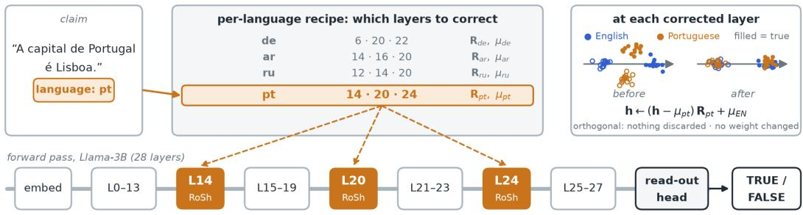
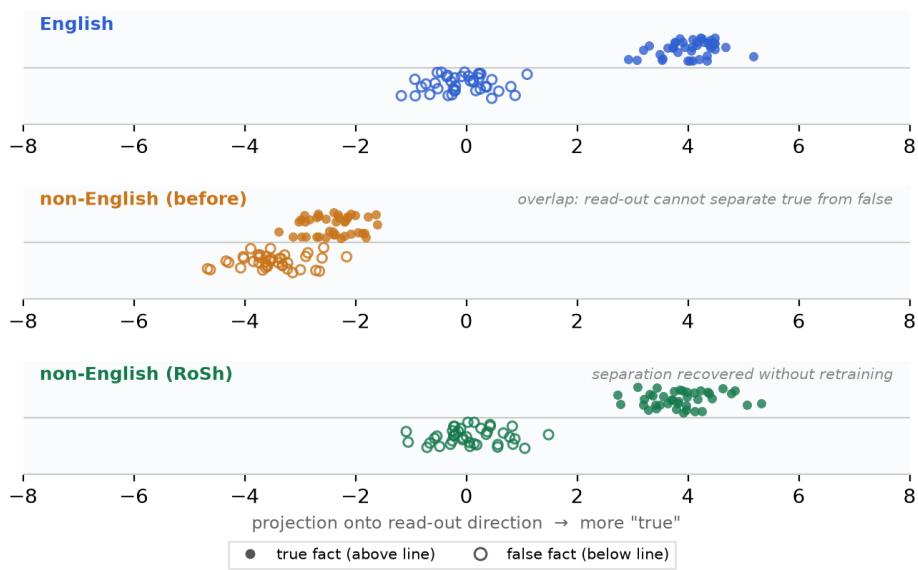
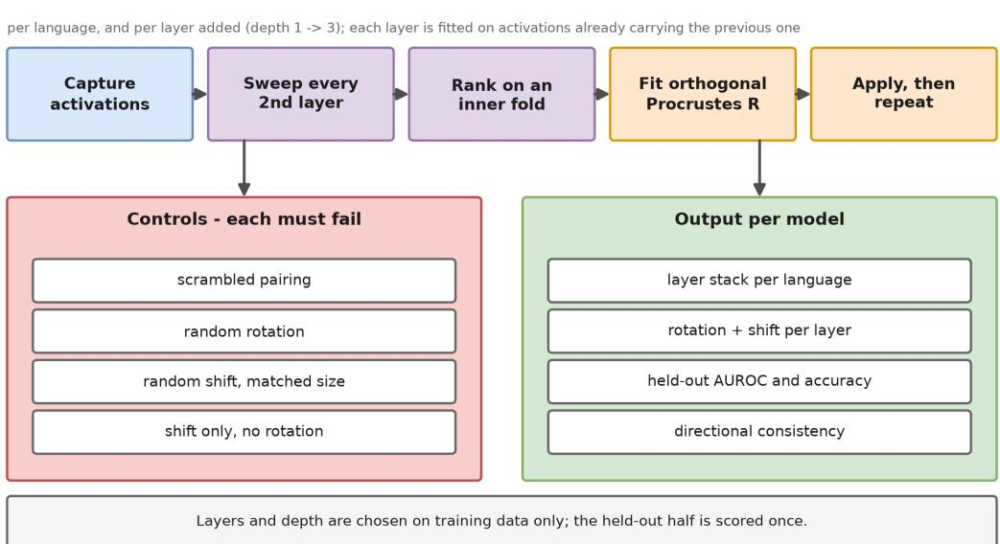

# FAIR FACT-CHECKING: CLOSING THE CROSS-LINGUAL GAP IN LLM FACTUAL JUDGEMENT WITH ROSH

Muhammad Ahmad1,2 Fatemeh Seyedin3 Adrian Weller4 Dongwon Lee5 Mahmoudreza Babaei2,3,6

1Department of Computer Science, Shifa Tameer-e-Millat University, Islamabad, Pakistan   
2BRAINS, Brandenburg Research Center for Applied Intelligent Systems, Potsdam, Germany   
3Max Planck Institute for Security and Privacy, Bochum, Germany   
4University of Cambridge, United Kingdom   
5The Pennsylvania State University, University Park, PA, USA   
6GISMA University of Applied Sciences, Potsdam, Germany

## ABSTRACT

Misinformation on social media remains a critical problem, and more and more people settle it by asking a language model instead of a fact checker, about anything from a claim circulating on a platform to a plain question of fact. Whether models judge such claims reliably is still debated; whether they judge them equally well in every language people ask in has gone almost unasked. We test eight models from five families, 3B to 70B, on 1,500 claims that mix fact-checked news with encyclopedic facts and exist in identical form in eight languages. On every model English is judged better than the other languages, and the gap is widest on the smallest models, where Llama-3B on Arabic is no better than guessing. Existing remedies either retrain the model on more multilingual data or fit an unconstrained map between language representations, and neither asks whether the model already holds the answer and simply fails to say it. It largely does: a linear probe recovers the truth from the very activations the model fails to express. We propose RoSh, a per-language shift and rotation of the residual stream, computed in closed form at three layers, with no training and no weight modified. It improves every model and closes 75% of the gap on average, and it helps most where the model was worst: the two smallest models end close to English, Arabic on Llama-3B goes from chance to nearly the English level, and a fifth fewer of the claims answered correctly in English are lost in translation. What remains is no longer a read-out failure: afterwards the head recovers at least as much of what is encoded outside English as it does in English. An unconstrained map fitted on the same pairs falls below the untouched baseline, so the orthogonality constraint is doing the work, and every model clears a scrambled-correspondence control and ten further controls. On the two benchmarks of the closest inference-time method, latent-space intervention, run with its own data and metric code, RoSh’s gains are five to thirteen times larger.

## 1 INTRODUCTION

Social media platforms have been criticised for years for letting false stories spread unchecked, and the damage does not stay online. It has been traced into elections (Allcott & Gentzkow, 2017) and, during the pandemic, into public health. Because false stories also diffuse faster and reach wider audiences than true ones, fact-checks typically arrive long after public attention has shifted (Vosoughi et al., 2018). In response, platforms partnered with independent fact-checking organisations such as Snopes, PolitiFact, and Full Fact to suppress flagged content in user feeds. However, this approach assumes that users actively seek out verification, and increasingly they do not. Across 48 markets, 10% of adults now use an AI chatbot for news every week, up from 7% a year earlier, and 16% among under-35s (Newman et al., 2026).

A chatbot asked about a claim becomes the fact checker, and unlike a fact-checking desk it answers in whatever language it is asked: one model serves all 48 of those markets, in many languages. That makes a new question pressing: is the model’s verdict on a claim the same whichever language the claim arrives in? To find out, we evaluated eight language models on a straightforward task: given a factual claim with a known truth value, we queried the same model in English and in another target language to test whether its verdict remained consistent. For Llama-3B, consistency broke down sharply. The model achieved an AUROC of 0.857 in English but dropped to 0.523 in Arabic, marginally better than random guessing. Similarly, Mistral-7B scored 0.834 in English compared to 0.646 in Portuguese. Across an evaluation of eight models spanning five architecture families (3B to 70B parameters) and 1,500 claims held identical across eight languages, English consistently outperforms all other languages by an average of +0.046 AUROC, a gap that widens to +0.116 and +0.130 on the two smallest models. Because every claim is evaluated symmetrically across all languages, this disparity cannot be attributed to differences in prompt difficulty. The quality of the verdict depends on the language you happen to speak.

Two things make that worse than a benchmark gap. The users it fails have the fewest alternatives, since where the major services are restricted or unaffordable people fall back on regional systems trained on far less data, and nothing in the answer reveals the problem. The judge being replaced was no more reliable: given stories fact-checkers had already settled, ordinary readers produced verdicts tracking their politics rather than the evidence (Babaei et al., 2021). A model may have a perception of its own, and ours depends on language. It is also asked about everything, so our claims mix fact-checked news with encyclopedic facts, and the gap is as wide on one half as on the other.

Prior literature extensively documents this disparity across cross-lingual verification and dialectal fairness (Lucas et al., 2026b;a; Qi et al., 2023; Han et al., 2026; Liu et al., 2025). However, existing mitigations either require resource-intensive retraining that is impractical for downstream deployment, or rely on unconstrained inference-time mappings (Ghorbanpour et al., 2026; Wang et al., 2025) that are free to rescale and project, and so to discard information as well as re-orient it, which makes a change in score hard to read as evidence of what the underlying model knew. Crucially, both approaches overlook a fundamental question: before concluding that a model lacks factual knowledge in a target language, one must first determine whether it possesses the internal knowledge yet fails to express it.

Research question. When a model judges a claim worse outside English, how much of the gap is knowledge it lacks, and how much is knowledge it holds butfails to read out? And can the second part be recovered at inference time, without changing a single weight?

Both parts are real, and of similar size. Linear probing on intermediate activations recovers the truth in every language we test, including those where the model’s own verdict falls to chance, and at those layers the probe scores far above the model’s own output head. Comparing probe against head within each language splits the gap in two: 0.026 is a shortfall in what the model encodes, and 0.021 is the head reading non-English less efficiently than English (Section 5.1). Only the second part can be repaired without changing the pre-trained parameters. We propose ROSH, a per-language shift and rotation applied to the residual stream at selected intermediate layers, computed as the closedform orthogonal Procrustes solution (Schonemann, 1966) on unlabelled parallel claims and applied¨ at inference, with no gradient taken and no weight modified. It closes 75% of the gap on average and removes it entirely on Qwen-32B and Llama-70B, lifting accuracy from 0.727 to 0.757 and cutting the share of English-correct claims lost in translation by a fifth, from 15.7% to 12.3%. The largest gains land where the gap was worst: Arabic on Llama-3B recovers from 0.523 to 0.841, Portuguese on Mistral-7B from 0.646 to 0.896. What remains is no longer a read-out failure: afterwards the head recovers at least as much of what is encoded outside English as it does in English.

The gains carry beyond our dataset: on the two benchmarks of the closest inference-time method, latent-space intervention (Ghorbanpour et al., 2026), run with its own data and evaluation scripts, ROSH’s gains are five to thirteen times larger, and neither benchmark contains news claims (Table 11).

## Contributions.

• The verdict depends on the language. English leads by +0.046 AUROC on average and by 0.334 on Arabic for Llama-3B, over 1,500 claims that appear in every language.

• The gap has two parts, and only one is read-out. A probe splits it into 0.026 of representational shortfall and 0.021 of read-out loss.

• ROSH removes the read-out part entirely. A closed-form, label-free shift and rotation at three layers closes 75% of the gap, and eleven controls, including an unconstrained map that falls below the untouched baseline, rule out generic perturbation.

## 2 RELATED WORK

Who receives a good judgement. Unequal judgements predate language models: readers of factchecked news trusted claims that matched their politics and distrusted the rest (Babaei et al., 2021); we ask the same question with a model as the judge and the input language in place of politics. Translating claims into English does not settle it, since translation-based pipelines carry disparities of their own (Singhal et al., 2024). The disparity itself is well measured: BMLAMA and RankC (Qi et al., 2023) and MuBench, across 61 languages (Han et al., 2026), test whether a model answers the same fact alike across languages, Liu et al. (2025) tie consistency to entity alignment and improve it by English subject substitution, and Piratla et al. (2025) trace part of the gap to response variance and reduce it by inference-time ensembling.

Where knowledge sits. Llama-2’s intermediate layers favour English equivalents of the intended output (Wendler et al., 2024), cross-lingual factual failures arise both in recall and in converting the answer to the target language (Lu et al., 2025), and factual associations sit in middle-layer MLP modules that can be edited directly (Meng et al., 2022). Truth in particular can be read from hidden states, without supervision by enforcing consistency across paired answers (Burns et al., 2023) or with a small supervised classifier (Azaria & Mitchell, 2023); true and false statements separate geometrically, though probe directions of similar accuracy can differ when used to intervene (Marks & Tegmark, 2023), and a general truth direction can be told apart from a polarity-sensitive one that reverses under negation (Burger et al., 2024). Our probes fit this picture: the truth is recoverable at¨ mid-depth in every language, and what varies is whether it reaches the output head.

Aligning representations to close the gap. The closest work intervenes on representations at inference. INCLINE fits layer-wise alignment matrices by least squares on parallel sentences (Wang et al., 2025); latent-space intervention trains layer-wise autoencoders that align languages in a shared latent space, improving cross-lingual consistency while largely preserving accuracy (Ghorbanpour et al., 2026); steering vectors shift target-language activations toward English at a single layer (Mahmoud, 2026); and Agarwal et al. (2025) instead fine-tune on batches of semantically equivalent multilingual examples.

What is new. Every intervention above fits an unconstrained map or vector, free to rescale and project, and so to discard information as well as re-orient it; a change in score then mixes the two effects. ROSH is an affine isometry, distance-preserving and invertible, so it provably loses nothing (Proposition E.1). The estimator itself is old: Schonemann (1966) solved the orthogonal Procrustes ¨ problem in closed form, Smith et al. (2017) showed that the orthogonal constraint improves bilingual word-embedding alignment, and Conneau et al. (2018) made it unsupervised. What is new is that the same relationship holds inside a running model, between languages, in the residual stream, at inference time.

## 3 METHOD: ROTATION–SHIFT ALIGNMENT (ROSH)

A transformer’s verdict on a factual claim is read from a single direction in its residual stream. We observe that the truth is linearly readable in every language we test, while the read-out head recovers much less of it outside English. Table 1 shows it for two models. On Llama-3B in Arabic the model’s own verdict is at chance, 0.523 AUROC, yet a linear probe on the same activations reaches 0.871; in every language the probe stays within 0.06 of its English value, while the read-out falls up to 0.334 behind. Across all eight models the probe reaches 0.910 outside English where the head reaches 0.823 (Table 10), and Section 5.1 splits the gap into what the model fails to encode and what it fails to read out. Figure 2 shows the same claims from the read-out’s own perspective, before and after the correction. RoSh acts on that directly, applying a closed-form orthogonal rotation and

a mean shift to the hidden states, per language and per layer, without changing any model weight.   
Figure 1 gives the picture; Appendix J shows how the lookup table behind it is built.

Table 1: The truth is encoded even where the verdict fails: linear probe against the model’s own read-out, held out, at the first selected layer (for English, the layer most often selected first). Read out values are those of Table 3.
<table><tr><td colspan="2">Model</td><td>EN</td><td>PT</td><td>PL</td><td>DE</td><td>AR</td><td>ZH</td><td>RU</td><td>TR</td></tr><tr><td rowspan="2">Llama-3B</td><td>probe</td><td>0.922</td><td>0.908</td><td>0.906</td><td>0.908</td><td>0.871</td><td>0.875</td><td>0.888</td><td>0.884</td></tr><tr><td>read-out</td><td>0.857</td><td>0.787</td><td>0.794</td><td>0.851</td><td>0.523</td><td>0.772</td><td>0.787</td><td>0.669</td></tr><tr><td rowspan="2">Gemma-9B</td><td>probe</td><td>0.935</td><td>0.928</td><td>0.936</td><td>0.937</td><td>0.912</td><td>0.899</td><td>0.927</td><td>0.920</td></tr><tr><td>read-out</td><td>0.878</td><td>0.859</td><td>0.862</td><td>0.862</td><td>0.844</td><td>0.762</td><td>0.857</td><td>0.820</td></tr></table>

  
Figure 1: Language-conditioned correction at inference. The language of the incoming claim selects a recipe: the layers to correct and the rotation $\mathbf { R } _ { \ell }$ and shift to apply at each. Shown is Llama-3B with the Portuguese recipe. Only residual-stream activations at the listed layers are transformed; the model’s weights are shared across all languages and never modified. The inset is a schematic of what the correction does at one layer, not a measurement.

## 3.1 PROBLEM SETUP

Let M be a frozen transformer of depth L and residual width d. For a claim x in language ℓ, write $\mathbf { h } _ { l } ^ { \ell } ( x ) \in \mathbb { R } ^ { d }$ for the residual-stream activation at layer l and the answer-token position. We are given a parallel corpus $\mathcal { D } = \{ ( x _ { i } ^ { \mathrm { e n } } , x _ { i } ^ { \ell } ) \} _ { i = 1 } ^ { n }$ of n claims expressed in both English and a target language.

The hypothesis is that the model internally represents the truth value of $x _ { i }$ in every language, but the subspace carrying this signal in language ℓ is rotated relative to the English subspace that the readout head was implicitly trained to decode. Formally, there exists an orthogonal matrix $\mathbf { R } _ { l } ^ { \ell } \in \mathbb { R } ^ { d \times d }$ such that, after the affine map

$$
| \mathbf { \lambda } \mathbf { h } _ { l } ^ { \ell } \ \longleftarrow \ ( \mathbf { h } _ { l } ^ { \ell } - \mu _ { l } ^ { \ell } ) \mathbf { R } _ { l } ^ { \ell } \ + \ \mu _ { l } ^ { \mathrm { e n } }\tag{1}
$$

the transformed activations are approximately aligned with their English counterparts, and the model’s own read-out head can now decode the correct factual judgement.

A toy example makes Eq. 1 concrete. Take $d = 3$ and a read-out that scores a claim by its first coordinate. In English two true claims sit at $( 2 , \pm 1 , 0 )$ and two false ones at $( - 2 , \pm 1 , 0 )$ , so they score +2 and −2 and separate perfectly. In Arabic the same claims sit at (4, 7, 0) and (6, 7, 0) (true) and at (4, 3, 0) and $( 6 , 3 , \bar { 0 } )$ (false). Truth is still perfectly separated, but along the second coordinate, which the read-out ignores, so true and false claims both score 4 or 6 and the verdict is a coin toss. Eq. 1 subtracts the Arabic mean (5, 5, 0), rotates by $- 9 0 ^ { \circ }$ and adds the English mean (0, 0, 0), taking (4, 7, 0) to (−1, 2, 0) and then to (2, 1, 0), exactly its English counterpart. The other three claims land on theirs, and the scores return to ±2. Figure 2 shows the same effect on a larger synthetic cloud, and Appendix G derives R for this example.

  
Figure 2: What the read-out head sees. Each dot is one claim projected onto the read-out direction, true above the centre line and false below. English (top) separates cleanly; non-English before correction (middle) overlaps almost completely; after ROSH (bottom) the separation matches English, without retraining. Same synthetic geometry as the inset of Figure 1.

## 3.2 FITTING THE TRANSFORM VIA ORTHOGONAL PROCRUSTES

Given matched English and target-language activations, we aim to find the rotation, $\mathbf { R } _ { l } ^ { \ell } ,$ , that makes the target-language representation look as similar as possible to the English one. In particular, we propose to recover $\mathbf { R } _ { l } ^ { \ell }$ in closed form using the orthogonal Procrustesproblem (Schonemann, 1966).¨ Given the parallel activations, we first centre each language cloud:

$$
\mu _ { l } ^ { \ell } = \frac { 1 } { n } \sum _ { i = 1 } ^ { n } \mathbf { h } _ { l } ^ { \ell } ( x _ { i } ^ { \ell } ) ,
$$

$$
\pmb { \mu } _ { l } ^ { \mathrm { e n } } = \frac { 1 } { n } \sum _ { i = 1 } ^ { n } \mathbf { h } _ { l } ^ { \mathrm { e n } } ( x _ { i } ^ { \mathrm { e n } } ) ,\tag{2}
$$

$$
\mathbf { A } = \left[ \mathbf { h } _ { l } ^ { \ell } ( x _ { i } ^ { \ell } ) - \boldsymbol { \mu } _ { l } ^ { \ell } \right] _ { i = 1 } ^ { n } \in \mathbb { R } ^ { n \times d } , \qquad \mathbf { B } = \left[ \mathbf { h } _ { l } ^ { \mathrm { e n } } ( x _ { i } ^ { \mathrm { e n } } ) - \boldsymbol { \mu } _ { l } ^ { \mathrm { e n } } \right] _ { i = 1 } ^ { n } \in \mathbb { R } ^ { n \times d } .\tag{3}
$$

The rotation that best maps A onto B is the one minimising the Frobenius norm of the residual:

$$
\mathbf { R } _ { l } ^ { \ell } = \underset { \mathbf { R } : \mathbf { R } ^ { \top } \mathbf { R } = \mathbf { I } } { \arg \operatorname* { m i n } } \left\| \mathbf { A } \mathbf { R } - \mathbf { B } \right\| _ { F } .\tag{4}
$$

A solution is given by the SVD of the cross-covariance matrix:

$$
\mathbf { M } = \mathbf { A } ^ { \top } \mathbf { B } \ = \ \mathbf { U } \Sigma \mathbf { V } ^ { \top } , \qquad \mathbf { R } _ { l } ^ { \ell } = \mathbf { U } \mathbf { V } ^ { \top } .\tag{5}
$$

The solution is not unique, and this does not matter. With $n = 7 5 0$ claims and $d \ge 3 , 0 7 2$ , M has rank below d, so $\mathbf { R } _ { l } ^ { \ell }$ is determined only on the directions the fitting claims span and is free on the rest (Proposition C.1). Those directions carry at most 1.7% of a held-out activation, and switching to the canonical solution, the optimal R closest to the identity, moves held-out AUROC by less than 0.001 (Appendix C); the tables use the standard SVD solution.

The full map in Eq. 1 is an affine isometry, distance-preserving and invertible, so it keeps all the information an activation carries about the claim’s truth (Proposition E.1): an improvement cannot come from discarding a distracting part of the representation, only from a change of frame.

## 3.3 THE TWO COMPONENTS

Equation 1 composes a rotation about the non-English centroid with a translation onto the English one, and each can be run alone:

$$
\mathrm { s h i f t ~ o n l y : } \ \mathbf { h } _ { l } ^ { \ell } \gets \mathbf { h } _ { l } ^ { \ell } - \mu _ { l } ^ { \ell } + \mu _ { l } ^ { \mathrm { e n } } , \qquad \mathrm { r o t a t i o n ~ o n l y : } \ \mathbf { h } _ { l } ^ { \ell } \gets \left( \mathbf { h } _ { l } ^ { \ell } - \mu _ { l } ^ { \ell } \right) \mathbf { R } _ { l } ^ { \ell } + \mu _ { l } ^ { \ell } .\tag{6}
$$

A translation cannot change an orientation, so under a linear read-out a pure shift would leave any ranking metric untouched; the corrected state, however, passes through further non-linear blocks, so the shift does contribute: alone it recovers 43% of the full gain against 74% for the rotation (the two are not additive).

## 3.4 GREEDY LAYER SELECTION

Not every layer carries a misalignment worth correcting, and the useful ones are not independent: once a layer is corrected, the activations arriving at every later layer are different, so the best second layer depends on which one was chosen first. Searching all combinations is prohibitive, so we use greedy forward selection on the fit split alone. That is, we greedily build a small sequence of intervention layers, repeatedly choosing the layer that gives the largest additional gain after the previously selected corrections are already in place.

For each language we sweep every s-th layer between 15% and 97% of depth, with s = 2, or 3 for the models of 64 to 95 layers, giving 12 to 27 candidates. We start at 15% because early runs showed that the lowest layers do not yet carry enough truth for a correction to help, while later layers do: in the lowest 30% of depth a probe reads the truth outside English at 0.76 AUROC against about 0.90 higher up, and only 2 of the 56 best single-layer corrections fall there. The fit split is halved into two inner folds of 375 claims: at each candidate we fit Rℓ on one and score the corrected model’s AUROC on the other. The best layer is selected and its transform refitted on all 750 fitting claims. The sweep is then repeated with that correction in place, up to $D = 3$ layers, each rotation fitted on activations as they leave the previous correction. Greedy search keeps this affordable: on Mistral-7B it takes $1 4 + 1 3 + 1 2 = 3 9$ fits, where every three-layer combination would take ${ \binom { 1 4 } { 3 } } = 3 6 4$ Ranking by AUROC uses labels on the fitting split; the transform itself does not. The output is a per-language recipe: at most three layers, each with its rotation $\mathbf { R } _ { l _ { k } } ^ { \ell }$ and centroid pair $( \mu _ { l _ { k } } ^ { \ell } , \bar { \mu } _ { l _ { k } } ^ { \mathrm { e n } } )$

Inference. At test time no additional data is needed: the language selects its recipe, the forward pass runs as normal with the residual stream at the answer position transformed by Eq. 1 at each listed layer, and the verdict is read from the unmodified output head. The cost is one d × d multiply at up to three layers, on a single token. Algorithm 1 in Appendix K gives the procedure in full.

## 3.5 CONTROLS

Eleven controls test that the transform does what we claim. Each runs on identical data at the same layers and breaks exactly one assumption: whether each component is needed, whether the claim-level pairing matters, whether any perturbation of matched size would serve, and whether the map is specific to its layer and direction. A control passes when it scores below the full method (Appendix L).

## 4 DATA AND EXPERIMENTAL SETUP

Claims. We evaluate on 1,500 factual claims1 with known truth values, balanced between true and false, each in identical form in eight languages: English, Portuguese, Polish, German, Arabic, Chinese, Russian and Turkish, spanning four scripts and four families. The set mixes claims of the kind fact-checkers adjudicate with encyclopedic facts, and the non-English versions are taken as released from BMLAMA-53 (Qi et al., 2023); Appendix B lists the claim types and gives examples. The claims are split once into 750 for fitting and 750 held out: every transform, layer choice and threshold is estimated on the fit half, the held-out half is scored exactly once, and a claim falls on the same side of the split in every language (Appendix A).

Models. We use eight instruction-tuned models from five families, from 3B to 70B parameters and with residual widths from 3,072 to 8,192 (Table 4). All are frozen and none is fine-tuned. They run in half precision (bf16 for the two Gemma models), except Llama-70B and DeepSeek-67B, which run in 4-bit. Every prompt is round-tripped through its tokeniser before any activation is collected (Appendix M).

Scoring. Each claim is presented in its own language with a fixed template that asks for a single verdict token (Appendix B). The score of a claim is the logit difference between the TRUE and FALSE tokens at the answer position,

$$
\begin{array} { r } { s ( x ) = \mathbf { u } ^ { \top } \mathbf { h } _ { L } ( x ) , \qquad \mathbf { u } = \mathbf { w } _ { \mathrm { T R U E } } - \mathbf { w } _ { \mathrm { F A L S E } } , } \end{array}\tag{7}
$$

read from the unmodified head after RoSh has changed $\mathbf { h } _ { l }$ at the selected layers.

Metrics. We report held-out AUROC of $s ( x )$ as the primary metric, the language gap (English minus the mean of the other seven languages) and the share of it closed, accuracy, directional consistency, and a best-layer linear probe; Appendix A defines each.

External benchmarks. To compare with latent-space intervention (Ghorbanpour et al., 2026) on its own ground, we also run ROSH on its two benchmarks, KLAR and mParaRel, with three 8B models (Qwen3-8B, Llama-3.1-8B and Aya-8B), using their data and metric code (Appendix H).

## 5 RESULTS

Every transform is fitted on 750 claims and scored on the 750 it never saw. Accuracy and consistency are read at each language’s median operating point, fitted on the training half.

Table 2: Non-English mean, held out. Gap is English minus non-English, and gap closed is $\mathrm { ( g a p _ { b e f o r e } - g a p _ { a f t e r } ) / g a p _ { b e f o r e } }$ (Appendix A). Directional consistency is the share of claims the model gets right in English that it also gets right in the other language. The Mean row averages the eight model rows; its gap closed is the mean of the per-model values, with values above 100% counted as 100%.
<table><tr><td colspan="2"></td><td colspan="2">non-EN</td><td colspan="2">gap</td><td rowspan="2">gap closed</td><td colspan="2">directional</td></tr><tr><td>Model</td><td>EN</td><td>before</td><td>after</td><td>before</td><td>after</td><td>accuracy</td><td>consistency</td></tr><tr><td>Llama-3B</td><td>0.857</td><td>0.740</td><td>0.829</td><td>+0.116</td><td>+0.028</td><td>76%</td><td> $0 . 6 7 1  0 . 7 3 6$ </td><td>0.750 → 0.841</td></tr><tr><td>Mistral-7B</td><td>0.834</td><td>0.704</td><td>0.809</td><td>+0.130</td><td>+0.025</td><td>80%</td><td> $0 . 6 4 9  0 . 7 2 6$ </td><td>0.715 → 0.806</td></tr><tr><td>Gemma-9B</td><td>0.878</td><td>0.838</td><td>0.865</td><td>+0.040</td><td>+0.012</td><td>69%</td><td> $0 . 7 4 0  0 . 7 5 9$ </td><td>0.879 → 0.905</td></tr><tr><td>Mistral-24B</td><td>0.888</td><td>0.866</td><td>0.878</td><td>+0.022</td><td>+0.011</td><td>53%</td><td> $0 . 7 5 6  0 . 7 6 7$ </td><td>0.883 → 0.898</td></tr><tr><td>Gemma-27B</td><td>0.860</td><td>0.833</td><td>0.844</td><td>+0.027</td><td>+0.016</td><td>42%</td><td> $0 . 7 2 9  0 . 7 4 6$ </td><td>0.839 → 0.851</td></tr><tr><td>Qwen-32B</td><td>0.885</td><td>0.879</td><td>0.889</td><td>+0.006</td><td>-0.004</td><td>&gt;100%</td><td>0.770 → 0.778</td><td>0.903 → 0.911</td></tr><tr><td>Llama-70B</td><td>0.879</td><td>0.865</td><td>0.883</td><td>+0.014</td><td>-0.003</td><td>&gt;100%</td><td>0.752 → 0.780</td><td>0.895 → 0.915</td></tr><tr><td>DeepSeek-67B</td><td>0.875</td><td>0.861</td><td>0.872</td><td>+0.014</td><td>+0.003</td><td>80%</td><td>0.748 → 0.762</td><td>0.882 → 0.892</td></tr><tr><td>Mean</td><td>0.870</td><td>0.823</td><td>0.859</td><td>+0.046</td><td>+0.011</td><td>75%</td><td>0.727 → 0.757</td><td>0.843 → 0.877</td></tr></table>

The gap closes on every model, by 75% on average, and Qwen-32B and Llama-70B end with non-English slightly ahead of English. Where the gap was widest the correction is largest: Llama-3B and Mistral-7B start 0.116 and 0.130 behind and end within 0.03. Directional consistency rises from 0.843 to 0.877 (of the claims a model gets right in English, the share it gets wrong in translation falls from 15.7% to 12.3%), so the claims English handles correctly survive translation more often than before. Every tokeniser was verified in all eight languages before any run (Appendix M).

Table 3: Baseline and corrected AUROC per language, held out. Shading shows the change: green for a gain, darker the larger it is; red for a drop; grey for no change.
<table><tr><td>Model</td><td>PT</td><td>PL</td><td></td><td>DE</td><td>AR</td><td></td><td>ZH</td><td>RU</td><td>TR</td></tr><tr><td>Llama-3B</td><td> $0 . 7 8 7  0 . 8 4 0$ </td><td> $0 . 7 9 4  0 . 8 2 9$ </td><td></td><td> $0 . 8 5 1  0 . 8 5 6$ </td><td>0.523 → 0.841</td><td></td><td> $0 . 7 7 2  0 . 7 9 8$ </td><td> $0 . 7 8 7  0 . 8 3 8$ </td><td> $0 . 6 6 9  0 . 7 9 8$ </td></tr><tr><td>Mistral-7B</td><td> $0 . 6 4 6 \to 0 . 8 9 6$ </td><td> $0 . 8 0 2  0 . 8 7 8$ </td><td></td><td> $0 . 8 0 7  0 . 8 4 7$ </td><td> $0 . 5 8 5  0 . 6 7 4$ </td><td></td><td> $0 . 6 5 9  0 . 7 0 2$ </td><td> $0 . 7 9 1  0 . 8 6 9$ </td><td> $0 . 6 3 9  0 . 7 9 5$ </td></tr><tr><td>Gemma-9B</td><td> $0 . 8 5 9  0 . 8 7 2$ </td><td> $0 . 8 6 2  0 . 8 8 4$ </td><td></td><td> $0 . 8 6 2  0 . 8 7 1$ </td><td> $0 . 8 4 4  0 . 8 5 3$ </td><td></td><td> $0 . 7 6 2  0 . 8 4 5$ </td><td> $0 . 8 5 7  0 . 8 6 8$ </td><td> $0 . 8 2 0  0 . 8 6 5$ </td></tr><tr><td>Mistral-24B</td><td> $0 . 8 7 4  0 . 8 7 4$ </td><td> $0 . 8 7 5  0 . 8 9 0$ </td><td></td><td> $0 . 8 9 3  0 . 8 9 7$ </td><td> $0 . 8 5 9  0 . 8 9 2$ </td><td></td><td> $0 . 8 2 4  0 . 8 2 8$ </td><td> $0 . 8 8 9  0 . 9 0 2$ </td><td> $0 . 8 4 6  0 . 8 6 0$ </td></tr><tr><td> $\mathrm { G e m m a } { \cdot } 2 7 \mathrm { B }$ </td><td> $0 . 8 5 6 \to 0 . 8 5 5$ </td><td> $0 . 8 4 0  0 . 8 6 0$ </td><td></td><td> $0 . 8 4 7  0 . 8 6 3$ </td><td> $0 . 8 2 6  0 . 8 4 1$ </td><td></td><td> $0 . 7 9 0  0 . 7 8 7$ </td><td> $0 . 8 3 0  0 . 8 6 3$ </td><td> $0 . 8 4 2  0 . 8 4 1$ </td></tr><tr><td>Qwen-32B</td><td>0.879 → 0.882</td><td> $0 . 8 8 8  0 . 8 9 8$ </td><td></td><td> $0 . 8 9 1  0 . 9 0 0$ </td><td> $0 . 8 7 7  0 . 8 9 3$ </td><td></td><td> $0 . 8 6 2  0 . 8 7 5$ </td><td> $0 . 8 9 2  0 . 9 0 8$ </td><td> $0 . 8 6 6 \to 0 . 8 6 8$ </td></tr><tr><td>Llama-70B</td><td>0.882 → 0.892</td><td> $0 . 8 8 4  0 . 9 0 7$ </td><td></td><td> $0 . 8 8 5  0 . 8 9 6$ </td><td> $0 . 8 5 1  0 . 8 6 2$ </td><td></td><td>0.820 → 0.854</td><td> $0 . 8 7 2  0 . 9 0 4$ </td><td> $0 . 8 6 1  0 . 8 6 6$ </td></tr><tr><td>DeepSeek-67B</td><td>0.865 → 0.870</td><td> $0 . 8 8 0  0 . 8 9 6$ </td><td></td><td> $0 . 8 7 1  0 . 8 8 8$ </td><td> $0 . 6 4 2  0 . 6 5 8$ </td><td></td><td> $0 . 8 5 5  0 . 8 6 5$ </td><td> $0 . 8 7 6 \to 0 . 8 8 6$ </td><td> $0 . 8 2 0  0 . 8 1 5$ </td></tr></table>

Arabic on Llama-3B moves from 0.523, which is a coin toss, to 0.841, and Portuguese on Mistral-7B from 0.646 to 0.896 (Table 3). Of the 56 model-language cells, 51 improve, one is unchanged and the largest regression is 0.005. Most languages that stay flat were already close to English, so there was little left to close; Gemma-27B Chinese (0.790 to 0.787) is the exception.

Beyond our data. On the two benchmarks of the closest inference-time method, latent-space intervention (LSI), run with its own data and metric code on three 8B models, ROSH raises KLAR accuracy by 5.63 points and agreement with English by 5.48, against the 0.44 and 1.02 that Ghorbanpour et al. (2026) report for LSI, and raises mParaRel agreement on Aya by 2.24 against 0.27 (Table 11). Neither benchmark contains news claims, and on mParaRel no translation system its templates come from shows a significant loss (Appendix I), so the correction is not specific to our data.

## 5.1 WHAT ROSH FIXES, AND WHAT REMAINS

Comparing the model’s read-out with a probe on the same activations splits the gap in two (Appendix F, Table 10). The non-English representation is genuinely weaker, since a probe reaches 0.910 against 0.935 in English, a shortfall of 0.026. On top of that the head reads non-English less efficiently, losing 0.086 AUROC relative to the probe outside English against 0.066 within it, a further 0.021. The two account for the +0.046 we measure.

ROSH acts on the second component and removes it. After correction the head loses 0.051 relative to the probe in non-English, below the 0.066 it loses in English on English’s own representation, and it is at or below the English level on every model except Mistral-24B, where it exceeds it by 0.002. So the residual gap of 0.011 is smaller than the representational shortfall of 0.026: the corrected head now reads non-English more efficiently than English, by 0.015, which offsets part of what the representation lacks.

Our analysis also turns up a finding that has nothing to do with language: even in English the head leaves 0.066 AUROC on the table relative to a probe on its own intermediate activations. Read-out inefficiency therefore appears to be a general property of the model, while non-English languages suffer an additional read-out penalty that ROSH specifically removes.

## 5.2 SELECTED LAYERS

The search settles on three layers for every model, mostly in the upper middle of the network but often reaching early layers, and the stacks differ by language within a model: on Llama-3B, Portuguese takes 14, 20 and 24 and Arabic 16, 20 and 14. The recipe is therefore fitted per language (Appendix N).

## 5.3 CONTROLS

A gain on held-out data does not establish that the transform does what we claim, so we ran the eleven arms of Section 3.5, each fitted and applied exactly as the method is. Averaged over eight models and seven languages, ROSH reaches 0.853 against an untouched baseline of 0.820. The eight arms scored on non-English all land below 0.853, and the three scored on English land below the English baseline of 0.870, which is the comparison they call for. The informative ones are close together in construction and far apart in score. Scrambling the item pairing before fitting, which preserves both clouds and destroys only which claim matches which, falls to 0.621; a random rotation of matched size falls to 0.658; an unconstrained linear map on the same pairs reaches 0.786, below doing nothing at all. Fitting English against itself returns 0.870 and moves the score by 0.000, which is the null the isometry argument requires. Per model the fitted map beats all three scrambled runs, with z between +1.83 and +8.13. An earlier six-model version of this study used a single language-direction steering vector, which failed this same control on four of the six, and was abandoned for that reason. Tables 14 and 15 in Appendix O give every arm.

## 6 DISCUSSION

The gap is partly a read-out failure. A linear probe separates true from false in every language, including where the model’s own verdict is near chance, so the content survives in the residual stream. Of the 0.046 gap, 0.021 is the head failing to reach that content, which ROSH removes, and 0.026 is a weaker representation, which no isometry can repair. Because the transform is invertible (Proposition E.1), an improvement can only mean the head was failing to extract something already present.

The constraint carries the result. The same pairs fitted without the orthogonality constraint give 0.786, below the untouched baseline of 0.820, against 0.853 for the constrained solution: with 750 pairs in thousands of dimensions the least-squares map is ill-conditioned and distorts held-out activations (Appendix D). Orthogonality removes that failure by construction and is what licenses the reading above.

Relation to weight-space methods. We claim no impossibility result: fine-tuning could in principle reach a model that behaves similarly. What we claim is that the correction can befound in closed form, from unlabelled parallel claims, in one SVD, with no gradient step and no labelled data in the target language, which is precisely the resource the affected communities lack. Nor is it a weight edit: it acts only at the answer position, differs per language and includes a shift, so it cannot be folded into the checkpoint. Two guarantees follow that have no counterpart in weight space. English is left exactly unchanged (Proposition E.4; the null is 0.000 in Table 15), and since only one language’s recipe is active in any forward pass, improving one language cannot disturb another.

What this means for deployment. The transform is a per-language matrix and a per-language vector at three layers, estimated from 750 parallel claims, whose truth labels are used only to choose the layers, and applied at one token position during inference. It requires no gradient, no labelled target-language data, and no change to the shipped checkpoint, which places it within reach of whoever deploys a model rather than only whoever trained it. That matters for the specific unfairness we measure, since the languages with the largest gaps are also those with the least training data, the fewest labelled resources and the weakest locally available systems.

## 6.1 LIMITATIONS

Eight languages and four scripts show the effect without characterising it across the long tail, where the disparity is likely worst, and the non-English claims, taken from BMLAMA-53 (Qi et al., 2023), were translated rather than written natively. On mParaRel, the second benchmark of Ghorbanpour et al. (2026), whose templates come from five translation systems, the correction survives a split by system (Appendix I). All results use one verdict-token template, so we cannot speak to chainof-thought or open-ended answers. The method needs claims paired across languages and does not apply where no parallel corpus exists. Truth labels do not fit the transform but do enter through layer selection, so the label-free claim covers the transform rather than the whole recipe. And the diagnosis rests on probes: we do not identify which part of the head fails, or what puts non-English representations in a different frame.

## 7 CONCLUSION

Ask a model to judge the same claim in English and then in another language and the two verdicts often disagree. Across eight models from five families and 1,500 claims rendered identically in eight languages, English leads by +0.046 AUROC on average and by 0.334 on Arabic for Llama 3B, where the model drops to 0.523 and is guessing. Every claim appears in every language, so this is not a matter of some questions being harder.

Part of what the model needs is already there. A linear probe recovers the truth from mid-network activations even where the model’s own verdict sits at chance, and separating the two shows that nearly half of the gap is the read-out failing to reach what is encoded, the rest being a genuinely weaker representation. ROSH targets the first part, with a per-language shift and rotation of the residual stream at three layers, computed in closed form from unlabelled parallel claims, no gradient taken and no weight modified. It closes 75% of the gap on average and removes it on two models, lifts accuracy from 0.727 to 0.757, and cuts the share of English-correct claims lost in translation by a fifth, from 15.7% to 12.3%. The same recipe transfers to two benchmarks built by other authors, where its gains are five to thirteen times those of the closest inference-time method, on that method’s own data and metric code.

An unconstrained map on the same pairs falls below doing nothing at all. What is left is to reach the long tail of languages, where the disparity is likely largest and parallel data scarcest, and to find what puts non-English representations in a different frame in the first place.

## AI USE STATEMENT

In this work, we used generative AI tools (a large language model assistant) for editing and condensing the manuscript text, drafting and checking LaTeX, writing experiment, analysis and plotting code, and cross-checking the numbers reported in the text against our result files. We have not used generative AI tools to produce any experimental result: every number in the paper is computed by our code from the models’ outputs, and every AI-drafted script was run and checked by the authors. We have reviewed all AI-assisted work and take responsibility for the final content of this work, including text, claims or artifacts produced with the aid of generative AI.

## REFERENCES

Amit Agarwal, Hansa Meghwani, Hitesh Laxmichand Patel, Tao Sheng, Sujith Ravi, and Dan Roth. Aligning llms for multilingual consistency in enterprise applications. In Proceedings of the 2025 Conference on Empirical Methods in Natural Language Processing: Industry Track, pp. 117–137, 2025.

Hunt Allcott and Matthew Gentzkow. Social media and fake news in the 2016 election. Journal of Economic Perspectives, 31(2):211–236, 2017. doi: 10.1257/jep.31.2.211.

Amos Azaria and Tom Mitchell. The internal state of an LLM knows when it’s lying. In Findings ofthe Associationfor Computational Linguistics: EMNLP 2023, 2023.

Mahmoudreza Babaei, Juhi Kulshrestha, Abhijnan Chakraborty, Elissa M Redmiles, Meeyoung Cha, and Krishna P Gummadi. Analyzing biases in perception of truth in news stories and their implications for fact checking. IEEE Transactions on Computational Social Systems, 9(3):839– 850, 2021.

Lennart Burger et al. Truth is universal: Robust detection of lies in LLMs. In¨ Advances in Neural Information Processing Systems (NeurIPS), 2024.

Collin Burns, Haotian Ye, Dan Klein, and Jacob Steinhardt. Discovering latent knowledge in language models without supervision. In International Conference on Learning Representations (ICLR), 2023.

Alexis Conneau, Guillaume Lample, Marc’Aurelio Ranzato, Ludovic Denoyer, and Herve J´ egou.´ Word translation without parallel data. In International Conference on Learning Representations (ICLR), 2018.

Faeze Ghorbanpour, Constanza Fierro, Alexander Fraser, and Anders Søgaard. Latent-space intervention for cross-lingual factual consistency: Consistency improvements without accuracy drops. arXiv preprint arXiv:2608.28860, 2026. doi: 10.48550/arXiv.2608.28860. URL https: //arxiv.org/abs/2608.28860. To appear at EMNLP 2026.

Wenhan Han, Yifan Zhang, Zhixun Chen, Mykola Pechenizkiy, Meng Fang, Yin Zheng, et al. Mubench: Assessment of multilingual capabilities of large language models across 61 languages. In Findings of the Association for Computational Linguistics: ACL 2026, pp. 16163–16192, 2026.

Yihong Liu, Mingyang Wang, Franc¸ois Yvon, and Hinrich Schutze. On the entity-level alignment ¨ in crosslingual consistency. arXiv preprint arXiv:2510.10280, 2025.

Meng Lu, Ruochen Zhang, Carsten Eickhoff, and Ellie Pavlick. Paths not taken: Understanding and mending the multilingual factual recall pipeline. In Proceedings of the 2025 Conference on Empirical Methods in Natural Language Processing, pp. 15077–15107, 2025.

Jason Lucas, Matt Murtagh-White, Ali Al-Lawati, Uchendu Uchendu, Adaku Uchendu, and Dongwon Lee. DIA-HARM: Dialectal disparities in harmful content detection across 50 english dialects. In Proceedings ofthe 64th Annual Meeting ofthe Associationfor Computational Linguistics (ACL), San Diego, CA, 2026a.

Jason Lucas, Matt Murtagh-White, Adaku Uchendu, Ali Al-Lawati, Michiharu Yamashita, Dominik Macko, Ivan Srba, Robert Moro, and Dongwon Lee. BLUFF: Benchmarking the detection of false and synthetic content across 58 low-resource languages. In Proceedings of the 32nd ACM SIGKDD International Conference on Knowledge Discovery and Data Mining (KDD), Jeju, Korea, 2026b.

Omar Mahmoud. Improving multilingual language models by aligning representations through steering. In Proceedings ofthe Fifteenth Language Resources and Evaluation Conference (LREC 2026), pp. 2090–2103, 2026.

Samuel Marks and Max Tegmark. The geometry of truth: Emergent linear structure in large language model representations of true/false datasets. arXiv preprint arXiv:2310.06824, 2023.

Kevin Meng, David Bau, Alex Andonian, and Yonatan Belinkov. Locating and editing factual associations in gpt. Advances in neural information processing systems, 35:17359–17372, 2022.

Nic Newman, Richard Fletcher, Craig T. Robertson, Amy Ross Arguedas, and Rasmus Kleis Nielsen. Digital news report 2026. Technical report, Reuters Institute for the Study of Journalism, University of Oxford, 2026. URL https://reutersinstitute.politics.ox.ac. uk/digital-news-report/2026. Survey of approximately 2,000 respondents in each of 48 markets.

Vihari Piratla, Purvam Jain, Darshan Singh, Trevor Cohn, Preethi Jyothi, and Partha Talukdar. Rethinking cross-lingual gaps from a statistical viewpoint. arXiv preprint arXiv:2510.15551, 2025.

Jirui Qi, Raquel Fernandez, and Arianna Bisazza. Cross-lingual consistency of factual knowledge´ in multilingual language models. In Proceedings of the 2023 Conference on Empirical Methods in Natural Language Processing, pp. 10650–10666, 2023.

Peter H. Schonemann. A generalized solution of the orthogonal Procrustes problem.¨ Psychometrika, 31(1):1–10, 1966. doi: 10.1007/BF02289451.

Aryan Singhal, Veronica Shao, Gary Sun, Ryan Ding, Jonathan Lu, and Kevin Zhu. A comparative study of translation bias and accuracy in multilingual large language models for cross-language claim verification. arXiv preprint arXiv:2410.10303, 2024.

Samuel L. Smith, David H. P. Turban, Steven Hamblin, and Nils Y. Hammerla. Offline bilingual word vectors, orthogonal transformations and the inverted softmax. In International Conference on Learning Representations (ICLR), 2017.

Soroush Vosoughi, Deb Roy, and Sinan Aral. The spread of true and false news online. Science, 359(6380):1146–1151, 2018. doi: 10.1126/science.aap9559.

Weixuan Wang, Minghao Wu, Barry Haddow, and Alexandra Birch. Bridging the language gaps in large language models with inference-time cross-lingual intervention. In Proceedings of the 63rd Annual Meeting of the Association for Computational Linguistics (Volume 1: Long Papers), pp. 5418–5433, Vienna, Austria, July 2025. Association for Computational Linguistics. doi: 10.18653/v1/2025.acl-long.270. URL https://aclanthology.org/2025. acl-long.270/.

Chris Wendler, Veniamin Veselovsky, Giovanni Monea, and Robert West. Do llamas work in english? on the latent language of multilingual transformers. arXiv preprint arXiv:2402.10588, 2024.

## A EXPERIMENTAL SETUP DETAILS

Claims. We evaluate on 1,500 factual claims with known truth values, balanced between true and false. The set deliberately mixes two kinds of statement. The first are claims of the sort that circulate publicly and are adjudicated by fact-checking organisations; the second are encyclopedic facts of the kind used in cross-lingual knowledge probes. The claims are drawn from BMLAMA-53 (Qi et al., 2023), released under the Apache 2.0 licence; a false claim pairs a subject and relation with a distractor object in place of the true one, and the set is balanced at 750 true and 750 false. Mixing the two lets us test whether the language gap is a property of contested public claims or of factual verification in general; Section 5 reports it separately for each half.

Each claim exists in identical form in eight languages: English, Portuguese, Polish, German, Arabic, Chinese, Russian and Turkish. The eight span four scripts and four language families, and cover a wide range of representation in typical pretraining corpora, which is the axis the gap is expected to follow.

Translation. The non-English versions are taken as released from BMLAMA-53 (Qi et al., 2023), whose language versions were built by translating English prompt–object pairs from earlier multilingual probing sets, with entity names taken from Wikidata labels in each language; we did not translate or review them ourselves. Because translation quality is a possible confounder, Appendix I checks the correction on mParaRel, whose templates were produced by five machine-translation systems, separately for each system and restricted to claims the model answers correctly in English so that item difficulty is held fixed.

Fit and held-out split. The 1,500 claims are split once into 750 for fitting and 750 held out. Every transform, every layer-selection decision and every operating threshold is estimated on the fit half alone. The held-out half is scored exactly once, and all numbers reported in Section 5 come from it. Because a claim appears in all eight languages, it falls on the same side of the split in every language, so no language is ever evaluated on a claim another language was fitted on.

Models. We evaluate eight instruction-tuned models from five families, spanning 3B to 70B parameters and residual widths from 3,072 to 8,192 (Table 4). All are used frozen, in half precision (bf16 for the two Gemma models; Llama-70B and DeepSeek-67B in 4-bit), with a single forward pass per claim and no decoding. No model is fine-tuned at any point.

Table 4: Models evaluated. Depth is the number of transformer blocks and d the residual width; both determine the size of the layer sweep and of the fitted transform.
<table><tr><td>Model</td><td>Checkpoint</td><td>depth L</td><td>width d</td></tr><tr><td>Llama-3B</td><td>unsloth/Llama-3.2-3B-Instruct</td><td>28</td><td>3,072</td></tr><tr><td>Mistral-7B</td><td>unsloth/mistral-7b-instruct-v0.3</td><td>32</td><td>4,096</td></tr><tr><td>Gemma-9B</td><td>unsloth/gemma-2-9b-it</td><td>42</td><td>3,584</td></tr><tr><td>Mistral-24B</td><td>unsloth/Mistral-Smal1-24B-Instruct-2501</td><td>40</td><td>5,120</td></tr><tr><td>Gemma-27B</td><td>unsloth/gemma-2-27b-it</td><td>46</td><td>4,608</td></tr><tr><td>Qwen-32B</td><td>Qwen/Qwen2.5-32B-Instruct</td><td>64</td><td>5,120</td></tr><tr><td>Llama-70B</td><td>unsloth/Llama-3.3-70B-Instruct-bnb-4bit</td><td>80</td><td>8,192</td></tr><tr><td>DeepSeek-67B</td><td>deepseek-ai/deepseek-llm-67b-chat</td><td>95</td><td>8,192</td></tr></table>

Tokeniser verification. One model initially resolved to a tokeniser that silently discarded non-Latin script, so that Chinese claims tokenised to zero tokens and every Arabic, Chinese and Russian prompt was identical and empty (Appendix M). We therefore round-trip every prompt in every language through encode and decode for every model, and require exact recovery before any activation is collected. All eight models pass this check with the checkpoints listed above.

Prompting and scoring. Each claim is presented in its own language with a fixed template that asks for a single verdict token:

Is the following statement true or false? Answer with only   
the word TRUE or FALSE.

$$
\mathtt { S t a t e m e n t : } \quad \{ \mathtt { c l a i m } \}
$$

and its translation into each target language. The instruction is written in the claim’s own language, while the answer words stay TRUE and FALSE in every language; the prompt is wrapped in each model’s chat template. The score for a claim is the logit difference between the TRUE and FALSE continuation tokens at the answer position (Eq. 7), where w are rows of the unembedding matrix and each of TRUE and FALSE takes the highest-scoring of its capitalisation and leading-space variants. This is the quantity RoSh acts on indirectly: the transform changes $\mathbf { h } _ { l }$ at selected layers, and s is read from the unmodified head.

AUROC. Our primary metric is the area under the ROC curve of s(x) against the true label. We use a ranking metric rather than accuracy because several models are strongly biased toward one verdict in some languages, which depresses accuracy for a reason unrelated to whether the model can separate true from false. AUROC measures separability independently of where the decision threshold sits.

Language gap. The gap for a model is the mean AUROC in English minus the mean over the seven other languages. Gap closed is the reduction in that quantity after correction, as a fraction of the gap before:

$$
\mathrm   ~ \ g a p = \mathrm { \cal A U R O C } _ { \mathrm { e n } } - \frac { 1 } { 7 } \sum _ { \ell \ne \mathrm { e n } } \mathrm { \cal A U R O C } _ { \ell } , \qquad \mathrm { \ c l o s e d = \frac { \mathrm {  ~ \ g a p _ { \mathrm { b e f o r e } } - \ g a p _ { \mathrm { a f t e r } } } } { \mathrm {  ~ \ g a p _ { \mathrm { b e f o r e } } ~ } } } ,
$$

computed per model. The correction leaves English untouched, so only the non-English term changes. A value above 100% means the corrected non-English mean overtakes English; when averaging over models, such values count as 100%.

Accuracy. Accuracy is reported at each language’s median operating point, with the threshold fitted on the training half and applied unchanged to the held-out half.

Directional consistency. Consistency is 1 − P(other language wrong | English right): among the claims the model gets right in English, the fraction that survive translation. This is directional by design. A model that is uniformly wrong in two languages agrees with itself, and a symmetric agreement score would reward it; ours does not.

Probe. To test whether the information is present before the read-out, we fit an L2-regularised logistic probe on the activation at each candidate layer, with the regularisation strength chosen by cross-validation on the fit half, and score it once on the held-out half, per language; we report the best candidate layer. The probe bounds what any linear reader can extract at that depth. The part of the difference between the probe and the model’s own read-out that exceeds English’s own difference is the quantity our method targets (Section 5.1, Appendix F).

## B PROMPTS AND CLAIMS

Prompt. Each claim is sent as a single user message, wrapped in the model’s own chat template with the generation prompt appended, so the next token is the start of the model’s answer. The message is an instruction in the claim’s language followed by the claim:

No answer is generated and none is forced. After one forward pass we read the logits for the next token and score the claim as the highest logit among the TRUE variants (TRUE, True, with and without a leading space) minus the highest among the FALSE variants (Eq. 7). The score is the model’s relative preference between the two answer words; AUROC ranks claims by it, and accuracy thresholds it at the median score of the fit half.

Example claims. A true claim and its false counterpart differ only in the object: the false one takes a distractor from BMLAMA’s candidate list, at the same position in every language (Table 6). The Polish renderings show the limitation noted in Section 6.1: BMLAMA fills templates without declining nouns, so the object keeps its dictionary form (z Bułgaria) where Polish grammar requires the instrumental case.

Table 5: The instruction in each Latin-script language, verbatim. The Arabic, Chinese and Russian versions are equivalent translations and are given verbatim in the code release (INSTR in run lookup.py). In every language the answer words stay TRUE and FALSE.
<table><tr><td>Language</td><td>Message</td></tr><tr><td>English</td><td>Is the following statement true or false? Answer with only the word TRUE or FALSE. Statement: {claim}</td></tr><tr><td>Portuguese</td><td>A seguinte afirmação é verdadeira ou falsa? Responda apenas com a palavra TRUE ou FALSE.</td></tr><tr><td>Polish</td><td>Afirmação: {claim} Czy poniższe stwierdzenie jest prawdziwe czy fałszywe? Odpowiedz tylko słowem TRUE albo FALSE.</td></tr><tr><td>German</td><td>Stwierdzenie: {claim} Ist die folgende Aussage wahr oder falsch? Antworte nur mit dem Wort TRUE oder FALSE.</td></tr><tr><td>Turkish</td><td>Aussage: {claim} Aşağıdaki ifade doğru mu yanlış mı? Sadece TRUE veya FALSE kelimesiyle cevap ver. İfade: {claim}</td></tr></table>

Table 6: Two claims of the dataset in the five Latin-script languages.
<table><tr><td>Language</td><td>true</td><td>false</td></tr><tr><td>English</td><td>Colorado shares border with Wyoming.</td><td>Croatia shares border with Bulgaria.</td></tr><tr><td>Portuguese</td><td>Colorado compartilha fronteira com Wyoming.</td><td>Croácia compartilha fronteira com Bulgária.</td></tr><tr><td>Polish</td><td>Kolorado graniczy z Wyoming.</td><td>Chorwacja graniczy z Bułgaria.</td></tr><tr><td>German</td><td>Colorado teilt die Grenze mit Wyoming.</td><td>Kroatien teilt die Grenze mit Bulgarien.</td></tr><tr><td>Turkish</td><td>Colorado, Wyoming ile sınır paylaşıyor.</td><td>Hırvatistan, Bulgaristan ile sinır paylaşıyor.</td></tr></table>

Claim types. The 1,500 claims come from 18 BMLAMA relation templates; Table 7 gives each with its number of true and false claims. Three relations, twin cities, shared borders and official language, make up two thirds of the set.

Table 7: Relation templates in the claim set, with the number of claims (S subject, O object).
<table><tr><td>Template</td><td>true</td><td>false</td><td>total</td></tr><tr><td>S and O are twin cities.</td><td>290</td><td>283</td><td>573</td></tr><tr><td>S shares border with O.</td><td>163</td><td>145</td><td>308</td></tr><tr><td>The official language of S is O.</td><td>100</td><td>117</td><td>217</td></tr><tr><td>S is the capital of Ö.</td><td>55</td><td>62</td><td>117</td></tr><tr><td>S is located in O.</td><td>51</td><td>50</td><td>101</td></tr><tr><td>The capital of S is O.</td><td>43</td><td>33</td><td>76</td></tr><tr><td>S is part of O.</td><td>6</td><td>11</td><td>17</td></tr><tr><td>S consists of O.</td><td>8</td><td>8</td><td>16</td></tr><tr><td>S used to work in O.</td><td>8</td><td>8</td><td>16</td></tr><tr><td>S works in the field of O.</td><td>5</td><td>8</td><td>13</td></tr><tr><td>The native language of S is O.</td><td>7</td><td>5</td><td>12</td></tr><tr><td>S is named after O.</td><td>4</td><td>8</td><td>12</td></tr><tr><td>S is affiliated with the O religion.</td><td>5</td><td>5</td><td>10</td></tr><tr><td>S is O citizen.</td><td>0</td><td>3</td><td>3</td></tr><tr><td>S used to communicate in O.</td><td>2</td><td>1</td><td>3</td></tr><tr><td>S is a O.</td><td>2</td><td>1</td><td>3</td></tr><tr><td>S has the position of O.</td><td>0</td><td>2</td><td>2</td></tr><tr><td>S died in O.</td><td>1</td><td>0</td><td>1</td></tr><tr><td>Total</td><td>750</td><td>750</td><td>1,500</td></tr></table>

## C NON-UNIQUENESS OF THE FITTED ROTATION

The issue. We fit on n = 750 parallel claims while the residual width d ranges from 3,072 to 8,192. The cross-covariance $\mathbf { M } \bar { = } \mathbf { A } ^ { \top } \mathbf { B }$ therefore has rank $r \leq n - 1 < d ,$ so its singular value

decomposition has at least $d - r$ zero singular values, and the corresponding columns of U and V are an arbitrary orthonormal basis of their null spaces. The minimiser of the Procrustes objective is consequently not unique.

Proposition C.1 (The family of optimal rotations). Let $r = \mathrm { r a n k } ( \mathbf { M } )$ and partition the full SVD as $\hat { \mathbf { U } } = [ \mathbf { U } _ { r } \ \mathbf { U } _ { 0 } ] , \ \mathbf { V } = [ \dot { \mathbf { V } } _ { r } \ \mathbf { V } _ { 0 } ]$ by the nonzero and zero singular values. For every W in the orthogonal group $\tilde { \mathcal { O } } ( d - r )$ , the matrix

$$
\mathbf { R } _ { \mathbf { W } } = \mathbf { U } _ { r } \mathbf { V } _ { r } ^ { \top } + \mathbf { U } _ { 0 } \mathbf { W } \mathbf { V } _ { 0 } ^ { \top }\tag{8}
$$

is orthogonal and attains the same minimum $o f \left\| \mathbf { A R } - \mathbf { B } \right\| _ { F }$ . The set of minimisers is therefore a manifold ofdimension $( d - r ) ( d - r - 1 ) / 2$

Proof. Since $\| \mathbf { A } \mathbf { R } - \mathbf { B } \| _ { F } ^ { 2 } = \| \mathbf { A } \| _ { F } ^ { 2 } + \| \mathbf { B } \| _ { F } ^ { 2 } - 2 \operatorname { t r } ( \mathbf { R } ^ { \top } \mathbf { M } )$ , minimising the residual is maximising $\mathrm { t r } ( \mathbf { R } ^ { \top } \mathbf { M } )$ . For any orthogonal R, the matrix $\mathbf { W } ^ { \prime } = \mathbf { U } ^ { \top } \mathbf { R } \mathbf { V }$ is orthogonal and $\mathrm { t r } ( { \bf R } ^ { \top } { \bf M } ) =$ $\begin{array} { r } { \sum _ { j } \sigma _ { j } W _ { j j } ^ { \prime } \le \sum _ { j \le r } \sigma _ { j } } \end{array}$ , with equality exactly when $W _ { j j } ^ { \prime } = 1$ for every $j \leq r .$ . Because the rows and columns of $\mathbf { W } ^ { \prime }$ are unit vectors, this forces $\mathbf { W } ^ { \prime } = \mathrm { d i a g } ( \mathbf { I } _ { r } , \mathbf { W } )$ with $\mathbf { W } \in { \mathcal { O } } ( d - r )$ , which is equation 8. Distinct W give distinct $\mathbf { R } _ { \mathbf { W } }$ , and $\mathcal { O } ( d - r )$ has dimension $( d - r ) ( d - r - 1 ) / 2$ □

At d = 4096 and $r = 7 4 9$ this family has dimension $3 3 4 7 \times 3 3 4 6 / 2 \approx 5 . 6 \times 1 0 ^ { 6 }$ . All of its members fit the 750 training pairs equally well, and they differ only on directions the data never constrains.

The canonical choice. A well-defined choice among them is the optimal rotation closest to the identity,

$$
\mathbf { R } ^ { \star } = \arg \operatorname* { m i n } _ { \mathbf { W } \in { \cal S } \mathcal { O } ( d - r ) } \| \mathbf { R } _ { \mathbf { W } } - \mathbf { I } \| _ { F } ,\tag{9}
$$

restricted to det ${ \textbf { R } } = \mathbf { \Lambda } + 1$ so that the transform is a proper rotation rather than a rotoreflection. Because $\| { \bf R } - { \bf I } \| _ { F } ^ { 2 } = 2 d - 2 \operatorname { t r } ( { \bf R } )$ , the minimiser of equation 9 is the maximiser of $\operatorname { t r } ( \mathbf { W } \mathbf { V } _ { 0 } ^ { \top } \mathbf { U } _ { 0 } )$ which is a Procrustes problem in $\mathcal { O } ( d - r )$ and is unique whenever $\mathbf { V } _ { 0 } ^ { \top } \mathbf { U } _ { 0 }$ is nonsingular.

Remark C.2. This choice is well defined, reproducible across linear-algebra implementations, and always a proper rotation. It changes nothing on the r directions the data fixes, so the training residual is identical to that ofany other optimal solution.

What we verified. A refit changes R only on the $d - r$ directions the data leaves free. Held-out activations do carry components in those directions, so held-out behaviour is not guaranteed to be unchanged. We therefore measured, for each held-out claim, the share of its centred activation’s squared norm that lies inside the span of the fitting activations, and refitted Llama-3B and Gemma-9B under equation 9, keeping the data, split, selected layers and sequential fit of the main runs fixed. All numbers in the main text use the implementation-default solution; these two refits are a check. The in-span share is 99.1% on Llama-3B and 98.8% on Gemma-9B, and at least 98.3% at every fitted layer (equivalently, the out-of-span share reported in Section 3.2 is 0.9% and 1.2%). Held-out non-English AUROC moves from 0.8274 to 0.8277 on Llama-3B and from 0.8657 to 0.8649 on Gemma-9B, a difference of +0.0003 and −0.0008, far smaller than the method’s own gain on these models (+0.087 and +0.028 over the untouched baseline). The canonical solution removes every reflection and stays far closer to the identity (Table 8); Table 9 gives every fitted layer.

An indirect check points the same way. A Haar-random rotation reaches 0.658 against the method’s 0.853 and the untouched baseline’s 0.820. If the arbitrary component of R were driving the result, the fitted rotation would sit near the random one.

Table 8: Diagnostics for the fitted transform over the 21 selected layers (7 languages $\times 3$ layers). r is the mean numerical rank of M (singular values above $1 0 ^ { - 6 } \sigma _ { \mathrm { m a x } } ) ;$ det ${ \bf R } = - 1$ counts reflections; where two values are given they are for the implementation-default / canonical solution. $\sqrt { 2 d }$ is the value $\| \mathbf { R } - \mathbf { I } \| _ { F }$ takes for a Haar-random rotation, shown for reference.
<table><tr><td>Model</td><td>r</td><td> $\operatorname* { d e t } \mathbf { R } = - 1$ </td><td> $\| \mathbf { R } - \mathbf { I } \| _ { F }$ </td><td> $\sqrt { 2 d }$ </td><td>in-span share</td><td>non-EN AUROC</td></tr><tr><td>Llama-3B</td><td>737</td><td>12/21 /0/21</td><td> $7 6 . 5 / 3 8 . 7$ </td><td>78.4</td><td>99.1%</td><td>0.8274 /0.8277</td></tr><tr><td>Gemma-9B</td><td>745</td><td>5/21 / 0/21</td><td> $8 2 . 1 ~ / 3 6 . 6 $ </td><td>84.7</td><td>98.8%</td><td>0.8657 / 0.8649</td></tr></table>

Table 9: Per-layer diagnostics for the two refitted models. det R and $\| \mathbf { R } - \mathbf { I } \| _ { F }$ are given for the implementation-default / canonical solution; in-span is the share of a centred held-out activation’s squared norm inside the span of the fitting activations, averaged over held-out claims.
<table><tr><td>Language</td><td>Layer</td><td>rank(M)</td><td> $\sigma _ { \mathrm { m a x } }$ </td><td>det R</td><td> $\| \mathbf { R } - \mathbf { I } \| _ { F }$ </td><td> $\| \pmb { \mu } ^ { \mathrm { e n } } - \pmb { \mu } ^ { \ell } \|$ </td><td>in-span</td></tr><tr><td colspan="6"> $L l a m a { - } 3 B \left( d = 3 , 0 7 2 , \sqrt { 2 d } = 7 8 . 4 \right)$ </td><td></td><td></td></tr><tr><td>PT</td><td>14</td><td>738</td><td> $1 . 4 \times 1 0 ^ { 3 }$ </td><td>-1/+1</td><td>77.2 /41.1</td><td>6.02</td><td>99.3%</td></tr><tr><td>PT</td><td>20</td><td>717</td><td> $3 . 6 \times 1 0 ^ { 3 }$ </td><td>-1/+1</td><td>75.3 /34.0</td><td>4.15</td><td>99.4%</td></tr><tr><td>PT</td><td>24</td><td>721</td><td> $1 . 4 \times 1 0 ^ { 4 }$ </td><td>-1/+1</td><td>73.9 / 30.4</td><td>6.14</td><td>98.9%</td></tr><tr><td>PL</td><td>14</td><td>741</td><td> $1 . 7 \times 1 0 ^ { 3 }$ </td><td>-1/+1</td><td>77.5 / 41.7</td><td>5.99</td><td>99.4%</td></tr><tr><td>PL</td><td>22</td><td>736</td><td> $5 . 5 \times 1 0 ^ { 3 }$ </td><td>+1/+1</td><td>75.2 / 35.8</td><td>7.12</td><td>99.1%</td></tr><tr><td>PL</td><td>26</td><td>733</td><td> $2 . 2 \times 1 0 ^ { 4 }$ </td><td>-1/+1</td><td>74.2 /31.2</td><td>7.76</td><td>98.9%</td></tr><tr><td>DE</td><td>20</td><td>710</td><td> $3 . 9 \times 1 0 ^ { 3 }$ </td><td>-1/+1</td><td>76.4 /38.9</td><td>7.27</td><td>99.6%</td></tr><tr><td>DE</td><td>6</td><td>746</td><td> $3 . 3 \times 1 0 ^ { 1 }$ </td><td>+1/+1</td><td>76.6 / 39.1</td><td>2.67</td><td>99.0%</td></tr><tr><td>DE</td><td>22</td><td>728</td><td> $8 . 1 \times 1 0 ^ { 3 }$ </td><td>+1/+1</td><td>73.7 / 28.9</td><td>4.42</td><td>99.2%</td></tr><tr><td>AR</td><td>16</td><td>734</td><td> $1 . 5 \times 1 0 ^ { 3 }$ </td><td>-1/+1</td><td>78.1 / 44.3</td><td>8.82</td><td>99.5%</td></tr><tr><td>AR</td><td>20</td><td>731</td><td> $2 . 5 \times 1 0 ^ { 3 }$ </td><td>+1/+1</td><td>74.6/ 33.6</td><td>4.20</td><td>99.4%</td></tr><tr><td>AR</td><td>14</td><td>743</td><td> $1 . 1 \times 1 0 ^ { 3 }$ </td><td>+1/+1</td><td>78.1 / 43.9</td><td>7.24</td><td>99.3%</td></tr><tr><td>ZH</td><td>20</td><td>743</td><td> $2 . 9 \times 1 0 ^ { 3 }$ </td><td>-1/+1</td><td>78.0 / 44.4</td><td>10.03</td><td>99.3%</td></tr><tr><td>ZH</td><td>22</td><td>746</td><td> $4 . 3 \times 1 0 ^ { 3 }$ </td><td>+1/+1</td><td>74.9 / 32.6</td><td>3.79</td><td>98.6%</td></tr><tr><td>ZH</td><td>12</td><td>746</td><td> $3 . 6 \times 1 0 ^ { 2 }$ </td><td>-1/+1</td><td>78.1 / 43.5</td><td>5.54</td><td>98.7%</td></tr><tr><td>RU</td><td>14</td><td>744</td><td> $1 . 8 \times 1 0 ^ { 3 }$ </td><td>+1/+1</td><td>77.7 /41.7</td><td>4.85</td><td>99.3%</td></tr><tr><td>RU</td><td>20</td><td>730</td><td> $3 . 9 \times 1 0 ^ { 3 }$ </td><td>-1/+1</td><td>75.2 / 35.2</td><td>4.06</td><td>99.5%</td></tr><tr><td>RU</td><td>12</td><td>746</td><td> $3 . 4 \times 1 0 ^ { 2 }$ </td><td>-1/+1</td><td>77.9 / 42.4</td><td>4.36</td><td>98.7%</td></tr><tr><td>TR</td><td>14</td><td>746</td><td> $1 . 2 \times 1 0 ^ { 3 }$ </td><td>+1/+1</td><td>77.8 / 43.1</td><td>5.83</td><td>99.3%</td></tr><tr><td>TR</td><td>12</td><td>746</td><td> $2 . 9 \times 1 0 ^ { 2 }$ </td><td>-1/+1</td><td>77.9 /43.2</td><td>5.05</td><td>98.9%</td></tr><tr><td>TR</td><td>6</td><td>746</td><td> $4 . 4 \times 1 0 ^ { 1 }$ </td><td>+1/+1</td><td>77.5 / 42.9</td><td>3.17</td><td>98.9%</td></tr><tr><td colspan="8">Gemma-9B (d = 3,584, √2d = 84.7)</td></tr><tr><td>PT</td><td>28</td><td>742</td><td> $5 . 8 \times 1 0 ^ { 6 }$ </td><td>+1/+1</td><td>81.5 / 34.5</td><td>63.60</td><td>99.2%</td></tr><tr><td>PT</td><td>22</td><td>747</td><td> $9 . 2 \times 1 0 ^ { 5 }$ </td><td>+1/+1</td><td>81.6 /34.1</td><td>36.28</td><td>98.7%</td></tr><tr><td>PT</td><td>26</td><td>745</td><td> $4 . 0 \times 1 0 ^ { 6 }$ </td><td>-1/+1</td><td>80.7 / 31.4</td><td>37.74</td><td>98.9%</td></tr><tr><td>PL</td><td>26</td><td>745</td><td> $3 . 3 \times 1 0 ^ { 6 }$ </td><td>+1/+1</td><td>82.3 / 37.2</td><td>87.43</td><td>99.0%</td></tr><tr><td>PL</td><td>24</td><td>747</td><td> $1 . 5 \times 1 0 ^ { 6 }$ </td><td>+1/+1</td><td>82.4 /37.1</td><td>63.84</td><td>98.8%</td></tr><tr><td>PL</td><td>22</td><td>747</td><td> $9 . 6 \times 1 0 ^ { 5 }$ </td><td>+1/+1</td><td>82.2 / 36.9</td><td>53.62</td><td>98.7%</td></tr><tr><td>DE</td><td>24</td><td>746</td><td> $1 . 6 \times 1 0 ^ { 6 }$ </td><td>+1/+1</td><td>81.3 /33.7</td><td>56.92</td><td>99.0%</td></tr><tr><td>DE</td><td>22</td><td>748</td><td> $9 . 7 \times 1 0 ^ { 5 }$ </td><td>-1/+1</td><td>81.4 /33.6</td><td>46.75</td><td>98.9%</td></tr><tr><td>DE</td><td>28</td><td>732</td><td> $6 . 2 \times 1 0 ^ { 6 }$ </td><td>-1/+1</td><td>80.9 /31.9</td><td>46.13</td><td>99.4%</td></tr><tr><td>AR</td><td>22</td><td>746</td><td> $9 . 2 \times 1 0 ^ { 5 }$ </td><td>+1/+1</td><td>83.0/ 38.7</td><td>65.23</td><td>98.6%</td></tr><tr><td>AR</td><td>26</td><td>745</td><td> $3 . 4 \times 1 0 ^ { 6 }$ </td><td>+1/+1</td><td>81.9 / 35.5</td><td>63.67</td><td>98.9%</td></tr><tr><td>AR</td><td>24</td><td>746</td><td> $1 . 5 \times 1 0 ^ { 6 }$ </td><td>+1/+1</td><td>80.9 /31.8</td><td>36.51</td><td>98.7%</td></tr><tr><td>ZH</td><td>38</td><td>746</td><td> $1 . 4 \times 1 0 ^ { 7 }$ </td><td>+1/+1</td><td>83.0 / 41.3</td><td>285.07</td><td>98.6%</td></tr><tr><td>ZH</td><td>22</td><td>748</td><td> $7 . 5 \times 1 0 ^ { 5 }$ </td><td>+1/+1</td><td>83.1 / 40.6</td><td>76.16</td><td>98.3%</td></tr><tr><td>ZH</td><td>36</td><td>745</td><td> $1 . 0 \times 1 0 ^ { 7 }$ </td><td>+1/+1</td><td>82.8 / 40.6</td><td>141.17</td><td>98.5%</td></tr><tr><td>RU</td><td>24</td><td>747</td><td> $1 . 6 \times 1 0 ^ { 6 }$ </td><td>+1/+1</td><td>82.7 / 37.8</td><td>60.57</td><td>98.8%</td></tr><tr><td>RU</td><td>22</td><td>748</td><td> $9 . 5 \times 1 0 ^ { 5 }$ </td><td>-1/+1</td><td>82.7 / 37.8</td><td>51.47</td><td>98.7%</td></tr><tr><td>RU</td><td>26</td><td>745</td><td> $3 . 6 \times 1 0 ^ { 6 }$ </td><td>+1/+1</td><td>81.5 / 35.0</td><td>53.59</td><td>99.0%</td></tr><tr><td>TR</td><td>28</td><td>738</td><td> $5 . 2 \times { { 1 0 } ^ { 6 } }$ </td><td>-1/+1</td><td>83.0/ 39.6</td><td>104.04</td><td>99.2%</td></tr><tr><td>TR</td><td>26</td><td>745</td><td> $3 . 6 \times 1 0 ^ { 6 }$ </td><td>+1/+1</td><td>83.1 / 39.6</td><td>101.91</td><td>99.0%</td></tr><tr><td>TR</td><td>24</td><td>747</td><td> $1 . 5 \times 1 0 ^ { 6 }$ </td><td>+1/+1</td><td>83.1 / 39.2</td><td>77.99</td><td>98.8%</td></tr></table>

## D WHY AN UNCONSTRAINED MAP DISCARDS INFORMATION

Proposition D.1 (Out-of-span annihilation). Let $\mathbf { W } = ( \mathbf { A } ^ { \top } \mathbf { A } + \lambda \mathbf { I } ) ^ { - 1 } \mathbf { A } ^ { \top }$ B be the ridge map used in our unconstrained-map control, with $\lambda \geq 0$ . For any activation h orthogonal to every row of A we have $\mathbf { h } \mathbf { W } = \mathbf { 0 } .$ . Since $n < d ,$ the space ofsuch h has dimension at least d − n, so W annihilates a subspace ofthat dimension. The orthogonal R is invertible and annihilates nothing.

Proof. Write $\mathbf { W } = \mathbf { A } ^ { \top } \mathbf { C } \ \mathrm { f o r } \ \mathbf { C } = ( \mathbf { A } \mathbf { A } ^ { \top } + \lambda \mathbf { I } ) ^ { - 1 } \mathbf { B }$ . If h is orthogonal to the rows of A then $\mathbf { h A } ^ { \dagger } = \mathbf { 0 }$ , hence $\mathbf { h } \mathbf { W } = \mathbf { 0 }$ . The set of such h is the orthogonal complement of a space of dimension at most n. Orthogonality of R gives $\mathbf { R } ^ { - 1 } = \mathbf { R } ^ { \top }$ □

A held-out activation therefore loses whatever fraction of itself lies outside the span of the 750 fitting activations before the read-out head ever sees it. In our data that fraction is small (at most 1.7%, Appendix C), so the deletion alone does not explain the unconstrained-map arm scoring 0.786, below the untouched baseline of 0.820; the ridge map also rescales the directions inside the span, which a rotation never does. The point of the proposition is structural: an unconstrained map can destroy information, and a rotation cannot.

A two-claim illustration. Take $n = 2$ and $d = 3 .$ , with the read-out reading the first coordinate. Let the centred non-English and English activations be

$$
\mathbf { A } = { \binom { - 1 } { - 1 } } \quad { \begin{array} { l l } { 2 } & { 0 } \\ { - 2 } & { 0 } \end{array} } , \qquad \mathbf { B } = { \left( \begin{array} { l l l } { 2 } & { 1 } & { 0 } \\ { - 2 } & { 1 } & { 0 } \end{array} \right) } .\tag{10}
$$

The least-squares map is

$$
\mathbf { W } ^ { \star } = \mathbf { A } ^ { + } \mathbf { B } = \left( \begin{array} { c c c } { 0 } & { - 1 } & { 0 } \\ { 1 } & { 0 } & { 0 } \\ { 0 } & { 0 } & { 0 } \end{array} \right) ,\tag{11}
$$

which maps both fitting claims onto their partners exactly. Its third row and third column are zero: every component a held-out claim carries along the third axis is deleted. Its singular values are (1, 1, 0). The orthogonal solution for the same data is

$$
\begin{array} { r } { { \bf R } = \left( \begin{array} { c c c } { 0 } & { - 1 } & { 0 } \\ { 1 } & { 0 } & { 0 } \\ { 0 } & { 0 } & { 1 } \end{array} \right) , } \end{array}\tag{12}
$$

with singular values (1, 1, 1): the same action on the two fitted directions, and the identity on the direction the data says nothing about.

## E WHAT THE TRANSFORM CAN AND CANNOT DO

Proposition E.1 (Information is preserved exactly). Let Y be the truth value of a claim and H the layer-l activation. The ROSH map $T ( { \bf h } ) \ = \ ( { \bf h } - \mu ^ { \ell } ) { \bf R } + \mu ^ { \mathrm { e n } }$ is a bijection with inverse $T ^ { - 1 } ( \dot { \mathbf { z } } ) = ( \mathbf { z } - \pmb { \mu } ^ { \mathrm { e n } } ) \mathbf { R } ^ { \top } + \pmb { \mu } ^ { \ell } , s o I ( Y ; T ( H ) ) ^ { \top } = I ( \dot { Y } ; H )$ and the Bayes error ofpredicting Yfrom $T ( H )$ equals that of predicting Y from H.

Proof. A bijective bi-measurable map induces $\sigma ( T ( H ) ) = \sigma ( H )$ , and mutual information depends on its arguments only through the generated σ-algebras. □

Remark E.2 (No map adds information). By the data-processing inequality, $I ( Y ; f ( H ) ) \ \leq$ $I ( Y ; H ) ~ f o r$ any fixed $f ,$ so no intervention of this kind, ours or any baseline’s, can create information about a claim’s truth. The distinction is therefore not that others could inject knowledge. It is that a non-invertible map can remove it, while ours provably cannot.

Remark E.3 (The gain cannot be denoising). This distinction has a consequence that is easy to miss. A map that deletes directions can improve a fixed downstream reader simply by removing clutter, which is denoising rather than re-orientation, and a score improvement from such a map mixes the two effects. Because ROSH deletes nothing, any improvement it produces cannot be denoising. It can only be a change of orientation, which is why we read the gain as evidence about where the model’s knowledge was pointing rather than about what was removed.

Proposition E.4 (English is preserved exactly). Fitting the transformfor English against itselfgives A = B, so $\mathbf { M } = \bar { \mathbf { A } ^ { \top } } \mathbf { A }$ is symmetric positive semidefinite and its left and right singular vectors coincide on the r directions the data determine. Every optimal R therefore acts as the identity on those directions, and the canonical solution equation 9 is exactly $\mathbf { R } = \mathbf { I } .$ The shift is $\pmb { \mu } ^ { \mathrm { e n } } - \pmb { \mu } ^ { \mathrm { e n } } = \mathbf { 0 } ,$ so T is the identity and the English output is unchanged.

This is the exact null reported in Table 15, where fitting English to itself moves the score by 0.000. A weight update shared across languages offers no such guarantee, since it generally changes the function on English inputs as well.

## F ON MEASURING THE ANGLE BETWEEN THE TRUTH DIRECTION AND THE READ-OUT

An earlier version of this work described the non-English failure as the truth direction sitting close to orthogonal to the direction the output head reads. Direct measurement does not support that description, and we report the reason here.

On a separate 570-claim diagnostic set, the angle between the final-layer truth direction and the readout direction is close to $9 0 ^ { \circ }$ in every language, English included. In d dimensions the cosine between two arbitrary directions concentrates near zero with standard deviation approximately $1 / { \sqrt { d } } ,$ which is $0 . 0 1 6 \mathrm { a t } d = 4 0 9 6 , 0 \mathrm { r } 8 9 . 1 ^ { \circ }$ . An angle of about $9 0 ^ { \circ }$ is therefore the value this measurement takes when it carries no information, and it cannot distinguish a language where the read-out succeeds from one where it fails.

The measurement is also not the quantity that governs separation. For a read-out direction u and a class-mean difference t, the separation of the score is

$$
\frac { \mathbf { u } ^ { \top } \mathbf { t } } { \sigma _ { \mathbf { u } } } ,\tag{13}
$$

where $\sigma _ { \mathbf { u } }$ is the within-class spread of the score. A cosine of 0.05, which is $8 7 ^ { \circ }$ , yields excellent separation when $\lVert \mathbf t \rVert$ is large relative to $\sigma _ { \mathbf { u } }$ , and none when it is not. Two languages can share an angle and differ entirely in equation 13.

We therefore report the comparison that does govern the effect, per language: the AUROC a linear probe attains on the layer-l activation, against the AUROC the model’s own read-out attains on the same claims. Table 1 gives both. The probe stays high in every language shown while the read-out falls further short of it outside English; English itself leaves a gap, which Section 5.1 separates from the language-specific part.

Table 10 gives the same comparison for all eight models, with English alongside, and is the basis of Section 5.1.

Table 10: Read-out against a linear probe, held out, for all eight models. Read-out and ROSH are from Table 2. The probe is an L2-regularised logistic regression on the fit half, scored on the heldout half, at the best candidate layer; the non-English probe averages the seven languages. Gap is probe minus read-out. Closed is (ROSH − baseline)/gap before; the Mean row’s share is computed from the mean gap.
<table><tr><td rowspan="2">Model</td><td colspan="3">English</td><td colspan="3">non-English</td><td colspan="2">non-EN gap</td><td rowspan="2">closed</td></tr><tr><td>read-out</td><td>probe</td><td>gap</td><td>baseline</td><td>RoSH</td><td>probe</td><td>before</td><td>after</td></tr><tr><td>Llama-3B</td><td>0.857</td><td>0.923</td><td>+0.066</td><td>0.740</td><td>0.829</td><td>0.893</td><td>+0.153</td><td>+0.064</td><td>58%</td></tr><tr><td>Mistral-7B</td><td>0.834</td><td>0.927</td><td>+0.093</td><td>0.704</td><td>0.809</td><td>0.857</td><td>+0.153</td><td>+0.048</td><td>69%</td></tr><tr><td>Gemma-9B</td><td>0.878</td><td>0.941</td><td>+0.063</td><td>0.838</td><td>0.865</td><td>0.928</td><td>+0.090</td><td>+0.063</td><td>30%</td></tr><tr><td>Mistral-24B</td><td>0.888</td><td>0.939</td><td>+0.051</td><td>0.866</td><td>0.878</td><td>0.931</td><td>+0.065</td><td>+0.053</td><td>18%</td></tr><tr><td>Gemma-27B</td><td>0.860</td><td>0.928</td><td>+0.068</td><td>0.833</td><td>0.844</td><td>0.911</td><td>+0.078</td><td>+0.067</td><td>14%</td></tr><tr><td>Qwen-32B</td><td>0.885</td><td>0.935</td><td>+0.050</td><td>0.879</td><td>0.889</td><td>0.931</td><td>+0.052</td><td>+0.042</td><td>19%</td></tr><tr><td>Llama-70B</td><td>0.879</td><td>0.948</td><td>+0.069</td><td>0.865</td><td>0.883</td><td>0.935</td><td>+0.070</td><td>+0.052</td><td>26%</td></tr><tr><td>DeepSeek-67B</td><td>0.875</td><td>0.942</td><td>+0.067</td><td>0.861</td><td>0.872</td><td>0.891</td><td>+0.030</td><td>+0.019</td><td>37%</td></tr><tr><td>Mean</td><td>0.870</td><td>0.935</td><td>+0.066</td><td>0.823</td><td>0.859</td><td>0.910</td><td>+0.086</td><td>+0.051</td><td>41%</td></tr></table>

## G A WORKED EXAMPLE OF ROSH IN THREE DIMENSIONS

The mechanism is easiest to see at $d = 3 .$ , where the read-out reads the first coordinate, so the score of an activation h is $s ( \mathbf { h } ) = h _ { 1 }$

Setup. Four claims, two true and two false. In English,

$$
{ \bf h ^ { e n } : } \quad ( 2 , 1 , 0 ) , ( 2 , - 1 , 0 ) [ \mathrm { t r u e } ] , \qquad ( - 2 , 1 , 0 ) , ( - 2 , - 1 , 0 ) [ \mathrm { f a l s e } ] ,\tag{14}
$$

so the score is +2 for both true claims and −2 for both false claims, and the read-out separates them perfectly. In Arabic the same four claims give

$$
{ \bf h ^ { a r } : } \quad ( 4 , 7 , 0 ) , \ ( 6 , 7 , 0 ) \ [ { \bf t r u e } ] , \qquad ( 4 , 3 , 0 ) , \ ( 6 , 3 , 0 ) \ [ { \bf f a l s e } ] .\tag{15}
$$

The scores are now {4, 6} for the true claims and {4, 6} for the false ones, so the read-out is at chance. The separation has not disappeared: it has moved to the second coordinate, where true claims read 7 and false claims read 3. A probe along the second axis recovers the truth perfectly while the read-out recovers nothing, which is the situation of Appendix F in miniature.

Fitting. The centroids are $\pmb { \mu } ^ { \mathrm { e n } } = ( 0 , 0 , 0 )$ and $\mu ^ { \mathrm { a r } } = ( 5 , 5 , 0 )$ . Centring gives

$$
\mathbf { A } = { \left( \begin{array} { l l l } { - 1 } & { 2 } & { 0 } \\ { 1 } & { 2 } & { 0 } \\ { - 1 } & { - 2 } & { 0 } \\ { 1 } & { - 2 } & { 0 } \end{array} \right) } , \qquad \mathbf { B } = { \left( \begin{array} { l l l } { 2 } & { 1 } & { 0 } \\ { 2 } & { - 1 } & { 0 } \\ { - 2 } & { 1 } & { 0 } \\ { - 2 } & { - 1 } & { 0 } \end{array} \right) } , \qquad \mathbf { M } = \mathbf { A } ^ { \top } \mathbf { B } = { \left( \begin{array} { l l l } { 0 } & { - 4 } & { 0 } \\ { 1 6 } & { 0 } & { 0 } \\ { 0 } & { 0 } & { 0 } \end{array} \right) } .\tag{16}
$$

The singular values of M are 16, 4 and $0 ;$ the zero reflects that all four claims lie in the plane $h _ { 3 } = 0$ so the data constrains only two of the three directions. The solution is

$$
\mathbf { R } = \mathbf { U } \mathbf { V } ^ { \top } = { \binom { 0 } { 1 } } \quad { \begin{array} { l l } { - 1 } & { 0 } \\ { 0 } & { 0 } \\ { 0 } & { 0 } & { 1 } \end{array} } , \qquad { \mathrm { d e t } } \mathbf { R } = + 1 ,\tag{17}
$$

a rotation of $- 9 0 ^ { \circ }$ in the (1, 2) plane.

Applying it. For the first Arabic claim,

$$
( 4 , 7 , 0 ) - { \mu } ^ { \mathrm { a r } } = ( - 1 , 2 , 0 ) , \qquad ( - 1 , 2 , 0 ) { \bf R } = ( 2 , 1 , 0 ) , \qquad ( 2 , 1 , 0 ) + { \mu } ^ { \mathrm { e n } } = ( 2 , 1 , 0 ) ,\tag{18}
$$

which is exactly the English activation for that claim. The same holds for the other three, so the score returns $\mathbf { t o } \pm 2$ and the read-out separates the classes again.

Why a shift alone cannot do this. The shift adds the single vector $\pmb { \mu } ^ { \mathrm { e n } } - \pmb { \mu } ^ { \mathrm { a r } } = ( - 5 , - 5 , 0 )$ to every activation. Every point moves by the same amount in the same direction, so the line joining the true and false groups keeps its direction: a translation cannot change an orientation. In the real models the shift nonetheless contributes, because the corrected activation passes through further non-linear layers which do not commute with translation, and Table 15 attributes 43% of the gain to the shift and 74% to the rotation, the two not being additive.

Why the pairing matters. $\mathbf { M } = \mathbf { A } ^ { \top } \mathbf { B }$ is a sum of outer products of each Arabic claim with its own English counterpart. Permuting the rows of B leaves both clouds and both centroids unchanged but destroys that correspondence, and with it the only information the rotation uses. This is the scrambled-pairing control, which falls to 0.621 in Table 15. A shift computed from the means would be entirely unaffected by the same permutation.

## H EXTERNAL BENCHMARKS

We also run ROSH on the two benchmarks of the closest inference-time method, latent-space intervention (LSI) (Ghorbanpour et al., 2026), using their data and their metric code, and compare with the numbers they report. On KLAR, averaged over three models, it adds +5.63 accuracy and +5.48 agreement with English, against +0.44 and +1.02 for LSI. On mParaRel, where LSI reports a single model, Aya, ROSH adds +2.24 agreement with English against +0.27 (Table 11).

## I ROBUSTNESS TO THE TRANSLATION SYSTEM

The mParaRel templates were produced by five machine-translation systems (Bing, Google, M2M100, mBART-50 and OPUS-MT) and then reviewed by humans, so on that benchmark the gain could in principle reflect translation quality rather than model behaviour. We split its Qwen3- 8B test claims by the system that produced each template and report the correction per translation system, restricted to claims the model answers correctly in English, which fixes English accuracy at 100% in every bucket and removes the difference in item difficulty that otherwise confounds the comparison. Intervals are 95% bootstrap over claims. The two smallest buckets are merged.

The table is presented as a check that the correction is not harmful under any translation source rather than as a measurement of how translation quality drives the effect, since larger gains under weaker translation are also what greater headroom alone would produce. Over all systems the correction adds +1.36 points (95% CI +0.66 to +2.10), while the scrambled-correspondence control lowers agreement with English by 1.60 points, and no system shows a significant loss. Without the English correct restriction the overall change is +1.53 points (95% CI +0.80 to +2.30).

Table 11: External benchmarks, in %. The LSI columns are exactly as reported by Ghorbanpour et al. (2026) (their Tables 1, 4 and 5): their baseline and their variant with the highest agreement with English, ties broken by accuracy (Qwen3-8B mean-shift, Llama-3.1-8B AE + mean-shift, Aya-8B AE on KLAR and AE + PCA on mParaRel); on mParaRel they report Aya only, so we do the same. The ROSH columns are our runs, with accuracy the non-English mean over Arabic, Dutch, Russian and Chinese. The two methods are evaluated on different splits, so the gains ∆ are the comparable quantity.
<table><tr><td></td><td></td><td colspan="6">accuracy</td><td colspan="6">agreement with English</td></tr><tr><td></td><td></td><td colspan="3">LSI (reported)</td><td colspan="3">RoSH (ours)</td><td colspan="3">LSI (reported)</td><td colspan="3">RoSH (ours)</td></tr><tr><td>Benchmark Model</td><td></td><td>base</td><td>LSI</td><td>∆</td><td>base</td><td>RoSH</td><td>∆</td><td>base</td><td>LSI</td><td>∆</td><td>base</td><td>RoSH</td><td>∆</td></tr><tr><td>KLAR</td><td>Qwen3-8B</td><td>87.51</td><td>88.25</td><td>+0.74</td><td>85.53</td><td>90.17</td><td>+4.64</td><td>86.64</td><td>87.38</td><td>+0.74</td><td>86.78</td><td>91.57</td><td>+4.79</td></tr><tr><td>KLAR</td><td>Llama-3.1-8B</td><td>78.21</td><td>79.05</td><td>+0.84</td><td>74.06</td><td>80.21</td><td>+6.15</td><td>76.31</td><td>78.29</td><td>+1.98</td><td>75.40</td><td>81.47</td><td>+6.07</td></tr><tr><td>KLAR</td><td>Aya-8B</td><td>85.59</td><td>85.32</td><td>-0.27</td><td>83.55</td><td>89.64</td><td>+6.09</td><td>85.09</td><td>85.43</td><td>+0.34</td><td>84.79</td><td>90.36</td><td>+5.57</td></tr><tr><td>KLAR</td><td>mean</td><td></td><td></td><td>+0.44</td><td></td><td></td><td>+5.63</td><td></td><td></td><td>+1.02</td><td></td><td></td><td>+5.48</td></tr><tr><td>mParaRel</td><td>Aya-8B</td><td></td><td>85.91 86.37</td><td>+0.46</td><td></td><td>1</td><td></td><td>86.7086.97</td><td></td><td>+0.27</td><td>86.70</td><td>88.94</td><td>+2.24</td></tr></table>

Table 12: Correction by translation system on mParaRel (Qwen3-8B, held out), restricted to claims answered correctly in English. Non-English accuracy in %; ∆ in points with a 95% bootstrap interval.
<table><tr><td>MT system</td><td>N</td><td>non-EN baseline</td><td>non-EN RoSH</td><td>∆ [95% CI]</td></tr><tr><td>Google</td><td>90</td><td>94.7</td><td>95.0</td><td>+0.28 [−0.56, +1.11]</td></tr><tr><td>Bing</td><td>279</td><td>86.0</td><td>88.5</td><td>+2.51 [+1.16, +3.85]</td></tr><tr><td>OPUS-MT</td><td>180</td><td>92.1</td><td>91.9</td><td>-0.14[-1.11, +0.83]</td></tr><tr><td>mBART50 + m2m100</td><td>59</td><td>72.5</td><td>74.6</td><td>+2.12[+0.00, +4.24]</td></tr><tr><td>All</td><td>608</td><td>87.8</td><td>89.1</td><td>+1.36 [+0.66, +2.10]</td></tr></table>

## J FITTING PROTOCOL

Figure 3 sets out the procedure of Sections 3.2 and 3.4 end to end. Everything to the left of the heldout block happens on the 750 fitting claims: activations are captured, candidate layers are swept, each candidate is ranked on an inner fold, the rotation is fitted in closed form, and the sweep repeats with the correction in place. The output is one recipe per language, at most three layers, each with its rotation and its centroid pair. The held-out half enters once, at the end, to produce every number in Section 5.

## K INFERENCE ALGORITHM

Algorithm 1 gives the inference procedure of Section 3.4 in full. Only the answer position is transformed, and only at the layers listed in the recipe for the claim’s language.

Algorithm 1 RoSh inference   
Require: Claim x in language ℓ; recipe $\{ ( l _ { k } , \mathbf { R } _ { k } , \mu _ { k } ^ { \ell } , \pmb { \mu } _ { k } ^ { \mathrm { e n } } ) \} _ { k = 1 } ^ { K }$   
Ensure: Corrected verdict (TRUE / FALSE)   
1: for layer l = 0 to L − 1 do   
2: hl ← TRANSFORMERBLOCKl(hl−1)   
3: if $l \in \{ l _ { 1 } , \ldots , l _ { K } \}$ then   
4: hl[ans] ← (hl[ans] − µℓk) Rk + µenk ▷ Eq. 1   
5: end if   
6: end for   
7: return arg maxv∈{TRUE,FALSE} p(v | hL)

1,500 parallel facts x 8 languages - the same fact in every language  
Building the lookup table  

  
Figure 3: Building the lookup table. From 1,500 parallel facts (× 8 languages), we reserve half for fitting and half for held-out evaluation (scored once). On the fit split, for each language we: (1) capture residual-stream activations at every second or third layer between 15% and 97% of depth, reducing the candidate space while retaining coverage across network depth, (2) rank candidate layers by AUROC on an inner fold of the fit split, and (3) greedily select up to D=3 layers, fitting the orthogonal Procrustes rotation R at each step. This shallow forward search avoids the combinatorial cost of exhaustively evaluating layer combinations while allowing multiple interventions when they provide complementary gains. Eleven controls (Section 3.5), among them scrambled pairing, random rotation, random shift and random shift + rotation, must each score below the full method, confirming the result is not an artefact. The held-out half is scored exactly once to report final accu racy and agreement.

## L THE CONTROL ARMS

Each control uses the same data and the same fitting procedure as the method but breaks exactly one assumption. Table 15 gives the results.

Component ablations. Three arms isolate the two components of the transform:

• Shift only (Eq. 6): translates the cloud without rotating it. Tests whether mean re-centring alone is sufficient.

• Rotation only $( \operatorname { E q } . 6 ) { \mathrm { : } }$ rotates the cloud about its own centroid without shifting. Tests whether the rotation alone recovers the signal.

• Unconstrained linear map: replaces the orthogonal R with the ridge-regularised leastsquares map $\mathbf { W } = ( \mathbf { A } ^ { \top } \mathbf { A } ^ { \top } + \lambda \mathbf { \dot { I } } ) ^ { - 1 } \mathbf { A } ^ { \top } \mathbf { B }$ , with λ set to $1 0 ^ { - 2 }$ times the mean eigenvalue of $\mathbf { A } ^ { \top } \mathbf { A }$ . Because $n < d ,$ , W sends every direction outside the span of the n fitting activations to zero (Appendix D), so it discards whatever part of a held-out activation lies there, while the orthogonal R is invertible and discards nothing. Tests whether the orthogonality constraint is what lets the map generalise.

Correspondence controls. Two arms test whether the gain comes from the claim-level pairing:

• Scrambled pairing: each non-English claim is paired with a random English claim before fitting R. The two clouds are the same; only the correspondence is destroyed.

• English, rows unpaired: scrambles pairings within English itself, with no translation involved. This rules out any explanation that does not require a cross-lingual signal.

Randomisation controls. Three arms replace the fitted quantities with matched-size random ones:

• Random rotation: a Haar-random orthogonal matrix of the same dimensionality.

• Random shift: a displacement of the same Euclidean norm as the real shift, pointing in a uniformly random direction.

• Random shift + rotation: both randomised simultaneously, the strongest “any perturbation helps” null.

Structural controls. Three arms verify that the transform is not exploiting a degree of freedom unrelated to language:

• Right map, wrong layer: applies the correctly fitted R at an arbitrary layer instead of the selected one. Tests whether the layer choice matters.

• Inverse map, on English: applies the inverse transform R⊤ to English activations, mapping them toward the non-English frame. English AUROC should degrade if the map is directional.

• English to itself: pairs each English claim with itself and fits R. Every optimal solution is then the identity on the directions the data determine (Proposition E.4), so the score must not change, a sanity null.

A control passes when it scores below the full method; the three arms that act on English are compared with the English baseline instead. All eleven pass when averaged over the eight models (Table 15).

## M TOKENISER VERIFICATION

DeepSeek-67B initially resolved to a broken slow tokeniser that discarded non-Latin script entirely: Chinese claims tokenised to zero tokens, so every prompt in Arabic, Chinese and Russian was identical and empty. Loading the fast tokeniser from tokenizer.json fixes it, and the Chinese baseline rises from 0.501 to 0.855, Russian from 0.517 to 0.876. All numbers in the paper use the corrected tokeniser, and every model was checked for the same fault by round-tripping each prompt through decode. Its baseline accuracy and directional consistency are recomputed from the arm run rather than the earlier threshold file, which was written before the fix and understated both (0.616 and 0.657 against the corrected 0.748 and 0.882). All eight models are reported at depth 3.

## N SELECTED LAYERS

Table 13 lists the layer stack chosen for each language, in selection order.

Table 13: The layer stack chosen for each language, and the model’s layer count.
<table><tr><td>Model</td><td>depth</td><td>PT</td><td>PL</td><td>DE</td><td>AR</td><td>ZH</td><td>RU</td><td>TR</td></tr><tr><td>Llama-3B</td><td>28</td><td>14,20,24</td><td>14, 22,26</td><td>20,6,22</td><td>16,20, 14</td><td>20, 22, 12</td><td>14,20,12</td><td>14, 12, 6</td></tr><tr><td>Mistral-7B</td><td>32</td><td>18, 16, 12</td><td>18,30,28</td><td>18,30,28</td><td>10,8,6</td><td>16, 12, 14</td><td>18,28,30</td><td>18, 10, 26</td></tr><tr><td>Gemma-9B</td><td>42</td><td>28, 22,26</td><td>26,24,22</td><td>24, 22, 28</td><td>22, 26,24</td><td>38, 22,36</td><td>24, 22,26</td><td>28,26,24</td></tr><tr><td>Mistral-24B</td><td>40</td><td>24,26,28</td><td>36,18,14</td><td>20,24, 34</td><td>24,20,6</td><td>18,6,8</td><td>26,24, 14</td><td>26, 14, 12</td></tr><tr><td>Gemma-27B</td><td>46</td><td>42,24, 30</td><td>22, 14,32</td><td>22, 30, 18</td><td>24,20,34</td><td>38, 14,36</td><td>24,22, 30</td><td>16,8,32</td></tr><tr><td>Qwen-32B</td><td>64</td><td>48,54, 12</td><td>51,54,57</td><td>54,48,45</td><td>51, 48, 15</td><td>42, 36,57</td><td>51,54,45</td><td>48,57,54</td></tr><tr><td>Llama-70B</td><td>80</td><td>75,45, 12</td><td>63,39,75</td><td>42, 36, 33</td><td>75,12, 72</td><td>42,57,33</td><td>42,75, 39</td><td>15,39, 69</td></tr><tr><td>DeepSeek-67B</td><td>95</td><td>29,89,92</td><td>44,86,77</td><td>44,92, 35</td><td>14,38,47</td><td>89, 92, 14</td><td>44,41,89</td><td>89,74,47</td></tr></table>

## O CONTROL RESULTS

Does the correspondence matter? The English rows are shuffled before fitting, so each claim is paired with the wrong English counterpart. Same distributions, same geometry, same decomposition: only the item-level pairing is destroyed. If this works as well, the cross-lingual alignment account is empty.

Table 14: Scrambled-correspondence control at depth 1, where the control mirrors the fitting procedure exactly. Beats is the share of the three scrambled permutations that the fitted map outperforms; z is computed over those three.
<table><tr><td>Model</td><td>fitted</td><td>scrambled pairing</td><td>beats</td><td>z</td></tr><tr><td>Llama-3B</td><td>0.821</td><td>0.583</td><td>100%</td><td>+1.83</td></tr><tr><td>Mistral-7B</td><td>0.779</td><td>0.520</td><td>100%</td><td>+8.13</td></tr><tr><td>Gemma-9B</td><td>0.857</td><td>0.730</td><td>100%</td><td>+2.05</td></tr><tr><td>Mistral-24B</td><td>0.877</td><td>0.640</td><td>100%</td><td>+3.21</td></tr><tr><td>Gemma-27B</td><td>0.839</td><td>0.723</td><td>100%</td><td>+1.87</td></tr><tr><td>Qwen-32B</td><td>0.886</td><td>0.644</td><td>100%</td><td>+3.88</td></tr><tr><td>Llama-70B</td><td>0.879</td><td>0.523</td><td>100%</td><td>+3.81</td></tr><tr><td>DeepSeek-67B</td><td>0.835</td><td>0.719</td><td>100%</td><td>+2.31</td></tr></table>

Every model clears it, with z between +1.83 and +8.13. An earlier method, a single languagedirection steering vector, failed this same control on four of six models and was abandoned.

Is it the direction, or merely a perturbation? Every arm is reduced to a single held-out AUROC, averaged over all eight models and all seven non-English languages, and compared with the one number the method reaches: 0.853, against a do-nothing baseline of 0.820. An arm succeeds when it lands below that. The last three arms act on English and are compared instead with the English baseline of 0.870, since English is what they are scored on.

Table 15: Every arm, averaged over 8 models and seven languages, held out.
<table><tr><td>Arm</td><td>What it tests</td><td>AUROC</td><td>vs method</td><td>success</td></tr><tr><td>baseline</td><td>nothing is applied</td><td>0.820</td><td>-0.033</td><td>yes</td></tr><tr><td>shift only</td><td>whether moving the cloud is enough, without turning it</td><td>0.834</td><td>-0.019</td><td>yes</td></tr><tr><td>rotation only</td><td>whether turning it is enough, without moving it</td><td>0.844</td><td>-0.008</td><td>yes</td></tr><tr><td>unconstrained linear map</td><td>whether the orthogonality constraint earns its place</td><td>0.786</td><td>-0.067</td><td>yes</td></tr><tr><td>scrambled pairing</td><td>whether the fact-to-fact correspondence matters, or only the two clouds</td><td>0.621</td><td>-0.232</td><td>yes</td></tr><tr><td>random rotation</td><td>whether any rotation would do as well as the fitted one</td><td>0.658</td><td>-0.194</td><td>yes</td></tr><tr><td>random shift</td><td>whether it is the size of the displacement or its direction</td><td>0.819</td><td>-0.034</td><td>yes</td></tr><tr><td>random shift + rotation</td><td>whether generic perturbation of the residual stream explains the gain</td><td>0.653</td><td>-0.199</td><td>yes</td></tr><tr><td>right map, wrong layer</td><td>whether the layer choice matters or any layer would serve</td><td>0.793</td><td>-0.059</td><td>yes</td></tr><tr><td>inverse map, on English</td><td>whether the map is directional: English should degrade</td><td>0.842</td><td>-0.028</td><td>yes</td></tr><tr><td>English to itself</td><td>the null: a fact paired with itself must</td><td>0.870</td><td>0.000</td><td>yes</td></tr><tr><td>English, rows unpaired</td><td>change nothing scrambling inside a single language, with no translation involved</td><td>0.660</td><td>-0.210</td><td>yes</td></tr></table>