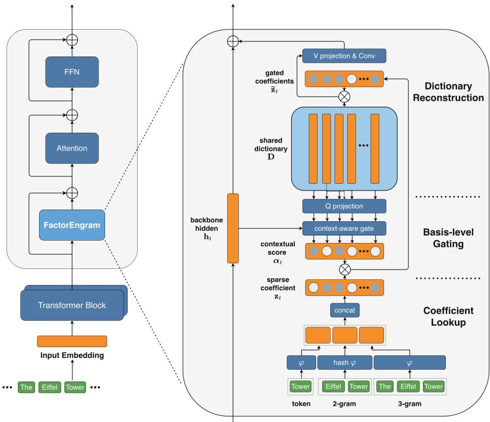
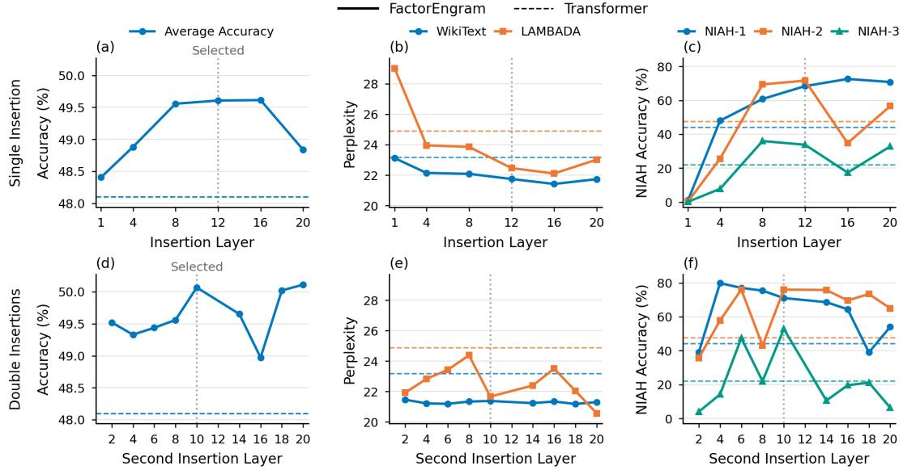

# FactorEngram: Factorized N-gram Memory with Basis-Level Gating for Language Models

Bowen Yang1,2,\* Jingbo Zhou1,† Qinghong Miao1 Hua Wu1,†

1Large Model Frontier Research Department, Baidu Inc., China 2Nanyang Technological University

{yangbowen06,zhoujingbo,miaoqinghong,wu hua}@baidu.com

## Abstract

Lookup-based memory has been a promising way to scale the parameters of large language models (LLMs). It retrieves learned representations of local token patterns, such as n-grams, instead of reconstructing them through successive layers of computation. However, existing designs such as Engram treat each retrieved embedding as a monolithic unit. Each embedding is stored in its own hashed slot and modulated by a single scalar gate. As a result, polysemous patterns cannot selectively read out the components of their memory that are relevant to the context. Moreover, parameters are shared only through hash collisions, which are largely unrelated to semantics. We propose FactorEngram, a factorized n-gram memory with basis-level contextual gating. FactorEngram retrieves sparsity-regularized coefficients over a dictionary of basis vectors shared across patterns, so related patterns can reuse common components. The same dictionary is also used for gating. The backbone hidden state is scored against each basis vector to gate the corresponding coefficient before reconstruction, which lets the context modulate each memory component individually. FactorEngram also covers both individual tokens and multi-token n-grams, and we systematically study where the memory branch should be inserted. On 340M- and 1B-parameter Transformer backbones, FactorEngram improves language modeling and downstream task performance. Ablation studies confirm the contribution of each component and identify insertion before the attention sublayer in the middle layers as an effective configuration.

## 1 Introduction

Lookup-based memory has emerged as a promising direction for scaling the parameters of large language models (LLMs). This direction is motivated by the observation that many recurring expressions, such as “the Eiffel Tower” and “Mount Everest,” are associated with relatively static lexical and factual knowledge. Yet standard Transformers (Vaswani et al., 2017) must reconstruct the representations of such expressions through successive layers of computation. Lookup-based memory addresses this inefficiency by augmenting the backbone with an auxiliary memory branch that retrieves learned representations of local token patterns, providing direct access to pattern-specific information instead of relying entirely on the backbone to reconstruct it (Cheng et al., 2026b).

A typical lookup-based memory module maps local patterns, such as n-grams, to table addresses via direct indexing or hashing, and retrieves the corresponding learnable embeddings. These embeddings are then aggregated and incorporated into the backbone computation, optionally after being modulated by the current hidden state. Recent architectures, including Gemma 3n’s Per-Layer Embeddings (Google DeepMind, 2025), Engram (Cheng et al., 2026b), STEM (Sadhukhan et al., 2026), and LongCat-Flash-Lite (Liu et al., 2026), explore different instantiations of such modules. Among them, Engram offers a representative implementation of conditional n-gram memory and has been adopted in DeepSeek-V4.1- Flash (Xu et al., 2026), demonstrating its applicability at large scale.

  
Figure 1: Overview of FactorEngram. Left: memory modules are residually inserted before the attention module at selected Transformer layers. Right: n-gram lookups retrieve coefficients that are concatenated and modulated by context-dependent basis-level gates. The shared dictionary participates in both gating and memory reconstruction. The reconstructed memory is projected, refined by a short causal convolution, and added to the backbone hidden state.

Despite this progress, we observe that Engram treats each retrieved n-gram embedding as a monolithic unit: each embedding occupies an independent hashed slot and is injected into the backbone through a single scalar gate. This monolithic design gives rise to two limitations. First, polysemous patterns cannot be selectively read out according to context. The same pattern may call for different semantic components of its memory in different contexts; for example, “the bank” may refer to a financial institution or to the land alongside a river. A scalar gate can only amplify or suppress the embedding as a whole, and therefore cannot retain the context-relevant components while suppressing the irrelevant ones. Second, parameter sharing is unrelated to semantics. Because the space of n-gram combinations is prohibitively large, the memory relies on hashing to map n-grams to table entries. Consequently, parameters are shared only among n-grams that collide under the hash functions, which are typically semantically unrelated, whereas semantically similar n-grams have no mechanism to share any part of their representations. Both limitations stem from a common cause: the smallest unit of memory is an n-gram embedding vector. This calls for a joint design of memory representation and contextual modulation, in which shared semantic components can be reused across patterns and individually adapted to each context.

To this end, we propose FactorEngram, a factorized n-gram memory architecture with basis-level contextual gating as illustrated in Figure 1. Rather than retrieving complete memory embeddings, FactorEngram retrieves learnable coefficients over a dictionary shared across all local patterns within each memory module. Specifically, multiple lookup heads retrieve the coefficients of each n-gram from hashed tables and concatenate them, so that each coefficient corresponds to one dictionary basis vector. The coefficient tables store pattern-specific information, whereas the dictionary provides a set of shared basis vectors whose linear combination reconstructs the memory content. Different patterns therefore reuse the same basis vectors with different coefficients, allowing related patterns to share parameters through common basis vectors rather than through hash collisions. Drawing on sparse coding (Olshausen $\&$ Field, 1996) and its applications to language model representations (Bricken et al., 2023; Templeton et al., 2024), we further impose an $\ell _ { 1 }$ penalty on the retrieved coefficients, encouraging each pattern to rely on a small subset of basis vectors.

Crucially, FactorEngram uses the same dictionary for both contextual gating and memory reconstruction. The current backbone hidden state is projected into a query, which is scored against each basis vector to produce a gate for the corresponding coefficient. These gates scale the retrieved coefficients before reconstruction, allowing the context to determine the contribution of each memory component individually. The vectors used to assess contextual relevance are thus exactly those used to reconstruct the output. The reconstructed memory is then projected to the backbone width, refined by a short causal convolution, and added to the residual stream, leaving the backbone’s attention and feed-forward modules unchanged. The memory parameters and the backbone are trained jointly with the language-modeling objective and the coefficient sparsity penalty.

Beyond factorization and gating, FactorEngram further refines two design choices in existing memory modules. First, existing methods cover only a subset of local patterns: STEM retrieves embeddings only for individual tokens, whereas Engram retrieves only 2-grams and 3-grams. FactorEngram covers both individual tokens and multi-token n-grams. Second, existing methods insert the memory branch at a fixed set of positions. We systematically study where the memory branch should be inserted, both across layers and relative to the attention and feed-forward sublayers.

Experiments with Transformer backbones of 340M and 1B parameters show that FactorEngram improves language modeling, downstream task performance, and long-context retrieval. Ablation studies quantify the contribution of each component and the effect of sparsity regularization, and placement experiments identify insertion before the attention sublayer in the middle layers as an effective configuration.

Our contributions are summarized as follows:

• We introduce FactorEngram, a factorized n-gram memory architecture that represents local token patterns using sparsity-regularized coefficients over a shared dictionary, enabling related patterns to share components rather than relying on hash collisions.

• We design basis-level contextual gating, which reuses the reconstruction dictionary to assess contextual relevance and to modulate each memory component independently before reconstruction.

• We evaluate FactorEngram at two backbone scales, demonstrating gains in language modeling, downstream accuracy, and long-context retrieval, and investigate its architectural components, sparsity regularization, pattern coverage, and memory placement through controlled studies.

## 2 Preliminaries

In this section, we define learnable lookup-based memory for LLMs as a module that contains memory table whose entries are learnable and addressed by local token patterns and incorporates retrieved memory contents into backbone computation. We formulate its general architecture by describing it with five operations: discrete addressing, table lookup and branch aggregation, contextual modulation, memory output mapping, and backbone integration.

Discrete addressing. Given a token sequence $X = \left( x _ { 1 } , \ldots , x _ { T } \right)$ from a vocabulary $\nu ,$ the memory module is inserted at each position t in specific insertion layers $\dot { \ell } \in \mathcal { I } .$ . Each retrieval branch $b \in B _ { \ell }$ is associated with a suffix length $n _ { b }$ and an address space containing $M _ { b } ^ { ( \ell ) }$ entries. Its input is the suffix $g _ { t , n _ { b } } = ( x _ { t - n _ { b } + 1 } , \ldots , x _ { t } ) \in \mathcal { V } ^ { n _ { b } }$ . The addressing function is defined as

$$
\phi _ { b } ^ { ( \ell ) } : \mathcal { V } ^ { n _ { b } }  \{ 0 , \dots , M _ { b } ^ { ( \ell ) } - 1 \} , \qquad i _ { t , b } ^ { ( \ell ) } = \phi _ { b } ^ { ( \ell ) } ( g _ { t , n _ { b } } )\tag{1}
$$

The case $n _ { b } = 1$ corresponds to unigrams and $n _ { b } > 1$ corresponds to longer N-gram patterns. Multiple branches may use the same suffix length, allowing different hash heads. Importantly, the table address depends on the local discrete input sequence rather than backbone hidden states.

Table lookup and branch aggregation. Each branch retrieves an entry from a learnable table $\mathbf { E } _ { b } ^ { ( \ell ) } \in$ $\mathbb { R } ^ { M _ { b } ^ { ( \ell ) } \times c _ { b } ^ { ( \ell ) } }$ , where $c _ { b } ^ { ( \ell ) }$ is the dimension of each table entry. The retrieved entries from all branches are then aggregated:

$$
\mathbf { u } _ { t , b } ^ { ( \ell ) } = \mathbf { E } _ { b } ^ { ( \ell ) } [ i _ { t , b } ^ { ( \ell ) } ] , \qquad \mathbf { z } _ { t } ^ { ( \ell ) } = \mathcal { A } _ { \ell } \left( \{ \mathbf { u } _ { t , b } ^ { ( \ell ) } \} _ { b \in \mathcal { B } _ { \ell } } \right)\tag{2}
$$

The aggregation function $\mathbf { \mathcal { A } } _ { \ell }$ may be concatenation, summation, or other combinations. Tables may be layer-specific or shared across layers.

Contextual modulation. Let $\mathbf { h } _ { t } ^ { ( \ell ) } \in \mathbb { R } ^ { d }$ denote the backbone hidden state at layer $\ell$ and position $t ,$ which compresses information from history context. Contextual modulation adjusts the retrieved representation using this state:

$$
\widetilde { \mathbf { z } } _ { t } ^ { ( \ell ) } = \mathcal { C } _ { \ell } \left( \mathbf { h } _ { t } ^ { ( \ell ) } , \mathbf { z } _ { t } ^ { ( \ell ) } ; \Theta _ { \ell } \right)\tag{3}
$$

Here, $\Theta _ { \ell }$ denotes memory-module parameters, which may be shared across operations. In architectures without contextual modulation design, $\mathcal { C } _ { \ell }$ performs as identity.

Memory output mapping. An output mapping converts the modulated representation into a memory contribution for backbone integration:

$$
\mathbf { m } _ { t } ^ { ( \ell ) } = \mathcal { R } _ { \ell } \left( \widetilde { \mathbf { z } } _ { \leq t } ^ { ( \ell ) } ; \Theta _ { \ell } \right)\tag{4}
$$

The notation $\widetilde { \mathbf { z } } _ { \leq t } ^ { ( \ell ) }$ denotes the representations up to position t, allowing causal operations such as a short convolution.

Backbone integration. An integration function specifies how the memory contribution enters backbone computation:

$$
\widehat { \mathbf { h } } _ { t } ^ { \left( \ell \right) } = \mathcal { F } _ { \ell } \left( \mathbf { h } _ { t } ^ { \left( \ell \right) } , \mathbf { m } _ { t } ^ { \left( \ell \right) } \right)\tag{5}
$$

For residual integration, $\widehat { \mathbf { h } } _ { t } ^ { ( \ell ) } = \mathbf { h } _ { t } ^ { ( \ell ) } + \mathbf { m } _ { t } ^ { ( \ell ) }$ . The fused state then enters the subsequent backbone computation. Memory may insert in a feed-forward sublayer or augment the input embeddings; the latter is treated as an integration stage before the first block. The next section instantiates these operations for our framework FactorEngram.

## 3 Method

Figure 1 illustrates FactorEngram architecture. It instantiates the lookup-based memory in Section 2 by retrieving sparsity-regularized coefficients over a dictionary shared across local patterns and applying basis-level contextual gating (Figure 1). The gated coefficients reconstruct a memory vector, which is refined by a short causal convolution and added to the backbone. Each insertion layer has separate memory parameters; we omit layer indices below unless needed.

## 3.1 Memory Retrieval: Sparse Dictionary Coefficients

Coefficient representation. FactorEngram stores pattern as linear coefficients over a shared dictionary $ { \mathbf { D } } \in  { \mathbb { R } } ^ { s \times d _ { m } }$ , instead of directly assigning an independent dense embedding to every local pattern. s is the total coefficient width and hence the number of dictionary basis vectors, and $d _ { m }$ is the dimension of the memory representation space. We refer to the dictionary row vectors as basis vectors, without requiring linear independence. $\mathbf { d } _ { j } ^ { \top }$ is the j-th row of the dictionary that defines a basis vector in the $d _ { m }$ -dimensional memory space, and the $j \mathrm { - t h }$ retrieved coefficient is its corresponding weight. The dictionary is shared across different patterns within a layer, while coefficients are stored in pattern-addressed tables. Both the coefficients and dictionary are learnable. The factorization permits the representation of different patterns to share the same basis vector parameters with different coefficient assignments. An $L _ { 1 }$ penalty encourages the sparsity of coefficients, as defined in Section 3.4.

Addressing and aggregation. We retrieve local patterns at unigram, bigram, and trigram granularities using multiple lookup heads per suffix length. Each head corresponds to a branch $\breve { b } \in B _ { \ell }$ in Section $^ { 2 , }$ with suffix length $n _ { b } \in \{ 1 , 2 , 3 \}$ . Each branch has its own deterministic mapping function $\phi _ { b }$ and learnable coefficient table $\mathbf { E } _ { b } \in \mathbb { R } ^ { M _ { b } \times s _ { b } }$ , where $s _ { b }$ is its entry width. We define $\phi _ { b }$ as direct indexing when $n _ { b } = 1$ and as hash function when $n _ { b } \geq 2$ . Given the suffix $g _ { t , n _ { b } } ,$ we retrieve and concatenate the branch coefficients:

$$
\mathbf { z } _ { t , b } = \mathbf { E } _ { b } [ \phi _ { b } ( g _ { t , n _ { b } } ) ] \in \mathbb { R } ^ { s _ { b } } \qquad \mathbf { z } _ { t } = \mathrm { C o n c a t } _ { b \in \mathcal { B } _ { \ell } } \left( \mathbf { z } _ { t , b } \right) \in \mathbb { R } ^ { s }\tag{6}
$$

where $\begin{array} { r } { s = \sum _ { b \in B _ { \rho } } s _ { b } } \end{array}$ . Concatenation follows a fixed branch order, implements $\scriptstyle A _ { \ell } ,$ and aligns the retrieved coordinates with the dictionary rows. The resulting $\mathbf { z } _ { t }$ is passed to contextual modulation before dictionary reconstruction.

## 3.2 Contextual Modulation: Basis-Level Gating

The same local pattern can call for different memory contents in different contexts. Therefore, FactorEngram modulates each dictionary coefficient separately before combining the basis vectors. We project the current backbone state $\mathbf { h } _ { t }$ into memory space using a query projection $\mathbf { Q } \in \mathbb { R } ^ { d \times d _ { m } }$ , normalize the projected query using RMSNorm (Zhang & Sennrich, 2019), and compute its dot-product scores against dictionary rows:

$$
{ \bf q } _ { t } = \mathrm { R M S N o r m } ( { \bf Q } ^ { \top } { \bf h } _ { t } ) , \qquad \alpha _ { t } = \sigma \bigg ( \frac { { \bf D } { \bf q } _ { t } } { \sqrt { d } } \bigg ) \in ( 0 , 1 ) ^ { s }\tag{7}
$$

Here, d is the backbone hidden width and σ is sigmoid. Each weight scales the corresponding retrieved coefficient:

$$
\widetilde { \mathbf { z } } _ { t } = \mathbf { z } _ { t } \odot \pmb { \alpha } _ { t }\tag{8}
$$

Thus, $\pmb { \alpha } _ { t }$ controls the memory representation according to context. This basis-level gating instantiates the contextual modulation function $\dot { \boldsymbol { { c } } } _ { \ell }$

## 3.3 Memory Output and Integration: Dictionary Reconstruction

Memory output mapping. The modulated coefficients correspond to a coordinate in the linear space of shared dictionary. We reconstruct the memory vector through linear combination and project it to the backbone width using $\mathbf { V } \in \mathbb { R } ^ { d \times d _ { m } }$ :

$$
\mathbf { e } _ { t } = \mathbf { D } ^ { \top } \widetilde { \mathbf { z } } _ { t } = \sum _ { j = 1 } ^ { s } { \widetilde { z } _ { t , j } } \mathbf { d } _ { j } , \qquad \mathbf { v } _ { t } = \mathbf { V } \mathbf { e } _ { t }\tag{9}
$$

Following Engram (Cheng et al., 2026b), we apply a short depthwise causal convolution to combine memory outputs from neighboring positions, with a residual connection preserving the current-position output:

$$
\mathbf { m } _ { t } = \mathbf { v } _ { t } + \mathrm { S i L U } ( \mathrm { C o n v 1 D } ( \mathrm { R M S N o r m } ( \mathbf { v } _ { \leq t } ) ) _ { t } )\tag{10}
$$

Dictionary reconstruction, value projection, and convolution together implement $\mathcal { R } _ { \ell } ,$ mapping $\widetilde { \mathbf { z } } _ { \leq t }$ to mt without using future positions.

Residual integration. FactorEngram uses the memory module as an auxiliary branch while preserving the backbone computation. It adds the memory output to the current backbone state:

$$
\widehat { \mathbf { h } } _ { t } = \mathcal { F } _ { \ell } ( \mathbf { h } _ { t } , \mathbf { m } _ { t } ) = \mathbf { h } _ { t } + \mathbf { m } _ { t }\tag{11}
$$

In the default configuration, this update precedes attention module at the selected insertion layers. The fused states continue through the backbone attention and feed-forward modules, which remain intact. We evaluate insertion depth and alternative integration locations in the experiments.

## 3.4 Training Objective: Sparsity Regularization

Coefficient sparsity. Following the principles of sparse coding and its applications to language model representations (Olshausen & Field, 1996; Bricken et al., 2023; Templeton et al., 2024), we regularize the retrieved representations by encouraging each local pattern to rely on a small subset of dictionary components. We apply an $L _ { 1 }$ penalty to the concatenated coefficients $\mathbf { z } _ { t }$ before contextual modulation. At each position, the penalty is averaged over the set of memory insertion layers I:

$$
\mathcal { L } _ { \mathrm { s p a r s i t y } } = \frac { 1 } { T } \sum _ { t = 1 } ^ { T } \frac { 1 } { | \mathcal { T } | } \sum _ { \ell \in \mathcal { T } } \left. \mathbf { z } _ { t } ^ { ( \ell ) } \right. _ { 1 }\tag{12}
$$

Joint optimization. We train the memory module and backbone jointly with the next-token prediction objective:

$$
\begin{array} { r } { \mathcal { L } _ { \mathrm { p r e t r a i n } } = \mathcal { L } _ { \mathrm { N L L } } + \lambda \mathcal { L } _ { \mathrm { s p a r s i t y } } , } \end{array}\tag{13}
$$

where λ controls the sparsity regularization strength. The coefficient tables, dictionary, projections, and convolution are learned together with the backbone, without predefined semantic labels for the basis vectors.

## 4 Experiments

We evaluate FactorEngram through comparisons at two backbone scales, component ablations, and memory-placement studies. The experiments measure language modeling, downstream accuracy, and long-context retrieval, and examine how these outcomes depend on basis-level gating, unigram retrieval, sparsity regularization, and insertion configuration.

Table 1: Main results with an 8K context length. The 340M and 1B backbones are trained on 30B and 120B tokens, respectively. Accuracy metrics are reported as percentages. Bold indicates the best value within each model scale.
<table><tr><td rowspan="2">Model</td><td colspan="2">Language Modeling PPL</td><td>Downstream</td><td colspan="3">Long-context Retrieval</td></tr><tr><td>WikiText ↓</td><td>LAMBADA↓</td><td>Avg. Acc. ↑</td><td>NIAH-1 ↑</td><td>NIAH-2 ↑</td><td>NIAH-3 ↑</td></tr><tr><td colspan="7">340M backbone</td></tr><tr><td>Transformer</td><td>23.19</td><td>24.90</td><td>48.10</td><td>44.2</td><td>47.7</td><td>22.1</td></tr><tr><td>Engram</td><td>22.29</td><td>23.94</td><td>49.06</td><td>69.8</td><td>37.6</td><td>15.0</td></tr><tr><td>FactorEngram</td><td>21.29</td><td>21.69</td><td>49.82</td><td>70.6</td><td>79.1</td><td>58.3</td></tr><tr><td colspan="7">1B backbone</td></tr><tr><td>Transformer</td><td>15.57</td><td>11.73</td><td>55.61</td><td>47.5</td><td>72.8</td><td>25.7</td></tr><tr><td>Engram</td><td>15.60</td><td>11.83</td><td>55.81</td><td>45.8</td><td>75.2</td><td>16.6</td></tr><tr><td>FactorEngram</td><td>15.57</td><td>11.39</td><td>55.80</td><td>72.0</td><td>84.5</td><td>44.2</td></tr></table>

## 4.1 Experimental Setup

Models and training. We jointly train FactorEngram with 340M-parameter and 1B-parameter Transformer (Vaswani et al., 2017) backbones from scratch using 30B and 120B tokens from FineWeb-Edu (Lozhkov et al., 2024), respectively, with a maximum context length of 8192 (8K). The token vocabulary size is 32K. The 340M backbone configuration uses 1B lookup-table parameters, with both bigram and trigram table capacities of 250K entries. The 1B backbone configuration uses 2B lookup-table parameters, with the bigram and trigram table capacities of 250K and 750K entries, respectively. Unless otherwise specified, the memory modules are inserted before attention at layers 10 and 12, with sparsity strength λ = 10−3 defined in Eq. 13. Configuration details are listed in Appendix B.1.

Evaluation. We compare FactorEngram with pure Transformer backbones at both scales and with our reproduction of Engram (Cheng et al., 2026b) at both scales. The former comparison assesses the contribution of sparsely-activated lookup memory; the latter assesses the contribution of factorization for memory representation and modulation.

We evaluate models on language modeling, downstream accuracy, and long-context retrieval. Language modeling is evaluated by perplexity on WikiText (Merity et al., 2016) and LAMBADA (Paperno et al., 2016) (OpenAI variant). Downstream accuracy (%) are assessed on PIQA (Bisk et al., 2020), HellaSwag (Zellers et al., 2019), WinoGrande (Sakaguchi et al., 2021), ARC-Easy and ARC-Challenge (Clark et al., 2018), Social IQA (Sap et al., 2019), and BoolQ (Clark et al., 2019). Long-context retrieval is evaluated by accuracy (%) in three 8K-context-length Needle-in-a-Haystack (gkamradt, 2026) variants of increasing difficulty, denoted as NIAH-1, NIAH-2, and NIAH-3.

## 4.2 Main Results

Table 1 with detailed version in Appendix B.2 compares FactorEngram with the baselines at two backbone scales. FactorEngram improves overall evaluation performance at both scales, with particularly strong gains in long-context retrieval. At 340M, FactorEngram reduces WikiText perplexity from 23.19 to 21.29 and LAMBADA perplexity from 24.90 to 21.69, while improving average downstream accuracy by 1.76 percentage points over the Transformer. It also outperforms Engram on all evaluation metrics, with the largest accuracy gains on the harder retrieval tasks: 41.5 and 43.3 percentage points on NIAH-2 and NIAH-3, respectively. Extending FactorEngram to the 1B backbone preserves these improvements on most metrics, with WikiText perplexity comparable to the Transformer and slightly lower downstream accuracy than Engram. The retrieval gains remain substantial at this scale, ranging from 9.3 to 27.6 percentage points over Engram.

## 4.3 Ablation Studies

We conduct ablations with the 340M backbone to examine the contributions of factorized memory, basislevel gating, unigram retrieval, and sparsity regularization. To assess basis-level gating, we replace it with a scalar gating while retaining the coefficient-dictionary representation. This scalar-gating variant first goes through dictionary reconstruction with $\mathbf { e } _ { t } = \mathbf { D } ^ { \top } \mathbf { z } _ { t }$ modified from Eq. 9, and then applies gating by scaling e with the scalar dot-product score between qt and et:

Table 2: Architectural component ablations with the 340M backbone. All models use an 8K context length. Accuracy metrics are reported as percentages. Bold indicates the best value in each column.
<table><tr><td rowspan="2">Configuration</td><td colspan="2">Language Modeling PPL</td><td rowspan="2">Downstream</td><td colspan="3">Long-context Retrieval</td></tr><tr><td>WikiText↓</td><td>LAMBADA↓ Avg. Acc. ↑</td><td>NIAH-1 ↑</td><td>NIAH-2↑</td><td>NIAH-3 ↑</td></tr><tr><td>Transformer</td><td>23.19</td><td>24.90</td><td>48.10</td><td>44.2</td><td>47.7</td><td>22.1</td></tr><tr><td>Engram</td><td>22.29</td><td>23.94</td><td>49.06</td><td>69.8</td><td>37.6</td><td>15.0</td></tr><tr><td>Engram (+ unigram)</td><td>22.32</td><td>24.42</td><td>48.94</td><td>74.0</td><td>42.2</td><td>29.2</td></tr><tr><td>FactorEngram (scalar gate)</td><td>22.85</td><td>25.66</td><td>48.15</td><td>67.8</td><td>45.2</td><td>9.4</td></tr><tr><td>FactorEngram (- unigram)</td><td>22.74</td><td>23.76</td><td>49.20</td><td>60.2</td><td>44.2</td><td>23.0</td></tr><tr><td>FactorEngram</td><td>21.29</td><td>21.69</td><td>49.82</td><td>70.6</td><td>79.1</td><td>58.3</td></tr></table>

Table 3: Effect of the sparsity coefficient λ with the 340M backbone and an 8K context length. Accuracy metrics are reported as percentages. Bold indicates the best value in each column.
<table><tr><td rowspan="2">Configuration</td><td colspan="2">Language Modeling PPL</td><td>Downstream</td><td colspan="2">Long-context Retrieval</td></tr><tr><td>WikiText↓</td><td>LAMBADA↓</td><td> $\operatorname { A v g . A c c . } \uparrow$ </td><td>NIAH-1 ↑ NIAH-2 ↑</td><td>NIAH-3 ↑</td></tr><tr><td>Transformer</td><td>23.19</td><td>24.90</td><td>48.10</td><td>44.2</td><td>47.7 22.1</td></tr><tr><td>λ = 0</td><td>21.47</td><td>22.58</td><td>49.49</td><td>58.8 70.6</td><td>31.8</td></tr><tr><td> $\lambda = 1 0 ^ { - 4 }$ </td><td>21.18</td><td>22.43</td><td>49.43</td><td>67.4 74.0</td><td>43.2</td></tr><tr><td> $\lambda = 1 0 ^ { - 3 }$ </td><td>21.29</td><td>21.69</td><td>49.82</td><td>70.6 79.1</td><td>58.3</td></tr><tr><td> $\lambda = 1 0 ^ { - 2 }$ </td><td>23.89</td><td>25.79</td><td>47.77</td><td>50.0 50.0</td><td>17.8</td></tr></table>

$$
\alpha _ { t } ^ { \mathrm { S C A L A R } } = \sigma \bigg ( \frac { \mathbf { e } _ { t } ^ { \top } \mathbf { q } _ { t } } { \sqrt { d } } \bigg ) \in ( 0 , 1 ) , \qquad \widetilde { \mathbf { e } } _ { t } = \alpha _ { t } ^ { \mathrm { S C A L A R } } \mathbf { e } _ { t }\tag{14}
$$

This implements a scalar gating module same as the Engram gating module while preserving our factorization representation before gating. We further assess the factorization design as a whole by jointly removing the coefficient-dictionary representation and basis-level gating. Our reproductions of Engram and Engram with unigram retrieval serve as such factorization ablations for FactorEngram. In addition to scalar gating in Eq. 14, its lookup table is modified to directly store embedding e in each row rather than represented by z and D. We also remove unigram retrieval in FactorEngram while retaining the factorization design. Table 2 reports these module ablation results. For sparsity, we vary sparsity penalty strength λ in Eq. 13 to assess the effect of sparsity regularization on coefficients.

Factorized memory. The complete factorization design improves overall performance over dense lookup memory of Engram in both settings with and without unigrams. Compared with Engram (+ unigram), FactorEngram reduces WikiText perplexity from 22.32 to 21.29 and LAMBADA perplexity from 24.42 to 21.69, while increasing average accuracy by 0.92 percentage points. The largest gains occur on harder NIAH-2 and NIAH-3, improving by 36.9 and 29.1 percentage points, respectively. These results support the joint coefficient representation and basis-level gating design.

Basis-level gating. Basis-level gating is important for realizing full benefits of the factorized representation. Replacing it with scalar gating degrades performance across all evaluation metrics, with average downstream accuracy dropping from 49.82 to 48.15 and the hardest NIAH-3 from 58.3 to 9.4. These results support modulating individual dictionary coefficients rather than uniformly scaling the reconstructed memory vector.

Unigram retrieval. Unigram retrieval complements multi-token memory in FactorEngram. Removing it degrades all evaluation metrics, with particularly large drops on NIAH-2 and NIAH-3. Adding unigram retrieval to Engram also improves all three NIAH scores, although its perplexity and average accuracy slightly worsen. Unigram retrieval improves long-context retrieval in both architectures, while also improving language modeling and downstream accuracy in FactorEngram.

Coefficient sparsity. We vary $\lambda \in \{ 0 , 1 0 ^ { - 4 } , 1 0 ^ { - 3 } , 1 0 ^ { - 2 } \}$ to assess the effect of coefficient sparsity regularization (Table 3). Overall performance generally improves as λ increases from 0 to $1 0 ^ { - 3 }$ , but declines at $1 0 ^ { - 2 } .$ Although FactorEngram already outperforms the Transformer across all evaluation metrics without sparsity regularization, $\overset { \smile } { \lambda } = 1 0 ^ { - 3 }$ performs best on all evaluation metrics except WikiText perplexity, where $\dot { \lambda } = \stackrel { \sim } { 1 } 0 ^ { - 4 }$ achieves the lowest value. Increasing λ to $1 0 ^ { - 2 }$ makes all evaluation metrics worse than those of the non-regularized model, supporting the choice of a moderate regularization strength.

  
Figure 2: Insertion-depth sweeps. The top row varies the single insertion layer and the bottom row fixes one insertion at optimal single layer 12 and varies the second. We report average downstream accuracy (%), perplexity, and NIAH accuracy (%). Colors distinguish metrics. Solid and dashed lines represent FactorEngram and Transformer, respectively. Dotted vertical lines mark the selected optimal depth. Lower perplexity and higher accuracy are better.

Table 4: Comparison of memory insertion locations with the 340M backbone and an 8K context length. Accuracy metrics are reported as percentages. Bold indicates the best value in each column.
<table><tr><td rowspan="2">Insertion location</td><td colspan="2">Language Modeling PPL</td><td rowspan="2">Downstream</td><td colspan="3">Long-context Retrieval</td></tr><tr><td>WikiText↓</td><td>LAMBADA↓</td><td>Avg. Acc. ↑ NIAH-1↑</td><td>NIAH-2 ↑</td><td>NIAH-3 ↑</td></tr><tr><td>Transformer</td><td>23.19</td><td>24.90</td><td>48.10</td><td>44.2</td><td>47.7</td><td>22.1</td></tr><tr><td>Before attention</td><td>21.29</td><td>21.69</td><td>49.82</td><td>70.6</td><td>79.1</td><td>58.3</td></tr><tr><td>Before FFN</td><td>21.28</td><td>22.04</td><td>48.40</td><td>65.8</td><td>63.8</td><td>18.8</td></tr><tr><td>Inside FFN</td><td>23.34</td><td>26.91</td><td>47.90</td><td>47.4</td><td>47.4</td><td>12.2</td></tr></table>

## 4.4 Memory Placement

We examine memory placement from coarse to fine using the 24-layer, 340M backbone. We first sweep insertion depths across the backbone, then refine placement within the selected layers by comparing different insertion points.

## 4.4.1 Insertion Depth

We sweep the insertion depth of a single memory module, then fix one module at layer 12 (optimal single-layer depth) and vary the second module’s depth (Figure 2). For single-layer insertion, moving from the earliest layers toward the middle generally improves performance, particularly on long-context retrieval. Layer 12 offers a favorable balance across evaluations, combining near-best down-stream and NIAH performances with the highest NIAH-2 score, and is selected as the single-layer configuration. With one module fixed at layer 12, sweeping the second insertion depth produces substantial variation in NIAH scores. The 10 & 12 layer configuration achieves the highest NIAH-3 accuracy among the tested pairs while maintaining strong performance on the other evaluations. We therefore use layers 10 and 12 as the default configuration.

## 4.4.2 Within-Layer Placement

We compare memory insertion before the attention module, before the feed-forward network (FFN), and inside the SwiGLU (Shazeer, 2020) FFN at its up-projection branch (Table 4). Insertion before attention performs best overall, achieving the highest on all accuracy metrics, as well as the lowest LAMBADA perplexity. Before-FFN insertion yields nearly the same WikiText perplexity but substantially lower NIAH-3 accuracy of only 18.8, while inside-FFN insertion performs the worst across all evaluation metrics. We therefore adopt before-attention insertion as the default configuration.

## 5 Related Work

Lookup-Based Memory for LLMs. Lookup-based memory architectures differ in representations, contextual modulation, and integration with the backbone. Engram (Cheng et al., 2026b) directly stores N-gram embeddings and scales it with a scalar gate, without memorizing unigrams. Gemma 3n’s PLE (Google DeepMind, 2025) only memorizes single tokens and uses coordinate-wise gates computed from hidden states alone. STEM (Sadhukhan et al., 2026) highly relies on specific SwiGLU (Shazeer, 2020) structure of FFN and replaces its up-projection output with lookup embeddings only for token, whereas FactorEngram preserves the original backbone model and adds memory as an auxiliary branch for longer N-gram patterns. LongCat-Flash-Lite (Liu et al., 2026) implements N-gram lookup memory but only as an augmentation for input embeddings in the main method. Appendix A.1 maps the details of these architectures to the operations defined in Section 2.

Engram Variants and Extensions. Engram variants mainly modify memory representation and memory content coverage. Table 5 in Appendix A.2 summarizes the differences with FactorEngram in these two aspects. TN-gram (Zhou et al., 2026) also proposes a factorized variant, which composes N-gram representations from shared token-position factors but does not cover unigram and retains scalar gating. Other variant primarily modify addressing, memory sources, or storage. Lngram (Zheng et al., 2026) learns discrete keys from hidden states. Engram-Nine (Lin, 2026) removes hash collisions for frequent patterns. Tokenizer-Agnostic Engram (Lim & Chieu, 2026) uses byte-level rather than token-level hashing to map patterns to the same tables under tokenizer transfer. Memory Grafting (Cheng et al., 2026a) retrieves frozen lookup table from another pretrained donor model with a trainable Engram fallback, while TF-Engram (Ma et al., 2026b) combines frozen phrase vectors with memory hierarchy. Ma et al. (2026a) extends memory storage and serving. These directions are distinct from our improvements on factorized representation and modulation.

Sparse Coding and Dictionary Learning. Sparse coding represents each signal with a small subset of components from a shared dictionary (Olshausen & Field, 1996). This enables different signals to reuse the same components. Sparse autoencoders apply this idea to activations of trained language models and extract relatively independent features for interpretability (Bricken et al., 2023; Templeton et al., 2024). To support local patterns to share memory components, FactorEngram stores their coefficients in lookup tables and learns them jointly with a shared dictionary and backbone under next-token prediction and an L penalty, instead of the activation reconstruction objective.

## 6 Conclusion

We introduced FactorEngram, a lookup-based memory architecture with factorized n-gram memory and basis-level contextual gating, in which local token patterns are represented by sparsity-regularized coefficients over a shared dictionary. By reusing the dictionary for contextual gating and reconstruction, FactorEngram allows patterns to share memory components while modulating their contributions individually according to context. Experiments show an overall improvement compared with the Transformer and the Engram baselines, with particularly strong gains in long-context retrieval. A limitation of this study is that we evaluate FactorEngram only on 340M and 1B parameters. Although 1B-parameter models remain useful for edge computing and on-device deployment, future work will assess whether these benefits persist at larger scales.

## References

Yonatan Bisk, Rowan Zellers, Ronan Le Bras, Jianfeng Gao, and Yejin Choi. PIQA: Reasoning about Physical Commonsense in Natural Language. Proceedings ofthe AAAI Conference on Artificial Intelligence, 34(05):7432–7439, April 2020. ISSN 2374-3468. doi: 10.1609/aaai.v34i05.6239. URL https://ojs.aaai. org/index.php/AAAI/article/view/6239.

Trenton Bricken, Adly Templeton, Joshua Batson, Brian Chen, Adam Jermyn, Tom Conerly, Nicholas L. Turner, Cem Anil, Carson Denison, and Amanda Askell. Towards monosemanticity: Decomposing language models with dictionary learning. Transformer Circuits Thread, 2023. URL https: //transformer-circuits.pub/2023/monosemantic-features/index.html.

Runxi Cheng, Yuchen Guan, Yongxian Wei, Qianpu Sun, Qixiu Li, Sinan Du, Feng Xiong, Chun Yuan, Yan Lu, and Yeyun Gong. Memory grafting: Scaling language model pre-training via offline conditional memory, 2026a. URL https://arxiv.org/abs/2605.20948.

Xin Cheng, Rui Tian, Wangding Zeng, et al. Conditional Memory via Scalable Lookup: A New Axis of Sparsity for Large Language Models, 2026b. URL http://arxiv.org/abs/2601.07372. arXiv:2601.07372v2 [cs.CL].

Christopher Clark, Kenton Lee, Ming-Wei Chang, Tom Kwiatkowski, Michael Collins, and Kristina Toutanova. BoolQ: Exploring the Surprising Difficulty of Natural Yes/No Questions. In Jill Burstein, Christy Doran, and Thamar Solorio (eds.), Proceedings ofthe 2019 Conference ofthe North American Chapter of the Associationfor Computational Linguistics: Human Language Technologies, Volume 1 (Long and Short Papers), pp. 2924–2936, Minneapolis, Minnesota, June 2019. Association for Computational Linguistics. doi: 10.18653/v1/N19-1300. URL https://aclanthology.org/N19-1300/.

Peter Clark, Isaac Cowhey, Oren Etzioni, Tushar Khot, Ashish Sabharwal, Carissa Schoenick, and Oyvind Tafjord. Think you have Solved Question Answering? Try ARC, the AI2 Reasoning Challenge, March 2018. URL http://arxiv.org/abs/1803.05457. arXiv:1803.05457 [cs.AI].

gkamradt. gkamradt/LLMTest needleinahaystack, May 2026. URL https://github.com/gkamradt/ LLMTest NeedleInAHaystack. original-date: 2023-11-11T00:50:02Z.

Google DeepMind. Gemma 3n: Official model implementation. Gemma code repository, 2025. URL https: //github.com/google-deepmind/gemma/blob/main/gemma/gm/nn/gemma3n/ modules.py. Per-layer em bedding and mapping modules; accessed September 20, 2026.

Jia Peng Lim and Hai Leong Chieu. Tokenizer-agnostic Engram module, 2026. URL https://arxiv.org/ abs/2607.29065.

Tao Lin. A collision-free hot-tier extension for Engram-style conditional memory: A controlled study of training dynamics, 2026. URL https://arxiv.org/abs/2601.16531.

Hong Liu, Jiaqi Zhang, Chao Wang, Xing Hu, Linkun Lyu, Jiaqi Sun, Xurui Yang, Bo Wang, Fengcun Li, Yulei Qian, Lingtong Si, Yerui Sun, Rumei Li, Peng Pei, Yuchen Xie, and Xunliang Cai. Scaling Embeddings Outperforms Scaling Experts in Language Models, February 2026. URL http://arxiv. org/abs/2601.21204. arXiv:2601.21204 [cs.CL].

Anton Lozhkov, Loubna Ben Allal, Leandro von Werra, and Thomas Wolf. FineWeb-Edu: the finest collection of educational content, 2024. URL https://huggingface.co/datasets/HuggingFaceFW/ fineweb-edu.

Ruiyang Ma, Teng Ma, Zhiyuan Su, Hantian Zha, Xinpeng Zhao, Xuchun Shang, Xingrui Yi, Zheng Liu, Zhu Cao, An Wu, Zhichong Dou, Ziqian Liu, Daikang Kuang, and Guojie Luo. Pooling Engram conditional memory in large language models using CXL, 2026a. URL https://arxiv.org/abs/2603. 10087.

Yutang Ma, Kecheng Huang, Xikun Jiang, and Zili Shao. TF-Engram: A train-free Engram with SSDbacked memory for large language models, 2026b. URL https://arxiv.org/abs/2607.07388.

Stephen Merity, Caiming Xiong, James Bradbury, and Richard Socher. Pointer Sentinel Mixture Models, September 2016. URL http://arxiv.org/abs/1609.07843. arXiv:1609.07843 [cs.CL].

Bruno A. Olshausen and David J. Field. Emergence of simple-cell receptive field properties by learning a sparse code for natural images. Nature, 381(6583):607–609, June 1996. ISSN 1476-4687. doi: 10.1038/ 381607a0. URL https://www.nature.com/articles/381607a0.

Denis Paperno, German Kruszewski, Angeliki Lazaridou, Ngoc Quan Pham, Raffaella Bernardi, Sandro´ Pezzelle, Marco Baroni, Gemma Boleda, and Raquel Fernandez. The LAMBADA dataset: Word´ prediction requiring a broad discourse context. In Katrin Erk and Noah A. Smith (eds.), Proceedings ofthe 54th Annual Meeting of the Association for Computational Linguistics (Volume 1: Long Papers), pp. 1525–1534, Berlin, Germany, August 2016. Association for Computational Linguistics. doi: 10.18653/v1/P16-1144. URL https://aclanthology.org/P16-1144/.

Ranajoy Sadhukhan, Sheng Cao, Harry Dong, Changsheng Zhao, Attiano Purpura-Pontoniere, Yuandong Tian, Zechun Liu, and Beidi Chen. STEM: Scaling Transformers with Embedding Modules, January 2026. URL http://arxiv.org/abs/2601.10639. arXiv:2601.10639 [cs.LG].

Keisuke Sakaguchi, Ronan Le Bras, Chandra Bhagavatula, and Yejin Choi. WinoGrande: an adversarial winograd schema challenge at scale. Communications of the ACM, 64(9):99–106, August 2021. ISSN 0001-0782. doi: 10.1145/3474381. URL https://dl.acm.org/doi/10.1145/3474381.

Maarten Sap, Hannah Rashkin, Derek Chen, Ronan Le Bras, and Yejin Choi. Social IQa: Commonsense Reasoning about Social Interactions. In Kentaro Inui, Jing Jiang, Vincent Ng, and Xiaojun Wan (eds.), Proceedings of the 2019 Conference on Empirical Methods in Natural Language Processing and the 9th International Joint Conference on Natural Language Processing (EMNLP-IJCNLP), pp. 4463–4473, Hong Kong, China, November 2019. Association for Computational Linguistics. doi: 10.18653/v1/D19-1454. URL https://aclanthology.org/D19-1454/.

Noam Shazeer. GLU variants improve transformer, 2020. URL https://arxiv.org/abs/2002.05202.

Adly Templeton et al. Scaling monosemanticity: Extracting interpretable features from Claude 3 Sonnet. Transformer Circuits Thread, 2024. URL https://transformer-circuits.pub/2024/ scaling-monosemanticity/index.html.

Ashish Vaswani, Noam Shazeer, Niki Parmar, Jakob Uszkoreit, Llion Jones, Aidan N Gomez, Ł ukasz Kaiser, and Illia Polosukhin. Attention is All you Need. In Advances in Neural Information Processing Systems, volume 30. Curran Associates, Inc., 2017. URL https://proceedings.neurips.cc/paper/ 2017/hash/3f5ee243547dee91fbd053c1c4a845aa-Abstract.html.

Anyi Xu, B Li, Bangcai Lin, Bing Xue, BingCheng Xian, Bingzheng Xu, Bochao Wu, Bowei Zhang, Boyi Deng, CC Yu, et al. Deepseek-v4. 1-flash: Pushing the limits of kv cache compression. arXiv preprint arXiv:2609.19969, 2026.

Rowan Zellers, Ari Holtzman, Yonatan Bisk, Ali Farhadi, and Yejin Choi. HellaSwag: Can a Machine Really Finish Your Sentence? In Anna Korhonen, David Traum, and Llu´ıs Marquez (eds.),\` Proceedings of the 57th Annual Meeting of the Association for Computational Linguistics, pp. 4791–4800, Florence, Italy, July 2019. Association for Computational Linguistics. doi: 10.18653/v1/P19-1472. URL https: //aclanthology.org/P19-1472/.

Biao Zhang and Rico Sennrich. Root Mean Square Layer Normalization. In Advances in Neural Information Processing Systems, volume 32. Curran Associates, Inc., 2019. URL https://proceedings.neurips.cc/ paper/2019/hash/1e8a19426224ca89e83cef47f1e7f53b-Abstract.html.

Yunao Zheng, Guoyang Xia, Xiaojie Wang, and Lei Ren. Lngram: N-gram conditional memory in latent space, 2026. URL https://arxiv.org/abs/2605.24869.

Wuyang Zhou, Yuxuan Gu, Giorgos Iacovides, Yuning Qiu, Qibin Zhao, and Danilo Mandic. Tensorizing Engram: Sharing latents across N-Gram embeddings is beneficial in LLMs, 2026. URL https://arxiv. org/abs/2606.08347.

Table 5: Comparison of Engram and its variants. Check marks indicate features reported in each main method. Factorization refers to parameterizing memory entries through shared factors. Fine-grained gating refers to assigning component-wise contextual weights to a memory representation. Sparse coding refers to explicitly encouraging sparsity within representations through constraints or regularization. Memory content excludes backbone input token embeddings. ∗Lngram retrieves N-grams of learned discrete latent symbols rather than input tokens.
<table><tr><td rowspan=2 colspan=1>Method</td><td rowspan=1 colspan=1>Memory Representation</td><td rowspan=1 colspan=1>Memory Content</td></tr><tr><td rowspan=1 colspan=1>|Factorization Fine-Grained Gate Sparse Codi</td><td rowspan=1 colspan=1>ng | Unigram (N = 1) N-gram (N ≥ 2)</td></tr><tr><td rowspan=1 colspan=1>EngramTN-gramLngramEngram-NineTokenizer-Agnostic EngramMemory GraftingTF-EngramCXL-based Engram Pool</td><td rowspan=1 colspan=1>L</td><td rowspan=1 colspan=1>√√√*√√√&gt;√</td></tr><tr><td rowspan=1 colspan=1>FactorEngram</td><td rowspan=1 colspan=1>√                √                 √</td><td rowspan=1 colspan=1>√                 √</td></tr></table>

## A Detailed Comparison of Related Work

## A.1 Lookup-Based Memory Architectures

Lookup-based memory architectures differ in how they represent local patterns and integrate retrieved information into the backbone. We describe representative architectures using the addressing, aggregation, modulation, output mapping, and integration operations introduced in Section 2.

Engram. Engram (Cheng et al., 2026b) augments the backbone with a conditional memory branch for local N-gram (length $n \in \{ 2 , 3 \} )$ patterns. It concatenates the retrieved dense vectors of each $\phi _ { b } ^ { ( \ell ) }$ in aggregation $\mathbf { \mathcal { A } } _ { \ell } .$ . Contextual modulation $\mathcal { C } _ { \ell }$ uses a scalar gate derived from similarity between the hidden state and a projected memory key to scale the retrieved content as a whole. The value projection and short causal convolution form $\mathcal { R } _ { \ell } ^ { \dot { } } ,$ followed by residual integration through $\mathcal { F } _ { \ell }$ . In contrast, FactorEngram additionally retrieves unigram memory and represents the retrieved content as sparsity-regularized dictionary coefficients, which are modulated for each individual dictionary basis instead of being scaled as a whole.

Gemma PLE. Gemma 3n’s Per-Layer Embeddings (PLE) (Google DeepMind, 2025) supply token-specific representations at multiple layers. For each single token, direct indexing retrieves layer-specific vectors, which are combined with layer-specific projections of the main input embeddings to form the memory input. Its $\mathcal { C } _ { \ell }$ applies a coordinate-wise gate computed from the hidden state alone, without an inner product between hidden-state and memory representations.

STEM. STEM (Sadhukhan et al., 2026) incorporates token-specific memory directly into the FFN by replacing the SwiGLU up-projection output. Direct token addressing retrieves an embedding vector, and $\bar { A _ { \ell } }$ is the identity for this single branch. The retained SwiGLU gate applies coordinate-wise modulation through $\mathcal { C } _ { \ell } ,$ and the down-projection implements $\mathcal { R } _ { \ell }$ . STEM’s memory integration modifies the FFN computation and relies on the SwiGLU module, whereas FactorEngram adds a memory branch while preserving the original backbone architecture. Beyond this integration difference, FactorEngram uses sparsity-regularized coefficients and retrieves multi-token N-gram patterns.

LongCat-Flash-Lite. LongCat-Flash-Lite also explores N-gram embedding expansion as a direction for scaling model capacity (Liu et al., 2026). For its main architecture, we can express the operations in our notation as follows: $\dot { \mathcal { A } } _ { \ell }$ concatenates the retrieved entries, contextual modulation $\mathcal { C } _ { \ell }$ is identity, output mapping $\mathcal { R } _ { \ell }$ performs the branch projections and combination, and $\mathcal { F } _ { \ell }$ integrates the result before the first Transformer block. The report also studies Per-Layer N-gram Embeddings (PLNE), which introduce N-gram representations into the FFN using its gating and down-projection.

## A.2 Engram Variants and Extensions

Table 5 compares the Engram variants in Section 5, by their memory representations, contextual gating, and retrieved pattern types with FactorEngram.

Table 6: Default FactorEngram configurations and training settings at the two backbone scales.
<table><tr><td>Configuration</td><td>340M Backbone</td><td>1B Backbone</td></tr><tr><td>Total Params Backbone Params</td><td>1.4B 340M</td><td>3.9B 1B</td></tr><tr><td>Total Tokens</td><td>30B</td><td>120B</td></tr><tr><td>Layers Sequence Length Vocab Size</td><td colspan="2">24 8192</td></tr><tr><td>Hidden Dimension d Training Dataset Training Regime</td><td>32K 1024 FineWeb-Edu</td><td>2048</td></tr><tr><td>Batch Size Optimizer Weight Decay LR Scheduler</td><td colspan="2">Jointly from scratch 64 AdamW 0.01</td></tr><tr><td>Training Steps Warmup Steps</td><td colspan="2">Cosine Decay 57344 229320 1024 1911</td></tr><tr><td>Peak Learning Rate</td><td colspan="2">1e-3 4e-4 32K</td></tr><tr><td>Unigram Table Capacity (Entries) Bigram Table Capâcity (Entries)</td><td colspan="2">250K</td></tr><tr><td>Trigram Table Capacity (Entries) FactorEngram Dim dm</td><td colspan="2">250K 750K 3072 3840 3072 3840</td></tr></table>

## B Experiment Details

## B.1 Model Configurations

Table 6 summarizes the FactorEngram configurations and training settings described in Sections 3 and 4.

## B.2 Main Result Details

Table 7 provides the detailed results corresponding to Table 1, including the individual downstream-task accuracies summarized by the average accuracy in the main table. Language-modeling and long-context retrieval results are also included for completeness.

Table 7: Detailed main results with an 8K context length. We additionally report every downstream task accuracy (%).
<table><tr><td colspan="5">340M backbone</td></tr><tr><td>Category</td><td>Metric</td><td>Transformer</td><td>Engram</td><td>FactorEngram</td></tr><tr><td>Language</td><td>WikiText PPL ↓</td><td>23.19</td><td>22.29</td><td>21.29</td></tr><tr><td>Modeling</td><td>LAMBADA PPL ↓</td><td>24.90</td><td>23.94</td><td>21.69</td></tr><tr><td rowspan="9">Downstream</td><td>LAMBADA↑</td><td>37.32</td><td>38.15</td><td>39.30</td></tr><tr><td>PIQA↑</td><td>67.22</td><td>68.23</td><td>68.06</td></tr><tr><td>HellaSwag ↑</td><td>43.05</td><td>44.00</td><td>46.14</td></tr><tr><td>WinoGrande ↑</td><td>51.95</td><td>52.72</td><td>53.51</td></tr><tr><td>ARC-Easy ↑</td><td>59.19</td><td>60.31</td><td>62.84</td></tr><tr><td>ARC-Challenge ↑</td><td>28.22</td><td>29.10</td><td>29.86</td></tr><tr><td>SocialIQA ↑</td><td>37.34</td><td>38.38</td><td>39.40</td></tr><tr><td>BoolQ↑</td><td>60.54</td><td>61.62</td><td>59.42</td></tr><tr><td>Average ↑</td><td>48.10</td><td>49.06</td><td>49.82</td></tr><tr><td rowspan="3">Long-context Retrieval</td><td>NIAH-1 ↑</td><td>44.2</td><td>69.8</td><td>70.6</td></tr><tr><td>NIAH-2↑</td><td>47.7</td><td>37.6</td><td>79.1</td></tr><tr><td>NIAH-3↑</td><td>22.1</td><td>15.0</td><td>58.3</td></tr><tr><td colspan="5">1B backbone</td></tr><tr><td>Category</td><td>Metric</td><td>Transformer</td><td>Engram</td><td>FactorEngram</td></tr><tr><td>Language</td><td>WikiText PPL ↓</td><td>15.57</td><td>15.60</td><td>15.57</td></tr><tr><td>Modeling</td><td>LAMBADA PPL ↓</td><td>11.73</td><td>11.83</td><td>11.39</td></tr><tr><td rowspan="9">Downstream</td><td>LAMBADA ↑</td><td>47.65</td><td>47.62</td><td>48.85</td></tr><tr><td>PIQA↑</td><td>72.42</td><td>72.31</td><td>72.46</td></tr><tr><td>HellaSwag ↑</td><td>56.76</td><td>57.46</td><td>57.02</td></tr><tr><td>WinoGrande ↑</td><td>58.20</td><td>58.41</td><td>58.48</td></tr><tr><td>ARC-Easy ↑</td><td>70.82</td><td>71.17</td><td>70.16</td></tr><tr><td>ARC-Challenge ↑</td><td>37.76</td><td>38.40</td><td>36.94</td></tr><tr><td>SocialIQA ↑</td><td>40.69</td><td>40.48</td><td>41.60</td></tr><tr><td>BoolQ↑</td><td>60.58</td><td>60.63</td><td>60.88</td></tr><tr><td>Average ↑</td><td>55.61</td><td>55.81</td><td>55.80</td></tr><tr><td rowspan="3">Long-context Retrieval</td><td>NIAH-1 ↑</td><td>47.5</td><td>45.8</td><td>72.0</td></tr><tr><td>NIAH-2↑</td><td>72.8</td><td>75.2</td><td>84.5</td></tr><tr><td>NIAH-3↑</td><td>25.7</td><td>16.6</td><td>44.2</td></tr></table>