# LLMS AS ADAPTIVE META-SOLVERS: STRATEGY-DIVERSE RL FOR INDUSTRIAL-SCALE OPTIMIZATION

Shihao Zhang<sup>3∗</sup> Weiting Liu<sup>2,4∗</sup> Siyu Shao<sup>5</sup> Yitian Chen<sup>1†</sup> Jianfeng Feng<sup>4</sup> Dongdong Ge<sup>6</sup> Yinyu Ye<sup>6,7</sup>

<sup>1</sup>Tokentide AI <sup>2</sup>Alibaba Group <sup>3</sup>East China Normal University <sup>4</sup>Fudan University <sup>5</sup>The University of Hong Kong <sup>6</sup>Shanghai Jiao Tong University <sup>7</sup>Stanford University

chenyitian@tokentide.cn

## ABSTRACT

Scaling LLM-based optimization from textbook-scale instances to real-world, industrial tasks remains a critical open challenge. Existing approaches are predominantly evaluated on small, self-contained textual problems and often commit to a solver-integrated paradigm, limiting their ability to handle the scale and structural diversity of practical optimization workloads. In this work, we propose a practical framework for training open-source LLMs to tackle real-world, industrial-scale optimization. We first show empirically that solver-integrated reasoning, exact combinatorial algorithm, and heuristic search exhibit complementary strengths across different problem structures and scales. Motivated by this, we introduce Strategy-Diverse Reinforcement Learning (SDRL), which trains LLMs as adap tive optimization meta-solvers. SDRL leverages this complementarity through a correctness-gated hierarchical diversity reward that promotes robust exploration across varying strategies and within each strategy, effectively preventing premature strategy collapse. We further introduce a mixed-format training scheme that jointly supports both self-contained textual problems and file-grounded instances. Across comprehensive evaluations, our framework outperforms existing fine-tuned methods and frontier models including DeepSeek-V4-Pro and GPT-5.5, both on average across benchmarks and on industrial-scale optimization tasks.

## 1 INTRODUCTION

Optimization plays a fundamental role in decision-making across logistics, manufacturing, energy, finance, and many other real-world domains (Singh, 2012; Antoniou & Lu, 2007). Recent advances in large language models (LLMs) have created new opportunities to automate this process, where LLMs translate natural-language descriptions into mathematical formulations and subsequently generate feasible solutions (Huang et al., 2025a; Astorga et al., 2024). Despite this promise, existing methods are still largely evaluated on relatively small, self-contained textual problems and benchmarks where both problem descriptions and numerical parameters are embedded directly in the prompt (Chen et al., 2026a). Real-world industrial optimization is substantially more challenging: practical instances are often file-grounded, involving thousands to millions of variables and constraints, while problem descriptions and instance-specific data are often distributed across external files rather than contained in a single prompt (Li et al., 2026; Tang et al., 2026; Kong et al., 2026a). In such settings, optimization is no longer merely a one-shot autoformulation task, but an end-to-end problem-solving process. An effective optimization agent must interpret the problem context, access and analyze external data, identify the underlying structure, select an appropriate computational strategy, and construct an executable solution, closely mirroring the workflow of a human operations research (OR) expert (Merrill et al., 2026; Fu et al., 2026).

Real-world optimization also spans diverse problem structures and scales, demanding substantial strategic flexibility. In practice, OR experts routinely choose among mathematical formulation (Nemhauser & Wolsey, 1988), specialized algorithms tailored for the problem (Papadimitriou & Steiglitz, 1998), and heuristic search methods (Gendreau et al.,

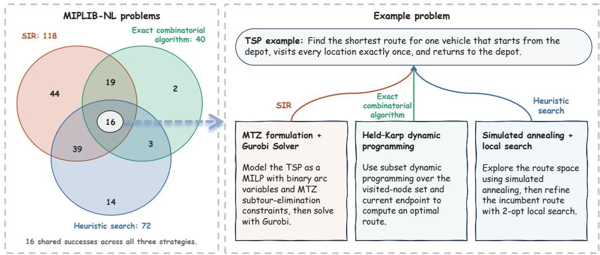  
Figure 1: Motivating evidence for strategy complementarity. Left: Pass@8 success sets of DeepSeek-V4-Pro on MIPLIB-NL under three strategies. The partial overlap indicates that different strategies solve complementary subsets of instances. Right: a single TSP instance solved successfully by all three strategies, illustrating that one optimization problem can admit multiple valid computational solution paths.

2010) according to the characteristics of the problem. Relying exclusively on a single class of solution strategies can therefore be limiting: exact formulations are well suited to problems with compact mathematical representations and tractable scale, specialized algorithms can exploit problem-specific structure to achieve substantially greater efficiency, and heuristic methods often provide practical solutions when exact optimization becomes computationally prohibitive. For example, large-scale TSP instances can make generic mathematical formulations increasingly costly in both representation and computation (Reinelt, 1991).

Current LLM-based optimization systems, however, rarely make this strategy choice adaptively. Instead, the solving paradigm is typically fixed by the system design. Solver-integrated approaches typically focus on autoformulation for optimization problems, such as linear programming (LP) and mixed-integer linear programming (MILP), where LLMs translate natural-language descriptions into mathematical models and delegate computation to external solvers. In parallel, LLM-based automated algorithm design searches directly over executable algorithms through iterative generation, evaluation, and code evolution (Liu et al., 2024; Imajuku et al., 2026). Such methods are particularly effective when optimizing reusable algorithms or heuristics for a fixed combinatorial problem family, such as TSP (Reinelt, 1991) or CVRP (Uchoa et al., 2017). Despite their respective strengths, both paradigms typically commit to a predefined solution space rather than adaptively selecting among alternative computational strategies. Figure 1 provides empirical evidence for this limitation on the challenging MIPLIB-NL benchmark (Li et al., 2026). Under strategy-specific prompting, solverbased, algorithmic, and heuristic approaches yield only partially overlapping success sets, indicating substantial complementarity across strategies. Their complementary performance motivates adaptive routing among multiple solution strategies for LLM-based optimization.

To this end, we propose a unified framework for training open-source LLMs (Yang et al., 2025a) as adaptive optimization meta-solvers capable of tackling real-world, industrial-scale problems. At the algorithmic level, we introduce Strategy-Diverse Reinforcement Learning (SDRL). SDRL augments verifiable reinforcement learning with a correctness-gated, hierarchical diversity reward. This explicitly preserves multiple computational pathways—namely, solver-integrated reasoning, exact combinatorial algorithm, and heuristic search, thereby discouraging premature strategy collapse and promoting robust exploration both across and within these distinct solving paradigms. At the systemic level, we develop a mixed-format training scheme that jointly covers self-contained textual and file-grounded optimization problems, improving data and training efficiency while extending learning toward realistic industrial-scale optimization settings.

In summary, our main contributions are as follows:

1. Empirical Analysis of Strategy Complementarity. We empirically demonstrate that, for LLM-based optimization, different problem classes and scales favor different solution paradigms, highlighting the limitations of relying on a single class of solution strategy.

2. Strategy-Diverse Reinforcement Learning. We propose SDRL, a reinforcement learning framework that trains LLMs as optimization meta-solvers by encouraging diverse yet correct solution strategies across solver-integrated, algorithmic, and heuristic approaches.

3. Mixed-Format Training and State-of-the-Art Performance. We introduce a mixedformat training scheme that combines self-contained textual problems with file-grounded problems with external structured data, improving data efficiency and supporting training on realistic industrial-scale optimization instances. Across the evaluated benchmarks, our 32B model achieves state-of-the-art Pass@1 performance, with larger gains in Pass@8.

## 2 RELATED WORK

Automated optimization modeling. Automated optimization modeling translates natural-language specifications into solver-ready mathematical formulations. Existing methods improve formulation quality through agent-based reasoning (AhmadiTeshnizi et al., 2024; Xiao et al., 2024; Zhang et al., 2024), as well as search, knowledge augmentation, and verification (Astorga et al., 2024; Liu et al., 2026b; Kong et al., 2026b; Liu et al., 2026c). Training-based approaches improve optimization modeling through supervised fine-tuning on curated or synthesized data (Huang et al., 2025a; Lu et al., 2025; Wu et al., 2025; Zhang et al., 2025) and preference-based alignment (Shu et al., 2025). Further advances incorporate reinforcement learning with verifiable rewards (Chen et al., 2026b; Xiao et al., 2026; Liu et al., 2026d; Zhao et al., 2026; Tang et al., 2025) and process-level supervision (Zhou et al., 2026; Wang et al., 2026c). However, existing methods are predominantly developed and evaluated on textbook-style tasks, leaving industrial-scale optimization largely underexplored.

Automated algorithm design. Complementary to solver-based modeling, automated algorithm design seeks to improve computational efficiency by tailoring solution procedures to problem-specific structure. Automated exact algorithm design constructs standalone, problem-specific algorithms for exact combinatorial optimization using techniques such as dynamic programming (Zhou et al., 2025), graph algorithms (Nia et al., 2025), and divide-and-conquer (Huang et al., 2024), without relying on general-purpose mathematical programming solvers (Wang et al., 2026a). Automated heuristic design focuses on generating and refining heuristics for optimization problems, commonly through evolutionary search over executable programs (Romera-Paredes et al., 2024; Liu et al., 2024). Subsequent work improves the search itself through reflective and context-aware prompting (Ye et al., 2024; Zhong et al., 2026; Bömer et al., 2025) and through diversity preservation, complementary heuristic sets, and multi-objective optimization (Dat et al., 2025; Liu et al., 2026a; Yao et al., 2025). Other work fine-tunes the language model via reinforcement learning, enabling it to co-evolve with heuristic search (Huang et al., 2026). These complementary approaches motivate instance-dependent paradigm selection. Rather than committing to a single solving paradigm, we learn a unified policy that selects among solver-integrated reasoning, exact combinatorial algorithm, and heuristic search based on the characteristics of each optimization instance.

Exploration in complex reasoning. Another related topic is about preserving exploration during reinforcement learning for complex reasoning tasks. Recent studies have identified entropy collapse, where reinforcement learning drives policies toward narrow reasoning patterns and reduces rollout diversity (Yue et al., 2025; Cui et al., 2025; Wang et al., 2026b). As training progresses, Pass@1 may continue to improve, while diminished exploration limits gains in Pass@k. Existing remedies operate at different granularities: token-level methods maintain exploration through entropy regularization or clipping (Yu et al., 2026), while trajectory-level approaches encourage diverse reasoning paths through clustering, classification, or semantic-diversity rewards (Hu et al., 2026; Liang et al., 2026; Mishra et al., 2026; Cao et al., 2026). Our formulation distinguishes itself from these approaches in two fundamental aspects. First, rather than measuring diversity at the token, textual, or general reasoning-trajectory level, we explicitly model algorithmic strategy diversity within the optimization domain. Second, instead of semantic similarity between generated texts, we ground diversity in execution behavior, distinguishing successful programs within a strategy by their runtime modes.

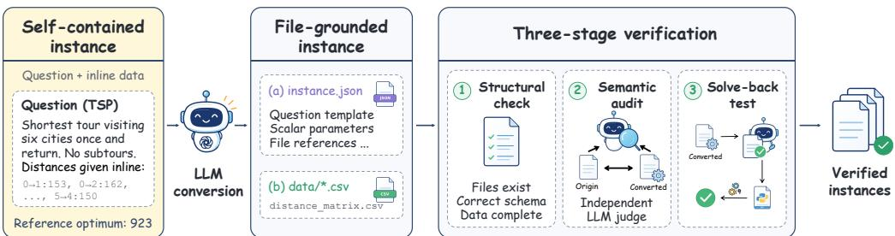  
Figure 2: Overview of the file-grounded data construction pipeline.

## 3 METHODOLOGY

Motivated by the strategy complementarity in Figure 1, we formulate LLM-based optimization as a meta-solving problem: the model should first determine the proper solving paradigm before constructing a solution. Mimicking the decision-making process of a human operations research expert, an LLM policy follows a structured three-stage trajectory: problem analysis, strategy routing, and solution implementation. The policy first analyzes the problem’s key characteristics, including the problem class (e.g., routing or scheduling), mathematical structure (e.g., continuous or discrete, linear or nonlinear), and estimated computational scale. Based on this structural assessment, the policy identifies the most suitable computational paradigm among three candidate paradigms:

S = {Solver-integrated reasoning, Exact combinatorial algorithm, Heuristic search}.

Here, solver-integrated reasoning delegates a mathematical formulation to an external solver; exact combinatorial algorithm exploits problem-specific structure through specialized exact procedures; and heuristic search provides approximate solutions when exact methods are computationally expensive. After routing, the policy generates the corresponding reasoning trace and executable solution. By explicitly separating strategy selection from solution construction, the meta-solver exposes the computational pathway as a learnable decision within the trajectory. This provides a natural foundation for reinforcement learning to jointly improve routing and solution quality under verifiable feedback. In the following subsections, we describe the training data construction and introduce Strategy-Diverse Reinforcement Learning (SDRL), which augments verifiable rewards with a hierarchical diversity objective to promote diverse yet effective solution strategies.

## 3.1 TRAINING DATA CONSTRUCTION

Most existing NL-to-Opt training data (Lu et al., 2025) are self-contained textual examples, with both the problem specification and all instance-specific parameters embedded directly in the textual description. To equip the model with stronger agentic data-processing capabilities, we convert a subset of these examples into file-grounded instances using the pipeline illustrated in Figure 2.

We represent each self-contained textual training example as

$$
( p , o ^ { \star } ) ,\tag{1}
$$

where $p$ denotes the natural-language problem specification and $o ^ { \star }$ is the reference optimal objective value. A conversion operator $\check { \tau }$ transforms it into

$$
\begin{array} { r } { \mathcal { T } ( p , o ^ { \star } ) = ( \tilde { p } , \mathcal { D } , o ^ { \star } ) , } \end{array}\tag{2}
$$

with $\tilde { p }$ denoting the parameterized problem specification and $\mathcal { D } = \{ d _ { 1 } , \ldots , d _ { m } \}$ the associated external structured files. In practice, scalar parameters are stored in instance.json, while tabular data are stored in data $1 / \star$ .csv. The transformation preserves $o ^ { \star }$ while externalizing part of the instance-specific information.

Accordingly, the input optimization instance can be uniformly formulated as

$$
\begin{array} { r } { \boldsymbol { x } = ( p , \mathcal { D } ) , } \end{array}\tag{3}
$$

where D is optional: $\mathcal { D } = \emptyset$ for self-contained textual problems and $\mathcal { D } \neq \emptyset$ for file-grounded problems. For example, in a file-grounded TSP instance (Appendix B.1), p specifies the task and

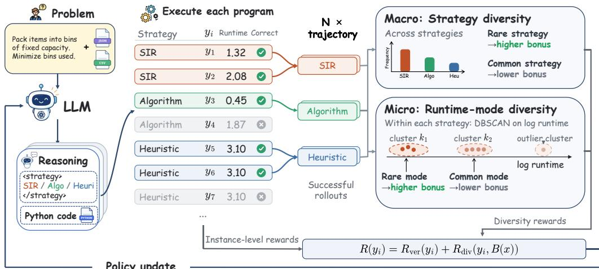  
Figure 3: Overview of Strategy-Diverse Reinforcement Learning (SDRL).

optimization structure, including the objective, degree constraints, and MTZ subtour-elimination constraints, while the pairwise distance matrix is provided separately as a CSV file in D.

## 3.2 STRATEGY-DIVERSE REINFORCEMENT LEARNING

We train the meta-solver policy $\pi _ { \theta }$ using Group Relative Policy Optimization (GRPO) (Shao et al., 2024). Given an optimization instance x, the policy $\pi _ { \theta }$ samples a group of n rollouts $G ( x ) =$ $\{ y _ { 1 } , \ldots , y _ { n } \}$ as shown in Figure 3. Guided by an expert-designed meta-prompt (Appendix A), each rollout $y _ { i } = ( h _ { i } , s _ { i } , c _ { i } )$ consists of a reasoning trace $h _ { i } .$ , a selected strategy tag $s _ { i } \in S .$ , and an executable code-snippet $c _ { i }$ . Each code block $c _ { i }$ is then executed in the sandbox to obtain verifiable signals, including execution status, predicted objective value ${ \hat { o } } _ { i } ,$ and runtime $t _ { i }$ . These signals determine the instance-level verification reward ${ \dot { R } } _ { \mathrm { v e r } } ( y _ { i } )$ and thereby identify the set of successful rollouts

$$
B ( x ) = \{ y _ { i } \in G ( x ) : y _ { i } { \mathrm { ~ i s ~ s u c c e s s f u l } } \} ,\tag{4}
$$

where success requires the generated program to execute correctly and its objective value to satisfy the prescribed evaluation tolerance. Over $B ( x )$ , we compute a hierarchical diversity reward: the macro-level component favors underrepresented solution strategies, while the micro-level component promotes diverse runtime modes within each strategy. We then combine the verification and diversity terms to obtain the final rollout reward:

$$
R ( y _ { i } ) = R _ { \mathrm { v e r } } ( y _ { i } ) + R _ { \mathrm { d i v } } \big ( y _ { i } , B ( x ) \big ) ,\tag{5}
$$

with diversity rewards applied only to successful trajectories. Importantly, no ground-truth strategy labels are provided during training. Instead, the policy autonomously explores the strategy space, learning exclusively from the relative execution quality of its generated solutions. Because the downstream reasoning and code implementation are strictly conditioned on the upstream routing decision, the trajectory-level reward inherently supervises both stages.

Following GRPO, we compute a group-normalized advantage for each rollout and share it across all tokens in the response:

$$
\widehat { A } _ { i } = \frac { R ( y _ { i } ) - \bar { R } } { \mathrm { s t d } \big ( R ( y _ { 1 } ) , \ldots , R ( y _ { n } ) \big ) + \delta } , \qquad \bar { R } = \frac { 1 } { n } \sum _ { j = 1 } ^ { n } R ( y _ { j } ) ,\tag{6}
$$

where $\delta > 0$ is a small constant for numerical stability. The policy is then updated by minimizing the GRPO objective:

$$
\mathcal { L } _ { \mathrm { G R P O } } ( \theta ) = - \mathbb { E } \left[ \frac { 1 } { n } \sum _ { i = 1 } ^ { n } \frac { 1 } { | y _ { i } | } \sum _ { t = 1 } ^ { | y _ { i } | } \operatorname* { m i n } \{ r _ { i , t } ( \theta ) \widehat { A } _ { i } , \mathrm { c l i p } \big ( r _ { i , t } ( \theta ) , 1 - \epsilon , 1 + \epsilon \big ) \widehat { A } _ { i } \} \right]\tag{7}
$$

Here, $\begin{array} { r } { r _ { i , t } ( { \theta } ) = \frac { { \pi } _ { { \theta } } ( y _ { i , t } | x , y _ { i , < t } ) } { { \pi } _ { { \theta } _ { \mathrm { o l d } } } ( y _ { i , t } | x , y _ { i , < t } ) } } \end{array}$ is the token-level importance ratio, ϵ is the clipping threshold, and the KL term is estimated from samples against a frozen reference policy $\pi _ { \mathrm { r e f } }$ with weight $\beta .$

Through iterative RLVR updates, the meta-solver policy $\pi _ { \theta }$ progressively learns to select more suitable computational paradigms while improving implementation reliability and solution accuracy, resembling the decision process of a human operations research expert who adapts strategy based on execution feedback. In the next subsection, we formalize the reward framework that enables this joint learning, focusing specifically on our proposed hierarchical diversity reward.

## 3.3 REWARD DESIGN AND TRAINING SCHEME

Total Reward Framework. As illustrated in Figure 3, the proposed SDRL framework combines two complementary sources of feedback for each rollout: an instance-level verification reward and a group-level strategy diversity reward. The verification reward evaluates whether an individual solution is valid, executable, and correct, whereas the diversity term differentiates among successful solutions according to the computational strategies they employ.

The final reward can be expressed as:

$$
R ( y _ { i } ) = \underbrace { R _ { \mathrm { f m t } } ( y _ { i } ) + R _ { \mathrm { e x e c } } ( y _ { i } ) + R _ { \mathrm { a n s } } ( y _ { i } ) } _ { R _ { \mathrm { v e r } } ( y _ { i } ) } + R _ { \mathrm { d i v } } ( y _ { i } , B ( x ) ) ,\tag{8}
$$

where $R _ { \mathrm { v e r } }$ combines format validity, execution success, and objective-value correctness $( \mathsf { A p - } $ pendix C.3) and $R _ { \mathrm { d i v } }$ is the hierarchical diversity reward defined below. The diversity term is correctness-gated:

$$
{ \cal R } _ { \mathrm { d i v } } ( y _ { i } , B ( x ) ) = 0 , \qquad y _ { i } \notin B ( x ) .\tag{9}
$$

Consequently, diversity is rewarded only among successful trajectories, which encourages strategic breadth across paradigms while preserving implementation proficiency within each strategy.

Hierarchical Diversity Reward. The diversity reward is constructed hierarchically at two levels. The macro-level component promotes exploration across the three solution strategies, whereas the micro-level component captures distinct runtime modes among successful rollouts within the same strategy. Both components use self-information to assign diversity credit at the trajectory level: successful rollouts receive larger bonuses when they adopt relatively uncommon strategies or runtime modes.

Macro-Level Strategy Diversity. Let $N = | B ( x ) |$ be the number of successful rollouts and $p _ { s }$ the empirical frequency of strategy s within $B ( x )$ . We define the macro-level reward as:

$$
p _ { s } = \frac { 1 } { N } \sum _ { y _ { j } \in B ( x ) } \mathbb { I } [ s _ { j } = s ] , \qquad R _ { \mathrm { m a c r o } } ( y _ { i } ) = \left\{ \begin{array} { l l } { - \frac { \log p _ { s _ { i } } } { \log N } , } & { y _ { i } \in B ( x ) , N > 1 , } \\ { 0 , } & { \mathrm { o t h e r w i s e } . } \end{array} \right.\tag{10}
$$

Thus, successful rollouts that adopt less frequent strategies receive larger diversity bonuses. Since $p _ { s _ { i } } \geq 1 / N$ for any observed strategy, normalization by log N bounds the reward in [0, 1]. To prevent reward hacking through strategy relabeling, we verify the declared strategy $s _ { i }$ against the generated program using rule-based consistency checks. Rollouts whose declared strategy is inconsistent with their implementation (e.g., a trajectory labeled as heuristic search that invokes an exact solver) are excluded from $B ( x )$ and receive no diversity reward (Appendix C.3).

Micro-Level Runtime Diversity. High-level strategy labels alone do not capture all variation among successful solutions. Even within the same strategy, generated programs may exhibit distinct execution behaviors. We therefore use runtime patterns as a lightweight but effective signal of within-strategy diversity. For each strategy $s ,$ we cluster the log-transformed runtimes of its $N _ { s }$ successful rollouts using one-dimensional DBSCAN (Ester et al., 1996). Let $\kappa _ { s }$ denote the resulting runtime clusters, and let m denote the minimum cluster-size parameter. Noise points are retained as a dedicated outlier cluster. For rollout $y _ { i } .$ , let $k _ { i }$ denote the cluster containing its runtime, let $n _ { s _ { i } , k _ { i } }$ be the size of that cluster, and let $q _ { s _ { i } , k _ { i } } = n _ { s _ { i } , k _ { i } } / N _ { s _ { i } }$ be the corresponding cluster frequency. We define the micro-level reward as

$$
R _ { \mathrm { m i c r o } } ( y _ { i } ) = \left\{ \begin{array} { l l } { \mathrm { c l i p } \bigg ( \frac { - \log q _ { s _ { i } , k _ { i } } } { \log ( N _ { s _ { i } } / m ) } , 0 , 1 \bigg ) , } & { y _ { i } \in B ( x ) , ~ | K _ { s _ { i } } | \geq 2 , } \\ { 0 , } & { \mathrm { o t h e r w i s e } . } \end{array} \right.\tag{11}
$$

The reward is zero when only one runtime mode is observed within a strategy. For regular DBSCAN clusters, the minimum cluster size m naturally bounds the normalized self-information. The clipping operation additionally prevents small outlier clusters from receiving disproportionately large diversity bonuses. We emphasize that this term measures runtime-mode rarity, not slowness; Appendix D.4 confirms it does not induce slow programs.

Combining these two components yields the final diversity reward:

$$
R _ { \mathrm { d i v } } ( y _ { i } , B ( x ) ) = \mathbb { I } [ y _ { i } \in B ( x ) ] \left[ \lambda R _ { \mathrm { m a c r o } } ( y _ { i } ) + ( 1 - \lambda ) R _ { \mathrm { m i c r o } } ( y _ { i } ) \right] ,\tag{12}
$$

where $\lambda \in [ 0 , 1 ]$ controls the trade-off between cross-strategy and within-strategy diversity; we set $\lambda = 0 . 7$ in the main experiments (sensitivity analysis in Appendix D.2). Compared with conventional RLVR, which primarily rewards correctness, SDRL further differentiates successful trajectories by their contribution to strategy and runtime-mode diversity, promoting broader exploration and mitigating premature strategy collapse.

Mixed-format Training. We train on the union of self-contained textual and file-grounded instances, uniformly shuffled, with the same response format and the reward in Eq. 8 for both types. For filegrounded instances, the training setup ensures that correctness can be achieved only by genuinely reading the data files. Each rollout executes in an isolated workspace that contains the instance’s structured input files but not the reference optimum, and the prompt exposes only file paths and column names rather than table contents. Reading a file is not rewarded by itself; the rollout is scored by the same executable correctness criteria as a self-contained textual one.

## 4 EXPERIMENTS

## 4.1 EXPERIMENTAL SETUPS

Benchmarks. We evaluate on seven NL-to-Opt benchmarks: NL4Opt (Ramamonjison et al., 2023), MAMO-EasyLP and MAMO-ComplexLP (Huang et al., 2025b), IndustryOR (Huang et al., 2025a), OptMATH-Bench (Lu et al., 2025), OptiBench (Yang et al., 2025b), and MIPLIB-NL (Li et al., 2026). The first six use self-contained textual inputs. In contrast, MIPLIB-NL introduces file-grounded, industrial-scale optimization tasks that demand the ability to dynamically read and process external data files at runtime. Benchmark details and instance counts are provided in Appendix B.2.

Baselines & evaluation. We compare against Qwen3 base models (Yang et al., 2025a), frontier LLMs, and representative fine-tuned NL-to-Opt models (Huang et al., 2025a; Lu et al., 2025; Chen et al., 2026b; Zhou et al., 2026). Following the strict evaluation protocol adopted in prior work (Chen et al., 2026b; Lu et al., 2025), a prediction is considered correct if its relative objective error is below $1 0 ^ { - 6 }$ . The full evaluation settings are provided in Appendix C.4.

Training setup. For the main experiments, we train models initialized from Qwen3-4B-Instruct-2507 and Qwen3-32B (Yang et al., 2025a) under the mixed-format training scheme, while all ablation studies use Qwen3-4B-Instruct-2507 as the backbone. The complete training configuration is provided in Appendix C.1. We further distinguish between text-only and file-grounded training instances. The latter are constructed from the text-only instances by the file-grounded data pipeline described in Section 3.1, and are combined with text-only instances to form our mixed-format training data.

## 4.2 MAIN RESULTS

Table 1 presents the main results across the seven benchmarks. SDRL-Qwen3-4B outperforms all existing fine-tuned baselines, including larger 32B-parameter models such as OptMATH-Qwen2.5- 32B (Lu et al., 2025) and SIRL-Qwen2.5-32B (Chen et al., 2026b), while SDRL-Qwen3-32B achieves performance competitive with frontier LLMs. By explicitly incentivizing adaptive routing across solver-integrated, exact combinatorial algorithm and heuristic search solution strategies, SDRL establishes a new SOTA for open-source optimization modeling. The improvement is especially pronounced in the most challenging MIPLIB-NL benchmark (Li et al., 2026), where instances are file-grounded, contain thousands of instance-specific parameters, and require stronger agentic capabilities for external-data processing, optimization modeling, and executable solution construction. Here, both models demonstrate agentic optimization modeling capabilities comparable to those of frontier LLMs. Beyond the adaptive routing mechanism, we attribute an additional portion of these gains to our mixed-format training scheme. In the following subsection, we present ablation studies to quantify these contributing factors.

Table 1: Pass@1 accuracy across seven optimization benchmarks, with MIPLIB-NL representing a file-grounded, industrial-scale setting that requires agentic optimization modeling capabilities.
<table><tr><td rowspan="2">Method</td><td colspan="6">Self-contained</td><td rowspan="2">File-grounded MIPLIB-NL</td><td rowspan="2"> $\mathbf { A v g . }$ </td></tr><tr><td colspan="6">NL4Opt MAMO-E MAMO-C Ind-OR OptMath OptiBench</td></tr><tr><td colspan="9">Base Models</td></tr><tr><td>Qwen3-4B-Instruct-2507</td><td>72.7</td><td>68.9</td><td>42.4</td><td>40.0</td><td>17.5</td><td>54.1</td><td>7.7</td><td>43.3</td></tr><tr><td>Qwen3-32B</td><td>85.3</td><td>88.8</td><td>66.0</td><td>39.0</td><td>17.5</td><td>60.0</td><td>10.5</td><td>52.4</td></tr><tr><td colspan="9">Fine-tuned Models</td></tr><tr><td>ORLM-Llama3-8B*</td><td>85.7</td><td>82.3</td><td>37.4</td><td>24.0</td><td>2.6</td><td>51.1</td><td>0.6</td><td>40.5</td></tr><tr><td>OptMATH-Qwen2.5-7B*</td><td>94.7</td><td>86.5</td><td>51.2</td><td>20.0</td><td>24.4</td><td>57.9</td><td>0.0</td><td>47.8</td></tr><tr><td>OptMATH-Qwen2.5-32B*</td><td>95.9</td><td>89.9</td><td>54.1</td><td>31.0</td><td>34.7</td><td>66.1</td><td>5.5</td><td>53.9</td></tr><tr><td>SIRL-Qwen2.5-7B*</td><td>96.3</td><td>91.7</td><td>51.7</td><td>33.0</td><td>30.5</td><td>58.0</td><td>0.5</td><td>51.7</td></tr><tr><td>SIRL-Qwen2.5-32B*</td><td>98.0</td><td>94.6</td><td>61.1</td><td>42.0</td><td>45.8</td><td>67.4</td><td>1.4</td><td>58.6</td></tr><tr><td>StepORLM-Qwen3-8B</td><td>89.8</td><td>89.9</td><td>52.2</td><td>40.0</td><td>14.5</td><td>56.5</td><td>0.9</td><td>49.1</td></tr><tr><td>SDRL-Qwen3-4B</td><td>93.6</td><td>92.4</td><td>79.3</td><td>55.0</td><td>41.0</td><td>67.1</td><td>23.6</td><td>64.6</td></tr><tr><td>SDRL-Qwen3-32B</td><td>96.3</td><td>96.0</td><td>81.8</td><td>56.0</td><td>59.0</td><td>69.1</td><td>30.0</td><td>69.7</td></tr><tr><td colspan="9">Frontier Models</td></tr><tr><td>DeepSeek-V4-Pro</td><td>95.5</td><td>90.0</td><td>87.2</td><td>63.0</td><td>49.4</td><td>66.9</td><td>28.2</td><td>68.6</td></tr><tr><td>Qwen3.5-397B-A17B</td><td>94.7</td><td>91.4</td><td>81.3</td><td>64.0</td><td>42.2</td><td>65.5</td><td>32.3</td><td>67.3</td></tr><tr><td>GPT-5.5</td><td>95.5</td><td>93.8</td><td>92.1</td><td>67.0</td><td>40.4</td><td>69.6</td><td>29.1</td><td>69.6</td></tr><tr><td>Claude-Opus-4.8</td><td>92.2</td><td>94.2</td><td>93.1</td><td>64.0</td><td>60.2</td><td>64.6</td><td>39.1</td><td>72.5</td></tr><tr><td>Gemini-3.1-Pro-Preview</td><td>90.2</td><td>91.6</td><td>93.0</td><td>67.0</td><td>51.8</td><td>66.1</td><td>40.9</td><td>71.5</td></tr></table>

Note: \* denotes results from original or reproduced papers.

## 4.3 ABLATION STUDY OF HIERARCHICAL DIVERSITY REWARD

We next conduct an ablation study to isolate the individual contributions of the hierarchical diversity reward components. Holding the text-only training instances and GRPO hyperparameters (Shao et al., 2024) fixed, we compare five variants: the Base model, SDRL w/o $R _ { \mathrm { d i v } }$ (standard RL), SDRL w/o $R _ { \mathrm { m i c r o } }$ , SDRL w/o $R _ { \mathrm { m a c r o } }$ , and Full SDRL. As shown in Table 2, standard RL alone substantially outperforms the base model, confirming the baseline benefit of verifiable accuracy signals. Building on this, the hierarchical diversity reward provides further gains, with the two components exhibiting clear complementarity. The macro-level term explicitly encourages diverse strategic routing and solution pathways; this broadens exploration, which primarily elevates Pass@8. In contrast, the micro-level term promotes distinct implementations within each strategy, which improves singlesample reliability and mainly benefits Pass@1. Combining both in Full SDRL achieves the optimal balance of Pass@1 and Pass@8 and the largest gains on the challenging MIPLIB-NL benchmark.

## 4.4 ABLATION STUDY OF MIXED-FORMAT TRAINING

We examine the effect of the mixed-format training scheme by comparing three settings: Text-only, File-grounded, and Mixed-format. The file-grounded data are constructed from the same underlying textual instances following the procedure in Section 3.1; Text-only and File-grounded therefore differ only in input representation, not in content.

Table 2: Ablation of the hierarchical diversity reward using text-only data.
<table><tr><td rowspan="2">Method</td><td colspan="2">MAMO-C</td><td colspan="2">IndustryOR</td><td colspan="2">OptMath</td><td colspan="2">MIPLIB-NL</td><td colspan="2">Average</td></tr><tr><td>P@1</td><td>P@8</td><td>P@1</td><td>P@8</td><td>P@1</td><td>P@8</td><td>P@1</td><td>P@8</td><td>P@1</td><td>P@8</td></tr><tr><td>Base model</td><td>42.4</td><td>76.9</td><td>40.0</td><td>62.0</td><td>17.5</td><td>36.8</td><td>7.7</td><td>19.1</td><td>26.9</td><td>48.7</td></tr><tr><td>SDRL w/o  $R _ { \mathrm { d i v } }$ </td><td>70.9</td><td>87.7</td><td>51.0</td><td>69.0</td><td>35.5</td><td>48.2</td><td>13.1</td><td>29.1</td><td>42.6</td><td>58.5</td></tr><tr><td>SDRL w/o  $R _ { \mathrm { m i c r o } }$ </td><td>73.9</td><td>88.7</td><td>50.0</td><td>72.0</td><td>37.4</td><td>53.6</td><td>14.6</td><td>31.8</td><td>44.0</td><td>61.5</td></tr><tr><td>SDRL w/o  $R _ { \mathrm { m a c r o } }$ </td><td>75.9</td><td>88.2</td><td>52.0</td><td>72.0</td><td>34.9</td><td>50.0</td><td>14.6</td><td>25.9</td><td>44.4</td><td>59.0</td></tr><tr><td>Full SDRL</td><td>75.9</td><td>90.2</td><td>53.0</td><td>71.0</td><td>36.7</td><td>54.8</td><td>16.8</td><td>33.2</td><td>45.6</td><td>62.3</td></tr></table>

Solver-integrated reasoning Exact combinatorial algorithm Heuristic search

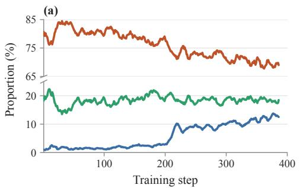

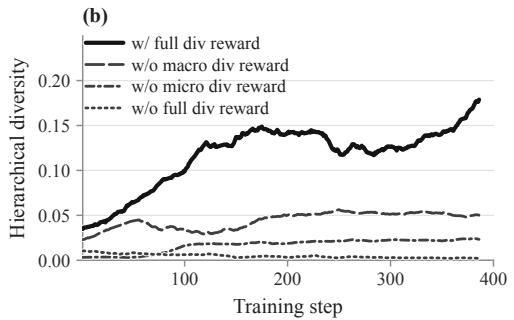  
Figure 4: Training dynamics of SDRL.

As shown in Table 3, the two formats exhibit clear complementarity. Text-only training attains the highest Pass@8 on self-contained textual benchmarks, whereas file-grounded training improves the model’s ability to handle external-data instances, attaining the highest Pass@8 on MIPLIB-NL. However, each specialization comes at the cost of weaker performance outside its own domain. Mixed-format training achieves the best Pass@1 in both settings and provides the best balance overall.

Table 3: Ablation of the mixed-format training scheme.
<table><tr><td rowspan="2">Training Data</td><td colspan="2">Text Avg.</td><td colspan="2">MIPLIB-NL</td></tr><tr><td>P@1</td><td>P@8</td><td>P@1</td><td>P@8</td></tr><tr><td>Text-only</td><td>69.6</td><td>80.3</td><td>16.8</td><td>33.2</td></tr><tr><td>File-grounded</td><td>64.3</td><td>77.6</td><td>21.8</td><td>38.6</td></tr><tr><td>Mixed-format</td><td>71.4</td><td>79.5</td><td>23.6</td><td>35.9</td></tr></table>

## 4.5 TRAINING DYNAMICS

We further analyze the training dynamics of SDRL to understand how the policy evolves during training. As shown in Figure 4(a), the policy is initially dominated by solver-integrated reasoning (SIR), reflecting the strong solver-centric bias of existing LLM-based optimization methods. As training progresses, the hierarchical diversity reward encourages broader exploration across alternative computational pathways. The proportion of exact combinatorial algorithm remains relatively stable, which is consistent with their problem-specific nature and reliance on exploitable structure. Heuristic search, in contrast, increases steadily during training. This behavior is particularly informative given that the current evaluation protocol penalizes near-optimal solutions, suggesting that heuristic strategies may play an increasingly important role in scaling LLM-based optimization to industrialscale settings. The bold curve in Figure 4(b) tracks the hierarchical diversity score of Full SDRL throughout training, which consistently achieves the highest diversity among the four reward ablations.

## 5 CONCLUSION AND LIMITATIONS

In this work, we present a framework for training LLMs to act as adaptive optimization meta-solvers. Strategy-Diverse Reinforcement Learning (SDRL) encourages exploration across solver-integrated reasoning, exact combinatorial algorithm, and heuristic search. Its hierarchical diversity reward gives diversity credit only to correct, executable solutions, favoring underrepresented strategies and runtime modes. This helps the model retain multiple viable approaches and reduces premature strategy collapse. We also introduce a mixed-format training scheme that supports both self-contained textual problems and file-grounded instances. Across comprehensive evaluations, SDRL-Qwen3-4B outperforms all existing fine-tuned NL-to-Opt models in average Pass@1, while SDRL-Qwen3-32B exceeds DeepSeek-V4-Pro and GPT-5.5 while remaining competitive with other frontier LLMs. Notably, SDRL shows a clearer advantage when multiple solutions are sampled under Pass@k evaluation, suggesting broader coverage of viable strategies. However, our current evaluation counts a solution as correct only when its objective value matches the reference within a strict tolerance. This may not fully reflect the value of heuristics that produce high-quality solutions at lower computational cost. Future work could develop evaluation metrics that consider both solution quality and computational cost, giving appropriate credit to efficient, near-optimal solutions.

## AI USE STATEMENT

In this work, we used generative AI tools for generating and reformatting training data: large language models convert self-contained optimization instances into file-grounded ones and filter the converted instances, and all retained instances are verified as documented in Appendix B.1. Large language models are also evaluated as baselines. Generative AI tools also assisted in writing and debugging parts of the training and evaluation code, which the authors reviewed and tested. Beyond these uses, we used generative AI tools only to polish prose, improve clarity, and correct grammar; all such text was reviewed and edited by the authors. The core ideas, methodology, experimental design, and conclusions are the original work of the authors, who take full responsibility for the final content of this work, including all text, claims, and artifacts.

## ETHICS STATEMENT

This work does not involve human subjects, personal data, or sensitive content. All training and evaluation data are derived from publicly available optimization benchmarks; the file-grounded training instances are machine-generated conversions of existing textual instances and are verified as described in Appendix B.1. Our method targets operations research problems such as routing, scheduling, and resource allocation, and we do not foresee direct negative societal impacts.

## REPRODUCIBILITY STATEMENT

We have taken the following steps to make our results reproducible. The complete system and user prompts used for training and evaluation, including the strategy-routing meta prompt and the SIR prompt, are given in Appendix A. The construction of the file-grounded training data is described in Appendix B.1, including the conversion prompt, a worked example, and the three-stage verification protocol with its per-stage pass rates. The mixing ratio of the final training set is given in Appendix C.2. All evaluation benchmarks and the number of validated instances in each are listed in Appendix B.2. The full training configuration (backbone models, RL framework, and all hyperparameters, including those of the diversity reward) is reported in Appendix C.1, and the reward function, including the rule-based strategy consistency checks, is specified in Appendix C.3. Decoding settings and the correctness criterion for Pass@1 and Pass@8 are given in Appendix C.4, and the hardware used for runtime measurements in Appendix D.4. Source code, training data, and evaluation scripts will be released upon publication.

## REFERENCES

Ali AhmadiTeshnizi, Wenzhi Gao, and Madeleine Udell. Optimus: Scalable optimization modeling with (mi) lp solvers and large language models. arXiv preprint arXiv:2402.10172, 2024.

Andreas Antoniou and Wu-Sheng Lu. Practical optimization: algorithms and engineering applications. Springer, 2007.

Nicolás Astorga, Tennison Liu, Yuanzhang Xiao, and Mihaela Van Der Schaar. Autoformulation of mathematical optimization models using llms. arXiv preprint arXiv:2411.01679, 2024.

Thomas Bömer, Nico Koltermann, Max Disselnmeyer, Laura Dörr, and Anne Meyer. Leveraging large language models to develop heuristics for emerging optimization problems. arXiv preprint arXiv:2503.03350, 2025.

Qian Cao, Yahui Liu, Yi Zhao, Ruihua Song, Xiting Wang, Ruiming Tang, Guorui Zhou, Han Li, et al. Dpwriter: Reinforcement learning with diverse planning branching for creative writing. In Proceedings ofthe 64th Annual Meeting ofthe Associationfor Computational Linguistics (Volume 1: Long Papers), pp. 14224–14250, 2026.

Yitian Chen, Cheng Cheng, Yinan Sun, Zi Ling, and Dongdong Ge. Opt-engine: Benchmarking the limits of llms in optimization modeling via complexity scaling. arXiv preprint arXiv:2601.19924, 2026a.

Yitian Chen, Jingfan Xia, Siyu Shao, Dongdong Ge, and Yinyu Ye. Solver-informed rl: Grounding large language models for authentic optimization modeling. Advances in Neural Information Processing Systems, 38:106027–106069, 2026b.

Ganqu Cui, Yuchen Zhang, Jiacheng Chen, Lifan Yuan, Zhi Wang, Yuxin Zuo, Haozhan Li, Yuchen Fan, Huayu Chen, Weize Chen, et al. The entropy mechanism of reinforcement learning for reasoning language models. arXiv preprint arXiv:2505.22617, 2025.

Pham Vu Tuan Dat, Long Doan, and Huynh Thi Thanh Binh. Hsevo: Elevating automatic heuristic design with diversity-driven harmony search and genetic algorithm using llms. In Proceedings of the AAAI Conference on Artificial Intelligence, volume 39, pp. 26931–26938, 2025.

Martin Ester, Hans-Peter Kriegel, Jörg Sander, Xiaowei Xu, et al. A density-based algorithm for discovering clusters in large spatial databases with noise. In kdd, volume 96, pp. 226–231, 1996.

Yongchang Fu, Xinjie Huang, Chengjun Dai, Chengzhe Feng, Junshao Zhang, and Hong Zhu. Opti agent-bench: Benchmarking end-to-end optimization r&d agents on real-world business problems. arXiv preprint arXiv:2607.10768, 2026.

Michel Gendreau, Jean-Yves Potvin, et al. Handbook of metaheuristics, volume 2. Springer, 2010.

Zhiyuan Hu, Yucheng Wang, Yufei He, Jiaying Wu, Yilun Zhao, See-Kiong Ng, Cynthia Breazeal, Anh Tuan Luu, Hae Won Park, and Bryan Hooi. Rewarding the rare: Uniqueness-aware rl for creative problem solving in llms. arXiv preprint arXiv:2601.08763, 2026.

Chenyu Huang, Zhengyang Tang, Shixi Hu, Ruoqing Jiang, Xin Zheng, Dongdong Ge, Benyou Wang, and Zizhuo Wang. Orlm: A customizable framework in training large models for automated optimization modeling. Operations Research, 73(6):2986–3009, 2025a.

Dong Huang, Yuhao Qing, Weiyi Shang, Heming Cui, and Jie Zhang. Effibench: Benchmarking the efficiency of automatically generated code. Advances in Neural Information Processing Systems, 37:11506–11544, 2024.

Xuhan Huang, Qingning Shen, Yan Hu, Anningzhe Gao, and Benyou Wang. Llms for mathematical modeling: Towards bridging the gap between natural and mathematical languages. In Findings of the Associationfor Computational Linguistics: NAACL 2025, pp. 2678–2710, 2025b.

Ziyao Huang, Weiwei Wu, Kui Wu, Wei-Bin Lee, and Jianping Wang. Calm: Co-evolution of algorithms and language model for automatic heuristic design. In International Conference on Learning Representations, volume 2026, pp. 72468–72510, 2026.

Yuki Imajuku, Kohki Horie, Yoichi Iwata, Kensho Aoki, Naohiro Takahashi, and Takuya Akiba. Ale-bench: A benchmark for long-horizon objective-driven algorithm engineering. Advances in Neural Information Processing Systems, 38, 2026.

Minwei Kong, Chonghe Jiang, Ao Qu, Wenbin Ouyang, Zhaoming Zeng, Xiaotong Guo, Zhekai Li, Junyi Li, Yi Fan, Xinshou Zheng, et al. Frontieror: Benchmarking llms’ capacity for efficient algorithm design in large-scale optimization. arXiv preprint arXiv:2605.25246, 2026a.

Minwei Kong, Ao Qu, Xiaotong Guo, Wenbin Ouyang, Chonghe Jiang, Han Zheng, Yining Ma, Dingyi Zhuang, Yuhan Tang, Junyi Li, et al. Alphaopt: Formulating optimization programs with self-improving llm experience library. In Proceedings of the 32nd ACM SIGKDD Conference on Knowledge Discovery and Data Mining V. 2, pp. 2389–2400, 2026b.

Zhong Li, Hongliang Lu, Tao Wei, Yuxuan Chen, Wenyu Liu, Yuan Lan, Fan Zhang, and Zaiwen Wen. Constructing industrial-scale optimization modeling benchmark. arXiv preprint arXiv:2602.10450, 2026.

Xinyue Liang, Yizhe Yang, Yu Bai, Bin Xu, Jiawei Li, and Yang Gao. Diverse thinking schemata elicit better reasoning in large language models. arXiv preprint arXiv:2606.08974, 2026.

Fei Liu, Xialiang Tong, Mingxuan Yuan, Xi Lin, Fu Luo, Zhenkun Wang, Zhichao Lu, and Qingfu Zhang. Evolution of heuristics: Towards efficient automatic algorithm design using large language model. arXiv preprint arXiv:2401.02051, 2024.

Fei Liu, Yilu Liu, Qingfu Zhang, Tong Xialiang, and Mingxuan Yuan. Eoh-s: Evolution of heuristic set using llms for automated heuristic design. In Proceedings ofthe AAAI Conference on Artificial Intelligence, volume 40, pp. 37090–37098, 2026a.

Haoyang Liu, Jie Wang, Yuyang Cai, Xiongwei Han, Yufei Kuang, and Jianye Hao. Optitree: Hierarchical thoughts generation with tree search for llm optimization modeling. Advances in Neural Information Processing Systems, 38:120713–120781, 2026b.

Haoyang Liu, Jie Wang, Boxuan Niu, Xiongwei Han, Yian Xu, Mingxuan Ye, Zijie Geng, Fangzhou Zhu, Tao Zhong, Mingxuan Yuan, et al. Opt-verifier: Unleashing the power of llms for optimization modeling via dual-side verification. arXiv preprint arXiv:2605.29556, 2026c.

Weiting Liu, Han Wu, Yufei Kuang, Xiongwei Han, Tao Zhong, Jianfeng Feng, and Wenlian Lu. Automated optimization modeling via a localizable error-driven perspective. arXiv preprint arXiv:2602.11164, 2026d.

Hongliang Lu, Zhonglin Xie, Yaoyu Wu, Can Ren, Yuxuan Chen, and Zaiwen Wen. Optmath: A scalable bidirectional data synthesis framework for optimization modeling. arXiv preprint arXiv:2502.11102, 2025.

Mike Merrill, Alexander Shaw, Nicholas Carlini, Boxuan Li, Harsh Raj, Ivan Bercovich, Lin Shi, Jeong Shin, Thomas Walshe, E Kelly Buchanan, et al. Terminal-bench: Benchmarking agents on hard, realistic tasks in command line interfaces. In International Conference on Learning Representations, volume 2026, pp. 40903–40986, 2026.

Kshitij Mishra, Nils Lukas, and Salem Lahlou. Sd-e2: Semantic exploration for reasoning under token budgets. In Findings of the Association for Computational Linguistics: EACL 2026, pp. 6144–6157, 2026.

George L Nemhauser and Laurence A Wolsey. Integer and combinatorial optimization, volume 18. Wiley New York, 1988.

Atieh Barati Nia, Mohammad Dindoost, and David A Bader. Evaluating efficiency and novelty of llm-generated code for graph analysis. In 2025 IEEE High Performance Extreme Computing Conference (HPEC), pp. 1–7. IEEE, 2025.

Christos H Papadimitriou and Kenneth Steiglitz. Combinatorial optimization: algorithms and complexity. Courier Corporation, 1998.

Rindranirina Ramamonjison, Timothy Yu, Raymond Li, Haley Li, Giuseppe Carenini, Bissan Ghaddar, Shiqi He, Mahdi Mostajabdaveh, Amin Banitalebi-Dehkordi, Zirui Zhou, et al. Nl4opt competition: Formulating optimization problems based on their natural language descriptions. In NeurIPS 2022 competition track, pp. 189–203. PMLR, 2023.

Gerhard Reinelt. TSPLIB—a traveling salesman problem library. ORSA Journal on Computing, 3(4): 376–384, 1991. doi: 10.1287/ijoc.3.4.376.

Bernardino Romera-Paredes, Mohammadamin Barekatain, Alexander Novikov, Matej Balog, M Pawan Kumar, Emilien Dupont, Francisco JR Ruiz, Jordan S Ellenberg, Pengming Wang, Omar Fawzi, et al. Mathematical discoveries from program search with large language models. Nature, 625(7995):468–475, 2024.

Zhihong Shao, Peiyi Wang, Qihao Zhu, Runxin Xu, Junxiao Song, Xiao Bi, Haowei Zhang, Mingchuan Zhang, YK Li, Yang Wu, et al. Deepseekmath: Pushing the limits of mathematical reasoning in open language models. arXiv preprint arXiv:2402.03300, 2024.

Guangming Sheng, Chi Zhang, Zilingfeng Ye, Xibin Wu, Wang Zhang, Ru Zhang, Yanghua Peng, Haibin Lin, and Chuan Wu. Hybridflow: A flexible and efficient rlhf framework. arXiv preprint arXiv: 2409.19256, 2024.

Xiang Shu, Hong Qian, Xingyu Lu, JUN ZHOU, Aimin Zhou, Yang Yu, et al. Llmopt: Learning to define and solve general optimization problems from scratch. In International Conference on Learning Representations, volume 2025, pp. 101580–101606, 2025.

Ajay Singh. An overview of the optimization modelling applications. Journal of Hydrology, 466: 167–182, 2012.

Zhengyang Tang, Zihan Ye, Chenyu Huang, Xuhan Huang, Chengpeng Li, Sihang Li, Guanhua Chen, Ming Yan, Zizhuo Wang, Hongyuan Zha, et al. Calm before the storm: Unlocking native reasoning for optimization modeling. arXiv preprint arXiv:2510.04204, 2025.

Zirui Tang, Xuanhe Zhou, Yumou Liu, Linchun Li, Yukai Wu, Weizheng Wang, Hongzhang Huang, Wei Zhou, Jun Zhou, Jiachen Song, et al. Workspace-bench 1.0: Benchmarking ai agents on workspace tasks with large-scale file dependencies. arXiv preprint arXiv:2605.03596, 2026.

Eduardo Uchoa, Diego Pecin, Artur Pessoa, Marcus Poggi, Thibaut Vidal, and Anand Subramanian. New benchmark instances for the capacitated vehicle routing problem. European Journal of Operational Research, 257(3):845–858, 2017. doi: 10.1016/j.ejor.2016.08.012.

Haoyu Wang, Yuliang Song, Tao Li, Zhiwei Deng, Yaqing Wang, Deepak Ramachandran, Eldan Cohen, and Dan Roth. Formalize, don’t optimize: The heuristic trap in llm-generated combinatorial solvers. arXiv preprint arXiv:2605.12421, 2026a.

Shenzhi Wang, Le Yu, Chang Gao, Chujie Zheng, Shixuan Liu, Rui Lu, Kai Dang, Xiong-Hui Chen, Jianxin Yang, Zhenru Zhang, et al. Beyond the 80/20 rule: High-entropy minority tokens drive effective reinforcement learning for llm reasoning. Advances in Neural Information Processing Systems, 38:115452–115486, 2026b.

Yilin Wang, Heng Zhou, Dongxing Mao, Linjie Li, Jingru Tan, Haochen Han, Zhengyuan Yang, Alex Jinpeng Wang, and Min Li. Or-prm: A process reward model for algorithmic problem in operations research. In International Conference on Learning Representations, volume 2026, pp. 42343–42369, 2026c.

Yang Wu, Yifan Zhang, Yurong Wu, Yuran Wang, Junkai Zhang, and Jian Cheng. Step-opt: Boosting optimization modeling in llms through iterative data synthesis and structured validation. arXiv preprint arXiv:2506.17637, 2025.

Ziyang Xiao, Dongxiang Zhang, Yangjun Wu, Lilin Xu, Yuan Wang, Xiongwei Han, Xiaojin Fu, Tao Zhong, Jia Zeng, Mingli Song, et al. Chain-of-experts: When llms meet complex operations research problems. In International Conference on Learning Representations, volume 2024, pp. 48519–48537, 2024.

Ziyang Xiao, Yuan Jessica Wang, Xiongwei Han, Shisi Guan, Jingyan Zhu, Jingrong Xie, Lilin Xu, Han Wu, Wing Yin Yu, Zehua Liu, et al. Deepor: A deep reasoning foundation model for optimization modeling. In Proceedings of the AAAI Conference on Artificial Intelligence, volume 40, pp. 34052–34060, 2026.

An Yang, Anfeng Li, Baosong Yang, Beichen Zhang, Binyuan Hui, Bo Zheng, Bowen Yu, Chang Gao, Chengen Huang, Chenxu Lv, et al. Qwen3 technical report. arXiv preprint arXiv:2505.09388, 2025a.

Zhicheng Yang, Yiwei Wang, Yinya Huang, Zhijiang Guo, Shi Shi, Xiongwei Han, Liang Feng, Linqi Song, Xiaodan Liang, and Jing Tang. Optibench meets resocratic: Measure and improve llms for optimization modeling. In International Conference on Learning Representations, volume 2025, pp. 24726–24759, 2025b.

Shunyu Yao, Fei Liu, Xi Lin, Zhichao Lu, Zhenkun Wang, and Qingfu Zhang. Multi-objective evolution of heuristic using large language model. In Proceedings of the AAAI Conference on Artificial Intelligence, volume 39, pp. 27144–27152, 2025.

Haoran Ye, Jiarui Wang, Zhiguang Cao, Federico Berto, Chuanbo Hua, Haeyeon Kim, Jinkyoo Park, and Guojie Song. Reevo: Large language models as hyper-heuristics with reflective evolution. Advances in neural information processing systems, 37:43571–43608, 2024.

Qiying Yu, Zheng Zhang, Ruofei Zhu, Yufeng Yuan, Xiaochen Zuo, Yu Yue, Weinan Dai, Tiantian Fan, Gaohong Liu, Lingjun Liu, et al. Dapo: An open-source llm reinforcement learning system at scale. Advances in Neural Information Processing Systems, 38:113222–113244, 2026.

Yang Yue, Zhiqi Chen, Rui Lu, Andrew Zhao, Zhaokai Wang, Shiji Song, and Gao Huang. Does reinforcement learning really incentivize reasoning capacity in llms beyond the base model? arXiv preprint arXiv:2504.13837, 2025.

Jihai Zhang, Wei Wang, Siyan Guo, Li Wang, Fangquan Lin, Cheng Yang, and Wotao Yin. Solving general natural-language-description optimization problems with large language models. In Proceedings of the 2024 Conference of the North American Chapter of the Association for Compu tational Linguistics: Human Language Technologies (Volume 6: Industry Track), pp. 483–490, 2024.

Xinzhi Zhang, Zeyi Chen, Humishka Zope, Hugo Barbalho, Konstantina Mellou, Marco Molinaro, Janardhan Kulkarni, Ishai Menache, and Sirui Li. Optimind: Teaching llms to think like optimization experts. arXiv preprint arXiv:2509.22979, 2025.

Ruiqing Zhao, Fengzhi Li, Yuan Zuo, Rui Liu, Yansong Liu, Yunfei Ma, Fanyu Meng, and Junlan Feng. Strategy-aware optimization modeling with reasoning llms. arXiv preprint arXiv:2605.02545, 2026.

Mengyuan Zhong, Jialong Shi, Jianyong Sun, and Ye Fan. Hifo-prompt: Prompting with hindsight and foresight for llm-based automatic heuristic design. In International Conference on Learning Representations, volume 2026, pp. 117102–117143, 2026.

Chenyu Zhou, Jingyuan Yang, Linwei Xin, Yitian Chen, Ziyan He, and Dongdong Ge. Autoformulating dynamic programming problems with large language models. arXiv preprint arXiv:2507.11737, 2025.

Chenyu Zhou, Tianyi Xu, Jianghao Lin, and Dongdong Ge. Steporlm: A self-evolving framework with generative process supervision for operations research language models. In International Conference on Learning Representations, volume 2026, pp. 6914–6940, 2026.

## APPENDIX

A Prompt Templates 16   
B Datasets 17   
B.1 Construction of File-Grounded Training Data 17   
B.2 Benchmarks 21   
C Details of experiments 21   
C.1 Training Parameters . 21   
C.2 Mixed-Format Training Details 22   
C.3 Reward Function Design 22   
C.4 Evaluation Sampling Settings . 24   
C.5 Detailed Pass@1 and Pass@8 Results 24   
D Further Analysis 24   
D.1 Effect of Training Data Size 24   
D.2 Sensitivity to the Macro/Micro Weight λ 26   
D.3 Disentangling the Effects of Strategy Routing and Reinforcement Learning 26   
D.4 Runtime Analysis . 27   
E Case Studies 29   
E.1 File-Grounded Problem Solving 29   
E.2 Strategy Diversity on a Textual Instance 30

## A PROMPT TEMPLATES

## Meta Prompt Template

<table><tr><td>SYSTEM:</td></tr><tr><td>You are an expert Operations Research Engineer and Algorithm Designer. Your task is to analyze optimization problems, dynamically route them to the single most appropriate solution paradigm based on their mathematical characteristics and scale, and implement the solution in Python.</td></tr><tr><td>Step 1: Problem Analysis</td></tr><tr><td>Briefly analyze the problem based on the following dimensions:</td></tr><tr><td>• Problem Type: e.g., Routing, Scheduling, Assignment, Inventory, or Network Flow. • Mathematical Structure: Determine whether the problem is continuous or discrete/combinatorial, linear or non-linear, and whether it</td></tr><tr><td>exhibits optimal substructure. • Scale Estimation: Approximate the number of variables and constraints, and determine whether the problem is small/medium-scale,</td></tr><tr><td>for which exact solvers are manageable, or large-scale, for which combinatorial explosion may occur. Step 2: Strategy Routing (Choose ONE Paradigm)</td></tr><tr><td>Based on the analysis, strictly select ONE of the following strategies:</td></tr><tr><td>1. SIR</td></tr><tr><td>Choose if: The problem is a clearly defined Linear Programming (LP), Mixed-Integer Linear Programming (MILP), or Convex Quadratic problem, and the scale is manageable (small to medium).</td></tr><tr><td>Mandatory: You MUST use Gurobi through gurobipy for this strategy.</td></tr><tr><td>Implementation: Write a rigorous mathematical formulation using gurobipy. Start the code with:</td></tr><tr><td>import gurobipy as gp</td></tr><tr><td>from gurobipy import GRB 2. Exact Combinatorial Algorithm</td></tr><tr><td>Choose if: The problem exhibits optimal substructure, overlapping subproblems, or standard graph properties, such as knapsack, shortest</td></tr><tr><td>path, or interval scheduling Implementation: Use dynamic programming, greedy methods, divide-and-conquer, or backtracking.</td></tr><tr><td>3. Heuristic Search Choose if: The problem is large-scale, highly non-linear, or a complex combinatorial optimization problem, such as a large-scale VRP or</td></tr><tr><td>TSP instance, for which exact solvers are likely to time out.</td></tr><tr><td>Implementation: Use a high-performance heuristic, such as ALNS, GRASP, iterated local search, or simulated annealing. Step 3: Output Format</td></tr><tr><td>The response must follow the structure below.</td></tr><tr><td>First, output exactly one strategy tag on its own first line, using one of:</td></tr><tr><td>&lt;strategy&gt;SIR&lt;/strategy&gt;</td></tr><tr><td>&lt;strategy&gt;Exact Combinatorial Algorithm&lt;/strategy&gt;</td></tr><tr><td>&lt;strategy&gt;Heuristic Search&lt;/strategy&gt;</td></tr><tr><td>Then output the step-by-step reasoning, including the problem analysis and routing decision.</td></tr><tr><td>Finally, output the complete executable Python code in a single code block starting with &quot; pyt hon.</td></tr><tr><td>USER:</td></tr><tr><td>Solve the following algorithm design and optimization problem:</td></tr><tr><td>{Question}</td></tr><tr><td>Reason step by step to derive the logic before writing the script. After thinking, explain your algorithmic strategy. Finally, output the complete code block starting with &quot; &#x27;python.</td></tr><tr><td>Before the final output lines, you must assign vari ables to the computed decision variable solution (prefer a list or a dictionary of</td></tr><tr><td>variable values). If the solution has no explicit decision-variable vector, set vari ables = [ ] as a fallback.</td></tr><tr><td>The script&#x27;s final output lines must be exactly:</td></tr><tr><td></td></tr><tr><td>print(&quot;Decision variables:&quot;, variables)</td></tr><tr><td>print(&quot;Result:&quot;, objective_value)</td></tr><tr><td></td></tr><tr><td>where variables is the optimal decision variable(s) and objective_value is the actual computed result variable.</td></tr><tr><td></td></tr></table>

## SIR Prompt Template

<table><tr><td>SYSTEM: You are a helpful assistant with expertise in mathematical modeling and the Gurobi solver. When the user provides an Operations</td></tr><tr><td>Research (OR) problem, you must:</td></tr><tr><td>1. Carefully analyze the problem and clearly define:</td></tr><tr><td>• Decision variables</td></tr><tr><td>• Objective function • Constraints</td></tr><tr><td>Carefully determine whether each decision variable is integer or continuous.</td></tr><tr><td>2. Build a complete mathematical model.</td></tr><tr><td>3. Provide Gurobi Python code that formulates and solves the model.</td></tr><tr><td>Ensure correctness, clarity, and professional presentation.</td></tr><tr><td>USER:</td></tr><tr><td>Here is the given optimization problem:</td></tr><tr><td>{Question}</td></tr></table>

Reason step by step to derive the modeling process before generating the gurobipy code. When you respond, first think carefully.   
After thinking, output the mathematical model. Finally, output a code block beginning with:   
“‘python   
import gurobipy as gp   
from gurobipy import GRB   
The script’s final output line must be: print("Result:", objective\_value)   
where objective\_value is the actual computed objective value.   
/no\_think

## B DATASETS

## B.1 CONSTRUCTION OF FILE-GROUNDED TRAINING DATA

This section describes how file-grounded training instances are constructed from self-contained textual ones (Section B.1.1) and how every converted instance is verified before being used for training (Section B.1.2).

## B.1.1 CONVERSION

File-grounded training instances are derived from the OptMATH training set by separating the optimization specification from instance-specific data. For each self-contained question, DeepSeek-V4-Pro (temperature 0.1, JSON output) produces three components: a parameterized abstract\_problem, a dictionary of scalar parameters, and a set of structured tables that are serialized as external CSV files. Values already stored in a table are not duplicated in the parameter dictionary. The original optimal objective value is retained as optimal\_value and serves as the supervision target, so the conversion changes the information-access pattern of an instance but not the optimization task itself.

Conversion Prompt. The following prompt is used to convert the original self-contained optimization instances into the file-grounded format.

## File-Grounded Data Construction Prompt

You are an expert in Operations Research and Data Engineering. Your task is to convert a natural language optimization problem into a   
structured JSON format that enforces problem-data separation—decoupling the abstract natural language formulation from instance   
data—without missing any information.   
INSTRUCTIONS:   
1. abstract\_problem: Translate the original problem description into a clear, concise, and parameterized natural language formulation.   
You must strictly preserve all original constraints, objectives, and logical relationships without omitting any details. Replace   
instance-specific scalar numbers (e.g., limits, costs, capacities) with variable placeholders (e.g., {num\_jobs},   
{budget\_limit}). However, exercise expert judgment to retain certain explicit numbers (e.g., structural constants, specific indices,   
dimensions, or binary states).   
2. parameters: Extract the scalar values corresponding to the placeholders defined in your abstract\_problem as key-value pairs.   
Do not include placeholders if their values are explicitly contained within the extracted tables data (to prevent data redundancy).   
3. tables: Extract tabular data. For each table, provide a key, descri tion, header (list of strings), and data\_matrix (list of   
lists). CRITICAL: The description must explicitly define the exact meaning of each column header included in the table. Furthermore,   
it must clearly explain how missing, inapplicable, or empty values are represented within the data\_matrix.   
EXAMPLE OUTPUT FORMAT:   
" a b s t r a c t \_ p r o b l e m " : " O p t i m i z e a s c h e d u l i n g problem w i t h { n \_j o b s } j o b s   
u n d e r a b u d g e t l i m i t o f { b u d g e t \_ l i m i t } , s u bj e c t t o p r e c e d e n c e c o n s t r a i n t s . " ,   
" p a r a m e t e r s " : {   
" n \_ j o b s " : 3 ,   
" b u d g e t \_ l i m i t " : 1 0 0   
} ,   
" t a b l e s " : {   
" j o b s " : {   
" d e s c r i p t i o n " : "A t a b l e c o n t a i n i n g e a c h j o b ' s d u r a t i o n a n d c o s t . " ,   
" h e a d e r " : [ " j o b \_ i d " , " d u r a t i o n " , " c o s t " ] ,   
" d a t a \_ m a t r i x " : [   
[ 1 , 2 , 1 0 ] ,   
[ 2 , 3 , 2 0 ] ,   
[ 3 , 4 , 1 5 ]   
]

} ,   
" p r e c e d e n c e " : {   
" d e s c r i p t i o n " : " Each row s p e c i f i e s a p r e d e c e s s o r − s u c c e s s o r r e l a t i o n s h i p . "   
" h e a d e r " : [ " p r e d e c e s s o r \_ i d " , " s u c c e s s o r \_ i d " ] ,   
" d a t a \_ m a t r i x " : [   
[ 1 , 3 ]   
]   
}   
}   
}   
OUTPUT FORMAT CONSTRAINT:   
You must output ONLY a valid JSON object matching the exact schema shown in the example above.

Conversion Example. A concrete OptMATH example is shown below to illustrate how a selfcontained optimization problem is converted into a file-grounded instance.

## Conversion Example: Six-City Asymmetric TSP

## Original Self-Contained Question.

The original OptMATH instance is a six-city asymmetric traveling salesperson problem. A delivery service must visit City 0–City 5 exactly once and return to the starting city while minimizing the total travel distance. The question directly specifies all pairwise travel distances between the six cities, together with the in-degree and out-degree constraints required for a valid tour. It further introduces auxiliary order variables and MTZ-style constraints to prevent disconnected subtours. Thus, both the optimization specification and all instance-specific numerical data are contained directly in the natural-language input.

## File-Grounded Instance Example

After conversion, the optimization specification and instance-specific data are stored separately:

instance\_00000/   
instance.json   
data/   
distance\_matrix.csv

## instance.json

The instance description contains the parameterized optimization problem, scalar parameters, references to external files, and the original supervision target:

abstract\_problem Parameterized TSP specification containing the objective, degree constraints, and MTZ subtour  
elimination constraints, while referring to pairwise distances as externally provided data.   
parameters n = 6, n\_minus\_one = 5, big\_M = 5.   
files distance\_matrix → ./data/distance\_matrix.csv.   
optimal\_value 923.0.

## data/distance\_matrix.csv

The complete asymmetric distance matrix, originally embedded in the natural-language question, is moved to an external CSV file:

<table><tr><td>from_city</td><td>to_0</td><td>to_1</td><td>to_2</td><td>to_3</td><td>to_4</td><td>to_5</td></tr><tr><td>0</td><td>0</td><td>153</td><td>162</td><td>167</td><td>166</td><td>165</td></tr><tr><td>1</td><td>157</td><td>0</td><td>157</td><td>152</td><td>160</td><td>163</td></tr><tr><td>2</td><td>153</td><td>158</td><td>0</td><td>152</td><td>155</td><td>164</td></tr><tr><td>3</td><td>170</td><td>166</td><td>169</td><td>0</td><td>161</td><td>161</td></tr><tr><td>4</td><td>150</td><td>161</td><td>168</td><td>170</td><td>0</td><td>156</td></tr><tr><td>5</td><td>154</td><td>164</td><td>157</td><td>150</td><td>150</td><td>0</td></tr></table>

## Preserved Supervision.

The original optimal objective value is retained as optimal\_value = 923.0. One optimal tour is

$$
0 \to 1 \to 2 \to 3 \to 5 \to 4 \to 0 ,
$$

with total distance

$$
1 5 3 + 1 5 7 + 1 5 2 + 1 6 1 + 1 5 0 + 1 5 0 = 9 2 3 .
$$

The conversion therefore preserves the optimization task and supervision signal, while moving instance-specific numerical data from the textual prompt to external files that must be accessed at runtime.

## B.1.2 VERIFICATION

Because the rewriting is performed by a model while the label is carried over unchanged, a dropped constraint or a truncated table would produce an instance whose supervision signal no longer matches its specification, without any error being raised. We therefore verify every converted instance in three stages of increasing cost (Table 4), and an instance is retained for training only if it passes all three. Stage 1 is deterministic and discards instances with structural or numerical defects; Stages 2 and 3 require model calls and are applied to every Stage-1 survivor. Stage 2 uses Claude-Sonnet-4.6 as the judge and Stage 3 uses Claude-Opus-4.8 as the solver; the stronger model is reserved for solving so that a Stage-3 failure reflects a broken instance rather than a weak solver. Both belong to neither the family of the conversion model (DeepSeek-V4-Pro) nor that of the trained Qwen3 backbones, so that a shared prior cannot repair an ambiguous conversion and the trained model cannot influence which instances are kept.

Table 4: Verification of converted file-grounded training instances. Each stage is applied to all instances that pass the preceding stage, and pass rates are conditional on the preceding stage. Only instances passing all three stages are used for training.
<table><tr><td>Stage</td><td>Check</td><td>Pass rate</td></tr><tr><td>1</td><td>Structural and numerical integrity (deterministic)</td><td>88.2%</td></tr><tr><td>2</td><td>Source-conversion consistency (Claude-Sonnet-4.6)</td><td>86.2%</td></tr><tr><td>3</td><td>Solve-back reproduces the optimal value (Claude-Opus-4.8)</td><td>82.1%</td></tr></table>

Stage 1: Structural and Numerical Integrity. Deterministic checks that require no model call. An instance is discarded if it produces no external table; if a referenced CSV file is missing, empty, or has rows whose width differs from the header; if a placeholder in the problem text resolves to neither a parameter nor a table column; if more than 10% of the numerical values in the source question cannot be found in the parameters or tables, or the tables contain values absent from the source; if a declared count such as num\_constraints is not realised by the row count of any table; or if the optimal value appears in the problem text. The last check matters because a leaked label would make Stage 3 trivially pass.

Stage 2: Source–Conversion Consistency. An independent judge (Claude-Sonnet-4.6) is shown the source question and the converted instance and decides whether they describe the same optimization problem, checking the objective direction, the decision variables, every constraint, index ranges, and the meaning and units of each column. It returns consistent, inconsistent, or uncertain together with a confidence; an instance passes if it is judged consistent with confidence at least 0.7. The judge receives the system prompt below, followed by a user message that contains the source question inside <ORIGINAL\_PROBLEM> tags and the converted instance inside <CONVERTED\_PROBLEM> tags. The converted instance is rendered as a JSON object with the abstract\_problem, the parameters, and, for each table, its path, description, column names, row count, and a six-row head/tail preview. The optimal value is never included.

<table><tr><td>Stage-2 Consistency Judge Prompt</td></tr><tr><td>System.</td></tr><tr><td>You are a meticulous auditor of Operations Research problem conversions. The ORIGINAL problem is a self-contained natural-language optimization question. The CONVERTED problem intentionally moves</td></tr><tr><td>instance data into external CSV files and may replace concrete values with placeholders. Moving values to files and rewriting the prose is expected and is not, by itself, an inconsistency.</td></tr><tr><td>Decide whether the converted representation still describes the same problem. Check, in particular:</td></tr><tr><td>• minimization versus maximization and the exact objective meaning;</td></tr><tr><td>• what is being selected/decided, variable domains, and required quantities; • every important constraint, coverage/flow/assignment relationship, and index range;</td></tr><tr><td>• whether each CSV column and its data type/meaning matches the source data;</td></tr><tr><td>• whether a table is missing, has the wrong orientation, wrong units, or the wrong number of entities;</td></tr><tr><td>• whether a condition was added, removed, or materially changed. Do not use an optimal value or any answer/output as evidence. Do not penalize the converted problem merely because numeric values are</td></tr><tr><td>in CSV files instead of prose. If the supplied table preview is insufficient to establish a claim, use uncert ain rather than inventing facts. Be conservative: an omitted or contradictory objective/constraint is inconsistent.</td></tr></table>

Return ONLY one JSON object with this schema:   
{   
"verdict": "consistent" | "inconsistent" | "uncertain",   
"confidence": number between 0 and 1,   
"summary": "one or two sentence explanation",   
"issues": [   
{"category": "objective|variables|constraints|data|indices|other",   
"description": "specific issue, or why no issue was found"}   
]   
}   
User.   
<ORIGINAL\_PROBLEM>   
{source question}   
</ORIGINAL\_PROBLEM>   
<CONVERTED\_PROBLEM>   
{ "abstract\_problem": ..., "parameters": {...},   
"files": { {key}: { "path": ..., "description": ...,   
"table": { "columns": [...], "row\_count": N,   
"preview\_rows": [...] } } } }   
</CONVERTED\_PROBLEM>   
Compare the two representations and return the required JSON object.

Stage 3: Solve-Back. Given only the converted instance, Claude-Opus-4.8 writes a program that reads the CSV files at runtime and solves the problem. The program is executed in an isolated workspace into which the CSV files are materialized, with a 120-second limit. An instance passes if one of k = 3 attempts (one greedy, two sampled) reproduces the original optimal value under the relative tolerance of 10<sup>−6</sup> used throughout our evaluation. This stage deliberately reuses the training prompt: the strategy-routing system prompt and the output contract of Appendix A, with the /no\_think directive removed because it is specific to the Qwen backbones. Only the user-message body differs from a self-contained instance, and it is the same body that file-grounded instances receive during training. Because prompt, executor, and tolerance coincide with the training setup, an instance that fails this stage is one on which the policy could never obtain a correctness reward. The template below is instantiated with the six-city TSP example of Section B.1.1; note that the prompt exposes file paths, column names, and row counts but never the table contents.

## Stage-3 Solve-Back Prompt (File-Grounded Question Body)

System. Strategy-routing prompt of Appendix A.   
User.   
Solve the following algorithm design and optimization problem:   
Problem name: instance\_00000   
We are tasked with finding the shortest Hamiltonian cycle for a traveling salesperson problem involving 6 cities. The cities are indexed   
from 0 to 5. [. . . ] The distances between all pairs of cities are provided in a distance matrix. The goal is to determine the optimal   
sequence of visits that minimizes total travel distance while respecting these constraints.   
Instance parameters:   
{ "big\_M": 5, "n": 6, "n\_minus\_one": 5 }   
Instance data is stored in external CSV files.   
Your generated Python code will run from an isolated instance workspace.   
Load the required table data at runtime from the exact relative paths below; do not hardcode CSV rows or table values in the code   
• distance\_matrix (./data/distance\_matrix.csv)   
Exact CSV columns: ["from\_city", "to\_0", "to\_1", "to\_2", "to\_3", "to\_4", "to\_5"]   
Data rows (excluding header): 6   
Description: A table representing the asymmetric distance matrix between the 6 cities. The header contains ‘from\_city’ followed by   
the destination cities ‘to\_0’, . . . , ‘to\_5’. Each row corresponds to a starting city, and the columns represent the distance to the   
destination city. The diagonal distances are represented as 0, but these self-loops are not allowed in the tour. The matrix is not   
necessarily symmetric.   
Determine the optimal objective value for this instance.   
Reason step by step to derive the logic before writing the script. After thinking, explain your algorithmic strategy. Finally, output the   
complete code block starting with “‘python. Before the final output lines, you must assign variables to the computed decision   
variable solution (prefer a list or a dictionary of variable values). If the solution has no explicit decision-variable vector, set variables   
= [] as a fallback. The script’s final output lines must be exactly:   
print("Decision variables:", variables)   
print("Result:", objective\_value)   
where variables is the optimal decision variable(s) and objective\_value is the actual computed result variable.

## B.2 BENCHMARKS

We evaluate SDRL on seven optimization modeling benchmarks spanning a range of problem structures, difficulty levels, and application domains, from classical linear programming instances to industrial-scale combinatorial optimization problems. Table 5 summarizes the number of validated problem instances in each benchmark used in our experiments.

• NL4Opt (Ramamonjison et al., 2023). A benchmark of natural language descriptions of linear programming problems, focusing on the translation from textual problem statements into formal LP models. Problems span classical operations research settings such as resource allocation and production planning.

• MAMO-EasyLP / MAMO-ComplexLP (Huang et al., 2025b). A modeling-oriented benchmark designed to assess formulation correctness rather than solution accuracy alone. MAMO is split into an EasyLP subset, consisting of standard LP formulations, and a ComplexLP subset, which introduces additional structural complexity such as nested conditions and hierarchical constraints.

• IndustryOR (Huang et al., 2025a). A real-world industrial benchmark comprising optimization problems drawn from manufacturing, logistics, finance, and energy domains. Problems in IndustryOR are annotated by difficulty level and frequently exhibit implicit or non-standard constraint structures that deviate from textbook formulations.

• OptMATH-Bench (Lu et al., 2025). A benchmark designed to cover a wide range of optimization paradigms beyond standard linear programming, including mixed-integer, nonlinear, and combinatorial formulations, with an emphasis on diverse problem topologies.

• OptiBench (Yang et al., 2025b). A large-scale benchmark constructed via reverse Socratic synthesis, in which optimization demonstrations are transformed into natural language problem descriptions, providing high-quality intermediate reasoning structure alongside the final formulations.

• MIPLIB-NL (Li et al., 2026). A benchmark constructed from industrial-scale mixed-integer programming instances, featuring large numbers of variables and constraints that pose significant challenges for both exact and heuristic solving approaches. Three instances in the original release ship with empty data files and cannot be instantiated; we exclude them from all experiments in this paper and report results on the remaining 220 instances.

Table 5: Number of validated problem instances used in each evaluation benchmark. For MIPLIB-NL, three instances with empty data files are excluded from the original 223.
<table><tr><td>Benchmark</td><td># Instances</td></tr><tr><td>NL4Opt</td><td>245</td></tr><tr><td>MAMO-EasyLP</td><td>642</td></tr><tr><td>MAMO-ComplexLP IndustryOR</td><td>203 100</td></tr><tr><td>OptMATH-Bench</td><td>166</td></tr><tr><td>OptiBench</td><td></td></tr><tr><td></td><td>605</td></tr><tr><td>MIPLIB-NL</td><td>220</td></tr></table>

## C DETAILS OF EXPERIMENTS

## C.1 TRAINING PARAMETERS

We used Qwen3-4B-Instruct-2507 and Qwen3-32B (Yang et al., 2025a) as the backbone models. The reinforcement learning stage was implemented based on the veRL framework (Sheng et al., 2024) using Group Relative Policy Optimization (GRPO) (Shao et al., 2024). Following DAPO (Yu et al., 2026), we adopt asymmetric clipping with $\epsilon _ { \mathrm { l o w } } = 0 . 2 0$ and $\epsilon _ { \mathrm { h i g h } } = 0 . 2 8$ in place of the symmetric threshold in Eq. 7, which raises the ceiling on low-probability tokens and mitigates entropy collapse. We extended the reward computation pipeline to incorporate executable correctness verification and our hierarchical diversity reward, which considers both macro-level strategy diversity and micro-level runtime diversity (Section 3.3). Unless otherwise specified, the two backbone models followed the same training configuration. All experiments were conducted on eight NVIDIA H200 GPUs.

The key hyperparameters used for reinforcement learning are summarized in Table 6.

Table 6: Training parameters.
<table><tr><td>Type</td><td>Parameter</td><td>Value</td></tr><tr><td>Model</td><td>Backbone (small) Backbone (large)</td><td>Qwen3-4B-Instruct-2507 Qwen3-32B</td></tr><tr><td>Algorithm</td><td>Advantage estimator Training steps</td><td>GRPO 400</td></tr><tr><td>Data</td><td>Batch size Learning rate Max prompt length Max response length</td><td>64  $1 \times 1 0 ^ { - 6 }$  5,120 16,384</td></tr><tr><td></td><td>KL loss type KL loss coefficient Rollout number PPO mini-batch size PPO micro-batch size per GPU Clip ratio low</td><td>low_var_kl 0.001 16 16 2 0.20</td></tr><tr><td>Diversity reward</td><td>Clip ratio high Macro/micro weight λ DBSCAN neighborhood ∈ (log-runtime) Minimum cluster size m</td><td>0.28 0.7 0.25 2</td></tr></table>

## C.2 MIXED-FORMAT TRAINING DETAILS

For the main SDRL training, we jointly use about 17K self-contained textual instances and 3K file-grounded instances, shuffled uniformly. In self-contained instances, all information required to construct the optimization problem is provided directly in the prompt. In file-grounded instances, part of the instance-specific information remains in external structured files and can be accessed by the generated program at runtime.

The same response format and reward function are used for both input formats. No additional reward is introduced for accessing external files; file-grounded responses are evaluated according to whether the generated program executes successfully and produces the correct objective value.

Unless otherwise specified, the hierarchical diversity reward ablation in Section 4.3 is trained without file-grounded instances in order to isolate the effect of the diversity reward from that of mixed-format training.

## C.3 REWARD FUNCTION DESIGN

Given a generated response $y _ { i } ,$ , we define its reward as the sum of instance-level quality rewards and a group-level strategy diversity reward:

$$
R ( y _ { i } ) = R _ { \mathrm { f m t } } ( y _ { i } ) + R _ { \mathrm { e x e c } } ( y _ { i } ) + R _ { \mathrm { a n s } } ( y _ { i } ) + R _ { \mathrm { d i v } } ( y _ { i } , B ( x ) ) .\tag{13}
$$

Here, $R _ { \mathrm { f m t } } , R _ { \mathrm { e x e c } } ,$ and $R _ { \mathrm { a n s } }$ measure the format validity, execution success, and objective-value correctness of an individual response, respectively. $R _ { \mathrm { d i v } }$ is computed at the rollout-group level following the hierarchical macro/micro formulation described in Section 3.3, and is assigned only to correct rollouts.

1. Format reward. The format reward jointly enforces the code-block convention and the strategyrouting protocol. We define two binary indicators: $\mathbb { I } _ { \mathrm { c o d e } } ( y _ { i } )$ , which indicates whether $y _ { i }$ contains a fenced Python code block, and $\mathbb { I } _ { \mathrm { t a g } } ( y _ { i } )$ , which indicates whether $y _ { i }$ begins with exactly one valid strategy tag of the form <strategy>s<sub>i</sub></strategy>, where

$$
s _ { i } \in \{ \mathrm { S I R } , \mathrm { E x a c t ~ \ c o m b i n a t o r i a l ~ \ z i d ~ o r { i } \in \mathrm { h I m } , \ t e u r i s t i c ~ \ s e a r c h } \} .\tag{14}
$$

The format reward is then defined as the average of the two indicators,

$$
R _ { \mathrm { f m t } } ( y _ { i } ) = \frac { 1 } { 2 } \mathbb { I } _ { \mathrm { c o d e } } ( y _ { i } ) + \frac { 1 } { 2 } \mathbb { I } _ { \mathrm { t a g } } ( y _ { i } ) ,\tag{15}
$$

so that a response receives full credit only when both requirements are satisfied, and partial credit when only one of the two is met.

2. Execution reward. We extract and execute the Python code from the response. The execution reward penalizes syntax errors, runtime errors, and invalid programs:

$$
R _ { \mathrm { e x e c } } ( y _ { i } ) = { \left\{ \begin{array} { l l } { 1 , } & { { \mathrm { i f ~ } } \mathrm { E x e c } ( y _ { i } ) = \mathrm { S u c c e s s } , } \\ { 0 , } & { { \mathrm { o t h e r w i s e } } . } \end{array} \right. }\tag{16}
$$

For file-grounded instances, the generated program can additionally access the associated external files during execution.

3. Answer reward. Let $\hat { o } _ { i }$ be the objective value obtained from executing the generated program, and let $o ^ { \star }$ be the ground-truth optimal value. We compute the relative error as

$$
e _ { i } = \frac { \left| \hat { o } _ { i } - o ^ { \star } \right| } { \left| o ^ { \star } \right| + \epsilon } ,\tag{17}
$$

where $\epsilon = 1 0 ^ { - 6 }$ is a small constant for numerical stability. The answer reward is defined as

$$
R _ { \mathrm { a n s } } ( y _ { i } ) = \left\{ \begin{array} { l l } { 3 , } & { e _ { i } < \tau _ { \mathrm { s t r i c t } } , } \\ { 1 , } & { \tau _ { \mathrm { s t r i c t } } \leq e _ { i } < \tau _ { \mathrm { r e l a x e d } } , } \\ { 0 , } & { e _ { i } \geq \tau _ { \mathrm { r e l a x e d } } , } \end{array} \right.\tag{18}
$$

where $\tau _ { \mathrm { s t r i c t } } = 1 0 ^ { - 6 }$ and $\tau _ { \mathrm { r e l a x e d } } = 1 0 ^ { - 3 }$ in our experiments.

4. Diversity reward. $R _ { \mathrm { d i v } } ( y _ { i } , B ( x ) )$ follows the hierarchical macro/micro diversity formulation introduced in Section 3.3. The macro-level component assigns larger diversity bonuses to correct rollouts using underrepresented solution strategies, while the micro-level component rewards rare runtime modes within each strategy. Both components use normalized self-information to assign trajectory-level diversity credit.

Since the macro-level component favors correct rollouts whose declared strategy is underrepresented in the group, a policy could in principle exploit it by attaching a rare strategy tag (e.g., Heuristic Search) to a program that actually solves the instance with an exact solver. To prevent this form of reward hacking, the declared strategy $s _ { i }$ is verified against the content of the response with lightweight rule-based checks before it is used for diversity computation. We collect three types of evidence from each response: SIR evidence, detected only from the extracted code block via solver-specific imports and API calls (e.g., import gurobipy, gp.Model, addVars, optimize), so that merely mentioning a solver in the explanation does not count; Exact Combinatorial Algorithm evidence, detected from both the explanation and the code via keywords and library usage characteristic of such algorithms $( \mathrm { e . g . }$ ., dynamic programming, greedy, shortest path, max flow, heapq, networkx); and Heuristic Search evidence, detected analogously via keywords such as local search, simulated annealing, tabu, genetic algorithm, and 2-opt. A declared strategy is accepted only if it is supported by its own evidence and not contradicted by stronger evidence for another strategy. In particular, SIR requires at least one solver call, Heuristic Search requires at least one heuristic indicator and no solver call, and Exact Combinatorial Algorithm requires no solver call and no more heuristic than algorithmic evidence.

A response that fails this check is treated as having no valid strategy: it receives $R _ { \mathrm { d i v } } ( y _ { i } , B ( x ) ) = 0$ and is excluded from the strategy distribution over which the macro-level self-information is computed, so that mislabeled rollouts cannot inflate or dilute the diversity credit of other rollouts in the same group. The instance-level rewards $R _ { \mathrm { f m t } } , R _ { \mathrm { e x e c } }$ , and $R _ { \mathrm { a n s } }$ are unaffected by this check. As a result, the diversity bonus rewards genuinely different solution strategies rather than superficial changes to the strategy tag.

## C.4 EVALUATION SAMPLING SETTINGS

For Pass@1 evaluation, each problem instance is solved with a single generation under temperature 0.5 and top-p 0.95. For Pass@K evaluation (Section C.5), we independently sample $K = 8$ responses per instance under temperature 1.0 and top-p 0.95, and an instance is considered solved if at least one of the K responses is correct. For both settings, we use a repetition penalty of 1.05 and disable top-k truncation $( \mathrm { t o p } { - } k = - 1 )$ .

A generated response is considered correct if the extracted program executes successfully and its predicted objective value oˆ satisfies the following relative tolerance criterion:

$$
\frac { | \hat { o } - o ^ { \star } | } { | o ^ { \star } | + \epsilon } < 1 0 ^ { - 6 } ,\tag{19}
$$

where $o ^ { \star }$ is the reference objective value and $\epsilon = 1 0 ^ { - 6 }$ is a small constant introduced to avoid division by zero when $o ^ { \star } = 0 ,$ , consistent with the tolerance used throughout our main results.

## C.5 DETAILED PASS@1 AND PASS@8 RESULTS

Table 7 reports the detailed Pass@1 and Pass@8 results of the Base Model and SDRL under the Qwen3-4B-Instruct-2507 and Qwen3-32B backbones across all seven evaluation benchmarks. All models are evaluated using the same decoding configuration. Pass@1 measures single-sample performance, while Pass@8 measures whether at least one correct executable solution is obtained among eight sampled responses.

Table 7: Detailed Pass@1 and Pass@8 results (%) of the Base Model and SDRL using Qwen3-4B-Instruct-2507 and Qwen3-32B across seven benchmarks.
<table><tr><td>Method</td><td></td><td>Metric NL4Opt</td><td>MAMO-E</td><td>MAMO-C</td><td>IndustryOR</td><td>OptMATH</td><td></td><td>OptiBench MIPLIB-NL</td><td>Avg.</td></tr><tr><td rowspan="3">Qwen3-4B-Instruct</td><td>P@1</td><td>72.7</td><td>68.9</td><td>42.4</td><td>40.0</td><td>17.5</td><td>54.1</td><td>7.7</td><td>43.3</td></tr><tr><td>P@8</td><td>93.5</td><td>89.6</td><td>76.9</td><td>62.0</td><td>36.8</td><td>70.1</td><td>19.1</td><td>64.0</td></tr><tr><td>P@1</td><td>93.6</td><td>92.4</td><td>79.3</td><td>55.0</td><td>41.0</td><td>67.1</td><td>23.6</td><td>64.6</td></tr><tr><td rowspan="2">SDRL-Qwen3-4B</td><td>P@8</td><td>95.1</td><td>96.3</td><td>88.2</td><td>70.0</td><td>54.2</td><td>73.2</td><td>35.9</td><td>73.3</td></tr><tr><td>P@1</td><td>85.3</td><td>88.8</td><td>66.0</td><td>39.0</td><td>17.5</td><td>60.0</td><td>10.5</td><td>52.4</td></tr><tr><td rowspan="2">Qwen3-32B</td><td>P@8</td><td>95.5</td><td>96.3</td><td>86.2</td><td>67.0</td><td>42.2</td><td>70.3</td><td>27.7</td><td>69.3</td></tr><tr><td>P@1</td><td>96.3</td><td>96.0</td><td>81.8</td><td>56.0</td><td>59.0</td><td>69.1</td><td>30.0</td><td>69.7</td></tr><tr><td rowspan="2">SDRL-Qwen3-32B</td><td>P@8</td><td>98.0</td><td>97.3</td><td>88.3</td><td>69.0</td><td>75.3</td><td>73.1</td><td>45.0</td><td>78.0</td></tr><tr><td></td><td></td><td></td><td></td><td></td><td></td><td></td><td></td><td></td></tr></table>

Overall, SDRL consistently improves both Pass@1 and Pass@8 across the two model scales, showing gains in both single-sample reliability and repeated-sampling coverage.

## D FURTHER ANALYSIS

## D.1 EFFECT OF TRAINING DATA SIZE

We examine whether SDRL benefits from more distinct training instances under the mixed-format training setting. SDRL is trained with 5K, 10K, and 20K instances drawn from the same mixedformat data pool, using Qwen3-4B-Instruct-2507 as the backbone. All three runs use exactly the configuration of Table 6: the same reward formulation and diversity-reward hyperparameters, the same ratio of self-contained to file-grounded instances, the same GRPO hyperparameters, and the same number of training steps (400) with the same batch size. The runs therefore consume an identical optimization budget and differ only in the number of distinct instances available, with smaller sets being revisited more often. The 20K setting corresponds to the SDRL model in the main results. All models are evaluated with the decoding configuration of Section C.4.

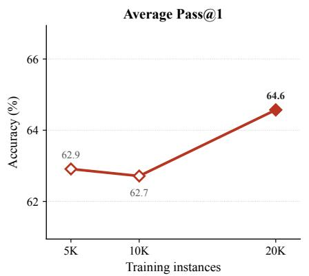

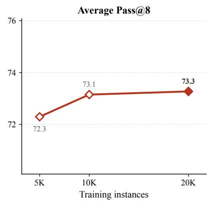

(a) Average over the seven benchmarks (left: Pass@1, right: Pass@8).  
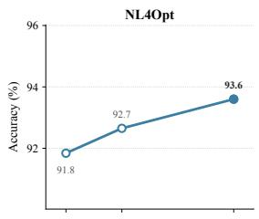

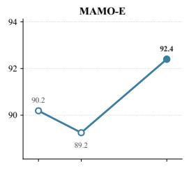

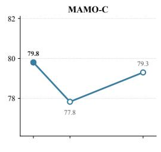

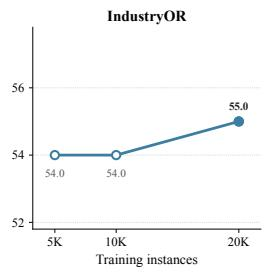

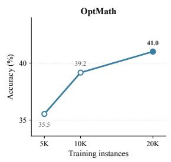

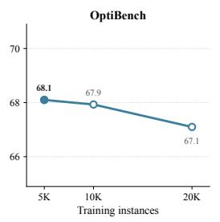

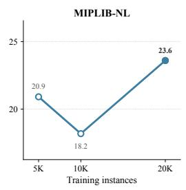  
(b) Per-benchmark Pass@1.

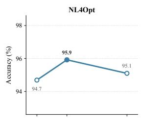

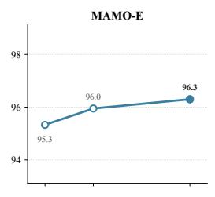

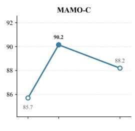

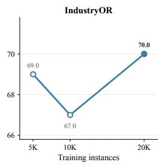

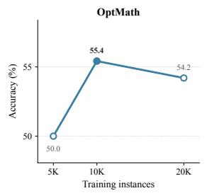

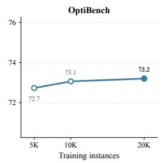

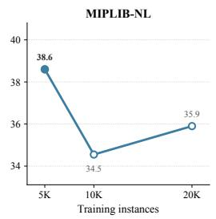  
(c) Per-benchmark Pass@8.  
Figure 5: Effect of training data size for SDRL (Qwen3-4B-Instruct-2507) trained with 5K, 10K, and 20K mixed-format instances. Each panel uses its own y-axis range; filled markers denote the best setting.

Figure 5 reports the results: Figure 5a shows the average accuracy over the seven benchmarks, and Figures 5b and 5c the per-benchmark Pass@1 and Pass@8. Average Pass@1 is essentially flat between 5K and 10K (62.9 and 62.7) and improves to 64.6 at 20K, while average Pass@8 rises from 72.3 to 73.1 between 5K and 10K and then plateaus. The gains are concentrated on the harder benchmarks such as OptMATH-Bench and MIPLIB-NL. Notably, even with only 5K instances, SDRL already surpasses all fine-tuned baselines in Table 1 on average Pass@1, indicating that the diversity-driven exploration is data-efficient rather than dependent on scale. We nonetheless adopt 20K instances as the default training set size, as it gives the best overall accuracy.

## D.2 SENSITIVITY TO THE MACRO/MICRO WEIGHT λ

The weight λ in Eq. 12 balances cross-strategy exploration $( R _ { \mathrm { m a c r o } } )$ against within-strategy runtime diversity $( R _ { \mathrm { m i c r o } } )$ . We sweep $\lambda \in \{ 0 , 0 . 1 , 0 . 3 , 0 . 5 , 0 . 7 , 0 . 9 , 1 . 0 \}$ on Qwen3-4B-Instruct-2507 with the text-only training data and the configuration of Table 6, changing only λ. The endpoints $\lambda = 0$ and λ = 1 correspond to the micro-only and macro-only variants of Table 2, and $\lambda = 0 . 7$ is the default used throughout the paper. Table 8 reports Pass@1 and Pass@8 on the four benchmarks of the ablation study.

Table 8: Effect of the macro/micro weight λ on Qwen3-4B-Instruct-2507 (text-only training). $\lambda = 0$ uses only $R _ { \mathrm { m i c r o } } , \lambda = 1$ only $R _ { \mathrm { m a c r o } } ; \lambda = 0 . 7$ is our default. Bold marks the best value in each column.
<table><tr><td></td><td colspan="2">MAMO-C</td><td colspan="2">IndustryOR</td><td colspan="2">OptMath</td><td colspan="2">MIPLIB-NL</td><td colspan="2">Average</td></tr><tr><td>λ</td><td>P@1</td><td>P@8</td><td>P@1</td><td>P@8</td><td>P@1</td><td>P@8</td><td>P@1</td><td>P@8</td><td>P@1</td><td>P@8</td></tr><tr><td>0.0</td><td>75.9</td><td>88.2</td><td>52.0</td><td>72.0</td><td>34.9</td><td>50.0</td><td>14.6</td><td>25.9</td><td>44.4</td><td>59.0</td></tr><tr><td>0.1</td><td>72.9</td><td>88.2</td><td>52.0</td><td>72.0</td><td>36.8</td><td>52.4</td><td>15.9</td><td>32.3</td><td>44.4</td><td>61.2</td></tr><tr><td>0.3</td><td>74.9</td><td>88.2</td><td>53.0</td><td>69.0</td><td>34.3</td><td>53.0</td><td>14.6</td><td>33.2</td><td>44.2</td><td>60.9</td></tr><tr><td>0.5</td><td>74.4</td><td>88.2</td><td>50.0</td><td>70.0</td><td>33.1</td><td>53.4</td><td>14.6</td><td>32.7</td><td>43.0</td><td>61.1</td></tr><tr><td>0.7</td><td>75.9</td><td>90.2</td><td>53.0</td><td>71.0</td><td>36.7</td><td>54.8</td><td>16.8</td><td>33.2</td><td>45.6</td><td>62.3</td></tr><tr><td>0.9</td><td>68.5</td><td>88.2</td><td>55.0</td><td>73.0</td><td>36.6</td><td>54.4</td><td>14.1</td><td>32.3</td><td>43.6</td><td>62.0</td></tr><tr><td>1.0</td><td>73.9</td><td>88.7</td><td>50.0</td><td>72.0</td><td>37.4</td><td>53.6</td><td>14.6</td><td>31.8</td><td>44.0</td><td>61.5</td></tr></table>

The default $\lambda = 0 . 7$ gives the best average Pass@1 and Pass@8. Average Pass@8 is largely insensitive to λ once the macro term is present (60.9–62.3 for $\lambda \geq 0 . 1 )$ and drops to 59.0 only when it is removed $( \lambda = 0 )$ , with the loss concentrated on MIPLIB-NL. This indicates that cross-strategy exploration is what drives repeated-sampling coverage. Average Pass@1 varies within about 2.6 points across the sweep, and the per-benchmark fluctuations do not follow a consistent trend, so we keep $\lambda = 0 . 7$ as the default.

## D.3 DISENTANGLING THE EFFECTS OF STRATEGY ROUTING AND REINFORCEMENT LEARNING

To disentangle the effect of reinforcement learning from the effect of strategy-diverse routing, we compare four configurations of the same Qwen3-4B-Instruct-2507 backbone under two prompting protocols: the rigid SIR Prompt, which follows the solver-integrated reasoning paradigm of prior work (Chen et al., 2026b) and requires every instance to be formulated as a solver-executable mathematical program, and our Meta Prompt, which lets the model choose among SIR, Exact Combinatorial Algorithm, and Heuristic Search according to the problem structure. Base (SIR) and Base (Meta) evaluate the untrained backbone under the two prompts. SIR-RL is trained with the same GRPO recipe and the same text-only data as SDRL but is confined to the SIR Prompt during both training and inference, without the diversity reward $R _ { \mathrm { d i v } } ;$ it isolates the gain from executablefeedback RL within a single paradigm. SDRL is trained under the Meta Prompt with the diversity reward on the same text-only data, and thus corresponds to the Text-only variant in Table 3 rather than the stronger mixed-format model in Table 1. Table 9 reports Pass@1 and Pass@8 across all seven benchmarks.

Table 9: Pass@1 and Pass@8 accuracy (%) for disentangling the effects of strategy routing and reinforcement learning. Base (SIR) and Base (Meta) evaluate Qwen3-4B-Instruct-2507 under the rigid SIR Prompt and the Meta Prompt, respectively. SIR-RL applies reinforcement learning while remaining restricted to the SIR paradigm, whereas SDRL (Ours) enables strategy-diverse routing under the Meta Prompt.
<table><tr><td></td><td colspan="2">NL4Opt</td><td colspan="2">MAMO-E</td><td colspan="2">MAMO-C</td><td colspan="2">IndustryOR</td><td colspan="2">OptMath</td><td colspan="2">OptiBench</td><td colspan="2">MIPLIB-NL</td><td colspan="2">Avg.</td></tr><tr><td>Method</td><td>P@1</td><td>P@8</td><td>P@1</td><td>P@8</td><td>P@1</td><td>P@8</td><td>P@1</td><td>P@8</td><td>P@1</td><td>P@8</td><td>P@1</td><td>P@8</td><td>P@1</td><td>P@8</td><td>P@1</td><td>P@8</td></tr><tr><td>Base (SIR)</td><td>91.8</td><td>95.5</td><td>89.1</td><td>94.9</td><td>41.9</td><td>66.0</td><td>48.0</td><td>63.0</td><td>12.7</td><td>32.5</td><td>62.5</td><td>70.1</td><td>8.6</td><td>25.8</td><td>50.7</td><td>64.0</td></tr><tr><td>Base (Meta)</td><td>72.7</td><td>93.5</td><td>68.9</td><td>89.6</td><td>42.4</td><td>76.9</td><td>40.0</td><td>62.0</td><td>17.5</td><td>36.8</td><td>54.1</td><td>70.1</td><td>7.7</td><td>19.1</td><td>43.3</td><td>64.0</td></tr><tr><td>SIR-RL</td><td>94.7</td><td>95.9</td><td>92.8</td><td>96.6</td><td>70.4</td><td>85.7</td><td>48.0</td><td>65.0</td><td>36.1</td><td>48.2</td><td>66.8</td><td>69.6</td><td>14.1</td><td>28.2</td><td>60.4</td><td>69.9</td></tr><tr><td>SDRL (Ours)</td><td>93.9</td><td>95.5</td><td>92.2</td><td>97.4</td><td>75.9</td><td>90.2</td><td>53.0</td><td>71.0</td><td>36.7</td><td>54.8</td><td>65.8</td><td>72.6</td><td>16.8</td><td>33.2</td><td>62.0</td><td>73.5</td></tr></table>

Two observations stand out. First, reinforcement learning is necessary but not sufficient. SIR-RL improves over Base (SIR) by 9.7 points on average Pass@1, and SDRL improves over Base (Meta) by 18.7 points, nearly twice the gain. The base model itself cannot exploit the Meta Prompt: Base (Meta) trails Base (SIR) by 7.4 points at Pass@1 even though the two tie at Pass@8. Offering three strategies to an untrained model only adds ways to go wrong on a single attempt; the routing has to be learned, and SDRL learns it without any strategy labels.

Second, SDRL solves a strictly harder learning problem than SIR-RL, yet comes out ahead at both budgets. SIR-RL only has to sharpen one paradigm; SDRL has to learn when each of three paradigms applies and how to execute each of them. Despite this, SDRL leads SIR-RL on average Pass@1 (62.0 vs. 60.4), winning four of the seven benchmarks while trailing by at most one point on the remaining three. The gap widens under repeated sampling: SDRL achieves the higher Pass@8 on six of seven benchmarks and leads by 3.6 points on average, with the largest margins on OptMath (+6.6), IndustryOR (+6.0), MIPLIB-NL (+5.0), and MAMO-ComplexLP (+4.5). These are the benchmarks where problem structure varies most across instances, so a policy that can switch paradigms has the most to gain. Strategy-diverse training does not merely reshuffle which trajectory ranks first; it enlarges the set of trajectories that can succeed, and that enlargement is what repeated sampling exploits.

To trace this effect over the full sampling budget, we plot Pass@k for $k = 1 , \ldots , 8$ in Figure 6. The curves are computed from the same eight temperature-1.0 samples used for Pass@8 (Appendix C.4), so the k = 1 point reflects a single high-temperature sample and is not directly comparable to the Pass@1 values in Table 9, which use temperature 0.5.

The Pass@k curves make the mechanism visible. SIR-RL’s curves flatten early: every additional sample is drawn from the same paradigm, so it tends to fail on the same instances for the same reasons. SDRL’s curves keep rising, because a sample that switches strategy can succeed where the previous ones failed. On the benchmarks where SIR-RL leads at small k, SDRL closes the gap and overtakes it as k grows; the only exception is NL4Opt, where both methods saturate above 95% and the two curves are indistinguishable.

Taken together, these results attribute SDRL’s gains to the right source. Reinforcement learning raises trajectory quality within any paradigm; strategy flexibility alone raises nothing. What SDRL adds is the ability to route across paradigms and to keep the rollouts diverse enough that this routing pays off under sampling. The result is a policy that already outperforms a specialized SIR policy on a single attempt and is markedly more reliable given several, and the mixed-format model in the main results extends this advantage further.

## D.4 RUNTIME ANALYSIS

The micro-level diversity reward (Section 3.3) rewards rare runtime modes among correct programs, which raises the question of whether the policy could exploit it by generating artificially slow programs. We check this by re-executing every Pass@8 rollout of the Qwen3-4B-Instruct-2507 base model and SDRL-Qwen3-4B in an isolated subprocess on a dual-socket AMD EPYC 9354 server (64 cores, 128 threads) with 32 concurrent workers, each limited to a single Gurobi thread, 8 GB of memory, and a 1,800-second time limit. Runtime is the end-to-end wall time of the subprocess, including interpreter start-up and imports. Table 10 and Figure 7 report the runtime of programs whose objective value is correct under the 10<sup>−6</sup> tolerance.

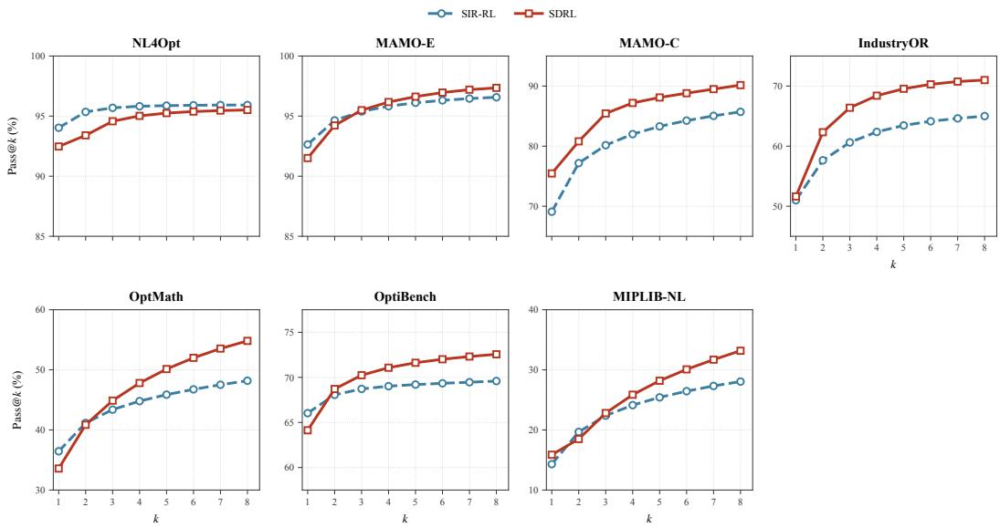  
Figure 6: Pass@k of SIR-RL and SDRL across seven benchmarks. SDRL’s advantage widens with k: complementary solving pathways turn additional samples into additional solved instances, whereas a single-paradigm policy saturates. All points are computed from the eight temperature-1.0 samples used for Pass@8.

The runtime profile of SDRL is essentially unchanged from the base model. On the six textual benchmarks both models solve almost every instance in well under a second, with medians between 0.01 and 0.09 s and 90th percentiles below 0.22 s; the small upward shift in SDRL’s medians is within the fixed interpreter and import overhead. On MIPLIB-NL, the only benchmark with substantive runtimes, SDRL’s 90th percentile is lower than the base model’s (84.5 s vs. 150.4 s) while it solves 3.4 times as many rollouts correctly. Timeouts are rare for both models (0.5% of SDRL rollouts vs. 0.8% for the base model). The micro-level reward therefore diversifies runtime modes without inducing slow programs.

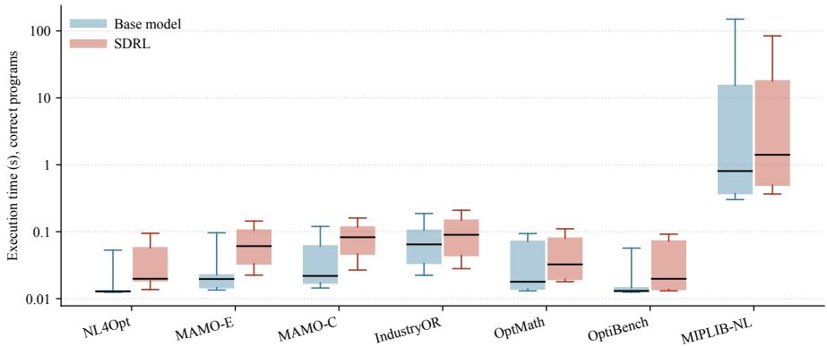  
Figure 7: Execution time of correct programs on the Pass@8 rollouts, by benchmark (log scale; boxes show quartiles, whiskers the 10th and 90th percentiles).

Table 10: Runtime (s) of correct programs on the Pass@8 rollouts. n is the number of correct programs; Median and P90 are the median and 90th percentile of their wall-clock execution time.
<table><tr><td rowspan="2">Benchmark</td><td colspan="3">Base model</td><td colspan="3">SDRL</td></tr><tr><td>n</td><td>Median</td><td>P90</td><td>n</td><td>Median</td><td>P90</td></tr><tr><td>NL4Opt</td><td>1443</td><td>0.013</td><td>0.05</td><td>1743</td><td>0.020</td><td>0.10</td></tr><tr><td>MAMO-E</td><td>3494</td><td>0.020</td><td>0.10</td><td>4627</td><td>0.061</td><td>0.14</td></tr><tr><td>MAMO-C</td><td>689</td><td>0.022</td><td>0.12</td><td>1270</td><td>0.083</td><td>0.16</td></tr><tr><td>IndustryOR</td><td>314</td><td>0.065</td><td>0.19</td><td>445</td><td>0.090</td><td>0.21</td></tr><tr><td>OptMath</td><td>212</td><td>0.018</td><td>0.10</td><td>498</td><td>0.032</td><td>0.11</td></tr><tr><td>OptiBench</td><td>3107</td><td>0.013</td><td>0.06</td><td>3254</td><td>0.020</td><td>0.09</td></tr><tr><td>MIPLIB-NL</td><td>106</td><td>0.806</td><td>150.4</td><td>360</td><td>1.409</td><td>84.5</td></tr></table>

## E CASE STUDIES

This section presents two qualitative examples illustrating complementary capabilities of SDRL. The first case demonstrates file-grounded problem solving, where the model must access external structured data at runtime to construct and solve the optimization problem. The second case illustrates strategy diversity on a self-contained textual instance, where SDRL produces correct solutions through SIR, Exact Combinatorial Algorithm, and Heuristic Search.

## E.1 FILE-GROUNDED PROBLEM SOLVING

We first present a file-grounded instance from MIPLIB-NL to illustrate SDRL’s ability to solve optimization problems whose instance-specific numerical data are stored in external files. Unlike self-contained textual instances, the model must access and interpret the associated files at runtime before constructing the optimization problem.

Problem Statement   
Instance: beasleyC1   
A logistics operator is redesigning a regional backbone with 500 sites and 1,250 candidate directed links. Activating a link incurs a fixed   
operating cost, and only activated links can carry flow. Each activated link has a capacity of 4 units. The objective is to select a subset of   
links and route the required flow such that all node-level supply and demand requirements are satisfied while minimizing the total fixed   
activation cost.   
The instance-specific numerical data are stored in four external CSV files:   
• ./data/parameter.csv: global parameters;   
• ./data/arcs.csv: 1,250 candidate directed arcs;   
• ./data/costs.csv: fixed activation costs for the arcs;   
• ./data/flow\_balance.csv: supply/demand requirements for 500 nodes.   
The generated program must load these files at runtime and determine the optimal objective value without hard-coding the instance data.

SDRL selects the SIR strategy and identifies the problem as a fixed-charge network flow MILP. It introduces a continuous flow variable $x _ { a }$ and a binary activation variable $y _ { a }$ for each candidate arc $^ { a , }$ minimizes the total activation cost, and enforces node-balance and arc-capacity constraints.

SIR   
Strategy tag: <strategy>SIR</strategy>   
Reasoning.   
The model recognizes the instance as a fixed-charge network flow problem. For each arc, it uses a binary variable to indicate whether the   
arc is activated and a continuous variable for the transported flow. The fixed activation costs form the objective, while flow conservation   
is enforced at each node and flow is allowed only on activated arcs.   
Code (excerpt).   
parameter\_df = pd.read\_csv('./data/parameter.csv')   
arcs\_df = pd.read\_csv('./data/arcs.csv')   
costs\_df = pd.read\_csv('./data/costs.csv')   
flow\_balance\_df = pd.read\_csv('./data/flow\_balance.csv')   
capacity\_per\_arc = int(   
parameter\_df.loc[   
parameter\_df['parameter'] == 'capacity\_per\_arc', 'value'   
].values[0]   
)

```python
for arc_id in arc_ids:
y_vars[arc_id] = model.addVar(vtype=GRB.BINARY)
x_vars[arc_id] = model.addVar(lb=0, vtype=GRB.CONTINUOUS)
model.setObjective(
gp.quicksum(
cost_data[arc_id]['fixed_cost'] <sub>*</sub> y_vars[arc_id]
for arc_id in arc_ids
),
GRB.MINIMIZE
)
for node in flow_balance:
inflow = gp.quicksum(
x_vars[a] for a in arc_ids
if arc_data[a]['end'] == node
)
outflow = gp.quicksum(
x_vars[a] for a in arc_ids
if arc_data[a]['start'] == node
)
model.addConstr(
inflow - outflow == flow_balance[node]
)
for arc_id in arc_ids:
model.addConstr(
x_vars[arc_id]
<= capacity_per_arc y_vars[arc_id]
)
model.optimize()
objective_value = model.objVal
Result: objective = 85.0
```

The generated program successfully loads and integrates all four external files, constructs the corresponding MILP, and obtains the reference optimum of 85. This example illustrates SDRL’s ability to perform file-grounded optimization without requiring the instance-specific numerical data to be serialized into the textual prompt.

## E.2 STRATEGY DIVERSITY ON A TEXTUAL INSTANCE

We consider a five-node symmetric traveling salesperson instance: a museum curator must visit five exhibits exactly once and return to the starting exhibit, minimizing the total walking distance.

The three responses use distinct computational procedures. The SIR response formulates an MILP with Miller–Tucker–Zemlin (MTZ) subtour elimination constraints and solves it with Gurobi. The Exact Combinatorial Algorithm response fixes the starting exhibit and exhaustively enumerates the 4! = 24 directed tours. The Heuristic Search response runs simulated annealing with a 2-opt neighborhood. All three obtain the optimal tour length of 310.6.

Table 11: Three complementary solution strategies for the same five-exhibit traveling salesperson instance.
<table><tr><td>Strategy</td><td>Representative procedure</td><td>Objective</td></tr><tr><td>SIR</td><td>MILP with MTZ subtour elimination, solved with Gurobi</td><td>310.6</td></tr><tr><td>Exact Combinatorial Algorithm</td><td>Exhaustive enumeration of the 4! tours from a fixed start</td><td>310.6</td></tr><tr><td>Heuristic Search</td><td>Simulated annealing with 2-opt moves</td><td>310.6</td></tr></table>

The problem statement and the three responses below illustrate the reasoning and code produced under each strategy tag; markdown emphasis in the original outputs has been retyped in LAT X for readability.

## Problem Statement

A museum curator is tasked with arranging a tour that visits five distinct historical exhibits in a sprawling complex. The walking distances between exhibits are recorded as follows:

• Exhibit Alpha to Beta: 10.0 meters

• Exhibit Alpha to Gamma: 129.8 meters

• Exhibit Alpha to Delta: 40.3 meters

• Exhibit Alpha to Epsilon: 14.0 meters

• Exhibit Beta to Gamma: 137.3 meters

• Exhibit Beta to Delta: 50.0 meters

SIR   
Strategy: SIR   
Raw strategy tag: <strategy>SIR</strategy>   
Reasoning.   
Mathematical Analysis and Formulation. This problem is a classic Traveling Salesperson Problem (TSP), where the objective is to   
find the shortest possible route that visits every exhibit exactly once and returns to the origin.   
1. Sets and Indices:   
• Let V = {0, 1, 2, 3, 4} be the set of nodes representing the exhibits Alpha, Beta, Gamma, Delta, and Epsilon respectively.   
• Node 0 is designated as the starting/ending point (Alpha) for subtour elimination purposes.   
2. Parameters: $d _ { i j } \colon$ the walking distance between exhibit i and exhibit j. The distance matrix is symmetric, $d _ { i j } = d _ { j i }$   
3. Decision Variables:   
$x _ { i j } \in \{ 0 , 1 \}$ for all $i , j \in V , i \neq j \colon$ equals 1 if the path proceeds directly from exhibit i to exhibi $j ,$ and 0 otherwise.   
$u _ { i } \geq 1$ 1 for all $i \in V \setminus \{ 0 \}$ : continuous variables used for the Miller–Tucker–Zemlin (MTZ) subtour elimination constraints,   
representing the sequence in which the exhibits are visited.   
4. Objective Function: Minimize the total walking distance of the tour, min $\textstyle \sum _ { i \in V } \sum _ { j \in V , j \neq i } d _ { i j } x _ { i j } .$   
5. Constraints:   
• Leave exactly once (out-degree): $\textstyle \sum _ { j \neq i } x _ { i j } = 1 { \mathrm { ~ f o r ~ a l l ~ } } i \in V .$   
Arrive exactly once (in-degree): $\textstyle \sum _ { i \neq j } x _ { i j } = 1 { \mathrm { ~ f o r ~ a l l ~ } } j \in V .$   
• Subtour elimination (MTZ): $u _ { i } - u _ { j } + | V | x _ { i j } \leq | V | - 1$ for all $i , j \in V \setminus \{ 0 \} , i \ne j$ , ensuring a single continuous tour   
with no disconnected loops among nodes $\{ 1 , 2 , 3 , 4 \} .$   
6. Size Estimation: $5 \times 4 = 2 0$ binary $x _ { i j }$ variables and 4 continuous $u _ { i }$ variables, i.e., 24 decision variables; 10 degree constraints   
plus 4 × 3 = 12 MTZ constraints, i.e., 22 constraints in total.   
Code (excerpt).   
model = gp.Model("Museum\_TSP", env=env)   
x = {(i, j): model.addVar(vtype=GRB.BINARY) for i in nodes for j in nodes if i != j}   
u = {i: model.addVar(lb=1, ub=n-1, vtype=GRB.CONTINUOUS) for i in nodes[1:]}   
model.setObjective(gp.quicksum(d[i, j] x[i, j] for (i, j) in x), GRB.MINIMIZE)   
for i in nodes:   
model.addConstr(gp.quicksum(x[i, j] for j in nodes if i != j) == 1)   
model.addConstr(gp.quicksum(x[j, i] for j in nodes if i != j) == 1)   
for i in nodes[1:]:   
for j in nodes[1:]:   
if i != j:   
model.addConstr(u[i] - u[j] + n<sub>\*</sub>x[i, j] <= n - 1)   
model.optimize()   
objective\_value = model.ObjVal   
Result: objective = 310.6

• Exhibit Beta to Epsilon: 18.0 meters   
• Exhibit Gamma to Delta: 115.7 meters   
• Exhibit Gamma to Epsilon: 138.8 meters   
• Exhibit Delta to Epsilon: 37.1 meters   
The objective is to determine the minimal total walking path that allows the curator to stop at each exhibit precisely once and then return   
to the initial exhibit.

## Exact Combinatorial Algorithm

Strategy: Exact Combinatorial Algorithm   
Raw strategy tag: <strategy>Exact Combinatorial Algorithm</strategy>   
Reasoning.   
1. Core Algorithmic Structure & Problem Properties. The problem asks for the shortest path visiting five distinct exhibits exactly once   
and returning to the starting point. This is the classic symmetric Traveling Salesperson Problem (TSP). The exhibits are the nodes in a   
fully connected undirected graph, and the walking distances are the edge weights. The goal is to find a Hamiltonian cycle of minimum   
total weight. While TSP is NP-hard in general—meaning its exact solution typically requires dynamic programming (like the Held–Karp   
algorithm with $O ( n ^ { 2 } 2 ^ { n } \bar { \Big . }$ ) time complexity) or branch-and-bound algorithms—the problem size here is exceedingly small $( N = 5 ) .$   
2. Algorithm Selection: Exhaustive Search. Because N = 5, the number of possible tours is $( N - 1 ) ! / 2 = \bar { 1 2 }$ unique undirected   
cycles for a symmetric graph. Even generating all 4! = 24 directed cycles by fixing a starting node is computationally trivial. Therefore,   
exhaustive search is the most robust and provably correct method for this scale: it guarantees global optimality without the overhead of   
search-tree pruning or memoization structures.   
3. Complexity Analysis.   
• Time: O((N − 1)!); for N = 5 this is 24 path evaluations, each requiring O(N) operations to sum the edge distances.   
• Space: $O ( N ^ { 2 } )$ for the distance matrix and O(N) for the current permutation and best sequence.   
4. Variable Representation. The tours are evaluated implicitly. Once the optimal sequence is identified, it is mapped to binary decision   
variables $x _ { i , j } ,$ , where $x _ { i , j } = 1$ if the curator walks directly from exhibit i to exhibit j, and 0 otherwise.   
Code (excerpt).   
start\_node = "Alpha"   
other\_nodes = [v for v in nodes if v != start\_node]   
best\_cost, best\_tour = float('inf'), None   
for perm in itertools.permutations(other\_nodes):   
tour = [start\_node] + list(perm) + [start\_node]   
cost = sum(dist\_matrix[tour[i]][tour[i+1]] for i in range(len(tour) - 1))   
if cost < best\_cost:

best\_cost, best\_tour = cost, tour   
objective\_value = best\_cost   
Result: objective = 310.6

## Heuristic Search

Strategy: Heuristic Search   
Raw strategy tag: <strategy>Heuristic Search</strategy> Reasoning.

Heuristic Design: Simulated Annealing (SA).

1. Optimization Structure and Difficulty. The problem is a symmetric TSP on a complete graph with n = 5 nodes. The objective is to find a Hamiltonian cycle of minimum weight. While n = 5 is a trivially small instance, the general TSP is NP-hard due to the factorial growth of permutations. The main source of combinatorial difficulty is sequencing the exhibits so as to minimize the total wrap-around distance; feasibility requires visiting every node exactly once and returning to the origin.

2. Chosen Method. We implement Simulated Annealing (SA). SA starts from an initial solution and iteratively explores the solution space; by accepting non-improving solutions with a probability that decreases over time (the “temperature”), it escapes local optima. SA is not exact and does not prove global optimality, but it almost always converges to the optimal or a highly competitive near-optimal solution for small to medium routing problems.

3. Solution Representation and Initialization. A permutation of the five exhibit names, with the return step implicit in the cost; the initial tour is a random shuffle.

4. Neighborhood Operator. 2-opt: two distinct indices are selected at random and the segment between them is reversed. Every neighbor remains a valid Hamiltonian cycle, so no penalty functions or repair steps are required.

5. Acceptance Rule (Metropolis). With ∆E = new distance − current distance, a move is accepted automatically if $\Delta E < 0 ,$ , and with probability exp(−∆E/T) otherwise.

6. Stopping Criterion and Random Seed. Geometric cooling $T _ { k + 1 } = \alpha T _ { k }$ with T<sub>0</sub> = 100, α = 0.99, and 20 moves per temperature, stopping when $T < 1 0 ^ { - 4 } ;$ ; the random seed is fixed to 42 for reproducibility.   
Code (excerpt).

```python
T, T_min, alpha, iter_per_temp = 100.0, 1e-4, 0.99, 20
while T > T_min:
for _ in range(iter_per_temp):
i, j = sorted(random.sample(range(len(nodes)), 2))
new_tour = current_tour[:]
new_tour[i:j+1] = reversed(new_tour[i:j+1]) # 2-opt move
delta = calc_tour_distance(new_tour) - current_cost
if delta < 0 or random.random() < math.exp(-delta / T):
current_tour, current_cost = new_tour, current_cost + delta
if current_cost < best_cost:
best_tour, best_cost = current_tour[:], current_cost
T <sub>*</sub>= alpha
objective_value = best_cost
Result: objective = 310.6
```