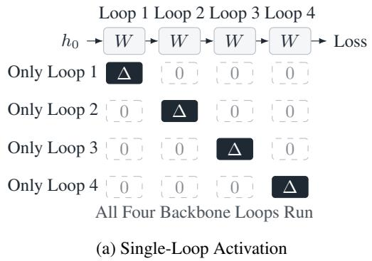
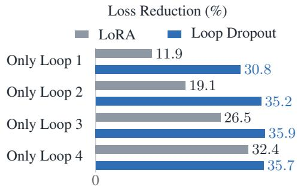
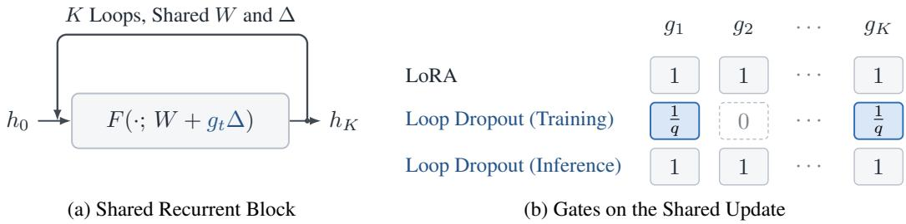
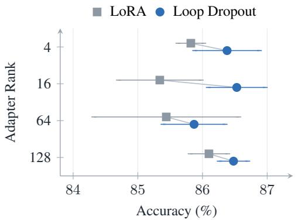
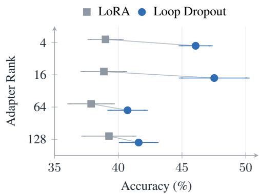
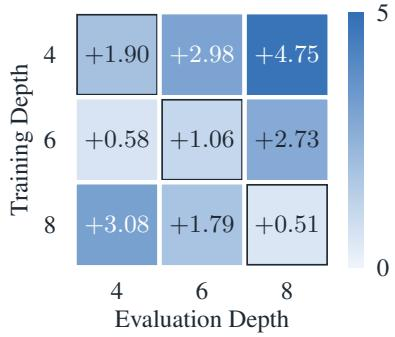
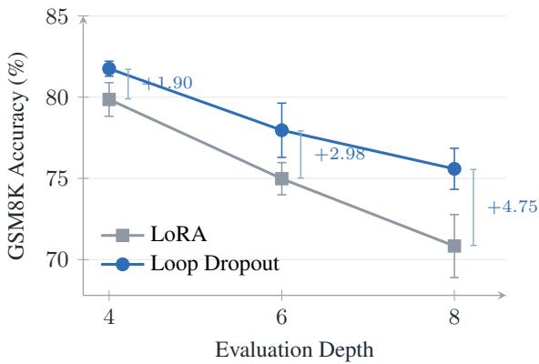
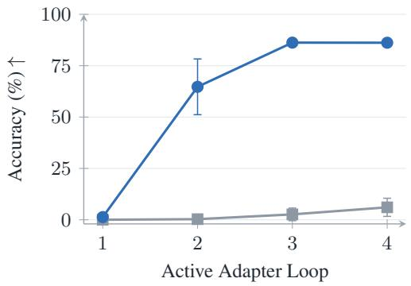
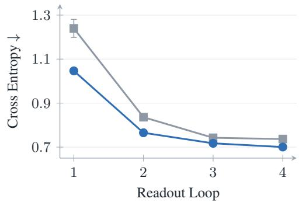

# LOOP DROPOUT: REGULARIZING SHARED UPDATES IN LOOPED LANGUAGE MODELS

Zirui Zhu

Hailun Xu

Xuanlei Zhao Yong Liu

Yingxuan Ren

Kanchan Sarkar

Kun Xu Yang You

Correspondence to: {zirui, youy}@comp.nus.edu.sg

## ABSTRACT

Looped language models separate computational depth from parameter count by repeatedly applying the same transformer block. Adapting these models requires a shared update that remains effective as hidden states evolve throughout the recurrent computation. Our empirical analysis reveals a pronounced late-loop bias in standard low-rank adaptation (LoRA): the shared update is more effective at later loop positions. This imbalance motivates training shared updates under varying combinations of their applications. Randomly omitting adapter applications alone, however, does not improve task performance; it reduces expected update strength during training while leaving inference unchanged. We introduce Loop Dropout, which couples stochastic masking of adapter applications with inverse-survival rescaling to preserve expected update strength and promote effective adaptation across loops. Extensive experiments demonstrate improved mathematical reasoning across model sizes, adapter ranks and training recipes, with benefits extending to general instruction tuning and code generation. Loop Dropout outperforms existing LoRA variants and adapter regularizers, while further analysis shows stronger early-loop adaptation. Every backbone loop remains active, and inference applies the adapter at all loops using standard LoRA without additional trainable parameters or inference computation.

## 1 INTRODUCTION

Looped language models separate computational depth from parameter count by repeatedly applying the same transformer block (Dehghani et al., 2019; Geiping et al., 2025; Zhu et al., 2025). This reuse allows compact models to perform multiple stages of computation and match substantially larger standard language models (Zhu et al., 2025). Adapting these models requires a shared update that remains effective as hidden states evolve throughout the recurrent computation.

Low-rank adaptation (LoRA) learns a compact update to frozen pretrained weights (Hu et al., 2022), with variants modifying its parameterization, optimization and regularization (Hayou et al., 2024; Kalajdzievski, 2023; Liu et al., 2024; Lin et al., 2024). In a looped model, the same update acts on different hidden states at different distances from the final prediction. Standard LoRA fine-tuning activates all applications together and optimizes their combined effect through the final loss. Stepresolved data attribution shows that training examples influence the loops unevenly (Kaissis et al., 2026), motivating an empirical analysis of how effectively the learned update works across the recurrence.

Our empirical analysis reveals a pronounced late-loop bias in shared adaptation. Figure 1a evaluates a trained adapter at each loop position in turn, with the adapter active only at that position and the backbone running all four loops. For Ouro-1.4B fine-tuned on GSM8K with standard LoRA, loss reduction falls from 32% when the update is applied at the fourth loop to 12% when applied at the first, relative to the same frozen model. The same late-loop bias persists across training configurations. This imbalance motivates learning an update that supports effective adaptation throughout the recurrent computation.

Dropout encourages features to remain useful across different combinations of other features (Srivas tava et al., 2014). For a shared adapter, this principle suggests learning across varying combinations of its applications. However, we find that randomly omitting adapter applications alone does not improve task performance. Stochastic omission creates a training–inference mismatch: it reduces the expected training update, while inference applies the full update at every loop.

  
(b) Single-Loop Loss Reduction  
Figure 1: Loop Dropout reduces the late-loop bias of shared adaptation. Ouro (Zhu et al., 2025) uses four loops through a shared transformer block by default. To probe adaptation across loops after GSM8K fine-tuning, we activate the adapter in one loop at a time while retaining all four backbone loops. LoRA’s loss reduction falls from 32% at the fourth loop to 12% at the first; Loop Dropout maintains 31–36% across positions. All reductions are relative to the frozen model and use final-loop teacher-forced test loss.

We therefore introduce Loop Dropout, which couples stochastic masking of adapter applications with inverse-survival rescaling to promote effective adaptation across loops. Each retained update is divided by its survival probability, preserving the expected update strength during training. This design trains the shared update under varying application patterns while keeping every backbone loop active. At inference, all applications are active and the adapter follows standard LoRA, with no additional trainable parameters or inference computation.

Figure 1b shows that Loop Dropout maintains loss reductions of 31–36% across all four loops, narrowing the disparity between early and late applications. When adapters trained with four loops are evaluated at eight loops without further fine-tuning, Loop Dropout outperforms LoRA by 4.75 percentage points on GSM8K.

Extensive experiments demonstrate that Loop Dropout delivers consistent gains on mathematical reasoning and improves general instruction tuning, with the clearest benefits on code generation. Loop Dropout outperforms existing LoRA variants and adapter regularizers such as CoTo (Zhuang et al., 2025b), highlighting the value of tailoring adaptation to the recurrent structure of looped language models.

Our contributions are as follows:

• We identify a pronounced late-loop bias in standard LoRA fine-tuning, exposing the challenge of learning shared updates that remain effective across loops.

• We introduce Loop Dropout, coupling independent masks over complete applications of the shared update with inverse-survival rescaling to promote effective adaptation across loops while retaining standard LoRA inference.

• We demonstrate improved mathematical adaptation and transfer across model sizes, adapter ranks and training recipes, supported by stronger early-loop adaptation, zero-shot generalization to deeper recurrence and comparisons with alternative regularizers.

## 2 PRELIMINARIES

Looped computation. A looped language model embeds an input sequence into $h _ { 0 }$ and applies a transformer block F with shared parameters W for K loops:

$$
h _ { t } = F ( h _ { t - 1 } ; W ) , \qquad t = 1 , \ldots , K , \qquad z = \operatorname { H e a d } ( h _ { K } ) .\tag{1}
$$

  
Figure 2: Loop Dropout regularizes shared adaptation across loops. The shared block F reuses the same W and ∆ over K loops. Following Eq. (3), training uses $g _ { t } = b _ { t } / q ,$ where $q = 1 - p$ and $b _ { t } \sim$ Bernoulli(q) independently for each example and loop. The training row illustrates one sampled pattern: retained updates have gate $1 / q ,$ and dropped updates have gate 0. LoRA and inference use $g _ { t } = 1$ at every loop. A zero gate removes only $\Delta ;$ every backbone loop remains active.

We call each application of the shared transformer block a loop; the recurrence depth K is the number of loops. Increasing K adds computation without another copy of the block parameters. We use the base Ouro models (Zhu et al., 2025), whose default recurrence depth is $K = 4$ , and fix the depth for all examples rather than using their adaptive exit gates.

Shared low-rank updates. LoRA (Hu et al., 2022) adapts a frozen matrix $W _ { i } \in \mathbb { R } ^ { d _ { \mathrm { o u t } } \times d _ { \mathrm { i n } } }$ through $\begin{array} { r } { \Delta _ { i } = \frac { \alpha } { r } B _ { i } A _ { i } , } \end{array}$ where $A _ { i } \in \mathbb { R } ^ { r \times d _ { \mathrm { i n } } } , \dot { B _ { i } } \in \mathbb { R } ^ { d _ { \mathrm { o u t } } \times r }$ , and r is the rank. We write $\Delta$ for the collection of these updates across the recurrent block. Standard fine-tuning then optimizes

$$
\begin{array} { r } { \mathcal { L } _ { \mathrm { L o R A } } ( \Delta ) = \mathbb { E } _ { ( x , y ) } ~ \mathrm { C E } \bigl ( \mathrm { H e a d } ( h _ { K } ) , y \bigr ) , \qquad h _ { t } = F \bigl ( h _ { t - 1 } ; W + \Delta \bigr ) , } \end{array}\tag{2}
$$

with loss on the target tokens $y .$ Each $\Delta _ { i }$ has one pair of trainable factors shared across all K loops, and its gradient includes contributions from every application. Training separate factors at each loop is an alternative, but multiplies the adapter parameter count by K at a fixed rank. We compare both equal-rank and equal-parameter versions of this alternative.

## 3 LOOP DROPOUT

The late-loop bias identified in Section 1 motivates learning a shared update that remains effective throughout the recurrent computation. Loop Dropout couples loop-level masking with inversesurvival rescaling: masking trains the update under varying combinations of its applications, while rescaling preserves its expected strength at every loop. Figure 2 illustrates the gates used in training and at inference.

## 3.1 LOOP-LEVEL MASKING

For each training example, Loop Dropout samples independent masks $b _ { t } \sim$ Bernoulli $( q )$ , where $q = 1 - p \in ( 0 , 1 ]$ is the survival probability, and computes

$$
h _ { t } = F ( h _ { t - 1 } ; W + g _ { t } \Delta ) , \qquad g _ { t } = \frac { b _ { t } } { q } , \qquad t = 1 , \ldots , K .\tag{3}
$$

One mask is shared by all adapted modules and token positions within a loop, as illustrated in Figure 2b. If $b _ { t } = 0$ , the loop uses only the pretrained weights; otherwise, it uses the shared update scaled by $1 / q .$ . The loss is evaluated at the final loop as in Eq. (2), all backbone weights remain frozen, and Algorithm 1 summarizes the procedure.

Masking a complete application changes both the input states reaching later loops and the set of adapter applications that contribute to the final prediction. Each active application is thus trained with varying combinations of earlier and later applications. Sharing one mask across all adapted modules makes the complete adapter application the unit of regularization.

Algorithm 1 Training with Loop Dropout   
Require: frozen block $F ( \because W )$ , shared LoRA factors $\Delta ,$ , depth K, survival probability q   
1: for each training example (x, y) in a mini-batch do   
2: $h _ { 0 } \gets$ Embed(x)   
3: for $t = 1 , \ldots , \dot { K }$ do   
4: $b _ { t } \sim$ Bernoulli(q) independently; $g _ { t } \gets b _ { t } / q$   
5: $h _ { t } \gets F ( h _ { t - 1 } ; \ddot { W } + g _ { t } \bar { \Delta } )$ ▷ same gate for all modules and tokens   
6: end for   
7: $\ell _ { x , y } \gets \mathrm { C E } ( \mathrm { H e a d } ( h _ { K } ) , y )$   
8: end for   
9: Update the LoRA factors using the mean mini-batch loss.   
10: Inference: set $g _ { t } = 1$ at every loop.

## 3.2 INVERSE-SURVIVAL RESCALING

Masking alone reduces each loop’s expected training update from $\Delta$ to $q \Delta .$ , while inference uses the full update ∆. The factor $1 / q$ in Eq. (3) compensates for this reduction, matching each loop’s expected training update to its inference update. Writing $g _ { t } = 1 + \varepsilon _ { t }$ with $\varepsilon _ { t } = ( b _ { t } - q ) / q$ , the effective weights of loop t decompose as

$$
W + g _ { t } \Delta = \underbrace { W + \Delta } _ { \mathrm { i n f e r e n c e ~ w e i g h t s } } + \underbrace { \varepsilon _ { t } \Delta } _ { \mathrm { z e r o - m e a n ~ p e r t u r b a t i o n } } , \qquad \mathbb { E } [ \varepsilon _ { t } ] = 0 , \qquad \operatorname { C o v } ( \varepsilon ) = \frac { p } { q } I _ { K } .\tag{4}
$$

The perturbation acts along the learned update and leaves the pretrained weights unchanged. At $p = 1 / 2 ,$ each loop applies either $2 \Delta$ or no update with equal probability, while its mean update remains ∆. This is the mean-preserving convention of inverted dropout (Srivastava et al., 2014), applied to complete adapter applications.

This property extends to the composed recurrent output at first order. Let $z _ { \eta } ( g )$ denote the final logits when loop t uses $W + \eta g _ { t } \Delta$ , where $\eta$ is an auxiliary update scale for expansion about the frozen computation at $\eta = 0$

Lemma 1 (First-order consistency of recurrent adaptation). Fix an input, update $\Delta ,$ , depth K and survival probability $q \in \mathsf { \Gamma } ( 0 , 1 ]$ . Suppose F is twice continuously differentiable in its state and weights, and Head is twice continuously differentiable, near thefrozen trajectory. For independent $b _ { t } \sim$ Bernoulli(q), as $\eta  0 ,$

$$
\begin{array} { r } { \mathbb { E } _ { b } z _ { \eta } ( b / q ) = z _ { \eta } ( \mathbf { 1 } ) + O ( \eta ^ { 2 } ) , } \\ { \mathbb { E } _ { b } z _ { \eta } ( b ) = z _ { q \eta } ( \mathbf { 1 } ) + O ( \eta ^ { 2 } ) . } \end{array}\tag{5}
$$

Each first-order contribution includes an update’s effect propagated through all subsequent backbone loops. Rescaling preserves the mean of their sum, while unscaled masking multiplies it by q. Appendix C.1 derives these contributions and bounds the second-order remainder. Thus rescaling aligns the leading adaptation effect during training with that at inference, complementing the varying application patterns produced by masking. The comparison in Table 5 shows higher accuracy when loop-level masking is coupled with this rescaling.

## 3.3 TRAINING ACROSS APPLICATION PATTERNS

The two components jointly train the shared update across a distribution of application patterns while preserving its expected strength. Let $\ell _ { \Delta } ( g )$ denote the loss for one example under a gate vector $g ,$ and let ${ \bf 1 } _ { S }$ indicate the subset S of loops with active updates. The objective is

$$
\mathbb { E } _ { b } \ell _ { \Delta } ( b / q ) = \sum _ { S \subseteq \{ 1 , \dots , K \} } q ^ { | S | } p ^ { K - | S | } \ell _ { \Delta } ( \mathbf { 1 } _ { S } / q ) .\tag{6}
$$

This weighted average jointly optimizes single-loop and multi-loop applications of the same update, exposing the shared parameters to both sparse and dense application patterns. Section 4.4 examines how the learned update’s effectiveness changes across loop positions.

For a fixed learned update, centering the gates at 1 also gives a local regularization view of this objective. Expanding Eq. (6) around the inference gate yields

$$
\mathbb { E } _ { b } \ell _ { \Delta } ( b / q ) = \ell _ { \Delta } ( { \bf 1 } ) + { \frac { p } { 2 q } } \sum _ { t = 1 } ^ { K } v _ { t } ^ { \top } H v _ { t } + R , \quad \quad v _ { t } = \frac { \partial z } { \partial g _ { t } } \bigg | _ { g = { \bf 1 } } ,\tag{7}
$$

where $H \succeq 0$ is the Hessian of the cross-entropy with respect to the logits z and R collects the higher-order terms together with the part of the gate Hessian that involves second derivatives of z. The first term is the standard LoRA objective; the nonnegative curvature term describes local regularization along each application’s logit sensitivity, with strength $p / ( 2 q )$ equal to half the gate variance (Wager et al., 2013; Bishop, 1995). Appendix C gives the derivation, the exact scaling relations and the gate covariance of the controls in Section 4.5.

Our default uses $p = 0 . 5$ and requires only a scalar gate on each adapter output. The method adds no trainable parameters or inference computation to standard LoRA. Implementation details and alternative mask distributions are given in Appendices B and G.1.

## 4 EXPERIMENTS

We evaluate mathematical adaptation on Ouro-1.4B and Ouro-2.6B and compare with existing adaptation methods, then examine early-loop effectiveness, the roles of masking and rescaling, and robustness across adapter ranks and recurrence depths.

## 4.1 EXPERIMENTAL SETUP

Models and tasks. We use the base Ouro models with four loops. Mathematical fine-tuning follows the MetaMathQA pipeline of LoRA-Pro (Yu et al., 2024; Wang et al., 2025): one epoch on 100k GSM-type examples, followed by zero-shot evaluation on GSM8K (Cobbe et al., 2021) and MATH-500 (Hendrycks et al., 2021b; Lightman et al., 2024) with the MetaMath scorer. Instruction tuning of Ouro-1.4B uses a 100k-example draw from Tülu 2 (Ivison et al., 2023) and evaluates code generation with EvalPlus (Chen et al., 2021; Austin et al., 2021; Liu et al., 2023), knowledge and reasoning with MMLU and BBH (Hendrycks et al., 2021a; Suzgun et al., 2023), truthfulness with TruthfulQA (Lin et al., 2022), and instruction following with IFEval (Zhou et al., 2023). A smaller recipe fine-tunes directly on GSM8K and supports the initial activation diagnostic and extended robustness studies. Appendices D and E specify all recipes and scoring rules.

Methods. Default adapters use rank 16 and $\alpha / r = 2$ on the seven projections of the recurrent block, giving 15.1M trainable parameters on Ouro-1.4B and 30.3M on Ouro-2.6B. Loop Dropout uses $p = 0 . 5 .$ . We compare with LoRA (Hu et al., 2022), LoRA+ (Hayou et al., 2024), CoTo (Zhuang et al., 2025b) and LoRA Dropout (Lin et al., 2024), and isolate masking and sharing through the controls in Section 4.5. Appendix J.3 also compares rsLoRA (Kalajdzievski, 2023) under the direct GSM8K recipe (Table 24). Main mathematical comparisons tune five learning rates per method; perturbation controls fix a common rate.

Training and reporting. Comparisons match training examples, optimizer steps, sequence length and evaluation protocol. Main mathematical results report mean and sample SD over three training seeds. LoRA+ uses $\eta _ { B } / \eta _ { A } = 4$ and the shifted candidate grid in Appendix D.2.

## 4.2 OVERALL PERFORMANCE

Mathematical reasoning and transfer. Table 1 shows that Loop Dropout improves both mathematical benchmarks at both model sizes. On Ouro-1.4B, GSM8K accuracy increases by 1.19 percentage points over LoRA, while MATH-500 rises from 38.87% to 47.53%, an 8.67-point gain. On Ouro-2.6B, the corresponding gains are 1.11 and 4.33 points. Both benchmarks improve in every training seed at each size. The larger gains on MATH-500 show stronger transfer from grade-school training problems to competition mathematics. This pattern suggests that regularizing the shared update helps transfer learned reasoning patterns, without external knowledge or additional supervision. We additionally evaluate Loop Dropout on LoopUS-Qwen3-4B (Park et al., 2026) and Huginn (Geiping et al., 2025), extending the comparison to other model families in Appendix F.1.

Table 1: Mathematical reasoning performance. Accuracy in $\%$ , mean $\pm \thinspace \mathrm { S D }$ over three training seeds per method. Bold marks the highest mean within each model and benchmark.
<table><tr><td></td><td colspan="3">Ouro-1.4B</td><td colspan="3">Ouro-2.6B</td></tr><tr><td>Benchmark</td><td>LoRA</td><td>LoRA+</td><td>Loop Dropout</td><td>LoRA</td><td>LoRA+</td><td>Loop Dropout</td></tr><tr><td>GSM8K</td><td> $8 5 . 3 4 \pm 0 . 6 4$ </td><td> $8 5 . 5 4 \pm 0 . 2 3$ </td><td> ${ \bf 8 6 . 5 3 \pm 0 . 4 4 }$ </td><td> $8 7 . 6 2 \pm 0 . 5 2$ </td><td> $8 7 . 2 1 \pm 0 . 3 8$ </td><td>88.73 ± 0.31</td></tr><tr><td>MATH-500</td><td> $3 8 . 8 7 \pm 1 . 6 7$ </td><td> $3 8 . 1 3 \pm 0 . 4 2$ </td><td> ${ \pm 7 . 5 3 \pm 2 . 6 1 }$ </td><td> $4 2 . 8 7 \pm 1 . 1 7$ </td><td> $4 3 . 4 0 \pm 0 . 5 3$ </td><td> ${ \bf 4 7 . 2 0 \pm 0 . 5 3 }$ </td></tr></table>

Table 2: Instruction-tuning performance. Tülu 2 recipe; accuracy in $\% , \mathrm { m e a n } \pm \mathrm { S D }$ over three training seeds. HumanEval+ uses EvalPlus; IFEval reports prompt-level strict accuracy. Average uses the six-benchmark set in Appendix F.3, computed per seed. Bold marks the higher mean in each column.
<table><tr><td>Method</td><td>HumanEval+</td><td>MMLU</td><td>TruthfulQA MC2</td><td>IFEval</td><td>Average (6)</td></tr><tr><td>LoRA</td><td> $6 7 . 6 8 \pm 3 . 0 5$ </td><td> $6 8 . 6 4 \pm 0 . 4 0$ </td><td> $4 7 . 3 2 \pm 1 . 0 2$ </td><td> $4 6 . 3 3 \pm 1 . 2 6$ </td><td> $6 0 . 9 8 \pm 0 . 6 6$ </td></tr><tr><td>Loop Dropout</td><td> ${ \bf 6 9 . 9 2 \pm 0 . 3 5 }$ </td><td> ${ \bf 6 8 . 9 1 \pm 0 . 1 3 }$ </td><td> ${ \bf 4 8 . 1 9 \pm 0 . 6 8 }$ </td><td> ${ \pm 6 . 4 6 \pm 1 . 0 2 }$ </td><td> ${ \bf 6 1 . 5 1 \pm 0 . 0 9 }$ </td></tr></table>

Table 3: Comparison with existing adaptation methods. Ouro-1.4B, rank 16, mathematical recipe. Accuracy is mean $\pm \thinspace \mathrm { S D }$ over three training seeds; training time and peak memory are their means. Displayed costs use an H100 80GB and exclude learning-rate search and evaluation. All methods use 15.1M adapter parameters.
<table><tr><td>Method</td><td>GSM8K</td><td>MATH-500</td><td>Train (min)</td><td>Memory (GB)</td></tr><tr><td>LoRA</td><td> $8 5 . 3 4 \pm 0 . 6 4$ </td><td> $3 8 . 8 7 \pm 1 . 6 7$ </td><td>110.6</td><td>45.36</td></tr><tr><td>LoRA+</td><td> $8 5 . 5 4 \pm 0 . 2 3$ </td><td> $3 8 . 1 3 \pm 0 . 4 2$ </td><td>112.8</td><td>45.40</td></tr><tr><td>CoTo-on-Ouro</td><td> $8 5 . 6 0 \pm 0 . 7 6$ </td><td> $3 7 . 8 0 \pm 1 . 0 6$ </td><td>94.1</td><td>45.28</td></tr><tr><td>LoRA Dropout</td><td> $8 5 . 7 7 \pm 0 . 7 0$ </td><td> $4 2 . 1 3 \pm 0 . 3 1$ </td><td>444.9</td><td>45.37</td></tr><tr><td>Loop Dropout</td><td> $\mathbf { 8 6 . 5 3 \pm 0 . 4 4 }$ </td><td> ${ \pm 7 . 5 3 \pm 2 . 6 1 }$ </td><td>128.9</td><td>45.36</td></tr></table>

Instruction tuning. On Ouro-1.4B, Loop Dropout improves HumanEval+ by 2.24 points and TruthfulQA MC2 by 0.87 points over LoRA. Table 2 also shows higher means on MMLU and IFEval. The six-benchmark average is 61.51, compared with 60.98 for LoRA. Appendix F.3 reports all nine instruction-tuning metrics, whose average is also higher for Loop Dropout than for LoRA.

## 4.3 COMPARISON WITH EXISTING ADAPTATION METHODS

We compare Loop Dropout with alternative low-rank adaptation and regularization methods under the same mathematical training recipe and hyperparameter tuning budget. Table 3 places accuracy alongside the measured cost of training.

Comparison with adapter regularizers. CoTo-on-Ouro shares each physical layer’s adapter switch across its recurrent uses and increases the active fraction during training; LoRA Dropout introduces sparsity within the low-rank update. Loop Dropout couples masks on complete loop applications with inverse-survival rescaling, tailoring regularization to the recurrent use of the shared update. On MATH-500, it exceeds CoTo-on-Ouro by 9.73 points and LoRA Dropout by 5.40 points, with positive differences in all three training seeds against both methods. Its GSM8K margins are 0.94 and 0.76 points, respectively. These comparisons show that regularizing the repeated applications of the update yields stronger mathematical transfer than the evaluated alternatives. Appendix I gives the baseline configurations and per-seed results.

Efficiency comparison. Loop Dropout improves mathematical accuracy at the parameter count and inference computation of standard LoRA. Relative to LoRA Dropout, it reduces measured training time by 71% while improving accuracy on both benchmarks. Appendix D.3 specifies the hardware and timing procedure.

Table 4: GSM8K generation with one adapter application. Ouro-1.4B after MetaMath-GSM fine-tuning; accuracy in $\%$ , mean $\pm \thinspace \mathrm { S D }$ over three seeds. Only the indicated adapter application is enabled, with all four backbone loops retained.
<table><tr><td>Method</td><td></td><td>Only loop 1 Only loop 2 Only loop 3 Only loop 4</td><td></td><td></td></tr><tr><td>LoRA</td><td> $0 . 0 3 \pm 0 . 0 4$ </td><td> $0 . 3 0 \pm 0 . 4 6$ </td><td> $2 . 6 3 \pm 3 . 0 7$ </td><td> $6 . 0 7 \pm 4 . 4 2$ </td></tr><tr><td>Loop Dropout</td><td> $1 . 3 1 \pm 0 . 6 9$ </td><td> $6 4 . 7 2 \pm 1 3 . 5 6$ </td><td> $8 6 . 2 3 \pm 0 . 8 4$ </td><td> $8 6 . 1 8 \pm 0 . 7 8$ </td></tr></table>

## 4.4 EARLY-LOOP ADAPTATION

We now examine whether the task gains are accompanied by stronger early-loop adaptation, addressing the late-loop bias identified in Section 1. We first activate a trained adapter at only one of four loops, retain all four backbone loops, and measure the reduction in final-loop teacher-forced loss relative to the same frozen model. This intervention isolates how much the learned update reduces prediction loss when applied alone at each position, without shortening the recurrent computation.

Reducing the late-loop bias. Figure 1b quantifies the imbalance after standard LoRA fine-tuning on GSM8K: Loop Dropout narrows the gap in loss reduction between the first and final applications from 20.5 to 4.9 percentage points. At the higher learning rate of the same recipe (Appendix K), LoRA’s loss reduction falls from 37.0% at the fourth loop to 11.3% at the first, while Loop Dropout retains 33.8–38.4% across positions. The improvement is largest at the earliest loop, strengthening the applications that standard fine-tuning leaves least effective.

Generation from individual applications. After MetaMath-GSM fine-tuning, we evaluate GSM8K generation with the adapter active at one loop while retaining all four backbone loops. Table 4 compares all four activation positions. At the second loop, Loop Dropout reaches 64.72% accuracy, compared with 0.30% for LoRA; at the third and fourth loops, it reaches 86.23% and 86.18%, compared with 2.63% and 6.07%. These results show that the update trained with Loop Dropout can support generation with a single application at loops two through four.

With every adapter application enabled, the readout diagnostic in Appendix K.2 also shows lower teacher-forced loss at every MATH-500 readout, most strongly at the first loop. This connects stronger early-loop prediction to the normal adapted computation.

## 4.5 ABLATION STUDIES

The ablations examine the contributions of loop-level masking and inverse-survival rescaling, and how their benefit depends on sharing the update.

Training controls. Table 5 compares training rules for the same shared adapter to examine rescaling, variation across loops, masking granularity and matched perturbations. Each rule retains all four backbone loops and uses the full adapter update at inference. We define each training rule below using its table row name:

LoRA. The shared adapter is active at every loop with unit gate, providing the unmasked reference. Unscaled. We keep the loop-level Bernoulli masks but remove inverse-survival rescaling, using $g _ { t } = b _ { t }$ instead of $b _ { t } / q$ . This tests the role of preserving expected update strength.

Dose control. We replace the sampled Loop Dropout gates by their mean across loops: for example, [0, 2, 0, 2] becomes [1, 1, 1, 1]. This preserves their sum while removing loop-to-loop variation, testing the role of different application patterns beyond a varying common strength.

Module-wise. We sample a separate rescaled mask for each adapted linear map at each loop. This tests masking individual maps against removing a complete adapter application.

Low-rank weight noise. We add a random low-rank matrix perturbation to each learned adapter update. This tests random weight perturbations with the same expected energy as Loop Dropout.

Parallel noise. We add scalar noise along the learned update, sharing the scalar across adapted maps and tokens within a loop. The gates match the mean and covariance of the Loop Dropout gates but permit negative values and have no probability mass at zero, testing whether matching the first two moments reproduces the benefit of discrete masking.

Loop Dropout. One rescaled gate $b _ { t } / q$ is shared across all adapted maps and tokens within each loop, removing complete adapter applications while preserving expected update strength.

Both noise controls use unit strength $c = 1$ for the stated matching conditions; Appendix B gives their precise distributions.

Table 5: Ablating loop-level masking and inverse-survival rescaling. The controls separate update scaling, gate variation across loops, masking granularity and matched noise. All rows use shared rank-16 adapters on Ouro-1.4B, retain four backbone loops and apply the full adapter update at inference. MetaMath-GSM recipe, learning rate $1 0 ^ { - 4 }$ ; accuracy in %, mean $\pm \thinspace \mathrm { S D }$ over three seeds. Noise strength $c = 1$ matches the expected perturbation energy of Loop Dropout. Per-seed results are in Tables 10 and 15.
<table><tr><td>Training rule</td><td>GSM8K</td><td>MATH-500</td></tr><tr><td>LoRA</td><td> $8 5 . 3 2 \pm 0 . 9 2$ </td><td> $4 0 . 1 3 \pm 1 . 6 2$ </td></tr><tr><td>Unscaled</td><td> $8 4 . 7 1 \pm 0 . 1 9$ </td><td> $3 9 . 3 3 \pm 1 . 7 0$ </td></tr><tr><td>Dose control</td><td> $8 5 . 5 7 \pm 0 . 8 8$ </td><td> $3 8 . 6 0 \pm 1 . 7 1 $ </td></tr><tr><td>Module-wise</td><td> $8 5 . 5 2 \pm 0 . 6 2$ </td><td> $4 1 . 1 3 \pm 0 . 7 6$ </td></tr><tr><td>Low-rank weight noise</td><td> $8 5 . 7 0 \pm 0 . 5 4$ </td><td> $3 9 . 1 3 \pm 0 . 8 3$ </td></tr><tr><td>Parallel noise</td><td> $8 5 . 6 2 \pm 0 . 6 4$ </td><td> $3 7 . 9 3 \pm 1 . 3 3$ </td></tr><tr><td>Loop Dropout</td><td> ${ \bf 8 7 . 5 7 \pm 0 . 5 5 }$ </td><td> $\pm 4 . 0 0 \pm 1 . 4 0$ </td></tr></table>

Effects of the training rule. Loop Dropout achieves the highest accuracy on both benchmarks in Table 5. Coupling the loop masks with rescaling improves over unscaled masking, and masking complete applications gives higher MATH-500 accuracy than independent module-wise masks. The gain over the dose control supports varying which loops apply the update beyond varying their common strength. Loop Dropout also outperforms both matched noise controls; the additional configurations in Table 15 retain this ordering. Together, these comparisons support training across combinations of complete applications while preserving expected update strength.

Sharing and masking. Table 6 examines how the gains from masking depend on whether the update is shared across loops. For each adapted linear map, Shared reuses the same LoRA factors (A, B) at all four loops, whereas Independent learns a separate pair $( A _ { t } , B _ { t } )$ for each loop t. Both settings keep the backbone weights shared and frozen. Independent adapters can thus specialize their updates to individual loops.

We compare two independent-adapter ranks: rank four per loop matches the shared rank-16 adapter’s total parameter count (15.1M), while rank sixteen per loop matches its per-loop capacity and uses 60.6M parameters in total. The Without loop mask columns activate every adapter application during training; the With loop mask columns apply the same complete-application masks and inverse-survival rescaling as Loop Dropout to the shared or independent adapters. Each row compares these training rules under the same hyperparameter candidate budget, with all adapters active at inference.

Masking improves both benchmarks for all three adapter settings. On MATH-500, the gain is 11.40 points with shared adapters, compared with 4.80 and 4.40 points with independent rank-four and rank-sixteen adapters. The shared row uses the independently tuned configurations in Table 3; Appendix D.2 specifies the training and evaluation settings for this comparison.

The larger-model comparison in Table 18 also distinguishes sharing from adapter capacity. On Ouro-2.6B, Loop Dropout exceeds independently tuned per-loop rank-four and rank-sixteen adapters by 3.60 and 5.80 points on MATH-500, respectively. Allocating separate updates to the loops therefore does not recover the transfer performance of the shared update trained with Loop Dropout.

Table 6: Sharing × masking on Ouro-1.4B. Shared adapters reuse their parameters across all four loops; Independent adapters learn separate parameters for each loop. Rank is per loop, and Params counts all trainable adapter parameters. With loop mask uses complete-application masking and inverse-survival rescaling during training; all adapters are active at inference. MetaMath-GSM recipe with development selection over five learning rates per method; accuracy in % for training seed 101.
<table><tr><td></td><td></td><td></td><td colspan="2">Without loop mask</td><td colspan="2">With loop mask</td></tr><tr><td>Adapters</td><td>Rank</td><td>Params</td><td>GSM8K</td><td>MATH-500</td><td>GSM8K</td><td>MATH-500</td></tr><tr><td>Shared</td><td>16</td><td>15.1M</td><td>84.69</td><td>37.00</td><td>87.04</td><td>48.40</td></tr><tr><td>Independent</td><td>4</td><td>15.1M</td><td>84.08</td><td>39.60</td><td>87.57</td><td>44.40</td></tr><tr><td>Independent</td><td>16</td><td>60.6M</td><td>84.53</td><td>39.40</td><td>86.43</td><td>43.80</td></tr></table>

Additional training variants. Table 12 compares fixed-size masks, positional profiles, schedules and learned gates under the direct GSM8K recipe. No variant exceeds uniform Bernoulli masking at both learning rates, so we use uniform masks without an additional schedule or learned gates. Appendix G reports these variants in full.

## 4.6 ROBUSTNESS ACROSS ADAPTER RANKS AND RECURRENCE DEPTHS

We test whether the benefits of regularizing shared adaptation extend across adapter capacities and beyond the training recurrence depth. The rank study uses the MetaMath-GSM recipe, and the depth study uses the direct GSM8K recipe.

Gains across ranks. With the same tuning budget for each method and rank, Loop Dropout improves mean accuracy on both mathematical benchmarks at all four ranks in Figure 3; Table 20 gives the numerical results. MATH-500 gains are 7.07, 8.67, 2.87 and 2.33 points at ranks 4, 16, 64 and 128, respectively. At rank 16, the gain is positive in all three seeds and across all seven subject means. The decomposition in Appendix J.1 attributes 7.87 points of this 8.67-point gain to problems where both methods produce extractable answers. The transfer benefit therefore persists across adapter capacities after tuning each method independently.

  
(a) GSM8K

  
(b) MATH-500  
Figure 3: Mathematical accuracy across adapter ranks. Ouro-1.4B after MetaMath-GSM finetuning. Markers and horizontal bars show mean ± SD over three seeds. Both methods use the same five-rate search budget at each rank, with $\alpha / r = 2 ;$ Table 20 gives the values.

Zero-shot generalization to deeper recurrence. We evaluate zero-shot generalization beyond the training depth by applying saved adapters at additional loops without further fine-tuning.

For adapters trained at four loops, Loop Dropout exceeds LoRA by 2.98 and 4.75 percentage points on GSM8K when evaluated at six and eight loops, respectively. At eight loops, Loop Dropout achieves 75.6% accuracy, compared with 70.8% for LoRA. Figure 4 shows the advantage growing from 1.90 points at the training depth of four loops to 4.75 points at eight loops. Adapters trained at six loops also give a 2.73-point gain over LoRA when evaluated at eight.

  
Figure 4: Depth transfer on Ouro. Loop Dropout gains over LoRA on GSM8K (percentage points). Outlined cells match training and evaluation depth.

Loop Dropout achieves higher mean accuracy in all nine training–evaluation depth pairs, covering both matched and shifted recurrence depths. These results connect training across application patterns with stronger generalization beyond the depth used in fine-tuning. Appendix J.2 gives the absolute accuracies, uncertainty and evaluation-depth curves.

## 5 CONCLUSION

Adapting looped language models requires a shared update that remains effective as hidden states evolve across the recurrence. We identify a pronounced late-loop bias in standard LoRA fine-tuning and introduce Loop Dropout to promote adaptation across loop positions. The method couples stochastic masking of complete adapter applications with inverse-survival rescaling, exposing the shared update to varying application patterns while preserving its expected strength. Every backbone loop remains active, and inference follows standard LoRA without additional trainable parameters or computation.

Experiments demonstrate improved mathematical adaptation and transfer across model sizes, adapter ranks and training recipes, with the largest gains on transfer to competition mathematics. Comparisons with LoRA variants, adapter regularizers and matched perturbations support the proposed training design. Further analysis shows stronger early-loop adaptation and an advantage over LoRA when adapters are evaluated beyond their training depth. These findings highlight effective adaptation across loops as a key consideration for fine-tuning looped language models, and establish Loop Dropout as a simple way to train reusable shared updates.

## AI USE STATEMENT

We used ChatGPT-6 Astra and Claude Fable 5.1 to assist with writing and to identify potentially relevant work. All details were manually verified by the authors, who take full responsibility for the content of the paper.

## ETHICS STATEMENT

This study uses publicly released models and existing benchmark datasets and does not recruit human participants or collect new user data. The adapted models inherit risks associated with their pretrained weights and fine-tuning data. Deployment requires application-specific reliability and safety evaluation beyond the benchmarks studied here.

## REFERENCES

Jacob Austin, Augustus Odena, Maxwell Nye, Maarten Bosma, Henryk Michalewski, David Dohan, Ellen Jiang, Carrie Cai, Michael Terry, Quoc Le, and Charles Sutton. Program synthesis with large language models. arXiv preprint arXiv:2108.07732, 2021. URL https://arxiv.org/abs/ 2108.07732.

Shaojie Bai, J. Zico Kolter, and Vladlen Koltun. Deep equilibrium models. In Advances in Neural Information Processing Systems, 2019. URL https://arxiv.org/abs/1909.01377.

Andrea Banino, Jan Balaguer, and Charles Blundell. PonderNet: Learning to Ponder. In ICML Workshop on Automated Machine Learning, 2021. URL https://openreview.net/forum? id=1EuxRTe0WN.

Dan Biderman, Jacob Portes, Jose Javier Gonzalez Ortiz, Mansheej Paul, Philip Greengard, Connor Jennings, Daniel King, Sam Havens, Vitaliy Chiley, Jonathan Frankle, Cody Blakeney, and John P. Cunningham. LoRA learns less and forgets less. Transactions on Machine Learning Research, 2024. URL https://openreview.net/forum?id=aloEru2qCG.

Chris M. Bishop. Training with Noise is Equivalent to Tikhonov Regularization. Neural Computation, 7(1):108–116, 1995. doi: 10.1162/neco.1995.7.1.108.

Mark Chen, Jerry Tworek, Heewoo Jun, Qiming Yuan, Henrique Ponde de Oliveira Pinto, Jared Kaplan, Harri Edwards, Yuri Burda, Nicholas Joseph, Greg Brockman, Alex Ray, Raul Puri, Gretchen Krueger, Michael Petrov, Heidy Khlaaf, Girish Sastry, Pamela Mishkin, Brooke Chan, Scott Gray, Nick Ryder, Mikhail Pavlov, Alethea Power, Lukasz Kaiser, Mohammad Bavarian, Clemens Winter, Philippe Tillet, Felipe Petroski Such, Dave Cummings, Matthias Plappert, Fotios Chantzis, Elizabeth Barnes, Ariel Herbert-Voss, William Hebgen Guss, Alex Nichol, Alex Paino, Nikolas Tezak, Jie Tang, Igor Babuschkin, Suchir Balaji, Shantanu Jain, William Saunders, Christopher Hesse, Andrew N. Carr, Jan Leike, Josh Achiam, Vedant Misra, Evan Morikawa, Alec Radford, Matthew Knight, Miles Brundage, Mira Murati, Katie Mayer, Peter Welinder, Bob McGrew, Dario Amodei, Sam McCandlish, Ilya Sutskever, and Wojciech Zaremba. Evaluating Large Language Models Trained on Code. arXiv preprint arXiv:2107.03374, 2021. URL https: //arxiv.org/abs/2107.03374.

Karl Cobbe, Vineet Kosaraju, Mohammad Bavarian, Mark Chen, Heewoo Jun, Lukasz Kaiser, Matthias Plappert, Jerry Tworek, Jacob Hilton, Reiichiro Nakano, Christopher Hesse, and John Schulman. Training verifiers to solve math word problems. arXiv preprint arXiv:2110.14168, 2021. URL https://arxiv.org/abs/2110.14168.

Raj Dabre and Atsushi Fujita. Recurrent Stacking of Layers for Compact Neural Machine Translation Models. In Proceedings of the AAAI Conference on Artificial Intelligence, volume 33, pp. 6292– 6299, 2019. doi: 10.1609/aaai.v33i01.33016292. URL https://ojs.aaai.org/index. php/AAAI/article/view/4590.

Mostafa Dehghani, Stephan Gouws, Oriol Vinyals, Jakob Uszkoreit, and Łukasz Kaiser. Universal transformers. In International Conference on Learning Representations, 2019. URL https: //arxiv.org/abs/1807.03819.

Tim Dettmers, Artidoro Pagnoni, Ari Holtzman, and Luke Zettlemoyer. QLoRA: Efficient Finetuning of Quantized LLMs. In Advances in Neural Information Processing Systems, 2023. URL https: //arxiv.org/abs/2305.14314.

Maha Elbayad, Jiatao Gu, Edouard Grave, and Michael Auli. Depth-Adaptive Transformer. In International Conference on Learning Representations, 2020. URL https://arxiv.org/ abs/1910.10073.

Angela Fan, Edouard Grave, and Armand Joulin. Reducing Transformer Depth on Demand with Structured Dropout. In International Conference on Learning Representations, 2020. URL https://openreview.net/forum?id=SylO2yStDr.

Tianyu Fu, Yichen You, Zekai Chen, Guohao Dai, Huazhong Yang, and Yu Wang. Think-at-hard: Dynamic looped transformers for improved reasoning. arXiv preprint arXiv:2511.08577, 2025. URL https://arxiv.org/abs/2511.08577.

Yarin Gal and Zoubin Ghahramani. A Theoretically Grounded Application of Dropout in Recurrent Neural Networks. In Advances in Neural Information Processing Systems, 2016. URL https: //arxiv.org/abs/1512.05287.

Leo Gao et al. A framework for few-shot language model evaluation. https://github.com/ EleutherAI/lm-evaluation-harness, 2023. Zenodo, version 0.4.

Jonas Geiping, Sean McLeish, Neel Jain, John Kirchenbauer, Siddharth Singh, Brian R. Bartoldson, Bhavya Kailkhura, Abhinav Bhatele, and Tom Goldstein. Scaling up test-time compute with latent reasoning: A recurrent depth approach. arXiv preprint arXiv:2502.05171, 2025. URL https://arxiv.org/abs/2502.05171.

Alex Graves. Adaptive Computation Time for Recurrent Neural Networks. arXiv preprint arXiv:1603.08983, 2016. URL https://arxiv.org/abs/1603.08983.

Shibo Hao, Sainbayar Sukhbaatar, DiJia Su, Xian Li, Zhiting Hu, Jason Weston, and Yuandong Tian. Training Large Language Models to Reason in a Continuous Latent Space. In Conference on Language Modeling, 2025. URL https://openreview.net/forum?id=Itxz7S4Ip3.

Soufiane Hayou, Nikhil Ghosh, and Bin Yu. LoRA+: Efficient low rank adaptation of large models. In International Conference on Machine Learning, 2024. URL https://arxiv.org/abs/ 2402.12354.

Dan Hendrycks, Collin Burns, Steven Basart, Andy Zou, Mantas Mazeika, Dawn Song, and Jacob Steinhardt. Measuring massive multitask language understanding. In International Conference on Learning Representations, 2021a. URL https://arxiv.org/abs/2009.03300.

Dan Hendrycks, Collin Burns, Saurav Kadavath, Akul Arora, Steven Basart, Eric Tang, Dawn Song, and Jacob Steinhardt. Measuring mathematical problem solving with the MATH dataset. In Advances in Neural Information Processing Systems, Datasets and Benchmarks Track, 2021b. URL https://arxiv.org/abs/2103.03874.

Neil Houlsby, Andrei Giurgiu, Stanislaw Jastrzebski, Bruna Morrone, Quentin de Laroussilhe, Andrea Gesmundo, Mona Attariyan, and Sylvain Gelly. Parameter-Efficient Transfer Learning for NLP. In International Conference on Machine Learning, 2019. URL https://proceedings.mlr. press/v97/houlsby19a.html.

Edward J. Hu, Yelong Shen, Phillip Wallis, Zeyuan Allen-Zhu, Yuanzhi Li, Shean Wang, Lu Wang, and Weizhu Chen. LoRA: Low-rank adaptation of large language models. In International Conference on Learning Representations, 2022. URL https://openreview.net/forum? id=nZeVKeeFYf9.

Zhiqiang Hu, Lei Wang, Yihuai Lan, Wanyu Xu, Ee-Peng Lim, Lidong Bing, Xing Xu, Soujanya Poria, and Roy Ka-Wei Lee. LLM-Adapters: An adapter family for parameter-efficient fine-tuning of large language models. In Proceedings of the 2023 Conference on Empirical Methods in Natural Language Processing, 2023. URL https://arxiv.org/abs/2304.01933.

Gao Huang, Yu Sun, Zhuang Liu, Daniel Sedra, and Kilian Q. Weinberger. Deep networks with stochastic depth. In European Conference on Computer Vision, 2016. URL https://arxiv. org/abs/1603.09382.

Hamish Ivison, Yizhong Wang, Valentina Pyatkin, Nathan Lambert, Matthew Peters, Pradeep Dasigi, Joel Jang, David Wadden, Noah A. Smith, Iz Beltagy, and Hannaneh Hajishirzi. Camels in a changing climate: Enhancing LM adaptation with Tulu 2. arXiv preprint arXiv:2311.10702, 2023. URL https://arxiv.org/abs/2311.10702.

Ahmadreza Jeddi, Marco Ciccone, and Babak Taati. LoopFormer: Elastic-depth looped transformers for latent reasoning via shortcut modulation. arXiv preprint arXiv:2602.11451, 2026. URL https://arxiv.org/abs/2602.11451.

Georgios Kaissis, David Mildenberger, Juan Felipe Gomez, Martin J. Menten, and Eleni Triantafillou. Step-resolved data attribution for looped transformers. arXiv preprint arXiv:2602.10097, 2026. URL https://arxiv.org/abs/2602.10097.

Damjan Kalajdzievski. A rank stabilization scaling factor for fine-tuning with LoRA. arXiv preprint arXiv:2312.03732, 2023. URL https://arxiv.org/abs/2312.03732.

Takeshi Kojima, Shixiang Shane Gu, Machel Reid, Yutaka Matsuo, and Yusuke Iwasawa. Large Language Models are Zero-Shot Reasoners. In Advances in Neural Information Processing Systems, 2022. URL https://arxiv.org/abs/2205.11916.

Dawid J. Kopiczko, Tijmen Blankevoort, and Yuki M. Asano. VeRA: Vector-based Random Matrix Adaptation. In International Conference on Learning Representations, 2024. URL https: //openreview.net/forum?id=NjNfLdxr3A.

Zhenzhong Lan, Mingda Chen, Sebastian Goodman, Kevin Gimpel, Piyush Sharma, and Radu Soricut. ALBERT: A lite BERT for self-supervised learning of language representations. In International Conference on Learning Representations, 2020. URL https://arxiv.org/ abs/1909.11942.

Cheolhyoung Lee, Kyunghyun Cho, and Wanmo Kang. Mixout: Effective regularization to finetune large-scale pretrained language models. In International Conference on Learning Representations, 2020. URL https://arxiv.org/abs/1909.11299.

Yu-Ang Lee, Ching-Yun Ko, Pin-Yu Chen, and Mi-Yen Yeh. Learning rate matters: Vanilla LoRA may suffice for LLM fine-tuning. arXiv preprint arXiv:2602.04998, 2026. URL https:// arxiv.org/abs/2602.04998.

Brian Lester, Rami Al-Rfou, and Noah Constant. The Power of Scale for Parameter-Efficient Prompt Tuning. In Proceedings of the 2021 Conference on Empirical Methods in Natural Language Processing, 2021. URL https://aclanthology.org/2021.emnlp-main.243/.

Qintong Li, Leyang Cui, Xueliang Zhao, Lingpeng Kong, and Wei Bi. GSM-Plus: A comprehensive benchmark for evaluating the robustness of LLMs as mathematical problem solvers. In Proceedings of the 62nd Annual Meeting of the Association for Computational Linguistics, 2024. URL https://arxiv.org/abs/2402.19255.

Xiang Lisa Li and Percy Liang. Prefix-Tuning: Optimizing Continuous Prompts for Generation. In Proceedings of the 59th Annual Meeting of the Association for Computational Linguistics and the 11th International Joint Conference on Natural Language Processing, 2021. URL https://aclanthology.org/2021.acl-long.353/.

Hunter Lightman, Vineet Kosaraju, Yura Burda, Harri Edwards, Bowen Baker, Teddy Lee, Jan Leike, John Schulman, Ilya Sutskever, and Karl Cobbe. Let’s verify step by step. In International Conference on Learning Representations, 2024. URL https://arxiv.org/abs/2305. 20050.

Stephanie Lin, Jacob Hilton, and Owain Evans. TruthfulQA: Measuring how models mimic human falsehoods. In Proceedings of the 60th Annual Meeting of the Association for Computational Linguistics (Volume 1: Long Papers), 2022. URL https://aclanthology.org/2022. acl-long.229/.

Yang Lin, Xinyu Ma, Xu Chu, Yujie Jin, Zhibang Yang, Yasha Wang, and Hong Mei. LoRA dropout as a sparsity regularizer for overfitting control. arXiv preprint arXiv:2404.09610, 2024. URL https://arxiv.org/abs/2404.09610.

Haokun Liu, Derek Tam, Mohammed Muqeeth, Jay Mohta, Tenghao Huang, Mohit Bansal, and Colin Raffel. Few-Shot Parameter-Efficient Fine-Tuning is Better and Cheaper than In-Context Learning. In Advances in Neural Information Processing Systems, 2022. URL https://arxiv.org/ abs/2205.05638.

Jiawei Liu, Chunqiu Steven Xia, Yuyao Wang, and Lingming Zhang. Is your code generated by ChatGPT really correct? rigorous evaluation of large language models for code generation. In Advances in Neural Information Processing Systems, 2023. URL https://arxiv.org/abs/ 2305.01210.

Shih-Yang Liu, Chien-Yi Wang, Hongxu Yin, Pavlo Molchanov, Yu-Chiang Frank Wang, Kwang-Ting Cheng, and Min-Hung Chen. DoRA: Weight-decomposed low-rank adaptation. In International Conference on Machine Learning, 2024. URL https://arxiv.org/abs/2402.09353.

Shayne Longpre, Le Hou, Tu Vu, Albert Webson, Hyung Won Chung, Yi Tay, Denny Zhou, Quoc V. Le, Barret Zoph, Jason Wei, and Adam Roberts. The Flan Collection: Designing Data and Methods for Effective Instruction Tuning. In International Conference on Machine Learning, 2023. URL https://proceedings.mlr.press/v202/longpre23a.html.

Ilya Loshchilov and Frank Hutter. Decoupled weight decay regularization. In International Conference on Learning Representations, 2019. URL https://arxiv.org/abs/1711.05101.

Sean McLeish, Ang Li, John Kirchenbauer, Dayal Singh Kalra, Brian R. Bartoldson, Bhavya Kailkhura, Avi Schwarzschild, Jonas Geiping, Tom Goldstein, and Micah Goldblum. Teaching Pretrained Language Models to Think Deeper with Retrofitted Recurrence. arXiv preprint arXiv:2511.07384, 2025. URL https://arxiv.org/abs/2511.07384.

Fanxu Meng, Zhaohui Wang, and Muhan Zhang. PiSSA: Principal Singular Values and Singular Vectors Adaptation of Large Language Models. In Advances in Neural Information Processing Systems, 2024. URL https://arxiv.org/abs/2404.02948.

Mang Ning, Enver Sangineto, Angelo Porrello, Simone Calderara, and Rita Cucchiara. Input perturbation reduces exposure bias in diffusion models. In International Conference on Machine Learning, 2023. URL https://arxiv.org/abs/2301.11706.

Long Ouyang, Jeff Wu, Xu Jiang, Diogo Almeida, Carroll L. Wainwright, Pamela Mishkin, Chong Zhang, Sandhini Agarwal, Katarina Slama, Alex Ray, John Schulman, Jacob Hilton, Fraser Kelton, Luke Miller, Maddie Simens, Amanda Askell, Peter Welinder, Paul Christiano, Jan Leike, and Ryan Lowe. Training language models to follow instructions with human feedback. In Advances in Neural Information Processing Systems, 2022. URL https://arxiv.org/abs/2203. 02155.

Taekhyun Park, Yongjae Lee, Dohee Kim, and Hyerim Bae. LoopUS: Recasting Pretrained LLMs into Looped Latent Refinement Models. arXiv preprint arXiv:2605.11011, 2026. URL https: //arxiv.org/abs/2605.11011.

Andreas Rücklé, Gregor Geigle, Max Glockner, Tilman Beck, Jonas Pfeiffer, Nils Reimers, and Iryna Gurevych. AdapterDrop: On the efficiency of adapters in transformers. In Proceedings of the 2021 Conference on Empirical Methods in Natural Language Processing, 2021. URL https://arxiv.org/abs/2010.11918.

Nikunj Saunshi, Nishanth Dikkala, Zhiyuan Li, Sanjiv Kumar, and Sashank J. Reddi. Reasoning with latent thoughts: On the power of looped transformers. In International Conference on Learning Representations, 2025. URL https://arxiv.org/abs/2502.17416.

Stanislau Semeniuta, Aliaksei Severyn, and Erhardt Barth. Recurrent Dropout without Memory Loss. In Proceedings of COLING 2016, the 26th International Conference on Computational Linguistics: Technical Papers, 2016. URL https://aclanthology.org/C16-1165/.

Vera Soboleva, Aibek Alanov, Andrey Kuznetsov, and Konstantin Sobolev. T-LoRA: Single image diffusion model customization without overfitting. arXiv preprint arXiv:2507.05964, 2025. URL https://arxiv.org/abs/2507.05964.

Nitish Srivastava, Geoffrey Hinton, Alex Krizhevsky, Ilya Sutskever, and Ruslan Salakhutdinov. Dropout: A simple way to prevent neural networks from overfitting. Journal of Machine Learning Research, 15(56):1929–1958, 2014.

Jan-Martin O. Steitz and Stefan Roth. Adapters strike back. In Proceedings of the IEEE/CVF Conference on Computer Vision and Pattern Recognition, 2024. URL https://arxiv.org/ abs/2406.06820.

Mirac Suzgun, Nathan Scales, Nathanael Schärli, Sebastian Gehrmann, Yi Tay, Hyung Won Chung, Aakanksha Chowdhery, Quoc V. Le, Ed H. Chi, Denny Zhou, and Jason Wei. Challenging BIG-Bench tasks and whether chain-of-thought can solve them. In Findings of the Association for Computational Linguistics: ACL 2023, 2023. URL https://aclanthology.org/2023. findings-acl.824/.

Guo Tang, Shixin Jiang, Heng Chang, Nuo Chen, Yuhan Li, Huiming Fan, Jia Li, Ming Liu, and Bing Qin. LoopRPT: Reinforcement Pre-Training for Looped Language Models. arXiv preprint arXiv:2603.19714, 2026. URL https://arxiv.org/abs/2603.19714.

Rohan Taori, Ishaan Gulrajani, Tianyi Zhang, Yann Dubois, Xuechen Li, Carlos Guestrin, Percy Liang, and Tatsunori B. Hashimoto. Alpaca: A Strong, Replicable Instruction-Following Model. Stanford Center for Research on Foundation Models, 2023. URL https://crfm.stanford. edu/2023/03/13/alpaca.html.

Joshua Vendrow, Edward Vendrow, Sara Beery, and Aleksander Madry. Do large language model benchmarks test reliability? arXiv preprint arXiv:2502.03461, 2025. URL https://arxiv. org/abs/2502.03461.

Ivan Viakhirev, Kirill Borodin, Amirah Almutairi, Serguei Barannikov, Maxim Abramov, and Grach Mkrtchian. Think Shallow, Solve Deep: Controlling Recurrent Dynamics for Reliable Test-Time Depth. arXiv preprint arXiv:2608.18222, 2026. URL https://arxiv.org/abs/2608. 18222.

Stefan Wager, Sida Wang, and Percy Liang. Dropout training as adaptive regularization. In Advances in Neural Information Processing Systems, 2013. URL https://arxiv.org/abs/1307. 1493.

Li Wan, Matthew Zeiler, Sixin Zhang, Yann LeCun, and Rob Fergus. Regularization of Neural Networks using DropConnect. In International Conference on Machine Learning, pp. 1058–1066, 2013. URL https://proceedings.mlr.press/v28/wan13.html.

Shaowen Wang, Linxi Yu, and Jian Li. LoRA-GA: Low-rank adaptation with gradient approximation. In Advances in Neural Information Processing Systems, 2024. URL https://arxiv.org/ abs/2407.05000.

Yizhong Wang, Yeganeh Kordi, Swaroop Mishra, Alisa Liu, Noah A. Smith, Daniel Khashabi, and Hannaneh Hajishirzi. Self-Instruct: Aligning Language Models with Self-Generated Instructions. In Proceedings of the 61st Annual Meeting of the Association for Computational Linguistics (Volume 1: Long Papers), 2023. URL https://aclanthology.org/2023.acl-long. 754/.

Zhengbo Wang, Jian Liang, Ran He, Zilei Wang, and Tieniu Tan. LoRA-Pro: Are low-rank adapters properly optimized? In International Conference on Learning Representations, 2025. URL https://arxiv.org/abs/2407.18242.

Thomas Wolf, Lysandre Debut, Victor Sanh, Julien Chaumond, Clement Delangue, Anthony Moi, Pierric Cistac, Tim Rault, Remi Louf, Morgan Funtowicz, Joe Davison, Sam Shleifer, Patrick von Platen, Clara Ma, Yacine Jernite, Julien Plu, Canwen Xu, Teven Le Scao, Sylvain Gugger, Mariama Drame, Quentin Lhoest, and Alexander Rush. Transformers: State-of-the-Art Natural Language Processing. In Proceedings ofthe 2020 Conference on Empirical Methods in Natural

Language Processing: System Demonstrations, 2020. URL https://aclanthology.org/ 2020.emnlp-demos.6/.

Kevin Xu and Issei Sato. On expressive power of looped transformers: Theoretical analysis and enhancement via timestep encoding. In International Conference on Machine Learning, 2025. URL https://arxiv.org/abs/2410.01405.

Xiao-Wen Yang, Ziyu Han, Xi-Hua Zhang, Wen-Da Wei, Jie-Jing Shao, Lan-Zhe Guo, and Yu-Feng Li. Stabilizing Recurrent Dynamics for Test-Time Scalable Latent Reasoning in Looped Language Models. arXiv preprint arXiv:2605.26733, 2026. URL https://arxiv.org/abs/2605. 26733.

Longhui Yu, Weisen Jiang, Han Shi, Jincheng Yu, Zhengying Liu, Yu Zhang, James T. Kwok, Zhenguo Li, Adrian Weller, and Weiyang Liu. MetaMath: Bootstrap your own mathematical questions for large language models. In International Conference on Learning Representations, 2024. URL https://arxiv.org/abs/2309.12284.

Qingru Zhang, Minshuo Chen, Alexander Bukharin, Nikos Karampatziakis, Pengcheng He, Yu Cheng, Weizhu Chen, and Tuo Zhao. AdaLoRA: Adaptive Budget Allocation for Parameter-Efficient Fine-Tuning. In International Conference on Learning Representations, 2023. URL https: //openreview.net/forum?id=lq62uWRJjiY.

Jeffrey Zhou, Tianjian Lu, Swaroop Mishra, Siddhartha Brahma, Sujoy Basu, Yi Luan, Denny Zhou, and Le Hou. Instruction-following evaluation for large language models. arXiv preprint arXiv:2311.07911, 2023. URL https://arxiv.org/abs/2311.07911.

Rui-Jie Zhu, Zixuan Wang, Kai Hua, Tianyu Zhang, Ziniu Li, Haoran Que, Boyi Wei, Zixin Wen, Fan Yin, He Xing, Lu Li, Jiajun Shi, Kaijing Ma, Shanda Li, Taylor Kergan, Andrew Smith, Xingwei Qu, Mude Hui, Bohong Wu, Qiyang Min, Hongzhi Huang, Xun Zhou, Wei Ye, Jiaheng Liu, Jian Yang, Yunfeng Shi, Chenghua Lin, Enduo Zhao, Tianle Cai, Ge Zhang, Wenhao Huang, Yoshua Bengio, and Jason Eshraghian. Scaling latent reasoning via looped language models. arXiv preprint arXiv:2510.25741, 2025. URL https://arxiv.org/abs/2510.25741.

Shaobin Zhuang, Yiwei Guo, Yanbo Ding, Kunchang Li, Xinyuan Chen, Yaohui Wang, Fangyikang Wang, Ying Zhang, Chen Li, and Yali Wang. TimeStep Master: Asymmetrical mixture of timestep LoRA experts for versatile and efficient diffusion models in vision. In International Conference on Machine Learning, 2025a. URL https://arxiv.org/abs/2503.07416.

Zhan Zhuang, Xiequn Wang, Wei Li, Yulong Zhang, Qiushi Huang, Shuhao Chen, Xuehao Wang, Yanbin Wei, Yuhe Nie, Kede Ma, Yu Zhang, and Ying Wei. Come together, but not right now: A progressive strategy to boost low-rank adaptation. In International Conference on Machine Learning, 2025b. URL https://arxiv.org/abs/2506.05713.

## APPENDIX

## A RELATED WORK

## A.1 PARAMETER SHARING AND RECURRENT COMPUTATION

Architectures and latent reasoning. Universal Transformers, recurrently stacked translation models and ALBERT reuse parameters across depth (Dehghani et al., 2019; Dabre & Fujita, 2019; Lan et al., 2020). Deep equilibrium models instead define representations through a fixed point of a shared transformation (Bai et al., 2019). Huginn and Ouro bring recurrent depth to pretrained language models (Geiping et al., 2025; Zhu et al., 2025), while theoretical studies characterize the expressive benefits of looping and loop-index encoding (Saunshi et al., 2025; Xu & Sato, 2025). Recurrence can also be introduced into existing pretrained models: McLeish et al. (2025) use a curriculum of recurrence depths, and LoopUS combines block decomposition with selective gates, random deep supervision and adaptive exiting (Park et al., 2026). Coconut provides a related form of latent computation by feeding a model’s final hidden state back as the next input embedding (Hao et al., 2025). These approaches establish several ways to reuse computation; our study takes the pretrained recurrence as given and trains a shared downstream update within it.

Adaptive depth and recurrent training. Adaptive Computation Time and PonderNet learn how much computation to perform before producing a prediction (Graves, 2016; Banino et al., 2021). Depth-Adaptive Transformers make predictions at different layers, using untied layers rather than repeatedly applying one block (Elbayad et al., 2020). For looped models, LoopFormer aligns trajectories of different lengths through shortcut consistency, while Think-at-Hard combines selective iteration with depth-aware LoRA modules for hard-token refinement (Jeddi et al., 2026; Fu et al., 2025). These choices alter the computation budget, the depth-dependent transformation, or both. Loop Dropout keeps every backbone loop active and uses the same adapter at every loop during inference; its randomization concerns the adapter’s training-time participation.

Recent work also changes the training of recurrent dynamics directly. STARS combines random loop sampling with Jacobian spectral-radius regularization (Yang et al., 2026). Viakhirev et al. (2026) relate depth extrapolation to finite-time dynamics, studying fixed-point training on small reasoners and a separate latent-anchoring LoRA objective for Huginn. LoopRPT applies reinforcement signals to latent steps using an exponential-moving-average teacher and noisy latent rollouts (Tang et al., 2026). Our training rule uses the ordinary target-token loss and randomizes complete applications of a shared low-rank update, without an auxiliary state loss or teacher. Our depth-generalization experiments evaluate the learned update at recurrence depths beyond those used in fine-tuning.

## A.2 PARAMETER-EFFICIENT ADAPTATION

What is trained. Parameter-efficient fine-tuning can add bottleneck adapters (Houlsby et al., 2019), optimize continuous prefixes or input prompts (Li & Liang, 2021; Lester et al., 2021), or learn vectors that scale activations (Liu et al., 2022). LLM-Adapters evaluates several adapter families for language-model reasoning tasks (Hu et al., 2023). LoRA represents weight updates with trainable low-rank factors (Hu et al., 2022), allowing the learned update to be merged into the frozen weights. AdaLoRA distributes a limited rank budget according to the importance of weight updates, QLoRA trains adapters through a quantized frozen backbone, and VeRA learns scaling vectors over shared frozen random factors (Zhang et al., 2023; Dettmers et al., 2023; Kopiczko et al., 2024). These methods change the parameter or memory budget of adaptation. We hold the LoRA parameterization fixed and study how its update is trained across repeated applications.

How the factors are optimized. LoRA+ assigns different learning rates to the two factors, rsLoRA changes their rank-dependent scaling, and DoRA separates weight magnitude and direction (Hayou et al., 2024; Kalajdzievski, 2023; Liu et al., 2024). PiSSA initializes trainable factors from principal singular components of pretrained weights, whereas LoRA-GA uses gradient information to initialize the adapter (Meng et al., 2024; Wang et al., 2024). LoRA-Pro modifies the low-rank optimization to approximate full fine-tuning updates (Wang et al., 2025). LoRA and full fine-tuning can also differ in fitting and retention (Biderman et al., 2024), while learning-rate sensitivity can change comparisons among adapters (Lee et al., 2026). Our experiments compare learning rates, ranks, independent per-loop factors and LoRA variants. Loop Dropout retains the LoRA parameterization and couples masking of shared adapter applications with inverse-survival rescaling.

## A.3 STOCHASTIC REGULARIZATION

The object and granularity of masking. Dropout masks activations and DropConnect masks individual weights (Srivastava et al., 2014; Wan et al., 2013). Stochastic depth removes residual branches during training, while LayerDrop applies structured layer removal to Transformers and supports extracting shallower networks for inference (Huang et al., 2016; Fan et al., 2020). Loop Dropout masks the adaptation branch at a loop while retaining the complete pretrained transformation. Thus the model’s depth stays fixed even when the learned update is absent from some loops. The module-wise and dose controls test whether coupling the adapted modules through one loop-level mask matters beyond perturbing individual modules or changing the total update strength.

Mask dependence across repeated computation is also a central issue in recurrent dropout. Gal & Ghahramani (2016) reuse a dropout mask across sequence time steps, and Semeniuta et al. (2016) drop recurrent candidate updates in a way designed to preserve long-term memory. Our recurrence is over depth for the same token sequence. We sample independently across loops, share each mask across modules and token positions, and apply it only to the fine-tuning update. This makes the mask’s scope and dependence structure different from dropout on the recurrent hidden state or on the full recurrent weights.

Regularizing pretrained adapters. Mixout regularizes adaptation toward pretrained parameters (Lee et al., 2020). AdapterDrop removes adapter layers, Adapters Strike Back applies stochastic depth to adapter branches, and LoRA Dropout introduces sparsity into low-rank updates (Rücklé et al., 2021; Steitz & Roth, 2024; Lin et al., 2024). CoTo progressively increases adapter activation probabilities and studies layer-wise contributions and optimization (Zhuang et al., 2025b). These methods regularize the spatial structure or training schedule of adapters. Loop Dropout trains different occurrences of the same shared update in different combinations, with inverse-survival scaling and all occurrences active at inference. Untying the per-loop adapters changes which parameters each mask exposes to training, which motivates our equal-rank and equal-parameter comparisons.

Noise and iterative state perturbations. Classical noise regularization and analyses of dropout connect small perturbations to local sensitivity penalties (Bishop, 1995; Wager et al., 2013). Our gate-space expansion has this interpretation locally, whereas the finite-mask mixture in Eq. (6) is exact. Diffusion models provide another setting in which parameters are reused over evolving states: TimeStep Master allocates timestep LoRA experts, and T-LoRA adapts the rank to the denoising timestep (Zhuang et al., 2025a; Soboleva et al., 2025). Input perturbation changes the states seen during diffusion training to address a training–sampling mismatch (Ning et al., 2023). In our unrolled computation, removing an earlier application changes the model-produced state received by later applications of the same update. The matched-noise and training-rescaling controls test specific alternatives directly.

## A.4 SUPERVISION AND EVALUATION

Instruction adaptation has been studied through human demonstrations and preference feedback (Ouyang et al., 2022), model-generated instructions (Wang et al., 2023), and diverse task mixtures (Longpre et al., 2023; Ivison et al., 2023). For mathematical adaptation, MetaMath constructs additional training questions from existing mathematical data (Yu et al., 2024). Our two settings use existing supervised recipes and vary the update training rule within each recipe. The evaluation keeps mathematical accuracy (Cobbe et al., 2021; Hendrycks et al., 2021b; Lightman et al., 2024) separate from code correctness, truthfulness and instruction following (Chen et al., 2021; Liu et al., 2023; Austin et al., 2021; Lin et al., 2022; Zhou et al., 2023). Appendix E specifies the prompts, parsers and scoring rules for each setting.

## B IMPLEMENTATION DETAILS

Adapter placement. The Ouro recurrent block contains decoder layers with four attention projections (query, key, value and output) and three feed-forward projections (gate, up and down). Unless a control specifies otherwise, all seven projections receive shared LoRA factors, while embeddings, normalization and the output head remain frozen. The default rank is 16 and $\alpha = 3 2$ , giving 15,138,816 trainable parameters for Ouro-1.4B and twice that number for Ouro-2.6B. The rank sweep keeps $\alpha / r = 2 ; \mathrm { r s L o R A }$ instead uses $\alpha / \sqrt { r }$ . We initialize A with Kaiming-uniform weights and B to zero, store adapter parameters in float32, and cast their forward computation to the activation dtype.

Mask sampling. At each micro-batch, the implementation draws a $K \times B$ mask for the B examples and exposes the current loop to every adapted module. Each module multiplies its adapter output by the corresponding gate, broadcasting over token positions. A dropped application therefore removes all LoRA contributions from one loop while retaining its frozen operations. The gate is one at every loop during evaluation. A unit-gate shared adapter can be merged into the pretrained matrices in the usual way.

Sharing, scale and granularity controls. The unscaled control uses $g = b$ . Per-loop adapters use a separate pair of factors for each loop, either at rank 16 per loop or at rank 4 to match the shared rank-16 parameter count. The dose control draws the same mask as Loop Dropout and sets every gate of an example to $K ^ { - 1 } \sum _ { t } g _ { t }$ . It preserves the sampled gate sum, but removes loop-to-loop variation; the all-zero mask disables every application simultaneously. Module-wise masking draws independent masks for each adapted linear map and loop. The standard input-dropout baseline applies probability 0.1 dropout to the adapter input; it is distinct from the sparsity method named LoRA Dropout in Lin et al. (2024).

Matched noise controls. Both noise controls draw an event $a _ { t } \sim$ Bernoulli(p) per example and loop, with event draws paired to the removal events of Loop Dropout. Parallel noise uses

$$
g _ { t } = 1 + a _ { t } c \xi _ { t } / \sqrt { q } , \qquad \xi _ { t } \sim \mathcal { N } ( 0 , 1 ) ,\tag{8}
$$

where the scalar is shared across modules and tokens at that loop. $\mathbf { A } \mathbf { t } c = 1$ , its mean and covariance equal those of the Loop Dropout gate. Low-rank weight noise instead perturbs each adapted matrix by

$$
\widetilde { \Delta } _ { i } = \Delta _ { i } + \frac { a _ { t } c \mathrm { s t o p g r a d } ( \| \Delta _ { i } \| _ { F } ) } { \sqrt { q d _ { \mathrm { o u t } } d _ { \mathrm { i n } } r _ { n } } } G _ { \mathrm { o u t } } G _ { \mathrm { i n } } ,\tag{9}
$$

where the two independent standard-Gaussian factors have shapes ${ d _ { \mathrm { o u t } } } \times { r _ { n } }$ and $r _ { n } \times d _ { \mathrm { i n } } .$ , with $r _ { n } = 1 6$ . Its expected perturbation energy is $c ^ { 2 } ( p / q ) \| \Delta _ { i } \| _ { F } ^ { 2 }$ , matching Loop Dropout at $c = 1$ . This is a random low-rank perturbation, not independent dense Gaussian noise on every weight.

Other masks and random-number streams. The structured variants use nonuniform loop probabilities, exactly sized subsets, random prefixes or suffixes, training schedules, or sensitivity-dependent probabilities, with rescaling by each loop’s retention probability. Initialization and data order are fixed before masks are sampled, and masking and noise use separate random streams, so paired same-rank comparisons start from identical adapters as specified in Appendix D.2.

## C UPDATE SCALING AND A LOCAL CURVATURE VIEW

## C.1 FIRST-ORDER CONSISTENCY THROUGH THE RECURRENCE

Proof of Lemma 1. Fix the input, ∆, K and q as in the lemma, and write

$$
h _ { t } ^ { \eta } ( g ) = F \bigl ( h _ { t - 1 } ^ { \eta } ( g ) ; W + \eta g _ { t } \Delta \bigr ) , \qquad z _ { \eta } ( g ) = \mathrm { H e a d } \bigl ( h _ { K } ^ { \eta } ( g ) \bigr ) ,\tag{10}
$$

with $h _ { 0 }$ independent of η and $g . \mathrm { A t } \eta = 0 .$ , all gate vectors give the same frozen trajectory $h _ { t } ^ { 0 }$ and logits $z _ { \mathrm { 0 } }$ . Define the state Jacobian $J _ { t } = D _ { h } F ( h _ { t - 1 } ^ { 0 } ; W )$ , the directional weight derivative $d _ { t } = D _ { W } F ( h _ { t - 1 } ^ { 0 } ; W ) [ \Delta ]$ , and the head Jacobian $P = D \mathrm { H e a d } ( h _ { K } ^ { 0 } )$ . Differentiating the recurrence at η = 0 gives

$$
\dot { h } _ { t } ( g ) = J _ { t } \dot { h } _ { t - 1 } ( g ) + g _ { t } d _ { t } , \qquad \dot { h } _ { 0 } ( g ) = 0 .\tag{11}
$$

Unrolling this identity yields

$$
\frac { \partial z _ { \eta } ( g ) } { \partial \eta } \bigg | _ { \eta = 0 } = \sum _ { t = 1 } ^ { K } g _ { t } u _ { t } , \qquad u _ { t } = P J _ { K } \cdot \cdot \cdot J _ { t + 1 } d _ { t } ,\tag{12}
$$

where the product is the identity for $t = K$ . The vector $u _ { t }$ is the final-logit response to inserting the shared update at loop $t ,$ including its propagation through the remaining backbone loops. The same $\Delta$ appears in every $d _ { t }$ , while the state and propagation Jacobians can vary with t.

The smoothness assumptions and finite depth make the composed output twice continuously differen tiable near the frozen computation. Consequently,

$$
z _ { \eta } ( g ) = z _ { 0 } + \eta \sum _ { t = 1 } ^ { K } g _ { t } u _ { t } + O ( \eta ^ { 2 } ) .\tag{13}
$$

For fixed $q > 0$ , the mask support is finite, so the remainder is uniform over the gate vectors $b / q ,$ b and 1. Taking expectations and using $\mathbb { E } [ b _ { t } / q ] = 1$ and $\mathbb { E } [ b _ { t } ] = q$ gives

$$
\begin{array} { c } { { \mathbb { E } _ { b } z _ { \eta } ( b / q ) = z _ { 0 } + \eta \displaystyle \sum _ { t = 1 } ^ { K } u _ { t } + { \cal O } ( \eta ^ { 2 } ) , } } \\ { { \mathbb { E } _ { b } z _ { \eta } ( b ) = z _ { 0 } + q \eta \displaystyle \sum _ { t = 1 } ^ { K } u _ { t } + { \cal O } ( \eta ^ { 2 } ) . } } \end{array}\tag{14}
$$

Comparing these expressions with the expansions of $z _ { \eta } ( \mathbf { 1 } )$ and $z _ { q \eta } ( \mathbf { 1 } )$ proves $\operatorname { E q . } \left( 5 \right)$

An explicit remainder bound follows by writing $Z ( a )$ for the final logits when loop t uses $W + a _ { t } \Delta$ so that $z _ { \eta } ( g ) = Z ( \eta g )$ ). Choose a sufficiently small closed ball U about zero within the region of twice continuous differentiability. There is a finite M such that $\| D ^ { 2 } Z ( a ) [ v , v ] \| _ { 2 } \leq M \| v \| _ { 2 } ^ { 2 }$ for all $a \in U$ and vectors $v .$ For $\eta$ small enough that the masked coefficients and their means lie in U, Taylor expansion around each mean cancels the expected linear term and gives

$$
\begin{array} { r l r } & { } & { \left\| \mathbb { E } _ { b } z _ { \eta } ( b / q ) - z _ { \eta } ( \mathbf { 1 } ) \right\| _ { 2 } \leq \displaystyle \frac { M \eta ^ { 2 } } { 2 } \mathbb { E } \| b / q - \mathbf { 1 } \| _ { 2 } ^ { 2 } = \displaystyle \frac { M K p } { 2 q } \eta ^ { 2 } , } \\ & { } & { \left\| \mathbb { E } _ { b } z _ { \eta } ( b ) - z _ { q \eta } ( \mathbf { 1 } ) \right\| _ { 2 } \leq \displaystyle \frac { M \eta ^ { 2 } } { 2 } \mathbb { E } \| b - q \mathbf { 1 } \| _ { 2 } ^ { 2 } = \displaystyle \frac { M K p q } { 2 } \eta ^ { 2 } . } \end{array}\tag{15}
$$

The constants can depend on the fixed input, update and depth; the expansion holds with $q$ fixed. The bound controls the nonlinear remainder, while Eq. (12) identifies the first-order adaptation preserved by inverse-survival rescaling. □

## C.2 EXACT RELATIONS

For a fixed example and adapter $\Delta$ , let $\ell _ { \Delta } ( g )$ denote the loss under gates $g \in \mathbb { R } ^ { K }$ . Loop Dropout uses $g _ { t } = b _ { t } / q$ with independent $b _ { t } \sim \operatorname { B e r n o u l l i } ( q )$ and $q = 1 - p ,$ , so that $\mathbf { \bar { E } } [ g ] = \mathbf { 1 }$ and $\textstyle \operatorname { C o v } ( g ) = { \frac { p } { q } } I$ as in Eq. (4). Equation (6) gives the exact expectation of the loss over the finite set of masks. At $p = \overline { { 0 . 5 } }$ and $K = 4 ,$ it averages uniformly over 16 patterns, from no active update to all four applications. The all-zero pattern contributes a loss independent of the adapter; the other patterns provide different training contexts for its active applications. The total gate sum $D = \textstyle \sum _ { t } g _ { t }$ satisfies $\dot { q } D \sim \mathrm { B i n o m i a l } ( K , q )$ , with $\mathbb { E } [ D ] = K$ and $\bar { \mathrm { V a r } } ( D ) = K p / q$ Thus the expected number of applications, counted with their scale, equals the K applications used at inference. $\mathbf { A t } p = 1 / 2$ and $K = 4$ , its possible values are $0 , 2 , 4 , 6 , 8$ with probabilities $( 1 , 4 , 6 , 4 , 1 ) / 1 6$ . The mean-preserving property is defined in parameter space; the recurrence retains its nonlinear dependence on the gate vector.

The unscaled rule has mean $_ { q \mathbf { 1 } }$ and covariance $p q I .$ For any adapter $\Delta$ and mask $b \in \{ 0 , 1 \} ^ { K }$

$$
\ell _ { \Delta / q } ( b ) = \ell _ { \Delta } ( b / q ) ,\tag{16}
$$

so the two rules parameterize the same family of masked computations. Let $\Delta _ { N }$ and $\Delta _ { U }$ denote the unscaled and rescaled adapters. By Eq. (16), the corresponding parameters $\Delta _ { N } = \Delta _ { U } / q$ represent the same distribution of masked forward computations, $\ell _ { \Delta _ { N } } ( b ) = \ell _ { \Delta _ { U } } ( b / q )$ for every b. This identity describes corresponding parameterizations; optimization additionally depends on the chosen factor initialization and learning rates. At unit-gate inference, the two corresponding updates differ by $1 / q ;$ evaluating $\Delta _ { N }$ with gate q restores the same effective update as evaluating $\Delta _ { U }$ with gate one. The constant can thus be applied during training or folded into the adapter at inference; Loop Dropout applies it during training so that inference uses the unit gate of standard LoRA without a calibration constant, whereas the unscaled control in Table 5 trains and evaluates without it. Unscaled training samples its own inference gate with probability ${ \overline { { q ^ { K } } } } ;$ ; rescaled training instead centers its gate distribution at the inference gate.

## C.3 SECOND-ORDER APPROXIMATION

To interpret sensitivity near the default inference gate, write $g = { \bf 1 } + \varepsilon ,$ with $\mathbb { E } [ \varepsilon ] = 0$ and covariance C. A Taylor expansion gives

$$
\mathbb { E } \ell _ { \Delta } ( \mathbf { 1 } + \varepsilon ) = \ell _ { \Delta } ( \mathbf { 1 } ) + \frac { 1 } { 2 } \operatorname { t r } \bigl ( C \nabla _ { g } ^ { 2 } \ell _ { \Delta } ( \mathbf { 1 } ) \bigr ) + R ,\tag{17}
$$

where R collects the expected higher-order terms. Let $v _ { t } = \left. \partial z / \partial g _ { t } \right| _ { g = 1 }$ be the local logit sensitivity to gate t, let $J = [ v _ { 1 } , \dots , v _ { K } ]$ , and let H be the cross-entropy Hessian with respect to the stacked target-token logits, with the same averaging convention as the loss. The gate Hessian decomposes as

$$
\nabla _ { g } ^ { 2 } \ell _ { \Delta } ( \mathbf { 1 } ) = J ^ { \top } H J + \sum _ { i } { \frac { \partial \ell _ { \Delta } } { \partial z _ { i } } } \nabla _ { g } ^ { 2 } z _ { i } ,\tag{18}
$$

and substituting $C = { \textstyle { \frac { p } { q } } } I$ into Eq. (17) gives Eq. (7), with R collecting the second summand and the higher-order terms. Keeping only the Gauss–Newton part $J ^ { \top } H J$ is the gate-space analogue of local noise-regularization analyses and the adaptive-regularization view of dropout (Bishop, 1995; Wager et al., 2013). At $p = 1 / 2$ the gate perturbations have unit magnitude, so Eq. (7) is a local description of the objective, while Eq. (6) gives its exact form.

## C.4 WHAT THE CONTROLS MATCH

Let $P _ { \parallel } = K ^ { - 1 } \mathbf { 1 1 } ^ { \top }$ and $P _ { \perp } = I - P _ { \| }$ . The dose control replaces each sampled gate by $D / K$ and hence has covariance ${ } _ { q } ^ { p } P _ { \| }$ . Retaining exactly $m = q K$ uniformly sampled loops with gate $1 / q$ gives covariance ${ \underline { { \underline { { p } } } } } { \frac { K } { K - 1 } } { \underline { { P _ { \perp } } } }$ . Independent Bernoulli masks retain both components. These covariance relations describe which local sensitivity directions enter Eq. (17); the distributions also differ in their support and higher moments. The exact mixture incorporates all of these distributional properties.

At unit strength, the parallel-noise control has the same mean and covariance as Loop Dropout, but includes negative and unbounded gates and lacks a point mass at zero. The comparison in Table 5 tests this continuous perturbation against finite masking with the same first two gate moments.

Finally, the unscaled expansion is centered at q1 and has coefficient $p q / 2$ . Under the corresponding parameterizations in Eq. (16), the derivative scaling compensates for the difference between this coefficient and $p / ( 2 q )$ . The expansion therefore describes the local objective in each parameterization, with its sensitivities evaluated at the stated adapter and gate.

## D EXPERIMENTAL DETAILS

## D.1 MODELS, DATA AND SPLITS

Models. Ouro-1.4B and Ouro-2.6B have recurrent blocks of 24 and 48 decoder layers, respectively, with hidden size 2048, 16 attention heads and vocabulary size 49,152. We use the base checkpoints with four loops unless a depth experiment specifies otherwise. The backbone uses bfloat16 and scaled-dot-product attention, and adaptive exit gates are disabled. Mathematical prompts do not use a chat template; instruction tuning uses the Tülu 2 turn format. Batched generation uses left padding with an attention mask that covers the recurrent cache.

MetaMath-GSM-100k. Following the data-processing recipe of LoRA-Pro (Wang et al., 2025), we retain MetaMathQA examples whose type contains “GSM”, remove examples of at least 512 tokens under the Ouro tokenizer, and take the first 100,000 in source order for training. A further 500 GSM-type MetaMathQA examples, disjoint from the training examples, form the development split used for hyperparameter selection. Inputs use the Alpaca instruction template without an input field; targets are the reference response followed by the end-of-sequence token. We use the Ouro tokenizer and the adapter configuration and learning rates specified below.

Direct GSM8K. We train on 6,973 of the 7,473 training problems and hold out the remaining 500. Targets contain the reference solution with calculator annotations removed, retain the final $\begin{array} { r } { \cdots \# \# \# \# \mathrm { ~ \textit ~ { ~ N ~ } ~ } ^ { \flat } } \end{array}$ line, and end with the end-of-sequence token. This smaller recipe supports the broader learning-rate, mask and depth studies.

Tülu 2 instruction tuning. A fixed 100k-example draw from the mixture yields 98,415 trainable examples after filtering. Only assistant tokens enter the instruction-tuning loss; the mathematical recipes likewise use target-only loss. Examples beyond each recipe’s sequence-length cap are dropped rather than truncated. Table 7 summarizes the three recipes.

Table 7: Fine-tuning recipes. Effective batch = micro-batch × gradient accumulation. The adapter recipes use AdamW (Loshchilov & Hutter, 2019) $( \beta _ { 1 } = 0 . 9 , \beta _ { 2 } = 0 . 9 9 9 )$ , zero weight decay, gradient clipping at 1.0, a cosine schedule decaying to 10% of the peak learning rate, and the final checkpoint.
<table><tr><td></td><td>MetaMath-GSM-100k</td><td>GSM8K</td><td>Tülu 2-100k</td></tr><tr><td>Training examples</td><td>100,000</td><td>6,973</td><td>98,415</td></tr><tr><td>Epochs / optimizer steps</td><td>1/ 3,125</td><td> $2 / \approx 1 { , } 7 4 4$ </td><td>1/ 769</td></tr><tr><td>Effective batch</td><td>8 × 4 = 32</td><td> $8 \times 1 = 8$ </td><td> $8 \times 1 6 = 1 2 8$ </td></tr><tr><td>Maximum sequence length</td><td>1,024</td><td>512</td><td>2,048</td></tr><tr><td>Warm-up</td><td>3%</td><td>5%</td><td>3%</td></tr><tr><td>Learning rates</td><td>See below</td><td>3e-5 to 6e-4</td><td>1e-4</td></tr><tr><td>Seeds</td><td>101-103</td><td>0-4 / 101-103</td><td>101-103</td></tr><tr><td>Evaluation</td><td>MetaMath evaluator</td><td>1m-eval (0-shot)</td><td>Appendix F.3</td></tr></table>

## D.2 HYPERPARAMETERS

Adapters and seeds. Default adapters have rank 16 and $\alpha = 3 2 ;$ the independently tuned rank study uses $r \in \{ 4 , 1 6 , 6 4 , 1 2 8 \}$ with $\alpha / r = 2$ . LoRA+ uses a fourfold learning-rate multiplier for B relative to A. Studies with seeds 101–103 set the seed before attaching adapters, so paired same-rank methods share initial adapter weights and data order; the GSM8K learning-rate, depth and mask studies with seeds 0–4 use independent initializations. Each study block is reported separately.

MetaMath learning rates. The main mathematical comparisons and the independently tuned sharing and rank studies give each method five candidates: $\{ 1 . 2 5 , 2 . 5 , 5 , 1 0 , 2 0 \} ^ { - } \times 1 0 ^ { - 5 }$ , or half these rates for the LoRA+ A factor. Each method chooses its rate by greedy-generation accuracy on the 500-example development split of Appendix D.1 with training seed 101, resolving ties toward the smaller rate. For the three-seed comparisons, seeds 102 and 103 are then trained at that rate. For shared rank-16 adapters, LoRA and Loop Dropout choose $2 \times 1 0 ^ { - 4 }$ and $5 \times 1 0 ^ { - 5 }$ on Ouro-1.4B, and $2 \times 1 0 ^ { - 4 }$ and $1 0 ^ { - 4 }$ on Ouro-2.6B. CoTo and LoRA Dropout choose $2 \times 1 0 ^ { - 4 }$ and $1 0 ^ { - 4 }$ , respectively, and LoRA+ chooses an A-factor rate of $5 \times 1 0 ^ { - 5 }$ on Ouro-1.4B and $1 0 ^ { - 4 }$ on Ouro-2.6B.

The controlled comparison in Table 5 uses $1 0 ^ { - 4 }$ for every training rule. The two-rate studies use $\{ 1 0 ^ { - 4 } , 2 \times 1 0 ^ { - 4 } \}$ for shared adapters and the unscaled and dose controls, and $\{ 5 \times 1 0 ^ { - 5 } , 1 0 ^ { - 4 } \}$ for the $\operatorname { L o R A } + A$ factor. The module-wise control uses $1 0 ^ { - 4 }$ in these studies. Table 13 gives the $\operatorname { f i x e d - } 1 0 ^ { - 4 }$ rank study. The noise controls use strength $c = 1 \mathrm { a t } 1 0 ^ { - 4 }$ ; Table 15 adds a second configuration of each control at $2 \times 1 0 ^ { - 4 }$ , with $c = 2$ for parallel noise.

Sharing and masking. Table 6 compares training seed 101 for every configuration. Both independent-adapter ranks choose $\mathrm { L R \bar { 2 } \times 1 0 ^ { - 4 } }$ with and without masking; shared LoRA and Loop Dropout use $2 \times 1 0 ^ { - 4 }$ and $5 \times 1 0 ^ { - 5 }$ , respectively. All masked configurations use $p = 0 . 5$ and inverse-survival rescaling. The diagnostics in Figure 6 use shared rank-16 checkpoints at these independently chosen rates, with seeds 101–103.

Other recipes. The direct GSM8K study evaluates $\left\{ 3 \times 1 0 ^ { - 5 } , 1 0 ^ { - 4 } , 2 \times 1 0 ^ { - 4 } , 3 \times 1 0 ^ { - 4 } , 6 \times 1 0 ^ { - 4 } \right\}$ with five seeds at $1 0 ^ { - 4 }$ and $3 \times 1 0 ^ { - 4 }$ and three elsewhere. The Tülu 2 comparison uses LR $1 0 ^ { - 4 }$ for LoRA and Loop Dropout. All recipes use the final checkpoint.

Other looped transformers. Table 9 uses rank-16 adapters with $\alpha = 3 2$ and the MetaMath-GSM 100k recipe. LoopUS-Qwen3-4B uses eight loops, LR $1 0 ^ { - 4 }$ and training seed 501. We select $p = 0 . 3$ for Loop Dropout on the development split from {0.1, 0.2, 0.3, 0.4, 0.5}. Huginn uses 32 loops, LR $1 0 ^ { - 4 }$ and $p = 0 . 5$ for Loop Dropout, with accuracy averaged over training seeds 301–303. Both methods use the same settings within each model, with $p = 0$ for LoRA and all adapter applications enabled at inference.

## D.3 COMPUTE

Training uses a single H100, H200 or B200 GPU and bfloat16, with Transformers 5.3.0 for LoopUS and 4.57.6 for the other models. The cost comparison in Table 3 uses H100 80GB measurements with PyTorch 2.8.0, scaled-dot-product attention and gradient checkpointing disabled for every reported method. All five methods use the same 100k examples, 3,125 optimizer steps and rank-16 adapters. Training time and peak memory are means over three training seeds. For each seed, training time covers one selected-configuration training run and excludes development search, generation, scoring and queue time. Table 8 reports the individual timings. The Ouro-2.6B five-candidate comparison uses B200 GPUs with PyTorch 2.7.1; its timing is kept separate from the H100 comparison. Direct GSM8K training at depth four takes roughly 12–14 minutes for Ouro-1.4B and 25–32 minutes for Ouro-2.6B.

Table 8: Training time across seeds on H100 80GB. Times are in minutes for seeds 101 / 102 / 103, with their mean and sample SD. Peak memory is the mean over the same runs.
<table><tr><td>Method</td><td>Per-seed time</td><td>Mean ± SD</td><td>Memory (GB)</td></tr><tr><td>LoRA</td><td>111.93 / 106.74 / 113.28</td><td> $1 1 0 . 6 5 \pm 3 . 4 5$ </td><td>45.36</td></tr><tr><td>LoRA+</td><td>111.20 / 107.74 /119.40</td><td> $1 1 2 . 7 8 \pm 5 . 9 9$ </td><td>45.40</td></tr><tr><td>CoTo-on-Ouro</td><td>94.95 / 93.32 / 94.06</td><td> $9 4 . 1 1 \pm 0 . 8 2 $ </td><td>45.28</td></tr><tr><td>LoRA Dropout</td><td>442.39 / 438.34 / 453.98</td><td> $4 4 4 . 9 1 \pm 8 . 1 2$ </td><td>45.37</td></tr><tr><td>Loop Dropout</td><td>130.86 / 128.16 / 127.65</td><td> $1 2 8 . 8 9 \pm 1 . 7 2$ </td><td>45.36</td></tr></table>

## E EVALUATION AND STATISTICAL PROTOCOLS

## E.1 PROMPTS, DECODING AND SCORING

MetaMath evaluation. The main mathematical evaluation follows the MetaMath scripts at revision fe667b1, using the Alpaca instruction prompt (Taori et al., 2023) and the response prefix $\mathbf { \epsilon } ^ { \mathsf { s e t } } \mathbf { \prime } _ { \mathsf { S } }$ think step by step.” used in zero-shot chain-of-thought prompting (Kojima et al., 2022). Evaluation is zero-shot and greedy, with the reference stop strings and maximum new-token budgets of 512 for GSM8K and 2,048 for MATH-500. The scorer extracts the answer after “The answer $\mathrm { i } \mathrm { s } : \mathbb { \Gamma }$ , then applies numeric comparison for GSM8K or the reference MATH normalization and equivalence rules. MATH-500 is the 500-problem subset released by Lightman et al. (2024).

Generation uses Hugging Face Transformers (Wolf et al., 2020) with left-padded batches and an attention mask that covers the recurrent cache. Every comparison uses the same prompt, decoding settings and scorer; Appendix H.2 additionally quantifies gains on problems where both methods provide extractable answers.

Direct GSM8K fine-tuning. These experiments use the zero-shot gsm8k task in lm-evalharness (Gao et al., 2023), greedy decoding and a 256-token generation cap. Strict exact match compares the number after “####” with the reference on all 1,319 test problems. GSM8K-Platinum (1,209 relabelled problems) and GSM-Plus mini (2,400 perturbed problems) use the same extraction convention. This protocol is distinct from the MetaMath recipe and its scores are not pooled with that recipe.

Instruction-tuning evaluation. Appendix F.3 specifies the reported task metrics, generation budgets and official code/IFEval scoring rules. These use the instruction-tuned checkpoints and are kept separate from the mathematical recipe and raw-prompt base-model evaluations.

## E.2 SEEDS AND UNCERTAINTY

Main configurations use three training seeds; two learning rates of the GSM8K study use five. Tables report the mean and sample standard deviation over training seeds, which summarize training-seed variation; paired same-rank methods share initial adapter weights and data order as specified in Appendix D.2.

## F COMPLETE BENCHMARK RESULTS

## F.1 OTHER LOOPED TRANSFORMERS

We also evaluate Loop Dropout on LoopUS-Qwen3-4B (Park et al., 2026) and Huginn (Geiping et al., 2025) under the MetaMath-GSM-100k recipe. Table 9 shows higher accuracy on both benchmarks for both models; on LoopUS-Qwen3-4B, the gains are 1.59 percentage points on GSM8K and 6.20 points on MATH-500. Appendix D.2 specifies their training settings.

Table 9: Mathematical evaluation on other looped transformers. Accuracy in %. Bold marks the higher value within each model and benchmark.
<table><tr><td rowspan="2">Benchmark</td><td colspan="2">LoopUS-Qwen3-4B</td><td colspan="2">Huginn</td></tr><tr><td>LoRA</td><td>Loop Dropout</td><td>LoRA</td><td>Loop Dropout</td></tr><tr><td>GSM8K</td><td>83.93</td><td>85.52</td><td>59.89</td><td>60.11</td></tr><tr><td>MATH-500</td><td>34.60</td><td>40.80</td><td>13.00</td><td>13.80</td></tr></table>

## F.2 PER-SEED RESULTS

Table 10: Per-seed results of the mask-control comparison on Ouro-1.4B under the MetaMath protocol, at the learning rates shown; accuracy in %.
<table><tr><td>Method</td><td>LR</td><td>GSM8K seeds 101 / 102 / 103</td><td>MATH-500 seeds 101 / 102 / 103</td></tr><tr><td>LoRA</td><td>1e-4</td><td>84.6 / 85.0 / 86.4</td><td>39.2 / 42.0 / 39.2</td></tr><tr><td>Loop Dropout</td><td>1e-4</td><td>87.7 / 87.0 / 88.0</td><td>44.0 / 45.4 / 42.6</td></tr><tr><td>Unscaled</td><td>1e-4</td><td>84.5 / 84.7 / 84.9</td><td>40.6 / 40.0 / 37.4</td></tr><tr><td>Unscaled</td><td>2e-4</td><td>83.8 / 83.8 / 84.8</td><td>35.6 / 38.0 / 37.4</td></tr><tr><td>Dose control</td><td>1e-4</td><td>85.4 / 84.8 / 86.5</td><td>36.8 / 40.2 / 38.8</td></tr><tr><td>Dose control</td><td>2e-4</td><td>85.5 / 84.9 / 85.9</td><td>37.8 / 42.4 / 37.8</td></tr><tr><td>Module-wise</td><td>1e-4</td><td>85.0 / 85.4 / 86.2</td><td>40.6 / 42.0 / 40.8</td></tr></table>

## F.3 INSTRUCTION TUNING ON TÜLU 2

The instruction-tuning study uses a 100k-example draw from the Tülu 2 mixture, yielding 98,415 trainable examples after filtering. Ouro-1.4B is trained for 769 optimizer steps at context length 2,048 and effective batch size 128, with assistant-only loss and rank-16 adapters (α = 32). LoRA and Loop

Dropout use learning rate $1 0 ^ { - 4 }$ . Each method is trained with seeds 101–103, and same-seed methods share adapter initialization and data order. Table 11 reports all nine metrics computed for these checkpoints; Table 2 shows four benchmarks and the six-benchmark average. The six-benchmark average uses HumanEval+, MBPP+, MMLU, BBH, TruthfulQA MC2 and strict IFEval.

Table 11: All downstream metrics after Tülu 2 instruction tuning of Ouro-1.4B. Rank 16; accuracy in %, mean ± SD over three matched seeds. HumanEval+ and MBPP+ add the expanded EvalPlus tests to the original ones; IFEval reports prompt-level accuracy. The last three rows average the four code metrics, the six-benchmark set, and all nine metrics per seed; bold marks the highest average in each summary row.
<table><tr><td>Metric</td><td>LoRA</td><td>Loop Dropout</td></tr><tr><td>MMLU (0-shot)</td><td> $6 8 . 6 4 \pm 0 . 4 0$ </td><td> $6 8 . 9 1 \pm 0 . 1 3$ </td></tr><tr><td>BBH (3-shot CoT)</td><td> $7 1 . 2 0 \pm 0 . 1 4$ </td><td> $7 0 . 7 8 \pm 0 . 1 1$ </td></tr><tr><td>TruthfulQA MC2</td><td> $4 7 . 3 2 \pm 1 . 0 2$ </td><td> $4 8 . 1 9 \pm 0 . 6 8$ </td></tr><tr><td>HumanEval</td><td> $7 1 . 5 4 \pm 2 . 1 4$ </td><td> $7 2 . 5 6 \pm 0 . 6 1$ </td></tr><tr><td>HumanEval+</td><td> $6 7 . 6 8 \pm 3 . 0 5$ </td><td> $6 9 . 9 2 \pm 0 . 3 5$ </td></tr><tr><td>MBPP</td><td> $7 5 . 5 7 \pm 0 . 4 0$ </td><td> $7 6 . 7 2 \pm 0 . 5 3$ </td></tr><tr><td>MBPP+</td><td> $6 4 . 7 3 \pm 0 . 5 5$ </td><td> $6 4 . 8 1 \pm 0 . 7 9$ </td></tr><tr><td>IFEval strict</td><td> $4 6 . 3 3 \pm 1 . 2 6$ </td><td> $4 6 . 4 6 \pm 1 . 0 2$ </td></tr><tr><td>IFEval loose</td><td> $5 0 . 5 9 \pm 1 . 4 4$ </td><td> $5 0 . 4 0 \pm 0 . 1 1$ </td></tr><tr><td>Code average (4 metrics)</td><td> $6 9 . 8 8 \pm 1 . 2 1$ </td><td> ${ \bf 7 1 . 0 0 \pm 0 . 4 6 }$ </td></tr><tr><td>Average (6 benchmarks)</td><td> $6 0 . 9 8 \pm 0 . 6 6$ </td><td> ${ \bf 6 1 . 5 1 \pm 0 . 0 9 }$ </td></tr><tr><td>Average (9 metrics)</td><td> $6 2 . 6 2 \pm 0 . 7 8$ </td><td> ${ \bf 6 3 . 2 0 \pm 0 . 1 4 }$ </td></tr></table>

Evaluation. MMLU (Hendrycks et al., 2021a) (14,042 questions, 0-shot) and BBH (Suzgun et al., 2023) (27 tasks, 6,511 questions, 3-shot chain of thought) use lm-eval-harness (Gao et al., 2023); TruthfulQA MC2 averages the probability mass assigned to correct answers over 817 questions. The code evaluations use the pinned official EvalPlus scorer (Liu et al., 2023) on all 164 HumanEval (Chen et al., 2021) and 378 MBPP (Austin et al., 2021) tasks in its evaluation sets, with one greedy generation per task capped at 1,024 tokens; HumanEval+ and MBPP+ require passing the additional tests as well as the original ones. IFEval uses all 541 prompts, a 2,048-token cap and the pinned official evaluator with scoring seed zero, reporting prompt-level strict and loose accuracy. Code and IFEval generation use Tülu user/assistant turns. All configurations use the same environment, prompt definitions and benchmark instances.

Reading the table. Compared with LoRA, Loop Dropout increases the nine-metric average from 62.62 to 63.20, the six-metric average in Table 2 from 60.98 to 61.51, and the average over four code metrics from 69.88 to 71.00. It improves HumanEval+, MBPP and TruthfulQA MC2 by 2.24, 1.15 and 0.87 points, respectively; the MBPP improvement holds in every seed. On the remaining six metrics, Loop Dropout lies within about one point of LoRA. The seed standard deviations summarize training-seed variation, as described in Appendix E.2.

## G EXTENDED ABLATIONS

## G.1 DROPOUT VARIANTS AND STRUCTURAL CONTROLS

Rescaling and dropout probability. The GSM8K comparison favors rescaled dropout over unscaled dropout at both tested learning rates. $\mathrm { A t 1 0 ^ { - 4 } }$ , the accuracies are 80.6% for LoRA, 77.0% for unscaled dropout with $p = 0 . 5$ , and 81.7% with rescaling; Table 5 gives the three-seed MetaMath comparison. Appendix C relates the two training parameterizations.

A three-seed probability study obtains $8 1 . 1 \pm 0 . 5 , 8 1 . 7 \pm 0 . 2$ and $8 1 . 6 \pm 1 . 1$ at $p = 0 . 2 5 , 0 . 5 , 0 . 7 5$ respectively, compared with $8 0 . 7 \pm 0 . 2$ for LoRA and $7 9 . 5 \pm 0 . 5$ for standard adapter input dropout. At the higher learning rate the corresponding means are 80.0, 81.5 and 81.0, versus 78.1 for LoRA. The middle probability gives the highest mean at both learning rates and is our default. Independent per-loop adapters remain below Loop Dropout under this recipe, with equal-rank accuracies of 80.1 / 76.9 and equal-budget accuracies of 79.7 / 79.5 at the two rates.

Table 12: Structured, scheduled and adaptive masks on the GSM8K recipe (Ouro-1.4B, strict exact match, %; two seeds, mean $\pm \ : \mathrm { S D } )$ . Masks control adapter applications while all four backbone loops run; all variants keep the $1 / P ( \mathrm { k e e p } )$ rescaling. Bottom: five-seed follow-up of the two closest variants. No variant exceeds the uniform rule at both learning rates.
<table><tr><td>Variant</td><td>Mask</td><td> $\mathrm { L R 1 e { - } } 4$ </td><td> $\mathrm { L R } 3 \mathrm { e } { - 4 }$ </td></tr><tr><td>LoRA</td><td>none</td><td> $8 0 . 6 \pm 0 . 3$ </td><td> $7 8 . 1 \pm 1 . 0$ </td></tr><tr><td>Loop Dropout</td><td>uniform  $p = 0 . 5$ </td><td> $8 1 . 7 \pm 0 . 2$ </td><td> $8 1 . 3 \pm 0 . 7$ </td></tr><tr><td>Early-heavy profile</td><td> $p = ( . 7 5 , . 7 5 , . 2 5 , . 2 5 )$ </td><td> $8 2 . 1 \pm 0 . 2$ </td><td> $7 9 . 4 \pm 2 . 6$ </td></tr><tr><td>Late-heavy profile</td><td> $p = ( . 2 5 , . 2 5 , . 7 5 , . 7 5 )$ </td><td> $8 0 . 0 \pm 0 . 5$ </td><td> $7 7 . 9 \pm 1 . 0$ </td></tr><tr><td>Ramp down</td><td> $p = ( . 8 , . 6 , . 4 , . 2 )$ </td><td> $8 0 . 7 \pm 0 . 8$ </td><td> $7 9 . 3 \pm 0 . 4$ </td></tr><tr><td>Ramp up</td><td> $p = ( . 2 , . 4 , . 6 , . 8 )$ </td><td> $8 0 . 0 \pm 0 . 8$ </td><td> $7 9 . 0 \pm 2 . 6$ </td></tr><tr><td>Exactly two loops</td><td> $\mathrm { r a n d o m \ p a i r , \times 2 }$ </td><td> $8 1 . 6 \pm 0 . 4$ </td><td> $7 8 . 2 \pm 1 . 1$ </td></tr><tr><td>Exactly one loop</td><td>random loop, ×4</td><td> $8 1 . 0 \pm 0 . 5$ </td><td> $7 7 . 3 \pm 2 . 4$ </td></tr><tr><td>Random prefix</td><td>loops 1..T</td><td> $7 9 . 9 \pm 1 . 0$ </td><td> $7 8 . 9 \pm 0 . 1$ </td></tr><tr><td>Random suffix</td><td>loops T..4</td><td> $7 9 . 9 \pm 1 . 0$ </td><td> $7 8 . 0 \pm 0 . 5$ </td></tr><tr><td>Schedule  $p \colon 0 . 7 5  0$ </td><td>over training</td><td> $8 1 . 0 \pm 0 . 1$ </td><td> $7 9 . 4 \pm 0 . 2$ </td></tr><tr><td>Schedule  $p \colon 0  0 . 7 5$ </td><td>over training</td><td> $8 1 . 3 \pm 0 . 4$ </td><td> $8 1 . 2 \pm 0 . 8$ </td></tr><tr><td>Adaptive, more where sensitive</td><td> $p _ { t } \propto \mathrm { s e n s i t i v i t y }$ </td><td> $8 1 . 4 \pm 0 . 4$ </td><td> $7 9 . 7 \pm 1 . 2$ </td></tr><tr><td>Adaptive, less where sensitive</td><td> $p _ { t } \propto 1 / \mathrm { s e n s i t i v i t y }$ </td><td> $8 1 . 2 \pm 0 . 1$ </td><td> $8 1 . 5 \pm 0 . 6$ </td></tr><tr><td>Learned per-loop gates</td><td> $\mathrm { n o \ d r o p o u t }$ </td><td> $7 9 . 4 \pm 1 . 0$ </td><td></td></tr><tr><td>Learned gates + Loop Dropout</td><td>uniform  $p = 0 . 5$ </td><td> $8 0 . 7 \pm 0 . 8$ </td><td> $8 0 . 1 \pm 0 . 1$ </td></tr><tr><td></td><td></td><td></td><td> $8 2 . 8 \pm 0 . 0$ </td></tr><tr><td>Early-heavy profile (5 seeds) Learned gates + Loop Dropout (5 seeds) uniform</td><td> $p = ( . 7 5 , . 7 5 , . 2 5 , . 2 5 )$   $p = 0 . 5$ </td><td> $8 1 . 8 \pm 0 . 7$   $8 1 . 2 \pm 0 . 6$ </td><td> $7 9 . 3 \pm 1 . 4$   $8 2 . 0 \pm 0 . 8$ </td></tr></table>

Reading the variants. Uniform masking matches the early-heavy profile at the lower rate and exceeds it at the higher rate in the five-seed follow-up. At the higher rate, uniform masking also achieves higher accuracy than exactly sized subsets and schedules that anneal the dropout probability to zero. These comparisons support the uniform rule as a default across the two learning rates. Learning per-loop gates alone also remains below uniform masking on generation accuracy. Learned gates add trainable parameters and fall below uniform masking at $1 \bar { 0 } ^ { - 4 }$ , so we keep the parameter-free rule.

## H RANK AND NOISE STUDIES

These suites use Ouro-1.4B at depth four with the MetaMath-GSM-100k recipe and the same test documents, prompts and scoring rules as the rank-16 reference.

## H.1 RANK DEPENDENCE AT A COMMON LEARNING RATE

Table 13: Paired comparisons at different shared adapter ranks. Three seeds, LR $1 0 ^ { - 4 }$ and $\alpha / r = 2 .$ . Accuracy is in %; differences are in percentage points.
<table><tr><td>Rank</td><td>Benchmark</td><td>LoRA</td><td>Loop Dropout</td><td>Difference</td></tr><tr><td>4</td><td>GSM8K</td><td> $8 5 . 8 2 \pm 0 . 2 0$ </td><td> $8 6 . 3 8 \pm 0 . 5 0$ </td><td>+0.56</td></tr><tr><td>4</td><td>MATH-500</td><td> $3 9 . 0 0 \pm 1 . 2 5$ </td><td> $4 6 . 0 7 \pm 1 . 1 7$ </td><td>+7.07</td></tr><tr><td>64</td><td>GSM8K</td><td> $8 5 . 4 4 \pm 1 . 1 2$ </td><td> $8 7 . 0 1 \pm 0 . 4 9$ </td><td>+1.57</td></tr><tr><td>64</td><td>MATH-500</td><td> $3 7 . 8 7 \pm 1 . 7 0$ </td><td> $4 3 . 3 3 \pm 1 . 8 5$ </td><td>+5.47</td></tr><tr><td>128</td><td>GSM8K</td><td> $8 5 . 0 6 \pm 0 . 6 2$ </td><td> $8 6 . 4 8 \pm 0 . 2 2$ </td><td>+1.42</td></tr><tr><td>128</td><td>MATH-500</td><td> $3 4 . 8 0 \pm 1 . 0 0$ </td><td> $4 1 . 6 0 \pm 1 . 3 9$ </td><td> $+ 6 . 8 0$ </td></tr></table>

The MATH-500 difference is positive for each of the nine rank-by-seed pairs, and the mean GSM8K difference is positive at every rank. Table 5 reports the rank-16 comparison at the same learning rate.

Table 14: Decomposing the net MATH-500 accuracy difference. Missing-answer rates are percentages. Both net-difference components use all 500 problems as denominator and sum to the overall gain in percentage points. This decomposition does not change the official scorer.
<table><tr><td rowspan="2">Rank</td><td colspan="2">Missing answers (%)</td><td colspan="3">Net gain (points)</td></tr><tr><td>LoRA</td><td>Loop Dropout</td><td>Both extractable</td><td>Missing in either</td><td>Total</td></tr><tr><td>4</td><td>8.80</td><td>9.60</td><td>6.80</td><td>0.27</td><td>7.07</td></tr><tr><td>64</td><td>7.60</td><td>5.60</td><td>4.80</td><td>0.67</td><td>5.47</td></tr><tr><td>128</td><td>7.80</td><td>5.67</td><td>6.00</td><td>0.80</td><td>6.80</td></tr></table>

## H.2 ANSWER AVAILABILITY AND THE MATH-500 GAIN

Table 14 shows that most of the gain occurs where both methods produce extractable answers. Across the three ranks, improvements on pairs with two extractable answers account for 6.80, 4.80 and 6.00 points of the total gains. The advantage therefore persists on problems for which both methods satisfy the answer-extraction requirement.

## H.3 PER-SEED MEASUREMENTS

Table 15 reports each training seed separately for the rank sweep and for the noise controls, including a second configuration of each control trained at $2 \times 1 0 ^ { - 4 }$

Table 15: Per-seed results of the additional suites. Seeds are ordered 101 / 102 / 103. Accuracy is in %; c is the noise strength and is inapplicable to LoRA and Loop Dropout.
<table><tr><td>Method</td><td>Rank</td><td>LR</td><td>C</td><td>GSM8K</td><td>MATH-500</td></tr><tr><td>LoRA</td><td>4</td><td>1e-4</td><td></td><td>85.90 / 85.60 / 85.97</td><td>38.0 / 38.6 / 40.4</td></tr><tr><td>Loop Dropout</td><td>4</td><td>1e-4</td><td></td><td>86.13 / 86.05 / 86.96</td><td>45.6 / 47.4 / 45.2</td></tr><tr><td>LoRA</td><td>64</td><td>1e-4</td><td></td><td>84.15 / 86.20 / 85.97</td><td>36.2 / 39.6 / 37.8</td></tr><tr><td>Loop Dropout</td><td>64</td><td>1e-4</td><td></td><td>87.57 / 86.66 / 86.81</td><td>44.4 / 41.2 / 44.4</td></tr><tr><td>LoRA</td><td>128</td><td>1e-4</td><td></td><td>84.91 / 84.53 / 85.75</td><td>35.8 / 33.8 / 34.8</td></tr><tr><td>Loop Dropout</td><td>128</td><td>1e-4</td><td></td><td>86.35 / 86.35 / 86.73</td><td>43.2 / 40.8 / 40.8</td></tr><tr><td>Low-rank weight noise</td><td>16</td><td>1e-4</td><td>1</td><td>85.22 / 85.60 / 86.28</td><td>38.2 / 39.8 / 39.4</td></tr><tr><td>Low-rank weight noise</td><td>16</td><td>2e-4</td><td>1</td><td>85.90 / 84.08 / 86.81</td><td>37.8 / 39.0 / 35.6</td></tr><tr><td>Parallel noise</td><td>16</td><td>1e-4</td><td>1</td><td>85.29 / 85.22 / 86.35</td><td>36.8 / 37.6 / 39.4</td></tr><tr><td>Parallel noise</td><td>16</td><td>2e-4</td><td>2</td><td>85.06 / 86.13 / 86.13</td><td>38.4 / 37.4 / 36.8</td></tr></table>

## I ADDITIONAL BASELINE COMPARISONS

This section gives the baseline configurations and per-seed measurements supporting Sections 4.2, 4.3 and 4.5. Three-seed summaries use the same three seeds for every method in their block.

## I.1 BASELINE CONFIGURATIONS AND PER-SEED RESULTS

CoTo-on-Ouro. The CoTo adaptation follows the physical-layer schedule of the official implementation. All seven adapted projections within a physical layer share a switch, and that switch remains fixed across recurrent uses and the effective optimizer batch. The keep probability starts at 0.1 and increases to one over the first 75% of optimizer steps, with a nonempty set of active layers and no inverse-survival scaling. The final checkpoint is evaluated with all adapters active. Each run uses the same 100k training examples, 3,125 updates and rank-16 parameterization as the other mathematical comparisons. The chosen learning rate is $2 \times 1 0 ^ { - 4 }$ from the five-rate grid $\{ 1 . 2 5 , 2 . 5 , 5 , 1 0 , 2 0 \} \times 1 0 ^ { - 5 }$ , with the choice fixed before test evaluation. Table 16 gives the per-seed results.

LoRA+. LoRA+ chooses an A-factor rate of $5 \times 1 0 ^ { - 5 }$ on Ouro-1.4B from the halved five-candidate grid, with the fourfold multiplier for B.

Table 16: Per-seed CoTo-on-Ouro results. Full GSM8K and MATH-500 test sets under the MetaMath protocol; accuracy in %. The summary uses the sample standard deviation.
<table><tr><td>Seed</td><td>GSM8K</td><td>MATH-500</td></tr><tr><td>101</td><td>84.84</td><td>37.40</td></tr><tr><td>102</td><td>85.60</td><td>39.00</td></tr><tr><td>103</td><td>86.35</td><td>37.00</td></tr><tr><td> $\mathrm { M e a n } \pm \mathrm { S D }$ </td><td> $8 5 . 6 0 \pm 0 . 7 6$ </td><td> $3 7 . 8 0 \pm 1 . 0 6$ </td></tr></table>

LoRA Dropout. We evaluate LoRA Dropout (Lin et al., 2024) with three training seeds on Ouro-1.4B. The baseline uses dropout probability 0.5 and four training masks, with deterministic inference using the expected masked update and no test-time ensemble, since ensembling would multiply inference cost by the number of masks. Its learning rate is $1 0 ^ { - 4 }$ , chosen from the same five-candidate development grid as the other regularizers. Table 17 gives the per-seed results of both methods.

Table 17: LoRA+ and LoRA Dropout across three training seeds. Ouro-1.4B, rank 16, MetaMath-GSM recipe; accuracy in %.
<table><tr><td></td><td colspan="2">LoRA+</td><td colspan="2">LoRA Dropout</td></tr><tr><td>Seed</td><td>GSM8K</td><td>MATH-500</td><td>GSM8K</td><td>MATH-500</td></tr><tr><td>101</td><td>85.29</td><td>37.80</td><td>85.44</td><td>42.20</td></tr><tr><td>102</td><td>85.60</td><td>38.60</td><td>85.29</td><td>41.80</td></tr><tr><td>103</td><td>85.75</td><td>38.00</td><td>86.58</td><td>42.40</td></tr><tr><td> $\mathbf { M e a n } \pm \mathbf { S D }$ </td><td> $8 5 . 5 4 \pm 0 . 2 3$ </td><td> $3 8 . 1 3 \pm 0 . 4 2$ </td><td> $8 5 . 7 7 \pm 0 . 7 0$ </td><td> $4 2 . 1 3 \pm 0 . 3 1$ </td></tr></table>

## I.2 ADAPTER SHARING ON OURO-2.6B

Table 18 compares shared and independent adapters with five learning-rate candidates per method, development selection on seed 101 and three training seeds at the chosen rate. Independent rankfour adapters match the 30.3M parameters of the shared rank-16 adapter; independent rank-sixteen adapters use 121.1M parameters. The shared rows are the same checkpoints as in Table 1; Table 19 lists the per-seed results and chosen learning rates.

Table 18: Shared and independent adapters on Ouro-2.6B. MetaMath-GSM recipe, $\mathrm { m e a n } \pm \mathrm { S D }$ over three training seeds, in %. All backbone loops and all trained adapter applications are active at inference.
<table><tr><td>Method</td><td>Params</td><td>GSM8K</td><td>MATH-500</td></tr><tr><td>Shared LoRA, rank 16</td><td>30.3M</td><td> $8 7 . 6 2 \pm 0 . 5 2$ </td><td> $4 2 . 8 7 \pm 1 . 1 7$ </td></tr><tr><td>LoRA+, rank 16</td><td>30.3M</td><td> $8 7 . 2 1 \pm 0 . 3 8$ </td><td> $4 3 . 4 0 \pm 0 . 5 3$ </td></tr><tr><td>Independent, rank 4</td><td>30.3M</td><td> $8 5 . 9 5 \pm 2 . 5 9$ </td><td> $4 3 . 6 0 \pm 0 . 4 0$ </td></tr><tr><td>Independent, rank 16</td><td>121.1M</td><td> $8 5 . 8 7 \pm 0 . 8 7$ </td><td> $4 1 . 4 0 \pm 1 . 7 1$ </td></tr><tr><td>Loop Dropout, rank 16</td><td>30.3M</td><td> $\mathbf { 8 8 . 7 3 \pm 0 . 3 1 }$ </td><td> ${ \bf 4 7 . 2 0 \pm 0 . 5 3 }$ </td></tr></table>

Table 19: Per-seed Ouro-2.6B results after independent tuning. Seeds are ordered 101 / 102 / 103; accuracy in %.
<table><tr><td>Method</td><td>LR</td><td>GSM8K</td><td>MATH-500</td></tr><tr><td>Shared LoRA, rank 16</td><td> $2 \times 1 0 ^ { - 4 }$ </td><td>88.02 / 87.04 / 87.79</td><td>42.00 / 44.20 / 42.40</td></tr><tr><td>LoRA+, rank 16</td><td> $1 0 ^ { - 4 }$ </td><td>87.04 / 86.95 / 87.64</td><td>43.80 / 42.80 / 43.60</td></tr><tr><td>Independent, rank 4</td><td> $2 \times 1 0 ^ { - 4 }$ </td><td>86.88 / 87.95 / 83.02</td><td>43.20 / 44.00 / 43.60</td></tr><tr><td>Independent, rank 16</td><td> $2 \times 1 0 ^ { - 4 }$ </td><td>85.90 / 84.99 / 86.73</td><td>39.80 / 41.20 / 43.20</td></tr><tr><td>Loop Dropout, rank 16</td><td> $1 0 ^ { - 4 }$ </td><td>89.01 / 88.78 / 88.40</td><td>47.80 / 47.00 / 46.80</td></tr></table>

## J ADDITIONAL ROBUSTNESS RESULTS

This section gives the full numerical results supporting Section 4.6. The rank study uses the MetaMath-GSM recipe; the depth and shifted-test studies use the direct GSM8K recipe.

## J.1 ADAPTER RANK WITH INDEPENDENT TUNING

Both methods use the same five-rate grid $\{ 1 . 2 5 , 2 . 5 , 5 , 1 0 , 2 0 \} \times 1 0 ^ { - 5 }$ at each rank, with $\alpha / r = 2$ Each rank and method fixes its configuration independently before test evaluation, then uses that configuration for seeds 101–103. Figure 3 and Table 20 show positive mean differences on both benchmarks at every rank. The rank-16 entries are the same three-seed results as in Table 3. The shared row in Table 6 uses the corresponding seed-101 checkpoints. Table 13 reports the rank study at $1 0 ^ { - 4 }$

Table 20: Independent tuning at each adapter rank. Ouro-1.4B, three seeds per rank and method; full GSM8K and MATH-500 evaluation, mean ± SD in %. Both methods have five learning-rate candidates at each rank.
<table><tr><td>Rank</td><td>Method</td><td>GSM8K</td><td>MATH-500</td></tr><tr><td>4</td><td>LoRA</td><td> $8 5 . 8 2 \pm 0 . 2 0$ </td><td> $3 9 . 0 0 \pm 1 . 2 5$ </td></tr><tr><td>4</td><td>Loop Dropout</td><td> $8 6 . 3 8 \pm 0 . 5 0$ </td><td> $4 6 . 0 7 \pm 1 . 1 7$ </td></tr><tr><td>16</td><td>LoRA</td><td> $8 5 . 3 4 \pm 0 . 6 4$ </td><td> $3 8 . 8 7 \pm 1 . 6 7$ </td></tr><tr><td>16</td><td>Loop Dropout</td><td> $8 6 . 5 3 \pm 0 . 4 4$ </td><td> $4 7 . 5 3 \pm 2 . 6 1$ </td></tr><tr><td>64</td><td>LoRA</td><td> $8 5 . 4 4 \pm 1 . 1 2$ </td><td> $3 7 . 8 7 \pm 1 . 7 0$ </td></tr><tr><td>64</td><td>Loop Dropout</td><td> $8 5 . 8 7 \pm 0 . 4 8$ </td><td> $4 0 . 7 3 \pm 1 . 4 2$ </td></tr><tr><td>128</td><td>LoRA</td><td> $8 6 . 1 0 \pm 0 . 2 9$ </td><td> $3 9 . 2 7 \pm 2 . 0 0$ </td></tr><tr><td>128</td><td>Loop Dropout</td><td> $8 6 . 4 8 \pm 0 . 2 2$ </td><td> $4 1 . 6 0 \pm 1 . 3 9$ </td></tr></table>

Table 21: Per-seed results after independent rank-wise tuning. Seeds are ordered 101 / 102 / 103; accuracy in %. The same learning rate is used for all three seeds in a row.
<table><tr><td>Rank</td><td>Method</td><td>LR</td><td>GSM8K</td><td>MATH-500</td></tr><tr><td>4</td><td>LoRA</td><td> $1 0 ^ { - 4 }$ </td><td>85.90 / 85.60 / 85.97</td><td>38.00 / 38.60 / 40.40</td></tr><tr><td>4</td><td>Loop Dropout</td><td> $1 0 ^ { - 4 }$ </td><td>86.13 / 86.05 / 86.96</td><td>45.60 / 47.40 / 45.20</td></tr><tr><td>16</td><td>LoRA</td><td> $2 \times 1 0 ^ { - 4 }$ </td><td>84.69 / 85.37 / 85.97</td><td>37.00 / 40.20 / 39.40</td></tr><tr><td>16</td><td>Loop Dropout</td><td> $5 \times 1 0 ^ { - 5 }$ </td><td>87.04 / 86.35 / 86.20</td><td>48.40 / 49.60 / 44.60</td></tr><tr><td>64</td><td>LoRA</td><td> $1 0 ^ { - 4 }$ </td><td>84.15 / 86.20 / 85.97</td><td>36.20 / 39.60 / 37.80</td></tr><tr><td>64</td><td>Loop Dropout</td><td> $2 \times 1 0 ^ { - 4 }$ </td><td>85.60 / 85.60 / 86.43</td><td>42.00 / 39.20 / 41.00</td></tr><tr><td>128</td><td>LoRA</td><td> $2 . 5 \times 1 0 ^ { - 5 }$ </td><td>85.90 / 85.97 / 86.43</td><td>37.00 / 40.80 / 40.00</td></tr><tr><td>128</td><td>Loop Dropout</td><td> $1 0 ^ { - 4 }$ </td><td>86.35 / 86.35 / 86.73</td><td>43.20 / 40.80 / 40.80</td></tr></table>

Where the rank-16 transfer gain occurs. Table 22 partitions the same MATH-500 test set by subject and difficulty. Loop Dropout improves mean accuracy in all seven subjects and all five difficulty levels, with the largest level-wise difference at level 3. The improvement therefore spans the subject groups rather than coming from a single category.

Table 22: MATH-500 breakdown for independently tuned rank-16 adapters. Mean ± SD over three seeds, in %; differences in percentage points. Each partition covers all 500 problems, with n denoting the number of problems per group. Checkpoints are identical to those in Table 20.
<table><tr><td>Group</td><td>n</td><td>LoRA</td><td>Loop Dropout</td><td>Difference</td></tr><tr><td>Algebra</td><td>124</td><td> $5 8 . 3 3 \pm 3 . 0 5$ </td><td> $7 2 . 0 4 \pm 3 . 0 5$ </td><td>+13.71</td></tr><tr><td>Counting &amp; Probability</td><td>38</td><td> $2 9 . 8 2 \pm 9 . 2 4$ </td><td> $3 9 . 4 7 \pm 2 . 6 3$ </td><td>+9.65</td></tr><tr><td>Geometry</td><td>41</td><td> $3 2 . 5 2 \pm 6 . 1 4$ </td><td> $3 8 . 2 1 \pm 3 . 7 3$ </td><td>+5.69</td></tr><tr><td>Intermediate Algebra</td><td>97</td><td> $1 9 . 5 9 \pm 1 . 0 3$ </td><td> $2 5 . 4 3 \pm 6 . 2 1$ </td><td>+5.84</td></tr><tr><td>Number Theory</td><td>62</td><td> $4 0 . 3 2 \pm 5 . 5 9$ </td><td> $4 4 . 0 9 \pm 4 . 0 6$ </td><td>+3.76</td></tr><tr><td>Prealgebra</td><td>82</td><td> $5 4 . 8 8 \pm 4 . 4 0$ </td><td> $6 2 . 6 0 \pm 1 . 8 6$ </td><td>+7.72</td></tr><tr><td>Precalculus</td><td>56</td><td> $1 4 . 8 8 \pm 3 . 7 2$ </td><td> $2 5 . 6 0 \pm 2 . 7 3$ </td><td>+10.71</td></tr><tr><td>Level 1</td><td>43</td><td> $7 5 . 9 7 \pm 1 . 3 4$ </td><td> $7 8 . 2 9 \pm 3 . 5 5$ </td><td>+2.33</td></tr><tr><td>Level 2</td><td>90</td><td> $6 0 . 7 4 \pm 1 . 2 8$ </td><td> $6 7 . 0 4 \pm 2 . 3 1$ </td><td>+6.30</td></tr><tr><td>Level 3</td><td>105</td><td> $4 5 . 4 0 \pm 0 . 5 5$ </td><td> $6 2 . 8 6 \pm 1 . 9 0$ </td><td>+17.46</td></tr><tr><td>Level 4</td><td>128</td><td> $3 4 . 1 1 \pm 1 . 6 3$ </td><td> $4 2 . 7 1 \pm 5 . 3 2$ </td><td>+8.59</td></tr><tr><td>Level 5</td><td>134</td><td> $1 1 . 6 9 \pm 4 . 5 6$ </td><td> $1 7 . 1 6 \pm 2 . 6 9$ </td><td>+5.47</td></tr></table>

Answer availability. We also decompose the rank-16 MATH-500 accuracy difference according to whether the official scorer extracts an answer for both methods. Of the 8.67-point total gain, 7.87 points come from problems with two extractable answers and 0.80 from the remaining problems, using all 500 questions as the denominator for both components. The gain on pairs with two extractable answers is positive in each seed: 9.80, 8.40 and 5.40 points for seeds 101–103. Most of the improvement thus reflects correctness on questions where both methods satisfy the answer-extraction requirement.

## J.2 TRAINING AND EVALUATION DEPTH

Each saved adapter is evaluated at $K \in \{ 4 , 6 , 8 \}$ without further fine-tuning, testing zero-shot generalization when evaluation extends beyond the training depth. Table 23 reports the absolute accuracies underlying the training-by-evaluation comparison in Figure 4. Figure 5 shows the evaluation-depth curves for adapters trained at four loops.

  
Figure 5: Zero-shot generalization beyond the training depth. Ouro-1.4B after direct GSM8K fine-tuning at four loops, evaluated without further training; accuracy is mean ± SD over three seeds. Annotations show the gain of Loop Dropout over LoRA in percentage points.

Table 23: Accuracy across training and evaluation depths. GSM8K recipe, Ouro-1.4B, LR $1 0 ^ { - 4 }$ (A-factor rate for LoRA+), seeds 101–103; mean ± SD of strict exact match, %. Loop Dropout has higher mean accuracy than LoRA in all nine depth pairs. Comparisons within a training depth share the training budget; different training depths use different numbers of recurrent passes per optimizer step.
<table><tr><td>Method</td><td>Train K</td><td> $\operatorname { E v a l } K = 4$ </td><td> $\mathrm { E v a l } K = 6$ </td><td>Eval K = 8</td></tr><tr><td>LoRA</td><td>4</td><td> $7 9 . 9 \pm 1 . 0$ </td><td> $7 5 . 0 \pm 1 . 0$ </td><td> $7 0 . 8 \pm 1 . 9$ </td></tr><tr><td>LoRA</td><td>6</td><td> $8 2 . 4 \pm 1 . 1$ </td><td> $8 2 . 3 \pm 0 . 7$ </td><td> $7 7 . 8 \pm 0 . 7$ </td></tr><tr><td>LoRA</td><td>8</td><td> $8 0 . 3 \pm 1 . 4$ </td><td> $8 1 . 8 \pm 0 . 6$ </td><td> $8 1 . 6 \pm 0 . 9$ </td></tr><tr><td>Loop Dropout</td><td>4</td><td> $8 1 . 8 \pm 0 . 5$ </td><td> $7 8 . 0 \pm 1 . 7$ </td><td> $7 5 . 6 \pm 1 . 3$ </td></tr><tr><td>Loop Dropout</td><td>6</td><td> $8 3 . 0 \pm 0 . 3$ </td><td> $8 3 . 3 \pm 0 . 7$ </td><td> $8 0 . 5 \pm 0 . 8$ </td></tr><tr><td>Loop Dropout</td><td>8</td><td> $8 3 . 4 \pm 0 . 5$ </td><td> $8 3 . 6 \pm 0 . 5$ </td><td> $8 2 . 1 \pm 0 . 8$ </td></tr><tr><td>LoRA+</td><td>4</td><td> $7 9 . 8 \pm 0 . 5$ </td><td> $7 2 . 8 \pm 2 . 1$ </td><td> $7 0 . 2 \pm 2 . 2$ </td></tr><tr><td>rsLoRA</td><td>4</td><td> $7 9 . 8 \pm 0 . 9$ </td><td> $7 5 . 0 \pm 1 . 4$ </td><td> $7 1 . 1 \pm 2 . 4$ </td></tr></table>

## J.3 LEARNING RATES AND SHIFTED MATHEMATICAL TESTS

Learning rate and training depth. Under direct GSM8K fine-tuning, Loop Dropout improves mean accuracy at every tested learning rate in Table 25. The matched-depth comparisons in Table 27 show higher mean accuracy for Loop Dropout across recurrence depths from two to eight loops. Tables 25 and 27 give the full curves.

Shifted mathematical test sets. Table 26 shows that saved GSM8K adapters retain positive margins on both the relabelled GSM8K-Platinum (Vendrow et al., 2025) and the perturbed GSM-Plus (L et al., 2024) benchmark. The gains on GSM-Plus mini are 1.14 and 3.40 points at the two reported learning rates, extending the comparison to perturbed problem statements.

Table 24: The gain persists across learning rates and model sizes under the GSM8K recipe. Zero-shot strict exact match (%) after fine-tuning on the GSM8K training split, mean ± SD. The first and last blocks use three seeds; the middle block uses seeds 0–4. LR denotes the A-factor rate for LoRA+. Bold marks the highest mean within each model, seed set and learning rate.
<table><tr><td>Model</td><td>Method</td><td>LR</td><td>GSM8K</td></tr><tr><td>Ouro-1.4B</td><td>LoRA</td><td>1e-4</td><td>79.9 ± 1.0</td></tr><tr><td>Ouro-1.4B</td><td>LoRA+</td><td>1e-4</td><td>79.8 ± 0.5</td></tr><tr><td>Ouro-1.4B</td><td>rsLoRA</td><td>1e-4</td><td>79.8 ± 0.9</td></tr><tr><td>Ouro-1.4B</td><td>Loop Dropout</td><td>1e-4</td><td> ${ \bf 8 1 . 8 \pm 0 . 5 }$ </td></tr><tr><td>Ouro-1.4B</td><td>LoRA</td><td>1e-4</td><td> $8 0 . 4 \pm 0 . 6$ </td></tr><tr><td>Ouro-1.4B</td><td>Loop Dropout</td><td>1e-4</td><td> ${ \bf 8 1 . 9 \pm 0 . 4 }$ </td></tr><tr><td>Ouro-1.4B</td><td>LoRA</td><td>3e-4</td><td> $7 8 . 6 \pm 1 . 1$ </td></tr><tr><td>Ouro-1.4B</td><td>Loop Dropout</td><td>3e-4</td><td> ${ \bf 8 1 . 2 \pm 0 . 6 }$ </td></tr><tr><td>Ouro-2.6B</td><td>LoRA</td><td>1e-4</td><td> $8 7 . 6 \pm 0 . 8$ </td></tr><tr><td>Ouro-2.6B</td><td>Loop Dropout</td><td>1e-4</td><td> ${ \bf 8 9 . 0 \pm 0 . 3 }$ </td></tr><tr><td>Ouro-2.6B</td><td>LoRA</td><td>3e-4</td><td> $8 5 . 9 \pm 0 . 9$ </td></tr><tr><td>Ouro-2.6B</td><td>Loop Dropout</td><td>3e-4</td><td>88.1 ± 1.0</td></tr></table>

Table 25: Learning-rate curve on the GSM8K recipe (Ouro-1.4B, $K = 4 ;$ lm-eval zero-shot strict exact match, %). Five seeds at $1 0 ^ { - 4 }$ and $3 \times 1 0 ^ { - 4 }$ , three seeds elsewhere.
<table><tr><td>LR</td><td>LoRA</td><td>Loop Dropout</td><td> $\Delta$ </td></tr><tr><td> $3 \mathrm { e } { \cdot } 5$ </td><td> $8 0 . 4 \pm 0 . 4$ </td><td> $8 0 . 9 \pm 0 . 3$ </td><td> $+ 0 . 5 6$ </td></tr><tr><td> $1 \mathrm { e } { \cdot } 4$ </td><td> $8 0 . 4 \pm 0 . 6$ </td><td> $8 1 . 9 \pm 0 . 4$ </td><td> $+ 1 . 5 2$ </td></tr><tr><td> $_ { 2 \mathrm { e } - 4 }$ </td><td> $7 9 . 8 \pm 1 . 5$ </td><td> ${ \bf 8 2 . 2 \pm 0 . 6 }$ </td><td> $+ 2 . 3 8$ </td></tr><tr><td> $3 \mathrm { e } { \cdot } 4$ </td><td> $7 8 . 6 \pm 1 . 1$ </td><td> $8 1 . 2 \pm 0 . 6$ </td><td> $+ 2 . 6 2$ </td></tr><tr><td> $6 \mathrm { e } { \cdot } 4$ </td><td> $7 2 . 4 \pm 0 . 7$ </td><td> $7 3 . 8 \pm 0 . 8$ </td><td> $+ 1 . 3 6$ </td></tr></table>

Table 26: Transfer of the saved GSM8K-recipe adapters (Ouro-1.4B, three seeds) to GSM8K-Platinum (1,209 relabelled problems) and GSM-Plus mini (2,400 perturbed problems); zero-shot strict exact match, %. “Input dropout” applies standard dropout of 0.1 to the LoRA input.
<table><tr><td></td><td></td><td colspan="2">GSM8K-Platinum</td><td colspan="2">GSM-Plus mini</td></tr><tr><td>Method</td><td>LR</td><td>Accuracy</td><td> $\Delta { \mathrm { \ v s . \ L o R A } }$ </td><td></td><td>Accuracy ∆ vs. LoRA</td></tr><tr><td>LoRA</td><td>1e-4</td><td> $8 2 . 4 \pm 0 . 0$ </td><td></td><td> $5 8 . 9 \pm 0 . 7$ </td><td></td></tr><tr><td>Input dropout</td><td>1e-4</td><td> $8 1 . 7 \pm 0 . 4$ </td><td> $- 0 . 6 6$ </td><td> $5 9 . 1 \pm 0 . 4$ </td><td> $+ 0 . 2 1$ </td></tr><tr><td>Loop Dropout 1e-4</td><td></td><td> ${ \bf 8 3 . 8 \pm 0 . 4 }$ </td><td>+1.38</td><td> ${ \bf 6 0 . 0 \pm 0 . 2 }$ </td><td> $+ 1 . 1 4$ </td></tr><tr><td>LoRA</td><td>3e-4</td><td> $8 0 . 3 \pm 0 . 4$ </td><td></td><td> $5 6 . 0 \pm 1 . 0$ </td><td></td></tr><tr><td>Input dropout 3e-4</td><td></td><td> $8 0 . 7 \pm 1 . 7$ </td><td> $+ 0 . 3 3$ </td><td> $5 7 . 0 \pm 1 . 1$ </td><td> $+ 1 . 0 4$ </td></tr><tr><td>Loop Dropout 3e-4</td><td></td><td> ${ \bf 8 3 . 1 \pm 0 . 7 }$ </td><td> $+ 2 . 7 3$ </td><td> ${ \bf 5 9 . 4 \pm 0 . 4 }$ </td><td> $+ 3 . 4 0$ </td></tr></table>

Table 27: Training and evaluating at the same recurrence depth on the GSM8K recipe (Ouro-1.4B, LR $1 0 ^ { - 4 } ;$ strict exact match, %). Seeds 0–2 (five at K = 4) use independent initializations; seeds 101–103 share initialization across methods.
<table><tr><td>K</td><td>Seeds</td><td>LoRA</td><td>Loop Dropout</td><td> $\Delta$ </td></tr><tr><td>2</td><td>0-2</td><td> $6 8 . 6 \pm 0 . 8$ </td><td> $7 0 . 7 \pm 0 . 3$ </td><td> $+ 2 . 1 7$ </td></tr><tr><td>4</td><td>0-4</td><td> $8 0 . 4 \pm 0 . 6$ </td><td> $8 1 . 9 \pm 0 . 4$ </td><td> $+ 1 . 5 2$ </td></tr><tr><td>6</td><td>0-2</td><td> $8 1 . 6 \pm 0 . 6$ </td><td> $8 3 . 2 \pm { 1 . 2 }$ </td><td> $+ 1 . 5 9$ </td></tr><tr><td>4</td><td>101-103</td><td> $7 9 . 9 \pm 1 . 0$ </td><td> $8 1 . 8 \pm 0 . 5$ </td><td> $+ 1 . 9 0$ </td></tr><tr><td>6</td><td>101-103</td><td> $8 2 . 3 \pm 0 . 7$ </td><td> $8 3 . 3 \pm 0 . 7$ </td><td> $+ 1 . 0 6$ </td></tr><tr><td>8</td><td>101-103</td><td> $8 1 . 6 \pm 0 . 9$ </td><td> $8 2 . 1 \pm 0 . 8$ </td><td> $+ 0 . 5 1$ </td></tr></table>

## K DIAGNOSING AND STRENGTHENING EARLY-LOOP ADAPTATION

## K.1 SINGLE-LOOP ACTIVATION

For a trained shared adapter, we enable its update at one loop at a time while the backbone executes all four loops. The teacher-forced GSM8K diagnostics in this appendix each use 500 test problems. All active gates have unit strength, and the single-loop diagnostic scores the reference continuation at the final loop. The adapter was trained with the direct GSM8K recipe; Table 28 reports the two learning rates separately. We express the improvement as a percentage reduction in loss relative to the frozen model:

$$
\rho _ { t } = 1 0 0 \frac { \mathrm { C E } ( \mathbf { 0 } ) - \mathrm { C E } ( e _ { t } ) } { \mathrm { C E } ( \mathbf { 0 } ) } .\tag{19}
$$

Here $e _ { t }$ activates only loop t and $\mathrm { C E } ( \mathbf { 0 } ) = 0 . 8 4 4 5$ . All activation conditions use the same frozenmodel loss as their reference, and higher values indicate stronger loss reduction.

Table 28: Single-loop activation of a trained update. Ouro-1.4B, direct GSM8K recipe. The four loss columns are final-loop teacher-forced cross entropy (lower is better). The last column separately reports standard all-on generation accuracy on all 1,319 test questions, in %.
<table><tr><td></td><td></td><td colspan="4">Final-loop loss</td><td rowspan="2">All-on accuracy</td></tr><tr><td>Method</td><td>LR</td><td>Only 1</td><td>Only 2</td><td>Only 3</td><td>Only 4</td></tr><tr><td>LoRA</td><td> $1 0 ^ { - 4 }$ </td><td>0.7437</td><td>0.6834</td><td>0.6208</td><td>0.5709</td><td>80.59</td></tr><tr><td>Unscaled</td><td> $1 0 ^ { - 4 }$ </td><td>0.5309</td><td>0.5082</td><td>0.4984</td><td>0.5037</td><td>77.03</td></tr><tr><td>Loop Dropout</td><td> $1 0 ^ { - 4 }$ </td><td>0.5847</td><td>0.5475</td><td>0.5409</td><td>0.5432</td><td>81.73</td></tr><tr><td>LoRA</td><td> $3 \times 1 0 ^ { - 4 }$ </td><td>0.7493</td><td>0.6835</td><td>0.6159</td><td>0.5317</td><td>77.86</td></tr><tr><td>Unscaled</td><td> $3 \times 1 0 ^ { - 4 }$ </td><td>0.5152</td><td>0.4907</td><td>0.4824</td><td>0.4895</td><td>73.84</td></tr><tr><td>Loop Dropout</td><td> $3 \times 1 0 ^ { - 4 }$ </td><td>0.5587</td><td>0.5302</td><td>0.5199</td><td>0.5198</td><td>82.11</td></tr></table>

$\mathrm { { A t 1 0 ^ { - 4 } } }$ , the single-loop loss reductions are 11.9/19.1/26.5/32.4% for LoRA and 30.8/35.2/35.9/35.7% for Loop Dropout. LoRA’s early applications lag far behind its final application in loss reduction. Loop Dropout lowers the raw single-loop loss at every position relative to LoRA, with the largest improvement at the first loop. The second learning rate gives the same pattern: 11.3/19.1/27.1/37.0% for LoRA and 33.8/37.2/38.4/38.4% for Loop Dropout. Loop Dropout thus strengthens early applications and narrows the disparity between recurrent positions.

Masking and rescaling have distinct roles in this comparison, and their ordering follows the readout scale. All readouts use unit gates, the strength at which LoRA and the unscaled rule train each active application, whereas Loop Dropout trains each active application at strength $1 / q = 2 ;$ the single-loop readout therefore applies its update at half the training strength. At all-on inference, the four unit-gate applications equal the expected total update of Loop Dropout training, $\begin{array} { r } { \mathbb { E } [ \sum _ { t } g _ { t } ] = K = 4 . } \end{array}$ , and twice that of unscaled training, $q K = 2$ . Accordingly, unscaled masking gives the lowest single-loop losses at its training strength, while inverse-survival rescaling yields the stronger all-on generation result at both learning rates. The individual-loop diagnostic and the generation comparison therefore support learning reusable updates together with matching their training and inference scale.

## K.2 GENERATION AND READOUTS AFTER METAMATH FINE-TUNING

These diagnostics use the shared rank-16 MetaMath-GSM checkpoints, with LR $2 \times 1 0 ^ { - 4 }$ for LoRA and $5 \times 1 0 ^ { - 5 }$ for Loop Dropout, and training seeds 101–103. Table 4 activates one adapter application at unit strength and generates answers on the full GSM8K test set. The backbone executes all four loops for every activation position. All four positions are reported separately, with mean and sample standard deviation over the training seeds.

Table 29 keeps every adapter application enabled and scores the reference solutions at each loop’s readout. The loss is token-weighted cross entropy; this diagnostic uses the full MATH-500 set. All readout positions use the same reference tokens.

The largest reduction occurs at the first readout, where cross entropy decreases from 1.240 to 1.047.   
Figure 6 plots the single-application generation results and the MATH-500 readout trajectory.

Table 29: MATH-500 readouts along the fully adapted recurrence. Ouro-1.4B after MetaMath-GSM fine-tuning. Token-weighted cross entropy, mean ± SD over three training seeds; lower is better. Every adapter application and all four backbone loops are enabled.
<table><tr><td>Readout</td><td>LoRA</td><td>Loop Dropout</td></tr><tr><td>Loop 1</td><td> $1 . 2 4 0 \pm 0 . 0 4 1$ </td><td> $1 . 0 4 7 \pm 0 . 0 1 0$ </td></tr><tr><td>Loop 2</td><td> $0 . 8 3 6 \pm 0 . 0 0 6$ </td><td> $0 . 7 6 5 \pm 0 . 0 0 5$ </td></tr><tr><td>Loop 3</td><td> $0 . 7 4 2 \pm 0 . 0 0 9$ </td><td> $0 . 7 1 7 \pm 0 . 0 0 2$ </td></tr><tr><td>Loop 4</td><td> $0 . 7 3 7 \pm 0 . 0 1 0$ </td><td> $0 . 7 0 0 \pm 0 . 0 0 5$ </td></tr></table>

## LoRA Loop Dropout

  
(a) GSM8K Generation

  
(b) MATH-500 Readouts  
Figure 6: Generation and early readouts after MetaMath-GSM fine-tuning. Ouro-1.4B, rank 16, four backbone loops. Left: GSM8K generation with only the indicated adapter application enabled. Right: MATH-500 teacher-forced cross entropy with all applications enabled, read out at each loop. Points and error bars show mean ± SD over three training seeds. Loop Dropout supports generation from individual applications at loops two through four and lowers MATH-500 loss at every readout, most strongly at the first loop.

## L LIMITATIONS

Scope. Our experiments cover mathematical fine-tuning of Ouro at two model sizes and four adapter ranks, and instruction tuning of Ouro-1.4B at rank 16, under the learning rates and seeding protocols of Appendix D.2. Additional mathematical evaluations on LoopUS-Qwen3-4B and Huginn are reported in Appendix F.1.

Interpretation. The curvature analysis describes the objective locally; the finite-mask mixture gives its exact form. The controls compare masking rules as complete distributions, including their gate support and higher moments.