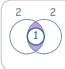
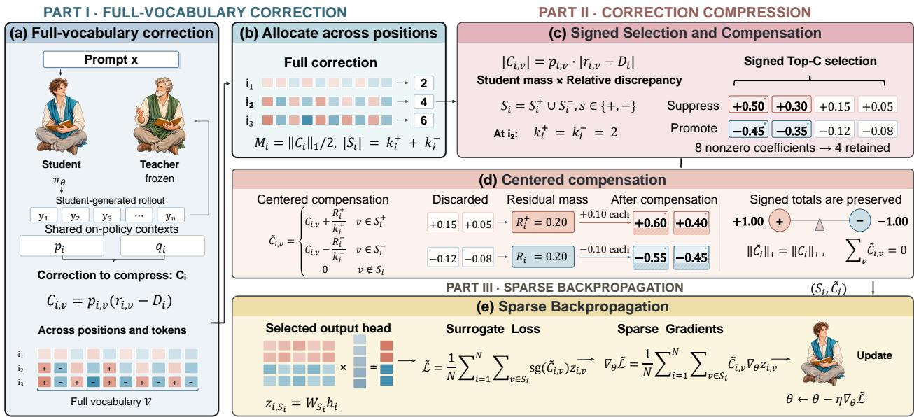
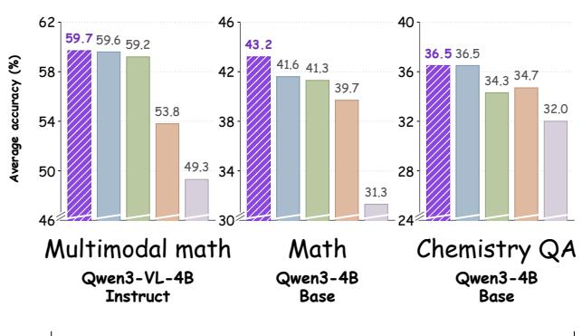
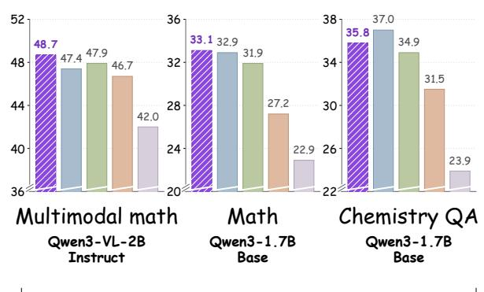
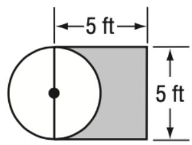
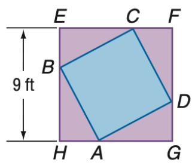
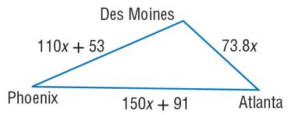
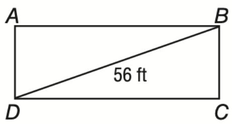
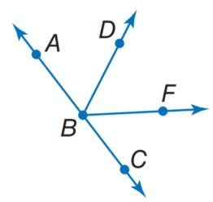

# Look Before You Select: Rethinking Vocabulary Sparsification in On-Policy Distillation

Yongliang Miao1 Shuang Liu2 Yanguang Liu3 Yandong Bai4 Mengnan Du1† 1The Chinese University of Hong Kong, Shenzhen 2Carnegie Mellon University 3New Jersey Institute of Technology 4Kuaishou r130026108@gmail.com mengnandu@cuhk.edu.cn †Corresponding author

## Abstract

On-policy distillation (OPD) uses teacher correction on student-generated responses. Full-vocabulary correction can provide important corrections even for tokens that the student assigns low probability, but backpropagating through all token logits becomes memory-intensive for long sequences. Existing memory-saving approaches estimate corrections from sampled tokens or restrict supervision to the student’s TopK tokens, introducing sampling noise or changing the full-vocabulary correction. We introduce SparseOPD, which uses full-vocabulary teacher correction to determine which corrections matter before selecting the token logits to diferentiate. SparseOPD first constructs the full-vocabulary correction without retaining its backward graph, then selects tokens by correction magnitude rather than student probability. Signed residual compensation preserves the total promoting and suppressing correction mass, while correction-aware budget allocation distributes the sparse support across positions. Finally, the update backpropagates only through the selected token logits. Across six task–scale settings spanning mathematics, chemistry QA, and multimodal reasoning, SparseOPD outperforms Sampled Token and TopK in task-average accuracy and matches or exceeds Full Vocabulary. Gradient cosine similarity reaches 99% on 4B mathematics, while 8K full-parameter profiling shows 70.5% lower backward memory.

## 1 Introduction

On-policy distillation (OPD) trains a student language model using teacher correction on responses generated by the student itself (Agarwal et al., 2024; Ko et al., 2024; Ye et al., 2025; Song & Zheng, 2026; Li et al., 2026g). Full-vocabulary OPD compares the complete teacher and student distributions at each prediction position (Gu et al., 2024; Zhong et al., 2024; Zhang et al., 2024c; Wu et al., 2025; Zhang et al., 2025), providing a token-specific correction over the entire vocabulary. Such correction can capture important corrections beyond the student’s most likely tokens, but directly backpropagating through the full vocabulary is memory-intensive, especially for long reasoning sequences. This creates an apparent trade-of: preserving full-vocabulary correction seems to require backpropagating through the full vocabulary.

Existing memory-saving paradigms reduce this cost by changing the correction, typically through sampledtoken estimation or TopK support restriction (Anshumann et al., 2025; Huang & Wei, 2026). Sampled Token replaces the deterministic full-vocabulary correction with an estimate based on a single sampled token; although unbiased at a fixed prefix, the resulting update can depend strongly on which token happens to be sampled. TopK conditions the objective on a support formed by the student’s most probable tokens, leaving tail tokens that may require large corrections outside the support and changing the correction even within the retained support. As illustrated in Figure 1, a sampled action can incorrectly promote “sum”, while a TopK support can omit the teacher-preferred tail tokens “overlap” and “intersection”.

<table><tr><td colspan="2"></td><td colspan="6">Q: Find the shaded area inside both large circles and outside the small circle. Student: “The shaded area is inside both large circles, so I should first compute</td></tr><tr><td colspan="2">the</td><td colspan="6">of the two large circles, then subtract the area of the small circle...&quot;</td></tr><tr><td rowspan="7">K Tail</td><td>Candidate</td><td>Student</td><td>Teacher</td><td>Sampled Token</td><td>TopK</td><td>Full Vocabulary</td><td>SparseOPD</td></tr><tr><td>&quot;union&quot;</td><td>18%</td><td>2%</td><td>Lower</td><td>Lower</td><td>Lower</td><td>4 ,Lower</td></tr><tr><td>&quot;sum&quot;</td><td>22%</td><td>3%</td><td>+ Raise</td><td>Lower</td><td>Lower</td><td>4 Lower</td></tr><tr><td>·</td><td>:</td><td>:</td><td>…</td><td>***</td><td>↑Raise</td><td></td></tr><tr><td>&quot;overlap&quot;</td><td>6%</td><td>35%</td><td>1 Raise</td><td></td><td></td><td>↑ Raise</td></tr><tr><td>&quot;intersection&quot;</td><td>7%</td><td>40%</td><td>1 Raise</td><td></td><td>4 Raise</td><td>4 Raise</td></tr><tr><td>Feedback Memory</td><td></td><td></td><td>1 token Low</td><td>TopK Low</td><td>Full High</td><td>Full Low</td></tr></table>

Figure 1: Full-vocabulary correction need not require full-vocabulary diferentiation. Arrows show logit corrections in a constructed multimodal QA example. Full Vocabulary suppresses “union” and “sum” and promotes “overlap” and “intersection,” at high memory cost. Sampled Token incorrectly promotes “sum,” while TopK provides no direct correction to “overlap” or “intersection.” SparseOPD preserves the important full-vocabulary corrections with low memory use.

Motivated by these limitations, we ask: Can we construct updatesfromfull-vocabulary teacher correction while backpropagating through the logits ofonly a sparse set oftokens? To this end, we introduce SparseOPD, which uses full-vocabulary correction while backpropagating only through the logits of selected tokens. SparseOPD first constructs the full-vocabulary correction without retaining its backward graph, and then converts it into a fixed sparse update. Because the complete correction is available before sparsification, SparseOPD selects tokens based on their corrections rather than student probability, allowing low-probability tokens to be retained when their corrections are large. The discarded positive and negative correction mass is then redistributed among retained corrections of the same sign, preserving the total positive and negative correction mass of the dense update. The resulting update therefore backpropagates only through the logits of the selected tokens.

Empirically, we validate SparseOPD on mathematical reasoning, chemistry question answering, and multimodal mathematical reasoning. With an average support budget of � entries per position, SparseOPD outperforms Sampled Token and TopK in all six task–scale settings and matches or exceeds Full Vocabulary (Figure 3). Full-parameter profiling of the 4B model shows 70.5% lower peak backward memory than Full Vocabulary at 8K sequence length, with larger relative savings across longer measured sequences. Gradient analysis in the 4B mathematical reasoning setting further shows a training-averaged cosine similarity of 0.989 to the Full Vocabulary gradient.

Our contributions are as follows:

• We rethink vocabulary sparsification in OPD by treating the full-vocabulary logit correction as the reference for sparse updates, showing that Sampled Token introduces sampling variance while TopK omits tail corrections and changes corrections through restricted-support conditioning.

• We introduce SparseOPD, which constructs full-vocabulary corrections before converting them into sparse updates using signed correction selection, residual compensation, and budget allocation across the batch.

• Across mathematical reasoning, chemistry QA, and multimodal mathematical reasoning, SparseOPD achieves higher task-average accuracy than Sampled Token and TopK. Complementary profiling and gradient measurements on the 4B mathematical reasoning setting show substantially lower backward memory and close agreement with the Full Vocabulary gradient.

## 2 Rethinking Vocabulary Sparsification

## 2.1 Preliminaries: Full-Vocabulary OPD

Let $\pi _ { \theta }$ be a student with trainable parameters � and $\pi _ { T }$ a frozen teacher, sharing a vocabulary V. On-policy distillation (OPD) obtains conditioning prefixes from the student’s own generations (Agarwal et al., 2024). For a prompt $x \sim \mathcal { D }$ from the training distribution, let $y \sim \pi _ { \theta } ( \cdot \mid x )$ denote the student rollout and $s _ { t } = ( x , y _ { < t } )$ its prefix at position �. Both models are evaluated on the same prefix, yielding $p _ { t , \nu } = \pi _ { \theta } ( \nu \mid s _ { t } )$ and $q _ { t , \nu } = \pi _ { T } ( \nu \mid s _ { t } )$ for each token $\nu \in \mathcal { N }$ . Training averages per-position losses over valid completion tokens and treats the sampled rollout as observed data, without diferentiating through discrete sampling. Within this common setting, the paired distributions can yield training signals with diferent computational costs and statistical properties.

Full-vocabulary OPD. The full-vocabulary formulation compares the complete distributions at each prefix using reverse Kullback–Leibler (KL) divergence. Let $z _ { t , \ 1 }$ denote the student logit and $r _ { t , \nu } = \log ( p _ { t , \nu } / q _ { t , \nu } )$ the student-to-teacher log-ratio. The per-position loss and its logit-gradient coeficients are

$$
D _ { t } = \mathrm { K L } ( p _ { t } \| q _ { t } ) = \sum _ { \nu \in \mathcal { V } } p _ { t , \nu } r _ { t , \nu } , \qquad C _ { t , \nu } : = \frac { \partial D _ { t } } { \partial z _ { t , \nu } } = p _ { t , \nu } ( r _ { t , \nu } - D _ { t } ) .\tag{1}
$$

The vector $C _ { t } = ( C _ { t , \nu } ) _ { \nu \in \mathcal { V } }$ specifies a deterministic, token-specific correction over the entire vocabulary. Positive coeficients suppress the corresponding logits under gradient descent, while negative coeficients promote them. The coeficients are zero-sum, $\begin{array} { r } { \sum _ { \nu \in \mathcal { V } } C _ { t , \nu } = 0 } \end{array}$ , so the total suppressive and promotive correction masses are equal. The chain rule maps these coeficients to the model’s parameter gradient. Directly diferentiating this loss retains vocabulary-sized intermediates for backward, with memory cost growing with both vocabulary size and the number of valid positions.

## 2.2 What Existing Sparsification Changes

Sampled-token OPD. One way to avoid evaluating every token-specific discrepancy is to reuse the generated action $a _ { t } = y _ { t } \sim p _ { t }$ . Its single-action coeficient estimator satisfies

$$
\widehat { C } _ { t , \nu } ^ { \mathrm { s a m p l e } } = r _ { t , a _ { t } } \big ( { \bf 1 } \{ \nu = a _ { t } \} - p _ { t , \nu } \big ) , \qquad { \mathbb { E } } _ { a _ { t } \sim p _ { t } } \Big [ \widehat { C } _ { t , \nu } ^ { \mathrm { s a m p l e } } \Big ] = C _ { t , \nu } .\tag{2}
$$

Thus the full-vocabulary correction is recovered in expectation at a fixed prefix. In one realization, however, every coordinate depends on the single observed ratio $r _ { t , a _ { t } }$ . The $- p _ { t , \nu }$ term couples unsampled logits to that action; it does not evaluate their own teacher–student discrepancies. Their token-specific corrections emerge through the sampling expectation, introducing sampling variance.

TopK OPD. An alternative restricts the objective to the student’s highest-probability tokens. Let $S _ { t } \subset \mathcal { V }$ contain the � largest student probabilities, with indices fixed during backpropagation. Define the support masses $\begin{array} { r } { Z _ { t } ^ { p } = \sum _ { \nu \in S _ { t } } p _ { t , \nu } } \end{array}$ and $\begin{array} { r } { Z _ { t } ^ { q } = \sum _ { \nu \in S _ { t } } q _ { t , \nu } } \end{array}$ , and distributions $\bar { p } _ { t , \nu } ^ { S } = \bar { p } _ { t , \nu } \bar { / Z } _ { t } ^ { p }$ and $\bar { q } _ { t , \nu } ^ { S } = q _ { t , \nu } / Z _ { t } ^ { \bar { q } }$ for $\nu \in S _ { t }$ . TopK minimizes $D _ { t } ^ { S } = \mathrm { K L } ( \bar { p } _ { t } ^ { S } \| \bar { q } _ { t } ^ { S } )$ .

Renormalization changes which discrepancies the objective measures. Let $D _ { t } ^ { S ^ { c } }$ be the analogous conditional KL on $S _ { t } ^ { c } = \mathcal { V } \setminus S _ { t }$ , and let $D _ { t } ^ { \mathrm { m a s s } }$ be the binary KL between the support probabilities $Z _ { t } ^ { p }$ and $Z _ { t } ^ { q }$ Separating support membership from the distributions within each part gives

$$
D _ { t } = \underbrace { D _ { t } ^ { \mathrm { m a s s } } } _ { \mathrm { s u p p o r t - t a i l } \mathrm { m a s s } } + \underbrace { Z _ { t } ^ { p } D _ { t } ^ { S } } _ { \mathrm { s u p p o r t s h a p e } } + \underbrace { ( 1 - Z _ { t } ^ { p } ) D _ { t } ^ { S ^ { c } } } _ { \mathrm { t a i l } \mathrm { s h a p e } } .\tag{3}
$$

TopK optimizes only the conditional shape $D _ { t } ^ { S }$ , leaving out the support–tail mass discrepancy, the tail shape, and the support weight. This restriction also appears directly in its logit coeficients:

$$
C _ { t , \nu } ^ { \mathrm { T o p K } } = \bar { p } _ { t , \nu } ^ { S } \left( \log \frac { \bar { p } _ { t , \nu } ^ { S } } { \bar { q } _ { t , \nu } ^ { S } } - D _ { t } ^ { S } \right) ~ ( \nu \in S _ { t } ) , \qquad 0 ~ ( \nu \notin S _ { t } ) .\tag{4}
$$

Tail coordinates receive no direct correction, and the retained coeficients are derived from a conditional objective rather than by truncating $C _ { t }$

Full-vocabulary OPD provides a complete reference correction, but its direct realization is memoryintensive. Sampling and support conditioning limit the token-specific feedback in diferent ways, yielding a noisy realization or a restricted objective.

## 2.3 Full-Vocabulary Correction with Sparse Execution

Despite these diferent mechanisms, both memory-saving paradigms alter the reference correction before deciding which token logits to backpropagate through: Sampled Token estimates it from a sampled action, while TopK defines it only after restricting the vocabulary support. This suggests a diferent order of operations: first construct the full-vocabulary correction, and only then decide which token logits to retain for backpropagation. The task is therefore to approximate the full-vocabulary correction as faithfully as possible under a shared budget on token logits for backpropagation, while retaining access to the complete teacher and student distributions. This reframes vocabulary sparsification as correction compression rather than simple support restriction.

Target: Full-vocabulary correction with sparse execution.   
Let � = 1, . . . , � index the valid completion positions in one optimizer update, with full-vocabulary   
reference coeficients $C _ { i }$ . Given an average support budget $K ,$ , use the complete $C _ { i }$ to construct supports   
$S _ { i } \subseteq \mathcal { V }$ and coeficients $\widetilde { C } _ { i }$ supported on $S _ { i } ,$ , subject to   
�   
∑︁ |�� | = ��.   
�=1   
The goal is to approximate $C _ { i }$ in coeficient space while restricting output-head diferentiation to the   
selected entries $S _ { i }$

## 3 SparseOPD

Following the reformulation of vocabulary sparsification as correction compression in Section 2, we propose SparseOPD, which takes the full-vocabulary correction as the reference and backpropagates only through a sparse set of token logits. SparseOPD first constructs the full-vocabulary reference coeficients without building an autograd graph, and then compresses this correction into a sparse execution plan that approximates the full-vocabulary update with far fewer diferentiable entries. With the full correction available before support selection, the compression is guided by the correction itself. SparseOPD consists of three stages: (1) batch-global budget allocation distributes the shared support budget according to correction mass; (2) signed selection and compensation retains large-magnitude coeficients within each sign and redistributes discarded mass while preserving the signed totals; (3) Sparse Backpropagation executes the resulting compressed correction through selected output-head rows. Figure 2 provides an overview of our method.

  
Figure 2: Overview of SparseOPD. (a) Full-vocabulary correction $C _ { i , \nu } = p _ { i , \nu } ( r _ { i , \nu } - D _ { i } )$ . (b) Correction mass $M _ { i } = \Vert C _ { i } \Vert _ { 1 } / 2$ allocates support. (c) Signed Top-� selects $S _ { i } = S _ { i } ^ { + } \cup S _ { i } ^ { - } . ( \mathbf { d } )$ Centered compensation yields $\widetilde { C } _ { i }$ while preserving signed totals. (e) Sparse backpropagation passes only through selected logits $z _ { i , S _ { i } } = W _ { S _ { i } } h _ { i }$

## 3.1 Batch-global Budget Allocation

We first compute the full-vocabulary coeficients $C _ { i }$ at each valid position using Equation (1), without building an autograd graph for this computation. Uniform support may over-allocate capacity to positions with weak teacher–student disagreement and under-allocate it where corrections are stronger. We therefore share the �� budget across positions according to their total coeficient magnitude. By the zero-sum property of $C _ { i }$ its suppressive and promotive corrections carry equal total mass:

$$
M _ { i } : = \sum _ { \nu : C _ { i , \nu } > 0 } C _ { i , \nu } = \sum _ { \nu : C _ { i , \nu } < 0 } ( - C _ { i , \nu } ) = \frac { 1 } { 2 } \| C _ { i } \| _ { 1 } .\tag{5}
$$

We use the common mass $M _ { i }$ as a position-level measure of correction strength, while the two signs distinguish suppressive and promotive corrections.

Each active sign needs at least one retained entry for the compensation below. For $s \in \{ + , - \}$ , let $\ell _ { i } ^ { s } = 1 \{ M _ { i } > 0 \}$ be this minimum and $u _ { i } ^ { s } \geq \ell _ { i } ^ { s }$ a prescribed capacity, no larger than the number of coeficients with that sign. Assuming the total budget is feasible, $\begin{array} { r } { \sum _ { i , s } \ell _ { i } ^ { s } \le K N \le \sum _ { i , s } u _ { i } ^ { s } } \end{array}$ , let $\alpha \geq 0$ denote a global allocation scale. We distribute the remaining budget in proportion to $M _ { i }$ until each group reaches its capacity:

$$
\bar { k } _ { i } ^ { s } = \ell _ { i } ^ { s } + \operatorname* { m i n } \{ u _ { i } ^ { s } - \ell _ { i } ^ { s } , \alpha M _ { i } \} , \qquad \sum _ { i , s } \bar { k } _ { i } ^ { s } = K N .\tag{6}
$$

We choose $\alpha$ to meet the shared budget and round $\bar { k } _ { i } ^ { s }$ to integer cardinalities $k _ { i } ^ { s }$ while preserving both the bounds and $\begin{array} { r } { \sum _ { i , s } k _ { i } ^ { s } = K N } \end{array}$ . Thus positions share capacity according to correction demand rather than receiving the same support size independently.

## 3.2 Signed Selection and Compensation

With the support sizes fixed, we prioritize coordinates whose removal most distorts $C _ { i }$ . Student probability alone does not measure this importance, because the coeficient magnitude factorizes as

$$
\left| C _ { i , \nu } \right| = \underbrace { p _ { i , \nu } } _ { \mathrm { s t u d e n t m a s s } } \quad \cdot \underbrace { | r _ { i , \nu } - D _ { i } | } _ { \mathrm { r e l a t i v e d i s c r e p a n c y } } .\tag{7}
$$

A token’s update importance depends on both its student mass and its discrepancy relative to the KL baseline. A high-probability token can require little correction, while a tail token can matter when its relative discrepancy is large.

For a fixed support size $k ,$ the direct truncation error is $\textstyle \sum _ { \nu \not \in S } C _ { i , \nu } ^ { 2 }$ . Selecting the $k$ largest magnitudes $| C _ { i , \nu } |$ minimizes this error. This coeficient ranking, which we call Top-�, determines which individual entries are most costly to discard.

With the cardinalities fixed, signed Top-� retains the $k _ { i } ^ { + }$ largest positive coeficients and the $k _ { i } ^ { - }$ largestmagnitude negative coeficients, forming $S _ { i } ^ { + }$ and $S _ { i } ^ { - }$ with union $S _ { i }$

Centered compensation. Simply truncating to these supports would discard correction mass and can destroy the zero-sum structure of $C _ { i }$ . The missing masses are $\begin{array} { r } { R _ { i } ^ { + } = M _ { i } - \sum _ { \nu \in S _ { i } ^ { + } } C _ { i , \nu } } \end{array}$ and $\begin{array} { r } { R _ { i } ^ { - } = M _ { i } - \sum _ { \nu \in S _ { i } ^ { - } } ( - C _ { i , \nu } ) } \end{array}$ To preserve the total correction in each direction, centered compensation redistributes each residual over retained entries of the same sign:

$$
\widetilde { C } _ { i , \nu } = C _ { i , \nu } + R _ { i } ^ { + } / k _ { i } ^ { + } \ ( \nu \in S _ { i } ^ { + } ) , \qquad C _ { i , \nu } - R _ { i } ^ { - } / k _ { i } ^ { - } \ ( \nu \in S _ { i } ^ { - } ) , \qquad 0 \ ( \nu \notin S _ { i } ) .\tag{8}
$$

Preserved structure and approximation error. Compensation restores signed sums $M _ { i }$ and $- M _ { i }$ , hence $\begin{array} { r } { \sum _ { \nu } \widetilde { C } _ { i , \nu } = 0 } \end{array}$ and $\| \widetilde { C } _ { i } \| _ { 1 } = \| C _ { i } \| _ { 1 }$ . For fixed supports $S _ { i } ^ { \pm }$ , the uniform shift is the Euclidean projection of the retained coeficients onto these constraints on correction mass. The remaining approximation reflects losing tail coordinates and representing their aggregate mass on the support. These two efects are separated exactly by

$$
\| \widetilde C _ { i } - C _ { i } \| _ { 2 } ^ { 2 } = \underbrace { \sum _ { \nu \notin S _ { i } } C _ { i , \nu } ^ { 2 } } _ { \mathrm { s u p p o r t ~ t r u n c a t i o n } } + \underbrace { \frac { ( R _ { i } ^ { + } ) ^ { 2 } } { k _ { i } ^ { + } } + \frac { ( R _ { i } ^ { - } ) ^ { 2 } } { k _ { i } ^ { - } } } _ { \mathrm { r e s i d u a l ~ c o m p r e s s i o n } } .\tag{9}
$$

Empty sign-group terms are zero. Top-� retains the coordinates contributing most to the first term. Additional support reduces the second term by retaining more correction mass and spreading the residual across more entries. The decomposition explains why selection and compensation are complementary and why positions carrying larger correction mass can benefit from more capacity.

## 3.3 Sparse Backpropagation

The selected support and compensated coeficients form a fixed sparse plan $( S _ { i } , \widetilde { C } _ { i } )$ for backpropagation. Let $h _ { i } \in \mathbb { R } ^ { d _ { h } }$ be the student hidden state and $W \in \mathbb { R } ^ { | \mathcal { V } | \times d _ { h } }$ the output projection. The planning pass materializes $z _ { i } = W h _ { i }$ transiently under no gradient to construct the full-vocabulary statistics. These vocabulary-sized tensors are discarded once the sparse plan is fixed.

The diferentiable pass reconstructs only $z _ { i , S _ { i } } = W _ { S _ { i } } h _ { i }$ , using the selected rows $W _ { S _ { i } } \in \mathbb { R } ^ { | S _ { i } | \times d _ { h } }$ . To realize the planned coeficients without diferentiating through their construction, we use a linear surrogate with stop-gradient sg(·):

$$
\widetilde { \mathcal { L } } = \frac { 1 } { N } \sum _ { i = 1 } ^ { N } \sum _ { \nu \in S _ { i } } \mathbf { s g } ( \widetilde { C } _ { i , \nu } ) z _ { i , \nu } , \qquad \nabla _ { \theta } \widetilde { \mathcal { L } } = \frac { 1 } { N } \sum _ { i = 1 } ^ { N } \sum _ { \nu \in S _ { i } } \widetilde { C } _ { i , \nu } \nabla _ { \theta } z _ { i , \nu } .\tag{10}
$$

Table 1: Mathematical reasoning and chemistry QA. Superscripts show percentage-point changes from Base; bold indicates the best result.
<table><tr><td rowspan="2">Method</td><td colspan="5">Mathematical Reasoning</td><td colspan="3">Chemistry QA</td></tr><tr><td>MATH</td><td>Minerva</td><td>AMC23</td><td>AIME25</td><td>Avg.</td><td>Chemistry</td><td>GPQA</td><td>Avg.</td></tr><tr><td colspan="9">Qwen3-1.7B → Qwen3-1.7B-Base</td></tr><tr><td>Teacher</td><td>72.3</td><td>28.8</td><td>44.4</td><td>8.3</td><td>38.4</td><td>42.0</td><td>26.5</td><td>34.2</td></tr><tr><td>Base</td><td>46.5</td><td>15.3</td><td>26.9</td><td>2.9</td><td>22.9</td><td>24.9</td><td>22.9</td><td>23.9</td></tr><tr><td>Sampled Token</td><td> $5 4 . 1 ^ { + 7 . 6 }$ </td><td> $1 8 . 2 ^ { + 2 . 9 }$ </td><td> $3 2 . 8 ^ { + 5 . 9 }$ </td><td> $3 . 8 ^ { + 0 . 9 }$ </td><td> $2 7 . 2 ^ { + 4 . 3 }$ </td><td> $3 4 . 3 ^ { + 9 . 4 }$ </td><td> $2 8 . 6 ^ { + 5 . 7 }$ </td><td> $3 1 . 5 ^ { + 7 . 6 }$ </td></tr><tr><td>TopK</td><td> $6 3 . 6 ^ { + 1 7 . 1 }$ </td><td> $2 5 . 7 ^ { + 1 0 . 4 }$ </td><td> $3 4 . 1 ^ { + 7 . 2 }$ </td><td> $4 . 2 ^ { + 1 . 3 }$ </td><td> $3 1 . 9 ^ { + 9 . 0 }$ </td><td> $4 0 . 7 ^ { + 1 5 . 8 }$ </td><td> $2 9 . 2 ^ { + 6 . 3 }$ </td><td> $3 4 . 9 ^ { + 1 1 . 0 }$ </td></tr><tr><td>SparseOPD(Ours)</td><td> ${ \bf 6 4 . 5 ^ { + 1 8 . 0 } }$ </td><td> $2 { \bf 6 . 1 ^ { + 1 0 . 8 } }$ </td><td> ${ \bf 3 5 . 9 ^ { + 9 . 0 } }$ </td><td> ${ \pmb 5 . 8 ^ { + 2 . 9 } }$ </td><td> $3 3 . 1 ^ { + 1 0 . 2 }$ </td><td> ${ \bf 4 1 . 1 ^ { + 1 6 . 2 } }$ </td><td> ${ \bf 3 0 . 5 ^ { + 7 . 6 } }$ </td><td> ${ \mathbf { 3 5 . 8 ^ { + 1 1 . 9 } } }$ </td></tr><tr><td>Full Vocabulary</td><td> $6 3 . 4 ^ { + 1 6 . 9 }$ </td><td> $2 6 . 5 ^ { + 1 1 . 2 }$ </td><td> $3 5 . 3 ^ { + 8 . 4 }$ </td><td> $6 . 3 ^ { + 3 . 4 }$ </td><td> $3 2 . 9 ^ { + 1 0 . 0 }$ </td><td> $4 2 . 9 ^ { + 1 8 . 0 }$ </td><td> $3 { l } . { \cal I } ^ { + 8 . 2 }$ </td><td> $3 7 . 0 ^ { + 1 3 . 1 }$ </td></tr><tr><td colspan="9">Qwen3-4B → Qwen3-4B-Base</td></tr><tr><td>Teacher</td><td>83.3</td><td>38.8</td><td>64.1</td><td>19.6</td><td>51.4</td><td>41.5</td><td>31.9</td><td>36.7</td></tr><tr><td>Base</td><td>56.8</td><td>18.7</td><td>41.6</td><td>8.3</td><td>31.3</td><td>34.3</td><td>29.7</td><td>32.0</td></tr><tr><td>Sampled Token</td><td> $7 0 . 6 ^ { + 1 3 . 8 }$ </td><td> $2 9 . 7 ^ { + 1 1 . 0 }$ </td><td> $4 6 . 3 ^ { + 4 . 7 }$ </td><td> $1 2 . 1 ^ { + 3 . 8 }$ </td><td> $3 9 . 7 ^ { + 8 . 4 }$ </td><td> $3 8 . 0 ^ { + 3 . 7 }$ </td><td> $3 1 . 3 ^ { + 1 . 6 }$ </td><td> $3 4 . 7 ^ { + 2 . 7 }$ </td></tr><tr><td>TopK</td><td> $7 7 . 4 ^ { + 2 0 . 6 }$ </td><td> ${ \bf 3 0 . 1 ^ { + 1 1 . 4 } }$ </td><td> $4 5 . 9 ^ { + 4 . 3 }$ </td><td> $1 1 . 7 ^ { + 3 . 4 }$ </td><td> $4 1 . 3 ^ { + 1 0 . 0 }$ </td><td> $3 8 . 8 ^ { + 4 . 5 }$ </td><td> $2 9 . 8 ^ { + 0 . 1 }$ </td><td> $3 4 . 3 ^ { + 2 . 3 }$ </td></tr><tr><td>SparseOPD(Ours)</td><td> $7 6 . 9 ^ { + 2 0 . 1 }$ </td><td> ${ \bf 3 0 . 1 ^ { + 1 1 . 4 } }$ </td><td> $\mathbf { 5 0 . 0 ^ { + 8 . 4 } }$ </td><td> ${ \bf 1 5 . 8 ^ { + 7 . 5 } }$ </td><td> $4 3 . 2 ^ { + 1 1 . 9 }$ </td><td> $\mathbf { 3 9 . 7 ^ { + 5 . 4 } }$ </td><td> $3 3 . 2 ^ { + 3 . 5 }$ </td><td> ${ \pmb 3 6 . 5 ^ { + 4 . 5 } }$ </td></tr><tr><td>Full Vocabulary</td><td> $7 7 . 8 ^ { + 2 1 . 0 }$ </td><td> $2 9 . 8 ^ { + 1 1 . 1 }$ </td><td> $4 6 . 3 ^ { + 4 . 7 }$ </td><td> $I 2 . 5 ^ { + 4 . 2 }$ </td><td> $4 l . 6 ^ { + 1 0 . 3 }$ </td><td> $4 0 . 7 ^ { + 6 . 4 }$ </td><td> $3 2 . 3 ^ { + 2 . 6 }$ </td><td> $3 6 . 5 ^ { + 4 . 5 }$ </td></tr></table>

Equation (10) realizes the prescribed sparse coeficients exactly; the approximation is fixed by compression. Full-vocabulary statistics inform this update, while autograd stores vocabulary-axis intermediates only for the selected entries.

Distributed implementation. Allocation covers all valid positions in one optimizer update, collecting position-level masses across gradient-accumulation microbatches and data-parallel workers. Once the budgets are fixed, support construction and selected-head backpropagation remain local.

## 4 Experiments

## 4.1 Experimental Setup

Datasets. We train on DAPO14k (Guanning-AI, n.d.) for mathematics, the Chemistry L3 multiple-choice partition of SciKnowEval V2 (Feng et al., 2024) for chemistry, and MMR1-Math-RL-Data-v0 (Leng et al., 2025) for multimodal reasoning. Mathematics evaluation covers MATH500 (Lightman et al., 2023), Minerva (Lewkowycz et al., 2022), AMC23 (Math-AI Team, 2025), and AIME25 (Zhang & Math-AI Team, 2025). Chemistry evaluation uses the held-out SciKnowEval questions and the chemistry subset of GPQA-Diamond (Rein et al., 2023). Multimodal evaluation covers MathVision (Wang et al., 2024), MathVista (Lu et al., 2024), We-Math (Qiao et al., 2024), and MathVerse (Zhang et al., 2024b).

Implementation. For mathematics and chemistry, we distill Qwen3-1.7B/4B into their Base counterparts (Yang et al., 2025) and report Mean@8 accuracy over eight decoding runs. For multimodal reasoning, MMFineReason-2B/4B (Lin et al., 2026) teach Qwen3-VL-2B/4B-Instruct (Bai et al., 2025), evaluated by single-generation accuracy with LMMs-Eval (Zhang et al., 2024a). Further details are in Appendix B.

Table 2: Multimodal mathematical reasoning. Superscripts show percentage-point changes from Student; bold indicates the best result.
<table><tr><td>Method</td><td>MathVision</td><td>MathVista</td><td>WeMath</td><td>MathVerse</td><td>Avg.</td></tr><tr><td colspan="6">MMFineReason-2B → Qwen3-VL-2B-Instruct</td></tr><tr><td>Teacher</td><td>24.4</td><td>65.1</td><td>66.1</td><td>46.0</td><td>50.4</td></tr><tr><td>Student</td><td>15.9</td><td>59.3</td><td>56.2</td><td>36.5</td><td>42.0</td></tr><tr><td>Sampled Token</td><td> $2 2 . 2 ^ { + 6 . 3 }$ </td><td> $6 0 . 8 ^ { + 1 . 5 }$ </td><td> $6 2 . 9 ^ { + 6 . 7 }$ </td><td> $4 0 . 7 ^ { + 4 . 2 }$ </td><td> $4 6 . 7 ^ { + 4 . 7 }$ </td></tr><tr><td>TopK</td><td> $2 3 . 9 ^ { + 8 . 1 }$ </td><td> $6 2 . 2 ^ { + 2 . 9 }$ </td><td> $6 2 . 2 ^ { + 6 . 0 }$ </td><td> ${ \pmb 4 3 . 3 ^ { + 6 . 7 } }$ </td><td> $4 7 . 9 ^ { + 5 . 9 }$ </td></tr><tr><td>SparseOPD(Ours)</td><td> $2 4 . 2 ^ { + 8 . 3 }$ </td><td> ${ \bf 6 3 . 8 ^ { + 4 . 5 } }$ </td><td> ${ \bf 6 4 . 8 ^ { + 8 . 6 } }$ </td><td> $4 2 . 0 ^ { + 5 . 5 }$ </td><td> ${ \bf 4 8 . 7 ^ { + 6 . 7 } }$ </td></tr><tr><td>Full Vocabulary</td><td> $2 4 . 9 ^ { + 9 . 0 }$ </td><td> $6 2 . 3 ^ { + 3 . 0 }$ </td><td> $6 3 . 2 ^ { + 7 . 0 }$ </td><td> $3 9 . 2 ^ { + 2 . 7 }$ </td><td> $4 7 . 4 ^ { + 5 . 4 }$ </td></tr><tr><td colspan="6">MMFineReason-4B → Qwen3-VL-4B-Instruct</td></tr><tr><td>Teacher</td><td>38.3</td><td>75.3</td><td>74.2</td><td>51.4</td><td>59.8</td></tr><tr><td>Student</td><td>27.3</td><td>67.8</td><td>60.8</td><td>41.1</td><td>49.3</td></tr><tr><td>Sampled Token</td><td> $3 0 . 5 ^ { + 3 . 2 }$ </td><td> $7 0 . 5 ^ { + 2 . 7 }$ </td><td> $6 8 . 5 ^ { + 7 . 7 }$ </td><td> $4 5 . 5 ^ { + 4 . 4 }$ </td><td>53.8+4.5</td></tr><tr><td>TopK</td><td> $3 5 . 7 ^ { + 8 . 4 }$ </td><td> $7 1 . 3 ^ { + 3 . 5 }$ </td><td> $7 5 . 5 ^ { + 1 4 . 7 }$ </td><td> $5 4 . 1 ^ { + 1 3 . 0 }$ </td><td> $5 9 . 2 ^ { + 9 . 9 } $ </td></tr><tr><td>SparseOPD(Ours)</td><td> ${ \mathbf { 3 5 . 8 ^ { + 8 . 5 } } }$ </td><td> $7 2 . 9 ^ { + 5 . 1 }$ </td><td> $7 5 . 5 ^ { + 1 4 . 7 }$ </td><td> ${ \pmb 5 4 . 8 ^ { + 1 3 . 7 } }$ </td><td> ${ \pmb 5 9 . 7 ^ { + 1 0 . 5 } }$ </td></tr><tr><td>Full Vocabulary</td><td> $3 6 . I ^ { + 8 . 8 }$ </td><td> $7 3 . 0 ^ { + 5 . 2 }$ </td><td> $7 5 . 0 ^ { + 1 4 . 2 }$ </td><td> $5 4 . 4 ^ { + 1 3 . 3 }$ </td><td> $5 9 . 6 ^ { + 1 0 . 4 }$ </td></tr></table>

## 4.2 Main Results

Tables 1 and 2 compare SparseOPD with Full Vocabulary, Sampled Token, and TopK across tasks and model scales.

Research Question 1: Can sparse execution preserve the training benefit of full-vocabulary correction? SparseOPD matches or exceeds the Full Vocabulary average in five of the six task–scale settings at the reported precision. On Qwen3-4B mathematics, it achieves 43.2 compared with 41.6 for Full Vocabulary; both multimodal student scales also exceed the dense reference. The exception is 1.7B chemistry, where SparseOPD scores 35.8 against 37.0. This pattern supports the separation underlying SparseOPD: much of the training benefit of full-vocabulary correction survives when its correction is compressed before diferentiation.

Research Question 2: Does correction-aware compression make better use of the same sparse budget? With an average budget of 20 output-head coordinates per valid position, SparseOPD outperforms TopK on all six task averages by 0.58–2.2 percentage points. It also improves over Sampled Token by 1.8–5.97 points. The comparison with TopK holds support size fixed while changing how sparse updates are formed. Its consistent advantage supports using the full-vocabulary correction to guide compression, making the same diferentiable support budget more efective.

Research Question 3: Do the task-average gains reflect broad improvements across benchmarks? The advantage over TopK extends to 16 of the 20 benchmark–scale comparisons, with two ties at the reported precision. Gains include AMC23 and AIME25 on Qwen3-4B, as well as We-Math on Qwen3-VL-2B. The remaining trade-ofs occur on 4B MATH500 and 2B MathVerse, where TopK retains a lead. Task-average improvements therefore reflect broad, but not uniform, gains across individual benchmarks.

## 4.3 Ablation Study

Research Question 4: Do selection, compensation, and global allocation each contribute under the same sparse budget? Table 3 tests the role of selection, compensation, and allocation in preserving

(a) Qwen3-4B / Qwen3-VL-4B  

(b) Qwen3-1.7B / Qwen3-VL-2B  
  
Figure 3: Task-average accuracy across student scales. SparseOPD outperforms both sparse baselines in all six settings and matches or exceeds Full Vocabulary in five.

Table 3: Ablation of SparseOPD on mathematical reasoning. Results use Qwen3-4B → Qwen3-4B-Base under the same support budget. Red superscripts show drops from SparseOPD.
<table><tr><td>Variant</td><td>MATH500</td><td>Minerva</td><td>AMC23</td><td>AIME25</td><td>Avg.</td></tr><tr><td>SparseOPD(Ours)</td><td>76.9</td><td>30.1</td><td>50.0</td><td>15.8</td><td>43.2</td></tr><tr><td>Student Probability Ranking</td><td>76.0-0.9</td><td>29.0−1.1</td><td>45.6 -4.4</td><td>14.2-1.6</td><td>41.2-2.0</td></tr><tr><td>w/o Centered Compensation</td><td>76.3-0.6</td><td>29.2-0.9</td><td>47.5-2.5</td><td>14.2-1.6</td><td>41.8-1.4</td></tr><tr><td>w/o Batch-global Allocation</td><td>76.6-0.3</td><td>29.6-0.5</td><td>48.1-1.9</td><td>15.0-0.8</td><td>42.3-0.9</td></tr></table>

useful corrections. Each variant changes one component on Qwen3-4B mathematical reasoning, holding the remaining components and total support budget �� fixed, with � = 20.

Signed Top-� selection. The largest ablation drop comes from replacing coeficient-magnitude ranking with student-probability ranking within each sign group: average accuracy falls by 2.0 percentage points. Student likelihood alone does not capture the teacher–student discrepancy that drives correction strength. The result supports retaining coordinates according to their contribution to the full-vocabulary update.

Centered compensation. Retaining strong coeficients does not recover all useful correction. Using their original values without compensation lowers average accuracy by 1.4 percentage points. Compensation preserves the aggregate promoting and suppressing signal carried by discarded candidates, allowing the retained support to represent more than its selected coeficients alone.

Batch-global allocation. The support budget is more efective when it can follow correction demand across positions. Replacing global allocation with a fixed budget of � coordinates per valid position lowers average accuracy by 0.9 percentage points. Since total support is unchanged, this comparison supports redistributing capacity toward positions with stronger corrections.

## 4.4 Analysis and Discussion

Gradient fidelity tests preservation of the reference update, while eficiency profiling tests the cost of realizing it. Both analyses use Qwen3-4B as the teacher and Qwen3-4B-Base as the student, with mathematical

reasoning batches for the gradient comparison.

Research Question 5: Does SparseOPD preserve the full-vocabulary update? At matched student states and on-policy batches, let � and $g _ { F }$ denote the candidate and Full Vocabulary parameter gradients before clipping. We report cosine similarity, relative $\ell _ { 2 }$ error $\| g - g _ { F } \| _ { 2 } / \| g _ { F } \| _ { 2 }$ , norm ratio $\| g \| _ { 2 } / \| g _ { F } \| _ { 2 }$ , and sign agreement, excluding jointly zero coordinates and treating other zeros as nonnegative. Metrics are computed at each recorded step and averaged over full-parameter training.

SparseOPD is closest to the reference on all four metrics (Table 4). Its relative $\ell _ { 2 }$ error is approximately one third of TopK’s (0.15 versus 0.45), while cosine similarity and norm ratio are both near one. SparseOPD also achieves the highest sign agreement, supporting preservation of the dense update through sparse execution.

Table 4: Training-averaged gradient fidelity to Full Vocabulary OPD. Bold marks the best.
<table><tr><td>Method</td><td>Cos. ↑</td><td>Rel.  $\ell _ { 2 } \downarrow$ </td><td>Norm → 1</td><td>Sign ↑</td></tr><tr><td>Full Vocabulary</td><td>1.00</td><td>0.00</td><td>1.00</td><td>1.00</td></tr><tr><td>Sampled Token</td><td>0.29</td><td>5.43</td><td>5.63</td><td>0.59</td></tr><tr><td>TopK</td><td>0.90</td><td>0.45</td><td>1.05</td><td>0.83</td></tr><tr><td>SparseOPD(Ours)</td><td>0.99</td><td>0.15</td><td>0.99</td><td>0.91</td></tr></table>

Research Question 6: How much backward memory does sparse execution save? Decoupling correction construction from diferentiation reduces memory (Table 5).

Full-vocabulary statistics are computed without an autograd graph and discarded after planning; backpropagation uses only selected outputhead rows. This reduces backward memory by 70.5% at 8K, with larger savings at longer sequences. Backward time improves more modestly because the Transformer backbone still requires full backpropagation, while additional planning adds overhead (Appendix B.4).

Table 5: Memory usage. Peak extra GPU allocation above the pre-step baseline (Appendix B.4).
<table><tr><td rowspan="2">Length</td><td rowspan="2">Method</td><td colspan="2">Memory (GiB)</td></tr><tr><td>Forward</td><td>Backward</td></tr><tr><td>4K</td><td>Full Vocabulary</td><td>12.82</td><td>10.09</td></tr><tr><td></td><td>SparseOPD(Ours)</td><td>1.94(↓84.9%)</td><td>3.59 (↓64.5%)</td></tr><tr><td>8K</td><td>Full Vocabulary</td><td>25.50</td><td>20.05</td></tr><tr><td></td><td>SparseOPD(Ours)</td><td>3.88(↓84.8%)</td><td>5.91 (↓70.5%)</td></tr><tr><td>16K</td><td>Full Vocabulary</td><td>50.85</td><td>39.96</td></tr><tr><td></td><td>SparseOPD(Ours)</td><td>7.76(↓84.7%)</td><td>10.54(↓73.6%)</td></tr></table>

## 5 Related Work

On-policy distillation trains on student-generated trajectories with teacher feedback (Agarwal et al., 2024; Ko et al., 2024; Ye et al., 2025). For large language models, reverse-KL objectives provide full-vocabulary supervision (Gu et al., 2024; Zhong et al., 2024). Prior work reduces this cost by sampling vocabulary entries or restricting supervision to a small support (Anshumann et al., 2025; Huang & Wei, 2026). SparseOPD instead forms the full-vocabulary correction first and compresses it for sparse backpropagation. See Appendix A for details.

## 6 Conclusions

We introduced SparseOPD, an on-policy distillation method that separates the construction of full-vocabulary corrections from sparse backpropagation. By selecting entries according to correction magnitude and compensating for discarded correction mass, SparseOPD compresses the update while retaining information from the complete teacher and student distributions. Across mathematical reasoning, chemistry question answering, and multimodal reasoning, our experiments show that sparse execution can preserve much of the training benefit of full-vocabulary supervision. Complementary analyses demonstrate close agreement with the full-vocabulary gradient and substantially lower peak backward memory in the measured setting.

Overall, SparseOPD preserves full-vocabulary correction while substantially reducing the memory required for backpropagation.

## Reproducibility statement

SparseOPD and the comparison baselines are specified in Sections 2 and 3; the datasets, model configurations, evaluation metrics, and benchmark-level results are reported in Section 4. Training splits, optimization and distillation settings, evaluation and decoding protocols, and eficiency-measurement procedures are provided in Appendix B.

## References

Rishabh Agarwal, Nino Vieillard, Yongchao Zhou, Piotr Stanczyk, Sabela Ramos Garea, Matthieu Geist, and Olivier Bachem. On-policy distillation of language models: Learning from self-generated mistakes. In The Twelfth International Conference on Learning Representations, 2024. URL https://proceedings.iclr.cc/paper\_files/paper/2024/hash/ 5be69a584901a26c521c2b51e40a4c20-Abstract-Conference.html.

Rishabh Agrawal, Jacob Fein-Ashley, and Paria Rashidinejad. Reinforcement learning from rich feedback with distributional DAgger, 2026. URL https://arxiv.org/abs/2606.05152.

Anshumann, Mohd Abbas Zaidi, Akhil Kedia, Jinwoo Ahn, Taehwak Kwon, Kangwook Lee, Haejun Lee, and Joohyung Lee. Sparse logit sampling: Accelerating knowledge distillation in LLMs. In Proceedings of the 63rd Annual Meeting of the Association for Computational Linguistics (Volume 1: Long Papers), pp. 18085–18108, Vienna, Austria, 2025. Association for Computational Linguistics. doi: 10.18653/v1/2025.acl-long.885. URL https://aclanthology.org/2025.acl-long.885/.

Mohammadreza Armandpour, Fatih Ilhan, David Harrison, Ajay Jaiswal, Duc N. M. Hoang, Fartash Faghri, Yizhe Zhang, Minsik Cho, and Mehrdad Farajtabar. Unmasking on-policy distillation: Where it helps, where it hurts, and why, 2026. URL https://arxiv.org/abs/2605.10889.

Shuai Bai, Yuxuan Cai, Ruizhe Chen, Keqin Chen, Xionghui Chen, Zesen Cheng, Lianghao Deng, Wei Ding, Chang Gao, Chunjiang Ge, Wenbin Ge, Zhifang Guo, Qidong Huang, Jie Huang, Fei Huang, Binyuan Hui, Shutong Jiang, Zhaohai Li, Mingsheng Li, Mei Li, Kaixin Li, Zicheng Lin, Junyang Lin, Xuejing Liu, Jiawei Liu, Chenglong Liu, Yang Liu, Dayiheng Liu, Shixuan Liu, Dunjie Lu, Ruilin Luo, Chenxu Lv, Rui Men, Lingchen Meng, Xuancheng Ren, Xingzhang Ren, Sibo Song, Yuchong Sun, Jun Tang, Jianhong Tu, Jianqiang Wan, Peng Wang, Pengfei Wang, Qiuyue Wang, Yuxuan Wang, Tianbao Xie, Yiheng Xu, Haiyang Xu, Jin Xu, Zhibo Yang, Mingkun Yang, Jianxin Yang, An Yang, Bowen Yu, Fei Zhang, Hang Zhang, Xi Zhang, Bo Zheng, Humen Zhong, Jingren Zhou, Fan Zhou, Jing Zhou, Yuanzhi Zhu, and Ke Zhu. Qwen3-VL technical report. arXiv preprint arXiv:2511.21631, 2025. URL https://arxiv.org/abs/2511.21631.

Nicolas Boizard, Kevin El Haddad, Celine Hudelot, and Pierre Colombo. Towards cross-tokenizer distillation:´ the universal logit distillation loss for LLMs, 2024. URL https://arxiv.org/abs/2402.12030.

Walid Bousselham, Hilde Kuehne, and Cordelia Schmid. VOLD: Reasoning transfer from LLMs to vision-language models via on-policy distillation, 2025. URL https://arxiv.org/abs/2510.23497.

Dan Busbridge, Amitis Shidani, Floris Weers, Jason Ramapuram, Etai Littwin, and Russell Webb. Distillation scaling laws. In Proceedings ofthe 42nd International Conference on Machine Learning, pp. 5977–6045. PMLR, 2025. URL https://proceedings.mlr.press/v267/busbridge25a.html.

Woohyeon Byeon, Jiwon Jeon, Jeonghye Kim, and Youngchul Sung. Be my tutor: On-policy co-distillation for mutual LLM improvement via peer feedback, 2026. URL https://arxiv.org/abs/2606.14368.

Yishuo Cai, Jiahui Liu, Yuanxin Liu, Haobo Deng, Linli Yao, Yuhao Zheng, Kun Ouyang, Zhimo Li, Ziyue Wang, Xu Sun, Haoli Bai, and Xiaohui Li. Thinking without images: Internalizing visual manipulation with on-policy self-distillation, 2026a. URL https://arxiv.org/abs/2606.08719.

Yuang Cai and Yuyu Yuan. X-KD: General experiential knowledge distillation for large language models, 2026. URL https://arxiv.org/abs/2602.12674.

Yuchen Cai, Ding Cao, Liang Lin, Chunxi Luo, Xin Xu, Kai Yang, Weijie Liu, Saiyong Yang, Tianxiang Zhao, Guangzhong Sun, Guiquan Liu, and Junfeng Fang. Learning to foresee: Unveiling the unlocking eficiency of on-policy distillation, 2026b. URL https://arxiv.org/abs/2605.11739.

Di Cao, Dongjie Fu, Hai Yu, Siqi Zheng, Xu Tan, and Tao Jin. X-OPD: Cross-modal on-policy distillation for capability alignment in speech LLMs, 2026. URL https://arxiv.org/abs/2603.24596.

Tianlei Chen, Jiao Ou, Ziyuan Liu, Ruiming Tang, Jian Liang, and Han Li. Counteraction-aware multiteacher on-policy distillation for general capability recovery with domain preservation, 2026a. URL https://arxiv.org/abs/2605.27115.

Xianwei Chen, Shimin Zhang, and Jibin Wu. �-OPD: Stabilizing long-horizon on-policy distillation with freshness-aware control, 2026b. URL https://arxiv.org/abs/2605.17862.

Jiabin Fan, Guoqing Luo, Michael Bowling, and Lili Mou. KETCHUP: K-step return estimation for sequential knowledge distillation, 2025. URL https://arxiv.org/abs/2504.19024.

Kehua Feng, Xinyi Shen, Weijie Wang, Xiang Zhuang, Yuqi Tang, Qiang Zhang, and Keyan Ding. SciKnowEval: Evaluating multi-level scientific knowledge of large language models. arXiv preprint arXiv:2406.09098, version 4, 2024. URL https://arxiv.org/abs/2406.09098v4. Version 4 revised in 2025; SciKnowEval V2 dataset: https://huggingface.co/datasets/hicai-zju/SciKnowEval.

Gemma Team. Gemma 2: Improving open language models at a practical size, 2024. URL https: //arxiv.org/abs/2408.00118.

Yuxian Gu, Li Dong, Furu Wei, and Minlie Huang. MiniLLM: Knowledge distillation of large language models. In The Twelfth International Conference on Learning Representations, 2024. URL https://proceedings.iclr.cc/paper\_files/paper/2024/hash/ 8ac015d409635f196f9e3e9dcfb9a94e-Abstract-Conference.html.

Guanning-AI. DAPO14k. Hugging Face dataset, n.d. URL https://huggingface.co/datasets/ guanning-ai/dapo14k. Accessed September 9, 2026.

Edward J. Hu, Yelong Shen, Phillip Wallis, Zeyuan Allen-Zhu, Yuanzhi Li, Shean Wang, Lu Wang, and Weizhu Chen. LoRA: Low-rank adaptation of large language models. arXiv preprint arXiv:2106.09685, 2021. URL https://arxiv.org/abs/2106.09685.

Huipeng Huang and Hongxin Wei. Tail-aware top-� on-policy distillation, 2026. URL https://arxiv. org/abs/2608.14728.

Gyeongman Kim, Doohyuk Jang, and Eunho Yang. PromptKD: Distilling student-friendly knowledge for generative language models via prompt tuning. In Findings ofthe Associationfor Computational Linguistics: EMNLP 2024, pp. 6266–6282. Association for Computational Linguistics, 2024. doi: 10.18653/v1/2024. findings-emnlp.364. URL https://aclanthology.org/2024.findings-emnlp.364/.

Jongwoo Ko, Sungnyun Kim, Tianyi Chen, and Se-Young Yun. DistiLLM: Towards streamlined distillation for large language models. In Proceedings of the 41st International Conference on Machine Learning, pp. 24872–24895. PMLR, 2024. URL https://proceedings.mlr.press/v235/ko24c.html.

Hojae Lee, Junho Kim, and SangKeun Lee. Mentor-KD: Making small language models better multi-step reasoners. In Proceedings ofthe 2024 Conference on Empirical Methods in Natural Language Processing, pp. 17643–17658. Association for Computational Linguistics, 2024. doi: 10.18653/v1/2024.emnlp-main.977. URL https://aclanthology.org/2024.emnlp-main.977/.

Sicong Leng, Jing Wang, Jiaxi Li, Hao Zhang, Zhiqiang Hu, Boqiang Zhang, Hang Zhang, Yuming Jiang, Xin Li, Deli Zhao, Fan Wang, Yu Rong, Aixin Sun, and Shijian Lu. MMR1: Advancing the frontiers of multimodal reasoning. Open-source project, v0 release, 2025. URL https://github.com/LengSicong/MMR1/tree/mmr1\_v0. Dataset: https://huggingface.co/ datasets/MMR1/MMR1-Math-RL-Data-v0.

Aitor Lewkowycz, Anders Andreassen, David Dohan, Ethan Dyer, Henryk Michalewski, Vinay Ramasesh, Ambrose Slone, Cem Anil, Imanol Schlag, Theo Gutman-Solo, Yuhuai Wu, Behnam Neyshabur, Guy Gur-Ari, and Vedant Misra. Solving quantitative reasoning problems with language models. arXiv preprint arXiv:2206.14858, 2022. URL https://arxiv.org/abs/2206.14858.

Gengsheng Li, Tianyu Yang, Junfeng Fang, Mingyang Song, Mao Zheng, Haiyun Guo, Dan Zhang, Jinqiao Wang, and Tat-Seng Chua. Unifying group-relative and self-distillation policy optimization via sample routing, 2026a. URL https://arxiv.org/abs/2604.02288.

Hao Li, Jingkun An, Zijun Song, Pengyu Zhu, Rui Li, Hao Wang, Wendi Feng, Yesheng Liu, Lijun Li, Jin-Ge Yao, and Lei Sha. SafeSteer: Localized on-policy distillation for eficient safety alignment, 2026b. URL https://arxiv.org/abs/2606.02530.

Jiaze Li, Hao Yin, Haoran Xu, Boshen Xu, Wenhui Tan, Zewen He, Jianzhong Ju, Zhenbo Luo, and Jian Luan. Video-OPD: Eficient post-training of multimodal large language models for temporal video grounding via on-policy distillation, 2026c. URL https://arxiv.org/abs/2602.02994.

Sijia Li, Yuchen Huang, Zifan Liu, Yanping Li, Jingjing Fu, Li Zhao, Jiang Bian, Ling Zhang, Jun Zhang, and Rui Wang. GEAR: Granularity-adaptive advantage reweighting for LLM agents via self-distillation, 2026d. URL https://arxiv.org/abs/2605.11853.

Xin Li, Hao Jiang, Annan Wang, Yichi Zhang, and Chau Yuen. The extrapolation clif in on-policy distillation of near-deterministic structured outputs, 2026e. URL https://arxiv.org/abs/2605.08737.

Yang Li, Erik Nijkamp, Semih Yavuz, and Shafiq Joty. Learning from language feedback via variational policy distillation, 2026f. URL https://arxiv.org/abs/2605.15113.

Yaxuan Li, Yuxin Zuo, Bingxiang He, Jinqian Zhang, Chaojun Xiao, Cheng Qian, Tianyu Yu, Huan ang Gao, Wenkai Yang, Zhiyuan Liu, and Ning Ding. Rethinking on-policy distillation of large language models: Phenomenology, mechanism, and recipe, 2026g. URL https://arxiv.org/abs/2604.13016.

Yuying Li, Leqi Zheng, Yongzi Yu, Wenrui Zhou, Xuchang Zhong, Xing Hu, Jing Jin, Hangjie Yuan, and Tao Feng. Filter, then reweight: Rethinking optimization granularity in on-policy distillation, 2026h. URL https://arxiv.org/abs/2606.02684.

Kun Liang, Clive Bai, Xin Xu, Chenming Tang, Sanwoo Lee, Weijie Liu, Saiyong Yang, and Yunfang Wu. ORBIT: On-policy exploration-exploitation for controllable multi-budget reasoning, 2026. URL https://arxiv.org/abs/2601.08310.

Hunter Lightman, Vineet Kosaraju, Yura Burda, Harri Edwards, Bowen Baker, Teddy Lee, Jan Leike, John Schulman, Ilya Sutskever, and Karl Cobbe. Let’s verify step by step. arXiv preprint arXiv:2305.20050, 2023. URL https://arxiv.org/abs/2305.20050.

Honglin Lin, Zheng Liu, Yun Zhu, Chonghan Qin, Juekai Lin, Xiaoran Shang, Conghui He, Wentao Zhang, and Lijun Wu. MMFineReason: Closing the multimodal reasoning gap via open data-centric methods. arXiv preprint arXiv:2601.21821, 2026. URL https://arxiv.org/abs/2601.21821.

Ilya Loshchilov and Frank Hutter. Decoupled weight decay regularization. In International Conference on Learning Representations, 2019. URL https://arxiv.org/abs/1711.05101.

Pan Lu, Hritik Bansal, Tony Xia, Jiacheng Liu, Chunyuan Li, Hannaneh Hajishirzi, Hao Cheng, Kai-Wei Chang, Michel Galley, and Jianfeng Gao. MathVista: Evaluating mathematical reasoning of foundation models in visual contexts. In The Twelfth International Conference on Learning Representations, 2024. URL https://proceedings.iclr.cc/paper\_files/paper/2024/hash/ 663bce02a0050c4a11f1eb8a7f1429d3-Abstract-Conference.html.

Math-AI Team. AMC23: American mathematics competitions 2023. Hugging Face dataset, 2025. URL https://huggingface.co/datasets/math-ai/amc23.

Runqi Qiao, Qiuna Tan, Guanting Dong, Minhui Wu, Chong Sun, Xiaoshuai Song, Zhuoma GongQue, Shanglin Lei, Zhe Wei, Miaoxuan Zhang, Runfeng Qiao, Yifan Zhang, Xiao Zong, Yida Xu, Muxi Diao, Zhimin Bao, Chen Li, and Honggang Zhang. We-Math: Does your large multimodal model achieve human-like mathematical reasoning? arXiv preprint arXiv:2407.01284, 2024. URL https: //arxiv.org/abs/2407.01284.

David Rein, Betty Li Hou, Asa Cooper Stickland, Jackson Petty, Richard Yuanzhe Pang, Julien Dirani, Julian Michael, and Samuel R. Bowman. GPQA: A graduate-level google-proof Q&A benchmark. arXiv preprint arXiv:2311.12022, 2023. URL https://arxiv.org/abs/2311.12022.

Haolin Ren, Ziyang Huang, Chenhao Yuan, Jun Zhao, and Kang Liu. Trace-based on-policy distillation for masked difusion language models, 2026. URL https://arxiv.org/abs/2607.16872.

Mingyang Song and Mao Zheng. A survey of on-policy distillation for large language models, 2026. URL https://arxiv.org/abs/2604.00626.

Jie Sun, Mao Zheng, Mingyang Song, Qiyong Zhong, Gengsheng Li, Zhepei Hong, Chang Wu, Pengfei Liu, Junfeng Fang, and Xiang Wang. EasyOPD: An easy-to-use on-policy distillation framework for large language models, 2026. URL https://arxiv.org/abs/2607.11012.

Ke Wang, Junting Pan, Weikang Shi, Zimu Lu, Mingjie Zhan, and Hongsheng Li. Measuring multimodal mathematical reasoning with MATH-Vision dataset. arXiv preprint arXiv:2402.14804, 2024. URL https://arxiv.org/abs/2402.14804.

Yuanyi Wang, Su Lu, Yanggan Gu, Pengkai Wang, Yifan Yang, Zhaoyi Yan, Congkai Xie, Jianmin Wu, and Hongxia Yang. Not all disagreement is learnable: Token teachability in on-policy distillation, 2026. URL https://arxiv.org/abs/2605.26844.

Taiqiang Wu, Chaofan Tao, Jiahao Wang, Runming Yang, Zhe Zhao, and Ngai Wong. Rethinking kullback– leibler divergence in knowledge distillation for large language models. In Proceedings of the 31st International Conference on Computational Linguistics, pp. 5737–5755. Association for Computational Linguistics, 2025. URL https://aclanthology.org/2025.coling-main.383/.

Yecheng Wu, Song Han, and Hai Cai. Lightning OPD: Eficient post-training for large reasoning models with ofline on-policy distillation, 2026. URL https://arxiv.org/abs/2604.13010.

Haoran Xin, Anhao Zhao, Ying Sun, Jin Li, Xiaoyu Shen, and Hui Xiong. Escaping the KL agreement trap in on-policy distillation, 2026. URL https://arxiv.org/abs/2606.09471.

Xingrun Xing, Haoqing Wang, Boyan Gao, Ziheng Li, and Yehui Tang. Trust region on-policy distillation, 2026. URL https://arxiv.org/abs/2606.01249.

Jing Xiong, Hui Shen, Shansan Gong, Yuxin Cheng, Jianghan Shen, Chaofan Tao, Haochen Tan, Haoli Bai, Lifeng Shang, and Ngai Wong. OVD: On-policy verbal distillation, 2026. URL https://arxiv.org/ abs/2601.21968.

Haoran Xu, Hongyu Wang, Yifei Gao, Jiaze Li, Xiaofeng Zhang, and Xiaosong Yuan. SG-OPD: Signgated on-policy distillation via sign-consistency gating and phased teacher sampling, 2026. URL https://arxiv.org/abs/2606.09304.

Hongling Xu, Qi Zhu, Heyuan Deng, Jinpeng Li, Lu Hou, Yasheng Wang, Lifeng Shang, Ruifeng Xu, and Fei Mi. KDRL: Post-training reasoning LLMs via unified knowledge distillation and reinforcement learning, 2025a. URL https://arxiv.org/abs/2506.02208.

Shicheng Xu, Liang Pang, Yunchang Zhu, Jia Gu, Zihao Wei, Jingcheng Deng, Feiyang Pan, Huawei Shen, and Xueqi Cheng. RLKD: Distilling LLMs’ reasoning via reinforcement learning, 2025b. URL https://arxiv.org/abs/2505.16142.

An Yang, Anfeng Li, Baosong Yang, Beichen Zhang, Binyuan Hui, Bo Zheng, Bowen Yu, Chang Gao, Chengen Huang, Chenxu Lv, Chujie Zheng, Dayiheng Liu, Fan Zhou, Fei Huang, Feng Hu, Hao Ge, Haoran Wei, Huan Lin, Jialong Tang, Jian Yang, Jianhong Tu, Jianwei Zhang, Jianxin Yang, Jiaxi Yang, Jing Zhou, Jingren Zhou, Junyang Lin, Kai Dang, Keqin Bao, Kexin Yang, Le Yu, Lianghao Deng, Mei Li, Mingfeng Xue, Mingze Li, Pei Zhang, Peng Wang, Qin Zhu, Rui Men, Ruize Gao, Shixuan Liu, Shuang Luo, Tianhao Li, Tianyi Tang, Wenbiao Yin, Xingzhang Ren, Xinyu Wang, Xinyu Zhang, Xuancheng Ren, Yang Fan, Yang Su, Yichang Zhang, Yinger Zhang, Yu Wan, Yuqiong Liu, Zekun Wang, Zeyu Cui, Zhenru Zhang, Zhipeng Zhou, and Zihan Qiu. Qwen3 technical report. arXiv preprint arXiv:2505.09388, 2025. URL https://arxiv.org/abs/2505.09388.

Tianzhu Ye, Li Dong, Zewen Chi, Xun Wu, Shaohan Huang, and Furu Wei. Black-box on-policy distillation of large language models, 2025. URL https://arxiv.org/abs/2511.10643.

Tianzhu Ye, Li Dong, Xun Wu, Shaohan Huang, and Furu Wei. On-policy context distillation for language models, 2026. URL https://arxiv.org/abs/2602.12275.

Kaichen Zhang, Bo Li, Peiyuan Zhang, Fanyi Pu, Joshua Adrian Cahyono, Kairui Hu, Shuai Liu, Yuanhan Zhang, Jingkang Yang, Chunyuan Li, and Ziwei Liu. LMMs-Eval: Reality check on the evaluation of large multimodal models. arXiv preprint arXiv:2407.12772, 2024a. URL https://arxiv.org/abs/2407. 12772.

Renrui Zhang, Dongzhi Jiang, Yichi Zhang, Haokun Lin, Ziyu Guo, Pengshuo Qiu, Aojun Zhou, Pan Lu, Kai-Wei Chang, Peng Gao, and Hongsheng Li. MathVerse: Does your multi-modal LLM truly see the diagrams in visual math problems? arXiv preprint arXiv:2403.14624, 2024b. URL https: //arxiv.org/abs/2403.14624.

Songming Zhang, Xue Zhang, Zengkui Sun, Yufeng Chen, and Jinan Xu. Dual-space knowledge distillation for large language models. In Proceedings of the 2024 Conference on Empirical Methods in Natural Language Processing, pp. 18164–18181. Association for Computational Linguistics, 2024c. doi: 10.18653/ v1/2024.emnlp-main.1010. URL https://aclanthology.org/2024.emnlp-main.1010/.

Songming Zhang, Xue Zhang, Tong Zhang, Bojie Hu, Yufeng Chen, and Jinan Xu. AlignDistil: Tokenlevel language model alignment as adaptive policy distillation. In Proceedings of the 63rd Annual Meeting ofthe Associationfor Computational Linguistics (Volume 1: Long Papers), pp. 19791–19807. Association for Computational Linguistics, 2025. doi: 10.18653/v1/2025.acl-long.972. URL https: //aclanthology.org/2025.acl-long.972/.

Yifan Zhang and Math-AI Team. American invitational mathematics examination (AIME) 2025. Hugging Face dataset, 2025. URL https://huggingface.co/datasets/math-ai/aime25.

Qihuang Zhong, Liang Ding, Li Shen, Juhua Liu, Bo Du, and Dacheng Tao. Revisiting knowledge distillation for autoregressive language models. In Proceedings ofthe 62nd Annual Meeting ofthe Associationfor Computational Linguistics (Volume 1: Long Papers), pp. 10900–10913. Association for Computational Linguistics, 2024. doi: 10.18653/v1/2024.acl-long.587. URL https://aclanthology.org/2024. acl-long.587/.

Yongchao Zhou, Kaifeng Lyu, Ankit Singh Rawat, Aditya Krishna Menon, Afshin Rostamizadeh, Sanjiv Kumar, Jean-Franc¸ois Kagy, and Rishabh Agarwal. DistillSpec: Improving speculative decoding via knowledge distillation. In The Twelfth International Conference on Learning Representations, 2024. URL https://proceedings.iclr.cc/paper\_files/paper/2024/hash/ 8766fbc68e1ed1cdef712ce273e0a363-Abstract-Conference.html.

## A More Related Work

On-policy language model distillation. Knowledge distillation for generative language models (Zhong et al., 2024; Kim et al., 2024; Zhang et al., 2024c; Lee et al., 2024; Gemma Team, 2024; Boizard et al., 2024; Busbridge et al., 2025; Wu et al., 2025; Zhang et al., 2025) has increasingly moved from matching teacher outputs on fixed data toward training on the student’s own generations (Ko et al., 2024; Zhou et al., 2024; Ye et al., 2025; Fan et al., 2025; Xu et al., 2025a;b; Bousselham et al., 2025). MiniLLM (Gu et al., 2024) studies reverse KL as a distillation objective for autoregressive language models, while GKD (Agarwal et al., 2024) develops on-policy distillation by applying teacher feedback to student-generated trajectories, reducing the mismatch between training and inference distributions. Recent work has further extended on-policy distillation to settings such as context distillation and difusion language models (Ye et al., 2026; Ren et al., 2026; Song & Zheng, 2026; Sun et al., 2026; Agrawal et al., 2026; Byeon et al., 2026; Cai et al., 2026a; Cai & Yuan, 2026; Cai et al., 2026b; Cao et al., 2026; Li et al., 2026c; Liang et al., 2026; Xiong et al., 2026). These methods primarily study how teacher supervision should be obtained or applied on on-policy trajectories (Armandpour et al., 2026; Chen et al., 2026a;b; Li et al., 2026a;d;e;f;g; Wu et al., 2026; Xin et al., 2026; Li et al., 2026h; Wang et al., 2026; Xing et al., 2026; Xu et al., 2026). Our work instead focuses on the computational realization of token-level full-vocabulary supervision: we ask whether the complete reverse-KL correction can be preserved without keeping the complete vocabulary diferentiable.

Sparse vocabulary approximation in distillation. A complementary line of work reduces the cost of distribution-level distillation by restricting or sampling the vocabulary used for supervision (Anshumann et al., 2025; Huang & Wei, 2026; Li et al., 2026b). Sparse Logit Sampling (Anshumann et al., 2025) shows that naively retaining only a small set of teacher logits can introduce bias, and uses importance sampling to recover the dense distillation gradient in expectation. Recent TopK OPD methods further show that renormalizing teacher and student distributions on a restricted support can discard useful tail information, and augment the retained support to better represent that missing mass (Huang & Wei, 2026). SparseOPD takes a diferent route: it does not approximate the teacher–student comparison before the full correction is formed. Instead, it first constructs the deterministic full-vocabulary correction from the complete distributions, and only then compresses the correction for sparse diferentiation. This separation lets support selection depend directly on correction magnitude and preserves aggregate positive and negative correction mass, while limiting backpropagation to a small set of output-head entries.

## B Additional Experimental Details

This section specifies the data splits, student adaptation, optimization, and evaluation protocols used for the main accuracy experiments, followed by a separate eficiency study.

## B.1 Training Data and Model Adaptation

Training splits. Mathematics uses the complete training split of DAPO14k. For chemistry, we use the released seed-42 split of the Chemistry L3 multiple-choice questions in SciKnowEval V2: a fixed 90%/10% partition into training and held-out questions. Multimodal training uses the original MMR1-Math-RL-Data-v0 release. Its validation split is excluded from training. Table 7 gives the data usage and task-specific settings.

Student adaptation. Each method starts from the same student checkpoint within a model–task pair. We train low-rank adaptation (LoRA) parameters (Hu et al., 2021). For multimodal students, the vision tower remains frozen, and no bias parameters are trained. Training hardware, per-run training time, and shared hyperparameters are listed in Table 6.

Table 6: Shared settings for the main accuracy experiments.
<table><tr><td>Setting</td><td>Value</td></tr><tr><td>Optimizer</td><td>AdamW (Loshchilov &amp; Hutter, 2019)</td></tr><tr><td>Initial learning rate / weight decay</td><td> $1 0 ^ { - 5 } / 0$ </td></tr><tr><td>Maximum gradient norm</td><td>1.0</td></tr><tr><td>Training hardware</td><td>8 NVIDIA H20 GPUs</td></tr><tr><td>Global batch size</td><td>64 trajectories</td></tr><tr><td>Training time per run</td><td>1.8–4 hours</td></tr><tr><td>Training completions per prompt</td><td>1</td></tr><tr><td>Precision / gradient checkpointing</td><td>BF16 / enabled</td></tr><tr><td>LoRA rank / scaling parameter</td><td>64 / 128</td></tr><tr><td>Maximum prompt length</td><td>1,024 tokens</td></tr><tr><td>Rollout temperature / top-p</td><td>1.0 / 1.0</td></tr><tr><td>Rollout top-k restriction</td><td>Disabled</td></tr><tr><td>Training seed</td><td>42</td></tr><tr><td>Rollout engine / tensor parallelism</td><td>Colocated vLLM / 1 per rank</td></tr><tr><td>Attention implementation</td><td>FlashAttention-2</td></tr></table>

Table 7: Task-specific training settings.
<table><tr><td>Setting</td><td>Mathematics</td><td>Chemistry</td><td>Multimodal</td></tr><tr><td>Student sizes</td><td>1.7B, 4B</td><td>1.7B, 4B</td><td>2B, 4B</td></tr><tr><td>Training questions</td><td>Full DAPO14k train split</td><td>1,890</td><td>5,782</td></tr><tr><td>Training epochs</td><td>1</td><td>3</td><td>1</td></tr><tr><td>Maximum response tokens</td><td>2,048</td><td>512</td><td>2,048</td></tr><tr><td>Distillation temperature</td><td>1.0</td><td>1.0</td><td>1.0</td></tr></table>

Prompting. All tasks use the student model’s native Qwen chat template with thinking mode disabled. Mathematics prompts request a step-by-step solution and a boxed final answer. Chemistry uses a chemistryexpert instruction, with the same prompt construction at training and evaluation.

## B.2 Optimization and Distillation

Training implementation. Text experiments use Accelerate with DeepSpeed ZeRO-2 and CPU optimizer ofloading. We use the MiniLLM framework to implement on-policy distillation (OPD) training.

Distillation protocol. For every method, the student generates one on-policy completion and the frozen teacher scores that same completion by teacher forcing. Full Vocabulary computes the full-vocabulary reverse Kullback–Leibler divergence from student to teacher. TopK uses the student’s Top-20 support and renormalizes both distributions within that support. Sampled Token uses the diference between the sampled action’s student and teacher log-probabilities as a score-function coeficient, without a baseline. SparseOPD uses a batch-global budget of 20�, where � is the number of valid response positions, with at most 32 retained coordinates per sign at each position. Its sparse output-head row block size is 32, and its full-vocabulary planning chunk size is 4,096.

Table 8: Evaluation decoding parameters. All tasks disable the model’s thinking mode and impose no top-� sampling restriction.
<table><tr><td>Setting</td><td>Mathematics Chemistry</td><td></td><td>Multimodal</td></tr><tr><td>Generations per question</td><td>8</td><td>8</td><td>1</td></tr><tr><td>Temperature</td><td>0.6</td><td>0.6</td><td>1.0</td></tr><tr><td>Top-p</td><td>0.9</td><td>0.9</td><td>0.9</td></tr><tr><td>Maximum prompt tokens</td><td>1,024</td><td>1,024</td><td>1,024</td></tr><tr><td>Maximum output tokens</td><td>4,096</td><td>512</td><td>2,048</td></tr></table>

## B.3 Evaluation Protocol

Table 8 gives the decoding settings shared by all methods within each task. For mathematics and chemistry, Mean@8 averages the binary correctness of eight independently generated answers for each question, then averages over questions. We keep answer extraction and grading consistent across methods within each benchmark. For multimodal benchmarks, we follow the LMMs-Eval evaluation protocol (Zhang et al., 2024a), extracting answers and grading them by exact matching, with one generation per question. Each evaluation split is evaluated in full.

## B.4 Eficiency Measurements

Experimental design. We profile Qwen3-4B-Base with Qwen3-4B as the frozen teacher. This study uses full-parameter updates, separately from the LoRA accuracy experiments. Each method processes the same data. Table 9 lists the protocol.

Table 9: Protocol for the eficiency measurements.
<table><tr><td>Setting</td><td>Value</td></tr><tr><td>Hardware</td><td>Two H200 GPUs</td></tr><tr><td>Teacher / student</td><td>Qwen3-4B / Qwen3-4B-Base</td></tr><tr><td>Updated parameters</td><td>All student parameters</td></tr><tr><td>Measured completion lengths</td><td>2,048 / 4,096 / 8,192 / 16,384 tokens</td></tr><tr><td>Global batch / microbatch per GPU</td><td>64 / 1 sequence</td></tr><tr><td>Gradient accumulation</td><td>32 microbatches per GPU</td></tr><tr><td>Measured updates per configuration</td><td>1</td></tr><tr><td>TopK / average SparseOPD support budget</td><td>20 / 20 coordinates per valid position</td></tr></table>

Timing boundaries. Forward time covers the loss-producing forward calls accumulated over the update; backward time covers the corresponding autograd calls, including recomputation and communication but excluding the optimizer. Each stage is summed within each GPU, and we report the larger of the two GPU totals. Full Vocabulary evaluates both student and teacher in the forward stage. SparseOPD evaluates the teacher, computes full-vocabulary statistics, and constructs its sparse plan beforehand.

Table 10: Eficiency results for all four methods. Memory columns are total peak Torch allocations during each stage, before baseline subtraction; the main table instead reports extra memory. Step time covers the complete update window, including vocabulary sparsification planning. Bold marks the lowest measured value at each length, including ties.
<table><tr><td rowspan="2">Length</td><td rowspan="2">Method</td><td colspan="2">Forward</td><td colspan="2">Backward</td><td rowspan="2">Step (s)</td></tr><tr><td>Time (s)</td><td>Peak (GiB)</td><td>Time (s)</td><td>Peak (GiB)</td></tr><tr><td>2K</td><td>Full Vocabulary</td><td>6.25</td><td>84.82</td><td>20.49</td><td>83.46</td><td>33.31</td></tr><tr><td></td><td>Sampled Token</td><td>6.51</td><td>82.48</td><td>20.18</td><td>81.55</td><td>32.86</td></tr><tr><td></td><td>TopK</td><td>5.82</td><td>81.27</td><td>18.64</td><td>81.55</td><td>30.14</td></tr><tr><td></td><td>SparseOPD(Ours)</td><td>3.30</td><td>79.42</td><td>19.07</td><td>81.57</td><td>37.45</td></tr><tr><td>4K</td><td>Full Vocabulary</td><td>10.64</td><td>91.23</td><td>28.07</td><td>88.50</td><td>45.20</td></tr><tr><td></td><td>Sampled Token</td><td>9.83</td><td>86.42</td><td>26.11</td><td>83.97</td><td>42.23</td></tr><tr><td></td><td>TopK</td><td>9.39</td><td>83.99</td><td>24.25</td><td>81.95</td><td>40.27</td></tr><tr><td></td><td>SparseOPD(Ours)</td><td>4.96</td><td>80.35</td><td>24.56</td><td>82.00</td><td>50.97</td></tr><tr><td>8K</td><td>Full Vocabulary</td><td>19.91</td><td>103.91</td><td>45.61</td><td>98.46</td><td>72.04</td></tr><tr><td></td><td>Sampled Token</td><td>18.79</td><td>94.28</td><td>42.60</td><td>89.40</td><td>68.05</td></tr><tr><td></td><td>TopK</td><td>18.48</td><td>89.43</td><td>37.58</td><td>84.76</td><td>61.95</td></tr><tr><td></td><td>SparseOPD(Ours)</td><td>9.14</td><td>82.29</td><td>39.18</td><td>84.32</td><td>82.50</td></tr><tr><td rowspan="3">16K</td><td>Full Vocabulary</td><td>39.1</td><td>129.27</td><td>83.9</td><td>118.37</td><td>129.5</td></tr><tr><td>Sampled Token</td><td>39.8</td><td>110.02</td><td>81.8</td><td>100.25</td><td>128.9</td></tr><tr><td>TopK</td><td>39.3</td><td>100.31</td><td>67.1</td><td>90.37</td><td>112.5</td></tr><tr><td></td><td>SparseOPD(Ours)</td><td>18.6</td><td>86.18</td><td>73.3</td><td>88.96</td><td>142.7</td></tr></table>

Memory definition. Let $M _ { r } ^ { \mathrm { s t a r t } }$ be GPU $r { \mathrm { : } } { } _ { \mathrm { s } }$ Torch allocated memory at step start, and $M _ { r } ( t )$ its allocation during a stage $\phi .$ The main table reports

$$
M _ { \mathrm { e x t r a } } ^ { \phi } = \operatorname* { m a x } _ { r } \left\{ \operatorname* { m a x } _ { t \in \phi } M _ { r } ( t ) - M _ { r } ^ { \mathrm { s t a r t } } \right\} .
$$

We use the same pre-step baseline for forward and backward, retaining the memory of tensors saved by the forward pass for backward. One GiB equals $2 ^ { 3 0 }$ bytes. This metric measures a net increase above existing allocations.

Planning cost and implementation. At 8K sequence length, SparseOPD reduces peak extra backward memory by 70.5% relative to Full Vocabulary with only a 14.5% increase in complete-update time. The time outside forward and backward also includes input preparation and optimizer work, so it cannot all be attributed to token selection. Within backward, selected hidden and weight rows must still be materialized, dense parameter gradients accumulated, and the full Transformer backbone backpropagated through, which limits the corresponding time reduction.

## B.5 Parameter Sensitivity Analysis

Multiple seeds. Table 11 evaluates seed and budget sensitivity on 1.7B mathematical reasoning under a fixed evaluation protocol. At the default budget, SparseOPD consistently achieves strong average accuracy across training seeds, with a small standard deviation. This consistency suggests that the main result is not driven by a particularly favorable seed.

Table 11: Parameter sensitivity on 1.7B mathematical reasoning. Scores are Mean@8 accuracy (%) under the same evaluation protocol; Avg. is the unweighted mean over benchmarks. SparseOPD(Ours) reproduces the main result (� = 20, seed 42). The shaded summary reports mean ± sample standard deviation across seeds 42, 43, and 44, computed from the reported scores. Budget variants use seed 42.
<table><tr><td>Setting</td><td>MATH500</td><td>Minerva</td><td>AMC23</td><td>AIME25</td><td>Avg.</td></tr><tr><td>SparseOPD(Ours)</td><td>64.5</td><td>26.1</td><td>35.9</td><td>5.8</td><td>33.1</td></tr><tr><td>Seed 43 (K = 20)</td><td>65.10</td><td>25.28</td><td>34.69</td><td>5.42</td><td>32.62</td></tr><tr><td>Seed 44 (K = 20)</td><td>65.70</td><td>25.60</td><td>37.19</td><td>3.75</td><td>33.06</td></tr><tr><td>Mean ± std</td><td>65.10±0.60</td><td>25.66±0.41</td><td>35.93±1.25</td><td>4.99±1.09</td><td>32.93±0.27</td></tr><tr><td>K = 16</td><td>64.25</td><td>26.15</td><td>31.25</td><td>5.42</td><td>31.77</td></tr><tr><td>K = 24</td><td>65.60</td><td>26.42</td><td>36.25</td><td>5.83</td><td>33.53</td></tr></table>

Support budget. We vary the average support budget $K \in \{ 1 6 , 2 0 , 2 4 \}$ while fixing the training seed. SparseOPD maintains strong performance across the tested settings, with larger budgets improving average accuracy and � = 24 achieving the best result. MATH500 and Minerva remain relatively stable, whereas AMC23 benefits more from increased support, indicating that budget sensitivity varies across benchmarks while overall performance remains robust.

## B.6 Case Study

B.6.1 Mathematics
<table><tr><td rowspan=1 colspan=1>Question M1</td></tr><tr><td rowspan=1 colspan=1>For which n is $n ^ { 4 } + 6 n ^ { 3 } + 1 1 n ^ { 2 } + 3 n + 3 1$ a perfect square?</td></tr><tr><td rowspan=1 colspan=1>Standard Answer</td></tr><tr><td rowspan=1 colspan=1>10.</td></tr><tr><td rowspan=1 colspan=1>Question M2</td></tr><tr><td rowspan=1 colspan=1>Determine the smallest prime p such that 2018! is divisible by $p ^ { 3 } .$  but not divisible by $p ^ { 4 } .$ </td></tr><tr><td rowspan=1 colspan=1>Standard Answer</td></tr><tr><td rowspan=1 colspan=1>509.</td></tr><tr><td rowspan=1 colspan=1>Question M3</td></tr><tr><td rowspan=1 colspan=1>Let ABCD be a unit square in the plane. Points X and Y are chosen independently and uniformly at random onthe perimeter of ABCD. If the expected value of the area of triangle $\triangle A X Y$ can be expressed as $\frac { m } { n }$ for relativelyprime positive integers m and n, compute $m + n$ </td></tr><tr><td rowspan=1 colspan=1>Standard Answer</td></tr><tr><td rowspan=1 colspan=1>113.</td></tr><tr><td rowspan=1 colspan=1>Question M4</td></tr><tr><td rowspan=1 colspan=1>Let $a , b , c$ be distinct numbers such that the equations $x ^ { 2 } + a x + 1 = 0 { \mathrm { ~ a n d ~ } } x ^ { 2 } + b x + c = 0$ have a common real root,and the equations $x ^ { 2 } + x + a = 0 { \mathrm { ~ a n d ~ } } x ^ { 2 } + c x + b = 0$ also have a common real root. Compute the sum $a + b + c .$ </td></tr><tr><td rowspan=1 colspan=1>Standard Answer</td></tr><tr><td rowspan=1 colspan=1>-3.</td></tr><tr><td rowspan=1 colspan=1>Question M5</td></tr><tr><td rowspan=1 colspan=1>Four positive integers $a , b , c , \cdot$ d satisfy the condition $a < b < c < d .$ Determine the smallest possible value of dsuch that the arithmetic mean of the numbers $a , b ,$ c is half of the arithmetic mean of the numbers $a , b , c , d .$ </td></tr><tr><td rowspan=1 colspan=1>Standard Answer</td></tr><tr><td rowspan=1 colspan=1>10.</td></tr></table>

B.6.2 Chemistry
<table><tr><td rowspan=1 colspan=1>Question C1Determine the pH of the solution of 500 mL of 0.1 M $\mathrm { C H } _ { 3 } \mathrm { C O O H } .$ 400 mL of 0.2 M HCl, and 300 mL of 0.3MBa(OH)2.A.8.92 B.8.68 C.1.38D. 12.62.</td></tr><tr><td rowspan=1 colspan=1>Standard Answer</td></tr><tr><td rowspan=1 colspan=1>D. 12.62.</td></tr><tr><td rowspan=1 colspan=1>Question C2</td></tr><tr><td rowspan=1 colspan=1>An unknown compound has a very broad Fourier-transform infrared (FTIR) absorption near $3 0 0 0 \mathrm { c m } ^ { - 1 }$ anda strong absorption near $1 7 0 0 \mathrm { c m } ^ { - 1 }$ . Its proton nuclear magnetic resonance (¹H NMR) spectrum contains novinyl-hydrogen signals, but includes a doublet of triplets of quartets and a doublet of triplets of triplets. Identifythe compound.ABCD  $\mathrm { C H } _ { 3 } \mathrm { C ( H ) } ( \mathrm { C } _ { 2 } \mathrm { H } _ { 5 } ) \mathrm { C ( H ) } ( \mathrm { C } _ { 2 } \mathrm { H } _ { 5 } ) \mathrm { C H } _ { 2 } \mathrm { C O O H }$  $\mathrm { C H } _ { 3 } \mathrm { C H } _ { 2 } \mathrm { C ( H ) } ( \mathrm { C } _ { 2 } \mathrm { H } _ { 5 } ) \mathrm { C ( H ) } ( \mathrm { C } _ { 2 } \mathrm { H } _ { 5 } ) \mathrm { C O O H }$  $\mathrm { C H _ { 3 } C ( H ) ( C H _ { 3 } ) C ( H ) ( C H _ { 3 } ) C H _ { 2 } C O O H }$  $\mathrm { C H _ { 3 } C H _ { 2 } C ( H ) ( C H _ { 3 } ) C ( H ) ( C H _ { 3 } ) C O O H }$ </td></tr><tr><td rowspan=1 colspan=1>Standard Answer</td></tr><tr><td rowspan=1 colspan=1>A. $\mathrm { C H } _ { 3 } \mathrm { C ( H ) } ( \mathrm { C } _ { 2 } \mathrm { H } _ { 5 } ) \mathrm { C ( H ) } ( \mathrm { C } _ { 2 } \mathrm { H } _ { 5 } ) \mathrm { C H } _ { 2 } \mathrm { C O O H } .$ </td></tr><tr><td rowspan=1 colspan=1>Question C3</td></tr><tr><td rowspan=1 colspan=1>acetic acid is treated with bromine, pyridine, and acetic anhydride with heating, forming product 1.1 is heated with ethanol and a small amount of sulfuric acid, forming product 2.2 is treated with sodium cyanide, forming product 3.3 is then treated with excess sodium hydride and 1,5-dibromopentane, forming final product 4.how many distinct hydrogen signals will be observable in the ¹H NMR spectrum of 4? (some of them maybe veryclose in chemical shift and thus not practically distinguishable, but the desired answer is the number of chemicallydistinct hydrogens)A. 10B.12C.5D.8</td></tr><tr><td rowspan=1 colspan=1>Standard AnswerD.8</td></tr></table>

## Chemistry (continued)

## Question C4

A chemical reaction for the synthesis of a product containing H+ ion was proceeding at room temperature and pH   
1. Accidentally an unknown substance was fallen into the running reaction making the rate of the reaction slower   
for the product formation and the container got hot due to an exothermic reaction. The pH value of the solution   
changed to 4 after this accidental addition. What can be the possible reason for changing the rate of reaction?   
A. The increased volume of the solution   
B. The increased pressure of the solution   
C. The increased pH of the solution   
D. The increased temperature of the solution

## Standard Answer

C. The increased pH of the solution

## Question C5

You are analyzing a small peptidic compound that has been chemically synthesized. The 1H NMR spectrum of the crude compound appears consistent with the expected molecule, with the exception of two peaks that both correspond to the same alpha-proton. These two peaks have similar chemical shifts and roughly equal integrals (together they integrate to 1H - the expected integral); based on the coupling pattern, you can rule out spin-spin coupling as an explanation for the duplicate peaks. LC-MS analysis of the crude compound at elevated temperature shows two clearly defined peaks of equal intensities. Both peaks have the same mass spectrum, which is consistent with the expected molecule. What is the most likely explanation for these observations?   
A. The crude compound exists as a mixture of enantiomers   
B. ’Double coupling’ has occurred during an amide-bond forming reaction   
C. The crude compound exists as a mixture of diastereoisomers   
D. The compound is contaminated with a precursor

## Standard Answer

C. The crude compound exists as a mixture of diastereoisomers

B.6.3 Multimodal Geometry

Question G1

One side of a square is a diameter of a circle. The length of one side of the square is 5 feet. To the nearest hundredth, what is the probability that a point chosen at random is in the shaded region?

Standard Answer

0.44.

Question G2

In the figure, the vertices of quadrilateral ABCD intersect square EFGH and divide its sides into segments with measures that have a ratio of 1:2. Find the ratio between the areas of ABCD and EFGH.

Standard Answer

5 : 9.

Question G3

A plane travels from Des Moines to Phoenix, on to Atlanta, and back to Des Moines, as shown below. Find the distance in miles from Des Moines to Phoenix if the total trip was 3482 miles.

Standard Answer

1153.

Multimodal Geometry (continued)

Question G4

The diagonals of rectangle ���� each have a length of 56 feet. If $m \angle B A C = 4 2 ^ { \circ }$ , what is the length of �� to the nearest tenth of a foot?

## Standard Answer

41.6.

Question G5

$\xrightarrow [ B A ] { }$ and $\overrightarrow { B C }$ are opposite rays and $\overrightarrow { B D }$ bisects $\angle A B F .$ If $m \angle A B F = 3 x - 8$ and $m \angle A B D = x + 1 4 .$ , find $m \angle A B D$

## Standard Answer

50.

