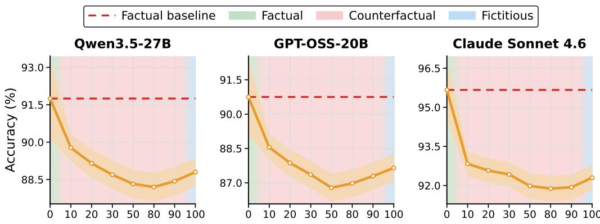
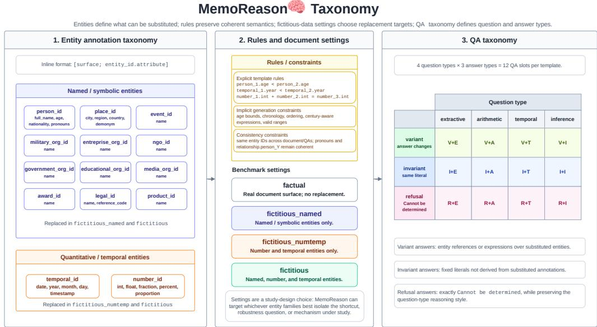
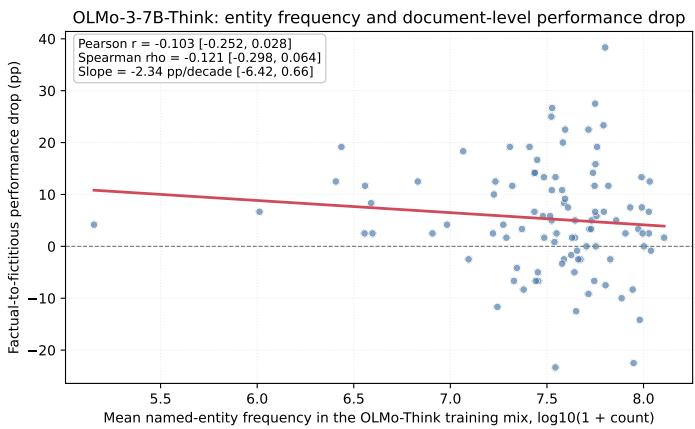
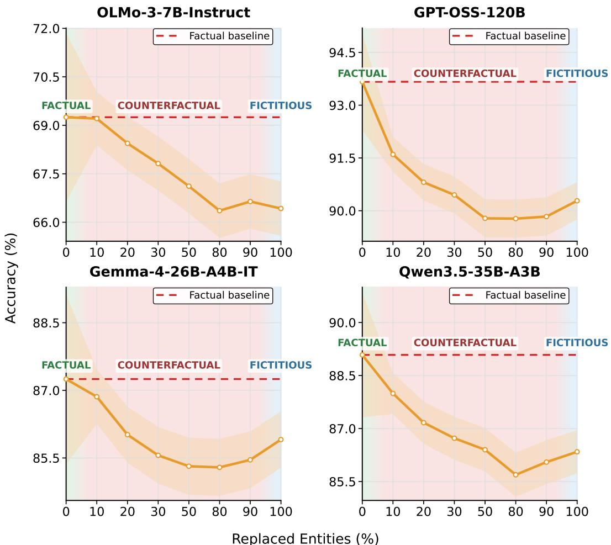

# MEMOREASON : EVALUATING THE EFFECT OF PARA-METRIC MEMORY ON CONTEXTUAL REASONING IN LLMS

Zineddine Tighidet<sup>1,2∗</sup> Andrea Mogini<sup>1</sup> Jiali Mei<sup>1</sup> Patrick Gallinari<sup>2,3</sup> Benjamin Piwowarski<sup>2</sup> <sup>1</sup>BNP Paribas <sup>2</sup>Sorbonne Université <sup>3</sup>Criteo AI Lab Paris, France

: memoreason.github.io MemoReason

Zineddine-Tighidet/MemoReason

## ABSTRACT

Large Language Models (LLMs) perform well on reasoning benchmarks, but it remains unclear whether this reflects genuine contextual reasoning or reliance on facts memorized in their parameters. We investigate this by distinguishing two possibilities: a broad memorization bias, where familiar content improves reasoning performance, and the Strong Parametric Shortcut Hypothesis, where models skip reasoning entirely and recall stored answers. To test these effects, we introduce MemoReason, a human-curated benchmark that pairs factual reasoning tasks with structurally identical fictitious versions where real entities like people, companies, or dates are systematically replaced by fictitious ones of the same type. This preserves task structure and specified reasoning operations while varying the familiarity of the context, allowing controlled measurement of how the parametric memory affects reasoning. Our evaluation of recent LLMs reveals consistent and statistically significant performance drops of up to 15.7% in the fictitious setting, demonstrating a clear memorization bias. However, a targeted analysis of questions failed in the fictitious setting shows that models rarely respond with the corresponding factual answer, indicating that direct parametric shortcuts are not the dominant failure mode. These findings suggest that parametric memory influences reasoning through mechanisms more complex than simple factual recall. MemoReason provides a controlled framework for studying these mechanisms and for extending paired factual–fictitious evaluation to broader reasoning settings.

## 1 INTRODUCTION

Large Language Models (LLMs) have demonstrated remarkable performance in complex reasoning tasks by scoring highly on benchmarks involving math (Hendrycks et al., 2021; Lightman et al., 2023; Alshammari et al., 2026), code generation (Chen et al., 2021; Jimenez et al., 2024; Jain et al., 2024; Zhuo et al., 2025; Ye et al., 2025), commonsense inference (Zellers et al., 2019; Talmor et al., 2019), multi-hop question answering (Yang et al., 2018) and professional domain exams such as law and medicine (Katz et al., 2024; Nori et al., 2023). However, the extent to which this performance is due to abstract reasoning, pattern matching or factual memorization remains an open question. In this work, we propose an approach to better elucidate this question by studying LLM performance on reasoning tasks under controlled contextual information environments.

memorization bias in Reasoning & the Strong Parametric Shortcut Hypothesis. Some studies show that, when performing reasoning tasks, LLMs can over-rely on their parametric memory – i.e. the knowledge stored in the model parameters during training – rather than on contextual knowledge (Longpre et al., 2021; Wu et al., 2024b). In this work, we begin by testing whether familiarity with the contextual information being processed biases the ability of a model to perform reasoning tasks. This relates to the question: what is the impact ofparametric memory on the reasoning performance ofLLMs? If memory plays an important role, reasoning performance should degrade when the model is exposed to new information that has similar textual patterns to the training data but fundamentally different meaning. Henceforth we will refer to such information asfictitious (as opposed tofactual information).

Additionally, we explore the Strong Parametric Shortcut Hypothesis: the idea that LLMs leverage embedded memory as an easy way out of reasoning tasks. In short, the hypothesis states that, rather than performing all the intermediary reasoning steps logically necessary to arrive at the final answer (e.g., arithmetic, relational inference, temporal reasoning), models proceed by wrongly recalling a memorized response.

For mathematical reasoning, works such as GSM-Symbolic (Mirzadeh et al., 2025) and MATH() (Srivastava et al., 2024) have successfully isolated true reasoning from memorization (due to benchmark leakage into training data) by replacing entities within fixed problem templates, thereby maintaining the same task structure and complexity.

For reasoning tasks over semantically-rich documents, recent literature has sought to investigate shortcuts (Glockner et al., 2025) and memorization biases (Wu et al., 2024a). In the case of the CofCa benchmark by Wu et al. (2024a), a difference in reasoning performance between factual and fictitious examples was reported. However, the gap they reported could be fully explained by the unaccounted systematic error introduced by the fact they used two distinct sets of evidence-question pairs for the factual and the fictitious data. Hence, a strong conclusion on the role of parametric memory in reasoning cannot be drawn from their work.

In this paper, we set out to close this gap by applying the robust approach by Mirzadeh et al. (2025) to semantically-rich documents. We do so by introducing MemoReason (Memorization in Reasoning), a novel, high quality human-curated benchmark designed specifically to test memorization biases in reasoning and the Strong Parametric Shortcut Hypothesis under strictly controlled conditions.

We evaluate LLMs on reasoning tasks using known factual entities and subsequently test them on the exact same tasks where those familiar entities are replaced with fictitious ones under rule constraints. To the best of our knowledge, we are the first to propose a benchmark that compares LLM performance on a complex, human-curated, multi-domain question-answering dataset under these controlled conditions. We make the following main contributions:

• We introduce MemoReason, a novel reasoning question-answering benchmark that pairs factual tasks with structurally identical fictitious counterparts.

• We formulate a rigorous framework to evaluate how much LLMs rely on contextual reasoning and parametric shortcuts using this novel benchmark.

• We open-source the customized annotation interface used to build MemoReason as a commitment to help future work aiming to extend our approach.

• We show that LLMs exhibit significant performance drops on reasoning questions when moving from factual to fictitious settings.

• We verify that direct factual information recall (the Strong Parametric Shortcut Hypothesis) is not the dominant memorization bias in recent LLMs

## 2 BENCHMARK CONSTRUCTION

To examine familiarity biases in reasoning, we define a setup that allows us to systematically isolate the parametric memory without changing the underlying reasoning. To this end, we start by consolidating a factual dataset based on Wikipedia excerpts (Section 2.1). We then use this dataset to build templates that preserve the text structure while abstracting its content (Section 2.2). Finally, we generate fictitious variants of the factual dataset (Section 2.3).

## 2.1 FACTUAL DATASET

We start by building a factual dataset $\mathcal { D } = \{ ( d _ { i } , q _ { i } , a _ { i } ) \} _ { i = } ^ { N }$ where $d _ { i }$ is an excerpt (introduction section) of a Wikipedia article, and $( q _ { i } , a _ { i } )$ a question-answer tuple based on $d _ { i }$ . Similarly to

# MemoReason

## Factual

Apollo program , also known as Project Apollo , was the United States human spaceflight program led by NASA which landed the first humans on the Moon in 1969 . It was conceived in 1960 , and the first crewed flight was in 1968 . On the Apollo 11 mission, Neil Armstrong and Buzz Aldrin landed their Apollo Lunar Module (LM) on July 20, 1969 , while Michael Collins remained in lunar orbit in the command and service module (CSM). After the first lunar landing, flight hardware remained for nine follow-on landings, but budget cuts cancelled three . five of the remaining six missions achieved landings; the Apollo 13 crew used the Lunar Module as a “lifeboat.” Project Apollo sent crewed missions beyond low Earth orbit. [...] It encountered a major setback in 1967 when the Apollo 1 cabin fire killed the entire crew [...] Rest ofthe document omitted.

<table><tr><td>Temporal (Variant Answer)</td><td>How many years passed between the conception of Project Apollo and its first crewed flight? Answer: 8(1968 1960)</td></tr><tr><td>Arithmetic (Variant</td><td>How many landings were not canceled? Answer: 6 ( (nine three)</td></tr><tr><td>Answer) Inference (Invariant</td><td>Were astronauts able to test the Apollo spacecraft in flight prior to the Apollo 1 cabin fire?</td></tr><tr><td>Answer) Extractive</td><td>Answer: No</td></tr><tr><td>(Refusal)</td><td>What specifically caused the cabin fire during the Apollo 1 incident?</td></tr></table>

Replacements
<table><tr><td rowspan=1 colspan=3>Entity reference        factual → fictitious</td></tr><tr><td rowspan=2 colspan=3>person_1.full_nameNeil Armstrong → HalzanZenkinnor</td></tr><tr><td rowspan=1 colspan=2></td></tr><tr><td rowspan=1 colspan=2>temporal_2.year</td><td rowspan=1 colspan=1>1960→1950</td></tr><tr><td rowspan=1 colspan=2>place_1.country</td><td rowspan=1 colspan=1>United States   Krostovia</td></tr><tr><td rowspan=1 colspan=1>temporal_10.y</td><td rowspan=1 colspan=1>ear</td><td rowspan=1 colspan=1>1968→1981</td></tr><tr><td rowspan=1 colspan=1>number_4.str</td><td rowspan=1 colspan=1></td><td rowspan=1 colspan=1>nine→six</td></tr><tr><td rowspan=1 colspan=1>number_5.str</td><td rowspan=1 colspan=1></td><td rowspan=2 colspan=1>three→ two</td></tr><tr><td rowspan=1 colspan=1>number_7.str</td><td rowspan=1 colspan=1></td></tr><tr><td rowspan=2 colspan=1>number_6.str</td><td rowspan=2 colspan=1></td><td></td></tr><tr><td rowspan=1 colspan=1>five→three</td></tr><tr><td rowspan=1 colspan=3>etc. (other entity replacements omitted)</td></tr></table>

<table><tr><td rowspan=1 colspan=1>FictitiousProject Heliond, also known as Stellara 17, was theKrostovia human spaceflight program led byOssander Launch Complex, which landed the first humans</td></tr><tr><td rowspan=1 colspan=1>on the Cerulan Depths in1982. It was conceived in1950</td></tr><tr><td rowspan=1 colspan=1>and the first crewed flight was in1981On the Stellara 1</td></tr><tr><td rowspan=1 colspan=1>mission, Halzan ZenkinnorandKorhal Rindor landed</td></tr><tr><td rowspan=1 colspan=1>their Stellara Command Vesselon 2 January 1982</td></tr><tr><td rowspan=1 colspan=1>while Dorvan K. Elliswayremained inCerulan Depthsorbit in the command and service module(CSM). After the firstCerulan Depthslanding, flighthardware remained for six follow-on landings, but budget cutscancelled twothreeof the remaining four missionsachieved landings; the Stellara 13crew used theStellara Command Vessel as a&quot;lifeboat.&quot;</td></tr><tr><td rowspan=1 colspan=1>Stellara 17 sent crewed missions beyond lowTerrathorbit. [...] It encountered a major setback in 1974when theStellara 8 cabin fire killed the entire crew [...]Rest of the document omitted.</td></tr><tr><td rowspan=1 colspan=1>Temporal How many years passed between the conception of(Variant    Stellara 17 and its first crewed flight?Answer)Answer: 31 (19811950)ArithmeticHow many landings were not canceled?(Variant                   two)Answer: 4(sixAnswer)Inference Were astronauts able to test the spacecraft in flight(Invariant   prior to the Stellara 8 cabin fire?Answer)    Answer: NoExtractive(Refusal)   What specifically caused the cabin fire during theStellara 8 incident?Answer: Cannot be determined</td></tr><tr><td rowspan=1 colspan=1>Rulesnumber_4.str   number_5.str ==number_7.strnumber_7.str        number_6.strtemporal_2.year∈ [1900, 1970]temporal_10.year∈ [1960, 1990]number_4.str  [1, 19]number_5.str∈ [1, 13]etc.  (other rules omitted)</td></tr></table>

Figure 1: Illustration of the MemoReason benchmark on the Apollo Program template showcasing the factual excerpt from Wikipedia on the top left with its annotated entities, a paired fictitious document on the top right, the factual and fictitious question-answer pairs below, the replacement table that maps each factual entity to its fictitious value and some of the associated rules that should be satisfied when generating the fictitious variants on the bottom. The same highlighting color is used to represent two paired entities between factual and fictitious.

GSM-Symbolic, which instantiates 100 templates, MemoReason consists of 100 semanticallyrich template documents with 12 corresponding question-answer (Q-A) tasks which results in N=1,200 factual tasks that are later paired with fictitious counterparts. We report in Table 1 detailed statistics about MemoReason.

We chose Wikipedia excerpts treating famous topics, as it is reasonable to assume that most LLMs were exposed to them during training. The selected documents contain a high density of entities, making them ideal for probing the parametric memory of LLMs. Finally, the dataset spans nine diverse themes for which the statistics are reported in Table 1 (additional details available in Appendix E.1).

The question-answer pairs associated with each document are chosen to cover four question classes and three answer classes (see Section 2.3).

Question Classes. Four classes of questions are proposed: simple extractive questions, arithmetic questions involving calculations, inference questions that are not numerical, and temporal reasoning.

Table 1: Dataset statistics by theme category. Task-template counts are reported by theme; entity and rule counts are per document (± sample standard deviation).
<table><tr><td></td><td>Award Winners</td><td>Biographies</td><td>Places</td><td></td><td></td><td></td><td></td><td></td><td></td><td>Total</td></tr><tr><td>#Task templates</td><td>144 (12.0%)</td><td>120 (10.0%)</td><td>120 (10.0%)</td><td>144 (12.0%)</td><td>144 (12.0%)</td><td>120 (10.0%)</td><td>132 (11.0%)</td><td>144 (12.0%)</td><td>132 (11.0%)</td><td>1,200</td></tr><tr><td>Avg length (chars)</td><td>2,974 ±1,036</td><td>3,160 ±952</td><td>2,606 ±600</td><td>1,943 ±799</td><td>2,644 ±969</td><td>2,454 ±1,337</td><td>1,265 ±498</td><td>1,503 ±698</td><td>2,268 ±750</td><td>2,298 ±1,037</td></tr><tr><td>Avg #Entities</td><td>58.0 ±26.1</td><td>51.4 ±14.6</td><td>48.7 ±14.4</td><td>41.4 ±14.9</td><td>39.8 ±14.2</td><td>22.3 ±9.5</td><td>14.3 ±5.5</td><td>26.2 ±9.8</td><td>39.4 ±12.6</td><td>38.0 ±19.6</td></tr><tr><td>Avg #Rules</td><td>57.2 ±34.7</td><td>35.5 ±9.6</td><td>31.4 ±8.8</td><td>21.7 ±13.0</td><td>38.5 ±16.4</td><td>17.4 ±9.6</td><td>8.4 ±5.6</td><td>23.5 ±12.8</td><td>44.9 ±15.7</td><td>31.2 ±21.4</td></tr></table>

We propose these question classes to test memorization biases on different reasoning tasks (see Figure 1 for examples of each):

• Extractive (baseline): the answer is explicitly stated in the document, so the main challenge is to identify and extract the relevant evidence.

• Arithmetic: answering this type of question requires performing arithmetic operations on the numerical entities mentioned in the document.

• Temporal: this type of question aims to test the ability of models to reason over temporal entities such as years, dates, ages, or durations.

• Inference: answering this type of question requires reasoning that is not primarily arithmetic or temporal.

## 2.2 TEMPLATE ANNOTATION

The template annotation process consists of transforming the factual dataset D into a dataset of templates $\mathcal { D } ^ { \mathrm { t e m p l a t e } } = \{ ( d _ { i } ^ { \mathrm { t e m p l a t e } } , q _ { i } ^ { \mathrm { t e m p l a t e } } , a _ { i } ^ { \mathrm { t e m p l a t e } } , \mathcal { E } _ { i } ^ { \mathrm { f a c t u a l } } , \mathcal { R } _ { i } ) \} _ { i = 1 } ^ { N }$ where $d _ { i } ^ { \mathrm { t e m p l a t e } }$ is a document with annotated entities following a taxonomy that we define in Appendix B, $q _ { i } ^ { \mathrm { t e m p l a t e } }$ the question, $a _ { i } ^ { \mathrm { t e m p l a t e } }$ the answer, $\mathcal { E } _ { i } ^ { \mathrm { f a c t u a l } }$ the set of factual entities, and $\mathcal { R } _ { i }$ the set of rules that must be satisfied when replacing factual entities with fictitious ones in $d _ { i } ^ { \mathrm { t e m p l a t e } }$ . Unlike GSM-Symbolic (Mirzadeh et al., 2025), which operates on short arithmetic statements, our setting involves entity-rich documents with substantially greater complexity, requiring us to design more sophisticated and expressive templates.

Entity Annotation. A factual document $d _ { i }$ is transformed into a template document $d _ { i } ^ { \mathrm { t e m p l a t e } }$ by identifying entities and assigning the right entity type and attribute (e.g., Albert Einstein gets assigned the person entity type with a full\_name attribute). This annotation process ensures that factual entities are replaced with plausible fictitious ones that preserve their type (e.g., person → person, number → number). To this end, we developed a taxonomy of 14 entity types and their associated attributes, designed to cover all entities present in the factual dataset (see Appendix B for details).

Rules. It is necessary to make sure that replacing the factual entities does not alter the logic and core semantics of the document. We therefore manually encode constraints or rules that must be satisfied when replacing with fictitious entities. Those rules include:

• Plural mentions: $" [ . . . ]$ He was among the [10; number\_1.int] selected players $[ . . . ] "$ → number\_1.int $\geq 2$

• Numbers that should sum to a total: "[...] Among the [fourteen; number\_2.str] casualties are $[ 9 ;$ number\_3.int] injured and [5; number\_4.int] dead $[ . . . ] "$ → number\_2.str = number\_3.int + number\_4.int

• Order preservation: we define rules to ensure that the order of numerical and temporal entities (e.g. years, dates, etc.) is maintained between factual and fictitious settings. This is crucial especially for temporal entities to avoid breaking the logical timeline of events.

• Sampling intervals: for number and temporal entities, we sample the fictitious replacements from restricted intervals around the factual values to avoid situations where replacing a small number with a very large one would create unnatural situations such as asserting a historical figure lived to be 800 years old instead of 80 or that a stock price went negative.

Annotation Process. All the annotation steps, including the entity annotation, rule definition, and question-answer writing are first drafted by an AI Agent backed by Claude Opus 4.6 (Anthropic, 2026a). Then 15 human annotators (qualified colleagues with knowledge in LLMs) independently check the generated annotations and modify them if needed. Finally, the annotators meet in a dedicated agreement session. Even with a highly capable AI Agent, systematic human annotations proved indispensable for correcting, refining and validating all initial AI drafts. As a point of reference, almost 50% of the Q-A pairs required human intervention and we estimate the total time spent in the annotation process around 200 hours (i.e., 2 hours per document). We stress that the annotation and review process is both intensive and of critical importance. We show in Figure 5 of Appendix H a screenshot of the annotation interface used to inspect entity spans, replacement rules, and question-answer fields for the Toyota template. Although Claude Opus 4.6 drafts fictitious named entities and Claude Sonnet 4.6 is among the evaluated models, candidate acceptance is model-independent: entities undergo web and Wikipedia non-existence checks, human review, and deterministic rule validation before evaluation.

## 2.3 FICTITIOUS DATASET

For each template, we generate K = 10 fictitious variants $\{ ( d _ { i , s } ^ { \mathrm { f i c t i t i o u s } } , q _ { i , s } ^ { \mathrm { f i c t i t i o u s } } , a _ { i , s } ^ { \mathrm { f i c t i t i o u s } } ) \} _ { s = 1 } ^ { K }$ by replacing all entities under rule constraints. We categorize the entities into named entities (e.g. persons, places, etc.) and numerical entities (e.g. numbers, temporal entities such as dates, etc.). To ensure that the generated entity values are fictitious and satisfy the replacement rules, the generation process includes 2 steps for each document:

• Named entity sampling. We use an AI Agent backed by Claude Opus 4.6 (Anthropic, 2026a) to build a document-specific pool of fictitious named-entity candidates. The generated candidates must be non-existing, pronounceable (BAUER, 2015), type-compatible, and internally coherent across attributes. When a document links several attributes of a single entity, such as a place name and its demonym, the candidate pool keeps the linked attributes aligned so that a sampled fictitious document remains coherent. The prompt used is provided in Appendix K.5. We also ensure that the generated entities do not exist by checking their existence in Wikipedia and via a web search.

• Numerical entity sampling. To sample numerical and temporal entities that satisfy the rule constraints, we use the Mixed Integer Linear Programming solver implemented in $\operatorname { S c i p y }$ (Virtanen et al., 2020). We also make sure not to sample the same values across the $K$ fictitious variants. Days and months are also replaced and verified manually against the rules.

Answer Classes. Orthogonally to the question class, and in order to systematically isolate the influence of parametric memory, we define three answer classes. Questions with variant answers depend on the entities described in the document and, therefore, their answers change when those entities are replaced. Questions with invariant answers are independent of the fictitious substitutions and remain identical between factual and fictitious settings. Invariant questions are still evaluated on the fully fictitious document—both named identities and numerical/temporal values are replaced—but their answer literal is unchanged. Refusal questions ask for information that is not provided in the document, testing whether the model stays grounded in the provided context.

Each document-template is used to generate $K = 1 0$ fictitious variants for each of its 12 Q-A pairs, yielding 12,000 fictitious pairs. Figure 1 illustrates a template on the Apollo Program example.

## 3 EVALUATION FRAMEWORK

Measuring Performance Variation. Given the performance of a model on a factual example $( d _ { i } , q _ { i } , a _ { i } )$ , noted $Y _ { i } ^ { \mathrm { f a c t u a l } }$ , we are interested in how this performance changes towards the set of $K$ corresponding fictitious examples $\{ ( d _ { i , s } ^ { \mathrm { f i c t i t i o u s } } , q _ { i , s } ^ { \mathrm { f i c t i t i o u s } } , a _ { i , s } ^ { \mathrm { f i c t i t i o u s } } ) \} _ { s = 1 } ^ { K }$ . We define the paired difference as $\Delta _ { i } = \hat { Y } _ { i } ^ { \mathrm { f i c t i t i o u s } } - Y _ { i } ^ { \mathrm { f a c t u a l } }$ , where $\hat { Y } _ { i } ^ { \mathrm { f i c t i t i o u s } }$ denotes the average performance across the K corresponding fictitious examples. To account for dependence among questions and variants from the same document, confidence intervals are computed by bootstrapping complete documents.

Exact and Judge Match. We assess prediction correctness using two complementary metrics. We first apply Exact Match (EM) and for predictions deemed incorrect we follow up with Judge Match (JM), in which an LLM is prompted to determine whether the prediction and the ground truth are semantically equivalent. To validate the reliability of the JM, we calibrated it on 200 randomly sampled examples, achieving 100% human-machine agreement. This confirms that the JM not only captures correct predictions missed by EM, but also reliably identifies incorrect ones, suggesting it is not prone to the confirmation bias toward affirmative judgments that has been reported in LLMs (Jain et al., 2025; He et al., 2026). We provide more details on the calibration process in Appendix C.

Model Selection. We evaluate nine recent, high-performing reasoning models spanning multiple providers: GPT-OSS-20B and GPT-OSS-120B (OpenAI et al., 2025), OLMo-3-7B-Think and OLMo-3-7B-Instruct (Olmo et al., 2026), Gemma-4-26B-A4B-it, Qwen3.5-27B and Qwen3.5-35B-A3B (Qwen, 2026), Llama-3.1-8B-Instruct (Dubey et al., 2024), and Claude Sonnet 4.6 (Anthropic, 2026b;a). This set combines open-weight models with a frontier API model, allowing us to compare memorization biases and parametric-shortcuts across model families and scales.

## 4 EXPERIMENTS & RESULTS

In this section, we describe the experiments conducted on the MemoReason benchmark. In Section 4.1 we examine the impact of replacing entities in the document on LLMs’ ability to answer questions based on contextual information, testing the existence of a memorization bias in reasoning. In Section 4.2, we study how performance evolves as the proportion of replaced entities increases, testing whether models perform worse in the knowledge-conflict setting of partial entity replacement than when all entities are replaced (Section 4.2). Section 4.3 tests chain-of-thought effects and reasoning effort. Finally, in Section 4.4, we put the Strong Parametric Shortcut Hypothesis to the test to ascertain whether prediction errors are due to pure recall of learned facts. Additional robustness and mechanism checks are reported in Appendix G.1.

## 4.1 THE IMPACT OF ENTITY REPLACEMENT ON LLMS’ REASONING PERFORMANCE

Our first experiment investigates whether entity replacement influences model reasoning performance.   
The results are reported in Table 2.

Reasoning questions with Variant answers For variant answers (see Section 2.3), all models exhibit a drop in reasoning performance when working on fictitious documents. Moreover, this drop is statistically significant for all 9 models tested. This result is driven by inference-class questions (see Section 2.1), with significant drops in the 10% range. Temporal-class questions also contribute, with significant drops for 5 models in the 4.4% to 15.6% range. Arithmetic-class questions show significant drops for 6 models, in the 4.7% to 7.2% range. This ranking should not come as a surprise, since arithmetic questions are much more prevalent than other categories of questions on many mathematical reasoning benchmarks and post-training datasets. Temporal questions, though much less prevalent, are relatively straightforward to systematize and generally share similar patterns among each other. Inference questions, however, are much broader in the patterns they follow: they are the most difficult ones to shortcut via pattern matching. Overall, the Variant-class results confirm that there is indeed a familiarity bias in LLM reasoning.

Table 2: Mean performance change (fictitious minus factual, %) by answer and question type. We report aggregated reasoning question performance (i.e. Arith for Arithmetic, Temp for Temporal, and Infer for Inference) in the Reason column. Extractive questions are reported in the Extr column. Statistically significant results are framed and indicated in bold. We also report the 95% confidence intervals below each value. Results that decrease and increase from factual to fictitious are highlighted in purple and blue , respectively.
<table><tr><td rowspan="2">Answer</td><td colspan="5">Variant</td><td colspan="5">Invariant</td><td colspan="5">Refusal</td></tr><tr><td>Arith.</td><td>Temp.</td><td>Infer.</td><td>Reason.</td><td>Extr.</td><td>Arith.</td><td>Temp.</td><td>Infer.</td><td>Reason.</td><td>Extr.</td><td>Arith.</td><td>Temp.</td><td>Infer.</td><td>Reason.</td><td>Extr.</td></tr><tr><td>OLMO-3 7B-THINK</td><td>-1.4 [-9.2, +6.5]</td><td>-15.6 [-23.2, -7.8]</td><td>-7.4 [-14.6, +0.0]</td><td>-8.1 [-12.4, -3.8]</td><td>-9.3 [-13.6, -4.8]</td><td>-0.8 [-8.3, +6.7]</td><td>-6.6 [-13.2, +0.4]</td><td>-2.2 [-10.2, +6.1]</td><td>-3.2 [-7.7,+1.4]</td><td>-1.6 [-7.7, +4.6]</td><td>-3.6 [-9.1,+2.0]</td><td>-10.8 [-17.9, -3.6]</td><td>-2.0 [-7.9, +4.0]</td><td>-5.5 [-9.1, -1.9]</td><td>-2.4 [-7.1, +2.5]</td></tr><tr><td>OLMO-3 7B-INSTRUCT</td><td>-4.0 [-12.9, +4.6]</td><td>-3.7 [-11.5, +4.1]</td><td>-15.7 [-24.8, 6.5]</td><td>-7.8 [-12.6, -2.9]</td><td>-6.0 [-12.0, +0.1]</td><td>-1.6 [-8.0, +4.7]</td><td>-11.1 [-18.5, 4.1]</td><td>-5.4 [-12.6, +1.7]</td><td>-6.0 [-10.1, -2.1]</td><td>-0.3 [-5.7,+5.2]</td><td>+2.1 [-2.8,+7.4]</td><td>+6.5 [+0.0, +13.2]</td><td>+3.9 [-1.7, +9.9]</td><td>+4.2 [+0.8, +7.6]</td><td>+1.4 [-2.1, +5.3]</td></tr><tr><td>GPT-OSS 20B</td><td>-4.8 [-9.3, -0.5]</td><td>-4.8 [-9.3, -0.6]</td><td>-11.3 [-18.2, 4.5]</td><td>-7.0 [-10.2, -3.8]</td><td>-7.0 [-12.0,-2.6]</td><td>-0.3 [-6.6, +6.2]</td><td>-9.7 [-15.6, -4.1]</td><td>+0.2 [-4.2, +4.8]</td><td>-3.3 [-6.5, -0.1]</td><td>-2.2 [-6.4, +1.8]</td><td>-3.6 [-8.6, +1.1]</td><td>+1.8 [-3.7, +7.4]</td><td>+4.1 [-2.6, +11.0]</td><td>+0.8 [-2.7, +4.3]</td><td>+0.4 [-3.5, +4.5]</td></tr><tr><td>GEMMA-4 26B-A4B-IT</td><td>-6.9 [-13.2, -0.7]</td><td>-4.6 [-10.3,+1.0]</td><td>-8.1 [-15.1, -1.4]</td><td>-6.5 [-10.2, -2.9]</td><td>-4.2 [-7.7, -1.4]</td><td>+0.1 [-5.8, +6.0]</td><td>-2.0 [-7.2, +3.3]</td><td>+0.5 [-5.0, +6.1]</td><td>-0.5 [-3.7, +2.7]</td><td>-0.0 [-3.3, +3.3]</td><td>+3.8 [+0.7, +7.8]]</td><td>+3.4 [-1.0, +8.2]</td><td>-0.2 [-4.5, +4.2]</td><td>+2.3 [+0.1, +4.7]</td><td>+2.1 [-0.6, +5.6]</td></tr><tr><td>GPT-OSS 120B</td><td>-4.7 [-9.4, −0.2]</td><td>-7.4 [-11.3, -4.0]</td><td>-11.8 [-18.8, 4.9]</td><td>-8.0 [-11.3, -4.7]</td><td>-7.8 [-12.5,-3.7]</td><td>-0.8 [-6.6, +5.2]</td><td>+2.1 [-3.2,+7.6]</td><td>-0.2 [-3.3, +3.3]</td><td>+0.4 [-2.6, +3.3]</td><td>-0.6 [-4.4, +3.2]</td><td>-5.6 [-10.7, -0.8]</td><td>-1.0 [-5.0, +2.9]</td><td>-1.4 [-6.5, +3.7]</td><td>-2.7 [-5.4, +0.1]</td><td>-1.4 [-5.5, +2.7]</td></tr><tr><td>QWEN3.5 27B</td><td>-5.3 [-10.2, -0.8]</td><td>-4.4 [-9.2, -0.0]</td><td>-10.0 [-17.7,-2.5]</td><td>-6.6 [-10.1, -3.1]</td><td>-5.0 [-9.0, -1.7]</td><td>+0.6 [-5.5, +6.9]</td><td>-3.4 [-7.4, +0.5]</td><td>-2.1 [-5.5, +0.7]</td><td>-1.6 [-4.6, +1.3]</td><td>-3.1 [-6.5, 0.5]</td><td>-4.6 [-9.8, +0.2]</td><td>-1.0 [-5.3, +3.0]</td><td>+2.5 [-2.0, +7.4]</td><td>-1.0 [-3.8, +1.8]</td><td>+0.4 [-1.3, +2.9]</td></tr><tr><td>QWEN3.5 35B-A3B</td><td>-6.5 [-11.8, -1.5]</td><td>-2.6 [-8.3, +2.9]</td><td>-10.4 [-16.1, -5.0]</td><td>-6.5 [-9.9, -3.2]</td><td>-5.4 [-10.3, -0.9]</td><td>-3.7 [-10.2, +2.5]</td><td>-3.7 [-9.4,+1.9]</td><td>-5.1 [-10.1, -0.7]</td><td>-4.2 [-7.5, -1.0]</td><td>-3.3 [-7.0, -0.2]</td><td>+2.2 [-2.4, +7.2]</td><td>+1.0 [-2.1, +4.5]</td><td>+2.0 [-0.3, +5.2]</td><td>+1.7 [-0.4, +4.0]</td><td>+2.6 [-0.2, +6.2]</td></tr><tr><td>LLAMA-3.1 8B-INSTRUCT</td><td>-3.0 [-9.5, +3.6]</td><td>-4.1 [-9.7, +1.4]</td><td>-12.6 [-19.1, -6.4]</td><td>-6.6 [-10.4, -2.8]</td><td>-1.9 [-6.2, +2.4]</td><td>+2.5 [-3.0, +8.2]</td><td>+2.3 [-4.9, +9.6]</td><td>-0.3 [-2.7,+2.1]</td><td>+1.5 [-1.6, +4.6]</td><td>-1.1 [-5.4, +2.9]</td><td>-1.9 [-6.8, +2.8]</td><td>-2.3 [-9.6, +5.0]</td><td>+3.1 [-2.8, +9.4]</td><td>-0.4 [-4.2, +3.5]</td><td>+2.9 [-3.5, +9.5]</td></tr><tr><td>CLAUDE SONNET 4.6</td><td>-7.2 [-12.4, -2.1]</td><td>-6.7 [-10.8, -3.1]</td><td>-9.6 [-15.1, -4.6]</td><td>-7.8 [-10.8, -5.0]</td><td>-3.1 [-7.3, +0.8]</td><td>-1.5 [-7.3, +4.4]</td><td>-0.4 [-4.1, +3.3]</td><td>-3.2 [-7.0, +0.4]</td><td>-1.7 [-4.5, +1.0]</td><td>-1.7 [-5.4,+1.8]</td><td>-5.3 [-9.5, -1.7]</td><td>+1.9 [-2.7, +6.8]</td><td>-2.4 [-7.0, +2.1]</td><td>-1.9 [-4.5, +0.6]</td><td>-1.2 )[4.3, +1.7]</td></tr></table>

Reasoning questions with Invariant answers For invariant answers, aggregate reasoning changes are heterogeneous across models, ranging from a 6.0-point decrease to a 1.5-point increase. Only 3 of the 9 models show a statistically significant decrease at the 95% confidence level. Given that answers don’t change, we further investigated whether these drops on invariant answers are due to models wrongly using familiar named or numerical entities to map the context to memorized structure and report the results in Appendix G.1.1.

Refusal answers and Extractive questions. The picture is significantly more muddled for refusals, with only a couple of barely significant deviations in performance going in different directions. Overall, a non-statistically significant hint of an inverse bias can be gleaned from the data, with models being more likely to venture an answer despite insufficient supporting evidence when in the presence of factual information. In the factual setting, models rely on memorized knowledge even when the document lacks sufficient evidence, causing them to answer when they should refuse. In the fictitious setting this memorized fallback is unavailable, making models more likely to recognize the missing evidence and correctly refuse. On extractive questions with variant answers, performance decreases for all 9 models and significantly for 6 of them.

Beyond the aggregate results in Table 2, Appendix G.1.2 compares paired model responses in both directions: factual-to-fictitious and fictitious-to-factual. Models are more likely to answer a fictitious task incorrectly when they answer its factual counterpart correctly than to answer a factual task incorrectly when they answer its fictitious counterpart correctly. This directional asymmetry favors the factual setting, consistent with models benefiting from entity familiarity when performing contextual reasoning. It does not, however, establish direct factual-answer copying; we test the Strong Parametric Shortcut Hypothesis in Section 4.4.

## 4.2 VARYING THE PROPORTION OF REPLACED ENTITIES

The previous results from Table 2 show that the models yield significant reductions in reasoning performance when replacing all entities. In this experiment, our aim is to probe knowledge conflict when factual anchors and counterfactual relations coexist. To this end, we performed the same analysis described in Section 4.1 on partially fictitious documents, where a percentage of randomly selected entities are replaced while the others are kept factual. Once again, we ensure that every assessed document respects all the rules associated with its template after partial entity substitution.

  
Replaced Entities (%)  
Figure 2: Accuracy of Qwen3.5-27B, GPT-OSS-20B, and Claude Sonnet 4.6 as the proportion of entities replaced with fictitious ones increases. Dashed red lines show factual accuracy; orange shaded bands show 95% confidence intervals.

Figure 2 reports accuracy from the factual baseline (i.e., 0% replacement, represented with horizontal dashed red lines) to full fictitious replacement (i.e., 100% replacement, matching the setup from Section 4.1) for Qwen3.5-27B, GPT-OSS-20B, and Claude Sonnet 4.6 (we report the remaining four models in Appendix H.1).

Across all models, accuracy declines as the replacement proportion rises from 0% toward 50%, consistent with the familiarity effect established in Section 4.1. Beyond 50%, accuracy partially recovers toward the fully fictitious setting: the interior regime introduces a second factor — conflict between parametric knowledge and contextual assertions about still-familiar entities — that the endpoint comparison of Section 4.1 does not probe. Section 4.2 therefore measures reasoning-task performance under knowledge conflict (Longpre et al., 2021), complementing the pure-familiarity comparison of Section 4.1.

## 4.3 CHAIN-OF-THOUGHT EFFECT

To test the effect that chain-of-thought (CoT) post-training has on reasoning performance, we compare OLMo-3-7B-Instruct (no CoT) with OLMo-3-7B-Think (with CoT) on reasoning questions (arithmetic, temporal, and inference). CoT improves absolute performance in both settings, with gains of 15.00% points on factual reasoning questions and 12.62% on their fictitious counterparts. However, the factual–fictitious performance drop is also 2.38% larger: accuracy rises, robustness does not. We show in Appendix I.1 a comparative example where OLMo-Think (with CoT) gave the correct answer as opposed to OLMo-Instruct (without CoT).

Does greater reasoning effort improve performance? GPT-OSS models allow us to vary the effort allocated to the reasoning chain (low, medium, and high), enabling us to test its effect on model performance (Table 3). Factual/fictitious accuracy rises 3.50/ 2.25 points from low to medium, but falls 1.58/ 1.59 at high effort (paired 95% CIs exclude zero). Thus, more reasoning effort is not always better. The gap remains significant at every setting, but its pairwise changes are not; additional effort does not remove it.

Table 3: GPT-OSS-20B reasoning effort ablation.
<table><tr><td>Effort</td><td>Factual acc. (%)</td><td>Fictitious acc. (%)</td><td>Gap (%)</td></tr><tr><td>Low</td><td>90.75 [89.17, 92.25]</td><td>87.65 [86.15, 89.08]</td><td>3.10 [1.44, 4.77]</td></tr><tr><td>Medium</td><td>94.25 [93.00, 95.50]</td><td>89.90 [88.35, 91.40]</td><td>4.35 [2.89, 5.86]</td></tr><tr><td>High</td><td>92.67 [91.17, 94.17]</td><td>88.31 [86.68, 89.87]</td><td>4.36 [2.80, 5.98]</td></tr></table>

## 4.4 STRONG PARAMETRIC SHORTCUT HYPOTHESIS

The performance drops observed in fictitious variants (see Section 4.1) show that models are affected by the familiarity of the entities appearing in the document. However, this result alone does not establish the Strong Parametric Shortcut Hypothesis. A drop in performance may indicate a broader memory or familiarity bias, but the hypothesis would require a more specific failure mode: when the model fails on a fictitious variant, it should incorrectly answer with the factual answer associated with the original example, suggesting that it bypassed contextual reasoning completely by recalling memorized parametric knowledge.

Table 4: Shortcut Rate (%). Rate = judge weighted matches over failed variant examples (counts in parentheses). Reason. aggregates reasoning questions.
<table><tr><td>Question Type</td><td>Arith.</td><td>Temp.</td><td>Infer.</td><td>Reason.</td><td>Extr.</td></tr><tr><td>OLMO-3 7B-THINK</td><td>1.0 (344)</td><td>1.4 (336)</td><td>0.5 (314)</td><td>1.0 (994)</td><td>0.8 (123)</td></tr><tr><td>OLMO-3 7B-INSTRUCT</td><td>2.0 (600)</td><td>3.7 (567)</td><td>1.9 (467)</td><td>2.5 (1634)</td><td>0.8 (130)</td></tr><tr><td>GPT-OSS 20B</td><td>1.6 (118)</td><td>3.9 (98)</td><td>0.9 (213)</td><td>2.2 (429)</td><td>1.0 (80)</td></tr><tr><td>GEMMA-4 26B-A4B-IT</td><td>1.4 (189)</td><td>0.6 (186)</td><td>1.3 (271)</td><td>1.1 (646)</td><td>1.0 (52)</td></tr><tr><td>GPT-OSS 120B</td><td>0.8 (107)</td><td>2.0 (94)</td><td>1.2(188)</td><td>1.3 (389)</td><td>1.0 (78)</td></tr><tr><td>QWEN3.5 27B</td><td>1.9 (253)</td><td>0.4 (134)</td><td>1.2 (200)</td><td>1.2 (587)</td><td>1.0 (60)</td></tr><tr><td>QWEN3.5 35B-A3B</td><td>1.6(305)</td><td>1.6 (186)</td><td>3.9 (254)</td><td>2.3 (745)</td><td>1.0 (74)</td></tr><tr><td>LLAMA-3.1 8B-INSTRUCT</td><td>1.8 (360)</td><td>2.6 (271)</td><td>5.2 (256)</td><td>3.2(887)</td><td>0.0 (39)</td></tr><tr><td>CLAUDE SONNET 4.6</td><td>1.2 (102)</td><td>1.4 (87)</td><td>3.3 (136)</td><td>2.0(325)</td><td>1.0(41)</td></tr></table>

To test this hypothesis directly, we compute the Shortcut Rate reported in Table 4. This measures how often the model’s incorrect prediction matches the corresponding factual answer. For each model, we restrict the analysis to failed fictitious variant examples. The resulting rates are consistently low. Across reasoning questions, the aggregate rate ranges from 1.0% to 3.2%, and extractive rates range from 0.0% to 1.0%. Thus, even when models fail under fictitious substitutions, they rarely fail by simply reproducing the factual answer. These results suggest that the memory effect identified in our main performance analysis should not be interpreted as a simple recall shortcut. Parametric memory appears to influence reasoning performance, producing a clear memory orfamiliarity bias, but this influence does not usually translate into direct factual-answer copying. The results do not identify the mechanisms underlying these errors. The non-trivial interaction between prior knowledge and reasoning ability deserves further investigation, and MemoReason provides a controlled setting for analyses.

## 4.5 EVALUATION CONTRACT

MemoReason is intended not only to detect familiarity effects, but also to support meaningful comparisons between models. A single score would be misleading: fictitious accuracy reflects overall reasoning ability, whereas a small factual–fictitious gap may indicate robustness or simply poor performance in both settings. We therefore report complementary diagnostics. Table 5 ranks models by fictitious accuracy, while also reporting the factual–fictitious gap, the error ratio $( 1 - \mathrm { A c c } _ { \mathrm { f i c t } } ) / ( 1 -$ $\operatorname { A c c } _ { \operatorname { f a c t } } )$ the factor by which the error rate changes after replacement—and the Shortcut Rate, which measures direct factual-answer reproduction among fictitious failures. These metrics should be interpreted jointly. For example, Llama-3.1-8B-Instruct has a relatively small 1.37-point gap but ranks seventh in fictitious accuracy, and its reasoning performance still decreases significantly.

Table 5: MemoReason leaderboard. Models are ranked by accuracy in the fully fictitious setting. ↑ indicates higher is better; ↓ indicates lower is better.
<table><tr><td>Rank Model</td><td></td><td>Fictitious acc. (%)↑</td><td>Factual acc. (%) ↑</td><td>Gap (%)↓</td><td>Error ratio ↓</td><td>Shortcut Rate (%)↓</td></tr><tr><td></td><td>AI CLAUDE SONNET 4.6</td><td>92.30</td><td>95.67</td><td>3.37</td><td>1.78×</td><td>2.01</td></tr><tr><td>2 2 S</td><td>GPT-OSS 120B</td><td>90.28</td><td>93.67</td><td>3.38</td><td>1.53×</td><td>1.33</td></tr><tr><td>3 1 3</td><td>QWEN3.5 27B</td><td>88.80</td><td>91.75</td><td>2.95</td><td>1.36×</td><td>1.18</td></tr><tr><td>4 G</td><td>GPT-OSS 20B</td><td>87.65</td><td>90.75</td><td>3.10</td><td>1.34×</td><td>2.18</td></tr><tr><td>5 V</td><td>QWEN3.5 35B-A3B</td><td>86.34</td><td>89.08</td><td>2.74</td><td>1.25×</td><td>2.33</td></tr><tr><td>6</td><td>GEMMA-4 26B-A4B-IT</td><td>85.91</td><td>87.25</td><td>1.34</td><td>1.11×</td><td>1.10</td></tr><tr><td>7 8</td><td>LLAMA-3.1 8B-INSTRUCT</td><td>76.88</td><td>78.25</td><td>1.37</td><td>1.06×</td><td>3.19</td></tr><tr><td>8 ☆</td><td>OLMO-3 7B-THINK</td><td>75.61</td><td>80.92</td><td>5.31</td><td>1.28×</td><td>0.98</td></tr><tr><td>9 ☆</td><td>OLMO-3 7B-INSTRUCT</td><td>66.42</td><td>69.25</td><td>2.83</td><td>1.09×</td><td>2.53</td></tr></table>

High accuracy can likewise conceal a substantial relative error penalty. Claude Sonnet 4.6 achieves 95.67% factual accuracy, but this falls to 92.30% in the fictitious setting (Table 5). The statistically significant 3.37-point gap shows that entity familiarity still affects performance, even for the strongest evaluated model. Its high factual accuracy therefore does not establish benchmark saturation: achieving comparably high accuracy on fictitious tasks while reducing this gap remains an open challenge.

## 5 CONCLUSION

We introduced MemoReason, a human-curated benchmark pairing factual tasks with structurally identical fictitious counterparts to study familiarity effects on contextual reasoning. Our evaluation reveals statistically significant accuracy drops of up to 15.7% in the fictitious setting. These failures rarely reproduce factual answers directly, suggesting that familiarity affects reasoning beyond simple answer copying. Identifying the mechanisms underlying these performance differences remains an open question, and MemoReason provides a controlled setting for investigating them. Its regenerable templates support paired comparisons between factual, partially replaced, and fully fictitious documents, as well as targeted interventions on named entities or numerical and temporal values. This enables researchers to test specific explanations for performance changes while preserving task structure and specified reasoning operations. Regenerating fresh fictitious instances also helps mitigate evaluation-data leakage. The accompanying annotation interface as well as the generation and evaluation pipeline make these experiments inspectable, reproducible, and extensible to new documents and models. Together, these resources support a more systematic understanding of when familiar knowledge helps contextual reasoning—and when it interferes with it.

## AI USE STATEMENT

Generative AI was used for benchmark pre-annotation and fictitious entity generation. All generated outputs were reviewed and, where necessary, corrected by human annotators, as detailed in Section 2.2. Generative-AI tools also provided assistance with some software development.

## REPRODUCIBILITY STATEMENT

The dataset and code releases are linked below the authors. Section 2.1–2.3 describes source selection, human-in-the-loop template annotation, and fictitious-data generation. Appendix E enumerates the released intervention settings; Appendix F records model identifiers, inference settings, hardware, and licenses; Appendix K provides the generation and evaluation prompts; and Appendix C documents evaluation calibration. The pipeline preserves raw outputs, scores, confidence intervals, manifests, and checksums binding each run to its dataset; statistical details are specified in Section 3.

## ACKNOWLEDGEMENTS

We would like to thank BNP Paribas and the French National Association for Research and Technology (ANRT) for funding this project under the CIFRE program (2023/1673). We would also like to thank Andrey Krivonogov, Etienne Boisseau, Gregoire Roullier, Lucas Lima De Carvalho, Mathias Vast, Melanie Bervoets, Randa Elmrabet-Tarmach, and all other contributors who helped annotate and validate MemoReason. Their careful review of entity annotations, replacement rules, and question–answer pairs was essential to improving the quality and consistency of the benchmark.

## REFERENCES

Shaden Alshammari, Kevin Wen, Abrar Zainal, Mark Hamilton, Navid Safaei, Sultan Albarakati, William T. Freeman, and Antonio Torralba. Mathnet: A global multimodal benchmark for mathematical reasoning and retrieval. In International Conference on Learning Representations, 2026. URL https://mathnet.mit. edu.

Anthropic. System card: Claude opus 4.6. Technical report, Anthropic, February 2026a. URL https: //www-cdn.anthropic.com/6a5fa276ac68b9aeb0c8b6af5fa36326e0e166dd.pdf.

Anthropic. System card: Claude sonnet 4.6. Technical report, Anthropic, February 2026b. URL https: //www-cdn.anthropic.com/bbd8ef16d70b7a1665f14f306ee88b53f686aa75.pdf.

LAURIE BAUER. English phonotactics. English Language and Linguistics, 19(3):437–475, 2015. doi: 10.1017/S1360674315000179.

Mark Chen, Jerry Tworek, Heewoo Jun, Qiming Yuan, Henrique Ponde de Oliveira Pinto, Jared Kaplan, Harri Edwards, Yuri Burda, Nicholas Joseph, Greg Brockman, Alex Ray, Raul Puri, Gretchen Krueger, Michael Petrov, Heidy Khlaaf, Girish Sastry, Pamela Mishkin, Brooke Chan, Scott Gray, Nick Ryder, Mikhail Pavlov, Alethea Power, Lukasz Kaiser, Mohammad Bavarian, Clemens Winter, Philippe Tillet, Felipe Petroski Such, Dave Cummings, Matthias Plappert, Fotios Chantzis, Elizabeth Barnes, Ariel Herbert-Voss, William Hebgen Guss, Alex Nichol, Alex Paino, Nikolas Tezak, Jie Tang, Igor Babuschkin, Suchir Balaji, Shantanu Jain, William Saunders, Christopher Hesse, Andrew N. Carr, Jan Leike, Josh Achiam, Vedant Misra, Evan Morikawa, Alec Radford, Matthew Knight, Miles Brundage, Mira Murati, Katie Mayer, Peter Welinder, Bob McGrew, Dario Amodei, Sam McCandlish, Ilya Sutskever, and Wojciech Zaremba. Evaluating large language models trained on code, 2021.

Abhimanyu Dubey et al. The llama 3 herd of models. arXiv preprint arXiv:2407.21783, 2024. URL https: //arxiv.org/abs/2407.21783.

Max Glockner, Xiang Jiang, Leonardo F. R. Ribeiro, Iryna Gurevych, and Markus Dreyer. NeoQA: Evidencebased question answering with generated news events. In Wanxiang Che, Joyce Nabende, Ekaterina Shutova, and Mohammad Taher Pilehvar (eds.), Findings of the Association for Computational Linguistics: ACL 2025, pp. 11842–11926, Vienna, Austria, July 2025. Association for Computational Linguistics. ISBN 979-8-89176-256-5. doi: 10.18653/v1/2025.findings-acl.616. URL https://aclanthology.org/ 2025.findings-acl.616/.

Zhonghao He, Tianyi Qiu, Hirokazu Shirado, and Maarten Sap. Martingale score: An unsupervised metric for bayesian rationality in LLM reasoning. In The Thirty-ninth Annual Conference on Neural Information Processing Systems, 2026. URL https://openreview.net/forum?id=BfO6od6JD6.

Dan Hendrycks, Collin Burns, Saurav Kadavath, Akul Arora, Steven Basart, Eric Tang, Dawn Song, and Jacob Steinhardt. Measuring mathematical problem solving with the MATH dataset. In Thirty-fifth Conference on Neural Information Processing Systems Datasets and Benchmarks Track (Round 2), 2021. URL https: //openreview.net/forum?id=7Bywt2mQsCe.

Pengfei Hong, Navonil Majumder, Deepanway Ghosal, Somak Aditya, Rada Mihalcea, and Soujanya Poria. Evaluating LLMs’ mathematical and coding competency through ontology-guided interventions. In Wanxiang Che, Joyce Nabende, Ekaterina Shutova, and Mohammad Taher Pilehvar (eds.), Findings ofthe Association for Computational Linguistics: ACL 2025, pp. 22811–22849, Vienna, Austria, July 2025. Association for Computational Linguistics. ISBN 979-8-89176-256-5. doi: 10.18653/v1/2025.findings-acl.1172. URL https://aclanthology.org/2025.findings-acl.1172/.

Naman Jain, King Han, Alex Gu, Wen-Ding Li, Fanjia Yan, Tianjun Zhang, Sida Wang, Armando Solar-Lezama, Koushik Sen, and Ion Stoica. Livecodebench: Holistic and contamination free evaluation of large language models for code. arXiv preprint arXiv:2403.07974, 2024.

Suryaansh Jain, Umair Z. Ahmed, Shubham Sahai, and Ben Leong. Beyond consensus: Mitigating the agreeableness bias in llm judge evaluations, 2025. URL https://arxiv.org/abs/2510.11822.

Carlos E Jimenez, John Yang, Alexander Wettig, Shunyu Yao, Kexin Pei, Ofir Press, and Karthik R Narasimhan. SWE-bench: Can language models resolve real-world github issues? In The Twelfth International Conference on Learning Representations, 2024. URL https://openreview.net/forum?id=VTF8yNQM66.

Daniel Martin Katz, Michael James Bommarito, Shang Gao, and Pablo Arredondo. Gpt-4 passes the bar exam. Philosophical Transactions ofthe Royal Society A: Mathematical, Physical and Engineering Sciences, 382 (2270):20230254, 02 2024. ISSN 1364-503X. doi: 10.1098/rsta.2023.0254. URL https://doi.org/ 10.1098/rsta.2023.0254.

Hunter Lightman, Vineet Kosaraju, Yura Burda, Harri Edwards, Bowen Baker, Teddy Lee, Jan Leike, John Schulman, Ilya Sutskever, and Karl Cobbe. Let’s verify step by step. arXiv preprint arXiv:2305.20050, 2023.

Shayne Longpre, Kartik Perisetla, Anthony Chen, Nikhil Ramesh, Chris DuBois, and Sameer Singh. Entity-based knowledge conflicts in question answering. In Marie-Francine Moens, Xuanjing Huang, Lucia Specia, and Scott Wen-tau Yih (eds.), Proceedings ofthe 2021 Conference on Empirical Methods in Natural Language Processing, pp. 7052–7063, Online and Punta Cana, Dominican Republic, November 2021. Association for Computational Linguistics. doi: 10.18653/v1/2021.emnlp-main.565. URL https://aclanthology. org/2021.emnlp-main.565/.

Seyed Iman Mirzadeh, Keivan Alizadeh, Hooman Shahrokhi, Oncel Tuzel, Samy Bengio, and Mehrdad Farajtabar. GSM-symbolic: Understanding the limitations of mathematical reasoning in large language models. In The Thirteenth International Conference on Learning Representations, 2025. URL https://openreview. net/forum?id=AjXkRZIvjB.

Ali Modarressi, Abdullatif Köksal, and Hinrich Schuetze. Consistent document-level relation extraction via counterfactuals. In Yaser Al-Onaizan, Mohit Bansal, and Yun-Nung Chen (eds.), Findings of the Association for Computational Linguistics: EMNLP 2024, pp. 11501–11507, Miami, Florida, USA, November 2024. Association for Computational Linguistics. doi: 10.18653/v1/2024.findings-emnlp.672. URL https: //aclanthology.org/2024.findings-emnlp.672/.

Joao Monteiro, Pierre-Andre Noel, Etienne Marcotte, Sai Rajeswar, Valentina Zantedeschi, David Vazquez, Nicolas Chapados, Christopher Pal, and Perouz Taslakian. Repliqa: A question-answering dataset for benchmarking llms on unseen reference content, 2024. URL https://arxiv.org/abs/2406.11811.

Harsha Nori, Nicholas King, Scott Mayer McKinney, Dean Carignan, and Eric Horvitz. Capabilities of gpt-4 on medical challenge problems, 2023. URL https://arxiv.org/abs/2303.13375.

Team Olmo, :, Allyson Ettinger, Amanda Bertsch, Bailey Kuehl, David Graham, David Heineman, Dirk Groeneveld, Faeze Brahman, Finbarr Timbers, Hamish Ivison, Jacob Morrison, Jake Poznanski, Kyle Lo, Luca Soldaini, Matt Jordan, Mayee Chen, Michael Noukhovitch, Nathan Lambert, Pete Walsh, Pradeep Dasigi, Robert Berry, Saumya Malik, Saurabh Shah, Scott Geng, Shane Arora, Shashank Gupta, Taira Anderson, Teng Xiao, Tyler Murray, Tyler Romero, Victoria Graf, Akari Asai, Akshita Bhagia, Alexander Wettig, Alisa Liu, Aman Rangapur, Chloe Anastasiades, Costa Huang, Dustin Schwenk, Harsh Trivedi, Ian Magnusson, Jaron Lochner, Jiacheng Liu, Lester James V. Miranda, Maarten Sap, Malia Morgan, Michael Schmitz, Michal Guerquin, Michael Wilson, Regan Huff, Ronan Le Bras, Rui Xin, Rulin Shao, Sam Skjonsberg, Shannon Zejiang Shen, Shuyue Stella Li, Tucker Wilde, Valentina Pyatkin, Will Merrill, Yapei Chang, Yuling Gu, Zhiyuan Zeng, Ashish Sabharwal, Luke Zettlemoyer, Pang Wei Koh, Ali Farhadi, Noah A. Smith, and Hannaneh Hajishirzi. Olmo 3, 2026. URL https://arxiv.org/abs/2512.13961.

OpenAI, :, Sandhini Agarwal, Lama Ahmad, Jason Ai, Sam Altman, Andy Applebaum, Edwin Arbus, Rahul K. Arora, Yu Bai, Bowen Baker, Haiming Bao, Boaz Barak, Ally Bennett, Tyler Bertao, Nivedita Brett, Eugene Brevdo, Greg Brockman, Sebastien Bubeck, Che Chang, Kai Chen, Mark Chen, Enoch Cheung, Aidan Clark, Dan Cook, Marat Dukhan, Casey Dvorak, Kevin Fives, Vlad Fomenko, Timur Garipov, Kristian Georgiev, Mia Glaese, Tarun Gogineni, Adam Goucher, Lukas Gross, Katia Gil Guzman, John Hallman, Jackie Hehir, Johannes Heidecke, Alec Helyar, Haitang Hu, Romain Huet, Jacob Huh, Saachi Jain, Zach Johnson, Chris Koch, Irina Kofman, Dominik Kundel, Jason Kwon, Volodymyr Kyrylov, Elaine Ya Le, Guillaume Leclerc, James Park Lennon, Scott Lessans, Mario Lezcano-Casado, Yuanzhi Li, Zhuohan Li, Ji Lin, Jordan Liss, Lily, Liu, Jiancheng Liu, Kevin Lu, Chris Lu, Zoran Martinovic, Lindsay McCallum, Josh McGrath, Scott McKinney, Aidan McLaughlin, Song Mei, Steve Mostovoy, Tong Mu, Gideon Myles, Alexander Neitz, Alex Nichol, Jakub Pachocki, Alex Paino, Dana Palmie, Ashley Pantuliano, Giambattista Parascandolo, Jongsoo Park, Leher Pathak, Carolina Paz, Ludovic Peran, Dmitry Pimenov, Michelle Pokrass, Elizabeth Proehl, Huida Qiu, Gaby Raila, Filippo Raso, Hongyu Ren, Kimmy Richardson, David Robinson, Bob Rotsted, Hadi Salman, Suvansh Sanjeev, Max Schwarzer, D. Sculley, Harshit Sikchi, Kendal Simon, Karan Singhal, Yang Song, Dane Stuckey, Zhiqing Sun, Philippe Tillet, Sam Toizer, Foivos Tsimpourlas, Nikhil Vyas, Eric Wallace, Xin Wang, Miles Wang, Olivia Watkins, Kevin Weil, Amy Wendling, Kevin Whinnery, Cedric Whitney, Hannah Wong, Lin Yang, Yu Yang, Michihiro Yasunaga, Kristen Ying, Wojciech Zaremba, Wenting Zhan, Cyril Zhang, Brian Zhang, Eddie Zhang, and Shengjia Zhao. gpt-oss-120b & gpt-oss-20b model card, 2025. URL https://arxiv.org/abs/2508.10925.

Qwen. Qwen3.5: Accelerating productivity with native multimodal agents, February 2026. URL https: //qwen.ai/blog?id=qwen3.5.

Yasaman Razeghi, Robert L. Logan IV, Matt Gardner, and Sameer Singh. Impact of pretraining term frequencies on few-shot reasoning, 2022. URL https://arxiv.org/abs/2202.07206.

Safal Shrestha, Minwu Kim, and Keith Ross. Mathematical reasoning in large language models: Assessing logical and arithmetic errors across wide numerical ranges, 2025. URL https://arxiv.org/abs 2502.08680.

Saurabh Srivastava, Annarose M B, Anto P V, Shashank Menon, Ajay Sukumar, Adwaith Samod T, Alan Philipose, Stevin Prince, and Sooraj Thomas. Functional benchmarks for robust evaluation of reasoning performance, and the reasoning gap, 2024. URL https://arxiv.org/abs/2402.19450.

Alessandro Stolfo, Zhijing Jin, Kumar Shridhar, Bernhard Schölkopf, and Mrinmaya Sachan. A causal framework to quantify the robustness of mathematical reasoning with language models. In Anna Rogers, Jordan Boyd-Graber, and Naoaki Okazaki (eds.), Proceedings of the 61st Annual Meeting of the Association for Computational Linguistics (Volume 1: Long Papers), pp. 545–561, Toronto, Canada, July 2023. Association for Computational Linguistics. doi: 10.18653/v1/2023.acl-long.32. URL https://aclanthology. org/2023.acl-long.32/.

Alon Talmor, Jonathan Herzig, Nicholas Lourie, and Jonathan Berant. CommonsenseQA: A question answering challenge targeting commonsense knowledge. In Jill Burstein, Christy Doran, and Thamar Solorio (eds.), Proceedings of the 2019 Conference of the North American Chapter of the Association for Computational Linguistics: Human Language Technologies, Volume 1 (Long and Short Papers), pp. 4149–4158, Minneapolis, Minnesota, June 2019. Association for Computational Linguistics. doi: 10.18653/v1/N19-1421. URL https://aclanthology.org/N19-1421/.

Zineddine Tighidet, Jiali Mei, Benjamin Piwowarski, and Patrick Gallinari. Probing language models on their knowledge source. In Yonatan Belinkov, Najoung Kim, Jaap Jumelet, Hosein Mohebbi, Aaron Mueller, and Hanjie Chen (eds.), Proceedings of the 7th BlackboxNLP Workshop: Analyzing and Interpreting Neural Networks for NLP, pp. 604–614, Miami, Florida, US, November 2024. Association for Computational Linguistics. doi: 10.18653/v1/2024.blackboxnlp-1.35. URL https://aclanthology.org/2024. blackboxnlp-1.35/.

Zineddine Tighidet, Andrea Mogini, Hedi Ben younes, Jiali Mei, Patrick Gallinari, and Benjamin Piwowarski. Context copying modulation: The role of entropy neurons in managing parametric and contextual knowledge conflicts. In Christos Christodoulopoulos, Tanmoy Chakraborty, Carolyn Rose, and Violet Peng (eds.), Findings ofthe Associationfor Computational Linguistics: EMNLP 2025, pp. 20469– 20481, Suzhou, China, November 2025. Association for Computational Linguistics. ISBN 979-8-89176- 335-7. doi: 10.18653/v1/2025.findings-emnlp.1116. URL https://aclanthology.org/2025. findings-emnlp.1116/.

Pauli Virtanen, Ralf Gommers, Travis E. Oliphant, Matt Haberland, Tyler Reddy, David Cournapeau, Evgeni Burovski, Pearu Peterson, Warren Weckesser, Jonathan Bright, Stéfan J. van der Walt, Matthew Brett, Joshua Wilson, K. Jarrod Millman, Nikolay Mayorov, Andrew R. J. Nelson, Eric Jones, Robert Kern, Eric Larson, C J Carey, <sup>˙</sup>Ilhan Polat, Yu Feng, Eric W. Moore, Jake VanderPlas, Denis Laxalde, Josef Perktold, Robert Cimrman, Ian Henriksen, E. A. Quintero, Charles R. Harris, Anne M. Archibald, Antônio H. Ribeiro, Fabian Pedregosa, Paul van Mulbregt, Aditya Vijaykumar, Alessandro Pietro Bardelli, Alex Rothberg, Andreas Hilboll, Andreas Kloeckner, Anthony Scopatz, Antony Lee, Ariel Rokem, C. Nathan Woods, Chad Fulton, Charles Masson, Christian Häggström, Clark Fitzgerald, David A. Nicholson, David R. Hagen, Dmitrii V. Pasechnik, Emanuele Olivetti, Eric Martin, Eric Wieser, Fabrice Silva, Felix Lenders, Florian Wilhelm, G. Young, Gavin A. Price, Gert-Ludwig Ingold, Gregory E. Allen, Gregory R. Lee, Hervé Audren, Irvin Probst, Jörg P. Dietrich, Jacob Silterra, James T Webber, Janko Slavic, Joel Nothman, Johannes Buchner,ˇ Johannes Kulick, Johannes L. Schönberger, José Vinícius de Miranda Cardoso, Joscha Reimer, Joseph Harrington, Juan Luis Cano Rodríguez, Juan Nunez-Iglesias, Justin Kuczynski, Kevin Tritz, Martin Thoma, Matthew Newville, Matthias Kümmerer, Maximilian Bolingbroke, Michael Tartre, Mikhail Pak, Nathaniel J. Smith, Nikolai Nowaczyk, Nikolay Shebanov, Oleksandr Pavlyk, Per A. Brodtkorb, Perry Lee, Robert T. McGibbon, Roman Feldbauer, Sam Lewis, Sam Tygier, Scott Sievert, Sebastiano Vigna, Stefan Peterson, Surhud More, Tadeusz Pudlik, Takuya Oshima, Thomas J. Pingel, Thomas P. Robitaille, Thomas Spura, Thouis R. Jones, Tim Cera, Tim Leslie, Tiziano Zito, Tom Krauss, Utkarsh Upadhyay, Yaroslav O. Halchenko, and Yoshiki Vázquez-Baeza. Scipy 1.0: fundamental algorithms for scientific computing in python. Nature Methods, 17(3):261–272, February 2020. ISSN 1548-7105. doi: 10.1038/s41592-019-0686-2. URL http://dx.doi.org/10.1038/s41592-019-0686-2.

Jian Wu, Linyi Yang, Zhen Wang, Manabu Okumura, and Yue Zhang. Cofca: A step-wise counterfactual multi-hop qa benchmark, 2024a. URL https://arxiv.org/abs/2402.11924.

Zhaofeng Wu, Linlu Qiu, Alexis Ross, Ekin Akyürek, Boyuan Chen, Bailin Wang, Najoung Kim, Jacob Andreas, and Yoon Kim. Reasoning or reciting? exploring the capabilities and limitations of language models through counterfactual tasks. In Kevin Duh, Helena Gomez, and Steven Bethard (eds.), Proceedings ofthe 2024 Conference ofthe North American Chapter ofthe Associationfor Computational Linguistics: Human Language Technologies (Volume 1: Long Papers), pp. 1819–1862, Mexico City, Mexico, June 2024b. Association for Computational Linguistics. doi: 10.18653/v1/2024.naacl-long.102. URL https: //aclanthology.org/2024.naacl-long.102/.

Zhilin Yang, Peng Qi, Saizheng Zhang, Yoshua Bengio, William Cohen, Ruslan Salakhutdinov, and Christopher D. Manning. HotpotQA: A dataset for diverse, explainable multi-hop question answering. In Ellen Riloff, David Chiang, Julia Hockenmaier, and Jun’ichi Tsujii (eds.), Proceedings of the 2018 Conference on Empirical Methods in Natural Language Processing, pp. 2369–2380, Brussels, Belgium, October-November 2018. Association for Computational Linguistics. doi: 10.18653/v1/D18-1259. URL https://aclanthology.org/D18-1259/.

Zhe Ye, Zhengxu Yan, Jingxuan He, Timothe Kasriel, Kaiyu Yang, and Dawn Song. Verina: Benchmarking verifiable code generation. arXiv preprint arXiv:2505.23135, 2025.

Rowan Zellers, Ari Holtzman, Yonatan Bisk, Ali Farhadi, and Yejin Choi. HellaSwag: Can a machine really finish your sentence? In Anna Korhonen, David Traum, and Lluís Màrquez (eds.), Proceedings of the 57th Annual Meeting of the Association for Computational Linguistics, pp. 4791–4800, Florence, Italy, July 2019. Association for Computational Linguistics. doi: 10.18653/v1/P19-1472. URL https: //aclanthology.org/P19-1472/.

Terry Yue Zhuo, Vu Minh Chien, Jenny Chim, Han Hu, Wenhao Yu, Ratnadira Widyasari, Imam Nur Bani Yusuf, Haolan Zhan, Junda He, Indraneil Paul, Simon Brunner, Chen GONG, James Hoang, Armel Randy Zebaze, Xiaoheng Hong, Wen-Ding Li, Jean Kaddour, Ming Xu, Zhihan Zhang, Prateek Yadav, Naman Jain, Alex Gu, Zhoujun Cheng, Jiawei Liu, Qian Liu, Zijian Wang, David Lo, Binyuan Hui, Niklas Muennighoff, Daniel Fried, Xiaoning Du, Harm de Vries, and Leandro Von Werra. Bigcodebench: Benchmarking code generation with diverse function calls and complex instructions. In The Thirteenth International Conference on Learning Representations, 2025. URL https://openreview.net/forum?id=YrycTjllL0.

## APPENDIX

## A RELATED WORK

## A.1 EVALUATING REASONING VIA INTERVENTIONS AND ROBUSTNESS

Several studies investigate the reasoning limits of LLMs by applying controlled interventions to the input text. Prior work perturbs numerical values or alters problem constraints in math and coding datasets to test whether models solve the underlying operation or exploit surface regularities (Stolfo et al., 2023; Hong et al., 2025; Mirzadeh et al., 2025). Similarly, Shrestha et al. (2025) show that logical accuracy degrades when numerical entities are scaled outside standard ranges, and Razeghi et al. (2022) link arithmetic performance to term frequencies in the training data.

These studies show that LLM reasoning can be brittle to input variations. Our objective is narrower: we do not primarily test robustness to arbitrary problem variation, but the dependence of contextual reasoning on parametric familiarity. By swapping factual entities for fictitious ones while preserving the template, the answer expression, and the replacement constraints, we isolate the difference between operating with familiar versus unfamiliar entity anchors.

## A.2 FICTITIOUS AND COUNTERFACTUAL BENCHMARKS

To mitigate data contamination and force models to rely on provided context, recent works introduce fictitious documents or counterfactual scenarios (Monteiro et al., 2024; Wu et al., 2024a; Glockner et al., 2025; Modarressi et al., 2024; Wu et al., 2024b). For instance, NeoQA investigates whether LLMs fall back on parametric knowledge when retrieved documents lack sufficient information (Glockner et al., 2025). CofCA provides a step-wise counterfactual multi-hop QA benchmark, making it one of the closest points of comparison for document-level counterfactual reasoning (Wu et al., 2024a).

Previous counterfactual benchmarks nevertheless face a methodological limitation around task parity. Some compare a fictitious dataset against a different factual benchmark, making it difficult to attribute a performance gap strictly to the lack of parametric knowledge rather than to differences in dataset difficulty (Monteiro et al., 2024). Others regenerate counterfactual passages, which can alter sentence structure, evidence placement, and reasoning path. MemoReason is designed to remove that confound: the factual and fictitious settings are paired through the same annotated templates, so the document structure and question logic are held fixed.

The qualitative observation of lower performance on fictitious examples is consistent with Wu et al. (2024b). The paired design changes what can be concluded: because their factual and fictitious conditions use different evidence-question pairs, the gap may also reflect uncontrolled task differences, and failed answers in the fictitious condition have no paired factual answer against which to test direct recall. MemoReason holds the task fixed, allowing the gap to be attributed to entity familiarity within this controlled intervention and enabling the Shortcut Rate analysis.

## A.3 KNOWLEDGE-SOURCE SELECTION AND CONFLICT MECHANISMS

Complementary work investigates how models select between parametric and contextual knowledge when the two conflict. Tighidet et al. (2024) show that internal activations can predict which knowledge source a model uses under controlled knowledge conflicts. Tighidet et al. (2025) identify a role for entropy neurons in suppressing context copying and show that ablating these neurons changes model behavior under conflicting information. These mechanistic studies complement MemoReason’s behavioral evaluation: our paired templates enable controlled tests of how entity familiarity and knowledge conflict affect contextual reasoning, without attributing the observed performance differences to a specific internal mechanism.

## B TAXONOMY & ANNOTATION

## B.1 ENTITY TYPES

The taxonomy defines 14 entity types used to annotate all replaceable spans in the source documents: persons, places, events, military organizations, enterprise organizations, NGOs, government organizations, educational organizations, media organizations, temporals, numbers, awards, legal instruments, and products. Figure 3 summarizes how these entity families connect to the rule layer and the question-answer contract used by MemoReason.

The main reason for introducing this taxonomy is experimental control. MemoReason is not only a benchmark based on fictitious entity replacement: it is designed to replace the familiar anchors that models may have memorized while keeping the document structure, question, answer expression, and reasoning path fixed. For this to work, the replacement operation must know which spans can be swapped independently and which spans must remain coupled. Each entity type therefore has a compact set of attributes that determine what can be replaced and what must stay consistent across mentions. For example, a person entity can expose names, age, gendered forms, nationality, and relationship attributes, while a legal entity can expose both its name and reference code.

We chose a medium-grained taxonomy rather than a single generic entity class or a very fine-grained ontology. A generic class would make replacements syntactically easy but semantically unsafe: replacing an educational organization with a media outlet, or a legal instrument with a product, can preserve surface fluency while breaking the factual role played by the entity in the document. Conversely, an overly fine-grained ontology would make annotation brittle and would create many rare categories that are difficult to replace reliably. The selected types reflect the distinctions that most often affect document validity under replacement: named entities with different social or institutional roles, quantitative and temporal entities governed by constraints, and domain-specific referents such as awards, products, and legal instruments.

## B.2 RULES

Rules encode document-specific constraints that must remain true after entity replacement. They include arithmetic relations, compatibility constraints, plural constraints, exact offsets, and value couplings that are required by the text. Generic ordering constraints are handled automatically by the generation pipeline when they preserve only the factual order of numbers, dates, years, or ages. The goal is to avoid brittle fictitious variants where the surface replacement is syntactically valid but the document becomes semantically incoherent.

  
Figure 3: Overview of the MemoReason taxonomy and benchmark construction layers. The taxonomy separates semantically distinct entity families, the rule layer preserves document consistency under replacement, and the QA contract crosses question type with answer type.

## B.3 ELIMINATING UNIQUE FACTUAL REFERENCES

Some factual documents contain descriptions that uniquely identify the original entity even after direct entity replacement. During annotation, these spans are either kept literal when they are structurally necessary or softened when they would reintroduce a unique factual cue. For example, a formulation such as “the greatest sprinter” can be broadened to avoid forcing the model to reconcile a fictitious name with a world-knowledge fact about a uniquely identifiable person. This step helps ensure that the fictitious setting tests contextual reasoning rather than contradiction handling.

## C JUDGE MATCH CALIBRATION

We model the Judge Match (JM) as a binary estimator: given a question, a ground truth answer, and a model prediction as input, it outputs a binary success/failure assessment with respect to the semantic equivalence requirement. Such an estimator is characterized by two recall parameters: its positive recall $r _ { + } , \mathrm { i . e . }$ , the probability that it correctly identifies a semantically equivalent prediction, and its negative recall r , i.e., the probability that it correctly identifies a non-equivalent one.

Calibration. To estimate $r _ { + }$ and $r _ { - } ,$ we randomly sampled 200 examples from the training split and had a human annotator label each (question, ground truth, prediction) triple as either a match or a non-match. We then applied JM to the same examples and treated the human annotations as ground truth, yielding $r _ { + } = 1 . 0$ and $r _ { - } = 1 . 0$ (100% agreement). For 200 successes in 200 trials, the two-sided 95% lower bound is 98.2% for each recall, so perfect observed agreement should not be read as zero calibration uncertainty.

Corrected performance estimation. When applying JM to n executions, the raw success rate q (i.e., the fraction of predictions labeled as matches) is a biased estimate of the true performance $p .$ Given the calibrated recalls, we correct for this bias and report p together with a confidence interval using the following formula:

$$
p \in \frac { q + r _ { - } - 1 } { r _ { + } + r _ { - } - 1 } \pm \Delta _ { p } , \qquad \Delta _ { p } = z \frac { \sqrt { \frac { q ( 1 - q ) } { n } } } { r _ { + } + r _ { - } - 1 }\tag{1}
$$

where z is the quantile of the standard normal distribution corresponding to the desired confidence level $( { \mathrm { e . g . , } } z = 1 . 9 6 $ for a 95% confidence interval). When $r _ { + } = r _ { - } = 1$ , this reduces to $p = q$ confirming that no correction is needed in our case.

## D ANNOTATION INTERFACE

We built a custom annotation interface to support the human review loop. The interface is organized around three coupled tasks: document annotation, rule annotation, and question-answer validation. Keeping these tasks in one interface makes it possible for annotators to inspect whether a proposed entity span, rule, or answer expression remains valid under the same template.

Final quality control is layered rather than delegated to a single automatic score. Each template was independently reviewed by two domain-knowledgeable annotators (and by three for a subset), disagreements were adjudicated, and corrections from audit passes were cross-checked by two additional readers together with a sample of unflagged items. One such audit identified 15 subtly problematic questions, approximately 1.4% of the then-current question set; all were corrected and independently reviewed before release.

## D.1 DOCUMENT ANNOTATION

Annotators review inline entity annotations over the source document, question, and answer expression. They verify the type of entity, the attribute, and the consistency of repeated references throughout the document.

## D.2 RULES ANNOTATION

Annotators then inspect the rule list attached to the template. The goal is not to encode every factual relation, but to encode only the constraints needed for fictitious replacements to preserve the document logic.

## D.3 QUESTIONS/ANSWERS ANNOTATION

Each document is paired with 12 question-answer slots, crossing four question types with three answer types. The interface helps annotators verify that each question is answerable from the document when it should be, that refusal questions genuinely lack supporting evidence, and that the answer expression can be evaluated after fictitious replacement.

## E DATASET DETAILS

## E.1 DATASET THEMES

The factual dataset is organized into nine thematic categories. These themes are not different tasks: all of them are annotated with the same entity taxonomy, replacement rules, question types, and answer types. Their role is to diversify the factual contexts in which we test whether models rely on document-grounded reasoning or parametric shortcuts.

• Award Winners contains articles about prominent public figures whose documents include major awards, distinctions, honors, or record-setting achievements. This theme is dense in person, award, organization, event, and temporal entities.

• Biographies contains articles about famous personalities, especially scientists, politicians, and institutional leaders. These documents emphasize career trajectories, appointments, offices, affiliations, and chronological progressions across institutions.

• Places contains articles about cities, countries, and broader regions. These documents cover geographic, political, demographic, historical, and administrative facts, making them useful for testing place-based relations and numerical comparisons.

• Companies contains articles about corporations and organizations. The documents describe founding histories, mergers, acquisitions, subsidiaries, sectors, headquarters, leadership, and market-related facts.

• Natural Disasters contains articles about earthquakes, hurricanes, tsunamis, wildfires, and other large-scale disasters. These documents involve event timelines, affected regions, casualties, magnitudes, damages, and institutional responses.

• Public Attacks contains WikiEvent-derived news articles about public attacks, threats, and violent incidents.

• Retail Banking contains articles about banking regulations, payment systems, deposit guarantees, capital requirements, and resolution mechanisms. This theme introduces legal and institutional language, with reasoning often depending on policy roles, requirements, and timelines.

• Space Missions contains articles about spaceflight programs, spacecraft, missions, and space agencies. These documents combine technical mission descriptions with crews, launch dates, mission outcomes, vehicles, and chronological dependencies.

• Sport Events contains articles about major competitions and tournaments. These documents include editions, participants, venues, records, audiences, rankings, and event histories, which provide many numerical, temporal, and relational reasoning cases.

## E.2 RELEASED DATASETS

We release the ten dataset settings used in the paper experiments. The factual setting is the reference point; every intervention is paired through the same document templates whenever factual and fictitious performance are compared. Public-facing aliases use the fictitious<sub>\*</sub> prefix below; frozen experimental manifests retain their original keys for hash compatibility.

<table><tr><td>Dataset setting</td><td>Experiment role</td><td>Description</td></tr><tr><td>factual</td><td>Reference setting</td><td>Original factual documents and questions after human template review.</td></tr><tr><td>fictitious</td><td>Main replacement setting</td><td>Full replacement of named, numerical, and temporal entities under the template rules.</td></tr><tr><td>fictitious_named</td><td>Replacement ablation</td><td>Replaces named entities while leaving numerical and temporal val- ues unchanged.</td></tr><tr><td>fictitious_numtemp</td><td>Replacement ablation</td><td>Replaces numerical and temporal entities while leaving named enti- ties unchanged.</td></tr><tr><td>fictitious_10pct</td><td>Partial replacement</td><td>Replaces 10% of eligible entities.</td></tr><tr><td>fictitious_20pct</td><td>Partial replacement</td><td>Replaces 20% of eligible entities.</td></tr><tr><td>fictitious_30pct</td><td>Partial replacement</td><td>Replaces 30% of eligible entities</td></tr><tr><td>fictitious_50pct</td><td>Partial replacement</td><td>Replaces 50% of eligible entities</td></tr><tr><td>fictitious_80pct</td><td>Partial replacement</td><td>Replaces 80% of eligible entities.</td></tr><tr><td>fictitious_90pct</td><td>Partial replacement</td><td>Replaces 90% of eligible entities.</td></tr></table>

Table 6: Released dataset settings used in the experiments. Partial-replacement datasets are generated from the same templates as the factual and fully fictitious settings.

## F EXPERIMENTAL SETUP DETAILS

This section reports the inference and scoring settings used for the experiments. Each question is evaluated independently: the model receives the document and a single question, and must return exactly one line of the form ANSWER: <answer>. The system prompt is shown in Appendix K.1. We do not request chain-of-thought rationales; when a reasoning-capable model emits hidden or tagged reasoning, the evaluation pipeline stores it separately and parses only the final answer channel or final ANSWER: line.

## F.1 MODEL INFERENCE SETTINGS

In the main experiments, decoding is deterministic (i.e. greedy), and reasoning-related controls are held fixed: GPT-OSS API requests use reasoning\_effort=low and do not request reasoning traces, while local GPT-OSS runs use the corresponding low-reasoning setting in the chat template.

## F.2 HARDWARE

Experiments were performed using NVIDIA H100 and A100 GPUs with 80 GB of VRAM. Generating the local open-weight model outputs, including ablations, required approximately 200–250 GPU hours. This estimate excludes provider-side compute for API-hosted models.

## F.3 MODEL LICENSES

The open-weight models evaluated in this paper are used under the licenses stated by their providers. GPT-OSS-20B and GPT-OSS-120B are released under the Apache 2.0 license (OpenAI et al., 2025). Qwen3.5-27B and Qwen3.5-35B-A3B are released under the Apache 2.0 license (Qwen, 2026). The OLMo-family models, including OLMo-3-7B-Instruct, OLMo-3-7B-Think, and OLMo-2-32B-Instruct, are released under the Apache 2.0 license (Olmo et al., 2026). Gemma-4-26B-A4B-it is released under the Gemma license terms available at https://ai.google.dev/gemma/apache\_2. Llama-3.1-8B-Instruct is used under the Llama 3.1 Community License available from Meta at https://www.llama.com/ llama3\_1/license/. For API-only systems, no model weights are redistributed by this work: Claude Sonnet 4.6 and Opus 4.6 are governed by Anthropic’s service terms (Anthropic, 2026b;a).

## G FULL RESULTS

## G.1 ROBUSTNESS AND MECHANISM CHECKS

The factual–fictitious accuracy gap establishes that replacing familiar content affects performance, but does not explain why. We therefore examine several possible explanations. Does performance depend primarily on familiar names or on numerical and temporal information? Which previously correct answers become incorrect after replacement? Could familiar names trigger the retrieval of factual answers that no longer apply? Finally, we examine whether the gap persists under stochastic decoding and whether it is associated with the frequency of named entities in training data. Confidence intervals in these analyses resample complete source documents, preserving the dependence among their questions and variants.

## G.1.1 WHICH SUBSTITUTIONS AFFECT PERFORMANCE WHEN THE ANSWER STAYS UNCHANGED?

Replacing all entities changes both names and numerical or temporal values. To distinguish their contributions, we compare four settings: the original factual documents, replacement of names only, replacement of numerical and temporal values only, and full replacement. We evaluate OLMo-3-7B-Instruct, OLMo-3-7B-Think, and Qwen3.5-35B-A3B on the same 400 invariant-answer questions, covering all four question types. Because the correct answer remains unchanged, this comparison tests sensitivity to changes in the context without also changing the target answer.

Table 7: Accuracy over the 400 invariant-answer questions spanning arithmetic, temporal, inference, and extractive questions. Each non-factual cell reports accuracy and, below it, the setting-minusfactual change with its 95% CI. <sup>∗</sup> marks an interval excluding zero.
<table><tr><td>Model</td><td>Factual</td><td>Values only</td><td>Names only</td><td>Full fictitious</td></tr><tr><td></td><td></td><td>57.65</td><td>54.47</td><td>53.65</td></tr><tr><td>OLMO-3 7B-INSTRUCT</td><td>58.25</td><td> $\Delta = - 0 . 6 0 [ - 3 . 2 5 , + 2 . 0 8 ]$ </td><td> $\Delta = - 3 . 7 8 [ - 6 . 7 3 , - 0 . 8 3 ] ^ { * }$ </td><td>∆ = −4.60 [-7.72, -1.52]* 71.70</td></tr><tr><td>OLMO-3 7B-THINK</td><td>74.50</td><td>∆ = −0.75 [-4.08, +2.65] 82.05</td><td>∆ = −1.33 [-4.92, +2.37] 84.77</td><td>∆ = −2.80 [-6.30, +0.72] 82.55</td></tr><tr><td>QWEN3.5 35B-A3B</td><td>86.50</td><td> $\Delta = - 4 . 4 5 [ - 6 . 5 7 , - 2 . 4 3 ] ^ { * }$ </td><td> $\Delta = - 1 . 7 3 [ - 3 . 9 8 , + 0 . 5 0 ]$ </td><td> $\Delta = - 3 . 9 5 [ - 6 . 7 3 , - 1 . 3 2 ] ^ { * }$ </td></tr></table>

Table 7 shows a significant decrease of 3.78 percentage points for OLMo-3-7B-Instruct under namesonly replacement, and 4.45 points for Qwen3.5-35B-A3B under values-only replacement. Neither isolated intervention produces a statistically detectable decrease for OLMo-3-7B-Think. These results show that both kinds of substitution can affect performance. They do not establish that each model depends exclusively on one kind of information: the remaining isolated-intervention confidence intervals include zero, rather than demonstrating an absence of an effect.

## G.1.2 HOW DOES REPLACEMENT CHANGE INDIVIDUAL ANSWERS?

Average accuracy does not show which questions a model gains or loses after replacement. We therefore pair each factual prediction with predictions on its ten fully fictitious variants, including all question and answer classes.

We report two conditional rates. Theforwardflip rate measures how often a correct factual prediction becomes an incorrect fictitious prediction. The mirror flip rate measures how often a correct fictitious prediction has an incorrect factual counterpart. Each rate is therefore calculated among successes in its respective setting; their difference is not the percentage of all questions lost.

Table 8: Directional flips across all question and answer classes; mirror is P(factual incorrect | fictitious correct).
<table><tr><td>Model</td><td>Forward flip (%)</td><td>Mirror flip (%)</td><td>Forward – mirror (pp)</td></tr><tr><td>OLMO-3 7B-THINK</td><td>16.87 [15.13, 18.64]</td><td>11.03 [9.49, 12.66]</td><td>5.84 [3.62, 8.03]</td></tr><tr><td>OLMO-3 7B-INSTRUCT</td><td>15.49 [13.83, 17.18]</td><td>11.89 [10.05, 13.78]</td><td>3.59 [1.18, 5.96]</td></tr><tr><td>GPT-OSS 20B</td><td>7.62 [6.32, 8.98]</td><td>4.35 [3.27, 5.52]</td><td>3.27 [1.52, 5.02]</td></tr><tr><td>GEMMA-4 26B-A4B-IT</td><td>5.75 [4.51, 7.07]</td><td>4.28 [3.26, 5.35]</td><td>1.47 [-0.16, 3.11]</td></tr><tr><td>GPT-OSS 120B</td><td>6.32 [5.03, 7.69]</td><td>2.81 [1.96, 3.72]</td><td>3.51 [1.96, 5.11]</td></tr><tr><td>QWEN3.5 27B</td><td>5.67 [4.45, 6.97]</td><td>2.53 [1.73, 3.42]</td><td>3.13 [1.58, 4.70]</td></tr><tr><td>QWEN3.5 35B-A3B</td><td>6.24 [4.95, 7.63]</td><td>3.26 [2.30, 4.31]</td><td>2.98 [1.32, 4.67]</td></tr><tr><td>CLAUDE SONNET 4.6</td><td>5.51 [4.36, 6.75]</td><td>2.07 [1.29, 2.96]</td><td>3.45 [2.00, 4.91]</td></tr><tr><td>LLAMA-3.1 8B-INSTRUCT</td><td>8.78 [7.23, 10.43]</td><td>7.15 [5.68, 8.69]</td><td>1.62 [-0.64, 3.90]</td></tr></table>

The forward rate exceeds the mirror rate for all 9 models, with a positive difference whose 95% confidence interval excludes zero for 7 models (Table 8). The differences for Gemma-4-26B-A4B-IT and Llama-3.1-8B-Instruct remain inconclusive. This provides an item-level description of the factual advantage, while showing that replacement can also turn failures into successes. It does not, by itself, identify the mechanism behind these changes.

## G.1.3 DOES RETAINING FAMILIAR NAMES INCREASE THE SHORTCUT RATE?

One possible explanation for the low Shortcut Rates under full replacement is that unfamiliar names no longer trigger the retrieval of memorized facts. We test this explanation by retaining factual names while replacing numerical and temporal values. Familiar names remain available as retrieval cues, even when the information needed to answer the question has changed.

We evaluate variant-answer questions using the Shortcut Rate, measuring how often a model’s incorrect prediction reproduces the original factual answer rather than the answer required by the modified document. For each question, we compute the fraction of failed variants that reproduce that answer, then average across questions; questions with no failed variants contribute zero. Thus, the reported Shortcut Rate is question-averaged, not a pooled fraction of all failures. Table 9 reports arithmetic, temporal, and inference questions, and their aggregate.

Table 9: Shortcut Rate under value-only replacement (%; failed outputs in parentheses).
<table><tr><td>Model</td><td>Arith.</td><td>Temp.</td><td>Infer.</td><td> Reason.</td></tr><tr><td></td><td>3.80</td><td>3.44</td><td>1.86</td><td>3.03</td></tr><tr><td>OLMO-3 7B-INSTRUCT</td><td>(612)</td><td>(547)</td><td>(375)</td><td>(1534)</td></tr><tr><td></td><td>2.70</td><td>2.92</td><td>0.25</td><td>1.95</td></tr><tr><td>OLMO-3 7B-THINK</td><td>(358)</td><td>(298)</td><td>(198)</td><td>(854)</td></tr><tr><td></td><td>3.40</td><td>1.25</td><td>5.00</td><td>3.22</td></tr><tr><td>QWEN3.5 35B-A3B</td><td>(328)</td><td>(303)</td><td>(194)</td><td>(825)</td></tr><tr><td></td><td>3.83</td><td>2.50</td><td>2.20</td><td>2.84</td></tr><tr><td>CLAUDE SONNET 4.6</td><td>(139)</td><td>(70)</td><td>(98)</td><td>(307)</td></tr></table>

Across the 4 evaluated models, reasoning Shortcut Rates range from 1.95% to 3.22% (Table 9). The largest question-type rate is 5.00%, for Qwen3.5-35B-A3B on inference questions. Retaining familiar names therefore does not produce high Shortcut Rates under this diagnostic. Familiarity may still influence intermediate reasoning without causing the final response to reproduce the factual answer.

## G.1.4 IS THE FACTUAL ADVANTAGE SPECIFIC TO DETERMINISTIC DECODING?

The main comparison uses deterministic decoding. To check whether the observed gap depends on this choice, we evaluate OLMo-3-7B-Instruct and Qwen3.5-27B at temperatures of 0, 0.5, and 1.0. We use the same factual and fully fictitious questions, averaging three generation seeds at each nonzero temperature. We compare both the factual–fictitious gap at each temperature and its change relative to temperature 0.

Table 10: Decoding-temperature robustness. Accuracy (%) and factual–fictitious gap (percentage points). Brackets are 95% CIs. Nonzero temperatures average three generation seeds; T = 0 uses the deterministic run. Bold gaps have an interval excluding zero.
<table><tr><td>Model</td><td>T</td><td>Factual acc.</td><td>Fictitious acc.</td><td>Gap (pp)</td></tr><tr><td rowspan="3">OLMo-3 7B-Instruct</td><td>0.0</td><td>69.67 [67.42, 71.92]</td><td>66.48 [64.55, 68.38]</td><td>3.19 [1.35, 5.02]</td></tr><tr><td>0.5</td><td>69.42 [67.03, 71.78]</td><td>66.02 [64.15, 67.87]</td><td>3.40 [1.62, 5.16]</td></tr><tr><td>1.0</td><td>68.81 [66.42, 71.19]</td><td>65.33 [63.47, 67.16]</td><td>3.48 [1.69, 5.27]</td></tr><tr><td rowspan="3">Qwen3.5 27B</td><td>0.0</td><td>91.67 [90.17, 93.17] 91.61</td><td>88.78 [87.13, 90.38] 88.69</td><td>2.88 [1.43, 4.35]</td></tr><tr><td>0.5</td><td>[90.14, 93.06] 91.00</td><td>[87.10, 90.24] 88.06</td><td>2.92 [1.52, 4.35]</td></tr><tr><td>1.0</td><td>[89.44, 92.53]</td><td>[86.49, 89.61]</td><td>2.94 [1.54, 4.37]</td></tr></table>

The gap remains positive in all 6 model–temperature combinations, with 95% confidence intervals excluding zero (Table 10). Changes relative to temperature 0 range from 0.03 to 0.29 percentage points, and all 4 corresponding confidence intervals include zero. The factual advantage therefore persists under the tested stochastic settings. This does not establish that the gap is identical across temperatures or across other decoding methods.

## G.1.5 DO MORE FREQUENT NAMES PREDICT A LARGER FACTUAL ADVANTAGE?

If repeated exposure strengthens access to factual associations, documents containing frequently encountered names might show a larger performance drop when those names are replaced. We examine this prediction for OLMo-3-7B-Think using available Infini-gram counts for named entities in its training mix.

For each of the 100 source documents, we average the occurrence counts of its replaced named entities. We relate $\log _ { 1 0 } ( 1 + \mathrm { { m e a n } \ c o u n t ) }$ to the document’s factual–fictitious accuracy gap, computed over its 12 questions and ten fictitious variants (Figure 4). This measures an association with a proxy for training exposure, not with memorized knowledge directly.

  
Figure 4: Named-entity frequency and factual–fictitious accuracy gap for OLMo-3-7B-Think. The horizontal axis uses $\log _ { 1 0 } ( 1 + x )$ , where x is the mean occurrence count. The line is an OLS fit; brackets in the inset are 95% CIs.

The estimated association is weakly negative: Pearson $r = - 0 . 1 0 3 .$ , with a 95% confidence interval of $\left[ - 0 . 2 5 2 , 0 . 0 2 8 \right]$ . Spearman correlation and the fitted slope likewise have intervals containing zero. We therefore find no clear relationship between this document-level frequency proxy and the performance drop. This result does not rule out an influence of training exposure; it shows that average name frequency does not provide a clear predictor in this analysis.

## H ANNOTATION INTERFACE

We specifically developed a web interface customized for the annotation tasks of MemoReason and make the code to run it publicly available. We show in Figure 5 a screenshot for the Toyota template.

  
Figure 5: Screenshot of the annotation interface used to inspect entity spans, replacement rules, and question-answer fields for the Toyota template.

## H.1 PARTIAL REPLACEMENTS

Figures 2 and 6 together show the 7 complete partial-replacement sweeps. Six curves recover descriptively from a 50%–80% minimum toward the fully fictitious endpoint, by 0.42–0.87 points; OLMo-3-7B-Instruct changes by only 0.07 points and is better described as plateauing. Thus, the mixed-context pattern is common but not universal in magnitude, and these point-estimate recoveries alone establish neither statistical significance nor a causal mechanism.

Figure 2 includes the complete partial-replacement sweep for Claude Sonnet 4.6. Accuracy falls from 95.67% in the factual setting to 91.88% at 80% replacement, then recovers by 0.42 points at the fully fictitious endpoint.

For partial replacements, deterministic accepted-answer rules supplement EM/JM evaluation using reference answers derived from the evaluated documents.

  
Figure 6: Partial-replacement accuracy for the four models not shown in Figure 2. Each point represents a setting where a given percentage of known entities have been replaced with fictitious ones, ranging from the factual baseline (0%, dashed red lines) to the fully fictitious counterpart (100%). Orange shaded bands denote the 95% confidence intervals.

## I QUALITATIVE ANALYSIS

## I.1 QUALITATIVE THINKING-CHECKPOINT CONTRAST OVER FICTITIOUS CONTEXTS

## Qualitative analysis: chain-of-thought helps fictitious reasoning

Question. How many years passed between the liberation of Velanthor and the formation of the Sovereign Pact Stability Council

Relevant document evidence. [...] Following its liberation in 1938 , the short-lived Tessarine Commonwealth was established and later dissolved over the course of the Telvoran Conflict. [...] The current Sovereign Pact Stability Council , a semi-presidential system, was formed in 1949 by Tarvien Molquesp.

Gold answer. 1949 − 1938 = 11

OLMo-3-7B-Instruct

Model response: ANSWER: 9

Outcome: Incorrect.

## OLMo-3-7B-Think

## Model chain-of-thought and answer:

Okay, let’s see. The question is asking how many years passed between the liberation of Velanthor and the formation of the Sovereign Pact Stability Council.

First, I need to find the dates mentioned in the document for both events. Let’s start with the liberation. The document says, “Following its liberation in 1938 . . . ” So the liberation happened in 1938 .

Now, the Sovereign Pact Stability Council was formed in 1949 . Wait, the exact phrase is “formed in 1949 by Tarvien Molquesp.” Hmm, the year here is written as 1949. That might be a typo or maybe it’s supposed to be 1949? Usually, years are four digits, so 1949 makes sense as 1949. So the council was formed in 1949, which I’ll take as 1949.

So the time between 1938 and 1949. Let me calculate the difference. From 1938 to 1949 is 11 years . Because 1949 − 1938 = 11 .

Wait, but I should check if there’s any other dates involved. The liberation is clearly 1938. The formation of the council is 1949. The question is straightforward subtraction. The answer should be 11 years.

I need to make sure there’s no other events in between that might affect the count. The document mentions the collapse in 1931, then the Commonwealth in 1938? Wait no, let me re-read that part.

The liberation was in 1938. Then the next part says “the short-lived Tessarine Commonwealth was established and later dissolved over the course of the Telvoran Conflict.” The Telvoran Conflict’s timeline isn’t given, but the next event mentioned is the formation of the Sovereign Pact in 1949. So between 1938 and 1949, that’s 11 years.

Yes, so 1949 minus 1938 is 11. The answer is 11. The document doesn’t mention any other years in between, so I think that’s it. Just subtract the two years given. So the answer should be 11.

Final answer: ANSWER: 11

Outcome: Correct.

## J RESPONSIBLE RELEASE

The release contains benchmark examples and evaluation code, not a trained model. We anonymize publication identifiers, remove annotator names from released data, include a canary field in dataset rows, and publish the dataset as explicit splits so users can distinguish factual, fictitious, partialreplacement, and temporal-perturbation settings. The main intended use is diagnostic evaluation of contextual faithfulness; because the dataset contains fictitious passages, users should avoid presenting individual fictitious documents as real-world claims.

## K PROMPTS

## K.1 EVALUATION SYSTEM PROMPT

## Evaluation System Prompt

You answer questions using only the provided document.   
Rules:   
- Use only the document. Do not use outside knowledge.   
Output exactly one line in the format: ANSWER: <answer>   
- Do not explain your reasoning.   
- Do not output a calculation or equation.   
- Do not restate the question.   
- Do not add any extra text before or after the answer line.   
- If the document does not determine the answer, output exactly:   
ANSWER: Cannot be determined   
- Otherwise, return only the shortest final answer.

## K.2 TAXONOMY SPECIFICATION PROMPT

## Taxonomy Specifications

List of entity types with their associated attributes:

• person\_ID

• place\_ID

• event\_ID

• military\_org\_ID

• entreprise\_org\_ID

• ngo\_ID

• government\_org\_ID

• educational\_org\_ID

• media\_org\_ID

• temporal\_ID

• number\_ID

• award\_ID

• legal\_ID

• product\_ID

Where ID is a unique identifier that is given to each entity type instance that is mentioned in the document. This identifier should be used consistently across all the references of the same entity in the document.

## List of attributes for each entity type:

person\_ID

(Individual human being mentioned in the document)

• full\_name: Complete name of the person (first, middle, and/or last). Example: [John Smith; person\_1.full\_name], [Marie Curie; person\_1.full\_name]

• first\_name: Person’s given name. Example: [John; person\_1.first\_name], [Marie; person\_1.first\_name]

• last\_name: Person’s family name. Example: [Smith; person\_1.last\_name], [Curie; person\_1.last\_name]

• age: Person’s age in years. Example: [25; person\_1.age], [45; person\_1.age]

• gender: Person’s gender. Example: [male; person\_1.gender], [female; person\_1.gender]

• nationality: Person’s nationality or citizenship. Example: [American; person\_1.nationality], [French; person\_1.nationality]

• ethnicity: Person’s ethnic or cultural background. Example: [Hispanic; person\_1.ethnicity], [Asian; person\_1.ethnicity]

• subj\_pronoun: Subject pronoun (he/she/they). Example: [he; person\_1.subj\_pronoun], [she; person\_1.subj\_pronoun]

• obj\_pronoun: Object pronoun (him/her/them). Example: [him; person\_1.obj\_pronoun], [her; person\_1.obj\_pronoun]

• poss\_det\_pronoun: Possessive determiner (his/her/their). Example: [his; person\_1.poss\_det\_pronoun], [her; person\_1.poss\_det\_pronoun]

• poss\_pro\_pronoun: Possessive pronoun (his/hers/theirs). Example: [his; person\_1.poss\_pro\_pronoun], [hers; person\_1.poss\_pro\_pronoun]

• refl\_pronoun: Reflexive pronoun (himself/herself/themselves). Example: [himself; person\_1.refl\_pronoun], [herself; person\_1.refl\_pronoun]

• honorific: Title or honorific. Example: [Mr.; person\_1.honorific], [Ms.; person\_1.honorific]

• relationship: Special attribute for relationships between people (use relationship.person\_Y). Example: [mother; person\_1.relationship], [brother; person\_1.relationship]

• middle\_name: Person’s middle name. Example: [Marie; person\_1.middle\_name], [Fitzgerald; person\_1.middle\_name]

## place\_ID

(Geographic location or landmark)

• city: Name of a city or town. Example: [New York; place\_1.city], [Paris; place\_1.city]

• region: Geographic region or area. Example: [New England; place\_1.region], [Midwest; place\_1.region]

• state: State or province. Example: [California; place\_1.state], [Ontario; place\_1.state]

• country: Nation or country. Example: [United States; place\_1.country], [France; place\_1.country]

• street: Street name or address. Example: [Main Street; place\_1.street], [5th Avenue; place\_1.street]

• natural\_site: Natural landmark or feature. Example: [Mount Everest; place\_1.natural\_site], [Amazon River; place\_1.natural\_site]

• continent: An entity referring to a continent. Example: [Europe; place\_1.continent], [Africa; place\_1.continent]

• demonym: The demonym of a place entity. Example: [Syrian; place\_1.demonym], [African; place\_1.demonym]

## event\_ID

(Named event or occurrence)

• name: Name of the event. Example: [World War II; event\_1.name], [Olympic Games; event\_1.name]

• type: Type or category of event. Example: [war; event\_1.type], [conference; event\_1.type]

## military\_org\_ID

(Military organization)

• name: Name of the military organization. Example: [IRA; military\_org\_1.name], [Royal Guard Command; military\_org\_1.name]

## entreprise\_org\_ID

(Private/company organization (enterprise))

• name: Name of the enterprise organization. Example: [Google; entreprise\_org\_1.name], [BNP Paribas; entreprise\_org\_1.name]

## ngo\_ID

(NGO / non-governmental organization)

• name: Name of the NGO. Example: [Amnesty International; ngo\_1.name], [Médecins Sans Frontières; ngo\_1.name]

## government\_org\_ID

(Government institution or agency)

• name: Name of the government organization. Example: [U.S. State Department; government\_org\_1.name], [European Commission; government\_org\_1.name]

## educational\_org\_ID

(Educational institution)

• name: Name of the educational organization. Example: [Harvard University; educational\_org\_1.name], [Sorbonne Université; educational\_org\_1.name]

## media\_org\_ID

(Media/journalism organization)

• name: Name of the media organization. Example: [BBC; media\_org\_1.name], [Reuters; media\_org\_1.name]

## temporal\_ID

(Time-related information (dates, times, etc.))

• day: Day of the week. Example: [Monday; temporal\_1.day], [Friday; temporal\_1.day]

• date: Full date. Example: [January 1, 2024; temporal\_1.date], [2024-01-01; temporal\_1.date]

• year: Year. Example: [2024; temporal\_1.year], [1999; temporal\_1.year]

• month: Month name or number. Example: [January; temporal\_1.month], [12; temporal\_1.month]

• timestamp: Specific time or timestamp. Example: [3:30 PM; temporal\_1.timestamp], [15:30; temporal\_1.timestamp]

• day\_of\_month: Day number within a month. Example: [15; temporal\_1.day\_of\_month], [1st; temporal\_1.day\_of\_month]

## number\_ID

(Numerical values and quantities)

• int: Integer number. Example: [42; number\_1.int], [100; number\_1.int]

• str: Number expressed as text. Example: [forty-two; number\_1.str], [one hundred; number\_1.str]

• float: Decimal number. Example: [3.14; number\_1.float], [99.9; number\_1.float]

• fraction: Fractional value. Example: [1/2; number\_1.fraction], [three quarters; number\_1.fraction]

• percent: A number representing a percentage (must be between 0 and 100). Example: [20; number\_1.percent], [10; number\_1.percent]

• proportion: A number that represents a proportion (must be between 0.0 and 1.0). Example: [0.1; number\_1.proportion], [0.00012; number\_1.proportion]

## award\_ID

(An entity that represents any kind of awards)

• name

## legal\_ID

(Legal or regulatory instrument (law, directive, regulation, treaty, policy framework))

• name: Legal or regulatory instrument (law, directive, regulation, treaty, policy framework). Example: [Markets in Financial Instruments Directive 2014; legal\_1.name], [Capital Requirements Regulation; legal\_1.name]

• reference\_code: Official legal citation or identifier. Example: [2014/65/EU; legal\_1.reference\_code], [(EU) No 575/2013; legal\_1.reference\_code]

## product\_ID

(An entity describing a product)

• name: The name of the product as mentioned in the text. Example: [iPhone; product\_1.name], [Eliquis (apixaban); product\_1.name]

## K.3 ENTITY ANNOTATION PROMPT

Entity Annotation Prompt   
# Entity Annotator   
You are an annotation agent. Annotate the document, questions, and   
answers below using inline annotations only.   
Output format:   
Render the annotated document, questions, and answers in a YAML   
form with the following structure:   
document\_id: <doc\_id>   
annotated\_document: |   
<full document with inline annotations [span; entity.attr]>   
annotated\_questions:   
- question\_id: <id>   
question: <question with inline annotations>   
question\_type: <extractive|arithmetic|temporal|inference>   
answer: <answer\_expression>   
decision\_log:   
- span: "<text span as it appears in document>"   
action: ANNOTATE | KEEP\_LITERAL   
reason\_code: SAFE\_TO\_TEMPLATE | OUT\_OF\_TAXONOMY |   
STRUCTURAL\_CRITICAL\_SPAN | CORE\_SEMANTIC\_CRITICAL\_SPAN |   
COUPLED\_DEPENDENCY | AMBIGUOUS   
short\_reason: "<one short sentence>"   
Here are a few rules to follow when annotating the document,   
questions, and answers:   
1. Do NOT modify the document text except by inserting inline   
annotations.   
2. Do NOT modify question/answer text except by inserting inline   
annotations.   
3. Inline annotation format MUST be exactly: [span\_text;   
entity\_id.attribute]   
4. After removing annotations (keeping only span\_text), the text   
must be identical to the original document.   
5. Use only the taxonomy below. If an annotation would violate it,   
do NOT annotate it.   
{{TAXONOMY\_SPECIFICATIONS\_PROMPTK.2}}  
Figure 7: The prompt used to draft AI Agent pre-annotations to help human annotators.

## K.4 RULE GENERATION PROMPT

Rule Generation Prompt   
Your are a rigorous rule generation agent and your task is to   
generate a list of rules based on an annotated document.   
Purpose of these rules:   
- The annotated template will later be converted into factual and   
fictional documents.   
- During fictionalization, the code replaces annotated entities with   
sampled fictional ones (i.e. non existing entities) and   
regenerates numbers, temporals, and gender-related attributes (e.g.   
pronouns, honorific, etc.).   
- The problem is that these new fictional/non-existing entities may   
not be suitable for the context of the document, we therefore need   
to define sampling rules/constraints.   
- Your task is to produce logical constraints (rules) that will be   
used to sample fictional entities to make sure that

```prolog
semantic/linguistic coherence is still maintained accros the
document after the replacement.
- The rule list tells the generator which document-specific semantic
constraints must still hold after replacement.
- Basically those rules serve as safe guards to avoid replacing with
fictional entities that break the semantic and coherence of the
document.
- Without these rules, the generator could produce a fictional
document that is no longer coherent.
How to think about the task:
- You are identifying the minimal set of explicit constraints that
must be satisfied by the entity replacement.
- A good rule protects a fact that is stated or directly implied by
the document and that could otherwise break after replacement.
- Focus specifically on the annotated entities (i.e. text spans
between brackets with an entity type, ID, and attribute [text span;
entity_type_ID.attribute] - a detailed description of the entity
taxonomy is provided below.)
General notes:
- Use only entities and attributes that are actually annotated in
the document.
- The code performs automatic generation for numbers, temporals,
age, and gendered forms (pronouns, gender, honorific, etc.) and
sampling from a pre-defined pool for the rest of attributes such as
names.
- Do not write rules whose only purpose is to preserve order for
numbers, ages, dates, or years. This is already automatically
handled by the code.
- Never write pure chronology/order rules between temporal entities
(for example ‘temporal_2.year < temporal_3.year‘).
- Never write pure order rules between number entities (for example
‘number_1.int < number_2.int‘) or age entities (for example
‘person_1.age < person_2.age‘) when the goal is only to preserve
factual ordering.
- Important: if the document implies an exact gap/offset, you
should encode that relation explicitly (for example consecutive
years: ‘temporal_3.year - temporal_2.year == 1‘).
- Century mentions are annotated as ‘number‘ entities, not
‘temporal‘ entities. When a century mention is semantically tied to
an exact year/date and changing them independently could create an
obvious contradiction, add an explicit century rule.
Allowed century helper functions:
‘century_of(temporal_X.year)‘ or ‘century_of(temporal_X.date)‘
when an exact year/date must stay inside a stated century
‘century_start(number_X.int)‘ and ‘century_end(number_X.int)‘ when
a stated century must stay before/after an exact year/date
Typical century rules:
‘century_of(temporal_6.year) == number_8.int‘
‘century_end(number_9.int) < temporal_7.year‘
Crucial: Never use the factual values of entities but only use
the actual entity reference, for example in the sentence <sub>*</sub>They
reported [9; number_3.int] deaths at the Oxford Avenue<sub>*</sub> never use
the factual value 9 explicitly but rather use its associated
reference ‘number_3.int‘. This applies to all the other
entities/attributes such as temporals and ‘person.age‘. This also
applies to sums, don’t force them to sum to a certain factual fixed
value, but rather they must sum to the entity reference that is
used to annotate the factual value. For example in the sentence
There were [9; number_3.int] deaths and [3; number_4.int] injured
resulting in [12; number_5.int] casualties. never use the factual
value 12 to represent the result of summing ‘number_3.int‘ and
‘number_4.int‘ but rather use its reference ‘number_5.int‘
(‘number_3.int + number_4.int == number_5.int‘).
```

Constants are allowed when they encode a structural relation (for   
example ‘== 1‘ for consecutive years).   
- Don’t fix entities to a have specific value that is mentionned in   
the text (e.g. ‘number\_10.int == 10‘), remember that we actually   
want to replace entities with different values so fixing them does   
make sense.   
- add a small concise comment next to each rule to quickly explain   
why, using inline ‘#‘ format (e.g. ‘number\_5.int > 1 # plural   
mention‘)   
What a good rule captures:   
an arithmetic relation that must stay true   
an explicit comparison or bound   
- a document-specific dependency that would become incoherent if   
broken   
- a semantic constraint whose violation would make the fictionalized   
document inconsistent   
- an explicit interval/offset equation between temporals, numbers,   
or ages when the text implies a specific gap   
- a sum of numbers, temporals, or ages that must sum to a certain   
value   
- a century/year compatibility rule when a stated century must   
remain compatible with an exact year or date   
- if you notice that two entities are the same and should have the   
same values but are annotated with different entity IDs then   
indicate this with a rule (e.g. ‘number\_2.int == number\_3.int‘)   
- a rule that indicates that a number should be plural because there   
is a plural mention in the text (e.g. )   
What should not become a rule:   
generic number ordering   
generic temporal ordering   
string-content constraints over name fields   
- repeated-value matching just because two annotations happen to   
share the same factual value (you have to make sure that they are   
the same entities because sharing the same value doesn’t mean that   
it’s the same entities)   
- date decomposition rules that only restate that a full date   
includes its year or month   
- biography chronology chains that simply mirror the order in which   
events happened   
- anything based on outside knowledge   
vague or speculative constraints   
trivial restatements of the annotations   
- facts that the generation code already enforces automatically   
Bad rule patterns to avoid:   
‘temporal\_7.year < temporal\_8.year‘   
bad because it only encodes chronology.   
‘number\_1.int < number\_2.int‘   
- bad because it only preserves factual ordering.   
‘person\_1.age < person\_2.age‘   
- bad because it only preserves factual ordering.   
When to return no rule: if the only candidate rules are   
chronology/order rules, string-content rules over names,   
repeated-value rules, or date/number decomposition rules, return   
‘rules: []‘.   
In [2022; temporal\_4.year], [Nora; person\_1.name], who was [6;   
person\_1.age] years old, joined the [Oak Street kids’ science;   
entreprise\_org\_1.name] club. In [2023; temporal\_5.year], a year   
after [she; person\_1.subj\_pronoun] joined the club, [her;   
person\_1.obj\_pronoun] older [brother;   
person\_2.relationship.person\_1] [Sam; person\_2.name] joined too.   
[Sam; person\_2.name] was [8; person\_2.age] years old, so [he;   
person\_1.subj\_pronoun] was [2; number\_7.int] years older than [Nora;   
person\_1.name]. During the spring tournament, the club won [3;

number\_2.int] robotics rounds and [2; number\_3.int] quiz rounds,   
for a total of [5; number\_4.int] wins. At the summer fair, [Sam;   
person\_2.name] arrived with [4; number\_5.int] friends; together   
with the [3; number\_2.int] club children already waiting, their   
group included [7; number\_6.int] children. The club archives say a   
reform charter was written in the [19th; number\_8.int] century and   
officially adopted in [1875; temporal\_6.year]. A related dispute   
started in the [18th; number\_9.int] century and was settled in   
[1802; temporal\_7.year].   
Examples:   
- ‘number\_2.int + number\_3.int = number\_4.int‘   
- ‘temporal\_5.year - temporal\_4.year == 1 # consecutive calendar   
years‘   
- ‘person\_2.age - person\_1.age == number\_7.int # age gap stated in   
the document‘   
- ‘number\_5.int > 1 # plural mention‘   
- ‘4 < person\_2.age < 12 # age constraints for specific profiles,   
here for example the text mentions that a person is a child and   
kids‘   
- ‘number\_6.int = 2 + number\_5.int‘   
- ‘century\_of(temporal\_6.year) == number\_8.int # the adoption year   
must stay inside the stated century‘   
- ‘century\_end(number\_9.int) < temporal\_7.year # the settlement year   
must come after the stated starting century‘   
Inputs you will receive:   
- ‘document\_id‘   
- ‘annotated\_document‘   
OUTPUT FORMAT (STRICT YAML ONLY):   
“‘yaml   
document\_id: <doc\_id>   
rules:   
- <rule\_expression> # <short\_comment>

## K.5 FICTITIOUS ENTITY POOL GENERATION PROMPT

The fictitious entity pool prompt instructs the generation agent to produce document-specific pools of non-existing named entities, while leaving numbers, dates, years, pronouns, and other automatically generated fields to the deterministic generator. Prompts are reproduced verbatim; their original terminology is retained to preserve the exact experimental record.

Fictitious Pool Generation Prompt   
You generate document-specific pools of fictional named-entity variants for   
benchmark construction.   
Purpose:   
- The benchmark replaces factual entities with fictional ones and then generates   
fictional document versions from those pools.   
- Each required entity reference must receive its own list of fictional variants.   
- The same document variant index is shared across all references generated in one   
response.   
- If rules connect several references in this batch, variant ‘1‘ for all of those   
references must jointly satisfy the rules, variant ‘2‘ must jointly satisfy the   
rules, and so on up to variant ‘15‘.   
- Your output is not the final fictional document. It is the reference-specific   
candidate pool that later code will sample from.   
What must stay outside the pool:   
- Do NOT generate numbers.   
- Do NOT generate dates, years, weekdays, months, timestamps, or any other   
temporals.   
- Do NOT generate person gender attributes, pronouns, honorifics, or relationship   
fields.

\- Those values are generated later by Python code with fixed seeds and rule checking.

Why the rules matter here:

The rules describe constraints that the later document generator must preserve.   
Your pool should make those constraints easy to satisfy.

Example: if a rule requires ‘person\_1.nationality == place\_2.demonym‘, generate person nationalities and place demonyms that can be matched cleanly.

Example: if a legal item needs a ‘name‘ and a ‘reference\_code‘, generate values that plausibly belong to the same fictional legal instrument.

Ignore rules that only concern numbers, temporals, or other automatically generated fields.

When you invent a place and a corresponding demonym or nationality adjective, they must belong to the same invented place.

Do not pair a country, city, region, or state with a demonym that clearly belongs to some other invented place.

\- If a place variant contains both ‘demonym‘ and ‘nationality‘, keep them aligned unless the document explicitly requires different surface forms.

## Entity taxonomy reference for this prompt:

\- The list below is injected from the project taxonomy so the entity meanings and attribute meanings match the rest of the codebase exactly.

## Pool construction requirements:

\- Every invented value must be fictional.

In this benchmark, "fictional" means "non-existing": the value must not refer to a real entity that already exists.

Treat any candidate that appears on Wikipedia or in a web search as invalid for this task.

\- Before finalizing the pool, explicitly check whether the names you generated correspond to real entities. If your environment gives you web search or browsing tools, use them. If it does not, regenerate any candidate that seems plausibly real or widely used.

Do NOT use ordinary attested first names, surnames, city names, country names, demonyms, award names, legal names, or organization names.

Common human names are invalid even if you combine them with other fictional fields.

\- If a candidate looks like a standard French, English, Spanish, Portuguese, German , Italian, Arabic, Slavic, or otherwise attested real-world name, reject it and invent a new one.

\- Bad examples of invalid outputs: ‘Eliane ‘Lucien‘, ‘Margaux‘, ‘Renaud‘, Marcelo‘, ‘Gaston‘, ‘Adrienne‘, ‘Henrik‘, ‘Mallaby‘, ‘Stembridge‘, ‘Redwick‘, Marbleton‘.

\- Good outputs should feel pronounceable but unattested: they should read like plausible names while still looking clearly invented.

\- Every invented name must be pronounceable for an English speaker.

Follow ordinary English phonotactics. Avoid impossible consonant clusters, unreadable punctuation, excessive doubled letters, and fantasy-style spellings. Use ASCII only.

\- Avoid accents, diacritics, emoji, and decorative punctuation.

\- Avoid names that obviously match real well-known entities.

\- Avoid names that are only tiny edits of famous real entities.

\- Avoid slight edits of ordinary real first names or surnames.

\- Avoid ordinary English surname or town-style endings such as ‘-ton‘, ‘-bridge‘, ‘-wick‘, ‘-bury‘, ‘-ford‘, or ‘-by‘ when the result looks like an attested real place or family name.

Avoid slight edits of real demonyms, historical labels, dynasties, eras, empires, or treaty names.

\- Do not use standalone Roman numerals or ordinal dynastic labels as entity names.

Do not invent names by taking a real root and adding a thin suffix like ‘-an‘, ian‘, ‘-ish‘, ‘-ic‘, or ‘-a‘.

\- Do not use generic suffix-marker tokens such as ‘Alt‘, ‘Astra‘, ‘Nova‘, ‘Prime‘, or ‘Sigma‘ anywhere in generated values.

\- Avoid joke names, placeholders, and nonsense strings.

Keep the pool diverse. Do not output many near-duplicates that only differ by one letter or one generic suffix.

If a place entry contains several attributes, they must be internally coherent inside the same object.

If a place entry contains both a place name and a demonym, the demonym must clearly match that exact fictional place.

\- If an organization entry is tagged with a subtype, the name must sound plausible for that subtype.

## Semantic consistency guardrails (critical):

Do not generate names that semantically contradict explicit cues in the document text.

\- Preserve ideological/polarity cues when those cues are explicitly stated.

Avoid lexical markers that imply the opposite of the described role.   
If the text gives a clear stance, mission, alignment, or institutional function,   
generated names must remain compatible with that context.   
Use these examples as strict constraints:   
- If a political party is described as left-wing/progressive, do not generate a   
name that strongly signals right-wing/ultra-conservative/monarchist alignment.   
- If a party is described as conservative/right-wing, do not generate a name that   
strongly signals socialist/leftist alignment.   
- If an organization is described as humanitarian, relief-focused, or pacifist,   
do not generate a militaristic or combat-framed name.   
If an organization is described as environmental/climate-focused, do not   
generate a name that suggests fossil-fuel expansion or anti-environment   
positioning.   
- If an entity is a court, ministry, or regulator, do not generate a name that   
sounds like a private company brand.   
- If an entity is a company/commercial operator, do not generate a name that   
sounds like a government ministry or tribunal.   
- If an entity is a university/school, do not generate a name that sounds like a   
bank, military unit, or political party.   
If a media outlet is described as local/regional, do not generate a name   
implying global or official state-agency status unless the text supports it.   
If the document is about countries, empires, wars, revolutions, or historical   
periods, do not output names that look like real-world historical labels or near  
variants such as ‘Frankish‘, ‘Gallican‘, ‘Europan‘, ‘Bourbon Restoration‘, ‘Golden   
Era‘, or bare numerals like ‘III‘.   
Reference-level requirements:   
- allocate {{TARGET\_CANDIDATES\_PER\_ENTITY}} fictional candidates for each unique   
entity reference requested below.   
- Generate exactly {{TARGET\_CANDIDATES\_PER\_ENTITY}} fictional variants for every   
required entity reference shown below.   
- Treat the requested reference ids as opaque keys for this call. Do not rename   
them, renumber them, substitute different ids from the document, or output a   
nearby reference id.   
If this call requests ‘place\_7‘ and ‘place\_8‘, then output exactly ‘place\_7‘ and   
‘place\_8‘. Outputting ‘place\_2‘, ‘place\_4‘, or any other reference id is invalid.   
Do not merge entity references together, even when they share the same type.   
Keep variants globally distinct across entity references of the same bucket. Do   
not reuse the same fictional person/place/event/etc. under two different reference   
ids.   
Only include the attributes required for that specific reference. Do not add   
unrelated optional attributes.   
For organization entities, write values into the taxonomy bucket that matches the   
annotation type.   
Within one response, list order matters: ‘variants[0]‘ across linked references   
describes one coherent fictional document version, ‘variants[1]‘ describes another   
, and so on.   
When linked references involve nationality or demonym fields, keep the same   
variant index aligned so the person/place pair still matches at that index.   
Inputs:   
‘document\_id‘: {{DOCUMENT\_ID}}   
‘document\_theme‘: {{DOCUMENT\_THEME}}   
‘annotated\_document\_excerpt\_for\_this\_call‘:   
{{ANNOTATED\_DOCUMENT}}   
‘requested\_reference\_mentions‘:   
{{REQUESTED\_REFERENCE\_MENTIONS}}   
‘rules\_relevant\_to\_pool\_generation‘:   
{{POOL\_RELEVANT\_RULES}}   
Treat this as the actionable rule subset for pool construction.   
‘required\_entities\_summary‘:   
{{REQUIRED\_ENTITIES\_SUMMARY}}   
‘reference\_ids\_for\_this\_call‘:   
{{REFERENCE\_IDS\_FOR\_THIS\_CALL}}   
‘reference\_target\_counts‘:   
{{REFERENCE\_TARGET\_COUNTS}}   
Output format (STRICT YAML ONLY):   
‘‘‘yaml   
persons:   
person\_1:   
required\_attributes:   
full\_name

```yaml
- first_name
count: 15
variants:
full_name: <fictional full name>
first_name: <fictional first name>
person_2:
required_attributes:
- full_name
count: 15
variants:
full_name: <fictional full name>
places:
place_1:
required_attributes:
- country
demonym
count: 15
variants:
country: <fictional country>
demonym: <fictional demonym>
events:
event_1:
required_attributes:
- name
count: 15
variants:
- name: <fictional event name>
type: <event type if needed>
military_orgs:
military_org_1:
required_attributes:
- name
count: 15
variants:
- name: <fictional military organization name>
entreprise_orgs:
entreprise_org_1:
required_attributes:
- name
count: 15
variants:
- name: <fictional enterprise organization name>
ngos:
ngo_1:
required_attributes:
- name
count: 15
variants:
- name: <fictional NGO name>
government_orgs:
government_org_1:
required_attributes:
- name
count: 15
variants:
- name: <fictional government organization name>
educational_orgs:
educational_org_1:
required_attributes:
- name
count: 15
variants:
- name: <fictional educational organization name>
media_orgs:
media_org_1:
required_attributes:
- name
count: 15
variants:
- name: <fictional media organization name>
awards:
award_1:
required_attributes:
- name
count: 15
variants:
name: <fictional award name>
legals:
```

legal\_1:   
required\_attributes:   
- name   
- reference\_code   
count: 15   
variants:   
- name: <fictional legal entity name>   
reference\_code: <fictional legal code if needed>   
products:   
product\_1:   
required\_attributes:   
- name   
count: 15   
variants:   
- name: <fictional product name>   
Output rules:   
Return YAML only.   
Output only the buckets and entity references requested in   
required\_entities\_summary.   
Output only the reference ids listed in reference\_ids\_for\_this\_call. Any other id   
is invalid.   
Keep only relevant keys in each variant object. Do not write null values.   
For organization buckets, write only {name: ...} entries inside each variant. The   
bucket name already carries the taxonomy type.   
Set count to the number of distinct valid variants you actually provide for that   
reference.   
Respect reference\_target\_counts and aim to make every requested count equal 15.   
Use the rules to make the pool compatible with the later replacement step.   
Prefer varied, clean fictional values over tiny spelling variations of the same   
item.