# MULTILINGUALITY IN HYBRID ATTENTION LLMS

Lucas Bandarkar∗ Junlin Hu∗ Chenyuan Yang† Mohsen Fayyaz Nanyun Peng University of California, Los Angeles †Fudan University

## ABSTRACT

In response to the growing demand for long sequences in agentic and reasoning use cases, many state-of-the-art LLMs combine multiple variants of attention to mitigate the quadratic complexity of traditional softmax attention. These hybrid attention LLMs aim to balance the strengths and limitations of full attention and alternatives based on recurrence. This work presents a first study of how hybrid attention impacts the multilinguality of LLMs. Beyond the impact on long sequences in poorly tokenized languages, our study is motivated by the possibility that the inductive biases of the recurrent state alter linguistic processing. Our interpretability analysis confirms this, showing that cross-lingual representations in hybrid models develop in patterns tied to the ordering of recurrent and fullattention layers. Across diverse models, we notably observe a pronounced spike in cross-lingual alignment around the first full-attention layer. These findings lead us to question the conventional ordering of attention layers. In distillation experiments on multilingual data, all alternative layer orderings outperform the standard throughout training, learning up to 2.5X faster. These stark, replicable results prompt our theory that multilingual models would benefit from starting with a full-attention layer rather than recurrent layers.

## 1 INTRODUCTION

The tasks we rely on LLMs for have become increasingly complex, demanding autonomous planning, tool-calling, large-scale data retrieval, and more. These workflows accumulate massive contexts, making the $O ( \breve { T } ^ { 2 } )$ computational cost of full softmax attention (where T is sequence length) a growing bottleneck. Hybrid attention models address this pressure by combining full attention with recurrent mechanisms that scale linearly in T. Hybridization has become the leading paradigm among state-of-the-art open-weight models, including Kimi K3 and the Nemotron, Qwen, and Min iMax families (Team et al., 2026; NVIDIA: et al., 2025; Qwen Team, 2026; MiniMax et al., 2025).

Its strengths extend beyond efficiency: combining recurrence and attention can yield greater expressivity than either mechanism alone, leading to significantly improved pretraining (Waleffe et al., 2024; Merrill et al., 2026). These mechanisms have distinct inductive biases: recurrent layers maintain a compressed, evolving state, while full attention directly accesses all earlier token representations. These differences may affect how models process linguistic form and build internal abstractions. Yet how hybrid attention LLMs organize these processes amongst this heterogeneity remains understudied (Shen et al., 2026; Afendulev et al., 2026). Understanding this organization can clarify the strengths and limitations of hybridization and guide future model design.

Multilinguality is both an essential model capability and a valuable lens on model internals. LLMs must serve users and process information across languages, a requirement that extends even to longhorizon autonomous agents deployed on real-world data (Caciolai et al., 2026). However, no prior work has studied how recurrent attention and hybridization impact multilingual processing. Beyond being a major use case, cross-lingual data offers unique insight into model computations. Comparing equivalent content across languages helps distinguish processing tied to surface form from more abstract representations shared across languages (Lee et al., 2025; Bandarkar et al., 2026a). We therefore use multilinguality to study how hybrid LLMs organize computation.

In this work, we study four hybrid models alongside close non-hybrid counterparts. Because these pairs are not perfectly comparable, our analysis extends deeper than benchmark results. In Section 4, we examine how token inflation makes long-sequence efficiency especially consequential for multilingual inputs, separating the ability to accommodate longer sequences from the ability to retrieve their contents. Hybrid attention offers large efficiency gains on multilingual inputs, while its retrieval shortcomings actually lessen as contexts grow.

Then in Section 5, we trace layer-wise representational patterns and their relationship to attention ordering. We show that in comparison to the smooth development of language-abstract representa tions exhibited in full attention models (and also in SWA-hybrid models), hybrid attention models exhibit much more abrupt changes around interleaved full attention layers. In particular, we identify a pronounced reorganization around the first occurrence of full-attention.

Motivated by these patterns, in Section 6 we question the status quo of layer ordering adopted by major labs: periodically interleaving full-attention layers after recurrent layers. Rationale for these layer orderings is scarce, and multilinguality was likely not a primary consideration. We evaluate four alternative orderings by training hybrid models by distilling from a full-attention teacher LLMs. All of them comfortably outperform the conventional periodic layout on multilingual data. The only characteristic shared by all five is that the first layer is full attention. And while pretraining from scratch is a very different setting, we formulate the theory that multilingual LLMs should start with full softmax attention.

## 2 BACKGROUND AND RELATED WORK

## 2.1 RESEARCH IN ATTENTION ALTERNATIVES

The attention mechanism (Bahdanau et al., 2015) was originally introduced to address the longsequence performance bottleneck of recurrent neural networks like LSTMs (Hochreiter & Schmidhuber, 1997), which are constrained by the size of the state. However, transformer models (Vaswani et al., 2017) suffer from quadratic asymptotic complexity $O ( T ^ { 2 } )$ with respect to sequence length T because of the $Q K ^ { T }$ operation. Popular solutions proposed to achieve linear complexity O(T) were to use low-rank matrix approximations (Wang et al., 2020) or sliding-windows (SWA) (Beltagy et al., 2020). Notably, the FlashAttention (Dao et al., 2022) implementation of full attention achieves linear complexity of peak-memory consumption, even if computational complexity remains quadratic.

However, Katharopoulos et al. (2020) showed that without the softmax operator, self-attention could be reduced via matrix associativity to a linear-complexity recurrence relation. This prompted a line of research that seeks to reach attention-level expressivity and parallelization while maintaining linear complexity, including selective state-space models (Gu & Dao, 2024) and the Delta Rule (Yang et al., 2024). More recent recurrent attention variants, such as Gated DeltaNet (Yang et al., 2025d) and Kimi Delta Attention (Team et al., 2025), improve the in-context learning ability of state-space models by maintaining an updatable associative key-value memory (Qwen Team, 2025).

## 2.2 HYBRID ATTENTION LLMS

Modern LLMs increasingly combine these recurrent mechanisms with occasional full-attention lay ers to exploit their complementary strengths (Mehta et al., 2023; Fu et al., 2023; Lenz et al., 2025; MiniMax et al., 2025). Recurrent layers offer efficient state tracking over long sequences, while full attention preserves precise content-based retrieval that is difficult to compress into a fixed-size state (Qiao et al., 2026). Beyond reducing inference costs, this combination can be more expressive and scale more efficiently during pretraining than either mechanism alone (Merrill et al., 2026). Hybridization can occur within a single attention block (Zuo et al., 2025; Du et al., 2026), but more commonly, the two attention architectures are interleaved in subsequent decoder layers.

Terminology In this work, we refer to traditional softmax attention as “full” attention and linearcomplexity recurrent alternatives generally as “recurrent” attention. We categorize SWA separately, since it is linear-complexity, sparse local attention. For simplicity, we use “attention” broadly to include components such as Mamba-2, even if sequence mixers is the more general term.

## 2.3 MULTILINGUALITY IN LLMS

Recent multilingual interpretability research has notably found that LLMs operate in a languageshared representations in the middle layers (Kojima et al., 2024; Zhao et al., 2024; Wu et al., 2025; Dumas et al., 2025). This follows language-specific detokenization (Lad et al., 2025) in early layers and precedes language-specific generation in the final layers. Analogous to this work, Bandarkar et al. (2026b) studies how the adoption of sparse mixture-of-experts layers impacts multilinguality in LLMs by designing metrics to analyze cross-lingual alignment in the MoE layer. The attention mechanism, in contrast to the feed-forward network, provides access to previous tokens, making it essential for language-specific, low-level linguistic processing. Prior work links attention heads to syntactic processing and multilingual performance (Voita et al., 2019; Ma et al., 2021; Zhang et al., 2025; Liu et al., 2026). Cross-lingual fine-tuning research finds attention updates to be much more essential than FFN updates (Bandarkar et al., 2025; Bandarkar & Peng, 2025; Tran et al., 2026). These findings generally suggest attention plays a disproportionate role in model multilinguality.

## 3 MODELS

For our investigation, we analyze four hybrid-attention models with reasonably close counterparts for comparison, listed in Table 1. While options were limited, these four pairs are diverse in size, sparsity, multilinguality, and more. Three periodically interleave full attention after 3 or 4 recurrent attention layers, while Granite-4.0-H places full attention in layers 4, 14, 24, and 34.

Table 1: Hybrid-attention models studied in this work and their closest non-hybrid counterparts. In the interest of space, we provide further design details and citations for all in Appendix A. The much larger Ling-2.6-flash and SWA-hybrid Tiny Aya are also studied partially.
<table><tr><td>Hybrid-Attn Model</td><td>Recurrent Variant</td><td>Ratio Full Attn</td><td>Variant</td><td>Comparable Relationship Non-Hybrid</td><td></td></tr><tr><td>Qwen3.5-35B- A3B</td><td>Gated DeltaNet</td><td>3:1</td><td>Gated GQA</td><td>A3B</td><td>Qwen3-30B- Unknown, same architecture outside attention</td></tr><tr><td>OLMo-Hybrid</td><td>Gated DeltaNet w/ 3:1 neg. eigenvalues</td><td></td><td>GQA</td><td></td><td>OLMo-3-7Bª Exact same data recipe, trainings from scratch controlled for comparability.</td></tr><tr><td>Ring-mini- linear-2.0</td><td>Lightning Attn 2</td><td>4:1</td><td>MLA</td><td>Ring-mini- 2.0</td><td>Same base model, with hybrid conver- sion via distillation happening before comparable post-trainings</td></tr><tr><td>Granite-4.0-h- micro</td><td>Mamba-2</td><td>9:1b</td><td>GQA</td><td>Granite-4.0- Micro</td><td>Same data recipe, each trained from scratch, unknown how controlled</td></tr><tr><td>Ling-2.6-flash</td><td>Lightning Attn 2</td><td>7:1</td><td>MLA</td><td></td><td></td></tr><tr><td>Tiny Aya Global</td><td>SWA</td><td>3:1</td><td>GQA</td><td></td><td></td></tr></table>

a OLMo-3 is technically a “hybrid” model since it interleaves SWA layers at a 3:1 ratio, just like Tiny Aya.  
b Granite-4.0-h-micro uses a non-regular interleaving of four full-attention layers among 40 total; see the config.

The recurrent variants in these models differ primarily in how they update their recurrent states. Lightning Attention-2 in Ring-linear accumulates key-value associations with input-independent decay. Qwen3.5’s Gated DeltaNet instead combines input-dependent forget gates with delta-rule updates. Granite uses Mamba-2, a selective state-space model that also uses forget gates, but with additive updates. OLMo-Hybrid uses a close variant of Gated DeltaNet (Grazzi et al., 2025).

None of these pairs enable a flawless comparison: even though the OLMo pair’s controlled experiments are designed for comparing, its explicit exclusion of multilingual training data makes it the least useful for our purposes. We initially compare the models on a few standard multilingual benchmarks, but find no consistent evidence of a cross-lingual transfer advantage (details in Appendix B). Across the four pairs, hybrid models are generally stronger overall and, except for the jointly released Granite 4.0 models, were released later than their non-hybrid counterparts, compli cating 1-to-1 comparisons. With matched training conditions, OLMo-Hybrid consistently performs slightly better than OLMo-3. However, when examining the multilingual gap relative to English as

an indicator of cross-lingual transfer, the relative advantage varies from benchmark to benchmark.   
Thus, we extend our analysis past simple evaluation.

## 4 MULTILINGUAL TOKENIZATION

Long-sequence efficiency is particularly relevant to multilinguality because of typically poor tokenization in many languages. Even a large-vocab tokenizer like Qwen3.5 creates sequences that are 2.6× in Yoruba than English (estimated on parallel data). The English-centric OLMo explodes contexts 10× in some non-Latin-script languages. So here, linear-complexity attention is critical.

We evaluate the long-context recall cost in English versus other languages using five OneRULER needle-in-a-haystack tasks (Kim et al., 2025) (excluding common-word extraction), with results in Table 2. On a single A6000 GPU with 48GB VRAM, our evaluations encountered out-of-memory (OOM) failures substantially less often for hybrid models, as expected. At 128K, Qwen3.5 completed 25/40 language-task evaluations, compared with only one for Qwen3. For Granite models, the 64K evaluations on the hybrid variant took considerably shorter: 13.5 hours versus 61.5.

Finding 1

Hybrid attention offers a major memory advantage for token-inflated multilingual sequences, while its performance cost actually diminishes as context length grows.

Table 2: OneRULER accuracy ↑ (%) on needle-in-a-haystack (NIAH) tasks at different context sizes. Note that Qwen3.5 is 9 months newer, bigger, and better than Qwen3.
<table><tr><td rowspan="2">Model</td><td colspan="2">English</td><td colspan="3">Non-Eng (10 langs)</td></tr><tr><td>8K</td><td>32K</td><td>64K</td><td>8K 32K</td><td>64K</td></tr><tr><td>Qwen3-30B-A3B</td><td>99.2</td><td>98.0</td><td>97.6</td><td>98.2 95.3</td><td>92.0</td></tr><tr><td>Qwen3.5-35B-A3B Granite-4.0-Micro</td><td>100.0 80.4</td><td>100.0 65.6</td><td>99.6 47.2</td><td>96.9 95.6 71.2 47.9</td><td>93.8 38.1</td></tr></table>

OneRULER notably modifies the “haystack” based on each language and tokenizer so that context length remains fixed (at 8K/32K/etc.). As a result, non-English languages contain less underlying content at the same length during evaluation. We hypothesized that the lower information density of poorly tokenized languages would make the retrieval gap between hybrid and full attention smaller than in English. Instead, the hybrid deficit is initially larger outside English. And surprisingly, this deficit narrows as context length grows in both English and non-English languages. Focusing on Granite, the more comparable pair, Granite-H trails Granite substantially on non-English inputs at the shortest context.

contributes the most to this gap. In English, however, Granite-H overtakes Granite at longer contexts, and the non-English gap likewise narrows, even if Granite-H still trails at 64K. The Qwen pair shows a similar trend, although with a much smaller difference. Overall, the performance cost is smallest at the long contexts where the memory and runtime advantages of hybrid attention matter most.

## 5 VISUALIZING REPRESENTATIONS

## 5.1 CROSS-LINGUAL ALIGNMENT METRIC: SOFTCKA

We investigate numerous approaches to understanding how cross-lingual representations evolve through the model layers. Because of the diversity of attention implementations, our analysis treats the attention block as a black box. We focus on the hidden state entering the decoder layer (labeled as attn\_in in Figure 1) and after the attention block; specifically, after the residual stream connection (attn\_out). A major obstacle to measuring cross-lingual alignment from these states is that tokenization and linguistic structure prevent a one-to-one mapping of tokens across texts. Typical measurements instead mean-pool over a sequence or use only its last token. We attempt to mitigate the heavy information loss of such metrics with a metric that softly aligns tokens. Our metric, SoftCKA, is based on centered kernel alignment (CKA) (Kornblith et al., 2019), which compares neural network hidden states pair-wise through the geometric similarity of the representation space instead of absolute values. Let $X _ { 1 } , X _ { 2 }$ be the sequences of hidden states at a particular point in the model on a pair of parallel (i.e. translated) sentences. That is, $\pmb { X } _ { 1 } \in \mathbb { R } ^ { T _ { 1 } \times d }$ and $\pmb { X } _ { 2 } \in \overset { \cdot } { \mathbb { R } } ^ { T _ { 2 } \times d }$ , where $T _ { 1 } , T _ { 2 }$ are the sequence lengths in languages 1,2 respectively.

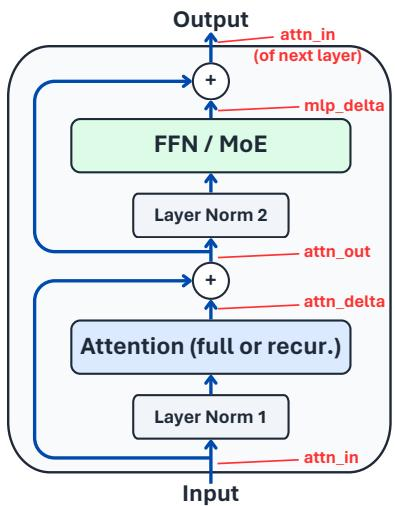  
Figure 1: Formalization of the decoder layer structure applicable for all decoder layers across models.

We first compute cross- and within-language RBF kernel matrices $K _ { \mathrm { 1 2 } } , K _ { \mathrm { 1 1 } } , K _ { \mathrm { 2 2 } }$ . Each entry $K _ { 1 2 } [ i , j ]$ measures the similarity between token i in language 1 and token j in language 2. These similarity scores provide a form of “soft matching” without an explicit token assignment. We then row- and column-center these matrices before taking the Frobenius norm, so that $h _ { 1 2 } = \| \widetilde { \cal K } _ { 1 2 } \| _ { F } ^ { 2 } .$ and the same for $h _ { 1 1 } , h _ { 2 2 }$ The within-language quantities $h _ { 1 1 }$ and $h _ { 2 2 }$ are proportional to the Hilbert-Schmidt independence criterion (HSIC) evaluated between each representation and itself, used in CKA’s normalization. Meanwhile, $h _ { 1 2 }$ is analogous to the HSIC term comparing two representations in standard CKA, without requiring explicit token pairing.

$$
\mathrm { S o f t C K A } ( \mathcal { D } ) = \frac { \sum _ { s \in \mathcal { D } } h _ { 1 2 } ^ { ( s ) } } { \sqrt { \left( \sum _ { s \in \mathcal { D } } h _ { 1 1 } ^ { ( s ) } \right) \left( \sum _ { s \in \mathcal { D } } h _ { 2 2 } ^ { ( s ) } \right) } } .\tag{1}
$$

We aggregate these quantities over a corpus D, which is a set of sentences parallel in languages 1,2. Centering, corpus weighting, and implementation details are provided in Appendix D. This score, a modification of CKA, normalizes cross-language kernel variation by the corresponding within-language quantities. We find this metric for cross-lingual alignment much less noisy than alternatives we explore. On non-hybrid LLMs, SoftCKA scores smoothly rise toward the middle and decline in the final layers (See Figures 2,3,F.1), consistent with multilingual interpretability studies that use very

different approaches (See Section 2.3). This provides supporting evidence for our interpretation of the metric, although smoothness cannot prove its faithfulness.

In this analysis, we use parallel data from FLoRes (NLLB Team et al., 2022) and calculate SoftCKA alignment between English and a highly diverse subset of 13 languages that cover different language families, scripts, and resource-levels: French, Chinese, Hindi, Thai, Farsi, Bengali, Serbia, Darija Arabic, Modern Standard Arabic, Lithuanian, Bambara, Orya, Assamese.

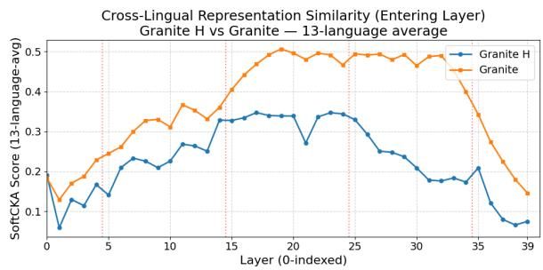  
Figure 2: SoftCKA scores for Granite models, with hidden states taken at the beginning of each decoder layer (attn in). Red dotted lines mark where full attention layers are in Granite H.

## 5.2 OBSERVATIONAL FINDINGS

We start by using SoftCKA to measure representational alignment to English.

## Finding 2

Representations are less aligned across languages in hybrid attention LLMs.

As shown in Figure 2, Granite-H builds significantly less aligned representations, particularly in the middle layers. The figure displays a multi-language average, but this is individually the case for all 13 languages. For Qwen models, Qwen3.5 has less cross-lingual alignment in 10/13 languages. For Ring, Ring-linear has lower alignment in 11/13 languages. For OLMo models it is mixed. And while multilingual NLP literature continuously finds that lower cross-lingual alignment is worse for cross-lingual transfer (Cao et al., 2020; Deshpande et al., 2022; Gaschi et al., 2023; Lim et al., 2025; Bandarkar et al., 2026b), we do not claim that this lower alignment is bad. It is conceivable, even if unlikely, that recurrent attention simply requires lower alignment for equivalent transfer.

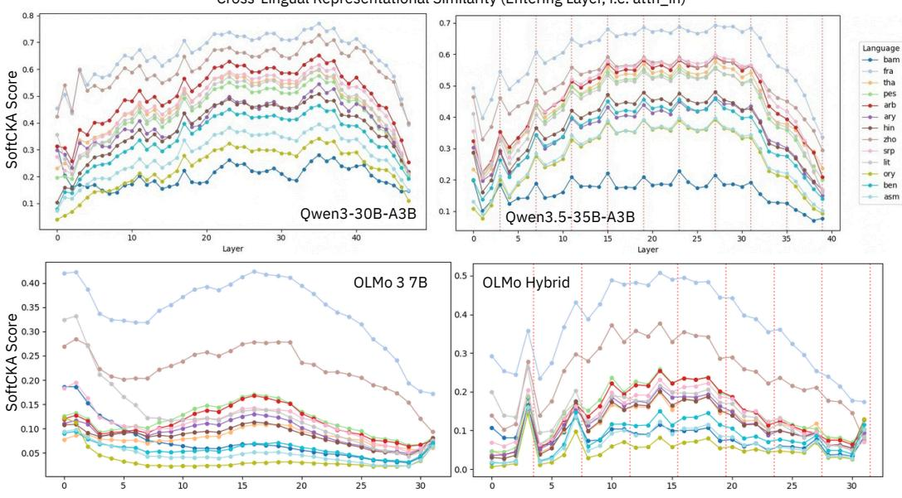

## Finding 3

Hybrid LLMs specifically organize multilingual processing based on the layer ordering, with abrupt changes in cross-lingual metrics around full attention layers.

Cross-Lingual Representational Similarity (Entering Layer, i.e. attn\_in)

Figure 3: Visualization of the jagged curves in the hybrid models (right), which seem to reflect the heterogeneous attention layout, compared with the smoother curves in non-hybrid counterparts(left).

The most notable consistent pattern we identify is that SoftCKA reveals homogeneous LLMs smoothly build shared representations and then undo them before generation while hybrid LLMs experience many abrupt changes every time a full attention layer comes around. This difference is consistent across all 4 model pairs, 2 of which are shown in Figure 3. Specifically, in agreement with Finding 2, the representations get more aligned before each full attention block.

## Finding 4

A major cross-lingual event occurs at first full attention layer

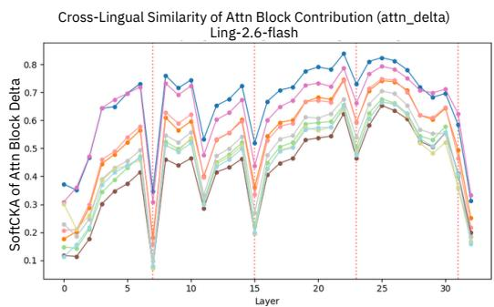  
Figure 4: SoftCKA scores of the attention block delta. Curiously, the major “event” at the first full attention layer is opposite to other models.

We also identify that the most abrupt spike happens at thefirst full attention layer. This is consistent across all hybrid models in the four pairs and additionally Ling-2.6-flash.

As a secondary metric, we also calculate the SoftCKA of the output of the attention block, attn\_delta, which measures the crosslingual similarity of a block’s contribution to the residual stream1. This metric most dramatically shows that for Qwen3.5, OLMo-Hybrid, and Granite-H, the hidden state transformation in the first full attention block is very aligned across languages relative to layers around it. Very curiously, for Ring and Ling-2.6-flash, there is a large negative spike instead, meaning the full attention block contribution is less

similar across languages (Figure 4). Because of this inconsistency, we resort to using the vague term “event”. Regardless, it is clear that the LLMs are markedly organizing around this layer. We also find that the preceding MLP and attention blocks progressively prepare inputs for this, see Appendix E.

## Finding 5

Hybridization with SWA does not lead to such a representational re-organization

Instead of recurrent attention hybrids, many modern LLMs address long-context efficiency by using sliding window attention (SWA) layers. We repeat the above visualizations for the SWA-hybrid models Tiny Aya Global and OLMo-3. The abrupt changes occurring at full-attention layers, particularly at the first, are absent; see Appendix F. Across various metrics, we find no noticeable pattern different than full-attention LLMs. We conclude that the inductive biases of SWA are not different enough to prompt the reorganization observed in LLMs that interleave recurrent layers.

## Finding 6

Irrespective of language, token attribution shows full attention attends more locally in hybrid models than typical attention layers in non-hybrid models.

We study how global or local attention is across different layers. Full attention, by definition, produces a masked matrix $\pmb { A } = { Q } { \pmb { K } } ^ { T } / { \sqrt { d _ { k } } }$ that can serve as an explanation of what previous tokens influenced the current. There are methods proposed to re-compose this matrix in recurrent attention via unrolling (Guo et al., 2026), but comparing cross-architecture is unreliable. As a result, we simply compare the full attention layers and find that the few full attention layers in hybrid models devote a larger proportion of their attention to the most recent tokens (in comparison to full attention layers in non-hybrid models). And even though token attribution from the attention matrix alone may not be entirely faithful (Modarressi et al., 2023; 2022), we find this to be very consistent across models and all languages, and not layer-dependent. This could suggest hybrid models reserve local tasks to full attention, which is not necessarily a contradiction to the established notion that full attention takes care of long-range exact retrieval (Afendulev et al., 2026).

Because of these findings, primarily 3, 4, and 6, we hypothesize that another layer ordering may better facilitate the abstraction of multilingual inputs into language-independent representations.

## 6 HYBRID DISTILLATION EXPERIMENTS

## 6.1 RELATED WORK ON FULL ATTENTION PLACEMENT

How and where to interleave attention-layer types remains poorly understood: frontier labs almost never disclose the rationale for their architectural choices, beyond noting that the ratio is empirically optimized (Wang et al., 2026; Qwen Team, 2025; Ling Team et al., 2025a). Periodic interleaving has been justified by the notion that it allows the model regular, exact access to previous tokens (Dao & Gu, 2024a; Ren et al., 2025), though this was on Mamba hybrids specifically. Separately, Team et al. (2025) argues that periodic interleaving simplifies KV-cache management.

Within periodic blocks, the status quo seems to be recurrent attention before full (N:1 instead of 1:N). Waleffe et al. (2024) notes that starting with Mamba means later layers don’t need positional embeddings. Yang et al. (2025d) tests numerous orderings and ends up placing full attention last in their repeating block. Meanwhile, broader experiments from distillation works result in diverse conclusions (Yang et al., 2025c; Li et al., 2026b; Gu et al., 2025; Xia et al., 2026). Given this limited research and the fact that it is quite unlikely multilingual considerations were taken into account, we experiment with multilingual data in controlled layer placements.

## 6.2 EXPERIMENTAL SETUP

Hybrid models can be pretrained from scratch, but are often distilled from a homogeneous teacher model for resource-efficiency (Wang et al., 2024; Li et al., 2026b; Xia et al., 2026), such as Ring-Linear. We run experiments distilling from two small full attention models, Qwen3-4B (Yang et al., 2025a) and (secondarily) Granite-4.1-3B (IBM Research, 2026) based on the RADLADS (Goldstein et al., 2026) and HALO (Chen et al., 2026) methods. For further efficiency, we mostly adopt the student initialization method from HALO. We start by converting select layers to Gated DeltaNet, inheriting the query, key, value, and output projections from the teacher’s full attention of the corresponding layers. Parameters without a counterpart in the teacher are initialized randomly. We then train the whole student to match the frozen teacher’s next-token distribution under KL-divergence $D _ { \mathrm { K L } }$ . Unlike RADLADS and HALO, we skip the preliminary stage that trains each converted layer to reproduce the hidden states of the attention layer it replaces as this would undermine our comparisons. Training only on the output distribution allows the student of hybrid attention structure to organize multilingual processing according to its layer ordering. We otherwise follow the training recipes and hyperparameters of RADLADS and HALO closely (with minor adjustments for a $D _ { \mathrm { K L ^ { - } } } \mathrm { o n l y }$ setup) as we lack the resources for tuning. They are detailed in Appendix C.2.

Data and Metrics The training data is the highly multilingual, specifically FineWeb2 (Penedo et al., 2024). We compose a subsample with 30% English as anchor and the rest a mix of 26 languages that are diverse in families, scripts, and resource-level. We set aside 1000 documents for validation and 1000 for test set in each language (52K total). See full data mix details in Appendix C.1. We limit training runs to 1B tokens and report two main metrics: $D _ { \mathrm { K L } }$ to the teacher and cross-entropy loss $\mathcal { L } _ { \mathrm { L M } }$ . In particular, we discuss the $\mathcal { L } _ { \mathrm { L M } ~ g a p }$ from the teacher’s $\mathcal { L } _ { \mathrm { L M } }$ , which ${ \mathrm { i s } } ,$ in theory, the upper bound of the student’s modeling performance.

Experimental Layer Placements We fix the ratio of full attention layers to be 25% (9/36 layers in Qwen3-4B’s and 10/40 for Granite-4.1-3B) and vary only where these go. We provide a convenient visualization of the different placements in Figure 5 which we verbalize here. We term the baseline layout, in which full attention closes each block of four layers, standard periodic. Reverse periodic is the smallest-change variant to it: full attention opens each block instead, which moves every full-attention layer three positions earlier and keeps the general block-interleaving pattern the same. The other three placements are non-periodic. Sandwich, the most extreme, clusters all full-attention layers at the first and last layers. Interleaved sandwich keeps two-thirds of them at the ends and spread the rest periodically in the middle, and endpoint spread places full attention in the first and last layers and spaces the remaining layers evenly in between. The four alternatives differ from one another in many ways, but unlike standard periodic, all of them use full attention in the first layer.

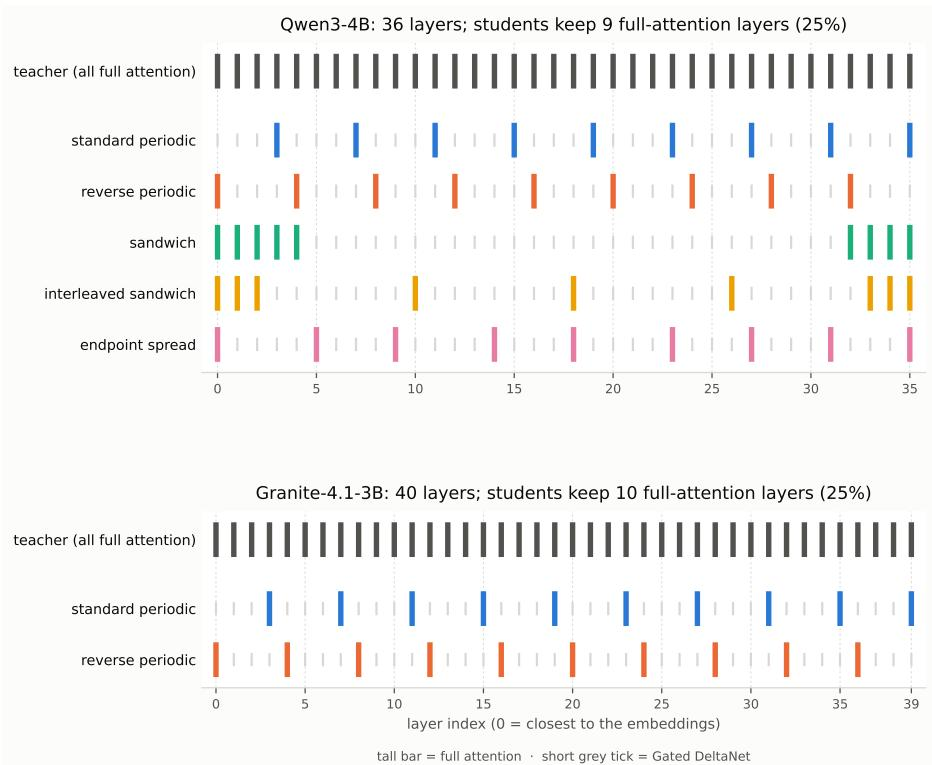  
Figure 5: Full attention placement schemas at a fixed 25% budget to maintain the 3:1 ratio between recurrent attention and full attention (9/36 layers for Qwen3-4B, 10/40 for Granite-4.1-3B). Tall bars = full attention, short grey ticks = Gated DeltaNet; layer 0 is closest to the embeddings. Student differ only in placement, not in how many full-attention layers they keep.

Granite-4.1-3B Held-out cross-entropy gap from teacher (s1, lower better)

## 6.3 RESULTS

## Finding 7

In our distillation experiments on multilingual data, all our diverse alternative layer arrangements that start with a full attention layer significantly improve upon the standard layer ordering.

We first distill Qwen3-4B into all five placements, including the baseline. We only budget 1Btoken runs, and naturally, no run has converged by then. But 1B tokens is plenty to see that every alternative learns much faster. On validation set, their lead over standard periodic appears within the first eval step and holds at every later step. As displayed in Figure ${ 6 \mathrm { a } , }$ each reaches standard periodic’s final cross-entropy value with just 40% of tokens. Concretely, they have lower $\mathcal { L } _ { \mathrm { L M } }$ and lower $D _ { \mathrm { K I } }$ on train, valid, and test sets and in nearly every language. Within the alternatives: On $D _ { \mathrm { K L } }$ , sandwich and reverse periodic are close: sandwich has the lower average, but each is better in about half the languages. On cross-entropy, reverse periodic is the clear leader: its mean gap to the teacher is 10% smaller than any alternative and the lowest in 16/26 languages. See Table 3.

Our compute budget allows replicating only one alternative, so we choose reverse periodic: it has the lowest $\mathcal { L } _ { \mathrm { L M } }$ and is the closest to standard periodic. We rerun it and the baseline in two new conditions: Qwen3-4B on a newly sampled training set, and Granite-4.1-3B, which differs in architecture, tokenizer, and pretraining. Figure 6b shows the Granite runs; the second Qwen run and all training-loss curves are in Appendix C.4. The improvement over standard periodic replicates in both conditions. Resampling the data moves the Qwen validation curves by only about a tenth of the gap between the two placements. At the end of training, neither placement has converged, and the gap between them shrinks by less than a tenth over the last quarter of training. Notably with Granite, reverse periodic ends within 0.01 nats of the teacher’s validation $\mathcal { L } _ { \mathrm { L M } }$

Per-language gains. The $\mathcal { L } _ { \mathrm { L M } }$ gains are achieved in almost every language, but to varying degrees. Reverse periodic lowers perplexity relative to standard periodic in 23 of the 26 languages with Qwen3-4B, in both runs, and in 25 with Granite; the perplexity of the few exceptions rises by less than 0.7%. The largest gains, 3–13%, come from Telugu, Malayalam, Tamil, Burmese, and Khmer, which rank among the top seven under both teachers, while the median language improves by about 1% (Table C.4). On $D _ { \mathrm { K L } }$ , reverse periodic is closer to the teacher than standard periodic in every language with Qwen3-4B and in all but two with Granite, and of the five placements only sandwich is slightly closer on average. Here the pattern across languages is sharpest: under both teachers, the eight languages with the largest $D _ { \mathrm { K L } }$ reduction are the same, namely Telugu, Malayalam, Tamil, Burmese, Khmer, Tibetan, Amharic, and Armenian, spanning all three sampling tiers and, importantly, all written in non-Latin scripts.

First-layer Full Attention The four alternatives have little in common except for all starting with a full attention layer. Two keep the full-attention layers periodic or evenly spaced, and two cluster most of them at the ends of the network. Yet they end up close to one another and far from standard periodic (Figure 5). This common property is what standard periodic lacks. The fact that non-Latin scripts display the biggest differences suggests that the explanation may relate to detokenization, which is the first layer’s most important role in multilingual NLU.

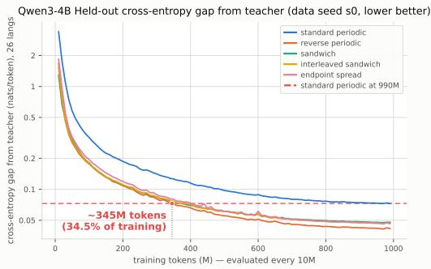  
(a) Qwen3-4B student model (data seed s0)

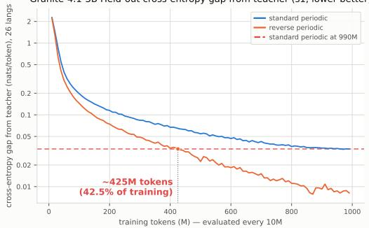  
(b) Granite-4.1-3B student model (data seed s1)  
Figure 6: Held-out $\mathcal { L } _ { \mathrm { L M } }$ gap from the teacher (nats/token, mean over 26 languages, validation every 10M tokens). (a) $\mathrm { Q w e n } 3 – 4 \mathrm { B }$ , all five placements, data seed 0. (b) Granite-4.1-3B, standard periodic and reverse periodic, data seed 1. The red dashed line marks standard $p e r i o d i c \mathrm { ' s }$ value at the last checkpoint (0.073 nats in (a) and 0.033 in (b) at 990M tokens). In (a), all alternatives reach it within $\sim 4 0 \%$ of training, with reverse periodic at 34.5%. In (b), reverse periodic reaches it at 42.5%.

Crucially, this finding of first-layer importance is unlikely to come from the distillation setting itself. The layer selection in Li et al. (2026b), whose conversion is closest to ours (comparable initialization and forward $D _ { \mathrm { K L } }$ training), never selects the first layer as full attention on English data (see Figure 6 in that paper).

Table 3: Test results after 1B tokens, averaged over 26 languages. R: $D _ { \mathrm { K L } }$ to the teacher relative to standard periodic with the same teacher and training set (equation 5); ¯δ: mean $\mathcal { L } _ { \mathrm { L M } }$ gap to the teacher in nats (equation 4). For Qwen3-4B-Base, standard periodic and reverse periodic are trained twice on independently resampled data, shown as run 1 / run 2.
<table><tr><td>Teacher</td><td>Placement</td><td>relative  $D _ { \mathrm { K L } }$  R↓</td><td> $\mathcal { L } _ { \mathrm { L M } }$  Gap  $\bar { \delta } \downarrow$ </td></tr><tr><td>Qwen3-4B-Base</td><td>Standard Periodic</td><td>1.000 / 1.000</td><td>0.071 / 0.068</td></tr><tr><td>,,,,</td><td>Reverse Periodic</td><td>0.677 / 0.697</td><td>0.045 / 0.045</td></tr><tr><td>9999</td><td>Sandwich</td><td>0.665</td><td>0.050</td></tr><tr><td>,9,</td><td>Interleaved Sandwich</td><td>0.689</td><td>0.049</td></tr><tr><td>9999</td><td>Endpoint Spread</td><td>0.722</td><td>0.049</td></tr><tr><td rowspan="2">Granite-4.1-3B-Base ,,,,</td><td>Standard Periodic</td><td>1.000</td><td>0.042</td></tr><tr><td>Reverse Periodic</td><td>0.767</td><td>0.020</td></tr></table>

## 7 CONCLUSION AND OPEN QUESTIONS

This work provides the first analysis of the interaction between hybrid attention architectures and multilinguality. We identify two concrete takeaways for model developers. First, multilingual LLMs should use hybrid attention because of the massive efficiency gains with minimal performance cost on long multilingual sequences. Second, our experimental setting suggests that LLMs learn multilingual data significantly better if the first decoder layer uses full attention. While our experiments display major training performance differences, it is, after all, distillation training on 1B tokens on small LLMs with one recurrent architecture. Regardless, our resource-limited conditions clearly prompts the theory that multilingual LLMs should start with full attention.

Beyond this, Section 5 generally identifies that the hybridization of the attention blocks leads to some sort of representational reorganization. However, a mechanistic explanation of what is actually occurring remains an open question. In general, mechanistic explanations remain an inhibitive challenge in LLM interpretability (Hendrycks & Hiscott, 2024; Sharkey et al., 2025; Nanda et al., 2025). For now, we can conclude that the inductive bias of each block matters and that the LLMs learn to reserve some sort of multilingual-relevant task for full attention layers.

## ACKNOWLEDGMENTS

This research was made possible by financial support from the Amazon AI PhD Fellowship.

The authors acknowledge the excellent LLM architecture explanations at the LLM Architecture Gallery, curated by Sebastian Raschka, as particularly helpful for this work. The authors also acknowledge Andrea Caciolai for discussions on modern LLM architectures.

Click here to access the Appendix.

## REFERENCES

Kirill Afendulev, Alexey Dontsov, Elena Tutubalina, and Anton Korznikov. What attention recalls and recurrence controls in hybrid language models, 2026. URL https://arxiv.org/abs/ 2609.04434. Accepted to Findings of EMNLP 2026.

Joshua Ainslie, James Lee-Thorp, Michiel de Jong, Yury Zemlyanskiy, Federico Lebron, and Sumit Sanghai. GQA: Training generalized multi-query transformer models from multi-head check-

points. In Houda Bouamor, Juan Pino, and Kalika Bali (eds.), Proceedings ofthe 2023 Conference on Empirical Methods in Natural Language Processing, pp. 4895–4901, Singapore, December 2023. Association for Computational Linguistics. doi: 10.18653/v1/2023.emnlp-main.298. URL https://aclanthology.org/2023.emnlp-main.298/.

Dzmitry Bahdanau, Kyunghyun Cho, and Yoshua Bengio. Neural machine translation by jointly learning to align and translate. In Yoshua Bengio and Yann LeCun (eds.), 3rd International Conference on Learning Representations, ICLR 2015, San Diego, CA, USA, May 7-9, 2015, Conference Track Proceedings, 2015. URL http://arxiv.org/abs/1409.0473.

Lucas Bandarkar and Nanyun Peng. The unreasonable effectiveness of model merging for crosslingual transfer in LLMs. In Proceedings of the 5th Workshop on Multilingual Representation Learning (MRL 2025), pp. 131–148. Association for Computational Linguistics, November 2025. doi: 10.18653/v1/2025.mrl-main.10. URL https://aclanthology.org/2025. mrl-main.10/.

Lucas Bandarkar, Davis Liang, Benjamin Muller, Mikel Artetxe, Satya Narayan Shukla, Donald Husa, Naman Goyal, Abhinandan Krishnan, Luke Zettlemoyer, and Madian Khabsa. The belebele benchmark: a parallel reading comprehension dataset in 122 language variants. In Proceedings of the 62nd Annual Meeting of the Association for Computational Linguistics (Volume 1: Long Papers), pp. 749–775. Association for Computational Linguistics, 2024. doi: 10.18653/v1/2024. acl-long.44. URL https://aclanthology.org/2024.acl-long.44/.

Lucas Bandarkar, Benjamin Muller, Pritish Yuvraj, Rui Hou, Nayan Singhal, Hongjiang Lv, and Bing Liu. Layer swapping for zero-shot cross-lingual transfer in large language models. In The Thirteenth International Conference on Learning Representations, 2025. URL https://proceedings.iclr.cc/paper\_files/paper/2025/hash/ 7f9a44cb707ede42a659ad85d940dd55-Abstract-Conference.html.

Lucas Bandarkar, Alan Ansell, and Trevor Cohn. Knowledge localization in mixture-of-experts LLMs using cross-lingual inconsistency. In The Fortieth Annual Conference on Neural Information Processing Systems, 2026a. URL https://openreview.net/forum?id= LAPZ4kgdnc.

Lucas Bandarkar, Chenyuan Yang, Mohsen Fayyaz, Junlin Hu, and Nanyun Peng. Multilingual routing in mixture-of-experts. In The Fourteenth International Conference on Learning Repre sentations, 2026b. URL https://openreview.net/forum?id=ZoZR0x7tTD.

Iz Beltagy, Matthew E. Peters, and Arman Cohan. Longformer: The long-document transformer. arXiv:2004.05150, 2020.

Andrea Caciolai, Pere-Llu´ıs Huguet Cabot, Chierh Cheng, Albert Ventayol-Boada, Gabriel Mejia Gonzalez, Christophe Ropers, Lucas Bandarkar, Sebastian Ruder, Darlene Sakakihara, Elliot Yun, Pierre Andrews, Gregoire Mialon, Romain Froger, and Marta R. Costa-juss´ a. Omnilingualgaia2:\` Evaluating the multilingual gap in frontier ai agents, 2026. URL https://arxiv.org/abs/ 2608.08775.

Steven Cao, Nikita Kitaev, and Dan Klein. Multilingual alignment of contextual word representations. In International Conference on Learning Representations, 2020. URL https: //openreview.net/forum?id=r1xCMyBtPS.

Tyler A. Chang, Catherine Arnett, Abdelrahman Eldesokey, Abdelrahman Sadallah, Abeer Kashar, et al. Global PIQA: Evaluating physical commonsense reasoning across 100+ languages and cultures, 2025. URL https://arxiv.org/abs/2510.24081.

Yingfa Chen, Zhen Leng Thai, Zihan Zhou, Zhu Zhang, Xingyu Shen, Shuo Wang, Chaojun Xiao, Xu Han, and Zhiyuan Liu. Hybrid linear attention done right: Efficient distillation and effective architectures for extremely long contexts, 2026. URL https://arxiv.org/abs/2601. 22156.

Tri Dao and Albert Gu. Transformers are SSMs: Generalized models and efficient algorithms through structured state space duality. In Forty-first International Conference on Machine Learning, 2024a. URL https://openreview.net/forum?id=ztn8FCR1td.

Tri Dao and Albert Gu. Transformers are SSMs: Generalized models and efficient algorithms through structured state space duality. In International Conference on Machine Learning (ICML), 2024b.

Tri Dao, Dan Fu, Stefano Ermon, Atri Rudra, and Christopher Re. Flashattention: Fast and´ memory-efficient exact attention with io-awareness. In S. Koyejo, S. Mohamed, A. Agarwal, D. Belgrave, K. Cho, and A. Oh (eds.), Advances in Neural Information Processing Systems, volume 35, pp. 16344–16359. Curran Associates, Inc., 2022. doi: 10.52202/ 068431-1189. URL https://proceedings.neurips.cc/paper\_files/paper/ 2022/file/67d57c32e20fd0a7a302cb81d36e40d5-Paper-Conference.pdf.

DeepSeek-AI, Aixin Liu, Bei Feng, Bin Wang, Bingxuan Wang, Bo Liu, Chenggang Zhao, Chengqi Dengr, Chong Ruan, Damai Dai, Daya Guo, Dejian Yang, Deli Chen, Dongjie Ji, Erhang Li, Fangyun Lin, Fuli Luo, Guangbo Hao, Guanting Chen, Guowei Li, H. Zhang, Hanwei Xu, Hao Yang, Haowei Zhang, Honghui Ding, Huajian Xin, Huazuo Gao, Hui Li, Hui Qu, J. L. Cai, Jian Liang, Jianzhong Guo, Jiaqi Ni, Jiashi Li, Jin Chen, Jingyang Yuan, Junjie Qiu, Junxiao Song, Kai Dong, Kaige Gao, Kang Guan, Lean Wang, Lecong Zhang, Lei Xu, Leyi Xia, Liang Zhao, Liyue Zhang, Meng Li, Miaojun Wang, Mingchuan Zhang, Minghua Zhang, Minghui Tang, Mingming Li, Ning Tian, Panpan Huang, Peiyi Wang, Peng Zhang, Qihao Zhu, Qinyu Chen, Qiushi Du, R. J. Chen, R. L. Jin, Ruiqi Ge, Ruizhe Pan, Runxin Xu, Ruyi Chen, S. S. Li, Shanghao Lu, Shangyan Zhou, Shanhuang Chen, Shaoqing Wu, Shengfeng Ye, Shirong Ma, Shiyu Wang, Shuang Zhou, Shuiping Yu, Shunfeng Zhou, Size Zheng, T. Wang, Tian Pei, Tian Yuan, Tianyu Sun, W. L. Xiao, Wangding Zeng, Wei An, Wen Liu, Wenfeng Liang, Wenjun Gao, Wentao Zhang, X. Q. Li, Xiangyue Jin, Xianzu Wang, Xiao Bi, Xiaodong Liu, Xiaohan Wang, Xiaojin Shen, Xiaokang Chen, Xiaosha Chen, Xiaotao Nie, Xiaowen Sun, Xiaoxiang Wang, Xin Liu, Xin Xie, Xingkai Yu, Xinnan Song, Xinyi Zhou, Xinyu Yang, Xuan Lu, Xuecheng Su, Y. Wu, Y. K. Li, Y. X. Wei, Y. X. Zhu, Yanhong Xu, Yanping Huang, Yao Li, Yao Zhao, Yaofeng Sun, Yaohui Li, Yaohui Wang, Yi Zheng, Yichao Zhang, Yiliang Xiong, Yilong Zhao, Ying He, Ying Tang, Yishi Piao, Yixin Dong, Yixuan Tan, Yiyuan Liu, Yongji Wang, Yongqiang Guo, Yuchen Zhu, Yuduan Wang, Yuheng Zou, Yukun Zha, Yunxian Ma, Yuting Yan, Yuxiang You, Yuxuan Liu, Z. Z. Ren, Zehui Ren, Zhangli Sha, Zhe Fu, Zhen Huang, Zhen Zhang, Zhenda Xie, Zhewen Hao, Zhihong Shao, Zhiniu Wen, Zhipeng Xu, Zhongyu Zhang, Zhuoshu Li, Zihan Wang, Zihui Gu, Zilin Li, and Ziwei Xie. Deepseek-v2: A strong, economical, and efficient mixture-of-experts language model, 2024. URL https://arxiv.org/abs/2405.04434.

Ameet Deshpande, Partha Talukdar, and Karthik Narasimhan. When is BERT multilingual? isolating crucial ingredients for cross-lingual transfer. In Proceedings of the 2022 Conference of the North American Chapter of the Association for Computational Linguistics: Human Language Technologies, pp. 3610–3623. Association for Computational Linguistics, 2022. doi: 10.18653/v1/2022.naacl-main.264. URL https://aclanthology.org/ 2022.naacl-main.264/.

Jusen Du, Jiaxi Hu, Zhang Tao, Weigao Sun, and Yu Cheng. Native hybrid attention for efficient sequence modeling. In Maria Liakata, Viviane P. Moreira, Jiajun Zhang, and David Jurgens (eds.), Proceedings ofthe 64th Annual Meeting ofthe Associationfor Computational Linguistics (Volume 1: Long Papers), pp. 3826–3842, San Diego, California, United States, July 2026. Association for Computational Linguistics. ISBN 979-8-89176-390-6. doi: 10.18653/v1/2026.acl-long.176. URL https://aclanthology.org/2026.acl-long.176/.

Clement Dumas, Chris Wendler, Veniamin Veselovsky, Giovanni Monea, and Robert West. Separat-´ ing tongue from thought: Activation patching reveals language-agnostic concept representations in transformers. In Wanxiang Che, Joyce Nabende, Ekaterina Shutova, and Mohammad Taher Pilehvar (eds.), Proceedings of the 63rd Annual Meeting of the Association for Computational Linguistics (Volume 1: Long Papers), pp. 31822–31841, Vienna, Austria, July 2025. Association for Computational Linguistics. ISBN 979-8-89176-251-0. doi: 10.18653/v1/2025.acl-long.1536. URL https://aclanthology.org/2025.acl-long.1536/.

Daniel Y. Fu, Tri Dao, Khaled K. Saab, Armin W. Thomas, Atri Rudra, and Christopher Re. Hungry´ Hungry Hippos: Towards language modeling with state space models. In International Conference on Learning Representations, 2023.

Felix Gaschi, Patricio Cerda, Parisa Rastin, and Yannick Toussaint. Exploring the relationship between alignment and cross-lingual transfer in multilingual transformers. In Findings ofthe Associationfor Computational Linguistics: ACL 2023, pp. 3020–3042. Association for Computational Linguistics, 2023. doi: 10.18653/v1/2023.findings-acl.189. URL https://aclanthology. org/2023.findings-acl.189/.

Daniel Goldstein, Eric Alcaide, Janna Lu, and Eugene Cheah. Radlads: Rapid attention distillation to linear attention decoders at scale, 2026. URL https://arxiv.org/abs/2505.03005.

Riccardo Grazzi, Julien Siems, Jorg K.H. Franke, Arber Zela, Frank Hutter, and Massimiliano Pon-¨ til. Unlocking state-tracking in linear RNNs through negative eigenvalues. In The Thirteenth International Conference on Learning Representations, 2025. URL https://openreview. net/forum?id=UvTo3tVBk2.

Albert Gu and Tri Dao. Mamba: Linear-time sequence modeling with selective state spaces. In First Conference on Language Modeling, 2024. URL https://openreview.net/forum?id= tEYskw1VY2.

Yuxian Gu, Qinghao Hu, Shang Yang, Haocheng Xi, Junyu Chen, Song Han, and Han Cai. Jet-nemotron: Efficient language model with post neural architecture search. arXiv preprint arXiv:2508.15884, 2025.

Han Guo, Songlin Yang, Tarushii Goel, Eric P. Xing, Tri Dao, and Yoon Kim. Log-linear attention. In The Fourteenth International Conference on Learning Representations, 2026. URL https: //openreview.net/forum?id=mOJgZWkXKW.

Dan Hendrycks and Laura Hiscott. The misguided quest for mechanistic AI interpretability. AI Frontiers, November 2024. URL https://ai-frontiers.org/articles/ the-misguided-quest-for-mechanistic-ai-interpretability. Accessed: February 25, 2026.

Sepp Hochreiter and Jurgen Schmidhuber. Long short-term memory. ¨ Neural Computation, Volume 9, Issue 8, 9(8):1735–1780, November 1997. ISSN 0899-7667. doi: 10.1162/neco.1997.9.8.1735. URL https://doi.org/10.1162/neco.1997.9.8.1735.

IBM Research. Granite 4.0 language models. https://github.com/ibm-granite/ granite-4.0-language-models, 2025. Accessed: 2025-10-01.

IBM Research. Granite 4.1 language models. https://huggingface.co/blog/ ibm-granite/granite-4-1, 2026. Accessed: 2026-04-28.

Angelos Katharopoulos, Apoorv Vyas, Nikolaos Pappas, and Franc¸ois Fleuret. Transformers are RNNs: Fast autoregressive transformers with linear attention. In Hal Daume III and Aarti Singh´ (eds.), Proceedings of the 37th International Conference on Machine Learning, volume 119 of Proceedings of Machine Learning Research, pp. 5156–5165. PMLR, 13–18 Jul 2020. URL https://proceedings.mlr.press/v119/katharopoulos20a.html.

Amirhossein Kazemnejad, Inkit Padhi, Karthikeyan Natesan, Payel Das, and Siva Reddy. The impact of positional encoding on length generalization in transformers. In Thirty-seventh Conference on Neural Information Processing Systems, 2023. URL https://openreview.net/ forum?id=Drrl2gcjzl.

Yekyung Kim, Jenna Russell, Marzena Karpinska, and Mohit Iyyer. One ruler to measure them all: Benchmarking multilingual long-context language models, 2025. URL https://arxiv. org/abs/2503.01996.

Takeshi Kojima, Itsuki Okimura, Yusuke Iwasawa, Hitomi Yanaka, and Yutaka Matsuo. On the multilingual ability of decoder-based pre-trained language models: Finding and controlling languagespecific neurons. In Kevin Duh, Helena Gomez, and Steven Bethard (eds.), Proceedings of the 2024 Conference of the North American Chapter of the Association for Computational Linguistics: Human Language Technologies (Volume 1: Long Papers), pp. 6919–6971, Mexico City, Mexico, June 2024. Association for Computational Linguistics. doi: 10.18653/v1/2024. naacl-long.384. URL https://aclanthology.org/2024.naacl-long.384/.

Simon Kornblith, Mohammad Norouzi, Honglak Lee, and Geoffrey Hinton. Similarity of neural network representations revisited. In Kamalika Chaudhuri and Ruslan Salakhutdinov (eds.), Proceedings of the 36th International Conference on Machine Learning, volume 97 of Proceedings of Machine Learning Research, pp. 3519–3529. PMLR, 09–15 Jun 2019. URL https: //proceedings.mlr.press/v97/kornblith19a.html.

Vedang Lad, Jin Hwa Lee, Wes Gurnee, and Max Tegmark. Remarkable robustness of LLMs: Stages of inference? In The Thirty-ninth Annual Conference on Neural Information Processing Systems, 2025. URL https://openreview.net/forum?id=Wxh5Xz7NpJ.

Hyunji Lee, Danni Liu, Supriti Sinhamahapatra, and Jan Niehues. How do multimodal foundation models encode text and speech? an analysis of cross-lingual and cross-modal representations. In Proceedings ofthe 2025 Conference ofthe Nations ofthe Americas Chapter ofthe Associationfor Computational Linguistics: Human Language Technologies (Volume 2: Short Papers), pp. 600– 610. Association for Computational Linguistics, 2025. doi: 10.18653/v1/2025.naacl-short.51.

Barak Lenz, Opher Lieber, Alan Arazi, Amir Bergman, Avshalom Manevich, Barak Peleg, Ben Aviram, Chen Almagor, Clara Fridman, Dan Padnos, Daniel Gissin, Daniel Jannai, Dor Muhlgay, Dor Zimberg, Edden M. Gerber, Elad Dolev, Eran Krakovsky, Erez Safahi, Erez Schwartz, Gal Cohen, Gal Shachaf, Haim Rozenblum, Hofit Bata, Ido Blass, Inbal Magar, Itay Dalmedigos, Jhonathan Osin, Julie Fadlon, Maria Rozman, Matan Danos, Michael Gokhman, Mor Zusman, Naama Gidron, Nir Ratner, Noam Gat, Noam Rozen, Oded Fried, Ohad Leshno, Omer Antverg, Omri Abend, Or Dagan, Orit Cohavi, Raz Alon, Ro’i Belson, Roi Cohen, Rom Gilad, Roman Glozman, Shahar Lev, Shai Shalev-Shwartz, Shaked Haim Meirom, Tal Delbari, Tal Ness, Tomer Asida, Tom Ben Gal, Tom Braude, Uriya Pumerantz, Josh Cohen, Yonatan Belinkov, Yuval Globerson, Yuval Peleg Levy, and Yoav Shoham. Jamba: Hybrid transformer-mamba language models. In The Thirteenth International Conference on Learning Representations, 2025. URL https://openreview.net/forum?id=JFPaD7lpBD.

Ang Li, Ben Liu, Bin Han, Bin Hu, Bin Jing, Binbin Hu, Bing Li, Cai Chen, Caizhi Tang, Changxin Tian, Chao Huang, Chao Zhang, Chen Liang, Chen Qian, Chengfu Tang, Chengyao Wen, Chilin Fu, Chunwei Wu, Cong Zhang, Cunyin Peng, Daixin Wang, Dalong Zhang, Deng Zhao, Dingnan Jin, Dingyuan Zhu, Donghao Zhang, Fan Yuan, Fangzheng Zhao, Fanzhuang Meng, Feifan Wu, Feng Xu, Fengbin Fang, Gangshan Wang, Guodong Yang, Hailin Zhao, Haitao Wang, Haitao Zhang, Hanxiao Zhang, Hanzi Wang, Hao Dai, Hao Liu, Hao Qian, Hao Wu, Haoxiong Liu, Haoyu Xu, Heng Zhang, Hong Liu, Hongliang Zhang, Hongrui Liu, Hongxun Li, Hongzhi Ruan, Huaidong Xiong, Huihuang Zheng, Huikang Tang, Jia Guo, Jia Li, Jia Liu, Jiameng Wang, Jiaming Liu, Jiannan Shi, Jianping Wei, Jiaolong Yang, Jiapeng Wang, Jie Gao, Jie Wang, Jiewei Wu, Jin Yang, Jinjin Li, Jinjing Huang, Jinquan Sun, Jinyao Chen, Juanhui Tu, Jun Liu, Jun Mei, Jun Xu, Jun Zhou, Junjie Ou, Junnan Sipan, Junpeng Fang, Kaihong Zhang, Kaiqin Hu, Ke Shi, Kuan Xu, Kun Tang, Kunlong Chen, Lanyin Mei, Lei Chen, Lei Liang, Lei Xu, Li Tang, Liang Jiang, Liangcheng Fu, Lihui Zhang, Linfeng Shi, Lintao Ma, Liyuan Liu, Longfei Li, Longfei Zheng, Lu Liu, Lu Yu, Man Li, Meiqi Zhu, Meng Li, Mengjie Gao, Mengshu Sun, Mingming Yin, Mingyang Zhang, Mingyuan Fan, Nuo Xu, Pan Tang, Peijie Jiang, Peilong Zhao, Peng Lin, Pingping Liu, Qi Zuo, Qian Zhao, Qiang Cheng, Qianggang Cao, Qiaoben Bao, Qing Cui, Qingyuan Yang, Qitao Shi, Qiyin Huang, Qizheng Zhou, Quan Wan, Runyuan Zhao, Shaomian Zheng, Shaowei Wei, Shengnan Zhang, Shuaicheng Li, Shujie Li, Shuo Zhang, Sikang Bian, Tianchu Yao, Tiange Xu, Tianshu Wang, Ting Guo, Tinghao Wang, Tingwei Huang, Tong Zhao, Tongkai Yang, Wang Hong, Wanli Gu, Wei Lu, Weichang Wu, Weiguang Han, Weiquan Li, Wenbo Shen, Wenjing Fang, Wenzhi Tang, Xiang Shu, Xiao Shi, Xiaodong Yan, Xiaolu Zhang, Xiaopei Wan, Xiaqing Sun, Xin Zhao, Xingyu Lu, Xinxing Yang, Xinyao Tang, Xinyu Kong, Xinyu Liu, Xiong Xu, Xuan Sun, Xudong Han, Xudong Wang, Xujie Shen, Yalin Zhang, Yangyang Hou, Yankun Ren, Yao Zhao, Ye Chen, Yeyang Chen, Yibo Cao, Yifan Zuo, Yijie Chen, Ying Li, Yingjie Song, Yingxue Li, Yiqi Wang, Yixuan Sun, Yizhu Xiao, Yongfei Xu, Yu Liu, Yuchen Fang, Yue Gao, Yue Yu, Yue Zhang, Yuqi Zhang, Yuxiao He, Yuxiao Lu, Yuxin Tian, Yuxuan Li, Yuzhuo Fu, Zhankai Xu, Zhaoxin Huan, Zhenduo Zhang, Zhengke Gui, Zhengyu Huang, Zhenjun Ma, Zhenxuan Pan, Zheping Qu, Zhibo Zhu, Zhidong Fan, Zhigang Huangfu, Zhihao Wang, Zhiqiang Zhang, Zhizhen Liu, Zhuyan Zhou, Zibin Lin, Zihang Zeng, Zihao Wang, Zilong Wang, Ziqi Liu, Zitao Xuan, Zixuan Cheng, Zujie Wen, and Zuoli Tang. Ling and ring 2.6 technical report: Efficient and instant agentic intelligence at trillion-parameter scale, 2026a. URL https://arxiv.org/abs/2606.15079.

Yanhong Li, Songlin Yang, Shawn Tan, Mayank Mishra, Rameswar Panda, Jiawei Zhou, and Yoon Kim. Distilling to hybrid attention models via KL-guided layer selection. In The Fourteenth International Conference on Learning Representations, 2026b. URL https://openreview. net/forum?id=RzbsHcFqIf.

Zheng Wei Lim, Alham Fikri Aji, and Trevor Cohn. Language-specific latent process hinders crosslingual performance, 2025. URL https://arxiv.org/abs/2505.13141.

Ling Team, Bin Han, Caizhi Tang, Chen Liang, Donghao Zhang, Fan Yuan, Feng Zhu, Jie Gao, Jingyu Hu, Longfei Li, Meng Li, Mingyang Zhang, Peijie Jiang, Peng Jiao, Qian Zhao, Qingyuan Yang, Wenbo Shen, Xinxing Yang, Yalin Zhang, Yankun Ren, Yao Zhao, Yibo Cao, Yixuan Sun, Yue Zhang, Yuchen Fang, Zibin Lin, Zixuan Cheng, and Jun Zhou. Every attention matters: An efficient hybrid architecture for long-context reasoning, 2025a. URL https://arxiv.org/ abs/2510.19338.

Ling Team, Anqi Shen, Baihui Li, Bin Hu, Bin Jing, Cai Chen, Chao Huang, Chao Zhang, Chaokun Yang, Cheng Lin, Chengyao Wen, Congqi Li, Deng Zhao, Dingbo Yuan, Donghai You, Fagui Mao, Fanzhuang Meng, Feng Xu, Guojie Li, Guowei Wang, Hao Dai, Haonan Zheng, Hong Liu, Jia Guo, Jiaming Liu, Jian Liu, Jianhao Fu, Jiannan Shi, Jianwen Wang, Jianxin Lai, Jin Yang, Jun Mei, Jun Zhou, Junbo Zhao, Junping Zhao, Kuan Xu, Le Su, Lei Chen, Li Tang, Liang Jiang, Liangcheng Fu, Lianhao Xu, Linfeng Shi, Lisha Liao, Longfei Zheng, Meng Li, Mingchun Chen, Qi Zuo, Qiang Cheng, Qianggang Cao, Qitao Shi, Quanrui Guo, Senlin Zhu, Shaofei Wang, Shaomian Zheng, Shuaicheng Li, Shuwei Gu, Siba Chen, Tao Wu, Tao Zhang, Tianyu Zhang, Tianyu Zhou, Tiwei Bie, Tongkai Yang, Wang Hong, Wang Ren, Weihua Chen, Wenbo Yu, Wengang Zheng, Xiangchun Wang, Xiaodong Yan, Xiaopei Wan, Xin Zhao, Xinyu Kong, Xinyu Tang, Xudong Han, Xudong Wang, Xuemin Yang, Xueyu Hu, Yalin Zhang, Yan Sun, Yicheng Shan, Yilong Wang, Yingying Xu, Yongkang Liu, Yongzhen Guo, Yuanyuan Wang, Yuchen Yan, Yuefan Wang, Yuhong Guo, Zehuan Li, Zhankai Xu, Zhe Li, Zhenduo Zhang, Zhengke Gui, Zhenxuan Pan, Zhenyu Huang, Zhenzhong Lan, Zhiqiang Ding, Zhiqiang Zhang, Zhixun Li, Zhizhen Liu, Zihao Wang, and Zujie Wen. Every step evolves: Scaling reinforcement learning for trillion-scale thinking model, 2025b. URL https://arxiv.org/abs/2510.18855.

Xin Liu, Qiyang Song, Qihang Zhou, Haichao Du, Shaowen Xu, Wenbo Jiang, Weijuan Zhang, and Xiaoqi Jia. Focusing on language: Revealing and exploiting language attention heads in multilingual large language models. In Proceedings of the AAAI Conference on Artificial Intelligence, volume 40, pp. 32195–32203, 2026. doi: 10.1609/aaai.v40i38.40492. URL https://ojs.aaai.org/index.php/AAAI/article/view/40492.

Weicheng Ma, Kai Zhang, Renze Lou, Lili Wang, and Soroush Vosoughi. Contributions of transformer attention heads in multi- and cross-lingual tasks. In Proceedings of the 59th Annual Meeting of the Association for Computational Linguistics and the 11th International Joint Conference on Natural Language Processing (Volume 1: Long Papers), pp. 1956–1966. Association for Computational Linguistics, August 2021. doi: 10.18653/v1/2021.acl-long.152. URL https://aclanthology.org/2021.acl-long.152/.

Harsh Mehta, Ankit Gupta, Ashok Cutkosky, and Behnam Neyshabur. Long range language modeling via gated state spaces. In The Eleventh International Conference on Learning Representations, 2023. URL https://openreview.net/forum?id=5MkYIYCbva.

William Merrill, Yanhong Li, Tyler Romero, Anej Svete, Caia Costello, Pradeep Dasigi, Dirk Groeneveld, David Heineman, Bailey Kuehl, Nathan Lambert, Chuan Li, Kyle Lo, Saumya Malik, David Matusz, Benjamin Minixhofer, Jacob Morrison, Luca Soldaini, Finbarr Timbers, Evan Pete Walsh, Noah A. Smith, Hannaneh Hajishirzi, and Ashish Sabharwal. Olmo hybrid: From theory to practice and back. In Third Conference on Language Modeling, 2026. URL https://openreview.net/forum?id=LGhKvHMtVK.

MiniMax, Aonian Li, Bangwei Gong, Bo Yang, Boji Shan, Chang Liu, Cheng Zhu, Chunhao Zhang, Congchao Guo, Da Chen, Dong Li, Enwei Jiao, Gengxin Li, Guojun Zhang, Haohai Sun, Houze Dong, Jiadai Zhu, Jiaqi Zhuang, Jiayuan Song, Jin Zhu, Jingtao Han, Jingyang Li, Junbin Xie, Junhao Xu, Junjie Yan, Kaishun Zhang, Kecheng Xiao, Kexi Kang, Le Han, Leyang Wang, Lianfei Yu, Liheng Feng, Lin Zheng, Linbo Chai, Long Xing, Meizhi Ju, Mingyuan Chi, Mozhi

Zhang, Peikai Huang, Pengcheng Niu, Pengfei Li, Pengyu Zhao, Qi Yang, Qidi Xu, Qiexiang Wang, Qin Wang, Qiuhui Li, Ruitao Leng, Shengmin Shi, Shuqi Yu, Sichen Li, Songquan Zhu, Tao Huang, Tianrun Liang, Weigao Sun, Weixuan Sun, Weiyu Cheng, Wenkai Li, Xiangjun Song, Xiao Su, Xiaodong Han, Xinjie Zhang, Xinzhu Hou, Xu Min, Xun Zou, Xuyang Shen, Yan Gong, Yingjie Zhu, Yipeng Zhou, Yiran Zhong, Yongyi Hu, Yuanxiang Fan, Yue Yu, Yufeng Yang, Yuhao Li, Yunan Huang, Yunji Li, Yunpeng Huang, Yunzhi Xu, Yuxin Mao, Zehan Li, Zekang Li, Zewei Tao, Zewen Ying, Zhaoyang Cong, Zhen Qin, Zhenhua Fan, Zhihang Yu, Zhuo Jiang, and Zijia Wu. Minimax-01: Scaling foundation models with lightning attention, 2025. URL https://arxiv.org/abs/2501.08313.

Ali Modarressi, Mohsen Fayyaz, Yadollah Yaghoobzadeh, and Mohammad Taher Pilehvar. GlobEnc: Quantifying global token attribution by incorporating the whole encoder layer in transformers. In Marine Carpuat, Marie-Catherine de Marneffe, and Ivan Vladimir Meza Ruiz (eds.), Proceedings ofthe 2022 Conference ofthe North American Chapter ofthe Associationfor Computational Linguistics: Human Language Technologies, pp. 258–271, Seattle, United States, July 2022. Association for Computational Linguistics. doi: 10.18653/v1/2022.naacl-main.19. URL https://aclanthology.org/2022.naacl-main.19/.

Ali Modarressi, Mohsen Fayyaz, Ehsan Aghazadeh, Yadollah Yaghoobzadeh, and Mohammad Taher Pilehvar. DecompX: Explaining transformers decisions by propagating token decomposition. In Anna Rogers, Jordan Boyd-Graber, and Naoaki Okazaki (eds.), Proceedings of the 61st Annual Meeting of the Association for Computational Linguistics (Volume 1: Long Papers), pp. 2649–2664, Toronto, Canada, July 2023. Association for Computational Linguistics. doi: 10.18653/v1/2023.acl-long.149. URL https://aclanthology.org/2023. acl-long.149/.

Neel Nanda, Josh Engels, Arthur Conmy, Senthooran Rajamanoharan, Bilal Chughtai, Callum McDougall, Janos Kram´ ar, and Lewis Smith. A pragmatic vision for interpretability. AI´ Alignment Forum, December 2025. URL https://www.alignmentforum.org/posts/ StENzDcD3kpfGJssR/a-pragmatic-vision-for-interpretability.

NLLB Team, Marta R. Costa-jussa, James Cross, Onur C¸ elebi, Maha Elbayad, Kenneth Heafield,\` Kevin Heffernan, Elahe Kalbassi, Janice Lam, Daniel Licht, Jean Maillard, Anna Sun, Skyler Wang, Guillaume Wenzek, Al Youngblood, Bapi Akula, Loic Barrault, Gabriel Mejia Gonzalez, Prangthip Hansanti, John Hoffman, Semarley Jarrett, Kaushik Ram Sadagopan, Dirk Rowe, Shannon Spruit, Chau Tran, Pierre Andrews, Necip Fazil Ayan, Shruti Bhosale, Sergey Edunov, Angela Fan, Cynthia Gao, Vedanuj Goswami, Francisco Guzman, Philipp Koehn, Alexandre Mourachko,´ Christophe Ropers, Safiyyah Saleem, Holger Schwenk, and Jeff Wang. No language left behind: Scaling human-centered machine translation. 2022.

NVIDIA:, Aaron Blakeman, Aaron Grattafiori, Aarti Basant, Abhibha Gupta, Abhinav Khattar, Adi Renduchintala, Aditya Vavre, Akanksha Shukla, Akhiad Bercovich, Aleksander Ficek, Aleksandr Shaposhnikov, Alex Kondratenko, Alexander Bukharin, Alexandre Milesi, Ali Taghibakhshi, Alisa Liu, Amelia Barton, Ameya Sunil Mahabaleshwarkar, Amir Klein, Amit Zuker, Amnon Geifman, Amy Shen, Anahita Bhiwandiwalla, Andrew Tao, Anjulie Agrusa, Ankur Verma, Ann Guan, Anubhav Mandarwal, Arham Mehta, Ashwath Aithal, Ashwin Poojary, Asif Ahamed, Asit Mishra, Asma Kuriparambil Thekkumpate, Ayush Dattagupta, Banghua Zhu, Bardiya Sadeghi, Barnaby Simkin, Ben Lanir, Benedikt Schifferer, Besmira Nushi, Bilal Kartal, Bita Darvish Rouhani, Boris Ginsburg, Brandon Norick, Brandon Soubasis, Branislav Kisacanin, Brian Yu, Bryan Catanzaro, Carlo del Mundo, Chantal Hwang, Charles Wang, Cheng-Ping Hsieh, Chenghao Zhang, Chenhan Yu, Chetan Mungekar, Chintan Patel, Chris Alexiuk, Christopher Parisien, Collin Neale, Cyril Meurillon, Damon Mosk-Aoyama, Dan Su, Dane Corneil, Daniel Afrimi, Daniel Lo, Daniel Rohrer, Daniel Serebrenik, Daria Gitman, Daria Levy, Darko Stosic, David Mosallanezhad, Deepak Narayanan, Dhruv Nathawani, Dima Rekesh, Dina Yared, Divyanshu Kakwani, Dong Ahn, Duncan Riach, Dusan Stosic, Edgar Minasyan, Edward Lin, Eileen Long, Eileen Peters Long, Elad Segal, Elena Lantz, Ellie Evans, Elliott Ning, Eric Chung, Eric Harper, Eric Tramel, Erick Galinkin, Erik Pounds, Evan Briones, Evelina Bakhturina, Evgeny Tsykunov, Faisal Ladhak, Fay Wang, Fei Jia, Felipe Soares, Feng Chen, Ferenc Galko, Frank Sun, Frankie Siino, Gal Hubara Agam, Ganesh Ajjanagadde, Gantavya Bhatt, Gargi Prasad, George Armstrong, Gerald Shen, Gorkem Batmaz, Grigor Nalbandyan, Haifeng Qian, Harsh Sharma, Hayley

Ross, Helen Ngo, Herbert Hum, Herman Sahota, Hexin Wang, Himanshu Soni, Hiren Upadhyay, Huizi Mao, Huy C Nguyen, Huy Q Nguyen, Iain Cunningham, Ido Galil, Ido Shahaf, Igor Gitman, Ilya Loshchilov, Itamar Schen, Itay Levy, Ivan Moshkov, Izik Golan, Izzy Putterman, Jan Kautz, Jane Polak Scowcroft, Jared Casper, Jatin Mitra, Jeffrey Glick, Jenny Chen, Jesse Oliver, Jian Zhang, Jiaqi Zeng, Jie Lou, Jimmy Zhang, Jinhang Choi, Jining Huang, Joey Conway, Joey Guman, John Kamalu, Johnny Greco, Jonathan Cohen, Joseph Jennings, Joyjit Daw, Julien Veron Vialard, Junkeun Yi, Jupinder Parmar, Kai Xu, Kan Zhu, Kari Briski, Katherine Cheung, Katherine Luna, Keith Wyss, Keshav Santhanam, Kevin Shih, Kezhi Kong, Khushi Bhardwaj, Kirthi Shankar, Krishna C. Puvvada, Krzysztof Pawelec, Kumar Anik, Lawrence McAfee, Laya Sleiman, Leon Derczynski, Li Ding, Lizzie Wei, Lucas Liebenwein, Luis Vega, Maanu Grover, Maarten Van Segbroeck, Maer Rodrigues de Melo, Mahdi Nazemi, Makesh Narsimhan Sreedhar, Manoj Kilaru, Maor Ashkenazi, Marc Romeijn, Marcin Chochowski, Mark Cai, Markus Kliegl, Maryam Moosaei, Matt Kulka, Matvei Novikov, Mehrzad Samadi, Melissa Corpuz, Mengru Wang, Meredith Price, Michael Andersch, Michael Boone, Michael Evans, Miguel Martinez, Mikail Khona, Mike Chrzanowski, Minseok Lee, Mohammad Dabbah, Mo hammad Shoeybi, Mostofa Patwary, Nabin Mulepati, Najeeb Nabwani, Natalie Hereth, Nave Assaf, Negar Habibi, Neta Zmora, Netanel Haber, Nicola Sessions, Nidhi Bhatia, Nikhil Jukar, Nikki Pope, Nikolai Ludwig, Nima Tajbakhsh, Nir Ailon, Nirmal Juluru, Nishant Sharma, Oleksii Hrinchuk, Oleksii Kuchaiev, Olivier Delalleau, Oluwatobi Olabiyi, Omer Ullman Argov, Omri Puny, Oren Tropp, Ouye Xie, Parth Chadha, Pasha Shamis, Paul Gibbons, Pavlo Molchanov, Pawel Morkisz, Peter Dykas, Peter Jin, Pinky Xu, Piotr Januszewski, Pranav Prashant Thombre, Prasoon Varshney, Pritam Gundecha, Przemek Tredak, Qing Miao, Qiyu Wan, Rabeeh Karimi Mahabadi, Rachit Garg, Ran El-Yaniv, Ran Zilberstein, Rasoul Shafipour, Rich Harang, Rick Izzo, Rima Shahbazyan, Rishabh Garg, Ritika Borkar, Ritu Gala, Riyad Islam, Robert Hesse, Roger Waleffe, Rohit Watve, Roi Koren, Ruoxi Zhang, Russell Hewett, Russell J. Hewett, Ryan Prenger, Ryan Timbrook, Sadegh Mahdavi, Sahil Modi, Samuel Kriman, Sangkug Lim, Sanjay Kariyappa, Sanjeev Satheesh, Saori Kaji, Satish Pasumarthi, Saurav Muralidharan, Sean Narentharen, Sean Narenthiran, Seonmyeong Bak, Sergey Kashirsky, Seth Poulos, Shahar Mor, Shanmugam Ramasamy, Shantanu Acharya, Shaona Ghosh, Sharath Turuvekere Sreenivas, Shelby Thomas, Shiqing Fan, Shreya Gopal, Shrimai Prabhumoye, Shubham Pachori, Shubham Toshniwal, Shuoyang Ding, Siddharth Singh, Simeng Sun, Smita Ithape, Somshubra Majumdar, Soumye Singhal, Stas Sergienko, Stefania Alborghetti, Stephen Ge, Sugam Dipak Devare, Sumeet Kumar Barua, Suseella Panguluri, Suyog Gupta, Sweta Priyadarshi, Syeda Nahida Akter, Tan Bui, Teodor-Dumitru Ene, Terry Kong, Thanh Do, Tijmen Blankevoort, Tim Moon, Tom Balough, Tomer Asida, Tomer Bar Natan, Tomer Ronen, Tugrul Konuk, Twinkle Vashishth, Udi Karpas, Ushnish De, Vahid Noorozi, Vahid Noroozi, Venkat Srinivasan, Venmugil Elango, Victor Cui, Vijay Korthikanti, Vinay Rao, Vitaly Kurin, Vitaly Lavrukhin, Vladimir Anisimov, Wanli Jiang, Wasi Uddin Ahmad, Wei Du, Wei Ping, Wenfei Zhou, Will Jennings, William Zhang, Wojciech Prazuch, Xiaowei Ren, Yashaswi Karnati, Yejin Choi, Yev Meyer, Yi-Fu Wu, Yian Zhang, Yigong Qin, Ying Lin, Yonatan Geifman, Yonggan Fu, Yoshi Subara, Yoshi Suhara, Yubo Gao, Zach Moshe, Zhen Dong, Zhongbo Zhu, Zihan Liu, Zijia Chen, and Zijie Yan. Nvidia nemotron 3: Efficient and open intelligence, 2025. URL https://arxiv.org/abs/2512.20856.

Team Olmo:, , Allyson Ettinger, Amanda Bertsch, Bailey Kuehl, David Graham, David Heineman, Dirk Groeneveld, Faeze Brahman, Finbarr Timbers, Hamish Ivison, Jacob Morrison, Jake Poznanski, Kyle Lo, Luca Soldaini, Matt Jordan, Mayee Chen, Michael Noukhovitch, Nathan Lambert, Pete Walsh, Pradeep Dasigi, Robert Berry, Saumya Malik, Saurabh Shah, Scott Geng, Shane Arora, Shashank Gupta, Taira Anderson, Teng Xiao, Tyler Murray, Tyler Romero, Victoria Graf, Akari Asai, Akshita Bhagia, Alexander Wettig, Alisa Liu, Aman Rangapur, Chloe Anastasiades, Costa Huang, Dustin Schwenk, Harsh Trivedi, Ian Magnusson, Jaron Lochner, Jiacheng Liu, Lester James V. Miranda, Maarten Sap, Malia Morgan, Michael Schmitz, Michal Guerquin, Michael Wilson, Regan Huff, Ronan Le Bras, Rui Xin, Rulin Shao, Sam Skjonsberg, Shannon Zejiang Shen, Shuyue Stella Li, Tucker Wilde, Valentina Pyatkin, Will Merrill, Yapei Chang, Yuling Gu, Zhiyuan Zeng, Ashish Sabharwal, Luke Zettlemoyer, Pang Wei Koh, Ali Farhadi, Noah A. Smith, and Hannaneh Hajishirzi. Olmo 3, 2026. URL https: //arxiv.org/abs/2512.13961.

Guilherme Penedo, Hynek Kydl´ıcek, Loubna Ben allal, Anton Lozhkov, Margaret Mitchell, Colinˇ Raffel, Leandro Von Werra, and Thomas Wolf. The fineweb datasets: Decanting the web for the finest text data at scale, 2024. URL https://arxiv.org/abs/2406.17557.

Guilherme Penedo, Hynek Kydl´ıcek, Vinko Sabolˇ cec, Bettina Messmer, Negar Foroutan, Amir Hos-ˇ sein Kargaran, Colin Raffel, Martin Jaggi, Leandro Von Werra, and Thomas Wolf. Fineweb2: One pipeline to scale them all – adapting pre-training data processing to every language, 2025. URL https://arxiv.org/abs/2506.20920.

Bowen Peng, Jeffrey Quesnelle, Honglu Fan, and Enrico Shippole. YaRN: Efficient context window extension of large language models. In The Twelfth International Conference on Learning Representations, 2024. URL https://openreview.net/forum?id=wHBfxhZu1u.

Ziqing Qiao, Yinuo Xu, Chaojun Xiao, Zhou Su, Zihan Zhou, Yingfa Chen, Xiaoyue Xu, Xu Han, and Zhiyuan Liu. Rethinking the role of efficient attention in hybrid architectures, 2026. URL https://arxiv.org/abs/2606.15378.

Zhen Qin, Weigao Sun, Dong Li, Xuyang Shen, Weixuan Sun, and Yiran Zhong. Lightning attention-2: A free lunch for handling unlimited sequence lengths in large language models, 2024. URL https://arxiv.org/abs/2401.04658.

Zihan Qiu, Zekun Wang, Bo Zheng, Zeyu Huang, Kaiyue Wen, Songlin Yang, Rui Men, Le Yu, Fei Huang, Suozhi Huang, Dayiheng Liu, Jingren Zhou, and Junyang Lin. Gated attention for large language models: Non-linearity, sparsity, and attention-sink-free. In The Thirty-ninth Annual Conference on Neural Information Processing Systems, 2025. URL https://openreview. net/forum?id=1b7whO4SfY.

Qwen Team. Qwen3-Next: Towards ultimate training & inference efficiency. Qwen Blog, September 2025. URL https://qwen.ai/blog?id= 4074cca80393150c248e508aa62983f9cb7d27cd.

Qwen Team. Qwen3.5: Towards native multimodal agents, February 2026. URL https://qwen. ai/blog?id=qwen3.5.

Liliang Ren, Yang Liu, Yadong Lu, yelong shen, Chen Liang, and Weizhu Chen. Samba: Simple hybrid state space models for efficient unlimited context language modeling. In The Thirteenth International Conference on Learning Representations, 2025. URL https://openreview. net/forum?id=bIlnpVM4bc.

Alejandro R. Salamanca, Diana Abagyan, Daniel D’souza, Ammar Khairi, David Mora, Saurabh Dash, Viraat Aryabumi, Sara Rajaee, Mehrnaz Mofakhami, Ananya Sahu, Thomas Euyang, Brittawnya Prince, Madeline Smith, Hangyu Lin, Acyr Locatelli, Sara Hooker, Tom Kocmi, Aidan Gomez, Ivan Zhang, Phil Blunsom, Nick Frosst, Joelle Pineau, Beyza Ermis, Ahmet Ust¨ un, Julia¨ Kreutzer, and Marzieh Fadaee. Tiny aya: Bridging scale and multilingual depth, 2026. URL https://arxiv.org/abs/2603.11510.

Lee Sharkey, Bilal Chughtai, Joshua Batson, Jack Lindsey, Jeffrey Wu, Lucius Bushnaq, Nicholas Goldowsky-Dill, Stefan Heimersheim, Alejandro Ortega, Joseph Isaac Bloom, Stella Biderman, Adria Garriga-Alonso, Arthur Conmy, Neel Nanda, Jessica Mary Rumbelow, Martin Watten-\` berg, Nandi Schoots, Joseph Miller, William Saunders, Eric J Michaud, Stephen Casper, Max Tegmark, David Bau, Eric Todd, Atticus Geiger, Mor Geva, Jesse Hoogland, Daniel Murfet, and Thomas McGrath. Open problems in mechanistic interpretability. Transactions on Machine Learning Research, 2025. ISSN 2835-8856. URL https://openreview.net/forum? id=91H76m9Z94. Survey Certification.

Haochen Shen, Davis Wertheimer, Zheng Wang, Garrett Goon, Derrick Liu, Naigang Wang, Mudhakar Srivatsa, Raghu Ganti, and Minjia Zhang. From collapse to control: Understanding and extending context length in emerging hybrid models via universal position interpolation. In The Fourteenth International Conference on Learning Representations, 2026. URL https://proceedings.iclr.cc/paper\_files/paper/2026/hash/ c72fed3fc0f51d0a11f4e06ede3ef07b-Abstract-Conference.html.

Freda Shi, Mirac Suzgun, Markus Freitag, Xuezhi Wang, Suraj Srivats, Soroush Vosoughi, Hyung Won Chung, Yi Tay, Sebastian Ruder, Denny Zhou, Dipanjan Das, and Jason Wei. Language models are multilingual chain-of-thought reasoners. In The Eleventh International Conference on Learning Representations, 2023. URL https://openreview.net/forum?id= fR3wGCk-IXp.

Jianlin Su, Murtadha Ahmed, Yu Lu, Shengfeng Pan, Wen Bo, and Yunfeng Liu. Roformer: Enhanced transformer with rotary position embedding. Neurocomputing, 568(C), February 2024. ISSN 0925-2312. doi: 10.1016/j.neucom.2023.127063. URL https://doi.org/ 10.1016/j.neucom.2023.127063.

Kimi Team, Yu Zhang, Zongyu Lin, Xingcheng Yao, Jiaxi Hu, Fanqing Meng, Chengyin Liu, Xin Men, Songlin Yang, Zhiyuan Li, Wentao Li, Enzhe Lu, Weizhou Liu, Yanru Chen, Weixin Xu, Longhui Yu, Yejie Wang, Yu Fan, Longguang Zhong, Enming Yuan, Dehao Zhang, Yizhi Zhang, T. Y. Liu, Haiming Wang, Shengjun Fang, Weiran He, Shaowei Liu, Yiwei Li, Jianlin Su, Jiezhong Qiu, Bo Pang, Junjie Yan, Zhejun Jiang, Weixiao Huang, Bohong Yin, Jiacheng You, Chu Wei, Zhengtao Wang, Chao Hong, Yutian Chen, Guanduo Chen, Yucheng Wang, Huabin Zheng, Feng Wang, Yibo Liu, Mengnan Dong, Zheng Zhang, Siyuan Pan, Wenhao Wu, Yuhao Wu, Longyu Guan, Jiawen Tao, Guohong Fu, Xinran Xu, Yuzhi Wang, Guokun Lai, Yuxin Wu, Xinyu Zhou, Zhilin Yang, and Yulun Du. Kimi linear: An expressive, efficient attention architecture, 2025. URL https://arxiv.org/abs/2510.26692.

Kimi Team, Tongtong Bai, Yifan Bai, Yiping Bao, M. C., Jianfeng Cai, Xinyuan Cai, Peizhou Cao, Yuxuan Cao, Ziwei Chai, Y. Charles, H. S. Che, Guanduo Chen, Guangyu Chen, Guanzheng Chen, Huarong Chen, Jia Chen, Jianlong Chen, Jun Chen, Kexin Chen, Peng Chen, Ruijue Chen, Wentao Chen, Xin Chen, Yang Chen, Yanru Chen, Yifei Chen, Yingjiang Chen, Yuankun Chen, Yujie Chen, Yutian Chen, Zhirong Chen, Dazhi Cheng, Yean Cheng, Jialei Cui, Jingbing Cui, Anqi Dai, Jiaqi Deng, Hao Ding, Rui Ding, Shaofeng Ding, Mengfan Dong, Mengnan Dong, Yuhao Dong, Yuxin Dong, Angang Du, Chenzhuang Du, Dikang Du, Jusen Du, Yulun Du, Yu Fan, Jing Feng, Qiulin Feng, Yichen Feng, Kelin Fu, Qiang Fu, Fuxuan Gao, Hongcheng Gao, Jingyue Gao, Tong Gao, Weijia Gao, Shangyi Geng, Jie Gong, Linhu Gong, Shengao Gong, Xiaochen Gong, Qizheng Gu, Yicheng Gu, Shuhao Guan, Haiqing Guo, Shiqi Guo, Xiang Guo, Zhengyan Guo, Beixi Hao, Wenxin Hao, Xiaoru Hao, Dailan He, Haotian He, Lehan He, Qi He, Weiran He, Xinran He, Xinyi He, Yibo He, Yunjia He, Chao Hong, Tiange Hong, Hao Hu, Jiaxi Hu, Ruikun Hu, Weiming Hu, Yangyang Hu, Zhenxing Hu, Liang Hua, Jinbin Huang, Ke Huang, Ruiyuan Huang, Siying Huang, Weixiao Huang, Yan Huang, Zhengjie Huang, Zhiqi Huang, Yulong Hui, Chaobo Jia, Yutong Jiang, Zhejun Jiang, Zuoyou Jiang, Wenyi Jin, Xinyi Jin, Yu Jing, Huanjun Kong, Guokun Lai, Aidi Li, Cheng Li, Chengyuan Li, Cong Li, Fang Li, Guanyu Li, Haoyang Li, Jia Li, Junxiong Li, Lei Li, Letian Li, Lincan Li, Weihong Li, Wentao Li, Xintong Li, Yang Li, Yishen Li, Yiwei Li, Yuxiao Li, Zhaowei Li, Zhaoxi Li, Zheming Li, Zhengxiao Li, Zhiyuan Li, Jiawei Lin, Xiaohan Lin, Yibo Lin, Zichao Lin, Ziyan Lin, Bill Liu, Boxiao Liu, Chuan Liu, Liang Liu, Shaowei Liu, Shudong Liu, Shuran Liu, Tianwei Liu, Weizhou Liu, Yangyang Liu, Yanming Liu, Yibo Liu, Yipeng Liu, Zhengying Liu, Zhiheng Liu, Enzhe Lu, Haoyu Lu, Linqiang Lu, Tingzhan Lu, Zhiyuan Lu, Aotian Luo, G. Luo, Junyu Luo, Yifan Luo, B. Lyu, Wenzhou Lyu, Shaoguang Mao, Yuan Mei, Xin Men, Minqing Ni, Yixuan Niu, Siyuan Pan, Shujun Peng, Zhangyang Qi, Ruoyu Qin, ZeChao Qin, Zeyu Qin, Haiquan Qiu, Jianxin Qiu, Jiezhong Qiu, Bowen Qu, Yuhao Qu, Zeyu Shang, Youbo Shao, Han Shen, Jincheng Shi, Juanfeng Shi, Lidong Shi, Shengyuan Shi, Wingchun Siu, Pengwei Song, Xiaoxi Song, Jianlin Su, Yunfeng Su, Zhaochen Su, Lin Sui, Jingsong Sun, Junyao Sun, Shaoning Sun, Shuzhe Sun, Tongyu Sun, Yujun Sun, Yunpeng Tai, Chuning Tang, Heyi Tang, Sirui Tang, Zecheng Tang, Chaoran Tian, Rongpeng Tian, Yu Tian, Wei Tu, Chensi Wang, Chuang Wang, Chunjie Wang, Dinglu Wang, Feng Wang, Hailong Wang, Haiming Wang, Hao Wang, Hao Wang, Huaqing Wang, Hui Wang, Jiayi Wang, Jinglong Wang, Jinhong Wang, Jiuzheng Wang, Linian Wang, Shaobo Wang, Shenzhi Wang, Shuyi Wang, Si Wang, Siyuan Wang, Tianfu Wang, Wenjue Wang, Xingran Wang, Xinmei Wang, Xinyuan Wang, Xusheng Wang, Yalin Wang, Yangkun Wang, Yao Wang, Yaoyu Wang, Yejie Wang, Yiqin Wang, Yucheng Wang, Yuzhi Wang, Zhaoji Wang, Zhaowei Wang, Zhengtao Wang, Zhenhao Wang, Zhongsheng Wang, Zifan Wang, Chu Wei, Ming Wei, Shouxin Wei, Zichen Wen, Fan Wu, Haoning Wu, Rucong Wu, Wenhao Wu, Xiaoxue Wu, Yingcong Wu, Yongqi Wu, Yuxin Wu, Zijian Wu, Xinglang Xian, Chenxuan Xiang, Yuye Xiang, Bocheng Xiao, Chenjun Xiao, Xin Xiao, Jin Xie, Xiaotong Xie, Yifeng Xie, Zhe Xie, Bowei Xing, Yiming Xiong, Baosheng Xu, Boyu Xu, Jiale Xu, Jianfan Xu, Jing Xu, Jinjing Xu, L. H. Xu, Qingtao Xu, Shuyao Xu, Suting Xu, Tiantian Xu, Tianxiang Xu, Weixin Xu, Xinran Xu, Yangchuan Xu, Ye Xu, Yueni Xu, Ziyao Xu, Haonan Xue, Junjie Yan, Yaoyao Yan, Fan Yang, Guangyao Yang, Hao Yang, Junwei Yang, Ruoyu Yang, Wenjie Yang, Xiaofei Yang, Xinyu Yang, Yi Yang, Yiling Yang, Ying Yang, Yuchen Yang, Zhen Yang, Zhilin Yang, Zian Yang, Zuhao Yang, Haotian Yao, Dan Ye, Haoran Ye, Wenjie Ye, Zhanbo Ye, Bohong Yin, Haoxiang Yin, Xietong Yin,

Chengzhen Yu, Haozhen Yu, Longhui Yu, Shengnan Yu, Shuying Yu, Tianxiang Yu, Enming Yuan, Mengjie Yuan, Tongtian Yue, Wei Yue, Yang Yue, Dunyuan Zha, Haobing Zhan, B. H. Zhang, Dehao Zhang, Fei Zhang, Hao Zhang, Haoyuan Zhang, Huanyu Zhang, Jiapei Zhang, Jiaxuan Zhang, Jin Zhang, Kaiyi Zhang, Miaozhen Zhang, Puqi Zhang, Qinglei Zhang, Rong Zhang, Rui Zhang, Shaoshuai Zhang, Shiyi Zhang, Xiaobin Zhang, Xiaoyun Zhang, Y. Zhang, Yangkun Zhang, Ye Zhang, Yichi Zhang, Yikun Zhang, Yizhi Zhang, Yongting Zhang, Yu Zhang, Yutao Zhang, Yutong Zhang, Zheng Zhang, Zijing Zhang, Bin Zhao, Chenguang Zhao, Feifan Zhao, Jinglun Zhao, Jinxiang Zhao, Shuai Zhao, Wenshuo Zhao, Xiangyu Zhao, Xuanle Zhao, Yikai Zhao, Zijia Zhao, Haozhi Zheng, Huabin Zheng, Ruihan Zheng, Shaojie Zheng, Tengyang Zheng, Haofeng Zhong, Lei Zhong, Longguang Zhong, M. Zhou, Qiankang Zhou, Runjie Zhou, Ruozhang Zhou, Xinyu Zhou, Yiqiao Zhou, Zaida Zhou, Jinguo Zhu, Liya Zhu, Xinhao Zhu, Yangjunfeng Zhu, Yuxuan Zhu, Zhen Zhu, Chen Zhuang, Weiyu Zhuang, and Xinxing Zu. Kimi k3: Open frontier intelligence, 2026. URL https://arxiv.org/abs/2607.24653.

Khanh-Tung Tran, Vinh-Khanh Tran, Barry O’Sullivan, and Hoang D. Nguyen. Disentangling continued pre-training: Attention-driven routing and semantic hub preservation in language adaptation. In Findings of the Association for Computational Linguistics: ACL 2026, pp. 24335–24357. Association for Computational Linguistics, July 2026. doi: 10.18653/v1/2026.findings-acl.1218. URL https://aclanthology.org/2026.findings-acl.1218/.

Ashish Vaswani, Noam Shazeer, Niki Parmar, Jakob Uszkoreit, Llion Jones, Aidan N. Gomez, Lukasz Kaiser, and Illia Polosukhin. Attention is all you need. In Advances in Neural Information Processing Systems, volume 30, 2017.

Elena Voita, David Talbot, Fedor Moiseev, Rico Sennrich, and Ivan Titov. Analyzing multi-head self-attention: Specialized heads do the heavy lifting, the rest can be pruned. In Proceed ings of the 57th Annual Meeting of the Association for Computational Linguistics, pp. 5797– 5808. Association for Computational Linguistics, July 2019. doi: 10.18653/v1/P19-1580. URL https://aclanthology.org/P19-1580/.

Roger Waleffe, Wonmin Byeon, Duncan Riach, Brandon Norick, Vijay Korthikanti, Tri Dao, Albert Gu, Ali Hatamizadeh, Sudhakar Singh, Deepak Narayanan, Garvit Kulshreshtha, Vartika Singh, Jared Casper, Jan Kautz, Mohammad Shoeybi, and Bryan Catanzaro. An empirical study of mamba-based language models, 2024. URL https://arxiv.org/abs/2406.07887.

Dustin Wang, Rui-Jie Zhu, Steven Abreu, Yong Shan, Taylor Kergan, Yuqi Pan, Yuhong Chou, Zheng Li, Jibin Wu, Ge Zhang, Wenhao Huang, and Jason Eshraghian. A systematic analysis of hybrid linear attention, 2026. URL https://arxiv.org/abs/2507.06457.

Junxiong Wang, Daniele Paliotta, Avner May, Alexander M. Rush, and Tri Dao. The mamba in the llama: Distilling and accelerating hybrid models. In Advances in Neural Information Processing Systems, volume 37, 2024.

Sinong Wang, Belinda Z. Li, Madian Khabsa, Han Fang, and Hao Ma. Linformer: Self-attention with linear complexity, 2020. URL https://arxiv.org/abs/2006.04768.

Zhaofeng Wu, Xinyan Velocity Yu, Dani Yogatama, Jiasen Lu, and Yoon Kim. The semantic hub hypothesis: Language models share semantic representations across languages and modalities. In The Thirteenth International Conference on Learning Representations, 2025. URL https: //openreview.net/forum?id=FrFQpAgnGE.

Xiaojie Xia, Huigang Zhang, Chaoliang Zhong, Jun Sun, and Yusuke Oishi. Distill-then-replace: Efficient task-specific hybrid attention model construction, 2026. URL https://arxiv.org/ abs/2601.11667.

Weihao Xuan, Rui Yang, Heli Qi, Qingcheng Zeng, Yunze Xiao, Aosong Feng, Dairui Liu, Yun Xing, Junjue Wang, Fan Gao, Jinghui Lu, Yuang Jiang, Huitao Li, Xin Li, Kunyu Yu, Ruihai Dong, Shangding Gu, Yuekang Li, Xiaofei Xie, Felix Juefei-Xu, Foutse Khomh, Osamu Yoshie, Qingyu Chen, Douglas Teodoro, Nan Liu, Randy Goebel, Lei Ma, Edison Marrese-Taylor, Shijian Lu, Yusuke Iwasawa, Yutaka Matsuo, and Irene Li. MMLU-ProX: A multilingual benchmark for advanced large language model evaluation. In Proceedings of the

2025 Conference on Empirical Methods in Natural Language Processing, pp. 1513–1532. Association for Computational Linguistics, 2025. doi: 10.18653/v1/2025.emnlp-main.79. URL https://aclanthology.org/2025.emnlp-main.79/.

An Yang, Anfeng Li, Baosong Yang, Beichen Zhang, Binyuan Hui, Bo Zheng, Bowen Yu, Chang Gao, Chengen Huang, Chenxu Lv, Chujie Zheng, Dayiheng Liu, Fan Zhou, Fei Huang, Feng Hu, Hao Ge, Haoran Wei, Huan Lin, Jialong Tang, Jian Yang, Jianhong Tu, Jianwei Zhang, Jianxin Yang, Jiaxi Yang, Jing Zhou, Jingren Zhou, Junyang Lin, Kai Dang, Keqin Bao, Kexin Yang, Le Yu, Lianghao Deng, Mei Li, Mingfeng Xue, Mingze Li, Pei Zhang, Peng Wang, Qin Zhu, Rui Men, Ruize Gao, Shixuan Liu, Shuang Luo, Tianhao Li, Tianyi Tang, Wenbiao Yin, Xingzhang Ren, Xinyu Wang, Xinyu Zhang, Xuancheng Ren, Yang Fan, Yang Su, Yichang Zhang, Yinger Zhang, Yu Wan, Yuqiong Liu, Zekun Wang, Zeyu Cui, Zhenru Zhang, Zhipeng Zhou, and Zihan Qiu. Qwen3 technical report, 2025a. URL https://arxiv.org/abs/2505.09388.

Bowen Yang, Bharat Venkitesh, Dwaraknath Gnaneshwar, Hangyu Lin, David Cairuz, Phil Blunsom, and Acyr Locatelli. Rope to nope and back again: A new hybrid attention strategy. In The Thirty-ninth Annual Conference on Neural Information Processing Systems, 2025b. URL https://openreview.net/forum?id=Tp6ds3Dfqo.

Mingyu Yang, Mehdi Rezagholizadeh, Guihong Li, Vikram Appia, and Emad Barsoum. Zebrallama: Towards extremely efficient hybrid models. In The Thirty-ninth Annual Conference on Neural Information Processing Systems, 2025c. URL https://openreview.net/forum? id=l42UGsdrNn.

Songlin Yang, Bailin Wang, Yu Zhang, Yikang Shen, and Yoon Kim. Parallelizing linear transformers with the delta rule over sequence length. In The Thirty-eighth Annual Conference on Neural Information Processing Systems, 2024. URL https://openreview.net/forum? id=y8Rm4VNRPH.

Songlin Yang, Jan Kautz, and Ali Hatamizadeh. Gated delta networks: Improving mamba2 with delta rule. In The Thirteenth International Conference on Learning Representations, 2025d. URL https://openreview.net/forum?id=r8H7xhYPwz.

Ruochen Zhang, Qinan Yu, Matianyu Zang, Carsten Eickhoff, and Ellie Pavlick. The same but different: Structural similarities and differences in multilingual language modeling. In The Thirteenth International Conference on Learning Representations, 2025. URL https://proceedings.iclr.cc/paper\_files/paper/2025/hash/ edd00cead3425393baf13004de993017-Abstract-Conference.html.

Yiran Zhao, Wenxuan Zhang, Guizhen Chen, Kenji Kawaguchi, and Lidong Bing. How do large language models handle multilingualism? In Advances in Neural Information Processing Systems, volume 37, 2024. doi: 10.52202/079017-0489. URL https://proceedings.neurips.cc/paper\_files/paper/2024/hash/ 1bd359b32ab8b2a6bbafa1ed2856cf40-Abstract-Conference.html.

Jingwei Zuo, Maksim Velikanov, Ilyas Chahed, Younes Belkada, Dhia Eddine Rhayem, Guillaume Kunsch, Hakim Hacid, Hamza Yous, Brahim Farhat, Ibrahim Khadraoui, Mugariya Farooq, Giulia Campesan, Ruxandra Cojocaru, Yasser Djilali, Shi Hu, Iheb Chaabane, Puneesh Khanna, Mohamed El Amine Seddik, Ngoc Dung Huynh, Phuc Le Khac, Leen AlQadi, Billel Mokeddem, Mohamed Chami, Abdalgader Abubaker, Mikhail Lubinets, Kacper Piskorski, and Slim Frikha. Falcon-h1: A family of hybrid-head language models redefining efficiency and performance, 2025. URL https://arxiv.org/abs/2507.22448.

## A FURTHER DETAILS ABOUT MODELS

Table A.1: Continuing on from Table 1, we provide additional architecture details. “Position” is the positional embeddings used in the full attention layers.
<table><tr><td>Model Name</td><td>Citation</td><td># Layers MoE ?</td><td></td><td>Params</td><td>Hidden Size</td><td>Position</td></tr><tr><td>Qwen3.5-35B-A3B</td><td>Qwen Team (2026)</td><td>40</td><td>Yes 99.9</td><td>35B</td><td>2048 999</td><td>RoPE</td></tr><tr><td>Qwen3-30B-A3B</td><td>Yang et al. (2025a)</td><td>48</td><td></td><td>30B</td><td></td><td>,,,</td></tr><tr><td>OLMo-Hybrid OLMo-3-7B</td><td>Merrill et al. (2026) Olmo: et al. (2026)</td><td>32 9,,9</td><td>No ,99</td><td>7B 999</td><td>3840</td><td>RoPE</td></tr><tr><td>Ring-mini-linear-2.0</td><td>Ling Team et al. (2025a)</td><td>20</td><td>Yes</td><td>16B</td><td>4096 2048</td><td>RoPE &amp; YaRN RoPE</td></tr><tr><td>Ring-mini-2.0</td><td>Ling Team et al. (2025b)</td><td>999</td><td>,99</td><td>999</td><td>,1</td><td>9999</td></tr><tr><td>Granite-4.0-H-Micro</td><td>IBM Research (2025)</td><td>40</td><td>No</td><td>3B</td><td>2048</td><td>None (NoPE)</td></tr><tr><td>Granite-4.0-Micro</td><td>,,,,</td><td>99.9</td><td>,1</td><td>,,</td><td>2560</td><td>RoPE</td></tr><tr><td>Ling-2.6-flash</td><td>Li et al. (2026a)</td><td>32</td><td>Yes</td><td>107B</td><td>4096</td><td>Partial RoPE</td></tr><tr><td>Tiny Aya Global</td><td>Salamanca et al. (2026)</td><td>36</td><td>No</td><td>3B</td><td>2048</td><td>RoPE</td></tr></table>

Table A.2: Architectural Components
<table><tr><td>Display Name</td><td>Full Name</td><td>Citation</td></tr><tr><td>GQA</td><td>Grouped Query Attention</td><td>Ainslie et al. (2023)</td></tr><tr><td>Gated GQA</td><td></td><td>Qiu et al. (2025)</td></tr><tr><td>MLA</td><td>Multi-Head Latent Attention DeepSeek-AI et al. (2024)</td><td></td></tr><tr><td>SWA</td><td>Sliding Window Attention</td><td>Beltagy et al. (2020)</td></tr><tr><td>Gated DeltaNet</td><td></td><td>Yang et al. (2025d)</td></tr><tr><td>Gated DeltaNet w/ Negative Eigenvalues</td><td></td><td>Grazzi et al. (2025)</td></tr><tr><td>Lightning Attn 2</td><td></td><td>(Qin et al., 2024)</td></tr><tr><td>Mamba-2</td><td></td><td>Dao &amp; Gu (2024b)</td></tr><tr><td>RoPE</td><td>Rotary Position Embedding</td><td>(Su et al., 2024)</td></tr><tr><td>YaRN</td><td>Yet another RoPE extensioN</td><td>(Peng et al., 2024)</td></tr><tr><td>NoPE</td><td>No positional embedding</td><td>(Kazemnejad et al., 2023)</td></tr></table>

While we do not focus on it in this work, the models all use various formulas for positional embeddings across attention blocks. This likely has some degree of consequence on the progression of multilingual representations in heterogeneous LLMs.

## B MULTILINGUAL TASK EVALUATIONS

The first step of our analysis was to evaluate the pairs of hybrid/non-hybrid models on multilingual benchmarks. We evaluate the four model pairs on MGSM (Shi et al., 2023), MMLU ProX (Xuan et al., 2025), Belebele (Bandarkar et al., 2024), and Global-PIQA (Chang et al., 2025). However, as discussed in Section 3, comparisons are severely limited by the lack of controlled comparability and transparency into model development. We therefore evaluate performance relative to English as a measure of cross-lingual transfer. The results are noisy and inconsistent across models, so we do not report them in detail because the investigation was inconclusive.

## C DESIGN OF DISTILLATION EXPERIMENT

## C.1 DATA

Data sampling recipe. Training data span 27 languages from seven families (Indo-European, Sino-Tibetan, Afro-Asiatic, Austronesian, Dravidian, Turkic, and Austro-Asiatic). Within each family, we choose languages that differ in script (Table C.2). English receives a fixed 30% of the 1Btoken budget as an anchor; the remaining 70% is split across three sampling tiers based on language resource levels with per-language shares in a 3.5 : 2 : 1 ratio.

Table C.1: Distillation mixture $( N = 1 0 ^ { 9 }$ tokens). Shares are token quotas under each teacher’s tokenizer. English is drawn from FineWeb (sample-100BT) and all other languages from FineWeb-2; codes follow FineWeb-2 (ISO 639-3 and script).
<table><tr><td>Tier</td><td>Languages</td><td>Share Each Tokens Each</td><td></td></tr><tr><td>English</td><td>eng_Latn</td><td>30.0%</td><td>300M</td></tr><tr><td>High (8)</td><td>rus_Cyrl, hin_Deva, cmn_Hani, arb_Arab ind_Latn, vie_Latn, tur_Latn, tam_Taml</td><td>4.08%</td><td>40.8M</td></tr><tr><td></td><td>Mid (14) ell_Grek, hye_Armn, yue_Hani, mya_Mymr, heb_Hebr amh_Ethi, hau_Latn, zsm_Latn, fil_Latn, tel_Telu mal_Mlym, azj_Latn, kaz_Cyrl, khm_Khmr</td><td>2.33%</td><td>23.3M</td></tr><tr><td>Low (4)</td><td>gle_Latn, bod_Tibt, uig_Arab, mnw_Mymr*</td><td>1.17%</td><td>11.7M</td></tr></table>

Table C.2: Distillation languages, grouped by family. FW2 Docs is the number of FineWeb-2 training documents (Penedo et al., 2025); English is drawn from FineWeb (Penedo et al., 2024). Tier sets each language’s share of the 109-token budget: English 30%, High 4.08%, Mid 2.33%, Low 1.17% (a 3.5 : 2 : 1 ratio), i.e., 300M, 40.8M, 23.3M, and 11.7M tokens under each teacher’s tokenizer.
<table><tr><td>Family</td><td>Language</td><td>Code</td><td>Script Type</td><td>Tier</td><td>FW2 Doc #</td></tr><tr><td rowspan="6">Indo-European</td><td>English</td><td>eng Latn</td><td>Alphabet</td><td>Anchor</td><td></td></tr><tr><td>Russian</td><td>rus_Cyrl</td><td>Alphabet</td><td>High</td><td>699.1M</td></tr><tr><td>Hindi</td><td>hin_Deva</td><td>Abugida</td><td>High</td><td>22.1M</td></tr><tr><td>Greek</td><td>ell.Grek</td><td>Alphabet</td><td>Mid</td><td>47.4M</td></tr><tr><td>Armenian</td><td>hye_Armn</td><td>Alphabet</td><td>Mid</td><td>1.8M</td></tr><tr><td>Irish</td><td>gle_Latn</td><td>Alphabet</td><td>Low</td><td>0.65M</td></tr><tr><td rowspan="4">Sino-Tibetan</td><td>Mandarin</td><td>cmn_Hani</td><td>Logographic</td><td>High</td><td>636.1M</td></tr><tr><td>Cantonese</td><td>yue_Hani</td><td>Logographic</td><td>Mid</td><td>0.31M</td></tr><tr><td>Burmese</td><td>mya_Mymr</td><td>Abugida</td><td>Mid</td><td>1.6M</td></tr><tr><td>Tibetan</td><td>bod_Tibt</td><td>Abugida</td><td>Low</td><td>0.16M</td></tr><tr><td rowspan="4">Afro-Asiatic</td><td>Arabic</td><td>arb_Arab</td><td>Abjad</td><td>High</td><td>62.0M</td></tr><tr><td>Hebrew</td><td>heb_Hebr</td><td>Abjad</td><td>Mid</td><td>14.5M</td></tr><tr><td>Amharic</td><td>amh_Ethi</td><td>Abugida</td><td>Mid</td><td>0.43M</td></tr><tr><td>Hausa</td><td>hau_Latn</td><td>Alphabet</td><td>Mid</td><td>0.57M</td></tr><tr><td rowspan="3">Austronesian</td><td>Indonesian</td><td>ind_Latn</td><td>Alphabet</td><td>High</td><td>100.2M</td></tr><tr><td>Malay</td><td>zsm_Latn</td><td>Alphabet</td><td>Mid</td><td>9.4M</td></tr><tr><td>Filipino</td><td>fil_Latn</td><td>Alphabet</td><td>Mid</td><td>2.3M</td></tr><tr><td rowspan="3">Dravidian</td><td>Tamil</td><td>tam_Taml</td><td>Abugida</td><td>High</td><td>5.5M</td></tr><tr><td>Telugu</td><td>tel_Telu</td><td>Abugida</td><td>Mid</td><td>2.0M</td></tr><tr><td>Malayalam</td><td>mal_Mlym</td><td>Abugida</td><td>Mid</td><td>3.3M</td></tr><tr><td rowspan="4">Turkic</td><td>Turkish</td><td>tur_Latn</td><td>Alphabet</td><td>High</td><td>95.1M</td></tr><tr><td>Azerbaijani</td><td>azjLatn</td><td>Alphabet</td><td>Mid</td><td>7.3M</td></tr><tr><td>Kazakh</td><td>kaz_Cyrl</td><td>Alphabet</td><td>Mid</td><td>3.3M</td></tr><tr><td>Uyghur</td><td>uig_Arab</td><td>Alphabet</td><td>Low</td><td>0.17M</td></tr><tr><td rowspan="3">Austro-Asiatic</td><td>c Vietnamese</td><td>vie Latn</td><td>Alphabet</td><td>High</td><td>61.1M</td></tr><tr><td>Khmer</td><td>khm_Khmr</td><td>Abugida</td><td>Mid</td><td>1.6M</td></tr><tr><td>Mon</td><td>mnw_Mymr</td><td>Abugida</td><td>Low</td><td>2.3K</td></tr></table>

Held-out sets and replicate runs. For each language, we fix a canonical document order by shuffling its FineWeb-2 stream (shard order and a 2,000-document buffer) with a seed held constant across all runs. The first 2,000 documents in this order are never trained on: documents 1–1,000 form the validation set, evaluated every 107 training tokens, and documents 1,001–2,000 form the test set, evaluated once after training. Because this reservation does not depend on a run’s data seed, all runs with the same teacher are scored on identical validation and test token sequences. Training data are drawn from the remaining documents: the data seed reshuffles each language’s remaining stream and the order in which languages are interleaved in the training set, so different seeds train on largely different documents. The only exception is Mon, whose 340 remaining documents are reused unchanged.

To distinguish data seeding with the initialization seed reported in Table C.3, the new recurrent parameters are always initialized with seed 0. We train standard periodic and reverse periodic a second time with data seed 1, so the two runs differ only in the training sample and estimate variability due to data rather than initialization.

## C.2 HYPERPARAMETER

Table C.3: Distillation hyperparameters and experimental details. Symbols follow Algorithm 1 and Eq. equation 3.
<table><tr><td>Hyperparameter</td><td>Qwen3-4B-Base</td><td>Granite-4.1-3B-Base</td></tr><tr><td></td><td>Yang et al. (2025a)</td><td>IBM Research (2026)</td></tr><tr><td># Layers (full / recurrent)</td><td>36 (9 / 27)</td><td>40 (10 / 30)</td></tr><tr><td>Hidden size d</td><td>2560</td><td>2560</td></tr><tr><td>Heads H  $/ \ : H _ { k v }$ </td><td>32 /8</td><td>40/8</td></tr><tr><td>Head dim  $d _ { h }$ </td><td>128</td><td>64</td></tr><tr><td>Recurrent state per layer  $( H d _ { h } ^ { 2 } )$ </td><td>524K</td><td>164K</td></tr><tr><td>Vocabulary size</td><td>151,936</td><td>100,352</td></tr><tr><td>Orderings</td><td>All five</td><td>standard periodic, reverse periodic</td></tr><tr><td>Recurrent attention</td><td>Gated DeltaNet, conv. width 4 (SiLU), output gate</td><td></td></tr><tr><td>Objective</td><td>Forward</td><td> $D _ { K L } , \tau = 1$ </td></tr><tr><td>Layer selection</td><td></td><td>prescribed  $\mathcal { F }$ </td></tr><tr><td>LM head</td><td></td><td>Untied (separate trainable copy of E)</td></tr><tr><td>Tokens N / steps S</td><td></td><td> $1 \mathrm { B } \left( \mathrm { s i n g l e { p a s s } } \right) / 1 0 , 1 7 2$ </td></tr><tr><td>Batch  $B \times n$ </td><td></td><td>96 × 1024 (micro-batch 2, accumulation 48)</td></tr><tr><td>Optimizer</td><td></td><td>AdamW, 8-bit paged states</td></tr><tr><td> $( \beta _ { 1 } , \beta _ { 2 } ) / \epsilon _ { \mathrm { A d a m } }$  / weight decay</td><td></td><td> $\left( 0 . 9 , 0 . 9 9 9 \right) / 1 0 ^ { - 8 } / 0 . 0 1$ </td></tr><tr><td>Peak LR  $\hat { \eta } _ { \mathrm { r e c } } / \hat { \eta } _ { \mathrm { r e s t } }$ </td><td></td><td> $7 \times 1 0 ^ { - 5 } / 2 \times 1 0 ^ { - 5 }$ </td></tr><tr><td>Warmup  $s _ { w }$  (start factor €)</td><td></td><td> $3 0 5 \ \mathrm { s t e p s } , 3 \% ( 1 0 ^ { - 3 } )$ </td></tr><tr><td>Decay</td><td></td><td> $\mathrm { C o s i n e \ t o \ \eta _ { m i n } = 1 0 ^ { - 5 } }$ </td></tr><tr><td>Gradient norm clipping c</td><td></td><td>1.0</td></tr><tr><td>Precision</td><td></td><td>bf16, gradient checkpointing</td></tr><tr><td>Init. seed (GDN parameters)</td><td></td><td>0</td></tr><tr><td>Languages</td><td></td><td>27 (Table C.1)</td></tr><tr><td>Held-out docs per language</td><td></td><td>1000 validation + 1000 test</td></tr><tr><td>Held-out tokens per language</td><td>validation:</td><td> $1 6 \times 1 0 2 4 , \mathrm { t e s t } ; 3 2 \times 1 0 2 4$ </td></tr><tr><td>Validation frequency</td><td></td><td>Every 10M training tokens</td></tr><tr><td>Metric</td><td>Per-language forward</td><td> $D _ { K L }$  (nats/token)</td></tr><tr><td rowspan="2">Software</td><td></td><td>PyTorch 2.10.0 (CUDA 12.6) , Transformers 4.56.2</td></tr><tr><td>FLA 0.5.2 , bitsandbytes 0.50.0</td><td></td></tr></table>

Weight Tying. Qwen3-4B-Base and Granite-4.1-3B-Base both tie the input embedding and the LM head. Following a workaround that Goldstein et al. (2026) suggest for smaller tied models, we untie them during distillation, training the head as a separate copy of the embedding to improve learning; We evaluate this untied student directly, since it is the model the distillation objective optimizes; unlike RADLADS, we do not re-tie the head afterwards.

## C.3 ALGORITHM OF DISTILLATION

Gated DeltaNet parameterization In each recurrent attention layer, head h keeps a state $\mathbf { M } _ { t } \in$ $\mathbb { R } ^ { d _ { h } \times d _ { h } }$ updated by the gated delta rule (Yang et al., 2025d):

$$
\mathbf { M } _ { t } = \alpha _ { t } \mathbf { M } _ { t - 1 } \big ( I - \beta _ { t } k _ { t } k _ { t } ^ { \top } \big ) + \beta _ { t } v _ { t } k _ { t } ^ { \top } , \qquad o _ { t } = \mathbf { M } _ { t } q _ { t } ,\tag{2}
$$

where $q _ { t } , k _ { t } , v _ { t }$ are the projections $W _ { Q } x _ { t } , W _ { K } x _ { t } , W _ { V } x _ { t }$ of RMSNormed input $x _ { t }$ passed through a causal depthwise convolution of width K and SiLU, with $q _ { t }$ and $k _ { t } \ \ell _ { 2 } .$ -normalized. The decay and write strength are scalars per head that depend on the input: $\hat { \alpha } _ { t } = \exp ( - e ^ { A _ { \mathrm { l o g } } }$ softplus $( W _ { a } x _ { t } + \dot { b } _ { \Delta } ) )$ and $\beta _ { t } = \sigma ( W _ { \beta } x _ { t } )$ . Head outputs pass through an RMSNorm with scale γ, gated by $\mathrm { S i L U } ( W _ { z } x _ { t } )$ before $W _ { O }$

Algorithm 1 Hybrid distillation with a prescribed full attention placement   
Require: teacher M : L layers, width d, H query $/ \overline { { H _ { k v } \ \mathrm { K V } } }$ heads of dim. $d _ { h }$   
Require: tied embedding and LM head $E \in \hat { \mathbb { R } } ^ { | \mathcal { V } | \times d }$   
Require: softmax-attention set $\mathcal { F } \subset \{ 0 , \dotsc , L - 1 \} , | \mathcal { F } | = L / 4$ ▷ the ordering   
Require: mixture D, budget N, batch $B \times n ; \tau , c ,$ ηˆrec, ηˆrest, ηmin (Table C.3)   
Ensure: hybrid student $\mathcal { M } _ { \mathrm { S } }$   
Initialization   
1: $\mathcal { M } _ { \mathrm { S } } \gets \mathcal { M } _ { \mathrm { T } } ;$ freeze $\mathcal { M } _ { \mathrm { T } }$   
2: for $\ell \not \in \mathcal { F }$ do ▷ layers that become recurrent   
3: $\mathrm { A i t t n } _ { \ell } \gets \mathrm { G D N } _ { \ell }$ with H heads of dimension $d _ { h }$   
4: $W _ { Q } , \bar { W } _ { O }  W _ { Q } ^ { \mathrm { T } } , W _ { O } ^ { \mathrm { T } }$   
5: $W _ { K } ^ { ( h ) }  W _ { K } ^ { \mathrm { T } , ( \lfloor \check { h } / G \rfloor ) } , W _ { V } ^ { ( h ) }  W _ { V } ^ { \mathrm { T } , ( \lfloor h / G \rfloor ) } , h = 0 , \dots , H - 1$ ▷ $G = H / H _ { k v }$   
6: $\kappa _ { j }  \delta _ { j , K }$ in every channel ▷ identity short conv, width K   
7: $\bar { A _ { \mathrm { l o g } } }  - 4 \cdot \mathbf { 1 } _ { H }$ ▷ decay $\alpha _ { t } \approx 1$   
8: $\bar { W _ { a } , W _ { \beta } , W _ { z } } \sim \mathcal { U } \big ( - d ^ { - 1 / 2 } , d ^ { - 1 / 2 } \big ) ; \gamma  1$   
9: $b _ { \Delta } \gets \mathrm { s o f t p l u s } ^ { - 1 } ( \Delta ) , \log \Delta _ { h } \overset { \mathrm { i i d } } { \sim } \mathcal { U } ( \log 1 0 ^ { - 3 } , \log 1 0 ^ { - 1 } )$   
10: end for   
11: $W _ { \mathrm { h e a d } }  \mathrm { c o p y } ( E )$ ▷ untie: separate trainable copy   
12: $\begin{array} { r } { \theta _ { \mathrm { r e c } }  \bigcup _ { \ell \not \in \mathcal { F } } \bar { \theta } ( \mathrm { G D N } _ { \ell } ) ; \theta _ { \mathrm { r e s t } }  \theta ( \mathcal { M } _ { \mathrm { S } } ) \setminus \theta _ { \mathrm { r e c } } } \end{array}$   
13: $S \gets \lfloor N / ( \overleftarrow { B } { n } ) \rfloor$   
Distillation   
14: for $s = 1 , \ldots , S$ do   
15: $X \sim \mathcal { D } , ~ \dot { X } \in \mathcal { V } ^ { i }$ B×n ▷ packed sequences   
16: $p _ { \mathrm { T } } $ softmax $\left( \mathcal { M } _ { \mathrm { T } } ( X ) / \tau \right)$ , p ← softmax $\left( { \mathcal { M } } _ { \mathrm { S } } ( X ) / \tau \right)$   
17: $\begin{array} { r } { \mathcal { L } \gets \frac { \tau ^ { 2 } } { B n } \sum _ { b , i } D _ { K L } \left( p _ { \mathrm { T } } [ b , i ] \| p _ { \mathrm { S } } [ b , i ] \right) } \end{array}$   
18: $\mathbf { g } \gets \nabla _ { \theta } \mathcal { L } ; \ \mathbf { g } \gets \mathbf { g } \cdot \operatorname* { m i n } \left( 1 , c / \| \mathbf { g } \| _ { 2 } \right)$   
19: $\theta _ { k } \gets \mathrm { A }$ damW $\left( \theta _ { k } , \mathbf { g } _ { k } ; \eta _ { k } ( s ) \right)$ , k ∈ {rec, rest} ▷ Eq. equation 3   
20: end for   
21: return $\mathcal { M } _ { \mathrm { S } }$

Learning rate configuration. We train with two parameter groups, following RADLADS (Goldstein et al., 2026): the converted recurrent attentions, with learning rate $\eta _ { \mathrm { r e c } }$ , and all remaining parameters (MLPs, embeddings, normalization layers, and the retained full-attention layers), with a lower rate $\eta _ { \mathrm { r e s t } }$ . The lower rate keeps the MLPs and embeddings, where most of the teacher’s knowledge resides, from drifting during conversion.

The schedule follows HALO’s distillation stage (Chen et al., 2026): a cosine decay to $1 0 ^ { - 5 }$ over 1B tokens, with a peak rate chosen by model size $( 1 0 ^ { - 4 }$ at 2B and $5 \times 1 0 ^ { - 5 }$ at 5B in HALO). For both of our teachers we use peak rates $\eta _ { \mathrm { r e c } } = 7 \times 1 0 ^ { - 5 }$ and $\eta _ { \mathrm { r e s t } } = 2 \times 1 0 ^ { - 5 }$ , reached after a linear warmup over the first 3% of steps; both groups decay along the same cosine schedule.

$$
\eta _ { k } ( s ) = \left\{ \begin{array} { l l } { \displaystyle \hat { \eta } _ { k } \left( \epsilon + \left( 1 - \epsilon \right) \frac { s } { s _ { w } } \right) , } & { s \leq s _ { w } , } \\ { \displaystyle \eta _ { \operatorname* { m i n } } + \frac { \hat { \eta } _ { k } - \eta _ { \operatorname* { m i n } } } { 2 } \left( 1 + \cos \frac { \pi \left( s - s _ { w } \right) } { S - s _ { w } } \right) , } & { s > s _ { w } , } \end{array} \right. \quad \quad k \in \{ \mathrm { r e c } , \mathrm { r e s t } \}\tag{3}
$$

## C.4 TRAINING

Training protocol. Every run follows the same recipe; only the full attention set $\mathcal { F }$ changes between orderings (Algorithm 1). Starting from the teacher, we convert the layers outside $\mathcal { F }$ to Gated DeltaNet and train the whole student in a single stage using forward $D _ { K L }$ to the frozen teacher, omit ting the hidden-state alignment stage and data-driven layer selection of prior conversion pipelines (Goldstein et al., 2026; Chen et al., 2026; Li et al., 2026b). Each run makes one pass over $\mathrm { \dot { 1 } 0 ^ { 9 } }$ tokens of the mixture in Table C.2, packed into sequences of 1024 tokens, with the hyperparameters in Table C.3. The new recurrent parameters are always initialized with seed $0 ;$ the replicate runs differ only in the training sample (Appendix C.1). Each run uses about 99 hours with Qwen3-4B-Base or 82 hours with Granite-4.1-3B-Base on a single NVIDIA L40S (48GB).

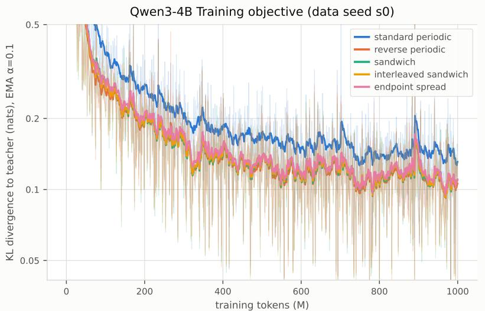  
Figure C.1: Distillation training curves for Qwen3-4B with data seed $0 ,$ one run per placement. Faint lines show the per-step $D _ { K L }$ on the training batch and bold lines its exponential moving average $( \alpha = 0 . 1 )$ . The y-axis is logarithmic and cut off at 0.5 nats; every run starts between 7.0 and 10.5 nats.

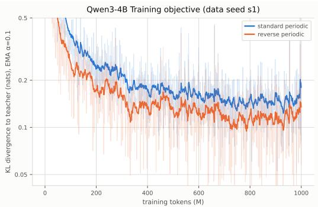  
(a) Qwen3-4B student model

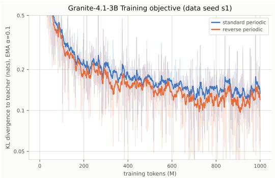  
(b) Granite-4.1-3B student model  
Figure C.2: Distillation training curves for the Qwen3-4B and Granite-4.1-3B standard periodic and reverse periodic placement with data seed 1.

Gated DeltaNet initialization. We initialize each converted layer by transferring the teacher’s attention weights (Goldstein et al., 2026; Chen et al., 2026). The Gated DeltaNet layer adopts the teacher’s head geometry (H heads of dimension $d _ { h }$ , with value dimension $d _ { h } )$ , so $W _ { Q }$ and $\bar { W } _ { O }$ are copied directly. Both teacher models use grouped-query attention, whereas Gated DeltaNet has one key and value head pair per query head, so we clone each key and value head across its query group, $\dot { W _ { K } ^ { ( h ) } }  W _ { K } ^ { \mathrm { T } , ( \lfloor h / G \rfloor ) }$ and likewise for $W _ { V }$ , as in ${ \mathrm { H A L O } } .$ . Parameters without a teacher counterpart are set so that each converted layer starts with no convolutional mixing and almost no forgetting. The remaining parameters $( W _ { a } , W _ { \beta } , W _ { z } , b _ { \Delta } , \gamma )$ use the default initialization of the FLA implementation (Algorithm 1). Retained attention layers, MLPs, norms, and embeddings are copied from the teacher unchanged.

## C.5 METRICS AND RESULTS

Evaluation protocol. All metrics are computed on held-out documents. The validation split is evaluated every $1 0 ^ { 7 }$ training tokens and produces all training curves; the test split is evaluated once, after training, and produces all final numbers. Each language contributes $1 6 \times 1 0 2 4$ validation and $3 2 \times 1 0 2 4$ test tokens, packed into full sequences of the training length $n = 1 0 2 4$ and no longer contexts are evaluated. $D _ { \mathrm { K L } }$ and cross-entropy $\mathcal { L } _ { \mathrm { L M } }$ are averaged over all tokens of a language; the aggregate metrics then average over the 26 languages in Λ, which include English and exclude $\mathrm { M o n } ^ { 2 }$ (Table C.2). Test split is evaluated once after 1B distillation tokens. All results are for the untied student (Appendix C.2).

Cross-entropy gap to the teacher. We report the mean per-token $\mathcal { L } _ { \mathrm { L M } }$ gap between student and teacher on held-out text, averaged over the evaluation languages $\lambda \in \Lambda \left( \left| \Lambda \right| = 2 6 \right)$ :

$$
\bar { \delta } _ { \mathrm { S } } ( s ) = \frac { 1 } { | \Lambda | } \sum _ { \lambda \in \Lambda } \big ( \mathcal { L } _ { \mathrm { L M } , \lambda } ^ { \mathrm { S } } ( s ) - \mathcal { L } _ { \mathrm { L M } , \lambda } ^ { \mathrm { T } } \big ) ,\tag{4}
$$

where $\mathcal { L } _ { \mathrm { L M } , \lambda } ^ { \mathrm { S } } ( s )$ is the student’s per-token $\mathcal { L } _ { L M }$ (in nats) on language λ after s optimization steps and $\mathcal { L } _ { \mathrm { L M } , \lambda } ^ { \mathrm { T } }$ the teacher’s; lower is better. Every language contributes the same number of held-out tokens, so $\bar { \delta } _ { \mathrm { { S } } }$ also equals the per-token gap over the pooled evaluation set. By definition $\log { \mathrm { p p l } } =$ $\mathcal { L } _ { \mathrm { L M } }$ , the gap has a direct perplexity reading:

$$
e ^ { \bar { \delta } _ { \mathrm { S } } ( s ) } = \Big ( \prod _ { \lambda \in \Lambda } \frac { \mathrm { p p l } _ { \lambda } ^ { \mathrm { S } } ( s ) } { \mathrm { p p l } _ { \lambda } ^ { \mathrm { T } } } \Big ) ^ { 1 / | \Lambda | } ,
$$

the geometric mean of the student-to-teacher perplexity ratios, i.e. $\bar { \delta } _ { \mathrm { S } } = 0 . 0 5$ means the student’s perplexity is on average $\sim 5 \%$ above the teacher’s.

$D _ { \mathrm { K L } }$ relative to the baseline placement. To compare different placements, we measure each student’s $D _ { \mathrm { K L } }$ to the teacher relative to the standardperiodic student distilled from the same teacher, taking the geometric mean of the per-language ratios at the same optimization step s:

$$
R _ { \mathrm { S } } ( s ) = \exp \Big ( \frac { 1 } { | \Lambda | } \sum _ { \lambda \in \Lambda } \log \frac { D _ { \mathrm { K L } , \lambda } ^ { \mathrm { S } } ( s ) } { D _ { \mathrm { K L } , \lambda } ^ { \mathrm { B } } ( s ) } \Big ) ,\tag{5}
$$

where $D _ { \mathrm { K L } , \lambda } ^ { \mathrm { S } } ( s )$ is the mean per-token $D _ { \mathrm { K L } } ( p _ { \mathrm { T } } \| p _ { \mathrm { S } } )$ of student $\mathcal { M } _ { \mathrm { S } }$ on the held-out text of language $\lambda ,$ and $D _ { \mathrm { K L } , \lambda } ^ { \mathrm { B } } ( s )$ is the same quantity for the baseline. $R _ { \mathrm { S } } = 1$ matches the baseline, and $R _ { \mathrm { S } } < 1$ means the student is closer to the teacher than the baseline is (lower is better); i.e. $R _ { \mathrm { S } } ~ = ~ 0 . 7$ corresponds to a 30% lower $D _ { \mathrm { K L } }$ in the geometric mean over languages.

Unit in nats per token. All $\mathcal { L } _ { \mathrm { L M } }$ and $D _ { \mathrm { K I } }$ quantities are reported in nats per token (natural logarithm), so that $\mathrm { p p l } = \exp ( \mathcal { L } _ { \mathrm { L M } } )$ . We use nats mainly because bits in language-model evaluation conventionally appear as bits per byte, a tokenizer-invariant measure. Our gap is per token and is not tokenizer-invariant: Qwen3-4B and Granite-4.1-3B segment the same text differently, so gaps are comparable within a teacher’s tokenizer but never across one.

## LLM gap by language.

Table C.4: Per-language test results. For each language, the $D _ { \mathrm { K L } }$ row gives $D _ { \mathrm { K L } } ( p _ { \mathrm { T } } \| p _ { \mathrm { S } } )$ (nats per token) and the $\mathcal { L } _ { \mathrm { L M } }$ row the $\mathcal { L } _ { \mathrm { L M } }$ gap to the teacher, $\mathcal { L } _ { \mathrm { L M } , \lambda } ^ { \mathrm { S } } - \bar { \mathcal { L } } _ { \mathrm { L M } , \lambda } ^ { \mathrm { T } }$ (nats); lower is better for both, and a negative $\mathcal { L } _ { \mathrm { L M } }$ gap means the student is less perplexed than the teacher. The last two rows give R (equation 5), relative to SP of the run with the same data seed, and ¯δ (equation 4). Teachers are the base models (Qwen3-4B-Base, Granite-4.1-3B-Base). Languages are grouped by family as in Table C.2. SP: Standard Periodic; RP: Reverse Periodic; SW: Sandwich; IS: Interleaved Sandwich; ES: Endpoint Spread. Tier: E/H/M/L = English/High/Mid/Low sampling tier (Table C.2). †Mon is excluded from all averages.
<table><tr><td colspan="10">Qwen3-4B</td><td colspan="3">Granite-4.1-3B</td></tr><tr><td></td><td></td><td></td><td></td><td colspan="3">data seed 0</td><td></td><td></td><td colspan="3">data seed 1</td><td>data seed 1</td></tr><tr><td>Language</td><td>Tier Metric</td><td></td><td>SP</td><td>RP</td><td>SW</td><td>IS</td><td>ES</td><td></td><td>SP</td><td>RP</td><td>SP</td><td>RP</td></tr><tr><td>English</td><td>E</td><td> $D _ { \mathrm { K L } }$ </td><td>0.160</td><td>0.140</td><td>0.148</td><td>0.147</td><td>0.144</td><td></td><td>0.160</td><td>0.142</td><td>0.212</td><td>0.203</td></tr><tr><td>Russian</td><td>H</td><td> $\mathcal { L } _ { \mathrm { L M } }$   $D _ { \mathrm { K L } }$ </td><td>0.119 0.113</td><td>0.106 0.092</td><td>0.116 0.100</td><td>0.112 0.099</td><td>0.108</td><td>0.120</td><td></td><td>0.108 0.093</td><td>0.157 0.099</td><td>0.151 0.097</td></tr><tr><td rowspan="2"></td><td rowspan="2"></td><td> $\mathcal { L } _ { \mathrm { L M } }$ </td><td>0.088</td><td>0.073</td><td>0.082</td><td>0.079</td><td>0.096 0.076</td><td>0.111</td><td></td><td></td><td></td><td>0.053</td></tr><tr><td></td><td>0.073</td><td>0.056</td><td>0.056</td><td></td><td></td><td></td><td>0.089 0.072</td><td>0.074 0.055</td><td>0.054 0.068</td><td>0.064</td></tr><tr><td rowspan="2">Hindi</td><td rowspan="2">H</td><td> $D _ { \mathrm { K L } }$   $\mathcal { L } _ { \mathrm { L M } }$ </td><td>0.043</td><td>0.033</td><td>0.035</td><td>0.057 0.034</td><td>0.058 0.032</td><td></td><td></td><td></td><td></td><td>0.021</td></tr><tr><td></td><td>0.084</td><td>0.066</td><td>0.062</td><td>0.065</td><td></td><td></td><td>0.043 0.085</td><td>0.032 0.067</td><td>0.025 0.073</td><td>0.067</td></tr><tr><td rowspan="2">Greek</td><td rowspan="2">M</td><td> $D _ { \mathrm { K L } }$   $\mathcal { L } _ { \mathrm { L M } }$ </td><td>0.050</td><td>0.034</td><td>0.033</td><td>0.032</td><td>0.071 0.039</td><td></td><td></td><td></td><td></td><td></td></tr><tr><td></td><td>0.090</td><td>0.061</td><td>0.055</td><td>0.059</td><td></td><td></td><td>0.050</td><td>0.037</td><td>0.003</td><td>0.001</td></tr><tr><td rowspan="2">Armenian Irish</td><td rowspan="2">M</td><td> $D _ { \mathrm { K L } }$   $\mathcal { L } _ { \mathrm { L M } }$ </td><td>0.034</td><td>0.017</td><td>0.012</td><td>0.012</td><td>0.066 0.018</td><td></td><td>0.090</td><td>0.061</td><td>0.122</td><td>0.066</td></tr><tr><td> $D _ { \mathrm { K L } }$ </td><td>0.316</td><td>0.281</td><td>0.282</td><td>0.299</td><td>0.319</td><td></td><td>0.034 0.310</td><td>0.017 0.278</td><td>0.077 0.313</td><td>0.018 0.316</td></tr><tr><td rowspan="2"></td><td rowspan="2">L</td><td> $\mathcal { L } _ { \mathrm { L M } }$ </td><td>0.162</td><td>0.158</td><td>0.171</td><td>0.177</td><td>0.182</td><td></td><td>0.154</td><td>0.148</td><td>0.152</td><td>0.159</td></tr><tr><td></td><td>0.252</td><td>0.188</td><td>0.187</td><td></td><td></td><td></td><td></td><td></td><td></td><td></td></tr><tr><td rowspan="2">Mandarin</td><td rowspan="2">H</td><td> $D _ { \mathrm { K L } }$   $\mathcal { L } _ { \mathrm { L M } }$ </td><td>0.159</td><td>0.105</td><td>0.112</td><td>0.191 0.113</td><td>0.197 0.113</td><td></td><td>0.252</td><td>0.188</td><td>0.146</td><td>0.140</td></tr><tr><td> $D _ { \mathrm { K L } }$ </td><td>0.224</td><td>0.170</td><td>0.167</td><td>0.171</td><td></td><td></td><td>0.163</td><td>0.106 0.171</td><td>0.094</td><td>0.081</td></tr><tr><td rowspan="2">Cantonese</td><td rowspan="2">M</td><td> $\mathcal { L } _ { \mathrm { L M } }$ </td><td>0.124</td><td>0.084</td><td>0.089</td><td>0.090</td><td>0.179 0.092</td><td>0.223 0.123</td><td></td><td></td><td>0.144</td><td>0.140</td></tr><tr><td> $D _ { \mathrm { K L } }$ </td><td>0.167</td><td>0.056</td><td>0.058</td><td>0.058</td><td></td><td></td><td>0.168</td><td>0.084 0.057</td><td>0.032</td><td>0.031</td></tr><tr><td rowspan="2">Burmese Tibetan</td><td rowspan="2">M</td><td> $\mathcal { L } _ { \mathrm { L M } }$ </td><td>0.150</td><td>0.036</td><td>0.039</td><td>0.037</td><td>0.058 0.036</td><td></td><td></td><td></td><td>0.085</td><td>0.053</td></tr><tr><td> $D _ { \mathrm { K L } }$ </td><td>0.056</td><td>0.032</td><td>0.035</td><td>0.035</td><td>0.037</td><td></td><td>0.148 0.058</td><td>0.036 0.033</td><td>0.034 0.040</td><td>0.004 0.027</td></tr><tr><td rowspan="2"></td><td rowspan="2">L</td><td> $\mathcal { L } _ { \mathrm { L M } }$ </td><td>0.009</td><td>0.000</td><td>0.002</td><td>0.000</td><td>0.003</td><td>0.011</td><td></td><td>0.001</td><td>0.005</td><td>-0.005</td></tr><tr><td></td><td>0.170</td><td>0.130</td><td>0.134</td><td></td><td></td><td></td><td></td><td></td><td></td><td></td></tr><tr><td rowspan="2">Arabic</td><td rowspan="2">H</td><td> $D _ { \mathrm { K L } }$ </td><td>0.127</td><td>0.101</td><td>0.104</td><td>0.136 0.106</td><td>0.136</td><td></td><td>0.167</td><td>0.131</td><td>0.094</td><td>0.088</td></tr><tr><td> $\mathcal { L } _ { \mathrm { L M } }$   $D _ { \mathrm { K L } }$ </td><td>0.204</td><td>0.156</td><td>0.156</td><td></td><td>0.105</td><td></td><td>0.124</td><td>0.102</td><td>0.042</td><td>0.032</td></tr><tr><td rowspan="2">Hebrew</td><td rowspan="2">M</td><td></td><td>0.081</td><td>0.055</td><td>0.060</td><td>0.162</td><td>0.165</td><td>0.205</td><td></td><td>0.157</td><td>0.100</td><td>0.094</td></tr><tr><td> $\mathcal { L } _ { \mathrm { L M } }$ </td><td>0.075</td><td>0.044</td><td>0.042</td><td>0.060</td><td>0.062</td><td></td><td>0.083</td><td>0.056</td><td>0.041</td><td>0.035</td></tr><tr><td rowspan="2">Amharic Hausa</td><td rowspan="2">M</td><td> $D _ { \mathrm { K L } }$ </td><td>-0.013</td><td>-0.010</td><td>-0.008</td><td>0.044</td><td>0.049</td><td>0.075</td><td></td><td>0.044</td><td>0.045</td><td>0.032</td></tr><tr><td> $\mathcal { L } _ { \mathrm { L M } }$   $D _ { \mathrm { K L } }$ </td><td>0.119</td><td>0.115</td><td>0.096</td><td>-0.009</td><td>-0.010</td><td></td><td>-0.014</td><td>-0.011</td><td>-0.008 0.131</td><td>-0.013 0.131</td></tr><tr><td rowspan="2"></td><td rowspan="2">M</td><td> $\mathcal { L } _ { \mathrm { L M } }$ </td><td>-0.092</td><td>-0.086</td><td>-0.050</td><td>0.110 -0.064</td><td>0.125 -0.095</td><td>0.120 -0.094</td><td></td><td>0.116 -0.087 -0.077</td></table>

Table C.4: (continued)
<table><tr><td></td><td></td><td></td><td colspan="6">Qwen3-4B</td><td colspan="3">Granite-4.1-3B</td></tr><tr><td></td><td></td><td></td><td></td><td colspan="3">data seed 0</td><td colspan="3">data seed 1</td><td colspan="2">data seed 1</td></tr><tr><td>Language</td><td></td><td>Tier Metric</td><td>SP</td><td>RP</td><td>SW</td><td>IS</td><td>ES</td><td>SP</td><td>RP</td><td>SP</td><td>RP</td></tr><tr><td>Malayalam</td><td>M</td><td> $D _ { \mathrm { K L } }$ </td><td>0.133</td><td>0.042</td><td>0.037</td><td>0.040</td><td>0.045</td><td>0.116</td><td>0.042</td><td>0.183</td><td>0.050</td></tr><tr><td></td><td></td><td> $\mathcal { L } _ { \mathrm { L M } }$ </td><td>0.096</td><td>0.017</td><td>0.015</td><td>0.017</td><td>0.018</td><td>0.079</td><td>0.016</td><td>0.131</td><td>0.006</td></tr><tr><td>Turkish</td><td>H</td><td> $D _ { \mathrm { K L } }$ </td><td>0.147</td><td>0.128</td><td>0.136</td><td>0.136</td><td>0.134</td><td>0.148</td><td>0.129</td><td>0.134</td><td>0.133</td></tr><tr><td></td><td></td><td> $\mathcal { L } _ { \mathrm { L M } }$ </td><td>0.069</td><td>0.057</td><td>0.070</td><td>0.071</td><td>0.065</td><td>0.070</td><td>0.059</td><td>0.018</td><td>0.018</td></tr><tr><td>Azerbaijani</td><td>M</td><td> $D _ { \mathrm { K L } }$ </td><td>0.127</td><td>0.112</td><td>0.106</td><td>0.111</td><td>0.118</td><td>0.127</td><td>0.112</td><td>0.123</td><td>0.122</td></tr><tr><td></td><td></td><td> $\mathcal { L } _ { \mathrm { L M } }$ </td><td>0.028</td><td>0.022</td><td>0.026</td><td>0.026</td><td>0.031</td><td>0.029</td><td>0.022</td><td>-0.015</td><td>-0.019</td></tr><tr><td>Kazakh</td><td>M</td><td> $D _ { \mathrm { K L } }$ </td><td>0.096</td><td>0.081</td><td>0.080</td><td>0.081</td><td>0.085</td><td>0.095</td><td>0.081</td><td>0.080</td><td>0.078</td></tr><tr><td></td><td></td><td> $\mathcal { L } _ { \mathrm { L M } }$ </td><td>0.028</td><td>0.020</td><td>0.026</td><td>0.021</td><td>0.023</td><td>0.026</td><td>0.019</td><td>-0.024</td><td>-0.025</td></tr><tr><td>Uyghur</td><td>L</td><td> $D _ { \mathrm { K L } }$ </td><td>0.119</td><td>0.102</td><td>0.089</td><td>0.096</td><td>0.110</td><td>0.119</td><td>0.102</td><td>0.089</td><td>0.084</td></tr><tr><td></td><td></td><td> $\mathcal { L } _ { \mathrm { L M } }$ </td><td>-0.013</td><td>-0.012</td><td>-0.003</td><td>-0.005</td><td>-0.008</td><td>-0.014</td><td>-0.012</td><td>-0.027</td><td>-0.029</td></tr><tr><td>Vietnamese</td><td>H</td><td> $D _ { \mathrm { K L } }$ </td><td>0.163</td><td>0.131</td><td>0.130</td><td>0.134</td><td>0.136</td><td>0.163</td><td>0.131</td><td>0.102</td><td>0.102</td></tr><tr><td>Khmer</td><td></td><td> $\mathcal { L } _ { \mathrm { L M } }$ </td><td>0.121</td><td>0.097</td><td>0.097</td><td>0.105</td><td>0.103</td><td>0.122</td><td>0.096</td><td>0.034</td><td>0.032</td></tr><tr><td></td><td>M</td><td> $D _ { \mathrm { K L } }$ </td><td>0.112</td><td>0.047</td><td>0.048</td><td>0.050</td><td>0.051</td><td>0.112</td><td>0.048</td><td>0.116</td><td>0.053</td></tr><tr><td></td><td></td><td> $\mathcal { L } _ { \mathrm { L M } }$ </td><td>0.045</td><td>0.005</td><td>0.010</td><td>0.009</td><td>0.008</td><td>0.046</td><td>0.005</td><td>0.029</td><td>-0.021</td></tr><tr><td>Mean</td><td></td><td>R</td><td>1.000</td><td>0.677</td><td>0.665</td><td>0.689</td><td>0.722</td><td>1.000</td><td>0.697</td><td>1.000</td><td>0.767</td></tr><tr><td></td><td></td><td>δ</td><td>0.071</td><td>0.045</td><td>0.050</td><td>0.049</td><td>0.049</td><td>0.068</td><td>0.045</td><td>0.042</td><td>0.020</td></tr></table>

## D SOFTCKA DETAILS

Token representations and kernels. For each parallel sentence pair $s \in \mathcal { D } ,$ , let $X _ { a } ^ { ( s ) } \in \mathbb { R } ^ { T _ { a } ^ { ( s ) } }$ ×d contain the token-level hidden states for language $a \in \{ 1 , 2 \}$ at the model location under analysis. Let $X _ { a , i } ^ { ( s ) }$ denote the hidden state of token i. We construct the RBF kernel matrices

$$
K _ { a b } ^ { ( s ) } [ i , j ] = \exp \left( - \frac { \| X _ { a , i } ^ { ( s ) } - X _ { b , j } ^ { ( s ) } \| _ { 2 } ^ { 2 } } { 2 \sigma ^ { 2 } } \right) ,\tag{6}
$$

where $a , b \in \{ 1 , 2 \} , 1 \leq i \leq T _ { a } ^ { ( s ) }$ , and $1 \leq j \leq T _ { b } ^ { ( s ) }$ . The bandwidth $\sigma > 0$ is shared across the three matrices $K _ { 1 1 } ^ { ( s ) } , K _ { 2 2 } ^ { ( s ) }$ , and ${ \pmb K } _ { 1 2 } ^ { ( s ) }$

The within-language matrices have dimensions $T _ { 1 } ^ { ( s ) } \times T _ { 1 } ^ { ( s ) }$ and $T _ { 2 } ^ { ( s ) } \times T _ { 2 } ^ { ( s ) }$ , while the cross-language matrix has dimensions $T _ { 1 } ^ { ( s ) } \times T _ { 2 } ^ { ( s ) }$ . The latter compares every token in one sentence with every token in its translation, without requiring equal sequence lengths or token correspondences. Its entries are similarities, not normalized alignment probabilities.

Centering and squared norms. Each kernel is centered separately within its sentence pair:

$$
\widetilde { \pmb { K } } _ { a b } ^ { ( s ) } = \pmb { H } _ { a } ^ { ( s ) } \pmb { K } _ { a b } ^ { ( s ) } \pmb { H } _ { b } ^ { ( s ) } , \qquad \pmb { H } _ { a } ^ { ( s ) } = \pmb { I } _ { T _ { a } ^ { ( s ) } } - \frac { 1 } { T _ { a } ^ { ( s ) } } \pmb { 1 } \pmb { 1 } ^ { \top } .\tag{7}
$$

This subtracts each entry’s row and column means and adds back the overall matrix mean. We then compute

$$
h _ { a b } ^ { ( s ) } = \| \widetilde { \mathbfcal { K } } _ { a b } ^ { ( s ) } \| _ { F } ^ { 2 } = \sum _ { i = 1 } ^ { T _ { a } ^ { ( s ) } } \sum _ { j = 1 } ^ { T _ { b } ^ { ( s ) } } \left( \widetilde { \pmb { K } } _ { a b } ^ { ( s ) } [ i , j ] \right) ^ { 2 } .\tag{8}
$$

Thus, $h _ { a b } ^ { ( s ) }$ measures variation remaining after row and column mean similarities are removed, rather than the overall level of token similarity.

Cross-Lingual Similarity of Attn & MLP Block Contribution (attn\_delta & mlp\_delta) Qwen3.5-35-A3B

Corpus aggregation. Equation 1 sums the quantities $h _ { a b } ^ { ( s ) }$ over sentence pairs before normalization. It therefore does not average sentence-level SoftCKA scores. No explicit length normalization is applied: the cross-language term contains $T _ { 1 } ^ { ( s ) } T _ { 2 } ^ { ( s ) }$ squared entries, while the within-language terms contain $( T _ { 1 } ^ { ( s ) } ) ^ { 2 }$ and $( T _ { 2 } ^ { ( s ) } ) ^ { 2 }$ entries.

Consequently, each sentence pair’s contribution depends on both its sequence lengths and its centered kernel values. When the two token counts are comparable and the mean squared centered entries remain similar, contributions to these sums grow approximately quadratically with sequence length. The normalized corpus score is defined when its denominator is nonzero.

Relationship to CKA. Standard empirical HSIC is computed from two Gram matrices ${ \pmb K } , { \pmb L } \in$ $\mathbb { R } ^ { N \times N }$ indexed by the same N paired observations:

$$
\mathrm { H S I C } ( { \cal K } , { \cal L } ) = \frac { 1 } { ( N - 1 ) ^ { 2 } } \mathrm { t r } ( { \cal K } H { \cal L } H ) , \qquad H = I _ { N } - \frac { 1 } { N } \mathbf { 1 } \mathbf { 1 } ^ { \top } .\tag{9}
$$

CKA normalizes this quantity by the corresponding self-HSIC terms (Kornblith et al., 2019). Soft-CKA adopts a similar normalization structure, but its cross-language term is $\| \pmb { H } _ { 1 } ^ { ( s ) } \pmb { K } _ { 1 2 } ^ { ( s ) } \pmb { H } _ { 2 } ^ { ( s ) } \| _ { F } ^ { 2 }$ This term is not the standard HSIC estimator over paired tokens.

Because ${ \pmb K } _ { 1 2 } ^ { ( s ) }$ uses distances between hidden states from different languages, SoftCKA compares them in their shared representation space. Its interpretation is normalized centered kernel similarity; it does not recover or verify semantic token correspondences.

## E SOFTCKA OF BLOCK DELTAS

Our primary metric looks at the hidden state entering each layer, $\mathtt { a t t n \_ i n }$ . However, we find that a slight modification reveals interesting results. As discussed in Section 5.2, we also calculate SoftCKA of the residual-stream contribution of each block. Since this treats the block as a black box, it is comparable across various attention blocks and even the MLP block. In Figure 1, these values are attn\_delta and mlp\_delta.

The following visualization for Qwen3.5 shows the sequential progress through both the attention and MLP blocks. On top of the major “event” happening at the first full attention layer, it also displays the “preparation” that occurs in the few preceding blocks.

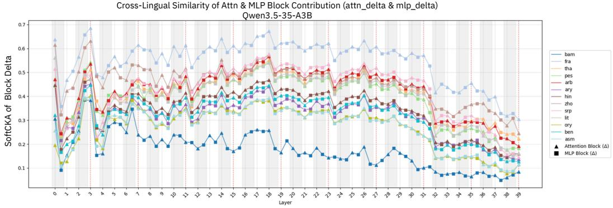  
Figure E.1: SoftCKA of the residual-stream contributions from the attention and MLP blocks in Qwen3.5. The blocks preceding the first full-attention layer show a progressive change before the pronounced event at that layer. Similarity has a massive drop right after this layer.

## F COMPARISON TO SWA HYBRIDS

We elaborate here upon Finding 5. The visualization for OLMo-3, a SWA-hybrid, is in Figure 3, while for Tiny Aya Global, it is here below.

Cross-Lingual Representation Similarity (Entering Layer) Tiny Aya Global (SWA hybrid)  
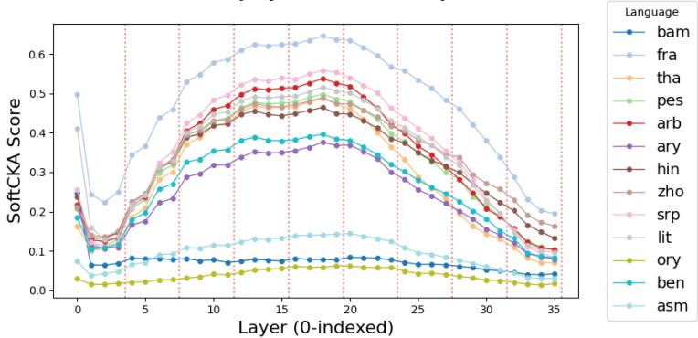  
Figure F.1: SoftCKA for Tiny Aya Global, which is an SWA-hybrid model. Red dotted lines mark full-attention layers.

Interestingly, it is found that positional embeddings are not useful in the SWA layers (Yang et al., 2025b; Qiao et al., 2026), so numerous new such hybrid models do not use it outside of full attention (Salamanca et al., 2026; Team et al., 2026). We find no evidence that this significantly impacts crosslingual representations.

## G MOE ROUTING ALIGNMENT

For the mixture-of-experts Qwen and Ring model pairs, we compute the routing-divergence metric of Bandarkar et al. (2026b). The metric measures cross-lingual MoE routing agreement at the sequence level using parallel sentences. For each sequence, the router weights are mean-pooled across tokens and then we take the Jensen-Shannon divergence between the resulting distributions for the two languages. We apply this metric to parallel samples from FloRES (NLLB Team et al., 2022) and report corpus-wide averages at each layer. Lower JS divergence indicates more similar expert-routing behavior across languages.

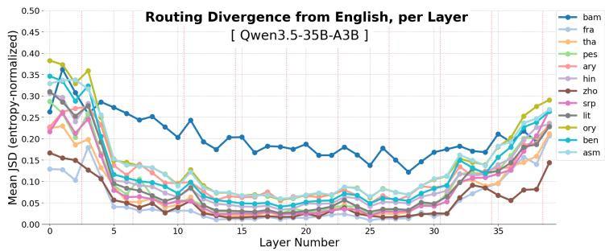  
Figure G.1: Layer-wise cross-lingual MoE routing divergence for Qwen3.5 (hybrid). Lower values indicate more similar routing across languages. Red dotted lines mark the full attention layers.

Figures G.1-G.4 show the layer-wise results. In the hybrid models, Qwen3.5-35B-A3B and Ringmini-linear-2.0, routing divergence remains relatively flat through the initial recurrent layers and begins to decrease only after the first full-attention layer. By contrast, divergence begins decreasing immediately in the non-hybrid Qwen3-30B-A3B and Ring-mini-2.0 models.

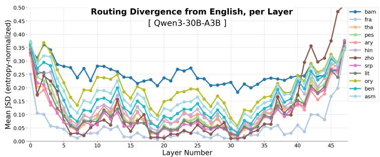  
Figure G.2: Layer-wise cross-lingual MoE routing divergence for Qwen3 (non-hybrid).

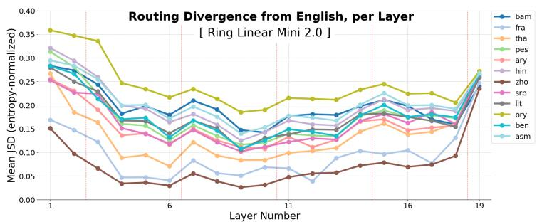  
Figure G.3: Layer-wise cross-lingual MoE routing divergence for Ring-mini-linear-2.0 (hybrid). Red dotted lines mark the full attention layers.

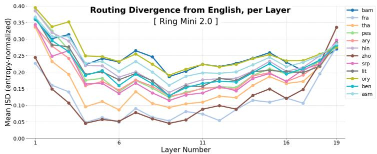  
Figure G.4: Layer-wise cross-lingual MoE routing divergence for Ring-mini-2.0 (non-hybrid).