# OpenWhistle: A Large-Scale Longitudinal Dataset and Benchmark of Bottlenose Dolphin Vocalizations

Faadil Mustun1,∗ Chiara Semenzin2,∗,† Roberto Dessì3 Pablo Robin Guerrero1 Pierre Orhan4 Alexis Emanuelli1 Emanuele Rossi5 Yair Lakretz6 Gonzalo de Polavieja7 Germán Sumbre1

1Institut de Biologie de l’École normale supérieure, CNRS, INSERM, Université PSL, Paris, France 2Earth Species Project, France 3Not Diamond, San Francisco, USA 4Institut du Cerveau, Paris, France   
5Sapienza University of Rome, Rome, Italy 6École Normale Supérieure, Paris, France 7Champalimaud Foundation, Lisbon, Portugal

∗These authors contributed equally to this work. †Work carried out while at the Institut de Biologie de l’École normale supérieure, Paris, France.

## Abstract

Recent advances in bioacoustics have been driven by large-scale corpora and standardized benchmarks, yet existing resources are overwhelmingly bird-centric and shallow per species, limiting their use for studying the structure of a single species’ communication system. This gap is particularly acute for cetaceans: despite bottlenose dolphins (Tursiops truncatus) being a compelling case of complex vocal communication among non-human mammals, existing dolphin datasets are small, fragmented, and largely closed. We introduce OpenWhistle, the largest publicly available dataset of dolphin vocalizations. It comprises approximately 180,000 whistles (114 hours) recorded over five years from a stable pod of five individuals in a semi-natural environment, paired with a curated subset of 8,354 expert-annotated whistles and reproducible evaluation protocols for whistle-type detection and classification. We further release the full processing pipeline for whistle detection, segmentation, and categorization. To demonstrate its utility, we pretrain a Wav2Vec2.0 model adapted to dolphin acoustics on the OpenWhistle corpus and show that it learns effective representations, outperforming generalpurpose bioacoustic models such as AVES and BioLingual on both tasks while leaving meaningful headroom for future work. By releasing the dataset, pipeline, and evaluation protocol, we provide the first open dolphin whistle dataset tailored for training self-supervised models, laying the groundwork for advancing dolphin communication research and developing models that capture fine-grained acoustic structure within species.

## 1 Introduction

Bioacoustics plays a central role in ecology and conservation, enabling researchers to study animal communication, monitor biodiversity, and track endangered species through acoustic signals [4, 20, 9, 39]. The field has recently seen major advances in tasks such as detection, classification [46] and denoising [27], driven by machine-learning models [35, 36, 47] and enabled by large-scale pretraining corpora, including Xeno-Canto [48], iNaturalist [13], and Animal Sound Archive [28], together with standardized benchmarks such as BEANS [12], BEANS-ZERO [36], and BirdSet [34].

However, these corpora are broad in taxonomic coverage, but shallow for any single species: they aggregate short recordings across thousands of species, which suits detection and species classification but is insufficient for studying the structure of a species’ communication system. Questions about vocal learning, individual identity, social coordination, and temporal change require deep, longitudinal data from known individuals of a single species, a resource that to the best of our knowledge does not exist at scale. Among non-human animals, bottlenose dolphins (Tursiops truncatus) represent one of the most compelling cases of complex vocal communication among non-human mammals, with individually distinctive signature whistles and documented vocal learning [17], making them one of the species for which such a resource would be most valuable. Despite extensive study, progress toward understanding dolphin communication has been limited by the lack of suitable data: existing dolphin whistle datasets are small, fragmented, and largely not publicly available.

We address this gap by introducing OpenWhistle, an open resource for dolphin vocalization research comprising two components: (i) a large-scale training corpus of approximately 180,000 dolphin whistles (114 hours) collected over five years from a pod of five known individuals in a semi-natural marine environment, and (ii) a curated dataset with around 8,000 expert-annotated labels and explicit evaluation protocols for two tasks: whistle detection and whistle-type classification. Beyond these core tasks, OpenWhistle was designed to preserve contiguous whistle sequences from interacting individuals across five years, enabling future work on richer biological questions such as individual variation, vocal exchanges, interaction dynamics, temporal drift, and vocal development.

Beyond its scientific value, OpenWhistle complements broad-coverage bioacoustic datasets and benchmarks [12, 34] by providing a deep, longitudinal corpus from a single communication system, with known individuals and expert whistle-type labels. To our knowledge, it is the first open, ML-ready single-species cetacean dataset of sufficient scale for self-supervised pretraining directly from raw audio, enabling direct comparison between in-domain specialization and broad-coverage pretraining for fine-grained acoustic discrimination. Its pairing of a large unlabeled corpus with a smaller expert-annotated subset also makes it a natural testbed for label-efficient methods such as semi-supervised, active, and few-shot learning, addressing a bottleneck repeatedly identified in bioacoustics [46, 39, 11, 43, 31, 25]. Finally, its continuous recordings preserve environmental sounds, variable SNR, and overlapping vocalizations [27], while its longitudinal structure supports temporal distribution shift and continual-learning evaluations within a single known-individual population, complementing broader covariate-shift benchmarks such as BirdSet [34].

Our contributions are as follows:

• OpenWhistle dataset: We release the largest publicly available dataset of dolphin vocalizations to date, with three key properties:

◦ Scale: around 180,000 whistles (114 hours) from a stable pod of known individuals.

◦ Expert annotations and benchmark: a curated subset of 8,354 expert-annotated whistles with reproducible evaluation protocols for whistle-type detection and classification.

◦ Longitudinal structure: contiguous whistle sequences spanning five years, enabling future work on vocal exchanges, interaction dynamics, and temporal drift.

• Annotation pipeline: We release a scalable pipeline for whistle detection, segmentation, and type categorization, offering a practical recipe for constructing large dolphin acoustic datasets from continuous passive acoustic monitoring recordings.

• In-domain pretraining baseline: We show that a Wav2Vec2.0 model [1] trained on OpenWhistle learns effective representations of dolphin whistles, outperforming general bioacoustic models and establishing that in-domain data provides a meaningful advantage on both benchmark tasks.

## 2 Related Work

## 2.1 Dolphin Vocalizations and Communication

Early work by [6] and [17] established that dolphin communication relies primarily on two types of sounds: burst pulses and whistles, with whistles playing a central role in social interactions. Among whistles, signature whistles (SW) were shown by [41] and [15] to be stable, individually distinctive calls used for recognition and maintaining social bonds. These studies demonstrated that dolphins develop unique acoustic identifiers and can both produce their own signature whistle and imitate those of conspecifics. [41] found that signature whistles dominate dolphin vocal repertoires, making up as much as 70% of whistles recorded in natural settings. Non-signature whistles (NSW), which comprise the remainder of the whistle repertoire, are more variable in structure and are not uniquely associated with individuals. Their communicative role remains less well understood [16].

## 2.2 Existing Datasets

<table><tr><td>Dataset</td><td># Whistles</td><td>Voc. hours</td><td>Time span (yrs)</td><td>Stable pod (# indiv.)</td><td>Setting</td><td>Seq. context</td><td>Open</td></tr><tr><td>OpenWhistle Pretraining</td><td>~180,000*</td><td>114.3</td><td>5.0</td><td>√(5)</td><td>Semi-natural</td><td>√</td><td></td></tr><tr><td>OpenWhistle Expert subset</td><td>8,354</td><td>1.9</td><td>0.42</td><td>√ (5)</td><td>Semi-natural</td><td>x</td><td></td></tr><tr><td>DOLPHINFREE [21]</td><td>4,600</td><td>7.3</td><td>2.0</td><td>x</td><td>Wild</td><td>x</td><td></td></tr><tr><td>Di Nardo et al., 2025 [30]</td><td>3,111</td><td>0.6</td><td>0.003</td><td>√(7)</td><td>Captive</td><td>x</td><td></td></tr><tr><td>Watkins MMSD [40]</td><td>566</td><td>N/R</td><td>70+</td><td>X</td><td>Wild</td><td>x</td><td></td></tr><tr><td>Korkmaz et al., 2023 [32]</td><td>~29,000*</td><td>6.8</td><td>0.07</td><td>x</td><td>Semi-natural</td><td>√</td><td>0</td></tr><tr><td>Sicily Strait PAM [10]</td><td>14,048</td><td>N/R</td><td>1.2</td><td>x</td><td>Wild</td><td>√</td><td>X</td></tr><tr><td>DCLDE 2011 [38]</td><td>6,011</td><td>0.7</td><td>4.0</td><td>x</td><td>Wild</td><td>x</td><td>X</td></tr><tr><td>SDWD [42]</td><td>N/R</td><td>N/R</td><td>43+</td><td>√(293)</td><td>Wild (Catch-&amp;-Rel.)</td><td>x</td><td>0</td></tr></table>

Table 1: Comparison of existing dolphin acoustic datasets. N/R = not reported; ◦= available upon request. Time span is reported in years for consistency across datasets. "Seq. context" indicates whether the dataset preserves temporally contiguous sequences of multiple whistles, rather than only isolated whistle clips. All datasets are based on passive acoustic monitoring (PAM), except SDWD, which includes data collected through catch-and-release protocols. \* Estimated from total vocalization duration and mean whistle duration.

Large-scale bioacoustic datasets have played a central role in recent progress in the field, but they are overwhelmingly bird-centric, with resources such as Xeno-Canto and BirdSet dominating the landscape [48, 34]. These datasets provide broad taxonomic coverage and large volumes of data, but are typically shallow per species and focus on detection or species classification, making them less suitable for studying the structure of the communication system of a given species.

In contrast, dolphin acoustic datasets remain limited in both scale and accessibility (Table 1). Existing resources fall into three main categories. First, small, high-quality datasets such as DCLDE 2011 [22, 38] and DOLPHINFREE [2] provide detailed contour annotations, but contain only a few thousand whistles, limiting their use for data-intensive methods. Similarly, Di Nardo et al. [30] provide curated whistle data, but at a smaller scale and in a captive environment. Unlike OpenWhistle, they lack the scale required for data-intensive methods such as self-supervised learning. Second, passive acoustic monitoring datasets, such as the Sicily Strait recordings [10], offer longer temporal coverage in wild settings but typically lack fine-grained annotations, often reporting only the presence of vocal activity. In contrast, our dataset provides whistle-level labels together with continuous recordings from known individuals. Finally, specialized datasets such as SDWD [42] focus on specific aspects like individual identity, but are not fully open for general use or large-scale machine learning.

More recent efforts, such as [32], increase dataset size but introduce other constraints, including the use of spectrogram images instead of raw audio and coarse binary annotations. In contrast, OpenWhistle provides raw audio, fine-grained whistle-type annotations, and a reproducible evaluation protocol. No existing resource combines large-scale, open-access, longitudinal recordings from known individuals with well-documented histories and whistle-level annotations, gaps that OpenWhistle is designed to fill. It is also the only such resource tested for self-supervised models.

## 3 Data Collection

Recordings were collected at Dolphin Reef, a coastal site on the northern Gulf of Aqaba. The site hosts a resident pod of Tursiops truncatus ponticus in a large natural marine delimited area open to the sea, enabling semi-natural behaviour while supporting long-term and continuous tracking of known individuals [33]. Human-dolphin interactions occur only when initiated by the dolphins and are entirely voluntary. The dataset includes vocalizations from five dolphins: one male and three females, and one Tursiops aduncus female from the Indian Ocean, who joined the pod sporadically in 2019. Dolphins tend to remain near the monitored area during periods of human presence, but frequently leave to forage in the open sea when the site is closed or human activity is low.

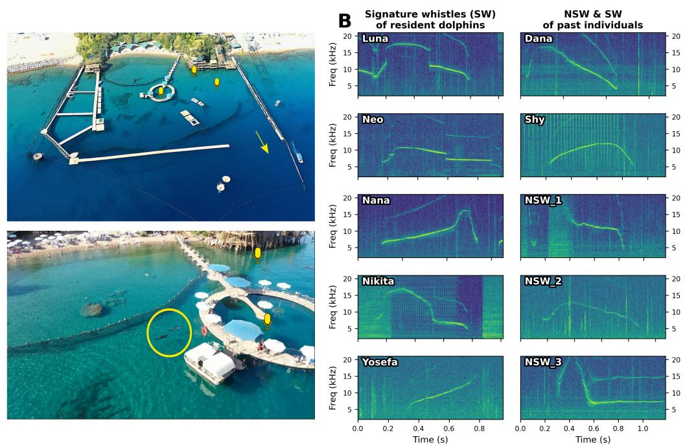  
A  
Figure 1: Site Description and Whistle Repertoire. A) The unique recording site at Dolphin Reef, Eilat. Hydrophones (yellow microphones) are deployed at fixed locations to continuously capture underwater audio. Dolphins move freely within the area and can exit to the open sea. B) Representative spectrograms of whistle types. Left: Signature Whistles (SW) of resident dolphins, each showing individually distinctive frequency contours. Right: Whistles of past individuals and non-signature whistles (NSW), illustrating the diversity of vocalizations captured in the dataset.

This setting has the advantage of both controlled captive studies and fully wild passive acoustic monitoring. Unlike captive environments, it preserves ecologically valid behaviour and realistic acoustic conditions, including natural social interactions. At the same time, unlike wild recordings, it provides stable individual identity, longitudinal continuity, and contextual interpretability over multiple years. This combination enables analyses that require both ecological realism and individual level resolution, which are typically difficult to achieve simultaneously in bioacoustic datasets [33].

## 4 Dataset Construction and Annotation

## 4.1 Annotation Pipeline

Binary Whistle Presence Detection Raw audio was processed using a convolutional neural network based on the VGG16 architecture [45], using Imagenet-pretrained weights [8] and fine-tuned on a balanced 59,808-segment dataset (whistle vs non-whistle). The network takes spectrograms as input and outputs binary predictions indicating the presence of at least one whistle. On a held-out test set of 16,708 segments, the model achieved a precision of 96.52% and a recall of 97.99% (Figure 2D).

Whistle Segmentation The CNN operates on non-overlapping 0.4 s windows. Consecutive detections were concatenated into continuous segments. To capture temporal structure, segments separated by less than 6 s were merged into the same sequence, yielding variable-length whistle sequences.

Whistle Annotation For the expert-annotated subset, detected whistle segments were categorized using ARTwarp [7], an unsupervised neural network algorithm incorporating dynamic time warping (DTW) [5] to cluster whistles by contour similarity. Following the procedure in [29], each whistle was assigned to one of 10 known categories by comparison with manually annotated template contours [37]. The resulting assignments were manually refined through visual inspection of spectrograms by expert annotators, correcting misclassifications and resolving ambiguous cases. This two-stage procedure combines scalable unsupervised clustering with expert validation, yielding a reliable categorization into 10 whistle types comprising 7 signature and 3 non-signature whistle types.

D  
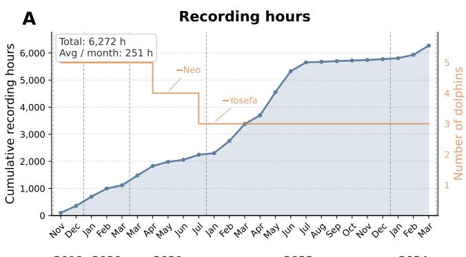

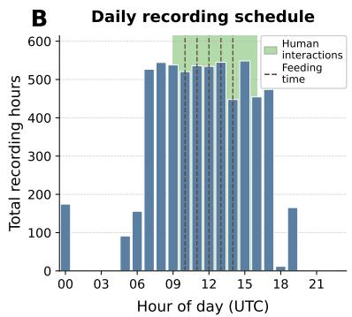

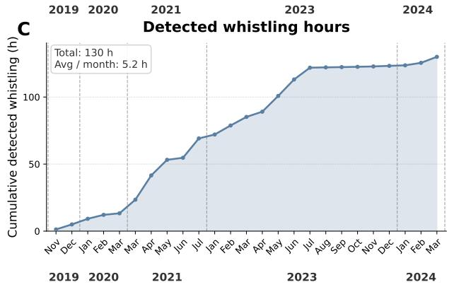

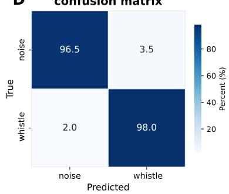  
Figure 2: OpenWhistle: Longitudinal Extent and Temporal Distribution of the Dataset. A) Cumulative recording hours over time, showing dataset growth and changes in pod composition. B) Distribution of recording hours across the day, indicating alignment with periods of human activity. C) Cumulative detected whistling hours over time, obtained by applying the whistle presence detection CNN to the raw recordings. D) Confusion matrix of the whistle presence detection CNN on the test set, indicating high reliability of the detected whistle segments used to derive panel C.

See Sec. B for annotation pipeline details. OpenWhistle includes two complementary components: (i) a large-scale pretraining corpus and (ii) a curated expert-annotated dataset.

## 4.2 Pretraining Dataset

Scale and Coverage. The pretraining dataset comprises ∼114 hours of raw audio, with an estimated 180,000 whistles across 33,267 sequences. Recordings span over five years (2019–2024), offering longitudinal coverage of 5 identified individuals and enabling analysis of long-term variation, including potential drift in whistle production and social dynamics.

Acoustic Properties. Whistle sequences have an average duration of 12.95 s (SD =19.9 s), ranging from 5 to 246 s, with a mean interval of 4.11 s between whistle segments, yielding dense vocal sequences suitable for self-supervised learning. The dataset preserves overlapping vocalizations and environmental sounds, reflecting the realistic acoustic conditions in which the dataset was recorded.

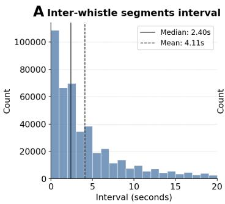

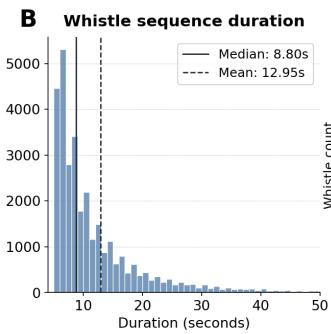

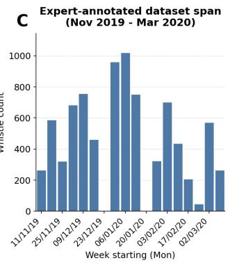

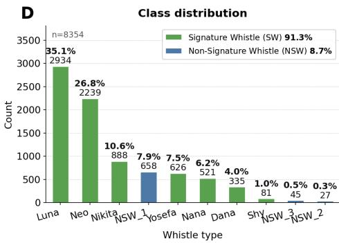

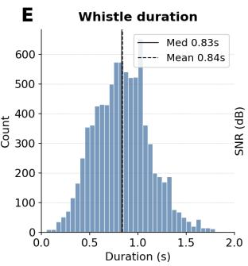

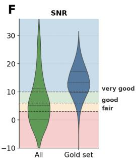  
Figure 3: Analyses of Whistle Properties in OpenWhistle. A–B) Temporal structure: distributions of inter-whistle intervals (A) and whistle sequence durations (B). C–E) Expert-annotated subset: temporal coverage (C), class distribution (D), and whistle duration (E). F) Signal-to-noise ratio (SNR) for the full dataset and the expert-annotated subset.

## 4.3 Expert-annotated Set

Composition Using our annotation pipeline, 8,354 whistles were categorized into 10 categories: 7,624 (91.3%) signature whistles across 7 types and 730 (8.7%) non-signature whistles across 3 types, serving as ground truth for downstream tasks. The distribution is highly imbalanced, reflecting natural production frequencies with a few dominant signature whistles and several rare categories.

Acoustic Properties. Whistles in the expert-annotated dataset have a mean duration of 0.84 s (SD = 0.29 s, range 0.04–2.21 s), reflecting substantial variability across categories. Acoustic quality is high, with a mean signal-to-noise ratio (SNR) of 13.24 dB, which is above the full pretraining corpus. This reflects a manual curation process that favors clear and minimally overlapping vocalizations. Figure 3 (D, E, F) summarizes class distribution, temporal variability, and quality metrics.

## 5 Benchmark Definition

## 5.1 Tasks

We propose two benchmark tasks (classification and detection) grounded in established bioacoustic evaluation practice [46, 12], but adapted to the specific demands of dolphin vocal analysis.

Whistle-Type Classification. Given an isolated whistle segment (Figure 4, top), the model must assign it to one of the whistle categories spanning both signature and non-signature types. We construct a balanced dataset of 3,000 instances across the 6 best-represented classes by subsampling the full annotated set; the remaining categories are excluded due to insufficient examples. Performance is reported as mean classification accuracy.

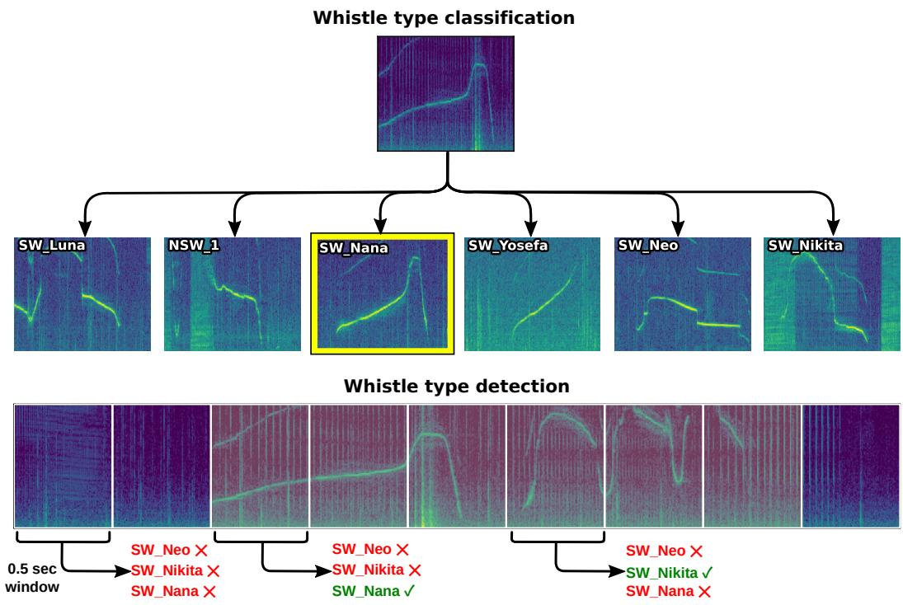  
Figure 4: Evaluation Tasks. The two evaluation tasks: (1) whistle type classification, where isolated whistle segments are assigned a predefined category, and (2) whistle-type detection, where fixed 0.5 s segments are labeled with a category if a whistle is present, or categorized as background otherwise.

Whistle-Type Detection. Given a fixed-length segment drawn from a continuous recording (Figure 4, bottom), the model must identify which whistle types, if any, are present. Following a standard sliding-window approach, recordings are divided into 0.5 s segments, each assigned a multi-label prediction over whistle categories (i.e., a binary decision per class, with an all-zero vector for background). The dataset comprises 400 instances per whistle type across 7 classes, balanced with 2,800 background segments. Performance is assessed using mean average precision (mAP) [12].

Together, these tasks span the core computational pipeline of dolphin communication: from detecting vocal activity in continuous streams to characterizing individual identity and repertoire structure.

## 5.2 Evaluation Protocol

All models are evaluated using a linear probing setup with fixed train/validation/test (70% / 15% / 15%). A logistic regression classifier is trained on top of frozen segment representations. Splits are constructed at the session level: all whistles originating from the same recording session are assigned to a single split. This ensures that no acoustic context is shared between training, validation, and test sets, preventing session-level leakage. Despite this constraint, class balance is maintained across splits by distributing sessions to preserve a similar label distribution.

The regularization parameter C is selected on the validation set. Uncertainty is estimated via bootstrap, repeatedly sampling the test set with replacement (N = 1000), reporting mean and standard deviation.

## 6 Experiments

## 6.1 Models and Baselines

We evaluate linear probes on frozen representations from three sources: classical acoustic features (including spectral features, MFCCs and Mean spectrogram), general-purpose pretrained bioacoustic models (Biolingual [35], AVES-core and AVES-bio [11]), and a self-supervised Wav2Vec2.0 model [1], chosen for its discrete latent codebook representations, trained directly on the OpenWhistle pretraining corpus (full training details in the Sec. C). The linear probes are implemented as logistic regression classifiers trained with the lbfgs solver. We tune the inverse regularization strength over $\bar { C ^ { \mathrm { ~ } } } \in \{ 0 . 1 , 1 . 0 , 1 0 . 0 \}$ on the validation set and set the maximum number of solver iterations to 20,000.

## 6.2 Results

<table><tr><td>Method</td><td>Pretraining</td><td>Classification (%)</td><td>Detection (mAP)</td></tr><tr><td>Chance level</td><td></td><td>16.7</td><td>8.3</td></tr><tr><td>Spectral features</td><td></td><td> $3 4 . 9 \pm 2 . 2$ </td><td> $2 6 . 3 \pm 1 . 1$ </td></tr><tr><td>MFCCs</td><td></td><td> $4 5 . 6 \pm 2 . 4$ </td><td> $3 3 . 6 \pm 1 . 8$ </td></tr><tr><td>Mean spectrogram</td><td></td><td> $5 5 . 6 \pm 2 . 4$ </td><td> $4 7 . 7 \pm 2 . 1$ </td></tr><tr><td>AVES-core</td><td>General audio (AudioSet, FSD50K)</td><td> $6 8 . 0 \pm 2 . 2$ </td><td> $5 7 . 4 \pm 2 . 1$ </td></tr><tr><td>BioLingual</td><td>Audio-text (AnimalSpeak)</td><td> $7 1 . 3 \pm 2 . 1$ </td><td> $6 6 . 5 \pm 2 . 2$ </td></tr><tr><td>AVES-bio</td><td>Animal vocalizations (AudioSet, VGGSound)</td><td> $7 5 . 1 \pm 2 . 1$ </td><td> $6 5 . 0 \pm 2 . 3$ </td></tr><tr><td>Wav2Vec2.0</td><td>OpenWhistle (ours)</td><td> ${ \bf 8 1 . 1 \pm 1 . 8 }$ </td><td> $7 5 . 6 { \pm } 2 . 0 $ </td></tr></table>

Table 2: Performance on whistle-type classification (accuracy) and detection (mAP). Models are grouped by representation: classical acoustic features, off-the-shelf pretrained bioacoustic models, and a Wav2Vec2.0 model trained on OpenWhistle. All use linear probing, a logistic regression classifier on frozen embeddings. Uncertainty is estimated via bootstrap resampling (N=1000), results are reported as mean and standard deviation.

Table 2 shows performance of linear probes trained on different types of representations: We report two complementary findings.

OpenWhistle supports effective self-supervised representation learning. The Wav2Vec2.0 model trained on OpenWhistle substantially outperforms classical acoustic descriptors (+25.5 accuracy for classification, +27.9 mAP for detection over the strongest hand-crafted baseline) and also exceeds all off-the-shelf pretrained models. This indicates that the dataset is sufficiently large and structurally rich to support self-supervised pretraining directly from raw audio, without relying on transfer from external corpora. To our knowledge, this is the first application of large-scale self-supervised pretraining directly on dolphin vocalization data.

Both tasks remain unsolved. Off-the-shelf bioacoustic models transfer reasonably well, clearly outperforming classical features, with AVES-bio reaching the strongest off-the-shelf performance at 75.1% classification accuracy and 65.0 mAP detection. In-domain pretraining helps further: Wav2Vec2.0 trained on OpenWhistle improves performance to 81.1% / 75.6 mAP. While these results demonstrate that the tasks can be learned in practice and benefit from in-domain data, performance remains imperfect, leaving meaningful room for improvement.

This remaining headroom is critical because both tasks underpin downstream analyses of dolphin communication. Reliable detection is required to quantify vocal activity and extract whistle sequences from continuous recordings, forming the basis of any large-scale analysis. Whistle-type classification, in turn, enables the study of signature whistles, individual identity, and vocal repertoire structure, which are central to understanding social interactions and communication dynamics. Improving performance on these tasks directly expands the scope and reliability of computational analyses of dolphin vocal behavior.

Together, these results position OpenWhistle as both a useful pretraining resource and a challenging benchmark for tracking future progress on these biologically central tasks.

## 7 Conclusion

We introduced OpenWhistle, the largest publicly available dataset of dolphin vocalizations to date. The dataset consists of two complementary components. First, a large-scale corpus of whistles collected over five years from a stable pod of known individuals in a natural marine environment.

Second, a richly annotated subset of expert-labeled whistles, enabling controlled evaluation of finegrained tasks. Compared to existing datasets, which are typically small, short-term, or not publicly available, OpenWhistle combines scale, longitudinal continuous coverage, and detailed annotation within a single-species setting, enabling the study of dolphin communication at an unprecedented level of detail.

We showed that the dataset is sufficiently large and structured to support self-supervised representation learning. A Wav2Vec2.0 model trained directly on OpenWhistle achieves strong performance on both detection and classification tasks, demonstrating that meaningful acoustic features can be learned from raw audio at this scale. We further demonstrated that whistle-type classification and detection constitute a challenging benchmark that requires fine-grained, intra-species discrimination. The proposed tasks isolate core computational challenges in dolphin vocal analysis: detecting vocal activity in continuous streams and discriminating between structurally similar whistle types linked to individual identity. Performance gains from in-domain training, together with remaining errors, indicate that these tasks probe non-trivial acoustic structure rather than superficial cues.

Overall, OpenWhistle enables new directions for studying dolphin communication, including the analysis of vocal sequences, evolution of the vocal repertoire over time, and interaction dynamics as done in [29]. By releasing the dataset, processing pipeline, and evaluation protocol, we aim to provide a foundation for developing models that capture fine-grained acoustic structure within species.

## 8 Future Work

OpenWhistle is part of an ongoing data collection effort. Future releases will expand the dataset with additional audio and extracted whistles, further increasing its scale and temporal coverage. We also plan to extend the expert-annotated subset by labeling more whistles across different periods of the five-year recording span, enabling more robust evaluation and supporting the study of temporal variability and less frequent whistle types. Finally, contextual and video data are available at the site, and future work will explore their integration for multimodal analysis.

## 9 Limitations

Geographic and demographic scope. All recordings come from a single site and pod of five individuals, limiting dataset diversity; results should be validated on independent groups.

Temporal coverage and recording bias. Recording coverage is uneven across the dataset, with intermittent sampling within each year, concentration at specific times of day, and a full gap in 2022 (Figure 2A–B). The dataset also spans from late 2019 to early 2024, with variable recording density across periods. As a result, the data does not provide uniform temporal sampling of dolphin vocal activity, and models may reflect the conditions and behaviors most represented in the corpus.

Pipeline recall gaps. The detection CNN achieves a recall of 97.99%, implying that an estimated ∼3,700 whistles are not captured in the dataset. Missed detections are more likely for low SNR vocalizations, so the absence of a whistle type in the corpus does not imply it was not produced.

Limited temporal coverage of expert annotations. The expert-labeled dataset spans only a short period (5 months) within the five-year recording window; as a result, model performance measured on this subset may not generalize to the entire dataset.

Class imbalance. The annotated dataset is highly imbalanced (Figure 3D), with some categories having fewer than 100 examples, which limits evaluation on rare whistle types and may bias models toward more frequent categories.

Scope of the benchmark. OpenWhistle evaluates models on whistle-type detection and classification, not on semantic interpretation or communicative meaning. The proposed tasks are intended as foundational steps for large-scale computational analyses of dolphin vocal behavior, including vocal activity, repertoire structure, individual identity, and temporal variation. However, strong performance on these benchmarks should not be interpreted as evidence that a model has inferred the meaning or communicative function of dolphin whistles. Future work will require additional behavioral, social, and contextual annotations to evaluate models on questions related to signal function and meaning.

## 10 Ethics and Broader Impact

All recordings were collected in a semi-natural environment without interfering with dolphin behavior. No animals were trained or constrained in any form. Acoustic recording was passive, using fixed and hidden hydrophones not altering the animals’ environment. Human interaction was voluntary and dolphin-initiated. The dataset contains no human subjects and follows standard passive acoustic monitoring practices. OpenWhistle is released under CC-BY 4.0 to support research in bioacoustics and machine learning. Misuse risks are limited. It enables large-scale study of dolphin communication, including structure, non-invasive monitoring, and conservation, and provides a benchmark for finegrained acoustic modeling.

## References

[1] Alexei Baevski, Yuhao Zhou, Abdelrahman Mohamed, and Michael Auli. wav2vec 2.0: A framework for self-supervised learning of speech representations. In H. Larochelle, M. Ranzato, R. Hadsell, M.F. Balcan, and H. Lin, editors, Advances in Neural Information Processing Systems, volume 33, pages 12449–12460. Curran Associates, Inc., 2020. URL https://proceedings.neurips.cc/paper\_files/paper/2020/file/ 92d1e1eb1cd6f9fba3227870bb6d7f07-Paper.pdf.

[2] Anouk Bénard et al. Whistles characterisation using artificial intelligence reveals responses of short-beaked common dolphins to a bio-inspired acoustic mitigation device for fishing nets. Scientific Reports, 15, 2025. doi: 10.1038/s41598-025-24256-5.

[3] Paul Best, Marcelo Araya-Salas, Axel G. Ekström, Bárbara Freitas, Frants H. Jensen, Arik Kershenbaum, Adriano R. Lameira, Kenna D. S. Lehmann, Pavel Linhart, Robert C. Liu, Malavika Madhavan, Andrew Markham, Marie A. Roch, Holly Root-Gutteridge, Martin Šálek, Grace Smith-Vidaurre, Ariana Strandburg-Peshkin, Megan R. Warren, Matthew Wijers, and Ricard Marxer. Bioacoustic fundamental frequency estimation: a cross-species dataset and deep learning baseline. Bioacoustics, 34(4):419–446, 2025. doi: 10.1080/09524622.2025.2500380.

[4] J.W. Bradbury, J.W. Bradbury, S.L. Vehrencamp, and S. Vehrencamp. Principles of Animal Communication. Sinauer Associates, 1998. ISBN 978-0-87893-100-2. URL https://books. google.es/books?id=sxy4QgAACAAJ.

[5] John R Buck and Peter L Tyack. A quantitative measure of similarity for tursiops truncatus signature whistles. The Journal ofthe Acoustical Society ofAmerica, 94(5):2497–2506, 1993.

[6] Richard C Connor and Rachel A Smolker. ’pop’goes the dolphin: A vocalization male bottlenose dolphins produce during consortships. Behaviour, 133(9-10):643–662, 1996.

[7] Volker B Deecke and Vincent M Janik. Automated categorization of bioacoustic signals: avoiding perceptual pitfalls. The Journal ofthe Acoustical Society ofAmerica, 119(1):645–653, 2006.

[8] Jia Deng, Wei Dong, Richard Socher, Li-Jia Li, Kai Li, and Li Fei-Fei. Imagenet: A largescale hierarchical image database. In 2009 IEEE Conference on Computer Vision and Pattern Recognition, pages 248–255. IEEE, 2009.

[9] Julia Fischer, Rahel Noser, and Kurt Hammerschmidt. Bioacoustic field research: a primer to acoustic analyses and playback experiments with primates. American journal of primatology, 75(7):643–663, 2013.

[10] Martina Gregorietti, Elena Papale, Maria Ceraulo, Clarissa de Vita, Daniela Silvia Pace, Giorgio Tranchida, Salvatore Mazzola, and Giuseppa Buscaino. Acoustic presence of dolphins through whistles detection in mediterranean shallow waters. Journal ofMarine Science and Engineering, 9(1), 2021. ISSN 2077-1312. doi: 10.3390/jmse9010078. URL https://www.mdpi.com/ 2077-1312/9/1/78.

[11] Masato Hagiwara. Aves: Animal vocalization encoder based on self-supervision, 2022. URL https://arxiv.org/abs/2210.14493.

[12] Masato Hagiwara, Benjamin Hoffman, Jen-Yu Liu, Maddie Cusimano, Felix Effenberger, and Katie Zacarian. Beans: The benchmark of animal sounds. In ICASSP 2023-2023 IEEE International Conference on Acoustics, Speech and Signal Processing (ICASSP), pages 1–5. IEEE, 2023. doi: 10.1109/ICASSP49357.2023.10096686.

[13] iNaturalist. inaturalist. https://www.inaturalist.org/, 2024. Accessed: 2026-04-13.

[14] Eric Jang, Shixiang Gu, and Ben Poole. Categorical reparameterization with Gumbel-Softmax. In Proceedings ofICLR Conference Track, Toulon, France, 2017.

[15] Vincent M Janik. Whistle matching in wild bottlenose dolphins (tursiops truncatus). Science, 289(5483):1355–1357, 2000.

[16] Vincent M Janik. Cetacean vocal learning and communication. Current opinion in neurobiology, 28:60–65, 2014.

[17] Vincent M Janik and Laela S Sayigh. Communication in bottlenose dolphins: 50 years of signature whistle research. Journal ofComparative Physiology A, 199:479–489, 2013.

[18] Vincent M. Janik, Stephanie L. King, Laela S. Sayigh, and Randall S. Wells. Identifying signature whistles from recordings of groups of unrestrained bottlenose dolphins (Tursiops truncatus). Marine Mammal Science, 29(1):109–122, 2013. ISSN 1748-7692. doi: 10.1111/j. 1748-7692.2011.00549.x. URL https://onlinelibrary.wiley.com/doi/abs/10.1111/ j.1748-7692.2011.00549.x.

[19] Jong Wook Kim, Justin Salamon, Peter Li, and Juan Pablo Bello. Crepe: A convolutional representation for pitch estimation. In 2018 IEEE International Conference on Acoustics, Speech and Signal Processing (ICASSP), pages 161–165, 2018. doi: 10.1109/ICASSP.2018.8461329.

[20] Paola Laiolo. The emerging significance of bioacoustics in animal species conservation. Biological conservation, 143(7):1635–1645, 2010.

[21] Loïc Lehnhoff, Hervé Glotin, Yves Gall, Eric Menut, Helene Peltier, Alain Pochat, Krystel Pochat, Olivier Canneyt, and Bastien Mérigot. Whistles characterisation using artificial intelligence reveals responses of short-beaked common dolphins to a bio-inspired acoustic mitigation device for fishing nets. Scientific Reports, 15, 11 2025. doi: 10.1038/s41598-025-24256-5.

[22] Pu Li, Xiaobai Liu, Holger Klinck, Pina Gruden, and Marie A. Roch. Using deep learning to track time × frequency whistle contours of toothed whales without human-annotated training data. The Journal of the Acoustical Society of America, 154(1):502–517, 07 2023. ISSN 0001-4966. doi: 10.1121/10.0020274. URL https://doi.org/10.1121/10.0020274.

[23] Ilya Loshchilov and Frank Hutter. Decoupled weight decay regularization. In International Conference on Learning Representations, 2019. URL https://openreview.net/forum? id=Bkg6RiCqY7.

[24] Chris Maddison, Andriy Mnih, and Yee Whye Teh. The concrete distribution: A continuous relaxation of discrete random variables. In Proceedings of ICLR Conference Track, Toulon, France, 2017.

[25] Ben McEwen, Kaspar Soltero, Stefanie Gutschmidt, Andrew Bainbridge-Smith, James Atlas, and Richard Green. Active few-shot learning for rare bioacoustic feature annotation. Ecological Informatics, 82:102734, 2024. doi: 10.1016/j.ecoinf.2024.102734. URL https://doi.org/ 10.1016/j.ecoinf.2024.102734.

[26] Paulius Micikevicius, Sharan Narang, Jonah Alben, Greg Diamos, Erich Elsen, David Garcia, Boris Ginsburg, Michael Houston, Oleksii Kuchaiev, Ganesh Venkatesh, et al. Mixed precision training. arXiv preprint arXiv:1710.03740, 2017.

[27] Marius Miron, Sara Keen, Jen-Yu Liu, Benjamin Hoffman, Masato Hagiwara, Olivier Pietquin, Felix Effenberger, and Maddie Cusimano. Biodenoising: animal vocalization denoising without access to clean data, 2024. URL https://arxiv.org/abs/2410.03427.

[28] Museum für Naturkunde Berlin. Animal sound archive, 2023. URL https://doi.org/10. 15468/0bpalr.

[29] Faadil Mustun, Chiara Semenzin, Dean Rance, Emiliano Marachlian, Zohria-Lys Guillerm, Agathe Mancini, Inès Bouaziz, Elisabeth Fleck, Nadav Shashar, Gonzalo G de Polavieja, et al. Whistle variability and social acoustic interactions in bottlenose dolphins. bioRxiv, pages 2024–10, 2024.

[30] Francesco Di Nardo, Rocco De Marco, and David Scaradozzi. Labeled dataset of dolphin vocalizations recorded during structured activities, 2025. URL https://dx.doi.org/10. 21227/nnma-nb70.

[31] Inês Nolasco, Shubhr Singh, Ester Vidaña-Vila, Emily Grout, Joe Morford, Michael Emmerson, Frants H. Jensen, Helen Whitehead, Ivan Kiskin, Ariana Strandburg-Peshkin, Lisa Gill, Hanna Pamuła, Vincent Lostanlen, Veronica Morfi, and Dan Stowell. Few-shot bioacoustic event detection at the DCASE 2022 challenge. In Proceedings ofthe Detection and Classification of Acoustic Scenes and Events 2022 Workshop, pages 1–5, 2022. doi: 10.48550/arXiv.2207.07911. URL https://arxiv.org/abs/2207.07911.

[32] Burla Nur Korkmaz, Roee Diamant, Gil Danino, and Alberto Testolin. Automated detection of dolphin whistles with convolutional networks and transfer learning. Frontiers in Artificial Intelligence, 6:1099022, 2023. doi: 10.3389/frai.2023.1099022.

[33] Amir Perelberg, Frank Veit, Sylvia E van der Woude, Sophie Donio, and Nadav Shashar. Studying dolphin behavior in a semi-natural marine enclosure: Couldn’t we do it all in the wild? International Journal ofComparative Psychology, 23(4), 2010.

[34] Lukas Rauch, Raphael Schwinger, Moritz Wirth, René Heinrich, Denis Huseljic, Marek Herde, Jonas Lange, Stefan Kahl, Bernhard Sick, Sven Tomforde, and Christoph Scholz. Birdset: A large-scale dataset for audio classification in avian bioacoustics. In The Thirteenth International Conference on Learning Representations, 2025. URL https://proceedings.iclr.cc/paper\_files/paper/2025/hash/ 484d254ff80e99d543159440a06db0de-Abstract-Conference.html.

[35] David Robinson, Adelaide Robinson, and Lily Akrapongpisak. Transferable models for bioacoustics with human language supervision. In ICASSP 2024 - 2024 IEEE International Conference on Acoustics, Speech and Signal Processing (ICASSP), pages 1316–1320, 2024. doi: 10.1109/ICASSP48485.2024.10447250. URL https://doi.org/10.1109/ICASSP48485. 2024.10447250.

[36] David Robinson, Marius Miron, Masato Hagiwara, and Olivier Pietquin. Naturelm-audio: an audio-language foundation model for bioacoustics. In Proceedings of the International Conference on Learning Representations (ICLR), 2025. URL https://openreview.net/ forum?id=hJVdwBpWjt.

[37] Marie A. Roch, T. Scott Brandes, Bhavesh Patel, Yvonne Barkley, Simone Baumann-Pickering, and Melissa S. Soldevilla. Automated extraction of odontocete whistle contours. The Journal ofthe Acoustical Society ofAmerica, 130(4):2212–2223, 2011. ISSN 0001-4966. doi: 10.1121/ 1.3624821.

[38] Marie A. Roch, Yvonne Berkeley, Xixin Zhang, Melissa S. Soldevilla, Simone Baumann-Pickering, and John A. Hildebrand. Dclde 2011 conference data, 2025.

[39] Christian Rutz, Michael Bronstein, Aza Raskin, Sonja C Vernes, Katherine Zacarian, and Damián E Blasi. Using machine learning to decode animal communication. Science, 381(6654): 152–155, 2023. doi: 10.1126/science.adg7314.

[40] Laela Sayigh, Mary Ann Daher, Julie Allen, Helen Gordon, Katherine Joyce, Claire Stuhlmann, and Peter Tyack. The watkins marine mammal sound database: an online, freely accessible resource. In Proceedings ofMeetings on Acoustics, volume 27. AIP Publishing, 2016.

[41] Laela S Sayigh, H Carter Esch, Randall S Wells, and Vincent M Janik. Facts about signature whistles of bottlenose dolphins, tursiops truncatus. Animal Behaviour, 74(6):1631–1642, 2007.

[42] Laela S Sayigh, Vincent M Janik, Frants H Jensen, Michael D Scott, Peter L Tyack, and Randall S Wells. The sarasota dolphin whistle database: A unique long-term resource for understanding dolphin communication. Frontiers in Marine Science, 9:923046, 2022.

[43] Julian C. Schäfer-Zimmermann, Vlad Demartsev, Baptiste Averly, Kiran L. Dhanjal-Adams, Mathieu Duteil, Gabriella Gall, Marius Faiß, Lily Johnson-Ulrich, Dan Stowell, Marta B. Manser, Marie A. Roch, and Ariana Strandburg-Peshkin. animal2vec and meerkat: A selfsupervised transformer for rare-event raw audio input and a large-scale reference dataset for bioacoustics. Methods in Ecology and Evolution, 17:875–888, 2026. doi: 10.1111/2041-210x. 70218. URL https://doi.org/10.1111/2041-210x.70218.

[44] Chiara Semenzin, Faadil Mustun, Roberto Dessi, Alexis Emanuelli, Pierre Orhan, Gonzalo G. de Polavieja, Yair Lakretz, and German Sumbre. Dolph2vec: Self-supervised representations of dolphin vocalizations, 2026. URL https://openreview.net/forum?id=QGAFX5kcR5.

[45] Karen Simonyan and Andrew Zisserman. Very deep convolutional networks for large-scale image recognition. arXiv preprint arXiv:1409.1556, 2015.

[46] Dan Stowell. Computational bioacoustics with deep learning: a review and roadmap. PeerJ, 10: e13152, 2022.

[47] Bart van Merriënboer, Vincent Dumoulin, Jenny Hamer, Lauren Harrell, Andrea Burns, and Tom Denton. Perch 2.0: The bittern lesson for bioacoustics, 2025. URL https://arxiv. org/abs/2508.04665.

[48] Willem-Pier Vellinga. The xeno-canto collection and its relation to sound recognition and classi cation. 2015.

## A Additional Data Collection Information

## A.1 Equipment and Recording Protocol

Acoustic recordings were obtained using three Brüel & $\mathrm { K j a r } ^ { \mathfrak { \left( B \right) } }$ 8104 hydrophones connected to 1704 preamplifiers and a National Instruments® PCI-4474 acquisition card, sampling at 96 kHz. Recordings were conducted daily for an average of 11.7 hours at varying times of day. Data acquisition was automated using scheduled crontab commands using a Linux HP Z400 computer. The recording period spans from 12 November 2019 to 28 March 2024, totaling 7,495 recording sessions and 6,271.78 hours of usable audio (Figure 2A).

## A.2 Dolphins and Individual Metadata

A  
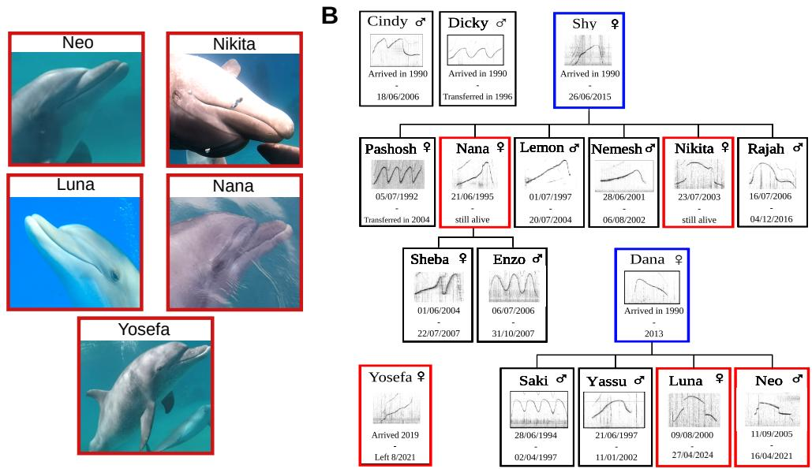  
Figure 5: A) Photographs of the five dolphins present during the recording period. B) Family tree of the pod, indicating sex and signature whistles (SW). Dolphins present during the recording period are highlighted in red. Dolphins not present but whose signature whistles appear in the dataset are shown in blue.

At the beginning of the recording period, the pod comprised five dolphins (Figure 5A): Luna (female, 20 years), Nana (female, 25 years), Nikita (female, 17 years), and Neo (male, 15 years), all belonging to Tursiops truncatus ponticus and forming a stable social group with well-documented family relationships. In addition, a solitary Tursiops aduncus female, Yosefa, visited the group intermittently, introducing an external social component. Her signature whistle was identified using the SIGID (Signature Identification) procedure [18].

For all resident individuals at Dolphin Reef, we have associated metadata, including identity, familial relationships, and their corresponding signature whistles (Figure 5B). This enables linking acoustic signals to known individuals and supports analyses of vocal identity and social structure [29].

## B Dataset Construction Pipeline

Overview. Figure 6 summarizes the dataset construction pipeline. Raw audio recordings are first generated into fixed-duration spectrogram windows and processed with a VGG16-based binary detector to identify whistle-containing windows. Positive detections are then segmented and grouped into whistle sequences to construct the large-scale pretraining corpus. For the expert-annotation branch, segmented whistles are processed to estimate fundamental-frequency (F0) contours. Following the procedure introduced in Mustun et al. [29], these contours are categorized with ARTwarp to obtain initial whistle-category assignments, which are manually reviewed and corrected from spectrogram visualizations to produce the expert-annotated dataset.

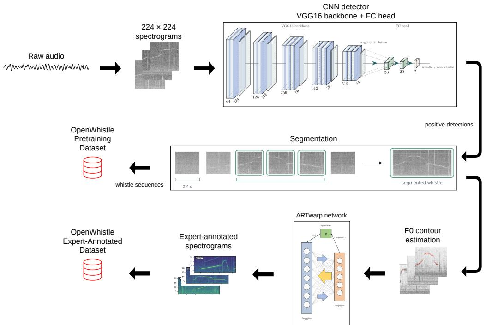  
Figure 6: Dataset construction pipeline. Raw audio is converted to 224×224 spectrograms and processed by a VGG16-based detector. Positive detections are segmented and then used in two branches: one branch groups detections into whistle sequences to construct the pretraining corpus, while the other applies F0 estimation, ARTwarp categorization, and expert annotation to construct the expert-annotated dataset.

Whistle detection. Whistle detection is performed with a binary spectrogram classifier based on a VGG16 backbone [45] initialized from ImageNet-pretrained weights [8]. Audio data is split into non-overlapping 0.4 s windows. Each window is converted to a log-power spectrogram using a 1024-sample Blackman window, an FFT size of 1024, and a hop size of 512 samples. Spectrograms are cropped to 2–22 kHz, min–max normalized, resize to 224×224 pixels, replicate across three channels, and normalize using ImageNet statistics.

Following [32], the original VGG16 classifier was replaced with a lightweight fully connected head with hidden dimensions 50 and 20. The full network was fine-tuned for whistle-versus-noise classification using cross-entropy loss and Adam with learning rate 10−5, mini-batches of size 4, early stopping, and a ReduceLROnPlateau scheduler. Training and evaluation used balanced whistle/noise windows with session-disjoint splits; the final dataset contained 53,828 training, 5,980 validation, and 16,708 test windows. For sequence-level summaries, positive windows were grouped using a maximum inter-detection gap of 6 s, retaining sequences between 2 and 20 s.

As external robustness checks, the trained detector achieve F1 scores of 0.904 on a WMMSD binary clip benchmark [40], 0.907 on a broader WMMSD delphinid-versus-clear-noise proxy benchmark, and 0.966 on a DCLDE proxy subset [38, 37], without retraining.

F0 extraction and ARTwarp categorization. Fundamental-frequency (F0) contours are estimated with a dolphin-specific CREPE model [19, 3]. Because dolphin whistles extend above the pitch range targeted by the original CREPE model, we use the frequency-compression procedure from [3]: audio is processed with compress=20, and decoded F0 estimates are multiplied back by the same factor.

F0 is estimated every 5 ms using the weighted\_argmax decoder. Contours with fewer than 5% of frames above a confidence threshold of 0.05 are flagged as low-confidence.

For downstream whistle-type classification, the extracted contours were categorized with ARTwarp [7], which combines dynamic time warping with an adaptive resonance theory network. The vigilance parameter was set to 90, following [7]; all other ARTwarp parameters were kept at their default values.

## C Pretraining Setup

We pretrain a Wav2Vec2.0 model [1] on the OpenWhistle corpus following a standard self-supervised setup. Training is conducted for 400k steps on 32 V100 GPUs, with a per-device batch size of 4 and 2 steps of gradient accumulation, yielding an effective batch size of 256 audio segments. Optimization uses AdamW [23] with $\beta _ { 1 } = 0 . \dot { 9 } , \beta _ { 2 } = 0 . 9 8 , \epsilon = 1 0 ^ { - 6 }$ , a learning rate of $5 \times 1 0 ^ { - 4 }$ with linear decay, 32k warmup steps, and weight decay of 0.01. Mixed precision is used to improve efficiency [26]. The quantization module employs two codebooks of size 320, trained with a Gumbel-softmax temperature schedule starting at 2.0 and exponentially decaying to 0.5 [14, 24].

To account for the higher sampling rate of 44.1 kHz compared to the 16 kHz setting of speech benchmarks, we adapt the feature encoder to preserve the relative temporal resolution of the original architecture, following the approach introduced in [44]. All other architectural components follow the Wav2Vec2.0 base configuration.

## D Additional Analysis of Whistle-Type Classification

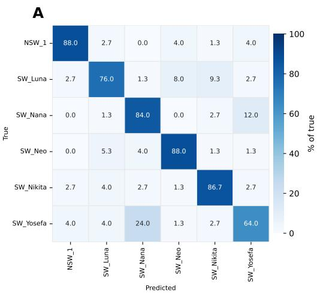

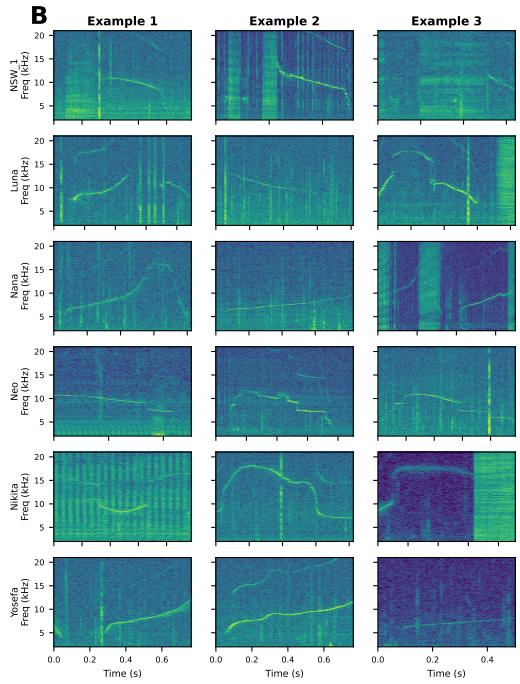  
Figure 7: A) Confusion matrix of the Wav2Vec2.0 model trained on OpenWhistle for whistle-type classification (in %). B) Three example spectrograms for each of the six whistle classes in the classification task.

The Wav2Vec2.0 model achieves strong overall performance on whistle-type classification, as shown by the dominant diagonal in the confusion matrix (Figure 7A), but still exhibits structured confusions between certain classes. In particular, the SW of Nana and Yosefa are more frequently confused. The spectrogram examples (Figure 7B) show that these signature whistles share similar frequency contours, which likely explains the misclassifications. The examples also highlight intra-class variability, with noticeable variation in frequency modulation within the same whistle type. These observations indicate that the task requires fine-grained discrimination of subtle acoustic differences, and that both inter-class similarity and intra-class variability contribute to the remaining errors.