# PAINTERBENCH: A FIGURAL DIVERGENT-THINKING BENCHMARK FOR TOOL-USING LANGUAGE MODELS

Shane K.A. Dalumura Hettige

Computer Science and Engineering   
University of Oulu   
Oulu, Finland   
shane.dalumurahettige@student.oulu.fi   
Jonas Oppenlaender   
Centre for Applied Computing   
University of Oulu   
Oulu, Finland   
jonas.oppenlaender@oulu.fi

## ABSTRACT

Figural divergent thinking is the ability to develop a given shape fragment into an original drawing. In humans, this ability is assessed with incomplete-drawing tasks. We introduce PainterBench, a benchmark that ports the incomplete-drawing task to the agentic setting. The agent draws on a canvas through tool calls and observes the result after every turn. The canvas includes a starting shape which cannot be erased, and the agent’s goal is to incorporate this shape into the most original drawing it can produce. The task is open-ended, and the agent itself decides when the drawing is finished. The benchmark tests incremental visual planning over a short horizon and the transfer of creative ability from pretraining to multi-turn tool use. We evaluate 14 multimodal language models from small to frontier scale. Across the primary study and six sensitivity analyses, we collect 2,700 drawings and crowdsource creativity and recognizability ratings for every drawing and for 300 human reference drawings. We also present ViDrA-adapted, an automated scorer that predicts human creativity ratings of agent drawings (r = 0.85 on random held-out test split). Figural divergent thinking varies widely across the 14 models, and GPT-6 Astra produces the most creative drawings. Relative to the human drawings, the agent drawings score higher in creativity but lower in recognizability. We release the final drawings, per-round canvas snapshots, tool call traces, stimulus bank, benchmark harness, crowdsourced ratings (N = 72,000), and ViDrA checkpoint.

## 1 INTRODUCTION

An early demonstration of creative behavior in large language models was the prompt “draw a unicorn in TikZ” (Bubeck et al., 2023). Bubeck et al. presented the resulting figure as evidence of the model’s understanding of visual and geometric concepts, despite text-only training. The demonstration, however, was one zero-shot prompt, and it tested the model’s ability to output text, the modality it was trained on. We argue evaluating a model’s creative ability requires testing beyond the reproduction of patterns acquired during pretraining. Further, today’s models are deployed as tool-calling agents that observe the result of each action and revise their work over many turns. Tool calls can present the model with tasks it has not encountered during pretraining. Whether pretrained creative ability carries over to the tool-calling agentic setting has not been tested.

Prior studies evaluate creativity in language models in the textual domain with established divergent thinking tests, such as Guilford’s Alternative Uses Task (Guilford, 1967; Patterson et al., 2024; Stevenson et al., 2022; Haase et al., 2026b;a; Schapiro et al., 2026; Haase & Pokutta, 2026). However, there are known limitations to this divergent thinking test, such as scores depending on verbal fluency and limited predictive validity (Zeng et al., 2011; Barbot, 2018), and divergent thinking is more than just text production. The closest prior work, SketchAgent (Vinker et al., 2025), prompts a multimodal language model to draw through a bespoke sketching language. The system is created for iterative conversational refinement of sketches, emits the full stroke sequence in string-based actions, and is evaluated on recognizability rather than creativity.

Human creativity research provides established instruments for assessing whether a drawing is creative. Figural divergent thinking has been assessed for decades with incomplete-drawing tasks, from the Torrance test battery (Torrance, 1966) to the Multi-Trial Creative Ideation (MTCI) task (Barbot, 2018). In the latter, a person turns a given shape fragment into the most original drawing they can think of. This task also comes with a validated automated scorer, AuDrA, which predicts human creativity ratings of drawings (Patterson et al., 2024).

We introduce PainterBench, a benchmark harness that evaluates tool-using agents on the incompletedrawing task. The agent draws via discrete tool calls over a library of drawing operations, observes a rendering of the canvas after every turn, and itself declares the drawing finished. Each trial pre-seeds the canvas with one of 30 stimuli (starting shapes; see Figure 1) that cannot be erased. The novel drawing tools, not SVG or TikZ markup, are the agent’s medium, so performance cannot follow from a representation encountered during pretraining. The benchmark, therefore, tests whether the model’s creative ability acquired in pretraining survives the transfer to acting through tools over many turns. Because the agent declares its own drawing finished, each drawing is a product the model judged complete. The tool call trace makes the model’s creative process observable.

Across 14 multimodal language models, we find that creative ability survives the transfer in part. Under the rating protocol of the human task, the agent drawings score above a reference sample of human drawings on creativity but below it on recognizability. The tool-call traces show the same imbalance in the creative process. The agents show little revision, and each model returns to a small set of ideas across its independent trials. The agent drawings lie far from the distribution of human drawings, and automated creativity scorers trained on human drawings correlate with ink-on-canvas on agent drawings.

The contributions of this paper are as follows:

• We present PainterBench, a benchmark that ports the task of figural divergent-thinking assessment (Barbot, 2018) to the agentic setting. We release a bank of 30 stimuli in MTCI’s two task types, and we define tool-call process markers that make the creative process measurable. We release a dataset that includes 2,100 agent drawings with crowdsourced creativity and recognizability ratings, full tool call traces, and 29,708 per-round snapshots.

• We release ViDrA-adapted, an automated creativity scorer, fit to the public AuDrA corpus of human drawings (Patterson et al., 2024) and adapted to agent drawings. The adapted scorer reaches r = 0.83 under leave-one-model-out and r = 0.84 under leave-one-stimulus out cross-validation on agent drawings.

• Using PainterBench and ViDrA, we evaluate figural divergent thinking in 14 multimodal language models from small to frontier scale. This evaluation measures whether pretrained creative ability transfers to the agentic setting, in which the agent plans the drawing incrementally over a short visual horizon. In six sensitivity analyses, we test how the results depend on the harness design choices. Finally, we discuss qualitative findings and frequently occurring failure modes in agentic drawings.

## 2 RELATED WORK

Machine drawing systems. Autonomous drawing systems, from hand-crafted procedural rules (Co hen, 1988) to learned stroke-based painters and sketch models (Ganin et al., 2018; Huang et al., 2019; Ha & Eck, 2018), were trained specifically to draw and do not follow novel instructions zero-shot. A parallel line of research asks whether pretrained large language models (LLMs) can produce visual output directly, either as graphics code or as drawing actions (Belouadi et al., 2024a;b; Zou et al., 2024; Cai et al., 2024; Zini et al., 2026; Sharma et al., 2024). Recent LLMs reach human-level visualization literacy but violate instructions and graphical integrity (Seto et al., 2026), and perception remains a source of systematic error in spatial and compositional tasks (Lu et al., 2026; Park & Eiband, 2024). Within this line, SketchAgent (Vinker et al., 2025) prompts a multimodal model to emit stroke coordinates rendered as Bézier curves. LTD-Bench (Lin et al., 2026), TurtleBench (Rismanchian et al., 2025), and DrawingBench (Kim & Ryu, 2026) score drawings produced as dot matrices, Turtle programs, and GUI mouse actions, respectively. 3DrawAgent (Xiao et al., 2026) extends the setting to 3D curves. These studies score fidelity, recognizability, or spatial accuracy against a reference, not creativity, and none exposes the model’s native function-calling interface with per-turn visual feedback.

Figural creativity assessment. Divergent thinking has been the standard behavioral measure of creative ideation in research since Guilford (1950). In figural divergent thinking, the standard tests are incomplete-drawing tasks, such as the Torrance figural tests (Torrance, 1966; Kim, 2006), the Test for Creative Thinking-Drawing Production (TCT-DP) (Jellen & Urban, 1986; Urban, 2005), and the “Multi-Trial Creative Ideation” assessment framework (MTCI) (Barbot, 2018). These tests measure creativity through drawing production rather than verbal responses. MTCI evaluates figural divergent thinking by presenting one stimulus per trial, collecting a single self-paced drawing from participants, and segmenting the drawing process into three time-based phases (exploration, production, and verification). Responses are scored by human judges under consensual-assessment-style, in which untrained judges rate creativity by their own subjective standard protocols (Amabile, 1982; Silvia et al., 2008). AuDrA (Patterson et al., 2024) applies the MTCI protocol at scale, collecting creativity ratings from human raters on a five-point scale for a public corpus of over 13,000 MTCI drawings. PainterBench adopts the MTCI trial structure, the participant instruction, and the rating protocol of Patterson et al. (2024).

Automated creativity scoring. Automated scoring emerged first in the verbal domain, where semantic-distance systems such as SemDis predict human originality ratings (Beaty & Johnson, 2021). In the figural domain, Cropley & Marrone (2025) classified TCT-DP drawings with a convolutional network. Closest to our setting, Nath et al. (2025) compare drawings by children, adults, and AI on MTCI stimuli, with the AI drawings produced by one-shot generation rather than by sequential tool use. Acar et al. (2025) score Torrance-figural and MTCI drawings with vision transformers, and AuDrA (Patterson et al., 2024) predicts human creativity ratings for the drawings and maps a drawing to a continuous creativity score, normalized to [0, 1]. We train our own scorer, ViDrA, on the public AuDrA corpus and validate both ViDrA and AuDrA on agent-generated drawings, a domain neither has been tested on.

Creativity benchmarks for language models. Creativity evaluations for language models often adapt established tests such as the Divergent Association Task (DAT) (Olson et al., 2021) or the Alternative Uses Task (AUT) (Guilford, 1967). Chakrabarty et al. (2024) apply a rating protocol derived from the Torrance tests to short stories, and language-model stories pass far fewer of its tests than stories by professional writers. NeoCoder (Lu et al., 2025b) elicits creative programs by imposing successive constraints that deny the model its previous solution, and scores the responses against a reference set of human solutions. These tests are text-based and do not assess creative composition in a visual medium. CreativityBench (Qian et al., 2026) asks a model to repurpose an object by reasoning about its affordances rather than its canonical use. Both benchmarks, like benchmarks of function calling itself (Qin et al., 2024; Patil et al., 2024; 2025), pose tasks that admit a correct answer, which is what allows automatic scoring. Figural divergent thinking, however, is open-ended and admits no correct answer. Reference-free metrics for open-ended text score originality by attributing machine text to web text (Lu et al., 2025a), but such n-gram novelty diverges from expert judgments of creativity (Saakyan et al., 2026). Responses must therefore be rated, and PainterBench adopts the rating protocol of an established human assessment.

## 3 PAINTERBENCH: A FIGURAL DIVERGENT-THINKING BENCHMARK

Task. PainterBench ports the MTCI drawing task (Barbot, 2018; Patterson et al., 2024) to tool-using agents. The agent draws on a 400×400 pixel canvas, annotated with pixel coordinates, through a sequence of tool calls over drawing, erase, and undo operations (see Table 1). The canvas size, stroke width, and the black-on-white medium reproduce the drawing geometry of the AuDrA corpus (Patterson et al., 2024). A trial is one run of the agent loop on one stimulus and produces one drawing. A replicate is an independent trial on the same stimulus with identical inputs. Each of the 30 trials presents the agent with a canvas containing one starting stimulus (see Figure 1). The agent is instructed to create the most original drawing that incorporates the given shape. A round is one model turn, after which the model inspects the canvas. As in MTCI, the task is open-ended. The agent ends the trial by calling the drawing\_finished tool.

Each round, the agent receives the following context: 1) the drawing task in the system prompt (see Appendix B), 2) an instruction in the user message, 3) the current canvas, 4) a history of ten most recent tool calls and their results, and 5) a visual history of the three most recent canvases, stitched together into one image. By design, we do not ask the model to create a written plan. This frames the task as incremental visual planning over a short horizon.

Table 1: The 14 tools available to the drawing agent. Coordinates are in pixel units on the canvas.
<table><tr><td>Tool</td><td>Description</td><td>Tool</td><td>Description</td></tr><tr><td>draw_dots</td><td>Place dots at specific coordinates</td><td>draw_rounded_rectangles</td><td>Rectangles with a corner radius</td></tr><tr><td>draw_lines</td><td>Segments between two points</td><td>draw_circles</td><td>From a center and a radius</td></tr><tr><td>draw_polylines</td><td>Connected stroke through points</td><td>draw_ellipses</td><td>From a bounding box</td></tr><tr><td>draw_polygons</td><td>Closed shape through points</td><td>draw_arcs</td><td>From a box and angle range</td></tr><tr><td>draw_regular_polygons</td><td>From center, radius, sides, rotation</td><td>draw_pieslices</td><td>Arc closed to the center</td></tr><tr><td>draw_rectangles</td><td>From two opposite corners</td><td>draw_chords</td><td>Arc closed by a straight line</td></tr><tr><td>undo_last_action</td><td>Revert the last call</td><td>drawing_finished</td><td>Record title, end trial</td></tr></table>

Drawing harness and tools. The agent has access to 14 tools (Table 1). Each tool accepts one operation or a batch of operations of its type (full call signatures in Appendix C). A failed call is reported to the agent in the next round. All strokes are black at a fixed width of 5 pixels. Features of general drawing programs, such as text rendering, layers, geometric transformations, brushes, variable stroke width, and flood fill, are excluded to match the drawing procedures of MTCI (Barbot, 2018) and the AuDrA corpus (Patterson et al., 2024). Every drawing tool takes an optional erase flag which lays white along the path the shape would have drawn. The stimulus is re-stamped after every canvas operation, so it cannot be erased. The meta-tool ending the trial collects a title for the drawing, following the MTCI protocol (Barbot, 2018). We analyze the titles in Appendix H. The trial continues until the model calls drawing\_finished, or until no further tool calls are made.

Stimulus bank. The stimulus bank consists of 30 starting shapes (see Figure 1) in MTCI’s two task types. The 20 incomplete shapes (is01–is20) are stroke fragments that do not form a closed object. The ten object-transformation items (ot01–ot10) are contour outlines of recognizable objects (e.g., glasses, scissors). The stimuli were procedurally generated following MTCI’s design principles (Barbot, 2018), and no item reproduces an MTCI item exactly.

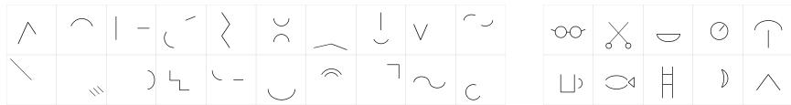  
Figure 1: PainterBench stimuli: 20 incomplete shapes (left) and 10 object transformations (right).

## 4 EXPERIMENTS

We evaluate 14 multimodal language models (see Appendix A) spanning seven providers and a range of capability tiers. Each model completes all 30 stimuli five times, for a total of 2,100 trials, with five runs per stimulus, differing only through sampling

Crowdsourced creativity ratings. We collect ratings for the main study’s 2,100 agent drawings, the sensitivity analysis (600 drawings), and 300 human reference drawings sampled from parts of the AuDrA corpus outside our own scorer’s training data (200 from the primary set’s held-out test split and 100 from AuDrA’s far-generalization set). Ratings are collected on CloudResearch (Litman et al., 2017), a crowdsourcing platform. The rater pool is gender-balanced, and workers are required to have completed 100 prior tasks with an acceptance rate of 95%. Following Patterson et al. (2024), we assess inter-rater reliability (agreement among annotators), measured with the intraclass correlation ICC(C,k) (Koo & Li, 2016), and report Krippendorff’s ordinal α (Krippendorff, 2011), an agreement coefficient for ordered ratings, where α = 1 is perfect agreement and α = 0 is agreement expected by chance. A pilot determines k = 12 raters per drawing (see Appendix G.2). Each rater rates one batch of 30 drawings on two questions, which amounts to 72,000 crowdsourced ratings in total.

We collect ratings under the AuDrA rater protocol (Patterson et al., 2024), which follows consensualassessment-style subjective scoring (Amabile, 1982; Silvia et al., 2008). First, each drawing is rated on creativity on a five-point scale (“How creative is this drawing?”, from 1 – Not At All Creative, to 5 – Very Creative (Patterson et al., 2024; Forthmann et al., 2019). Raters are instructed to rate the creativity of the idea expressed in the drawing, not the technical proficiency of the drawing (see Appendix G.1). Second, raters assess recognizability (“Does this drawing show a recognizable object or scene?”, from 1 – Not At All Recognizable to $5 - V e r y$ Recognizable). Raters are not told which drawings are machine-generated, because people may be biased against AI-generated content (Chamberlain et al., 2018; Ragot et al., 2020). Unlike in AuDrA, raters are not shown the drawing titles. We exclude raters who gave every drawing the same rating $( \Nu = 3 )$ . Following Patterson et al. (2024), each rater’s ratings are z-scored across all their responses to adjust for differences in how raters use the scale (Long & Pang, 2015), averaged per drawing, and min–max normalized to [0, 1]. For the creativity question, we call this rated creativity. The term creativity score refers to what the automated scorer predicts.

Ordinal α among individual raters is 0.25 for creativity, against $\alpha = 0 . 4 0$ in the AuDrA rater pool (Patterson et al., 2024), and 0.40 for recognizability. The 12 ratings per drawing (the composite), on which all analyses are based, reaches $\mathrm { I C C } ( \mathbf { C } , \mathbf { k } ) = 0 . 8 0$ (see Appendix G.2). The residual rating noise attenuates correlations and widens confidence intervals, and does not bias the per-model means.

Process measures. MTCI’s key process measure is response time (Barbot, 2018). For agents, wall-clock time confounds ideation with inference latency and provider load. Instead, we define eleven process markers (Table 8 in Appendix F), and report elapsed time for reference only. For model comparison, we combine four markers (mean tool calls, mean drawing operations, mean rounds to completion, and mean tool diversity) into one number per trial. We call this the effort index, a measure of the amount of drawing activity in a trial. With standardized components and no criterion, we weight the four markers uniformly (Dawes, 1979). The effort index of trial i is ef $\begin{array} { r } { \mathrm { { { \dot { \ o r t } } } } _ { i } = | M | ^ { - 1 } \sum _ { m \in M } ( m _ { i } - \bar { m } ) / s _ { m } } \end{array}$ , where M is the set of four included markers, $m _ { i }$ is the value of marker m on trial i, and m¯ and $s _ { m }$ are its mean and standard deviation over all trials of the study. Table 2 reports each model’s mean and standard deviation of the effort index, which by construction has mean zero over all 2,100 trials. We report Spearman $\rho$ between each process marker and rated creativity, pooled over all drawings and as the mean of the per-model correlations, in Table 9 of Appendix F.

## 4.1 SCORER VALIDATION

AuDrA. We first consider AuDrA by Patterson et al. (2024) for scoring the creativity of our agentgenerated drawings. AuDrA reaches Pearson $r = . 8 0$ against human ratings on held-out human drawings. However, agent drawings are potentially a far generalization of this corpus, and AuDrA already loses accuracy under a task shift within human drawings. On its far-generalization set (drawings from the object-transformation task), AuDrA falls to $r = . 4 9$ (Patterson et al., 2024). Following Patterson et al. (2024), we compute each drawing’s inked-pixel count as an ink baseline. On agent drawings, AuDrA’s score correlates with this inked-pixel baseline at Spearman $\rho = 0 . 8 6$ against $\rho = 0 . 6 9$ on human drawings. At this level of correlation, AuDrA scores agent drawings largely by elaboration, and we do not adopt it as our creativity measure.

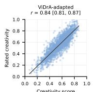

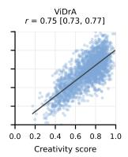

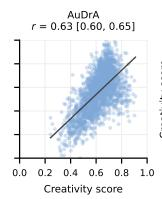

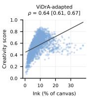

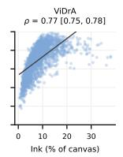

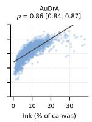  
Figure 2: Scorer validation over the agent drawings. Left three panels: each scorer’s creativity score against rated creativity (Pearson’s r). The ViDrA-adapted correlation is computed over its held-out test split. Right three panels: each scorer’s creativity score against the inked-pixel baseline (Spearman’s $\rho )$ . Lines are least-squares fits.

ViDrA. We train an automated scorer, ViDrA, a kernel ridge regression (RBF kernel, $\alpha = 0 . 1$ $\gamma = 1 0 ^ { - 5 } )$ on frozen DINOv2 ViT-L/14 features (Oquab et al., 2024), fit on the 11,075 rated human drawings from the public AuDrA corpus (Patterson et al., 2024). ViDrA predicts creativity scores on the same normalized scale as AuDrA. Each drawing is resized to 448 × 448 and normalized with the ImageNet channel statistics. We randomly partition the primary subset of the AuDrA corpus into $7 0 / \mathrm { \bar { 1 0 } / 2 0 }$ train, validation, and test portions, select settings on the validation split, and report final results as mean and standard deviation over the test split. ViDrA reaches $r = 0 . 8 6 \pm 0 . 0 1$ on this test split of human drawings, against AuDrA’s published $r = . 8 0$

ViDrA-adapted. ViDrA is fit on AuDrA’s corpus of human drawings, and, like AuDrA, still correlates with inked-pixel baseline on agent drawings $( \rho = 0 . 7 7 )$ . To address this correlation, we adapt ViDrA by refitting its regression head on rated creativity, under leave-one-model-out and leave-one-stimulusout cross-validation. The adapted head, ViDrA-adapted, reaches $r = 0 . 8 3$ under the first scheme and $r = 0 . 8 4$ under the second, and it correlates with the inked-pixel baseline on agent drawings at $\rho = 0 . 7 0$ . Figure 2 shows each scorer’s score against rated creativity and the inked-pixel baseline, and Table 6 in Appendix D reports the correlations with 95% confidence intervals.

## 4.2 MODEL PERFORMANCE

Agents score above the human mean on creativity but below it on recognizability. Table 2 summarizes the per-model results. Example drawings are displayed in Figure 3 and Figure 4. Mean rated creativity is 0.56 over the agent drawings against 0.41 over the 300 human reference drawings (difference +0.15, 95% CI [0.13, 0.17], d = 0.88). For eleven of the 14 models, mean rated creativity exceeds the human mean. The mean agent drawing falls at the 83rd percentile of the human distribution. On recognizability, however, the agent drawings score below the human reference drawings. Mean rated recognizability of agent drawings is 0.45 compared to 0.53 for the human reference drawings (difference −0.08, 95% CI [−0.11, −0.06], d = −0.41). Mean rated recognizability exceeds the human mean in only four of the 14 models, and the mean agent drawing falls at the 36th percentile of the human drawing distribution.

Agentic drawings fall far from the human distribution. Distance from human corpus is a drawing’s mean cosine distance to its ten nearest corpus neighbors in the DINOv2 feature space, expressed as standard deviations above the median of the human drawings’ own leave-one-out distances to the corpus. Every model’s mean distance to the human corpus is at least 1.9 SD, and Gemini 3.8 Flash and Gemini 3.7 Flash sit at 4.3 SD (Table 2). AuDrA correlates with the inked-pixel baseline at Spearman $\rho = 0 . 8 6$ on the agent drawings, against $\rho = 0 . 6 9$ on the human drawing corpus it was trained on. This gap is expected when the agent drawings are a far generalization of AuDrA’s human drawings. Eleven of the 14 models place more ink on the canvas than the mean human drawing, from +19.8% to +268.3% (Claude Opus 5), and three models ink less. Claude Opus 5’s ink coverage yields drawings qualitatively different from those of other models in the Claude family (Figure 3).

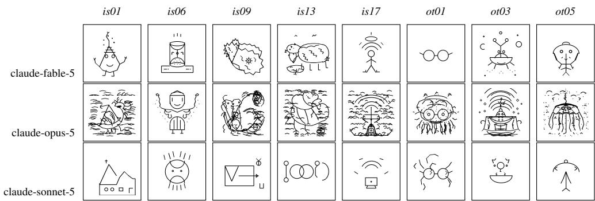  
Figure 3: Example drawings across five incomplete shapes and three object-transformation items for three capability tiers of Anthropic’s Claude.

Rated creativity separates the models. GPT-6 Astra attained the highest rated creativity (mean 0.81, 95% CI [0.80, 0.83]) and Gemini 3.5 Flash Lite the lowest (mean 0.35, 95% CI [0.33, 0.37]). In a linear mixed-effects regression that predicts each drawing’s rated creativity from the model that drew it and the stimulus type (incomplete shape or object transformation), with a random intercept for each of the 30 stimuli, the model effect is significant (Wald $\chi ^ { 2 } ( 1 3 ) = 3 0 9 6 . 9 , p < 0 . 0 0 1 \rangle$ ) and the variance attributable to stimuli is near zero.

The adapted ViDrA reproduces the rated model ranking on held-out models. Under the leave-one-model-out scheme (Section 4.1), each model is scored by a head fit on the other 13 models ratings. These held-out scores rank the models nearly identically to the creativity ratings $( \rho = 0 . 9 9 )$

Table 2: Primary evaluation results.
<table><tr><td></td><td>hui bainne (30)</td><td>Clue FS</td><td>Cluud psS</td><td>Claunne Sn5S</td><td>GP -stuta</td><td>GP -Lna</td><td>GP-01</td><td>Ger   ash</td><td>Germ  ash</td><td>Ge      ite</td><td>Llav  eck</td><td>Musep   3</td><td>Grok45</td><td>Mis   75B Instuct</td><td>w-9B</td></tr><tr><td>Metric Rated creativity ↑</td><td></td><td></td><td></td><td></td><td></td><td></td><td></td><td></td><td></td><td></td><td></td><td></td><td></td><td></td><td></td></tr><tr><td>M on 1–5 scale ↑</td><td>0.41 2.39</td><td>0.52 2.79</td><td>0.56 2.95</td><td>0.42</td><td>0.81</td><td>0.61</td><td>0.68</td><td>0.71 3.55</td><td>0.67</td><td>0.35 2.12</td><td>0.40</td><td>0.59</td><td>0.60 3.12</td><td>0.55</td><td>0.37 2.21</td></tr><tr><td>SD</td><td>0.57</td><td>0.56</td><td>0.47</td><td>2.43 0.50</td><td>3.95 0.34</td><td>3.12 0.47</td><td>3.45 0.41</td><td>0.36</td><td>3.40 0.37</td><td>0.44</td><td>2.33 0.48</td><td>3.11 0.41</td><td>0.42</td><td>2.94 0.41</td><td>0.57</td></tr><tr><td>Percentile of human sample ↑</td><td>一</td><td>77.3</td><td>83.3</td><td>57.3</td><td>99.7</td><td>89.7</td><td>96.7</td><td>97.3</td><td>96.0</td><td>35.7</td><td>52.0</td><td>89.0</td><td>89.3</td><td>83.0</td><td>39.3</td></tr><tr><td>Rated recognizability ↑</td><td>0.53</td><td>0.45</td><td>0.37</td><td>0.39</td><td>0.73</td><td>0.33</td><td>0.44</td><td>0.70</td><td>0.65</td><td>0.33</td><td>0.32</td><td>0.55</td><td>0.50</td><td>0.30</td><td>0.25</td></tr><tr><td>M on 1-5 scale ↑</td><td>3.21</td><td>2.85</td><td>2.41</td><td>2.50</td><td>4.14</td><td>2.21</td><td>2.75</td><td>3.99</td><td>3.75</td><td>2.24</td><td>2.15</td><td>3.32</td><td>3.04</td><td>2.06</td><td>1.88</td></tr><tr><td>SD</td><td>0.95</td><td>0.76</td><td>0.70</td><td>0.86</td><td>0.45</td><td>0.56</td><td>0.64</td><td>0.62</td><td>0.73</td><td>0.73</td><td>0.60</td><td>0.66</td><td>0.75</td><td>0.41</td><td>0.63</td></tr><tr><td>Percentile of human sample ↑</td><td>一</td><td>37.3</td><td>24.3</td><td>26.7</td><td>80.3</td><td>20.3</td><td>34.3</td><td>75.3</td><td>64.7</td><td>20.3</td><td>18.7</td><td>48.0</td><td>41.7</td><td>15.3</td><td>11.3</td></tr><tr><td>ViDrA-adapted score ↑</td><td>0.39</td><td>0.53</td><td>0.57</td><td>0.43</td><td>0.78</td><td>0.62</td><td>0.68</td><td>0.70</td><td>0.67</td><td>0.36</td><td>0.39</td><td>0.58</td><td>0.60</td><td>0.56</td><td>0.39</td></tr><tr><td>ViDrA score ↑</td><td>0.52</td><td>0.67</td><td>0.83</td><td>0.56</td><td>0.86</td><td>0.84</td><td>0.84</td><td>0.82</td><td>0.80</td><td>0.48</td><td>0.49</td><td>0.71</td><td>0.75</td><td>0.69</td><td>0.52</td></tr><tr><td>AuDrA score ↑</td><td>0.49</td><td>0.59</td><td>0.77</td><td>0.52</td><td>0.69</td><td>0.72</td><td>0.68</td><td>0.68</td><td>0.67</td><td>0.48</td><td>0.51</td><td>0.59</td><td>0.63</td><td>0.64</td><td>0.52</td></tr><tr><td>Process effort index, z</td><td></td><td></td><td>1.25</td><td>-0.20</td><td>-0.06</td><td>-0.22</td><td>0.02</td><td>0.10</td><td></td><td>-0.49</td><td>-0.43</td><td>0.10</td><td>0.38</td><td></td><td>-0.20</td></tr><tr><td>SD</td><td></td><td>0.01 0.32</td><td>1.28</td><td>0.27</td><td>0.18</td><td>0.22</td><td>0.18</td><td>0.26</td><td>-0.07 0.22</td><td>0.20</td><td>0.22</td><td>0.20</td><td>1.00</td><td>-0.20 0.18</td><td>0.62</td></tr><tr><td>Mean tool calls</td><td></td><td>14.9</td><td>72.7</td><td>9.4</td><td>5.4</td><td>6.5</td><td>6.1</td><td>9.8</td><td>7.0</td><td>5.6</td><td>5.8</td><td>9.7</td><td>17.0</td><td>9.5</td><td>13.2</td></tr><tr><td>Mean drawing operations</td><td></td><td>32.8</td><td>160.9</td><td>15.5</td><td>47.0</td><td>70.5</td><td>50.7</td><td>71.1</td><td>52.3</td><td>10.9</td><td>8.7</td><td>38.8</td><td>73.9</td><td>20.9</td><td>34.1</td></tr><tr><td>Mean drawing operations per round</td><td></td><td>2.0</td><td>2.2</td><td>1.6</td><td>7.5</td><td>9.5</td><td>7.2</td><td>6.3</td><td>6.2</td><td>1.6</td><td>1.5</td><td>3.5</td><td>3.3</td><td>2.1</td><td>19.6</td></tr><tr><td>Mean rounds to completion</td><td></td><td>17.3</td><td>72.9</td><td>11.5</td><td>6.4</td><td>7.5</td><td>7.1</td><td>12.2</td><td>8.9</td><td>7.4</td><td>5.9</td><td>12.0</td><td>18.7</td><td>10.5</td><td>4.5</td></tr><tr><td>Mean tool diversity</td><td></td><td>1.9</td><td>0.7</td><td>1.8</td><td>2.2</td><td>1.5</td><td>2.3</td><td>2.1</td><td>2.0</td><td>1.4</td><td>1.6</td><td>2.4</td><td>2.4</td><td>1.8</td><td>1.8</td></tr><tr><td>Ink relative to human (%)</td><td>一</td><td>+23.1</td><td>+268.3</td><td>-18.7</td><td>+97.7</td><td>+130.0</td><td>+85.1</td><td>+137.0</td><td>+122.6</td><td>-44.9</td><td>-2.1</td><td>+19.8</td><td>+57.7</td><td>+82.8</td><td>+23.2</td></tr><tr><td>Distance from human corpus (SD)</td><td>1</td><td>2.1</td><td>3.9</td><td>2.3</td><td>3.5</td><td>3.3</td><td>3.0</td><td>4.3</td><td>4.3</td><td>1.9</td><td>3.0</td><td>2.9</td><td>2.7</td><td>3.4</td><td>2.8</td></tr><tr><td>Mean completion tokens</td><td>1</td><td>1734.9</td><td>7219.4</td><td>930.9</td><td>2333.6</td><td>2761.5</td><td>2253.7</td><td>22269.6</td><td>5629.7</td><td>407.1</td><td>519.6</td><td>22546.4</td><td>1955.3</td><td>1192</td><td>3365.3</td></tr><tr><td>Mean time to completion (s)</td><td></td><td>83.6</td><td>271.3</td><td>24.8</td><td>47.4</td><td>46.8</td><td>48.7</td><td>125.5</td><td>54.3</td><td>13.7</td><td>24.6</td><td>363.2</td><td>208.8</td><td>150.7</td><td>30.1</td></tr><tr><td>Mean undo calls (%)</td><td></td><td>6.32</td><td>0.00</td><td>7.20</td><td>0.06</td><td>0.00</td><td>0.00</td><td>8.94</td><td>7.18</td><td>6.99</td><td>0.00</td><td>9.67</td><td>3.86</td><td>0.00</td><td>0.12</td></tr><tr><td>Mean erase calls (%)</td><td></td><td>2.26</td><td>0.11</td><td>1.19</td><td>0.39</td><td>0.00</td><td>0.00</td><td>1.38</td><td>1.01</td><td>0.07</td><td>0.13</td><td>7.57</td><td>6.45</td><td>0.34</td><td>0.93</td></tr><tr><td>Finish rate (%) ↑</td><td></td><td>100.0</td><td>100.0</td><td>100.0</td><td>100.0</td><td>100.0</td><td>100.0</td><td>100.0</td><td>100.0</td><td>100.0</td><td>100.0</td><td>100.0</td><td>100.0</td><td>100.0</td><td>99.3</td></tr><tr><td>Failed tool calls (%) ↓</td><td></td><td>0.04</td><td>0.00</td><td>0.06</td><td>0.00</td><td>0.18</td><td>0.00</td><td>0.00</td><td>0.00</td><td>0.00</td><td>0.00 0.00</td><td>0.06 0.39</td><td>0.00 0.57</td><td>0.00 0.83</td><td>0.39 23.91</td></tr><tr><td>Malformed operations (%) ↓</td><td></td><td>0.11</td><td>0.01</td><td>0.00</td><td>0.00</td><td>0.35</td><td>0.09</td><td>0.00</td><td>0.00</td><td>0.00</td></table>

Creativity and recognizability are correlated but distinct. The two ratings correlate at r = 0.61 (95% CI [0.57, 0.64]) over the agent drawings and at a mean of r¯ = 0.38 (95% CI [0.34, 0.42]) within models. Across the agent drawings, rated creativity correlates with the inked-pixel count at r = 0.40 and recognizability at r = 0.10. The 300 human drawings show the same pattern, r = 0.37 for creativity and r = 0.13 for recognizability.

Models differ widely in drawing effort. The median trial took 8 rounds and 9 tool calls. Half of all trials finish within 6 to 13 rounds, but the distribution of rounds has a long tail (mean 14.5, SD 21.3). The longest trial, from Claude Opus 5, ran 261 rounds with a total of 992 drawing operations. The median drawing is assembled from 37 drawing operations at about 3 operations per round, while the extreme is a 2,178-operation drawing by Grok 4.5. All trials were ended by the agent, with the exception of one Qwen3.5-9B trial in which the model returned no tool call.

Models concentrate their tool use on lines and polylines. Lines and polylines account for 67% of all drawing operations. Lines are the most used tool type in eight of the 14 models, and polylines in five models. Gemini 3.5 Flash Lite draws 80% of its operations as lines, Claude Opus 5 draws 68% as polylines, and Grok 4.5 is the only model whose most used tool type is dots. Chords, pie slices, regular polygons, and rounded rectangles together account for under 1% of drawing operations, and each of these four tools is used by 4 to 10 of the 14 models. Mean tool diversity (the Shannon entropy of a trial’s tool-type distribution) ranges from 0.7 to 2.4 across models (Table 2).

Revision is rare. Undo appears in 480 trials (22.9%) and erase in 185 trials (8.8%). Undo splits the models into two groups (Table 2). Seven models each invoked undo in at least 48 of their 150 trials. Muse Spark 1.3 used the revision tools most, with undo in 105 trials (70%) and erase in 75 trials (50%), while seven models invoked undo in at most 3 trials and five never used undo. The median revising trial has 2 revision calls, and trials that spend at least 30% of their calls on revision are rare (77 trials; 3.7%). Failed tool calls occur in 11 trials (0.5%) and malformed operations in 87 trials (4.1%). Qwen3.5-9B accounts for 6 of the trials with failed calls and 58 with malformed operations.

Drawing effort separates models, not trials. Pooled over all 2,100 trials, drawing operations per round correlates with rated creativity at ρ = 0.59 (95% CI [0.56, 0.62]). Within models, the mean correlation falls to ρ¯ = 0.06 (95% CI [0.02, 0.11]). The number of tool calls is close to uncorrelated with rated creativity (ρ = 0.06 pooled, ρ¯ = −0.01 within models). Correlations of the remaining process markers with rated creativity are reported in Table 9 of Appendix F.

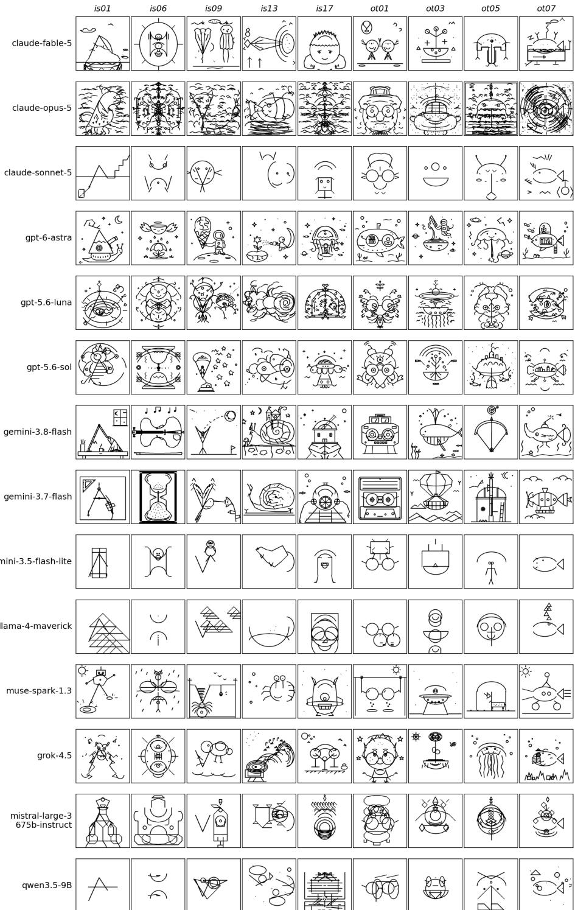  
Figure 4: Example drawings from all evaluated models.

## 4.3 FAILURE ANALYSIS

We reviewed the final drawings on per-model contact sheets (grids of all final drawings), and analyzed patterns and failures qualitatively, without predefined categories. For trials that stood out, we compared the final canvas with the per-call snapshots and reviewed the tool-call and reasoning traces. The failures aggregate into five modes.

Absent or unproductive revision. After every round, the agent has an opportunity to inspect the canvas and issue erase and undo calls. Yet, most trials neither erase nor undo (Section 4.2). When a model does revise, the revision sometimes fails to converge. Some trials (e.g., in Claude Fable 5 and Sonnet 5) alternate drawing and undoing. One constraint of the harness is that undo reverts the entire call. Models batch multiple operations into one call, and one misplaced stroke, thus, may cost the whole batch if it is undone. Gemini 3.8 Flash works within this constraint by undoing the full batch and redrawing an adjusted copy. This loop is costly, but does converge. Grok 4.5 revises by erasing, but it can fail to stop. In one of Grok’s trials, most rounds are erase calls that remove some stray marks and leave others, and the final canvas still carries stray marks.

Null responses. Eleven trials end with fewer than 300 added inked pixels, nine with none. Five of these trials come from Claude Fable 5 and four from Qwen3.5-9B. In one trial (Claude Fable 5, see stimulus ot01 in Figure 3), the model starts drawing, but then undoes all rounds and declares the drawing finished with no added ink over the starting stimulus. Null responses arise in two ways. In the first, the model gives up after one or several draw-then-retract loops, as in the trial above. In the second, every operation the model submits is malformed and skipped, as in one Qwen3.5-9B trial titled “Fish Shimmering with Geometric Movement” whose canvas never changes.

Overinking and effort without creativity gain. Claude Opus 5 draws more than any other model, with a median of 66.5 rounds and a median of 27,800 added inked pixels (17.4% of the canvas). The model typically places a central figure within the first quarter of its trial’s rounds, but the remaining rounds are spent filling the background with repeated texture strokes and hatching. For instance, in one Opus 5 trial (stimulus is20, replicate 5), a nesting bird is completed early and about 120 further rounds add rain texture until it crowds the figure. Claude Opus 5’s mean rated creativity ranks eighth of the 14 models, and within its trials added ink correlates negatively with rated creativity (r = −.21) and recognizability (r = −0.48). GPT-5.6 Luna overinks with ornaments rather than textures, often wrapping central figures in symmetric flourishes. The model pairs one of the largest median ink budgets with a mean recognizability of only 0.33 (fifth-lowest of the 14 models).

Homogenization across independent trials. Trials run independently with no shared context, yet each model returns to a small set of ideas and themes (cf. Appendix H). GPT-5.6 Luna titles 92 (61.3%) of its 150 drawings “cosmic”. Mistral Large 3 draws a robot in 75 trials (50%), Claude Sonnet 5 a face in 58 trials (38.7%), and GPT-6 Astra a snail in 36 trials (24%). Each drawing is rated individually, so rated creativity does not register this collapse of the response distribution.

Fragmentary drawings. The lowest-rated models add a few disconnected primitives that neither form a coherent object nor connect to the stimulus in meaningful ways. Qwen3.5-9B and Llama 4 Maverick scatter circles, triangles, and zigzag lines. Qwen3.5-9B also loses ink to malformed tool calls, with 606 drawing operations rejected for schema errors, such as repeated coordinate names. While the harness reports each rejection in its tool response in the following round and the canvas image shows no change, the model continues without correcting the error.

## 4.4 SENSITIVITY ANALYSES

We examine how design choices in the benchmark harness affect agent performance. Each analysis is an ablation-style manipulation of one harness design choice. The six manipulations (see Table 3) run the full 30-stimulus bank with one anchor model (GPT-5.6 Luna). As in the main study, we collect 12 crowdsourced ratings of creativity and recognizability per drawing. For each manipulation, we report the mean difference between the manipulated and its baseline condition (Table 3), paired by stimulus, with a 95% bootstrap confidence interval.

The interface manipulation replaces the drawing tools with one tool that takes SVG markup, a representation likely familiar from pretraining. Mean rated creativity is 0.68 under the SVG interface and 0.61 under tool calling, a paired difference of +0.07 (95% CI [0.04, 0.10], d = 0.43). Appendix E shows examples of the SVG drawings and reports a more detailed comparison.

The vocabulary manipulation compares the full set of tools against a minimal set, which consists of only draw\_dots. Restricting the vocabulary lowers mean rated creativity from 0.59 to 0.51, a paired difference of −0.08 (95% CI [−0.14, −0.03], d = −0.48).

The blank-canvas manipulation removes the starting stimulus, which separates difficulty with the incomplete-drawing task from difficulty with drawing itself. Mean rated creativity is 0.59 without the stimulus against 0.61 at baseline, a difference of −0.02 (95% CI [−0.06, 0.03], d = −0.12).

The oracle manipulation names the object each stimulus is to become, drawn from a fixed list. This removes the choice of what to depict and leaves only the composition and the execution to the model. Naming the target raises mean recognizability from 0.33 in the anchor model’s primary-study cells to 0.51, a paired difference of +0.18 (95% CI [0.12, 0.24], d = 0.86).

Table 3: Sensitivity manipulations.
<table><tr><td></td><td>Manipulation Manipulated condition</td><td>Baseline</td><td>Repl.</td><td>Trials</td><td>Question</td></tr><tr><td>Interface</td><td>SVG markup</td><td>tool calls (primary study, 150)</td><td>5</td><td>150</td><td>Does the drawing interface affect rated creativity?</td></tr><tr><td>Vocabulary</td><td>minimal vocabulary</td><td>full vocabulary</td><td>1</td><td>60</td><td>Does the number of drawing tools affect rated creativity?</td></tr><tr><td>Blank canvas</td><td>no stimulus</td><td>stimulus (framing baseline, 30)</td><td>1</td><td>30</td><td>Does the starting stimulus affect rated creativity?</td></tr><tr><td>Oracle</td><td>subject given</td><td>subject withheld (framing baseline, 30)</td><td>1</td><td>30</td><td>Does the choice of subject affect recognizability?</td></tr><tr><td>Framing</td><td>depictive, example</td><td>canonical (primary study&#x27;s context)</td><td>1</td><td>90</td><td>Does the wording of the instruction affect recognizability?</td></tr><tr><td>Context</td><td>23 context components</td><td>primary study&#x27;s context</td><td>1</td><td>240</td><td>How does the per-turn context affect the rated creativity?</td></tr></table>

The framing manipulation varies the task instruction at canonical (the wording of Appendix B), depictive (adding that the drawing must depict something a viewer could identify without being told what it is), and example (adding to that a worked example of transforming a shape into an object). Mean recognizability is 0.35 under the canonical instruction, 0.52 under the depictive framing, and 0.45 under the example framing. Against the canonical instruction, the depictive framing shifts recognizability by +0.17 (95% CI [0.10, 0.23], d = 0.83) and the example framing by +0.10 (95% CI [0.02, 0.17], d = 0.50).

The context manipulation crosses the three components of the context (the tool-call history, current canvas, and strip of recent snapshots), each present or absent. The outcome for this manipulation is the ViDrA score over the 240 drawings of the sweep. The image of the current canvas raises the mean score from 0.77 to 0.84 (95% CIs [0.76, 0.79] and [0.82, 0.86]). The tool-call history does not move the mean, at 0.82 in both levels. The snapshot strip lowers the mean from 0.84 to 0.80 (95% CIs [0.82, 0.86] and [0.79, 0.82]). The primary study’s context {history, canvas, strip} trails the best condition, history, by 0.03 on creativity and 0.06 on recognizability, on their shared [0, 1] scale.

The creativity level of Section 4.2 does not depend on the drawing interface, the vocabulary, the stimulus, or the per-turn context. Naming the subject predictably raises recognizability, showing that the model is capable of executing a recognizable drawing. PainterBench’s open instruction separates drawing capability from creative judgment. The model can make its drawings recognizable but does not adopt recognizability as a goal unprompted, as human participants do.

## 5 CONCLUSION

We introduced PainterBench, which ports the figural divergent-thinking task to tool-using agents, and evaluated 14 multimodal language models on this task. An automated creativity scorer does not transfer to agent drawings, so we compare models on ViDrA-adapted, our scorer refit on the training split of crowdsourced ratings of agent drawings. GPT-6 Astra produces the most creative drawings, and rated creativity separates the models. The differences between models persist after accounting for the stimuli.

Under the standard definition of creativity, a creative product is original and effective (Runco & Jaeger, 2012). The agent drawings exceed the human reference drawings on creativity, which we interpret as an advantage in originality, but fall below them on recognizability, which we interpret as a lack in effectiveness. For the anchor model, the sensitivity analyses place the recognizability deficit in the goal the model pursues rather than in execution, since naming the subject brings recognizability within 0.03 of the human reference mean. Revision of the canvas is rare, and added ink earns no gain in creativity. Each model gravitates toward a small set of ideas across independent trials.

Limitations andfuture work. PainterBench measures originality, the component of creativity that figural divergent-thinking tests assess. We used an approach that maintains compatibility with the MTCI task and the AuDrA corpus. Whether the same agents draw more creatively with freehand strokes or color is untested. In addition, the sensitivity analyses run on one anchor model and bound the results for that model. Agent drawings lie far from the corpus of human drawings (Section 4.1). ViDrA initially learns from the human drawings, and ViDrA-adapted refits only the scoring head on the crowdsourced agent ratings. Future work includes scoring further components of creativity, such as elaboration, flexibility, fluency, and aesthetic appeal. A scorer trained natively on rated agent drawings is a second direction, and the released drawings, ratings, and benchmark harness supply the corpus to build one.

## AI USE STATEMENT

In this work, we used generative AI tools for code development and for drafting early versions of some sections. We have not used generative AI tools for research ideation, the study design, or the analyses, which are our own. We have reviewed all AI-assisted work. The authors verified all generated code, revised all generated text, and reviewed and revised the final manuscript in full. We take responsibility for the final content of this work, including text, claims, and artifacts produced with the aid of generative AI.

## ETHICS STATEMENT

This study involved human participants in a low-risk annotation role: 1,254 unique crowdworkers on the CloudResearch platform rated machine-generated drawings on two 5-point questions, in batches of 30 drawings per worker. The median completion time was 3 min 21 s, and participants were compensated at \$13.5 per hour. Payment was calibrated in a small-scale pilot (Oppenlaender et al., 2024). No personal information beyond the platform-assigned data was collected. Participants were not informed that some images were created by AI. This was done for two reasons: to match AuDrA’s task instruction (Patterson et al., 2024), and to not bias the ratings (Chamberlain et al., 2018; Ragot et al., 2020). The rated images are line drawings and contain no depictions of known people or sensitive content. The low-risk study protocol is exempt from ethics review under our institutiona and national guidelines.

## REPRODUCIBILITY STATEMENT

We release all generated drawings (2,100 final drawings and 600 drawings from the sensitivity analyses) as well as all 35,004 per-round canvas snapshots, the full logs of every run (chat history, toolcall trace from which all process markers are computed, and drawing titles), the benchmark harness (including YAML configurations that specify every run), the set of tools and system-prompt definitions for every sensitivity-analysis condition, the 30 stimuli as deterministic procedural vector programs, and the crowdsourced data with 72,000 ratings. The system prompt is reported in Appendix B and the tool surface is specified in Appendix C. The main study and sensitivity analyses can be rerun with a single command per configuration file, including on future model versions. However, provider sampling is not deterministic, so a rerun yields new drawings. The annotation protocol, rating instrument, and agreement statistics are specified in Section 4 and included in the release, together with the analysis scripts. ViDrA’s training pipeline, its splits over the primary subset of the public AuDrA corpus, and the fitted checkpoint are also released. For peer review, the agent drawings are supplied in the Supplementary Material. The full release, including per-round canvas snapshots and ViDrA checkpoints, is available at https://huggingface.co/datasets/ painterbench/painterbench.

## REFERENCES

Selcuk Acar, Peter Organisciak, and Denis Dumas. Automated scoring of figural tests of creativity with computer vision. The Journal ofCreative Behavior, 59(1):e677, 2025. doi: 10.1002/jocb.677.

Teresa M. Amabile. Social psychology of creativity: A consensual assessment technique. Journal of Personality and Social Psychology, 43(5):997–1013, 1982. doi: 10.1037/0022-3514.43.5.997.

Baptiste Barbot. The dynamics of creative ideation: Introducing a new assessment paradigm. Frontiers in Psychology, 9, 2018. doi: 10.3389/fpsyg.2018.02529.

Roger E. Beaty and Dan R. Johnson. Automating creativity assessment with SemDis: An open platform for computing semantic distance. Behavior Research Methods, 53(2):757–780, 2021. doi: 10.3758/s13428-020-01453-w.

Jonas Belouadi, Anne Lauscher, and Steffen Eger. Automatikz: Text-guided synthesis of scientific vector graphics with tikz. In The Twelfth International Conference on Learning Representations, ICLR ’24, 2024a.

Jonas Belouadi, Simone Paolo Ponzetto, and Steffen Eger. DeTikZify: Synthesizing graphics programs for scientific figures and sketches with TikZ. In Advances in Neural Information Processing Systems 37, pp. 85074–85108. Neural Information Processing Systems Foundation, 2024b. doi: 10.52202/079017-2701.

William Brown. Some experimental results in the correlation of mental abilities. British Journal of Psychology, 3(3):296–322, 1910. doi: 10.1111/j.2044-8295.1910.tb00207.x.

Marc Brysbaert, Amy Beth Warriner, and Victor Kuperman. Concreteness ratings for 40 thousand generally known English word lemmas. Behavior Research Methods, 46(3):904–911, 2014. doi: 10.3758/s13428-013-0403-5.

Sébastien Bubeck, Varun Chandrasekaran, Ronen Eldan, Johannes Gehrke, Eric Horvitz, Ece Kamar, Peter Lee, Yin Tat Lee, Yuanzhi Li, Scott Lundberg, Harsha Nori, Hamid Palangi, Marco Tulio Ribeiro, and Yi Zhang. Sparks of artificial general intelligence: Early experiments with GPT-4. arXiv preprint arXiv:2303.12712, 2023.

Mu Cai, Zeyi Huang, Yuheng Li, Utkarsh Ojha, Haohan Wang, and Yong Jae Lee. Leveraging large language models for scalable vector graphics-driven image understanding. arXiv preprint arXiv:2306.06094, 2024.

Tuhin Chakrabarty, Philippe Laban, Divyansh Agarwal, Smaranda Muresan, and Chien-Sheng Wu. Art or artifice? large language models and the false promise of creativity. In Proceedings of the 2024 CHI Conference on Human Factors in Computing Systems, CHI ’24, New York, NY, USA, 2024. Association for Computing Machinery. doi: 10.1145/3613904.3642731.

Rebecca Chamberlain, Caitlin Mullin, Bram Scheerlinck, and Johan Wagemans. Putting the art in artificial: Aesthetic responses to computer-generated art. Psychology of Aesthetics, Creativity, and the Arts, 12(2):177–192, 2018. doi: 10.1037/aca0000136.

Harold Cohen. How to draw three people in a botanical garden. In Proceedings ofthe Seventh AAAI National Conference on Artificial Intelligence, AAAI’88, pp. 846–855. AAAI Press, 1988.

David H. Cropley and Rebecca L. Marrone. Automated scoring of figural creativity using a convolutional neural network. Psychology ofAesthetics, Creativity, and the Arts, 19(1):77–86, 2025. doi: 10.1037/aca0000510.

Robyn M. Dawes. The robust beauty of improper linear models in decision making. American Psychologist, 34(7):571–582, 1979. doi: 10.1037/0003-066x.34.7.571.

Boris Forthmann, Paul-Christian Bürkner, Carsten Szardenings, Mathias Benedek, and Heinz Holling. A new perspective on the multidimensionality of divergent thinking tasks. Frontiers in Psychology, 10, 2019. doi: 10.3389/fpsyg.2019.00985.

Yaroslav Ganin, Tejas Kulkarni, Igor Babuschkin, S. M. Ali Eslami, and Oriol Vinyals. Synthesizing programs for images using reinforced adversarial learning. In Jennifer Dy and Andreas Krause (eds.), Proceedings of the 35th International Conference on Machine Learning, volume 80 of Proceedings of Machine Learning Research, pp. 1666–1675. PMLR, 10–15 Jul 2018. URL https://proceedings.mlr.press/v80/ganin18a.html.

J. P. Guilford. Creativity. American Psychologist, 5(9):444–454, 1950. doi: 10.1037/h0063487.

J. P. Guilford. The Nature ofHuman Intelligence. McGraw-Hill, New York, 1967.

David Ha and Douglas Eck. A neural representation of sketch drawings. In International Conference on Learning Representations, 2018.

Jennifer Haase and Sebastian Pokutta. Structured creativity methods for multi-agent LLMs: Brainwriting outperforms disney and double diamond on LLM-judged originality. In ICML’26 Workshop on Human-AI Co-Creativity, 2026.

Jennifer Haase, Jana Gonnermann-Müller, Paul H. P. Hanel, Nicolas Leins, Thomas Kosch, Jan Mendling, and Sebastian Pokutta. It’s not just the prompt: Model choice dominates LLM creative output. In Proceedings ofthe Extended Abstracts ofthe 2026 CHI Conference on Human Factors in Computing Systems, CHI EA ’26, New York, NY, USA, 2026a. Association for Computing Machinery. doi: 10.1145/3772363.3799284.

Jennifer Haase, Jana Gonnermann-Müller, Paul H. P. Hanel, Nicolas Leins, Thomas Kosch, Jan Mendling, and Sebastian Pokutta. Within-model vs between-prompt variability in large language models for creative tasks. arXiv preprint arXiv:2601.21339, 2026b.

Zhewei Huang, Shuchang Zhou, and Wen Heng. Learning to paint with model-based deep reinforcement learning. In Proceedings ofthe IEEE/CVF International Conference on Computer Vision (ICCV), pp. 8708–8717. IEEE, 2019. doi: 10.1109/ICCV.2019.00880.

Hans G. Jellen and Klaus K. Urban. The TCT-DP (test for creative thinking-drawing production): An instrument that can be applied to most age and ability groups. Creative Child & Adult Quarterly, 11(3):138–155, 1986.

Hyunjun Kim and Sooyoung Ryu. DrawingBench: Evaluating spatial reasoning and UI interaction capabilities of large language models through mouse-based drawing tasks. arXiv preprint arXiv:2512.01174, 2026.

Kyung Hee Kim. Can we trust creativity tests? A review of the Torrance Tests of Creative Thinking (TTCT). Creativity Research Journal, 18(1):3–14, 2006. doi: 10.1207/s15326934crj1801\_2.

Terry K. Koo and Mae Y. Li. A guideline of selecting and reporting intraclass correlation coefficients for reliability research. Journal ofChiropractic Medicine, 15(2):155–163, 2016. doi: 10.1016/j. jcm.2016.02.012.

Klaus Krippendorff. Computing Krippendorff’s alpha-reliability. Departmental paper, Annenberg School for Communication, University of Pennsylvania, Philadelphia, PA, 2011. URL https: //repository.upenn.edu/asc\_papers/43/.

Liuhao Lin, Ke Li, Zihan Xu, Yuchen Shi, Yulei Qin, Yan Zhang, Xing Sun, and Rongrong Ji. LTD-bench: Evaluating large language models by letting them draw. In The Thirty-ninth Annual Conference on Neural Information Processing Systems Datasets and Benchmarks Track, 2026.

Leib Litman, Jonathan Robinson, and Tzvi Abberbock. TurkPrime.com: A versatile crowdsourcing data acquisition platform for the behavioral sciences. Behavior Research Methods, 49(2):433–442, 2017. doi: 10.3758/s13428-016-0727-z.

Haiying Long and Weiguo Pang. Rater effects in creativity assessment: A mixed methods investigation. Thinking Skills and Creativity, 15:13–25, 2015. ISSN 1871-1871. doi: 10.1016/j.tsc.2014.10.004.

Ruijie Lu, Yiyang Ma, Xiaokang Chen, Lingxiao Luo, Zhiyu Wu, Zizheng Pan, Xingchao Liu, Yutong Lin, Hao Li, Wen Liu, Zhewen Hao, Xi Gao, Shaoheng Nie, Yixuan Wei, Zhenda Xie, Ting Chen, and Gang Zeng. Thinking with visual primitives. Technical report, DeepSeek-AI, 2026. URL https://github.com/deepseek-ai/Thinking-with-Visual-Primitives.

Ximing Lu, Melanie Sclar, Skyler Hallinan, Niloofar Mireshghallah, Jiacheng Liu, Seungju Han, Allyson Ettinger, Liwei Jiang, Khyathi Chandu, Nouha Dziri, and Yejin Choi. AI as humanity’s salieri: Quantifying linguistic creativity of language models via systematic attribution of machine text against web text. In The Thirteenth International Conference on Learning Representations, ICLR ’25, 2025a.

Yining Lu, Dixuan Wang, Tianjian Li, Dongwei Jiang, Sanjeev Khudanpur, Meng Jiang, and Daniel Khashabi. Benchmarking language model creativity: A case study on code generation. In Luis Chiruzzo, Alan Ritter, and Lu Wang (eds.), Proceedings of the 2025 Conference of the Nations of the Americas Chapter of the Association for Computational Linguistics: Human Language Technologies (Volume 1: Long Papers), pp. 2776–2794. Association for Computational Linguistics, 2025b. doi: 10.18653/v1/2025.naacl-long.141.

Leland McInnes, John Healy, and James Melville. UMAP: Uniform manifold approximation and projection for dimension reduction. arXiv preprint arXiv:1802.03426, 2018.

Surabhi S. Nath, Guiomar del Cuvillo y Schröder, and Claire E. Stevenson. Pencils to pixels: A systematic study of creative drawings across children, adults and AI. arXiv preprint arXiv:2502.05999, 2025.

Jay A. Olson, Johnny Nahas, Denis Chmoulevitch, Simon J. Cropper, and Margaret E. Webb. Naming unrelated words predicts creativity. Proceedings of the National Academy of Sciences, 118(25): e2022340118, 2021. doi: 10.1073/pnas.2022340118.

Jonas Oppenlaender, Tahir Abbas, and Ujwal Gadiraju. The state of pilot study reporting in crowdsourcing: A reflection on best practices and guidelines. Proc. ACM Hum.-Comput. Interact., 8 (CSCW1), April 2024. doi: 10.1145/3641023.

Maxime Oquab, Timothée Darcet, Théo Moutakanni, Huy V. Vo, Marc Szafraniec, Vasil Khalidov, Pierre Fernandez, Daniel HAZIZA, Francisco Massa, Alaaeldin El-Nouby, Mido Assran, Nicolas Ballas, Wojciech Galuba, Russell Howes, Po-Yao Huang, Shang-Wen Li, Ishan Misra, Michael Rabbat, Vasu Sharma, Gabriel Synnaeve, Hu Xu, Herve Jegou, Julien Mairal, Patrick Labatut, Armand Joulin, and Piotr Bojanowski. DINOv2: Learning robust visual features without supervision. Transactions on Machine Learning Research, 2024. URL https://openreview.net/forum?id=a68SUt6zFt.

Hyerim Park and Malin Eiband. Designing for visual thinkers: Overcoming text-centric limitations in GenAI tools. In NordiCHI 2024 Workshop: Designing with AI-Based Tools. Zenodo, 2024. doi: 10.5281/zenodo.14186390.

Shishir G. Patil, Tianjun Zhang, Xin Wang, and Joseph E. Gonzalez. Gorilla: Large language model connected with massive apis. In A. Globerson, L. Mackey, D. Belgrave, A. Fan, U. Paquet, J. Tomczak, and C. Zhang (eds.), Advances in Neural Information Processing Systems, volume 37, pp. 126544–126565. Curran Associates, Inc., 2024. doi: 10.52202/079017-4020.

Shishir G Patil, Huanzhi Mao, Fanjia Yan, Charlie Cheng-Jie Ji, Vishnu Suresh, Ion Stoica, and Joseph E. Gonzalez. The Berkeley Function Calling Leaderboard (BFCL): From tool use to agentic evaluation of large language models. In Forty-second International Conference on Machine Learning, ICML ’25, 2025.

John D. Patterson, Baptiste Barbot, James Lloyd-Cox, and Roger E. Beaty. AuDrA: An automated drawing assessment platform for evaluating creativity. Behavior Research Methods, 56(4):3619– 3636, 2024. doi: 10.3758/s13428-023-02258-3.

Cheng Qian, Hyeonjeong Ha, Jiayu Liu, Jeonghwan Kim, Jiateng Liu, Bingxuan Li, Aditi Tiwari, Dwip Dalal, Zhenhailong Wang, Xiusi Chen, Mahdi Namazifar, Yunzhu Li, and Heng Ji. CreativityBench: Evaluating agent creative reasoning via affordance-based tool repurposing. arXiv preprint arXiv:2605.02910, 2026.

Yujia Qin, Shihao Liang, Yining Ye, Kunlun Zhu, Lan Yan, Yaxi Lu, Yankai Lin, Xin Cong, Xiangru Tang, Bill Qian, Sihan Zhao, Lauren Hong, Runchu Tian, Ruobing Xie, Jie Zhou, Mark Gerstein, dahai li, Zhiyuan Liu, and Maosong Sun. ToolLLM: Facilitating large language models to master 16000+ real-world APIs. In The Twelfth International Conference on Learning Representations, 2024.

Martin Ragot, Nicolas Martin, and Salomé Cojean. AI-generated vs. human artworks. a perception bias towards artificial intelligence? In Extended Abstracts ofthe 2020 CHI Conference on Human Factors in Computing Systems, CHI EA ’20, pp. 1–10, New York, NY, USA, 2020. Association for Computing Machinery. doi: 10.1145/3334480.3382892.

Nils Reimers and Iryna Gurevych. Sentence-BERT: Sentence embeddings using Siamese BERTnetworks. In Kentaro Inui, Jing Jiang, Vincent Ng, and Xiaojun Wan (eds.), Proceedings of the 2019 Conference on Empirical Methods in Natural Language Processing and the 9th International Joint Conference on Natural Language Processing (EMNLP-IJCNLP), pp. 3982–3992. Association for Computational Linguistics, 2019. doi: 10.18653/v1/D19-1410.

Sina Rismanchian, Yasaman Razeghi, Sameer Singh, and Shayan Doroudi. TurtleBench: A visual programming benchmark in turtle geometry. In Luis Chiruzzo, Alan Ritter, and Lu Wang (eds.), Proceedings of the 2025 Conference of the Nations of the Americas Chapter of the Association for Computational Linguistics: Human Language Technologies (Volume 1: Long Papers), pp. 12170–12188, Albuquerque, New Mexico, 2025. Association for Computational Linguistics. doi: 10.18653/v1/2025.naacl-long.607.

Mark A. Runco and Garrett J. Jaeger. The standard definition of creativity. Creativity Research Journal, 24(1):92–96, 2012. doi: 10.1080/10400419.2012.650092.

Arkadiy Saakyan, Najoung Kim, Smaranda Muresan, and Tuhin Chakrabarty. Death of the novel(ty): Beyond n-gram novelty as a metric for textual creativity. In The Fourteenth International Conference on Learning Representations, ICLR ’26, 2026.

Samuel Schapiro, Core Francisco Park, Felix Sosa, and Lav R. Varshney. CreativityNeuro: Steering language model weights to improve divergent thinking and reduce mode collapse. arXiv preprint arXiv:2607.01433, 2026.

Christian Seto, Jacqueline Nguyen, Jiayi Hong, and Ross Maciejewski. LLMs have visualization literacy: Now what? experiments exploring LLM visualization evaluation capabilities. arXiv preprint arXiv:2606.15136, 2026.

Pratyusha Sharma, Tamar Rott Shaham, Manel Baradad, Adrián Rodriíuez-Muñoz, Shivam Duggal, Phillip Isola, Antonio Torralba, and Stephanie Fu. A vision check-up for language models. In 2024 IEEE/CVF Conference on Computer Vision and Pattern Recognition (CVPR), pp. 14410–14419, 2024. doi: 10.1109/CVPR52733.2024.01366.

Paul J. Silvia, Beate P. Winterstein, John T. Willse, Christopher M. Barona, Joshua T. Cram, Karl I. Hess, Jenna L. Martinez, and Crystal A. Richard. Assessing creativity with divergent thinking tasks: Exploring the reliability and validity of new subjective scoring methods. Psychology of Aesthetics, Creativity, and the Arts, 2(2):68–85, 2008. doi: 10.1037/1931-3896.2.2.68.

C. Spearman. Correlation calculated from faulty data. British Journal ofPsychology, 3(3):271–295, 1910. doi: 10.1111/j.2044-8295.1910.tb00206.x.

Claire Stevenson, Iris Smal, Matthijs Baas, Raoul Grasman, and Han van der Maas. Putting GPT-3’s creativity to the (alternative uses) test. arXiv preprint arXiv:2206.08932, 2022.

E. Paul Torrance. Torrance Tests ofCreative Thinking: Norms-Technical Manual. Personnel Press, 1966.

Klaus K. Urban. Assessing creativity: The test for creative thinking - drawing production (TCT-DP): The concept, application, evaluation, and international studies. International Education Journal, 6 (2):272–280, 2005.

Yael Vinker, Tamar Rott Shaham, Kristine Zheng, Alex Zhao, Judith E Fan, and Antonio Torralba. Sketchagent: Language-driven sequential sketch generation. In 2025 IEEE/CVF Conference on Computer Vision and Pattern Recognition (CVPR), pp. 23355–23368. IEEE, 2025. doi: 10.1109/ CVPR52734.2025.02175.

Hongcan Xiao, Xinyue Xiao, Yilin Wang, Yue Zhang, and Yonggang Qi. 3DrawAgent: Teaching LLM to draw in 3D with early contrastive experience. arXiv preprint arXiv:2604.08042, 2026.

Liang Zeng, Robert W. Proctor, and Gavriel Salvendy. Can traditional divergent thinking tests be trusted in measuring and predicting real-world creativity? Creativity Research Journal, 23(1): 24–37, 2011. doi: 10.1080/10400419.2011.545713.

Leonardo Zini, Elia Frigieri, Sebastiano Aloscari, Marcello Generali, Lorenzo Dodi, Robert Dosen, and Lorenzo Baraldi. SVGauge: Towards human-aligned evaluation for SVG generation. In Emanuele Rodolà, Fabio Galasso, and Iacopo Masi (eds.), Image Analysis and Processing – ICIAP 2025, pp. 181–193, Cham, 2026. Springer Nature Switzerland.

Bocheng Zou, Mu Cai, Jianrui Zhang, and Yong Jae Lee. VGBench: Evaluating large language models on vector graphics understanding and generation. In Yaser Al-Onaizan, Mohit Bansal, and Yun-Nung Chen (eds.), Proceedings of the 2024 Conference on Empirical Methods in Natural Language Processing, pp. 3647–3659. Association for Computational Linguistics, 2024. doi: 10.18653/v1/2024.emnlp-main.213.

## A EVALUATED MODELS

Table 4 lists the evaluated models with the exact API request identifier and each model’s release date.

Table 4: Evaluated models.
<table><tr><td>Model</td><td>Provider</td><td>Identifier</td><td>Released</td></tr><tr><td>GPT-6 Astra</td><td>OpenAI</td><td>openai/gpt-6-astra</td><td>2026-09-04</td></tr><tr><td>GPT-5.6 Sol</td><td>OpenAI</td><td>openai/gpt-5.6-sol</td><td>2026-07-09</td></tr><tr><td>GPT-5.6 Luna</td><td>OpenAI</td><td>openai/gpt-5.6-luna</td><td>2026-07-09</td></tr><tr><td>Claude Fable 5</td><td>Anthropic</td><td>anthropic/claude-fable-5</td><td>2026-06-09</td></tr><tr><td>Claude Opus 5</td><td>Anthropic</td><td>anthropic/claude-opus-5</td><td>2026-07-24</td></tr><tr><td>Claude Sonnet 5</td><td>Anthropic</td><td>anthropic/claude-sonnet-5</td><td>2026-06-29</td></tr><tr><td>Muse Spark 1.3</td><td>Meta</td><td>meta/muse-spark-1.3</td><td>2026-09-02</td></tr><tr><td>Mistral Large 3 675B Instruct Mistral AI</td><td></td><td>mistralai/mistral-large-2512</td><td>2025-12-01</td></tr><tr><td>Qwen3.5-9B</td><td>Alibaba</td><td>qwen/qwen3.5-9b</td><td>2026-03-10</td></tr><tr><td>Llama 4 Maverick</td><td>Meta</td><td>meta-llama/llama-4-maverick</td><td>2025-04-05</td></tr><tr><td>Gemini 3.8 Flash</td><td>Google</td><td>google/gemini-3.8-flash</td><td>2026-09-02</td></tr><tr><td>Gemini 3.7 Flash</td><td>Google</td><td>google/gemini-3.7-flash</td><td>2026-08-13</td></tr><tr><td>Gemini 3.5 Flash Lite</td><td>Google</td><td>google/gemini-3.5-flash-lite</td><td>2026-07-21</td></tr><tr><td>Grok 4.5</td><td>xAI</td><td>xai/grok-4.5</td><td>2026-06-29</td></tr></table>

## B PAINTERBENCH INSTRUCTION AND SYSTEM PROMPT

## Initial user instruction:

## System prompt: prompt:

The canvas shows the starting shape. Create the most   
original drawing you can think of.   
You are taking a figural creativity test on a digital canvas   
of size 400x400.   
The canvas already contains a black starting shape.   
Task:   
Create the most original drawing you can think of.   
The starting shape must be incorporated as part of your   
drawing. It is part of the canvas and cannot be erased.   
Draw the most original drawing you can think of that uses   
it.   
Rules:   
Communicate ONLY by calling tools.   
Issue exactly one tool call per response.   
Each drawing tool accepts a list of operations: batch   
all shapes of the same type into a single call, then use   
a separate call for a different shape type.   
A snapshot is saved automatically after every drawing call.   
When the drawing is finished, call drawing\_finished(label=...)   
with a short title describing what you drew.   
Never ask questions. Do not request confirmation. Assume   
you should continue unless you are done.   
All strokes are black on a white canvas. To erase, call any   
drawing tool with erase=true.   
It lays white along exactly the path that shape would have   
drawn, so an erase costs the   
same stroke the drawing did. The starting shape reappears   
if you erase over it.   
Important: every stroke uses a fixed width of 5, drawing   
and erasing alike.   
Do not try to vary line thickness.

Every shape is drawn as an outline. To ink a solid area,   
draw the strokes that cover it.   
Note that you cannot layer; when you draw something, you   
will draw on top of existing drawn things.   
If the last tool call did not land as intended, call   
undo\_last\_action() to revert it before issuing a new stroke.   
Note: you will see your 10 most recent rounds of tool   
calls. Earlier rounds are omitted, so treat the canvas   
images as the record of what has been drawn.

The sensitivity analyses of Section 4.4 amend this prompt per condition. Theframing manipulation’s depictive condition inserts Your drawing must depict something recognizable. Someone who sees the finished canvas without being told its title should be able to say what it shows. at the end of the task section. The framing manipulation’s example condition appends to that For example, someone given a circle might draw a clock face, adding hands and numerals inside it, rather than drawing further circles beside it. The oracle manipulation inserts Draw <target>. Incorporate the starting shape into it. This replaces the instruction to choose your own subject; the subject is given. at the same position, and the opening user message reads Draw <target>. instead of the canonical instruction. The vocabulary manipulation’s minimal condition appends a line naming the only available drawing tool. The interface manipulation’s SVG condition replaces the batch-tool rule with an instruction to draw by calling draw\_svg and appends a paragraph listing the supported SVG elements. The context manipulation’s conditions replace the closing note with one that states which history the condition provides. The blank-canvas manipulation removes every sentence that mentions the starting shape.

## C TOOL DEFINITIONS

This appendix specifies the tool surface summarized in Table 1. Appendix C.1 gives the call signature of every tool, and Appendix C.2 the schema format in which a tool is presented to the model.

## C.1 CALL SIGNATURES

Every drawing tool takes a list of operations as its first argument and an optional erase flag as its second argument. Table 5 lists the arguments for each tool. Fields marked with a question mark are optional. Coordinates are integer pixel positions on the 400 × 400 canvas, with the origin at the top left. Angles are in degrees, measured clockwise from three o’clock. Every operation is in black and every operation is drawn with a fixed 5-pixel stroke to match the AuDrA dataset. An operation whose fields cannot be parsed is skipped, and the count of skipped operations is returned to the agent. The remaining operations in the same call are still drawn.

Table 5: Call signatures of the tools in the primary study. A question mark indicates an optional argument or field.
<table><tr><td>Tool</td><td>Arguments</td><td>Fields of one operation</td></tr><tr><td>draw_dots</td><td>dots, erase?</td><td>x, y</td></tr><tr><td>draw_lines</td><td>lines, erase?</td><td>x1, y1, x2, y2</td></tr><tr><td>draw_polylines</td><td></td><td>polylines, erase? points, closed?</td></tr><tr><td>draw_polygons</td><td>polygons, erase? points</td><td></td></tr><tr><td>draw_regular_polygons</td><td></td><td>polygons, erase? x, y, radius, n_sides, rotation?</td></tr><tr><td>draw_rectangles</td><td>rects, erase?</td><td>x1, y1, x2, y2</td></tr><tr><td>draw_rounded_rectangles rects, erase?</td><td></td><td>x1, y1, x2, y2, radius</td></tr><tr><td>draw_circles</td><td>circles, erase?</td><td>x, y, radius</td></tr><tr><td>draw_ellipses</td><td>ellipses, erase?</td><td>x1, y1, x2, y2</td></tr><tr><td>draw_arcs</td><td>arcs, erase?</td><td>x1, y1, x2, y2, start_angle, end_angle</td></tr><tr><td>draw_pieslices</td><td>pieslices, erase?</td><td>x1, y1, x2, y2, start_angle, end_angle</td></tr><tr><td>draw_chords</td><td>chords, erase?</td><td>x1, y1, x2, y2, start_angle, end_angle</td></tr><tr><td>undo_last_action</td><td></td><td></td></tr><tr><td>drawing_finished</td><td>label</td><td></td></tr></table>

## C.2 SCHEMA FORMAT

The harness presents each tool to the model as an OpenAI-style function schema. For instance, the schema for draw\_polygons is:

```jsonl
{"type": "function", "function": {
"name": "draw_polygons",
"description": "",
"parameters": {"type": "object",
"properties": {
"polygons": {
"type": "array",
"items": {"type": "object"},
"description": "List of {points:[[x,y],...]}"},
"erase": {
"type": "boolean",
"description": "Set true to draw this shape in white
instead of black, which erases along exactly the
path the shape would have drawn, at the same stroke
width. Defaults to false. The starting shape
cannot be erased."}},
"required": ["polygons"]}}}
```

The other tools follow the same form, with the argument name and the field list of Table 5 and an identical erase property. The tools are declared without strict schema enforcement. Validation happens in the harness, which skips a malformed operation and appends the skipped count to the tool result (OK (skipped N malformed)).

## D SCORER VALIDATION DETAIL

Table 6 reports validation statistics for the automated scorers (Section 4.1).

Table 6: Validation of the automated scorers on agent drawings. AuDrA is trained on the primary subset (11,075 drawings) of the AuDrA corpus (13,146 rated human drawings) ViDrA fits its regression head on the same subset, and ViDrA-adapted refits the head on the training split of a 70/10/20 partition of the 2,100 rated agent drawings. Its rating columns are computed on the held-out test split. The first two columns report agreement with the crowdsourced creativity ratings, and the last two columns the Spearman correlation with the inked-pixel baseline on the human and agent corpora. Brackets are 95% confidence intervals.
<table><tr><td>Scorer</td><td>r with ratings</td><td>ρ with ratings</td><td>ρ with ink (human)</td><td>ρ with ink (agent)</td></tr><tr><td>ViDrA-adapted (ours)</td><td>0.84 [0.81, 0.87]</td><td>0.82 [0.78, 0.86]</td><td>0.72 [0.71, 0.73]</td><td>0.64 [0.61, 0.67]</td></tr><tr><td>ViDrA (ours)</td><td>0.75 [0.73, 0.77]</td><td>0.72 [0.69, 0.74]</td><td>0.71 [0.70, 0.72]</td><td>0.77 [0.74, 0.78]</td></tr><tr><td>AuDrA</td><td>0.63 [0.60, 0.66] 0.61 [0.58, 0.64]</td><td></td><td>0.68 [0.67, 0.69]</td><td>0.86 [0.85, 0.87]</td></tr></table>

## E SVG ABLATION

This appendix reports on the results of comparing the SVG drawing interface with PainterBench’s tool-call interface.

## E.1 THE SVG INTERFACE

The interface manipulation in the sensitivity analysis (Section 4.4) withdraws the drawing tools of Table 1 and exposes one tool in their place, draw\_svg. This tool takes a string of SVG markup and the same optional erase flag. The undo and finish\_drawing tools remain available. The supported subset is path (with its M, L, H, V, C, S, Q, T, A, and Z commands), line, polyline, polygon, rect, circle, and ellipse, nested in optional g groups, with the transform attribute honored. Markup may be provided as a whole document or a bare list of elements. The stroke is black (or, when the call erases, white), and a fill, stroke, or stroke-width attribute in the markup is ignored. The supported elements and path commands are stated to the agent in the tool description and in the system prompt. An element outside this set is skipped, and the tool result reports the skipped count and the element’s tag.

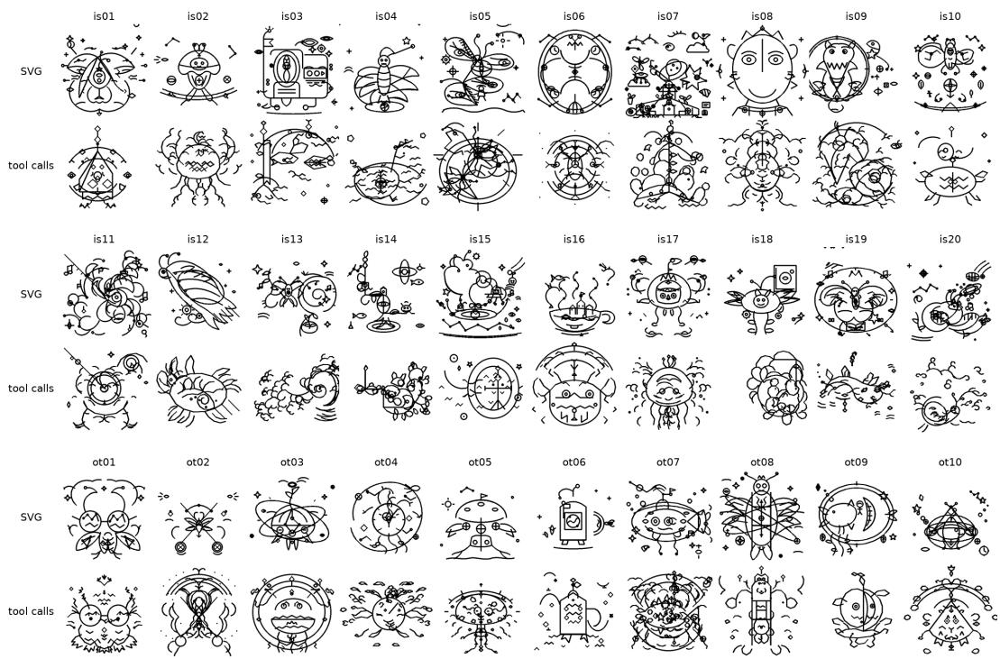  
Figure 5: Drawings from the SVG interface (top rows) and the paired tool-call trials of the primary study (bottom rows), on the anchor model (GPT-5.6 Luna).

## E.2 PAIRED COMPARISON OF SVG DRAWINGS WITH TOOL-CALL DRAWINGS

GPT-5.6 Luna is used as the anchor model. We run 150 trials, five replicates of each of the 30 stimuli, and compare them to the anchor model’s drawings from the main study. Figure 5 shows some of the drawings and Table 7 compares the condition’s process measures with the anchor model’s primary-study trials.

Table 7: Process and rating measures of the interface manipulation’s SVG condition and the anchor model’s primary-study trials, as per-trial means with standard deviations in parentheses.
<table><tr><td></td><td>Rounds</td><td>Drawing operations</td><td>Operations not drawn</td><td>Rated creativity</td><td>Rated recognizability</td></tr><tr><td>SVG (n = 150)</td><td>3.3 (1.0)</td><td>57.8 (20.6)</td><td>0.4 (1.1)</td><td>0.68 (0.12)</td><td>0.40 (0.15)</td></tr><tr><td>Tool calls (n = 150)</td><td>7.5 (1.7)</td><td>70.5 (22.6)</td><td>0.0 (0.2)</td><td>0.61 (0.11)</td><td>0.33 (0.12)</td></tr></table>

The two interfaces produce similar drawings. The SVG condition draws in fewer rounds and scores higher on both rated composites, by +0.07 on creativity and +0.07 on recognizability. These shifts are small against the 0.46 range of the model means (Table 2). Recognizability remains below the human reference.

Process. The SVG trials complete, on average, fewer rounds with fewer drawing operations than the tool-call trials (Table 7). The condition issues close to one markup call per drawing round, 342 calls over the 150 trials.

The 150 trials wrote 8,676 elements, between 19 and 124 per trial. Two element types account for 8,217 of those, path (5,880) and circle (2,337), and the rest are ellipse (345), line (84), polygon (16), rect (10), and polyline (4). Of the 342 strings of markup, 341 parsed as XML, and no element fell outside the supported subset. Every SVG interface trial ended by calling the finish tool, and no trial called the undo or erase tools.

Content. The two conditions share content. The final titles in both draw on a small common vocabulary of cosmic, orbital, clockwork, observatory, moth, and garden motifs. The word “cosmic” appears in 79 of the 150 SVG titles and 92 of the 150 tool-call titles. Both conditions center a single subject on the stimulus and surround it with small detached marks, such as stars, crosses, and circles.

Ratings. Table 7 reports rated creativity and rated recognizability. Section 4.4 reports the ratedcreativity contrast. On the recognizability composite, the SVG condition scores 0.40 against 0.33 for the anchor model’s primary-study cells, a paired difference of +0.07 (95% CI [0.04, 0.11], 0.36 SD) over 30 paired stimuli. The shift matches the rated-creativity shift in size, and the SVG condition’s mean recognizability remains below the human reference sample’s mean of 0.53 (Table 2).

Execution. The SVG drawings are composed of smooth closed curves. The tool-call drawings are composed of short polyline segments with more irregular curvature.

Failures. One failure mode is specific to the SVG interface (cf. “Operations not drawn” in Table 7). In 48 of the 150 trials, and in 96 elements in total, at least one coordinate was written as an English word rather than as a number, as in <circle cx="337" cy=" ninety" r="10"/>. Fifty-seven of the 96 elements were left with no geometry the renderer could use. Each of these elements was reported back to the agent as not drawn. In the remaining 39 elements, the affected attribute took its SVG default of zero and the element was drawn at the edge of the canvas. PainterBench’s typed tools do not admit the second outcome, because a coordinate there is a schema-typed integer and a value that does not parse is counted as a malformed operation and skipped.

## F PROCESS MARKERS

This appendix defines the eleven process markers of Section 4 and reports their correlation to rated creativity (i.e., crowdsourced creativity ratings). Each marker is computed from the tool-call trace of a trial. Table 8 defines each marker and names the related MTCI measure (Barbot, 2018). The five markers of the second block have no MTCI counterpart.

Table 8: Process markers computed from the tool-call trace of a trial run. Rows marked ∗ are the four components included in the process effort index (Section 4).
<table><tr><td>Marker</td><td>Substitutes for MTCI</td><td>Definition</td></tr><tr><td>Exploration rounds</td><td>Exploration phase</td><td>Rounds before the round of the first ink operation</td></tr><tr><td>Tool calls *</td><td>Production phase</td><td>Ink calls from the first to the last ink operation</td></tr><tr><td>Drawing operations *</td><td>Production phase</td><td>Operations contained in those calls</td></tr><tr><td>Verification rounds</td><td>Verification phase</td><td>Rounds after the last inking round that contain no ink call and do not finish the trial</td></tr><tr><td>Rounds to completion *</td><td>Response time</td><td>Rounds in the trial</td></tr><tr><td>Tool diversity *</td><td>Flexibility</td><td>Shannon entropy of trial&#x27;s tool-type distribution</td></tr><tr><td>Drawing operations per round</td><td></td><td>Ink operations divided by rounds</td></tr><tr><td>Parallel rounds</td><td></td><td>Rounds carrying more than one tool call</td></tr><tr><td>Largest round</td><td></td><td>Tool calls in the round that carried the most</td></tr><tr><td>Undo calls (%)</td><td></td><td>Calls to the revert tool, as a percentage of the trial&#x27;s tool calls</td></tr><tr><td>Erase calls (%)</td><td></td><td>Calls that set the erase flag, as a percentage of the trial&#x27;s tool calls</td></tr></table>

Table 9 reports two Spearman correlations per marker, each with a 95% confidence interval. Exploration rounds are zero in every trial, so no correlation is reported for this marker. The pooled correlation is computed over all rated drawings. The within-model correlation is the mean of the per-model correlations, and its confidence interval resamples drawings within each model.

Table 9: Spearman correlation between each process marker and rated creativity, pooled over all rated drawings and as the mean of the per-model correlations.
<table><tr><td rowspan="2">Marker</td><td colspan="2">Pooled</td><td colspan="2">Within-model</td></tr><tr><td>ρ</td><td>95% CI</td><td>ρ</td><td>95% CI</td></tr><tr><td>Tool calls</td><td>0.06</td><td>[0.01, 0.11]</td><td>-0.01</td><td>[-0.05, 0.04]</td></tr><tr><td>Drawing operations</td><td>0.53</td><td>[0.50, 0.56]</td><td>0.06</td><td>[0.02, 0.11]</td></tr><tr><td>Verification rounds</td><td>-0.05</td><td>[-0.11, 0.01]</td><td>-0.06</td><td>[-0.11, 0.02]</td></tr><tr><td>Rounds to completion</td><td>0.12</td><td>[0.08, 0.17]</td><td>-0.03</td><td>[-0.08, 0.01]</td></tr><tr><td>Tool diversity</td><td>0.33</td><td>[0.29, 0.37]</td><td>0.13</td><td>[0.09, 0.17]</td></tr><tr><td>Drawing operations per round</td><td>0.59</td><td>[0.56, 0.62]</td><td>0.16</td><td>[0.12, 0.20]</td></tr><tr><td>Parallel rounds</td><td>-0.26</td><td>[-0.30, -0.23]</td><td>0.06</td><td>[0.00, 0.12]</td></tr><tr><td>Largest round</td><td>-0.27</td><td>[-0.30, -0.23]</td><td>0.07</td><td>[0.01, 0.13]</td></tr><tr><td>Undo calls (%)</td><td>-0.01</td><td>[-0.06, 0.03]</td><td>-0.08</td><td>[-0.13, -0.02]</td></tr><tr><td>Erase calls (%)</td><td>-0.01</td><td>[-0.05, 0.03]</td><td>-0.05</td><td>[-0.09, 0.00]</td></tr><tr><td></td><td></td><td></td><td></td><td></td></tr></table>

## G CROWDSOURCED RATINGS

## G.1 RATER INSTRUCTION

The following instruction was shown in the crowdsourcing task before the worker started the work:

In this task you will rate a series of black-and-white line   
drawings. Each drawing started from an incomplete shape,   
which the artist completed into a full drawing.   
For each drawing you will answer two questions.   
1. How creative is this drawing? Rate from 1 (“Not At All   
Creative”) to 5 (“Very Creative”). Focus on how creative   
the idea is, not how artistic or skillfully drawn it is.   
2. Does this drawing show a recognizable object or   
scene? Rate from 1 (“Not At All Recognizable”) to 5 (“Very   
Recognizable”). A drawing is recognizable if you can tell

what it depicts.   
There are no right or wrong answers. Rate each drawing   
on its own, and use the full range of the scale when the   
drawings differ. Some drawings may be difficult to rate,   
but please make an honest effort to rate each one.   
Do not use your browser’s back button. After the last   
drawing, click Submit to finish.

## G.2 RATER ALLOCATION

Each drawing is rated on both creativity and recognizability by k raters. This appendix describes how we select k.

Let $\rho _ { 1 }$ denote the expected correlation between two ratings of the same drawing made by different raters. This is the one-way intraclass correlation, in which everything that varies between the two ratings counts as error, including rater severity, a rater’s systematic tendency to rate low or high. By the Spearman–Brown formula (Spearman, 1910; Brown, 1910), the average of k such ratings (i.e., the composite) has reliability $\rho _ { k } = k \rho _ { 1 } / ( 1 + ( k - 1 ) \rho _ { 1 } )$

Our design target is a composite whose reliability matches that of the human ratings. In the released individual ratings of the AuDrA primary corpus, a pool of 50 raters rated 11,075 drawings with a median of 8 ratings per drawing, which gives $\rho _ { 1 } = . 3 9$ on rated creativity and, by Spearman–Brown, a composite reliability of .84 at the median count (Patterson et al., 2024). As the minimum, we set the target $\rho _ { k } \geq . 7 5$ , the threshold for good reliability in the guidelines of Koo & Li (2016). Solving $\rho _ { k } \geq . 7 5$ for the number of raters gives the smallest count that reaches the target, $k = \lceil 3 ( 1 - \rho _ { 1 } ) / \rho _ { 1 } \rceil$ We call this formula the allocation rule.

The single-rater reliability $\rho _ { 1 }$ is a property of the rater pool and the rating questions, and it is unknown before data collection. We therefore estimate $\rho _ { 1 }$ in a pilot and fix k before the data collection. The pilot runs the full rating protocol on one batch of drawings $( N = 3 0 )$ and yields one estimate of ρ<sub>1</sub> per question. To guarantee the target under the sampling error of this single batch, we apply the allocation rule for each question at the one-sided 95% lower confidence bound of its estimate, computed by a bootstrap over drawings. We collect the larger of the two resulting counts, up to a cap of 25 ratings per drawing.

Table 10: The number of ratings per drawing, k, required to reach the reliability target $\rho _ { k } \geq . 7 5$ at each single-rater reliability $\rho _ { 1 }$ . The last column is the total ratings per question for the $3 { , } 0 0 0$ rated drawings. The bold row, the lower confidence bound of the pilot’s creativity estimate, sets the collected count.
<table><tr><td>Single-rater  $\mathrm { I C C } \rho _ { 1 }$ </td><td>k demanded collected</td><td></td><td> $\rho _ { k }$ </td><td>k Reliability Attenuation Ratings  $\sqrt { \rho _ { k } }$ </td><td>total</td></tr><tr><td></td><td></td><td></td><td>.568</td><td></td><td>75,000</td></tr><tr><td>.05 .10</td><td>57 27</td><td>25 25</td><td>.735</td><td>.754 .857</td><td>75,000</td></tr><tr><td>.15</td><td>17</td><td>17</td><td>.750</td><td>.866</td><td>51,000</td></tr><tr><td>.20</td><td>12</td><td>12</td><td>.750</td><td>.866</td><td>36,000</td></tr><tr><td>.21</td><td>12</td><td>12</td><td>.762</td><td>.873</td><td>36,000</td></tr><tr><td>.25</td><td>9</td><td>9</td><td>.750</td><td>.866</td><td>27,000</td></tr><tr><td>.30</td><td>7</td><td>7</td><td>.750</td><td>.866</td><td>21,000</td></tr><tr><td>.33</td><td>7</td><td>7</td><td>.773</td><td>.879</td><td>21,000</td></tr></table>

Table 10 tabulates the allocation rule over a range of $\rho _ { 1 }$ values. The pilot estimated $\rho _ { 1 } = . 3 3$ for creativity and $\rho _ { 1 } = . 4 2$ for recognizability (Krippendorff’s ordinal $\alpha = . 3 1$ and .41, respectively), with lower confidence bounds of .21 and .29. At these bounds, the allocation rule demands $k = 1 2$ for creativity and $k = 8$ for recognizability, so we collect $k = 1 2$ ratings per question. At this number of raters, the creativity composite has reliability .85 and the recognizability composite .90 at the point estimates, and .76 and .83 at the lower bounds. At the point estimate, the creativity composite reaches the composite reliability of the AuDrA human ratings.

## H TITLE SEMANTICS

The AuDrA corpus records participant-written titles for two of its four sets (1,349 drawings). The title is a channel on which the two populations (humans and AI) can be compared, and it states what the drawing was meant to be. We report three measures over the human-generated and AI-generated titles. The abstraction-marker rate is the share of titles containing a term from a fixed list of twenty-six words that name a configuration rather than a thing (e.g., abstract, geometric, composition, pattern, etc.). Concreteness is the mean concreteness of a title’s content words under the word-concreteness ratings of Brysbaert et al. (2014). Separability is the stratified five-fold cross-validated area under the ROC curve of a logistic regression that predicts the population from the title’s sentence embedding. Titles are embedded with the all-mpnet-base-v2 sentence-transformer model (Reimers & Gurevych, 2019). Figure 6 depicts example drawings and their agent-assigned titles, showing clear differences in agent-generated titles.

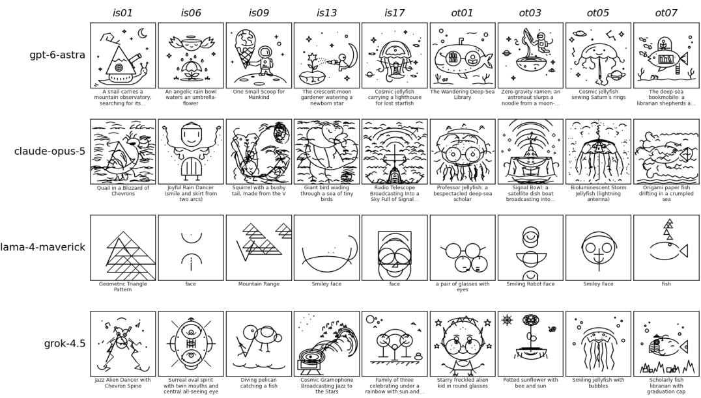  
Figure 6: Examples of agent-chosen titles.

The human and agent titles differ on all three measures. Abstraction markers appear in 10.58% of the agent titles, but only in 0.67% of the human titles in AuDrA’s corpus. Mean concreteness is 4.04 for agent titles and 4.56 for human titles on the five-point scale of Brysbaert et al. (2014) (difference -0.52, 95% CI [-0.56, -0.48], d = −0.98). A logistic regression on the sentence embeddings predicts the population with a cross-validated AUC of 0.97. Mean title length is 6.11 words for agent titles and 2.32 words for human titles (difference +3.78, 95% CI [3.60, 3.94], d = 1.37). A classifier given the word count alone reaches an AUC of 0.88, so part of the separability is carried by title length.

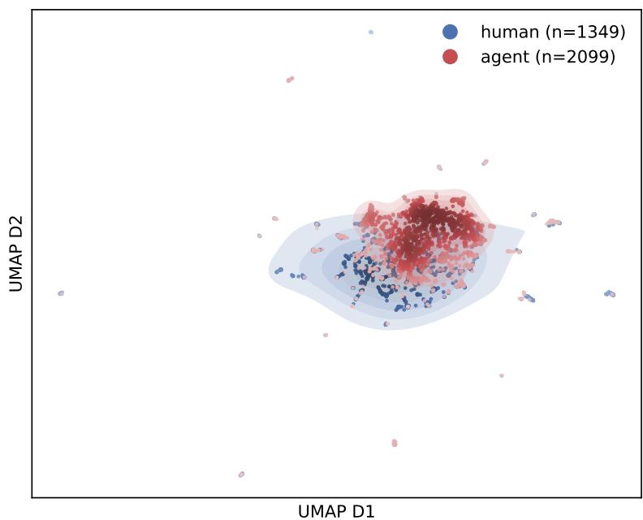  
Figure 7: Two-dimensional UMAP projection (McInnes et al., 2018) of sentence embeddings of the agent titles and the participant titles of the AuDrA corpus. Each population is shaded by its kernel density estimate.

Figure 7 projects the sentence embeddings of the agent and human titles into two dimensions. The agent titles concentrate in a narrower region of the embedding space than the human titles, consistent with the abstraction-marker and concreteness differences above. Table 11 lists the ten highestweighted TF-IDF terms of each population. While humans name persons, animals, and everyday objects, agents often depict robots or mix object nouns with the configuration terms abstract and geometric. The highest-weighted agent term, cosmic, is a modifier shared across 12 of the 14 models.

Table 11: The ten highest-weighted TF-IDF terms in the agent titles and in the participant-written titles of the AuDrA corpus. Share is the share of that population’s titles containing the term.
<table><tr><td>Agent term</td><td>Share</td><td>Example title</td><td>Human term</td><td>Share Example title</td></tr><tr><td>cosmic</td><td>10.0%</td><td>Cosmic Clockwork Fish</td><td>house</td><td>6.3% a house</td></tr><tr><td>face</td><td>6.9%</td><td>aface</td><td>face</td><td>6.5% a face</td></tr><tr><td>robot</td><td>8.1%</td><td>Robot Face</td><td>bird</td><td>4.0% a bird</td></tr><tr><td>abstract</td><td></td><td>5.4% Abstract Composition</td><td>person</td><td>3.4% a person</td></tr><tr><td>sea</td><td></td><td>4.8% Lighthouse by the sea</td><td>boat</td><td>2.7% a boat</td></tr><tr><td>geometric</td><td></td><td>4.2% Geometric Composition</td><td>man</td><td>3.0% a man</td></tr><tr><td>moon</td><td></td><td>5.0% Constellation with Moon</td><td>tree</td><td>2.2% a tree</td></tr><tr><td>fish</td><td>3.6% Fish</td><td></td><td>pizza</td><td>1.8% a pizza</td></tr><tr><td>jellyfish</td><td>3.5%Jellyfish</td><td></td><td>arrow</td><td>1.6% an arrow</td></tr><tr><td>creature</td><td></td><td>4.2% Whimsical creature face</td><td>pencil</td><td>1.5% a pencil</td></tr></table>