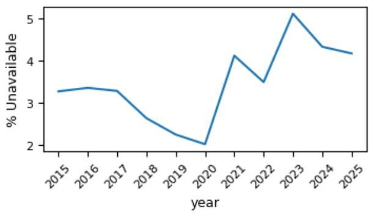
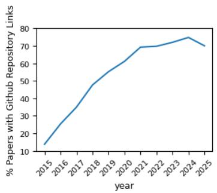
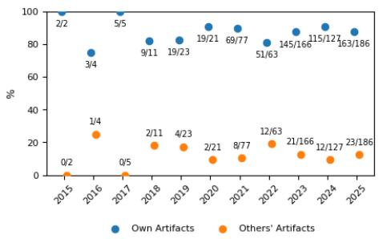
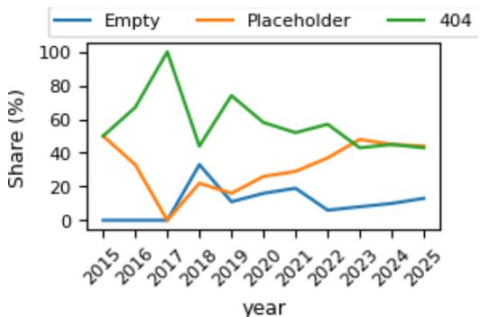
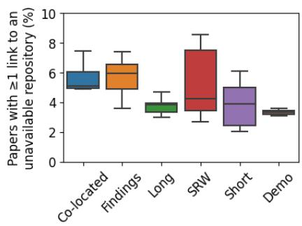
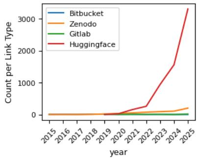
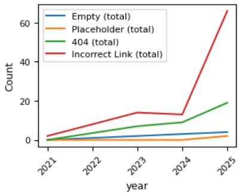

# Papers Without Code: Availability of GitHub Repositories Linked in \*CL Publications

Selina Meyer∗, Michael Roth

University of Technology Nuremberg selina.meyer@utn.de michael.roth@utn.de

Source code and data published at computational linguistics (\*CL) venues are increasingly being shared via GitHub. While this generally is a favourable development for the accessibility and potential reusability of research artifacts in natural language processing (NLP), the long-term availability of such repositories has not been evaluated. In this squib, we discuss the availability of repositories linked in papers published in the Computational Linguistics (CL) journal as well as at ACL and its co-located events over the past ten years. Contrary to our expectations, we find that GitHub repositories linked in more recent ACL publications are unavailable at similar rates as in older publications, in parts due to an increase in empty and placeholder repositories. Similar trends hold for other \*CL venues, but not for platforms other than GitHub.

## 1. Introduction

Publicly sharing research artifacts such as code and data is treated as a key requirement for reproducibility and impactful research across disciplines (Magnusson, Smith, and Dodge 2023; Celi et al. 2019; Shamir et al. 2013; Eglen et al. 2017; Wieling, Rawee, and van Noord 2018) and as a component of good scientific practice in light of frameworks such as the FAIR principles (Wilkinson et al. 2016) and code of conducts of national science funding organizations (National Science Foundation; Deutsche Forschungsgemeinschaft 2025; UK Research and Innovation), some of which mandate long-term storage of a minimum of ten years. In the area of natural language processing (NLP), such artifacts are predominantly shared on GitHub (Mieskes et al. 2019), but little is known about their long-term availability.

Here, we evaluate the availability of such repositories by extracting GitHub links from papers published in the Computational Linguistics (CL) journal as well as the ACL conference and its co-located events (hereafter collectively referred to as “ACL papers”) over the past ten years and checking their availability using the GitHub API. Results show that even among ACL papers published in 2025, a substantial number link to unavailable repositories, many of which are associated with the papers’ own research artifacts. A comparison with other \*CL venues and online repositories shows that (a) this issue is not exclusive to ACL and (b) it most commonly occurs with GitHub. Building on these observations, we provide recommendations for authors, reviewers, organizers and editors to improve long-term code and data availability, along with a low-resource Python script integrated in aclpubcheck for automatically checking GitHub repository availability in camera-ready papers.1

  
Figure 1: Share of unavailable GitHub repositories linked in ACL papers. While older links might reasonably decay, the consistent unavailability in recent years is concerning.

## 2. Related Work

Reproducibility has gained increasing importance in NLP in recent years, largely as a consequence of the reproducibility crisis permeating many scientific disciplines, often due to unavailability of essential information, code, or data (Miyakawa 2020; Belz et al. 2023; Hutson 2018). Dedicated tutorials and shared tasks (Lucic et al. 2022; Belz et al. 2025; Belz and Thomson 2024), reproducibility checklists at \*CL venues (Dodge et al. 2019) and the piloting of a reproducibility track at NAACL 2022 (Jesse et al. 2022) represent efforts towards more open and transparent science, while others work towards streamlining the definition of reproducibility in the field (Belz et al. 2021; Belz 2022) and conducting reproducibility case studies (e.g Çöltekin 2020; Arvan, Pina, and Parde 2022; Fokkens et al. 2013). However, compared to other fields relying on data collection and code production, in which publication venues have long-running dedicated reproducibility tracks (Dietz and de Rijke 2022; Breuer, Soboroff, and Trippas 2025), code submission policies (Nature Portfolio; American Association for the Advancement of Science; NeurIPS), and official workflows in place to incentivize the sharing of (well documented and functioning) code and data (ACM SIGMOD Availability & Reproducibility Initiative; ACM SIGIR Artifact Evaluation Committee), the way reproducibility is handled in \*CL venues still appears to be fragmented at best.

Mieskes (2017) evaluates data availability of papers published at various \*CL venues in 2016 and find that over 15% of links to collected data provided in the papers were not available only a year after publication. They remark on the low share of data published on public hosting services such as GitHub, which they suggest might be more reliable due to their independence of personal or institutional webpages. Wieling, Rawee, and van Noord (2018) extend Mieskes’ study and specifically analyse the availability of source code in papers published at ACL 2011 and 2016. They find that the availability of data and code as well as the share of working links had increased. In later work, Mieskes et al. (2019) find GitHub to be the predominant source for code sharing in a community survey. Querying NLP researchers who attempted to replicate others work, Mieskes et al. (2019) and Thomson et al. (2025) both identify resource and tool unavailability as common issues. Arvan, Pina, and Parde (2022) find a steady increase in papers with code published at \*CL venues between 2016 and 2022, but also find that code availability alone does not ensure reproducibility. They were able to reproduce results for just two out of eight randomly selected papers. Several studies indicate that sharing research artifacts benefits authors, as code or data availability is associated with higher acceptance rates, improved reviewer scores, increased perceived reproducibility (Magnusson, Smith, and Dodge 2023; Chaudhuri and Salakhutdinov 2019; Pineau et al. 2021), and higher citation counts (Kang, Kang, and Jang 2023; Colavizza et al. 2024). Our analysis complements these insights, by focusing specifically on the large-scale analysis of the availability of GitHub repositories linked in \*CL venues over time.

## 3. Methods

We download all CL and ACL papers published between 2015 and 2025 using the ACL Anthology Python API.2 In order to determine whether trends in GitHub repository availability differ between conferences, we also download and parse all articles published at LREC and EACL 2024 as well as EMNLP, NAACL, AACL and COLING 2025 (including co-located events) to compare them with the ACL papers from 2025.

Automatic Extraction and Availability Check. To extract GitHub links, we apply two strategies: we parse all embedded hyperlinks using the Python library PyPDF2 and identify relevant links with a regex, and we additionally search the paper text for URLs containing github.com to capture links not embedded as hyperlinks, which is common in older papers. We then filter out GitHub links not pointing to a repository (e.g. links pointing to specific files or users), normalize the extracted links to the GitHub API format and query the GitHub $\mathrm { A P I } ^ { 3 }$ to determine repository availability and the number of files in each repository.4

Manual Verification and Categorization. We manually verify all unique links flagged as unavailable or empty repositories by our script by opening the extracted URLs in a browser, clicking the links as rendered in the paper, and copying links directly from the paper, fixing formatting issues when necessary.5 If none of these steps lead to a working repository, we search for the corresponding GitHub user and inspect their repositories to confirm that no repository with the reported name exists. We also manually inspect repositories containing only a single file to identify placeholder README files without substantial content.

We define the following repository availability categories:

  
Figure 2: Share of ACL papers that point to GitHub

  
Figure 3: Shares of unavailable repositories pointing to ACL papers’ own versus others’ artifacts

Available: Repositories that return files via the GitHub API or are recoverable through manual verification and contain code or data.

Unavailable: Repositories that are inaccessible or lack substantive content. We further distinguish:

404: Links that return a 404 page and remain unrecoverable after manual verification;

Empty: Repositories without any files;

Placeholder: Repositories containing only a license or README without links to code or data or contact information, often limited to the paper title or a “coming soon” notice.

Finally, for all empty, unavailable, and placeholder repositories, we check the corresponding papers to determine whether the links referred to the paper’s own code or data or to related work. We conducted manual verification in June and July 2026.

## 4. Results

Code Availability at ACL. We parse a total of 14,727 unique GitHub repository links from 12,087 ACL papers (our script does not return any links to GitHub repositories for 6,330 papers). 354 of the parsed repository links return a 404 and 326 are empty or contain only placeholder files. 88% of links to unavailable repositories point to a papers’ own research artifacts. Although references to unavailable artifacts from other works are less common, they appear even in recent publications, with rates remaining stable over time (see Figure 3). Figure 2 shows a steady increase in the share of ACL papers linking to GitHub repositories over the years. Contrary to our expectations, the data also shows noticeable rates of unavailable repositories linked in recent years (see Figure 1).

Upon closer inspection, one of the reasons for this is an increase in placeholder repositories: In 2025, 41% of unavailable links consist solely of placeholder files, compared to a mean of 28% in previous years. This trend is reversed for links leading to 404 errors, which made up 63% of unavailable repositories on average in previous years and 47% in 2025. A large share of these 404 errors accounts for papers’ own code or data even in 2025 (80%), which might indicate that these repositories have never been created (see Figure 4). Unavailable repositories most commonly appear in papers published at Findings of the ACL but also in the main track and at co-located events (see Figure 5).

  
Figure 4: Development of unavailability types of GitHub links pointing to own artifacts over the years (ACL papers)

  
Figure 5: Annual shares of ACL papers linking to unavailable repositories by paper type/event 2021-2025

Code Availability in Computational Linguistics. Out of 317 unique GitHub repositories extracted from the 369 papers published in CL between 2015 and 2025, only 7 (2%) repositories are unavailable, six of which point to the paper’s own code or data. Of these, four links lead to 404 errors, one (published in 2019) constitutes a placeholder repository, and one (published in 2022) is empty. The lower share of unavailable GitHub repositories compared to conferences suggests stronger curation and more stable codesharing practices in journal publications, reflecting stricter editorial standards. It may also be influenced by the single-blind review format, which allows authors to include non-anonymous repository links at initial submission, increasing the likelihood that links are complete and functional at publication time. Still, this does not fully prevent unavailable repositories being linked.

## 4.1 Comparison with Other Conferences

For comparison, we repeat the procedure outlined in §3 for six other computational linguistics conferences: LREC and EACL 2024 as well as NAACL, EMNLP, COLING, and AACL 2025. The share of papers linking to GitHub repositories ranges between 61% (EACL) and 70% (ACL) for all conferences. The general trends of unavailability do not differ much between conferences, as shown in Table 1. In most cases, between 4 and 5% of the GitHub repositories found in articles were unavailable in 2024/2025. The exception to this is AACL, with a slightly higher share of unavailable links. EACL, AACL, and NAACL had a higher share of 404’s and a lower share of Placeholder repositories than the other conferences, which could point to the fact that linked repositories had never existed or were never made public in the first place. On the other hand COLING has the lowest share of empty repositories, but a higher share of Placeholder repositories than the others. The relative similarity of overall shares and unavailability type distributions between conferences leads us to conclude that the observations made here are not ACLspecific, but pervasive, at least among computational linguistics conferences.

<table><tr><td rowspan="2">Conference</td><td rowspan="2"></td><td rowspan="2">Unavailable / Total Links (%)</td><td rowspan="2">Own Code</td><td colspan="3">Unavailability type</td></tr><tr><td>404</td><td>Empty</td><td>Placeholder</td></tr><tr><td>ACL</td><td></td><td>186 / 4454 (4%)</td><td>88%</td><td>43%</td><td>13%</td><td>44%</td></tr><tr><td>NAACL</td><td></td><td>85 / 1961 (4%)</td><td>87%</td><td>55%</td><td>12%</td><td>32%</td></tr><tr><td>EMNLP</td><td></td><td>196 / 4104 (5%)</td><td>92%</td><td>37%</td><td>17%</td><td>46%</td></tr><tr><td>EACL</td><td></td><td>37 / 826 (4%)</td><td>95%</td><td>60%</td><td>9%</td><td>31%</td></tr><tr><td>AACL</td><td></td><td>38 / 551 (7%)</td><td>92%</td><td>51%</td><td>17%</td><td>31%</td></tr><tr><td>COLING</td><td></td><td>62 / 1219 (5%)</td><td>92%</td><td>42%</td><td>7%</td><td>51%</td></tr><tr><td>LREC</td><td></td><td>95 / 2188 (4%)</td><td>94%</td><td>45%</td><td>15%</td><td>40%</td></tr></table>

Table 1: Share of papers with GitHub links at EACL and LREC 2024 as well as ACL, COLING, EMNLP, AACL and NAACL 2025 and percentage of those links pointing to unavailable repositories. Share of unavailable repositories for papers’ own code/data, with breakdown of unavailability types within that subset provided in brackets.

## 4.2 Comparison with Other Online Repositories

We also parse links to other online repositories that can be used to store code and data, specifically GitLab, HuggingFace, and Bitbucket, to evaluate trends in code-sharing platform usage. Additionally, we parse links to Zenodo, as it assigns DOIs and supports persistent, long-term storage of data and code. While links to HuggingFace pages have become increasingly frequent in the past five years (see Figure 6), Bitbucket, GitLab, and Zenodo are very rarely used, with only 58, 47, and 496 unique URLs found, respectively.

  
Figure 6: Occurrences of repository types other than GitHub in ACL papers over the past ten years

  
Figure 7: Occurrences of different unavailability types in unavailable HuggingFace repositories (ACL papers)

We check availability for Zenodo and HuggingFace links. We identify 141 unavailable HuggingFace repositories, corresponding to 3% of all unique HuggingFace links. The majority of these (84%) link to others’ models or data, except for Placeholder (two overall, both pointing at own artifacts) and Empty repositories (six out of nine pointing to own artifacts). Manual verification shows most unavailable links are actually incorrect, meaning that the artifact exists but under a different path (e.g., renamed accounts or models), making it harder to identify the specific artifact referenced in the text (see Figure 7). This suggests the main issue with HuggingFace link persistence is name changes over time, leading to deprecated links. This also suggests HuggingFace is used more as a source for existing models and data than as a platform for publishing new research artifacts.

Out of all unique Zenodo URLs, only two are unavailable, corresponding to 0.4%, a much lower share than the 3% unavailability rate for GitHub repositories linked in articles since 2015. This reinforces the notion that using persistent and safe code repositories facilitates long-term use of research outcomes and artifacts.

## 5. Discussion and Recommendations

Although making research artifacts available has gained increasing importance in NLP over the past years, we still find some failings in how this is handled in practice. We are particularly concerned in light of the share of papers that claim to open-source their code but end up not filling the repositories linked in the paper months or even years after publication or linking to repositories that do not exist. This may also be a consequence of growing pressures on the peer review process at major conferences. As submission numbers rise, reviewers may have less capacity to thoroughly verify repository contents. We see this as a breach of trust in the scientific publication process. Putting more emphasis on the validation of code availability and documentation in the peer review process would increase the potential for uptake of results and methods by other researchers (see Kang, Kang, and Jang 2023; Pineau et al. 2021; Chaudhuri and Salakhutdinov 2019, inter alia). Based on our observations, we suggest a set of best practices for authors, reviewers, and publication chairs to decrease the share of newly published papers pointing to unavailable GitHub repositories.

For Authors: Share code and data at time ofpaper submission. Aiming to include code upon initial submission decreases the need for long code preparation times after acceptance or publication. This is strongly encouraged and sometimes even expected in other fields and has been shown to be beneficial for peer review (Chaudhuri and Salakhutdinov 2019; NeurIPS; Moffat and Scholer 2026).6 Whenever the identity of authors is not uncovered by the code or data itself, we recommend sharing it at the time of paper submission. This can, for instance, be done as a file upload to OpenReview, or by anonymizing existing repositories using Anonymous GitHub, a free web service that fully anonymizes GitHub repositories and is frequently used for peer review in fields such as information retrieval (Moffat and Scholer 2026; Zamani et al. 2025) and recommended for use in the ARR call for papers (Association for Computational Linguistics).

Create persistent identifiers for code repositories. Persistent identifiers are less volatile than repository links and will still resolve if, for example, repository or usernames are changed. This can be achieved by archiving repositories on Zenodo, for instance.7 For ARR, code and data can usually be included in the submission, and research artifacts generally also appear in the ACL Anthology.

For Reviewers: Be diligent about checking links andfiles provided during peer review. If code or data are provided in a submission, reviewers should check links or submitted files at least briefly to make sure they are accessible and contents align with descriptions in the paper. Empty and placeholder repositories should be mentioned in the review.

For Publication Chairs & Editors: Check camera-ready papers for broken links and invalid GitHub references. Camera-ready versions should be checked for faulty links and unavailable GitHub repositories. To facilitate this, we provide code based on our extraction script integrated in the aclpubcheck workflow currently used for publication at \*CL conferences and workshops with this paper.

To evaluate the tool’s practical feasibility, we randomly sampled 50 ACL papers flagged as containing potentially problematic repository links, stratified by publication year. As a control, we sampled 50 unflagged papers from the same venues and years. An independent evaluator manually verified all referenced GitHub repositories using only the PDFs. The tool identified papers with problematic links with 89% accuracy and 78% precision. Eleven papers were false positives, for which a repository exists, but URLs contained, for example, spelling or hyperlinking errors. No unavailable repositories were found in the control sample, suggesting high recall.8 Based on the manual verification of all links flagged as problematic (see §3), the tool achieved 62% precision on the paper level, improving from 25% (2015) to 72% (2025), largely due to better PDF hyperlinking. For the 2025 proceedings, this would mean that most workshop chairs would have to review only 1–5 papers, while main conference chairs would have to review 84 long, 95 findings, and 5 short papers. By revealing automatic linking problems, even false positives flagged by the tool can likely improve editorial quality and access to resources.

## 6. Conclusion

In light of increased code and data sharing at \*CL venues, this work focuses on the (longterm) availability of online repositories linked in papers published at CL and ACL in the past 10 years. We find a concerning persistency of unavailability rates and placeholder repositories which are not filled with code after publication. With publication counts at \*CL venues rising, these rates translate into an accelerating growth of unavailable repositories and artifacts year after year. Not making code and data available significantly mitigates the reusability of methods introduced and trustworthiness of results. We outline recommendations to support reliable access to resources over time and expand the aclpubcheck library with a lightweight method to check papers for invalid or broken GitHub references. We encourage authors and publication chairs to introduce this method into the current publication workflow to ensure the availability of linked research artifacts and the usefulness of research published at \*CL venues in the future.

While we see code and data sharing as a basic requirement for open science, this does not ensure reproducibility of reported results (Arvan, Pina, and Parde 2022). Moreover, this work does not assess whether papers that should share code or data actually do so. Instead, we focus on the long-term availability of repositories, often linked from papers that claim to share research artifacts. In future work, we plan to expand on the findings presented here by focusing on ways to automatically evaluate the quality and documentation of provided code, allowing us to draw insights on reproducibility in addition to code availability.

## 7. Acknowledgements

Codex and ChatGPT were used for coding assistance and code documentation. The authors take full responsibility for all reported results.

## References

ACM SIGIR Artifact Evaluation Committee. Acm sigir artifact badging. https://sigir.org/general-information/acm-sigir-artifact-badging/. Accessed: 2025-12-19.

ACM SIGMOD Availability & Reproducibility Initiative. Sigmod availability & reproducibility initiative. https://reproducibility.sigmod.org. Accessed: 2025-12-19.

American Association for the Advancement of Science. Science journals editorial policies. https: //www.science.org/content/page/science-journals-editorial-policies. Accessed: 2025-12-19.

Arvan, Mohammad, Luís Pina, and Natalie Parde. 2022. Reproducibility in computational linguistics: Is source code enough? In Proceedings of the 2022 Conference on Empirical Methods in Natural Language Processing, pages 2350–2361, Association for Computational Linguistics, Abu Dhabi, United Arab Emirates.

Association for Computational Linguistics. ACL Rolling Review: Call for papers. https://aclrollingreview.org/cfp. Accessed: 2026-04-10.

Belz, Anya. 2022. A metrological perspective on reproducibility in NLP\*. Computational Linguistics, 48(4):1125–1135.

Belz, Anya, Shubham Agarwal, Anastasia Shimorina, and Ehud Reiter. 2021. A systematic review of reproducibility research in natural language processing. In Proceedings of the 16th Conference of the European Chapter of the Association for Computational Linguistics: Main Volume, pages 381–393, Association for Computational Linguistics, Online.

Belz, Anya and Craig Thomson. 2024. The 2024 ReproNLP shared task on reproducibility of evaluations in NLP: Overview and results. In Proceedings of the Fourth Workshop on Human Evaluation ofNLP Systems (HumEval) @ LREC-COLING 2024, pages 91–105, ELRA and ICCL, Torino, Italia.

Belz, Anya, Craig Thomson, Javier González Corbelle, and Malo Ruelle. 2025. The 2025 ReproNLP shared task on reproducibility of evaluations in NLP: Overview and results. In Proceedings of the Fourth Workshop on Generation, Evaluation and Metrics (GEM²), pages 1002–1016, Association for Computational Linguistics, Vienna, Austria and virtual meeting.

Belz, Anya, Craig Thomson, Ehud Reiter, and Simon Mille. 2023. Non-repeatable experiments and non-reproducible results: The reproducibility crisis in human evaluation in NLP. In Findings of the Association for Computational Linguistics: ACL 2023, pages 3676–3687, Association for Computational Linguistics, Toronto, Canada.

Breuer, Timo, Ian Soboroff, and Johanne Trippas. 2025. Sigir 2025 call for resource & reproducibility papers. https://sigir2025.dei.unipd.it/call-res-repro-papers.html. Access 2025-12-19.

Celi, Leo A, Luca Citi, Marzyeh Ghassemi, and Tom J Pollard. 2019. The plos one collection on machine learning in health and biomedicine: Towards open code and open data. PloS one, 14(1):e0210232.

Chaudhuri, Kamalika and Ruslan Salakhutdinov. 2019. The icml 2019 code-at-submit-time experiment. https://medium.com/@kamalika\_19878/ the-icml-2019-code-at-submit-time-experiment-f73872c23c55. Accessed: 2025-12-19.

Colavizza, Giovanni, Lauren Cadwallader, Marcel LaFlamme, Grégory Dozot, Stéphane Lecorney, Daniel Rappo, and Iain Hrynaszkiewicz. 2024. An analysis of the effects of sharing research data, code, and preprints on citations. Plos one, 19(10):e0311493.

Çöltekin, Ça˘grı. 2020. Verification, reproduction and replication of NLP experiments: a case study on parsing Universal Dependencies. In Proceedings of the Fourth Workshop on Universal Dependencies (UDW 2020), pages 46–56, Association for Computational Linguistics, Barcelona, Spain (Online).

Deutsche Forschungsgemeinschaft. 2025. Guidelines for safeguarding good research practice. code of conduct. https://doi.org/10.5281/zenodo.14281892.

Dietz, Laura and Maarten de Rijke. 2022. Sigir 2022 call for reproducibility track papers. https://sigir.org/sigir2022/call-for-reproducibility-track-papers/. Accessed: 2025-12-19.

Dodge, Jesse, Suchin Gururangan, Dallas Card, Roy Schwartz, and Noah A. Smith. 2019. Show your work: Improved reporting of experimental results. In Proceedings of the 2019 Conference on

Empirical Methods in Natural Language Processing and the 9th International Joint Conference on Natural Language Processing (EMNLP-IJCNLP), pages 2185–2194, Association for Computational Linguistics, Hong Kong, China.

Eglen, Stephen J, Ben Marwick, Yaroslav O Halchenko, Michael Hanke, Shoaib Sufi, Padraig Gleeson, R Angus Silver, Andrew P Davison, Linda Lanyon, Mathew Abrams, et al. 2017. Toward standard practices for sharing computer code and programs in neuroscience. Nature neuroscience, 20(6):770–773.

Fokkens, Antske, Marieke van Erp, Marten Postma, Ted Pedersen, Piek Vossen, and Nuno Freire. 2013. Offspring from reproduction problems: What replication failure teaches us. In Proceedings of the 51st Annual Meeting of the Associationfor Computational Linguistics (Volume 1: Long Papers), pages 1691–1701, Association for Computational Linguistics, Sofia, Bulgaria.

Hutson, Matthew. 2018. Artificial intelligence faces reproducibility crisis. Science, 359(6377):725–726.

Jesse, Dodge, Niranjan Balasubramanian, Annie Louis, Daniel Deustch, Yash Kumar Lal, and Pete Walsh. 2022. Naacl 2022 reproducibility track. https://naacl2022-reproducibility-track.github.io. Accessed: 2025-12-19.

Kang, Donghyun, TaeYoung Kang, and Junkyu Jang. 2023. Papers with code or without code? impact of github repository usability on the diffusion of machine learning research. Information Processing & Management, 60(6):103477.

Lucic, Ana, Maurits Bleeker, Samarth Bhargav, Jessica Zosa Forde, Koustuv Sinha, Jesse Dodge, Sasha Luccioni, and Robert Stojnic. 2022. ACL tutorial proposal: Towards reproducible machine learning research in natural language processing. In Proceedings of the 60th Annual Meeting of the Associationfor Computational Linguistics: Tutorial Abstracts, pages 7–11, Association for Computational Linguistics, Dublin, Ireland.

Magnusson, Ian, Noah A. Smith, and Jesse Dodge. 2023. Reproducibility in NLP: What have we learned from the checklist? In Findings of the Association for Computational Linguistics: ACL 2023, pages 12789–12811, Association for Computational Linguistics, Toronto, Canada.

Mieskes, Margot. 2017. A quantitative study of data in the NLP community. In Proceedings ofthe First ACL Workshop on Ethics in Natural Language Processing, pages 23–29, Association for Computational Linguistics, Valencia, Spain.

Mieskes, Margot, Karën Fort, Aurélie Névéol, Cyril Grouin, and Kevin Cohen. 2019. Community perspective on replicability in natural language processing. In Proceedings of the International Conference on Recent Advances in Natural Language Processing (RANLP 2019), pages 768–775, INCOMA Ltd., Varna, Bulgaria.

Miyakawa, Tsuyoshi. 2020. No raw data, no science: another possible source of the reproducibility crisis. Molecular brain, 13(1):24.

Moffat, Alistair and Falk Scholer. 2026. Sigir 2026 submission policies and information. https://sigir2026.org/en-AU/pages/submissions/ submission-policies-and-information. Accessed: 2025-12-19.

National Science Foundation. Chapter xi: Other post award requirements and considerations. https://www.nsf.gov/policies/pappg/24-1/ ch-11-other-post-award-requirements#ch11D4. Accessed: 2025-12-19.

Nature Portfolio. Reporting standards and availability of data, materials, code and protocols. https://www.nature.com/nature-portfolio/editorial-policies/ reporting-standards#availability-of-materials. Accessed: 2025-12-19.

NeurIPS. Neurips code and data submission guidelines. https://neurips.cc/public/guides/CodeSubmissionPolicy. Accessed: 2025-12-19.

Pineau, Joelle, Philippe Vincent-Lamarre, Koustuv Sinha, Vincent Larivière, Alina Beygelzimer, Florence d’Alché Buc, Emily Fox, and Hugo Larochelle. 2021. Improving reproducibility in machine learning research (a report from the neurips 2019 reproducibility program). Journal of machine learning research, 22(164):1–20.

Shamir, Lior, John F. Wallin, Alice Allen, Bruce Berriman, Peter Teuben, Robert J. Nemiroff, Jessica Mink, Robert J. Hanisch, and Kimberly DuPrie. 2013. Practices in source code sharing in astrophysics. Astronomy and Computing, 1:54–58.

Thomson, Craig, Ehud Reiter, João Sedoc, and Anya Belz. 2025. Evolving stances on reproducibility: A longitudinal study of NLP and ML researchers’ views and experience of reproducibility. In Findings of the Association for Computational Linguistics: EMNLP 2025, pages 25738–25760, Association for Computational Linguistics, Suzhou, China.

UK Research and Innovation. Making your research data open. https://www.ukri.org/manage-your-award/ publishing-your-research-findings/making-your-research-data-open/. Accessed: 2025-12-19.

Wieling, Martijn, Josine Rawee, and Gertjan van Noord. 2018. Squib: Reproducibility in computational linguistics: Are we willing to share? Computational Linguistics, 44(4):641–649.

Wilkinson, Mark D, Michel Dumontier, IJsbrand Jan Aalbersberg, Gabrielle Appleton, Myles Axton, Arie Baak, Niklas Blomberg, Jan-Willem Boiten, Luiz Bonino da Silva Santos, Philip E Bourne, et al. 2016. The fair guiding principles for scientific data management and stewardship. Scientific data, 3(1):1–9.

Zamani, Hamed, Laura Dietz, Benjamin Piwowarski, and Sebastian Bruch. 2025. Call for papers – ictir 2025. https://ictir2025.cs.umass.edu/?page\_id=29. Accessed: 2025-12-19.