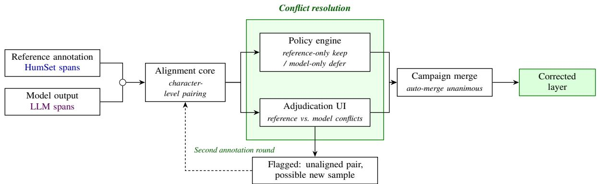
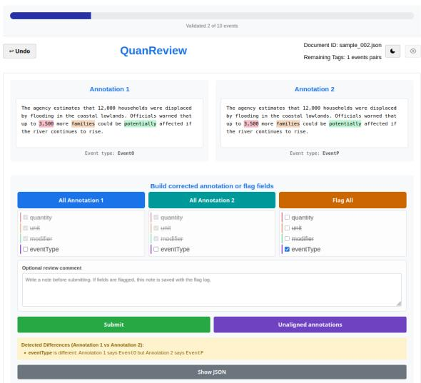

# QuanReview: Offline, Auditable Reconciliation of Human and LLM Span Annotations

Matteo Musacchio1, Juan Cruz Giner Pulero1, Isabel Castañeda1, Naomi Couriel1, Yelena Mejova2, Mariano G. Beiró1,4, Kyriaki Kalimeri2,3

1Universidad de San Andrés, Buenos Aires, Argentina

2ISI Foundation, Turin, Italy

3UNICEF, New York, NY, USA

4CONICET, Buenos Aires, Argentina

## Abstract

Structured span annotations, such as quantities with their units, uncertainty modifiers, and event classes, are expensive to create and hard to keep trustworthy once language models enter the loop. We present QuanReview, an opensource system for auditing and correcting such annotation layers. QuanReview aligns two annotation streams over the same documents at character level, resolves unambiguous cases by an explicit and logged policy, and routes candidate conflicts to a browser-based adjudication interface where reviewers accept either side, build field-level hybrids, or flag items for reannotation. A campaign manager assigns documents to multiple annotators with configurable redundancy, computes agreement at document and span level, auto-merges unanimous documents, and exports the corrected layer in the original file format, so that it can replace the original annotation files directly. Applied to a 4,457-record humanitarian benchmark and an LLM extraction stream, the system fully automerged 8% of documents, applied automatic policy decisions to a further 1,513 records, and concentrated human attention on 3,131 candidate conflicts, a mean of 5.4 per reviewed document.

## 1 Introduction

Dataset curators eventually discover that their reference annotations disagree with what a strong language model extracts from the same text. Some disagreements are model errors, some are reference errors, and some are genuine ambiguities. Deciding which is which, at scale and without corrupting the dataset, is a workflow problem rather than a modelling problem. As language models are increasingly used both to produce and to consume span-level annotation layers, keeping those layers trustworthy has become a first-class concern for the NLP community: benchmark leakage, silver-labelled training data, and LLM-assisted reannotation all depend on being able to reconcile human and model annotations with an auditable trail. Every record needs a position-anchored comparison between the two versions, one-sided cases need an explicit policy instead of silent handling, real conflicts need a human decision, and all of it needs an audit trail so the corrected dataset can be trusted later.

QuanReview packages this workflow into one system. It was built to audit the quantitative annotation layer of HumSet (Fekih et al., 2022; Liberatore et al., 2024), where each record binds a number to its unit, uncertainty modifier, and event class, but the schema is configurable and the workflow applies to other typed-span annotation tasks. Its target users are dataset curators who maintain spanannotation layers, NLP researchers who need defensible corrected references, and domain experts, in our case humanitarian analysts, who review model output through a browser without touching JSON.1

## 2 Related systems

General-purpose annotation platforms support parts of this problem. INCEpTION (Klie et al., 2018) includes a curation stage that compares and merges multiple annotators’ work, and Label Studio (Tkachenko et al., 2020–2024) documents workflows for inter-annotator agreement and for comparing model predictions with annotations; doccano (Nakayama et al., 2018) and Prodigy (Montani and Honnibal, 2018) focus on annotation from raw text and model-assisted labelling, while Argilla (Argilla, 2023) targets LLM-in-theloop data curation. Presenting automated recommendations alongside human judgements can introduce automation and anchoring biases (Skitka et al., 1999), motivating our use of neutral stream labels, randomised presentation order, reversible decisions, and explicit conflict routing. QuanReview does not replace these platforms and was itself preceded by INCEpTION (Klie et al., 2018) in creating the reference layer. Its contribution is a specialised, lightweight combination for post-hoc reconciliation of two complete annotation exports: local, filefirst offline operation with no external server or hosted service, deterministic character-offset alignment of finished streams, explicit and configurable policies for one-sided records, conflict-only routing instead of re-annotation, field-level hybrid decisions, reversible record-level audit logs, and export in the input schema and file layout so that the corrected layer replaces the original files directly. Table 1 focuses on systems that support some form of adjudication or multi-annotator workflow; fromscratch annotation tools such as brat (Stenetorp et al., 2012) and doccano are omitted from the table because they have no stage for reconciling two existing annotation sets. We have not yet compared QuanReview with an established platform on the same curation task; such a controlled head-to-head comparison is left for future work.

## 3 System overview

QuanReview is a Python application with a browser interface (Eel); it runs fully offline on local files, and no document text or annotation leaves the machine. It has five components, wired into the correction pipeline of Figure 1.

Alignment core. A deterministic engine pairs the two streams per document on overlapping character offsets and compares matched records field by field. The fields and their comparison paths are declared in a YAML schema file; the quantity schema used in our campaigns (quantity, unit, modifier, event type) is one instance; the schema is declarative, allowing additional typed-span and categorical annotation schemas to be specified through the same configuration mechanism.

Policy engine. One-sided records are resolved by explicit, logged policy rather than silently. Reference-only records are kept. Model-only records are not discarded: because a share of them may be genuine events the reference layer missed rather than model hallucinations, they are automatically deferred and queued for a second annotation round rather than added to the corrected layer. Every automatic policy decision is logged, and every reviewer decision is reversible.

Adjudication interface. Candidate conflicts appear one at a time in a two-column browser view showing the source text with both spans highlighted (Figure 2). The reviewer accepts either side, constructs a field-by-field hybrid, or flags the pair. A flag is an explicit “neither candidate is acceptable and I cannot resolve this from the two streams alone” signal: the pair is withheld from the corrected layer and queued for a fresh second annotation round on the original text, rather than the reviewer being forced to guess. Flagging is thus a routing action that sends hard cases back to annotation; it is not itself a correction. Undo, perdocument review state, and free-text review comments are built in, and every decision is written to disk immediately.

Campaign manager. A configuration file declares the annotators, the redundancy level, and an optional validation split. The orchestrator assigns only documents that actually contain discrepancies, balances load across annotators, and gives each of them a one-command launcher that shows only their assignment. The integration step computes Fleiss’ κ (Fleiss, 1971) over adjudication decisions, auto-merges documents on which all assigned annotators agree, and emits a conflict bundle per disagreement that a resolution command-line tool closes out.

Export layer. Corrected documents are written in the same JSON schema as the input, together with per-document review-state files and comment logs. The corrected layer can therefore replace the original annotation files directly, with provenance for every changed record.

## 4 User workflows

Single-reviewer audit. Point the tool at a reference directory and a model-output directory, review the conflict queue, export the corrected layer. This is the fastest way to answer the question “how much should I trust this annotation layer?”

Multi-annotator campaign. Declare annotators and redundancy in the configuration file, run the orchestrator, and let each annotator launch their own session. Integration reports agreement, merges unanimous documents, and routes the remainder to an adjudicator.

Model audit. Load two model outputs instead of a reference and a model to inspect where systems disagree before spending any human annotation time. The same alignment, policies, and interface apply.

<table><tr><td>System</td><td>Two-stream reconcile</td><td>Field-level hybrid</td><td>Char-level align</td><td>IAA/ campaign</td><td>Decision audit log</td></tr><tr><td>Label Studio</td><td>partial</td><td></td><td></td><td>partial</td><td>partial</td></tr><tr><td>INCEpTION</td><td>partial</td><td>partial</td><td></td><td>√</td><td>partial</td></tr><tr><td>Prodigy</td><td>partial</td><td></td><td></td><td></td><td>partial</td></tr><tr><td>Argilla</td><td>partial</td><td>一</td><td></td><td>partial</td><td>√</td></tr><tr><td>QuanReview</td><td>√</td><td>√</td><td>√</td><td>√</td><td>√</td></tr></table>

Table 1: Feature comparison across annotation and adjudication tools. QuanReview is the only system combining two-stream reconciliation, field-level hybrids, and character-level alignment. Partial denotes support for a related capability but not the complete post-hoc two-stream workflow defined here.

  
Figure 1: System architecture. Reference (HumSet) and model (LLM) spans are aligned at character level; the policy engine auto-resolves one-sided records (reference-only kept, model-only deferred) and routes conflicting pairs to the adjudication UI. Reviewed documents are merged across annotators, unanimous ones automatically, into the corrected layer, which replaces the original files directly; flagged pairs and deferred model-only records are queued for a second annotation round.

## 5 Demonstration scenario

The live demonstration walks through a miniature campaign on humanitarian situation-report excerpts. We configure the schema, launch two reviewer sessions, and adjudicate two characteristic conflicts: a quantity whose event class differs between the streams, and a record where one stream missed the uncertainty modifier. We also show a model-only record the reference layer missed being automatically deferred to a second annotation round rather than silently dropped. We then run integration, inspect the agreement report, and open the exported corrected files next to the originals to show that they share the same schema and file layout and can replace them directly. Visitors can drive the interface themselves on the sample dataset.

## 6 System validation

We report workflow-level evidence of what the system automates and what it asks of people.

Each annotated record in this benchmark is a typed span described by four fields, which are also the fields QuanReview compares stream against stream: the quantity (the measured value and its text span), its unit of measurement, an uncertainty modifier (e.g. about, at least, up to), and the event type that classifies what the quantity refers to. The per-field agreement in Table 4 is reported over exactly these four fields.

Aligning the HumSet quantitative reference layer (4,457 records over 635 documents) with a GPT-4.1 extraction stream, QuanReview fully automerged 53 documents (8%) that contained no conflicting pairs, applied automatic policy decisions to a further 1,513 records inside reviewed documents (792 exactly matching records retained, 434 reference-only records retained, and 287 modelonly records excluded from the corrected layer and queued for re-annotation), and routed 3,131 candidate conflict pairs to reviewers, a mean of 5.4 per reviewed document. Model-only records are preserved separately because some may correspond to genuine annotations missing from the reference layer.

  
Figure 2: The adjudication interface, showing one conflict pair. The two candidates appear under neutral, order-randomised labels; in this pair they agree on quantity, unit, and modifier but differ on event type (EventO vs. EventP), the disagreement the reviewer resolves below.

Eight reviewers from two institutions adjudicated conflicts through the interface, with an overlap subset of five reviewers assigned to a common set of ten documents (107 shared annotations) used to estimate inter-annotator agreement. Table 2 summarises per-reviewer activity at annotation level; flag rates range from 2.0% to 24.5% of pairs, isolating the ambiguous cases that the flag mechanism is meant to catch.

<table><tr><td>Rev.</td><td>Docs</td><td>Pairs</td><td>Anns</td><td>Flags</td><td>Flag rate</td><td>Changed vs ref.</td></tr><tr><td>R1</td><td>141</td><td>745</td><td>996</td><td>166</td><td>22.3%</td><td>42.3%</td></tr><tr><td>R2</td><td>138</td><td>761</td><td>609</td><td>69</td><td>9.1%</td><td>20.9%</td></tr><tr><td>R3</td><td>133</td><td>703</td><td>978</td><td>14</td><td>2.0%</td><td>71.3%</td></tr><tr><td>R4</td><td>118</td><td>580</td><td>539</td><td>85</td><td>14.7%</td><td>12.4%</td></tr><tr><td>R5</td><td>65</td><td>352</td><td>406</td><td>53</td><td>15.1%</td><td>52.8%</td></tr><tr><td>R6</td><td>34</td><td>193</td><td>266</td><td>36</td><td>18.7%</td><td>62.7%</td></tr><tr><td>R7</td><td>28</td><td>139</td><td>194</td><td>34</td><td>24.5%</td><td>59.7%</td></tr><tr><td>R8</td><td>27</td><td>109</td><td>172</td><td>24</td><td>22.0%</td><td>56.9%</td></tr></table>

Table 2: Per-reviewer activity over the eight-reviewer campaign. Docs and Pairs count the documents and discrepant pairs each reviewer adjudicated, Anns the annotations they saved, Flag rate the share of their pairs flagged, and Changed vs ref. the share of pairs whose decision differs from the reference. Rates are descriptive because reviewers were assigned different sets of conflict pairs. Reviewers are pseudonymous.

Across all annotation outcomes recorded by the campaign (Table 3), reviewers accepted the reference version unchanged in 12.7% of outcomes and the model version unchanged in 0.6%; field-level hybrids accounted for 63.2% of the outcomes and were by far the most common human-selected resolution (82.7% of the 3,150 outcomes resolved by a reviewer), while the remaining 23.6% are matched pairs on which both streams already agreed and which were retained automatically. The high hybrid rate confirms that the per-field adjudication path is exercised in practice rather than being a rarely used affordance, and that reviewers do not default to accepting the reference layer.

<table><tr><td>Outcome</td><td>Anns</td><td>%</td></tr><tr><td>Reference accepted unchanged</td><td>522</td><td>12.7</td></tr><tr><td>Model accepted unchanged</td><td>24</td><td>0.6</td></tr><tr><td>Field-level hybrid</td><td>2,604</td><td>63.2</td></tr><tr><td>Both streams agreed</td><td>971</td><td>23.6</td></tr><tr><td>Total</td><td>4,121</td><td>100.0</td></tr></table>

Table 3: Distribution of final annotation outcomes recorded by the campaign. Both streams agreed denotes automatically retained matched records that were not routed to reviewers.

On the 107 annotations shared across the overlap subset, Fleiss’ κ (Fleiss, 1971) over adjudication decisions is 0.624 on all 78 shared pairs, and 0.720 on the 13 pairs that no reviewer flagged (65 of the 78 overlap pairs drew at least one flag), with per-field values that expose which parts of the schema are hardest to reconcile (Table 4). On the full set, quantity and modifier show substantial agreement, unit is fair, and event type is the ambiguous frontier of the schema (Figure 2), consistent with the fact that most flagged pairs push back on the same category boundary. Agreement is higher on pairs that no reviewer flagged, indicating that items flagged by at least one reviewer tend to be harder to adjudicate; the unflagged result is descriptive, however, because it rests on only 13 pairs. Reviewers themselves show essentially no agreement on which pairs warrant a flag (Fleiss κ = −0.01 over a binary flagged/unflagged label per pair). We therefore treat flagging as an individual uncertainty signal and routing mechanism rather than as a consensus annotation. Agreement here measures adjudication consistency, not independent annotation reliability.

The system is open source under the MIT license: https://github.com/ mattemusacchio/quanreview (Python + Eel; launchers for macOS, Linux, and Windows; dependencies pinned with uv; run\_demo.sh launches the tool on a bundled sample dataset).

<table><tr><td>Field</td><td>κ (all pairs)</td><td>κ (unflagged)</td></tr><tr><td>Event type</td><td>0.225</td><td>0.473</td></tr><tr><td>Quantity</td><td>0.688</td><td>0.717</td></tr><tr><td>Unit</td><td>0.337</td><td>0.529</td></tr><tr><td>Modifier</td><td>0.683</td><td>1.000</td></tr><tr><td>Overall</td><td>0.624</td><td>0.720</td></tr></table>

Table 4: Fleiss’ κ over the five-reviewer overlap subset (10 shared documents), on all 78 shared pairs and on the 13 pairs no reviewer flagged. Agreement is higher on the unflagged pairs, a descriptive result given their small number; event type is the schema’s hardest field.

## 7 Conclusions

QuanReview turns the reconciliation of human and LLM annotation layers from an ad-hoc scripting task into an auditable, offline workflow: it aligns two streams at character level, resolves one-sided records by explicit and logged policy, routes only genuine conflicts to a browser-based adjudication interface, and exports a corrected layer in the same JSON schema and file layout as the input, so it can replace the original annotation files directly without changing any downstream tooling. On a 4,457-record humanitarian benchmark it automerged 8% of documents, applied explicit policies to a further 1,513 records, including 287 modelonly records deferred for re-annotation, and concentrated reviewers on 3,131 candidate conflicts, where field-level hybrids, rather than wholesale acceptance of either stream, accounted for most decisions.

Two directions extend the system beyond its current scope. The first is generalisability across annotation schemas: the comparison layer is already schema-driven, and we are broadening it so that additional schema-compatible typed-span tasks can be reconciled without touching code. The second is dynamic configuration, letting schemas, policies, and redundancy be edited from the interface at run time rather than fixed in a static file before a campaign begins. Together these would let QuanReview serve as a general adjudication front-end for keeping annotation layers trustworthy as models increasingly both produce and consume them.

## 8 Limitations

QuanReview adjudicates between two streams; it does not support annotation from raw text, for which established platforms exist and were used to create the reference layer in the first place. Agreement is currently computed over adjudication decisions, which measures reviewer consistency rather than independent annotation reliability. The schema is configurable, but the system has so far been exercised on one schema family, so we claim extensibility to other typed-span tasks rather than demonstrated domain independence.

## Ethics Statement

Annotation campaigns can process sensitive humanitarian text. Because the tool runs locally and stores only annotations and review metadata, data governance stays with the dataset owner, and exported logs identify reviewers by pseudonymous annotator IDs. The adjudication interface labels the two streams neutrally (Annotation 1 and Annotation 2) and randomises their left–right order independently for every pair, to limit anchoring on the reference stream.

## References

Argilla. 2023. Argilla: Open-source data curation platform for LLMs. https://github.com/ argilla-io/argilla.

Selim Fekih, Nicolo’ Tamagnone, Benjamin Minixhofer, Ranjan Shrestha, Ximena Contla, Ewan Oglethorpe, and Navid Rekabsaz. 2022. HumSet: Dataset of multilingual information extraction and classification for humanitarian crises response. In Findings ofthe Associationfor Computational Linguistics: EMNLP 2022, pages 4379–4389, Abu Dhabi, United Arab Emirates. Association for Computational Linguistics.

Joseph L. Fleiss. 1971. Measuring nominal scale agreement among many raters. Psychological Bulletin, 76(5):378–382.

Jan-Christoph Klie, Michael Bugert, Beto Boullosa, Richard Eckart de Castilho, and Iryna Gurevych. 2018. The INCepTION platform: Machine-assisted and knowledge-oriented interactive annotation. In Proceedings ofthe 27th International Conference on Computational Linguistics: System Demonstrations, pages 5–9.

Daniele Liberatore, Kyriaki Kalimeri, Derya Sever, and Yelena Mejova. 2024. Quantitative information extraction from humanitarian documents. In Proceedings ofthe 2024 International Conference on Information Technology for Social Good (GoodIT ’24), Bremen, Germany. ACM.

Ines Montani and Matthew Honnibal. 2018. Prodigy: A modern annotation tool for creating training data for machine learning models. https://prodi.gy.

Hiroki Nakayama, Takahiro Kubo, Junya Kamura, Yasufumi Taniguchi, and Xu Liang. 2018. doccano: Text annotation tool for human. Software available from https://github.com/doccano/doccano.

Linda J. Skitka, Kathleen L. Mosier, and Mark Burdick. 1999. Does automation bias decision-making? International Journal ofHuman-Computer Studies, 51(5):991–1006.

Pontus Stenetorp, Sampo Pyysalo, Goran Topic,´ Tomoko Ohta, Sophia Ananiadou, and Jun’ichi Tsujii. 2012. brat: a web-based tool for NLP-assisted text annotation. In Proceedings of the Demonstrations at the 13th Conference ofthe European Chapter of the Associationfor Computational Linguistics, pages 102–107.

Maxim Tkachenko, Mikhail Malyuk, Andrey Holmanyuk, and Nikolai Liubimov. 2020– 2024. Label Studio: Data labeling software. https://github.com/HumanSignal/ label-studio.