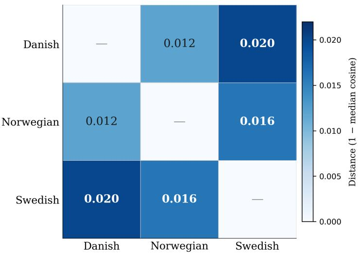

# Quantifying Language Distance among Closely Related Languages Using Pretrained Language Models: A Case Study on the North Germanic Branch

Yiping Bai

Guangdong Haiqixing Marine Technology Co., Ltd., Guangzhou 510000, China

ORCID: 0009-0004-2842-8241

2727100@qq.com

September 2026

## Abstract

Among closely related North Germanic languages, the quantification of language distance has traditionally relied on qualitative methods, lacking a unified multi-dimensional computational framework. Multilingual pretrained models based on the Transformer architecture can map texts from diferent languages into a shared vector space, enabling quantitative measurement of language distance. This paper focuses on the three North Germanic languages—Danish, Norwegian (Bokmål), and Swedish—and proposes a three-metric quantitative framework based on pretrained language models: (1) sentence-level semantic distance, computed as cosine similarity between LaBSE and mBERT encodings of parallel sentences; (2) orthographic fragmentation rate, measuring subword tokenization eficiency when cross-applying monolingual BERT vocabularies to parallel texts; (3) MLM predictability, comparing prediction confidence and entropy in masked language modeling using mBERT across languages. Using 150 trilingual parallel sentence triplets from the Tatoeba corpus as controlled samples, we obtain consistent distance rankings on two independent models: LaBSE: da–no 0.012 < no–sv 0.016 < da–sv 0.020; mBERT: da–no 0.016 < no–sv 0.045 ≈ da–sv 0.046. This ranking is consistent with the historical linguistic conclusion that “400 years of Danish rule over Norway (1380– 1814) led to highly cognate written languages.” The three metrics—semantic, orthographic, and predictability—converge on the same conclusion, providing a reproducible computational framework for the quantitative study of distance among closely related languages, extensible in principle to more branches of the Indo-European language family, pending validation on additional language groups.

Keywords: quantitative linguistics; language distance; pretrained language models; sentence embeddings; mutual intelligibility; North Germanic languages; LaBSE; mBERT

## 1 Introduction

The genetic relationships and divergence mechanisms among closely related languages within the Indo-European family constitute a core problem in historical comparative linguistics, with language distance as its central measurable concept. Since Sir William Jones’s discovery in 1786 of the genetic relationship between Sanskrit, Greek, and Latin, historical comparative linguistics has established mature comparison methods [2]. However, traditional approaches rely primarily on qualitative argumentation; diferent studies employ their own word lists and judgment criteria, making cross-branch comparison dificult. Historical narratives often lack quantitative distance measurements, rendering conclusions hard to falsify [5]. The development of artificial intelligence is profoundly changing research paradigms across the sciences, and linguistics is no exception. The maturation of multilingual pretrained models based on the Transformer architecture—such as LaBSE [6] and mBERT [4]—alongside large-scale parallel corpora such as Tatoeba [17] and OPUS [16], has made it possible to compute cross-lingual distances while controlling for semantic content.

The three mainland Scandinavian languages—Danish, Norwegian, and Swedish—belong to the North Germanic branch, descending from the common ancestor Old Norse. They have long exhibited the phenomenon of “semicommunication” [11]. Between 1380 and 1814, Denmark ruled Norway for approximately

400 years; Danish became the written language of Norway, and after independence, Norway developed Bokmål, which is essentially based on a Danish substrate [18]. Meanwhile, spoken Danish underwent radical sound changes such as the emergence of stød (glottal stop), creating a severe disconnect between the spoken and written forms [10]. Gooskens (2007) showed that Levenshtein phonetic distances explained 64% of the variance in spoken mutual intelligibility among the three languages $( r = - 0 . 8 0 )$ , but lexical distances failed to reach significance $( r = - 0 . 3 6 , p = 0 . 1 1 )$ [8]. These studies are all based on the spoken modality; whether language distance at the written text level follows the same pattern remains systematically unverified.

Taking the three North Germanic languages as a case study, this paper proposes a three-metric quantitative framework based on pretrained language models—sentence vector distance, fragmentation rate, and masked language modeling (MLM) confidence—measuring written language distance from three perspectives: semantics, orthography, and predictability. We cross-validate on two independent models and compare results with both qualitative conclusions from historical linguistics and spoken mutual intelligibility data.

## 2 Related Work

## 2.1 Mutual Intelligibility among North Germanic Languages

Research on mutual intelligibility among the three mainland Scandinavian languages has a long academic tradition. [11] was the first to systematically examine the semicommunication phenomenon in Scandinavia. [8] measured spoken mutual intelligibility among native speakers of the three languages through controlled experiments, finding that Danish speakers’ ability to understand Norwegian and Swedish was significantly lower than that of Norwegian and Swedish speakers to understand each other, revealing the asymmetry of intelligibility. [9] further validated these findings on a larger sample of Germanic languages, showing that lexical similarity, phonological distance, and speech rate all significantly contributed to intelligibility.

However, these studies focus primarily on the spoken modality. While computational exploration of written language distance has been conducted using character n-grams and perplexity [7], systematic quantification using pretrained language models—especially in comparison with spoken mutual intelligibility—remains rare.

## 2.2 Pretrained Language Models and Language Distance

Sentence embeddings and language distance. [4] introduced the “pretrain then fine-tune” paradigm. The multilingual version mBERT was jointly trained on 104 languages, achieving cross-lingual semantic alignment. [3] scaled cross-lingual pretraining to 100 languages with XLM-R. [6] designed LaBSE specifically for cross-lingual sentence embeddings, achieving excellent results on translation alignment tasks across 109 languages. Sentence-BERT [14] further demonstrated that siamese BERT networks can eficiently produce high-quality sentence embeddings. [13] further demonstrated that mBERT’s hidden layer representations encode rich typological signals: language distances computed from representations of 100 languages can recover known major language family classifications. Similarly, sentence embedding models such as LaBSE show clustering by language family. These findings suggest that multilingual pretrained model representations implicitly encode genetic and typological relationships. However, finegrained distance ranking among closely related languages within the same branch remains underexplored.

Measurement methods for language distance. Several technical approaches have been explored. [7] defined cross-entropy distance between languages based on character-level n-gram language models. In historical linguistics, Swadesh’s glottochronology [15] and Heeringa’s Levenshtein phonetic distance measurement also provide references. Recently, researchers have focused on subword tokenization fertility as a language feature indicator: [1] found that languages with higher fragmentation rates consume more tokens in commercial large language models, indirectly afecting model performance. However, crossapplying monolingual BERT vocabularies to parallel texts in other languages and using fragmentation rate as a proxy for orthographic distance remains underexplored.

MLM predictability and language probes. MLM masked token prediction confidence reflects a model’s sensitivity to specific language contexts. This metric has been used in cross-lingual transfer studies [12] and multilingual model quality assessment. However, directly using MLM confidence as a language distance measure requires caution, as it is simultaneously afected by training corpus distri bution, vocabulary coverage, and morphological complexity, making it more suitable as an “exploratory

proxy indicator.”

## 2.3 Research Questions

The core research question of this paper is: Can a three-metric quantitative framework based on pretrained language models quantitatively verify the historical genetic relationships among the three North Germanic languages from the written modality, and complement spoken mutual intelligibility data?

Specific sub-questions:

(RQ1) Do two independent multilingual models (LaBSE and mBERT) yield consistent distance rankings?

(RQ2) Can orthographic fragmentation rate corroborate sentence vector distance from the perspective of tokenization granularity?

(RQ3) How do written text distance results compare with spoken mutual intelligibility research?

Beyond these, the paper also pursues a methodological goal: using the historically well-established North Germanic branch as a calibration target to validate the framework’s efectiveness, providing a reproducible methodological foundation for future extension to less-studied closely related language groups.

## 3 Data

## 3.1 Parallel Sentence Triplet Construction

Experimental data were sourced from the Tatoeba parallel corpus [17]. Tatoeba is an open-source multilingual sentence collection platform; as of September 2026, it contains approximately 13.57 million sentences covering 429 languages with approximately 28.5 million link relationships. Its text sentences are released under the Creative Commons Attribution 2.0 France license (CC BY 2.0 FR; see https://tatoeba.org/en/terms\_of\_use). This study uses only text sentences; no audio data were involved. Export files are in plain-text CSV format. Danish has 66,455 sentences, Norwegian Bokmål 18,858, and Swedish 56,768.

We extracted trilingual parallel sentences in Danish (ISO 639-3: dan, abbreviated da), Norwegian Bokmål (nob, no), and Swedish (swe, sv). Filtering criteria: (1) using Danish sentences as anchors, find sentences simultaneously linked to both Norwegian and Swedish; (2) all three language sentences must be non-empty. This yielded 456 trilingual triplets, from which 150 were sampled with random seed 42.

Table 1 shows five sample triplets.

Table 1: Sample parallel sentence triplets
<table><tr><td>#</td><td>Danish</td><td>Norwegian</td><td>Swedish</td></tr><tr><td>1</td><td>Dette er en midlertidig sætning.</td><td>Dette er en midlertidig setning.</td><td>Det här är en tillfällig mening.</td></tr><tr><td>3</td><td>Hvorfor kom du ikke?</td><td>Hvorfor kom du ikke?</td><td>Varför kom du inte?</td></tr><tr><td>7</td><td>Jeg bor ikke i Helsinki.</td><td>Jeg bor ikke i Helsingfors.</td><td>Jag bor inte i Helsingfors.</td></tr><tr><td>12</td><td>Hun spiller tennis hver dag.</td><td>Hun spiller tennis hver dag.</td><td>Hon spelar tennis varje dag.</td></tr><tr><td>15</td><td>Vi har en far.</td><td>Vi har en far.</td><td>Vi har en far.</td></tr></table>

Notable linguistic phenomena: (1) Group 3 shows identical written forms in Danish and Norwegian; (2) in Group 7, Danish uses “Helsinki” while Swedish uses “Helsingfors”; Norwegian also uses “Helsingfors” here, reflecting the historical Swedish influence on Norwegian toponymic conventions.

## 3.2 Experimental Environment

Experiments were conducted in Google Colab. Data preparation (Tatoeba download, browsing, triplet construction) was performed on a local Windows 11 machine. Model inference used Colab computing resources (Table 2).

Table 2: Computing resources and model configuration
<table><tr><td>Exp.</td><td>Model</td><td>Size</td><td>Hardware</td><td>Framework</td></tr><tr><td>① Sentence vector</td><td>LaBSE</td><td>~1.8GB</td><td>CPU</td><td>sentence-transformers 5.7.0</td></tr><tr><td>② Fragmentation</td><td>3 monolingual BERTs</td><td>hundreds of KB each</td><td>CPU</td><td>transformers 5.16.1</td></tr><tr><td>③ Dual-metric</td><td>mBERT</td><td>~700 MB</td><td>T4 GPU</td><td>transformers 5.16.1, PyTorch 2.11.0</td></tr></table>

## 4 Methods

We propose a three-metric quantitative framework measuring written language distance from three complementary perspectives. All three experiments share the same 150 trilingual parallel sentences as controlled samples, ensuring constant semantic content so that cross-lingual diferences reflect only linguistic properties.

Table 3 summarizes the experimental design.

Table 3: Overview of three-indicator experimental design
<table><tr><td>Metric</td><td>Aspect</td><td>Model</td><td>Logic</td></tr><tr><td>Sentence vector distance</td><td>Semantics</td><td>LaBSE / mBERT</td><td>Closer vectors ⇒ closer languages</td></tr><tr><td>Fragmentation rate</td><td>Orthography</td><td>3 monolingual BERT vocabs</td><td>More efficient cross-tokenization ⇒ closer scri</td></tr><tr><td>MLM confidence</td><td>Predictability</td><td>mBERT MLM head</td><td>More accurate cross-prediction ⇒ more share</td></tr></table>

## 4.1 Metric 1: Sentence Vector Semantic Distance

The principle is to encode diferent language versions of the same sentence into fixed-dimensional vectors and compute cross-lingual cosine similarity. Since semantic content is held constant (parallel sentences express the same propositions), similarity diferences reflect only the efect of linguistic form on vector representations.

Experiment ○1 uses LaBSE [6], designed for cross-lingual sentence embeddings, trained on translation pairs in 109 languages, outputting 768-dimensional normalized vectors. For 150 triplets, we compute 150 cosine similarity values per language pair (da–no, no–sv, da–sv) and take the median as the representative value. Distance is defined as d = 1 − median(cos θ).

Experiment ○3 A uses mBERT [4] (google-bert/bert-base-multilingual-cased) as an independent cross-validation. mBERT is jointly trained on 104 languages with a masked language modeling objective. Sentence vectors are obtained from the [CLS] position of the last hidden state, L2-normalized before computing cosine similarity.

The two models difer substantially in architecture: LaBSE uses a dual-tower structure trained on translation pairs, directly optimizing sentence embedding quality; mBERT is a general multilingual encoder where sentence embeddings are a byproduct. If both yield consistent rankings, the modelindependence of the conclusion is validated.

## 4.2 Metric 2: Orthographic Fragmentation Rate

The principle is to segment Language A’s sentences using Language B’s monolingual BERT vocabulary and compute the fragmentation rate—the average number of subword tokens per whitespace-delimited word. The closer the two orthographies, the more eficiently B’s vocabulary segments A’s text.

Experiment ○2 uses three monolingual BERT tokenizers (vocabulary files only, each hundreds of KB):

• Danish: Maltehb/danish-bert-botxo (vocabulary 253K)

• Norwegian: NbAiLab/nb-bert-base (vocabulary 996K)

• Swedish: KB/bert-base-swedish-cased (vocabulary 399K)

For each language in the 150 triplets, we compute F = |subtokens|/|words| using all three vocabularies, taking the median. This yields a 3 × 3 fragmentation rate matrix.

## 4.3 Metric 3: MLM Predictability

The principle is to perform masked prediction on each language’s sentences and measure model confidence and entropy. Diferences in “predictability” across languages may reflect training corpus coverage, contextual transparency, and other factors, providing an exploratory proxy for mutual intelligibility.

Experiment ○3 B uses the mBERT MLM head. For each language, all alphabetic tokens of length $\geq 3$ are masked one at a time, recording: (1) top-1 prediction confidence; (2) prediction distribution entropy (bits); (3) top-1 accuracy; (4) top-10 recall.

## 5 Results

## 5.1 Sentence Vector Semantic Distance

Table 4 presents the distance matrices from both models.

Table 4: Distance matrices from two models (1 − median cos θ)
<table><tr><td colspan="4">(a) LaBSE</td></tr><tr><td></td><td>da</td><td>no</td><td>SV</td></tr><tr><td>da</td><td>0.0000</td><td>0.0121</td><td>0.0204</td></tr><tr><td>no</td><td>0.0121</td><td>0.0000</td><td>0.0156</td></tr><tr><td>SV</td><td>0.0204</td><td>0.0156</td><td>0.0000</td></tr><tr><td rowspan="2"></td><td>(b) mBERT</td><td></td><td></td></tr><tr><td>da</td><td>no</td><td>SV</td></tr><tr><td>da</td><td>0.0000</td><td>0.0160</td><td>0.0462</td></tr><tr><td>no</td><td>0.0160</td><td>0.0000</td><td>0.0449</td></tr><tr><td>SV</td><td>0.0462</td><td>0.0449</td><td>0.0000</td></tr></table>

Table 5 gives detailed similarity statistics.

Table 5: Language pair similarity statistics (median / mean / std)
<table><tr><td>Pair</td><td>LaBSE</td><td>mBERT</td></tr><tr><td>da-no</td><td>0.9879 0.9725 0.0474</td><td>0.9840 0.9753 0.0245</td></tr><tr><td>no-sv</td><td>0.9844 0.9669 0.0525</td><td>0.9551 0.9476 0.0359</td></tr><tr><td>da-sv</td><td>0.9796 0.9636 0.0485</td><td>0.9538 0.9432 0.0410</td></tr></table>

Both models yield the same distance ranking: da–no (closest) < no–sv < da–sv (most distant). However, resolution difers: LaBSE distinguishes three levels $( 0 . 9 8 8 > 0 . 9 8 4 > 0 . 9 8 0 )$ , while mBERT separates only two tiers $( 0 . 9 8 4 \gg 0 . 9 5 5 \approx 0 . 9 5 4 )$ . This confirms that LaBSE, designed for cross-lingual alignment, outperforms the general-purpose mBERT for fine-grained distance measurement.

Figure 1 shows the LaBSE distance heatmap.

## 5.2 Orthographic Fragmentation Rate

Table 6 presents the $3 \times 3$ fragmentation rate matrix.

Table 6: Fragmentation rate matrix (subtokens per word, median)
<table><tr><td>Text \ Vocab</td><td>da</td><td>no</td><td>SV</td></tr><tr><td>da</td><td>1.2000</td><td>1.5000</td><td>1.7071</td></tr><tr><td>no</td><td>1.3693</td><td>1.5000</td><td>1.6000</td></tr><tr><td>SV</td><td>1.5000</td><td>1.5505</td><td>1.2000</td></tr></table>

LaBSE Language Distance Matrix (North Germanic)  
  
Figure 1: LaBSE language distance heatmap (1 − median cosine similarity)

The diagonal is the baseline (monolingual vocabulary segmenting its own language); of-diagonal cells are cross-lingual. Bold diagonal entries are self-segmentation baselines; of-diagonal entries measure cross-lingual fragmentation. Key observations:

(1) Danish text segmented with the Norwegian vocabulary (1.5000) is more eficient than with the Swedish vocabulary (1.7071), indicating closer da–no orthographic proximity.

(2) Swedish text segmented with the Norwegian (1.5505) and Danish (1.5000) vocabularies yields similar eficiency, indicating comparable sv distance to both da and no.

(3) The Norwegian vocabulary segments both foreign languages relatively ineficiently (1.5000 / 1.5505), likely related to its larger vocabulary size (996K). It should be noted that the three vocabulary sizes difer substantially (da 253K / no 996K / sv 399K); vocabulary size is a confounding variable afecting absolute fragmentation rates. Cross-lingual comparison should therefore focus on relative increases for the same text across diferent vocabularies rather than absolute values.

## 5.3 MLM Predictability

Table 7 presents MLM prediction statistics for the three languages.

Table 7: MLM masked token prediction confidence statistics
<table><tr><td>Lang.</td><td>Top-1 conf.</td><td>Entropy (bit)</td><td>Top-1 acc.</td><td>Top-10 recall</td><td># masks</td></tr><tr><td>da</td><td>0.2581</td><td>6.0705</td><td>25.76%</td><td>55.25%</td><td>590</td></tr><tr><td>no</td><td>0.2333</td><td>6.2534</td><td>24.92%</td><td>56.15%</td><td>618</td></tr><tr><td>SV</td><td>0.2211</td><td>6.3745</td><td>24.92%</td><td>55.68%</td><td>634</td></tr></table>

Danish has the highest top-1 confidence (0.2581) and lowest entropy (6.0705 bit), indicating the highest contextual predictability under this model. Norwegian and Swedish show similar values. Top-10 recall varies little across the three languages (55.25%–56.15%), indicating comparable candidate set coverage; the diference lies mainly in the concentration of the prediction distribution.

## 6 Discussion

## 6.1 Consistency across Three Metrics

Table 8 summarizes the three metrics.

Sentence vector experiments (○1 ○3 A) directly provide pairwise distances; the fragmentation rate experiment (○2 ) corroborates da–no proximity from the orthographic perspective; the MLM experiment (○3 B) provides monolingual predictability rankings rather than pairwise language distances, which is why only the Danish value is shown. It should be noted that MLM confidence diferences may partly stem from training corpus coverage diferences across languages rather than pure intrinsic predictability, making this metric more suitable as an exploratory proxy. The three metrics converge on the same conclusion from semantic, orthographic, and predictability dimensions: Danish–Norwegian written distance is the smallest.

Table 8: Cross-comparison of three metrics
<table><tr><td>Metric</td><td>Aspect</td><td>da-no</td><td>no-sv</td><td>da-sv</td><td>Closest</td></tr><tr><td>Sentence vector (LaBSE)</td><td>Semantics</td><td>0.012</td><td>0.016</td><td>0.020</td><td>da-no</td></tr><tr><td>Sentence vector (mBERT)</td><td>Semantics</td><td>0.016</td><td>0.045</td><td>0.046</td><td>da-no</td></tr><tr><td>Fragmentation rate (no vocab)</td><td>Orthography</td><td>1.500</td><td></td><td>1.707</td><td>da-no</td></tr><tr><td>MLM confidence</td><td>Predictability</td><td>0.258</td><td></td><td></td><td>da most predictable</td></tr></table>

## 6.2 Comparison with Historical Linguistics

Results align closely with the historical background. During 1380–1814, Denmark ruled Norway for approximately 400 years through the Kalmar Union and the subsequent Dano-Norwegian dual kingdom [18]. Danish became Norway’s written language; although spoken Norwegian continued to evolve independently, written expression fully followed Danish norms. After Norway’s separation from Denmark in 1814, Bokmål developed on this basis, essentially a system with Danish as its substrate.

Our computational results quantitatively verify this historical influence: Danish–Norwegian distance is the smallest in sentence vector space (LaBSE 0.012, mBERT 0.016), and fragmentation rate confirms Danish text is most eficiently segmented by the Norwegian vocabulary (1.500 vs. 1.707). These values can be regarded as “metrological evidence of 400 years of Danish rule imprinted on language.”

## 6.3 Comparison with Spoken Mutual Intelligibility

Our results form an instructive comparison with Gooskens’s (2007) spoken intelligibility data. Table 9 provides a three-way quantitative comparison.

Table 9: Quantitative three-way comparison of language distance among North Germanic languages
<table><tr><td>Pair</td><td>Phonetic dist. [8]</td><td>Spoken intell. [8]</td><td>Sentence vector (this work)</td><td></td></tr><tr><td>da ↔ no</td><td>21.6%</td><td>72%-89%</td><td>LaBSE 0.012</td><td>mBERT 0.016</td></tr><tr><td> $\mathrm { n o }  \mathrm { s v }$ </td><td>21.7%</td><td>83%-89%</td><td>LaBSE 0.016</td><td>mBERT 0.045</td></tr><tr><td>da ↔ sv</td><td>27.7%</td><td>7%–58% (asymmetric)</td><td>LaBSE 0.020</td><td>mBERT 0.046</td></tr></table>

Phonetic distance values in Table 9 are averaged from [8] Table 5 across all listening points per language pair. Normalization is by total edit cost divided by the number of aligned phonetic symbols (maximum 100%); see [8] Section 3 for details. Phonetic and sentence vector distances yield the same ranking (da–no closest, da–sv most distant), demonstrating robustness across fundamentally diferent methods (Levenshtein character editing vs. Transformer vector encoding). Notably, spoken intelligibility shows significant directional asymmetry: Danes understand Swedish at 53% accuracy, far exceeding Swedes’ 24% for Danish, whereas sentence vector distance, as a symmetric measure, cannot capture this asymmetry—a fundamental diference between written and spoken modalities.

Table 10 provides a qualitative comparison.

Table 10: Qualitative comparison of written distance and spoken intelligibility
<table><tr><td>Dimension</td><td>This work (written)</td><td>[8] (spoken)</td></tr><tr><td>Dominant factor</td><td>Orthography / historical admin. language</td><td>Phonological distance</td></tr><tr><td>Closest relation</td><td>da-no (smallest vector distance)</td><td>Norwegian as “bridge language&quot;</td></tr><tr><td>Role of Danish</td><td>Written: closest to no</td><td>Spoken: most distant (radical sound changes)</td></tr><tr><td>Asymmetry</td><td>Symmetric by definition</td><td>Directional asymmetry present</td></tr></table>

These diferences arise not from experimental error but from written and spoken modalities being governed by diferent linguistic factors. In writing, Danish and Norwegian are highly isomorphic due to 400 years of shared written tradition, yielding minimal orthographic distance. In speech, Danish underwent independent and radical phonological changes in the modern period—emergence of stød, final consonant weakening and deletion, major vowel system reorganization—making spoken Danish significantly distant from both neighbors [8, 10]. Norwegian, with writing close to Danish and pronunciation close to Swedish, serves as a “bridge language” in spoken intelligibility.

[8] found phonetic distance strongly correlated with intelligibility (r = −0.80) while lexical distance was not significant $( r = - 0 . 3 6 )$ , indicating unequal contributions across dimensions. Our three-metric framework focuses on the written modality, forming a methodological complement to Gooskens’s spokenmodality multi-dimensional analysis.

## 6.4 Model Sensitivity

Although LaBSE and mBERT yield consistent rankings, their resolution difers substantially. LaBSE’s three similarity values fall within a narrow band of 0.980–0.988 (std ≈ 0.004), distinguishing three levels; mBERT separates into two tiers (0.984 vs. ∼0.955), with no–sv and da–sv nearly tied.

This diference stems from training objectives: LaBSE uses translation pairs, directly optimizing crosslingual alignment quality; mBERT uses MLM training, where cross-lingual alignment is a byproduct. For research requiring fine-grained discrimination among closely related languages, LaBSE is preferable; mBERT’s advantage lies in supporting MLM predictability measurement, which LaBSE cannot provide.

## 6.5 Significance and Applications

Our results do not merely rediscover the known North Germanic distance ordering but advance research on three levels:

First, methodological calibration. The historical relationships among the three North Germanic languages are well studied. We use them as a calibration target to validate the framework—analogous to calibrating a balance with known weights. Only after validation on known cases can the method be applied to less-studied groups (e.g., Iberian Romance, West Slavic), providing purely computational distance estimates.

Second, AI-driven paradigm shift in linguistics. Traditional language distance research relies on manual word list comparison or human perception experiments, limited by labor costs and subjective judgment. This work demonstrates how pretrained language models transform language distance from qualitative description to computable, reproducible, and scalable quantitative metrics—the same data, the same pipeline, anyone can reproduce our results on any language group. AI not only improves research eficiency but makes previously impractical measurements (e.g., simultaneously quantifying distance from semantic, orthographic, and predictability dimensions) feasible.

Third, practical applications. Quantitative language distance has clear productization potential. For example, our measured da–no distance of 0.012 suggests minimal expected loss when transferring Danish NLP models to Norwegian, providing a quantitative basis for cross-lingual NLP migration strategies. The da–sv distance (0.020) exceeding da–no implies higher translation memory reuse rates for Danish→Norwegian vs. Danish→Swedish, assisting translation companies in cost estimation. In language education, distance matrices can generate “language kinship maps” to help learners quantitatively assess: a Swedish speaker transitioning to Norwegian (distance 0.016) faces an easier task than transitioning to Danish (distance 0.020).

## 7 Conclusion

Using the three North Germanic languages as a case study, we constructed a three-metric language distance quantification framework based on pretrained language models. Main conclusions: (1) sentence vector distance, fragmentation rate, and MLM predictability consistently show Danish–Norwegian written distance as the smallest, consistent with the historical linguistic conclusion that “400 years of Danish rule (1380–1814) led to cognate written languages”; (2) LaBSE and mBERT yield consistent distance rankings, validating model-independence; (3) written distance results complement Gooskens’s (2007) spoken mutual intelligibility data, forming a written–spoken modality complement. Using the historically wellestablished North Germanic branch as a calibration target, results validate the framework’s efectiveness, providing a reproducible methodological foundation for future extension to less-studied closely related language groups.

Limitations include the small sample size (150 triplets), coverage of only one language branch, and the influence of training corpus distribution on MLM confidence. This work is the starting point of a series of studies on computational quantification of closely related language distance. Future work will proceed in three directions: (a) extending language coverage from North Germanic to Iberian Romance (Portuguese, Spanish, Catalan), West Slavic (Czech, Slovak, Polish), and other groups to test framework generalizability across distance gradients; (b) incorporating next-generation multilingual models such as XLM-R and multilingual-E5, along with supplementary metrics such as n-gram cross-entropy and perplexity, to improve distance resolution; (c) incorporating speech modality data (Whisper / Wav2Vec2 speech encoding) to build a written–speech multimodal language distance framework, achieving the methodological upgrade from Levenshtein character editing to Transformer vector representations. As the framework expands to cover more languages and modalities, the resulting distance matrices can provide quantita tive foundations for cross-lingual NLP migration strategies, translation resource allocation, and language education kinship maps. AI-driven pretrained language models are providing new quantitative research tools for quantitative linguistics; this paper represents an initial exploration in this direction.

## References

[1] Ahia, O., Kumar, S., Gonen, H., et al. (2023). Do All Languages Cost the Same? Tokenization in the Era of Commercial Language Models. In Proceedings of EMNLP, 9791–9808. ACL, Singapore.

[2] Campbell, L. (2021). Historical Linguistics: An Introduction, 4th ed. Edinburgh University Press, Edinburgh.

[3] Conneau, A., Khandelwal, K., Goyal, N., et al. (2020). Unsupervised Cross-lingual Representation Learning at Scale. In Proceedings of ACL, 8440–8451. ACL, Online. doi:10.18653/v1/2020.aclmain.747.

[4] Devlin, J., Chang, M.-W., Lee, K., and Toutanova, K. (2019). BERT: Pre-training of Deep Bidirectional Transformers for Language Understanding. In Proceedings of NAACL-HLT, 4171–4186. ACL, Minneapolis.

[5] Feng, Z. (1999). Xiandai Yuyanxue Liupai [Modern Schools of Linguistics]. Shaanxi People’s Press, Xi’an. (in Chinese)

[6] Feng, F., Yang, Y., Cer, D., et al. (2022). Language-agnostic BERT Sentence Embedding. In Proceedings of ACL, 878–891. ACL, Dublin. doi:10.18653/v1/2022.acl-long.62.

[7] Gamallo, P., Pichel, J. R., and Alegria, I. (2017). From Language Identification to Language Distance. Physica A: Statistical Mechanics and its Applications, 484:152–162. doi:10.1016/j.physa.2017.05.011.

[8] Gooskens, C. (2007). The Contribution of Linguistic Factors to the Intelligibility of Closely Related Languages. Journal of Multilingual and Multicultural Development, 28(6):445–467. doi:10.2167/jmmd511.0.

[9] Gooskens, C. and Swarte, F. (2017). Linguistic and Extra-linguistic Predictors of Mutual Intelligibility between Germanic Languages. Nordic Journal of Linguistics, 40(2):151–175.

[10] Grønnum, N. (2005). Fonetik og Fonologi: Almen og Dansk, 3rd ed. Akademisk Forlag, København.

[11] Haugen, E. (1966). Semicommunication: The Language Gap in Scandinavia. Sociological Inquiry, 36(2):280–297.

[12] Philippy, F., Guo, S., and Haddadan, S. (2023). Identifying the Correlation Between Language Distance and Cross-Lingual Transfer in a Multilingual Representation Space. In Proceedings of SIGTYP, 22–29. ACL, Dubrovnik.

[13] Rama, T., Beinborn, L., and Eger, S. (2020). Probing Multilingual BERT for Genetic and Typological Signals. In Proceedings of COLING, 1214–1228. ACL, Virtual. doi:10.18653/v1/2020.colingmain.105.

[14] Reimers, N. and Gurevych, I. (2019). Sentence-BERT: Sentence Embeddings using Siamese BERT-Networks. In Proceedings of EMNLP-IJCNLP, 3980–3990. ACL, Hong Kong.

[15] Swadesh, M. (1952). Lexico-statistic Dating of Prehistoric Ethnic Contacts. Proceedings of the American Philosophical Society, 96(4):452–463.

[16] Tiedemann, J. (2012). Parallel Data, Tools and Interfaces in OPUS. In Proceedings of LREC, 2214– 2218. ELRA, Istanbul.

[17] Tiedemann, J. (2020). The Tatoeba Translation Challenge – Realistic Data Sets for Low Resource and Multilingual MT. In Proceedings of the Fifth Conference on Machine Translation (WMT), 1182– 1193. ACL, Online.

[18] Vikør, L. S. (2001). The Nordic Languages: Their Status and Interrelations, 3rd ed. Novus Press, Oslo.