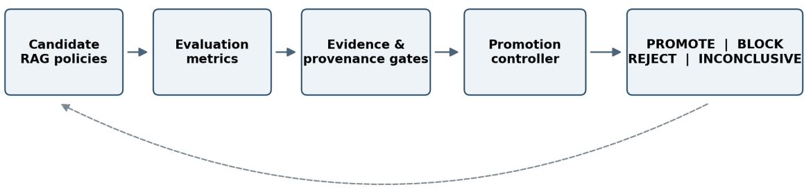
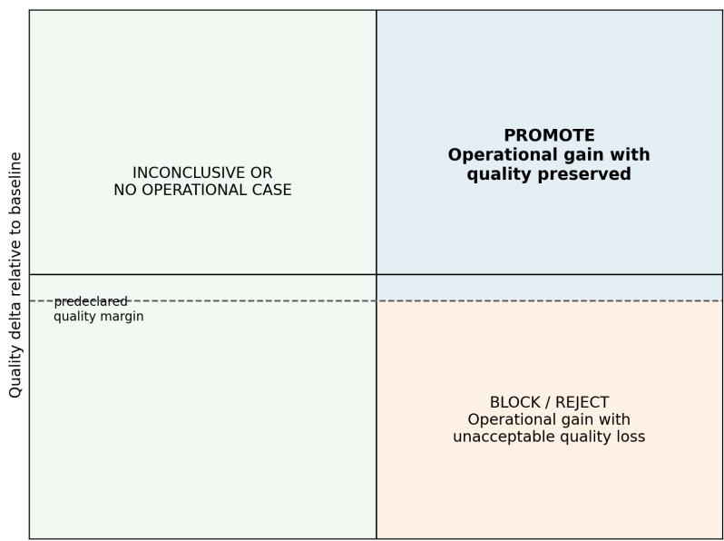
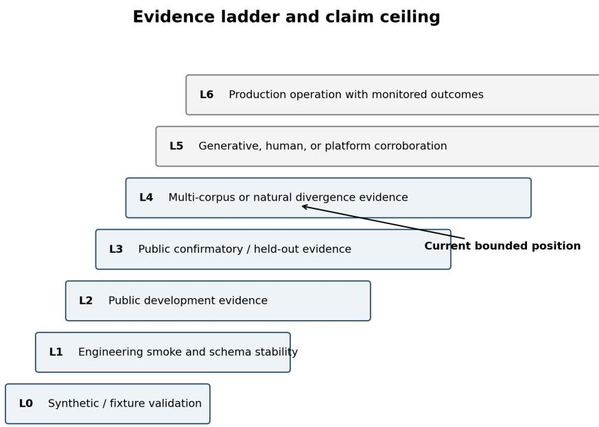
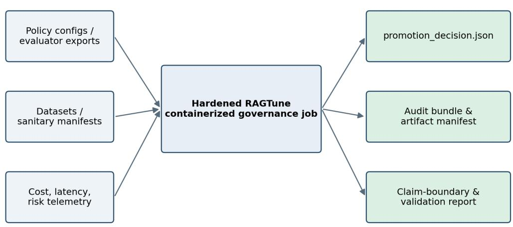
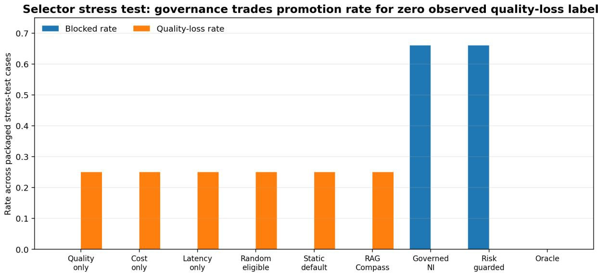

# RAGWarrant

Evidence-Preserving Governance for RAG Policy Promotion Under Quality, Cost, Latency, and Risk Constraints

Richard Krueger

Lucas Krause

Zach Pocquette

Independent open-source research project September 2026 Preprint version 0.1.1-rc1

## Abstract

Retrieval-augmented generation systems are extensively instrumented with metrics, benchmarks, traces, and automated judges, but these tools do not decide whether a proposed policy change is safe to release. We present RAGWarrant, an open-source promotion-control framework that treats deployment as a constrained evidence decision rather than a leaderboard choice. RAGWarrant normalizes evaluator outputs and operational telemetry, applies predeclared quality and hard-risk gates, assigns evidence-class claim ceilings, preserves negative outcomes, and emits auditable PROMOTE, BLOCK, REJECT, or INCONCLUSIVE decisions. We evaluate the framework across T2-RAGBench, MultiHop-RAG, CRAG, HotpotQA, synthetic reproduction, and bounded local generative experiments. On HotpotQA, operational savings were blocked because answer quality fell beyond the declared margin. A bounded CRAG study selected a lower-cost quality-tied policy, but related generative gains were unstable and a held-out guardrail failed closed. We claim an auditable promotion-control abstraction, not optimizer superiority, human validation, or production readiness. The tagged artifact reproduces from a fresh clone, runs as a hardened Docker job, accepts external evaluator exports, and verifies artifact integrity.

Keywords: retrieval-augmented generation; RAG evaluation; AI governance; promotion control; noninferiority; LLMOps; reproducibility

Code and artifacts: https://github.com/RAGWarrant/ragwarrant-governance Release candidate: v0.1.1-rc1 Commit: ff529005bf7d00a0c3f79ba991563f3923d63205

## 1 Introduction

Retrieval-augmented generation (RAG) has become a standard architecture for connecting language models to current, domain-specific, and attributable evidence [1,2]. Yet a RAG system is not a single model. Its behavior depends on document preparation, retrieval depth, query routing, reranking, context assembly, generation, abstention, and tool-use policies. Every proposed change is therefore multi-objective: a policy may be faster but less complete, cheaper but less faithful, stronger on average but fragile on a protected slice, or attractive on validation data yet worse for a held-out population.

The evaluation ecosystem has advanced rapidly. RAGAS, ARES, RAGChecker, RAGBench, CRAG, HotpotQA, and related benchmarks provide reference-free or labeled metrics, fine-grained diagnostics, and structured evidence [3–8, 10]. Observability platforms capture traces, cost, latency, and feedback [18,19], while optimization systems such as DSPy search prompts, programs, or pipeline configurations against a chosen metric [9]. These capabilities answer important measurement and search questions, but they do not settle the release question: given several plausible policies and incomplete, heterogeneous evidence, which policy may replace the baseline, which should be rejected, and when should the system refuse to decide?

RAGWarrant addresses that decision layer. Its central abstraction is not a new answer-quality metric or a universal optimizer. It is an evidence-preserving promotion controller. RAGWarrant ingests native metrics or normalized evaluator exports, binds them to provenance and evidence class, applies non-compensatory gates and predeclared decision rules, emits a machine-readable decision, and preserves supporting and contradicting evidence as an auditable bundle. A lower-cost or lower-latency policy is promotable only when its quality evidence, split integrity, security posture, provenance, and claim scope also pass.

RAGWarrant is intended to govern RAG policy promotion, not to discover, certify, or imply a globally optimal RAG configuration.

The research question is whether a lightweight, open-source governance layer can convert heterogeneous RAG metrics and telemetry into reproducible promotion decisions while reducing false promotion of policies that save cost or latency at unacceptable quality risk.

The distinction matters because deployment authority is often implicit. In a research notebook, the highest validation score may become the de facto recommendation; in an enterprise workflow, a cost dashboard or latency trace may play the same role. RAGWarrant makes that authority explicit and inspectable. The framework does not prevent teams from choosing aggressive operating points, but it requires the quality floor, hard disqualifiers, evidence scope, and decision reason to be recorded before the result is presented as promotable.

This paper makes four contributions. First, it defines a promotion-control formalism that separates metric generation from release decisions and uses noninferiority-style quality gates to evaluate operational gains. Second, it introduces an evidence ladder and claim ceiling so fixture, development, confirmatory, generative, and deployment evidence cannot be silently relabeled. Third, it operationalizes fail-closed governance through machine-readable decisions, an append-only evidence ledger, artifact-integrity checks, and a validator that binds public claims to result classes. Fourth, it releases and evaluates a reproducible implementation with public-mini execution, external-evaluator adapters, selector ablations, bounded public and generative studies, fresh-clone reproduction, and a hardened Docker job.

## 2 Background and Related Work

The original RAG formulation combined parametric generation with non-parametric retrieval for knowledge-intensive tasks [1]; later work broadened the design space to modular retrieval, routing, reranking, verification, and tool use [2]. This modularity creates a policy-selection problem as well as an answer-generation problem.

RAGAS, ARES, RAGChecker, and RAGBench provide complementary evaluation methods, from reference-free metrics to prediction-powered judges, component diagnostics, and labeled benchmark data [3–6]. CRAG stresses factuality, dynamism, long-tail entities, and mock web or knowledge-graph APIs, while HotpotQA provides multi-hop questions and sentence-level supporting facts [7, 8]. Benchmarking studies likewise compare model and retrieval choices in RAG settings [10]. RAGWarrant consumes these measurements as bounded evidence; it does not replace their metric semantics.

DSPy and related optimizers search candidate programs or policies [9], while LangSmith and Phoenix organize experiments, traces, evaluator scores, latency, and feedback [18,19]. The distinction is concise: observability explains, evaluation estimates, optimization searches, and governance decides. The broader ML-systems literature similarly emphasizes hidden dependencies, testing, monitoring, and technical debt beyond model code [14, 15].

  
Figure 1: RAGWarrant converts candidate-policy evidence into an auditable promotion decision; artifacts, telemetry, and negative results feed the next evaluation cycle.

NIST’s AI Risk Management Framework and Generative AI Profile organize lifecycle governance around Govern, Map, Measure, and Manage, and ISO/IEC 42001 specifies an AI management system [11–13]. RAGWarrant is narrower and executable: it sits between measurement and deployment and produces a traceable RAG-policy release decision.

Table 1: RAGWarrant complements metric, benchmark, optimization, observability, and management-framework layers.
<table><tr><td>System family</td><td>Primary emphasis</td><td>Typical output</td><td>RAGWarrant relationship</td></tr><tr><td>RAGAS / ARES /RAGChecker RAGBench/ CRAG/</td><td>Quality and diagnostic evaluation Benchmark data and labels</td><td>Metric scores and component diagnoses Examples, references, supporting facts,</td><td>Consumes declared metrics as governance evidence Uses bounded evidence sources with dataset-specific</td></tr><tr><td>HotpotQA DSPy and optimizers</td><td>Search over programs or policies</td><td>scores Candidate maximizing an objective</td><td>claim ceilings Treats optimizer output as a candidate, not automatic</td></tr><tr><td>LangSmith/ Phoenix NIST AI RMF /</td><td>Experiments, traces, observability</td><td>Runs, evaluator scores, operational telemetry Practices, outcomes,</td><td>promotion Normalizes exports and applies release gates Implements a narrow</td></tr></table>

Table 1: RAGWarrant complements metric, benchmark, optimization, observability, and management-framework layers.
<table><tr><td>System family</td><td>Primary emphasis</td><td>Typical output</td><td>RAGWarrant relationship</td></tr><tr><td>RAGWarrant</td><td>Evidence-preserving promotion control</td><td>PROMOTE, BLOCK, REJECT, or INCONCLUSIVE plus</td><td>Coordinates evidence, gates, claim ceilings, and integrity</td></tr></table>

## 3 Design Goals and Threat Model

RAGWarrant is designed around false promotion: releasing a candidate because it appears cheaper, faster, or better on an aggregate score when its quality evidence is insuficient, a protected slice regresses, provenance is invalid, or the result exceeds its evidence class. False refusal also matters, but the current design deliberately prefers conservative refusal when the cost of unnoticed quality loss is high.

The threat model assumes heterogeneous and imperfect evaluators. Each suite therefore declares metric direction, weight, split structure, evidence class, and hard gates rather than treating any single score as ground truth.

• Metric risk: evaluator scores may be noisy, constant, weakly calibrated, or insensitive to meaningful policy diferences.

• Selection risk: validation winners may reverse on held-out data, and optimizers may overfit small development sets.

• Operational risk: cost-only or latency-only selection can improve eficiency while degrading answer quality or evidence support.

• Evidence risk: fixtures, development runs, frozen observations, and confirmatory runs support diferent claim ceilings.

• Reproducibility risk: results may depend on mutable code, local state, unpinned data, or unverifiable artifacts.

• Publication and security risk: licensed text, prompts, answers, credentials, private paths, or unsupported claims may leak into public artifacts.

The corresponding design objectives are to freeze decision criteria before confirmatory evaluation; separate eligibility from ranking; make protected regressions and security failures non-tradable; preserve blocked and negative outcomes; trace every public claim to a result artifact; remain agnostic to the evaluator that produced a metric; and make the complete decision runnable as a finite, containerized job. These objectives optimize for auditability and correction, not maximum promotion throughput.

## 4 RAGWarrant System

## 4.1 Policy candidates and normalized evidence

A RAG policy is a named, versioned configuration that may change retrieval depth, endpoints, routing, reranking, context limits, fallback behavior, generator choice, abstention, or selector logic. Policies may be hand-authored, proposed by an optimizer, or imported from another experiment. RAGWarrant records behavioral parameters alongside normalized evidence such as answer correctness, faithfulness, evidence support, context recall, abstention correctness, API calls, cost, latency, failure rate, and protected-regression indicators.

External-evaluator adapters map Ragas-like, DeepEval-like, LangSmith-like, Phoenix-like, generic CSV, and generic JSONL exports into a canonical schema while retaining evaluator provenance. The release-candidate demonstration uses sanitized synthetic-shaped exports; it establishes schema interoperability, not oficial integration. This separation allows upstream metrics to evolve without changing the downstream release contract.

Normalization is intentionally explicit. Each imported metric retains its evaluator name, group, direction, scale, split, policy ID, and source-artifact hash. Scores are not treated as interchangeable merely because they share a 0-to-1 range. A suite may combine them into a declared composite, use them as separate hard gates, or retain them only for diagnosis. Operational telemetry follows the same principle: modeled cost, measured latency, API-call count, and context volume remain distinct fields so that a favorable weighted utility can be decomposed during review.

A governance suite is configured as a declarative contract. It identifies candidate and baseline policies, development and held-out split roles, metric direction and composition, the noninferiority margin, operational objectives, hard disqualifiers, protected slices, evidence class, and expected artifacts. Candidate generation may be exploratory, but selection logic is frozen before a confirmatory split is evaluated. Confirmatory data estimate the consequences of the frozen decision; they are not used to redesign the selector after the fact.

## 4.2 Canonical promotion formalism

Let p be a candidate and b the current baseline. Define quality and operational deltas as $\Delta _ { q } =$ $q ( p ) - q ( b ) , \Delta _ { c } = c ( p ) - c ( b )$ , and $\Delta _ { l } = l ( p ) - l ( b )$ , with positive quality better and negative cost or latency better. A suite declares a quality-loss margin δ before confirmatory evaluation. In the canonical rule, a candidate is quality-noninferior when the lower confidence bound on $\Delta _ { q }$ is no worse than $- \delta ;$ an operational claim additionally requires the relevant upper confidence bound on $\Delta _ { c }$ or $\Delta _ { l }$ to be below zero. Promotion is permitted only if all hard gates pass.

$$
\Delta _ { q } = q ( p ) - q ( b ) ,
$$

$$
\Delta _ { c } = c ( p ) - c ( b ) ,\tag{1}
$$

$$
\Delta _ { l } = l ( p ) - l ( b ) .\tag{2}
$$

(3)

$$
\mathrm { P R O M O T E } ( p ) \iff \mathrm { h a r d \_ g a t e s } ( p ) \land \mathrm { L C B } ( \Delta _ { q } ) \geq - \delta \land [ \mathrm { U C B } ( \Delta _ { c } ) < 0 \lor \mathrm { U C B } ( \Delta _ { l } ) < 0 ] .\tag{4}
$$

This use of noninferiority is procedural rather than clinical: it does not make RAG evaluation equivalent to a randomized trial [16, 17]. Its value is that acceptable loss is declared in advance, evidence direction is explicit, and eficiency is not equated with release eligibility. If uncertainty crosses a gate, the decision is INCONCLUSIVE rather than a win.

Canonical promotion logic  
  
Operational change (cost / latency): improvement →

Figure 2: Canonical decision geometry. Operational improvement is promotable only when the quality-preservation condition and all hard gates pass.

## 4.3 Hard gates and decision taxonomy

Hard gates are non-compensatory. Leakage, missing provenance, security disqualification, publicationhygiene failure, or an absent quality signal cannot be ofset by lower cost. Weighted utilities can rank eligible candidates, but eligibility is established first. The deployable job exposes four scientific decisions: PROMOTE when evidence supports replacement within scope; BLOCK when the decision cannot be evaluated safely; REJECT when evidence favors retaining the baseline; and INCONCLUSIVE when available evidence does not resolve the gate. Runtime errors are recorded separately in the machine-readable schema; the full taxonomy appears in Appendix A.

Table 2: Scientific decision classes used by the deployable governance job; runtime errors are represented separately in the schema.
<table><tr><td>Decision</td><td>Meaning</td><td>Typical trigger</td><td>Consequence</td></tr><tr><td>PROMOTE</td><td>Evidence supports replacing the baseline within</td><td>Quality and operational/risk objectives pass; no hard disqualifier.</td><td>Candidate may advance with recorded boundaries.</td></tr><tr><td>BLOCK</td><td>declared scope. Promotion cannot be evaluated safely.</td><td>No usable signal, leakage, missing provenance, security or hygiene failure.</td><td>No release claim; blocker and remediation are recorded.</td></tr></table>

Table 2: Scientific decision classes used by the deployable governance job; runtime errors are represented separately in the schema.
<table><tr><td>Decision</td><td>Meaning</td><td>Typical trigger</td><td>Consequence</td></tr><tr><td>REJECT</td><td>Evidence favors retaining the baseline.</td><td>Confirmed quality loss, negative held-out result, or protected regression.</td><td>Candidate is not promoted; negative evidence remains</td></tr><tr><td>INCONCLUSIVE</td><td>Available evidence does not resolve the decision.</td><td>Interval crosses threshold, evidence is mixed, or sample is underpowered.</td><td>append-only. No promotion; additional evidence may be collected.</td></tr></table>

## 4.4 Evidence classes and claim ceilings

Every run is assigned an evidence class. Fixtures establish execution and schema behavior, not policy superiority. Development runs guide design but cannot be relabeled confirmatory. Frozen observations support ablation but are weaker than independent collection. Generative evidence requires a pinned generator and usable answer-quality signal; human or platform claims require the corresponding annotations or platform-native records. The evidence ladder therefore sets a claim ceiling: evidence may support a narrower statement than its maximum, but never a broader one.

## 4.5 Claim validation, integrity, and deployment contract

The publication validator checks that public language and artifacts match those ceilings. It scans for raw licensed text, prompts, answers, API responses, credentials, private paths, large tracked files, and unsupported claim patterns. A historical ledger preserves positive, negative, blocked, refused, and superseded outcomes, while verify-run checks required artifacts, schemas, and hashes. Together, these mechanisms prevent later summaries from reviving a claim that a stronger audit or held-out test had already narrowed.

Claim validation occurs after scientific decision generation but before publication or promotion artifacts are accepted. The validator compares result classes with allowed language, confirms required evidence files, and checks that high-risk fields appear only as hashes, counts, or sanitized labels. This creates two independent failure channels: a candidate can fail the scientific gate, or an otherwise valid run can fail artifact hygiene. Neither failure is converted into evidence for the candidate.

The finite job contract accepts policy configurations, sanitized datasets or evaluator exports, and operational telemetry; it emits a promotion decision, run manifest, policy summaries, selector comparison, claim update, validation report, and optional audit bundle. The same OCI image is packaged for local Docker, Docker Compose, Kubernetes Jobs, and cloud job templates. Only loca hardened Docker execution is demonstrated here; the architecture is portable, but the evidence claim remains local deployment validation.

## 5 Experimental Program

The empirical program progressed from fixture-level orchestration to public development and confirmatory corpora, statistical audits, corpus-backed retrieval, mock APIs, generated-answer evaluation, behaviorally distinct policies, held-out ofsets, selector ablations, and deployment validation. It is a longitudinal research-and-engineering program rather than one preregistered trial. Claims are therefore reported by evidence class, and Table 3 identifies each corpus's role and principal limitation.

  
Figure 3: Evidence classes define a claim ceiling. The release reaches bounded public and generative evidence in selected settings, not the highest evidence levels.

Cloud-agnostic deployment contract  
  
Same OCI image can be scheduled as a local Docker job, Kubernetes Job, Azure Container Apps Job, AWS task/batch job, or Cloud Run Job  
Figure 4: Cloud-agnostic job contract. A finite container consumes policies and evidence, then emits a promotion decision, audit bundle, and validation report.

Dataset use was constrained by licensing and by whether policies could actually change retrieval. T2-RAGBench [21] supplied a larger text-and-table development path; MultiHop-RAG [22] provided a fresh sealed multi-hop confirmatory corpus; CRAG enabled both corpus-backed retrieval and a mock-API routing environment; and HotpotQA added answer labels and supporting-fact annotations. The public repository carries manifests, hashes, and processed metrics rather than raw licensed text. Split construction used deterministic grouping and duplicate checks where supported, and confirmatory unlocks were refused when provenance, leakage, or evidence prerequisites failed.

Table 3: Principal datasets and evidence roles. Raw licensed datasets are not redistributed by the public repository.
<table><tr><td>Dataset / path</td><td>Role</td><td>Evidence characteristics</td><td>Primary limitation</td></tr><tr><td>T2-RAGBench</td><td>Public end-to-end development</td><td>1,142-query development corpus; behaviorally variable policies</td><td>Development evidence; deterministic extractive generation in key runs</td></tr><tr><td>MultiHop- RAG</td><td>Public confirmatory corpus</td><td>331-query sealed confirmatory test; full corpus-backed path</td><td>Governance matched quality-only</td></tr><tr><td>RAGBench HotpotQA</td><td>Context-retrieval enablement</td><td>Policy-dependent context assembly</td><td>Not full source-corpus retrieval in packaged evidence</td></tr><tr><td>CRAG web documents</td><td>Full corpus-backed retrieval</td><td>2,706 rows; 9,848 web documents; 571 confirmatory rows</td><td>Noncommercial restriction; governance matched quality-only</td></tr><tr><td>CRAG mock API</td><td>Tool routing and generative validation</td><td>Live and frozen paths; calls, cost, latency, evaluator mapping</td><td>Strongest positive result bounded; generative results unstable</td></tr><tr><td>HotpotQA</td><td>Alternate corpus with answer labels</td><td>1,000 local examples; 249 confirmatory behavioral rows</td><td>Operational gain accompanied by quality loss</td></tr><tr><td>Public mini</td><td>Open-source reproduction</td><td>Synthetic, deterministic, no private data or model</td><td>Onboarding proof, not external science</td></tr></table>

Candidate policies included static defaults, low and expanded retrieval, adaptive routing, costand latency-aware policies, greedy and Optuna/TPE search, constrained optimization, Pareto selection, RAG Compass, and governed or risk-guarded selectors. The policy under evaluation is always a candidate, never an automatic beneficiary of the framework.

Generative studies used pinned local models through Ollama and stored prompts and answers outside the public tree. Public rows retained hashes, lengths, policy identifiers, evaluator scores, and operational telemetry. The program tested qwen3:8b, gpt-oss:20b, and llama3.2:3b in bounded slices, not to rank the models, but to determine whether a governance conclusion persisted when answer emission and model behavior changed. Fixed ofsets and cross-ofset guardrails were introduced after the first favorable slice to test stability rather than enlarge the same result.

Where paired example-level evidence existed, analyses used paired bootstrap intervals and win/tie/loss summaries. Grouped intervals were reported only when separately implemented. Noninferiority margins, often 0.01 for a composite quality score, were declared in configuration. Statistical output remained subordinate to evidence validity: a narrow interval cannot rescue duplicated rows, a constant quality signal, invalid provenance, or confirmatory leakage.

The primary decision unit was a policy comparison under a declared baseline and scope. Qualityonly selection used validation quality without operational penalties; constrained and governed selectors applied feasibility requirements; Pareto analysis exposed nondominated policies without forcing a scalar utility; and oracle variants were retained only as ceilings. When a quality signal was constant, missing, or demonstrably duplicated, the run was blocked even if cost and latency difered.

## 6 Results

Table 4 is the numerical center of the paper; the prose below interprets rather than duplicates it. An earlier zero-width bootstrap episode also shaped the program: row-level reconstruction showed that a seemingly precise result repeated one aggregate paired delta rather than calibrated query-level uncertainty. The result was retained but downgraded, and later suites added explicit nonconstant-signal and grouped-analysis checks. Appendix D records that audit history.

Representative artifact pointers for Table 4 are retained in the public tree rather than reproduced as raw data. The strongest CRAG mock-API result is associated with run ID RAGWarrant\_cra g\_mock\_api\_validation\_v1\_20260809-165415-92d8c0edd4; supporting summaries include results/behavioral\_governance/paper\_ready\_summary.md, results/multi\_dataset\_behavi oral\_governance/paper\_ready\_summary.md, results/generative\_llm\_validation/synthesi s\_report.md, docs/selector\_ablation\_stress\_v2.md, results/claim\_status/claim\_statu s\_table.csv, and the canonical results/run\_index.csv.

The results should therefore be read as tests of a release mechanism, not as a tournament among retrievers. A tie can establish that the mechanism executes without adding value on a corpus; a negative result can establish that the gate refuses an eficiency gain; and a failed replication can narrow the claim supported by an earlier slice. The evidence ledger makes those outcomes cumulative rather than disposable.

## 6.1 Confirmatory outcomes: noninferiority without general superiority

Public confirmatory studies most often showed that governance was feasible without establishing an advantage over quality-only selection. On MultiHop-RAG, governed and quality-only aliases selected the same policy, and an audit showed that a held-out Optuna/TPE win was a validation-to-test reversal rather than a selector bug. On CRAG web-document retrieval, both selectors again chose the same high-retrieval policy. A larger T2-RAGBench development run was directly unfavorable to RAG Compass, reinforcing the optimizer-agnostic design.

The strongest bounded source/retrieval signal came from the CRAG mock-API path. Governance selected a lower-budget policy while quality-only selection favored a regression-aware search policy. The reported utility diference was approximately +0.001 and stable across most cost-latency weight settings, but ablation attributed nearly all of it to declared cost and a small latency diference, not raw-quality improvement. It is therefore evidence that a promotion controller can choose a cheaper quality-tied candidate, not that it discovered a universally better retriever.

A behaviorally distinct follow-up gave the result a more operational form: a single-endpoint policy used materially fewer calls and lower cost than Optuna/TPE while remaining within the declared proxy-plus-evidence quality margin. That comparison is stronger than a cosmetic utility tie-break, yet it remains derived from frozen observations rather than an independent live or human-calibrated evaluation.

<table><tr><td rowspan=1 colspan=2>Evaluation path                                    Outcome preserved by the evidence ledger</td></tr><tr><td rowspan=1 colspan=1>MultiHop-RAG confirmatory</td><td rowspan=1 colspan=1>Noninferior, not superior</td></tr><tr><td rowspan=1 colspan=1></td><td rowspan=1 colspan=1></td></tr><tr><td rowspan=1 colspan=1>CRAG web-document governance</td><td rowspan=1 colspan=1>Matched quality-only</td></tr><tr><td rowspan=1 colspan=1></td><td rowspan=1 colspan=1></td></tr><tr><td rowspan=1 colspan=1>CRAG mock-API source/retrieval</td><td rowspan=1 colspan=1>Positive governance signal</td></tr><tr><td rowspan=1 colspan=1></td><td rowspan=1 colspan=1></td></tr><tr><td rowspan=1 colspan=1>Behaviorally distinct frozen follow-up</td><td rowspan=1 colspan=1>Lower cost at quality floor</td></tr><tr><td rowspan=1 colspan=1></td><td rowspan=1 colspan=1></td></tr><tr><td rowspan=1 colspan=1>HotpotQA behaviorally distinct</td><td rowspan=1 colspan=1>Operational gain, quality loss</td></tr><tr><td rowspan=1 colspan=1></td><td rowspan=1 colspan=1></td></tr><tr><td rowspan=1 colspan=1>CRAG generative primary slice</td><td rowspan=1 colspan=1>Positive slice; repeats unstable</td></tr><tr><td rowspan=1 colspan=1></td><td rowspan=1 colspan=1></td></tr><tr><td rowspan=1 colspan=1>Quality-risk guardrail v2</td><td rowspan=1 colspan=1>Blocked on held-out quality loss</td></tr><tr><td rowspan=1 colspan=1></td><td rowspan=1 colspan=1></td></tr><tr><td rowspan=1 colspan=1>Selector stress test</td><td rowspan=1 colspan=1>Governance blocked unsafe selectors</td></tr></table>

Figure 5: The evidence ledger preserves positive, bounded, mixed, negative, and fail-closed outcomes instead of collapsing them into one leaderboard.

These studies also expose an important distinction between selection correctness and hindsight regret. A policy selected from validation evidence can lose to another policy on a sealed test set without implying a logic defect. RAGWarrant records that reversal, but it does not retroactively choose the test winner. This preserves the separation between model selection and final estimation that the governance contract is intended to enforce.

## 6.2 Fail-closed outcomes

HotpotQA provides the clearest negative test. The governed policy reduced retrieval cost, context volume, and calls, but answer quality declined beyond the declared noninferiority margin. A conventional eficiency report could describe the run as a cost win; RAGWarrant classified it as operational gain with quality loss and withheld promotion.

A separate pooled quality-risk guardrail trained only on deployable metadata and passed its validation gates across four folds. Held-out evaluation then exposed quality-loss risk on three ofsets. Although API calls and cost fell, the strict gate blocked the selector. These two cases are the empirical core of the governance claim: the framework’s value is visible not only when it identifies an eligible candidate, but when it prevents attractive operational deltas from becoming unsupported release decisions.

Fail-closed behavior is costly: a conservative controller can retain an expensive baseline or delay a useful change. The packaged artifacts therefore record blocked rate and promotion rate alongside quality outcomes. The current program does not prove that the chosen trade-of is optimal; it demonstrates that the trade-of is explicit, reproducible, and reviewable.

## 6.3 Generative feasibility without stability

Local generative evaluation became technically feasible after answer-emission and evaluator-mapping repairs. A bounded CRAG slice using a pinned qwen3:8b model produced non-empty, variable answers and supported a cost-at-equivalent-generated-quality decision on its primary ofset. The point estimate was favorable and the policy reduced calls and latency substantially.

The efect was not stable. Three deterministic repeats did not reproduce the cost result; a second model produced usable signals without positive cost slices; and a smaller instruct model repaired blank-answer behavior without creating a repeatable eficiency win. HotpotQA likewise confirmed nonconstant generated quality, answer diversity, and evidence variance, but the audit covered only a small sample and did not establish governance improvement. The generative contribution is therefore machinery and bounded evidence, not a stable optimization claim.

The model comparisons also revealed engineering failure modes that a leaderboard would obscure. Thinking-mode output suppressed usable answers in one path; another model produced high blankanswer rates; and a smaller instruct model repaired emission without improving the selection result. Treating generator availability, parse success, and quality-signal variance as gates prevented these failures from being mistaken for policy evidence.

## 6.4 Selector ablation and systems results

The packaged selector stress test compared quality-only, cost-only, latency-only, random, static, RAG Compass, governed noninferiority, risk-guarded, and oracle-style selectors across sanitized evidence families. Cost-only, latency-only, and random selection admitted quality-loss cases; governed selectors traded promotion rate for zero recorded quality-loss labels in the packaged cases. These rates are not population estimates, but they show that non-compensatory gates create observable behavior distinct from operational ranking.

A fresh Git clone installed and reproduced the public-mini workflow without private data or model credentials; the hardened Docker job completed under the constrained runtime profile; and verify-run confirmed artifact hashes, schemas, and hygiene conditions. These results establish that an independent reviewer can execute the contract that produced a decision — the public mini is deliberately synthetic and fail-closed, proving installation, schemas, exit behavior, and claim checks without implying external eficacy.

Table 4: Principal empirical and systems results. Full precision is retained here; negative and mixed outcomes are part of the reported evidence.
<table><tr><td>Evaluation</td><td>Scope / N</td><td>Primary outcome</td><td>Interpretation</td></tr><tr><td>MultiHop-RAG confirmatory</td><td>331 queries</td><td>Governance delta 0; noninferior, not superior</td><td>Valid confirmatory execution; no governance advantage</td></tr><tr><td>CRAG web documents</td><td>571 rows</td><td>Governed = quality-only = top_k_high</td><td>Corpus-backed execution; no superiority</td></tr><tr><td>CRAG mock API</td><td>571 rows</td><td>Utility +0.00100254; 571/0/0 wins/ties/losses</td><td>Strongest bounded source/retrieval signal; largely</td></tr><tr><td>Frozen behaviorally distinct CRAG</td><td>571 paired observations</td><td>Quality -0.00515371; cost -2.36839; calls -1.79860</td><td>cost/latency driven Lower operating burden within declared proxy-quality margin; derived evidence</td></tr></table>

Table 4: Principal empirical and systems results. Full precision is retained here; negative and mixed outcomes are part of the reported evidence.
<table><tr><td>Evaluation</td><td>Scope / N</td><td>Primary outcome</td><td>Interpretation</td></tr><tr><td>HotpotQA behavioral</td><td>249 confirmatory rows</td><td>Quality -0.0408367; F1 -0.0843373; cost -2.33014;</td><td>Operational gain with quality loss; blocked</td></tr><tr><td>CRAG</td><td>12 examples; 132</td><td>calls -1.98394 Quality +0.0166534; cost</td><td>Positive bounded slice;</td></tr><tr><td>generative primary Guardrail v2</td><td>generations</td><td>-3.77900; latency -5,971.85 ms 3 quality-loss blocks; 0</td><td>repeats/models did not reproduce Validation success failed</td></tr><tr><td>Selector stress</td><td>4 held-out offsets Packaged</td><td>positive latency results Governed blocked 0.66 with</td><td>held-out generalization Gates traded promotion rate</td></tr><tr><td></td><td>evidence families</td><td>0 quality loss; cost/latency/random quality loss 0.25 Fresh clone, hardened</td><td>for no observed quality-loss labels Strong systems</td></tr></table>

Note: cost and latency deltas in Table 4 follow each suite's declared telemetry fields and are comparable only within the corresponding evaluation path. Unless an artifact declares otherwise, cost is a normalized or modeled operational-cost field rather than a dollar-denominated cloud bill.

## 7 Discussion

RAGWarrant’s novelty is architectural and procedural rather than metric-level. It separates evidence production from release authority; applies quality preservation and hard gates before utility ranking; ties each result to an evidence class and claim ceiling; and packages the decision, contradictory evidence, and integrity checks as a portable artifact. Noninferiority, risk management, observability, and ML testing are established ideas [11–17]. The contribution is their RAG-specific operationalization in a lightweight, vendor-neutral promotion-control layer with an empirical record that includes failed replications and refused promotions.

This position is complementary to existing tools. A team may obtain answer correctness from one evaluator, faithfulness from another, cost and latency from traces, and a security disqualifier from a separate suite. RAGWarrant’s role is to combine those declared inputs under one release contract. The output is not another score but a decision with reasons, limits, and traceable artifacts. This is particularly useful when a quality-only winner, a constrained optimizer, and a risk gate disagree.

The negative outcomes are consequently informative. HotpotQA and the held-out guardrail show that lower cost or latency can coexist with unacceptable answer degradation, while the unstable generative slices show how quickly a positive local result can evaporate under ofsets or models. The current evidence does not estimate an optimal false-promotion versus false-refusal trade-of; it establishes that the framework can encode a conservative policy and preserve the cost of that conservatism for later study.

  
Figure 6: In the packaged selector stress test, governed selectors blocked more cases and recorded no quality-loss labels; operational selectors did not block and admitted quality loss.

A practical governance program must eventually price false refusal as carefully as false promotion. Blocking too often can preserve a costly configuration, slow improvement, and encourage teams to bypass the process. RAGWarrant’s current result taxonomy and artifact schema make that future calibration possible because they retain both the rejected candidate's operational benefit and the gate that prevented release. Larger independent studies can then ask whether margins and risk thresholds produce an acceptable decision curve rather than only whether any single policy wins.

The product contract is most relevant where changes require a defensible release record: healthcare policy assistants, financial and insurance knowledge systems, legal research, government services, life-sciences evidence workflows, and internal enterprise copilots. In such settings the question is rarely just which score is highest. It is whether a change is justified for a declared corpus, use case, user population, access tier, quality floor, latency target, and risk class. RAGWarrant can run as a finite CI/CD or monitoring job and emit an artifact suitable for change review; integration with live identity, authorization, and incident processes remains deployment-specific.

The same abstraction can support layered enterprise policies. A release contract may inherit organization-wide security and data-access requirements, then specialize by corpus, use case, user population, query class, and service-level objective. The optimizer may vary retrieval depth or routing inside that envelope, but it cannot override entitlement, source-authority, citation, or humanreview rules. This separation makes governance portable across customers without pretending that one globally optimal RAG configuration exists.

## 8 Limitations and Threats to Validity

Empirical breadth remains limited. Few public corpora support full, policy-dependent, corpusbacked evaluation in the packaged program; CRAG also carries noncommercial-research restrictions. MultiHop-RAG and CRAG web-document studies produced ties rather than superiority, and some HotpotQA phases use context-retrieval evidence rather than a fully reconstructed source corpus.

Generative samples are small and unstable. The favorable CRAG primary slice contained 12 examples, repeats and alternative models did not recover its cost result, and the larger HotpotQA target was not reached. Composite proxy and automatic evaluator scores are not substitutes for human judgment, and calibration across domains remains open.

The strongest positive source/retrieval result is also unusually small in practical efect and heavily dependent on the declared cost model. It should be interpreted as proof of decision behavior, not as a material quality advance. The selector stress test is assembled from packaged cases and cannot estimate real-world base rates of unsafe promotion. Likewise, sanitized frozen-observation analyses are useful for ablation but share dependencies with their parent runs.

The program is longitudinal and adaptive rather than a single preregistered experiment. Repeated design changes create multiplicity and researcher degrees of freedom; some observations are dependent, and early intervals were demonstrably low-information. The response is procedural rather than statistical sleight of hand: preserve chronology, distinguish development from confirmatory evidence, report grouped analyses only when implemented, and avoid a pooled significance claim.

Systems evidence is also bounded. Fresh-clone and hardened Docker execution establish reproducibility of the public-mini contract, not operational reliability under real authentication, authorization, retention, availability, or incident-management requirements. External evaluator adapters use synthetic-shaped exports rather than oficial platform runs, and the security scan set is incomplete. RAG Compass remains an optional candidate and has no supported superiority claim.

Reproducibility artifacts verify code paths, decisions, and public hygiene; they cannot indepen dently verify licensed raw data that are excluded from the repository. Exact external replication therefore depends on acquiring the original corpora and reconstructing the declared manifests. The release tag itself is an engineering checkpoint rather than a guarantee that every historical artifact can be regenerated without those sources.

## 9 Reproducibility, Availability, and Responsible Release

Project code is released under Apache-2.0; third-party datasets retain their original licenses, and raw CRAG or HotpotQA text is not redistributed. The tagged v0.1.1-rc1 artifact identifies a fixed commit and includes configs, schemas, sanitized processed results, tests, Docker assets, deployment templates, claim tables, release manifests, and an evidence ledger.

Public artifacts exclude raw licensed dataset text, raw prompts, generated answers, raw API responses, credentials, local caches, and model weights; where needed, the repository retains hashes, IDs, counts, metrics, and sanitized summaries.

A fresh clone can run the deterministic public-mini job without private data, a generator, or cloud credentials. The hardened container reproduces the same governance contract, while verify-run checks the artifact manifest, hashes, schemas, and hygiene conditions. Dataset-dependent studies require users to acquire the original data under their licenses. These mechanisms make the decision logic and failure modes independently inspectable even when licensed raw evidence cannot be published.

GitHub CI executes publication tests and claim checks on the public tree. Deployment templates target Kubernetes and major cloud job primitives, but they are intentionally separated from the scientific claim: a template shows how to schedule the container, whereas platform evidence would require a real platform-native run record.

## 10 Conclusion

RAGWarrant makes release judgment executable. It normalizes evidence, applies non-compensatory gates, uses predeclared quality margins where appropriate, preserves negative outcomes, emits machine-readable decisions, validates public claims, and packages the result as a reproducible containerized job. The empirical record demonstrates the property most important to this design: apparent eficiency gains can be refused when quality, held-out, or evidence-validity checks do not survive.

That boundary is the paper's central proposal: measurement should inform release, but it should not silently become release authority.

The next priority is to calibrate promotion decisions on larger independent corpora, add blinded human adjudication, execute real evaluator and platform integrations, and measure false refusal alongside false promotion. Until then, the framework’s contribution is a disciplined systems boundary between “we measured it” and “we are justified in deploying it.”

## A Decision and Evidence Taxonomy

RAGWarrant’s evidence taxonomy is deliberately asymmetric: stronger evidence may support a narrower claim, but weaker evidence cannot be relabeled upward. The categories below define the maximum defensible statement associated with each run type.

Table 5: Evidence classes and claim ceilings.
<table><tr><td>Evidence class</td><td>What it establishes</td><td>Permitted claim example</td><td>Not permitted</td></tr><tr><td>Fixture / smoke</td><td>Code path, schema, and</td><td>Harness runs and</td><td>Benchmark or quality</td></tr><tr><td>Development</td><td>refusal behavior execute Candidate behavior on</td><td>artifacts validate. Promising development</td><td>superiority Confirmatory or</td></tr><tr><td>Public confirmatory</td><td>nonsealed data Held-out result under frozen configuration</td><td>signal. Bounded external signal on this corpus.</td><td>production claim Universal generalization</td></tr><tr><td>Frozen- observation</td><td>Ablation and counterfactual analysis</td><td>Derived operational comparison.</td><td>Independent replication</td></tr><tr><td>derived Generative local</td><td>Pinned generator and</td><td>Bounded local</td><td>Human or platform</td></tr><tr><td>Human</td><td>generated-answer scoring Completed blinded</td><td>generative validation. Human-adjudicated</td><td>validation Production outcome</td></tr><tr><td>evaluation Platform-native</td><td>annotations Actual platform execution</td><td>result. Platform-executed</td><td>without operations Vendor certification</td></tr><tr><td>Production</td><td>and run records Monitored operational</td><td>benchmark. Production evidence in</td><td>General safety</td></tr></table>

## B Machine-Readable Promotion Decision

The promotion\_decision.json schema separates scientific outcome from runtime success. A job may execute correctly and still return BLOCK or INCONCLUSIVE. The record carries the evidence

needed for review, CI/CD, change management, or artifact storage.

Table 6: Promotion-decision schema groups.
<table><tr><td>Field group</td><td>Representative fields</td><td>Purpose</td></tr><tr><td>Identity</td><td>run_id, suite, timestamp_utc, schema_version</td><td>Trace the decision to code, config, and evidence.</td></tr><tr><td>Decision</td><td>decision, result_class, decision_reason</td><td>Separate runtime status from governance outcome.</td></tr><tr><td>Selection</td><td>selected_policy, baseline_policy</td><td>Record what was compared and what, if anything, advances.</td></tr><tr><td>Effects</td><td>quality_delta, cost_delta, latency_delta, evidence_support_delta</td><td>Expose the empirical basis.</td></tr><tr><td>Risk</td><td>risk_flags, claim_boundaries, validator_status</td><td>Prevent operational gains from overriding disqualifiers.</td></tr><tr><td>Artifacts</td><td>artifact_uris, manifest hashes</td><td>Support independent review and tamper detection.</td></tr></table>

## C Current Claim Status

The release candidate supports a bounded governance-and-systems claim. It does not support optimizer superiority, stable generative eficiency gains, human validation, oficial platform benchmarking, production readiness, or hallucination elimination.

Table 7: Explicitly supported and unsupported claims.
<table><tr><td>Claim</td><td>Status at v0.1.1-rc1 Evidence boundary</td><td></td></tr><tr><td>Open-source</td><td>Supported</td><td>Fresh clone, CLI, public mini, schemas, tests,</td></tr><tr><td>governance engine CRAG source/retrieval Supported with</td><td></td><td>Docker job Mock-API result is cost/latency driven and uses a</td></tr><tr><td>governance signal</td><td>boundaries</td><td>restricted dataset</td></tr><tr><td>Selector governance blocks unsafe choices</td><td>Supported as stress-test evidence</td><td>Packaged cases; not a population estimate</td></tr><tr><td>RAG Compass superiority</td><td>Unsupported</td><td>Ranks below alternatives in multiple runs</td></tr><tr><td>Stable generative cost/latency superiority</td><td>Unsupported</td><td>Positive primary slice did not replicate</td></tr><tr><td>Human validation</td><td>Unsupported</td><td>No completed annotations</td></tr><tr><td>Official platform benchmarking</td><td>Unsupported</td><td>Adapters/templates only; no platform-native runs</td></tr><tr><td>Production readiness</td><td>Unsupported</td><td>Local hardened Docker validation is not production</td></tr><tr><td>Hallucination elimination</td><td>Unsupported</td><td>operation No such guarantee is tested</td></tr></table>

## D Statistical Audit History

An early ofline public real-RAG grouped-split run reported RAG Compass ahead of a validationselected baseline by 0.0488 with a zero-width bootstrap interval. The result appeared precise because 49,850 paired example-seed rows were available across 4,985 unique examples and 10 seeds.

A row-level reconstruction found only one unique paired delta. Query, cluster, dataset-blocked, seed, and hierarchical resampling therefore repeated the same aggregate policy diference rather than exposing query-level variation. RAGWarrant retained the original run as descriptive candidate output evidence but marked it inconclusive for calibrated query-level uncertainty.

The episode motivated three changes: checks for nonconstant paired signals, refusal to report one bootstrap under multiple labels, and a historical evidence ledger that can narrow a prior claim without deleting the record. It is included here because it illustrates the framework’s correction mechanism rather than a current empirical result.

## References

[1] P. Lewis, E. Perez, A. Piktus, et al., “Retrieval-Augmented Generation for Knowledge-Intensive NLP Tasks,” Advances in Neural Information Processing Systems, vol. 33, pp. 9459–9474, 2020. arXiv:2005.11401.

[2] Y. Gao, Y. Xiong, X. Gao, et al., “Retrieval-Augmented Generation for Large Language Models: A Survey,” arXiv:2312.10997, 2023; revised 2024.

[3] S. Es, J. James, L. Espinosa-Anke, and S. Schockaert, “RAGAS: Automated Evaluation of Retrieval Augmented Generation,” arXiv:2309.15217, 2023.

[4] J. Saad-Falcon, O. Khattab, C. Potts, and M. Zaharia, “ARES: An Automated Evaluation Framework for Retrieval-Augmented Generation Systems,” arXiv:2311.09476, 2023; NAACL 2024.

[5] D. Ru, L. Qiu, X. Hu, et al., “RAGChecker: A Fine-grained Framework for Diagnosing Retrieval-Augmented Generation,” arXiv:2408.08067, 2024.

[6] R. Friel, M. Belyi, and A. Sanyal, “RAGBench: Explainable Benchmark for Retrieval-Augmented Generation Systems,” arXiv:2407.11005, 2024.

[7] X. Yang, K. Sun, H. Xin, et al., “CRAG: Comprehensive RAG Benchmark,” arXiv:2406.04744, 2024.

[8] Z. Yang, P. Qi, S. Zhang, et al., “HotpotQA: A Dataset for Diverse, Explainable Multi-hop Question Answering,” Proceedings of EMNLP, pp. 2369–2380, 2018. arXiv:1809.09600.

[9] O. Khattab, A. Singhvi, P. Maheshwari, et al., “DSPy: Compiling Declarative Language Model Calls into Self-Improving Pipelines,” arXiv:2310.03714, 2023; ICLR 2024.

[10] J. Chen, H. Lin, X. Han, and L. Sun, “Benchmarking Large Language Models in Retrieval-Augmented Generation,” Proceedings of AAAI, 2024. arXiv:2309.01431.

[11] E. Tabassi, Artificial Intelligence Risk Management Framework (AI RMF 1.0), NIST AI 100-1, National Institute of Standards and Technology, 2023. doi:10.6028/NIST.AI.100-1.

[12] C. Autio, R. Schwartz, J. Dunietz, et al., Artificial Intelligence Risk Management Framework: Generative Artificial Intelligence Profile, NIST AI 600-1, 2024. doi:10.6028/NIST.AI.600-1.

[13] International Organization for Standardization, ISO/IEC 42001:2023, Information Technology– Artificial Intelligence–Management System, 2023.

[14] D. Sculley, G. Holt, D. Golovin, et al., “Hidden Technical Debt in Machine Learning Systems,” Advances in Neural Information Processing Systems, vol. 28, pp. 2503–2511, 2015.

[15] E. Breck, S. Cai, E. Nielsen, M. Salib, and D. Sculley, “The ML Test Score: A Rubric for ML Production Readiness and Technical Debt Reduction,” IEEE International Conference on Big Data, pp. 1123–1132, 2017. doi:10.1109/BigData.2017.8258038.

[16] S. Wellek, Testing Statistical Hypotheses of Equivalence and Noninferiority, 2nd ed., Chapman & Hall/CRC, 2010.

[17] G. Piaggio, D. R. Elbourne, S. J. Pocock, S. J. W. Evans, and D. G. Altman, “Reporting of Noninferiority and Equivalence Randomized Trials: Extension of the CONSORT 2010 Statement,” JAMA, vol. 308, no. 24, pp. 2594–2604, 2012. doi:10.1001/jama.2012.87802.

[18] LangChain, “LangSmith Evaluation Concepts,” documentation, accessed August 2026. https: //docs.langchain.com/langsmith/evaluation-concepts.

[19] Arize AI, “Phoenix: AI Observability and Evaluation,” open-source documentation, accessed August 2026. https://arize.com/docs/phoenix/.

[20] AIM-RAGWarrant Contributors, RAGWarrant Governance, version 0.1.1-rc1, 2026. https: //github.com/AIM-RAGWarrant/rag-tuning-governance.

[21] J. Strich, E. K. Isgorur, M. Trescher, C. Biemann, and M. Semmann, “T2-RAGBench: Textand-Table Benchmark for Evaluating Retrieval-Augmented Generation,” Proceedings of the 19th Conference of the European Chapter of the Association for Computational Linguistics (Volume 1: Long Papers), pp. 165–191, 2026. doi:10.18653/v1/2026.eacl-long.8.

[22] Y. Tang and Y. Yang, “MultiHop-RAG: Benchmarking Retrieval-Augmented Generation for Multi-Hop Queries,” arXiv:2401.15391, 2024.