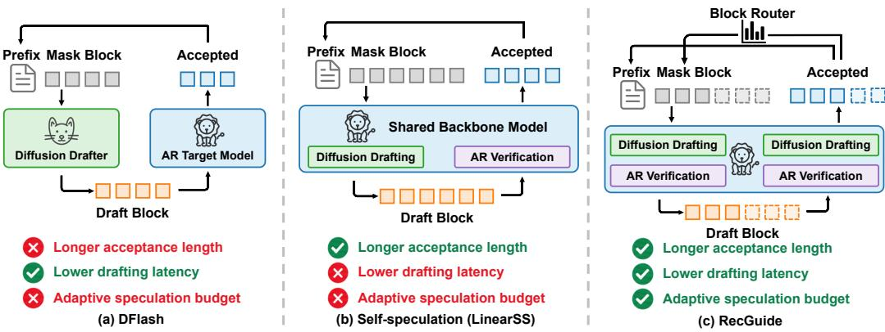
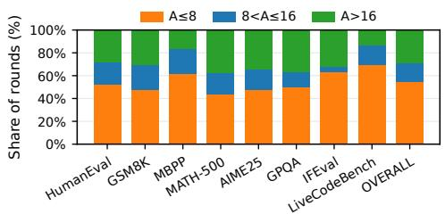
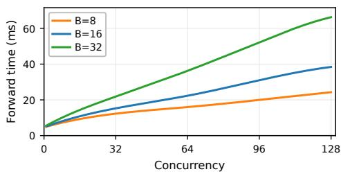
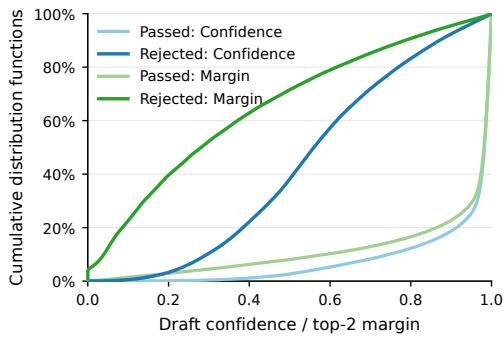
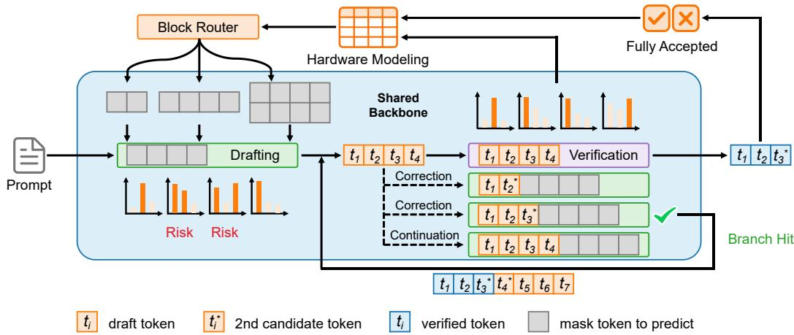
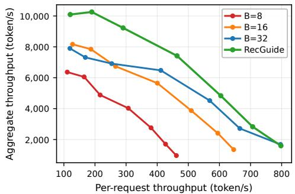
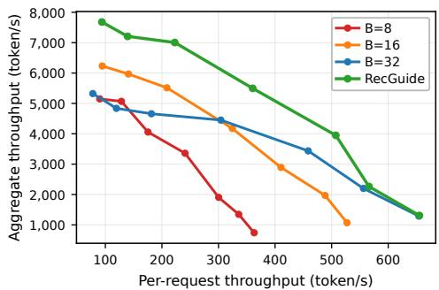

# RECIPROCAL GUIDANCE: ORCHESTRATING DRAFT AND VERIFY BUDGETS FOR ADVANCING THE DIFFUSION-AR SELF-SPECULATION FRONTIER

Linye Wei1,2,\* Shutian Zheng3,\* Haoyu Zeng4 Meng Li1,2,5,†

1Institute for Artificial Intelligence, Peking University

2School of Integrated Circuits, Peking University

3College of Engineering, Peking University

4School of Airspace Science and Engineering, Shandong University

5Beijing Advanced Innovation Center for Integrated Circuits

## ABSTRACT

Diffusion drafting with autoregressive (AR) verification has emerged as a promising paradigm for efficient speculative decoding. Recent self-speculation models, represented by Nemotron-Labs-Diffusion, further simplify the speculative pipeline by unifying drafting and verification within a shared backbone, while enabling longer acceptance lengths. However, the Pareto frontier between aggregate and per-request throughput remains underexplored. At low concurrency, sequential draft-verify execution requires two model forward passes per round, limiting the effective tokens per forward (TPF). By contrast, at high concurrency, longer drafts incur increasingly expensive computation, forcing individual requests to operate under constrained speculation budgets and preventing full exploitation of the fullbackbone drafter. Our key observation indicates that drafting and verification exhibit reciprocal predictability. Draft logits can anticipate likely verification mismatches, while recent verification outcomes predict future drafting utility and suitable block sizes. Building on this observation, we introduce Reciprocal Guidance (RecGuide), a runtime draft-verify orchestration framework that adapts speculative decoding to varying serving loads. RecGuide exploits spare compute capacity through verification-overlapped drafting at low concurrency, while dynamically allocating request-specific draft block sizes as the workload becomes increasingly compute-intensive. Experiments across a wide range of concurrency levels demonstrate consistent throughput improvements over vanilla self-speculation, achieving up to 1.8× speedup.

## 1 INTRODUCTION

Speculative decoding (Chen et al., 2023; Leviathan et al., 2023) has emerged as an important technique for accelerating large language model (LLM) inference. It employs a lightweight draft model to autoregressively generate multiple candidate tokens, which are then verified and potentially accepted in a single forward pass. Recently, inspired by diffusion language models (dLLMs) (Nie et al., 2026; Ye et al., 2025a; Cheng et al., 2026a), diffusion-based speculative decoding (Chen et al., 2026; Huang et al., 2026; Cheng et al., 2026b) uses a predictor with bidirectional attention to generate draft tokens in parallel, followed by autoregressive verification. By reducing sequential drafting overhead while maintaining high acceptance rates, this paradigm has attracted growing attention.

Alongside this line of work, self-speculation methods such as Nemotron-Labs-Diffusion (Fu et al., 2026; Liu et al., 2026b) use a single shared backbone and switch between bidirectional and causal attention to support diffusion drafting and autoregressive verification without requiring a separate drafter. This design simplifies the speculative pipeline (Zhang et al., 2026b) and, by reusing the full target backbone itself as the drafter (Zhang et al., 2024), offers stronger task generalization and the potential for longer acceptance lengths than lightweight draft models.

  
Figure 1: Comparison between RecGuide and existing diffusion-based speculative decoding.

However, concurrency varies dynamically in real-world serving workloads (Chen et al., 2024), while current self-speculation typically relies on fixed draft lengths (referred to as block sizes hereafter) tailored to different concurrency regimes. We argue that this coarse-grained allocation is insufficient (Sadhukhan et al., 2025). At low concurrency, the sequential draft-then-verify pipeline requires two expensive forward passes per speculative round, reducing the effective tokens per forward (TPF) to roughly half of the acceptance length and substantially diminishing the gains enabled by the fullbackbone drafter. At high concurrency, by contrast, maintaining a large block size for every request becomes impractical, as the resulting computation pushes GPU execution into the compute-bound regime and significantly increases forward-pass latency. Yet choosing a small block size underutilizes self-speculation’s potential for longer acceptance lengths compared with conventional speculative decoding paradigms. This motivates the following question:

Can we orchestrate draft and verify budgets to advance the aggregate and per-request throughput frontier, thereby making self-speculation a competitive paradigm for speculative decoding?

To address this challenge, we propose Reciprocal Guidance (RecGuide), grounded in our core observation that drafting and verification on the shared backbone are not independent, but exhibit strong reciprocal predictability. On the one hand, draft logits provide informative signals for anticipating likely mismatch positions in subsequent AR verification, as well as a likely correction token. On the other hand, recent verification outcomes reflect the local drafting difficulty of each request and provide an effective signal for selecting an appropriate block size in the next round.

Building on these observations, RecGuide provides a draft-verify orchestration framework for selfspeculation with complementary strategies across varying concurrency levels, as illustrated in Figure 1. At low concurrency, RecGuide predicts the upcoming verification outcome from the draft probability distribution and co-batches likely next-round drafts with AR verification. This overlap is particularly natural for self-speculation because drafting and verification share the same weights, enabling simple co-batching without model switching or separate devices while exploiting spare compute capacity in the memory-bound regime (Liu et al., 2025; Kumar et al., 2026). As the workload increases, RecGuide instead uses verification feedback to estimate future drafting utility and dynamically assigns request-specific draft block sizes. Together with bucketed serving based on block size, this strategy balances the drafting capability of the model against available GPU compute.

We evaluate RecGuide under diverse serving regimes. Our method consistently improves throughput over vanilla self-speculation, enhancing speculative efficiency under light workloads and serving efficiency under heavy workloads. Our main contributions can be summarized as follows:

• We characterize the efficiency bottlenecks and pipeline challenges of self-speculation, and uncover reciprocal predictability between drafting and verification.

• We propose RecGuide, which orchestrates draft and verify budgets across varying serving loads through predictive draft overlap and adaptive block sizing.

• Extensive experiments demonstrate that RecGuide achieves consistent throughput improvements over vanilla self-speculation, with up to a 1.8× speedup.

## 2 RELATED WORK

Drafting Paradigms for Speculative Decoding. Speculative decoding (Chen et al., 2023; Leviathan et al., 2023; Cai et al., 2024; Zhong et al., 2024) has become a widely adopted approach for accelerating large language model inference. It uses a lightweight drafter to propose multiple future tokens, which are verified in parallel by the target model, enabling multiple tokens to be accepted per target-model forward without altering the generation distribution. Early methods relied on smaller standalone models sharing the target vocabulary, making speedup sensitive to drafter latency. EAGLE series (Li et al., 2024b;a; 2026b) improve drafting efficiency by exploiting target model representations. Nevertheless, autoregressive drafting still incurs latency that grows with draft length. Inspired by diffusion (Ho et al., 2020; Yan et al., 2026; 2025) and diffusion language models (Nie et al., 2026; Ye et al., 2025a; Cheng et al., 2026a; Bie et al., 2025; Wei et al., 2026), recent approaches (Chen et al., 2026; Huang et al., 2026; Cheng et al., 2026b) employ diffusion drafters with bidirectional attention to generate a draft block in a single forward pass, reducing sequential drafting overhead while achieving higher acceptance rates. Meanwhile, self-speculative methods (Fu et al., 2026; Liu et al., 2026b; Zhang et al., 2026b) further unify diffusion drafting and autoregressive verification within a shared model, enabling stronger drafting capability and longer acceptance lengths at increased drafting cost. Our work focuses on the runtime execution and efficiency of this paradigm.

Runtime Orchestration for Speculative Decoding. Beyond drafter design, recent work has increasingly optimized speculative decoding through parallel execution and adaptive runtime strategies (Zhang et al., 2026c; Lin et al., 2026), aiming to break the sequential draft-then-verify dependency and accommodate diverse serving conditions. PEARL (Liu et al., 2025) overlaps drafting and verification while adapting draft length to mitigate mutual waiting between a separate drafter and verifier. SSD (Kumar et al., 2026) further predicts likely verification outcomes before verification completes and asynchronously prepares future speculation. In contrast, our proposed RecGuide targets self-speculation where both stages invoke the same backbone, allowing future drafts to be directly co-batched with ongoing verification without model switching or additional devices. This turns the efficiency bottleneck into a limited-compute allocation problem, especially at high concurrency. At the drafting stage, prior work (Sadhukhan et al., 2025; Ning et al., 2026; Zhang et al., 2026a) explores more flexible strategies to dynamically determine the amount and configuration of speculation for higher throughput. At the verification stage, another line of work (Liu et al., 2026c; Cheng et al., 2026b; Liu et al., 2026a) selectively allocates verification effort based on confidence signals or hardware-aware runtime models. These two stages, however, are typically optimized separately. RecGuide instead treats drafting and verification as mutually informative and coupled stages, using bidirectional signals to jointly orchestrate their budgets across concurrency regimes.

## 3 PRELIMINARY AND BOTTLENECK

## 3.1 SELF-SPECULATION WITH A SHARED BACKBONE

Unlike conventional speculative decoding, which employs a lightweight drafter alongside the target model, shared-backbone self-speculation jointly optimizes autoregressive and diffusion objectives so that a single backbone supports both diffusion drafting and autoregressive verification, as illustrated in Figure 1(b). Given a generated prefix, the model first predicts multiple future tokens in parallel under the diffusion mode and then switches to the autoregressive mode for causal verification following standard speculative decoding, accepting the correct prefix up to the first mismatch.

The two modes can be switched simply by changing the attention pattern. Let the current prefix length be P and the draft block size be B. We denote prefix positions by $\mathcal { P } = 1 , \ldots , P$ and draft positions by $\mathcal { D } = P + 1 , \dotsc , P + B$ . Under diffusion drafting, the prefix preserves causal dependency, while tokens in $\mathcal { D }$ can attend to the prefix and entire draft region, enabling parallel prediction through bidirectional attention. Autoregressive verification instead enforces strict causal attention, where position i can only attend to positions $j \leq i .$ . The corresponding attention masks are as follows:

$$
\begin{array}{c} M _ { i j } ^ { \mathrm { { D i f f } } } = \left\{ \begin{array} { l l } { 0 , } & { i \in \mathcal { P } , ~ j \in \mathcal { P } , ~ j \le i , } \\ { 0 , } & { i \in \mathcal { D } , ~ j \in \mathcal { P } \cup \mathcal { D } , } \\ { - \infty , } & { \mathrm { o t h e r w i s e } , } \end{array} \right. \qquad M _ { i j } ^ { \mathrm { { A R } } } = \left\{ { 0 , } \atop - \infty ,  & { j > i . } \end{array} \right.\tag{1}
$$

  
(a)

  
(b)  
Figure 2: Acceptance variability and block-dependent forward cost of self-speculation. (a) Acceptance length distribution with $B = 3 2$ . (b) Forward time across concurrency levels for $B \in \{ 8 , 1 6 , 3 2 \}$

Consequently, $M _ { i j } ^ { \mathrm { D i f f } }$ enables bidirectional interaction within the draft region, whereas $M _ { i j } ^ { \mathrm { A R } }$ restores left-to-right dependency. This switching allows the full backbone itself to serve as the drafter without deploying a separate draft model. However, sharing the backbone also directly couples drafting and verification at runtime, forcing the two full-backbone stages to execute sequentially within each speculative round and thereby creating efficiency characteristics distinct from conventional speculative decoding. We next examine the resulting bottlen ecks under different serving conditions.

## 3.2 BOTTLENECKS ACROSS SERVING LOADS

To characterize the efficiency of self-speculation across serving loads, we profile Nemotron-Labs-Diffusion 8B in terms of acceptance behavior and forward cost. As shown in Figure 2(a), with block size 32, we report the fraction of rounds whose acceptance length A falls into $A \leq 8 , 8 < A \leq 1 6$ and $A > 1 6$ across benchmarks. Nearly 30% of the rounds accept more than 16 tokens, revealing strong potential for long drafts, while over half fail within the first 8 positions, indicating substantial variation in useful drafting length. We further examine forward time under fixed block sizes of 8, 16, and 32 as concurrency increases on a single B200 GPU, as illustrated in Figure 2(b). Forward time grows with concurrency, with larger block sizes incurring increasingly higher latency under heavier workloads. Together, these profiles reveal a mismatch between highly variable acceptance potential and load-dependent drafting cost across concurrency regimes.

Low-concurrency Inefficiency. At low concurrency, inefficiency comes from both pipeline serialization and wasted drafting. Drafting and verification execute sequentially, causing mutual waiting that is often negligible with lightweight drafters but costly when both stages invoke the full backbone. Moreover, Figure 2(a) shows that large blocks can waste substantial drafting computation when mismatches occur early. Fortunately, execution remains largely memory-bound at low concurrency, leaving spare compute that can be used to overlap drafting with verification and proactively correct likely mismatches.

High-concurrency Inefficiency. As concurrency increases, Figure 2(b) shows that block size becomes increasingly constrained by compute load, favoring smaller blocks. However, uniformly using a small block remains suboptimal, since it sacrifices the long-acceptance potential observed in Figure 2(a). Since GPU latency typically grows sublinearly with the number of processed tokens, additional drafting remains beneficial when the acceptance gain outweighs the corresponding latency overhead. This motivates dynamically selecting the block size for each request rather than using a fixed global budget. The resulting divergence in per-request computation lengths will be handled through bucketed serving, as discussed in Section 5.3.

## 4 RECIPROCAL PREDICTABILITY BETWEEN DRAFTING AND VERIFICATION

The bottlenecks above show that runtime orchestration must account for both varying serving loads and the dynamic nature of decoding. Shared-backbone execution exposes complementary signals from drafting and verification that can guide such adaptation. We next establish this reciprocal predictability and its implications for runtime decisions.

## 4.1 DRAFT DISTRIBUTIONS PREDICT VERIFICATION FAILURES

We first examine whether the draft distribution contains predictive cues about subsequent verification. Under greedy decoding, we define the confidence of the drafted token at position i as $C _ { i } = P _ { \mathrm { 1 s t } } ( i )$ . Figure 3 compares the cumulative distribution functions (CDFs) of $C _ { i }$ at verifier-passed and first-rejected positions across math, code, and QA benchmarks. Passed tokens are heavily concentrated at high confidence values, whereas first-rejected positions exhibit a substantially broader distribution shifted toward lower confidence. This clear separation reveals that draft confidence can anticipate likely verification failures before the verifier is executed.

We further consider the probability margin between the two most likely draft candidates, $\begin{array} { r } { M _ { i } = P _ { \mathrm { 1 s t } } ( i ) - } \end{array}$ $P _ { \mathrm { 2 n d } } ( i )$ . Its CDF exhibits a similar separation between passed and first-rejected positions. A small margin not only reflects uncertainty in the submitted draft token, but also shows that the secondranked candidate remains competitive. Although this candidate is not necessarily correct, it offers a natural alternative at likely mismatch positions. These observations imply that likely verification failures can be anticipated and prepared for before causal verification completes.

  
Figure 3: Cumulative distribution functions (CDFs) of draft confidence and top-2 probability margin during drafting rounds.

## 4.2 VERIFICATION HISTORY PREDICTS FUTURE DRAFTING UTILITY

Conversely, we examine whether completed verification is predictive of how far the next round should draft. Without introducing a specific utility metric, we analyze the temporal correlation of acceptance lengths across adjacent rounds, as shown in Table 1. To expose the model’s full acceptance potential, the block size is fixed at 32, and the acceptance length at round t is denoted by $A _ { t }$ . We divide $A _ { t }$ into three intervals: short acceptance with $A _ { t } \le 8$ , medium acceptance with $8 < A _ { t } \le 1 6$ , and long acceptance with $A _ { t } > 1 6$ . These intervals align with the candidate block sizes $^ { 8 , }$ 16, and 32. Table 1 reports the conditional distribution of $A _ { t + 1 }$ over the three intervals. Both short and long acceptance exhibit clear temporal persistence, as the next round is most likely to remain in the same interval. This pattern suggests that local generation difficulty tends to persist across adjacent rounds, making verification history a useful prior for future drafting budgets.

Table 1: Transition probabilities of acceptance intervals between adjacent decoding rounds.
<table><tr><td> $A _ { t } \backslash A _ { t + 1 }$ </td><td>[1,8]</td><td>(8,16]</td><td>(16, 32]</td></tr><tr><td>[1, 8]</td><td>70.30%</td><td>18.11%</td><td>11.60%</td></tr><tr><td>(8,16]</td><td>58.39%</td><td>22.42%</td><td>19.19%</td></tr><tr><td>(16, 32]</td><td>20.83%</td><td>12.51%</td><td>66.66%</td></tr></table>

This persistence, however, is not static. Table 1 also shows frequent transitions between adjacent rounds. In particular, only 22.42% of medium acceptance rounds remain in the same interval, primarily because short acceptance rounds dominate all decoding rounds. Thus, each response exhibits both local persistence and regime transitions. A fixed block size therefore cannot consistently match the local drafting utility, calling for adaptive block size allocation under limited compute.

## 5 RECGUIDE: RUNTIME DRAFT-VERIFY ORCHESTRATION

RecGuide converts reciprocal predictability into runtime decisions, as illustrated in Figure 4. Under light workloads, spare compute prepares likely future drafts alongside verification. Once compute becomes limiting, verification history instead guides each request’s drafting budget.

## 5.1 PREDICTIVE DRAFT-VERIFY OVERLAP

As discussed before, the probability margin $M _ { i } = P _ { \mathrm { 1 s t } } ( i ) - P _ { \mathrm { 2 n d } } ( i )$ reflects draft uncertainty and second-ranked token competitiveness. We mark positions with ${ M } _ { i } < \delta$ as potential mismatches and forms a correction branch by replacing the draft token with its second candidate. Because later positions in a parallel draft are generally less reliable and less valuable for correcting the first mismatch, RecGuide retains only the earliest two risky positions. When at most two such positions exist, it additionally prepares a continuation branch assuming full acceptance of the current block. Together with the verifier, each round contains at most four logical rows, bounding extra computation.

  
Figure 4: Overview of RecGuide runtime orchestration. Draft uncertainty guides predictive draftverify overlap through correction and continuation branches, while verification feedback and hardware profiles guide request-specific block size allocation.

These branches prepare drafts for the next round in parallel with current verification. A correction branch is reused only if the verifier rejects at the predicted position and produces the same replacement token, whereas retaining the continuation branch requires full acceptance of the current block and a match between its first token and the verifier bonus token. Unmatched branches are discarded. A confirmed draft can immediately repeat the procedure in the next round, enabling recursive overlap.

## 5.2 VERIFICATION GUIDED ADAPTIVE DRAFTING

At higher concurrency, costly prospective branches shift the bottleneck to balancing computation and acceptance length. RecGuide uses completed verification history to select each request’s next block size $\mathbf { \bar { \it B } } _ { t } \in \{ 8 , 1 \bar { 6 } , 3 2 \}$ . Let $e _ { t }$ average verifier entropy over causally valid positions, excluding those after the first mismatch. We combine two-round certainty with the previous block outcome zt:

$$
s _ { t } = - { \frac { e _ { t - 1 } + e _ { t - 2 } } { 2 } } , \qquad z _ { t } = ( B _ { t - 1 } , F _ { t - 1 } ) ,\tag{2}
$$

where $F _ { t - 1 }$ indicates whether the previous block was fully accepted. While $s _ { t }$ mainly reflects whether a long block should shrink under high uncertainty, $z _ { t }$ further encourages a larger drafting budget after full acceptance, since the true acceptance potential may extend beyond the current block boundary. Given this, RecGuide estimates the expected accepted progress $V _ { B } ( s _ { t } , z _ { t } )$ from calibration data for each candidate B. Following the hardware-aware cost modeling of DSpark, an offline profile provides the execution cost $T _ { C } ( B )$ under serving load C. RecGuide then selects

$$
B _ { t } ^ { * } = \arg \operatorname* { m a x } _ { B \in \{ 8 , 1 6 , 3 2 \} } \left[ V _ { B } ( s _ { t } , z _ { t } ) - \rho _ { C } T _ { C } ( B ) \right] ,\tag{3}
$$

where $\rho _ { C }$ weights the profiled execution cost at load C. A larger block is chosen only when its expected acceptance gain justifies the additional computation. The decision is resolved through lightweight table lookup at runtime, introducing negligible overhead.

## 5.3 SYSTEM IMPLEMENTATION

Algorithmic optimization alone does not directly translate into end-to-end gains. For draft-verify overlap, naively batching the verifier and prospective branches causes redundant prefix KV reads and padding due to unequal sequence lengths. We therefore extend SGLang with shared-prefix KV access and padding-free execution, allowing all branches to reuse the canonical prefix while processing only valid query tokens. We also redesign the mapping of mixed attention workloads onto GPU SMs.

Dynamic block sizing faces a similar issue: mixing different block sizes within a batch forces shorter requests to pad to the largest block, offsetting their computational savings. RecGuide therefore adopts block-size bucketed serving. After each verification round, requests are grouped by their planned block size, and the scheduler forms batches only from requests in the same bucket, preserving the efficiency of adaptive block sizing while keeping request states and canonical KV independent.

## 6 EXPERIMENTS

## 6.1 EXPERIMENTAL SETUP

Models and Benchmarks. We evaluate RecGuide on Nemotron-Labs-Diffusion (NLD) 8B and 14B (Fu et al., 2026), a representative state-of-the-art diffusion–AR self-speculation family. Fixing the backbone enables fair decoding-paradigm comparisons with LinearSS and its quadratic variant TiDAR (Liu et al., 2026b), isolating runtime gains from architectural differences. Our evaluation covers eight benchmarks spanning three categories: Math (GSM8K (Cobbe et al., 2021), MATH-500 (Lightman et al., 2024), AIME25 (Zhang & Math-AI, 2025)); Code (HumanEval (Chen et al., 2021), MBPP (Austin et al., 2021), LiveCodeBench (Jain et al., 2025)); QA & instruction following (GPQA (Rein et al., 2023), IFEval (Zhou et al., 2023)). We compare against vanilla LinearSS, DFlash, and TiDAR. Due to training budget constraints, DFlash is trained on ShareGPT (RyokoAI, 2023) following the SpecForge recipe (Li et al., 2026a), while other configurations follow official settings.

Evaluation Settings and Metrics. All experiments are conducted on a single NVIDIA B200 GPU with SGLang (Zheng et al., 2024) engine and FlashInfer (Ye et al., 2025b) backend. We evaluate our two RecGuide strategies under their corresponding serving regimes. Following NLD’s recipe, all methods use greedy decoding. We set concurrency $C = 1$ and block size $B = 1 6$ for low-concurrency experiments. Potential mismatch positions are identified by $M _ { i } < \delta ,$ , with $\delta = 0 . 5$ throughout all experiments. For higher-concurrency serving, we vary concurrency over $C \in \{ 2 , 4 , 8 , 1 6 , 3 2 , 6 4 , 1 2 8 \}$ and compare RecGuide against fixed block sizes $B \in \{ 8 , 1 6 , 3 2 \}$ using both aggregate and per-request throughput.

## 6.2 LOW-CONCURRENCY PERFORMANCE

Table 2 compares RecGuide with representative diffusion-AR speculative decoding paradigms under the single-request setting, reporting average acceptance length τ and end-to-end speedup over autoregressive decoding. Although LinearSS accepts substantially more tokens per round than DFlash, its two full-backbone forwards limit end-to-end speedup, allowing DFlash with a lightweight drafter to remain faster. RecGuide, by contrast, achieves the highest speedup, averaging 4.06× on NLD-8B and 4.40× on NLD-14B over autoregressive decoding, and delivering up to 1.8× speedup over vanilla LinearSS on AIME25. Under the same two-forward accounting, RecGuide raises the effective acceptance length to more than 14 tokens, approaching the B = 16 limit of serial execution.

Longer acceptance, however, does not necessarily imply faster decoding even after removing the two-forward dependency of linear self-speculation, as TiDAR illustrates. Its quadratic speculative layout prepares a future draft for every possible acceptance position, incurring $O ( B ^ { 2 } )$ speculative computation. Consequently, its longer acceptance does not translate into higher end-to-end speedup because of the increased forward cost, leaving TiDAR behind LinearSS on average. Moreover, TiDAR drafts from hypothesized acceptance positions without explicitly supplying a correction token at likely mismatches. The repeated draft may still be incorrect; even after a successful correction, later tokens in the same parallel draft cannot condition on it, potentially degrading the draft quality.

RecGuide instead assigns the second-ranked candidate to selected risky positions, providing an explicit corrected prefix once verified. Despite using far fewer prospective branches than TiDAR,

Table 2: Average acceptance length (τ) per two-forward round and decoding speedup over autoregressive decoding on NLD-8B/14B at C = 1, B = 16. RecGuide can verify two blocks in this window.
<table><tr><td rowspan="2">Model</td><td rowspan="2">Method</td><td rowspan="2">Metric</td><td colspan="3">MATH</td><td colspan="3">CODE</td><td colspan="2">QA&amp;IF</td><td>OVERALL</td></tr><tr><td>GSM8K</td><td>MATH-500</td><td>AIME25</td><td>HumanEval</td><td>MBPP</td><td>LCB</td><td>GPQA</td><td>IFEval</td><td> $A \nu g .$ </td></tr><tr><td rowspan="8">NLD-8B</td><td rowspan="2">LinearSS</td><td>T</td><td>9.94</td><td>11.21</td><td>10.49</td><td>9.71</td><td>8.15</td><td>9.78</td><td>10.62</td><td>9.57</td><td>9.93</td></tr><tr><td>Speedup</td><td>3.03×</td><td>2.95×</td><td>2.42×</td><td>2.91×</td><td>2.67×</td><td>2.36×</td><td>2.58×</td><td>2.53×</td><td>2.68×</td></tr><tr><td rowspan="2">DFlash</td><td>T</td><td>4.26</td><td>4.31</td><td>4.90</td><td>4.28</td><td>3.78</td><td>4.64</td><td>5.11</td><td>3.90</td><td>4.40</td></tr><tr><td>Speedup</td><td>2.80×</td><td>2.87×</td><td>3.13×</td><td>2.83×</td><td>2.47×</td><td>3.09×</td><td>3.39×</td><td>2.57×</td><td>2.89×</td></tr><tr><td rowspan="2">TiDAR</td><td>T</td><td>13.44</td><td>15.80</td><td>14.54</td><td>12.92</td><td>9.18</td><td>13.48</td><td>15.18</td><td>12.52</td><td>13.38</td></tr><tr><td>Speedup</td><td>2.62×</td><td>2.87×</td><td>2.34×</td><td>2.52×</td><td>1.88×</td><td>2.32×</td><td>2.57×</td><td>2.26×</td><td>2.42×</td></tr><tr><td rowspan="2">RecGuide</td><td>T</td><td>13.95</td><td>16.08</td><td>15.68</td><td>13.64</td><td>11.08</td><td>13.54</td><td>14.84</td><td>13.33</td><td>14.02</td></tr><tr><td>Speedup</td><td>4.05×</td><td>4.66×</td><td>4.38×</td><td>4.07×</td><td>3.22×</td><td>3.91×</td><td>4.27×</td><td>3.94×</td><td>4.06×</td></tr><tr><td rowspan="8">NLD-14B</td><td rowspan="2">LinearSS</td><td>T</td><td>9.74</td><td>10.50</td><td>9.35</td><td>11.99</td><td>10.81</td><td>9.27</td><td>10.79</td><td>8.35</td><td>10.10</td></tr><tr><td>Speedup</td><td>2.84×</td><td>3.06×</td><td>2.36×</td><td>4.15×</td><td>3.41×</td><td>2.50×</td><td>2.82×</td><td>2.43×</td><td>2.95×</td></tr><tr><td rowspan="2">DFlash</td><td>T</td><td>4.78</td><td>4.37</td><td>3.81</td><td>4.93</td><td>5.49</td><td>4.14</td><td>5.28</td><td>3.80</td><td>4.58</td></tr><tr><td>Speedup</td><td>3.13×</td><td>2.94×</td><td>2.50×</td><td>3.30×</td><td>3.43×</td><td>2.80×</td><td>3.54×</td><td>2.57×</td><td>3.03×</td></tr><tr><td rowspan="2">TiDAR</td><td>T</td><td>13.10</td><td>16.24</td><td>13.90</td><td>17.72</td><td>15.80</td><td>13.26</td><td>17.24</td><td>12.20</td><td>14.94</td></tr><tr><td>Speedup</td><td>2.74×</td><td>3.09×</td><td>2.47×</td><td>3.78×</td><td>3.13×</td><td>2.48×</td><td>3.08×</td><td>2.36×</td><td>2.89×</td></tr><tr><td rowspan="2">RecGuide</td><td>T</td><td>13.61</td><td>15.43</td><td>13.41</td><td>18.19</td><td>12.56</td><td>13.27</td><td>16.21</td><td>10.97</td><td>14.21</td></tr><tr><td>Speedup</td><td>4.22×</td><td>4.82×</td><td>4.21×</td><td>5.49×</td><td>3.74×</td><td>4.17×</td><td>5.03×</td><td>3.55×</td><td>4.40×</td></tr></table>

Table 3: Branch outcomes in draft-verify overlap. Correction and Continuation report coverage / reuse rate (%); No Hit denotes rounds unmatched by any prospective branch.
<table><tr><td>Model</td><td>Branch Outcome</td><td>MATH</td><td>CODE</td><td>QA &amp; IF</td><td>OVERALL</td></tr><tr><td rowspan="3">NLD-8B</td><td>Correction</td><td>32.46 / 21.46</td><td>41.63 / 25.81</td><td>33.31 / 17.25</td><td>36.11 / 22.04</td></tr><tr><td>Continuation</td><td>43.85 / 42.92</td><td>27.89 / 27.14</td><td>48.55 / 47.88</td><td>39.04 / 38.24</td></tr><tr><td>No Hit</td><td>23.68</td><td>30.48</td><td>18.14</td><td>24.85</td></tr><tr><td rowspan="3">NLD-14B</td><td>Correction</td><td>32.37 / 21.98</td><td>30.99 / 20.38</td><td>35.44 / 18.61</td><td>32.62 / 20.54</td></tr><tr><td>Continuation</td><td>37.12 / 35.95</td><td>43.81 / 36.53</td><td>39.22 / 38.88</td><td>40.15 / 36.90</td></tr><tr><td>No Hit</td><td>30.51</td><td>25.20</td><td>25.33</td><td>27.22</td></tr></table>

RecGuide retains high mismatch coverage, as shown in Table 3. Correction and continuation branches cover most decoding rounds, leaving only 24.85% and 27.22% of rounds on NLD-8B and NLD-14B, respectively, unmatched by any branch. Furthermore, among matched correction branches, the second-ranked candidate matches the verifier correction in over 60% of cases, supporting explicit correction as a reliable drafting signal. Continuation branches are even more reusable: after fullblock acceptance, the first draft token almost always matches the additional next token produced by the verifier. RecGuide therefore preserves acceptance lengths comparable to TiDAR with far less speculative computation, ultimately achieving the highest decoding efficiency.

## 6.3 HIGH-CONCURRENCY PERFORMANCE

Figure 5 evaluates RecGuide under higher serving loads, showing the trade-off between aggregate and per-request throughput across $C \in \{ 2 , 4 , 8 , 1 6 , 3 2 , 6 4 , 1 2 8 \}$ . Increasing concurrency raises aggregate throughput at the expense of per-request throughput. Compared with fixed $B \in \{ 8 , \dot { 1 } 6 , 3 2 \}$ RecGuide favors larger blocks when compute remains available and shifts toward smaller blocks as execution becomes compute limited. This adaptive allocation consistently improves aggregate throughput on both NLD-8B and NLD-14B, advancing the overall serving frontier.

Table 4 makes this load adaptation explicit. On NLD-8B, the fraction of $B = 3 2$ decreases from 88.13% at C = 2 to 9.75% at $C = 1 2 \bar { 8 }$ , while $B = 8$ increases from 9.33% to 78.21%; NLD-14B exhibits the same transition. This confirms that RecGuide adjusts drafting budgets with serving load rather than relying on a single fixed configuration. Block-size distributions also vary across task categories at the same concurrency. In particular, QA & IF shifts toward smaller blocks earlier than MATH and CODE, consistent with higher verification uncertainty and demonstrating request-level adaptation beyond load awareness alone.

  
(a)

  
(b)  
Figure 5: Aggregate and per-request throughput trade-offs under different concurrency levels on (a) NLD-8B and (b) NLD-14B. We compare fixed block sizes $B \in \{ 8 , 1 6 , 3 2 \}$ with RecGuide.

Table 4: Dynamic block-size distributions across serving loads. Each entry reports the percentage of requests selecting $B = 8 / 1 6 / 3 2$ , respectively; Overall is the macro average over eight benchmarks.
<table><tr><td>Model</td><td>Concurrency</td><td>MATH</td><td>CODE</td><td>QA &amp; IF</td><td>OVERALL</td></tr><tr><td rowspan="4">NLD-8B</td><td>2</td><td>3.61 / 1.28 / 95.11</td><td>4.63 / 1.51 / 93.86</td><td>24.97 / 5.97 / 69.07</td><td>9.33 / 2.54 / 88.13</td></tr><tr><td>8</td><td>0.63 / 26.91 / 72.46</td><td>0.66 / 39.18 / 60.16</td><td>12.85 / 48.73 / 38.43</td><td>3.70 / 36.96 / 59.34</td></tr><tr><td>32</td><td>28.83 / 52.95 / 18.22</td><td>40.45 / 47.70 / 11.86</td><td>60.76 / 22.35 / 16.89</td><td>41.17 / 43.33 / 15.50</td></tr><tr><td>128</td><td>72.46 / 17.25 / 10.30</td><td>82.03 / 11.11 / 6.87</td><td>81.12 / 5.65 / 13.23</td><td>78.21 / 12.04 / 9.75</td></tr><tr><td rowspan="4">NLD-14B</td><td>2</td><td>1.40 / 3.11 / 95.49</td><td>0.32 / 1.92 / 97.76</td><td>12.14 / 12.83 / 75.03</td><td>3.68 / 5.09 / 91.23</td></tr><tr><td>8</td><td>0.56 / 42.26 / 57.18</td><td>0.04 / 37.14 / 62.82</td><td>6.27 / 58.77 / 34.97</td><td>1.79 / 44.47 / 53.74</td></tr><tr><td>32</td><td>28.31 / 63.75 / 7.94</td><td>20.26 / 69.51 / 10.23</td><td>56.77 / 31.81 / 11.43</td><td>32.40 / 57.92 / 9.67</td></tr><tr><td>128</td><td>84.07 / 11.56 / 4.37</td><td>83.80 / 10.21 / 5.99</td><td>83.41 / 5.94 / 10.66</td><td>83.81 / 9.65 / 6.55</td></tr></table>

These distributions also explain the per-request throughput trends in Figure 5. $\mathbf { A } \mathbf { t } { \boldsymbol { \ C } } = \mathbf { \boldsymbol { \ 2 } } $ and $C = 1 2 8$ , RecGuide predominantly selects $B = 3 2$ and $B = 8$ , respectively, so its per-request throughput approaches the corresponding fixed-block baselines, whereas the more diverse assignments at intermediate concurrency provide greater gains from request-specific adaptation. Notably, fixed $B = 8$ remains inferior to ${ \dot { B } } = 1 6$ in aggregate throughput at the highest concurrency, since shorter blocks require more decoding rounds and amplify progress imbalance across concurrent requests. RecGuide avoids this drawback by selecting short blocks only when beneficial and regrouping requests by their planned block size at each round, allowing aggressive use of $B = 8 ^ { \circ }$ without inheriting the inefficiency of a globally fixed short-block policy.

## 6.4 ABLATION STUDY

We further decompose RecGuide by progressively adding the key components of Predictive Draft-Verify Overlap and Verification Guided Adaptive Drafting to vanilla LinearSS under their respective load regimes. We report aggregate throughput in tokens per second (TPS) on NLD-8B / 14B.

Predictive Draft-Verify Overlap. Table 5 ablates the prospective branches at $C = 1$ . Starting with the first correction branch, we add the second correction and continuation branches to isolate the benefits of broader mismatch coverage and full-block continuation. The first correction branch alone improves throughput by 34.29% and 28.72% on NLD-8B / 14B, respectively. The second correction branch yields a smaller gain, which we attribute to later risky positions being less causally grounded and harder to predict, supporting our decision to bound the number of correction branches. Adding the continuation branch further raises the improvement to 51.76% and 49.36%. These results show that three prospective branches capture most of the overlap benefit while keeping computation bounded.

Table 5: Ablation of prospective branches in Predictive Draft-Verify Overlap at $C = 1$ . TPS is averaged over all benchmarks.
<table><tr><td>Method</td><td>NLD-8B</td><td>NLD-14B</td></tr><tr><td>LinearSS</td><td>595</td><td>470</td></tr><tr><td>+ 1st Correction</td><td>799 (+34.29%)</td><td>605 (+28.72%)</td></tr><tr><td>+ 2nd Correction</td><td>811 (+36.30%)</td><td>612 (+30.21%)</td></tr><tr><td>+ Continuation</td><td>903 (+51.76%)</td><td>702 (+49.36%)</td></tr></table>

Verification Guided Adaptive Drafting. We next ablate the adaptive block policy over $C \in$ {2, 4, 8, 16, 32, 64, 128}, as shown in Table 6. Fixed Block follows NLD’s official recipe, using a concurrency-specific block size shared by all requests. Adding two-round entropy $s _ { t }$ improves TPS by 10.49% / 7.60% on NLD-8B / 14B. The previous block size and full-acceptance state $z _ { t }$ further guide budget expansion. Request-specific block sizes introduce unequal draft lengths within batches, so padding to the largest block can offset these computational savings. Block-size bucketing groups requests by their selected size, translating compute savings into serving throughput gains. Together, adaptive selection and bucketed execution improve TPS by 39.84% and 32.80%, respectively.

Table $6 { : }$ Ablation of verification guided adaptive drafting. TPS is averaged over all benchmarks and concurrency levels.
<table><tr><td>Method</td><td>NLD-8B</td><td>NLD-14B</td></tr><tr><td>Fixed Block</td><td>4725</td><td>3756</td></tr><tr><td> $+ \ s _ { t }$ </td><td>5221 (+10.49%)</td><td>4041 (+7.60%)</td></tr><tr><td> $+ \ z _ { t }$ </td><td>5254 (+11.19%)</td><td>4071 (+8.40%)</td></tr><tr><td>+ Bucketing</td><td>6608 (+39.84%)</td><td>4987 (+32.80%)</td></tr></table>

## 7 CONCLUSION

This work presents Reciprocal Guidance (RecGuide), a runtime draft-verify orchestration framework for diffusion-AR self-speculation. RecGuide leverages reciprocal predictability between drafting and verification to overlap the two stages at low concurrency and adapt request-specific draft budgets under heavier workloads. Across a wide range of concurrency levels, RecGuide consistently improves throughput over vanilla LinearSS, achieving up to 1.8× speedup. These results highlight selfspeculation that reuses the full target backbone as the drafter as a promising alternative for efficient speculative decoding across diverse serving loads and concurrency regimes.

## REFERENCES

Jacob Austin, Augustus Odena, Maxwell Nye, Maarten Bosma, Henryk Michalewski, David Dohan, Ellen Jiang, Carrie Cai, Michael Terry, Quoc Le, and Charles Sutton. Program synthesis with large language models, 2021. URL https://arxiv.org/abs/2108.07732.

Tiwei Bie, Maosong Cao, Kun Chen, Lun Du, Mingliang Gong, Zhuochen Gong, Yanmei Gu, Jiaqi Hu, Zenan Huang, Zhenzhong Lan, Chengxi Li, Chongxuan Li, Jianguo Li, Zehuan Li, Huabin Liu, Ling Liu, Guoshan Lu, Xiaocheng Lu, Yuxin Ma, Jianfeng Tan, Lanning Wei, Ji-Rong Wen, Yipeng Xing, Xiaolu Zhang, Junbo Zhao, Da Zheng, Jun Zhou, Junlin Zhou, Zhanchao Zhou, Liwang Zhu, and Yihong Zhuang. Llada2.0: Scaling up diffusion language models to 100b, 2025. URL https://arxiv.org/abs/2512.15745.

Tianle Cai, Yuhong Li, Zhengyang Geng, Hongwu Peng, Jason D. Lee, Deming Chen, and Tri Dao. Medusa: Simple LLM inference acceleration framework with multiple decoding heads. In Proceedings ofthe 41st International Conference on Machine Learning, pp. 5209–5235. PMLR, 2024. URL https://proceedings.mlr.press/v235/cai24b.html.

Charlie Chen, Sebastian Borgeaud, Geoffrey Irving, Jean-Baptiste Lespiau, Laurent Sifre, and John Jumper. Accelerating large language model decoding with speculative sampling, 2023. URL https://arxiv.org/abs/2302.01318.

Jian Chen, Yesheng Liang, and Zhijian Liu. Dflash: Block diffusion for flash speculative decoding. arXiv preprint arXiv:2602.06036, 2026.

Mark Chen, Jerry Tworek, Heewoo Jun, Qiming Yuan, Henrique Ponde de Oliveira Pinto, Jared Kaplan, Harri Edwards, Yuri Burda, Nicholas Joseph, Greg Brockman, Alex Ray, Raul Puri, Gretchen Krueger, Michael Petrov, Heidy Khlaaf, Girish Sastry, Pamela Mishkin, Brooke Chan, Scott Gray, Nick Ryder, Mikhail Pavlov, Alethea Power, Lukasz Kaiser, Mohammad Bavarian, Clemens Winter, Philippe Tillet, Felipe Petroski Such, Dave Cummings, Matthias Plappert, Fotios Chantzis, Elizabeth Barnes, Ariel Herbert-Voss, William Hebgen Guss, Alex Nichol, Alex Paino, Nikolas Tezak, Jie Tang, Igor Babuschkin, Suchir Balaji, Shantanu Jain, William Saunders, Christopher

Hesse, Andrew N. Carr, Jan Leike, Josh Achiam, Vedant Misra, Evan Morikawa, Alec Radford, Matthew Knight, Miles Brundage, Mira Murati, Katie Mayer, Peter Welinder, Bob McGrew, Dario Amodei, Sam McCandlish, Ilya Sutskever, and Wojciech Zaremba. Evaluating large language models trained on code, 2021. URL https://arxiv.org/abs/2107.03374.

Zhuoming Chen, Avner May, Ruslan Svirschevski, Yuhsun Huang, Max Ryabinin, Zhihao Jia, and Beidi Chen. Sequoia: Scalable, robust, and hardware-aware speculative decoding. arXiv preprint arXiv:2402.12374, 2024.

Shuang Cheng, Yihan Bian, Dawei Liu, Yuhua Jiang, Yihao Liu, Linfeng Zhang, Qian Yao, Zhongbo Tian, Wenhai Wang, Qipeng Guo, et al. Sdar: A synergistic diffusion-autoregression paradigm for scalable sequence generation. In Findings ofthe Associationfor Computational Linguistics: ACL 2026, pp. 22058–22075, 2026a.

Xin Cheng, Xingkai Yu, Chenze Shao, Jiashi Li, Yunfan Xiong, Yi Qian, Jiaqi Zhu, Shirong Ma, Xiaokang Zhang, Jiasheng Ye, et al. Dspark: Confidence-scheduled speculative decoding with semi-autoregressive generation. arXiv preprint arXiv:2607.05147, 2026b.

Karl Cobbe, Vineet Kosaraju, Mohammad Bavarian, Mark Chen, Heewoo Jun, Lukasz Kaiser, Matthias Plappert, Jerry Tworek, Jacob Hilton, Reiichiro Nakano, Christopher Hesse, and John Schulman. Training verifiers to solve math word problems, 2021. URL https://arxiv.org/ abs/2110.14168.

Yonggan Fu, Lexington Whalen, Abhinav Garg, Chengyue Wu, Maksim Khadkevich, Nicolai Oswald, Enze Xie, Daniel Egert, Sharath Turuvekere Sreenivas, Shizhe Diao, Chenhan Yu, Ye Yu, Weijia Chen, Sajad Norouzi, Jingyu Liu, Shiyi Lan, Ligeng Zhu, Jin Wang, Jindong Jiang, Morteza Mardani, Mehran Maghoumi, Song Han, Ante Jukic, Nima Tajbakhsh, Jan Kautz, and Pavlo Molchanov. Nemotron-labs-diffusion: A tri-mode language model unifying autoregressive, diffusion, and self-speculation decoding. Technical report, NVIDIA, 2026.

Jonathan Ho, Ajay Jain, and Pieter Abbeel. Denoising diffusion probabilistic models. Advances in neural information processing systems, 33:6840–6851, 2020.

Jianuo Huang, Yaojie Zhang, Qituan Zhang, Hao Lin, Hanlin Xu, and Linfeng Zhang. Domino: Decoupling causal modeling from autoregressive drafting in speculative decoding. arXiv preprint arXiv:2605.29707, 2026. doi: 10.48550/arXiv.2605.29707. URL https://arxiv.org/abs/ 2605.29707.

Naman Jain, Alex Gu, Wen-Ding Li, Fanjia Yan, Tianjun Zhang, Sida Wang, Armando Solar-Lezama, Koushik Sen, and Ion Stoica. Livecodebench: Holistic and contamination free evaluation of large language models for code. In International Conference on Learning Representations, volume 2025, pp. 58791–58831, 2025.

Tanishq Kumar, Tri Dao, and Avner May. Speculative speculative decoding, 2026. URL https: //arxiv.org/abs/2603.03251.

Yaniv Leviathan, Matan Kalman, and Yossi Matias. Fast inference from transformers via speculative decoding. In International conference on machine learning, pp. 19274–19286. PMLR, 2023.

Shenggui Li, Chao Wang, Yikai Zhu, Yubo Wang, Fan Yin, Shuai Shi, Yefei Chen, Xiaomin Dong, Qiaoling Chen, Jin Pan, Ji Li, Laixin Xie, Yineng Zhang, Lei Yu, Yonggang Wen, Ivor Tsang, and Tianwei Zhang. Specforge: A flexible and efficient open-source training framework for speculative decoding, 2026a. URL https://arxiv.org/abs/2603.18567.

Yuhui Li, Fangyun Wei, Chao Zhang, and Hongyang Zhang. Eagle-2: Faster inference of language models with dynamic draft trees. In Proceedings ofthe 2024 conference on empirical methods in natural language processing, pp. 7421–7432, 2024a.

Yuhui Li, Fangyun Wei, Chao Zhang, and Hongyang Zhang. EAGLE: Speculative sampling requires rethinking feature uncertainty. In Proceedings of the 41st International Conference on Machine Learning, pp. 28935–28948. PMLR, 2024b. URL https://proceedings.mlr.press/ v235/li24bt.html.

Yuhui Li, Fangyun Wei, Chao Zhang, and Hongyang Zhang. Eagle-3: Scaling up inference acceleration of large language models via training-time test. Advances in Neural Information Processing Systems, 38:136737–136756, 2026b.

Hunter Lightman, Vineet Kosaraju, Yuri Burda, Harrison Edwards, Bowen Baker, Teddy Lee, Jan Leike, John Schulman, Ilya Sutskever, and Karl Cobbe. Let’s verify step by step. In International Conference on Learning Representations, volume 2024, pp. 39578–39601, 2024.

Luxi Lin, Zhanpeng Zeng, Shuang Peng, Songwei Liu, and Rongrong Ji. Retrace: Rejectedtrajectory conditioning for speculative decoding, 2026. URL https://arxiv.org/abs/ 2608.29748.

Hong Liu, Rui Cen, Junhan Shi, Guangshuo Qin, Jiebin Zhang, Tianyu Liu, Runzhi Fan, Guoliang Zhao, Ruobing Xie, Kai Zhang, Song Liu, Guanghua Yu, and Jianchen Zhu. Angelspec: Towards real-world high performance inference with speculative decoding, 2026a. URL https:// arxiv.org/abs/2607.25852.

Jingyu Liu, Xin Dong, Zhifan Ye, Rishabh Mehta, Yonggan Fu, Vartika Singh, Ce Zhang, and Pavlo Molchanov. Tidar: Think in diffusion, talk in autoregression. Proceedings of Machine Learning and Systems, 8:748–762, 2026b.

Tianyu Liu, Yun Li, Qitan Lv, Kai Liu, Jianchen Zhu, Winston Hu, and Xiao Sun. Pearl: Parallel speculative decoding with adaptive draft length. In International Conference on Learning Representations, volume 2025, pp. 1085–1104, 2025.

Tianyu Liu, Yuhao Shen, Rui Cen, Junhan Shi, Jiebin Zhang, Guangshuo Qin, Hong Liu, Song Liu, Guanghua Yu, and Jianchen Zhu. D-cut: Adaptive verification depth pruning for batched speculative decoding, 2026c. URL https://arxiv.org/abs/2607.14647.

Shen Nie, Fengqi Zhu, Zebin You, Xiaolu Zhang, Jingyang Ou, Jun Hu, Jun Zhou, Yankai Lin, Ji-Rong Wen, and Chongxuan Li. Large language diffusion models. Advances in Neural Information Processing Systems, 38:50608–50646, 2026.

Zhiyuan Ning, Jiawei Shao, Ruge Xu, Xinfei Guo, Jun Zhang, Chi Zhang, and Xuelong Li. Cas-spec: Cascade adaptive self-speculative decoding for on-the-fly lossless inference acceleration of llms. Advances in Neural Information Processing Systems, 38:65145–65167, 2026.

David Rein, Betty Li Hou, Asa Cooper Stickland, Jackson Petty, Richard Yuanzhe Pang, Julien Dirani, Julian Michael, and Samuel R. Bowman. Gpqa: A graduate-level google-proof q&a benchmark, 2023. URL https://arxiv.org/abs/2311.12022.

RyokoAI. Sharegpt52k: A collection of chatgpt conversations. https://huggingface.co/ datasets/RyokoAI/ShareGPT52K, 2023.

Ranajoy Sadhukhan, Jian Chen, Zhuoming Chen, Vashisth Tiwari, Ruihang Lai, Jinyuan Shi, Ian Yen, Avner May, Tianqi Chen, and Beidi Chen. Magicdec: Breaking the latency-throughput tradeoff for long context generation with speculative decoding. In International Conference on Learning Representations, volume 2025, pp. 6835–6850, 2025.

Linye Wei, Wenjue Chen, Pingzhi Tang, Xiaotian Guo, Le Ye, Runsheng Wang, and Meng Li. Orchestrating dual-boundaries: An arithmetic intensity inspired acceleration framework for diffusion language models, 2026. URL https://arxiv.org/abs/2511.21759.

RenYe Yan, Jikang Cheng, Yaozhong Gan, Shikun Sun, You Wu, Yunfan Yang, Liang Ling, Jinlong Lin, Yeshuang Zhu, Jie Zhou, et al. Entropy-adaptive diffusion policy optimization with dynamic step alignment. In Proceedings ofthe IEEE/CVF International Conference on Computer Vision, pp. 1924–1934, 2025.

Renye Yan, Jikang Cheng, Shikun Sun, Yi Sun, You Wu, Wei Peng, Zongwei Wang, Ling Liang, Junliang Xing, and Yimao Cai. Do less, achieve more: Do we need every-step optimization for rl fine-tuning of diffusion models? arXiv preprint arXiv:2605.15855, 2026.

Jiacheng Ye, Zhihui Xie, Lin Zheng, Jiahui Gao, Zirui Wu, Xin Jiang, Zhenguo Li, and Lingpeng Kong. Dream 7b: Diffusion large language models, 2025a. URL https://arxiv.org/abs/ 2508.15487.

Zihao Ye, Lequn Chen, Ruihang Lai, Wuwei Lin, Yineng Zhang, Stephanie Wang, Tianqi Chen, Baris Kasikci, Vinod Grover, Arvind Krishnamurthy, et al. Flashinfer: Efficient and customizable attention engine for llm inference serving. Proceedings of Machine Learning and Systems, 7, 2025b.

Jiebin Zhang, Zhenghan Yu, Liang Wang, Nan Yang, Eugene Yu, Zheng Li, Yifan Song, Dawei Zhu, Xingxing Zhang, Furu Wei, et al. Learning to draft: Adaptive speculative decoding with reinforcement learning. In International Conference on Learning Representations, volume 2026, pp. 30798–30819, 2026a.

Jun Zhang, Jue Wang, Huan Li, Lidan Shou, Ke Chen, Gang Chen, and Sharad Mehrotra. Draft& verify: Lossless large language model acceleration via self-speculative decoding. In Proceedings of the 62nd Annual Meeting of the Association for Computational Linguistics (Volume 1: Long Papers), pp. 11263–11282, 2024.

Yaojie Zhang, Jianuo Huang, Junlong Ke, Yuhang Han, Yongji Long, Tianchen Zhao, Biqing Qi, and Linfeng Zhang. Flexdraft: Flexible speculative decoding via attention tuning and bonus-guided calibration, 2026b. URL https://arxiv.org/abs/2605.20022.

Yaojie Zhang, Linfeng Zhang, Bin Cui, and Xupeng Miao. Dflow: Enabling verifier information flow in block diffusion speculative decoding, 2026c. URL https://arxiv.org/abs/2609. 06498.

Yifan Zhang and Team Math-AI. American invitational mathematics examination (AIME) 2025, 2025. URL https://huggingface.co/datasets/math-ai/aime25.

Lianmin Zheng, Liangsheng Yin, Zhiqiang Xie, Chuyue Sun, Jeff Huang, Cody H Yu, Shiyi Cao, Christos Kozyrakis, Ion Stoica, Joseph E Gonzalez, et al. Sglang: Efficient execution of structured language model programs. Advances in neural information processing systems, 37:62557–62583, 2024.

Shuzhang Zhong, Zebin Yang, Ruihao Gong, Runsheng Wang, Ru Huang, and Meng Li. Propd: Dynamic token tree pruning and generation for llm parallel decoding. In Proceedings of the 43rd IEEE/ACM International Conference on Computer-Aided Design, pp. 1–8, 2024.

Jeffrey Zhou, Tianjian Lu, Swaroop Mishra, Siddhartha Brahma, Sujoy Basu, Yi Luan, Denny Zhou, and Le Hou. Instruction-following evaluation for large language models, 2023. URL https://arxiv.org/abs/2311.07911.