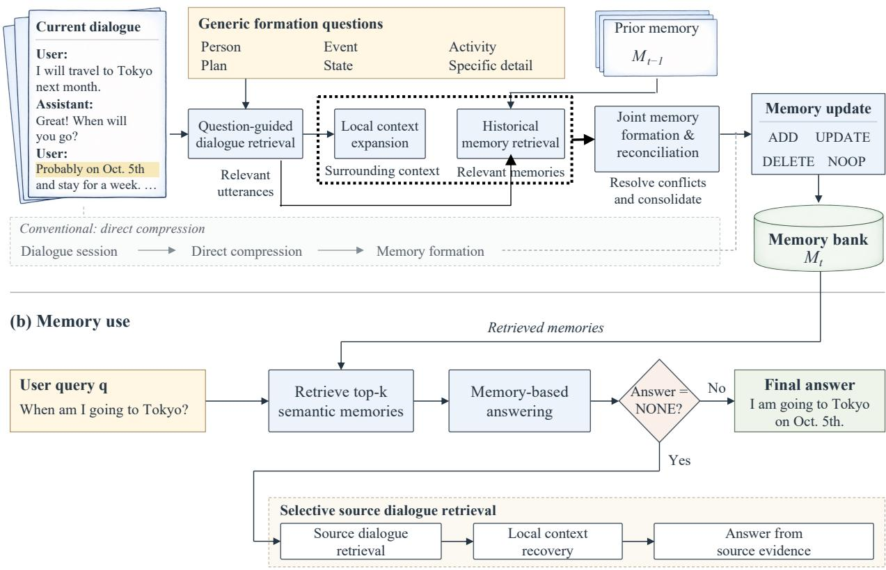

# REMEMBER BY ASKING: RETRIEVAL-INDUCED MEMORY EVOLUTION FOR LLM AGENTS

Wanqi Zhou1,∗, Jiawei Lu1,∗, Yang Wang2, Zhaolong Xing1, Zhen Chen1, Ai Han1, Haoyue Shi2,B

1JD.com 2Chang’an University

## ABSTRACT

Long-term memory is essential for language agents to maintain coherent and effective behavior over extended, multisession interactions. Existing memory systems mainly use retrieval at read time, while write-time memory formation still relies on direct extraction or compression. However, when future information needs are unknown, compressing an entire interaction in one pass can overlook locally important details that may matter later. To this end, we introduce RIME, a retrieval-induced memory framework that shifts memory construction from monolithic compression toward evidencecentered integration. RIME uses generic self-questions to retrieve focused dialogue evidence and grounds memory formation in both the retrieved evidence and relevant historical memories, which are jointly reconciled into an evolving memory bank with temporal and provenance information. At inference time, compressed memory serves as the primary rather than the sole source of evidence: when it cannot support an answer, RIME retrieves relevant source dialogue together with its local context to recover information omitted during memory formation, without resorting to full-history processing. Extensive experiments on LoCoMo with Qwen3- 235B-A22B and GPT-5.6 Sol show that RIME consistently achieves the best performance across all three quality metrics among the compared methods, while requiring substantially fewer query-time LLM tokens.

Index Terms— Long-term memory, Language agents, Dialogue memory

## 1. INTRODUCTION

Memory is fundamental for language agents operating over extended interactions. Without persistent memory, agents cannot reliably retain user-specific information, connect events across sessions, or reuse past experience in future decisions. Prior work has therefore developed mechanisms for storing, retrieving, and managing information beyond the immediate context window, ranging from memory streams and memory banks to more structured and adaptive memory systems [1, 2, 3, 4, 5, 6].

Despite this progress, most systems still form memories by directly extracting or compressing conversational context. This can overlook useful evidence, while details discarded at formation time may later become important for unforeseen queries. Relying only on compressed memory prevents such information from being recovered, whereas full-history fallback incurs substantial inference cost [7]. These limitations motivate selective access to source dialogue during both memory formation and memory use.

To this end, we introduce RIME, a retrieval-induced framework for long-term dialogue memory. As illustrated in Fig. 1, rather than compressing an entire interaction at once, RIME uses generic self-questions to retrieve focused dialogue evidence, which is combined with local context and relevant historical memories to incrementally form an evolving memory bank. By grounding memory formation in retrieved evidence, RIME surfaces potentially important information before consolidation, reducing the risk that it is overlooked in the full conversational context. At inference time, RIME treats compressed memory as the primary rather than the sole information source, selectively retrieving relevant source dialogue and surrounding context when needed instead of processing the full interaction history. Across LoCoMo experiments with Qwen3-235B-A22B [8] and GPT-5.6 Sol [9], RIME consistently improves both memory effectiveness and inference efficiency over existing memory systems.

Our contributions are threefold. (1) We introduce a question-guided retrieve-then-consolidate mechanism for memory formation, where generic self-questions first retrieve focused dialogue evidence before memory construction, rather than relying on a single global compression of the full interaction. (2) We introduce selective source-context recovery for memory use, allowing compressed memory to serve as the primary but not exclusive information source and recovering relevant dialogue context only when additional evidence is needed. (3) We conduct extensive experiments on LoCoMo with Qwen3-235B-A22B and GPT-5.6 Sol, where RIME achieves the strongest performance across LLM-Judge, F1, and BLEU-1 among the compared methods while requiring substantially fewer query-time LLM tokens than deliberative memory baselines.

## 2. RELATED WORK

Long-term memory for language agents. Long-term memory systems have evolved from persistent external memory stores [1, 2, 3] toward more sophisticated mechanisms for constructing and maintaining compact memory. Mem0 [4] consolidates extracted facts through explicit memory operations, while A-MEM [5] organizes memories as dynamically linked and evolving notes. Nemori [6] and FadeMem [10] focus on selective retention, through semantic distillation and adaptive forgetting, respectively. SimpleMem [11] and LightMem [12] improve efficiency through structured compression, consolidation, and hierarchical memory management. Despite their different designs, these methods mainly optimize how observed interaction content is transformed, organized, or maintained as memory. RIME intervenes one step earlier: through generic self-questions, it brings retrieval into the memory-writing process, recalling dialogue evidence relevant to each question before consolidation to better preserve important information that may otherwise be overlooked.

Retrieval and memory-based reasoning. Beyond memory construction, recent work has explored richer mechanisms for accessing and reasoning over long-term memory. Hindsight [13] combines multiple retrieval strategies with explicit reflection over structured memories, while SAGE [14] and REALM [15] use retrieval feedback to further evolve or reconsolidate the memory structure. Most closely related to RIME, D-Mem [7] adopts a dual-process design that falls back to Full Deliberation over the interaction history when compact memory is insufficient. RIME also revisits the original dialogue, but retrieves only query-relevant source turns together with local context rather than deliberating over the broader history.

## 3. METHODOLOGY

## 3.1. Retrieval-based Memory Formation

RIME introduces complementary innovations in both memory formation and memory use.

Question-guided evidence recall. RIME maintains a fixed set of generic formation questions

$$
\mathcal { Q } = \{ q _ { r } \} _ { r = 1 } ^ { R } ,\tag{1}
$$

which are shared across all sessions and independent of downstream queries. In our implementation, $R = 6 ,$ covering people and relationships, events, activities, plans, states and preferences, and specific factual details.

Let $\phi ( \cdot )$ denote the text embedding function and

$$
s ( a , b ) = \frac { \phi ( a ) ^ { \top } \phi ( b ) } { \| \phi ( a ) \| _ { 2 } \| \phi ( b ) \| _ { 2 } }\tag{2}
$$

denote cosine similarity. For each formation question $q _ { r } ,$ RIME retrieves the $k _ { f }$ most relevant dialogue turns from the

current session $S _ { t }$

$$
\mathcal { R } _ { t } ^ { ( r ) } = \operatorname* { a r g t o p k } _ { x \in S _ { t } } s ( q _ { r } , x ) .\tag{3}
$$

The formation questions therefore act as retrieval cues rather than summarization instructions: each question independently surfaces dialogue evidence associated with a particular type of information before memory construction.

We first merge the turns recalled by all formation questions:

$$
\mathcal { R } _ { t } = \bigcup _ { r = 1 } ^ { R } \mathcal { R } _ { t } ^ { ( r ) } .\tag{4}
$$

Because some recalled turns depend on nearby context, RIME performs two rounds of local context expansion:

$$
\widetilde { \mathcal { R } } _ { t } ^ { ( \ell + 1 ) } = \widetilde { \mathcal { R } } _ { t } ^ { ( \ell ) } \cup \mathcal { N } _ { t } \Big ( \widetilde { \mathcal { R } } _ { t } ^ { ( \ell ) } \Big ) , \qquad \ell = 0 , 1 ,\tag{5}
$$

with $\widetilde { \mathcal { R } } _ { t } ^ { ( 0 ) } = \mathcal { R } _ { t }$ , where $\mathcal { N } _ { t } ( \cdot )$ adds neighboring turns needed to resolve local dialogue dependencies. The final evidence set is

$$
\mathcal { E } _ { t } = \widetilde { \mathcal { R } } _ { t } ^ { ( 2 ) } .\tag{6}
$$

Historical memory grounding. For each formation question $q _ { r }$ , RIME combines the question with its recalled evidence $\mathcal { R } _ { t } ^ { ( r ) }$ to construct a query for retrieving relevant historical memories:

$$
z _ { t } ^ { ( r ) } = \mathrm { C o n c a t } \left( q _ { r } , \mathcal { R } _ { t } ^ { ( r ) } \right) ,\tag{7}
$$

where the dialogue turns in $\mathcal { R } _ { t } ^ { ( r ) }$ are concatenated in decreasing order of retrieval similarity. The corresponding historical memories are retrieved as

$$
\mathcal { H } _ { t } ^ { ( r ) } = \mathop { \arg \operatorname { t o p k } } _ { m \in \mathcal { M } _ { t - 1 } } ^ { k _ { h } } s \Big ( z _ { t } ^ { ( r ) } , m \Big ) , \qquad \mathcal { H } _ { t } = \bigcup _ { r = 1 } ^ { R } \mathcal { H } _ { t } ^ { ( r ) } .\tag{8}
$$

Joint memory formation and reconciliation. Given the recalled current-session evidence $\mathcal { E } _ { t }$ and the retrieved historical memories $\mathcal { H } _ { t }$ , RIME performs fact extraction, within-session deduplication, reference resolution, and historical reconciliation jointly in a single LLM call:

$$
\mathcal { O } _ { t } = F _ { \mathrm { m e m } } \left( \mathcal { E } _ { t } , \mathcal { H } _ { t } \right) .\tag{9}
$$

Each predicted operation $o \in \mathcal { O } _ { t }$ takes one of four forms:

$$
\begin{array} { r } { \mathrm { o p } ( o ) \in \{ \mathrm { A D D } , \mathrm { U P D A T E } , \mathrm { D E L E T E } , \mathrm { N O O P } \} . } \end{array}\tag{10}
$$

ADD creates a new memory, UPDATE revises or augments an existing memory describing the same underlying fact, DELETE removes a memory explicitly contradicted as erroneous, and NOOP is used when the historical memory already captures the current evidence. Each memory also retains its temporal information and dialogue provenance.

Finally, the predicted operations are applied to obtain the updated memory bank:

$$
\mathcal { M } _ { t } = \mathrm { A p p l y } \left( \mathcal { M } _ { t - 1 } , \mathcal { O } _ { t } \right) .\tag{11}
$$

  
Fig. 1. Overview of RIME. (a) During memory formation, generic formation questions are used as retrieval cues to identify focused dialogue evidence, which is expanded with local context and combined with relevant historical memories for joint memory formation and reconciliation. Unlike conventional direct compression, RIME retrieves relevant evidence before consolidation. (b) During memory use, RIME first answers from retrieved semantic memories and selectively returns to the source dialogue only when the memory-based answer is insufficient.

## 3.2. Selective Memory Use

Given a user query $q _ { i } ^ { \mathrm { u s r } }$ , let $\tilde { y } _ { i } = F _ { \mathrm { a n s } } ( q _ { i } ^ { \mathrm { u s r } } , \mathcal { M } _ { i } )$ denote the initial answer from the retrieved semantic memories $\mathcal { M } _ { i } .$ . If $\tilde { y } _ { i } = \mathrm { N O N E }$ , RIME retrieves relevant source turns using $\mathrm { T F } -$ IDF [16]:

$$
\mathcal { R } _ { i } ^ { \mathrm { s r c } } = \underset { x \in \bigcup _ { t = 1 } ^ { T } { S _ { t } } } { \arg \mathrm { k } } \psi ( q _ { i } ^ { \mathrm { u s r } } ) ^ { \top } \psi ( x ) , \quad \mathcal { E } _ { i } ^ { \mathrm { s r c } } = \mathcal { R } _ { i } ^ { \mathrm { s r c } } \cup \mathrm { C t x } _ { w } ( \mathcal { R } _ { i } ^ { \mathrm { s r c } } ) ,\tag{12}
$$

where $\mathrm { C t x } _ { w } ( \cdot )$ adds up to w preceding and following turns within the same session. The final prediction is

$$
\begin{array} { r } { \hat { y } _ { i } = \left\{ \begin{array} { l l } { \tilde { y } _ { i } , } & { \tilde { y } _ { i } \ne \mathrm { N O N E } , } \\ { F _ { \mathrm { a n s } } \big ( q _ { i } ^ { \mathrm { u s r } } , \mathcal { E } _ { i } ^ { \mathrm { s r c } } \big ) , } & { \tilde { y } _ { i } = \mathrm { N O N E } . } \end{array} \right. } \end{array}\tag{13}
$$

## 4. EXPERIMENTS

## 4.1. Experimental Setup

Dataset. We evaluate on LoCoMo [17], a benchmark for very long-term conversational memory. Following the papercomparable setting, we use 1,540 questions from four categories: single-hop, multi-hop, temporal, and open-domain, excluding the adversarial category. Baselines. We compare RIME with RAG [18], Mem0 [4], A-MEM [5], Nemori [6], and D-Mem [7], covering retrieval-based, structured, adaptive, and deliberative long-term memory systems. Models. We evaluate all methods with two LLM backbones, Qwen3- 235B-A22B and GPT-5.6 Sol. For each setting, the same backbone is used for memory construction and answer generation, and the corresponding model is also used as the LLM judge. For answer generation and evaluation, we follow the prompting protocol used by D-Mem [7] and Nemori [6], including the answer and LLM-judge prompts. Memory and Retrieval Configuration. RIME uses six generic formation queries covering person, event, activity, plan, state, and specific detail. For each query, we retrieve the top 10 dialogue turns and top 5 relevant historical memories. At inference, we retrieve the top 30 semantic memories using OpenAI’s text-embedding-3-small. If the initial answer is NONE, TF–IDF retrieval selects the top 20 source-dialogue turns, each expanded with a context window of 15 turns. No raw dialogue is provided during the initial memory-based answer. Unless otherwise specified, all baselines use the same retrieval settings; A-MEM retains its original all-MiniLM-L6-v2 embedding model following its official configuration. The source code, including the exact prompts and evaluation configuration, is available at https://anonymous.4open.science/r/RIME\_ official-4BC7.

Table 1. Main results on the 1,540 non-adversarial LoCoMo questions. Higher is better for Judge, F1, and BLEU-1; lower is better for inference tokens. †D-Mem results are directly reported from the original paper using Qwen3-235B-Instruct, as its implementation is not publicly available.
<table><tr><td>Method</td><td>Judge↑</td><td>F1↑</td><td>BLEU-1↑</td><td>Tokens↓</td></tr><tr><td>Qwen3-235B-A22B</td><td></td><td></td><td></td><td></td></tr><tr><td>RAG</td><td>31.36</td><td>20.87</td><td>17.46</td><td>3.64K</td></tr><tr><td>Mem0</td><td>53.12</td><td>35.76</td><td>30.49</td><td>2.20K</td></tr><tr><td>A-MEM</td><td>68.77</td><td>44.12</td><td>37.86</td><td>63.19K</td></tr><tr><td>Nemori</td><td>77.34</td><td>46.01</td><td>39.88</td><td>20.92K</td></tr><tr><td>D-Mem†</td><td>78.60</td><td>51.00</td><td>42.60</td><td>15.57K</td></tr><tr><td>RIME</td><td>81.82</td><td>51.46</td><td>44.22</td><td>5.11K</td></tr><tr><td>GPT-5.6 Sol</td><td></td><td></td><td></td><td></td></tr><tr><td>RAG</td><td>40.00</td><td>23.94</td><td>20.29</td><td>3.31K</td></tr><tr><td>Mem0</td><td>70.52</td><td>46.45</td><td>39.59</td><td>2.24K</td></tr><tr><td>A-MEM</td><td>80.78</td><td>53.77</td><td>46.54</td><td>52.14K</td></tr><tr><td>Nemori</td><td>83.05</td><td>52.64</td><td>45.88</td><td>17.74K</td></tr><tr><td>RIME</td><td>84.29</td><td>56.41</td><td>48.85</td><td>5.21K</td></tr></table>

## 4.2. Main Results

Table 1 compares RIME with representative long-term memory systems under two LLM backbones. RIME consistently achieves the best performance across all three quality metrics with both Qwen3-235B-A22B and GPT-5.6 Sol. Notably, these gains are achieved with substantially lower querytime LLM cost than deliberative memory baselines such as A-MEM and Nemori, demonstrating that selective access to source dialogue provides an effective alternative to expensive deliberation over long histories.

## 4.3. Ablation and Analysis

Effect of question-guided memory formation. To isolate the effect of question-guided retrieval, we compare three formation strategies with the same memory-use stage. Direct

Table 2. Effect of memory formation strategies on LoCoMo using Qwen3-235B-A22B (n = 1,540). All variants use the same selective memory-use procedure.
<table><tr><td>Formation Strategy</td><td>Judge↑</td><td>F1↑</td><td>BLEU-1↑</td></tr><tr><td>Direct Compression</td><td>71.62</td><td>49.26</td><td>42.32</td></tr><tr><td>Question-Prompted Compression</td><td>72.66</td><td>48.87</td><td>42.11</td></tr><tr><td>RIME</td><td>81.82</td><td>51.46</td><td>44.22</td></tr></table>

Table 3. Ablation of selective source retrieval on LoCoMo.
<table><tr><td>Method</td><td>Judge↑</td><td>F1↑</td><td>BLEU-1↑</td></tr><tr><td>Qwen3-235B-A22B</td><td></td><td></td><td></td></tr><tr><td>RIME w/o selective retrieval</td><td>71.23</td><td>44.73</td><td>38.41</td></tr><tr><td>RIME</td><td>81.82</td><td>51.46</td><td>44.22</td></tr><tr><td>GPT-5.6 Sol</td><td></td><td></td><td></td></tr><tr><td>RIME w/o selective retrieval</td><td>80.97</td><td>54.27</td><td>46.96</td></tr><tr><td>RIME</td><td>84.29</td><td>56.41</td><td>48.85</td></tr></table>

Compression uses the Mem0 extraction prompt over the full session, while Question-Prompted Compression additionally uses the six formation dimensions as extraction instructions without question-specific retrieval. RIME instead uses these questions as retrieval cues before memory consolidation. As shown in Table 2, adding the six dimensions to the compression prompt yields no consistent gain over direct compression, whereas RIME improves all three metrics. This suggests that question-guided memory formation is effective.

Effect of selective source retrieval. We further examine whether access to the source dialogue is necessary when semantic memory is insufficient. Disabling selective source retrieval causes a substantial performance drop on both backbones, with the Judge score decreasing by 10.59 points on Qwen3-235B-A22B and 3.32 points on GPT-5.6 Sol. Source retrieval is triggered more frequently with Qwen than with GPT-5.6 (16.8% vs. 6.0%), consistent with the larger degradation observed when this mechanism is removed.

## 5. CONCLUSION

We presented RIME, a retrieval-induced framework for longterm dialogue memory. RIME uses generic questions as retrieval cues to identify relevant evidence before memory consolidation and selectively returns to the source dialogue when compressed memory is insufficient. Experiments on LoCoMo with Qwen3-235B-A22B and GPT-5.6 Sol show that RIME achieves the best performance across LLM-Judge, F1, and BLEU-1 among the compared methods, while using substantially fewer query-time LLM tokens than deliberative memory baselines. Further analysis confirms the effectiveness of both question-guided memory formation and selective source retrieval for robust and efficient long-term memory.

## 6. REFERENCES

[1] Joon Sung Park, Joseph O’Brien, Carrie Jun Cai, Meredith Ringel Morris, Percy Liang, and Michael S Bernstein, “Generative agents: Interactive simulacra of human behavior,” in Proceedings of the 36th annual acm symposium on user interface software and technology, 2023, pp. 1–22.

[2] Wanjun Zhong, Lianghong Guo, Qiqi Gao, He Ye, and Yanlin Wang, “Memorybank: Enhancing large language models with long-term memory,” in Proceedings of the AAAI conference on artificial intelligence, 2024, vol. 38, pp. 19724–19731.

[3] Charles Packer, Sarah Wooders, Kevin Lin, Vivian Fang, Shishir G Patil, Ion Stoica, and Joseph E Gonzalez, “Memgpt: Towards llms as operating systems,” arXiv preprint arXiv:2310.08560, 2023.

[4] Prateek Chhikara, Dev Khant, Saket Aryan, Taranjeet Singh, and Deshraj Yadav, “Mem0: Building production-ready AI agents with scalable long-term memory,” in ECAI. 2025, Frontiers in Artificial Intelligence and Applications, pp. 2993–3000, IOS Press.

[5] Wujiang Xu, Zujie Liang, Kai Mei, Hang Gao, Juntao Tan, and Yongfeng Zhang, “A-mem: Agentic memory for llm agents,” Advances in Neural Information Processing Systems, vol. 38, pp. 17577–17604, 2026.

[6] Wenquan Ma, Jiayan Nan, and Wenlong Wu, “What deserves memory: Adaptive memory distillation for llm agents,” in Proceedings of the 64th Annual Meeting of the Association for Computational Linguistics (Volume 1: Long Papers), 2026, pp. 34789–34812.

[7] Zhixing You, Jiachen Yuan, and Jason Cai, “D-mem: A dual-process memory system for llm agents,” arXiv preprint arXiv:2603.18631, 2026.

[8] An Yang, Anfeng Li, Baosong Yang, Beichen Zhang, Binyuan Hui, Bo Zheng, Bowen Yu, Chang Gao, Chengen Huang, Chenxu Lv, et al., “Qwen3 technical report,” arXiv preprint arXiv:2505.09388, 2025.

[9] OpenAI, “Gpt-5.6 system card,” https:// deploymentsafety.openai.com/gpt-5-6, July 2026.

[10] Lei Wei, Xu Dong, Xiao Peng, Niantao Xie, and Bin Wang, “Fademem: Biologically-inspired forgetting for efficient agent memory,” in ICASSP 2026-2026 IEEE International Conference on Acoustics, Speech and Signal Processing (ICASSP). IEEE, 2026, pp. 4011–4015.

[11] Jiaqi Liu, Yaofeng Su, Peng Xia, Siwei Han, Zeyu Zheng, Cihang Xie, Mingyu Ding, and Huaxiu Yao,

“Simplemem: Efficient lifelong memory for llm agents,” arXiv preprint arXiv:2601.02553, 2026.

[12] Jizhan Fang, Xinle Deng, Haoming Xu, Ziyan Jiang, Yuqi Tang, Ziwen Xu, Shumin Deng, Yunzhi Yao, Mengru Wang, Shuofei Qiao, et al., “Lightmem: Lightweight and efficient memory-augmented generation,” in International Conference on Learning Representations, 2026, vol. 2026, pp. 98706–98729.

[13] Christopher Latimer, Nicolo Boschi, Andrew Neeser,´ Chris Bartholomew, Gaurav Srivastava, Xuan Wang, and Naren Ramakrishnan, “Hindsight: Structured agent memory that retains, recalls, and reflects,” in Proceedings of the 64th Annual Meeting of the Association for Computational Linguistics (Volume 3: System Demonstrations), 2026, pp. 275–285.

[14] Sijia Wang, Dhanajit Brahma, and Ricardo Henao, “Sage: A novelty gate for efficient memory evolution in agentic llms,” arXiv preprint arXiv:2605.30711, 2026.

[15] Yuanyi Song, Yukai Wang, Xinbei Ma, Zhihui Fu, Jianghao Lin, Weiwen Liu, Jun Wang, Huarong Deng, Yong Yu, and Weinan Zhang, “Retrieval-driven memory reconsolidation for long-term llm agents,” arXiv preprint arXiv:2609.16053, 2026.

[16] Gerard Salton and Christopher Buckley, “Termweighting approaches in automatic text retrieval,” Information processing & management, vol. 24, no. 5, pp. 513–523, 1988.

[17] Adyasha Maharana, Dong-Ho Lee, Sergey Tulyakov, Mohit Bansal, Francesco Barbieri, and Yuwei Fang, “Evaluating very long-term conversational memory of llm agents,” in Proceedings of the 62nd Annual Meeting of the Association for Computational Linguistics (Volume 1: Long Papers), 2024, pp. 13851–13870.

[18] Patrick Lewis, Ethan Perez, Aleksandra Piktus, Fabio Petroni, Vladimir Karpukhin, Naman Goyal, Heinrich Kuttler, Mike Lewis, Wen-tau Yih, Tim Rockt¨ aschel,¨ et al., “Retrieval-augmented generation for knowledgeintensive nlp tasks,” Advances in neural information processing systems, vol. 33, pp. 9459–9474, 2020.