# RESCRAPER: UNIFIED SCRAPING AND CLEANING OF WEB DATA FOR EFFECTIVE LLM PRETRAINING

Zichun Yu<sup>∗</sup>, Jiarui Yan<sup>∗</sup>, Shlok Sanghvi, Nihar Atri, Chenyan Xiong Language Technologies Institute, Carnegie Mellon University {zichunyu,cx}@andrew.cmu.edu

Dataset: https://huggingface.co/datasets/cx-cmu/ReScraper-Data Model: https://huggingface.co/cx-cmu/ReScraper § Code: https://github.com/cxcscmu/ReScraper

## ABSTRACT

LLM pretraining corpora are normally cleaned by a stack of hand-written heuristics. A heuristic scraper extracts the main content from HTML, and dozens of rule-based filters then clean it, so corpus quality is capped by the coarseness and accuracy of the rules. In this work, we propose RESCRAPER, a unified language model of only 0.6B parameters that replaces this entire stack. To train RESCRAPER, we carefully curate supervised data from the outputs of three teacher models, so it learns to first extract the main content from raw data and then choose among four operations: keeping the page as extracted, editing out noisy lines and spans, deleting it entirely, or rewriting it when it is poorly written but informative. Based on the same crawled data pool, pretraining 400M, 1.4B, and 2.8B models on our curated data improves the DCLM Core score by a relative 3.8–4.7% over the strongest baseline at each scale, including the costly multi-agent curation. Our analyses show that each operation plays a distinct and complementary role, and that extracting and cleaning in one model outperforms a cascade of separate models. RESCRAPER also concentrates its operations on the pages that need them, raising the quality of poor pages the most while keeping the corpus diverse. These results demonstrate the feasibility and effectiveness of AI4AI for pretraining data curation, where a small learned model takes over an entire stage of the refining pipeline.

## 1 INTRODUCTION

Web crawls supply most LLM pretraining data (Penedo et al., 2024; Li et al., 2024), and each page must first be turned from raw data into clean, pretraining-ready text. This step still relies on a classic heuristic pipeline, a rule-based scraper (Bevendorff et al., 2018; Barbaresi, 2021) followed by filters on length, symbol ratios, and repetition (Raffel et al., 2020; Penedo et al., 2023; 2024). However, each rule mostly keeps or drops a whole page, so a page with one noisy paragraph either loses its useful content or keeps its noise (Zhou et al., 2025). Furthermore, as shown in Figure 1a, the filter rules could be inaccurate, with 31– 65% of the pages each rule drops judged worth keeping by an independent LLM-asa-judge (Agarwal et al., 2025).

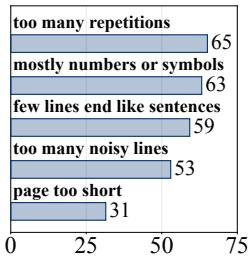

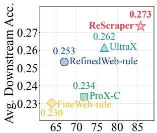  
Worth keeping (%)  
Keep–drop accuracy (%)  
(a) Rule drops  
(b) Keep–drop vs. downstream  
Figure 1: Keep-or-drop decisions on 5,000 pages labelled by gpt-oss-120b (Agarwal et al., 2025). (a) Share of the pages each rule drops that are worth keeping. (b) Keep–drop accuracy (agreement of each pipeline’s keep or drop with the judge’s label) against average downstream accuracy of 1.4B model pretraining.

Learned models have begun to replace parts of this pipeline, including model-based scrapers (Xu et al., 2024; Liu et al., 2026), quality filters (Wettig et al., 2024; Peng et al., 2025), and language models that edit (Zhou et al., 2025; Zhao et al., 2026) or rewrite (Maini et al., 2024; Yu & Xiong, 2025) web text. Each still takes over one stage and consumes the output of the stage before it, so the pipeline keeps a scraper whose mistakes no later model can undo, and errors compound from one stage to the next. This raises a natural question. Can a single small language model replace the entire pipeline, adaptively turning raw data into pretraining-ready text?

In this paper, we introduce RESCRAPER, a unified and adaptive language model that takes raw data and outputs pretraining-ready text. To handle the various operations a page may need, we train this 0.6B model on supervised data curated from the outputs of three teacher models, an extraction teacher, a refining teacher, and a rewriting teacher. The data is constructed so that RESCRAPER learns to first extract the main content of each page and then choose to keep it as extracted, edit out noisy lines and spans, delete it, or rewrite it to rescue educational content that would otherwise be deleted. RESCRAPER thus replaces both the scraper and the cleaning pipelines, and makes an adaptive decision for each page based on its content.

To evaluate the data RESCRAPER curates, we apply it to 18.0M Common Crawl pages (Li et al., 2024) and pretrain 400M, 1.4B, and 2.8B models on its output. Compared with cascades that pair a scraper with widely adopted rule-based cleaning (Raffel et al., 2020; Penedo et al., 2023; 2024) or with the best-performing model-based refiners (Zhou et al., 2025; Zhao et al., 2026), RESCRAPER achieves the highest DCLM Core score (centered accuracy averaged over 22 downstream tasks) at every scale. Although RESCRAPER has only 0.6B parameters, it improves 1.4B and 2.8B pretraining by a relative 4.6% and 3.8% over the strongest baseline, enabling weak-to-strong pretraining data curation. RESCRAPER even improves over the multi-agent data curation pipeline DataOrchestra (Huang et al., 2026) by a relative 6.6% at 1.4B, showing the strong potential of a unified small refiner.

To better understand where the gains come from, we first show through ablations that every operation of RESCRAPER contributes to the pretraining data, and that performing extraction and cleaning together beats running them as separate stages. Furthermore, RESCRAPER changes only the pages that need it: it improves poor pages the most, keeps good ones, and does not make the corpus more repetitive. Finally, the 0.6B student closely follows its teachers at a fraction of their cost. These results highlight the promise of building a unified model for pretraining data curation.

Our contributions are summarized as follows.

1. We propose RESCRAPER, a single small language model that replaces the whole heuristic scraping and cleaning pipeline, advancing AI4AI for pretraining data curation.

2. We demonstrate weak-to-strong pretraining data curation, where data curated by the 0.6B RESCRAPER trains better 1.4B and 2.8B models than every baseline pipeline.

3. We find that the unified model develops more effective refining behaviors, outperforming the best scraping+refining cascade with better efficiency.

## 2 RELATED WORK

HTML scraping. Turning a crawled page into text starts with a scraper that separates the main content from navigation, advertisements, and templates. Heuristic scrapers such as resiliparse (Bevendorff et al., 2018), trafilatura (Barbaresi, 2021), and jusText (Pomikálek, 2011) decide with hand-written rules over the DOM tree and link density, so they disagree across page layouts, and the union of several recovers far more usable tokens than the best single one (Li et al., 2026). Recent work instead trains a small language model to label HTML elements as content or noise (Xu et al., 2024), at trillion-token scale (Ma et al., 2025). Dripper (Liu et al., 2026) distills block-level annotations from a large LLM into a 0.6B model that marks each block of a simplified page as main content or not. The main purpose of these scrapers is to identify the main content from the structure of the page.

Rule-based filtering and cleaning. Scraped web text still carries template text, non-informative pages, and duplicated content. Pretraining data pipelines therefore apply document-level filters on language (Wenzek et al., 2020), length and symbol statistics (Rae et al., 2021), and repetition (Penedo et al., 2023), followed by deduplication (Broder, 1997; Lee et al., 2022). This recipe underlies most widely used pretraining corpora, such as C4 (Raffel et al., 2020), Dolma (Soldaini et al., 2024),

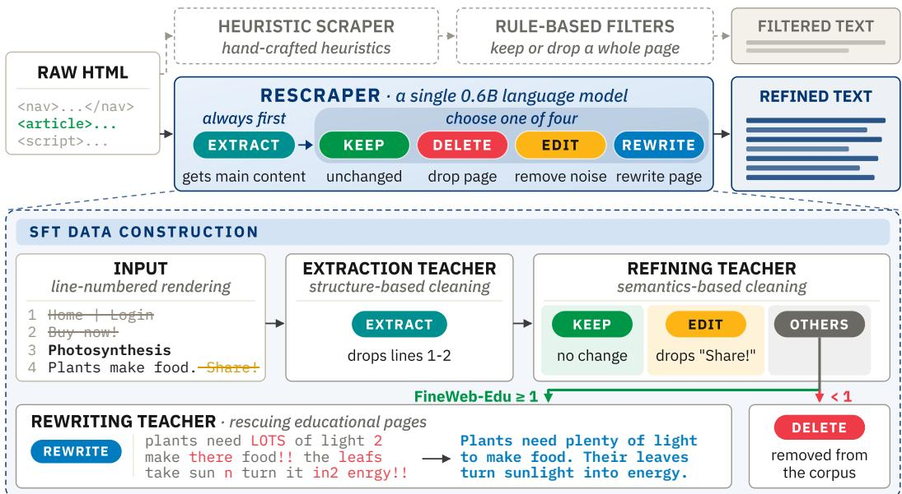  
Figure 2: Overview of RESCRAPER. In place of a heuristic scraper followed by rule-based filters, a single small language model always extracts the main content first and then chooses one of four operations for the page. The bottom panel shows how three teachers label each page for SFT.

FineWeb (Penedo et al., 2024), and DCLM (Li et al., 2024). However, these hand-crafted rules apply the same threshold to every page regardless of its content, which makes them less accurate (Zhou et al., 2025). Additionally, they mostly decide to keep or drop a whole page, so a page with one noisy paragraph is likely either discarded or kept whole.

Model-based filtering and refinement. As a fixed rule applies the same threshold to every page, model-based methods judge quality more adaptively by learning it from the data. One family keeps the documents that score highest under a fastText classifier (Joulin et al., 2017; Li et al., 2024), reference-model perplexity (Ankner et al., 2025), an LLM rating (Sachdeva et al., 2024; Wettig et al., 2024; Peng et al., 2025), importance resampling (Xie et al., 2023), or data influence (Yu et al., 2024), but still keeps or drops whole documents. Another rewrites web pages with a language model (Maini et al., 2024; Su et al., 2025; Nguyen et al., 2025), and RePro (Yu & Xiong, 2025) trains the rewriter with a faithfulness reward to keep it anchored to the source page. A third family has a model emit edit programs that are executed on the document instead of regenerating it, with the edit space growing from deletion in RefineX (Bi et al., 2025) to string replacement in ProX (Zhou et al., 2025) and insertion in UltraX (Zhao et al., 2026). DataOrchestra (Huang et al., 2026) goes a level higher with a multi-agent pipeline, in which a 1.7B orchestrator routes each chunk to a 0.6B line-pruning model or a 4B rewriting model, and DataEvolve (Mi et al., 2026) evolves cleaning strategies per data category. All of them consume text a heuristic scraper has already extracted. Our refiner instead starts from HTML and performs all of these steps within a single model.

## 3 METHOD

In this section, we introduce RESCRAPER, our unified pretraining data curation model, as illustrated in Figure 2. It replaces the heuristic scraper and rule-based filters with a single small language model trained by a unified supervised fine-tuning. We first define the task and its operations (§3.1), then build the SFT targets from three teachers (§3.2), and finally train RESCRAPER in two stages (§3.3).

## 3.1 PROBLEM FORMULATION

RESCRAPER turns raw data into clean pretraining text in a single generation. Its input keeps all the visible text of a crawled page and changes only its format. Specifically, we render the raw HTML to text, strip residual markup with BeautifulSoup, and concatenate the text one block per line, prefixing each line with an identifier <lid:n>. Navigation, sidebars, and footers thus remain in the input, and every removal in the final text is made by the model.

Table 1: Operations of RESCRAPER. Every page first goes through <extract>, and the model then chooses one of the four operations below. Line numbers a and b are <lid:n> identifiers of the input.
<table><tr><td>Operation</td><td>Payload</td><td>Explanation</td><td>Teacher</td></tr><tr><td>&lt;extract&gt;</td><td>rm a-b, rm a</td><td>Always performed first. Drops lines a through b (or line a) that are not main content.</td><td>Dripper</td></tr><tr><td>&lt;keep&gt;</td><td>none</td><td>Return the extracted text unchanged.</td><td>Qwen3.8-27B</td></tr><tr><td>&lt;delete&gt;</td><td>none</td><td>Discard the page from the pretraining corpus.</td><td>Qwen3.8-27B</td></tr><tr><td>&lt;edit&gt;</td><td>rm a-b,rm a sub  $a \colon \ ^ { \prime \prime } s ^ { \prime \prime }$ </td><td>Drop further noise lines a through b (or line a). Delete the string s from line a.</td><td>Qwen3.8-27B</td></tr><tr><td>&lt;rewrite&gt;</td><td>rewritten document</td><td>Replace the whole page with newly written text.</td><td>RePro</td></tr></table>

For each page, RESCRAPER learns to generate a sequence of the form

```typescript
<extract> [extraction payload] (<keep> | <delete> | <edit> | <rewrite>) [operation payload]
```

where the extraction payload lists the lines removed by <extract>, the tag in parentheses is the chosen operation, and the operation payload specifies what that operation does, as shown in Table 1. Extraction removes boilerplate, such as navigation and footers, from every page without a decision, and the operation is then chosen from the content of the extracted text. A deterministic executor applies this output to the rendered lines. After the <extract> lines are dropped, <keep> returns the remaining text unchanged, <delete> discards the page, <edit> removes the further lines and strings in its payload, and <rewrite> replaces the page with its payload. Every operation except <rewrite> only removes lines or strings addressed by line identifiers, so kept text respects original writing. This also keeps the output efficient, since it lists only what to remove and its length grows with the number of removals rather than with the length of the page.

## 3.2 SFT DATA CONSTRUCTION

We build each SFT target by running three teachers in sequence on the same line-numbered rendering, an extraction teacher, a refining teacher, and a rewriting teacher. Their outputs are converted into operations over the same line identifiers and composed into a single target.

Main-content extraction (<extract>). To separate the main content of a page from boilerplate, advertisements, and navigation, we adopt Dripper (Liu et al., 2026), a lightweight language model trained for main-content extraction from HTML, map its output back onto the rendered lines, and record the lines it drops as rm operations, which form the payload of <extract>. Dripper does not judge whether the main content is worth training on, and it never edits inside a line.

Semantic filtering and refinement (<keep>, <delete>, <edit>). To refine the extracted text at the semantic level, which structure-based extraction cannot do, we adopt Qwen3.8-27B (Qwen Team, 2026), a general-purpose language model that we prompt with a fixed set of refinement rules (Appendix D). A page with no training value as a whole, such as spam, pure advertisements, or incoherent text, becomes <delete> and is removed from the pretraining corpus unless the next step rescues it. Every other page is cleaned only by deleting whole lines or fragments within a line, without adding, changing, or reordering any word. If nothing is deleted, the extracted text is already clean enough to train on and the page becomes <keep>. If anything is deleted, the page becomes <edit>, which removes the noise that extraction leaves inside the main content. Its payload records the deleted lines as rm operations and the deleted fragments as sub operations, as shown in Table 1.

Rescuing educational pages (<rewrite>). Some deleted pages still carry educational content, but in a form too noisy to train on that removing lines or strings cannot repair, so <edit> does not apply, and deleting such a page discards the information it contains. To identify these pages, we score each <delete> page with the FineWeb-Edu classifier (Penedo et al., 2024), which rates the educational value of the extracted text from 0 to 5. We rescue pages scoring at least 1.0, since a score of 1 denotes some basic educational information even amid promotional content, and the rest remain <delete>. To rewrite the rescued pages, we adopt RePro (Yu & Xiong, 2025), a rephraser trained to recycle web text for pretraining while staying faithful to its source, and use its output, a coherent and fluent version of the page, as the payload of a <rewrite> target. A rescued page is therefore relabeled <rewrite> rather than <delete>, so RESCRAPER learns to choose among all four operations.

## 3.3 TWO-STAGE TRAINING

We fine-tune RESCRAPER on the serialized targets in two stages, so that it learns progressively from easy to hard, first mainly the operations that only remove text and then <rewrite>, which must generate a full page of new text.

Stage 1 (learning all operations). The first stage mostly teaches the model to identify the correct operation for each page and to generate an accurate payload for every operation other than <rewrite>. These operations only remove text, so their payloads are short lists of removals over line identifiers rather than a full page of new text. To learn these easier operations more effectively, we subsample <rewrite> to a small fraction of the targets in this stage.

Stage 2 (strengthening rewrite). The second stage strengthens the learning of <rewrite>, which the first stage sees too rarely to learn effectively. It continues from the first-stage checkpoint on a smaller mixture that keeps every <rewrite> target and subsamples the other three operations, so the model learns when a page should be rewritten rather than deleted and how to generate the rewrite, while the other operations preserve what it learned in the first stage. The larger share of <rewrite> targets also encourages the model to rewrite borderline pages instead of deleting them.

## 4 EXPERIMENTAL SETUP

Pretraining model and data. We pretrain decoder-only Transformers (Vaswani et al., 2017) from scratch at three scales, a 400M model on 8.2B tokens, a 1.4B model on 28.8B tokens, and a 2.8B model on 55.9B tokens. The three settings are the 400M-1x, 1B-1x, and 3B-1x scales of DCLM (Li et al., 2024), which are set to be Chinchilla-optimal (Hoffmann et al., 2022). Every pipeline starts from the same source pool, 18.0M English Common Crawl documents totaling 17.69B tokens, sampled i.i.d. from the DCLM pool. The output of every pipeline is deduplicated with DCLM’s Bloom filter. The three budgets cover three regimes of data reuse. At 400M, the budget is close to the size of each pipeline’s output, the standard setting of about one epoch. At 1B, the output of RESCRAPER is repeated about four times, within the range where repeated data is nearly as valuable as unique data (Muennighoff et al., 2023). At 3B, it is repeated more than four times, a data-bound regime closer to the current bottleneck of scaling, as the stock of public human-generated text is projected to run out (Villalobos et al., 2024).

Baselines. We compare against three families of methods. All scrape with resiliparse (Bevendorff et al., 2018), the DCLM default.

1. Rule-based cleaning, the filter stacks of three representative corpora, C4 (Raffel et al., 2020), RefinedWeb (Penedo et al., 2023), and FineWeb (Penedo et al., 2024).

2. Model-based refinement, ProX-C (Zhou et al., 2025) and UltraX (Zhao et al., 2026), which emit edit programs over the scraped text and so delete at the same granularities as RE-SCRAPER. For both we run the officially released refiner over our source pool.

3. Multi-agent data curation, DataOrchestra (Huang et al., 2026), in which a Qwen3- 1.7B (Yang et al., 2025) orchestrator decides for each chunk of the scraped text whether to drop, keep, or clean it, and sends chunks to be cleaned to a fine-tuned Qwen3-0.6B for line removal and to Qwen3-4B for instruction-guided rewriting.

Evaluation. We evaluate the pretrained models on 22 downstream tasks from DCLM Core (Li et al., 2024) in either zero-shot or few-shot manners, covering commonsense reasoning, language understanding, reading comprehension, symbolic problem solving, and world knowledge. Our primary metric is centered accuracy, where per-task accuracy is mapped to 0 for random guessing and 1 for perfect accuracy, and we report its average across tasks as the Core score.

Table 2: Benchmarking pretraining data curation methods at the 400M, 1B, and 3B scales. All baselines run on resiliparse-scraped text, while RESCRAPER curates the full rendered page directly. All scores are centered accuracies, mapped to 0 for random guessing and 1 for perfect accuracy, so negative values indicate below-random accuracy. <sup>∗</sup> marks a multi-agent pipeline. Bold and underline indicate the best and second-best results within each scale.
<table><tr><td>Cleaning Method</td><td>#Unique Tokens</td><td>Commonsense Reasoning (3 tasks)</td><td>Language Understanding Comprehension Problem Knowledge (6 tasks)</td><td>Reading (3 tasks)</td><td>Symbolic (5 tasks)</td><td>World (5 tasks)</td><td>Core (22 tasks)</td></tr><tr><td colspan="8">400M Setting: 400M model, 8.2B pretraining tokens</td></tr><tr><td>Raw text</td><td>17.69B</td><td>0.19822</td><td>0.14621</td><td>0.03926</td><td>0.15624</td><td>0.11101</td><td>0.13300</td></tr><tr><td>C4-rule</td><td>5.06B</td><td>0.21326</td><td>0.19160</td><td>-0.01954</td><td>0.13270</td><td>0.12398</td><td>0.13701</td></tr><tr><td>RefinedWeb-rule</td><td>7.04B</td><td>0.18711</td><td>0.18266</td><td>-0.07126</td><td>0.13612</td><td>0.12833</td><td>0.12572</td></tr><tr><td>FineWeb-rule</td><td>5.16B</td><td>0.20774</td><td>0.19588</td><td>0.06072</td><td>0.11123</td><td>0.13741</td><td>0.14654</td></tr><tr><td>ProX-C</td><td>11.80B</td><td>0.19277</td><td>0.17242</td><td>0.03558</td><td>0.16270</td><td>0.12231</td><td>0.14294</td></tr><tr><td>UltraX</td><td>10.78B</td><td>0.17931</td><td>0.17712</td><td>-0.02509</td><td>0.17107</td><td>0.13747</td><td>0.13946</td></tr><tr><td>DataOrchestra*</td><td>13.60B</td><td>0.21504</td><td>0.18097</td><td>-0.04011</td><td>0.16702</td><td>0.15349</td><td>0.14605</td></tr><tr><td>RESCRAPER (Ours)</td><td>7.44B</td><td>0.22420</td><td>0.18741</td><td>-0.01023</td><td>0.17347</td><td>0.14843</td><td>0.15345</td></tr><tr><td colspan="8">1B Setting: 1.4B model, 28.8B pretraining tokens</td></tr><tr><td>Raw text</td><td>17.69B</td><td>0.28243</td><td>0.28718</td><td>0.15706</td><td>0.18036</td><td>0.20327</td><td>0.22544</td></tr><tr><td>C4-rule</td><td>5.06B</td><td>0.33107</td><td>0.32885</td><td>0.02322</td><td>0.12632</td><td>0.20640</td><td>0.21362</td></tr><tr><td>RefinedWeb-rule</td><td>7.04B</td><td>0.31254</td><td>0.34540</td><td>0.19665</td><td>0.16730</td><td>0.22765</td><td>0.25340</td></tr><tr><td>FineWeb-rule</td><td>5.16B</td><td>0.33412</td><td>0.35349</td><td>0.08545</td><td>0.11129</td><td>0.22576</td><td>0.23022</td></tr><tr><td>ProX-C</td><td>11.80B</td><td>0.29379</td><td>0.31417</td><td>0.12276</td><td>0.18323</td><td>0.21905</td><td>0.23391</td></tr><tr><td>UltraX</td><td>10.78B</td><td>0.30922</td><td>0.34396</td><td>0.21625</td><td>0.17274</td><td>0.24991</td><td>0.26152</td></tr><tr><td>DataOrchestra*</td><td>13.60B</td><td>0.30468</td><td>0.33381</td><td>0.19824</td><td>0.17711</td><td>0.24909</td><td>0.25648</td></tr><tr><td>RESCRAPER (Ours)</td><td>7.44B</td><td>0.33139</td><td>0.35533</td><td>0.20410</td><td>0.20563</td><td>0.24997</td><td>0.27348</td></tr><tr><td colspan="8">3B Setting: 2.8B model, 55.9B pretraining tokens</td></tr><tr><td>Raw text</td><td>17.69B</td><td>0.34258</td><td>0.37590</td><td>0.24421</td><td>0.16956</td><td>0.26102</td><td>0.28039</td></tr><tr><td>C4-rule</td><td>5.06B</td><td>0.31451</td><td>0.38711</td><td>0.12038</td><td>0.11294</td><td>0.22162</td><td>0.24091</td></tr><tr><td>RefinedWeb-rule</td><td>7.04B</td><td>0.36890</td><td>0.40926</td><td>0.22650</td><td>0.19516</td><td>0.27905</td><td>0.30058</td></tr><tr><td>FineWeb-rule</td><td>5.16B</td><td>0.38285</td><td>0.40095</td><td>0.18665</td><td>0.13952</td><td>0.26515</td><td>0.27898</td></tr><tr><td>ProX-C</td><td>11.80B</td><td>0.35897</td><td>0.40405</td><td>0.21191</td><td>0.19486</td><td>0.28411</td><td>0.29690</td></tr><tr><td>UltraX</td><td>10.78B</td><td>0.37379</td><td>0.42883</td><td>0.22526</td><td>0.18471</td><td>0.28951</td><td>0.30642</td></tr><tr><td>DataOrchestra*</td><td>13.60B</td><td>0.38927</td><td>0.39583</td><td>0.24739</td><td>0.20451</td><td>0.28857</td><td>0.30683</td></tr><tr><td>RESCRAPER (Ours)</td><td>7.44B</td><td>0.38003</td><td>0.43042</td><td>0.24443</td><td>0.20598</td><td>0.30387</td><td>0.31841</td></tr><tr><td></td><td></td><td></td><td></td><td></td><td></td><td></td><td></td></tr></table>

Implementation details. RESCRAPER is a Qwen3-0.6B model fine-tuned in two stages on targets built as in §3.2, with 1.38M targets in the first stage and 131K in the second. Applying the student to the source pool results in 7.44B unique tokens. The training hyperparameters, the composition of the targets, and decoding settings are given in Appendix A, and all prompts in Appendix D.

## 5 EVALUATION RESULTS

In this section, we present main results (§5.1), conduct ablations of the operations of RESCRAPER and analyze its operation profile (§5.2), the quality and diversity of its output (§5.3), and how effectively it learns its teachers’ behaviors (§5.4).

## 5.1 MAIN RESULTS

We first show the superiority of RESCRAPER in actual pretraining at all three scales. As shown in Table 2, RESCRAPER consistently outperforms all baselines, improving over the strongest rule-based cleaning by a relative 4.7%, 7.9%, and 5.9% at 400M, 1B, and 3B, while the strongest rule set itself changes with scale, from FineWeb-rule at 400M to RefinedWeb-rule at 1B and 3B, indicating that no single set of hand-written rules is reliably best. RESCRAPER, a 0.6B model, keeps its lead for the 1.4B and 2.8B models it curates data for, showing weak-to-strong pretraining data curation. Compared with the state-of-the-art multi-agent curation method DataOrchestra, RESCRAPER improves Core by a relative 5.1%, 6.6%, and 3.8% at 400M, 1B, and 3B, even though DataOrchestra coordinates a 1.7B orchestrator with 0.6B and 4B tool models while RESCRAPER is one 0.6B model. In the data-bound 3B setting, RESCRAPER repeats each unique token about 7.5 times, compared with 4.1 to 5.2 times for the model-based baselines, yet it still outperforms them by a relative 3.8–7.2%, indicating that its higher data quality outweighs the cost of more repetition. These results show that one unified model, trained on carefully curated supervision, curates more effective pretraining data than both the heuristic stack and multi-model curation systems.

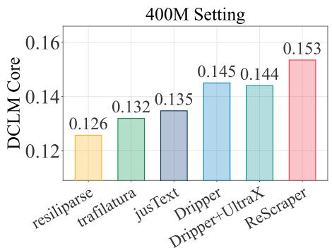

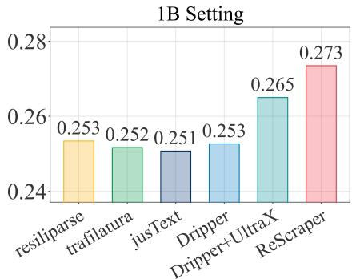  
Figure 3: Core score in the 400M and 1B settings for each scraper (resiliparse, trafilatura, jusText, Dripper) followed by RefinedWeb-rule cleaning, the model-based baseline cascade (Dripper followed by UltraX), and RESCRAPER.

Table 3: Ablation of the operations of RESCRAPER at the 1B scale. Dripper <extract> replaces the output of <extract> with Dripper’s extracted text.
<table><tr><td></td><td>#Unique</td><td>Commonsense Reasoning</td><td>Language Understanding Comprehension Problem Knowledge</td><td>Reading</td><td>Symbolic</td><td>World</td><td>Core</td></tr><tr><td>Cleaning Method</td><td>Tokens</td><td>(3 tasks)</td><td>(6 tasks)</td><td>(3 tasks)</td><td>(5 tasks)</td><td>(5 tasks)</td><td>(22 tasks)</td></tr><tr><td>RESCRAPER w/o &lt;edit&gt;</td><td>7.44B 7.77B</td><td>0.33139 0.30759</td><td>0.35533</td><td>0.20410 0.20224</td><td>0.20563 0.20027</td><td>0.24997 0.24820</td><td>0.27348</td></tr><tr><td>w/o &lt;rewrite&gt;</td><td>6.62B</td><td>0.28903</td><td>0.35021 0.34319</td><td>0.19418</td><td>0.16804</td><td>0.23994</td><td>0.26696 0.25221</td></tr><tr><td>w/o &lt;delete&gt;</td><td>9.08B</td><td>0.31067</td><td>0.33114</td><td>0.13187</td><td>0.18944</td><td>0.24550</td><td>0.24951</td></tr><tr><td>w/o &lt;extract&gt;</td><td>14.10B</td><td>0.27084</td><td>0.29191</td><td>0.13419</td><td>0.20447</td><td>0.20569</td><td>0.22806</td></tr><tr><td></td><td></td><td></td><td></td><td></td><td></td><td>0.23527</td><td></td></tr><tr><td>Dripper &lt;extract&gt;</td><td>7.34B</td><td>0.31803</td><td>0.35208</td><td>0.19149</td><td>0.19647</td><td></td><td>0.26363</td></tr></table>

Furthermore, RESCRAPER outperforms the baseline pipelines regardless of which scraper they use. We apply RefinedWeb-rule cleaning to the output of four scrapers, resiliparse (Bevendorff et al., 2018), trafilatura (Barbaresi, 2021), jusText (Pomikálek, 2011), and the model-based Dripper (Liu et al., 2026). As shown in Figure 3, RESCRAPER outperforms all four at both scales, including its own extraction teacher Dripper, by a relative 5.8% at 400M and 8.3% at 1B. The choice of scraper also matters less as the pretrained model grows, as the four scrapers span 0.019 Core at 400M but stay within 0.003 at 1B. Even the model-based baseline cascade, Dripper followed by UltraX, trails RESCRAPER by a relative 6.6% at 400M and 3.2% at 1B, indicating that the advantage of RESCRAPER comes from extracting and cleaning each page in one unified model, which no choice of scraper or cascade of separate stages can beat. RESCRAPER is also more efficient, using about a third of the GPU hours of Dripper alone, as shown in Table 6.

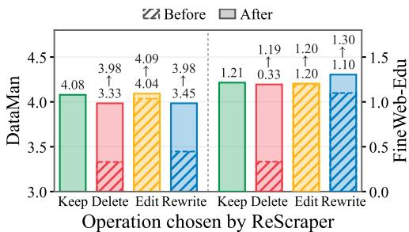  
Figure 4: Mean quality scores of pages before and after each operation of RESCRAPER (for Delete, deleted pages vs. the rest).

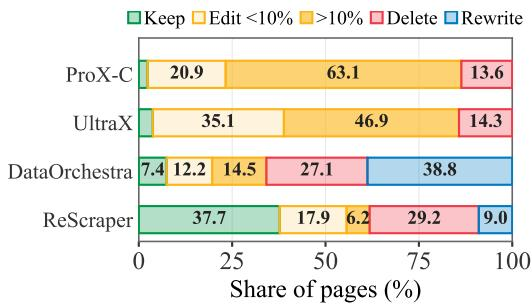  
Figure 5: Share of pages per operation for each model-based pipeline; Edit is binned by the share of words removed.

## 5.2 EFFECTIVENESS OF OPERATIONS IN RESCRAPER

To examine how much each operation contributes to the pretraining data, we ablate each operation of RESCRAPER in the 1B setting. Each variant disables a single operation when converting the model’s outputs into text. As shown in Table 3, removing any operation lowers Core. Removing <extract> causes the largest drop, a relative 16.6%, as boilerplate then stays on every kept page, and removing <delete> costs 8.8% and lowers every task category, although both variants retain more unique tokens than RESCRAPER. Removing <rewrite> lowers Core by 7.8%, showing that rewriting recovers potentially useful pages that would otherwise be deleted, and that these rewritten pages in turn help pretraining. Removing <edit> has the smallest effect, a drop of 2.4%, since it only cleans lines and spans within pages that are kept anyway. Replacing the output of <extract> with Dripper’s extracted text lowers Core by 3.6%, pointing to the advantage of performing extraction and cleaning in one unified model over a cascade of separate models. These results indicate that every operation contributes, and that accurate removal of low-quality content is essential.

To understand the underlying reasons for these gains, we score 5,000 pages held out from training with DataMan (Peng et al., 2025) and the FineWeb-Edu classifier (Penedo et al., 2024) before and after the operation RESCRAPER chooses. As shown in Figure 4, deleted pages score far below kept ones, editing slightly raises DataMan without changing FineWeb-Edu, and rewriting raises both. Each operation thus addresses a different problem, from low-quality pages to noise within a page and poorly written but informative pages. As shown in Figure 5, RESCRAPER also changes pages sparingly, leaving 56% of the pages unchanged or with only small amounts of text removed, more than the other model-based refiners. RESCRAPER concentrates its changes on the pages that need them, with operations that play distinct and complementary roles (further statistics in Appendix B). The case studies in Appendix C further show that RESCRAPER behaves more effectively than the cascaded pipelines, keeping structure that the scraper loses and deleting pages that the refiners keep.

## 5.3 QUALITY AND DIVERSITY OF REFINED DATA

In this analysis, we compare the refined data at the level of individual pages and of the corpus distribution, validating that RESCRAPER raises page quality while keeping the corpus diverse.

RESCRAPER improves poor but informative pages and keeps good ones. We group the held-out pages by their score before cleaning and compare the mean score after each pipeline. As shown in Figure 6 (left), RESCRAPER achieves the highest score in every group on both scorers. The gap is largest on the poorest pages, where RESCRAPER raises DataMan by 1.28 compared with at most 0.44 for the other pipelines, indicating that it is most effective where the source quality is lowest. Meanwhile, it keeps 95% of the pages that FineWeb-Edu rates 1.0 or higher, whereas RefinedWeb-rule drops 30% of them. This suggests that part of the gain of RESCRAPER comes from turning low-quality web pages into useful training text rather than only filtering them out.

RESCRAPER keeps the corpus diverse. As illustrated in Figure 5, RESCRAPER deletes about twice as many pages as ProX-C and UltraX, so we check that its corpus remains diverse. We compare the share of distinct n-grams in each pipeline’s output on the same source pages, with every corpus cut to the same number of tokens. As shown in Figure 6 (right), RESCRAPER retains the highest share of distinct 3-grams and 5-grams, confirming that its deletions do not make the corpus more repetitive, and thus it excels at both quality and diversity.

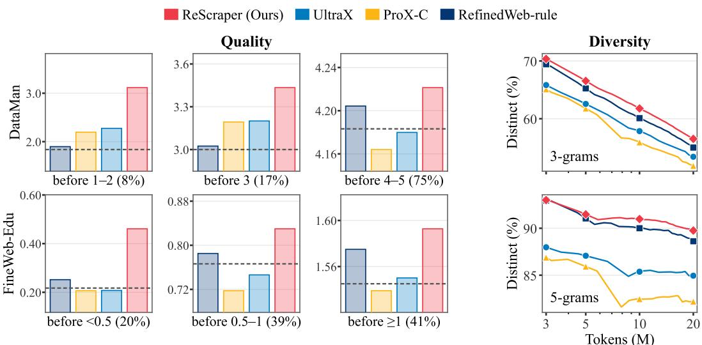  
Figure 6: Left: mean quality score after cleaning on the held-out pages (share of pages in parentheses; dashed: mean before cleaning). Right: distinct n-gram share at equal token counts.

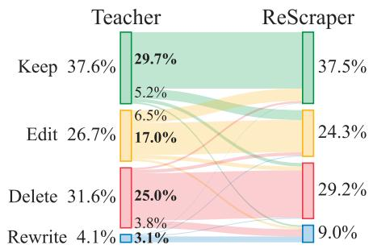  
Figure 7: Operations chosen by the teacher and by RESCRAPER, in percent of pages.

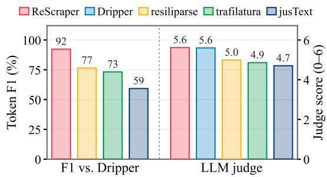  
Figure 8: Token F1 against Dripper (left) and the gpt-oss-120b score without a reference (right).

## 5.4 EFFECTIVENESS OF LEARNING THE TEACHERS’ BEHAVIORS

In this analysis, we examine whether the 0.6B student preserves the behavior of its three teachers (Dripper, Qwen3.8-27B and RePro), which determines whether it can replace them on new corpora.

The student follows its teachers, keeps more tokens, and is cheap to run. We label the held-out pages with the training rules and compare the student’s operations with the teacher’s. As shown in Figure 7, the student follows most of the teacher’s operations, with a similar distribution of operations over the pages, and reaches a token F1 of 89.3 against the teacher’s output. As demonstrated in Figure 8, its extraction also matches Dripper’s, and gpt-oss-120b (Agarwal et al., 2025) scores the two nearly equally without a reference (prompt in Appendix D.5). The main difference from the teacher is intentional: in the second training stage, we increase the share of <rewrite> targets (§3.3) to encourage the student to rewrite borderline pages rather than delete them. Accordingly, the student also rewrites some pages whose FineWeb-Edu score falls just below the teacher’s threshold of 1.0, retaining more tokens. Distillation thus keeps what the teachers do well and departs from them only where we intended, at a fraction of their cost, as shown in Table 6.

## 6 CONCLUSION

In this paper, we introduce RESCRAPER, a unified and adaptive language model that turns raw web data into pretraining-ready text. It replaces the heuristic scraping and cleaning stack with a single 0.6B model trained on the outputs of three teachers. The corpus it curates improves 2.8B pretraining by a relative 3.8% over the strongest baseline. This weak-to-strong pretraining data curation suggests that the curator need not grow with the models it serves. A small model trained once can prepare data for ever larger ones. Handling extraction and cleaning in one pass over the whole page also lets the model adapt to each page in ways a cascade of separate models can hardly reproduce. We hope RESCRAPER motivates future work toward curators that adapt the data they provide to the evolving needs of the model being trained, and ultimately toward recursive self-improvement, where each generation of models curates the pretraining data for the next.

## ACKNOWLEDGMENTS

We thank Amazon for funding Zichun Yu through the Amazon AI Ph.D. Fellowship Program. We thank Institute of Foundation Models (IFM) and CMU Foundation and Language Model (FLAME) Center for providing support of computational resources.

## REFERENCES

Sandhini Agarwal, Lama Ahmad, Jason Ai, Sam Altman, Andy Applebaum, Edwin Arbus, Rahul K Arora, Yu Bai, Bowen Baker, Haiming Bao, et al. gpt-oss-120b & gpt-oss-20b model card. ArXiv preprint, 2025.

Zachary Ankner, Cody Blakeney, Kartik Sreenivasan, Max Marion, Matthew L. Leavitt, and Mansheej Paul. Perplexed by perplexity: Perplexity-based data pruning with small reference models. In Proc. of ICLR, 2025.

Adrien Barbaresi. Trafilatura: A web scraping library and command-line tool for text discovery and extraction. In Proc. ofACL, 2021.

Janek Bevendorff, Benno Stein, Matthias Hagen, and Martin Potthast. Elastic ChatNoir: Search engine for the ClueWeb and the Common Crawl. In Proc. ofECIR, 2018.

Baolong Bi, Shenghua Liu, Xingzhang Ren, Dayiheng Liu, Junyang Lin, Yiwei Wang, Lingrui Mei, Junfeng Fang, Jiafeng Guo, and Xueqi Cheng. RefineX: Learning to refine pre-training data at scale from expert-guided programs. ArXiv preprint, 2025.

Andrei Z. Broder. On the resemblance and containment of documents. In Proc. ofCompression and Complexity ofSEQUENCES, 1997.

Jordan Hoffmann, Sebastian Borgeaud, Arthur Mensch, Elena Buchatskaya, Trevor Cai, Eliza Rutherford, Diego de Las Casas, Lisa Anne Hendricks, Johannes Welbl, Aidan Clark, Tom Hennigan, Eric Noland, Katherine Millican, George van den Driessche, Bogdan Damoc, Aurelia Guy, Simon Osindero, Karen Simonyan, Erich Elsen, Oriol Vinyals, Jack W. Rae, and Laurent Sifre. An empirical analysis of compute-optimal large language model training. In Proc. ofNeurIPS, 2022.

Zhen Huang, Yikun Wang, Shijie Xia, and Pengfei Liu. DataOrchestra: Learning to orchestrate per-example curation of pretraining data. ArXiv preprint, 2026.

Armand Joulin, Edouard Grave, Piotr Bojanowski, and Tomas Mikolov. Bag of tricks for efficient text classification. In Proc. ofEACL, 2017.

Katherine Lee, Daphne Ippolito, Andrew Nystrom, Chiyuan Zhang, Douglas Eck, Chris Callison-Burch, and Nicholas Carlini. Deduplicating training data makes language models better. In Proc. of ACL, 2022.

Jeffrey Li, Alex Fang, Georgios Smyrnis, Maor Ivgi, Matt Jordan, Samir Gadre, Hritik Bansal, Etash Guha, Sedrick Keh, Kushal Arora, et al. DataComp-LM: In search of the next generation of training sets for language models. In Proc. ofNeurIPS, 2024.

Jeffrey Li, Joshua P Gardner, Doug Kang, Fangping Shi, Karanjeet Singh, Chun-Liang Li, Herumb Shandilya, David Leo Wright Hall, Oncel Tuzel, Percy Liang, Ludwig Schmidt, Hadi Pouransari, and Fartash Faghri. Beyond a single extractor: Re-thinking HTML-to-text extraction for LLM pre-training. In Findings ofEACL, 2026.

Mengjie Liu, Jiahui Peng, Wenchang Ning, Pei Chu, Jiantao Qiu, Ren Ma, He Zhu, Rui Min, Lindong Lu, Linfeng Hou, Kaiwen Liu, Yuan Qu, Zhenxiang Li, Chao Xu, Zhongying Tu, Wentao Zhang, and Conghui He. Dripper: Token-efficient main HTML extraction with a lightweight LM. In Proc. of KDD, 2026.

Ren Ma, Jiantao Qiu, Chao Xu, Pei Chu, Kaiwen Liu, Pengli Ren, Yuan Qu, Jiahui Peng, Linfeng Hou, Mengjie Liu, Lindong Lu, Wenchang Ning, Jia Yu, Rui Min, Jin Shi, Haojiong Chen, Peng Zhang, Wenjian Zhang, Qian Jiang, Zengjie Hu, Guoqiang Yang, Zhenxiang Li, Fukai Shang, Runyuan Ma, Chenlin Su, Zhongying Tu, Wentao Zhang, Dahua Lin, and Conghui He. AICC: Parse HTML finer, make models better – a 7.3T AI-ready corpus built by a model-based HTML parser. ArXiv preprint, 2025.

Pratyush Maini, Skyler Seto, Richard Bai, David Grangier, Yizhe Zhang, and Navdeep Jaitly. Rephrasing the web: A recipe for compute and data-efficient language modeling. In Proc. ofACL, 2024.

Tiantian Mi, Dongming Shan, Zhen Huang, Yiwei Qin, Muhang Xie, Yuxuan Qiao, Yixiu Liu, Chenyang Zhou, and Pengfei Liu. Data darwinism part II: DataEvolve – AI can autonomously evolve pretraining data curation. ArXiv preprint, 2026.

Niklas Muennighoff, Alexander Rush, Boaz Barak, Teven Le Scao, Nouamane Tazi, Aleksandra Piktus, Sampo Pyysalo, Thomas Wolf, and Colin A Raffel. Scaling data-constrained language models. In Proc. ofNeurIPS, 2023.

Thao Nguyen, Yang Li, Olga Golovneva, Luke Zettlemoyer, Sewoong Oh, Ludwig Schmidt, and Xian Li. Recycling the web: A method to enhance pre-training data quality and quantity for language models. In Proc. of COLM, 2025.

Guilherme Penedo, Quentin Malartic, Daniel Hesslow, Ruxandra Cojocaru, Hamza Alobeidli, Alessandro Cappelli, Baptiste Pannier, Ebtesam Almazrouei, and Julien Launay. The RefinedWeb dataset for Falcon LLM: Outperforming curated corpora with web data only. In Proc. ofNeurIPS, 2023.

Guilherme Penedo, Hynek Kydlícek, Loubna Ben allal, Anton Lozhkov, Margaret Mitchell, Colinˇ Raffel, Leandro Von Werra, and Thomas Wolf. The FineWeb datasets: Decanting the web for the finest text data at scale. ArXiv preprint, 2024.

Ru Peng, Kexin Yang, Yawen Zeng, Junyang Lin, Dayiheng Liu, and Junbo Zhao. DataMan: Data manager for pre-training large language models. In Proc. ofICLR, 2025.

Jan Pomikálek. jusText: Heuristic based boilerplate removal tool. https://github.com/ miso-belica/jusText, 2011.

Qwen Team. Qwen3.8-Max: A new bar for coding and cowork, 2026. URL https://qwen.ai/ blog?id=qwen3.8.

Jack W Rae, Sebastian Borgeaud, Trevor Cai, Katie Millican, Jordan Hoffmann, Francis Song, John Aslanides, Sarah Henderson, Roman Ring, Susannah Young, et al. Scaling language models: Methods, analysis & insights from training Gopher. ArXiv preprint, 2021.

Colin Raffel, Noam Shazeer, Adam Roberts, Katherine Lee, Sharan Narang, Michael Matena, Yanqi Zhou, Wei Li, and Peter J. Liu. Exploring the limits of transfer learning with a unified text-to-text transformer. JMLR, 2020.

Noveen Sachdeva, Benjamin Coleman, Wang-Cheng Kang, Jianmo Ni, Lichan Hong, Ed H Chi, James Caverlee, Julian McAuley, and Derek Zhiyuan Cheng. How to train data-efficient LLMs. ArXiv preprint, 2024.

Luca Soldaini, Rodney Kinney, Akshita Bhagia, Dustin Schwenk, David Atkinson, Russell Authur, Ben Bogin, Khyathi Chandu, Jennifer Dumas, Yanai Elazar, Valentin Hofmann, Ananya Jha, Sachin Kumar, Li Lucy, Xinxi Lyu, Nathan Lambert, Ian Magnusson, Jacob Morrison, Niklas Muennighoff, Aakanksha Naik, Crystal Nam, Matthew Peters, Abhilasha Ravichander, Kyle Richardson, Zejiang Shen, Emma Strubell, Nishant Subramani, Oyvind Tafjord, Evan Walsh, Luke Zettlemoyer, Noah Smith, Hannaneh Hajishirzi, Iz Beltagy, Dirk Groeneveld, Jesse Dodge, and Kyle Lo. Dolma: an open corpus of three trillion tokens for language model pretraining research. In Proc. ofACL, 2024.

Dan Su, Kezhi Kong, Ying Lin, Joseph Jennings, Brandon Norick, Markus Kliegl, Mostofa Patwary, Mohammad Shoeybi, and Bryan Catanzaro. Nemotron-CC: Transforming common crawl into a refined long-horizon pretraining dataset. In Proc. of ACL, 2025.

Ashish Vaswani, Noam Shazeer, Niki Parmar, Jakob Uszkoreit, Llion Jones, Aidan N Gomez, Łukasz Kaiser, and Illia Polosukhin. Attention is all you need. In Proc. of NeurIPS, 2017.

Pablo Villalobos, Anson Ho, Jaime Sevilla, Tamay Besiroglu, Lennart Heim, and Marius Hobbhahn. Will we run out of data? limits of LLM scaling based on human-generated data. In Proc. ofICML, 2024.

Guillaume Wenzek, Marie-Anne Lachaux, Alexis Conneau, Vishrav Chaudhary, Francisco Guzmán, Armand Joulin, and Edouard Grave. CCNet: Extracting high quality monolingual datasets from web crawl data. In Proc. ofLREC, 2020.

Alexander Wettig, Aatmik Gupta, Saumya Malik, and Danqi Chen. QuRating: Selecting high-quality data for training language models. In Proc. of ICML, 2024.

Sang Michael Xie, Shibani Santurkar, Tengyu Ma, and Percy Liang. Data selection for language models via importance resampling. In Proc. of NeurIPS, 2023.

Zhipeng Xu, Zhenghao Liu, Yukun Yan, Zhiyuan Liu, Ge Yu, and Chenyan Xiong. Cleaner pretraining corpus curation with neural web scraping. In Proc. ofACL, 2024.

An Yang, Anfeng Li, Baosong Yang, Beichen Zhang, Binyuan Hui, Bo Zheng, Bowen Yu, Chang Gao, Chengen Huang, Chenxu Lv, et al. Qwen3 technical report. ArXiv preprint, 2025.

Zichun Yu and Chenyan Xiong. RePro: Training language models to faithfully recycle the web for pretraining. ArXiv preprint, 2025.

Zichun Yu, Spandan Das, and Chenyan Xiong. MATES: Model-aware data selection for efficient pretraining with data influence models. In Proc. of NeurIPS, 2024.

Xinlong Zhao, Dongsheng Liu, Hengyu Zhao, Zixuan Fu, Zheng Wang, Jie Cai, Jie Zhou, Qiang Ma, Xuanhe Zhou, Xu Han, Yudong Wang, and Zhiyuan Liu. UltraX: Refining pre-training data at scale with adaptive programmatic editing. ArXiv preprint, 2026.

Fan Zhou, Zengzhi Wang, Qian Liu, Junlong Li, and Pengfei Liu. Programming every example: Lifting pre-training data quality like experts at scale. In Proc. of ICML, 2025.

A Detailed experimental setup 14   
B Additional results 15   
B.1 Token retention per stage 15   
B.2 Selection of the final model . 15   
B.3 Variance across pretraining seeds . 16   
B.4 Extended operation statistics 16   
B.5 Per-page token distributions 16   
B.6 Faithfulness of rewritten pages 18   
B.7 Page quality under an LLM judge 18   
C Case studies 19   
D Prompts 22   
D.1 Refining teacher . 22   
D.2 Rewriting teacher 26   
D.3 System prompt of RESCRAPER . 26   
D.4 Keep-or-drop judge 29   
D.5 Extraction judge 30   
D.6 Output judge 31

<table><tr><td>Component Setting</td></tr><tr><td>Model and input</td></tr><tr><td>Refiner backbone Qwen3-0.6B (Yang et al., 2025)</td></tr><tr><td>Input rendering HTML-to-text rendering, BeautifulSoup markup strip, &lt;1id: n&gt; ids</td></tr><tr><td>Context window 32,768 tokens (prompt ≤ 29,696, answer ≤ 3,072)</td></tr><tr><td>Omitted pages prompt over 29,696 tokens, rendering empty or under 20 characters,</td></tr><tr><td>or rendering over 60 s SFT labels</td></tr><tr><td>&lt;extract&gt; teacher Dripper (Liu et al., 2026)</td></tr><tr><td>&lt;keep&gt; / &lt;edit&gt; / &lt;delete&gt; teacher Qwen3.8-27B (Qwen Team, 2026)</td></tr><tr><td>&lt;rewrite&gt; teacher RePro 1B rephraser (Yu &amp; Xiong, 2025)</td></tr><tr><td>Rewrite decoding temperature 1.0, top-p 0.9</td></tr><tr><td>Rescue classifier FineWeb-Edu (Penedo et al., 2024)</td></tr><tr><td>Rescue threshold score ≥ 1.0</td></tr><tr><td>SFT training</td></tr><tr><td>Stage 1 epochs / steps / batch size 3 / 3,366 / 192</td></tr><tr><td>Stage 2 epochs / steps / batch size 3 / 336 / 192</td></tr><tr><td>Stage 2 peak learning rate 8e-5</td></tr><tr><td>Learning-rate schedule linear warmup (≈11 steps), cosine decay</td></tr><tr><td>Max sequence length 32,768 tokens, packed</td></tr><tr><td></td></tr><tr><td>Precision bf16</td></tr><tr><td>Operation-tag loss weight (both stages) 5×</td></tr><tr><td>Inference and corpus construction</td></tr><tr><td>Inference framework vLLM 0.11.1</td></tr><tr><td>Decoding temperature / top-p 1.0 / 1.0</td></tr><tr><td>Max new tokens 3,072</td></tr><tr><td>Thinking mode disabled</td></tr><tr><td>Post-filter drop outputs with leaked operation syntax (0.061%)</td></tr><tr><td>Deduplication DCLM Bloom filter, 13-grams, threshold 0.8</td></tr><tr><td>Tokenizer GPT-NeoX-20B</td></tr><tr><td>Pretraining</td></tr><tr><td>Steps (400M / 1.4B / 2.8B) 7,820 / 54,923 / 106,604</td></tr><tr><td>Batch size (400M / 1.4B / 2.8B) 512 / 256 / 256</td></tr><tr><td>2,048</td></tr><tr><td>Sequence length</td></tr><tr><td>Optimizer and schedule AdamW, max learning rate 3e-3, cosine decay</td></tr></table>

Table 4: Implementation details of RESCRAPER and of the pretraining runs.

## A DETAILED EXPERIMENTAL SETUP

The components of the RESCRAPER pipeline and the pretraining hyperparameters (Li et al., 2024) are given in Table 4, the SFT targets of each training stage in Table 5, and the cost of each step in Table 6. Both training stages upweight the loss on the operation tags by 5×, so that a one-token decision is not outweighed by the removals and rewritten text that follow it. The second training stage raises <rewrite> to 30% of the mixture because its small share in the first stage is not enough to learn the operation effectively. Each training stage uses its own system prompt, and refinement of the pool uses the Stage 2 prompt, so the model is applied with the output format it learned last. We run the Stage 2 model over the full rendered pages of the source pool with the decoding settings in Table 4, execute each output against its line-numbered input as described in Section 3.1, and discard the outputs rejected by the post-filter, which removes generations that leaked operation syntax into the text, typically outputs truncated in the middle of an operation list. The retained text is deduplicated with the DCLM Bloom filter and tokenized with the GPT-NeoX-20B tokenizer.

Table 5: SFT targets per operation in each training stage. Of the Stage 1 targets, 1,376,248 fit the 32,768-token training sequence and are used for training.
<table><tr><td rowspan="2">Operation</td><td colspan="2">Stage 1</td><td colspan="2">Stage 2</td></tr><tr><td>Targets</td><td>Share</td><td>Targets</td><td>Share</td></tr><tr><td>&lt;keep&gt;</td><td>522,312</td><td>37.8%</td><td>35,189</td><td>26.8%</td></tr><tr><td>&lt;delete&gt;</td><td>499,924</td><td>36.1%</td><td>32,239</td><td>24.5%</td></tr><tr><td>&lt;edit&gt;</td><td>359,292</td><td>26.0%</td><td>24,611</td><td>18.7%</td></tr><tr><td>&lt;rewrite&gt;</td><td>1,587</td><td>0.1%</td><td>39,445</td><td>30.0%</td></tr><tr><td>Total</td><td>1,383,115</td><td>100%</td><td>131,484</td><td>100%</td></tr></table>

Table 6: Cost in H200 GPU hours from Slurm accounting, all attempts included. Teacher rows count the share of each teacher run spent on the pool pages the SFT set is drawn from. Stage 1 is counted up to the checkpoint stage 2 continues from.
<table><tr><td>Paid Stage</td><td>H200 GPU h</td></tr><tr><td>Once</td><td>Dripper labels 150</td></tr><tr><td>Once</td><td>Qwen3.8-27B labels 204 7</td></tr><tr><td>Once Once</td><td>RePro-1B rewrites (T=1) 244</td></tr><tr><td>Once</td><td>SFT, stage 1 SFT, stage 2 37</td></tr><tr><td>Per pool</td><td>ProX-C 147</td></tr><tr><td>Per pool</td><td>UltraX 180</td></tr><tr><td>Per pool</td><td>RESCRAPER 494</td></tr><tr><td>Per pool</td><td>Dripper 1,366</td></tr><tr><td>Per pool</td><td>DataOrchestra</td></tr><tr><td></td><td>1,652</td></tr><tr><td>Per corpus</td><td>400M pretraining 26</td></tr><tr><td>Per corpus</td><td>1.4B pretraining 240</td></tr><tr><td>Per corpus 2.8B pretraining</td><td>740</td></tr><tr><td>Total in this work</td><td>14,643</td></tr></table>

## B ADDITIONAL RESULTS

In this section, we present the token retention of each stage of RESCRAPER (§B.1), the selection of the final model (§B.2), the variance across pretraining seeds (§B.3), extended statistics of its operations (§B.4), the length of the documents each pipeline keeps (§B.5), the faithfulness of its rewritten pages (§B.6), and page quality under an LLM judge (§B.7).

## B.1 TOKEN RETENTION PER STAGE

Figure 9 follows the tokens of the held-out pages through the model’s operations. Specifically, extraction removes 58% of the tokens, deletion removes a further 6pp, and editing and rewriting about 1pp each, since a rewritten page is on average shorter than its extracted source.

## B.2 SELECTION OF THE FINAL MODEL

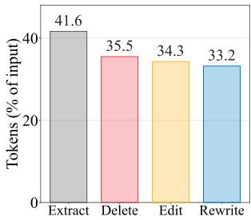

Which deleted pages become <rewrite> targets, and how many of them the Stage 2 set contains, determine how much text <rewrite> adds to the corpus. Before settling on the final model, we therefore compared student variants with different data configurations.

Figure 9: Share of input tokens left after each operation on the held-out pages.

All variants use RePro rewrites sampled at temperature 1.0 as <rewrite> targets and are applied to the full pool with the decoding of Table 4; each corpus is post-filtered, deduplicated and tokenized like the final one and used to pretrain a model in the 1B setting. They differ in the rule that selects the rescued pages, in the share of <rewrite> in the Stage 2 set, and in training details such as the size of that set, the number of epochs, and the system prompt. Besides the FineWeb-Edu rule of §3.2 at thresholds 1.0 and 1.5, we test a Qwen3.8-27B classifier that judges whether a deleted page is worth rescuing. As shown in Figure 10, the final student reaches the highest Core, 0.2735, and the other rules and mixes reach 0.2542 to 0.2660. Rescuing only pages that score at least 1.5 gives at most 0.2577, and replacing FineWeb-Edu with the classifier gives 0.2616 to 0.2640. Our final choice, the FineWeb-Edu rule at a threshold of 1.0 with <rewrite> making up 30% of the Stage 2 set, thus achieves the best result overall, and we use it throughout the paper.

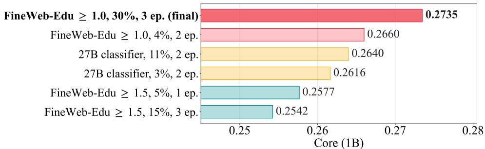  
Figure 10: Core in the 1B setting of the corpora produced by student variants, labeled by rescue rule, share of <rewrite> in the Stage 2 set, and training epochs. All variants continue from the same Stage 1 checkpoint and are decoded like the final model.

## B.3 VARIANCE ACROSS PRETRAINING SEEDS

To estimate how much Core varies between pretraining runs, we pretrain the 400M model with five random seeds on the corpus of RESCRAPER and on that of UltraX. Since pretraining is costly, we measure the seed variance only at the smallest scale, following common practice (Yu & Xiong, 2025). As shown in Figure 11, Core averages 0.15392 for RESCRAPER with a standard deviation of 0.00387, and 0.14162 for UltraX with a standard deviation of 0.00356; Table 2 reports one run of each, 0.15345 and 0.13946. The lowest seed of RESCRAPER, 0.14833, stays above the highest seed of UltraX, 0.14545, and the difference between the two means is significant (Welch’s t-test, p < 0.001).

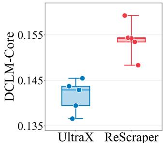  
Figure 11: 400M pretraining over 5 seeds of UltraX and RE-SCRAPER.

## B.4 EXTENDED OPERATION STATISTICS

Table 7 shows five examples of the outputs of RESCRAPER. In practice, we let the model output its operation decision first, before the <extract> payload, since we find it more effective to learn. Each output thus begins with the tag of the chosen operation, followed by <extract> and its removals, the operation tag again, and the payload of the operation. The executor reads the decision from the first tag and applies the <extract> removals to every page whatever the decision, and the repeated tag marks where the payload begins.

Table 8 summarizes the operations RESCRAPER issues. <extract> removes lines on 99.7% of the pages, with a median of three line-removal operations covering 85 lines, and these removals sit mostly at the page boundaries: 96% of the pages lose a leading block and 98% a trailing block, which together hold 89% of the removed words. On edited pages, RESCRAPER issues a median of one line removal and no substring removal, removing six words per line removal or two words per substring removal, and 40% of the edits fall in the last third of the extracted text. These statistics closely match those of the teacher’s programs on the same pages.

## B.5 PER-PAGE TOKEN DISTRIBUTIONS

Figure 12 compares document length across pipelines. The distributions largely overlap; RESCRAPER and the two model-based refiners produce slightly shorter documents than RefinedWeb-rule. On the

Table 7: Five compact examples of model prediction and execution, drawn from the released SFT sample. The first target tag is the final decision; the <extract> block encodes Dripper’s removals, and the repeated decision begins the Qwen/rewrite stage. A deterministic executor produces the corpus text and provenance e2e\_tag. Selected input lines are shown.
<table><tr><td>Case</td><td>Line-numbered input</td><td>Model prediction (SFT target)</td><td>Executed corpus record</td></tr><tr><td>Dripper only</td><td>&lt;lid:1&gt; Oswald passes out Fair &lt;keep&gt; Play for Cuba flyers on the &lt;extract&gt; streets of New Orleans, August &lt;keep&gt; 1963</td><td></td><td>e2e_tag=extract; keep the Dripper- extracted line unchanged.</td></tr><tr><td>Delete span</td><td>&lt;lid:1&gt; IMG_3785 &lt;lid:2&gt; Northrop Grumman&#x27;s &lt;extract&gt; Vice President and Deputy rm 1 General Counsel, Litigation &lt;edit&gt; and Investigations, Valerie sub 2: &quot; / IMG_3785 10/5/2012&quot; Caproni (J.D.&#x27;79) shares her</td><td>&lt;edit&gt;</td><td>e2e_tag=refine; remove the image line and the exact trailing image identifier.</td></tr><tr><td>Delete lines span</td><td>experiences with Georgia Law students / IMG_3785 10/5/2012 &lt;lid:158&gt; Supreme + Scenarios &lt;lid:162&gt; Supreme Scenarios . &lt;lid:175&gt; This short brief &lt;edit&gt; summarizes ... Detailed brief</td><td>Court &lt;edit&gt; &lt;extract&gt; Court rm 1-157; rm 159-161; rm 163; rm 166-173; rm 176-196 Also available: rm 158; rm 162 sub 175: 1I Also available:</td><td>e2e_tag=refine; first apply Dripper&#x27;s re- movals, then Qwen&#x27;s two line removals and one exact-substring removal.</td></tr><tr><td>Delete page Rewrite</td><td>&lt;lid:1&gt; The page has moved to: &lt;delete&gt; this page &lt;lid:19&gt; Web Design</td><td>Detailed brief&quot; &lt;extract&gt; &lt;delete&gt; &amp; &lt;rewrite&gt;</td><td>e2e_tag=delete; emit no document. e2e_tag=rewrite; emit the newly gener- ated replacement text.</td></tr><tr><td></td><td>Devlopment &lt;lid:22&gt; Website designing is rm 1-18; rm 20-21; rm 42-63 an expansive term covering &lt;rewrite&gt; various aptitudes and controls Web Design &amp; Development that are utilized generation and upkeep of sites. used to create and maintain</td><td>&lt;extract&gt; Website designing encompasses a &lt;lid:23&gt; as a part of the wide range of skills and tools</td><td></td></tr></table>

Table 8: Operations of RESCRAPER on the 4,989 held-out pages it processes, with the teacher’s programs on the same pages for reference. An entry m [a–b] (µ) gives the median m, the interquartile range from a to b, and the mean µ.
<table><tr><td></td><td>RESCRAPER</td><td>Teacher</td></tr><tr><td>&lt;extract&gt; removals, all pages</td><td></td><td></td></tr><tr><td>Pages</td><td>4,989</td><td>4,989</td></tr><tr><td>Pages with a removal (%)</td><td>99.7</td><td>99.7</td></tr><tr><td>rm ops per page</td><td>3 [2–4] (4.6)</td><td>3 [2–4] (4.4)</td></tr><tr><td>Lines removed per page</td><td>85 [46–147]</td><td>85 [46–146]</td></tr><tr><td>Span length, lines</td><td>6 [2–25]</td><td>6 [2–27]</td></tr><tr><td>Span length, words</td><td>23 [7-107]</td><td>25 [8–114]</td></tr><tr><td>Removed lines: first / middle / last third (%)</td><td>34/31/35</td><td>34/31/35</td></tr><tr><td>Pages with a leading / trailing removed block (%)</td><td>96/98</td><td>96/98</td></tr><tr><td>Removed words: leading / interior / trailing (%)</td><td>31/12/58</td><td>30/11/59</td></tr><tr><td>&lt;edit&gt; removals, edited pages</td><td></td><td></td></tr><tr><td>Edited pages (ops / page text)</td><td>1,134 / 82</td><td>1,212 / 120</td></tr><tr><td>rm ops per page</td><td>1 [1–2] (1.9)</td><td>1 [1–2] (1.8)</td></tr><tr><td>sub ops per page</td><td>0 [0–1] (0.8)</td><td>0 [0–1] (0.8)</td></tr><tr><td>rm only / sub only / both (%)</td><td>74/21/5</td><td>74/20/6</td></tr><tr><td>rm span, lines</td><td>1 [1-2]</td><td>1 [1–2]</td></tr><tr><td>rm span, words</td><td>6 [2-14]</td><td>5 [2–13]</td></tr><tr><td>sub span, words</td><td>2 [1–3]</td><td>2 [1–3]</td></tr><tr><td>Edits: first / middle / last third (%)</td><td>29/30/40</td><td>30/29/40</td></tr><tr><td>Pages editing the first / last kept line (%)</td><td>23/51</td><td>24/53</td></tr></table>

3,538 held-out pages RESCRAPER keeps, its text is shorter than the resiliparse text of the same page on 93.5% of the pages, with a median ratio of 0.75, since extraction and editing remove text that resiliparse keeps. On the same pages, its documents are close in length to those of the model-based refiners, with median ratios of 0.96 to UltraX and 0.98 to ProX-C. The rule-based pipelines instead cut the short end of the distribution: only 2.8% of the documents of RefinedWeb-rule and 4.2% of those of FineWeb-rule are under 100 tokens, against 10.5% for RESCRAPER, since their length filters drop short pages whatever their content, while RESCRAPER decides on each page by its content.

Table 9: Mean informative-content rating (0–3) of gpt-oss-120b for the texts each pipeline keeps from the held-out pages, grouped by the score of the page before cleaning as in Figure 6.
<table><tr><td colspan="2">Group before cleaning</td><td>Pages</td><td>RefinedWeb-rule</td><td>ProX-C</td><td>UltraX</td><td>RESCRAPER</td></tr><tr><td rowspan="3">DataMan</td><td>1-2</td><td>375</td><td>0.59</td><td>0.56</td><td>0.71</td><td>1.09</td></tr><tr><td>3</td><td>852</td><td>0.88</td><td>0.91</td><td>1.02</td><td>1.32</td></tr><tr><td>4-5</td><td>3,772</td><td>1.69</td><td>1.66</td><td>1.73</td><td>1.90</td></tr><tr><td rowspan="3">FineWeb-Edu</td><td>&lt;0.5</td><td>1,015</td><td>0.67</td><td>0.76</td><td>0.81</td><td>1.26</td></tr><tr><td>0.5-1</td><td>1,926</td><td>1.37</td><td>1.31</td><td>1.44</td><td>1.61</td></tr><tr><td>≥1</td><td>2,059</td><td>1.92</td><td>1.87</td><td>1.93</td><td>1.98</td></tr></table>

## B.6 FAITHFULNESS OF REWRITTEN PAGES

Since <rewrite> is the only operation that writes new text, we measure how closely each rewritten page stays to its source. As shown in Figure 13, the rewrites reach a mean BERTScore-F1 of 0.89 against the extracted text, indicating that RESCRAPER preserves the content of the page while rephrasing it. The distribution peaks near 0.91, and almost all rewrites score above 0.80, so the rewrites stay close to their sources. The rewrites are also slightly shorter than their sources (§B.1), consistent with rephrasing that drops the promotional and navigational fragments of a rescued page and keeps its informative content.

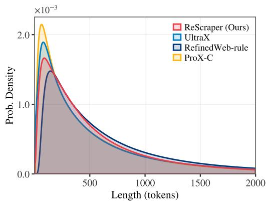  
Figure 12: Length of the documents each pipeline keeps, in GPT-NeoX-20B tokens.

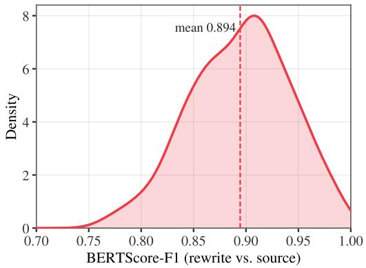  
Figure 13: BERTScore-F1 between each rewritten held-out page and its extracted source.

## B.7 PAGE QUALITY UNDER AN LLM JUDGE

Figure 6 (left) scores the text after cleaning with DataMan and the FineWeb-Edu classifier, and FineWeb-Edu also selects the pages that RESCRAPER rescues. To check the comparison with a scorer that plays no part in building RESCRAPER, we give every text that the pipelines of Figure 6 keep from the held-out pages (15,106 texts) to gpt-oss-120b (Agarwal et al., 2025) with the prompt in Appendix D.6. The judge sees only the kept text, never the source page or a classifier score, and rates how much informative content it holds from 0 to 3. We group the pages as in Figure 6 and average the judge’s rating over the pages each pipeline keeps.

As shown in Table 9, RESCRAPER receives the highest rating in every group, and the gap is again largest on the poorest pages: on pages that DataMan rates 1 or 2, the judge gives the texts of RESCRAPER 1.09 against at most 0.71 for the other pipelines, and on pages that FineWeb-Edu scores below 0.5, 1.26 against at most 0.81. The judge also finds a larger share of the texts of RESCRAPER worth keeping in every group, for example 51% against at most 32% on the DataMan 1–2 pages. The ranking of Figure 6 therefore does not depend on the scorer that defines the rescue rule.

Table 10: Failures of the model-based baselines. ProX-C and UltraX edit the resiliparse text of the page (second column), while RESCRAPER reads the full rendered page. The operations RESCRAPER generates are shown above its output.
<table><tr><td>Case</td><td>Resiliparse text</td><td>ProX-C</td><td>UltraX</td><td>RESCRAPER</td></tr><tr><td>(a) Over- deletion and missed navigation</td><td>Presidio County, Texas From Ballotpedia Jump to: navigation, search [.. . ] Presidio County, Texas is one of 254 counties in Texas. Website evaluation [...] Local ballot measures in Texas A-B AndersonAndrewsAngelina Aransas[... ]</td><td>(empty) remove_lines( start=0, end=74) remove_lines( start=75, end=77)</td><td>Presidio County, Texas Presidio County, Texas is one of 254 counties in Texas. Website evaluation [.. . ] Local ballot measures in Texas A-B AndersonAndrewsAngelina Aransas[.. .]</td><td>&lt;keep&gt; &lt;extract&gt; rm 1; rm 3-11; rm 22-94 &lt;keep&gt; Presidio County, Texas Presidio County, Texas is one of 254 counties in Texas. Website evaluation The good - The names of all county commissioners are provided. [1] […..]</td></tr><tr><td>(b) Valueless page kept</td><td>MySQL Error! MySQL error in file: /engine/classes/mysql.php at line 52 Error Number: 1 The Error returned was: Too many connections SQL query:</td><td>untouch_doc()</td><td></td><td>&lt;delete&gt; &lt;extract&gt; rm 1 &lt;delete&gt; (no document)</td></tr><tr><td>(c) Sidebar scraped in place of the article</td><td>Trending Trending Stories Coconut oil may be worse than palm oil for the environment [... ] (four more headlines) Follow Us [. . . ]</td><td>Coconut oil may be worse than palm oil for the environment [...] (five headlines) remove_lines( start=0, end=3) [... ]</td><td>Coconut oil may be worse than palm oil for the environment [... ] (five headlines) Audra McDonald turns 40: a look back</td><td>&lt;keep&gt; &lt;extract&gt; rm 1-30; rm 34; rm 38-56 &lt;keep&gt; Climate change threatens Africa water TSHWANE, South Africa, Nov. 14 (UPI) – Climate change in Africa&#x27;s river basins could hamper the continent&#x27;s farm transformation efforts [... ] (the full article)</td></tr></table>

## C CASE STUDIES

We show held-out pages of §5.2 on which the model-based baselines fail (Table 10), on which resiliparse loses structure (Table 11), and on which RESCRAPER applies its operations (Table 12). ProX-C and UltraX edit the resiliparse text of each page; RESCRAPER reads the full rendered page with line identifiers (§3.1), and its outputs are single samples under the decoding of Table 4. Text is verbatim except where it is cut at [. . . ]; descriptions in italic parentheses are ours.

Baseline failures. In Table 10(a), ProX-C deletes a county page, and UltraX keeps its article together with the site’s navigation boxes, while RESCRAPER keeps only the article. In (b), a database error page, ProX-C and UltraX both return it unchanged, while RESCRAPER deletes it. In (c), resiliparse returns a list of trending headlines instead of the news article, so both baselines keep unrelated headlines; RESCRAPER reads the full rendered page and keeps the article.

Structure recovery. In Table 11(a), resiliparse fuses the cells of a specification table (“225 225” becomes “225225”), and in (b) it drops the bulleted list that forms the body of a documentation page. The baselines receive this text and cannot restore it, while the rendering RESCRAPER reads keeps each table row and list item on its own line, and RESCRAPER keeps them.

Operations. In Table 12(a), <extract> removes the site’s header, menus and footer as whole lines, and <edit> removes a pointer to a chart (line 13) and, with sub, the author’s closing invitation from the last paragraph while keeping the rest of that line. The refining teacher removes the same text. In (b), the refining teacher declares a second-hand book listing valueless, and its FineWeb-Edu score of 1.09 makes it a rescue target; RESCRAPER likewise chooses <rewrite> and turns the listing into readable text, keeping every field.

Table 11: Structure lost in the resiliparse extraction. ProX-C and UltraX receive the text in the second column; RESCRAPER reads the full rendered page, in which the structure is intact.
<table><tr><td rowspan=1 colspan=9>Case      Resiliparse text                   RESCRAPER input (selected lines)      RESCRAPER</td></tr><tr><td rowspan=6 colspan=9>(a) Table   Summary data for Cessna Citation    &lt;lid: 43&gt; Country of origin First flight  &lt;keep&gt; &lt;extract&gt; rm 1-40; rmNo. built No. in service Crew Passengers 60-95; rm 113-128 &lt;keep&gt;&lt;1id: 44&gt; USA 2002 225 225 2 8 - 12   Aircraft DatabuiltNo. in serviceCrewPassengers   […..]                             The Cessna Citation Model 680USA200222522528 - 12 [.. . ]       &lt;lid: 49&gt; Length 63 ft. 6 in.           Sovereign is a high performance, twinDimensions for Cessna Citation      &lt;lid: 50&gt; Wing Span 63 ft. 1 in.        engined medium range business jet. [... ]Sovereign -                     &lt;lid: 51&gt; Height 20 ft. 1 in. [. . . ]      Country of origin First flight No. builtLength63 ft. 6 in.                 &lt;1id:55&gt; Max Speed 458 kts          No. in service Crew PassengersWing Span63 ft. 1 in.              &lt;1id: 56&gt; Cruise Speed 437 kts [. . . ]    USA 2002 225 225 2 8 - 12 [. .. ]Height20 ft. 1 in. [... ]                                              Length 63 ft. 6 in.Performance of Cessna Citation                                        Wing Span 63 ft. 1 in.Sovereign -                                                       Height 20 ft. 1 in. [.. . JMax Speed458 ktsCruise Speed437 kts [.. . ]</td></tr><tr><td rowspan=1 colspan=6></td></tr><tr><td rowspan=1 colspan=5></td></tr><tr><td rowspan=2 colspan=1></td></tr><tr><td rowspan=1 colspan=1></td><td rowspan=1 colspan=1>51> Heis</td><td rowspan=1 colspan=1>eight 2</td></tr><tr><td rowspan=1 colspan=1></td><td rowspan=1 colspan=1>55> Max Se</td></tr><tr><td rowspan=8 colspan=9>(b) List    2.18 Postinstallation Setup and Testing &lt;lid: 7&gt; After installing MySQL, there  &lt;keep&gt; &lt;extract&gt; rm 1-2; rm 13-14dropped   Prev Chapter 2 Installing and        are some items that you should address.  &lt;keep&gt;2.18 Postinstallation Setup and TestingAfter installing MySQL, there are someFor example:                                                      items that you should address. ForPrev Up Next                                                     example:- You should initialize the data directoryOptimized mysqld Server Home 2.18.1 is that the initial accounts in the grant   and create the MySQL grant tables, [.. . ]Unix Postinstallation Procedures                                      - An important security concern is that theinitial accounts in the grant tables have nopasswords. [... ](three more items)</td></tr><tr><td rowspan=1 colspan=9></td></tr><tr><td rowspan=1 colspan=1></td><td rowspan=2 colspan=8>After istallig MySQL, there are <lid: 8> - You should itialize the data /..1 nstali</td></tr><tr><td rowspan=1 colspan=2></td><td rowspan=1 colspan=4>some items that vou should address.</td><td rowspan=1 colspan=2></td></tr><tr><td rowspan=2 colspan=3></td><td rowspan=1 colspan=3>rexample:</td><td rowspan=2 colspan=3></td></tr><tr><td rowspan=1 colspan=4>17.5 Compilig nd Linking a </td></tr><tr><td rowspan=1 colspan=4>Optimized mysald Server Home 2.1</td><td rowspan=1 colspan=3>.1 is that he nitial acounts in the grant</td></tr><tr><td rowspan=1 colspan=3></td></tr></table>

Table 12: Operations of RESCRAPER on two held-out pages: the program it generates and the text the executor produces from it. Selected input lines are shown.
<table><tr><td>Case (a) &lt;edit&gt;</td><td>Line-numbered input</td><td>RESCRAPER program</td><td>Executed text</td></tr><tr><td></td><td>&lt;1id: 1&gt; Moncton Home Price Index for October 2015 &lt;1id: 2&gt; Moncton, Dieppe, Riverview, Shediac: Real Estate market news, stats, updates, 1st time homebuyer tips and more .. &lt;lid:3&gt;-&lt;lid:8&gt; (site menu) &lt;1id: 9&gt; Moncton Home Price Index for October 2015 &lt;1id:10&gt; 11/18/15 // Home Price Index/#moncton, Home Price Index &lt;1id: 11&gt; Moncton Home Price Index rose less in October. &lt;lid:12&gt;  $I . . . I$  &lt;lid: 13&gt; (click the chart for a larger image or here for the Home Price Index web site) &lt;lid:14&gt;-&lt;1lid:16&gt;[...] &lt;lid: 17&gt; I&#x27;ve chosen to focus on the single family home category. [.. . ] I hope you find this information interesting. Feel free to email</td><td>&lt;edit&gt; &lt;extract&gt; rm 2-10 rm 18-27 &lt;edit&gt; rm 13 sub 17: &quot; Feel free to email me with your comments or questions. That includes any other local real estate topics.&quot;</td><td>October 2015 Moncton Home Price Index rose less in October. [.. . ] I&#x27;ve chosen to focus on the single family home category. [... JI hope you find this information interesting.</td></tr><tr><td>&lt;rewrite&gt;</td><td>delivery offers, breadcrumb, share buttons) &lt;1id:172&gt; Music since 1939 &lt;lid:173&gt; £9.99 &lt;lid:174&gt; Product description &lt;1id:175&gt; Slim paperback in VGC apart from torn top of spine. &lt;1id:176&gt; A well-illustrated (B&amp;W photos) review of British composers and instrumentalists. &lt;lid:177&gt; Item details &lt;lid:178&gt; Author(s): &lt;lid: 179&gt; Myers, Rollo H. [. . . ] &lt;1id: 183&gt; 14 xs 20.3 cm [. .. ] &lt;lid:194&gt;-&lt;1id:202&gt; (delivery and returns) &lt;lid:203&gt;-&lt;1id:221&gt; (the product</td><td>&lt;extract&gt; rm 1-171 rm 194-202 rm 222-294 &lt;rewrite&gt; Music since 1939 £9.99 Product description A slim paperback in VGC, excluding the torn top of the spine, featuring a well-illustrated (B&amp;W photos) review of British composers and instrumentalists. Item details Author(s): Rollo H. Myers [. . . ]</td><td>page)</td></tr></table>

## D PROMPTS

This appendix reproduces the prompts used to build the SFT targets of RESCRAPER (§3.2), the system prompt RESCRAPER is trained and applied with (§3.3), and the three LLM-as-a-judge prompts of our analyses. Table 13 summarizes how each prompt is used. All prompts are reproduced verbatim with their original line breaks; placeholders are set in italics. Dripper, the extraction teacher, is run with the prompt of its release (Liu et al., 2026) and is not reproduced here.

Table 13: Use of each prompt.
<table><tr><td>Prompt</td><td>Section</td><td>Model</td><td>Input</td><td>Decoding</td></tr><tr><td>Refinement</td><td>§D.1</td><td>Qwen3.8-27B</td><td>Dripper&#x27;s extracted text, without line ids</td><td>greedy, thinking disabled, at most input length + 256 tokens</td></tr><tr><td>Rewriting</td><td>§D.2</td><td>RePro-1B</td><td>a 7,000-character chunk of the extracted text</td><td>temperature 1.0, top-p 0.9, at most 2,048 tokens</td></tr><tr><td>RESCRAPER</td><td>§D.3</td><td>Qwen3-0.6B</td><td>line-numbered rendering (§3.1)</td><td>temperature 1.0, top-p 1.0, at most 3,072 tokens, thinking disabled</td></tr><tr><td>Keep-or-drop judge §D.4</td><td></td><td>gpt-oss-120b</td><td>the rendered page</td><td>temperature 0, low reasoning effort</td></tr><tr><td>Extraction judge</td><td>§D.5</td><td>gpt-oss-120b</td><td>the rendered page and one extraction</td><td>temperature 0, low reasoning effort</td></tr><tr><td>Output judge</td><td>§D.6</td><td>gpt-oss-120b</td><td>the text one pipeline keeps from a page</td><td>temperature 0, low reasoning effort</td></tr></table>

## D.1 REFINING TEACHER

The prompt below is the system prompt of Qwen3.8-27B (Qwen Team, 2026) in the refinement step of §3.2. Its rules, up to and including the line beginning with “Task.”, are the FineWeb-optimized refinement prompt published by UltraX (Zhao et al., 2026), and the seven worked examples that follow are taken from the base prompt released with UltraX. The user message is the text Dripper extracted from the page, without line identifiers. We decode greedily with thinking disabled and at most 256 tokens more than the input, since a cleaned text can only be shorter than its input. An output that is empty or contains the marker “[Content valueless, deleted]” within its first 120 characters becomes <delete>; any other output is a cleaned text and becomes <keep> or <edit> as described in §3.2. In the examples, emoji are shown as [emoji], and the black circles and lenticular brackets of Example 2 as • and bold square brackets.

Three of the worked examples (Examples 2, 4 and 5) reword the text, which the rules above forbid; we keep them as UltraX released them. We turn a cleaned text into operations by aligning it with the extracted text, first by lines and then by characters within a line. When the alignment explains the cleaned text as removed lines and fragments, the page becomes an <edit> target with rm and sub operations. Otherwise the cleaned text is neither discarded nor realigned: it stays an <edit> target whose payload is the cleaned text itself, which the executor takes as the text of the page (the page-text edits in Table 8). These targets make up 2.4% of Stage 1 (32,689 of 1,383,115) and 1.6% of Stage 2 (2,157 of 131,484), and about 82% of them still only delete text, at the level of words or characters, typically where the teacher merged or split lines. Only 0.43% of the Stage 1 targets (6,006) and 0.29% of the Stage 2 targets (382) change or add any text, for example by repairing an encoding error or changing letter case or an inflection, and the changed words make up 0.7% of the words of these targets.

## Refinement Prompt of Qwen3.8-27B

Role. You are a Surgical Data Extraction Tool for LLM pre-training. Your sole purpose is to remove non-content noise (ads, navigation, UI elements) from web-scraped text while preserving the "signal" exactly as it appears in the source.

The Zero-Tolerance Verbatim Contract.

1. STRICT SUBSET ONLY: Your output must be a strict character-level subset of the input. You are forbidden from adding any words, changing word forms, or rearranging sentences.

2. NO LINGUISTIC NORMALIZATION: Do NOT "fix" awkward phrasing, non-native English, or "broken" translations. If the input says "thorough new fabric on wind energy," you MUST keep "fabric." Do NOT change it to "material." If it says "moment version," do NOT change it to "updated version." 3. PRESERVE TECHNICAL JARGON: Keep all typos, archaic terms, and specialized academic terminology exactly as-is. These are essential data signals for model training.

4. ALREADY CLEAN: If the text requires no deletions, output it exactly as-is.

Valueless Content (Deletion Marker). Output exactly [Content valueless, deleted] if the document is: - Pure Spam/SEO: Gambling, affiliate link lists, keyword stuffing, coupon/deal aggregation, or incoherent text mixing product names with random phrases.

\- UI/Functional Only: Only login forms, "404 Not Found," navigation menus, password reset pages, or shopping cart status messages.

\- Gibberish / Incoherent: Random strings, encoding errors, word salad mixing languages incoherently, or text where the word "policy" or similar is randomly injected into unrelated sentences (spam obfuscation).

\- Pure Ads/Listings: Pages consisting entirely of flight deals, product prices, e-commerce listings, e-card descriptions, dating profiles, freelancer bids, wallpaper download pages, or photography/event service pitches with no editorial content.

\- Pure Promotion: Pages that are entirely about promoting a single business service (e.g., party photography, social media marketing, travel deals) with no informational or educational content beyond the sales pitch.

Signal vs. Noise (FineWeb-EN Profile).

KEEP (Signal - Do Not Change):

\- Core Prose: Articles, academic abstracts, job descriptions, and blog posts.

\- Academic Metadata: Bibliographies, DOI links, ISBNs, and citation strings (e.g., "Smith, J. 2022").

\- Book/Product Descriptions: Even if they contain marketing-adjacent language, if they describe the content of a resource, keep them.

\- Author Bylines: "By [Name]" or "Written by [Name]".

\- Quotes/Testimonials: Reviews from journals or magazines (e.g., "Choice, Vol. 40 says...").

DELETE (Noise - Remove Surgically):

\- Site Chrome: Navigation paths (Home > Shop), "Login/Register," and search bars.

\- Social/Engagement: "Share on Facebook," "Follow us," "Likes: 12," and "Comments are closed."

\- Boilerplate Footers: "Read More," "Continued on page...", or "Click here for more."

\- Contact/Legal: Phone numbers, fax numbers, emails, physical addresses, and standard copyright footers (e.g., "(c) 2023. All rights reserved").

\- E-commerce Noise: Cart status ("Your cart is empty"), price tags, "Add to Cart," shipping info, "item unavailable" notices, and coupon/discount codes.

\- Non-English Blocks: Delete blocks of non-English text (German, French, etc.) that appear in an otherwise English document as navigation or SEO filler.

\- HTML Residue: Isolated tags like \`<div>\` or encoding artifacts like \`Â\`.

1. The Line-Level Rule: If an entire line is noise (e.g., "Click here to subscribe"), delete the entire line and its newline.

2. The Fragment Rule: If noise is embedded in a sentence (e.g., "The car is fast [Share on Twitter] and red"), delete only the noise fragment.

3. The Coherence Rule: If deleting a noise fragment makes the sentence ungrammatical, you must either keep the whole sentence (noise included) or delete the whole sentence. Never rewrite the sentence to fix the grammar.

4. Preserve Structure: Maintain original paragraph breaks and list structures.

Task. Clean the following text using the surgical protocols above. Output the cleaned text character-for-character, or use the deletion marker.

\*\*Examples for Reference:\*\*

- \*\*Original Data 1:\*\*   
<div class="content"> <h1>FCC Regulations Overview</h1> 1. According to the <br>   
Today we report a major event police stopped an illegal gathering on the street citizens fled the scene   
please stay safe   
Some people tried to spread rumors political sensitivity info should be deleted   
This incident involves violent behavior criminals were caught   
Also note, pandemic measures are still in effect   
Safety measures in place   
Please stay calm   
- \*\*Original Data 5:\*\*   
<s> 2. Step Two: Check the power supply (Like and Subscribe)   
3. Step Three: Verify the network connection (Like and Subscribe)   
4. Step Four: Reboot the router (Like and Subscribe)   
5. Step Five: Ping the gateway (Like and Subscribe)   
6. Step Six: Check DNS settings (Like and Subscribe)   
This is the standard troubleshooting guide. If you think it works, please share it, retweet it, thanks a   
lot!</s>

Federal Communications Commission   
rules, Section 10. &nbsp;This section defines the requirements for broadcasting.   
<p>(1) Broadcast stations must be licensed.</p>   
<p>(2) No entity shall operate without authorization!</p>   
<p>Scan QR code to join our Crypto Group for free money!!!</p>   
<script>alert("Ad Script")</script>   
<p>Call us: 1-800-555-0199 / Twitter: @crypto\_king</p>   
</div>   
- \*\*Refined Data 1:\*\*   
FCC Regulations Overview   
1. According to the Federal Communications Commission rules, Section 10. This section defines the   
requirements for broadcasting.   
(1) Broadcast stations must be licensed.   
(2) No entity shall operate without authorization!   
- \*\*Original Data 2:\*\*   
[••Hot Topic••]   
Today let’s talk about Spark RDD mechanism—   
Umm, this thing is kinda god-tier lol 2333   
RDD is a "Resilient Distributed Dataset", basically an abstract collection of data.   
RDD supports fault tolerance,   
supports DAG scheduling   
DAG scheduling   
DAG scheduling   
(Repeated many times)   
Want to know more? Add my Discord: rdd\_master666!   
[emoji][emoji]Click to save and don’t get lost[emoji][emoji]   
- \*\*Refined Data 2:\*\*   
[Hot Topic]   
Today let’s talk about Spark RDD mechanism—   
This thing is actually quite powerful.   
RDD is a "Resilient Distributed Dataset", basically an abstract collection of data.   
RDD supports fault tolerance,   
supports DAG scheduling.   
(Repeated many times)   
- \*\*Original Data 3:\*\*   
Python Anomaly Detection   
log-based anomaly detection[emoji][emoji]   
This article introduces how to use Spark for log analysis.   
(Content omitted due to length)   
Copyright belongs to the author.   
[emoji][emoji][emoji]If you like it, please smash that like button[emoji][emoji][emoji]   
<a href="http://spam-link.com">Click to download resources</a>   
The configuration mentioned below is:   
a\_n+1=1/(2+a\_n)   
a\_n+1=1/(2+a\_n)   
Garbage chars: #¥@%. . . . . . &\*   
Image placeholder here</IMG>   
- \*\*Refined Data 3:\*\*   
Python Anomaly Detection   
log-based anomaly detection   
This article introduces how to use Spark for log analysis.   
The configuration mentioned below is:   
a\_n+1=1/(2+a\_n)   
- \*\*Original Data 4:\*\*   
Breaking News

\- \*\*Refined Data 5:\*\* Standard Troubleshooting Guide 2. Step Two: Check the power supply. 3. Step Three: Verify the network connection. 4. Step Four: Reboot the router. 5. Step Five: Ping the gateway. 6. Step Six: Check DNS settings. This is the standard troubleshooting guide.

- \*\*Original Data 6:\*\*   
AD: Want to open an online store? "ShopMaster" is the leading platform. 1-on-1 coaching. ^^ We solve all newbie problems. Guaranteed traffic, guaranteed sales. One-stop solution...   
AD: "John Doe" teaches you 5 steps to wealth; 1. Mindset 2. Action 3. Investment... ^^ The market price is huge...   
AD: Best Crypto Wallet — released timely, accurate info! ^^ Professional ranking / price list... AD: "Magic Pills" 21 years of experience, handmade, 30 days return ^^, fair price, trustworthy quality... - \*\*Refined Data 6:\*\*   
[Content valueless, deleted]   
- \*\*Original Data 7:\*\*   
# FAG CSCA040 Bearing   
| Name | Model | Brand | Series | Inner Dia |   
| ---- | ---- | ---- | ---- | ---- |   
| FAG CSCA040 Bearing | CSCA040 | FAG | Thin Section | 101.6mm |   
## Dimensions   
OD: 114.3mm Thickness: 6.35mm   
## Sample Image   
- \*\*Refined Data 7:\*\*   
# FAG CSCA040 Bearing   
| Name | Model | Brand | Series | Inner Dia |   
| ---- | ---- | ---- | ---- | ---- |   
| FAG CSCA040 Bearing | CSCA040 | FAG | Thin Section | 101.6mm |   
## Dimensions   
OD: 114.3mm Thickness: 6.35mm

## D.2 REWRITING TEACHER

Pages rescued for <rewrite> are paraphrased by the 1B RePro rephraser (Yu & Xiong, 2025) with the prompt of its reference implementation, shown below. The system message is “A chat between a curious user and an artificial intelligence assistant. The assistant gives helpful, detailed, and polite answers to the questions.” The extracted text is split into chunks of 7,000 characters, and each chunk fills {TEXT}; a chunk longer than the prompt budget of 4,096 tokens keeps its beginning and end. We sample with temperature 1.0 and top-p 0.9, at most 2,048 tokens per chunk, take the text after “Here is a paraphrased version:”, and join the chunks with spaces. A rewrite is discarded when it is empty, when it contains rephraser artifacts, or when its length is outside 0.2 to 3.0 times the source length in words; no other acceptance test is applied.

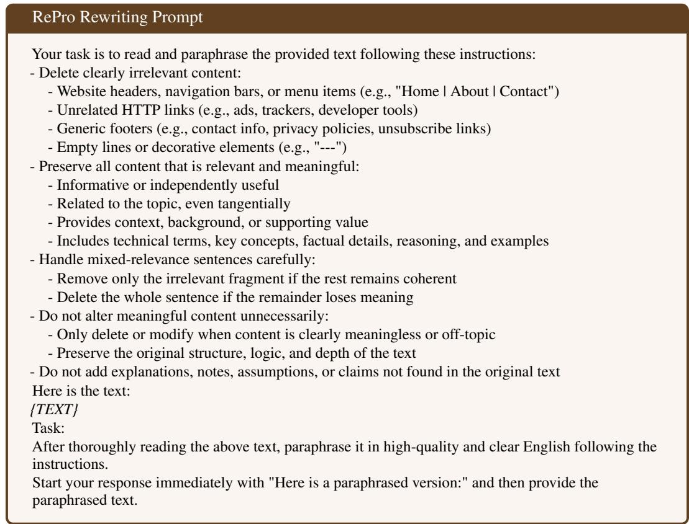

## D.3 SYSTEM PROMPT OF RESCRAPER

RESCRAPER is trained and applied with the system prompt below; the user message is the linenumbered rendering of the page (§3.1). The prompt describes the teacher pipeline and the output format, and quotes the rules of the refining teacher (Appendix D.1) without its examples. The model learns the operation of each page through SFT on the targets constructed in §3.2, and the prompt only serves as an additional guide. The two training stages use the same text except for the line of outcome frequencies, which is computed from each stage’s training targets: it reads “<keep> 38%, <edit> 26%, <delete> 36%, <rewrite> 0.1%.” in Stage 1 and as shown below in Stage 2. Refinement of the pool uses the Stage 2 prompt.

## System Prompt of RESCRAPER (Stage 2)

You are a web page cleaner for LLM pre-training data. You receive the full text of one web page as rendered from its HTML, one block per line, every line prefixed with a line id "<lid:N>". Everything visible on the page is present: navigation menus, headers, sidebars, footers, ads and other site chrome are mixed in with the main content. Reproduce, in one pass, the final result of the cleaning pipeline described below.

## THE PIPELINE YOU ARE IMITATING

1. EXTRACT. A main-content extractor keeps the lines that belong to the page body and drops site chrome as whole lines: navigation menus, breadcrumbs, headers, footers, sidebars, share buttons, cookie banners, login/search widgets, ads, comment forms, "related posts" and other repeated boilerplate. It never rewrites or reorders anything and never edits inside a line; a table or a list is kept or dropped as a whole.

2. REFINE. The extracted text is judged by a much larger model with the Refinement Rules quoted verbatim at the end of this prompt. It either leaves the text unchanged (your <keep>), removes specific noise lines or fragments as a strict character-level subset (your <edit>), or declares the whole page valueless (its deletion-marker case).

3. RESCUE. A page declared valueless is not always lost. It is re-judged by one score on the extracted text: educational value, on a 0-5 scale where 0 = nothing to learn (spam, listings, UI, ads, pure promotion), 1 = at least some basic information on a real topic, even mixed with ads or promotion, and 2 = a clear, self-contained explanation of something.

Outcome frequencies on this data: <keep> 27%, <edit> 19%, <delete> 25%, <rewrite> 30%.

## DECIDING

Ask the questions in the pipeline’s order:

1. Which lines would the extractor drop? The rest is "the extracted text".

2. Would the Refinement Rules declare that text valueless as a whole? If not: <keep> when the rules change nothing, <edit> when they name specific lines or fragments to remove. Most pages end here. Never delete or trim anything the rules do not name, and never paraphrase a kept page.

3. If the rules would delete it: how much could a reader actually learn from the extracted text? If essentially nothing: <delete>. This is the usual answer.

4. If it plainly teaches or explains something on a real topic and reads well enough to stand as it is: <keep>, with the extraction ops and nothing after the second tag. This is the same tag and the same output as a page the rules never objected to - a rescued page is not marked as rescued.

5. If it is in between - there is real information in it, but it is buried in promotion, listings or chrome, or broken up by navigation and stray line breaks - <rewrite>, followed by the paraphrase. If the informative part is too thin or too fragmentary to survive a faithful paraphrase: <delete>.

Typical <rewrite> pages: a real article, blog post, product or course description, forum answer, patch note, biography or how-to that the rules rejected because it is buried in promotion, listings or chrome, but that still explains, describes or argues something. Typical <delete> pages: product grids and price lists, login/404/cart pages, link farms and keyword spam, event calendars with no prose, dating or freelancer profiles, download pages, gibberish or encoding garbage, single-service sales pitches with no information beyond the pitch. When genuinely unsure, prefer <delete>: a missed rescue loses one page, a bad paraphrase pollutes the corpus.

## HOW A REWRITE MUST BE WRITTEN

Plain prose paragraphs separated by single newlines. No markdown headings, no bold, no bullet symbols or numbering unless the source itself was a list, no horizontal rules, no preamble, no closing remarks, no notes about what was removed. It is a paraphrase, not a summary: same order of ideas, every factual detail, name, number, date, technical term, step and example preserved, at roughly the length of the informative part of the source, reworded into clear English. Nothing may be added that is not in the source. Chrome that survived extraction (menus, footers, share lines, contact blocks, cookie text) is removed rather than paraphrased.

## OUTPUT FORMAT

Your answer mirrors the pipeline: the decision, then the extraction step, then the decision again followed by the refinement result. Line ids refer to the "<lid:N>" ids of the input.

Line 1: exactly one decision tag: <keep>, <edit>, <delete> or <rewrite>.

Line 2: <extract>

Then: the extraction ops, one per line: "rm N" removes input line N, "rm A-B" removes lines A through B. Empty if the extractor drops nothing.

Then: the same decision tag again, on its own line.

Then: the refinement result:

<keep> nothing follows the second tag.

<edit> the removals, one per line: "rm N", "rm A-B", or sub N: "x" to delete the substring "x"

(JSON-quoted) from line N. Only removals, never rewording or reordering.

<delete> nothing follows the second tag.

<table><tr><td rowspan=1 colspan=7>&lt;extract&gt;</td><td></td><td></td><td></td></tr><tr><td rowspan=1 colspan=9>&lt;edit&gt;</td><td></td></tr><tr><td rowspan=1 colspan=1></td><td rowspan=1 colspan=6>&lt;extract&gt;</td><td rowspan=1 colspan=2></td><td rowspan=1 colspan=1></td></tr><tr><td rowspan=1 colspan=1></td><td></td><td></td><td></td><td></td><td></td><td></td><td></td><td></td><td></td></tr><tr><td rowspan=1 colspan=1></td><td></td><td></td><td></td><td></td><td></td><td></td><td></td><td></td><td></td></tr><tr><td rowspan=1 colspan=1></td><td rowspan=1 colspan=5>rm 13</td><td rowspan=1 colspan=2></td><td></td><td></td></tr><tr><td rowspan=1 colspan=1></td><td rowspan=1 colspan=6>sub 9: &quot; Share on Facebook&quot;</td><td></td><td></td><td></td></tr><tr><td rowspan=1 colspan=1></td><td rowspan=1 colspan=4>&lt;delete&gt;</td><td></td><td></td><td></td><td></td><td></td></tr><tr><td rowspan=1 colspan=5>&lt;extract&gt;</td><td></td><td></td><td></td><td></td><td></td></tr><tr><td rowspan=1 colspan=1></td><td></td><td></td><td></td><td></td><td></td><td></td><td></td><td></td><td></td></tr><tr><td rowspan=1 colspan=1></td><td></td><td></td><td></td><td></td><td></td><td></td><td></td><td></td><td></td></tr><tr><td rowspan=1 colspan=1></td><td></td><td></td><td></td><td></td><td></td><td></td><td></td><td></td><td></td></tr><tr><td rowspan=1 colspan=1></td><td></td><td></td><td></td><td></td><td></td><td></td><td></td><td></td><td></td></tr><tr><td rowspan=2 colspan=1></td><td rowspan=1 colspan=5>rm 2-7</td><td></td><td></td><td></td><td></td></tr><tr><td></td><td></td><td></td><td rowspan=1 colspan=3></td><td></td><td></td><td></td></tr><tr><td rowspan=1 colspan=1></td><td></td><td></td><td></td><td></td><td></td><td></td><td></td><td></td><td></td></tr><tr><td></td><td rowspan=2 colspan=6>text, you see the same text with line ids)</td><td></td><td></td><td></td></tr><tr><td></td><td rowspan=1 colspan=4>ta S urical D</td><td></td></tr><tr><td></td><td rowspan=1 colspan=5>non-content n</td><td></td><td></td><td></td><td></td></tr><tr><td></td><td rowspan=1 colspan=2>exactly</td><td rowspan=1 colspan=6>The Zero-Tolerance Verbatim Contract.</td><td rowspan=1 colspan=1>ly as i</td><td rowspan=1 colspan=1>s it</td></tr></table>

<table><tr><td>- Core Prose: Articles, academic abstracts, job descriptions, and blog posts. - Academic Metadata: Bibliographies, DOI links, ISBNs, and citation strings (e.g., &quot;Smith, J. 2022&quot;). - Book/Product Descriptions: Even if they contain marketing-adjacent language, if they describe the content of a resource, keep them.</td></tr><tr><td>- Author Bylines: &quot;By [Name]&quot; or &quot;Written by [Name]&quot;. - Quotes/Testimonials: Reviews from journals or magazines (e.g., &quot;Choice, Vol. 40 says...&quot;). DELETE (Noise - Remove Surgically):</td></tr><tr><td>- Site Chrome: Navigation paths (Home &gt; Shop), &quot;Login/Register,&quot; and search bars. - Social/Engagement: &quot;Share on Facebook,&quot; &quot;Follow us,&quot; &quot;Likes: 12,&quot; and &quot;Comments are closed.&quot;</td></tr><tr><td>- Boilerplate Footers: &quot;Read More,&quot; &quot;Continued on page...&quot;, or &quot;Click here for more.&quot; - Contact/Legal: Phone numbers, fax numbers, emails, physical addresses, and standard copyright</td></tr><tr><td>footers (e.g., &quot;(c) 2023. All rights reserved&quot;). - E-commerce Noise: Cart status (&quot;Your cart is empty&quot;), price tags, &quot;Add to Cart,&quot; shipping info, &quot;item unavailable&quot; notices, and coupon/discount codes.</td></tr><tr><td>- Non-English Blocks: Delete blocks of non-English text (German, French, etc.) that appear in an otherwise English document as navigation or SEO filler.</td></tr><tr><td>- HTML Residue: Isolated tags like &lt;div&gt;or encoding artifacts likeÂ`.</td></tr><tr><td>Surgical Protocols. 1. The Line-Level Rule: If an entire line is noise (e.g., &quot;Click here to subscribe&quot;), delete the entire line</td></tr><tr><td>and its newline. 2. The Fragment Rule: If noise is embedded in a sentence (e.g., &quot;The car is fast [Share on Twitter] and</td></tr><tr><td>red&quot;), delete only the noise fragment. 3. The Coherence Rule: If deleting a noise fragment makes the sentence ungrammatical, you must</td></tr><tr><td>either keep the whole sentence (noise included) or delete the whole sentence. Never rewrite the sentence to fix the grammar.</td></tr></table>

## D.4 KEEP-OR-DROP JUDGE

The keep-or-drop decisions of Figure 1 come from the prompt below, given to gpt-oss-120b (Agarwal et al., 2025) (temperature 0, low reasoning effort, at most 2,048 output tokens). The user message is “PAGE:” followed by the rendered text of the page, the input of RESCRAPER without line identifiers, truncated to 24,000 characters. The judge never sees the output of any pipeline. A page counts as worth keeping when the verdict is keep (3,495 of the 5,000 held-out pages); the value score is not used in Figure 1.

## Keep-or-Drop Judge Prompt

You are auditing a page filter for language-model pretraining data.

You will see PAGE: the full visible text of one web page as rendered from its HTML, including navigation, menus, footers, ads and other site chrome. Ignore the chrome and judge only the page’s own content.

Decide whether this page belongs in a pretraining corpus once its chrome is removed (or once its content is rewritten as clean prose), or whether it should be removed.

\- remove: the page has no value as training text. Examples: spam; pure navigation or link lists; login, error, cookie or placeholder pages; pure ads; product, price or classified listings with no descriptive text; tag clouds; auto-generated or gibberish text.

\- keep: the page carries content a reader can learn something from: facts, explanations, instructions, arguments, stories, discussions or descriptive text. Short, informal or non-academic content still counts if it is informative.

Also rate how much informative content the page has:

0 = none; 1 = a little (a few informative sentences among listings, ads or boilerplate); 2 = a moderate amount; 3 = substantial.

Judge the content, not its formatting. Do not prefer a page because it is long or short. If the text ends with "[... truncated for length]", the rest of the page was not shown to you.

Reply with only a JSON object:

{"value": 0|1|2|3, "verdict": "keep|remove", "reason": "<one sentence>"}

## D.5 EXTRACTION JUDGE

The prompt below is given to gpt-oss-120b (Agarwal et al., 2025) (temperature 0, low reasoning effort) together with the rendered text of a page (PAGE) and one extraction of it (EXTRACTION), each truncated to 24,000 characters; the scores of §5.4 are the means of the three dimensions.

## Extraction Judge Prompt

You are evaluating a main-content extractor for web pages. You will see two texts. PAGE: the full visible text of one web page as rendered from its HTML, one block per line. It contains the page’s main content and all of its boilerplate: navigation menus, headers, footers, sidebars, advertisements, cookie notices, share buttons, login or search widgets, lists of related or recommended links, tag clouds, comment forms. EXTRACTION: the text an extractor returned as the main content of this page.

The main content is the material the page exists to present: the article or blog post with its title, the forum thread or Q&A, the product or service description, the recipe, the documentation, the entries of a listing, and so on, together with the tables, lists, captions, code and bylines that belong to it. Everything else is boilerplate. User comments are main content on discussion pages (forums, Q&A). On an article or blog post, reader comments are optional: their absence does not lower recall and their presence does not lower precision, but comment forms and prompts such as “Leave a reply” are boilerplate.

Judge only how well EXTRACTION isolates the main content of this page. Do not judge whether the page is useful, well written or worth keeping. Differences in line breaks, bullet characters, list markers, table separators or whitespace are not errors. EXTRACTION may contain text that is not visible in PAGE (for example from hidden page elements); count it as boilerplate unless it clearly belongs to the main content. If a text ends with “[... truncated for length]”, the rest of it was not shown to you: do not penalize anything you cannot see, and do not treat that cut as a defect of the extraction.

First identify the main content of PAGE. Then score three dimensions, each 0, 1 or 2.

main\_content\_recall: is all of the main content in EXTRACTION? 2 = all of it, or all but trivial pieces (a date, a byline, a single caption). 1 = most of it, but a noticeable part is missing (the title, a section, several paragraphs, a table, or the end of the text). 0 = most or all of it is missing, or EXTRACTION holds the wrong part of the page (only menus, a sidebar or a teaser), or EXTRACTION is empty although the page has main content. If PAGE has no main content at all (a login form, an error page, a bare list of navigation links), score 2.

boilerplate\_precision: is the boilerplate left out? 2 = no boilerplate, or at most one or two short stray lines (a breadcrumb, “Share this”). 1 = some boilerplate remains (part of a menu, a footer or copyright block, a cookie notice, a list of related links or tags), but main content still makes up most of EXTRACTION. 0 = boilerplate makes up a large part of EXTRACTION (full navigation menus, footers, ad text, link lists), or EXTRACTION is mostly or entirely boilerplate. An empty EXTRACTION scores 2 (it contains no boilerplate).

integrity: is the text in EXTRACTION intact and readable? 2 = clean text: no garbled characters or markup residue, no sentence or block cut off in the middle, no repeated blocks; paragraphs are separated, and lists, tables and code stay readable (for example one item or row per line). 1 = minor defects: a few merged words or run-together blocks, one list or table flattened into a hard-to-read line, a repeated line, a few markup or encoding artifacts, or one truncated sentence. 0 = severe defects: much of the text is garbled, full of markup, duplicated or cut off, or its tables, lists or code are unreadable. An empty EXTRACTION scores 2 (it has no defects; missing content is scored only under recall).

The three dimensions are independent. An extraction that keeps the whole page scores high on recall and low on precision; an empty extraction of a page that has main content scores 0 on recall and 2 on the other two.

Reply with only a JSON object that ends with a one-sentence rationale: {"main\_content\_recall": n, "boilerplate\_precision": n, "integrity": n, "rationale": "<one sentence>"}

## D.6 OUTPUT JUDGE

The ratings of Appendix B.7 come from the prompt below, given to gpt-oss-120b (Agarwal et al., 2025) (temperature 0, low reasoning effort, at most 2,048 output tokens). The user message is “TEXT:” followed by the text one pipeline keeps from a page, between the markers <<< and >>> and truncated to 24,000 characters. The judge never sees the source page. The value is the rating of Table 9, and the verdict gives the share of texts worth keeping.

## Output Judge Prompt

You are auditing the output of a web-page cleaner for language-model pretraining data.

You will see TEXT: what one cleaning system produced from one web page. It may be the page’s content kept as is, with some lines removed, or rewritten as prose.

Decide whether this TEXT belongs in a pretraining corpus as it stands.

\- remove: the text has no value as training text. Examples: spam; navigation or link lists; login, error, cookie or placeholder text; ads; product, price or classified listings with no descriptive text; tag clouds; auto-generated, garbled or incoherent text; a bare title or a line or two with nothing to learn from. - keep: the text carries content a reader can learn something from: facts, explanations, instructions, arguments, stories, discussions or descriptive text. Short, informal or non-academic content still counts if it is informative and coherent.

Also rate how much informative content the text has:

0 = none; 1 = a little; 2 = a moderate amount; 3 = substantial.

Judge the text itself, not the page it came from. Do not prefer a text because it is long or short, or because it reads smoothly. If the text ends with "[... truncated for length]", the rest was not shown to you.

Reply with only a JSON object:

{"value": 0|1|2|3, "verdict": "keep|remove", "reason": "<one sentence>"}