# ROPE IS DEAD, LONG LIVE ROPE: TOWARDS SCALABLE DATA-AWARE POSITIONAL ENCODINGS

Jarod Levy´ <sup>1,∗</sup>, Mathurin Videau<sup>1,∗</sup>, Jad Yehya<sup>2</sup>, Jean-Remi King´ <sup>1</sup>, Stephane d’Ascoli ´ <sup>1,†</sup> & Thomas Moreau<sup>2,†</sup>

<sup>1</sup>Meta AI, Paris <sup>2</sup>Inria, Universite Paris-Saclay, Palaiseau, France´ <sup>∗</sup>Joint first authors <sup>†</sup>Joint last authors

## ABSTRACT

Transformers process tokens without any inherent notion of order, making positional encoding a fundamental requirement rather than an architectural refinement. Rotary Position Embedding (RoPE) has become the default positional encoding in modern language models, yet it is heavily biased toward nearby tokens. Existing alternatives have been evaluated under different settings, leaving the literature fragmented and without a clear replacement. We bring structure to this landscape by examining a specific weakness of RoPE: its slow frequency bands, whose wavelengths exceed the training context and expose models to unseen angles during extrapolation. We therefore introduce Data aware RoPE (DaRoPE), which preserves standard RoPE on the fast bands but replaces absolute position on the slow bands with bounded coordinates learned from contextual representations. Therefore, the slow-band geometry depends on the data rather than only on positional distance. We compare representative encodings under matched conditions across synthetic tasks, symbolic music, genomics, neural signals, and language models spanning 124M to 50B parameters. Across these experiments, DaRoPE leads on non-text benchmarks, mitigates recency bias, while remaining best or on par in language modeling and length extrapolation. Moreover, the learned coordinates also make the mechanism interpretable, revealing how attention layers leverage contextual information beyond token distance. Together, these results support DaRoPE as the best overall default among the evaluated methods, when there is no domain-specific reasons to prefer another.

## 1 INTRODUCTION

Full-attention has no intrinsic representation of token order, so Transformers typically add a positional encoding (PE) (Vaswani et al., 2017). Early models used absolute sinusoidal or learned embeddings (Vaswani et al., 2017; Radford et al., 2018; Brown et al., 2020), followed by relative schemes (Shaw et al., 2018; Raffel et al., 2020; Dai et al., 2019; Chi et al., 2022; Li et al., 2024b). Rotary Position Embedding (RoPE) (Su et al., 2024) is now widely used in modern language models (Chowdhery et al., 2023; Touvron et al., 2023; Jiang et al., 2023). RoPE became popular because it represents relative offsets without learned positional parameters or explicit attention biases, adds overhead linear in sequence length, and remains compatible with FlashAttention (Dao et al., 2022). These properties have contributed to its widespread adoption across Transformer domains, from language to vision and time-series forecasting (Heo et al., 2024; Liu et al., 2025).

RoPE can, however, induce an average attention decay with relative distance and thereby favor nearby interactions (Su et al., 2024; Chen et al., 2025). Earlier positional encodings were developed and evaluated mainly within comparatively short, fixed contexts. Modern applications such as retrieval-augmented generation, long-document question answering, and extended chains of thought may instead depend on information introduced thousands of tokens earlier. In these settings, distance is a poor proxy for relevance and can cause models to underuse distant evidence in favor of more recent context. In particular, a recent look-alike can override a correct earlier token (Liu et al., 2024a; Xu et al., 2024b). Recent analyses connect this behavior to RoPE’s frequency structure, particularly its slow bands, whose wavelengths exceed the training context (Barbero et al., 2025; Gopalakrishnan et al., 2026). RoPE is also sensitive to the rotary base (Xu et al., 2024a), numerical precision (Wang et al., 2025), and the long-context training recipe (Gao et al., 2025).

Different domains have adopted different positional conventions, including relative attention in music (Huang et al., 2019) and absolute embeddings in early genomic models (Ji et al., 2021). Yet music and genomes both contain motifs that recur at variable distances (Huang et al., 2019; Nguyen et al., 2023), making them useful tests of whether proximity is an appropriate prior. Neural time series (EEG) provide a complementary test: its quasi-periodic rhythms recur over time, making proximity a similarly questionable proxy for relevance (Kemp et al., 2000).

Despite the broad relevance of positional encoding, evidence on the alternatives to RoPE remains fragmented. Each proposal is evaluated using different model sizes, datasets, context lengths, and metrics, usually against RoPE rather than against one another (Barbero et al., 2025; Chen et al., 2025; Gopalakrishnan et al., 2026; Golovneva et al., 2024; Yang et al., 2025a). Moreover, perplexity, retrieval, and accuracy in few shot settings measure different capabilities and can rank methods differently (Chen et al., 2025). Consequently, it remains unclear which design choices generalize well and scales. RoPE remains the default by inheritance rather than by controlled comparison.

This paper brings structure to the fragmented positional encoding landscape by showing that many methods differ primarily in how they treat RoPE’s slow bands, whose wavelengths exceed the training context. This view motivatesa Data aware RoPE (DaRoPE), which leaves the fast bands unchanged but replaces absolute position on the slow bands with a bounded coordinate learned from contextual token representations. Our contributions are:

C1. A data-aware positional encoding at RoPE’s cost. DaRoPE repurposes RoPE’s slow bands using a per-head content coordinate. It adds a negligible number of parameters, preserves linear overhead and FlashAttention compatibility, and requires no modification at inference.

C2. A controlled evaluation across domains and scales. Within each experiment, we keep the architecture, data, and training budget fixed, varying only the positional encoding. We evaluate synthetic capabilities, symbolic music, genomics, neural time series, and language modeling across six positional encodings. We benchmark methods at scales up to 1B parameters and further validate the two strongest approaches in a 50B-parameter mixture-of-experts model.

C3. A practical default. DaRoPE combines RoPE-like efficiency, strong language-modeling quality and extrapolation, the strongest overall non-text performance, and greater resistance to recency and retrieval interference. In the absence of domain-specific evidence favoring another encoding, we recommend DaRoPE as the first positional encoding to evaluate.

## 2 FROM ROPE’S SLOW BANDS TO DAROPE

## 2.1 ROPE AND ITS FAST AND SLOW BANDS

RoPE represents position through rotations at multiple frequencies. Consider a training sequence of length $L ,$ with tokens indexed by $m \in \{ 0 , \ldots , L - 1 \}$ . After the query and key projections, RoPE groups each d-dimensional query and key into $d / 2$ two-dimensional bands and rotates band $j$ of token m by

$$
\begin{array} { r } { \tilde { q } _ { m } ^ { ( j ) } = R ( m \theta _ { j } ) q _ { m } ^ { ( j ) } , \qquad R ( \phi ) = \left( \cos \phi { \quad } - \sin \phi \right) , \qquad \theta _ { j } = \mathrm { b a s e } ^ { - 2 j / d } . } \end{array}\tag{1}
$$

The base is typically set to 10k. The same position-dependent rotation is applied to the key band $k _ { m } ^ { ( j ) }$ . Thus, for tokens m and $n ,$ their contribution to the query–key score is

$$
\tilde { q } _ { m } ^ { ( j ) \top } \tilde { k } _ { n } ^ { ( j ) } = q _ { m } ^ { ( j ) \top } R \big ( ( n - m ) \theta _ { j } \big ) k _ { n } ^ { ( j ) } ,
$$

because $R ( m \theta _ { j } ) ^ { \top } R ( n \theta _ { j } ) \ : = \ : R \big ( ( n - m ) \theta _ { j } \big )$ . Each band therefore depends on the relative offset $n - m$ , even though its rotation is applied independently to each token. This per-token operation adds positional overhead linear in $L$ and remains compatible with FlashAttention.

Table 1: Comparison of positional-encoding design properties. “Data-aware” indicates that the positional mechanism depends on the input. Throughput measures prompt-prefill speed on the 1B architecture at context 4096 on one A100-80GB (higher is better), using the median of nine timed iterations after warmup. ✓ yes, ∼ partial or with caveat, × no.
<table><tr><td>Method</td><td>Slow-band geometry</td><td>Data-aware position</td><td>Extrapolates (train-free)</td><td>No in-domain penalty</td><td>Throughput (ktokens/s)</td></tr><tr><td>RoPE (Su et al., 2024)</td><td>Fixed token index</td><td>X</td><td>X</td><td>V</td><td>√61.7</td></tr><tr><td>NoPE (Kazemnejad et al., 2023)</td><td>None</td><td>X</td><td></td><td>X</td><td>√62.4</td></tr><tr><td>HoPE (Chen et al., 2025)</td><td>Removed</td><td>X</td><td></td><td>V</td><td>√62.3</td></tr><tr><td>YaRN (Peng et al., 2024)</td><td>Rescaled token index</td><td>X</td><td></td><td>X</td><td>√62.2</td></tr><tr><td>CoPE (Golovneva et al., 2024)</td><td>Pairwise data-aware coordinate</td><td></td><td></td><td></td><td>× 4.3</td></tr><tr><td>PoPE (Gopalakrishnan et al., 2026)</td><td>Token index + phase bias</td><td></td><td></td><td></td><td>~43.4</td></tr><tr><td>DaRoPE</td><td>Bounded per-head coordinate</td><td></td><td></td><td></td><td>√59.8</td></tr></table>

The bands j operate at different positional scales with wavelength $\lambda _ { j } = 2 \pi / \theta _ { j }$ . We call a band fast if it completes at least one rotation within the training context length $L ,$ and slow otherwise:

$$
j { \mathrm { i s ~ s l o w } } \ \Longleftrightarrow \ \lambda _ { j } > L \iff \theta _ { j } < 2 \pi / L , \qquad K = \# \{ j : \theta _ { j } \geq 2 \pi / L \} .\tag{2}
$$

Thus, bands $j < K$ are fast and bands $j \geq K$ are slow. Fast bands complete at least one rotation during training, whereas slow bands see only part of a cycle and therefore encounter unseen angles beyond the training context. Prior analyses identify this frequency structure as central to RoPE’s behavior (Barbero et al., 2025; Chen et al., 2025). The rotary base sets the fast–slow boundary: at L=4096 and d=128, raising it from 10k to 500k increases the number of slow bands from 18 to 32 of 64. This base adjustment is a common long-context intervention (Xu et al., 2024a).

## 2.2 EXISTING APPROACHES AND THEIR TRADE-OFFS

With this frequency-based view in place, existing methods can be organized into three broad responses to the slow band problem. Table 1 summarizes the different approaches.

Extend at inference (YaRN). YaRN (Peng et al., 2024) rescales RoPE’s frequencies at inference to reach longer contexts. It extrapolates without retraining, but requires the target length and can degrade in-domain perplexity as this introduces a shift between training and inference.

Remove the distance prior (NoPE and HoPE). Decoder-only Transformers can infer position from the causal mask alone (Haviv et al., 2022; Kazemnejad et al., 2023; Irie, 2025). NoPE therefore removes positional rotations entirely. HoPE (Chen et al., 2025) instead retains RoPE on the fast bands and sets the slow-band rotation to zero according to Eq. 2.

Content-dependent and polar alternatives (CoPE and PoPE). CoPE (Golovneva et al., 2024) derives a content-dependent position for each query–key pair by gating their interaction and accumulating those gates between token positions. This requires pairwise accumulation over the sequence and materializes the full $L \times L$ attention matrix, making CoPE $\mathcal { O } ( L ^ { 2 } )$ in memory and inefficient.

PoPE (Gopalakrishnan et al., 2026) instead disentangles magnitude and phase through a polar reparameterization. Magnitudes are obtained by applying a softplus to each element, while the positional phase includes a learned per-component offset:

$$
\langle \tilde { q } _ { m } , \tilde { k } _ { n } \rangle = \sum _ { c } \underbrace { \mathrm { s p } ( q _ { m , c } ) \mathrm { s p } ( k _ { n , c } ) } _ { \mathrm { w h a t } } \underbrace { \cos \bigl ( ( n { - } m ) \theta _ { c } + \delta _ { c } \bigr ) } _ { \mathrm { w h e r e } } ,\tag{3}
$$

where sp denotes softplus and $\delta _ { c } \in [ - 2 \pi , 0 ]$ is a learned, input-independent phase bias. PoPE uses d frequencies $\theta _ { c }$ , whereas RoPE uses $d / 2 .$ , doubling the width of $\boldsymbol { Q } \dot { \boldsymbol { K } ^ { \intercal } }$ and adding an $\mathcal { O } ( L ^ { 2 } d )$ term.

The three lines of work disagree on the remedy but converge on the same locus: RoPE’s slow bands. Rescaling them requires knowing the target length. Removing their distance prior avoids unseen rotations, but HoPE gives the freed capacity no new role-, an opportunity it explicitly notes: “could be better utilized” (Chen et al., 2025). Content-dependent schemes can adapt position to the input, but existing approaches remain computationally expensive. This suggests a new combination: preserve RoPE’s fast-band position clock while placing an efficient content coordinate on the slow bands.

## 2.3 DAROPE: DATA-AWARE ROPE

DaRoPE is a content-aware positional method that acts only on RoPE’s slow bands. It preserves the index-based fast-band rotations that encode local order, but replaces the token index on each slow band with a bounded, per-head coordinate predicted from the contextual token representation. Slowband relative phase can therefore reflect which tokens are related rather than only how far apart they occur, while the operation remains a per-token rotary transformation.

Formally, DaRoPE leaves the fast bands $( j < K )$ exactly as RoPE $( \mathrm { E q . 1 } )$ . On the slow bands $( j \geq$ K), it replaces the absolute position m with a learned per-head content coordinate $c _ { h } ( x _ { m } ) \in [ 0 , L ]$ computed from the token’s hidden state $x _ { m }$

$$
\begin{array} { r } { \beta _ { m } = \sigma ^ { - 1 } \big ( \frac { \bar { m } } { L } \big ) } \end{array}
$$

$$
( \mathrm { f i x e d p o s i t i o n a l p r i o r } ) ,\tag{4}
$$

$$
c _ { h } ( x _ { m } ) = L \cdot \sigma ( w _ { h } ^ { \top } x _ { m } + \alpha _ { h } \beta _ { m } )
$$

$$
( \mathrm { c o n t e n t c o o r d i n a t e } ) ,\tag{5}
$$

The formulation uses a learned per-head projection $w _ { h } \in \mathbb { R } ^ { d _ { \mathrm { m o d e l } } }$ , a learned scalar $\alpha _ { h } \in \mathbb { R }$ , and σ the logistic sigmoid bounding the coordinate to $[ 0 , L ]$ . We define $\bar { m } = m + 0 . 5$ and we clip it in code before applying $\sigma ^ { - 1 }$ . This keeps the positional prior finite outside the training window while the learned coordinate remains bounded. Within the training context, if $w _ { h } { = } 0$ and $\alpha _ { h } = 1$ , the two functions cancel and DaRoPE falls back to RoPE up to a constant offset. The coordinate is dataaware rather than purely content-based: $w _ { h } ^ { \top } x _ { m }$ can reorder tokens using context, while $\alpha _ { h } \beta _ { m }$ retains an explicit positional prior whose strength is learned independently by each head. The slow-band rotation then uses $c _ { h } ( x _ { m } )$ in place of m:

$$
\tilde { q } _ { m } ^ { ( j ) } = \left\{ \begin{array} { l l } { R ( m \theta _ { j } ) \ q _ { m } ^ { ( j ) } , } & { j < K \ ( \mathrm { f a s t } { : } \ \mathrm { a b s o l u t e \ p o s i t i o n } ) , } \\ { R ( c _ { h } ( x _ { m } ) \theta _ { j } ) \ q _ { m } ^ { ( j ) } , } & { j \ge K \ ( \mathrm { s l o w } { : } \ \mathrm { c o n t e n t \ c o o r d i n a t e } ) , } \end{array} \right.\tag{6}
$$

and the same substitution is applied to the keys. By the relative property of $R ( \cdot )$ , the slow-band score between m and n depends on $\big ( c _ { h } ( x _ { n } ) - c _ { h } ( x _ { m } ) \big ) \theta _ { j }$ : two tokens with similar content receive similar coordinates and interact as neighbors, however far apart, while the fast bands keep encoding true position. Because σ bounds $c _ { h }$ to $[ 0 , L ]$ , slow-band angles stay in their trained range at any evaluation length, so extrapolation needs no target length. A zero slow-band contribution recovers HoPE. DaRoPE changes only the rotary angle, adding $d _ { \mathrm { m o d e l } } { + 1 }$ scalars per head, at most 0.3% of model parameters in our evaluated models. The output remains a per-token rotation of $q , k ,$ so DaRoPE keeps RoPE’s ${ \mathcal { O } } ( n )$ computational cost and FlashAttention compatibility and requires no target-length-dependent inference-time modification. The canonical split follows Eq. 2. An ablation experiment supports this formulation: removing the positional prior or making α fixed, per-band, or token-dependent weakens the performance (Appendix Table 5).

Method 1 summarizes the minimal code update for DaRoPE. Fast bands keep the token index, while slow bands replace it with the data-aware coordinate $c _ { h } ( x _ { m } )$ , encouraging semantically related to kens to lie close together.

This design is motivated by settings in which relevance is not aligned with linear distance. For example, the learned slow-band coordinate can create a shortcut between a translated word and its aligned source word. More broadly, learned word representations can reflect distance in the syntactic dependency tree rather than linear distance (Hewitt & Manning, 2019), while neural activity during speech tracks both when information occurs and what it means (Ding et al., 2016; Huth et al., 2016).

```python
theta_j = base (-2 arange(d//2) / d)
K = sum(theta_j >= 2 pi/L)
eps = 1e-6
m_bar = clip(m + .5, eps L, (1-eps) L)
beta_m = logit(m_bar / L)
c_h = L <sub>*</sub> sigmoid(w_h.T @ x_m + alpha_h <sub>*</sub> beta_m)
angle[..., :K] = m theta_j[:K]
angle[..., K:] = c_h[..., None] <sub>*</sub> theta_j[K:]
q, k = rotate(q, angle), rotate(k, angle)
```

<table><tr><td></td><td colspan="2">Fast bands angle</td><td colspan="2">Slow bands angle</td></tr><tr><td>RoPE</td><td colspan="2">mθ</td><td colspan="2">mθ</td></tr><tr><td>DaRoPE</td><td colspan="2">mθ</td><td colspan="2"> $c _ { h } ( x _ { m } ) \theta$ </td></tr><tr><td>Token</td><td>the</td><td>cat</td><td>is</td><td>a</td><td>feline</td></tr><tr><td>m</td><td>0</td><td>1</td><td>2</td><td>3</td><td>4</td></tr><tr><td> $c _ { h } \left( x _ { m } \right)$ </td><td>0.1</td><td>1.0</td><td>3</td><td>0.7</td><td>1.1</td></tr></table>

Method 1: DaRoPE pseudocode and slow-band geometry. Left: the DaRoPE rotary code update. Right: fast- and slow-band coordinates under RoPE and DaRoPE, with the schematic example the cat is afeline. RoPE preserves token order, HoPE removes slow-band rotation, and DaRoPE places cat andfeline nearby in its data-aware coordinate.

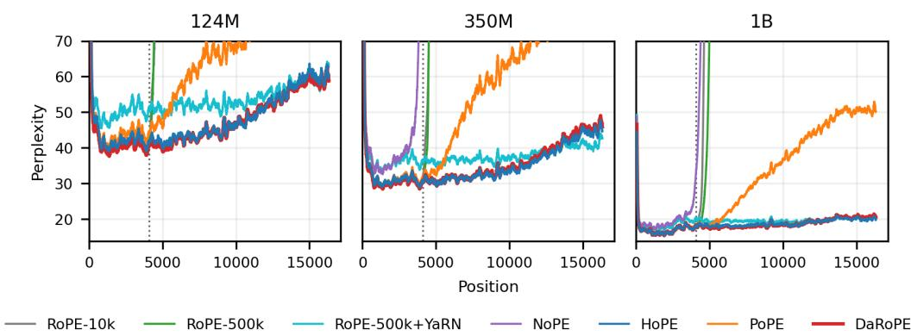  
Figure 1: Language Models from 124M to 1B: In-Domain and Extrapolation Performance. Per-position perplexity on N=256 held-out PG-19 documents. Models train at context 4096 (dotted line) and evaluate to 16k without further training; YaRN is applied to RoPE-500k at inference time. Curves use a 128-token moving average; the y-axis is clipped at perplexity 70 for readability.

## 3 LANGUAGE MODELING FROM 124M TO 50B

In our experiments, we systematically compare RoPE-10k/500k, NoPE, HoPE, PoPE, and DaRoPE;   
CoPE appears only on toy tasks because it does not scale to larger settings (Table 1).

Dense models. Figure 1 reports the perplexity relative to the sequence position for matched decoder-only Transformer at 124M, 350M, and 1B parameters with a 4096 training context, changing only the positional encoding. Using Meta Lingua codebase (Videau et al., 2024), we train the smaller models on FineWeb-Edu (Penedo et al., 2024) and the 1B models on DCLM (Li et al., 2024a). Changing the rotary base is itself a common long-context intervention (Xu et al., 2024a), so we evaluate both RoPE-10k and RoPE-500k; the latter also provides a matched-base control for HoPE and DaRoPE. Architectures, optimization and validation sets are detailed in Appendix A.1.

Within the training window, every trained method that retains a positional signal performs similarly: at 1B over positions 2–4k, these methods cluster at 17.2–17.5 perplexity, whereas removing position entirely with NoPE reaches 21.0. YaRN is different because it rescales frequencies only at inference for the target length; this train–inference shift degrades its in-window perplexity to 19.1. Appendix Table 6 reports the trained-model values on their pretraining distributions.

Extrapolation exposes the slow-band problem directly. Standard RoPE fails once its slow bands reach angles unseen during training; increasing the rotary base moderates this failure but does not solve it. Removing position entirely with NoPE is not a solution, and PoPE also eventually diverges beyond the training window. At 1B over positions 8–16k, HoPE and DaRoPE remain near 19 perplexity, while PoPE rises to 42.9 and RoPE-500k exceeds 450; the other RoPE and NoPE baselines diverge still further. HoPE and DaRoPE are therefore the only trained methods whose perplexity remains stable: preserving the fast-band position clock while removing absolute position from the slow bands keeps their geometry in distribution. Both also match the extrapolation of YaRN with out target-length-dependent inference-time rescaling. NoPE becomes increasingly competitive as model size grows. However, context extrapolation does not come from simply removing positional encodings: NoPE alone fails beyond the training context window. Instead, as HoPE and DaRoPE suggest, extrapolation benefits from combining positional encoding with NoPE.

Scaling to a 50B mixture of experts HoPE and DaRoPE are the only methods that combine strong in-domain quality and length extrapolation, so we scale each to one matched 49.5B-parameter mixture-of-experts model (2.57B active parameters per token). Both train on the same 617B-token mixture at context 4096. More detailed can be found in Appendix B.

Table 2: In-context evaluation of the 50B-parameter MoE models. Higher is better; bold marks the best accuracy in each column.
<table><tr><td></td><td colspan="8">Commonsense and reasoning</td><td colspan="4">Knowledge and language</td><td colspan="3">Math and code</td><td>Overall</td></tr><tr><td>Method</td><td>HSwag</td><td>ARC-e</td><td>ARC-c</td><td>PIQA</td><td>OBQA</td><td>Wino</td><td>CSQA</td><td>COPA</td><td>MMLU</td><td>RACE</td><td>TQA</td><td>BBH</td><td>GSM8K</td><td>HEval</td><td>MBPP</td><td>Avg.</td></tr><tr><td>DaRoPE</td><td>72.9</td><td>72.9</td><td>52.1</td><td>77.5</td><td>43.2</td><td>67.9</td><td>55.1</td><td>85.0</td><td>45.7</td><td>39.9</td><td>55.8</td><td>34.1</td><td>29.9</td><td>37.8</td><td>50.6</td><td>54.7</td></tr><tr><td>HoPE</td><td>73.6</td><td>71.1</td><td>50.8</td><td>78.0</td><td>41.6</td><td>66.1</td><td>56.1</td><td>82.0</td><td>47.2</td><td>40.2</td><td>56.1</td><td>34.3</td><td>29.0</td><td>37.2</td><td>51.6</td><td>54.3</td></tr></table>

Table 3: Long-context evaluation of the 50B MoE models. LongBench (Bai et al., 2024) uses official metrics averaged within category; CrossCodeEval (Ding et al., 2023) and RepoBench (Liu et al., 2024b) report edit similarity, exact match, and answer NLL. Higher is better except for NLL; bold marks the best value in each column. Each method is represented by one trained model.
<table><tr><td></td><td colspan="7">LongBench, english only subset, 32k</td><td colspan="3">CrossCodeEval, 4k</td><td colspan="3">RepoBench, 32k</td></tr><tr><td>Method</td><td>Single QA</td><td>Multi QA</td><td>Sum.</td><td>Synth.</td><td>Code</td><td>Few-shot</td><td>Avg.</td><td>Edit</td><td>EM</td><td>NLL</td><td>Edit</td><td>EM</td><td>NLL</td></tr><tr><td>DaRoPE</td><td>17.4</td><td>21.1</td><td>12.0</td><td>1.8</td><td>57.1</td><td>58.4</td><td>27.7</td><td>60.3</td><td>11.6</td><td>1.82</td><td>62.6</td><td>31.7</td><td>2.90</td></tr><tr><td>HoPE</td><td>17.0</td><td>14.6</td><td>12.5</td><td>3.0</td><td>56.6</td><td>55.9</td><td>26.1</td><td>60.3</td><td>11.4</td><td>1.83</td><td>57.6</td><td>28.6</td><td>3.22</td></tr></table>

We first check that scale does not disturb their in-domain capabilities. The models remain remarkably close on 15 in-context benchmarks: DaRoPE averages 54.7 and HoPE 54.3. DaRoPE leads on seven tasks, HoPE on eight (Table 2). This parity spans commonsense reasoning, knowledge, math, and code. The scores are strong for 2.57B active parameters, though differing prompts make prior-work comparisons approximate (Dai et al., 2024; Jiang et al., 2024).

Long-context tasks separate the two models more clearly, and the separation follows a consistent pattern (Table 3): DaRoPE’s advantage concentrates on tasks that require combining evidence spread across a long, natural input. On LongBench (32k) english only subset, multi-document QA alone accounts for about two thirds of DaRoPE’s 1.6 point average lead (21.1 versus 14.6), while most other categories remain close. Repository-level code completion shows the same effect: on RepoBench, where the relevant code lies in other files of a 32k context, DaRoPE improves every metric (+5.0 edit similarity, +3.1 exact match, -0.32 answer NLL). Conversely, the gap disappears when longrange aggregation is not required. CrossCodeEval, whose 4k inputs fit inside the training window, is tied, consistent with the in-domain parity above; and on controlled synthetic probes (LongBench synthetic, RULER, BABILong), neither method dominates once task-level variance is taken into account (Appendix Figure 6). DaRoPE’s long-context benefit is therefore not a uniform improvement but a specific gain in integrating multi-source evidence beyond the training length, obtained without sacrificing in-domain quality.

Efficiency. The accuracy gains retain RoPE-like deployment cost (Table 1). At context 4096,NoPE reaches 62.4 ktok/s, followed by HoPE at 62.3, RoPE at 61.7, and DaRoPE at 59.8. PoPEfalls to 43.4 because its polar form doubles the query–key width; CoPE reaches only 4.3. PoPE is1.4× and CoPE 13.8× slower than DaRoPE before context grows further.

## HoPE and DaRoPE are the strongest language-modeling defaults

Both preserve in-domain quality, match YaRN’s extrapolation without inference-time rescaling, and perform comparably in context at 50B. DaRoPE achieves higher average scores on LongBench and RepoBench, particularly when evidence is distributed across long contexts. Both also retain RoPE-like throughput, unlike PoPE and CoPE.

## 4 DAROPE RESISTS RECENCY AND INTERFERENCE

Long sequences rarely follow a single uninterrupted thread. Books return to earlier entities after pages of digression; code reuses symbols across distant blocks; and musical, genomic, and neural motifs recur after variable gaps. In each case, the relevant information may lie far away. A model must be able to retrieve by content rather than proximity.

We test this behavior on the matched 1B models (Figure 2). Return-from-digression establishes an early topic–codeword binding, inserts up to 2048 unrelated tokens, then introduces a plausible but incorrect recent binding before querying the original topic. The model succeeds only if it prefers the distant correct codeword over the recent decoy. Key–value recall lists K bindings in random order and queries one randomly positioned key, so distance provides no clue; increasing K tests retrieval as the number of competing values grows. We report correct-answer selection at the output in both tasks. Appendix D gives the full experiment construction.

DaRoPE is the only method that stays strong throughout both stress tests, improving difficulty-grid average accuracy over the strongest competitor by 5.3 percentage points on return-from-digression and 9.6 points on key–value recall as the number of bindings grows. At the hardest settings, it achieves 88.1% accuracy after a 2048-token digression, compared with 77.6% for RoPE-500k, and 30.5% exact selection with 256 bindings, compared with at most 7.25% for any other method.

The layerwise view explains why. We use a logit lens: after each Transformer block, we apply the model’s final normalization and output head to the query representation and measure the NLL margin of the correct answer over its competitor (Appendix D). This diagnostic shows that RoPE-10k recovers the correct answer internally: its decoded margin reaches +2.0 at layer 10. But the signal reverses after layer 16 and finishes at −3.9. DaRoPE instead strengthens the correct answer through the final layers and ends at +6.5. At the final layer, the decoded margin still favors the correct answer on 86% of DaRoPE prompts, versus 78% for RoPE-500k, 51% for PoPE, 22% for RoPE-10k, 17% for HoPE, and 3% for NoPE. The attention maps show the same transition: late-layer attention favors the correct answer on 86% of DaRoPE prompts and only 1% of RoPE-10k prompts. RoPE can find the answer; DaRoPE keeps it available until prediction. The pattern is similar for key– value recall. At K=256, both models retain a positive signal through depth, but DaRoPE builds a much larger final margin (+4.71 versus +2.37 on the diagnostic subset). Appendix Figure 7 extends the attention diagnostic to all methods and controls. Randomly reassigning DaRoPE’s learned coordinates across tokens erases most of both gains, tying them to its data-aware geometry.

These probes isolate a capability that long-form language and motif-heavy sequences demand: recovering distant content without being overwritten by what came last. The language-modeling and following non-text results show that this advantage survives in real data.

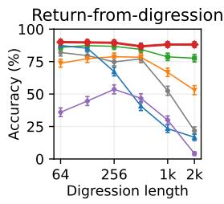

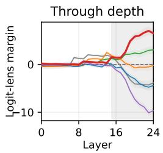

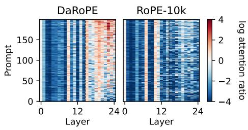

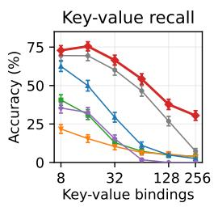

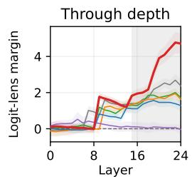

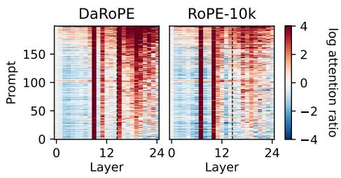  
Figure 2: Retrieval through model depth. Rows: return-from-digression (top) and key–value recall (bottom). (left): accuracy across difficulty (N=800; 95% binomial CIs); return compares the correct answer with the recent decoy, while key–value uses exact top-1 selection. (center): At the hardest difficulty, correct token’s log-probability advantage (N=200; 95% CIs; gray marks the final ten) for each layer through the final normalization and output head. (right): log attention ratio = log[a(correct)/a(competitor)] averaged over all 16 heads; red favors correct and blue the recent decoy (digression) or mean of the other K−1 values (key-value). No head or layer is selected.

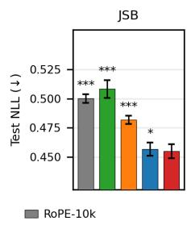

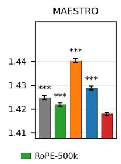

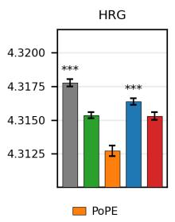

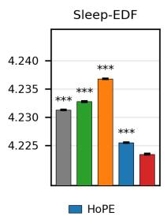

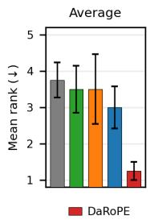  
Figure 3: Test NLL on four non-textual datasets. Bars show means across three seeds; error bars are 95% within-example confidence intervals. The right panel reports mean rank across the four datasets, with standard errors across datasets. Holm-corrected paired tests use test examples across three seeds. Significance is relative to DaRoPE: $* p < 0 . 0 5$ , ∗∗ $p < 0 . 0 1 , * * * p < 0 . 0 0 1$ Test sizes are N=77 (JSB), 639 (MAESTRO), 8399 (HRG), and 57,782 (Sleep-EDF). NoPE is off-axis: 1.1634, 1.5075, 4.3494, and 4.4320, respectively.

## DaRoPE mitigates recency bias and preserves retrieval under interference

DaRoPE keeps relevant evidence accessible as distance and interference grow, limiting latelayer drift toward recent decoys and preserving accuracy through prediction.

## 5 BEYOND LANGUAGE

Music, genomics, and EEG Having established the advantage of HoPE and DaRoPE for language modeling, we ask whether it extends beyond language. We test the same positional choices on JSB Chorales and MAESTRO symbolic music, the human reference genome (HRG), and Sleep-EDF EEG. Within each domain, every method uses the same architecture, data order, and token budget, with three training seeds. We tune the shared model and optimizer with RoPE-10k. Appendix C gives preprocessing, architectures, optimization, and evaluation details.

DaRoPE improves over HoPE on all four datasets: 0.4547 versus 0.4567 on JSB,1.4180 versus 1.4289 on MAESTRO, 4.3153 versus 4.3164 on HRG, and 4.2235 versus 4.2255 on Sleep-EDF (Figure 3). It also systematically beats RoPE-10k. On the two shared music benchmarks, DaRoPE also improves on the test NLL reported for PoPE in its original paper (Gopalakrishnan et al., 2026); the corrected HRG evaluation is discussed in Appendix C.1. NoPE confirms that removing position altogether is not enough, while HoPE shows that simply removing the slow-band clock does not always beat RoPE, as on MAESTRO and HRG. PoPE reaches the lowest HRG NLL (4.3127), but is much slower: on eight V100s, each PoPE run required 38.9 hours of training on average, versus 11.8 hours for DaRoPE. DaRoPE leads JSB, MAESTRO, and Sleep-EDF and has the best average rank across all four datasets.

These domains share a useful structure: musical phrases, genomic motifs, and EEG rhythms recur at variable distances. HoPE removes the slow-band distance prior; DaRoPE goes further and uses those bands to bring related content together. Its consistent gain over HoPE shows that the learned coordinate transfers beyond text.

## DaRoPE is the strongest overall non-text default

DaRoPE leads three of four datasets, improves over HoPE on all four, and retains RoPE cost.   
No other method combines that accuracy and efficiency across non-textual modalities.

## 5.1 TOY TASKS

To isolate the capabilities supported by each positional encoding, we evaluate all methods on a suite of synthetic tasks. The suite includes tasks spanning the language classes of the Chomsky hierarchy, following Deletang et al.´ (2023), as well as five additional tasks designed to probe finegrained relative representations and data-aware position. Task definitions are given in Section E.1. For each combination of task and positional encoding, we train a four-layer Transformer decoder with a model dimension of 256 on sequences of length 256. For each task, we measure token-level accuracy rather than exact-match accuracy, as exact match can obscure trends by disproportionately penalizing longer outputs. Results use three seeds.

Figure 4 reports chance-normalized in-domain accuracy averaged across all 15 tasks. CoPE, HoPE, DaRoPE, and RoPE form the strongest aggregate group, while PoPE and NoPE trail overall. The aggregate nevertheless hides complementary task profiles: PoPE is strongest on the Chomskyhierarchy tasks but weaker on retrieval and positional probes, whereas NoPE particularly struggles when the answer requires position. Per-task results and evaluations beyond the training length are reported in Section E.

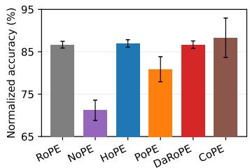  
Figure 4: In-domain accuracy. Mean over 15 tasks; propagated seed SD.

## 6 RELATED WORK

Positional representations and distance biases. Transformers first encoded order with absolute sinusoidal or learned embeddings (Vaswani et al., 2017; Radford et al., 2018; Brown et al., 2020). Relative schemes encode pairwise offsets (Shaw et al., 2018; Dai et al., 2019; Raffel et al., 2020), while RoPE rotates queries and keys according to token index (Su et al., 2024). ALiBi, KER-PLE, and FIRE add distance-dependent biases, whereas xPos adds distance-dependent scaling (Press et al., 2022; Chi et al., 2022; Li et al., 2024b; Sun et al., 2023). All derive positional geometry from token indices or offsets.

Length extension and rotary frequencies. Length-generalization methods broaden training positions through randomization or positional skip-wise training (Ruoss et al., 2023; Zhu et al., 2024), remap coordinates or frequencies as in positional interpolation, YaRN, CLEX, and LongRoPE (Chen et al., 2023; Peng et al., 2024; Chen et al., 2024; Ding et al., 2024), or target periodic extension directly as in Resonance RoPE and FoPE (Wang et al., 2024b; Hua et al., 2025). Extrapolation also depends on the rotary base, numerical precision, and frequency allocation (Xu et al., 2024a; Wang et al., 2025; Barbero et al., 2025). These approaches improve index-based position; our work asks which bands should encode token index at all.

Removing or learning positional geometry. NoPE shows that causal Transformers can infer order without explicit position (Haviv et al., 2022; Kazemnejad et al., 2023; Irie, 2025); related methods remove RoPE after training or leave selected low-frequency dimensions unrotated (Gelberg et al., 2026; Yang et al., 2025a; Barbero et al., 2025; Chen et al., 2025). Data-aware methods derive distances from content (CoPE), adapt biases (DAPE and GAPE), accumulate transformations (PaTH), or learn input-dependent rotations (CARoPE and Selective RoPE) (Golovneva et al., 2024; Zheng et al., 2024; Ali et al., 2026; Yang et al., 2025b; Veisi et al., 2025; Movahedi et al., 2026). PoPE instead separates content magnitude from positional phase (Gopalakrishnan et al., 2026). DaRoPE targets only the slow bands: they become an interpretable learned reordering, while fast-band RoPE preserves token order at essentially RoPE cost.

## 7 CONCLUSION

RoPE’s slow bands need not remain an absolute clock. DaRoPE replaces them with bounded, perhead content coordinates while preserving exact fast-band RoPE. Across our evaluations, it matches HoPE on language modeling, retains in-domain quality, extrapolates without inference-time rescaling, runs at near-RoPE cost, leads on non-textual tasks, and reduces recency bias and retrieval interference. Other content axes, band allocations, and long-context fine-tuning remain open. Overall, retain RoPE’s fast positional structure, but let its slow bands adapt to the data.

## AI USE STATEMENT

Generative AI tools assisted implementation, debugging, data reformatting, figures, code, and manuscript editing. The authors reviewed all assisted outputs, checked reported results against the underlying runs and data, and take responsibility for the final content.

## REFERENCES

Riccardo Ali, Alessio Borgi, Christopher Irwin, Mario Severino, and Pietro Lio. Remember to\` forget: Gated adaptive positional encoding. preprint arXiv:2605.10414, 2026.

Jacob Austin, Augustus Odena, Maxwell Nye, Maarten Bosma, Henryk Michalewski, David Dohan, Ellen Jiang, Carrie Cai, Michael Terry, Quoc Le, and Charles Sutton. Program synthesis with large language models. preprint arXiv:2108.07732, 2021.

Yushi Bai, Xin Lv, Jiajie Zhang, Hongchang Lyu, Jiankai Tang, Zhidian Huang, Zhengxiao Du, Xiao Liu, Aohan Zeng, Lei Hou, Yuxiao Dong, Jie Tang, and Juanzi Li. LongBench: A bilingual, multitask benchmark for long context understanding. In Proceedings of the 62nd Annual Meeting of the Association for Computational Linguistics (ACL), 2024.

Federico Barbero, Alex Vitvitskyi, Christos Perivolaropoulos, Razvan Pascanu, and Petar Velickovi ˇ c. Round and round we go! What makes Rotary Positional Encodings useful? In´ International Conference on Learning Representations (ICLR), 2025.

Yonatan Bisk, Rowan Zellers, Ronan Le Bras, Jianfeng Gao, and Yejin Choi. PIQA: Reasoning about physical commonsense in natural language. In Proceedings of the AAAI Conference on Artificial Intelligence (AAAI), 2020.

Nicolas Boulanger-Lewandowski, Yoshua Bengio, and Pascal Vincent. Modeling temporal dependencies in high-dimensional sequences: Application to polyphonic music generation and transcription. In International Conference on Machine Learning (ICML), 2012.

Tom B. Brown, Benjamin Mann, Nick Ryder, Melanie Subbiah, Jared Kaplan, Prafulla Dhariwal, Arvind Neelakantan, Pranav Shyam, Girish Sastry, Amanda Askell, et al. Language models are few-shot learners. In Advances in Neural Information Processing Systems (NeurIPS), 2020.

Guanzheng Chen, Xin Li, Zaiqiao Meng, Shangsong Liang, and Lidong Bing. CLEX: Continuous length extrapolation for large language models. In International Conference on Learning Representations (ICLR), 2024.

Mark Chen, Jerry Tworek, Heewoo Jun, Qiming Yuan, Henrique Ponde de Oliveira Pinto, Jared Kaplan, Harri Edwards, Yuri Burda, Nicholas Joseph, Greg Brockman, et al. Evaluating large language models trained on code. preprint arXiv:2107.03374, 2021.

Shouyuan Chen, Sherman Wong, Liangjian Chen, and Yuandong Tian. Extending context window of large language models via positional interpolation. preprint arXiv:2306.15595, 2023.

Yuhan Chen, Ang Lv, Jian Luan, Bin Wang, and Wei Liu. HoPE: A novel positional encoding without long-term decay for enhanced context awareness and extrapolation. In Proceedings ofthe 63rd Annual Meeting of the Association for Computational Linguistics (ACL), 2025.

Ta-Chung Chi, Ting-Han Fan, Peter J. Ramadge, and Alexander I. Rudnicky. KERPLE: Kernelized relative positional embedding for length extrapolation. In Advances in Neural Information Processing Systems (NeurIPS), 2022.

Aakanksha Chowdhery, Sharan Narang, Jacob Devlin, Maarten Bosma, Gaurav Mishra, Adam Roberts, Paul Barham, Hyung Won Chung, Charles Sutton, Sebastian Gehrmann, et al. PaLM: Scaling language modeling with pathways. Journal of Machine Learning Research, 24(240): 1–113, 2023.

Peter Clark, Isaac Cowhey, Oren Etzioni, Tushar Khot, Ashish Sabharwal, Carissa Schoenick, and Oyvind Tafjord. Think you have solved question answering? Try ARC, the AI2 reasoning challenge. preprint arXiv:1803.05457, 2018.

Karl Cobbe, Vineet Kosaraju, Mohammad Bavarian, Mark Chen, Heewoo Jun, Lukasz Kaiser, Matthias Plappert, Jerry Tworek, Jacob Hilton, Reiichiro Nakano, Christopher Hesse, and John Schulman. Training verifiers to solve math word problems. preprint arXiv:2110.14168, 2021.

Damai Dai, Chengqi Deng, Chenggang Zhao, R. X. Xu, Huazuo Gao, Deli Chen, Jiashi Li, Wangding Zeng, Xingkai Yu, Y. Wu, Zhenda Xie, Y. K. Li, Panpan Huang, Fuli Luo, Chong Ruan, Zhifang Sui, and Wenfeng Liang. DeepSeekMoE: Towards ultimate expert specialization in mixture-of-experts language models. In Proceedings ofthe 62nd Annual Meeting ofthe Associationfor Computational Linguistics (ACL), pp. 1280–1297, 2024.

Zihang Dai, Zhilin Yang, Yiming Yang, Jaime Carbonell, Quoc V. Le, and Ruslan Salakhutdinov. Transformer-XL: Attentive language models beyond a fixed-length context. In Proceedings ofthe 57th Annual Meeting ofthe Associationfor Computational Linguistics (ACL), 2019.

Hugo Dalla-Torre, Liam Gonzalez, Javier Mendoza-Revilla, Nicolas Lopez Carranza, Adam Henryk Grzywaczewski, Francesco Oteri, Christian Dallago, Evan Trop, Bernardo P. de Almeida, Hassan Sirelkhatim, Guillaume Richard, Marcin Skwark, Karim Beguir, Marie Lopez, and Thomas Pierrot. Nucleotide Transformer: building and evaluating robust foundation models for human genomics. Nature Methods, 22(2):287–297, 2025.

Tri Dao, Daniel Y. Fu, Stefano Ermon, Atri Rudra, and Christopher Re. FlashAttention: Fast and´ memory-efficient exact attention with IO-awareness. In Advances in Neural Information Processing Systems (NeurIPS), 2022.

DeepSeek-AI, Aixin Liu, Bei Feng, Bing Xue, Bingxuan Wang, Bochao Wu, Chengda Lu, Chenggang Zhao, Chengqi Deng, Chenyu Zhang, Chong Ruan, et al. DeepSeek-V3 technical report. preprint arXiv:2412.19437, 2024.

Gregoire Del´ etang, Anian Ruoss, Jordi Grau-Moya, Tim Genewein, Li Kevin Wenliang, Elliot Catt,´ Chris Cundy, Marcus Hutter, Shane Legg, Joel Veness, and Pedro A. Ortega. Neural networks and the Chomsky hierarchy. In International Conference on Learning Representations (ICLR), 2023.

Nai Ding, Lucia Melloni, Hang Zhang, Xing Tian, and David Poeppel. Cortical tracking of hierarchical linguistic structures in connected speech. Nature Neuroscience, 19(1):158–164, 2016.

Yangruibo Ding, Zijian Wang, Wasi Uddin Ahmad, Hantian Ding, Ming Tan, Nihal Jain, Murali Krishna Ramanathan, Ramesh Nallapati, Parminder Bhatia, Dan Roth, and Bing Xiang. Cross-CodeEval: A diverse and multilingual benchmark for cross-file code completion. In Advances in Neural Information Processing Systems (NeurIPS), Datasets and Benchmarks Track, 2023.

Yiran Ding, Li Lyna Zhang, Chengruidong Zhang, Yuanyuan Xu, Ning Shang, Jiahang Xu, Fan Yang, and Mao Yang. LongRoPE: Extending LLM context window beyond 2 million tokens. In International Conference on Machine Learning (ICML), 2024.

Tianyu Gao, Alexander Wettig, Howard Yen, and Danqi Chen. How to train long-context language models (effectively). In Proceedings of the 63rd Annual Meeting of the Association for Computational Linguistics (ACL), 2025.

Yoav Gelberg, Koshi Eguchi, Takuya Akiba, and Edoardo Cetin. Extending the context of pretrained LLMs by dropping their positional embedding. In International Conference on Learning Representations (ICLR), 2026.

Olga Golovneva, Tianlu Wang, Jason Weston, and Sainbayar Sukhbaatar. Contextual position encoding: Learning to count what’s important. preprint arXiv:2405.18719, 2024.

Anand Gopalakrishnan, Robert Csord ´ as, J ´ urgen Schmidhuber, and Michael C. Mozer. Decoupling¨ the “what” and “where” with polar coordinate positional embeddings. In International Conference on Machine Learning (ICML), 2026.

Andrew S. Gordon, Zornitsa Kozareva, and Melissa Roemmele. SemEval-2012 task 7: Choice of plausible alternatives: An evaluation of commonsense causal reasoning. In Proceedings of the Sixth International Workshop on Semantic Evaluation, 2012.

Adi Haviv, Ori Ram, Ofir Press, Peter Izsak, and Omer Levy. Transformer language models without positional encodings still learn positional information. In Findings of the Association for Computational Linguistics: EMNLP 2022, 2022.

Curtis Hawthorne, Andriy Stasyuk, Adam Roberts, Ian Simon, Cheng-Zhi Anna Huang, Sander Dieleman, Erich Elsen, Jesse Engel, and Douglas Eck. Enabling factorized piano music modeling and generation with the MAESTRO dataset. In International Conference on Learning Representations (ICLR), 2019.

Dan Hendrycks, Collin Burns, Steven Basart, Andy Zou, Mantas Mazeika, Dawn Song, and Jacob Steinhardt. Measuring massive multitask language understanding. In International Conference on Learning Representations (ICLR), 2021.

Byeongho Heo, Song Park, Dongyoon Han, and Sangdoo Yun. Rotary position embedding for vision transformer. In European Conference on Computer Vision (ECCV), pp. 289–305, 2024.

John Hewitt and Christopher D. Manning. A structural probe for finding syntax in word representations. In Proceedings of the 2019 Conference of the North American Chapter of the Association for Computational Linguistics (NAACL). Association for Computational Linguistics, 2019.

Cheng-Ping Hsieh, Simeng Sun, Samuel Kriman, Shantanu Acharya, Dima Rekesh, Fei Jia, and Boris Ginsburg. RULER: What’s the real context size of your long-context language models? In First Conference on Language Modeling (COLM), 2024.

Ermo Hua, Che Jiang, Xingtai Lv, Kaiyan Zhang, Youbang Sun, Yuchen Fan, Xuekai Zhu, Biqing Qi, Ning Ding, and Bowen Zhou. Fourier position embedding: Enhancing attention’s periodic extension for length generalization. In International Conference on Machine Learning (ICML), 2025.

Cheng-Zhi Anna Huang, Ashish Vaswani, Jakob Uszkoreit, Noam Shazeer, Ian Simon, Curtis Hawthorne, Andrew M. Dai, Matthew D. Hoffman, Monica Dinculescu, and Douglas Eck. Music Transformer: Generating music with long-term structure. In International Conference on Learning Representations (ICLR), 2019.

Yu-Siang Huang and Yi-Hsuan Yang. Pop music Transformer: Beat-based modeling and generation of expressive pop piano compositions. In Proceedings of the 28th ACM International Conference on Multimedia (ACM MM), pp. 1180–1188, 2020.

Alexander G. Huth, Wendy A. de Heer, Thomas L. Griffiths, Fred´ eric E. Theunissen, and Jack L.´ Gallant. Natural speech reveals the semantic maps that tile human cerebral cortex. Nature, 532 (7600):453–458, 2016.

Kazuki Irie. Why are positional encodings nonessential for deep autoregressive transformers? A Petroglyph Revisited. In Findings of the Association for Computational Linguistics: ACL 2025, 2025.

Yanrong Ji, Zhihan Zhou, Han Liu, and Ramana V. Davuluri. DNABERT: pre-trained bidirectional encoder representations from transformers model for DNA-language in genome. Bioinformatics, 37(15):2112–2120, 2021.

Albert Q. Jiang, Alexandre Sablayrolles, Arthur Mensch, Chris Bamford, Devendra Singh Chaplot, Diego de las Casas, Florian Bressand, Gianna Lengyel, Guillaume Lample, Lucile Saulnier, et al. Mistral 7B. preprint arXiv:2310.06825, 2023.

Albert Q. Jiang, Alexandre Sablayrolles, Antoine Roux, Arthur Mensch, Blanche Savary, Chris Bamford, Devendra Singh Chaplot, Diego de las Casas, Emma Bou Hanna, Florian Bressand, Gianna Lengyel, Guillaume Bour, Guillaume Lample, Lelio Renard Lavaud, Lucile Saulnier,´ Marie-Anne Lachaux, Pierre Stock, Sandeep Subramanian, Sophia Yang, Szymon Antoniak, Teven Le Scao, Theophile Gervet, Thibaut Lavril, Thomas Wang, Timoth´ ee Lacroix, and William´ El Sayed. Mixtral of experts. preprint arXiv:2401.04088, 2024.

Mandar Joshi, Eunsol Choi, Daniel S. Weld, and Luke Zettlemoyer. TriviaQA: A large scale distantly supervised challenge dataset for reading comprehension. In Proceedings ofthe 55th Annual Meeting ofthe Associationfor Computational Linguistics (ACL), 2017.

Amirhossein Kazemnejad, Inkit Padhi, Karthikeyan Natesan Ramamurthy, Payel Das, and Siva Reddy. The impact of positional encoding on length generalization in transformers. In Advances in Neural Information Processing Systems (NeurIPS), 2023.

Bob Kemp, Aeilko H. Zwinderman, Bert Tuk, Hilbert A. C. Kamphuisen, and Josefien J. L. Oberye.´ Analysis of a sleep-dependent neuronal feedback loop: the slow-wave microcontinuity of the EEG. IEEE Transactions on Biomedical Engineering, 47(9):1185–1194, 2000.

Yuri Kuratov, Aydar Bulatov, Petr Anokhin, Ivan Rodkin, Dmitry Sorokin, Artyom Sorokin, and Mikhail Burtsev. BABILong: Testing the limits of LLMs with long context reasoning-in-ahaystack. In Advances in Neural Information Processing Systems (NeurIPS), Datasets and Bench marks Track, 2024.

Guokun Lai, Qizhe Xie, Hanxiao Liu, Yiming Yang, and Eduard Hovy. RACE: Large-scale ReAding comprehension dataset from examinations. In Proceedings of the 2017 Conference on Empirical Methods in Natural Language Processing (EMNLP), 2017.

Jeffrey Li, Alex Fang, Georgios Smyrnis, Maor Ivgi, Matt Jordan, Samir Gadre, et al. DataComp-LM: In search of the next generation of training sets for language models. In Advances in Neural Information Processing Systems (NeurIPS), Datasets and Benchmarks Track, 2024a.

Shanda Li, Chong You, Guru Guruganesh, Joshua Ainslie, Santiago Ontanon, Manzil Zaheer, Sumit Sanghai, Yiming Yang, Sanjiv Kumar, and Srinadh Bhojanapalli. Functional interpolation for relative positions improves long context transformers. In International Conference on Learning Representations (ICLR), 2024b.

Nelson F. Liu, Kevin Lin, John Hewitt, Ashwin Paranjape, Michele Bevilacqua, Fabio Petroni, and Percy Liang. Lost in the middle: How language models use long contexts. Transactions of the Associationfor Computational Linguistics (TACL), 12:157–173, 2024a.

Tianyang Liu, Canwen Xu, and Julian McAuley. RepoBench: Benchmarking repository-level code auto-completion systems. In International Conference on Learning Representations (ICLR), 2024b.

Yong Liu, Guo Qin, Xiangdong Huang, Jianmin Wang, and Mingsheng Long. Timer-XL: Longcontext transformers for unified time series forecasting. In International Conference on Learning Representations (ICLR), 2025.

Todor Mihaylov, Peter Clark, Tushar Khot, and Ashish Sabharwal. Can a suit of armor conduct electricity? A new dataset for open book question answering. In Proceedings ofthe 2018 Conference on Empirical Methods in Natural Language Processing (EMNLP), 2018.

Sajad Movahedi, Timur Carstensen, Arshia Afzal, Frank Hutter, Antonio Orvieto, and Volkan Cevher. Selective rotary position embedding. In International Conference on Learning Representations (ICLR), 2026.

Eric Nguyen, Michael Poli, Marjan Faizi, Armin W. Thomas, Callum Birch Sykes, Michael Wornow, Aman Patel, Clayton Rabideau, Stefano Massaroli, Yoshua Bengio, Stefano Ermon, Stephen A. Baccus, and Christopher Re. HyenaDNA: Long-range genomic sequence modeling at single´ nucleotide resolution. In Advances in Neural Information Processing Systems (NeurIPS), 2023.

Guilherme Penedo, Hynek Kydl´ıcek, Loubna Ben Allal, Anton Lozhkov, Margaret Mitchell, Colinˇ Raffel, Leandro Von Werra, and Thomas Wolf. The FineWeb datasets: Decanting the web for the finest text data at scale. In Advances in Neural Information Processing Systems (NeurIPS), Datasets and Benchmarks Track, 2024.

Bowen Peng, Jeffrey Quesnelle, Honglu Fan, and Enrico Shippole. YaRN: Efficient context window extension of large language models. In International Conference on Learning Representations (ICLR), 2024.

Tom Pollard, Benjamin E. Moody, Li-wei H. Lehman, Brian J. Gow, Chrystinne Fernandes, Chen Xie, Alistair Johnson, Roger G. Mark, and Thomas Heldt. PhysioNet as a global platform for biomedical research. Nature Health, 1(8):792–795, 2026.

Ofir Press, Noah A. Smith, and Mike Lewis. Train short, test long: Attention with linear biases enables input length extrapolation. In International Conference on Learning Representations (ICLR), 2022.

Alec Radford, Karthik Narasimhan, Tim Salimans, and Ilya Sutskever. Improving language understanding by generative pre-training. Technical report, OpenAI, 2018.

Jack W. Rae, Anna Potapenko, Siddhant M. Jayakumar, Chloe Hillier, and Timothy P. Lillicrap. Compressive transformers for long-range sequence modelling. In International Conference on Learning Representations (ICLR), 2020.

Colin Raffel, Noam Shazeer, Adam Roberts, Katherine Lee, Sharan Narang, Michael Matena, Yanqi Zhou, Wei Li, and Peter J. Liu. Exploring the limits of transfer learning with a unified text-to-text transformer. Journal ofMachine Learning Research, 21(140):1–67, 2020.

Anian Ruoss, Gregoire Del´ etang, Tim Genewein, Jordi Grau-Moya, R´ obert Csord´ as, Mehdi Ben-´ nani, Shane Legg, and Joel Veness. Randomized positional encodings boost length generalization of transformers. In Proceedings ofthe 61st Annual Meeting ofthe Associationfor Computational Linguistics (ACL), 2023.

Keisuke Sakaguchi, Ronan Le Bras, Chandra Bhagavatula, and Yejin Choi. WinoGrande: An adversarial Winograd schema challenge at scale. In Proceedings of the AAAI Conference on Artificial Intelligence (AAAI), 2020.

Valerie A. Schneider, Tina Graves-Lindsay, Kerstin Howe, Nathan Bouk, Hsiu-Chuan Chen, Paul A. Kitts, Terence D. Murphy, Kim D. Pruitt, Franc¸oise Thibaud-Nissen, Derek Albracht, et al. Evaluation of GRCh38 and de novo haploid genome assemblies demonstrates the enduring quality of the reference assembly. Genome Research, 27(5):849–864, 2017.

Peter Shaw, Jakob Uszkoreit, and Ashish Vaswani. Self-attention with relative position representations. In Proceedings of the 2018 Conference of the North American Chapter of the Association for Computational Linguistics (NAACL), 2018.

Jianlin Su, Murtadha Ahmed, Yu Lu, Shengfeng Pan, Wen Bo, and Yunfeng Liu. RoFormer: Enhanced transformer with rotary position embedding. Neurocomputing, 568:127063, 2024.

Yutao Sun, Li Dong, Barun Patra, Shuming Ma, Shaohan Huang, Alon Benhaim, Vishrav Chaudhary, Xia Song, and Furu Wei. A length-extrapolatable transformer. In Proceedings of the 61st Annual Meeting ofthe Associationfor Computational Linguistics (ACL), 2023.

Mirac Suzgun, Nathan Scales, Nathanael Scharli, Sebastian Gehrmann, Yi Tay, Hyung Won Chung,¨ Aakanksha Chowdhery, Quoc V. Le, Ed H. Chi, Denny Zhou, and Jason Wei. Challenging BIG-Bench tasks and whether chain-of-thought can solve them. In Findings of the Association for Computational Linguistics: ACL 2023, 2023.

Alon Talmor, Jonathan Herzig, Nicholas Lourie, and Jonathan Berant. CommonsenseQA: A question answering challenge targeting commonsense knowledge. In Proceedings of the 2019 Conference of the North American Chapter of the Association for Computational Linguistics (NAACL), 2019.

Hugo Touvron, Thibaut Lavril, Gautier Izacard, Xavier Martinet, Marie-Anne Lachaux, Timothee´ Lacroix, Baptiste Roziere, Naman Goyal, Eric Hambro, Faisal Azhar, Aurelien Rodriguez, Ar-\` mand Joulin, Edouard Grave, and Guillaume Lample. LLaMA: Open and efficient foundation language models. preprint arXiv:2302.13971, 2023.

Ashish Vaswani, Noam Shazeer, Niki Parmar, Jakob Uszkoreit, Llion Jones, Aidan N. Gomez, Łukasz Kaiser, and Illia Polosukhin. Attention is all you need. In Advances in Neural Information Processing Systems (NeurIPS), 2017.

Ali Veisi, Delaram Fartoot, and Hamidreza Amirzadeh. Context-aware rotary position embedding. preprint arXiv:2507.23083, 2025.

Mathurin Videau, Badr Youbi Idrissi, Daniel Haziza, Luca Wehrstedt, Jade Copet, Olivier Teytaud, and David Lopez-Paz. Meta Lingua: A minimal PyTorch LLM training library. https:// github.com/facebookresearch/lingua, 2024.

Haonan Wang, Qian Liu, Chao Du, Tongyao Zhu, Cunxiao Du, Kenji Kawaguchi, and Tianyu Pang. When precision meets position: BFloat16 breaks down RoPE in long-context training. Transactions on Machine Learning Research (TMLR), 2025.

Lean Wang, Huazuo Gao, Chenggang Zhao, Xu Sun, and Damai Dai. Auxiliary-loss-free load balancing strategy for mixture-of-experts. preprint arXiv:2408.15664, 2024a.

Suyuchen Wang, Ivan Kobyzev, Peng Lu, Mehdi Rezagholizadeh, and Bang Liu. Resonance RoPE: Improving context length generalization of large language models. In Findings of the Association for Computational Linguistics: ACL 2024, 2024b.

Mingyu Xu, Xin Men, Bingning Wang, Qingyu Zhang, Hongyu Lin, Yaojie Lu, Xianpei Han, and Weipeng Chen. Base of RoPE bounds context length. In Advances in Neural Information Processing Systems (NeurIPS), volume 37, pp. 87386–87410, 2024a.

Xiaoyue Xu, Qinyuan Ye, and Xiang Ren. Stress-testing long-context language models with lifelong ICL and task haystack. In Advances in Neural Information Processing Systems (NeurIPS), Datasets and Benchmarks Track, 2024b.

Bowen Yang, Bharat Venkitesh, Dwaraknath Gnaneshwar Talupuru, Hangyu Lin, David Cairuz, Phil Blunsom, and Acyr Locatelli. Rope to Nope and back again: A new hybrid attention strategy. In Advances in Neural Information Processing Systems (NeurIPS), 2025a.

Songlin Yang, Yikang Shen, Kaiyue Wen, Shawn Tan, Mayank Mishra, Liliang Ren, Rameswar Panda, and Yoon Kim. PaTH attention: Position encoding via accumulating Householder transformations. In Advances in Neural Information Processing Systems (NeurIPS), 2025b.

Rowan Zellers, Ari Holtzman, Yonatan Bisk, Ali Farhadi, and Yejin Choi. HellaSwag: Can a machine really finish your sentence? In Proceedings of the 57th Annual Meeting of the Association for Computational Linguistics (ACL), 2019.

Biao Zhang and Rico Sennrich. Root mean square layer normalization. In Advances in Neural Information Processing Systems (NeurIPS), 2019.

Chuanyang Zheng, Yihang Gao, Han Shi, Minbin Huang, Jingyao Li, Jing Xiong, Xiaozhe Ren, Michael Ng, Xin Jiang, Zhenguo Li, and Yu Li. DAPE: Data-adaptive positional encoding for length extrapolation. In Advances in Neural Information Processing Systems (NeurIPS), 2024.

Dawei Zhu, Nan Yang, Liang Wang, Yifan Song, Wenhao Wu, Furu Wei, and Sujian Li. PoSE: Efficient context window extension of LLMs via positional skip-wise training. In International Conference on Learning Representations (ICLR), 2024.

Table 4: Per-scale language-model architecture and training. Head dimension is $d _ { \mathrm { { m o d e l } } } / n _ { \mathrm { { h e a d s } } } ;$ the wavelength split $\theta _ { j } < 2 \pi / L$ yields $K = d / 4$ fast bands at θ=500k, L=4096.
<table><tr><td></td><td>124M</td><td>350M</td><td>1B</td></tr><tr><td> $d _ { \mathrm { m o d e l } }$ </td><td>768</td><td>1024</td><td>2048</td></tr><tr><td>layers</td><td>12</td><td>24</td><td>25</td></tr><tr><td>heads</td><td>12</td><td>16</td><td>16</td></tr><tr><td>head dim d</td><td>64</td><td>64</td><td>128</td></tr><tr><td>fast bands  $K = d / 4$ </td><td>16</td><td>16</td><td>32</td></tr><tr><td>context L</td><td>4096</td><td>4096</td><td>4096</td></tr><tr><td>weight tying</td><td>yes</td><td>yes</td><td>no</td></tr><tr><td>peak LR</td><td>3e-3</td><td>2e-3</td><td>2e-3</td></tr><tr><td>LR warmup (steps)</td><td>2000</td><td>2000</td><td>5000</td></tr><tr><td>min-LR</td><td>1e-6</td><td>1e-6</td><td>1e-6</td></tr><tr><td>steps</td><td>76k</td><td>152.6k</td><td>152.6k</td></tr><tr><td>tokens/step</td><td>~262k</td><td>~131k</td><td>~131k</td></tr><tr><td>pretraining data</td><td>FineWeb-Edu</td><td>FineWeb-Edu</td><td>DCLM</td></tr></table>

## A DENSE LANGUAGE-MODEL DETAILS

This section gives the dense-model architecture, optimization, in-domain evaluation, length extrapolation protocol, and the formulation ablation referenced in the main paper.

## A.1 DENSE-MODEL ARCHITECTURE AND EVALUATION

All three scales use the Lingua decoder block, a 4096-token context and the cl100k tiktoken tokenizer with BOS/EOS. Weights are tied at 124M/350M and untied at 1B. Optimization is AdamW (weight decay 0.1, gradient clip 1.0) with a linear warmup followed by cosine decay. Training uses bf16 with torch.compile, TF32 matmuls disabled, and FSDP (no shard) across 8×A100-80GB GPUs. Comparisons are made within scale only: 124M/350M train on FineWeb-Edu 10BT (Penedo et al., 2024) and 1B on DCLM (Li et al., 2024a). The rotary base is θ = 500k for every method except RoPE-10k and PoPE, which use $\theta \ : = \ : 1 0 \mathbf { k }$ . Table 4 gives the per-scale architecture and optimization.

In-domain perplexity. Validation perplexity is computed at the training length on a held-out split of the pretraining distribution – FineWeb-Edu at 124M/350M (1.94M tokens) and DCLM at 1B (4.01M tokens) – from the final checkpoint of each run, with every encoding scoring the identical token stream.

Length behaviour. Figure 1 is computed on PG-19 (Rae et al., 2020). We stream the corpus, keep the first 256 documents with at least 16385 tokens, truncate each to that length and score the first 16384 positions in a single forward pass – no sliding window, no chunking, no fine-tuning and no positional interpolation. The weights are untouched. The value plotted at a position is the mean next-token NLL over the 256 documents, exponentiated, then smoothed with a 128-token moving average. Perplexities quoted in the text average positions 2–4k in window (skipping the first few hundred tokens, where every curve is high) and 8–16k beyond it. YaRN is the single exception to the no-test-time-change rule: following Peng et al. (2024) we apply the NTK-by-parts frequency rescaling to the RoPE-500k checkpoint at inference, with extension factor $s = \bar { 1 } \bar { 6 3 } 8 4 / 4 0 9 \bar { 6 } = \bar { 4 }$ and use default hyperparameters.

## A.2 DAROPE SPECIFICS

The content projection $w _ { h }$ is initialized with standard deviation 0.1 and the positional-prior scalar $\alpha _ { h }$ with 0.5; both are then learned. These two initialization values were chosen by a small hyperparameter search at the 124M scale and reused unchanged at 350M and 1B. The only added parameters are $w _ { h } \ ( d _ { \mathrm { m o d e l } } )$ and $\alpha _ { h }$ (1) per head, i.e. $n _ { \mathrm { h e a d s } } \cdot ( d _ { \mathrm { m o d e l } } { + } 1 )$ per layer – under 0.1% of model parameters at every scale. The fast/slow split uses the wavelength criterion $\theta _ { j } < 2 \pi / L$ of Chen et al. (2025).

<table><tr><td>Variant</td><td>In-domain NLL ↓</td><td>8-16k NLL ↓</td></tr><tr><td>DaRoPE (per-head α)</td><td>2.9447</td><td>3.957</td></tr><tr><td>Noβ</td><td>2.9420</td><td>4.066</td></tr><tr><td>Fixed α</td><td>2.9437</td><td>4.449</td></tr><tr><td>Per-band α</td><td>2.9439</td><td>4.815</td></tr><tr><td>Dynamic α</td><td>2.9451</td><td>4.281</td></tr></table>

Table 5: DaRoPE formulation ablation at 124M. One training seed; held-out in-domain and 8– 16k NLL, lower is better.

For the language models at θ=500k, L=4096 this falls at the midpoint (half fast, half slow); the same criterion applied to the shorter music/genomic contexts moves the split accordingly (a larger slow fraction at L=1000).

Formulation selection. We compare five formulations at 124M: the canonical per-head $\alpha _ { h } .$ , no positional prior, fixed α=0.5, per-band α, and token-dependent α. Each variant uses one training seed and the final checkpoint; learned content projections are initialized with standard deviation 0.1, and learned α terms with 0.5. Held-out FineWeb-Edu NLL checks in-domain quality, while mean PG-19 NLL over positions 8–16k selects among formulations that remain tied in domain. Table 5 is therefore formulation-selection evidence rather than evaluation on an untouched test set. The canonical per-head scalar gives the simplest formulation with the strongest selected extrapolation result.

## A.3 IN-DOMAIN VALIDATION

Repurposing the slow bands does not cost generic quality. Table 6 complements the in-domain and extrapolation results of Figure 1 by listing the exact in-domain validation perplexity of the full roster at the three dense scales. Every scheme that keeps a positional signal lands within a few tenths of a perplexity point at each scale, with DaRoPE matching the strongest baseline; only full NoPE regresses.

<table><tr><td>Method</td><td>124M</td><td>350M</td><td>1B</td></tr><tr><td>RoPE-10k</td><td>18.95</td><td>15.16</td><td>17.70</td></tr><tr><td>RoPE-500k</td><td>18.92</td><td>15.10</td><td>17.67</td></tr><tr><td>NoPE</td><td>250.63</td><td>20.15</td><td>19.56</td></tr><tr><td>HoPE</td><td>18.94</td><td>15.13</td><td>17.68</td></tr><tr><td>PoPE</td><td>19.22</td><td>15.28</td><td>17.81</td></tr><tr><td>DaRoPE</td><td>18.95</td><td>15.09</td><td>17.70</td></tr></table>

Table 6: In-domain validation perplexity at the three dense scales. Perplexity (lower is better) at the training length L=4096 on a held-out split of each model’s own pretraining distribution: FineWeb-Edu at 124M/350M (1.94M tokens) and DCLM at 1B (4.01M tokens). Values are comparable within a column, not across columns.

## B 50B RESULTS AND ARCHITECTURE

HoPE and DaRoPE are compared on 15 in-context benchmarks, per-position PG-19 (Rae et al., 2020) loss to 16k tokens, and controlled RULER (Hsieh et al., 2024)/BABILong (Kuratov et al., 2024) tasks. The complete training and architecture configurations follow these results. Each method is represented by one trained model, so these results compare matched checkpoints rather than variability across retraining. The in-context benchmarks are HellaSwag (Zellers et al., 2019), ARC (Clark et al., 2018), PIQA (Bisk et al., 2020), OpenBookQA (Mihaylov et al., 2018), Wino-Grande (Sakaguchi et al., 2020), CommonsenseQA (Talmor et al., 2019), COPA (Gordon et al., 2012), MMLU (Hendrycks et al., 2021), RACE (Lai et al., 2017), TriviaQA (Joshi et al., 2017), BBH (Suzgun et al., 2023), GSM8K (Cobbe et al., 2021), HumanEval (Chen et al., 2021), and MBPP (Austin et al., 2021).

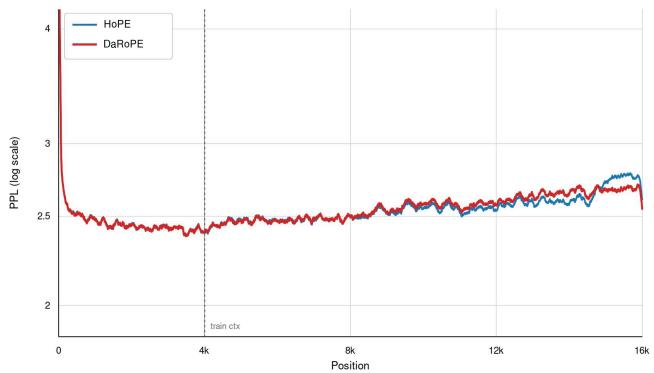  
Figure 5: Per-position validation negative log-likelihood. The loss is averaged over $N = 2 5 6$ documents for the HoPE and DaRoPE 50B models. Both models are trained with a context length of 4096 tokens, marked by the vertical dashed line, and evaluated on sequences of up to 16,384 tokens. Their curves nearly overlap both within and beyond the training window.

The two models remain close throughout PG-19, but their ordering changes with position (Figure 5). DaRoPE is marginally lower over the first 8k tokens (2.4726 versus 2.4738 NLL), whereas HoPE is lower over 8–16k (2.5913 versus 2.6054). Across the full 16k sequence, HoPE therefore has the lower mean NLL (2.5325 versus 2.5390).

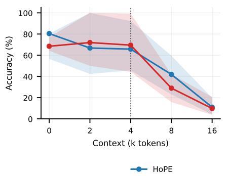

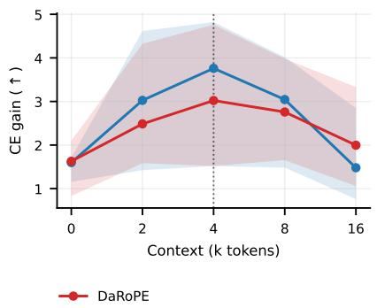  
Figure 6: Controlled long-context performance across RULER and BABILong. Lines show task-level median accuracy and CE gain; shaded regions show the interquartile range. The dotted line marks the 4k training context. The two methods are mixed across tasks and context lengths.

Across RULER and BABILong (Figure 6), the median advantages reverse across context lengths and metrics, while the shaded interquartile ranges overlap broadly. The task-to-task variance is therefore too large to distinguish the two methods; these controlled evaluations support a tie.

Note that, for the LongBench results, we excluded news-related data (< 5% of the dataset) to comply with internal policy.The model is evaluated on the english only part as our model is trained on an english only corpora.

Table 7: Shared training hyperparameters for the HoPE and DaRoPE MoE models.
<table><tr><td>Training hyperparameter</td><td>Value</td></tr><tr><td>Training steps</td><td>65,392</td></tr><tr><td>Sequence length</td><td>4,096</td></tr><tr><td>GPUs</td><td>256</td></tr><tr><td>Micro-batch / GPU</td><td>1 sequence</td></tr><tr><td>Gradient accumulation</td><td>9</td></tr><tr><td>Global batch size</td><td>2,304 sequences</td></tr><tr><td>Tokens / optimizer step</td><td>9,437,184</td></tr><tr><td>Total training tokens</td><td>617.1B</td></tr><tr><td>Training compute</td><td> $9 . 5 2 \times 1 0 ^ { 2 1 } \ \mathrm { F L O P s }$ </td></tr><tr><td>Optimizer</td><td>AdamW</td></tr><tr><td>Peak learning rate</td><td> $1 . 5 7 0 7 6 \times 1 0 ^ { - 3 }$ </td></tr><tr><td>Minimum learning rate</td><td> $1 \times 1 0 ^ { - 6 }$ </td></tr><tr><td>Scheduler</td><td>Cosine</td></tr><tr><td>Warmup steps</td><td>5,000</td></tr><tr><td>Adam β1, β2</td><td>0.9, 0.95</td></tr><tr><td>Weight decay</td><td>0.1</td></tr><tr><td>Gradient clipping</td><td>0.1</td></tr><tr><td>Data mix</td><td>Percentage (%)</td></tr><tr><td>DCLM</td><td>60%</td></tr><tr><td>Code</td><td>30%</td></tr><tr><td>Math</td><td>10%</td></tr></table>

Table 8: Shared architecture hyperparameters for the MoE models. Fine-grained routed experts with a shared expert follow DeepSeekMoE (Dai et al., 2024); sigmoid routing with bias-based load balancing follows DeepSeek-V3 (DeepSeek-AI et al., 2024; Wang et al., 2024a).
<table><tr><td>Architecture hyperparameter</td><td>Value</td></tr><tr><td>Total parameters Active parameters / token† Transformer layers</td><td>49.49B 2.57B</td></tr><tr><td>Model dimension</td><td>28 2,560</td></tr><tr><td>Attention heads</td><td>20</td></tr><tr><td>Head dimension Vocabulary size Maximum training sequence length</td><td>128</td></tr><tr><td></td><td>128,256</td></tr><tr><td>Number of routed experts</td><td>4,096</td></tr><tr><td></td><td>256</td></tr><tr><td>Active routed experts / token</td><td>8</td></tr><tr><td>Shared expert</td><td>Yes</td></tr><tr><td>Expert FFN hidden dimension</td><td>864</td></tr><tr><td>FFN activation</td><td></td></tr><tr><td>Router score function</td><td>SwiGLU</td></tr><tr><td></td><td>Sigmoid</td></tr><tr><td>Capacity factor</td><td>1.3</td></tr><tr><td>Router bias update rate</td><td>0.005</td></tr><tr><td>RoPE base θ</td><td>10,000</td></tr></table>

## C NON-TEXTUAL SEQUENCE MODELING DETAILS

The music and genomic models use a patched clone of the PoPE codebase (Gopalakrishnan et al., 2026); Sleep-EDF uses the same sanitized training protocol. Within each domain, all methods share architecture, data order, optimizer, and token budget.

Each domain follows the same simple two-stage recipe. First, we use RoPE-10k to select the architecture and shared training hyperparameters based on validation loss. We then fix the model architecture and training budget across the full model roster, and give DaRoPE a single small validation-only sweep. The canonical formulation is used for all datasets, except MAESTRO, where we use 16 slow bands instead of the canonical 17.

PoPE reproduction and data corrections. During reproduction, we identified and reported an upstream finite-data loader issue. We replaced it with a true infinite loader for training and deterministic full-split evaluation for every method. Under this corrected and better-tuned pipeline, PoPE improves on its originally reported JSB and MAESTRO test NLLs (Gopalakrishnan et al., 2026), indicating that the published configurations left optimization headroom. HRG additionally uses rebuilt source records that remove duplicated sequence overlap from the test set; its stricter, non-redundant test NLL is therefore higher and not directly comparable with the original reported value.

## C.1 DATASET CONFIGURATIONS

The music models use nanoGPT-style decoders with no bias and full-dimension rotation. All four datasets use the positional-encoding roster and base convention from Appendix A.1.

JSB Chorales. Data: the Boulanger-Lewandowski chorale corpus (Boulanger-Lewandowski et al., 2012), represented at each timestep by the sounding MIDI notes $2 1 - 1 0 8 .$ , silence, or padding (vocabulary 90). Model: 8 layers, 6 heads, $\dot { d } _ { \mathrm { { m o d e l } } } = 1 9 2$ (3.57M parameters), context 2048, dropout 0.3. Training: AdamW $( \beta _ { 2 } \mathrm { { = } } 0 . 9 9 $ , weight decay 0.1), LR $6 \times 1 0 ^ { - 4 }$ cosine to $6 \times 1 0 ^ { - 5 }$ , 50 warmup steps, 3000 iterations, batch 4. Evaluation: $N { = } 7 7$ test sequences.

MAESTRO. Data: MAESTRO v3 piano performances (Hawthorne et al., 2019), tokenized with the REMI representation (Huang & Yang, 2020) (pitch 21–108, 32 velocity bins, $8 / 4$ beat resolution, chord and tempo tokens, and PAD/BOS/EOS/MASK). Performances use a $9 0 / 5 / 5$ train/validation/test split; training uses pitch transposition (±3 semitones), and sequences are chunked to context 2048 with a two-bar overlap. Model: 12 layers, 12 heads, $d _ { \mathrm { m o d e l } } { = } 7 6 8$ (85.3M parameters), context 2048, dropout 0.1. Training: AdamW $( \beta _ { 2 } { = } 0 . 9 9$ , weight decay 0.1), LR $2 . 1 5 \times \mathrm { \dot { 1 } 0 ^ { - 4 } }$ cosine to $2 . 1 5 \times 1 0 ^ { - 5 }$ , 1081 warmup steps, 54,045 iterations, effective batch 4 (426.6M token presentations). Evaluation: $N { = } 6 3 9$ test sequences.

Human reference genome. Data: the human reference genome (HRG) dataset of Dalla-Torre et al. (2025), built from GRCh38 (Schneider et al., 2017), uppercased with non-ACGT bases mapped to N and tokenized into 6-mers (vocabulary 4107). Chromosomes are split into train (chr1–20, X, Y), validation (chr21), and test (chr22). We remove duplicated overlap from the 6200-base source records and construct 6100-base examples with 50-base overlap (stride 6050), adding a 0–99-base start jitter during training only. Model: 306.25M parameters, 24 layers, 16 heads, $d _ { \mathrm { m o d e l } } { = } 1 0 2 4$ context 1000, no dropout, full-dimension rotation. Training: AdamW $( \beta _ { 2 } { = } 0 . 9 9 9$ , weight decay $1 0 ^ { - 2 } )$ , LR $3 . 7 \times 1 0 ^ { - \overline { { 4 } } }$ cosine to $2 . 5 \times 1 0 ^ { - 5 }$ , 3837 warmup steps, 95,921 iterations, effective batch 64 across 8 GPUs (63,936 tokens/step, 6.13B tokens). Evaluation: held-out test NLL on $N { = } 8 3 9 9$ sequences.

Sleep-EDF. Data: the Sleep Cassette subset of Sleep-EDF Expanded (Kemp et al., 2000) from PhysioNet (Pollard et al., 2026), comprising 153 overnight recordings from 78 subjects, with Fpz– Cz EEG at 100 Hz (Sleep Telemetry excluded). Each night is trimmed from the first to last scored sleep stage plus 30 minutes on each side, normalized by its median and interquartile range, and clipped to ±20. The age-stratified, subject-disjoint train/validation/test split contains $6 2 / 8 { \bar { / } } 8$ subjects (122/15/16 nights) and 464.9M/63.2M/59.2M tokens. Each sample is mapped through 255 training-set quantile boundaries to a 256-token vocabulary; no patching, vector quantization, continuous head, or sleep-stage labels are used. Model: 4.79M parameters, 6 pre-norm layers, 8 heads, $d _ { \mathrm { m o d e l } } { = } 2 5 6$ , a 4× GELU MLP, RMSNorm (Zhang & Sennrich, 2019), no bias or dropout, tied embeddings, full-dimension rotation, context 1024. Training: AdamW $( \beta { = } 0 . 9 / 0 . 9 9$ , weight decay $1 0 ^ { - 2 }$ , gradient clip 1.0), LR $6 \times 1 0 ^ { - 4 }$ cosine to $6 \times 1 0 ^ { - 5 }$ after 200 warmup steps, batch 16, and $2 0 { , } 0 0 0$ updates for each of three seeds. Evaluation: deterministic non-overlapping windows over $N { = } 5 7 { , } 7 8 2$ test sequences (59.2M tokens).

## C.2 TEST SCORING AND PAIRED SIGNIFICANCE

Comparisons are paired: for a baseline b we test the per-sequence differences $d _ { i } = \mathrm { N L L } _ { i } ( b ) -$ $\mathrm { N L L } \bar { { } _ { i } } ( D a R o P E )$ , after first averaging each test example across the three seeds. We apply twosided paired t-tests and Holm correction across the four baseline comparisons within each domain. Figure 3 displays a significance marker when the corrected test is significant and DaRoPE has lower NLL. Error bars are 95% within-example intervals across the paired methods.

## D RECENCY AND CONTENT COORDINATES

Models and instances. All numbers come from the 1B roster, evaluated at the 4096-token training context. Instances are generated from a fixed seed independently of the model, so the six positional schemes are scored on byte-identical prompts and all comparisons are paired: N=800 instances per point and D ∈ {64, 128, 256, 512, 1024, 2048} with per-instance jitter ±15%. Key–value recall uses K ∈ {8, 16, 32, 64, 128, 256} and 800 instances per point.

Return-from-digression. An antecedent binds an answer to a topic; an off-topic digression padded to D tokens follows; a decoy binds a different answer to a second topic at the end of the digression; the continuation restates the first topic only. The scored token is the answer, and the margin is NLL(decoy) − NLL(correct):

[off-topic filler ...]   
Zaryndor417 report: codeword = quartz. antecedent   
[off-topic filler, padded to D tokens ...]   
Mournhold263 report: codeword = lantern. recent decoy   
Summary of Zaryndor417: codeword = continuation

Key–value recall. K key–value bindings are listed in random order and one key is queried again. Its binding sits at a random rank, so distance carries no information. The margin is the mean NLL of the K−1 competing values minus the NLL of the correct one; exact selection requires the correct value to rank first.

Layerwise diagnostics. The mechanism panels use the hardest displayed settings, D=2048 and K=256, with $\overset { \sim } { N } { = } 2 0 0$ model-independent prompts. After block $\ell ,$ let $h _ { \ell }$ be the hidden state at the final query position and $W _ { v }$ the output vector for token v. The logit-lens margin is

$$
M _ { \ell } = \left. \mathrm { N o r m } ( h _ { \ell } ) , W _ { \mathrm { c o r r e c t } } - \overline { { W } } _ { \mathrm { c o m p e t i t o r s } } \right. ,
$$

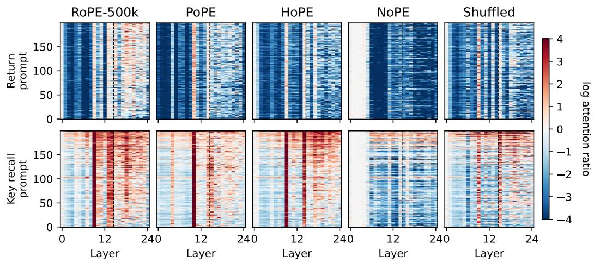  
Figure 7: Attention ratios for the remaining methods and coordinate intervention. Rows show return-from-digression at D=2048 (top) and key–value recall at K=256 (bottom), matching Figure 2. Columns show RoPE-500k, PoPE, HoPE, NoPE, and the trained DaRoPE model after its coordinates are shuffled across token positions. Each cell averages all 16 heads in that layer. Red favors the correct value; blue favors the recent decoy or mean competitor. All panels use the same N=200 prompts, row order, and color scale; the dashed line precedes layers 15–24.

In-domain competence and length extrapolation (per-token accuracy)  
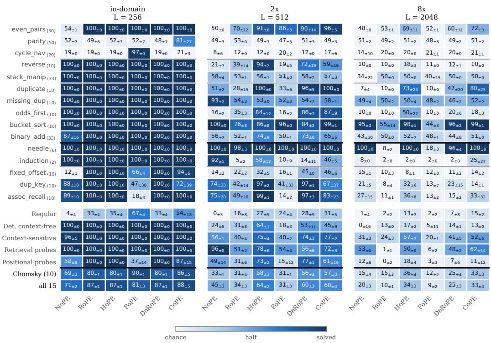  
Figure 8: Full synthetic-task results. Per-task token accuracy $( \mathrm { m e a n } \pm \mathrm { S D }$ across seeds) in domain and at 2× and $8 \times$ the training length, with task-family and aggregate summaries.

where the bar is the recent decoy for return-from-digression and the mean of the K−1 competing values for key–value recall. We apply the model’s final normalization and output head at every layer. Thus $\dot { M } _ { \ell }$ asks which answer is decodable at that depth; only the final layer is the model’s actual output.

For attention, we first average the final query’s attention probability across all 16 heads within a layer, then report the log ratio between the correct value and the recent decoy or mean competing value. Positive values favor the correct binding. No layer or head is selected. Prompt rows are sorted once by DaRoPE’s mean ratio over layers 15–24 and reused unchanged for every method.

The near-white first layers for NoPE do not indicate missing attention. White means a log ratio near zero: correct and competing values receive similar attention. Without an explicit positional signal, early NoPE layers have not yet separated candidates with the same local format. Later contextual representations can still become order-sensitive through the causal network, which explains why a strong preference emerges only after several layers.

Coordinate intervention. We keep DaRoPE’s trained weights and the complete set of coordinates fixed, but randomly reassign those coordinates across token positions at inference. This preserves their values while breaking the token–coordinate correspondence. At the final layer, shuffling reduces the paired margin by 8.79±0.77 nats on return-from-digression and $3 . 7 6 \pm 0 . { \dot { 4 } } 7$ on key–value recall (95% CIs), favoring native coordinates on 96% and 93% of prompts.

## E SYNTHETIC TASKS

## E.1 TASK DESCRIPTIONS

We evaluate on 15 synthetic tasks in three groups. All are rendered as ASCII strings with a taskspecific prefix, tokenised at byte level, and supervised only on the output span. “Answer” below distinguishes a single output symbol from a sequence; this matters for scoring, because per-token

accuracy and exact-match coincide on single-symbol tasks, whereas on sequence tasks exact-match requires every symbol to be right and its chance level collapses to ≈ 0. Chance is $1 / | A |$ for the answer alphabet A.

## E.2 CHOMSKY-HIERARCHY BENCHMARK (15 TASKS)

The Chomsky-hierarchy benchmark (Deletang et al.´ , 2023) is grouped by the level of the formal-language hierarchy required to solve it. Ten are learnable by a 4-layer transformer and carry the main results; modular arithmetic, modular arithmetic brackets and solve equation are at chance for every positional encoding at that depth; binary multiplication and compute sqrt reach exact-match 0 at depth 4 with a 256- token context and are excluded from our results.

<table><tr><td>Task</td><td>Example</td><td>Answer</td><td>〈ch〉</td><td>Description</td></tr><tr><td>Regular</td><td></td><td></td><td></td><td></td></tr><tr><td>even_pairs</td><td>EP:01110011 →1</td><td>single</td><td>50</td><td>Is the number of adjacent differing</td></tr><tr><td>parity</td><td>P:01110011 →1</td><td>single</td><td>50</td><td>pairs even? Parity of the number of 1s.</td></tr><tr><td>cycle_navigation</td><td>CY:11220022 →2</td><td>single</td><td>20</td><td>Position on a 5-cycle after a walk (0/1/2 = left/stay/right).</td></tr><tr><td>modular_arithmetic</td><td>MA:2-3*0+4→1</td><td>single</td><td>20</td><td>Evaluate a flat expression mod 5 (the paper&#x27;s simple variant; no</td></tr><tr><td>Deterministic context-free</td><td></td><td></td><td></td><td>brackets).</td></tr><tr><td>reverse_string</td><td>R:45790189→98109754</td><td>sequence</td><td>10</td><td>Reverse the input.</td></tr><tr><td>stack_manipulation</td><td>ST:11102442 →1111</td><td>sequence</td><td>33</td><td>Run a stack program (2=pop, 3/4=push) and emit the final</td></tr><tr><td>modular_arithmetic_brackets</td><td>MB:(-2+(3))→1</td><td>single</td><td>20</td><td>stack. Evaluate a bracketed expression</td></tr><tr><td>solve_equation</td><td>EQ:(2+-x)=4→ 3</td><td>single</td><td>20</td><td>mod 5; needs a nesting stack. Solve for x mod 5; requires invert-</td></tr><tr><td>Context-sensitive</td><td></td><td></td><td></td><td>ing the expression.</td></tr><tr><td>duplicate_string</td><td>D:45790189→4579...0189</td><td>sequence</td><td>10</td><td>Emit the input twice (ss).</td></tr><tr><td>missing-duplicate_string</td><td>MD:21110111 →0</td><td>single</td><td>10</td><td>One symbol of a duplicated string</td></tr><tr><td>odds_first</td><td>OF:45790189 →59194708</td><td>sequence</td><td>10</td><td>ss is masked; recover it. Emit odd-indexed symbols, then</td></tr><tr><td>binary-addition</td><td>BA:111+0111 →10101</td><td>sequence</td><td>33</td><td>even-indexed ones. Add two little-endian binary num-</td></tr><tr><td>bucket_sort</td><td>S:45790189→01457899</td><td>sequence</td><td>10</td><td>bers. Sort the symbols of a fixed alpha-</td></tr><tr><td>binary-multiplication×</td><td>BM:111*0111 → 0100011</td><td>sequence</td><td>≈50</td><td>bet. Multiply two little-endian binary</td></tr><tr><td>compute_sqrt×</td><td>SQ:11110011 →1111</td><td>sequence</td><td>≈50</td><td>numbers.  $\lfloor { \sqrt { n } } \rfloor$  of a big-endian binary num-</td></tr></table>

Table 9: Chomsky-hierarchy tasks. <sup>×</sup> excluded from our results: at depth 4 with a 256-token training context, exact-match is 0 for every encoding we ran them with, so no instance is solved in this configuration.

## E.3 RETRIEVAL PROBES (2 TASKS)

Two retrieval tasks that ship with our codebase but are not part of the benchmark. We keep them separate because they behave very differently from the benchmark tasks: they are the only place where removing positional information (NoPE) is a large win, and pooling them with the benchmark inflates NoPE’s average.

<table><tr><td>Task</td><td>Example</td><td>Answer</td><td>(ch〉</td><td>Description</td></tr><tr><td>needle</td><td> $\mathtt { N } \mathtt { : 4 } 5 7 9 0 1 8 9 \to 0 0 0 0 0 0 1$ </td><td>sequence</td><td>6</td><td>At each step, has the current symbol occurred earlier?</td></tr><tr><td>induction</td><td> $\mathbb { I } : 5 5 7 9 1 2 8 9  0 5 0 0 0 0 1$ </td><td>sequence</td><td>2</td><td> $\mathrm { G i v e n \ldots A B \ldots \mathbb { A } , }$  predict B (induction head).</td></tr></table>

Table 10: Retrieval probes. Pure content matching: the answer never depends on absolute position.

## E.4 POSITIONAL PROBES (3 TASKS)

Three tasks we introduce to isolate the positional axis. They share their rendering, alphabets and answer format exactly, and differ only in how much positional information the answer requires.
<table><tr><td>Task</td><td>Example</td><td>Answer</td><td>〈ch)</td><td>Description</td></tr><tr><td>fixed_offset</td><td> $\mathrm { F O } : 3 1 4 1 5 9 2 \# 0 0 0 3  5$ </td><td>single</td><td>10</td><td>Pure position: return the digit k places from the end.</td></tr><tr><td>dup_key-recall</td><td> $\mathrm { D K } : \mathrm { a } 3 \mathrm { b } 7 \mathrm { a } 9 \mathrm { c } 1 ? \mathrm { a }  \mathfrak { g }$ </td><td>single</td><td>10</td><td>Position + content: the query key occurs twice; return the later value.</td></tr><tr><td>assoc_recall</td><td> $\mathtt { A R } : \mathtt { a } 3 \mathtt { b } 7 \mathtt { c } 1 \ ? \mathtt { b }  7$ </td><td>single</td><td>10</td><td>Content only: the query key occurs once; return its value.</td></tr></table>

Table 11: Positional probes. assoc recall is the control: it is identical to dup key recall except that the query key is unique, so any gap between the two is attributable to the positional requirement rather than to capacity.