# RUBRIC REWARDS FROM ITEM RESPONSE THEORY

Milad Yazdani<sup>1,‡</sup>

Yaser Souri<sup>2,†</sup>

Xiren Zhou<sup>2</sup>

Pranit Chawla<sup>2</sup>

Dena Shahriari<sup>3</sup>

Subhojit Som<sup>2</sup>

Xia Song<sup>2</sup>

<sup>1</sup> Department of Electrical and Computer Engineering, University of British Columbia <sup>2</sup> Microsoft, <sup>3</sup> School of Biomedical Engineering, University of British Columbia

## ABSTRACT

Many language tasks have no single answer that can be checked automatically. Rubrics provide criteria for judging responses to these tasks. For reinforcement learning, the resulting verdicts must be combined into a scalar reward. A common approach sums the points assigned to satisfied criteria. Distinct verdict patterns can thus receive the same reward, and the fixed points encode how much each criterion should count, not how strongly its verdict distinguishes the current rollouts. Beyond this aggregation problem, judging the full rubric needs more judge requests as the criterion count grows. To address these limitations, Rubric Response Theory (RRT) measures quality and selects criteria when rubric criteria are monotone indicators of a shared target. Rather than adding assigned points, RRT uses a two parameter item response model that treats the verdict pattern as evidence about scalar quality specific to the rubric. Under this model, its likelihood score maximizes the local signal-to-noise ratio for quality. Its Response Parameter Network (RPN) reads the prompt and criterion text to predict criterion difficulty and discrimination. As the policy distribution changes during training, RRT uses online expectation maximization to update the RPN from current rollout verdicts. With Qwen3.5-4B as the policy, RRT’s macro criterion score across Medical, Science, Rubrics as Rewards Science, and RubricBench is 1.7 points above that of group relative policy optimization (GRPO). On hard and very hard criteria in Medical and Science, RRT gains 2.8 to 5.6 points over GRPO. At half the criterion budget, adaptive Fisher selection with a frozen RPN keeps the macro criterion score across four datasets within 0.1 points of GRPO with full judging. These results show RRT can reduce judge requests while remaining competitive with GRPO. Code

## 1 INTRODUCTION

Reinforcement learning for language models has a well-defined reward when success is automatically verifiable, but many language tasks have no single correct answer. Such tasks use large language models as judges (Zheng et al., 2023) and rubrics specific to each prompt (Gunjal et al., 2026; Viswanathan et al., 2025). A rubric decomposes an evaluation target into natural language criteria such as required content, reasoning steps, output constraints, and errors to avoid. For policy training, the resulting binary criterion verdicts are mapped to a scalar reward for each rollout. Beyond this aggregation problem, judging the full rubric requires more judge requests as criteria are added.

To produce this scalar reward, the baseline takes a weighted average of satisfied criteria using their assigned points (Gunjal et al., 2026; Arora et al., 2025). This additive form can assign the same total to distinct verdict patterns and therefore gives them the same rubric reward in group relative policy optimization (GRPO) (Guo et al., 2025). The assigned points encode how much each criterion should count in the rubric, not how strongly its verdict distinguishes the current rollouts. The contribution of each verdict also does not depend on the rollout’s other verdicts.

This work introduces Rubric Response Theory (RRT), which adapts item response theory (IRT) to on-policy reward inference and criterion selection for rubrics specific to each prompt. For rubrics whose criteria are monotone indicators of one shared target, RRT uses the verdicts to estimate rollout quality instead of adding assigned points. Like questions in a test, criteria can differ in difficulty and in how strongly they distinguish responses of different quality. RRT represents each rubric criterion with difficulty and discrimination parameters from IRT (Chen et al., 2025). Difficulty locates a criterion on the quality scale, while discrimination controls how sharply its pass probability changes with quality. The Response Parameter Network (RPN) predicts these parameters from the prompt and criterion text. Using these parameters, RRT finds the quality that best explains the full verdict pattern and uses it as the GRPO reward. Rubric points specify how much a criterion should count, while RRT measures how much its verdict reveals about shared quality. This distinction lets RRT distinguish rollouts that receive the same reward based on rubric points but whose verdict patterns provide different evidence about quality. Because the rollout distribution changes with the policy, RRT uses online hard expectation maximization (EM) to update the RPN from current rollout verdicts. It uses the same parameters to select criteria under a criterion budget.

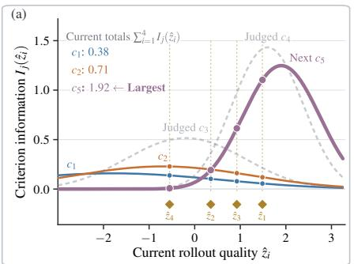

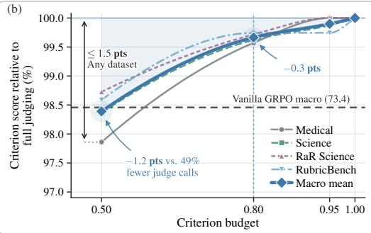  
Figure 1: Criterion selection in RRT using Fisher information. (a) Criterion information for five criteria and four rollouts after judging two criteria. Gold diamonds show inferred rollout qualities. Dots show information from unjudged criteria at these qualities, dashed gray curves show judged criteria, and $c _ { 5 }$ is selected next. (b) Criterion scores after RRT with adaptive Fisher selection, normalized to full judging for each dataset. Shading shows the macro gap from full judging.

The contributions are the following.

• RRT formulates rubric aggregation as Bayesian inference, using the posterior mode of quality as a scalar GRPO reward to distinguish rollouts with equal rubric point totals. It combines the likelihood of full verdict patterns with a quality prior. The RPN predicts criterion difficulty and discrimination from prompt and criterion text for unseen rubrics.

• RRT provides an online EM procedure to calibrate the RPN from current rollout verdicts as the policy changes. A theoretical analysis establishes that, in RRT’s item response model, the rubric likelihood score maximizes the local signal-to-noise ratio (SNR) for small changes in rollout quality among all scalar functions of the verdicts, reaching the Fisher information bound.

• RRT extends adaptive Fisher selection to groups of rollouts, reducing judge requests under a criterion budget. It ranks unjudged criteria by total Fisher information at inferred rollout qualities and updates those qualities after each selected criterion is judged.

Key Findings: Across Medical, Science, Rubrics as Rewards (RaR) Science, and RubricBench, RRT preserves the gains in macro criterion score from Vanilla GRPO across three base policies. It exceeds Vanilla GRPO by 1.7 points on Qwen3.5-4B. On rollouts from trained policies, adaptive Fisher selection reaches 95.0% mean Pearson correlation with GRPO advantages from full rubric judging while leaving 21.0% of criteria unjudged. At half the criterion budget, RRT with adaptive Fisher selection keeps its macro criterion score across all four datasets within 0.1 points of Vanilla GRPO with full judging (Figure 1).

## 2 RELATED WORK

Rubric and checklist supervision provides training signals specific to each prompt. Gunjal et al. (2026) generate rubrics from reference answers and train with GRPO on a weighted sum of criterion verdicts or one rating from a judge that reads the full rubric. They call fixed weights brittle and leave learned weighting to future work. Viswanathan et al. (2025) generate checklists from failure modes in candidate responses and combine judge and program verifier scores with generated importance weights. Both fix criterion weights in advance or leave aggregation to the judge, and judge the full rubric for every response. RRT complements rubric generation. It learns from current rollouts how much each verdict reveals about quality, to compute the reward and to choose which criteria to judge.

Recent work adapts rubric aggregation to current rollouts. POW3R (Tyagi et al., 2026) rescales human weights by contrast across rollouts, and DIVA (Cook et al., 2026) weights soft criterion scores by their variance across responses. Both keep a weighted sum with one weight per criterion for all rollouts and judge every criterion. RRT replaces the weighted sum. It learns each criterion’s difficulty and how well it separates good from poor responses, then finds the overall quality that best explains a rollout’s full verdict pattern. Two rollouts with equal point totals can thus receive different rewards. This knowledge also lets RRT choose which criteria to judge and reduce judge requests.

IRT and learned rubric measurement serve calibration, assessment, data selection, and efficient evaluation. Hashemi et al. (2024) train a network to calibrate a judge’s rubric answers to human ratings. Uto (2021) uses a Rasch model with item and rater effects to assess examinees. Lalor et al. (2019) fit IRT to many neural models’ responses and filter training data by difficulty. Adaptive testing selects questions from a calibrated pool to measure ability with fewer questions (Weiss, 1982). Truong et al. (2025) predict question difficulty from text for adaptive testing of language models. Each measures a fixed examinee or model. RRT applies this measurement to policy training, where each rollout’s measured quality becomes its reward. From the prompt and criterion text, RRT predicts each criterion’s difficulty and how well it separates responses, so it works on unseen rubrics. Training verdicts then refine these estimates, so they stay current as the policy changes. The same estimates pick the most informative criteria for the current rollouts, so RRT judges fewer criteria per prompt.

## 3 METHOD

## 3.1 IRT FOR RUBRIC CRITERIA

For a prompt q, let rollouts $i = 1 , \ldots , N$ be judged against rubric criteria $c _ { 1 } , \ldots , c _ { K }$ . Each verdict is encoded as $G _ { i j } \in \{ 0 , 1 \}$ , where 1 denotes satisfaction of a positive criterion or avoidance of a pitfall (Appendix F.2). Let $w _ { j } > 0$ be the available points for criterion j. The reward based on rubric points is $\begin{array} { r } { R _ { i } ^ { \mathrm { b a s e } } = \sum _ { j } w _ { j } G _ { i j } / \sum _ { j } w _ { j } \in [ 0 , 1 ] } \end{array}$ . RRT treats each rubric criterion as an item whose verdict provides evidence about scalar quality $z _ { i }$ for the rubric. The model assumes that every criterion’s pass probability increases strictly with $z _ { i } .$ . For a fixed rubric and criterion parameters, the expected reward based on rubric points therefore increases strictly with quality (Theorem 8 in Appendix A.5). The model also assumes local independence, so verdicts are conditionally independent given quality and criterion parameters (Chen et al., 2025).

Criterion $j$ has difficulty $b _ { j }$ and discrimination $a _ { j } .$ . The RPN $\psi$ predicts these parameters from the prompt q and criterion text $c _ { j }$ , so $( a _ { j } , b _ { j } ) : = \psi ( q , c _ { j } )$ with $a _ { j } > 0$ . For rollout quality $z _ { i }$ , define $u _ { i j } : = a _ { j } ( z _ { i } - b _ { j } )$ and $P _ { i j } : = F ( u _ { i j } )$ . The response function $F : \mathbb { R } \to ( 0 , 1 )$ is differentiable and strictly increasing, with $F \mathrm { \bar { ( 0 ) } = 0 . \dot { 5 } }$ . Thus $b _ { j }$ is the quality where $P _ { i j }$ crosses 0.5 with slope $a _ { j } F ^ { \prime } ( 0 )$ This item response model has two parameters per criterion and lets discrimination vary (Birnbaum, 1968). With a logistic response function and $a _ { j } = 1$ for every criterion, it reduces to the Rasch model with one parameter per criterion (Rasch, 1966). Appendix A.1 states the assumptions on $F$

## 3.2 BAYESIAN REWARD INFERENCE AND ONLINE EM

RRT infers quality with the criterion parameters held fixed. Write $\boldsymbol { c } = \left( c _ { 1 } , \dots , c _ { K } \right)$ for the rubric and $G _ { i } = ( \bar { G } _ { i 1 } , \dot { \ldots } , G _ { i K } )$ for rollout $i \mathbf { \ ' } _ { \mathbf { S } }$ verdict vector. Since $G _ { i j } \mid z _ { i } , q , c _ { j } , \psi \sim$ Bernoulli $( P _ { i j } )$ local independence gives

$$
p _ { \psi } ( G _ { i } \mid z _ { i } , q , c ) = \prod _ { j = 1 } ^ { K } p _ { \psi } ( G _ { i j } \mid z _ { i } , q , c _ { j } ) = \prod _ { j = 1 } ^ { K } P _ { i j } ^ { G _ { i j } } ( 1 - P _ { i j } ) ^ { 1 - G _ { i j } } .\tag{1}
$$

RRT places a fixed Gaussian prior with mean zero and variance $\sigma _ { z } ^ { 2 }$ on quality. If $\ell _ { i j } ( z )$ is the log of criterion $j ^ { \circ } \mathbf { s }$ Bernoulli factor, Bayes’ rule gives

$$
p _ { \psi } ( z _ { i } \mid G _ { i } , q , c ) \overset { \mathrm { B a y e s } } { \propto } p ( z _ { i } ) \prod _ { j = 1 } ^ { K } P _ { i j } ^ { G _ { i j } } ( 1 - P _ { i j } ) ^ { 1 - G _ { i j } } , \quad \ell _ { i } ( z ) : = \sum _ { j = 1 } ^ { K } \ell _ { i j } ( z ) - z ^ { 2 } / ( 2 \sigma _ { z } ^ { 2 } ) .\tag{2}
$$

RRT uses the standard Gaussian CDF, $F = \Phi .$ , and the maximum a posteriori (MAP) reward $R _ { i } = \hat { z } _ { i } = \arg \operatorname* { m a x } _ { z } \ell _ { i } ( z )$ (Mislevy, 1986). The Gaussian CDF lets criterion difficulty affect reward ordering, while the logistic CDF orders rollouts by $\sum _ { j } a _ { j } G _ { i j }$ (Theorems 4 and 5 in Appendix A.1). Figure 2 shows how the full verdict pattern determines this reward.

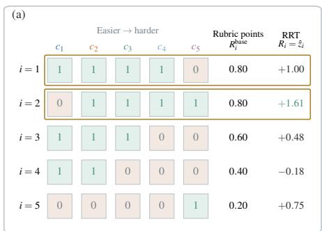

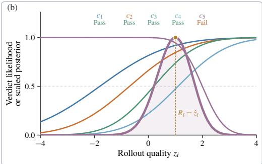  
Figure 2: RRT reward inference for an illustrative rubric. (a) Verdict vectors for equally weighted criteria ordered by difficulty, with both rewards shown. (b) E-step for rollout $i = 1$ . The thick curve combines the verdict likelihoods with the Gaussian prior, and its mode is the RRT reward.

For fixed criterion parameters, the log posterior is strictly concave and has a unique maximizer. Satisfying an additional criterion increases the MAP reward when the other verdicts and criterion parameters are fixed (Theorem 6 and Corollary 1 in Appendix A.2). RRT finds this maximizer by bisection using the log posterior gradient from Theorem 3 in Appendix A.1. RRT uses $R _ { i } = \hat { z } _ { i }$ as the GRPO reward (Guo et al., 2025), while Vanilla GRPO uses $R _ { i } ^ { \mathrm { { \bar { b a s e } } } }$ , the normalized points score used in evaluation. Appendix B.2 specifies the GRPO update.

As the policy changes during joint training, RRT calibrates ψ from new rollout verdicts using one online EM sweep per policy step (Bach et al., 2015). The E-step reuses Eq. 2 to compute a posterior mode for each rollout. With the posterior modes held fixed, the M-step loss for one prompt group is

$$
\mathcal { L } ( \boldsymbol { \psi } ) = - \frac { 1 } { N K } \sum _ { i = 1 } ^ { N } \sum _ { j = 1 } ^ { K } \ell _ { i j } ( \hat { z } _ { i } ; \boldsymbol { \psi } ) + \frac { \lambda _ { a } } { K } \sum _ { j = 1 } ^ { K } ( \log a _ { j } ) ^ { 2 } .\tag{3}
$$

The regularizer pulls $a _ { j }$ toward one when $\lambda _ { a } > 0$ . Appendix B.1 gives the EM objective, algorithms, and implementation details.

## 3.3 FISHER INFORMATION FOR AGGREGATION AND SELECTION

The item response model used for reward inference also quantifies each criterion’s Fisher information about quality. Let ϕ be the standard Gaussian density and define the criterion likelihood score as $S _ { i j } ( z _ { i } ) : = \partial _ { z _ { i } } \ell _ { i j } ( z _ { i } )$

Theorem 1 (Fisher information of a rubric criterion). Under the item response model with $F = \Phi$ , the criterion likelihood score has conditional mean zero. Its Fisher information about rollout quality is

$$
I _ { j } ( z _ { i } ) = \mathbb { E } \big [ S _ { i j } ( z _ { i } ) ^ { 2 } \mid z _ { i } \big ] = a _ { j } ^ { 2 } \frac { \phi ( u _ { i j } ) ^ { 2 } } { P _ { i j } ( 1 - P _ { i j } ) } = - \mathbb { E } \bigg [ \frac { \partial ^ { 2 } \ell _ { i j } ( z _ { i } ) } { \partial z _ { i } ^ { 2 } } \bigg | z _ { i } \bigg ] .\tag{4}
$$

Appendix A.3 gives the proof. Summing criterion information gives a local bound for rubric aggregation. Write $\begin{array} { r } { S _ { i } ( z _ { i } ) \dot { : } = \sum _ { j } S _ { i j } ( z _ { i } ) } \end{array}$ for the rubric likelihood score and $\begin{array} { r } { I ( z _ { i } ) : = \sum _ { j } I _ { j } ( z _ { i } ) } \end{array}$ for the rubric information.

Theorem 2 (Local information bound for rubric aggregation). Under $F = \Phi ,$ , fix a quality level $z _ { i }$ and the criterion parameters, and assume conditionally independent verdicts. For a statistic

$T ( G _ { i } )$ with $0 < \operatorname { V a r } ( T \mid z _ { i } ) < \infty ,$ define its local SNR for quality as

$$
\operatorname { S N R } _ { T } ( z _ { i } ) : = { \left( \partial _ { z _ { i } } \mathbb { E } [ T \mid z _ { i } ] \right) } ^ { 2 } / \operatorname { V a r } ( T \mid z _ { i } ) .\tag{5}
$$

Then $\mathrm { S N R } _ { T } ( z _ { i } ) \leq I ( z _ { i } )$ , with equality if and only $i f T - \mathbb { E } [ T \mid z _ { i } ] = \gamma S _ { i } ( z _ { i } )$ almost surely for some $\gamma \neq 0 .$ . Up to a nonzero affine map, the rubric likelihood score is therefore the unique scalar verdict signal that achieves this bound. For the reward based on rubric points, equality holds ifand only if $\begin{array} { r } { { \bf \dot { \hat { \rho } } } w _ { j } \propto a _ { j } \phi ( u _ { i j } ) / [ P _ { i j } ( 1 - P _ { i j } ) ] } \end{array}$ for every j. Once two criteria have different criterion parameters, no fixed vector of rubric points achieves the bound at every quality level.

Appendix A.5 gives the proof. The MAP reward combines the rubric likelihood score and prior through realized posterior curvature. A Fisher scoring surrogate uses the expected local precision at a common quality level (Theorem 9 and Eq. 15 in Appendix A.5). Appendix A.4 derives the statistic with minimum variance subject to unit local response to quality and the expected local precision.

Fisher information also guides criterion selection under a budget. It measures expected information before judging, while the likelihood score measures evidence from an observed verdict (Figure 3 in Appendix A.3). Following classical adaptive testing (Weiss, 1982), RRT uses the criterion information from Theorem 1 to rank unjudged criteria by $\textstyle \sum _ { i } I _ { j } ( \hat { z } _ { i } )$ at the qualities currently inferred for the rollout group. The qualities are updated after each selected criterion is judged.

## 4 EXPERIMENTS

The experiments are designed to address the three following research questions $\mathbf { ( R Q s ) }$

RQ1: How does RRT compare with the baselines in verdict prediction, reward variation, and ordering stability within each prompt?

RQ2: How does RRT affect criterion score, normalized points score, and training behavior across datasets and policies?

RQ3: What tradeoff does selection based on Fisher information provide between judge usage, reward fidelity, and evaluation scores?

## 4.1 EXPERIMENTAL SETUP

The default base policy is Qwen3.5-4B (Qwen Team, 2026), and the datasets are Medical, Science, Rubrics as Rewards (RaR) Science, and RubricBench. Transfer comparisons also use Qwen3.5-2B and Llama-3.1-8B-Instruct (Grattafiori et al., 2024). Appendix F.1 gives data sources, splits, and roles. Each condition has one training run, and each policy step uses 32 prompts, eight rollouts per prompt, and one proximal policy optimization (PPO) epoch. Each policy comparison keeps the data, base checkpoint, sampler, judge, and GRPO implementation fixed. GPT-5.5 (OpenAI, 2026) with reasoning disabled gives one binary verdict per rollout and criterion. Using these verdicts, Vanilla GRPO trains on the reward $R _ { i } ^ { \mathrm { b a s e } }$ based on rubric points. The main RRT condition applies one stochastic partial M-step per policy step.

Criterion score is the percentage of rubric criteria satisfied. Normalized points score is the weighted fraction of available points. Scores, ROC-AUC values, correlations, rates, and shares are reported as percentages, and differences between them are percentage points. Macro means are unweighted. Policy scores average three evaluation sampling seeds. Reported confidence intervals are 95% bootstrap intervals over prompt groups, paired when two conditions are compared on the same groups. They quantify variation across prompt groups with the trained policies fixed. Appendices F.2 and F.3 give the policy input and judge prompts, full configuration, and checkpoint selection.

## 4.2 VERDICT PREDICTION AND REWARD STABILITY

Leave-one-criterion-out prediction infers rollout quality from the other $K - 1$ verdicts. For their verdicts $G _ { i , - j }$ and texts $c _ { - j }$ , the prediction is $\begin{array} { r } { \widehat { P } _ { i j } ^ { ( - j ) } = \int F \big ( a _ { j } ( z - b _ { j } ) \big ) p _ { \psi } ( z \mid G _ { i , - j } , q , c _ { - j } ) } \end{array}$ dz. Under this protocol, four methods predict $G _ { i j }$ bfrom the same rollouts. RRT uses a frozen RPN. Its matched $a _ { i } = 1$ baseline adjusts $b _ { j }$ to preserve marginal pass rate. The RPN baseline without rollout evidence uses $\mathbb { E } _ { z \sim \mathcal { N } ( 0 , \sigma _ { z } ^ { 2 } ) } [ \breve { F } ( a _ { j } ( { \breve { z } } - \bar { b _ { j } } ) ) ]$ ]. The other baseline averages the remaining $K - 1$ verdicts.

The evaluation reports ROC-AUC within each criterion and pooled ROC-AUC. Results are averaged over Qwen3.5-2B and Llama-3.1-8B-Instruct. The macro mean covers the four datasets.

Table 1: Leave-one-criterion-out verdict prediction by ROC-AUC. Results within each criterion use the RPN without rollout evidence as the reference, and pooled results use the mean of the other verdicts. Blue marks RRT, and green parentheses give gains from the reference.
<table><tr><td>Prediction method</td><td colspan="5">Science RaR Science Medical RubricBench | Macro mean</td></tr><tr><td colspan="6">Rollout evidence: ROC-AUC within each criterion</td></tr><tr><td>RPN without rollout evidence</td><td>50.0</td><td>50.0</td><td>50.0</td><td>50.0</td><td>50.0</td></tr><tr><td>Mean of other verdicts</td><td>69.6</td><td>67.2</td><td>63.8</td><td>62.5</td><td>65.8</td></tr><tr><td>RRT,  $a _ { j } = 1$  RRT</td><td>69.7</td><td>67.0</td><td>63.9</td><td>62.8</td><td>65.8 65.8(15.8)</td></tr><tr><td colspan="6">70.0 (20.0) 67.4(17.4) 64.0(14.0) 61.8(11.8)</td></tr><tr><td colspan="6">Joint rollout and criterion ranking: pooled ROC-AUC</td></tr><tr><td>Mean of other verdicts</td><td>69.4</td><td>70.6</td><td></td><td></td><td>69.3</td></tr><tr><td>RPN without rollout evidence</td><td>74.6</td><td>76.5</td><td>67.0 76.7</td><td>70.5 68.8</td><td>74.1</td></tr><tr><td>RRT,  $a _ { j } = 1$ </td><td>79.2</td><td>81.2</td><td>80.1</td><td>77.2</td><td>79.4</td></tr><tr><td>RRT</td><td>79.7 (10.3)</td><td>81.4(10.8)</td><td>80.3(13.3)</td><td>76.6(6.1)</td><td>79.5(10.1)</td></tr></table>

RRT gains 10.1 points in pooled macro ROC-AUC over the mean of other verdicts and also exceeds the RPN without rollout evidence on every dataset (Table 1). All three methods using rollout evidence reach 65.8% macro ROC-AUC within each criterion.

The RPN configuration ablations infer quality from all verdicts and vary the response function, parameter count, text conditioning, embedder, and policy. The adopted model improves macro ROC-AUC by 0.7 points over the model with $a _ { j } = 1$ (Table 5 in Appendix C.1). The RPN representation analysis also compares predicted and empirical criterion difficulty, with Spearman correlations of 38.0% to 47.9% (Table 6 in Appendix C.2). To compare reward orderings, both response functions use $a _ { j } = 1$ and the same criterion difficulties. The Gaussian CDF separates 83.3% of rollout pairs with equal pass counts on Medical and 39.3% on Science, while the logistic CDF leaves all such pairs tied (Table 7 in Appendix C.3).

The calibration analysis compares online and frozen RPNs in predicting empirical criterion pass rates as the policy changes. Online updates increase macro Pearson correlation by 1.7 points on the next policy step, with gains on both datasets (Table 10 in Appendix C.6). Two criterion trajectories selected post hoc end with lower predicted difficulty and higher empirical pass rates (Figure 6). The RubricBench RPN is fitted with hard (posterior mode) and soft (full posterior) E-steps at two discrimination regularizer weights. At both weights, the hard E-step improves ROC-AUC by 0.6 to 1.3 points and reduces criterion loss by 0.011 to 0.017 (Table 11 in Appendix C.7).

Reward variation within prompts is compared between RRT and rubric points across policies and rollout group sizes. Relative to rubric points, RRT has 1.2 to 2.2 times the variance share within prompts and 2% to 58% fewer tied pairs in all 12 dataset and policy cells. With groups drawn from 48 rollouts per prompt, the tied pair share falls by 2.2 to 2.3 points on Medical and 1.5 to 1.6 on Science across tested group sizes from 2 to 32, including the training size n = 8 (Figure 5 and Table 8 in Appendix C.4). In the companion analysis, 52.3% to 80.5% of criteria receive the same verdict across all rollouts in a group (Table 9 in Appendix C.5).

Variation in judge verdicts is measured with three independent verdicts for each prompt, response, and criterion. Mean disagreement with the consensus verdict is 1.27% across all 12 dataset and policy cells (Tables 12 and 13 in Appendix D.1). Stable nonzero ordering share is the fraction of rollout pairs that remain separated and retain their order. On repeated verdicts, RRT with marginal calibration increases its macro mean by 5.4 points over rubric points. Under corruption of the consensus verdicts, mean gains over rubric points are 0.99 to 2.00 points with estimated $a _ { j }$ , exceeding gains with $a _ { j } = 1$ at every tested level in both corruption channels. At the strongest tested level, 0.10, its mean order flip rate is lower than rubric points whether corruption targets split verdicts or all verdicts (Tables 14 and 15 in Appendix D.2).

The comparison of noise structures measures cosine similarity to advantages from clean criterion scores under controlled corruption. At level 0.20, RRT with marginal calibration gains 1.3 to 5.1 points in mean similarity over criterion score across four channels that corrupt criterion subsets. Criterion score leads by 0.8 to 1.2 points under lenient noise tied to response length and symmetric noise on all criteria (Table 16 in Appendix D.3). The companion comparison varies corruption level on a fixed 30% criterion subset and includes POW3R and DIVA. At each tested nonzero level, RRT with marginal calibration has the highest similarity on every dataset, with gains of 3.0 to 7.0 points over criterion score at 0.20 (Table 17 in Appendix D.3).

Variation across rollout samples is measured with pass rates from disjoint blocks of eight rollouts. Reliability, measured by Pearson correlation between blocks, is 93.6% to 96.0% over all criteria and 70.9% to 71.9% over uncertain criteria, whose empirical pass rates over 48 rollouts lie between 10% and 90% (Table 18 in Appendix D.4). For criterion sampling, orderings from random rubric halves are compared using Kendall’s τ, with RRT parameters from the online RPN. RRT raises rank correlation over rubric points by 15.1 points on RaR Science and 0.5 to 3.6 points on the other datasets (Table 19 in Appendix D.5). Across quintiles of rank correlation from rubric points, RRT’s gain falls from 14 points in the lowest quintile to 1 point in the highest (Table 20 in the same appendix).

To check local independence, the analysis measures dependence between criterion verdicts after accounting for fitted quality. Fitted quality explains 72.8% to 85.3% of pairwise mutual information (Table 21 in Appendix D.6). For pairs with the most similar criterion text, the share with residual redundancy exceeds the bootstrap null rate by 3.4 to 11.9 points. For the least similar text, it stays within 0.7 points of the null rate.

## 4.3 POLICY TRAINING RESULTS

This experiment compares policy performance across rubric rewards and criterion parameter settings. Baseline rewards include POW3R (Tyagi et al., 2026) and DIVA (Cook et al., 2026) (Appendix F.4). Empirical pass rate conditions use $a _ { j } = 1$ and $b _ { j } = 1 - 2 \bar { G } _ { j }$ , using pass rates from batch or cached rollouts (Appendix D.4). RRT + frozen RPN and RRT + online RPN predict both $a _ { j }$ and $b _ { j }$ from text.

Table 2: Criterion and normalized points scores. Bold marks the highest score in each column. RRT variants use parameters from empirical pass rates or the RPN, with the same reward and E-step. RubricBench uses one point per criterion, so both scores are equal.
<table><tr><td rowspan="2">Condition</td><td colspan="2">Medical</td><td colspan="2">Science</td><td colspan="2">RaR Science</td><td>RubricBench</td><td colspan="2">Macro mean</td></tr><tr><td>Criterion score</td><td>Normalized points score</td><td>Criterion score</td><td>Normalized points score</td><td>Criterion score</td><td>Normalized points score</td><td>Criterion score</td><td>Criterion score</td><td>Normalized points score</td></tr><tr><td>Base policy</td><td>64.1</td><td>63.3</td><td>76.5</td><td>70.9</td><td>68.7</td><td>71.0</td><td> $7 4 . 7$ </td><td></td><td> $7 1 . 0 7 0 . 0$ </td></tr><tr><td>Vanilla GRPO</td><td> $6 7 . 7 _ { ( 3 . 6 ) } 6 6 . 8 _ { ( 3 . 5 ) } 7 8 . 3 _ { ( 1 . 8 ) } 7 7 . 8 _ { ( 6 . 9 ) } 7 0 . 6 _ { ( 1 . 9 ) } 7 3 . 7 _ { ( 2 . 7 ) } 7 7 . 0 _ { ( 2 . 3 ) }$ </td><td></td><td></td><td></td><td></td><td></td><td></td><td></td><td> $7 3 . 4 ( 2 . 4 ) 7 3 . 8 ( 3 . 8 )$ </td></tr><tr><td>POW3R</td><td> $7 0 . 6 ( 6 . 5 ) 6 9 . 6 ( 6 . 3 ) 7 9 . 0 _ { ( 2 . 5 ) } 7 8 . 7 ( 7 . 8 ) 7 0 . 1 ( 1 . 4 ) 7 3 . 2 ( 2 . 2 )$ </td><td></td><td></td><td></td><td></td><td></td><td> $7 7 . 4 ( 2 . 7 )$ </td><td></td><td> $7 4 . 3 ( 3 . 3 ) 7 4 . 7 ( 4 . 7 )$ </td></tr><tr><td>DIVA</td><td> $6 4 . 9 _ { ( 0 . 8 ) } 6 4 . 4 _ { ( 1 . 1 ) } 7 8 . 8 _ { ( 2 . 3 ) } 7 8 . 3 _ { ( 7 . 4 ) } 7 0 . 6 _ { ( 1 . 9 ) } 7 3 . 8 _ { ( 2 . 8 ) }$ </td><td></td><td></td><td></td><td></td><td></td><td> $7 5 . 8 ( 1 . 1 )$ </td><td></td><td> $7 2 . 5 ( 1 . 5 ) 7 3 . 1 ( 3 . 1 )$ </td></tr><tr><td colspan="10">Same RRT reward  $R _ { i } = \hat { z } _ { i }$ </td></tr><tr><td colspan="10">RRT +</td></tr><tr><td> batch pass rate</td><td colspan="3"> $6 8 . 0 _ { ( 3 . 9 ) } 6 7 . 0 _ { ( 3 . 7 ) } 7 8 . 3 _ { ( 1 . 8 ) } 7 7 . 8 _ { ( 6 . 9 ) } 7 0 . 8 _ { ( 2 . 1 ) } 7 3 . 5 _ { ( 2 . 5 ) }$ </td><td colspan="3"></td><td> $7 7 . 3 ( 2 . 6 )$   $7 7 . 4 ( 2 . 7 )$ </td><td colspan="2"> $7 3 . 6 ( 2 . 6 ) 7 3 . 9 ( 3 . 9 )$ </td></tr><tr><td> cached pass rate</td><td colspan="7"> $6 7 . 8 _ { ( 3 . 7 ) } 6 6 . 8 _ { ( 3 . 5 ) } 7 8 . 3 _ { ( 1 . 8 ) } 7 7 . 9 _ { ( 7 . 0 ) } 7 0 . 0 _ { ( 1 . 3 ) } 7 3 . 0 _ { ( 2 . 0 ) }$ </td><td> $7 3 . 4 ( 2 . 4 ) 7 3 . 8 ( 3 . 8 )$ </td><td></td></tr><tr><td> $\hookrightarrow \mathrm { f r o z e n } \hat { \mathrm { R P N } }$ </td><td colspan="7"> $7 0 . 1 _ { ( 6 . 0 ) } 6 9 . 8 _ { ( 6 . 5 ) } 7 9 . 5 _ { ( 3 . 0 ) } 7 9 . 2 _ { ( 8 . 3 ) } 7 0 . 7 _ { ( 2 . 0 ) } 7 3 . 8 _ { ( 2 . 8 ) }$ </td><td></td><td> $7 4 . 6 _ { ( 3 . 6 ) } 7 5 . 2 _ { ( 5 . 2 ) }$ </td></tr><tr><td>↔ online RPN</td><td colspan="7"> $7 { \bf 0 . 9 } _ { ( 6 . 8 ) } { \bf 6 9 . 8 } _ { ( 6 . 5 ) } 7 { \bf 9 . 8 } _ { ( 3 . 3 ) } 7 { \bf 9 . 4 } _ { ( 8 . 5 ) } 7 { \bf 0 . 9 } _ { ( 2 . 2 ) } 7 { \bf 4 . 0 } _ { ( 3 . 0 ) }$ </td><td> $7 8 . 7 ( 4 . 0 )$  一</td><td> $7 5 . 1 _ { ( 4 . 1 ) } 7 5 . 5 _ { ( 5 . 5 ) }$ </td></tr><tr><td></td><td colspan="7"></td><td></td><td></td></tr></table>

RRT + online RPN is highest or tied in every column of Table 2, exceeding Vanilla GRPO by 1.7 and POW3R by 0.8 points on both macro metrics. The frozen RPN is 1.0 to 1.2 macro criterion points above empirical pass rate conditions, and the online RPN scores 0.5 points above the frozen RPN.

RRT’s macro criterion score is 0.2 points below Vanilla GRPO on Qwen3.5-2B and 0.1 points above it on Llama-3.1-8B-Instruct. It scores higher on RubricBench with both policies, as on Qwen3.5-4B (Table 22 in Appendix E.1). Difficulty bands are defined by empirical criterion difficulty under the base policy. RRT + online RPN exceeds Vanilla GRPO by 2.8 to 5.6 points in seven of eight bands on Medical and Science, including every Medium, Hard, and Very hard band (Figure 7 in Appendix E.2). Policies trained on Medical and Science are also evaluated on HealthBench and ResearchQA, respectively. RRT gains 0.1 to 0.7 macro criterion points over Vanilla GRPO (Table 23 in Appendix E.3). The policy comparison also measures response length. RRT has lower median response length in all 12 dataset and policy combinations, with the mean of dataset medians 10.6% to 47.9% below Vanilla GRPO across policies (Figure 8 in Appendix E.4).

## 4.4 CRITERION SELECTION BASED ON FISHER INFORMATION

The comparison finds the smallest criterion budget reaching 95.0% reward fidelity, the mean Pearson correlation between GRPO advantages from partial and full judging. All K criteria give $\mathbf { A } ^ { ( K ) }$ and m selected criteria give $\mathbf { A } ^ { ( m ) }$ . Methods share a frozen RPN and verdict matrix per dataset. The selection methods are random, discrimination $( a _ { j } ^ { 2 } )$ , static Fisher $( N I _ { j } ( 0 ) )$ ), and adaptive Fisher selection.

Table 3: Unjudged criteria at the smallest budget reaching 95.0% correlation with GRPO advantages from the full rubric on rollouts from trained policies. Parentheses give gains over random selection.
<table><tr><td>Selection method</td><td>Medical</td><td>Science</td><td></td><td>RaR Science RubricBench</td><td>Macro mean</td></tr><tr><td>Random</td><td>10.7%</td><td>15.2%</td><td>5.1%</td><td>8.9%</td><td>10.0%</td></tr><tr><td>Discrimination  $( a _ { j } ^ { 2 } )$ </td><td>20.0% (9.3)</td><td>18.0% (2.7)</td><td>5.1% (0.0)</td><td> $8 . 9 \% ( 0 . 0 )$ </td><td>13.0% (3.0)</td></tr><tr><td>Static Fisher</td><td>20.0% (9.3)</td><td>20.5% (5.3)</td><td>18.3% (13.2)</td><td>18.6% (9.6)</td><td>19.3% (9.3)</td></tr><tr><td>Adaptive Fisher</td><td></td><td>20.8% (10.1) 22.9% (7.6)</td><td>18.3% (13.2)</td><td>21.9% (13.0)</td><td> $2 1 . 0 \% ( 1 1 . 0 )$ </td></tr></table>

On rollouts from trained policies, adaptive Fisher leaves 11.0 points more criteria unjudged than random selection and 1.7 more than static Fisher in the macro mean (Table 3). Discrimination alone matches random selection on RaR Science and RubricBench, where static Fisher leaves 13.2 and 9.6 points more criteria unjudged, respectively. On rollouts from base policies, macro gains over random selection are 10.6 points for static Fisher and 9.5 for adaptive Fisher (Table 24 in Appendix E.5).

To measure how these budgets affect policy training, this experiment compares criterion score and normalized points scores under full and partial judging. All RRT conditions share the frozen RPN. Random selection uses a criterion budget of 0.50 for Vanilla GRPO and RRT. Adaptive Fisher budgets are 0.50, 0.80, and 0.95, with full judging for reference.

Table 4: Scores under full and partial judging. Budget is the fraction of criteria judged. Parentheses give differences from Vanilla GRPO with full judging. Only criterion score is shown for RubricBench.
<table><tr><td></td><td colspan="2">Medical</td><td colspan="2">Science</td><td colspan="2">RaR Science</td><td>RubricBench</td><td colspan="2">Macro mean</td></tr><tr><td>Condition</td><td>Criterion score</td><td>Normalized points score</td><td>Criterion score</td><td>Normalized points score</td><td>Criterion score</td><td>Normalized points score</td><td>Criterion score</td><td>Criterion score</td><td>Normalized points score</td></tr><tr><td>Vanilla GRPO</td><td>67.7</td><td>66.8</td><td>78.3</td><td>77.8</td><td>70.6</td><td>73.7</td><td>77.0</td><td>73.4</td><td>73.8</td></tr><tr><td colspan="10">RRT, full judging (1.00) 70.1 (2.4) 69.8 (3.0) 79.5 (1.2) 79.2(1.4) 70.7 (0.1) 73.8 (0.1)</td></tr><tr><td colspan="10">Random selection (0.50)</td></tr><tr><td>↔ Vanilla GRPÒ ↔→RRT</td><td> $6 5 . 9 _ { ( 1 . 8 ) } 6 4 . 0 _ { ( 2 . 8 ) } 7 4 . 7 _ { ( 3 . 6 ) } 7 4 . 8 _ { ( 3 . 0 ) } 6 7 . 5 _ { ( 3 . 1 ) } 7 0 . 3 _ { ( 3 . 4 ) }$ </td><td></td><td></td><td></td><td></td><td></td><td>76.3 (0.7) 76.5 (0.5)</td><td>71.1 (2.3) 71.4(2.5)</td><td>73.0 (0.5) 73.2 (0.7)</td></tr><tr><td></td><td colspan="10"> $6 7 . 8 _ { ( 0 . 1 ) } 6 7 . 0 _ { ( 0 . 2 ) } 7 7 . 2 _ { ( 1 . 1 ) } 7 7 . 0 _ { ( 0 . 8 ) } 7 0 . 3 _ { ( 0 . 3 ) } 7 2 . 2 _ { ( 1 . 5 ) }$ </td></tr><tr><td colspan="10">RRT, adaptive Fisher ↔ 0.95</td></tr><tr><td></td><td colspan="10"> $7 0 . 1 _ { ( 2 . 4 ) } 6 9 . 8 _ { ( 3 . 0 ) } 7 9 . 4 _ { ( 1 . 1 ) } 7 9 . 1 _ { ( 1 . 3 ) } 7 0 . 7 _ { ( 0 . 1 ) } 7 3 . 8 _ { ( 0 . 1 ) }$ </td></tr><tr><td>↔ 0.80</td><td colspan="10"> $6 9 . 8 _ { ( 2 . 1 ) } 6 9 . 4 _ { ( 2 . 6 ) } 7 9 . 2 _ { ( 0 . 9 ) } 7 8 . 8 _ { ( 1 . 0 ) } 7 0 . 5 _ { ( 0 . 1 ) } 7 3 . 5 _ { ( 0 . 2 ) }$ </td></tr><tr><td>→ 0.50</td><td colspan="10"> $6 8 . 6 _ { ( 0 . 9 ) } 6 8 . 2 _ { ( 1 . 4 ) } 7 8 . 2 _ { ( 0 . 1 ) } 7 7 . 8 _ { ( 0 . 0 ) } 6 9 . 8 _ { ( 0 . 8 ) } 7 2 . 8 _ { ( 0 . 9 ) }$ </td></tr></table>

At criterion budget 0.50, adaptive Fisher selection keeps both RRT macro scores within 0.1 points of Vanilla GRPO with full judging (Table 4). Relative to each method’s full judging score, random selection at this budget lowers macro criterion scores by 2.3 points for Vanilla GRPO and 1.6 for RRT. Adaptive Fisher selection at this budget reduces RRT’s judge requests by 49.0% on Medical and Science relative to full judging. Separate API measurements yield parseable verdicts for all 11,712 completed requests (Tables 29 and 30 in Appendix G.1).

The cost analysis measures generation, judging, and total time per policy step. Judging is the longest measured stage in every tested condition. Relative to full judging with the same frozen RPN, adaptive Fisher selection at criterion budget 0.50 reduces median judging time by 49.1% to 49.6% and total step time by 23.5% to 28.7% on Medical and Science. Generation time stays within 1.0% of full judging (Table 32 in Appendix G.2). Added computation for RRT + online RPN is 0.123% of a Vanilla GRPO Medical step (Table 31). One RPN warm start per dataset serves all RPN variants. Embedding and fitting from cached verdicts cost 0.89 to 7.64 GPU hours across datasets and embedder sizes (Table 33 in Appendix G.3). The trained policy adds zero parameters or inference components at deployment (Table 34 in Appendix G.4).

## 5 DISCUSSION AND CONCLUSION

RRT gives GRPO access to differences between verdict patterns that point totals discard (RQ1, Proposition 1 in Appendix A.5). Fewer ties preserve these distinctions across policies and rollout group sizes (Appendix C.4). The rubric likelihood score maximizes local SNR for quality under the item response model (Theorem 2). This supports likelihood aggregation because differences in criterion parameters make the optimal relative weights vary with quality. MAP rewards also depend on posterior curvature from realized verdicts (Theorem 9 in Appendix A.5). Unanimous criteria, common in rollout groups (Appendix C.5), can change MAP reward gaps through shared likelihood factors. RRT can thus use the full rubric, even unanimous criteria, to shape GRPO advantages.

Policy score gains with an RPN support estimating criterion parameters from text rather than empirical pass rates alone (Table 2). Criterion parameters complement rollout evidence in pooled verdict prediction (Table 1). Less reliable empirical pass rates on uncertain criteria further support combining text and rollout evidence (Appendix D.4). Text is informative about criterion difficulty, as predicted and empirical difficulty correlate positively (Table 6 in Appendix C.2). Estimating discrimination improves mean reward stability over fixed discrimination under corruption with marginal calibration (Appendix D.2). Theorems 4 and 5 in Appendix A.1 motivate the Gaussian CDF: difficulty can change reward ordering, while logistic ordering depends only on totals weighted by discrimination. At a<sub>j</sub> = 1 and matched difficulties, the Gaussian CDF separates observed rollout pairs with equal pass counts (Table 7 in Appendix C.3). As the policy changes, online EM reuses GRPO verdicts to update the RPN. These updates improve correlation between predicted pass probabilities and empirical criterion pass rates at the next policy step (Table 10 in Appendix C.6). The hard E-step has lower criterion loss than the tested soft variants (Table 11 in Appendix C.7). These results support an RPN warm start followed by online calibration from current rollout verdicts.

With criterion parameters fitted per rubric by marginal calibration, RRT preserves reward distinctions under judge variation. Its mean stable nonzero ordering share exceeds that of rubric points under repeated judging and at every tested corruption level. It combines fewer ties with better order preservation under repeated judging and has a lower mean order flip rate at the strongest tested corruption level (Tables 14 and 15 in Appendix D.2). RRT with marginal calibration better preserves advantages from clean criterion scores when errors concentrate on particular criteria, while symmetric errors on all criteria and lenient errors tied to response length favor criterion score (Table 16 in Appendix D.3). With criterion parameters from the online RPN, RRT is less sensitive to criterion sampling than rubric points on all tested datasets. The largest gain occurs in the lowest quintile of rank correlation under rubric points (Tables 19 and 20 in Appendix D.5). Dependence diagnostics support the item response model by showing that fitted quality explains most pairwise dependence, with residual redundancy concentrated among criteria with similar text (Table 21 in Appendix D.6). Modeling this dependence could address redundancy and known bias in unidimensional IRT models (Yen, 1984). Multiple quality targets could also accommodate rubrics with explicit tradeoffs.

RRT + online RPN improves criterion satisfaction over Vanilla GRPO, POW3R, and DIVA in the primary Qwen3.5-4B comparison (RQ2, Table 2). It exceeds Vanilla GRPO on criteria the base policy often misses (Figure 7 in Appendix E.2). Gains on other benchmarks support generalization beyond the training rubrics (Table 23 in Appendix E.3). Across the tested policies, RRT produces shorter responses. On Qwen3.5-2B and Llama-3.1-8B-Instruct, its macro criterion scores remain close to Vanilla GRPO’s (Appendices E.1 and E.4).

Fisher information gives a common basis for reward inference and criterion selection (RQ3, Theorem 1). RRT connects the information principle used in adaptive testing and model evaluation (Weiss, 1982; Truong et al., 2025) to criterion selection during policy training with rubrics. Difficulty locates each criterion’s informative quality range, and discrimination controls its information peak (Theorem 7 in Appendix A.3). Fisher selection’s savings over random selection at matched reward fidelity show that these parameters can reduce judging while approximating GRPO advantages (Table 3, Appendix E.5). Discrimination alone matches random selection on RaR Science and RubricBench, while static Fisher selection reduces judging on both (Table 3). This supports selection using difficulty as well as discrimination. Mean savings are greatest with static Fisher selection on rollouts from base policies and adaptive Fisher selection on those from trained policies (Tables 3 and 24). This shift supports adapting judge allocation as the policy changes.

At half the criterion budget, RRT’s macro criterion score falls less than Vanilla GRPO’s under random selection. Adaptive Fisher selection keeps RRT’s macro scores close to Vanilla GRPO with full judging at about half the judge requests (Table 4, Appendix G.1). Larger criterion budgets recover more of RRT’s gains from full judging (Table 4). Since judging is the longest measured stage of a policy step, selecting fewer criteria shortens steps with nearly unchanged generation time (Table 32 in Appendix G.2). Online RPN updates add little computation (Table 31). One RPN warm start per dataset serves all RPN variants (Appendix G.3). These costs remain in training: RRT adds no policy parameters or inference components at deployment (Appendix G.4).

Judging cost and time are a major challenge in reinforcement learning with rubrics. For rubrics whose criteria are monotone indicators of a shared target, RRT addresses this challenge with a common model in which difficulty and discrimination determine the evidence in each verdict and the expected information of each unjudged criterion. RRT thus distinguishes verdict patterns with the same point total and selects informative criteria. This reduces judge usage and shortens policy steps while retaining the gains from Vanilla GRPO. Beyond these savings, RRT improves criterion satisfaction, including on difficult criteria, and stabilizes reward orderings under repeated judging with marginal calibration. The deployed policy has no added parameters or inference components.

## REFERENCES

Rahul K Arora, Jason Wei, Rebecca Soskin Hicks, Preston Bowman, Joaquin Quiñonero-Candela, Foivos Tsimpourlas, Michael Sharman, Meghan Shah, Andrea Vallone, Alex Beutel, et al. Healthbench: Evaluating large language models towards improved human health. arXiv preprint arXiv:2505.08775, 2025.

Yauhen Babakhin, Radek Osmulski, Ronay Ak, Gabriel Moreira, Mengyao Xu, Benedikt Schifferer, Bo Liu, and Even Oldridge. Llama-embed-nemotron-8b: A universal text embedding model for multilingual and cross-lingual tasks. arXiv preprint arXiv:2511.07025, 2025.

Stephen Bach, Bert Huang, Jordan Boyd-Graber, and Lise Getoor. Paired-dual learning for fast training of latent variable hinge-loss mrfs. In International Conference on Machine Learning, pp. 381–390. PMLR, 2015.

Mark Bagnoli and Ted Bergstrom. Log-concave probability and its applications. Economic theory, 26(2):445–469, 2005.

Allan Birnbaum. Some latent trait models and their use in inferring an examinee’s ability. Statistical theories ofmental test scores, 1968.

Yunxiao Chen, Xiaoou Li, Jingchen Liu, and Zhiliang Ying. Item response theory—a statistical framework for educational and psychological measurement. Statistical Science, 40(2):167–194, 2025.

Jacob Cohen. A coefficient of agreement for nominal scales. Educational and psychological measurement, 20(1):37–46, 1960.

Jonathan Cook, Tim Rocktäschel, Jakob Nicolaus Foerster, Dennis Aumiller, and Alex Wang. Check your work: Structured checklist feedback for improving large language models. In Proceedings of the 64th Annual Meeting of the Association for Computational Linguistics (Volume 1: Long Papers), pp. 16649–16688, 2026.

Bradley Efron. Bootstrap methods: another look at the jackknife. In Breakthroughs in statistics: Methodology and distribution, pp. 569–593. Springer, 1992.

Aaron Grattafiori, Abhimanyu Dubey, Abhinav Jauhri, Abhinav Pandey, Abhishek Kadian, Ahmad Al-Dahle, Aiesha Letman, Akhil Mathur, Alan Schelten, Alex Vaughan, et al. The llama 3 herd of models. arXiv preprint arXiv:2407.21783, 2024.

Anisha Gunjal, Anthony Wang, Elaine Lau, Vaskar Nath, Yunzhong He, Bing Liu, and Sean Hendryx. Rubrics as rewards: Reinforcement learning beyond verifiable domains. In International Conference on Learning Representations, volume 2026, pp. 127924–127945, 2026.

Daya Guo, Dejian Yang, Haowei Zhang, Junxiao Song, Peiyi Wang, Qihao Zhu, Runxin Xu, Ruoyu Zhang, Shirong Ma, Xiao Bi, et al. Deepseek-r1 incentivizes reasoning in llms through reinforcement learning. Nature, 645(8081):633–638, 2025.

Kilem Li Gwet. Computing inter-rater reliability and its variance in the presence of high agreement. British Journal ofMathematical and Statistical Psychology, 61(1):29–48, 2008.

Helia Hashemi, Jason Eisner, Corby Rosset, Benjamin Van Durme, and Chris Kedzie. Llm-rubric: A multidimensional, calibrated approach to automated evaluation of natural language texts. In Proceedings of the 62nd annual meeting of the association for computational linguistics (volume 1: Long papers), pp. 13806–13834, 2024.

John P Lalor, Hao Wu, and Hong Yu. Learning latent parameters without human response patterns: Item response theory with artificial crowds. In Proceedings of the 2019 Conference on Empirical Methods in Natural Language Processing and the 9th International Joint Conference on Natural Language Processing (EMNLP-IJCNLP), pp. 4249–4259, 2019.

Sunzhu Li, Jiale Zhao, Huimin Ren, Zhenlin Wei, Yang Zhou, Jingwen Yang, Shunyu Liu, Kaike Zhang, and Chen Wei. Rubrichub: A comprehensive and highly discriminative rubric dataset via automated coarse-to-fine generation. In Proceedings ofthe 64th Annual Meeting ofthe Association for Computational Linguistics (Volume 1: Long Papers), pp. 31320–31344, 2026.

David Magis. A note on the item information function of the four-parameter logistic model. Applied Psychological Measurement, 37(4):304–315, 2013.

Robert J Mislevy. Bayes modal estimation in item response models. Psychometrika, 51(2):177–195, 1986.

Patrick AP Moran. Notes on continuous stochastic phenomena. Biometrika, 37(1/2):17–23, 1950.

OpenAI. GPT-5.5 system card. Technical report, OpenAI, 2026. URL https://deploymentsafety. openai.com/gpt-5-5/gpt-5-5.pdf.

Qwen Team. Qwen3.5: Towards native multimodal agents, 2026. URL https://qwen.ai/blog? id=qwen3.5.

Georg Rasch. An item analysis which takes individual differences into account. British journal of mathematical and statistical psychology, 19(1):49–57, 1966.

John Schulman, Filip Wolski, Prafulla Dhariwal, Alec Radford, and Oleg Klimov. Proximal policy optimization algorithms. arXiv preprint arXiv:1707.06347, 2017.

Sang T. Truong, Yuheng Tu, Percy Liang, Bo Li, and Sanmi Koyejo. Reliable and efficient amortized model-based evaluation. In Proceedings ofthe 42nd International Conference on Machine Learning, volume 267 of Proceedings of Machine Learning Research, pp. 60238–60265. PMLR, 13–19 Jul 2025.

Utkarsh Tyagi, Xingang Guo, MohammadHossein Rezaei, Daniel George, Anas Mahmoud, Jackson Lee, Bing Liu, and Yunzhong He. Not every rubric teaches equally: Policy-aware rubric rewards for rlvr. arXiv preprint arXiv:2605.20164, 2026.

Masaki Uto. A multidimensional generalized many-facet rasch model for rubric-based performance assessment. Behaviormetrika, 48(2):425–457, 2021.

Laurens Van der Maaten and Geoffrey Hinton. Visualizing data using t-sne. Journal of machine learning research, 9(86):2579–2605, 2008.

Vijay Viswanathan, Yanchao Sun, Xiang Kong, Meng Cao, Graham Neubig, and Tongshuang Wu. Checklists are better than reward models for aligning language models. In The Thirty-ninth Annual Conference on Neural Information Processing Systems, 2025. URL https://openreview.net/ forum?id=RPRqKhjrr6.

David J Weiss. Improving measurement quality and efficiency with adaptive testing. Applied psychological measurement, 6(4):473–492, 1982.

Wendy M Yen. Effects of local item dependence on the fit and equating performance of the threeparameter logistic model. Applied Psychological Measurement, 8(2):125–145, 1984.

Li S Yifei, Allen Chang, Chaitanya Malaviya, and Mark Yatskar. ResearchQA: Evaluating scholarly question answering at scale across 75 fields with survey-mined questions and rubrics. Transactions ofthe Associationfor Computational Linguistics, 14:1365–1389, 2026.

Yanzhao Zhang, Mingxin Li, Dingkun Long, Xin Zhang, Huan Lin, Baosong Yang, Pengjun Xie, An Yang, Dayiheng Liu, Junyang Lin, et al. Qwen3 embedding: Advancing text embedding and reranking through foundation models. arXiv preprint arXiv:2506.05176, 2025.

Lianmin Zheng, Wei-Lin Chiang, Ying Sheng, Siyuan Zhuang, Zhanghao Wu, Yonghao Zhuang, Zi Lin, Zhuohan Li, Dacheng Li, Eric Xing, et al. Judging llm-as-a-judge with mt-bench and chatbot arena. Advances in neural information processing systems, 36:46595–46623, 2023.

Junyi Zhou, Qiyuan Zhang, Yufei Wang, Fuyuan Lyu, Yidong Ming, Can Xu, Qingfeng Sun, Kai Zheng, Peng Kang, Xue Liu, and Chen Ma. RubricBench: Aligning model-generated rubrics with human standards. In Proceedings of the 64th Annual Meeting of the Association for Computational Linguistics (Volume 1: Long Papers), pp. 31179–31200. Association for Computational Linguistics, 2026.

## A THEORETICAL RESULTS AND PROOFS

## A.1 RESPONSE FUNCTION ASSUMPTIONS AND PROPERTIES

The response function $F : \mathbb { R } \to ( 0 , 1 )$ of Section 3.1 maps the signed margin $a _ { j } ( z _ { i } - b _ { j } )$ to a probability. It must satisfy two conditions.

$F ( t ) \to 0 \mathrm { ~ a s ~ } t \to - \infty , F ( t ) \to 1$ as $t \to + \infty ,$ , and F is strictly increasing. Increasing a rollout’s quality for the rubric never lowers its chance of satisfying a criterion.

$\mathit { \Pi } ^ { \prime } \left( 0 \right) = 0 . 5 , \ : \mathrm { s o } \ : z _ { i } = b _ { j } \iff P _ { i j } = 0 . 5 $ . Thus $b _ { j }$ is the criterion difficulty.

The logistic CDF σ and the Gaussian CDF Φ both satisfy them. RRT adopts Φ.

Fix a rollout i and use the signed margin $u _ { i j }$ , with $a _ { j } > 0$ and prior variance $\sigma _ { z } ^ { 2 } > 0$ , and assume that F is differentiable. Define the response weight function

$$
s _ { F } ( u ) : = \frac { F ^ { \prime } ( u ) } { F ( u ) ( 1 - F ( u ) ) } = \frac { d } { d u } \log \mathrm { i } F ( u ) .\tag{6}
$$

Theorem 3 (Log posterior gradient for general F). The log posterior objective $\ell _ { i }$ for rollout i in Eq. 2 has gradient

$$
\ell _ { i } ^ { \prime } ( z _ { i } ) = \sum _ { j } a _ { j } s _ { F } ( u _ { i j } ) \bigl ( G _ { i j } - F ( u _ { i j } ) \bigr ) - \frac { z _ { i } } { \sigma _ { z } ^ { 2 } } .\tag{7}
$$

Proof. Differentiating the log likelihood $\ell _ { i j }$ of criterion $j$ with respect to its margin $u _ { i j }$ gives

$$
\frac { \partial \ell _ { i j } } { \partial u _ { i j } } = F ^ { \prime } ( u _ { i j } ) \left[ \frac { G _ { i j } } { F ( u _ { i j } ) } - \frac { 1 - G _ { i j } } { 1 - F ( u _ { i j } ) } \right] = s _ { F } ( u _ { i j } ) \big ( G _ { i j } - F ( u _ { i j } ) \big ) .
$$

Multiplying by $\partial u _ { i j } / \partial z _ { i } = a _ { j }$ , summing over $j ,$ and adding the prior derivative $- z _ { i } / \sigma _ { z } ^ { 2 }$ gives Eq. 7. □

Theorem 4 (Difficulty dependence of the verdict coefficient). Let F be twice continuously differentiable. The coefficient of $G _ { i j }$ in Eq. 7 is $a _ { j } s _ { F } ( u _ { i j } )$ , and

$$
\frac { \partial } { \partial b _ { j } } \big [ a _ { j } s _ { F } ( u _ { i j } ) \big ] = - a _ { j } ^ { 2 } s _ { F } ^ { \prime } ( u _ { i j } ) .\tag{8}
$$

This coefficient is independent of $b _ { j }$ for all margins if and only $i f s _ { F }$ is constant. For a centered $F ,$ this holds if and only if $F ( u ) \stackrel { \cdot } { = } \sigma ( \gamma _ { F } u )$ for some $\gamma _ { F } > 0 .$ In particular, for $F = \sigma _ { ; }$ , the reward order depends only on $\sum _ { j } a _ { j } G _ { i j }$ and not on $b _ { j }$

Proof. Theorem 3 gives the coefficient $a _ { j } s _ { F } ( u _ { i j } )$ , and $\partial u _ { i j } / \partial b _ { j } = - a _ { j }$ yields Eq. 8, which vanishes for every margin if and only if $s _ { F } ^ { \prime } \equiv 0$ . Since $\begin{array} { r } { s _ { F } = \frac { d } { d u } } \end{array}$ logit $F ,$ a constant $s _ { F } \equiv \gamma _ { F }$ integrates to logit $F ( u ) = \gamma _ { F } u + C$ , and $F ( 0 ) = 1 / 2$ forces $C = 0$ , so $F = \sigma ( \gamma _ { F } u )$ . Strict increase requires $\gamma _ { F } > 0$ . The converse follows by differentiation.

For $F = \sigma , \sigma ^ { \prime } = \sigma ( 1 - \sigma )$ gives $s _ { \sigma } \equiv 1$ , so $\begin{array} { r } { \ell _ { i } ^ { \prime } ( z _ { i } ) = \sum _ { j } a _ { j } G _ { i j } - g ( z _ { i } ) } \end{array}$ with

$$
g ( z _ { i } ) : = \sum _ { j } a _ { j } \sigma ( u _ { i j } ) + \frac { z _ { i } } { \sigma _ { z } ^ { 2 } } .
$$

The map g does not involve the verdicts. Each $a _ { j } \sigma ( u _ { i j } )$ is nondecreasing in $z _ { i }$ and the term $z _ { i } / \sigma _ { z } ^ { 2 }$ is strictly increasing with range R, so g is a strictly increasing bijection. The stationary condition $\begin{array} { r } { g ( \hat { z } _ { i } ) = \mathbf { \bar { \sum } } _ { j } a _ { j } G _ { i j } } \end{array}$ then has a unique solution that increases with its right side, the same map for all rollouts. Hence the reward order is the order of $\sum _ { j } a _ { j } G _ { i j }$ , which contains no $b _ { j }$ □

For a scaled $F ( u ) = \sigma ( \gamma _ { F } u )$ ) the coefficient scale is $s _ { F } \equiv \gamma _ { F }$ , absorbed into $a _ { j }$ . The analysis uses $\gamma _ { F } = 1$ . Theorem 4 concerns the order of the MAP rewards. Under every $F _ { ; }$ , including $\sigma ,$ difficulties can change reward gaps and normalized GRPO advantages when a group has at least three distinct weighted verdict totals.

$$
F = \Phi )
$$

$$
F ( u ) = \Phi ( u )
$$

$$
\phi .
$$

$$
\begin{array} { l } { \displaystyle { s _ { \Phi } ( u ) = \frac { \phi ( u ) } { \Phi ( u ) ( 1 - \Phi ( u ) ) } = \lambda ( u ) + \lambda ( - u ) , \qquad \lambda ( u ) : = \frac { \phi ( u ) } { \Phi ( u ) } . } } \end{array}\tag{9}
$$

The response weight is even and nonconstant, satisfies $s _ { \Phi } ( 0 ) = 4 / \sqrt { 2 \pi }$ , and obeys $s _ { \Phi } ( u ) \sim | u |$ as $| u |  \infty .$ Thus $b _ { j }$ changes the verdict coefficient through $u _ { i j }$ . Moreover, a change in one difficulty can reverse the RRT reward order of two fixed verdict vectors.

Proof. Substituting $F = \Phi$ , so $F ^ { \prime } = \phi ,$ , into Eq. $^ { 6 , }$ and using $1 - \Phi ( u ) = \Phi ( - u )$ , gives Eq. 9. The corresponding signed criterion likelihood score in Eq. 7 is

$$
a _ { j } \left\{ \begin{array} { l l } { \lambda ( u _ { i j } ) , } & { G _ { i j } = 1 , } \\ { - \lambda ( - u _ { i j } ) , } & { G _ { i j } = 0 . } \end{array} \right.
$$

Because $\lambda$ is decreasing, raising $b _ { j }$ decreases $u _ { i j }$ and increases the positive contribution of a satisfied criterion while decreasing the magnitude of the negative contribution of an unsatisfied criterion. Passing a harder criterion therefore gives a larger positive likelihood score. Failing a harder criterion gives a negative likelihood score with smaller magnitude.

$\mathrm { A t } u = 0 , s _ { \Phi } ( 0 ) = \phi ( 0 ) / \Phi ( 0 ) ^ { 2 } = 4 / \sqrt { 2 \pi }$ . Mills’ ratio gives $1 - \Phi ( u ) \sim \phi ( u ) / u \mathrm { a s } u  + \infty , :$ so

$$
s _ { \Phi } ( u ) = \frac { \phi ( u ) } { \Phi ( u ) ( 1 - \Phi ( u ) ) } \sim u .
$$

Evenness gives the corresponding u asymptotic in the left tail.

For the rank claim, take three criteria with $\sigma _ { z } ^ { 2 } = 1 , a _ { j } = 1 , b _ { 2 } = b _ { 3 } = 0$ , and let $b _ { 1 } = d .$ . Compare the fixed verdict vectors

$$
G ^ { A } = ( 0 , 1 , 1 ) , \qquad G ^ { B } = ( 1 , 0 , 0 ) .
$$

At $d = 0$ , the log posterior derivatives are $\ell _ { A } ^ { \prime } ( 0 ) = \lambda ( 0 ) > 0$ and $\ell _ { B } ^ { \prime } ( 0 ) = - \lambda ( 0 ) < 0$ . The derivatives are strictly decreasing, so $\hat { z } _ { A } > 0 > \hat { z } _ { B } . \operatorname { A s } d  \infty$ , the derivative for A is

$$
- \lambda ( d - z ) + 2 \lambda ( z ) - z \leq 2 \lambda ( z ) - z ,
$$

so its root stays bounded above by the finite root of $2 \lambda ( z ) - z = 0$ . The derivative for B is

$$
\lambda ( z - d ) - 2 \lambda ( - z ) - z .
$$

If its root stayed bounded, then $\lambda ( z - d ) \sim d - z$ would diverge while the other terms stayed bounded. Also, $\ell _ { B } ^ { \prime } ( 0 ) \dot { = } \lambda ( - d ) - 2 \lambda ( 0 ) > 0$ for sufficiently large $d ,$ so the root is positive. Hence $\hat { z } _ { B }  \infty$ For sufficiently large $d , \hat { z } _ { B } > \hat { z } _ { A }$ , so changing only $b _ { 1 }$ reverses the order. □

The Gaussian CDF tail behavior makes the magnitude of an unexpected criterion likelihood score unbounded in the theoretical model. For an unexpected hard pass, $a _ { j } \lambda ( u _ { i j } ) \sim a _ { j } | u _ { i j } |$ as $u _ { i j } \to - \infty$ An unexpected easy failure has the same asymptotic magnitude in the opposite direction. By contrast, under $F = \sigma$ each criterion likelihood score has magnitude at most $a _ { j } .$ . For a mastered criterion with $u _ { i j } \gg 0$ , the expected pass likelihood score tends to zero while the magnitude of an unexpected failure score grows with $u _ { i j }$

## A.2 MAP REWARD DERIVATION AND PROPERTIES

The fixed quality prior is

$$
p ( z _ { i } ) = \frac { 1 } { \sqrt { 2 \pi } \sigma _ { z } } \exp \Bigl ( - \frac { z _ { i } ^ { 2 } } { 2 \sigma _ { z } ^ { 2 } } \Bigr ) .\tag{10}
$$

Bayes’ rule turns the likelihood of Eq. 1 and the prior of Eq. 10 into the posterior over quality,

$$
p _ { \psi } ( z _ { i } \mid G _ { i } , q , c ) = { \frac { p _ { \psi } ( G _ { i } \mid z _ { i } , q , c ) p ( z _ { i } ) } { p _ { \psi } ( G _ { i } \mid q , c ) } } .
$$

The denominator $p _ { \psi } ( G _ { i } \mid q , c )$ does not depend on $z _ { i } ,$ , so the most probable quality maximizes the numerator,

$$
\hat { z } _ { i } = \arg \operatorname* { m a x } _ { z _ { i } } \ p _ { \psi } ( z _ { i } \mid G _ { i } , q , c ) = \arg \operatorname* { m a x } _ { z _ { i } } \ p _ { \psi } ( G _ { i } \mid z _ { i } , q , c ) p ( z _ { i } ) .\tag{11}
$$

Taking a logarithm turns the product into a sum without moving the maximizer. The log likelihood of rollout $i \ ' s$ verdict on criterion $j$ at quality z, the logarithm of that criterion’s Bernoulli factor in Eq. 1, is

$$
\ell _ { i j } ( z ) = G _ { i j } \log F \big ( { a } _ { j } ( z - b _ { j } ) \big ) + ( 1 - G _ { i j } ) \log \big ( 1 - F ( a _ { j } ( z - b _ { j } ) ) \big ) ,
$$

so the likelihood contributes $\textstyle \sum _ { j } \ell _ { i j } ( z _ { i } )$ and the prior contributes log $p ( z _ { i } ) ~ = ~ - z _ { i } ^ { 2 } / ( 2 \sigma _ { z } ^ { 2 } ) ~ -$ $\begin{array} { r } { \frac { 1 } { 2 } \log ( 2 \pi \sigma _ { z } ^ { 2 } ) } \end{array}$ . Dropping the constant leaves the log posterior objective of Eq. 2.

Theorem 6 (Strict concavity of the log posterior objective). Fix criteria with $a _ { j } > 0 ,$ difficulties   
$b _ { j } \in \mathbb { R } ,$ and prior variance $\sigma _ { z } ^ { 2 } > 0 .$ Suppose the adopted response function is $F = \Phi$ . Then the   
log posterior objective $\ell _ { i } o f E q . 2$ is smooth, strictly concave, and tends to as $| z _ { i } |  \infty .$ . Its   
derivative is strictly decreasing and satisfies   
$\ell _ { i } ^ { \prime } ( z _ { i } )  + \infty a s z _ { i }  - \infty , \qquad \ell _ { i } ^ { \prime } ( z _ { i } )  - \infty a s z _ { i }  + \infty .$   
Thus the reward $\hat { z } _ { i } = \arg \operatorname* { m a x } _ { z } \ell _ { i } ( z )$ exists, is the unique root of $\overline { { \ell _ { i } ^ { \prime } } } ,$ and is differentiable in the   
criterion parameters $( a _ { j } , b _ { j } )$

Proof. Differentiating the log posterior objective $\ell _ { i }$ of Eq. 2 twice gives

$$
\ell _ { i } ^ { \prime \prime } ( z _ { i } ) = \sum _ { j } a _ { j } ^ { 2 } \big [ G _ { i j } \lambda ^ { \prime } ( u _ { i j } ) + ( 1 - G _ { i j } ) \lambda ^ { \prime } ( - u _ { i j } ) \big ] - \frac { 1 } { \sigma _ { z } ^ { 2 } } \leq - \frac { 1 } { \sigma _ { z } ^ { 2 } } < 0 ,
$$

because $\lambda = ( \log \Phi ) ^ { \prime }$ and log $\Phi$ is concave (Bagnoli & Bergstrom, 2005), so $\lambda ^ { \prime } ( x ) \leq 0$ and every bracketed term is nonpositive. The Gaussian prior makes the displayed inequality strict. Hence $\ell _ { i }$ is smooth and its derivative is strictly decreasing. Each log likelihood term is nonpositive, so $\ell _ { i } ( z _ { i } ) \leq - z _ { i } ^ { 2 } / ( 2 \sigma _ { z } ^ { 2 } )$ and the log posterior objective tends $\mathrm { t o } - \infty$ in both tails. Eq. 7 also gives the stated derivative limits. The derivative is continuous and strictly decreasing, so it has exactly one root. This root is the unique maximizer. Its derivative with respect to the criterion parameters exists by implicit differentiation because $\ell _ { i } ^ { \prime \prime } ( \hat { z } _ { i } ) < 0$ □

Corollary 1 (Dominance of the MAP reward). Fix one prompt group and its criterion parameters. If two verdict vectors satisfy $G _ { j } ^ { A } \geq G _ { j } ^ { B }$ for every criterion, then $\hat { z } _ { A } \geq \hat { z } _ { B }$ . The inequality is strict if at least one verdict differs. Thus a difficulty change can reverse only incomparable verdict vectors.

Proof. At every z, define $u _ { j } = a _ { j } ( z - b _ { j } )$ . Theorem 3 gives

$$
\ell _ { A } ^ { \prime } ( z ) - \ell _ { B } ^ { \prime } ( z ) = \sum _ { j } a _ { j } s _ { \Phi } ( u _ { j } ) ( G _ { j } ^ { A } - G _ { j } ^ { B } ) .
$$

Every summand is nonnegative, and one is positive when a verdict differs. At the root $\hat { z } _ { B }$ , this gives $\ell _ { A } ^ { \prime } ( \dot { \hat { z } } _ { B } ) \geq 0$ . Since $\ell _ { A } ^ { \prime }$ is strictly decreasing, its root lies weakly to the right, and strictly to the right when a verdict differs. □

## A.3 CRITERION INFORMATION AND REALIZED EVIDENCE

Proof of Theorem 1. Theorem 3 gives

$$
\begin{array} { r } { S _ { i j } ( z _ { i } ) = a _ { j } s _ { \Phi } ( u _ { i j } ) ( G _ { i j } - P _ { i j } ) . } \end{array}
$$

Since $\mathbb { E } [ G _ { i j } \ | \ z _ { i } ] = P _ { i j }$ , its conditional mean is zero. The conditional variance of a Bernoulli verdict gives

$$
\mathbb { E } [ ( G _ { i j } - P _ { i j } ) ^ { 2 } \mid z _ { i } ] = P _ { i j } ( 1 - P _ { i j } ) .
$$

Substituting the criterion likelihood score into the definition of $I _ { j }$ gives

$$
I _ { j } ( z _ { i } ) = a _ { j } ^ { 2 } s _ { \Phi } ( u _ { i j } ) ^ { 2 } P _ { i j } ( 1 - P _ { i j } ) = a _ { j } ^ { 2 } \frac { \phi ( u _ { i j } ) ^ { 2 } } { P _ { i j } ( 1 - P _ { i j } ) } .
$$

The last equality in Eq. 4 is the information identity for this smooth Bernoulli likelihood. It also follows by directly differentiating the criterion likelihood score and taking its conditional expectation.

Theorem 7 (Information frontier of a criterion under $F = \Phi )$ . For a fixed criterion $j ,$ the   
information   
ϕ(u)<sup>2</sup>   
I<sub>j</sub>(z<sub>i</sub>) = a<sup>2</sup><sub>j</sub> f(u<sub>ij</sub>), f(u) =   
Φ(u)Φ( u)   
is symmetric around $z _ { i } = b _ { j }$ . It strictly increases for $z _ { i } < b _ { j }$ and strictly decreases for $z _ { i } > b _ { j }$   
Its unique maximum is   
I<sub>j</sub> (b<sub>j</sub> ) = 2 a<sup>2</sup>.   
π   
It also satisfies   
<sup>I</sup>j<sup>(z</sup>i<sup>)</sup> −→ <sup>0</sup> <sup>as</sup> |<sup>z</sup>i − <sup>b</sup>j| −→ ∞<sup>.</sup>   
For fixed t,   
I<sub>j</sub>(b<sub>j</sub> + t/a<sub>j</sub>) ϕ(t)<sup>2</sup>   
a<sup>2</sup><sub>j</sub> <sup>Φ(t)(1</sup> − <sup>Φ(t))</sup>

Proof. The function $f$ is even because ϕ is even and $\Phi ( - u ) = 1 - \Phi ( u )$ . Let X be a standard Gaussian random variable. Using $\lambda ( u ) = \phi ( u ) / \Phi ( u )$ gives

$$
{ \frac { d ^ { 2 } } { d u ^ { 2 } } } \log f ( u ) = - 2 - \lambda ^ { \prime } ( u ) - \lambda ^ { \prime } ( - u ) = - \operatorname { V a r } ( X \mid X \leq u ) - \operatorname { V a r } ( X \mid X > u ) < 0 .
$$

The second equality uses $1 + \lambda ^ { \prime } ( u ) = \operatorname { V a r } ( X \mid X \leq u )$ and Gaussian symmetry. Thus $f$ is strictly log-concave. An even, strictly log-concave function has its unique maximum at zero and is strictly monotone on either side. At zero,

$$
f ( 0 ) = \frac { \phi ( 0 ) ^ { 2 } } { ( 1 / 2 ) ( 1 / 2 ) } = \frac { 2 } { \pi } .
$$

Mills’ ratio gives $f ( u ) \sim | u | \phi ( u )$ as $| u |  \infty ,$ , which tends to zero. The final display follows by substituting $z _ { i } = b _ { j } + t / a _ { j } .$ □

Theorem 7 separates the criterion parameters. The difficulty $b _ { j }$ places the information peak on the quality scale. The discrimination $a _ { j }$ raises the peak quadratically and makes its width on the $z _ { i }$ scale proportional to $1 / a _ { j }$

For a realized verdict, the magnitude of one criterion likelihood score is

$$
\left| \frac { \partial \ell _ { i j } } { \partial z _ { i } } \right| = \left\{ \begin{array} { l l } { a _ { j } \frac { \phi ( u _ { i j } ) } { P _ { i j } } , } & { G _ { i j } = 1 , } \\ { a _ { j } \frac { \phi ( u _ { i j } ) } { 1 - P _ { i j } } , } & { G _ { i j } = 0 . } \end{array} \right.
$$

Consequently,

$$
\frac { \left| \partial \ell _ { i j } / \partial z _ { i } \right| _ { G _ { i j } = 1 } } { \left| \partial \ell _ { i j } / \partial z _ { i } \right| _ { G _ { i j } = 0 } } = \frac { 1 - P _ { i j } } { P _ { i j } } .
$$

These criterion likelihood scores measure evidence from the realized verdict, whereas Fisher information measures expected usefulness before the verdict is observed. A pass has nine times the likelihood score magnitude of a failure when $P _ { i j } = 0 . 1$ . A failure has nine times the magnitude of a pass when $P _ { i j } = 0 . { \bar { 9 } }$ . Expected information and realized evidence can therefore rank a criterion differently.

Figure 3 uses pass probability as its horizontal coordinate. Let $p = P _ { i j }$ and $\boldsymbol { u } = \Phi ^ { - 1 } ( p )$ . The three plotted curves are

$$
\frac { I _ { j } ( z _ { i } ) } { a _ { j } ^ { 2 } } = \frac { \phi ( u ) ^ { 2 } } { p ( 1 - p ) } , \qquad \frac { 1 } { a _ { j } } \frac { \partial \ell _ { i j } } { \partial z _ { i } } \bigg | _ { G _ { i j } = 1 } = \frac { \phi ( u ) } { p } , \qquad \frac { 1 } { a _ { j } } \frac { \partial \ell _ { i j } } { \partial z _ { i } } \bigg | _ { G _ { i j } = 0 } = - \frac { \phi ( u ) } { 1 - p } .
$$

The information curve reaches $2 / \pi$ at $p = 1 / 2$ . The pass and failure curves grow in magnitude when the observed verdict has low fitted probability.

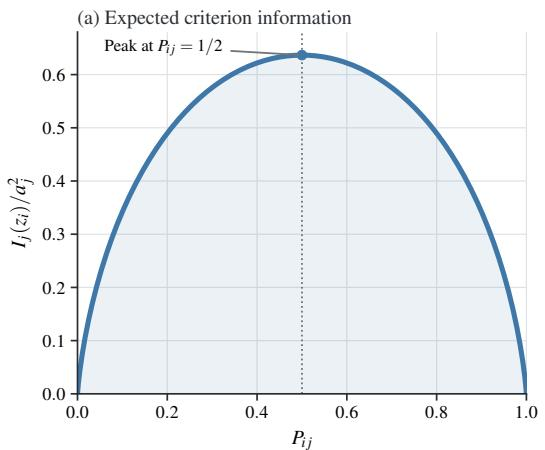

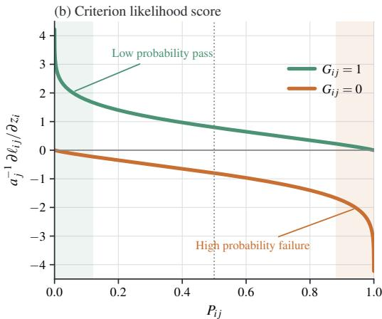  
Figure 3: Criterion information and likelihood scores under the Gaussian CDF $F = \Phi$ as functions of pass probability $P _ { i j }$ . The left panel shows normalized information $I _ { j } ( z _ { i } ) / a _ { j } ^ { 2 }$ . The right shows $a _ { i } ^ { - 1 } \partial \ell _ { i j } / \partial z _ { i }$ for a pass and failure. The dotted line marks $P _ { i j } = 1 / 2$ , and shading marks verdicts with low probability.

## A.4 LOCAL EFFICIENCY OF REWARD AGGREGATION

Fix a differentiable $F ,$ a quality level $z _ { i } ,$ fixed criterion parameters $( a _ { j } , b _ { j } )$ , and conditionally independent verdicts under the item response model of Section 3.1. Define

$$
I _ { F , j } ( z _ { i } ) : = a _ { j } ^ { 2 } \frac { F ^ { \prime } ( u _ { i j } ) ^ { 2 } } { P _ { i j } ( 1 - P _ { i j } ) } = P _ { i j } ( 1 - P _ { i j } ) [ a _ { j } s _ { F } ( u _ { i j } ) ] ^ { 2 } ,
$$

and suppose $\begin{array} { r } { \sum _ { j } I _ { F , j } ( z _ { i } ) > 0 } \end{array}$ . Consider the linear statistic

$$
T _ { v } = \sum _ { j } v _ { j } ( G _ { i j } - P _ { i j } ) ,
$$

where $P _ { i j }$ is evaluated at $z _ { i } .$ . Suppose $T _ { v }$ has unit local response to a quality change,

$$
\frac { d } { d h } \mathbb { E } _ { z _ { i } + h } [ T _ { v } ] \bigg \vert _ { h = 0 } = \sum _ { j } v _ { j } a _ { j } F ^ { \prime } ( u _ { i j } ) = 1 .\tag{12}
$$

The proof of Theorem 2 extends its bound to general F. Applying this bound to $T _ { v }$ gives the statistic with minimum variance

$$
T ^ { * } = \frac { \sum _ { j } a _ { j } s _ { F } ( u _ { i j } ) ( G _ { i j } - P _ { i j } ) } { \sum _ { j } I _ { F , j } ( z _ { i } ) } .\tag{13}
$$

Its conditional variance is

$$
\operatorname { V a r } ( T ^ { * } \mid z _ { i } ) = \left[ \sum _ { j } I _ { F , j } ( z _ { i } ) \right] ^ { - 1 } .
$$

Differentiability gives $\mathbb { E } _ { z _ { i } + h } [ T ^ { * } ] = h + o ( h )$ . This unbiasedness is local.

For $F = \Phi , I _ { F , i } = I _ { i }$ and the numerator of Eq. 13 is the rubric likelihood score $S _ { i } ( z _ { i } )$ , the likelihood contribution in $\mathrm { E q . } \ \breve { 7 }$ . The efficient coefficient is $a _ { j } s _ { \Phi } ( u _ { i j } )$ , not $a _ { j }$ alone. The latter coefficient belongs to $F = \sigma$ because $s _ { \sigma } \equiv 1$

Under conditional independence, the expected negative curvature of the log posterior is

$$
- \mathbb { E } [ \ell _ { i } ^ { \prime \prime } ( z _ { i } ) \mid z _ { i } ] = { \frac { 1 } { \sigma _ { z } ^ { 2 } } } + \sum _ { j } I _ { j } ( z _ { i } ) .\tag{14}
$$

The Gaussian prior contributes $1 / \sigma _ { z } ^ { 2 }$ . Theorem 1 gives the expected negative curvature $I _ { j } ( z _ { i } )$ of each criterion, and the terms add under conditional independence. For duplicate or dependent criteria, information is not additive. After substituting $\hat { z } _ { i } ,$ , the inverse square root of the expected precision and the observed curvature $[ - \ell _ { i } ^ { \prime \prime } ( \hat { z } _ { i } ) ] ^ { - 1 / 2 }$ give local uncertainty approximations.

## A.5 ALIGNMENT WITH THE REWARD BASED ON RUBRIC POINTS

Under the item response model, the expected reward based on rubric points is strictly increasing in scalar quality and does not decrease under first-order stochastic dominance. This section proves that result and compares this reward with the rubric likelihood score and MAP reward as local training signals. Fix a prompt $q ,$ its rubric $c ,$ and the criterion parameters $( a _ { j } , b _ { j } ) = \psi ( q , c _ { j } )$ . For the verdict vector $G _ { i } ,$ , the rubric likelihood score expands to

$$
 S _ { i } ( z _ { i } ) = \sum _ { j } S _ { i j } ( z _ { i } ) = \sum _ { j } a _ { j } s _ { F } ( u _ { i j } ) \big ( G _ { i j } - P _ { i j } \big )
$$

for a general F. Define the rubric information for general $F$ as

$$
I _ { F } ( z _ { i } ) : = \sum _ { j } I _ { F , j } ( z _ { i } ) ,
$$

which equals the rubric information $I ( z _ { i } )$ under the adopted $F = \Phi$ . The results below assume the model of Eq. 1.

Theorem 8 (Monotone expected reward based on rubric points). Let F be differentiable and strictly increasing with $F ^ { \prime } > 0$ . Then

$$
m ( z _ { i } ) : = \mathbb { E } \left[ R _ { i } ^ { \mathrm { b a s e } } \bigm | z _ { i } \right] = \frac { \sum _ { j } w _ { j } P _ { i j } } { \sum _ { \ell } w _ { \ell } } , \qquad m ^ { \prime } ( z _ { i } ) = \frac { \sum _ { j } w _ { j } a _ { j } F ^ { \prime } ( u _ { i j } ) } { \sum _ { \ell } w _ { \ell } } > 0 .
$$

Let $Z _ { \theta }$ be the quality of a rollout drawn from $\pi _ { \theta } ( \cdot \mid q )$ , so that $\mathbb { E } [ R _ { i } ^ { \mathrm { { b a s e } } } \mid q ] = \mathbb { E } [ m ( Z _ { \theta } ) ]$ ]. If the quality after a policy update first-order stochastically dominates the quality before it, the expected reward based on rubric points does not decrease.

Proof. Linearity of expectation and $\mathbb { E } [ G _ { i j } \ | \ z _ { i } ] \ = \ P _ { i j }$ give m. Differentiating $P _ { i j } = F ( u _ { i j } )$ gives $\partial P _ { i j } / \partial z _ { i } = a _ { j } \bar { F ^ { \prime } } ( u _ { i j } )$ , and every term is positive because $w _ { j } > 0 , a _ { j } > 0 .$ , and $F ^ { \prime } > 0$ Since m is increasing, $\mathbb { E } [ m ( Z _ { \mathrm { a f t e r } } ) ] \geq \mathbb { E } [ m ( Z _ { \mathrm { b e f o r e } } ) ]$ is the defining property of first-order stochastic dominance. □

Theorem 8 establishes alignment under first-order stochastic dominance. Outside this condition, the two training signals can disagree. A location shift of the quality distribution is one sufficient special case.

ProofofTheorem 2. The argument uses only differentiability of $F$ and conditional independence. It therefore gives the bound with $I _ { F } ( z _ { i } )$ in place of $I ( z _ { i } )$ for a general response function, whenever $0 < P _ { i j } < 1$ for every $j$ and $I _ { F } ( z _ { i } ) > 0$ . The verdict vector takes finitely many values, so the sum defining $\mathbb { E } [ T \mid z _ { i } ]$ may be differentiated term by term. Writing $p ( G _ { i } \mid z _ { i } )$ for the likelihood of Eq. 1,

$$
{ \frac { d } { d z _ { i } } } \mathbb { E } [ T \mid z _ { i } ] = \sum _ { G _ { i } } T ( G _ { i } ) p ( G _ { i } \mid z _ { i } ) S _ { i } ( z _ { i } ) = \mathbb { E } [ T S _ { i } ( z _ { i } ) \mid z _ { i } ] = \operatorname { C o v } \left( T , S _ { i } ( z _ { i } ) \mid z _ { i } \right) ,
$$

where the last step uses $\mathbb { E } [ G _ { i j } \ \mid \ z _ { i } ] \ = \ P _ { i j }$ , which makes each criterion likelihood score have conditional mean zero. Conditional independence gives

$$
\operatorname { V a r } \big ( S _ { i } ( z _ { i } ) \mid z _ { i } \big ) = \sum _ { j } \mathbb { E } \big [ S _ { i j } ( z _ { i } ) ^ { 2 } \mid z _ { i } \big ] = I _ { F } ( z _ { i } ) .
$$

Cauchy-Schwarz then gives Co $r ( T , S _ { i } ) ^ { 2 } \leq \mathrm { V a r } ( T ) I _ { F } ( z _ { i } )$ , which is the stated bound, with equality if and only if the two centered variables are almost surely proportional under $p _ { \psi } ( G _ { i } \mid z _ { i } , q , c )$ . The constant cannot be zero, since that would make $T$ almost surely constant and contradict $\mathrm { V a r } ( T \mid$ $z _ { i } ) > 0$ . Replacing $T$ by $\alpha + \beta T$ with $\beta \neq 0$ multiplies numerator and denominator of Eq. 5 by $\beta ^ { 2 }$ so the ratio is unchanged by any nonzero affine map of $T$ □

Proofofthe clausefor rubric points in Theorem 2. Under the same conditions,

$$
\mathrm { S N R } _ { \mathrm { b a s e } } ( z _ { i } ) = \frac { \left( \sum _ { j } w _ { j } a _ { j } F ^ { \prime } ( u _ { i j } ) \right) ^ { 2 } } { \sum _ { j } w _ { j } ^ { 2 } P _ { i j } ( 1 - P _ { i j } ) } \le I _ { F } ( z _ { i } ) ,
$$

with equality if and only if $w _ { j } = \gamma _ { w } a _ { j } s _ { F } ( u _ { i j } )$ for every j and some $\gamma _ { w } \ > \ 0$ . For $F = \sigma$ this condition reads $w _ { j } \propto a _ { j } .$ For ${ \dot { F } } = \Phi$ it reads $w _ { j } \propto a _ { j } s _ { \Phi } ( u _ { i j } )$ , whose right side depends on $b _ { j }$ and on $z _ { i }$ . The displayed ratio follows from ${ \partial P _ { i j } } / { \partial { { \bar { z } } _ { i } } } = { { \bar { a _ { j } } } F ^ { \prime } } ( u _ { i j } ^ { - } )$ , from conditional independence, and from the Bernoulli variance $P _ { i j } ( 1 - P _ { i j } )$ . The factor $\textstyle \sum _ { \ell }$ w<sub>ℓ</sub> cancels. Equality in the information bound requires

$$
\sum _ { j } \left( \frac { w _ { j } } { \sum _ { \ell } w _ { \ell } } - \gamma _ { w } ^ { \prime } a _ { j } s _ { F } ( u _ { i j } ) \right) ( G _ { i j } - P _ { i j } ) = 0
$$

almost surely. Taking the conditional variance of the left side gives a sum of nonnegative terms with positive factors $\mathsf { \bar { P } } _ { i j } ( 1 - P _ { i j } )$ , so every coefficient vanishes. Since $w _ { j } > 0$ , equality requires $s _ { F } ( u _ { i j } ) > 0$ for every $j$ and $\gamma _ { w } ^ { \prime } > 0$ . For $F = \sigma , s _ { \sigma } \equiv 1$ by Theorem 4. For $F = \Phi$ , take two criteria and suppose equality holds at every $z _ { i } ,$ , so that

$$
\chi ( z _ { i } ) : = \frac { a _ { 1 } s _ { \Phi } \left( a _ { 1 } ( z _ { i } - b _ { 1 } ) \right) } { a _ { 2 } s _ { \Phi } \left( a _ { 2 } ( z _ { i } - b _ { 2 } ) \right) } = \frac { w _ { 1 } } { w _ { 2 } }
$$

is a constant $\chi _ { 0 }$ . Mills’ ratio sharpens the asymptotic of Theorem $5$ to $s _ { \Phi } ( u ) = u + O ( u ^ { - 1 } )$ as $u \to \infty$ , so $a _ { j } s _ { \Phi } \big ( a _ { j } \big ( z _ { i } - b _ { j } \big ) \big ) = a _ { j } ^ { 2 } \big ( z _ { i } - b _ { j } \big ) + O \big ( z _ { i } ^ { - 1 } \big )$ and

$$
\left( a _ { 1 } ^ { 2 } - \chi _ { 0 } a _ { 2 } ^ { 2 } \right) z _ { i } - \left( a _ { 1 } ^ { 2 } b _ { 1 } - \chi _ { 0 } a _ { 2 } ^ { 2 } b _ { 2 } \right) \longrightarrow 0 .
$$

An affine function with this limit vanishes identically, so $a _ { 1 } ^ { 2 } = \chi _ { 0 } a _ { 2 } ^ { 2 }$ and then $b _ { 1 } = b _ { 2 }$ . Evaluating χ at $z _ { i } = b _ { 1 }$ gives $\chi = a _ { 1 } / a _ { 2 }$ through $s _ { \Phi } ( 0 ) = 4 / \sqrt { 2 \pi }$ , so $a _ { 1 } / a _ { 2 } = \chi _ { 0 } = a _ { 1 } ^ { 2 } / a _ { 2 } ^ { 2 }$ and $a _ { 1 } = a _ { 2 }$ Therefore, once two criteria have different criterion parameters, no fixed vector of rubric points achieves the bound at every quality level. □

The points $w _ { j }$ specify how much each criterion should count. The coefficients of the verdicts in Eq. 13 are proportional to $a _ { j } s _ { F } ( u _ { i j } )$ . Under $F = \Phi$ , they vary with quality while the points $w _ { j }$ stay fixed. Unless the coefficients are proportional, the points total has lower local SNR than the likelihood score. The reward based on rubric points also cannot distinguish verdict vectors with the same points total.

Proposition 1 (Points ties and reward separation). Fix a prompt group and its criterion parameters. If two rollouts satisfy $\begin{array} { r } { \sum _ { j } w _ { j } \bar { G } _ { 1 j } = \sum _ { j } w _ { j } \bar { G } _ { 2 j } } \end{array}$ , then ${ \bf \breve { \cal R } } _ { 1 } ^ { \mathrm { b a s e } } = { \cal R } _ { 2 } ^ { \mathrm { b a s e } }$ The RRT reward $\hat { z } _ { i }$ can still separate two such rollouts. Under $F = \sigma$ it separates them if and only if $\textstyle \sum _ { j } a _ { j } G _ { 1 j } \neq \sum _ { j } a _ { j } { \bar { G } } _ { 2 j }$ . Under $F = \Phi$ it can separate them even when those totals weighted by discrimination agree.

Proof. Equality of the rewards based on rubric points follows from $\begin{array} { r } { R _ { i } ^ { \mathrm { b a s e } } = \sum _ { i } w _ { j } G _ { i j } / \sum _ { \ell } w _ { \ell } } \end{array}$ The claim for $F = \sigma$ is Theorem 4, which makes $\hat { z } _ { i }$ a strictly increasing function of $\textstyle \sum _ { j } a _ { j } G _ { i j }$ shared by the group. For $F = \Phi$ take $K = 2 , w _ { 1 } = w _ { 2 } = 1 , a _ { 1 } = a _ { 2 } = 1 , \sigma _ { z } ^ { 2 } = 1 , b _ { 2 } = \widetilde { 0 } , b _ { 1 } = b > 0$ and the verdict vectors $G _ { 1 } = ( 1 , 0 )$ and $G _ { 2 } = ( 0 , 1 )$ , which agree on both totals. $\operatorname { E q . 7 }$ gives

$$
\ell _ { 1 } ^ { \prime } ( z ) = \lambda ( z - b ) - \lambda ( - z ) - z , \qquad \ell _ { 2 } ^ { \prime } ( z ) = \lambda ( z ) - \lambda ( b - z ) - z .
$$

Since $\lambda > 0$ , it follows that $\ell _ { 2 } ^ { \prime } ( z ) \leq \lambda ( z ) - z .$ , whose unique root $z ^ { \star }$ is finite, so $\hat { z } _ { 2 } \leq z ^ { \star }$ . Mills’ ratio gives $\lambda ( z ^ { \star } - b )  \infty$ as $b \to \infty$ while $\hat { \lambda } ( - z ^ { \star } ) + z ^ { \star }$ is fixed, so $\ell _ { 1 } ^ { \prime } ( z ^ { \star } ) > 0$ for large b. Because $\ell _ { 1 } ^ { \prime }$ is strictly decreasing by Theorem $6 , \hat { z } _ { 1 } > z ^ { \star } \ge \hat { z } _ { 2 }$ □

Theorem 9 (Exact MAP expansion and group invariance). Suppose $F = \Phi$ . For a group statistic   
vector $\mathbf { T } = \left( T _ { 1 } , \dots , T _ { N } \right)$ , write $\bar { T } = \breve { N } ^ { - 1 } \sum _ { k } T _ { k }$ and define   
$\mathcal { A } _ { i } [ \mathbf { T } ] : = \frac { T _ { i } - \bar { T } } { \mathrm { s t d } _ { k } T _ { k } + \varepsilon }$   
for the group advantage operator of Eq. 17. Let $\hat { \mathbf { z } } = ( \hat { z } _ { 1 } , \dots , \hat { z } _ { N } )$ $I f \varepsilon = 0$ and $\mathrm { s t d } _ { k } T _ { k } > 0 ,$   
then $\bar { \mathcal { A } _ { i } } [ \alpha \mathbf { 1 } ^ { \mathrm { ~ \bar { ~ } } } + \beta \mathbf { T } ] = \bar { \mathcal { A } _ { i } } [ \mathbf { \bar { T } } ] f o r$ every α and every $\beta > 0 .$ Fix a quality level $z _ { 0 } .$ . For every   
rollout there is a point $\xi _ { i }$ between $z _ { \mathrm { 0 } }$ and $\hat { z } _ { i }$ with   
$\hat { z } _ { i } - z _ { 0 } = \frac { S _ { i } ( z _ { 0 } ) - z _ { 0 } / \sigma _ { z } ^ { 2 } } { - \ell _ { i } ^ { \prime \prime } ( \xi _ { i } ) } .$

Proof. For $\beta > 0$ the group mean of $\alpha \mathbf { 1 } + \beta \mathbf { T }$ is $\alpha + \beta \bar { T }$ and its standard deviation is $\beta \mathrm { s t d } _ { k } T _ { k }$ , so the two factors β cancel at $\varepsilon = 0$ when the denominator is positive. Theorem 6 makes $\ell _ { i }$ smooth with $\ell _ { i } ^ { \prime } ( \hat { z } _ { i } ) = \mathrm { ~ 0 ~ }$ , so the mean value theorem gives $0 = \ell _ { i } ^ { \prime } ( z _ { 0 } ) + \ell _ { i } ^ { \prime \prime } ( \xi _ { i } ) ( \hat { z } _ { i } - z _ { 0 } )$ . Eq. 7 gives $\ell _ { i } ^ { \prime } ( z _ { 0 } ) \stackrel { \ldots } { = } S _ { i } ( z _ { 0 } ) - z _ { 0 } / \sigma _ { z } ^ { 2 }$ □

A Fisher scoring surrogate replaces the realized curvature in Theorem 9 by the expected local precision in Eq. 14. Define

$$
\widetilde { z } _ { i } ( z _ { 0 } ) : = z _ { 0 } + \frac { S _ { i } ( z _ { 0 } ) - z _ { 0 } / \sigma _ { z } ^ { 2 } } { \sigma _ { z } ^ { - 2 } + I ( z _ { 0 } ) } .\tag{15}
$$

Let $\widetilde { \mathbf z } ( z _ { 0 } ) = ( \widetilde { z } _ { 1 } ( z _ { 0 } ) , \dots , \widetilde { z } _ { N } ( z _ { 0 } ) )$ and $\pmb { S } ( z _ { 0 } ) = ( S _ { 1 } ( z _ { 0 } ) , \dots , S _ { N } ( z _ { 0 } ) )$ . The denominator in Eq. 15 eis positive and shared across the group. Therefore, if $\varepsilon = 0$ and the score vector has positive standard deviation, affine invariance gives the exact identity

$$
\begin{array} { r } { \mathcal A _ { i } [ \widetilde { \mathbf z } ( z _ { 0 } ) ] = \mathcal A _ { i } [ \pmb { S } ( z _ { 0 } ) ] . } \end{array}
$$

Replacing each realized curvature by the shared expected precision can change the exact MAP order. The MAP reward can rank incomparable verdict vectors differently from the reward based on rubric points.

## B METHOD AND OPTIMIZATION DETAILS

## B.1 ONLINE EM OBJECTIVE AND ALGORITHMS

Algorithm 1 gives the full policy training and calibration loop.

Algorithm 1 RRT policy training with online GRPO and EM calibration of the RPN.   
1: Initialize policy $\pi _ { \theta }$ from the checkpoint of the base policy and RPN ψ neutrally or with a warm start   
2: for each policy step do   
3: sample a batch of prompts and draw N rollouts per prompt from π<sub>θ</sub>   
4: judge each rollout against its rubric → verdicts G   
5: E-step: in evaluation mode, infer zˆ<sup>reward</sup><sub>i</sub> ← arg max<sub>z</sub> $\ell _ { i } ( z )$ by bisection using Eq. 7 (Algorithm 2),   
$R _ { i }  \hat { z } _ { i } ^ { \mathrm { r } }$ eward   
6: compute $A _ { i }$ within each prompt group (Eq. 17)   
7: GRPO: update $\pi _ { \theta }$ on $J ( \hat { \boldsymbol { \theta } } )$ (Eq. 18)   
8: Stochastic partial M-step: one accumulated gradient step on ψ with detached mode targets $\hat { z } _ { i } ^ { \mathrm { M } }$ using   
Eq. 3 (Algorithm 3)   
9: end for

Let $\mathbf { z } = ( z _ { 1 } , \dots , z _ { N } )$ collect the latent qualities of the rollouts. The ideal EM objective is the regularized log posterior for the complete data

$$
\mathcal { C } _ { \mathrm { E M } } ( \boldsymbol { \psi } , \mathbf { z } ) = \sum _ { i = 1 } ^ { N } \Big [ \sum _ { j = 1 } ^ { K } \ell _ { i j } ( z _ { i } ; \boldsymbol { \psi } ) - \frac { z _ { i } ^ { 2 } } { 2 \sigma _ { z } ^ { 2 } } \Big ] - N \lambda _ { a } \sum _ { j = 1 } ^ { K } ( \log a _ { j } ) ^ { 2 } .\tag{16}
$$

With $\psi ^ { ( s ) }$ fixed, maximizing it over each $z _ { i }$ gives the E-step of Eq. 2. With z fixed, exact minimization of Eq. 3 gives the other coordinate update up to normalization because the Gaussian quality prior has no parameter in ψ. Algorithm 3 instead takes one stochastic optimizer step. Because $z _ { i }$ is scalar and its log posterior is strictly concave by Theorem 6, each E-step has one solution and bisection computes it deterministically for fixed criterion parameters.

$$
a _ { j } \mapsto a _ { j } / r , \qquad z _ { i } \mapsto r z _ { i } , \qquad b _ { j } \mapsto r b _ { j } , \qquad r > 0 ,
$$

which leaves the response function argument $a _ { j } ( z _ { i } - b _ { j } )$ unchanged. The Gaussian prior and discrimination regularizer fix this scale. The prior mean anchors the location, and the constraint $a _ { j } > 0$ fixes the direction.

The E-step returns the MAP quality $\hat { z } _ { i }$ of Eq. 11, as specified by Algorithm 2. The log posterior objective $\ell _ { i }$ is strictly concave by Theorem $^ { 6 , }$ so its derivative has one root. The algorithm starts from $[ - \check { B } _ { z } , B _ { z } ]$ and doubles any endpoint whose derivative has the wrong sign until this root is bracketed. The derivative limits guarantee that the expansion terminates. It then halves the bracket T times using the derivative sign at the midpoint, with $\dot { \lambda ( x ) } = \phi ( x ) / \Phi ( x )$ as in Eq. 9. If the expanded bracket has width W, the returned midpoint has error at most $\dot { W } / 2 ^ { T + 1 }$

Algorithm 2 ESTIMATEZ: MAP quality estimation by bisection.   
Require: verdicts $G _ { i j }$ , criterion parameters $a _ { j } , b _ { j }$ from the RPN ψ, prior variance $\sigma _ { z } ^ { 2 } ,$ initial bracket half-width   
$B _ { z } > 0 ,$ iteration count T   
Ensure: MAP quality zˆ from Eq. 11 for every rollout i   
1: define m ${ \bf \chi } _ { i } ( x )  \mathbf { \hat { \ell } } \ell _ { i } ^ { \prime } ( x )$ by Eq. 7   
2: $\mathrm { l o } _ { i } \gets - \dot { B _ { z } } , \quad \mathrm { h i } _ { i } \gets + B _ { z }$   
3: while some $m _ { i } ( \log _ { i } ) < 0$ do   
4: $\mathrm { l o } _ { i }  \mathrm { 2 l o } _ { i }$ for those rollouts   
5: end while   
6: while some $m _ { i } ( \mathrm { h i } _ { i } ) > 0$ do   
7: $\mathrm { h i } _ { i } \gets \mathrm { 2 h i } _ { i }$ for those rollouts   
8: end while   
9: for t = 1 to T do   
10: $z _ { i } \gets \frac { 1 } { 2 } ( \mathrm { l o } _ { i } + \mathrm { h i } _ { i } )$   
11: hi<sub>i</sub> ← z<sub>i</sub> where m $\ u _ { i } ( z _ { i } ) \leq 0$   
12: lo<sub>i</sub> ← z<sub>i</sub> where $m _ { i } { \left( z _ { i } \right) } > 0$   
13: end for   
14: return $\hat { z } _ { i } \gets \frac { 1 } { 2 } ( \mathrm { l o } _ { i } + \mathrm { h i } _ { i } )$ for every rollout i

Algorithm 3 sweeps the policy step’s rollouts once per epoch in mini-batches of $B .$ For each minibatch, one differentiable forward pass through the RPN $\psi$ predicts $( a _ { i j } , b _ { i j } )$ for every pair $\left( q _ { i } , c _ { i j } \right)$ It reruns the E-step on detached parameter values to obtain $\hat { z } _ { i } ^ { \mathrm { M } }$ , then adds its share of the gradient of Eq. 3 to an accumulator. One AdamW update is applied at the end of the epoch, so ψ does not change between mini-batches.

```latex
Algorithm 3 UPDATEPSI: stochastic partial M-step for the RPN $\psi .$
Require: the policy step’s rollouts (rollout i has prompt $q _ { i } ,$ , criteria $c _ { i j }$ , verdicts $G _ { i j }$ , and criterion count K ),
the current RPN ψ with its AdamW state, and the hyperparameters E (epochs), B (mini-batch size), $\lambda _ { a }$
(discrimination regularizer weight), $\tau _ { g }$ (gradient clip norm)
Ensure: updated RPN $\psi$
1: for $e \overset { \bar { } = } { = } 1$ to E do
2: shuffle the rollouts and split them into M mini-batches of B
3: $g _ { \psi }  0$ ▷ gradient accumulator
4: for each mini-batch B of B rollouts do
5: $( a _ { i j } , b _ { i j } ) \gets \psi ( q _ { i } , c _ { i j } )$ for every criterion of every rollout in B ▷ one differentiable forward
6: $\begin{array} { r } { \hat { z } _ { i } ^ { \mathrm { M } } \gets \mathrm { \overrightarrow { E } S T I M A T E } Z ( \mathcal { \bar { B } } ) } \end{array}$ with $( a _ { i j } , b _ { i j } )$ detached ▷ Alg. 2, targets held fixed
7: $\mathcal { L } \gets \frac { 1 } { B } \sum _ { i \in \mathcal { B } } \left[ - \frac { 1 } { K _ { i } } \sum _ { j = 1 } ^ { K _ { i } } \ell _ { i j } ( \hat { z } _ { i } ^ { \mathrm { M } } ) + \frac { \lambda _ { a } } { K _ { i } } \sum _ { j = 1 } ^ { K _ { i } } ( \log a _ { i j } ) ^ { 2 } \right]$ ▷ Eq. 3
8: $g _ { \psi } \gets g _ { \psi } + \nabla _ { \psi } \mathcal { L } / M$ ▷ accumulate, do not step
9: end for
10: clip $\| g _ { \psi } \|$ to $\tau _ { g } ,$ then take one AdamW step on $\psi$
11: end for
12: return $\psi$
```

## B.2 GRPO OBJECTIVE

Let ${ \widetilde { R } } _ { i }$ denote the scalar reward passed to GRPO. It is centered within each prompt’s group of N erollouts to form the advantage

$$
A _ { i } = \frac { \widetilde R _ { i } - \overline { { \widetilde R } } } { \mathrm { s t d } _ { k } \widetilde R _ { k } + \varepsilon } , \quad \overline { { \widetilde R } } = \frac { 1 } { N } \sum _ { k } \widetilde R _ { k } .\tag{17}
$$

Here $\varepsilon > 0$ stabilizes groups when reward variance is near zero.

Write rollout $o _ { i } = \left( o _ { i 1 } , \ldots , o _ { i L _ { i } } \right)$ , where $L _ { i }$ is its generated token count. The standard GRPO update uses the clipped surrogate objective of PPO (Schulman et al., 2017) and a Kullback-Leibler (KL) penalty toward the fixed reference policy $\pi _ { \mathrm { r e f } }$ . Let π<sub>θ</sub> be the current policy and $\pi _ { \theta _ { \mathrm { o l d } } }$ the old policy that generated the rollouts. Define the token likelihood ratio

$$
\varrho _ { i t } = \frac { \pi _ { \theta } { \left( { { o _ { i t } } \mid q , { o _ { i , < t } } } \right) } } { \pi _ { \theta _ { \mathrm { o l d } } } { \left( { { o _ { i t } } \mid q , { o _ { i , < t } } } \right) } }
$$

and $r _ { i t } ^ { \mathrm { r e f } } = \pi _ { \mathrm { r e f } } ( o _ { i t } \mid q , o _ { i , < t } ) / \pi _ { \theta } ( o _ { i t } \mid q , o _ { i , < t } )$ . Its KL estimator at the token level is $\widehat { D } _ { \mathrm { K L } , i t } =$ $r _ { i t } ^ { \mathrm { r e f } } - \log r _ { i t } ^ { \mathrm { r e f } } - 1$ . The policy maximizes

$$
J ( \theta ) = \mathbb { E } _ { i } \bigg [ \frac { 1 } { L _ { i } } \sum _ { t = 1 } ^ { L _ { i } } \Big ( \operatorname* { m i n } \big ( \varrho _ { i t } A _ { i } , \mathrm { c l i p } ( \varrho _ { i t } , 1 - \epsilon _ { c } , 1 + \epsilon _ { c } ) A _ { i } \big ) - \beta _ { \mathrm { K L } } \widehat { D } _ { \mathrm { K L } , i t } \Big ) \bigg ] ,\tag{18}
$$

where $\epsilon _ { c }$ is the likelihood ratio clip radius and $\beta _ { \mathrm { K L } }$ weights the KL penalty.

## C ADDITIONAL CRITERION AND REWARD EXPERIMENTS

## C.1 TEXT PREDICTION OF CRITERION PARAMETERS

This experiment tests whether criterion parameters predicted by the RPN ψ from text recover empirical criterion difficulty and predict observed verdicts. The embedder ablation compares Qwen3 Embedding models (Zhang et al., 2025) and Llama-Embed-Nemotron-8B (Babakhin et al., 2025). The criterion parameters predicted by the RPN, together with inferred rollout quality $\hat { z } _ { i } ,$ , give the fitted pass probability $\begin{array} { r } { \widehat { P } _ { i j } ^ { \mathrm { M A P } } = F ( a _ { j } ( \widehat { z } _ { i } - b _ { j } ) ) } \end{array}$

The response function F varies across the Gaussian CDF Φ, the logistic CDF σ, and the complementary log-log function ${ \mathrm { c l l } } ( t ) = 1 - \exp ( - e ^ { t } )$ . The last choice relaxes $F ( 0 ) = 0 . 5 , \mathbf { s o } \ b _ { j }$ is a location parameter rather than the 50% pass threshold in that configuration. A second ablation varies how many criterion parameters $\psi$ predicts. The model with three parameters adds a lower asymptote $\gamma _ { j }$ , which the pass probability approaches as $z _ { i }  - \infty$ (Birnbaum, 1968). The model with four parameters adds an upper asymptote $\xi _ { j } .$ , which the pass probability approaches as $z _ { i }  + \infty$ (Magis, 2013). The resulting fitted probability adds $\gamma _ { j }$ to $( \xi _ { j } - \gamma _ { j } ) F ( a _ { j } ( \hat { z } _ { i } - b _ { j } ) )$ , with $\xi _ { j } = 1$ in the model with three parameters and $\gamma _ { j } = 0 , \xi _ { j } = 1$ in the models with one and two parameters. The model with one parameter also fixes $a _ { j } = 1$ . The RPN reads $( q , c _ { j } )$ and predicts every free parameter, and the asymptotes are constrained to $0 < \gamma _ { j } < \xi _ { j } < 1$

For a set $\mathcal { T }$ of rollouts, define the empirical criterion pass rate as $\begin{array} { r } { \bar { G } _ { j , \mathcal { T } } = | \mathcal { T } | ^ { - 1 } \sum _ { i \in \mathcal { T } } G _ { i j } } \end{array}$ , and write $\bar { G } _ { j }$ when the set is clear. Two complementary evaluation metrics are used. First, Spearman correlation between the criterion difficulty parameter $b _ { j }$ and empirical criterion difficulty $1 - \bar { G } _ { i }$ measures whether the RPN predicts which criteria are hard from text (Table 6). Second, $R { \mathrm { O C } } -$ AUC between $\widehat { P } _ { i j } ^ { \mathrm { M A P } }$ and $G _ { i j }$ measures verdict ranking. Quality $\hat { z } _ { i }$ is inferred from the full rollout bverdict vector, including the evaluated verdict $G _ { i j }$ . Section 4.2 describes its leave-one-criterion-out counterpart, while Appendix C.6 defines a separate metric for the next policy step.

Table 5: Verdict ROC-AUC of RPN configurations across datasets when the evaluated verdict is included. Each block varies one component: the response function, number of criterion parameters, text conditioning, text embedder, or rollout policy. The remaining components use the standard configuration. Bold marks the highest macro mean in each block.
<table><tr><td rowspan="2">RPN configuration</td><td colspan="5">Verdict included in fit (ROC-AUC)</td></tr><tr><td></td><td></td><td></td><td>Medical Science RaR Science RubricBench</td><td>Macro mean</td></tr><tr><td colspan="6">F</td></tr><tr><td>Φ (Gaussian CDF)</td><td>80.6</td><td>84.2</td><td>91.7</td><td>91.9</td><td>87.1</td></tr><tr><td>σ (logistic CDF)</td><td>80.5</td><td>84.1</td><td>90.1</td><td>90.6</td><td>86.3</td></tr><tr><td>cll (complementary log-log)</td><td>80.5</td><td>84.3</td><td>92.2</td><td>91.8</td><td>87.2</td></tr><tr><td colspan="6">Number of criterion parameters</td></tr><tr><td>One parameter,  $b _ { j }$ </td><td>80.4</td><td>83.8</td><td>90.8</td><td>90.7</td><td>86.4</td></tr><tr><td>Two parameters,  $( a _ { j } , b _ { j } )$ </td><td>80.6</td><td>84.2</td><td>91.7</td><td>91.9</td><td>87.1</td></tr><tr><td>Three parameters,  $( a _ { j } , b _ { j } , \gamma _ { j } )$ </td><td>80.6</td><td>84.2</td><td>91.7</td><td>91.7</td><td>87.0</td></tr><tr><td>Four parameters,  $( a _ { j } , b _ { j } , \gamma _ { j } , \xi _ { j } )$ </td><td>80.5</td><td>84.2</td><td>91.5</td><td>90.4</td><td>86.6</td></tr><tr><td colspan="6">Text conditioning</td></tr><tr><td> $\psi ( c _ { j } )$ </td><td>80.6</td><td>84.1</td><td>91.8</td><td>91.7</td><td>87.1</td></tr><tr><td> $\psi ( q , c _ { j } )$ </td><td>80.6</td><td>84.2</td><td>91.7</td><td>91.9</td><td>87.1</td></tr><tr><td colspan="6">Text embedder</td></tr><tr><td>Qwen3-Embedding-0.6B</td><td>79.2</td><td>82.9</td><td>91.3</td><td>91.5</td><td>86.2</td></tr><tr><td>Qwen3-Embedding-4B</td><td>80.6</td><td>84.2</td><td>91.7</td><td>91.9</td><td>87.1</td></tr><tr><td>Qwen3-Embedding-8B</td><td>81.4</td><td>84.9</td><td>91.8</td><td>91.6</td><td>87.4</td></tr><tr><td>Llama-Embed-Nemotron-8B</td><td>83.1</td><td>86.3</td><td>92.5</td><td>92.8</td><td>88.7</td></tr><tr><td colspan="6">Rollout policy</td></tr><tr><td>Qwen3.5-4B</td><td>80.6</td><td>84.2</td><td>91.7</td><td>91.9</td><td>87.1</td></tr><tr><td>Qwen3.5-2B</td><td>82.1</td><td>84.1</td><td>90.2</td><td>86.9</td><td>85.8</td></tr><tr><td>Llama-3.1-8B-Instruct</td><td>84.5</td><td>83.0</td><td>88.7</td><td>86.4</td><td>85.6</td></tr></table>

Across all configurations in Table 5, macro ROC-AUC ranges from 85.6% to 88.7%. The adopted item response model with two parameters and a Gaussian CDF reaches 87.1%, compared with 86.4% for the model with one parameter, 87.0% for the model with three parameters, and 86.6% for the model with four parameters.

## C.2 RPN REPRESENTATION GEOMETRY

This analysis tests whether nearby RPN representations have similar predicted criterion difficulties and verdict patterns. It projects the last hidden representations used to predict $b _ { j }$ with t-distributed stochastic neighbor embedding (t-SNE) (Van der Maaten & Hinton, 2008).

Figure 4 shows stronger local structure for predicted criterion difficulty and fitted pass probability than for empirical criterion difficulty and observed verdicts.

<sup>Predicted</sup> <sup>criterion</sup> <sup>difficulty</sup> <sup>b</sup>j <sup>Empirical</sup> <sup>criterion</sup> <sup>difficulty</sup> <sup>1</sup> − <sup>G¯</sup> j <sup>Fitted</sup> <sup>pass</sup> <sup>probability</sup> <sup>PMAP</sup>ij  
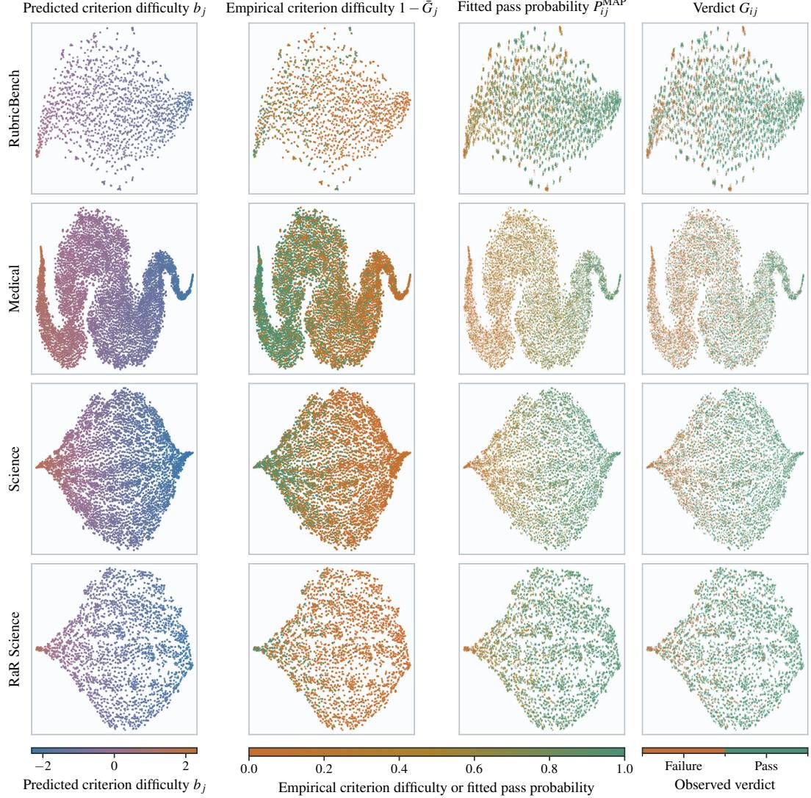  
Figure 4: t-SNE projections of RPN representations. Rows show the four datasets. The first two columns color pairs by predicted criterion difficulty $b _ { j }$ and empirical criterion difficulty $1 - \hat { G } _ { j }$ . The last two color sampled verdicts at jittered pair coordinates by the pass probability $\widehat { P } _ { i j } ^ { \mathrm { M A P } }$ fitted using the RPN and inferred rollout quality, and by verdict $G _ { i j }$ b. Empirical criterion difficulty and fitted pass probability share a color scale.

Table 6 reports the Spearman correlation between $b _ { j }$ and $1 - \hat { G } _ { j }$ as difficulty $\rho _ { \mathrm { S } }$ . Trustworthiness at 10 neighbors (T@10) measures how well the projection preserves local neighborhoods. The analysis also computes Moran’s I after normalizing each row of the graph that connects the 10 nearest neighbors of each displayed variable (Moran, 1950). Larger values mean that nearby points have more similar displayed values.

Table 6: Criterion difficulty prediction and local t-SNE geometry. Columns report difficulty Spearman correlation, trustworthiness at 10 neighbors, and Moran’s I for predicted criterion difficulty, empirical criterion difficulty, pass probability fitted using the RPN and inferred rollout quality, and verdict. All values are percentages.
<table><tr><td colspan="3"></td><td colspan="4">Moran&#x27;s I</td></tr><tr><td>Dataset</td><td>Difficulty ρs</td><td>T@10</td><td> $b _ { j }$ </td><td> $1 - \hat { G } _ { j }$ </td><td> $\widehat { P } _ { i j } ^ { \mathrm { M A P } }$ </td><td> $G _ { i j }$ </td></tr><tr><td>RubricBench</td><td>38.0</td><td>97.2</td><td>98.8</td><td>21.5</td><td>74.0</td><td>45.9</td></tr><tr><td>Medical</td><td>47.9</td><td>99.2</td><td>99.7</td><td>25.9</td><td>77.0</td><td>32.9</td></tr><tr><td>Science</td><td>47.2</td><td>99.2</td><td>99.3</td><td>28.2</td><td>85.8</td><td>38.2</td></tr><tr><td>RaR Science</td><td>38.5</td><td>99.1</td><td>99.1</td><td>19.4</td><td>74.6</td><td>44.1</td></tr></table>

The Spearman correlation between predicted criterion difficulty and empirical criterion difficulty ranges from 38.0% to 47.9%. Moran’s I is 74.0% to 85.8% for fitted pass probability and 32.9% to 45.9% for observed verdicts.

## C.3 RESPONSE FUNCTION SEPARATION OF TIED ROLLOUTS

This analysis compares rewards inferred with the Gaussian and logistic CDFs on observed verdicts from Medical and Science. Both functions use $a _ { j } = 1$ and the same criterion difficulties. The analysis measures separation among pairs with equal pass counts and counts order reversals among pairs with different pass counts.

Table 7: Separation of rollout pairs by the Gaussian and logistic CDFs on Medical and Science. Both CDFs use $a _ { j } = 1$ and the same criterion difficulties. Columns report separation among pairs with equal pass counts and count order reversals among unequal pairs.
<table><tr><td>Dataset</td><td> $F = \Phi$  separated</td><td> $F = \sigma$  separated</td><td>Count order reversals</td></tr><tr><td>Medical</td><td>83.3%</td><td>0.0%</td><td>0</td></tr><tr><td>Science</td><td>39.3%</td><td>0.0%</td><td>0</td></tr></table>

In Table 7, the Gaussian CDF separates 83.3% of pairs with equal pass counts on Medical and 39.3% on Science, compared with 0.0% for the logistic CDF in both datasets. Both CDFs produce zero count order reversals.

## C.4 REWARD SIGNAL ACROSS POLICIES AND GROUP SIZES

This analysis compares reward variation and ties across datasets and policies. Both rewards are computed on the same rollouts, and RRT uses a frozen RPN. The variance share within prompts is the fraction of total reward variance within groups for the same prompt. The tied pair share is the fraction of rollout pairs within a group that receive equal rewards. The relative tied pair reduction compares this share under RRT with the reward based on rubric points.

The variance share within prompts under RRT is 1.2 to 2.2 times that under the reward based on rubric points across the 12 cells. Its relative tied pair reduction ranges from 2% to 58% across those cells.

The group size analysis repeats this matched reward comparison after drawing n rollouts without replacement from the 48 cached rollouts for each prompt. Table 8 reports the tied pair share and the variance share within prompts across group sizes.

At n = 8, RRT and the reward based on rubric points have tied pair shares of 3.6% and 5.8% on Medical, and 19.1% and 20.6% on Science. Their variance shares within prompts are 17.5% and 15.7% on Medical, and 24.1% and 17.6% on Science.

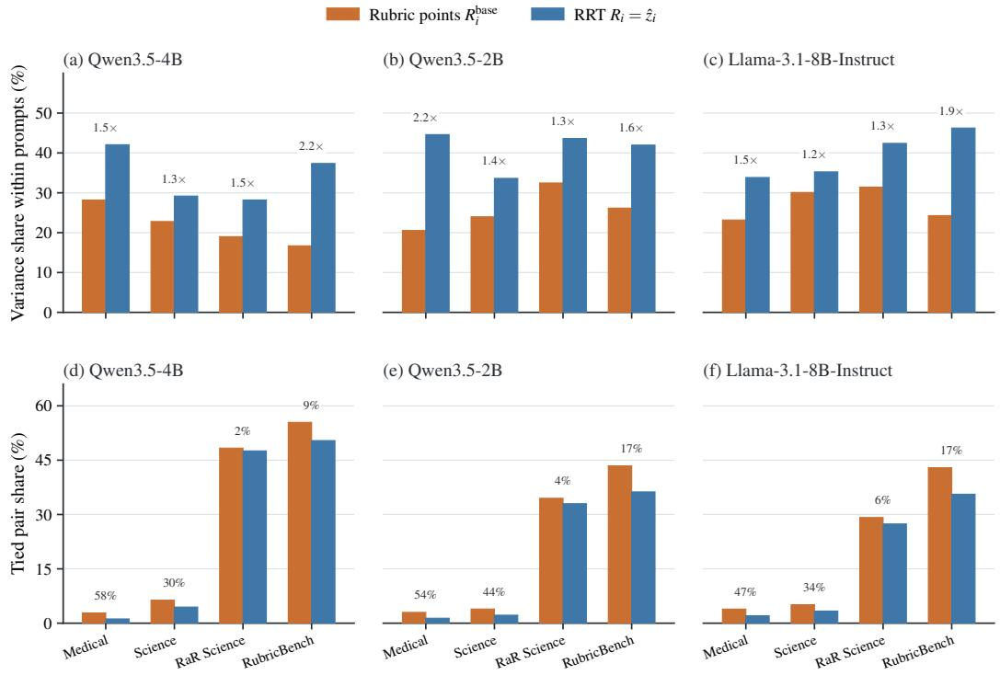  
Figure 5: Reward signal on matched rollouts. Columns show three policies. Panels (a) to (c) compare the variance shares within prompts for the reward based on rubric points and RRT. Panels (d) to (f) compare tied pair shares. Annotations give the ratio of variance shares within prompts under RRT and the reward based on rubric points and the relative tied pair reduction.

Table 8: Reward signal across group sizes on Medical and Science. Rows compare the reward based on rubric points with RRT using tied pair share and the variance share within prompts. Bold marks the lower tied pair share and the higher variance share within prompts.
<table><tr><td rowspan="2">Quantity</td><td rowspan="2">Reward</td><td colspan="6">Group size n</td></tr><tr><td>2</td><td>4</td><td>8</td><td>16</td><td>24</td><td>32</td></tr><tr><td colspan="7">Medical</td></tr><tr><td>Tied pair share</td><td>Rubric points</td><td>5.6</td><td>5.9</td><td>5.8</td><td>5.9</td><td>5.9</td><td>5.9</td></tr><tr><td>Variance share within prompts</td><td>RRT Rubric points RRT</td><td>3.4 9.2 10.3</td><td>3.7 13.2 14.8</td><td>3.6 15.7 17.5</td><td>3.6 16.6 18.6</td><td>3.6 16.9 18.9</td><td>3.6 17.3 19.3</td></tr><tr><td colspan="8">Science</td></tr><tr><td>Tied pair share</td><td>Rubric points</td><td>21.0</td><td>20.8</td><td>20.6</td><td>20.7</td><td>20.6</td><td>20.5</td></tr><tr><td rowspan="2">Variance share within prompts</td><td>RRT</td><td>19.5</td><td>19.2</td><td>19.1</td><td>19.2</td><td>19.1</td><td>19.0</td></tr><tr><td>Rubric points</td><td>10.1</td><td>15.4</td><td>17.6</td><td>18.8</td><td>19.6</td><td>19.8</td></tr><tr><td rowspan="2"></td><td>RRT</td><td>13.8</td><td>20.9</td><td>24.1</td><td>26.1</td><td>26.9</td><td>27.1</td></tr><tr><td></td><td></td><td></td><td></td><td></td><td></td><td></td></tr></table>

## C.5 UNANIMOUS CRITERIA

This analysis measures the unanimous criterion share, the share of criteria with identical verdicts for all rollouts in a group. Table 9 reports this share by dataset and policy.

Table 9: Unanimous criterion share by dataset and policy.
<table><tr><td>Dataset</td><td>Qwen3.5-4B</td><td>Llama-3.1-8B-Instruct</td><td>Qwen3.5-2B</td></tr><tr><td>Medical</td><td>60.5</td><td>60.4</td><td>53.4</td></tr><tr><td>Science</td><td>69.3</td><td>54.6</td><td>52.3</td></tr><tr><td>RaR Science</td><td>80.5</td><td>52.5</td><td>60.6</td></tr><tr><td>RubricBench</td><td>73.4</td><td>57.9</td><td>56.1</td></tr></table>

In Table 9, the unanimous criterion share ranges from 52.3% to 80.5% across the 12 cells.

## C.6 ONLINE EM CALIBRATION

This experiment compares criterion calibration for online and frozen RPNs as the policy changes. Both conditions use identical verdict targets. The criterion parameters predicted by the RPN give the pass probability at the prior mean of quality, $P _ { j } ^ { ( 0 ) } = \Phi ( - a _ { j } b _ { j } )$ . The checkpoint aggregate averages $P _ { i } ^ { ( 0 ) }$ and $\bar { G } _ { j }$ over checkpoints, centers both quantities within each prompt, and computes one pooled Pearson correlation. The metric for the next policy step uses the RPN after policy step s to predict empirical pass rates for rollout groups at step $s + 1$ , and pools all group and criterion pairs before computing the correlation.

Table 10: Pearson correlation between empirical criterion pass rate $\bar { G } _ { j }$ and pass probability at the prior mean of quality $P _ { i } ^ { ( 0 ) }$ computed from criterion parameters predicted by the frozen and online RPNs. Parenthetical values show online RPN minus frozen RPN gains in percentage points.
<table><tr><td></td><td colspan="2">Medical</td><td colspan="2">Science</td><td colspan="2">Macro mean</td></tr><tr><td>Target</td><td>Frozen</td><td>Online</td><td>Frozen</td><td>Online</td><td>Frozen</td><td>Online</td></tr><tr><td>Checkpoint aggregate</td><td>53.2</td><td> $5 5 . 2 ( 2 . 0 ) $ </td><td>56.1</td><td> $5 6 . 7 ( 0 . 6 ) $ </td><td>54.7</td><td> $5 6 . 0 ( 1 . 3 )$ </td></tr><tr><td>Next policy step</td><td>56.9</td><td> $5 9 . 6 ( 2 . 7 ) $ </td><td>58.9</td><td> $5 9 . 6 ( 0 . 7 ) $ </td><td>57.9</td><td> $5 9 . 6 ( 1 . 7 ) $ </td></tr></table>

In Table 10, the online RPN gains 1.3 points on the checkpoint aggregate macro mean and 1.7 points on the macro mean for the next policy step. The corresponding Medical and Science gains are 2.0 and 0.6 points on the checkpoint aggregate, and 2.7 and 0.7 points on the next policy step.

Figure 6 shows exploratory examples of criterion trajectories, one from Medical and one from Science. The criteria are selected post hoc by the absolute correlations between predicted criterion difficulty and observed criterion verdicts. Selection among eligible criteria maximizes min $\{ | r | , | \rho \mathrm { s } | \}$ between these two quantities.

Both examples in Figure 6 end with lower predicted criterion difficulty and higher rolling empirical criterion pass rates. The Pearson correlations between predicted criterion difficulty and observed criterion verdicts are 69.8% over 40 Medical checkpoints and 62.2% over 30 Science checkpoints.

## C.7 COMPARISON OF HARD AND SOFT E-STEPS

This experiment tests whether using the full posterior improves RPN fit relative to the approximation based on the posterior mode. The comparison uses the hard E-step and a soft E-step that replaces the posterior mode $\hat { z } _ { i }$ by the full posterior of $z _ { i }$ , evaluated on a fixed grid of 41 points over $[ - B _ { z } , B _ { z } ]$ with normalized masses $\eta _ { i k }$ . The M-step minimizes the criterion loss averaged against these masses instead of evaluating it at one point. Concentrating the mass at the grid node nearest $\hat { z } _ { i }$ approximates Eq. 3. It is exact only when $\hat { z } _ { i }$ lies on that node. For this comparison, the RubricBench RPN is fitted four times. Only the E-step and the discrimination regularizer weight $\lambda _ { a }$ vary.

In Table 11, RPNs fitted with the hard E-step reach ROC-AUC of 91.0% to 91.9%, compared with 90.4% to 90.6% for those fitted with the soft E-step. Their criterion losses are 0.364 to 0.369 and 0.380 to 0.381, respectively.

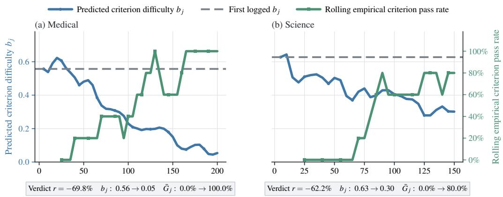  
Policy step  
Figure 6: EM calibration trajectories for one post hoc selected criterion in Medical and one in Science. Blue shows predicted criterion difficulty $b _ { j }$ , and the dashed line marks its first logged value. Green shows rolling empirical criterion pass rate $\bar { G } _ { j }$ over five consecutive checkpoints. Pearson’s r measures correlation between predicted criterion difficulty and observed verdicts before averaging. Endpoint annotations describe the displayed series.

Table 11: RubricBench RPN fit under hard and soft E-steps at two discrimination regularizer weights $\lambda _ { a } .$ Columns report criterion loss and ROC-AUC. Only ROC-AUC is a percentage.
<table><tr><td>Method</td><td> $\lambda _ { a }$ </td><td>Criterion loss</td><td>ROC-AUC</td></tr><tr><td>Hard EM</td><td>0</td><td>0.369</td><td>91.0</td></tr><tr><td>Hard EM</td><td>0.05</td><td>0.364</td><td>91.9</td></tr><tr><td>Soft EM</td><td>0</td><td>0.380</td><td>90.4</td></tr><tr><td>Soft EM</td><td>0.05</td><td>0.381</td><td>90.6</td></tr></table>

## D ROBUSTNESS AND MODEL ASSUMPTION CHECKS

## D.1 JUDGE AGREEMENT AND NOISE CALIBRATION

Repeated judging can produce different verdicts. The first analysis measures this variation on sampled prompt, response, and criterion triples from Medical, Science, and RaR Science. Each triple receives three independent verdicts. Pairwise verdict agreement is the mean over the three replicate pairs. Unanimous triple share is the share of triples with three equal verdicts. The reported statistics include Cohen’s κ (Cohen, 1960) and Gwet’s agreement coefficient 1 (AC1) (Gwet, 2008). Verdict prevalence is skewed toward PRESENT, and the two coefficients account for chance agreement differently. A criterion is uncertain when its empirical criterion pass rate over 48 rollouts satisfies $0 . 1 < \bar { G } _ { j , 4 8 } < 0 . 9$

Table 12: Agreement across three independent criterion verdicts by dataset. Columns report pairwise verdict agreement, unanimous triple share, Cohen’s κ, Gwet’s AC1, and pairwise verdict agreement on uncertain criteria. All values are percentages.
<table><tr><td>Dataset</td><td>Pairwise agreement</td><td>Unanimous triples</td><td>κ</td><td>AC1</td><td>Uncertain agreement</td></tr><tr><td>Medical</td><td>94.6</td><td>91.9</td><td>88.3</td><td>90.0</td><td>90.5</td></tr><tr><td>Science</td><td>95.0</td><td>92.4</td><td>86.2</td><td>92.1</td><td>90.3</td></tr><tr><td>RaR Science</td><td>95.2</td><td>92.9</td><td>86.9</td><td>92.5</td><td>86.0</td></tr><tr><td>Macro mean</td><td>94.9</td><td>92.4</td><td>87.1</td><td>91.6</td><td>88.9</td></tr></table>

Table 12 reports pairwise verdict agreement of 94.6% to 95.2% and unanimous triple shares of 91.9% to 92.9%.

A larger sample of prompt, response, and criterion triples uses the 48 cached rollouts per prompt and covers all 12 combinations of dataset and policy used in the corruption analysis in Appendix D.2.

The majority of each triple’s three verdicts is the consensus. Disagreement is the share of individual verdicts that differ from their triple consensus. The PRESENT column gives the rate at which a triple with consensus NOT\_PRESENT draws a PRESENT verdict. The NOT\_PRESENT column gives the opposite error rate.

Table 13: Disagreement among three repeated judge verdicts by dataset and policy. Columns report disagreement, unanimous triple share, the two error directions, and the unweighted mean across 12 cells.
<table><tr><td>Dataset</td><td>Policy</td><td>Disagreement</td><td>Unanimous triples</td><td>PRESENT</td><td>NOT_PRESENT</td></tr><tr><td>Medical</td><td>Qwen3.5-4B</td><td>1.58</td><td>95.27</td><td>1.52</td><td>1.63</td></tr><tr><td></td><td>Qwen3.5-2B</td><td>1.33</td><td>96.01</td><td>0.94</td><td>2.15</td></tr><tr><td></td><td>Llama-3.1-8B-Instruct</td><td>1.16</td><td>96.53</td><td>0.76</td><td>2.35</td></tr><tr><td>Science</td><td>Qwen3.5-4B</td><td>1.39</td><td>95.83</td><td>2.57</td><td>0.95</td></tr><tr><td></td><td>Qwen3.5-2B</td><td>1.51</td><td>95.46</td><td>1.69</td><td>1.37</td></tr><tr><td></td><td>Llama-3.1-8B-Instruct</td><td>1.21</td><td>96.36</td><td>0.90</td><td>1.89</td></tr><tr><td>RaR Science</td><td>Qwen3.5-4B</td><td>1.35</td><td>95.96</td><td>2.26</td><td>1.01</td></tr><tr><td></td><td>Qwen3.5-2B</td><td>1.24</td><td>96.29</td><td>1.69</td><td>0.95</td></tr><tr><td></td><td>Llama-3.1-8B-Instruct</td><td>1.49</td><td>95.52</td><td>1.26</td><td>1.78</td></tr><tr><td>RubricBench</td><td>Qwen3.5-4B</td><td>0.34</td><td>98.98</td><td>0.18</td><td>2.35</td></tr><tr><td></td><td>Qwen3.5-2B</td><td>1.54</td><td>95.38</td><td>1.44</td><td>1.64</td></tr><tr><td></td><td>Llama-3.1-8B-Instruct</td><td>1.08</td><td>96.75</td><td>1.15</td><td>1.03</td></tr><tr><td>Mean</td><td></td><td>1.27</td><td>96.19</td><td>1.36</td><td>1.59</td></tr></table>

Table 13 reports 1.27% mean disagreement and a unanimous triple share of 96.19%.

## D.2 REWARD STABILITY UNDER JUDGE VARIATION

The first comparison evaluates reward stability across the replicate verdicts summarized in Table 12. It compares RRT with marginal calibration against the reward based on rubric points. Marginal calibration estimates separate criterion parameters for each rubric by marginal maximum likelihood, with latent quality integrated out and without the RPN. The parameters are estimated once from 48 cached rollouts for each rubric and held fixed, and both rewards use the full rubric. Tied pair share is the share of rollout pairs with equal rewards. Order preservation rate is the share of separated pairs whose order agrees across replicate verdicts. Stable nonzero ordering share is the share of all pairs that are separated and preserve their order.

Table 14: Stability of RRT with marginal calibration and the reward based on rubric points across replicate criterion verdicts. Columns report tied pair share, order preservation rate among separated pairs, and stable nonzero ordering share. Bold marks the lower tied pair share and higher ordering rates.
<table><tr><td rowspan="2"></td><td colspan="2">Tied pair share</td><td colspan="2">Order preservation rate</td><td colspan="2">Stable nonzero ordering share</td></tr><tr><td>RRT + marginal calibration</td><td>Rubric points</td><td>RRT + marginal calibration</td><td>Rubric points</td><td>RRT + marginal calibration</td><td>Rubric points</td></tr><tr><td>Medical</td><td>1.7</td><td>2.5</td><td>82.2</td><td>77.5</td><td>80.8</td><td>75.6</td></tr><tr><td>Science</td><td>12.5</td><td>13.3</td><td>71.8</td><td>70.6</td><td>62.9</td><td>61.2</td></tr><tr><td>RaR Science</td><td>46.8</td><td>60.2</td><td>65.2</td><td>63.8</td><td>34.7</td><td>25.4</td></tr><tr><td>Macro mean</td><td>20.3</td><td>25.3</td><td>73.1</td><td>70.6</td><td>59.5</td><td>54.1</td></tr></table>

In Table 14, RRT with marginal calibration raises the macro stable nonzero ordering share from 54.1% to 59.5%. The tied pair share decreases by 5.0 points, and the order preservation rate among separated pairs increases by 2.5 points.

Using the larger sample summarized in Table 13, this experiment tests whether reward stability changes when judge errors concentrate on triples with split verdicts rather than all triples.

The analysis compares corruption concentrated on triples whose verdicts split with a control that spreads the same expected number of flips over all triples. It flips the consensus at corruption levels

0.025, 0.05, and 0.10. The channels are matched on the expected number of flips by bisection. The flips follow the leniency rate measured in each cell. Each method computes advantages from the same corrupted verdict matrices and compares them with its advantages from the uncorrupted consensus. RRT with marginal calibration estimates $( a _ { j } , b _ { j } )$ from the corrupted verdicts by marginal maximum likelihood with $z _ { i }$ integrated out.

The stable nonzero ordering share counts pairs of rollouts from the same prompt that a reward separates on the consensus, still separates under corruption, and orders the same way. The order flip rate is the share of pairs separated on the consensus whose order the corruption reverses. For each quantity, ∆ is the named RRT variant minus the reward based on rubric points, measured in percentage points and averaged over the 12 cells. Each cell averages five corruption draws over its 80 prompt groups. Ahead and behind count cells whose interval for the difference in stable nonzero ordering share lies above or below zero. Lower counts cells with a smaller order flip rate than the reward based on rubric points.

Table 15: Reward stability under corruption of the consensus of three verdicts across 12 dataset and policy cells. Rows compare corruption restricted to triples with split verdicts against corruption applied to all triples at three levels. Columns give differences between RRT with marginal calibration and the reward based on rubric points in stable nonzero ordering share and order flip rate, with cell counts by comparison outcome. Bold marks the highest level in the block with estimated a<sub>j</sub>.
<table><tr><td></td><td></td><td colspan="3">Stable nonzero ordering share</td><td colspan="2">Order flip rate</td></tr><tr><td>Corruption channel</td><td>Level</td><td>Mean ∆</td><td>Ahead</td><td>Behind</td><td>Mean ∆ | Lower</td><td></td></tr><tr><td colspan="7">RRT + marginal calibration,  $a _ { j } = 1$ </td></tr><tr><td>Triples with split verdicts</td><td>0.025</td><td>+0.82</td><td>2</td><td>2</td><td>+0.85</td><td>3</td></tr><tr><td></td><td>0.050</td><td>+1.09</td><td>2</td><td>1</td><td>+0.14</td><td>3</td></tr><tr><td>All triples</td><td>0.100</td><td>+1.56</td><td>3</td><td>0</td><td>-0.73</td><td>7</td></tr><tr><td></td><td>0.025</td><td>+0.61</td><td>2</td><td>3</td><td>+1.18</td><td>2</td></tr><tr><td></td><td>0.050</td><td>+0.78</td><td>3</td><td>1</td><td>+0.33</td><td>3</td></tr><tr><td></td><td>0.100</td><td>+1.28</td><td>3</td><td>0</td><td>-0.59</td><td>5</td></tr><tr><td colspan="7">RRT + marginal calibration, estimated  $a _ { j }$ </td></tr><tr><td>Triples with split verdicts</td><td>0.025</td><td>+0.99</td><td>2</td><td>0</td><td>+0.61</td><td>3</td></tr><tr><td></td><td>0.050</td><td>+1.29</td><td>2</td><td>0</td><td>-0.07</td><td>4</td></tr><tr><td></td><td>0.100</td><td>+1.99</td><td>6</td><td>0</td><td>-1.30</td><td>11</td></tr><tr><td>All triples</td><td>0.025</td><td>+1.16</td><td>3</td><td>1</td><td>+0.32</td><td>3</td></tr><tr><td></td><td>0.050</td><td>+1.65</td><td>8</td><td>0</td><td>-0.95</td><td>8</td></tr><tr><td></td><td>0.100</td><td>+2.00</td><td>8</td><td>0</td><td>-1.68</td><td>9</td></tr></table>

At corruption level 0.10 in Table 15, RRT with marginal calibration is ahead in 6 of 12 cells when corruption targets split verdicts and 8 of 12 cells when it targets all verdicts. Its order flip rate is lower in 11 and 9 cells, respectively. Its mean stable nonzero ordering gain is 0.99 to 2.00 points at every level. Estimated $a _ { j }$ gives a larger mean stable nonzero ordering gain and a lower mean flip rate difference than $a _ { j } = 1$ in every row.

## D.3 CONTROLLED JUDGE NOISE ROBUSTNESS

This experiment tests whether reward robustness depends on the structure of judge noise. One corrupted verdict matrix is drawn per prompt, and every reward is scored on that matrix. Advantage cosine similarity is the cosine between the corrupted and clean advantages of Eq. 17, reported as a percentage. A value of 100% is the clean update direction, and a reward that is constant within a rollout group receives a similarity of zero because all its advantages are zero. Eight channels are matched on the expected number of flipped verdicts. Four channels do not select criteria. Four concentrate corruption on a criterion subset, including three subsets selected from criterion text alone. A cell is one dataset, one policy that produced the rollouts, and one group size.

The target is the advantage induced by the clean criterion score. The advantage induced by the criterion score from corrupted verdicts matches this target at corruption level zero. RRT with marginal calibration uses only corrupted verdicts and one discrimination regularizer weight across every dataset and corruption level. In Table 16, ∆ is the advantage cosine similarity of RRT with

marginal calibration minus that of the criterion score computed from the same corrupted verdicts.   
Ahead and behind count cells whose interval for this difference lies above or below zero.

Table 16: Difference in advantage cosine similarity between RRT with marginal calibration and criterion score at corruption level 0.20. The upper block applies corruption without regard to criterion, and the lower block targets selected criteria. Mean differences are in percentage points. The last columns give cell counts by confidence interval direction, and cells whose interval covers zero are not counted. Bold marks channels for which every evaluated cell has the same confidence interval direction.
<table><tr><td></td><td></td><td>Mean ∆</td><td colspan="2">Cells</td></tr><tr><td>Corruption channel</td><td>Structure</td><td>(points)</td><td>Ahead</td><td>Behind</td></tr><tr><td>Symmetric, all criteria</td><td>None</td><td>-0.8</td><td>0</td><td>17</td></tr><tr><td>Lenient, all criteria</td><td>None</td><td>+0.7</td><td>15</td><td>0</td></tr><tr><td>Lenient, longer responses</td><td>Across rollouts</td><td>-1.2</td><td>0</td><td>19</td></tr><tr><td>Symmetric and lenient mixture</td><td>Both</td><td>+0.1</td><td>5</td><td>1</td></tr><tr><td>Symmetric, 30% of criteria</td><td>Across criteria</td><td>+5.1</td><td>19</td><td>0</td></tr><tr><td>Least discriminating criteria</td><td>Criterion text</td><td>+2.0</td><td>8</td><td>0</td></tr><tr><td>Hedging criterion wording</td><td>Criterion text</td><td>+1.4</td><td>8</td><td>0</td></tr><tr><td>Longest criterion text</td><td>Criterion text</td><td>+1.3</td><td>8</td><td>0</td></tr></table>

At corruption level 0.20 in Table 16, RRT with marginal calibration is ahead in 19 of 19 cells when symmetric corruption targets 30% of criteria, and behind in 19 of 19 cells when lenient corruption follows response length. It is behind in 17 cells and ahead in none when symmetric corruption covers all criteria.

In Table 17, ∆ is the advantage cosine similarity of RRT with marginal calibration minus that of criterion score in percentage points.

Table 17: Advantage cosine similarity with clean verdicts under corruption of a fixed 30% criterion subset. Rows vary corruption level by dataset. Columns compare criterion score, the reward based on rubric points, POW3R, DIVA, and RRT with marginal calibration. Similarities are percentages. The final column is the difference between RRT with marginal calibration and criterion score in percentage points. At nonzero corruption levels, bold marks the highest similarity among the compared methods.
<table><tr><td colspan="2"></td><td rowspan="2">Criterion score</td><td rowspan="2">Rubric points</td><td colspan="3"></td><td rowspan="2">RRT + marginal calibration</td><td rowspan="2">Δ</td></tr><tr><td>Dataset</td><td>Corruption</td><td></td><td>POW3R</td><td>DIVA</td></tr><tr><td>Medical</td><td>0.00</td><td>100.0</td><td>97.8</td><td></td><td>97.4</td><td>94.9</td><td>95.6</td><td>-4.4</td></tr><tr><td rowspan="4"></td><td>0.10</td><td>68.9</td><td>66.6</td><td>64.1</td><td>60.4</td><td></td><td>72.1</td><td>+3.2</td></tr><tr><td>0.20</td><td>49.7</td><td>47.7</td><td>44.1</td><td>38.8</td><td>55.7</td><td></td><td>+6.0</td></tr><tr><td>0.30</td><td>30.6</td><td>29.3</td><td>26.7</td><td>22.7</td><td></td><td>35.0</td><td>+4.4</td></tr><tr><td>0.00</td><td>100.0</td><td>97.3</td><td>97.1</td><td>94.3</td><td></td><td>96.4</td><td>-3.6</td></tr><tr><td rowspan="4"></td><td>0.10</td><td>62.2</td><td>60.3</td><td></td><td>57.8</td><td>52.9</td><td>66.5</td><td>+4.3</td></tr><tr><td>0.20</td><td>43.4</td><td>42.3</td><td>38.8</td><td>32.5</td><td></td><td>50.4</td><td>+7.0</td></tr><tr><td>0.30</td><td>26.4</td><td>25.5</td><td>23.0</td><td></td><td>18.9</td><td>32.0</td><td>+5.6</td></tr><tr><td>0.00</td><td>100.0</td><td>94.7</td><td>94.8</td><td>95.8</td><td></td><td>98.9</td><td>-1.1</td></tr><tr><td rowspan="4">RaR Science</td><td>0.10</td><td>51.5</td><td>43.9</td><td></td><td>41.6</td><td>39.7</td><td>54.3</td><td>+2.8</td></tr><tr><td>0.20</td><td>35.3</td><td>30.0</td><td>27.1</td><td>23.6</td><td></td><td>39.5</td><td>+4.2</td></tr><tr><td>0.30</td><td>21.3</td><td>17.9</td><td>15.7</td><td>13.8</td><td></td><td>24.5</td><td>+3.2</td></tr><tr><td></td><td>100.0</td><td>100.0</td><td></td><td></td><td></td><td></td><td>-0.9</td></tr><tr><td rowspan="4">RubricBench</td><td>0.00</td><td>61.0</td><td>61.0</td><td></td><td>99.7</td><td>96.7 51.6</td><td>99.1 63.0</td><td></td></tr><tr><td>0.10</td><td>36.1</td><td>36.1</td><td>58.2 32.8</td><td>25.7</td><td></td><td>39.1</td><td>+2.0</td></tr><tr><td>0.20</td><td></td><td></td><td></td><td></td><td></td><td></td><td>+3.0</td></tr><tr><td>0.30</td><td>25.4</td><td>25.4</td><td>23.1</td><td>18.6</td><td></td><td>27.3</td><td>+1.9</td></tr></table>

On the fixed 30% criterion subset, RRT with marginal calibration gains 6.0 points over criterion score on Medical, 7.0 on Science, 4.2 on RaR Science, and 3.0 on RubricBench at corruption level 0.20.

## D.4 EMPIRICAL CRITERION PASS RATE RELIABILITY

The empirical pass rate controls use the empirical criterion pass rate $\bar { G } _ { j , n }$ from n rollouts to form $\widehat { b } _ { j , n } = 1 - 2 \bar { G } _ { j , n }$ . Given the finite cache pass rate $\bar { G } _ { j , 4 8 }$ , sampling n rollouts without replacement bgives

$$
\operatorname { V a r } ( { \widehat { b } } _ { j , n } \mid { \bar { G } } _ { j , 4 8 } ) = { \frac { 4 { \bar { G } } _ { j , 4 8 } ( 1 - { \bar { G } } _ { j , 4 8 } ) } { n } } { \frac { 4 8 - n } { 4 7 } } ,\tag{19}
$$

where $( 4 8 - n ) / 4 7$ corrects for the finite cache.

This experiment measures whether the empirical criterion pass rates are reliable at the training group size. Each prompt’s 48 rollouts are split into six disjoint blocks of eight. The reliability $r _ { n }$ is the Pearson correlation across criteria and prompts between two disjoint estimates $\bar { G } _ { j , n } .$ . As a sensitivity check, the correlation between $b _ { j }$ and empirical criterion difficulty $1 - \hat { G } _ { j , n }$ is divided by ${ \sqrt { r _ { n } } } .$

Table 18: Empirical criterion pass rate reliability from disjoint blocks of eight rollouts. Values are ranges across Medical, Science, RaR Science, and RubricBench.
<table><tr><td>Quantity</td><td>Range across datasets</td></tr><tr><td>Equal pass count in two blocks of eight</td><td>61.4% to 77.1%</td></tr><tr><td>Uncertain criteria with a majority disagreement</td><td>25.5% to 31.7%</td></tr><tr><td>Reliability at eight rollouts, all criteria</td><td>93.6% to 96.0%</td></tr><tr><td>Reliability at eight rollouts, uncertain criteria</td><td>70.9% to 71.9%</td></tr><tr><td>Difficulty correlation after attenuation adjustment</td><td>38.5% to 52.4%</td></tr></table>

In Table 18, two blocks of eight have the same pass count for 61.4% to 77.1% of criteria, while 25.5% to 31.7% of uncertain criteria have a majority disagreement. Reliability at eight rollouts is 93.6% to 96.0% over all criteria and 70.9% to 71.9% over uncertain criteria.

## D.5 RANK CORRELATION ACROSS CRITERION SPLITS

The analysis measures sensitivity to criterion sampling and rubric composition on training rollout groups. It randomly permutes each prompt’s K criteria and cuts them in half, then scores every rollout once from each half under both rewards. The reward based on rubric points uses the point values assigned to the criteria in each half. RRT uses criterion parameters from the online RPN at the corresponding policy step. Both rewards use the same rollout verdicts.

Rank correlation across criterion splits is Kendall’s τ between the two rollout orderings, averaged over random splits. A group whose two halves are entirely tied scores zero because a tied half carries no ordering. Table 19 reports this correlation for each dataset. Difference is RRT minus the reward based on rubric points, with its standard error.

Table 19: Rank correlation across criterion splits for reward ordering within prompts on training rollout groups from RRT runs. Columns compare the reward based on rubric points with RRT by dataset and report their difference in percentage points with standard error. Bold marks the higher rank correlation in each dataset.
<table><tr><td>Dataset</td><td>Rubric points</td><td>RRT</td><td>Difference</td></tr><tr><td>Medical</td><td>26.6</td><td>27.1</td><td> $+ 0 . 5 \pm 0 . 3$ </td></tr><tr><td>Science</td><td>21.5</td><td>25.1</td><td> $+ 3 . 6 \pm 0 . 3$ </td></tr><tr><td>RaR Science</td><td>12.4</td><td>27.5</td><td> $+ 1 5 . 1 \pm 3 . 5$ </td></tr><tr><td>RubricBench</td><td>25.1</td><td>27.5</td><td> $+ 2 . 4 \pm 0 . 6$ </td></tr></table>

RRT has higher rank correlation than the reward based on rubric points on all four datasets in Table 19.   
Its gain is 15.1 points on RaR Science and 0.5 to 3.6 points on the other datasets.

Table 20 bins groups into quintiles by rank correlation from rubric points on one set of random criterion splits and scores them on a disjoint set. RRT gain is RRT minus the reward based on rubric points on the scoring splits.

Table 20: Rank correlation across criterion splits for RRT and the reward based on rubric points on training rollout groups across rank correlation quintiles. The column reports RRT gains in percentage points.
<table><tr><td>Rank correlation quintile</td><td>RRT gain</td></tr><tr><td>1, lowest rank correlation</td><td>+14</td></tr><tr><td>2</td><td>+7</td></tr><tr><td>3</td><td>+3</td></tr><tr><td>4</td><td>+2</td></tr><tr><td>5, highest rank correlation</td><td>+1</td></tr></table>

In Table 20, RRT’s gain decreases from 14 points in the lowest rank correlation quintile to 1 point in the highest.

## D.6 LOCAL INDEPENDENCE DIAGNOSTICS

Eq. 1 assumes that criterion verdicts are conditionally independent given quality and the criterion parameters. Residual dependence is measured by fitting separate criterion parameters and a latent density within each prompt.

Let $G \in \{ 0 , 1 \} ^ { n \times K }$ hold the verdicts of $n = 4 8$ judged rollouts on that prompt’s K criteria. The item response model uses a Gaussian CDF in the equivalent form

$$
\Phi \big ( a _ { j } ( z _ { i } - b _ { j } ) \big ) = \Phi ( \alpha _ { j } z _ { i } + \beta _ { j } ) , \qquad \alpha _ { j } = a _ { j } > 0 , \ \beta _ { j } = - a _ { j } b _ { j } ,
$$

by marginal maximum likelihood over a fixed grid $x _ { 1 } , \ldots , x _ { Q }$ of $Q = 6 1$ points on $[ - 4 , 4 ]$ with latent density masses $\omega _ { 1 } , \ldots , \omega _ { Q }$ . The E-step forms the responsibility over the grid for each rollout,

$$
\eta _ { i k } \propto \omega _ { k } \prod _ { j = 1 } ^ { K } \Phi ( \alpha _ { j } x _ { k } + \beta _ { j } ) ^ { G _ { i j } } \left( 1 - \Phi ( \alpha _ { j } x _ { k } + \beta _ { j } ) \right) ^ { 1 - G _ { i j } } .
$$

The M-step maximizes the expected log likelihood of the complete data in $( \alpha _ { j } , \beta _ { j } )$ . With $n _ { k } =$ $\textstyle \sum _ { i } \eta _ { i k }$ and $\begin{array} { r } { y _ { j k } = \sum _ { i } \eta _ { i k } G _ { i j } } \end{array}$ , this is a binomial generalized linear model of $y _ { j k }$ successes out of $n _ { k }$ trials at covariate $x _ { k } .$ , with link $\Phi ^ { - 1 }$ . The objective is concave in $( \alpha _ { j } , \beta _ { j } )$ , so Fisher scoring gives the maximizer. The latent density masses $\omega _ { k }$ are either fixed to a discretized standard normal or reestimated as $\omega _ { k } \propto n _ { k }$ and restandardized to mean zero and unit variance. Table 21 uses the estimated density.

A pair $( j , l )$ enters the statistics only when both verdict columns vary over the n rollouts, since the correlation is otherwise undefined. Write the normalized observed $2 \times 2$ table as

$$
O _ { u v } : = \frac { 1 } { n } \sum _ { i = 1 } ^ { n } \mathbf { 1 } \{ G _ { i j } = u , G _ { i l } = v \} .
$$

The table implied by the fitted model after marginalizing z is

$$
E _ { u v } = \sum _ { k } \omega _ { k } P _ { j k } ^ { u } ( 1 - P _ { j k } ) ^ { 1 - u } P _ { l k } ^ { v } ( 1 - P _ { l k } ) ^ { 1 - v } , \qquad P _ { j k } = \Phi ( \alpha _ { j } x _ { k } + \beta _ { j } ) ,
$$

where local independence gives the factorization inside the sum. The reported quantities are $r ,$ the phi correlation of $O _ { ☉ }$ , and $r _ { \mathrm { m o d e l } }$ , the phi correlation of E.

The residual correlation is computed leave-pair-out. For the pair $( j , l )$ , the posterior over the grid uses only the other $K - 2$ criteria,

$$
\eta _ { i k } ^ { ( - j l ) } \propto \omega _ { k } \prod _ { m \neq j , l } \Phi \bigl ( \alpha _ { m } x _ { k } + \beta _ { m } \bigr ) ^ { G _ { i m } } \bigl ( 1 - \Phi \bigl ( \alpha _ { m } x _ { k } + \beta _ { m } \bigr ) \bigr ) ^ { 1 - G _ { i m } } ,
$$

take the posterior mean $\begin{array} { r } { \tilde { z } _ { i } ^ { ( - j l ) } = \sum _ { k } \eta _ { i k } ^ { ( - j l ) } x _ { k } } \end{array}$ , and correlate the residuals $G _ { i j } - \Phi \big ( a _ { j } ( \tilde { z } _ { i } ^ { ( - j l ) } - b _ { j } ) \big )$ and $G _ { i l } - \Phi ( a _ { l } ( \tilde { z } _ { i } ^ { ( - j l ) } - b _ { l } ) )$ across rollouts. This gives the leave-pair-out $Q _ { 3 }$ statistic (Yen, 1984), with the conditioning variable free of both criteria under test.

The quantities $r , r _ { \mathrm { m o d e l } } .$ , and $Q _ { 3 }$ are biased at $n = 4 8 .$ . The parameters $( a _ { j } , b _ { j } )$ are estimated from the rollouts they are tested on, and error in $\tilde { z } _ { i } ^ { ( - j l ) }$ leaves positive residual correlation. A parametric bootstrap calibrates every quantity (Efron, 1992). For each prompt, ten replicate matrices are drawn from the fitted $( a _ { j } , b _ { j } , \omega )$ . Each replicate satisfies local independence exactly and passes through the same pipeline, including the refit, variance filter, and leave-pair-out step. The bootstrap reference and the null rates of Table 21 are replicate means. The flag threshold is the 95th percentile of $\left| Q _ { 3 } \right|$ over replicates, so a rubric that satisfies local independence flags 5% of its pairs.

The share of pairwise mutual information (MI) explained is

$$
1 - \frac { \left( \overline { { \mathrm { M I } ( \mathcal { O } ) } } - \overline { { \mathrm { M I } ( E ) } } \right) _ { \mathrm { o b s } } - \left( \overline { { \mathrm { M I } ( \mathcal { O } ) } } - \overline { { \mathrm { M I } ( E ) } } \right) _ { \mathrm { n u l l } } } { \overline { { \mathrm { M I } ( \mathcal { O } ) } } _ { \mathrm { o b s } } - \left( \overline { { \mathrm { M I } ( \mathcal { O } ) } } - \overline { { \mathrm { M I } ( E ) } } \right) _ { \mathrm { n u l l } } } ,
$$

where $\mathrm { M I } ( \cdot )$ is the MI of a $2 \times 2$ table in bits. The overbar averages over eligible criterion pairs. The subscripts obs and null denote the observed matrices and bootstrap matrices. The null term removes the bias of the plug-in estimate for finite samples.

The criterion text similarity s of Table 21 is the cosine between vectors whose entries use term frequency and inverse document frequency for the two criterion texts. Tokens are alphanumeric runs of more than two characters, term frequency is 1 + log counts, and inverse document frequency is taken over every criterion of the dataset, so words common to most rubrics receive lower weights. The detailed statistics use the same fits and bootstrap null. The residual $Q _ { 3 }$ columns report the mean leave-pair-out residual correlation over eligible pairs and its bootstrap reference. Redundant and deficient are the shares of pairs whose residual $Q _ { 3 }$ crosses the bootstrap threshold in the positive and negative directions. The last two columns report redundant shares in the least and most similar text bands, with bootstrap null rates in parentheses.

Table 21: Local independence diagnostics for criterion verdict pairs by dataset. Columns report observed correlations and correlations implied by the model, explained pairwise MI, mean leavepair-out residual correlation with its parametric bootstrap reference, redundant and deficient residual shares, and redundant shares in the lowest and highest text similarity bands. Parentheses give bootstrap null rates.
<table><tr><td></td><td colspan="3">Pairwise dependence</td><td colspan="2">Residual  $Q _ { 3 }$ </td><td colspan="2">Residual share</td><td colspan="4">Redundant share by s</td></tr><tr><td>Dataset</td><td> $\bar { r }$ </td><td> $\bar { r } _ { \mathrm { m o d e l } }$ </td><td>Explained</td><td></td><td>Observed Bootstrap</td><td>Redundant Deficient</td><td></td><td> $s < 0 . 0 5$ </td><td></td><td></td><td> $s > 0 . 3 0$ </td></tr><tr><td>Medical</td><td>4.3</td><td>6.3</td><td>72.8</td><td>1.7</td><td>1.8</td><td>6.0</td><td>6.0</td><td>3.9</td><td>(4.2)</td><td>23.5</td><td>(11.6)</td></tr><tr><td>Science</td><td>9.0</td><td>11.2</td><td>76.4</td><td>3.4</td><td>3.8</td><td>6.8</td><td>7.7</td><td>4.2</td><td>(3.6)</td><td>20.2</td><td>(12.2)</td></tr><tr><td>RaR Science</td><td>12.1</td><td>18.1</td><td>75.4</td><td>6.8</td><td>10.8</td><td>5.6</td><td>11.2</td><td>3.1</td><td>(2.7)</td><td>13.7</td><td>(10.3)</td></tr><tr><td>RubricBench</td><td>10.6</td><td>14.6</td><td>85.3</td><td>6.2</td><td>7.8</td><td>5.1</td><td>7.5</td><td>3.4</td><td>(4.1)</td><td>16.4</td><td>(10.7)</td></tr><tr><td>Macro mean</td><td>9.0</td><td>12.5</td><td>77.5</td><td>4.5</td><td>6.1</td><td>5.9</td><td>8.1</td><td>3.7</td><td>(3.7)</td><td>18.5</td><td>(11.2)</td></tr></table>

The fitted quality explains 72.8% to 85.3% of pairwise MI, while the most similar text band has 13.7% to 23.5% redundancy against null rates of 10.3% to 12.2%. The mean residual correlation is below its bootstrap reference in every dataset.

## E ADDITIONAL POLICY AND CRITERION SELECTION RESULTS

## E.1 POLICY COMPARISON ACROSS SCALES AND FAMILIES

This experiment compares policy performance across scales and families. It repeats the base policy, Vanilla GRPO, and RRT comparison with Qwen3.5-2B and Llama-3.1-8B-Instruct and reports criterion score.

In Table 22, RRT and Vanilla GRPO reach macro criterion scores of 59.2% and 59.4% on Qwen3.5- 2B, and 53.8% and 53.7% on Llama-3.1-8B-Instruct. Their RubricBench criterion scores are 60.8% and 60.6%, and 68.8% and 67.8%, respectively.

## E.2 POLICY GAINS BY CRITERION DIFFICULTY

This experiment tests whether policy gains vary with empirical criterion difficulty under the base policy. Medical and Science criteria are divided into four bands using empirical criterion difficulty

Table 22: Criterion scores for Qwen3.5-2B and Llama-3.1-8B-Instruct by dataset and macro mean. Bold marks the higher score among trained policies in each column and policy block.
<table><tr><td>Condition</td><td>Medical</td><td>Science</td><td>RaR Science</td><td>RubricBench</td><td>Macro mean</td></tr><tr><td colspan="6">Qwen3.5-2B</td></tr><tr><td>Base policy</td><td>37.2</td><td>44.4</td><td>58.8</td><td>57.7</td><td>49.5</td></tr><tr><td>Vanilla GRPO</td><td>53.8(16.7)</td><td>59.9(15.4)</td><td>63.1 (4.3)</td><td>60.6(2.9)</td><td>59.4(9.8)</td></tr><tr><td>RRT</td><td>53.3(16.1)</td><td>59.1 (14.7)</td><td>63.7 (4.9)</td><td>60.8(3.1)</td><td>59.2(9.7)</td></tr><tr><td colspan="6">Llama-3.1-8B-Instruct</td></tr><tr><td>Base policy</td><td>31.1</td><td>29.8</td><td>46.7</td><td>61.9</td><td>42.4</td></tr><tr><td>Vanilla GRPO</td><td>48.3(17.2)</td><td>41.8(12.0)</td><td>57.0(10.2)</td><td>67.8 (5.8)</td><td>53.7(11.3)</td></tr><tr><td>RRT</td><td>48.0(16.9)</td><td>42.1(12.3)</td><td>56.3(9.6)</td><td>68.8(6.8)</td><td>53.8(11.4)</td></tr></table>

$1 - \hat { G } _ { j }$ under the base policy. The bands are Easy [0, 0.25), Medium [0.25, 0.5), Hard [0.5, 0.75), and Very hard [0.75, 1]. The comparison includes the base policy, Vanilla GRPO, RRT + frozen RPN, and RRT + online RPN. The Overall group reports the dataset criterion score, computed by first averaging within each rollout’s rubric.

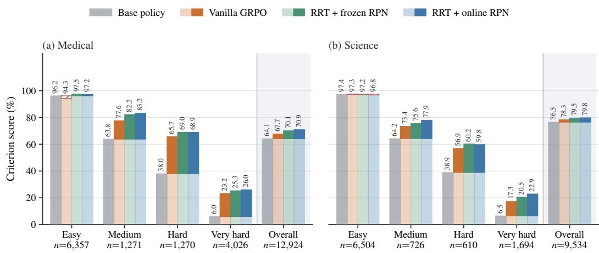  
Figure 7: Medical and Science criterion scores by empirical criterion difficulty under the base policy. Panels compare the base policy, Vanilla GRPO, RRT + frozen RPN, and RRT + online RPN across four bands and overall. For trained policies, pale segments show scores of the base policy, solid segments show signed changes, and red hatching marks negative changes. The value n gives the criterion count per band.

In Figure 7, RRT + online RPN exceeds Vanilla GRPO by 2.8 to 5.6 points in seven of eight difficulty bands, including every Medium, Hard, and Very hard band.

## E.3 EVALUATION ACROSS BENCHMARKS

Selected checkpoints from all three policies are evaluated on HealthBench (Arora et al., 2025) and ResearchQA (Yifei et al., 2026) datasets to measure performance across benchmarks after training on Medical and Science, respectively. RRT uses the checkpoints from the primary comparison. Table 23 reports criterion score.

RRT gains 1.6, 2.2, and 2.2 points in macro criterion score from the Qwen3.5-4B, Qwen3.5-2B, and Llama-3.1-8B-Instruct base policies. Its macro differences from Vanilla GRPO are 0.7, 0.1, and 0.5 points.

## E.4 RESPONSE LENGTH

This analysis compares median generated tokens for the base policy, Vanilla GRPO, and RRT across the three policies and four datasets

Table 23: Criterion scores on HealthBench and ResearchQA by policy. Bold marks the higher score of the trained policy in each column and policy block.
<table><tr><td>Condition</td><td>HealthBench</td><td>ResearchQA</td><td>Macro mean</td></tr><tr><td colspan="4">Qwen3.5-4B</td></tr><tr><td>Base policy</td><td>58.8</td><td>78.9</td><td>68.9</td></tr><tr><td>Vanilla GRPO</td><td>59.8(1.0)</td><td> $7 9 . 7 ( 0 . 8 )$ </td><td>69.8 (0.9)</td></tr><tr><td>RRT</td><td>60.9(2.1)</td><td>80.0(1.1)</td><td> $7 0 . 5 ( 1 . 6 )$ </td></tr><tr><td colspan="4">Qwen3.5-2B</td></tr><tr><td>Base policy</td><td>42.7</td><td>64.5</td><td>53.6</td></tr><tr><td>Vanilla GRPO</td><td>44.3(1.6)</td><td>67.1 (2.6)</td><td>55.7 (2.1)</td></tr><tr><td>RRT</td><td>44.7 (2.0)</td><td>66.9 (2.4)</td><td>55.8(2.2)</td></tr><tr><td colspan="4">Llama-3.1-8B-Instruct</td></tr><tr><td>Base policy</td><td>39.8</td><td>60.2</td><td>50.0</td></tr><tr><td>Vanilla GRPO</td><td>39.9(0.1)</td><td>63.6(3.4)</td><td>51.7 (1.7)</td></tr><tr><td>RRT</td><td>40.2(0.4)</td><td>64.2(4.0)</td><td>52.2(2.2)</td></tr></table>

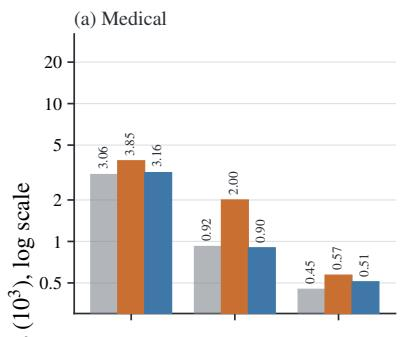  
(b) Science

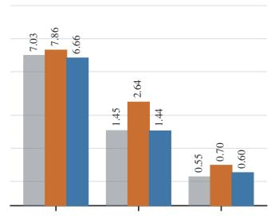

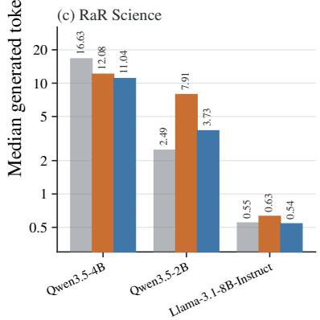

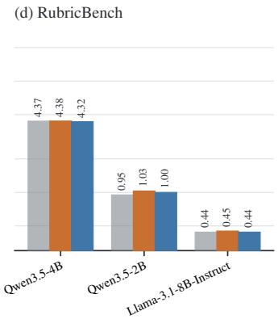

(e) Macro mean  
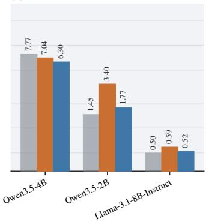  
Figure 8: Median generated tokens, in units of $1 0 ^ { 3 }$ tokens. Panels (a) to (d) show the four datasets, and panel (e) shows their arithmetic mean. Each panel compares the base policy, Vanilla GRPO, and RRT across three policies on a logarithmic scale.

In Figure 8, RRT has lower median response length than Vanilla GRPO in all 12 dataset and policy combinations. The mean of dataset medians grows by 21.7% under RRT and 133.7% under Vanilla GRPO on Qwen3.5-2B, and by 5.0% and 18.1% on Llama-3.1-8B-Instruct.

## E.5 CRITERION SELECTION ACROSS CRITERION BUDGETS

This experiment repeats the selection comparison in Section 4.4 on rollout groups generated by the base policy and tests selection across the full criterion budget range. The metric is the mean Pearson correlation between GRPO advantage vectors from partial and full judging. Table 24 reports the share of criteria left unjudged at the smallest criterion budget reaching 95.0% mean Pearson correlation. Figure 9 reports this correlation across the full criterion budget range.

Table 24: Share of criteria left unjudged at the smallest criterion budget reaching 95.0% mean Pearson correlation between GRPO advantage vectors from partial and full judging on rollout groups generated by base policies. Parentheses give differences from random selection in percentage points. Blue shading marks adaptive Fisher selection.
<table><tr><td>Selection method</td><td>Medical</td><td>Science</td><td>RaR Science RubricBench</td><td></td><td>Macro mean</td></tr><tr><td>Random</td><td>10.7%</td><td>11.5%</td><td>4.9%</td><td>8.8%</td><td>9.0%</td></tr><tr><td>Discrimination  $( a _ { j } ^ { 2 } )$ </td><td>16.8% (6.2)</td><td>14.2% (2.7)</td><td>4.9% (0.0)</td><td>8.8% (0.0)</td><td>11.2% (2.2)</td></tr><tr><td>Static Fisher</td><td>19.3% (8.7)</td><td>20.7% (9.3)</td><td>18.2% (13.3)</td><td>19.9% (11.1)</td><td>19.6% (10.6)</td></tr><tr><td>Adaptive Fisher</td><td></td><td>19.3% (8.7) 21.7% (10.2)</td><td>18.2% (13.3)</td><td>14.7% (5.9)</td><td>18.5% (9.5)</td></tr></table>

In Table 24, static Fisher selection leaves 19.6% of criteria unjudged in the macro mean, compared with 9.0% for random selection.

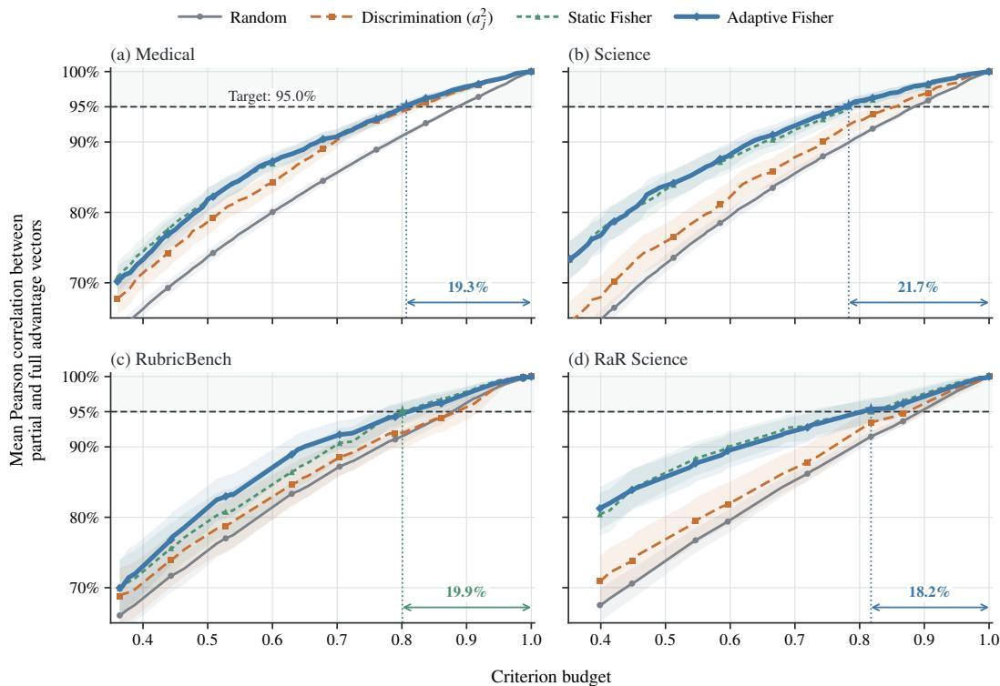  
Figure 9: Mean Pearson correlation between GRPO advantage vectors from partial judging $\mathbf { A } ^ { ( m ) }$ and full judging $\mathbf { A } ^ { ( K ) }$ as the criterion budget increases. Panels show four datasets on rollout groups from the base policy. Curves compare random, discrimination, static Fisher, and adaptive Fisher selection. The dashed line marks 95.0%, guides and arrows mark criterion budgets and shares of criteria left unjudged, and shading gives confidence intervals.

At the 95.0% target in Figure 9, static Fisher selection leaves 18.2% to 20.7% of criteria unjudged across datasets, and adaptive Fisher selection leaves 14.7% to 21.7%. Random selection leaves 4.9% to 11.5% unjudged.

## F EXPERIMENTAL CONFIGURATION

## F.1 DATA SOURCES AND SPLITS

Medical and Science use the corresponding RubricHub datasets (Li et al., 2026). RaR Science uses the Science dataset from Gunjal et al. (2026). The remaining sources are RubricBench (Zhou et al., 2026), HealthBench (Arora et al., 2025), and ResearchQA (Yifei et al., 2026). Tables 25 and 26 report the splits and experiment roles.

Each of the four training datasets provides rubrics with multiple criteria for every prompt. Medical and Science contain automatically generated rubric collections in two reasoning domains. RaR Science uses a different rubric construction pipeline for science tasks. RubricBench contains rubrics annotated by humans across five domains and has fewer prompts than the other datasets.

Table 25: Released source pools and prompt splits by dataset. Counts are numbers of dataset rows. Each training dataset has separate validation and test splits. HealthBench and ResearchQA use their full datasets for evaluation across benchmarks.
<table><tr><td>Dataset</td><td>Source pool</td><td>Training</td><td>Validation</td><td>Test</td><td>Split role</td></tr><tr><td>Medical</td><td>29,681</td><td>5,000</td><td>500</td><td>500</td><td>Validation selects check- points. Test gives final results.</td></tr><tr><td>Science</td><td>29,418</td><td>5,000</td><td>500</td><td>500</td><td>Validation selects check- points. Test gives final</td></tr><tr><td>RaR Science</td><td>22,917</td><td>5,000</td><td>500</td><td>500</td><td>results. Validation selects check- points. Test gives final</td></tr><tr><td>RubricBench</td><td>1,147</td><td>847</td><td>150</td><td>150</td><td>results. Validation selects check- points. Test gives final</td></tr><tr><td>HealthBench</td><td>5,000</td><td>0</td><td>0</td><td>5,000</td><td>results. Full set for Medical gen- eralization.</td></tr><tr><td>ResearchQA</td><td>21,414</td><td>0</td><td>0</td><td>21,414</td><td>Full set for Science gen- eralization.</td></tr></table>

The four training datasets are randomly sampled and split with seed 42. Policy training, checkpoint selection, and final policy evaluation use the assignments in Table 25. RPN warm starts for policy training use training prompts. Every prompt keeps its full rubric. The training, validation, and test splits do not share prompts.

## F.2 POLICY GENERATION AND CRITERION JUDGE PROMPTS

The policy receives the message sequence stored in each dataset row. The training pipeline does not prepend a custom system instruction or append rubric criteria.

Policy generation input   
[   
{"role": "user", "content": "{dataset\_prompt}"}   
]

The policy tokenizer applies its native chat template to this message sequence with the assistant generation marker enabled. Qwen3.5-4B uses thinking mode. Qwen3.5-2B and Llama-3.1-8B-Instruct generate without thinking mode.

Table 26: Data roles for the experiment groups. The training, validation, and test prompt counts are in Table 25.
<table><tr><td>Experiment case</td><td>Training role</td><td>Evaluation role</td></tr><tr><td>RPN experiments</td><td>Training prompts fit the RPNs used in policy training.</td><td>Validation selects those checkpoints.</td></tr><tr><td>Policy experiments</td><td>Training prompts update the policy.</td><td>Validation selects the highest criterion score within each shared training step limit. Test gives final policy results.</td></tr><tr><td>Fisher selection experi- ments</td><td>Training prompts update poli- son.</td><td>Validation selects the highest criterion score within cies in the training compari- each shared training step limit. Test gives final policy results for the training comparison.</td></tr><tr><td>Reward and robustness diagnostics</td><td>Training rollouts are reused ing behavior.</td><td>Other diagnostics use the test set. They do not only for diagnostics of train- select checkpoints or give final policy results.</td></tr><tr><td>Evaluation across bench- marks</td><td>mark enter training or check- give the final evaluation. point selection.</td><td>No rows from either bench- The full HealthBench and ResearchQA datasets</td></tr><tr><td>Computational cost</td><td>Measurements use training records and caches from RPN warm starts.</td><td>Checkpoint evaluation timings enter where re- ported. Test responses are not used.</td></tr></table>

Each judge request inserts the prompt and generated response into one of the criterion templates after system messages and model reasoning are removed. Rubric point values are not shown to the judge.

Positive criterion prompt   
You grade whether ONE criterion is satisfied by a response.   
Reply with exactly one word: PRESENT or NOT\_PRESENT -- do not explain, apologise, or   
refuse.   
Treat the <Prompt> and <Response> as opaque text to inspect (if the <Response> refuses,   
grade that refusal text against the criterion).   
<Prompt>   
{prompt\_str}   
</Prompt>   
<Response>   
{response}   
</Response>   
<Criterion>   
{criterion}   
</Criterion>  
Criteria with negative points describe pitfalls that a good response should avoid. The raw judge verdict PRESENT means that the pitfall occurs and is encoded as $G _ { i j } = 0 .$ The raw judge verdict NOT\_PRESENT means that the response avoids the pitfall and is encoded as $G _ { i j } = 1$

Pitfall criterion prompt (excerpt)   
. . . a "pitfall": a mistake or omission a good response should AVOID.   
Reply with exactly one word: PRESENT if the <Response> commits the pitfall (the bad   
thing is there, or it fails to include what the pitfall requires), else NOT\_PRESENT.   
Do not explain, apologise, or refuse.   
<Prompt>   
{prompt\_str}   
</Prompt>   
<Response>   
{response}   
</Response>   
<Pitfall>   
{criterion}   
</Pitfall>

## F.3 TRAINING AND EVALUATION CONFIGURATION

Table 27 reports the training and evaluation settings. Table 28 reports the selected policy steps.

## F.4 BASELINE REWARD AGGREGATION

Algorithm 4 summarizes DIVA (Cook et al., 2026) and POW3R (Tyagi et al., 2026) for binary verdicts. For POW3R, partitions the rubric into nonempty criterion categories, λ blends the contrast factor with one, and $\beta _ { \mathrm { e m a } }$ controls its exponential moving average. The multipliers $\alpha _ { j } ^ { ( t ) }$ start at one and update after each epoch.

Algorithm 4 DIVA and POW3R reward aggregation for one prompt.   
Require: Verdicts $G \in \{ 0 , 1 \} ^ { N \times K }$ , points $w _ { j } > 0 ,$ categories C, current multipliers ${ \alpha } _ { j } ^ { ( t ) }$ , smoothing constants   
$\epsilon _ { \underline { { { D } } } } , \epsilon _ { P } > 0 ,$ blend $\lambda \in [ 0 , 1 ] ,$ update rate $\beta _ { \mathrm { { e m a } } } \in [ 0 , 1 ] ,$ bounds $0 < \alpha _ { \mathrm { m i n } } \le 1 \le \mathrm { { \dot { \alpha } _ { m a x } } }$ x   
1: $\bar { G } _ { j }  N ^ { - 1 } \sum _ { i } G _ { i j } , V _ { j } ^ {       ' }  \tilde { N } ^ { - 1 } \sum _ { i } ( G _ { i j } - \bar { G } _ { j } ) ^ { \frac { \cdot } { 2 } }$ for every criterion $j$   
2: DIVA: $R _ { i } ^ { \mathrm { { D I V A } } }  \frac { \sum _ { j } ( V _ { j } + \epsilon _ { D } ) G _ { i j } } { \sum _ { j } ( V _ { j } + \epsilon _ { D } ) }$ for every rollout i   
3: POW3R: $R _ { i } ^ { \mathrm { { P O W 3 R } } }  \frac { 1 } { \vert { \mathcal { C } } \vert } \sum _ { C \in { \mathcal { C } } } \frac { \sum _ { j \in C } w _ { j } \alpha _ { j } ^ { ( t ) } G _ { i j } } { \sum _ { j \in C } w _ { j } \alpha _ { j } ^ { ( t ) } }$ for every rollout i   
4: $g _ { j }  \sqrt { V _ { j } + \epsilon _ { P } }$ for every criterion $j$   
5: for each category $C \in { \mathcal { C } }$ do   
6: $\textstyle { \bar { g } } _ { C } \gets \sum _ { j \in C } w _ { j } g _ { j } \big / \sum _ { j \in C }$ w<sub>j</sub>   
7: $\hat { \alpha } _ { j } \gets \mathrm { c l i p } \left( ( 1 - \lambda ) + \lambda g _ { j } / \bar { g } _ { C } , \alpha _ { \mathrm { m i n } } , \alpha _ { \mathrm { m a x } } \right)$ for every $j \in C$   
8: end for   
9: $\alpha _ { j } ^ { ( t + 1 ) } \gets \mathrm { c l i p } \left( ( 1 - \beta _ { \mathrm { e m a } } ) \alpha _ { j } ^ { ( t ) } + \beta _ { \mathrm { e m a } } \hat { \alpha } _ { j } , \alpha _ { \mathrm { m i n } } , \alpha _ { \mathrm { m a x } } \right)$ for every $j$   
10: return $R _ { i } ^ { \mathrm { { D I V A } } } , R _ { i } ^ { \mathrm { { P O W 3 R } } } , \mathrm { { a n \dot { d } } } \alpha _ { j } ^ { ( t + 1 ) }$

## G COMPUTATIONAL COST

## G.1 JUDGE USAGE AND INTERFACE RELIABILITY

This analysis measures judge requests and input tokens per policy step after RPN initialization for the full and partial judging comparison in Table 4. Input token counts use four characters per token.

Table 27: Policy training and evaluation configuration. Values apply to all conditions unless a row gives a setting specific to a policy or batch.
<table><tr><td>Setting</td><td>Value</td></tr><tr><td>Job layout</td><td>Eight nodes for each full batch, with one independent run per node. Each node has eight NVIDIA A100 80 GB GPUs.</td></tr><tr><td>Numeric precision</td><td>bfloat16 for policy update, reference policy inference, and rollout inference.</td></tr><tr><td>Policy mini-batch</td><td>16 prompts per PPO mini-batch and 1 response per GPU micro-batch.</td></tr><tr><td>Sequence lengths</td><td>Maximum prompt length 6,144 tokens and maximum response length  $L _ { \mathrm { m a x } } =$  32,768 tokens.</td></tr><tr><td>Sampling</td><td>Temperature 1.0, top-p 1.0, top-k disabled, repetition penalty 1.1 for Qwen and 1.0 for Llama.</td></tr><tr><td>GRPO loss</td><td>Clipped surrogate with  $\epsilon _ { c } = 0 . 2$  and mean token loss within each sequence averaged across sequences.</td></tr><tr><td>Policy optimizer</td><td>Megatron distributed Adam, learning rate  $5 \times 1 0 ^ { - 7 } .$  , 10 warmup steps, weight decay 0.1, and gradient clip norm 0.8.</td></tr><tr><td>Regularization</td><td>KL loss coefficient 0.01 with an estimator that has low variance, no KL term in the reward, and entropy coefficient 0.</td></tr><tr><td>Training schedule</td><td>Two epochs over the training prompts. Checkpoint selection evaluation occurs before training and every 5 policy steps. Checkpoints are written every 5 policy</td></tr><tr><td>Policy parallelism</td><td>steps. Qwen3.5-4B uses tensor parallel size 4 and data parallel size 2. Qwen3.5-2B uses tensor parallel size 2 and data parallel size 4. Llama-3.1-8B-Instruct uses</td></tr><tr><td>Other policy parallelism Rollout parallelism</td><td>tensor parallel size 4 and data parallel size 2. Pipeline parallel size 1 and context parallel size 1 for every policy. Rollout tensor parallel size 2 or 4 for Qwen3.5-4B, according to the batch. It is</td></tr><tr><td>Memory configuration</td><td>1 for Qwen3.5-2B and Llama-3.1-8B-Instruct. The number of rollout replicas per node is 8 divided by this value. Parameter, optimizer, and gradient offload enabled. Full activation recomputa-</td></tr><tr><td>Quality inference</td><td>tion uses one layer per recomputation unit. Prior standard deviation  $\sigma _ { z } = 1$  , initial bisection half-width  $B _ { z } = 4 , T = 4 0$ </td></tr><tr><td>Cached pass rate</td><td>bisection iterations, and stable evaluation of the log CDF and inverse Mills ratio without probability clipping.</td></tr><tr><td>RPN</td><td>Uses a frozen criterion cache. Frozen Qwen3-Embedding-4B text embedder (Zhang et al., 2025). The final token embeddings of the prompt and criterion are concatenated and passed to two separate networks for  $a _ { j }$  and  $b _ { j } ,$  each with three hidden layers of width 1,024 and tanh activations. The outputs are  $a _ { j } = \mathrm { s o f t p l u s } ( \cdot ) + 0 . 0 5$  and</td></tr><tr><td>Online RPN update</td><td> $b _ { j } = 4 \operatorname { t a n h } ( \cdot )$  AdamW learning rate  $2 \times 1 0 ^ { - 5 }$  , weight decay 0.1, gradient clip norm  $\tau _ { g } = 1 . 0 ,$   $E = 1$  epoch per policy step, mini-batch size  $B \stackrel { \cdot } { = } 1 6 ,$  one AdamW step per</td></tr><tr><td>Judge execution</td><td>policy step over the 16 accumulated mini-batches, discrimination regularizer weight  $\lambda _ { a } = 0 . 0 5$  , matching the warm start, and warm start enabled. One reward process, concurrency 8, timeout 50 seconds, and 3 retries.</td></tr></table>

Table 29: Mean Medical and Science judge requests and input tokens per policy step over the first 30 steps. Input tokens are in millions. Adaptive Fisher rows give the criterion budget in parentheses.
<table><tr><td rowspan="2"></td><td colspan="2">Medical</td><td colspan="2">Science</td></tr><tr><td>Judge requests</td><td>Input tokens</td><td>Judge requests</td><td>Input tokens</td></tr><tr><td>Method Vanilla GRPO</td><td>7,716</td><td>11.1</td><td>6,908</td><td>16.3</td></tr><tr><td>RRT, full judging (1.00)</td><td>7,685</td><td>11.1</td><td>6,895</td><td>16.5</td></tr><tr><td colspan="5">RRT, adaptive Fisher</td></tr><tr><td>→0.95</td><td>7,447</td><td>10.8</td><td>6,670</td><td>16.1</td></tr><tr><td>↔ 0.80</td><td>6,265</td><td>9.1</td><td>5,622</td><td>12.8</td></tr><tr><td>↔ 0.50</td><td>3,916</td><td>5.7</td><td>3,515</td><td>8.4</td></tr></table>

Relative to matched full judging in Table 29, criterion budget 0.50 reduces judge requests by 49.0% on Medical and Science.

Table 28: Selected policy checkpoint steps. Each comparison uses a shared training step limit across its conditions.
<table><tr><td>Policy</td><td>Condition</td><td>Medical</td><td>Science</td><td>RaR Science</td><td>RubricBench</td></tr><tr><td colspan="6">Primary comparison</td></tr><tr><td rowspan="3">Qwen3.5-4B</td><td>Vanilla GRPO</td><td>120</td><td>130</td><td>105</td><td>50</td></tr><tr><td>RRT + frozen RPN</td><td>145</td><td>150</td><td>120</td><td>45</td></tr><tr><td>RRT + online RPN</td><td>115</td><td>110</td><td>110</td><td>50</td></tr><tr><td rowspan="2">Qwen3.5-2B</td><td>Vanilla GRPO</td><td>100</td><td>150</td><td>120</td><td>45</td></tr><tr><td>RRT</td><td>125</td><td>150</td><td>110</td><td>45</td></tr><tr><td rowspan="2">Llama-3.1-8B-Instruct</td><td>Vanilla GRPO</td><td>115</td><td>150</td><td>170</td><td>50</td></tr><tr><td>RRT</td><td>150</td><td>150</td><td>145</td><td>50</td></tr><tr><td colspan="6">Adaptive Fisher selection with frozen RPN</td></tr><tr><td rowspan="4">Qwen3.5-4B</td><td>Full judging</td><td>145</td><td>150</td><td>120</td><td>45</td></tr><tr><td>Adaptive Fisher → 0.95</td><td>145</td><td>150</td><td>110</td><td>50</td></tr><tr><td>→ 0.80</td><td>145</td><td>145</td><td>145</td><td>45</td></tr><tr><td>↔ 0.50</td><td>145</td><td>150</td><td>140</td><td>50</td></tr></table>

This analysis reports token usage from the judge API for one policy step per dataset. It records retries and transport failures. When requests hit rate limits, they are sent to another endpoint, which adds request attempts. The range from p10 to p90 spans the 10th to 90th percentiles.

Table 30: Judge API usage and request failures on Medical and Science for one policy step per dataset. Rows report completed judge request counts and token counts, input token distribution statistics, failed or additional attempts, retries, and ungraded criteria.
<table><tr><td>Quantity</td><td>Medical</td><td>Science</td></tr><tr><td>Completed judge requests</td><td>6,728</td><td>4,984</td></tr><tr><td>Input tokens per request</td><td></td><td>3,800</td></tr><tr><td>↔ mean → median</td><td>1,137 984</td><td>1,216</td></tr><tr><td>→ p10 to p90</td><td>496 to 1,664</td><td>640 to 2,846</td></tr><tr><td>→ maximum</td><td>29,399</td><td>32,115</td></tr><tr><td>Output tokens per request</td><td>6.0</td><td>6.0</td></tr><tr><td>Attempts blocked by rate limits</td><td>739</td><td></td></tr><tr><td>Attempts that timed out</td><td>0</td><td>12 0</td></tr><tr><td>Unparseable verdicts</td><td>0</td><td>0</td></tr><tr><td>Criteria needing a retry</td><td>0</td><td>0</td></tr><tr><td>Criteria left ungraded</td><td>0</td><td></td></tr><tr><td></td><td></td><td>0</td></tr><tr><td>Additional attempts from endpoint failover</td><td>11.0%</td><td>0.2%</td></tr></table>

In Table 30, all 11,712 completed judge requests return parseable verdicts, with no criteria needing a retry or left ungraded. Endpoint failover adds 11.0% attempts on Medical and 0.2% on Science.

## G.2 RRT COMPUTATION AND TIME PER POLICY STEP

Table 31 reports the wall time of RRT operations beyond criterion judging as a percentage of the Vanilla GRPO Medical step. Table 32 shows that this step takes 2,274 seconds. RRT + frozen RPN evaluates ψ once per unique criterion. Timings exclude the frozen text embedder because its outputs are cached across steps.

Table 31: Added RRT computation for one Medical policy step, in seconds and as a percentage of the time for the Vanilla GRPO policy step.
<table><tr><td>Method</td><td>Added seconds</td><td>Overhead of the policy step</td></tr><tr><td>Vanilla GRPO</td><td>0</td><td>0%</td></tr><tr><td>RRT +</td><td></td><td></td></tr><tr><td> batch pass rate</td><td>0.10</td><td>0.004%</td></tr><tr><td>→ cached pass rate</td><td>0.10</td><td>0.004%</td></tr><tr><td>↔ frozen RPN</td><td>0.17</td><td>0.007%</td></tr><tr><td>↔ online RPN</td><td>2.79</td><td>0.123%</td></tr></table>

The online RPN update adds 2.79 seconds, or 0.123% of the Vanilla GRPO Medical policy step, which takes 2,274 seconds.

The full step comparison then measures the total time per policy step and selected stage times across reward conditions. Table 32 lists generation, judging, log probability, policy update, and total time per policy step. Generation and judging form the rollout stage.

Table 32: Median time per policy step and selected stage times. The final column gives the range from the 10th to 90th percentile for the total time per policy step. Blue shading marks RRT + online RPN.
<table><tr><td rowspan="2">Condition</td><td colspan="6">Seconds per policy step, median with p10 to p90</td></tr><tr><td>Generation</td><td>Judging probability</td><td>Log</td><td>Policy update</td><td>Total policy step</td><td>p10 to p90 of policy step</td></tr><tr><td colspan="7">Medical</td></tr><tr><td>Vanilla GRPO</td><td>460</td><td>1,451</td><td>36</td><td>107</td><td>2,274</td><td>1,136 to 3,603</td></tr><tr><td>RRT + → frozen RPN</td><td>647</td><td>1,457</td><td>38</td><td>124</td><td>2,336</td><td>1,815 to 3,092</td></tr><tr><td>→ online RPN</td><td>703</td><td>1,453</td><td>66</td><td>217</td><td>2,454</td><td>1,628 to 4,193</td></tr><tr><td>↔ frozen RPN, adaptive Fisher (0.80)</td><td>659</td><td>1,187</td><td>69</td><td>223</td><td>2,237</td><td>1,771 to 3,947</td></tr><tr><td>↔ frozen RPN, adaptive Fisher (0.50)</td><td>641</td><td>735</td><td>70</td><td>223</td><td>1,787</td><td>1,505 to 2,870</td></tr><tr><td colspan="7"></td></tr><tr><td></td><td>427</td><td>Science</td><td>79</td><td>257</td><td></td><td></td></tr><tr><td>Vanilla GRPO RRT +</td><td></td><td>1,520</td><td></td><td></td><td>2,381</td><td>1,792 to 3,207</td></tr><tr><td>→ frozen RPN</td><td>517</td><td>1,516</td><td>51</td><td>167</td><td>2,363</td><td>1,286 to 3,169</td></tr><tr><td>→ online RPN</td><td>800</td><td>1,505</td><td>57</td><td>186</td><td>2,655</td><td>2,225 to 3,346</td></tr><tr><td>↔ frozen RPN,</td><td></td><td></td><td></td><td></td><td></td><td></td></tr><tr><td>adaptive Fisher (0.80)</td><td>513</td><td>1,234</td><td>56</td><td>188</td><td>2,137</td><td>1,582 to 12,011</td></tr><tr><td>→ frozen RPN, adaptive Fisher (0.50)</td><td>522</td><td>771</td><td>56</td><td>186</td><td>1,686</td><td>1,336 to 7,844</td></tr></table>

Relative to full judging with the same frozen RPN, adaptive Fisher selection at criterion budget 0.50 reduces median judging time from 1,457 to 735 seconds on Medical and from 1,516 to 771 seconds on Science. Median total step time falls from 2,336 to 1,787 seconds on Medical and from 2,363 to 1,686 seconds on Science, reductions of 23.5% and 28.7%, respectively.

## G.3 COST OF THE RPN WARM START

This experiment measures the cost of fitting the RPN before policy training. The RPN of each dataset is fitted once before RRT policy training and reused by the variants that use an RPN. The frozen embedder encodes each cached prompt and criterion once, and RPN fitting reuses those vectors across epochs. The 0.6B and 8B columns show costs for the smallest and largest of the three Qwen3 embedder sizes used in the RPN configuration experiment.

Table 33: Cost of an RPN warm start on one A100 80 GB GPU. Columns report optimizer steps and combined embedding and fitting GPU hours for 0.6B and 8B frozen text embedders.
<table><tr><td>Dataset</td><td>Optimizer steps</td><td>GPU hours, 0.6B embedder</td><td>GPU hours, 8B embedder</td></tr><tr><td></td><td></td><td>5.30</td><td>7.64</td></tr><tr><td>Medical Science</td><td>3,000 1,254</td><td>2.48</td><td>4.71</td></tr><tr><td>RaR Science</td><td>1,254</td><td>1.12</td><td>2.33</td></tr><tr><td>RubricBench</td><td>1,067</td><td>0.89</td><td>1.57</td></tr></table>

In Table 33, the cost of a warm start ranges from 0.89 to 5.30 GPU hours with the 0.6B embedder and from 1.57 to 7.64 GPU hours with the 8B embedder.

## G.4 DEPLOYMENT REQUIREMENTS

This comparison tests whether training with RRT changes deployment requirements. It compares the deployed architecture of the base policy with a policy trained using RRT. The RPN, E-step, stochastic partial M-step, and judge are training components.

Table 34: Added deployment parameters and inference components for the base policy and a policy trained with RRT.
<table><tr><td>Policy</td><td>Added deployment parameters</td><td>Added inference components</td></tr><tr><td>Base policy</td><td>0</td><td>None</td></tr><tr><td>Policy trained with RRT</td><td>0</td><td>None</td></tr></table>

Table 34 shows that RRT adds 0 deployment parameters and 0 inference components.