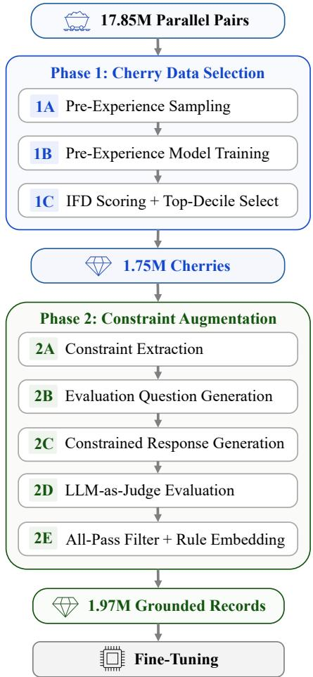

# Reference-Grounded Data Curation for Instruction-Following Thai-English Machine Translation

Thodsaporn Chay-intr<sup>1,2</sup>, Krittapad Harnchang<sup>1∗</sup>, Mahannop Thabua<sup>1∗</sup> Kobkrit Viriyayudhakorn<sup>1,3</sup>, Thanaruk Theeramunkong<sup>2,4</sup>

<sup>1</sup>iApp Technology, Thailand

<sup>2</sup>Intelligent Informatics and Service Innovation Research Center, Thailand   
<sup>3</sup>Artificial Intelligence Entrepreneur Association of Thailand (AIEAT), Thailand   
<sup>4</sup>Sirindhorn International Institute of Technology, Thammasat University, Thailand {t.chayintr, krittapadpor12348, peemmygg}@gmail.com kobkrit@aieat.or.th, thanaruk@siit.tu.ac.th

## Abstract

Instruction-following machine translation (IF-MT) requires respecting prompt-level rules on terminology, formatting, and register. Rule compliance typically trades of against translation quality, a tension that general-purpose IF data augmentation methods do not address. We propose Reference-Grounded Data Curation, a two-phase pipeline that extracts every supervised constraint from a reference translation that already satisfies it, ensuring feasibility by construction. Phase 1 applies Instruction-Following Dificulty (IFD) scoring to retain the hardest-but-learnable instances from an English-Thai parallel pool. Phase 2 extracts constraints from each reference target and keeps only generations satisfying every constraint, yielding the 1.97M-record Grounded dataset. We fine-tune open-weight bases on Grounded to produce ChindaMT, a Thai-English translation family at 4B, 2B, and 0.8B parameters. Under length-controlled pairwise judging, ChindaMT outperforms or matches every same-size baseline at every tier on both plain translation and under explicit rules, reaching up to a 68.4% win rate against the strongest baseline. The recipe transfers cleanly across Qwen generations. We release model weights, the Grounded dataset, and evaluation suites.

## 1 Introduction

Large language models (LLMs) now translate competitively with dedicated MT systems (Xu et al., 2024b; Alves et al., 2024), and translation requests increasingly carry prompt-level rules on terminology, formatting, register, and length that outputs must satisfy while staying accurate. Yet translation-specialized fine-tuning erodes prompt-following capability, while instructiontuned LLMs without translation specialization follow such rules but underperform on quality. Openweight Thai-English systems illustrate both failure modes. Thai-focused LLMs such as Typhoon (Pipatanakul et al., 2023, 2024) support instruction following (IF) but lack specialized translation quality, while multilingual machine translation (MT) specialists such as Hunyuan-MT (Zheng et al., 2025) deliver translation quality without modeling prompt-level constraints. No open-weight Thai-English model currently closes this gap.

Two complementary lines of work build general IF training data. Data selection methods (Zhou et al., 2023a; Li et al., 2024b; Liu et al., 2024) identify a small high-quality SFT subset, while data augmentation methods (Wang et al., 2023; Dong et al., 2025; An et al., 2025) synthesize constraintbearing instructions by prompting an LLM. Both target general IF benchmarks such as IFEval (Zhou et al., 2023b) and FollowBench (Jiang et al., 2024), but neither has been adapted to translation.

We propose Reference-Grounded Data Curation (RGDC), a two-phase pipeline that grounds every supervised constraint in an existing reference translation. Phase 1 applies the Instruction-Following Dificulty (IFD) score (Li et al., 2024b) to keep the hardest-but-learnable subset of an English-Thai parallel pool. Phase 2 extracts verifiable constraints from each retained reference, regenerates outputs, and keeps only candidates that pass every constraint under LLM-as-judge evaluation, producing the Grounded dataset.

We fine-tune four open-weight base models on Grounded to produce ChindaMT<sup>1</sup>, a Thai-English translation family at 4B, 2B, and 0.8B parameters. Three variants use Qwen3.5 bases and a fourth uses

Qwen3-4B to demonstrate cross-generation transfer. Evaluation uses length-controlled pairwise win rate against same-size baselines on two suites we construct, with one primary and two openweight cross-judges from independent model families. CoreEval covers five deployment-relevant domains spanning government, finance, tech, UI, and miscellaneous content, and BroadEval spans ten broader domains for cross-domain generalization. Each suite has a Plain split for translation only and a Constrained split with one to four rules.

On CoreEval, ChindaMT outperforms the sizematched MT specialists at all three sizes on both plain and constrained translation, and the same recipe transfers cleanly to Qwen3-4B as a crossgeneration check. These wins extend to BroadEval and are corroborated by external metrics, two open-weight cross-judges from independent model families, and native-Thai human raters.

Our contributions are as follows:

• We propose Reference-Grounded Data Curation, which eliminates the compliancequality conflict by extracting every constraint from a reference already satisfying it, so each rule-compliant target is a faithful translation.

• We release ChindaMT, an open-weight Thai-English translation family at 4B, 2B, and 0.8B parameters, with the Grounded dataset and the CoreEval and BroadEval suites.

• ChindaMT outperforms or matches every same-size baseline on plain and instructionfollowing translation, with external metrics, cross-judges, and humans agreeing and ablations isolating RGDC components.

## 2 Related Work

## 2.1 Data Selection for Instruction Tuning

LIMA (Zhou et al., 2023a) showed that small highquality SFT data can match much larger uncurated sets (Chen et al., 2024; Luo et al., 2025), motivating data-selection methods that retain high-signal instances. The IFD score (Li et al., 2024b) selects samples where the instruction reduces but does not eliminate the loss on the output, yielding hard-but-learnable instances. Related methods include Deita (Liu et al., 2024), Humpback (Li et al., 2024c), and SuperFiltering (Li et al., 2024a).

We adapt IFD scoring to the translation setting because it defines dificulty with the loss of the base model being fine-tuned, so dificulty is measured for the model that will learn from the data, and needs no further scorer. SuperFiltering approximates this criterion with a weaker model to save cost. Deita scores complexity and quality, which have more room to separate samples in diverse open-domain pools than in our single-task pool.

## 2.2 Instruction-Following Data Augmentation

Instruction-data augmentation methods synthesize new instruction-response pairs rather than selecting from an existing pool. Self-instruct (Wang et al., 2023) and WizardLM (Xu et al., 2024a) bootstrap diverse instructions from a seed set, while AutoIF (Dong et al., 2025) and UltraIF (An et al., 2025) synthesize verifiable constraints from prompts and rejection-sample for compliance. RGDC inverts this synthesize-then-filter pattern, extracting constraints from existing reference translations so each is feasible by construction; Phase 2E filtering is then residual generation hygiene, not feasibility enforcement. A detailed comparison with AutoIF and UltraIF is in Appendix A, Table 8.

## 2.3 Machine Translation with LLMs

Recent work (Xu et al., 2024b,c; Alves et al., 2024; Bawden and Yvon, 2023) shows that generalpurpose LLMs can match dedicated neural MT systems. For Thai specifically, Typhoon (Pipatanakul et al., 2023, 2024), SeaLLMs (Nguyen et al., 2024; Zhang et al., 2025), and Hunyuan-MT (Zheng et al., 2025) are representative recent eforts. Standard MT metrics like BLEU (Papineni et al., 2002), chrF (Popović, 2015), and COMET (Rei et al., 2020) score translation quality but not rule compliance. Our work targets Thai-English IF-MT, where prior systems either support IF without specialized translation quality or deliver translation quality without modeling prompt-level constraints.

## 2.4 LLM-as-Judge Evaluation

LLM-as-judge protocols correlate well with human preferences (Zheng et al., 2023) but exhibit length bias (Saito et al., 2023) and position bias (Wang et al., 2024). AlpacaEval v2 (Dubois et al., 2024) addresses length bias via a generalized linear model fitted on each evaluation. We adopt this protocol with an open-weight 35B LLM judge for reproducibility, cross-validated by two further open-weight judges from independent model families (Section 5.3) and by native-Thai human raters.

  
Figure 1: The two-phase RGDC pipeline. Phase 1 uses IFD scoring to cherry-select 1.75M instances from the 17.85M-record English-Thai parallel pool. Phase 2 extracts reference-grounded constraints and keeps only allpass candidates, yielding the 1.97M-record Grounded dataset that trains the ChindaMT family.

## 3 Methodology

## 3.1 Pipeline Overview

Reference-Grounded Data Curation (RGDC) builds training data in two phases, shown in Figure 1. Phase 1 scores a large English-Thai parallel pool and keeps the hardest-but-learnable records. Phase 2 extracts verifiable constraints from each kept reference translation, so every constraint is feasible by construction, then regenerates the output under those constraints and keeps only generations that satisfy all of them. This yields the Grounded dataset, on which we fine-tune openweight bases to produce the ChindaMT family.

## 3.2 Phase 1: Cherry Data Selection

Our base model is Qwen3.5-4B (Qwen Team, 2025). Following Li et al. (2024b), we briefly finetune it on a representative subset, then score every pool record by IFD and keep the top decile.

Pre-experience subset (1A–1B). For each corpusdirection pair, the base model computes meanpooled sentence embeddings and per-instance perplexity. We cluster the samples and draw a fixed quota from each cluster within a mid-perplexity band, avoiding trivially easy and noisy extremes. The base model is then briefly freeze-tuned on this subset, exposing it to the domain without overfitting individual instances.

IFD scoring and selection (1C). The preexperienced model scores every record by IFD, its output-loss ratio with and without the instruction,

$$
\mathrm { I F D } = { \frac { \ell ( y \mid I , x ) } { \ell ( y ) } } ,
$$

where ℓ is mean token-level cross-entropy, y the target, I the instruction, and x the source. An IFD below 1 means the instruction eases prediction; at or above 1 it does not help, so we discard them. From the rest we keep the top decile by IFD, the hardestbut-learnable band, yielding 1.75M cherry samples (per-sub-step counts in Table 2).

## 3.3 Phase 2: Constraint Augmentation

As in AutoIF (Dong et al., 2025) and UltraIF (An et al., 2025), we use a larger auxiliary LLM for constraint extraction, regeneration, and judging. From the 1.75M cherry samples, we extract constraints from each reference target (2A), generate yes/no evaluation questions (2B), regenerate translations under those constraints (2C), judge each constraint (2D), and retain all-pass candidates (2E).

Constraint extraction (2A). For each cherry sample, the auxiliary LLM receives the source, the target translation, and a taxonomy of five constraint categories. It returns constraints the target already demonstrates in Table 1, guaranteeing feasibility by construction. Full prompt in Appendix B.1.

<table><tr><td>Category</td><td>Example</td></tr><tr><td>Content</td><td>“include the term clean energy’ ,&quot;</td></tr><tr><td>Numerical</td><td>“use exactly one sentence”</td></tr><tr><td>Stylistic</td><td>“use formal Thai without slang”</td></tr><tr><td>Format</td><td>“return only the translation, no quotes&quot;</td></tr><tr><td>Linguistic</td><td>“avoid English contractions&quot;</td></tr></table>

Table 1: Example constraints for the five categories used by the Phase 2A extractor.

Evaluation question generation (2B). All constraints from a sample are batched into a single call to the auxiliary LLM that returns one yes/no question per constraint. Full prompt in Appendix B.2.

Constrained response generation (2C). Each cherry sample yields two candidate variants. The sampled variant embeds 1–3 randomly selected constraints, and the all variant embeds every extracted constraint. Each variant appends its constraints as a Rules: block to the source prompt, and the auxiliary LLM generates a new translation. System prompt in Appendix B.3.

LLM-as-judge evaluation (2D). For each candidate variant, the auxiliary LLM answers the perconstraint yes/no questions from 2B, marking each satisfied or violated. These judgments drive the allpass filter in 2E. Full prompt in Appendix B.4.

All-pass filtering (2E). Only candidate variants where every constraint receives YES are retained, yielding the Grounded dataset ( 1.97M records; exact counts in Table 2). The retained constraints are embedded into the training instruction as a Rules: block, producing clean (instruction, input, output) triples for supervised fine-tuning. A reference-free quality audit finds these regenerated targets at least as good as their source-corpus references (Appendix D).

## 4 Experimental Setup

## 4.1 Source Parallel Corpora

Ten English-Thai parallel corpora (Appendix C, Table 9) supply both RGDC phases. After unification into Alpaca (instruction, input, output) format, the pool contains 17.85M records across both directions. Each source appears in both en-th and th-en for IFD scoring. Evaluation items drawn from this pool are held out of both phases from the outset (Section 4.3).

## 4.2 Grounded Training Dataset

The RGDC pipeline produces a single dataset we call Grounded, 1.97M records pairing each source and its Rules: block with the constraintcompliant translation. A worked record appears in Appendix D, with per-sub-step counts in Table 2. Retained records carry 3.7 constraints on average, and 56.5% of candidates survive to Grounded.

## 4.3 Evaluation Datasets

We construct two evaluation suites that share the Plain and Constrained formats but difer in data distribution, each with 400 samples per format, 200 en-th and 200 th-en. CoreEval, the primary suite, covers five deployment-relevant domains, government, finance, tech, UI, and miscellaneous, sampled from the parallel pool and length-stratified following Pipatanakul et al. (2024). BroadEval is independently curated for generalization, spanning ten broader domains such as news, literary, and social text, with about 25% paragraph-length inputs.

<table><tr><td>Sub-step</td><td>Records</td></tr><tr><td>Phase 1: Cherry selection</td><td></td></tr><tr><td>1C. Cherry-selected (top-decile) Phase 2: Constraint augmentation</td><td>1,751,962</td></tr><tr><td>2A. Constraint extractions</td><td>1,751,962</td></tr><tr><td>2B. Evaluation questions</td><td>1,747,959</td></tr><tr><td>2C. Augmented prompts (2 variants) 2E. All-pass filtered (Grounded)</td><td>3,495,704 1,973,358</td></tr></table>

Table 2: Record counts at each RGDC sub-step, starting from a 17.85M parallel pool. Sub-steps 1B and 2D do not change record counts.

Both formats use English prompt scafolding regardless of direction, matching the training format. Plain contains only the translation instruction and source, while Constrained adds a Rules: block of 1–4 constraints from the five categories in Table 1. Full templates in Appendix E.

## 4.4 Models Compared

Our four ChindaMT variants share one fine-tuning recipe (Section 4.5) on Grounded, difering only in base. Three use Qwen3.5 at 4B, 2B, and 0.8B for the deployment scaling axis, plus Qwen3-4B for cross-generation transfer. We compare each against size-matched Thai-capable MT specialists, Typhoon-Translate-1.5 (Pipatanakul et al., 2024), Hunyuan-MT-1.5 (Zheng et al., 2025), GemmaX2- 28 (Cui et al., 2025), TranslateGemma (Finkelstein et al., 2026), and MiLMMT-46 (Shang et al., 2026), and against each variant’s own base. Per-tier pairings are in Appendix F, Table 11.

## 4.5 Implementation Details

Phase 1. Sampling (1A) uses K-means with 100 clusters over base mean-pooled embeddings, drawing 10 per cluster within the $2 5 ^ { t h } - 7 5 ^ { t h }$ perplexity band (40,683 samples). Training (1B) freeze-tunes for 1 epoch with the top 4 transformer blocks unfrozen (FP32, AdamW lr $2 \times 1 0 ^ { - 5 }$ , inverse-squareroot schedule, 1% warmup, efective batch 64).

Phase 2. The four LLM-using sub-steps share a single auxiliary LLM, Qwen3.5-35B-A3B-FP8 with thinking disabled, using the role-specific decoding parameters in Appendix G, Table 12.

Fine-tuning. Full-parameter SFT for one epoch on Grounded, no preference optimization or RL. Core hyperparameters in Appendix G, Table 13. The same recipe trains all four variants, with only the batch-size decomposition difering per tier (4  8 for 4B and Qwen3-4B, 8 4 for 2B, 16 2 for 0.8B, each on two GPUs, preserving efective batch 64). Runs in LLaMA-Factory (Zheng et al., 2024) on H100 under DeepSpeed ZeRO-2 with token packing and NEFTune noise $\alpha = 2$

## 4.6 Evaluation Protocol

Judge. We use a single judge, Qwen3.6-35B-A3B-FP8 with greedy decoding and thinking disabled, to score every pair in the AlpacaEval-v2 format under three criteria in priority order, accuracy and faithfulness, then instruction and format compliance, then fluency. Full prompt in Appendix H.

Metric. From these preferences we report lengthcontrolled win rate (LC%) (Dubois et al., 2024), where the AlpacaEval-v2 GLM corrects for length bias (Saito et al., 2023; Wang et al., 2024), with standard errors defined in Appendix I. Raw win rates appear in Table 15, external quality metrics in Section 5.2.

Judge-family bias. The primary judge shares the Qwen family with ChindaMT and Typhoon-Translate, and LLM judges can mildly favor their own lineage (Zheng et al., 2023), so Section 5.3 re-judges every comparison with two open-weight judges from independent families.

Split semantics. Plain has only the translation instruction and source, so its win rate reflects translation quality and output format, with no explicit rule to follow (Table 3). Constrained adds a rules block, so its win rate additionally reflects explicit rule compliance, under the shared template only, since no baseline exposes a Rules: slot. Translation quality on its own is measured directly by the external metrics in Table 4.

## 5 Results

## 5.1 Main Pairwise Results

CoreEval. ChindaMT-4B outperforms every same-tier and larger baseline on Mean, on both plain and constrained translation, and whether baselines use the shared scafold or their default templates. Against same-size Typhoon-Translate-4B it reaches LC% 61.8 on Plain (shared) and 68.4 on Constrained, and Plain (own) LC% stays above 50 for every baseline, ruling out a prompt-format artifact. Constrained win rates over the larger HY-MT-1.5-7B approach the ceiling.

ChindaMT-2B and ChindaMT-0.8B outperform or match every size-matched baseline, HY-MT-1.5- 1.8B, GemmaX2-28-2B, and MiLMMT-46-1B. Per-direction breakdowns are in Appendix J.

BroadEval. The CoreEval pattern holds out of domain. ChindaMT-4B and ChindaMT-2B lead every reportable size-matched comparison without a loss, ChindaMT-4B ahead of same-size Typhoon-Translate-4B with LC% of 53.1 to 63.2 and of the larger HY-MT-1.5-7B by wider margins, while ChindaMT-0.8B leads its size-matched baselines except for a tie with GemmaX2-28-2B within 0.6 of 50. The instruction-following gap is the most durable out of domain, with Constrained LC over the larger HY-MT-1.5-7B reaching 98.2.

## 5.2 External-Benchmark Validation

We test whether the LC gains cost raw translation quality on FLORES-200 devtest (Wikipedia) and WMT24++ en-th (news), reporting four reference-free and reference-based metrics that correlate with human judgment, CometKiwi (Rei et al., 2022), GEMBA-DA (Kocmi and Federmann, 2023b), GEMBA-MQM (Kocmi and Federmann, 2023a), and MetricX-24 (Juraska et al., 2024). GEMBA-DA and GEMBA-MQM reuse our Qwen3.6-35B judge, with definitions and prompts in Appendices I and K. Each model runs under its best-case prompt, ChindaMT with the Grounded format and each baseline with its own model-card template.

ChindaMT-4B ties the top of FLORES Larger Mean (90.7, with MiLMMT-46-4B) and outperforms same-size Typhoon-Translate-4B on most comparisons across both benchmarks, while ChindaMT-2B leads its tier on FLORES (88.9) and ties for the WMT24++ lead (85.5). On WMT24++ Larger, ChindaMT-4B (87.8) trails HY-MT-1.5-7B (89.4) and sits level with MiLMMT-46-4B (87.9), the 1.6-point gap falling on the news-domain th-en direction where the larger 7B specialist holds an edge. Pairwise judging (Table 3) shows ChindaMT-2B leads size-matched comparisons, so external-metric strength does not cost instruction following. Full numbers in Appendix J, Table 15.

## 5.3 Cross-Judge and Human Validation

We check that LC rankings are not a primary-judge artifact, via cross-judge re-evaluation across independent families and blinded native-Thai rating.

<table><tr><td rowspan="2">Model</td><td rowspan="2">Comparator</td><td colspan="3">Plain (shared)</td><td colspan="3">Plain (own)</td><td colspan="3">Constrained</td></tr><tr><td>en→th</td><td>th→en</td><td>Mean</td><td>en→th</td><td>th→en</td><td>Mean</td><td>en→th</td><td>th→en</td><td>Mean</td></tr><tr><td rowspan="7">ChindaMT-4B COVAL</td><td>MiLMMT-46-4B</td><td>88.8</td><td>83.7</td><td>86.3</td><td>62.8</td><td>42.1</td><td>53.3</td><td>89.9</td><td>88.7</td><td>89.5</td></tr><tr><td>TranslateGemma-4B</td><td>88.7</td><td>75.1</td><td>81.0</td><td>80.1</td><td>54.5</td><td>66.7</td><td>86.4</td><td>91.0</td><td>87.2</td></tr><tr><td>Typhoon-Translate-4B</td><td>64.9</td><td>58.5</td><td>61.8</td><td>62.1</td><td>53.4</td><td>57.8</td><td>67.4</td><td>71.0</td><td>68.4</td></tr><tr><td>HY-MT-1.5-7B</td><td>68.2</td><td>83.0</td><td>74.0</td><td>68.2</td><td>59.3</td><td>62.9</td><td>96.6</td><td>99.5</td><td>97.9</td></tr><tr><td>GemmaX2-28-9B</td><td>94.7</td><td>92.8</td><td>93.6</td><td>66.2</td><td>45.0</td><td>56.6</td><td>94.4</td><td>93.5</td><td>94.1</td></tr><tr><td>MiLMMT-46-1B</td><td>88.5</td><td>88.7</td><td>88.4</td><td>62.9</td><td>47.5</td><td>54.6</td><td>93.0</td><td>94.3</td><td>93.7</td></tr><tr><td>ChindaMT-2B HY-MT-1.5-1.8B</td><td>73.9</td><td>79.5</td><td>75.2</td><td>78.3</td><td>70.9</td><td>72.6</td><td>82.7</td><td>80.7</td><td>78.6</td></tr><tr><td rowspan="3"></td><td>GemmaX2-28-2B</td><td>92.9</td><td>87.3</td><td>90.2</td><td>70.4</td><td>38.9</td><td>55.6</td><td>87.5</td><td>88.6</td><td>89.9</td></tr><tr><td>MiLMMT-46-1B</td><td>85.9</td><td>81.3</td><td>83.4</td><td>55.6</td><td>47.9</td><td>50.9</td><td>93.5</td><td>87.3</td><td>90.3</td></tr><tr><td>HY-MT-1.5-1.8B GemmaX2-28-2B</td><td>62.9 92.2</td><td>69.7 82.3</td><td>64.6</td><td>67.7</td><td>63.5 39.4</td><td>63.4 51.2</td><td>74.1 89.2</td><td>68.8 82.1</td><td>67.8 86.5</td></tr><tr><td rowspan="5">ChindaMT-4B</td><td></td><td></td><td></td><td>87.5</td><td>62.0</td><td></td><td></td><td></td><td></td><td></td></tr><tr><td>MiLMMT-46-4B</td><td></td><td></td><td></td><td>49.0</td><td>62.1</td><td>56.2</td><td></td><td></td><td></td></tr><tr><td>TranslateGemma-4B</td><td>80.4</td><td>83.7</td><td>81.8</td><td>72.5</td><td>62.5</td><td>67.0</td><td>74.6</td><td>80.3</td><td>76.1</td></tr><tr><td>Typhoon-Translate-4B</td><td>60.0</td><td>56.6</td><td>58.7</td><td>53.3</td><td>49.8</td><td>53.1</td><td>63.4</td><td>63.1</td><td>63.2</td></tr><tr><td>HY-MT-1.5-7B GemmaX2-28-9B</td><td>51.3</td><td>87.8</td><td>70.1</td><td>57.5 66.8</td><td>68.5 66.0</td><td>62.0 67.4</td><td>96.7</td><td>99.7</td><td>98.2</td></tr><tr><td rowspan="4">BROVAL ChindaMT-2B</td><td></td><td></td><td></td><td></td><td></td><td></td><td></td><td></td><td></td><td></td></tr><tr><td>MiLMMT-46-1B</td><td>91.8 53.4</td><td>97.4</td><td>94.7</td><td>70.3 72.6</td><td>66.5 83.0</td><td>68.7 76.2</td><td></td><td></td><td></td></tr><tr><td>HY-MT-1.5-1.8B GemmaX2-28-2B</td><td></td><td>90.1</td><td>70.8</td><td>67.3</td><td>63.9</td><td>66.3</td><td>73.5</td><td>88.3</td><td>78.6</td></tr><tr><td></td><td></td><td></td><td></td><td></td><td></td><td></td><td></td><td></td><td></td></tr><tr><td rowspan="2">ChindaMT-0.8B</td><td>MiLMMT-46-1B HY-MT-1.5-1.8B</td><td>89.0 34.8</td><td>95.9 76.1</td><td>92.6 54.4</td><td>46.1 47.8</td><td>53.9 67.7</td><td>50.2 56.5</td><td>57.7</td><td></td><td></td></tr><tr><td>GemmaX2-28-2B</td><td></td><td></td><td></td><td>44.8</td><td>51.2</td><td>49.4</td><td></td><td>74.0</td><td>61.9</td></tr></table>

Table 3: Main pairwise LC% on CoreEval and BroadEval. (shared) uses a uniform prompt scafold, (own) lets each baseline use its own template. Bold marks Means above 50. Shared-prompt comparisons where the comparator returns almost no target-language output (GemmaX2 BroadEval, MM-46-4B BroadEval, and Constrained BroadEval for MM-46-1B at the 2B and 0.8B tiers) are omitted.

Cross-judge. We re-judge every comparison in Table 3 with two additional open-weight judges from distinct families, GPT-OSS-120B (OpenAI, 2025) and Llama-3.3-70B-Instruct (Grattafiori et al., 2024), neither sharing lineage with any baseline. Constrained agreement is decisive, with ChindaMT WR reaching the mid-90s against the strongest MT specialists on both suites and judge spread under three points. Plain is judge-sensitive on MM-46 and GemmaX2 (WR% in [45, 74]), consistent with their parity on external metrics (Table 4). All 16 Constrained and 18 Plain (shared) comparisons agree on direction, and the three direction-disagreeing comparisons of 56 are nearparity Plain (own) within five points of 50%.

Human validation. Three native Thai raters scored blinded Plain and Constrained pairs from the ChindaMT-4B against Typhoon-Translate-1.5- 4B comparison, Plain with the baseline template and Constrained with the shared template, full protocol in Appendix M. ChindaMT-4B is preferred on both splits, with stronger intensity on Constrained (+0.68) than Plain (+0.39). Inter-rater κ averages 0.73 (substantial) and judge-vs-humanmajority κ = 0.41 (moderate), supporting the

LLM judge as a population-level proxy. Agreement is stronger on Constrained (0.62) than on Plain (0.18), where the own-template condition leaves the two systems close (Table 3) and little signal for either judge or rater to separate.

All four channels, the primary LC% (Table 3), external metrics (Table 4), three-judge cross-judge (Table 5), and human evaluation (Table 6), agree on direction, so the headline does not rest on any single validation channel.

## 5.4 Method Lift and Parameter Scaling

We measure two scaling axes, own-base lift and within-Qwen3.5 parameter scaling at fixed recipe (Appendix N, Table 16). All four Qwen finetunes outperform their bases on CoreEval, with Plain/Constrained LC% of 55.7/62.2 (Qwen3.5- 4B), 71.9/69.5 (Qwen3-4B), 77.1/74.2 (Qwen3.5- 2B), and 81.5/83.5 (Qwen3.5-0.8B). Lift grows as parameters decrease, and Qwen3-4B gains more than Qwen3.5-4B from the same supervision, reflecting more headroom in smaller and older bases (Zhou et al., 2023a; Chen et al., 2024).

Within-family scaling is asymmetric. Plain lifts compress as size gaps narrow (+12.6 for 4B vs 2B, +6.9 for 2B vs 0.8B), while Constrained lifts stay roughly constant per halving (+14.2 and +14.4). IF capability therefore scales sub-linearly and is largely preserved at 2B, making ChindaMT-2B a useful intermediate deployment choice.

<table><tr><td rowspan="2">Model</td><td colspan="2">CK↑</td><td colspan="2">DA↑</td><td colspan="2">MQM↑</td><td rowspan="2">Quality Mean↑</td><td colspan="2">MtX↓</td><td rowspan="2">MtX Mean↓</td></tr><tr><td></td><td>en→th th→en</td><td>en→th</td><td>th→en</td><td>en→th</td><td>th→en</td><td>en→th th→en</td><td></td></tr><tr><td rowspan="12">MiLMMT-46-4B LAGER 4-9B FLS--20</td><td>83.88</td><td>84.98</td><td>87.94</td><td>91.90</td><td>97.01</td><td>98.23</td><td></td><td>90.7</td><td>2.14 1.97</td><td>2.06</td></tr><tr><td>TranslateGemma-4B 82.76</td><td>84.01</td><td>82.44</td><td>87.62</td><td>95.24</td><td>97.52</td><td>88.3</td><td>2.45</td><td>2.11</td><td>2.28</td></tr><tr><td>Typhoon-Translate-4B</td><td>83.62 83.97</td><td>87.52</td><td>87.79</td><td>97.23</td><td>97.74</td><td>89.6</td><td>2.14</td><td>2.26</td><td>2.20</td></tr><tr><td>HY-MT-1.5-7B</td><td>84.38 84.61</td><td>88.71</td><td>89.48</td><td>97.63</td><td>97.97</td><td>90.5</td><td>1.98</td><td>1.98</td><td>1.98</td></tr><tr><td>GemmaX2-28-9B</td><td>82.43 84.45</td><td>85.20</td><td>91.91</td><td>96.94</td><td>98.34</td><td>89.9</td><td>2.45</td><td>2.07</td><td>2.26</td></tr><tr><td>ChindaMT-4B (ours)</td><td>83.80 84.55</td><td>89.32</td><td>90.33</td><td>97.53</td><td>98.39</td><td>90.7</td><td>2.13</td><td>1.98</td><td>2.06</td></tr><tr><td>MiLMMT-46-1B</td><td>82.56</td><td>84.41</td><td>75.93</td><td>84.79</td><td>94.06</td><td>96.69</td><td>86.4</td><td>2.57</td><td>2.28 2.43</td></tr><tr><td>HY-MT-1.5-1.8B</td><td>83.03</td><td>83.65</td><td>79.39</td><td>82.64</td><td>95.95</td><td>96.41</td><td>86.8</td><td>2.22</td><td>2.25 2.24</td></tr><tr><td>GemmaX2-28-2B</td><td>81.80</td><td>84.25</td><td>79.78</td><td>88.06</td><td>95.54</td><td>97.75</td><td>87.9 2.66</td><td>2.23</td><td>2.45</td></tr><tr><td>08--B ChindaMT-0.8B (ours)</td><td>82.51</td><td>83.41</td><td>78.71</td><td>79.54</td><td>95.27</td><td>95.66</td><td>85.9</td><td>2.50 2.55</td><td>2.53</td></tr><tr><td>ChindaMT-2B (ours)</td><td>83.40</td><td>84.08</td><td>85.76</td><td>86.24</td><td>96.86</td><td>97.25</td><td>88.9</td><td>2.25 2.23</td><td>2.24</td></tr><tr><td>MiLMMT-46-4B WWM24++</td><td>80.30</td><td>82.15</td><td>84.39</td><td>89.21</td><td>94.74</td><td>96.68</td><td>87.9</td><td>3.14</td><td>3.08</td></tr><tr><td>TranslateGemma-4B AGER</td><td>78.55</td><td>80.51</td><td>77.21</td><td>84.31</td><td>93.14</td><td>95.92</td><td>84.9</td><td>3.37</td><td>3.28</td><td>3.11 3.33</td></tr><tr><td>4-9B Typhoon-Translate-4B</td><td>79.46</td><td>80.62</td><td>81.82</td><td>85.21</td><td>95.39</td><td>97.40</td><td>86.6</td><td>3.29</td><td>3.44</td><td>3.37</td></tr><tr><td>HY-MT-1.5-7B</td><td>81.15</td><td>81.90</td><td>87.19</td><td>91.21</td><td>96.67</td><td>98.08</td><td>89.4</td><td>2.62</td><td>2.80</td><td>2.71</td></tr><tr><td>GemmaX2-28-9B</td><td>77.64</td><td>81.10</td><td>75.72</td><td>89.21</td><td>94.39</td><td>97.65</td><td>86.0</td><td>3.95</td><td>3.32</td><td>3.64</td></tr><tr><td>ChindaMT-4B (ours)</td><td>80.23</td><td>81.21</td><td>83.85</td><td>87.60</td><td>96.63</td><td>97.36</td><td>87.8</td><td>3.21</td><td>3.19</td><td>3.20</td></tr><tr><td>MiLMMT-46-1B SMLER</td><td>77.84</td><td>81.17</td><td>69.44</td><td>82.80</td><td>92.18</td><td>95.36</td><td>83.1</td><td>3.69</td><td>3.42</td><td>3.56</td></tr><tr><td>HY-MT-1.5-1.8B</td><td>79.58</td><td>80.93</td><td>77.44</td><td>83.94</td><td>94.86</td><td>96.16</td><td>85.5</td><td>2.93</td><td>3.08</td><td>3.01</td></tr><tr><td>GemmaX2-28-2B</td><td>77.06</td><td>80.81</td><td>70.77</td><td>84.99</td><td>93.14</td><td>96.38</td><td>83.9</td><td>4.07</td><td>3.53</td><td>3.80</td></tr><tr><td>0.8-B ChindaMT-0.8B (ours)</td><td>77.80</td><td>79.58</td><td>69.65</td><td>74.28</td><td>92.05</td><td>94.14</td><td>81.2</td><td>3.74</td><td>3.71</td><td>3.73</td></tr><tr><td>ChindaMT-2B (ours)</td><td>79.57</td><td>80.58</td><td>79.48</td><td>82.25</td><td>95.02</td><td>96.12</td><td>85.5</td><td>3.30</td><td>3.39</td><td>3.35</td></tr></table>

Table 4: External-metric translation quality on FLORES-200 (Wikipedia) and WMT24++ en-th (news), with CometKiwi (CK), GEMBA-DA (DA), and GEMBA-MQM (MQM) as 0–100 quality scores ( ); Mean is their unweighted six-value average. MetricX-24 (MtX, ) is the native error score on a 0–25 scale (lower better), kept separate with its own Mean over the two directions. Rows ordered by size within each tier, ChindaMT last. Bold marks the best per column within a tier, underline the second, ties bolded jointly.

Cross-family transfer. Fine-tuned on Grounded with only the base and chat template changed, the Gemma-3-4B fine-tune (FT) outperforms the Gemma-3-4B base with Plain/Constrained LC% of 99.1/66.6 (Table 16). All three judges agree on direction. The Plain margin is near ceiling because the base embeds its translation in English commentary that the rubric penalizes. The Constrained margin additionally reflects rule compliance. Since Phase 1 selection used the Qwen3.5- 4B scorer, Grounded transfers across model families without base-specific selection.

## 5.5 Component Ablations

Each Qwen3.5-4B ablation drops one RGDC component from the full recipe and shares all other hyperparameters with ChindaMT-4B (Table 7). Nocherry replaces IFD selection with uniform random sampling from the 17.85M pool, no-all-pass drops the Phase 2E filter, and no-rules strips the Rules: block from training input.

Cherry selection contributes 8 LC on Plain only. The full recipe lifts +8.24 over no-cherry on Plain (outside SE) and +0.69 on Constrained (within SE). External metrics on out-of-domain FLORES and WMT24++ stay around 0.3 on dataset Means (Appendix O), so Phase 1 aligns outputs with the CoreEval distribution rather than raising translation quality uniformly. Constraint compliance comes from Phase 2 supervision.

All-pass filter contributes a small positive lift. The full recipe gains +1.09/ + 1.06 over no-allpass, modest relative to SE but consistent in sign on both axes, with external-metric deltas small on both benchmarks (Appendix O). The filter is data hygiene that complements reference grounding.

Rule-block training contributes 10–13 LC. The full recipe lifts +12.63/ + 9.53 over no-rules, above SE on every comparison, and no-rules loses all six quality-metric comparisons with Mean down 0.7–0.9 (Appendix O, Table 18). No-rules hurts Plain at least as much as Constrained, so ruleconditioned supervision aligns the broader output distribution with high-quality reference style rather than a narrow IF mechanism.

<table><tr><td>Model</td><td>Comparator</td><td>Plain</td><td>Constr.</td></tr><tr><td rowspan="3">ChindaMT-4B</td><td>MM-46-4B</td><td>51.0</td><td>89.6</td></tr><tr><td>TG-4B</td><td>63.3</td><td>85.1</td></tr><tr><td>Typhoon-4B HY-MT-7B</td><td>56.1 57.2</td><td>65.5 95.3</td></tr><tr><td rowspan="4">ChindaMT-2B</td><td>GemmaX2-9B</td><td>56.4</td><td>93.7</td></tr><tr><td>MM-46-1B</td><td>54.1</td><td>91.3</td></tr><tr><td>HY-MT-1.8B GemmaX2-2B</td><td>62.1 56.0</td><td>73.4</td></tr><tr><td></td><td></td><td>91.9</td></tr><tr><td rowspan="2">ChindaMT-0.8B</td><td>MM-46-1B</td><td>51.7</td><td>88.2</td></tr><tr><td>HY-MT-1.8B GemmaX2-2B</td><td>57.0 53.0</td><td>65.1 90.1</td></tr></table>

Table 5: Cross-judge ChindaMT WR% on CoreEval, averaged across the three open-weight judges. Plain uses each comparator’s own template, and values above 50 favor ChindaMT. Comparators are abbreviated, with full names in Table 11. BroadEval, Plain (shared), and per-judge numbers in Appendix L.
<table><tr><td>Metric</td><td>Plain</td><td>Constrained</td><td>Overall</td></tr><tr><td>ChindaMT win rate</td><td>0.64</td><td>0.69</td><td>0.67</td></tr><tr><td>Pref. intensity</td><td>+0.39</td><td>+0.68</td><td>+0.53</td></tr><tr><td>Inter-rater κ</td><td>0.74</td><td>0.70</td><td>0.73</td></tr><tr><td>Human-vs-judge κ</td><td>0.18</td><td>0.62</td><td>0.41</td></tr></table>

Table 6: Human validation by three native Thai raters on 50 Plain and 50 Constrained items from the ChindaMT-4B against Typhoon-Translate-1.5-4B comparison, Plain with the baseline template and Constrained with the shared template. Win rate averages ChindaMT preference across raters (ties as half-wins), and intensity is the mean 2 to 2 rating. Inter-rater κ averages three pairs, and human-vs-judge κ compares against the human majority.

## 6 Analysis

## 6.1 Translation–IF Trade-of

Translation-specialized models forfeit instructionfollowing as they gain translation quality (Xu et al., 2024b; Alves et al., 2024), and the pattern recurs across our baselines. Tables 4 and 5 show MM-46- 4B, TranslateGemma-4B, and GemmaX2 at parity with ChindaMT on plain translation, yet they lose every Constrained comparison under all three judges. Typhoon-Translate-4B occupies the opposite corner, with weaker plain translation and a smaller Constrained gap.

<table><tr><td></td><td colspan="3">Components</td><td colspan="2">Full recipe lift</td></tr><tr><td>Variant</td><td>Cherry</td><td>Filter</td><td>Rules</td><td>Plain</td><td>Constr.</td></tr><tr><td>Full</td><td>√</td><td>√</td><td>√</td><td></td><td></td></tr><tr><td>no-cherry</td><td>X</td><td>√</td><td>√</td><td>+8.24</td><td>+0.69</td></tr><tr><td>no-all-pass</td><td>√</td><td>X</td><td>√</td><td>+1.09</td><td>+1.06</td></tr><tr><td>no-rules</td><td>√</td><td>√</td><td>X</td><td>+12.63</td><td>+9.53</td></tr></table>

Table 7: RGDC component ablations at 4B on CoreEval. Full recipe lift is the LC% margin over each ablation in pairwise judging, above the 50 tie. SE [2.1, 2.5].

RGDC avoids both failure modes because rule and translation supervision share one source of truth, the reference translations that cherry selection retains. The Phase 2 ablation (Section 5.5) supports the mechanism, since removing the Rules block reduces Plain LC more than Constrained LC, pointing to broad output-distribution alignment rather than a narrow instruction-following circuit. Plain-translation parity with the strongest size-matched MT specialists is the central evidence that the instruction-following gains do not cost translation quality.

On external metrics ChindaMT reaches parity rather than dominance, the one residual specialist edge being in-domain news, where the larger 7B HY-MT model leads on WMT24++ th-en (Table 4). The deployment-relevant gains, rule compliance and cross-domain robustness at a fixed size, are where ChindaMT leads.

## 6.2 Qualitative Case Analysis

Consider a Thai-to-English translation under the rule “Return only the translated text”. ChindaMT-4B and its Qwen3.5-4B base both follow the rule; Typhoon-Translate echoes the rule block and an EN: prefix before its translation, a direct rule violation. BLEU, chrF, and neural QE metrics would partially accept the Typhoon output because the trailing translation is correct, while LC% catches the format violation through the hard penalty in Appendix H. Full transcript in Appendix P.

This case instantiates the two failure modes that motivate the paper. Typhoon-Translate, a translation specialist, renders the sentence accurately but leaks the rule block and an EN: prefix, quality without compliance. The instruction-tuned Qwen3.5-4B base obeys the rule yet drops the source word web, compliance with a faithfulness loss. ChindaMT-4B alone does both, returning only the translation while preserving the content its base omits, resolving the trade-of in Section 6.1.

## 7 Conclusion

We introduced ChindaMT, an open-weight instruction-following Thai-English translation family at 4B, 2B, and 0.8B parameters, and RGDC, the two-phase pipeline that builds its training data. RGDC extracts every rule from a reference translation that already satisfies it, so feasibility is guaranteed by construction. Under lengthcontrolled pairwise evaluation, ChindaMT outperforms or matches size-matched translation specialists at every tier on CoreEval and BroadEval, without sacrificing raw translation quality on FLORES-200 or WMT24++, a result that two open-weight cross-judges and native Thai raters corroborate. The recipe transfers across four bases and two Qwen generations. We release model weights, the Grounded dataset, evaluation suites, and code under open licenses.

## 8 Limitations

Reference-bounded constraint coverage. RGDC extracts only rules a reference already satisfies, so the constraints it can supervise are bounded by the reference distribution. Demands that no reference exemplifies, or that resist a yes/no check, fall outside the pipeline, trading breadth for feasibility. Term, length, register, and output-format instructions are covered. A mandated glossary and placeholder tokens fall outside by design, since reference grounding supervises only what a reference demonstrates. Widening coverage by grounding in the resources of a domain, or with synthetic constraint generation, is left to future work.

Single primary judge. Primary LC and GEMBA rely on one open-weight judge (Qwen3.6-35B), so absolute LC values may reflect its calibration. We mitigate this with external metrics (Table 4), AlpacaEval-v2 length and position controls, a three-family cross-judge (Table 5), and human raters (Table 6). Direction agreement holds across all three judge families on every Constrained and Plain (shared) comparison.

Language-pair and domain coverage. All experiments cover English-Thai in both directions only. Extension to other low-resource pairs, especially Southeast Asian languages, and to broader registers is left to future work.

Prompt-format asymmetry. The Grounded training format matches the Typhoon-Translate template but difers from HY-MT and GemmaX2. On Plain we evaluate baselines under both shared and own templates. Constrained uses the shared format only, since no baseline exposes a Rules: slot, omitting some GemmaX2 comparisons (Table 3). Base-architecture coverage. All four ChindaMT bases are Qwen. The recipe transfers across Qwen3.5 and Qwen3 generations, and the curated data lifts Gemma-3-4B over its base (Table 16), though with Qwen-derived Phase 1 selection. Rerunning selection with the target base and transfer to other architectures remain untested.

## 9 Ethical Considerations

Data. RGDC uses ten public English-Thai corpora (Appendix C). Because several carry ShareAlike terms, the released Grounded dataset and evaluation suites adopt CC-BY-SA 4.0. The suites ship source text and model outputs but no reference translations or personally identifying information, consistent with the source licenses, and one Broad-Eval item retains the CC-BY-NC-4.0 terms of its source, marked in the released file.

Human evaluation. The study (Appendix M) used three native Thai speakers who volunteered without compensation and gave informed consent after being told the purpose and their right to withdraw. They rated anonymized pairs in a minimalrisk task recording only preferences, with no personal data collected. The study required no formal ethics-board review at our institution.

Intended use and risks. Like any MT system, ChindaMT can produce fluent but incorrect output or reflect training-data bias, so its outputs warrant human review in high-stakes use.

Release and compute. Model weights and code are released under Apache-2.0, the weights inheriting the Qwen base-model license, and the Grounded dataset and evaluation suites under CC-BY-SA 4.0, for reproducibility. The small 0.8B– 4B models keep compute modest and accessible to the low-resource Thai-English community.

## Acknowledgements

We thank the anonymous reviewers and the area chair for their constructive comments, SiamAI for computational resources, OpenThai Lab for its support, and the three native Thai speakers who volunteered as raters. An AI assistant was used for language editing, drafting support, and help with LaTeX and code. The authors reviewed and verified all content and take full responsibility for it.

## References

Duarte M. Alves, José Pombal, Nuno M. Guerreiro, Pedro H. Martins, João Alves, Amin Farajian, Ben Peters, Ricardo Rei, Patrick Fernandes, Sweta Agrawal, Pierre Colombo, José G. C. de Souza, and André F. T. Martins. 2024. Tower: An open multilingual large language model for translation-related tasks. In Conference on Language Modeling (COLM).

Kaikai An, Li Sheng, Ganqu Cui, Shuzheng Si, Ning Ding, Yu Cheng, and Baobao Chang. 2025. UltraIF: Advancing instruction following from the wild. In Proceedings of the 2025 Conference on Empirical Methods in Natural Language Processing, pages 18711–18726, Suzhou, China. Association for Computational Linguistics.

Rachel Bawden and François Yvon. 2023. Investigating the translation performance of a large multilingual language model: the case of BLOOM. In Proceedings of the 24th Annual Conference of the European Association for Machine Translation, pages 157–170, Tampere, Finland. European Association for Machine Translation.

Lichang Chen, Shiyang Li, Jun Yan, Hai Wang, Kalpa Gunaratna, Vikas Yadav, Zheng Tang, Vijay Srinivasan, Tianyi Zhou, Heng Huang, and Hongxia Jin. 2024. AlpaGasus: Training a better alpaca with fewer data. In International Conference on Learning Representations (ICLR), pages 34767–34797.

Christos Christodoulopoulos and Mark Steedman. 2015. A massively parallel corpus: the Bible in 100 languages. Language Resources and Evaluation, 49(2):375–395.

Menglong Cui, Pengzhi Gao, Wei Liu, Jian Luan, and Bin Wang. 2025. Multilingual machine translation with open large language models at practical scale: An empirical study. In Proceedings ofthe 2025 Conference ofthe Nations ofthe Americas Chapter ofthe Association for Computational Linguistics: Human Language Technologies (Volume 1: Long Papers), pages 5420–5443, Albuquerque, New Mexico. Association for Computational Linguistics.

Ona de Gibert, Graeme Nail, Nikolay Arefyev, Marta Bañón, Jelmer van der Linde, Shaoxiong Ji, Jaume Zaragoza-Bernabeu, Mikko Aulamo, Gema Ramírez-Sánchez, Andrey Kutuzov, Sampo Pyysalo, Stephan Oepen, and Jörg Tiedemann. 2024. A new massive multilingual dataset for high-performance language technologies. In Proceedings of the 2024 Joint International Conference on Computational Linguistics, Language Resources and Evaluation (LREC-COLING 2024), pages 1116–1128, Torino, Italia. ELRA and ICCL.

Guanting Dong, Keming Lu, Chengpeng Li, Tingyu Xia, Bowen Yu, Chang Zhou, and Jingren Zhou. 2025. Self-play with execution feedback: Improving instruction-following capabilities of large language models. In International Conference on Learning Representations (ICLR).

Yann Dubois, Balázs Galambosi, Percy Liang, and Tatsunori B. Hashimoto. 2024. Length-controlled AlpacaEval: A simple way to debias automatic evaluators. In Conference on Language Modeling (COLM).

Ahmed El-Kishky, Adithya Renduchintala, James Cross, Francisco Guzmán, and Philipp Koehn. 2021. XLEnt: Mining a large cross-lingual entity dataset with lexical-semantic-phonetic word alignment. In Proceedings of the 2021 Conference on Empirical Methods in Natural Language Processing, pages 10424–10430, Online and Punta Cana, Dominican Republic. Association for Computational Linguistics.

Mara Finkelstein, Isaac Caswell, Tobias Domhan, Jan-Thorsten Peter, Juraj Juraska, Parker Riley, Daniel Deutsch, Geza Kovacs, Cole Dilanni, Colin Cherry, Eleftheria Briakou, Elizabeth Nielsen, Jiaming Luo, Kat Black, Ryan Mullins, Sweta Agrawal, Wenda Xu, Erin Kats, Stephane Jaskiewicz, and 2 others. 2026. TranslateGemma technical report. arXiv preprint arXiv:2601.09012.

Aaron Grattafiori et al. 2024. The Llama 3 herd of models. arXiv preprint arXiv:2407.21783.

Yuxin Jiang, Yufei Wang, Xingshan Zeng, Wanjun Zhong, Liangyou Li, Fei Mi, Lifeng Shang, Xin Jiang, Qun Liu, and Wei Wang. 2024. Follow-Bench: A multi-level fine-grained constraints following benchmark for large language models. In Proceedings ofthe 62nd Annual Meeting ofthe Association for Computational Linguistics (Volume 1: Long Papers), pages 4667–4688, Bangkok, Thailand. Association for Computational Linguistics.

Juraj Juraska, Daniel Deutsch, Mara Finkelstein, and Markus Freitag. 2024. MetricX-24: The Google submission to the WMT 2024 metrics shared task. In Proceedings ofthe Ninth Conference on Machine Translation, pages 492–504, Miami, Florida, USA. Association for Computational Linguistics.

Tom Kocmi and Christian Federmann. 2023a. GEMBA-MQM: Detecting translation quality error spans with GPT-4. In Proceedings of the Eighth Conference on Machine Translation, pages 768–775, Singapore. Association for Computational Linguistics.

Tom Kocmi and Christian Federmann. 2023b. Large language models are state-of-the-art evaluators of translation quality. In Proceedings of the 24th Annual Conference of the European Association for Machine Translation, pages 193–203, Tampere, Finland. European Association for Machine Translation.

Philipp Koehn. 2024. Neural methods for aligning large-scale parallel corpora from the web for south and East Asian languages. In Proceedings of the Ninth Conference on Machine Translation, pages 1454–1466, Miami, Florida, USA. Association for Computational Linguistics.

kvush. 2024. English-Thai texts. https: //huggingface.co/datasets/kvush/english\_ thai\_texts. Hugging Face dataset repository.

Ming Li, Yong Zhang, Shwai He, Zhitao Li, Hongyu Zhao, Jianzong Wang, Ning Cheng, and Tianyi Zhou. 2024a. Superfiltering: Weak-to-strong data filtering for fast instruction-tuning. In Proceedings of the 62nd Annual Meeting ofthe Associationfor Computational Linguistics (Volume 1: Long Papers), pages 14255–14273, Bangkok, Thailand. Association for Computational Linguistics.

Ming Li, Yong Zhang, Zhitao Li, Jiuhai Chen, Lichang Chen, Ning Cheng, Jianzong Wang, Tianyi Zhou, and Jing Xiao. 2024b. From quantity to quality: Boosting LLM performance with self-guided data selection for instruction tuning. In Proceedings of the 2024 Conference of the North American Chapter of the Association for Computational Linguistics: Human Language Technologies (Volume 1: Long Papers), pages 7602–7635, Mexico City, Mexico. Association for Computational Linguistics.

Xian Li, Ping Yu, Chunting Zhou, Timo Schick, Omer Levy, Luke Zettlemoyer, Jason Weston, and Mike Lewis. 2024c. Self-alignment with instruction backtranslation. In International Conference on Learning Representations (ICLR).

Pierre Lison and Jörg Tiedemann. 2016. OpenSubtitles2016: Extracting large parallel corpora from movie and TV subtitles. In Proceedings ofthe Tenth International Conference on Language Resources and Evaluation (LREC’16), pages 923–929, Portorož, Slovenia. European Language Resources Association (ELRA).

Wei Liu, Weihao Zeng, Keqing He, Yong Jiang, and Junxian He. 2024. What makes good data for alignment? a comprehensive study of automatic data selection in instruction tuning. In International Conference on Learning Representations (ICLR).

Lalita Lowphansirikul, Charin Polpanumas, Attapol T. Rutherford, and Sarana Nutanong. 2022. A large English-Thai parallel corpus from the web and machine-generated text. Language Resources and Evaluation, 56(2):477–499.

Yun Luo, Zhen Yang, Fandong Meng, Yafu Li, Jie Zhou, and Yue Zhang. 2025. An empirical study of catastrophic forgetting in large language models during continual fine-tuning. IEEE Transactions on Audio, Speech and Language Processing, 33:3776–3786.

Xuan-Phi Nguyen, Wenxuan Zhang, Xin Li, Mahani Aljunied, Zhiqiang Hu, Chenhui Shen, Yew Ken Chia, Xingxuan Li, Jianyu Wang, Qingyu Tan, Liying Cheng, Guanzheng Chen, Yue Deng, Sen Yang, Chaoqun Liu, Hang Zhang, and Lidong Bing. 2024. SeaLLMs - large language models for Southeast Asia. In Proceedings of the 62nd Annual Meeting of the Association for Computational Linguistics (Volume 3: System Demonstrations), pages 294–304.

OpenAI. 2025. gpt-oss-120b & gpt-oss-20b model card. arXiv preprint arXiv:2508.10925.

Kishore Papineni, Salim Roukos, Todd Ward, and Wei-Jing Zhu. 2002. Bleu: a method for automatic evaluation of machine translation. In Proceedings of the 40th Annual Meeting of the Association for Computational Linguistics, pages 311–318, Philadelphia, Pennsylvania, USA. Association for Computational Linguistics.

Kunat Pipatanakul, Phatrasek Jirabovonvisut, Potsawee Manakul, Sittipong Sripaisarnmongkol, Ruangsak Patomwong, Pathomporn Chokchainant, and Kasima Tharnpipitchai. 2023. Typhoon: Thai large language models. arXiv preprint arXiv:2312.13951.

Kunat Pipatanakul, Potsawee Manakul, Natapong Nitarach, Warit Sirichotedumrong, Surapon Nonesung, Teetouch Jaknamon, Parinthapat Pengpun, Pittawat Taveekitworachai, Adisai Na-Thalang, Sittipong Sripaisarnmongkol, Krisanapong Jirayoot, and Kasima Tharnpipitchai. 2024. Typhoon 2: A family of open text and multimodal Thai large language models. arXiv preprint arXiv:2412.13702.

Maja Popović. 2015. chrF: character n-gram F-score for automatic MT evaluation. In Proceedings of the Tenth Workshop on Statistical Machine Translation, pages 392–395, Lisbon, Portugal. Association for Computational Linguistics.

Qwen Team. 2025. Qwen3 technical report. arXiv preprint arXiv:2505.09388.

Ricardo Rei, Craig Stewart, Ana C Farinha, and Alon Lavie. 2020. COMET: A neural framework for MT evaluation. In Proceedings of the 2020 Conference on Empirical Methods in Natural Language Processing (EMNLP), pages 2685–2702, Online. Association for Computational Linguistics.

Ricardo Rei, Marcos Treviso, Nuno M. Guerreiro, Chrysoula Zerva, Ana C Farinha, Christine Maroti, José G. C. de Souza, Taisiya Glushkova, Duarte Alves, Luisa Coheur, Alon Lavie, and André F. T. Martins. 2022. CometKiwi: IST-unbabel 2022 submission for the quality estimation shared task. In Proceedings of the Seventh Conference on Machine Translation (WMT), pages 634–645, Abu Dhabi, United Arab Emirates (Hybrid). Association for Computational Linguistics.

Keita Saito, Akifumi Wachi, Koki Wataoka, and Youhei Akimoto. 2023. Verbosity bias in preference labeling by large language models. In NeurIPS 2023 Workshop on Instruction Tuning and Instruction Following.

Yuzhe Shang, Pengzhi Gao, Wei Liu, Jian Luan, and Jinsong Su. 2026. Scaling model and data for multilingual machine translation with open large language models. arXiv preprint arXiv:2602.11961.

Jörg Tiedemann. 2012. Parallel data, tools and interfaces in OPUS. In Proceedings of the Eighth International Conference on Language Resources and Evaluation (LREC’12), pages 2214–2218, Istanbul, Turkey. European Language Resources Association (ELRA).

Jörg Tiedemann. 2020. The Tatoeba translation challenge – realistic data sets for low resource and multilingual MT. In Proceedings of the Fifth Conference on Machine Translation, pages 1174–1182, Online. Association for Computational Linguistics.

Peiyi Wang, Lei Li, Liang Chen, Zefan Cai, Dawei Zhu, Binghuai Lin, Yunbo Cao, Lingpeng Kong, Qi Liu, Tianyu Liu, and Zhifang Sui. 2024. Large language models are not fair evaluators. In Proceedings of the 62nd Annual Meeting of the Association for Computational Linguistics (Volume 1: Long Papers), pages 9440–9450, Bangkok, Thailand. Association for Computational Linguistics.

Yizhong Wang, Yeganeh Kordi, Swaroop Mishra, Alisa Liu, Noah A. Smith, Daniel Khashabi, and Hannaneh Hajishirzi. 2023. Self-instruct: Aligning language models with self-generated instructions. In Proceedings of the 61st Annual Meeting of the Association for Computational Linguistics (Volume 1: Long Papers), pages 13484–13508, Toronto, Canada. Association for Computational Linguistics.

Can Xu, Qingfeng Sun, Kai Zheng, Xiubo Geng, Pu Zhao, Jiazhan Feng, Chongyang Tao, Qingwei Lin, and Daxin Jiang. 2024a. WizardLM: Empowering large pre-trained language models to follow complex instructions. In International Conference on Learning Representations (ICLR).

Haoran Xu, Young Jin Kim, Amr Sharaf, and Hany Hassan Awadalla. 2024b. A paradigm shift in machine translation: Boosting translation performance of large language models. In International Conference on Learning Representations (ICLR).

Haoran Xu, Amr Sharaf, Yunmo Chen, Weiting Tan, Lingfeng Shen, Benjamin Van Durme, Kenton Murray, and Young Jin Kim. 2024c. Contrastive preference optimization: Pushing the boundaries of LLM performance in machine translation. In International Conference on Machine Learning (ICML), volume 235 of Proceedings of Machine Learning Research, pages 55204–55224. PMLR.

Wenxuan Zhang, Hou Pong Chan, Yiran Zhao, Mahani Aljunied, Jianyu Wang, Chaoqun Liu, Yue Deng, Zhiqiang Hu, Weiwen Xu, Yew Ken Chia, Xin Li, and Lidong Bing. 2025. SeaLLMs 3: Open foundation and chat multilingual large language models for Southeast Asian languages. In Proceedings of the 2025 Conference of the Nations of the Americas Chapter of the Association for Computational Linguistics: Human Language Technologies (System Demonstrations), pages 96–105.

Lianmin Zheng, Wei-Lin Chiang, Ying Sheng, Siyuan Zhuang, Zhanghao Wu, Yonghao Zhuang, Zi Lin,

Zhuohan Li, Dacheng Li, Eric P. Xing, Hao Zhang, Joseph E. Gonzalez, and Ion Stoica. 2023. Judging LLM-as-a-Judge with MT-Bench and Chatbot Arena. In Advances in Neural Information Processing Systems, volume 36, pages 46595–46623. Curran Associates, Inc.

Mao Zheng, Zheng Li, Bingxin Qu, Mingyang Song, Yang Du, Mingrui Sun, and Di Wang. 2025. Hunyuan-MT technical report. arXiv preprint arXiv:2509.05209.

Yaowei Zheng, Richong Zhang, Junhao Zhang, Yanhan Ye, and Zheyan Luo. 2024. LlamaFactory: Unified eficient fine-tuning of 100+ language models. In Proceedings of the 62nd Annual Meeting of the Association for Computational Linguistics (Volume 3: System Demonstrations), pages 400–410, Bangkok, Thailand. Association for Computational Linguistics.

Chunting Zhou, Pengfei Liu, Puxin Xu, Srinivasan Iyer, Jiao Sun, Yuning Mao, Xuezhe Ma, Avia Efrat, Ping Yu, Lili Yu, Susan Zhang, Gargi Ghosh, Mike Lewis, Luke Zettlemoyer, and Omer Levy. 2023a. LIMA: Less is more for alignment. In Advances in Neural Information Processing Systems, volume 36, pages 55006–55021. Curran Associates, Inc.

Jefrey Zhou, Tianjian Lu, Swaroop Mishra, Siddhartha Brahma, Sujoy Basu, Yi Luan, Denny Zhou, and Le Hou. 2023b. Instruction-following evaluation for large language models. arXiv preprint arXiv:2311.07911.

## A Detailed Comparison with Prior IF-Data-Augmentation Methods

Expanding Section 2.2, Table 8 compares RGDC against the two closest IF-data-augmentation methods, AutoIF (Dong et al., 2025) and UltraIF (An et al., 2025), across seven axes.

The axes isolate where RGDC departs from synthesize-then-filter methods. Extracting constraints from a reference that already satisfies them makes every target feasible by construction, whereas AutoIF and UltraIF synthesize from prompts and discard the unsatisfiable share. This admits an all-pass filter stricter than thresholding or rejection sampling, and grounding in a large parallel pool scales RGDC to 1.97M translationspecialized records, an order of magnitude beyond their general-domain corpora.

## B RGDC Pipeline Prompts

All four prompts run on vLLM with enable\_thinking=false and per-role sampling from Table 12, with auxiliary LLM Qwen3.5-35B-A3B-FP8 (Section 4.5). The four prompts chain into one Phase 2 record, with 2A extracting constraints, 2B turning each into a verification question, 2C regenerating under them, and 2D scoring compliance.

## B.1 Constraint Extraction (2A)

Extracts verifiable constraints across five categories from a Simplified Query and its Answer (the existing reference translation). The five categories match the evaluation-time taxonomy (Table 1), and requiring each constraint to be verifiable and absent from the query keeps it a checkable signal rather than a restatement of the task. The full template follows, with its five in-context examples.

You are an expert in generating instruction constraints for a   
given simplified query.   
Definition of Constraint: The smallest unit of restriction or   
requirement that can be added to an instruction to make   
the task more specific or challenging.   
Your Task: Given a Simplified Query and its Answer, generate   
NEW constraints that could be added to the query. The   
generated constraints should be relevant to the query and   
the answer, and should make the task more specific   
without changing its fundamental goal.   
Simplified Query: {QUERY}   
Answer: {ANSWER}   
Follow these steps:   
1. Understand the basic goal of the simplified query.   
2. Analyze the answer to understand what aspects can be   
constrained.   
3. Generate NEW constraints that are:   
- Relevant to the query and answer   
- Verifiable in the response   
- Not already explicitly stated in the query   
4. Categorize constraints into the following types:   
Constraint Types:   
- Content Constraints:   
- Specific Terms or Symbols: Mandatory use of certain terms   
or symbols (e.g., must include the word 'beautiful').   
- Required Elements or Concepts: Specific elements or   
concepts that must be included (e.g., must mention the   
Great Wall).   
- Thematic Directives: Instructions about thematic content,   
perspective, or focus (e.g., focus on environmental   
impact).   
- Numerical Constraints:   
- Quantities related to the content: number of points,   
sentences, paragraphs, word count, or examples (e.g.,   
exactly three sentences, at least 5 examples).   
- Stylistic Constraints:   
- Tone and style requirements (e.g., formal, informal,   
conversational, humorous).   
- Specific language or terminology preferences (e.g.,   
encyclopedic style, avoid jargon).   
- Format Constraints:   
- Structure or format requirements (e.g., list, JSON,   
bullet points, table).   
- Programming language specifications (e.g., Java, Python).   
- Presentation styles (e.g., markdown, code block format).   
- Linguistic Constraints:   
- Language specifications (e.g., in English, in Spanish).   
- Sentence structure requirements (e.g., use only simple   
sentences, imperative form).   
- Word-level requirements (e.g., lowercase, single-rhyme,   
alliteration).   
Response Format:   
- Generate constraints that are appropriate for the given query.

```coffeescript
- Ensure generated constraints do not overlap with what is
already in the query.
- Only include constraint types that are relevant.
- Present each constraint as a dictionary with a 'constraint'
key.
```json
"Content Constraints": [
{"constraint": "..."},
{"constraint": "..."}
],
"Numerical Constraints": [...],
"Stylistic Constraints": [...],
"Format Constraints": [...],
"Linguistic Constraints": [...]
Examples:
Example 1:
Query: "How do I check if a user pressed the cancel button on a
prompt in JS?"
Answer: "You can check if a user pressed cancel by comparing
the prompt result to null. When the user clicks cancel,
the prompt() function returns null instead of a string.
So you simply use: if (result === null) { /* user
cancelled */ }"
Response:
```json
{
"Numerical Constraints": [
]
}
Explanation: The query asks for a JavaScript explanation. A
numerical constraint "exactly three sentences" is
generated to add structure to the response. This
constraint is verifiable by counting the sentences in the
answer (which has exactly 3 sentences).
Example 2:
Query: "Explain quantum computing"
Answer: "Quantum computing is like having a super-powered
calculator that can try many answers at once instead of
one at a time. Regular computers use bits (0s and 1s),
but quantum computers use 'qubits' that can be both 0 and
1 at the same time. This lets them solve certain complex
problems much faster than regular computers."
Response:
```json
"Content Constraints": [
{"constraint": "Explain in simple terms using analogies
."}
]
Explanation: The query asks for an explanation of quantum
computing. A content constraint "explain in simple terms
accessible language and analogies (like "super-powered
calculator"). This makes the explanation requirement more
specific without changing the core goal.
Example 3:
Query: "I want to replace string like 'This is a new {object}
at {place}' with a Map, {object: 'student', place: 'point
3, 4'}, and get a result 'This is a new student at point
3, 4'. How can I do this?"
Answer: "public String replaceWithMap(String template, Map<
String, String> values) {\n String result = template;\n
for (Map.Entry<String, String> entry : values.entrySet())
{\n result = result.replace('{{' + entry.getKey() + '}}',
entry.getValue());\n }\n return result;\n}"
Response:
```json
{
```

"Format Constraints": [   
{"constraint": "Answer using Java programming language   
."}   
]   
Explanation: The query asks how to perform string replacement.   
The answer is provided in Java code. A format constraint   
"Answer using Java" is generated to specify the   
programming language requirement, making the query more   
precise about the expected output format.   
Example 4:   
Query: "Write a program which accepts a command line paramete   
as a question and sends it to a server via HTTP GET   
method."   
Answer: "import sys\nimport requests\n\nif len(sys.argv) < 2:\n   
print('Usage: python script.py <question>')\n sys.exit   
(1)\n\nquestion = sys.argv[1]\nresponse = requests.get('   
http://example.com/api', params={'question': question})   
nprint(response.text)"   
Response:   
\`\`\`json   
{   
"Format Constraints": [   
{"constraint": "Write as a Python program."}   
]   
}   
  
Explanation: The query asks for a program without specifying   
constraint "Write as a Python program" is generated to   
make the language requirement explicit. This ensures the   
response will be in Python.   
Example 5:   
Query: "Recommend books"   
Answer: •" 'Dream of the Red Chamber' by Cao Xueqin - A classic   
tale of noble families\•n 'Journey to the West' by Wu   
Cheng'en - Adventures of a monk and his companions\•n   
Tales of outlaws and heroes\•n 'The Scholar' by Wu Jingzi   
- Satire of the imperial examination system\•n 'Strange   
Tales from a Chinese Studio' by Pu Songling - Collection   
of supernatural stories\•n 'Border Town' by Shen Congwen -   
A love story set in rural China\•n 'Family' by Ba Jin -   
Story of generational conflict\•n 'Rickshaw Boy' by Lao   
She - Tale of a rickshaw puller's struggles\•n 'To Live'   
by Yu Hua - A man's journey through tumultuous times"   
Response:   
\`\`\`json   
"Stylistic Constraints": [   
{"constraint": "Use Shakespeare's tone."}   
],   
"Format Constraints": [   
{"constraint": "Use bullet points in the answer."}   
],   
"Numerical Constraints": [   
{"constraint": "Recommend exactly ten books."}   
],   
"Content Constraints": [   
{"constraint": "Focus on Chinese literature."}   
]   
Explanation: The query simply asks to "recommend books" which   
is very broad. Multiple constraints are generated based   
on the answer: (1) Stylistic constraint for "Shakespeare'   
s tone" adds a creative challenge; (2) Format constraint   
for "bullet points" matches the answer's structure; (3)   
Numerical constraint for "ten books" matches the count in   
the answer; (4) Content constraint for "Chinese   
literature" narrows the scope to match the answer's focus.   
Please only provide the response in JSON format.

## B.2 Evaluation Question Generation (2B)

Converts each constraint from Appendix B.1 into a yes/no verification question, batched into one LLM call per record. Single yes/no questions make compliance objectively checkable in Phase 2D, and the empty-string fallback drops descriptive or embedded constraints so the filter acts only on genuine requirements.

You are an expert in crafting questions to evaluate whether a   
response to a query adheres to specific constraints.   
For each constraint below, design a question that human   
evaluators can use to assess if the response meets that   
constraint. Each question should focus solely on its   
given constraint.   
If a constraint is meaningless or is part of the content itself   
(e.g., descriptions, scenarios, examples), respond with   
an empty string for that constraint.   
Example:   
Query: Recommend books.   
Constraints:   
1. Use bullet points in your answer.   
2. Recommend exactly ten books.   
Response:   
{   
"1": "Does the response use bullet points?",   
"2": "Does the response recommend exactly ten books?"   
}   
Now generate evaluation questions for:   
Query: {query}   
Constraints:   
{constraints\_list}   
Respond only in JSON format mapping constraint numbers to   
questions:   
{   
"1": "question for constraint 1",   
"2": "question for constraint 2"   
}

## B.3 Constrained Response Generation (2C)

Each cherry record produces two variants, sampled (1–3 constraints) and all (every extracted constraint). Each is formatted with a Rules: block appended to the original instruction and sent to the generator with the system prompt below. The two variants expose the model to varying rule counts, and the system prompt suppresses preamble so each target stays a clean translation.

You are an expert tasked with answering the given query. Please   
provide a clear and concise response directly, without   
introductory phrases such as 'What a great question,' '   
Here is the answer,' or similar expressions. Focus solely   
on addressing the query while strictly following its   
inside constraints.

User message template.

[Original Instruction]   
Rules:   
1. [Constraint 1]   
2. [Constraint 2]   
[Original Input]

<table><tr><td>Aspect</td><td>AutoIF</td><td>UltraIF</td><td>RGDC (ours)</td></tr><tr><td>Source data</td><td>36 hand-written seeds</td><td>ShareGPT prompts</td><td>Cherry-selected translation Q&amp;A</td></tr><tr><td>Constraint origin</td><td>Self-instruct from seeds</td><td>Decomposed from prompts</td><td>Extracted from references</td></tr><tr><td>Verification</td><td>Python execution</td><td>LLM-as-judge</td><td>LLM-as-judge with explanations</td></tr><tr><td>Filter strictness</td><td>Score threshold</td><td>Rejection sampling</td><td>Every constraint must pass</td></tr><tr><td>Scale</td><td>10-25k</td><td>175k</td><td>1.97M</td></tr><tr><td>Aux. model</td><td>No</td><td>Yes (UltraComposer)</td><td>Yes (IFD scorer + aux LLM)</td></tr><tr><td>Domain</td><td>General</td><td>General</td><td>Translation</td></tr></table>

Table 8: Comparison of RGDC with AutoIF and UltraIF across seven axes.

## B.4 Compliance Evaluation (2D)

The judge evaluates every yes/no question from Appendix B.2 against each candidate from Appendix B.3, returning YES/NO with explanation. Records pass the Phase 2E filter only if every question receives YES. Requiring a justification before each verdict reduces label noise, which matters because a single NO drops the record under the all-pass filter.

You are an expert that is good at judging whether the response   
to a given query meets the specified evaluator questions.   
Your task is to carefully examine the response to determine if   
it adheres to each requirement outlined in the evaluator   
questions.   
[Query] {query}   
[Response] {response}   
[Evaluator Question] {question}   
For each question, please provide a justification for your   
evaluation, explaining how the response does or does not   
satisfy the criteria and a score ('YES' or 'NO')   
indicating whether the answer satisfies each constraint.   
You should only respond in the following JSON format:   
{   
"Question 1": {   
"explanation":   
"score": "YES" or "NO"   
},   
"Question 2": {   
"explanation": ""   
"score": "YES" or "NO"   
}   
}

## C Source Parallel Corpora

Table 9 lists the 10 publicly available English-Thai parallel corpora forming the 17.85Mrecord source pool, after unification into Alpaca (instruction, input, output) format. Phase 1 (Section 3.2) cherry-selects from this pool, and Phase 2 augments the selected subset.

## D Grounded Dataset Record Example and Quality Audit

Record example. A Grounded record in Alpaca (instruction, input, output) format.

<table><tr><td>Corpus</td><td>Type</td></tr><tr><td>bible</td><td>Religious parallel (Christodoulopou- los and Steedman, 2015)</td></tr><tr><td>paracrawl</td><td>Web crawl (Koehn, 2024)</td></tr><tr><td>elrc</td><td>Government / news (Tiedemann, 2012)</td></tr><tr><td>hplt</td><td>Web crawl (de Gibert et al., 2024)</td></tr><tr><td>en-th-texts opensubtitles</td><td>Mixed (kvush, 2024) Film/TV subtitles (Lison and Tiede-</td></tr><tr><td></td><td>mann, 2016)</td></tr><tr><td>scb_2020 tatoeba</td><td>Mixed (Lowphansirikul et al., 2022) Crowdsourced pairs (Tiedemann,</td></tr><tr><td></td><td>2020)</td></tr><tr><td>wikimedia</td><td>Encyclopedic (Tiedemann, 2012)</td></tr><tr><td>xlent</td><td>Web-mined (El-Kishky et al., 2021)</td></tr></table>

Table 9: The 10 publicly available English-Thai parallel corpora (all en th) unified into the RGDC training pool, used by Phase 1 (cherry selection) and Phase 2 (constraint augmentation).

instruction combines task header, source, and Rules: block; input is empty; output is the constraint-compliant translation.

[instruction]   
Task: Translate Thai -> English.   
Source:   
จะส่งไปในอีก 35 นาทีค่ะ   
### Response:   
Rules:   
- Use a customer service professional style.   
- The translation must consist of exactly one sentence.   
- Include the number 35 in the output.   
[output]   
The item will be dispatched in 35 minutes.

[instruction] and [output] mark the Alpaca fields and are not stored.

Quality of the regenerated targets. We score 20,000 regenerated targets, 5,000 per direction and variant, and their source-corpus references with CometKiwi (Rei et al., 2022), which is independent of our judge. The regenerated targets match or exceed their references on 85.9% of records overall and on more than 80% in each direction (Table 10). Since reference-free estimation can mildly favor fluent output, we read this as no quality regression from constraint conditioning. The retained constraints are also mostly semantic, with content, linguistic, and stylistic categories at 77% against format and numerical at 23%.

<table><tr><td>Slice</td><td>n</td><td>∆CK</td><td>SE</td><td>hyp ≥ ref</td></tr><tr><td>Overall</td><td>20,000</td><td>+13.10</td><td>0.09</td><td>85.9%</td></tr><tr><td>en→th</td><td>10,000</td><td>+16.03</td><td>0.13</td><td>90.9%</td></tr><tr><td>th→en</td><td>10,000</td><td>+10.18</td><td>0.13</td><td>80.8%</td></tr></table>

Table 10: CometKiwi audit of Phase 2C regeneration. ∆CK is the mean paired diference between the regenerated target and its source-corpus reference, and hyp ref is the share of records where the regenerated target scores at least as high.

## E Evaluation Prompt Templates

Plain and Constrained prompt formats from Section 4.3. The scafolding is identical across directions, and for the th-en direction, Translate English to Thai. and EN: become Translate Thai to English. and TH:.

Translate English to Thai.   
EN: <source text>   
Constrained.   
Translate English to Thai.   
Rules:   
- Return only the translated text   
- Use a clear, professional tone in Thai   
- Keep all numerals in Arabic digits   
EN: <source text>

## F Models Compared

Table 11 lists the ChindaMT variants we evaluate and the external baselines used in the main results.

<table><tr><td>Model</td><td>Size</td></tr><tr><td>ChindaMT (ours)</td><td></td></tr><tr><td>ChindaMT (Qwen3.5, 4B primary) ChindaMT-Qwen3-4B (cross-gen)</td><td>4B, 2B, 0.8B</td></tr><tr><td>External baselines</td><td>4B</td></tr><tr><td>Typhoon-Translate-1.5</td><td>4B</td></tr><tr><td>Hunyuan-MT-1.5</td><td>7B, 1.8B</td></tr><tr><td>GemmaX2-28</td><td>9B, 2B</td></tr><tr><td>TranslateGemma</td><td>4B</td></tr><tr><td>MiLMMT-46</td><td>4B, 1B</td></tr></table>

Table 11: Models compared. TranslateGemma-4B and MiLMMT-46-4B are 4B-only comparators.

## G Implementation Hyperparameters

Three hyperparameter sets cover the pipeline: Phase 2 auxiliary-LLM decoding (Table 12), shared fine-tuning across all four variants (Table 13), and test-time inference (below).

Compute. All fine-tuning ran on two NVIDIA H100s under DeepSpeed ZeRO-2, about 68 wallclock hours across the four variants (roughly 25 hours per 4B model, 10 for 2B, and 8 for 0.8B), and the cross-family Gemma-3-4B run about 7 hours. Phase 1 took about two and a half days on one H100, mostly IFD scoring of the pool. Phase 2 data generation, the dominant cost, ran on the Qwen3.5- 35B-A3B-FP8 vLLM endpoint over roughly two weeks of active generation.

<table><tr><td>Sub-step</td><td>Temp.</td><td>Max tokens</td></tr><tr><td>2A. Constraint extraction</td><td>0.7</td><td>1024</td></tr><tr><td>2B. Evaluation questions</td><td>0</td><td>512</td></tr><tr><td>2C. Constrained responses</td><td>0.7</td><td>512</td></tr><tr><td>2D. Judge evaluation</td><td>0</td><td>1024</td></tr></table>

Table 12: Temperature and max-token settings used by the auxiliary LLM at each Phase 2 sub-step. Identical across runs and bases.

<table><tr><td colspan="2">Parameter Value</td></tr><tr><td>Method</td><td>SFT (full parameters) 1</td></tr><tr><td>Epochs</td><td>2 × 10−5</td></tr><tr><td>Learning rate</td><td>inverse-square-root, 1% warmup</td></tr><tr><td>Scheduler Weight decay</td><td>0.01</td></tr><tr><td>Optimizer</td><td>AdamW (β1=0.9, β2=0.999)</td></tr><tr><td>Effective batch size</td><td>64 (2 GPUs)</td></tr><tr><td></td><td></td></tr><tr><td>Cutoff length</td><td>1024</td></tr><tr><td>Seed</td><td>42</td></tr></table>

Table 13: Core ChindaMT-4B fine-tuning hyperparameters. The same recipe is used for all four variants.

Test-time inference. Our fine-tunes and their bases decode with temperature 0.01, top-p 0.7, topk 20, repetition penalty 1.05, and up to 1024 new tokens, run as batched HuggingFace inference on a single H100. External baselines use per-model settings, temperature 0.2 and top-p 0.9 for GemmaX2 and Typhoon-Translate, 0.7 and 0.6 for HY-MT-1.5, greedy decoding for MiLMMT-46, and up to 512 new tokens for TranslateGemma. The same configurations are used for the LC% pairwise tables (Section 4.6) and the external-metric benchmarks (Section 5.2).

## H Evaluation Judge Prompt

Prompt for the pairwise LC judge (Qwen3.6- 35B-A3B-FP8) used in every pairwise table of Section 5. Output follows the AlpacaEval-v2 ranking\_parser format with a three-tier rubric and a hard penalty for any content beyond the translation. Decoded with temperature 0, enable\_thinking=false, max\_tokens 1024.

<|im\_start|>system   
You are an expert evaluator for translation quality. Evaluate   
based on:   
A) Accuracy & Faithfulness (highest priority)   
- Translate correctly, accurately, and completely according to   
the given content.   
- Preserve ALL factual information, meaning, numbers, names,   
and intent.   
- Do NOT add, omit, distort, or hallucinate any content.   
B) Instruction Compliance & Format Preservation (equally   
critical)   
- STRICTLY follow every instruction and rule in the original   
prompt.   
- Preserve formatting/structure exactly when required (line   
breaks, punctuation, tags, placeholders, bulleting,   
spacing, casing, etc.).   
- If the instruction requires specific constraints (e.g., "   
output ONLY the translation" / "no extra words" / "keep   
proper nouns"), enforce them.   
C) Naturalness & Fluency (only after A and B)   
- Translation should read naturally in the target language,   
like a human translation.   
- Correct grammar, appropriate register, and smooth phrasing.   
HARD PENALTY RULE (very important):   
- Judge ONLY the translated text in each model output.   
- If a model output contains ANY extra content that is not part   
of the translation (e.g., explanations, apologies, notes,   
metadata, quotes of the prompt, commentary, headings,   
Here is the translation:", etc.), it MUST receive a   
significant penalty.   
- If the instruction says the output must contain ONLY the   
translation, then ANY extra words make that output worse,   
even if the translation itself is good.   
TIE-BREAKERS:   
1) Fewer instruction/format violations wins.   
2) If still tied, the more accurate/complete one wins.   
3) If still tied, the more natural/fluently phrased one wins.   
<|im\_end|>   
<|im\_start|>user   
I will give you the instructions (prompts) given to the models,   
and the responses of two models. Please rank the models   
based on which responses would be preferred by humans and   
above criteria. All inputs and outputs should be python   
dictionaries.   
Here is the prompt:   
{   
"instruction": """{instruction}""",   
}   
Here are the outputs of the models:   
[   
{   
"model": "model\_1",   
"answer": """{output\_1}"""   
},   
{   
"model": "model\_2",   
"answer": """{output\_2}"""   
}   
]   
Now please rank the models by the quality of their answers, so   
that the model with rank 1 has the best output based on   
the criteria. Then return a list of the model names and   
ranks, i.e., produce the following output:   
[   
{'model': <model-name>, 'rank': <model-rank>},

{'model': <model-name>, 'rank': <model-rank>}   
]   
Your response must be a valid Python list and should contain   
nothing else because we will directly execute it in   
Python.   
Do NOT use markdown code blocks or \`\`\`. Return ONLY the raw   
Python list.   
<|im\_end|>

## I Evaluation Metrics Reference

Definitions, strengths, and table pointers for every quality metric used in the paper.

## I.1 Raw win rate (WR%)

Share of items where the judge prefers the target over the reference, with ties as half-wins. Given N items with wins w, losses ℓ, draws d:

$$
{ \bf W } { \bf R } ^ { \% } = \left( w + 0 . 5 \cdot d \right) / N \cdot 1 0 0 .
$$

WR% summarizes per-item votes and shares units with LC%, but inherits length bias because LLM judges prefer verbose responses (Saito et al., 2023; Dubois et al., 2024). Used in Table 15, and inside every LC% comparison.

## I.2 Length-controlled win rate (LC%)

The win rate the target would have at matched reference length. AlpacaEval-v2 fits a logistic GLM predicting preference from a standardized length diference ∆ℓ and per-instruction dificulty d,

P(target wins  item) = σ(α tanh(∆ℓ)+β d+γ),

and evaluates it at $\Delta \ell = 0 .$ , giving LC% = 100 E[P(target wins ∆ℓ=0)]. LC% removes the length bias, is stable at N=400, and agrees with WR% within 1–2 points. It needs 400 items per comparison, so Table 15 reports WR% per direction. The per-direction cells of Table 3 are separate fits on each direction, so the Mean is not their average. Standard errors are the AlpacaEval-v2 estimate over the raw per-item votes; cross-judge (Section 5.3) and external win-rate comparisons use a 1000-draw bootstrap. Used in Tables 3 and 16.

## I.3 External translation-quality metrics

Table 4 reports four metrics, with the GEMBA prompts in Appendix K.

CometKiwi (Rei et al., 2022) is a neural reference-free quality estimator in [0, 100] (Unbabel/wmt22-cometkiwi-da) that rewards neither reference-copying nor rule compliance. GEMBA-DA (Kocmi and Federmann, 2023b) prompts our Qwen3.6-35B judge for a 0–100 score from source, reference, and candidate, making it reference-dependent and prone to LLM biases.

GEMBA-MQM (Kocmi and Federmann, 2023a) uses the same judge to label MQM error spans by severity, aggregated to a 0–100 score, and is reference-free and diagnostic but coarse.

MetricX-24 (Juraska et al., 2024) is a neural reference-based MQM error score on a native 0– 25 scale (lower is better); we report it in this native form and exclude it from the external-metric Mean.

## I.4 Metric alignment with LC%

Our LC% judge (Appendix H) scores pairwise on accuracy > instruction compliance > fluency with a hard penalty for extra non-translation content. Table 14 compares LC% to the external metrics across five axes.

<table><tr><td>Metric</td><td>Acc.</td><td>IF</td><td>Flu.</td><td>Pair.</td><td>Ref.</td></tr><tr><td>WR% / LC%</td><td>yes</td><td>yes</td><td>yes</td><td>yes</td><td>no</td></tr><tr><td>CometKiwi</td><td>yes</td><td>no</td><td>yes</td><td>no</td><td>no</td></tr><tr><td>GEMBA-DA</td><td>yes</td><td>indirectly</td><td>yes</td><td>no</td><td>yes</td></tr><tr><td>GEMBA-MQM</td><td>yes</td><td>no</td><td>via Flu.</td><td>no</td><td>no</td></tr></table>

Table 14: Metric coverage across accuracy (Acc.), instruction-following (IF), fluency (Flu.), pairwise comparison (Pair.), and reference dependence (Ref.). LC% covers all five, our primary metric. External metrics (Section 5.2) check translation quality alone.

## J Per-Direction Pairwise Win Rates

Table 15 reports per-direction win rates by data source. The CoreEval columns break the sharedprompt comparisons of Table 3 into directions; the external columns apply the same protocol (Section 4.6) to FLORES and WMT24++, which carry plain translation only. The external pattern matches Table 4: ChindaMT-4B and ChindaMT-2B lead all size-matched FLORES comparisons and most on WMT24++, with the HY-MT newsdomain edge clearest against the larger 7B specialist on WMT24++ th-en.

## K External-Benchmark Metric Prompts

CometKiwi is a neural model and uses no prompt. For GEMBA-DA and GEMBA-MQM we adapt the prompts of Kocmi and Federmann (2023b) and Kocmi and Federmann (2023a) to our Qwen3.6-35B judge. GEMBA-DA keeps the direct-assessment format and returns a 0–100 score from source, reference, and candidate. GEMBA-MQM is zero-shot with six coarse categories, and its labeled errors are aggregated into a 0–100 score by subtracting 1, 5, and 10 per minor, major, and critical error. On a parse failure the judge is reasked with a one-line format reminder. The two prompts follow, with placeholders in braces. GEMBA-DA prompt.

You are evaluating the quality of a machine translation.   
Source ({src\_lang}):   
{src}   
Reference translation ({tgt\_lang}):   
{ref}   
Candidate translation ({tgt\_lang}):   
{mt}   
Rate the candidate's overall translation quality on a scale   
from 0 to 100, where:   
- 0-30: major meaning errors, poor fluency, unusable   
- 30-60: partial meaning preserved, noticeable errors   
- 60-80: good translation, minor issues   
- 80-100: excellent translation, near-perfect   
Consider accuracy, fluency, and faithfulness to the source. The   
reference is one acceptable translation; equally valid   
alternatives should not be penalized.   
Output only a single integer between 0 and 100, nothing else.

GEMBA-MQM prompt.

You are performing a Multidimensional Quality Metrics (MQM)   
evaluation.   
Source ({src\_lang}):   
{src}   
Candidate translation ({tgt\_lang}):   
{mt}   
Identify translation errors in the candidate. For each error,   
output one line in the exact format:   
CATEGORY / SEVERITY / short-description   
Categories: Accuracy, Fluency, Terminology, Style, Locale,   
Other   
Severities: Minor, Major, Critical   
If there are no errors, output the single line:   
NO\_ERRORS   
Do not include any text other than the error lines.

## L Per-Judge Cross-Judge Numbers

Table 17 reports the per-judge WR% underlying the consensus mean in Table 5. Columns Pri, OSS, and Llama are the three open-weight judges, Qwen3.6-35B (primary), GPT-OSS-120B, and Llama-3.3-70B-Instruct, with identical prompts.

## M Human Evaluation Protocol

Three native Thai raters, one with a translation background, each rated 100 stratified items from the ChindaMT-4B against Typhoon-Translate-1.5- 4B comparison, Plain with the baseline template and Constrained with the shared template, 50 Plain and 50 Constrained, A/B-blinded on a 5-point (+2 to 2) preference scale toward ChindaMT. The win rate collapses this to win/tie/loss by sign (ties as half-wins) and intensity is the mean rating. Two attention-check items per rater were excluded. Results are in Table 6.

<table><tr><td rowspan="3">Model</td><td rowspan="3">Comparator</td><td colspan="4">CoreEval</td><td colspan="4">External (plain)</td></tr><tr><td colspan="2">Plain</td><td colspan="2">Constrained</td><td colspan="2">FLORES</td><td colspan="2">WMT24++</td></tr><tr><td>en→th</td><td>th→en</td><td>en→th</td><td>th→en</td><td>en→th</td><td>th→en</td><td>en→th</td><td>th→en</td></tr><tr><td rowspan="5">ChindaMT-4B</td><td>MiLMMT-46-4B</td><td>88.8</td><td>84.5</td><td>90.5</td><td>90.0</td><td>55.3</td><td>52.5</td><td>51.4</td><td>39.9</td></tr><tr><td>TranslateGemma-4B</td><td>86.8</td><td>72.5</td><td>83.8</td><td>87.5</td><td>73.9</td><td>64.7</td><td>71.9</td><td>53.3</td></tr><tr><td>Typhoon-Translate-4B</td><td>65.0</td><td>59.3</td><td>66.0</td><td>69.8</td><td>55.4</td><td>60.9</td><td>55.1</td><td>49.5</td></tr><tr><td>HY-MT-1.5-7B</td><td>65.5</td><td>78.5</td><td>94.5</td><td>98.5</td><td>61.0</td><td>60.8</td><td>48.3</td><td>38.9</td></tr><tr><td>GemmaX2-28-9B</td><td>95.0</td><td>92.5</td><td>95.5</td><td>94.8</td><td>67.5</td><td>58.2</td><td>68.0</td><td>44.8</td></tr><tr><td rowspan="4">ChindaMT-2B</td><td>MiLMMT-46-1B</td><td>88.5</td><td>87.0</td><td>92.5</td><td>93.5</td><td></td><td></td><td></td><td></td></tr><tr><td>HY-MT-1.5-1.8B</td><td>72.3</td><td>75.0</td><td>80.0</td><td>74.3</td><td>73.8</td><td>76.5</td><td>64.7</td><td>53.1</td></tr><tr><td>GemmaX2-28-2B</td><td>93.5</td><td>89.3</td><td>93.5</td><td>91.3</td><td>67.9</td><td>54.7</td><td>67.8</td><td>47.1</td></tr><tr><td>MiLMMT-46-1B</td><td>86.0</td><td>79.5</td><td>93.0</td><td>86.0</td><td></td><td>一</td><td>一</td><td></td></tr><tr><td rowspan="3">ChindaMT-0.8B</td><td>HY-MT-1.5-1.8B</td><td>62.5</td><td>64.5</td><td>72.0</td><td>62.0</td><td>57.0</td><td>59.7</td><td>45.1</td><td>38.0</td></tr><tr><td>GemmaX2-28-2B</td><td>93.0</td><td>85.0</td><td>93.5</td><td>86.0</td><td>50.3</td><td>38.0</td><td>49.4</td><td>31.8</td></tr><tr><td></td><td></td><td></td><td></td><td></td><td></td><td></td><td></td><td></td></tr></table>

Table 15: Per-direction pairwise win rate (WR%) by data source. CoreEval columns break the shared-prompt comparisons of Table 3 into directions (Plain and Constrained); external columns apply the same pairwise protocol (Section 4.6) to FLORES and WMT24++, which carry plain translation only. Dashes mark comparisons not run, as MiLMMT-46-1B has no external pairing. CoreEval columns report raw WR% per direction; external bootstrap SE is [1.3, 1.6].

Rater instructions (translated from Thai). For each pair, A and B in random order (Constrained items also show a Rules block), raters chose the better translation, judging in priority order accuracy and faithfulness, then rule compliance, then fluency, and scored it 2 (clearly better), 1 (slightly better), or 0 (tie). A few items were attention checks with an obviously incorrect option. Participation was voluntary with the right to withdraw, and only preferences were recorded. After unblinding, preferences are oriented toward ChindaMT for the +2 to 2 scale in Table 6.

## N Method Lift and Parameter Scaling

Referenced from Section 5.4. Table 16 reports two scaling axes on CoreEval, each RGDC fine-tune against its own base (upper block), one step of within-Qwen3.5 parameter halving at fixed recipe (middle block), and the cross-family Gemma-3-4B fine-tune (last row).

## O External-Metric Ablations at 4B

Table 18 reports direction-averaged external metrics per RGDC ablation, complementing the LC% ablations in Table 7.

Cherry selection. No-cherry slightly edges the full recipe out of domain, with Mean lifts of 0.23 on FLORES (from 90.65 to 90.88) and 0.31 on

<table><tr><td>Model</td><td>Comparator</td><td>Plain</td><td>Constr.</td></tr><tr><td>ChindaMT-4B</td><td>Qwen3.5-4B</td><td>55.7</td><td>62.2</td></tr><tr><td>ChindaMT-Qwen3-4B</td><td>Qwen3-4B</td><td>71.9</td><td>69.5</td></tr><tr><td>ChindaMT-2B</td><td>Qwen3.5-2B</td><td>77.1</td><td>74.2</td></tr><tr><td>ChindaMT-0.8B</td><td>Qwen3.5-0.8B</td><td>81.5</td><td>83.5</td></tr><tr><td>ChindaMT-4B</td><td>ChindaMT-2B</td><td>62.6</td><td>64.2</td></tr><tr><td>ChindaMT-2B</td><td>ChindaMT-0.8B</td><td>56.9</td><td>64.4</td></tr><tr><td>Gemma-3-4B FT</td><td>Gemma-3-4B</td><td>99.1</td><td>66.6</td></tr></table>

Table 16: LC% on CoreEval. Upper block: each ChindaMT variant vs its own base; middle block: ChindaMT variants across parameter halving; last row: the cross-family Gemma-3-4B fine-tune (FT) vs its base. SE [1.8, 2.4], [2.2, 2.4], and 0.7/2.3 by block, the last small because the Plain cell is near ceiling. Under the primary, GPT-OSS-120B, and Llama-3.3-70B judges, the Gemma-3-4B row has Plain/Constrained WR% of 97.9/67.4, 96.2/62.4, and 97.9/67.0 (n=400).

WMT24++ (from 87.81 to 88.12). The 8.24 Plain CoreEval gain (Section 5.5) therefore reflects indomain alignment, not a uniform quality boost.

All-pass filter. The full recipe holds the higher Mean on both datasets (FLORES 90.65 vs 90.60, WMT24++ 87.81 vs 87.79), with per-metric deltas scattering near zero without a consistent direction. Rule-block training. No-rules loses on every metric in both datasets, with Means dropping 0.92 on FLORES (from 90.65 to 89.73) and 0.72 on WMT24++ (from 87.81 to 87.09). The largest drops come from GEMBA-DA, indicating translation-quality regression rather than narrow instruction-following loss.

<table><tr><td rowspan="2">Model</td><td rowspan="2">Comparator</td><td colspan="3">Plain (shared)</td><td colspan="3">Plain (own)</td><td colspan="3">Constrained</td></tr><tr><td>Pri</td><td>OSS</td><td>Llama</td><td>Pri</td><td>OSS</td><td>Llama</td><td>Pri</td><td>OSS</td><td>Llama</td></tr><tr><td rowspan="9">ChindaMT-4B CORVAL</td><td>MiLMMT-46-4B</td><td>86.6</td><td>86.5</td><td>86.4</td><td>55.1</td><td>47.1</td><td>50.9</td><td>90.2</td><td>89.5</td><td>89.0</td></tr><tr><td>TranslateGemma-4B</td><td>79.6</td><td>77.8</td><td>78.6</td><td>66.5</td><td>59.9</td><td>63.5</td><td>85.6</td><td>83.2</td><td>86.4</td></tr><tr><td>Typhoon-Translate-4B</td><td>62.1</td><td>55.0</td><td>54.1</td><td>59.8</td><td>52.2</td><td>56.2</td><td>67.9</td><td>66.1</td><td>62.6</td></tr><tr><td>HY-MT-1.5-7B</td><td>72.0</td><td>61.6</td><td>65.5</td><td>62.1</td><td>53.0</td><td>56.6</td><td>96.5</td><td>94.8</td><td>94.8</td></tr><tr><td>GemmaX2-28-9B</td><td>93.8</td><td>93.0</td><td>92.2</td><td>59.4</td><td>54.1</td><td>55.6</td><td>95.1</td><td>92.8</td><td>93.1</td></tr><tr><td>MiLMMT-46-1B</td><td>87.8</td><td>85.8</td><td>84.8</td><td>55.6</td><td>51.9</td><td>54.9</td><td>93.0</td><td>90.8</td><td>90.2</td></tr><tr><td>HY-MT-1.5-1.8B</td><td>73.6</td><td>60.0</td><td>66.1</td><td>70.4</td><td>54.6</td><td>61.4</td><td>77.1</td><td>70.9</td><td>72.1</td></tr><tr><td>GemmaX2-28-2B</td><td>91.4</td><td>90.3</td><td>89.1</td><td>58.4</td><td>54.0</td><td>55.6</td><td>92.4</td><td>91.0</td><td>92.4</td></tr><tr><td>MiLMMT-46-1B</td><td>82.8</td><td>84.5</td><td>84.5</td><td>52.6</td><td>51.2</td><td>51.1</td><td>89.5</td><td>87.5</td><td>87.5</td></tr><tr><td rowspan="3">ChindaMT-0.8B</td><td>HY-MT-1.5-1.8B</td><td>63.5</td><td>58.5</td><td>61.0</td><td>62.3</td><td>51.0</td><td>57.8</td><td>67.0</td><td>62.5</td><td>65.8</td></tr><tr><td>GemmaX2-28-2B</td><td>89.0</td><td>89.8</td><td>88.0</td><td>54.4</td><td>50.1</td><td>54.6</td><td>89.8</td><td>90.3</td><td>90.3</td></tr><tr><td>MiLMMT-46-4B</td><td></td><td></td><td></td><td>59.4</td><td>51.6</td><td>66.6</td><td></td><td></td><td></td></tr><tr><td rowspan="7">ChindaMT-4B BROVAL</td><td>TranslateGemma-4B</td><td>81.6</td><td>81.1</td><td>77.1</td><td>68.5</td><td>64.6</td><td>69.5</td><td>74.2</td><td>73.5</td><td>73.2</td></tr><tr><td>Typhoon-Translate-4B</td><td>60.0</td><td>53.2</td><td>56.8</td><td>56.4</td><td>50.9</td><td>58.9</td><td>62.8</td><td>55.9</td><td>61.5</td></tr><tr><td>HY-MT-1.5-7B</td><td>66.5</td><td>67.8</td><td>71.2</td><td>59.0</td><td>52.5</td><td>59.2</td><td>96.0</td><td>96.2</td><td>95.0</td></tr><tr><td>GemmaX2-28-9B</td><td></td><td></td><td></td><td>73.2</td><td>61.2</td><td>73.5</td><td></td><td></td><td></td></tr><tr><td>MiLMMT-46-1B</td><td>95.0</td><td>95.0</td><td>94.8</td><td>70.9</td><td>65.0</td><td>67.4</td><td></td><td></td><td></td></tr><tr><td>HY-MT-1.5-1.8B</td><td>68.8</td><td>66.8</td><td>72.0</td><td>73.4</td><td>66.2</td><td>68.1</td><td>75.1</td><td>73.2</td><td>72.8</td></tr><tr><td>GemmaX2-28-2B</td><td></td><td></td><td></td><td>69.5</td><td>60.6</td><td>73.2</td><td></td><td></td><td></td></tr><tr><td rowspan="3">ChindaMT-0.8B</td><td>MiLMMT-46-1B</td><td>93.0</td><td>93.2</td><td>92.8</td><td>52.4</td><td>49.8</td><td>57.6</td><td></td><td></td><td></td></tr><tr><td>HY-MT-1.5-1.8B</td><td>51.0</td><td>51.5</td><td>59.2</td><td>51.5</td><td>51.2</td><td>55.8</td><td>60.1</td><td>63.8</td><td>64.4</td></tr><tr><td>GemmaX2-28-2B</td><td></td><td></td><td></td><td>52.4</td><td>45.0</td><td>59.9</td><td></td><td></td><td></td></tr></table>

Table 17: Per-judge WR% for the three judges behind the Table 5 consensus. Direction-averaged Mean; values above 50 favor ChindaMT. n=400, bootstrap SE [0.9, 2.6].

<table><tr><td>Dataset</td><td>Variant</td><td>CK</td><td>DA</td><td>MQM</td><td>Mean</td></tr><tr><td rowspan="2">FLORES-200</td><td>Full recipe No-cherry</td><td>84.18 84.28</td><td>89.83 90.27</td><td>97.96 98.09</td><td>90.65 90.88</td></tr><tr><td>No-all-pass</td><td>84.19 83.36</td><td>89.68</td><td>97.92</td><td>90.60</td></tr><tr><td rowspan="2">WMT24++</td><td>No-rules Full recipe</td><td>80.72</td><td>88.12 85.73</td><td>97.70 97.00</td><td>89.73 87.81</td></tr><tr><td>No-cherry No-all-pass No-rules</td><td>80.89 80.76 80.27</td><td>86.57 85.90 84.43</td><td>96.89 96.70 96.56</td><td>88.12 87.79 87.09</td></tr></table>

Table 18: External-metric ablations at 4B, directionaveraged; ablations defined in Section 5.5. Bold marks the best Mean per dataset.

## P Qualitative Case Transcript

Full input and per-model outputs for the ruleviolation example in Section 6.2.

INSTRUCTION:   
Translate Thai to English.   
Rules:   
- Return only the translated text   
- Use concise, natural English   
TH: ท่องเว็บได้แบบส่วนตัวในอุปกรณ์ทุกเครื่อง   
ChindaMT-4B:   
Browse the web privately on any device.   
Qwen3.5-4B:   
Browse privately on any device.   
Typhoon-Translate:   
Rules:   
- Return only the translated text   
- Use concise, natural English   
EN: Browse the web privately on every device.