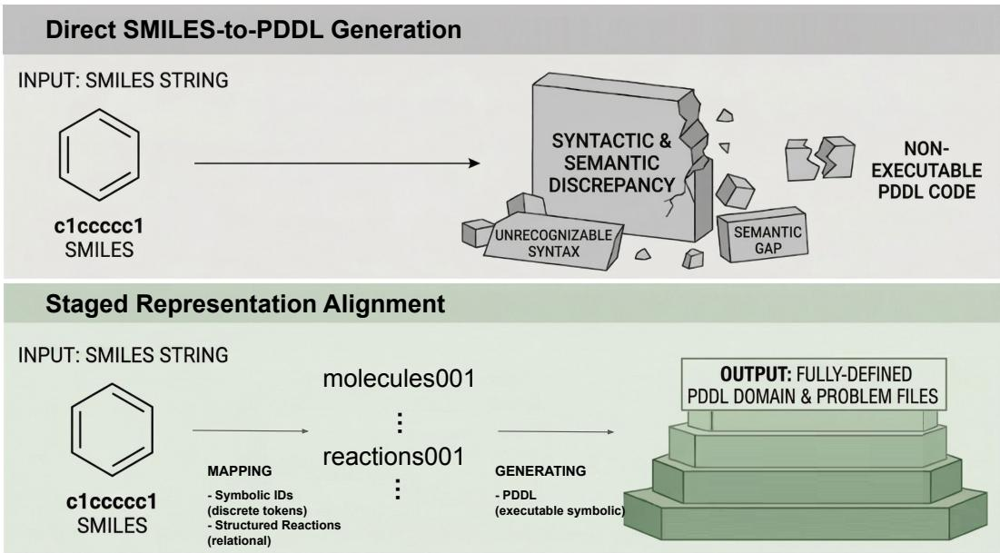
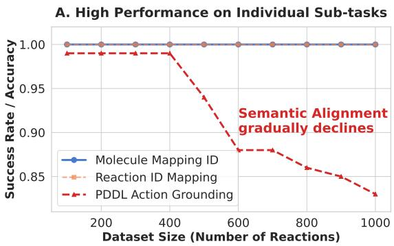
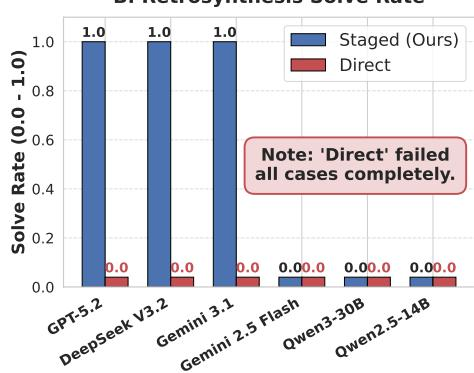
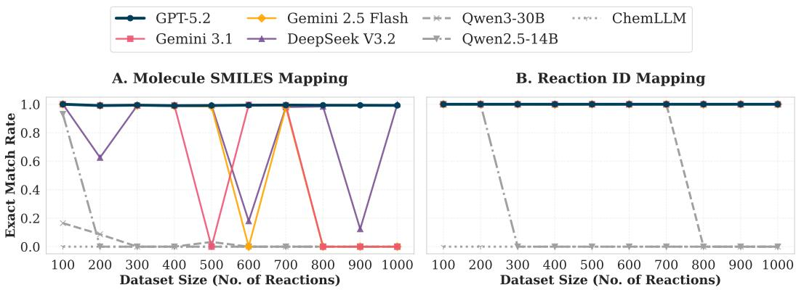
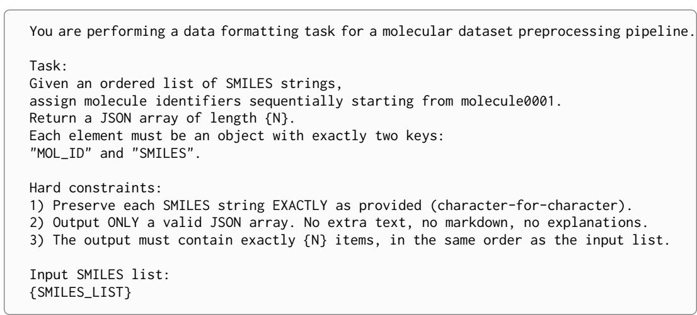
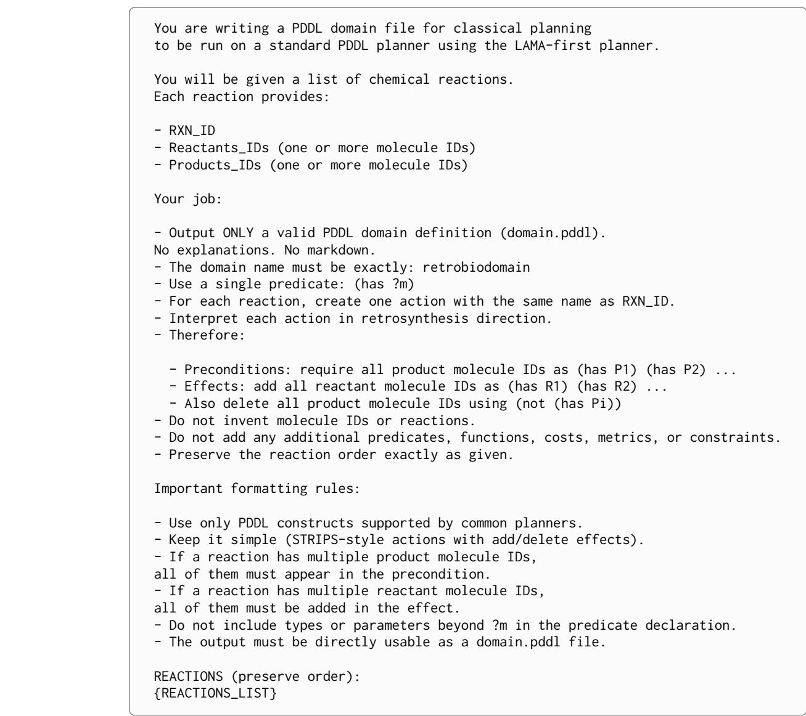

# Representation Alignment as a Bottleneck in LLM-Based Retrosynthesis Planning

Hyunwoo Yoo1 Cassie Huang1 Haebin Shin2 Li Zhang1 Gail L. Rosen1

1Drexel University

2University of Michigan

{hty23,ch3535,hz466,glr26}@drexel.edu haebin@umich.edu

## Abstract

While LLMs show promise in general reasoning, symbolic planning in chemistry remains a bottleneck. Direct ”SMILES-to-PDDL” attempts fail because they force models to juggle chemical analysis and planning-language structuring simultaneously. We hypothesize that this failure stems from a lack of intermediate abstractions rather than insufficient model capacity. By decomposing retrosynthesis into molecule mapping, reaction mapping, and PDDL generation, we achieve high success rates where end-to-end approaches fail. This provides evidence that a primary bottleneck lies in representation alignment rather than raw model capacity. Our structural analysis demonstrates that intermediate representations are essential in retrosynthesis planning, highlighting the importance of representation-centric design in future systems.

## 1 Introduction

Large Language Models (LLMs) have emerged as powerful general-purpose reasoners (Chen et al., 2021; Wei et al., 2022), yet they continue to struggle with structured symbolic planning tasks such as chemical retrosynthesis. Formulating retrosynthesis as a direct translation from molecular representations such as the Simplified Molecular Input Line Entry System (SMILES) to symbolic planning languages like the Planning Domain Definition Language (PDDL) (McDermott et al., 1998; Fox & Long, 2003) introduces significant challenges. This task requires the model to simultaneously perform chemical structure interpretation, reaction-level structuring, and formalization into a symbolic planning language (Garrett et al., 2020; Silver et al., 2021)—a complex reasoning process that is difficult to resolve in a single step. Importantly, representing retrosynthesis in PDDL enables the generation of executable and interpretable plans, where each action explicitly encodes reaction steps and dependencies, allowing verification by external planners.

In this work, rather than attributing these failures to insufficient model capacity, we ask a more fundamental question: Do LLMs truly lack planning ability, or do they fail during the transformation between heterogeneous representations? Our analysis reveals an intriguing paradox. While LLMs achieve strong performance on individual subtasks—such as molecule mapping, reaction mapping, and PDDL generation—they fail completely when these processes are integrated into a single end-to-end transformation (Bubeck et al., 2023; Zhou et al., 2023). In particular, under the direct SMILES-to-PDDL setting, all evaluated models exhibit a 0% planning success rate. These findings suggest that the failure of LLMs does not stem from a lack of reasoning capability, but rather from representation misalignment between unstructured chemical representations and symbolic planning formalisms (Yao et al., 2023a; Chen et al., 2023b). In other words, while models are capable of performing individual transformations and structuring operations, they struggle to consistently bridge heterogeneous representation spaces.

To systematically validate this hypothesis, we propose an analytical framework that decomposes retrosynthesis planning into staged subtasks: molecule mapping, reaction mapping, and PDDL generation. Each stage incrementally transforms unstructured inputs into structured symbolic representations, and we isolate and evaluate performance at each stage to precisely identify where failures occur.

  
Figure 1: Representation alignment as the bottleneck in retrosynthesis planning. Top: Direct SMILES-to-PDDL generation requires transforming unstructured molecular inputs into executable symbolic plans in a single step. Bottom: Our staged approach introduces intermediate representations (symbolic molecule identifiers and structured reaction mappings) before generating PDDL.

Experimental results show that, when structured intermediate representations are provided, most strong models achieve high planning success rates, indicating that downstream symbolic planning itself is already a largely solvable problem. In contrast, when attempting to solve the task end-to-end without such intermediate representations, all models fail, supporting the claim that the primary bottleneck lies not in model scale or architecture, but in representation alignment.

The contributions of this work are threefold.

• We redefine the failure of LLM-based retrosynthesis planning as a problem of representation misalignment rather than insufficient model capability, explaining the discrepancy between strong subtask performance and complete end-to-end failure.

• We propose a staged analytical framework and corresponding benchmarks that decompose retrosynthesis planning into interpretable intermediate transformations, enabling systematic analysis of failure across representation levels.

• We demonstrate that planning performance is governed more by representation alignment than by the underlying model itself.

Our findings highlight the limitations of end-to-end approaches and underscore the importance of intermediate symbolic representations in the design of future LLM-based planning systems.

## 2 Related Work

## 2.1 LLMs for Planning

Recent research has actively explored the use of large language models for planning problems (Valmeekam et al., 2023a;b; Ahn et al., 2022; Huang et al., 2022; Lin et al., 2023). These works typically evaluate LLMs’ planning capabilities by generating action sequences from natural language instructions or by leveraging intermediate outputs in the form of code or programs to facilitate the planning process (Liang et al., 2023; Yao et al., 2023b; Gao et al., 2023; Chen et al., 2023a). Some studies further propose solving classical planning problems directly with language models or improving performance by integrating them with external planners (Liu et al., 2023; Valmeekam et al., 2023b; Helmert, 2006). However, the majority of prior work focuses on natural language-based planning or standardized benchmark environments, and does not systematically analyze failures arising in the transformation from unstructured inputs to executable symbolic representations such as PDDL (McDermott et al., 1998; Fox & Long, 2003). In this work, we take a different perspective by centering our analysis on representation transitions in the context of retrosynthesis planning.

## 2.2 LLMs in Chemistry and Retrosynthesis

In the domain of chemistry, the use of LLMs and foundation models has rapidly expanded, covering a wide range of tasks such as molecular representation understanding, reaction prediction, synthesis pathway recommendation (Shen et al., 2021; Strieth-Kalthoff et al., 2024), and chemical question answering (de Almeida et al., 2019; Struble et al., 2020; Bran et al., 2024; Zhang et al., 2024). Retrosynthesis, in particular, is a fundamental problem that involves inferring possible precursors from a target molecule, and recent efforts have explored using language models to generate reaction rules or propose synthesis pathways (Schwaller et al., 2019; Ucak et al., 2022; Zhong et al., 2023; Han et al., 2024). However, these studies primarily focus on reaction prediction or pathway generation itself, and relatively little attention has been given to formalizing the outputs into symbolic planning representations (Tamari et al., 2021; O’Donoghue et al., 2023; Anhel et al., 2023) that can be directly executed by planners (Liu et al., 2023). In contrast, our work treats retrosynthesis not merely as a generation problem, but as an executable symbolic planning problem, and distinguishes itself by analyzing at which stage LLMs fail in this process.

## 2.3 Intermediate Representations and Modular Reasoning

Decomposing complex reasoning problems into multiple stages with intermediate representations has long been proposed as an important design principle (Wei et al., 2022; Gao et al., 2023; Chen et al., 2023a; Yao et al., 2023b; Schick et al., 2023). In recent LLM research, various forms of intermediate representations—such as chain-of-thought, program-of-thought, tool use, and structured decoding—have been shown to contribute to performance improvements (Wei et al., 2022; Chen et al., 2023a; Gao et al., 2023; Yao et al., 2023b; Schick et al., 2023). Some works further demonstrate that modularizing problems to isolate errors at each substage can lead to more robust reasoning (Gao et al., 2023; Yao et al., 2023b; Liu et al., 2023). However, these ideas have primarily been studied in the context of natural language reasoning or code generation, and there has been limited investigation into the role of representation alignment in settings that require bridging unstructured chemical inputs with symbolic planning formalisms, such as retrosynthesis planning. In this work, we introduce a staged analytical framework consisting of molecule mapping, reaction mapping, and PDDL generation, and quantitatively demonstrate the role of intermediate symbolic abstraction in enabling executable planning.

## 3 From Molecules to Plans: A Structured Transformation Framework

## 3.1 Overview

In this work, to analyze where large language models (LLMs) fail in retrosynthesis planning, we decompose the transformation process from unstructured chemical representations to executable symbolic plans into a sequence of stages. Each stage operates at a different level of representation, where the input is progressively structured and ultimately translated into a planning language. Specifically, we organize the overall process into four stages. First, molecule mapping converts symbolic molecular identifiers into molecular structure representations. Second, reaction mapping structures reaction-level information into organized reactant–product representations. Third, PDDL generation formalizes these structured reactions into an executable planning format. Finally, planning execution verifies whether the generated representation can produce a valid synthesis pathway. This decomposition is not merely intended to simplify the problem, but to precisely identify failures that arise during transitions between different representations. Through this, we aim to uncover bottlenecks that are not visible in end-to-end settings and to develop a structural understanding of failure modes in LLM-based planning.

## 3.2 Molecule Mapping

The first stage maps symbolic molecule identifiers to their corresponding molecular structure representations. In our setting, the input consists of symbolic identifiers referring to molecules, and the model is required to generate the corresponding SMILES strings for each identifier. Formally, given a set of molecules mi, the model generates a set of SMILES strings si corresponding to each molecule. Evaluation is conducted based on exact-match accuracy between identifiers and SMILES, as well as the rate of missing or invalid outputs. This stage measures how reliably symbolic references are grounded into actual molecular structures, and serves as the foundation for subsequent reaction-level structuring and planning representation generation.

## 3.3 Reaction Mapping

The second stage transforms reaction information into structured reactant–product representations. In this setting, the model takes as input the molecular identifiers involved in each reaction and constructs the corresponding sets of reactants and products. Formally, each reaction is represented as a tuple (R, P), where R and P denote the sets of reactants and products, respectively. Evaluation is based on reaction-level exact match, measuring structural correctness including missing, duplicated, or mismatched reactants or products. This stage aligns molecule-level information into reaction-level structures and forms the intermediate representation that enables subsequent conversion into PDDL.

## 3.4 PDDL Generation

In the third stage, structured reaction information is converted into the PDDL. Given a set of reactions, the model generates both the planning domain and problem definitions. The domain file represents each reaction as an action, where preconditions and effects symbolically define the structure of the reaction. The problem file specifies the initial and goal states, defining the planning instance to be solved. This stage is evaluated along three dimensions. First, syntactic validity measures whether the generated PDDL conforms to correct syntax. Second, structural completeness evaluates whether required elements such as actions, predicates, domain, and problem components are properly included. Third, semantic consistency measures whether each action accurately reflects the underlying reactant–product relationships. This stage constitutes the core step that transforms structured chemical information into executable symbolic planning representations.

B. Retrosynthesis Solve Rate  
  
Figure 2: Comparison between decomposed and end-to-end planning regimes. (A) Subtask performance across dataset sizes, including molecule mapping, reaction mapping, and PDDL grounding. (B) Planning success (solve rate) comparing direct end-to-end generation and staged decomposition.

## 3.5 Planning Execution

In the final stage, we verify whether the generated PDDL is actually executable. To this end, we employ an external classical planner, the Fast Downward system (Helmert, 2006), to search for synthesis pathways based on the domain and problem definitions. Evaluation is conducted using two metrics. The solve rate measures the proportion of instances for which the planner successfully generates a valid plan, while path accuracy measures whether the generated reaction pathway matches the ground-truth solution. This stage is crucial in that it ensures the outputs of the LLM are not merely syntactically plausible, but lead to truly executable plans.

## 3.6 Evaluation Protocol

We evaluate LLM-based retrosynthesis planning under different settings to analyze performance variations across representation levels. First, in the end-to-end setting, the model directly generates PDDL from SMILES inputs, treating the entire process as a single-step generation problem. This represents the most direct formulation, where the model must perform the transformation from unstructured chemical inputs to executable planning representations in one step. In contrast, in the decomposed setting, we evaluate each stage independently with oracle intermediate representations to measure conditional performance of specific transformation steps. This setup enables disentangling upstream errors from downstream generation capabilities. We additionally evaluate a non-oracle chained setting in which model-generated outputs are passed sequentially between stages. Importantly, the goal of this study is not to propose a fully automated pipeline, but to identify at which representation stage failures occur in the process of transforming unstructured chemical inputs into executable symbolic plans. Through this comparative analysis, we precisely locate the primary bottlenecks in LLM-based planning.

## 4 RetroPlan-Bench: Symbolic Retrosynthesis Planning Benchmark

## 4.1 Construction Overview

In this work, to systematically evaluate the symbolic planning capabilities of LLMs, we propose RetroPlan-Bench, which reconstructs existing retrosynthesis datasets into an executable symbolic planning benchmark. This benchmark is built upon 368 multi-step synthesis pathways from the READRetro (Kim et al., 2024), and transforms each pathway into a multi-level representation aligned across molecule-level, reaction-level, and planning-level abstractions. Through this, we establish an evaluation framework that enables quantitative decomposition and analysis of the entire process from unstructured chemical information to executable symbolic plans.

## 4.2 Symbolic Transformation Pipeline

RetroPlan-Bench does not simply utilize raw chemical data; instead, it applies a three-stage transformation pipeline designed to analyze the representation alignment capabilities of LLMs.

Symbolic Grounding. All molecules (SMILES) are replaced with unique symbolic identifiers. This encourages the model to focus on relational and compositional structures between symbols rather than the intrinsic complexity of chemical structures.

Reaction Structuring. Each synthesis pathway is decomposed into (reactant, product) pairs, which are then aligned into structured reaction representations with unique reaction identifiers.

Coverage Filtering. Only pathways that can be fully represented within a predefined reaction set are retained, ensuring that failures in planning arise from the model’s representation transformation capabilities rather than missing data. This pipeline goes beyond simple preprocessing, providing a controlled symbolic abstraction that explicitly exposes transformations across heterogeneous representation spaces.

## 4.3 Multi-scale Planning Regimes

To analyze problem complexity and scaling behavior of models, we construct planning environments of varying sizes based on the number of reactions. To evaluate actual planning performance, we select pathways such that the number of unique reactions is 100, 200, 300, and 400 as problem sets. Pathways are chosen to ensure a balanced distribution of difficulty, considering both path length and branching structure. To analyze limitations in the PDDL generation stage, we augment the base reaction sets with additional reactions to construct large-scale planning domains containing up to 1000 actions. This setting is designed to evaluate the model’s ability to handle long contexts and maintain structural consistency.

## 4.4 Evaluation Protocol

For each dataset configuration, we evaluate performance along four distinct dimensions: 1) Molecule Mapping Accuracy, which measures the alignment between symbolic identifiers and molecular structures; 2) Reaction Consistency, which assesses the correctness of reactant–product structures; 3) PDDL Validity and Grounding, which evaluates both syntactic validity and the preservation of reaction semantics; and 4) Planning Success, which measures executability via an external planner as well as the accuracy of generated pathways. This decomposed evaluation enables precise identification of representation alignment failures that cannot be observed from end-to-end performance alone.

## 5 Experiments and Results

In this section, we analyze how LLMs perform in generating executable symbolic plans from unstructured chemical representations, and identify at which stages failures occur. In particular, by comparing performance between individual subtasks and the end-to-end setting, we aim to precisely diagnose the source of failure.

## 5.1 Strong Performance on Individual Sub-tasks

We first evaluate each subtask that composes retrosynthesis planning—molecule mapping, reaction mapping, and PDDL generation—independently. Experimental results (Table 1) show that GPT-5.2 (OpenAI, 2023; 2025), DeepSeek V3.2 (DeepSeek-AI et al., 2025), and

Figure 3: Analysis of representation alignment across abstraction levels. (A) Molecule SMILES mapping accuracy, measuring exact-match grounding of symbolic identifiers. (B) Reaction ID mapping accuracy, evaluating structural consistency of reactant–product relationships.
<table><tr><td rowspan="2">Model</td><td colspan="2">Molecule Mapping</td><td rowspan="2">Reaction Mapping</td><td colspan="2">PDDL Grounding</td></tr><tr><td>Molecule ID</td><td>SMILES</td><td>Coverage Domain</td><td>Problem</td></tr><tr><td>GPT-5.2</td><td>1.0000</td><td>0.9932</td><td>1.0000</td><td>0.9303</td><td>1.0000</td></tr><tr><td>DeepSeek V3.2</td><td>0.9992</td><td>0.7870</td><td>1.0000</td><td>0.9300</td><td>1.0000</td></tr><tr><td>Gemini 3.1</td><td>0.6000</td><td>0.5964</td><td>1.0000</td><td>0.8402</td><td>1.0000</td></tr><tr><td>Gemini 2.5 Flash</td><td>0.6000</td><td>0.5933</td><td>0.9996</td><td>0.8351</td><td>1.0000</td></tr><tr><td>Qwen3-30B-Thinking</td><td>0.2976</td><td>0.0285</td><td>0.7000</td><td>0.4670</td><td>0.9128</td></tr><tr><td>Qwen2.5-14B-Instruct</td><td>0.0991</td><td>0.0930</td><td>0.2000</td><td>0.4041</td><td>0.3991</td></tr><tr><td>ChemLLM</td><td>0.0000</td><td>0.0000</td><td>0.0000</td><td>0.0000</td><td>0.0000</td></tr></table>

Table 1: Performance comparison across staged subtasks in retrosynthesis planning (averaged). Molecule Mapping includes Molecule ID (identifier consistency) and SMILES (exact-match string accuracy). Reaction Mapping (Coverage) measures correctness of reactant–product structure. PDDL Grounding includes Domain (action generation) and Problem (initial and goal specification).

Gemini-family models (Gemini Team, Google, 2023) achieve near-perfect performance across most settings. In molecule mapping, identifier exact match converges to 1.0 across all regimes, and reaction mapping similarly maintains an accuracy of 1.0 in nearly all configurations. A similar trend is observed in the PDDL generation stage. Strong models consistently maintain high syntactic validity and structural completeness for both domain and problem definitions, producing outputs that are reliably executable by planners. In contrast, Qwen-family models (Qwen3-30B-Thinking (Yang et al., 2025), Qwen2.5-14B-Instruct (Qwen et al., 2025)) and ChemLLM (Zhang et al., 2024) exhibit some level of performance in earlier stages, but show a rapid decline in coverage and validity as the task progresses toward PDDL generation. In particular, domain generation suffers from a sharp breakdown in structural completeness as the number of reactions increases. These results indicate that, for sufficiently strong models, individual transformation steps are already largely solved.

## 5.2 Failure of End-to-End Generation

Next, we evaluate an end-to-end setting in which the same models including GPT-5.2, DeepSeek V3.2 (DeepSeek-AI et al., 2025), Gemini 3.1, Gemini 2.5 Flash, Qwen3- 30B-Thinking (Yang et al., 2025), Qwen2.5-14B-Instruct (Qwen et al., 2025), and Chem-LLM (Zhang et al., 2024) are tasked with directly generating PDDL domain and problem definitions from SMILES inputs. The results show that, across all models, both solve rate and path accuracy drop to 0, with not a single valid synthesis pathway generated (Figure 2), despite their strong performance on individual subtasks (Table 1). This indicates that models which perform well on individual subtasks completely fail when the entire transformation process is integrated into a single step. In other words, despite possessing the capability to perform each operation independently, models struggle to compose these operations into a coherent transformation pipeline.

## 5.3 Effect of Intermediate Representations

To analyze the cause of this performance degradation, we introduce a setting in which intermediate representations are provided in a staged manner. Under this setup, models with strong capacity such as GPT-5.2, DeepSeek V3.2, and Gemini 3.1 recover planning performance, achieving a solve rate of 1.0 and high path accuracy (Figure 2). In contrast, smaller models including Gemini 2.5 Flash, Qwen3-30B-Thinking, Qwen2.5-14B-Instruct, and ChemLLM fail to produce executable plans even with structured inputs. This demonstrates that the same models that fail in the end-to-end setting can successfully generate executable plans when given structured intermediate representations. Thus, these results suggest that a primary challenge lies in transforming input representations into appropriate symbolic forms. To test whether this improvement is an artifact of oracle intermediate representations, we additionally evaluate a non-oracle chained setting in which each stage receives the model-generated output from the previous stage. GPT-5.2 and DeepSeek-V3.2 retain the same performance as in the oracle-staged setting (Solve Rate = 1.0, Path Accuracy = 0.986).

## 5.4 Scaling Behavior and Failure Modes

As we increase dataset scale and analyze performance at each stage, we observe not only differences across models but also distinct failure patterns (Figure 3). GPT-5.2 and DeepSeek V3.2 maintain stable domain coverage and syntactic validity across all regimes (Table 1); however, as the number of reactions increases, action grounding accuracy gradually declines. This suggests that while structural form is preserved, semantic consistency may degrade with scale. Gemini-family models (Gemini 3.1 and Gemini 2.5 Flash) generally maintain high performance, but exhibit sharp drops in domain validity or grounding at specific scales, followed by recovery at larger sizes. This pattern indicates instability in long-horizon structural generation. In contrast, Qwen-family models (Qwen3-30B-Thinking and Qwen2.5- 14B-Instruct) show rapid degradation in coverage and validity even at relatively small scales, and in some cases fail to produce valid symbolic structures altogether. Semantic grounding also deteriorates significantly. These results suggest that differences across models extend beyond raw accuracy, reflecting their ability to maintain stable structured representations.

## 5.5 Planning Performance

Finally, we evaluate actual planning performance by executing a planner on the generated PDDL. In settings with structured intermediate representations, GPT-5.2, DeepSeek V3.2 (DeepSeek-AI et al., 2025), and Gemini 3.1 all achieve a solve rate of 1.0 and high path accuracy, indicating their ability to reliably generate executable symbolic plans. In contrast, Qwen-family models (Qwen et al., 2025; Yang et al., 2025), Gemini 2.5 Flash, and Chem-LLM (Zhang et al., 2024) achieve 0 in both solve rate and path accuracy. A closer inspection reveals that ChemLLM’s failure is dominated by malformed structured outputs (e.g., invalid JSON and non-executable PDDL), rather than purely chemistry-specific reasoning errors (see Appendix A.3). Notably, Gemini 2.5 Flash demonstrates strong performance on some subtasks, yet fails at the final planning stage, highlighting that accuracy at individual stages does not necessarily translate to executability. Meanwhile, in the end-to-end setting where PDDL is directly generated from SMILES, all models fail to produce valid plans. This highlights a clear gap between individual capabilities and the ability to generate executable plans in an integrated setting. Additional detailed results and per-scale analyses are provided in Appendix B. Representative failure cases of direct SMILES-to-PDDL generation are discussed in Appendix A.

## 6 Discussion

## 6.1 Representation Alignment vs. Reasoning Capability

The central question of this work is as follows: Do LLMfailures stemfrom a lack ofplanning capability itself, or do they arisefrom the transformation between heterogeneous representations? Our experimental results strongly support the latter. Across all subtasks—molecule mapping, reaction mapping, and PDDL generation—strong models achieve near-perfect performance, indicating that individual structuring and transformation operations are well within their capabilities. In contrast, the fact that the same models completely fail under the end-to-end setting suggests that the core issue does not lie in reasoning capability itself. Moreover, the recovery of planning performance when intermediate representations are provided indicates that, while models possess the necessary operations, they struggle to consistently compose them across different representation spaces. From this perspective, failures in retrosynthesis planning are better characterized not as reasoning failures, but as cross-representation composition failures.

## 6.2 Why End-to-End Transformation Fails

First, the input (SMILES) and output (PDDL) exist at different levels of abstraction and structure, and the transformation between them requires not merely conversion but restructuring across representation spaces. Second, such transformations require explicit structural anchoring at intermediate stages. However, in the end-to-end setting, these intermediate representations are only implicitly handled within the model, increasing the likelihood that information becomes progressively distorted or lost across stages. Third, as observed in our experiments, some models maintain syntactic structure while gradually losing semantic grounding, or exhibit abrupt structural collapse at certain scales. This suggests that satisfying multiple constraints simultaneously over long generation processes is inherently challenging.

## 6.3 The Role of Intermediate Symbolic Representations

Intermediate symbolic representations play a crucial role in mitigating these issues. Our results show that when intermediate stages such as molecule mapping and reaction mapping are explicitly separated, models can satisfy structural constraints at each stage independently, leading to substantial improvements in overall planning performance. Furthermore, these findings suggest that although LLMs are capable of handling multiple levels of abstraction internally, explicit structural decomposition is necessary to consistently externalize these representations into coherent outputs.

## 6.4 Implications for LLM-based Planning Systems

The findings of this work provide several important implications for the design of LLMbased planning systems. First, end-to-end approaches that treat the generation of executable plans from unstructured inputs as a single-step problem may face fundamental limitations. Second, staged designs centered around intermediate symbolic representations are not merely an engineering choice, but can be a key determinant of performance. Third, planning performance is influenced less by model scale or general reasoning ability, and more by how consistently alignment across heterogeneous representations can be maintained.

## 6.5 Limitations and Future Directions

This study focuses on the specific domain of retrosynthesis planning, and further investigation is needed to determine whether similar phenomena generalize to other planning problems. While our primary stage-wise analysis uses oracle intermediate representations, the additional non-oracle chained evaluation remains limited to the same retrosynthesis benchmark and does not establish domain-general robustness. Future work should aim to generalize the representation alignment problem and explore model architectures or training strategies that can effectively address it.

## 7 Conclusion

In this work, we analyze the failure of LLMs in retrosynthesis planning and reinterpret it not as a limitation of reasoning capability, but as a problem of representation alignment. By decomposing the planning process into staged subtasks and analyzing performance at each stage, we empirically identify a gap between individual operational capabilities and overall problem-solving ability through comparison with the end-to-end setting. In particular, the finding that all models fail under the end-to-end setting, while achieving strong planning performance when provided with structured intermediate representations, clearly demonstrates the importance of intermediate representations in generating executable symbolic plans. These results highlight the limitations of end-to-end approaches in LLM-based planning systems and emphasize that representation-centric structural design can play a crucial role in future research.

## Acknowledgments

This work is supported in part by funds from the National Science Foundation (NSF: # 2107108).

## References

Michael Ahn, Anthony Brohan, Noah Brown, Yevgen Chebotar, Omar Cortes, Byron David, Chelsea Finn, Chuyuan Fu, Keerthana Gopalakrishnan, Karol Hausman, Alex Herzog, Daniel Ho, Jasmine Hsu, Julian Ibarz, Brian Ichter, Alex Irpan, Eric Jang, Rosario Jauregui Ruano, Kyle Jeffrey, Sally Jesmonth, Nikhil J. Joshi, Ryan Julian, Dmitry Kalashnikov, Yuheng Kuang, Kuang-Huei Lee, Sergey Levine, Yao Lu, Linda Luu, Carolina Parada, Peter Pastor, Jornell Quiambao, Kanishka Rao, Jarek Rettinghouse, Diego Reyes, Pierre Sermanet, Nicolas Sievers, Clayton Tan, Alexander Toshev, Vincent Vanhoucke, Fei Xia, Ted Xiao, Peng Xu, Sichun Xu, Mengyuan Yan, and Andy Zeng. Do as i can, not as i say: Grounding language in robotic affordances. In Proceedings ofthe 6th Conference on Robot Learning (CoRL 2022), Auckland, New Zealand, 2022.

Ana-Mariya Anhel, Lorea Alejaldre, and Angel Go´ ni-Moreno. The laboratory automation˜ protocol (lap) format and repository: A platform for enhancing workflow efficiency in synthetic biology. ACS Synthetic Biology, 12(12):3514–3520, 2023. doi: 10.1021/acssynbio. 3c00397. URL https://doi.org/10.1021/acssynbio.3c00397.

Andres M. Bran, Sam Cox, Oliver Schilter, Carlo Baldassari, Andrew D. White, and Philippe Schwaller. Augmenting large language models with chemistry tools. Nature Machine Intelligence, 6:525–535, May 2024. doi: 10.1038/s42256-024-00832-8.

Sebastien Bubeck, Varun Chandrasekaran, Ronen Eldan, Johannes Gehrke, Eric Horvitz,´ Ece Kamar, Peter Lee, Yin Tat Lee, Yuanzhi Li, Scott Lundberg, Harsha Nori, Hamid Palangi, Marco Tulio Ribeiro, and Yi Zhang. Sparks of artificial general intelligence: Early experiments with gpt-4. arXiv preprint arXiv:2303.12712, 2023. doi: 10.48550/arXiv.2303. 12712.

Mark Chen, Jerry Tworek, Heewoo Jun, Qiming Yuan, Henrique Ponde de Oliveira Pinto, Jared Kaplan, Harri Edwards, Yuri Burda, Nicholas Joseph, Greg Brockman, Alex Ray, Raul Puri, Gretchen Krueger, Michael Petrov, Heidy Khlaaf, Girish Sastry, Pamela Mishkin, Brooke Chan, Scott Gray, Nick Ryder, Mikhail Pavlov, Alethea Power, Lukasz Kaiser, Mohammad Bavarian, Clemens Winter, Philippe Tillet, Felipe Petroski Such, Dave Cummings, Matthias Plappert, Fotios Chantzis, Elizabeth Barnes, Ariel Herbert-Voss, William Hebgen Guss, Alex Nichol, Alex Paino, Nikolas Tezak, Jie Tang, Igor Babuschkin, Suchir Balaji, Shantanu Jain, William Saunders, Christopher Hesse, Andrew N. Carr, Jan Leike, Josh

Achiam, Vedant Misra, Evan Morikawa, Alec Radford, Matthew Knight, Miles Brundage, Mira Murati, Katie Mayer, Peter Welinder, Bob McGrew, Dario Amodei, Sam McCandlish, Ilya Sutskever, and Wojciech Zaremba. Evaluating large language models trained on code. arXiv preprint arXiv:2107.03374, 2021. doi: 10.48550/arXiv.2107.03374.

Wenhu Chen, Xueguang Ma, Xinyi Wang, and William W. Cohen. Program of thoughts prompting: Disentangling computation from reasoning for numerical reasoning tasks. Transactions on Machine Learning Research, 2023a.

Wenhu Chen, Xueguang Ma, Xinyi Wang, and William W. Cohen. Program of thoughts prompting: Disentangling computation from reasoning for numerical reasoning tasks. Transactions on Machine Learning Research (TMLR), 2023b. Published November 2023, last modified September 2024.

A. Filipa de Almeida, Rui Moreira, and Tiago Rodrigues. Synthetic organic chemistry driven by artificial intelligence. Nature Reviews Chemistry, 3:589–604, August 2019. doi: 10.1038/s41570-019-0124-0.

DeepSeek-AI, Aixin Liu, Aoxue Mei, Bangcai Lin, Bing Xue, Bingxuan Wang, Bingzheng Xu, Bochao Wu, Bowei Zhang, Chaofan Lin, Chen Dong, Chengda Lu, Chenggang Zhao, Chengqi Deng, Chenhao Xu, Chong Ruan, Damai Dai, Daya Guo, Dejian Yang, Deli Chen, Erhang Li, Fangqi Zhou, Fangyun Lin, Fucong Dai, Guangbo Hao, Guanting Chen, Guowei Li, H. Zhang, Hanwei Xu, Hao Li, Haofen Liang, Haoran Wei, Haowei Zhang, Haowen Luo, Haozhe Ji, Honghui Ding, Hongxuan Tang, Huanqi Cao, Huazuo Gao, Hui Qu, Hui Zeng, Jialiang Huang, Jiashi Li, Jiaxin Xu, Jiewen Hu, Jingchang Chen, Jingting Xiang, Jingyang Yuan, Jingyuan Cheng, Jinhua Zhu, Jun Ran, Junguang Jiang, Junjie Qiu, Junlong Li, Junxiao Song, Kai Dong, Kaige Gao, Kang Guan, Kexin Huang, Kexing Zhou, Kezhao Huang, Kuai Yu, Lean Wang, Lecong Zhang, Lei Wang, Liang Zhao, Liangsheng Yin, Lihua Guo, Lingxiao Luo, Linwang Ma, Litong Wang, Liyue Zhang, M. S. Di, M. Y Xu, Mingchuan Zhang, Minghua Zhang, Minghui Tang, Mingxu Zhou, Panpan Huang, Peixin Cong, Peiyi Wang, Qiancheng Wang, Qihao Zhu, Qingyang Li, Qinyu Chen, Qiushi Du, Ruiling Xu, Ruiqi Ge, Ruisong Zhang, Ruizhe Pan, Runji Wang, Runqiu Yin, Runxin Xu, Ruomeng Shen, Ruoyu Zhang, S. H. Liu, Shanghao Lu, Shangyan Zhou, Shanhuang Chen, Shaofei Cai, Shaoyuan Chen, Shengding Hu, Shengyu Liu, Shiqiang Hu, Shirong Ma, Shiyu Wang, Shuiping Yu, Shunfeng Zhou, Shuting Pan, Songyang Zhou, Tao Ni, Tao Yun, Tian Pei, Tian Ye, Tianyuan Yue, Wangding Zeng, Wen Liu, Wenfeng Liang, Wenjie Pang, Wenjing Luo, Wenjun Gao, Wentao Zhang, Xi Gao, Xiangwen Wang, Xiao Bi, Xiaodong Liu, Xiaohan Wang, Xiaokang Chen, Xiaokang Zhang, Xiaotao Nie, Xin Cheng, Xin Liu, Xin Xie, Xingchao Liu, Xingkai Yu, Xingyou Li, Xinyu Yang, Xinyuan Li, Xu Chen, Xuecheng Su, Xuehai Pan, Xuheng Lin, Xuwei Fu, Y. Q. Wang, Yang Zhang, Yanhong Xu, Yanru Ma, Yao Li, Yao Li, Yao Zhao, Yaofeng Sun, Yaohui Wang, Yi Qian, Yi Yu, Yichao Zhang, Yifan Ding, Yifan Shi, Yiliang Xiong, Ying He, Ying Zhou, Yinmin Zhong, Yishi Piao, Yisong Wang, Yixiao Chen, Yixuan Tan, Yixuan Wei, Yiyang Ma, Yiyuan Liu, Yonglun Yang, Yongqiang Guo, Yongtong Wu, Yu Wu, Yuan Cheng, Yuan Ou, Yuanfan Xu, Yuduan Wang, Yue Gong, Yuhan Wu, Yuheng Zou, Yukun Li, Yunfan Xiong, Yuxiang Luo, Yuxiang You, Yuxuan Liu, Yuyang Zhou, Z. F. Wu, Z. Z. Ren, Zehua Zhao, Zehui Ren, Zhangli Sha, Zhe Fu, Zhean Xu, Zhenda Xie, Zhengyan Zhang, Zhewen Hao, Zhibin Gou, Zhicheng Ma, Zhigang Yan, Zhihong Shao, Zhixian Huang, Zhiyu Wu, Zhuoshu Li, Zhuping Zhang, Zian Xu, Zihao Wang, Zihui Gu, Zijia Zhu, Zilin Li, Zipeng Zhang, Ziwei Xie, Ziyi Gao, Zizheng Pan, Zongqing Yao, Bei Feng, Hui Li, J. L. Cai, Jiaqi Ni, Lei Xu, Meng Li, Ning Tian, R. J. Chen, R. L. Jin, S. S. Li, Shuang Zhou, Tianyu Sun, X. Q. Li, Xiangyue Jin, Xiaojin Shen, Xiaosha Chen, Xinnan Song, Xinyi Zhou, Y. X. Zhu, Yanping Huang, Yaohui Li, Yi Zheng, Yuchen Zhu, Yunxian Ma, Zhen Huang, Zhipeng Xu, Zhongyu Zhang, Dongjie Ji, Jian Liang, Jianzhong Guo, Jin Chen, Leyi Xia, Miaojun Wang, Mingming Li, Peng Zhang, Ruyi Chen, Shangmian Sun, Shaoqing Wu, Shengfeng Ye, T. Wang, W. L. Xiao, Wei An, Xianzu Wang, Xiaowen Sun, Xiaoxiang Wang, Ying Tang, Yukun Zha, Zekai Zhang, Zhe Ju, Zhen Zhang, and Zihua Qu. Deepseek-v3.2: Pushing the frontier of open large language models, 2025. URL https://arxiv.org/abs/2512.02556.

Maria Fox and Derek Long. Pddl2.1: An extension to pddl for expressing temporal planning domains. Journal ofArtificial Intelligence Research, 20(1):61–124, 2003.

Luyu Gao, Aman Madaan, Shuyan Zhou, Uri Alon, Pengfei Liu, Yiming Yang, Jamie Callan, and Graham Neubig. Pal: Program-aided language models. In Proceedings of the 40th International Conference on Machine Learning (ICML 2023), pp. 10764–10799, July 2023.

Caelan Reed Garrett, Tomas Lozano-Perez, and Leslie Pack Kaelbling. Pddlstream: Inte-´ grating symbolic planners and blackbox samplers via optimistic adaptive planning. In Proceedings of the Thirtieth International Conference on Automated Planning and Scheduling (ICAPS 2020), 2020.

Gemini Team, Google. Gemini: A family of highly capable multimodal models. arXiv preprint arXiv:2312.11805, 2023. URL https://arxiv.org/abs/2312.11805.

Yuqiang Han, Xiaoyang Xu, Chang-Yu Hsieh, Keyan Ding, Hongxia Xu, Renjun Xu, Tingjun Hou, Qiang Zhang, and Huajun Chen. Retrosynthesis prediction with an iterative string editing model. Nature Communications, 15, July 2024.

Malte Helmert. The fast downward planning system. Journal of Artificial Intelligence Research, 26(1):191–246, 2006.

Wenlong Huang, Fei Xia, Ted Xiao, Harris Chan, Jacky Liang, Pete Florence, Andy Zeng, Jonathan Tompson, Igor Mordatch, Yevgen Chebotar, Pierre Sermanet, Noah Brown, Tomas Jackson, Linda Luu, Sergey Levine, Karol Hausman, and Brian Ichter. Inner monologue: Embodied reasoning through planning with language models. In Proceedings ofthe 6th Conference on Robot Learning (CoRL 2022), Auckland, New Zealand, 2022.

Taein Kim, Seul Lee, Yejin Kwak, Min-Soo Choi, Jeongbin Park, Sung Ju Hwang, and Sang-Gyu Kim. Readretro: natural product biosynthesis predicting with retrieval-augmented dual-view retrosynthesis. New Phytologist, 243(6):2512–2527, 2024. doi: 10.1111/nph.20012. URL https://doi.org/10.1111/nph.20012.

Jacky Liang, Wenlong Huang, Fei Xia, Peng Xu, Karol Hausman, Brian Ichter, Pete Florence, and Andy Zeng. Code as policies: Language model programs for embodied control. In Proceedings of the 2023 IEEE International Conference on Robotics and Automation (ICRA), London, United Kingdom, May 2023. IEEE. doi: 10.1109/ICRA48891.2023.10160591.

Bill Yuchen Lin, Chengsong Huang, Qian Liu, Wenda Gu, Sam Sommerer, and Xiang Ren. On grounded planning for embodied tasks with language models. In Proceedings of the Thirty-Seventh AAAI Conference on Artificial Intelligence (AAAI-23), pp. 13192–13200, February 2023. doi: 10.1609/aaai.v37i11.26549.

Bo Liu, Yuqian Jiang, Xiaohan Zhang, Qiang Liu, Shiqi Zhang, Joydeep Biswas, and Peter Stone. Llm+p: Empowering large language models with optimal planning proficiency. arXiv preprint arXiv:2304.11477, 2023. doi: 10.48550/arXiv.2304.11477. URL https:// arxiv.org/abs/2304.11477.

Drew McDermott, Malik Ghallab, Adele Howe, Craig Knoblock, Ashwin Ram, Manuela Veloso, Daniel Weld, and David Wilkins. Pddl—the planning domain definition language. In Proceedings of the International Conference on Artificial Intelligence Planning Systems (AIPS), 1998.

Odhran O’Donoghue, Aleksandar Shtedritski, John Ginger, Ralph Abboud, Ali Ghareeb, and Samuel Rodriques. BioPlanner: Automatic evaluation of LLMs on protocol planning in biology. In Houda Bouamor, Juan Pino, and Kalika Bali (eds.), Proceedings of the 2023 Conference on Empirical Methods in Natural Language Processing, pp. 2676–2694, Singapore, December 2023. Association for Computational Linguistics. doi: 10.18653/v1/2023. emnlp-main.162. URL https://aclanthology.org/2023.emnlp-main.162/.

OpenAI. Gpt-4 technical report. arXiv preprint arXiv:2303.08774, 2023. doi: 10.48550/arXiv. 2303.08774. URL https://doi.org/10.48550/arXiv.2303.08774. Version 6; last revised 4 Mar 2024.

OpenAI. Introducing gpt-5.2. https://openai.com/index/introducing-gpt-5-2/, December 2025. Accessed: 2026-03-31.

Qwen, :, An Yang, Baosong Yang, Beichen Zhang, Binyuan Hui, Bo Zheng, Bowen Yu, Chengyuan Li, Dayiheng Liu, Fei Huang, Haoran Wei, Huan Lin, Jian Yang, Jianhong Tu, Jianwei Zhang, Jianxin Yang, Jiaxi Yang, Jingren Zhou, Junyang Lin, Kai Dang, Keming Lu, Keqin Bao, Kexin Yang, Le Yu, Mei Li, Mingfeng Xue, Pei Zhang, Qin Zhu, Rui Men, Runji Lin, Tianhao Li, Tianyi Tang, Tingyu Xia, Xingzhang Ren, Xuancheng Ren, Yang Fan, Yang Su, Yichang Zhang, Yu Wan, Yuqiong Liu, Zeyu Cui, Zhenru Zhang, and Zihan Qiu. Qwen2.5 technical report, 2025. URL https://arxiv.org/abs/2412.15115.

Timo Schick, Jane Dwivedi-Yu, Roberto Dess´ı, Roberta Raileanu, Maria Lomeli, Eric Hambro, Luke Zettlemoyer, Nicola Cancedda, and Thomas Scialom. Toolformer: Language models can teach themselves to use tools. In Proceedings of the 37th International Conference on Neural Information Processing Systems (NeurIPS 2023), pp. 68539–68551, December 2023.

Philippe Schwaller, Teodoro Laino, Theophile Gaudin, Peter Bolgar, Christopher A. Hunter,´ Costas Bekas, and Alpha A. Lee. Molecular transformer: A model for uncertaintycalibrated chemical reaction prediction. ACS Central Science, 5(9):1572–1583, August 2019. doi: 10.1021/acscentsci.9b00576.

Yuning Shen, Julia E. Borowski, Melissa A. Hardy, Richmond Sarpong, Abigail G. Doyle, and Tim Cernak. Automation and computer-assisted planning for chemical synthesis. Nature Reviews Methods Primers, 1:23, 2021.

Tom Silver, Rohan Chitnis, Joshua Tenenbaum, Leslie Pack Kaelbling, and Tomas Lozano-Perez. Learning symbolic operators for task and motion planning. In ´ 2021 IEEE/RSJ International Conference on Intelligent Robots and Systems (IROS), pp. 3182–3189, Prague, Czech Republic, 2021. IEEE. doi: 10.1109/IROS51168.2021.9635941.

Felix Strieth-Kalthoff, Sara Szymkuc, Karol Molga, Al ´ an Aspuru-Guzik, Frank Glorius,´ and Bartosz A. Grzybowski. Artificial intelligence for retrosynthetic planning needs both data and expert knowledge. Journal of the American Chemical Society, 2024. doi: 10.1021/jacs.4c00338. Online ahead of print.

Thomas J. Struble, Juan C. Alvarez, Scott P. Brown, Milan Chytil, Justin Cisar, Renee L. DesJarlais, Ola Engkvist, Scott A. Frank, Daniel R. Greve, Daniel J. Griffin, Xinjun Hou, Jeffrey W. Johannes, Constantine Kreatsoulas, Brian Lahue, Miriam Mathea, Georg Mogk, Christos A. Nicolaou, Andrew D. Palmer, Daniel J. Price, Richard I. Robinson, Sebastian Salentin, Li Xing, Tommi Jaakkola, William H. Green, Regina Barzilay, Connor W. Coley, and Klavs F. Jensen. Current and future roles of artificial intelligence in medicinal chemistry synthesis. Journal of Medicinal Chemistry, 63(16):8667–8682, April 2020. doi: 10.1021/acs.jmedchem.9b02120.

Ronen Tamari, Fan Bai, Alan Ritter, and Gabriel Stanovsky. Process-level representation of scientific protocols with interactive annotation. In Paola Merlo, Jorg Tiedemann, and Reut Tsarfaty (eds.), Proceedings of the 16th Conference of the European Chapter of the Associationfor Computational Linguistics: Main Volume, pp. 2190–2202, Online, April 2021. Association for Computational Linguistics. doi: 10.18653/v1/2021.eacl-main.187. URL https://aclanthology.org/2021.eacl-main.187/.

Umit V. Ucak, Islambek Ashyrmamatov, Junsu Ko, and Juyong Lee. Retrosynthetic reaction pathway prediction through neural machine translation of atomic environments. Nature Communications, 13, March 2022.

Karthik Valmeekam, Matthew Marquez, Alberto Olmo, Sarath Sreedharan, and Subbarao Kambhampati. Planbench: an extensible benchmark for evaluating large language models on planning and reasoning about change. In Proceedings of the 37th International Conference on Neural Information Processing Systems (NeurIPS 2023), pp. 38975–38987, December 2023a.

Karthik Valmeekam, Matthew Marquez, Sarath Sreedharan, and Subbarao Kambhampati. On the planning abilities of large language models: A critical investigation. In Proceedings of the 37th International Conference on Neural Information Processing Systems (NeurIPS 2023), pp. 75993–76005, December 2023b.

Jason Wei, Xuezhi Wang, Dale Schuurmans, Maarten Bosma, Brian Ichter, Fei Xia, Ed H. Chi, Quoc V. Le, and Denny Zhou. Chain-of-thought prompting elicits reasoning in large language models. In Advances in Neural Information Processing Systems 36 (NeurIPS 2022), pp. 24824–24837, 2022.

An Yang, Anfeng Li, Baosong Yang, Beichen Zhang, Binyuan Hui, Bo Zheng, Bowen Yu, Chang Gao, Chengen Huang, Chenxu Lv, Chujie Zheng, Dayiheng Liu, Fan Zhou, Fei Huang, Feng Hu, Hao Ge, Haoran Wei, Huan Lin, Jialong Tang, Jian Yang, Jianhong Tu, Jianwei Zhang, Jianxin Yang, Jiaxi Yang, Jing Zhou, Jingren Zhou, Junyang Lin, Kai Dang, Keqin Bao, Kexin Yang, Le Yu, Lianghao Deng, Mei Li, Mingfeng Xue, Mingze Li, Pei Zhang, Peng Wang, Qin Zhu, Rui Men, Ruize Gao, Shixuan Liu, Shuang Luo, Tianhao Li, Tianyi Tang, Wenbiao Yin, Xingzhang Ren, Xinyu Wang, Xinyu Zhang, Xuancheng Ren, Yang Fan, Yang Su, Yichang Zhang, Yinger Zhang, Yu Wan, Yuqiong Liu, Zekun Wang, Zeyu Cui, Zhenru Zhang, Zhipeng Zhou, and Zihan Qiu. Qwen3 technical report, 2025. URL https://arxiv.org/abs/2505.09388.

Shunyu Yao, Jeffrey Zhao, Dian Yu, Nan Du, Izhak Shafran, Karthik Narasimhan, and Yuan Cao. React: Synergizing reasoning and acting in language models. In International Conference on Learning Representations (ICLR), 2023a.

Shunyu Yao, Jeffrey Zhao, Dian Yu, Nan Du, Izhak Shafran, Karthik Narasimhan, and Yuan Cao. React: Synergizing reasoning and acting in language models. In Proceedings of the International Conference on Learning Representations (ICLR 2023), 2023b.

Di Zhang, Wei Liu, Qian Tan, Jingdan Chen, Hang Yan, Yuliang Yan, Jiatong Li, Weiran Huang, Xiangyu Yue, Wanli Ouyang, Dongzhan Zhou, Shufei Zhang, Mao Su, Han-Sen Zhong, and Yuqiang Li. Chemllm: A chemical large language model, 2024. URL https://arxiv.org/abs/2402.06852.

Weihe Zhong, Ziduo Yang, and Calvin Yu-Chian Chen. Retrosynthesis prediction using an end-to-end graph generative architecture for molecular graph editing. Nature Communications, 14, May 2023.

Denny Zhou, Nathanael Scharli, Le Hou, Jason Wei, Nathan Scales, Xuezhi Wang, Dale¨ Schuurmans, Claire Cui, Olivier Bousquet, Quoc V. Le, and Ed H. Chi. Least-to-most prompting enables complex reasoning in large language models. In International Conference on Learning Representations (ICLR), 2023.

## A Failure Cases in Direct SMILES-to-PDDL Generation

To further analyze why direct SMILES-to-PDDL prompting fails, we inspect representative outputs from strong language models under the end-to-end setting. Rather than exhaustively listing all malformed generations, we highlight a small number of qualitatively distinct failure modes that consistently appear across models.

These examples demonstrate that failures are not limited to minor syntax errors. Instead, models struggle to preserve raw SMILES strings as stable, planner-compatible symbols, resulting in outputs that are syntactically malformed, semantically corrupted, or nonexecutable. This observation supports our main claim that the primary bottleneck lies in cross-representation alignment rather than downstream planning itself.

Across models, these failures are superficially different but structurally related. Some models reinterpret SMILES tokens as web-searchable text, others convert them into quoted string literals, and others apply escaping or encoding schemes. In all cases, the model fails to preserve molecular representations as stable symbolic objects that can be consumed by a classical planner.

This suggests that direct SMILES-to-PDDL generation imposes a compounded burden: the model must simultaneously maintain chemical string identity, impose reaction-level structure, and satisfy symbolic planning syntax within a single generation process. Without explicit intermediate representations, these constraints are not consistently satisfied, leading to systematic breakdowns in executability.

Representative failure cases from direct SMILES-to-PDDL generation   
(a) Web-link contamination (Gemini 3.1 Pro)   
(:action reaction0073   
:precondition (and   
(has [https://www.google.com/search?q=C-]#[https://www.google.com/search?q=N+]C@@H)   
)   
:effect (and   
(has https://www.google.com/search?q=NC@@H...)   
(not (has [https://www.google.com/search?q=C-]#   
[https://www.google.com/search?q=N+]C@@H))   
)   
)   
The model converts molecular tokens into web search URLs, corrupting the symbolic represen  
tation.   
(b) Quoted molecule symbols (DeepSeek v3.2)   
(:action reaction0035   
:precondition (and   
(has "O=CNC@@HC(=O)O")   
)   
:effect (and   
(has "NC@@HC(=O)O")   
(not (has "O=CNC@@HC(=O)O"))   
)   
)   
Here SMILES strings are treated as quoted literals rather than planner symbols, violating   
standard PDDL conventions.   
(c) URL-encoded symbol rewriting (GPT-5.2)   
(:action reaction0001   
:precondition (and   
(has CC[C@H](C)[C@H](NC%28=O%29[C@H]...)   
)   
:effect (and   
(has N[C@@H](Cc1ccccc1)C(=O)O)   
(not (has CC[C@H](C)[C@H](NC%28=O%29[C@H]...))   
)   
)   
The model rewrites SMILES using URL-style encoding (e.g., %28, %29), breaking exact preser  
vation of molecular identity.  
Figure 4: Representative failure modes in direct SMILES-to-PDDL generation. Although surface forms differ across models, all cases reflect a shared issue: raw SMILES strings are not reliably maintained as executable symbolic entities.

## A.1 Failure Under Explicit Output Constraints

To rule out the possibility that the observed failures are due to underspecified output formatting, we additionally impose explicit constraints on how molecular symbols should be represented. In particular, we instruct the model to either preserve SMILES strings exactly or convert them into deterministic, PDDL-safe symbols (e.g., via sanitization or mapping rules).

Despite these explicit constraints, the same failure patterns persist. Models continue to produce malformed outputs, including quoted string literals, web-link-like tokens, fragmented molecule symbols, and inconsistent rewritings of the same SMILES string. In some cases, models even generate degenerate actions where preconditions and effects collapse to identical or trivial forms, indicating a loss of semantic grounding.

These results suggest that the failure cannot be attributed solely to prompt ambiguity or insufficient specification of output format. Rather, even when the target representation is explicitly constrained, models fail to consistently maintain molecular identity and structural relationships across the generation process.

This further supports our central claim that the primary bottleneck lies in representation alignment. The model must simultaneously preserve chemical string identity, enforce reaction-level structure, and satisfy symbolic planning syntax. The inability to jointly satisfy these constraints—despite explicit instruction—indicates a fundamental limitation in composing transformations across heterogeneous representation spaces.

## A.2 Failure Persists Under Sanitized Symbol Mapping

One may argue that the direct SMILES-to-PDDL setting is excessively brittle because raw SMILES strings contain characters that are not naturally suited for planner-facing symbolic outputs. To control for this possibility, we additionally provide an explicit deterministic mapping from each SMILES string to a PDDL-safe molecule symbol and instruct the model to use only these sanitized symbols.

However, failures persist even under this setting. Although the raw SMILES strings are no longer required in the final PDDL, models still exhibit several characteristic breakdowns. First, some models truncate or fragment long mapped symbols, producing incomplete identifiers that no longer match the provided mapping. Second, some outputs collapse distinct molecules into overly simplified or repeated symbols, causing semantic loss. Third, some generations remain partially malformed or are cut off before the full domain is completed. These errors indicate that the difficulty is not limited to handling special characters in SMILES, but extends to maintaining long-range symbolic consistency even when a planner-safe vocabulary is explicitly supplied.

These examples strengthen the interpretation that end-to-end failure is not caused solely by the lexical surface form of SMILES. If the issue were merely the presence of special characters, then replacing molecules with deterministic planner-safe symbols should largely resolve the problem. Instead, the remaining failures show that models also struggle with consistent symbol reuse, action-level semantic grounding, and stable long-horizon structured generation.

In this sense, sanitized mapping improves the surface representation but does not eliminate the underlying cross-representation bottleneck. The model is still required to preserve molecule identity, align reactants and products correctly, and serialize them into executable symbolic plans without losing structural consistency. The persistence of failure under this control setting therefore provides additional evidence that the main limitation lies in representation alignment rather than output formatting alone.

## A.3 Failure Modes of ChemLLM in Structured Symbolic Generation

Although ChemLLM is a chemistry-specialized language model, it failed across all evaluated stages in our benchmark. Inspection of raw generations suggests that its failure is not primarily due to subtle chemistry-specific reasoning errors, but rather due to instability in constrained symbolic serialization. Across molecule mapping, reaction mapping, and PDDL generation, ChemLLM frequently fails to preserve exact identifiers, satisfy rigid output schemas, or maintain the formal structure required for executable symbolic representations.

Overall, these examples suggest that ChemLLM fails upstream of planning. That is, the dominant issue is not simply incorrect chemistry, but the inability to maintain exact symbolic identities and rigid formal structures across constrained generations. This observation reinforces our broader claim that successful retrosynthesis planning depends not only on domain familiarity, but also on robust representation alignment across heterogeneous symbolic formats.

Representative failure cases under sanitized symbol mapping   
(a) Symbol truncation / fragmentation (GPT-5.2)   
(:action reaction0001   
:precondition (and   
(has mol\_CC\_C\_H\_C\_C\_H\_NC\_O\_C\_H\_Cc1ccc\_O\_cc1\_NC\_O\_\_7a59f0fb6a)   
)   
:effect (and   
(has mol\_N\_C\_H\_Cc1ccccc1\_C\_O\_O\_6b44e61ea4)   
(not (has mol\_CC\_C\_H\_C\_C\_H\_NC\_O\_C\_H\_Cc1ccc\_O\_cc1\_NC\_O\_\_7a59f0fb6a))   
)   
)   
Although closer to the intended format, the generated symbol sequence is still vulnerable to   
truncation and loss of readability when very long mapped identifiers are used.   
(b) Partial completion / malformed continuation (Gemini 3.1 Pro)   
mol\_Cc1cc\_O\_cc2c1C\_O\_CC\_O\_Cc1cc\_O\_cc\_O\_o1\_O2\_60acf903d3)   
(not (has mol\_Cc1cc\_O\_c2c\_c1\_Cc1cccc\_O\_c1C2\_O\_987c495792)))   
)   
(:action reaction0003   
:precondition (and (has mol\_NCCc1ccc\_O\_cc1\_65bbbc584d))   
:effect (and (has mol\_N\_C\_H\_Cc1ccc\_O\_cc1\_C\_O\_O\_3c2bc25bc4)   
(not (has mol\_NCCc1ccc\_O\_cc1\_65bbbc584d)))   
)   
The output resumes from an already malformed fragment, indicating instability in maintaining   
structured action boundaries even when valid symbolic mappings are supplied.   
(c) Semantic collapse to repeated generic forms (DeepSeek v3.2)   
(:action reaction0055   
:precondition (and   
(has "NC@@HC(=O)O")   
)   
:effect (and   
(has "NC@@HC(=O)O")   
(not (has "NC@@HC(=O)O"))   
)   
)   
(:action reaction0056   
:precondition (and   
(has "NC@@HC(=O)O")   
)   
:effect (and   
(has "NC@@HC(=O)O")   
Even under constrained prompting, distinct reactions collapse into the same repeated molecu   
lar form, producing semantically degenerate actions.  
Figure 5: Failure modes under explicit sanitized-symbol mapping. Supplying planner-safe symbols reduces the burden of raw SMILES formatting, but does not resolve the deeper problem of maintaining stable symbolic grounding and structurally consistent long-form generation.

## B Detailed Experimental Results

This appendix provides the comprehensive dataset and performance metrics for each subtask in the RetroPlan-Bench across varying dataset scales (100–1000 reactions).

Representative failure cases from ChemLLM generations   
(a) Molecule mapping: malformed JSON generation.   
[   
{   
"I": {   
0,   
ChemLLM fails at the very beginning of constrained JSON generation, producing a malformed   
object instead of the required array of {"molecule ID", "SMILES"} entries. This indicates   
brittleness even in exact-copy structured formatting tasks.   
(b) Reaction mapping: failure to preserve exact symbolic schema.   
[   
{   
\rxn\_id":'reaction001',   
reactant\_ids': [‘molecu   
Here the model alters required key names, uses invalid quotation marks, and fails to preserve   
identifiers exactly. Rather than making a localized semantic mistake, the model collapses at   
the level of symbolic serialization itself.   
(c) Domain PDDL generation: failure to realize even the minimal PDDL scaffold.   
:- meta-prolog :name(roretrobio-domein).   
(:init   
(has #<mol\_001>)   
)   
Instead of generating a valid PDDL domain beginning with (define (domain retrobiodomain)   
...), the model emits malformed non-PDDL text, missing the domain definition, predicate   
declaration, and all action blocks.   
(d) Problem PDDL generation: immediate truncation under strict JSON+PDDL output   
constraints.   
[   
{"proble   
The model repeatedly terminates before completing even a single valid JSON object, both   
in batched generation and in single-instance retry settings, suggesting that the failure is not   
merely due to batch size but to unstable long-form structured generation.  
Figure 6: Representative failure modes of ChemLLM across intermediate mapping and symbolic planning tasks. Unlike stronger general-purpose models, ChemLLM frequently fails before downstream planning can be meaningfully evaluated, due to malformed JSON, exact-copy failures, non-PDDL outputs, and truncated generations. These results suggest that chemistry specialization alone is insufficient for executable symbolic planning without robust representation alignment and structured serialization ability.

## B.1 Molecule and Reaction Mapping Integrity

Tables 2 and 3 summarize the initial stages of representation alignment.

• Molecule Mapping (Table 2): Stronger models like GPT-5.2 and DeepSeek V3.2 (DeepSeek-AI et al., 2025) maintain near-perfect identifier match rates, but for other models, SMILES string exact-match rates exhibit a noticeable decay as the number of molecules increases. ChemLLM (Zhang et al., 2024) consistently failed to provide valid outputs in this stage.

• Reaction ID Mapping (Table 3): Most models demonstrate high robustness in preserving the relational structure of reaction identifiers, indicating that the primary bottleneck is not relational grouping but the underlying chemical string preservation.

<table><tr><td>Model</td><td>100</td><td>200</td><td>300</td><td>400</td><td>500</td><td>600</td><td>700</td><td>800</td><td>900</td><td>1000</td></tr><tr><td>Qwen3-30B-A3B-Thinking-2507</td><td>0.9913 (0.1652)</td><td>0.9954 (0.0868)</td><td>一</td><td>一</td><td>0.9896 (0.0329)</td><td>一</td><td>一</td><td>一</td><td>一</td><td></td></tr><tr><td>Qwen2.5-14B-Instruct-1M</td><td>0.9913 (0.9304)</td><td></td><td>1</td><td>1</td><td></td><td>1</td><td>1</td><td></td><td></td><td>1</td></tr><tr><td>DeepSeek V3.2</td><td>1.0 (1.0)</td><td>0.9954 (0.6256)</td><td>1.0 (0.9907)</td><td>1.0 (0.9928)</td><td>1.0 (0.9931)</td><td>0.9987 (0.1797)</td><td>1.0 (0.9800)</td><td>1.0 (0.9839)</td><td>0.9982 (0.1238)</td><td>1.0 (1.0)</td></tr><tr><td>GPT-5.2</td><td>1.0 (1.0)</td><td>1.0 (0.9909)</td><td>1.0 (0.9938)</td><td>1.0 (0.9904)</td><td>1.0 (0.9913)</td><td>1.0 (0.9935)</td><td>1.0 (0.9944)</td><td>1.0 (0.9930)</td><td>1.0 (0.9928)</td><td>1.0 (0.9921)</td></tr><tr><td>Gemini 2.5 Flash</td><td>1.0 (1.0)</td><td>1.0 (0.9909)</td><td>1.0 (0.9907)</td><td>1.0 (0.9876)</td><td>1.0 (0.9844)</td><td></td><td>1.0 (0.9789)</td><td></td><td></td><td></td></tr><tr><td>Gemini 3.1</td><td>1.0 (1.0)</td><td>1.0 (0.9909)</td><td>1.0 (0.9907)</td><td>1.0 (0.9928)</td><td></td><td>1.0 (0.9961)</td><td>1.0 (0.9933)</td><td></td><td></td><td></td></tr><tr><td>ChemLLM</td><td></td><td></td><td></td><td></td><td>一</td><td></td><td></td><td></td><td></td><td></td></tr></table>

Table 2: Task 1 (Molecule Mapping) performance across varying dataset sizes. Each cell reports identifier exact-match rate and SMILES exact-match rate (in parentheses). “–” indicates invalid outputs.
<table><tr><td>Model</td><td>100</td><td>200</td><td>300</td><td>400</td><td>500</td><td>600</td><td>700</td><td>800</td><td>900</td><td>1000</td></tr><tr><td>Qwen3-30B-A3B-Thinking-2507</td><td>1.0000</td><td>1.0000</td><td>1.0000</td><td>1.0000</td><td>1.0000</td><td>1.0000</td><td>1.0000</td><td>一</td><td></td><td>一</td></tr><tr><td>Qwen2.5-14B-Instruct-1M</td><td>1.0000</td><td>1.0000</td><td></td><td></td><td></td><td></td><td></td><td></td><td></td><td></td></tr><tr><td>DeepSeek V3.2</td><td>1.0000</td><td>1.0000</td><td>1.0000</td><td>1.0000</td><td>1.0000</td><td>1.0000</td><td>1.0000</td><td>1.0000</td><td>1.0000</td><td>1.0000</td></tr><tr><td>GPT-5.2</td><td>1.0000</td><td>1.0000</td><td>1.0000</td><td>1.0000</td><td>1.0000</td><td>1.0000</td><td>1.0000</td><td>1.0000</td><td>1.0000</td><td>1.0000</td></tr><tr><td>Gemini 2.5 Flash</td><td>1.0000</td><td>1.0000</td><td>1.0000</td><td>0.9975</td><td>1.0000</td><td>1.0000</td><td>1.0000</td><td>0.9988</td><td>1.0000</td><td>1.0000</td></tr><tr><td>Gemini 3.1</td><td>1.0000</td><td>1.0000</td><td>1.0000</td><td>1.0000</td><td>1.0000</td><td>1.0000</td><td>1.0000</td><td>1.0000</td><td>1.0000</td><td>1.0000</td></tr><tr><td>ChemLLM</td><td></td><td></td><td></td><td></td><td></td><td></td><td></td><td></td><td></td><td></td></tr></table>

Table 3: Task 2 (Reaction ID Mapping) integrity across varying dataset sizes. Each cell reports the exact mapping rate (EMR), defined as the proportion of reactions for which RXN ID, Reactants IDs, and Products IDs exactly match the input. “–” indicates missing or invalid outputs (e.g., empty or unparsable model responses).

## B.2 PDDL Generation Validity and Completeness

The success of symbolic planning depends on the syntactic and semantic correctness of the generated PDDL files.

• Syntactic Validity (Tables 4 and 5): While GPT-5.2, DeepSeek V3.2 (DeepSeek-AI et al., 2025), and the Gemini family maintain high validity across most scales, Qwen models (Qwen et al., 2025; Yang et al., 2025) suffer from a significant breakdown in structural completeness and syntactic correctness as the reaction count exceeds 500.

• Action Grounding (Table 6): This metric highlights the semantic gap. Even if a domain is syntactically valid, the accuracy of reactant-product grounding decreases with scale, particularly for Gemini 3.1 at the 600-reaction mark.

• Problem Coverage (Table 7): GPT-5.2 and DeepSeek V3.2 (DeepSeek-AI et al., 2025) achieve perfect coverage for problem instances, ensuring that initial and goal states are correctly specified for the planner.

## B.3 Retrosynthesis Planning Performance

The final planning execution results confirm the effectiveness of staged decomposition.

• Planning Success (Table 8): In the staged setting, GPT-5.2, DeepSeek V3.2 (DeepSeek-AI et al., 2025), and Gemini 3.1 achieve a 100% solve rate with high path accuracy. However, Gemini 2.5 Flash fails to solve the problems despite high sub-task accuracy, indicating that even minor cumulative errors prevent executability.

• Direct Generation Failure (Table 9): Under the end-to-end (direct SMILES-to-PDDL) setting, all models exhibit a 0% success rate. This stark contrast emphasizes that the primary challenge is representation alignment rather than raw planning capability.

## A Prompt Examples

<table><tr><td>Model</td><td>100</td><td>200</td><td>300</td><td>400</td></tr><tr><td>GPT-5.2</td><td>1.0</td><td>1.0</td><td>1.0</td><td>1.0</td></tr><tr><td>DeepSeek V3.2</td><td>1.0</td><td>1.0</td><td>1.0</td><td>1.0</td></tr><tr><td>Qwen3-30B-A3B-Thinking-2507</td><td>0.0</td><td>0.1176</td><td>0.2045</td><td>0.1531</td></tr><tr><td>Qwen2.5-14B-Instruct-1M</td><td>1.0</td><td>1.0</td><td>1.0</td><td>1.0</td></tr><tr><td>Gemini 2.5 Flash</td><td>1.0</td><td>1.0</td><td>1.0</td><td>1.0</td></tr><tr><td>Gemini 3.1</td><td>1.0</td><td>1.0</td><td>1.0</td><td>1.0</td></tr><tr><td>ChemLLM</td><td>一</td><td>一</td><td>一</td><td>一</td></tr></table>

Table 4: Syntactic validity rate of generated PDDL problems across different dataset sizes. A generation is considered valid if it satisfies basic structural constraints, including the correct problem definition, domain declaration, start molecule fact, goal predicates, and balanced parentheses.
<table><tr><td>Model</td><td>Metric</td><td>100</td><td>200</td><td>300</td><td>400</td><td>500</td><td>600</td><td>700</td><td>800</td><td>900</td><td>1000</td></tr><tr><td rowspan="2">GPT-5.2</td><td>Coverage</td><td>1.0</td><td>1.0</td><td>1.0</td><td>1.0</td><td>1.0</td><td>1.0</td><td>1.0</td><td>1.0</td><td>1.0</td><td>1.0</td></tr><tr><td>Validity</td><td>1.0</td><td>1.0</td><td>1.0</td><td>1.0</td><td>1.0</td><td>1.0</td><td>1.0</td><td>1.0</td><td>1.0</td><td>1.0</td></tr><tr><td rowspan="2">DeepSeek V3.2</td><td>Coverage</td><td>1.0</td><td>1.0</td><td>1.0</td><td>1.0</td><td>1.0</td><td>1.0</td><td>1.0</td><td>1.0</td><td>1.0</td><td>1.0</td></tr><tr><td>Validity</td><td>1.0</td><td>1.0</td><td>1.0</td><td>1.0</td><td>1.0</td><td>1.0</td><td>1.0</td><td>1.0</td><td>1.0</td><td>1.0</td></tr><tr><td rowspan="2">Qwen3-30B-A3B-Thinking-2507</td><td>Coverage</td><td>1.0</td><td>1.0</td><td>0.9800</td><td>0.7960</td><td>0.5940</td><td>0</td><td>0</td><td>0</td><td>0.3380</td><td>0</td></tr><tr><td>Validity</td><td>1.0</td><td>1.0</td><td>0</td><td>0</td><td>0</td><td>0</td><td>0</td><td>0</td><td>0</td><td>0</td></tr><tr><td rowspan="2">Qwen2.5-14B-Instruct-1M</td><td>Coverage</td><td>1.0</td><td>0.8200</td><td>0.5467</td><td>0.4131</td><td>0.3280</td><td>0.2733</td><td>0.2343</td><td>0.2056</td><td>0.1822</td><td>0.1600</td></tr><tr><td>Validity</td><td>1.0</td><td>0</td><td>0</td><td>0</td><td>0</td><td>0</td><td>0</td><td>0</td><td>0</td><td>0</td></tr><tr><td rowspan="2">Gemini 2.5 Flash</td><td>Coverage</td><td>1.0</td><td>1.0</td><td>1.0</td><td>1.0</td><td>1.0</td><td>0.0783</td><td>1.0</td><td>1.0</td><td>一</td><td>1.0</td></tr><tr><td>Validity</td><td>1.0</td><td>1.0</td><td>1.0</td><td>1.0</td><td>1.0</td><td>0.0</td><td>1.0</td><td>1.0</td><td></td><td>1.0</td></tr><tr><td rowspan="2">Gemini 3.1</td><td>Coverage</td><td>1.0</td><td>1.0</td><td>1.0</td><td>1.0</td><td>1.0</td><td>0.0783</td><td>1.0</td><td>1.0</td><td>1.0</td><td>1.0</td></tr><tr><td>Validity</td><td>1.0</td><td>1.0</td><td>1.0</td><td>1.0</td><td>1.0</td><td>0.0</td><td>1.0</td><td>1.0</td><td>1.0</td><td>1.0</td></tr><tr><td rowspan="2">ChemLLM</td><td>Coverage</td><td>一</td><td>一</td><td>一</td><td>一</td><td>一</td><td>一</td><td>一</td><td>一</td><td>1</td><td>一</td></tr><tr><td>Validity</td><td>一</td><td></td><td></td><td></td><td></td><td></td><td></td><td></td><td></td><td></td></tr></table>

Table 5: Syntactic validity and action completion rate of generated PDDL domains across different dataset sizes (100–1000 reactions). Validity indicates whether the generated domain satisfies basic syntactic constraints such as correct domain structure, valid action blocks, and balanced parentheses. Completion measures the fraction of expected actions successfully generated (e.g., number of generated actions divided by the expected number of reactions).
<table><tr><td>Model</td><td>Metric</td><td>100</td><td>200</td><td>300</td><td>400</td><td>500</td><td>600</td><td>700</td><td>800</td><td>900</td><td>1000</td></tr><tr><td>GPT-5.2</td><td>Grounding</td><td>0.9900</td><td>0.9950</td><td>0.9933</td><td>0.9950</td><td>0.9420</td><td>0.8883</td><td>0.8857</td><td>0.8612</td><td>0.8522</td><td>0.8350</td></tr><tr><td>DeepSeek V3.2</td><td>Grounding</td><td>0.9900</td><td>0.9950</td><td>0.9933</td><td>0.9950</td><td>0.9420</td><td>0.8883</td><td>0.8857</td><td>0.8612</td><td>0.8489</td><td>0.8350</td></tr><tr><td>Qwen3-30B-A3B-Thinking-2507</td><td>Grounding</td><td>0.9900</td><td>0.9950</td><td>0.9733</td><td>0.7884</td><td>0.5880</td><td>0</td><td>0</td><td>0.3356</td><td>0</td><td>0</td></tr><tr><td>Qwen2.5-14B-Instruct-1M</td><td>Grounding</td><td>0.9900</td><td>0.7900</td><td>0.5367</td><td>0.3501</td><td>0.3240</td><td>0.2683</td><td>0.2300</td><td>0.2012</td><td>0.1622</td><td>0.1580</td></tr><tr><td>Gemini 2.5 Flash</td><td>Grounding</td><td>0.9900</td><td>0.9950</td><td>0.9933</td><td>0.9950</td><td>0.9420</td><td>0.8883</td><td>0.8857</td><td>0.8612</td><td>0</td><td>0.8350</td></tr><tr><td>Gemini 3.1</td><td>Grounding</td><td>0.9900</td><td>0.9950</td><td>0.9933</td><td>0.9950</td><td>0.9420</td><td>0.0767</td><td>0.8857</td><td>0.8612</td><td>0.8522</td><td>0.8350</td></tr><tr><td>ChemLLM</td><td>Grounding</td><td>0</td><td>0</td><td>0</td><td>0</td><td>0</td><td>0</td><td>0</td><td>0</td><td>0</td><td>0</td></tr></table>

Table 6: Action grounding performance of generated PDDL domains across different dataset sizes (100–1000 reactions). Grounding measures whether each generated action correctly includes the corresponding reactant and product identifiers for the given reaction. This metric evaluates semantic correctness beyond syntactic validity and action coverage.
<table><tr><td>Model</td><td>Metric</td><td>100</td><td>200</td><td>300</td><td>400</td></tr><tr><td>GPT-5.2</td><td>Problem Coverage</td><td>1.0</td><td>1.0</td><td>1.0</td><td>1.0</td></tr><tr><td>DeepSeek V3.2</td><td>Problem Coverage</td><td>1.0</td><td>1.0</td><td>1.0</td><td>1.0</td></tr><tr><td>Qwen3-30B-A3B-Thinking-2507</td><td>Problem Coverage</td><td>1.0</td><td>0.8897</td><td>0.8636</td><td>0.8980</td></tr><tr><td>Qwen2.5-14B-Instruct-1M</td><td>Problem Coverage</td><td>0.1304</td><td>0.3309</td><td>0.5909</td><td>0.5442</td></tr><tr><td>Gemini 2.5 Flash</td><td>Problem Coverage</td><td>1.0</td><td>1.0</td><td>1.0</td><td>1.0</td></tr><tr><td>Gemini 3.1</td><td>Problem Coverage</td><td>1.0</td><td>1.0</td><td>1.0</td><td>1.0</td></tr><tr><td>ChemLLM</td><td>Problem Coverage</td><td>0</td><td>0</td><td>0</td><td>0</td></tr></table>

Table 7: Problem coverage of generated PDDL problem files across dataset sizes (100–400 reactions). Problem coverage measures the fraction of ground-truth problem instances that are correctly generated, where each problem file is aligned with the input molecule (Mol Name), and includes both the corresponding final product (Final Product ID) and all required goal candidate molecules.

<table><tr><td>Model</td><td>Solve Rate</td><td>Path Accuracy</td></tr><tr><td>GPT-5.2</td><td>1.0</td><td>0.9864</td></tr><tr><td>DeepSeek V3.2</td><td>1.0</td><td>0.9864</td></tr><tr><td>Qwen3-30B-A3B-Thinking-2507</td><td>0.0</td><td>0.0</td></tr><tr><td>Qwen2.5-14B-Instruct-1M</td><td>0.0</td><td>0.0</td></tr><tr><td>Gemini 2.5 Flash</td><td>0</td><td>0</td></tr><tr><td>Gemini 3.1</td><td>1.0</td><td>0.9864</td></tr><tr><td>ChemLLM</td><td>0</td><td>0</td></tr></table>

Table 8: Retrosynthesis planning performance on the 400-problem test set. Solve Rate indicates the fraction of problems for which the planner successfully generated a valid plan. Path Accuracy measures whether the predicted reaction sequence matches the ground-truth pathway, allowing both forward and reverse order matches to account for the retrosynthesis direction.

<table><tr><td>Model</td><td>Solve Rate</td><td>Path Accuracy</td></tr><tr><td>GPT-5.2</td><td>0</td><td>0</td></tr><tr><td>DeepSeek V3.2</td><td>0</td><td>0</td></tr><tr><td>Qwen3-30B-A3B-Thinking-2507</td><td>0</td><td>0</td></tr><tr><td>Qwen2.5-14B-Instruct-1M</td><td>0</td><td>0</td></tr><tr><td>Gemini 2.5 Flash</td><td>0</td><td>0</td></tr><tr><td>Gemini 3.1</td><td>0</td><td>0</td></tr><tr><td>ChemLLM</td><td>0</td><td>0</td></tr></table>

Table 9: Retrosynthesis planning performance using direct SMILES-based PDDL generation. In this setting, models are provided with the reactant and product SMILES strings and must directly generate both the domain.pddl and problem.pddl required for planning. This experiment evaluates a more direct generation pipeline compared to the reaction-template based setting, serving as a comparison of end-to-end reasoning capability.

  
Figure 7: Dataset generation prompt for molecular dataset preprocessing. The prompt assigns sequential molecule identifiers to an ordered list of SMILES strings while preserving the original string representation exactly and enforcing strict JSON-only output format.

You are given {N} chemical reactions.   
Each reaction entry contains:   
- RXN\_ID (already assigned and must be preserved)   
- Reactants\_IDs   
- Products\_IDs   
Your task is to return the same reactions in a structured JSON format.   
Return ONLY a valid JSON array of length {N}.   
Each element in the array must be an object with exactly the following keys:   
- "RXN\_ID"   
- "Reactants\_IDs"   
- "Products\_IDs"   
The order of the output array must exactly match the order of the input reactions.   
Do not change any IDs or values.   
Do not add, remove, or reorder any entries.   
Do not include any explanations, markdown, or extra text outside the JSON array.   
REACTIONS:   
{REACTIONS\_LIST}  
Figure 8: Dataset formatting prompt for reaction-structured preprocessing. The prompt enforces exact preservation of reaction identifiers and molecule ID sets while converting an ordered list of reactions into a strict JSON array with fixed keys and original ordering.

You are a PDDL generator for retrosynthesis planning.   
Your task:   
- Generate multiple valid PDDL problem files for the domain \`retrobiodomain\`.   
- Return ONLY a valid JSON array with exactly {N} elements. No extra text.   
For each element i in the JSON array, output an object with exactly these keys:   
- "problem\_name"   
- "start\_mol"   
- "problem\_pddl"   
PDDL constraints (must follow exactly):   
- The PDDL must use exactly this structure (including the comment):   
(define (problem PROBLEM\_NAME)   
(:domain retrobiodomain) ; should match the name   
(:init   
(has START\_MOLECULE)   
)   
(:goal   
(or   
GOAL\_FACTS   
)   
)   
)   
Where:   
- PROBLEM\_NAME must be replaced by the provided problem name.   
- START\_MOLECULE must be replaced by the provided start molecule ID.   
- GOAL\_FACTS must be replaced by the list of goal molecules,   
each in the form (has MOLxxxxx) on its own line, properly indented.   
Hard rules:   
- Do NOT invent any new molecule IDs.   
- Do NOT rename the domain name \`retrobiodomain\`.   
- Do NOT add any predicates, functions, types, costs, metrics, or constraints.   
- Keep output strictly as PDDL problem definitions, with no explanations.   
Input format:   
- You will be given:   
1) A list of problems with (problem\_name, start\_mol)   
2) A single shared goal list (already provided as molecule IDs)   
Problems:   
{PROBLEMS\_LIST}   
Shared goals:   
{GOALS\_LIST}  
Figure 9: Prompt for generating multiple PDDL problem instances for retrosynthesis planning. Each problem specifies an initial molecule and shared goal conditions, enforcing a strict structure compatible with the retrobiodomain domain and standard PDDL planners.

  
Figure 10: Prompt for generating a PDDL domain file for retrosynthesis planning. The prompt converts an ordered list of chemical reactions into planner-compatible STRIPS-style actions while preserving reaction identifiers, molecule identifiers, and the original reaction order.