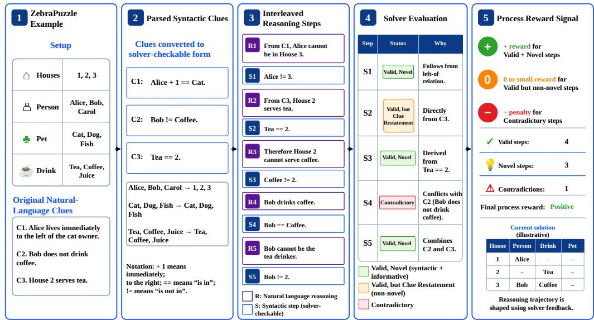
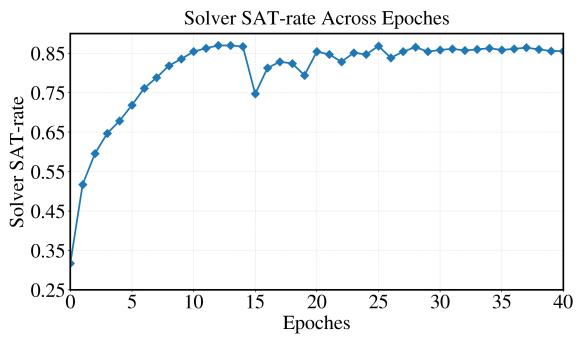

# Rewarding Novel Deductions: Solver-guided Process Rewards for Logical Reasoning

Muhammad Asif Ali1,2, Wenqing Wang³, Huan Wang³, Mohammad Raza4,†

1FORTE Lab, 2Faculty of Science, Information Technology University, Lahore, Pakistan 3College of Informatics, Huazhong Agricultural University, Wuhan, China 4Qatar Computing Research Institute, Hamad Bin Khalifa University, Doha, Qatar †Corresponding author: mraza@hbku. edu. qa

## Abstract

Logical reasoning remains a major challenge for large language models (LLMs), particularly on structured problems that require precise constraint tracking, consistency preservation, and multi-step deduction. This challenge is especially acute for small-scale LLMs, which are more prone to producing inconsistent, redundant, or brittle reasoning trajectories. Existing approaches for improving logical reasoning largely optimize for final-answer correctness, providing only weak supervision over the intermediate reasoning process. In this work, we propose SPRING: (Solverguided Process Rewards for Novel LogIcal ReasoNing Step Generation). SPRING uses SMT solver as a training-time verifier of intermediate reasoning steps to provide process-level supervision. It introduces the notion of a novel reasoning step, namely, a step that is logically valid, consistent with the evolving reasoning state, and not already implied by previously accepted non-contradictory deductions. Based on this solver-based assessment, it designs process rewards that encourage novel inferential progress while penalizing contradictory and uninformative reasoning steps. Evaluation across three logical reasoning benchmarks, ZebraLogic, AR-LSAT, and Knights and Knaves, and four LLMs shows that SPRING consistently outperforms base LLMs, outcome-only reward baselines, and Logic-LM. On ZebraLogic, SPRING improves puzzle accuracy by up to 49.71 and 15.43 points over the base LLM and strongest outcome-only baseline, respectively. On AR-LSAT, it improves overall accuracy by up to 64.93 and 12.14 points, respectively. On Knights and Knaves, SPRING achieves up to 93.14 puzzle accuracy and 96.05 person accuracy.

## 1 Introduction

Logical reasoning is a fundamental capability for intelligent systems because it requires deriving conclusions that remain consistent with a set of premises and constraints. Unlike open-ended generation tasks, logical reasoning problems such as relational puzzles, symbolic deduction, and structured constraint-satisfaction tasks require not only a correct final answer, but also a sequence of intermediate deductions that is logically sound and progressively informative. Although LLMs have shown strong performance on a wide range of reasoning benchmarks, they still struggle with tasks that require precise deduction, consistency tracking, and long-horizon constraint maintenance [Wei et al., 2022, Kojima et al., 2022, Mirzadeh et al., 2024]. Their reasoning chains are often redundant, unsupported by the premises, or internally contradictory, even when the final answer appears plausible [Lightman et al., 2023, Cobbe et al., 2021, Mirzadeh et al., 2024]. This limitation is especially pronounced for small-scale LLMs, particularly models in the 4B-and-below regime, which often require stronger or more structured supervision to maintain coherent multi-step reasoning trajectories [Li et al., 2025,

Zhang et al., 2025]. While such models are attractive because of their lower computational cost and easier deployment, they are more prone to breakdowns in multi-step logical reasoning and often struggle to maintain coherent reasoning traces over long deduction chains [Wei et al., 2022, Li et al., 2025, Zhang et al., 2025].

Motivated by these limitations, a growing line of work augments LLM reasoning with symbolic solvers such as SAT, SMT, Z3, and theorem provers, which provide exact checks for satisfiability, implication, and consistency [Barrett and Tinelli, 2018, De Moura and Bjørner, 2008]. Recent neurosymbolic methods improve reliability by translating natural-language problems into executable formal representations and delegating inference or verification to the solver [Ye et al., 2023, Pan et al., 2023a, Olausson et al., 2023, Hu et al., 2025]. However, these approaches typically use the solver only after formalization, rather than to supervise intermediate reasoning during learning. In addition, existing training methods often optimize only for final-answer correctness [Cobbe et al., 2021, Lightman et al., 2023, Wang et al., 2024], which is too coarse for logical reasoning: two trajectories may reach the same answer even if one is valid and informative while the other relies on contradictions, guesswork, or redundancy. This limitation is especially pronounced for small-scale LLMs, whose reasoning trajectories are more likely to become self-inconsistent or unproductive.

To address this, we introduce SPRING: (Solver-guided Process Rewards for Novel LogIcal ReasoNing Step Generation), a solver-guided reinforcement learning framework for logical reasoning. Unlike prior solver-augmented methods that mainly use symbolic solvers for final inference or verification, SPRING uses the solver as a training-time process supervisor. SPRING introduces the notion of a novel reasoning step (Definition 4), defined as a step that is logically valid, consistent with the evolving reasoning state, and not already implied by previously accepted non-contradictory deductions. During reinforcement learning, the solver evaluates the intermediate reasoning trajectory to identify novel steps and provide process-level feedback, which we then convert into rewards that explicitly encourage novel and logically useful reasoning steps while penalizing contradictory steps (Definition 5), redundancy, and other uninformative deductions.

We evaluate SPRING across three logical reasoning benchmarks, ZebraLogic, AR-LSAT, and Knights and Knaves, using four LLMs spanning different model sizes and reasoning capabilities. Experimental results show that SPRING consistently outperforms base LLMs, outcome-only reward baselines, and Logic-LM. On ZebraLogic, SPRING improves puzzle accuracy by up to 49.71 points over the base LLM and 15.43 points over the strongest outcome-only baseline. On AR-LSAT, SPRING improves overall accuracy by up to 64.93 and 12.14 points over the base LLM and strongest outcome-only baseline, respectively. On Knights and Knaves, SPRING achieves up to 93.14 puzzle accuracy and 96.05 person accuracy. Beyond final-task performance, our analysis shows that SPRING produces shorter and cleaner successful traces, fewer contradictions, and reasoning trajectories that are more consistent with the underlying logical constraints. We summarize the key contributions of this work as follows:

• We formulate logical reasoning training as a process-supervised reinforcement learning problem, where reward is assigned not only to final answers but also to intermediate reasoning steps.

• We introduce the notion of novel reasoning steps and show how a symbolic solver can verify them during training, thereby providing explicit supervision for inferential progress, validity, and logical consistency.

• We propose SPRING, a solver-guided reward framework that improves both reasoning trajectories and final logical reasoning performance by rewarding novel deductions while penalizing contradictory and uninformative reasoning steps.

• We conduct comprehensive experiments across three logical reasoning benchmarks and four LLMs, showing that SPRING consistently outperforms base LLMs, outcome-only reward baselines, and Logic-LM. Our analyses further show that SPRING produces shorter, cleaner, and more solver-consistent reasoning trajectories.

## 2 Related Work

Solver-Augmented Logical Reasoning for LLMs. A prominent line of recent work improves logical reasoning in LLMs by coupling them with external symbolic solvers rather than relying on unconstrained natural-language reasoning alone. In these approaches, the LLM typically serves as a semantic parser or translator that maps natural-language premises into a formal representation, while a symbolic backend performs exact deductive inference or consistency checking. This paradigm has become especially important for structured logical reasoning tasks, where global constraints, exclusivity conditions, and combinatorial dependencies are difficult to maintain through free-form chain-of-thought alone. Benchmark development has reinforced this need: AR-LSAT, introduced in Analytical Reasoning of Text, remains a challenging dataset for structured logical deduction, while more recent puzzle-style benchmarks such as ZebraLogic expose substantial performance drops as deductive complexity increases [Zhong et al., 2022, Lin et al., 2025].

Among solver-integrated methods, SatLM formulates reasoning problems declaratively, using the LLM to generate a satisfiability specification that is then solved by an automated theorem prover or SAT-style backend [Ye et al., 2023]. Logic-LM further develops this paradigm by translating natural-language reasoning problems into symbolic programs, invoking a deterministic solver, and then using self-refinement to improve formalization quality; importantly, it reports gains on multiple logical reasoning benchmarks including AR-LSAT [Pan et al., 2023a]. LINC follows a similar neurosymbolic design, but grounds reasoning in first-order logic and theorem proving, showing that explicit logical formalization can substantially improve deductive reliability over purely textual reasoning [Olausson et al., 2023]. More recently, LTRAG improves this general family of methods by enhancing autoformalization and self-refinement with retrieval-augmented exemplars, and reports further gains over Logic-LM and LINC on FOLIO and AR-LSAT [Hu et al., 2025]. Collectively, these works show that symbolic solvers can significantly augment LLMs on logical reasoning tasks when the model is able to produce executable formal representations.

At the same time, recent studies show that the benefit of solver augmentation depends not only on whether a solver is used, but also on how it is used and how well the LLM can interface with the solver's symbolic language. Lam et al. [2024] perform a controlled comparison across multiple symbolic tools, including Z3, Pyke, and Prover9, and show that executable translation quality varies substantially across tools and is strongly tied to downstream reasoning accuracy. This observation is important because it clarifies that many current solver-augmented pipelines are bottlenecked by formalization quality: if the LLM fails to generate a faithful executable representation, the solver cannot recover the correct reasoning process. Thus, much of the current literature uses the solver primarily as a fnal inference engine, answer verifier, or self-refnement signal over the formalized problem, rather than as a mechanism for supervising the quality of intermediate reasoning steps themselves.

Distinction from Existing Solver-Augmented Methods. SPRING uses the solver as a source of process supervision during learning. Unlike prior solver-augmented methods, which primarily use solvers for downstream inference or final-answer verification, SpRING uses the solver to evaluate intermediate reasoning trajectories during reinforcement learning. In particular, the solver checks whether a generated step is a novel reasoning step, that ${ \mathrm { i s } } ,$ a step that is logically valid, consistent with the current reasoning state, and not already implied by previously accepted deductions. This solver feedback is then converted into process rewards that encourage genuine inferential progress while penalizing contradictions and uninformative steps. In this way, the solver acts as a training-time process verifier that shapes the step-by-step reasoning process.

## 3 Problem Formulation

Let x denote a logic problem instance consisting of (i) a set of natural-language premises and/or clues $\mathcal { C }$ and (ii) a set of domain constraints $\Gamma _ { \mathrm { d o m } }$ encoding the structural rules of the problem, such as exclusivity, uniqueness, admissible assignments, or variable ranges. We define the problem theory as $\Gamma _ { \mathrm { b a s e } } = \dot { \Gamma } _ { \mathrm { d o m } } \dot { \cup } \mathcal { C }$ . Given an input problem $x ,$ our goal is to train a language model policy $\pi _ { \theta }$ to generate a reasoning trajectory $\tau = ( s _ { 1 } , s _ { 2 } , \ldots , s _ { T } )$ followed by a final solution $y ,$ where each step $s _ { t }$ is interleaved and contains both a natural-language explanation and a formal logical statement executable in $^ { \mathbf { Z 3 } }$ Concretely, each step is represented as $s _ { t } = ( u _ { t } , z _ { t } )$ , where $u _ { t }$ is a free-form natural-language rationale and $z _ { t }$ is an optional formal statement in a constrained logical language. The full model output is therefore $o = ( \tau , y ) \sim \pi _ { \theta } ( \cdot \mid x )$ . Our objective is not only to predict the correct final solution, but to learn a policy that produces reasoning trajectories whose intermediate formal steps are both valid and novel. Intuitively, a valid step is one that is logically supported by the underlying problem theory, while a novel step contributes new information beyond previously generated non-contradictory steps and does not merely restate an existing premises or prior deduction. The definitions of these core concepts are presented in Section 3.1.

## 3.1 Core Definitions

We first formalize the reasoning-step properties used by our solver-guided reward design. Let $\Gamma _ { \mathrm { d o m } }$ denote the domain constraints of a logic problem, C the set of premises, and $\Gamma _ { \mathrm { b a s e } } = \Gamma _ { \mathrm { d o m } } \cup \mathcal { C }$ the resulting base theory. At reasoning step t, let $\mathcal { P } _ { t - 1 } ^ { \mathrm { n c } }$ denote the set of previously accepted noncontradictory formal steps up to step $t - 1$

Definition 1 (Strong Implication). Let Φ be a background theory and let A and B be formulas. We say that A strongly implies B under Φ, denoted $A \Rightarrow _ { \Phi } B , \dot { i } f \Phi \cup \{ A , B \}$ is satisable and $\Phi \cup \{ A , \lnot B \}$ is unsatisfable. Thus, B follows from A under Φ, while vacuous implication caused by inconsistency of $\cdot \Phi \cup \{ A \}$ is excluded.

Definition 2 (Valid Step). A generated formal step $z _ { t }$ is valid if it is logically implied by the base theory and remains consistent with it; that is, $\tilde { \Gamma _ { \mathrm { b a s e } } } \cup \{ z _ { t } \}$ is satisfable and $\bar { \Gamma } _ { \mathrm { b a s e } } \cup \{ \lnot z _ { t } \}$ is unsatisable. Equivalently, $z _ { t }$ is a sound deduction from the premises and domain constraints.

Definition 3 (Tautological Step). A generated formal step $z _ { t }$ is tautological with respect to the problem if it is implied by the domain constraints alone, i.e., $i f \Gamma _ { \mathrm { d o m } } \cup \left\{ \lnot _ { z _ { t } } \right\}$ is unsatisfiable. Such a step does not depend on the premises or any intermediate reasoning and therefore provides no problem-specifc inferential progress.

Definition 4 (Novel Step). A valid step $z _ { t }$ is novel if it is not tautological (Definition $^ { 3 ) , }$ not already implied by the previously accepted non-contradictory reasoning steps, and not equivalent to any original premise. Let

$$
P _ { t - 1 } = \bigwedge _ { z \in \mathcal { P } _ { t - 1 } ^ { \mathrm { n c } } } z
$$

denote the conjunction of all previously accepted non-contradictory formal reasoning steps, $i . e .$ the accumulated reasoning state up to step $t - 1$ Then $z _ { t }$ is novel $i f P _ { t - 1 } \not \Rightarrow \Gamma _ { \mathrm { d o m } } z _ { t }$ and $z _ { t } \not \equiv C _ { i } f o r$ all $C _ { i } \in { \mathcal { C } } _ { i }$ , after tautological steps have been excluded according to Definition 3. Equivalently, novelty requires that both $\Gamma _ { \mathrm { d o m } } \cup \mathcal { P } _ { t - 1 } ^ { \mathrm { { \bar { n c } } } } \cup \{ z _ { t } \}$ and $\Gamma _ { \mathrm { d o m } } \cup \mathcal { P } _ { t - 1 } ^ { \mathrm { n c } } \cup \left\{ \lnot z _ { t } \right\}$ remain satisable.

Definition 5 (Contradictory Step). A generated formal step $z _ { t }$ is contradictory if adding it to the current reasoning state makes the theory unsatisfiable. Equivalently, if we define the current context as $\Gamma _ { \mathrm { c t x } } ^ { ( t ) } = \Gamma _ { \mathrm { b a s e } } \cup \mathcal { P } _ { t - 1 } ^ { \mathrm { n c } }$ , then $z _ { t }$ is contradictory when

$$
\Gamma _ { \mathrm { c t x } } ^ { ( t ) } \cup \{ z _ { t } \} i s u n s a t i s f i a b l e .
$$

Thus, $z _ { t }$ conflicts with the premises, the domain constraints, or the previously accepted noncontradictory deductions.

Definition 6 (Consistency with Final Solution). Let F denote the final predicted solution and let $\mathcal { Z }$ denote the set of formal reasoning steps extracted from a trajectory. We say that $\mathcal { Z }$ is consistent with $F i f \Gamma _ { \mathrm { d o m } } \cup \mathcal { Z } \cup \{ F \}$ is satisfiable. Otherwise, the reasoning trajectory is inconsistent with the final solution.

## 4 SPRING

Overview. The workflow of SPRING is illustrated in Figure 1. It is a reinforcement learning framework for improving logical reasoning in language models through symbolic verification. It targets structured logic problems, with ZebraPuzzles used as a representative case for visualization. The workflow proceeds as follows. Given a problem instance, the LLM generates: parsed syntactic premises, interleaved reasoning steps (natural-language and formal), and a final solution. The parsed syntactic premises are first used to construct the symbolic solver state, after which we check whether the resulting constraint system is satisfiable. If the solver state is SAT, it is then used to evaluate the generated formal reasoning steps and determine whether they are valid, novel, tautological, or contradictory. These solver-based judgments are converted into process rewards, encouraging reasoning trajectories that make genuine inferential progress while discouraging inconsistent, redundant, or otherwise uninformative steps.

## 4.1 LLM Prompting and Output Structure

Given a logic problem instance x, we prompt the LLM to produce a structured output that serves as the interface between free-form language reasoning and symbolic verification. Specifically, the output contains three main components: (i) Parsed Syntactic Premises, which normalize the original natural-language premises into solver-checkable constraints, (ii) an Interleaved Reasoning trajectory, which alternates between natural-language explanations and formal deduction steps, and (iii) a Final Solution, which specifies the predicted assignment or answer. The prompts used in our experiments are given in Appendix E.

  
Figure 1: Illustration of SPRING using a ZebraPuzzle example. Natural-language clues are converted into solver-checkable syntactic clues, interleaved reasoning steps are classified by the solver, and the resulting signals are mapped to process rewards for training.

Formally, let $\pi _ { \theta }$ denote the policy LLM parameterized by θ. Given an input problem instance $x ,$ the model generates a structured output:

$$
o = ( { \hat { \mathcal { C } } } , \tau , y ) \sim \pi _ { \theta } ( \cdot \mid x ) ,
$$

where $\hat { \mathcal { C } } = ( \hat { C } _ { 1 } , \dots , \hat { C } _ { m } )$ denotes the Parsed Syntactic Premises, $\tau = ( s _ { 1 } , \dots , s _ { T } )$ is the reasoning trajectory with $s _ { t } = ( u _ { t } , z _ { t } )$ , and y is the final predicted solution. We adopt an interleaved reasoning format because LLMs are better at natural-language deduction, while formal steps are better suited for precise symbolic verification. In this setting, ut provides the explanation and $z _ { t }$ the solver-checkable deduction.

## 4.2 Solver Construction and Step Verification

Given the parsed syntactic premises $\hat { \mathcal { C } }$ generated by the policy LLM, we construct the symbolic solver by combining them with the domain constraints $\Gamma _ { \mathrm { d o m } } ,$ yielding the base theory:

$$
\Gamma _ { \mathrm { b a s e } } = \Gamma _ { \mathrm { d o m } } \cup \hat { \mathcal { C } } .
$$

We first check whether $\Gamma _ { \mathrm { b a s e } }$ is satisfiable and whether it admits a unique solution. This ensures that the parsed premises are not only solver-compatible but also preserve the intended problem semantics. If $\Gamma _ { \mathrm { b a s e } }$ is unsatisfiable or fails to yield a unique solution, the trajectory is treated as solver-incompatible and receives a reduced reward.

Symbolic Step Verification. Once the base solver state is established, we use it to verify each parsed formal reasoning step $z _ { t }$ Let $\mathcal { P } _ { t - 1 } ^ { \mathrm { n c } }$ denote the set of previously accepted non-contradictory steps, and define the current reasoning context as

$$
\Gamma _ { \mathrm { c t x } } ^ { ( t ) } = \Gamma _ { \mathrm { b a s e } } \cup \mathcal { P } _ { t - 1 } ^ { \mathrm { n c } } .
$$

For each generated step $z _ { t } ,$ we extract the core solver signals that drive our reward design. First, we check whether $z _ { t }$ is valid according to Definition 2, i.e., whether it is entailed by $\Gamma _ { \mathrm { b a s e } }$ while remaining satisfiable with it. Second, we check whether $z _ { t }$ is tautological according to Definition 3,

namely whether it follows from $\Gamma _ { \mathrm { d o m } }$ alone and therefore contributes no problem-specific information.   
Third, for a valid and non-tautological step, we test whether it is novel using Definition 4. Concretely,   
letting $P _ { t - 1 } = \Lambda _ { z \in \mathscr { P } _ { t - } ^ { \mathrm { n c } } }$ z, we check whether 1

$$
P _ { t - 1 } \neq _ { \Gamma _ { \mathrm { d o m } } } z _ { t } ,
$$

and whether $z _ { t }$ is not equivalent to any original premise $C _ { i } \in \mathcal { C }$ . This step-level novelty signal is aggregated into the reward term $r _ { \mathrm { n o v e l } } .$ which measures the extent to which the trajectory introduces new inferential content beyond the previously accepted reasoning state. Fourth, we check whether $z _ { t }$ is contradictory according to Definition 5, i.e., whether

$$
\Gamma _ { \mathrm { c t x } } ^ { ( t ) } \cup \{ z _ { t } \}
$$

is unsatisfiable. The corresponding contradiction signal is accumulated into $r _ { \mathrm { c o n t r a } } ,$ which penalizes trajectories that introduce logically inconsistent deductions. Finally, at the trajectory level, we check whether the generated reasoning remains consistent with the final solution using Definition 6, namely whether the formal reasoning steps and the final prediction can coexist in a satisfiable theory. This trajectory-level compatibility signal is mapped to $r _ { \mathrm { c o n s i s t e n c y } }$ , which rewards reasoning traces whose intermediate deductions remain coherent with the final predicted solution.

These solver-derived signals, namely novelty, contradiction, and final-solution consistency, provide the fine-grained process supervision used by SPRING. Intuitively, they allow the model to distinguish between steps that make genuine inferential progress and those that are redundant, uninformative, or logically inconsistent.

## 4.3 Process-Level Reward

We define a structured reward that combines solver-derived process signals (Section 4.2) with tasklevel and formatting signals. Concretely, our reward uses the core symbolic signals of novelty, contradiction, and fnal-solution consistency, together with three auxiliary signals: (i) $r _ { \mathrm { f o r m a t } } ,$ a binary reward that takes value 1 if the generated reasoning follows the required interleaved structure of natural-language and parsed formal steps, and 0 otherwise; (ii) $r _ { \mathrm { p a r s e d } }$ , a binary reward that takes value 1 if the LLM-generated output can be successfully parsed into the target symbolic representation, and 0 otherwise; and (iii) $r _ { \mathrm { a c c u r a c y } } ,$ which measures final accuracy. Note, for ZebraPuzzles, we instantiate $r _ { \mathrm { a c c u r a c y } }$ as puzzle accuracy. We distinguish two cases using the satisfiability indicator $s _ { \mathrm { s a t } } \in \{ 0 , 1 \}$ of the parsed premises system. If $s _ { \mathrm { s a t } } = 0$ , the reward is restricted to auxiliary quality signals and final-answer quality; if $s _ { \mathrm { s a t } } = 1$ , we additionally apply process-level rewards from symbolic step verification:

$$
R = \left\{ \begin{array} { l l } { 0 . 1 5 r _ { \mathrm { p a r s e d } } + 0 . 1 0 r _ { \mathrm { f o r m a t } } + 0 . 6 0 r _ { \mathrm { a c c u r a c y } } , } & { s _ { \mathrm { s a t } } = 0 , } \\ { r _ { \mathrm { b a s e } } + \left( 0 . 5 + 0 . 5 r _ { \mathrm { a c c u r a c y } } \right) r _ { \mathrm { p r o c } } , } & { s _ { \mathrm { s a t } } = 1 , } \end{array} \right.
$$

where

$$
r _ { \mathrm { b a s e } } = 0 . 1 5 r _ { \mathrm { p a r s e d } } + 0 . 1 0 r _ { \mathrm { f o r m a t } } + 0 . 6 0 r _ { \mathrm { a c c u r a c y } } , \qquad r _ { \mathrm { p r o c } } = 0 . 4 0 r _ { \mathrm { n o v e l } } + 0 . 3 0 r _ { \mathrm { c o n s i t e n c y } } - 0 . 1 5 r _ { \mathrm { c o n t r a } } .
$$

This reward design preserves the main task objective through $r _ { \mathrm { a c c u r a c y } }$ while adding process supervision through solver-verified reasoning quality. As a result, trajectories with more novel and solutionconsistent deductions, and fewer contradictions, receive higher reward, aligning reinforcement learning with both outcome quality and reasoning quality.

## 4.4 RL Training

We train SPRING with a group-based reinforcement learning objective, using GRPO for policy optimization and a DAPO-style distributed runtime for scalable sampling and training [Shao et al., 2024, Yu et al., 2025]. Given a logic problem x, the policy $\pi _ { \theta }$ samples a group of candidate outputs $\{ o _ { i } \} _ { i = 1 } ^ { G }$ , where each $o _ { i } = \left( \tau _ { i } , y _ { i } \right)$ contains an interleaved reasoning trajectory $\tau _ { i }$ and a final solution $y _ { i }$ . Each candidate receives a scalar reward $r _ { i } = R ( x , o _ { i } )$ from our solver-guided verifier. The training objective is to maximize the expected reward:

$$
\operatorname* { m a x } _ { \theta } \ \mathbb { E } _ { x \sim \mathcal { D } , o \sim \pi _ { \theta } ( \cdot | x ) } \big [ R ( x , o ) \big ] .\tag{1}
$$

Following GRPO, rewards are normalized within each sampled group. Let $\textstyle { \bar { r } } = { \frac { 1 } { G } } \sum _ { i = 1 } ^ { G } r _ { i }$ and $\begin{array} { r } { \sigma _ { r } = \sqrt { \frac { 1 } { G } \sum _ { i = 1 } ^ { G } ( r _ { i } - \bar { r } ) ^ { 2 } } } \end{array}$ . The group-relative advantage is then $\begin{array} { r } { A _ { i } = \frac { r _ { i } - \bar { r } } { \sigma _ { r + \epsilon } } } \end{array}$ , where $\epsilon > 0$ ensures numerical stability. Using the policy ratio $\begin{array} { r } { \rho _ { i } ( \theta ) = \frac { \pi _ { \theta } \left( o _ { i } | x \right) } { \pi _ { \theta _ { \mathrm { o l d } } } \left( o _ { i } | x \right) } } \end{array}$ , the clipped GRPO loss is:

$$
\mathcal { L } _ { \mathrm { G R P O } } ( \theta ) = \mathbb { E } _ { x } \left[ \frac { 1 } { G } \sum _ { i = 1 } ^ { G } \operatorname* { m i n } \bigl ( \rho _ { i } ( \theta ) A _ { i } , \mathrm { c l i p } ( \rho _ { i } ( \theta ) , 1 - \delta , 1 + \delta ) A _ { i } \bigr ) \right]\tag{2}
$$

This encourages the policy to prefer candidates with better solver-guided reasoning quality relative to others in the same group. To stabilize training, we regularize the policy toward a frozen reference policy $\pi _ { \mathrm { r e f } } :$

$$
\mathcal { L } ( \theta ) = \mathcal { L } _ { \mathrm { G R P O } } ( \theta ) - \beta \operatorname { K L } \bigl ( \pi _ { \theta } ( \cdot \mid x ) \parallel \pi _ { \mathrm { r e f } } ( \cdot \mid x ) \bigr ) ,\tag{3}
$$

where $\beta$ controls the regularization strength. In this framework, DAPO provides the distributed runtime for large-scale sampling, reward computation, and optimization, while Z3 solver [De Moura and Bjørner, 2008] supplies fine-grained process feedback over intermediate deductions.

## 5 Experimentation

## 5.1 Experimental Settings

## (a) Datasets.

For evaluation, we use three logical reasoning benchmarks. (i) ZebraLogic contains 1,000 Zebra puzzles across four difficulty levels: Small, Medium, Large, and Extra-Large. We use a 25%/5%/70% train/validation/test split, corresponding to 250/50/700 instances. (ii) AR-LSAT consists of analytical reasoning problems across three categories: Ordering, Grouping, and Assignment. We use 300 training and 50 validation instances per category. For testing, we use the official 230-instance test split, comprising 112 Ordering, 49 Grouping, and 69 Assignment problems. (iii) Knights and Knaves (KnK) Xie et al. [2025] contains 6,200 training and 700 test puzzles spanning 2–8 characters. We sample 300 instances from the training set for reinforcement learning and evaluate on the complete 700-instance test set. Dataset statistics are summarized in Table 3.

(b) Large Models. For experimentation, we use four LLMs: Qwen3-1.7B, Qwen3-4B-Thinking, and Qwen3-8B from the Qwen3 family [Yang et al., 2025], and Phi-4-Reasoning [Abdin et al., 2025].

(c) Baselines. We consider the following baselines. (i) Base-NL and Base-INT denote the pretrained LLMs without task-specific reinforcement learning, using a natural-language prompt and an interleaved prompt, respectively. To isolate the contribution of solver-guided process supervision, we additionally compare against two outcome-only reward baselines. (ii) OR-NL uses the same natural-language prompt as Base-NL, but optimizes only for final-answer quality with reward $0 . 1 5 \cdot r _ { \mathrm { p a r s e d } } + 0 . 6 \cdot r _ { \mathrm { a c c u r a c y } }$ . (iii) OR-INT uses the same interleaved prompt as Base-INT, but likewise optimizes only for final-answer quality with reward $0 . 1 5 \cdot r _ { \mathrm { p a r s e d } } + 0 . 6 \cdot r _ { \mathrm { a c c u r a c y } }$ . Thus, OR-NL and OR-INT remove the process-level reward terms of SPRING and differ only in the prompting format. From existing research on logical reasoning with LLMs, we use Logic-LM [Pan et al., 2023b] as a representative baseline for comparison.

(d) Experimental Settings. For RL training, we use the following settings. The GRPO group size n is set to 8, the sampling temperature during training is 0.8, and the inference temperature is fixed at 0.0. We set $\beta = 0 . 0 1$ , and the maximum input and output lengths to 8 × 1024 tokens. All experiments are conducted using the VERL framework¹ on a cluster with 4× NVIDIA H200 GPUs. We use the Z3 solver for symbolic-step verification [De Moura and Bjørner, 2008]. Under this configuration, training Qwen3-4B-Thinking requires approximately 45 minutes per epoch. Unless stated otherwise, training is run for up to 25 epochs with early stopping using a patience of 3 epochs, and we report the checkpoint with the best validation performance. All experiments are repeated over 3 runs, and we report average scores. The prompt templates used in our experiments are provided in Appendix E.

(e) Evaluation Metrics. We evaluate model performance using task-specific metrics. For ZebraLogic, we report Puzzle Acc. and Cell Acc.; for AR-LSAT, we report Acc.; and for Knights and Knaves, we report Puzzle Acc. and Person Acc.. Further details and the mathematical definitions of these metrics are provided in Appendix B.2.

Table 1: SPRING performance comparison across different LLMs on ZebraLogic, AR-LSAT, and Knights and Knaves.
<table><tr><td rowspan="2">LLM</td><td rowspan="2">System</td><td colspan="2">ZebraLogic</td><td colspan="4">AR-LSAT (Acc.)</td><td colspan="2">Knights and Knaves</td></tr><tr><td>Puzzle Acc. ↑ Cell Acc. ↑</td><td></td><td>Ordering ↑</td><td>Grouping ↑ Assignment ↑</td><td></td><td></td><td>Overall ↑ | Puzzle Acc. ↑ Person Acc. ↑</td><td></td></tr><tr><td rowspan="9">Qwen3-1.7B</td><td>Base-NL</td><td>11.14</td><td>35.04</td><td>16.07</td><td>24.48</td><td>0.00</td><td>13.52</td><td>53.28</td><td>64.43</td></tr><tr><td>OR-NL</td><td>38.57</td><td>49.87</td><td>19.64</td><td>40.81</td><td>1.44</td><td>20.63</td><td>68.57</td><td>79.64</td></tr><tr><td>Base-INT</td><td>31.85</td><td>41.45</td><td>23.21</td><td>24.48</td><td>14.49</td><td>20.73</td><td>18.71</td><td>55.61</td></tr><tr><td>OR-INT</td><td>36.00</td><td>46.09</td><td>35.71</td><td>51.02</td><td>24.63</td><td>37.12</td><td>73.57</td><td>80.54</td></tr><tr><td>Logic-LM</td><td>12.85</td><td>33.16</td><td>-.-</td><td>--</td><td>-.-</td><td>15.58</td><td>3.57</td><td>22.51</td></tr><tr><td>SPRING (-N)</td><td>19.28</td><td>59.62</td><td>34.82</td><td>55.10</td><td>46.37</td><td>45.43</td><td>78.57</td><td>82.14</td></tr><tr><td>SPRING</td><td>54.00</td><td>59.87</td><td>41.07</td><td>57.14</td><td>49.56</td><td>49.26</td><td>85.28</td><td>86.94</td></tr><tr><td>Base-NL</td><td>24.00</td><td>24.00</td><td>6.25</td><td>18.36</td><td>0.00</td><td>8.20</td><td>55.28</td><td>65.41</td></tr><tr><td>OR-NL</td><td>67.28</td><td>68.30</td><td>25.00</td><td>65.30</td><td>10.14</td><td>33.48</td><td>74.28</td><td>84.66</td></tr><tr><td>Base-INT OR-INT</td><td>17.00 66.14</td><td>23.32 72.72</td><td>6.26 61.60</td><td>14.28 79.59</td><td>5.50 65.21</td><td>8.68 68.80</td><td>33.14 76.57</td><td>63.47 87.58</td></tr><tr><td>Qwen3-4B-Thinking</td><td></td><td></td><td></td><td></td><td></td><td></td><td></td><td></td></tr><tr><td>Logic-LM</td><td>21.42</td><td>38.12</td><td>--</td><td>--</td><td>--</td><td>20.78</td><td>7.14</td><td>35.48</td></tr><tr><td>SPRING (-N) SPRING</td><td>61.42 73.71</td><td>68.27</td><td>63.39</td><td>77.55</td><td>66.66</td><td>69.20</td><td>82.85</td><td>90.13</td></tr><tr><td>Base-NL</td><td>7.14</td><td>81.52</td><td>69.64</td><td>81.63</td><td>69.56</td><td>73.61</td><td>88.71</td><td>94.21</td></tr><tr><td>OR-NL</td><td>47.14</td><td>22.42 51.27</td><td>12.50</td><td>24.48 40.81</td><td>17.39 30.43</td><td>18.12 30.88</td><td>57.85</td><td>68.13 85.57</td></tr><tr><td></td><td></td><td></td><td>21.42</td><td></td><td></td><td></td><td>72.85</td><td></td></tr><tr><td>Base-INT Phi4-Reasoning OR-INT</td><td>18.71 49.00</td><td>20.27 53.54</td><td>0.00 23.21</td><td>18.36 46.93</td><td>2.89 26.08</td><td>7.08 32.07</td><td>36.42 81.42</td><td>68.84 88.13</td></tr><tr><td>Logic-LM</td><td>20.0</td><td></td><td></td><td></td><td></td><td></td><td></td><td></td></tr><tr><td>SPRING (-N)</td><td></td><td>36.75</td><td>-.-</td><td>-.-</td><td>-.-</td><td>18.61</td><td>9.28</td><td>40.12</td></tr><tr><td>SPRING</td><td>53.71 55.71</td><td>56.34 59.52</td><td>22.32 26.78</td><td>42.85 51.02</td><td>24.63 34.78</td><td>29.93 37.52</td><td>83.57 89.28</td><td>88.51 94.57</td></tr><tr><td></td><td></td><td></td><td></td><td></td><td>30.43</td><td>33.56</td><td></td><td></td></tr><tr><td rowspan="7"></td><td>Base-NL</td><td>47.42</td><td>50.13</td><td>29.46</td><td>40.81</td><td></td><td></td><td>56.0</td><td>68.49</td></tr><tr><td>OR-NL Base-INT</td><td>65.67</td><td>64.85</td><td>51.78</td><td>61.22</td><td>56.52</td><td>56.50</td><td>74.28</td><td>80.76</td></tr><tr><td>OR-INT</td><td>50.42 70.85</td><td>58.61</td><td>33.92 65.17</td><td>30.61</td><td>34.78</td><td>33.10</td><td>49.57</td><td>72.14</td></tr><tr><td></td><td></td><td>75.13</td><td></td><td>77.08</td><td>63.76</td><td>68.67</td><td>77.14</td><td>82.85</td></tr><tr><td>Logic-LM</td><td>22.85</td><td>40.56</td><td>-.-</td><td>--</td><td>-.-</td><td>25.97</td><td>8.57</td><td>55.20</td></tr><tr><td>SPRING (-N)</td><td>69.42</td><td>76.57</td><td>51.78</td><td>75.51</td><td>50.72</td><td>59.33</td><td>87.14</td><td>91.24</td></tr><tr><td>SPRING</td><td>77.85</td><td>79.41</td><td>71.42</td><td>85.71</td><td>69.56</td><td>75.56</td><td>93.14</td><td>96.05</td></tr></table>

## 5.2 Main Results

The results in Table 1 show that SPRING consistently improves logical reasoning across four LLMs and three benchmarks. The gains hold across models of different sizes and reasoning capabilities including Qwen3-1.7B, Qwen3-4B-Thinking, Phi4-Reasoning, and Qwen3-8B. In contrast, the base models exhibit substantial sensitivity to prompting style, while outcome-only reward learning improves performance but generally remains below SPRING. Logic-LM also performs substantially below SPRING across all evaluated model–benchmark combinations.

(a) ZebraLogic. SPRING achieves strong gains across all four LLMs, reaching Puzzle Acc scores of 54.00, 73.71, 55.71, and 77.85 for Qwen3-1.7B, Qwen3-4B-Thinking, Phi4-Reasoning, and Qwen3- 8B, respectively. For Qwen3-1.7B, SPRING improves Puzzle Acc from 38.57 for the strongest outcome-only baseline (OR-NL) to 54.00, a gain of 15.43 points. For Qwen3-4B-Thinking, it reaches 73.71 Puzzle Acc and 81.52 Cell Acc, compared with 67.28 and 72.72 for the strongest outcome-only results on the respective metrics. The improvements remain evident for the newly evaluated models: SPRING reaches 55.71/59.52 Puzzle/Cell Acc with Phi4-Reasoning and 77.85/79.41 with Qwen3-8B. Logic-LM performs considerably worse, with Puzzle Acc ranging from 12.85 to 22.85 across the four LLMs. These results indicate that solver-guided process optimization provides benefits beyond prompting, outcome-only optimization, and existing solver-augmented logical reasoning.

The novelty reward is particularly important on ZebraLogic. Removing it (SPRING (-N)) reduces Puzzle Acc from 54.00 to 19.28 for Qwen3-1.7B, from 73.71 to 61.42 for Qwen3-4B-Thinking, from 55.71 to 53.71 for Phi4-Reasoning, and from 77.85 to 69.42 for Qwen3-8B. The effect varies across models, but the consistent reduction in puzzle-level accuracy shows that rewarding novel deductions complements solver-validity and helps translate locally valid reasoning into complete puzzle solutions.

(b) AR-LSAT. SPRING also consistently improves performance on AR-LSAT, achieving overall accuracies of 49.26, 73.61, 37.52, and 75.56 for Qwen3-1.7B, Qwen3-4B-Thinking, Phi4-Reasoning, and Qwen3-8B, respectively. For Qwen3-1.7B, the strongest outcome-only baseline, OR-INT, achieves 37.12 overall accuracy, whereas SPRING reaches 49.26, with the largest improvement on Assignment (24.63 to 49.56). For Qwen3-4B-Thinking, SPRING improves the overall score from 68.80 for OR-INT to 73.61, while for Qwen3-8B it improves from 68.67 to 75.56. Phi4-Reasoning exhibits lower absolute AR-LSAT performance, but SPRING still improves over its strongest outcomeonly result from 32.07 to 37.52. Removing the novelty reward reduces overall accuracy for all four LLMs, further supporting the contribution of novel-step supervision beyond solver-validity alone.

Table 2: Reasoning-trace quality across three reward settings for Qwen3-4B-Thinking. Solved traces are averaged over correctly solved cases, while Failed traces are averaged over incorrect cases.
<table><tr><td rowspan="2">System</td><td rowspan="2">Puzzle Acc. ↑</td><td colspan="4">Solved traces</td><td colspan="4">Failed traces</td></tr><tr><td>SAT-rate ↑</td><td>Steps ↓</td><td>Parsed / Total ↑</td><td>Valid / Parsed ↑</td><td>Steps ↓</td><td>Parsed / Total ↑</td><td>Valid / Parsed ↑</td><td>Contradictions / 100 Steps ↓</td></tr><tr><td>-N</td><td>61.42</td><td>0.941</td><td>35.20</td><td>0.460</td><td>0.988</td><td>49.10</td><td>0.384</td><td>0.824</td><td>6.77</td></tr><tr><td>-NC</td><td>66.14</td><td>0.814</td><td>34.82</td><td>0.347</td><td>0.953</td><td>11.23</td><td>0.305</td><td>0.912</td><td>2.52</td></tr><tr><td>SPRING</td><td>73.71</td><td>0.965</td><td>22.37</td><td>0.492</td><td>0.996</td><td>9.39</td><td>0.495</td><td>0.991</td><td>0.46</td></tr></table>

(c) Knights and Knaves. The same trend extends to Knights and Knaves, where SPRING achieves the strongest Puzzle Acc and Person Acc for all four LLMs. Puzzle Acc reaches 85.28, 88.71, 89.28, and 93.14 for Qwen3-1.7B, Qwen3-4B-Thinking, Phi4-Reasoning, and Qwen3-8B, respectively, with corresponding Person Acc scores of 86.94, 94.21, 94.57, and 96.05. Compared with the strongest outcome-only baseline for each model, this corresponds to Puzzle Acc gains of 11.71, 12.14, 7.86, and 16.00 points, respectively. Logic-LM performs particularly poorly at puzzle-level exact solving, achieving only 3.57–9.28 Puzzle Acc. Moreover, removing the novelty reward consistently reduces Puzzle Acc, from 85.28 to 78.57, 88.71 to 82.85, 89.28 to 83.57, and 93.14 to 87.14 across the four models. Together, these results demonstrate that the benefits of solver-guided process rewards and novelty supervision generalize across model families, model scales, and structurally different logical reasoning tasks.

## 5.3 Ablation Analyses

To assess the contribution of the key reward components in SpRING, we conduct an ablation study for different model components on ZebraLogic benchmark. Specifically, (i) -N denotes the variant without the novel-step reward; (ii) -NC removes both the novel-step reward and the contradiction penalty; (iii) SPRING, i.e., the full model. We compare these variants to quantify how each component contributes to improved reasoning trajectories and final performance.

Table 2 compares the three reward settings from both an outcome-level and a process-level perspective. Puzzle Acc. measures end-task success. The columns under Solved traces summarize the quality of reasoning trajectories on correctly solved cases only, including SAT-rate, which measures solver consistency of successful traces, Steps, which measures reasoning efficiency, and Parsed / Total and Valid / Parsed, which quantify structural well-formedness and logical correctness of the generated steps. The columns under Failed traces characterize the behavior of unsuccessful trajectories, including how long the model continues reasoning after failure, how structurally usable those traces remain, and how often they introduce contradictions. Taken together, these fields allow us to evaluate not only whether a system solves the puzzle, but also how efficient, reliable, and solver-faithful its reasoning process is.

(a) Removing novel-step rewards (-N). Compared with SPRING, the (-N) setting achieves substantially lower Puzzle Acc. (61.42 vs. 73.71) and requires much longer solved traces (35.20 vs. 22.37 steps). Its failed traces are especially poor: when the model is incorrect, it continues generating for an average of 49.10 steps and accumulates 6.77 contradictions per 100 steps. In addition, both its Parsed / Total and Valid / Parsed ratios are consistently worse than those of SpRING, for solved as well as failed cases. This indicates that without the novel-step reward, reasoning becomes less efficient, less stable, and far more contradiction-prone.

(b) Removing both novelty and contradiction (-NC). The (-NC) yields lower performance compared to SPRING. Its solved traces have the lowest SAT-rate (0.814), the worst Parsed / Total ratio (0.347) and a noticeably lower Valid / Parsed ratio (0.953) than both alternatives. Its failed traces are also substantially noisier than those of SPRING, with a contradiction rate of 2.52 per 100 steps. Thus, while (-NC) improves over the novelty-free baseline in terms of trace length and final accuracy, it still fails to maintain solver-faithful and structurally reliable reasoning trajectories.

(c) Impact of novel steps (SPRING). SPRING is the strongest system across both final performance and trace quality. It attains the highest Puzzle Acc. (73.71) and the highest SAT-rate on solved cases (0.965), indicating that its successful trajectories are most compatible with solver-based verification. It also reaches correct solutions with the shortest solved traces and the best Parsed / Total and Valid / Parsed ratios, showing that its reasoning is both more concise and more structurally reliable. The advantage is equally clear on failed cases: SPRING has the shortest failed traces (9.39 steps), the highest parsing and validity ratios, and by far the lowest contradiction rate (0.46 per 100 steps). Relative to both (-N) and (-NC), these results show that solver-guided process supervision does not merely improve whether the model gets the answer right; it also regularizes the entire reasoning trajectory toward shorter, cleaner, and more solver-faithful traces.

## 5.4 Further Analyses

To better understand the behavior of SPRING, we perform a set of additional analyses on the ZebraLogic benchmark, including: (a) Scaling Behavior of SPRING across different puzzle sizes; (b) Solver SAT rate across Epochs; (c) Error Analyses; and (d) Qualitative case study. Corresponding results, together with the core findings, are reported in Appendix C. These analyses complement the main results by revealing how SpRING behaves under increasing puzzle difficulty, how its solver consistency develops during training, and how its reasoning traces remain qualitatively cleaner and more stable than those of the baselines.

## 6 Conclusion

In this paper, we introduced SPRING, a solver-guided reinforcement learning framework that uses symbolic verification to provide process-level supervision for logical reasoning. By rewarding novel and logically consistent deductions while penalizing contradictory and uninformative steps, SPRING encourages models to construct more reliable reasoning trajectories rather than relying solely on finalanswer correctness. Experiments across three logical reasoning benchmarks, ZebraLogic, AR-LSAT, and Knights and Knaves, using four LLMs show that SPRING consistently outperforms base LLMs outcome-only reward baselines, and Logic-LM. Our analyses further show that SPRING produces shorter and cleaner successful reasoning traces, fewer contradictions, and greater consistency with the underlying logical constraints. These results demonstrate the effectiveness of solver-guided process supervision for improving logical reasoning across different model families, scales, and problem structures.

## Acknowledgments

The authors gratefully acknowledge the computing support and resources provided by the Panther high-performance computing cluster at the Qatar Computing Research Institute (QCRI).

## References

Marah Abdin et al. Phi-4-reasoning technical report. arXiv preprint arXiv:2504.21318, 2025.

Clark Barrett and Cesare Tinelli. Satisfiability modulo theories. In Handbook of model checking, pages 305–343. Springer, 2018.

Karl Cobbe, Vineet Kosaraju, Mohammad Bavarian, Mark Chen, Heewoo Jun, Lukasz Kaiser, Matthias Plappert, Jerry Tworek, Jacob Hilton, Reiichiro Nakano, et al. Training verifiers to solve math word problems. arXiv preprint arXiv:2110.14168, 2021.

Leonardo De Moura and Nikolaj Bjørner. Z3: An efficient smt solver. In International conference on Tools and Algorithms for the Construction and Analysis of Systems, pages 337–340. Springer, 2008.

Ruikang Hu, Shaoyu Lin, Yeliang Xiu, and Yongmei Liu. Ltrag: Enhancing autoformalization and self-refinement for logical reasoning with thought-guided rag. In Findings of the Association for Computational Linguistics: ACL 2025, pages 2483–2493, 2025.

Takeshi Kojima, Shixiang Shane Gu, Machel Reid, Yutaka Matsuo, and Yusuke Iwasawa. Large language models are zero-shot reasoners. Advances in neural information processing systems, 35: 22199–22213, 2022.

Long Hei Matthew Lam, Ramya Keerthy Thatikonda, and Ehsan Shareghi. A closer look at toolbased logical reasoning with llms: The choice of tool matters. In Proceedings of the 22nd Annual Workshop of the Australasian Language Technology Association, pages 41–63, 2024.

Yuetai Li, Xiang Yue, Zhangchen Xu, Fengqing Jiang, Luyao Niu, Bill Yuchen Lin, Bhaskar Ramasubramanian, and Radha Poovendran. Small models struggle to learn from strong reasoners. In Findings of the Association for Computational Linguistics: ACL 2025, pages 25366–25394, 2025.

Hunter Lightman, Vineet Kosaraju, Yuri Burda, Harrison Edwards, Bowen Baker, Teddy Lee, Jan Leike, John Schulman, Ilya Sutskever, and Karl Cobbe. Let's verify step by step. In The twelfth international conference on learning representations, 2023.

Bill Yuchen Lin, Ronan Le Bras, Kyle Richardson, Ashish Sabharwal, Radha Poovendran, Peter Clark, and Yejin Choi. Zebralogic: On the scaling limits of llms for logical reasoning. arXiv preprint arXiv:2502.01100, 2025.

Seyed Iman Mirzadeh, Keivan Alizadeh, Hooman Shahrokhi, Oncel Tuzel, Samy Bengio, and Mehrdad Farajtabar. Gsm-symbolic: Understanding the limitations of mathematical reasoning in large language models. In The Thirteenth International Conference on Learning Representations, 2024.

Theo Olausson, Alex Gu, Ben Lipkin, Cedegao Zhang, Armando Solar-Lezama, Joshua Tenenbaum, and Roger Levy. Linc: A neurosymbolic approach for logical reasoning by combining language models with first-order logic provers. In Proceedings of the 2023 Conference on Empirical Methods in Natural Language Processing, pages 5153–5176, 2023.

Liangming Pan, Alon Albalak, Xinyi Wang, and William Wang. Logic-lm: Empowering large language models with symbolic solvers for faithful logical reasoning. In Findings of the Association for Computational Linguistics: EMNLP 2023, pages 3806–3824, 2023a.

Liangming Pan, Alon Albalak, Xinyi Wang, and William Yang Wang. Logic-LM: Empowering large language models with symbolic solvers for faithful logical reasoning. In Findings of the Association for Computational Linguistics: EMNLP 2023, pages 3806–3824, Singapore, 2023b. Association for Computational Linguistics. doi: 10.18653/v1/2023.findings-emnlp.248.

Zhihong Shao, Peiyi Wang, Qihao Zhu, Runxin Xu, Junxiao Song, Xiao Bi, Haowei Zhang, Mingchuan Zhang, YK Li, Yang Wu, et al. Deepseekmath: Pushing the limits of mathematical reasoning in open language models. arXiv preprint arXiv:2402.03300, 2024.

Peiyi Wang, Lei Li, Zhihong Shao, Runxin Xu, Damai Dai, Yifei Li, Deli Chen, Yu Wu, and Zhifang Sui. Math-shepherd: Verify and reinforce llms step-by-step without human annotations. In Proceedings of the 62nd Annual Meeting of the Association for Computational Linguistics (Volume 1: Long Papers), pages 9426–9439, 2024.

Jason Wei, Xuezhi Wang, Dale Schuurmans, Maarten Bosma, Fei Xia, Ed Chi, Quoc V Le, Denny Zhou, et al. Chain-of-thought prompting elicits reasoning in large language models. Advances in neural information processing systems, 35:24824–24837, 2022.

Chulin Xie, Yangsibo Huang, Chiyuan Zhang, Da Yu, Xinyun Chen, Bill Yuchen Lin, Bo Li, Badih Ghazi, and Ravi Kumar. On memorization of large language models in logical reasoning. In Proceedings of the 14th International Joint Conference on Natural Language Processing and the 4th Conference of the Asia-Pacific Chapter of the Association for Computational Linguistics, pages 2742–2785. The Asian Federation of Natural Language Processing and The Association for Computational Linguistics, 2025. doi: 10.18653/v1/2025.ijcnlp-1ong.148.

An Yang, Anfeng Li, Baosong Yang, Beichen Zhang, Binyuan Hui, Bo Zheng, Bowen Yu, Chang Gao, Chengen Huang, Chenxu Lv, et al. Qwen3 technical report. arXiv preprint arXiv:2505.09388, 2025.

Xi Ye, Qiaochu Chen, Isil Dillig, and Greg Durrett. Satlm: Satisfiability-aided language models using declarative prompting. Advances in Neural Information Processing Systems, 36:45548–45580, 2023.

Qiying Yu, Zheng Zhang, Ruofei Zhu, Yufeng Yuan, Xiaochen Zuo, Yu Yue, Weinan Dai, Tiantian Fan, Gaohong Liu, Lingjun Liu, et al. Dapo: An open-source llm reinforcement learning system at scale. arXiv preprint arXiv:2503.14476, 2025.

Xuechen Zhang, Zijian Huang, Chenshun Ni, Ziyang Xiong, Jiasi Chen, and Samet Oymak. Making small language models efficient reasoners: Intervention, supervision, reinforcement. arXiv preprint arXiv:2505.07961, 2025.

Wanjun Zhong, Siyuan Wang, Duyu Tang, Zenan Xu, Daya Guo, Yining Chen, Jiahai Wang, Jian Yin, Ming Zhou, and Nan Duan. Analytical reasoning of text. In Findings of the Association for Computational Linguistics: NAACL 2022, pages 2306–2319, 2022.

## A Background

We consider three representative logical reasoning benchmarks in this work: ZebraLogic, AR-LSAT, and Knights and Knaves. These benchmarks require multi-step deduction under explicit logical constraints but differ substantially in structure and output format. ZebraLogic emphasizes exact assignment under global consistency constraints, AR-LSAT evaluates textual reasoning over ordering, grouping, and assignment scenarios, and Knights and Knaves requires truth-conditional reasoning over multiple characters. Together, these benchmarks provide complementary settings for evaluating logically valid and informative intermediate reasoning [Lin et al., 2025, Zhong et al., 2022].

## A.1 ZebraPuzzles

ZebraPuzzles, also known as logic grid puzzles, are structured reasoning problems in which the goal is to determine a unique assignment of entities to attributes using a set of natural-language clues together with domain constraints. A typical puzzle specifies a fixed number of positions or houses and several attribute categories, such as person, pet, drink, or color. Each value in an attribute category must be assigned exactly once, and each position must receive exactly one value from each category. Solving the puzzle therefore requires satisfying both clue-derived constraints and global one-to-one assignment constraints. ZebraLogic formalizes this setting as a benchmark for studying logical reasoning under controllable complexity, with puzzles generated from underlying constraint satisfaction problems [Lin et al., 2025].

From the perspective of formal reasoning, ZebraPuzzles are particularly attractive because they admit a clean symbolic representation. Clues such as equality, inequality, adjacency, left-right relations, and exclusivity can be encoded as logical constraints, while the final solution corresponds to a complete satisfying assignment. This makes the benchmark especially suitable for our setting, where a symbolic solver can verify whether an intermediate deduction is valid, contradictory, or genuinely contributes new information to the evolving reasoning state. ZebraLogic further shows that performance drops sharply as puzzle complexity increases, indicating that these puzzles remain challenging even for strong modern LLMs [Lin et al., 2025].

Example. Consider a simple Zebra-style puzzle with three houses and three attribute categories:

$$
\begin{array} { r l } & { P e r s o n = \{ \mathrm { A l i c e , B o b , C a r o l } \} , } \\ & { \quad P e t = \{ \mathrm { C a t , D o g , F i s h } \} , } \\ & { \quad D r i n k = \{ \mathrm { T e a , C o f f e e , J u i c e } \} . } \end{array}
$$

Each house contains exactly one person, one pet, and one drink, and each attribute value is used exactly once.

Clues.

1. Alice lives immediately to the left of the cat owner.

2. Bob lives in the house where tea is served.

3. The person in House 2 drinks tea.

4. Carol owns the fish.

5. The dog owner drinks coffee.

6. Bob does not drink coffee.

To solve this puzzle, the model may proceed through the following intermediate reasoning steps.

## Reasoning Steps.

1. From Clues 2 and 3, Bob must live in House 2.

2. From Clue 1, Alice cannot live in House 3, since there is no house to its right.

3. Since Bob already occupies House 2, Alice cannot live in House 2. Therefore, Alice must live in House 1, and Carol must live in House 3.

4. By Clue 1, the cat owner must live immediately to the right of Alice. Since Alice is in House 1, the cat owner must be in House 2. Hence Bob owns the cat.

5. From Clue 4, Carol owns the fish, so the remaining pet, the dog, must belong to Alice in House 1.

6. From Clue 5, the dog owner drinks coffee. Therefore, Alice drinks coffee.

7. House 2 already serves tea by Clue 3, so the remaining drink, juice, must belong to Carol in House 3.

Solution. This example also illustrates different types of reasoning steps. The deduction “Alice cannot live in House 3" is a valid intermediate step. The statement “Bob drinks coffee" is contradictory, since it violates Clues 2, 3, and 6. A novel reasoning step is a valid deduction that is not already implied by previously accepted steps, such as the deduction that Bob must own the cat after combining Clue 1 with the placement of Alice in House 1.

Complete Solution.

<table><tr><td>House</td><td>Person</td><td>Pet</td><td>Drink</td></tr><tr><td>1</td><td>Alice</td><td>Dog</td><td>Coffee</td></tr><tr><td>2</td><td>Bob</td><td>Cat</td><td>Tea</td></tr><tr><td>3</td><td>Carol</td><td>Fish</td><td>Juice</td></tr></table>

## A.2 AR-LSAT

AR-LSAT is a benchmark derived from the analytical reasoning section of the Law School Admission Test. Each instance consists of a passage describing a structured scenario, a question, and multiple answer options. Solving the task requires identifying the entities involved, interpreting the governing rules, and reasoning over their consequences to determine the correct answer. The benchmark was introduced to study analytical reasoning over text using questions collected from LSAT exams from 1991 to 2016, and prior work shows that these problems are challenging for neural models because they require explicit reasoning over constraints rather than shallow lexical matching [Zhong et al. 2022].

A key feature of AR-LSAT is that its instances cover multiple reasoning types. In this work, we focus on the three major categories commonly used in prior studies: ordering, grouping, and assignment. Ordering problems require arranging entities subject to precedence or positional rules. Grouping problems require partitioning entities into valid subsets under compatibility constraints. Assignment problems require mapping entities to roles, slots, or resources while satisfying exclusivity and dependency constraints. This diversity makes AR-LSAT a useful complement to ZebraPuzzles: unlike ZebraPuzzles, which emphasize fully specified grid-style assignments, AR-LSAT is more text-centric and question-oriented, requiring the model to reason over partial consequences of a rule system [Zhong et al., 2022].

AR-LSAT is also well matched to solver-guided reasoning. Although the input is fully textual, the scenario can often be converted into a structured representation involving participants, positions, groups, or assignments together with logical constraints. Prior neurosymbolic work has shown that combining LLMs with symbolic solvers can substantially improve performance on AR-LSAT, highlighting the usefulness of explicit formalization for solving such problems [Pan et al., 2023a].

Example. Consider a simple AR-LSAT-style ordering problem involving three presentations:

$$
\{ A , B , C \} .
$$

Each presentation must be scheduled in exactly one of the three positions: first, second, and third.

Rules.

1. A must occur before B.

2. C cannot be first.

3. B cannot be third.

Question. Which of the following must be true?

1. A is first.

2. B is second.

3. C is second.

4. C is third.

Reasoning Steps. To solve this problem, the following intermediate reasoning steps can be derived.

1. Since C cannot be first, either A or B must be first.

2. Because A must occur before B, B cannot be first.

3. Therefore, A must be first.

4. Since B cannot be third, B must be second.

5. Consequently, C must be third.

Final Answer. The statements that must be true are:

A is first, B is second, C is third.

Therefore, among the answer choices above, the correct option is:

A is first

This example illustrates step-level reasoning in AR-LSAT. The deduction “A must be first" is a valid intermediate step. The statement “B is first" is contradictory, since it violates Rule 1. A novel reasoning step is a valid deduction that is not already implied by previously accepted steps, such as the inference that “B must be second" after combining Rules 1 and 3.

## A.3 Knights and Knaves

Knights and Knaves (KnK) consists of logical reasoning puzzles in which each character is either a knight, who always tells the truth, or a knave, who always lies Xie et al. [2025]. Each character makes a statement about one or more characters, and the task is to determine the identity of every character while ensuring that all statements are logically consistent. The benchmark contains puzzles with 2–8 characters, requiring increasingly complex reasoning as the number of characters and dependencies among their statements grows.

Knights and Knaves is well suited to solver-guided reasoning because each character's identity can be represented as a Boolean variable and each statement can be expressed as a logical constraint. A knight's statement must evaluate to true, whereas a knave's statement must evaluate to false. The resulting constraints can therefore be checked directly by a symbolic solver.

Example. Consider a simple Knights and Knaves puzzle involving three characters: {A, B, C}.

## Statements.

1. A says: “B is a knave."

2. B says: “A and C are of the same type."

3. C says: "A is a knight."

Reasoning Steps. To solve this puzzle, the following intermediate reasoning steps can be derived.

1. Suppose A is a knight. Then A's statement is true, so B is a knave.

2. Since B is a knave, B’s statement is false, so A and C are of different types.

3. Since A is a knight, C must therefore be a knave.

4. However, C's statement that A is a knight is true, contradicting the fact that C is a knave.

5. Therefore, A must be a knave. A's statement is false, so B must be a knight.

6. Since B is a knight, A and C are of the same type. Hence C is also a knave.

Table 3: Data statistics for ZebraLogic, AR-LSAT, and Knights and Knaves.
<table><tr><td>Dataset</td><td>Category / Split</td><td>Train</td><td>Validation</td><td>Test</td><td>Notes</td></tr><tr><td rowspan="5">ZebraLogic</td><td>Small</td><td>80</td><td>12</td><td>224</td><td rowspan="5"></td></tr><tr><td>Medium</td><td>67</td><td>12</td><td>196</td></tr><tr><td>Large</td><td>52</td><td>13</td><td>138</td></tr><tr><td>Extra-Large</td><td>51</td><td>13</td><td>142</td></tr><tr><td>Total</td><td>250</td><td>50</td><td>700</td></tr><tr><td rowspan="4">AR-LSAT</td><td>Ordering</td><td>300</td><td>50</td><td>112</td><td rowspan="4">Official test split</td></tr><tr><td>Grouping</td><td>300</td><td>50</td><td>49</td></tr><tr><td>Assignment</td><td>300</td><td>50</td><td>69</td></tr><tr><td>Total</td><td>900</td><td>150</td><td>230</td></tr><tr><td>Knights &amp; Knaves</td><td>Total</td><td>300</td><td>一</td><td>700</td><td>300 sampled train; official test split</td></tr></table>

Final Answer. A is a knave, B is a knight, and C is a knave.

This example illustrates step-level reasoning in Knights and Knaves. For example, under the assumption that A is a knight, the deduction that B is a knave is a valid intermediate step. However, this assumption eventually leads to a contradiction because C, inferred to be a knave, makes a true statement. The solver can detect such inconsistencies and verify the deductions leading to the final assignment.

## B Additional Experimental Settings

## B.1 Evaluation Benchmarks

Table 3 summarizes the data splits used for ZebraLogic, AR-LSAT, and Knights and Knaves. ZebraLogic contains 1000 puzzles in total, divided by difficulty into Small, Medium, Large, and Extra-Large categories, with 250/50/700 instances for training, validation, and testing, respectively. For AR-LSAT, we construct balanced training and validation sets with 300 and 50 instances, respectively, for each reasoning type: Ordering, Grouping, and Assignment. The test set follows the official split, containing 112 Ordering, 49 Grouping, and 69 Assignment questions, for a total of 230 evaluation instances. Knights and Knaves contains 6200 training and 700 test puzzles spanning 2–8 characters. We sample 300 instances from the training set for reinforcement learning and evaluate on the complete 700-instance test set. Overall, these benchmarks cover complementary logical reasoning settings, including difficulty-controlled constraint puzzles, distinct reasoning types, and truth-conditional reasoning over multiple characters.

## B.2 Evaluation Metrics

(a) Puzzle Acc. Puzzle Acc. measures whether the model solves the entire Zebra Puzzle correctly. Let $\hat { Y _ { i } }$ denote the predicted complete solution for puzzle ¿, and let $Y _ { i }$ denote the corresponding ground-truth solution. For a test set of N puzzles, Puzzle Accuracy is defined as:

$$
\mathrm { P u z z l e A c c } = \frac { 1 } { N } \sum _ { i = 1 } ^ { N } 1 \Big [ \hat { Y } _ { i } = Y _ { i } \Big ] .
$$

This is a strict metric: a puzzle is counted as correct only if all predicted cells match the ground-truth solution.

(b) Cell Acc. Cell Acc. measures the fraction of individual assignments that are predicted correctly Let $Y _ { i }$ contain $M _ { i }$ cells, and let $Y _ { i j }$ and $\hat { Y } _ { i j }$ denote the ground-truth and predicted value of cell j in puzzle i, respectively. Cell Accuracy is defined as

$$
\mathrm { C e l l A c c } = \frac { \sum _ { i = 1 } ^ { N } \sum _ { j = 1 } ^ { M _ { i } } 1 \Big [ \hat { Y } _ { i j } = Y _ { i j } \Big ] } { \sum _ { i = 1 } ^ { N } M _ { i } } .
$$

Unlike Puzzle Accuracy, this metric gives partial credit when the model correctly predicts some but not all cells of a puzzle.

(c) Acc. For AR-LSAT, each instance is a multiple-choice logical reasoning problem with a single correct answer. Let $\hat { a } _ { i }$ denote the model's predicted option for instance i, and let $a _ { i }$ denote the ground-truth option. Accuracy is defined as

$$
\operatorname { A c c } = \frac { 1 } { N } \sum _ { i = 1 } ^ { N } 1 [ \hat { a } _ { i } = a _ { i } ] .
$$

We report accuracy separately for Ordering, Grouping, and Assignment problems, as well as overall accuracy across all AR-LSAT test instances.

(d) Puzzle Acc. (Knights & Knaves). For Knights and Knaves, each puzzle contains a set of characters whose identities must be determined as either knights or knaves. Let $M _ { i }$ denote the number of characters in puzzle i, and let $\hat { y } _ { i j }$ and $y _ { i j }$ denote the predicted and ground-truth identities, respectively, of character j in puzzle i. Puzzle accuracy requires all character identities in a puzzle to be predicted correctly and is defined as

$$
\mathrm { P u z z l e ~ A c c } = \frac { 1 } { N } \sum _ { i = 1 } ^ { N } 1 \left[ \bigwedge _ { j = 1 } ^ { M _ { i } } ( \hat { y } _ { i j } = y _ { i j } ) \right] .
$$

Thus, a puzzle receives credit only when the identities of all characters are predicted correctly.

(e) Person Acc. (Knights & Knaves). Person accuracy measures correctness at the individualcharacter level. Using the same notation, it is defined as

$$
\mathrm { P e r s o n ~ A c c } = \frac { \sum _ { i = 1 } ^ { N } \sum _ { j = 1 } ^ { M _ { i } } 1 [ \hat { y } _ { i j } = y _ { i j } ] } { \sum _ { i = 1 } ^ { N } M _ { i } } .
$$

Unlike Puzzle Acc., which requires the complete assignment for a puzzle to be correct, Person Acc.   
gives credit for each correctly predicted character identity across all test puzzles.

## C Additional Experimental Results

To better understand the gains achieved by SPRING, we conduct several additional analyses. These include: (i) Scaling behavior of SPRING across different puzzle sizes; (ii) Z3-solver SAT-rate across training epochs; (iii) Error Analysis, and (iv) Qualitative Case studies.

## C.1 Scaling Behavior of SPRING Across Puzzle Sizes

Table 4 and Table 5 report the performance of SPRING using Qwen3-4B-Thinking as LLM, across puzzle sizes and their corresponding difficulty categories. The results show a clear size-dependent degradation trend. On Small puzzles, the model performs strongly, achieving 0.941 Cell Acc., 0.924 SAT-rate, and 0.915 Puzzle Acc., which indicates that it can usually recover both locally correct cell assignments and fully correct global solutions. Performance remains relatively high on Medium puzzles, although the average number of novel reasoning steps increases from 2.81 to 4.66, suggesting that these instances require more active multi-step inference. On Large puzzles, Cell Acc. and SAT-rate remain reasonably stable, but Puzzle Acc. drops more noticeably to 0.783, indicating that exact end-to-end solving becomes harder even when many local assignments are still correct. The most severe degradation appears on X-Large puzzles, where Cell Acc. falls to 0.405 and Puzzle Acc. to 0.204. Notably, the SAT-rate on X-Large puzzles remains substantially higher than Puzzle Acc. (0.641 vs. 0.204), suggesting that the model often produces partially solver-consistent structures without fully matching the ground-truth solution. Moreover, the decline in #Novel-steps on X-Large puzzles implies that reasoning productivity itself begins to break down under the most complex settings.

Table 4: SPRING performance aggregated by puzzle category using the predefined size groups. These results are reported using Qwen3-4B-Thinking.
<table><tr><td>Category</td><td>#Samples</td><td>Cell-Acc.</td><td>SAT-rate</td><td>#Novel-steps</td><td>Puzzle Acc.</td></tr><tr><td>Small</td><td>224</td><td>0.941</td><td>0.924</td><td>2.81</td><td>0.915</td></tr><tr><td>Medium</td><td>196</td><td>0.922</td><td>0.908</td><td>4.66</td><td>0.888</td></tr><tr><td>Large</td><td>138</td><td>0.882</td><td>0.884</td><td>4.92</td><td>0.783</td></tr><tr><td>Extra-Large</td><td>142</td><td>0.405</td><td>0.641</td><td>2.08</td><td>0.204</td></tr></table>

Table 5: Test metrics by inferred puzzle size. The puzzle size is extracted from pid as A×B, and each size is mapped to a predefined difficulty category. All results are obtained using Qwen3-4B-Thinking.
<table><tr><td>Category</td><td>Size</td><td>#Samples</td><td>Cell Acc.</td><td>SAT-rate</td><td>#Novel-steps</td><td>Puzzle Acc.</td></tr><tr><td rowspan="9">Small</td><td>2x2</td><td>23</td><td>1.000</td><td>0.957</td><td>0.96</td><td>1.000</td></tr><tr><td>2x3</td><td>27</td><td>1.000</td><td>1.000</td><td>2.15</td><td>1.000</td></tr><tr><td>2x4</td><td>31</td><td>0.935</td><td>0.871</td><td>2.84</td><td>0.935</td></tr><tr><td>2x5</td><td>26</td><td>0.904</td><td>0.923</td><td>2.96</td><td>0.846</td></tr><tr><td>2x6</td><td>29</td><td>0.877</td><td>0.828</td><td>2.83</td><td>0.793</td></tr><tr><td>3x2</td><td>33</td><td>0.970</td><td>0.939</td><td>3.24</td><td>0.970</td></tr><tr><td>3x3</td><td>29</td><td>0.980</td><td>1.000</td><td>3.97</td><td>0.931</td></tr><tr><td>4x2</td><td>26</td><td>0.859</td><td>0.885</td><td>3.12</td><td>0.846</td></tr><tr><td>Total</td><td>224</td><td>0.941</td><td>0.924</td><td>2.81</td><td>0.915</td></tr><tr><td rowspan="8">Medium</td><td>3x4</td><td>26</td><td>0.964</td><td>1.000</td><td>5.69</td><td>0.923</td></tr><tr><td>3x5</td><td>29</td><td>0.931</td><td>0.931</td><td>6.62</td><td>0.931</td></tr><tr><td>3x6</td><td>28</td><td>0.905</td><td>0.929</td><td>3.43</td><td>0.857</td></tr><tr><td>4x3</td><td>30</td><td>0.883</td><td>0.900</td><td>4.13</td><td>0.867</td></tr><tr><td>4x4</td><td>27</td><td>0.896</td><td>0.815</td><td>4.85</td><td>0.852</td></tr><tr><td>5x2</td><td>29</td><td>0.931</td><td>0.931</td><td>3.28</td><td>0.931</td></tr><tr><td>6x2</td><td>27</td><td>0.947</td><td>0.852</td><td>4.70</td><td>0.852</td></tr><tr><td>Total</td><td>196</td><td>0.922</td><td>0.908</td><td>4.66</td><td>0.888</td></tr><tr><td rowspan="6">Large</td><td>4x5</td><td>29</td><td></td><td></td><td></td><td></td></tr><tr><td>4x6</td><td>26</td><td>0.864 0.801</td><td>0.828 0.923</td><td>3.86 5.08</td><td>0.759 0.692</td></tr><tr><td>5x3</td><td>29</td><td>0.984</td><td>0.931</td><td>4.14</td><td>0.966</td></tr><tr><td>5x4</td><td>31</td><td>0.836</td><td>0.871</td><td>5.94</td><td>0.677</td></tr><tr><td>6x3</td><td>23</td><td>0.931</td><td>0.870</td><td>5.70</td><td>0.826</td></tr><tr><td>Total</td><td>138</td><td>0.882</td><td>0.884</td><td>4.92</td><td>0.783</td></tr><tr><td rowspan="6">X-Large</td><td>5x5</td><td></td><td></td><td></td><td></td><td></td></tr><tr><td>5x6</td><td>28 30</td><td>0.540 0.421</td><td>0.714 0.667</td><td>2.54 2.27</td><td>0.393 0.200</td></tr><tr><td>6x4</td><td>24</td><td>0.669</td><td>0.708</td><td>3.12</td><td>0.458</td></tr><tr><td>6x5</td><td>27</td><td>0.201</td><td>0.704</td><td>1.11</td><td>0.000</td></tr><tr><td>6x6</td><td>33</td><td>0.253</td><td>0.455</td><td>1.58</td><td>0.030</td></tr><tr><td>Total</td><td>142</td><td>0.405</td><td>0.641</td><td>2.08</td><td>0.204</td></tr></table>

## C.2 Z3-Solve SAT rate across epochs

Figure 2 shows the evolution of the solver SATrate for test instances of the ZebraLogic benchmark across different epochs using Qwen3- 4B-Thinking LLM. This metric measures the proportion of generated formal reasoning trajectories that can be translated into satisfiable Z3 constraints under the underlying puzzle formulation. The SAT-rate increases rapidly during the early stages of training, indicating that the model quickly learns to produce solver-compatible reasoning steps. It then stabilizes around the mid-0.8 range with only minor fluctuations, suggesting convergence to-

  
Figure 2: Z3 Solver SAT-rate across training epochs.

ward a relatively stable regime of logically consistent reasoning. Since satisfiable Z3 formulations reflect whether the generated intermediate deductions preserve consistency at the constraint level, a higher SAT-rate provides evidence that the model is producing more reliable and solver-grounded reasoning trajectories over time.

Table 6: Error analysis with respect to puzzle size for ZebraLogic benchmark. Error count refers to instances with Puzzle Acc. = 0.
<table><tr><td>Category</td><td>#Total</td><td>#Correct</td><td>#Incorrect</td><td>Error Rate</td></tr><tr><td>Small</td><td>224</td><td>205</td><td>19</td><td>0.085</td></tr><tr><td>Medium</td><td>196</td><td>174</td><td>22</td><td>0.112</td></tr><tr><td>Large</td><td>138</td><td>108</td><td>30</td><td>0.217</td></tr><tr><td>X-Large</td><td>142</td><td>29</td><td>113</td><td>0.796</td></tr></table>

Table 7: Statistics of incorrect cases for ZebraLogic benchmark. Counts are computed over instances with Puzzle $\mathsf { A c c . } \equiv 0$
<table><tr><td>Reason</td><td>#Total</td><td>Small</td><td>Medium</td><td>Large</td><td>X-Large</td></tr><tr><td>Solver-Consistent</td><td>84</td><td>6</td><td>6</td><td>16</td><td>56</td></tr><tr><td>Missing output</td><td>40</td><td>11</td><td>11</td><td>1</td><td>17</td></tr><tr><td>Header Mismatch</td><td>34</td><td>1</td><td>4</td><td>8</td><td>22</td></tr><tr><td>Solver-Inconsistent</td><td>25</td><td>1</td><td>1</td><td>5</td><td>18</td></tr><tr><td>Format Failure</td><td>9</td><td>0</td><td>0</td><td>0</td><td>9</td></tr></table>

## C.3 Error Analyses

Table 6 reports the distribution of correct and incorrect cases across puzzle-size categories, where an error is defined as an instance with Puzzle Acc. = 0. The results show a clear and strong size-dependent degradation pattern. On Small and Medium puzzles, the model performs reliably, with low error rates of 0.085 and 0.112, respectively, indicating that most instances in these categories are solved correctly. The error rate nearly doubles on Large puzzles to 0.217, suggesting that exact solution recovery becomes noticeably harder as the combinatorial structure grows. The sharpest breakdown occurs on X-Large puzzles, where the error rate rises dramatically to 0.796: only 29 out of 142 instances are solved correctly, while 113 are incorrect. This trend indicates that puzzle size is a major driver of failure, and that the model's reasoning and decoding pipeline remain robust on smaller instances but degrade substantially under the complexity of the hardest settings.

Table 8: Different types of Error Cases for ZebraLogic Benchmark.
<table><tr><td>Reason</td><td>Key signals</td><td>1-line prediction snippet</td><td>Observation</td></tr><tr><td>Missing output</td><td> $\begin{array} { l } { { \mathrm { C e l l A c c . } } { = } 0 , { \mathrm { S A T } } { = } 0 , \mathrm { P u z z l e } } \\ { { \mathrm { A c c . } } { = } 0 } \end{array}$ </td><td>WRONG OUTPUT FORMAT</td><td>The model returns no usable prediction at all, so the failure is caused by blank or unextractable output rather than reasoning.</td></tr><tr><td>Header Mismatch</td><td>Format_Check = False</td><td>header: [House, Name, FavoriteSport] → [House, Name, Sport]</td><td>Mis-match in header schema output fields.</td></tr><tr><td>Solver-Consistent</td><td>SAT= 1, Puzzle Acc.= 0</td><td>rows: [1, Eric, colonial, lilies], [2, Arnold, colonial, lilies], . ..</td><td>The output remains solver-consistent, but duplicated attribute assignments across houses make it non-exact.</td></tr><tr><td>Solver-Inconsistent</td><td>SAT= 0, Puzzle Acc.= 0</td><td>houses 1-2 both use Mother=Holly, Child=Alice, Animal=cat</td><td>SAT=0. Many local assignments are plausible, but repeated values violate the global one-to-one puzzle constraints.</td></tr><tr><td>Format Failure</td><td>Format_Check = False</td><td>Header has 7 fields, but each predicted row contains only 6 values</td><td>The output has the shape of a table, but every row is missing one attribute column, so evaluation collapses to zero matched cells.</td></tr></table>

Tables 7 provide a complementary quantitative analysis of the incorrect cases to different error types (types are illustrated in Table 8). It shows that the dominant failure mode is Solver-Consistent prediction, where the model produces outputs that remain globally satisfiable but do not exactly match the gold solution; notably, this category becomes especially prominent on X-Large puzzles. The next major error sources are Missing output and Header Mismatch, indicating that a substantial fraction of failures arise not only from reasoning errors, but also from generation or formatting issues. In contrast, Solver-Inconsistent and Format Failure cases are less frequent overall, but they become much more visible on harder instances, suggesting that increasing puzzle complexity amplifies both global inconsistency and structural output breakdown.

## C.4 Qualitative Case study

Here we provide a more detailed matched-puzzle analysis that combines quantitative trace statistics with qualitative inspection of the reasoning trajectories. From the quantitative perspective, Table 9 shows that, on shared validation puzzles, SPRING consistently solves the instance with fewer steps and zero contradictions, while both (-N) and (-NC) fail on the same puzzles despite often generating substantially longer traces. This confirms that the benefit of SPRING is not simply higher final accuracy, but also more efficient reasoning on identical instances. From the qualitative perspective, Table 10 illustrates parsed-only reasoning steps for (-N) and (-NC) model variants. SPRING tends to maintain a compact, monotonic deduction chain, while the (-N) and (-NC) repeatedly violate global consistency. A recurring error is contradictory reassignment, where a trace first states “House 2 = Eric" and later also states “House 2 = Arnold." Another common pattern is duplicated attribute placement, where the same value, such as a flower or role, is attached to multiple houses even though the puzzle enforces uniqueness.

Table 9: Case study on shared puzzles with SPRING compared against (-N) and (-NC) variants. We used Qwen3-4B-Thinking for this analysis.
<table><tr><td>Puzzle ID</td><td>System</td><td>Puzzle Acc.</td><td>SAT</td><td>#Steps</td><td>#Parsed</td><td>#Valid</td><td>#Contradictions</td></tr><tr><td rowspan="3">4x5-16</td><td>SPRING</td><td>1.0</td><td>1.0</td><td>22</td><td>11</td><td>11</td><td>0</td></tr><tr><td>-N</td><td>0.0</td><td>1.0</td><td>85</td><td>40</td><td>22</td><td>18</td></tr><tr><td>-NC</td><td>0.0</td><td>1.0</td><td>144</td><td>34</td><td>31</td><td>3</td></tr><tr><td rowspan="3">4x6-0</td><td>SPRING</td><td>1.0</td><td>1.0</td><td>20</td><td>10</td><td>10</td><td>0</td></tr><tr><td>-N</td><td>0.0</td><td>1.0</td><td>88</td><td>42</td><td>26</td><td>16</td></tr><tr><td>-NC</td><td>0.0</td><td>0.0</td><td>0</td><td>0</td><td>0</td><td>0</td></tr><tr><td rowspan="3">4x4-36</td><td>SPRING</td><td>1.0</td><td>1.0</td><td>38</td><td>19</td><td>19</td><td>0</td></tr><tr><td>-N</td><td>0.0</td><td>1.0</td><td>54</td><td>24</td><td>18</td><td>6</td></tr><tr><td>-NC</td><td>0.0</td><td>1.0</td><td>84</td><td>24</td><td>18</td><td>6</td></tr><tr><td rowspan="3">6x3-7</td><td>SPRING</td><td>1.0</td><td>1.0</td><td>16</td><td>8</td><td>8</td><td>0</td></tr><tr><td>-N</td><td>0.0</td><td>1.0</td><td>60</td><td>28</td><td>16</td><td>12</td></tr><tr><td>-NC</td><td>0.0</td><td>0.0</td><td>0</td><td>0</td><td>0</td><td>0</td></tr></table>

Table 10: Case study on a matched puzzle. We compare the parsed-only reasoning traces produced by SPRING, -N, and -NC on the same puzzle. We used Qwen3-4B-Thinking for this analysis.
<table><tr><td>System</td><td>Parsed-only reasoning trace</td><td>Outcome</td></tr><tr><td>SPRING</td><td>(1) House 2 = Eric; (2) Eric → colonial; (3) House 3 ≠ lilies; (4) House 1 = Arnold; (5) Arnold → roses; (6) Therefore House 4 = lilies; (7) . . .</td><td>Exact solution; short, contradiction-free trace</td></tr><tr><td>-N</td><td>(1) House 2 = Eric; (2) Eric → colonial; (3) House 2 = Arnold; (4) Arnold → lilies; (5) House 4 = lilies; (6) House 1 = Eric; (7) . . .</td><td>Solver-consistent but duplicated assignments</td></tr><tr><td>-NC</td><td>(1) House 2 = Eric; (2) Eric → colonial; (3) House 1 = Arnold; (4) Arnold → colonial; (5) House 3 = lilies; (6) House 4 = lilies; (7) . . .</td><td>Long, noisy trace with repeated attributes.</td></tr></table>

Beyond the illustrative example in the table, we also observe cases of unstable clue propagation, where a baseline first makes a plausible local deduction but later reuses the same person or attribute incompatibly. For example, a trace may infer “House 2 = Eric" and “Eric → colonial," but later also assign “Arnold → colonial," or place “lilies" in multiple houses despite the uniqueness constraint. Overall, this case study strengthens the main results by showing that solver-guided process supervision with novel reasoning steps improves both the efficiency of reasoning and the internal consistency of the reasoning trajectory itself.

## D Limitations

Our work poses the following limitations. First, SpRING relies on the availability of a solvercompatible symbolic representation. Although this is natural for structured logical reasoning tasks, such as Zebra-style puzzles and AR-LSAT, it limits direct applicability to problems whose premises and intermediate deductions can be reliably translated into formal constraints. For more open-ended reasoning domains, the required symbolic interface may be difficult to define or may introduce additional parsing errors.

Second, the framework depends on the quality of the Parsed Syntactic Premises generated by the policy LLM. If the parsed premises are incomplete, incorrect, or solver-incompatible, the resulting solver state may become unsatisfiable or fail to preserve the intended problem semantics. In such cases, the downstream process rewards become less informative, since the symbolic verifier can only assess reasoning relative to the constructed solver state rather than the original natural-language problem.

Third, our notion of process quality is intentionally centered on solver-verifiable properties, such as validity, novelty, contradiction, and consistency with the final solution. While these signals are effective for structured logic problems, they do not capture all desirable aspects of reasoning, such as abstraction, explanation quality, or human interpretability beyond the constrained symbolic setting. As a result, the framework may favor reasoning that is solver-compatible without necessarily being the most concise or natural from a human perspective.

## E Prompts

## E.1 ZebraLogic Prompt

n 11   
You are an expert logic puzzle solver.   
You are given:   
(i) one logic puzzle\_text written in plain English,   
(ii) solution\_header that lists the attribute names used in the puzzle, and   
(iii) a dictionary of attribute\_values specifying the complete and exclusive set of   
allowed values for each attribute.   
All values appearing in syntactic\_clues, reasoning, and the final solution MUST be   
drawn from attribute\_values and interpreted as entity tokens representing   
unknown house positions.   
Your task is to construct a fully consistent, solver-verifiable solution by   
generating the following FIVE fields:   
1) n\_houses - the total number of houses in the puzzle.   
2) attribute\_values - returned exactly as given, without modification.   
3) syntactic\_clues - a normalized, Z3-style textual encoding of each clue.   
4) reasoning - interleaved reasoning consisting of natural-language explanations and   
syntactic (solver-checkable) deduction steps.   
5) solution - the final house-by-house assignment derived exclusively from   
↔ syntactic\_clues, and syntactic reasoning steps (S1..Sk).   
You MUST return the result STRICTLY as a single valid JSON object wrapped inside:   
<answer>...</answer>   
No additional text, commentary, or formatting outside the <answer> block is   
↔ permitted.   
CRITICAL FORMAT REQUIREMENTS   
Output MUST contain ONLY ONE <answer>...</answer> block and NOTHING ELSE.   
- Do NoT include extra text, markdown, explanations, or code fences.   
- Inside <answer>...</answer>, the content MUST be a single valid JSON object.   
- The JSON object MUST have exactly FIVE top-level keys, spelled EXACTLY:   
"n\_houses",   
"attribute\_values",   
"syntactic\_clues",   
"reasoning",   
"solution"   
- Do NOT add any other keys.   
NORMALIZATION RULES   
- Use underscores instead of spaces in VALUES (e.g., grilled\_cheese, very\_short)   
- Attribute names MUST match the solution\_header exactly (case-sensitive), e.g.,   
Name, Animal, Occupation, Sport, Height, etc.   
- House numbers are integers 1..N.   
- Convert ordinals to integers: first=1, second=2, third=3, fourth=4, fifth=5,   
↔ sixth=6, etc.   
- Do not invent values. Every value must be mapped to its canonical token (in   
attribute\_values) and selected from the list of allowed attribute\_values (after   
normalization).   
- Example: If puzzle says "september" and attribute\_values contains "sept", output   
"sept" (not september).

- Example: If puzzle says “sept" and attribute\_values contains "september", output   
"september"   
- If the clue mentions a bare person name (e.g., "Arnold"), treat it as Name=Arnold.   
- If the clue uses a descriptor like "cat lover", "dog owner", "coffee drinker", map   
it to the matching token in attribute\_values.   
1) DOMAIN OUTPUT (MANDATORY)   
- "n\_houses" MUST be an integer N equal to the number of houses in the puzzle.   
attribute\_values immutability rule:   
- The "attribute\_values" object MUST be returned exactly as provided in the input.   
- It must be identical:   
- Same attribute keys   
- Same ordering of keys   
- Same ordering of values within each list   
- Same casing and spelling   
- Do NOT normalize, rename, reorder, add, or remove anything in "attribute\_values".   
- Normalization rules apply ONLY to syntactic\_clues, reasoning, and solution - NOT to   
attribute\_values.   
2) syntactic\_clues (MANDATORY, TEXTUAL CONSTRAINTS - NOT PREDICATES)   
We do NOT use predicate-style DSL for clues.   
Instead, each clue MUST be rewritten as a single-line \*syntactic constraint   
statement\* in a Z3-like textual form.   
Rules:   
- "syntactic\_clues" MUST be a list of strings.   
- For each clue, the selected tokens must be mapped to one of the values defined in   
attribute\_values.   
- Example: If the clue says “sept" and attribute\_values contains "september", use   
"september"; if attribute\_values contains "sept", use "sept".   
- There MUST be exactly one entry per clue, in the same order as the clues.   
- Each entry MUST be exactly 1 line and end with a period.   
- Each entry MUST start with the clue id prefix: "C<i>: ".   
- Use ONLY these syntactic operators in the clue text:   
== (same house / equivalence)   
!= (not same house)   
く (somewhere left of)   
> (somewhere right of)   
+ k == (k is a positive integer, e.g., 1 for immediately left, 2 for one house   
between, 3 for two houses between)   
== H (fixed house index, where H is an integer)   
Use bare normalized tokens (no quotes) for values (e.g., Arnold, engineer,   
very\_short).   
- When a clue states a specific house like "in the fifth house", encode as: <token>   
→ == 5   
Example: "The lawyer is in the fifth house." -> "C9: lawyer == 5."   
When a clue states "directly left of", encode as: A + 1 == B   
Example: "baseball is directly left of engineer" -> "C12: baseball + 1 == engineer."   
When a clue states "one house between", encode as: A + 2 == B   
Example: "There is one house between Eric and the bird keeper" -> "C12: Eric + 2 ==   
bird\_keeper."   
Example: "There is one house between Arnold and Peter" -> "C12: Arnold + 2 ==   
Peter."   
When a clue states "two houses between", encode as: A + 3 == B   
Example: "There are two houses between Eric and Arnold" -> "C12: Eric + 3 ==   
→ Arnold."   
When a clue states "person who has", encode as: A == B   
Example: "The person whose mother's name is Holly is the person who has black hair"   
→ -> "C12: Holly == black."   
When a clue states "one house between the person who has", encode as: A + 2 == B

Example: "There is one house between the person who has black hair and Eric" ->   
↔ "C12: black + 2 == Eric."   
When a clue states "next to each other", encode it as: Or(A == B + 1, A == B - 1)   
Example: "The person who prefers city breaks and Alice are next to each other" ->   
C12: "Or(city\_breaks == Alice + 1, city\_breaks == Alice - 1)."   
When a clue states "somewhere to the left of", encode as: A < B   
- When a clue states "somewhere to the right of", encode as: A > B   
- When a clue states "X is the Y", encode as: X == Y   
IMPORTANT:   
- The goal is to produce constraints that resemble:   
s.add(<left> <op> <right>)   
but you must NOT write "s.add(...)".   
Only output the inner constraint as text.   
3) reasoning (MANDATORY - INTERLEAVED NATURAL + SYNTACTIC)   
"reasoning" MUST be a list of strings.   
Each entry MUST be exactly 1 sentence and end with a period.   
- Reasoning MUST be interleaved:   
Odd-numbered entries: Natural-language reasoning.   
Even-numbered entries: Syntactic reasoning step (Z3-like statement).   
- Natural-language entries should explain the deduction in plain English.   
Syntactic entries should encode the \*newly deduced fact\* as a Z3-like statement.   
- Tokens in Syntactic entries should encode the \*mapped\* to values in   
"attribute\_values".   
Syntactic entry format:   
- Every syntactic entry MUST start with "S<k>: " and MUST end with a period.   
- <k> starts at 1 and increments by 1 for each syntactic step only (S1, S2, S3, ...).   
- The syntactic constraint MUST be solver-verifiable and may use ONLY:   
==, !=, <, >, + d ==, Not(...), And(...), Or(...)   
Each syntactic step MUST be written in the exact form: S<k>   
Atomic operators:   
(same house / equivalence)   
!= (not the same house)   
< (somewhere to the left of)   
> (somewhere to the right of)   
+ d == (directed distance; d is a positive integer)   
== H (fixed house index; H is an integer in 1..n\_houses)   
Boolean operators:   
Not(e) (negation of a single atomic expression)   
And(e1, e2, ..., en)   
Or(e1, e2, ..., en)   
- Boolean operators may ONLY be applied to valid atomic expressions.   
- Nested Boolean expressions are allowed but MUST remain solver-verifiable.   
Examples of valid INTERLEVED reasoning steps:   
The engineer is assigned to house 2.   
S1: engineer == 2.   
Since the engineer occupies house 2, the dog cannot also be in house 2.   
S2: dog != 2.   
The cat is immediately to the left of the coffee, so the cat's house index plus   
one equals the coffee's house index.   
S3: cat + 1 == coffee.   
The green house appears somewhere to the left of the white house.   
S4: green < white.

The dog is not in the first house.   
S5: Not(dog == 1).   
The cat cannot be in house 1 or house 3.   
S6: And(cat != 1, cat != 3).   
The milk is located either in house 1 or in house 5.   
S7: Or(milk == 1, milk == 5).   
Logical validity requirement:   
- Every syntactic step MUST be logically entailed by the syntactic\_clues plus any   
earlier syntactic steps.   
- Do NOT output syntactic steps that merely restate a clue unless they are required   
as part of the deduction chain.   
4) solution (MANDATORY TABLE)   
"solution" MUST be in tabular form with:   
- "header": a list of column names   
- "rows": a list of rows, each row being a list of strings matching the header order   
- The header MUST include "House" and then all attribute columns from the puzzle text.   
- The rows MUST list houses in increasing order from 1..N.   
- All solution values MUST be normalized with underscores.   
11 11 11

## E.2 Prompt Template for AR-LSAT (Grouping Problems)

```csv
n1 11 11
You are an expert AR-LSAT grouping-game solver.
You are given:
(i) one AR-LSAT grouping passage written in plain English,
(ii) one question about that passage,
(iii) a question_type label,
(iv) a dictionary of answer options,
and optionally
(v) metadata such as tags or entity hints if available.
This prompt is ONLY for GROUPING problems.
Your task is to parse the grouping problem into a solver-oriented logical
representation and determine the correct answer by generating the following EIGHT
↔ fields:
1) problem_type - must be "grouping".
2) world_model - entities, groups, and structural assumptions.
3) rules - formalized passage rules only.
4) facts - question-specific temporary conditions only.
5) question_semantics - how the options must be evaluated using the provided
question_type.
6) options - formalized answer options.
7) reasoning - interleaved natural-language reasoning and formal solver-oriented
↔ steps.
8) solution - the final selected answer option.
You MUST return the result STRICTLY as a single valid JSON object wrapped inside:
<answer>...</answer>
```

CRITICAL FORMAT REQUIREMENTS   
Output MUST contain ONLY ONE <answer>...</answer> block and NOTHING ELSE.   
JSON MUST contain EXACTLY the 8 required keys.   
"problem\_type" MUST be exactly "grouping".   
All formal expressions MUST be strings.   
No markdown, no code, no explanation outside <answer>.   
NORMALIZATION RULES FOR GROUPING   
Use concise symbolic tokens.   
Preserve entity names exactly (A, B, C, etc.).   
Use group labels exactly as defined (X, Y, Z, Shelf1, Shelf2, etc.).   
Represent assignments using:   
Assign(entity, group)   
Do NOT use numeric positions unless explicitly required.   
Each entity must belong to exactly one group.   
PARSING INSTRUCTIONS FOR GROUPING   
Construct world\_model:   
一 Extract entities.   
Extract groups.   
Add assumptions:   
each entity belongs to exactly one group,   
groups are mutually exclusive.   
Parse rules:   
- Use ONLY passage rules.   
- Do NOT include question facts here.   
Parse facts:   
- Add temporary conditions from question.   
Parse question semantics:   
- Use provided question\_type.   
Parse options:   
Represent using Assign(...) expressions.   
ALLOWED FORMAL OPERATORS FOR GROUPING   
Assignment:   
Assign(A, X)   
Equality:   
Assign(A, X) == Assign(B, X)   
Assign(A, X) != Assign(B, X)   
Boolean:   
And(...)   
Or(...)   
Not(...)   
Implies(...)   
Counting:   
AtLeast(k, ...)   
AtMost(k, ...)

Exactly(k, ...)   
Solver:   
Sat(...)   
Unsat(...)   
GROUPING EXPRESSION GUIDE   
A is in group X:   
Assign(A, X)   
A and B are in same group:   
Assign(A, X) == Assign(B, X)   
A and B are in different groups:   
Assign(A, X) != Assign(B, X)   
If A is in X then B is in Y:   
Implies(Assign(A, X), Assign(B, Y))   
Exactly k elements in X:   
Exactly(k, Assign(A, X), Assign(B, X), ...)   
REASONING REQUIREMENTS FOR GROUPING PROBLEMS   
"reasoning" MUST be a list of strings.   
- Each entry MUST be exactly one sentence and end with a period.   
- Reasoning MUST be interleaved:   
Odd-numbered entries: natural-language reasoning.   
Even-numbered entries: formal solver-oriented step.   
- Natural-language entries must explain why the next formal step follows from rules,   
↔ facts, earlier steps, or option testing.   
- Formal entries must encode a newly derived grouping fact, membership restriction,   
counting restriction, option feasibility result, or forced/impossible group   
assignment.   
Formal step format:   
- Every formal step MUST start with "S<k>: " and MUST end with a period.   
<k> starts at 1 and increments by 1 for each formal step only.   
Formal steps must be solver-verifiable and may use ONLY:   
Assign(entity, group), ==, !=, Not(...), And(...), Or(...), Xor(...),   
↔ Implies(...), AtLeast(k, ...), AtMost(k, ...), Exactly(k, ...), Sat(...),   
↔ Unsat(...)   
Atomic grouping expressions:   
Assign(A, X) A belongs to group X.   
Not(Assign(A, X)) A does not belong to group X.   
Assign(A, X) == Assign(B, X) A and B have the same X-membership status.   
Assign(A, X) != Assign(B, X) A and B have different X-membership status.   
Implies(Assign(A, X), Assign(B, Y)) If A is in X, then B is in Y.   
Boolean operators:   
Not(e)   
And(e1, e2, ..., en)   
Or(e1, e2, ..., en)   
Xor(e1, e2)   
Implies(e1, e2)   
Counting operators:   
AtLeast(k, Assign(A, X), Assign(B, X), ...)   
AtMost(k, Assign(A, X), Assign(B, X), ...)   
Exactly(k, Assign(A, X), Assign(B, X), ...)

```prolog
Option-testing operators:
Sat(Option_A)
Unsat(Option_A)
Allowed reasoning step types:
- Direct question facts:
If the question says "If D and F are both on X", a valid step is:
S1: And(Assign(D, X), Assign(F, X)).
- Forced group membership:
If rules and facts force G to be in Y, a valid step is:
S2: Assign(G, Y).
Group exclusion:
If A cannot be in X, a valid step is:
S3: Not(Assign(A, X)).
Same-group deductions:
If A and B must be in the same group, a valid step is:
S4: Assign(A, X) == Assign(B, X).
Different-group deductions:
If A and B must be in different groups, a valid step is:
S5: Assign(A, X) != Assign(B, X).
Conditional deductions:
If A being in X would force B into Y, a valid step is:
S6: Implies(Assign(A, X), Assign(B, Y)).
Exclusive-choice deductions:
If exactly one of A or B must be in X, a valid step is:
S7: Xor(Assign(A, X), Assign(B, X)).
Capacity or counting deductions:
If exactly two of A, B, and C must be in X, a valid step is:
S8: Exactly(2, Assign(A, X), Assign(B, X), Assign(C, X)).
Option feasibility checks:
If an option can be extended to at least one full valid grouping, use:
S9: Sat(Option_D).
Option impossibility checks:
If an option cannot be extended to any full valid grouping, use:
S10: Unsat(Option_A).
Logical validity requirements:
- Every formal step MUST be entailed by rules + facts + earlier accepted formal
steps, unless it is an option feasibility step.
For option feasibility steps:
Sat(Option_X) means rules + facts + Option_X is satisfiable.
Unsat(Option_X) means rules + facts + Option_X is unsatisfiable.
Do NOT output unsupported guesses.
Do NOT output contradictory steps.
Do NOT output tautologies such as Or(Assign(A, X), Not(Assign(A, X))).
- Do NOT merely restate every passage rule unless the restatement is needed to
connect a deduction.
- Do NOT use ordering operators such as <, >, +1 ==, or position numbers unless the
grouping problem explicitly includes ordered groups.
- Do NOT use final answer text as a reasoning step; formal steps must remain
solver-oriented.
Examples of valid interleaved grouping reasoning:
The question condition places both D and F in group X.
S1: And(Assign(D, X), Assign(F, X)).
```

Since F and G must be in different groups and F is in X, G must be in Y.   
S2: Assign(G, Y).   
Since C in X would force D to be in Y, C cannot be in X because D is already in X.   
S3: Not(Assign(C, X)).   
Since E and A must be in different groups, they cannot both be in Y.   
S4: Not(And(Assign(E, Y), Assign(A, Y))).   
Option A forces C into X, which contradicts the derived restriction that C cannot   
→ be in X.   
S5: Unsat(Option\_A).   
Option D can be extended to a complete valid grouping.   
S6: Sat(Option\_D).   
SOLUTION REQUIREMENTS   
"solution": {   
"selected\_option": "X"   
了   
OUTPUT SCHEMA   
<answer>{   
"problem\_type": "grouping",   
"world\_model": {   
"entities": [],   
"domains": {   
"groups": []   
},   
"structural\_assumptions": []   
},   
"rules": [],   
"facts": [],   
"question\_semantics": {   
"question\_type": "",   
"option\_interpretation\_rule": ""   
},   
"options": {},   
"reasoning": [],   
"solution": {   
"selected\_option": ""   
}   
}</answer>   
11 n1 11