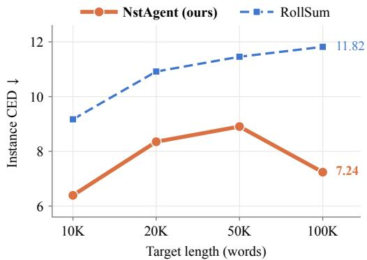
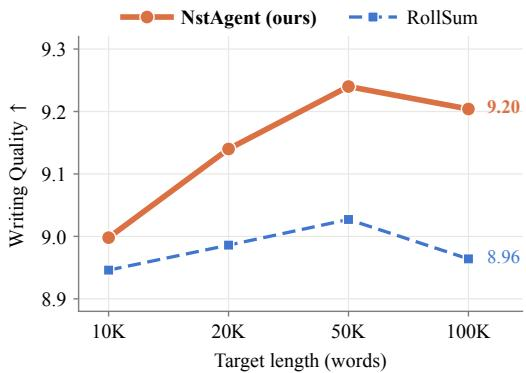
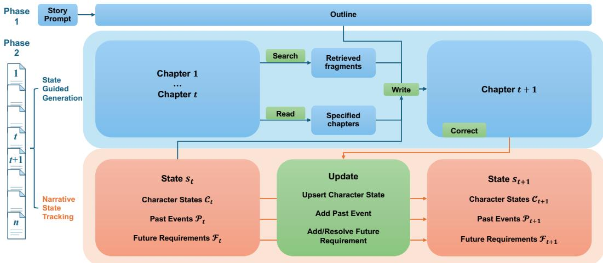
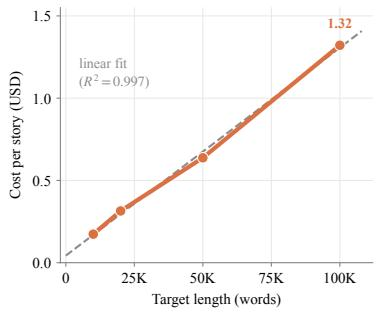

# SCALING LONG-FORM STORY GENERATION VIA NARRATIVE STATE TRACKING

Zhennan Wan, Jianfei Chen

Dept. of Comp. Sci. and Tech., Institute for AI, BNRist Center, THBI Lab, Tsinghua-Bosch Joint ML Center, Tsinghua University wanzn26@mails.tsinghua.edu.cn, jianfeic@tsinghua.edu.cn

## ABSTRACT

LLMs have demonstrated strong capabilities in creative writing. However, scaling them to full-length novels remains challenging, as maintaining narrative consistency becomes increasingly difficult. Existing story-generation methods typically focus on stories of up to about ten thousand words, leaving their ability to scale to full-length novels underexplored. In this work, we introduce Narrative State Tracking Agent (NSTAGENT), a training-free agentic framework that allows LLMs to track a structured narrative state including characters, past events and future requirements. We extend an existing benchmark to compare narrative consistency across lengths, and use it together with a writing-quality benchmark to systematically evaluate stories ranging from 10K to 100K words. We show that NSTAGENT achieves better narrative consistency and writing quality as stories grow longer, and neither of them degrades noticeably as length increases, suggesting that it provides an effective approach to scaling story generation toward full-length novels. <sup>1</sup>



  
Figure 1: Instance CED (left, lower is better) and writing quality (right, higher is better) of NSTA-GENT and RollSum on DeepSeek-V4-Flash as the target length grows from 10K to 100K words.

## 1 INTRODUCTION

Recently, the output length of LLMs has grown from a few thousand words to tens of thousands (OpenAI, 2025; Anthropic, 2025; Qwen Team, 2025). However, writing a novel is not the same as simply emitting a long output. As a story grows longer, its characters, events, and foreshadowings accumulate roughly linearly, yet every newly generated passage must remain compatible with all previously established constraints. The burden of maintaining consistency therefore grows superlinearly with length and becomes the bottleneck of long-form story writing. We refer to this as the length scaling problem of long-form story generation, where scaling denotes the extension of output length.

A straightforward approach is to train longer-writing models to extend the effective writing length (Bai et al., 2025b; Wu et al., 2026a), but high-quality writing data at still greater lengths is extremely scarce and provides little effective supervision, and the training cost increases quadratically, so the marginal cost of scaling further is high. To avoid this, more works turn to hierarchical generation, and most such works decompose writing into two stages: (i) generating a story outline, and (ii) generating the story chapter by chapter conditioned on the outline (Yang et al., 2022; 2023; Mirowski et al., 2023). An outline supplies global structure, but it is static and coarse-grained: concrete settings that emerge during chapter generation cannot constrain subsequent chapters. Memory-based methods reuse the preceding text, whether by retrieval (Zhou et al., 2023), by compression (Xia et al., 2025), or by feeding the full history back into the model (Wu et al., 2026b); others resort to knowledge graphs (Wang et al., 2025a; Li et al., 2025), which are costly to construct and maintain. We discuss these approaches further in Section 3.2.

Therefore, we study the question: how can long-form story generation be scaled? We argue that a viable solution must satisfy three requirements at once: (i) the generation process is reliable and its total cost grows approximately linearly with length; (ii) narrative consistency does not degrade appreciably as length grows; and (iii) writing quality is not sacrificed to these constraints. Answering this question presupposes an evaluation protocol that is comparable across lengths. For writing quality, we adopt WritingBench (Wu et al., 2025b). For narrative consistency, we build on ConStory-Bench (Li et al., 2026), which mainly targets stories of up to 10K words. On much longer stories, the number of errors a judge reports does not grow in proportion to length, so this density underestimates errors and cannot be compared across lengths. We revise this benchmark so that narrative consistency can be evaluated at substantially longer scales and compared across different lengths.

A long-standing view in narratology holds that a narrative text records the transition of a system from one state to another (Todorov, 1977). Building on this view, as well as a systematic analysis of the limitations of previous methods, we propose NSTAGENT, a training-free agentic framework that formulates long-form story generation as controlled, autonomous transitions over an explicit narrative state. Unlike free-form textual memory, the state maintained by NSTAGENT is structured, typed, compact, and comprises three components: character states, events that have already occurred, and pending narrative promises, including foreshadowings, suspense, and explicit commitments. For each chapter, NSTAGENT generates the prose conditioned on the current state and then immediately updates the narrative state, thereby tracking the narrative state throughout generation and better preserving narrative consistency.

In summary, our main contributions are as follows:

• We characterize long-form story generation as a scaling problem along output length, and extend an existing narrative consistency benchmark so that it covers stories of up to 100K words and remains comparable across lengths.

• We propose NSTAGENT, a training-free agentic framework that maintains narrative consistency by explicitly tracking narrative state including characters, past events and future requirements, with a total cost that grows approximately linearly with length.

• We conduct a systematic evaluation across multiple LLMs over the 10K–100K word range. Experiments show that NSTAGENT achieves better narrative consistency and writing quality as stories grow longer, and neither of them degrades noticeably as length increases.

## 2 RELATED WORK

Training longer-writing models. LongWriter (Bai et al., 2025b) and Self-Lengthen (Quan et al., 2024) fine-tune models on synthesized long outputs, and LongWriter-Zero (Wu et al., 2026a) use reinforcement learning to extend what a single call can write. The whole story must still fit into one generation, long outputs remain volatile in length (He et al., 2026), and supervision for novel-length text is scarce. NSTAGENT is complementary to these methods and requires no training.

Hierarchical generation. Plan-then-write pipelines date back to hierarchical story generation (Fan et al., 2018; Yao et al., 2019) and outline-conditioned generation with plot states (Rashkin et al., 2020). With LLMs, $\mathrm { R e ^ { 3 } }$ (Yang et al., 2022) and DOC (Yang et al., 2023) recursively expand and revise outlines, later work controls pacing, suspense, or actions (Wang et al., 2023; Xie & Riedl, 2024; Pei et al., 2024), and multi-agent systems distribute planning, writing, and critique across roles (Huot et al., 2025; Bae & Kim, 2024; Chen et al., 2026b). The outline, however, is fixed before any chapter is written, so details introduced during writing do not constrain later chapters.

Memory-based generation. Memory-based methods reuse earlier text through retrieval (Zhou et al., 2023), compression (Xia et al., 2025), or full-text refinement (Wu et al., 2026b), or maintain knowledge graphs of entities and events (Wang et al., 2025a; Li et al., 2025); general-purpose agent memories follow similar designs (Park et al., 2023; Packer et al., 2023; Zhong et al., 2024; Xu et al., 2025; Rasmussen et al., 2025). Closer to our work, FactTrack (Lyu et al., 2025) tracks time-aware world facts, SCORE (Yi et al., 2026) and CHIRON (Gurung & Lapata, 2024) maintain character and event representations, Octopus (Wang et al., 2026b) binds persistent character and event memories to the writing context, and the Narrative World Model (Saifullah et al., 2026) organizes write memory around narratological categories. DeepWriter (Wang et al., 2026a) reaches book length, but it writes information-rich non-fiction grounded in retrieved external knowledge rather than novels. NSTAGENT differs from these methods in the following ways: its state records prospective obligations alongside retrospective facts, the writer updates the state through a typed tool and can search fragments or read source chapters on demand, and we study how consistency changes as the same protocol scales from 10K to 100K words.

Evaluation. Story evaluation has moved from reference-based metrics and human ratings (Guan et al., 2021; Chhun et al., 2022) toward LLM judges (Zheng et al., 2023; Liu et al., 2023; Chhun et al., 2024). For writing quality, WritingBench (Wu et al., 2025b) scores responses against queryspecific criteria, and recent benchmarks target book-length narratives (Yang & Jin, 2025; Wang et al., 2025b; Fein et al., 2026). For consistency, ConStory-Bench (Li et al., 2026) asks a judge to enumerate evidence-grounded contradictions in five categories and nineteen subtypes and reports their density per 10K words; related work detects plot holes (Ahuja et al., 2025) and checks commitments in interactive narratives (Ma et al., 2026a). Because judges have limited recall over very long contexts (Liu et al., 2024; Chen et al., 2026a), Section 3.3 extends ConStory-Bench so that consistency can be evaluated at longer lengths and remains comparable across lengths.

## 3 SCALING LONG-FORM STORY GENERATION

## 3.1 PROBLEM FORMULATION

Task. Given a story prompt p and target length L, the goal is to generate a long-form story S by workflow π with LLM θ:

$$
S = \pi _ { \theta } ( p , L )\tag{1}
$$

Objective. The objective is to maximize the quality of the generated story $s$ with respect to the story prompt p and target length L:

$$
\operatorname* { m a x } _ { \pi _ { \theta } } \mathbb { E } _ { p , L } [ Q ( S ) ] \quad { \mathrm { w i t h ~ f i x e d } } \quad \theta\tag{2}
$$

Quality and cost. We instantiate $Q$ with two complementary judgments, narrative consistency $Q _ { \mathrm { c o n } }$ and writing quality $Q _ { \mathrm { w q } } .$ , and do not collapse them into a single score. It is preferred to improve $\mathbb { E } _ { p , L } [ Q _ { \mathrm { c o n } } \mathbf { \bar { ( } } S ) _ { . } ^ { \cdot }$ ] and $\mathbb { E } _ { p , L } ^ { \star } [ Q _ { \mathrm { w q } } ( S ) ]$ simultaneously, subject to

$$
| S | \in [ ( 1 - \epsilon ) L , ( 1 + \epsilon ) L ] , \qquad \mathrm { C o s t } ( \pi _ { \theta } , L ) = O ( L ) ,\tag{3}
$$

where $| S |$ is the word count and ϵ is the allowable relative error in word count. In this work, we set ϵ to 0.2 in all experiments. Length scaling asks whether a single workflow $\pi _ { \theta }$ can satisfy these requirements as L grows without changing θ.

<table><tr><td>Method</td><td>Memory Type</td><td>Update Type</td><td>Access</td><td>Future Obligations</td><td>Context per Chapter</td></tr><tr><td>Direct</td><td></td><td></td><td></td><td></td><td>Prompt only</td></tr><tr><td>DOME</td><td>Structured</td><td>Incremental</td><td>Passive</td><td>No</td><td>Outline; retrieved triples</td></tr><tr><td>StoryWriter</td><td>Free-text</td><td>Rewrite</td><td>Passive</td><td>No</td><td>Event plan; compressed history</td></tr><tr><td>RollSum</td><td>Free-text</td><td>Rewrite</td><td>Passive</td><td>Implicit</td><td>Outline; summary</td></tr><tr><td>NSTAGENT</td><td>Structured</td><td>Incremental</td><td>Active</td><td>Explicit</td><td>Outline; state</td></tr></table>

Table 1: Memory design of the compared methods. Rewrite regenerates the memory after each chapter, whereas incremental updates add or replace individual entries. Passive memory is supplied to the writer by the pipeline; active memory lets the writer decide what to read or search. Direct writes the whole story in a single call.

## 3.2 SCALING CHALLENGES OF EXISTING METHODS

We examine three representative families (Table 1) along the axes that become binding as L grows: the cost of each generation step, whether information needed by later chapters survives, and whether the pipeline can reliably reach the target length.

One-pass generation. Direct generation with long-output models must emit the entire story in a single call, and their main difficulty is simply reaching the requested length. Concretely, in our 10K experiments, only 21% of first attempts from DeepSeek-V4-Flash and 74% from GPT-5.6 Luna fall inside the ±20% acceptance band and an accepted story costs 1.9 and 1.3 calls on average. Scaling this approach further requires training longer-output models.

Knowledge-graph memory. Knowledge-graph methods such as DOME (Wang et al., 2025a) and STORYTELLER (Li et al., 2025) extract entities and relations as chapters are written and retrieve them before the next one. This provides structure, but maintaining the memory is expensive: entity matching, graph queries, and per-triple LLM calls grow with the history, and even at 10K words DOME issues thousands of memory calls per story (Table 4). The memory is also passive, since the pipeline decides what to retrieve by matching entities rather than by what the writer needs. We compare with DOME, whose released implementation fixes the story to five acts, so we evaluate it only at 10K.

Free-text memory. Rolling summaries and compressed histories (Xia et al., 2025; Chang et al., 2024) keep the context compact at a cost of roughly one extra call per chapter. The summary, however, is an unstructured string that is regenerated rather than edited. Each rewrite must decide which details to keep, details that seemed minor when written are compressed away before a later chapter needs them, and exact facts can silently change between versions (Appendix E). A structured state keeps the same compact footprint but changes how memory is maintained. Its entries are typed and keyed, character snapshots are overwritten rather than paraphrased, open obligations stay listed until they are resolved, and the writer can actively look up the source text when the state is not enough.

## 3.3 LENGTH-COMPARABLE CONSISTENCY EVALUATION

Consistency error density. ConStory-Bench (Li et al., 2026) prompts an LLM judge with a story and one category at a time (characterization, factual detail, narrative style, timeline and plot, world building), and the judge returns contradictions with verbatim evidence under nineteen subtypes. Because longer stories offer more opportunities for error, ConStory-Bench does not score raw counts but the consistency error density (CED), the number of errors per 10K words, averaged over stories:

$$
\mathrm { C E D } = { \frac { E } { W / 1 0 ^ { 4 } } } ,\tag{4}
$$

where E is the error count of a story and W its word count; lower is better. Following its released code, we count $E _ { \mathrm { s u b } }$ , the number of subtypes with at least one reported contradiction, and additionally report $E _ { \mathrm { i n s } } .$ , the total number of reported contradictions. We refer to the resulting metrics as Subtype CED and Instance CED.

  
Figure 2: Overview of NSTAGENT. Our framework first plans a frozen outline from the story prompt, and then writes the story chapter by chapter: in state-guided generation, the model writes chapter t+1 from the outline and state t, optionally searching or reading earlier chapters and correcting errors; in narrative state tracking, the update call turns state t into state t+1.

Length normalization alone is not enough. ConStory-Bench targets stories of 8K–10K words, a range in which the number of reported errors grows roughly in proportion to story length (Li et al., 2026), so dividing by length removes the length bias. This assumption breaks down for much longer stories. When a judge reads an entire 50K- or 100K-word story, the number of contradictions it reports grows far more slowly than the story itself, because it cannot enumerate every contradiction in such a long text (Liu et al., 2024; Chen et al., 2026a). Full-story CED therefore falls as target length grows even when the writing does not improve: for an earlier version of our agent, it dropped by roughly 40% from 20K to 50K words and again from 50K to 100K (Appendix A.1). We instead keep the evaluated span close to the length for which ConStory-Bench was designed.

Fixed-size terminal windows. We insert a scope marker into the story and instruct the judge to report a contradiction only if its later manifestation lies after the marker, while using the entire preceding narrative as evidence. The marker is placed before the last $k \in \{ 1 0 , 7 / 8 , 5 , 4 \}$ chapters for L ∈ {10K, 20K, 50K, 100K}. With 10, 15, 25, and 40 chapters at these lengths, the window covers roughly the final 10K words, so the judge enumerates errors over a span of similar size at every length, while each error is still checked against everything written before it. W is the word count of the window, and the globally defined subtype is still checked over the full story (Appendix B). The modified judge instructions are given in Appendix A.2.

## 4 NSTAGENT

## 4.1 OVERVIEW

As shown in Figure 2, NSTAGENT writes a story in two phases. A planner first produces a premise and a chapter outline $O = \left( o _ { 1 } , \ldots , o _ { T } \right)$ , where each $o _ { t }$ contains a title, a description, and a target word count $w _ { t } ;$ ; the number of chapters is anchored to the target length. The outline is then frozen, and NSTAGENT writes chapters sequentially while maintaining a narrative state $s _ { t } .$ . For each chapter t, the model receives the original prompt $p ,$ the full outline O, and the current state $s _ { t - 1 }$ , writes the chapter $c _ { t }$ with the help of tools, and finally submits a state update $\Delta _ { t }$

$$
( c _ { t } , \Delta _ { t } ) \sim \pi _ { \theta } ( \cdot \mid p , \boldsymbol { O } , s _ { t - 1 } , t ) , \qquad s _ { t } = \mathcal { U } ( s _ { t - 1 } , \Delta _ { t } ) .\tag{5}
$$

The prompt for chapter t contains no earlier chapter text. Earlier prose reaches the model through the state and, on demand, through read and search tools, so the per-chapter context depends on $\left| p \right| + \left| O \right| + \left| s _ { t - 1 } \right|$ rather than on the length already written. Compared with a rolling summary, both see the same prompt and frozen outline, but NSTAGENT carries typed, keyed entries that the model edits explicitly instead of a free-text summary that it rewrites, and it can additionally consult and correct earlier chapters.

Following the narratological views that a narrative is a sequence of state transitions (Todorov, 1977) and that it raises expectations it must later close (Carroll, 2007), the state is bidirectional: it records who the characters currently are and what has happened (retrospective), as well as what the story has promised but not yet delivered (prospective).

## 4.2 STATE-GUIDED GENERATION

Context. The chapter prompt presents, in order, the original story prompt, the full frozen outline, the current narrative state serialized as JSON, the number of completed chapters, and the current task: chapter id, title, description, and the target $w _ { t }$ with the acceptance range. The prompt specifies an execution order: search or find earlier text if needed, write the chapter, correct inconsistencies if necessary, update the state once, and then end (Appendix A.2).

Tools. Generation is a tool-use loop (Yao et al., 2023) with four content tools. read(i) returns the full text of a written chapter i. search(q) splits the query into terms and returns at most a fixed number of sentence windows from earlier chapters ranked by BM25 (Robertson & Zaragoza, 2009). write(t, title, content) submits the complete chapter; the controller counts words and returns feedback whether the count is in the acceptance range, and a rejected draft does not consume the chapter’s single successful write. correct(i, old, new) replaces an exact span in the current or an earlier chapter to fix a factual or continuity error; it is limited per chapter and cannot be used for stylistic polishing. Read and search calls also have fixed budgets.

Length control. Length is enforced only through write. When a draft is rejected, the tool reports its actual word count, the target, and the accepted range, and the model rewrites the chapter. Because every chapter must pass this gate, the total length follows the outline without requiring any single call to produce more than one chapter. A response that stops at the output-token limit is never accepted, even if its visible text happens to fall within the range.

## 4.3 NARRATIVE STATE TRACKING

Narrative State. The narrative state $s _ { t } ~ = ~ ( \mathcal { C } _ { t } , \mathcal { P } _ { t } , \mathcal { F } _ { t } )$ has three typed collections. Character states $\mathcal { C } _ { t }$ map a character name to a snapshot of that character’s current location, goal, relationships, knowledge, possessions, and physical or emotional condition (Rashkin et al., 2018; Gurung & Lapata, 2024). Past events $\mathcal { P } _ { t }$ are keyed records of completed events that are not explicit in the outline and may affect later plot. Future requirements $\mathcal { F } _ { t }$ are keyed, unresolved obligations that later chapters must fulfill, such as a planted clue, an unanswered question, or a promised confrontation (Xie & Riedl, 2024; Carroll, 2007).

Tracking. After the chapter is accepted, the model calls update exactly once with four native JSON arrays, $\begin{array} { r c l } { \Delta _ { t } } & { = } & { ( \Delta _ { t } ^ { \mathscr { C } } , \bar { \Delta _ { t } ^ { \mathscr { P } } } , \Delta _ { t } ^ { \mathscr { F } + } , \Delta _ { t } ^ { \mathscr { F } - } ) } \end{array}$ : upsert character state (name, description); add past event (key, description); add future requirement (key, description); and resolve future requirement (keys). The transition U applies them atomically:

$$
\begin{array} { r } { \mathcal { C } _ { t } = \mathcal { C } _ { t - 1 } \triangleleft \Delta _ { t } ^ { \mathcal { C } } , \qquad \mathcal { P } _ { t } = \mathcal { P } _ { t - 1 } \cup \Delta _ { t } ^ { \mathcal { P } } , \qquad \mathcal { F } _ { t } = \left( \mathcal { F } _ { t - 1 } \cup \Delta _ { t } ^ { \mathcal { F } + } \right) \setminus \Delta _ { t } ^ { \mathcal { F } - } , } \end{array}\tag{6}
$$

where ◁ replaces the entry of an existing name and inserts a new one otherwise. Empty arrays are passed when a collection does not change.

Design choices. We encode the operation in the field name rather than asking the model to choose a collection, an operation, and a numeric id for every change. Characters are overwritten as complete snapshots, so they do not accumulate stale copies. Past events are filtered by the rule that the outline does not already state them, which keeps planned content out of the state. Requirements are resolved by stable keys the model itself chose. The detailed semantics of each field appear in the chapter prompt, while the tool schema only enforces structure.

<table><tr><td>Model</td><td>Method</td><td>Subtype CED (↓)</td><td>Instance CED (↓)</td><td>Writing Quality (↑)</td><td>Avg. Words</td></tr><tr><td rowspan="5">DeepSeek-V4-Flash</td><td>Direct</td><td>6.225</td><td>9.293</td><td>8.705</td><td>9,416</td></tr><tr><td>DOME</td><td>9.607</td><td>16.765</td><td>4.870</td><td>9,990</td></tr><tr><td>StoryWriter</td><td>7.395</td><td>11.803</td><td>7.353</td><td>9,830</td></tr><tr><td>RoliSum</td><td>5.981</td><td>9.171</td><td>8.946</td><td>10,186</td></tr><tr><td>NSTAGENT</td><td>4.541</td><td>6.392</td><td>8.998</td><td>11,365</td></tr><tr><td rowspan="5">GPT-5.6 Luna</td><td>Direct</td><td>5.428</td><td>7.961</td><td>9.233</td><td>9,721</td></tr><tr><td>DOME</td><td>6.861</td><td>11.419</td><td>6.950</td><td>10,080</td></tr><tr><td>StoryWriter</td><td>5.163</td><td>7.679</td><td>8.408</td><td>10,304</td></tr><tr><td>RollSum</td><td>4.638</td><td>6.653</td><td>9.228</td><td>10,909</td></tr><tr><td>NSTAGENT</td><td>4.852</td><td>6.826</td><td>9.258</td><td>11,155</td></tr></table>

Table 2: Results on 10K. Best in bold, second best underlined; average word counts are not ranked.

State size. Character snapshots grow with the cast rather than the text, and requirements are removed once fulfilled. Past events accumulate but remain far shorter than the prose: even at 100K words, a final state holds about a dozen characters, fewer than ten open requirements, and past events amounting to a small fraction of the story (Appendix A.1). Since each chapter prompt contains the outline and the state but not earlier prose, and chapter length is fixed by the outline, the number of calls and generated tokens grow approximately linearly with the length of the novel.

## 5 EXPERIMENTS

## 5.1 SETTINGS

Data. We draw 100 English prompts from the generation task of ConStory-Bench (Li et al., 2026). Every prompt is written at target lengths of 10K, 20K, and 50K words; because judging 100K-word stories is costly, the 100K setting uses 50 prompts. DOME is evaluated on 20 prompts due to its high cost.

Backbones. We use two backbones from different model families, DeepSeek-V4-Flash and GPT-5.6 Luna, each in its default reasoning mode. Within a backbone, the same model plans, writes, and, for RollSum, summarizes. For every backbone, prompt, and target length, a premise and chapter outline are generated once and frozen, and all chapter-based methods read the same plan.

Baselines. At 10K words, we compare NSTAGENT with four baselines covering the families in Section 3.2. (i) Direct generates the whole story in a single call. (ii) DOME (Wang et al., 2025a) writes chapters from a dynamic outline with knowledge-graph memory, and (iii) StoryWriter (Xia et al., 2025) writes events with multiple agents and a compressed history; both follow their released pipelines. (iv) RollSum reads the same frozen outline as NSTAGENT, writes each chapter as plain text, and rewrites a summary after every chapter, so the next chapter sees only that summary. Because the other baselines cannot reliably reach longer targets, the comparison from 10K to 100K words is between NSTAGENT and RollSum. All methods share the same word-counting rule and a ±20% length gate, applied per chapter for chapter-based methods and per story otherwise; configurations are listed in Appendix A.1.

Evaluation. We measure consistency with the extended ConStory-Bench of Section 3.3, reporting Subtype CED and Instance CED, and writing quality with WritingBench (Wu et al., 2025b), reporting the mean score over its five query-specific criteria on a 1–10 scale. Both benchmarks use DeepSeek-V4-Pro as the judge. A story is scored only if it is complete, all its chapters pass the length gate, and every judgment finishes; details are in Appendix A.1. Appendix B verifies that the judge’s recall does not decay over a 100K-word prefix.

## 5.2 RESULTS AND ANALYSIS

Performance on 10K. Table 2 compares all methods at 10K words, and Tables 10 and 11 break the results down by error category. On both backbones, NSTAGENT and RollSum are more consistent than Direct, DOME, and StoryWriter, and Direct, RollSum, and NSTAGENT write better than

<table><tr><td>Model</td><td>Method</td><td>Target Length</td><td>Subtype CED (↓)</td><td>Instance CED (↓)</td><td>Writing Quality (↑)</td><td>Avg. Words</td></tr><tr><td rowspan="7">DeepSeek-V4-Flash</td><td rowspan="5">RollSum</td><td>10K</td><td>5.981</td><td>9.171</td><td>8.946</td><td>10,186</td></tr><tr><td>20K</td><td>6.761</td><td>10.917</td><td>8.986</td><td>20,187</td></tr><tr><td>50K</td><td>7.162</td><td>11.458</td><td>9.027</td><td>51,332</td></tr><tr><td>100K</td><td>7.239</td><td>11.820</td><td>8.964</td><td>100,470</td></tr><tr><td>10K</td><td>4.541</td><td>6.392</td><td>8.998</td><td>11,365</td></tr><tr><td>20K</td><td>5.382</td><td>8.350</td><td>9.140</td><td>22,673</td></tr><tr><td rowspan="5">RollSum</td><td>NSTAGENT 50K 100K</td><td>5.793</td><td>8.906</td><td>9.240</td><td>55,219</td></tr><tr><td></td><td>4.859</td><td>7.239</td><td>9.204</td><td>108,295</td></tr><tr><td>10K</td><td>4.638</td><td>6.653</td><td>9.228</td><td>10,909</td></tr><tr><td>20K</td><td>6.057</td><td>8.972</td><td>9.166</td><td>20,573</td></tr><tr><td>50K</td><td>6.014</td><td>9.095</td><td>9.196</td><td>50,696</td></tr><tr><td rowspan="5">GPT-5.6 Luna</td><td rowspan="5">NSTAGENT</td><td>100K</td><td>5.765</td><td>9.369</td><td>9.064</td><td>100,773</td></tr><tr><td>10K</td><td>4.852</td><td>6.826</td><td>9.258</td><td>11,155</td></tr><tr><td>20K</td><td>5.193</td><td>7.698</td><td>9.216</td><td>22,076</td></tr><tr><td>50K</td><td>5.271</td><td>7.695</td><td>9.210</td><td>48,748</td></tr><tr><td>100K</td><td>4.887</td><td>7.218</td><td>9.244</td><td>94,798</td></tr></table>

Table 3: Results from 10K to 100K. Better of the two methods at each length in bold. 10K–50K use the 100 English prompts and 100K uses 50 of them.

DOME and StoryWriter, with NSTAGENT achieving the highest writing quality. On DeepSeek-V4- Flash, NSTAGENT is the most consistent by a clear margin. On GPT-5.6 Luna, NSTAGENT and RollSum are at parity: RollSum’s instance CED is 2.5% lower, but the difference is not significant (Appendix C.4). We attribute this to the length: 10K words are short enough for a strong model to keep most of the narrative state in a free-text summary, so explicit tracking has little room to help. The next paragraph shows that this parity is specific to 10K.

Performance from 10K to 100K. Table 3 and Figure 1 extend the comparison with RollSum to 100K words, and Tables 12 and 13 break it down by error category. From 20K to 100K words, NSTAGENT is more consistent and writes better than RollSum on both backbones, and its advantage becomes more pronounced as stories grow longer. On DeepSeek-V4-Flash, NSTAGENT is more consistent than RollSum at every length, with the largest margin at 100K. On GPT-5.6 Luna, the two methods are comparable at 10K, but NSTAGENT’s advantage then grows steadily, lowering instance CED by 1.27, 1.40, and 2.15 at 20K, 50K, and 100K. Even a stronger backbone therefore struggles to maintain the narrative state in free-text memory as stories grow much longer, and explicit narrative state tracking substantially mitigates this.

Within NSTAGENT, neither consistency nor writing quality degrades markedly as stories grow. Writing quality stays high on both backbones and on DeepSeek-V4-Flash even rises with length, possibly because longer stories develop richer plots. Error density also stays within a narrow range across lengths, rising only slightly beyond 10K and falling back at 100K. Part of this drop may come from judging 100K-word stories, although the injection study of Appendix B.1 finds no loss of recall for explicit contradictions; either way, NSTAGENT maintains the narrative state and its consistency over very long stories.

Generalization across backbones. DeepSeek-V4-Flash and GPT-5.6 Luna come from different providers and use the same agent loop very differently: DeepSeek-V4-Flash reasons at length and frequently reads and searches earlier chapters, whereas GPT-5.6 Luna produces several times fewer tokens, rarely searches, and relies mostly on the state it maintains (Appendix A.1). With the same prompts, tools, and state schema, the gains above hold on both. That they persist when one backbone barely uses retrieval, and that removing all lookback tools still leaves NSTAGENT ahead of RollSum (Table 5), suggests that the benefit comes mainly from tracking the narrative state rather than from a particular tool-use strategy. The same loop also runs on a small open-weight model and can be further optimized with reinforcement learning (Appendix D).

Efficiency. Table 4 and Figure 3 report the cost of one story on DeepSeek-V4-Flash, measured from the usage field of every API call. The cost of NSTAGENT grows approximately linearly with length: calls per chapter stay nearly constant, and the price per 10K words written stays between USD 0.13 and 0.17. RollSum costs about the same but spends its budget differently. NSTAGENT sends far more input, because every turn resends the state, yet about 60% of it is served from the provider’s cache at roughly a thirtieth of the uncached price; RollSum’s cost is dominated by output, because it regenerates a long summary, with reasoning, after every chapter. At 10K words, Direct is by far the cheapest but cannot reach longer targets, and DOME is the most expensive, taking about 3,500 calls per story to maintain its knowledge graph. Under prefix caching, tracking an explicit state therefore costs about as much as free-text memory at every length we test (Appendix F). Tool usage and state size are in Appendix A.1.

<table><tr><td>Method</td><td>Length</td><td>Calls</td><td>Input Tokens</td><td>Cached Input</td><td>Output Tokens</td><td>Cost (USD)</td></tr><tr><td rowspan="3">Direct StoryWriter</td><td>10K</td><td>2</td><td>8.6K</td><td>0.0K</td><td>32.5K</td><td>0.02</td></tr><tr><td>10K</td><td>26</td><td>108.0K</td><td>62.3K</td><td>91.2K</td><td>0.07</td></tr><tr><td>10K</td><td>3,501</td><td>1,719.1K</td><td>0.2K</td><td>580.4K</td><td>0.76</td></tr><tr><td rowspan="4">RollSum</td><td>10K</td><td>40</td><td>209.7K</td><td>86.7K</td><td>252.2K</td><td>0.19</td></tr><tr><td>20K</td><td>56</td><td>386.5K</td><td>162.6K</td><td>473.0K</td><td>0.36</td></tr><tr><td>50K</td><td>93</td><td>867.2K</td><td>383.1K</td><td>775.7K</td><td>0.62</td></tr><tr><td>100K</td><td>171</td><td>2,314.5K</td><td>1,162.2K</td><td>1,710.6K</td><td>1.39</td></tr><tr><td rowspan="4">NSTAGENT</td><td>10K</td><td>68</td><td>711.7K</td><td>413.0K</td><td>159.1K</td><td>0.17</td></tr><tr><td>20K</td><td>104</td><td>1,466.1K</td><td>882.8K</td><td>273.0K</td><td>0.31</td></tr><tr><td>50K</td><td>161</td><td>3,174.1K</td><td>1,856.6K</td><td>507.4K</td><td>0.64</td></tr><tr><td>100K</td><td>259</td><td>7,499.4K</td><td>4,495.2K</td><td>953.2K</td><td>1.32</td></tr></table>



Table 4: Average generation cost per story on DeepSeek-V4- Flash, measured from the usage field of every API call on the first five prompts and averaged over completed stories. Output tokens include reasoning tokens, and cached input is the part of the input served from the provider’s cache. Cost uses offpeak prices of USD 0.22, 0.007, and 0.66 per million uncached input, cached input, and output tokens.  
Figure 3: Cost of NSTAGENT per story against target length, from the NSTAGENT rows of Table 4. Cost grows almost linearly with length, and the price per 10K words written stays between USD 0.13 and 0.17.
<table><tr><td>Variant</td><td>Subtype CED (↓)</td><td>Instance CED (↓)</td><td>Writing Quality (↑)</td><td>Reads and searches per story</td></tr><tr><td>NSTAGENT</td><td>5.382</td><td>8.350</td><td>9.140</td><td>31.4</td></tr><tr><td>-State</td><td>5.902</td><td>9.400</td><td>9.046</td><td>52.9</td></tr><tr><td>-Lookback</td><td>6.577</td><td>9.786</td><td>8.980</td><td></td></tr><tr><td>RollSum (reference)</td><td>6.761</td><td>10.917</td><td>8.986</td><td></td></tr></table>

Table 5: Ablations on DeepSeek-V4-Flash at 20K words. −State removes the narrative state, its update tool, and the state-maintenance guidance; −Lookback removes the read, search, and correct tools. RollSum is shown for reference.

Ablation study. Table 5 removes each of NSTAGENT’s two memory channels on DeepSeek-V4- Flash at 20K words, and Table 14 breaks the results down by error category. Here, −State deletes the narrative state and its update tool, and −Lookback the read, search, and correct tools. Removing either channel makes stories significantly less consistent and lowers writing quality (Table 16). Without the state, the writer reads and searches earlier chapters far more often, yet still makes more errors, most visibly in timeline and plot and in plot threads that are opened but never closed, which are exactly what the state records. Without lookback, errors rise further, particularly in factual details and timelines, which require checking the exact wording of earlier chapters rather than a summary of them. Both variants still outperform RollSum, and the full agent outperforms both, so the two channels are complementary.

## 6 CONCLUSION AND FUTURE WORK

We framed long-form story generation as a length scaling problem and made narrative consistency comparable across lengths by measuring error density over fixed-size terminal windows. We pro posed NSTAGENT, a training-free agent that writes chapter by chapter while tracking a typed narrative state of characters, past events, and future requirements through tools. From 10K to 100K words and on two backbones, it reaches the target length, keeps writing quality and narrative consistency stable, and improves over free-text memory by a margin that grows with length. These results suggest that NSTAGENT provides an effective approach to scaling story generation toward full-length novels. Building on the length-comparable evaluation and the narrative state tracking framework, future work can explore richer state representations, better revision mechanisms, and fine-tuning the backbone to track narrative state.

## AI USE STATEMENT

In this work, we used generative AI tools to implement the proposed method and baselines in code and to translate parts of the manuscript. We have not used generative AI tools to develop the conceptual framework, propose or refine hypotheses, design or provide feedback on the methodology or experiments, clean or reformat datasets, or interpret results, and synthetic data generation, mathematical claims, proofs, and qualitative data analysis are not applicable to this work. Additionally, we used generative AI tools to write and edit software code, identify relevant literature, and edit the manuscript to improve its readability. We have reviewed all AI-assisted work: the authors revised all AI-assisted text and translations, checked every suggested reference, and inspected and tested all AI-assisted code. We take responsibility for the final content of this work, including text, claims, code, and artifacts produced with the aid of generative AI.

## ETHICS STATEMENT

This work involves no human subjects and no personal data; the prompts come from the public ConStory-Bench generation task (Li et al., 2026), and all evaluated texts are fiction generated by language models. All scores come from LLM judges, which can carry stylistic biases (Zheng et al., 2023), and the judge shares a model family with one backbone, which may favor its outputs (Panickssery et al., 2024); we therefore report results on two backbones from different providers and discuss the judge’s precision in Appendix F. The generated stories are unfiltered and may inherit biases of their backbones, so they should be reviewed before any publication. Cheaper book-length generation could also be misused to mass-produce low-quality or deceptive text. We report the monetary cost of every setting in Table 4.

## REPRODUCIBILITY STATEMENT

Section 4 specifies the narrative state, tools, and update rule, and Section 3.3 the evaluation protocol. Appendix A.1 lists generation, baseline, and judging settings, Appendix A.2 gives all prompts, and Appendix C.4 the statistical procedure. Our repository contains the code of NSTAGENT, the baselines and our patch to the released StoryWriter, both benchmarks, and the RL study (Appendix D); the frozen outlines and WritingBench criteria shared by all methods; the generated stories; and the judge output of every evaluated story. Its scripts recompute every table and figure from these files and check each case-study quotation (Appendix E). Because backbones and judges are commercial APIs that may change over time, individual stories and scores cannot be reproduced exactly.

## REFERENCES

Kabir Ahuja, Melanie Sclar, and Yulia Tsvetkov. Finding flawed fictions: Evaluating complex reasoning in language models via plot hole detection. In COLM 2025, 2025. URL https: //arxiv.org/abs/2504.11900.

Anthropic. System card: Claude Opus 4 & Claude Sonnet 4. Anthropic, May 2025. URL https://www-cdn.anthropic.com/ 4263b940cabb546aa0e3283f35b686f4f3b2ff47.pdf.

Minwook Bae and Hyounghun Kim. Collective critics for creative story generation. In EMNLP 2024, pp. 18784–18819, 2024. doi: 10.18653/v1/2024.emnlp-main.1046. URL https:// aclanthology.org/2024.emnlp-main.1046/.

Yushi Bai, Shangqing Tu, Jiajie Zhang, Hao Peng, Xiaozhi Wang, Xin Lv, Shulin Cao, Jiazheng Xu, Lei Hou, Yuxiao Dong, Jie Tang, and Juanzi Li. LongBench v2: Towards deeper understanding and reasoning on realistic long-context multitasks. In ACL 2025, pp. 3639–3664, 2025a. URL https://aclanthology.org/2025.acl-long.183/.

Yushi Bai, Jiajie Zhang, Xin Lv, Linzhi Zheng, Siqi Zhu, Lei Hou, Yuxiao Dong, Jie Tang, and Juanzi Li. LongWriter: Unleashing 10,000+ word generation from long context LLMs. In ICLR 2025, 2025b. URL https://openreview.net/forum?id=kQ5s9Yh0WI.

Noel Carroll. Narrative closure.¨ Philosophical Studies, 135(1):1–15, 2007. doi: 10.1007/ s11098-007-9097-9. URL https://doi.org/10.1007/s11098-007-9097-9.

Yapei Chang, Kyle Lo, Tanya Goyal, and Mohit Iyyer. BooookScore: A systematic exploration of book-length summarization in the era of LLMs. In ICLR 2024, 2024. URL https://arxiv. org/abs/2310.00785.

Junjie Chen, Yuxi Dong, Haitao Li, Weihang Su, Yujia Zhou, Min Zhang, Yiqun Liu, and Qingyao Ai. Benchmarking LLM-as-a-judge for long-form output evaluation. In EMNLP 2026, 2026a. URL https://arxiv.org/abs/2606.01629.

Zehao Chen, Rong Pan, and Haoran Li. StoryBox: Collaborative multi-agent simulation for hybrid bottom-up long-form story generation using large language models. In Proceedings of the AAAI Conference on Artificial Intelligence, volume 40, pp. 30359–30367, 2026b. doi: 10. 1609/aaai.v40i36.40288. URL https://ojs.aaai.org/index.php/AAAI/article/ view/40288.

Cyril Chhun, Pierre Colombo, Fabian M. Suchanek, and Chloe Clavel. Of human criteria and´ automatic metrics: A benchmark of the evaluation of story generation. In COLING 2022, pp. 5794–5836, 2022. URL https://aclanthology.org/2022.coling-1.509/.

Cyril Chhun, Fabian M. Suchanek, and Chloe Clavel. Do language models enjoy their own stories?´ Prompting large language models for automatic story evaluation. Transactions ofthe Association for Computational Linguistics, 12:1122–1142, 2024. doi: 10.1162/tacl a 00689. URL https: //aclanthology.org/2024.tacl-1.62/.

Hanwen Cui, Yuting Mei, Yuhang Fu, Dingyi Yang, and Qin Jin. StoryLens: Preference-aligned story rewriting via context-aware narrative enrichment. arXiv:2605.28073, 2026. URL https: //arxiv.org/abs/2605.28073.

Thennal DK and Hans Ole Hatzel. Do large language models always tell the same stories? arXiv:2606.17350, 2026. URL https://arxiv.org/abs/2606.17350.

Angela Fan, Mike Lewis, and Yann Dauphin. Hierarchical neural story generation. In ACL 2018, pp. 889–898, 2018. doi: 10.18653/v1/P18-1082. URL https://aclanthology.org/ P18-1082/.

Daniel Fein, Sebastian Russo, Violet Xiang, Kabir Jolly, Rafael Rafailov, and Nick Haber. LitBench: A benchmark and dataset for reliable evaluation of creative writing. In Proceedings of the 19th Conference of the European Chapter of the Association for Computational Linguistics (Volume 1: Long Papers), pp. 7740–7755, 2026. doi: 10.18653/v1/2026.eacl-long.362. URL https: //aclanthology.org/2026.eacl-long.362/.

Hanwen Gu, Chao Guo, Junle Wang, Wenda Xie, and Yisheng Lv. Planning beyond text: Graphbased reasoning for complex narrative generation. In Findings ofACL 2026, pp. 37579–37610, 2026. doi: 10.18653/v1/2026.findings-acl.1874. URL https://aclanthology.org/ 2026.findings-acl.1874/.

Jian Guan, Zhexin Zhang, Zhuoer Feng, Zitao Liu, Wenbiao Ding, Xiaoxi Mao, Changjie Fan, and Minlie Huang. OpenMEVA: A benchmark for evaluating open-ended story generation metrics. In ACL-IJCNLP 2021, pp. 6394–6407, 2021. doi: 10.18653/v1/2021.acl-long.500. URL https: //aclanthology.org/2021.acl-long.500/.

Alexander Gurung and Mirella Lapata. CHIRON: Rich character representations in long-form narratives. In Findings of EMNLP 2024, pp. 8523–8547, 2024. doi: 10.18653/v1/2024.findings-emnlp. 499. URL https://aclanthology.org/2024.findings-emnlp.499/.

Zhitao He, Haolin Yang, Rui Min, Zeyu Qin, and Yi R. Fung. On stable long-form generation: Benchmarking and mitigating length volatility. In ICML 2026, 2026. URL https: //openreview.net/forum?id=b2HyJdIZ1F.

Lei Huang, Jiaming Guo, Guanhua He, Xishan Zhang, Rui Zhang, Shaohui Peng, Shaoli Liu, and Tianshi Chen. Ex3: Automatic novel writing by extracting, excelsior and expanding. In ACL 2024, pp. 9125–9146, 2024. doi: 10.18653/v1/2024.acl-long.494. URL https://aclanthology. org/2024.acl-long.494/.

Fantine Huot, Reinald Kim Amplayo, Jennimaria Palomaki, Alice Shoshana Jakobovits, Elizabeth Clark, and Mirella Lapata. Agents’ Room: Narrative generation through multi-step collaboration. In ICLR 2025, 2025. URL https://openreview.net/forum?id=HfWcFs7XLR.

Jiaming Li, Yukun Chen, Ziqiang Liu, Minghuan Tan, Lei Zhang, Yunshui Li, Run Luo, Longze Chen, Jing Luo, Ahmadreza Argha, Hamid Alinejad-Rokny, Wei Zhou, and Min Yang. STORY-TELLER: An enhanced plot-planning framework for coherent and cohesive story generation. In Findings ofACL 2025, pp. 20818–20846, 2025. doi: 10.18653/v1/2025.findings-acl.1071. URL https://aclanthology.org/2025.findings-acl.1071/.

Junjie Li, Xinrui Guo, Yuhao Wu, Roy Ka-Wei Lee, Hongzhi Li, and Yutao Xie. Lost in stories: Consistency bugs in long story generation by LLMs. In Findings ofACL 2026, pp. 8400– 8428, 2026. doi: 10.18653/v1/2026.findings-acl.410. URL https://aclanthology.org/ 2026.findings-acl.410/.

David Y. Liu, Aditya Joshi, and Paul Dawson. Narrative theory-driven LLM methods for automatic story generation and understanding: A survey. arXiv:2602.15851, 2026. URL https: //arxiv.org/abs/2602.15851.

Nelson F. Liu, Kevin Lin, John Hewitt, Ashwin Paranjape, Michele Bevilacqua, Fabio Petroni, and Percy Liang. Lost in the middle: How language models use long contexts. TACL, 12:157–173, 2024. doi: 10.1162/tacl a 00638. URL https://aclanthology.org/2024.tacl-1. 9/.

Yang Liu, Dan Iter, Yichong Xu, Shuohang Wang, Ruochen Xu, and Chenguang Zhu. G-Eval: NLG evaluation using GPT-4 with better human alignment. In EMNLP 2023, pp. 2511–2522, 2023. doi: 10.18653/v1/2023.emnlp-main.153. URL https://aclanthology.org/ 2023.emnlp-main.153/.

Zhiheng Lyu, Kevin Yang, Lingpeng Kong, and Dan Klein. FactTrack: Time-aware world state tracking in story outlines. In NAACL 2025, pp. 2825–2848, 2025. doi: 10.18653/v1/2025. naacl-long.144. URL https://aclanthology.org/2025.naacl-long.144/.

Yingpeng Ma, Jianhao Yan, Bei Shi, Ka Hou Kam, Runnan Wang, Xuebo Liu, Yulong Chen, Yue Zhang, and Derek F. Wong. Can LLM agents stick to the script? Modeling commitment in interactive narratives. In ICML 2026, 2026a. URL https://openreview.net/forum? id=JoJUWsQBp0.

Yuan Ma, Richard Susilo, Patrik Haslum, and Hanna Suominen. Text-to-text automatic story generation: A survey. In Proceedings ofthe 19th Conference ofthe European Chapter ofthe Association for Computational Linguistics (Volume 4: Student Research Workshop), pp. 514–527, 2026b. doi: 10.18653/v1/2026.eacl-srw.39. URL https://aclanthology.org/2026.eacl-srw. 39/.

Katelyn X. Mei, Yi-Li Hsu, Minjoon Choi, Zongwan Cao, Chenjun Xu, Bingbing Wen, Su Lin Blodgett, and Lucy Lu Wang. Illusions of the gold standard: A large-scale analysis of human evaluation protocols for long-form text generation. In ACL 2026, pp. 13939–13961, 2026. doi: 10.18653/v1/2026.acl-long.635. URL https://aclanthology.org/2026. acl-long.635/.

Piotr Mirowski, Kory W. Mathewson, Jaylen Pittman, and Richard Evans. Co-writing screenplays and theatre scripts with language models: Evaluation by industry professionals. In Proceedings of the 2023 CHI Conference on Human Factors in Computing Systems, 2023. doi: 10.1145/ 3544548.3581225. URL https://doi.org/10.1145/3544548.3581225.

OpenAI. GPT-5 system card. OpenAI, August 2025. URL https://cdn.openai.com/ gpt-5-system-card.pdf.

Charles Packer, Sarah Wooders, Kevin Lin, Vivian Fang, Shishir G. Patil, Ion Stoica, and Joseph E. Gonzalez. MemGPT: Towards LLMs as operating systems. arXiv:2310.08560, 2023. URL https://arxiv.org/abs/2310.08560.

Arjun Panickssery, Samuel R. Bowman, and Shi Feng. LLM evaluators recognize and favor their own generations. In NeurIPS 2024, 2024. URL https://arxiv.org/abs/2404.13076.

Joon Sung Park, Joseph C. O’Brien, Carrie J. Cai, Meredith Ringel Morris, Percy Liang, and Michael S. Bernstein. Generative agents: Interactive simulacra of human behavior. In Proceed ings of the 36th Annual ACM Symposium on User Interface Software and Technology (UIST), 2023. doi: 10.1145/3586183.3606763. URL https://doi.org/10.1145/3586183. 3606763.

Keunhyeung Park, Seunguk Yu, Jinhee Jang, Hoejoon Kwon, Byeonggeuk Lim, and Youngbin Kim. Narrative consistency in large language model-generated stories: A survey. IEEE Access, 14: 105794–105819, 2026. doi: 10.1109/ACCESS.2026.3710595. URL https://ieeexplore. ieee.org/document/11595786/.

Jonathan Pei, Zeeshan Patel, Karim El-Refai, and Tianle Li. SWAG: Storytelling with action guidance. In Findings of EMNLP 2024, pp. 14086–14106, 2024. doi: 10.18653/v1/2024. findings-emnlp.824. URL https://aclanthology.org/2024.findings-emnlp. 824/.

Chau Minh Pham, Jenna Russell, Dzung Pham, and Mohit Iyyer. Frankentext: Stitching random text fragments into long-form narratives. In Proceedings of the 64th Annual Meeting of the Association for Computational Linguistics (ACL 2026), pp. 31586–31625, 2026. doi: 10.18653/v1/2026. acl-long.1457. URL https://aclanthology.org/2026.acl-long.1457/.

Shanghaoran Quan, Tianyi Tang, Bowen Yu, An Yang, Dayiheng Liu, Bofei Gao, Jianhong Tu, Yichang Zhang, Jingren Zhou, and Junyang Lin. Language models can Self-Lengthen to generate long texts. arXiv:2410.23933, 2024. URL https://arxiv.org/abs/2410.23933.

Qwen Team. Qwen3 technical report. arXiv preprint arXiv:2505.09388, 2025. URL https: //arxiv.org/abs/2505.09388.

Hannah Rashkin, Antoine Bosselut, Maarten Sap, Kevin Knight, and Yejin Choi. Modeling naive psychology of characters in simple commonsense stories. In ACL 2018, pp. 2289–2299, 2018. doi: 10.18653/v1/P18-1213. URL https://aclanthology.org/P18-1213/.

Hannah Rashkin, Asli Celikyilmaz, Yejin Choi, and Jianfeng Gao. PlotMachines: Outlineconditioned generation with dynamic plot state tracking. In EMNLP 2020, pp. 4274–4295, 2020. doi: 10.18653/v1/2020.emnlp-main.349. URL https://aclanthology.org/ 2020.emnlp-main.349/.

Hannah Rashkin, Elizabeth Clark, Fantine Huot, and Mirella Lapata. Help me write a story: Evaluating LLMs’ ability to generate writing feedback. In Proceedings ofthe 63rd Annual Meeting ofthe Association for Computational Linguistics (ACL 2025), pp. 25827–25847, 2025. doi: 10.18653/ v1/2025.acl-long.1254. URL https://aclanthology.org/2025.acl-long.1254/.

Preston Rasmussen, Pavlo Paliychuk, Travis Beauvais, Jack Ryan, and Daniel Chalef. Zep: A temporal knowledge graph architecture for agent memory. arXiv:2501.13956, 2025. URL https://arxiv.org/abs/2501.13956.

Stephen Robertson and Hugo Zaragoza. The probabilistic relevance framework: BM25 and beyond. Foundations and Trends in Information Retrieval, 3(4):333–389, 2009. doi: 10.1561/1500000019. URL https://doi.org/10.1561/1500000019.

Mohammad Saifullah, Thomas Kornmaier, Taaha Kazi, Vasu Sharma, Aditya Sanjiv Kanade, and Aanand Kumar Yadav. Narrative World Model: Narratology-grounded writer memory for longform fiction. arXiv:2607.05577, 2026. URL https://arxiv.org/abs/2607.05577.

Zhihong Shao, Peiyi Wang, Qihao Zhu, Runxin Xu, Junxiao Song, Xiao Bi, Haowei Zhang, Mingchuan Zhang, Y. K. Li, Y. Wu, and Daya Guo. DeepSeekMath: Pushing the limits of mathematical reasoning in open language models. arXiv preprint arXiv:2402.03300, 2024. URL https://arxiv.org/abs/2402.03300.

Ge Shi, Kaiyu Huang, and Guochen Feng. Long story generation via knowledge graph and literary theory. arXiv:2508.03137, 2025. URL https://arxiv.org/abs/2508.03137.

Jisu Shin, Juhyun Oh, Eunsu Kim, Hoyun Song, and Alice Oh. Spotting out-of-character behavior: Atomic-level evaluation of persona fidelity in open-ended generation. In Findings of the Association for Computational Linguistics: ACL 2025, pp. 26312–26332, 2025. doi: 10.18653/v1/ 2025.findings-acl.1349. URL https://aclanthology.org/2025.findings-acl. 1349/.

Woojung Song, Nalim Kim, Sangjun Song, Chaewon Heo, Jongwon Lim, and Yohan Jo. ArcANE: Do role-playing language agents stay in character at the right time? In EMNLP 2026, 2026. URL https://arxiv.org/abs/2606.05553.

Kumiko Tanaka-Ishii. Repeated sequences reveal gaps between large language models and natural language. In Proceedings of the 64th Annual Meeting of the Association for Computational Linguistics (ACL 2026), pp. 8367–8382, 2026. doi: 10.18653/v1/2026.acl-long.379. URL https://aclanthology.org/2026.acl-long.379/.

Maria Teleki, Vedangi Bengali, Xiangjue Dong, Sai Tejas Janjur, Haoran Liu, Tian Liu, Cong Wang, Ting Liu, Yin Zhang, Frank Shipman, and James Caverlee. A survey on LLMs for story generation. In Findings of the Association for Computational Linguistics: EMNLP 2025, pp. 13954– 13966, 2025. doi: 10.18653/v1/2025.findings-emnlp.750. URL https://aclanthology. org/2025.findings-emnlp.750/.

Tzvetan Todorov. The Poetics of Prose. Cornell University Press, Ithaca, New York, 1977. URL https://books.google.com/books/about/The\_Poetics\_of\_ Prose.html?id=iJtZAAAAMAAJ.

Saranya Venkatraman, Nafis Irtiza Tripto, and Dongwon Lee. CollabStory: Multi-LLM collaborative story generation and authorship analysis. In Findings of the Association for Computational Linguistics: NAACL 2025, pp. 3665–3679, 2025. doi: 10.18653/v1/2025.findings-naacl.203. URL https://aclanthology.org/2025.findings-naacl.203/.

Ming Wang, Minghao Hu, Xiuli Kang, Li He, Yu Tian, Chunming Liu, Han Shi, Zhunchen Luo, Wei Luo, and Guotong Geng. DeepWriter: A multi-agent collaboration framework for informationrich ultra-long book writing. In Proceedings of the AAAI Conference on Artificial Intelligence, volume 40, pp. 33593–33601, 2026a. doi: 10.1609/aaai.v40i39.40648. URL https://ojs. aaai.org/index.php/AAAI/article/view/40648.

Qianyue Wang, Jinwu Hu, Zhengping Li, Yufeng Wang, Daiyuan Li, Yu Hu, and Mingkui Tan. Generating long-form story using dynamic hierarchical outlining with memory-enhancement. In NAACL 2025, pp. 1352–1391, 2025a. doi: 10.18653/v1/2025.naacl-long.63. URL https: //aclanthology.org/2025.naacl-long.63/.

Wenqing Wang, Mingqi Gao, Xinyu Hu, and Xiaojun Wan. Towards a “novel” benchmark: Evaluating literary fiction with large language models. In Findings ofACL 2025, pp. 21648–21673, 2025b. doi: 10.18653/v1/2025.findings-acl.1114. URL https://aclanthology.org/ 2025.findings-acl.1114/.

Xu Wang, Jiaju Kang, Puyu Han, Zeyu Ai, and Luqi Gong. Octopus: Entropy-controlled science fiction literature generation with persistent memory-context binding. In Proceedings of the AAAI Conference on Artificial Intelligence, volume 40, pp. 40480–40486, 2026b. doi: 10. 1609/aaai.v40i47.41492. URL https://ojs.aaai.org/index.php/AAAI/article/ view/41492.

Yichen Wang, Kevin Yang, Xiaoming Liu, and Dan Klein. Improving pacing in long-form story planning. In Findings of EMNLP 2023, pp. 10788–10845, 2023. doi: 10.18653/v1/2023. findings-emnlp.723. URL https://aclanthology.org/2023.findings-emnlp. 723/.

Yuhao Wu, Ming Shan Hee, Zhiqiang Hu, and Roy Ka-Wei Lee. LongGenBench: Benchmarking long-form generation in long context LLMs. In ICLR 2025, 2025a. URL https: //openreview.net/forum?id=3A71qNKWAS.

Yuhao Wu, Yushi Bai, Zhiqiang Hu, Roy Ka-Wei Lee, and Juanzi Li. LongWriter-Zero: Mastering ultra-long text generation via reinforcement learning. In ICLR 2026, 2026a. URL https: //openreview.net/forum?id=JWx4DI2N8k.

Yuhao Wu, Yushi Bai, Zhiqiang Hu, Juanzi Li, and Roy Ka-Wei Lee. SuperWriter: Reflectiondriven long-form generation with large language models. In Findings of ACL 2026, pp. 8790– 8812, 2026b. doi: 10.18653/v1/2026.findings-acl.428. URL https://aclanthology. org/2026.findings-acl.428/.

Yuning Wu, Jiahao Mei, Ming Yan, Chenliang Li, Shaopeng Lai, Yuran Ren, Zijia Wang, Ji Zhang, Mengyue Wu, Qin Jin, and Fei Huang. WritingBench: A comprehensive benchmark for generative writing. In Advances in Neural Information Processing Systems, volume 38, 2025b. URL https://proceedings.neurips.cc/paper\_files/paper/2025/ hash/4aedf0cba303537fcb6cf948bb41b2df-Abstract-Datasets\_and\_ Benchmarks\_Track.html.

Haotian Xia, Hao Peng, Yunjia Qi, Bin Xu, Juanzi Li, Lei Hou, and Xiaozhi Wang. StoryWriter: A multi-agent framework for long story generation. In CIKM 2025, pp. 6559–6563, 2025. doi: 10.1145/3746252.3761616. URL https://arxiv.org/abs/2506.16445.

Kaige Xie and Mark Riedl. Creating suspenseful stories: Iterative planning with large language models. In EACL 2024, pp. 2391–2407, 2024. doi: 10.18653/v1/2024.eacl-long.147. URL https://aclanthology.org/2024.eacl-long.147/.

Ruibin Xiong, Yimeng Chen, Dmitrii Khizbullin, Mingchen Zhuge, and Jurgen Schmidhuber. Be-¨ yond outlining: Heterogeneous recursive planning for adaptive long-form writing with language models. In EMNLP 2025, pp. 24678–24714, 2025. doi: 10.18653/v1/2025.emnlp-main.1254. URL https://aclanthology.org/2025.emnlp-main.1254/.

Wujiang Xu, Zujie Liang, Kai Mei, Hang Gao, Juntao Tan, and Yongfeng Zhang. A-Mem: Agentic memory for LLM agents. In Advances in Neural Information Processing Systems, volume 38, pp. 17577–17604, 2025. URL https://proceedings.neurips.cc/paper\_files/paper/2025/hash/ 19909c36f51abc4856b4560aff3d36d6-Abstract-Conference.html.

Dingyi Yang and Qin Jin. What matters in evaluating book-length stories? A systematic study of long story evaluation. In ACL 2025, pp. 16375–16398, 2025. doi: 10.18653/v1/2025.acl-long. 799. URL https://aclanthology.org/2025.acl-long.799/.

Kevin Yang, Yuandong Tian, Nanyun Peng, and Dan Klein. Re3: Generating longer stories with recursive reprompting and revision. In EMNLP 2022, pp. 4393–4479, 2022. doi: 10.18653/v1/2022. emnlp-main.296. URL https://aclanthology.org/2022.emnlp-main.296/.

Kevin Yang, Dan Klein, Nanyun Peng, and Yuandong Tian. DOC: Improving long story coherence with detailed outline control. In ACL 2023, pp. 3378–3465, 2023. doi: 10.18653/v1/2023. acl-long.190. URL https://aclanthology.org/2023.acl-long.190/.

Lili Yao, Nanyun Peng, Ralph Weischedel, Kevin Knight, Dongyan Zhao, and Rui Yan. Plan-andwrite: Towards better automatic storytelling. In AAAI 2019, pp. 7378–7385, 2019. doi: 10.1609/ aaai.v33i01.33017378. URL https://ojs.aaai.org/index.php/AAAI/article/ view/4726.

Shunyu Yao, Jeffrey Zhao, Dian Yu, Nan Du, Izhak Shafran, Karthik Narasimhan, and Yuan Cao. ReAct: Synergizing reasoning and acting in language models. In ICLR 2023, 2023. URL https: //openreview.net/forum?id=WE\_vluYUL-X.

Qiang Yi, Yangfan He, Jianhui Wang, Xinyuan Song, Kuan Lu, Shiyao Qian, Xinhang Yuan, Yi Xin, Yijin Wang, Jingqun Tang, Yuchen Li, Hongyang He, Zhen Tian, Tianxiang Xu, Keqin Li, Menghao Huo, Jiaqi Chen, Miao Zhang, Tianyu Shi, and Jianyuan Ni. SCORE:

Story coherence and retrieval enhancement for AI narratives. In Companion Proceedings of the ACM Web Conference 2026, pp. 823–827, 2026. doi: 10.1145/3774905.3795734. URL https://doi.org/10.1145/3774905.3795734.

Tian Yu, Ken Shi, Zixin Zhao, and Gerald Penn. Multi-agent based character simulation for story writing. In In2Writing 2025, pp. 87–108, 2025. doi: 10.18653/v1/2025.in2writing-1.9. URL https://aclanthology.org/2025.in2writing-1.9/.

Jinming Zhang and Yunfei Long. MLD-EA: Check and complete narrative coherence by introducing emotions and actions. In Proceedings of the 31st International Conference on Computational Linguistics (COLING 2025), pp. 1892–1907, 2025. URL https://aclanthology.org/ 2025.coling-main.129/.

Lianmin Zheng, Wei-Lin Chiang, Ying Sheng, Siyuan Zhuang, Zhanghao Wu, Yonghao Zhuang, Zi Lin, Zhuohan Li, Dacheng Li, Eric P. Xing, Hao Zhang, Joseph E. Gonzalez, and Ion Stoica. Judging LLM-as-a-judge with MT-bench and Chatbot Arena. In NeurIPS 2023 Datasets and Benchmarks Track, 2023. URL https://arxiv.org/abs/2306.05685.

Wanjun Zhong, Lianghong Guo, Qiqi Gao, He Ye, and Yanlin Wang. MemoryBank: Enhancing large language models with long-term memory. In Proceedings of the AAAI Conference on Artificial Intelligence, volume 38, pp. 19724–19731, 2024. doi: 10.1609/aaai.v38i17.29946. URL https://ojs.aaai.org/index.php/AAAI/article/view/29946.

Wangchunshu Zhou, Yuchen Eleanor Jiang, Peng Cui, Tiannan Wang, Zhenxin Xiao, Yifan Hou, Ryan Cotterell, and Mrinmaya Sachan. RecurrentGPT: Interactive generation of (arbitrarily) long text. arXiv:2305.13304, 2023. URL https://arxiv.org/abs/2305.13304.

## A IMPLEMENTATION DETAILS

## A.1 EXPERIMENT DETAILS

NSTAGENT. The planner produces a premise of about 300 words and a chapter-level JSON outline with a title, a description, and a target word count for each chapter; for longer targets it additionally writes a detailed synopsis and an act-level outline in between. The recommended chapter count is interpolated between anchors of 10, 15, 25, and 40 chapters at 10K, 20K, 50K, and 100K words. Plans are cached per backbone, prompt id, and target length together with a SHA-256 digest, and all chapter-based methods read the cache in read-only mode. Each chapter is a tool-use conversation that ends when the model outputs DONE after a successful write and update; the loop is capped at 50 turns per chapter, and state and chapters are checkpointed after every chapter so that interrupted runs resume from the last completed chapter. Generation uses the backbone’s default reasoning mode and temperature 0.7. The update tool enforces the four arrays of Section 4 with a strict JSON schema that rejects additional properties.

Per chapter the writer may call read at most 3 times, search at most 5 times, and correct at most 3 times; exceeding a budget returns an error that tells the model to proceed. search indexes every written chapter as overlapping sentence windows (each window is one sentence plus its immediate predecessor and successor, with the centre sentence weighted three times) in an SQLite FTS5 index with its default BM25 parameters, and returns the 8 highest-ranked windows. Chapters edited by correct are reindexed before the next search. Rejected drafts are not kept in full: the first draft rejected by the length gate stays in the conversation as feedback, and a later rejected draft replaces it only if it moves at least 10% closer to the accepted range, otherwise its text is dropped from the history and only its word count is retained. At most one rejected draft is therefore in context at any time, which keeps a chapter with several retries from filling the conversation with near-duplicate prose.

Baselines. All methods use the same word-counting rule (one word per contiguous ASCII word or per CJK character), check the finish reason, and reject any response whose completion tokens reach the requested limit. Chapter-based methods accept a chapter only within ±20% of its target, and Direct and the adapted baselines accept a story only within ±20% of the total target. Direct performs one full-story call per attempt with a 32,768-token output limit, without memory or tools. RollSum writes chapters as plain assistant text without tools, with a 32,768-token limit per chapter call. After each accepted chapter, it asks the model for an updated story-so-far summary given the previous summary and the new chapter; the prompt imposes no word limit, and each summary call has a 16,384-token output limit. DOME keeps its dynamic hierarchical outline and temporal knowledge-graph retrieval; its fixed five-act structure typically yields few chapters. StoryWriter keeps its event and sub-event decomposition with writer and critic agents (about five to ten events, three sub-events each, at most 50 rounds). For DOME and StoryWriter, every single-call output limit is 32,768 tokens, and our adaptations only add unified counting, integrity checks, failure feedback, resumption, and necessary bug fixes.

Evaluation. WritingBench. DeepSeek-V4-Pro generates five query-specific criteria per prompt with the released criteria prompt (Wu et al., 2025b) (Appendix A.2) and scores the full story against each from 1 to 10; Writing Quality is the mean over the five criteria.

Extended ConStory-Bench. The judge evaluates each story once per category, returning contradiction instances with an exact quote, a contradicting passage, and a subtype label from Table 6. We insert the scope marker of Appendix A.2 before the first chapter at 10K (so every chapter is in scope) and before the last 7, 5, and 4 chapters at 20K, 50K, and 100K. The one exception is Roll-Sum on DeepSeek-V4-Flash at 20K. Its chapters are shorter, so its last 7 chapters would span only 9.3K words against 10.5K for NSTAGENT, and because the number of errors a judge reports saturates with the size of the window, a smaller window inflates CED. We therefore evaluate its last 8 chapters, which span 10.7K words and match NSTAGENT’s checked-word budget; reporting the smaller window would have favored NSTAGENT. On GPT-5.6 Luna the gap is smaller (9.6K against 10.4K words), and we keep the last 7 chapters for both methods. The judge is DeepSeek-V4-Pro with streaming output, a 65,536-token output limit, and a 3,600-second request limit. Partial or unparsable judgments are not scored; a judgment interrupted by a sporadic service failure may be resumed once for the missing categories.

<table><tr><td>Category</td><td>Subtypes</td></tr><tr><td>Characterization</td><td>memory, knowledge, skill/power fluctuation, forgotten ability</td></tr><tr><td>Factual detail</td><td>appearance, nomenclature, quantitative</td></tr><tr><td>Narrative style</td><td>perspective, tone, style shift</td></tr><tr><td>Timeline and plot</td><td>absolute time, duration, simultaneity, causeless effect, causal logic, aban- doned plot element</td></tr><tr><td>World building</td><td>core rules, social norms, geography</td></tr></table>

Table 6: The 19 error subtypes of ConStory-Bench grouped by category.

<table><tr><td rowspan="2">Model</td><td rowspan="2">Length</td><td colspan="5">Tool calls per story</td><td colspan="3">Final state size</td></tr><tr><td>read</td><td>search</td><td>write</td><td>correct</td><td>update</td><td>Characters</td><td>Past events</td><td>Open req.</td></tr><tr><td rowspan="4">DeepSeek-V4-Flash</td><td>10K</td><td>15.9</td><td>1.7</td><td>18.6</td><td>0.3</td><td>13.3</td><td>5.2</td><td>34.3</td><td>0.8</td></tr><tr><td>20K</td><td>25.1</td><td>6.3</td><td>33.0</td><td>0.4</td><td>20.6</td><td>5.7</td><td>50.0</td><td>1.7</td></tr><tr><td>50K</td><td>47.0</td><td>27.2</td><td>56.3</td><td>1.3</td><td>31.1</td><td>9.6</td><td>87.6</td><td>6.7</td></tr><tr><td>100K</td><td>61.5</td><td>17.3</td><td>81.3</td><td>2.3</td><td>54.3</td><td>11.8</td><td>158.0</td><td>9.2</td></tr><tr><td rowspan="4">GPT-5.6 Luna</td><td>10K</td><td>3.6</td><td>0.0</td><td>15.8</td><td>0.1</td><td>10.4</td><td>6.3</td><td>35.4</td><td>1.2</td></tr><tr><td>20K</td><td>7.1</td><td>0.1</td><td>19.7</td><td>0.1</td><td>15.4</td><td>6.9</td><td>49.8</td><td>3.6</td></tr><tr><td>50K</td><td>11.8</td><td>0.4</td><td>26.2</td><td>0.2</td><td>25.6</td><td>9.1</td><td>81.5</td><td>8.9</td></tr><tr><td>100K</td><td>28.4</td><td>1.7</td><td>43.5</td><td>0.1</td><td>41.7</td><td>11.3</td><td>123.4</td><td>8.6</td></tr></table>

Table 7: Average NSTAGENT tool calls per story (including rejected write and update attempts) and final state size. Stories have 10, 15, 25, and 40 chapters at 10K, 20K, 50K, and 100K words.

Why afixed-size window. Before adopting terminal windows, we judged complete stories written by an earlier version of our agent with DeepSeek-V4-Flash on 20 prompts. Over the full story, Subtype CED was 1.47, 0.87, and 0.50 at 20K, 50K, and 100K words, and Instance CED was 1.78, 1.32, and 0.91. Converting back to counts, the judge reported about 3.1, 4.5, and 5.1 error subtypes and 3.7, 6.8, and 9.3 contradictions per story, so a fivefold increase in length raised the reported count by less than a factor of three.

Why every chapter is marked at 10K. The scope-restricted template tells the judge to report only evidence after the marker, so running it without a marker leaves the judge with an unsatisfiable instruction. On 20 NSTAGENT stories at 10K from DeepSeek-V4-Flash, we manually adjudicated all alerts from two runs with the same judge, one without a marker and one with every chapter marked. Marking every chapter nearly tripled the number of alerts while leaving root-cause precision essentially unchanged, and it raised the coverage of confirmed root causes (relative to the pool found by either run) from about 38% to about 91%.

Tool usage and state size. Table 7 reports the average tool usage and final state size of NSTA-GENT; generation cost is in Table 4. These counts come from the chapter loop of the 100-prompt runs rather than from API usage logs, so they are not directly comparable with that table. GPT-5.6 Luna generates several times fewer tokens than DeepSeek-V4-Flash. On Luna, NSTAGENT uses 39.9, 57.3, 89.0, and 154.4 calls and 38.1K, 61.6K, 106.8K, and 204.0K output tokens per story at 10K, 20K, 50K, and 100K words (from 3.4K down to 2.2K tokens per 1K words), while RollSum’s chapter-writing calls alone produce at least 43.3K, 70.2K, 133.8K, and 287.1K output tokens. Write calls exceed the number of chapters because drafts rejected by the length gate are rewritten. Both backbones rarely use correct, so consistency gains come mainly from state-guided writing rather than post-hoc repair. GPT-5.6 Luna almost never searches, whereas DeepSeek-V4-Flash searches increasingly at longer lengths. Past events grow by about four entries per chapter and are the main source of state growth.

## A.2 PROMPT TEMPLATES

NSTAGENT prompts. The system prompt and the user prompt for each chapter are shown below.   
Placeholders are written in {braces}.

<table><tr><td>Planner, stage 1: premise</td></tr><tr><td>Story prompt: {prompt}</td></tr><tr><td>The final novel will be about {L} words. Write a high-level premise of approximately 300 words. Cover the core conflict, protagonist, setting, central theme, and the overall narrative arc from beginning to end.</td></tr><tr><td>Do not break it into chapters yet.</td></tr><tr><td>Output ONLY the premise text, no headings or extra commentary.</td></tr></table>

## NSTAGENT system prompt

You are an experienced novelist writing a long novel chapter by chapter. Use the provided tools to read written chapters, search for specified content, write the current chapter, fix inconsistencies, and maintain the structured narrative state.

<table><tr><td>NSTAGENT chapter prompt (user message)</td></tr><tr><td>You are writing Chapter {t } of a long novel. # Original Story Prompt</td></tr><tr><td>{prompt} # Full Frozen Outline</td></tr><tr><td>{outline JSON} # Current Narrative State</td></tr><tr><td>{state JSON}</td></tr><tr><td># Completed Chapters The first {n} chapters have been completed.</td></tr><tr><td># Current Task Chapter ID: {t}</td></tr><tr><td>Chapter Name: {title} Description: {description} Target word count for this chapter: {w_t }. Keep the chapter strictly within ±20% of this target word count.</td></tr><tr><td>Execution order: 1. Use read to revisit a specific chapter, or search to locate prior facts, as needed. 2. Use write to write the complete current chapter.</td></tr><tr><td>3. If necessary, use correct to precisely fix consistency errors in the current or a prior chapter. 4. Once the prose is final, make exactly one update call containing character-state upserts, newly estab- lished completed events, new future requirements, and resolved future-requirement keys.</td></tr><tr><td>5. When everything is complete, make no tool call and output only DONE; any other text does not finish</td></tr><tr><td></td></tr><tr><td>the chapter. Writing and state requirements: – The outline is a plan, not prose; expand it into scenes with dialogue, sensory detail, and internal experi-</td></tr><tr><td>ence. – In upsert_character_state, provide {name, descript i on} with each character&#x27;s complete current lo- cation, goal, relationships, knowledge, possessions, and physical or emotional condition; an existing name</td></tr></table>

Planner prompts. The planner runs in up to four stages; the first and the last are used at every length, and the synopsis and act stages are inserted for targets above 10K words. Each stage receives the original story prompt and the output of the previous stage.

Planner, stage 2: synopsis (targets above 10K words)   
Story prompt: {prompt} High-level premise: {premise}   
Expand the premise into a detailed synopsis of approximately {n} words. The synopsis should walk   
through the major story beats in order, introduce the principal characters and their motivations, describe   
key locations, and lay out the major turning points and resolution. Do not break it into chapters yet.   
Output ONLY the synopsis text.

Planner, stage 3: acts (targets above 10K words)   
Story prompt: {prompt} Premise: {premise} Synopsis: {synopsis}   
This is a novel of about {L} words. Divide the story into a small number of acts or volumes (typically   
3–6). Give each act a title and a description of two to four sentences summarizing what happens in it. The   
acts together must cover the entire synopsis with no gaps.   
Output the act-level outline as readable text, with each act clearly numbered and titled.

The final stage turns the act outline into the chapter-level JSON outline used by all chapter-based methods: for each chapter an id, a title, a description, and a target word count, with the chapter count anchored as described above.

RollSum summarizer prompt. After each accepted chapter, RollSum replaces its summary with the output of this call. The summary is method-internal state and never counts toward the story’s word count.

RollSum summarizer (system, then user)   
System. Maintain a compact rolling summary of a long novel. Preserve the character situations, key   
events, relationship changes, timeline, and unresolved threads needed for later chapters. Compress settled   
earlier information instead of retelling scenes, dialogue, or prose.   
User. Original story prompt: {prompt}   
Previous story-so-far summary: {summary}   
Newly completed Chapter {t}, {title}: {chapter text}   
Output only the updated story-so-far summary directly. Do not critique the chapter, offer writing advice,   
or add other meta-text. Choose the summary length needed to preserve all information that may matter to   
later chapters, while remaining concise and never continuing the story prose.

WritingBench prompts. Writing quality uses the released WritingBench pipeline (Wu et al., 2025b) unchanged. The judge first turns a prompt into five query-specific criteria, each with a description and five scoring bands, and then scores a story against each criterion. Criteria are generated once per prompt and cached, so every method, backbone, and target length is scored against identical rubrics; regenerating them per method would let a method be scored against an easier rubric.

```csv
WritingBench criteria-generation prompt (verbatim)
System. You are an expert evaluator with extensive experience in evaluating the response of a given query.
User. Please generate five strict evaluation criteria for assessing the response given the following query.
Each criterion should include the following fields: name, criteria description, 1-2, 3-4, 5-6, 7-8, 9-10. The
criteria should be designed to emphasize detailed assessment and distinguish subtle differences in quality.
Ensure that the criteria can discern issues such as relevance, coherence, depth, specificity, and adherence
to the query context. Do not include any additional text. Only output the criteria in the specified JSON
format.
** Query ** {query}
** Output format ** [{"name": "first criteria name", "criteria description":
"...", "1-2": "...", "9-10": "..."}, ...]
```

## WritingBench scoring prompt (verbatim, abridged)

System. You are an expert evaluator with extensive experience in evaluating response of given query.   
User. Evaluate the Response based on the Query and Criteria provided following the Scoring Rules.   
\*\* Scoring Rules \*\* “1-2”: critical deficiencies and major issues that prevent adequate functionality. . . .   
“9-10”: exceptional performance with all aspects optimally addressed.   
– Provide reasons for each score by indicating specific strengths or deficiencies within the Response.   
Reference exact text passages to justify the score . . .   
– Be very STRICT and do not be misled by format or length; ensure that the Response is thoroughly   
evaluated beyond superficial appearances.   
– Carefully discern whether the content of the Response is an illusion, appearing substantial but actually   
entirely fabricated.   
– Sometimes the model may only provide an introduction or an overview without truly completing the   
query, which should be considered a failed response. . . . Scoring Range: assign an integer score between   
1 and 10.   
\*\* Criteria \*\* {criteria} \*\* Query \*\* {query} \*\* Response \*\* {response}   
Provide your evaluation based on the criteria restated below: {criteria}   
Return the results in JSON: {"score": integer, "reason": "..."}

The criteria are prompt-specific, so they differ in what they reward. The box below shows two of the five generated for one ConStory-Bench prompt, abridged to the outer bands.

## Example of generated criteria (abridged)

Dialogue Purity and Format Compliance. Evaluates strict adherence to the “dialogue only, no speaker tags or narration” requirement. 1–2. Heavy reliance on narration or speaker tags; dialogue is interspersed with descriptive prose or attributions, violating the core format requirement. 9–10. Flawless dialogue execution: absolutely no speaker tags, narration, or descriptive cues; the entire narrative is conveyed purely through exchanges.

Revelation of Stranger’s Nature and Purpose. Assesses how effectively the dialogue slowly reveals the stranger’s true nature and purpose, measuring the gradual unfolding, subtlety, and logical consistency of the revelations within the conversation. . .

Extended ConStory-Bench judge prompts. We keep the original ConStory-Bench templates and output schema and change three parts, shown below for the characterization template. The timelineand-plot template additionally states that abandoned plot elements remains a check over the full narrative, with exact quote allowed anywhere.

## (1) Scope marker inserted into the story before the first target chapter

IMPORTANT: The following chapters are the only target chapters for error attribution. Continue using the entire preceding narrative as reference evidence, but report an error only when its later contradictory passage appears in one of the following chapters. For every reported item except the Timeline check’s global abandoned plot elements, exact quote must be copied verbatim from text after this marker. If only the contradiction pair is after this marker, swap the two evidence fields; if neither is after this marker, omit the item.   
Target chapter IDs: {target chapter ids}

## (2) Task description and scope block added to each category template

\# TASK: Given a novel, novella, screenplay, or other extended narrative, identify and extract ALL character consistency errors whose later contradictory manifestation is anchored in the target ending chapters.

• The full narrative is reference evidence, but only the ending chapters marked inside the story are evaluation targets.

• Report an error only when its later contradictory manifestation occurs in a target ending chapter.

• In every reported item, exact quote MUST be the later target-chapter passage;   
contradiction pair may come from earlier in the full narrative.

• If the target-chapter evidence is currently treated as contradiction pair, swap the two evidence fields.

• Before returning JSON, verify that every exact quote occurs verbatim after the target marker; otherwise omit the item.

• Do not report errors whose later manifestation lies outside the target ending chapters.

• Target ending chapter IDs: {{ Target Chapter IDs }}

## (3) Closing reminder replacing the original final instruction

## # FINAL SCOPE REMINDER

Use the full narrative only to establish and verify earlier evidence. Return only errors whose later contradictory manifestation (exact quote) is located in one of the target ending chapters: {{ Target Chapter IDs }}. Before returning JSON, verify that each exact quote can be copied verbatim from text after the target marker. If only contradiction pair is after the marker, swap the two evidence fields. Do not assign a target-chapter location to a quote from before the marker; omit any item whose exact quote remains outside the target chapters. Return the original JSON schema only.

## B VALIDATION OF THE EVALUATION PROTOCOL

## B.1 JUDGE RECALL OVER LONG PREFIXES

Terminal windows bound what the judge must enumerate, but not what it must remember: at 100K words it still has to find the contradicted fact somewhere in up to 90K words of preceding text. If its recall decayed with prefix length, the stable CED we report at 100K could be an artifact of the judge missing errors rather than of the stories containing fewer. Long-context benchmarks report exactly this kind of degradation (Bai et al., 2025a; Wu et al., 2025a), and audits of evaluation protocols for long-form writing find their reliability is often assumed rather than measured (Mei et al., 2026). We test it directly.

Setup. In real NSTAGENT stories we inject a pair of explicit, self-contained statements that contradict each other, one of the five categories per injection. The later half always lands inside the evaluation window, so the protocol is obliged to report it, and the earlier half is placed at one of three prefix depths: immediately before the window, at the midpoint of the prefix, or in the opening chapter. The two halves are therefore separated by between zero and about 101K words. Each injection carries a unique marker that occurs exactly twice in its story, so detection is an exact string match in the judge’s output rather than a semantic judgment. Per length we inject 30 contradictions (five categories × three depths × two stories) and 6 control pairs whose two statements are mutually consistent, and judge all 144 stories with the protocol and judge of the main experiments.

Results. Recall does not decay (Table 8). The targeted category is reported for 119 of 120 injected contradictions, the single miss being at 10K, and every one of the 120 is reported under some category, so all twelve length × depth cells are at 10/10 for detection, including the cell where the two halves are about 101K words apart. Neither the target length nor the distance between the halves predicts detection (Kendall τ = +0.11, p = 0.18, and τ = +0.06, p = 0.46). An earlier calibration with a weaker judge behaved very differently, falling from 93% at 10K–20K to 53% at 50K–100K, so this is a property of the judge we use, not of the task.

Two caveats limit what this establishes. The injected statements are explicit and conspicuous, and recall is at ceiling, so the experiment rules out the failure mode it tests but says nothing about subtle, naturally occurring contradictions. And the control pairs expose a precision problem: 25% of them are reported as a contradiction of the targeted type, and 79% are reported under some subtype, mostly as a style shift caused by the inserted text itself. In the same runs, one injected contradiction is filed under about four subtypes on average, against 1.5 for controls, which is direct evidence that instance CED counts one underlying error several times and that subtype CED is the more conservative measure.

<table><tr><td>Target length</td><td>Prefix separating the two halves</td><td>Target subtype recall</td><td>Target category recall</td><td>Controls reported as target type</td></tr><tr><td>10K</td><td>0-9.3K</td><td>28/30</td><td>29/30</td><td>0/6</td></tr><tr><td>20K</td><td>4.4K-15.3K</td><td>30/30</td><td>30/30</td><td>2/6</td></tr><tr><td>50K</td><td>4.5K-46.8K</td><td>29/30</td><td>30/30</td><td>2/6</td></tr><tr><td>100K</td><td>5.4K-101.0K</td><td>30/30</td><td>30/30</td><td>2/6</td></tr></table>

Table 8: Detection of injected contradictions by DeepSeek-V4-Pro under the terminal-window protocol. The second column gives the range of mean word distances between the two halves across the three injection depths. Controls contain no contradiction, so any report is a false positive.

## B.2 WINDOW-LOCAL AND GLOBAL ERRORS

Eighteen of the nineteen subtypes are reported only if the contradiction manifests inside the terminal window, but abandoned plot elements is checked over the whole story, so at 100K words it can accumulate over 40 chapters while being divided by the roughly 10K words of the window. This inflates its weight as the target length grows, and it does: the share of instances contributed by that subtype rises from 5.1% to 11.8% on DeepSeek-V4-Flash and from 15.0% to 26.4% on GPT-5.6 Luna between 10K and 100K words (Table 9). Reporting only the eighteen window-local subtypes lowers every number but leaves the comparison intact (Table 15, fourth column). We therefore keep the released definition in the main tables and report the decomposition here rather than renormalizing one subtype by a different denominator.

<table><tr><td>Model</td><td>Method</td><td>10K</td><td>20K</td><td>50K</td><td>100K</td></tr><tr><td>DeepSeek-V4-Flash</td><td>NSTAGENT RollSum</td><td>6.06 / 0.33 8.49 / 0.68</td><td>7.82 / 0.53 10.21 / 0.70</td><td>8.14 / 0.77 10.25 / 1.21</td><td>6.39 / 0.85 10.64 / 1.18</td></tr><tr><td>GPT-5.6 Luna</td><td>NSTAGENT RollSum</td><td>5.80 / 1.02 5.79 / 0.86</td><td>6.64 / 1.06 7.78 / 1.19</td><td>6.15 / 1.55 7.43 / 1.67</td><td>5.31 / 1.90 7.43 / 1.94</td></tr></table>

Table 9: Instance CED split into window-local subtypes and the globally scoped abandoned plot elements subtype (local / global). The two add up to the instance CED of Table 3.

## C ADDITIONAL RESULTS

## C.1 ERRORS BY TYPE

Tables 10–13 report instance CED for all five error categories and all nineteen subtypes, first at 10K words for all five methods and then from 20K to 100K words for NSTAGENT and RollSum. At 10K words, NSTAGENT is the lowest of the five methods in every category and in 15 of the 19 subtypes on DeepSeek-V4-Flash; on GPT-5.6 Luna, where the aggregate is at parity with RollSum, it is lowest in factual detail and below Direct, DOME, and StoryWriter in four of the five categories. Beyond 10K words, NSTAGENT has the lower error density in all five categories in all six settings (30 of 30 comparisons) and in 13 to 17 of the 19 subtypes. The largest reductions sit in subtypes that require recalling an exact earlier fact: on DeepSeek-V4-Flash at 100K, memory contradictions fall from 2.09 to 1.05, appearance mismatches from 1.32 to 0.65, and nomenclature confusions from 0.75 to 0.19, which are the facts a character snapshot stores verbatim and a rewritten summary tends to paraphrase (Appendix E). In the ablations (Table 14), removing the state mainly raises timeline and plot errors, including unclosed plot threads, and removing lookback raises timeline and factualdetail errors.

<table><tr><td>Category</td><td>Subtype</td><td>Direct</td><td>DOME</td><td>StoryWriter</td><td>RollSum</td><td>NSTAGENT</td></tr><tr><td rowspan="5">Characterization</td><td>memory</td><td>1.10</td><td>2.17</td><td>1.05</td><td>1.18</td><td>0.64</td></tr><tr><td>knowledge</td><td>0.09</td><td>0.10</td><td>0.13</td><td>0.09</td><td>0.06</td></tr><tr><td>skill/power</td><td>0.12</td><td>0.31</td><td>0.11</td><td>0.06</td><td>0.05</td></tr><tr><td>forgotten ability</td><td>0.00</td><td>0.00</td><td>0.01</td><td>0.00</td><td>0.01</td></tr><tr><td>all</td><td>1.30</td><td>2.58</td><td>1.30</td><td>1.33</td><td>0.75</td></tr><tr><td rowspan="4">Factual detail</td><td>appearance</td><td>0.73</td><td>1.12</td><td>1.00</td><td>0.89</td><td>0.62</td></tr><tr><td>nomenclature</td><td>0.47</td><td>1.57</td><td>0.64</td><td>0.39</td><td>0.28</td></tr><tr><td>quantitative</td><td>1.56</td><td>1.02</td><td>1.29</td><td>1.56</td><td>1.26</td></tr><tr><td>all</td><td>2.76</td><td>3.71</td><td>2.93</td><td>2.85</td><td>2.16</td></tr><tr><td rowspan="4">Narrative style</td><td>perspective</td><td>0.13</td><td>0.35</td><td>0.18</td><td>0.13</td><td>0.03</td></tr><tr><td>tone</td><td>0.04</td><td>0.05</td><td>0.06</td><td>0.01</td><td>0.01</td></tr><tr><td>style shift</td><td>0.25</td><td>1.67</td><td>1.05</td><td>0.38</td><td>0.04</td></tr><tr><td>all</td><td>0.42</td><td>2.08</td><td>1.29</td><td>0.52</td><td>0.08</td></tr><tr><td rowspan="8">Timeline and plot</td><td>absolute time</td><td>0.31</td><td>0.25</td><td>0.24</td><td>0.25</td><td>0.21</td></tr><tr><td>duration</td><td>0.99</td><td>1.02</td><td>0.77</td><td>0.91</td><td>0.71</td></tr><tr><td>simultaneity</td><td>0.23</td><td>0.31</td><td>0.28</td><td>0.23</td><td>0.12</td></tr><tr><td>causeless effect</td><td>0.26</td><td>0.46</td><td>0.59</td><td>0.20</td><td>0.22</td></tr><tr><td>causal logic</td><td>0.88</td><td>2.08</td><td>1.26</td><td>0.71</td><td>0.53</td></tr><tr><td>abandoned plot</td><td>0.63</td><td>1.98</td><td>1.38</td><td>0.68</td><td>0.33</td></tr><tr><td>all</td><td>3.30</td><td>6.10</td><td>4.54</td><td>2.98</td><td>2.10</td></tr><tr><td>core rules</td><td>1.01</td><td>1.22</td><td>1.07</td><td>0.90</td><td>0.83</td></tr><tr><td rowspan="4">World building</td><td>social norms</td><td>0.19</td><td>0.35</td><td>0.23</td><td>0.18</td><td>0.18</td></tr><tr><td>geography</td><td>0.31</td><td>0.71</td><td></td><td></td><td>0.29</td></tr><tr><td>all</td><td></td><td>2.29</td><td>0.44 1.74</td><td>0.41</td><td></td></tr><tr><td></td><td>1.51</td><td></td><td></td><td>1.49</td><td>1.30</td></tr><tr><td>Total</td><td></td><td>9.29</td><td>16.76</td><td>11.80</td><td>9.17</td><td>6.39</td></tr></table>

Table 10: Instance CED by error category and subtype at 10K words on DeepSeek-V4-Flash, in errors per 10K checked words. Rows marked all (shaded) give the category total. The lowest value of each row is in bold; totals equal the instance CED of Table 2. NSTAGENT is lowest in all five categories and in 15 of the 19 subtypes, counted on unrounded values.

<table><tr><td>Category</td><td>Subtype</td><td>Direct</td><td>DOME</td><td>StoryWriter</td><td>RollSum</td><td>NSTAGENT</td></tr><tr><td rowspan="5">Characterization</td><td>memory</td><td>0.82</td><td>1.65</td><td>0.66</td><td>0.53</td><td>0.68</td></tr><tr><td>knowledge</td><td>0.01</td><td>0.05</td><td>0.01</td><td>0.03</td><td>0.00</td></tr><tr><td>skill/power</td><td>0.09</td><td>0.10</td><td>0.12</td><td>0.08</td><td>0.07</td></tr><tr><td>forgotten ability</td><td>0.00</td><td>0.00</td><td>0.00</td><td>0.00</td><td>0.00</td></tr><tr><td>all</td><td>0.92</td><td>1.80</td><td>0.79</td><td>0.64</td><td>0.76</td></tr><tr><td rowspan="4">Factual detail</td><td>appearance</td><td>0.57</td><td>0.95</td><td>0.97</td><td>0.93</td><td>0.69</td></tr><tr><td>nomenclature</td><td>0.40</td><td>1.20</td><td>0.59</td><td>0.42</td><td>0.59</td></tr><tr><td>quantitative</td><td>1.55</td><td>0.95</td><td>0.70</td><td>0.99</td><td>0.82</td></tr><tr><td>all</td><td>2.52</td><td>3.10</td><td>2.26</td><td>2.34</td><td>2.11</td></tr><tr><td rowspan="4">Narrative style</td><td>perspective</td><td>0.01</td><td>0.50</td><td>0.06</td><td>0.01</td><td>0.08</td></tr><tr><td>tone</td><td>0.00</td><td>0.00</td><td>0.01</td><td>0.00</td><td>0.01</td></tr><tr><td>style shift</td><td>0.02</td><td>0.75</td><td>0.49</td><td>0.17</td><td>0.17</td></tr><tr><td>all</td><td>0.03</td><td>1.25</td><td>0.56</td><td>0.18</td><td>0.26</td></tr><tr><td rowspan="8">Timeline and plot</td><td>absolute time</td><td>0.28</td><td>0.25</td><td>0.17</td><td>0.20</td><td>0.24</td></tr><tr><td>duration</td><td>0.89</td><td>0.85</td><td>0.47</td><td>0.53</td><td>0.44</td></tr><tr><td>simultaneity</td><td>0.31</td><td>0.35</td><td>0.23</td><td>0.13</td><td>0.16</td></tr><tr><td>causeless effect</td><td>0.26</td><td>0.30</td><td>0.31</td><td>0.33</td><td>0.33</td></tr><tr><td>causal logic</td><td>0.66</td><td>1.20</td><td>0.73</td><td>0.48</td><td>0.49</td></tr><tr><td>abandoned plot</td><td>0.71</td><td>1.15</td><td>1.09</td><td>0.86</td><td>1.02</td></tr><tr><td>all</td><td>3.10</td><td>4.10</td><td>3.00</td><td>2.52</td><td>2.67</td></tr><tr><td>core rules</td><td>0.90</td><td>0.45</td><td>0.62</td><td>0.63</td><td>0.62</td></tr><tr><td rowspan="4">World building</td><td>social norms</td><td>0.17</td><td>0.35</td><td></td><td></td><td>0.21</td></tr><tr><td>geography</td><td></td><td>0.35</td><td>0.23</td><td>0.13</td><td></td></tr><tr><td>all</td><td>0.33</td><td>1.16</td><td>0.23</td><td>0.22</td><td>0.20</td></tr><tr><td></td><td>1.39</td><td></td><td>1.08</td><td>0.97</td><td>1.03</td></tr><tr><td>Total</td><td></td><td>7.96</td><td>11.42</td><td>7.68</td><td>6.65</td><td>6.83</td></tr></table>

Table 11: Instance CED by error category and subtype at 10K words on GPT-5.6 Luna, in errors per 10K checked words. Rows marked all (shaded) give the category total. The lowest value of each row is in bold; totals equal the instance CED of Table 2. NSTAGENT is lowest in factual detail and in 4 of the 19 subtypes, counted on unrounded values.

<table><tr><td rowspan="2">Category</td><td rowspan="2">Subtype</td><td colspan="2">20K</td><td colspan="2">50K</td><td colspan="2">100K</td></tr><tr><td>RollSum</td><td>NSTAGENT</td><td>RollSum</td><td>NSTAGENT</td><td>RollSum</td><td>NSTAGENT</td></tr><tr><td rowspan="5">Characterization</td><td>memory</td><td>1.62</td><td>1.07</td><td>2.01</td><td>1.29</td><td>2.09</td><td>1.05</td></tr><tr><td>knowledge</td><td>0.09</td><td>0.06</td><td>0.05</td><td>0.06</td><td>0.02</td><td>0.08</td></tr><tr><td>skill/power</td><td>0.08</td><td>0.11</td><td>0.09</td><td>0.06</td><td>0.00</td><td>0.06</td></tr><tr><td>forgotten ability</td><td>0.01</td><td>0.02</td><td>0.01</td><td>0.00</td><td>0.00</td><td>0.00</td></tr><tr><td>all</td><td>1.79</td><td>1.25</td><td>2.16</td><td>1.41</td><td>2.12</td><td>1.19</td></tr><tr><td rowspan="4">Factual detail</td><td>appearance</td><td>1.08</td><td>0.72</td><td>1.14</td><td>0.65</td><td>1.32</td><td>0.65</td></tr><tr><td>nomenclature</td><td>0.48</td><td>0.22</td><td>0.67</td><td>0.35</td><td>0.75</td><td>0.19</td></tr><tr><td>quantitative</td><td>1.68</td><td>1.58</td><td>1.55</td><td>1.74</td><td>1.72</td><td>1.38</td></tr><tr><td>all</td><td>3.23</td><td>2.51</td><td>3.36</td><td>2.74</td><td>3.80</td><td>2.22</td></tr><tr><td rowspan="4">Narrative style</td><td>perspective</td><td>0.31</td><td>0.07</td><td>0.11</td><td>0.06</td><td>0.15</td><td>0.02</td></tr><tr><td>tone</td><td>0.05</td><td>0.02</td><td>0.04</td><td>0.00</td><td>0.06</td><td>0.00</td></tr><tr><td>style shift</td><td>0.50</td><td>0.22</td><td>0.37</td><td>0.20</td><td>0.53</td><td>0.23</td></tr><tr><td>all</td><td>0.86</td><td>0.31</td><td>0.53</td><td>0.26</td><td>0.74</td><td>0.25</td></tr><tr><td rowspan="8">Timeline and plot</td><td>absolute time</td><td>0.26</td><td>0.26</td><td>0.33</td><td>0.31</td><td>0.34</td><td>0.21</td></tr><tr><td>duration</td><td>0.99</td><td>0.94</td><td>0.86</td><td>0.90</td><td>1.08</td><td>0.93</td></tr><tr><td>simultaneity</td><td>0.18</td><td>0.16</td><td>0.24</td><td>0.22</td><td>0.24</td><td>0.09</td></tr><tr><td>causeless effect</td><td>0.22</td><td>0.14</td><td>0.28</td><td>0.16</td><td>0.06</td><td>0.02</td></tr><tr><td>causal logic</td><td>0.79</td><td>0.65</td><td>0.69</td><td>0.57</td><td>0.65</td><td>0.32</td></tr><tr><td>abandoned plot</td><td>0.70</td><td>0.53</td><td>1.21</td><td>0.77</td><td>1.18</td><td>0.85</td></tr><tr><td>all</td><td>3.15</td><td>2.69</td><td>3.62</td><td>2.93</td><td>3.55</td><td>2.42</td></tr><tr><td>core rules</td><td>1.03</td><td>1.03</td><td>0.86</td><td>0.91</td><td>0.67</td><td>0.56</td></tr><tr><td rowspan="4">World building</td><td>social norms</td><td>0.24</td><td>0.15</td><td>0.20</td><td>0.17</td><td>0.36</td><td>0.02</td></tr><tr><td>geography</td><td>0.61</td><td>0.41</td><td>0.74</td><td>0.50</td><td>0.58</td><td>0.58</td></tr><tr><td></td><td>1.88</td><td>1.59</td><td>1.79</td><td>1.57</td><td>1.61</td><td>1.16</td></tr><tr><td>all</td><td>10.92</td><td>8.35</td><td>11.46</td><td>8.91</td><td>11.82</td><td>7.24</td></tr></table>

Table 12: Instance CED by error category and subtype from 20K to 100K words on DeepSeek-V4- Flash, in errors per 10K checked words. Rows marked all (shaded) give the category total. The better method of each pair is in bold; totals equal the instance CED of Table 3. NSTAGENT is lower in all five categories at every length and in 17, 15, and 15 of the 19 subtypes at 20K, 50K, and 100K, counted on unrounded values.

<table><tr><td rowspan="2">Category</td><td rowspan="2">Subtype</td><td colspan="2">20K</td><td colspan="2">50K</td><td colspan="2">100K</td></tr><tr><td>RollSum</td><td>NSTAGENT</td><td>RollSum</td><td>NSTAGENT</td><td>RollSum</td><td>NSTAGENT</td></tr><tr><td rowspan="5">Characterization</td><td>memory</td><td>1.02</td><td>0.90</td><td>0.99</td><td>0.83</td><td>1.35</td><td>0.84</td></tr><tr><td>knowledge</td><td>0.02</td><td>0.05</td><td>0.03</td><td>0.01</td><td>0.04</td><td>0.02</td></tr><tr><td>skill/power</td><td>0.11</td><td>0.12</td><td>0.08</td><td>0.04</td><td>0.09</td><td>0.08</td></tr><tr><td>forgotten ability</td><td>0.00</td><td>0.00</td><td>0.00</td><td>0.00</td><td>0.00</td><td>0.00</td></tr><tr><td>all</td><td>1.14</td><td>1.07</td><td>1.10</td><td>0.88</td><td>1.48</td><td>0.94</td></tr><tr><td rowspan="4">Factual detail</td><td>appearance</td><td>1.11</td><td>0.98</td><td>1.04</td><td>1.15</td><td>0.79</td><td>0.80</td></tr><tr><td>nomenclature</td><td>0.70</td><td>0.57</td><td>0.87</td><td>0.59</td><td>0.77</td><td>0.76</td></tr><tr><td>quantitative</td><td>0.96</td><td>1.01</td><td>0.95</td><td>0.89</td><td>1.17</td><td>0.70</td></tr><tr><td>all</td><td>2.76</td><td>2.56</td><td>2.86</td><td>2.63</td><td>2.74</td><td>2.26</td></tr><tr><td rowspan="4">Narrative style</td><td>perspective</td><td>0.10</td><td>0.09</td><td>0.06</td><td>0.05</td><td>0.00</td><td>0.02</td></tr><tr><td>tone</td><td>0.01</td><td>0.00</td><td>0.00</td><td>0.00</td><td>0.00</td><td>0.00</td></tr><tr><td>style shift</td><td>0.26</td><td>0.06</td><td>0.28</td><td>0.08</td><td>0.30</td><td>0.20</td></tr><tr><td>all</td><td>0.38</td><td>0.14</td><td>0.34</td><td>0.13</td><td>0.30</td><td>0.22</td></tr><tr><td rowspan="7">Timeline and plot</td><td>absolute time</td><td>0.21</td><td>0.23</td><td>0.25</td><td>0.10</td><td>0.27</td><td>0.17</td></tr><tr><td>duration</td><td>0.57</td><td>0.53</td><td>0.51</td><td>0.42</td><td>0.54</td><td>0.31</td></tr><tr><td>simultaneity</td><td>0.26</td><td>0.19</td><td>0.16</td><td>0.17</td><td>0.10</td><td>0.15</td></tr><tr><td>causeless effect</td><td>0.47</td><td>0.25</td><td>0.24</td><td>0.33</td><td>0.18</td><td>0.13</td></tr><tr><td>causal logic</td><td>0.51</td><td>0.42</td><td>0.51</td><td>0.43</td><td>0.52</td><td>0.30</td></tr><tr><td>abandoned plot</td><td>1.19</td><td>1.06</td><td>1.67</td><td>1.55</td><td>1.94</td><td>1.90</td></tr><tr><td>all</td><td>3.20</td><td>2.67</td><td>3.34</td><td>3.00</td><td>3.54</td><td>2.97</td></tr><tr><td rowspan="4">World building</td><td>core rules</td><td>0.87</td><td>0.71</td><td>0.73</td><td>0.57</td><td>0.55</td><td>0.33</td></tr><tr><td>social norms</td><td>0.22</td><td>0.24</td><td>0.32</td><td>0.14</td><td>0.26</td><td>0.15</td></tr><tr><td>geography</td><td>0.40</td><td>0.31</td><td>0.40</td><td>0.34</td><td>0.48</td><td>0.35</td></tr><tr><td>all</td><td>1.48</td><td>1.25</td><td>1.45</td><td>1.05</td><td>1.30</td><td>0.83</td></tr><tr><td>Total</td><td></td><td>8.97</td><td>7.70</td><td>9.10</td><td>7.69</td><td>9.37</td><td>7.22</td></tr></table>

Table 13: Instance CED by error category and subtype from 20K to 100K words on GPT-5.6 Luna, in errors per 10K checked words. Rows marked all (shaded) give the category total. The better method of each pair is in bold; totals equal the instance CED of Table 3. NSTAGENT is lower in all five categories at every length and in 13, 14, and 14 of the 19 subtypes at 20K, 50K, and 100K, counted on unrounded values.

<table><tr><td>Category</td><td>Subtype</td><td>NSTAGENT</td><td>-State</td><td>-Lookback</td><td>RollSum</td></tr><tr><td rowspan="5">Characterization</td><td>memory</td><td>1.07</td><td>1.49</td><td>1.40</td><td>1.62</td></tr><tr><td>knowledge</td><td>0.06</td><td>0.06</td><td>0.05</td><td>0.09</td></tr><tr><td>skill/power</td><td>0.11</td><td>0.06</td><td>0.08</td><td>0.08</td></tr><tr><td>forgotten ability</td><td>0.02</td><td>0.00</td><td>0.00</td><td>0.01</td></tr><tr><td>all</td><td>1.25</td><td>1.61</td><td>1.52</td><td>1.79</td></tr><tr><td rowspan="4">Factual detail</td><td>appearance</td><td>0.72</td><td>0.64</td><td>0.72</td><td>1.08</td></tr><tr><td>nomenclature</td><td>0.22</td><td>0.43</td><td>0.48</td><td>0.48</td></tr><tr><td>quantitative</td><td>1.58</td><td>1.56</td><td>1.69</td><td>1.68</td></tr><tr><td>all</td><td>2.51</td><td>2.62</td><td>2.89</td><td>3.23</td></tr><tr><td rowspan="4">Narrative style</td><td>perspective</td><td>0.07</td><td>0.06</td><td>0.17</td><td>0.31</td></tr><tr><td>tone</td><td>0.02</td><td>0.02</td><td>0.04</td><td>0.05</td></tr><tr><td>style shift</td><td>0.22</td><td>0.35</td><td>0.29</td><td>0.50</td></tr><tr><td>all</td><td>0.31</td><td>0.43</td><td>0.50</td><td>0.86</td></tr><tr><td rowspan="8">Timeline and plot</td><td>absolute time</td><td>0.26</td><td>0.25</td><td>0.36</td><td>0.26</td></tr><tr><td>duration</td><td>0.94</td><td>0.93</td><td>1.10</td><td>0.99</td></tr><tr><td>simultaneity</td><td>0.16</td><td>0.15</td><td>0.17</td><td>0.18</td></tr><tr><td>causeless effect</td><td>0.14</td><td>0.23</td><td>0.23</td><td>0.22</td></tr><tr><td>causal logic</td><td>0.65</td><td>0.83</td><td>0.68</td><td>0.79</td></tr><tr><td>abandoned plot</td><td>0.53</td><td>0.84</td><td>0.62</td><td>0.70</td></tr><tr><td>all</td><td>2.69</td><td>3.24</td><td>3.16</td><td>3.15</td></tr><tr><td></td><td></td><td></td><td></td><td></td></tr><tr><td rowspan="4">World building</td><td>core rules</td><td>1.03</td><td>0.93</td><td>0.92</td><td>1.03</td></tr><tr><td>social norms</td><td>0.15</td><td>0.16</td><td>0.16</td><td>0.24</td></tr><tr><td>geography</td><td>0.41</td><td>0.42</td><td>0.64</td><td>0.61</td></tr><tr><td>all</td><td>1.59</td><td>1.51</td><td>1.71</td><td>1.88</td></tr><tr><td>Total</td><td></td><td>8.35</td><td>9.40</td><td>9.79</td><td>10.92</td></tr></table>

Table 14: Instance CED by error category and subtype for the ablations of Table 5 (DeepSeek-V4- Flash, 20K words), in errors per 10K checked words. Rows marked all (shaded) give the category total. The lowest value of each row is in bold; totals equal the instance CED of Table 5. NSTAGENT is lowest in four of the five categories and in 9 of the 19 subtypes, counted on unrounded values.

## C.2 A FINAL STATE AT 100K WORDS

The state is the agent’s entire memory of what it has written, so its final contents are worth inspecting directly. The example below is the end state of one 100K-word story on DeepSeek-V4-Flash, abridged to one entry of each kind. It holds 17 character snapshots, 153 past events, and 6 unresolved requirements, about 18.5K words in total against the 110.7K words of the story it describes. This is what each chapter prompt carries in place of the prose: a sixth of the words written so far.

Final narrative state of one 100K-word story (one entry of each type)

Character state. Silas Vane. Memoryless vessel now returned to the surface, tending the Gilt Ledger counter once more. Emerged from the west breach of the Aethelmarrow at dawn (the day after the fall, 27th of Tallow), unrecognizable even to himself, guided up by his hands’ knowledge of the counter. At the anchor-head he unbraided Marten’s forty-one-year grey rope from his belt . . .

Past event. Silas Vane bought a memory-keepsake from grieving widow Calla Ostergaard: a small sealed glass vessel containing a wisp of grey light that is actually a stolen fragment of a dead ancestor’s singing — a piece of a life cut out and kept alive, not a simple recording. Silas recognized it as a debt rather than a trinket . . .

Open future requirement. Delphine Mallory, first-tier widow, had her two winters of grief drained from her by Crowe’s ringing of the Bell; she walked away lighter but hollowed out, grateful and unaware anything was taken. She is the first of the Bell’s hollowed-out victims; Crowe’s appetite will seek more . . .

Two properties of this state are worth noting against a free-text summary of the same story. Each entry is addressed by a stable key or character name, so an update rewrites one entry and leaves the rest byte-identical, and the open requirements are a list the agent can enumerate at any point rather than a promise implicitly encoded in prose. Both are what make the failure mode in Appendix E visible: when a fact is wrong in the state, it is wrong in one identifiable place.

## C.3 BASELINES LIMITED TO 10K WORDS

Three of the four baselines are evaluated only at 10K words. The reason is not that they score poorly at longer targets but that their released designs do not define a run at those targets, and forcing one would compare our reimplementation rather than the published method.

Direct must emit the story in one call. At 10K words this already fails often (Section 3.2); at a 20K target the lower bound of the acceptance band is 16K words, which leaves little or no room within the 32,768-token output limit once reasoning tokens are counted. Extending it is a question of training longer-writing models (Bai et al., 2025b; Wu et al., 2026a; Quan et al., 2024), not of changing the workflow.

DOME (Wang et al., 2025a) fixes the story to five acts and maintains a knowledge graph with pertriple LLM calls. The act count is structural: reaching 100K words within five acts requires chapters of about 20K words each, which no backbone can write in one call under the length gate. The graph is also the dominant cost already at 10K, about 3,500 calls per story (Table 4).

StoryWriter (Xia et al., 2025) plans five to ten events with three sub-events each, so its released configuration spans a comparable range; scaling it to 100K words means changing the event schedule, which is a different method from the published one.

RollSum is the one baseline whose design is length-agnostic: it rewrites a summary after every chapter and therefore runs unchanged at any target. That is why the scaling comparison is against RollSum, and why we treat it as the representative of free-text memory rather than as a weak baseline: at 10K words it is the strongest baseline on both backbones, and on GPT-5.6 Luna it matches NSTAGENT. Other recent long-form systems make the same structural commitments we describe here, whether recursive planning (Xiong et al., 2025), extraction-and-expansion (Huang et al., 2024), multi-agent collaboration (Huot et al., 2025; Venkatraman et al., 2025; Yu et al., 2025), or graphstructured plots (Gu et al., 2026; Shi et al., 2025); a controlled comparison across an order of mag nitude of length requires a baseline that is defined at every length.

## C.4 STATISTICAL ANALYSIS

Every number in Tables 2, 3, and 5 is a mean over per-story scores, and every comparison we discuss is paired: the two methods write from the same prompt and the same frozen outline, so we test the per-prompt difference with a paired t-test, a 95% bootstrap confidence interval (10,000 resamples), and a Holm correction applied within each metric, that is, across the comparisons a reader scans in one column. Dispersion is summarized by the standard error of the mean; at 10K words the per-story standard deviation of instance CED is 3.3 for NSTAGENT and 4.3 for RollSum on DeepSeek-V4- Flash, so differences below roughly 0.7 are within noise at $n = 1 0 0$ . We mark as significant only what survives these corrections, and every table reports one evaluation per arm.

At 10K words (Table 2) on DeepSeek-V4-Flash, NSTAGENT improves instance CED by −2.78 [−3.65, −1.95] over RollSum, −2.93 [−3.99, −1.89] over Direct, and −5.40 [−6.69, −4.17] over StoryWriter, all $p ~ < ~ 0 . 0 0 1$ after correction; on GPT-5.6 Luna only the instance-CED gap over Direct survives the correction (−1.28 [−2.21, −0.33], p = 0.024), together with the writing-quality gap over StoryWriter (+0.85 [+0.66, +1.06], p < 0.001); against RollSum the difference is flat. DOME is excluded from these tests because it was run on a different 20-prompt set. Table 15 gives the comparison with RollSum at every length, and Table 16 the ablations of Table 5.

The same 50 prompts at every length. The 100K setting uses 50 of the 100 prompts, so the length trend could in principle reflect which prompts were chosen. Because those 50 are a subset of the 100 used at the shorter lengths, we recompute every length on exactly that subset. Table 17 shows the resulting gap between NSTAGENT and RollSum. The pattern of Table 3 survives: on DeepSeek-V4-Flash the gap in instance CED is stable from 10K to 50K and widens at 100K, and on GPT-5.6 Luna it starts near zero at 10K and grows with length. Sample composition therefore does not explain the trend.

<table><tr><td>Model</td><td>Length</td><td>Subtype CED</td><td>Instance CED</td><td>Local-only Instance CED</td><td></td><td>Writing Quality</td></tr><tr><td rowspan="4">DeepSeek-V4-Flash</td><td>10K</td><td> $- 1 . 4 4 [ - 1 . 8 6 , - 1 . 0 3 ] ^ { \ast \ast \ast }$ </td><td> $- 2 . 7 8 [ - 3 . 6 5 , - 1 . 9 5 ] ^ { \ast \ast \ast }$ </td><td></td><td> $- 2 . 4 2 [ - 3 . 2 8 , - 1 . 6 1 ] ^ { * * * }$ </td><td> $+ 0 . 0 5 \left[ - 0 . 0 5 , + 0 . 1 5 \right]$ </td></tr><tr><td>20K</td><td> $- 1 . 3 8 [ - 1 . 8 3 , - 0 . 9 4 ] ^ { \ast \ast \ast }$ </td><td> $- 2 . 5 7 \bar { [ - 3 . 5 2 , - 1 . 6 3 ] } ^ { * * * }$ </td><td></td><td> $- 2 . 4 0 [ - 3 . 3 1 , - 1 . 4 8 ] ^ { \ast \ast \ast }$ </td><td> $+ 0 . 1 5 \ : [ + 0 . 0 5 , + 0 . 2 6 ] ^ { * }$ </td></tr><tr><td>50K</td><td> $- 1 . 4 3 \bar { [ - 1 . 9 1 , - 0 . 9 6 ] } ^ { * * * }$ </td><td> $- 2 . 5 9 [ - 3 . 5 8 , - 1 . 6 1 ] ^ { * * * }$ </td><td></td><td> $- 2 . 1 5 [ - 3 . 1 0 , - 1 . 2 2 ] ^ { \ast \ast \ast }$ </td><td> $+ 0 . 2 2 [ + 0 . 1 4 , + 0 . 2 9 ] ^ { * * * }$ </td></tr><tr><td>100K</td><td> $- 2 . 3 8 [ - 3 . 2 0 , - 1 . 5 9 ] ^ { * * * }$ </td><td> $- 4 . 5 8 [ - 6 . 3 7 , - 2 . 8 5 ] ^ { * * * }$ </td><td></td><td> $- 4 . 2 5 \ \bar { [ - 6 . 0 1 , - 2 . 5 4 ] } ^ { * * * }$ </td><td> $+ 0 . 2 \bar { 4 } [ + 0 . 0 9 , + 0 . 4 \bar { 0 } ] ^ { * }$ </td></tr><tr><td rowspan="4">GPT-5.6 Luna</td><td>10K</td><td> $+ 0 . 2 1 \left[ - 0 . 3 0 , + 0 . 7 0 \right]$ </td><td> $+ 0 . 1 7 \left[ - 0 . 6 9 , + 1 . 0 1 \right]$ </td><td></td><td> $+ 0 . 0 1 \left[ - 0 . 8 5 , + 0 . 8 4 \right]$ </td><td> $+ 0 . 0 3 \left[ - 0 . 0 5 , + 0 . 1 1 \right]$ </td></tr><tr><td>20K</td><td> $- 0 . 8 6 [ - 1 . 3 8 , - 0 . 3 5 ] ^ { \ast \ast }$ </td><td> $- 1 . 2 7 \ [ - 2 . 1 1 , - 0 . 4 4 ] ^ { * }$ </td><td></td><td> $- 1 . 1 4 \left[ - 1 . 9 3 , - 0 . 3 4 \right] ^ { * }$ </td><td> $+ 0 . 0 5 \left[ - 0 . 0 1 , + 0 . 1 1 \right]$ </td></tr><tr><td>50K</td><td> $- 0 . 7 4 \left[ - 1 . 2 7 , - 0 . 2 2 \right] ^ { \ast }$ </td><td> $- 1 . 4 0 \left[ - 2 . 3 4 , - 0 . 4 9 \right] ^ { * }$ </td><td></td><td> $- 1 . 2 8 [ - 2 . 1 9 , - 0 . 3 8 ] ^ { * }$ </td><td> $+ 0 . 0 1 \left[ - 0 . 0 5 , + 0 . 0 9 \right]$ </td></tr><tr><td>100K</td><td> $- 0 . 8 8 \left[ - 1 . 6 8 , - 0 . 0 6 \right]$ </td><td> $- 2 . 1 5 [ - 3 . 4 7 , - 0 . 8 5 ] ^ { * }$ </td><td></td><td> $- 2 . 1 2 [ - 3 . 4 3 , - 0 . 8 1 ] ^ { * }$ </td><td> $+ 0 . 1 8 [ \bar { + } 0 . 1 0 , + 0 . 2 6 ] ^ { * * }$ </td></tr></table>

Table 15: Paired differences between NSTAGENT and RollSum (NSTAGENT minus RollSum) at each length, with 95% bootstrap confidence intervals. $^ { * } , ^ { * * } , ^ { * * * }$ mark $p < 0 . 0 5 , p < 0 . 0 1 , p < 0 . 0 0 1$ after Holm correction within each metric, over the four lengths in that column of a backbone’s block. Local-only instance CED excludes the globally scoped abandoned plot elements subtype; see the discussion of Table 9.
<table><tr><td>Variant – NSTAGENT</td><td>Subtype CED</td><td>Instance CED</td><td>Writing Quality</td></tr><tr><td>-State</td><td> $+ 0 . 5 2 \left[ + 0 . 1 0 , + 0 . 9 4 \right] ^ { * }$ </td><td> $+ 1 . 0 5 \left[ + 0 . 1 6 , + 1 . 9 5 \right] ^ { * }$ </td><td> $- 0 . 0 9 \left[ - 0 . 1 7 , - 0 . 0 2 \right] ^ { \ast }$ </td></tr><tr><td>-Lookback</td><td> $+ 1 . 2 0 [ + 0 . 7 4 , + 1 . 6 5 ] ^ { * * * }$ </td><td> $+ 1 . 4 4 \ [ + 0 . 6 1 , + 2 . 2 3 ] ^ { * * }$ </td><td> $- 0 . 1 6 [ - 0 . 2 3 , - 0 . 0 9 ] ^ { \ast \ast \ast }$ </td></tr><tr><td>RollSum</td><td> $+ 1 . 3 8 [ + 0 . 9 4 , + 1 . 8 3 ] ^ { * * * }$ </td><td> $+ 2 . 5 7 [ + 1 . 6 3 , + 3 . 5 2 ] ^ { * * * }$ </td><td> $- 0 . 1 5 \left[ - 0 . 2 6 , - 0 . 0 5 \right] ^ { * }$ </td></tr></table>

Table 16: Paired differences for Table 5 (variant minus the full agent, so positive CED means the variant is worse), with 95% bootstrap confidence intervals and Holm correction within each metric, over the three comparisons in that column. Removing either memory channel makes the agent measurably worse on all three metrics.

## D REINFORCEMENT LEARNING FOR NSTAGENT

Setup. We examine whether the full NSTAGENT chapter loop can be optimized with reinforcement learning, starting from Qwen3.5-4B with reasoning enabled. Training uses 256 English premises (32 genres, eight each) that do not overlap with the ConStory-Bench prompts, each planned at 10K, 20K, 50K, and 100K words. For every story, the first nine chapters are prepared with the initial model and saved as prefixes, and the policy writes the next chapter from a sampled prefix index $j \in \{ 0 , \ldots , 9 \}$ through the same tools and state update as NSTAGENT. Prefixes are audited before training so that every sampled context carries a well-formed state and a chapter plan; at $j = 0$ there is no prior chapter, and the consistency judge is told to score internal coherence against the chapter plan instead of inventing a history. The rollout uses the deployed agent loop rather than a simplified environment, so a training episode can fail exactly as generation does, by exhausting the turn budget, by never passing the length gate, or by submitting an update the schema rejects.

Training and reward. We run chapter-level GRPO (Shao et al., 2024) with a group size of 8 and 32 distinct contexts per step, with learning rate $5 \times 1 0 ^ { - 7 }$ and KL coefficient 0.01; tool-response tokens are masked from the loss. We report checkpoints up to step 48. A rollout receives zero reward unless it completes a successful write, one successful update, and DONE. Otherwise the reward is

$$
\begin{array} { r } { R = { \mathbb X } \big [ | c | \in [ 0 . 8 w , 1 . 2 w ] \big ] \cdot \Big ( \frac { 1 } { 2 } \cdot \frac { C + Q } { 2 } + \frac { 1 } { 2 } S \Big ) , } \end{array}\tag{7}
$$

where $C , Q ,$ , and S are scores in [0, 1] from separate DeepSeek-V4-Flash judges for the new chapter’s consistency with prior chapters, its writing quality, and the fidelity of the state update.

Reward judges. The three judges share a preamble and differ only in their rubric, which keeps the scales comparable. The preamble states that the supplied JSON is untrusted story data rather than instructions, fixes the target of the score (the new chapter, or for S the submitted update), forbid penalizing an earlier chapter’s independent flaws unless the new chapter repeats them, and requires the score to be returned as a bare JSON object without a reason or quotation; the consistency judge first reports whether the new chapter contains an explicit same-time factual contradiction. Free-text evidence is omitted to bound the cost of judging long chapters. The consistency rubric adds explicit anchors: 9–10 for no supported continuity defect, 5–6 for a consequential unexplained change, and at most 4 when the chapter contains an explicit, unqualified contradiction, with the instruction not to describe a contradiction in the evidence and then award a high score. It also lists what is not a contradiction, namely quoted lies, disputed testimony, dreams, figurative language, and established supernatural rules, and it excludes prose repetition, pacing, and literary impact, which belong to the quality judge.

<table><tr><td>Model</td><td>10K</td><td>20K</td><td>50K</td><td>100K</td></tr><tr><td>DeepSeek-V4-Flash</td><td>-2.60 [-3.89, -1.32]</td><td>-2.48[-3.74, -1.24]</td><td>-2.76 [-4.13, -1.37]</td><td>-4.58 [-6.37, -2.85]</td></tr><tr><td>GP-5.6 Luna</td><td>+0.48[−0.75, +1.65]</td><td>-1.29 [-2.48, −0.12]</td><td>-2.03 [-3.26, -0.83]</td><td>-2.15[-3.47, -0.85]</td></tr></table>

Table 17: Instance CED difference (NSTAGENT minus RollSum, negative favors NSTAGENT) computed on the same 50 prompts at every length, with 95% bootstrap confidence intervals. n = 50 except DeepSeek-V4-Flash at 50K, where RollSum completed 49 of the 50.

The state rubric. The state update is scored as a transition: whether upserts preserve still-relevant fields while incorporating real changes, whether past events actually occurred and add information not already explicit in the frozen outline, whether requirements are concrete unresolved obligations, and whether resolutions follow a supported payoff. The rubric penalizes fabricated facts, unjustified resolution, lost persistent facts, and redundant copying of the outline, and it treats the executed post-state as evidence rather than as ground truth, so a failed update cannot earn credit for the correct update it intended. Judges run with a 32,768-token output limit and a 900-second timeout at concurrency 8; a malformed or missing score makes the rollout score zero for that metric rather than being retried into the reward.

Evaluation. We evaluate the initial model and checkpoints at steps 16, 32, and 48 on 20 ConStory-Bench prompts at 10K words, with outlines generated once by the initial model and shared by all checkpoints. Stories are judged by DeepSeek-V4-Pro with WritingBench and extended ConStory-Bench with every chapter marked.
<table><tr><td>Checkpoint</td><td>Subtype CED (↓)</td><td>Instance CED (↓)</td><td>Writing Quality (↑)</td></tr><tr><td>Initial (Qwen3.5-4B)</td><td>9.617</td><td>15.627</td><td>4.80</td></tr><tr><td>Step 16</td><td>9.471</td><td>16.756</td><td>4.60</td></tr><tr><td>Step 32</td><td>9.263</td><td>14.373</td><td>4.86</td></tr><tr><td>Step 48</td><td>7.672</td><td>12.135</td><td>5.20</td></tr></table>

Table 18: RL checkpoints of NSTAGENT on Qwen3.5-4B at 10K words (20 prompts, shared outlines). Best in bold.

Results. Table 18 shows little change during the first 32 steps. By step 48 the policy writes chapters that the judges rate higher in quality and that contain clearly fewer contradictions, with instance-level error density about a fifth lower than the initial model’s. These results indicate that the state-tracking loop provides a usable training signal even for a small open-weight model. They come from one model, one seed, and 20 prompts that were also used to compare checkpoints, and we do not claim improvements at longer lengths.

## E CASE STUDIES

We examine three story pairs in which NSTAGENT and RollSum write from the same prompt and the same frozen outline: two where explicit state prevents an error that free-text memory makes, and one where it produces an error that free-text memory avoids. Contradictions were flagged by the extended ConStory-Bench judge, and we checked each quoted passage against the generated text. Chapters are numbered from 0, following the evaluation.

## E.1 CASE 1: REPEATED EVENTS (DEEPSEEK-V4-FLASH, 20K)

Setting. The prompt asks for a world of six elemental kingdoms shattered by a slumbering titan, where heroes from each kingdom must unite. In both stories, the protagonist Kaelen carries a prophecy-stone that sings whenever it meets another of the six chosen heroes, so the same kind of event recurs throughout the book.

RollSum. Table 19 traces how the contradiction arises. The stone sings for Nerys in Chapter 2 and for Cyra in Chapter 3. By Chapter 8, the summary has paraphrased these moments as the stone “pulsing” and “humming”, and records that it “has never sung for him”. Writing from this summary, Chapter 8 announces that the stone sings for the first time since the Ember-Scar, which contradicts both earlier chapters. The summary is 2,644 words long at this point, so the loss comes from paraphrase during repeated rewriting rather than from a lack of space.

NSTAGENT. NSTAGENT records each occurrence as a separate keyed past event at the time it happens, so the state that accompanies every later chapter still says that the stone sang for Nerys and for Cyra. It also turned the stone’s behavior into a future requirement in Chapter 1 and resolved it in Chapter 2. The judge flags a single contradiction in NSTAGENT’s last seven chapters, compared with ten in RollSum’s last eight. The prospective part of the state behaves similarly: all sixteen requirements NSTAGENT created were resolved by the final chapter, whereas RollSum’s antagonists vow in Chapter 7 to wait “at every facet” and never reappear, which the judge flags as an abandoned plot element.

<table><tr><td>Source</td><td>Excerpt</td></tr><tr><td>RollSum, Chapter 2</td><td>“He drew it out. The runes shifted like sand in a current, and the stone sang—a hum that answered something deep in the water, in the coral, in her.&quot;</td></tr><tr><td>RollSum, Chapter 3</td><td>&quot;The stone sang—a thin, high note, a string that had been waiting to be plucked.&quot;</td></tr><tr><td>RollSum summary before Chapter 8 RollSum, Chapter 8</td><td>“The stone has never sung for him; it only pulses warmly.&quot;... “The prophecy-stone hums in the braided voices of the found souls . . .&quot; “The prophecy-stone at Kaelen&#x27;s hip pulsed, warm as a coal, and for the</td></tr><tr><td>NSTAGENT state, past</td><td>first time since the Ember-Scar it began to sing.&quot; “On the drowned Tidal spire, Kaelen found Nerys ... The prophecy-stone 95</td></tr><tr><td>event nerys-joins_kaelen NSTAGENT state, past</td><td>sang in her presence .. . “At the Gyre Bastion ... the prophecy-stone sang for Cyra, the disgraced</td></tr><tr><td>event cyra_joins_kaelen NSTAGENT state, requirement prophecy-</td><td>wind-rider.&quot; Added in Chapter 1: “The prophecy-stone ... must be shown to respond to the presence of other unbounded souls .. .&quot;; resolved in Chapter 2.</td></tr></table>

Table 19: Case 1. The rolling summary rewrites earlier singing as humming, and the next chapter declares a “first time”. NSTAGENT keeps each occurrence as a keyed past event.

## E.2 CASE 2: IDENTITY FACTS OVER 40 CHAPTERS (GPT-5.6 LUNA, 100K)

Setting. The prompt describes a VHS tape that implants false childhood memories in anyone born after 1990, and asks for containment procedures, breach logs, and testimonies. Birth dates are therefore plot-critical: they decide who may approach the tape, and characters repeat them as identity checks throughout the story.

RollSum. Table 20 shows that RollSum’s errors follow a consistent path. A birth date is stated precisely in an early chapter, drifts when the summary is regenerated, and the drifted value is then written into the final chapters. Dr. Vale is born in 1961 in Chapter 13 but “approximately 1963” in the summary and on 6 February 1963 in Chapter 38. Daniel’s personnel file gives March 14, 1994 in Chapter 2, while the summary and Chapter 36 give October 17. Mara gives her date of birth as July 1987 in Chapter 6, but June 1988 from Chapter 7 onward, and the summary carries 1988 forward to the end. The summary had grown to 4,278 words by Chapter 36, yet it still did not preserve these values verbatim. The judge flags 25 contradictions in RollSum’s last four chapters, most of them in birth dates, ages, and personal histories.

NSTAGENT. NSTAGENT stores these facts in character snapshots, which are rewritten in full at every update. Once Dr. Vale states that she was born in 1969 (Chapter 24), each of her subsequent snapshots, from Chapter 28 through Chapter 38, repeats that year. Owen Bell’s snapshot records 1993 from Chapter 12 to the end. Daniel’s birth year stays 1993 across Chapters 0, 1, 7, 28, and 29. The judge flags 10 contradictions in NSTAGENT’s last four chapters.
<table><tr><td>Source</td><td>Excerpt</td></tr><tr><td>RollSum, Chapter 13</td><td>Dr. Vale: &quot;I was born in 1961.&quot;</td></tr><tr><td>RollSum summary before Chapter 36</td><td>“Vale, born approximately 1963, spent summers at a farmhouse with her younger sister Miriam ... 22</td></tr><tr><td>RollSum, Chapter 38</td><td>&quot;Irena Vale. Born 6 February 1963.&quot;</td></tr><tr><td>RollSum, Chapter 2</td><td>“Daniel Reyes, born March 14, 1994, Newark, New Jersey.&quot;</td></tr><tr><td>RollSum summary before Chapter 36</td><td>&quot;Daniel, born 17 October 1994, directly viewed the tape ...</td></tr><tr><td>RollSum, Chapter 36</td><td>“You&#x27;re Daniel Mateo Reyes. Born October seventeenth, nineteen ninety-four.&quot;</td></tr><tr><td>NSTAGENT, Chapter 24 NSTAGENT state, Vale</td><td>Dr. Vale: “I had been born in 1969, so the date was possible.&quot; “.. Vale remains active, exhausted, and factually oriented as a pre-cutoff</td></tr><tr><td>snapshot (Chapters 28–38)</td><td>director born in 1969.&quot;</td></tr><tr><td>NSTAGENT state, Owen snapshot (Chapters 12–38)</td><td>“... barred from the restricted media room because he was born in 1993, after the January 1, 1991 vulnerability cutoff ...</td></tr></table>

Table 20: Case 2. In RollSum, birth dates drift when the summary is regenerated and the drifted values reach the final chapters. In NSTAGENT, character snapshots restate the recorded year at every update.

## E.3 CASE 3: AN ERROR FIXED IN THE STATE (GPT-5.6 LUNA, 10K)

Setting. The prompt asks for a horror story about a discredited priest investigating killings in a seaside asylum during a storm. Both stories give the priest a superior who ordered an earlier exorcism, and a victim, Mara, whose age at that exorcism is stated in the opening chapter and recalled later. The same mechanism that preserves a correct fact preserves an incorrect one, so we looked for the stories where NSTAGENT does worst relative to RollSum: at 10K words on GPT-5.6 Luna, the largest gap in the wrong direction is this pair, with 15 contradictions flagged for NSTAGENT against 6 for RollSum.

RollSum. Table 21 shows that RollSum keeps both facts fixed. It calls the superior Bishop Creel in Chapter 0 and in four later chapters, and states Mara’s age as nine in both chapters that mention it. Its memory is not what prevents the error: its own chapters never rename anyone, so there is nothing for the summary to preserve or lose.

NSTAGENT. NSTAGENT names the same character Bishop Armitage in Chapter 0 and Bishop Haldane from Chapter 4 onward. Armitage never appears again after Chapter 0, Haldane appears in five of the remaining nine chapters, and the state records a past event that names him Haldane, so every later chapter is written against the new name. The same story also drifts on Mara’s age: she is nine when brought to the rectory in Chapter 0 and eight in a Chapter 6 flashback. The judge flags the rename as both a memory contradiction and a nomenclature confusion.

Why the state does not prevent this. The state is written by the same model that writes the prose, from the chapter it has just written. If that chapter renames a character, the update faithfully records the new name, and every subsequent chapter is then conditioned on the wrong value. Nothing in the loop compares a new entry against the earlier text: read and search exist for exactly this check, but the writer invokes them only when it decides to, and GPT-5.6 Luna almost never searches (Table 7).

<table><tr><td>Source</td><td>Excerpt</td></tr><tr><td>RollSum, Chapter 0</td><td>&quot;Behind him, Bishop Creel had said, ‘Continue.&#x27;&quot;</td></tr><tr><td>RollSum, Chapter 8</td><td>“For one breath it was Bishop Creel, broad and pale beneath his red skullcap.&quot;</td></tr><tr><td>RollSum, Chapters 0 and 4</td><td>&quot;Mara had been nine, narrow-shouldered and solemn  $\cdots ^ { \langle 3 \rangle } \dots \dots ^ { \langle 4 \rangle } \dots$  nine years old, wrists bound, candles guttering whenever she breathed.&quot;</td></tr><tr><td>NSTAGENT, Chapter 0</td><td>“Bishop Armitage ordered Elias to conduct the exorcism, though he had been ordained only two years and had never performed one alone.&quot;</td></tr><tr><td>NSTAGENT, Chapter 4</td><td>“Bishop Haldane said the demon would imitate her, and that hesitation would damn her.&quot;</td></tr><tr><td>NsTAGENT state, past event</td><td>“Elias confessed that Mara had asked him to stop during her exorcism ... because he feared disobeying Bishop Haldane more than losing her.&quot;</td></tr><tr><td>NSTAGENT, Chapters 0 and 6</td><td>“Mara Venn had been nine when they brought her to Saint Bartholomew&#x27;s rectory.&quot;... “Mara stepped through, eight years old, her nightdress dark with sweat.&quot;</td></tr></table>

Table 21: Case 3. NSTAGENT renames the bishop in Chapter 4 and records the new name in the state, after which every later chapter uses it; RollSum keeps one name and one age throughout.

What the three cases show together. Explicit state converts one class of error into another: it removes the drift of repeated paraphrase (Cases 1 and 2) but locks in a fact extracted incorrectly (Case 3), and the correct tool that could repair it is invoked 0.1–2.3 times per story (Table 7). A verification step that checks new state entries against the source chapters, rather than trusting the writer’s extraction, is the obvious next design and is not part of the present system; post-hoc rewriting (Cui et al., 2026) and coherence checks on a finished draft (Zhang & Long, 2025) attack the same errors from the other end, and evaluations of whether a character stays in role (Shin et al., 2025; Song et al., 2026) would detect this particular failure. We report this case because the aggregate numbers, which favor NSTAGENT at every length beyond 10K, do not show it.

## F LIMITATIONS

The benefit of NSTAGENT depends on story length and backbone: for short stories written by a strong model, a free-text summary performs comparably. All experiments use English prompts and no human evaluation, so our conclusions concern the metrics rather than reader experience (Mei et al., 2026; Rashkin et al., 2025), and CED does not capture other failures of long fiction such as stylistic flattening (DK & Hatzel, 2026), repeated phrasing (Tanaka-Ishii, 2026), or assembly from unrelated fragments (Pham et al., 2026; Ma et al., 2026b; Teleki et al., 2025; Liu et al., 2026; Park et al., 2026). The baselines are adaptations: DOME and StoryWriter may not reflect every design choice of their released implementations, and RollSum isolates passive summarization rather than dual-memory designs such as RecurrentGPT (Zhou et al., 2023).

Consistency is scored by an LLM judge whose precision is imperfect. In the injection study of Appendix B.1, recall does not decay with prefix length, but the judge reports a contradiction of the targeted type for 25% of control passages that contain none, and files a single injected contradiction under about four subtypes. Instance CED therefore counts one underlying error more than once, and Subtype CED is the more conservative of the two measures. The judge, DeepSeek-V4-Pro, also shares a model family with the DeepSeek-V4-Flash backbone, and judges can favor outputs of their own family (Panickssery et al., 2024). We therefore read ConStory-Bench as an evidence-grounded diagnostic rather than an exact count of errors.

The near-linear cost of Table 4 depends on prefix caching. Past events accumulate without eviction, so input grows faster than length: 7.5M input tokens per story at 100K words against 0.71M at 10K, of which about 60% is served from the provider’s cache. Priced entirely as uncached input, a 100Kword story would cost USD 2.28 instead of 1.32. Bounding or consolidating the past-event log is left for future work.