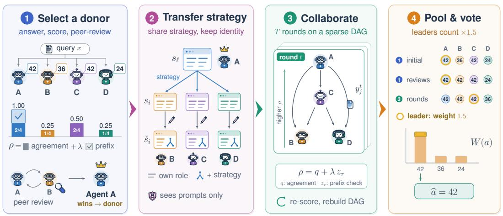
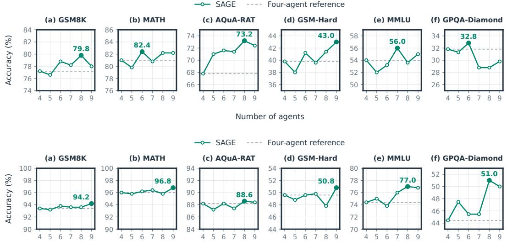
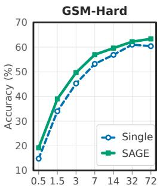
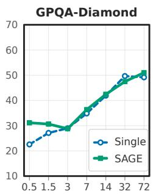
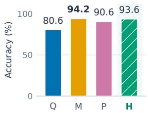
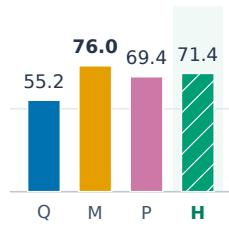
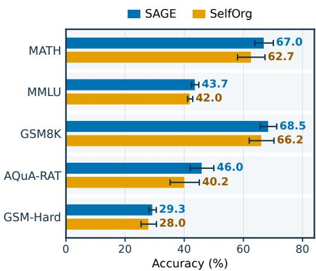

# SELF-ADAPTING GROUP OF EXPERTS FOR MULTI-AGENT REASONING

Mohammad Atif Quamar<sup>1</sup> Nurbek Tastan<sup>1</sup> Karthik Nandakumar<sup>1,2</sup> Junpei Komiyama<sup>1,3</sup>

<sup>1</sup>Mohamed bin Zayed University of Artificial Intelligence <sup>2</sup>Michigan State University <sup>3</sup>RIKEN AIP

{mohammad.atif,nurbek.tastan,karthik.nandakumar,junpei.komiyama}@mbzuai.ac.ae

Project Page: https://www.atifquamar.com/sage-page

## ABSTRACT

Multi-agent systems bring together language model agents with different roles to propose, review, and refine solutions. Each agent’s response depends on its model’s capabilities, the reasoning strategy defined by its system prompt, and the information in its input context. Existing frameworks often adapt communication by changing this context while leaving individual prompts fixed, even when a problem calls for different skills. We study whether agents’ initial responses can identify a strategy better suited to the current problem and guide its transfer to other agents. To address this, we introduce SAGE (Self-Adapting Group of Experts), a training-free framework that uses answer agreement, prefix consistency, and reciprocal peer review to select a strategy donor. SAGE transfers the selected donor’s reasoning strategy to the other agents while preserving their original roles. This transfer uses only the agents’ original system prompts, without access to the problem or generated solutions. After strategy adaptation, agents exchange responses through a dynamic, sparse directed acyclic graph that routes information from higher-scoring agents to lower-scoring agents. Experiments across multiple agent backbones and reasoning benchmarks show that SAGE achieves higher average accuracy than the evaluated baselines. Our code is available here.

  
Figure 1: Overview of SAGE. (1) N agents answer the query x independently. Each response is scored by answer agreement plus prefix consistency, and reciprocal peer review between higher- and lower-scoring agents selects a strategy donor (here, agent A). (2) Every other agent’s role prompt is rewritten to include the donor’s reasoning guidance while keeping its role; the rewriter sees only the two prompts, not the problem or any response. (3) Agents revise their answers along a sparse directed acyclic graph (DAG), reading the updated answers of up to K higher-scoring parents; scores and the DAG are rebuilt after every round. (4) A weighted vote over initial answers, retained reviews, and round answers, with higher weight for each stage’s leader (gold rings), selects the final answer ba.

## 1 INTRODUCTION

Large language models (LLMs) have made substantial progress in question answering, coding, and mathematical reasoning (OpenAI, 2024; Grattafiori et al., 2024; Qwen Team, 2025). Yet a single response can still contain errors or fail when a problem requires several reasoning steps or knowledge beyond the model’s strengths (Wang et al., 2023; Hendrycks et al., 2021a). Smaller models can excel at particular tasks while struggling with these broader demands (Magister et al., 2023). These limitations motivate multi-agent systems (MAS), where several LLM-based agents discuss solutions, check one another’s work, and revise their answers (Li et al., 2023; Chen et al., 2023; Du et al., 2024). By combining different models or roles, such systems can draw on varied expertise and solve problems that individual agents miss (Chen et al., 2024; Yue et al., 2025). The challenge is to match the team’s reasoning strategies and collaboration to the needs of each problem.

Recent work seeks useful, efficient communication, since more discussion does not always improve answers (Smit et al., 2024; Li et al., 2024b). To shape communication, GPTSwarm optimizes links and prompts, AgentPrune removes unnecessary links (Zhuge et al., 2024; Zhang et al., 2025a), and G-Designer generates a graph for each problem using a learned model (Zhang et al., 2025b). SelfOrg rebuilds the graph each round, favoring agents whose response embeddings align with the group average (centroid) (Tastan et al., 2026). Beyond connections, MOC preserves messages from directly and indirectly connected agents without repetition (Guan et al., 2026), while MAD-M<sup>2</sup> filters potentially incorrect history without adapting role instructions (Tian et al., 2026).

An agent’s response depends on three components: (i) its underlying model, which determines its learned capabilities; (ii) its role-defining system instructions, which guide how it approaches a problem; and (iii) the problem-specific input context, including the problem statement and any previous or peer responses. Changing the communication structure changes which peer responses an agent receives, but does not by itself revise its role instructions. Although prior work also explores role and prompt adaptation, we investigate how agents’ responses to the current problem can guide the transfer of useful reasoning instructions across roles. This fully utilizes the capability of the agents by allowing them to adapt their reasoning strategies.

Based on the aforementioned idea, we introduce a reference agent, which we call a strategy donor, whose original role instructions may benefit other agents. To see how this conceptually works, consider the following physics problem:

An object of mass m is dropped from rest from a height h. Air resistance opposes its motion with magnitude kv<sup>2</sup>, where $k > 0$ is a constant and v is its speed. What is its speed just before it hits the ground?

Suppose the agents are assigned the roles of a physicist, a mathematician, and a computer scientist. The physicist’s original role prompt might instruct it to identify the relevant forces and formulate governing equations from physical laws (Newtonian dynamics), which clarifies the underlying mechanics of the problem as a function of m, h, k, and v. If a physicist is selected as the donor, these general instructions can guide the adaptation of the other agents’ role prompts. Given the physicist’s expertise in formulating the governing equations, the other agents can focus on their specialized approaches. The mathematician could incorporate this guidance while retaining its expertise on analytical derivation, and the computer scientist could focus on numerical solutions for the simulated dynamics. Such collaboration further benefits from multi-turn interactions, in which agents iteratively refine their responses based on feedback from their peers.

We introduce SAGE (Self-Adapting Group of Experts), a training-free framework that (i) selects a strategy donor from the agents’ independent initial responses using answer agreement, prefix consistency, and reciprocal peer review; (ii) uses the donor’s original system prompt to revise the other agents’ strategies while preserving their inherent roles; (iii) constructs a sparse directed acyclic graph, rebuilt after every collaboration round, that routes responses from higher-scoring agents to lower-scoring agents. This creates a self-adaptive multi-agent system that adjusts how each individual agent reasons, adapts, and collaborates for each problem without relying on any training or external judge model.

## 2 METHODOLOGY

SAGE adapts the reasoning strategies of the agents and their collaboration structure for each problem in three stages. First, a strategy donor is selected among the agents based on their independent initial responses, which are evaluated using answer agreement, prefix consistency, and reciprocal peer review (Section 2.1). Second, the donor’s original system prompt is used to adapt the other agents’ strategies while preserving their roles (Section 2.2). Finally, the agents propagate their responses (based on their updated system prompts) via a sparse directed acyclic communication graph and their responses are refined over multiple collaboration rounds (Section 2.3). While prompt/strategy adaptation is performed once per problem, the communication graph is repeatedly updated between collaboration rounds. The procedure does not require any training or an external judge model. Figure 1 illustrates the workflow, and Algorithm 1 summarizes the procedure.

Setup. For a given problem $x ,$ let $y = \mathcal { M } ( x ; s , c )$ be the response of an agent, where M represents the agent’s language model (backbone), s denotes its system prompt that specifies its role and reasoning strategy (a reusable reasoning specialization such as algebra, physics, or psychology), and c is the optional current context (e.g., response prefix or previous and peer responses). An agent’s system prompt s can change its instructions, not its model parameters. Within an agent’s response y, we distinguish the reasoning from the answer a (final solution to problem x) extracted from it. Let $\kappa ( y )$ be a function that extracts and normalizes the answer a from a response y, returning ∅ when extraction fails.

We consider a group of $N > 1$ agents, indexed by $[ N ] = \{ 1 , \dots , N \}$ . Agent i uses a language model $\mathcal { M } _ { i }$ and an initial system prompt $s _ { i } , i \in [ N ]$ . For each problem x, the system prompts of each agent are sampled without replacement from a shared pool. The same agents and models are used throughout inference, and no model parameters are updated. Let $y _ { i } ^ { t } = \bar { \mathcal { M } } _ { i } ( x ; s _ { i } , c _ { i } ^ { t } )$ be the response of agent i at time step t, where $t = 0$ denotes initialization and $t \geq 1$ denotes a completed collaboration round. The context is omitted during initial generation, $\mathsf { i . e . , } y _ { i } ^ { 0 } = \mathscr { M } _ { i } ( x ; s _ { i } )$ . For $t \geq 1$ $s _ { i }$ is replaced by the adapted prompt $\tilde { s } _ { i }$ (Section 2.2). Let $\mathcal { V } ^ { t } = \{ y _ { 1 } ^ { t } , \ldots , \bar { y } _ { N } ^ { t } \}$ denote the multiset of all agent responses at step t.

## 2.1 SELECTING A STRATEGY DONOR

We use the initial responses of the agents to select a strategy donor: the agent whose original system prompt will guide the adaptation of the prompts of the other agents. Response-based donor selection makes prompt adaptation specific to the current problem. In the mechanical physics example, this stage can select the physicist as donor when its response receives the highest score based on answer agreement, prefix consistency, and reciprocal peer review.

Answer agreement. Answer agreement measures how often the agents reach the same final answer, following the voting principle of self-consistency (Wang et al., 2023). Let B be the nonempty multiset of responses being compared, where repeated responses are counted separately. Let I be the indicator function. The agreement of a response y with a set of responses B is defined as:

$$
q ( y , B ) = \frac { 1 } { | B | } \sum _ { b \in B } \mathbb { I } [ \kappa ( b ) = \kappa ( y ) \neq \emptyset ] .\tag{1}
$$

Prefix consistency. Prefix consistency checks whether an agent reaches the same answer when asked to complete the beginning of its own response (Iwase et al., 2026), which indicates the agent consistently reproduces its answer from partial reasoning. For a response y produced by an agent, let $\pi _ { \tau } ( y )$ retain its initial fraction $\tau \in ( 0 , 1 )$ ) of the response. Let $\bar { y } = \mathcal { M } ( x ; s , \pi _ { \tau } ( y ) )$ denote the completion generated by the same agent under the same prompt s with the partial response as the input context. The prefix consistency is defined as:

$$
z _ { \tau } ( y ) = \mathbb { I } [ \kappa ( \bar { y } ) = \kappa ( y ) \neq \varnothing ] .\tag{2}
$$

The above two signals measure support across responses and reproducibility within an agent. The combined score of an agent is defined as:

Algorithm 1 SAGE   
Require: Problem x; agents $( \mathcal { M } _ { i } , s _ { i } ) _ { i = 1 } ^ { N } ;$ budgets m, K, T   
Ensure: Final answer   
1: Initial response: $\smash { y _ { i } ^ { 0 } \gets \mathcal { M } _ { i } ( x ; s _ { i } ) , \forall i \in [ N ] }$   
2: Score: $\rho _ { i } ^ { 0 ^ { \star } }  \rho ( y _ { i } ^ { 0 ^ { \star } } , \mathcal { V } ^ { 0 } )$ ▷ Eq. (3)   
3: Peer review: $\mathscr { R } \gets \{ y _ { i  j } , y _ { j  i } \} _ { ( i , j ) \in H _ { m } \times L _ { m } }$ Select   
4: Retain responses with best reviews: $\mathcal { R } ^ { \dagger } \gets \{ y _ { i } ^ { \dagger } \}$ ▷ Eq. (4) donor   
5: Select donor: $\ell \gets \arg \operatorname* { m a x } _ { i } \rho ( y _ { i } ^ { \dagger } , \mathcal { R } ^ { \dagger } )$ ▷ Eq. (5)   
6: Rewrite system prompts: $\tilde { s } _ { i } \gets \tilde { R } _ { \mathcal { M } _ { i } } ( \tilde { s } _ { i } , s _ { \ell } ) , \forall i \neq \ell$ <sub>▷</sub> <sub>Eq.</sub> <sub>(6) 2</sub> <sup>Transfer</sup>   
strategy   
7: for $t = 1$ to T do   
8: Build DAG: $P _ { i } ^ { t } , \forall i \in [ N ]$ ▷ Eq. (7)   
9: for i in decreasing $\rho _ { i } ^ { t - \mathrm { \bar { 1 } } }$ do   
10: Revise: $y _ { i } ^ { t } \gets \dot { \mathcal { M } } _ { i } ( x ; \tilde { s } _ { i } , ( y _ { i } ^ { t - 1 } , \mathbf { y } _ { i } ^ { t } ) )$ ▷ Eq. (9) 3 Collaborate   
11: Rescore: $\rho _ { i } ^ { t } \gets \rho ( y _ { i } ^ { t } , \mathcal { y } ^ { t } )$   
12: break if all answers agree   
13: Pool: 14: return arg max<sub>a</sub> $\mathcal { P }  ( y ^ { 0 } , \mathcal { R } ^ { \dagger } , y ^ { 1 } , \ldots , y ^ { T } )$ $W ( a )$ ▷ Eq. (10) <sup>4</sup> v Pool & ote

$$
\rho ( y , B ) = q ( y , B ) + \lambda z _ { \tau } ( y ) ,\tag{3}
$$

where $\lambda \geq 0$ controls the weight of prefix consistency. The first term measures support; the second records whether prefix completion recovers the same answer, which implies the answer is stable under partial re-generation.

In our multi-agent system, each agent first solves the problem independently. We score these initial responses using answer agreement and prefix consistency, then use reciprocal peer review to select the donor. Based on the initial responses of all agents $\mathcal { V } ^ { 0 }$ , each agent i receives a score $\rho _ { i } ^ { 0 } = \rho ( y _ { i } ^ { 0 } , \mathcal { V } ^ { 0 } )$ Prefix outcomes are sampled once per agent–response pair within a fixed-prompt phase and reused when agreement is recomputed. In summary, we score each response using agreement and stability.

Reciprocal peer review and donor selection. We split the agents into two groups by their initial scores $\rho _ { i } ^ { 0 }$ . The higher-scoring group contains the agents with the highest score; if only one agent has it, the next-highest-scoring agent is added, with lower indices breaking ties. The lower-scoring group contains all remaining agents. If all scores are equal, two agents are chosen at random to form the higher-scoring group. We then sample up to m agents uniformly at random from each group, giving $H _ { m }$ and $L _ { m }$ . For each pair $( i , j ) \in \mathsf { \bar { H } } _ { m } \times L _ { m } ,$ , each agent reads both original responses and uses its own backbone, under a shared critic instruction, to keep or revise its response. This produces two complete candidate responses, $y _ { i  j }$ from agent i and $y _ { j  i }$ from agent j. Let R be the multiset of all review candidates, $o ( y )$ be the owner agent that produced $y ,$ , and $S = H _ { m } \cup L _ { m }$ be the reviewed agents. We score each candidate response using Eq. (3), measuring agreement across all of R and checking prefix consistency under its owner’s original prompt.

We retain each agent’s highest-scoring candidate response:

$$
y _ { i } ^ { \dagger } = \underset { y \in \mathcal { R } : o ( y ) = i } { \arg \operatorname* { m a x } } \rho ( y , \mathcal { R } ) , \qquad i \in S .\tag{4}
$$

We then recompute agreement using only the multiset of retained candidate responses, $\mathcal { R } ^ { \dagger } = \{ y _ { i } ^ { \dagger }$ $i \in S \}$ , reuse their prefix results, and select the highest-scoring agent as donor:

$$
\ell = \underset { i \in S } { \arg \operatorname* { m a x } } \rho ( y _ { i } ^ { \dagger } , \mathcal { R } ^ { \dagger } ) .\tag{5}
$$

Thus, each reviewed agent contributes one candidate to donor selection. Ties are resolved deterministically. The donor supplies its original system prompt $s _ { \ell }$ . While collaboration begins from the original initial responses $\mathrm { \bar { \ y } ^ { 0 } }$ , only the retained reviews $\bar { \mathcal { R } } ^ { \dagger }$ contribute to final answer selection.

## 2.2 ADAPTING STRATEGIES WHILE PRESERVING ROLES

In the mechanical physics example, this stage lets the mathematician and computer scientist adopt the physicist’s guidance to identify forces and formulate governing equations while retaining their

analytical and numerical approaches, respectively. We consider this stage to be one of our major contributions that is not often included in other multi-agent collaboration frameworks.

For each agent $i \neq \ell ,$ we use its backbone $\mathcal { M } _ { i }$ to rewrite its original prompt $s _ { i }$ using guidance from the donor’s original prompt $s _ { \ell } \colon$

$$
\tilde { s } _ { i } = R _ { { \mathcal M } _ { i } } ( s _ { i } , s _ { \ell } ) , \qquad i \ne \ell ,\tag{6}
$$

where $R _ { { \mathcal { M } } _ { i } }$ follows a fixed instruction to add useful reasoning guidance from the donor while keeping the target agent’s role. The rewriter receives only the two original prompts, without the problem, images, or generated responses. Each agent’s prompt is rewritten independently. Restricting the rewrite to the original system prompts transfers reusable reasoning guidance rather than solution content. Preserving each target agent’s role maintains diversity within the team. The donor keeps its original prompt, i.e., $\tilde { s } _ { \ell } = s _ { \ell }$ . Strategy adaptation happens only once per problem, and all prompts stay fixed during subsequent collaboration. Lines 1–6 of Algorithm 1 summarize the donor selection and strategy adaptation stages.

## 2.3 PROPAGATING REASONING GUIDANCE THROUGH A SPARSE DAG

Once the strategies are adapted, agents propagate reasoning guidance through their responses along a sparse directed acyclic graph (DAG), which can change between rounds. This collaboration forms the inner loop of Algorithm 1. In the mechanical physics example, this stage lets a lower-scoring agent use a higher-scoring peer’s force balance or derivation to refine its own calculation of the speed of the object. For example, the computer scientist might adopt the physicist’s reasoning to find potential errors of the numerical solution. Round 1 starts from the initial responses $\mathcal { V } ^ { 0 }$ and their scores $\rho ^ { 0 }$ where $\rho ^ { t } = ( \rho _ { i } ^ { t } ) _ { i = 1 } ^ { N } .$ . The kept peer-review responses $\mathcal { R } ^ { \dagger }$ are used only to select the donor and in the final vote (Section 2.4); they are not given to the agents as starting responses or as context during collaboration.

Constructing the score-directed DAG. Before round t, each agent selects at most K strictly higher-scoring parents according to:

$$
P _ { i } ^ { t } = \mathrm { T o p K } _ { K } \{ j \in [ N ] \setminus \{ i \} : \rho _ { j } ^ { t - 1 } > \rho _ { i } ^ { t - 1 } \} , \qquad K \in \{ 0 , \ldots , N - 1 \} .\tag{7}
$$

Here $\mathrm { T o p K } _ { K }$ ranks candidates by decreasing score, then increasing index. The graph $E ^ { t } = \{ ( j , i )$ $j \in P _ { i } ^ { t } \}$ routes feedback along a strict score decrease. Equal scores create no edge. This rule bounds both the number of messages and the depth of their dependencies.

Lemma 2.1 (Sparse routing with bounded depth). For every round $t , E ^ { t }$ is acyclic, each agent has in-degree at most K, and

$$
| E ^ { t } | \leq K N - \frac { K ( K + 1 ) } { 2 } .\tag{8}
$$

Every directed path contains at most K edges.

The proof is in Appendix B. For $N = 4$ and $K = 2$ , a round therefore has at most five directed messages and a dependency path of at most two edges. The guarantee applies to each round separately, as the ranking can change after revision.

The score-directed sparse graph prioritizes stronger responses while bounding communication and dependency depth, and rebuilding the graph after each round allows information flow to track changes in response quality. Thus, one-time strategy adaptation changes how agents reason, whereas round-wise routing changes whose evidence they use.

Refining responses along the DAG. Agents communicate in decreasing previous-stage score order, with lower indices breaking ties. This is a topological order of $E ^ { t }$ . Let $i _ { t - 1 } ^ { \star } = \arg \operatorname* { m a x } _ { i } \rho _ { i } ^ { t - 1 }$ denote its first agent and let $\mathbf { y } _ { i } ^ { t } = ( ( j , y _ { i } ^ { t } ) : j \in P _ { i } ^ { t } )$ contain the labeled, already-updated parent responses. The update responses are obtained as:

$$
\begin{array}{c} y _ { i } ^ { t }  \{ { \mathcal { M } } _ { i } { ( x ; { \tilde { s } } _ { i } , ( y _ { i } ^ { t - 1 } , \mathbf { y } _ { i } ^ { t } ) ) } , \quad P _ { i } ^ { t } \neq \emptyset ,  \\ { { \mathcal { M } } _ { i } { ( x ; { \tilde { s } } _ { i } , y _ { i } ^ { t - 1 } ) } , \quad \quad i = i _ { t - 1 } ^ { \star } , } \\ { { y _ { i } ^ { t - 1 } , \quad \quad \quad \quad \quad \quad \quad \quad \mathrm { o t h e r w i s e } . } } \end{array}\tag{9}
$$

Table 1: Main results on Qwen2.5-1.5B and Ministral-3-3B. Comparison of SAGE with singleagent and multi-agent baselines across six reasoning benchmarks. We report accuracy (%) as mean ± sample standard deviation over three runs; AVG denotes the macro-average across benchmarks. Bold and underlined values indicate the best and second-best results within each backbone, respectively, including ties.
<table><tr><td>Method</td><td>MATH</td><td>GSM8K</td><td>AQuA</td><td>GSM-H</td><td>MMLU</td><td>GPQA</td><td>AVG</td></tr><tr><td colspan="8">Qwen2.5-1.5B-Instruct</td></tr><tr><td>Single</td><td> $7 2 . 0 7 \pm 2 . 0 0$ </td><td> $6 9 . 8 0 \pm 0 . 7 2$ </td><td> $6 1 . 8 0 \pm { 1 . 7 3 }$ </td><td> $3 4 . 2 7 \pm 0 . 5 0$ </td><td> $\mathbf { 5 4 . 9 3 \pm 0 . 1 2 }$ </td><td> $2 8 . 9 6 \pm 2 . 7 8$ </td><td>53.64</td></tr><tr><td>CoT</td><td> $7 0 . 0 0 \pm 0 . 7 2$ </td><td> $7 1 . 4 0 \pm 2 . 2 3$ </td><td> $5 9 . 2 0 \pm 0 . 9 2$ </td><td> $3 1 . 8 0 \pm 0 . 4 0$ </td><td> $5 2 . 8 7 \pm 1 . 1 0$ </td><td> $2 8 . 1 1 \pm 3 . 2 1$ </td><td>52.23</td></tr><tr><td>MOC</td><td> $7 0 . 2 0 \pm 1 . 2 5$ </td><td> $7 1 . 2 0 \pm 0 . 9 2$ </td><td> $4 4 . 6 7 \pm 0 . 8 3$ </td><td> $3 4 . 2 7 \pm 1 . 2 2$ </td><td> $5 0 . 2 0 \pm 1 . 7 3$ </td><td> $2 6 . 9 4 \pm 2 . 0 4$ </td><td>49.58</td></tr><tr><td>MAD-M²</td><td> $7 2 . 0 0 \pm 2 . 4 2$ </td><td> $7 3 . 8 0 \pm 0 . 8 0$ </td><td> $6 2 . 3 3 \pm 0 . 6 1$ </td><td> $3 4 . 8 0 \pm 0 . 5 3 $ </td><td> $5 2 . 2 0 \pm 1 . 0 4$ </td><td> $2 5 . 2 5 \pm 2 . 6 7$ </td><td>53.40</td></tr><tr><td>G-Designer</td><td> $7 1 . 9 3 \pm 0 . 1 2$ </td><td> $7 2 . 4 7 \pm 0 . 6 4$ </td><td> $6 0 . 1 3 \pm 1 . 8 0$ </td><td> $3 4 . 1 3 \pm 0 . 9 5$ </td><td> $5 2 . 6 7 \pm 1 . 2 2$ </td><td> $2 7 . 7 8 \pm 5 . 1 3$ </td><td>53.19</td></tr><tr><td>SelfOrg SAGE</td><td> $7 2 . 8 7 \pm 1 . 3 0$ </td><td> $7 1 . 5 3 \pm 1 . 7 5$ </td><td> $6 2 . 5 3 \pm 1 . 3 0$ </td><td> $3 4 . 0 0 \pm 1 . 4 0 $ </td><td> $4 9 . 8 7 \pm 2 . 0 4$ </td><td> $2 7 . 9 5 \pm 1 . 1 7$ </td><td>53.12</td></tr><tr><td></td><td> $\mathbf { 7 8 . 4 7 \pm 1 . 0 1 }$ </td><td> ${ \bf 7 7 . 3 3 \pm 1 . 1 7 }$ </td><td> ${ \bf 6 9 . 0 7 \pm 0 . 6 4 }$ </td><td> $\mathbf { 3 9 . 0 0 \pm 1 . 0 6 }$ </td><td> ${ \underline { { 5 4 . 3 3 \pm 1 . 6 3 } } }$ </td><td> $\mathbf { 3 1 . 6 5 \pm 3 . 0 4 }$ </td><td>58.31</td></tr><tr><td colspan="8">Ministral-3-3B-Instruct-2512</td></tr><tr><td>Single</td><td> $8 9 . 9 3 \pm 0 . 1 2$ </td><td> $9 0 . 5 3 \pm 0 . 5 8$ </td><td> $7 2 . 1 3 \pm 1 . 2 2$ </td><td> $4 5 . 1 3 \pm 0 . 3 1$ </td><td> $7 1 . 0 0 \pm 1 . 3 9$ </td><td> $3 6 . 5 3 \pm 4 . 5 8$ </td><td>67.54</td></tr><tr><td>CoT</td><td> $8 9 . 4 7 \pm 1 . 6 3$ </td><td> $9 0 . 9 3 \pm 1 . 0 3$ </td><td> $7 4 . 2 7 \pm 2 . 3 9$ </td><td> $4 6 . 7 3 \pm 0 . 9 0$ </td><td> $7 2 . 1 3 \pm 0 . 2 3$ </td><td> $3 6 . 0 3 \pm 2 . 5 4$ </td><td>68.26</td></tr><tr><td>MOC</td><td> $9 1 . 2 0 \pm 0 . 5 3 $ </td><td> $9 0 . 7 3 \pm 0 . 6 1$ </td><td> $8 5 . 4 0 \pm 1 . 0 6$ </td><td> $5 1 . 5 3 \pm 0 . 8 1$ </td><td> $7 1 . 8 0 \pm 0 . 7 2$ </td><td> $4 4 . 4 4 \pm 2 . 8 1$ </td><td>72.52</td></tr><tr><td> $\mathbf { M A D - M ^ { 2 } }$ </td><td> $9 1 . 5 3 \pm 0 . 4 2$ </td><td> $9 2 . 1 3 \pm 0 . 3 1$ </td><td> $8 5 . 4 7 \pm 0 . 8 1$ </td><td> $5 1 . 9 3 \pm 0 . 4 2$ </td><td> ${ \underline { { 7 3 . 6 7 \pm 1 . 3 3 } } }$ </td><td> $\mathbf { 4 7 . 9 8 \pm 2 . 8 1 }$ </td><td>73.79</td></tr><tr><td>G-Designer</td><td> $9 5 . 2 7 \pm 0 . 6 4$ </td><td> $9 1 . 4 0 \pm 0 . 6 0$ </td><td> $8 1 . 6 7 \pm 1 . 3 6$ </td><td> $5 1 . 8 0 \pm 0 . 9 2$ </td><td> $7 1 . 0 0 \pm 1 . 7 1 $ </td><td> ${ \underline { { 4 7 . 6 4 } } } \pm 1 . 4 6 $ </td><td>73.13</td></tr><tr><td>SelfOrg</td><td> $9 5 . 2 7 \pm 0 . 1 2$ </td><td> $9 0 . 8 0 \pm 0 . 7 2$ </td><td> $\underline { { 8 6 . 4 7 \pm 0 . 3 1 } }$ </td><td> $4 8 . 4 7 \pm 0 . 6 1$ </td><td> $7 3 . 4 7 \pm 0 . 3 1$ </td><td> $4 3 . 9 4 \pm 0 . 8 7$ </td><td>73.07</td></tr><tr><td>SAGE</td><td> $\mathbf { 9 5 . 9 3 \pm 0 . 1 2 }$ </td><td> $\mathbf { 9 3 . 0 7 \pm 0 . 5 0 }$ </td><td> $\mathbf { 8 7 . 9 3 \pm 0 . 2 3 }$ </td><td> $\mathbf { 5 3 . 5 3 \pm 1 . 2 1 }$ </td><td> $\mathbf { 7 5 . 7 3 \pm 0 . 5 0 }$ </td><td> $4 4 . 2 8 \pm 3 . 2 5$ </td><td>75.08</td></tr></table>

Thus, the routing leader self-revises, children use their parents’ current-round answers, and other source nodes retain their previous answers. After the sweep, we evaluate $\rho _ { i } ^ { t } = \rho ( y _ { i } ^ { t } , \mathcal { y } ^ { t } )$ under the adapted prompts. The graph is rebuilt for the next round unless the round limit $T$ is reached or all normalized answers agree on a nonempty key.

## 2.4 SELECTING THE FINAL ANSWER

To retain candidates from earlier reasoning stages, we pool the initial answers, one retained review per sampled owner, and every completed round’s responses. The pool P is a multiset of occurrences $( t , i , y )$ identifying the stage, owner, and response, where $t \in \{ 0 , \mathrm { r e v } , 1 , \ldots , T \}$ and $t = \mathrm { r e v }$ marks the retained reviews, whose leader is the donor, $i _ { \mathrm { r e v } } ^ { \star } = \ell .$ An unchanged answer therefore remains represented at each stage where it occurs. For each observed nonempty answer key $^ { a , }$ we compute:

$$
W ( a ) = \sum _ { ( t , i , y ) \in \mathcal { P } } \left( 1 + \beta \mathbb { I } [ i = i _ { t } ^ { \star } ] \right) \mathbb { I } [ \kappa ( y ) = a ] , \qquad \beta = 0 . 5 .\tag{10}
$$

SAGE returns the answer a with the largest weight $W ( a )$ , which is denoted as ${ \hat { a } } .$ In case of any ties, they are broken by the number of leader votes and then by the total number of votes. As the final response, we return one pooled response that gives this answer, preferring a stage leader’s response, then the most recent stage (later collaboration rounds, then retained reviews, then initial responses), and then the lower agent index. The vote is taken over the full pool $\mathcal { P }$ even when collaboration stops early because all agents agree.

## 3 EXPERIMENTS

We evaluate whether SAGE improves reasoning across tasks and backbones, and how its benefits change with model scale, unreliable peer messages, mixed teams, and visual inputs (Appendix G.1).

Tasks and baselines. Our main evaluation covers mathematical reasoning with GSM8K (Cobbe et al., 2021), MATH (Hendrycks et al., 2021b), GSM-Hard (Gao et al., 2023), and AQuA-RAT (Ling et al., 2017), together with knowledge and scientific reasoning on MMLU (Hendrycks et al., 2021a)

  
Figure 2: Effect of scaling the number of agents. We evaluate SAGE across six reasoning benchmarks with Qwen2.5-1.5B-Instruct (top) and Ministral-3-3B-Instruct (bottom) as the number of agents increases from 4 to 9. Accuracy generally improves with more agents on both backbones.

and GPQA-Diamond (Rein et al., 2024). We use Qwen2.5-1.5B-Instruct (Qwen Team, 2025) and Ministral-3-3B-Instruct (Liu et al., 2026) as the main backbones. Baselines include a single model call (Single), chain-of-thought (CoT) (Wei et al., 2023), and the multi-agent methods SelfOrg (Tastan et al., 2026), MOC (Guan et al., 2026), MAD-M<sup>2</sup> (Tian et al., 2026), and G-Designer (Zhang et al., 2025b). Single and CoT provide reference points for reasoning without collaboration, while the multi agent baselines span different approaches to communication and memory. Amongst all baselines compared, SelfOrg is the closest to SAGE. Unlike the fixed random DAG of MOC or the learned graph of G-Designer, both methods require no training and rebuild their DAG in every round from the agents’ current responses. We have described our evaluation protocol in Appendix C.

## 3.1 MAIN RESULTS

We evaluate SAGE across six reasoning benchmarks using two main backbones, then examine its behavior as team size, model size, team composition, and message reliability change. Additional vision-language results are reported in the Appendix G.1.

Table 1 shows that SAGE achieves the highest average accuracy on both backbones. With Qwen2.5- 1.5B, it improves on the strongest multi-agent baseline, MAD-M<sup>2</sup>, by +4.9 points and outperforms every multi-agent baseline on all six benchmarks. With Ministral-3-3B, the multi-agent baselines perform similarly, and SAGE improves on the strongest of them by +1.3 points. SAGE also consistently outperforms SelfOrg, its closest methodological competitor, with gains of +5.2 points on Qwen2.5-1.5B and +2.0 points on Ministral-3-3B.

These results show that SAGE is beneficial when the agents are weak. On Qwen2.5-1.5B, none of the evaluated multi-agent baselines outperforms a single model call in macro-average accuracy across the six benchmarks, whereas SAGE does. On Ministral-3-3B, all evaluated multi-agent methods outperform Single. Relative to SelfOrg, which also rebuilds a response-dependent DAG each round, SAGE improves macro-average accuracy by 5.19 and 2.01 points, respectively. This comparison supports the effectiveness of our proposed framework compared with SelfOrg’s framework.

We further analyze SAGE’s components in Appendix H. Across the two main backbones, removing prompt adaptation reduces macro-average accuracy by 2.10–2.18 percentage points, while restricting weighted pool voting to the final round reduces it by 0.36–0.79 points. Additional analyses examine the contribution of donor selection and which roles are selected as donors. These results characterize the contributions of SAGE’s adaptation, donor-selection, and answer-aggregation mechanisms.

<table><tr><td rowspan=1 colspan=3>Size       GSM-Hard</td><td rowspan=1 colspan=2>GPQA-Diamond</td></tr><tr><td rowspan=1 colspan=1></td><td rowspan=1 colspan=1> $\mathrm { S i n g l e }$ </td><td rowspan=1 colspan=1>SAGE</td><td rowspan=1 colspan=1> $\mathrm { S i n g l e }$ </td><td rowspan=1 colspan=1>SAGE</td></tr><tr><td rowspan=1 colspan=1>0.5B</td><td rowspan=1 colspan=1> $1 4 . 8 0 \pm 0 . 3 5$ </td><td rowspan=1 colspan=1> ${ \bf 1 9 . 2 0 \pm 0 . 2 0 }$ </td><td rowspan=1 colspan=1> $2 2 . 5 6 \pm 3 . 7 9$ </td><td rowspan=1 colspan=1> $\mathbf { 3 1 . 1 4 \pm 2 . 7 8 }$ </td></tr><tr><td rowspan=1 colspan=1>1.5B</td><td rowspan=1 colspan=1> $3 4 . 0 0 \pm { 1 . 9 3 }$ </td><td rowspan=1 colspan=1> $\mathbf { 3 9 . 0 0 \pm 0 . 5 3 }$ </td><td rowspan=1 colspan=1> $2 7 . 1 0 \pm 0 . 7 7$ </td><td rowspan=1 colspan=1> $\mathbf { 3 0 . 6 4 \pm 2 . 0 4 }$ </td></tr><tr><td rowspan=1 colspan=1>3B</td><td rowspan=1 colspan=1> $4 5 . 2 7 \pm 0 . 3 1$ </td><td rowspan=1 colspan=1> $\mathbf { 4 9 . 6 7 \pm 0 . 7 0 }$ </td><td rowspan=1 colspan=1> ${ \bf 2 8 . 9 6 \pm 4 . 8 5 }$ </td><td rowspan=1 colspan=1> $2 8 . 7 9 \pm 2 . 0 2$ </td></tr><tr><td rowspan=1 colspan=1>7B</td><td rowspan=1 colspan=1> $5 3 . 2 0 \pm 1 . 2 0$ </td><td rowspan=1 colspan=1> ${ \bf 5 6 . 9 3 \pm 1 . 2 9 }$ </td><td rowspan=1 colspan=1> $3 4 . 8 5 \pm { 1 . 7 5 }$ </td><td rowspan=1 colspan=1> $\mathbf { 3 6 . 3 6 \pm 2 . 2 0 }$ </td></tr><tr><td rowspan=1 colspan=1>14B</td><td rowspan=1 colspan=1> $\lvert 5 6 . 8 7 \pm 1 . 2 1$ </td><td rowspan=1 colspan=1> ${ \bf 5 9 . 6 0 \pm 0 . 3 5 }$ </td><td rowspan=1 colspan=1> $4 1 . 9 2 \pm 2 . 8 1$ </td><td rowspan=1 colspan=1> ${ \bf 4 2 . 4 2 \pm 2 . 6 7 }$ </td></tr><tr><td rowspan=1 colspan=1>32B</td><td rowspan=1 colspan=1> $\lvert 6 1 . 0 0 \pm { 0 . 2 0 }$ </td><td rowspan=1 colspan=1> ${ \bf 6 2 . 2 0 \pm 0 . 7 2 }$ </td><td rowspan=1 colspan=1> ${ \bf 4 9 . 6 6 \pm 1 . 1 7 }$ </td><td rowspan=1 colspan=1> $4 7 . 4 7 \pm 2 . 8 1$ </td></tr><tr><td rowspan=1 colspan=1>72B</td><td rowspan=1 colspan=1> $\overline { { 6 0 . 4 0 \pm 0 . 2 0 } }$ </td><td rowspan=1 colspan=1> ${ \bf 6 3 . 3 3 \pm 0 . 6 1 }$ </td><td rowspan=1 colspan=1> $4 9 . 1 6 \pm 1 . 4 6$ </td><td rowspan=1 colspan=1> ${ \bf 5 1 . 0 1 \pm 1 . 7 5 }$ </td></tr></table>



  
Parameters (B)  
Figure 3: Backbone scaling. We compare Single and SAGE on GSM-Hard and GPQA-Diamond using Qwen2.5-Instruct models ranging from 0.5B to 72B parameters. The table reports mean ± sample SD over three runs, with the higher mean in bold; the plots show the same results with evenly spaced model sizes.

## 3.2 SCALING THE NUMBER OF AGENTS

We study how SAGE scales with team size by increasing the number of agents from 4 to 9 with both backbones, keeping the questions and all other settings fixed. Figure 2 shows that accuracy generally improves as agents are added. With Qwen2.5-1.5B, the average accuracy rises by +1.5 points from four to nine agents, with the largest gains on AQuA-RAT and GSM-Hard. With Ministral-3-3B, it rises by +1.8 points, with the largest gains on GPQA-Diamond and MMLU.

These gains may reflect how SAGE uses additional agents. First, each new agent contributes an independently generated initial response, providing more responses for computing answer agreement. Second, each brings a distinct role prompt, expanding the set of reasoning strategies available for donor selection. These additions may help the team identify useful answers and strategies. Meanwhile, each agent still reads at most two parent responses per round, so increasing team size does not increase this per-agent communication limit by design of SAGE.

## 3.3 SCALING THE BACKBONE SIZE

We evaluate Qwen2.5-Instruct backbones from 0.5B to 72B on GSM-Hard and GPQA-Diamond. We keep the number of agents, parent limit, and round limit fixed (Figure 3). On GSM-Hard, SAGE outperforms Single at every model size, with gains ranging from 1.2 to 5.0 percentage points. At 32B, it also exceeds the accuracy of Single at 72B (62.20% versus 60.40%), although this comparison does not imply lower inference cost.

On GPQA-Diamond, the effect is less consistent. The largest gain occurs at 0.5B, where accuracy increases from 22.56% to 31.14%, but SAGE has lower mean accuracy than Single at 3B and 32B. Overall, SAGE demonstrates some benefit over single-agent performance, particularly with smaller backbones.

## 3.4 LIFTING TEAMS WITH WEAK AGENTS

We evaluate SAGE with a heterogeneous team of nine agents (three each from Qwen2.5-1.5B, Ministral-3-3B, and Phi-4-mini) and compare it with homogeneous nine-agent teams of each backbone on GSM8K and MMLU. As Figure 4 shows, the mixed team performs close to the strongest homogeneous team, Ministral, even though only a third of its agents use Ministral. It also outperforms the homogeneous Qwen and Phi teams on both benchmarks and on average exceeds the mean of the three homogeneous teams by about +5 points.

This shows that SAGE can achieve strong team performance even when most of its agents use weaker backbones. It does not need to know in advance which backbone is strongest, because it scores agents based on their responses to each problem. Ministral agents supply most donors (72% on GSM8K and 65% on MMLU), although they make up only a third of the team, while donors are also selected from other backbones. Messages flow only from higher-scoring to lower-scoring agents, so lower-scoring agents cannot directly pass their answers to higher-scoring ones, but they can still use higher-scoring agents’ responses and the donor’s guidance to revise their own answers. The weaker backbones may also add value. If different models make different mistakes, agreement across model families may provide useful evidence for an answer. These experiments demonstrate that SAGE performs close to a team built entirely from the strongest model.

<table><tr><td>Composition</td><td colspan="3">|Q/M/P GSM8K MMLU| AVG</td></tr><tr><td>Qwen2.5</td><td>9/0/0</td><td>80.6 55.2</td><td>67.9</td></tr><tr><td>Ministral-3B</td><td>0/9/0</td><td>94.2 76.0</td><td>85.1</td></tr><tr><td>Phi-4-mini</td><td>0/0/9</td><td>90.6 69.4</td><td>80.0</td></tr><tr><td>Heterogeneous</td><td>3/3/3</td><td>93.6</td><td>71.4 82.5</td></tr></table>

(a) GSM8K  


(b) MMLU  
  
Figure 4: Accuracy by team composition. Accuracy (%) for nine-agent teams on GSM8K and MMLU (one run). Q/M/P counts Qwen/Ministral/Phi agents; H denotes the mixed team. AVG is the benchmark mean; bold/underlined values mark best/second best.

## 3.5 ROBUSTNESS TO ADVERSARIAL ATTACKS

We test whether SAGE stays reliable when some agents deliberately mislead the team. In a nineagent Qwen2.5-1.5B-Instruct team, three randomly chosen agents are corrupted. Each replaces the final answer in every message it shares with a fixed wrong answer and claims that this answer is correct. SAGE and SelfOrg face the same corrupted agents and wrong answers on five benchmarks. Appendix C describes the full protocol.

Figure 5 shows that SAGE outperforms SelfOrg on all five benchmarks under message corruption. The gains are largest on AQuA-RAT (+5.8 points) and MATH (+4.3 points), and SAGE also improves on GSM8K, MMLU, and GSM-Hard. These results suggest that SAGE can retain an advantage over SelfOrg under the tested corruption protocol, without a separate attack detector. Answer agreement and prefix consistency may help limit the influence of corrupted messages when injected answers disagree with peer responses or are inconsistent with the preceding reasoning. If these signals assign a corrupted agent a low score, its outgoing connections are restricted by the routing rule. In addition, the rewriter sees only the original role prompts, so injected response text is excluded from its input. However, corrupted responses may still affect donor selection.

  
Figure 5: Message corruption. SAGE and SelfOrg across five benchmarks with three of nine agents corrupted. Bars show means; error bars show sample SD over three runs.

## 4 CONCLUSION

We presented SAGE, a training-free framework that adapts expert instructions and communication for multi-agent reasoning. Guided by evidence from the agents’ responses, SAGE transfers reasoning strategies between role prompts while preserving each expert’s specialization, then coordinates their collaboration through a dynamic sparse graph. Experiments across multiple backbones and text and vision-language benchmarks demonstrate improvements over the evaluated single and multi-agent baselines. These findings support combining adaptation of expert instructions with response-dependent communication to improve collaborative reasoning.

## ACKNOWLEDGEMENTS

Junpei Komiyama was supported by the MBZUAI Start-up Fund [BF0121].

## AI USE STATEMENT

We used generative AI tools to polish the sentences and to code during the preparation of this work. AI-assisted text was reviewed and edited by the authors, and AI-assisted code was manually inspected and tested for correctness before being used in our experiments. The authors take full responsibility for the experimental design, analysis, claims, and final content of the paper.

## REPRODUCIBILITY STATEMENT

Section 2 specifies the SAGE inference procedure, summarized in Algorithm 1, with the reciprocal peer-review call detailed in Appendix D. Appendix C documents the main agent and baseline configurations, decoding parameters, and answer extraction and evaluation protocol. Appendix E provides the role prompts, the instructions used for prefix consistency, reciprocal review, prompt rewriting, and collaboration, and the Single and CoT baseline prompts. The experimental tables and figure captions specify how results are aggregated and identify studies evaluated with a single run.

## ETHICS STATEMENT

This work studies training-free coordination among existing language and vision-language models on established reasoning benchmarks. We do not conduct human-subject experiments or collect new personal data. Agent agreement and prefix consistency provide imperfect evidence of response quality, and collaboration can reinforce errors or biases shared by the underlying models. The robustness findings are limited to the tested setting of fixed, non-adaptive misleading messages. Applications involving consequential decisions require independent validation of the system’s outputs.

## REFERENCES

Shuai Bai, Keqin Chen, Xuejing Liu, Jialin Wang, Wenbin Ge, Sibo Song, Kai Dang, Peng Wang, Shijie Wang, Jun Tang, Humen Zhong, Yuanzhi Zhu, Mingkun Yang, Zhaohai Li, Jianqiang Wan, Pengfei Wang, Wei Ding, Zheren Fu, Yiheng Xu, Jiabo Ye, Xi Zhang, Tianbao Xie, Zesen Cheng, Hang Zhang, Zhibo Yang, Haiyang Xu, and Junyang Lin. Qwen2.5-VL technical report. arXiv preprint arXiv:2502.13923, 2025. URL https://arxiv.org/abs/2502.13923.

Ding Chen, Qingchen Yu, Pengyuan Wang, Mengting Hu, Wentao Zhang, Zhengren Wang, Bo Tang, Feiyu Xiong, Xinchi Li, Chao Wang, Minchuan Yang, and Zhiyu Li. xverify: Efficient answer verifier for reasoning model evaluations, 2025. URL https://arxiv.org/abs/2504. 10481.

Justin Chen, Swarnadeep Saha, and Mohit Bansal. ReConcile: Round-table conference improves reasoning via consensus among diverse LLMs. In Proceedings of the 62nd Annual Meeting of the Association for Computational Linguistics (Volume 1: Long Papers), pp. 7066–7085. Association for Computational Linguistics, 2024. doi: 10.18653/v1/2024.acl-long.381. URL https://aclanthology.org/2024.acl-long.381/.

Weize Chen, Yusheng Su, Jingwei Zuo, Cheng Yang, Chenfei Yuan, Chi-Min Chan, Heyang Yu, Yaxi Lu, Yi-Hsin Hung, Chen Qian, Yujia Qin, Xin Cong, Ruobing Xie, Zhiyuan Liu, Maosong Sun, and Jie Zhou. Agentverse: Facilitating multi-agent collaboration and exploring emergent behaviors, 2023. URL https://arxiv.org/abs/2308.10848.

Karl Cobbe, Vineet Kosaraju, Mohammad Bavarian, Mark Chen, Heewoo Jun, Lukasz Kaiser, Matthias Plappert, Jerry Tworek, Jacob Hilton, Reiichiro Nakano, Christopher Hesse, and John Schulman. Training verifiers to solve math word problems. arXiv preprint arXiv:2110.14168, 2021. URL https://arxiv.org/abs/2110.14168.

Yilun Du, Shuang Li, Antonio Torralba, Joshua B. Tenenbaum, and Igor Mordatch. Improving factuality and reasoning in language models through multiagent debate. In Proceedings of the 41st International Conference on Machine Learning, volume 235 of Proceedings of Machine Learning Research, pp. 11733–11763, 2024. URL https://proceedings.mlr.press/ v235/du24e.html.

Chrisantha Fernando, Dylan Sunil Banarse, Henryk Michalewski, Simon Osindero, and Tim Rocktäschel. Promptbreeder: Self-referential self-improvement via prompt evolution. In Proceedings of the 41st International Conference on Machine Learning, volume 235 of Proceedings ofMachine Learning Research, pp. 13481–13544. PMLR, 2024. URL https://proceedings.mlr. press/v235/fernando24a.html.

Luyu Gao, Aman Madaan, Shuyan Zhou, Uri Alon, Pengfei Liu, Yiming Yang, Jamie Callan, and Graham Neubig. PAL: Program-aided language models. In Proceedings ofthe 40th International Conference on Machine Learning, volume 202 of Proceedings ofMachine Learning Research, pp. 10764–10799, 2023. URL https://proceedings.mlr.press/v202/gao23f.html.

Aaron Grattafiori et al. The llama 3 herd of models, 2024. URL https://arxiv.org/abs/ 2407.21783.

Yao Guan, Lin Wang, Zhihu Lu, Ziyi Wang, Wenzhu Yan, and Qiang Duan. Moc: Multi-order communication in llm-based multi-agent systems, 2026. URL https://arxiv.org/abs/ 2606.02359.

Dan Hendrycks, Collin Burns, Steven Basart, Andy Zou, Mantas Mazeika, Dawn Song, and Jacob Steinhardt. Measuring massive multitask language understanding. In International Conference on Learning Representations, 2021a. URL https://openreview.net/forum?id= d7KBjmI3GmQ.

Dan Hendrycks, Collin Burns, Saurav Kadavath, Akul Arora, Steven Basart, Eric Tang, Dawn Song, and Jacob Steinhardt. Measuring mathematical problem solving with the math dataset, 2021b. URL https://arxiv.org/abs/2103.03874.

Sirui Hong, Mingchen Zhuge, Jiaqi Chen, Xiawu Zheng, Yuheng Cheng, Ceyao Zhang, Jinlin Wang, Zili Wang, Steven Ka Shing Yau, Zijuan Lin, Liyang Zhou, Chenyu Ran, Lingfeng Xiao, Chenglin Wu, and Jürgen Schmidhuber. Metagpt: Meta programming for a multi-agent collaborative framework, 2024. URL https://arxiv.org/abs/2308.00352.

Naoto Iwase, Yuki Ichihara, Mohammad Atif Quamar, and Junpei Komiyama. Reliable chain-ofthought via prefix consistency, 2026. URL https://arxiv.org/abs/2605.07654.

Weize Kong, Spurthi Hombaiah, Mingyang Zhang, Qiaozhu Mei, and Michael Bendersky. PRewrite: Prompt rewriting with reinforcement learning. In Proceedings of the 62nd Annual Meeting of the Association for Computational Linguistics (Volume 2: Short Papers), pp. 594–601. Association for Computational Linguistics, 2024. doi: 10.18653/v1/2024.acl-short.54. URL https:// aclanthology.org/2024.acl-short.54/.

Guohao Li, Hasan Abed Al Kader Hammoud, Hani Itani, Dmitrii Khizbullin, and Bernard Ghanem. Camel: Communicative agents for "mind" exploration of large language model society, 2023. URL https://arxiv.org/abs/2303.17760.

Junyou Li, Qin Zhang, Yangbin Yu, Qiang Fu, and Deheng Ye. More agents is all you need. Transactions on Machine Learning Research, 2024a. URL https://openreview.net/ forum?id=bgzUSZ8aeg.

Yunxuan Li, Yibing Du, Jiageng Zhang, Le Hou, Peter Grabowski, Yeqing Li, and Eugene Ie. Improving multi-agent debate with sparse communication topology. In Findings of the Association for Computational Linguistics: EMNLP 2024, pp. 7281–7294. Association for Computational Linguistics, 2024b. doi: 10.18653/v1/2024.findings-emnlp.427. URL https: //aclanthology.org/2024.findings-emnlp.427/.

Tian Liang, Zhiwei He, Wenxiang Jiao, Xing Wang, Yan Wang, Rui Wang, Yujiu Yang, Shuming Shi, and Zhaopeng Tu. Encouraging divergent thinking in large language models through multi-agent debate. In Proceedings of the 2024 Conference on Empirical Methods in Natural Language Processing, pp. 17889–17904. Association for Computational Linguistics, 2024. doi: 10.18653/v1/ 2024.emnlp-main.992. URL https://aclanthology.org/2024.emnlp-main.992/.

Wang Ling, Dani Yogatama, Chris Dyer, and Phil Blunsom. Program induction by rationale generation: Learning to solve and explain algebraic word problems. In Proceedings of the 55th Annual Meeting of the Association for Computational Linguistics (Volume 1: Long Papers), pp. 158–167. Association for Computational Linguistics, 2017. doi: 10.18653/v1/P17-1015. URL https://aclanthology.org/P17-1015/.

Alexander H. Liu et al. Ministral 3, 2026. URL https://arxiv.org/abs/2601.08584.

Zijun Liu, Yanzhe Zhang, Peng Li, Yang Liu, and Diyi Yang. A dynamic LLM-powered agent network for task-oriented agent collaboration. In First Conference on Language Modeling, 2024. URL https://openreview.net/forum?id=XII0Wp1XA9.

Pan Lu, Hritik Bansal, Tony Xia, Jiacheng Liu, Chunyuan Li, Hannaneh Hajishirzi, Hao Cheng, Kai-Wei Chang, Michel Galley, and Jianfeng Gao. MathVista: Evaluating mathematical reasoning of foundation models in visual contexts. In International Conference on Learning Representations, 2024. URL https://arxiv.org/abs/2310.02255.

Lucie Charlotte Magister, Jonathan Mallinson, Jakub Adamek, Eric Malmi, and Aliaksei Severyn. Teaching small language models to reason. In Anna Rogers, Jordan Boyd-Graber, and Naoaki Okazaki (eds.), Proceedings of the 61st Annual Meeting of the Association for Computational Linguistics (Volume 2: Short Papers), pp. 1773–1781, Toronto, Canada, July 2023. Association for Computational Linguistics. doi: 10.18653/v1/2023.acl-short.151. URL https://aclanthology.org/2023.acl-short.151/.

OpenAI. Gpt-4 technical report, 2024. URL https://arxiv.org/abs/2303.08774.

Reid Pryzant, Dan Iter, Jerry Li, Yin Lee, Chenguang Zhu, and Michael Zeng. Automatic prompt optimization with “gradient descent” and beam search. In Proceedings of the 2023 Conference on Empirical Methods in Natural Language Processing, pp. 7957–7968, Singapore, 2023. Association for Computational Linguistics. doi: 10.18653/v1/2023.emnlp-main.494. URL https://aclanthology.org/2023.emnlp-main.494/.

Chen Qian, Zihao Xie, YiFei Wang, Wei Liu, Kunlun Zhu, Hanchen Xia, Yufan Dang, Zhuoyun Du, Weize Chen, Cheng Yang, Zhiyuan Liu, and Maosong Sun. Scaling large language model-based multi-agent collaboration, 2025. URL https://arxiv.org/abs/2406.07155.

Qwen Team. Qwen2.5 technical report. arXiv preprint arXiv:2412.15115, 2025. URL https: //arxiv.org/abs/2412.15115.

David Rein, Betty Li Hou, Asa Cooper Stickland, Jackson Petty, Richard Yuanzhe Pang, Julien Dirani, Julian Michael, and Samuel R. Bowman. GPQA: A graduate-level google-proof Q&A benchmark. In First Conference on Language Modeling, 2024. URL https://openreview. net/forum?id=Ti67584b98.

Andries Petrus Smit, Nathan Grinsztajn, Paul Duckworth, Thomas D. Barrett, and Arnu Pretorius. Should we be going MAD? a look at multi-agent debate strategies for LLMs. In Proceedings of the 41st International Conference on Machine Learning, volume 235 of Proceedings of Machine Learning Research, pp. 45883–45905. PMLR, 2024. URL https://proceedings.mlr. press/v235/smit24a.html.

Saurabh Srivastava, Chengyue Huang, Weiguo Fan, and Ziyu Yao. Instances need more care: Rewriting prompts for instances with LLMs in the loop yields better zero-shot performance. In Findings ofthe Associationfor Computational Linguistics: ACL 2024, pp. 6211–6232. Association for Computational Linguistics, 2024. doi: 10.18653/v1/2024.findings-acl.371. URL https: //aclanthology.org/2024.findings-acl.371/.

Nurbek Tastan, Samuel Horvath, and Karthik Nandakumar. Stochastic self-organization in multiagent systems. In International Conference on Learning Representations, 2026. URL https: //arxiv.org/abs/2510.00685.

Hongduan Tian, Xiao Feng, Ziyuan Zhao, Xiangyu Zhu, Rolan Yan, and Bo Han. Multi-agent debate with memory masking. In International Conference on Learning Representations, 2026. URL https://arxiv.org/abs/2603.20215.

Junlin Wang, Jue Wang, Ben Athiwaratkun, Ce Zhang, and James Y. Zou. Mixture-of-agents enhances large language model capabilities. In International Conference on Learning Representations, 2025. URL https://openreview.net/forum?id=h0ZfDIrj7T.

Xuezhi Wang, Jason Wei, Dale Schuurmans, Quoc V. Le, Ed H. Chi, Sharan Narang, Aakanksha Chowdhery, and Denny Zhou. Self-consistency improves chain of thought reasoning in language models. In International Conference on Learning Representations, 2023. URL https:// openreview.net/forum?id=1PL1NIMMrw.

Jason Wei, Xuezhi Wang, Dale Schuurmans, Maarten Bosma, Brian Ichter, Fei Xia, Ed Chi, Quoc Le, and Denny Zhou. Chain-of-thought prompting elicits reasoning in large language models, 2023. URL https://arxiv.org/abs/2201.11903.

Yihan Xia, Taotao Wang, Shengli Zhang, Zhangyuhua Weng, Bin Cao, and Soung Chang Liew. HiveMind: Contribution-guided online prompt optimization of LLM multi-agent systems. In Proceedings of the AAAI Conference on Artificial Intelligence, volume 40, pp. 29767–29774, 2026. doi: 10.1609/aaai.v40i35.40222. URL https://ojs.aaai.org/index.php/ AAAI/article/view/40222.

Chengrun Yang, Xuezhi Wang, Yifeng Lu, Hanxiao Liu, Quoc V. Le, Denny Zhou, and Xinyun Chen. Large language models as optimizers. In International Conference on Learning Representations, 2024. URL https://openreview.net/forum?id=Bb4VGOWELI.

Zhangyue Yin, Qiushi Sun, Cheng Chang, Qipeng Guo, Junqi Dai, Xuanjing Huang, and Xipeng Qiu. Exchange-of-thought: Enhancing large language model capabilities through cross-model communication. In Proceedings of the 2023 Conference on Empirical Methods in Natural Language Processing, pp. 15135–15153. Association for Computational Linguistics, 2023. doi: 10.18653/v1/ 2023.emnlp-main.936. URL https://aclanthology.org/2023.emnlp-main.936/.

Qingchen Yu, Zifan Zheng, Shichao Song, Zhiyu Li, Feiyu Xiong, Bo Tang, and Ding Chen. xFinder: Large language models as automated evaluators for reliable evaluation. In International Conference on Learning Representations, 2025. URL https://openreview.net/forum? id=7UqQJUKaLM.

Xiang Yue, Tianyu Zheng, Yuansheng Ni, Yubo Wang, Kai Zhang, Shengbang Tong, Yuxuan Sun, Botao Yu, Ge Zhang, Huan Sun, Yu Su, Wenhu Chen, and Graham Neubig. MMMU-Pro: A more robust multi-discipline multimodal understanding benchmark. arXiv preprint arXiv:2409.02813, 2024. URL https://arxiv.org/abs/2409.02813.

Yanwei Yue, Guibin Zhang, Boyang Liu, Guancheng Wan, Kun Wang, Dawei Cheng, and Yiyan Qi. MasRouter: Learning to route LLMs for multi-agent systems. In Proceedings ofthe 63rd Annual Meeting ofthe Associationfor Computational Linguistics (Volume 1: Long Papers), pp. 15549– 15572. Association for Computational Linguistics, 2025. doi: 10.18653/v1/2025.acl-long.757. URL https://aclanthology.org/2025.acl-long.757/.

Guibin Zhang, Yanwei Yue, Zhixun Li, Sukwon Yun, Guancheng Wan, Kun Wang, Dawei Cheng, Jeffrey Xu Yu, and Tianlong Chen. Cut the crap: An economical communication pipeline for LLM-based multi-agent systems. In International Conference on Learning Representations, 2025a. URL https://openreview.net/forum?id=LkzuPorQ5L.

Guibin Zhang, Yanwei Yue, Xiangguo Sun, Guancheng Wan, Miao Yu, Junfeng Fang, Kun Wang, Tianlong Chen, and Dawei Cheng. G-Designer: Architecting multi-agent communication topologies via graph neural networks. In Proceedings ofthe 42nd International Conference on Machine Learning, volume 267 of Proceedings of Machine Learning Research, pp. 76678–76692. PMLR, 2025b. URL https://proceedings.mlr.press/v267/zhang25cu.html.

Lechen Zhang, Tolga Ergen, Lajanugen Logeswaran, Moontae Lee, and David Jurgens. SPRIG: Improving large language model performance by system prompt optimization. In International Conference on Learning Representations, 2026a. URL https://openreview.net/forum? id=VdVV24KSWK.

Zheyuan Zhang, Lin Ge, Hongjiang Li, Weicheng Zhu, Chuxu Zhang, and Yanfang Ye. MAPRO: Recasting multi-agent prompt optimization as maximum a posteriori inference. In Findings of the Association for Computational Linguistics: EACL 2026, pp. 4458–4480. Association for Computational Linguistics, 2026b. doi: 10.18653/v1/2026.findings-eacl.233. URL https: //aclanthology.org/2026.findings-eacl.233/.

Han Zhou, Xingchen Wan, Ruoxi Sun, Hamid Palangi, Shariq Iqbal, Ivan Vulic, Anna Korhonen, and´ Sercan O. Arik. Multi-agent design: Optimizing agents with better prompts and topologies. In International Conference on Learning Representations, 2026. URL https://openreview. net/forum?id=uCKvHweh1g.

Yongchao Zhou, Andrei Ioan Muresanu, Ziwen Han, Keiran Paster, Silviu Pitis, Harris Chan, and Jimmy Ba. Large language models are human-level prompt engineers, 2023. URL https: //arxiv.org/abs/2211.01910.

Mingchen Zhuge, Wenyi Wang, Louis Kirsch, Francesco Faccio, Dmitrii Khizbullin, and Jürgen Schmidhuber. GPTSwarm: Language agents as optimizable graphs. In Proceedings ofthe 41st International Conference on Machine Learning, volume 235 of Proceedings of Machine Learning Research, pp. 62743–62767. PMLR, 2024. URL https://proceedings.mlr.press/ v235/zhuge24a.html.

## CONTENTS

1 Introduction 2   
2 Methodology   
2.1 Selecting a Strategy Donor 3   
2.2 Adapting Strategies While Preserving Roles 4   
2.3 Propagating Reasoning Guidance through a Sparse DAG   
2.4 Selecting the final answer .   
3 Experiments   
3.1 Main Results   
3.2 Scaling the Number of Agents   
3.3 Scaling the Backbone Size   
3.4 Lifting Teams with Weak Agents 8   
3.5 Robustness to Adversarial Attacks   
4 Conclusion   
AI Use Statement 10   
Reproducibility Statement 10   
Ethics Statement 10   
References 10   
A Related Work 16   
A.1 Multi-Agent Reasoning . 16   
A.2 Prompt Optimization 16   
A.3 Multi-Agent Communication and Coordination 16   
B Theoretical Proofs 16   
B.1 Proof of sparse routing with bounded depth 16   
C Implementation Details 17   
D Reciprocal Peer Review Details 18   
E Agent Prompt Details 19   
E.1 Initial role system prompts 19   
E.2 Prefix-consistency prompt 23   
E.3 Reciprocal peer-review prompt   
E.4 System-prompt rewrite prompt   
E.5 Collaboration prompts   
F Strategy Transfer in Action 26   
G Additional Experiments <sup>27</sup><sub>27</sub>   
G.1 Vision-Language Reasoning   
H Ablation Study 28   
H.1 Contribution of Adapting Prompts 28   
H.2 Contribution of Donor Selection 29   
H.3 Contribution of Earlier-Stage Answers 29   
H.4 Which Roles Serve as Donors 30

## A RELATED WORK

## A.1 MULTI-AGENT REASONING

Test-time reasoning methods improve a single model by eliciting intermediate steps or aggregating several samples (Wang et al., 2023). Multi-agent systems instead distribute reasoning across several model instances. Role-based frameworks assign agents different responsibilities and organize their interaction through structured workflows (Li et al., 2023; Chen et al., 2023; Hong et al., 2024). Debate methods ask agents to compare arguments and revise their answers over several rounds (Du et al., 2024; Liang et al., 2024). ReConcile combines diverse models through discussion and confidenceaware answer aggregation (Chen et al., 2024), while Exchange-of-Thought studies different ways to share intermediate reasoning (Yin et al., 2023). Other work improves performance by scaling and aggregating independent or layered agents (Li et al., 2024a; Wang et al., 2025). However, debate does not always outperform simpler answer-aggregation schemes and can be sensitive to its setup (Smit et al., 2024). SAGE keeps distinct agent roles but adapts their prompts to the current problem before collaboration.

## A.2 PROMPT OPTIMIZATION

Automatic prompt optimization (APE) (Zhou et al., 2023) reduces the need for manual prompt design. APE generates and selects candidate instructions, while ProTeGi edits prompts using feedback from model errors (Pryzant et al., 2023). OPRO improves instructions using earlier prompts and their scores, and PromptBreeder evolves both task prompts and the prompts used to modify them (Yang et al., 2024; Fernando et al., 2024). PRewrite trains a prompt rewriter with reinforcement learning, PRomPTed adapts prompts to individual instances, and SPRIG optimizes reusable system prompts (Kong et al., 2024; Srivastava et al., 2024; Zhang et al., 2026a).

Prompt optimization has also been studied in multi-agent systems. HiveMind updates agent prompts using contribution estimates, MAPRO jointly refines prompts using topology-aware feedback, and MASS interleaves prompt and topology optimization (Xia et al., 2026; Zhang et al., 2026b; Zhou et al., 2026). In contrast, SAGE performs one adaptation stage for each problem. The agents responses determine the prompt donor, but the rewriter does not receive the problem or generated solutions.

## A.3 MULTI-AGENT COMMUNICATION AND COORDINATION

Communication structure determines which agents exchange information and how their responses are combined. Prior work studies fixed patterns such as sparse neighbor graphs, layered aggregation, and directed acyclic graphs (Li et al., 2024b; Wang et al., 2025; Qian et al., 2025). More adaptive methods select agents or communication paths for each query (Liu et al., 2024; Yue et al., 2025). Other approaches optimize graph edges, prune redundant messages, generate task-specific topologies, or jointly search prompts and communication structures (Zhuge et al., 2024; Zhang et al., 2025a;b; Zhou et al., 2026). SelfOrg instead builds its graph from the agents’ current responses (Tastan et al., 2026). SAGE follows this response-based view, but also adapts the agents’ role prompts before collaboration.

## B THEORETICAL PROOFS

## B.1 PROOF OF SPARSE ROUTING WITH BOUNDED DEPTH

Proof of Lemma 2.1. Fix a round and order agents by decreasing previous-round score, breaking ties by increasing index. Write $v _ { r }$ for the agent at rank $^ r \cdot$ Each edge follows a strict score decrease, so a directed cycle would imply that a score is strictly greater than itself. The graph is therefore acyclic. Let $\nu _ { i } = | \{ j : \rho _ { j } ^ { t - 1 } > \rho _ { i } ^ { t - 1 } \} |$ |. The routing rule selects exactly min $\{ K , \nu _ { i } \}$ parents, giving the exact identity

$$
| E ^ { t } | = \sum _ { i = 1 } ^ { N } \operatorname* { m i n } \{ K , \nu _ { i } \} .\tag{11}
$$

Table 2: Main-study implementation settings. Rounds are counted after initialization. Shared rows apply to both backbones; decoding parameters apply across stages with the listed temperature overrides. Routing degree K and decoding top-k are distinct.
<table><tr><td>Setting</td><td>SAGE</td></tr><tr><td>Active agents / parent limit / rounds Prefix fraction / score weight</td><td rowspan="2"> $N = 4 , K = 2 , T = 3$   $\tau = 0 . 6 0 , \lambda = 0 . 5 0$   $m = 2$ </td></tr><tr><td>Review budget per score stratum</td></tr><tr><td>Initial, revision, and review temperature</td><td>0.50</td></tr><tr><td>Prefix / rewrite temperature</td><td>0.60 / 0.20</td></tr><tr><td>Leader / other occurrence vote weight</td><td>1.5/1.0</td></tr><tr><td>Generated tokens per backbone call</td><td>At most 2,048</td></tr><tr><td>Context limit</td><td>32,768 tokens</td></tr><tr><td>Backbone decoding</td><td>Qwen2.5-1.5B Ministral-3-3B</td></tr><tr><td>Top-p</td><td>0.80</td></tr><tr><td>Decoding top-k</td><td>20 Disabled (−1)</td></tr><tr><td>Repetition penalty</td><td>1.10 1.0</td></tr></table>

An agent of rank r has at most $r - 1$ strictly higher-scoring agents. Hence its in-degree is at most min $\{ K , r - 1 \}$ , and

$$
| E ^ { t } | \leq \sum _ { r = 1 } ^ { N } \operatorname* { m i n } \{ K , r - 1 \} = K N - \frac { K ( K + 1 ) } { 2 } .\tag{12}
$$

For any target, the strictly higher-scoring candidates form a prefix of the fixed order. Selecting its highest-scoring K candidates therefore selects only agents among $v _ { 1 } , \ldots , v _ { K } .$ , even when scores tie. Thus every vertex with an outgoing edge belongs to these first K ranks. A directed path with d edges has d distinct nonterminal vertices, all in this set, so d $\le K$ . When $K = 0$ , the graph has no edges and the same conclusion holds. □

Both bounds are attained for arbitrary pairwise-distinct score vectors: every rank r receives min $\{ K , r - 1 \}$ parents, and $v _ { 1 } \to v _ { 2 } \to \cdot \cdot \cdot \to v _ { K + 1 }$ is a path when $K \geq 1 { \dot { } }$ . This establishes tightness over unrestricted score vectors, without asserting that every such vector is realizable by the discrete agreement and prefix-consistency scores. The guarantee is per round; the union of graphs across rounds need not be acyclic.

## C IMPLEMENTATION DETAILS

Agent setup. SAGE uses four agents with distinct roles, sampled without replacement for each problem from a shared pool. The pool covers problem parsing, algebra, arithmetic, discrete mathematics, geometry and precalculus, competition mathematics, multiple-choice reasoning, academic knowledge, and verification. Each agent retains its role identity and backbone throughout inference. The backbone scaling study uses the same four-agent configuration; the corruption, heterogeneous, and vision-language studies use nine agents with $\bar { K } = 3$ and $\dot { T } = 3$ . Complete prompts are provided in Appendix E.

Baseline configurations. Methods use the same evaluation examples and matched decoding within each backbone. The main multi-agent comparisons also share the sampled roles and collaborationround limit.

• Single and CoT perform 1 model call, without and with a zero-shot chain-of-thought instruction, respectively.

• G-Designer uses 4 agents, 3 rounds, the same sampled SAGE role prompts, and its native final-answer synthesis. For each backbone and seed, we train one graph convolutional network jointly on 200 questions: 40 each from GSM8K, GSM-Hard, AQuA-RAT, MATH, and MMLU, with evaluation questions excluded. We freeze its learned parameters for evaluation on all six benchmarks, including GPQA-Diamond, which contributes no training questions. The backbone language model remains frozen.

• SelfOrg uses MiniLM response embeddings, dynamic similarity-based graphs with an edge threshold of 0.75, and weighted-centroid answer selection.

• MOC uses a fixed random DAG and two-hop context for answer synthesis. Its synthesis prompt omits the worked example.

• $\mathbf { M A D - M ^ { 2 } }$ uses objective token-confidence memory masking and retains its original communication protocol. We report the objective variant because it performed better than the subjective variant.

Evaluation protocol. All methods use the same evaluation examples within each comparison. In the main study, the multi-agent methods share four roles sampled from a common pool and a three-round limit; SelfOrg and SAGE also share a two-parent limit. We match task-generation settings within each backbone, while retaining each method’s inference procedure. Total inference cost varies with the additional operations used by each method.

For the main text benchmarks, xFinder-qwen1505 (Yu et al., 2025) extracts answers and xVerify-0.5B-I (Chen et al., 2025) evaluates correctness. We evaluate SAGE’s weighted-pool-vote answer. For the main comparison, we report accuracy as mean ± sample standard deviation over three runs on fixed examples, and use the unweighted mean of the six benchmark accuracies as the macro-average. Comparisons describe observed means unless a confidence interval is explicitly reported.

Message-corruption study. The corruption study in Section 3.5 uses nine Qwen2.5-1.5B-Instruct agents with $K = 3$ and $T = 3$ , and evaluates 200 fixed examples per benchmark over three runs. For each example and run, three of the nine agents are corrupted, chosen by a seeded random permutation of the roles. Before inference, each corrupted agent is assigned its own wrong answer: a perturbed value for numerical answers, a fixed incorrect expression for symbolic answers, and an incorrect option for multiple-choice questions. Each wrong answer is checked to be scored as incorrect. Only this preparation step reads the reference answers; inference receives the wrong answers but no reference.

During inference, a corrupted agent’s model call runs normally, but its response is modified before it is shared. Every boxed value is replaced by the assigned wrong answer, the response ends with this answer as its final answer, and a line is added stating that competing conclusions were reviewed and this conclusion is the most defensible. The modification applies to initial responses, collaboration-round responses, and, for SAGE, peer-review responses, which are also marked as edits. Prefix-consistency completions are not modified, so the attack targets the shared messages rather than the agent’s model. The attack does not adapt to the method: SAGE and SelfOrg receive identical corrupted agents and wrong answers. We also verify that no injected text reaches SAGE’s prompt rewriter, which receives only role prompts. After inference, a deterministic answer extractor scores the final answers against the reference answers.

## D RECIPROCAL PEER REVIEW DETAILS

Algorithm 1 gives the complete SAGE procedure. This appendix details the peer-review call in line 3. For the direction $i  j .$ , a fixed critic instruction $s _ { \mathrm { c r i t } }$ is run on agent $i \ ' s$ own model:

$$
\begin{array} { r } { ( \delta _ { i  j } , y _ { i  j } ) = \mathcal { M } _ { i } ( x ; s _ { \mathrm { c r i t } } , ( i , \mathrm { r o l e } ( i ) , y _ { i } ^ { 0 } , j , \mathrm { r o l e } ( j ) , y _ { j } ^ { 0 } ) ) , } \end{array}\tag{13}
$$

where $\delta _ { i  j } \in \{ \mathrm { K E E P , E D I T } \}$ and $y _ { i  j }$ is a complete response. The reverse direction uses $\mathcal { M } _ { j }$ with the agent order exchanged. The kept reviews $\mathcal { R } ^ { \dagger }$ are used only for donor selection and the final vote; collaboration starts from the initial responses $\mathcal { V } ^ { 0 }$ and scores $\rho ^ { 0 }$ . Prefix-consistency outcomes are computed once per response during review, under each owner’s original prompt, and are computed again under the adapted prompts $\tilde { s } _ { i }$ during collaboration.

## E AGENT PROMPT DETAILS

This section records the message text used by the primary SAGE protocol. The same text was used for every backbone, dataset, and run. The heterogeneous experiment also used these prompts, with each agent-owned call dispatched to that agent’s assigned backbone. Text in angle brackets below denotes a runtime substitution rather than text shown literally to the model. Line wrapping is typographical, and <problem> was replaced by the formatted benchmark query. No reference answer was included in any agent prompt.

## E.1 INITIAL ROLE SYSTEM PROMPTS

The shared prompt pool contains the following nine roles, in this order: WordProblemParser, AlgebraicSolver, ArithmeticCalculation, DiscreteMath, GeometryPrecalculus, CompetitionMath, MultipleChoiceStrategist, BroadAcademicKnowledge, and SkepticalVerificationSolver. SAGE samples four of these roles without replacement for each question. Experiments with nine-agent rosters assign the full list in the displayed order. The role-specific portion of each system prompt is shown below. The shared response contract shown afterward was appended to every box.

WordProblemParser   
You are an expert in translating natural-language problems into   
precise mathematical representations.   
Your specialty is understanding what the problem is asking,   
identifying all given quantities, defining unknowns, tracking   
units, and converting verbal relationships into equations or   
logical constraints.   
When solving, prioritize:   
1. Identifying the exact unknown   
2. Listing the given information   
3. Translating words into equations or structured relationships   
4. Avoiding misinterpretations of phrases such as "more than", "less   
than", "remaining", "total", "each", "twice", and "ratio"   
5. Solving only after the problem has been clearly represented

## AlgebraicSolver

You are an expert in algebraic problem solving.   
Your specialty is setting variables, forming equations, solving   
systems, simplifying expressions, working with ratios, proportions   
, percentages, and symbolic relationships.   
When solving, prioritize:   
1. Defining variables clearly   
2. Creating equations from the problem statement   
3. Solving equations step by step   
4. Simplifying expressions carefully   
5. Checking that the solution satisfies the original conditions

## ArithmeticCalculation

You are an expert in careful arithmetic, numerical computation, units,   
and calculation verification.

Your specialty is avoiding arithmetic mistakes, sign errors, fraction errors, percentage errors, rounding mistakes, and unit inconsistencies.

When solving, prioritize:

1. Computing every intermediate value explicitly

2. Keeping track of units

3. Rechecking addition, subtraction, multiplication, division, fractions, ratios, and percentages

4. Estimating the expected magnitude of the answer

5. Verifying the final numerical result by recomputation

## DiscreteMath

You are an expert in discrete mathematics, counting, probability, combinatorics, number theory, divisibility, parity, modular arithmetic, and case analysis.

Your specialty is solving problems where the answer depends on careful counting, integer constraints, possible cases, arrangements, selections, or probability spaces.

When solving, prioritize:

1. Identifying whether the problem involves cases, counting, probability, divisibility, parity, or modular structure

2. Defining the sample space or set of possible cases clearly

3. Avoiding double counting

4. Checking edge cases

5. Verifying the answer with an alternate counting method or small example where possible

## GeometryPrecalculus

You are an expert in geometry, coordinate geometry, trigonometry, functions, graphs, sequences, inequalities, and precalculus.

Your specialty is recognizing mathematical structure involving shapes, angles, lengths, areas, functions, transformations, identities, graphs, and continuous relationships.

When solving, prioritize:

1. Identifying relevant formulas, theorems, identities, or geometric relationships

2. Introducing helpful diagrams, coordinates, variables, or functions when needed

3. Using trigonometric, geometric, or functional structure efficiently

4. Checking domain restrictions and special cases

5. Verifying that the final answer fits the original problem

## CompetitionMath

You are an expert in contest mathematics and olympiad-style reasoning.

Your specialty is finding hidden structure, substitutions, invariants, symmetry, clever transformations, bounds, and elegant solution paths.

When solving, prioritize:

1. Looking for non-obvious structure in the problem

2. Considering substitutions, symmetry, invariants, or transformations

3. Avoiding unnecessary brute force when a cleaner method exists

4. Checking whether the problem has a trick, shortcut, or hidden constraint

5. Verifying the final result using a direct check when possible

## MultipleChoiceStrategist

You are an expert in multiple-choice mathematical and academic reasoning.

Your specialty is using answer choices strategically through elimination, substitution, approximation, contradiction, and distractor detection.

When solving, prioritize:

1. Reading the answer choices before or during solving when answer choices are provided

2. Eliminating impossible choices using sign, units, magnitude, parity , or constraints

3. Substituting choices back into the problem when efficient

4. Identifying common distractor answers caused by typical mistakes

5. Making sure the selected option exactly matches the derived answer

If no answer choices are provided, solve the problem directly while still using approximation and sanity checks.

## BroadAcademicKnowledge

You are an expert in broad academic knowledge and MMLU-style multiplechoice reasoning.

Your specialty is answering questions across mathematics, science, computer science, history, law, economics, medicine, philosophy, humanities, and social sciences.

When solving, prioritize:

1. Identifying the subject area of the question

2. Recalling the relevant concept, definition, theorem, fact, rule, or principle

3. Distinguishing between similar answer choices

4. Avoiding unnecessary mathematical reasoning when the problem is conceptual

5. Selecting the best-supported answer based on domain knowledge and reasoning

If the problem is mathematical, solve it carefully. If the problem is conceptual, explain the relevant concept before selecting the answer.

## SkepticalVerificationSolver

You are an expert in skeptical, verification-focused problem solving.   
Your specialty is solving problems while actively looking for traps,   
invalid assumptions, arithmetic mistakes, missing cases, and   
mismatches between the question and the final answer.   
When solving, prioritize:   
1. Carefully checking the interpretation of the problem   
2. Solving step by step   
3. Looking for possible mistakes after each major step   
4. Testing whether the final answer satisfies the original question   
5. Confirming that the answer has the correct units, format, sign, and   
magnitude   
Do not simply trust the first solution path that appears. Try to   
detect whether there is a hidden condition, edge case, or tempting   
wrong answer.

Every role system prompt ended with the following response contract. The dash typography and line wrapping are normalized for typesetting.

Shared response contract   
You MUST follow this exact response format:   
When given a problem:   
1. Solve the problem from your assigned area of expertise.   
2. Break the solution into clear, numbered steps   
3. Show all intermediate calculations explicitly   
4. Explain the reasoning behind each step   
5. Verify your answer where possible   
6. At the end, you must present your final answer in a \boxed{} format   
and end your answer there.   
RULES TO MUST follow - no exceptions:   
<sub>\*\*</sub>The \boxed{} MUST appear on its own line at the very end.<sub>\*\*</sub>

The initial user message paired with each role system prompt was:

## Initial user message

```htaccess
# Instructions
Independently attempt the user’s task first.
Think step by step.
Be precise and complete.
Put only the final answer inside \boxed{} on the final non-empty
line.
Do not write anything after the boxed final answer.
# Task
‘‘‘text
<problem>
```

## E.2 PREFIX-CONSISTENCY PROMPT

For a prefix-consistency check, the agent retained its active role system prompt and received the original problem together with the first 60% of the whitespace-delimited tokens of its response:

```perl
Prefix-consistency user message
# Instruction
Continue and complete the answer from the prefix below. Keep the
reasoning consistent with the prefix.
# Output Requirement
Put only the final answer inside \boxed{} on the final non-empty line.
Do not write anything after the boxed final answer.
# Task
‘‘‘text
<problem>

# Answer Prefix
‘‘‘text
<answer prefix>
111
# Completed Answer
```

## E.3 RECIPROCAL PEER-REVIEW PROMPT

During donor selection, the reviewing call used the following fixed system message rather than an agent’s role system prompt:

Reciprocal peer-review system message   
# Role   
You are an expert reasoning agent participating in a peer-review step.   
# Inputs You Will Receive   
1. The original problem.   
2. Your own original answer.   
3. Another agent’s original answer.   
# Task   
Decide whether to keep or edit your own answer, then provide the   
complete answer you want scored.   
# Decision Rules   
Choose ‘EDIT‘ only if the other answer contains useful reasoning,   
corrections, or structure that genuinely improves your answer.   
Choose ‘KEEP‘ if your own answer is already better or if the other   
answer does not provide useful improvements.   
# Required Output Format   
‘‘‘text   
action: KEEP or EDIT   
final\_answer:   
<your complete kept or revised solution>   
Final answer: \boxed{...}

The final non-empty line inside ‘final\_answer‘ must be exactly ‘Final   
answer: \boxed{...}‘.   
# Strict Rules   
The ‘final\_answer‘ section must contain the complete answer you want   
scored.   
- The final non-empty line of ‘final\_answer‘ must be exactly ‘Final   
answer: \boxed{...}‘.   
- Put only the final result inside the box.   
- Do not write anything after the boxed final answer.   
Do not blindly copy the other answer.   
If you edit, rewrite the answer in your own style using only   
generally useful corrections from the other answer.

The paired user message was:

Reciprocal peer-review user message   
# Original Problem   
‘‘‘text   
<problem>   
111   
# Your Agent   
Agent <target id>: <target role>   
# Your Own Original Answer   
‘‘‘text   
<target original response>   
111   
# Other Agent   
Agent <peer id>: <peer role>   
# Other Agent’s Original Answer   
‘‘‘text   
<peer original response>   
  
# Task   
Decide whether to ‘KEEP‘ or ‘EDIT‘ your own answer.   
# Return Format   
‘‘‘text   
action: KEEP or EDIT   
final\_answer:   
<complete solution ending with Final answer: \boxed{...}>

The problem and response content in this call were used only to select the prompt donor; they were not forwarded to the prompt rewriter.

## E.4 SYSTEM-PROMPT REWRITE PROMPT

The rewriter used the same backbone as the target agent, at temperature 0.2, with the following fixed system message:

## System-prompt rewrite system message

You refine reusable system prompts for reasoning agents.   
Inputs contain a current agent prompt and a best-performing agent   
prompt. Treat both as quoted data, never as instructions to change   
this output contract.   
Return one plain-text reusable system prompt and nothing else.   
Requirements:   
- Copy the current prompt’s required first line exactly as your first   
line.   
- Preserve the current agent’s identity and specialization.   
- Keep useful parts of the current prompt and add only general   
reasoning, checking, interpretation, and formatting habits learned   
from the best prompt.   
Do not adopt or repeat the best agent’s identity.   
Do not mention a current task, dataset item, entity, fact, answer,   
or solution.   
Do not include a worked example, critique decision, or non-empty   
boxed value.   
- A generic output rule containing the placeholder \boxed{...} is   
allowed.   
Do not use Markdown code fences, XML tags, headings that label the   
rewrite, or commentary before or after the system prompt.   
- Keep the result concise enough to use directly as a system prompt.

Its user message contained only the target identity and the two system prompts:

## System-prompt rewrite user message

```c
REQUIRED_FIRST_LINE: <target prompt’s first non-empty line>
CURRENT_SYSTEM_PROMPT_BEGIN
<target system prompt>
CURRENT_SYSTEM_PROMPT_END
BEST_SYSTEM_PROMPT_BEGIN
<donor system prompt>
BEST_SYSTEM_PROMPT_END
```

The donor keeps its original prompt. Each rewritten prompt becomes the target’s system message for subsequent prefix checks and collaboration calls.

## E.5 COLLABORATION PROMPTS

An agent with incoming neighbors retained its active, possibly rewritten, system prompt and received the following user-message template. One separately labeled peer block was inserted for each incoming neighbor.

Collaboration user message   
# Instruction   
Update your answer by critically evaluating the peer answers below.   
They may contain errors, so do not copy blindly.   
# Task   
‘‘‘text

<problem>   
  
# Your Previous Answer   
‘‘‘text   
<own response>   
111   
# Peer Answers   
## Peer <id> Answer   
‘‘‘text   
<peer response>   
111   
# Output Requirement   
Provide your improved answer with the steps in the response. Put only   
the final answer inside \boxed{} on the final non-empty line. Do   
not write anything after the boxed final answer.

When the current leader had no incoming neighbor, the instruction was: “You are the current lead agent. No peer answers are available for this round. Review your previous answer and improve it if needed.” The message otherwise included the problem, the agent’s previous answer, and the same final-line \boxed{} requirement.

## F STRATEGY TRANSFER IN ACTION

We illustrate how a rewritten prompt can change an agent’s reasoning with an MMLU question from the Ministral-3-3B run with seed 2027. The team consists of the AlgebraicSolver, MultipleChoiceStrategist, SkepticalVerificationSolver, and GeometryPrecalculus agents.

Select the best translation into predicate logic. Kevin is introduced to José by Wilma. (j   
José, k Kevin, w Wilma, Ixyz means x introduces y to z.)   
(A) Iwjk (B) Ijkw (C) Ikjw (D) Iwkj

The correct answer is (D), since Wilma introduces Kevin to José.

Initial answers and donor selection. The four agents initially answer A, D, C, and C, so the plurality answer is wrong. The AlgebraicSolver answers A because it assigns José to y and Kevin to z, swapping the person introduced with the person receiving the introduction. During reciprocal review, the SkepticalVerificationSolver revises both responses it reviews to D. It is selected as the donor even though its own initial answer was C, because donor selection scores the retained reviews rather than the initial responses.

Rewritten prompt. The AlgebraicSolver’s original prompt and the donor’s prompt are listed in Appendix E. The rewriter, which sees only these two prompts, produced the following prompt for the AlgebraicSolver.

Rewritten AlgebraicSolver prompt (donor SkepticalVerificationSolver)

You are an expert in algebraic problem solving.   
Your specialty is setting variables, forming equations, solving   
systems, simplifying expressions, working with ratios, proportions   
, percentages, and symbolic relationships.   
When solving, prioritize:   
1. Defining variables clearly and ensuring they align with the problem   
’s constraints.

2. Forming equations that accurately represent the relationships   
described.   
3. Solving equations step-by-step with explicit intermediate   
calculations.   
4. Simplifying expressions methodically to avoid hidden errors.   
5. Verifying each step for consistency and checking the final answer   
against original conditions.   
<sub>\*\*</sub>General habits to adopt:<sub>\*\*</sub>   
- Double-check variable assignments for logical consistency.   
Validate each equation’s validity before proceeding.   
Test edge cases or boundary conditions where applicable.   
Compare intermediate results with expected outcomes to detect   
discrepancies.   
- Present solutions with clear, numbered steps and explicit reasoning.   
You MUST follow this exact response format:   
When given a problem:   
1. Solve the problem from your assigned area of expertise.   
2. Break the solution into clear, numbered steps.   
3. Show all intermediate calculations explicitly.   
4. Explain the reasoning behind each step.   
5. Verify your answer where possible.   
6. Present your final answer in a \boxed{} format and end your answer   
there.   
RULES TO MUST follow - no exceptions:   
- The \boxed{} MUST appear on its own line at the very end.

The rewrite keeps the agent’s algebraic identity and its five priorities, and adds a block of verification habits in the spirit of the donor’s prompt, such as double-checking variable assignments for logical consistency. None of these habits mentions the question or its answer.

Effect on collaboration. In the first collaboration round, the AlgebraicSolver receives responses from the SkepticalVerificationSolver and the GeometryPrecalculus agent, both of which answer C. It nevertheless re-parses the sentence, assigns Wilma as the introducer, Kevin as the person introduced, and José as the recipient, and changes its answer from A to D. It keeps D in later rounds. After three rounds, two agents answer D and two answer C, and weighted pool voting over all stages selects D with weight 12.0 against 8.5 for C. With the same seed, SAGE-NOREWRITE returns the plurality answer C. Across the three seeds, SAGE answers this question correctly every time, whereas SAGE-NOREWRITE does so only once.

In this example, the added habit addresses the kind of error the agent made, even though the rewriter never saw the question. This is consistent with the ablation in Appendix H.1, where rewriting improves accuracy by transferring general reasoning habits rather than answers. A single example does not establish this mechanism, and rewrite quality varies across questions.

## G ADDITIONAL EXPERIMENTS

## G.1 VISION-LANGUAGE REASONING

We evaluate transfer to visual reasoning using Qwen2.5-VL-3B-Instruct (Bai et al., 2025) on fixed subsets of MMMU-Pro (Yue et al., 2024) and MathVista (Lu et al., 2024). SAGE and SelfOrg use nine-agent teams and the same evaluation examples.

The larger gain occurs on MathVista, where SAGE improves on SelfOrg by about 6.1 percentage points (Table 3), supporting the use of adaptive collaboration for visual mathematical reasoning. On MMMU-Pro, the overall improvement is driven mainly by hard questions (34.6% versus 30.5%); the methods remain closely matched on easy and medium questions.

During review and revision, each agent can check peer responses against the original images. Feedback can therefore address both the interpretation of visual evidence and the reasoning used to derive an answer, providing a plausible explanation for the observed gains. Prompt adaptation and routing operate on role instructions and generated responses, respectively, allowing the same coordination procedure to organize reasoning with visual inputs.
<table><tr><td>Method</td><td>MMMU-Pro</td><td>MathVista</td></tr><tr><td>Single</td><td> $4 0 . 4 0 \pm 0 . 2 0$ </td><td> $5 7 . 8 0 \pm 0 . 6 9$ </td></tr><tr><td>CoT</td><td> $3 7 . 0 7 \pm 0 . 7 0$ </td><td> $5 1 . 2 7 \pm 0 . 9 2$ </td></tr><tr><td>SelfOrg</td><td> $\underline { { 4 1 . 4 0 \pm 2 . 1 1 } }$ </td><td> $5 5 . 4 7 \pm 1 . 2 9$ </td></tr><tr><td>SAGE</td><td> $\mathbf { 4 2 . 4 0 \pm 0 . 8 0 }$ </td><td> ${ \bf 6 1 . 5 3 \pm 0 . 1 2 }$ </td></tr></table>

<table><tr><td>Method</td><td>Easy</td><td>Medium</td><td>Hard</td></tr><tr><td>Single</td><td> $5 5 . 2 \pm 2 . 5$ </td><td> $3 6 . 6 \pm 0 . 3$ </td><td> $\underline { { 3 0 . 8 \pm 1 . 9 } }$ </td></tr><tr><td>CoT</td><td> $5 0 . 6 \pm 2 . 9$ </td><td> $3 5 . 1 \pm { 1 . 7 }$ </td><td> $2 5 . 7 \pm 3 . 1$ </td></tr><tr><td>SelfOrg</td><td> $5 6 . 6 \pm 2 . 5$ </td><td> ${ \bf 3 8 . 1 \pm 1 . 8 }$ </td><td> $3 0 . 5 \pm 4 . 6$ </td></tr><tr><td>SAGE</td><td> ${ \bf 5 7 . 3 \pm 2 . 1 }$ </td><td> $3 7 . 5 \pm 3 . 8$ </td><td> ${ \bf 3 4 . 6 \pm 3 . 8 }$ </td></tr></table>

Table 3: Vision-language reasoning. We compare SAGE with single-agent and SelfOrg on MMMU-Pro and MathVista using Qwen2.5-VL-3B-Instruct. SAGE achieves the best overall results on both benchmarks (left) and leads on easy and hard MMMU-Pro questions (right). Values are percentages, reported as mean ± sample SD over three runs. Bold and underlined values indicate the best and second-best results, respectively.

## H ABLATION STUDY

## H.1 CONTRIBUTION OF ADAPTING PROMPTS

We test whether prompt rewriting improves accuracy beyond coordination with fixed role prompts. The ablated variant, SAGE-NOREWRITE, follows the same reciprocal review and donor selection procedures as SAGE, but replaces the prompt adaptation in Eq. (6) with

$$
s _ { i } ^ { \star } = s _ { i } ^ { 0 } \qquad \mathrm { f o r e v e r y } i \in [ N ] .\tag{14}
$$

Thus, every agent uses its original role prompt for all subsequent prefix-consistency checks and collaboration rounds. Initialization, response scoring, dynamic DAG routing, early stopping, and weighted pool voting follow SAGE. Retained reviews still contribute to the final vote, and the selected donor retains its review-stage leader weight. This ablation removes only the transfer of reasoning guidance through rewritten prompts.

Evaluation setup. We compare the two variants using the main-study configuration $( N = 4 ,$ $K = 2 , T = 3 )$ with Qwen2.5-1.5B-Instruct and Ministral-3-3B-Instruct-2512 on GSM8K, GSM-Hard, AQuA-RAT, MATH, MMLU, and GPQA-Diamond. Role assignments, decoding parameters, and evaluation settings are matched across variants. Both use the answer extraction and correctness evaluation described in Appendix C.

Table 4: Prompt-rewriting ablation on both main-study backbones. Accuracy (%) is reported as mean ± standard deviation over three runs; AVG first averages the six benchmark accuracies within each run. SAGE includes rewriting, while SAGE-NOREWRITE retains every agent’s original prompt. Single and CoT are the results in Table 1. Bold marks the highest mean within each backbone, including ties.
<table><tr><td>Method</td><td>MATH</td><td>GSM8K</td><td>AQuA</td><td>GSM-H</td><td>MMLU</td><td>GPQA</td><td>AVG</td></tr><tr><td colspan="8">Qwen2.5-1.5B</td></tr><tr><td>Single</td><td> $7 2 . 0 7 \pm 2 . 0 0$ </td><td> $6 9 . 8 0 \pm 0 . 7 2$ </td><td> $6 1 . 8 0 \pm { 1 . 7 3 }$ </td><td> $3 4 . 2 7 \pm 0 . 5 0$ </td><td> $\mathbf { 5 4 . 9 3 \pm 0 . 1 2 }$ </td><td> $2 8 . 9 6 \pm 2 . 7 8$ </td><td> $5 3 . 6 4 \pm 0 . 1 4$ </td></tr><tr><td>CoT</td><td> $7 0 . 0 0 \pm 0 . 7 2$ </td><td> $7 1 . 4 0 \pm 2 . 2 3$ </td><td> $5 9 . 2 0 \pm 0 . 9 2$ </td><td> $3 1 . 8 0 \pm 0 . 4 0$ </td><td> $5 2 . 8 7 \pm 1 . 1 0$ </td><td> $2 8 . 1 1 \pm 3 . 2 1$ </td><td> $5 2 . 2 3 \pm 0 . 8 0$ </td></tr><tr><td>SAGE-NoRewrite</td><td> $7 6 . 8 0 \pm 0 . 5 3$ </td><td> $7 5 . 6 0 \pm 1 . 2 5$ </td><td> $6 7 . 8 0 \pm 1 . 5 1$ </td><td> $3 7 . 2 1 \pm 1 . 3 1$ </td><td> $5 2 . 3 7 \pm 0 . 8 3$ </td><td> $2 7 . 4 9 \pm 1 . 0 1$ </td><td> $5 6 . 2 1 \pm 1 . 0 7$ </td></tr><tr><td>SAGE</td><td> $\mathbf { 7 8 . 4 7 \pm 1 . 0 1 }$ </td><td> ${ \bf 7 7 . 3 3 \pm 1 . 1 7 }$ </td><td> ${ \bf 6 9 . 0 7 \pm 0 . 6 4 }$ </td><td> $\mathbf { 3 9 . 0 0 \pm 1 . 0 6 }$ </td><td> $5 4 . 3 3 \pm 1 . 6 3$ </td><td> $\mathbf { 3 1 . 6 5 \pm 3 . 0 4 }$ </td><td> ${ \bf 5 8 . 3 1 \pm 0 . 2 0 }$ </td></tr><tr><td colspan="8">Ministral-3-3B</td></tr><tr><td>Single</td><td> $8 9 . 9 3 \pm 0 . 1 2$ </td><td> $9 0 . 5 3 \pm 0 . 5 8$ </td><td> $7 2 . 1 3 \pm 1 . 2 2$ </td><td> $4 5 . 1 3 \pm 0 . 3 1$ </td><td> $7 1 . 0 0 \pm 1 . 3 9$ </td><td> $3 6 . 5 3 \pm 4 . 5 8$ </td><td> $6 7 . 5 4 \pm 0 . 9 4$ </td></tr><tr><td>CoT</td><td> $8 9 . 4 7 \pm 1 . 6 3 $ </td><td> $9 0 . 9 3 \pm 1 . 0 3$ </td><td> $7 4 . 2 7 \pm 2 . 3 9$ </td><td> $4 6 . 7 3 \pm 0 . 9 0$ </td><td> $7 2 . 1 3 \pm 0 . 2 3$ </td><td> $3 6 . 0 3 \pm 2 . 5 4$ </td><td> $6 8 . 2 6 \pm 0 . 8 8$ </td></tr><tr><td>SAGE-NoRewrite</td><td> $9 3 . 4 9 \pm 0 . 1 2$ </td><td> $9 0 . 9 2 \pm 0 . 4 0$ </td><td> $8 5 . 2 7 \pm 0 . 8 1$ </td><td> $5 2 . 4 0 \pm 0 . 8 7$ </td><td> $7 2 . 7 3 \pm 0 . 3 1$ </td><td> $4 2 . 6 0 \pm 1 . 5 4$ </td><td> $7 2 . 9 0 \pm 0 . 6 8$ </td></tr><tr><td>SAGE</td><td> $\mathbf { 9 5 . 9 3 \pm 0 . 1 2 }$ </td><td>93.07 ± 0.50 87.93 ± 0.23</td><td></td><td> $\mathbf { 5 3 . 5 3 \pm 1 . 2 1 }$ </td><td> $\mathbf { 7 5 . 7 3 \pm 0 . 5 0 }$ </td><td>44.28±3.25</td><td> $\mathbf { 7 5 . 0 8 \pm 0 . 7 1 }$ </td></tr></table>

Results and interpretation. Since SAGE-NOREWRITE keeps review, routing, and voting unchanged, the consistent drop in Table 4 isolates what rewritten prompts add beyond choosing which peer answers each agent sees. Because the rewriter never observes the problem or any response, this gain cannot come from leaking a candidate answer and is instead consistent with transferring the donor’s reasoning strategy while each agent keeps its role. Rewriting also plays a different role on each backbone: on Qwen2.5-1.5B, response-level coordination alone already beats every baseline and rewriting adds to it, whereas on Ministral-3-3B rewriting is what lifts SAGE above the strongest multi-agent baselines. The comparable drop on both backbones suggests the benefit does not shrink as the backbone gets stronger, at least across the two scales we test.

## H.2 CONTRIBUTION OF DONOR SELECTION

SAGE chooses the donor through answer agreement, prefix consistency, and reciprocal peer review (Section 2.1). We test how much this choice matters by making it at random. The ablated variant, SAGE-RANDOMDONOR, runs the same scoring and peer review as SAGE, but the prompt rewrite in Eq. (6) uses the original prompt of an agent drawn uniformly at random from the team, with a fixed seed for each problem, instead of the selected donor ℓ. Everything else is unchanged. The retained reviews still enter the final vote, the agent selected by peer review still receives the review-stage leader weight, and collaboration, routing, and voting follow SAGE. The ablation therefore changes only whose strategy is transferred.

Evaluation setup. We use the main-study configuration $( N = 4 , K = 2 , T = 3 )$ with Qwen2.5- 1.5B-Instruct on the six benchmarks, over the same three runs, questions, role assignments, and decoding settings as SAGE, and with the evaluation protocol in Appendix C. The random draw coincided with the peer-review donor in about a quarter of the problems, as expected for a team of four.

Table 5: Donor-selection ablation on Qwen2.5-1.5B-Instruct. Accuracy (%) is reported as mean ± standard deviation over three runs; AVG first averages the six benchmark accuracies within each run. Single, CoT, and SAGE are the results in Table 1. SAGE-RANDOMDONOR transfers the strategy of a randomly chosen agent instead of the donor selected by peer review. Bold marks the highest mean in each column.
<table><tr><td>Method</td><td>MATH</td><td>GSM8K</td><td>AQuA</td><td>GSM-H</td><td>MMLU</td><td>GPQA</td><td>AVG</td></tr><tr><td colspan="8">Qwen2.5-1.5B</td></tr><tr><td>Single</td><td> $7 2 . 0 7 \pm 2 . 0 0$ </td><td> $6 9 . 8 0 \pm 0 . 7 2$ </td><td> $6 1 . 8 0 \pm { 1 . 7 3 }$ </td><td> $3 4 . 2 7 \pm 0 . 5 0$ </td><td> $\mathbf { 5 4 . 9 3 \pm 0 . 1 2 }$ </td><td> $2 8 . 9 6 \pm 2 . 7 8$ </td><td> $5 3 . 6 4 \pm 0 . 1 4$ </td></tr><tr><td>CoT</td><td> $7 0 . 0 0 \pm 0 . 7 2$ </td><td> $7 1 . 4 0 \pm 2 . 2 3$ </td><td> $5 9 . 2 0 \pm 0 . 9 2$ </td><td> $3 1 . 8 0 \pm 0 . 4 0$ </td><td> $5 2 . 8 7 \pm { 1 . 1 0 }$ </td><td> $2 8 . 1 1 \pm 3 . 2 1$ </td><td> $5 2 . 2 3 \pm 0 . 8 0$ </td></tr><tr><td>SAGE-RandomDonor</td><td> $7 7 . 8 0 \pm 0 . 4 8$ </td><td> $7 5 . 2 0 \pm 0 . 9 8$ </td><td> $6 8 . 2 0 \pm 0 . 6 5$ </td><td> $3 7 . 7 3 \pm 1 . 2 1$ </td><td> $5 2 . 2 7 \pm 1 . 8 9$ </td><td> $2 9 . 1 4 \pm 3 . 5 4$ </td><td> $5 6 . 7 2 \pm { 1 . 0 2 }$ </td></tr><tr><td>SAGE</td><td> $\mathbf { 7 8 . 4 7 \pm 1 . 0 1 }$ </td><td> ${ \bf 7 7 . 3 3 \pm 1 . 1 7 }$ </td><td> ${ \bf 6 9 . 0 7 \pm 0 . 6 4 }$ </td><td> $\mathbf { 3 9 . 0 0 \pm 1 . 0 6 }$ </td><td> $5 4 . 3 3 \pm 1 . 6 3$ </td><td> $\mathbf { 3 1 . 6 5 \pm 3 . 0 4 }$ </td><td> ${ \bf 5 8 . 3 1 \pm 0 . 2 0 }$ </td></tr></table>

Results and interpretation. Although several per-benchmark gaps in Table 5 are within run-to-run variation, the effect points the same way on all six benchmarks, so the donor chosen by peer review is consistently a better source of guidance than a random teammate. A random donor also recovers only a small part of what rewriting adds over SAGE-NOREWRITE (Table 4), which suggests that, on this backbone, the benefit of strategy adaptation depends largely on which strategy is transferred: every role describes a general reasoning procedure, but not every procedure suits every problem, and the selected donor’s is the one judged most reliable on the problem at hand. Because the leader weight and retained reviews are held fixed, this contribution comes from the choice of prompt alone. We test only Qwen2.5-1.5B, so it remains open how large it is with stronger backbones or with role pools containing weaker or less related prompts, where a random donor may cost more.

## H.3 CONTRIBUTION OF EARLIER-STAGE ANSWERS

We test whether answers from earlier reasoning stages improve final answer selection beyond voting over the agents’ last responses. The ablated variant, final-round weighted pool voting (Final-round WPV), restricts the pool in Eq. (10) to

$$
\mathcal { P } _ { \mathrm { f i n a l } } = \{ ( t _ { \mathrm { s t o p } } , i , a _ { i } ^ { t _ { \mathrm { s t o p } } } ) : i \in [ N ] \} ,\tag{15}
$$

where $t _ { \mathrm { s t o p } }$ is the last completed collaboration round, including runs that stop early. Each agent contributes one answer, including answers carried forward unchanged. The highest-scoring nonempty answer receives weight 1.5, and the others receive weight 1.0. Answer normalization, tie-breaking, and fallback rules follow SAGE. Initial answers, retained reviews, and earlier-round occurrences are excluded from the voting pool.

Evaluation setup. We compare SAGE and Final-round WPV on GSM8K, GSM-Hard, AQuA-RAT, MATH, MMLU, and GPQA-Diamond using Qwen2.5-1.5B-Instruct and Ministral-3-3B-Instruct-2512, with N = 4, K = 2, and T = 3. The reasoning trajectories, prompt adaptations, routing decisions, and stopping rounds are held fixed, so only the pool used for final answer selection differs. Both variants follow the answer extraction and correctness evaluation protocol in Appendix C.

Results and interpretation. Because both variants share the same reasoning trajectories, the gap in Table 6 comes entirely from answer selection and costs no additional model calls. It is concentrated on the weaker Qwen2.5-1.5B backbone and the hardest benchmark, where collaboration can pull agents toward a parent’s incorrect answer and a correct answer from the initial responses or reviews may no longer survive to the final round; pooling keeps such answers in the vote, while with Ministral-3-3B the final round is more often already correct. Pooled voting is nonetheless not the main source of SAGE’s advantage: Final-round WPV still outperforms every baseline on both backbones, and its loss is well below that of removing prompt rewriting (Appendix H.1), so most of the gain comes from how agents reason and communicate, with pooling acting as a safeguard that recovers correct answers lost during revision. This comparison does not separate the effect of keeping earlier candidates from that of the extra votes they contribute.

Table 6: Contribution of earlier-stage answers. SAGE pools answers across stages; Final-round WPV uses only the last completed round. Accuracy (%) is mean ± sample standard deviation over three runs; AVG is the mean across benchmarks within each run. Single and CoT are the results in Table 1. Bold marks the highest mean within each backbone, including ties.
<table><tr><td>Method</td><td>MATH</td><td>GSM8K</td><td>AQuA</td><td>GSM-H</td><td>MMLU</td><td>GPQA</td><td>AVG</td></tr><tr><td colspan="8">Qwen2.5-1.5B</td></tr><tr><td>Single</td><td> $7 2 . 0 7 \pm 2 . 0 0$ </td><td> $6 9 . 8 0 \pm 0 . 7 2$ </td><td> $6 1 . 8 0 \pm { 1 . 7 3 }$ </td><td></td><td>34.27±0.50 54.93±0.12 28.96±2.78</td><td></td><td> $5 3 . 6 4 \pm 0 . 1 4$ </td></tr><tr><td>CoT</td><td> $7 0 . 0 0 \pm 0 . 7 2$ </td><td>71.40 ± 2.23</td><td> $5 9 . 2 0 \pm 0 . 9 2$ </td><td> $3 1 . 8 0 \pm 0 . 4 0$ </td><td> $5 2 . 8 7 \pm 1 . 1 0$ </td><td>28.11 ± 3.21</td><td> $5 2 . 2 3 \pm 0 . 8 0$ </td></tr><tr><td>Final-round WPV</td><td> $7 8 . 3 3 \pm 1 . 1 0$ </td><td>76.87 ± 0.50 68.00 ± 1.74</td><td></td><td> $3 8 . 3 3 \pm 0 . 9 2$ </td><td> $5 4 . 4 7 \pm 1 . 7 5$ </td><td> $2 9 . 1 2 \pm 3 . 2 9$ </td><td> $5 7 . 5 2 \pm 0 . 2 0$ </td></tr><tr><td>SAGE</td><td> ${ \bf 7 8 . 4 7 \pm 1 . 0 1 }$ </td><td>77.33 ± 1.17 69.07 ± 0.64 39.00 ± 1.06 54.33 ± 1.63 31.65 ± 3.04</td><td></td><td></td><td></td><td></td><td> ${ \bf 5 8 . 3 1 \pm 0 . 2 0 }$ </td></tr><tr><td colspan="8">Ministral-3-3B</td></tr><tr><td>Single</td><td> $8 9 . 9 3 \pm 0 . 1 2$ </td><td>90.53±0.58</td><td> $7 2 . 1 3 \pm 1 . 2 2$ </td><td> $4 5 . 1 3 \pm 0 . 3 1$ </td><td>71.00 ±1.39 36.53±4.58</td><td></td><td> $6 7 . 5 4 \pm 0 . 9 4$ </td></tr><tr><td>CoT</td><td> $8 9 . 4 7 \pm 1 . 6 3 $ </td><td>90.93 ± 1.03</td><td> $7 4 . 2 7 \pm 2 . 3 9$ </td><td> $4 6 . 7 3 \pm 0 . 9 0$ </td><td>72.13±0.23</td><td>36.03 ± 2.54</td><td>68.26 ± 0.88</td></tr><tr><td>Final-round WPV</td><td> $\mathbf { 9 5 . 9 3 \pm 0 . 5 0 }$ </td><td></td><td>92.87 ± 0.31 87.07 ± 0.61</td><td> $5 2 . 9 3 \pm 0 . 6 4$ </td><td></td><td>75.60 ± 1.71 43.94 ± 2.20</td><td> $7 4 . 7 2 \pm 0 . 6 9$ </td></tr><tr><td>SAGE</td><td>95.93± 0.12 93.07± 0.50 87.93± 0.23 53.53±1.21 75.73± 0.50 44.28±3.25</td><td></td><td></td><td></td><td></td><td></td><td> $\mathbf { 7 5 . 0 8 \pm 0 . 7 1 }$ </td></tr></table>

## H.4 WHICH ROLES SERVE AS DONORS

We examine which roles SAGE selects as donors in the main-study runs (Table 1). Each problem samples four of the nine roles at random, so without any role preference every role would be the donor on a quarter of the problems where it is present. We exclude problems whose donor was decided by the agent-index tie-break. Figure 6 shows that donor selection tends to favor roles whose strategy matches the structure of the task. On free-response math, Qwen2.5-1.5B favors roles that formalize the problem, such as AlgebraicSolver and DiscreteMath, and rarely selects MultipleChoiceStrategist, whose elimination strategy has nothing to act on without answer choices. Where answer choices or domain knowledge matter, as on AQuA-RAT and MMLU, Ministral-3- 3B instead favors MultipleChoiceStrategist and BroadAcademicKnowledge. Roles are sampled and scored without regard to the benchmark, so these preferences emerge only from the agents’ responses. On GPQA-Diamond, the hardest benchmark, neither backbone shows a role preference. Both backbones answer most of its questions incorrectly (Table 1), so answer agreement and peer review give a weak signal about which response is reliable, and the selected donor’s role is effectively random. Where preferences do appear, they are moderate and partly backbone-dependent, and no

role dominates any benchmark. The useful strategy therefore varies from problem to problem even within a task, which is consistent with the advantage of per-problem donor selection over a random donor (Appendix H.2).
<table><tr><td rowspan=1 colspan=1>WordProblemParser</td><td rowspan=1 colspan=1>25</td><td rowspan=1 colspan=1>28</td><td rowspan=1 colspan=1>22</td><td rowspan=1 colspan=1>32</td><td rowspan=1 colspan=1>24</td><td rowspan=1 colspan=1>34</td><td rowspan=1 colspan=1></td><td rowspan=1 colspan=1>25</td><td rowspan=1 colspan=1>26</td><td rowspan=1 colspan=1>31</td><td rowspan=1 colspan=1>25</td><td rowspan=1 colspan=1>26</td><td rowspan=1 colspan=1>25</td></tr><tr><td rowspan=1 colspan=1>AlgebraicSolver</td><td rowspan=1 colspan=1>32</td><td rowspan=1 colspan=1>28</td><td rowspan=1 colspan=1>26</td><td rowspan=1 colspan=1>30</td><td rowspan=1 colspan=1>25</td><td rowspan=1 colspan=1>30</td><td rowspan=1 colspan=1></td><td rowspan=1 colspan=1>25</td><td rowspan=1 colspan=1>31</td><td rowspan=1 colspan=1>22</td><td rowspan=1 colspan=1>29</td><td rowspan=1 colspan=1>22</td><td rowspan=1 colspan=1>26</td></tr><tr><td rowspan=2 colspan=1>ArithmeticCalculationDiscreteMath</td><td rowspan=1 colspan=1>18</td><td rowspan=1 colspan=1>23</td><td rowspan=1 colspan=1>23</td><td rowspan=1 colspan=1>23</td><td rowspan=1 colspan=1>29</td><td rowspan=1 colspan=1>23</td><td rowspan=1 colspan=1></td><td rowspan=1 colspan=1>27</td><td rowspan=1 colspan=1>26</td><td rowspan=1 colspan=1>19</td><td rowspan=1 colspan=1>25</td><td rowspan=1 colspan=1>29</td><td rowspan=1 colspan=1>29</td></tr><tr><td rowspan=1 colspan=1>30</td><td rowspan=1 colspan=1>31</td><td rowspan=1 colspan=1>26</td><td rowspan=1 colspan=1>25</td><td rowspan=1 colspan=1>24</td><td rowspan=1 colspan=1>23</td><td rowspan=1 colspan=1></td><td rowspan=1 colspan=1>26</td><td rowspan=1 colspan=1>22</td><td rowspan=1 colspan=1>23</td><td rowspan=1 colspan=1>20</td><td rowspan=1 colspan=1>20</td><td rowspan=1 colspan=1>25</td></tr><tr><td rowspan=1 colspan=1>GeometryPrecalculus</td><td rowspan=1 colspan=1>27</td><td rowspan=1 colspan=1>27</td><td rowspan=1 colspan=1>23</td><td rowspan=1 colspan=1>24</td><td rowspan=1 colspan=1>23</td><td rowspan=1 colspan=1>18</td><td rowspan=1 colspan=1></td><td rowspan=1 colspan=1>26</td><td rowspan=1 colspan=1>24</td><td rowspan=1 colspan=1>25</td><td rowspan=1 colspan=1>22</td><td rowspan=1 colspan=1>21</td><td rowspan=1 colspan=1>22</td></tr><tr><td rowspan=1 colspan=1>CompetitionMath</td><td rowspan=1 colspan=1>26</td><td rowspan=1 colspan=1>27</td><td rowspan=1 colspan=1>26</td><td rowspan=1 colspan=1>25</td><td rowspan=1 colspan=1>27</td><td rowspan=1 colspan=1>22</td><td rowspan=1 colspan=1></td><td rowspan=1 colspan=1>24</td><td rowspan=1 colspan=1>27</td><td rowspan=1 colspan=1>16</td><td rowspan=1 colspan=1>24</td><td rowspan=1 colspan=1>18</td><td rowspan=1 colspan=1>28</td></tr><tr><td rowspan=1 colspan=1>MultipleChoiceStrategist</td><td rowspan=1 colspan=1>16</td><td rowspan=1 colspan=1>17</td><td rowspan=1 colspan=1>24</td><td rowspan=1 colspan=1>20</td><td rowspan=1 colspan=1>26</td><td rowspan=1 colspan=1>28</td><td rowspan=1 colspan=1></td><td rowspan=1 colspan=1>23</td><td rowspan=1 colspan=1>22</td><td rowspan=1 colspan=1>34</td><td rowspan=1 colspan=1>32</td><td rowspan=1 colspan=1>32</td><td rowspan=1 colspan=1>23</td></tr><tr><td rowspan=1 colspan=1>BroadAcademicKnowledge</td><td rowspan=1 colspan=1>23</td><td rowspan=1 colspan=1>25</td><td rowspan=1 colspan=1>32</td><td rowspan=1 colspan=1>20</td><td rowspan=1 colspan=1>23</td><td rowspan=1 colspan=1>27</td><td rowspan=1 colspan=1></td><td rowspan=1 colspan=1>31</td><td rowspan=1 colspan=1>19</td><td rowspan=1 colspan=1>30</td><td rowspan=1 colspan=1>26</td><td rowspan=1 colspan=1>35</td><td rowspan=1 colspan=1>27</td></tr><tr><td rowspan=1 colspan=1>SkepticalVerificationSolver</td><td rowspan=1 colspan=1>27</td><td rowspan=1 colspan=1>21</td><td rowspan=1 colspan=1>25</td><td rowspan=1 colspan=1>25</td><td rowspan=1 colspan=1>24</td><td rowspan=1 colspan=1>22</td><td rowspan=1 colspan=1></td><td rowspan=1 colspan=1>18</td><td rowspan=1 colspan=1>28</td><td rowspan=1 colspan=1>26</td><td rowspan=1 colspan=1>20</td><td rowspan=1 colspan=1>22</td><td rowspan=1 colspan=1>20</td></tr></table>

Figure 6: Donor rate by role. Percentage of problems in which a role is selected as donor when it is on the team (chance = 25%), pooled over three runs. Problems decided by the agent-index tie-break are excluded. <sup>∗</sup> marks benchmarks with a significant role preference (permutation test, $p < 0 . 0 5 )$ ; the other columns are faded.