# SHOCKINGLY SIMPLE SELF-RETROSPECTION IMPROVES AGENTIC MODELS WITHOUT RL

Jonathan Light<sup>1,5</sup> <sup>B</sup> Christopher Zhang Cui<sup>2,5</sup> Jeonghye Kim<sup>3,5</sup> Roger Creus Castanyer<sup>4,5</sup> Emiliano Penaloza<sup>4,5</sup> Zhengyan Shi<sup>5</sup> Alessandro Sordoni<sup>5</sup> Marc-Alexandre Cotˆ e´<sup>5</sup> Xingdi Yuan<sup>5</sup> Minseon Kim<sup>5</sup>

<sup>1</sup>RPI <sup>2</sup>UC San Diego <sup>3</sup>KAIST <sup>4</sup>Mila <sup>5</sup>Microsoft Research

<sup>B</sup> Corresponding author: jonathan.li.connect@gmail.com

Qwen3.5-4B | ROFT: self-retrospection only, no verifier, no RL updates, no teacher | GRPO: RL baseline

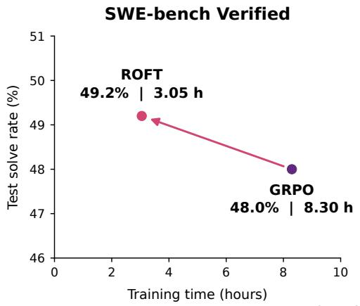

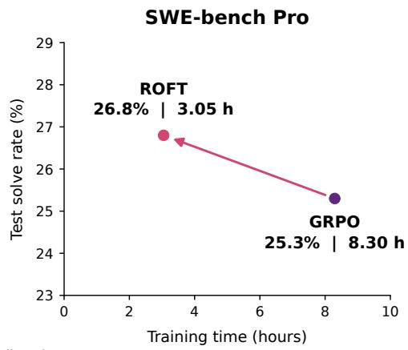  
Figure 1: ROFT achieves competitive performance with 63% less training time than GRPO. Held-out performance of ROFT versus GRPO on agentic coding tasks.

## ABSTRACT

People learn not only by repeating successful actions, but also by recounting and explaining their experiences, revising their understanding to guide future behavior. Can a language-model agent improve its future actions by training only on explanations of its own experience? We investigate this question by studying Retrospection-Only Fine-Tuning (ROFT), a minimal online procedure designed to isolate the effect of explanation-only training on subsequent behavior. The agent attempts a task, observes available feedback, generates a retrospective explanation, and is fine-tuned with a next-token prediction loss on the explanation tokens alone. The procedure uses neither an external teacher nor a reward-based policy update. In software-engineering experiments with Qwen3.5-4B, ROFT is trained on problems with mixed successful and unsuccessful base-model attempts. On held-out SWE-bench Verified and Pro, it reaches 49.2% and 26.8% solve rates after 20 updates without using a verifier, compared with GRPO’s 48.0% and 25.3% after 40 updates in the evaluated runs, and makes faster early progress in training time and sampled attempts. It also learns to solve individual tasks on which all 64 sampled base-model attempts failed, showing that learning can begin without any initially successful trajectories. Behavioral analyses find that ROFT indirectly assigns credit to actions, encouraging good actions and discouraging incorrect ones. Moreover, prompting retrospections to emphasize more direct solutions yields shorter subsequent attempts even without an explicit length penalty. Together, these findings show that learning to explain can also improve learning to do, establishing self-generated retrospections as useful training targets and motivating further study of explanation-to-action transfer.

## 1 INTRODUCTION

We sometimes understand an experience differently in the act of recounting it. Explaining why a conversation went badly, someone might begin with “I did not make my point clearly enough.” But as they reconstruct the exchange, another explanation emerges: they kept defending their proposal while the other person was questioning its premise. The lesson is no longer to explain the same point more forcefully, but to establish which question needs answering. Nothing about the original outcome has changed. What changes is their understanding of what happened—and, with it, how they might act next time. For language-model agents, this suggests a complementary training target: not only the actions taken during an attempt, but retrospective explanations that make sense of the experience.

Reinforcement learning with verifiable rewards (RLVR) offers an effective way to learn from experience by reinforcing task-solving behavior according to its outcomes (Lambert et al., 2024; DeepSeek-AI et al., 2025). Methods such as GRPO use relative rewards among sampled attempts to update the policy (Shao et al., 2024). Yet a single outcome reward, success or failure, does not identify which assumption was mistaken, which decision mattered, or when a correction should apply. This limitation is especially relevant when rewards are sparse: an all-failure group has no within-group binary-reward contrast, even though its trajectories may contain useful evidence.

Natural language can express an interpretation of that evidence, connecting observations to decisions and stating lessons that may apply elsewhere. Prior work has used reflections in several ways: as context for later attempts (Shinn et al., 2023), or to obtain successful reasoning and reflectioninformed solutions for training (Zelikman et al., 2022; Shi et al., 2026). Critique fine-tuning, which trains on critiques as a form of reflection, demonstrates that teacher critiques can be transferred offline to a student to improve its question-answering performance (Wang et al., 2025b; 2026). However, it remains unclear whether training only on self-generated reflection can improve agents. The central question is therefore:

## Can an agent improve its future actions by training only on self-generated retrospective explanations of its own experience?

We call this direction Retrospection Reinforcement (RR): training on self-generated retrospections of past experience, with the aim of improving subsequent behavior. A retrospection may summarize events, track how beliefs evolved, explain decisions or outcomes, identify corrections, or articulate lessons for future attempts. Our procedure trains on this retrospective text rather than directly supervising the recorded task-solving actions. The hypothesis is that learning to explain an experience can improve how the model acts in later attempts. We assess this hypothesis through subsequent task performance and behavior changes, not through the fluency of explanations or a reduction in their prediction loss.

To study this route in isolation, we introduce Retrospection-Only Fine-Tuning (ROFT), a deliberately minimal online procedure. The agent attempts a task, observes the outcome and available feedback, and generates a retrospection of its own attempt. We then fine-tune the same model with a next-token prediction loss on the retrospection tokens only. The task, attempted actions, and observations serve as context, not prediction targets. Both successful and unsuccessful attempts are eligible, and the procedure uses neither an external teacher nor a reward-based policy update. Subsequent attempts receive no stored retrospection and require no additional reflection step: any benefit must transfer through the updated weights. These exclusions make simplicity an experimental choice, isolating what retrospection training can contribute without direct action supervision.

Our software-engineering experiments provide evidence that learning to explain can improve learning to do. First, when trained on problems with both successful and unsuccessful base-model attempts—the learning zone—ROFT achieves higher held-out solve rates than GRPO at the reported checkpoints, with faster early progress in wall-clock time and sampled solution attempts (Sec. 3.1), without a verifier. Second, it learns to solve individual tasks on which all 64 sampled base-model attempts failed, extending learning beyond thefrontier without an initially successful trajectory or variation in binary outcomes (Sec. 3.2). Third, behavioral analyses find changes consistent with indirect credit assignment: likelihood increases are more selective for correct than incorrect recorded turns. Changing the retrospection prompt to emphasize more direct solutions also produces shorter subsequent attempts, despite the absence of an explicit length penalty or action-target loss (Sec. 3.3).

These results suggest a complementary design axis for agent training: not only which experiences to learn from, but what to learn to say about them. Our results show that experience can support useful training targets even when binary outcomes provide no contrast or in the absence of any outcome verdict. The prompt-dependent behavioral changes further suggest that the content of those targets matters: changing what an agent emphasizes in retrospection can change how it subsequently acts. Retrospection is therefore not merely a record of experience, but a potentially steerable source of supervision.

## 2 RETROSPECTION-ONLY TRAINING

An unsuccessful attempt may be a poor example to imitate but still provide useful experience to interpret. Here, we describe how an agent can be trained exclusively on retrospections of its own experience and evaluated on its subsequent task performance.

## 2.1 LEARNING TO EXPLAIN, EVALUATED BY DOING

Learning to do directly optimizes task-solving outputs, including reasoning, answers, and actions. Reward-based updates, imitation, and distillation can all serve this purpose. Learning to explain instead trains the model to produce a retrospective account of a completed attempt. We call this direction Retrospection Reinforcement (RR).

A retrospection is a textual account of past experience, generated in light of the recorded interaction and any available feedback. Its form can range from a trajectory summary or a ledger of evolving beliefs to an explanation of decisions or outcomes, a correction, or a reusable lesson. No particular content structure is required. Retrospections may discuss actions and possible corrections; the distinction is between training on a post-attempt account and directly supervising task-solving actions. Fig. 2 contrasts direct action training with retrospection prediction, where the recorded attempt supplies context rather than prediction targets. Our hypothesis is that learning to explain an experience changes the knowledge and representations available when the same model next acts. Below, we describe a minimal algorithm for studying this hypothesis.

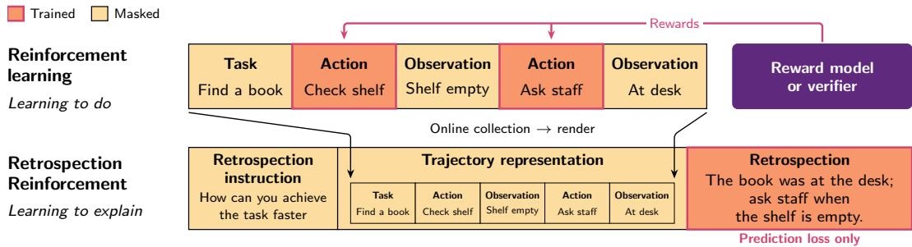  
Both are evaluated by subsequent task performance.  
Figure 2: Illustrative RL versus RR. Black arrows show RR’s online collection and rendering, not RL updates. Orange marks targets; yellow, masked context.

## 2.2 ROFT: A MINIMAL TEST OF EXPLANATION-TO-ACTION TRANSFER

Retrospection-Only Fine-Tuning (ROFT) repeats a simple loop: attempt a task, explain the experience, fit the explanation, and act again using the updated weights. We exclude direct action supervision and retained retrospection so that neither can account for an improvement in doing.

Collect experience. The agent attempts a task x, producing an interaction trajectory τ , and receives available feedback v. In our software-engineering experiments, the record includes actions and observations, the submitted patch, and available test feedback. Both successful and unsuccessful attempts are eligible: the method does not require a successful example to imitate.

Explain the experience. The same model samples K retrospections from a context h(x, τ, v) containing an instruction and a bounded rendering of the record. Our default experimental prompt asks for a consequential assumption or decision, supporting or contradicting evidence, a correction when appropriate, and concrete triggers for applying the lesson. This is one instantiation of retrospection, not a requirement on its form. The model supplies its own interpretations rather than receiving an external teacher’s critiques. Available verdicts condition these interpretations; they do not become reward weights in the objective. The example below shows how even a passing attempt can yield a lesson about a specific decision.

Retrospection after a passing attempt (full prompts and responses in App. D)   
System prompt (abridged).   
Identify a consequential assumption or decision, the evidence for or against it, a correction if needed, and   
concrete triggers for applying the lesson. State uncertainty when evidence is insufficient.   
User prompt (abridged).   
Task: Prevent a failed Pact context-manager test from leaving stale interactions that cause later tests to fail.   
Action: Inspect the context manager’s exit and verify() methods.   
Observation: verify() clears the interaction list, but exit skips it when an exception occurs.   
Action: Clear self. interactions on exceptional exit, then run the Pact and consumer tests.   
Observation: All 70 tests pass.   
Retrospection (final-answer excerpt).   
“The correct decision was to clear interactions directly in exit when an exception is detected, ensuring   
proper state reset regardless of whether verify() is called.”

Fit only the explanation, not the attempt. Let $\mathcal { D } _ { t }$ contain the retained context–retrospection pairs $( h , y )$ for update t. Holding these generated targets fixed, we fine-tune the model $\pi _ { \theta }$ with next-token cross-entropy:

$$
\mathcal { L } _ { \mathrm { R O F T } } ( \theta ; \mathcal { D } _ { t } ) = - \frac { 1 } { T _ { t } } \sum _ { ( h , y ) \in \mathcal { D } _ { t } } \sum _ { j = 1 } ^ { | y | } \log \pi _ { \theta } ( y _ { j } \mid h , y _ { < j } ) , \qquad T _ { t } = \sum _ { ( h , y ) \in \mathcal { D } _ { t } } | y | .\tag{1}
$$

The loss averages globally over retained retrospection tokens. The task, attempted actions, observations, and feedback are masked as prediction targets, although gradients can flow through their context representations. There is no action-target loss, reward-based policy update, or independent semantic-quality filter on the retrospections.

Act again using updated weights. The learner collects fresh attempts and retrospections as training proceeds. Subsequent attempts, including evaluation, receive neither stored retrospection text nor an added retrospection step. Any benefit must therefore transfer through the updated weights, rather than through access to a written lesson. This closes the loop between explaining and doing while keeping their training targets distinct. Sampling settings, target processing, batch construction, and asynchronous weight refresh are specified in App. B.

## 3 RESULTS

We evaluate explanation-to-action transfer through three questions. Does retrospection-only training improve held-out solve rates, and at what training cost? Can learning begin when all sampled base model attempts fail? Does retrospection content shape subsequent behavior as measured by actionlikelihood changes, interventions on retrospection instructions, and changes to content weighting? These questions assess behavioral transfer.

We distinguish two learning regimes using sampled base-model outcomes. A problem is in the learning zone if the base model produces both successful and unsuccessful solutions across k sampled attempts; it is beyond frontier if none of those attempts succeeds. Fig. 3 illustrates the distinction for Qwen3.5-4B on all 500 SWE-bench Verified problems using 16 attempts per problem. The experiments below use three attempts to screen the learning-zone training subset and 64 attempts to establish the all-failure starting points for single-task training.

## 3.1 LEARNING ZONE

We first evaluate generalization and efficiency in the learning zone by comparing ROFT and GRPO initialized from Qwen3.5-4B and trained on SWE-rebench-767, a subset of 767 problems from SWE-rebench (Badertdinov et al., 2025). Our training subset is specifically selected tofavor GRPO: because its reward-derived policy-gradient signal requires variation in rewards within a group, we retain only problems on which Qwen3.5-4B produces both successful and unsuccessful solutions across three initial attempts. We assess held-out performance on SWE-bench Verified (OpenAI, 2024) and SWE-bench Pro (Deng et al., 2025). All three datasets require agents to resolve realworld repository issues by producing code patches evaluated against executable tests. SWE-bench Verified comprises 500 human-validated Python tasks, whereas SWE-bench Pro emphasizes more complex, long-horizon tasks that often require substantial changes across multiple files. Qwen3.5-4B performance is 44.2% and 23.9% on Verified and Pro respectively in our setup.

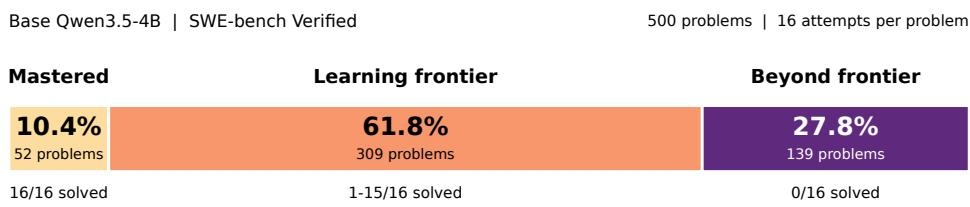  
Figure 3: SWE-bench Verified problems categorized by base model outcomes over 16 attempts. Percentages of problems solved in all, some, or none of 16 attempts pooled from 16 evaluations.

Generalization. ROFT achieves higher held-out solve rates on both benchmarks in Fig. 4b: its 20- update checkpoint reaches 49.2% on SWE-bench Verified and 29.0% on SWE-bench Pro, compared with 48.0% and 25.3% for GRPO at 40 updates. These gains do not require continued improvement in training reward. ROFT’s training curve levels off around 20 updates, whereas GRPO’s reward continues to improve with longer training. Yet GRPO’s Verified solve rate falls from 48.0% at update 40 to 46.0% at update 90 (Fig. 4a), a pattern consistent with overfitting to the training tasks. We hypothesize that ROFT’s early saturation reflects increasingly repetitive retrospections as training revisits familiar tasks, reducing the new supervision they provide, which is consistent with decreasing reflection entropy and SFT loss. See App. E for details.

Training efficiency. Starting from Qwen3.5-4B and training on SWE-rebench-767, ROFT makes faster early progress than GRPO in terms of wall-clock time, optimizer updates, and sampled solution attempts (Fig. 5). With the same allocation of four training and four inference GPUs, ROFT completes 40 updates in 4.32 hours using 6,035 solution attempts, compared with 8.30 hours and 11,576 attempts for GRPO, i.e. approximately half the training time and half as many solution attempts. This early advantage also transfers to held-out performance: ROFT solves 49.0% of SWE-bench Verified after ten updates and 1.29 hours, exceeding the 48.0% achieved by GRPO’s 40-update checkpoint, which takes 8.30 hours (Fig. 4a). Thus, ROFT attains a higher observed test score in roughly one-sixth the training time.

Comparison with prior methods. We also compare ROFT with baselines from prior work, with results in Fig. 11 and method details in App. C. ROFT can also be effectively combined with GRPO by adding a retrospection step to each GRPO rollout (Fig. 7c).

## 3.2 LEARNING BEYOND THE MODEL’S FRONTIER

We next ask whether learning can begin without any observed successful base-model attempts, rather than only on the mixed-success problems. With binary success rewards, an all-failure GRPO group has zero within-group advantage and provides no reward-derived policy-gradient signal, so GRPO does not learn in this regime. ROFT instead obtains supervision from retrospections of failed attempts.

To study an all-failure starting point, we train separate Qwen3.5-4B runs on individual SWE-bench Verified and SWE-rebench tasks, each beginning with 0/64 successful base model attempts on that task and using only self-generated retrospections for supervision. After 40 updates, the online solve rate reaches 1.75% on SymPy and 3.29% on SymbiFlow (Fig. 6). Thus, retrospection-only training can produce successful solutions from an all-failure starting point. Training on a single problem with ROFT does not degrade test-set performance significantly (Fig. 14).

## 3.3 BEHAVIORAL ANALYSIS

Credit assignment. Can retrospection-only training assign credit to individual actions? We evaluate a fixed set of base model trajectories on SWE-rebench-767, with assistant turns labeled for correctnes by GPT-6 Astra using the recorded evidence. For each turn, including both reasoning and actions, we compare its mean token log-likelihood under the initial Qwen3.5-4B model and after ten optimizer updates of ROFT or GRPO, conditioning on the same recorded history. Fig. 7a shows the fraction of turns whose likelihood increases, computed separately for each correctness label within each trajectory and then averaged equally across trajectories containing that label. Under RR, correct turns increase in likelihood more often than incorrect turns (32.41% versus 21.21%), whereas GRPO shows similar rates for both (44.14% versus 45.30%). This separation is consistent with indirect credit assignment without direct action supervision. See Sec. G.1 for details.

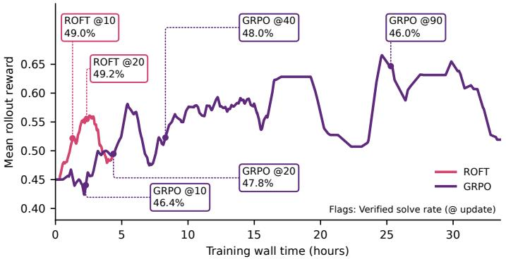  
(a) Training reward and held-out evaluations.

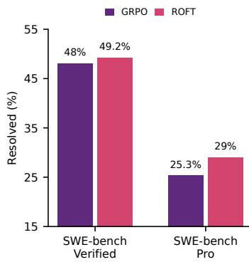  
(b) Held-out performance.

Figure 4: Early training gains transfer to held-out tasks, while later training reward need not improve generalization. (a) Training reward through 40 ROFT updates and 100 GRPO updates. Flags report separate SWE-bench Verified test set solve rates at the marked checkpoints. (b) Solve rates on SWE-bench Verified and SWE-bench Pro for ROFT at update 20 and GRPO at update 40.  
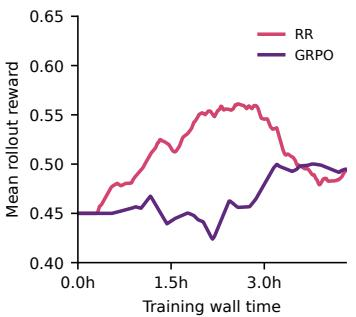  
(a) Training wall time.

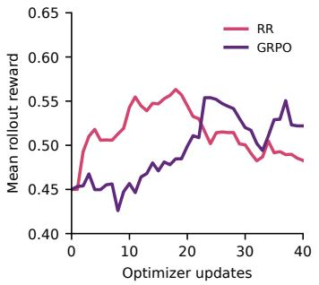  
(b) Optimizer updates.

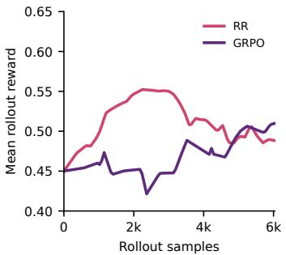  
(c) Sampled solution attempts.  
Figure 5: ROFT has higher training efficiency. ROFT and GRPO trained on SWE-rebench, with training reward plotted against (a) wall time, (b) optimizer updates, and (c) completed solution attempts, including zero-advantage attempts rejected by GRPO. See App. E for details.

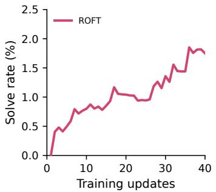  
(a) SymPy 20916 (SWE-bench Verified).

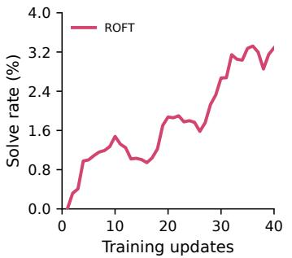  
(b) SymbiFlow 17 (SWE-rebench).

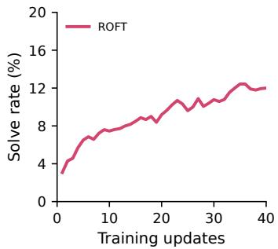  
(c) Pylint 6386 (SWE-bench Verified).  
Figure 6: ROFT can improve performance on near and beyond frontier problems. Online solve rates during 40 updates of ROFT on a single task. SymPy and SymbiFlow begin with 0/64 successes; Pylint begins with 2/64 and reaches a smoothed solve rate of 12.00% at update 40. We see similar results on Django and with longer training runs (Sec. F.2).

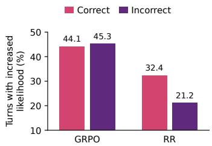  
(a) Turn likelihood increases.

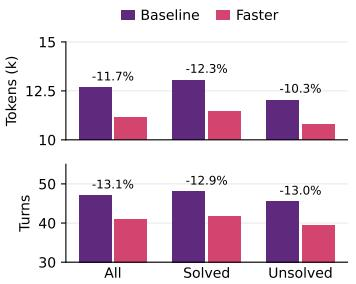  
(b) Rollout lengths at update 10.

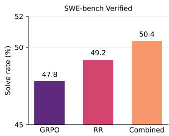  
(c) ROFT combined with GRPO.  
Figure 7: (a) RR conducts more credit assignment than GRPO. Bars show trajectory-balanced fractions of recorded turns whose mean token log-likelihood increases relative to the initial model after ten optimizer updates. Under RR, correct turns increase in likelihood more often than incorrect turns; GRPO shows little separation. This pattern is consistent with indirect credit assignment from retrospection-only training. We attribute the lower likelihood-increase fractions under RR to its larger policy shift over the same ten updates. (b) We can induce behaviors such as completing the task faster through RR alone without any length penalties. Mean tokens and turns per trajectory under the baseline ROFT prompt and a variant that prompts the model to retrospect on how to solve the task faster. (c) ROFT can be combined with GRPO. Update 20 performance. See Secs. G.1 and G.2.

Inducing behavioral changes through retrospection. Can the content of retrospection steer subsequent task-solving behavior? We compare standard ROFT with a variant that asks the model to identify how it could have solved the task more directly after a successful attempt while preserving correctness. Both runs use the same initialization, training data, solver prompt, and retrospection-only objective. The variant uses 11.7% fewer generated assistant tokens and 13.1% fewer assistant turns than the baseline (Fig. 7b). These observations are consistent with content-directed behavioral change from training on retrospections alone, without an explicit length penalty or action-target supervision. Sec. G.2 gives the experimental procedure, complete prompts, and detailed results.

Fine-grained analysis of action-trajectory changes. Where does learning to explain change the model’s subsequent action predictions? We isolate a single retrospection-only update of Qwen3.5-4B on 255 retrospections from 64 source attempts, then compare the full next-token distributions before and after training on the same original rollout prefixes. Among the mechanically identified roles, reasoning has the largest task-balanced mean forward KL, a 3.45× difference from tool calls (Fig. 8). Changes are also concentrated earlier in the rollout: the first normalized assistant-turn decile has the largest mean KL (Fig. 16). Read/search contexts shift more than modification contexts: the task-balanced mean KL for Glob and Read is 1.35–1.89 times that for Write and Edit across the four pairwise comparisons. These patterns are consistent with transfer to reasoning and information gathering despite the absence of action-target supervision. See Sec. G.3 for details.

Weighting retrospection contents. Does emphasizing particular retrospection content improve subsequent task solving? Using the same frozen retrospections, we compare uniform target weights (Uniform) with variants that double the relative weight of evidence, task-specific corrections, reusable lessons, or thinking tokens. GPT-6 Astra labels the evidence, correction, and lesson categories; thinking tokens are identified mechanically. Attention-up instead weights each nonstructural target token by one plus the base model’s mean attention mass to the user prompt when predicting it. All variants receive one update from the same base model, with weights normalized to mean one across the target batch. We evaluate each checkpoint on the same 64 training problems with ten paired evaluation seeds, yielding 640 attempts per model. Attention-up, correction-up, and evidence-up have the highest observed solve rates among these variants: 54.69%, 54.38%, and 54.22%, respectively, versus 50.63% for Uniform (Fig. 8).

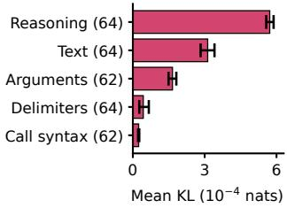  
(a) KL conditioned on role.

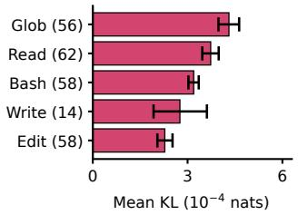  
(b) KL conditioned on tool.

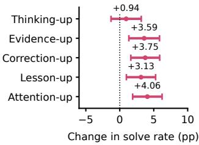  
(c) Retrospection impact.  
Figure 8: (a, b) Reasoning and read/search contexts show larger prediction changes. KL divergence on fixed trajectories before and after one ROFT update, grouped by token roles and tools. (c) Evidence, correction, and attention weighting yield the largest observed solve-rate gains. Solve-rate changes relative to uniform weighting (Uniform) after one update with doubled category weights or continuous prompt-attention weights (Attention-up), normalized to mean one. Points show means with ±1 bootstrap SE; evaluation uses ten repetitions on each of the 64 training problems (640 attempts per model). Details in Sec. G.3.

Why might retrospection training work? We hypothesize that RR improves behavior by refining the model’s understanding of an experience rather than directly reinforcing individual actions. Revising an assumption or learning when a correction applies may influence many future decisions, providing a route to generalization and potentially explaining the faster early progress relative to GRPO. Such higher-level supervision can also be more fine-grained than a trajectory-level reward: evidence grounds an explanation in observed behavior, while corrections identify which decisions should change and why. Correct and incorrect turns show a larger gap in likelihood-increase rates under RR than under GRPO, consistent with more selective credit assignment (Fig. 7a). Mechanistically, predicting retrospection tokens can backpropagate gradients through attention to representations of the recorded actions and observations, updating shared model parameters even though the trajectory tokens themselves carry no prediction loss. This provides a pathway for explanation training to change subsequent actions without directly supervising them. Consistent with this, giving greater weight to retrospection tokens whose predictions attend more strongly to the user prompt containing the trajectory yields a higher observed solve rate than uniform weighting (Fig. 8c). These findings motivate future work to trace how retrospection gradients reshape action-relevant representations and to test the role of this pathway in learning speed and generalization.

## 3.4 ABLATING THE RETROSPECTION LEARNING SIGNAL

Number of retrospections per rollout. Four retrospections per rollout give the highest observed test performance in this sweep, suggesting a useful balance between rollout diversity and retrospection diversity (Fig. 9b). We compare 2, 4, and 8 independently sampled retrospections per rollout, using 128, 64, and 32 source rollouts, respectively, to keep 256 nominal retrospection targets per update. Fewer retrospections expose training to more source trajectories, whereas more retrospections provide more independently sampled interpretations of each trajectory. Neither extreme improves on the four-retrospection control here. See Sec. H.3 for details.

Different model. The advantage over GRPO also holds for Qwen3.5-9B: after 20 updates, ROFT solves 58.8% of SWE-bench Verified versus 55.8% for GRPO (Fig. 9c), using 1.93 versus 5.33 training hours. For Qwen3.5-9B, training performance begins to plateau around 20 updates. Sec. H.4 gives the training and evaluation protocol.

Verdict vs. no verdict. Providing the final correctness verdict does not improve the observed SWE-bench Verified score in this comparison: after 20 updates, both the verdict-conditioned baseline and the no-verdict variant achieve 49.2% (Fig. 18). The no-verdict variant generates retrospections from the trajectory summary and final patch, without the final grader feedback. We hypothesize that environmental feedback already present in the trajectory, including observations from the agent’s own tests, provides sufficient context to generate useful retrospections without an explicit final correctness label. Sec. H.1 describes the training and evaluation protocols.

Off-policy reflections and offline. Does it matter whether the model learns from its own current retrospections? Fig. 9a compares three training regimes at 20 updates. Online RR, in which the evolving learner generates both attempts and retrospections, achieves 49.2%. Freezing the retrospection generator at the base model while continuing to refresh learner attempts yields 47.4%. Fully offline RR instead trains on a fixed corpus of base model attempts and retrospections and reaches 48.0%. The online procedure has the highest observed score, while fully offline training outperforms off-policy reflections. This ordering is consistent with a benefit from keeping the attempt and retrospection generators aligned, rather than refreshing attempts alone. See Sec. H.2 for details.

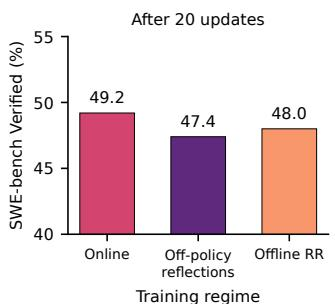  
(a) Online, off-policy, and offline.

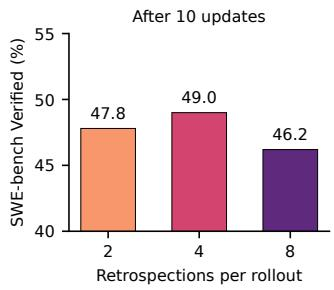  
(b) Retrospections per rollout.

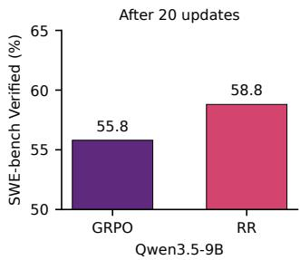  
(c) Qwen3.5-9B at 20 updates.  
Figure 9: (a) Online RR has the highest observed solve rate. SWE-bench Verified performance from Qwen3.5-4B with online, off-policy, or offline retrospection training. Off-policy reflections freeze the retrospection generator; offline RR freezes both the attempt and retrospection generators before training. (b) Four retrospections per rollout perform best in this sweep. Solve rates when varying retrospections per rollout and inversely varying source rollouts, holding the nominal retrospection batch fixed. (c) The advantage over GRPO also holds for Qwen3.5-9B. SWE-bench Verified solve rates under ROFT and GRPO from the same larger base model. Details in App. H.

## 4 RELATED WORK

Work leveraging retrospection and feedback broadly follows three routes: using interpretations to supervise task behavior, training on the feedback itself, or retaining it as context for later attempts. Retrospection reinforcement asks whether learning to explain one’s own experience can support learning to do: improving subsequent actions without directly training them or retaining explanations in context. Our procedure uses supervised fine-tuning on retrospections rather than reinforcement learning (RL). Fig. 10 illustrates these three routes and distinguishes their conditioning context from their direct training targets. An extended comparison is provided in App. A.

Context internalization. Context internalization transfers privileged information into the model’s weights so that it acts as if that information were still in its prompt. Training then makes that behavior available without the context. STaR illustrates a related supervised route: for a failed problem, it supplies the correct answer as a hint, generates a rationale, and retains the reasoning-and-answer sequence if the answer is correct. It then fine-tunes on that sequence without the hint (Zelikman et al., 2022). On-Policy Context Distillation (OPCD), RLTF-SD, and OPSD pursue a similar transfer using teacher predictions and, in the latter two, reward-based updates (Ye et al., 2026b; Song et al., 2026; Penaloza et al., 2026). ERL combines this idea with reflection-guided retries, distilling successful revised behavior while also reinforcing attempts and reflections (Shi et al., 2026). Simple selfdistillation (SSD) removes the privileged context, fine-tuning on the model’s own samples at shifted temperatures (Zhang et al., 2026a). These methods share a common training target: actions; our procedure instead makes the retrospection itself the training target.

Learning from textual feedback. Predicting feedback offers a more direct route from an interpretation to the model’s weights. RLTF-FM adds feedback prediction to reward-based task training (Song et al., 2026); Early Experience trains reflections and expert actions together (Zhang et al., 2025). Both therefore retain direct action supervision, although only RLTF uses RL. Critique Fine-Tuning (CFT) is closer to our procedure: training on teacher critiques can improve question answering without a separate answer-training objective (Wang et al., 2025b). Self-Critique Fine-Tuning (SCFT) uses reattempts to filter critiques (Wang et al., 2026). We study this same transfer in an online agent setting, using the actor’s own outcome-conditioned retrospections rather than externally taught or correctness-filtered critiques. We omit action-target losses to isolate retrospection reinforcement.

Table 1: $\checkmark \mathrm { y e s } ; \times \mathrm { n o } ;$ ∼ partial: —: no weight training. Actions: directly trains task-solving outputs, including solutions within critiques; Online: fresh model generations during training; otherwise offline. Reflections: reflection/critique tokens are training targets. Teacher/demo: requires external teachers/demonstrations. Verdict: requires verifier correctness judgments, not just environment observations. In context: reflections used in context to affect actions. Reward: scalar reward required for training.
<table><tr><td>Method</td><td>Trains actions</td><td>Online training</td><td>Trains reflections</td><td>Teacher/ demo</td><td>Verdict required</td><td>Reflection in context</td><td>Scalar reward</td></tr><tr><td>RLTF</td><td>√</td><td>√</td><td>√</td><td>√</td><td>√</td><td>√</td><td>√</td></tr><tr><td>ERL</td><td>√</td><td>√</td><td>√</td><td>×</td><td>√</td><td>√</td><td>√</td></tr><tr><td>OPCD (experience)</td><td>√</td><td>√</td><td>×</td><td>2</td><td>×</td><td>√</td><td>×</td></tr><tr><td>STaR</td><td>√</td><td>√</td><td>×</td><td>×</td><td>√</td><td>×</td><td>×</td></tr><tr><td>Early Experience SR</td><td>√</td><td>×</td><td>√</td><td>√</td><td>×</td><td>√</td><td>×</td></tr><tr><td>Reflexion / Self-Refine</td><td>×</td><td>一</td><td>×</td><td>×</td><td>×</td><td>√</td><td>×</td></tr><tr><td>CFT</td><td>×</td><td>×</td><td>√</td><td>√</td><td>√</td><td>×</td><td>×</td></tr><tr><td>SCFT</td><td>√</td><td>×</td><td>√</td><td>×</td><td>√</td><td>×</td><td>×</td></tr><tr><td>RR (ours)</td><td>×</td><td>√</td><td>√</td><td>×</td><td>×</td><td>×</td><td>×</td></tr></table>

Inference-time reflection. Alternatively, an interpretation can improve behavior by remaining available to the actor. Reflexion and Self-Refine pass feedback into later generations rather than update model weights (Shinn et al., 2023; Madaan et al., 2023). Scattered Forest Search and Strategist similarly use feedback to search over code or textual strategies (Light et al., 2025b; 2024a). Training the reflection generator does not remove this dependence: Retroformer trains a reflector, and RetroAct trains both actor and reflector, but their reflections still guide later trials (Yao et al., 2023; Feng et al., 2025). Our procedure removes that route: later attempts receive no carried-over reflection, so any benefit must transfer through the updated actor’s weights. Tab. 1 summarizes these distinctions.

## 5 LIMITATIONS

The cost of training and evaluating long-horizon agents limits the breadth of our experiments, which focus on software engineering with Qwen3.5-4B. A single 40-update GRPO training run costs \$500, for example, at current market rates for GPUs, and a single evaluation run on SWE-bench Pro incurs \$200 in GPU costs alone. We chose ROFT for its simplicity rather than optimality: even this minimal procedure can improve subsequent actions by training only on self-generated explanations. Our behavioral analyses support this transfer and motivate larger, controlled studies across models and domains to identify its causal mechanisms and guide more effective ways to generate and internalize useful explanations.

## 6 CONCLUSION

We explore whether an agent can improve its future actions by training only on self-generated retrospective explanations of its own experience. ROFT isolates this question with a minimal online procedure in which effects transfer to later attempts through the updated weights, and our findings show that learning to explain can also improve learning to do. This motivates algorithms that learn to assign credit and shape behavior through language, rather than encoding every desired change in a scalar reward. This direction is especially relevant for long-horizon agents, where sparse outcomes provide little guidance about which intermediate decisions mattered. Grounding retrospections in observations could also broaden learning beyond curated tasks with human-crafted verifiers, making ordinary interaction a source of supervision. The next challenge is to learn which interpretations deserve to be internalized, so that agents improve from evidence rather than reinforce plausible but mistaken explanations.

## AI USE STATEMENT

We used generative AI tools, including GitHub Copilot, to assist with drafting and revising the paper, literature retrieval and discovery, research ideation and execution, and the development of mathematical claims and proofs. Writing assistance included proposing and refining the title, abstract, submission summary, and keywords. The authors have checked all AI-assisted text, references, analyses, and mathematical claims. We take responsibility for the final content of this work, including text, claims, and artifacts produced with generative-AI assistance. Separately, the model-generated retrospective training targets are part of the experimental method described in Sec. 2.2. GPT-6 Astra also supplied trajectory-turn correctness labels and semantic retrospection-span annotations for the behavioral analyses in App. G; these annotations are model judgments, not independently audited ground truth.

## ETHICS STATEMENT

This work studies software-engineering agents on existing benchmarks using model-generated attempts and retrospections, rather than deploying them to end users. Improved coding agents can support software maintenance, but can also generate insecure or incorrect code and lower barriers to misuse. Benchmark test success does not establish safety, security, or reliability outside the evaluated tasks. Self-generated retrospections can reinforce mistaken explanations or biased assumptions and should not be treated as faithful accounts of a model’s internal reasoning. Deployment would require independent validation, restricted tool permissions, isolated execution environments, and human oversight appropriate to the application. Reuse or redistribution of the underlying models, benchmark data, repository code, and derived artifacts remains subject to their respective licenses and terms; public availability does not by itself remove privacy or intellectual-property concerns. Training and evaluation also incur computational and environmental costs. Our reported efficiency improvements are specific to the measured experimental budgets, not estimates of lifecycle environmental impact.

## REPRODUCIBILITY STATEMENT

The training objective and online update procedure are specified in Sec. 2.2. App. B documents the base model, training tasks, agent environment, sampling settings, target preprocessing and masking, optimizer hyperparameters, compute, and checkpointing. Complete retrospection prompts and generated examples appear in App. D. Baseline implementations are described in App. C, and experiment-specific protocols, budgets, evaluation settings, aggregation, and uncertainty estimates are reported in Apps. E to H. The paper-source assets retain plotting scripts and saved numerical inputs for regenerating figures without repeating model training or inference; plot regeneration is distinct from reproducing the underlying experiments. We will release selected components of the training and evaluation code upon acceptance. Exact reruns may differ because generation is stochastic and asynchronous execution affects batch composition, as described in App. B.

## REFERENCES

Pranjal Aggarwal and Sean Welleck. L1: Controlling how long a reasoning model thinks with reinforcement learning, 2025. URL https://arxiv.org/abs/2503.04697.

Amanda Askell, Yuntao Bai, Anna Chen, Dawn Drain, Deep Ganguli, Tom Henighan, Andy Jones, Nicholas Joseph, Ben Mann, Nova DasSarma, Nelson Elhage, Zac Hatfield-Dodds, Danny Hernandez, Jackson Kernion, Kamal Ndousse, Catherine Olsson, Dario Amodei, Tom Brown, Jack Clark, Sam McCandlish, Chris Olah, and Jared Kaplan. A general language assistant as a laboratory for alignment, 2021. URL https://arxiv.org/abs/2112.00861.

Ibragim Badertdinov, Alexander Golubev, Maksim Nekrashevich, Anton Shevtsov, Simon Karasik, Andrei Andriushchenko, Maria Trofimova, Daria Litvintseva, and Boris Yangel. SWE-rebench: An automated pipeline for task collection and decontaminated evaluation of software engineering agents, 2025. URL https://arxiv.org/abs/2505.20411.

Angelica Chen, Jer´ emy Scheurer, Tomasz Korbak, Jon Ander Campos, Jun Shern Chan, Samuel R.´ Bowman, Kyunghyun Cho, and Ethan Perez. Improving code generation by training with natural language feedback, 2023. URL https://arxiv.org/abs/2303.16749.

DeepSeek-AI et al. DeepSeek-R1: Incentivizing reasoning capability in LLMs via reinforcement learning, 2025. URL https://arxiv.org/abs/2501.12948.

Xiang Deng, Jeff Da, Edwin Pan, Yannis Yiming He, Charles Ide, Kanak Garg, Niklas Lauffer, Andrew Park, Nitin Pasari, Chetan Rane, Karmini Sampath, Maya Krishnan, Srivatsa Kundurthy, Sean Hendryx, Zifan Wang, Vijay Bharadwaj, Jeff Holm, Raja Aluri, Chen Bo Calvin Zhang, Noah Jacobson, Bing Liu, and Brad Kenstler. SWE-Bench Pro: Can AI agents solve long-horizon software engineering tasks?, 2025. URL https://arxiv.org/abs/2509.16941.

Xueyang Feng, Bo Lan, Quanyu Dai, Lei Wang, Jiakai Tang, Xu Chen, Zhenhua Dong, and Ji-Rong Wen. Improving retrospective language agents via joint policy gradient optimization. In Proceedings of the 2025 Conference of the Nations of the Americas Chapter of the Association for Computational Linguistics: Human Language Technologies (Volume 1: Long Papers), pp. 112–141, Albuquerque, New Mexico, April 2025. Association for Computational Linguistics. doi: 10.18653/v1/2025.naacl-long.6. URL https://aclanthology.org/2025.naacl-lon g.6/.

Wei Fu, Jiaxuan Gao, Xujie Shen, Chen Zhu, Zhiyu Mei, Chuyi He, Shusheng Xu, Guo Wei, Jun Mei, Jiashu Wang, Tongkai Yang, Binhang Yuan, and Yi Wu. AReaL: A large-scale asynchronous reinforcement learning system for language reasoning, 2025. URL https://arxiv.org/ab s/2505.24298.

Zhengyao Gu, Jonathan Light, Raul Astudillo, Ziyu Ye, Langzhou He, Henry Peng Zou, Wei Cheng, Santiago Paternain, Philip S. Yu, and Yisong Yue. Actor-Curator: Co-adaptive curriculum learning via policy-improvement bandits for RL post-training, 2026. URL https://arxiv.org/ab s/2602.20532.

Jonas Hubotter, Frederike L¨ ubeck, Lejs Behric, Anton Baumann, Marco Bagatella, Daniel Marta,¨ Ido Hakimi, Idan Shenfeld, Thomas Kleine Buening, Carlos Guestrin, and Andreas Krause. Reinforcement learning via self-distillation, 2026. URL https://arxiv.org/abs/2601 .20802.

Minseon Kim, Zhengyan Shi, Emiliano Penaloza, Christopher Cui, Roger Creus Castanyer, Maryam Hashemzadeh, Isadora White, Jonathan Light, Jeonghye Kim, Matheus Pereira, Darya Moldavskaya, Chinmay Singh, Fabio Vera, Baolin Peng, Xingdi Yuan, Marc-Alexandre Cotˆ e, and´ Alessandro Sordoni. FrogNano: Training a 4B coding agent via online task synthesis, 2026. URL https://arxiv.org/abs/2609.07925.

Nathan Lambert, Jacob Morrison, Valentina Pyatkin, Shengyi Huang, Hamish Ivison, Faeze Brahman, Lester James V. Miranda, Alisa Liu, Nouha Dziri, Shane Lyu, Yuling Gu, Saumya Malik, Victoria Graf, Jena D. Hwang, Jiangjiang Yang, Ronan Le Bras, Oyvind Tafjord, Chris Wilhelm, Luca Soldaini, Noah A. Smith, Yizhong Wang, Pradeep Dasigi, and Hannaneh Hajishirzi. Tulu 3:¨ Pushing frontiers in open language model post-training, 2024. URL https://arxiv.org/ abs/2411.15124.

Jiwei Li, Alexander H. Miller, Sumit Chopra, Marc’Aurelio Ranzato, and Jason Weston. Dialogue learning with human-in-the-loop, 2016. URL https://arxiv.org/abs/1611.09823.

Jonathan Light, Min Cai, Sheng Shen, and Ziniu Hu. AvalonBench: Evaluating LLMs playing the game of avalon, 2023. URL https://arxiv.org/abs/2310.05036.

Jonathan Light, Min Cai, Weiqin Chen, Guanzhi Wang, Xiusi Chen, Wei Cheng, Yisong Yue, and Ziniu Hu. Strategist: Self-improvement of LLM decision making via bi-level tree search, 2024a. URL https://arxiv.org/abs/2408.10635.

Jonathan Light, Sixue Xing, Yuanzhe Liu, Weiqin Chen, Min Cai, Xiusi Chen, Guanzhi Wang, Wei Cheng, Yisong Yue, and Ziniu Hu. PIANIST: Learning partially observable world models with LLMs for multi-agent decision making, 2024b. URL https://arxiv.org/abs/2411.1 5998.

Jonathan Light, Wei Cheng, Benjamin Riviere, Wu Yue, Masafumi Oyamada, Mengdi Wang, Yisong Yue, Santiago Paternain, and Haifeng Chen. DISC: Dynamic decomposition improves LLM inference scaling, 2025a. URL https://arxiv.org/abs/2502.16706.

Jonathan Light, Yue Wu, Yiyou Sun, Wenchao Yu, Yanchi Liu, Xujiang Zhao, Ziniu Hu, Haifeng Chen, and Wei Cheng. Scattered forest search: Smarter code space exploration with LLMs. In International Conference on Learning Representations, 2025b. URL https://arxiv.org/ abs/2411.05010.

Haoran Liu, Yuwei Zhang, Xiyao Li, Bohan Lyu, and Jingbo Shang. HERO: Hindsight-enhanced reflection from environment observations for agentic self-distillation, 2026a. URL https: //arxiv.org/abs/2606.11559.

Ye Liu, Srijan Bansal, Bo Pang, Yang Li, Zeyu Leo Liu, Yifei Ming, Zixuan Ke, Shafiq Joty, and Semih Yavuz. Procedural memory distillation: Online reflection for self-improving language models, 2026b. URL https://arxiv.org/abs/2607.01480.

Aman Madaan, Niket Tandon, Prakhar Gupta, Skyler Hallinan, Luyu Gao, Sarah Wiegreffe, Uri Alon, Nouha Dziri, Shrimai Prabhumoye, Yiming Yang, Shashank Gupta, Bodhisattwa Prasad Majumder, Katherine Hermann, Sean Welleck, Amir Yazdanbakhsh, and Peter Clark. Self-Refine: Iterative refinement with self-feedback, 2023. URL https://arxiv.org/abs/2303.17651.

OpenAI. Introducing SWE-bench Verified. Benchmark release, 2024. URL https://openai.c om/index/introducing-swe-bench-verified/.

Emiliano Penaloza, Dheeraj Vattikonda, Nicolas Gontier, Alexandre Lacoste, Laurent Charlin, and Massimo Caccia. Privileged information distillation for language models, 2026. URL https://arxiv.org/abs/2602.04942.

Penghui Qi, Xiangxin Zhou, Zichen Liu, Tianyu Pang, Chao Du, Min Lin, and Wee Sun Lee. Rethinking the trust region in LLM reinforcement learning, 2026. URL https://arxiv.or g/abs/2602.04879.

Qwen Team. Qwen3.5-4B model card. Hugging Face, 2026. URL https://huggingface.co /Qwen/Qwen3.5-4B.

Jer´ emy Scheurer, Jon Ander Campos, Tomasz Korbak, Jun Shern Chan, Angelica Chen, Kyunghyun´ Cho, and Ethan Perez. Training language models with language feedback at scale, 2023. URL https://arxiv.org/abs/2303.16755.

Zhihong Shao, Peiyi Wang, Qihao Zhu, Runxin Xu, Junxiao Song, Xiao Bi, Haowei Zhang, Mingchuan Zhang, Y. K. Li, Y. Wu, and Daya Guo. DeepSeekMath: Pushing the limits of mathematical reasoning in open language models, 2024. URL https://arxiv.org/abs/ 2402.03300.

Taiwei Shi, Sihao Chen, Bowen Jiang, Linxin Song, Longqi Yang, and Jieyu Zhao. Experiential reinforcement learning, 2026. URL https://arxiv.org/abs/2602.13949.

Noah Shinn, Federico Cassano, Edward Berman, Ashwin Gopinath, Karthik Narasimhan, and Shunyu Yao. Reflexion: Language agents with verbal reinforcement learning, 2023. URL https://arxiv.org/abs/2303.11366.

Charlie Snell, Dan Klein, and Ruiqi Zhong. Learning by distilling context, 2022. URL https: //arxiv.org/abs/2209.15189.

Yuda Song, Lili Chen, Fahim Tajwar, Remi Munos, Deepak Pathak, J. Andrew Bagnell, Aarti Singh, and Andrea Zanette. Expanding the capabilities of reinforcement learning via text feedback, 2026. URL https://arxiv.org/abs/2602.02482.

Hanbin Wang, Jingwei Song, Jinpeng Li, Qi Zhu, Fei Mi, Ganqu Cui, Yasheng Wang, and Lifeng Shang. Teaching large reasoning models effective reflection, 2026. URL https://arxiv.or g/abs/2601.12720.

Tianchun Wang, Zichuan Liu, Yuanzhou Chen, Jonathan Light, Weiyang Liu, Haifeng Chen, Xiang Zhang, and Wei Cheng. On the effect of sampling diversity in scaling LLM inference, 2025a. URL https://arxiv.org/abs/2502.11027.

Yubo Wang, Xiang Yue, and Wenhu Chen. Critique fine-tuning: Learning to critique is more effective than learning to imitate, 2025b. URL https://arxiv.org/abs/2501.17703.

Jason E. Weston. Dialog-based language learning. In Advances in Neural Information Processing Systems, volume 29, 2016. URL https://papers.nips.cc/paper\_files/paper/2 016/hash/07563a3fe3bbe7e3ba84431ad9d055af-Abstract.html.

Weiran Yao, Shelby Heinecke, Juan Carlos Niebles, Zhiwei Liu, Yihao Feng, Le Xue, Rithesh Murthy, Zeyuan Chen, Jianguo Zhang, Devansh Arpit, Ran Xu, Phil Mui, Huan Wang, Caiming Xiong, and Silvio Savarese. Retroformer: Retrospective large language agents with policy gradient optimization, 2023. URL https://arxiv.org/abs/2308.02151.

Tianzhu Ye, Li Dong, Qingxiu Dong, Xun Wu, Shaohan Huang, and Furu Wei. Online experiential learning for language models, 2026a. URL https://arxiv.org/abs/2603.16856.

Tianzhu Ye, Li Dong, Xun Wu, Shaohan Huang, and Furu Wei. On-policy context distillation for language models, 2026b. URL https://arxiv.org/abs/2602.12275.

Qiying Yu, Zheng Zhang, Ruofei Zhu, Yufeng Yuan, Xiaochen Zuo, Yu Yue, Weinan Dai, Tiantian Fan, Gaohong Liu, Lingjun Liu, Xin Liu, Haibin Lin, Zhiqi Lin, Bole Ma, Guangming Sheng, Yuxuan Tong, Chi Zhang, Mofan Zhang, Wang Zhang, Hang Zhu, Jinhua Zhu, Jiaze Chen, Jiangjie Chen, Chengyi Wang, Hongli Yu, Yuxuan Song, Xiangpeng Wei, Hao Zhou, Jingjing Liu, Wei-Ying Ma, Ya-Qin Zhang, Lin Yan, Mu Qiao, Yonghui Wu, and Mingxuan Wang. DAPO: An open-source LLM reinforcement learning system at scale, 2025. URL https://arxiv.org/ abs/2503.14476.

Eric Zelikman, Yuhuai Wu, Jesse Mu, and Noah D. Goodman. STaR: Bootstrapping reasoning with reasoning, 2022. URL https://arxiv.org/abs/2203.14465.

Kai Zhang, Xiangchao Chen, Bo Liu, Tianci Xue, Zeyi Liao, Zhihan Liu, Xiyao Wang, Yuting Ning, Zhaorun Chen, Xiaohan Fu, Jian Xie, Yuxuan Sun, Boyu Gou, Qi Qi, Zihang Meng, Jianwei Yang, Ning Zhang, Xian Li, Ashish Shah, Dat Huynh, Hengduo Li, Zi Yang, Sara Cao, Lawrence Jang, Shuyan Zhou, Jiacheng Zhu, Huan Sun, Jason Weston, Yu Su, and Yifan Wu. Agent learning via early experience, 2025. URL https://arxiv.org/abs/2510.08558.

Ruixiang Zhang, Richard He Bai, Huangjie Zheng, Navdeep Jaitly, Ronan Collobert, and Yizhe Zhang. Embarrassingly simple self-distillation improves code generation. arXiv preprint arXiv:2604.01193, 2026a.

Yuwei Zhang, Sha Li, Changlong Yu, Qin Lu, Shuowei Jin, Chengyu Dong, Haoran Liu, Ilgee Hong, Xintong Li, Zhenyu Shi, Bing Yin, and Jingbo Shang. Learning with rare success but rich feedback via reflection-enhanced self-distillation, 2026b. URL https://arxiv.org/abs/2605.1 2741.

Andrew Zhao, Daniel Huang, Quentin Xu, Matthieu Lin, Yong-Jin Liu, and Gao Huang. ExpeL: LLM agents are experiential learners, 2023. URL https://arxiv.org/abs/2308.10144.

## APPENDIX CONTENTS

A Related Work (Extended) 17   
A.1 Context internalization: learning behavior informed by feedback 18   
A.2 Learning from textual feedback: predicting the interpretation 18   
A.3 Inference-time reflection: retaining interpretations as context 19   
B Experimental Setup 20   
B.1 Model, tasks, and agent environment . 20   
B.2 Retrospection generation and supervision 20   
B.3 Online optimization 21   
B.4 Compute and checkpointing 22   
C Baselines 22   
C.1 Held-out performance . 22   
C.2 GRPO 23   
C.3 ERL 24   
C.4 CFT 24   
C.5 SCFT 24   
C.6 SSD 25   
D Retrospection Prompts and Examples 25   
D.1 Failed attempt: database-session parameter collision . 25   
D.2 Successful attempt: context-manager cleanup 33   
E Generalization and Training Efficiency Experiments 50   
E.1 Experimental Protocol 50   
E.2 Training Curves 50   
E.3 Held-Out Performance 50   
F Single-Task Training Experiments 50   
F.1 Single-Task Training and Measurement 50   
F.2 Additional Single-Task Learning Results . 51   
F.3 Test-Set Performance after Single-Task Training . 51   
G Behavioral Analyses 52   
G.1 Likelihood Changes by Turn Correctness . 52   
G.2 Rollout Lengths with Efficiency-Focused Retrospections 53   
G.3 Fine-Grained Trajectory and Retrospection-Token Analyses . 55   
G.4 Token-Level Examples 57   
H Ablations 59   
H.1 Retrospection with and without a Verdict . 59   
H.2 Online, Off-Policy Reflections, and Offline RR 59   
H.3 Number of Retrospections per Rollout . 60   
H.4 Scaling to Qwen3.5-9B . 60

## A RELATED WORK (EXTENDED)

Retrospection reinforcement (RR) studies whether learning to explain past experience can improve future actions. Our procedure collects the agent’s own attempts and available feedback, generates retrospections with the same model, and applies next-token cross-entropy only to the retrospective continuations. Subsequent attempts use updated weights without the earlier retrospections in context. The relevant distinction from prior work is therefore not the presence of reflective language, but its role in learning: feedback can supervise task behavior, become a prediction target itself, or remain available as inference-time context. Following the main text, we organize the comparison around these three routes, illustrated in Fig. 10.

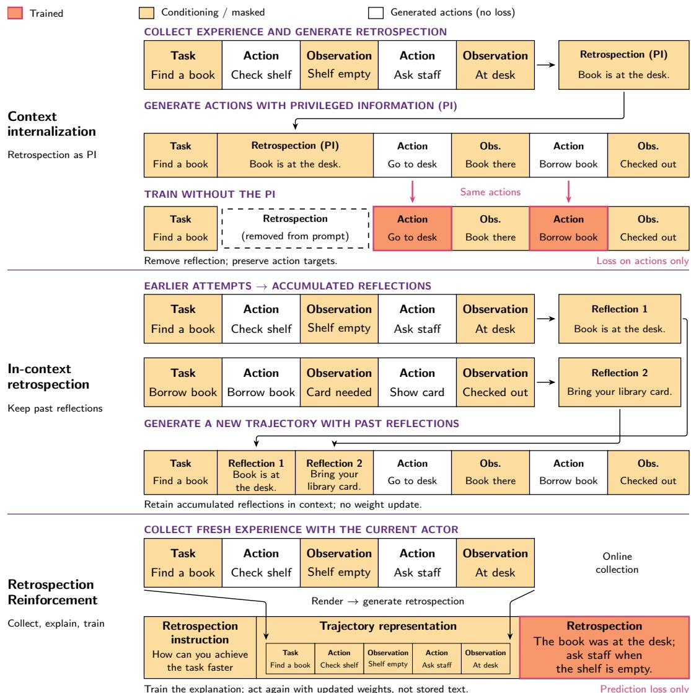

Figure 10: Three uses of retrospection. Top: context internalization collects experience, generates a retrospection containing privileged information (PI), and uses it to generate action targets. Training removes that context (dashed box). Middle: earlier attempts yield reflections accumulated in later prompts, without a weight update. Bottom: RR collects fresh experience and trains its retrospection; later attempts use updated weights without stored text. Black arrows show data flow, not gradient updates. Orange marks training targets; yellow marks conditioning context. Miniatures are trajectory representations, which may be rendered, summarized, or truncated. These illustrative routes can be combined; the top row depicts action-target distillation, not every internalization method.

## A.1 CONTEXT INTERNALIZATION: LEARNING BEHAVIOR INFORMED BY FEEDBACK

An interpretation can improve a policy by helping construct better task outputs for training. Imitation learning from language feedback (ILF) generates feedback-conditioned revisions and trains the task model on selected revisions rather than on the feedback itself (Scheurer et al., 2023; Chen et al., 2023). STaR similarly fine-tunes on generated reasoning-and-answer sequences that yield correct answers (Zelikman et al., 2022). Failed problems can be revisited by supplying the correct answer as a hint and generating a rationalization, so STaR does not simply discard unsuccessful experience. In both cases, however, the retained target practices a successful response. RR instead trains an account of the completed attempt, without requiring a successful replacement trajectory.

Context distillation makes the transfer from guidance to behavior explicit: a teacher receives information that the deployed student will not receive, and training aligns the student’s predictions with the teacher’s (Askell et al., 2021; Snell et al., 2022). On-Policy Context Distillation (OPCD) applies this principle along student-generated responses (Ye et al., 2026b). Its experiential variant extracts reusable lessons from trajectories and supplies them to the teacher during distillation. Online Experiential Learning (OEL) repeats experience collection, extraction, and consolidation (Ye et al., 2026a). These methods already pursue online learning from experience without retaining the lessons at deployment. Their direct targets are nevertheless task-response distributions, whereas RR predicts the retrospective explanation.

Feedback-conditioned self-distillation provides closely related comparisons. Self-Distillation Policy Optimization (SDPO) uses an informed self-teacher to supervise response-token distributions; rich feedback can supply this signal without a complete corrected response (Hubotter et al., 2026).¨ Reflection-Enhanced Self-Distillation (RESD) adds failure diagnoses and accumulated guidance to the teacher’s context (Zhang et al., 2026b), while Procedural Memory Distillation (PMD) internalizes experience through memory-conditioned behavioral distillation (Liu et al., 2026b). HERO makes the target distinction particularly clear: hindsight reflections condition a teacher that supervises the original assistant-action tokens, not the reflections (Liu et al., 2026a). Thus self-generated lessons, learning from failure, and memory-free deployment do not by themselves distinguish RR. The difference is whether the lesson informs an action-training signal or is itself the supervised continuation.

Experiential Reinforcement Learning (ERL) combines reflection-guided retries with reward-based updates to attempts and reflections (Shi et al., 2026). It also internalizes positive-reward revisions under the original task prompt, enabling deployment without the reflection. RLTF’s Self-Distillation variant likewise transfers feedback-guided second-turn behavior to the original-prompt policy alongside multi-turn RL (Song et al., 2026). Privileged-information distillation combines reward and distribution-alignment objectives using training-only guidance (Penaloza et al., 2026). These methods directly optimize task behavior; our procedure omits both reward-driven action updates and revisedresponse imitation. This is a distinction between training targets, not between methods with and without RL: supervised imitation also trains behavior, and RL can train reflections.

## A.2 LEARNING FROM TEXTUAL FEEDBACK: PREDICTING THE INTERPRETATION

Training on evaluative language offers a more direct precedent for RR. Early dialogue systems learn to predict a teacher’s response after an attempted answer, with shared parameters allowing feedback prediction to improve answering without the feedback-prediction component at evaluation (Weston, 2016; Li et al., 2016). These studies establish that transfer from post-answer language to task performance predates current reflection methods. Their supervision is externally supplied, rather than generated by an agent interpreting its own interaction.

RLTF’s Feedback Modeling variant applies cross-entropy to feedback tokens, treating the sampled answer as fixed, alongside reward-based task training (Song et al., 2026). It is therefore a close precedent for our loss-target choice, distinct from RLTF’s Self-Distillation variant discussed above. Agent Learning via Early Experience also uses observed transitions as richer learning material than scalar rewards: its self-reflection route jointly predicts a reflection and an expert action (Zhang et al., 2025). Both retain direct task training. RR removes that component to isolate transfer from retrospection prediction to subsequent actions.

Critique Fine-Tuning (CFT) is closer still. It supervises critiques conditioned on questions and candidate solutions, then evaluates the model’s ability to answer questions directly (Wang et al., 2025b). Its main targets come from an external critique teacher, and its experiments also consider candidate answers generated by the student. CFT thus already demonstrates the central possibility that learning to evaluate an answer can improve generation without a separate answer-training objective. Our study extends this question to online agent experience, using retrospections authored by the continually updated actor rather than a fixed collection of externally taught critiques.

Self-Critique Fine-Tuning (SCFT) further narrows this distinction (Wang et al., 2026). The same model generates solutions and critiques, and ground-truth-based filtering selects acceptable critiques for supervised fine-tuning. Standalone SCFT supports direct answering without a supplied critique; its additional RLERR stage is a separate RL component. Neither self-generated critique targets nor critique-to-answer transfer is therefore unique to RR. Moreover, SCFT targets can include corrected derivations and final answers: masking the input solution does not make the supervised content solution-free. Our procedure trains on self-generated post-attempt accounts, without requiring a successful revised solution as a training target. These accounts may summarize events, track changes in beliefs, or discuss evidence and corrective actions. The distinction concerns the training task, not an absence of actionable information.

The remaining differences concern the learning setting and evidence. RR refreshes attempts and retrospective targets as the policy changes, conditions generation on the observed trajectory and available outcome feedback, and admits both successful and unsuccessful attempts. It does not independently verify the explanation’s correctness. A reliable test verdict can ground a retrospection without validating its causal claims, so omitting critique-quality filtering is a limitation as well as a simplification. The contribution is to isolate this online, self-authored, retrospection-only configuration, not to introduce critique prediction as a new objective.

## A.3 INFERENCE-TIME REFLECTION: RETAINING INTERPRETATIONS AS CONTEXT

Reflexion stores verbal self-reflections in episodic memory and supplies them to subsequent attempts (Shinn et al., 2023). Self-Refine uses feedback from the same model to revise an output without additional weight training (Madaan et al., 2023). ExpeL extracts reusable insights and retrieves experience for future tasks (Zhao et al., 2023). These methods show that reflection can support both local correction and cross-task improvement through an external memory. The contrast with RR is not whether learning persists across tasks, but whether the actor must receive the retained text. Scattered Forest Search and Strategist similarly use feedback to guide search over code or textual strategies rather than train the actor on retrospective continuations (Light et al., 2025b; 2024a). Related multi-agent work includes AvalonBench, which evaluates LLMs in the social-deduction game Avalon (Light et al., 2023), and PIANIST, which generates world models with LLMs for Monte Carlo tree search (Light et al., 2024b).

Learning the reflection generator does not necessarily remove this inference-time dependence. Retroformer trains a reflector to produce feedback that helps a frozen actor; RetroAct jointly trains planning and reflection, including a shared-model variant (Yao et al., 2023; Feng et al., 2025). Their reflections still guide later trials. The relevant distinction is consequently not separate versus shared weights, but the pathway through which a reflection changes behavior. RR omits carried-over retrospections and an added reflection step on subsequent tasks, testing whether the effect transfers through the actor’s updated parameters.

Inference-time search and sampling. Beyond reflection, inference-time methods improve solution generation by changing how computation is allocated. DISC adaptively decomposes solution traces and prioritizes difficult steps (Light et al., 2025a), while diversified sampling uses prompt perturbations to broaden candidate exploration (Wang et al., 2025a). These approaches modify inference-time search and selection rather than train an actor to predict retrospective explanations.

Scope of the comparison. Retrospection-only training isolates learning to explain, evaluated by doing. Unlike reward-based updates such as GRPO (Shao et al., 2024), its loss does not weight attempted actions by their outcomes. RLVR often relies on careful curation of problems within the model’s learning zone, either manually or through automated curricula such as Actor-Curator (Gu et al., 2026). By contrast, retrospective targets remain available even when all sampled attempts fail and a GRPO group has no relative outcome advantage. These properties motivate future work on generating useful explanations from failed attempts and identifying the mechanisms and conditions that make transfer through shared parameters reliable. The relevant evidence is improved behavior on independent attempts without retained retrospections, not explanation fluency alone. The closest prior work motivates comparisons with critique training, feedback-conditioned action distillation, and retained textual memory, rather than a general claim of superiority over those routes.

## B EXPERIMENTAL SETUP

This section describes the Qwen3.5-4B online training procedure for ROFT. Training budgets and experiment-specific changes are reported in Apps. E to H.

## B.1 MODEL, TASKS, AND AGENT ENVIRONMENT

We initialize the policy from Qwen3.5-4B (Qwen Team, 2026) and train on SWE-rebench-767, a fixed collection of 767 software-engineering tasks. Each task is executed in a repository-specific container. The agent can read, write, and edit files, search the repository, and execute shell commands. Its system instruction is:

You are a software-engineering agent working in a checked-out repository. Use the available tools to inspect files, make focused edits, and run commands. Solve the task, validate when practical, then give a brief final answer.

The environment supplies the task description and evaluates the resulting patch. We allow at most 100 agent turns, 8,192 generated tokens per turn, and a context window of 131,072 tokens. Context compaction is disabled. The solver samples at temperature 1.0 with top-p = 1.0.

Task order is shuffled and the dataset is traversed cyclically, with reshuffling at each epoch. Because generation and environment execution are asynchronous, completion order also influences batch composition.

## B.2 RETROSPECTION GENERATION AND SUPERVISION

After each attempted solution, the same policy generates four independent retrospections, conditioned on the same task, trajectory summary, patch, and test feedback. The default prompt used in these experiments requests a short paragraph without lists that identifies a consequential assumption or decision, relates it to supporting or contradicting evidence, gives a correction when appropriate, and states concrete triggers for applying the lesson. It explicitly distinguishes the correctness of individual decisions from the overall verdict and asks the model to acknowledge insufficient evidence. The complete prompt and two generated examples are provided in App. D.

We sample retrospections at temperature 0.9 with top-p = 1.0 and an 8,192-token output limit. The short-paragraph instruction specifies this prompt’s requested answer format, not the general form of retrospection, and does not exclude the model’s preceding thinking from supervision. Both failed and successful attempts contribute targets, without reward weighting or a semantic-quality filter.

The prompt reports the raw test outcome separately from reward adjustments and the reason for termination. An attempt that passes its tests but exhausts the turn budget therefore retains a passing test verdict; budget exhaustion is reported separately. If raw test feedback is unavailable, the verdict is marked unknown rather than inferred from the shaped reward.

The no-verdict ablation removes the entire post-attempt verdict and test-feedback block from the retrospection prompt, rather than only the pass/fail label. Observations recorded during the task attempt remain available, including any test output already present in that trajectory. The fasterretrospection experiment instead retains the verdict and uses it to choose the instruction (Sec. G.2).

The retrospective context is constructed from a bounded rendering of the interaction, rather than the complete solver context. Tab. 2 lists the character budgets. For fields exceeding a budget, we retain the first two-thirds and last one-third, separated by a truncation marker. Thought, action, and observation fields are shortened independently before the trajectory-level budget is applied. The full prompt and target must also fit the 131,072-token training sequence limit.

Table 2: Character budgets for constructing the retrospection input. Budgets exclude inserted truncation markers and structural headings.
<table><tr><td>Input component</td><td>Retained characters</td></tr><tr><td>Task description</td><td>4,000</td></tr><tr><td>Thought, action, or observation within each step</td><td>600 each</td></tr><tr><td>Concatenated trajectory summary</td><td>24,000</td></tr><tr><td>Final patch</td><td>2,000</td></tr><tr><td>Test output</td><td>3,000</td></tr></table>

We discard generations that terminate at the output-length limit, empty or failed generations, and prompt–target pairs that exceed the training sequence limit. Preprocessing removes surrounding whitespace, trailing termination markers, and a leading empty thinking block, while preserving nonempty thinking and the final answer. An end-of-turn token and newline are appended to each accepted target. All target tokens are supervised, including thinking and the end-of-turn suffix; all prompt tokens are masked. Rejected targets are not replaced with action-token supervision.

To detect degenerate outputs, training stops after two consecutive batches in which the median target length falls below 100 tokens or more than 10% of targets contain at most 10 tokens. No minimum-length filter is applied to individual retrospections.

## B.3 ONLINE OPTIMIZATION

Each nominal update uses 64 source attempts and four retrospections per attempt, yielding up to 256 targets before rejection. We make one optimization pass through the retained targets and do not replay earlier batches. Source groups are consumed in completion order. We discard groups that began generation with weights more than one update behind the current policy. Serving weights are refreshed after each optimizer update, so a multi-turn attempt and its subsequent retrospections need not use a single frozen policy snapshot.

The objective in Eq. (1) averages over all supervised tokens in the retained batch. We optimize all model parameters with AdamW, a constant learning rate of 10<sup>−6</sup>, and no warmup. The data gradient is scaled by a constant factor of four before norm clipping. Relative token weighting is unchanged. We use neither a reference-policy KL penalty nor an entropy bonus. Optimizer settings and generation hyperparameters are summarized in Tab. 3.

Table 3: Reference online training and generation hyperparameters for ROFT. Experiment-specific settings take precedence. Batch sizes are nominal; targets rejected during preprocessing incur no loss.
<table><tr><td>Hyperparameter</td><td>Value</td></tr><tr><td>Initial model</td><td>Qwen3.5-4B</td></tr><tr><td>Training tasks</td><td>767</td></tr><tr><td>Optimizer updates</td><td>Specified per experiment</td></tr><tr><td>Source attempts per update</td><td>64</td></tr><tr><td>Solver attempts per task selection</td><td>1</td></tr><tr><td>Retrospections per source</td><td>4</td></tr><tr><td>Target batch / microbatch size</td><td>256/1</td></tr><tr><td>Optimization passes per batch</td><td>1; no replay</td></tr><tr><td>Optimizer</td><td>AdamW</td></tr><tr><td>Learning rate / schedule / warmup</td><td> $1 0 ^ { - 6 } /$  constant / none</td></tr><tr><td>Adam  $( \bar { \beta } _ { 1 } , \beta _ { 2 } ) / \epsilon$ </td><td>(0.9, 0.98) / 10−8</td></tr><tr><td>Weight decay / gradient-norm clip</td><td>0.1 / 1.0</td></tr><tr><td>Loss reduction</td><td>Mean over retained target tokens</td></tr><tr><td>Reference-KL / entropy coefficients</td><td>0/0</td></tr><tr><td>Solver temperature / top-p</td><td>1.0 / 1.0</td></tr><tr><td>Retrospection temperature / top-p</td><td>0.9 / 1.0</td></tr><tr><td>Top-k restriction</td><td>None</td></tr><tr><td>Maximum solver turns</td><td>100</td></tr><tr><td>Maximum generated tokens per solver turn</td><td>8,192</td></tr><tr><td>Maximum generated tokens per retrospection</td><td>8,192</td></tr><tr><td>Solver context / total response limit</td><td>131,072 / 131,072 tokens</td></tr><tr><td>Training sequence limit</td><td>131,072 tokens</td></tr><tr><td>Context compaction</td><td>Disabled</td></tr><tr><td>Maximum policy lag at generation start Training precision / gradient accumulation</td><td>One update</td></tr><tr><td></td><td>BF16 /FP32</td></tr><tr><td>Attention / hidden dropout</td><td>0/0</td></tr></table>

## B.4 COMPUTE AND CHECKPOINTING

We use eight NVIDIA B200 GPUs: four for training and four for generating solution attempts and retrospections. Training uses four-way context parallelism and accumulates gradients over the complete update.

We save checkpoints every five successful optimizer updates and at the final update. Evaluated checkpoints are reported in Apps. E and H and Sec. F.3. Held-out evaluations are conducted separately from the online training loop, with no stored retrospection or added reflection step in the solver context.

## C BASELINES

We compare ROFT with baselines spanning reinforcement learning (GRPO), distillation from teachergenerated explanations (CFT), context internalization (ERL), and self-critique-based revision (SCFT). Our GRPO baseline uses an enhanced variant previously shown to improve performance.

## C.1 HELD-OUT PERFORMANCE

On SWE-bench Verified, ERL, CFT, SCFT, SSD, GRPO, and ROFT achieve solve rates of 45.6%, 46.0%, 46.8%, 47.0%, 48.0%, and 49.2%, respectively (Fig. 11).

We hypothesize that off-policy supervision contributes to the lower solve rates of ERL and CFT relative to ROFT. In ERL, successful reattempts are generated with a reflection that conveys privileged information, but this reflection is removed during context internalization, creating a mismatch between the contexts used to generate and train on the reattempt. In CFT, the critique targets are generated by a separate teacher model rather than the learner itself. This interpretation is consistent with our ROFT ablations: generating retrospections with a frozen base model yields lower held-out performance than using the evolving learner (Fig. 9a and Sec. H.2).

The comparison with SCFT suggests that supervising successful revision trajectories does not necessarily improve first-attempt performance as much as training on retrospections of the initial attempt.

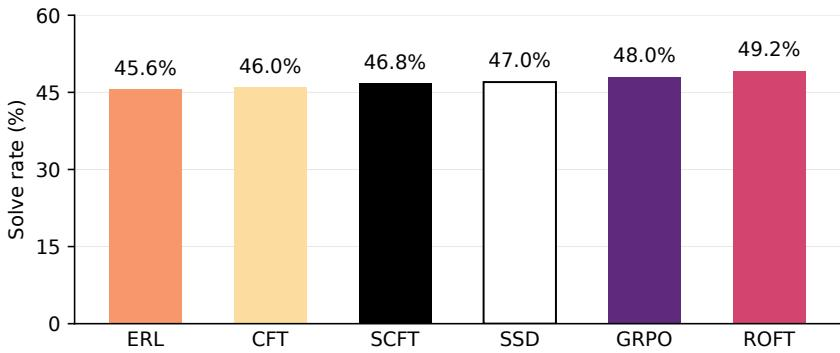  
Figure 11: SWE-bench Verified solve rates for Qwen3.5-4B

## C.2 GRPO

We use the same GRPO setup that achieved competitive performance in FrogNano (Kim et al., 2026).

Group Relative Policy Optimization (GRPO; Shao et al., 2024) learns from differences in the outcomes of multiple attempts at the same task, without a learned value function. For each task x, we sample a group of $G = 8$ trajectories $\{ \tau _ { i } \} _ { i = 1 } ^ { G }$ and compute a scalar reward $R _ { i }$ for each. The group-relative advantage is

$$
A _ { i } = \frac { R _ { i } - \bar { R } } { s _ { R } + 1 0 ^ { - 6 } } , \qquad \bar { R } = \frac { 1 } { G } \sum _ { j = 1 } ^ { G } R _ { j } , \qquad s _ { R } ^ { 2 } = \frac { 1 } { G - 1 } \sum _ { j = 1 } ^ { G } ( R _ { j } - \bar { R } ) ^ { 2 } .\tag{2}
$$

The same advantage is assigned to every assistant-generated token in $\tau _ { i } ,$ , including reasoning and tool calls. Task instructions and environment observations provide context but incur no loss. Thus, unlike ROFT, this baseline directly reinforces task-solving behavior rather than a subsequent retrospection.

Policy update. We retain GRPO’s advantage estimator but replace its PPO-clipped surrogate with DPPO–Binary-TV, the binary total-variation variant of Qi et al. (2026). This controls absolute probability changes rather than ratios, avoiding the disproportionately tight constraints that ratio clipping imposes on low-probability tokens. This extended baseline is denoted GRPO in our comparisons. Let $p _ { i t } = \pi _ { \theta } ( a _ { i t } \mid h _ { i t } )$ be the probability of assistant token $a _ { i t }$ given its interaction history $h _ { i t }$ , and let $q _ { i t }$ be its recorded sampling probability. With $\rho _ { i t } = p _ { i t } / q _ { i t } ,$ , we maximize

$$
J ( \theta ) = \mathbb { E } _ { \mathrm { a c e p t e d } \ : \mathrm { g r o u p s } } \left[ \frac { 1 } { G } \sum _ { i = 1 } ^ { G } \frac { 1 } { T _ { i } } \sum _ { t = 1 } ^ { T _ { i } } m _ { i t } \rho _ { i t } A _ { i } \right] , \qquad m _ { i t } = \left\{ \mathbf { 1 } [ p _ { i t } - q _ { i t } \le 0 . 2 ] , \quad A _ { i } > 0 , \right.\tag{3}
$$

where $T _ { i }$ counts assistant-generated tokens. Sampling probabilities, advantages, and masks are held fixed during differentiation. The mask suppresses contributions once a token’s probability has moved more than 0.2 in the advantage-favored direction, following the Binary-TV threshold used by Qi et al. (2026). We retain GRPO’s within-trajectory averaging followed by averaging across trajectories, without renormalizing after masking. Following the KL-free formulation of DAPO (Yu et al., 2025), we omit the reference-policy penalty to permit adaptation away from the initial policy. The objective includes no additional KL regularizer or entropy bonus.

Reward and group selection. The reward augments binary test success with task-specific shaping. Correctness-conditioned length control (Aggarwal & Welleck, 2025) motivates preferring concise successful attempts without rewarding short failures. A successful, normally completed attempt receives $R _ { i } = 1 \bar { - } 0 . 1 \mathrm { m a x } \{ 0 , \mathrm { l o g } ( N _ { i } \bar { / } 8 1 9 2 ) \}$ , where $N _ { i }$ is its total number of generated assistant tokens. The logarithmic penalty therefore applies only to successful completions exceeding 8,192 tokens. DAPO identifies reward noise from treating truncation as failure (Yu et al., 2025); we instead give test-passing truncated attempts partial credit of 0.5, preserving evidence of correctness while penalizing budget exhaustion. Failed attempts and other non-completed attempts receive zero. The logarithmic schedule and partial-credit value are our task-specific settings, not the reward functions proposed in those works.

Following DAPO’s dynamic sampling (Yu et al., 2025), we discard zero-advantage groups and replenish the batch to avoid spending optimizer updates on uninformative samples. Here this criterion is applied to shaped rewards: we accept 32 groups (256 trajectories) whose rewards are not all identical. An all-failure group therefore provides no update, whereas an all-success group can remain informative through differences in length or termination.

Training protocol. For the main Qwen3.5-4B comparison, we use the same initialization, SWErebench-767 tasks, and agent environment as ROFT (App. B). Each accepted batch receives one AdamW update at a constant learning rate of 10<sup>−6</sup>, without replay. We overlap rollout generation and training to reduce waiting for variable-duration attempts, with bounded staleness as in asynchronous RL systems such as AReaL (Fu et al., 2025). We discard groups more than three policy updates old. The importance ratios in Eq. (3) use recorded token-level sampling probabilities, anchoring the update to the behavior policy as advocated by Qi et al. (2026), rather than assuming a single frozen rollout policy. Sampling uses temperature 1.0 and top-p = 1.0, with at most 100 agent turns and a 131,072-token context window without compaction. Training-cost accounting includes rejected attempts, and held-out evaluation reports unshaped task success (App. E).

## C.3 ERL

Experiential Reinforcement Learning (ERL; Shi et al., 2026) uses reflection-guided retries to learn from failed attempts and internalize successful revisions. In our adaptation, the policy first attempts a task without additional guidance. If the attempt fails, the same policy generates a reflection conditioned on the task, the failed trajectory, and the environment verdict. It then reattempts the task conditioned on the task and reflection, without directly including the first trajectory or its verdict in the retry context.

We assign the second attempt’s binary task-success reward to both the reflection and the revised attempt. This yields a success-guided objective: successful retries provide training rewards for both generations, whereas failed retries contribute no loss. The reflection is trained under its original retrospective context. Crucially, we remove the reflection when training on the successful retry, retaining the original task prompt and the retry’s own interaction history. This internalizes reflectionguided behavior without requiring the reflection at inference time. Only assistant-generated target tokens incur loss; conditioning inputs and environment observations are masked. Unlike ROFT, which trains on retrospections without requiring a successful revision, this baseline uses downstream task success to select reflections and directly supervises revised task-solving behavior.

## C.4 CFT

Critique Fine-Tuning (CFT; Wang et al., 2025b) transfers knowledge from a teacher to a student by supervising critiques of candidate solutions rather than the solutions themselves. The student learns to generate the teacher’s critique conditioned on the question and candidate solution, with the aim of improving subsequent task performance without requiring critiques at inference time.

We adapt CFT to online agentic learning using gpt-6-luna as the critique teacher and Qwen3.5- 4B as the student. The evolving student collects coding trajectories, and the teacher generates four independent critiques per attempt, conditioned on the task, recorded interaction, and environment verdict. Each update uses up to 256 critiques from 64 source attempts. We minimize next-token cross-entropy averaged over supervised target tokens; only the teacher’s returned critique and its termination tokens incur loss, while all conditioning inputs are masked.

## C.5 SCFT

Self-Critique Fine-Tuning (SCFT; Wang et al., 2026) trains a model on successful revisions of its own solutions, without an external critique teacher. The model first attempts a task, then critiques and revises its solution conditioned on the original attempt, without being told whether that attempt was correct. Revisions are retained only if their final solutions pass the task’s correctness criterion, irrespective of the first attempt’s outcome. Supervised fine-tuning then maximizes the likelihood of the complete critique-and-revision continuation, with the initial attempt serving only as context. The procedure aims to transfer learned self-correction to ordinary first-attempt solving.

In our agentic adaptation, a frozen Qwen3.5-4B generates two initial attempts per training task and four independent critique-and-revision branches per attempt. Training uses 256 accepted revision trajectories per update, with cross-entropy averaged over all supervised target tokens. Only secondstage assistant tokens, including critique reasoning, tool calls, and the final response, incur loss; the original attempt, conditioning instructions, and tool observations are masked.

## C.6 SSD

Simple Self-Distillation (SSD; Zhang et al., 2026a) fine-tunes a model on its own sampled solutions, without a stronger teacher or correctness-based selection. A frozen model generates an offline corpus, and a student initialized from the same weights learns to reproduce these samples through next-token cross-entropy. Successful and unsuccessful attempts both provide targets.

We adapt this procedure to agentic coding using trajectories collected by the original Qwen3.5-4B on the training tasks, with two attempts per task sampled at temperature 1.0 and top-p = 1.0. Each update uses 256 complete trajectories, with cross-entropy averaged over all supervised target tokens. We supervise the original assistant-generated reasoning, tool calls, and final response, including assistant termination tokens supplied by the harness; task instructions and tool observations provide context but incur no loss. Thus, unlike ROFT, SSD directly imitates task-solving behavior, including unsuccessful behavior, rather than learning to explain it.

## D RETROSPECTION PROMPTS AND EXAMPLES

We present two retrospections: one following a failed attempt and one following a successful attempt.

Each example includes the complete system and user messages and the full saved continuation, including the model’s thinking before </think>. Truncation markers in the user messages are part of the context supplied to the model, not additional omissions for presentation. The chat template supplies the opening <think> before generation. The saved continuations retain nonempty thinking after the preprocessing described in App. B; only the end-of-turn suffix appended by the trainer is omitted below. Verdict feedback is optional. Both saved examples include it; we display this part of each user message in a separate box labeled “Verdict (optional)”, preserving the original prompt text.

## D.1 FAILED ATTEMPT: DATABASE-SESSION PARAMETER COLLISION

The agent repairs a naming collision between an internal database-session parameter and a model field. Renaming the parameter in save does not address the same collision in get or create, and the latter path fails its test. The retrospection identifies the incomplete coverage and recommends checking related entry points when internal parameters can collide with user-supplied fields.

## Failed attempt — full system prompt

You are a software engineer reviewing your own attempt at a coding   
task. You are given the task, a summary of the actions you took, and   
the final verdict from the test suite. Write a SHORT reflection (one   
paragraph, no lists) that: (a) names a consequential assumption or   
decision; (b) explains what evidence supports or contradicts that   
assumption or decision; (c) if the assumption or decision was wrong,   
explains what the correct assumption or decision would be; and (d)   
identifies concrete triggers for when to apply the lesson.

Failed attempt — full system prompt (continued)   
A passing verdict does not mean that all assumptions or decisions were   
correct. A failing verdict does not mean that all assumptions or   
decisions were incorrect. If the evidence is insufficient, state the   
uncertainty and describe what to try next time to learn more. Do not   
restate the task. Do not mention that this is a reflection or a   
review.

Failed attempt — user prompt   
# Task   
SQL Alchemy: TypeError: \_save() got multiple values for argument   
'session' when model has column named \`session   
#### Description   
We have a SQLAlchemy model which has a foreign key \`session\_id\` and a   
relationship \`session\`. Whenever we try creating an instance with   
factory boy and pass in the session relationship to the factory we get   
an exception saying that multiple sessions were passed into the   
\`\_save\` method in \`alchemy.py\`. This makes sense to me but we would   
like it if this was not the case since everything was working fine in   
version \`2.12\`.   
#### To Reproduce   
##### Model / Factory code   
\`\`\`python   
class MyModel(Base):   
session\_id = Column(Integer, ForeignKey('session.id'), index=True,   
nullable=False)   
session = relationship("Session")   
class BaseFactory(SQLAlchemyModelFactory):   
class Meta:   
abstract = True   
sqlalchemy\_session = db.session # the SQLAlchemy session   
object   
sqlalchemy\_session\_persistence = 'commit'   
class MyModelFactory(BaseFactory):   
class Meta:   
model = MyModel   
##### The issue   
Instantiate your factory and pass in the session column kwarg   
\`\`\`python   
MyModelFactory(session=some\_session\_object)   
throw this error.   
\`\`python   
/app/tests/test\_models/test\_session.py:424:   
.tox/python/lib/python3.7/site-packages/factory/base.py:39: in   
\_call   
return cls.create(<sub>\*\*</sub>kwargs)   
.tox/python/lib/python3.7/site-packages/factory/base.py:527: in create   
return cls.\_generate(enums.CREATE\_STRATEGY, kwargs)   
.tox/python/lib/python3.7/site-packages/factory/alchemy.py:51: in   
\_generate   
return super(SQLAlchemyModelFactory, cls).\_generate(strategy,   
params)

```python
Failed attempt — user prompt (continued)
.tox/python/lib/python3.7/site-packages/factory/base.py:464: in
_generate
return step.build()
.tox/python/lib/python3.7/site-packages/factory/builder.py:283: in
build
kwargs=kwargs,
.tox/python/lib/python3.7/site-packages/factory/base.py:316: in
instantiate
return self.factory._create(model, args, kwargs)
cls = <class 'tests.factories.MyModelFactory'>
model_class = <class 'MyModel'>
args = ()
kwargs = {'session': Session 2}
session = <sqlalchemy.orm.scoping.scoped_session object at
0x10a668e50>
@classmethod
def _create(cls, model_class, <sub>*</sub>args, <sub>**</sub>kwargs):
"""Create an instance of the model, and save it to the
database."""
session = cls._meta.sqlalchemy_session
if session is None:
raise RuntimeError("No session provided.")
if cls._meta.sqlalchemy_get_or_create:
return cls._get_or_create(model_class, session, <sub>*</sub>args,
kwargs)
> return cls._save(model_class, session, <sub>*</sub>args, <sub>**</sub>kwargs)
E TypeError: _save() got multiple values for argument 'session'
.tox/python/lib/python3.7/site-packages/factory/alchemy.py:99:
TypeError
#### Notes
An easy solution might be to rename the param to sql_alchemy_session
or something more explicit. I'm guessing this will happen to any model
with any column named session no matter the type, it could be a simple
int or string.
# What you did
[step 0]
thought: This is a bug in the factory-boy SQLAlchemy integration. The
issue is that when a model has a column named `session`, the factory's
`_create` method tries to pass `session` as a keyword argument to
`_save()`, but `_save()` also has a `session` parameter, causing a
conflict.
Let me first explore the repository to understand the structure and
find the relevant files.
action: {"tool": "Glob", "args": {"pattern": "<sub>**</sub>/<sub>*</sub>.py"}}
observation: docs/conf.py
examples/django_demo/django_demo/__init__.py
examples/django_demo/django_demo/settings.py
examples/django_demo/django_demo/urls.py
examples/django_demo/django_demo/wsgi.py
examples/django_demo/generic_foreignkey/__init__.py
```

Failed attempt — user prompt (continued)   
examples/django\_demo/generic\_foreignkey/apps.py   
examples/django\_demo/generic\_foreignkey/factories.py   
examples/django\_demo/generic\_foreignkey/migrations/0001\_initia   
...[truncated]...   
tests/test\_fuzzy.py   
tests/test\_helpers.py   
tests/test\_mongoengine.py   
tests/test\_regression.py   
tests/test\_transformer.py   
tests/test\_using.py   
tests/test\_utils.py   
tests/testdata/\_\_init\_\_.py   
tests/utils.py   
[step 1]   
thought: Let me look at the alchemy.py file since that's where the   
issue is occurring.   
action: {"tool": "Read", "args": {"file\_path": "factory/alchemy.py"}}   
observation: factory/alchemy.py   
1. # Copyright: See the LICENSE file.   
2.   
3. from sqlalchemy.exc import IntegrityError   
4. from sqlalchemy.orm.exc import NoResultFound   
5.   
6. from . import base, errors   
7.   
8. SESSION\_PERSISTENCE\_COMMIT = 'commit'   
9. SESSION\_PERSISTENCE\_FLUSH = 'flush'   
10. VALID\_SESSION\_PERSISTENCE\_TYPES = [   
11. None,   
12. SESSION\_PERSISTENCE\_COMMIT,   
13. SESSION\_PERSISTENCE\_FLUSH,   
14.   
...[truncated]...   
ersistence == SESSION\_PERSISTENCE\_FLUSH:   
108. session.flush()   
109. elif session\_persistence == SESSION\_PERSISTENCE\_COMMIT:   
110. session.commit()   
111. return obj   
[step 2]   
thought: Now I can clearly see the issue. The \`\_save\` method (line 102)   
has a \`session\` parameter, and in \`\_create\` (line 99) and   
\`\_get\_or\_create\` (line 69), it's calling \`cls.\_save(model\_class,   
session, args, kwargs)\`.   
When the model has a column named \`session\`, that column gets passed in   
\`kwargs\` along with the \`session\` parameter, causing the "multiple   
values for argument 'session'" error.   
The fix   
...[truncated]...   
hing unambiguous like \`\_session\` or \`db\_session\`, then update all calls   
to use \`session\` as the actual argument. This way the parameter name   
won't conflict with the column name in the model's kwargs.

Failed attempt — user prompt (continued)   
action: {"tool": "Edit", "args": {"file\_path": "factory/alchemy.py",   
"old\_string": " @classmethod\n def \_save(cls, model\_class,   
session, <sub>\*</sub>args, <sub>\*\*</sub>kwargs):\n session\_persistence =   
cls.\_meta.sqlalchemy\_session\_persistence\n\n obj =   
model\_class(<sub>\*</sub>args, <sub>\*\*</sub>kwargs)\n session.add(obj)\n if   
session\_persistence == SESSION\_PERSISTENCE\_FLUSH:\n   
session.flush()\n eli   
...[truncated]...   
f session\_persistence == SESSION\_PERSISTENCE\_FLUSH:\n   
\_session.flush()\n elif session\_persistence ==   
SESSION\_PERSISTENCE\_COMMIT:\n \_session.commit()\n   
return obj"}}   
observation: Edited factory/alchemy.py (1 replacement).   
[step 3]   
thought: The fix has been applied. I renamed the \`session\` parameter to   
\`\_session\` (with an underscore prefix to indicate it's a   
private/internal parameter) to avoid the naming collision with a   
session\` column in the model.   
The key changes:   
1. \`\_save(cls, model\_class, session, \*args, \*\*kwargs)\` → \`\_save(cls,   
model\_class, \_session, args, kwargs)\`   
2. Updated all references to \`session\` to \`\_session\` wit   
...[truncated]...   
d as a positional argument (not a keyword argument), so the parameter   
name change doesn't affect the call sites.   
Let me verify the fix by reading the file again to make sure the   
changes are correct.   
action: {"tool": "Read", "args": {"file\_path": "factory/alchemy.py"}}   
observation: factory/alchemy.py   
1. # Copyright: See the LICENSE file.   
2.   
3. from sqlalchemy.exc import IntegrityError   
4. from sqlalchemy.orm.exc import NoResultFound   
5.   
6. from . import base, errors   
7.   
8. SESSION\_PERSISTENCE\_COMMIT = 'commit'   
9. SESSION\_PERSISTENCE\_FLUSH = 'flush'   
10. VALID\_SESSION\_PERSISTENCE\_TYPES = [   
11. None,   
12. SESSION\_PERSISTENCE\_COMMIT,   
13. SESSION\_PERSISTENCE\_FLUSH,   
14.   
...[truncated]...   
sistence == SESSION\_PERSISTENCE\_FLUSH:   
109. session.flush()   
110. elif session\_persistence == SESSION\_PERSISTENCE\_COMMIT:   
111. \_session.commit()   
112. return obj   
[step 4]   
thought: The fix looks good. The key changes:   
1. \`\_save(cls, model\_class, session, \*args, \*\*kwargs)\` → \`\_save(cls,   
model\_class, \_session, \*args, \*\*kwargs)\` - Renamed the parameter to   
avoid conflict with a \`session\` column in the model.   
2. Updated all internal references to use \`\_session\`:   
\`\_session.add(obj)

```diff
Failed attempt — user prompt (continued)
_session.flush()`
`_session.commit()`
3. The call sites (`_create` and `_get_or_
...[truncated]...
`session` column or any other similar naming will work correctly
The warning in the code docstring is a bit misleading now since it
mentions `session` but we're using `_session`. Let me update that.
action: {"tool": "Edit", "args": {"file_path": "factory/alchemy.py",
"old_string": " @classmethod\n def _save(cls, model_class,
_session, <sub>*</sub>args, <sub>**</sub>kwargs):\n \"\"\"Save an instance of the
model to the database.\"\"\"", "new_string": " @classmethod\n
def _save(cls, model_class, _session, <sub>*</sub>args, <sub>**</sub>kwargs):\n
\"\"\"Save an instance of the model to the database.\n \n
:p
...[truncated]...
sion to use for saving\n :param args: Additional positional
arguments to pass to model __init__\n :param kwargs: Additional
keyword arguments to pass to model __init__\n \"\"\""}}
observation: Edited factory/alchemy.py (1 replacement).
[step 5]
thought: Good, now the fix is complete and documented. Let me
summarize what was done:
## Summary
The issue was a naming collision in `factory/alchemy.py` between:
1. The `_save` method's `session` parameter (used internally by the
factory for database operations)
2. A model column also named `session` (or any other column that could
be passed as a keyword argument)
### The Bug
When calling `_save(model
...[truncated]...
ter in the function signature, the positional argument still maps
correctly.
Now any model with a `session` column (or any other combination that
could cause similar collisions) will work correctly.
action:
observation:
# Your patch
diff --git a/factory/alchemy.py b/factory/alchemy.py
index 2d24887..980a13f 100644
--- a/factory/alchemy.py
+++ b/factory/alchemy.py
@@ -99,13 +99,20 @@ class SQLAlchemyModelFactory(base.Factory):
return cls._save(model_class, session, <sub>*</sub>args, <sub>**</sub>kwargs)
@classmethod
def _save(cls, model_class, session, <sub>*</sub>args, <sub>**</sub>kwargs):
+ def _save(cls, model_class, _session, <sub>*</sub>args, <sub>**</sub>kwargs):
+ """Save an instance of the model to the database.
+
+ :param model_class: The model class to save
+ :param _session: The SQLAlchemy session to use for saving
```

```diff
Failed attempt — user prompt (continued)
+ :param args: Additional positional arguments to pass to model
_init
+ :param kwargs: Additional keyword arguments to pass to model
_init
+ Ⅱ Ⅱ "
session_persistence =
cls._meta.sqlalchemy_session_persistence
obj = model_class(<sub>*</sub>args, <sub>**</sub>kwargs)
session.add(obj)
+ _session.add(obj)
if session_persistence == SESSION_PERSISTENCE_FLUSH:
session.flush()
+ _session.flush()
elif session_persistence == SESSION_PERSISTENCE_COMMIT:
session.commit()
+ _session.commit()
return obj
```

## Failed attempt — Verdict (optional)

# Verdict   
outcome: FAILED (tests failed)   
raw\_task\_reward: 0.000   
shaped\_reward: 0.000   
exit\_reason: agent   
test\_output:   
+ source /opt/miniconda3/bin/activate   
++ \_CONDA\_ROOT=/opt/miniconda3   
++ . /opt/miniconda3/etc/profile.d/conda.sh   
+++ export CONDA\_EXE=/opt/miniconda3/bin/conda   
+++ CONDA\_EXE=/opt/miniconda3/bin/conda   
+++ export \_CE\_M=   
+++ \_CE\_M=   
+++ export \_CE\_CONDA=   
+++ \_CE\_CONDA=   
+++ export CONDA\_PYTHON\_EXE=/opt/miniconda3/bin/python   
+++ CONDA\_PYTHON\_EXE=/opt/miniconda3/bin/python   
+++ '[' -z x ']'   
++ conda activate   
++ local cmd=activate   
++ case "\$cmd" in   
++ \_\_conda\_activate activate   
++ '[' -n '' ']'   
++ local ask\_conda   
+++ PS1='(testbed) 1   
+++ \_\_conda\_exe shell.posix activate   
+++ /opt/miniconda3/bin/conda shell.posix activate   
++ ask\_conda='PS1='\''(base) '\''   
export   
PATH='\''/opt/miniconda3/bin:/opt/miniconda3/condabin:/opt/miniconda3   
/bin:/usr/local/sbin:/usr/local/bin:/usr/sbin:/usr/bin:/sbin:/bin'\''   
export CONDA\_PREFIX='\''/opt/miniconda3'\''   
export CONDA\_SHLVL='\''2'\''   
export CONDA\_DEFAULT\_ENV='\''base'\''   
export CONDA\_PROMPT\_MODIFIER='\''(base) '\''   
export CONDA\_PREFIX\_1='\''/opt/miniconda3/envs/testbed'\''   
export CONDA\_EXE='\''/opt/miniconda3/bin/conda'\''   
export \_CE\_M='\'''\''   
export \_CE\_CONDA='\'''\''   
export CONDA\_PYTHON\_EXE='\''/opt/miniconda3/bin/python'\'''

## Failed attempt — Verdict (optional) (continued)

```shell
++ eval 'PS1='\''(base) '\''
export
PATH='\''/opt/miniconda3/bin:/opt/miniconda3/condabin:/opt/miniconda3
/bin:/usr/local/sbin:/usr/local/bin:/usr/sbin:/usr/bin:/sbin:/bin'\''
export CONDA_PREFIX='\''/opt/miniconda3'\''
export CONDA_SHLVL='\''2'\''
export CONDA_DEFAULT_ENV='\''base'\''
export CONDA_PROMPT_MODIFIER='\''(base) '\''
export CONDA_PREFIX_1='\''/opt/miniconda3/envs/testbed'\''
export CONDA_EXE='\''/opt/miniconda3/bin/conda'\''
export _CE_M='\'''\''
export _CE_CONDA='\'''\''
export CONDA_PYTHON_EXE='\''/opt/miniconda3/bin/python'\'''
+++ PS1='(base) '
+++ export
PATH=/opt/miniconda3/bin:/opt/miniconda3/condabin:/opt/miniconda3/bin
:/usr/local/sbin:/usr/local/bin:/usr/sbin:/usr/bin:/sbin:/bin
+++ PATH=/opt/miniconda3/bin:/opt/miniconda3/condabin:/opt/miniconda3
/bin:/usr/local/sbin:/usr/local/bin:/usr/sbin:/usr
...[truncated]...
it
PASSED tests/test_alchemy.py::SQLAlchemySessionPersistenceTestCase::t
est_type_error
PASSED
tests/test_alchemy.py::SQLAlchemyNonIntegerPkTestCase::test_creation
PASSED
tests/test_alchemy.py::SQLAlchemyNonIntegerPkTestCase::test_first
PASSED
tests/test_alchemy.py::SQLAlchemyNonIntegerPkTestCase::test_force_pk
PASSED
tests/test_alchemy.py::SQLAlchemyNonIntegerPkTestCase::test_many
PASSED tests/test_alchemy.py::SQLAlchemyNoSessionTestCase::test_build
_does_not_raises_exception_when_no_session_was_set
PASSED tests/test_alchemy.py::SQLAlchemyNoSessionTestCase::test_creat
e_raises_exception_when_no_session_was_set
PASSED tests/test_alchemy.py::NameConflictTests::test_no_name_conflic
t_on_save
FAILED tests/test_alchemy.py::NameConflictTests::test_no_name_conflic
t_on_get_or_create
1 failed, 22 passed in 0.66s
+ : '>>>>> End Test Output'
+ git checkout b53b2be578a92b48934248ebeedb99d8215f17a1 --
tests/alchemyapp/models.py tests/test_alchemy.py
```

## Failed attempt — user prompt (continued)

Write the reflection now.

## Failed attempt — full retrospection, including thinking

The user wants a reflection on my coding task. I need to:   
1. Name a consequential assumption or decision   
2. Explain what evidence supports or contradicts that   
assumption/decision   
3. If wrong, explain what the correct assumption/decision would be   
4. Identify concrete triggers for when to apply the lesson

```rst
Failed attempt — full retrospection, including thinking (continued)
The task was to fix a TypeError in factory-boy SQLAlchemy integration
when a model has a column named `session`. I renamed the `session`
parameter to `_session` in the `_save` method to avoid the naming
collision.
However, the test failed: `tests/test_alchemy.py::NameConflictTests::
test_no_name_conflict_on_get_or_create` failed.
Looking at the test output, it seems like there's still an issue. Let
me think about what went wrong.
The issue is that I only renamed the parameter in `_save`, but I also
need to check `_get_or_create` method which also has the same issue.
Looking at the original code, `_get_or_create` also calls `_save` with
the session parameter.
Wait, let me re-read the code. In step 2, I saw:
```python
if cls._meta.sqlalchemy_get_or_create:
return cls._get_or_create(model_class, session, <sub>*</sub>args, <sub>**</sub>kwargs)
return cls._save(model_class, session, <sub>*</sub>args, <sub>**</sub>kwargs)
So `_get_or_create` also passes `session` as a positional argument. But
I only updated `_save`. Let me check if `_get_or_create` also has a
`session` parameter.
Looking at the patch, I only modified `_save`. But the test that failed
is `test_no_name_conflict_on_get_or_create`. This suggests that
_get_or_create` also has the same issue.
Let me think about this more carefully. The `_get_or_create` method
likely also has a `session` parameter that conflicts with model
columns. I need to check the original code to see if `_get_or_create
also needs to be fixed.
I realize the core problem: both `_save` and `_get_or_create` methods
have `session` parameters that conflict with model columns. My fix only
addressed `_save`, leaving `_get_or_create` vulnerable to the same
naming collision. The test failure confirms this - I need to rename
the `session` parameter in `_get_or_create` as well to prevent the same
TypeError from occurring.
</think>
I assumed that renaming the `session` parameter in `_save` to
_session` would resolve the naming collision issue, but I overlooked
that `_get_or_create` also has the same `session` parameter that
conflicts with model columns. The evidence is the failing test
`test_no_name_conflict_on_get_or_create`, which indicates that the fix
was incomplete. The correct decision would have been to rename the
`session` parameter in both `_save` and `_get_or_create` methods to
avoid conflicts with any model columns named `session` or other similar
names. Concrete triggers for applying this lesson include when working
with factory-boy SQLAlchemy integration and encountering naming
conflicts between internal method parameters and model column names,
particularly when the parameter name matches a common column name like
session`, `user`, or `id`.
```

## D.2 SUCCESSFUL ATTEMPT: CONTEXT-MANAGER CLEANUP

The agent fixes a context manager whose interaction state persists when a test raises an exception. The usual verification step clears this state, but exceptional exits bypass verification. The retrospection

explains why cleanup must also occur on that path and identifies failures in subsequent tests as a signal of leaked state.

Passed attempt — full system prompt   
You are a software engineer reviewing your own attempt at a coding   
task. You are given the task, a summary of the actions you took, and   
the final verdict from the test suite. Write a SHORT reflection (one   
paragraph, no lists) that: (a) names a consequential assumption or   
decision; (b) explains what evidence supports or contradicts that   
assumption or decision; (c) if the assumption or decision was wrong,   
explains what the correct assumption or decision would be; and (d)   
identifies concrete triggers for when to apply the lesson.   
A passing verdict does not mean that all assumptions or decisions were   
correct. A failing verdict does not mean that all assumptions or   
decisions were incorrect. If the evidence is insufficient, state the   
uncertainty and describe what to try next time to learn more. Do not   
restate the task. Do not mention that this is a reflection or a   
review.

```markdown
Passed attempt — user prompt
# Task
Interactions not cleared when error in test
### Have you read the Contributing Guidelines on issues?
- [ ] I have read the [Contributing Guidelines on issues](https://git
hub.com/pact-foundation/pact-python/main/CONTRIBUTING.md#issues).
### Prerequisites
- [X] I'm using the latest version of `pact-python`.
- [ ] I have read the console error message carefully (if applicable).
### Description
I have two tests with the same pact. When the first one raise an
exception "verify" is not called and interactions are not cleared.
When next test runs it sees other tests interactions and fails. When
tests run in different order then there is no dependency issue.
### Reproducible demo
https://gist.github.com/dryobates/2a5b3028fc7f92dca23830b3ec0be225
### Steps to reproduce
pytest test_failing_pact_dependency.py
### Expected behavior
There should be no dependency between two tests.
### Actual behavior
Currently when one test raise an exception, the other test also fails
but should not.
### Your environment
- Pact Python version used: master branch and 1.7.0
- OS: ArchLinux
```

Passed attempt — user prompt (continued)   
### Self-service   
- [X] I'd be willing to fix this bug myself.   
# What you did   
[step 0]   
thought: Let me analyze this issue. The user is reporting that when   
one test raises an exception, the pact interactions are not cleared,   
causing subsequent tests to fail due to seeing interactions from the   
previous test.   
First, I should read the reproducible demo to understand the issue   
better.   
action: {"tool": "Glob", "args": {"pattern": " / .py"}}   
observation: conftest.py   
examples/\_\_init\_\_.py   
examples/conftest.py   
examples/src/\_\_init\_\_.py   
examples/src/consumer.py   
examples/src/fastapi.py   
examples/src/flask.py   
examples/src/message.py   
examples/tests/\_\_init\_\_.py   
examples/tests/test\_00\_consumer.py   
examples/tests/test\_01\_provider\_fastapi.py   
examples/tests/test\_01\_provider\_flask.py   
examples/tests/test\_02\_message\_consumer.py   
examples/tests/test\_03\_message\_provid   
...[truncated]...   
sts/v3/compatiblity\_suite/util.py   
tests/v3/conftest.py   
tests/v3/test\_async\_interaction.py   
tests/v3/test\_ffi.py   
tests/v3/test\_http\_interaction.py   
tests/v3/test\_pact.py   
tests/v3/test\_sync\_interaction.py   
[step 1]   
thought: Let me read the test file from the gist to understand the   
issue. The gist URL is   
https://gist.github.com/dryobates/2a5b3028fc7f92dca23830b3ec0be225.   
Let me try to find this test file or understand what it contains by   
looking at the repository structure. Actually, I should check if this   
test file exists or if I need to create a reproduction. The user   
mentioned this file exists at \`test\_failing\_pact\_dependency.py\`. Let me   
check for it.   
action: {"tool": "Bash", "args": {"command": "ls -la   
test\_failing\_pact\_dependency.py 2>/dev/null || echo \"File not found   
in current directory\"", "description": "Check if test file exists in   
current directory"}}   
observation: Exit code: 0   
STDOUT:   
File not found in current directory   
STDERR:   
[step 2]   
thought: Let me search for this file in the repository.

Passed attempt — user prompt (continued)   
action: {"tool": "Glob", "args": {"pattern":   
" /test\_failing\_pact\_dependency.py"}}   
observation: No files matched.   
[step 3]   
thought: The file doesn't exist yet - I need to create it based on the   
gist. Let me fetch the gist or recreate the test based on what the   
user described. The gist URL is   
https://gist.github.com/dryobates/2a5b3028fc7f92dca23830b3ec0be225.   
Let me read the gist to understand the test case.   
Actually, since I can't access external URLs directly, let me create a   
test case based on the description:   
- Two tests w   
...[truncated]...   
ring "verify"   
- Interactions are not cleared   
- Second test fails because it sees interactions from the first test   
Let me create a reproduction test first, then analyze the pact code to   
find the bug.   
action: {"tool": "Write", "args": {"content": "\"\"\"Test reproduction   
for: Interactions not cleared when error in test\"\"\"\nimport   
tempfile\nimport os\nfrom pact import Pact, Consumer\n\n# Create pact   
in temporary directory\npact\_dir = tempfile.mkdtemp()\npact\_file =   
os.path.join(pact\_dir, \"pact.json\")\n\n# Create the pact\npact =   
Pact(\n consumer=\"myconsumer\",\n provider=\"myprovider\",\n   
...[truncated]...   
ovided\_interactions=True)\n print(\"Third test passed\")\n\nif   
\_name\_\_ == \"\_\_main\_\_\":\n import pytest\n   
pytest.main([\_\_file\_\_, \"-v\"])\n", "file\_path":   
"test\_failing\_pact\_dependency.py"}}   
observation: Wrote test\_failing\_pact\_dependency.py (1578 bytes).   
[step 4]   
thought: Now let me run the test to see if I can reproduce the issue:   
action: {"tool": "Bash", "args": {"command": "python -m pytest   
test\_failing\_pact\_dependency.py -v 2>&1", "description": "Run the   
reproduction test"}}   
observation: Exit code: 2   
STDOUT:   
=== test session starts   
====   
platform linux -- Python 3.9.25, pytest-7.4.4, pluggy-1.6.0 --   
/opt/miniconda3/envs/testbed/bin/python   
cachedir: .pytest\_cache   
rootdir: /testbed   
configfile: pyproject.toml   
plugins: asyncio-0.23.8, bdd-7.3.0, anyio-4.12.0, cov-4.1.0   
asyncio: mode=strict   
collecting ... collected 0 items / 1 error   
=   
...[truncated]...   
\_init\_\_() got an unexpect...   
!!!!!!!!!!!!!!!!!!!! Interrupted: 1 error during collection   
!!!!!!!!!!!!!!!!!!!!   
1 error in 0.87s   
===========   
STDERR:

```python
Passed attempt — user prompt (continued)
[step 5]
thought: Let me check the Pact constructor to see what parameters it
accepts:
action: {"tool": "Read", "args": {"file_path": "pact/pact.py"}}
observation: pact/pact.py
1. """API for creating a contract and configuring the mock service."""
2. from __future__ import unicode_literals
3.
4. import os
5. import platform
6. from subprocess import Popen
7. import warnings
8.
9. import psutil
10. import requests
11. from requests.adapters import HTTPAdapter
12. from requests.packages.urllib3 import Retry
13.
14. from .broker import Broker
15. from .const
...[truncated]...
if self.body is not None:
462. response['body'] = self.body
463.
464. if self.headers:
465. response['headers'] = self.headers
466.
467. return response
[step 6]
thought: Now I understand the issue. Looking at the `Pact` class:
1. The `verify()` method at line 275 clears the interactions:
`self._interactions = []`
2. The `__exit__` method at line 381 is called when exiting a context,
and if there's an exception, it just returns early (line 387) without
calling `verify()`
3. The `setup()` method at line 173 sends the interactions to the mock
service
The problem is
...[truncated]...
ld create a more direct test case to isolate the exact problem. The
key is to check whether `setup()` actually clears and re-completes
interactions, or if it just adds to them without proper cleanup.
action: {"tool": "Write", "args": {"file_path":
"test_failing_pact_dependency.py", "content": "\"\"\"Test reproduction
for: Interactions not cleared when error in test\"\"\"\nimport
pytest\nfrom pact import Consumer, Provider\n\n# Test 1 that
fails\ndef
test_first_failing_and_second_should_pass_without_exception():\n
\"\"\"\n First test that fails but doesn't call verify()\n
\"\"\"\n pact = Co
...[truncated]...
ct.uri + '/path3')\n assert response.status_code == 200\n \n
pact.verify()\n print(\"Test 3: PASSED\")\n\nif __name_ ==
\"__main__\":\n pytest.main([__file__, \"-v\", \"-s\"])\n"}}
observation: Wrote test_failing_pact_dependency.py (1970 bytes).
```

Passed attempt — user prompt (continued)   
[step 7]   
thought: Wait, I need to check if the mock service is working. Let me   
check if there's a mock service available.   
action: {"tool": "Bash", "args": {"command": "which pact 2>/dev/null   
|| echo \"pact not in PATH\"", "description": "Check if pact mock   
service is available"}}   
observation: Exit code: 0   
STDOUT:   
pact not in PATH   
STDERR:   
[step 8]   
thought: Let me check what the mock service path is:   
action: {"tool": "Bash", "args": {"command": "cat pact/constants.py",   
"description": "Check the mock service path constant"}}   
observation: Exit code: 0   
STDOUT:   
" " n   
Constant values for the pact-python package.   
This will default to the bundled Pact binaries bundled with the   
package, but   
should these be unavailable or the environment variable   
\`PACT\_USE\_SYSTEM\_BINS\` is   
set to \`TRUE\` or \`YES\`, the system Pact binaries will be used instead.   
" n n   
import os   
import shutil   
import warnings   
from pathlib import Path   
\_all\_\_ = [   
"BROKER\_CLIEN   
...[truncated]...   
executable("pact-broker")   
MESSAGE\_PATH = \_find\_executable("pact-message")   
MOCK\_SERVICE\_PATH = \_find\_executable("pact-mock-service")   
VERIFIER\_PATH = \_find\_executable("pact-provider-verifier")   
STDERR:   
[step 9]   
thought: Let me check if the mock service exists:   
action: {"tool": "Bash", "args": {"command": "ls -la pact/bin/   
2>/dev/null || echo \"No bin directory\"", "description": "Check for   
pact bin directory"}}   
observation: Exit code: 0   
STDOUT:   
total 19288   
drwxr-xr-x 2 1001 127 4096 Sep 12 2023 .   
drwxr-xr-x 1 1001 127 4096 Sep 19 06:30 ..   
-rwxr-xr-x 1 1001 127 984 Sep 12 2023 pact   
-rwxr-xr-x 1 1001 127 991 Sep 12 2023 pact-broker   
-rwxr-xr-x 1 1001 127 992 Sep 12 2023 pact-message   
-rwxr-xr-x 1 1001 127 997 Sep 12 2023 pact-mock-service   
-rwxr-xr-x 1 1001 127 19709560 Mar 20 2023 pact-p   
...[truncated]...

Passed attempt — user prompt (continued)   
-provider-verifier   
-rwxr-xr-x 1 1001 127 1007 Sep 12 2023 pact-publish   
-rwxr-xr-x 1 1001 127 997 Sep 12 2023 pact-stub-service   
-rwxr-xr-x 1 1001 127 988 Sep 12 2023 pactflow   
STDERR:   
[step 10]   
thought: Good, the mock service is available. The issue I described is   
a bit different from the original issue. Let me re-read the original   
issue more carefully.   
The original issue says:   
1. Two tests with the same pact   
2. When the first test raises an exception, \`verify()\` is not called   
3. Interactions are not cleared   
4. When next test runs, it sees other tests' interactions and fails   
Let me look at the   
...[truncated]...   
ctions or verifying them. This means stale interactions linger,   
potentially confusing subsequent tests. The fix needs to be in   
\_\_exit\_\_\` to properly handle the cleanup step when an exception   
occurs.   
action: {"tool": "Write", "args": {"file\_path":   
"test\_issue\_reproduction.py", "content": "\"\"\"Reproduction test for   
the issue: Interactions not cleared when error in test\"\"\"\nimport   
pytest\nfrom pact import Consumer, Provider\nimport time\n\ndef   
test\_exception\_clears\_interactions():\n \"\"\"Test that exceptions   
properly clear interactions\"\"\"\n pact =   
Consumer('consumer').has\_pact\_with(Provid   
...[truncated]...   
s.get(pact2.uri + '/api/v1/resource2')\n assert   
response.status\_code == 200\n except AssertionError as e:\n   
print(f\"Test failed with error: {e}\")\n raise\n"}}   
observation: Wrote test\_issue\_reproduction.py (1966 bytes).   
[step 11]   
thought: Let me actually run a simpler test to understand the   
behavior. The key insight from the code is:   
1. When \`\_\_exit\_\_\` is called with an exception, it just returns without   
\`verify()\`   
2. \`verify()\` clears \`self.\_interactions = []\`   
3. But if \`\_\_exit\_\_\` doesn't call \`verify()\`, the interactions are   
never cleared   
However, the next test will call \`setup()\` which should send new   
interactions. Let me trac   
...[truncated]...   
me think about this more carefully...   
Actually, I think I need to understand the issue better by looking at   
the actual behavior. Let me create a test that simulates the exact   
scenario from the gist.   
action: {"tool": "Bash", "args": {"command": "curl -s \"https://gist.   
githubusercontent.com/dryobates/2a5b3028fc7f92dca23830b3ec0be225/raw\"   
2>/dev/null | head -100 || echo \"Could not fetch gist\"",   
"description": "Fetch the gist content"}}   
observation: Exit code: 0

Passed attempt — user prompt (continued)   
STDOUT:   
import atexit   
import requests   
from pact import Consumer, Provider   
pact = Consumer("consumer").has\_pact\_with(Provider("provider"))   
pact.start\_service()   
atexit.register(pact.stop\_service)   
def test\_a():   
pact.given("").upon\_receiving("").with\_request("get",   
"/1").will\_respond\_with(200)   
with pact:   
raise Exception   
def test\_b():   
pact.given("").upon\_receiving("").with\_request("get",   
"/2").will\_respond\_with(200)   
with pact:   
requests.get("http://127.0.0.1:1234/2")   
STDERR:   
[step 12]   
thought: Now I can see the actual issue! The problem is:   
1. \`test\_a()\` raises an exception inside the \`with pact:\` context but   
doesn't call \`verify()\`   
2. \`test\_b()\` uses the same \`pact\` object and makes a request   
3. Because \`test\_a()\` didn't clear the interactions, the mock service   
still has interactions from test\_a   
4. When \`test\_b()\` calls \`\_\_enter\_\_\` -> \`setup()\`, the mock service   
might have stale inter   
...[truncated]...   
should be cleared...   
Unless the mock service is not properly shut down between tests, and   
there's some state pollution?   
Let me create a test that simulates the exact scenario and see what   
happens.   
action: {"tool": "Write", "args": {"file\_path":   
"test\_failing\_pact\_dependency.py", "content": "\"\"\"Reproduction test   
for: Interactions not cleared when error in test\"\"\"\nimport   
atexit\nimport requests\nimport pytest\nfrom pact import Consumer,   
Provider\n\npact =   
Consumer(\"consumer\").has\_pact\_with(Provider(\"provider\"))\npact.st   
art\_service()\natexit.register(pact.stop\_service)\n\n\ndef test\_a():\n   
...[truncated]...   
l\_respond\_with(200)\n with pact:\n response =   
requests.get(\"http://127.0.0.1:1234/2\")\n print(f\"Response:   
{response.status\_code}\")\n assert response.status\_code ==   
200\n"}}   
observation: Wrote test\_failing\_pact\_dependency.py (831 bytes).   
[step 13]   
thought: Let me run this test to see if I can reproduce the issue:

```rst
Passed attempt — user prompt (continued)
action: {"tool": "Bash", "args": {"command": "python -m pytest
test_failing_pact_dependency.py -v -s 2>&1", "description": "Run
reproduction test"}}
observation: Exit code: 1
STDOUT:
=== ======================= test session starts
platform linux -- Python 3.9.25, pytest-7.4.4, pluggy-1.6.0 --
/opt/miniconda3/envs/testbed/bin/python
cachedir: .pytest_cache
rootdir: /testbed
configfile: pyproject.toml
plugins: asyncio-0.23.8, bdd-7.3.0, anyio-4.12.0, cov-4.1.0
asyncio: mode=strict
collecting ... mock WARN: Please note: we are
...[truncated]...
======================
INFO: Writing pact before shutting down
Writing pact for provider to /testbed/consumer-provider.json
INFO going to shutdown ...
INFO WEBrick::HTTPServer#start done.
STDERR:
[step 14]
thought: I've reproduced the issue. Now I can see exactly what's
happening:
1. `test_a` defines an interaction (`/1`) and starts the mock service
2. `test_a` raises an exception, so `__exit__` doesn't call `verify()`
3. `test_b` starts the same pact, defines interaction (`/2`), and
starts the mock service
4. `test_b` makes the request to `/2`
5. `test_b.__exit__` is called, which calls `verify()
6. `veri
...[truncated]...
est_a, /2 from test_b's setup call, but then test_b fails to verify
because it needs to see /1 as well. But /1 should have been cleared...
Unless the issue is with the file_write_mode and pact file?
action: {"tool": "Read", "args": {"file_path": "pact/pact.py",
"offset": 371, "limit": 30}}
observation: pact/pact.py
371. def _enter__(self):
372. "  I
373. Enter a Python context.
374.
375. Sets up the mock service to expect the client requests.
376. I n n
377. self.setup()
378.
379. def __exit__(self, exc_type, exc_val, exc_tb):
380. " " "
381. Exit a Python context.
382.
383. Calls the mock service to verify that all interacti
...[truncated]...
tchers."""
394.
395. def json(self):
```

Passed attempt — user prompt (continued)   
396. """Convert the object to a JSON version of the mock   
service."""   
397. raise NotImplementedError   
398.   
399.   
400. class Request(FromTerms):   
[step 15]   
thought: Now I see the issue more clearly. Looking at the flow:   
1. When \`with pact:\` is entered in \`test\_a\`, \`\_\_enter\_\_\` is called   
which calls \`setup()\`. This sends \`/1\` to the mock service.   
2. When the exception is thrown, \`\_\_exit\_\_\` is called with the   
exception, and it returns early without calling \`verify()\`.   
3. When \`test\_b\`'s \`with pact:\` is entered, \`\_\_enter\_\_\` is called which   
calls \`setup()\`. This   
...[truncated]...   
pact and starts the mock service at module level, then builds up   
interactions before entering the context. This means the interactions   
are already in memory before the mock service knows they exist.   
action: {"tool": "Read", "args": {"file\_path": "pact/pact.py",   
"offset": 337, "limit": 20}}   
observation: pact/pact.py   
337. def \_insert\_interaction\_if\_complete(self):   
338. """   
339. Insert a new interaction if current interaction is   
complete.   
340.   
341. An interaction is complete if it has all the mandatory   
fields.   
342. If there are no interactions, a new interaction will be   
added.   
343.   
344. :rtype: None   
345. I " n   
346. if not self.\_interaction   
...[truncated]...   
):   
352. I n n   
353. Wait for the mock service to be ready for requests.   
354.   
355. :rtype: None   
356. :raises RuntimeError: If there is a problem starting the   
mock service.   
[step 16]   
thought: So \`\_insert\_interaction\_if\_complete()\` is called   
...[truncated]...   
sts/test   
...[truncated]...   
coverage: platform linux, python 3.9.25-final-0   
Coverage XML written to file coverage.xml   
=========== 10 passed in 0.95s   
STDERR:   
[step 27]

Passed attempt — user prompt (continued)   
thought: All context manager tests pass. However, I want to make sure   
the fix is complete. Let me think about edge cases:   
1. What if \`verify()\` raises an exception? The interactions would be   
cleared by \`verify()\` first, then the exception would be raised, and   
then \`\_\_exit\_\_\` would try to clear again (setting an empty list to   
empty list). This should be fine.   
2. What if \`evaluate()\` (the method that calls   
...[truncated]...   
eractions but the pact object hasn't cleared them. The current fix   
clears the pact's internal state but leaves the mock service in an   
inconsistent state. For jedi, this might be acceptable if subseqe   
action: {"tool": "Read", "args": {"file\_path":   
"pact/verify\_wrapper.py"}}   
observation: pact/verify\_wrapper.py   
1. """Wrapper to verify previously created pacts."""   
2.   
3. import warnings   
4. from pact.constants import VERIFIER\_PATH   
5. import sys   
6. import os   
7. import platform   
8.   
9. import subprocess   
10. from os.path import isdir, join, isfile   
11. from os import listdir   
12.   
13.   
14. def capture\_logs(process, verbose):   
15. """Capture logs from ruby process."""   
16. warnings.wa   
...[truncated]...   
raise Exception('todo')   
258.   
259. command.extend(["--provider-app-version",   
260. provider\_app\_version,   
261. "--publish-verification-results"])   
[step 28]   
thought: The \`verify\_wrapper.py\` is a different class that's used for   
pact verification, not for the mock service context. It doesn't have a   
similar issue.   
Now let me also check if there's a similar issue in the V3 module:   
action: {"tool": "Read", "args": {"file\_path": "pact/v3/pact.py"}}   
observation: pact/v3/pact.py   
1"""   
2. Pact between a consumer and a provider.   
3.   
4. This module defines the classes that are used to define a Pact   
between a   
5. consumer and a provider. It defines the interactions between the   
two parties,   
6. and provides the functionality to verify that the interactions are   
satisfied.   
7.   
8. For the roles of consumer and provider, see the documentation for   
the   
9. \`pact.v3.ser   
...[truncated]...

Passed attempt — user prompt (continued)   
response, based on whether the   
537.   
[\`will\_respond\_with(...)\`][pact.v3.Interaction.will\_respond\_with]   
538. method has been called.   
[truncated 34442 chars]   
[step 29]   
thought: The V3 module uses a different approach (FFI-based) that   
doesn't have the same \`. \_interactions\` list. It's a different   
implementation and doesn't have the same issue.   
Now, let me also think about one more edge case. What happens if the   
\`setup()\` call in \`\_\_enter\_\_\` fails (raises an exception before any   
interactions are set up)? In that case, the interactions should still   
be cleared. But looking   
...[truncated]...   
act.start\_service()   
atexit.register(pact.stop\_service)   
The mock service is stopped at exit. This should be fine.   
Now let me also run some more tests to make sure the fix doesn't break   
anything:   
action: {"tool": "Bash", "args": {"command": "python -m pytest   
tests/test\_pact.py tests/test\_consumer.py -v 2>&1 | tail -30",   
"description": "Run all pact and consumer tests", "timeout": 120}}   
observation: Exit code: 0   
STDOUT:   
tests/test\_pact.py::PactContextManagerTestCase::test\_init\_defaults   
PASSED [ 67%]   
tests/test\_pact.py::PactContextManagerTestCase::test\_init\_publish\_to\_   
broker PASSED [ 68%]   
tests/test\_pact.py::PactContextManagerTestCase::test\_successful PASSED   
[ 70%]   
tests/test\_pact.py::PactContextManagerSetupTestCase::test\_definition\_   
all\_options PASSED [ 71%]   
tests/test\_pact.py::PactContextMa   
...[truncated]...   
coverage: platform linux, python 3.9.25-final-0   
Coverage XML written to file coverage.xml   
70 passed in 1.90s   
STDERR:   
[step 30]   
thought: All 70 tests pass. Now let me clean up the test files I   
created and summarize the fix.   
action: {"tool": "Bash", "args": {"command": "rm -f   
test\_failing\_pact\_dependency.py   
test\_failing\_pact\_dependency\_debug.py", "description": "Clean up test   
files"}}   
observation: Exit code: 0   
STDOUT:   
STDERR:

Passed attempt — user prompt (continued)   
[step 31]   
thought: Now let me verify the fix once more by looking at the changed   
code:   
action: {"tool": "Read", "args": {"file\_path": "pact/pact.py",   
"offset": 378, "limit": 15}}   
observation: pact/pact.py   
378.   
379. def \_\_exit\_\_(self, exc\_type, exc\_val, exc\_tb):   
380. ""   
381. Exit a Python context.   
382.   
383. Calls the mock service to verify that all interactions   
occurred as   
384. expected, and has it write out the contracts to disk.   
385. " n "   
386. if (exc\_type, exc\_val, exc\_tb) != (None, None, None):   
387. # Clear interactio   
...[truncated]...   
when an exception occurs to prevent   
388. # subsequent tests from seeing stale interactions   
389. self.\_interactions = []   
390. return   
391.   
392. self.verify()   
[step 32]   
thought: The fix looks good. Let me summarize what was done:   
## Summary   
### Problem   
When a test using the \`with pact:\` context manager raises an exception,   
the \`\_\_exit\_\_\` method returns early without calling \`verify()\`. Since   
\`verify()\` clears the \`\_interactions\` list, the stale interactions   
remain in memory. This causes subsequent tests using the same pact   
object to see the stale interactions from the p   
...[truncated]...   
est\_pact.py\` and \`tests/test\_consumer.py\` pass   
- The reproduction test from the issue now passes (test \`b\` no longer   
fails)   
The fix is minimal, focused, and doesn't break any existing   
functionality.   
action: {"tool": "Bash", "args": {"command": "rm -rf   
/testbed/consumer-provider.json", "description": "Clean up any test   
artifacts"}}   
observation: Exit code: 0   
STDOUT:   
STDERR:   
[step 33]   
thought: The fix is complete. Let me provide a final summary.   
action: {"tool": "Bash", "args": {"command": "ls /testbed/<sub>\*</sub>.json   
2>/dev/null | head -5", "description": "Check if any pact files   
remain"}}   
observation: Exit code: 0

Passed attempt — user prompt (continued)   
STDOUT:   
STDERR:   
[step 34]   
thought: Good, no pact files remain. The fix is complete.   
action: {"tool": "Read", "args": {"file\_path": "pact/pact.py",   
"offset": 375, "limit": 20}}   
observation: pact/pact.py   
375. Sets up the mock service to expect the client requests.   
376.   
377. self.setup()   
378.   
379. def \_\_exit\_\_(self, exc\_type, exc\_val, exc\_tb):   
380.   
381. Exit a Python context.   
382.   
383. Calls the mock service to verify that all interactions   
occurred as   
384. expected, and has it write out the contracts to disk.   
385.   
...[truncated]...   
ption occurs to prevent   
388. # subsequent tests from seeing stale interactions   
389. self.\_interactions = []   
390. return   
391.   
392. self.verify()   
393.   
394.   
[step 35]   
thought: The fix is complete and in place. Let me provide a final   
summary.   
action: {"tool": "Bash", "args": {"command": "echo \"Fix applied   
successfully. The \_\_exit\_\_ method in pact/pact.py now clears   
self.\_interactions when an exception occurs.\"", "description": "Final   
confirmation"}}   
observation: Exit code: 0   
STDOUT:   
Fix applied successfully. The \_\_exit\_\_ method in pact/pact.py now   
clears self.\_interactions when an exception occurs.   
STDERR:   
[step 36]   
thought: The fix is complete. I've identified the issue, applied the   
fix, verified it works with reproduction tests and all existing tests   
pass. The issue was that when a test raised an exception, the   
\_\_exit\_\_\` method would return early without clearing the   
\`\_interactions\` list. This caused subsequent tests using the same pact   
object to see stale interactions from the previous failed test.   
The fix is a simple one-line change that clears \`self.\_interactions\`   
when an exception occurs in \`\_\_exit\_\_\`, before returning early.   
action:   
observation:

```diff
Passed attempt — user prompt (continued)
# Your patch
diff --git a/pact/pact.py b/pact/pact.py
index c03e02a..95d825b 100644
a/pact/pact.py
+++ b/pact/pact.py
@@ -384,6 +384,9 @@ class Pact(Broker):
expected, and has it write out the contracts to disk.
n n n
if (exc_type, exc_val, exc_tb) != (None, None, None):
+ # Clear interactions when an exception occurs to prevent
+ # subsequent tests from seeing stale interactions
+ self._interactions = []
return
self.verify()
diff --git a/test_issue_reproduction.py b/test_issue_reproduction.py
new file mode 100644
index 0000000..2cccf71
/dev/null
+++ b/test_issue_reproduction.py
@@ -0,0 +1,56 @@
+"""Reproduction test for the issue: Interactions not cleared when
error in test"""
+import pytest
+from pact import Consumer, Provider
+import time
+
+def test_exception_clears_interactions():
"""Test that exceptions properly clear interactions"""
+ pact = Consumer('consumer').has_pact_with(Provider('provider',
api_version='1.0'))
+
+ pact.given('state A')
+ pact.upon_receiving('request A')
+ pact.with_request('GET', '/api/v1/resource1')
+ pact.will_respond_with(200, body='{\"name\": \"resource1\"}')
+
+ # Start the mock service
+ pact.start_service()
+
+ def make_request(path):
+ import requests
...[truncated]...
ovider('provider', api_version='1.0'))
+
+ # Now try another test - create fresh pact
+ pact2 = Consumer('consumer2').has_pact_with(Provider('provider',
api_version='1.0'))
+
+ pact2.given('state B')
+ pact2.upon_receiving('request B')
+ pact2.with_request('GET', '/api/v1/resource2')
+ pact2.will_respond_with(200, body='{\"name\": \"resource2\"}')
+
+ with pact2:
+ try:
+ import requests
+ response = requests.get(pact2.uri + '/api/v1/resource2')
+ assert response.status_code == 200
+ except AssertionError as e:
+ print(f"Test failed with error: {e}")
+ raise
```

Passed attempt — user prompt (continued)

Passed attempt — Verdict (optional)   
# Verdict   
outcome: PASSED (tests passed)   
raw\_task\_reward: 1.000   
shaped\_reward: 1.000   
exit\_reason: agent   
test\_output:   
+ source /opt/miniconda3/bin/activate   
++ \_CONDA\_ROOT=/opt/miniconda3   
++ . /opt/miniconda3/etc/profile.d/conda.sh   
+++ export CONDA\_EXE=/opt/miniconda3/bin/conda   
+++ CONDA\_EXE=/opt/miniconda3/bin/conda   
+++ export \_CE\_M=   
+++ \_CE\_M=   
+++ export \_CE\_CONDA=   
+++ \_CE\_CONDA=   
+++ export CONDA\_PYTHON\_EXE=/opt/miniconda3/bin/python   
+++ CONDA\_PYTHON\_EXE=/opt/miniconda3/bin/python   
+++ '[' -z x ']'   
++ conda activate   
++ local cmd=activate   
++ case "\$cmd" in   
++ \_\_conda\_activate activate   
++ '[' -n '' ']'   
++ local ask\_conda   
+++ PS1='(testbed)   
+++ \_\_conda\_exe shell.posix activate   
+++ /opt/miniconda3/bin/conda shell.posix activate   
++ ask\_conda='PS1='\''(base) '\''   
export   
PATH='\''/opt/miniconda3/bin:/opt/miniconda3/condabin:/opt/miniconda3   
/bin:/usr/local/sbin:/usr/local/bin:/usr/sbin:/usr/bin:/sbin:/bin'\''   
export CONDA\_PREFIX='\''/opt/miniconda3'\''   
export CONDA\_SHLVL='\''2'\''   
export CONDA\_DEFAULT\_ENV='\''base'\''   
export CONDA\_PROMPT\_MODIFIER='\''(base) '\''   
export CONDA\_PREFIX\_1='\''/opt/miniconda3/envs/testbed'\''   
export CONDA\_EXE='\''/opt/miniconda3/bin/conda'\''   
export \_CE\_M='\'''\''   
export \_CE\_CONDA='\'''\''   
export CONDA\_PYTHON\_EXE='\''/opt/miniconda3/bin/python'\'''   
++ eval 'PS1='\''(base) '\''   
export   
PATH='\''/opt/miniconda3/bin:/opt/miniconda3/condabin:/opt/miniconda3   
/bin:/usr/local/sbin:/usr/local/bin:/usr/sbin:/usr/bin:/sbin:/bin'\''   
export CONDA\_PREFIX='\''/opt/miniconda3'\''   
export CONDA\_SHLVL='\''2'\''   
export CONDA\_DEFAULT\_ENV='\''base'\''   
export CONDA\_PROMPT\_MODIFIER='\''(base) '\''   
export CONDA\_PREFIX\_1='\''/opt/miniconda3/envs/testbed'\''   
export CONDA\_EXE='\''/opt/miniconda3/bin/conda'\''   
export \_CE\_M='\'''\''   
export \_CE\_CONDA='\'''\''   
export CONDA\_PYTHON\_EXE='\''/opt/miniconda3/bin/python'\'''   
+++ PS1='(base)   
+++ export   
PATH=/opt/miniconda3/bin:/opt/miniconda3/condabin:/opt/miniconda3/bin   
:/usr/local/sbin:/usr/local/bin:/usr/sbin:/usr/bin:/sbin:/bin

Write the reflection now.

## Passed attempt — Verdict (optional) (continued)

+++ PATH=/opt/miniconda3/bin:/opt/miniconda3/condabin:/opt/miniconda3   
/bin:/usr/local/sbin:/usr/local/bin:/usr/sbin:/usr   
...[truncated]...   
se::test\_definition\_without\_given   
PASSED tests/test\_pact.py::PactContextManagerSetupTestCase::test\_init   
\_custom\_mock\_service   
PASSED tests/test\_pact.py::PactContextManagerSetupTestCase::test\_init   
\_defaults   
PASSED tests/test\_pact.py::PactContextManagerSetupTestCase::test\_init   
\_publish\_to\_broker   
PASSED tests/test\_pact.py::FromTermsTestCase::test\_json   
PASSED tests/test\_pact.py::RequestTestCase::test\_all\_options   
PASSED tests/test\_pact.py::RequestTestCase::test\_falsey\_body   
PASSED tests/test\_pact.py::RequestTestCase::test\_matcher\_in\_path\_gets   
\_converted   
PASSED tests/test\_pact.py::RequestTestCase::test\_sparse   
PASSED tests/test\_pact.py::ResponseTestCase::test\_all\_options   
PASSED tests/test\_pact.py::ResponseTestCase::test\_falsey\_body   
PASSED tests/test\_pact.py::ResponseTestCase::test\_sparse   
67 passed in 1.97s   
+ : '>>>>> End Test Output'   
+ git checkout 7d112f3ed34d780e495a5c02f7eb74010c3e474e --   
.github/workflows/test.yml tests/test\_pact.py

## Passed attempt — user prompt (continued)

## Passed attempt — full retrospection, including thinking

The task was to fix an issue where interactions were not cleared when   
a test raised an exception, causing subsequent tests to fail due to   
seeing stale interactions. I assumed that the problem was in the   
\`\_\_exit\_\_\` method of the \`Pact\` class not calling \`verify()\` when an   
exception occurred, and that \`verify()\` is responsible for clearing the   
interactions. The evidence supporting this assumption was that   
\`verify()\` does clear \`self.\_interactions = []\`, and when an exception   
occurs, \`\_\_exit\_\_\` returns early without calling \`verify()\`. The fix   
was to add \`self.\_interactions = []\` in the exception handling block of   
\`\_\_exit\_\_\`. The verdict was PASSED, indicating the fix worked. The   
correct assumption was that clearing interactions in \`\_\_exit\_\_\` when an   
exception occurs is necessary to prevent stale interactions from   
affecting subsequent tests. The trigger for applying this lesson is   
when a test using the pact context manager raises an exception and   
subsequent tests using the same pact object fail due to seeing stale   
interactions.   
</think>   
I assumed that the issue stemmed from the \`\_\_exit\_\_\` method not   
clearing interactions when an exception occurred, relying on   
\`verify()\` to handle cleanup. The evidence supporting this was that   
\`verify()\` explicitly clears \`self.\_interactions\`, and the bug report   
indicated stale interactions persisted after exceptions. The correct   
decision was to clear interactions directly in \`\_\_exit\_\_\` when an   
exception is detected, ensuring proper state reset regardless of   
whether \`verify()\` is called. This lesson applies whenever a pact   
context manager test raises an exception and subsequent tests using   
the same pact object fail due to residual interaction state.

## E GENERALIZATION AND TRAINING EFFICIENCY EXPERIMENTS

## E.1 EXPERIMENTAL PROTOCOL

We compare ROFT and GRPO initialized from Qwen3.5-4B and trained on SWE-rebench-767. Both methods use four NVIDIA B200 GPUs for training and four for inference. Each ROFT update uses 64 solution attempts, with up to four retrospections per attempt. GRPO instead uses 32 accepted groups of eight attempts, rejecting groups with identical rewards because they provide no relative advantage signal.

We measure training cost using elapsed time and the number of completed solution attempts, including attempts rejected before optimization. Retrospection generations are excluded from the attempt count, but their cost is included in elapsed time. Evaluation time and downtime between training sessions are excluded. At 40 updates, ROFT requires 4.32 hours and 6,035 attempts, compared with 8.30 hours and 11,576 for GRPO. The sample counts are taken from the latest completed-attempt reports available at each checkpoint.

## E.2 TRAINING CURVES

Fig. 5 reports training reward before group rejection, rather than held-out task success. In particular, GRPO’s length penalty affects this reward. For both methods, we smooth the curves over the preceding hour, five optimizer updates, or 1,024 solution attempts, depending on the horizontal axis. The time average weights observations by duration; the update and sample averages weight them by their numbers of attempts. Because generation is asynchronous, batches are assigned to update intervals by completion-report time.

Each panel ends at the smaller of the two methods’ resource budgets. Fig. 4a extends GRPO to 100 updates while ROFT ends at 40, with the same one-hour smoothing applied throughout.

## E.3 HELD-OUT PERFORMANCE

We evaluate saved checkpoints on SWE-bench Verified separately from training. Fig. 4a reports their solve rates alongside the training curves. ROFT reaches 49.0% after ten updates and 1.29 hours, whereas GRPO reaches 48.0% after 40 updates and 8.30 hours.

Cross-benchmark comparison. Fig. 4b compares ROFT at update 20 and GRPO at update 40. These checkpoints solve 246/500 and 240/500 Verified tasks, respectively. Evaluating the same checkpoints on SWE-bench Pro yields 212/731 and 185/731 solved tasks (29.0% and 25.3%).

Training dynamics. ROFT’s smoothed training reward peaks at 0.563 near update 18 and declines to 0.483 by update 40. GRPO continues to improve its training reward with longer training, but its Verified solve rate falls from 48.0% at update 40 to 46.0% at update 90. During ROFT training, SFT loss and retrospection entropy also decrease.

## F SINGLE-TASK TRAINING EXPERIMENTS

## F.1 SINGLE-TASK TRAINING AND MEASUREMENT

Each experiment starts from Qwen3.5-4B and repeatedly trains on a single task. SymPy 20916, Django 15554, and Pylint 6386 are drawn from SWE-bench Verified; SymbiFlow 17 is drawn from SWE-rebench. Each update uses 64 solution attempts and up to four self-generated retrospections per attempt. We apply supervised fine-tuning only to retrospection tokens, with a learning rate of $1 0 ^ { - 6 }$ Solution attempts use temperature 1.0, top-p = 1.0, a 100-turn limit, a 131,072-token context, and at most 8,192 generated tokens per turn. The initial training batches contain 0/64 successes for SymPy, SymbiFlow, and Django, and 2/64 for Pylint.

The learning curves report the fraction of successful solution attempts during training, before reward shaping or training-batch filtering. Attempts excluded from training and execution failures assigned zero reward remain in this measurement. We smooth the curves by pooling the smallest set of consecutive, most recent reporting intervals containing at least 1,024 attempts, or all available attempts before that threshold. Each rate is the total number of successes divided by the total number of attempts in the window. Retaining whole reporting intervals gives full windows of 1,024–1,237 attempts. All observed attempts contribute to smoothing; when multiple observations share an update number, the latest observation is plotted.

## F.2 ADDITIONAL SINGLE-TASK LEARNING RESULTS

Fig. 12 shows the Django experiment and the longer Pylint trajectory. Django’s smoothed solve rate peaks at 1.15% and ends at 0.73% after 40 updates. For Pylint, we resume the 40-update checkpoint for 60 further updates, giving 100 updates in total. Its smoothed solve rate peaks at 17.86% and ends at 15.86%. The first 40 updates are shown in Fig. 6c.

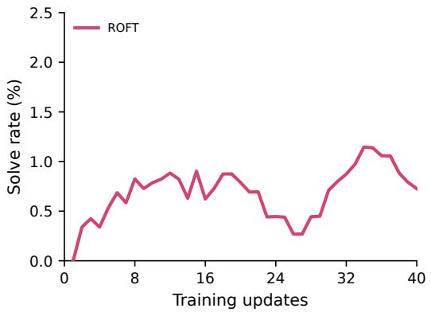  
(a) Django 15554: 40 updates.

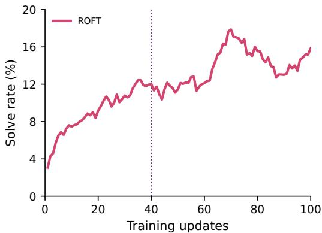  
(b) Pylint 6386: 100 total updates.  
Figure 12: Online solve rates for Django through 40 updates and Pylint through 100 updates, using the smoothing procedure in Sec. F.1. The dotted line at update 40 marks the checkpoint from which Pylint training resumes. Vertical scales differ.

Fig. 13 extends the main-text SymbiFlow trajectory to 60 updates of the same run. Its smoothed solve rate reaches 4.49% at update 60, the highest value within this interval.

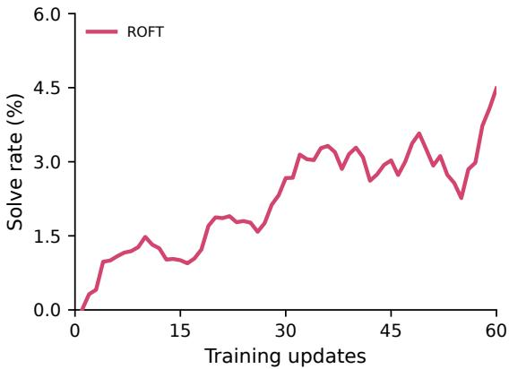  
Figure 13: Online solve rate for SymbiFlow 17 through 60 updates, extending the trajectory in Fig. 6b with the same smoothing procedure.

## F.3 TEST-SET PERFORMANCE AFTER SINGLE-TASK TRAINING

Fig. 14 reports SWE-bench Verified solve rates for the four single-task runs after 40 optimizer updates. Each frozen checkpoint is evaluated on all 500 tasks with one attempt per task, using temperature 1.0, top- $- p = 1 . 0 ,$ a 100-turn limit, a 131,072-token context, and at most 8,192 generated tokens per turn. Retrospection and context compaction are disabled during evaluation.

We retain all 500 tasks in each denominator, counting execution failures as unresolved. The SymPy, Django, and Pylint training instances remain in the evaluation set. SymbiFlow’s training instance is from SWE-rebench.

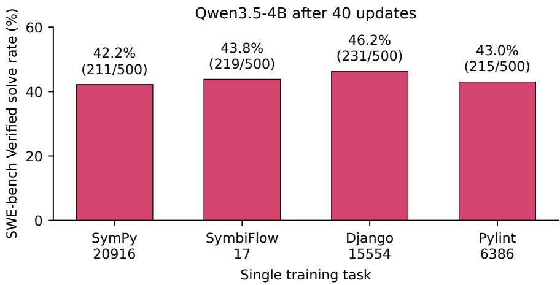  
Figure 14: SWE-bench Verified performance after 40 updates of single-task ROFT from Qwen3.5-4B. Each bar reports an evaluation over all 500 tasks; labels give the solve rate and solved/total count. The single training instance is not excluded for the three runs trained on Verified tasks. Execution failures count as unresolved.

## G BEHAVIORAL ANALYSES

## G.1 LIKELIHOOD CHANGES BY TURN CORRECTNESS

Fig. 15 compares how retrospection-only training (RR) and GRPO change the likelihood of recorded assistant turns, grouped by correctness. We evaluate both methods after 10, 20, 30, and 40 optimizer updates, using the same turns and the initial Qwen3.5-4B model as the reference.

Trajectory labeling. We use 256 trajectories generated by the initial model on SWE-rebench-767 and retained in the first accepted batch of an earlier GRPO run. Each turn comprises the assistant’s reasoning and actions. GPT-6 Astra labels every turn using the complete task, trajectory, tool observations, submitted patch, and final verdict. The labeling rubric distinguishes correct turns, whose substantive reasoning and actions are supported by the evidence and valid for solving or checking the task; incorrect turns, for which the evidence establishes a substantive error; mixed turns, containing both correct and incorrect elements; and uncertain turns, for which the record is insufficient to judge. The judge has no access to checkpoint scores or external tools. We validate turn coverage and evidence references, then hold the labels fixed across methods and checkpoints. Two trajectories exceed the judge’s context limit and are excluded, leaving 254 trajectories with 14,200 labeled turns: 8,537 correct, 2,082 incorrect, 3,522 mixed, and 59 uncertain.

Scoring likelihood changes. For each checkpoint, we teacher-force the original tokens using the same recorded histories. For a turn s containing n<sub>s</sub> assistant tokens $x _ { s , 1 : n _ { s } }$ after history $h _ { s } ,$ , we compute the change in mean token log-likelihood:

$$
\Delta _ { s } ^ { ( u ) } = \frac { 1 } { n _ { s } } \sum _ { j = 1 } ^ { n _ { s } } \left[ \log \pi _ { u } ( x _ { s , j } \mid h _ { s } , x _ { s , < j } ) - \log \pi _ { 0 } ( x _ { s , j } \mid h _ { s } , x _ { s , < j } ) \right] ,\tag{4}
$$

where $\pi _ { 0 }$ is the initial model and $\pi _ { u }$ is the checkpoint after u updates. The history contains only the task and preceding messages and observations; neither future evidence nor correctness labels are supplied during scoring. We evaluate assistant-token probabilities with dropout disabled and temperature one, using BF16 logits and FP32 log-softmax reductions. A turn’s likelihood is classified as increased if $\Delta _ { s } ^ { ( u ) } > 1 0 ^ { - 6 }$ , decreased if $\Delta _ { s } ^ { ( u ) } < - 1 0 ^ { - 6 }$ , and effectively unchanged otherwise, in nats per assistant token.

Aggregation. For each method, checkpoint, and correctness label, we compute the fraction of turns in each likelihood-change category within each trajectory. We then average these fractions equally over trajectories containing that label, so that longer trajectories do not receive greater weight. Each stacked bar in Fig. 15 shows the resulting increased, unchanged, and decreased fractions, which sum to 100%. The annotation above each method gives the increased fraction for correct turns minus that for incorrect turns, in percentage points. Fig. 7a uses the same calculation but shows only the correct and incorrect increased fractions at update 10, without renormalization.

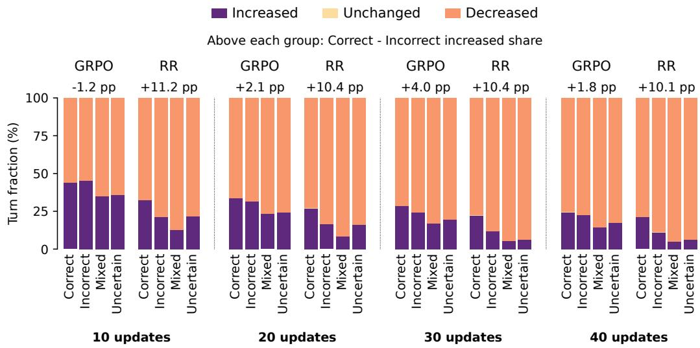  
Figure 15: Likelihood-change directions across training. Each update group compares GRPO with retrospection-only training (RR) on the same recorded turns. Bars show trajectory-balanced fractions for each correctness label: increased likelihood (purple), effectively unchanged likelihood (light yellow), and decreased likelihood (orange), relative to the initial model. Signed annotations give the correct-minus-incorrect increased fraction in percentage points. Fig. 7a displays the correct and incorrect increased fractions at update 10.

Results. Under RR, correct turns increase in likelihood more often than incorrect turns at all four checkpoints. The correct-minus-incorrect gap is larger for RR than for GRPO throughout: 11.20 versus −1.17 percentage points at update 10, and 10.08 versus 1.83 at update 40. At update 40, the correct and incorrect increased fractions are 21.36% and 11.28%, respectively, for RR, compared with 24.57% and 22.74% for GRPO. At this checkpoint, the majority of turns in each of the four correctness categories decrease in likelihood under both methods.

## G.2 ROLLOUT LENGTHS WITH EFFICIENCY-FOCUSED RETROSPECTIONS

We measure coding-rollout lengths under two retrospection instructions: our default prompt and a variant requesting more direct solutions. The task-solving prompt and training objective remain unchanged.

Experimental procedure. We compare two ROFT runs initialized from the same Qwen3.5-4B checkpoint and trained on the same 767-task dataset. Each run performs 40 optimizer updates, using 64 task attempts and four independently sampled retrospections per attempt in each batch. Both successful and unsuccessful attempts contribute training targets. The loss is averaged over retrospection tokens only, with no supervision on task-solving tokens and no length penalty. Both runs use a constant learning rate of $1 0 ^ { ^ { \bullet } - 6 }$ . Task solving uses temperature 1.0, a limit of 100 assistant turns, and at most 8,192 generated tokens per turn. Retrospections use temperature 0.9, an input budget of 24,576 tokens, and an output limit of 8,192 tokens.

Our default prompt asks the model to identify a consequential assumption or decision, explain the relevant evidence, and state a lesson for future attempts. The faster variant instead selects its instruction according to the final test verdict. After a successful attempt, it asks the model to identify avoidable work, such as repeated searches or unnecessary edits, and propose a more direct approach while preserving the checks needed for correctness. After an unsuccessful attempt, it asks for a wrong assumption or decision supported by the evidence and a concrete correction. In both conditions, the retrospection receives the task, recorded trajectory, submitted patch, and test verdict. The complete system instructions are reproduced below.

Rollout-length measurement. Fig. 7b compares training rollouts around the tenth update, pooling batches 8–12 for 320 attempts per condition. We measure generated assistant tokens, including reasoning and actions, and the number of assistant turns in each original coding trajectory. Retrospection generations are excluded, and each attempt contributes once. We report means over all attempts and separately over solved and unsolved attempts, as determined by the final test verdict. Attempts that reach a generation budget remain included. Means weight individual attempts equally, rather than weighting batches or outcome groups equally.

Table 4: Mean coding-rollout lengths around update 10, pooled over batches 8–12. Percentage changes compare the faster-retrospection variant with the baseline. Each attempt receives equal weight.
<table><tr><td></td><td colspan="3">Mean assistant tokens</td><td colspan="3">Mean assistant turns</td></tr><tr><td>Rollouts</td><td>Baseline</td><td>Faster</td><td>Change</td><td>Baseline</td><td>Faster</td><td>Change</td></tr><tr><td>All</td><td>12,674</td><td>11,186</td><td>-11.7%</td><td>47.05</td><td>40.88</td><td>-13.1%</td></tr><tr><td>Solved</td><td>13,064</td><td>11,454</td><td>-12.3%</td><td>48.03</td><td>41.83</td><td>-12.9%</td></tr><tr><td>Unsolved</td><td>12,050</td><td>10,808</td><td>-10.3%</td><td>45.48</td><td>39.56</td><td>-13.0%</td></tr></table>

Results. The faster variant produces shorter rollouts in all three groups (Tab. 4). Across all attempts, it uses 11.7% fewer tokens and 13.1% fewer turns than the baseline. The reductions also hold among solved attempts: 12.3% fewer tokens and 12.9% fewer turns. Among unsolved attempts, token and turn counts decrease by 10.3% and 13.0%, respectively. The solve rates in this window are 61.6% for the baseline and 58.4% for the faster variant.

## Default prompt — both verdicts

You are a software engineer reviewing your own attempt at a coding task. You are given the task, a summary of the actions you took, and the final verdict from the test suite. Write a SHORT reflection (one paragraph, no lists) that: (a) names a consequential assumption or decision; (b) explains what evidence supports or contradicts that assumption or decision; (c) if the assumption or decision was wrong, explains what the correct assumption or decision would be; and (d) identifies concrete triggers for when to apply the lesson.

A passing verdict does not mean that all assumptions or decisions were correct. A failing verdict does not mean that all assumptions or decisions were incorrect. If the evidence is insufficient, state the uncertainty and describe what to try next time to learn more. Do not restate the task. Do not mention that this is a reflection or a review.

## Faster variant — passing verdict

You are a software engineer reviewing your own attempt at a coding task. You are given the task, a summary of the actions you took, your submitted patch, and the final verdict from the test suite. The final test verdict is PASSED.

Faster variant — passing verdict (continued)   
Write a SHORT reflection (one paragraph, no lists) focused on how to   
solve the task faster next time while preserving correctness. Identify   
specific avoidable work in the actual trajectory, such as repeated   
searches, an unnecessary detour, redundant edits, or repeating a test   
without new evidence. Explain a more direct sequence and the evidence   
or concrete trigger that would justify choosing it next time. Keep the   
checks needed to establish correctness; do not substitute premature   
stopping or unverified guesses for a solution. If no shortcut is   
supported, identify an efficient choice worth repeating and explain   
why further shortening would be risky.   
A passing verdict does not mean that all assumptions or decisions were   
correct. Distinguish observed facts from proposed alternatives. Do not   
claim that an untried shortcut succeeds or invent a measured time   
saving. State uncertainty where evidence is insufficient and when new   
evidence would require abandoning the shortcut. Do not mention that   
this is a reflection or a review.

Faster variant — failing verdict   
You are a software engineer reviewing your own attempt at a coding   
task. You are given the task, a summary of the actions you took, your   
submitted patch, and the final verdict from the test suite. The final   
test verdict is FAILED.   
Write a SHORT reflection (one paragraph, no lists) that: (a) names a   
consequential wrong assumption or decision that the supplied evidence   
supports as contributing to the failure; (b) explains what evidence   
contradicts that assumption or decision; (c) explains what the correct   
assumption or decision would be; and (d) identifies concrete triggers   
for when to apply the correction.   
A failing verdict does not mean that all assumptions or decisions were   
incorrect. Do not invent a mistake or a cause that the evidence does   
not establish. If the evidence is insufficient, state the uncertainty   
and describe what to try next time to learn more. Do not mention that   
this is a reflection or a review.

## G.3 FINE-GRAINED TRAJECTORY AND RETROSPECTION-TOKEN ANALYSES

Training batch and one-update checkpoints. We use 64 fixed SWE-rebench-767 problems and one original Qwen3.5-4B trajectory per problem. The trajectories contain 32 successful and 32 unsuccessful attempts. Four retrospections were requested per trajectory; 255 were accepted and one generation was rejected. Retrospections were sampled at temperature 0.9 with a 24,576-token input budget. The frozen batch has 214,072 supervised target tokens. The Uniform checkpoint performs exactly one globally token-normalized retrospection-only update from the base model, using Adam with learning rate $\mathrm { i 0 ^ { - 6 } }$ and gradient clipping at 1. The task and recorded attempt are conditioning context; only the retrospection targets incur prediction loss. The weighting variants described below retain the same base initialization, target batch, optimizer settings, and update count.

Fixed-prefix distribution comparison. For the Uniform checkpoint, we score the 64 original trajectories, comprising 3,604 assistant spans and 1,085,552 assistant-token positions, under both the base and updated models. Each trajectory is included once, independently of its number of accepted retrospections. At assistant position $j ,$ let $h _ { j }$ be the original causal prefix and $x _ { j }$ the recorded token. We compute

$$
K _ { j } = \sum _ { v \in \mathcal { V } } \pi _ { 0 } ( v \mid h _ { j } ) \log \frac { \pi _ { 0 } ( v \mid h _ { j } ) } { \pi _ { 1 } ( v \mid h _ { j } ) } , \qquad d _ { j } = \log \pi _ { 1 } ( x _ { j } \mid h _ { j } ) - \log \pi _ { 0 } ( x _ { j } \mid h _ { j } ) ,\tag{5}
$$

where $\pi _ { 0 }$ and $\pi _ { 1 }$ denote the base and one-update Uniform policies. The full-vocabulary comparison uses saved BF16 logits and FP32 normalizers; all reported values retain their raw signs. The prefixes are identical across checkpoints, with no tool reexecution or newly sampled actions during scoring.

Mechanical grouping and aggregation. We group positions into reasoning, text, tool-call arguments, format delimiters, tool-call syntax, and unknown roles using the serialized rollout text. These labels are distinct from the semantic retrospection labels used for loss weighting. Tool groups preserve the serialized tool name and include reasoning preceding the call; argument tokens in multi-tool calls are assigned to their own tool. Unsupported parameter markup remains unknown. For each category, we first average $K _ { j }$ over its tokens within each contributing task, then average the task means equally. Intervals use 10,000 task-bootstrap resamples. The tool panel in Fig. 8 displays categories with at least ten contributing tasks. For the progress analysis, we use ten equal-width bins of normalized assistant-turn progress, applying the same within-task then across-task averaging. Counts for each bin appear in Fig. 16.

Distributional results. The global task-balanced mean KL is $3 . 2 7 8 9 3 \times 1 0 ^ { - 4 }$ nats, with 95% interval $[ 3 . 0 7 2 6 8 , 3 . 5 0 5 9 2 ] \times 1 \bar { 0 } ^ { - 4 }$ . The token-weighted mean is $3 . 1 1 5 9 4 \times 1 0 ^ { - 4 }$ nats, the median is $1 . 7 4 0 \dot { 6 } 3 \times 1 0 ^ { - 6 }$ , and the maximum is 0.778787. Task-balanced role means, in units of $1 0 ^ { - 4 }$ nats, are 5.71843 for reasoning (64 tasks), 3.12641 for text (64), 1.65515 for arguments (62), 0.43545 for delimiters (64), and 0.24240 for call syntax (62). The unknown-role category contains 1,001 tokens from five tasks and has mean 8.62500 in the same units. Tool means are 4.30960 for Glob (56 tasks), 3.73144 for Read (62), 3.19321 for Bash (58), 2.75738 for Write (14), 2.27982 for Edit (58), and 3.72441 for spans without a tool call (52). The command-category means are 3.82981 for read/search commands and 2.53292 for edits. The first progress decile has mean 4.12157, compared with 2.99964 in the last decile, again in units of $1 0 ^ { - 4 }$ nats. The minimum estimated KL is $- 3 . { \dot { 9 } } 7 9 4 7 \times 1 0 ^ { - 6 }$ nats: 226,337 positions have negative estimates, and 608,045 positions (56.0%) have absolute KL at or below its magnitude. No negative values are clamped in the summaries or token windows.

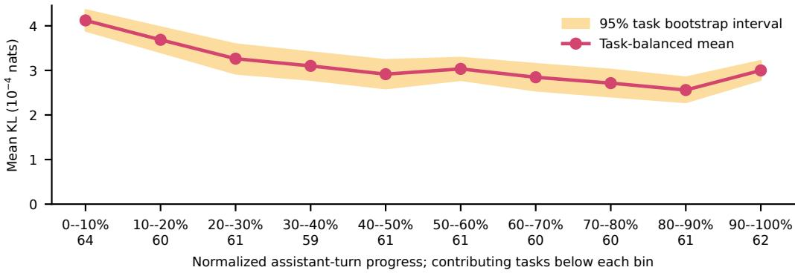  
Figure 16: Distributional change across rollout progress. Task-balanced forward KL between the base and one-update Uniform policies, grouped by normalized assistant-turn progress. The band shows the 95% task-bootstrap interval. Counts below the bins give the number of contributing tasks.

Retrospection-token interventions. Uniform assigns raw weight 1 to every supervised target token. Thinking-down and thinking-up assign raw weight 0.5 or 2, respectively, to mechanically identified thinking tokens and 1 elsewhere. Evidence-up, correction-up, and lesson-up each assign raw weight 2 to tokens in the selected semantic category and 1 elsewhere. Evidence denotes observations, test results, errors, or concrete behavior supporting or contradicting a decision; correction denotes a task-specific replacement assumption, action, or fix; lesson denotes a reusable decision rule or trigger. GPT-6 Astra annotations cover all 255 accepted retrospections. The fixed character-span labels are mapped onto the target tokens. The selected categories contain 71,226 evidence tokens, 25,591 correction tokens, and 21,347 lesson tokens. Other, mixed, uncertain, boundary-neutral, and control tokens retain raw weight 1 in these category-based variants.

Attention-up uses the original base model’s attention to the user-prompt content, which includes the recorded trajectory. For each nonstructural retrospection target token, we measure the total attention mass assigned to that content at the causal position immediately preceding the token, then average over 16 query heads and eight full-attention layers. If this mean mass is $m _ { i } .$ , the token receives raw weight $a _ { i } = 1 + m _ { i } ;$ structural control tokens retain raw weight 1. Unlike the category-based doubling interventions, this is a continuous weighting rule. The scores are fixed before training, measured before the attention output gate, and exclude the model’s 24 linear-attention layers.

For $N$ supervised tokens with raw weights ${ { a } _ { i } } ,$ , each intervention uses

$$
\widetilde { a } _ { i } = \frac { a _ { i } } { N ^ { - 1 } \sum _ { k = 1 } ^ { N } a _ { k } } , \qquad \mathcal { L } _ { \mathrm { w e i g h t e d } } = - \frac { 1 } { N } \sum _ { i = 1 } ^ { N } \widetilde { a } _ { i } \log \pi _ { \theta } ( y _ { i } \mid h _ { i } ) .\tag{6}
$$

Here $h _ { i }$ contains the task, recorded attempt, supplied feedback, and preceding retrospection tokens for target position i. Normalization is global across the target batch, not per retrospection or per semantic category. The targets and conditioning contexts are unchanged.

Fresh solving evaluations. We compare Uniform with six reweighted variants, each a fixed oneupdate checkpoint evaluated on the same 64 problems with ten repetitions. This comparison includes 640 graded attempts per model and 4,480 in total. Attention-up comes from a follow-up experiment that reuses the original Uniform evaluation, with identical task–seed assignments and inference settings; the control is not rerun or counted twice. Randomization is paired by task and repetition across models. Decoding uses temperature 1, at most 8,192 generated tokens per turn, 100 turns, and 131,072 context tokens. No new training or retrospection generation occurs during these evaluations, and saved retrospections are not included in the solver context.

Performance estimator and standard errors. The solve rate is the mean binary outcome over all 640 attempts, equivalently the average of the 64 task-specific ten-attempt means. Contrasts against Uniform pair task and repetition IDs. The fixed-panel bootstrap resamples ten paired repetitions independently within each task, then averages over all 64 tasks, using 10,000 bootstrap resamples. The fixed-panel error bars in Fig. 8 quantify uncertainty in the mean paired difference on these fixed tasks; they show the observed mean plus or minus one bootstrap standard error. We estimate this standard error as the sample standard deviation of the 10,000 resampled mean differences, using denominator 9,999. Tab. 5 reports scores for Uniform and the six reweighted variants, with these same standard errors for changes relative to Uniform. Attention-up solves 350/640 problems (54.69%), compared with 324/640 (50.63%) for Uniform, a +4.06 percentage-point change. Correction-up and evidence-up yield +3.75 and +3.59 points.

<table><tr><td>Model</td><td>Solved</td><td>Rate</td><td>∆ vs. Uniform</td><td>SE (pp)</td></tr><tr><td>Uniform</td><td>324/640</td><td>50.63%</td><td></td><td></td></tr><tr><td>Thinking-down</td><td>318/640</td><td>49.69%</td><td>-0.94</td><td>2.28</td></tr><tr><td>Thinking-up</td><td>330/640</td><td>51.56%</td><td>+0.94</td><td>2.23</td></tr><tr><td>Evidence-up</td><td>347/640</td><td>54.22%</td><td>+3.59</td><td>2.26</td></tr><tr><td>Correction-up</td><td>348/640</td><td>54.38%</td><td>+3.75</td><td>2.12</td></tr><tr><td>Lesson-up</td><td>344/640</td><td>53.75%</td><td>+3.13</td><td>2.15</td></tr><tr><td>Attention-up</td><td>350/640</td><td>54.69%</td><td>+4.06</td><td>2.17</td></tr></table>

Table 5: Repeated-evaluation results on the fixed 64 training problems. Rates average ten attempts per task. Changes relative to Uniform and their standard errors (SE) are in percentage points. SEs resample paired repetitions independently within each of the 64 fixed tasks.

## G.4 TOKEN-LEVEL EXAMPLES

Selection and measurements. We select each original trajectory’s highest raw forward-KL position, rank those peaks by descending KL, and break ties by original dataset order. Fig. 17 shows the three highest peaks, with 24 tokens on either side of each selected position. These are original action-trajectory tokens, not retrospection targets. We use the fixed-prefix measurements defined in Eq. (5).

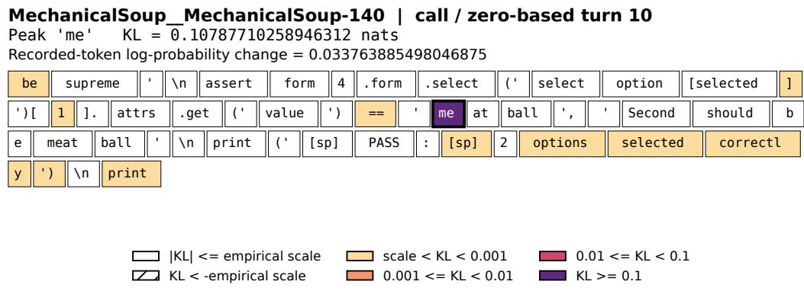

Sphinx: a generated check for EPUB links. The sphinx-doc/sphinx-5107 window comes from a Bash command that writes a Python script to build EPUB documentation and inspect whether internal link fragments match their target identifiers after colon-to-hyphen conversion. The selected token is h inside no colons in hrefs, in a diagnostic print statement, at zero-based assistant turn 56, token offset 1195. It has the largest recorded forward KL in the study: $K _ { j } = 0 . 7 7 8 7 8 6 7 0$ nats. Its recorded-token log-probability change is $d _ { j } = - 0 . 9 5 4 6 2 0 3 6$ nats, while full-distribution entropy increases by 1.11707091 nats. The saved script defines the variable to be true when no link fragments contain colons, but prints PASS when that condition is false. The selected peak occurs in the preceding print statement.

Black: malformed tool markup. For psf/black-1361, the selected newline is at zero-based assistant turn 75, token offset 55: $K _ { j } = 0 . 1 9 1 0 9 9 3 5$ nats and $d _ { j } = - 0 . 5 0 7 7 6 4 8 2$ . Its parameter markup is unparsed, and its tool and role labels are unknown.

MechanicalSoup: a value in a test assertion. For MechanicalSoup/MechanicalSou p-140, the selected me token in meatball is at turn 10, offset 781: $K _ { j } = 0 . 1 0 7 8 7 7 1 0$ nats and $d _ { j } = + 0 . 0 3 3 7 6 3 8 9$ . It is a Bash argument within an assertion on the second selected option’s value.

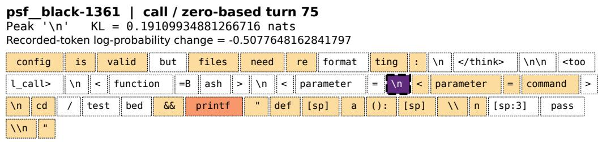  
Figure 17: Token-level forward-KL measurements. Original 49-token rollout windows for sphinx-doc/sphinx-5107 (top), psf/black-1361 (middle), and MechanicalSoup/MechanicalSoup-140 (bottom), colored by forward KL in nats after one Uniform update. Thick borders mark the selected peaks; dashed borders indicate non-exact parsing metadata. The Black peak has unknown tool and role labels because its parameter markup is malformed. The Sphinx and MechanicalSoup peaks are parsed Bash arguments. White cells have absolute KL at or below the magnitude of the minimum recorded KL, $3 . { \overset { \smile } { 9 } } 8 \times 1 0 ^ { - 6 }$ nats.

## H ABLATIONS

The Qwen3.5-4B ablations initialize from the same base checkpoint and train on SWE-rebench-767. Each optimizer update uses 256 nominal retrospection targets and minimizes token-normalized cross-entropy with a constant learning rate of $1 0 ^ { \dot { - } 6 }$ . The conditioning context is masked, and only retrospection tokens incur loss.

## H.1 RETROSPECTION WITH AND WITHOUT A VERDICT

We compare verdict-conditioned retrospection with a variant that omits the final grader feedback. Each optimizer update uses 64 source coding attempts and four independently sampled retrospections per attempt.

The verdict-conditioned run is the baseline used in the main generalization comparison. Its retrospection context includes the task, trajectory evidence, patch, and final verdict. The no-verdict run supplies only the final patch and a chronological trajectory summary. It omits the separate task description, final outcome label, reward values, termination metadata, grader-selected test targets, and final grader logs. Pre-grading reasoning, actions, and tool observations, including tests executed by the solving agent, remain in the trajectory. The same fitted conditioning context is used for generation and masked SFT. Source attempts are still graded for metrics and validity handling; grades neither select the retrospection instruction nor supply loss weights.

We evaluate both checkpoints after 20 successful optimizer updates, with top-p = 1.0 and at most 8,192 generated tokens per turn. As shown in Fig. 18, both checkpoints resolve 246/500 tasks, yielding 49.2% with the verdict and 49.2% without it.

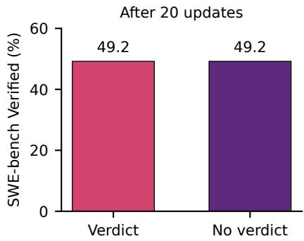  
Figure 18: Retrospection with and without a final verdict. SWE-bench Verified solve rates after 20 optimizer updates from Qwen3.5-4B on SWE-rebench-767. Each bar reports the percentage of all 500 tasks resolved: 49.2% with a verdict and 49.2% without one (246 tasks in each case).

## H.2 ONLINE, OFF-POLICY REFLECTIONS, AND OFFLINE RR

Fig. 9a compares three ways of constructing retrospection supervision.

Online RR. The control is the verdict-conditioned run in Sec. H.1. The evolving learner generates both coding attempts and retrospections. Updated learner weights are used for subsequent solving and reflecting. Generation is asynchronous; rollouts can begin under earlier optimizer states.

Off-policy reflections. Coding attempts still come from the evolving learner and receive the ordinary environment verdict. A separate, immutable copy of the original base model generates all four retrospections for each attempt. It receives that learner attempt’s task, trajectory evidence, patch, and verdict; it does not generate a replacement coding attempt. Only the learner is optimized. The eight-B200 allocation is split into four training GPUs, three learner-serving GPUs, and one frozen-reflector GPU, rather than the control’s four training and four shared inference GPUs.

Offline RR. We first generate a fixed dataset without any learner updates. For each of the 767 training problems, the frozen base model attempts two independent solutions; after grading each attempt, that same base model samples four retrospections. After filtering invalid generations and excluding attempts with no model response, the corpus contains 6,066 retrospections. A separately initialized learner trains on this immutable corpus in shuffled batches of 256 targets, reusing examples if needed. No solving or retrospection generation is refreshed during training; the corpus remains fixed throughout.

Checkpoints and evaluation. The online control and off-policy-reflection arm use the checkpoints after 20 successful optimizer updates. The online result is 246/500 (49.2%), as in the main comparison. Off-policy reflections and offline RR solve 237/500 (47.4%) and 240/500 (48.0%).

## H.3 NUMBER OF RETROSPECTIONS PER ROLLOUT

We compare 2, 4, and 8 independently sampled retrospections per source rollout. The respective source batch sizes are 128, 64, and 32, yielding 256 nominal retrospection targets per optimizer update. Empty, failed, or truncated retrospections are dropped rather than duplicated to fill the batch, so the accepted target count can be smaller than 256.

Fig. 9b evaluates each run after ten successful optimizer updates. Evaluations allow at most 8,192 generated tokens per turn. The 2-, 4-, and 8-retrospection settings solve 239, 245, and 231 problems, respectively.

The 4-retrospection control has the highest observed score, and the three scores span 2.8 percentage points.

## H.4 SCALING TO QWEN3.5-9B

We initialize both methods from Qwen3.5-9B and train on SWE-rebench-767 with four training and four inference B200 GPUs. ROFT uses 64 source attempts and four retrospections per attempt; GRPO uses 32 accepted groups of eight attempts. Both allow generation to lag the learner by at most three updates, use at most 8,192 generated tokens per coding turn, and apply no assistant-length penalty. RR samples retrospections at temperature 0.9 with a 24,576-token input budget. GRPO trains for 40 updates and ROFT for 20 updates. Training-cost accounting follows App. E.

At 20 updates, ROFT uses 1.93 hours and 1,727 completed solution attempts, compared with 5.33 hours and 7,152 for GRPO. The corresponding checkpoints solve 294/500 and 279/500 SWE-bench Verified tasks (58.8% and 55.8%; Fig. 9c).